# Állami Számvevőszék

## JELENTÉS

a DIMAG Rt. privatizációjáról, a kohászati vertikumhoz tartozó társaságok működési támogatásának felhasználásáról
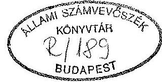

---

A vizsgálatot vezette:
Harsányi Sándor osztályvezető főtanácsos

A vizsgálatot végezte:
Lörinc Alajos számvevő tanácsos
Makkai Mária számvevő tanácsos

---

I. BEVEZETÉS
A VIZSGÁLAT ELŐZMÉNYEI ÉS KÖRÜLMÉNYEI ..... $1-4$
II. A MEGÁLLAPÍTÁSOK ÖSSZEFOGLALÁSA, JAVASLATOK ..... $5-11$
III. RÉSZLETES MEGÁLLAPÍTÁSOK ..... 12

1. A kohászati vállalat privatizálása ..... 12
1.1. A DIMAG Rt. értékesítése ..... $12-16$
1.2. Tulajdonviszony alakulása, rendezése ..... $16-21$
1.3. A privatizált társaság működése ..... $21-26$
2. A kohászati termelés kormányzati támogatása ..... 27
2.1. Támogatási szükséglet meghatározása és folyósítása ..... $27-33$
2.2 A működési támogatás gyakorlati felhasználása ..... $33-38$
2.3. A felszámoló termelés szervezési tevékenységei ..... $38-46$
2.4. A megkezdett korszerűsítő és önköltségcsökkentő beruházások befejezése, üzembe állítása ..... $46-50$

---

# JELENTÉS

a DIMAG Rt. privatizációjáról, a kohászati vertikumhoz tartozó társaságok működési támogatásának felhasználásáról

## I.

## BEVEZETÉS, A VIZSGÁLAT ELŐZMÉNYEI ÉS KÖRÜLMÉNYEI

A vizsgálatot az Állami Számvevőszék 1993. II. félévi ellenőrzési terve írta elő.

Az ellenőrzés célja az volt, hogy megvizsgálja az Állami Vagyonügynökség (ÁVÜ) hatáskörében korábban "titkos"-nak minősített privatizációs tranzakció lebonyolítását, az ÁVÜ és az érintett kormányszervek lépéseinek kihatásait, a szerződő felek kötelezettségeit és azok teljesítését. Felmérje továbbá, hogy a DIMAG Rt. kohászati termelésének fenntartására nyújtott kormányzati támogatások miként hasznosultak a működtetési célok teljesítése érdekében.

Az ellenőrzés átfogta az ÁVÜ, az Ipari és Kereskedelmi Minisztérium (IKM), a felszámolással megbízott REORG Rt., valamint a Diósgyőri Nemesacél Művek Kft. (DNM) kapcsolódó tevékenységét.

A helyszíni ellenőrzés 1993. október 15-től november 20-ig tartott.

---

Az ellenőrzés az állami tulajdonú gazdálkodó szervezeteknél, az ÁVÜ-nél, az államigazgatási intézményeknél a szabályszerűség mellett a döntés-előkészítési és döntés-végrehajtási folyamatokat abból a szempontból is vizsgálta, hogy ezen intézmények mit tettek a tranzakciós kockázatok csökkentése, az állami tulajdonosi érdekek érvényre juttatása érdekében.

A vizsgálat irányultságát befolyásolta, hogy bár az ellenőrzés alapvetően a kohászati vertikumhoz tartozó társaságok működési támogatásának felhasználására irányult, ennek ellenőrzése, a tapasztaltak megítélése megkövetelte a DIMAG Rt. privatizáció folyamatának feldolgozását, sőt annak rövid bemutatását is, hogy az azt közvetlenül megelőző időszakban milyen helyzet alakult ki. Figyelembe kellett ugyanis venni, hogy a privatizáció körülményeit és ebben az ÁVÜ tevékenységét is a jogelőd, az egykori Lenin Kohászati Művek (LKM) működésénél és átalakításánál kialakult csődhelyzet határozta meg. Ezen, az azóta méginkább elmélyülő válságon, gazdasági lehetetlenségi folyamaton belül csak közbülső fázisnak tekinthetők a jelentésben bemutatott privatizációs lépések is.

Az előzményekhez tartozik, hogy az LKM a társasági átalakulást megelőzően 1987. évben mintegy 16 Mrd Ft nettó árbevételt realizált és több mint 15 ezer főt foglalkoztatott. A termelés hatékonysági problémáit mutatja, hogy az LKM helyzetével a legfelső szintű állami döntéshozó szervek 1986-88 között is már több alkalommal foglalkoztak. Pénzügyi-elszámolástechnikai könnyítésekre irányuló határozatokkal mentesítették az egységet 6,2 Mrd Ft állami kölcsön és 1,1 Mrd Ft hitel és kamatainak megfizetése alól. Ezek az intézkedések a vállalat pénzügyi nehézségeit csak elodázták, a vállalat likviditási helyzetét azonban nem biztosították.

---

A vállalat szervezetének átalakítását 1988-ban kezdték meg, 1990. január 1-től DIMAG Rt. vállalatcsoportként működött. A technológiailag, üzemeltetésileg összefüggő termelőrendszert 42 db jogi és nem jogi személyiségű gazdálkodó egységre bontották. A Társaság alaptőkéje 11,4 Mrd Ft volt, mely a telekingatlanokat érték nélkül tartalmazta. A vállalatcsoport tagjai a termelő és kiszolgáló tevékenység egy-egy aprózott részét, "szeletét" végezték, az egymásra épülő kohászati termelő tevékenységet 7 "önálló" társaság volt hivatva folytatni.
A társasági átalakulás meghirdetett célja az volt, hogy az önálló egységek önszámoltatásának megvalósításán keresztül a racionális gazdálkodást és hatékony működést biztosítsa, valamint segítse elő a "célirányosan decentralizált külföldi tőke" bevonását. A privatizációval, illetve tőkebevonással kapcsolatos tárgyalásokat a DIMAG Rt. akkori vezetői kezdték meg a kohászati alapanyag beszállítójával. A tranzakció szakmai előkészítésébe a Pénzügykutató Rt.-t vonták be.

A célok nem teljesültek. Az alacsony alapítási tőke következtében működésképtelen társaságok jöttek létre. A kohászati termelés irányítása megnehezült, a tőke hiánya fokozódott, a termelés körülményei a pénzügyi lehetetlenség felé tartottak.

A privatizáció előkészítése, a Társaság ügyeivvel való foglalkozás 1991. II. félévétől az ÁVÜ koordinációjával folyt majd a DIMAG Rt. részvényeinek részletes értékesítési feltételeit az ÁVÜ Igazgatótanács 1991. november 26-i határozatában rögzítette.

A vizsgálat során a privatizációs folyamat feldolgozását, a különböző lépések oksági összefüggéseinek elemzését megnehezítette az a körülmény, hogy a tranzakció lebonyolításában eljáró ÁVÜ munkatársak a helyszíni ellenőrzés időpontjában már hosszabb ideje nem álltak munkaviszonyban a szervezettel. További gondot okozott, hogy az "értékesítés" nyomán olyan helyzet alakult ki,

---

melyben a "magántulajdonosnál" lévő iratokhoz sem az ÁVÜ sem más állami szerv nem jutott hozzá, s csak évek múltán, a teljes lehetetlenség, választottbírósági ítélet, s a megindult felszámolási eljárás tette lehetővé - 1993. őszén -, hogy az állam képviselői ismét birtokon belül kerüljenek.

Az ÁVÜ belső mechanizmusa csak fokozatosan tette zártá a tranzakciók lebonyolításával kapcsolatos személyes kötelezettségeket és felelősségeket. Így hosszú ideig szabályozatlan volt az értékesítési és egyéb folyamatokról a vezetés felé történő információadás rendszere is. Ez a körülmény a DIMAG Rt. privatizációs lépéseiben is meghatározóan hatott vissza. Ennek tulajdonítható, hogy bár a DIMAG üggyel később a belső ellenőrzés is foglalkozott, nincs azonban dokumentum tapasztalatainak visszacsatolásáról az Igazgatótanács részére.

Az érintett vezető és nem vezető munkatársak időközbeni eltávozásán túl, az Igazgatótanács határozatai és az Ügyvezetés intézkedései közötti eltéréseket elemző írásos dokumentumok hiánya azzal a következménnyel jár, hogy az Ügyvezetésen belül, az érintett vezető és nem vezető munkatársak személyi felelősségének pontos rögzítéséhez olyan meghallgatásokra van szükség, melyre csak a munkáltató jogosult.

Az ellenőrzés az érintett állami szervek, s ezen belül a meghatározó szerepű ÁVÜ tevékenységét, mint főfelelős szervezetét vizsgálta, az Ügyvezetés lépéseit minősítette, s ennek megfelelően tette meg javaslatait a Kormány, illetve az illetékes miniszterek felé. (A privatizációért felelős miniszteri státuszt a DIMAG Rt.-vel kapcsolatos tranzakciót követő időszakban létesítették.)

---

# A MEGÁLLAPÍTÁSOK ÖSSZEFOGLALÁSA, JAVASLATOK

A privatizáció körülményeit az jellemezte, hogy a rendkívüli mértékben eladósodott társaság kibontakozásának elősegítéséhez hiányzott az egységes - kohászatot érintő - iparpolitikai koncepció, amely jelenleg is csak kidolgozás alatt áll. Az adott körülmények között a privatizáció csak a térség napi foglalkoztatási-, működtetési céljainak teljesítésére irányulhatott.

A fizetésképtelen, az akkor ismertek szerint mintegy 9 Mrd Ft-os adósságállományú és kohászati termelését leállítani kényszerült, így jelentősen lecsökkent üzleti értékű Diósgyőri Metallurgiai és Alakítástechnológiai Gyárak Rt.-t (DIMAG Rt.) befektetői kezdeményezésű privatizáció keretében a SZOJUZRUDA-NUEVOMETÁL konzorcium 1991. december 29-i adás-vételi szerződés alapján vásárolta meg, az ÁVÜ tulajdonában lévő 9,1 Mrd Ft-nyi részvények névértékének mindössze 5,7%-os vételára mellett.

A befektetők (vevők) 1991. I. negyedévétől a DIMAG Rt. kohászati alapanyag beszállítói. Az adásvétel időpontjában a vételár jelentős részét fedezni képes követelésük volt a DIMAG Rt.-vel szemben.

A vevők a szerződés megkötését követően a vételár törlesztését nem kezdték meg, fizetési kötelezettségeik teljesítését mindvégig elmulasztották, ezzel szemben a vételárba beszámítható engedményezés fedezetét képező követeléseiket a DIMAG Rt.-től kivonták.

A szerződéstől eltérő magatartást az a körülmény tette lehetővé, hogy a vételár megfizetése nélkül is birtokolhatták a társaság több mint 40%-os tulajdoni hányadát, valamint a szavazati jog átruházása formájában közel teljeskörűen megszerezhették a társaság feletti irányítási hatáskört.

---

Ez a tulajdonosi helyzet és irányítási jogosultság 1991. december 29-től 1993. szeptember 30-ig tartott, amikor a Választott Bíróság az adás-vételi szerződést - többek között az ún. átruházott követeléseket tartalmazó szerződési kellék hiányában - érvénytelennek minősítve kötelezte a feleket az eredeti tulajdonosi állapot visszaállítására.

Az állami vagyon védelme szempontjából hátrányos helyzetet az okozta, hogy az ÁVÜ Ügyvezetés képviseletében eljáró munkatársak az adás-vételi szerződés megkötésénél több pontban, az állami tulajdon sorsát alapvetően érintő, a kockázatok csökkentésére hivatott garanciális kérdésekben eltértek az IT határozatában foglalt feltételektől. Nincs írásos nyoma, hogy lépéseikben milyen - megítélésük szerinti és az IT döntés időpontjában ismerttől eltérő - esetleges kényszerítő körülmények játszottak szerepet, s miért hozták létre egy hiányos, egyes vonatkozásokban az eladóra kifejezetten hátrányos szerződést. A vevők birtokba helyezésekor, az irányítási jogosultság átruházásánál nem jártak el körültekintően. Így állt elő, hogy a vevő pénzügyi teljesítése elvált a tulajdonosi jog átruházásától, s ez később sorsdöntőnek bizonyult.

Az ÁVÜ ügyvezetésének érintett munkatársai az eltérésekről, s annak esetleges - vélt vagy valós - indokairól még utólag sem tájékoztatták az IT-t és az ügyvezető igazgatót. Hasonlóan jártak el akkor is, amikor a vevő szerződéses kötelezettségeit elmulasztotta és arról tudomást szereztek.

Az 1990-1992. évekről szóló ÁSZ jelentések az ÁVÜ belső működésének szabályozottsági hiányosságait, az információs rendszerrel kapcsolatos gondokat és az ezzel járó kockázatokat nyomatékosan kifogásolták. Felhívták a figyelmet a belső ellenőrzés hiányára, a döntések végrehajtásáról visszajelzés elmaradásának veszélyére. Az ÁVÜ - bár több év késéssel - megfelelő rendszerek kiépítésével és a belső ellenőrzés feladatkörének bővítésével ma már nagyrészt rendezte az említett belső-szabályozási, szervezeti, eljárási problémákat. Az ÁSZ által jelzett körülmények azonban a tranzakció időszakában fennálltak és kizárták a DIMAG privatizáció rendszerszemléletű kezelését.

Az ÁVÜ Ügyvezetésének ilyen eljárása nyomán tulajdonosi pozícióba került konzorcium, illetve a képviseletet ellátó és a DIMAG Rt. elnök-vezérigazgatói posztját betöltő menedzser egy fillér kifizetése nélkül került olyan helyzetbe, hogy a kohászat folyamatos működtetésére vonatkozó vállalásának teljesítésétől is elzárkózhatott. Az 1991. december 12-én leállított nagyolvasztóban a termelés 1992. február 7-én ugyan beindult, majd május 27-én ismét leállt. Az átmeneti működési időszakot is különböző - a közüzemi szolgáltatók korlátozásai miatti - termelési zavarok jellemezték.

Ebben a helyzetben a Kormány szintjén sem volt megfelelően biztosítható az állami érdekek képviselete és érvényesítése. A foglalkoztatási válság megelőzése érdekében a Kormányzat kényszerhelyzetben, 1992. április 2-a és augusztus 6-a között négy alkalommal foglalkozott a DIMAG Rt. helyzetével és egyre átfogóbb támogatási formákra hozott határozatokat. Ez azonban nem akadályozhatta meg, hogy a gazdálkodási egyensúlyát vesztett részvénytársaságnál, a holdinghoz tartozó mintegy 42 különböző társaságnál a felszámolási eljárások láncreakció módjára ne terjedjenek.

A dokumentumok szerint ÁVÜ Ügyvezetésének figyelmét a problémák kiéleződése után a válságkezelés kötötte le, majd a helyzet felismerése után több kísérletet tett a jogszerű tulajdoni állapot helyreállítására. A szerződéses kötelezettségeit nem teljesítő partnerekkel szembeni fellépéshez igyekezett áttekinteni az állami vagyon kárára eszközölt lépéseiket, s fellépni azokkal

---

szemben. Kísérleteit azonban a magánvevők - birtokon belül lévén - rendre meghiúsíthatták. Az 1993. szeptemberi, az eredeti állapot visszaállítását elrendelő Választott Bírósági határozat, valamint a DIMAG Rt. felszámolását kihirdető 1993. október 7-i határozat ezeket a korlátozásokat megszüntette. Jelenleg már az ÁVÜ, illetve a felszámoló rendelkezésére áll a DIMAG Rt. teljes irat- és információs bázisa a szükséges felmérési és bizonyítási eljárások lefolytatásához.
1992. július 10-től a DIMAG Rt.
 kohászati vertikumának működtetését az állami tulajdonban lévő REORG Rt. felszámoló társaság vette át. Az 1992. április 2-án hozott kormányhatározat egy miniszteri biztos beállítása mellett 1,5 Mrd Ft összegű és csak részlegesen igénybevett állami garancia nyújtását rögzítette a magánszemélyek vezetése alatt álló DIMAG Rt.-nek, az ezt követő kormányhatározatokban nyújtott működési támogatások azonban már a felszámoló szervezeten keresztül áramoltak a kohászati vertikumhoz.

A kormányzat 1992-1993-ban a DIMAG Rt. kohászati termelésének fenntartására, valamint a térségi foglalkoztatás biztosítására a REORG Rt.-n keresztül kamatmentes hitel, illetve veszteségtérítés formájában összesen 4412 millió Ft támogatást folyósított, továbbá a felfüggesztett (önköltségcsökkentő) beruházások befejezéséhez 600 millió Ft hitel felvételéhez garanciát nyújtott.

A diósgyőri nagyolvasztó újraindítására, valamint a kohászati termelés fenntartására - az IKM vezetésével a DIMAG Rt. valamint a felszámoló adatszolgáltatási alapján - 1992. júliusban elkészült egy válságmenedzselési program és ez volt az alapja a kormányzat támogatásának. Az e programban szereplő termelési és költség-előirányzatok teljesítése azonban nem képezte az időszaki támogatások nyújtásának feltételrendszerét, hanem azok folyósításánál automatizmus érvényesült. A diósgyőri kohászati vertikum működtetésére összevontan meghatározott célokat, vagyis

---

a nagyolvasztó működésének újraindítását és a folyékony útvonal termelésének fenntartását, a folyamatos foglalkoztatást, valamint a tervezett fejlesztéseket a REORG Rt. az előirányzott pénzügyi támogatások mellett az elmúlt időszakban így teljesíthette!

A Kormány által nyújtott működési támogatás lehetővé tette a már több hónapja álló termelés újraindítását és fenntartását a DNM Kft.-nél. A működési támogatás igénybevétele a pénzügyi ütemtervnek megfelelően történt. Az 1992. II. félévi tervhez képest a tényleges kiadások és bevételek is jóval alatta maradtak az előirányzottnak. Foglalkoztatás tekintetében a DIMAG Rt.-nél és a DNM Kft.-nél együtt közel 5200 főnek munkát biztosítottak. A megvalósított korai nyugdíjazás költségeinek döntő részét is állami pénzekből fedezték, illetve fedezik.

A REORG Rt. hagyományos felszámolási tevékenységét korlátozta, hogy a kohászati vertikum működtetését képező feladatát jórészt a változatlanul magánszemélyek irányítása alatt álló DIMAG Rt.-től bérelt termelőeszközökkel látta el. A DIMAG Rt. felszámolására irányuló bírósági határozat kihirdetése - a tulajdonosként eljáró magánszemélyek fellebbezései kapcsán - 1992. június 2-től kezdődően 1993. október 7-ig elhúzódott.

A felszámolási eljárás közzétételével a REORG Rt. felszámoló szervezet hatáskörébe került a DIMAG Rt. teljes vagyoni állománya, ezáltal a felszámolási tevékenység lefolytatásának az akadályai elhárultak.

A privatizáció „spontán” megindulásának körülményei, koncepciója, az ÁVÜ Ügyvezetésének mulasztásai, hibái, a túlterhelt ügyintézők által képviselt elfogadhatatlanul nagyvonalú bizalmi elv, majd a problémakezelésben érzékelhető bizonytalanságok, az elmulasztott vagy késedelmes tájékoztatás valamint a foglalkoztatási, üzemeltetési és infrastruktúrális függőségek azt eredményezték, hogy az állam nem tudta tulajdonosi érdekeit megfelelően érvényesíteni. Az egykor - az ingatlanok értéke nélkül is 11 Mrd Ft-ot meghaladó állami vagyon, ma anélkül, hogy az államnak bevétele lett volna, töredékére olvadt. Eközben a kapcsolódó, korábban is hatalmas terhet jelentő kötelezettségek több mint kétszeresére növekedtek, s ma meghaladják a 18 Mrd Ft-ot.

A kohászattal kapcsolatos összefüggő kormányzati koncepció hiánya is közrejátszott abban, hogy a DIMAG vállalatcsoport csődjének privatizáció formájában történő kezelése nem hozta meg a várt eredményt. A privatizációs csődménédzselési kísérlet teljes kudarca a többszörös vagyonvesztés, nagyfokú presztízsveszteséget jelentő erkölcsi és anyagi kárt eredményezett, a következmények teljes sora még ma sem ismert. A felszámolás összességében nem jelenti az ügy lezárását, a térségi problémák megoldását.

Az 1992-93. év folyamán folyósított kormányzati támogatás nagy áldozatok árán, több milliárdos kiadással ugyan biztosította a diósgyőri folyékony vasgyártás működtetését, azonban a tartós megoldást csak a vaskohászat átfogó reorganizációs elképzeléseit megvalósító lépések eredményezhetnek. A döntések meghozatalára rendelkezésre álló idő korlátozott. A hibák és mulasztások nyomán is előállt kényszerpályán a reorganizációs elképzelésekben az állam részvétele nélkülözhetetlen. A kohászati reorganizációnak olyan gazdálkodási körülményeket kell megteremteni, amelyeknél a gazdálkodó egységek képesek az önfenntartásra és ilyen mértékben a térségi foglalkoztatás biztosítására.

A borsodi acélipar reorganizációjára irányuló kormányzati döntés szakmai előkészítése az ÁSZ jelentés lezárásának időszakában zárult le. A fejlesztési tervet az ipari és kereskedelmi miniszter a Kormány részére benyújtotta.

---

A vizsgálati tapasztalatok alapján javasoljuk a Kormánynak, hogy

1. bízza meg a privatizációért felelős minisztert annak kivizsgálásával, hogy az Ügyvezetés egykori és jelenlegi vezetői, munkatársai közül személyi felelősség kit és milyen mértékben terhel a vonatkozó IT határozat be nem tartásáért, a vezetés elmulasztott vagy késedelmes tájékoztatásáért, a szerződéses partnerek kötelezettség-mulasztásának nem, illetve késői észleléséért, a lassú reagálásáért, az ellenőrzés elmaradásáért. A feltárt személyi felelősség alapján a Kormány privatizációért felelős minisztere az indokolt fegyelmi intézkedéseket tegye meg és ha szükséges az illetékes szervek felé további kezdeményezésekkel éljen;
2. kezdeményezze a pénzügyminiszternél, hogy

- az utasítsa a REORG Rt.-t, hogy az mérje fel - az átmeneti időszak átfedő szervezeti és irányítási rendszerének a szükséges hatásköri és időbeli elhatárolások figyelembevételével - a felszámolás alá kerülő vagyon terhére bekövetkezett, a NUEVOMETAL GmbH-t és a PRESENT Kft.-t jogalap nélkül gazdagító intézkedéseket, és kezdeményezze a lehetséges peres eljárásokat.
- készíttessen a diósgyőri kohászat reorganizációs fejlesztési döntésével párhuzamosan, illetve azt követően a REORG Rt.-vel intézkedési tervet a DIMAG Rt. és kapcsolódó kohászati vertikumi társaságok felszámolásának gyors és ütemes lezárására.

3. kérje fel az ipari és kereskedelmi minisztert, hogy a kohászattal kapcsolatos koncepcionális kérdések lezárása után segítse elő a diósgyőri kohászat reorganizációs tervének véglegesítését és a terv végrehajtását.

---

# 111. 

## RÉSZLETES MEGÁLLAPÍTÁSOK

## 1. A kohászati vállalat privatizálása

### 1.1. A DIMAG Rt. értékesítése

A Diósgyőri Metallurgiai és Alakitástechnológiai Gyárak Rt. (továbbiakban: DIMAG Rt.) 1990. január 1-jével jött létre a Lenin Kohászati Művek általános jogutódjaként. Alaptőkéje 11.392.100.000 Ft, ebből 11.390.200.000 Ft értékű vagyonrész az állam tulajdonát képezte.

A DIMAG Rt. és a NUEVOMETAL GmbH - mint kohászati alapanyagszállító - között az üzleti kapcsolat 1991. kezdetén alakult ki. A DIMAG Rt. privatizációs megvételére 1991. márciusától kezdődően kezdeményezések történtek. Tárgyalások folytak a részvénytársaság és az alapanyagszállító között és végül - mint befektetői kezdeményezésű privatizációról - előterjesztés készült az ÁVÜ Igazgatótanácsa részére. A testület 1991. július 17-i ülésén az orosz-osztrák konzorcium befektetői kezdeményezését további tárgyalásra alkalmasnak ítélte és eltekintett a nyilvános befektetői pályáztatástól. Ezt követően a vevők vásárlási szándéka az üzleti értéket befolyásoló kedvezőtlen tényezők hatására (termelés leállás, Nyersvas Kft. felszámolásának beindítása, stb.) megrendült, és a vagyonkezelőként ellátandó csődménédzselésre történő vállalkozást helyezték átmenetileg előtérbe. Később a konzorcium visszatért az eredeti vásárlási szándékához, melyet a konzorcium képviselője által írt és a privatizációs tranzakció ÁVÜ jóváhagyását sürgető levél tartalmaz. Az iratból az is kitűnik, hogy a vevők, mint az alapanyagok folyamatos szállítói, jól tájékozottak voltak a DIMAG Rt. gazdálkodási helyzetéről.

---

voltak a DIMAG Rt. gazdálkodási helyzetéről.

Az ÁVÜ Igazgatótanácsa 1991. november 26-i ülésén tárgyalta a DIMAG Rt. részvényeinek értékesítését. A „DIMAG Rt. kritikus gazdasági helyzetét figyelembe véve, a felszámolás veszélyének elkerülése, a foglalkoztatottság lehetőség szerinti megőrzése érdekében” felhatalmazta az ügyvezetést az orosz-osztrák konzorciummal történő szerződéskötésre.

A DIMAG Rt. ÁVÜ tulajdonában lévő 91.902 db - egyenként 100.000 Ft névértékű - részvényének adás-vételére irányuló szerződést az ÁVÜ ügyvezetése a vevőkkel - a SZOJUZRUDA Egyesüléssel, valamint a NUEVOMETAL GmbH-val - összesen 530 millió Ft vételár ellenében 1991. december 29-én kötötte meg, mely szerződés és mellékletei azonban több vonatkozásban eltérnek az ÁVÜ IT. 1991. november 26-i határozatában foglalt feltételektől. (IT. határozat 1. sz. melléklet).

Az ÁVÜ tulajdonában lévő további 22.000 db 100.000 Ft névértékű részvény a DIMAG Rt. által korábban kibocsátott és a Magyar Hitelbank által megvásárolt 1,29 milliárd Ft értékű szerkezetátalakítási kötvény biztosítékául szolgáltak. Ezek megváltását a NUEVOMETAL érdekeltségi körébe tartozó PRESENT Kft. vállalta, mely megváltási összeg a vevő részére szintén vételárként jelentkezett.

A megkötött adás-vételi szerződés a meghatározott számú, összesen 113.902 db állami tulajdonú részvény megvásárlása útján a DIMAG Rt. felett fennálló közvetlen irányítási jog megszerzésére irányult.

Az adás-vételi alapszerződés szerves részét 4 db melléklet képezte.

- A DIMAG Rt., valamint a vevők között kétoldalúan megkötött Marketing szerződés, mely a vevők által a DIMAG Rt. részére szállítandó kohászati nyersanyagok és segédanyagok évente szállítandó mennyiségét, minőségét, fizetési feltételeket és áringadozásból származó kockázatmegosztást rögzíti. Az adás-vételi szerződés megkötésekor hatályba lépő Marketing szerződés csak keretszerződés volt és nem mindenben felelt meg az IT. határozatban rögzített feltételeknek. Így például nem tartalmazta az anyagbeszállítások késleltetett fizetési módját, illetve az adás-vételi szerződés pénzügyi biztosítékait.

- Az MHB Rt. Befektető és Vagyonkezelő Leányvállalata, valamint a PRESENT Kft. közötti adás-vételi szerződés a DIMAG Rt. által 1,29 milliárd Ft értékben kibocsátott szerkezetátalakítási kötvény megvásárlásáról.
- Az ÁVÜ üzleti garanciavállalása az MHB Rt. felé a DIMAG Rt. működéséhez nyújtott hitel fejében. (Nem készült külön dokumentum. Az ÁVÜ garanciavállalást a felek között 1992. január 24-én megkötött Engedményezési szerződés 9. pontja tartalmazza.)
- A DIMAG Rt. és az irányítása alá tartozó alapvertikumi társaságok követelésállománya és összes tartozásállománya esedékesség és lejárat szerint, a DIMAG Rt. és társaságai 1991. évi mérlege.
(A szerződéskötéshez a vonatkozó mellékletek nem álltak, illetve az 1991. évi társasági mérleg nem is állhatott rendelkezésre. A szerződő felek ekkor csak a Pénzügykutató Rt. által készített üzleti értékeléssel rendelkeztek. Mindkét fél a DIMAG Rt. elmélyülő válságára való hivatkozással sürgette a privatizációt, így a több hónapos átfutással készülő társasági mérleg bevárására a felek nem - így a vevő sem - vállalkoztak. Ezáltal jelentősen megnövekedett az üzleti kockázat, melyre vonatkozóan az alapszerződés 1.2. pontja tartalmaz utalásokat, e szerint „…A vételár meghatározásánál felek figyelembe vették DIMAG Rt. jelenlegi gazdasági helyzetét, ideértve fennálló tartozásait és egyéb kötelezettségeit is.”)

---

Az 1991. december 29-ei adás-vételi szerződés a 91.902 db 100.000 Ft névértékű részvénycsomag vételárát 530 millió Ft-ban határozta meg, melyet az orosz-osztrák konzorciumnak - mint vevőnek - két részletben kellett fizetnie. A vételár első részletét, amely 3,5 millió USD volt, a NUEVOMETAL GmbH-nak a DIMAG Rt.-vel szemben fennálló követeléseiből kellett engedményeznie az ÁVÜ-re. A szerződéskötés időpontjában a NUEVOMETAL GmbH-nak közel 7,56 millió USD követelése volt a DIMAG Rt.-vel szemben, így az engedményezés fedezete biztosított volt.

A vételár második részletét - melyet az 530 millió Ft és a 3,5 millió USD különbözete képezett - a vevőnek 1992. október 15-ig kellett volna kifizetnie.

A DIMAG Rt. részvények értékesítési körülményeit rögzítő ÁVÜ Igazgatótanács 1991. november 26-ai határozata az első részletre történő engedményezését a szerződés megkötését követő 15 napon belül irányozta elő. Az ügyvezetés részéről ténylegesen megkötött adásvételi szerződés vonatkozó tartalma azonban módosult, mivel a szerződés 3.1. pontja nem az engedményezés megtörténtét, hanem csak az engedményezésre vonatkozó megállapodás megkötését írta elő 15 napon belül. Továbbá a szerződés 4.1. pontja az eladó kötelezettségeként rögzíti, hogy az engedményezési megállapodás megkötésétől számított 8 napon belül
 az első részletnek megfelelő számú részvényt a vevő rendelkezésére kell bocsátania. E módosítás azt eredményezte, hogy a vevő pénzügyi teljesítése elvált a tulajdonosi jog átruházásától és ez később sorsdöntőnek is bizonyult.

Az Engedményezési szerződést az Állami Vagyonügynökség, valamint a NUEVOMETAL GmbH képviselője 1992. január 14-én hozta létre. Az engedményezés lényeges adatait a DIMAG Rt.-vel szemben fennálló és átruházásra kerülő követelések

---

jogcím, összeg és esedékesség szerinti tételes felsorolását a szerződésben rögzített utalás szerint a 2. sz. melléklet tartalmazza, mely melléklet azonban nem készült el. Az átruházott követelések lényegi adatait tartalmazó melléklet hiányában azonban az engedményezési megállapodás érvényessége vitatható.

Az ismertetett szerződési konstrukció további más esetekben is - az engedményezés és birtokba helyezés körülményeiben, az anyagvásárlás halasztott fizetési módozatában, valamint a pénzügyi teljesítési garanciák ügyében - eltér az ÁvÜ 1.T. határozatában rögzített feltételektől. Az eltéréseket, kiváltó, az ok-okozati összefüggéseket alátámasztó tényezőkről, dokumentumok nem állnak rendelkezésre. Annak sincs írásos nyoma, hogy a szerződési konstrukciót létrehozó ÁvÜ igazgató az ügyvezetést, továbbá az ügyvezetés az Igazgatótanácsot tájékoztatta volna.

# 1.2. Tulajdonviszony alakulása, rendezése 

Az ismertetett szerződési hiányosságok ellenére az ÁvÜ szerződést aláíró illetékes igazgatója 1992. január 17-én úgy intézkedett, mintha a vételár első részletét képező 3,5 millió USD értékű követelés engedményezése megtörtént volna, és utasította a DIMAG Rt. elnök-vezérigazgatóját összesen 45.951 db részvény vonatkozásában a NUEVOMETAL GmbH, valamint Szojuzruda Egyesülés tulajdonjogának a részvénykönyvbe történő bejegyzésére. (Részvénykönyv kivonat 2. sz. melléklet).

Ezt követően az 1992. január 20-án tartott közgyűlésen a NUEVOMETAL GmbH két tulajdonosát, vezérigazgatóvá és kereskedelmi igazgatóvá, - egy éves időtartamra - megválasztották. Később a társaság igazgatóságának elnöki feladatkörét is a tulajdonos vezérigazgató látta el.

---

Az 1991. december 29-én kötött adás-vételi szerződés 7.1. pontja szerint a vevők az első részlet ellenében megszerzett részvények kézhezvétele napjától jogosultak voltak az ÁVÜ tulajdonába maradt részvényekhez kapcsolódó szavazati jogok gyakorlására. A szavazati jog vevőkre történő átruházásával kapcsolatos nyilatkozat a részvénytársaság 1991. május 1-jei közgyűlésén történt meg, a vonatkozó nyilatkozatot az ÁVÜ erre felhatalmazott jogi szakértője tette.

A rendelkezésre álló adatok szerint a vevők sem az első, sem a második vételár-részletet nem fizették meg. Az első vételár részletnek megfelelő 3,5 millió USD-t a NUEVOMETAL GmbH nem engedményezte az ÁvÜ-re, ezzel ellentétben az 1991. december 21-ei közel 7,56 millió USD követelés állományát 1992. augusztusára jelentős DIMAG Rt. kifizetések eredményeként kb. 1,65 millió USD-re csökkentette. Ezáltal elvonta az engedményezés kielégítési alapját. (A DIMAG Rt. 1992. április 30-án 20 millió Ft-ot ugyan átutalt az ÁVÜ számlájára, azonban a deviza hatóságként eljáró MNB az engedményezési szerződés mellékletének hiányában nem járult hozzá a kérelem teljesítéséhez.)

A 22.000 db részvényhez szükséges szerkezetátalakító kötvényt sem szerezték meg a vevők, mivel a PRESENT Kft. és az MHB Rt. 1992. május 25-én a szerződést közös megegyezéssel megszüntette.

A vételár második részletének kifizetésére sem került sor. A fizetés utolsó határnapja 1992. október 15-e volt. Helyette október 14-ével az orosz-osztrák konzorcium képviselője, a DIMAG Rt. elnök-vezérigazgatója jelentős kártérítési igénnyel megtámadta az alapszerződést érvénytelenség címén.

---

Az ellenőrzés rendelkezésre álló iratok között a vételár kiegyenlítését az ÁVÜ részéről sürgető, a teljesítésre felszólító dokumentum nem található.

Az ismertetett körülmények folytán az orosz-osztrák konzorcium és annak képviselője a fizetési kötelezettségek nem teljesítése mellett is megszerezte a DIMAG Rt. fölötti közvetlen és korlátlan irányítási jogot. Az átruházott szavazati jogok alapján kezdetben mint egy "egyszemélyes" társaság működött, majd 1992. szeptembertől az ÁVÜ ügyvezetés erőteljesebb fellépését és az átruházott szavazati jogok visszavonását követően még mindig a tulajdonába adott 45.951 db részvény alapján meg tudta hiúsítani a minősített többséghez kötött szavazási kezdeményezéseket, általában a tisztségviselők megbízásával, illetve visszahívásával kapcsolatos kérdéseket. Az ismertetett tulajdonosi pozíció jellemezte a DIMAG Rt. irányítási gyakorlatát a választott Bíróság 1993. szeptember 30-i határozatáig.

A DIMAG Rt. 1993. május 28-ai közgyűlése tárgyalta a társaság 1992. évi tevékenységét és a mérleg jóváhagyásával az igazgatóság egy éves időtartamra szóló megbízatása is automatikusan megszűnt. Az ÁVÜ által kezdeményezett többszöri visszahívási kísérlet és eredménytelen egyezkedés után csak ekkor sikerült a társaság elnök-vezérigazgatóját posztjából eltávolítani. A közgyűlés további napirendjén szerepelt az új igazgatóság megválasztása is, ez azonban az ellenérdekű felek kölcsönös ellenszavazatai miatt nem járt eredménnyel. Egyetlen személyi javaslat sem szerezte meg a megválasztáshoz szükséges 75%-os szavazati arányt. Így ettől az időponttól a DIMAG Rt. igazgatóság nélkül működött tovább egészen a Borsod-Abaúj-Zemplén megyei Bíróság 2. Fpk. 350/92/53. sz. határozatával elrendelt és 1993. október 7-én közzétett DIMAG Rt. felszámolásának beindításáig.

---

A 2. sz. mellékletként csatolt részvénykönyv kivonat alapján szembetűnő, hogy az éves rendes közgyűlés napján 1993. május 28-án - a 14-től 20-ig terjedő sorszámon a részvények tulajdonos változására több bejegyzés szerepel a funkciójából ezen a napon távozó elnök-vezérigazgató aláírásával.

A Magyar Gazdasági Kamara mellett működő Állandó Választott Bíróság eljárása a NUEVOMETAL GmbH által kezdeményezett, 1992. október 14-én benyújtott kereset alapján indult. Keresetében a vevő megtámadta az 1991. december 29-ei adás-vételi szerződést érvénytelenség jogcímén és 20 millió USD megfizetésére kérte kötelezni az ÁVÜ-t. A 20 millió USD felperesi követelésből 13 millió USD-t tett ki a beszállított és ki nem fizetett alapanyag ellenértéke, 7 millió USD az elmaradt haszon és a NUEVOMETAL GmbH jó hírnevének csökkenéséből levezetett kár.

A Választott Bíróság eljárását lefolytatva az 1993. szeptember 30-án hozott Vb/92.225. sz. határozatában a felperesek keresetét elutasította. Kötelezte a felpereseket, hogy az átvett DIMAG Rt. részvényeket az ÁVÜ alperesnek 30 napon belül adják vissza, ha pedig a részvények visszaadásának akadálya van, a részvények egyenértékét 30 napon belül fizessék meg.

A határozat így visszaállította az eredeti állapotot. A felperesnek [vevőnek] az alperes [ÁVÜ] megtévesztő magatartásával kapcsolatos állítása nem nyert bizonyítást. Ugyanakkor a bíróság megállapította, hogy a privatizációt a felperes [vevő] kezdeményezte, a szerződéskötés előtt lemondtak a mérleg elkészítéséről, melynek üzleti kockázatnövelő hatásával ezért számolniuk kellett. Másrészt a szerződéskötést megelőzően felperes több olyan körülményről tájékoztatta alperest - mint az 1991. október 9-i feljegyzésében - a társaságoknál folyamatba lépett felszámolások,

---

"totális" csődvészély, privatizáció vagy teljes felszámolás stb. -, mely körülmények felpereseket a szerződéskötéstől nem tartották vissza. Az alapszerződésben vállalt fő kötelezettség az értékpapírok átruházása, valamint az ellenérték megfizetése volt. Az ellenérték első részletének teljesítését az Engedményezési szerződés rögzítette. Az átruházandó követeléseket tartalmazó melléklet hiányában azonban megállapítható, hogy az Engedményezési szerződés nem jött létre, így az eredeti állapot helyreállítása szükséges, stb.

A hiányos szerződés, valamint a felelőtlen ügyintézés kapcsán kialakult ellentmondásos tulajdonosi viszonyt csak a felszámolási eljárás beindítása, a közel 100%-os állami tulajdonban lévő felszámoló társaság (REORG Rt.) kirendelése, valamint az eredeti állapot visszaállítását elrendelő Választott Bíróság-i végzés szüntette meg, illetve rendezi. A hátrányos körülmények kialakulásában közrejátszottak az adás-vételi szerződés alapvető hiányosságai, az ÁVÜ Igazgatótanács vonatkozó határozatában foglalt feltételektől történő eltérések, valamint az eladóra alapvetően hátrányos szerződési kötelezettségek vállalása (pl. szavazati jog átruházás). A hiányos és egyes vonatkozásokban egyoldalúan hátrányos szerződésekből fakadó problémákat csak fokozták a megalapozatlanul kiadott tulajdon és szavazat átruházási nyilatkozatok. Mindezek következtében az adás-vételi szerződés aláírását követően az ÁVÜ-nek az állami vagyon védelmére tett beavatkozásai lehetetlenültek.

Az Állami Vagyonügynökség Ellenőrzési Igazgatósága a DIMAG Rt. privatizációja témakörében 1992. IV. negyedévben már végzett ellenőrzést, melyet egy októberi közbülső jelentés elkészítését követően nem folytatott. A belső ellenőrzés nem foglalkozott olyan rendszerbeli kérdésekkel, amelyek az Ügyvezetés általános ellenőrzési, vezetési kötelezettségeihez kapcsolódtak.

---

Ez az Ügyvezetés hatáskörében maradt vizsgálódás bár több ponton - az ÁSZ ellenőrzési tapasztalatokkal egybevágóan - megállapítja, hogy a privatizációs tranzakcióban eljáró ÁVÜ munkatársak jelentős mulasztásokat vétettek és nem kellő gondossággal jártak el, a felelősség érvényesítésére irányuló ÁVÜ intézkedésekre azonban nem került sor. Ezt azzal indokolták, hogy a munkajogi felelősségre vonás lehetősége nem áll fenn, mivel a megnevezett (két) munkatárs az ÁVÜ-től időközben eltávozott.

# 1.3. A privatizált társaság működése 

Az adás-vételi szerződés 1991. december 29-i aláírásakor, valamint az orosz, osztrák konzorcium tulajdonba helyezésekor a DIMAG vállalatcsoport működésképtelen volt, mivel 1991. december 12-én termelő tevékenységet már beszüntette, továbbá a Nyersvas és Acélgyártó (NYAC) Kft.-nél 1991. augusztus 6-tól felszámolási eljárás folyt, melyet a REORG Rt. végzett.

Az orosz-osztrák konzorcium a kohászati termelő tevékenységet 1992. február 7-én indította el. Azonban a termelést likvid tőke hiányában - jelentős kormányzati támogatás mellett is - csak 1992. május 27-ig tudták fenntartani.

A rövid működési időtartam alatt is állandósultak a termelési zavarok. Az áramszolgáltató követelésének behajtására március 16. és április 6. között állóüzemi szintre csökkentette szolgáltatását. A MÁV rendezetlen követelései miatt május 18-tól beszüntette a szállításokat. Korlátozó intézkedések történtek a víz és gázszolgáltatásban is.

---

A válság kiterjedését mutatják a vállalatcsoport különböző társaságainál beindított felszámolási eljárások.

Erre a Diósgyöri Acél- és Vasöntöde (DAV) Kft.-nél 1992. május 14-én, a KOMPLEX Karbantartó és Szolgáltató Kft.-nél 1992. július 3-án, a Diósgyöri Nemesacél Művek (DNM) Kft.-nél 1992. július 10-én, a PROJEKT Műszaki Tervező Kft.-nél 1992. október 22-én került sor. (A felsorolt társaságok felszámolója a REORG Rt.). A vállalatcsoportból további két egység, a DICOMET Ipari és Számítástechnikai Kft., valamint a DIGÁZ Műszaki Gázokat Termelő Kft. végelszámolás alatt áll.

A hitelezők a DIMAG Rt. ellen is felszámolást kezdeményeztek, az első fokú bíróság 1992. március 2-i határozatában megállapította a gazdálkodó egység tartós fizetésképtelenségét. Fellebbezés és újratárgyalás miatt azonban a felszámolás ténylegesen csak 1993. október 7-én indult meg.

A DIMAG vállalatcsoport csődjének privatizáció formájában történő kezelése nem hozta meg a várt eredményt. A Kormány már 1992. április 2-én foglalkozott a DIMAG Rt. pénzügyi-gazdasági helyzetével és az egyeztetések lefolytatására miniszteri biztos kinevezését határozta el. Továbbá döntött 1,5 milliárd Ft állami hitelgarancia nyújtására, mely garancia fedezetét a vállalatcsoport akkreditívvel alátámasztott rendelésállományának kellett képeznie.

A Vas- és Acélipari Egyesülés egyik vezető szakemberét 1992. április 8-án nevezték ki - hat hónapos időtartamra - DIMAG Rt. miniszteri biztosának. A miniszteri biztos igen összetett feladatkört kapott, melyhez a hatáskör - figyelembe véve, hogy egy privatizált vállalatra szólt a kinevezése - nem volt teljeskörűen biztosított. Tevékenysége főleg a kohászati termelés fenntartásának elősegítésére, a

---

szolgáltatási korlátozások elhárítására, kormányzati intézkedések kezdeményezésére irányult. Továbbá részt vett válságelhárító intézkedési javaslatok kidolgozásában.

A kormányzat augusztus 6-ig még három alkalommal foglalkozott a DIMAG Rt. helyzetével, és határozott különböző támogatási formákról. Azonban ezek a támogatások, már az állami tulajdonú felszámoló társaságon (REORG Rt.-n) keresztül áramoltak a DIMAG csoporthoz, így a miniszteri biztos ez irányú tevékenysége feleslegessé vált. A miniszteri biztos megbízatása 1992. október 8-án járt le.

Az 1991. december 29-én megkötött privatizációs
 adás-vételi szerződésben vállalt kötelezettségeket figyelembevéve megállapítható, hogy az ÁVÜ részéről a teljesítés közel teljeskörűen megvalósult. Vitatható módon ugyan, de az orosz-osztrák konzorciumnak a részvényeket részben, a szavazati jogosultságot pedig teljeskörűen átruházta.

További feltétele volt a vevőknek, hogy a kohászati termelés beindításához szükséges 1. milliárd Ft hitelhez az ÁVÜ nyújtson garanciát. Az igényelt ÁVÜ garanciát az 1992. január 14-i Engedményezési Szerződés 9. pontja tartalmazza. Megállapítható, hogy a Posta Bank Hitelcenzúra Bizottsága a hitelkérelmet elutasította, de az MHB esetében az ÁVÜ garancia vállalásának érvényesítését illetően a rendelkezésre álló adatok nem egyértelműek.

A vevők az 1 milliárd Ft-os ÁVÜ hitelgarancia igénybevétele nélkül indították be a kohászati termelést 1992. február 7-én. A szerződési vállalásuktól eltérően még rövid távon sem tudták a termelést (és foglalkoztatást) fenntartani, pedig elvben lehetőségük volt a ki nem fizetett privatizációs vételár átcsoportosítására is. A Marketing szerződés

---

150 Kt. hengerelt termék többlet exportját is előirányozta elsősorban FÁK országok területeire, illetve a DIMAG által ezideig fel nem tárt piacokra. Az export vállalások sem teljesültek, az adatok szerint FÁK országokba irányuló számottevő export nem is volt.

A kohászati termelés fenntartása, valamint a Marketing szerződés export-import előirányzatának teljesítése azért is érdekében állt a vevőknek, mivel ez éves szinten a NUEVOMETAL GmbH-nak megközelítőleg 6 milliárd Ft-os, vagy azt meghaladó forgalmat eredményezett volna.

A vevők az export bonyolítására szervezeti változtatást is végrehajtottak a DIMAG Rt. budapesti értékesítési irodájának a NUEVOMETAL GmbH szervezetébe történő áthelyezésével. Ezzel az intézkedéssel kibővítették a kizárólagos kohászati alapanyag ellátási pozíciójukat az export értékesítés monopóliumával.
1992. év során - mivel a felszámolásra kerülő Diósgyőri Nemesacél Művek Kft. alapanyag beszállítói maradtak - az elnök-vezérigazgató érdekeltségi körébe tartozó NUEVOMETAL GmbH és PRESENT Kft. több mint 850 millió Ft értékben végzett kohászati alapanyag szállításokat a Diósgyőri Nemesacél Művek Kft. részére. A kohászat működésében való erős anyagi érdekeltség mellett, a tulajdonosi és monopolisztikus kereskedelmi pozíciók kiépítését követően az új tulajdonosok csak rövid ideig tudták a termelés finanszírozását megoldani. Ez a körülmény arra mutat, hogy a csődménédzselésre történt vállalkozásnál a konzorcium elsősorban a saját lehetőségeit (tőkeerőjét) és a termelésfinanszírozási szükségleteket hiányosan mérte fel.

---

A DIMAG vállalat csoportnál -láncreakció módjára - kiterjedő felszámolási eljárások a konzorcium, illetve az elnök-vezérigazgatói funkcióba delegált képviselőjük mozgásterét folyamatosan szűkítette. Ekkor már a csődménédzselési törekvések és a gazdálkodási felelősség háttérbe szorult. Az anyagbeszállítói pozíciók megtartása érdekében csupán az eljárások megakadályozására törekedett. Gondoskodott továbbá a tulajdonosi érdekeltségi körébe tartozó társaságok követeléseinek a kiegyenlítéséről (pl. az engedményezés fedezetét képező követelések kivonása után).

A DIMAG Rt. felszámolásának beindítása az elnök-vezérigazgató fellebbezése kapcsán elhúzódott 1992. június 17-től 1993. október 7-ig.

Nagyvonalú számítások szerint ezen időszak alatt felmerülő késedelmi pótlékok és kamatok kb. 4,8 milliárd Ft-al növelték a DIMAG Rt. adósságállományát, továbbá az APEH, a megyei Tb. Igazgatóság, valamint Egészségbiztosítási Pénztár nagy volumenű ingatlan és üzletrész foglalásokat is végrehajtott.

Az ÁVÜ 1992. augusztusától - mivel erre Kormányhatározat is kötelezte - a társasági törvény keretei között kezdeményezéseket tett a tulajdonviszonyok rendezésére, a részvények visszaszerzésére, irányítási jogosultságának helyreállítására, az elnök-vezérigazgató visszahívására.

A közgyűlések keretein belüli próbálkozások nem vezettek eredményre, mivel hol a közgyűlések összehívását hiúsították meg (1992. szeptember 28.), hol a személycserékhez szükséges minősített többség nem volt biztosítható (1993. január 18.).

---

Az ÁVÜ 1992. augusztusától kezdődően kétoldalú egyezségi tárgyalásokat is kezdeményezett a SZOJUZRUDA Egyesülés, valamint a NUEVOMETAL képviselőivel. Az elnök-vezérigazgató visszahívásának ÁVÜ általi követelményeit hosszú ideig nem fogadták el. Bár az év végén egy egyezség körvonalazódott, azonban az 1993. január 18-i közgyűlésen az érintett a lemondó nyilatkozatát visszavonta és közölte, hogy addig nem távozik a DIMAG Rt. éléről, míg peresített 20 millió USD követelését az ÁVÜ ki nem fizeti. Az elnök-vezérigazgató egy évre való megbízása az 1993. május 28-i közgyűléssel automatikusan lejárt.

A tulajdonosi helyzet teljeskörű rendezését, az eredeti állapot visszaállítását csak a Választott Bíróság 1993. szeptember 30-i határozata eredményezte.

A kohászati ipari nagyvállalattal lefolytatott privatizációs csődménédzselési kísérlet teljes kudarca, a többszörös vagyonvesztés (A DIMAG Rt. 1993. novemberi felszámolási indító mérlege szerint a társaság saját vagyonnal már nem rendelkezett (-11,3 Mrd. Ft), kötelezettségei meghaladták a 18,8 Mrd Ft-ot, a teljes eszköz értéke 7,5 Mrd Ft volt) nagy fokú presztízsveszteséget, jelentős erkölcsi és anyagi kárt eredményezett.

Az ÁVÜ korábbi társasági tájékozódási próbálkozásait a tulajdonosi jogokat gyakorló NUEVOMETAL és SZOJUZRUDA Konzorcium Képviselői rendre meghiúsították, azonban egy átfogó tényfeltáró vizsgálat lefolytatásának akadályozó tényezői 1993. május 28-át követően már elhárultak. Az ÁVÜ elvben nem vitatja egy ilyen átfogó szakértői vizsgálatnak a szükségességét, azonban ennek szervezése ezideig nem történt meg.

---

# 2. A kohászati termelés kormányzati támogatása 

### 2.1. Támogatási szükséglet meghatározása és folyósítása

A privatizált kohászati termelés zavarai miatt egy foglalkoztatási válság kirobbanása fenyegetett. Ennek megelőzése érdekében a kormányzat több alkalommal foglalkozott a DIMAG csoport gazdasági-pénzügyi helyzetével és egyre átfogóbb támogatási formákat határozott el.

A Kormány 1992. április 2-ai határozatában a DIMAG Rt. hitelfelvételéhez 1,5 milliárd Ft garancia nyújtását határozza el, melynek feltételét a vállalatcsoport akkreditívvel alátámasztott rendelésállományában jelölte meg. (Az előírt feltételek részleges teljesítése miatt azonban ténylegesen csak 546,96 M Ft garancia kiadására került sor.)

Időközben az APEH a DIMAG Rt. ellen felszámolási eljárást kezdeményezett.

A borsodi régió foglalkoztatási problémái miatt a Kormány 1992. május 7-ei határozatában döntött arról, hogy az ÁVÜ a bíróság által kijelölésre kerülő felszámoló számára 1 milliárd Ft kamatmentes hitelt nyújt a működőképesség fenntartásához. Majd a Kormány május 27-ei határozata értelmében a bírósági határozat meghozataláig az 1 milliárd Ft-ból címzetten el kellett különíteni a MÁV, az ÉMÁSZ és a MOL Rt. 1992. május 15-e utáni szállításai és szolgáltatásai igazolt ellenértékének rendezését biztosító összeget.

Az 1992. május 7-i Kormányhatározat az ipari és kereskedelmi minisztert arra kötelezte, hogy dolgozzon ki programot a DIMAG vállalatcsoport gazdaságos működését biztosító termelési szerkezet kialakítására. Az ipari és kereskedelmi

---

minisztérium a javaslatát elkészítette. A javaslathoz - különösen a veszteségforrások megállapításához - adatszolgáltatást kért az új tulajdonosoktól, azonban azt a tulajdonosok nem teljesítették. Így a program a vállalatcsoport korábbi tájékoztatása szerint készült, melynek lényege, hogy a DIMAG Rt. működését két változat szerint lehet folytatni:
a. A folyékony betétű acélgyártás (nagyolvasztó + LD konverter) útvonal. Ez esetben 6000-6500 fő foglalkoztatása továbbra is biztosítható. A létszámfelesleg 2000 fő. A termelés fenntartása tartós állami szubvenciót igényel.
b. UHP (szilárdbetétes acélgyártás) kemencés útvonalon történik az acélgyártás. Ez esetben azonban a DIMAG Rt-nél 5.500-6000 fő, a Borsodi Ércelőkészítő Műnél /BÉM/ további 680-700 főt kell elbocsátani. Technológiai okok miatt lépcsőzetes leépítésre nincs lehetőség.

A privatizációt követően a termelő, kiszolgáló és szállítási tevékenységet az új tulajdonosok többségükben centralizálták.

Így létrehozták a Diósgyőri Nemesacél Művek Kft-t /DNM Kft/, melynek cégbejegyzése 1992. július 6-án volt. A Borsodi-Abaúj-Zemplén Megyei Bíróság négy nap múlva, 1992. július 10-ei határozatával elrendelte a DNM Kft. ellen a felszámolási eljárás beindítását.

A Kormány 1992. augusztusában ismét foglalkozott a DIMAG vállalatcsoport kialakult helyzetével. Az előterjesztést az Ipari és Kereskedelmi Minisztérium készítette, nagyrészt támaszkodva a felszámolás alatt álló DNM Kft. vezetése által készített válságkezelő programra.

---

A soron kívüli döntést az állás miatti veszteségek további növekedésének elkerülése valamint az indokolta, hogy a kohó állaga a lefagyás veszélye nélkül tovább nem volt tartható.

A Kormány döntésének előkészítéséhez négy változatot készítettek:
0.) változat:

A DIMAG Rt. és társaságainál a termelési tevékenység teljes megszüntetése. (Közel 9000 fő leépítése.)

1. változat:

Miniacélmű működtetése, mely nem más, mint a szilárdbetétes acélgyártási útvonal. (5700 fő leépítése.)
2. változat:

Folyékony betétű acélgyártási útvonal működtetése. Ez esetben a kohó, konverter, üst metallurgia, folyamatos öntőmű és valamennyi hengersor működik. E változatnál szükséges a folyamatos acélöntőmű (FAM) elkezdett fejlesztésének befejezése. 5700 fő foglalkoztatását biztosítja. A feleslegessé váló 1900 fő sorsát a Diósgyőri Foglalkoztatási Kft-be történő elhelyezés, illetve korhatáros nyugdíjazás biztosítja.
3. változat:
2. változattal azonos, de kiegészül egy új, második folyamatos öntőmű megépítésével.

A DNM Kft. mindegyik változat szerint elkészítette 1992. II. félévre, 1993-ra és 1994-re

- a létszámleépítés költségeit,
- a költségvetési kapcsolatok egyenlegét,
- fejlesztési szükségletet,
- árbevétel, költség és eredménytervet.

---

A kormányhatározat előkészítését jelentő előterjesztés és annak alapját képező válságkezelő program is a DIMAG Rt. és társaságaira vonatkoznak, a számadatok is e körre érvényesek.

A Kormány az előterjesztés alapján 1992. augusztus 6-ai határozatában arról intézkedett, hogy:

- segítséget nyújt a felszámoló szervezeten keresztül /REORG Rt./ mely a felszámolás alatt lévő Nyersvas és Acélgyártó Kft. és a Diósgyőri Nemesacélművek Kft. működését biztosítja.
- a kohó újraindításához és az 1992. év során keletkező veszteség finanszírozásához a felszámoló szervezetnek 2,8 milliárd Ft vissza nem térítendő támogatást nyújt a privatizációs bevételek terhére. A 2,8 milliárd Ft-ba be kell számítani a korábban biztosított 1 milliárd Ft azon részét, amely a MÁV, ÉMÁSZ, MOL Rt. számlái miatti elkülönítés után még megmarad.
- a korábban biztosított 1 milliárd Ft hitelt a DNM Kft. felszámolójára cedálja.
- a folyamatos acélöntőmű már elkezdett korszerűsítésének befejezéséhez szükséges 600 millió Ft hitel felvételéhez a Kormány garanciát nyújt.
- a Kormány tudomásul vette, hogy a DIMAG Rt-nél a folyékony útvonal működtetése 1993-ban további 1,1 milliárd Ft veszteséggel jár, amit a Kormány privatizációs bevételekből megtérít.

---

- az 1992. és 1993. évi támogatás folyósításához a felszámolónak pénzügyi ütemtervet kell készíteni, melynek jóváhagyása az Ipari és Kereskedelmi Minisztérium feladata.

A kormányhatározat nem tartalmazza, hogy a működtetés melyik változatát fogadta el, azaz melyikhez biztosítja a támogatást. Az előkészítő anyagok alapján a második vagy harmadik változatról van szó, melyre az utal, hogy a Kormány tudomásul veszi a folyékony útvonal működtetését, valamint e két változatnál jelzett 600 millió Ft fejlesztési hitel garanciát.

Az 1992. évre vállalt támogatás összege /2,8 milliárd Ft/ nem azonos az előterjesztésben szereplő adatokkal. Az előterjesztés a 2. és 3. változatnál is 1992-re 1,5 milliárd veszteséget jelez. Az eltérés oka nem állapítható meg. Az 1993. évi támogatási összeget illetően a 3. változatban szereplő érték azonos. Nincs összhang az előterjesztés és a határozat között a tekintetben sem, hogy az előterjesztés a DIMAG Rt. és társaságaira vonatkozik míg a támogatás csak két felszámolás alatt álló Kft-t érint.

A privatizációs bevételek terhére teljesíthető kiadásokat az Országgyűlés által jóváhagyott akkor hatályos Vagyonpolitikai Irányelvek a DIMAG Rt. támogatását nem tartalmazták, melyet az Állami Számvevőszék az Állami Vagyonügynökség 1992. évi tevékenységének ellenőrzéséről készített jelentésében már kifogásolt.

A kormányhatározat a DIMAG Rt. és társaságainál kialakult kényszerhelyzetet tükrözi, mivel a DIMAG Rt. és így társaságai működtetését a SZOJUZRUDA-NUEVOMETAL konzorcium vállalta, azonban a termelés leállt. A Kormány által a működtetés fenntartásához biztosított támogatás alapvetően
 a borsodi térség foglalkoztatási gondjainak időleges enyhítését szolgálta.

---

A felszámoló szervezet (REORG Rt.) 1992. II. félévre és 1993-ra is elkészítette az állami támogatás folyósításának feltételéül szabott pénzügyi ütemtervet. Az ebben szereplő adatok - mindkét évre - egy új számsort jelentenek, a rendelkezésre álló dokumentumokban szereplő értékekkel nem azonosak. A pénzügyi ütemtervben szereplő összegek 1992-ben lényegesen felülmúlják, de 1993-ban is meghaladják a válságkezelői program tervezett értékeit. Az eltérést - különösen 1992. II. félévre - a két kimutatás között eltelt idő nem indokolja. A válságkezelői program kelte, 1992. július 21., a pénzügyi ütemtervé 1992. augusztus 11.

Az ütemterv és a válságkezelői program adatainak összehasonlítása
millió Ft-ban

|  | Válságkezelői program |  |  | Ütemterv |  |  |
| :--: | :--: | :--: | :--: | :--: | :--: | :--: |
| Megnevezés | 1992.II. f. év |  | 1993. | 1992. II. f. |  | 1993. |
| Kiadások   (teljes ktg.) | 6188 |  | 12310 | 8158 |  | 13914 |
| Bevétel   (árbev.) | 4890 |  | 10010 | 5378 |  | 12814 |
| Hiány   (eredmény) | $-1298$ |  | $-2300$ | $-2780$ |  | $-1100$ |

A Válságkezelői program a 2. változatra az értékesítés eredményének levezetését tartalmazza. A pénzügyi ütemtervnél nem állapítható meg, hogy az adatok mihez kapcsolódnak, vagyis értékesítéshez, a teljes költség és bevételhez, vagy a pénzügyileg realizált bevételekhez és kiadásokhoz.
1992. augusztus 13-án kelt levelében az Ipari és Kereskedelmi Minisztérium az 1992. évi ütemtervet végösszegében teljes egészében, havi részletezésben a benyújtott javaslattól minimális eltéréssel jóváhagyta.

---

Az 1993. évi finanszírozási ütemtervet az Ipari és Kereskedelmi Minisztérium 1992. december 22-én kelt levelében hagyta jóvá. Az ütemtervek és a korábbi tervezett adatok eltérését nem említik, annak okát nem vizsgálták.

# 2. 2. A működési támogatás gyakorlati felhasználása 

A Kormány által biztosított 1 milliárd Ft-nak az elkülönítése megtörtént. A felszámoló szervezetnek 1992. augusztus 31-én utalta át az ÁVÜ az összeget. A Kormányhatározat szerint ez kamatmentes hitel. Megállapodás a hitelről nem készült az ÁVÜ és a REORG Rt között.

A felszámoló szervezet a határozatnak megfelelően ebből az összegből elkülönített a

- MÁV-nak
353.229.239 Ft-ot,
- EMÁSZ-nak
144.917.371 Ft-ot,
- MOL Rt-nek
93.825.956 Ft-ot

Összesen:
591.972.566 Ft-ot,
mely értékek számlával alátámasztottak, átutalásuk 1992. szeptember hónapban megtörtént.

A fennmaradó 408.027.434 Ft-ot a vonatkozó Kormányhatározat szerint az 1992. évre biztosított 2,8 milliárd működési támogatásba beszámították.

Az ÁVÜ az Ipari és Kereskedelmi Minisztérium által jóváhagyott ütemtervnek megfelelően utalta az összegeket december hónapot kivéve 1992-ben. Decemberben - a REORG Rt. elszámolása alapján helyesen a korábbi 1 milliárd Ft-ból fennmaradó összeg és, az eredetileg december hónapra tervezett összeg közötti különbözet miatt a felszámoló átutalást nem igényelt, hanem a többletként jelentkező 68.027.434 Ft-ot az ÁVÜ számlájára visszautalta. 1993-ban a pénzügyi ütemterv szerint történt az ÁVU részéről a támogatás átutalása.

---

Eltérés februárban volt, amikor a REORG Rt. elszámolása és kérése alapján az ütemterv szerint esedékes 164 millió Ft helyett csak 55,4 millió Ft-ot kért. Oka, hogy a REORG Rt.-nél jelentkezett az 1992. IV. negyedévre járó bankkamat, s azt helyesen levonták az eredetileg igényelt összegből.

A működési támogatás utalása 1992-ben és 1993-ban is megfelelt mind a kormányhatározatnak, mind a pénzügyi ütemtervnek. A felszámoló szervezet /REORG Rt./ az elszámolásokat folyamatosan figyelemmel kísérte, a szükséges és indokolt korrekciókat időben és pontosan jelezte az ÁVÜ-nek, az átutalt támogatás összege megfelel a jóváhagyottnak.

A tényleges kiadás és bevétel alakulása a DNM Kft-nél.

A nagyolvasztó újraindítása 1992. augusztus közepén volt, a készárutermelés több mint három hónapos állás után 1992. szeptember közepén beindult.

A pénzügyi ütemtervben szereplő értékek és a tényszámok 1992-ben rendkívül eltérnek egymástól. A kiadások a tervezettnek 61%-át, a bevételek a tervezettnek 44,4%-át jelentik valójában.

A tényszámok és az ütemterv ilyen arányú eltérése 1992-ben azt igazolja, hogy a támogatás lehívásához készített ütemterv nem volt megalapozott, s ez a kohó újraindítása tervezésének kétségtelen meglévő bizonytalanságával nem indokolható.

A bevételek és a kiadások tényszámai - a felszámoló, illetve a DNM Kft. tájékoztatása szerint - a pénzforgalmilag teljesült tételeket tartalmazzák, mely a működési támogatás

---

felhasználásának alátámasztásául elfogadható. Az így kimutatott 1992. évi tényleges hiány 2.595,3 millió Ft volt, mely 185 millió Ft-tal kevesebb, mint az átutalt támogatás összege.

A Kormányhatározat a támogatás utólagos elszámolását a tényleges adatok alapján nem írta elő, így az átutalt összeg nem kifogásolható.

1993-ban az I. félévi tényadatok a pénzügyi ütemtervben tervezetteket már jól közelítik, a ténykiadások 92%-át, a bevételek 93,4%-át jelentik a tervezettnek.

A DNM Kft. 1992. július 10-e óta felszámolás alatt áll. E fordulónapra elkészült a társaság mérlege és eredménykimutatása. A számviteli törvény szerinti kiegészítő melléklet nem készült és a vizsgálat lezárásakor sem volt. A mérleget és eredménykimutatást a könyvvizsgáló aláírta, a kiegészítő melléklet hiányát nem kifogásolta.

Az elkészített mérleg szerint a DNM Kft 1992. július 10-én saját vagyonnal nem rendelkezett. Kötelezettségei meghaladták a 11 Mrd Ft-ot, a teljes eszközértéke a mérlegben 9,8 Mrd Ft volt. A kötelezettségek között a szállító tartozások, 4,1 Mrd, a rövid lejáratú hitelek 2,2 Mrd, az egyéb rövid lejáratú kötelezettségek - melyek döntően adó- és TB tartozások - 4,3 Mrd Ft-ot képviselnek.

A felszámolás egy éve után a kötelezően elrendelt közbenső mérleg nem készült, így nem ellenőrizhető, hogy a felszámolás, illetve az állami támogatás révén a folyamatos működés során a kötelezettségek és követelések miként alakultak.

---

Az azonban ténykérdés, hogy a kormányhatározatok alapvető céljával összhangban a termelés újraindult, és azóta folyamatos. A termelés 1992-ben nem érte el a tervezettet, 1993-ban már közelíti az előirányzott értékeket.
(3. sz. melléklet: DNM Kft FA 1992. évi tervszámainak alakulása, 4. sz. melléklet: DNM Kft FA és 1993. I. félévi likviditási helyzete.)

# A létszámhelyzet alakulása 

A kormánytámogatás célja a borsodi térség foglalkoztatási problémáinak enyhítése volt. A DIMAG vállalatcsoportot érintően elkészített termelési változatok különböző módon érintették a létszámot.

A DIMAG vállalatcsoport állományi létszáma 1992. július 31-én 7660 fő volt. A működési támogatás alapját képező termelési változatoknál 1992-ben közel kétezer fő leépítésével számoltak. A leépítés módjaként az alábbiakat fogalmazták meg:

- 1200 főt a Diósgyőri Foglalkoztatási Kft-be kívántak áthelyezni,
- korengedményes nyugdíjjal mintegy 650 főnél számoltak,
- a természetes fogyást közel 200 főben határozták meg.

A dokumentumok azt nem tartalmazzák, hogy az egyes leépítési módok mely szervezeti egységeknél (Kft-nél) és milyen mértékben alkalmazandók.

A DIMAG Rt. 1992. július 31-ei létszáma 563 fő volt, mely 1993. szeptember 30-ra 265 főre csökkent. A csökkenés oka, hogy a DNM Kft a dolgozókat meghatározott feladatok átvállalásával együtt átvette.

---

A DNM Kft. 1992. július 10-ei (felszámolás kezdetén) létszáma 5629 fő volt. 1993. szeptember 30-án az állomány 4.913 fő. 1992. II. félévében - azaz a felszámolás ideje alatt - 426 fő korengedményes nyugdíjazása megtörtént, 1992. október 1-től 187 fő, 1992. december 1-el további 239 fő. Az októberi nyugdíjazásnál a költségek 100%-át a Borsod-Abaúj-Zemplén megyei Munkaügyi Központ átvállalta, a decemberi nyugdíjazásnál a költségek 50%-át.

1992-ben ezen túl a létszám 322 fővel csökkent, mely a természetes módon történő munkaviszony megszünés esetéhez tartozik, illetve 85 főnek Foglalkoztatási Társaságba helyezését jelenti.

1993-ban szeptember 30-ig a létszám 32 fővel emelkedett, melyben a DIMAG Rt-től való dolgozói átvétel játszott szerepet. Ugyanakkor létszámcsökkenés is volt, melynél 93 fő létesített munkaviszonyt a Diósgyőri Foglalkoztatási Kft-nél.

A DIMAG vállalatcsoport ún. egyéb Kft.-inek 1992. július 30-ai létszáma 1415 fő volt. Az e körbe tervezett létszámleépítést 935 főben határozták meg. A vizsgálat a DNM Kft-re irányult, mely felszámolás alatt áll. Az egyéb Kft-k létszámáról a felszámolónak információja értelemszerűen nem volt.

Emiatt az 1992-re tervezett közel 2000 fő leépítését csak részben lehetett ellenőrizni. A DIMAG Rt-nél a leépítés 1993-ban valósult meg. A DNM Kft-nél a létszám 1992-ben 748 fővel csökkent, mely döntően korengedményes nyugdíjazás útján valósult meg.

---

A kormányhatározatok előterjesztésében jelzett 1200 fő Foglalkoztatási Társaságban történő elhelyezése csak részben történt meg. 1992. december végén a Foglalkoztatási Társaságba felvett dolgozók száma 280 fő volt. 1993. október 31-én a létszám a társaságnál 829 fő, melyből 188 fő a DNM Kft.-től, 641 fő a DIMAG Rt., illetve társaságaitól átkerült dolgozó volt.

# 2.3. A felszámoló termelés szervezési tevékenységei 

A DIMAG Rt. vállalatcsoport termelő tevékenységét decentralizáltan 42 gazdálkodási egységben bonyolította, részben apportként átadott, részben bérbeadott állóeszközökkel. Irányíthatatlan és finanszírozhatatlan szervezeti struktúrát és privatizálás utáni tulajdonosok átalakították. Az alapvertikumot képező 8 db Kft.-t (Minőségi Elektroacélgyártó Kft., C.C.Shop Folyamatos Acélöntöde Kft., Hengermű Kft., Diósgyőri Energetikai és Környezetvédelmi Kft., Konvoj Rakodó és Szállító Kft., Melléktermék és Hulladékfeldolgozó Kft., VILLTECH Villamosipari Kft., BORSODTRADE Kereskedelmi Kft.) összevonták és létrehozták a Diósgyőri Nemesacél Művek (DNM) Kft.-t, amely bérleti jogviszony keretében működtette az akkor már felszámolás alatt álló Nyers-vas- és Acélgyártó Kft.-t. A tulajdonosok a DNM Kft.-t a DIMAG Rt.-vel egységes irányítás alá helyezték olyan formában, hogy a DIMAG Rt. három szakmai vezérigazgató-helyettese ellátta a DNM Kft. szakmai szervezeteinek irányítását, a vezérigazgató általános helyettese pedig a DNM ügyvezető igazgatói funkcióját.

A tulajdonosok további szervezési intézkedése volt a DIMAG Rt. Budapesti Külkereskedelmi Irodájának a NUEVOMETAL GmbH irányítási hatáskörébe történő helyezése.

---

Az új tulajdonosok a DIMAG Rt. vállalatcsoport felett gyakorolt, közel korlátlan irányítási jogosultságukat nemcsak a II/1. pontokban ismertetett módon a részvénytársaság igazgatóságán és közgyűlésén keresztül gyakorolhatták, hanem ilyen vonatkozású kikötéseket tartalmaz az 1991. december 29-i adás-vételi szerződés mellékletét képező Marketing keretszerződés III/6. pontja is. Ebben a DIMAG Rt. magára nézve kötelezőnek ismeri el a SZOJUZRUDA és a NUEVOMETAL hivatalosan megnevezett képviselőjének a DIMAG Rt. és az általa irányított alapvertikumi társaságok működtetésére vonatkozó utasításait, függetlenül attól, hogy a DIMAG Rt. részvényeinek megvételére kötött szerződés teljes egészében teljesül.

Az ismertetett szervezeti és irányítási mechanizmusban folyt a termelés és történt az import beszerzés, export értékesítés 1992 februárjától egészen a DNM Kft. július 10-én elindított felszámolásáig.

# A REORG Rt. átszervezési intézkedései 

A felszámolásra kirendelt REORG Rt. ugyanazt a munkatársát nevezte ki felszámolói biztosnak, aki a Nyersvas és Acélgyártó (NyAC) Kft. felszámolását is végzi. A felszámoló biztos leválasztotta a DNM Kft. irányítását és a korábbi anyagellátási igazgató - mint helyi megbízottat - bízta meg a DNM Kft. ügyvezető igazgatójának. A NyAC és a DNM Kft. szakmai és termelési szervezetét összevonta, a végtermék kibocsátó üzemrészlegek egységes irányítás alá vonásával egyszerűsítette a termelésterületi szervezetet. A DIMAG
 Rt. korábbi négy vezérigazgató-helyettese közül a leválasztásakor két fő került át az összevont DNM Kft.-be irányító funkcióba (kereskedelmi és munkagazdasági igazgatóhelyettesi posztra).

---

A szétválasztás csak részlegesen történt meg, mivel a Számítástechnikai Főosztály a gépi bázisával és az adatfeldolgozó-, folyamatirányító- és programfejlesztő tevékenységével kettős, DNM-DIMAG irányítás alatt maradt.

# A beszállítók versenyeztetése 

A felszámoló 1992. augusztus 25-ével felmondta DNM Kft.-nek a NUEVOMETAL GmbH-val június 5-én megkötött és visszamenőlegesen január 1-től hatályos import és export megállapodásait, és pályázatot hirdetett meg új alapanyag beszerzési források felkutatására.

- A 80 Kt kohókoksz szükséglet biztosítására 12 ajánlat érkezett, a bekerülési árak 7.914 - 6.789 Ft/t érték között szórtak. Szerződéskötésre a közepes árszinten tett ($7.438 \mathrm{Ft} / \mathrm{t}$) összesen 15 Kt mennyiségre vonatkozó NUEVOMETAL ajánlatot fogadták el, a további 65 Kt-át a legolcsóbb import, valamint a magas árszintű belföldi forrásból egészítették ki.
- Koncentrált érc szállítására összesen 9 ajánlat közül választottak, az ajánlati árak 2.563 - 2.180 Ft/t között szórtak. A pályázaton "konkurensként" jelent meg a PRESENT és a NUEVOMETAL cég. Végül a 100 Kt érc szállítására a legalacsonyabb árú PRESENT ajánlatot fogadták el.
- Az aglóérc szükséglet biztosítására irányuló 6 ajánlat közül a kedvezőtlen jellemzők miatt egyet mellőztek és az ezt követő árszintű NUEVOMETAL ajánlatot fogadták el 211 Kt érc vonatkozásában $1.790 \mathrm{Ft} / \mathrm{t}$ bekerülési árral. (Megjegyzendő, hogy a NUEVOMETAL cég a korábbi időszakban aglóércből jelentős előszállításban volt és a megajánlott mennyiség teljes egészében már a Borsodi Ércelőkészítő Mű

---

telephelyén tárolt. A konkurens ajánlatok csak 15-50 Ft magasabb árszintjét figyelembe véve megállapítható, hogy az osztrák cég kényszerhelyzetét az áralku során nem kellően hasznosították.)

A versenyeztetés eredményeként mind három nagyvolumenű kohászati alapanyag szállítási tenderen a DIMAG Rt. elnök-vezérigazgató érdekeltségi körébe tartozó cégek nyertek a konkurens ajánlathoz jól illeszkedő, a korábbi beszállításával közel azonos árakon. Külföldi szállítók részvételével jelentősebb verseny csak a kohókoksz szállításokért folyt. (Eltérő tender eredmények, más céggel való szerződés valószínűleg jogi problémákat is eredményezett volna, mivel a NUEVOMETAL kizárólagos kohászati alapanyag szállítási jogosultságát rögzítő Marketing keretszerződés mindvégig érvényben maradt.)

# Az export értékesítési tevékenység 

A NUEVOMETAL-hoz csatolt DIMAG Rt. Budapesti Külkereskedelmi Irodájának visszavételére, a személyek áthelyezésére 1992. szeptember 1-jei megállapodás alapján került sor. (Megállapodás 5. sz. mellékletként csatolva.)

A külkereskedelmi tevékenység DNM Kft. Fa-hoz való csatolását indokolta, hogy a teljes kohászati vertikumot és végtermék kibocsátó hengerművet ekkor már a felszámoló működtette. Az átadás-átvételkor kihangsúlyozták a felek azt, hogy a DIMAG Rt., valamint a NUEVOMETAL GmbH nevében kötött export értékesítési szerződések teljesítése mind három félnek alapvető érdeke. Ezért a DNM Kft. FA vállalta a korábban kötött export szerződések teljesítését. A nyitva kiszállított export, valamint az akkreditívvel fedezett és PM garanciával felvett hitellel érintett szállítások eseté-

---

ben a bevételek elszámolásában kisebb eltéréseket alkalmaztak. Az átmeneti időszakra megkötött export szerződések kifutásáig azonban megállapodtak, hogy a NUEVOMETAL továbbra is a DIMAG Rt.-n keresztül számol el az export teljesítésekkel, az azokkal összefüggő bevételekkel és kiadásokkal, melyet a DIMAG Rt. továbbít a DNM Kft. FA-hoz. A kialakított és a DNM Kft. számára hátrányos és áttekinthetetlen elszámolási rendszer később sok vitát eredményezett.

Az átadás-átvételi megállapodásban előírt határidőkhöz képest a DIMAG, illetve NUEVOMETAL, csak késedelmesen és a PM garanciával kapcsolatos akkreditívek esetében nem teljeskörűen szolgáltatták a különböző jegyzékeket (nem teljesített és átvállalt szerződések, - kibocsátott ajánlatok -, akkreditívvel fedezett PM garanciával felvett hitelekkel kapcsolatos szerződések jegyzéke, stb.)

Az átmeneti időszakban - 1992. II. félévében - a NUEVOMETAL GmbH-n keresztül kiszállított export teljesítések árbevételének befolyása akadozott. Felszámoló az árbevételek átutalását többször sürgette a DIMAG Rt.-nél, illetve NUEVOMETAL GmbH-nál, továbbá a PM. garanciával hitelt folyósító ZWAG Banktól (Central Wechsel-und Creditbank Austria) is információt kért.

A Bank a DIMAG Rt.-vel kötött megbízási jogviszonyra történt hivatkozással a felszámoló részére történő információadásától elzárkózott.
A DIMAG, illetve NUEVOMETAL is kifejtette álláspontját, mely szerint a beérkezett exportárbevételeket elsősorban a PM. garanciával felvett hitelek visszafizetésére kell fordítani, csak a ZWAG Bank kielégítését és a hitelek lezárását követően tudják az úton lévő export utáni DNM Kft. Fa bevételeket tisztázni. Felhívták a felszámoló figyelmét,

---

hogy a likviditási helyzetének felmérésénél az úton lévő export árbevételekkel nem célszerű számolnia az 1992. évben (6-7. sz. melléklet).

A DNM Kft. Fa kimutatásai szerint az 1992. évi export kiszállításainál a következő árbevétel elmaradások keletkeztek:

- A PM garanciára felvett hitel fedezetéül nyitott akkreditívre teljesített export kiszállításoknál a teljesített számla érték 7.106 ezer USD, pénzbefolyás 6.355 ezer USD.
- A NUEVOMETAL-on keresztül forgalmazott, a PM. garancián kívüli exportnál a teljesített számla érték 3.673 ezer USD, pénzügyi teljesítés 1.365 ezer USD.
Elmaradt pénzügyi teljesítés összesen: 3.058 ezer USD.

A DIMAG Rt. PM garanciára 1992. április 8. és 1992. július 9-e között négy alkalommal közel 547 millió Ft hitelt vett fel a ZWAG Banktól és a keletkezett adóssága a kamatokkal együtt 7.022 ezer USD volt.

Az utolsó 104 millió Ft (kötelezettség kamatokkal 1.361 ezer USD) hitel folyósítására 1992. július 9-én, - a DNM Kft. felszámolásának közzétételét megelőző napon - került sor! Az export előfinanszírozásokra szolgáló hitel utolsó részletének felhasználására vonatkozóan adatok nem állnak rendelkezésre, de feltételezhető, hogy ez nem került a július 10-én beindított és az export kötelezettségeket teljesítő felszámolás, illetve a DNM Kft. Fa hatáskörébe.

Az export kinnlévőségek sikertelen behajtási próbálkozásai arra kényszerítették a felszámolót, hogy a DIMAG elnök-vezérigazgató tulajdonosi körébe tartozó alapanyag szállítókkal - főleg a PRESENT Kft. teljesítményeivel kapcsolatban - a kifizetéseket visszatartsa.

---

Az export mellett az import követelésekre is kiterjedő, DNM Kft. és a DIMAG Rt. elnök-vezérigazgató közötti egyeztetések 1992. novemberétől kezdődtek, de nem jártak eredménnyel. (A DNM Kft. Fa ezért 1993. február 3-án a rendezést peres útra terelte. A Választott Bírósághoz benyújtott - a tárgyalások során kisebb mértékben módosított - keresetében a lejárt esedékességű exportkövetelése, valamint megalapozatlanul áthárított fuvarozási és rakodási költségek megtérítése címén összesen 5.580 ezer USD-t követel, az alperesi tartozását 2.068 ezer USD-ben ismeri el. Felperes pontosított kereseti követelése 3.512 ezer USD.
(NUEVOMETAL GmbH alperes exporttartozását 2.387 ezer USD értékben elismerve a DNM Kft. Fa felperesi követelés további tételeit vitatva, viszont követelést is támaszt. A per folytatódik.)

# A bérleti megállapodások 

A DNM Kft. Fa a DIMAG Rt. tulajdonába lévő és használatra átvett termelőeszközöket bérelte. A bérleti díj 1992. július 11. és december 31. közötti időszakra 103.752 ezer Ft + 25 % ÁFA, 1993. I. félévére 97.000 ezer Ft + ÁFA összeget tett ki. A bérleti díjba beleszámították a NyAC Kft. FA által működtetett eszközök díját is. A bérelt eszközök bruttó értéke 5.3 milliárd Ft, 1993. évi nettó értéke 4.8 milliárd Ft. Az 1993. I. félévére kötött bérleti szerződés szerint a bérbeadott termelőeszközök teljes üzemelési költségét, karbantartását, felújítását (beleértve a szükséges pótlásokat is) a DNM Kft. Fa saját költségére látja el, mely összegből 22 millió Ft értékben számlát nyújthatott be a DIMAG Rt. felé.

---

A DIMAG Rt. részéről a DNM Kft. FA tűz- és vagyonvédelmi, térvilágítási, helységhasználati és egyéb irodai szolgáltatásokat is igénybe vesz. Az igénybe vett szolgáltatások köre 1992-ről 1993-ra lecsökkent, a szolgáltatásokért 1992. II. félévében közel 35.481 ezer Ft + ÁFA, 1993. I. félévében kb. 84.800 ezer Ft + ÁFA díjat fizetett.

A Diósgyőri Nemesacél Művek Kft. Fa a DIMAG Rt.-vel kötött szerződések pénzügyi rendezésére 1992. július és 1993. októbere között átutalások, kompenzálások, engedményezések és pénztári kifizetések formájában összesen 465.426 ezer Ft-ot folyósított.

A felszámoló tevékenysége során - összhangban a kormányhatározatokkal - a kohászati vertikum működésének a fenntartását, a foglalkoztatás biztosítását tekintette alapvető feladatának és ez egybeesett a felszámolást végző gazdálkodó szervezet alapvető érdekével is.

Tevékenységében jelentős erőket kötött le az átfedő szervezeti és irányítási struktúra leválasztása és átalakítása, a termelés újraindítása és a kohászati piaci kapcsolatok felélesztése, a rendelésállomány feltöltése. E feladatok mellett váratlan nehézségként jelentkezett az átmeneti időszakban teljesített export bevételek befolyásának elmaradása, az elszámolás bonyolult és áttekinthetetlen gyakorlata. Az elmaradó bevételek miatti fennakadások áthidalása csak az állami támogatások igénybevételével volt megoldható és végül is a vizsgált időszakban a kohászati vertikum folyamatos működését a felszámolás biztosította.

A felszámolási tevékenység kiterjesztését ezideig akadályozta a DIMAG Rt. fellebbezés miatt függőben lévő fel-

---

számolása, a kohászati vertikumban működtetett nagyértékű állóeszközök DIMAG Rt. tulajdona. Ez az akadály a közelmúltban elhárult és a REORG Rt.-nek a DIMAG Rt. felszámolására történt kijelölésével egy szervezet kezelésébe került a teljes kohászati vertikum vagyona. A vagyon átvételénél a DIMAG Rt. irat- és információs bázisának felhasználásával lehetséges a megalapozatlanul tulajdonosi szerephez jutott személyek tevékenységének felmérése, ezen belül a NUEVOMETAL GmbH által bonyolított teljes export elszámolások, valamint a PM garanciájával felvett hitelek felhasználásának részletes feltárása az időbeli elhatárolásokhoz, az esetlegesen szükséges vagyonvédelmi intézkedések megtételéhez.
2.4. A megkezdett korszerűsítő és önköltségcsökkentő beruházások befejezése, üzembe állítása

A Kormány 1992. augusztus 6-i határozata alapján a folyamatos acélöntöde már elkezdett korszerűsítésének befejezéséhez szükséges 600 millió Ft hitel felvételéhez a kormány garanciát nyújtott.

A fejlesztési hitel folyósítására a DNM Kft. Fa a CREDITANSTALT Rt.-vel a hitelszerződést 7,2 millió USD folyósítására 1992. november 19-én megkötötte. A rendelkezésre álló hitelkeretből
1992. december 31-én 74.994 ezer Ft-ot, 1993. június 30-ig 310.716 ezer Ft-ot vett igénybe.

A folyamatos öntöde (FAM) kapacitásbővítő fejlesztése a tervezett időpontban történő (1993. április 5.) leállással kezdődött el és az átépítési munkálatokat és méréseket az előirányzott határidőre 1993. május 17-ére elvégezték. A sikeres próbák alapján a berendezés 1993. november 1-ig próbaüzemelési engedélyt kapott.

---

A FAM berendezés átépítése során a korábbi három buga szelvény méretét kiegészítették egy növelt keresztmetszetű $250 \times 340 \mathrm{~mm}$-es szelvénymérettel, ezáltal a berendezés korábbi 350 Kt/év kapacitását minimálisan $450 \mathrm{Kt} / \mathrm{év}$ FAM buga kibocsátására növelték. A hagyományos öntecs technológiára alapozott bugagyártás, valamint a FAM bugagyártás közötti jelentős anyagkihozatal mutató eltérés (javulás) a 100 Kt FAM buga többlettermék esetében számottevő, éves szinten mintegy 1 milliárd Ft önköltség csökkenést eredményezhet, így hatékony fejlesztésnek tekinthető.

A durvahengerműbe telepített 70 t/ó teljesítményű léptető gerendás izzító kemence beruházását 1989-ben még az LKM kezdte meg. Fedezet hiányában a beruházás 70%-os készültségi szinten 1991-1992-ben szünetelt. A II. ütemet képező befejező szerelési munkálatok 1993. március 1-jével kezdődtek. A beruházással kapcsolatos tevékenységek a kohászati termelést nem zavarták. A berendezés szerelése 1993. augusztus 14-én fejeződött be, próbaüzemelésre történő átadása pedig 1993. november 3-án történt, a próbaüzem időtartama 180 nap.

A léptetőgerendás kemence feladata a FAM és
 hengerelt bugák előhőmérsékletéről a hengerelési hőmérsékletre történő hevítése.

A kemence beállításával több korszerűtlen hevítőkemencét váltanak ki, azonban a kapacitása túlméretezett és valószínűleg a lecsökkent kohászati termelés mellett tartósan 60-65%-os kapacitáskihasználással fog csak működni. Üzembe állítása valószínűleg nem fogja az önköltség számottevő csökkenését eredményezni.

---

A DNM Kft. FA 1993. évi terve megfelelően számolt a FAM beruházással, az I. félévben annak termelés-zavaró hatásával, a II. félévben a belépő többlet kapacitás önköltség-csökkentő hatásával. Ezzel összefüggésben az 1993. évre jóváhagyott 1.100 millió Ft kormányzati támogatás közel 90%-át már igénybe vették az I. félévben. A II. félév gazdálkodása a helyszíni ellenőrzés befejezésekor kritikusnak ígérkezett, mivel ezt követően dől el, hogy az önköltség-csökkentő beruházások beléptetésével a megszűnő kormányzati támogatások mellett hogyan biztosítható a kohászati vertikum közvetlen költségek szintjén mért 0 szaldós működtetése.

A kohászati termelés újraindítására készített válságkezelő programhoz képest eltérés mutatkozik a belföldi szükségletek alakulásában. Ez részben a feldolgozó ipari szükségletek optimista becslésével függ össze, de jelentős szerepet játszik ebben a piacvédelmi intézkedések elhúzódó bevezetése is. A kedvezőbb jövedelmezőségű belföldi igények elmaradását ezért a veszteséges export fokozásával kényszerültek ellensúlyozni. A korábbi elképzelésekhez képest váratlan tényezőként jelentkezett a dunai szállításoknál életbe léptetett embargó, melynek gazdasági kihatását jelenleg mérik fel.

A diósgyőri kohászat perspektívája
Az 1992-93. év folyamán folyósított mintegy 4.412 Mrd Ft kormányzati támogatás elősegítette a diósgyőri kohászati vertikum működőképességének fenntartását. A jelenlegi válságos helyzetből a kimozdulást azonban csak a vaskohászat átfogó reorganizációs elképzeléseihez illeszkedő diósgyőri fejlesztések eredményezhetik. Döntési kényszert jelent, hogy a diósgyőri kohó 8 éves üzemi ciklusideje 1995-ben lejár, így a további működtetésre vonatkozó döntés esetében a jövő évben már meg kell kezdeni a kohó átépítésének előkészítő munkáit.

---

A magyar vaskohászat fejlesztésére az elmúlt időszakban több tanulmány készült. Az Ipari és Kereskedelmi Minisztérium megbízására PHARE finanszírozással kettő, az Arthur D. Little Inc. és a spanyol IDOM tanulmányok. Az MBF Bank finanszírozásával készített InnoFerCo Kft. tanulmány, valamint egy ipari és marketing szakértő tanulmánya.

Az IKM a borsodi acélipar átfogó reorganizációjára - a tanulmányok felhasználásával és részleges hasznosításával - egy egységes koncepciót dolgozott ki, melynek szakmai véleményezése és zsűrizése megtörtént, ez év február 3-án a kabinet is megvitatta és döntésre a Kormány felé továbbította.

A reorganizációs koncepció több döntési változatot tartalmaz, melyek a DIMAG Rt.-re három fejlesztési variánst irányoznak elő.

Az egyik alapvető, ágazati szintű döntésre váró kérdés, hogy az Özdi Rúd-Dróthengermű és a Csepeli Csőgyár féltermék ellátása hogyan valósuljon meg. Amennyiben a többlet fém és buga előállítása a DIMAG Rt.-re hárul, ezt a fejlesztési változatok szerint, vagy szilárd betétes technológiával, egy új UHP ívkemence telepítésével, vagy a folyékony technológia rekonstrukciójával, a kohó átépítésével és a konverteres acélgyártás megtartásával biztosítják. A többlet buga szükséglet előállításához mindkét változat esetében egy új FAM telepítése is szükséges.

Azon esetben, ha a DIMAG Rt.-nek a jövőben csak a saját végtermék kibocsátáshoz szükséges fém- és bugagyártást kell biztosítania, úgy ezt a szilárdbetétes technológia fejlesztésével, a meglévő UHP ívkemence intenzifikálásával és kapacitásának növelésével oldják meg. A fejlesztési változatoktól függetlenül a nemesacél hengerműnek a termékek méretpontosságát és minőségét javító fejlesztését is meg kívánják valósítani.

---

A kimunkált borsodi acélipari reorganizációs koncepció fejlesztési változatai közül csak egyben szerepel a nagyolvasztó üzemeltetésének a megtartása. A kohászat reorganizációjának nem lehet kizárólagos célja a térségi foglalkoztatási feszültségek oldása, azonban a hosszú távú döntéseknél ezek a körülmények sem hagyhatóak figyelmen kívül. Technológiaváltás esetén a kohászatot elhagyni kényszerülő munkavállalók számára a térségi foglalkoztatási perspektívát biztosítani szükséges.

A diósgyőri nagyolvasztó és folyékony útvonal felszámolása az ércelőkészítő művekkel együtt kb. 3000-3500 fő munkahelyének megszünését eredményezi. A szilárdbetétes technológia működtetéséhez kb. 2500 fő elegendő.

A kohászat reorganizációjára vonatkozó koncepció nem tűzött, illetve nem tűzhetett ki magasabb célt, mint olyan vállalkozási körülmények kialakítását, mellyel a gazdálkodó egységek képesek az önfenntartásra, a bevételeik a termelési-, karbantartási- és felújítási költségeiket fedezik.

A kohászat jövőbeli várhatóan változatlanul alacsony profittermelő képessége nem vonzza a szakmai befektetőket. A stratégiai jellegű ágazat modernizálására és karcsúsítására irányuló fejlesztések megvalósításában az állam további szerepvállalása nélkülözhetetlen. Célszerű a kohászat működésének fenntartásához jövőben is szükséges támogatásait a reorganizációs fejlesztésekre irányítani, amelyet a szakmai befektetők ösztönzésének fokozása is indokol.

Budapest, 1994. február 7.
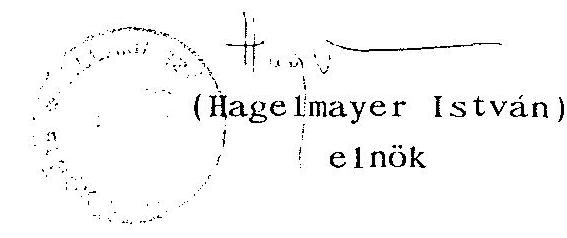

---

# ÁLLAMI SZÁMVEVŐSZÉK   V-36-30/1993-1994. 

## MELLÉKLET

a DIMAG Rt. privatizációjáról, a kohászati vertikumhoz tartozó társaságok működési támogatásának felhasználásáról szóló jelentéshez

---

# TARTALOMJEGYZÉK 

1. sz. melléklet

Emlékeztető az Állami Vagyonügynökség igazgatótanácsa 1991. november 26-i üléséről
2. sz. melléklet

DIMAG Rt. részvénykönyv kivonat
3. sz. melléklet

A DNM Kft. F.A. főbb tervszámainak alakulása
1992. július 10 - 1992. december 31. időszakra
4. sz. melléklet

DNM Kft. Fa 1993. I. félévi likviditási helyzete
5. sz. melléklet

Megállapodás a DIMAG Rt. külkereskedelmi
irodájában 1992. szeptember 1-én
6. sz. melléklet

PM garanciára való teljesítés
7. sz. melléklet

NUEVOMETAL GmbH levele a DNM Kft. részére

---

# EMLÉKEZTETŐ 

az Állami Vagyonügynökség igazgatótanácsa
1991. november 26-i üléséről

Jelen vannak: Mádl Ferenc, Bártfai Béla, Diczházi Bertalan, Gulácsy Gábor helyett Molnár József, Lukács János, Nagy Zoltán, Pap Géza, Raskó György helyett Mikus Dezső, Urbán László.
Martonyi János távollétét előzetesen bejelentette.
Sepsey Tamás állandó meghívott az ülésen nem vett részt.

1/ A DIMAG Rt. részvényeinek értékesítéséről szóló előterjesztés megtárgyalásakor az Ipari és Kereskedelmi Minisztérium kifejtette, hogy amennyiben nem történik tulajdonosváltozás, a részvénytársaság csődbe kerülhet. A Pénzügykutató Rt. által előterjesztett konstrukcióval és szerződés-tervezettel alapvetően egyetértenek, de szükségesnek tartják az üzleti terv áttanulmányozását. Az adás-vételi szerződés megkötésének időpontjára záró mérleget kérnek. Ezen kívül a DIMAG Rt. dolgozói kollektívájának véleményét is ki kell kérni. A vitában felmerült az, hogy az Állami Vagyonügynökség a hozzátartozó vagyont versenyeztetés útján értékesítheti. Jelen esetben az AVU megkísérelte a pályáztatás előkészítését, de az eredménytelen volt. Ennek következtében csupán a NUEVOMETAL és a SZOJUZRUDA ajánlatait lehet érdemben mérlegelni.

Az Igazgatótanács egyhangúlag elfogadta a következő határozatot:

---

1. sz. határozat:

- Az IT - a DIMAG Rt. kritikus gazdasági helyzetét figyelembe véve, a felszámolás veszélyének elkerülése, a foglalkoztatottság lehetőség szerinti megőrzése érdekében - felhatalmazza az ügyvezetést, hogy az alábbi feltételek rögzítésével kösse meg az adásvételi és marketing szerződést a SZOJUZRUDA egyesülés és a NUEVOMETAL GmbH által alkotott konzorciummal a DIMAG Rt. részvényeinek értékesítéséről:
- A DIMAG Rt. állami tulajdonban álló, összesen 11.390,2 MFt névértékű részvényéből a konzorcium az MHB kötvényének megvásárlásával 2,2 MrdFt névértékű részvényhez jusson hozzá. A maradék 9.190,2 MFt névértékű részvényt pedig 530 MFt vételárért két részletben történő fizetés mellett vásárolja meg. Az első részlet 3,5 MUS dollár, amelyet a szerződés megkötését követő 15 napon belül a NUEVOMETAL a DIMAG Rt. vele szemben fennálló 7 MUS dollár összegű tartozásából az AVU-re engedményez. A második részlet 1992. szeptember 30-át követő 15 napon belül válik esedékessé.
- A konzorcium által megvásárolt részvényekből a DIMAG Rt. egy évi alapanyagszükségletével azonos névértékű részvény kerüljön a konzorcium és az AVU közös rendelkezési joga alapján letétbe. A letétből a részvények csak 450 nap eltelte, a nyersanyagszállítások megtörténte, valamint a DIMAG Rt. adóssága és vesztesége növekedésének megállítása esetén adhatók ki.
- A marketing szerződésben a vevők az alapanyagszállítások 6 hónapos halasztott fizetését fogadják el, amely hozzájárul a DIMAG Rt. gazdaságos működésének helyreállításához. Amennyiben az adás-vételi szerződés napján fennálló adósság és veszteség tovább nő, a vevők a már előszállított alapanyag ellenértékének arányos részének megfizetésére nem tarthatnak igényt.

---

- A marketing szerződésben részletezni kell, hogy a vevő milyen mennyiségben, minőségben és áron szállít kohászati alapanyagokat a DIMAG Rt. részére, illetve milyen mennyiségben, minőségben és áron vásárol a DIMAG Rt. késztermékeiből a szerződés időtartama alatt.
- A foglalkoztatottság fenntartása érdekében az 1991. IX. hó 30-i állapotnak megfelelő DIMAG Rt. állományi létszám 70%-ának foglalkoztatására vállaljon kötelezettséget a vásárló. Amennyiben ennél alacsonyabb a foglalkoztatottak száma a vevő a mértéken felül elbocsátott dolgozók nettó alapbérének 30%-át fizesse be a Szolidaritási Alapba.
- A DIMAG Rt. környezetszennyezési mutatóit 1992-97. időszakban az 1980-90. évek átlagértékéhez képest legalább 1/5 részre kell csökkenteni.
- A szerződések mellékletét képezze a DIMAG Rt. 1992. évi üzleti terve, ill. az adósság és veszteség korrekt mérését biztosító, adás-vétel napjára vonatkozó mérlege.

2/ A PICK SZEGED Szalámigyár és Húsüzem Rt.-vé átalakulását, továbbá az 51%-os többség fenntartását a Földművelésügyi Minisztérium támogatja, és a tőzsdei értékesítést csak korlátozott mértékben fogadja el. Megítélése szerint a vállalatnak elsősorban piacbővítő szakmai partnerre van szüksége.

Az Igazgatótanács vitájában felmerült, hogy az Rt.-nek inkább tőkebefektetésre van szüksége, így a tőzsdei bevezetés lenne a helyes megoldás. A tulajdonosi szerep ellátása céljából a részvénytársaság igazgatóságába és felügyelő bizottságába jelöltekről az IT dönteni kíván.

Az Igazgatótanács egyhangúlag meghozta a következő határozatot:

---

2. sz. melléklet

|  SEJEGYZES | A RÉSZVÉNY |  |  |  |  |  |  |  |  |  |  |  |  |  |  |  |  |  |  |  |  |  |  |  |  |  |  |  |  |  |  |  |  |  |  |  |  |  |  |  |  |  |  |  |  |  |  |  |  |  |  |  |  |  |  |  |  |  |  |  |  |  |  |  |  |  |  |  |  |  |  |  |  |  |  |  |  |  |  |  |  |  |  |  |  |  |  |  |  |  |  |  |  |  |  |  |  |  |  |  | 

---

|  18. | 0067451-0067460 | 100.000, | 18074840A EGYEZÜLÉS
100.000, | 1943.1.18. |  |  |  |   |
| --- | --- | --- | --- | --- | --- | --- | --- | --- |
|  19. | 0067461-0081730 | 100.000, | ELIESU ANDERS
100.000, |

  |  |  |  |   |
|  20. | 0081731-0081736 | 100.000, | 18074840A EGYEZÜLÉS
100.000, |  |  |  |  |   |
|  |   |   |   |   |   |   |   |   |
|  |   |   |   |   |   |   |   |   |
|  |   |   |   |   |   |   |   |   |
|  |   |   |   |   |   |   |   |   |
|  |   |   |   |   |   |   |   |   |
|  |   |   |   |   |   |   |   |   |
|  |   |   |   |   |   |   |   |   |
|  |   |   |   |   |   |   |   |   |
|  |   |   |   |   |   |   |   |   |
|  |   |   |   |   |   |   |   |   |
|  |   |   |   |   |   |   |   |   |
|  |   |   |   |   |   |   |   |   |
|  |   |   |   |   |   |   |   |   |
|  |   |   |   |   |   |   |   |   |
|  |   |   |   |   |   |   |   |   |
|  |   |   |   |   |   |   |   |   |
|  |   |   |   |   |   |   |   |   |
|  |   |   |   |   |   |   |   |   |
|  |   |   |   |   |   |   |   |   |
|  |   |   |   |   |   |   |   |   |
|  |   |   |   |   |   |   |   |   |
|  |   |   |   |   |   |   |   |   |
|  |   |   |   |   |   |   |   |   |
|  |   |   |   |   |   |   |   |   |
|  |   |   |   |   |   |   |   |   |
|  |   |   |   |   |   |   |   |   |
|  |   |   |   |   |   |   |   |   |
|  |   |   |   |   |   |   |   |   |
|  |   |   |   |   |   |   |   |   |
|  |   |   |   |   |   |   |   |   |

---

A DNM Kft. F.A. főbb tervszámainak alakulása
1992. 07. 10. - 1992. 12. 31. időszakra

| Megnevezés | Terv | Tény |
| :-- | :-- | :-- |
|  |  | $7.10-12.31-ig$ |

1. Termelés

Öntecs+FAM buga (Kt)
Készáru (kt) 160
2. Pénzügyi ütem
2.1 KIADÁS MFt

- anyagok 3053
1855,6
- energia 794
421,6
- bér 724
649,3
- létszámleép. 280
48,6
- közteher 355
317,6
- fuvar 50
20,0
- ÁFA 409
229,8
- egyéb 1493
439,2
- újraindítás 1000
994,4
ÖSSZESEN 8158
4981,4
2.2 BEVÉTEL
- vevők 5309
2132,1
- ÁFA 69
149,3
ÖSSZESEN 5378
2281,4
2.3 HIÁNY 2780
2700,0

---

DNM Kft. Fa 1993. T. f. évi likviditási helyzete
1993. 01. 01 - 1993. 06. 30-ig

MFt

| Megnevezés | Terv | Tény |
| :-- | :-- | :-- |

1./ Kiadások
1.1 Anyagok
1.2 Energia
1.3 Bér
1.4 Létszámleépítés
1.5 Közteher
1.6 Fuvar
1.7 ÁFA Befiz. köt.
1.8 Egyéb
$2.650,9 \quad 2.893,8$
$1.707,2 \quad 1.191,5$
$916,7 \quad 912,5$
$-$
$483,1 \quad 324,2$
$333,3 \quad 303,8$
38
$1.208,4 \quad 827,4$
$7.337,6 \quad 6.453,2$
2./ Bevételek

| Nyitó | 231,2 |  |
| :-- | --: | --: |
| Vevők | $5.770,1$ | $5.339,1$ |
| ÁFA visszaigénylés | 334,3 | 268,1 |
| Elkülönített Alap | 1.002 | 1.001 |
| Összes bevétel | $7.337,6$ | $6.608,2$ |

3./ Záró pénzösszeg
155

---

# MEGALLAPODÁS 

amely létrejött 1992. szeptember 1.-én DIMAG RT. budapesti külkereskedelmi irodájában.

Jelenlévők: Haller János - REORG RT.- DNM felszámoló biztosa
Varga Sándor - DNM KFT.FA. - REORG RT.helyi megbízottja
Klicsu András - DIMAG RT.vez.ig.

- Nuevometal GmbH. ügyvezető ig.

Rózsa Imre - DIMAG Rt. ker.vez.ig.h.
dr. Almássy József- DIMAG Rt.gazdasági vez.ig.h.
dr. Dutkó Lajos - DIMAG Rt. általános vez. ig.h.
dr. Szedlacsek György - DIMAG Rt.munkagazdasági vez.ig.h.

1/ NO 165 KL/PL 1992. június 5. kelti és 1992. január 1-től hatályos szerződés felmondásából eredő további tevékenységek lerendezése.

2/A DIMAG RT. budapesti külkereskedelmi irodák tevékenységének és jogi helyzetének újraszabályozása.

3/ Az irodák dolgozóinak az új helyzettel összefüggő munkajogi kérdéseinek a lerendezése.
ad.1. A tárgyban jelzett szerződést a DNM KFT felszámolása következtében a REORG RT. 1992. augusztus 25.-én felmondta. Ezt a tényt a Nuevometal GmbH. a maga részéről nyugtázza. Tekintettel arra, hogy a Nuevometal ill.a DIMAG RT nevében kötött és még nem teljesített szerződések teljesítése minden érdekelt fél részére célszerű, azért:

- DNM KFT FA. vállalja az eredeti szerződésben leírt szerződések teljesítését. A nem teljesített szerződésekről mind áruszállítási, mind pénzügyi vonatkozásban teljes kimutatás készüljön. A szállítási nemteljesítésekről a lista készítési határidő: 1992. szeptember 4.
- DNM KFT FA a legkisebb költségráfordítást jelentő módon a Nuevometal és a DIMAG RT. nevében kötött és nem teljesített

---

szerződésekre nyitott akkreditívek hosszabbítására saját hatáskörben intézkedik.

- DNM KFT Fa. hozzájárul ahhoz, hogy az irodák dolgozói által a Nuevometal GMBH-tól kapott aláírási és eljárási jogokkal a szerződések teljes kifutásáig gyakorolják és a szükséges ügyintézést megtegyék.
- A Nuevometal GmbH. hozzájárul ahhoz, hogy a iroda dolgozói részére megadott aláírási és eljárási jogokat és kötelezettségeket a DNM Kft FA. állományába kerülve is az érintett szerződések teljes kifutásáig gyakorolják.
- Nuevometal GmbH. hozzájárul ahhoz, hogy a nyitott szállított tételek teljesítéséből befolyó pénzek a vevővel kötendő új megállapodás alapján a DNM KFT FA. későbbiekben meghatározandó számlájára folyjanak be.
- A PM garanciával felvett hitelek fedezetéül lekötött akkreditívek jegyzékét az 1992. szeptember 1-jei teljesítésekről a Nuevometal szeptember 4.-ig a CWAG-nek és egyidejűleg a DNM KFT FA-nak átadja. A Nuevometal egyidejűleg felhatalmazást ad a CWAG-nak, hogy a 7.2. millió USD-ra történt teljesítés és a bevétel különbségét a DNM által megadott egyszámlára utalja át.
- A Nuevometal az előzőekben nem érintett akkreditívekről és azok pénzügyi teljesítéséről 1992. szeptember 15.-ig teljes elszámolást ad DNM KFT FA-nak és a különbségként mutatkozó összeget DNM KFT FA. egyszámlájára átutalja.
- A Nuevometal továbbra is a DIMAG RT-n keresztül számol el az export teljesítésekkel, az azokkal összefüggő bevételekkel és kiadásokkal. A DIMAG RT kötelezettséget vállal arra ,hogy az adminisztráció egyszerűsítése érdekében a DIMAG RT-vel történő elszámolásokat DNM KFT FA. felé költségmentesen bonyolítja és az elszámolások vételét követő 8 munkanapon belül DNM KFT FA.felé a számlákat ill. banki kivonatokat rendezi és továbbítja.
- A Nuevometal a DIMAG RT és DNM KFT FA. közötti elszámolások végleges rendezése érdekében a DIMAG RT a Nuveometal felé kéréseit 1992. szeptember 4.-ig továbbítja.
- A DIMAG budapesti külkereskedelmi irodák által a DIMAG RT ill. Nuevometal GMBH által adott megbízás alapján, azok nevében a mai napig kötött külkereskedelmi szerződések jogszerűek és ezt az érintett felek elismerik. Ugyanez vonatkozik az elszámolásokat érintő kérdésekre is.
- Az 1992. szeptember 1-e előtt Hungarostahl GmbH-n keresztül bonyolított export és import szerződések teljesítésével és pénzügyi elszámolásával kapcsolatos adatszolgáltatásra a DIMAG RT. felkéri a Hungarostahl ügyvezetőit. A jövőbeni kapcsolatokra vonatkozóan a Hungarostahl és a DNM KFT FA. külön állapodik meg.
ad.2. A DNM KFT.FA. felszámolására vonatkozó Kormányhatározat végrehajtása érdekében a DNM KFT FA. eredményes működéséhez szükséges személyeket és tárgyi eszközöket saját hatáskörbe vonja és működteti. Ennek szellemében a DIMAG RT. a maga részéről hozzájárul, hogy a DIMAG Rt.külkereskedelmi irodák teljes létszáma a DIMAG RT. és

---

az érintett dolgozók közös megegyezése alapján a DNM KFT.FA.-nál kerüljenek állományba. A zökkenőmentes tevékenység folytatás céljából mindkét fél érdekében célszerű,hogy az irodák vezetői közül egy fő legyen
 meghatalmazva a teljes tevékenység koordinálására. Tekintettel arra, hogy a jelenleg használt helységek bérleti szerződése 1992. október 15.-vel lejár és tovább nem hosszabbítható, ezért a DNM KFT FA. soron kívül intézkedik, hogy a munka végzéséhez szükséges tárgyi feltételek rendelkezésre álljanak.
A DIMAG RT. a tulajdonát képező technikai eszközöket a DNM KFT FA. rendelkezésére bocsájtja, amelynek feltételeit a DNM KFT FA. és DIMAG RT. között később kötendő megállapodás rögzíti.
ad.3. A DIMAG RT. és a külkereskedelmi irodák dolgozói között fennálló munkaszerződések a felek közös megegyezése alapján megszűnnek. Azok a dolgozók, akik a mai nappal aláírják a DNM KFT FA.-val az új munkaszerződést, akkor részükre folyamatos munkaviszonyként kerül elismerésre a DIMAG RT.-nél eltöltött időszak, ami egy későbbi esetleges munkaviszony törvények szerinti felmondása esetén a végkielégítés alapjául szolgál.

Budapest, 1992. szeptember 1.
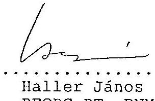

Haller János
REORG RT.-DNM KFT.
FA. felszámoló biztos

Varga Sándor DNM KFT. FA. REORG RT helyi megbizottja
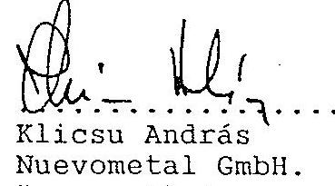

Klicsu András
Nuevometal GmbH. ügyvezető ig.
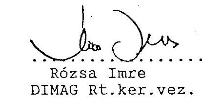

Rózsa Imre
DIMAG Rt. ker. vez. ig. h.
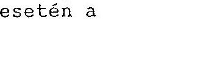

Klicsu András DIMAG RT. vezérigazgató
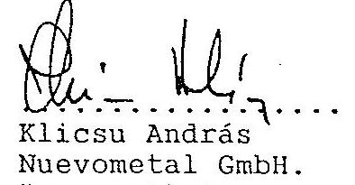

Rózsa Imre
DIMAG Rt. ker. vez. ig. h.
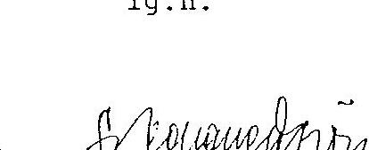

Dr. Almássy József DIMAG RT. gazdásávez. ig. h.
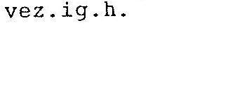
$\qquad$

---

# 6. sz. melléklet 

Diósgyőri Nemesacél Művek Kft. F.A.
Haller János úr
felszámoló biztos

## Helyben

Tárgy: PM garanciára való teljesítés

Tisztelt Haller Úr!

A PM garanciára a szállítói teljesítések alapján a garancia összege a Nuevometal GmbH.-val történt előzetes egyeztetés alapján csak az esetben teljesülhet, ha a Nuevometal saját nevében kötött szerződésekre befolyt összegeket is a CWAG-ra forgatjuk.

A PM garanciális elszámolással kapcsolatosan a Reorg Rt.-nél dr. Rédei László igazgató úrral VII. 29-én folytatott személyes megbeszélésen e problémát felvetettem. Rédei úr állásfoglalása az volt, hogy a PM garanciával felvett hitelek kerüljenek rendezésre.
Állásfoglalása alapján többszöri tárgyalás után IX. 8-án Klicsu András úrral a Nuevometal ügyvezető igazgatójával megállapodtam abban, hogy a Nuevometal GmbH bécsi számláján lévő kb. 600 ezer USD összeget a PM garanciára közvetlenül átutalja a CWAG hitelszámlájának törlesztésére.

A Nuevometal, illetve a DIMAG Rt. budapesti irodája az export elszámolásokat a mai napig teljeskörűen nem rendezte, így a DIMAG Rt. és a DNM közötti elszámolás sem teljeskörű.
Ennek következtében a VII. 10-i szállítások egy része az úton lévő export követelések között van a DNM-nél nyilvántartva.

---

A PM garanciára való teljesítések zárását követően tisztázható véglegesen, hogy az úton lévő exportból milyen értékű árbevétel realizálódhat a DNM-nél bevételként.

Az előzőek alapján a likviditási tervek készítésénél az úton lévő export árbevételével a közeljövőben számolni nem célszerű, ezen egy esetben lehet változtatni, ha a CWAG-hoz átutalt összegek nem kerülnek a CWAG-nál hiteltörlesztésként elszámolásra és a felvett hitelek, valamint a teljesítések különbözetét a CWAG a kormánygarancia PM-hez való benyújtásával érvényesíti.

Kérem Felszámoló Biztos Urat, hogy a megtett intézkedéseket jóváhagyni szíveskedjék.

Miskolc, 1992. szeptember 9.
Melléklet: 2 db

Üdvözlettel:
Dr. Almássy József
gazd. vezérigazgató h.

---

# NUEVOMETAL GmbH 

NUEVOMETAL GmbH

Diósgyőri Nemesacél Művek Kft. F.A. Haller János úr felszámoló biztos

## M I S K O L C

Tisztelt Haller úr!
Megkaptam 849-DNM/1992. sz. levelét, amelyben megerősíti a REORG Rt. DNM Kft. F.A. export ügyleteivel kapcsolatos állásfoglalását - amely szerint minden export kintlévőségnek a DNM Kft. F.A. számlájára kell befolyni.
Kéri továbbá azonnali intézkedésemet a CWAG felé, hogy minden export kintlévőség - köztük a PM-garanciális hitel fedezetéül nyitott akkreditívekre befolyt összegek is - a DNM Kft. F.A. számlájára átutalásra kerüljön.

Megkeresésére vonatkozóan közlöm, hogy a PM garanciával kapcsolatosan támasztott követelményének a következő indokaim alapján nem lehet eleget tenni:

- a PM garanciára felvett hitel akkreditíveit a DIMAG Rt. engedményezte a CWAG-ra;
- a PM a garanciáját a DIMAG Rt.-re nyitott akkreditívekre adta;
- az akkreditívekre felvett hitel a DIMAG Rt. és a DNM Kft. működési költségeire lett felhasználva;

A NUEVOMETAL GmbH. számlájára befolyt összegek átutalására a DIMAG Rt. - DNM Kft. F.A. - NUEVOMETAL GmbH. között történő és közösen egyeztetett elszámolás után tudok eleget tenni.

Az elszámolás érdekében ezúton is kérem, hogy a DNM export irodája a tételes elszámolást a NUEVOMETAL-lal egyeztetetten készítse el, hogy az Önök által vitásnak tartott kérdéseket a kölcsönös érdekek szem előtt tartásával véglegesen rendezhessük.

Miskolc, 1992. október 12.
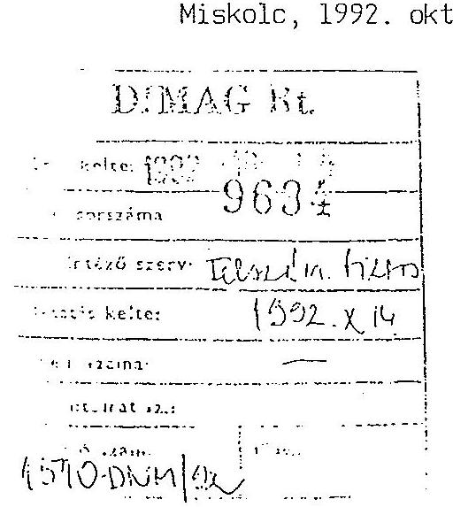

Üdvözlettel:
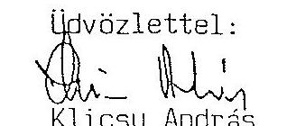

---

PÉNZÜGYMINISZTER T-074/94/Sz.I.

Hagelmayer István úr elnök

Állami Számvevőszék

# Budapest 

Apáczai Csere János u. 10.
1052

## Tisztelt Elnök Úr!

A DIMAG Rt. privatizációjáról és a kohászati vertikumhoz tartozó társaságok működési támogatásának felhasználásáról készített jelentéssel kapcsolatos véleményem a következő.

A jelentés tárgyszerű és korrekt módon foglalja össze és elemzi a DIMAG Rt. privatizációjának előkészítése óta eltelt időszak alatt a vállalatcsoporttal kapcsolatos eseményeket.

A jelentés tartalmával, következtetéseivel, valamint a vizsgálati tapasztalatok alapján a Kormány részére megfogalmazott javaslatok közül (11. oldal) az 1. és 2. pont által előirányzott feladatokkal egyetértek.
Javasolom, hogy a 3. pont szerint a diósgyőri kohászat reorganizációs tervének elkészítését célzó ajánlás - a jelentés Országgyűlés elé történő benyújtása előtt - kerüljön aktualizálásra a borsodi acélipari reorganizációra vonatkozó, a jövő heti Kormányülésen várható döntésnek megfelelően.

Budapest, 1994. január 31.
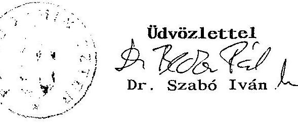

---

# Ipari és Kereskedelmi Minisztérium   Miniszter   $M-2 C \sqrt{1 / 94 / A}$ 

## Hagelmayer István

elnök úr
ÁLLAMI SZÁMVEVŐSZÉK
Budapest

Tisztelt Elnök Úr!

A DIMAG Rt. privatizációjáról, a kohászati vertikumhoz tartozó társaságok működési támogatásának felhasználásáról készített "Jelentés"-hez a következő észrevételeket tesszük.

## 10. oldal 2. bekezdés

Megítélésünk szerint a kohászattal kapcsolatos kormányzati koncepció hiánya nem játszott közre abban, hogy a DIMAG vállalatcsoport csődjének privatizáció formájában történő kezelése nem hozta meg a várt eredményt. A sikertelenség okát a nem megfelelő szerződéskötésben látjuk. Természetesen ehhez hozzájárult az ágazat mély és elhúzódó válsága is.

## 11. oldal 3. pont

Ezt a pontot javasoljuk elhagyni, mivel a borsodi acélipar reorganizációjára készített előterjesztésünket a Kormány elé beterjesztettük, a Kormány várhatóan 1994. február 3-án ülésén megtárgyalja és határoz a borsodi kohászat helyzetéről.

## 49. oldal 2. bekezdés

A borsodi acélipar reorganizációját tartalmazó koncepciót beterjesztettük a Kormány elé, ezért a bekezdés utolsó két sorát ennek figyelembevételével javasoljuk módosítani.

A jelentésben foglalt egyéb megállapításokra észrevételt nem teszünk.

Budapest, 1994. február 1.,
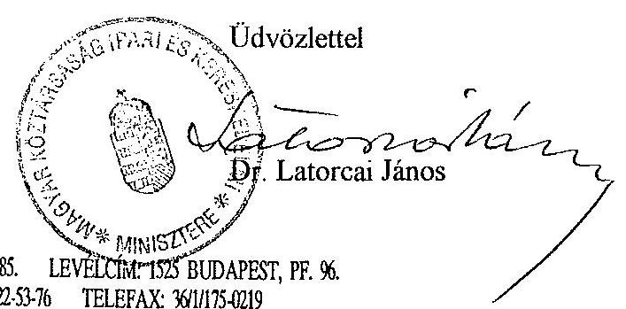

---

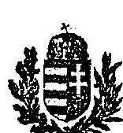

# TÁRCA NÉLKÜLI MINISZTER 

Dr. Hagelmayer István úr
elnök részére
Állami Számvevőszék

## Budapest

Tisztelt Elnök Úr!
A DIMAG RT privatizációjáról, a kohászati vertikumhoz tartozó társaságok működési támogatásának felhasználásáról szóló jelentés tervezetben foglaltakkal - az alábbi észrevételek mellett - egyetértek.

- Az Állami Vagyonügynökség 1992. novembertől 1993. márciusig belső ellenőrzési vizsgálatot folytatott az ügyben. A vizsgálat megállapításait alapvetően visszatükrözik az ASZ jelentés tervezetben foglaltak.

A megállapítások szerint az ügyben eljáró tranzakciós ügyintézők - Timár András és Havasi Mária - valamint a tanácsadó cég Pénzügyi és Értéktőzsdétársaság - nem kellő gondossággal, egyes esetekben az Állami Vagyonügynökség tulajdonosi érdekei érvényesíthetőségének elmulasztásával jártak el. Ezen kifogásolható magatartást részben magyarázza az, hogy az AVU nevében és képviseletében eljárók a regionális - foglalkoztatási érdekeknek egyoldalú és túlzott hangsúlyt adtak. A jelentés 11. oldalon utal arra, hogy a DIMAG vállalatcsoport tevékenysége 1992. december 12-vel leállt. Az a szerződést kötő felek mindegyike előtt ismert volt, hogy a vállalatcsoport saját erejéből nem tud újraindulni, az újraindulásra, a vállalatcsoport működésére az egyetlen esélyt a szerződés aláírása adta. A vállalatcsoport igen kedvezőtlen pénzügyi helyzete is ismert volt, de a pontos számok ismerete nélkül is nyilvánvaló volt, hogy a cég megérett a felszámolásra. Nem volt bizonyítható azonban az, hogy a szerződő felek előtt ismeretes lett volna, miszerint az APEH már 1990-ben kezdeményezte a felszámolási eljárás megindítását a DIMAG ellen. Erre a tényre a társaság korábbi vezetője által 1990. decemberében készített kötvény kibocsátással összefüggő tájékoztató sem utalt.

Az előzőeket figyelembe véve a szerződéskötés időpontjában a súlyos mérlegelésre az AVU részéről, hogy a szerződéskötés elmaradása - figyelembe véve azt a tényt, hogy ez esetben nem lehetséges a termelés újraindítása - előre vetítette a cég teljes összeomlásának szükségszerűségét.
A szerződés megkötése ennek elkerülésére adott esélyt.

---

- Megítélésem szerint a szerződés tartalmát alapvetően meghatározta az a tény, hogy egy gyakorlatilag felszámolásra érett cég válságmenedzselésére vállalkoztak a vevők.

Mindez tükröződött az árban és a vevők számára biztosított jogosítványokban. Az ügyben döntést hozó AVU Igazgatótanács tagjait is ez motiválta. Az AVU nevében eljáró tranzakciós ügyintézők részéről a döntést követő szerződés előkészítési eljárásban, valamint a szerződés aláírását követően az AVU részére járó ellenérték behajtásának elmulasztásában történt munkajogi kötelezettség mulasztás. Így:

- Az engedményezési szerződés 2. sz. mellékletének elkészítése nem történt meg, s így tartalmilag az engedményezési szerződés nem létezőnek tekintendő. (Formailag az engedményezési szerződés 1992. január 14-i aláírással megkötöttnek minősült.) A szerződés megkötésének időpontjában a közreműködő ügyintézők álláspontja az volt, hogy az engedményezési szerződés aláírásával az első részlet kifizetése is megtörtént. Megjegyzem, hogy az ügyben hozott választott bírósági döntés éppen a 2. sz. melléklet hiánya okán nem létezőnek tekintett engedményezési szerződés miatt döntött az AVU javára.
- A DIMAG ügy dokumentumai között nem lelhető fel olyan irat, amely szerint az eljáró AVU ügyintézők a vevőt bármikor is felszólították volna az 530 millió forintos AVU-t illető vételár megfizetésére.

A DIMAG RT válságmenedzselésének ügyében a Vagyonügynökség 1992. év folyamán minden lehetségest megkísérelt a működőképesség biztosítása - többek között a hitelezőkkel való megegyezés létrehozása - érdekében. E törekvések több okra visszavezethetően meghiúsultak. A jelentés tervezet ennek okaival nem foglalkozik. Ugyancsak figyelmen kívül hagyásra kerültek azok 1992. szeptembere körül készült dokumentumok, amelyek pontosan jelezték, hogy mely időszakokban milyen mozgástérrel rendelkezett a Vagyonügynökség az eredeti tulajdonviszonyok helyreállítása tekintetében.

Az adásvételi szerződés nyilvánvalóan nem jöhetett volna létre olyan kondíciókkal, amelyekben a vevők a társaság működésének befolyásolásához szükséges jogosítványokat nem kapták volna meg.

- A lefolytatott belső vizsgálat az ügyben további intézkedéseket azért nem tett, mivel az ORFK illetékesével szóban történt egyeztetés szerint a megnevezett AVU munkatársak tekintetében büntetőjogi felelősségre vonás kezdeményezésének - szándékosság hiányában - indokoltsága nem volt, s a munkajogi felelősségre vonás lehetősége megszűnt, mindkét dolgozó munkaviszonyának korábbi megszüntetése miatt.

---

- A jelentés tervezet hitelszerződésre vonatkozó (23. oldal 2.2. pont) utolsó mondata szerint hitelszerződés nem készült az AVU és a REORG Rt. között. A hitelszerződés megkötése jelenleg folyamatban van.

A jelentés tervezet megállapításai alapján javasolt intézkedésekkel egyetértek, ugyanakkor a jelentés titkos minősítését a továbbiakban nem tartom indokoltnak.

Budapest, 1993. december 30.
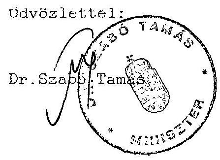

---

# TÁRCA NÉLKÜLI MINISZTER 

Budapest, 1994. február 8. $5 \times T-150-2 / 94$

Dr. Hagelmayer István úr, elnök

Állami Számvevőszék

Budapest

## Tisztelt Elnök Úr!

A DIMAG Rt. privatizációjáról, a kohászati vertikumhoz tartozó társaságok működési támogatásának felhasználásáról szóló jelentéssel - a korábban e tárgyban küldött levelem tartalmát részben módosítva - egyetértek.

Kérem, hogy a vizsgálat realizálásakor vegyék figyelembe a jelentéstervezetre adott észrevételeimet.

A jelentés megállapításai alapján javasolt intézkedésekkel egyetértek, melyeket figyelembe véve az Állami Vagyonügynökségnél a hiányosságok még lehetséges korrigálására intézkedési terv készül.

Végezetül megemlítem, hogy a DIMAG Rt. privatizációjában résztvevő volt ÁVÜ alkalmazottak tevékenységéről az országos Rendőr-főkapitány részére értesítést adtam.
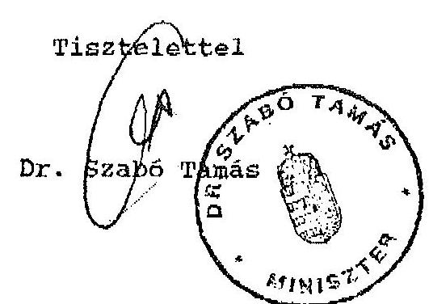

