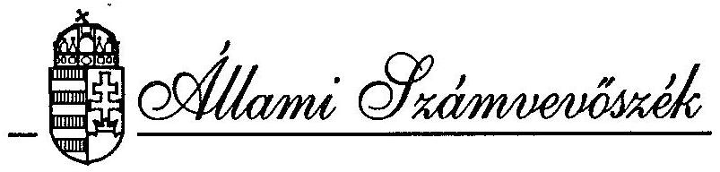

# JELENTÉS 

az IKARUS és CSEPEL AUTÓGYÁR állami vállalatok
együttes szanálása és privatizálása tárgyában végzett
ellenőrzés utóvizsgálatáról
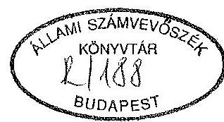

---

A vizsgálatot vezette:
Harsányi Sándor osztályvezető főtanácsos

A vizsgálatot végezte:
Vasas Sándorné dr. számvevő tanácsos, aki a koordinációs feladatokat is ellátta
dr. Molnár Barnabás számvevő tanácsos
dr. Borisz József számvevő tanácsos

---

# T A R T A L O M J E G Y Z É K 

1. BEVEZETÉS ..... 1
11. ELÖZMÉNYEK, ÖSSZEFOGLALÓ MEGÁLLAPÍTÁSOK, KÖVETKEZTETÉSEK ..... 4
111. A VIZSGÁLAT RÉSZLETES MEGÁLLAPÍTÁSAI ..... 18

1. Az IKARUS Rt, az IKARUS állami vállalat vagyoni, pénzügyi helyzete ..... 19
1.1. Az IKARUS Rt. ..... 19
1.2. IKARUS állami vállalat ..... 32
2. CSEPEL AUTÓGYÁR f.a. ..... 36
3. A CSEPEL AUTÓGYÁR f.a. felszámolásának vizsgálata során feltárt jogszabályi ellentmondások összefoglalása ..... 48

---

# J E L E N T É S 

az IKARUS és CSEPEL AUTÓGYÁR állami vállalatok együttes szanálása és privatizálása tárgyában végzett ellenőrzés utóvizsgálatáról

## I.

## B EVEZETÉS

Az Állami Számvevőszék Elnöke által jóváhagyott - s az Országgyűlés Számvevőszéki Bizottsága által tudomásul vett - II. félévi ellenőrzési terv előirta az IKARUS és CSEPEL AUTÓGYÁR vállalatok együttes szanálása tárgyában végzett ellenőrzés utóvizsgálatát.

Az Országgyűlés részére V-4-21/1992. (Témaszám: 105) számon átadott vizsgálati jelentés javaslatokat tett mind a vizsgálatba vont gazdálkodó szervezetek, mind az államigazgatási szervek/intézmények tekintetében, me1yet az érintettek tudomásul vettek.

Jelen utóvizsgálat célja annak megállapítása, hogy az egyes intézmények/vállalatok a javaslatoknak mennyiben tettek eleget, s intézkedéseikné1 figyelemmel voltak-e az állami tulajdon védelmére, az állami vagyon megőrzésére, gyarapítására vonatkozó feladatuknak,s azok alkalmasak voltak-e a feltárt problémák rendezésére.

---

A vizsgálat nem korlátozódott a korábbi javaslatok végrehajtására tett intézkedések és azok hatásainak számbavételére, hanem kiterjedt az állami vagyonban bekövetkezett változásokra. (A jelentés szövegezése során arra az ellenőrzésre, melynek utóvizsgálatát végeztük alapvizsgálat megkülönböztető megnevezéssel hivatkozunk.)

Az ellenőrzött időszak:

Az utóvizsgálat az 1992 júliusában lezárt ellenőrzés megállapításaira támaszkodva az 1992. II. félévi, s az 1993. I.-III. negyedévi időszakot fogta át.

A helyszíni ellenőrzés ideje:
1993. október 15. - 1993. november 30.

A vizsgálatban érintett szervezetek:

- Ipari és Kereskedelmi Minisztérium 1024 Budapest, Margit körút 85.
- Pénzügyminisztérium

1051 Budapest, József nádor tér 2/4.

- Állami Vagyonkezelö Rt.

1115 Budapest, Bánk bán utca 17/b.

- Állami Vagyonügynökség

1133 Budapest, Pozsonyi út 56.

- Állami Fejlesztési Intézet Rt. (továbbiakban ÁFI) 1909 Budapest, Pf. 216.

---

# Vizsgált szervezetek: 

- CSEPEL AUTÓGYÁR állami vállalat

2311 Szigetszentmiklós
1992. október 1-töl a vállalat megnevezése CSEPEL AUTÓGYÁR f.a. (felszámolás alatt)-ra változott.

- IKARUS Karosszéria és Jármügyár állami vállalat (továbbiakban IKARUS állami vállalat)
1165 Budapest, Margit u. 114.
- IKARUS Jármügyártó Rt. (továbbiakban: IKARUS Rt.) 1165 Budapest, Margit u . 114.

A pénzügyminiszter 1990. szeptember 12-én rende1te el az egymással szoros kooperációban müködő két vállalat együttes szanálását. A Csődtörvény 1992. január 1-i hatályba lépésével az állami szanálás intézménye megszünt. Az IKARUS és CSEPEL AUTÓ vállalatok folyamatban levő szanálási ügyeit a 35/1991. (XII.21.) PM rendelet alapján rövid ideig az ÁFI kezelte. Ezt követően a Pénzügyminiszter 28/1992. (XII.4.) rendelete a Szanálási Alappal összefüggő kötelezettségek teljesítésével a REORG Rt.-t bizta meg.

Az Állami Számvevőszék utóvizsgálata az ezt követő időszak intézkedéseit tekinti át, ellenörzi azok hatékonyságát, s bemutatja az érintett gazdálkodó szervezetek jelenlegi vagyoni helyzetét.
A közúti jármügyártó ágazat két jelentős gazdasági egységének helyzetmegitélésénél felhasználtuk az Állami Számvevőszék "A dunántúli VOLÁN Vállalatoknál az országos menetrend szerinti személyszállításra rendelt állami vagyonnal való gazdálkodásról (1993. november. Témaszám: 173)" jelentése megállapításait, illetve segítséget kaptunk a Közlekedési Hírközlési és Vizügyi Minisztérium Közgazdasági Főosztályától a belföldi kereslet megitélését illetően.

---

# 11.   ELÖZMÉNYEK, ÖSSZEFOGLALÓ MEGÁLLAPÍTÁSOK, KÖVETKEZTETÉSEK 

1. Az IKARUS és CSEPEL AUTÓGYÁR állami vállalatok együttes állami szanálását a pénzügyminiszter 1990. szeptember 12-én rende1te e1. Az együttes állami szanálás lefolytatásával a Szanáló Szervezetet bízták meg. A szanálási folyamatot - jog szerint - lezáró Szanálási Megállapodást 1991. augusztus 26-án írták alá. A Megállapodás azonban csak az IKARUS vonatkozásában tartalmazott konkrét intézkedéseket, a CSEPEL AUTÓGYÁR sorsának megoldását a jövőbe utalta.

Az Állami Számvevőszék 1992. I. félévében e1végzett vizsgálata (V-4-21/1992); az alapvizsgálat a szanálás elrendelésétől kezdődően áttekintette a szanálás és a kapcsolódó társasága1apítás folyamatát, annak szabályszerűségét, cé1szerüségét.

A vizsgálat megállapításai alapján az Állami Számvevőszék javasolta

- az alapítással létrehozott IKARUS részvénytársaságban lévő 7 milliárd Ft névértékủ állami tulajdonú részvénycsomag felelős vagyonkezelőhöz helyezését és ezzel egyidejü1eg az IKARUS állami vállalat megszüntetését,
- az IKARUS állami vállalat könyveiben csak részben megjelenő kötelezettségek rendezésére, illetve a folyamatban lévő peres ügyek továbbvitelére a részvénytársaság és az állami vállalat az ÁVÜ felügyelete mellett dolgozzon ki megoldást, a társaságalapítás feltételeként szabott teljeskörü vagyon és forrás átadás teljesítésének megfelelöen,

---

- az IKARUS részvénytársasághoz nem apportként keriult tartozások és eszközök átadás-átvételét az ÁVÜ tételesen vizsgálja felül, s foglaljon állást abban a tekintetben, hogy azok könyv szerinti értéktől eltérő értéke1ése meg-fele1-e az állami vagyon véde1mérő1 szóló törvény elöírásainak, az állam tulajdonosi érdekei védelmének,
- a CSEPEL AUTÓGYÁR állami vállalat állami szanálása eredménytelennek bizonyult. Erre figyelemmel az Állami Számvevốszék javasolta, hogy a Pénzügyminisztérium foglaljon állást a szanálás meghiúsulását, a felszámolás meginditását illetően.

Az Állami Számvevőszék az Állami Vagyonügynökség és a Pénzügyminisztérium tekintetében igényelte, hogy intézkedéseikröl tájékoztassák.
2. Az alapvizsgálat lezárását követően a Kormány öt határozatot hozott a CSEPEL AUTÓGYÁR állami vállalatot, az IKARUS állami vállalatot, illetve részvénytársaságot illetően, me1yek elhatározott intézkedései az alábbiakban foglalhatók össze:

- A Kormány a pénzügyminiszter elöterjesztése alapján a CSEPEL AUTÓGYÁR állami szanálását eredménytelennek minösitette, s utasította a pénzügyminisztert, hogy az állami szanálás megszüntetésére az intézkedéseket tegye meg.
- A Kormány az IKM elöterjesztése alapján indoko1tnak tartotta egy kijelölt vállalati kör (amelybe az IKARUS Rt. is beletartozik) pénzügyi helyzetének részletes elemzését, s az adott vállalatok pénzügyi helyzetének költségvetési eszközökkel történő javítását.

Ez alapján külön is foglalkozott az IKARUS Rt. müködőképességének megteremtésével, illetve ennek megfelelően két

---

kormányhatározatban garanciát vállalt - összesen 5,5 mi11iárd Ft értékben - az IKARUS Rt. export szállításaival összefüggésben.
3. Az IKARUS részvénytársaságot alapítással - s nem az átalakulási törvény szerinti általános jogutódként - a Szanáló Szervezet irányítása mellett, a szanálási folyamat során, annak "sikeres lezárásaként" 1991. augusztus 30-án zártkörű alapítással, 11,5 milliárd Ft alaptőkével hozták létre. A társaság $61 \%$-ban a magyar állam tulajdona; ame1y az IKARUS állami vállalat tárgyi apportja volt az alapításkor.
3.1. Az Állami Vagyonügynökség az IKARUS részvénytársaság alapításához azzal a kiegészítő feltéte11e1 járult hozzá, hogy az állami vállalattól a "társaság átvállalja a tevékenységével összefüggö valamennyi kötelezettséget, s birtokolja az ennek megfelelö vagyont".

Ennek teljesítésére a mintegy 16 milliárd Ft értékủ kötelezettség átvállalás, s az ennek megfelelő vagyonátadás rendezésére az IKARUS részvénytársaság és az állami vállalat három szerződést is kötött. A szerződéses megállapodások ellenére az ÁVÚ által elöirt vagyonátadási feltétel teljesítése körüli viták a mai napig nem zárultak le, illetve újabb ellentétek keletkeztek. A vagyonátadás még ma sem lezárt. Az utóvizsgálat idején az alapító állami vállalat, s az általa alapított társaság perben állnak ezeket illetően.

A vagyonátadás mellett tisztázatlan helyzetet okoz még ma is, hogy a szanálási folyamat során, illetve azt követően sem rendezték a CSEPEL AUTÓGYÁR vállalat által az IKARUS állami vállalat ellen indított pereket, illetve újabb per keletkezett, me1yben a CSEPEL AUTÓGYÁR a részvénytársaságot szintén perbe hívta.

---

Az Állami Vagyonügynökség tulajdonosi jogait az alapítást követöen sem a részvénytársaság, sem az állami vállalat tekintetében nem gyakorolta, kiadott állásfoglalásának végrehajtását nem ellenörizte.

A vállalat és a részvénytársaság között a vagyonátadás, a peres ügyek folytatása mellett is, illetve annak folyományaként több rendezetlen, vitás kérdés van.

- Függőben van egyes föld és épület ingatlanok átadása. (Ezek közül p1. a Stefánia úti irodaház ingatlan sem a társaság, sem az állami vállalat könyveiben nem szerepe1.)
- A vállalat nem adta át több más tétel me1lett a Hungarian Busexport Közös vállalatban lévő 5 M Ft értékü tulajdoni hányadát az IKARUS Rt.-nek. Azt 5 M Ft-ért értékesítette egy, a közös vállalatba idöközben belépett Kft. részére.

Ezzel az IKARUS Rt. egy olyan társaságon keresztül volt kénytelen kültereskede1mi forgalmát bonyolítani, ame1yben nem tulajdonos, de az üzletei annál vannak, s jelentő́s mértékben kezes, vagy felel annak kötelezettségeiért.

- A szanálási folyamatla1 összefüggésben az IKARUS állami vállalattal szemben a CSEPEL AUTÓGYÁR 4 pert indított (ebből 3 az alapvizsgálat idején is folyamatban volt). Ebből a CSEPEL AUTÓGYÁR vállalat egyet elveszített.
3.2. Az alapvizsgálat Javaslatának 5. pontja a szanálás eredménytelensége miatt a Szanáló Szervezet felelösségére, illetve ennek a PM részéről történő megitélésére irányult.

A Pénzügyminiszter válaszában közölte, "megitélése szerint a szanálás eredménytelenségéért a Szanáló Szervezet, annak vezetője nem tehető felelőssé..., a 16 milliárd Ft értékü vagyon átadását, az állami szanálások utógondozását az ÁFI-tól átvevő REORG Rt. ellenőrizni fogja". (A

---

REORG Rt. a Szanáló Szervezetnek nem jogutódja, de annak személyi állományával, feladataival létrejött társaság, a tulajdonosi jogokat a PM gyakoro1ja.)

A PM és a REORG Rt. megállapodást kötött az állami szanálás, a Szanálási Alappal összefüggő ügyek kezelésére. Ez azonban címzetten nem tér ki az IKARUS Rt. alapításával összefüggő rendezetlen kérdésekre.

Jelen utóvizsgálat során a REORG Rt. arra hivatkozva, hogy nem jogutódja a Szanáló Szervezetnek, és mivel a PM és a REORG Rt. megállapodása nem tér ki az IKARUS Rt. alapításával összefüggő rendezetlen kérdésekre, úgy fogla1t állást, hogy intézkedési kötelezettségei ez ügyben nincsenek.
3.3. Az IKARUS Rt. alapításakor megkötött szindikátusi szerződés szerint az alapítók kötelezettséget vállaltak a móri gyáregység gazdasági társasággá alakítására, s az üzletrész felének a Magyar Állam részére történő térítésmentes átadására.
A móri gyáregységbő1 az IMAG Kft. megalakult. Az üzletrészt azonban az állami tulajdonosi funkció érvényesítésének hiányában nem adták át az államnak.
3.4. A Kormány 1992. augusztus 28 -án az IKARUS Rt.-t az ÁV Rt. tulajdonosi körébe sorolta. A tulajdonosi jogok tényleges gyakorlásához szükséges intézkedéseket az ÁV Rt. nem tette meg; nem intézkedett, hogy a 61 \%-os tulajdoni hányadot jelentö, 7 milliárd Ft értékú állami tulajdon az IKARUS állami vállalattól hozzá kerüljön. Az ÁV Rt. tulajdonjogát a részvénykönyvbe nem jegyezték be.

A Kormányrendelet megjelenését követően több mint fél év te1t e1, míg az ÁV Rt. mint tulajdonos döntéseket kezdeményezett, me1ynek eredményeként az IKARUS Rt. 1993. má-

---

jus 20-i rendes közgyűlésén az ÁV Rt. mint jogi személy tagja lett a társaság 11 tagú Igazgatótanácsának, illetve a 21 tagú Felügyelő Bizottságnak.
3.5. Az IKARUS Részvénytársaság müködöképességének feltételeit a szanálási folyamat során végrehajtott, részbeni privatizáció nem teremtette meg, az alapításkori elképzelések nem realizálódtak.

A társaság az 1991-es évet 365 M Ft, az 1992. évet 3478 M Ft veszteségge1 zárta. Az alapítás óta végrehajtott intézkedések eredményeként 1993-ban mintegy 4-500 M Ft nyereség elérésével számolnak. A magyar állam a költségvetésen, illetve az államháztartáson keresztül több eszközzel is segítségére volt a $31 \%$-ban külföldi tulajdonú részvénytársaságnak pénzügyi helyzete rendezésében:

- A Szanáló Szervezet intézkedése alapján a Szanálási Alap terhére nyújtott 1345 M Ft hiteltartozását kamataival együtt 2000 M Ft értékben a társaság kötvénnyel váltotta ki. A kötvényt teljes egészében az ÁFI jegyezte le.
- A költségvetés elkötelezte magát 951 M Ft céghtie1 hitelkonszolidáción belüli rendezésére, illetve mintegy 800 M Ft hitel nyújtására a társaság átstrukturálási költségeinek fedezetére.
- A Kormány - a tárgybani kormányhatározatok alapján garanciát nyújtott a társaság export előfinanszirozó hite1eihez.

Az utóvizsgálat időpontjában az ilyen címen fennálló garanciakötelezettség 2690 M Ft (26.863 ezer USA dollár értékủ devizahite1 fedezet).

---

- A Társadalombiztosítás megyei szervezetei elengedtek mintegy 11 M Ft késedelmi kamatkövetelést a társasággal szemben, illetve hozzájárultak a töketartozás részletekben történő megfizetéséhez.

A felsorolt különböző jogcímeken fennálló államháztartási kötelezettség vállalás (tartozás elengedés) a $31 \%$-ban külföldi tulajdonú IKARUS Részvénytársasággal kapcsolatban 6452 M Ft.

Meg kell azonban jegyeznünk, hogy ebből az exportszállításokhoz kapcsolódó 2690 M Ft költségvetési garanciavállalásra, ame1y az összes kötelezettségvállalás $41 \%$-a, a pénzintézeti törvény korlátozásai, a pénzintézetek alacsony mértékủ szavatoló tőkéje miatt volt szükség.
3.6. Az IKARUS Rt. által készített válságkezelő programból kitűnik; a termelési kapacitások megfelelő fedezetü termékkel való leterhelése nem biztosított. Ezért és az exportszállítások speciális követelményei miatt a hazai beszállítóknak adott megrendeléseit is kénytelen volt jelentösen csökkenteni.

Az export lehetőségek visszaesésével küzdő ágazat gondjait súlyosbítja a belsö fizetöképes kereslet elmaradása.

A belátható exportlehetőségek és a jelzett be1földi szükséglet kihasználása, illetve kielégítése esetén is szükséges az IKARUS Rt. már többször megfogalmazott racionális szervezeti méretének kialakítása. Ezeknek a döntéseknek a meghozatalához, a hosszú távú érdekeltségű tulajdonosi gyakorlat jelenleg nem érvényesül.
4. Az IKARUS állami vállalat a részvénytársaság alapításával egyidejűleg termelő tevékenységét abbahagyta. A Szanálási Megállapodás szerint "az átadásra nem kerülő tételek rende-

---

zése után - megszüntetésére a Szanáló Szervezet az erre felhatalmazott hatóságoknak javaslatot tesz".
4.1. Az állami vállalat alacsony müködési költségeire a tartósan lekötött pénzeszközeinek kamatbevételei folyamatosan megfelelő fedezetet biztosítanak. A vállalat likviditása megfelelö; hitelt sem 1992-ben, sem 1993-ban nem vettek fel.

Az alapvizsgálat idején (1992. első félévében) az állami vállalatnál voltak az IKARUS Részvénytársaság állami tulajdonú részvényei.

Az alapvizsgálatot követően az állami vállalat vagyona lényegében nem változott, de strukturális összetétele módosult. A befektetett pénzügyi eszközök értéke 7006 millió Ft. A saját részvények, eladásra vásárolt részvények értéke 480 millió Ft-ról 3 millió Ft-ra csökkent. Ennek okaira sem a vállalati mérleg kiegészitő melléklete, sem az üzleti jelentés nem világít rá.
4.2. A társaságalapítást követő időszaktól napjainkig bizonytalan tulajdonlási helyzet keletkezett az IKARUS állami vállalat számára, amely két éve tart, s lezárása ma sem látható be.

Az alapvizsgálatot követően hozott, "Az IKARUS Rt. müködőképességének megteremtéséröl" szóló Kormányhatározat elöirányozta az IKARUS állami vállalat végelszámolással történö megszüntetését.

A határozat végrehajtásáért a kormány a privatizációs tárca nélküli minisztert tette felelössé, az állami vállalat ellen folyó peres ügyek lezárását követő azonnali határidővel.

---

4.3. Az állami vállalat tulajdon1ásáról a tartósan állami tu1ajdonban maradó vállalkozói vagyon körét kije1ö1ö 1992. évi Kormányrendelet nem intézkedett, csak 8 hónap elteltével (a Kormányrendelet módosításával) sorolták be az IKARUS részvénytársaság részvényeit tu1ajdonló IKARUS állami vállalatot is az ÁV Rt. tulajdoni körébe.

Az ÁV Rt.-hez tartozó IKARUS állami vállalatot az ÁV Rt. mérlegbeszámolója (1993. július 27.) tévesen jelöli meg "végelszámolás alatt" lévő vállalatként. Végelszámolását ugyanis ez időpontig nem kezdeményezték, s a 7 milliárd Ft értékủ részvénycsomag az utóvizsgálat lezárása idöpontjában is a tulajdonában volt.

Az ÁV Rt. részéről a tulajdonosi jogok rendezése, az eszközök/tartozások átadás-átvételének lezárása, s az állami vállalat végelszámolásának kezdeményezése ügyében 1993 májusa (a Kormányrendelet megjelenése) óta eltelt öt hónap alatt, az utóvizsgálat megkezdéséig, intézkedés nem történt.
5. A CSEPEL AUTÓGYÁR állami vállalat IKARUS állami vállalattal történő együttes szanálását a pénzügyminiszter 1990. szeptember 12 -én rende1te e1.

A szanálási folyamatot lezáró 1991. augusztus 26-án aláirt Szanálási Megállapodás a CSEPEL AUTÓGYÁR állami vállalat sorsának megoldását a jövőbe utalta, a közös társasága1apítást nem valósitották meg.

A Szaná1ó Szervezet tevékenysége kizárólag a vállalat tartozásaira vonatkozó garanciavállalásban mutatkozott meg.
5.1. Az Állami Számvevőszék alapvizsgálata alapján 1992-ben azt javasolta, hogy a Pénzügyminiszter fogla1jon állást az állami szanálás meghiúsulását illetően.

---

A Pénzügyminiszter a javaslatban foglaltaknak eleget tett. Előterjesztése alapján a Kormány 1992. július 16-i ülésén a CSEPEL AUTÓGYÁR állami szanálását határozatában - forrás és perspektíva hiány miatt - eredménytelennek minösítette.

A vállalat 1992. július 17-én - fizetésképtelenség miatt - felszámolás iránti kérelmet nyújtott be az illetékes Pest Megyei Bírósághoz. A Bíróság 1992. október 1. napjával a felszámolási eljárást megindította. Felszámolóként - a Budapest Holding Elsö Hazai Vagyonkezelö Rt.-t jelölte ki.
5.2. A CSEPEL AUTÓGYÁR a törvényi előírásnak megfelelően a felszámolás kezdetét megelózó nappal - 1992. szeptember 30. - elkészítette záróleltárát, éves beszámolóját és adóbevallását, me1yhez a könyvvizsgáló 1992. november 10-én a hitelesítő nyilatkozatot megadta. A vállalat és a felszámoló közötti átadás/átvétel megtörtént.
5.3. A CSEPEL AUTÓGYÁR f.a. részletes felszámolási programjavaslatát a vállalat vezérigazgatója 1992. október 1. 1993. december 31-ig terjedő időszakra vonatkozóan készítette el. A felszámoló a felszámolási időszak, ezt követő 1994. szeptember 30-ig terjedő idejére szóló programjavaslatot - az első évről készült közbenső mérlegadatok ismeretében - 1993 decemberében elkészítette.

Stratégiáját úgy alakította ki, hogy folytatni kell a tovább müködtethető, illetve a müködés feltételeivel nem rendelkező vagyon szétválasztását, az elérhető legrövidebb időn belül meg kell kísérelni ezek értékesítését. A felszámolás ideje alatt a működésnek a legalább "0" szaldós eredményt biztosítani kell.

A Budapest Holding Rt., mint felszámoló tevékenységét a szokásos felszámolói feladatokon túl, iparpolitikai

---

összefüggések is befolyásolták. A felszámoló figyelembe vette az IKM-nek a pénzügyminiszterhez küldött 1992. május 26-i keltü levelében foglaltakat, me1y szerint: "A felszámolási eljárás során szükségesnek tartjuk néhány iparpolitikai érdek érvényesitését, me1y több életképes üzletág, szakmakultúra, tevékenység megtartására irányul."
5.4. Az üzleti terv a felszámolás első évére nulla eredményt tartalmazott az előző évek - 1991-ben közel 1 Mrd Ft, 1992. I.-III. negyedévben 4,5 Mrd Ft - veszteségével szemben. (Ez a terv 515 MFt felszámolási költségvonzattal is számolt.)

Az 1992. szeptemberében még 2000 fôt meghaladó létszámból 1993. végéig 500 fő leépítését irányozták elő. A felszámolás első évét lezáró, a felszámolási törvény szerint kötelezően előírt - előzetes közbenső mérlegböl megállapítható, hogy a vállalat a felszámolás első évét " 0 " szaldónál kedvezöbb; 72 M Ft eredménnyel zárta, további vagyonvesztés nem következett be.

A tervezett létszámcsökkentést - a korengedményes nyugdijazás lehetőségét is figyelembe véve - 1993-ban több lépcsőben végrehajtották.
5.5. A hitelezői igénybejelentések feldolgozása és visszaigazolása folyamatosan megtörtént. Határidőn belül érkezett 5406 millió Ft igénybejelentés és ebből visszaigazoltak 4485 millió Ft-ot.

A REORG Rt. mint a Szanálási Alap kezelője 970 millió Ft értékben nyújtotta be követelését. Ebből 108,7 millió Ft a Pénzügyminisztérium késedelmes intézkedése miatti többletkamat kifizetés.

---

A Szanáló Szervezet a Szanálási Alap terhére több banknál kezességet vállalt a CSEPEL AUTÓGYÁR tartozásai után. Ez 970 millió Ft tekintetében - mivel a CSEPEL AUTÓGYÁR nem tudta tartozásait fizetni - valóságos költségvetési terhet jelentett.

A Pénzügyminisztérium - az Állami Fejlesztési Intézet többszöri figyelmeztetése ellenére - késve tel jesítette a CSEPEL AUTÓGYÁR Budapest Bankkal szemben fennálló tartozását. Ezzel az állami költségvetésnek a kamatok miatt 108,7 M Ft többletkifizetést kellett teljesítenle.

A REORG Rt. - mint a Szanálási Alap kezelöje - e többlet kamat tekintetében is benyújtotta hitelezöi igényét a CSEPEL AUTÓGYÁR felszámolójának.
5.6. A felszámolás elrendelésekor a vállalat eszközeinek könyv szerinti értéke 7857 millió Ft, a jegyzett töke értéke 5525 millió Ft, veszteség összesen 4534 millió Ft. Így forrás oldalán a vállalati saját vagyon kimutatott értéke 211 millió Ft. Kötelezettségei 4233 M Ft, követelései 2848 M Ft-ot tettek ki.

A felszámoló kísérletet tett kétfordulós pályázat keretében a teljes vállalati vagyon egyben történő értékesítésére. A pályázatokat eredménytelennek minösitették a pályázók elégtelen pénzügyi feltételei és garanciái miatt. Így a vállalati vagyon részenként történő értékesítését határozta el. A felszámolás első 13 hónapja alatt a vállalat 58,3 M Ft nettó értékủ tárgyi eszközt értékesített 104,8 M Ft eladási áron.
5.7. A felszámolási törvény rögzíti a felszámolás alatt álló gazdálkodó szervezet müködésére, felszámoló tevékenységére vonatkozó fő szabályokat. A törvény elöirja a felszámolás két éven belüli lezárását is. A felszámoló magatartásának legfontosabb eleme a törvvényben a vállalati vagyonként kezelt érték elérhető legmagasabb áron történő el adása.

---

6. A felszámolás törvény által előirt - két éven belüli lezárását, jogszerű végrehajtását nagymértékben nehezíti, hogy a felszámolást szabályozó törvény és az egyéb kapcsolódó jogszabályok (a Csődtörvény és a Munka törvénykönyv, a PTK, illetőleg az Időlegesen állami tulajdonban lévő vagyon értékesítésérő1 szóló törvények) számos elem vonatkozásában ellentmondásosak; igy p1.: a belterületi föld értékesítése utáni bevétel a felszámolót, vagy az önkormányzatot ille-ti-e; zálogjoggal terhelt vagyontárgy értékesítésénél a hitelezői érdekek hogyan érvényesíthetők; a felszámolás alatt lévő gazdálkodó zálogkötelezettsége hogyan szerepe1tethető a tartozások között.
7. Az Állami Számvevőszék tájékoztatást a megtett intézkedésekről a Pénzügyminisztériumtól kapott.

Az alapvizsgálat javaslatait az érintett intézmények/szervezetek csak részben hajtották végre.

Az IKARUS Rt.-n belül az állam tulajdonosi helyzetének rendezésében az ÁV Rt. nem tette meg a szükséges intézkedéseket. Az IKARUS állami vállalat végelszámolását annak ellenére, hogy mind kormányhatározat, mind a Szanálási Megállapodás is tartalmazta, sem az Állami Vagyonügynökség, sem az ÁV Rt. mint az állami tulajdonosi jogokat gyakorlók nem kezdeményezték. Erre csak részben ad magyarázatot az, hogy ez a kormányhatározat a végelszámolást a peres ügyek rendezésétől tette függővé.

Az IKARUS állami vállalat és az IKARUS Rt. közötti vitás ügyek megoldására az Állami Vagyonügynökség nem tett intézkedéseket. Ez részben összefügg azzal, hogy az IKARUS állami vállalat állami tulajdonlását az ÁV Rt.-hez tartozó vállalati körről való kormányhatározat nem rendezte, arra csak a mintegy 8 hónappal későbbi módosítás hozott megoldást.

---

A Pénzügyminisztérium a CSEPEL AUTÓGYÁR szanálásának eredménytelenségét - mint ezt a számvevőszéki alapvizsgálat is javasolta - kimondta, a szükséges intézkedéseket megtette, a felszámolási eljárás 1992. október 1-ével megindult.

# Javaslatok 

A CSEPEL AUTÓGYÁR állami vállalat, az IKARUS Rt. és az IKARUS állami vállalat helyzetének rendezése, az állami vagyon ésszerübb hasznosíthatósága, az állami döntések következetes végrehajtása érdekében:

1. Javasoljuk, hogy az Igazságügyi Miniszter vizsgáltassa meg, a felszámolási eljárással kapcsolatban jelzett jogszabályi ellentmondások rendezésének lehetőségét, s kezdeményezze az indokolt módosításokat.
2. Felkérjük a Pénzügyminisztert, hogy vizsgáltassa ki a CSEPEL AUTÓGYÁR tartozása és annak kamata miatti állami kötelezettségvállalás késve teljesítéséért kit és milyen mértékben terhel személyi felelősség.
3. Felkérjük a privatizációs tárca nélküli minisztert, hogy vizsgáltassa ki az állam tulajdonosi jogainak késedelmes érvényesítésében kit és milyen mértékben terhel személyi felelősség, s tegye meg a szükséges intézkedéseket.
4. Felhívjuk az Állami Vagyonkezelö Rt.-t, hogy szerezzen érvényt a 126/1992 (VIII.28.) Kormányrendeletben foglaltaknak, s rendezze az állam tulajdonosi helyzetét az IKARUS részvénytársaságban,

- intézkedjen a tulajdonosi jogok időközbeni változásának megfelelően, az ÁVÜ-vel együttmüködve a társaságalapítás feltételeként elöírt vagyonátadás teljesítéséről,

---

- kezdeményezze az IKARUS állami vállalat megszüntetését, az állam tulajdonosi jogainak rendezése, a teljeskörü vagyonátadás teljesítését követően.
- érvényesítse az IMAG Kft. magyar államot illető tulajdoni hányadának megfelelő üzletrész tekintetében az állam tulajdonosi jogait.

# III. 

## A VIZSGÁLAT RÉSZLETES MEGÁLLAPÍTÁSAI

A vizsgálati jelentésben foglalt javaslatok utóvizsgálata, valamint a helyszíni ellenőrzés során megismert dokumentumok alapján, a vizsgálati megállapításokat a két nagy gazdálkodó egység - az IKARUS, illetve a CSEPEL AUTÓGYÁR - köré csoportosítva fogalmazzuk meg. Az IKARUS Részvénytársaság, illetve az állami vállalat ellenőrzése alapján tett megállapításokat a tématerület szoros kapcsolata miatt egy pontban foglaltuk össze.

Az alapvizsgálat 1ezárását követően (1992. augusztus) az utóvizsgálat 1ezárásáig a Kormány öt határozatot hozott a CSEPEL AUTÓGYÁR állami vállalatot, az IKARUS állami vállalatot, illetve IKARUS Részvénytársaságot érintő kérdésekben:

- A CSEPEL AUTÓGYÁR állami szanálásának meghiúsulásáról,
- Az ipari válsághelyzetek kezeléséről.

Ebben a Kormány indoko1tnak tartotta a kije1ő1t vállalati körben (ame1ybe az IKARUS Rt. is beletartozik) az egyes vállalatok pénzügyi helyzetének részletes elemzését, s az adott vállalatok pénzügyi helyzetének költségvetési eszközökkel történő javítását,

---

- 2,4 milliárd Ft értékben költségvetési garanciát nyújt az IKARUS Rt. törökországi szállításaihoz,
- az IKARUS Rt. müködőképességének megteremtéséröl,
- 3,1 milliárd Ft értékben költségvetési garanciát nyújt az IKARUS Rt. Ecuadorba, illetve Thaiföldre irányuló exportjához.

Ezek a kormányhatározatok az IKARUS Rt. által képviselt ipari kultúra megőrzését célozták, s jelentős költségvetési eszközök mozgósítását irányozták elő.

1. Az IKARUS Rt. az IKARUS állami vállalat vagyoni, pénzügyi helyzete

# 1.1. Az IKARUS Rt. 

Az IKARUS Részvénytársaságot a Szanáló Szervezet irányítása mellett a szanálási folyamat során, annak "sikeres lezárásaként" 1991. augusztus 30 -án zártkörű alapítással, 11,5 milliárd Ft alaptőkével hozták létre. A társaság alapítással és nem az átalakulási törvény szerinti általános jogutódként jött létre. Az alapítói vagyon $61 \%$-a, 7 milliárd Ft az alapító IKARUS állami vállalat tárgyi apportja volt.
1.1.1. Az Állami Vagyonügynökség a társaság alapításához azzal a kiegészítő feltétellel járult hozzá, hogy a "társaság átvállalja a tevékenységével összefüggö valamennyi kötelezettséget, s birtokolja az ennek megfelelö vagyont".

Az IKARUS Részvénytársaság és az állami vállalat között az ÁVÜ által elöirt vagyonátadási feltétel teljesítése

---

körüli viták a mai napig nem zárultak le, illetve újabb ellentétek keletkeztek.

Az átadás/átvételre a társaság és az állami vállalat három szerződést kötött. Az utolsó 1992. február 13-i megállapodásban rögzítették a mintegy 16 milliárd Ft értékủ kötelezettség átvállalását és az ezzel egyenértékủ vagyonátadás kölcsönös teljesítését.

A szanálási folyamat során nem rendezték a CSEPEL AUTÓGYÁR által az állami vállalat ellen indított peres ügyeket.
Az 1989. évi, illetve az 1990. évi árkülönbözetre vonatkozó perben a részvénytársaság már nem vesz részt, mivel a Legfelsőbb Bíróság megállapította, hogy a társaság az állami vállalatnak nem jogutódja.
A tisztességtelen piaci magatartás ügyében folytatott per még lezáratlan.
A CSEPEL AUTÓGYÁR 303 millió Ft késede1mi kamatkövetelés ügyében újabb pert indított az állami vállalat ellen, amelyben a részvénytársaságot is perbe hívta.

Az ÁFI már 1992. május 29-i levelében felhívta az ÁVƯ figyelmét, hogy "az IKARUS állami vállalat és az IKARUS Rt. 1991. november 25 -én kötött szerződésében az IKARUS Rt. nem vállalta át az állami vállalat két peres ügyét, amit a CSEPEL Autógyárral folytat. Ez nincs szinkronban az ÁVÚ 1991. augusztus 29-i határozatával, mely szerint a részvénytársaság megalapítására vonatkozó engedély csak azzal a szerződés kiegészítéssel érvényes, ame1ynek értelmében a társaság átválla1ja a társaság tevékenységével összefüggő valamennyi kötelezettséget és birtokolja az ennek megfelelő vagyont".

Az átadás/átvétel azonban még ma sem tekinthető lezártnak, s az utóviZsgálat idején az alapító állami vállalat, s az általa alapított társaság perben (!) állnak ezeket illetően.

---

A szanálási folyamat 1ezárásának megoldatlan kérdései, a, a vagyon átadás/átvétel még ma is zajló vitáinak következtében az állami vállalat 354,9 millió Ft megfizetését követeli a társaságtól. Ezze1 szemben a társaság 395,5 millió Ft összegű viszontkeresettel élt, valamint kéri az átadott, illetve az átadási jegyzékben nem szereplő ingatlanok tulajdonjogának telekkönyvi bejegyzéséhez a jognyilatkozatok megtételét.

A le nem zárt vagyon átadás/átvétel kérdéseiben a részvénytársaság képviselöi és az állami vállalat vezetöi (akik egyben a részvénytársaság Felügyelö Bizottságának a tagjai az állami tulajdonrész "képviseletében") számos egyeztetést folytattak. Nyilvánvaló el1enérdekeltségük miatt azonban megegyezésre nem jutottak. A tárgyban megismert utolsó egyeztetési jegyzőkönyv igy fogalmaz: "Alperes és felperes véleménye megegyezik abban, hogy a közöttük lévő véleményeltérés a felek 1991. november 20-i, 1992. február 13-i, valamint az 1991. november 25-i szerződés értelmezése, végrehajtása és utólagos számbavételének eltérő értelmezésében van, ame1ynek megitélése elsősorban jogi kérdés és egységes jogi megitélés né1kül további számszaki egyeztetés nem vezet eredményre" (1993. június 13. Jegyzökönyv).

Az alapvizsgálat idején az állami tulajdonú részvények az IKARUS állami vállalat kezében voltak.

Az állami vállalat tekintetében a tulajdonosi jogokat a szanálás lezárásáig a Szanáló Szervezet gyakoro1ta. Vagyonkihelyezési kérdésekben a hatályos jog szerint az ÁVÜ állásfoglalását meg kel1ett kérni, s ennek megfelelően kel1ett eljárni. A megkeresésre az Állami Vagyonügynökség kiadta az előzőekben hivatkozott állásfoglalását az alapítás feltételéről. Ez azonban a mai napig értelmezési problémákat, vitákat okoz.

---

Az ÁVÜ kiadott állásfoglalásának végrehajtását nem ellenörizte. Ez hozzájárult ahhoz, hogy a vagyonátadás még ma sem lezárt az alapító állami vállalat és a részvénytársaság között.

Az utóvizsgálat során, megkeresésünkre az ÁVÜ közölte: "az IKARUS esetében részükröl intézkedés nem történt. Az IKARUS Rt.-t a 126/1992.(VIII.28.) Kormányrendelet, az IKARUS állami vállalatot a 81/1993.(V. 19.) Kormányrendelet alapján átadták az ÁV Rt.-nek".
1.1.2. A Kormány 1993. május 13-i határozatához az ipari tárca elöírt feladatának megfelelően elöterjesztést nyújtott be a Kormánynak az IKARUS Rt. müködöképességének megteremtéséhez szükséges intézkedésekröl. Az ennek alapján hozott kormányhatározat leszögezi, hogy az IKARUS Jármügyártó Rt. müködőképességének fenntartása és kibontakoztatása nemzetgazdasági, iparpolitikai szempontból indokolt.

Ennek szellemében elhatározzák, hogy

- az IKARUS állami vállalat besorolandó a 126/1992. (VIII.28.) hatálya alá,
- az IKARUS állami vállalatot - az ellene folyó peres ügyek lezárását követően - végelszámolással meg kell szüntetni,
- egyetért a Kormány azzal, hogy a magyar-kubai kormány megállapodáson alapuló IKARUS által nyújtott 951 millió Ft értékủ céghitelt a hitelkonszolidáció keretén belül rendezzék,
- a kormány garanciát nyújt 1994. év végéig az exportüzleteihez kapcsolódó - beleértve a FÁK relációt is refinanszirozási hitelekhez, banki garanciákhoz,

---

- az IKARUS Rt. müködöképességének megteremtéséhez, ... átstrukturálásához a privatizációs miniszter járjon el az ÁV Rt.-nél az átstrukturálás költségeinek ( 800 millió Ft) 5 éves futamidejű felvétele ügyében. (Határidő: 1993. október 31.),
- az IKARUS Rt.-t be kell számoltatni; először 1993. október 31-ig. (Felelős a privatizációs tárca nélküli miniszter és a környezetvédelmi miniszter.)

Az előterjesztés egyeztetése során az észrevételt tevők javasolták, hogy az állami vállalat végelszámolását kössék konkrét határidőhöz, ezt azonban nem vették figyelembe.
1.1.3. A 126/1992. (VIII.28.) Kormányrendelet az IKARUS Rt.-t az ÁV Rt. tulajdonosi körébe sorolta. A tulajdonosi jogok tényleges gyakorlásához szükséges intézkedéseket az ÁV Rt. nem tette meg. Nem intézkedett, hogy a 61 \%-os tulajdoni hányadot jelentö, 7 milliárd Ft értékü állami tulajdon az IKARUS állami vállalattól hozzá kerüljön, tulajdonjogát a részvénykönyvbe nem jegyezték be.

Az IKARUS Rt. közgyűlésén első ízben 1992. október 29-én jelent meg az ÁV Rt. képviselöje ( az ÁVÜ képviselőjével közösen), ahol is bejelentette, hogy 1992. augusztus 28. óta az ÁV Rt. a tulajdonos, s kérte, hogy a magyar állami tulajdonrészt érintő jogi tulajdonlási és jogutódlási kérdések megtárgyalására 4-5 hét múlva rendkívüli közgyűlést hívjanak össze.

A kezdeményezésére összehívott rendkívüli közgyűlésen, 1992. december 18-án közölte, hogy optimistán itélte meg a helyzetet, további időre van szükség, hogy az állam képviseletét el tudják látni. Kérte, hogy január

---

végére hívjanak össze újabb rendkívüli közgyűlést, ahol - jelezte - az alapító okirat módosítására is sor kerül.

Hét hónap múlva az IKARUS Rt. 1993. május 20-i rendes közgyűlésén kezdeményezte az ÁV Rt. képvise1ője az alapító okirat módosítását a vezető testületek létszáma és összetétele tekintetében.

Előterjesztése alapján az Igazgatóság létszámát egy fővel felemelték; az alapszabály szerinti 10 fơről 11 főre. A plusz egy fő az ÁV Rt. mint jogi személy. Az Igazgatóságnak eddig az alapító állami vállalat részéről tagja nem volt, az államot mint tulajdonost külső (egyetemi, államigazgatási) szakértők képvise1ték, képvise1ik.
A 21 tagú Felügyelő Bizottságban az ÁV Rt. képvise1ője az egyik alapító, a MOGÜRT képvise1ője helyébe lépett be. Így a Felügyelő Bizottság létszáma nem, csak összetétele változott.

A tulajdonlást azonban ekkor sem rendezték a gazdasági társaságokról szóló törvényben elöírt módon.

Az ÁV Rt. 1993. október 23-i levelében értesítette az IKARUS Rt. vezérigazgatóját, hogy megbízott egy szakértői céget a társaság átvilágításával.

A szakértők kiküldése a tulajdonosi jogok elözetes rendezése nélkül, s a társaság Felügyelö Bizottságának, Közgyűlésének elözetes értesítése nélkül történt meg. Ez ellentmond a GT 275. § (1) bekezdésének: "... a részvényesek - az ok megjelölésével - írásban kérhetik az üzletvezetés megvizsgálását a felügyelö bizottságtól".

---

A társtulajdonosok az ÁV Rt.-nél az átvilágítás ellen kifogást nem emeltek.

Az elmúlt években az IKARUS válságának okait több külföldi tanácsadó cég (az IKM megbízásából a Boston Consulting Group; az IKARUS Rt. megbizásából a Knight Wendling tanácsadó cég, illetve az Aggte-leky-Bajna tanácsadó cég) bevonásával is vizsgálták. Ezeket az elemzéseket az ÁV Rt. képviselőinek rendelkezésére bocsátották.
1.1.4. Az alapvizsgálat Javaslatok 5. pontja a szanálás eredménytelensége miatt a Szanáló Szervezet felelősségére, illetve ennek a PM részéről történő megitélésére irányult.

Az Állami Számvevőszék alapvizsgálatának egyeztetése során a pénzügyminiszter válaszában közölte; javaslatainkkal egyetért, illetve jelezte, hogy milyen intézkedéseket tettek, s tesznek.

Ebben a levélben kijelenti - többek között -, hogy "a javaslat 5. pontját illetően megjegyzem, hogy a 16 milliárd Ft értékủ vagyon átadását, az állami szanálások utógondozását az ÁFI-tól átvevő REORG Rt. ellenőrizni fogja".

Az állami szanálás, a Szanáló Szervezet megszüntetésével összefüggésben 1991. december 21-én kiadott 35/1991. PM rendelet az ÁFI hatáskörébe utalta a folyamatban lévő szanálási ügyeket.

Alig egy évvel utána a pénzügyminiszter 28/1992. (XII.4.) rendelete az állami szanálás megszűnésével kapcsolatos feladatokkal 1992. december 31-től a REORG Rt.-t bízta meg. A rendelet végrehajtására 1993. május hóban megállapodást kötöttek.

---

Igaz, hogy ez a megállapodás az IKARUS Rt. vagyonátadásával kapcsolatos feladatokra címzetten nem tér ki, de 5. pontja kimondja; "az állami szanálási eljárás, illetve a Szanálási Alappal összefüggö ügyekben a Pénzügyminisztériumot... a REORG Rt. képviseli".

Az utóvizsgálat során megkeresésünkre a REORG Rt. El-nök-vezérigazgatója elzárkózott attól, hogy intézkedési kötelezettségei lennének. Így értelemszerüen ezekröl tájékoztatást részünkre nem adott: "Tekintettel arra, hogy a REORG Rt. a Szanáló Szervezetnek nem jogutódja a fenti vállalatok ... figyelemmel kisérése nem tartozik a feladatkörébe."
1.1.5. Az IKARUS Részvénytársaság a szanálási folyamat során végrehajtott, részbeni privatizációja a müködöképesség feltételeit nem teremtette meg, az alapításkori elképzelések nem realizálódtak.

A társaság Jegyzett tőkéjének nagysága, összetétele az alapítás óta nem változott: 11.500 mi11 ió Ft. Ebből az IKARUS állami vállalat vagyoni betéte: 7.000 millió Ft; az alapítói tőke 61 \%-a. A társaság $32 \%$-ban külföldi tulajdonban van.

Az 1991-es évet 365 millió Ft, az 1992. évet 3478 mi11 ió Ft veszteséggel zárták. Így az 1992. évi mérleg szerint a saját tőke értéke a Jegyzett tőke 67 \%-ára csökkent.

1992-ben 759 millió Ft összegben képeztek céltartalékot várható veszteségre, s ebből 418 millió Ft-ot az állami vállalattal kapcsolatos elszámolásokkal összefüggésben.

1991-ben az alapításkor a külföldiek által befektetett tőkét az akkor fennálló tartozások rendezésére fordi-

---

tották. 1992. évben a folyó termelést alapvetően idegen forrásból finanszírozták.
A részvénytárság vagyoni helyzetében gazdálkodási tartalékot jelent, hogy az alapításkor tulajdonába került tárgyi eszközökböl nem értékesített. (Ugyanakkor a kihasználatlan kapacitások többletráfordításokkal is járnak.)
Az álta1a alapított társaságokba helyezett összesen a társaság könyv szerinti nyilvántartási nettó értéken 268 millió Ft tárgyi eszközt.

Az IKARUS Rt. alapításakor a jóléti tárgyi eszközök a nyilvántartott nettó érték $10 \%$-án kerültek a társaság vagyonába. E vagyon müködtetése a részvénytársaság számára egyre nagyobb pénzügyi terhet jelent. Az Rt. vezetése kezdeményezte ezek részbeni értékesítését, azonban a szakszervezetek ebbe nem egyeztek bele.
Különösen problematikus ez a helyzet a már funkciójukat vesztett budapesti és székesfehérvári kultúrház tekintetében.

Az IKARUS Rt. által készített válságkezelö program elöirányzataiból kitünik, hogy a termelési kapacitások megfelelő fedezetű termékekkel való leterhelése nem biztosított, a müködés költségei nem csökkentek a szükséges mértékben. Éves szinten mintegy 3000 db autóbuszt állítanak elő.

Az IKARUS alapítása szovjet részvétel1e1, ennek a piacnak a megtartását célozta meg. A társaság elemzése szerint ma már bizonyosra vehető, hogy 1993-ban, 1994-ben ezen a területen meghatározó nagyságrendủ értékesítés nem várható. A külföldi tulajdonos, az ATEX - a szindikátusi szerződésben vállalt kötelezettségével ellentétben - a FÁK területén a fizetöképes keresletet biztosítani nem tudja.

---

A részvénytársaság rövid időszak alatt $100 \%$-kal növelte nyugati exportját. A nyilt tendereken való eladások árai azonban nem biztositanak fedezetet a társaság költségeire. Ugyanakkor a megrendelö igényeinek megfelelö háttéripari termékek beépitése miatt, a hazai beszállítóktól megrendeléseit kénytelen volt jelentösen csökkenteni.

A belföldi piac felvevőképessége e kedvezötlen külpiaci folyamatokkal egyidöben jelentösen visszaesett. A korábbi évek 1000 db-os eladása me1lett 1992-ben 231 db-ot adtak el belföldön.

A társaság állandó likviditási gondokkal küzd, kötelezettségei folyamatosan meghaladják a társaság követeléseit; annak mintegy négyszeresét tette ki 1992-ben, s háromszorosa 1993-ban. Kedvezőbb arányt csak a társaság alapítását követő rövid néhány hónap mutat 1991-ben, az alapításkor, a külföldi tulajdonosok révén adott pénzbeni hozzá járulás következtében.

A kötelezettségek (tartozások) magas szintjén belül megnőtt a hosszúlejáratú hitelek kölcsönök aránya. Ez szinte teljes egészében a kormánygaranciával biztositott exportfinanszirozási hitel.
A rövidlejáratú tartozások nagyobb hányada az államháztartással szembeni tartozás; adó, illetve TB-járulék befizetési hátralék. Az utóvizsgálat idején a társaságnak adótartozása nincs, a TB-járulék kötelezettség tekintetében megállapodtak a területileg illetékes TB Igazgatóságokkal a 203 millió Ft járulékhátralék részletfizetésében, illetve az ehhez tartozó 11 millió Ft késedelmi pótlék elengedésében.

A 2,4 milliárd értékú kormánygaranciát a részvénytársaság igénybe vette.

---

Az ecuadori szerződés a megváltozott piaci körű1mények miatt nem jött létre, a thaiföldi szállításnál az MHB saját hatáskörben eljárt, így az ehhez tartozó költségvetési garanciát az IKARUS Rt. nem vette igénybe.

A Szanáló Szervezet álta1, a Szanálási Alap terhére az IKARUS állami vállalatnak nyújtott 1.345 millió Ft kölcsönt az IKARUS Rt. az alapítással összefüggésben átvállalta - 1992. évi visszafizetéssel.

Az IKARUS Rt. 45 millió Ft-ot törlesztett az ÁFI Rt.-nek, me1yet átutaltak a Pénzügyminisztériumnak.

A Pénzügyminisztérium 1992. augusztus 18-i miniszteri értekez1etének jóváhagyása alapján a hiteltartozást kötvénytartozássá változtatták; az IKARUS Rt. 1992 novemberében 2.000 millió Ft névértékủ átváltoztatható (részvénnyé alakítható) kötvényt bocsátott ki, ame1yet zártkörűen az ÁFI Rt. jegyzett le. A beváltás megfizetésének garanciájaként az IKARUS Rt. vagyonát azonos összegű jelzáloggal terhe1te meg.
A társasággal szemben egyéb követelést eddig nem engedtek el.
1.1.6. Az IKARUS Rt. alapításakor megkötött szindikátusi szerzödés szerint az Rt.a móri gyáregységet gazdasági társasággá alakítja, s az üzletrész felét térítésmentesen a Magyar Állam részére átadja: "A nem pénzbeni apportként bevitt ... 50 \%-nak megfelelő összegű (kb. 250 M Ft értékű) részvényt, illetve üzletrészt a Magyar Állam térítésmentesen megkapta. Az IKARUS Rt. jogosult a kötelezettséget részben, vagy egészben készpénzben teljesíteni."

---

A móri gyáregységbő1 a társaság megalakitása IMAG Kft. néven megtörtént, az üzletrész átadása azonban az állami tulajdonosi funkció érvényesitésének hiányában nem történt meg.
1.1.7. 1992. évben 114 millió Ft-ot, 1993. I. félévében 40 millió Ft-ot fordítottak kutatás fejlesztésre. A vizsgált időszakban új fejlesztésekböl az értékesités nem jelentős: 1991. év három hónapjában 2 db , 1992-ben 22 db, s 1993 első félévében 28 db . Az értékesités volumenén belül azonban számottevően megnőtt a már korábban kifejlesztett 300-as és 400-as típusú buszok részaránya.
1.1.8. A vizsgált időszakban a teljes munkaidős létszám 32 \%-kal csökkent. A társaság alapításakor az állami vállalat teljes létszámát - 6 fő kivételével - átvették. A különböző társaság alapításokkal összefüggésben a technikai létszámcsökkenés 1222 fö. A társaság létszámát mintegy 5000 föben irányozták elő 1993. év végére, ez az alapításkori létszám 48 \%-a. Végkielégités címén összesen 242 millió Ft-ot fizettek ki.

A társaság tisztségviselőinek (a 11 tagú Igazgatótanács, s a 21 tagú Felügyelő Bizottság tagjainak 1992. évben kifizettek összesen mintegy 30 millió Ft összegủ tiszteletdíjat. A TB-járulék összegével a testületek müködésének közvetlen költsége éves szinten 43 millió Ft. (Ez az összeg mintegy fele annak, amit a társaság a müszaki fejlesztés céljaira fordított.)
1.1.9. A részvénytársaság vezető testületei 1992 decemberében elfogadták a társaság válságkezelési programját. A program kidolgozását a megbízott tanácsadó cégek elemzéseire, javaslataira alapozták. E vizsgálatok egybehangzóan megállapították, hogy a jelenlegi és valószí-

---

nüsíthetö értékesítéshez a meglévő eszközállomány túl nagy, a piacváltás során a müködés fenntartása érdekében az IKARUS olyan területekre kényszerült, amelyek jövedelmezösége nem kielégítő a részvénytársaság jelenlegi mérete mellett.

Az 1993. év fö célkitüzéseit az elfogadott válságkezelési koncepció alapján határozták meg.

A társaság válságkezelési programja, a szükséges átalakítások azonban nem hajthatók végre megfelelő volumenű és jövedelmezőségű bázispiacok nélkül. A FÁK terület vásárlásainak elmaradása nehezen ellensúlyozható.

Az IKARUS, valamint a gyártásban együttmüködő kooperáló vállalatok jövőbeni működését tekintve döntő fontosságú és meghatározó tényező a piaci helyzet változásának, valamint jövőbeni alakulásának ismerete.

Az elmúlt években az autóbusz gyártás túlnyomórészben ( $90 \%$ körü1) exportra került, elsősorban a mai FÁK országok területére. A piac beszükülése, bizonytalanná válása foglalkoztatási, és kapacitáskihasználási feszültségeket okozott és okoz.

A válságkezelési intézkedési terv előirányozza új piacok feltárását (a legnagyobb potenciális piacnak Tá-vol-Keletet tartják), a megszerzett piacok megőrzését.

Az exportlehetőségek visszaesésével küzdő ágazat gondjait súlyosbítja a belsö fizetőképes kereslet elmaradása.

A belátható exportlehetőségek kihasználása és a jelzett belföldi szükséglet kielégítése esetén is, szükséges az IKARUS Rt. már többször megfogalmazott racionális szervezeti méretének kialakítása.

---

A termelés jövedelmezősége érdekében előirányozták a felesleges kapacitások megszüntetését, további létszámcsökkentést, s a müködés racionalizálását.

Ezeknek a döntéseknek a meghozatalához azonban valós, hosszú távú érdekeltségü tulajdonosi gyakorlatra van szükség.

A vezető testületek üléseinek jegyzőkönyvei alapján egyértelmüen megállapítható, hogy a management előterjesztései rendre elhalnak az állam tulajdonosi érdekei megfelelő képviseletének hiánya következtében. Különösen egyértelmü ez a Közgyülések jegyzőkönyvei alapján.
Ugyanakkor a szervezetkorszerüsítési döntések radikális végrehajtásában - annak érthető, egzisztenciális feszültségei miatt - a management sem érdeke1t eléggé.

Az IKARUS Rt. müködöképességének megteremtését elöirányzó Kormányhatározat utolsó pontja szerint az IKARUS Rt.-t be kell számoltatni 1993. október 31-ig. Felelős a privatizációs tárca nélküli miniszter és a környezetvéde1mi miniszter.

A részvénytársaság ilyen irányú megkeresést kizárólag az IKM-től kapott. Az IKM részére a kért tájékoztatást megadta.

# 1.2. IKARUS állami vállalat 

Az állami vállalat a részvénytársaság alapítással egyidejűleg termelö tevékenységét abbahagyta. Megállapodás született abban a tekintetben is, hogy az ÁvU által előirt feltétel teljesítése érdekében a részvénytársaság átvállalja az állami vállalat tartozásait, s ennek fejében az állami vállalat átadja eszközeit. Ezt követően az állami vállalat megszünik.

---

1.2.1. A társaságalapítást követö idöszaktól napjainkig egy bizonytalan tulajdonlási helyzet keletkezett az állami vállalat számára, ame1y két éve tart, s 1ezárása ma sem látszik megnyugtatónak.

A Szanáló Szervezet megszűnt, az ÁFI a rövid időre (mive1 a szanálási ügyek kezelése a REORG Rt.-re száll) a tulajdonosi jogokat át sem vette, de a REORG Rt. (mint nem jogutód) már nem vállalt kötelezettséget a szanálás lezárásában. Az ÁVÜ megitélése szerint viszont a vállalat az ÁV Rt.-hez kellett, hogy tartozzon, ezért nem intézkedett.

A tartósan állami tulajdonban maradó vállalkozói vagyon körét kije1ölő 126/1992. (VIII.28.) Kormányrendelet sem intézkedett az állami vállalat tulajdonlását illetően, csak az IKARUS Részvénytársaság tekintetében.

Az ezt módosító 81/1993.(V.19.) Kormányrendelet sorolta be nyolc hónappal később az IKARUS Részvénytársaság részvényeit tulajdonló IKARUS állami vállalatot is az ÁV Rt. tulajdoni körébe.

Az elte1t időszak alatt több kormányzati intézményi kezdeményezés volt abban a tekintetben, hogy az állami vállalatot a "Szanálási Megállapodásban" foglaltak szerint megszüntessék.

- Az Állami Vagyonügynökség 1992 májusában átíratban kezdeményezte a vállalat megszüntetését, s ehhez kérte a pénzügyminiszter, az Állami Fejlesztési Intézet, valamint az ágazati miniszter egyetértését. A vállalat végelszámolását illetően intézkedést azonban nem tettek.
- 1993 májusában az IKM a Kormányhatározatot előkészítő Előterjesztésében javasolta az állami vállalat végelszámolással történő megszüntetését. A Kormányhatározat szerint ennek kezdeményezése a pritivazációért felelős miniszter feladata. Az intézkedés megtételének határ-

---

ideje; a vállalat ellen folyó peres ügyek lezárását követöen azonnal.
Az állami vállalat megszüntetését - a még le nem zárt peres ügyekre tekintettel - nem kezdeményezték.
1.2.2. A részvénytársaság megalapítása óta (1991. augusztus), tehát több mint két éve az állami vállalat termelő tevékenységet nem folytat. Könyveiben mintegy 2,1 milliárd Ft értékű - részvénytársaságnak át nem adott - export követelést tart nyilván.

Az IKARUS Rt. alapításakor megkötött megállapodás szerint a kubai, angolai, iraki, mozambiki követelést "0" értéken adja át az állami vállalat a részvénytársaságnak.
Ez az utóvizsgálat lezárásáig nem történt meg.

Az eltérően minősített követelések közül pl. az angolai vevőállomány fokozatosan csökken, mert a vevő nem fizetése ellenére az MNB a vállalat követeléseit határidőre tel jesíti. A követelésállományban a legnagyobb részarányt a kubai követelések képezik. (A vállalat több tárgyalást folytatott Kubában ebben az ügyben, de teljesités nincs.) A megitélése szerint rendkívül alulértékelhető követelésböl a lejárt szerzödéseket a MOGÜRT Rt. részére értékesítette.

Az állami vállalat a társaságalapítást követően eredményes; az 1991. évet 1338 millió Ft, az 1992. évet 481 millió Ft adózás elötti eredménnyel zárta.

Az eredményes "müködés" alapja, hogy a vállalatnál nyilvántartott követelésekböl befolyó összegeket kamatozó betétként helyezik el. A bankbetétek értéke 1991-ben 116 millió Ft, 1992-ben 408 millió Ft. A kamatozó betétböl realizált "pénzügyi műveletek bevétele" 1992-ben 87 millió Ft.

---

A vállalati müködés költségei értelemszerủen igen alacsonyak; (anyagköltség, amortizáció, személyi jellegú ráfordítások, pénzügyi műveletek ráfordításai) mindösszesen 24 millió Ft. A vállalat tehát, ha semmi mást nem csinál csak "kezelı" az elhelyezett bankbetétet - s a tökéhez nem nyúl hozzá - eredményesen fenn tud maradni. Likviditása megfelelő. Hitelt sem 1992-ben, sem 1993-ban nem vettek fel.
1992. július 1-jét követően 3 személynek mondtak fel. Végkielégitést 4 főnek fizettek; összesen 1,5 millió Ft-ot.
1.2.3. Az alapvizsgálatot követően az állami vállalat vagyoni helyzete lényegében nem változott. A befektetett pénzügyi eszközök értéke 7006 millió Ft.

A saját részvények, eladásra vásárolt részvények értéke 480 millióról 3 millióra csökkent.
A csökkenés okaira sem a vállalati mérleg kiegészítő melléklete, sem az üzleti jelentés nem világít rá.

Az állami vállalat a Hungarian Busexport Közös vállalatban lévő 5 millió Ft értékủ tulajdoni hányadát nem adta át az IKARUS Rt.-nek. Azt 5 millió Ft-ért értékesítette a közös vállalatba idöközben belépett Kft. részére. Az összeget 1993-ban átutalta a részvénytársaságnak.

Az állami vállalat az IKARUS Rt.-vel a még ma sem le zárt eszközök adás/átvételével összefüggő, álta1a jogosnak ítélt követeléseit/tartozásait mérlegében szerepe1teti.
Az ismertetteken kívül a vállalat és a részvénytársaság között több, további rendezetlen, vitás kérdés van;

Függőben van pl. egyes föld és épület ingatla-

---

nok átadása. (Ezek közül p1. egy Stefánia úti irodaház ingatlan sem a társaság, sem az állami vállalat könyveiben nem szerepel.)

A szanálási folyamatla1 összefüggésben az állami vállalat ellen a CSEPEL AUTÓGYÁR 4 pert indított (ebből 3 az alapvizsgálat idején is folyamatban volt). Ebből a CSEPEL AUTÓ vállalat egyet elveszített.
1.2.4. Az ÁV Rt. részéről a tu1ajdonosi jogok rendezése, az eszközök/tartozások átadás-átvételének lezárása és az állami vállalat végelszámolásának kezdeményezése ügyében 1993 májusa (a Kormányrendelet megjelenése) óta elte1t öt hónap alatt, az utóvizsgálat megkezdéséig intézkedés nem történt.

Az ÁV Rt. könyvvizsgálói hitelesítő záradékkal ellátott, 1993. július 27-i ke1tezésű 1992. évre vonatkozó Éves beszámolója tévesen jelöli meg "vége1számolás alatt" lévő vállalatként. Vége1számolását ugyanis nem kezdeményezték, s a 7 milliárd Ft értékű részvénycsomag a tulajdonában van.

Az ÁV Rt. vizsgálatunkkal összefüggő megkeresésünkre 1993. november 8-i levelében közö1te: "Az állami vállalat megszüntetése nem valósulhatott meg a mai napig a folyamatban lévő perek miatt. A végelszámolásra vonatkozó ÁV Rt. döntés megszületett."
2. CSEPEL AUTÓGYÁR f.a.

A CSEPEL AUTÓGYÁR állami vállalat IKARUS állami vállalattal történő együttes szanálását a pénzügyminiszter 1990. szeptember 12 -én rende1te el.

A szanálási folyamatot lezáró 1991. augusztus 26-án aláirt Szanálási Megállapodás a CSEPEL AUTÓGYÁR állami vállalat sorsának megoldását a jövőbe utalta.

---

A szanálás eredeti cé1kitűzését az IKARUS állami vállalattal közös társasága1apítást nem valósitották meg. A szanálási megállapodás előkészitői a CSEPEL AUTÓGYÁR IKARUS termeléstől való jelentős függősége e11enére sem rendezték az ezzel összefüggő kész1etek sorsát, hanem azt a két e11enérdekű fél megállapodására bízták.

A Szaná1ó Szervezet tevékenysége kizárólag a tartozásaira vonatkozó garanciavállalásban mutatkozott meg.

A Szanálo Szervezet a Szanálási Alap terhére kezességet vállalt több banknál a CSEPEL AUTÓGYÁR tartozásai tekintetében. Ez, 970 millió Ft tekintetében - mivel a CSEPEL AUTÓGYÁR nem tudta tartozásait fizetni - valóságos költségvetési terhet is jelentett.

A Pénzügyminisztérium az Állami Fejlesztési Intézet többszöri figyelmeztetése e11enére is késve teljesítette a CSEPEL AUTÓGYÁR 1992. január 29-én még csak 630,8 M Ft, 1992 szeptemberében már 739,5 M Ft Budapest Bank felé fennálló tartozása miatti helytállását. Ezzel az állami költségvetésnek 108, 7 M Ft többletkifizetést kellett teljesítenie.

A REORG Rt. - mint a Szanálási Alap kezelője - e többlet kamat tekintetében is benyújtotta hitelezöi igényét a CSEPEL AUTÓGYÁR felszámolójának.

A Szanálási Megállapodás szerint a CSEPEL AUTÓGYÁR és az IKARUS állami vállalat közötti adósság rendezésének és az autóbuszgyártáshoz felhasználható anyagok, félkésztermékek, stb. átadásának, megvételének módjára és ütemére 1991. szeptember 15-ig külön megegyezés történik.

A két állami vállalat között a készletck rendezését illetően a megegyezés - érdeke11entéteik miatt - nem jött létre.

Az Állami Számvevőszék vizsgálata megállapította, hogy az állami szanálás - jelentősen túllépve a jog által előírt

---

lezárási időpontot - eredménytelen, s további fenntartását nem találta indoko1tnak. Javasolta, hogy a Pénzügyminisztérium foglaljon állást az állami szanálás meghiúsulása tekintetében, s intézkedjen a felszámolás meginditását illetően.

A Pénzügyminiszter a javaslatban foglaltaknak eleget tett. Elöterjesztése alapján a Kormány 1992. július 16-i ülésén a CSEPEL AUTÓGYÁR állami szanálását határozatában - forrás és perspektíva hiány miatt - eredménytelennek minösitette.

A vállalatot befektető hiányában nem sikerült társasággá alakítani, továbbra is fizetésképtelen, tehát a szanálás nem járt eredménnyel. A Kormány a pénzügyminiszter feladatául adta, hogy tegyen intézkedést az állami szanálás megszüntetésére. Ezzel egyidejüleg hatálytalanította annak a Kormányhatározatnak (me1yben a Kormány tudomásul vette, hogy az IKARUS és CSEPEL AUTÓGYÁR állami vállalatok együttes szanálási megállapodása aláírásra került) 2. pontját, a CSEPEL AUTÓGYÁR állami vállalat megszüntetésére vonatkozó részt.
1992. január 1-jétől az Állami Fejlesztési Intézet (ÁFI) hatáskörébe került - a 35/1991.(XII.21.) PM rendelet 2. §-a alapján - az 1991. december 31-ig le nem zárt szanálási eljárások befejezése. Az ÁFI 1992. szeptember 4-i ke1ettel a Pest Megyei Cégbírósághoz küldött levelében kérte a Cégbíróságot, hogy a CSEPEL AUTÓGYÁR törzskönyvébe jegyezze be a CSEPEL AUTÓGYÁR állami szanálásának meghiúsulását. Ezzel az idézett kormányhatározatnak az ÁFI - így a Pénzügyminisztérium is - eleget tett, mivel ez a bejegyzés az állami szanálás végleges lezárását is jelentette.

A vállalat 1992. július 17-én - fizetésképtelenség miatt felszámolás iránti kérelmet nyújtott be az illetékes Pest Megyei Bírósághoz. A Bíróság 10 Fpk. 550/92/14. sz. (1992.

---

IX. 16.) határozatában elrendelte a CSEPEL AUTÓGYÁR felszámolását. A felszámolás a Cégközlöny 1992. október 1-jei számában megjelent. A Bíróság felszámolóként - az IKM, mint alapító egyetértését bíró vállalati kérést is figyelembe véve - a Budapest Holding Elsö Hazai Vagyonkezelö Rt.-t jelölte ki. A Bíróság 1992. október 1.napjával a felszámolási eljárást megindította.

Az 1992. évi iparpolitikáról s az ipari válsághelyzet alakulásáról szóló, IKM előterjesztése alapján 1992. július 2-án hozott Kormányhatározat a CSEPEL AUTÓGYÁR-at nem sorolta az állami intézkedést igény1ö kiemelt vállalati körbe.

Az IKM a CSEPEL AUTÓGYÁR szanálásával és felszámolásával kapcsolatos véleményét alapvetően az 1991-1992-es években fejtette ki. A felszámolás ideje alatt államigazgatási közvetlen intézkedésre lehetősége már nem volt, mivel 1992. augusztus 28-i hatállyal az állami vállalatok felügyeletét az IKM-től az ÁVÜ vette át. Az IKM a CSEPEL AUTÓGYÁR vezérigazgatója számára 1992. évre speciális válságkezelői feladatot írt ki, melyben a vállalati vagyon megőrzése, a veszteségek mérséklése, a privatizációs lehetőségek felkutatása, az életképes üzletágak fenntartása, a felszámolás stratégiájának megalapozása kapott különös hangsúlyt.

Az ÁvÜ-nek mint új tulajdonosnak sem volt eddig módja tulajdonosi jogainak érvényesítésére a vállalat szanálása, s még ma is folyó felszámolása miatt. A tulajdonosi jog gyakorlására az ÁvÜ-nek várhatóan csak a felszámolás lezárását követő vállalati továbbmüködtetés esetén is csak akkor lesz lehetősége, amennyiben még marad vagyon a hitelezők kielégítése után. Erre ma kevés remény látszik.

---

2.1. A CSEPEL AUTÓGYÁR pénzügyi-gazdasági helyzete a felszámolás elrendelésekor

A vállalat az 1991. évi IL. törvény szerint a felszámolás kezdetét megelözo nappal - 1992. szeptember 30. - elkészítette záróleltárát, éves beszámolóját és adóbevallását. A könyvvizsgáló 1992. november 10-én hitelesítö nyilatkozatot adott a CSEPEL AUTÓGYÁR 1992. szeptember 30-i zárómér legéről.

A vállalat eszközeinek könyv szerinti értéke 7857 millió Ft. A jegyzett töke (alapítói vagyon) értéke 5525 millió Ft. Az előző évek áthozott vesztesége 780 millió Ft, s az 1992. szeptember 30-i zárómérleg szerinti vesztesége: 4534 millió Ft. Ebből a veszteségből 3,4 milliárd Ft kétes követelésre, a felszámolás alá vont befektetett vagyonra stb. elkülönített céltartalék, tehát nem működési, hanem eszközátértéke1ési típusú veszteség. Így a vállalat saját vagyona 1992. szeptember 30-án 211 millió Ft. A vállalat részesedésekre, értékpapírokra, kölcsönökre, készletekre, s követelésekre (ezek elsősorban az IKARUS állami vállalattal szembeni követelések) 3413 millió Ft céltartalékot képzett.
Kötelezettségei 4233 M Ft-ot, követelései 2848 M Ft-ot tettek ki.

Az értékesítés nettó árbevétele (1992. I.-III. negyedév) 1700 millió Ft. Ennek $35 \%$-a származik az alaptevékenységéből.

Munkajogi létszáma 2192 fő, az 1992. január 1-jei létszám $65 \%$-a. Végkielégités címén 61 millió Ft-ot fizettek ki.

---

# 2.2. A CSEPEL AUTÓGYÁR f.a. felszámolási programja 

A CSEPEL AUTÓGYÁR f.a. részletes felszámolási programjavaslatát a vállalat vezérigazgatója 1992. december 21-i dátummal - ezen belül a felszámolás alatt álló vállalat értékesítési stratégiáját 1992. október 27-i ke1ettel -, 1992. október 1. - 1993. december 31-ig terjedő időszakra vonatkozóan készítette el. E programjavaslatot a felszámolásra kijelölt Budapest Holding Rt. változtatás nélkül jóváhagyta.

A felszámolási időszak hátralévő idejére vonatkozó programjavaslat elkészítését a felszámoló az első évről 1992. október 1. - 1993. szeptember 30. - készül1t közbenső mérlegadatok ismeretében 1993 decemberében tervezi elkészíteni, 1993. október 1. - 1994. szeptember 30-ig történő időszakra, vagyis a felszámolás második évére.

A felszámoló a felszámolás alatt lévő vállalat vezetésével közösen alakította ki a felszámolás stratégiáját:

- "Folytatni kell a felszámolás alá vont vagyon esetében a tovább müködtethető, illetve a müködés feltételeivel nem rendelkező vagyonrészek szétválasztását,
- a tovább nem müködtethető (leállított) részek esetében az elérhető legrövidebb időn belül meg kell kísérelni ezek értékesítését,
- a továbbmüködtetés, mint felszámolói döntés magában foglalta, hogy ez nem szüntetheti meg a vállalat likviditását, valamint a felszámolás alatti müködésének legalább a "0" szaldós eredményt biztosítani kell."

Az első ütemnek nevezhető, 1992. október 1. - 1993. december 31-ig szóló felszámolási program tartalmazza az

---

1991. évi IL. törvényben elóirt feladatok végrehajtását; az átadás/átvételt (az 1992. október 1-jei induló állapotot), a hitelezói igénybejelentéseket, a peres ügyeket, az értékesítési stratégiát, a vállalati vagyon értékesítését, hasznosítását, a termelést, értékesítést és a vállalat müködtetését a felszámolás ideje alatt, a lét-szám- és bérgazdálkodást, a vállalat pénzügyi gazdálkodását, a felszámolási időszak finanszirozási kérdéseit, az 1993. év üzleti tevékenységének pénzügyi, árbevételi, költség és eredmény tervét. A bevéte1i terv nem tartalmazza a tárgyi eszköz és befektetett eszköz értékesítésével összefüggő bevételeket.

Az üzleti terv a felszámolás első - 1992. október 1. 1993. szeptember 30-ig - évére nulla eredményt tartalmazott az előző évek - 1991-ben közel 1 Mrd Ft, 1992. I.-III. negyedévben 4,5 Mrd Ft - veszteségével szemben. A terv 515 millió Ft felszámolási költségvonzattal is számolt. 1993. december 31-ig 500 fő leépítését irányozták elő az 1992. szeptember 31-i 2182 létszámból.

A vállalat értékesítési stratégiáján, illetve az alaptevékenységen belül a felszámolás kezdeti időpontjában is müködtetett egyedi autóbusz alvázgyártást, sebességvá1-tó-gyártást, szervókormány-gyártást, tengelykapcso-ló-gyártást, tűzoltóautó-gyártást a magyar járműipar szempontjából stratégiai fontosságúnak és megőrzendő szakmakultúránaik minősítették.

A felszámolási időszak első felét az ütemterv finanszirozhatónak itélte.
2.3. A felszámolási program időarányos (1992. október 1. 1993. szeptember 30.) teljesítésének értékelése

A vizsgálat időpontjáig még nem készült el a felszámolás

---

elsõ évérõl szóló végleges közbensõ mérleg, ezért a vizsgálat csak elôzetes és nem végleges adatokra támaszkodhatott. A vállalat és a felszámoló közötti átadás/átvétel megtörtént.
A felszámolás elsõ évét lezáró, a felszámolási törvény szerint kötelezően elộirt - elôzetes - közbensõ mérlegbõl megállapítható, hogy a vállalat a felszámolás elsõ évét "0" szaldónál kedvezöbb; 72 M Ft eredménnyel zárta, további vagyonvesztés nem következett be, a vállalat piaci pozíciójában, az alaptevékenységné kedvezőbb irányú elmozdulások következtek be, likviditásának fenntartásával a felszámolás alatt képződõ minden folyó fizetési kötelezettségének határidővel eleget tett.

Két külföldi tanácsadót bíztak meg a vállalati felszámolás segítése és a továbbmüködtetési lehetőségek megteremtése érdekében.
2.3.1. A vagyon értékesítésével összefüggő főbb intézkedések részeként a felszámolás első évében befejeződött a sebességváltó gyártás erõforrásainak racionális leépítése, az 1992. június 22 -én alapított egri telephelyü sebességváltó leányvállalat müködési feltételeinek kialakítása, e leányvállalat piaci helyzetének stabilizálása.

A termelöegységekhez közvetlenül nem kapcsolódó - vagyis a Szigetszentmiklóson kívüli - egyéb termeló részek eladása vagy eladásra történő előkészítése megtörtént.

Eladták - illetve eladásra történő előkészítése megtörtént - a termeléshez közvetlenül nem kapcsolódó és forgalomképes jóléti-szociális intézményeket (óvoda, üdü1ő, sportpálya, teniszpálya, munkásszálló), a termeléshez nem kapcsolódó telekingatlanokat.

---

A felszámolás elsó 13 hónapja alatt a vállalat 58,3 M Ft nettó értékũ tárgyi eszközt értékesített 104,8 M Ft eladási (ÁFA nélküli) áron, melyböl a tárgyidőszakban ÁFA nélkül 67,3 M Ft folyt be. A bevétel további részét a vállalat 1994 végéig kapja meg. Értékesítésre került óvoda + park, a Dunaharaszti teniszpálya, a Váci úti telephely, szigetszentmiklósi telkek, Magyar Autóklub telek, vonyarcvashegyi üdü1ő, továbbá 98 db haszná1t gép. Mindegyik tárgyi eszköz értékesítési ára meghaladja az 1992. október 1-jei nettó értéket.

51 db épületre, irodára, földre, telekre és 16 db gépre vonatkozóan rendelkeznek bérbe vagy lizingbe adási szerződéssel. A felszámoló 9 db bérleti szerződést mondott fel azok ingyenessége miatt és kötött előnyösebb, a hitelezői érdekeket jobban tükröző bérleti szerződéseket.
A vállalat 1989. évtől 2 db gépet bérel, illetve lizingel.

A felszámoló kísérletet tett kétfordulós pályázat keretében a teljes vállalati vagyon egyben történő értékesítésére, mivel előzetesen több érdeklődő jelentkezett a vállalat tel jes vagyonának megvásárlására. A vállalat egészére vonatkozó pályázatokat eredménytelennek minösítették a pályázók elégtelen pénzügyi feltételei és garanciái miatt. A felszámolónak ez az intézkedése a szakmakultúra fenntartásán túl a hitelezők védelmét is szolgálta. Elkü1őnült vállalati egységek vételére a vállalat dolgozó kollektivái is adtak be pályázatot.

Mivel a kedvezményes egzisztencia hitelt nem lehetett igénybe venni ilyen vásárlásokra (attól függően sem, hogy a hitelezők révén $90 \%$-os az állami tulajdonosi részarány a vállalatban), így a vállalat dolgozói elestek a kedvezményes vásárlási lehetőségtől.

---

A felszámoló jelenleg előkészíti a tovább müködtethető vállalatrészek - a hatályos jogszabályokkal összhangban lévő - értékesítését.
2.3.2. A felszámolás egy éve alatt a vállalat nettó árbevétele 1.415 M Ft volt. Kedvező, hogy ezen belül az alaptevékenység árbevétele 961 M Ft , az export 241 M Ft .

Az alaptevékenység 1/5-ét autóbuszalváz és jármű értékesítés tette ki. Döntő részét főegységek-, szervókor-mány-, tengelykapcsoló- és alkatrész értékesítés adta. Az alaptevékenységen kívüli tevékenység árbevétele az elfekvő IKARUS készletek fokozatos értékesítésével érthetően csökkent.

A felszámolás alatti tevékenységek bevételéből a felszámolás alatti kötelezettségeket ( szállitók, adó és tb. kötelezettségek stb.) határidőben rendezik.
2.3.3. A hitelezői igénybejelentések feldolgozása és visszaigazolása folyamatosan történt. Az igénybejelentések egy része az előírt 30 napos határidőn túl érkezett a vállalathoz.
Határidőn belül érkezett 5406 millió Ft igénybejelentés és ebből visszaigazoltak 4485 millió Ft-ot.

A bejelentéseknél több esetben párhuzamos követelések és a vállalat által el nem ismert kötelezettségek is szerepe1tek:

- Az ÁFI és a REORG Rt. is bejelentette igényét a Szanáló Szervezet garanciavállalásával felvett és ki nem fizetett 230 M Ft-os hitelállományra.

A vállalatnak a Budapest Bank Rt.-töl felvett (me1yre a Szanáló Szervezet garanciát vállalat) és az ÁFI

---

által visszafizetett 739 M Ft-os hitelállományra mindkét szervezet bejelentette igényét.

A REORG Rt. jogosultságát az ÁFI 1993 januárjában a felszámolóval tisztázta, így a párhuzamos igénybejelentés problémája megszűnt.

A REORG Rt. mint a Szanálási Alap kezelőjének a vállalattal szemben összesen 970 millió Ft értékủ követelése van.

- A REORG Rt. a GEAR Rt. f.a. és a CSEPEL AUTÓGYÁR közötti tulajdonjogi vita alatt álló 428 M Ft készlet, valamint az Egri Leányvállalattal összefüggésben 293 M Ft igényt jelentett be.
- Az IKARUS Rt. két bejelentéssel 97 M Ft, illetve 157 M Ft el nem ismert, illetve per alatt lévő követeléssel élt.
- A vállalat Budapesti Bank Rt.-vel szemben fennálló hitel- és kamattartozása 49 millió Ft.

A felszámolási eljárás megkezdése után a CSEPEL AUTÓGYÁR f.a. nem vett fel hitelt.
2.3.4. A készleteket csökkentette, hogy a vállalat a felszámolási eljárás megkezdéséig a szállítói tartozásának igen jelentős részét az "IKARUS készletböl" kompenzálta.

Az IKARUS autóbuszalváz gyártáshoz használható készletek 1991. december 31-i 1371 millió Ft-os állománya 1992. szeptember 30-ig 685 millió Ft-ra, 1993. szeptember 30-ra 3520 millió Ft-ra csökkent a készletek érté-

---

kesítése és felhasználásba vétele,valamint 62 millió Ft összegben történő selejtezése mellett.

A Szanáló Szervezet nem tudta kötelezni az IKARUS készlet átvételére vonatkozó, a Szanálási Megállapodásban vállalt kötelezettségére sem az IKARUS állami vállalatot, s annak tevékenysége átvállalásával az IKARUS Rt.-t. Emiatt a CSEPEL AUTÓ-GYÁR-nak (f.a.) további készlet selejtezéseket kell végrehajtania.

Az IKARUS Rt. részére mindössze 227 millió Ft-os készletet tudtak értékesíteni, melyböl a volt 4. számú gyár - összesen 184 millió Ft-os - készletéből történő értékesítés csak 104 millió Ft-ot képvisel.
2.3.5. A kétes követelések között az IKARUS állami vállalattal és IKARUS Rt.-vel szemben 3 db kétes követelést tartanak nyilván.

A két árvita és az egy kamatper értékek vitatott összegei 1796 M Ft értékben a vállalat mérlegében mint kétes követelések szerepe1tek. E követelésekre a céltartalékképzés ezideig megtörtént, így ebből eredően a vállalatnak további eredmény csökkentő hátránya várhatóan nem származik.

A CSEPEL AUTÓGYÁR-nak az IKARUS állami vállalattal szemben egy további negyedik pere is folyamatban van a tisztességtelen piaci magatartás - a kooperációs kapcsolatot előzetes bejelentés nélküli fe1mondása - tárgyában. A jelenlegi perérték 2487 M Ft. A per kezdete a Fővárosi Bíróságon 1991. június 24. Az 1993. november 10-ei tárgyaláson a bíróság további adatkiegészítést kért. A tárgyalás újabb időpontja még nem ismeretes. Ez a követelés a vállalat mérlegében nem szerepe1t.

---

2.3.6. A vállalat befektetett vagyona hét gazdasági társaságban 1014,7 MFt. A GEAR Rt. f.a.-ában lévô 134,9 M Ft-os részvény- és a CSEPEL AUTÓGYÁR Dugattyú és Forgalmazó Kft.-ben lévô 96,9 M Ft-os üzletrész vagyonát a két társaság folyamatban lévô felszámolása miatt a vállalat 0-ra értékelte. A felszámolási eljárás első évében a vállalat újabb társaságot nem alapított. A vállalat legutolsó társaság alapításának idópontja 1992. június 22 -én volt, amikor is $647,2 \mathrm{M}$ Ft-os vagyonnal megalapította a Sebességváltó és Hajtómügyártó Leányvállalatot.
2.4. A CSEPEL AUTÓGYÁR f.a. felszámolás befejezésének várható idõpontja

A felszámoló jelenleg többvariációs koncepcióval rendelkezik az értékes és továbbmüködłethető vagyon hasznosítására. A végrehajtási feltételek megteremtése a folyamatban lévö, megkezdett üzleti tárgyalások sikereitöl függ. A vállalati felszámolás második évének programját a felszámolás első éves tevékenységet lezáró közbenső mérleg ismeretében, 1993. december 31-ig tervezik kidolgozni.
3. A CSEPEL AUTÓGYÁR f.a. felszámolásának vizsgálata során feltárt jogszabályi ellentmondások összefoglalása

Az 1991. évi IL. törvény a csőde1járásról, a felszámolási eljárásról és a végelszámolásról rögzíti a felszámolás alatt álló gazdálkodó szervezetek müködésére, a felszámoló tevékenységére vonatkozó fő szabályokat.

A törvényben a felszámoló magatartásának legfontosabb eleme a vállalati vagyonként kezelt érték elérhető legmagasabb árón történő eladása. A felszámoló munkáját nagymértékben nehezíti, hogy az idézett törvény és az egyéb hatályban lévő jogszabályok számos e1em vonatkozásában e1-

---

lentmondásosak annak ellenére is, hogy az 1991. évi IL. törvény módosításai a feszültségek egy részét feloldották. Ugyanakkor a végrehajtás során a szabályozás merevsége is problémákat okoz.
3.1. A felszámoló az ellentmondások miatt arra kényszerül, hogy a vitás, vagy nem egyértelmú kérdésekben egyedi állásfoglalás kéréssel keresse meg a felszámoló bírót. A felszámoló bíró egyedi állásfoglalásai segítik a felszámoló munkáját, ugyanakkor bírói úton meg is támadhatók. (Az állásfogla lásokban megfogalmazott vélemények betartása jogilag nem kötelezö.) Ezért nincs garancia arra, hogy ezen kérdések vonatkozásában ne kezdödhessenek el jogviták, hiszen az ellentmondások érdekkülönbséget takarnak.
3.2. A vizsgálat során felmerült jogszabályi ellentmondások, illetve szabályozatlan kérdések:

- a felszámolás alatt lévő vállalat kezelésében levő belterületi föld értékesítése esetén a bevétel a hitelezőket, vagy az önkormányzatot illeti-e meg,
- a zálogjog miatt forgalomképtelen vagyontárgyak hogyan értékesíthetők, a hitelezői illetve a zálogjog bejegyeztetői érdekek érvényesítendők-e,
- harmadik fél tartozása mögött a felszámolás alatti vállalat a zálogkötelezett; hogyan szerepe1tethető ez a kötelezettség a felszámolás alatt álló vállalat tartozásai között. Ugyanez a kérdés merül fel a felszámolás alatt lévő anyavállalat korlátlan felelőssége esetében, me11yel leányválla1atának tartozásáért áll helyt,
- a vagyonra vonatkozó egyéb jogosítványok érvényesíthetősége, figyelembevétele; p1. üzemi tanács együttdöntési joga, jóléti intézmények értékesítése esetében. A

---

Munka törvénykönyve 65. § (1) bekezdésében együttdöntési jog illeti meg a vállalati üzemi tanácsot a kollektiv szerzödésben meghatározott jóléti célú pénzeszközök felhasználása, illetőleg ilyen jellegủ intézmények és ingatlanok hasznosítása esetében. A felszámolási törvény e jogosítványokat nem ismeri, eszerint minden a hitelezöket illeti,

- a végkielégitésre vonatkozóan két probléma is fe1merült. A Munka törvénykönyve a végkielégités vonatkozásában átlagkeresettel számol, a felszámolási törvény pedig csak a személyi alapbér kategóriát ismeri. A Munka törvénykönyve az öregségi nyugdijkorhatárt megelözö öt éven belüli munkaviszony megszünése esetén pótlólagosan 3 havi átlagkereset kifizetését írja elö. A felszámolási törvény ilyen kifizetést nem tesz lehetővé a felszámolás alatt lévő vállalatnál,
- a felszámolási nyitómérlegre vonatkozóan elöirt szoros határidő nagyobb szervezeteknél betarthatatlan, igy a határidő rugalmas kezelésének (egyedi határidő), vagy határidő módosításának megteremtése szükséges,
- nagyobb szervezeteknél fennáll annak lehetösége, hogy a felszámolást a felszámolási törvényben elöirt két éven belül nem lehet lezárni,
- a felszámoló bírók által hozott egyedi állásfogla1ások valamilyen mértékü védelme megfontolást igényel.

Szükségesnek látjuk a Csődtörvény és a Munka törvénykönyv, a PTK, illetőleg az Időlegesen állami tulajdonban lévő vagy értékesítéséröl szóló törvények összehangolatlanságából adódó ellentmondások feloldását.

---

3.3. Azokban az esetekben, amikor a hitelezői igénybejelentésnek döntő hányadát állami költségvetési szervezetek (APEH, VPOP, Társadalombiztosítás, stb.) követelései teszik ki, egyedi kormányzati döntéssel engedélyezzék olyan eljárás alkalmazását, amikor a felszámolás alatt lévő állami követelést állami tulajdonként kezelve az E hitel igénybe vehető legyen.
Ezzel az egyedi eljárással jelentős vásárlóerőt lenne módja a felszámolónak az értékesítésbe bevonni, a munkahelyek megtartásával a végkielégités elmaradna, és igy csökkenthető lenne a felszámolás költsége, ami tovább javitaná a hitelezők kielégitésének mértékét. Ugyanis az E hitel kedvezményes konstrukciója csak az államadósság törlesztésére fordítható privatizációs bevételek esetén alka1mazható, tehát a felszámolás folyamatában jelenleg nincs mód az igény1ésére.

Budapest, 1994. január "31."
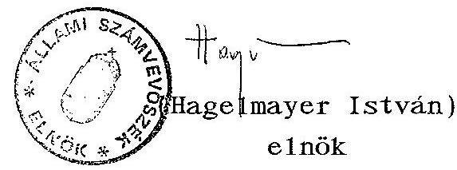

---

# Állami Fejlesztési Intézet Részvénytársaság 

## Elnök-vezérigazgató

Állami Számvevőszék
Hagelmayer István úr
elnök részére

Budapest

Tisztelt Elnök Úr!

Köszönöm, hogy megküldte az Állami Számvevőszék Elnöki értékezletén elfogadott jelentést az IKARUS és Csepel Autógyár együttes szanálásáról. Köszönöm továbbá, hogy figyelembe vették a végleges jelentésben az ÁFI Rt. összes észrevételét.

A végleges jelentés tömören, tárgyilagosan elemzi az alapvizsgálat óta eltelt eseményeket és a végkövetkeztetéseivel, ajánlásaival egyetértünk.

Az ÁSZ jelentés a felszámolási eljárás során az E hitel konstrukció igénybevételének lehetöségét javasolja, amennyiben a hitelezői igény bejelentés döntő hányada állami követelés. Elvileg támogatjuk, hogy a felszámolás során is müködjön valamilyen kedvezményes konstrukció, de az E hitel erre nem alkalmas. Az E hitel olyan speciális konstrukció, amely nem jár készpénzforgalommal (kivéve a privatizációs költséget), így az állami hitelezők kielégitését nem javitaná a konstrukció igénybevétele, hanem rontaná.

Budapest, 1994. január 24.
Tisztelettel:
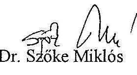

---

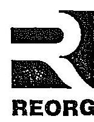

# REORG 

Gazdasági és Pénzügyi Részvénytársaság
1116 Budapest, Hengermalom u. 1.

Postacím: 1522 Budapest, Pf. 8. Telefon: 162-0600 Fax: 162-0602 Telex: 22-7039

Iktatószám: 102/1994.
Ugyintésô: VirágM

Hagelmayer István úr
elnök

Állami Számvevőszék

Budapest
Pf: 432
1393

## Tisztelt Elnök Úr!

Köszönettel vettem és áttanulmányoztam az IKARUS és a Csepel Autógyár állami vállalatok együttes szanálása és privatizálása tárgyában végzett ellenôrzésük utóvizsgálatáról készített jelentésüket.

A Jelentés irányitásom alatti Társaságot érintő megállapításaival egyetértek.

Budapest, 1994. január 28.

Üdvözlettel
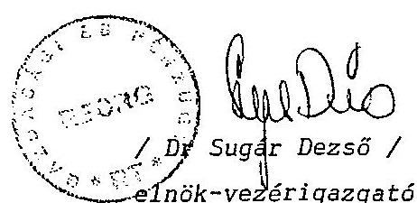

---

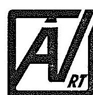

ÁLLAMI VAGYONKEZELŐ RÉSZVÉNYTÁRSASÁG
1115 Budapest, Bánk bán u. 17/B.
Levélcím: 1519 Budapest, Pf. 409.
Tisztelt Elnök Úr!

Hagelmayer István úr
elnök
Állami Számvevőszék
Budapest

Tisztelt Elnök Úr!

Budapest, 1994. január 27.
Iktatószám: 12/VI1/1994
1994-Úz- 6 3
V-31-76/93-94.

Az IKARUS és Csepel Autógyár állami vállalatok együttes szanálásáról és privatizálásáról szóló ellenőrzés utóvizsgálatáról készült, az Állami Számvevőszék V-31-69/1993-1994 jelentéséhez - a törvény adta lehetőséggel élve - az alábbi észrevételeket tesszük az Állami Vagyonkezelő Részvénytársaság részéről.

A jelentés összefoglaló megállapításaival és következtetéseivel alapvetően egyetértünk, az előzmények feltárása és bemutatása korrekt módon valósul meg. Megítélésünk szerint azonban nem eléggé hangsúlyos a lezáratlan peres ügyek kérdésének kezelése. A jelentés 4.2. pontjában (11. oldal) idézett kormányhatározat az IKARUS állami vállalat végelszámolással történő megszüntetését a folyó peres ügyek lezárását követő azonnali hatállyal írja elő. Ebből következően a jelentés által a 3.1. pontban felvetett vagyonátadás még nem lezárt kérdéseire és ezzel összefüggésben az állami tulajdonosi helyzet rendezésére (4.3. pont) is a peres ügyek lezárása után a ténylegesen fennmaradó kötelezettségek ismeretében lehet majd megoldást keresni.

Az ÁV Rt. a hosszú távú érdekeltségű tulajdonosi gyakorlat érvényesítését a kormányhatározatból fakadó feladatok (IKARUS Állami Vállalat felszámolása, gazdálkodás racionalizálása) előkészítésével kívánja a jelenlegi helyzetben megvalósítani. Ennek kapcsán került sor a jelentésben idézett (24. oldal III. A vizsgálat részletes megállapításai) szakértői cég kiküldésére is. Tekintettel arra, hogy a szakértői átvilágítás az IKARUS stratégiai céljainak meghatározására irányult, az üzletvezetés kérdéseit közvetlen nem tárgyalta, így a jelentés megállapításával szemben nem látunk ellentmondást a GT hivatkozott rendelkezésével kapcsolatban. Ugyanakkor a stratégiai átvilágítás részletesen foglalkozik a piaci helyzet változásával, illetve jövőbeni alakulásával, összhangban a jelentés idevágó megállapításával.

Javasoljuk, hogy a jelentés III. fejezet (A vizsgálat részletes megállapításai) 1.1.8. pontjában (30. oldal) a társaság tisztségviselőinek kifizetett tiszteletdíjak 1992. évre megállapított közvetlen költségeit az 1992 évi fejlesztési költségeihez viszonyítsuk, - így az utóbbinak mintegy harmada (és nem a fele) a kifizetett tiszteletdíjak összege.

(Megjegyezzük, hogy az 1993. évre várható kutatás-fejlesztési ráfordítások szintje rendkívül alacsony, a stratégiai fejlődést egyáltalán nem szolgálja, a szintentartáshoz sem elég.)

---

Hagelmayer István úr
1994. január 27.
2. oldal

Összefoglalóan rögzíteni kívánjuk, hogy az ÁV. Rt. portfoliójába tartozó IKARUS Részvénytársaság és IKARUS Állami Vállalat feletti tulajdonosi jogokat a vonatkozó rendelet szerint gyakoroljuk és a fennálló peres ügyek lezárását követően mindent megteszünk az idézett határozat végrehajtása érdekében.

A jelentés javaslatai jó alapot és hasznos segítséget adnak a megteendő intézkedésekhez.

Üdvözlettel
dr. Csepi Lájos

---

# Sllami Számverösrèk 

## Elnök

Budapest, 1994. február 7. $\mathrm{V}-31-79 / 1993-94$.

Dr. C S E P I LAJOS úr vezérigazgató Állami Vagyonkezelö Részvénytársaság

## B U D A P E S T

Tisztelt Vezérigazgató Ưr!

Köszönettel vettem az IKARUS és CSEPEL Autógyár állami vállalatok együttes szanálása és privatizálása tárgyában végzett ellenőrzés utóvizsgálatáról készült V-31/1993-94. számú jelentésre tett észrevételeit.

A levelének harmadik bekezdésében foglaltakkal összefüggésben megjegyzem, hogy a vizsgálat lezárásáig csak olyan kormányhatározatról van tudomásunk, amely az IKARUS állami vállalat végelszámolását írja elő. (Levelében, valószínủleg tévesen, felszámolás szerepel.)
A szakértői cég kiküldését illetően felhívom figyelmét a GT 275. §. (1), valamint 64 §. (4) bekezdésére is, amely kimondja, hogy a társaság szokásos üzleti tevékenységébe nem tartozó ügyekben valamennyi tag részvételével hozott döntésre van szükség. Ezért megállapításunkat fenntartom.

A társaság tisztségviselőinek kifizetett díjak - mivel azzal összefüggésben a Közgyűlés módosító döntést nem hozott -1993-ban az 1992. évi mértéknek megfelelően alakulnak.

---

Az utóvizsgálat jelentésének 1.1.8. pontjában szereplő összehasonlítás - amely elsősorban is az arányok érzékeltetésére szolgál - megfelelően tükrözi azt az Ön levelében is megállapított tényt, hogy "a kutatási-fejlesztési ráfordítások szintje rendkívül alacsony, a stratégiai fejlődést nem szolgálja".

Ezért erre vonatkozó megállapításunkat fenntartom.

Egyben tájékoztatom arról, hogy mind észrevételét, mind arra adott válaszomat csatolom az Országgyúlés részére eljuttatandó jelentéshez.

Együttmüködését köszönöm.

Tisztelettel

---

HAGELMAYER ISTVAN úr
Elnök
Allami Számvevõszék
Budapest

Tisztelt Elnök ùr!

Köszönettel vettem kézhez Elnök úr levelét és a csatolt. Jelentés az Ikarus és a Csepel Autógyár állami vállalatok együttes szanálása és privatizálása tárgyában végzett ellenörzés utóvizsgálatáról címü anyagot.

Orömmel tapasztaltam, hogy a tervezetröl irt véleményünk egy részét figyelembe vették a végleges változat elkészitésekor. Mindazonáltal egyes kérdésekben társaságunk álláspontja és szemlélete eltér az anyagban foglaltaktól, máshol pontositást tartunk szükségesnek. Eszrevételeink nem befolyásolják a jelentésben javasolt intézkedéseket, de reményeink szerint segítséget adnak azok célirányos és hatékony végrehajtásához.

Eszrevételeinket a csatolt mellékletben küldöm meg.

Budapest, 1994. január 31.

Melléklet: 1 pld.

Tisztelettel:
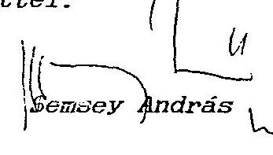

---

# ESZREVÉTELEK 

a Jelentés az Ikarus és Csepel Autógyár állami vállalatok együttes szanálásáról és privatizálásáról szóló ellenôrzés utóvizsgálatáról c. ÁSZ anyaghoz.

Észrevételünket a jelentés szerkezetéhez és sorrendjéhez igazodva tesszük meg. A könnyebb egybevetés és azonosítás céljából az oldalszámon kívül megacijuk vagy idézzük azt a szövegrészt, melyre az észrevétel vonatkozik, vagy a fejezet pontszámára hivatkozunk.
7. oldal "Függöben van egyes ..... stb"

A földek és ingatlanok tehermentes átadása, az átadás elókészítése az Ikarus Karosszéria- és Jármũgyár állami vállalat feladata. Sajnálatosnak tartom, hogy sürgetéseink ellenére az alapítás óta eltelt közel két és fél év alatt erre nem volt mód.

A Stefánia úti (és esetleg más) épületek és földingatlanok a társaság könyveiben nem szerepelnek, hiszen átadásukra nem került sor. Nem érthető viszont, hogy az állami vállalat vagyonából hogyan hiányozhatnak.
"A vállalat nem adta át több más tétel ..... stb."

A Hungarian Busexport közös vállalatban az Ikarus Karosszó-ria- és Jármũgyárnak 5 MFt-os tulajdonrésze volt. A közös vállalat a müködése során autóbuszok és tartalékalkatrészek exportjából illetve az autóbuszgyártáshoz szükséges anyagok, alkatrészek importjából jelentüs nyereséget ért el, és 30-40 MFt közötti eredménytartalékot képzett. A jelentés által is említett kockázatnövelésen felül üzleti és vagyonvédelmi szempontból is érthetetlennek tartjuk az 5 MFt-ért való értékesítést.

---

9. oldal 3.5 . ponthoz

Az. alapításkor fennálló 1898 MFt-os kubai céghitelt refinanszírozó hiteltartozásból a részvénytársaság a rendkívül nehéz müködési feltételek ellenére ütemezés szerint törlesztett 947 MFt-ot és kamatait.

A 951 MFt fennálló tartozás hitelkonszolidáción belüli rendezése jelenleg csak annyit jelent, hogy az NHB megszabadult ettől a hiteltől, de az Ikarus Rt számára - más intézkedésig - a törlesztési kötelezettség fennáll.

A 800 NFt-os 5 éves futamidejũ átstruktúrálási hitel ügyében tudomásunk szerint még elöterjesztés sem született. A hitelt a társaság venné fel az ÁV. Rt. garanciája mellett, tehát ez nem a költségvetést terhelné.

Mindezt figyelembevéve a mi véleményünk szerint:

- tartozáselengedés 11 HFt
- költségvetési
kötelezettségvállalás 4690 HFt

Üsszesen: 4701 MFt.

Ebből 2690 MFt (57 \%) az exportszállitásokhoz kapcsolódó költségvetési garanciavállalás, amire a pénzintézetek alacsony mértékũ szavatolótőkéje miatt volt szükség.
10. oldal 3.6. pont

A részvénytársaság közgyûlése 1992. decemberében fogadta el a menedzsment által kidolgozott válságkezelő programot, melynek keretében a racionális szervezeti méretek kialakítása megtörtént, illetve szükség szerint tovább folyik.

---

Ennek keretében:

- az autóbuszgyártó kapacitás az 1980-as évekre jellemzô 1213000 db/év-ről 3000-3500 db/év-re 1tt redukálva,
- a termelôterületek összevonása, eszközök áttelepítése nagyrészt megtörtént, a felszabaduló területek és eszközök gazdasági társaságokba vitele, bárbeadása vagy eladása nagyrészt megtörtént illetve folyik,
- kilenc új társaság alapítására került sor, az ezekbe bevont külföldi tőke 16,1 MUSD,
- a társaság 1991. augusztus 30 - 1993. december 31. közötti időszakban a létszámát 54 ㅑ-kal csökkentette,
- a vállalatcsoporton belül a nem ikarusi (nem egymás közötti kooperációs szállításokból származó) árbévétel 1994-ben mintegy 3-3,5 KrdFt lesz, ennek a fele export,
- az irányítás átszervezése megtörtént.

Az Arthur Andersen és az Andersen Consulting cég 1993. decemberi átvilágítási zárójelentésében a következôket írja:
"A válságkezelési" stratégia alkalmazásával az Ikarus vezetése sikeresen karcsúsította és ésszerûsítette üzleti tevékenységét válaszul a piaci feltételek drasztikus változásaira.
.... A vezetés által a mai napig megtett pozitív és határozott lépések eredményeképpen az Ikarus még mindig olyan pozícióban van, hogy jövôjét befolyásolni tudja."

Fentiekre tekintettel nem tartjuk érthetônek a Jelentés megállapítását, miszerint:
"..... szükséges az Ikarus Rt már többször megfogalmazott racionális szervezeti méretének kialakítása. Ezeknek a döntéseknek a meghozatalához, a hosszútávú tulajdonosi gyakorlat jelenleg nem érvényesül."

---

20. oldal 1.1.1. ponthoz

A jelentés kifogásolja, illetve az ÁVÜ 1991. augusztus 29-i határozatával ellentétesnek minösíti, hogy az 1991. november 25-i szerzödésben a Csepel Autógyár által az 1989. évi és az 1990. évi árkülönbözettel kapcsolatban indított peres ügyeket nem vállaltuk át.

Megítélésem szerint eljárásunk nem állt ellentétben az ÁVÜ hivatkozott határozatával. Ugyanis a kérdéses követeléseket az abban az idöben érvényes számviteli elöírásokkal összhangban az állami vállalat számviteli nyilvántartásai nem tartalmazták, azokkal szemben az állami vállalat eszközöket nem adott el, a szerzödés l.sz. mellékletét képező eszköz-forrás mérleg ezt a tételt nem tartalmazta. Ehhez képest a megkötött szerzödés a perek eredményének kizárásával együtt megfelel annak a feltételnek, hogy a társaság átvállalja a társasác (megjegyzés tőlem: helyesen vállalat) tevékenységével összefüggö valamennyi kötelezettséget és birtokolja az ennek megfelelö vagyont.
23. oldal "-az IKARUS Rt. müködöképességének megteremtéséhez,...."

A szöveg pontatlan, a határozat nem az ÁVÜ Rt-töl Jelveendö hitelröl szól, hanem a privatizációért felelős tárca nélküli miniszter: ".... az Ikarus Rt helyzetének áttekintése, stratégiai terve idöbeni elörehaladásának függvényében az ÁV. Rt-nél járjon el az átstruktúrálás költségeinek - 800 millió Ft - fedezetéül szolgáló 5 éves futamidejũ hitelfelvételhez garancia nyújtása érdekében."
27. oldal "A részvénytársaság vagyoni helyzetében gazdálkodási tartalékot jelent ..... stb."

Az ebben a bekezdésben foglaltak nem pontosan tükrözik a tényleges helyzetet.

---

A társaság az alapításkor tulajdonába került eszközök egy részét társaságokba vitte. A bevitelt vagyonértékelés elōzte meg, melynek során az apportált eszközök összessége felértékelődött. Az 1993-ban alapított társaságoknál mintegy 500 MFt eszköznövekmény jött így létre, ami a vagyoni helyzetet javítja, bár a likviditásit nem.

Másrészt a társaság az idôközben leselejtezett vagy feleslegessé váló tárgyi eszközökböl értékesített is. Erre is az a jellemzô, hogy az értékesítés a könyv szerintinél magasabb értéken történt. Ez a társaság vagyoni és likviditási helyzetét is javította.

Harmadsorban a társaság a tulajdonában lévô, vagy a nem tulajdonát képezõ, de általa használt eszközök egy rászát bérbeadta. Ezzel a költségeit csökkentette, sôt haszonra is szert tett.

Fentiek fényében a kihasználatlan kapacitások többlet ráfordításairól tett állítás nehezen értelmezhetō.

Jelen pillanatban a társaságnak nincsenek olyan jelentös értékũ felesleges tárgyi eszközei, melynek gazdálkodási tartalékot jelentenének.
27. oldal "Az Ikarus Rt. alapításakor a jóléti tárgyi eszközök a nyilvántartott nettó érték $10 \%$-án kerültek a társaság vagyonába ....stb."

Az ebben a bekezdésben foglaltak több szempontból pontatlanok.

Az Ikarus Rt. alapításakor még más eszközkategóriák léteztek. A jóléti állóeszközök egy része, a fogyóeszközök a készletek könyv szerinti értéken kerültek át a részvénytársaság vagyonába.

---

A nettó érték 10 1/4-án történő átadást-átvételt a szindikátusi szerződés tartalmazza, de csak a gyárterületen kívüli jóléti ingatlanokra - föld, épületek, építmények - vonatkozóan. Ezekből az állami vállalat halogató magatartása miatt eddig csak a zamárdi üdülő és a székesfehérvári jóléti ingatlanok tulajdoni átírása történhetett meg. A többi nem szerepel a társaság könyveiben ( nem is szerepelhet!), hanem az állami vállalat vagyonában van az eredeti bruttóból levezetett, jelenleg kb. 400 IFt-os értéken.

A kultúrházak funkcióveszteségének kiemelését nem látjuk indokoltnak. Ugyanígy és ugyanilyen mértékben kiemelhetők lennének a sportlétesítmények, az óvodák, bölcsödák és kiszolgáló egységeik, de még az üdülőknél is kérdések merülnek fel.

Ezen ingatlanok gazdasági tartalékként történő kezelését két okból nem tartjuk indokoltnak:

- legnagyobb részük nincs a részvénytársaság tulajdonában, és nem is tudjuk, hogy mikor lesz,
- ha a társaság tulajdonába kerülnek is, hasznosításuk, értékesítésük csak az üzemi tanács együttdöntésével lehetséges. (Ha az értékesítési elképzeléseket nem támogatják.)

27. oldal "A társaság elemzése szerint ma már bizonyosra vehető, hogy az 1993-ban, 1994-ben ezen a területen meghatározó nagyságrendũ értékesítés nem várható..... stb."

A volt Szovjetunió területén létrejött utódállamok tényleges fizetőképességét szinte lehetetlen megítélni. Az utódállamokban összesen kb. 100000 db ikarus van, ezek jó része azonban alkatrészhiány miatt üzemképtelen. Orosz elemzések szerint évi 30000 db új, nagy buszra lenne szükség, ezzel szemben az elméleti hazai kapacitás 14000 db/év a tényleges kibocsátás

---

kb. 4000 db . A saját autóbuszipar felfuttatásáról szôtt álmok összeomlani látszanak a kapkodó, különbözô érdekektôl hajtott beszerzések - török, iráni, dél-koreai, macedón, cseh, volt keletnémet használt ikarus, használt nyugati stb. - alkat-rész- és üzemeltetési problémák miatt sorra kudarccal végzôdnek.

Az Ikarus 1993-ban különbözõ csatornákon közel 1751 db-ot értékesített a volt szovjet területekre.

1994-re az AVTOEXPORTTAL 3100 db-ra szóló szerzôdést írtunk alá. Várható világbanki tenderek kiírása is kb. 400 NUSO értékben. Több összeszerelö project elökészítése folyik. Üsszesen mintegy 6000 db eladásáról vannak folyamatosan tárgyalások.

A társasági elemzésak arra kívánták felhívni a figyelmet, hogy a rendkívül nagy igény ellenére a fizetőképesség rendkívül alacsony szintũ is lehet, és a társaság tevékenységét úgy kell megszervezni, hogy a müködőképesség ekkor is megmaradjon. Ez elsősorban a piaci aktivitás más irányokban való növelését, a müködés ésszerũsítését és a gazdálkodás hatékonyabbá tételét jelenti, de semmiképpen nem azt, hogy ma valamilyen határozott mértékcsökkenést lehetne és kellene eldönteni és végrehajtani.
28. oldal. "A társaság állandó likviditási gondokkal küzd .... stb."

Igaz, hogy az Ikarus Rt. az elmúlt idôszakban folyamatosan likviditási gondokkal küzdött, azonban a 28. oldalon tett megállapításokat a jelentésben túlzottnak tartjuk.

Figyelembevéve az 1992. évi mérlegadatokat, valamint az 1993. évi várható mérlegszámokat a kötelezettségek és követelések arányai a következök:

---

- 1992: 1,63
- 1993: 1,41

30-32. oldal 1.1.9. pont

Ebben a pontban a társaság stratégiájával, méretével és a tulajdonosi döntéshozatallal kapcsolatos álláspont van részletesen kifejtve, amire a 10. oldali összefoglalú 3.6. pont kapcsán már kifejtettem eltérő véleményemet.

Két fontos kiegészítő megjegyzés:

- A 31. oldalon szerepel: Az elmúlt években az autóbusz gyártás túlnyomó részben ( $90 \%$ körül) exportra került, elsősorban a mai FÁK országok területére.

Ez az állítás az 1970-80 évtizedre igaz, 1990-tól kezdve az arány lényegesen lecsökkent, miközben az export az összértékesítésen belül nőtt.

- A 32. oldalon található: Ugyanakkor a szervezetkorszerúsítési döntések radikális végrehajtásában - annak érthető egzisztenciális feszültségei miatt - management sem érdekelt eléggé.

Annak megnevezése nélkül, hogy milyen radikális szervezetkorszerúsítésről van szó, ez a kijelentés igazságtalan. Az alapítéstól eltelt idöben jelentősen átalakult a vállalat szerkezete (l. társaságok, területcsökkentés stb.) és a részvénytársaság irányítási szervezete is. A menedzsmentnek emellett meg kellett küzdenie az alapítás, a létszámleépítés, a termelésátszervezés gondjaival és a likviditási problémákkal. Nem világos, hogy milyen érdekeltség és milyen egzisztenciális feszültségek gátolták mindezt.

---

34. oldal 1.2 .2 . pont

A kubai cégbitelt refinanszirozó hitelt az állami vállalat tartja nyilván a könyveiben, de a fizetési kötelezettség a részvénytársaságot terheli. Az alapítás óta az rt. 947 MFt-ot törlesztett, erre a részre a devizahatóság megadta a leirési engedélyt.

A szindikátusi szerzôdéssel, az alapító okiratokban foglaltakkal és a részvénytársaság és az állami vállalat között létrejött szerzödésekkel ellentétesen az állami vállalat ezeket a követeléseket nem adta át a részvónytársaságnak, hanem önkényesen a 10GÜRT Rt-nél értékesitette.

A legnagyobb - állami - alapító nem csak szerzödést szegett, nem csak azt akadályozta men, hogy a 61 \%-ban állami részesodésũ rt. megpróbálja a követelések értékesítésével vagyoni helyzetét és likvidítását javítani, a 10GÜRT-töl kapott vételárat sem acta át a részvénytársaságnak.

A követelések "rendkívül alulértékelhetō" minösítésével adatok hiányában nem tudunk mit kezdeni, egyes információk szerint spanyol befsktetők 40-50 \%-os áron is hajlandó megvásárolni.

Az állami vállalat vezetôinek kubai utazásairól és ottani tárgyalásairól semmilyen információnk nincs.
35. oldal 1.2 .3 . pont

Az ebben a pontban foglaltakkal kapcsolatos problémákat a 7. oldalhoz tett véleményemmel már elmonditam.

---

# S E M S E Y ANDRÁS úr 

vezérigazgató
IKARUS Jármúgyártó Rt.

## B U D A P E S T

Tisztelt Vezérigazgató Úr!

Köszönettel vettem az IKARUS és CSEPEL Autógyár állami vállalatok együttes szanálása és privatizálása tárgyában végzett ellenőrzés utóvi szgálatáról készült V-31/1993-94. számú jelentésre tett észrevételeit.

Egyetértek azzal, ahogy levelében Ön is jelzi, hogy azok nem befolyásolják a jelentésben javasolt intézkedéseket, de hozzásegítenek a feltárt problémák, megállapítások sokoldalú megvilágításához.

Tájékoztatom, hogy mind észrevételeit, mind arra adott válaszomat csatolom az Országgyưlés részére eljuttatandó jelentéshez.

Együttmúködését köszönöm.

Tisztelettel
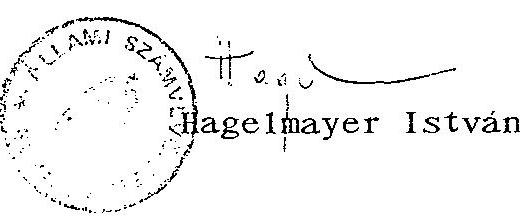

---

# IKARUS 

## ÁLLAMI SZÁMVEVŐSZÉK

Hagelmayer István elnök úr

Budapest

Tisztelt Elnök Úr!

Budapest, 1994.jan. 26. 3-52/94.
Táray:
ALLAMI SZAMPIEVCGZEK
1994 -UZ- 01
$V-31-72193-94$

Megkaptam az Állami Számvevôszék V-31-69/1993-1994. sz. jelentését az IKARUS és Csepel Autógyár állami vállalatok együttes szanálásáról és privatizálásáról szóló ellenôrzés utóvizsgálatával kapcsolatosan.
A jelentést áttanulmányoztam és megnyugvással vettem tudomásul, hogy a jelentés tervezetéhez füzött szakmai észrevételeinket az elnökség által jóváhagyott jelentés figyelembe vette.

A jelentést az IKARUS Karosszéria és Jármũgyár tevékenysége tekintetében szakmailag kiváló szinvonlúnak, objektívnek látom, további munkánkhoz figyelembe vesszük.

Ami a jelentésnek az ÁVÜ, ÁVRT, Pénzügyminisztérium és a többi irányítóhatóságok vonatkozásait illeti, úgy vélem ezek minősitésére nem érzem magam illetékesnek és ezért ezekre korábban sem tértem ki.

Köszönöm a vizsgálat során is megnyilvánult segítségüket.

## IKARUS

Karosszéria és Jármũgyár Budapest, 1165. Margit u. 114.

Tisztelettel:
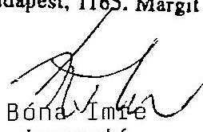

IKARUS KAROSSZÉRIA- ÉS JÁRMÚGYÁR
1165 Budapest, Margit u. 114.
telex: 224766 telefon: (1) 2529666 telefax: (1) 1637263

---

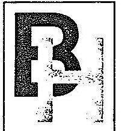

# Budapest Holding

Fax. 13800

ELSŐ HAZAI VAGYONKEZELŐ RÉSZVÉNYTÁRSASÁG

69/06/94

mint a Csepel Autógyár F.A. felszámolója

Hagelmayer István úr
elnök
Állami Számvevőszék

Budapest

Tisztelt Elnök Úr!

Az Állami Számvevőszéknek az Ikarus és a Csepel Autógyár állami vállalatok együttes szanálása és privatizálása tárgyában végzett utóvizsgálatáról szóló V-31-67/93.-94. sz. jelentésével, annak megállapításaival egyetértek.

Budapest, 1994. január 26.

Tisztelettel:

Kelenyi Gábor

Budapest 1994. víz

150 Hazai Vagyonkezelő
Részvénytársaság 1.

H-1024 Budapest, Margit körút 85. • (361) 156-5566 • Telex: 22-5376 • Fax: (361) 155-2363

---

From : PM Uallalkozasi Foeosztaly 266-0289
Feb. 07. 1994 02:02 PM P02

PENZÜGYMINISZTER

312/Sx.1./94.

Hagelmayor István úr
elnök

Állami Számvevõszék

ÁLLAMI SZÁNVEVOSZÉK

ÉRKEZETT: 1994-02-07
IKTATOSZAM: V-31-80/1993-94
MELIÉKLET: - 06

Budapest.
Apáczai Csere J. u. 10.
1052

Tisztelt. Elnök Úr!

Az IKARUS és CSEPEL AUTÓGYÁR állami vállalatok együttes
szanálása és privatizálása tárgyában végzett ellenőrzés
utóvizsgálatának megállapításait tartalmazó Jelentéssel
kapcsolatban észrevételt nem teszek.

Budapest, 1994. február °°°.

Üdvözlettel

Dr. Szabó Iván

---

# A MAGYAR KÖZTÁRSASÁG KORMANYA 

SZABÓ TAMÁS
TÁRCA NÉLKƠLI MINISZTER

Hagelmayer István úr, elnők
Állami Számvevôszék

1052. Budapest

Apáczai Cs. J. u. 10.

Budapest, 1994. január 31. SzT-167/1994.
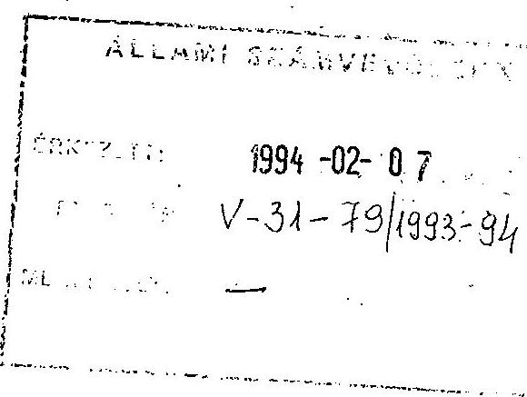

Tisztelt Elnők Úr!

Az Ikarus és Csepel Autógyár állami vállalatok cgyüttes szanálásáról és privatizálásáról készített ellenôrzés utóvizsgálatának tapasztalatait összefoglaló jelentésüket az érintett tulajdonosi szervezetek munkatársaival és vezetôivel együttesen áttanulmányoztuk, mely alapján az alábbi megállapításokat teszem

A két vállalat korábbi, a gazdaság számos területét is befolyásoló szerepéből kiindulva az érintett szervezetek /ÁVÚ, ÁV Rt., Szanáló Szervezet/ és minisztériumok /PM, IKM/ áthatóan tanulmányozták a gazdálkodó szervezetek helyzetét, a szükséges kilábalás lehetséges módozatait, útjait, s azok következményeit. Tényként kell elfogadni, hogy a többszörös tulajdonosváltozások és a szanálás folyamatának egyidejủ és tartós elhúzódása, egymás keresztezése nem használt, hanem elsősorban ártott azon gazdasági célszerűségnek, hogy - mind a közeli és ismert, mind a távoli és csak becsülhető piaci igények érdekében - potenciálisan szükséges a két vállalatból eredményes gazdálkodó szervezetek fenntartása. Mindezt azért vázoltam ilyen átfogóan, mert - véleményem szerint - célszerű egyértelműsíteni, hogy az eltelt három év során a gazdálkodási és szabályozási

---

környezetben olyan események zajlottak le, amelyek alapján az egyik "pillanatban" még racionálisnak tünő intézkedéssorozatok meghatározása és megkezdése a "másik pillanatban" már esetleg irracionálisnak tünhetett, illetve ellentétes hatásokat is kiválthatott.

A két vállalat esetében ilyen problémát vetett fel az Ri, mielőbbi létrehoiása, ami lehetôvé tette a termelés fenntartását és a társaság eredményes gazdálkodását kisebb mértékủ kötelezettséggel, ugyanakkor a fennmaradt állami vállalat feladatává tüzhette ki az adósságok és kötelezettségek rendezését.

A fentiek alapján a javaslat 3. pontjában foglaltakat elsősorban vizsgálat tárgyává kivánom tenni, s tényleges mulasztás esetén tartom csak célszerünek a konkrét felelösség megállapítását.

Egyébként az utóvizsgálatról készített jelentést tárgyilagosnak és alaposnak tartom, a végleges jelentés általános megállapításaival és javaslataival egyetértek. Hasznositásukat mindkét vagyonkezelô szervezet esetében célszerünek tartom, aminek időszerüségét a most zajló adóskonszolidáció elókészítése is még jobban motiválja.

Üdvözlettel:
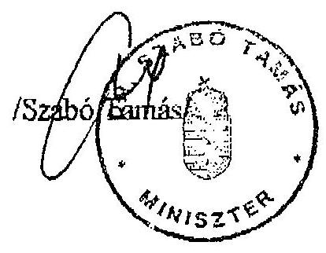

---

# Iparí és Kereskedelmi Minisztérium 

Helyettes államtitkár
$H R^{\prime}-2-137194$

Hagelmayer István
elnök úr részére

Állami Számvevôszék

Budapest
Apáczai Csere János u. 10.
1052

Tisztelt Elnök Úr !

Az IKARUS és Csepel Autógyár állami vállalatok együttes szanálásáról és privatizálásáról szóló ellenôrzés utóvizsgálatáról készített jelentésüket áttanulmányoztuk.

Ismételten rögzítjük - korábban kialakult véleményünkkel egyezően -, hogy az IKARUS Jármũgyártó Rt. mũködőképességének feltételeit a szanálás során végrehajtott, részbeni privatizáció nem teremtette meg, az alapításkori elképzelések nem realizálódtak. A termelési kapacitások megfelelô fedezetũ termékkel való leterhelése nem biztosított.

A problematikus helyzetũ részvénytársaságnál a jelenleginél kisebb létszámú Igazgató Tanács és Felügyelõ Bizottság talán hatékonyabban tudná a társaság stratégiai irányítását és felügyeletét ellátni. Ezáltal az éves tiszteletdíjak összege is kedvezôbb lenne.

Ezért felvetjük, hogy e téma javaslatok közé történõ felvételét szíveskedjenek megvizsgálni.

A jelentésükben foglaltakkal és a javaslatokkal egyetértünk.
Budapest, 1994. január 31.
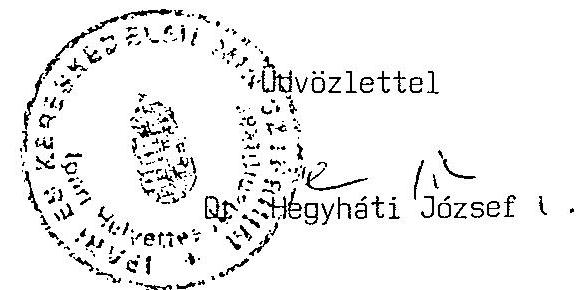

CIM: 1024 BUDAPEST, II., MARGIT KÖRÚT 85. LEVEELCIM: 1525 BUDAPEST, PP. 96.