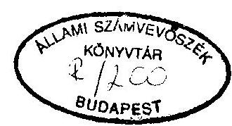
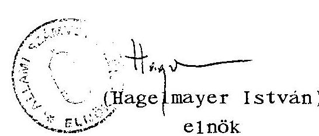
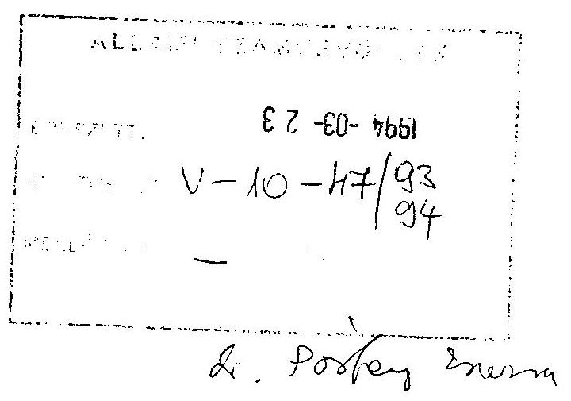
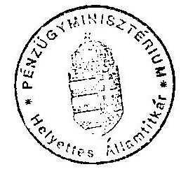

# Állami 

## JELENTÉS

a Vértes Volán Vállalatnál, az országos menetrend szerinti személyszállításra rendelt állami vagyonnal való gazdálkodásról

---

A vizsgálatot vezette:
dr. Kovácsné dr. Pósfay Zsuszanna osztályvezető főtanácsos

A vizsgálatot végezte:

| Koós Lászlóné | számvevő |
| :-- | :-- |
| Korondi János | számvevő tanácsos |
| Sólyom László | számvevő tanácsos |
| Tóth Pál | számvevő |

---

# TARTALOMJEGYZÉK 

I. BEVEZETÉS ..... $1-5$.
II. ÖSSZEFOGLALÓ MEGÁLLAPÍTÁSOK, AJÁNLÁSOK ..... $5-13$
III. RÉSZLETES MEGÁLLAPÍTÁSOK ..... 13 .

1. Gazdálkodás a vagyonnal ..... 13 .
1.1. A gazdasági társaságok alapításának törvényessége ..... $13-14$.
1.2. Az állami vagyon védelme ..... 14 .
1.3. A Részvénytársaság alapításának törvényessége ..... 15 .
1.4. A részvénytársasággá alakulás hatása a menetrendszerű autóbusz személyszállítás működőképességének feltételeire ..... 15 .
1.5. Az állami vagyon megőrzése ..... 15 .
1.6. Az eszköz és tőke összetételének változása az 1991. évi számviteli törvény bevezetése következtében ..... 17 .
1.7. A részvénytársasággá alakulása során a vagyonértékelés okozta értékváltozás hatása ..... $17-18$.
1.7.1. A likviditási helyzet a pénzügyi folyamatokon belül ..... 18 .
1.8. A menetrend szerinti belföldi autóbusz személyszállítás jövedelmezőségének alakulása ..... $18-20$.
1.9. A nemzetközi autóbusz személyszállítás jövedelmezősége ..... $20-21$.
1.10. A közszolgáltató autóbuszok és az infrastruktúra helyzete ..... $21-22$.
2. A vállalat közszolgáltatási tevékenysége ..... 22 .
2.1. A szerződéses autóbusz személyszállítás és a hatósági áras menetrend szerinti (helyi és helyközi) személyszállítás arányának alakulása ..... $22-23$.
2.2. A menetrend szerinti autóbusz személyszállítási ellátottság helyzete, alakulása Komárom-Esztergom megyében ..... $23-24$.

---

2.3. A fizetőképes utazási igények változása (a térségben a gazdasági recesszió, a munkanélküliség, vagy egyéb más jelentős tényezők hatásai).
24-26.
2.4. A belföldi helyi és helyközi autóbuszok tarifáinak alakulása
26-28.
2.5. Az autóbusz személyszállítással kapcsolatos reklamációk és azok elintézésének módjai
28-29.
2.6. A közszolgáltatás jövedelmezőségének javítása 29-30.
2.7. A vállalat személyszállítási közszolgáltatásainak minősítése
$30-31$.
2.8. A célállomásra történő eljutási időmutatók alakulása
31.
3. A Felügyelő Bizottság működése 31.
4. A belső ellenőrzés helyzete, a feltárt hibák megszüntetésére tett intézkedések 32.
5. A környezetvédelmi szabályok betartása

---

# JELENTÉS 

a Vértes Volán Vállalatnál
az országos menetrend szerinti személyszállításra rendelt állami vagyonnal való gazdálkodásról

## 1 .

## BEVEZETÉS

Az Állami Számvevőszék 1993-ban lefolytatott vizsgálata a Vértes Volán Vállalatnál arra irányult, hogy 1991-1992-ben, illetve a helyszíni ellenőrzések 1993. decemberi lezárásakor miként gazdálkodtak az állami vagyonnal, betartották-e a gazdasági társaság alapítására vonatkozó törvényeket, milyen színvonalú autóbuszközlekedési ellátást nyújtottak a lakosságnak, valamint megfelelő figyelmet fordítottak-e a környezetvédelemre.

Az 1993. év az 1994. május 31-ig benyújtandó letéti mérleggel zárul le, emiatt a jelentésben szereplő 1993. évi adatok előzetesek, nem auditáltak, de tájékoztatnak az időszerű helyzetről.

A Vértes Volán Vállalat megyei szintű vegyes profilú - személy- és teherfuvarozó - gazdálkodó szervezet volt, amely 1953-tól 1993-ig számos szervezeti változáson ment keresztül, többnyire államigazgatási döntés alapján. 1993. január 1-jétől a személyszállításra szakosodva átalakult cég Vértes Volán Autóbuszközlekedési Részvénytársaságként működik. Szűkkörű szakmai képviseletét a Volán Egyesülés látja el.

---

A Részvénytársaság alapító vagyona (állami vagyon) 430 millió Ft jegyzett tőkéből és 432,5 millió Ft tőketartalékból áll. E vagyonnal Komárom-Esztergom megyében 1174 fős létszámmal, 336-ból 55 helyi járatú, 105 helyközi járatú autóbuszszal, 106 település, 6 város lakosságát szolgálja ki menetrendszerinti gyakorisággal.

A Vértes Volán részvénytársasággá átalakulását szükségessé tevő okok összetettek voltak. A gazdasági recesszió következményei és a szervezeti struktúra korszerűsítésének igénye egyaránt indokolttá tették 1991-1992. években a tevékenységek körében a profiltisztítást. (A piacát vesztett teheráru fuvarozás szervezeti elválasztását a személyszállítástól, társaságok alapítását, illetve azokban való részvételt).

Az intézkedés sorozat jelentősége, nagyságrendje a vállalat korábbi működéséhez mérten ítélhető meg.

A Vértes Volán az 1980-as évek közepéig méreteinek és gazdasági súlyának megfelelően vett részt a megyében a személyszállítási (ezen belül a szabadáras, szerződéses és idegenforgalmi) feladatok ellátásában, illetve végezte a tatai-dorogi bányavidék nagy tömegű árufuvarozását. Ez időben a vállalat szervezete, és gazdálkodása stabil volt. Piacát az ipari munkásság ingázói, valamint az állami vállalatok, állami beruházások fuvarigényei képezték. A vállalat vegyes profilú volt és ez módot nyújtott hosszú időn át keresztfinanszírozásra a nyereséges árufuvarozásból a személyforgalmi tevékenységek javára.

A megyén belül - az országos helyzethez képest - igen korán érvényesülő gazdasági recesszió miatt, a korábban legnagyobb fuvaroztatónak minősülő szénbánya vállalatok folyamatosan csökkentették - személy és teher - fuvarozási igényeiket. A megyén belüli piacvesztés miatt a vállalat országos nagyberuházásokban kívánta teherfuvarozó gépjármű kapacitását hasznosítani.

---

A Vállalat annak érdekében, hogy a Bős-Nagymarosi Vízlépcső kiemelt állami nagyberuházáson elvégzendő feladatainak eleget tegyen, 1986-ban kötvényt bocsátott ki 70 millió Ft értékben 7 év 1 e járattal. A befolyt pénzt rakodógépek és billenő tehergépjárművek vásárlására fordította. A Bős-Nagymarosi beruházás leállítása a vállalatot nehéz helyzetbe hozta. A túlméretezett tömegáru-fuvarozási kapacitás lekötése megoldhatatlanná vált, ugyanakkor a kötvényt annak lejárati idejében vissza kellett vásárolnia. A kötvény visszavásárlása 1992-ben megtörtént.

A vállalat korábbi vezetősége (utólagos értékelés szerint ugyan megkésve) a romló gazdasági helyzethez alkalmazkodva 1990. január 1-jétől módosította a szervezetet.

Ezzel párhuzamosan a közlekedési tárca irányelvei alapján, a feleslegessé vált kapacitás mértékéig fokozatosan megkezdődött az eszközök és a versenyszférába sorolható tevékenységek társaságokba vitele. Összesen 16 gazdasági társaságot alapítottak 35,1 millió Ft befektetéssel 1992. december 31-ig.

Ezzel az intézkedés sorozattal "megtisztították" a vállalatot a személyszállításhoz nem kapcsolódó tevékenységektől.

A "profiltisztítás" után 1993. január 1-jétől 100%-ban állami tulajdonú részvénytársasággá alakult át a vállalat.

Az új részvénytársaság tevékenységi körébe a menetrendszerű és nem menetrendszerű, helyi és távolsági, közúti személyszállítás, közúti járműjavítás és karbantartás, járműkereskedelem, kis- és nagykereskedelmi, továbbá különböző szolgáltatási tevékenységek tartoznak.

A vállalatnál meghatározóvá vált személyszállítás állami támogatása (fogyasztói árkiegészítése) jelentős. Nagyságrendjét az alábbi adatok érzékeltetik.

---

A vállalat árbevétel adatai millió Ft-ban

|  | 1991. év | 1992. év | 1993. év* |
| :--: | :--: | :--: | :--: |
| Értékesítés nettó árbev. | 1227,5 | 1398,7 | 1596,0 |
| ebből: utazási kedvezmények miatti ktg.-vetési támogatás | 281,7 | 394,1 | 481,3 |

A közlekedést az általános adóterheken felül 1991-1992-ben külön adók nem terhelték. A kedvezmények közül a közszolgáltató tevékenység címén járó 1991. évi 80%-os nyereségadókedvezményt veszteség (negatív adóalap) miatt nem tudta igénybe venni a vállalat. A sajátos gazdasági szabályozóelemek és azok változásai a vizsgált időszakban azonban nem javították érdemlegesen a vállalat működési feltételeit.

Az 1992. évi közszolgáltatói adókedvezmény 40%-os volt, amellyel 1,5 millió Ft az elszámolt adókedvezmény mértéke.

A vállalat adózás előtti eredménye millió Ft-ban

| 1991. évben | $-59,9$ |
| :-- | --: |
| 1992. évben | 1,6 |
| ${ }^{*1993.}$ évben | 20,3 |

A vállalatnak tiszta eredménye 1991-ben és 1992-ben a korábbi években keletkezett veszteség elhatárolásának elszámolása miatt nem volt.

[^0]
[^0]:    *Nem auditált adat

---

A tárgyi eszközök alakulása millió Ft-ban

|  | Vállalat   1992. dec. 31. | Rt.   1993. jan. 1. |
| :-- | :--: | :--: |
| Ingatlan | 311,2 | 626,9 |
| Műszaki berend., gép, jármű | 86,8 | 239,5 |
| Egyéb berendezés | 15,6 | 17,6 |
| Beruházások | 1,0 | 1,7 |
| Összesen | 414,6 | 885,7 |

A vállalat tevékenysége ellátásához rendelkezett egy viszonylag jó állapotú infrastruktúrával (járműtelepek, javító üzem, autóbusz pályaudvarok) és elhasznált, de megfelelő darabszámú autóbusz állománnyal.
II.

# ÖSSZEFOGLALÓ MEGÁLLAPÍTÁSOK, AJÁNLÁSOK 

A vállalat induló helyzete és a rendezés eszközei

A Vértes Volán a vizsgált időszak elején államigazgatási felügyelet alatt állt. Veszteséges volt. A Vállalat 1993. január 1-jei időponttal - zártkörű alapítással - határozatlan idejű, 100%-ban állami tulajdonú egyszemélyes részvénytársasággá alakult át, tőkebevonás nélkül. Fő tevékenységévé a menetrend szerinti autóbusz személyszállítás vált. Az átalakulás a vonatkozó törvények betartásával történt.

---

A Vértes Volán Részvénytársaságnál a biztos fuvarpiacot jelentő nemzetgazdasági beruházások csökkenése, illetve leállítása (eocén program, Dunaí Vízlépcső) miatt a teherszállítás és kapcsolódó funkciói visszafejlesztése, szervezeti szétválasztása vált szükségessé. A legnagyobb kapacitásfelesleget, 430 db tehergépkocsit privatizáltak. A profiltisztítás során kikerült eszközök - az állami vagyonvédelemről szóló törvény betartásával - az állami vagyonból nem vesztek el, hanem tőkerész formájában megmaradtak. Bár a Részvénytársaság likviditási helyzete nehéz a nagy összegű rövid lejáratú kötelezettségek miatt, de a végrehajtott intézkedésekkel kikerült a csődhelyzetből, önmagát szanálta.

Ezt az eredményt a Vértes Volán úgy érte el, hogy működőképességének megőrzése érdekében az Igazgatótanács 1991. júniusában válságkezelő programot fogadott el, amely két alapvető feladat megoldását tűzte ki célul. Nevezetesen a veszteséges tevékenységek megszüntetését: a veszteséggel működő termelőegységek nyereségessé tételét, valamint a múltbeli veszteségek és adósságok rendezése érdekében szükséges érdemi intézkedések végrehajtását.

A felhalmozott vállalati adósságtól a Vértes Volán elsősorban a személyszállításhoz nem szükséges vállalati vagyon jobb hasznosításával igyekezett megszabadulni. 1992. január 1-jével a vezetés átszervezést hajtott végre az előzőekben vázolt célok megvalósításának érdekében. Megszűnt hat üzemigazgatóság, helyettük három nagyobb vonzáskörzetben kialakított forgalmi és műszaki üzempár (Tatabánya, Oroszlány, Dorog,) végzi a személyszállítást.

Mindezen változások mellett a vállalat ellátta működési területén az autóbusz személyszállítást. Közlekedésből kizárt település nem volt a megyében. A lakosság utazási igényeit az érvényes menetrend szerint kiszolgálták.

---

Gazdálkodás a vagyonnal

A Vállalat saját vagyona/tőkéje 1992 végére 510,2 millió Ft-ra csökkent, az előző évihez képest 15,3 millió Ft-tal (3%-kal) lett kevesebb. (Előzetes adatok szerint 1993. végén 864 millió Ft körül alakul.)

A vállalat időleges gazdasági stabilizálására tett erőfeszítések annyiban hatásosak voltak, hogy míg a vállalat adózás előtti eredménye 1991-ben az árbevétel -4,6%-a (-59,9 millió Ft veszteség), 1992-ben már a +0,1%-a (1,6 millió Ft) nyereség volt.

A 1992-ben mind a helyi, mind a helyközi menetrend szerinti autóbusz-személyszállítás nyereséges volt, a tarifaemelések, a fogyasztói árkiegészítés realizálása, forgalomszervezési intézkedések és költségkímélő gazdálkodás együttes eredményeként.

Veszteséges volt a nemzetközi személyszállítás mindkét évben, de ez a tevékenység mindössze egy (Komárom-Komárnó) határvárosok közötti járatával jelentéktelen.

Összességében 1992-ben és 1993-ban a menetrend szerinti helyi és helyközi személyszállítás bevételei a kiadásokat fedezték, de sem a képződött nyereség, sem pedig a költségek között elszámolt értékcsökkenési leírás összege új autóbuszok beszerzésére, a járműpark megújítására nem nyújtott fedezetet és ez a helyzet jelenleg is fennáll.

Megjegyzendő, hogy a közlekedési feladat ellátásáért felelős önkormányzati támogatások összege is oly csekély, hogy csak a működési költségek elviseléséhez nyújt jelentéktelennek minősíthető segítséget. A Vértes Volán Rt. jelenleg és távlati terveiben is használt, de még működőképes, a volt NDK-ból vásárolt

---

IKARUS autóbuszok beszerzésével próbálja elöregedett autóbuszállományát "fiatalítani". Ez nem tartós megoldás, mert az Rt-nek nemcsak beruházásra, hanem az autóbuszok nagyjavítására sincs pénze.

A vizsgálat nem terjedt ki 10 db 1993. végén lízingelt Opel Astra személyautó lízingelési körülményeire, használatára. Erről a Vértes Volán a tulajdonos KHVM-nek írásban beszámolt. Egyébként a társasági adótörvény és a számviteli törvény a
 lizingelésre lehetőséget ad, szabályozva az elszámolást is.

A vállalat átalakulása részvénytársasággá

A vállalat eredményesen előkészítette az átalakulást gazdasági társasággá. Ennek során elkészítette és benyújtotta átalakulási vagyonmérlegtervét, elkészítette alapító okiratát és jóváhagyták azt. A vizsgált időszak alatt már jogerős cégbírósági bejegyzéssel rendelkezett, elkészítette végleges vagyonmérlegét, amelynek átértékelt értékei képezik az 1993. január 1-jétől megalakult részvénytársaság induló vagyonának adatait.

Kifogásolható azonban, hogy rendezetlen maradt a tőketartalék egyes ingatlan-elemeinek tulajdoni helyzete, mert a tőketartalék nevesítése nem volt feltétele a cégbírósági bejegyzésnek.

A részvénytársaság megalakulása megteremtette a lehetőséget a privatizáláshoz maximum 49% mértékig. Az átalakulás önmagában nem javította a menetrendszerű autóbusz személyszállítás működőképességének gazdasági, pénzügyi feltételeit, idegen tőkét nem vontak be, befektetőt nem találtak.

A Vértes Volán működésének belső szabályozottsága megfelelő. Az időközbeni változások miatt szükséges azonban a szabályozások aktualizálása a mindenkori szervezeti rendhez, jogi és piaci körülményekhez igazodóan.

---

# A közszolgáltatási tevékenység 

Annak megítéléséhez, hogy az autóbusz személyszállításra rendelt állami vagyon elég-e, nincs megfelelő összemérési lehetőség. Nincs ugyanis meghatározva, jogszabályokban, irányelvekben, koncepciókban, vagy a vállalat által, hogy milyen paraméterek szerint kell biztosítani a menetrendszerű autóbusz személyszállításban, mint közszolgáltatásban az alapellátási színvonalat.

Elvileg legalább az ún. "megkövetelt" alapellátási színvonalhoz kell és lehet biztosítani az anyagi feltételeket. Ennek a meghatározására valamennyi menetrend szerinti autóbusz közlekedési vállalatra, vállalkozásra vonatkozóan a Közlekedési, Hírközlési és Vízügyi Minisztérium illetékes. Természetesen a gyakorlatban kialakult egy menetrend, ami kiszolgálta a korábbi szükségleteket. A lakosság részéről ez a közlekedési rendszer a megítélés, az összevetés alapja. A lakosság közlekedéssel szembeni igényei és a fizetőképes utasok számának tapasztalható csökkenése nehezen megoldható gazdasági gondot jelentenek a közlekedési vállalatnak, és az állami költségvetésnek.

A menetrend szerinti közlekedésben egyrészt a növekvő munkanélküliség, másrészt a bevezetett tarifaemelések miatt az utasszám csökkent, amelyet - a menetrendet fenntartva - teljesítmény visszafogással nem tudtak követni, ezáltal a személyszállítási tevékenység hatékonysága romlott.

A szerződéses (szabadáras) közlekedési utasszám növekedése látszólagos, a ténylegesen utazók száma nem nőtt (átlagos utazási távolság 46,5 km-ről 26,1 km-re csökkent).

Az autóbuszközlekedésben a menetrendek felülvizsgálatával és korszerűsítésével, a különösen kihasználatlan járatok leállításával a menetrend szerinti közlekedésben sikerült a veszteséges illetve a költséges teljesítményeket csökkenteni.

---

A tarifaemeléseknek a fizető utasszámot csökkentő hatásait figyelembevéve, az árképzés problémája, hogy nem számolt az infrastruktúra megújításához szükséges források kitermelésével. Röviden: a tarifa nem fedezi a selejtezésre érett járművek pótlását. Más oldalról pedig az utasok jelentős része nem tudná megfizetni az új járműárakat fedező viteldíjakat.

A közszolgáltatás minőségi jellemzőit vizsgálva megállapítható, hogy az autóbusz személyszállítással kapcsolatos lakossági reklamációk és azok intézése terén megfelelő alapossággal és szakértelemmel járt el a vállalat. A menetrendi koordináció kielégítő, különösebb nézeteltérések, ellentétek nem merültek fel.

Áruszállítási tevékenység gyakorlatilag csak 1992. március hónap végéig volt. Április 1-jétől a Kft.-k végzik ezen tevékenységet.

A belső ellenőrzési tevékenység

A Vértes Volánnál 1991. január 1-jétől a Belső Ellenőrzési Osztály megszűnt. A válságkezelés időszakában csak 1992. június 1-augusztus 31. közötti időszakban végeztettek megbízás alapján belső ellenőrzési vizsgálatot az új számviteli törvény végrehajtásának, a rendező mérleg és rendező eredménykimutatás elkészítésének ellenőrzésére. Az ellenőrzés lényeges megállapítása az volt, hogy a számviteli terület hiányosságokkal küszködik, határidőre a rendezőmérleggel nem készült el, és a vállalati döntések megalapozása érdekében a cégnek stabil számvitelre van szüksége. A vizsgált időszakban pozitívumként a célorientált vezetői ellenőrzést kell kiemelni, amelynek eredményeként a Vértes Volán a felszámolást, a csődöt elkerülte. Ez azonban a további folyamatos, jó működéshez kevés.

---

A vállalat környezetvédelmi intézkedései

A járművek karbantartását, javítását zárt technológiás vizsgáztatási rendszerben végzi a vállalat. Joga van saját járművek vizsgáztatására és idegen járművek esetében vizsgáztatásra, zöldkártya kiadására is. A járművek javításához a szükséges technológiák rendelkezésre állnak. A műhelyi gépek, berendezések alkalmasak a feladat ellátására.

Környezetvédelmi szempontból a közúti közlekedésben és a telephelyen belül, működéséből adódóan környezetterhelést okozott a vállalat (környezetszennyezése eseti volt).

Az autóbuszok környezetvédelmi felülvizsgálata megtörtént. A vállalat, lehetséges keretein belül teljesítette a környezetvédelemmel kapcsolatos elvárásokat, környezetszennyezési bírságot csak csekély mértékben szabtak ki rájuk.

Az átalakulási terv "A környezeti károk megelőzésére vonatkozó intézkedések" című fejezete tartalmazza a környezetvédelmi helyzetismertetést az átalakulás időszakában elvárható szakmai pontossággal.

# Ajánlások 

1. Az Állami Számvevőszék Elnöke a vizsgálat során tett megállapítások alapján

- az Országgyűlés figyelmét felhívja az állami vagyon érdekében arra, hogy
az 1994. évi költségvetésben biztosított állami támogatás a közhasználatú autóbusz személyszállítás járműállománya további

---

romlását lassítja, de szükség van hosszabb távon olyan beruházási forrásképzést biztosító szabályozó rendszerre, amely ezt a non-profit jellegű közszolgáltatást működőképesen megtartja.
2. Ajánlja a Közlekedési, Hírközlési és Vízügyi Minisztériumnak, hogy

- határozza meg a tárca a menetrend szerinti autóbuszközlekedésben az ország valamennyi lakott településén a kötelező ellátás minimumát, annak paramétereit, a színvonalat minősítő, követelményrendszert valamennyi e tevékenységet végzőre annak érdekében, hogy az indokolt és szükséges anyagi fedezetet ebből kiindulva meg lehessen állapítani. A gazdálkodó szervezetnek pedig a nyújtandó közszolgáltatást legalább az alapellátás normáinak megfelelően kell teljesítenie az ország lakott településein.
- terjesszen a tárca az általa meghatározott feltételekhez, követelményekhez rendelten az Országgyűlés elé a Pénzügyminisztériummal egyetértésben olyan anyagi ellátási rendszert, amely 1994-től folyamatosan biztosítja a járművek és egyéb fontos eszközök beruházási fedezetét. A 3336/1993. és 3337/1993. Kormánymhatározatok végrehajtásaként dolgozza ki és nyújtsa be a Kormányhoz e források - a területi közszolgáltatási szükségletek szerinti - felhasználásáról szóló rendeletet.
- határozza meg a tárca árhatósági jogkörében az alapszolgáltatási kritériumokkal összehangoltan az árképzés szabályait és érvényesítse azt az árak meghatározásakor.

3. Javasolja a Részvénytársaság vezetősége részére, hogy

- intézkedjék a jegynélküli utazások, a "bliccelés" arányának csökkentésére, az autóbusz-berendezések rongálásának megelőzésére, a károkozó személyek megállapítására, mérlegelje - a különösen veszélyeztetett helyeken - az ellenőrzés fokozását, esetleg kalauzok újbóli alkalmazását.

- alakítson ki a már jóváhagyott SZMSZ után olyan egységes belső szabályozási, számviteli, adatszolgáltatási és egyéb információs rendszert, hogy a döntések gazdaságilag megalapozottak legyenek és a végrehajtás visszacsatoláson keresztül ellenőrizhető legyen.
- Kezdeményezze a földhivatalnál egyes, még rendezetlen tulajdonviszonyú ingatlanok tulajdoni bejegyzését.

111.

Részletes megállapítások

1. Gazdálkodás a vagyonnal
1.1. A gazdasági társaságok alapításának törvényessége

Az 1990-1992-ben végrehajtott profiltisztítás során a Vértes Volán Vállalat befektetéseket eszközölt, főleg a kivált profilokból alakult gazdasági társaságokba. A befektetés összes értéke 35,1 millió Ft (az 1992. december 31-ei mérleggel egyezően).

A befektetések fő célja az volt, hogy a kivált vállalkozásokba átkerült dolgozók munkahelye és az általuk végzett szolgáltatás legalább részben megmaradjon és a profiltisztítás miatt a Vértes Volánnál feleslegessé vált ingatlanok, eszközök és járművek az állami vagyonból ne vesszenek el, hanem tőkerész formájában megmaradjanak.

---

A befektetések szerény éves osztalékot, 3 millió Ft-ot hoztak, viszont az ugyanezen társaságoktól beszedett éves bérleti és lízingdíj megközelítette a 8 millió Ft-ot (1992.). A Vértes Volán egy alapítványban helyezett el pénzeszközt, 1992. februárjában 3,4 millió Ft összegben. Az alapítvány neve: Volán Szolidaritás.

Az 1991-92. években történt 10 gazdasági társaság alapításának során a vállalat a hatályos törvények előírásainak megfelelően járt el.

A gazdasági társaságok a teheráru-fuvarozás, a kereskedelem és a járműjavítás tevékenységből alakultak, amelyeket a cégbíróság törvényesen bejegyzett.

Az apportként bevitt vagyontárgyak értékét a vállalat nem értékeltette fel, mert a törvényben előírt bejelentési értékhatárt nem érték el.

# 1.2. Az állami vagyon védelme 

A Vértes Volán, miután a közszolgáltatásnak tekintett személyfuvarozáson kívül minden más profilban minimálisra csökkent a megrendelés és az árbevétel, a vizsgált időszakban vitte ki a vállalati vagyon jelentős részét társaságokba, a felesleges eszközök egy részét értékesítette, eladta, illetve haszonbérbe adta. Ennek során a vizsgálat nem tárt fel olyan lépéseket, amelyek sértették volna az állam vállalatra bízott vagyonának védelméről szóló törvény előírásait.

---

1.3. A Részvénytársaság alapításának törvényessége

Az autóbusz személyszállításra szakosodott részvénytársaság alapítása a hatályos jogszabályok betartásával történt. Az Rt. a Komárom-Esztergom Megyei Cégbíróság jogerős cégbejegyző végzésével rendelkezik.
1.4. A részvénytársasággá alakulás hatása a menetrendszerű autóbusz személyszállítás működőképességének feltételeire

A gazdálkodó szervezet felépítése az átalakuláskor már nem változott. Miután a cég gazdasági-pénzügyi helyzete sem változott tíz hónap alatt, a távlati működőképességet most sem lehet kedvezőnek ítélni. A Vértes Volán Rt. 106 településen végez menetrendszerűen autóbusz személyszállítást. A közszolgáltatás fenntartása a települések 47%-ában nélkülözhetetlen, mert más egyenértékű közlekedési lehetőség nincs.
1.5. Az állami vagyon megőrzése

A Vértes Volán 1992. év folyamán az állami vagyont nem tudta megőrizni, az kismértékben tovább csökkent. 1993-ban előreláthatóan kismértékben növekedett.

Az 1992. évi működés a könyvviteli adatok szerint 15,3 millió Ft-tal (3,2%) csökkentette a saját tőke értékét. 1993-ra a növekedés 0,2%-os.
A vagyonértékelés és tőkeemelő hatása 352 millió Ft (+69%) volt.

A folyó gazdálkodás alakulását átfogóan a következő összefoglaló táblázat szemlélteti:

---

|  |  |  |  | Erték: millió Ft-ban |  |  |  |
| :--: | :--: | :--: | :--: | :--: | :--: | :--: | :--: |
| Megnevezés | 1991. |  |  | 1992. |  | 92/91. | 1993. |
|  | Erték | Megoszl.   % |  | Erték | Megoszl. % |  %   (d:b) | Erték |
| a. | b. | c. |  | d. | e. | f. |  |
| Összes árbevétel | 1303,1 | 100,0 |  | 1490,7 | 100,0 | 114,4 | 1596,0 |
| Összes költség | 1195,4 | 91,7 |  | 1358,7 | 91,1 | 113,7 | 1476,5 |
| Összes ráford. | 167,6 | 12,9 |  | 130,4 | 8,8 | 77,8 | 99,2 |
| Adózás előtti eredmény | -59,9 | -4,6 |  | 1,6 | 0,1 | .. | 20,3 |

Az 1992. évi árbevétel az egyes tevékenységi profilok kiválasztásának befejeződése ellenére, és a tarifaemelések következtében magasabb, mint az 1991. évi. Mindezeket figyelembe véve, a cégnél jó gazdálkodásra enged következtetni az, hogy az összes költség indexe kismértékben alacsonyabb az összes árbevétel indexénél (113,7%). Ez még infláció nélküli gazdálkodásban is szép eredmény.

Az árbevétel-növekedési indexnél magasabb volt az anyagköltség indexe az ELÁBÉ (eladott áruk beszerzési értéke) miatt (1992/91.=126%), a bér és bérjárulékok indexe viszont alacsonyabb (103 és 101%), mert a létszám 200 fővel csökkent.

Kedvezőbben alakultak az egyéb ráfordítások, mert az 1992-ben 22%-kal volt alacsonyabb, mint az előző évi érték.

Az egyéb ráfordítások számlacsoportban vannak olyan eredményt rontó ráfordítások, amelyek a működéshez nem szükségesek. (Pl. 1991-ben "behajthatatlan követelés" 16,6, míg 1992-ben "hitelezési veszteségek" 31,4 millió Ft.)

---

1.6. Az eszköz és tőke összetételének változása az 1991. évi számviteli törvény bevezetése következtében

Az 1991. évi XVIII. számviteli törvény
 előírásait a vállalat végrehajtotta, tételes vizsgálat alapján átminősítette az álló- és fogyóeszközöket tárgyi eszközökké, illetve készletekké. A készletek, illetve a tárgyi eszközök közül a kisértékűeket az 1992. év folyamán a cég költségként, illetve értékcsökkenési leírásként elszámolta.

Tárgyi eszközök közé sorolták a fogyóeszközökből pl. a gépjárművekre kiadott ponyvákat, a számítástechnikai eszközöket, a szoftvereket, a csiszoló-, fúró- és egyéb kisgépeket, valamint egyes jóléti eszközöket. Ezek összes értéke 31,2 millió Ft volt.

Az idegen tőkén belül 22,5 %-kal csökkentek a rövid lejáratú hitelek, melyek okai a pénzügyi helyzettel magyarázhatók. Mindezek eredményeként a mérleg főösszeg 11,9 %-kal, 107,4 millió Ft-tal csökkent.
1.7. A részvénytársasággá alakulása során a vagyonértékelés okozta értékváltozás hatása

Két vagyonértékelés készült. Az átalakulási tervhez kapcsolódott egy vagyonmérleg tervezet 1992. június 30-ai fordulónappal és egy részvénytársasági nyitómérlegnek tekintett vagyonmérleg 1992. december 31-ei fordulónappal.

A két vagyonmérleg a mérleg főösszegében - 8,4 %-kal, a saját tőkében pedig - 9,2 %-kal, -87,0 millió Ft-tal tér el egymástól. A végleges, 1993. évi nyitó vagyonmérleg főösszege 43,6 %-kal 345,0 millió Ft-tal haladja meg az 1992. évi könyvviteli zárómérleg főösszegét.

---

Az eltérések nem kifogásolhatók. Azok az időközbeni gazdasági események hatásaival magyarázhatók.
A vagyonfelértékelés hatása kettős:

- a felértékelt eszközök értékcsökkenési leírása megnőtt, többletköltséget jelent, árfelhajtó tényező;
- a megnövelt értékcsökkenési leírás nagyobb fejlesztési lehetőséget teremt.

# 1.7.1. A likviditási helyzet a pénzügyi folyamatokon belül 

A likviditási helyzet ellentmondásos. A Vértes Volánt 1992-ben már nem terhelték hosszú lejáratú kötelezettségek, rövid lejáratú kötelezettsége viszont elég sok volt, ezek a saját vagyonnak/tőkének igen jelentős hányadát - 1991-ben 71 %-át, 1992-ben 53 %-át - tették ki.
1.8. A menetrend szerinti belföldi autóbusz személyszállítás jövedelmezőségének alakulása
a) A helyi személyszállítás jövedelmezőségének alakulása 1991-1992. években

|  | 1991. | 1992. | Index   % |
| :-- | :--: | :--: | :--: |
| Árbevétel össz. (M Ft) | 261,0 | 338,1 | 129,5 |
| Önköltség össz. (M Ft) | 271,4 | 320,8 | 118,2 |
| Üzemi eredmény (M Ft) | $-10,4$ | 17,3 | 266,0 |
| 1 km-re jutó árbe-   vétel (Ft) | 47,26 | 66,95 | 141,7 |
| 1 km-re jutó önköl-  tség (Ft) | 49,13 | 63,53 | 129,3 |
| Külszolg. km (ekm)   (kocsikm teljesítmény) | 5.524 | 5.049 | 91,4 |

A helyi személyszállítás üzemi (vállalati) eredménye 1991-ről 1992-re kedvezően változott, a tevékenység költségviselő képessége javult. Az 1 km -re jutó árbevétel 41,7 %-kal nőtt, miközben a külszolgálati km 8,6 %-kal csökkent.

---

Az árbevétel növekedést az 1991. március 1-jétől, illetve április 1-jétől bevezetett 82,8 %-os tarifaemelés 1992-re áthúzódó hatása, valamint az 1992. február 1-jétől érvényesített 23,8 %-os tarifaemelés okozta.

Az 1 km-re jutó önköltség 29,3 %-kal, az árbevétel növekedésénél kisebb mértékben nőtt. Az eredményváltozás kedvező alakulásában szerepet játszott a forgalomszervezés is.

A helyi személyszállításban az 1991. évi eredményt 57 db , az 1992. évi eredményt 55 db átlagos autóbuszállománnyal érték el. Összességében a helyi személyszállítás rezsiviselő képessége javult, de új autóbuszok beszerzésére, az autóbuszállomány fiatalítására (legolcsóbb ár 8,8 millió Ft) sem az értékcsökkenés összege sem az üzemi eredmény nem nyújt (ott) fedezetet.

A helyi menetrend szerinti autóbuszközlekedés jövedelmezőségének alakulásában a vizsgált két évben az önkormányzati támogatások összege nem játszott szerepet. A működési területen lévő, önálló helyi tarifát megállapító 7 önkormányzat közül 1992-ben csupán 1 nyújtott 90.000 Ft/hó összegű támogatást. 72 önkormányzatból további 22 testület járult hozzá összesen 2,6 millió Ft/év értékkel az autóbuszközlekedés fenntartásához.

Koncessziós pályázatot a vizsgált időszakban egy önkormányzat sem írt ki, valamennyi a Vértes Volánnal utaztatott.

---

b) A helyközi személyszállítás jövedelmezősége

|  | 1991. | 1992. | Index % |
| :--: | :--: | :--: | :--: |
| Árbevétel össz. (M Ft) | 503,8 | 628,2 | 124,7 |
| Önköltség össz. (M Ft) | 459,4 | 605,6 | 131,8 |
| Üzemi eredmény (M Ft) | 44,4 | 22,6 | 50,9 |
| 1 km-re jutó árbevétel (Ft) | 50,29 | 61,93 | 123,1 |
| 1 km-re jutó önköltség (Ft) | 45,86 | 59,70 | 130,2 |
| Külszolg. km. (ekm)   (kocsikm teljesítmény) | 10.019 | 10.144 | 101,3 |

A helyközi személyszállítás üzemi (vállalati) eredménye 1991-ről 1992-re gyakorlatilag megfeleződött. Az 1 km-re jutó árbevétel csak 23,1 %-kal nőtt.

Az 1 km-re jutó önköltség 30,2 %-kal, míg a külszolgálati km - a 9,5 %-os utasszám csökkenés ellenére is - 1,3 %-kal nőtt. A járat átszervezés hatása - tekintettel arra, hogy az új járatok bevételhatása csak bizonyos átfutási idő után érzékelhető -, a vizsgált időszak eredményét kedvezőtlenül befolyásolta.

A helyközi (távolsági) személyszállításban az 1991. évi eredményt 103 db , az 1992. évi eredményt 105 db átlagos autóbuszállománnyal realizálták. A helyközi menetrend szerinti személyszállítás rezsiviselő képessége romlott, az autóbuszállomány fiatalítására sem az értékcsökkenés összege sem az üzemi eredmény nem nyújt(ott) fedezetet.
1.9. A nemzetközi autóbusz személyszállítás jövedelmezősége

A Vértes Volánnál a nemzetközi menetrend szerinti autóbuszközlekedés jelentéktelen. Vonatkozik ez mind a menetrendszerű, mind pedig a különjáratokra. Menetrendszerű járata

---

összesen egy van, amely Komáromból Komáromba naponta egyszer közlekedik oda és vissza. Különjáratait döntő többségében az utazási iroda szervezi.

A nemzetközi menetrend szerinti autóbusz személyszállítás főbb jövedelmezőségi mutatói:

| Megnevezés | 1991. | 1992. | Index % |
| :-- | :--: | :--: | :--: |
| Árbevétel (M Ft) | 5,0 | 6,2 | 124,0 |
| Üzemi tevékenység önköltsége (M Ft) | 6,2 | 6,8 | 109,7 |
| Üzemi eredmény (M Ft) | $-1,2$ | $-0,6$ | 50,0 |
| Külszolg. km (ekm) |  |  |  |
| (kocsikm teljesítmény) | 160,- | 130,- | 81,3 |

Az előzetes adatok szerint 1993. hasonló képet mutat.
1.10. A közszolgáltató autóbuszok és az infrastruktúra helyzete

A közszolgáltatás eszközeinek és infrastruktúrájának helyzete 1988-tól folyamatosan romlott.

A közel 9 éves (átlagos életkorú) 73 %-ában "0"-ra leírt autóbuszállomány fizikai állapotának javítását a volt NDI területéről beszerzett 8 éves használt IKARUS autóbuszok behozatalával és karosszériájuk részleges átalakításával próbálták megoldani. Az üzemeltetési tapasztalatok kedvezőek.

A jelenlegi szabályozórendszer változtatása nélkül, a részvénytársaság távlati (3 éves) terveiben sincs változás.

Tarthatatlan az elhasznált autóbuszállomány tovább öregedése, amlatf is, hogy a biztonságos közlekedés érdekében a cég 10 % póttartalék-állományt kénytelen üzemeltetni már ma is.

---

A közszolgáltatási feladatot kiszolgáló infrastruktúra szűkítése érdekében a vállalat 9 ingatlant értékesített. Ezen túlmenően a szűkebb tevékenységhez nem szükséges használaton kívüli létesítményeket, vagy azok egy részét bérbeadással hasznosította. Ennek következtében egyéb bevételei megháromszorozódtak.
2. A vállalat közszolgáltatási tevékenysége

Az alapító határozat szerint a Vértes Volán fő profilja a közszolgáltatási tevékenység biztosítása, vagyis saját műszaki infrastruktúrával a menetrend szerinti személyszállítás.

Ez kiterjed a vasúti forgalomból kieső területekre, a tanulószállításra, a városokon belüli és a települések közötti utasszállításra.

A megye minden települését érinti az autóbuszközlekedési hálózat, a kistelepülések ellátása is biztosítva van. Az elmaradt térségek és apró falvak szórvány utazási igényei viszont egyre inkább terhelik a menetrend szerinti autóbusz közlekedést és csökkentik hatékonyságát. Más egyenértékű közlekedésük nincs e településeknek, emiatt nem ítélhető meg a kérdés csupán gazdasági szempontból.
2.1. A szerződéses autóbusz személyszállítás és a hatósági áras menetrend szerinti (helyi és helyközi) személyszállítás arányának alakulása

A menetrend szerinti személyszállításban belül az utasszám a helyi közlekedésben megközelítőleg 6 millióval (10,7 %), a helyközi közlekedésben 2 millióval (9,5 %) csökkent.

A nem menetrend szerinti járatokon az összes szállított utasok száma 8,6 %-kal csökkent.

---

Az összes utaskilométer 13,1 %-kal csökkent. Ezen belül a menetrend szerinti 9,2 %-kal, a szerződéses (szabadáras) 26,9 %-kal csökkent, míg a különjáratok esetében viszont 3,8 %-kal nőtt a szállítási teljesítmény.
2.2. A menetrend szerinti autóbusz személyszállítási ellátottság helyzete, alakulása Komárom-Esztergom megyében

A menetrend szerinti (helyi és helyközi) autóbuszközlekedés megfelelő személyszállítási ellátást biztosított a lakosságnak. Ezenkívül hivatásforgalmi szempontból az Rt. ellátja Pest-megye területéről Dorog-Esztergom körzettel kapcsolatot tartó települések, továbbá a Fejér megyéhez tartozó, de utazás szempontjából erősen Tatabányához kötődő helységek személyszállítását is.

A vizsgált évek alatt 1991. májusában volt utoljára országos helyközi és távolsági menetrend változás.

A menetrend szerinti autóbusz személyszállítási ellátottságra vonatkozó 1991-92. évi változások a következők:

- A helyi közlekedésben vonalakat nem szüntettek meg sem 1991-ben, sem 1992. évben.
- A vizsgált időszakban a helyközi közlekedés területén a meglévő vonalakon 31 db járatsűrítés történt, mely 2203,4 km/nap útvonal hosszát jelentette.
- A helyközi közlekedésben a meglévő vonalakon összesen 38 db járat leállítás történt 589,6 km/nap hosszban.

A legfőbb pozitívum, hogy a számos változás közepette a menetrend módosítások során közlekedésből kizárt területek nem keletkeztek. A megye közhasznú közúti személyszállítá-

---

sát alapvetően a Vértes Volán Rt. biztosítja. Más Volán vállalatok részesedése (átmenő forgalom, egyes más megyékkel érintkező területek) nem jelentős. A megyei közúti személyforgalom csökkenését ellensúlyozandó távolabbi helyekre új vonalakat nyitottak, illetve a meglévőket tovább fejlesztették. Ez azonban eddig csak részlegesen pótolta az elveszett utasforgalmat.
2.3. A fizetőképes utazási igények változása (a térségben a gazdasági recesszió, a munkanélküliség, vagy egyéb más jelentős tényezők hatásai).

Komárom-Esztergom megyében a gazdasági recesszió hatása 1991-92-ben már erősen érezhető volt. A helyzet rosszabb az országos átlagnál.

A szolgáltatások díjainak növekedése miatt elsősorban a helyi közlekedésben volt nagyobb számú utasszám csökkenés, mert a teljes utazási költséget a munkavállalónak kell viselnie. A vállalati szintű utasszám ezenkívüli csökkenésére nagymértékben hatással volt a családi költségvetések terhelése, a megélhetési költségek növekedése. A munkanélküliség növekedése a helyi és a helyközi járatokon egyaránt utasszám csökkenést okozott, de ez térségenként eltérő mértékű volt.

A Komárom-Esztergom Megyei Munkaügyi Központ adatszolgáltatása szerint a megyében a munkanélküliség a bányák lezárása és az iparvállalatok csődje miatt erőteljesen nőtt.

A regisztrált munkanélküliek száma 1992. évben már 23 ezer fő volt, ami 3,8 -szerese volt az 1991. évi 6 ezer főnek. A munkanélküliek száma 1993-ban nem növekedett tovább. Ebben annak van szerepe, hogy

---

- a bejelentett létszámleépítések csökkenő tendenciát mutatnak,
- egyre növekszik azok száma, akik a járadékos idejüket kimerítették.

A munkanélküliség növekedése "járulékos" hatásának tulajdonítják, hogy a helyi járatokon jelentősen növekedett a jegynélküli utazások, "a bliccelés" aránya. Emiatt a menetjegy ellenőrzés hatékonyságát és gyakoriságát fokozták, azonban jelentős csökkenést így sem tudtak elérni.

A menetjegy, bérlet nélkül utazó utasokat a vállalatnál működő ellenőri szervezet folyamatosan ellenőrzi. Annak ellenére, hogy a járatok mintegy 5 %-át képesek csupán ellenőrizni, 1991-ben 16351, 1992-ben 13140, és 1993. I. félévben 5356 személyt köteleztek pótdijfizetésre. Tény azonban, hogy a jegynélküli utazók becsült száma éves szinten eléri a 200.000 főt.

A 70
 éven felülieknek biztosított ingyenes utazási lehetőség alapján ennél a vállalatnál is érzékelhető volt olyan jelenség, hogy a családok bizonyos utazásoknál, háztartási beszerzésekhez olyan családtagot vesznek igénybe, aki díjmentes utazásra jogosult. Ezáltal csak a fizető utasok száma csökkent, a szociális kedvezményezett utasoké nem, sőt többlet igény jelentkezett.

Az utasszám alakulása

| Hegyi | Index % elő- 92/ző év |  |  | Hegy- Index % elő- 92/ző év |  |  | Szerződé- Index %   ses (szabadáras) |  |  | $\begin{aligned} & \text { Év } \\ & \text { 92/90 } \end{aligned}$ |
| :--: | :--: | :--: | :--: | :--: | :--: | :--: | :--: | :--: | :--: | :--: |
| 1990. | 57722 | - | - | 20745 | - | - | 7629 |  | - | - |
| 1991. | 53430 | 92,6 | - | 21022 | 101,3 | - | 3629 |  | 47,6 | - |
| 1992. | 47729 | 89,3 | 82,7 | 19029 | 90,5 | 91,7 | 4638 |  | 127,8 | 60,8 |

---

Az 1990-1992. közötti időszakban a fizetőképes utazási igények a fenti táblázat szerint alakultak. A helyi utasszám a helyközínél nagyobb mértékben esett vissza 1992. évben (helyi 17,3 %-kal, míg a helyközi 8,3 %-kal). Az előző évhez viszonyítva 1992-ben a visszaesés a helyi személyszállításban 10,7 %, míg a helyköziben 9,5 % volt. A helyközi utasok száma 1991-ben - 1990-hez viszonyítva - 1,3 %-kal nőtt.

A szerződéses munkásszállításban az utasszám az 1990-1992. közötti időszakban jelentősen csökkent (1990-hez viszonyítva a csökkenés 1991-ben 52,4 %, 1992-ben 39,2 %). A gazdasági recesszió, a munkanélküliség tehát a helyi közlekedés mellett a szerződéses járatoknál is nagymértékben éreztette hatását.
Az eladott helyi járati bérletjegyek és menetjegyek száma csökkent.

A visszaesés mértéke volumenében és arányaiban is nagyfokú volt. A vásárolt bérletjegyek alapján ítélve átrendeződtek az utazási szokások. A jelentős árkiegészítéssel rendelkező tanuló/nyugdíjas bérletjegy vásárlásoknál a legkisebb a visszaesés mértéke, míg 1991-ben 1,5%, 1992-ben már 7,6 % volt. Az összvonalas-bérlet vásárlások viszont 1991-ben 14,9 %-al maradtak el az előző évhez képest. Két év alatt 33,3 %-kal esett vissza a bérletvásárlás. Az utasok inkább egyvonalas bérletet vásároltak.
2.4. A belföldi helyi és helyközi autóbuszok tarifáinak alakulása

A személyszállítás árbevételéből 99,4 % belföldi és 0,6 % külföldi közlekedés volt.

---

A belföldi személyszállítás döntő mértékben:

- menetrend szerinti (helyi, helyközi) tömegközlekedés (maximált hatósági áras), amely
- szerződéses különjáratok (szabadáras),
- hatósági áras különjáratok,
- helyi különjáratok
üzemeltetésével egészül ki.

Az 1990-től hatályos vonatkozó törvények a helyi tömegközlekedési szolgáltatások ellátását a helyi önkormányzatok hatáskörébe utalták. Az árak megállapítását szintén a helyi önkormányzatok feladatául határozták meg.

Ennek értelmében a vállalat által üzemeltetett helyi tömegközlekedéssel rendelkező helységekben 1991. március 1-től és április 1-től (Tata, Dorog) a települések önkormányzati testülete által jóváhagyott új tarifa lépett érvénybe. A külföldre irányuló menetrend szerinti járat tarifát a nemzetközi koncessziós engedélyben rögzítettek szerint állapították meg.

A menetrend szerinti távolsági (helyközi) autóbuszközlekedés díjainak megállapítása az 1990. évi, LXXXVII. tv., az árak megállapításáról szóló törvény 7. §-ban foglaltak alapján - a pénzügyminiszterrel egyetértésben - a közlekedési, hírközlési és vízügyi miniszter hatáskörébe tartozik. 1991. évben február 1-től lépett életbe a helyközi tarifaemelés.

Az egyes évek tarifaváltozásainak az utasszámra és a bevételre gyakorolt hatása az alábbi táblázat összefoglaló adatai alapján értékelhető, illetve elemezhető:

---

|  | 1990. | 1991. | Index | 1991. | 1992. | Index |
| :-- | --: | --: | --: | --: | --: | --: |
| Utasszám | fő | fő | % | fő | fő | % |
| -Helyi | 57722 | 53430 | 92,6 | 53430 | 47729 | 89,3 |
| -Helyközi | 20745 | 21022 | 101,3 | 21022 | 19029 | 90,5 |
| Bevétel | MFt | MFt | % | MFt | MFt | % |
| -Helyi | 99,3 | 153,2 | 154,3 | 153,2 | 192,0 | 125,3 |
| -Helyk. | 211,1 | 322,5 | 152,8 | 322,5 | 358,8 | 111,3 |

Az 1991. évre meghirdetett új díjak átlagos növekedése jelentős, az előző évihez viszonyítva helyi forgalomban 82,8 %-os, míg a helyközi forgalomban 62 %-os volt.

Az 1992. évre érvényes tarifák bevezetése mind a helyi, mind a helyközi forgalomban egységesen február 1-től történt, s a díjak átlagos növekedési indexe 23,8, illetve 25,2 %-os volt.
1993. évben bevezetett új tarifák átlagos növekedése a helyi forgalomban 26,1 %-os, míg a helyközi forgalomban 28,1 %-os volt az előző évhez viszonyítva.
2. 5. Az autóbusz személyszállítással kapcsolatos reklamációk és azok elintézésének módjai

A személyszállítással kapcsolatos bejelentések, panaszok, reklamációk jelentős része, vagy az igazgatónak, vagy a központi forgalomirányításnak címezve érkezett, de üzemigazgatóságoknak is jutott közvetlen panasz. Az előbbieket kivizsgálásra az illetékes területre küldték, majd a megválaszolás központilag történt. Az utóbbiakat az illetékes üzemigazgatóságok saját hatáskörben intézték.

A bejelentések és panaszok zöme a menetrenddel kapcsolatos volt, amikor az utazási igények csökkenése és részben átrendeződése miatt megszüntettek járatokat. A panaszosoknak mintegy a fele a korábbi kényelem és választék visszaállí-

---

tását kérte, vagy kérelme egyéni jellegű volt saját utazási igényváltozása miatt. A csatlakozásokra, időbeni korrekciókra, megállóhelyekre vonatkozó igényeket szinte maradéktalanul megoldották. Mindkét év adataiban szerepelnek a dolgozói magatartásra vonatkozó panaszok. Közülük kb. 70 %-a az ellenőrökre vonatkozik, amiért érvénytelen, vagy jegy nélküli utazáskor pótdijfizetés miatt feljelentést tettek. Ezek között elvétve akadt jogos.

Az utazóközönség által okozott károkról tételes és pontos jelentés nem készült, csupán becsült adatok állnak rendelkezésre.

A legjellemzőbb károk: az ülések megrongálása (felszaggatása, összefirkálása) költsége kb. 1 millió Ft/év, továbbá az autóbusz belső takaró lemezeinek rongálása és az autóbusz-várókban okozott különböző károk voltak.

# 2.6. A közszolgáltatás jövedelmezőségének javítása 

A közszolgáltatás jövedelmezőségének megőrzése érdekében a következő intézkedéseket hajtották végre a személyszállítás területen:

- Ahol gyér kihasználtságú járatokat észleltek, ott a járatokra vonatkozó utasszámlálásokat végeztek. Ezen mérések alapján a járatok egy részét leállították.
- Kellő járatsűrűségű vonalon, ha rövid időn belül volt más utazási lehetőség, úgy a vonalszakasz egy részén közlekedő járatokat leállították.
- Az érintett üzemekkel, általános igénybevétel esetén az érintett önkormányzatokkal a kapcsolatokat felvették és

---

több esetben megállapodásokat kötöttek költségtérítésekről. Ezzel mérsékelték a járatok bevétele és üzemeltési költsége közötti hiányt.

Az áruszállítás területén:

A veszteségessé vált áruszállítási tevékenységeket a vállalatról leválasztották, azokat 1990-től korlátolt felelősségű társaságba, illetve egy közkereseti társaságba szervezték, javítva ezzel a cég, ezen keresztül pedig a közszolgáltatás rentabilitását.
2.7. A vállalat személyszállítási közszolgáltatásainak minősítése

Az utaskilométer és férőhelykilométer, a kocsikihasználási teljesítmények változásait elemezve általánosan úgy minősíthető, hogy a közlekedési igények ellátása kielégítő volt a térségben. A menetrendi koordináció megvalósult, biztosította az utasok eljutását a célállomásra.

A menetrendi koordinációt vizsgálva, megállapítható, hogy a MÁV-val szoros kapcsolatuk nincs, mivel a csatlakozó állomásokon autóbuszra váró vonatra nincs igény. A MÁV Területi Igazgatósága és a Volán menetrend szerkesztői között a munkakapcsolat korrekt, ám esetenként itt is előfordult, hogy helyileg egyeztetett menetrendet a MÁV magasabb szintű döntése alapján a Vállalat előzetes tájékoztatása nélkül megváltoztatta. Ilyen esetekben a Volán utólag követi a MÁV menetrend változását.

---

2.8. A célállomásra történő eljutási időmutatók alakulása

A járatfajtánkénti átlagos forgalmi sebességek a következők:

- távolsági (megyén kívüli) 38-44 km/óra
- helyközi (megyén belüli) 33-35 km/óra.

E sebességek az útvonalak földrajzi fekvésének, az utasforgalom nagyságának, a megállóhelyek számának, illetve közelségének, az állomási tartózkodási idők, csatlakozási, átszállási várakozási idők függvényei.

Helyi forgalomban az átlagos forgalmi sebesség 16-29 km/óra között szóródik. A menetrend tervezésnél - az előzőekben felsorolt szempontokon túlmenően - az elsőbbségadási helyek aránya, forgalomirányító fényjelző készülékeknél való várakozások játszanak még döntő szerepet.
3. A Felügyelő Bizottság működése

A Vértes Volán Felügyelő Bizottsága (FB) a megalakulás óta a vonatkozó jogszabályoknak megfelelően látta el feladatait, képviselte a tulajdonosi álláspontot. 1991. évben a csődhelyzet elkerülését, majd 1992. évben a részvénytársasággá történt átalakulást szorgalmazta. A személyszállításban az árképzés miatt fontos tevékenységenkénti számviteli elkülönítésre törekedett. Az állami vagyon védelmét szolgálta a privatizáció során kifejtett tevékenysége.

---

4. A belső ellenőrzés helyzete, a feltárt hibák megszüntetésére tett intézkedések

# 4.1. Önálló belső ellenőrzés 

A Vértes Volán Vállalat 1987. április 1-jétől érvényes Szervezeti és Működési Szabályzata szerint önálló belső ellenőrzési szervezetet, "Belső Ellenőrzési Osztályt" működtetett, amely tevékenységét az Ellenőrzési Főosztály alárendeltségében volt köteles végezni, ellentétben a 39/1978.(VII. 18.) MT rendelettel, amely szerint (22. §. (1) bek.) "...a függetlenített belső ellenőrzési szervezet az igazgató közvetlen felügyelete és irányítása alatt működik".

A gazdasági környezet változása 1990-től szervezeti változtatásokra kényszerítette a vállalatot is, tevékenységek és szervezetek szűntek meg.

A szervezeti változtatások következtében 1990. augusztus 16-tól megszűnt az Ellenőrzési Főosztály, majd 1991. január 1-jétől csak Ellenőrzési és Biztonságfelügyeleti csoport maradt, - a Jogi és Igazgatási Osztály felügyelete alatt -, ezzel egyidejűleg a Belső Ellenőrzési Osztály megszűnt.

A Központi Volán Vállalatok Felügyelő Bizottsága 1990. szeptember 5-én a vállalat felszámolását, míg a minisztérium Közgazdasági Főosztályának Ellenőrzési Önálló Csoportja 1990. szeptember 13-án minisztériumi biztos kijelölését javasolta.

A válságkezelési időszakban önálló belső ellenőrzési szervezet gyakorlatilag nem működött, bár a válságkezelés időszakában a Vállalat szervezetkorszerűsítést is végrehajtott, amely jelentős mértékű feladat átrendezéssel és vezetői cserékkel, átcsoportosításokkal járt együtt.

---

Önálló belső ellenőrzési munkát 1992. június 1. - augusztus 31. közötti időszakban megbízási szerződéssel 1 fő végzett. A célvizsgálat "vizsgálati program" alapján, az 1991. december 31-i záró és rendező mérleg és az 1992. január 1-jei nyitó mérleg és eredménykimutatás elkészítésére terjedt ki.

Az 1993. január 1-jétől működő Vértes Volán Rt SZMSZ szerint önálló belső ellenőrt foglalkoztat, (jelenleg 1 fő), aki a Felügyelő Bizottság alárendeltségében és irányításával végzi munkáját.

Elkészült a Belső Ellenőrzés Működési Szabályzata és 1993. évi munkaterve is. A belső ellenőr irányítása és alárendeltsége a vonatkozó jogszabályi előírásnak megfelelő (1988. évi VI. törvény 295. §. (2) bekezdés); képesítése: mérlegképes könyvelő és árszakértő.

# 4.2. Vezetői ellenőrzés 

A vezetői ellenőrzés a vizsgált időszakban célorientáltan, jól működött, miután a válságkezelési programban és intézkedési tervben megfogalmazott legfontosabb feladatokat végrehajtotta.

### 4.3 A vállalati tevékenység folyamatába épített ellenőrzés

A munkafolyamatba épített ellenőrzés nem minősíthető jónak. A tevékenység változását, szűkülését követni akaró szervezeten belüli egységes szabályozási és információs rendszer nem alakult ki, mint ahogy az új vagy bővebb feladatokra sem készültek el a munkaköri leírások. A vállalati belső utasításokat, szabályzatokat nem korszerűsítették.

---

5. A környezetvédelmi szabályok betartása

A műszaki telepek telepítése - ipartelepen, város szélén vagy vasút mellett -
 kedvező volt és ma is az. A telepek rendelkeznek a működéshez szükséges infrastruktúrával, energiával és úthálózattal.

Környezetvédelmi szempontból, a vizsgált vállalat a közúti közlekedésben és a telephelyen belül, működéséből adódóan csak környezetterhelést okozott.

A telepek csatornázásánál, a központi telep ipari szennyvízének nem megfelelő tisztítása miatt két ízben vetett ki az illetékes Környezetvédelmi Felügyelőség bírságot. A bírság nagysága minimális - 1991-ben 45 ezer Ft, 1992-ben 49 ezer Ft - kifizetésének alapja a tisztított szennyvíz élővízbe bocsátása esetén, a szennyezés szigorú határértéke.

A műhelyek füstgáz elvezetése az évtizedekkel korábbi telepítés idejének megfelelő színvonalon működik. Felújításuk indokolt.

A 4/90. sz. Igazgatói Utasítás, mely a "Környezetvédelmi feladatok vállalati végrehajtásának szabályozásáról" szól, részletesen tárgyalja a működés során kötelező környezetvédelmi feladatokat.

Talajszennyezés nem történt, a rendszeres környezetvédelmi bejárások során ilyen jellegű szennyezettséget nem tártak fel a környezetvédelmi felelősök.

Zajártalom vonatkozásában a központi telephelyen lévő léglapátos teljesítménymérő zajterhelése - a telep kedvező elhelyezkedése miatt - még megfelelő. A tatabányai autóbuszpályaudvarnál képviselői indítványra a vállalat megvizsgálta

---

és ahol lehetett csökkentette a reggeli indítással összefüggő - zaj és füst - környezetterheléseket. Új, más helyre telepített pályaudvar létesítése forgalomtechnikai szempontból és pénzügyi fedezet hiányában a közel jövőben nem lesz.

Használt gumilabroncsokat egy, az átvételre jogosult vállalkozó vette át. A vállalat kereste az átvétel és a hulladék megsemmisítésének újabb lehetőségeit, 1993-ban a beremendi Cement és Mészműnél talált erre kapacitást.

Az autóbuszok környezetvédelmi felülvizsgálatát a 18/1991. (XII. 18.) KHVM rendelet életbeléptetése óta elvégzik.

A vizsgálatok rendszeresek voltak, dokumentálásuk a mérési jegyzőkönyvekkel történt.

A vállalat, hatósági jogkörrel végzett és végez más üzemeltetők részére is környezetvédelmi vizsgálatot.

A gépjárművek üzemanyag-adalékainak megválasztásával a vállalat a környezetre káros füstgázkibocsátás mértékét visszaszorította az elöregedett gépjárműveknél.

Az adalékok (Bell, Bicosin, Slick) az autóbuszok menettulajdonságait is javították.

A vállalat 1990. elején ötszáz tehergépkocsival és hatvan rakodó, illetve földmunkagéppel rendelkezett. Ez a szám, az évek során - 1992. év végéig - hetven tehergépkocsira és tíz rakodó, illetve földmunkagépre csökkent, főleg a selejtezés és a selejtezés nélküli értékesítés során. Ezáltal, a telepekről, a rendszeres ellenőrzés alól kikerültek a környezetvédelmi szempontból is problematikus tehergépjárművek - jobb esetben - telepre (újabb ellenőrzés alá), vagy az utcára.

---

A magánszemélyekhez került, utcán tárolt teherautók környezetkárosító hatása csak becsülhető, de jelentős. Az eredeti telepek, a gépjárművek számának csökkenése révén fajlagosan jobb helyzetbe kerültek a környezetterhelés vonatkozásában, aminek következtében csak 2 db ülepítő medencét kellett megépíteni. E beruházások összege 0,7 millió Ft volt. Kedvező, hogy a magánkézbe került tehergépjárművek egy részét - szolgáltatásként - változatlanul telephelyeiken javítják.

Az átalakulási terv "2.6 A környezeti károk megelőzésére vonatkozó intézkedések" fejezete teljesíti az 1992. évi LIV. törvény IV. fejezetének 35. §. (2) bekezdésében jelzett környezetvédelmi helyzet ismertetését.

Tekintve, hogy a vállalat környezeti kárt nem okozott, nem volt elvárható külön, környezeti károk rendezését szolgáló tervdokumentáció készítése és annak az illetékes miniszterrel - a környezetvédelmi miniszterrel - való közlése és véleményének kikérése, az előzőekben jelzett törvény 32. §. (2) bekezdése alapján.

A Volán Egyesülés, mint önkéntességen alapuló szervezet, elvállalta a tagvállalatok környezetvédelemmel kapcsolatos helyzetének értékelését, a közös és sajátos problémák rendezését, így koordináló szerepe hasznos volt és mindmáig hasznos, mind a közúti tömegközlekedési szolgáltatást adó, mind közvetve - a szolgáltatást igénybevevő számára.

Budapest, 1994. április " $f$ ".

---

# KÖZLEKEDÉSI, HÍRKÖZLÉSI ÉS VÍZÜGYI MINISZTÉRIUM KÖZIGAZGATÁSI ÁLLAMTITKÁR 

$452.633 / 94$

Sándor István alelnök

Állami Számvevőszék

Budapest

Tisztelt Alelnök Úr!

Az Állami Számvevőszék által az ALBA és VERTES VOLÁN részvénytársaságoknál végzett, a jogelőd vállalatok 1991-92. évi gazdálkodásával, működésével és átalakulásával kapcsolatos vizsgálatokról összeállított jelentéstervezeteket köszönettel megkaptam. A leírtakkal kapcsolatos véleményemet a következőben adom meg.

A vizsgálatot végző munkatársak rendkívül komoly és alapos munkát végeztek. Munkájukat nehezítette, hogy a vizsgálat időpontjában már a megváltozott struktúrájú, a társasági forma keretei között működő szervezetek korábbi, állami vállalati tevékenységét kellett értékelniük.

Az általuk tett megállapítások korrektek, tényszerűek. A tények természetesen visszatükrözik mindazokat a nehézségeket,

---

amelyeket a vállalatok átalakulását megelőzően a külső körülmények (gazdasági visszaesés, viszonylagosan alacsony életszínvonal, munkanélküliség, stb.) hordoztak magukkal. Emellett éreztetik annak a tanulófolyamatnak az egyes állomásait is, amelyek során az újfajta tulajdonosi szemlélet elsajátításával és a megváltozott világképet tükröző társasági menedzsment felállásával csak fokozatosan növelhető az elvárt színvonalú működés.

A vizsgálati anyagok a ténymegállapítások mellett ajánlásokat is megfogalmaznak az Országgyűlés, a KHVM és az érintett társaságok részére.

Messzemenőkig támogatom azt a törekvést, amely a közhasználatú menetrendszerinti autóbuszállomány minőségi szervéne hozzájárulását távlati megoldását szorgalmazza. Az idei évben megindult autóbuszrekonstrukciós program már az első ilyen irányú lépésként értékelhető, de a járműpark megújítását nem lehet egy egyszeri intézkedéstől elvárni. Államilag kell támogatni a folyamatot forrásként. Az erre vonatkozó javaslatunkat és az idei évre előirányzott összes felhasználási feltételeit tartalmazó kormányelőterjesztés jelenleg az Országgyűlés elé terjesztés alatt.

Főként egyetértek az állami vagyon védelmével, működésének biztonságával kapcsolatosan tett ajánlások lényegével.

A tárcánknak címzett ajánlások sorában ismételten utalok a már korábban is kifogásolt alapellátási kategória definiálásának nehézségeire. Tisztában vagyok ugyanakkor azzal, hogy az elvárások és megfelelések értékeléséhez mindenképpen szükséges viszonyítási pont megadása. Erre való tekintettel a most kidolgozás alatt álló közlekedéspolitikai koncepcióban teszünk kísérletet egy észszerűnek tekinthető fogalomrendszer átalakítására.
Ugyanezen munka keretében belül látok lehetőséget a jogszabályi előírások tartalmának egységesítésére is.

---

Néhány konkrét észrevételre a következőben térek ki.
Az ALBA VOLÁN Vállalat vizsgálati anyagában elmarasztaló megállapításként szerepel, hogy a feleslegessé vált kamionpark értékesítésére vonatkozó döntési jog túl hosszú ideig volt tárcánknál, ami a fenntartási költségek révén növelte a vállalat terheit.

A döntési folyamat elhúzódásának magyarázata, hogy az értékesítésről szóló döntés meghozatalakor kivitelezhetőnek tűnt az egyben való eladás (az ehhez kapcsolódó foglalkoztatási előnyökkel együtt), ami azonban időközben meghiúsult, sőt az újabb meghirdetést követően egyre kisebb egységekre jelentkezett szakmai befektető. Az ilymódon elhúzódó privatizáció még mindig előnyösebb megoldásnak látszott, mint a siettetett, ezért nyomott áron való eladás.

Ugyancsak az ALBA VOLÁN anyaga tartalmazza azt a megállapítást, hogy a régóta kritikus likviditási helyzete miatt hiteltörlesztésre is felhasználta az eszközértékesítésből befolyt, alapvetően az autóbuszbeszerzésre felhasználni rendelt összeget.
Tény, hogy tárcánk főrendeltetésű elvnek tekintette az eszköz-, illetve befektetésértékesítésből befolyó összegek visszaforgatását a rendkívül rossz állapotú autóbuszpark lehetőség szerinti megújítására. Az adott esetben azonban úgy ítélem, hogy a hiteltörlesztésre való felhasználás engedélyezése révén a csődhelyzet elkerülését indokoltan soroltuk a beszerzési forrásképzés kötelezettsége elé.

Végezetül megköszönöm Alelnök úrnak a vizsgálati anyag megismerésének lehetőségét. A felvetések, javaslatok hozzásegítenek bennünket ahhoz, hogy munkánkat a jövőben még eredményesebben végezhessük. A jövőbeni hasonló jellegű vizsgálatok során is készséggel állunk rendelkezésre.

Budapest, 1994. március

---

# PÉNZÜGYMINISZTÉRIUM HELYETTES ÁLLAMTITKÁR 

SE-699/94.
17.088/199h

SÁNDOR ISTVÁN úr
alelnök

Állami Számvevőszék

Budapest

Tisztelt ALELNÖK úr!

A Volán Vállalatok (Alba és Vértes) 1991-1992. évi gazdálkodása és működése Állami Számvevőszék általi ellenőrzéséről készült jelentés tervezetekkel kapcsolatos észrevételeink az alábbiak;

A közúti közlekedési vállalatok átalakulása - de különösen a vegyes vállalatok ún. profiltisztítása - felszínre hozta a menetrend szerinti autóbuszközlekedés működőképességének megteremtésének igényét.

A kérdés azért is különös fontosságú, mert a közszolgáltatás működőképességének fenntartásában az államot ellátási kötelezettség terheli.

A vizsgálatok is felfedték a vállalatoknál a menetrend szerinti autóbuszállomány megújításának feszültségeit, a tevékenység alacsony jövedelmezőségi szintjét, az elhasználódott autóbuszok magas arányát.

A Kormány felismerve a menetrend szerinti autóbusz közlekedés tarthatatlan helyzetét - a költségvetés szűkös lehetőségei ellenére is - az 1994. év költségvetéséről szóló törvényben 1 Mrd Ft állami juttatást különített el az autóbuszrekonstrukció elindításához.

---

Ezen túlmenően a közlekedési üzemek és önkormányzatok hazai járműbeszerzésekkel kapcsolatos hitelfelvételéhez a központi költségvetés - 5 Mrd Ft felső határig - készfizető kezességet vállal. A vonatkozó kormányrendelet előkészítése folyamatban van.

Támogatjuk és messzemenően egyetértünk az Állami Számvevőszék azon ajánlásával, hogy a szaktárca mielőbb alakítsa ki, illetve határozza meg a menetrend szerinti közszolgáltatás minimális szintjét, amely egyben előfeltétele az állam ellátási felelősségének teljesülésének is.

Tisztában vagyunk azzal, hogy a megkezdett járműrekonstrukció nagyobb ütemű is lehetne, de erre reálisan csak a gazdaság jövedelemtermelésének emelkedése és az állampolgárok nagyobb mértékű teherbíró képessége adhat biztosítékot.

Budapest, 1994. március 11.

Üdvözlettel

