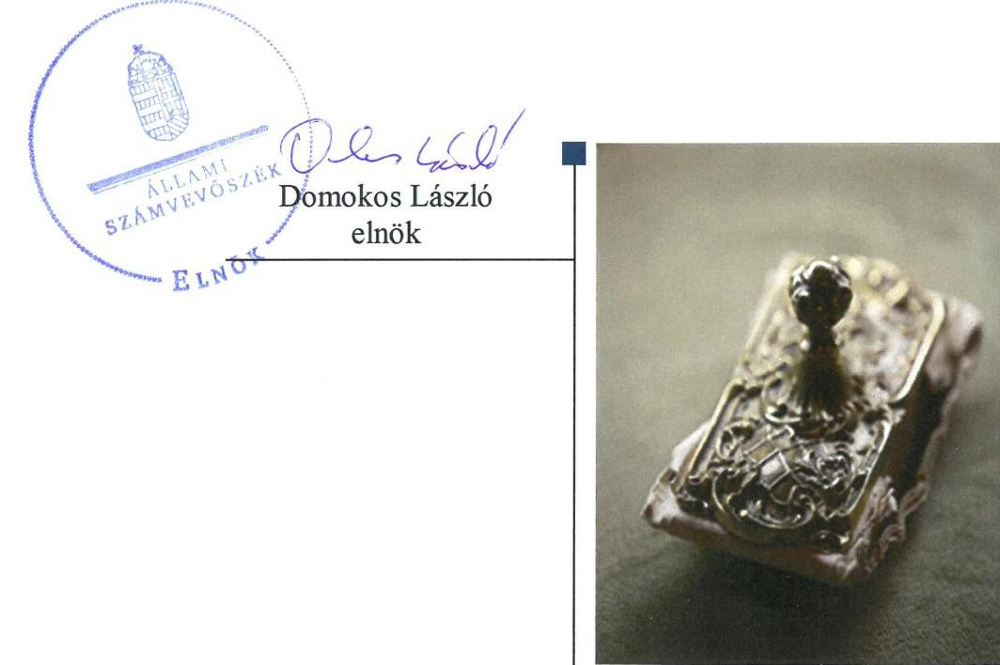
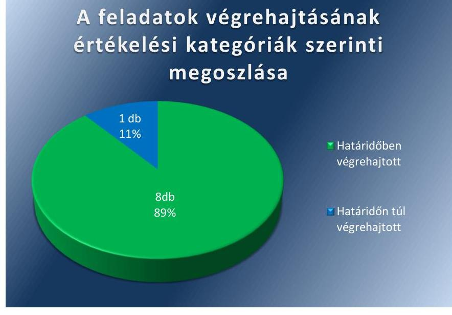

# Jelentés 

## Utóellenőrzések

Az önkormányzatok belső
kontrollrendszere kialakításának és múködtetésének ellenőrzése - Győr Megyei Jogú Város Önkormányzata 2019.

---

# Jelentés 

## Utóellenőrzések

Az önkormányzatok belső
kontrollrendszere kialakításának és múködtetésének ellenőrzése - Győr Megyei Jogú Város Önkormányzata 2019. 04. hó 10. nap

---

# AZ ELLENŐRZÉST FELÜGYELTE: 

DR. NÉMETH ERZSÉBET felügyeleti vezető 2018. november 29-ig
KAKAS SÁNDOR felügyeleti vezető 2018. november 30-tól

## AZ ELLENŐRZÉST VEZETTE ÉS A VÉGREHAJTÁSÁÉRT FELELŐS:

DÉZSINÉ KIS HAJNALKA ellenőrzésvezető

## A PROGRAM ÖSSZEÁLLÍTÁSÁÉRT FELELŐS:

TÓTPÁL SZABOLCS osztályvezető

## A TÉMÁHOZ KAPCSOLÓDÓ KORÁBBI SZÁMVEVŐSZÉKI JELENTÉSEK:

- címe: Jelentés az önkormányzatok belső kontrollrendszere kialakításának és müködtetésének ellenőrzéséről-Győr
- sorszáma: 16230

IKTATÓSZÁM: EL-1339-001/2018
TÉMASZÁM: 2460
ELLENŐRZÉS-AZONOSÍTÓ SZÁM: V080428

---

# TARTALOMJEGYZÉK 

■ ÖSSZEGZÉS ..... 5
■ AZ ELLENŐRZÉS CÉLJA ..... 6
■ AZ ELLENŐRZÉS TERÜLETE ..... 7
■ AZ ELLENŐRZÉS HÁTTERE, INDOKOLTSÁGA ..... 8
■ A JELENTÉS LÉNYEGES KÉRDÉSKÖRE ..... 9
■ AZ ELLENŐRZÉS HATÓKÖRE ÉS MÓDSZEREI ..... 10
■ MEGÁLLAPÍTÁSOK ..... 12
■ MELLÉKLETEK ..... 15
I. sz. melléklet: Győr megyei jogú Város Önkormányzata intézkedési terve végrehajtásának értékelése ..... 15
■ FÜGGELÉK: ÉSZREVÉTELEK ..... 19
■ RÖVIDÍTÉSEK JEGYZÉKE ..... 21

---

.

---

# ÖSSZEGZÉS 

Az Állami Számvevőszék Győr Megyei Jogú Város Önkormányzata belső kontrollrendszere kialakításának és müködtetésének utóellenőrzése során megállapította, hogy az Önkormányzat az intézkedési tervben foglalt feladatokat végrehajtotta. Ennek eredményeként a belső kontrollrendszer szabályszerüsége javult, növelve ezzel az elszámoltathatóságot, átláthatóságot.

## Az ellenőrzés társadalmi indokoltsága

Az Állami Számvevőszék stratégiájában célul tűzte ki a számvevőszéki munka hasznosulásának javítását. Ezzel összhangban ellenőrzi, hogy az ellenőrzött szervezet megvalósította-e a korábbi ellenőrzései által feltárt hibák, hiányosságok és szabálytalanságok megszüntetése céljából elkészített intézkedési tervében foglaltakat. A rendszeres utóellenőrzések hozzájárulnak a szükséges intézkedések tényleges végrehajtásához, ezáltal a közpénzügyek rendezettségének javulásához.

## Főbb megállapítások, következtetések

Győr Megyei Jogú Város Önkormányzata az Állami Számvevőszék által elfogadott intézkedési tervében meghatározott 9 feladatból nyolcat határidőben, egy feladatot határidőn túl hajtott végre.

Győr Megyei Jogú Város Önkormányzata az intézkedési tervében meghatározott feladatoknak megfelelően elkészítette és bevezette kockázatkezelési, valamint monitoring szabályzatát, továbbá módosította kötelezettségvállalási szabályzatát. Intézkedéseket tett a szabályszerű jogkörgyakorlás és az integritás szemlélet érvényesítés érdekében. A megtett intézkedések hatására az Önkormányzat szabályozottsága nőtt, ezáltal a gazdálkodás elszámoltathatósága és átláthatósága javult.

Győr Megyei Jogú Város Önkormányzata a jogszabályi előírásoknak megfelelően vezetett nyilvántartást az intézkedési tervében rögzített feladatok végrehajtásáról.

---

# AZ ELLENŐRZÉS CÉLJA 

Az ellenőrzés célja annak értékelése volt, hogy a számvevőszéki jelentésben foglalt intézkedést igénylő megállapításokkal összhangban készített intézkedési tervben meghatározott feladatokat az ellenőrzött szervezet végrehajtotta-e.

---

# AZ ELLENŐRZÉS TERÜLETE 

## Győr Megyei Jogú Város Önkormányzata

Győr állandó lakosainak száma 2017. január 1-jén a Központi Statisztikai Hivatal Magyarország közigazgatási helynévkönyve alapján 129301 fő volt.

Az Önkormányzat¹ 2017. évi költségvetés végrehajtásáról szóló rendelete ${ }^{2}$ alapján 146 869,7 millió Ft költségvetési bevételt ért el és 132 783,3 millió Ft költségvetési kiadást teljesített. Az összevont könyvviteli mérleg föösszege 2017. december 31-én 175 079,4 millió Ft volt.

A Polgármester ${ }^{3}$ 2006-tól, a Jegyző ${ }^{4}$ 2008-tól tölti be tisztségét.

Az ÁSZ ${ }^{5}$ az Önkormányzat belső kontrollrendszer kialakításának és müködtetésének, valamint egyes befektetési tevékenységeinek ellenőrzését 2014. január 1. és 2015. április 30. közötti időszakra vonatkozóan végezte el, és erről 2016. december 16-án hozta nyilvánosságra a 16230. számú ÁSZ jelentését.

Az ÁSZ jelentés a Polgármester részére egy, a Jegyző részére kettő javaslatot fogalmazott meg. Ez alapján a Polgármester és a Jegyző az ÁSZ Elnökének megküldte az Önkormányzat 9 feladatot tartalmazó intézkedési tervét ${ }^{6}$.

---

# AZ ELLENŐRZÉS HÁTTERE, INDOKOLTSÁGA 

Az ÁSZ tv. ${ }^{7}$ 33. § (1) bekezdése értelmében a számvevőszéki jelentések intézkedést igénylő megállapításaihoz és javaslataihoz kapcsolódóan az ellenőrzött szervezet vezetője intézkedési tervet köteles összeállítani, és az Állami Számvevőszék részére megküldeni.

Az ÁSZ által befogadott intézkedési tervben foglaltak megvalósítását az ÁSZ tv. 33. § (7) bekezdésében foglaltak alapján - az Állami Számvevőszék utóellenőrzés keretében ellenőrizheti. Az utóellenőrzések keretében - az intézkedések értékelése során - az Állami Számvevőszék figyelembe veszi az ellenőrzött szervezetek működési feltételeiben, valamint a jogszabályi előírásokban bekövetkezett változásokat.

Az utóellenőrzés során az ÁSZ értékeli, hogy az érintett számvevőszéki jelentésben foglalt intézkedést igénylő megállapításokkal és javaslatokkal összhangban, az ellenőrzött szervezet által készített intézkedési tervben meghatározott feladatokat a feladatra kijelöltek végrehajtották-e.

Az intézkedések végrehajtásával az adott terület szabályszerű múködése vonatkozásában a kockázatok csökkenhetnek, azonban hosszabb távon az intézkedési tervben foglaltak végrehajtásával önmagában nem szűnnek meg, csak akkor, ha beépülnek az ellenőrzött szervezet múködésébe, azokat folyamatosan karban tartják, figyelembe véve, illetve kezelve a változásokat. Emellett az intézkedések végrehajtásáig újabb kockázatok merülhetnek fel a szabályszerű múködés vonatkozásában, amelyek kezelése szintén kiemelten fontos az ellenőrzött szervezet számára.

Az ellenőrzött szervezet vezetője által készített intézkedési tervekben foglalt feladatok hiányos, illetve késedelmes végrehajtása, vagy annak elmaradása a szabályszerűség és a felelős vezetői magatartás vonatkozásában kockázatot hordoz, ami azt mutatja, hogy az ellenőrzések során feltárt hibák, hiányosságok és szabálytalanságok kezelése nem kapott kellő hangsúlyt. Az utóellenőrzés során is fennálló szabálytalanságok esetén a közpénz, közvagyon veszélyeztetettségi kockázat valószínűsített hatásának értékelése további intézkedéseket vonhat maga után.

Az ellenőrzött szervezet szintjén az utóellenőrzés feltárja, hogy a szervezet az intézkedések végrehajtásával hasznosította-e a korábbi ellenőrzési jelentésben a hiányosságok megszüntetése, illetve a kockázatok kezelése érdekében megfogalmazott javaslatokat, illetve az intézkedések végrehajtása elmaradásának következtében továbbra is fennálló szabálytalanság esetén értékeli a közpénzek, közvagyon veszélyeztetettségét.

Az ÁSZ szintjén az utóellenőrzés visszacsatolást ad az ellenőrzési jelentések hasznosulásáról, az intézkedések elmaradásának, vagy részleges megvalósulásának a közpénzek, közvagyon veszélyeztetettségére gyakorolt valószínűsített hatásának értékelése, további intézkedéseket vonhat maga után.

---

# A JELENTÉS LÉNYEGES KÉRDÉSKÖRE 

Az Önkormányzat az intézkedési tervben foglaltakat az elöirt határidőben végrehajtotta-e?

---

# AZ ELLENŐRZÉS HATÓKÖRE ÉS MÓDSZEREI 

## Az ellenőrzés típusa

Megfelelőségi ellenőrzés.

## Az ellenőrzött időszak

Az utóellenőrzés alapját képező ÁSZ jelentés közzétételének napjától 2016. december 16-tól az ellenőrzésről szóló kiértesítő levél keltének napjáig 2018.07.03-ig tartó időszak.

## Az ellenőrzés tárgya

Az ÁSZ tv. 2011. július 1-jei hatálybalépését követően a számvevőszéki jelentésben foglalt intézkedést igénylő megállapításokkal összhangban az Önkormányzat által készített Intézkedési tervben foglaltak végrehajtásának ellenőrzése.

## Az ellenőrzött szervezet

Győr Megyei Jogú Város Önkormányzata, Győr Megyei Jogú Város Polgármesteri Hivatala.

## Az ellenőrzés jogalapja

Az ellenőrzés jogszabályi alapját az ÁSZ tv. 33. § (7) bekezdése képezi.

## Az ellenőrzés módszerei

Az ellenőrzést az ellenőrzött időszakban hatályos jogszabályok, az ellenőrzés szakmai szabályai, a jelen ellenőrzésre irányadó ÁSZ módszertanok, az ellenőrzési programban foglalt értékelési szempontok szerint, végeztük.

Az ellenőrzés ideje alatt az Önkormányzattal történő kapcsolattartást az ÁSZ SZMSZ²-ének vonatkozó előírásai alapján biztosítottuk.

Az utóellenőrzés megállapításait az ÁSZ rendelkezésére álló, valamint az ÁSZ adatbekérése szerint, az Önkormányzat által rendelkezésre bocsátott dokumentumok alapozták meg.

Az ellenőrzési bizonyítékként felhasználható adatforrások közé tartoztak egyrészt az ellenőrzési program részletes szempontjainál felsorolt

---

adatforrások, másrészt minden az ellenőrzés folyamán feltárt, az ellenőrzés szempontjából információt tartalmazó dokumentum.

Az intézkedési tervekben előírt feladatokat azok végrehajthatósága, illetve végrehajtása szempontjából az alábbiak szerint értékeltük:
$\longrightarrow$ „határidőben végrehajtott" a feladat, ha a teljesítés dokumentáltan, az intézkedési tervben előírt határidőben és tartalommal megtörtént;
$\longrightarrow$ „határidőn túl végrehajtott" a feladat, ha annak teljesítése az intézkedési tervben meghatározott módon, de az előírt határidőn túl történt meg;
$\longrightarrow$ „részben végrehajtott" a feladat, ha végrehajtása teljes körűen az intézkedési tervben előírt módon nem történt meg;
$\longrightarrow$ „nem végrehajtott" a feladat, ha a végrehajtás nem történt meg, vagy amennyiben a teljesítést nem dokumentálták;
$\longrightarrow$ „okafogyottá vált" a feladat, ha végrehajtására - meghatározott esemény bekövetkezése, továbbá külső körülmény, a múködést érintő feltétel változása miatt - már nincs szükség, illetve lehetőség, és egyértelműen megállapítható, hogy az intézkedést szükségessé tevő körülmény a jövőben nem fordulhat elő;
$\longrightarrow$ „nem időszerü" az a feladat, amelynek ellenőrzési időszakon belüli végrehajtására azért nem került (kerülhetett) sor, mert az intézkedés alapjául szolgáló esemény nem következett be, de annak jövőbeni előfordulása lehetséges, a végrehajtása nem volt esedékes, vagy a végrehajtás határideje még nem járt le.
Az ellenőrzés lefolytatásához az Önkormányzat a tanúsítványok elektronikus kitöltésével, valamint az ÁSZ által kért dokumentumok elektronikus megküldésével szolgáltatott adatokat, amelyek valódiságát és teljes körűségét az ellenőrzött szervezet vezetője által tett teljességi és hitelességi nyilatkozat igazolja. Az így rendelkezésre bocsátott adatok, információk kontrollja az ellenőrzés keretében megtörtént. Az ellenőrzött szervezet által megküldött intézkedési tervben meghatározott, ÁSZ által beazonosított feladatok a I. számú mellékletben kerültek bemutatásra.

---

# MEGÁLLAPÍTÁSOK 

## Az Önkormányzat az intézkedési tervben foglaltakat az előírt határidőben végrehajtotta-e?

Összegző megállapítás

Az Önkormányzat az intézkedési tervben szereplő 9 feladatból nyolcat határidőben, egy feladatot határidőn túl hajtott végre. Az intézkedési tervben meghatározott feladatok végrehajtásáról vezették a jogszabályban előírt nyilvántartást.

Az Önkormányzat a jogszabályi előírásoknak megfelelő szabályozottság, a pénzügyi elszámoltathatóság, valamint az integritás szemlélet érvényesítése érdekében vállalt feladatait egy kivétellel határidőben végrehajtotta.

A feladatokat, határidőket, megjelölt felelősöket és a feladatok végrehajtását az I. sz. melléklet mutatja be.

A Jegyző gondoskodott az intézkedési tervben meghatározott feladatok végrehajtásának Bkr. ${ }^{9}$ 14. § (1) bekezdés előírása szerinti nyilvántartásáról.

Az Önkormányzat intézkedési tervében vállalt feladatok végrehajtásának értékelését az 1. ábra szemlélteti.

1. ábra

## A feladatok végrehajtásának értékelési kategóriák szerinti megesztása

A SZABÁLYOZOTTSÁG jogszabályi előírásoknak megfelelő biztosítása érdekében határidőben teljesítették az intézkedési tervben vállalt feladatokat, ennek következtében az elszámoltathatóság javult ezen a területen.

---

A Jegyző intézkedett a kötelezettségvállalási szabályzat jogszabály szerinti módosításáról. A módosítás előírta, hogy a Pénzügyi Osztály köteles naprakész nyilvántartást vezetni a gazdálkodási jogkörgyakorló személyekről és aláírásmintájukról.

A Jegyző intézkedett a gazdálkodás során alkalmazandó, adattartalmában a jogszabályi előírásoknak megfelelő utalványlap nyomtatvány bevezetéséről 2017 január 1-től.

A Polgármester és a Jegyző eleget téve a törvényi előírásnak intézkedtek az Önkormányzat és a Polgármesteri Hivatal szerződő partnerei átláthatósági nyilatkoztatásának bevezetéséről 2016. január 1-től.

A Jegyző intézkedett a kockázatkezelési szabályzat határidőben történő elkészítéséről. A szabályzat a jogszabályi előírásnak megfelelően rendelkezett a kockázatok azonosításáról, felmérésének és kezelésének folyamatáról.

A Jegyző a jogszabályi előírásnak megfelelően intézkedett a szervezeti tevékenységek és célok elérésének folyamatos és eseti nyomon követését biztosító monitoring szabályzat elkészítéséről, amelyet a feladat végrehajtási határidején túl 2018. január 1-től léptetett hatályba.

A PÉNZÜGYI ELSZÁMOLTATHATÓSÁG javítása érdekében a Jegyző és a Polgármester felhívták az érintettek figyelmét a gazdálkodási jogkörök szabályszerű gyakorlására.

AZ INTEGRITÁS szemlélet érvényesítése érdekében a Polgármester és a Jegyző áttekintették az ÁSZ által feltárt hiányosságok vonatkozásában érintett munkavállalók munkajogi felelősségét, és megállapították, hogy nem indokolt munkajogi felelősségre vonás.

---

.

---

# MELLÉKLETEK

I. SZ. MELLÉKLET: GYŐR MEGYEI JOGÚ VÁROS ÖNKORMÁNYZATA INTÉZKEDÉSI TERVE VÉGREHAJTÁSÁNAK ÉRTÉKELÉSE

|  Sorszám | Az intézkedési tervben meghatározott feladat | Az intézkedési tervben meghatározott határidő | Az intézkedési tervben meghatározott felelős | A feladat végrehajtása  |
| --- | --- | --- | --- | --- |
|   | 1. | 2.
Határidőben végrehajtott feladatok | 3.
3. | 4.  |
|  1. | „Áttekintem, hogy a szabálytalanságok miatt szüksé-ges-e a munkajogi felelősségre vonás, és amennyiben igen, megteszem a szükséges intézkedéseket." | 2017.03.31. | Polgármester | A Polgármester áttekintette, hogy az ÁSZ által megállapított szabálytalanságok miatt szükséges-e munkajogi felelősségre vonás. A 2017. február 15-i jegyzőkönyvében megállapította, hogy a 16230. számú számvevőszéki jelentésben foglaltakra tekintettel nem indokolt munkajogi felelősségre vonási eljárás megindítása.  |
|  2. | „2016. január 01-től már az Önkormányzat bevezette, hogy minden egyes visszterhes szerződéshez (beleértve pl. a megrendelést is, mely végső soron szintén kétoldalú jognyilatkozat lesz) nyilatkoztatja a szerződő felet (kivéve a természetes személyt vagy azt a szervet, amely a törvény alapján átlátható szervezetnek minősül), hogy átlátható szervezetnek mi-nősül-e. Ehhez formanyomtatványt rendszeresítettünk. Ezt a formanyomtatványt az első felmerüléskor, illetve évi rendszerességgel töltetjük a partnerekkel. Természetesen azt is elfogadjuk, ha a szerződő partnerek saját nyilatkozata van, de az a törvényi követelményeknek megfelel. Intézkedést nem igényel." | végrehajtott az intézkedési terv készítésekor | Polgármester | A Polgármester intézkedett az átláthatósági formanyomtatvány Önkormányzatnál történő bevezetéséről 2016. január 1-től. Belső körlevélben előírásra került, hogy minden egyes visszterhes szerződéshez beleértve a megrendelést is, nyilatkoztatni szükséges a szerződő felet arról, hogy átlátható szervezetnek minősül-e, eleget téve az Alaptörvényben foglaltaknak. A körlevél tartalmazta, hogy a formanyomtatványt első felmerüléskor, illetve évi rendszerességgel kell kitöltetni a partnerekkel, de elfogadható a szerződő partner saját nyilatkozata, ha a törvényi követelményeknek megfelel. A bevezetett formanyomtatvány minta rovatai megfelelnek az Áht ${ }^{10}$. és a Nvtv ${ }^{11}$. rendelkezéseinek.  |
|  3. | „2017. június 30-ig megalkotásra kerül egy belső szabályzat, amely a kockázatok azonosításának, felmérésének, majd kezelésének folyamatát rendezi. A kockázatkezelés keretében a szabályzat rendezni fogja az egyes kockázatokkal kapcsolatos, szükséges intézkedéseket és a nyomon követést." | 2017.06.30. | Jegyző | A Jegyző intézkedett a kockázatkezelési szabályzat határidőben történő elkészítéséről. A szabályzat a jogszabályi előírásnak megfelelően rendelkezett a kockázatok azonosításáról, felmérésének és kezelésének folyamatáról. Szabályozta a kockázatokkal kapcsolatos szükséges intézkedéseket és azok nyomon követését.  |

---

|  5. | Az intézkedési tervben meghatározott feladat | Az intézkedési tervben meghatározott határidő | Az intézkedési tervben meghatározott felelős 3. | A feladat végrehajtása  |
| --- | --- | --- | --- | --- |
|  4. | „Győr Megyei Jogú Város Polgármesteri Hivatalának a kötelezettségvállalás, a kötelezettségvállalás ellenjegyzésének, valamint a kiadás teljesítésével, a bevétel beszedésével összefüggő teljesítés igazolásának, érvényesítésének, utalványozásának, utalványozás ellenjegyzésének rendjéről szóló szabályzatainak módosítása keretében egyértelműen meghatározásra kerül, hogy a szabályzatok „III. Egyéb rendelkezések" 6) pontjában meghatározott aláírás-minta nyilvántartás vezetését a Pénzügyi Osztály a 7) pontban meghatározott meghatalmazások, kijelölések és aláírás címpéldányok nyilvántartása keretében, a meghatalmazásokon és kijelöléseken szereplő aláírásminták zárt őrzésével teljesíti." | 2017.06.30. | Jegyző | A Jegyző intézkedett a kötelezettségvállalási szabályzat módosításáról. A módosítás előírta, hogy a Pénzügyi Osztály köteles naprakész nyilvántartást vezetni a gazdálkodási jogkörgyakorló személyekről és aláírásmintájukról. A meghatalmazások, kijelölések és aláírási címpéldányok nyilvántartását, a meghatalmazások, kijelölések és a meghatalmazásokon szereplő aláírásminták Pénzügyi Osztályon történő zárt őrzésével teljesíti.  |
|  5. | „Győr Megyei Jogú Város Polgármesteri Hivatalának gazdálkodása során fokozott és kiemelt figyelmet kell fordítani az Áht. 38. § (1) bekezdésében, valamint az Ávr. 58. § (3) bekezdésében foglalt azon követelményre, hogy a bizonylatok érvényesítésének az utalványozást megelőzően meg kell történnie. Ezen követelmény fokozott érvényre juttatásának elősegítése érdekében jegyzői írásbeli felhívás kerül kiadásra a dolgozók részére." | 2017.06.30. | Jegyző | A Jegyző és a Polgármester a 7922-3/2017 iktatószámú levelükben 2017. június 22én felhívták az érintett dolgozók figyelmét a jogszabályi előírások maradéktalan betartására a gazdálkodási jogkörgyakorlás során. Az érintettek írásban nyilatkoztak a levél tartalmának megismeréséről és tudomásul vételéről.  |
|  6. | „2017. január 1. napjától az Ávr. 59. § (3) bekezdés e) pontja szerint a külön írásbeli rendelkezésen fel kell tüntetni a bevétel, kiadás egységes rovatrend és kormányzati funkció szerinti számát, a terheléssel, jóváírással (kifizetéssel, bevételezéssel) érintett pénzeszköz államháztartási számviteli kormányrendelet szerinti könyvviteli számlájának számát. Ezen követelmény teljesítése érdekében Győr Megyei Jogú Város | 2017.01.01. naptól folyamatos | Jegyző | A Jegyző intézkedett a gazdálkodás során alkalmazandó, adattartalmában a jogszabályi előírásoknak megfelelő utalványlap nyomtatvány bevezetéséről Győr Megyei Jogú Város Polgármesteri Hivatalánál 2017 január 1-től.  |

---

|  5. | Az intézkedési tervben meghatározott feladat | Az intézkedési tervben meghatározott határidő | Az intézkedési tervben meghatározott felelős | A feladat végrehajtása  |
| --- | --- | --- | --- | --- |
|   | 1. | 2. | 3. | 4.  |
|   | Polgármesteri Hivatalánál a gazdálkodása során 2017. január 1. naptól új írásbeli rendelkezést tartalmazó nyomtatvány került bevezetésre, mely nyomtatványon szereplő adatok a 2017. január 1. napjától hatályos jogszabályok szerinti adattartalomnak kerültek megfeleltetésre." |  |  |   |
|  7. | „2016. január 01-től már a Hivatal is (nemcsak az Önkormányzat) bevezette, hogy minden egyes visszterhes szerződéshez (beleértve pl. a megrendelést is, mely végső soron szintén kétoldalú jognyilatkozat lesz) nyilatkoztatja a szerződő felet (kivéve természetes személyt vagy azt a szervezetet, amely a törvény alapján átlátható szervezetnek minősül), hogy átlátható szervezetnek minősül-e. Ehhez formanyomtatványt rendszeresítettünk. Ezt a formanyomtatványt az első felmerüléskor, illetve évi rendszerességgel töltetjük a partnerekkel. Természetesen azt is elfogadjuk, ha a szerződő partnernek saját nyilatkozata van, de az a törvényi követelményeknek megfelel. Intézkedést nem igényel." | végrehajtott az intézkedési terv készítése- | Jegyző | A Jegyző intézkedett az átláthatósági formanyomtatvány Polgármesteri Hivatalnál történő bevezetéséről 2016. január 1-től. Belső körlevélben előírásra került, hogy minden egyes visszterhes szerződéshez beleértve a megrendelést is, nyilatkoztatni szükséges a szerződő felet arról, hogy átlátható szervezetnek minősül-e, eleget téve a jogszabályban foglaltaknak. A körlevél tartalmazta, hogy a formanyomtatványt első felmerüléskor, illetve évi rendszerességgel kell kitöltetni a partnerekkel, de elfogadható a szerződő partner saját nyilatkozata, ha a törvényi követelményeknek megfelel. A bevezetett formanyomtatvány minta rovatai megfelelnek az Áht. és a Nvtv. rendelkezéseinek.  |
|  8. | „Áttekintem, hogy a szabálytalanságok miatt szükséges-e a munkajogi felelősségre vonás, és amennyiben igen, megteszem a szükséges intézkedéseket." | 2017.03.31. | Jegyző | A Jegyző áttekintette, hogy az ÁSZ által megállapított szabálytalanságok miatt szükséges-e munkajogi felelősségre vonás. A 2017. február 10-i jegyzőkönyvében megállapította, hogy a 16230. számú számvevőszéki jelentésben foglaltakra tekintettel nem indokolt munkajogi felelősségre vonási eljárás megindítása.  |
|   | Határidőn túl végrehajtott feladat |  |  |   |
|  9. | „Megalkotásra kerül egy szabályzat, amely a szervezeti tevékenységek és célok elérésének folyamatos és eseti nyomon követését biztosítani fogja (operatív monitoring rendszer." | 2017.06.30. | Jegyző | A Jegyző a jogszabályi előírásnak megfelelően intézkedett a szervezeti tevékenységek és célok elérésének folyamatos és eseti nyomon követését biztosító monitoring szabályzat elkészítéséről, amelyet a feladat végrehajtási határidején túl 2018. január 1-től léptetett hatályba.  |

---

.

---

# FÜGGELÉK: ÉSZREVÉTELEK 

A jelentéstervezetet a Számvevőszék 15 napos észrevételezésre megküldte az ellenőrzött szervezetek vezetőinek az ÁSZ tv. 29. §* (1) bekezdése előírásának megfelelően.

Győr Megyei Jogú Város Önkormányzatának polgármestere és Győr Megyei Jogú Város Polgármesteri Hivatalának jegyzője a jelentéstervezet megállapításaira nem tett észrevételt.

[^0]
[^0]:    * 29. § (1) Az Állami Számvevőszék az ellenőrzési megállapításait megküldi az ellenőrzött szervezet vezetőjének vagy az általa megbízott személynek, és annak, akinek személyes felelősségét állapította meg.
    (2) Az ellenőrzött szervezet vezetője és a felelősként megjelölt személy az ellenőrzés megállapításaira tizenöt napon belül írásban észrevételt tehet.
    (3) Az Állami Számvevőszék az észrevételre a beérkezésétől számított harminc napon belül írásban válaszol. A figyelembe nem vett észrevételeket köteles a jelentésben feltüntetni, és megindokolni, hogy azokat miért nem fogadta el.

---

.

---

# RÖVIDÍTÉSEK JEGYZÉKE 

${ }^{1}$ Önkormányzat
${ }^{2}$ költségvetés végrehajtási rendelet
${ }^{3}$ Polgármester
${ }^{4}$ Jegyző
${ }^{5}$ ÁSZ
${ }^{6}$ intézkedési terv
${ }^{7}$ ÁSZ tv.
${ }^{8}$ ÁSZ SZMSZ
${ }^{9}$ Bkr.
${ }^{10}$ Áht.
${ }^{11}$ Nvtv.

Győr Megyei Jogú Város Önkormányzata
Győr Megyei Jogú Város Önkormányzata Közgyűlésének 16/2018 (V.4) önkormányzati rendelet Győr Megyei Jogú Város Önkormányzata 2017. évi költségvetésének végrehajtásáról
Győr Megyei Jogú Város Önkormányzatának Polgármestere
Győr Megyei Jogú Város Önkormányzatának jegyzője
Állami Számvevőszék
Győr Megyei Jogú Város Önkormányzat intézkedési terve
az Állami Számvevőszékről szóló 2011. évi LXVI. törvény
Az Állami Számvevőszék elnökének 4/2017 (XII.29.) ÁSZ utasítása az Állami Számvevőszék szervezeti és Működési Szabályzatáról
a költségvetési szervek belső kontrollrendszeréről és belső ellenőrzéséről szóló 370/2011. (XII. 31.) Korm. rendelet
az államháztartásról szóló 2011. évi CXCV. törvény
a nemzeti vagyonról szóló 2011. évi CXCVI. törvény

---

ÁLLAMI SZÁMVEVŐSZÉK
1052 Budapest, Apáczai Csere János utca 10.
Levélcím: 1364 Budapest 4. Pf. 54
Telefon: +36 14849100 Telefax: +36 14849200
www.asz.hu