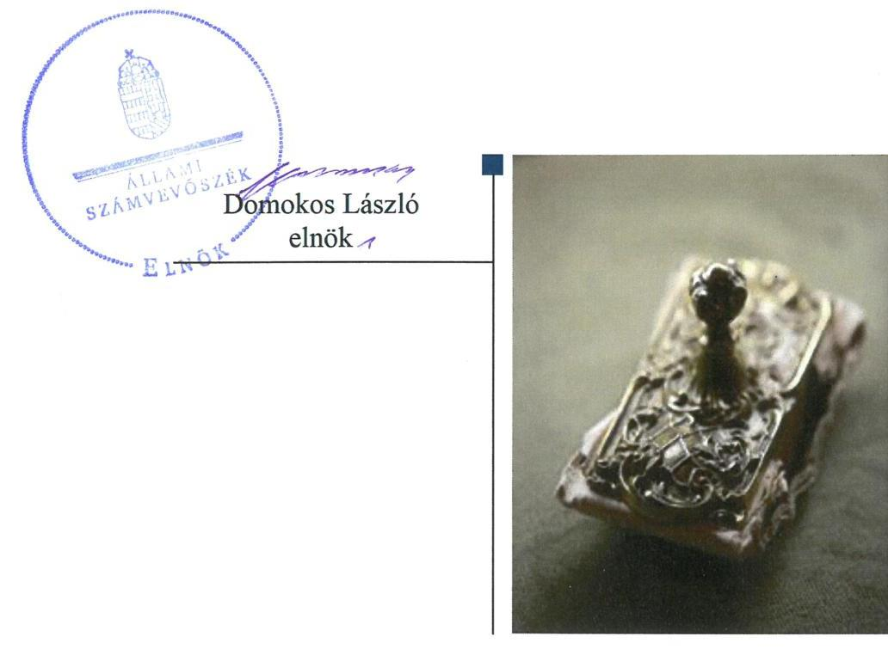
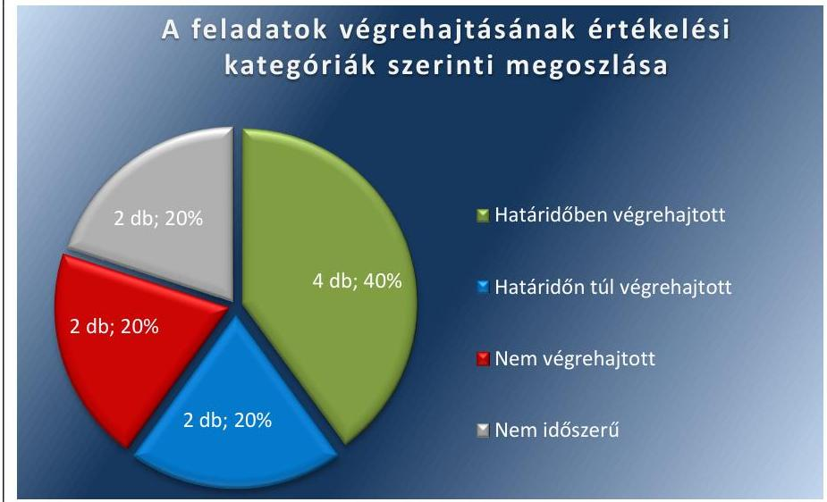
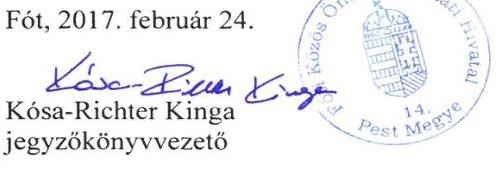
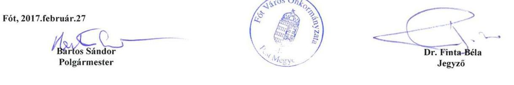
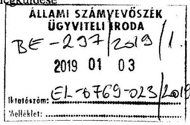
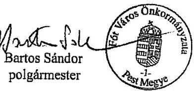
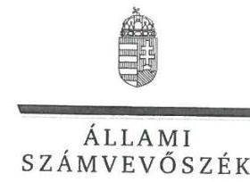
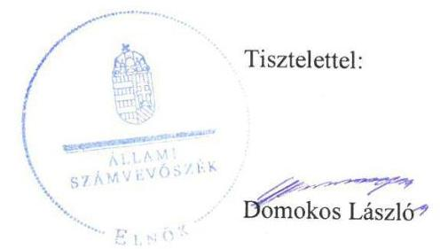

# Jelentés 

## Utóellenőrzések

Az önkormányzatok belső
kontrollrendszere kialakításának és múködtetésének utóellenőrzése Fót Város Önkormányzata 2019.

---

# Jelentés 

## Utóellenőrzések

Az önkormányzatok belső
kontrollrendszere kialakításának és múködtetésének utóellenőrzése -
Fót Város Önkormányzata
2019. 02. hó 05. nap

---

|  AZ ELLENŐRZÉST FELÜGYELTE: |  |  |  |  |   |
| --- | --- | --- | --- | --- | --- |
|   |  |  |  |  | DR. BENEDEK MÁRIA felügyeleti vezető  |
|   |  |  |  |  | AZ ELLENŐRZÉST VEZETTE ÉS A VÉGREHAJTÁSÁÉRT FELELŐS:  |
|   |  |  |  |  | KEREKES PÉTER ellenőrzésvezető  |
|   |  |  |  |  | A PROGRAM ÖSSZEÁLLÍTÁSÁÉRT FELELŐS:  |
|   |  |  |  |  | TÓTPÁL SZABOLCS osztályvezető  |
|   |  |  |  |  | A TÉMÁHOZ KAPCSOLÓDÓ KORÁBBI SZÁMVEVŐSZÉKI JELENTÉSEK:  |
|   |  |  |  |  | - címe: Az önkormányzatok belső kontrollrendszere kialakításának és működtetésének ellenőrzése – Fót  |
|   |  |  |  |  | - sorszáma: 16183  |
|  Jelentéseink az Országgyűlés számítógépes hálózatán és az Interneten a www.asz.hu címen is olvashatóak. |  |  |  |  | IKTATÓSZÁM: EL-0769-020/2018  |
|   |  |  |  |  | TÉMASZÁM: 2460  |
|   |  |  |  |  | ELLENŐRZÉS-AZONOSÍTÓ SZÁM: V-080426  |

---

# TARTALOMJEGYZÉK 

■ ÖSSZEGZÉS ..... 5
■ AZ ELLENŐRZÉS CÉLJA ..... 6
■ AZ ELLENŐRZÉS TERÜLETE ..... 7
■ AZ ELLENŐRZÉS HÁTTERE, INDOKOLTSÁGA ..... 8
■ A JELENTÉS LÉNYEGES KÉRDÉSKÖRE ..... 9
■ AZ ELLENŐRZÉS HATÓKÖRE ÉS MÓDSZEREI ..... 10
■ MEGÁLLAPÍTÁSOK ..... 12
■ MELLÉKLETEK ..... 15
I. sz. melléklet: Fót Város Önkormányzata intézkedési terve végrehajtásának értékelése ..... 15
II. sz. melléklet: Fót Város Önkormányzata intézkedési terve ..... 17
■ FÜGGELÉK: ÉSZREVÉTELEK ..... 23
■ RÖVIDÍTÉSEK JEGYZÉKE ..... 37

---

.

---

# ÖSSZEGZÉS 

Az Állami Számvevőszék Fót Város Önkormányzata belső kontrollrendszere kialakításának és müködtetésének utóellenörzése során megállapította, hogy végrehajtott intézkedéseket a szabályozottság javítása érdekében, azonban a belső kontrollrendszer egyes elemei jogszabályi előirásoknak teljes körüen megfelelő kialakításáról és szabályszerü müködtetéséről nem gondoskodott. Nem került sor a gazdálkodási jogkörök gyakorlása során feltárt szabálytalan müködés és az értékpapírok értékelésével kapcsolatban feltárt szabálytalanság megszüntetésére, ezáltal nem biztositott a közpénzekkel való felelős gazdálkodás és a szabályszerü vagyongazdálkodás.

## Az ellenőrzés társadalmi indokoltsága

Az Állami Számvevőszék stratégiájában célul tűzte ki a számvevőszéki munka hasznosulásának javítását. Ezzel összhangban ellenőrzi, hogy az ellenőrzött szervezet megvalósította-e a korábbi ellenőrzései által feltárt hibák, hiányosságok és szabálytalanságok megszüntetése céljából elkészített intézkedési tervében foglaltakat. A rendszeres utóellenőrzések hozzájárulnak a szükséges intézkedések tényleges végrehajtásához, ezáltal a közpénzügyek rendezettségének javulásához.

## Főbb megállapítások, következtetések

Fót Város Önkormányzata az Állami Számvevőszék javaslataival összhangban készült intézkedési tervében meghatározott tíz feladatból négyet határidőben, kettőt határidőn túl, kettőt nem hajtott végre, két feladat nem volt időszerű.

Fót Város Önkormányzata a hivatásetikai kódexének és a környezetvédelmi programjának megalkotására vonatkozó intézkedéseket végrehajtotta, azonban a belső kontrollrendszerének kialakítása és müködtetése során feltárt többi hiányosságot és szabálytalanságot nem szüntette meg. Ezáltal múködése során nem biztosított a felelős vezetői magatartás, valamint a korrupciótól való védettsége.

Fót Város Önkormányzata a gazdálkodási jogkörök gyakorlása során megállapított, évek óta fennálló szabálytalan múködés megszüntetésére az intézkedési tervben meghatározott intézkedéseket nem hajtotta végre, így nőtt a közpénzek rendeltetésellenes és pazarló felhasználásának kockázata.

Fót Város Önkormányzata intézkedett a költségvetési beszámoló mérlegében kimutatott értékpapírok és üzleti célú ingatlanok jogszabályi előírásoknak megfelelő leltározásáról, ugyanakkor az értékpapírok értékelésével kapcsolatban továbbra is fennálló hiányosságok miatt a vagyongazdálkodás elszámoltathatósága, átláthatósága, és ennek következtében az önkormányzati vagyonnal történő felelős gazdálkodás nem biztosított.

Fót Város Önkormányzata a jogszabályban előírt nyilvántartást az intézkedési tervben meghatározott feladatok végrehajtásáról nem vezette.

---

# AZ ELLENŐRZÉS CÉLJA 

Az ellenőrzés célja annak értékelése volt, hogy a számvevőszéki jelentésben ${ }^{1}$ foglalt intézkedést igénylő megállapításokkal összhangban készített intézkedési tervben meghatározott feladatokat az ellenőrzött szervezet vég-rehajtotta-e.

---

# AZ ELLENŐRZÉS TERÜLETE 

## Fót Város Önkormányzata

Fót városa Pest megyében, a Dunakeszi járásban, a fővárostól 17 kilométerre, a Gödöllői-dombság lábánál fekszik. A település 2004. évben kapott városi rangot. Állandó lakosainak száma a Központi Statisztikai Hivatal Magyarország közigazgatási helynévkönyve alapján 2017. január 1-jén 19291 fő volt.

A polgármester² 2014. március 2. óta tölti be tisztségét, a jegyző ${ }^{3} 2015$. március 2 -tól látja el feladatát.

Fót Város Önkormányzata a 2017. évi költségvetésének végrehajtásáról szóló 11/2018. (V.24.) önkormányzati rendelet szerint 7025,8 millió Ft bevételt ért el, valamint 3078,8 millió Ft kiadást teljesített, a mérleg föösszege 15 908,5 millió Ft, ezen belül a befektetett eszközök vagyona 11 296,2 millió Ft volt.

Az ÁSZ ${ }^{4}$ 2016. évben ellenőrizte Fót Város Önkormányzata belső kontrollrendszere kialakításának és múködtetésének megfelelőségét a 2014. január 1. és 2015. április 30. közötti időszakra, valamint a 2011. január 1jétől 2015. április 30-ig terjedő időszakra ellenőrizte Fót Város Önkormányzata egyes befektetési döntéseinek, a döntések végrehajtásának és elszámolásának a szabályszerűségét. Az ellenőrzés célja annak megállapítása volt, hogy a belső kontrollrendszer elemeinek kialakítása, a pénzügyi folyamatokban kulcsszerepet betöltő teljesítésigazolás és érvényesítés, a belső ellenőrzés szabályos múködése biztosította-e Fót Város Önkormányzatánál a közpénzfelhasználás szabályosságát, hozzájárult-e az értéket teremtő rend követelményének érvényesüléséhez, valamint az önkormányzat egyes befektetési döntései és azok végrehajtása, elszámolása megfelelt-e a vonatkozó jogszabályoknak és belső szabályozásoknak, a kialakított kontrollrendszer támogatta-e a befektetési tevékenység szabályszerűségét. Az ellenőrzésről készült 16183 számú számvevőszéki jelentést 2016. december 1-jén hozta nyilvánosságra az ÁSZ.

---

# AZ ELLENŐRZÉS HÁTTERE, INDOKOLTSÁGA 

Az ÁSZ tv. ${ }^{5}$ 33. § (1) bekezdése értelmében a számvevőszéki jelentések megállapításaihoz és javaslataihoz kapcsolódóan az ellenőrzött szervezet vezetője intézkedési tervet köteles összeállítani, és az Állami Számvevőszék részére megküldeni.

Az ÁSZ által befogadott intézkedési tervben foglaltak megvalósítását az ÁSZ tv. 33. § (7) bekezdésében foglaltak alapján - az Állami Számvevőszék utóellenőrzés keretében ellenőrizheti. Az utóellenőrzések keretében - az intézkedések értékelése során - az Állami Számvevőszék figyelembe veszi az ellenőrzött szervezetek múködési feltételeiben, valamint a jogszabályi előírásokban bekövetkezett változásokat.

Az utóellenőrzés során az ÁSZ értékeli, hogy az érintett számvevőszéki jelentésben foglalt megállapításokkal és javaslatokkal összhangban, az ellenőrzött szervezet által készített intézkedési tervben meghatározott feladatokat a feladatra kijelöltek végrehajtották-e.

Az intézkedések végrehajtásával az adott terület szabályszerű múködése vonatkozásában a kockázatok csökkenhetnek, azonban hosszabb távon az intézkedési tervben foglaltak végrehajtásával önmagában nem szűnnek meg, csak akkor, ha beépülnek az ellenőrzött szervezet múködésébe, azokat folyamatosan karban tartják, figyelembe véve, illetve kezelve a változásokat. Emellett az intézkedések végrehajtásáig újabb kockázatok merülhetnek fel a szabályszerű múködés vonatkozásában, amelyek kezelése szintén kiemelten fontos az ellenőrzött szervezet számára.

Az ellenőrzött szervezet vezetője által készített intézkedési tervekben foglalt feladatok hiányos, illetve késedelmes végrehajtása, vagy annak elmaradása a szabályszerűség és a felelős vezetői magatartás vonatkozásában kockázatot hordoz, ami azt mutatja, hogy az ellenőrzések során feltárt hibák, hiányosságok és szabálytalanságok kezelése nem kapott kellő hangsúlyt. Az utóellenőrzés során is fennálló szabálytalanságok esetén a közpénz, közvagyon veszélyeztetettségi kockázat valószínűsített hatásának értékelése további intézkedéseket vonhat maga után.

Az ellenőrzött szervezet szintjén az utóellenőrzés feltárja, hogy a szervezet az intézkedések végrehajtásával hasznosította-e a korábbi ellenőrzési jelentésben a hiányosságok megszüntetése, illetve a kockázatok kezelése érdekében megfogalmazott javaslatokat, illetve az intézkedések végrehajtása elmaradásának következtében továbbra is fennálló szabálytalanság esetén értékeli a közpénzek, közvagyon veszélyeztetettségét.

Az ÁSZ szintjén az utóellenőrzés visszacsatolást ad az ellenőrzési jelentések hasznosulásáról, az intézkedések elmaradásának, vagy részleges megvalósulásának a közpénzek, közvagyon veszélyeztetettségére gyakorolt valószínűsített hatásának értékelése, további intézkedéseket vonhat maga után.

---

# A JELENTÉS LÉNYEGES KÉRDÉSKÖRE 

Az önkormányzat az intézkedési tervben foglaltakat az előirt határidőben végrehajtotta-e?

---

# AZ ELLENŐRZÉS HATÓKÖRE ÉS MÓDSZEREI 

## Az ellenőrzés típusa

Megfelelőségi ellenőrzés.

## Az ellenőrzött időszak

Az utóellenőrzés alapját képező ÁSZ jelentés közzétételének napjától az utóellenőrzésről szóló kiértesítő levél keltének napjáig, 2016. december 1jétől 2018. július 9-ig tartó időszak volt.

## Az ellenőrzés tárgya

A számvevőszéki jelentésben foglalt megállapításokkal összhangban - az önkormányzat által — készített intézkedési tervben foglaltak végrehajtásának ellenőrzése volt.

## Az ellenőrzött szervezet

Fót Város Önkormányzata

## Az ellenőrzés jogalapja

Az ellenőrzés jogszabályi alapját az ÁSZ tv. 33. § (7) bekezdésének előírása képezte.

## Az ellenőrzés módszerei

Az ÁSZ az ellenőrzést az ellenőrzött időszakban hatályos jogszabályok, az ellenőrzés szakmai szabályai, a jelen ellenőrzésre irányadó ÁSZ módszertanok, az ellenőrzési programban foglalt értékelési szempontok szerint végezte.

Az ÁSZ az ellenőrzés ideje alatt Fót Város Önkormányzatával történő kapcsolattartást az ÁSZ SZMSZ²-ének vonatkozó előírásai alapján biztosította.

Az utóellenőrzés megállapításait az ÁSZ rendelkezésére álló, valamint az ÁSZ adatbekérése szerint, Fót Város Önkormányzata által rendelkezésre bocsátott dokumentumok alapozták meg.

Az ellenőrzési bizonyítékként felhasználható adatforrások közé tartoztak egyrészt az ellenőrzési program részletes szempontjainál felsorolt

---

adatforrások, másrészt minden - az ellenőrzés folyamán feltárt, az ellenőrzés szempontjából információt tartalmazó - dokumentum.

Az ÁSZ az intézkedési tervekben előírt feladatokat azok végrehajthatósága, illetve végrehajtása szempontjából az alábbiak szerint értékelte:
"határidőben végrehajtott" a feladat, ha a teljesítés dokumentáltan, az intézkedési tervben előírt határidőben és tartalommal megtörtént;
"határidőn túl végrehajtott" a feladat, ha annak teljesítése az intézkedési tervben meghatározott módon, de az előírt határidőn túl történt meg;
"részben végrehajtott" a feladat, ha végrehajtása teljes körűen az intézkedési tervben előírt módon nem történt meg;
"nem végrehajtott" a feladat, ha a végrehajtás nem történt meg, vagy amennyiben a teljesítést nem dokumentálták;
"okafogyottá vált" a feladat, ha végrehajtására - meghatározott esemény bekövetkezése, továbbá külső körülmény, a múködést érintő feltétel változása miatt - már nincs szükség, illetve lehetőség, és egyértelműen megállapítható, hogy az intézkedést szükségessé tevő körülmény a jövőben nem fordulhat elő;
"nem időszerü" az a feladat, amelynek ellenőrzési időszakon belüli végrehajtására azért nem került (kerülhetett) sor, mert az intézkedés alapjául szolgáló esemény nem következett be, de annak jövőbeni előfordulása lehetséges, a végrehajtása nem volt esedékes, vagy a végrehajtás határideje még nem járt le.
Az ellenőrzés lefolytatásához Fót Város Önkormányzata a tanúsítványok elektronikus kitöltésével, valamint az ÁSZ által kért dokumentumok elektronikus megküldésével szolgáltatott adatokat, amelyek valódiságát és teljes körűségét az ellenőrzött szervezet vezetője által tett teljességi és hitelességi nyilatkozat igazolta. Az így rendelkezésre bocsátott adatok, információk kontrollja az ellenőrzés keretében megtörtént.

Az ellenőrzött szervezet által megküldött intézkedési tervben meghatározott, ÁSZ által beazonosított feladatok a II. számú mellékletben kerültek bemutatásra. A beazonosított, sorszámozott intézkedések részletes értékelését az I. sz. melléklet tartalmazza.

---

# MEGÁLLAPÍTÁSOK 

## Az önkormányzat az intézkedési tervben foglaltakat az előírt határidőben végrehajtotta-e?

Összegző megállapítás

Az Önkormányzat ${ }^{7}$ az intézkedési tervben meghatározott tíz feladatból négyet határidőben, kettőt határidőn túl, kettőt nem hajtott végre, és két feladat nem volt időszerű. Az intézkedési tervben meghatározott feladatok végrehajtásáról a jogszabályban előírt nyilvántartást nem vezette.

Az ÁSZ a számvevőszéki jelentésben a polgármester részére három, a jegyző részére hét javaslatot fogalmazott meg. Az Önkormányzat a Képvi-selő-testület által a 64/2017. (II. 22.) KT-határozatban elfogadott intézkedési tervében a hiányosságok, szabálytalanságok megszüntetésére a polgármester részére három, a jegyző részére hét, összesen tíz feladatot határozott meg.

Az intézkedési tervben meghatározott feladatokat, határidőket, felelősöket és a feladatok végrehajtását az I. számú melléklet mutatja be.

Az Önkormányzat az intézkedési tervben meghatározott feladatok végrehajtásáról a Bkr. ${ }^{8} 14 . \S$ (1) bekezdés előírása szerinti nyilvántartást nem vezette.

Az Önkormányzat intézkedési tervében meghatározott feladatok végrehajtásának értékelési kategóriák szerinti megoszlását az 1. ábra szemlélteti.

1. ábra

Fonrás: ÁSZ

---

A SZABÁLYOZOTTSÁG javítása érdekében az Önkormányzat elkészítette a Környezetvédelmi programját ${ }^{9}\left(\mathrm{P} 3 .{ }^{10}, \mathrm{~J} 6 .{ }^{11}\right)$ és a Hivatásetikai kódexét ${ }^{12}$ (P1., J2.), ugyanakkor a jegyző nem intézkedett a belső kontrollrendszer egyes elemei jogszabályi előírásoknak megfelelő kialakításáról (J1.), ezáltal a szabályozottsággal kapcsolatos kockázatok számottevő mértékben növekedtek.

# A SZABÁLYSZERŰ PÉNZÜGYI GAZDÁLKODÁSSAL ÉS A PÉNZÜGYI ELSZÁMOLTATHATÓSÁGGAL kap- 

csolatban megállapított, a gazdálkodási jogkörök gyakorlása körében évek óta fennálló jogellenes, szabálytalan működtetés kockázata jelentős mértékben növekedett, mivel a jegyző nem intézkedett a gazdálkodási jogkörök gyakorlása során a jogszabályi előírások és a belső szabályozás betartásáról, különös tekintettel a teljesítéseknek az Ávr. ${ }^{13}$ 57. § (1) és (4) bekezdések szerinti igazolásának gyakorlásáról, valamint az Ávr. 58. § (1) és (3) bekezdésekben előírtaknak megfelelő érvényesítés gyakorlásáról (J1.). Ezáltal az Önkormányzatnál nem biztosított a felelős vezetői magatartás és fennáll a közpénzek rendeltetésellenes és pazarló felhasználásának kockázata.

## A BELSŐ KONTROLL SZERINTI ELSZÁMOLTATHATÓSÁG kapcsán feltárt kockázatok nagymértékben növekedtek,

mert bár a jegyző intézkedett az ÁSZ által feltárt hiányosságokkal és szabálytalanságokkal összefüggésben a munkajogi felelősség megállapítása érdekében az eljárások lefolytatásáról, és azok eredménye ismeretében a szükséges intézkedések megtételéről (J7.), azonban nem intézkedett a belső kontrollrendszer egyes elemei jogszabályi előírásoknak megfelelő kialakításáról és múködtetéséről (J1.). Ebből következőleg a végrehajtott feladat nem szüntette meg a kockázatot, nem biztosítja a szabályos múködést hosszú távon.

A VAGYONGAZDÁLKODÁSSAL kapcsolatban feltárt kockázatok növekedtek. Az Önkormányzat gondoskodott az értékpapírok és az üzleti célú ingatlanok jogszabályi előírásoknak megfelelő leltározásáról (J5.), de nem hajtotta végre az éves költségvetési beszámoló mérlegében kimutatott értékpapírok jogszabályi előírásoknak megfelelő értékelését (J4.). Emiatt az önkormányzati vagyonnal történő felelős gazdálkodás továbbra sem biztosított.

AZ INTEGRITÁS javítása érdekében az Önkormányzat elkészítette a Hivatásetikai kódexét (P1., J2.), ugyanakkor a jegyző nem intézkedett a belső kontrollrendszer egyes elemei jogszabályi előírásoknak megfelelő kialakításáról (J1.). Ennek következtében az integritási kockázatok jelentős mértékben növekedtek, és nem biztosított az Önkormányzat korrupcióval szembeni védettsége.

---

.

---

# MELLÉKLETEK

■ I. SZ. MELLÉKLET: FÖT VÁROS ÖNKORMÁNYZATA INTÉZKEDÉSI TERVE VÉGREHAJTÁSÁNAK ÉRTÉKELÉSE

|  Sorszám | Az intézkedési tervben meghatározott feladat | Az intézkedési tervben meghatározott határidő | Az intézkedési tervben meghatározott felelős | A feladat végrehajtása  |
| --- | --- | --- | --- | --- |
|   | 1. | 2. | 3. | 4.  |
|   |  | Határidőben végrehajtott feladatok |  |   |
|  P3. | Intézkedni kell a jogszabályi előírásoknak megfelelő környezetvédelmi program-tervezet Képviselő-testület elé terjesztéséről. | 2017. február 7. | polgármester | A polgármester a Képviselő-testület 2015. október 21-i ülésére előterjesztette a jogszabályi előírásoknak megfelelő települési környezetvédelmi program-tervezetét.  |
|  J6. | Intézkedni kell a jogszabályi előírásoknak megfelelő környezetvédelmi program-tervezet elkészítéséről. | 2017. február 7. | Jegyző | A jegyző elkészíttette a jogszabályi előírásoknak megfelelő települési környezetvédelmi program-tervezetét.  |
|  J7. | Intézkedni kell az Állami Számvevőszék ellenőrzése során feltárt hiányosságok tekintetében a munkajogi felelősség tisztázására irányuló eljárás megindításáról, és ennek eredménye ismeretében tegye meg a szükséges intézkedéseket. | 2017.02.28 | Jegyző | A jegyző intézkedett az Állami Számvevőszék ellenőrzése során feltárt hiányosságok tekintetében a munkajogi felelősség tisztázására irányuló eljárások megindításáról, és ezek eredménye ismeretében a szükséges intézkedések megtételéről.  |
|  J5. | Intézkedni kell az éves költségvetési beszámoló mérlegében kimutatott értékpapírok és üzleti célú ingatlanok jogszabályi előírásoknak megfelelő leltározásáról. | 2017. február 10. 2016. december 31. fordulónapi leltár kiértékelése és azt követően folyamatosan | Jegyző, illetve Pénzügyi és adóügyi osztályvezető | A jegyző intézkedett az éves költségvetési beszámoló mérlegében kimutatott értékpapíroknak és üzleti célú ingatlanoknak a jogszabályi előírásoknak megfelelő leltározásáról.  |
|   |  | Határidőn túl végrehajtott feladatok |  |   |
|  P1. | Intézkedni kell a köztisztviselőkre vonatkozó hivatás- etikai alapelvek részletes tartalmát, valamint az etikai eljárás szabályait tartalmazó előterjesztés Képviselő- testület elé terjesztéséről. | 2017. március 30, és azt követően folyamatos | polgármester | A polgármester a 2017. március 30-i határidőn túl, 2017. április 7-én terjesztette a Képviselő-testület elé a köztisztviselőkre vonatkozó hivatás-etikai alapelvek részletes tartalmát, és az etikai eljárás szabályait tartalmazó Hivatásetikai kódexet.  |
|  J2. | Intézkedni kell a köztisztviselőkre vonatkozó hivatás- etikai alapelvek részletes tartalmát, valamint az etikai eljárás szabályait tartalmazó előterjesztés elkészítéséről. | 2017. március 31. | Jegyző | A jegyző a 2017. március 31-i határidőn túl, 2017. április 7-ére készítette el a hiva- tásetikai alapelvek részletes tartalmának, valamint az etikai eljárás szabályainak megállapítása érdekében a Hivatásetikai kódex tervezetét.  |

---

|  1. | Az intézkedési tervben meghatározott feladat | Az intézkedési tervben meghatározott határidő | Az intézkedési tervben meghatározott felelős  |
| --- | --- | --- | --- |
|   | 1. | 2. | 3.  |
|  Nem végrehajtott feladatok |  |  |   |
|  J1. | Intézkedni kell a belső kontrollrendszer egyes elemei jogszabályi előírásoknak megfelelő kialakítására és működtetésére, valamint a gazdálkodási jogkörök gyakorlása során a jogszabályi előírások és a belső szabályozás betartására. | A kontroll tevékenység működtetésével kapcsolatban azonnal és folyamatos. Az egyes befektetésekkel kapcsolatos döntés előkészítés 2017. február 7. Az egyes befektetésekkel kapcsolatos döntés végrehajtás azonnal és folyamatos. Egyéb intézkedés 2017. június 30. és azt követően folyamatos. | Jegyző  |
|  J4. | Intézkedni kell az éves költségvetési beszámoló mérlegében kimutatott értékpapírok jogszabályi előírásoknak megfelelő értékeléséről. | Mérlegjelentés készítését megelőző 5 nap és az azt követő utolsó mérlegjelentés elkészítését megelőző 5 nap. | Jegyző, illetve Pénzügyi és adóügyi osztályvezető  |
|  Nem időszerű feladatok |  |  |   |
|  P2. | Intézkedni kell a befektetésekkel kapcsolatos döntések meghozatala során a Képviselő-testület által meghatározott szabályok betartásáról. | 2017. február 28. | polgármester  |
|  J3. | Intézkedni kell a befektetésekkel kapcsolatos gazdasági események jogszabályi előírásoknak megfelelő rögzítéséről és elszámolásáról a számviteli (főkönyvi és részletező) nyilvántartásokban. | azonnal és folyamatos | Jegyző  |

---

Fóti Közös Önkormányzati Hivatal 2151 Fót, Vörösmarty tér 1. Szám: 64/2017.

Tárgy: Az Állami Számvevőszék „Fót Város Önkormányzata belső kontrollrendszere- Az Önkormányzatok belső kontrollrendszere kialakításának és müködtetésének ellenőrzéséről" szóló jelentés Intézkedési Tervének javítása

# KIVONAT 

a Képviselő-testület 2017. február 22-i rendes, nyílt üléséről

## 64/2017. (II.22.) KT-határozat

Az Állami Számvevőszék „Fót Város Önkormányzata belső kontrollrendszere- Az Önkormányzatok belső kontrollrendszere kialakításának és müködtetésének ellenőrzéséről" szóló jelentés Intézkedési Tervének javítása
(68. sz. anyag)

Fót Város Önkormányzatának Képviselő-testülete az Állami Számvevőszék 16183/2016.számú, „Fót Város Önkormányzata belső kontrollrendszere - Az Önkormányzatok belső kontrollrendszere kialakításának és müködtetésének ellenőrzéséről" jelentése alapján készült Intézkedési Tervet - a 68/2017. sz. előterjesztés 2. melléklete szerinti átdolgozott tartalommal - elfogadja. A Képviselő-testület felkéri a Polgármestert, hogy az Intézkedési Tervet az Állami Számvevőszéknek küldje meg.

Felelős: polgármester
Határidő: 2017. február 27.

Bartos Sándor s.k.
polgármester

Dr. Finta Béla. s.k.
jegyző

A kiadmány hiteléül:
Fót, 2017. február 24.

---

# INTÉZKEDÉSI TERV

Az Állami Számvevőszék „Fót Város Önkormányzata belső kontrollrendszere - Az önkormányzatok belső kontrollrendszere kialakításának és müködtetésének ellenőrzéséről" szóló 16183/2016. számú jelentés javaslatainak hasznosulására

Az Állami Számvevőszék javaslataira a Polgármester felé megfogalmazott intézkedések tartalma

|  ÁSZ jelentésben foglalt javaslat és az intézkedés tartalma |  | A javaslat végrehajtásáért felelős | Határidő | Intézkedési terv elkészítéséig megtett intézkedés/teljesítés  |
| --- | --- | --- | --- | --- |
|  Intézkedjen a köztisztviselőkre vonatkozó hivatásetikai alapelvek részletes tartalmát, valamint az etikai eljárás szabályait tartalmazó előterjesztés Képviselő-testület elé terjesztéséről. | Intézkedni kell a köztisztviselőkre vonatkozó hivatásetikai alapelvek részletes tartalmát, valamint az etikai eljárás szabályait tartalmazó előterjesztés Képviselő-testület elé terjesztéséről. | polgármester | 2017. március 30, és azt követően folyamatos |   |
|  Intézkedjen a befektetésekkel kapcsolatos döntések meghozatala során a Képviselő-testület által meghatározott szabályok betartásáról. | Intézkedni kell a befektetésekkel kapcsolatos döntések meghozatala során a Képviselő-testület által meghatározott szabályok betartásáról. | polgármester | 2017.február 28. |   |
|  Intézkedjen a jogszabályi előírásoknak megfelelő környezetvédelmi program - tervezet Képviselő-testület elé terjesztéséről. | Intézkedni kell a jogszabályi előírásoknak megfelelő környezetvédelmi program tervezet Képviselő-testület elé terjesztéséről. | polgármester | 2017. február 7. | Fót Város Önkormányzat Képviselő-testülete 426/2015.(X.21.) Határozatával elfogadta a környezetvédelmi program tervezetét, majd 76/2016. (II.24.) KT határozatával a Környezetvédelmi program véglegesítését is, annak 2016. évi intézkedési tervével együtt. 2017. februári ülésre terjeszti be a polgármester az Önkormányzat 2016. évi költségvetéséről szóló rendelet Környezetvédelmi keret sorának felhasználásáról szóló beszámolót, és az Önkormányzat 2015-2020 évekre szóló  |

---

|   |  |  |  | Környezetvédelmi Programja alapján a 2017. évi Környezetvédelmi Intézkedési Tervét.  |
| --- | --- | --- | --- | --- |
|  |   |   |   |   |

Az Állami Számvevőszék javaslataira a Jegyző felé megfogalmazott intézkedések tartalma

|  Intézkedjen a belső kontrollrendszer egyes elemei jogszabályi előírásoknak megfelelő kialakítására és müködtetésére, valamint a gazdálkodási jogkörök gyakorlása során a jogszabályi előírások és a belső szabályozás betartására. | Intézkedni kell a belső kontrollrendszer egyes elemei jogszabályi előírásoknak megfelelő kialakítására és müködtetésére, valamint a gazdálkodási jogkörök gyakorlása során a jogszabályi előírások és a belső szabályozás betartására. | Jegyző | A kontrolltevékeny ség müködtetésével kapcsolatba azonnal és folyamatos Az egyes befektetésekkel kapcsolatos döntés előkészítés 2017. február 7. Az egyes befektetésekkel kapcsolatos döntés végrehajtás azonnal és folyamatos Egyéb intézkedés 2017. június 30. és azt követően folyamatos | A vizsgálat időtartama alatt a teljesítésigazolás és az érvényesítés rendje felülvizsgálatra és kialakításra került.  |
| --- | --- | --- | --- | --- |
|  Intézkedjen a köztisztviselökre vonatkozó hivatásotikai alapelvek részletes tartalmát, valamint az etikai | Intézkedni kell a köztisztviselökre vonatkozó hivatásotikai alapelvek részletes | Jegyző | 2017. március 31. |   |

---

|  eljárás szabályait tartalmazó előterjesztés elkészítéséről. | tartalmát, valamint az etikai eljárás szabályait tartalmazó előterjesztés elkészítéséről. |  |  |   |
| --- | --- | --- | --- | --- |
|  Intézkedjen a befektetésekkel kapcsolatos gazdasági események jogszabályi előírásoknak megfelelő rögzítéséről és elszámolásáról a számviteli (főkönyvi és részletező) nyilvántartásokban. | Intézkedni kell a befektetésekkel kapcsolatos gazdasági események jogszabályi előírásoknak megfelelő rögzítéséről és elszámolásáról a számviteli (főkönyvi és részletező) nyilvántartásokban. | Jegyző | azonnal és folyamatos |   |
|  Intézkedjen az éves költségvetési beszámoló mérlegében kimutatott értékpapírok jogszabályi előírásoknak megfelelő értékeléséről. | Intézkedni kell az éves költségvetési beszámoló mérlegében értékpapírok elöírásoknak értékeléséről. | Jegyző, illetve Pénzügyi és adóügyi osztályvezető | Mérlegjelentés készítését megelőző 5 nap és azt követően az utolsó mérlegjelentés elkészítését megelőző 5 nap |   |
|  Intézkedjen az éves költségvetési beszámoló mérlegében kimutatott értékpapírok és üzleti célú ingatlanok jogszabályi előírásoknak megfelelő leltározásáról. | Intézkedni kell az éves költségvetési beszámoló mérlegében értékpapírok és üzleti célú ingatlanok jogszabályi előírásoknak | Jegyző, illetve Pénzügyi és adóügyi osztályvezető | 2017. február 10. 2016. december 31. fordulónapi leltár kiértékelése és azt követően folyamatosan |   |
|  Intézkedjen a jogszabályi előírásoknak megfelelő környezetvédelmi program - tervezet elkészítéséről. | Intézkedni kell a jogszabályi előírásoknak
környezetvédelmi program - tervezet elkészítéséről. | Jegyző | 2017. február 7. | Főt Város Önkormányzat Képviselő-testülete 426/2015.(X.21.) Határozatával elfogadta a környezetvédelmi program tervezetét, majd 76/2016. (II.24.) KT határozatával a Környezetvédelmi program véglegesítését is, annak 2016. évi intézkedési tervével együtt. 2017. február 12.  |

---

|   |  |  |  | polgármester az Önkormányzat 2016. évi költségvetéséről szóló rendelet Környezetvédelmi keret sorának felhasználásáról szóló beszámolót, és az Önkormányzat 2015-2020 évekre szóló Környezetvédelmi Programja alapján a 2017. évi Környezetvédelmi Intézkedési Tervét.  |
| --- | --- | --- | --- | --- |
|  Intézkedjen az Állami Számvevőszék ellenőrzése során feltárt hiányosságok tekintetében a munkajogi felelősség tisztázására irányuló eljárás megindításáról, és ennek eredménye ismeretében tegye meg a szükséges intézkedéseket. | Intézkedni kell az Állami Számvevőszék ellenőrzése során feltárt hiányosságok tekintetében a munkajogi felelősség tisztázására irányuló eljárás megindításáról, és ennek eredménye ismeretében tegye meg a szükséges intézkedéseket. | Jegyző | 2017.02.28 |   |

**Főt, 2017. február 27**

**Bárlós Sándor** **Polgármester**

---

.

---

# FÜGGELÉK: ÉSZREVÉTELEK 

A jelentéstervezetet a Számvevőszék 15 napos észrevételezésre megküldte az ellenőrzött szervezet vezetőjének az ÁSZ tv. 29. §* (1) bekezdése előírásának megfelelően.

A függelék tartalmazza az ellenőrzött észrevételeit, illetve a figyelembe nem vett észrevételek elutasításának indoklását.

[^0]
[^0]:    * 29. § (1) Az Állami Számvevőszék az ellenőrzési megállapításait megküldi az ellenőrzött szervezet vezetőjének vagy az általa megbízott személynek, és annak, akinek személyes felelősségét állapította meg.
    (2) Az ellenőrzött szervezet vezetője és a felelősként megjelölt személy az ellenőrzés megállapításaira tizenöt napon belül írásban észrevételt tehet.
    (3) Az Állami Számvevőszék az észrevételre a beérkezésétől számított harminc napon belül írásban válaszol. A figyelembe nem vett észrevételeket köteles a jelentésben feltüntetni, és megindokolni, hogy azokat miért nem fogadta el.

---

# FÓT VÁROS ÖNKORMÁNYZATA 

2151 FÖT, VÖRÖSMARTY TÉR 1.
Telefon: 27/ 535-385, 535-395
Fax: /27/ 358-232
E-mail: titkar@fot.hu

Ikt.szám: F/5746-14/2018.
Úgyintéző: Zámodics Péter
Domokos László Elnők
Állami Számvevőszék
1052 Budapest
Apáczai Csere János u. 10.
Tisztelt Elnők Úr!
Hiv.szám: EL-0769-018/2018
Tárgy: ÁSZ jelentés-tervezetre észrevételek megküldése

Az alábbiak szerint teszem meg az Állami Számvevőszékről szóló 2011. évi LXVI. törvény 29.§. 2 bekezdése alapján határidőn belüli észrevételeimet a tárgybeli, 2018. november 8 -ai keltezésű, az Önkormányzatunkhoz 2018. november 15 -én érkező EL-0769-018/2018. iktatószámú jelentés-tervezetükhöz.

Az Önkormányzatok belső kontrollrendszere kialakításának és müködtetésének utóellenőrzése Fót Város Önkormányzata- tárgyban készült számvevőszéki jelentés-tervezet Összegzés, főbb megállapítások, közvetkeztetések fejezete megalapozatlanul tartalmazza az Intézkedési tervben meghatározott 10 feladatból kettőt nem hajtott végre megállapítást. Ennek alátámasztására az alábbi módosításokat kezdeményezem:

## - J1. sorszámú feladat:

Intézkedési tervben meghatározott feladat: „Intézkedni kell a belső kontrollrendszer egyes elemei jogszabályi előírásoknak megfelelő kialakítására és müködtetésére, valamint a gazdálkodási jogkörök gyakorlása során a jogszabályi előírások és a belső szabályozás betartására."

Az Állami Számvevőszék értékelése a feladat végrehajtásáról: „A jegyző nem intézkedett a belső kontrollrendszer egyes elemei jogszabályi előírásoknak megfelelő kialakítására és müködtetésére, valamint a gazdálkodási jogkörök gyakorlása során a jogszabályi előírások és a belső szabályozás betartására."

## Észrevétel:

A fenti Számvevőszéki megállapítást két gondolat mentén kívánjuk észrevételezni:

## Belső kontrollrendszer:

A jegyző a helyi önkormányzat önálló beszámolóval érintett feladatairól készített éves költségvetési beszámolót megalapozó számviteli politikát kialakította, intézkedett a belső kontrollrendszer korábban hiányzó elemeinek pótlásáról! A számviteli politikát és a számviteli

---

politika keretében készítendő szabályzatokat, valamint a számlarendet jelen levelem 1.sz. mellékleteként megküldöm.

A kockázatkezelés kialakításának és müködtetésének intézkedésére csatoltan megküldöm a Fóti Közös Önkormányzati Hivatal Kockázatkezelési rendszerének szabályozásáról szóló 5/2016. (III.3.), és a Szabálytalanságok kezelésének rendje szóló 10/2017 (VII. 31.) jegyzői utasításokat (lásd 2.sz mellékletként).

# Gazdálkodási jogkör gyakorlàs: 

A gazdálkodási jogkörök gyakorlása során a jogszabályi előírások és a belső szabályozás betartásának igazolására az utóellenőrzés során az Intézkedési terv végrehajtásánál csatoltan megküldtük a Fóti Közös Önkormányzati Hivatal (kotvall_20170801) és Fót Város Önkormányzat (kotvall_20160916) Kötelezettségvállalás, pénzügyi ellenjegyzés, teljesítésigazolás, érvényesítés, és utalványozás szabályairól szóló utasításokat. Ezen utasítások az Ávr. 57. § (1) és (4) bekezdések és az Ávr. 58. § (1) és (3) bekezdésekben előírtaknak megfelelően készültek (az érvényesítés vonatkozó kötelezettségvállalási szabályzatnak megfelelően történt), és az Ávr. szabályozásait tartalmazzák (különös tekintettel a teljesítés igazoló személy aláírására tett Állami Számvevőszéki javaslataira).

Fóti Közös Önkormányzati Hivatal (kotvall_20170801):

- „Az Ávr. 57.§ (4) bekezdés alapján a teljesítés igazolására jogosult személyeket - az adott kötelezettségvállaláshoz, vagy a kötelezettségvállalások előre meghatározott csoportjaihoz kapcsolódóan a jegyző írásban jelöli ki, valamint a Hivatallal megbízási jogviszonyban állók feladatait, és a „célfeladatot", melynek teljesítését a jegyző igazolja."

Fót Város Önkormányzat (kotvall_20160916):

1. „Az Ávr. 57.§ (4) bekezdés alapján a teljesítés igazolására jogosult személyeket - az adott kötelezettségvállaláshoz, vagy a kötelezettségvállalások előre meghatározott csoportjaihoz kapcsolódóan a Polgármester írásban jelöli ki. „

Kifogásoljuk továbbá, hogy a gazdálkodási jogkörök gyakorlása során a belső szabályozás betartását az Állami Számvevőszék számvevői az utóellenőrzés során, a korábbi gyakorlattól eltérően mintavétellel nem ellenőrizték, illetve ennek szükségességére a figyelmet nem hívták fel. Ezáltal az Állami Számvevőszék megállapítása és értékelése nem alátámanztott, nem megalapozott. A gazdálkodási jogkörök gyakorlásának belső szabályozása megtörtént, az ennek megfelelő működésből eredő kötelezettségüket az érintettek a szabályzat megismerési záradékában írásba foglalták. A belső kontrollrendszerről szóló vezetői nyilatkozatban az éves gazdálkodás során a szabályozásnak való megfelelést a jegyző megtette.

Az integrált kockázatkezelési rendszer kialakításában szükséges szakértő igénybevételére a 2019. évi költségvetés tervezése részeként állítottunk be előirányzatot.

Kezdeményezzük a fenti két részletes észrevétel elfogadását a feladat határidőn túli végrehajtottá minősítését és az alábbi szövegszerü javaslat elfogadását.
„A jegyzö intézkedett a belső kontrollrendszer egyes elemei jogszabályi elöírásoknak megfelelö kislakítására és müködtetésére, valamint a gazdálkodási jogkörök gyakorlása során a jogszabályi elöírások és a belső szabályozás betartására."

- J4. sorszámú feladat

---

Intézkedési tervben meghatározott feladat: Intézkedni kell az éves költségvetési beszámoló mérlegében kimutatott értékpapírok jogszabályi előírásoknak megfelelő értékeléséről.

Az Állami Számvevôszék értékelése a feladat végrehajtásáról: A jegyző nem intézkedett az éves költségvetési beszámoló mérlegében kimutatott értékpapíroknak a Számv. tv. 57. § (1) bekezdésében előírtaknak megfelelő értékeléséről.

# Ézzrevétel: 

Az éves költségvetési beszámolóra vonatkozó intézkedést illetően az utóellenőrzéskor megküldött dokumentumok alapján megállapítható, hogy a '6_2016_EF' Értékelési szabályzatban foglaltaknak megfelelően a jegyző intézkedett a részesedések/értékpapírok értékeléséről. Az elszámolt értékvesztés nyomon követhető a Fökönyvi kivonatban (fokonyvi_kivonat), a Befektetett pénzügyi eszközök egyedi nyilvántartó lapján (bef_pu_egyedi_nyilv), valamint az év végi leltározáshoz készült dokumentációkon is (reszesedes_leltariv_2016, reszesedes_leltariv_2017). Az értékeléskor az egyedi nyilvántartó lapokon a bekerüléskori értéket, az értékvesztést és nettó értéket is rögzítettük.

Az Önkormányzat független könyvvizsgálója, Vecsera Jánosné könyvvizsgáló és igazságügyi szakértő 2016, 2017. költségvetési teljesítéséről szóló jelentésének tartalma szerint az Önkormányzat vizsgálat alá vont években fennálló vagyoni és pénzügyi helyzetéről az összevont konszolidált beszámolója megbízható és valós képet adott. A Magyarországon hatályos, a számvitelről szóló 2000 . évi C. törvénnyel és az államháztartás számviteléről szóló 4/2013.(I.11.) Kormányrendelettel Fót Város Önkormányzat 2016. és 2017. évi beszámolója összhangban van. A hivatkozott két független könyvvizsgálói jelentést 3.sz. mellékletként csatoljuk.

Kezdeményezzük a fenti részletes észrevétel elfogadását a feladat határidőben végrehajtottá minősitését és az alábbi szövegszerü javaslat elfogadását:
„A jegyző intézkedett az éves költségvetési beszámoló mérlegében kimutatott értékpapiroknak a Számv. tv. 57. § (1) bekezdésében elöírtaknak megfelelő értékeléséről."

Észrevételezzük továbbá, hogy nem értelmezhető számunkra a jelentés-tervezet „Főbb Megállapítások, következtetések" alfejezetek utolsó bekezdése sem, - tekintettel arra, hogy az Intézkedési Tervben meghatározott feladatokról vezetett nyilvántartásokat az 1. számú Tanúsítványként 2018. június 20 -án megküldtük Önöknek.

Kérem az észrevételeim alapján az Önkormányzatok belső kontrollrendszere kialakításának és müködtetésének utóellenőrzése - Fót Város Önkormányzata- tárgyban készült számvevőszéki jelentés-tervezet módosítását!

Fót, 2018. november 28.

Tisztelettel:

---

# Melléklet: 

1.sz. melléklet: Belső kontrollrendszer szabályzatai
$-1 / 2016$. (IX.15.) Számlarend
$-2 / 2016$. (IX.15.) Számviteli politika
$-4 / 2016$. (IX.15.) Eszközök és források leltározási szabályzat
$-5 / 2016$. (IX.15.) Selejtezési szabályzat
$-4 / 2017$. Pénzkezelési szabályzat
$-5 / 2017$. Bizonylati rend
$-1 / 2016$ elnöki utasítás FRNÖ Számlarend
-2/2016 elnöki utasítás Számviteli politika FRNÖ
-3/2016 elnöki utasítás a pénzkezelési szabályzatról FRNÖ
-4/2016 elnöki utasítás Eszközök és Források értékelési szabályzata FRNÖ
-5/2016 elnöki utasítás Eszközök és források leltározási és leltárkezelési szabályzata
FRNÖ
-6/2016 elnöki utasítás Selejtezés szabályzata FRNÖ
-13/2016. (IX.15.) Fóti KÖH Pénzkezelési szabályzatról
-14/2016. (IX.15.) Fóti KÖH Eszközök és források leltározási és leltárkészítési
szabályzata
-15/2016. (IX.15.) Fóti KÖH Feleslegessé vált vagyontárgyak selejtezési szabályzatáról
-16-2016. (IX.15.) Fóti KÖH Eszközök és források értékelési szabályzata
-19/2016. (IX.15.) Fóti KÖH Számviteli politikájáról
-6/2017. (VII.31.) KÖH Számlarend
-8/2017. (VII.31.) Bizonylati rend szabályzata
2.sz. melléklet: kockázatkezelés kialakításának és müködtetésének intézkedésének szabályzatai
-5/2016.(III.3.) KÖH kockázatkezelési rendszerének szabályozása
-10/2017.(VII. 31.) Szabálytalanságok kezelésének rendje
3.sz. melléklet: Független könnyvizsgáló jelentések

---

ELNÖK

# Bartos Sándor úr 

polgármester
Fót Város Önkormányzata

Fót

## Tisztelt Polgármester Úr!

Köszönettel megkaptam az Állami Számvevőszékhez 2019. január 3. napján érkezett "Utóellenörzések - Az önkormányzatok belső kontrollrendszere kialakításának és müködtetésének utóellenörzése - Fót Város Önkormányzata" című számvevőszéki jelentéstervezetben foglalt megállapításokra tett észrevételét.

Tájékoztatom Polgármester urat, hogy a figyelembe nem vett észrevételeket - az Állami Számvevőszékről szóló 2011. évi LXVI. törvény 29. § (3) bekezdése alapján - az Állami Számvevőszék a jelentésben szerepelteti azok elutasítása indoklásának feltüntetésével együtt.

Az Állami Számvevőszék észrevételre vonatkozó álláspontjáról a felügyeleti vezető által készített részletes tájékoztatást csatoltan megküldöm.

Budapest, 2019. 01 hó 21 nap

Melléklet: Tájékoztatás a figyelembe nem vett észrevételekről, azok elutasításának indokairól

---

# Tájékoztatás 

a figyelembe nem vett észrevételekről, azok indokairól

| 1. | Észrevétel: | Az észrevétel 1-2. oldal „J1. sorszámú feladat" kezdetü bekezdésben, az ÁSZ jelentéstervezet 16. oldal I. melléklet, Nem végrehajtott feladatok, J1. feladatban foglaltakra tett észrevétel: ,,A jegyző nem intézkedett a belső kontrollrendszer egyes elemei jogszabályi elöírásoknak megfelelő kialakítására és müködtetésére, valamint a gazdálkodási jogkörök gyakorlása során a jogszabályi előírások és a belső szabályozás betartására."   Észrevétel: ,,Az Önkormányzatok belső kontrollrendszere kialakításának és müködtetésének utóellenőrzése - Fót Város Önkormányzata- tárgyban készült számvevőszéki jelentés-tervezet Összegzés, föbb megállapítások, közvetkeztetések fejezete megalapozatlanul tartalmazza az Intézkedési tervben meghatározott 10 feladatból kettőt nem hajtott végre megállapítást. Ennek alátámasztására az alábbi módosításokat kezdeményezem   - JI. sorszámú feladat:   Intézkedési tervben meghatározott feladat: „Intézkedni kell a belső kontrollrendszer egyes elemei jogszabályi előírásoknak megfelelő kialakítására és müködtetésére, valamint a gazdálkodási jogkörök gyakorlása során a jogszabályi előírások és a belső szabályozás betartására."   Az Állami Számvevőszék értékelése a feladat végrehajtásáról: „A jegyző nem intézkedett a belső kontrollrendszer egyes elemei jogszabályi elöírásoknak megfelelő kialakítására és müködtetésére, valamint a gazdálkodási jogkörök gyakorlása során a jogszabályi előírások és a belső szabályozás betartására."   Észrevétel: A fenti Számvevőszéki megállapítást két gondolat mentén kívánjuk észrevételezni:   Belső kontrollrendszer:   A jegyző a helyi önkormányzat önálló beszámolóval érintett feladatairól készített éves költségvetési beszámolót megala- |
| :--: | :--: | :--: |

---

# Függelék: Észrevételek 

pozó számviteli politikát kialakította, intézkedett a belsö kontrollrendszer korábban hiányzó elemeinek pótlásáról! A számviteli politikát és a számviteli politika keretében készitendö szabályzatokat, valamint a számlarendet jelen levelem 1.sz. mellékleteként megküldöm.
A kockázatkezelés kialakításának és müködtetésének intézkedésére csatoltan megküldöm a Fóti Közös Önkormányzati Hivatal Kockázatkezelési rendszerének szabályozásáról szóló 5/2016. (III.3.), és a Szabálytalanságok kezelésének rendje szóló 10/2017 (VII, 31.) jegyzői utasitásokat (lásd 2.sz mellékletként).
Gazdálkodási jogkör gyakorlás:
A gazdálkodási jogkörök gyakorlása során a jogszabályi elöírások és a belső szabályozás betartásának igazolására az utóellenőrzés során az Intézkedési terv végrehajtásánál csatoltan megküldtük a Fóti Közös Önkormányzati Hivatal (kotvall_20170801) és Fót Város Önkormányzat (kotvall_20160916) Kötelezettségvállalás, pénzügyi ellenjegyzés, teljesitésigazolás, érvényesités, és utalványozás szabályairól szóló utasitásokat. Ezen utasitások az Ávr. 57. § (1) és (4) bekezdések és az Ávr. 58. § (1) és (3) bekezdésekben elöirtaknak megfelelően készültek (az érvényesités vonatkozó kötelezettségvállalási szabályzatnak megfelelően történt), és az Ávr. szabályozásait tartalmazzák (különös tekintettel a teljesités igazoló személy aláírására tett Állami Számvevőszéki javaslataira).
Fóti Közös Önkormányzati Hivatal (kotvall_20170801); $\cdot$ „Az Ávr. 57.§ (4) bekezdés alapján a teljesités igazolására jogosult személyeket - az adott kötelezettségvállaláshoz, vagy a kötelezettségvállalások elöre meghatározott csoportjaihoz kapcsolódóan a jegyző írásban jelöli ki, valamint a Hivatallal megbizási jogviszonyban állók feladatait, és a „,ćlfeladatot", melynek teljesitését a jegyző igazolja."
Fót Város Önkormányzat (kotvall_20160916): 1. „Az Ávr. 57. § (4) bekezdés alapján a teljesités igazolására jogosult személyeket - az adott kötelezettségvállaláshoz, vagy a kötelezettségvállalások elöre meghatározott csoportjaihoz kapcsolódóan a Polgármester írásban jelöli ki. „, Kifogásoljuk továbbá, hogy a gazdálkodási jogkörök gyakorlása során a belső szabályozás betartását az Állami Számvevőszék számvevői az utóellenőrzés során, a korábbi gyakorlattól eltérően mintavétellel nem ellenörizték, illetve ennek szükségességére a figyelmet nem hívták fel. Ezáltal az Állami Számvevőszék megállapítása és értékelése nem alátámasztott, nem megalapozott. A gazdálkodási jogkörök gyakorlásának belső szabályozása megtörtént, az ennek megfelelő müködésből eredő kötelezettségüket az érintettek a szabályzat megismerési záradékában írásba foglalták. A belső kontrollrendszerről szóló

---

|  | vezetői nyilatkozatban az éves gazdálkodás során a szabályozásnak való megfelelést a jegyző megtette.   Az integrált kockázatkezelési rendszer kialakításában szükséges szakértő igénybevételére a 2019. évi költségvetés tervezése részeként állítottunk be elöirányzatot.   Kezdeményezzük a fenti két részletes észrevétel elfogadását a feladat határidőn túli végrehajtottá minősitését és az alábbi szövegszerü javaslat elfogadását. „A jegyző intézkedett a belső kontrollrendszer egyes elemei jogszabályi elöírásoknak megfelelő kialakítására és müködtetésére, valamint a gazdálkodási jogkörök gyakorlása során a jogszabályi elöírások és a belső szabályozás betartására. ${ }^{\text {" }}$ |
| :--: | :--: |
| Válasz: | Az ÁSZ az észrevételt nem veszi figyelembe. |
| Indoklás: | Az észrevétel nem megalapozott. A 2018. július 9. napján keltezett, EL-0769-004/2018. iktatószámú az Önkormányzat részére megküldött ellenőrzés megkezdéséről szóló kiértesítő levélben foglaltak alapján az Önkormányzat tájékoztatást kapott arról, hogy az ellenőrzés a mellékelt ellenőrzési program szerint kerül lefolytatásra. A levél mellékletét képező EL-0266001/2017. számú ellenőrzési program szerint az ellenőrzés tárgya a számvevőszéki jelentésben foglalt intézkedést igénylő megállapításokkal és javaslatokkal összhangban - az ellenőrzött szervezet által - készített intézkedési tervben foglaltak végrehajtásának ellenőrzése az Önkormányzat által az adatszolgáltatásra biztosított határidőben megküldött dokumentumok alapján. Az Önkormányzat részére megküldött 2018. június 8 -án kelt, EL-0769-003/2018. iktatószámú adatbekérő levél 2. számú mellékletét képező „dokumentumjegyzék" 1.1.2. pontja tartalmazza az intézkedési tervben meghatározott feladatok végrehajtását igazoló az ellenőrzött szervezet által az utóellenőrzéshez szolgáltatandó dokumentumok ,,az ÁSZ ellenőrzési megállapításaihoz kapcsolódó intézkedési tervben meghatározott feladatok végrehajtását alátámasztó, valamint azok teljesülésének eredményét bemutató dokumentum/ok, adatbázisok" ${ }^{\text {K }}$ körét.   Az ellenőrzött által az adatszolgáltatásra biztosított határidőben az ÁSZ rendelkezésére bocsátott dokumentumok felülvizsgálata során az ÁSZ megállapította, hogy az az intézkedési tervben a Jegyző részére meghatározott (J1) feladat végrehatása alátámasztását az Önkormányzat az észrevételben jelzett megállapítások vonatkozásában az adatszolgáltatásra nyitva álló határidőben dokumentumokkal/adatbázissal nem igazolta.   .Belső kontrollrendszer": |

---

|  |  | Az észrevételben hivatkozott számviteli politika kialakításáról és a belső kontrollrendszer korábban hiányzó elemeinek (pld.: eszközök és források leltárkészitési és leltározási szabályzat, pénzkezelési szabályzat, számlarend, bizonylati rend) pótlásáról az Önkormányzat az adatszolgáltatásra biztosított határidőben dokumentumokat nem bocsátott az ÁSZ ellenörzés rendelkezésére, melyet az Önkormányzat is megerősített észrevételében, így az adott szabályozási területre vonatkozó intézkedés végrehajtásának ellenörzését nem biztosította.   Az észrevételben hivatkozott kockázatkezelés kialakításának és müködtetésének intézkedésére vonatkozóan az Önkormányzat az adatszolgáltatásra biztosított határidőben dokumentumot/okat nem bocsátott az ÁSZ ellenörzés rendelkezésére, melyet az Önkormányzat is megerősített észrevételében, így az adott területre vonatkozó tárgybani intézkedés végrehajtásának ellenörzését nem biztosította.   „Gazdálkodási jogkör gyakorlása"   A gazdálkodási jogkör gyakorlása vonatkozásában tett észrevételben hivatkozott, a 2018.06.20-án kelt „Teljességi és hitelességi nyilatkozat" $4 / 1$ és $4 / 2$ sorszámú „korvall_20160916" és „korvall_20170801" file elnevezésủ dokumentumok (Kötelezettségvállalás, pénzügyi ellenjegyzés, teljesítésigazolás, érvényesités és utalványozás szabályzata és a kapcsolódó kijelölések) a belső szabályozás meglétét igazolják. Az intézkedési tervben meghatározott feladat és a jelentéstervezet J1 sorszámú megállapítása a gazdálkodási jogkörök gyakorlása során a jogszabályi előírások és a belső szabályozás betartására vonatkozik.   Az ellenőrzött által az adatszolgáltatásra biztosított határidőben az ÁSZ rendelkezésére bocsátott dokumentumok felülvizsgálata során az ÁSZ megállapította, hogy az észrevételben jelzett megállapítás vonatkozásában az Önkormányzat nem bocsátott az ÁSZ rendelkezésére a fentiekben hivatkozott adatbekérő levélben foglaltak alapján olyan adatbázist, melyből - a gazdálkodási jogkörök szabályszerű gyakorlása utóellenőrzése céljából - mintavétel végrehajtható lett volna, ezt az Önkormányzat is megerősítette észrevételében, így az adott működési területre vonatkozó intézkedés folyamatos szabályszerű végrehajtásának ellenőrzését az Önkormányzat nem biztosította.   Fentiek figyelembevételével az ÁSZ fenntartja a jelentéstervezetben az intézkedési tervben meghatározott feladat (J1.) végrehajtásáról tett tárgyi megállapítását. |
| :--: | :--: | :--: |
| 2. | Észrevétel: | Az észrevétel 2-3. oldal „J4. sorszámú feladat" kezdetü bekezdésben, az ÁSZ jelentéstervezet 16. oldal I. melléklet, Nem végrehajtott feladatok, J4. feladatban foglaltakra tett |

---

|  | észrevétel: „A jegyző nem intézkedett az éves költségvetési beszámoló mérlegében kimutatott értékpapiroknak a Számv. tv. 57. § (1) bekezdésben elöirtaknak megfelelő értékeléséről."   Észrevétel:   „- J4. sorszámú feladat:   Intézkedési tervben meghatározott feladat: Intézkedni kell az éves költségvetési beszámoló mérlegében kimutatott értékpapirok jogszabályi elöírásoknak megfelelő értékeléséről.   Az Állami Számvevőszék értékelése a feladat végrehajtásáról: A jegyző nem intézkedett az éves költségvetési beszámoló mérlegében kimutatott értékpapiroknak a Számv. tv. 57. § (1) bekezdésében elöirtaknak megfelelő értékeléséről.   Észrevétel:   A z éves költségvetési beszámolóra vonatkozó intézkedést illetően az utóellenőrzéskor megküldött dokumentumok alapján megállapítható, hogy a '6_2016_EF' Értékelési szabályzatban foglaltaknak megfelelően a jegyző intézkedett a részesedések/értékpapírok értékeléséről. Az elszámolt értékvesztés nyomon követhető a Fökönyvi kivonatban (fokonyvi_kivonat), a Befektetett pénzügyi eszközök egyedi nyilvántartó lapján (bef_pu_egyedi_nyilv), valamint az év végi leltározáshoz készült dokumentációkon is (reszesedes_leltariv_2016, reszesedes_leltariv_2017). Az értékeléskor az egyedi nyilvántartó lapokon a bekerüléskori értéket, az értékvesztést és nettó értéket is rögzítettük.   Az Önkormányzat független könyvvizsgálója, Vecsera Jánosné könyvvizsgáló és igazságügyi szakértő 2016, 2017. költségvetési teljesitéséről szóló jelentésének tartalma szerint az Önkormányzat vizsgálat alá vont években fennálló vagyoni és pénzügyi helyzetéről az összevont konszolidált beszámolója megbizható és valós képet adott. A Magyarországon hatályos, a számvitelről szóló 2000. évi C. törvénnyel és az államháztartás számviteléről szóló 4/2013.(L11.) Kormányrendelettel Föt Város Önkormányzat 2016. és 2017. évi beszámolója összhangban van. A hivatkozott két független könyvvizsgálói jelentést Lsz. mellékletként csatolj ült.   Kezdeményezzük a fenti részletes észrevétel elfogadását a feladat határidőben végrehajtottá minősitését és az alábbi szövegszerü javaslat elfogadását: „A jegyző intézkedett az éves költségvetési beszámoló mérlegében kimutatott értékpapiroknak a Számv. tv. 57. § (1) bekezdésében elöirtaknak megfelelő értékeléséről." |
| :--: | :--: |
| Válasz: | Az ÁSZ az észrevételt nem veszi figyelembe. |
| Indoklás: | Az észrevétel nem megalapozott. A 2018. július 9. napján keltezett, EL-0769-004/2018. iktatószámú az Önkormányzat részére megküldött ellenőrzés megkezdéséről szóló kiéttesítő levélben foglaltak alapján az Önkormányzat tájékoztatást kapott |

---

|  |  | arról, hogy az ellenőrzés a mellékelt ellenőrzési program szerint kerül lefolytatásra. A levél mellékletét képező EL-0266001/2017. számú ellenőrzési program szerint az ellenőrzés tárgya a számvevőszéki jelentésben foglalt intézkedést igénylő megállapításokkal és javaslatokkal összhangban - az ellenőrzött szervezet által - készített intézkedési tervben foglaltak végrehajtásának ellenőrzése. Az észrevétel alapján az ellenőrzött által az adatszolgáltatásra biztosított határidőben az ÁSZ rendelkezésére bocsátott dokumentumok felülvizsgálata során az ÁSZ megállapította, hogy az Önkormányzat 2016. és 2017. évi költségvetési beszámolójának mérlegében kimutatott értékpapírok a Számv. tv. 57.§ (1) bekezdésében előirtaknak megfelelő értékelésére vonatkozó számadatokat, számításokat tartalmazó alátámasztó dokumentumokat az adatszolgáltatásra biztosított határidőben az Önkormányzat nem bocsátott az ÁSZ rendelkezésére.   Az észrevételben is jelzett év végi leltározási dokumentumokat (reszesedes_leltariv_2016, reszesedes_leltariv_2017), a fökönyvi kivonatot ((fokonyvi_kivonat) és az egyedi nyilvántartó lapot (bef_pu_egyedi_nyilv) az Önkormányzat megküldte az ÁSZ részére, ugyanakkor az éves költségvetési beszámoló mérlegében kimutatott értékpapírok jogszabályi előírásoknak megfelelő értékelését nem hajtotta végre, mivel a 2018.06.20-án kelt „Teljességi és hitelességi nyilatkozat" 6/1 sorszámmal megküldött „6_2016_EF" file elnevezésű Eszközök és Források értékelési szabályzata 23. §-ában előirtak szerinti értékvesztést, értékhelyesbítést, nem mutatta be, a mérlegben kimutatott értékpapírok értékelését számadatokkal, számításokkal, egyéb dokumentumokkal nem támasztotta alá. Fentiek figyelembevételével az ÁSZ fenntartja a jelentéstervezetben az intézkedési tervben meghatározott feladat (J4.) végrehajtásáról tett tárgyi megállapítását. |
| 3. | Észrevétel: | Az észrevétel 3. oldal 7. bekezdésében, az ÁSZ jelentéstervezet 5. oldal „Főbb megállapítások, következtetések" fejezet 5. bekezdés mondatára tett észrevétel: „Főt Város Önkormányzata a jogszabályban elöirt nyilvántartást az intézkedési tervben meghatározott feladatok végrehajtásáról nem vezette."   Észrevétel: „Észrevételezzük továbbá, hogy nem értelmezhető számunkra a jelentés-tervezet „Föbb Megállapítások, következtetések" alfejezetek utolsó bekezdése sem, - tekintettel arra, hogy az Intézkedési Tervben meghatározott feladatokról vezetett nyilvántartásokat az 1. számú Tanúsitványként 2018. június 20-án megküldtük Önöknek." |
|  | Válasz: | Az ÁSZ az észrevételt nem veszi figyelembe. |

---

|  | Indoklás: | Az észrevétel nem megalapozott. A 2018. július 9. napján keltezett, EL-0769-004/2018. iktatószámú az Önkormányzat részére megküldött ellenőrzés megkezdéséről szóló kiértesítő levélben foglaltak alapján az Önkormányzat tájékoztatást kapott arról, hogy az ellenőrzés a mellékelt ellenőrzési program szerint kerül lefolytatásra. A levél mellékletét képező EL-0266001/2017. számú ellenőrzési program szerint az ellenőrzés tárgya a számvevőszéki jelentésben foglalt intézkedést igénylő megállapításokkal és javaslatokkal összhangban - az ellenőrzött szervezet által - készített intézkedési tervben foglaltak végrehajtásának ellenőrzése. Az Önkormányzat részére megküldött 2018. június 8 -án kelt EL-0769-003/2018. iktatószámú adatbekérő levél 2. számú mellékletét képező „dokumentumjegyzék" 1.1.4. pontja tartalmazza az intézkedési tervben meghatározott feladatok végrehajtásáról „az ÁSZ ellenőrzési megállapításaihoz kapcsolódó intézkedési tervben foglaltak végrehajtásáról a Bkr. 14.§ (1), 47.§ (1)-(2) bekezdései szerint vezetett nyilvántartás ÁSZ részére történő megküldését.   Az észrevétel alapján az ellenőrzött által az adatszolgáltatásra biztosított határidőben az ÁSZ rendelkezésére bocsátott dokumentumok felülvizsgálata során az ÁSZ megállapította, hogy az Önkormányzat észrevételében hivatkozott, az ÁSZ részére 2018. június 20 -án megküldött „I. számú Tanúsitvány" nem igazolja az intézkedési tervben meghatározott feladatok végrehajtásáról a Bkr. 14. § (1) bekezdés elöírása szerinti nyilvántartást vezetését, mivel annak tartalma nem felel meg a Bkr. 14. § (1) bekezdésben hivatkozott Bkr. 47. § (2) bekezdésben elöírtaknak.   Fentiek figyelembevételével az ÁSZ fenntartja a jelentéstervezet „Fóbb megállapítások, következtetések" fejezetben tett tárgyi megállapítását. |
| :--: | :--: | :--: |

Budapest, 2019. január " 24 ".
Tisztelettel:
Dr. Benedek Mária

---

.

---

# RÖVIDÍTÉSEK JEGYZÉKE 

[^0]Az Állami Számvevőszék 2016. december 1-jén nyilvánosságra hozott 16183 számú jelentése
Fót Város Önkormányzatának polgármestere
Fóti Közös Önkormányzati Hivatal jegyzője
Állami Számvevőszék
2011. évi LXVI. törvény az Állami Számvevőszékről (hatályos 2011. július 1-jétől)

Az Állami Számvevőszék szervezeti és múködési szabályzata
Fót Város Önkormányzata
370/2011. (XII. 31.) Korm. rendelet a költségvetési szervek belső
kontrollrendszeréről és belső ellenőrzéséről (hatályos 2012. január 1-jétől)
Fót Város 2015-2020. évekre szóló környezetvédelmi programja
Fót Város Önkormányzatának az Állami Számvevőszék 16183 számú jelentése alapján készített intézkedési tervében a polgármesternek címzett feladatok
Fót Város Önkormányzatának az Állami Számvevőszék 16183 számú jelentése alapján készített intézkedési tervében a jegyzőnek címzett feladatok
A Fóti Közös Önkormányzati Hivatal közszolgálati tisztviselőinek hivatásetikai kódexe (hatályos 2017. július 1-jétől)
368/2011. (XII. 31.) Korm. rendelet az államháztartásról szóló törvény végrehajtásáról (hatályos 2012. január 1-jétől)
2000. évi C. törvény a számvitelről (hatályos: 2001. január 1-jétől)

[^0]:    ${ }^{1}$ számvevőszéki jelentés
    ${ }^{2}$ polgármester
    ${ }^{3}$ jegyző
    ${ }^{4}$ ÁSZ
    ${ }^{5}$ ÁSZ tv.
    ${ }^{6}$ ÁSZ SZMSZ
    ${ }^{7}$ Önkormányzat
    ${ }^{8}$ Bkr.
    ${ }^{9}$ Környezetvédelmi program
    ${ }^{10}$ (P1....P3.)
    ${ }^{11}$ (J1....J7.)
    ${ }^{12}$ Hivatásetikai kódex
    ${ }^{13}$ Ávr.
    ${ }^{14}$ Számv. tv.

---

# ÁLLAMI SZÁMVEVŐSZÉK 

1052 Budapest, Apáczai Csere János utca 10.
Levélcím: 1364 Budapest 4. Pf. 54
Telefon: +36 14849100 Telefax: +36 14849200
www.asz.hu