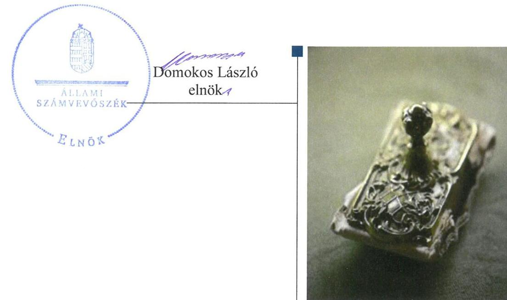
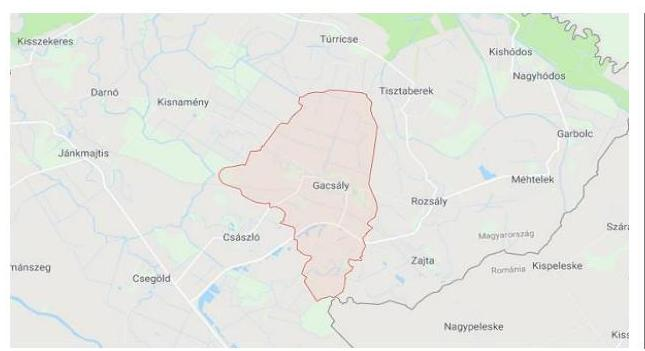
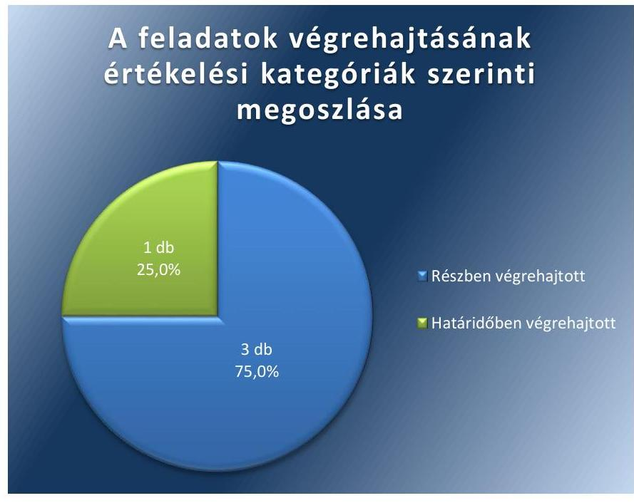

# Jelentés 

## Utóellenőrzések

A helyi önkormányzatok adósságrendezési eljárásának utóellenőrzése - Gacsály Község Önkormányzata
2019.

---

# Jelentés 

## Utóellenőrzések

A helyi önkormányzatok adósságrendezési eljárásának utóellenőrzése - Gacsály Község Önkormányzata
2019. 91. hó 15. nap

---

# AZ ELLENŐRZÉST FELÜGYELTE: 

VARGA EDIT felügyeleti vezető

## AZ ELLENŐRZÉST VEZETTE ÉS A VÉGREHAJTÁSÁÉRT FELELŐS:

LACZI HEDVIG ANNA ellenőrzésvezető

## A PROGRAM ÖSSZEÁLLÍTÁSÁÉRT FELELŐS:

TÓTPÁL SZABOLCS osztályvezető

## A TÉMÁHOZ KAPCSOLÓDÓ KORÁBBI SZÁMVEVŐSZÉKI JELENTÉSEK:

- címe: Önkormányzati adósságrendezés ellenőrzése Gacsály Község Önkormányzata adósságrendezési eljárásának ellenőrzése
- sorszáma: 17068

IKTATÓSZÁM: EL-1363-001/2018
TÉMASZÁM: 2460
ELLENŐRZÉS-AZONOSÍTÓ SZÁM: V080427

---

# TARTALOMJEGYZÉK 

■ ÖSSZEGZÉS ..... 5
■ AZ ELLENŐRZÉS CÉLJA ..... 6
■ AZ ELLENŐRZÉS TERÜLETE ..... 7
■ AZ ELLENŐRZÉS HÁTTERE, INDOKOLTSÁGA ..... 8
■ A JELENTÉS LÉNYEGES KÉRDÉSKÖRE ..... 9
■ ELLENŐRZÉS HATÓKÖRE ÉS MÓDSZEREI ..... 10
■ MEGÁLLAPÍTÁSOK ..... 12
■ MELLÉKLETEK ..... 15
I. sz. melléklet: Gacsály Község Önkormányzata intézkedési terve végrehajtásának értékelése ..... 15
II. sz. melléklet: Gacsály Község Önkormányzata intézkedési terve ..... 18
■ FÜGGELÉK: ÉSZREVÉTELEK ..... 21
■ RÖVIDÍTÉSEK JEGYZÉKE ..... 23

---

.

---

# ÖSSZEGZÉS 

Gacsály Község Önkormányzatának szabályozottsága javult, azonban annak szabályszerű müködtetését nem biztositották. A vagyongazdálkodás szabályszerűségére vonatkozó intézkedések elmaradása miatt nem biztositott a közpénzekkel való felelős gazdálkodás.

## Az ellenőrzés társadalmi indokoltsága

Az Állami Számvevőszék stratégiájában célul tűzte ki a számvevőszéki munka hasznosulásának javítását. Ezzel összhangban ellenőrzi, hogy az ellenőrzött szervezet megvalósította-e a korábbi ellenőrzései által feltárt hibák, hiányosságok és szabálytalanságok megszüntetése céljából elkészített intézkedési tervében foglaltakat. A rendszeres utóellenőrzések hozzájárulnak a szükséges intézkedések tényleges végrehajtásához, ezáltal a közpénzügyek rendezettségének javulásához.

## Főbb megállapítások, következtetések

Gacsály Község Önkormányzata az Állami Számvevőszék által elfogadott intézkedési tervében a jegyző részére négy feladatot határozott meg, amelyből egy feladatot határidőben, hármat részben hajtott végre.

Gacsály Község Önkormányzatának szabályozottsága a végrehajtott intézkedések eredményeként javult, mivel a jegyző gondoskodott a Leltározási és leltárkészítési szabályzat határidőben történő felülvizsgálatáról, módosításáról.

A pénzügyi gazdálkodás nem volt szabályszerű, mivel a jegyző nem gondoskodott a 2017. évi likviditási terv elkészítéséről valamint arról, hogy a követelések részletező nyilvántartása megfeleljen a jogszabályban meghatározott előírásoknak. A jegyző gondoskodott azonban a vállalkozói kölcsön összegének kötelezettségek közötti nyilvántartásáról, a 2018. évi likviditási terv elkészítéséről, valamint a kötelezettségek részletező nyilvántartásának elkészítéséről.

A vagyongazdálkodás szabályszerűsége nem javult, mivel a jegyző a jogszabályi előírások ellenére nem gondoskodott a kötelezettségek és követelések leltározásáról.

A jegyző nem gondoskodott az intézkedési tervben meghatározott feladatok végrehajtásáról szóló nyilvántartás vezetéséről.

---

# AZ ELLENŐRZÉS CÉLJA 

Az ellenőrzés célja annak értékelése volt, hogy a számvevőszéki jelentésben foglalt intézkedést igénylő megállapításokkal összhangban készített intézkedési tervben meghatározott feladatokat az ellenőrzött szervezet végrehajtotta-e.

---

# AZ ELLENŐRZÉS TERÜLETE 

## Gacsály Község Önkormányzata

Gacsály község Szabolcs-Szatmár-Bereg megyében, Fehérgyarmat járásban található. A település állandó lakosainak száma a $\mathrm{KSH}^{1}$ helységnévtárának adatai alapján 988 fő volt 2017. január 1-én.

Gacsály Község Önkormányzatának gazdálkodási feladatait a Rozsályi Közös Önkormányzati Hivatal látta el. Gacsály Község polgármesterének és a jegyzőnek a személye az ellenőrzött időszakban nem változott.

Az ÁSZ² 2009. január 1. és 2015. június 30. közötti időszakra vonatkozóan végezte el az Önkormányzat ${ }^{3}$ adósságrendezési eljárásának ellenőrzését. Az ellenőrzés célja az volt, hogy a lefolytatott adósságrendezési eljárás elérte-e a törvényben kitűzött célokat, és az eljárást követően biztosított és fenntartható volt-e az Önkormányzatnál a pénzügyi egyensúly. Az ÁSZ ellenőrizte az adósságrendezési eljárás folyamatának, az Önkormányzat gazdálkodásának és a pénzügyi gondnok feladatellátásának szabályszerűségét, valamint azt, hogy az adósságrendezési eljárás során az Önkormányzat folyamatosan teljesítette-e a kötelező feladatait, a hitelezők követelését vagyonarányosan kiegyenlítette-e és helyre állt-e a fizetőképessége. Az ellenőrzésről szóló 17068 számú jelentését az ÁSZ 2017. április 13-án tette közzé.

Az Önkormányzat a jelentésben ${ }^{4}$ foglalt javaslatok végrehajtása érdekében Intézkedési tervet ${ }^{5}$ készített.

---

# AZ ELLENŐRZÉS HÁTTERE, INDOKOLTSÁGA 

Az ÁSZ tv. ${ }^{6}$ 33. § (1) bekezdése értelmében a számvevőszéki jelentések intézkedést igénylő megállapításaihoz és javaslataihoz kapcsolódóan az ellenőrzött szervezet vezetője intézkedési tervet köteles összeállítani, és az Állami Számvevőszék részére megküldeni.

Az ÁSZ által befogadott intézkedési tervben foglaltak megvalósítását az ÁSZ tv. 33. § (7) bekezdésében foglaltak alapján - az Állami Számvevőszék utóellenőrzés keretében ellenőrizheti. Az utóellenőrzések keretében - az intézkedések értékelése során - az Állami Számvevőszék figyelembe veszi az ellenőrzött szervezetek működési feltételeiben, valamint a jogszabályi előírásokban bekövetkezett változásokat.

Az utóellenőrzés során az ÁSZ értékeli, hogy az érintett számvevőszéki jelentésben foglalt intézkedést igénylő megállapításokkal és javaslatokkal összhangban, az ellenőrzött szervezet által készített intézkedési tervben meghatározott feladatokat a feladatra kijelöltek végrehajtották-e.

Az intézkedések végrehajtásával az adott terület szabályszerű múködése vonatkozásában a kockázatok csökkenhetnek, azonban hosszabb távon az intézkedési tervben foglaltak végrehajtásával önmagában nem szűnnek meg, csak akkor, ha beépülnek az ellenőrzött szervezet múködésébe, azokat folyamatosan karban tartják, figyelembe véve, illetve kezelve a változásokat. Emellett az intézkedések végrehajtásáig újabb kockázatok merülhetnek fel a szabályszerű múködés vonatkozásában, amelyek kezelése szintén kiemelten fontos az ellenőrzött szervezet számára.

Az ellenőrzött szervezet vezetője által készített intézkedési tervekben foglalt feladatok hiányos, illetve késedelmes végrehajtása, vagy annak elmaradása a szabályszerűség és a felelős vezetői magatartás vonatkozásában kockázatot hordoz, ami azt mutatja, hogy az ellenőrzések során feltárt hibák, hiányosságok és szabálytalanságok kezelése nem kapott kellő hangsúlyt. Az utóellenőrzés során is fennálló szabálytalanságok esetén a közpénz, közvagyon veszélyeztetettségi kockázat valószínűsített hatásának értékelése további intézkedéseket vonhat maga után.

Az ellenőrzött szervezet szintjén az utóellenőrzés feltárja, hogy a szervezet az intézkedések végrehajtásával hasznosította-e a korábbi ellenőrzési jelentésben a hiányosságok megszüntetése, illetve a kockázatok kezelése érdekében megfogalmazott javaslatokat, illetve az intézkedések végrehajtása elmaradásának következtében továbbra is fennálló szabálytalanság esetén értékeli a közpénzek, közvagyon veszélyeztetettségét.

Az ÁSZ szintjén az utóellenőrzés visszacsatolást ad az ellenőrzési jelentések hasznosulásáról, az intézkedések elmaradásának, vagy részleges megvalósulásának a közpénzek, közvagyon veszélyeztetettségére gyakorolt valószínűsített hatásának értékelése, további intézkedéseket vonhat maga után.

---

# A JELENTÉS LÉNYEGES KÉRDÉSKÖRE 

Az Önkormányzat az intézkedési tervben foglaltakat az elöirt határidőben végrehajtotta-e?

---

# ELLENŐRZÉS HATÓKÖRE ÉS MÓDSZEREI 

## Az ellenőrzés típusa

Megfelelőségi ellenőrzés.

## Az ellenőrzött időszak

Az utóellenőrzés alapját képező ÁSZ jelentés közzétételének napjától az ellenőrzésről szóló kiértesítő levél keltének napjáig, azaz 2017. április 13.-tól 2018. május 30.-ig tartó időszak.

## Az ellenőrzés tárgya

Az ÁSZ tv. 2011. július 1-jei hatálybalépését követően a számvevőszéki jelentésben foglalt intézkedést igénylő megállapításokkal összhangban - az Önkormányzat által - készített Intézkedési tervben foglaltak végrehajtásának ellenőrzése.

## Az ellenőrzött szervezet

Gacsály Község Önkormányzata és a Rozsályi Közös Önkormányzati Hivatal

## Az ellenőrzés jogalapja

Az ellenőrzés jogszabályi alapját az ÁSZ tv. 33. § (7) bekezdésének az előírásai képezik.

## Az ellenőrzés módszerei

Az ellenőrzést az ellenőrzött időszakban hatályos jogszabályok, az ellenőrzés szakmai szabályai, a jelen ellenőrzésre irányadó ÁSZ módszertanok, az ellenőrzési programban foglalt értékelési szempontok szerint végeztük.

Az ellenőrzés ideje alatt az Önkormányzattal történő kapcsolattartást az ÁSZ SZMSZ²-ének vonatkozó előírásai alapján biztosítottuk.

Az utóellenőrzés megállapításait az ÁSZ rendelkezésére álló, valamint az ÁSZ adatbekérése szerint, az Önkormányzat által rendelkezésre bocsátott dokumentumok alapozták meg.

Az ellenőrzési bizonyítékként felhasználható adatforrások közé tartoztak egyrészt az ellenőrzési program részletes szempontjainál felsorolt

---

adatforrások, másrészt minden - az ellenőrzés folyamán feltárt, az ellenőrzés szempontjából információt tartalmazó - dokumentum.

Az intézkedési tervekben előírt feladatokat azok végrehajthatósága, illetve végrehajtása szempontjából az alábbiak szerint értékeltük:
"határidőben végrehajtott" a feladat, ha a teljesítés dokumentáltan, az intézkedési tervben előírt határidőben és tartalommal megtörtént;
"határidőn túl végrehajtott" a feladat, ha annak teljesítése az intézkedési tervben meghatározott módon, de az abban előírt határidőn túl történt meg;
"részben végrehajtott" a feladat, ha annak végrehajtása nem teljes körűen az intézkedési tervben előírt módon történt meg;
"nem végrehajtott" a feladat, ha a végrehajtás nem történt meg, dokumentumokkal nem igazolt annak teljesítése;
"okafogyottá vált" a feladat, ha végrehajtására - meghatározott esemény bekövetkezése, továbbá külső körülmény, a működést érintő feltétel változása miatt - már nincs szükség, illetve lehetőség, és egyértelműen megállapítható, hogy az intézkedést szükségessé tevő körülmény a jövőben nem fordulhat elő;
"nem időszerű" az a feladat, amelynek ellenőrzési időszakon belüli végrehajtására azért nem került (kerülhetett) sor, mert az intézkedés alapjául szolgáló esemény nem következett be, de annak jövőbeni előfordulása lehetséges, a végrehajtása nem volt esedékes, vagy a végrehajtás, határideje még nem járt le.
Az ellenőrzés lefolytatásához az Önkormányzat a tanúsítványok elektronikus kitöltésével, valamint az ÁSZ által kért dokumentumok elektronikus megküldésével szolgáltatott adatokat, amelyek valódiságát és teljes körűségét az ellenőrzött szervezet vezetője által tett teljességi és hitelességi nyilatkozat igazolja. Az így rendelkezésre bocsátott adatok, információk kontrollja az ellenőrzés keretében megtörtént.

Az ellenőrzött szervezet által megküldött intézkedési tervben meghatározott az ÁSZ által beazonosított feladatok a II. számú mellékletben kerültek bemutatásra.

---

# MEGÁLLAPÍTÁSOK 

## Az Önkormányzat az intézkedési tervben foglaltakat az előírt határidőben végrehajtotta-e?

Összegző megállapítás

Az Önkormányzat az intézkedési tervben szereplő négy feladatból egyet határidőben, hármat részben hajtott végre. Az intézkedési tervben meghatározott feladatok végrehajtásáról a jogszabályban előírt nyilvántartást nem vezették.

Az Önkormányzat az intézkedési tervében a jegyzőnek négy feladatot határozott meg, amelyekből egyet határidőben, három feladatot részben hajtott végre.

Az Önkormányzat a szabálytalanságok megszüntetése érdekében négy intézkedésből álló intézkedési tervet küldött meg az ÁSZ részére. Az intézkedési tervben meghatározott feladatokat, határidőket, felelősöket és a feladatok végrehajtását az I. sz. melléklet mutatja be.

A jegyző az intézkedési tervben meghatározott feladatok végrehajtásával kapcsolatban a Bkr. ${ }^{8} 14 . \S$ (1) bekezdésben előírt nyilvántartás vezetéséről nem gondoskodott.

Az Önkormányzat intézkedési tervében vállalt feladatok végrehajtásának értékelési kategóriák szerinti megoszlását az 1. ábra szemlélteti.

1. ábra

A SZABÁLYOZOTTSÁG biztosítása érdekében a jegyző gondoskodott a Leltározási és leltárkészítési szabályzat ${ }^{9}$ határidőben történő felülvizsgálatáról. (4)

---

# A PÉNZÜGYI GAZDÁLKODÁS SZABÁLYSZERŰ 

működése szempontjából kockázatot jelentett, hogy a jegyző nem gondoskodott
— arról, hogy a követelések nyilvántartása megfeleljen az Áhsz. ${ }^{10}$-ben és a Számv. tv. ${ }^{11}$-ben foglaltaknak, valamint
— az Áht. ${ }^{12}$ előírásai szerinti likviditási terv elkészítéséről 2017. évben.
A jegyző gondoskodott azonban a vállalkozói kölcsön összegének az Áhsz. és a Számv. tv. előírása szerinti nyilvántartásáról, a kötelezettségek nyilvántartásának Áhsz. szerinti kialakításáról, valamint a 2018. évi likviditási terv Áht.-ban foglaltnak szerinti elkészítéséről. (1-3)

A VAGYONGAZDÁLKODÁS területén továbbra is kockázatot jelentett, hogy a jegyző nem gondoskodott a kötelezettségek és követelések leltározásáról. A leltározás elmaradásával ezen mérlegtételek leltárral való alátámasztottsága nem volt biztosított az Áhsz. és a Számv. tv. előírásai ellenére. (4)

A pénzügyi egyensúly fenntarthatósága érdekében az Önkormányzat tett intézkedéseket, azonban a követelések jogszabály szerinti nyilvántartásának, valamint a kötelezettségek és követelések leltározásának elmaradása következtében a pénzügyi kockázatok nem csökkentek.

---

.

---

# MELLÉKLETEK

I. SZ. MELLÉKLET: GACSÁLY KÖZSÉG ÖNKORMÁNYZATA INTÉZKEDÉSI TERVE VÉGREHAJTÁSÁNAK ÉRTÉKELÉSE

|  1. | Intézkedési tervben meghatározott feladat | Az intézkedési tervben meghatározott határidő | Az intézkedési tervben meghatározott felelős | A feladat végrehajtása  |
| --- | --- | --- | --- | --- |
|   | 1. | 2. | 3. | 4.  |
|   |  | Határidőben végrehajtott feladat |  |   |
|  1. | HJ3 ${ }^{13}$ „A költségvetési beszámolók nem tartalmazták a belvízrendezési beruházáshoz kapcsolódó saját forrás megelőlegezéseként kapott vállalkozói kölcsönt az Áhsz. 26. § (2) és a Számv. tv. 42. § (2) bekezdésében foglaltak ellenére, továbbá nem mutatták ki a gazdasági társaságukban levő tulajdonosi részesedést a 2009-2013. években az Áhsz. 19. § (2) bekezdése ellenére." " Amennyiben a vállalkozói kölcsönt az év végéig nem tudjuk kiegyenlíteni, akkor fel kell venni a kapcsolatot a Magyar Államkincstárral és a Nemzetgazdasági Minisztériummal, állásfoglalás kialakítása miatt, mert a mi értelmezésünk szerint nem szerepeltethetjük a hitelek és a kölcsönök között. Jelenleg a mai nappal a 2.750.000-Ft kölcsönből már csak 1.000.000-Ft összeg tartozás áll fenn, minden erőfeszítéssel azon vagyunk, hogy ezt is kifizessük, így nem fog kelleni sehol szerepeltetni." | A feladat összetettsége miatt hosszabb határidő megjelölésével 2017. december 31.
Az Állami Számvevőszék általi elfogadását követően folyamatos. | pénzügyi vezető | A vállalkozástól kapott kölcsön visszafizetése 2017. év során, az utolsó részlet 2017. november 06-i utalásával megtörtént. A kötelezettségek nyilvántartásába Áhsz.-nek megfelelően felvezetésre került 2017. évben.  |

---

|  1. | Intézkedési tervben meghatározott feladat | Az intézkedési tervben meghatározott határidő | Az intézkedési tervben meghatározott felelős | A feladat végrehajtása  |
| --- | --- | --- | --- | --- |
|   | 1. | 2. | 3. | 4.  |
|   |  |  | Részben végrehajtott feladatok |   |
|  2. | HJ1 „Intézkedni kell arra vonatkozóan, hogy a likviditási terv a jogszabályoknak megfelelően elkészüljön."
"Likviditási tervet az Áht. 78.. § (2) bekezdése és Ávr. 122. § (2) bekezdése alapján az előírt tartalmi elemeket figyelembe véve készítjük el a likviditási tervet. Az Ámr. 122. § (3) bekezdése, amely a havonkénti felülvizsgálatot írt elő 2017.01.01 napjától hatályon kívül helyezve." | Gacsály Község Önkormányzatának 2017. évi költségvetési rendeletének következő módosításáig, legkésőbb 2017. május 31. napjáig. Az Állami Számvevőszék általi elfogadását követően folyamatos. | pénzügyi vezető | Végrehajtott feladat: A 2018. évi likviditási terv az Áht. előírásainak megfelelően elkészült.
Nem végrehajtott feladat: A 2017. évi likviditási terv elkészítése nem valósult meg, amely nem felel meg az Áht. 78. § (2) bekezdés előírásának.  |
|  3. | HJ2. „A fizetőképesség helyreállítása nem volt értékelhető, mert a 2009-2014 évi beszámolók nem nyújtottak valós képet az önkormányzat vagyonáról, annak összetételéről:.
nem gondoskodtunk az Áhsz. 49. § (1) bekezdésében és a 9. számú mellékletének 4. da) pontjában, illetve az Áhsz. 39. (3) bekezdésében és a 14. mellékletének II. pontjában előírt kötelezettségekhez kapcsolódó analitikus, illetve részletező nyilvántartás vezetéséről, továbbá az Áhsz. 49. § (1) bekezdésében és a 9. számú mellékletének 2. ca) pontjában, illetve az Áhsz. 39. § (3) bekezdésében és a 14. mellékletének III. pontjában előírt követelésekhez kapcsolódó analitikus, illetve részletező nyilvántartás vezetéséről."
„ Kötelezettségek részletező nyilvántartása 2017. január 1. napjától vezetve van. Az analitikát az államháztartás számviteléről szóló 4/2017. (I.11.) Kormányrendelet 39. § (3) bekezdése, illetve 14. melléklet 4. pont alapján az I. | A 2017. év I. negyedéve tekintetében 2017. 04. 30. Az év többi hónapja tekintetében folyamatos, de legkésőbb minden év december 31. Az Állami Számvevőszék általi elfogadását követően folyamatos. | pénzügyi előadó | Végrehajtott feladat: A kötelezettségek részletező nyilvántartása az Áhsz jogszabályi előírásainak megfelelően 2017. évben elkészült.
Nem végrehajtott feladat: Az éves költségvetési beszámolóban is szerepeltetett működési bevételekhez tartozó követelésekről - így a készletértékesítés bevétele, szolgáltatások ellenértéke, kiszámlázott általános forgalmi adó, egyéb működési bevételek - nem vezették a jogszabály szerinti részletező nyilvántartást.
Az Önkormányzat követeléseinek nyilvántartása az Áhsz. 39. § (1) és (3) bekezdésében, valamint a 14. melléklet III. fejezete 4. és 5. pontjában foglalt előírásoknak nem felelt meg.  |

---

|  4. |  |  |  |   |
| --- | --- | --- | --- | --- |
|  5. | Intézkedési tervben meghatározott feladat | Az intézkedési tervben meghatározott határidő | Az intézkedési tervben meghatározott felelős | A feladat végrehajtása  |
|   | 1. | 2. | 3. | 4.  |
|   | negyedévet felülvizsgáljuk 2017. április 30. napjáig. Továbbá az analitikát már ez alapján vezetjük az év hátralévő részében. Követelésünk csak adó formájában van nyilvántartva, ehhez analitikát az ONKADÓ rendszer elő tudja állítani." |  |  |   |
|  4. | HJ4. „A mérleg fordulónapjain a követelések és kötelezettségek leltározása a 2009-2013. években az Áhsz. 37. § (1) bekezdésében, a 2014. évben az Áhsz. 22. § (1) bekezdésében foglaltak ellenére nem lettek elvégezve."
„A számviteli törvény 69. § (1) bekezdésében foglaltak szerint a könyvek év végi záráshoz, a beszámoló elkészítéséhez, a könyvviteli mérleg tételeinek alátámasztásához olyan leltárt kell összeállítani és a számviteli törvény előírásai szerint megőrizni, amely tételesen, ellenőrizhető módon tartalmazza az Önkormányzat mérleg fordulónapján meglévő eszközeit és forrásait mennyiségben és értékben. Mérlegforduló nap: december 31. „ | Szabályzat felülvizsgálatának határideje:
2017. április 30.
Leltározás elvégzése és összesítése:
2018. január 31. | jegyző | Végrehajtott feladat: A leltározási szabályzat felülvizsgálatát elvégezték a Leltározási és leltárkészítési szabályzat 2017. április 1-től hatályos.
Nem végrehajtott feladat: A Számv. tv. 69. § (1)-(2) bekezdéseinek és az Áhsz. 22. § (1) bekezdésének előírásai ellenére a 2017. évi költségvetési beszámoló mérlegtételeinek alátámasztásához a követelések és kötelezettségek vonatkozásában leltározásra nem került sor.  |

---

# II. SZ. MELLÉKLET: GACSÁLY KÖZSÉG ÖNKORMÁNYZATA INTÉZKEDÉSI TERVE 

## INTÉZKEDÉSI TERV

Gacsály Község Önkormányzata adósságrendezési eljárásának ellenörzése kapcsán tett javaslat alapján Állami Számvevőszék jelentéséhez

| MEGÁLLAPITÁS | $\begin{gathered} \text { A } \\ \text { VÉGREHAJTÁSÉRT } \\ \text { FELELŐS } \end{gathered}$ | A VÉGREHAJTÁS HATÁRIDEJE | VÉGREHAJTOTT FELADATOK |
| :--: | :--: | :--: | :--: |
| Likviditási tervet nem készített az Önkormányzat a 2009. évben az Ámr 139 § (1) bekezdésében, a 2010 2011. évben az Ámr 201.§ (1) bekezdésében, a 2012 2015. I. felése között az Ávr 122.§ (1) - (2) bekezdésében foglaltak ellenére. Likviditási tervek hiányához a fizetőképesség alakulását nem lehetett figyelemmel kísérni, nem volt információ arról, hogy a kiadások teljesítéséhez a megfelelő pónzügyi fedezet rendelkezése állt - e, emiatt nem lehetett a tartozások kialakulását megelőzni.   Intézkedj, kell arra vonatkozóan, hogy a likviditási terv a jogszabályoknak megfelelően elkészüljön. | Bejákiné Márki Barbara pónzügyi vezető tanácson | Gacsály Község Önkormányzatának 2017. évi költségvetési rendelestnek következő módosításáig, legkésőbb 2017. május 31. napjáig.   Az Állami Számvevőszék általi elfogadását követően folyamatos | A likviditási tervet az Áhr 78.§ (2) bekezdése és az Ávr 122.§ (2) bekezdése alapján az előírt tartalmi elemeket figyelembe véve készítjük el a likviditási tervet.   Az Ámr 122.§ (3) bekezdése, amely a havonkénti felülvizsgálatot írt elő 2017.01.01. napjától hatályon kívül lett helyezve. |
| A fizetőképesség helyreállítása nem volt értékelhető, mert a 2009 - 2014. évi beszámolók nem nyújtottak velős képet az önkormányzat vagyonáról, annak összetételéről   - nem gondoskodtunk az Ábsz 49§ (1) bekezdésében és a 9. számú mellékletének 4. D) pontjában, illetve az Ábsz 39.§ (3) bekezdésében és a 14. mellékletének II. pontjában elöírt kötelezettségeéhez kapcsolódó analitikus, illetve részletező nyilvántartás vezetéséről, továbbá az Ábsz. 49.§ (1) bekezdésében és a 9. számú mellékletének2. ca) pontjában, illetve az Ábsz. 39.§ (3) bekezdésében és a 14. mellékletének III. pontjában elöírt követelésekhez kapcsolódó analitikus, illetve részletező nyilvántartás vezetéséről | Kiss András pónzügyi előadó | A 2017. év 1. negyedéve tekintetében 2017.04.30. Az év többi hónapja tekintetében folyamatos, de legkésőbb minden év december 31.   Az Állami Számvevőszék általi elfogadását követően folyamatos | Kötelezettségek részletező nyilvántartása 2017. január 1. napjától vezetve van. Az analitikát az állambáztartás számviteléről szóló 4/2017. (I.11.) Kormányrendelet 39.§ (3) bekezdése, illetve 14. melléklet 4. pont alapján az I. negyedévet felülvizsgáljuk 2017. április 30. napjáig. Továbbá az analitikát már ez alapján vezetjük az év hátralévő részében. Követelésünk csak adó formájában van nyilvántartva, ehhez az analitikát az ONKADÓ rendszer elő tudja állítani. |

---

|  | A költségvetési beszámolók nem tartalmazzák a
nelváromázatai beruházásához kapcsolódó saját forrás
engedőlegezéssként kapott vállalkozói kölcsön az?
Ához. 26.§ (2) és a Számv. tv.42. § (2) bekezdésében
foglaltak ellenére, továbbá nem mutatták ki a gazdasági
társaságukban lévő tulajdoni részesedése a 2009 - 2013.
években az Ához. 19. § (2) bekezdése ellenére. | Bujákisé Márki Barbani
pmozigyi vezető
tendezes | A feladat összetettsége miatt,
hosszabb határidő
megjeldésével 2017.
december 31.
Az Állami Számvuvőszék
állati elfogadását követően
folyamatos | Amennyiben a vállalkozói kölcsön
az év végéig nem tudjuk
kiegysetlteni, akkor fel kell venni a
kapcsolatot a Magyar
Államköszmárral és a
Nemzetgazdasági Minisztériummal,
állánfoglalás kialakítása miatt, mert a
mi értelmezésünk szerint nem
szerepelhethetjük a kötelek és a
kölcsönök között. Jelenleg a mai
nappal a 2.750.000.-Ft kölcsönből
már csak 1.000.000.-Ft összeg
tartozás áll fent, minden
edőlécskései azon vagyunk, hogy
cst is kifizessük, tgy nem fog kelleni
sehol szerepelhetić. |
| :--: | :--: | :--: | :--: | :--: |
|  | Mérleg fordulónajjain a követelések és kötelezettségek
feltároztnát a 2009 - 2013. években az Ához. 37.§ (1)
bekezdésében, a 2014. évben az Ához 22.§ (1)
bekezdésében foglaltak ellenére nem lettek elvégezve. | Nadimosné Adorján
Bélkó jegyzé | Szabályzat feltévizsgálatának
határulaje: 2017. április 30.
Léftárosás elvégzése és
összestése: 2018. január 31. | A számvételi törvény 69. §-ának (1)
bekezdésében foglaltak szerint a
könyvek év végi záráshoz, a
beszámoló elkészítéséhez, a
könyvekeli mérleg telefonum
záttámasztásához olyan feltárt kell
össznéltteni és a számvételi törvény
előírásai szerint megőrizni, amely
térdissen, ellenőrizhető módon
tartalmazza az Önkormányzat mérleg
fordulónajján meglévő eszközeit és
források mennyiségben és értékben
Mérlegforduló nap: december 31. |

---

.

---

# FÜGGELÉK: ÉSZREVÉTELEK 

A jelentéstervezetet a Számvevőszék 15 napos észrevételezésre megküldte az ellenőrzött szervezetek vezetőinek az ÁSZ tv. 29. §* (1) bekezdése előírásának megfelelően.

Az ÁSZ a jelentéstervezetet észrevételezésre megküldte Gacsály Község Önkormányzata polgármestere, valamint a Rozsályi Közös Önkormányzati Hivatal jegyzője részére.
Gacsály Község Önkormányzata polgármestere, valamint a Rozsályi Közös Önkormányzati Hivatal jegyzője az ÁSZ tv. 29. § (2) bekezdésében foglalt észrevételezési jogával nem élt, a jelentéstervezet megállapításaira a törvényes határidőn belül észrevételt nem tett.

[^0]
[^0]:    * 29. § (1) Az Állami Számvevőszék az ellenőrzési megállapításait megküldi az ellenőrzött szervezet vezetőjének vagy az általa megbízott személynek, és annak, akinek személyes felelősségét állapította meg.
    (2) Az ellenőrzött szervezet vezetője és a felelősként megjelölt személy az ellenőrzés megállapításaira tizenöt napon belül írásban észrevételt tehet.
    (3) Az Állami Számvevőszék az észrevételre a beérkezésétől számított harminc napon belül írásban válaszol. A figyelembe nem vett észrevételeket köteles a jelentésben feltüntetni, és megindokolni, hogy azokat miért nem fogadta el.

---

.

---

# RÖVIDÍTÉSEK JEGYZÉKE 

${ }^{1}$ KSH
${ }^{2}$ ÁSZ
${ }^{3}$ Önkormányzat
${ }^{4}$ jelentés
${ }^{5}$ Intézkedési terv
${ }^{6}$ ÁSZ tv.
${ }^{7}$ ÁSZ SZMSZ
${ }^{8}$ Bkr.
${ }^{9}$ Leltározási és leltárkészítési szabályzat
${ }^{10}$ Áhsz
${ }^{11}$ Számv. tv.
${ }^{12}$ Áht.
${ }^{13} \mathrm{HJ}$

Központi Statisztikai Hivatal
Állami Számvevőszék
Gacsály Község Önkormányzata
A 2017. április 13-án közzé tett 17068 számú ÁSZ jelentés, az Önkormányzati adósságrendezés ellenőrzése - Gacsály Község Önkormányzata adósságrendezési eljárásának ellenőrzése
Gacsály Község Önkormányzat Képviselő testülete által a 33/2017. (VIII.16.) számú határozattal elfogadott Kiegészített Intézkedési Terv
2011. évi LXVI. törvény az Állami Számvevőszékről
Az Állami Számvevőszék elnökének 4/2017. (XII.29.) ÁSZ utasítása az Állami Számvevőszék Szervezeti és Müködési Szabályzatáról
370/2011. (XII. 31.) Korm. rendelet a költségvetési szervek belső kontrollrendszeréről és belső ellenőrzéséről
Gacsály Község Önkormányzata, Leltározási és leltárkészítési Szabályzata (hatályos: 2017. április 1-től)
4/2013. (I. 11.) Korm. rendelet az államháztartás számviteléről
2000. évi C. törvény a számvitelről
2011. évi CXCV. törvény az államháztartásról

Hivatal jegyzője

---

# ÁLLAMI SZÁMVEVŐSZÉK 

1052 Budapest, Apáczai Csere János utca 10.
Levélcím: 1364 Budapest 4. Pf. 54
Telefon: +36 14849100 Telefax: +36 14849200
www.asz.hu