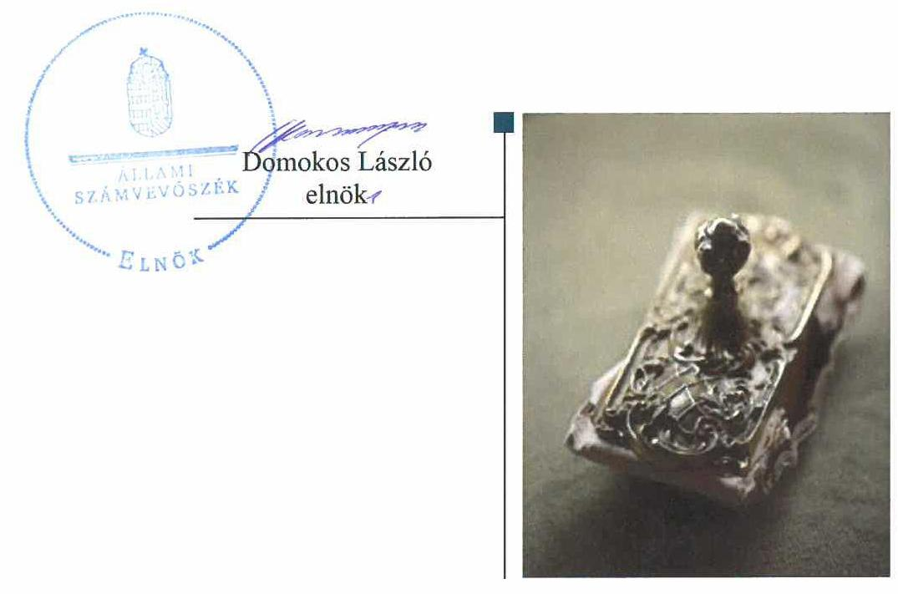
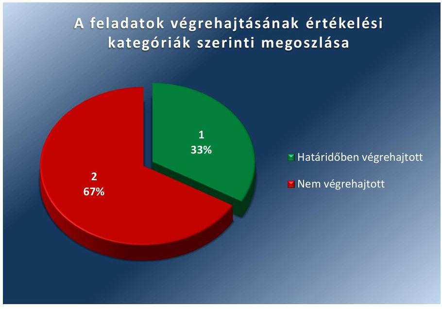
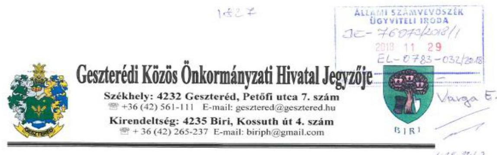
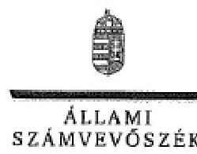
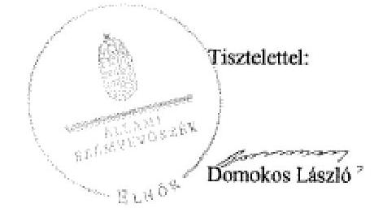

# Jelentés 

## Utóellenőrzések

A helyi önkormányzatok adósságrendezési eljárásának utóellenőrzése - Biri Község Önkormányzata
2019. O4. hó 15. nap

---

# AZ ELLENŐRZÉST FELÜGYELTE: 

VARGA EDIT felügyeleti vezető

## AZ ELLENŐRZÉST VEZETTE ÉS A VÉGREHAJTÁSÁÉRT FELELŐS:

BAJNAI ZSUZSANNA ellenőrzésvezető

## A PROGRAM ÖSSZEÁLLÍTÁSÁÉRT FELELŐS:

TÓTPÁL SZABOLCS osztályvezető

## A TÉMÁHOZ KAPCSOLÓDÓ KORÁBBI SZÁMVEVŐSZÉKI JELENTÉSEK:

- címe: Önkormányzati adósságrendezés ellenőrzése Biri Község Önkormányzata adósságrendezési eljárásának ellenőrzése
- sorszáma: 17079

Jelentéseink az Országgyúlés számítógépes hálózatán és az Interneten a www.asz.hu címen is olvashatóak.

IKTATÓSZÁM: EL-1418-001/2018
TÉMASZÁM: 2460
ELLENŐRZÉS-AZONOSÍTÓ SZÁM: V080422

---

# TARTALOMJEGYZÉK 

■ ÖSSZEGZÉS ..... 5
■ AZ ELLENŐRZÉS CÉLJA ..... 6
■ AZ ELLENŐRZÉS TERÜLETE ..... 7
■ AZ ELLENŐRZÉS HÁTTERE, INDOKOLTSÁGA ..... 8
■ A JELENTÉS LÉNYEGES KÉRDÉSKÖRE ..... 9
■ ELLENŐRZÉS HATÓKÖRE ÉS MÓDSZEREI ..... 10
■ MEGÁLLAPÍTÁSOK ..... 12
■ MELLÉKLETEK ..... 13
I. sz. melléklet: Az ÁSZ 17079 számú jelentéséhez kapcsolódó intézkedési terv végrehajtása ..... 13
II. sz. melléklet: Biri Község Önkormányzatának intézkedési terve ..... 16
■ FÜGGELÉK: ÉSZREVÉTELEK ..... 19
■ RÖVIDÍTÉSEK JEGYZÉKE ..... 25

---

.

---

# ÖSSZEGZÉS 

Az Állami Számvevőszék Biri Község Önkormányzata adósságrendezési eljárásának utóellenőrzése során megállapította, hogy az Önkormányzat valós vagyoni és pénzügyi helyzetét bemutató, a beszámolót alátámasztó leltár hiánya továbbra is veszélyezteti a közpénzekkel való felelős, elszámoltatható és szabályszerű gazdálkodást.

## Az ellenőrzés társadalmi indokoltsága

Az Állami Számvevőszék stratégiájában célul tűzte ki a számvevőszéki munka hasznosulásának javítását. Ezzel összhangban kontrollálja, hogy az ellenőrzött szervezet megvalósította-e a korábbi ellenőrzései által feltárt hibák, hiányosságok és szabálytalanságok megszüntetése céljából elkészített intézkedési tervében foglaltakat. A rendszeres utóellenőrzések hozzájárulnak a szükséges intézkedések tényleges végrehajtásához, ezáltal a közpénzügyek rendezettségének javulásához.

## Főbb megállapítások, következtetések

Az intézkedési tervben meghatározott három feladatból kettőt nem hajtottak végre, egynek a végrehajtása határidőben megtörtént.

Likviditási terv nem készült. A leltározást nem hajtották végre, nem egyeztették a főkönyvi könyvelés és az analitikus nyilvántartások adatait. A beszámolót leltárral nem támasztották alá. A végre nem hajtott intézkedések következtében megbízható adatok továbbra sem állnak rendelkezésre a pénzügyi és vagyoni helyzet értékeléséhez, ami kockázatot hordoz Biri Község Önkormányzata vagyonnal való felelős gazdálkodása és vagyonának védelme szempontjából.

A személyi felelősség tisztázása eredményeként munkajogi intézkedést érvényesítettek.
Az intézkedési tervben meghatározott feladatok végrehajtásáról nem vezettek a jogszabályi előírás ellenére nyilvántartást.

---

# AZ ELLENŐRZÉS CÉLJA 

Az ellenőrzés célja annak értékelése volt, hogy a számvevőszéki jelentésben foglalt intézkedést igénylő megállapításokkal és javaslatokkal összhangban készített intézkedési tervben meghatározott feladatokat az ellenőrzött szervezet végrehajtotta-e.

---

# AZ ELLENŐRZÉS TERÜLETE 

## Biri Község Önkormányzata

Biri község Szabolcs-Szatmár-Bereg megyében helyezkedik el. Lakónépességének száma a Központi Statisztikai Hivatal Magyarország közigazgatási helynévkönyve alapján 1385 fő volt 2017. január 01-jén.

Az Önkormányzat¹ gazdálkodási feladatai ellátásáról a Geszterédi Közös Önkormányzati Hivatal gondoskodott.

A polgármester² 2009. augusztus 02. napjától tölti be tisztségét, a jegyző³ 1998. március 01-jétől látja el feladatait.

Az Önkormányzatnál 2009. február 24-től 2009. december 10-ig adósságrendezés folyt, amely során a hitelezők mindösszesen 63,3 millió Ft kötelezettség teljesítésére nyújtottak be igényt. Ez a kötelezettségállomány az Önkormányzat vagyonának mintegy tizedét jelentette.

Az ÁSZ⁴ 2009. január 1. és 2015. június 30. közötti időszakra vonatkozóan ellenőrizte az Önkormányzat adósságrendezési eljárását. Az ellenőrzés célja annak megállapítása volt, hogy az adósságrendezési eljárás lefolytatása szabályszerű volt-e, az Önkormányzat gazdálkodása az adósságrendezési eljárás alatt megfelelt-e a jogszabályi előírásoknak; az eljárás szereplői a jogszabályokban foglaltak szerint jártak-e el az adósságrendezés során. A lefolytatott eljárás elérte-e a törvényben kitűzött célokat; az adósságrendezési eljárás alatt az Önkormányzat folyamatosan teljesítette-e kötelező feladatait, a hitelezők követelését vagyonarányosan kielégítette-e, helyreállt-e fizetőképessége. A 17079. számú ÁSZ jelentés⁵ közzétételének napja 2017. május 24-e volt.

Az Önkormányzat az ÁSZ jelentésben foglalt javaslatok végrehajtása érdekében intézkedési tervet készített.

---

# AZ ELLENŐRZÉS HÁTTERE, INDOKOLTSÁGA 

Az ÁSZ tv.⁶ 33. § (1) bekezdése értelmében a számvevőszéki jelentések intézkedést igénylő megállapításaihoz és javaslataihoz kapcsolódóan az ellenőrzött szervezet vezetője intézkedési tervet köteles összeállítani, és az Állami Számvevőszék részére megküldeni.

Az ÁSZ által befogadott intézkedési tervben foglaltak megvalósítását az ÁSZ tv. 33. § (7) bekezdésében foglaltak alapján - az Állami Számvevőszék utóellenőrzés keretében ellenőrizheti. Az utóellenőrzések keretében - az intézkedések értékelése során - az Állami Számvevőszék figyelembe veszi az ellenőrzött szervezetek működési feltételeiben, valamint a jogszabályi előírásokban bekövetkezett változásokat.

Az utóellenőrzés során az ÁSZ értékeli, hogy az érintett számvevőszéki jelentésben foglalt intézkedést igénylő megállapításokkal és javaslatokkal összhangban, az ellenőrzött szervezet által készített intézkedési tervben meghatározott feladatokat a feladatra kijelöltek végrehajtották-e.

Az intézkedések végrehajtásával az adott terület szabályszerű működése vonatkozásában a kockázatok csökkenhetnek, azonban hosszabb távon az intézkedési tervben foglaltak végrehajtásával önmagában nem szűnnek meg, csak akkor, ha beépülnek az ellenőrzött szervezet működésébe, azokat folyamatosan karbantartják, figyelembe véve, illetve kezelve a változásokat. Emellett az intézkedések végrehajtásáig újabb kockázatok merülhetnek fel a szabályszerű működés vonatkozásában, amelyek kezelése szintén kiemelten fontos az ellenőrzött szervezet számára.

Az ellenőrzött szervezet vezetője által készített intézkedési tervekben foglalt feladatok hiányos, illetve késedelmes végrehajtása, vagy annak elmaradása a szabályszerűség és a felelős vezetői magatartás vonatkozásában kockázatot hordoz, ami azt mutatja, hogy az ellenőrzések során feltárt hibák, hiányosságok és szabálytalanságok kezelése nem kapott kellő hangsúlyt. Az utóellenőrzés során is fennálló szabálytalanságok esetén a közpénz, közvagyon veszélyeztetettségi kockázat valószínűsített hatásának értékelése további intézkedéseket vonhat maga után.

Az ellenőrzött szervezet szintjén az utóellenőrzés feltárja, hogy a szervezet az intézkedések végrehajtásával hasznosította-e a korábbi ellenőrzési jelentésben a hiányosságok megszüntetése, illetve a kockázatok kezelése érdekében megfogalmazott javaslatokat. Az intézkedések végrehajtása elmaradásának következtében továbbra is fennálló szabálytalanság esetén értékeli a közpénzek, közvagyon veszélyeztetettségét.

Az ÁSZ szintjén az utóellenőrzés visszacsatolást ad az ellenőrzési jelentések hasznosulásáról, az intézkedések elmaradásának, vagy részleges megvalósulásának a közpénzek, közvagyon veszélyeztetettségére gyakorolt valószínűsített hatásának értékelése további intézkedéseket vonhat maga után.

---

# A JELENTÉS LÉNYEGES KÉRDÉSKÖRE 

Az Önkormányzat az intézkedési tervben foglaltakat az előírt határidőben végrehajtotta-e?

---

# ELLENŐRZÉS HATÓKÖRE ÉS MÓDSZEREI 

## Az ellenőrzés típusa

Megfelelőségi ellenőrzés.

## Az ellenőrzött időszak

Az utóellenőrzés alapját képező 17079. számú ÁSZ jelentés közzétételének napjától az ellenőrzésről szóló kiértesítő levél keltének napjáig, 2017. május 24-től 2018. július 3-ig tartó időszak.

## Az ellenőrzés tárgya

Az ellenőrzés tárgya a számvevőszéki jelentésben foglalt intézkedést igénylő megállapításokkal és javaslatokkal összhangban - az Önkormányzat által - készített intézkedési tervben foglaltak végrehajtásának ellenőrzése volt.

## Az ellenőrzött szervezet

Biri Község Önkormányzata és a gazdálkodási feladatait ellátó Geszterédi Közös Önkormányzati Hivatal

## Az ellenőrzés jogalapja

Az utóellenőrzés jogszabályi alapját az ÁSZ tv. 33. § (7) bekezdésének előírása képezi.

## Az ellenőrzés módszerei

Az ellenőrzést az ellenőrzött időszakban hatályos jogszabályok, az ellenőrzés szakmai szabályai, a jelen ellenőrzésre irányadó ÁSZ módszertanok, az ellenőrzési programban foglalt értékelési szempontok szerint végeztük.

Az ellenőrzés ideje alatt az Önkormányzattal történő kapcsolattartást az ÁSZ SZMSZ²ének vonatkozó előírásai alapján biztosítottuk.

Az utóellenőrzés megállapításait az ÁSZ rendelkezésére álló, valamint az ÁSZ adatbekérése szerint, az Önkormányzat által rendelkezésre bocsátott dokumentumok alapozták meg.

Az ellenőrzési bizonyítékként felhasználható adatforrások közé tartoztak egyrészt az ellenőrzési program részletes szempontjainál felsorolt

---

adatforrások, másrészt minden - az ellenőrzés folyamán feltárt, az ellenőrzés szempontjából információt tartalmazó - dokumentum.

Az intézkedési tervben előírt feladatokat azok végrehajthatósága, illetve végrehajtása szempontjából az alábbiak szerint értékeltük:
$\longrightarrow$ „határidőben végrehajtott" a feladat, ha a teljesítés dokumentáltan, az intézkedési tervben előírt határidőben és tartalommal megtörtént;
$\longrightarrow$ „határidőn túl végrehajtott" a feladat, ha annak teljesítése az intézkedési tervben meghatározott módon, de az előírt határidőn túl történt meg;
$\longrightarrow$ „részben végrehajtott" a feladat, ha végrehajtása teljeskörűen az intézkedési tervben előírt módon nem történt meg;
$\longrightarrow$ „nem végrehajtott" a feladat, ha a végrehajtás nem történt meg, vagy amennyiben a teljesítést nem dokumentálták;
$\longrightarrow$ „okafogyottá vált" a feladat, ha végrehajtására - meghatározott esemény bekövetkezése, továbbá külső körülmény, a működést érintő feltétel változása miatt - már nincs szükség, illetve lehetőség, és egyértelműen megállapítható, hogy az intézkedést szükségessé tevő körülmény a jövőben nem fordulhat elő;
$\longrightarrow$ „nem időszerű" az a feladat, amelynek ellenőrzési időszakon belüli végrehajtására azért nem került (kerülhetett) sor, mert az intézkedés alapjául szolgáló esemény nem következett be, de annak jövőbeni előfordulása lehetséges, a végrehajtása nem volt esedékes, vagy a végrehajtás határideje még nem járt le.
Az ellenőrzés lefolytatásához az Önkormányzat a tanúsítványok elektronikus kitöltésével, valamint az ÁSZ által kért dokumentumok elektronikus megküldésével szolgáltatott adatokat, amelyek valódiságát és teljeskörűségét az ellenőrzött szervezet vezetője által tett teljességi és hitelességi nyilatkozat igazolja. Az így rendelkezésre bocsátott adatok, információk kontrollja az ellenőrzés keretében megtörtént.

Az ellenőrzött szervezet által megküldött intézkedési tervben meghatározott, ÁSZ által beazonosított feladatok a II. számú mellékletben kerültek bemutatásra.

---

# MEGÁLLAPÍTÁSOK 

## Az Önkormányzat az intézkedési tervben foglaltakat az előírt határidőben végrehajtotta-e?

Összegző megállapítás

Az Önkormányzat az intézkedési tervben meghatározott három feladatból egyet határidőben, kettőt pedig nem hajtott végre. Az intézkedési tervben meghatározott feladatok végrehajtásáról nyilvántartást nem vezettek.

A jegyző a szabálytalanságok megszüntetése érdekében három intézkedésből álló intézkedési tervet küldött meg az ÁSZ részére. Az intézkedési tervben meghatározott feladatokat, határidőket, felelősöket és a feladatok végrehajtását az I. számú melléklet mutatja be.

Az ÁSZ javaslatai alapján készített intézkedési tervben meghatározott feladatok végrehajtásáról a jegyző nem vezetett nyilvántartást a Bkr.⁸ 14. § (1) bekezdésének előírása ellenére.

Az intézkedési tervben meghatározott feladatok végrehajtásának értékelési kategóriák szerinti megoszlását az 1. ábra szemlélteti.

1. ábra

A GAZDÁLKODÁS szabályszerűsége, az elszámoltathatóság nem javult. A jegyző nem készítette el a likviditási tervet, továbbá nem intézkedett a számviteli törvényben előírt leltározás végrehajtásáról és az éves költségvetési beszámoló leltárral történő alátámasztásáról. (2., 3.)

A munkajogi felelősséget érvényesítették az ÁSZ által feltárt szabálytalanságok következményeként. (1.)

---

# MELLÉKLETEK

■ I. SZ. MELLÉKLET: AZ ÁSZ 17079 SZÁMÚ JELENTÉSÉHEZ KAPCSOLÓDÓ INTÉZKEDÉSI TERV VÉGREHAJTÁSA

|  Az intézkedési tervben meghatározott feladat | Az intézkedési tervben meghatározott határidő | Az intézkedési tervben meghatározott feladat felelőse | A feladat végrehajtása  |
| --- | --- | --- | --- |
|  1. | 2.
Határidőben végrehajtott feladat | 3.
3. | 4.  |
|  1. (J.3.) „A jegyző a közszolgálati tisztviselőkről szóló 2011. évi CXCIX. Törvény 155-159. §-ban meghatározott fegyelmi felelősségre vonatkozó rendelkezéseknek megfelelően jár el." | 2017. december 31. | jegyző | A jegyző 2017. szeptember 20-án a Kttv.⁹ 156. § (1) bekezdése alapján fegyelmi eljárást indított, amelynek eredményeként a személyi felelősség megállapítása és a felelősségre vonás megtörtént.  |
|  Nem végrehajtott feladatok |  |  |   |
|  2. (J.1.) „A bevételek beérkezésének és a kiadások teljesítésének ütemezéséről likviditási tervet kell készíteni. Az Önkormányzat likviditási terve, az önkormányzat várható bevételeinek - ideértve az időszak elején rendelkezésre álló készpénz, és számlaállomány együttes öszszegét is - alapul vételével,

 havi, és a tárgyhónap vonatkozásában dekádonkénti ütemezéssel tartalmazza a teljesíthető kiadásokat. A likviditási tervet a Jegyző, a pénzügyi ügyintéző közreműködésével készíti el a kötelezettségvállalás nyilvántartás adatai alapján. A pénzügyi ügyintéző likviditási tervet készít az éves költségvetéséhez, majd ezt havonta felül kell vizsgálni, és szükség szerint módosítani kell." | folyamatos | jegyző
a végrehajtás előkészítésért: a pénzügyi ügyintéző | A jegyző nem készített likviditási tervet az Áht. ${ }^{10}$ 78. § (2) bekezdésében foglaltak ellenére.  |
|  3. (J.2.) „Az éves költségvetési beszámolót a 4/2013. (I. 11.) Kormány rendelet rendelkezéseinek figyelembevételével a könyvek zárását követően bizonylatokkal, szabályszerű könyvvezetéssel, a rendelet szabályai szerint folyamatosan vezetett részletező nyilvántartásokkal, a könyvviteli zárlat során készített főkönyvi kivonattal, | folyamatos, negyed-
évente, illetve a mérleg
fordulónapja | jegyző
a végrehajtás előkészítéséért: a pénzügyi ügyintéző, adóügyi ügyintéző és a könyvelő | A jegyző a 2017. évi költségvetési beszámolót a könyvek zárását követően bizonylatokkal, részletező nyilvántartásokkal, a könyvviteli zárlat során elkészített főkönyvi kivonattal, leltárral nem támasztotta alá az Áhsz. ${ }^{11} 5 . \S$ (1) bekezdésében foglaltak ellenére. A jegyző az éves költségvetési beszámoló elkészítéséhez, a mérleg tételeinek alátámasztásához a Számv. tv. ${ }^{12}$ 69. § (1) bekezdésében, valamint az Áhsz. 22. § (1) bekezdésében előírtak ellenére nem állított össze olyan leltárt, amely tételesen, ellenőrizhető  |

---

|  Az intézkedési tervben meghatározott feladat | Az intézkedési tervben meghatározott határidő | Az intézkedési tervben meghatározott feladat felelőse | A feladat végrehajtása  |
| --- | --- | --- | --- |
|  1. | 2. | 3. | 4.  |
|  valamint leltárral alátámasztott éves költségvetési beszámolót kell készíteni. Éves költségvetési beszámoló mérlegében kimutatható vagyonról költségvetési szervenként, az elkülönített állami pénzalapok és azok mérlegében kimutatható vagyonról, elkülönített állami pénzalaponként, a fejezeti kezelésű előirányzatok elemi költségvetéséről és azok mérlegében kimutatható vagyonról fejezetenként. Az éves költségvetési beszámoló elkészítéséhez, a mérleg tételeinek alátámasztásához olyan leltárt kell összeállítani és megőrizni, amely tételesen, ellenőrizhető módon tartalmazza a mérlegben szereplő eszközöket és forrásokat. A leltározás végrehajtását a vagyonkezelésbe adott eszközöket a működtető, vagyonkezelő által elkészített és hitelesített leltárral kell alátámasztani, és a használt, de a mérlegben értékkel nem szereplő immateriális javakat, tárgyi eszközöket, készleteket a leltározási és leltárkészítési szabályzatban meghatározott módon kell leltározni." |  |  | módon tartalmazza az Önkormányzat mérleg fordulónapján meglévő eszközeit és forrásait. A leltározást nem végezték el a Számv tv. 69. § (3) bekezdésében foglalt előírás ellenére, a főkönyvi könyvelés és az analitikus nyilvántartások adatait nem egyeztették.  |
|  Kiegészítés 1.: „Biri Község Önkormányzatának:
- a könyvek üzleti év végi zárásához,
- a beszámoló elkészítéséhez,
- a mérleg tételeinek alátámasztásához olyan leltárt kell összeállítani és megőrizni, amely tételesen, ellenőrizhető módon tartalmazza, az üzleti év mérleg fordulónapját megelőző negyedévben vagy az azt követő negyedévben is ellenőrizheti a mennyiségi felvétellel árukészletei nyilvántartásának a mérleg fordulónapjára vonatkozó adatai helyességét. |  |  |   |

---

|  Az intézkedési tervben meghatározott feladat | Az intézkedési tervben meghatározott határidő | Az intézkedési tervben meghatározott feladat felelőse | A feladat végrehajtása  |
| --- | --- | --- | --- |
|  1. | 2. | 3. | 4.  |
|  a mennyiségi felvétel alapján szükségessé váló módosításokat az üzleti év mérleg fordulónapjára vonatkozóan kell elszámolni." |  |  |   |
|  Kiegészítés 2.: „Biri Község Önkormányzatának: |  |  |   |
|  - az éves költségvetési beszámoló elkészítéséhez, mérleg tételeinek alátámasztásához olyan leltárt kell összeállítani és megőrizni, amely tételesen, ellenőrizhető módon tartalmazza a mérlegben szereplő eszközöket és forrásokat, |  |  |   |
|  - a beszámoló elkészítéséhez, a mérleg tételeinek alátámasztásához olyan leltárt kell összeállítani és megőrizni, amely tételesen, ellenőrizhető módon tartalmazza, az üzleti év mérleg fordulónapját megelőző negyedévben vagy az azt követő negyedévben is ellenőrizheti a mennyiségi felvétellel árukészletei nyilvántartásának a mérleg fordulónapjára vonatkozó adatai helyességét. |  |  |   |
|  - a mennyiségi felvétel alapján szükségessé váló módosításokat az üzleti év mérleg fordulónapjára vonatkozóan kell elszámolni, |  |  |   |
|  - A koncesszióba, vagyonkezelésbe adott eszközöket a működtető, vagyonkezelő által elkészített és hitelesített leltárral kell alátámasztani, |  |  |   |
|  - A használt, de a mérlegben, értékben nem szereplő immateriális javakat, tárgyi eszközöket, készleteket a leltározási és leltárkészítési szabályzatban meghatározott módon kell leltározni." |  |  |   |

*Forrás: ÁSZ által készített táblázat*

---

# INTÉZKEDÉSI TERV 

Készült az Állami Számvevőszék által Biri Község Önkormányzata (,Önkormányzati adósságrendezés ellenőrzés - Biri Község Önkormányzata adósságrendezési eljárásának ellenőrzése") gazdálkodási rendszerének ellenőrzéséről készült vizsgálati jelentés alapján,

## A Geszterédi Közös Önkormányzati Hivatal Jegyzőjének tett javaslatokról:

## 1. Az Állami Számvevőszék javaslata:

Intézkedjen a likviditási terv jogszabályi előírásainak megfelelő elkészítéséről.

## Jegyzői intézkedés

A bevételek beérkezésének és a kiadások teljesítésének ütemezéséről likviditási tervet kell készíteni.
Az Önkormányzat likviditási terve, az önkormányzat várható bevételeinek - ideértve az időszak elején rendelkezésre álló készpénz, és számlaállomány együttes összegét is - alapul vételével, havi, és a tárgyhónap vonatkozásában dekádonkénti ütemezéssel tartalmazza a teljesíthető kiadásokat.
A likviditási tervet a Jegyző, a pénzügyi ügyintéző közreműködésével készíti el a kötelezettségvállalás nyilvántartás adatai alapján.
A pénzügyi ügyintéző a likviditási tervet készíti az éves költségvetéséhez, majd ezt havonta felül kell vizsgálni, és szükség szerint módosítani kell.

Felelős: Dr. Gyirán Zoltán jegyző
A végrehajtás előkészítéséért felelős Adorján István pénzügyi ügyintéző
Határidő: folyamatos

## 2. Az Állami Számvevőszék javaslata:

Intézkedjen az éves költségvetési beszámoló jogszabályi előírásainak megfelelő leltárral történő alátámasztásáról, illetve a kötelezettségek vonatkozásában a leltározás keretében a főkönyvi könyvelés és a részletező nyilvántartások adatai közötti egyeztetés elvégzéséről.

## Jegyzői intézkedés

Az éves költségvetési beszámolót a 4/2013. (I. 11.) Kormány rendelet rendelkezéseinek figyelembevételével a könyvek zárását követően bizonylatokkal, szabályszerű könyvvezetéssel, a rendelet szabályai szerint folyamatosan vezetett részletező nyilvántartásokkal, a könyvviteli zárlat során készített főkönyvi kivonattal, valamint leltárral alátámasztott éves költségvetési beszámolót kell készíteni.
Éves költségvetési beszámoló mérlegében kimutatható vagyonról költségvetési szervenként, az elkülönített állami pénzalapok és azok mérlegében kimutatható vagyonról, elkülönített állami pénzalaponként, a fejezeti kezelésű előirányzatok elemi költségvetéséről és azok mérlegében kimutatható vagyonról fejezetenként.

---

Az éves költségvetési beszámoló elkészítéséhez, a mérleg tételeinek alátámasztásához olyan leltárt kell összeállítani és megőrizni, amely tételesen, ellenőrizhető módon tartalmazza a mérlegben szereplő eszközöket és forrásokat.
A leltározás végrehajtását a vagyonkezelésbe adott eszközöket a működtető, vagyonkezelő által elkészített és hitelesített leltárral kell alátámasztani, és a használt, de a mérlegben értékkel nem szereplő immateriális javakat, tárgyi eszközöket, készleteket a leltározási és leltárkészítési szabályzatban meghatározott módon kell leltározni.

Felelős: Dr. Gyirán Zoltán jegyző
A végrehajtás előkészítéséért felelős: Adorján István pénzügyi ügyintéző, Község Könyvelő Bt, valamint Keményné Barna Angéla adóügyi ügyintéző
Határidő: folyamatos

# 3. Az Állami Számvevőszék javaslata: 

Intézkedjen a feltárt hiányosságok és/vagy szabálytalanságok tekintetében a munkajogi felelősség tisztázására irányuló eljárás megindításáról, és ennek eredménye tekintetében tegye meg a szükséges intézkedéseket.

## Jegyzői intézkedés

A jegyző a közszolgálati tisztviselőkről szóló 2011. évi CXCIX. Törvény 155-159. §-ban meghatározott fegyelmi felelősségre vonatkozó rendelkezéseknek megfelelően jár el.

Felelős: Dr. Gyirán Zoltán jegyző
Határidő: 2017. december 31.

## 4. Az Állami Számvevőszék javaslata:

A jegyzőnek címzett 2. számú javaslattal kapcsolatban tervezett intézkedést szükséges kiegészíteni a jelentés 2. számú megállapítás 8. bekezdés 1. pontjában szereplő hiányosságokra vonatkozó intézkedéssel, mivel a tervezett intézkedés nem tartalmaz feladatot a felelős és határidő megjelölésével arra vonatkozóan, hogy év végén a könyvviteli zárlat során el kell végezni a számvitelről szóló 2000. évi C. törvény (a továbbiakban Számv.tv.) 69. § (2) bekezdésében foglaltak szerint az egyeztetést a részletező nyilvántartás és a főkönyvi kivonat adatai között.

## Jegyzői intézkedés

Biri Község Önkormányzatának:

- a könyvek üzleti év végi zárásához,
- a beszámoló elkészítéséhez,
- a mérleg tételeinek alátámasztásához olyan leltárt kell összeállítani, és megőrizni, amely tételesen, ellenőrizhető módon tartalmazza, az üzleti év mérleg fordulónapját megelőző negyedévben vagy az azt követő negyedévben is ellenőrizheti a mennyiségi felvétellel árukészletei nyilvántartásának a mérleg fordulónapjára vonatkozó adatai helyességét.

---

- a mennyiségi felvétel alapján szükségessé váló módosításokat az üzleti év mérleg fordulónapjára vonatkozóan kell elszámolni.

Felelős: Dr. Gyirán Zoltán jegyző
A végrehajtás előkészítéséért felelős: Adorján István pénzügyi ügyintéző, valamint a Község Könyvelő Bt.
Határidő: folyamatos, negyedévente, illetve a mérleg forduló napja.

# 2.Kieg. J.2 5. Az Állami Számvevőszék javaslata: 

A jegyzőnek címzett 2. számú javaslattal kapcsolatban tervezett intézkedést szükséges kiegészíteni a jelentés 2. számú megállapítás 8. bekezdés 4. pontjában szereplő hiányosságokra vonatkozó intézkedéssel, mivel a tervezett intézkedés nem tartalmaz feladatot a felelős és határidő megjelölésével arra vonatkozóan, hogy a mérleg fordulónapján a követelések, és kötelezettségek leltározását el kell végezni az államháztartás számviteléről szóló 4/2013. (I.11.) Korm. rendelet 22. § (1) bekezdésében foglaltak szerint.

## Jegyző intézkedés

Biri Község Önkormányzatának:

- az éves költségvetési beszámoló elkészítéséhez, a mérleg tételeinek alátámasztásához, olyan leltárt kell összeállítani és megőrizni, amely tételesen, ellenőrizhető módon tartalmazza a mérlegben szereplő eszközöket és forrásokat,
- a beszámoló elkészítéséhez, a mérleg tételeinek alátámasztásához olyan leltárt kell összeállítani, és megőrizni, amely tételesen, ellenőrizhető módon tartalmazza, az üzleti év mérleg fordulónapját megelőző negyedévben vagy az azt követő negyedévben is ellenőrizheti a mennyiségi felvétellel árukészletei nyilvántartásának a mérleg fordulónapjára vonatkozó adatai helyességét.
- a mennyiségi felvétel alapján szükségessé váló módosításokat az üzleti év mérleg fordulónapjára vonatkozóan kell elszámolni,
- A koncesszióba, vagyonkezelésbe adott eszközöket a működtető, vagyonkezelő által elkészített és hitelesített leltárral kell alátámasztani,
- A használt, de mérlegben, értékben nem szereplő immateriális javakat, tárgyi eszközöket, készleteket a leltározási és leltárkészítési szabályzatban meghatározott módon kell leltározni.

Felelős: Dr. Gyirán Zoltán jegyző
A végrehajtás előkészítéséért felelős: Adorján István pénzügyi ügyintéző, valamint a Község Könyvelő Bt.
Határidő: a mérleg forduló napja.
Biri, 2017. augusztus 17.

Dr. Gyirán Zoltán
Geszterédi Közös Önkormányzati Hivatal
Jegyzője

---

# FÜGGELÉK: ÉSZREVÉTELEK 

A jelentéstervezetet a Számvevőszék 15 napos észrevételezésre megküldte az ellenőrzött szervezetek vezetőinek az ÁSZ tv. 29. § (1) bekezdése előírásának megfelelően.

Az ÁSZ a jelentéstervezetet észrevételezésre megküldte a Biri Község Önkormányzata polgármestere, valamint a Geszterédi Közös Önkormányzati Hivatal jegyzője részére.
A Biri Község Önkormányzata polgármestere az ÁSZ tv. 29. § (2) bekezdésében foglalt észrevételezési jogával nem élt, a jelentéstervezet megállapításaira a törvényes határidőn belül észrevételt nem tett.
A Geszterédi Közös Önkormányzati Hivatal jegyzője észrevételeit és az arra adott választ a függelék tartalmazza.

[^0]
[^0]:    * 29. § (1) Az Állami Számvevőszék az ellenőrzési megállapításait megküldi az ellenőrzött szervezet vezetőjének vagy az általa

 megbízott személynek, és annak, akinek személyes felelősségét állapította meg.
    (2) Az ellenőrzött szervezet vezetője és a felelősként megjelölt személy az ellenőrzés megállapításaira tizenöt napon belül írásban észrevételt tehet.
    (3) Az Állami Számvevőszék az észrevételre a beérkezésétől számított harminc napon belül írásban válaszol. A figyelembe nem vett észrevételeket köteles a jelentésben feltüntetni, és megindokolni, hogy azokat miért nem fogadta el.

---

Ügyiratszám: 1891-5/2018.
Ügyintéző: Dr. Gyirán Zoltán

Tárgy: észrevétel utóellenőrzés megállapításaira
Hivatkozási szám: EL-0783-030/2018.
Ügyintéző: -
Melléklet: -

Állami Számvevőszék
Budapest
Apáczai Csere János u. 10.
1052

Tisztelt Elnök Úr!

Az Állami Számvevőszékről szóló 2011. évi LXVI. törvény (a továbbiakban:
ÁSZtv.) 29. § (1) bekezdésében előírtaknak megfelelően november 20-án küldte
meg az Állami Számvevőszék az „Utóellenőrzések – A helyi önkormányzatok
adósságrendezési eljárásának utóellenőrzése – Biri Község Önkormányzata"
címmel készített számvevőszéki jelentéstervezetet.

Az összegzés című részben (5. oldal) az Állami Számvevőszék a következő főbb
megállapításokat tette: „Az intézkedési tervben meghatározott három feladatból
kettőt nem hajtottak végre, egynek a végrehajtása határidőben megtörtént. Likviditási terv nem készült. A leltározást nem hajtották végre, nem egyeztették a
főkönyvi könyvelés és az analitikus nyilvántartások adatait. A beszámolót leltárral nem támasztották alá. A végre nem hajtott intézkedések következtében megbízható adatok továbbra sem állnak rendelkezésre a pénzügyi és vagyoni helyzet
értékeléséhez, ami kockázatot hordoz Biri Község Önkormányzata vagyonnal
való felelős gazdálkodása és vagyonának védelme szempontjából."

Az ÁSZtv. 29. § (2) bekezdésének felhatalmazása alapján az utóellenőrzés megállapításaira a következő észrevételt teszem.

---

2018. augusztus 2-án a következő dokumentumokat küldtük meg az Állami Számvevőszék részére:

- Likviditási terv (2009-2014).pdf,
- Költségvetési beszámolók alátámasztását bizonyító leltárak (2009-2014).pdf,
- Megrovás fegyelmi büntetés kiszabásáról rendelkező határozat.pdf,
- 1. és 2. számú tanúsítvány.pdf.

A fentiekben említett dokumentumok megküldésével teljes mértékben eleget tettünk az Állami Számvevőszék utóellenőrzés során meghatározott követelményeinek.

Ebből következően „értelmezhetetlenek" számomra az Állami Számvevőszék részletes indokolást nélkülöző jelentéstervezetének megállapításai.

Biri, 2018. november 22.

Üdvözlettel:
Dr. Gyirán Zoltán
jegyző

---

ELNÖK

Ikt.szám: EL-0783-033/2018.

# Gyirán Zoltán úr 

jegyző
Geszterédi Közös Önkormányzati Hivatal

## Geszteréd

## Tisztelt Jegyző Úr!

„Utóellenőrzések - A helyi önkormányzatok adósságrendezési eljárásának utóellenőrzése - Biri Község Önkormányzata" címmel készített számvevőszéki jelentéstervezetre tett észrevételét köszönettel megkaptam.
Az Állami Számvevőszék észrevételre vonatkozó álláspontjáról a felügyeleti vezető által készített részletes tájékoztatást csatoltan megküldöm.
Tájékoztatom Jegyző urat, hogy a számvevőszéki jelentésben - az Állami Számvevőszékről szóló 2011. évi LXVI. törvény 29. § (3) bekezdése alapján - a figyelembe nem vett észrevételeket szerepeltetjük, annak indoklásával, hogy azokat az Állami Számvevőszék miért nem fogadta el.

Budapest, 2018. december 2.

Melléklet: Tájékoztatás az észrevételek kezeléséről

---

# Tájékoztatás az észrevételek kezeléséről 

„Utóellenőrzések - A helyi önkormányzatok adósságrendezési eljárásának utóellenőrzése - Biri Község Önkormányzata" című jelentéstervezetre az 1891-5/2018. ügyiratszámú levelében tett észrevételét áttekintettük, annak kezeléséről az alábbi tájékoztatást adom.

## 1. A jelentéstervezet főbb megállapításain belül a likviditási tervre vonatkozó megállapításra tett észrevétel kapcsán.

Az észrevételben szereplő, az Állami Számvevőszék rendelkezésére bocsátott „Likviditási terv (2009-2014).pdf" elnevezésű dokumentum Biri Község Önkormányzata 2009-2018 évekre vonatkozó likviditási terveit tartalmazza az elemi költségvetés eredeti előirányzatainak megfelelően. A dokumentum az ellenőrzött időszak (2017. május 24. - 2018. július 3.) vonatkozásában nem tartalmazza az időszak elején rendelkezésre álló készpénz, és számlaállomány együttes összegét is alapul véve a havi, és a tárgyhónap vonatkozásában dekádonkénti ütemezéssel a teljesíthető kiadásokat. Az ellenőrzött a likviditási tervét a kötelezettségvállalás nyilvántartásának adataival nem támasztotta alá, továbbá a likviditási terv havi felülvizsgálatának alátámasztásához nem bocsátott dokumentumokat az ellenőrzés rendelkezésére az Állami Számvevőszékhez megküldött teljességi és hitelességi nyilatkozatok alapján.
Az ellenőrzött a 2017. augusztus 17-én kelt intézkedési tervének 1. pontjában vállalt intézkedés szerint: „A bevételek beérkezésének és a kiadások teljesítésének ütemezéséről likviditási tervet kell készíteni. Az Önkormányzat likviditási terve, az önkormányzat várható bevételeinek - ideértve az időszak elején rendelkezésre álló készpénz, és számlaállomány együttes összegét is alapul vételével, havi, és a tárgyhónap vonatkozásában dekádonkénti ütemezéssel tartalmazza a teljesíthető kiadásokat. A likviditási tervet a Jegyző, a pénzügyi ügyintéző közreműködésével készíti el a kötelezettségvállalás nyilvántartás adatai alapján. A pénzügyi ügyintéző a likviditási tervet készíti az éves költségvetéséhez, majd ezt havonta felül kell vizsgálni, és szükség szerint módosítani kell."
Mindezek alapján megállapítható, hogy az ellenőrzött nem rendelkezett az intézkedési tervében meghatározott likviditási tervvel, ezért az észrevételt nem fogadjuk el, az ÁSZ megállapítása helytálló, a jelentéstervezet módosítása nem indokolt.

## 2. A jelentéstervezet főbb megállapításain belül a leltározás és a beszámoló leltárral való alátámasztásának hiányára vonatkozó megállapításra tett észrevétel kapcsán.

Az észrevételben szereplő, az Állami Számvevőszék rendelkezésére bocsátott „Ktg-i beszámolók alátámasztásához leltárak (2009-2014.).pdf" elnevezésű dokumentum 2010-2014 évekre vonatkozóan tartalmazza Biri Község Önkormányzata esetében az ingatlanok, gépek, berendezések és járművek év végi állományának kimutatását. A kimutatások nem tartalmazzák a jelzett évekre vonatkozóan a mérlegben szereplő további eszközök, valamint a források kimutatását. A kimutatások nem hitelesek, mert nem szerepel rajtuk az azokat kiállító aláírása.
Fentiek alapján megállapítható, hogy az ellenőrzött nem küldte meg az Állami Számvevőszéknek az ellenőrzött időszak (2017. május 24. - 2018. július 3.) vonatkozásában az éves költségvetési beszámoló leltárral történő alátámasztásának, továbbá a leltározás elvégzésének igazolására szolgáló dokumentumokat az Állami Számvevőszékhez megküldött teljességi és hitelességi

---

nyilatkozatok alapján. Az ellenőrzött nem támasztotta alá leltárral az éves költségvetési beszámolóját, valamint nem végezte el a leltározást, ezért az észrevételt nem fogadjuk el, az ÁSZ megállapítása helytálló, a jelentéstervezet módosítása nem indokolt.

# 3. Egyéb észrevétel kapcsán. 

A „Megrovás fegyelmi büntetés kiszabásáról rendelkező határozat.pdf" elnevezésű dokumentumot az ÁSZ ellenőrzési bizonyítékként felhasználta „végrehajtott feladat" értékeléssel. Nevezett dokumentum és az észrevételben megjelölt 1. és 2. számú tanúsítvány a jelentéstervezet megállapításait nem cáfolta, így annak módosítása nem indokolt.

Budapest, 2018. december 7.

Varga Edit
felügyeleti vezető

---

# RÖVIDÍTÉSEK JEGYZÉKE 

${ }^{1}$ Önkormányzat
${ }^{2}$ polgármester
${ }^{3}$ jegyző
${ }^{4}$ ÁSZ
${ }^{5}$ 17079. számú ÁSZ jelentés
${ }^{6}$ ÁSZ tv.
${ }^{7}$ ÁSZ SZMSZ
${ }^{8}$ Bkr.
${ }^{9}$ Kttv.
${ }^{10}$ Áht.
${ }^{11}$ Áhsz.
${ }^{12}$ Számv. tv.

Biri Község Önkormányzata
Biri Község Önkormányzatának polgármestere
Geszterédi Közös Önkormányzati Hivatal jegyzője
Állami Számvevőszék
Az Állami Számvevőszék 17079. sorszámú jelentése - Önkormányzati adósságrendezés ellenőrzése - Biri Község Önkormányzata adósságrendezési eljárásának ellenőrzése
2011. évi LXVI. törvény az Állami Számvevőszékről (hatályos 2011. július 1-től) az Állami Számvevőszék Szervezeti és Működési Szabályzata 370/2011. (XII. 31.) Korm. rendelet a költségvetési szervek belső kontrollrendszeréről és belső ellenőrzéséről (hatályos: 2012. január 1-jétől) 2011. évi CXCXI. törvény a közszolgálati tisztviselőkről (hatályos 2012. március 1-től)
2011. évi CXCV. törvény az államháztartásról (hatályos 2012. január 1-jétől) 4/2013. (I.11.) Korm. rendelet az államháztartás számviteléről (hatályos 2014. január 1-től)
2000. évi C törvény a számvitelről (hatályos 2001. január 1-től)

---

# ÁLLAMI SZÁMVEVŐSZÉK 

1052 Budapest, Apáczai Csere János utca 10.
Levélcím: 1364 Budapest 4. Pf. 54
Telefon: +36 14849100 Telefax: +36 14849200
www.asz.hu
