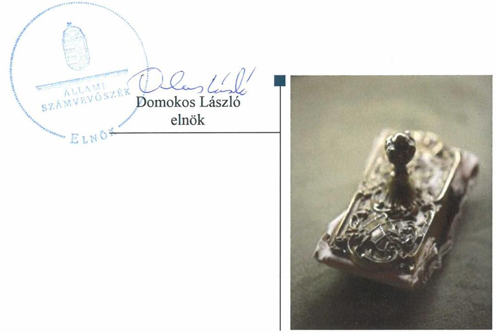
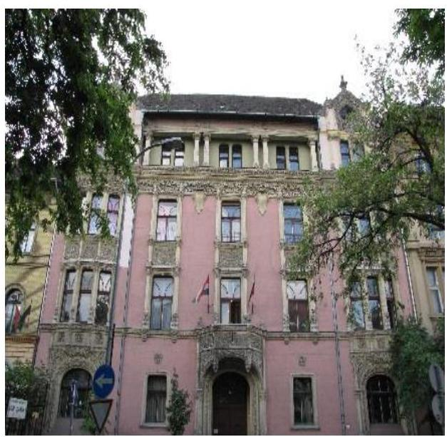

# Jelentés

**Az országos nemzetiségi önkormányzatok fenntartásában levő intézmények gazdálkodásának ellenőrzése**

Bolgár Kétnyelvű Nemzetiségi Óvoda 2019.

---

# Jelentés 

## Az országos nemzetiségi önkormányzatok fenntartásában levő intézmények gazdálkodásának ellenőrzése

Bolgár Kétnyelvű Nemzetiségi Óvoda 2019. 01. hó 18. nap

---

# AZ ELLENŐRZÉST FELÜGYELTE:

DR. NÉMETH ERZSÉBET felügyeleti vezető 2018. november 29-ig

KAKAS SÁNDOR felügyeleti vezető 2018. november 30-tól

## AZ ELLENŐRZÉST VEZETTE ÉS A VÉGREHAJTÁSÁÉRT FELELŐS:

JÁNOSI ISTVÁN ellenőrzésvezető

A PROGRAM ÖSSZEÁLLÍTÁSÁÉRT FELELŐS:

TÓTPÁL SZABOLCS osztályvezető

IKTATÓSZÁM: EL-1425-001/2018.

TÉMASZÁM: 2463

TÉMASZÁM: 2463

Jelentéseink az Országgyűlés számítógépes hálózatán és az Interneten a www.asz.hu címen is olvashatóak.

---

# TARTALOMJEGYZÉK 

■ ÖSSZEGZÉS ..... 5
■ AZ ELLENŐRZÉS CÉLJA ..... 6
■ AZ ELLENŐRZÉS TERÜLETE ..... 7
■ AZ ELLENŐRZÉS HÁTTERE, INDOKOLTSÁGA ..... 8
■ A JELENTÉS LÉNYEGES KÉRDÉSKÖREI ..... 9
■ AZ ELLENŐRZÉS HATÓKÖRE ÉS MÓDSZEREI ..... 10
■ MEGÁLLAPÍTÁSOK ..... 12
■ JAVASLATOK ..... 16
■ MELLÉKLETEK ..... 19
I. sz. melléklet: Értelmező szótár ..... 19
■ FÜGGELÉKEK ..... 21
I. sz. függelék a Megállapítások fejezethez ..... 21
II. sz. függelék: Észrevételek ..... 22
■ RÖVIDÍTÉSEK JEGYZÉKE ..... 23

---

.

---

# ÖSSZEGZÉS 

A Bolgár Kétnyelvű Nemzetiségi Óvoda feletti fenntartói joggyakorlás szabályszerű volt. Az intézmény pénzügyi és vagyongazdálkodási tevékenysége nem felelt meg a jogszabályi előírásoknak. Belső kontrollrendszere nem biztosította a közpénzekkel történő szabályszerű, átlátható gazdálkodást.

## Az ellenőrzés társadalmi indokoltsága

Magyarország Alaptörvényének XXIX. cikke kimondja, hogy a magyarországi nemzetiségek államalkotó tényezők. Joguk van anyanyelvük használatához, a sajátnyelven való névhasználathoz, saját kultúrájuk ápolásához és az anyanyelvű oktatáshoz. A nemzetiségek létrehozhatnak helyi és országos önkormányzatokat. A nemzetiségek jogaira vonatkozó részletes szabályokat Magyarországon sarkalatos törvény határozza meg. A nemzetiségi közfeladatok ellátásához az állami központi költségvetés támogatást nyújt, melyet a nemzetiségi önkormányzatok kizárólag e feladataik ellátására használhatnak fel.

## Főbb megállapítások, következtetések, javaslatok

A Bolgár Országos Önkormányzat az általa fenntartott Bolgár Kétnyelvű Nemzetiségi Óvodával kapcsolatos irányítási, felügyeleti, munkáltatói feladatait szabályszerűen gyakorolta. Jóváhagyta az éves költségvetéseket és az éves költségvetési beszámolókat.

A Bolgár Kétnyelvű Nemzetiségi Óvoda belső kontrollrendszerének kiépítése és működtetése nem volt szabályszerű, a működés és a gazdálkodási tevékenység feltételrendszerét nem a jogszabályi előírások szerint alakították ki.

Az integrált kockázatkezelési rendszer kialakítása és működtetése nem valósult meg.
A számviteli szabályzatok, valamint a gazdálkodási jogkörök gyakorlására vonatkozó szabályok szabályszerű kialakításáról gondoskodtak, ugyanakkor a kiadási előirányzatok felhasználása nem volt szabályszerű. A pénzgazdálkodási belső kontrollok működtetése során nem tartották be a jogszabályok és a belső szabályzatok előírásait.

A Bolgár Kétnyelvű Nemzetiségi Óvodánál az információs és kommunikációs folyamatok kialakítása szabályszerű volt, azonban az intézmény a közérdekű adat közzétételi kötelezettségét nem teljesítette.

Az éves költségvetési beszámolók nem feleltek meg a jogszabályi előírásoknak. A 2014. és 2015. évi éves beszámolók esetében a költségvetési maradvány megállapítása nem a jogszabályi előírások szerint történt. A 2016. évi éves beszámolót nem támasztották alá a jogszabályi előírásoknak megfelelő leltárral, ezért vagyongazdálkodási tevékenysége nem volt szabályszerű.

---

# AZ ELLENŐRZÉS CÉLJA 

AZ ELLENŐRZÉS CÉLJA annak értékelése volt, hogy az országos nemzetiségi önkormányzatok által alapított és fenntartott intézmények gazdálkodása, a belső kontrollrendszer kialakítása és működése, a fenntartó önkormányzat által nyújtott támogatás, illetve az államháztartásból meghatározott célra ingyenesen juttatott vagyon felhasználása a jogszabályi előírásoknak megfelelően történt-e.

---

# AZ ELLENŐRZÉS TERÜLETE

## Bolgár Kétnyelvű Nemzetiségi Óvoda

### A BOLGÁR ORSZÁGOS ÖNKORMÁNYZAT

71/2007. (10. 12.) sz. határozatával alapította meg a Bolgár Kétnyelvű Nemzetiségi Óvodát, mely működését 2008. február 1-jén kezdte meg.

**AZ INTÉZMÉNY** közfeladata óvodai nevelés, alaptevékenysége a Budapest területén élő és tartózkodó bolgár nemzetiségű 3-7 éves korú gyermekek óvodai nevelésére, napközbeni ellátására terjedt ki.

Az óvodai nevelés egy vegyes életkorú, 42 fő engedélyezett létszámú csoportban folyt, nevelőtestülete négy főből állt, amelynek munkáját 2014-ben és 2015-ben három, 2016-ban két fő egyéb alkalmazott segítette.

Az Intézmény a Magyar Állam által az Önkormányzatnak vagyonkezelésbe adott, és az Önkormányzat által az Intézménynek ingyenes használatként biztosított Budapest, VI. kerület Bajza u. 44. sz. alatti ingatlanban működött, ahol a II. emeleten 220 m² alapterületet foglalt el.

Az Intézmény gazdálkodási besorolása szerint önállóan működő költségvetési szerv, szakmai célú költségvetési kerettel rendelkezik, amely felett kötelezettségvállalási, teljesítésigazolási joggal és felelősséggel bír.

Az Intézmény feletti irányítói, fenntartói feladatokat az Önkormányzat gyakorolta.

Az Intézmény vezetőjét a Kjt., és a Köznev. tv. előírásai szerint nyilvános pályázat útján az Önkormányzat Képviselő-testülete bízta meg határozott időre. A kiírt pályázatok az ellenőrzött időszakban eredménytelenül zárultak, ezért az intézményvezetés a Képviselő-testület döntése alapján helyettesítésre adott megbízással került ellátásra. A megbízott vezető személyében három alkalommal történt változás.

Az Intézmény pénzügyi-gazdálkodási feladatait a Bolgár Országos Önkormányzat Hivatala látta el.

Az Intézmény főbb pénzügyi adatait az 1. táblázat mutatja be.

1. táblázat

|  AZ INTÉZMÉNY FŐBB GAZDÁLKODÁSI ADATAI (MILLIÓ FT) |  |  |   |
| --- | --- | --- | --- |
|  Megnevezés | 2014. | 2015. | 2016.  |
|  Költségvetési bevételek | 39,9 | 38,8 | 39,0  |
|  Költségvetési kiadások | 35,8 | 34,8 | 35,6  |
|  Összes maradvány | 4,1 | 4,0 | 3,4  |
|  Szabad maradvány | 4,1 | 4,0 | 3,4  |
|  Forrás: Éves költségvetési beszámolók |  |  |   |

Vagyonkezelési szerződéssel, vagyonkezelt vagyonnal az Intézmény az ellenőrzött időszakban nem rendelkezett.

---

# AZ ELLENŐRZÉS HÁTTERE, INDOKOLTSÁGA 

Az Alaptörvény $^{6}$ XXIX. cikke kimondja, hogy a magyarországi nemzetiségek államalkotó tényezők. Joguk van anyanyelvük használatához, a saját nyelven való névhasználathoz, saját kultúrájuk ápolásához és az anyanyelvű oktatáshoz. A nemzetiségek létrehozhatnak helyi és országos önkormányzatokat. A nemzetiségek jogaira vonatkozó részletes szabályokat Magyarországon sarkalatos törvény határozza meg. A nemzetiségi közfeladatok ellátásához az állami központi költségvetés támogatást nyújt, melyet a nemzetiségi önkormányzatok kizárólag e feladataik ellátására használhatnak fel.

Az országos nemzetiségi önkormányzatok az általuk képviselt nemzetiség kulturális autonómiájának megteremtése érdekében intézményeket hozhatnak létre és vehetnek át. Az éves költségvetési törvények közvetlenül az intézményfenntartó országos nemzetiségi önkormányzatokhoz rendelik az általuk fenntartott intézmények működési támogatását. A nemzetiségi önkormányzati intézmények költségvetési gazdálkodásának, belső kontrollrendszerének kialakítása és működtetése ellenőrzésével biztosítjuk a közpénzfelhasználás minél szélesebb körének ellenőrzését, ennek során azonos szempontok szerint értékeljük az egyes országos nemzetiségi önkormányzatok fenntartásában levő intézmények gazdálkodási tevékenységét.

Az ellenőrzés eredményeként az ellenőrzött költségvetési szervek gazdálkodása javulhat, átfogó képet kaphatunk az országos nemzetiségi önkormányzatok által fenntartott intézmények gazdálkodásának sajátosságairól, hiányosságairól és az alkalmazott jó gyakorlatokról, erősítve a társadalmi bizalmat. Az ellenőrzés tapasztalatai alapján, hiányosságok feltárásával, azok megszüntetésére vonatkozó javaslatokkal hozzájárulunk a közpénzek átlátható, szabályszerű felhasználásához.

---

# A JELENTÉS LÉNYEGES KÉRDÉSKÖREI 

1. Az Önkormányzat szabályszerűen gyakorolta-e az Intézménnyel kapcsolatos fenntartói feladatait?
2. Az Intézmény működése és gazdálkodása során tevékenysége szabályszerű volt-e, belső kontrollrendszere megvédte-e a veszteségektől és nem rendeltetésszerű használattól annak erőforrásait?
3. Az Intézmény pénzügyi gazdálkodása szabályszerű volt-e?
4. Az Intézmény vagyongazdálkodása szabályszerű volt-e?

---

# AZ ELLENŐRZÉS HATÓKÖRE ÉS MÓDSZEREI 

## Az ellenőrzés típusa

Megfelelőségi ellenőrzés.

## Az ellenőrzött időszak

2014-2016. évek

## Az ellenőrzés tárgya

Az Állami Számvevőszék ellenőrzése tárgya a Bolgár Országos Önkormányzat által alapított és fenntartott intézmény gazdálkodása, a belső kontrollrendszer kialakítása és működése, a fenntartó önkormányzat által nyújtott támogatás, illetve az államháztartásból meghatározott célra ingyenesen juttatott vagyon felhasználása jogszabályi előírásoknak való megfelelőségének értékelése volt. Az ellenőrzés feltárhatta a gazdálkodást, az átalakulását, átszervezését érintő szabályozások esetleges hiányosságait, a szabályozással nem érintett gazdálkodási területeket, rámutathatott a vagyongazdálkodási tevékenység - ezen belül kiemelten a tulajdonosi joggyakorlás és vagyonkezelés - esetleges szabálytalanságaira, illetve értékelte a nemzeti vagyon nyilvántartására és elszámolására vonatkozó eljárásokat.

## Az ellenőrzött szervezet

Bolgár Kétnyelvű Nemzetiségi Óvoda, Bolgár Országos Önkormányzat, Bolgár Országos Önkormányzat Hivatala

## Az ellenőrzés jogalapja

Az ellenőrzés jogszabályi alapját az ÁSZ tv. $^{7}$ 1. § (3) bekezdés, 5. § (2)-(6) bekezdései, valamint az Áht. $^{8}$ 61. § (2) bekezdésének előírásai képezték.

## Az ellenőrzés módszerei

Az ellenőrzést az ellenőrzési program szempontjai, az ellenőrzött időszakban hatályos jogszabályok, az ellenőrzés szakmai szabályai, a jelen ellenőrzésre irányadó ÁSZ $^{9}$ módszertanok figyelembevételével végeztük. Az ellenőrzési kérdések megválaszolásához szükséges bizonyítékok megszerzése az ellenőrzött által rendelkezésre bocsátott dokumentumokra, adatokra

---

alapozva, a kockázat alapú mintavételezés, valamint elemző eljárás útján történt.

A kockázat alapú mintavételezés alapja, a gazdasági események értéknek nagysága volt. Az ellenőrzési bizonyítékként felhasználható adatforrások közé tartoztak egyrészt az ellenőrzési program részletes szempontjainál felsorolt adatforrások, másrészt minden egyéb - az ellenőrzés folyamán feltárt, az ellenőrzés szempontjából információt tartalmazó - dokumentum. Az ellenőrzés lefolytatásához az ellenőrzött szervezet a tanúsítványok kitöltésével, valamint az ÁSZ által kért dokumentumok megküldésével szolgáltatott adatokat.

Az ellenőrzés ideje alatt az ellenőrzött szervezettel történő kapcsolattartást az ÁSZ SZMSZ $^{10}$ vonatkozó előírásai alapján biztosítottuk.

---

# 1. Az Önkormányzat szabályszerűen gyakorolta-e az Intézménnyel kapcsolatos fenntartói feladatait? 

Összegző megállapítás Az Önkormányzat az Intézménnyel kapcsolatos fenntartói feladatait szabályszerűen gyakorolta.

AZ ALAPÍTÓI JOGOKAT az Önkormányzat a jogszabályi előírásoknak megfelelően gyakorolta. Az Önkormányzat az Áht. és az Ávr. $^{11}$ előírásainak megfelelően adta ki az Intézmény Alapító Okiratát $^{12}$ és hagyta jóvá az Intézmény SZMSZ $^{13}$-ét.

IRÁNYÍTÓSZERVI feladatkörén belül az Önkormányzat az Áht., az Ávr. és az Áhsz. $^{14}$ előírásainak megfelelően jóváhagyta az Intézmény éves költségvetéseit, éves beszámolóit, előirányzat maradványait.

Az Intézmény vezetőjét beszámoltatta az éves szakmai feladatellátásról és az éves gazdálkodásról.

Az Önkormányzat nem gyakorolta az Áht. 9. § e) pontjában meghatározott irányítási jogkörét az Intézmény tevékenységének törvényességi, szakszerűségi és hatékonysági ellenőrzése vonatkozásában.

Az Önkormányzat munkáltatói joggyakorlása az Intézmény vezetője felett a jogszabályoknak megfelelő volt.

## 2. Az Intézmény működése és gazdálkodása során tevékenysége szabályszerű volt-e, belső kontrollrendszere megvédte-e a veszteségektől és nem rendeltetésszerű használattól annak erőforrásait?

Összegző megállapítás Az Intézmény belső kontrollrendszerének kialakítása és működtetése nem volt szabályszerű, az erőforrások védelme nem volt biztosított a veszteségektől, a nem szabályszerű felhasználástól.
2.1. számú megállapítás

A kontrollkörnyezet kialakítása szabályszerű volt. A gazdálkodási jogkörök gyakorlóinak aláírás mintáit tartalmazó nyilvántartást nem a jogszabályi előírásoknak megfelelően vezették.

A SZERVEZETI ÉS MŰKÖDÉSI KERETEKET a jogszabályi előírásoknak megfelelően alakították ki az Intézmény Alapító Okiratában, SZMSZ-ében és az Önkormányzati Hivatallal $^{15}$ kötött Együttműködési Megállapodásban $^{16}$.

---

SZÁMVITELI POLITIKÁVAL $^{17}$, valamint az annak keretében elkészítendő eszközök és források értékelési szabályzatával $^{18}$, leltározási szabályzattal $^{19}$ és pénzkezelési szabályzattal $^{20}$ az Intézmény rendelkezett, ezek tartalma megfelelt a Számv. tv. $^{21}$ és az Áhsz. előírásainak.

Az Intézmény rendelkezett a Számv. tv.-ben és az Áhsz.-ben foglalt előírásoknak megfelelő számlarenddel és bizonylati renddel.

A GAZDÁLKODÁSI JOGKÖRÖK gyakorlására vonatkozó szabályok az Áht. és az Ávr. előírásaival összhangban kerültek meghatározásra az Önkormányzati Hivatal gazdasági szervezetének Ügyrendjében $^{22}$, valamint az Együttműködési Megállapodásban. Az Önkormányzati Hivatal gazdasági szervezete Ügyrendjének hatálya kiterjedt az Intézményre is.

A gazdasági feladatokat ellátó Önkormányzati Hivatal gazdasági vezetője megfelelt az Ávr.-ben előírt, végzettségre és szakképesítésre vonatkozó követelményeknek.

A
 KONTROLLTEVÉKENYSÉGEK keretében a gazdálkodási jogkörök gyakorlására az Intézménynél az Áht. és az Ávr. felhatalmazása alapján az Intézmény vezetője volt jogosult. Az ellenőrzött időszakban intézményvezetéssel megbízott személyek nem hatalmaztak fel további személyeket a kötelezettségvállalási, továbbá nem jelöltek ki további személyeket a teljesítésigazolási, valamint utalványozási jogkörök gyakorlására.

Az Önkormányzati Hivatalnál - az Intézmény vonatkozásában - a gazdálkodási jogkörök gyakorlására az Áht. és az Ávr. felhatalmazása alapján az Önkormányzati Hivatal gazdasági vezetője volt jogosult. A gazdasági vezető nem jelölt ki további személyeket az érvényesítési és a pénzügyi ellenjegyzési jogkörök gyakorlására.

A gazdálkodási jogkörök gyakorlóinak aláírás mintáit tartalmazó nyilvántartást az Önkormányzati Hivatal gazdasági vezetője az Ávr. 60. § (3) bekezdésének, valamint az Önkormányzati Hivatal gazdasági szervezete Ügyrendjének előírásai ellenére nem vezette naprakészen, mert a nyilvántartás nem tartalmazta az Intézménynél az ellenőrzött időszakban a kötelezettségvállalási, teljesítésigazolási, valamint utalványozási jogkörök gyakorlására jogosult valamennyi személy aláírás mintáját.

A pénzgazdálkodási belső kontrollok nem működtek (lásd 3.1 számú megállapítás).

# 2.2. számú megállapítás 

Az (integrált) kockázatkezelési rendszer kialakítása és működtetése nem felelt meg a jogszabályi előírásoknak.

A KOCKÁZATKEZELÉSI RENDSZER a Kockázatkezelési Szabályzatban ${ }^{23}$ a Bkr. ${ }^{24}$ előírásainak megfelelően kialakításra került, azonban 2016. október 1-jétől az integrált kockázatkezelési rendszer kialakításáról, valamint az (integrált) kockázatkezelési rendszer működtetéséről az Intézmény vezetője a Bkr. 3. § b) pontjában és 7. § (1) bekezdésében foglalt előírások ellenére nem gondoskodott. A kockázatokkal arányos integritás kontrollok kialakítása nem valósult meg.

Az Intézmény vezetője a Bkr. 6. § (4) bekezdésében foglalt előírás ellenére nem szabályozta a szabálytalanság kezelésének eljárásrendjét, valamint 2016. október 1-jétől a szervezeti integritást sértő események kezelésének eljárásrendjét.

---

Az Önkormányzati Hivatal vezetője elkészítette az „Ellenőrzési és beszámoltatási nyomvonalak a Bolgár Országos Önkormányzatnál" című dokumentumot, amely a Bkr. 6. § (3) bekezdésének előírásával összhangban tartalmazta az Önkormányzat és intézményei ellenőrzési és beszámoltatási nyomvonalát, az irányítási és ellenőrzési folyamatokat, valamint a felelősségi körök, információs szintek és kapcsolatok leírását.

Az Intézmény vezetője a Bkr. 11. § (1) bekezdésében foglalt előírás ellenére nem értékelte nyilatkozatban az Intézmény belső kontrollrendszerének minőségét.
2.3. számú megállapítás

Az információs és kommunikációs folyamatok kialakítása szabályszerű volt, működtetése nem volt szabályszerű.

A KÖTELEZŐEN KÖZZÉTEENDŐ ADATOK nyilvánosságra hozatalának rendjét, valamint a közérdekű adatok megismerésére irányuló kérelmek intézésének rendjét az Info. tv. ${ }^{25}$ és az Ávr. előírásainak megfelelően az Intézmény rögzítette SZMSZ-ében.

Az Intézménynél az adatok védelmével, megőrzésével kapcsolatos feladatokat, felelősségi és jogosultsági szabályokat a jogszabályi előírásokkal összhangban az Informatikai Biztonsági Szabályzatban ${ }^{26}$ határozták meg.

Az Intézmény vezetője a közérdekű adatok közzétételére vonatkozó, Info tv. 37. § (1) bekezdésében előírt kötelezettségét nem teljesítette, mert az Info tv. 1. melléklete II.1, és III. 1 pontjaiban szereplő információkat sem az Intézmény, sem az irányítói, fenntartói feladatokat ellátó Önkormányzat internetes honlapján, sem erre a célra létrehozott más központi honlapon nem jelenítette meg.

# 3. Az Intézmény pénzügyi gazdálkodása szabályszerű volt-e? 

## Összegző megállapítás

Az Intézmény pénzügyi gazdálkodása nem volt szabályszerű.
3.1. számú megállapítás

Az Intézmény kiadási előirányzatait nem szabályszerűen használták fel. A kapcsolódó pénzgazdálkodási belső kontrollok nem működtek.

A KIADÁSI ELŐIRÁNYZATOK felhasználása nem felelt meg a jogszabályi előírásoknak.

Az Intézménynél az ellenőrzött kiadási tételek számviteli bizonylatait a kötelezettségvállalás, a teljesítésigazolás és az utalványozás tekintetében az Ávr. 52. § (1) bekezdés a) pontjában, 57. § (4) bekezdésében, valamint 59. § (1) bekezdésében foglalt előírások ellenére nem az arra jogosult gazdasági jogkört gyakorló személy írta alá.

Az Önkormányzati Hivatalnál az ellenőrzött kiadási tételek számviteli bizonylatait a pénzügyi ellenjegyzés és érvényesítés tekintetében az Ávr. 55. § (2) bekezdés c) pont ca) alpontjában és 58. § (4) bekezdésében foglalt előírások ellenére nem az arra jogosult gazdasági jogkört gyakorló személy írta alá.

A kiadások számviteli elszámolása az Áhsz. előírásainak megfelelően, a számlarendnek és az egységes rovatrendnek megfelelő nyilvántartási számlákon történt.

---

# 3.2. számú megállapítás 

A költségvetési maradvány megállapítása és elszámolása 2014-ben és 2015-ben nem volt szabályszerű, 2016-ban szabályszerű volt.

A KÖLTSÉGVETÉSI MARADVÁNY megállapítása során a 2014.-2015. években nem tartották be a jogszabályi előírásokat, mert a szabad költségvetési maradvány megállapításának alátámasztásához szükséges nyilvántartást a kötelezettségvállalásokról az Intézmény vezetője az Áhsz. 39. § (3) bekezdésében foglalt előírás ellenére nem vezette. Emiatt a 2014-2015. évi éves költségvetési beszámolók nem feleltek meg az Áhsz. 5. § (1) bekezdésében foglalt előírásnak.

A költségvetési maradvány megállapítása a 2016. év vonatkozásában a jogszabályi előírásoknak megfelelően történt.

## 4. Az Intézmény vagyongazdálkodása szabályszerű volt-e?

## Összegző megállapítás

Az Intézmény vagyongazdálkodása 2014-ben és 2015-ben szabályszerű volt, 2016-ban nem volt szabályszerű.

A LELTÁR a 2014-2015. évek vonatkozásában megfelelt a jogszabályokban és az Intézmény leltározási szabályzatában1-3 foglalt előírásoknak.

A 2016. évi éves beszámoló mérlegéhez készített leltár nem felelt meg a Számv. tv. 69. § (1) bekezdésében foglalt előírásnak, mert nem tartalmazta az Intézmény mérlegében szereplő tételek közül a beruházások, a saját tőke, a kötelezettségek, valamint a bevételekhez kapcsolódó passzív időbeli elhatárolások mérlegsorokat. Ezáltal sérült a Számv. tv. 15. § (3) bekezdésében foglalt valódiság elve, mely szerint a könyvvitelben rögzített és a beszámolóban szereplő tételeknek a valóságban is megtalálhatóknak, bizonyíthatóknak, kívül-állók által is megállapíthatóknak kell lenniük.

---

# JAVASLATOK 

Az ÁSZ tv. 33. § (1) bekezdésében foglaltak értelmében az ellenőrzött szervezet vezetője köteles a jelentésben foglalt megállapításokhoz kapcsolódó intézkedési tervet összeállítani és azt a jelentés kézhezvételétől számított 30 napon belül az ÁSZ részére megküldeni. Amennyiben az ellenőrzött szervezet vezetője nem küldi meg határidőben az intézkedési tervet, vagy továbbra sem elfogadható intézkedési tervet küld, az Állami Számvevőszék elnöke az ÁSZ tv. 33. § (3) bekezdése a) és b) pontjaiban foglaltakat érvényesítheti.

## Bolgár Kétnyelvű Nemzetiségi Óvoda vezetőjének

1. Intézkedjen a Bkr. előírásainak megfelelően az Óvoda integrált kockázatkezelési rendszerének kialakításáról és működtetéséről, valamint szabályozza a szervezeti integritást sértő események kezelésének eljárásrendjét.
(2.2 sz. megállapítás 1-2. bekezdései alapján)
2. Nyilatkozatban értékelje a Bkr. előírásának megfelelően a költségvetési szerv belső kontrollrendszerének minőségét.
(2.2 sz. megállapítás 4. bekezdése alapján)
3. Tegyen eleget az Info tv. előírásainak megfelelően elektronikus közzétételi kötelezettségének.
(2.3 sz. megállapítás 3. bekezdése alapján)
4. Intézkedjen a kötelezettségvállalás, a teljesítésigazolás és az utalványozás gazdálkodási jogkörök gyakorlása során az Ávr.-ben előírtak betartásáról.
(3.1 sz. megállapítás 2. bekezdése alapján)

## a Bolgár Országos Önkormányzat Hivatala vezetőjének

1. Intézkedjen a gazdálkodási jogkörök gyakorlóinak aláírás mintáit tartalmazó naprakész nyilvántartás Ávr. előírásainak megfelelő vezetéséről.
(2.1 sz. megállapítás 8. bekezdése alapján)

---

2. Intézkedjen a pénzügyi ellenjegyzés és érvényesítés gazdálkodási jogkörök gyakorlása során az Ávr.-ben előírtak betartásáról.
(3.1 sz. megállapítás 3. bekezdése alapján)
3. Intézkedjen olyan leltár összeállításáról, amely a Számv. tv. előírásainak megfelelően, tételesen, ellenőrizhető módon tartalmazza az Óvoda mérleg fordulónapján meglévő eszközeit és forrásait mennyiségben és értékben.
(4. sz. megállapítás 2. bekezdése alapján)

---

.

---

# MELLÉKLETEK 

- I. SZ. MELLÉKLET: ÉRTELMEZŐ SZÓTÁR
irányító szerv/felügyeleti szerv
közfeladat
működtetés
nemzetiségi önkormányzat
nemzetiségi köznevelési intézmény
tulajdonosi joggyakorló
vagyongazdálkodás
nemzeti vagyon

A költségvetési szerv tekintetében az e törvényben meghatározott irányítási hatáskört gyakorló szerv. (Forrás: Áht. 1. § 9. pontja)
Jogszabályban meghatározott állami vagy önkormányzati feladat, amit az arra kötelezett közérdekből, a jogszabályban meghatározott követelményeknek és feltételeknek megfelelve végez, ideértve a lakosság közszolgáltatásokkal való ellátását, továbbá az állam nemzetközi szerződésekben vállalt kötelezettségeiből adódó közérdekű feladatokat, valamint e feladatok ellátásakor szükséges infrastruktúra biztosítását is. (Forrás: Nvtv. 3. § (1) bekezdés 7. pontja, hatálytalan: 2015. január 1-jétől) „Közfeladat a jogszabályban meghatározott állami vagy önkormányzati feladat". A közfeladatok ellátása költségvetési szervek alapításával és működtetésével, vagy azok ellátásához szükséges pénzügyi fedezet törvényben meghatározott eszközökkel, részben, vagy egészben történő biztosításával valósul meg. (Forrás: Áht. 3/A. § (1) bekezdés, hatályos 2015. január 1-jétől)
A nemzeti vagyon birtoklásából, használatából, hasznai szedéséből, a nemzeti vagyon fenntartásából és üzemeltetéséből álló tevékenységek együttese, amely - jogszabály vagy szerződés alapján - a nemzeti vagyon felújítására, fejlesztésére, a birtoklásának, használatának hasznai szedése jogának továbbengedésére is kiterjed. (Forrás: Nvtv. 3. § 10. pontja)
A nemzetiségek jogairól szóló törvényben meghatározott nemzetiségi közszolgáltatási feladatokat ellátó, testületi formában működő, jogi személyiséggel rendelkező, demokratikus választások útján e törvény alapján létrehozott szervezet, amely a nemzetiségi közösséget megillető jogosultságok érvényesítésére, a nemzetiségek érdekeinek védelmére és képviseletére, a feladat- és hatáskörébe tartozó nemzetiségi közügyek települési, területi vagy országos szinten történő önálló intézésére jön létre. (Forrás: a nemzetiségek jogairól szóló 2011. évi CLXXIX. törvény, 2. § 2. pont)
Az a köznevelési intézmény, amelynek alapító okirata a nemzeti köznevelésről szóló törvényben foglaltak szerint tartalmazza a nemzetiségi feladatok ellátását, feltéve, hogy e feladatokat a köznevelési intézmény ténylegesen ellátja, továbbá óvoda, iskola és kollégium esetén a tanulók legalább huszonöt százaléka részt vesz a nemzetiségi óvodai nevelésben, illetve a nemzetiségi iskolai nevelésben-oktatásban.
Aki a nemzeti vagyon felett az államot vagy a helyi önkormányzatot megillető tulajdonosi jogok és kötelezettségek összességének gyakorlására jogosult. (Forrás: Nvtv. 3. § (1) bekezdés 17. pontja)

A nemzeti vagyongazdálkodás feladata a nemzeti vagyon rendeltetésének megfelelő, az állam, az önkormányzat mindenkori teherbíró képességéhez igazodó, elsődlegesen a közfeladatok ellátásához és a mindenkori társadalmi szükségletek kielégítéséhez szükséges, egységes elveken alapuló, átlátható, hatékony és költségtakarékos működtetése, értékének megőrzése, állagának védelme, értéknövelő használata, hasznosítása, gyarapítása, továbbá az állam vagy a helyi önkormányzat feladatának ellátása szempontjából feleslegessé váló vagyontárgyak elidegenítése. (Forrás: Nvtv. 7. § (2) bekezdése)
a) az állam vagy a helyi önkormányzat kizárólagos tulajdonában álló dolgok,
b) az a) pont hatálya alá nem tartozó, az állam vagy a helyi önkormányzat tulajdonában lévő dolog,

---

c) az állam vagy a helyi önkormányzat tulajdonában lévő pénzügyi eszközök, továbbá az államot vagy a helyi önkormányzatot megillető társasági részesedések, d) az államot vagy a helyi önkormányzatot megillető bármely vagyoni értékkel rendelkező jogosultság, amelyet jogszabály vagyoni értékű jogként nevesít, e) Magyarország határa által körbezárt terület feletti légtér,
f) az üvegházhatású gázok kibocsátási egységeinek kereskedelméről szóló törvény szerinti kibocsátási egység és légiközlekedési kibocsátási egység, valamint az ENSZ Éghajlatváltozási Keretegyezménye és annak Kiotói Jegyzőkönyve végrehajtási keretrendszeréről szóló törvény szerinti kiotói egység,
g) állami vagy önkormányzati fenntartású közgyűjtemény (muzeális intézmény, levéltár, közgyűjteményként működő kép- és hangarchívum, valamint könyvtár) saját gyűjteményében nyilvántartott kulturális javak körébe tartozó dolog, kivéve, ha az állami vagy önkormányzati tulajdon jogszerű létrejötte kétséget kizáró módon nem bizonyítható és a dologra nézve más a tulajdonjogát bizonyítja vagy a kulturális javakra vonatkozó jogszabályokban meghatározott eljárás keretében valószínűsíti,
h) a régészeti lelet,
i) a nemzeti adatvagyon körébe tartozó állami nyilvántartások fokozottabb védelméről szóló törvény szerinti nemzeti adatvagyon.
(Forrás: Nvtv. 1.§ (2) bekezdés)

---

# FÜGGELÉKEK 

- I. SZ. FÜGGELÉK A MEGÁLLAPÍTÁSOK FEJEZETHEZ

Magyarország Alaptörvényének (a továbbiakban: Alaptörvény) 43. cikk (1) bekezdése alapján az Állami Számvevőszék törvényben meghatározott feladatkörében ellenőrzi az államháztartásból származó források felhasználását. Az önkormányzati intézmények gazdálkodásának ellenőrzésével biztosítjuk a közpénzfelhasználás minél szélesebb körének ellenőrzését.
 Az Alaptörvény XXIX. cikke kimondja, hogy „a Magyarországon élő nemzetiségek államalkotó tényezők”. A nemzetiségek létrehozhatnak települési és országos önkormányzatokat. A nemzetiségi önkormányzatok a közfeladatok ellátásához a központi költségvetésből támogatást kapnak, melyet kizárólag nemzetiségi közfeladataik ellátására használhatnak fel.
Az Állami Számvevőszék ellenőrzést végrehajtó számvevői „az országos nemzetiségi önkormányzatok fenntartásában levő intézmények gazdálkodásának ellenőrzése - Bolgár Kétnyelvű Nemzetiségi Óvoda” című ellenőrzése során a dologi kiadásokkal kapcsolatban feltárták, hogy a teljesítésigazolást az államháztartásról szóló törvény végrehajtásáról szóló 368/2011. (XII.31.) Korm. rendelet 57. § (3) bekezdésében foglalt előírások ellenére olyan személy végezte, aki a gazdálkodási jogkörgyakorlásra jogosultsággal nem rendelkezett.
A teljesítésigazolás célja, hogy a feladat ellátója a teljesítésigazolás során ellenőrizhető okmányok alapján ellenőrizze és igazolja a kiadások teljesítésének jogosságát, összegszerűségét, ellenszolgáltatást is magában foglaló kötelezettségvállalás esetében - ha a kifizetés vagy annak egy része az ellenszolgáltatás teljesítését követően esedékes - annak teljesítését. Ez hozzájárul a szervezet átláthatóságához, az elszámoltathatóság biztosításához.
Szabályszerű teljesítésigazolás hiányában nem bizonyított, hogy a kiadások valóban az intézmény érdekében merültek fel, illetve annak feladatellátását szolgálták, így nem zárható ki annak lehetősége, hogy a szabálytalan kifizetések az ellenőrzött szervezetnél vagyoni hátrányt okoztak.

---

A jelentéstervezetet a Számvevőszék 15 napos észrevételezésre megküldte az ellenőrzött szervezetek vezetőinek az ÁSZ tv. 29. § (1) bekezdése előírásának megfelelően.

A Bolgár Kétnyelvű Nemzetiségi Óvoda intézményvezetője, a Bolgár Országos Önkormányzat elnöke és a Bolgár Országos Önkormányzat Hivatalának hivatalvezetője a jelentéstervezet megállapításaira nem tettek észrevételt.

[^0]
[^0]:    * 29. § (1) Az Állami Számvevőszék az ellenőrzési megállapításait megküldi az ellenőrzött szervezet vezetőjének vagy az általa megbízott személynek, és annak, akinek személyes felelősségét állapította meg.
    (2) Az ellenőrzött szervezet vezetője és a felelősként megjelölt személy az ellenőrzés megállapításaira tizenöt napon belül írásban észrevételt tehet.
    (3) Az Állami Számvevőszék az észrevételre a beérkezésétől számított harminc napon belül írásban válaszol. A figyelembe nem vett észrevételeket köteles a jelentésben feltüntetni, és megindokolni, hogy azokat miért nem fogadta el.

---

# RÖVIDÍTÉSEK JEGYZÉKE 

${ }^{1}$ Intézmény
${ }^{2}$ Önkormányzat
${ }^{3}$ Kjt.
${ }^{4}$ Köznev. tv.
${ }^{5}$ Képviselő-testület
${ }^{6}$ Alaptörvény
${ }^{7}$ ÁSZ tv.
${ }^{8}$ Áht.
${ }^{9}$ ÁSZ
${ }^{10}$ ÁSZ SZMSZ
${ }^{11}$ Ávr.
${ }^{12}$ Alapító Okirat ${ }_{1-2}$
${ }^{13}$ SZMSZ
${ }^{14}$ Áhsz.
${ }^{15}$ Önkormányzati Hivatal
${ }^{16}$ Együttműködési Megállapodás
${ }^{17}$ számviteli politika ${ }_{1-2}$
${ }^{18}$ eszközök és források értékelési szabályzata
${ }^{19}$ leltározási szabályzat ${ }_{1-3}$
${ }^{20}$ pénzkezelési szabályzat
${ }^{21}$ Számv. tv.
${ }^{22}$ Ügyrend
${ }^{23}$ Kockázatkezelési Szabályzat
${ }^{24}$ Bkr.
${ }^{25}$ Info tv.
${ }^{26}$ Informatikai Biztonsági Szabályzat

Bolgár Kétnyelvű Nemzetiségi Óvoda
Bolgár Országos Önkormányzat
1992. évi XXXIII. törvény a közalkalmazottak jogállásáról
2011. évi CXC. törvény a nemzeti köznevelésről

Bolgár Országos Önkormányzat Képviselő-testülete
Magyarország Alaptörvénye (hatályos 2012. január 1-jétől)
2011. évi LXVI. törvény az Állami Számvevőszékről (hatályos 2011. július 1-jétől)
2011. évi CXCV. törvény az államháztartásról (hatályos 2011. december 31-jétől)

Állami Számvevőszék
Az Állami Számvevőszék elnökének 4/2017. (XII.29.) ÁSZ utasítása az Állami
Számvevőszék Szervezeti és Működési Szabályzatáról
368/2011. (XII. 31.) Korm. rendelet az államháztartásról szóló törvény végrehajtásáról (hatályos: 2012. január 1-jétől)
Az Intézmény Alapító Okirata (hatályos: 2012. március 3-ától; 2014. január 1-jétől)
Az Intézmény Szervezeti és Működési Szabályzata (hatályos: 2013. március 28-ától)
4/2013. (I. 11.) Korm. rendelet az államháztartás számviteléről (hatályos: 2014. január 1-jétől)
Bolgár Országos Önkormányzat Hivatala
Az Önkormányzati Hivatal és az Intézmény között 2008. október 4-én létrejött szerződés a gazdasági feladatok megosztására
Az Önkormányzat és intézményei Számviteli politikája (hatályos: 2014. január 1-től; 2016. január 1-től)
Az Önkormányzat és intézményei Eszközök és források értékelési szabályzata (hatályos: 2014. szeptember 1-jétől)
Az Önkormányzat és intézményei Leltározási és leltárkészítési szabályzata (hatályos: 2014. szeptember 1-jétől; 2015. szeptember 1-jétől; 2016. szeptember 1-jétől)
Az Önkormányzat és intézményei Pénztár és értékkezelési szabályzata (hatályos: 2014. szeptember 1-jétől)
2000. évi C. törvény a számvitelről (hatályos: 2001. január 1-jétől)

Az Önkormányzati Hivatal gazdasági szervezetének Ügyrendje (hatályos: 2013. április 1-jétől)
Az Önkormányzat és intézményei Kockázatkezelési szabályzata (hatályos: 2015. június 1-jétől)
370/2011. (XII. 31.) Korm. rendelet a költségvetési szervek belső
kontrollrendszeréről és belső ellenőrzésről (hatályos: 2012. január 1-jétől)
2011. évi CXII. törvény az információs önrendelkezési jogról és az információszabadságról (hatályos: 2011. július 27-étől)
Az Önkormányzat és intézményei Informatikai Biztonsági Szabályzata (hatályos: 2015. június 1-jétől)

---

ÁLLAMI SZÁMVEVŐSZÉK
1052 Budapest, Apáczai Csere János utca 10.
Levélcím: 1364 Budapest 4. Pf. 54
Telefon: +36 14849100 Telefax: +36 14849200
www.asz.hu
