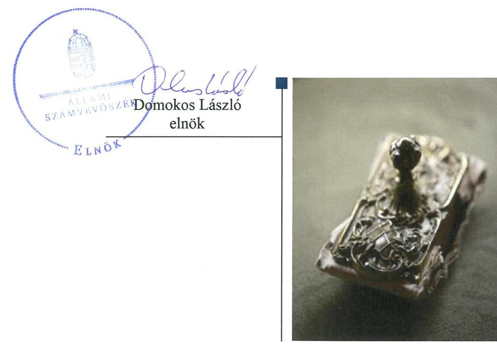
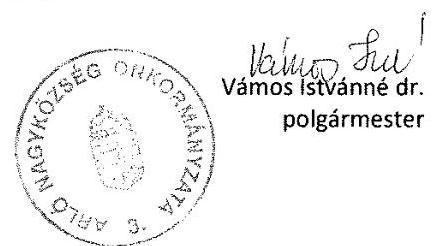
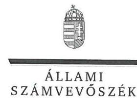
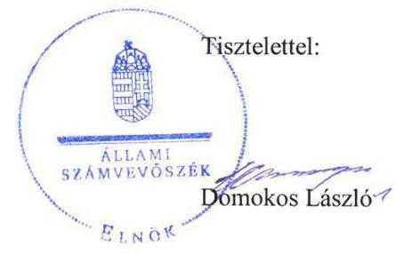
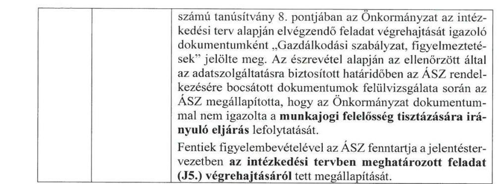
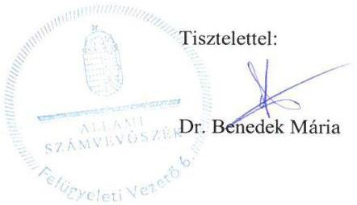

# Jelentés 

## Utóellenőrzések

Az önkormányzatok belső
kontrollrendszere kialakításának és múködtetésének utóellenőrzése Arló Nagyközség Önkormányzata 2019.

---

# Jelenetés 

## Utóellenőrzések

Az önkormányzatok belső
kontrollrendszere kialakításának és múködtetésének utóellenőrzése Arló Nagyközség Önkormányzata 2019. 01. hó 10. nap

---

Jelentéseink az Országgyúlés számítógépes hálózatán és az Interneten a www.asz.hu címen is olvashatóak.

## AZ ELLENŐRZÉST FELÜGYELTE:

DR. BENEDEK MÁRIA felügyeleti vezető

## AZ ELLENŐRZÉST VEZETTE ÉS A VÉGREHAJTÁSÁÉRT FELELŐS:

MARTUS BETTINA ellenőrzésvezető

## A PROGRAM ÖSSZEÁLLÍTÁSÁÉRT FELELŐS:

TÓTPÁL SZABOCS osztályvezető

## A TÉMÁHOZ KAPCSOLÓDÓ KORÁBBI SZÁMVEVŐSZÉKI JELENTÉSEK:

- címe: Önkormányzatok belső kontrollrendszere

Az önkormányzatok belső kontrollrendszere kialakításának és müködtetésének ellenőrzése Arló 2016.

- sorszáma: 16197

IKTATÓSZÁM: EL-0780-023/2018
TÉMASZÁM: 6.
ELLENŐRZÉS-AZONOSÍTÓ SZÁM: V080441

---

# TARTALOMJEGYZÉK 

■ ÖSSZEGZÉS ..... 5
■ AZ ELLENŐRZÉS CÉLJA ..... 6
■ AZ ELLENŐRZÉS TERÜLETE ..... 7
■ AZ ELLENŐRZÉS HÁTTERE, INDOKOLTSÁGA ..... 8
■ A JELENTÉS LÉNYEGES KÉRDÉSKÖRE ..... 9
■ ELLENŐRZÉS HATÓKÖRE ÉS MÓDSZEREI ..... 10
■ MEGÁLLAPÍTÁSOK ..... 12
■ MELLÉKLETEK ..... 15
I. sz. melléklet: Arló Nagyközség Önkormányzata intézkedési terve végrehajtásának értékelése ..... 15
II. sz. melléklet: Arló Nagyközség Önkormányzata intézkedési terve ..... 19
■ FÜGGELÉK: ÉSZREVÉTELEK ..... 23
■ RÖVIDÍTÉSEK JEGYZÉKE ..... 33

---

.

---

# ÖSSZEGZÉS 

Az Állami Számvevőszék Arló Nagyközség Önkormányzata belső kontrollrendszere kialakítása és müködtetése utóellenőrzése során megállapította, hogy az intézkedési tervben foglalt feladatok jelentős részét végrehajtotta, így a szervezet szabályozottsága, a pénzügyi elszámoltathatósága javult. A befektetett pénzügyi eszközök egyedi értékeléséről nem intézkedett, így nem biztositotta az átlátható vagyongazdálkodás feltételeit.

## Az ellenőrzés társadalmi indokoltsága

Az Állami Számvevőszék stratégiájában célul tűzte ki a számvevőszéki munka hasznosulásának javítását. Ezzel összhangban ellenőrzi, hogy az ellenőrzött szervezet megvalósította-e a korábbi ellenőrzései által feltárt hibák, hiányosságok és szabálytalanságok megszüntetése céljából elkészített intézkedési tervében foglaltakat. A rendszeres utóellenőrzések hozzájárulnak a szükséges intézkedések tényleges végrehajtásához, ezáltal a közpénzügyek rendezettségének javulásához.

## Főbb megállapítások, következtetések

Arló Nagyközség Önkormányzata az intézkedési tervben meghatározott tíz feladatból hetet határidőben, hármat részben hajtott végre.

Arló Nagyközség Önkormányzatának szabályozottsága javult a végrehajtott intézkedések keretében elkészített munkaköri leírások kiegészítése által. A pénzügyi elszámoltathatósághoz kapcsolódóan a gazdálkodási jogkörök gyakorlásához kapcsolódó kézjegy használat hozzájárult az átlátható múködéshez. Arló Nagyközség Önkormányzata az integritáshoz kapcsolódó feladatok végrehajtásáról a vagyonnyilatkozat-tételi kötelezettség meghatározásával gondoskodott.

A belső kontroll vonatkozásában feltárt hiányosságok és szabálytalanságok többségét megszüntette, kiegészítette az ellenőrzési nyomvonalát, szabályozta a hozzáférési jogosultságokat, valamint rendelkezett a személyes adatok kezeléséhez való hozzájárulásáról, amellyel biztosította a belső kontrollrendszer szabályszerű múködését. A befektetett pénzügyi eszközök egyedi értékeléséről nem intézkedett, ezáltal nem biztosította a szabályszerű, felelős vagyongazdálkodást.

Arló Nagyközség Önkormányzata az intézkedési tervben meghatározott feladatok végrehajtásáról a jogszabályban előírt nyilvántartást vezette.

---

# AZ ELLENŐRZÉS CÉLJA 

Az ellenőrzés célja annak értékelése volt, hogy a számvevőszéki jelentésben ${ }^{1}$ foglalt intézkedést igénylő megállapításokkal összhangban készített intézkedési tervben meghatározott feladatokat az ellenőrzött szervezet vég-rehajtotta-e.

---

# AZ ELLENŐRZÉS TERÜLETE 

## Arló Nagyközség Önkormányzata

Arló nagyközség az Észak-magyarországi régióban, Borsod-Abaúj-Zemplén megyében található. Állandó lakosainak száma a Központi Statisztikai Hivatal Magyarország közigazgatási helynévkönyve alapján 2017. január 1-jén 3648 fő volt.

A polgármester² 2013. április 21-i időközi önkormányzati választás óta tölti be tisztségét, a jegyző ${ }^{3}$ 2005. január 1-jétől látja el feladatait. A hét fővel működő Képviselő-testület ${ }^{4}$ munkáját két állandó bizottságot támogatta.

Arló Nagyközség Önkormányzata a 8/2018. (IV. 23.) rendeletével elfogadott 2017. évi zárszámadása alapján 947,5 millió Ft költségvetési bevételt és 822,0 millió Ft költségvetési kiadást teljesített ${ }^{5}$. Mérlegfőösszege 1081,8 millió Ft, követelése 44,3 millió Ft, a költségvetési évben esedékes kötelezettség összege 20,8 millió Ft, míg a költségvetési évet követően esedékes kötelezettség 12,9 millió Ft volt.

Az ÁSZ ${ }^{6}$ 2016. évben ellenőrizte Arló Nagyközség Önkormányzata belső kontrollrendszere kialakítását és múködtetését a 2014. január 1. és 2015. április 30. közötti időszakra, valamint a 2011. január 1-jétől 2015. április 30-ig terjedő időszakra az egyes befektetési döntéseinek, a döntések végrehajtásának és elszámolásának a szabályszerűségét. Az ellenőrzés célja annak megállapítása volt, hogy az önkormányzat belső kontrollrendszerének kialakítása, továbbá egyes elemeinek múködtetése biztosította-e az önkormányzatnál a közpénzfelhasználás szabályosságát, támogatta-e az integritás szemlélet érvényesülését. Az ÁSZ továbbá ellenőrizte, hogy az önkormányzat egyes befektetési döntései és azok végrehajtása, elszámolása megfelelt-e a vonatkozó jogszabályoknak és belső szabályozásoknak, a kialakított kontrollrendszer támogatta-e a befektetési tevékenység szabályszerűségét. Az ellenőrzésről készült 16197 számú jelentést az ÁSZ 2016. december 1-jén hozta nyilvánosságra.

---

# AZ ELLENŐRZÉS HÁTTERE, INDOKOLTSÁGA 

Az ÁSZ tv. ${ }^{7}$ 33. § (1) bekezdése értelmében a számvevőszéki jelentések megállapításaihoz és javaslataihoz kapcsolódóan az ellenőrzött szervezet vezetője intézkedési tervet köteles összeállítani, és az Állami Számvevőszék részére megküldeni.

Az ÁSZ által befogadott intézkedési tervben foglaltak megvalósítását az ÁSZ tv. 33. § (7) bekezdésében foglaltak alapján - az Állami Számvevőszék utóellenőrzés keretében ellenőrizheti. Az utóellenőrzések keretében - az intézkedések értékelése során - az Állami Számvevőszék figyelembe veszi az ellenőrzött szervezetek működési feltételeiben, valamint a jogszabályi előírásokban bekövetkezett változásokat.

Az utóellenőrzés során az ÁSZ értékeli, hogy az érintett számvevőszéki jelentésben foglalt megállapításokkal és javaslatokkal összhangban, az ellenőrzött szervezet által készített intézkedési tervben meghatározott feladatokat a feladatra kijelöltek végrehajtották-e.

Az intézkedések végrehajtásával az adott terület szabályszerű múködése vonatkozásában a kockázatok csökkenhetnek, azonban hosszabb távon az intézkedési tervben foglaltak végrehajtásával önmagában nem szűnnek meg, csak akkor, ha beépülnek az ellenőrzött szervezet múködésébe, azokat folyamatosan karban tartják, figyelembe véve, illetve kezelve a változásokat. Emellett az intézkedések végrehajtásáig újabb kockázatok merülhetnek fel a szabályszerű múködés vonatkozásában, amelyek kezelése szintén kiemelten fontos az ellenőrzött szervezet számára.

Az ellenőrzött szervezet vezetője által készített intézkedési tervekben foglalt feladatok hiányos, illetve késedelmes végrehajtása, vagy annak elmaradása a szabályszerűség és a felelős vezetői magatartás vonatkozásában kockázatot hordoz, ami azt mutatja, hogy az ellenőrzések során feltárt hibák, hiányosságok és szabálytalanságok kezelése nem kapott kellő hangsúlyt. Az utóellenőrzés során is fennálló szabálytalanságok esetén a közpénz, közvagyon veszélyeztetettségi kockázat valószínűsített hatásának értékelése további intézkedéseket vonhat maga után.

Az ellenőrzött szervezet szintjén az utóellenőrzés feltárja, hogy a szervezet az intézkedések végrehajtásával hasznosította-e a korábbi ellenőrzési jelentésben a hiányosságok megszüntetése, illetve a kockázatok kezelése érdekében megfogalmazott javaslatokat, illetve az intézkedések végrehajtása elmaradásának következtében továbbra is fennálló szabálytalanság esetén értékeli a közpénzek, közvagyon veszélyeztetettségét.

Az ÁSZ szintjén az utóellenőrzés visszacsatolást ad az ellenőrzési jelentések hasznosulásáról, az intézkedések elmaradásának, vagy részleges megvalósulásának a közpénzek, közvagyon veszélyeztetettségére gyakorolt valószínűsített hatásának értékelése, további intézkedéseket vonhat maga után.

---

# A JELENTÉS LÉNYEGES KÉRDÉSKÖRE 

Az önkormányzat az intézkedési tervben foglaltakat az előirt határidőben végrehajtotta-e?

---

# ELLENŐRZÉS HATÓKÖRE ÉS MÓDSZEREI 

## Az ellenőrzés típusa

Megfelelőségi ellenőrzés.

## Az ellenőrzött időszak

Az utóellenőrzés alapját képező ÁSZ jelentés közzétételének napjától 2016. december 1-jétől az utóellenőrzésről szóló kiértesítő levél keltének napjáig 2018. július 3-ig tartó időszak volt.

## Az ellenőrzés tárgya

A számvevőszéki jelentésben foglalt megállapításokkal összhangban - az önkormányzat által - készített Intézkedési tervben foglaltak végrehajtásának ellenőrzése volt.

## Az ellenőrzött szervezet

Arló Nagyközség Önkormányzata

## Az ellenőrzés jogalapja

Az ellenőrzés jogszabályi alapját az ÁSZ tv. 33. § (7) bekezdésének előírási képezik.

## Az ellenőrzés módszerei

Az ÁSZ az ellenőrzést az ellenőrzött időszakban hatályos jogszabályok, az ellenőrzés szakmai szabályai, a jelen ellenőrzésre irányadó ÁSZ módszertanok, az ellenőrzési programban foglalt értékelési szempontok szerint végezte.

Az ellenőrzés ideje alatt az ellenőrzött szervezettel történő kapcsolattartást az ÁSZ SZMSZ ${ }^{\circledR}$-ének vonatkozó előírásai alapján biztosította az ÁSZ.

Az utóellenőrzés megállapításait az ÁSZ rendelkezésére álló dokumentumok, valamint az ÁSZ adatbekérése szerint, az ellenőrzött szervezet által rendelkezésre bocsátott dokumentumok alapozták meg.

Az ellenőrzési bizonyítékként felhasználható adatforrások közé tartoztak egyrészt az ellenőrzési program részletes szempontjainál felsorolt

---

adatforrások, másrészt minden - az ellenőrzés folyamán feltárt, az ellenőrzés szempontjából információt tartalmazó - dokumentum.

Az intézkedési tervben előírt feladatokat azok végrehajthatósága, illetve végrehajtása szempontjából az alábbiak szerint értékelte az ÁSZ:
"határidőben végrehajtott" a feladat, ha a teljesítés dokumentáltan, az intézkedési tervben előírt határidőben és tartalommal megtörtént;
"határidőn túl végrehajtott" a feladat, ha annak teljesítése az intézkedési tervben meghatározott módon, de az abban előírt határidőn túl történt meg;
"részben végrehajtott" a feladat, ha annak végrehajtása nem teljes körűen az intézkedési tervben előírt módon történt meg;
"nem végrehajtott" a feladat, ha a végrehajtás nem történt meg, dokumentumokkal nem igazolt annak teljesítése;
"okafogyottá vált" a feladat, ha végrehajtására - meghatározott esemény bekövetkezése, továbbá külső körülmény, a működést érintő feltétel változása miatt - már nincs szükség, illetve lehetőség, és egyértelműen megállapítható, hogy az intézkedést szükségessé tevő körülmény a jövőben nem fordulhat elő;
"nem időszerü" az a feladat, amelynek ellenőrzési időszakon belüli végrehajtására azért nem került (kerülhetett) sor, mert az intézkedés alapjául szolgáló esemény nem következett be, de annak jövőbeni előfordulása lehetséges, a végrehajtása nem volt esedékes, vagy a végrehajtás határideje még nem járt le.
Az ellenőrzés lefolytatásához az ellenőrzött szervezet a tanúsítványok elektronikus kitöltésével, valamint az ÁSZ által kért dokumentumok elektronikus megküldésével szolgáltatott adatokat, amelyek valódiságát és teljes körűségét az ellenőrzött szervezet vezetője által tett teljességi és hitelességi nyilatkozat igazolta. Az így rendelkezésre bocsátott adatok, információk kontrollja az ellenőrzés keretében megtörtént.

Az ellenőrzött szervezet által megküldött intézkedési tervben meghatározott ÁSZ által beazonosított feladatok a II. számú mellékletben kerültek bemutatásra.

---

# MEGÁLLAPÍTÁSOK 

## Az önkormányzat az intézkedési tervben foglaltakat az előírt határidőben végrehajtotta-e?

Összegző megállapítás

Az Önkormányzat ${ }^{9}$ az intézkedési tervben meghatározott tíz feladatból hetet határidőben, hármat részben hajtott végre. Az intézkedési tervben meghatározott feladatok végrehajtásáról a jogszabályban előírt nyilvántartást vezette.

Az ÁSZ számvevőszéki jelentésében a polgármester részére egy, a jegyző részére öt javaslatot fogalmazott meg. A polgármester által előterjesztett és a Képviselő-testület által a 172/2016. (XII. 16.) határozattal jóváhagyott intézkedési tervben a hiányosságok, a szabálytalanságok megszüntetésére a polgármester részére egy, a jegyző részére kilenc feladat került meghatározásra.

Az intézkedési tervben meghatározott feladatokat, határidőket, megjelölt felelősöket és a feladatok végrehajtását az I. sz. melléklet mutatja be.

Az Önkormányzat az intézkedési tervben meghatározott feladatok végrehajtásáról a Bkr. ${ }^{10}$ 14. § (1) bekezdés előírása szerinti nyilvántartást vezette.

Az Önkormányzat intézkedési tervében meghatározott feladatok végrehajtásának értékelési kategóriák szerinti megoszlását az 1. ábra szemlélteti.

1. ábra

## A feladatok végrehajtásának értékelési kategóriák szerinti megoszlása

- Határidőben végrehajtott
- Részben végrehajtott

---

A SZABÁLYOZOTTSÁG az Önkormányzatnál javult. A munkaköri leírások kiegészítésével átláthatóbbá vált a humánerőforrás-kezelés (J1a), amely biztosította az Önkormányzat elszámoltathatóságát.

# A SZABÁLYSZERŰ PÉNZÜGYI GAZDÁLKODÁS ÉS A PÉNZÜGYI ELSZÁMOLTATHATÓSÁG az Önkormányzatnál javult. A jegyző a gazdálkodási jogkörök gyakorlásához kapcsolódóan az aláírások esetében a kézjegy használatát meghatározta (J5.), amely intézkedés a kockázatokat csökkentette. 

## A BELSŐ KONTROLL SZERINTI ELSZÁMOLTATHATÓSÁG érdekében a jegyző az ellenőrzési nyomvonalat az irányítási folyamatokkal kiegészítette. A dokumentumokhoz, információkhoz való hozzáférési jogosultságok, továbbá a személyes adatok kezeléséhez való hozzájárulást tartalmazó kérelmek kezelésének szabályozásáról, a folyamatok átláthatóbbá, a felelősségi, hatásköri viszonyok és feladatok meghatározásáról intézkedett (J1b, J1d, J1e), azonban a munkajogi felelősség tisztázására irányuló eljárás megindításáról nem gondoskodott (J5.). A megtett intézkedések ellenére a belső kontrollhoz kapcsolódó kockázatok továbbra is fennállnak.

AZ INTEGRITÁS szemlélet erősítése érdekében a polgármester és a jegyző a bizottságok nem képviselő tagjai vagyonnyilatkozat-tételi kötelezettségét a Képviselő-testületi SZMSZ ${ }^{11}$-ben előírták (P1, J2), így az integritás területén azonosított kockázatok csökkentek.

A VAGYONGAZDÁLKODÁS kockázatai továbbra is fennállnak. A jegyző a 2017. évben a konkrét működési, gazdálkodási és befektetésekkel kapcsolatos kockázatokat azonosította, azonban annak naprakész vezetését nem biztosította (J4.). A jegyző a 2017. évben befektetett pénzügyi eszközök egyedi értékeléséről nem intézkedett (J4.), ezáltal nem biztosította az átlátható, szabályszerű vagyongazdálkodás feltételeit.

---

.

---

# MELLÉKLETEK

- I. SZ. MELLÉKLET: ARLÓ NAGYKÖZSÉG ÖNKORMÁNYZATA INTÉZKEDÉSI TERVE VÉGREHAJTÁSÁNAK ÉRTÉKELÉSE

|  Sorszám | Az intézkedési tervben meghatározott feladat | Az intézkedési tervben meghatározott határidő | Az intézkedési tervben meghatározott feladat felelőse | A feladat végrehajtása  |
| --- | --- | --- | --- | --- |
|  Határidőben végrehajtott feladatok |  |  |  |   |
|  P1. ${ }^{12}$ | Intézkedni kell olyan képviselő- testületi szervezeti és müködési szabályzat-tervezetről szóló előterjesztés Képviselő-testület elé terjesztéséről, amely tartalmazza a nem önkormányzati képviselő bizottsági tagok vagyonnyilatkozat-tételi kötelezettségét. | 2016. december 31. | Vámos István Józsefné dr. polgármester | A polgármester a 2016. október 28-án tartott képviselő-testületi ülésre előterjesztette a nem önkormányzati képviselő bizottsági tagok vagyonnyilatkozat-tételi kötelezettségét tartalmazó képviselő- testületi szervezeti és müködési szabály-zat-tervezetet.  |
|  J1a. ${ }^{13}$ | Intézkedni kell a belső kontrollrendszer egyes elemei jogszabályi előírásoknak megfelelő kialakítására és müködtetésére, valamint a gazdálkodási jogkörök gyakorlása során a jogszabályi előírások és a belső szabályozás betartására: a) Munkaköri leírásokban a munkakör betöltésével kapcsolatos végzettségre, szakképesítésre, tapasztalatra vonatkozó követelmények meghatározása. | 2017. március 31. és ezt követően folyamatos | Klisóczkiné Papp Andrea jegyző | A jegyző 2017. március 31-ig intézkedett a jogszabályi előírásoknak megfelelően a munkaköri leírásokban a munkakör betöltésével kapcsolatos végzettségre, szakképesítésre, tapasztalatra vonatkozó követelmények meghatározásáról. Ezt követően az ellenőrzött időszakban a munkaköri leírásokban ilyen tárgykörű követelmények meghatározása nem vált indokolttá.  |
|  J1b. | Intézkedni kell a belső kontrollrendszer egyes elemei jogszabályi előírásoknak megfelelő kialakítására és müködtetésére, valamint a gazdálkodási jogkörök gyakorlása során a jogszabályi előírások és a belső szabályozás betartására: b) ellenőrzési nyomvonal kiegészítése az irányítási folyamatokkal. | 2017. március 31. és ezt követően folyamatos | Klisóczkiné Papp Andrea jegyző | A jegyző 2017. március 6-án az Arlói Polgármesteri Hivatal Belső Kontrollrendszer Szabályzata keretében, a jogszabályi előírásokkal összhangban kiegészítette a költségvetési szerv ellenőrzési nyomvonalát az irányítási folyamatokkal.  |

---

|  Sorszám | Az intézkedési tervben meghatározott feladat | Az intézkedési tervben meghatározott határidő | Az intézkedési tervben meghatározott feladat felelése | A feladat végrehajtása  |
| --- | --- | --- | --- | --- |
|  J1d. | Intézkedni kell a belső kontrollrendszer egyes elemei jogszabályi előírásoknak megfelelő kialakítására és működtetésére, valamint a gazdálkodási jogkörök gyakorlása során a jogszabályi előírások és a belső szabályozás betartására: d) a dokumentumokhoz, információkhoz való hozzáférési jogosultságokat szabályozni szükséges. | 2017. március 31. és ezt követően folyamatos | Klisóczkiné Papp Andrea jegyző | A jegyző 2017. február 1-jén a jogszabályi előírásokkal összhangban szabályozta az Adatvédelmi és Informatikai Biztonsági Szabályzat14 4.6. pontjában a dokumentumokhoz és információkhoz való hozzáférési jogosultságokat.  |
|  J1e. | Intézkedni kell a belső kontrollrendszer egyes elemei jogszabályi előírásoknak megfelelő kialakítására és működtetésére, valamint a gazdálkodási jogkörök gyakorlása során a jogszabályi előírások és a belső szabályozás betartására: e) személyes adatok kezeléséhez való hozzájárulást tartalmazó kérelmek kezeléséről szabályzatban rendelkezni kell. | 2017. március 31. és ezt követően folyamatos | Klisóczkiné Papp Andrea jegyző | A jegyző 2017. február 1-jén a jogszabályi előírásokkal összhangban az Adatvédelmi és Informatikai Biztonsági Szabályzat 5. pontjában rendelkezett a személyes adatok kezeléséhez való hozzájárulást tartalmazó kérelmek kezelésének szabályozásáról.  |
|  J2. | Intézkedni kell olyan képviselő-testületi szervezeti és működési szabályzat-tervezet elkészítéséről, amely tartalmazza a nem önkormányzati képviselő bizottsági tagok vagyonnyilatkozat-tételi kötelezettségét. | 2016. december 31. | Klisóczkiné Papp Andrea jegyző | A jegyző előkészítette és kezdeményezte a nem önkormányzati képviselő bizottsági tagok vagyonnyilatkozat-tételi kötelezettségét tartalmazó képviselő- testületi szervezeti és működési szabályzat-tervezet előterjesztését a 2016. október 28-án tartott képviselő-testületi ülésre.  |
|  J3. | Intézkedni kell az éves költségvetési beszámoló mérlegében a tartós részesedések jogszabályi előírásoknak megfelelő kimutatásáról, azaz a tartós részesedések között, és nem a tartós hitelviszonyt megtestesítő értékpapírok között kell szerepeltetni a mérlegben az EHEP részvényt. | 2017. február 28. | Klisóczkiné Papp Andrea jegyző | A jegyző a 2016. évi költségvetési beszámoló mérlegében intézkedett a jogszabályi előírásoknak megfelelően az EHEP15 részvény tartós részesedések közötti kimutatásáról.  |

---

|  Sorszám | Az intézkedési tervben meghatározott feladat | Az intézkedési tervben meghatározott határidő | Az intézkedési tervben meghatározott feladat felelőse | A feladat végrehajtása  |
| --- | --- | --- | --- | --- |
|  J1c. | Intézkedni kell a belső kontrollrendszer egyes elemei jogszabályi előírásoknak megfelelő kialakítására és működtetésére, valamint a gazdálkodási jogkörök gyakorlása során a jogszabályi előírások és a belső szabályozás betartására: c) konkrét működési, gazdálkodási kockázatok meghatározás és a befektetési tevékenységgel kapcsolatos kockázatok azonosítása. | 2017. március 31. és ezt követően folyamatos | Klisóczkiné Papp Andrea jegyző | Végrehajtott feladatrész:
A jegyző a 2017. évre vonatkozóan a jogszabályi előírásoknak megfelelően meghatározta az Önkormányzat konkrét működési, gazdálkodási kockázatait és azonosította a befektetési tevékenységgel kapcsolatos kockázatokat a 2016. november 10-én kiadott Kockázatfelmérési összefoglalóban^{16}.  |
|   |  |  |  | Nem végrehajtott feladatrész:
A jegyző 2018. január 1. és 2018. július 3. között a 8kr. 7. § (2) bekezdésében előírtak ellenére a konkrét működési, gazdálkodási kockázatokat nem határozta meg és a befektetési tevékenységgel kapcsolatos kockázatokat nem azonosította az Önkormányzatnál.  |
|  J4. | Intézkedni kell az éves költségvetési beszámoló mérlegében kimutatott befektetett pénzügyi eszközök jogszabályi előírásoknak megfelelő értékeléséről. Az értékelést követően szükséges a megfelelő mértékű értékvesztés elszámolása. | 2017. február 28. és azt követően minden év február 28. | Klisóczkiné Papp Andrea jegyző | Végrehajtott feladatrész:
A jegyző intézkedett a 2016. év vonatkozásában az éves költségvetési beszámoló mérlegében kimutatott befektetett pénzügyi eszközök közül az EHEP részvények értékeléséről, valamint a megfelelő mértékű értékvesztés elszámolásáról a jogszabályokban előírtaknak megfelelően.  |
|   |  |  |  | Nem végrehajtott feladatrész:
A jegyző a Számv. tv.^{17} 46. § (3) bekezdésében és az Áhsz.^{18} 20. § (1) bekezdésében foglaltak ellenére a 2016. évben az EHEP részvényen kívüli tartós részesedéseket nem számolta el, a 2017. évben egyetlen befektetett pénzügyi eszköz egyedi értékeléséről nem intézkedett.  |
|  J5. | Intézkedni kell az Állami Számvevőszék ellenőrzése során feltárt hiányosságok és/vagy szabálytalanságok tekintetében a munka-jogi felelősség tisztázására irányuló eljárás megindításáról és ennek eredménye ismeretében meg kell tenni a szükséges intézkedéseket. | 2016. december 31. | Klisóczkiné Papp Andrea jegyző | Végrehajtott feladatrész:
A jegyző a 2016. december 1-jén hatályba lépett Gazdálkodási szabályzatban^{19} meghatározta a gazdálkodási jogkörök gyakorlásához kapcsolódóan az aláírások esetében a kézjegy használatát.  |

---

|  Sorszám | Az intézkedési tervben meghatározott feladat | Az intézkedési tervben meghatározott határidő | Az intézkedési tervben meghatározott feladat felelőse | A feladat végrehajtása  |
| --- | --- | --- | --- | --- |
|   | A gazdálkodási jogkörök gyakorlásához kapcsolódóan az aláírások esetében a szignó használat kerüljön szabályzatban meghatározásra. |  |  | Nem végrehajtott feladatrész:
A jegyző nem intézkedett az ÁSZ ellenőrzés során feltárt hiányosságok és/vagy szabálytalanságok tekintetében a munkajogi felelősség tisztázására irányuló eljárás megindításáról.  |

---

# KIVONAT

Arló Nagyközség Önkormányzatának Képviselő-testülete 2016. december 16-án megtartott ülésének jegyzőkönyvéből

A képviselő-testület 6 jelenlévő tagja 6 igen szavazattal, egyhangúan az alábbi határozatot hozza:

## 172/2016. (XII.16.) határozat

**Tárgy:** Állami Számvevőszék által az „Önkormányzatok belső kontrollrendszere – Az önkormányzatok belső kontrollrendszere kialakításának és működésének ellenőrzése – Arló” intézkedési terv

**Arló Nagyközség Önkormányzata az Állami Számvevőszék által az „Önkormányzatok belső kontrollrendszere – Az önkormányzatok belső kontrollrendszere kialakításának és működtetésének ellenőrzése – Arló” ellenőrzés ellenőrzési jelentésére az intézkedési tervek megtárgyalta és elfogadta a határozat melléklete szerinti tartalommal.**

**Határidő:** 2016. december 31.
**Felelős:** Vámos Istvánné dr. polgármester

K. m. f.

*Vámos Istvánné dr. polgármester*

*Kisóczkiné Papp Andrea jegyző*

---

|  ÁSZ jelentésben foglalt javaslatok | Intézkedés tartalma | Az intézkedés végrehajtásáért felelős személy | A végrehajtás határideje | Intézkedési terv elkészítéséig megtett intézkedés/teljesítés  |
| --- | --- | --- | --- | --- |
|  A polgármester:
1. Intézkedjen olyan képviselőtestületi szervezeti és működési szabályzat-tervezetről szóló előterjesztés képviselőtestület elé terjesztéséről, amely tartalmazza a nem önkormányzati képviselőbizottsági tagok vagyonnyilatkozat-tételi kötelezettségét. | Intézkedni kell olyan képviselőtestületi szervezeti és működési szabályzat-tervezetről szóló előterjesztés képviselő-testület elé terjesztéséről, amely tartalmazza a nem önkormányzati képviselőbizottsági tagok vagyonnyilatkozat-tételi kötelezettségét. | Vámos István Józsefné dr. polgármester | 2016. december 31. | 2016. október 28-án megtartott képviselőtestületi ülésen az önkormányzat szervezeti és működési szabályzatába bekerült a nem önkormányzati képviselőbizottsági tagok vagyonnyilatkozat-tételi kötelezettségének szabályozására vonatkozó paragrafus.  |
|  A jegyző: |  |  |  |   |
|  1. Intézkedjen a belső kontrollrendszer egyes elemei jogszabályi előírásoknak megfelelő kialakítására és működtetésére, valamint a gazdálkodási jogkörök gyakorlása során a jogszabályi előbírások és a belső szabályozás betartására. | Intézkedni kell a belső kontrollrendszer egyes elemei jogszabályi előírásoknak megfelelő kialakítására és működtetésére, valamint a gazdálkodási jogkörök gyakorlása során a jogszabályi előírások és a belső szabályozás betartására.
a) Munkaköri leírásokban a munkakör betöltésével kapcsolatos végzettségre, szakképesítésre, tapasztalatra vonatkozó | Klisóczkiné Papp Andrea jegyző | 2017. március 31. és ezt követően folyamatosan |   |

---

|   |  | követelmények |  |  |  |   |
| --- | --- | --- | --- | --- | --- | --- |
|   |  | meghatározása. |  |  |  |   |
|   |  | ellenőrzési nyomvonal |  |  |  |   |
|   | b) | kiegészítése az irányítási |  |  |  |   |
|   |  | folyamatokkal |  |  |  |   |
|   | c) | konkrét működési, |  |  |  |   |
|   |  | gazdálkodási kockázatok |  |  |  |   |
|   |  | meghatározás és a |  |  |  |   |
|   |  | befektetési |  |  |  |   |
|   |  | tevékenységgel |  |  |  |   |
|   |  | kapcsolatos kockázatok |  |  |  |   |
|   |  | azonosítása |  |  |  |   |
|   | d) | a dokumentumokhoz, |  |  |  |   |
|   |  | információkhoz való |  |  |  |   |
|   |  | hozzáférési |  |  |  |   |
|   |  | jogosultságokat |  |  |  |   |
|   | d) | a dokumentumokhoz, |  |  |  |   |
|   |  | információkhoz való |  |  |  |   |
|   |  | hozzáférési |  |  |  |   |
|   | e) | a dokumentumokhoz, |  |  |  |   |
|   |  | információkhoz való |  |  |  |   |
|   |  | hozzáférési |  |  |  |   |
|   |  | jogosultságokat |  |  |  |   |
|   |  | szabályozni szükséges |  |  |  |   |
|   | e) | személyes adatok |  |  |  |   |
|   |  | kezeléséhez való |  |  |  |   |
|   |  | hozzájárulást tartalmazó |  |  |  |   |
|   |  | kérelmek kezeléséről |  |  |  |   |
|   |  | szabályzatban |  |  |  |   |
|   |  | rendelkezni kell |  |  |  |   |
|  2 | Intézkedjen olyan képviselőtestületi szervezeti és működési szabályzat-tervezet elkészítéséről, amely tartalmazza a nem önkormányzati képviselő bizottsági tagok vagyonnyilatkozat-tételi kötelezettségét. | Intézkedni kell olyan képviselőtestületi szervezeti és működési szabályzat-tervezet elkészítéséről, amely tartalmazza a nem önkormányzati képviselő bizottsági tagok vagyonnyilatkozat-tételi kötelezettségét. |  | Klisóczkiné Papp Andrea jegyző | 2016. december 31. | A szervezeti és működési szabályzat elkészült, mely tartalmazza a nem önkormányzati képviselő bizottsági tagok vagyonnyilatkozat-tételi kötelezettségét.  |

---

|  3. | Intézkedjen az éves
költésvetési beszámoló
mérlegében a tartós
részesedések jogszabályi
előírásoknak megfelelő
kimutatásáról. | Intézkedni kell az éves
költségvetési beszámoló
mérlegében a tartós
részesedések jogszabályi
előírásoknak megfelelő
kimutatásáról, azaz a tartós
részesedések között, és nem a
tartós hitelviszonyt megtestesítő
értékpapírok között kell
szerepeltetni a mérlegben az
EHEP részvényt. |  | Kilsóczkiné Papp
Andrea jegyző | 2017. február 28. | A II. negyedévi időközi
mérlegjelentésben már
helyesbítésre került és a
tartós részesedések
között szerepel a
részvény értéke.  |
| --- | --- | --- | --- | --- | --- | --- |
|  4. | Intézkedjen az éves
költségvetési beszámoló
mérlegében kimutatott
befektetett pénzügyi
eszközök jogszabályi
előírásoknak megfelelő
érékeléséről. | Intézkedni kell az éves
költségvetési beszámoló
mérlegében kimutatott befektetett
pénzügyi eszközök jogszabályi
előírásoknak megfelelő
értékeléséről. Az értékelést
követően szükséges a megfelelő
mértékű értékvesztés
elszámolása. |  | Kilsóczkiné Papp
Andrea jegyző | 2017. február 28. és
ezt követően minden
év február 28-ig. |   |
|  5. | Intézkedjen az Állami
Számvevőszék ellenőrzése
során feltárt hiányosságok
és/vagy szabálytalanságok
tekintetében a munkajogi
felelősség tisztázására
irányuló eljárás
megindításáról és ennek
eredménye ismeretében
tegye meg a szükséges
intézkedéseket. | Intézkedni kell az Állami
Számvevőszék ellenőrzése során
feltárt hiányosságok és/vagy
szabálytalanságok tekintetében a
munkajogi felelősség tisztázására
irányuló eljárás megindításáról és
ennek eredménye ismeretében
meg kell tenni a szükséges
intézkedéseket.
A gazdálkodási jogkörök
gyakorlásához kapcsolódóan az
aláírások esetében a szignó
használat kerüljön szabályzatban
meghatározásra. |  | Kilsóczkiné Papp
Andrea jegyző | 2016. december 31. | A polgármester
megvizsgálta a jegyző, a
jegyző pedig az Artói
Polgármesteri Hivatal
köztisztviselőinek
teljesítés igazolása,
érvényesítése,
kötelezettségvállalása
jogkörök gyakorlását,
mely vizsgálat alapján
munkajogi felelősséget
nem állapítottunk meg.
Figyelmeztettük a
dolgozókat, hogy a
felmerült hiányosságokat
a jövőben pótolják.  |

---

# FÜGGELÉK: ÉSZREVÉTELEK 

A jelentéstervezetet a Számvevőszék 15 napos észrevételezésre megküldte az ellenőrzött szervezet vezetőjének az ÁSZ tv. 29. §* (1) bekezdése előírásának megfelelően.
Az elfogadott észrevételek alapján a Számvevőszék módosította a jelentést.

A függelék tartalmazza az ellenőrzött észrevételeit, illetve az el nem fogadott észrevételek elutasításának indoklását.

[^0]
[^0]:    * 29. § (1) Az Állami Számvevőszék az ellenőrzési megállapításait megküldi az ellenőrzött szervezet vezetőjének vagy az általa megbízott személynek, és annak, akinek személyes felelősségét állapította meg.
    (2) Az ellenőrzött szervezet vezetője és a felelősként megjelölt személy az ellenőrzés megállapításaira tizenöt napon belül írásban észrevételt tehet.
    (3) Az Állami Számvevőszék az észrevételre a beérkezésétől számított harminc napon belül írásban válaszol. A figyelembe nem vett észrevételeket köteles a jelentésben feltüntetni, és megindokolni, hogy azokat miért nem fogadta el.

---

# Arló Nagyközség Önkormányzata 

2466-11/2018.

Tárgy: Jelentéstervezetre észrevétel

## Állami Számvevőszék Domokos László

elnök

## Budapest

Apáczai Csere János utca 10.
(1364 Budapest 4, Pf. 54.)
1052

## Tisztelt Elnök Úr!

Hivatkozással az EL-0780-019/2018 iktatószámú jelentéstervezetre az alábbi észrevételek fogalmazódtak meg bennem:

Az Állami Számvevőszék által elvégzett ellenőrzések céljaival egyetértve és feladatát elismerve Arló Nagyközség Önkormányzatánál folytatott utóellenőrzéséhez kapcsolódóan súlyosnak ítélem, ill. nehezményezem az Összegezés cím alatt, a „Főbb megállapítások, következtetések" egyik mondatát, hogy „A befektetett pénzügyi eszközök egyedi értékeléséről nem intézkedett, ezáltal nem biztosította a szabályszerű, felelős vagyongazdálkodást."

Az utóellenőrzés számvevőszéki jelentéstervezetének mellékletében szereplő J1c. pontban megjelölt nem végrehajtott feladatrészhez kapcsolódva jelentem, hogy az önkormányzatnál és intézményeinél évente megtörténik a kockázatok feltérképezése, értékelése az Integrált kockázatkezelési szabályzat előírásai szerint. Az ÁSZ vizsgálathoz a belső ellenőrzési terv alapján készített, kifejezetten a befektetett pénzügyi eszközökre vonatkozó kockázat felmérési interjút becsatoltuk, ami a T. Állami Számvevőszék szerint értelmezésünk szerint kevésnek bizonyult, vagyis nem volt elég konkrét, ezért kiegészítésül mellékeljük a fent említett kockázati értékeléseket.

A J4. pont szerint „a jegyző .... a 2016. évben az EHEP részvényen kívüli tartós részesedéseket nem számolta el, a 2017. évben egyetlen befektetett pénzügyi eszköz egyedi értékeléséről nem intézkedett."

A nyilvántartott tartós részesedések állományáról minden év december 31-én értékelő (minősítő) lap készül, melyek alapján az eszközkartonon is szerepeltetjük az értékvesztést és az értékvesztéssel csökkentett követelésállományt. Ez megegyezik a mérlegben szereplő értékekkel. Az önkormányzat és intézményei tekintetében az értékvesztés elszámolásának részletes szabályait az értékelési szabályzat rögzíti a Számviteli politikában meghatározottak szerint: „A nemzeti vagyonba tartozó befektetett eszközök és forgóeszközök között kimutatott részesedések, értékpapírok, készletek és

---

követelések értékvesztésének elszámolása során akkor kell a különbözetet jelentős összegűnek tekinteni, ha az értékvesztés összege meghaladja a bekerülési érték 10\%-át, de legalább a százezer forintot. A tulajdonosi joggyakorló szervezeteknél a részesedések, értékpapírok esetén akkor kell a különbözetet jelentős összegűnek tekinteni, ha az értékvesztés összege meghaladja a tízmillió forintot." Esetünkben az értékvesztés nem minősül jelentős összegűnek.

A befektetett pénzügyi eszközök egyedi értékelése évente oly módon történt, hogy „Értékelő (minősítő) lapot" állítottunk ki, továbbá az eszközkartonon átvezetésre került az értékvesztés összege. Az erről szóló bizonylatokat mellékeltük illetve mellékeljük.

Nem végrehajtott feladatrész továbbá, hogy „a jegyző nem intézkedett az ÁSZ ellenőrzés során feltárt hiányosságok és/vagy szabálytalanságok tekintetében a munkajogi felelősség tisztázására irányuló eljárás megindításáról." Megítélésem szerint - mivel az Önkormányzatot anyagi hátrány nem érte, - a jegyző munkáltatói jogkörében elegendőnek tartotta az ügyintéző figyelmeztetését, melyek becsatolásra kerültek az utóellenőrzés alkalmával.

Fegyelmi eljárás indítását azért nem tartottuk indokoltnak, mivel a vagyongazdálkodás során kiemelkedő figyelemmel végzik el a pénzügyi dolgozók a feladataikat, a belső ellenőrzések során is csak kisebb jelentőségű hiányosságok kerültek felszínre.

Kérem T. Elnök Urat, észrevételeimet szíveskedjék mérlegelni.
Természetesen a jogszabályi feltételeknek mindenben igyekszünk eleget tenni, kérem, hogy észrevételemet elfogadni szíveskedjék.

Arló, 2018. november 27.

Mély tisztelettel és nagyrabecsüléssel:

---

ELNÖK

Ikt.szám: EL-0780-022/2018

# Vámos István Józsefné dr. úrhölgy 

polgármester
Arló Nagyközség Önkormányzata

## Arló

## Tisztelt Polgármester Úrhölgy!

Köszönettel megkaptam az Állami Számvevőszékhez 2018. december 1. napján érkezett "Utóellenörzések - Az önkormányzatok belső kontrollrendszere kialakításának és müködtetésének utóellenörzése - Arló Nagyközség Önkormányzata" címủ számvevőszéki jelentéstervezetben foglalt megállapításokra tett észrevételét.

Tájékoztatom Polgármester úrhölgyet, hogy a figyelembe nem vett észrevételeket - az Állami Számvevőszékről szóló 2011. évi LXVI. törvény 29. § (3) bekezdése alapján - az Állami Számvevőszék a jelentésben szerepelteti azok elutasítása indoklásának feltüntetésével együtt.

Az Állami Számvevőszék észrevételre vonatkozó álláspontjáról a felügyeleti vezető által készített részletes tájékoztatást csatoltan megküldöm.

Budapest, 2018. 94 hó 2) nap

Melléklet: Tájékoztatás a figyelembe nem vett észrevételekről, azok elutasításának indokairól

---

# Tájékoztatás 

a figyelembe nem vett észrevételekröl, azok indokairól

|  |  | Az észrevétel 1. oldal 2. bekezdésében, az ÁSZ jelentéstervezet 5. oldal „Főbb megállapítások, következtetések" fejezet 3. bekezdés második mondatára tett észrevétel: „A befektetett pénzügyi eszközök egyedi értékeléséröl nem intézkedett, ezáltal nem biztositotta a szabályszerü, felelös vagyongazdálkodást. " |
| :--: | :--: | :--: |
|  | Észrevétel: | Észrevétel: ,,Az Állami Számvevöszék által elvégzett ellenörzések céljaival egyetértve és feladatát elismerve Arló Nagyközzég Önkormányzatánál folytatott utóellenörzéséhez kapcsolódóan súlyosnak ítélem, ill. nehezményezem az Öszszegezés cím alatt, a „Föbb megállapítások, következtetések" egyik mondatát, hogy „A befektetett pénzügyi eszközök egyedi értékeléséröl nem intézkedett, ezáltal nem biztositotta a szabályszerü, felelös vagyongazdálkodást. " |
|  | Válasz: | Az ÁSZ az észrevételt nem veszi figyelembe. |
| 1. | Indokolás: | Az észrevétel nem megalapozott. A 2018. július 3. napján keltezett, az Önkormányzat részére megküldött ellenőrzés megkezdéséről szóló kiértesitő levélben foglaltak alapján az Önkormányzat tájékoztatást kapott arról, hogy az ellenőrzés a mellékelt ellenőrzési program szerint kerül lefolytatásra. A levél mellékletét képező EL-0266-001/2017. számú ellenőrzési program szerint az ellenőrzés tárgya a számvevőszéki jelentésben foglalt intézkedést igénylő megállapításokkal és javaslatokkal összhangban - az ellenőrzött szervezet által készített intézkedési tervben foglaltak végrehajtásának ellenőrzése. Az észrevétel alapján az ellenőrzött által az adatszolgáltatásra biztosított határidőben az ÁSZ rendelkezésére bocsátott dokumentumok felülvizsgálata során az ÁSZ megállapította, hogy a jelen tájékoztatás 2. és 3. pontjában rögzített észrevételekre kifejtett szakmai indokolás alapján az Önkormányzat azokat a feladatokat nem hajtotta végre. Így a megállapítás megalapozott. |

---

|  |  | Fentiek figyelembevételével az ÁSZ fenntartja a jelentéstervezet „Főbb megállapítások, következtetések" fejezetben tett megállapítását. |
| :--: | :--: | :--: |
|  | Észrevétel: | Az észrevétel 1. oldal 3. bekezdésében, az ÁSZ jelentéstervezet 17. oldal az I. melléklet részben végrehajtott feladatok J1c. pontjában a nem végrehajtott feladatrészben foglalt megállapításra tett észrevétel: „A jegyzö 2018. január 1. és 2018. július 3. között a Bkr. 7. § (2) bekezdésében elöirtak ellenére a konkrét müködési, gazdálkodási kockázatokat nem határozta meg és a befektetési tevékenységgel kapcsolatos kockázatokat nem azonosította az Önkormányzatnál."   Észrevétel: ,,Az utóellenörzés számvevöszéki jelentéstervezetének mellékletében szereplő J1c. pontban megjelölt nem végrehajtott feladatrészhez kapcsolódva jelentem, hogy az önkormányzatnál és intézményeinél évente megtörténik a kockázatok feltérképezése, értékelése az Integrált kockázatkezelési szabályzat elöírásai szerint. Az ÁSZ vizsgálathoz a belső ellenörzési terv alapján készített, kifejezetten a befektetett pénzügyi eszközökre vonatkozó kockázat felmérési interjút becsatoltuk, ami a T. Állami Számvevöszék szerint értelmezésünk szerint kevésnek bizonyult, vagyis nem volt elég konkrét, ezért kiegészitésül mellékeljük a fent említett kockázati értékeléseket." |
| 2. | Válasz: | Az ÁSZ az észrevételt nem veszi figyelembe. |
|  | Indokolás: | Az észrevétel nem megalapozott. A 2018. július 3. napján keltezett, az Önkormányzat részére megküldött ellenőrzés megkezdéséről szóló kiértesítő levélben foglaltak alapján az Önkormányzat tájékoztatást kapott arról, hogy az ellenőrzés a mellékelt ellenőrzési program szerint kerül lefolytatásra. A levél mellékletét képező EL-0266-001/2017. számú ellenőrzési program szerint az ellenőrzés tárgya a számvevőszéki jelentésben foglalt intézkedést igénylő megállapításokkal és javaslatokkal összhangban - az ellenőrzött szervezet által készített intézkedési tervben foglaltak végrehajtásának ellenőrzése. Az Önkormányzat által megküldött intézkedési tervben meghatározott, az észrevétel tárgyát képező feladat az volt, hogy az Önkormányzat meghatározza a konkrét müködési, gazdálkodási kockázatokat és azonosítja a befektetési tevékenységgel kapcsolatos kockázatokat 2017. március 31-ig, és ezt követően folyamatosan. Az észrevétel alapján az ellenőrzött által az adatszolgáltatásra biztosított határidőben az ÁSZ rendelkezésére bocsátott dokumentumok felülvizsgálata során az ÁSZ megállapította, hogy az |

---

|  | intézkedési tervben meghatározott feladatot az Önkormányzat 2017. évre végrehajtotta, 2018. évre vonatkozóan azonban dokumentummal nem igazolta a feladat végrehajtását.   Fentiek figyelembevételével az ÁSZ fenntartja a jelentéstervezetben az intézkedési tervben meghatározott feladat (JIc.) végrehajtásáról tett megállapítását. |
| :--: | :--: | :--: |
| 3. | Észrevétel:   Észrevétel: | Az észrevétel 1-2. oldal 4-6. bekezdésében, az ÁSZ jelentéstervezet 17. oldal az I. melléklet részben végrehajtott feladatok J4. pontjában a nem végrehajtott feladatrészben foglalt megállapításra tett észrevétel: „A jegyző a Számv. tv. 46. § (3) bekezdésében és az Ahsz. 20. § (1) bekezdésében foglaltak ellenére a 2016. évben az EHEP részvényen kivüli tartós részesedéseket nem számolta el, a 2017. évben egyetlen befektetett pénzügyi eszköz egyedi értékeléséről nem intézkedett."   Észrevétel: „A J4. pont szerint „a jegyző .... a 2016. évben az EHEP részvényen kivüli tartós részesedéseket nem számolta el, a 2017. évben egyetlen befektetett pénzügyi eszköz egyedi értékeléséről nem intézkedett."   A nyilvántartott tartós részesedések állományáról minden év december 31-én értékelö (minősitő) lap készül, melyek alapján az eszközkartonon is szerepeltetjük az értékvesztést és az értékvesztéssel csökkentett követelésállományt. Ez megegyezik a mérlegben szereplő értékekkel. Az önkormányzat és intézményei tekintetében az értékvesztés elszámolásának részletes szabályait az értékelési szabályzat rögzíti a Számviteli politikában meghatározottak szerint: „A nemzeti vagyonba tartozó befektetett eszközök és forgóeszközök között kimutatott részesedések, értékpapírok, készletek és követelések értékvesztésének elszámolása során akkor kell a különbözetet jelentős összegünek tekinteni, ha az értékvesztés öszszege meghaladja a bekerülési érték 10\%-át, de legalább a százezer forintot. A tulajdonosi joggyakorló szervezeteknél a részesedések, értékpapírok esetén akkor kell a különbözetet jelentős összegünek tekinteni, ha az értékvesztés öszszege meghaladja a tízmillió forintot" Esetünkben az értékvesztés nem minösül jelentős összegünek.   A befektetett pénzügyi eszközök egyedi értékelése évente oly módon történt, hogy „Értékelö (minősitő) lapot" állítottunk ki, továbbá az eszközkartonon átvezetésre került az értékvesztés összege. Az erről szóló bizonylatokat mellékeltük illetve mellékeljük." |
|  | Válasz: | Az ÁSZ az észrevételt nem veszi figyelembe. |
|  | Indokolás: | Az észrevétel nem megalapozott. Az EL-0266-001/2017. számú ellenőrzési program alapján lefolytatott ellenőrzés |

---

|  |  | során az ÁSZ megállapítását az Önkormányzat által az adatszolgáltatásra biztosított határidőben az ellenörzés rendelkezésére bocsátott dokumentumokban szereplő adatok, információk alapján tette meg. Az Önkormányzat által az utóellenőrzés rendelkezésére bocsátott 2018. június 6 -án kelt 1 . számú tanúsítvány 7 . pontjában az Önkormányzat az intézkedési terv alapján elvégzendő feladat végrehajtását igazoló dokumentumként az „Értékvesztés elszámolási bizonylatait (eszköz karton és egyedi nyilvántartó)" jelölte meg. Az észrevétel alapján az ellenőrzött által az adatszolgáltatásra biztosított határidőben az ÁSZ rendelkezésére bocsátott dokumentumok felülvizsgálata során az ÁSZ megállapította, hogy az Önkormányzat 2016-2017. évi éves költségvetési beszámoló mérlegében kimutatott valamennyi befektetett pénzügyi eszköz értékelését számadatokkal és azt alátámasztó dokumentumokkal nem támasztotta alá.   Fentiek figyelembevételével az ÁSZ fenntartja a jelentéstervezetben az intézkedési tervben meghatározott feladat (J4.) végrehajtásáról tett megállapítását. |
| :--: | :--: | :--: |
| 4. | Észrevétel: | Az észrevétel 2. oldal 7-8. bekezdésében, az ÁSZ jelentéstervezet 17. oldal az I. melléklet részben végrehajtott feladatok J5. pontjában a nem végrehajtott feladatrészben foglalt megállapításra tett észrevétel: „A jegyzö nem intézkedett az ÁSZ ellenörzés során feltárt hiányosságok és/vagy szabálytalanságok tekintetében a munkajogi felelösség tisztázására irányuló eljárás meginditásáról."   Észrevétel: „Nem végrehajtott feladatrész továbbá, hogy „a jegyzö nem intézkedett az ÁSZ ellenörzés során feltárt hiányosságok és/vagy szabálytalanságok tekintetében a munkajogi felelösség tisztázására irányuló eljárás meginditásáról." Megitélésem szerint - mivel az Önkormányzatot anyagi hátrány nem érte, - a jegyzö munkáltatói jogkörében elegendönek tartotta az ügyintéző figyelmeztetését, melyek becsatolásra kerültek az utóellenörzés alkalmával, Fegyelmi eljárás inditását azért nem tartottuk indokoltnak, mivel a vagyongazdálkodás során kiemelkedö figyelemmel végzik el a pénzügyi dolgozók a feladataikat, a belső ellenörzések során is csak kisebb jelentőségü hiányosságok kerültek felszínre." |
|  | Válasz: | Az ÁSZ az észrevételt nem veszi figyelembe. |
|  | Indokolás: | Az észrevétel nem megalapozott. Az EL-0266-001/2017. számú ellenőrzési program alapján lefolytatott ellenőrzés során az ÁSZ megállapítását az Önkormányzat által az adatszolgáltatásra biztosított határidőben az ellenőrzés rendelkezésére bocsátott dokumentumokban szereplő adatok, információk alapján tette meg. Az Önkormányzat által az utóellenőrzés rendelkezésére bocsátott 2018. június 6 -án kelt 1 . |

---

Budapest, 2018. december " 24. ".

---

.

---

# RÖVIDÍTÉSEK JEGYZÉKE 

${ }^{1}$ számvevőszéki jelentés
${ }^{2}$ polgármester
${ }^{3}$ jegyző
${ }^{4}$ Képviselő-testület
${ }^{5}$ az adatok forrása
${ }^{6}$ ÁSZ
${ }^{7}$ ÁSZ tv.
${ }^{8}$ ÁSZ SZMSZ
${ }^{9}$ Önkormányzat
${ }^{10}$ Bkr.
${ }^{11}$ Képviselő-testületi SZMSZ
${ }^{12}$ P1.
${ }^{13}$ J1a., ...J5.
${ }^{14}$ Adatvédelmi és Informatikai biztonsági Szabályzat
${ }^{15}$ EHEP
${ }^{16}$ Kockázatfelmérési összefoglaló
${ }^{17}$ Számv. tv.
${ }^{18}$ Áhsz.
${ }^{19}$ Gazdálkodási Szabályzat
az Állami Számvevőszék 16197 számú jelentése
Arló Nagyközség Önkormányzatának polgármestere
Arló Nagyközség jegyzője
Arló Nagyközség Önkormányzatának Képviselő-testülete
http://njt.hu/njtonkorm.php?njtcp=eh2eg3ed0dr1eo6dt5ee8em1cj8by7cf2bx9bx2 cc5cc2g
Állami Számvevőszék
a 2011. évi LXVI. törvény az Állami Számvevőszékről
az Állami Számvevőszék Szervezeti és Múködési Szabályzata
Arló Nagyközség Önkormányzata
a költségvetési szervek belső kontrollrendszeréről és belső ellenőrzéséről szóló 370/2011. (XII. 31.) Korm. rendelet
Arló Nagyközség Önkormányzata Képviselő-testületének Szervezeti és Múködési Szabályzata
Arló Nagyközség Önkormányzatának 172/2016. (XII.16.) kt. határozattal jóváhagyott intézkedési tervének Polgármestere 1. számú intézkedése
Arló Nagyközség Önkormányzatának 172/2016. (XII.16.) kt. határozattal jóváhagyott intézkedési tervének Jegyző 1a. - 5. számú intézkedése
Arlói Polgármesteri Hivatal Adatvédelmi és Informatikai biztonsági Szabályzata

Első Hazai Energia- Portfolio Részvénytársaság
Arlói Polgármesteri Hivatal Kockázatfelmérési interjú összefoglaló
2000. évi C. törvény a számvitelről

4/2013. (I.11.) Kormányrendelet az államháztartás számviteléről
Arlói Polgármesteri Hivatal Gazdálkodási Szabályzat a kötelezettségvállalás, pénzügyi ellenjegyzés, teljesítés igazolása, érvényesítés, utalványozás és adatszolgáltatás rendjéről

---

# ÁLLAMI SZÁMVEVŐSZÉK 

1052 Budapest, Apáczai Csere János utca 10.
Levélcím: 1364 Budapest 4. Pf. 54
Telefon: +36 14849100 Telefax: +36 14849200
www.asz.hu