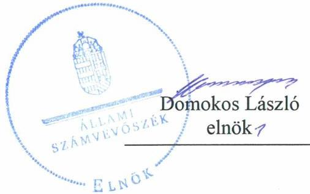
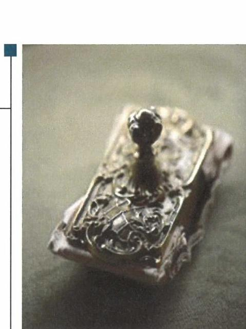

# Jelentés 

## Alapítványok ellenőrzése

Alapítványok gazdálkodásának ellenőrzése - Károlyi József Alapítvány 2019.

19008
www.asz.hu

---

# Jelentés 

## Alapítványok ellenőrzése

Alapítványok gazdálkodásának ellenőrzése - Károlyi József Alapítvány 2019. 01. hó 16. nap

---

# AZ ELLENŐRZÉST FELÜGYELTE:

DR. BENEDEK MÁRIA felügyeleti vezető

## AZ ELLENŐRZÉST VEZETTE ÉS A VÉGREHAJTÁSÁÉRT FELELŐS:

KUSZINGER ANDREA ellenőrzésvezető

## A PROGRAM ÖSSZEÁLLÍTÁSÁÉRT FELELŐS:

TÓTPÁL SZABOLCS osztályvezető

IKTATÓSZÁM: EL-0721-025/2018

TÉMASZÁM: 28

ELLENŐRZÉS-AZONOSÍTÓ SZÁM: V077511

Jelentéseink az Országgyűlés számítógépes hálózatán és az Interneta a www.asz.hu címen is olvashatóak.

---

# TARTALOMJEGYZÉK 

■ ÖSSZEGZÉS ..... 5
■ AZ ELLENŐRZÉS CÉLJA ..... 6
■ AZ ELLENŐRZÉS TERÜLETE ..... 7
■ AZ ELLENŐRZÉS HÁTTERE, INDOKOLTSÁGA ..... 8
■ A JELENTÉS LÉNYEGES KÉRDÉSKÖREI ..... 9
■ AZ ELLENŐRZÉS HATÓKÖRE ÉS MÓDSZEREI ..... 10
■ MEGÁLLAPÍTÁSOK ..... 12
■ JAVASLATOK ..... 17
■ MELLÉKLETEK ..... 21
I. sz. melléklet: Értelmező szótár ..... 21
■ FÜGGELÉKEK ..... 23
I. sz. függelék a Megállapitások fejezethez ..... 23
II. sz. függelék: Észrevételek ..... 24
■ RÖVIDÍTÉSEK JEGYZÉKE ..... 25

---

.

---

# ÖSSZEGZÉS 

A Károlyi József Alapítvány gazdálkodásának belső szabályozása nem felelt meg a jogszabályi előírásoknak. A 2014-2016. évekre vonatkozó költségvetési támogatásokat szabályszerűen tartotta nyilván. Költségvetési terveket nem készített, az éves beszámoló készitési kötelezettséget nem szabályszerűen teljesítette, így az elszámoltathatóságot, a gazdálkodás átláthatóságát nem biztositotta. A közérdekú adatok jogszabályban elöírt közzétételi kötelezettségének nem teljes körüen tett eleget, ezáltal nem biztositotta az átláthatóságot és az elszámoltathatóságot.

## Az ellenőrzés társadalmi indokoltsága

Az alapítványok, mint az alapító által az alapító okiratban meghatározott tartós cél megvalósítására létrehozott jogi személyek tevékenységüket az alapító által juttatott vagyon kezelésével, felhasználásával látják el. Az alapítványok múködésükre és szakmai tevékenységük ellátására költségvetési támogatásban vagy ingyenes vagyonjuttatásban részesülhetnek. Az Állami Számvevőszék stratégiájában megfogalmazta, hogy az államháztartáson kívülre nyújtott költségvetési támogatások és ingyenes vagyonjuttatások, valamint az államháztartáson kívül múködő közfeladat-ellátó rendszerek ellenőrzéseivel hozzájárul ahhoz, hogy a közpénzeket az államháztartáson kívül múködő szervezetek is átlátható, rendezett módon használják fel a közvagyon átlátható, hatékony, költségtakarékos múködtetése, értékének megőrzése, állagának védelme, értéknövelő használata, hasznosítása és gyarapítása érdekében.

## Főbb megállapítások, következtetések, javaslatok

A Károlyi József Alapítvány gazdálkodására vonatkozó belső szabályozás nem volt szabályszerű, mivel számviteli politikájában a törvényi változásokat nem vezette át, számlarendet nem készített, a pénzkezelési szabályzataiban nem határozta meg a felelősségi jogköröket, és a leltározási szabályzatában a leltározás gyakoriságát nem a jogszabályban előírtakkal összhangban szabályozta, nem alakította ki azokat az eljárási szabályokat, amelyek az egyéb adat- és titokvédelmi szabályok érvényre juttatásához szükségesek, így nem biztosította a szabályszerű múködés feltételeit.

A költségvetési támogatásokat és egyéb adományokat szabályszerűen tartotta nyilván.
A Károlyi József Alapítvány a 2014-2016. évekre vonatkozóan nem készített költségvetési terveket, ezáltal nem biztosította az elszámoltathatóságot. A Károlyi József Alapítvány kiadásainak elszámolása nem volt szabályszerű, mert közbeszerzési eljárást nem folytatott le, az anyagjellegú ráfordítások könyoviteli elszámolását alátámasztó bizonylatok tartalmára vonatkozó számviteli előírásokat nem tartotta be, a tárgyi eszközök üzembe helyezését hitelt érdemlő módon nem dokumentálta.

Az éves beszámoló készítési kötelezettségét, nyilvántartásai vezetését nem szabályszerűen teljesítette, a 20142016. évekre vonatkozó beszámolóinak mérlegtételeit leltárral nem támasztotta alá, illetve a kiegészítő mellékletében a támogatásokat és az adományokat nem a jogszabály által előírt részletezettséggel szerepeltette, közhasznú tevékenységét, a közhasznú cél szerinti juttatásokat nem mutatta be, ezáltal nem biztosította a közpénzekkel való átlátható és elszámoltatható gazdálkodás feltételeit, megsértette a valódiság elvét.

A Károlyi József Alapítvány az egyszerűsített éves beszámoló letétbehelyezését teljesítette, azonban a jogszabályi előírások ellenére a közérdekű adatok nyilvánosságra hozatalával kapcsolatos kötelezettségének nem teljes körűen tett eleget, ezáltal nem biztosította a közpénzek felhasználásának átláthatóságát.

Az Állami Számvevőszék az ellenőrzés megállapításai alapján a Károlyi József Alapítvány Kuratóriuma elnökének 20 javaslatot fogalmazott meg.

---

# AZ ELLENŐRZÉS CÉLJA 

Az ellenőrzés célja annak megállapítása volt, hogy az alapítvány gazdálkodása során betartotta-e a vonatkozó jogszabályi előírásokat, szabályszerűen használta-e fel a kapott költségvetési támogatásokat, az alapítvány működését szolgáló ellenőrzési, monitoring és nyilvántartási rendszerek szabályszerűen müködtek-e.

---

# **AZ ELLENŐRZÉS TERÜLETE**

## **Károlyi József Alapítvány**

A Károlyi József Alapítványt Károlyi György alapította 1994-ben egy millió Ft induló vagyonnal.

Az Alapítvány egyedi célja a fehérvárcsurgói kastély-együttes műemléki helyreállítása, hasznosítása, a turisztikai vonzerő erősítése, a kastély kulturális látogatottságának növelése, Károlyi József szellemiségéhez méltó rendezvények lebonyolítása volt.

A Károlyi József Alapítvány a 2014-2016. években közhasznú tevékenységének ellátásához kapcsolódó közfeladatként kulturális örökség védelmi feladatokat végzett, államháztartásból ingyenesen juttatott vagyont nem kapott. A 2014-2016. években a Károlyi József Alapítvány a Károlyi kastély műemléki helyreállítása, működtetése közhasznú tevékenysége mellett gazdasági-vállalkozási tevékenységet is folytatott, amely elsősorban rendezvényszervezésből és bérbeadásból származott.

A vállalkozási bevétel aránya az összes bevételén belül a 2014. évi 14,2 %-ról 2016. évre 13,1%-ra csökkent.

A Károlyi József Alapítvány 2014-2016. években államháztartási és azon kívüli forrásból összesen 1 milliárd 57,3 millió Ft támogatást kapott feladatellátásának biztosításához. A Károlyi József Alapítvány legfőbb szerve a Kuratórium volt, amelynek tagsága 2014-2016. között 12 főről 3 főre csökkent, a foglalkoztatottak létszáma 2014-ben 10 fő, 2016-ban 15 fő volt.

Az államháztartásból és egyéb forrásból kapott támogatásokat az 1. ábra szemlélteti.

1. ábra

|  AZ KÁROLYI JÓZSEF ALAPÍTVÁNY AZ ÁLLAMHÁZTARTÁSBÓL ÉS EGYÉB FORRÁSBÓL KAPOTT TÁMOGATÁSAI 2014-2016. ÉVEKBEN (M FT) |  |  |   |
| --- | --- | --- | --- |
|  Forrás | 2014. | 2015. | 2016.  |
|  Központi költségvetésből | 91,9 | 50,4 | 116,7  |
|  Önkormányzattól | 0,5 | - | 1,5  |
|  Közép-Dunántúli Operatív Programból (korábbi támogatásból elhatárolt összeg feloldása) | - | 61,4 | 25,4  |
|  Gazdaságfejlesztési és Innovációs Operatív Programból | - | - | 700,9  |
|  Egyéb forrásból (adomány, egyéb támogatás) | 7,3 | 0,2 | 1,1  |
|  Összesen | 99,7 | 112,0 | 845,6  |

*Forrás: 2014-2016. évi egyszerűsített beszámolók, főkönyvi kivonatok*

---

# AZ ELLENŐRZÉS HÁTTERE, INDOKOLTSÁGA 

Társadalmi elvárás a közpénzek értékelvű, rendeltetésszerű felhasználása, a közpénzekből nyújtott támogatások átláthatóságának megteremtése, amelyhez az Állami Számvevőszék az államháztartásból nyújtott támogatások ellenőrzésével kíván hozzájárulni. Az ÁSZ ${ }^{1}$ Stratégiájában rögzített célkitűzése, hogy az államháztartáson kívülre nyújtott költségvetési támogatások és az ingyenes vagyonjuttatás ellenőrzésével hozzájáruljon ahhoz, hogy a közpénzeket a civil szervezetek is átlátható módon használják fel. Továbbá az alapítványok és közalapítványok gazdálkodása szabályszerűségének bemutatásával hozzájárul ahhoz, hogy a társadalom objektív képet alkothasson az alapítványok, a közalapítványok működéséről.

Az ellenőrzés eredményeinek célzott felhasználói a nyilvánosság, a jogalkotó, továbbá az alapítványok alapítói és szervei. Az ellenőrzés eredményeképp a törvényalkotás számára tapasztalatok állnak rendelkezésre az alapítványok gazdálkodása szabályozásához. Az ellenőrzött szervezetek szintjén gazdálkodásuk vonatkozásában a hiányosságok, szabálytalanságok feltárása, az ennek kapcsán megfogalmazott megállapítások elősegíthetik az alapítványok szabályszerű gazdálkodását, míg a társadalom számára információt szolgáltat arról, hogy az alapítványok a közpénzeket szabályszerűen használták-e fel. Az alapítványok és a közalapítványok gazdálkodása szabályszerűségének bemutatásával az ellenőrzés értékteremtő módon járul hozzá az ÁSZ stratégiai céljainak megvalósításához, a nyilvánosság megfelelő tájékoztatásához.

---

# A JELENTÉS LÉNYEGES KÉRDÉSKÖREI 

1. Az Alapítvány gazdálkodása szabályszerű volt-e?
2. Az Alapítvány szabályszerűen használta-e fel a kapott támogatásokat?
3. Az Alapítvány müködését szolgáló nyilvántartási és ellenőrzési rendszereket szabályszerűen müködtette-e, valamint a beszámolási kötelezettségét teljesítette-e?

---

# AZ ELLENŐRZÉS HATÓKÖRE ÉS MÓDSZEREI 

## Az ellenőrzés típusa

Szabályszerüségi ellenőrzés.

## Az ellenőrzött időszak

2014-2016. évek. Az ellenőrzés kiterjedt az ellenőrzött éveket érintő, de az azt megelőzően a költségvetéssel, valamint az ellenőrzött időszakot követően a beszámolással kapcsolatban hozott döntések dokumentumaira is. Amennyiben az ellenőrzött időszakon belül történt támogatás felhasználás, azonban annak elszámolására 2016. évet követően került sor, az elszámolást - tekintettel arra, hogy az az ellenőrzött időszakra vonatkozik - is ellenőrizni kellett.

## Az ellenőrzés tárgya

Az ellenőrzés tárgya az alapítvány vonatkozó jogszabályi előírások szerinti gazdálkodási tevékenysége volt. Ezen belül az alapítvány a gazdálkodásához kapcsolódó szervezeti és szabályozási kereteinek a jogszabályi előírásoknak megfelelő kialakítása, a kapott költségvetési és egyéb támogatások, szabályszerű felhasználására irányuló tevékenysége volt. Az ellenőrzés kiterjedt továbbá az alapítvány működését, gazdálkodását szolgáló nyilvántartási, ellenőrzési, monitoring tevékenységére.

## Az ellenőrzött szervezet

Károlyi József Alapítvány

## Az ellenőrzés jogalapja

Az ÁSZ tv². 1. § (3) bekezdése, 5. § (3) bekezdése, továbbá az Ectv ${ }_{1,2}{ }^{3}$. 47. §-a.

## Az ellenőrzés módszerei

Az ÁSZ az ellenőrzést a szakmai program szempontjai, az ellenőrzött időszakban hatályos jogszabályok, a jelen ellenőrzésre irányadó ÁSZ módszertan figyelembe vételével és a nemzetközi standardokat irányadónak tekintve végezte el.

---

Az ellenőrzés ideje alatt az ellenőrzött szervezettel történő kapcsolattartás az ÁSZ SZMSZ®-ének vonatkozó előírásai alapján történt.

Az ellenőrzési kérdések megválaszolásához szükséges bizonyítékok megszerzése az ellenőrzött által rendelkezésre bocsátott dokumentumokra, adatokra alapozva megfigyelés, szemle (szemrevételezés), kérdésfeltevés (információkérés), mintavételezés, valamint elemző eljárás útján történt. A mintavételezés véletlen mintavételi eljárással történt.

Az ellenőrzési bizonyítékként felhasználható adatforrások közé tartoztak egyrészt a szakmai program részletes szempontjainál felsorolt adatforrások, másrészt minden egyéb -az ellenőrzés folyamán - feltárt, az ellenőrzés szempontjából információt tartalmazó dokumentum.

Az ellenőrzés lefolytatásához az ellenőrzött a tanúsítványok kitöltésével, hitelesítésével és azok, valamint az ÁSZ által kért dokumentumok megküldésével szolgáltatott adatokat. Az így rendelkezésre bocsátott adatok, információk, a tanúsítványok adatai valódiságának kontrollja az ellenőrzés keretében történt.

Mintavétellel ellenőriztük a beruházások és felújítások; az alapcélra fordított kiadások és ráfordítások elszámolásának szabályszerűségét a legalább 100 E Ft értékű tételek esetében. Mintavétellel ellenőriztük továbbá az alapítvány beszámolóinál a mérlegtételek besorolását, év végi értékelését, azok leltárral való alátámasztottságát. A minta alapján a sokaságban előforduló hibaarányt becsültük. „Szabályszerűnek" értékeltünk egy ellenőrzött területet, amennyiben 95\%-os bizonyossággal a teljes sokaságban a hibaarány legfeljebb 10\%, „nem szabályszerűnek", amennyiben 10\%-nál magasabb arányt képviselt.

---

# 1. Az Alapítvány gazdálkodása szabályszerű volt-e? 

## Összegző megállapítás

### 1.1. számú megállapítás

Az Alapítvány gazdálkodása nem volt szabályszerű.

Az Alapítvány gazdálkodása szervezeti kereteinek kialakítása szabályszerű volt.

Az Alapítvány ${ }^{5}$ a 2014-2016. években rendelkezett a jogszabály által előírt Alapító okirat ${ }_{1,2}{ }^{8}$-vel.

Az alapító $\mathrm{FB}^{7}$-t működtetett. Az Alapítvány a Civilszr ${ }^{8}$.-ben foglalt előírások alapján alakította ki könyvvezetési és beszámolási rendszerét.

Az FB múködésével kapcsolatosan feltárt hiányosságot a 1. táblázat mutatja.

## AZ FB MŰKÖDÉSÉVEL KAPCSOLATOSAN FELTÁRT HIÁNYOSSÁG

| Sorszám | Részmegállapítás | Megjegyzés |
| :-- | :-- | :-- |
| 1. | A FB az Ectv $v_{1,2} .40 . \S$ (2) bekezdésében foglaltak ellenére a 2014-2016. években   ügyrendjét nem állapította meg. |  |

1.2. számú megállapítás

Az Alapítvány gazdálkodására vonatkozó belső szabályozás nem volt szabályszerű.

Az Alapítvány elkészítette Számviteli politikáját ${ }^{9}$ és az annak keretén belül kötelezően elkészítendő Értékelési szabályzatát ${ }^{10}$, Leltározási szabályzatát ${ }^{11}$ és Pénzkezelési szabályzat ${ }_{1,2,3}$-ait ${ }^{12}$.

Az Alapítvány gazdálkodására vonatkozó belső szabályozással kapcsolatosan feltárt hiányosságokat a 2. táblázat mutatja.
2. táblázat

AZ ALAPÍTVÁNY GAZDÁLKODÁSÁRA VONATKOZÓ BELSŐ SZABÁLYOZÁSSAL KAPCSOLATOSAN FELTÁRT HIÁNYOSSÁGOK

| Sorszám | Részmegállapítás | Megjegyzés |
| :--: | :--: | :--: |
| 1. | Az Alapítvány a Számv. tv. ${ }^{13}$ 14. § (11) bekezdésében foglalt előírás ellenére a Számviteli politikájában a 2014-2016. években a jelentős összegű hiba, az árfolyam különbözet, valamint a behajthatatlan követelés és a számviteli beszámoló formája tekintetében a törvénymódosításokból adódó változásokat, annak hatálybalépését követő 90 napon belül nem vezette át. |  |
| 2. | Az Alapítvány a Számv. tv 161. § (1) bekezdésében foglaltak ellenére a 2014-2016. években nem készített számlarendet. |  |
| 3. | Az Alapítvány a Számv. tv. 14. § (8) bekezdésében foglalt előírások ellenére a Pénzkezelési szabályzat ${ }_{1,2,3}$-ban nem rendelkezett a pénzkezelés felelősségi szabályairól. |  |
| 4. | Az Alapítvány a Számv. tv. 69. § (3) bekezdésében foglaltak ellenére a 2014-2016. években a Leltározási szabályzatában nem a meghatározott időszakonkénti, de | A Leltározási szabályzat második oldal hetedik bekezdésében, „A befektetett eszközök leltározása" részben foglaltak |

---

| Sorszám | Részmegállapítás | Megjegyzés |
| :--: | :--: | :--: |
|  | legalább három évenkénti mennyiségi felvétellel szabályozta a befektetett eszközök leltározását. | alapján a vagyoni értékű jogokat négy évenként egyeztetéssel, az ingatlanokat és beépített gépeket hat évenként, a többi tárgyi eszközt öt évenként menynyiségi felvétellel kell leltározni. |

Az Alapítvány az Info. tv. ${ }^{14}$-ben foglaltak alapján adatkezelőnek és közfeladatot ellátó szervnek minősült.

Az adatbiztonság és közzétételi kötelezettségek szabályozása vonatkozásában feltárt hiányosságokat a 3. táblázat tartalmazza.
3. táblázat

# AZ ADATBIZTONSÁG ÉS A KÖZZÉTÉTELI KÖTELEZETTSÉGEK SZABÁLYOZÁSA VONATKOZÁSÁBAN FELTÁRT HIÁNYOSSÁGOK 

| Sorszám | Részmegállapítás | Megjegyzés |
| :--: | :--: | :--: |
| 1. | Az Alapítvány az Info. tv. 7. § (2) bekezdésében foglalt előírás ellenére 2014-2016. években nem alakította ki az Info.tv., valamint az egyéb adat- és titokvédelmi szabályok érvényre juttatásához szükséges eljárási szabályokat. |  |
| 2. | Az Alapítvány az Info tv. 30. § (6) bekezdésében foglaltak ellenére nem készítette el 2014-2016. évekre vonatkozóan közérdekú adatok megismerésére irányuló igények teljesítésének rendjét rögzítő szabályzatot. |  |
| 3. | Az Alapítvány az Info tv. 35. § (3) bekezdésének előírása ellenére a kötelezően közzéteendő közérdekú adatok elektronikus közzétételi kötelezettségének teljesítéséről szóló részletes szabályokat belső szabályzatban nem állapította meg. |  |

1.3. számú megállapítás Az Alapítvány a gazdálkodása során nem szabályszerűen járt el.

Az Alapítvány az Alapító Okirat ${ }_{1,2}$-ben rögzítette a gazdasági-vállalkozási tevékenység folytatásával kapcsolatos jogszabályi előírásokat.

Az Alapítvány befektetési tevékenységet nem végzett, gazdasági társaságban nem vett részt a 2014-2016. években.

Az Alapítvány gazdálkodásával kapcsolatosan feltárt hiányosságot a 4. táblázat mutatja.
4. táblázat

## AZ ALAPÍTVÁNY GAZDÁLKODÁSÁVAL KAPCSOLATOSAN FELTÁRT HIÁNYOSSÁG

Sorszám
1. Az Alapítvány az Ectvhr. ${ }^{15}$ 3. § (1) bekezdésében foglaltak ellenére a 2014-2016. évekre vonatkozó költségvetési terveket nem készítette el.

1.4. számú megállapítás

Az Alapítvány kiadásainak elszámolása nem volt szabályszerű.
A gazdálkodási jogkörök gyakorlására a Kuratórium által kijelölt képviselők önállóan voltak jogosultak.

A kiadások elszámolásával, nyilvántartásával kapcsolatosan feltárt hiányosságokat az 5. táblázat mutatja.

---

# A KIADÁSOK ELSZÁMOLÁSÁVAL, NYILVÁNTARTÁSÁVAL KAPCSOLATOSAN FELTÁRT HIÁNYOSSÁGOK 

| Sorszám | Részmegállapítás | Megjegyzés |
| :--: | :--: | :--: |
| 1. | Az Alapítványnál a Számv. tv. 167. § (1) bekezdés c) pontjában foglalt előírás ellenére a 2014-2016. években az anyagjellegú ráfordítások könyvviteli elszámolását közvetlenül alátámasztó bizonylatok nem tartalmazták az utalványozó és a rendelkezés végrehajtását igazoló személy aláírását. |  |
| 2. | Az Alapítvány kiadásait 2015. november 27-ig nem az Ectv; 20. §-ában előírtaknak megfelelő részletezettségben, elkülönítetten tartotta nyilván, továbbá 2015. november 28 -tól a hatályos Ectv.; 20. § (4) bekezdés elóírása ellenére az alapcél szerinti (közhasznú) tevékenysége költségei, ráfordításai ellentételezésére kapott támogatásokról olyan elkülönített számviteli nyilvántartást nem vezetett, amely alapján támogatásonként megállapítható és ellenőrizhető a kapott támogatás felhasználása. |  |
| 3. | Az Alapítvány a Kbt. ${ }^{16}$ 6. § (1) bekezdésének c) pontja alapján a Kbt. ${ }_{1}$ alanyi hatálya alá tartozó szervezetként egy beszerzéssel megsértette - a Kbt. ${ }_{1} 18 . \S$-ában előírt egybeszámítási kötelezettségre tekintettel - a Kbt. ${ }_{1} 5 . \S$-a alapján fennálló a Kbt. ${ }_{1}$ 19. §-ában előírt közbeszerzési eljárás lefolytatásának kötelezettségét. |  |
| 4. | Az Alapítvány a Számv. tv. 52. § (2) bekezdésében előírtak ellenére a 2014-2016. években a tárgyi eszközök üzembe helyezését hitelt érdemlő módon nem dokumentálta. |  |
| 5. | Az Alapítvány a Számv. tv. 165. § (2) bekezdésében foglaltak ellenére a 2014-2016. években szabályszerűen kiállított bizonylat nélkül jegyezte be az adatokat a könyvviteli nyilvántartásokba. |  |
| 6. | Az Alapítvány a Számv. tv. 26. § (1) bekezdésében foglaltak ellenére a 2014-2016. években a tárgyi eszközök között a mérlegben szolgáltatások ellenértékét is kimutatta. |  |
| 7. | Az Alapítvány a Számv. tv. 16.§ (1) bekezdésben foglaltak ellenére 2014-2016. években könyvvezetése során az eszközöket egyedileg nem rögzítette és értékelte. |  |

## 2. Az Alapítvány szabályszerűen használta-e fel a kapott támogatásokat?

## Összegző megállapítás

### 2.1. számú megállapítás

Az Alapítvány a kapott támogatásokat szabályszerűen tartotta nyilván.

A bevételként elszámolt költségvetési támogatások nyilvántartása szabályszerű volt.

Az Alapítvány az Ectv. ${ }_{1,2}$-ben foglaltak alapján bevételeit szabályszerűen elkülönítette.

Elszámolási kötelezettségének az Alapítvány 2014-2016 években eleget tett, a pénzügyi elszámolásokat és szakmai beszámolókat a támogatók elfogadták. Az Alapítvány bevételi és ráfordítás adatait a 2. ábra mutatja be.

---

| 2. ábra |  |  |  |
| :--: | :--: | :--: | :--: |
| A KÁROLYI JÓZSEF ALAPÍTVÁNY BEVÉTELEI ÉS RÁFORDÍTÁSAI (M FT) |  |  |  |
|  | 2014. év | 2015. év | 2016. év |
| Alaptev. bevételei | 99,7 | 112,1 | 144,8 |
| Váll. tev. bevételei | 16,4 | 20,7 | 21,7 |
| Összes alaptev. ráf. | 56,6 | 64,6 | 100,9 |
| Váll. tev. ráfordításai | 9,8 | 13,8 | 21,7 |
| Eredmény | 49,2 | 53,73 | 43,9 |
|  |  | Forrás: 2014-2016. évi beszámolók |  |

Az Alapítvány a kapott támogatásokat az egyszerűsített beszámolóiban bemutatta.
2.2. számú megállapítás

Az Alapítványnál az alapcélhoz kapott egyéb adomány nyilvántartása a jogszabályi és az alapítói előírások alapján szabályszerű volt.

A 2014-2016. években kapott adományok ${ }^{17}$ számviteli nyilvántartása szabályszerű volt.

Az Alapítvány a 2014-2016. években a kapott adományokat a Számv. tv., valamint a Civilszr. által előírt egyéb bevételek között számolta el. A kapott adományokat elkülönítetten tartotta nyilván, mellyel eleget tett az Ectv. ${ }_{1,2}$ előírásainak.

# 3. Az Alapítvány múködését szolgáló nyilvántartási és ellenőrzési rendszereket szabályszerűen múködtette-e, valamint a beszámolási kötelezettségét teljesítette-e? 

Összegző megállapítás

Az Alapítvány a múködését szolgáló nyilvántartásit nem szabályszerűen vezette, valamint a beszámoló készítési és közzétételi kötelezettségét nem szabályszerűen teljesítette.

Az Alapítvány a 2014-2016. években nyilvántartásai vezetését és az éves beszámoló készítési kötelezettségét nem szabályszerűen teljesítette. A közérdekú adatok nyilvánosságra hozatalával kapcsolatos törvényi kötelezettségének 2014-2016 években nem teljes körúen tett eleget.

Az Alapítvány a számviteli beszámolási kötelezettségének a jogszabály által előírt egyszerűsített beszámoló készítésével tett eleget. A Kuratórium ${ }^{18}$ a beszámolók elfogadásáról az FB véleménye birtokában döntött, annak ellenére, hogy az Alapítvány a beszámolók mérlegtételeit leltárral nem támasztotta alá.

Az Alapítvány a Civilszr. által meghatározott formában elkészített 20142016. évi beszámolóit és mellékleteit az Ectv. ${ }_{1,2}$ előírása alapján határidőben letétbe helyezte.

A beszámoló készítésével és a közérdekú adatok közzétételével kapcsolatosan feltárt hiányosságokat a 6. táblázat mutatja be.

---

# A BESZÁMOLÓ KÉSZÍTÉSÉVEL ÉS A KÖZÉRDEKŰ ADATOK KÖZZÉTÉTELÉVEL KAPCSOLATOSAN FELTÁRT HIÁNYOSSÁGOK 

| Sorszám | Részmegállapítás | Megjegyzés |
| :--: | :--: | :--: |
| 1. | Az Alapítvány a Számv. tv. 69. § (1) bekezdésében foglaltak ellenére a 2014-2016. évekre vonatkozó beszámolói elkészítéséhez, a mérleg tételeinek alátámasztásához leltárt nem állított össze, ezáltal megsértette a Számv. tv. 15. § (3) bekezdésében foglalt valódiság elvét. |  |
| 2. | Az Alapítvány 2015. november 27-ig Ectv. 1 29. (2) bekezdés c) pontjában foglaltak ellenére a 2014. évben nem készített kiegészítő mellékletet, illetve a 2015. november 28 -tól hatályos Ectv. 2 29. § (4) bekezdésének előírása ellenére a 2015. és a 2016. évi kiegészítő mellékletei nem tartalmazták az ME ${ }^{19}$ által nyújtott és végleges jelleggel felhasznált támogatások támogatásonkénti összegét. | 2015. évben csak a sportpálya építési projektet, 2016. évben a GINOP programot mutatta be. |
| 3. | Az Alapítvány az Ectv. 1,2 29. § (6) bekezdésben foglaltak ellenére a 2015-2016. évi közhasznúsági mellékleteiben nem mutatta be az Alapítvány által végzett közhasznú tevékenységeket. |  |
| 4. | Az Alapítvány 2015-2016. évi közhasznúsági mellékletei az Ectv. 1,2 29. § (7) bekezdésének előírása ellenére a közhasznú cél szerinti juttatások kimutatását nem tartalmazták. |  |
| 5. | Az Alapítvány a Számv. tv. 28.§ (1) bekezdésben foglalt előírás ellenére 2014. évben pénzeszközeit a mérlegben a forgóeszközökön belül nem külön sorolta be, hanem az értékpapírok között mutatta ki. | A 2015-2016. években a pénzeszközök mérlegen belüli besorolása szabályszerű volt. |
| 6. | Az Alapítvány az Info. tv. 37. § (1) bekezdésében hivatkozott 1. mellékletben foglalt általános közzétételi lista I/1-5; II/1.,5-8.,12-15.,17.; valamint a III/1-4.,8. pontjaiban meghatározott adatokat nem tette közzé. | Az Alapítvány az Info tv. 37. § (1) bekezdésében hivatkozott 1. melléklete II/13. pontja vonatkozásában a közérdekú adatok megismerésére irányuló igények teljesítésének rendjét nem tette közzé. |
| 7. | Az Alapítvány az Ectv ${ }_{1,2}$ 30. § (4) bekezdésében foglaltak ellenére honlapján 20142016. évekre vonatkozóan a Kuratórium által elfogadott egyszerűsített éves beszámolóit nem tette közzé. |  |

## 3.2. számú megállapítás

Az Alapítványt érintő külső ellenőrzések megállapításai alapján intézkedésre nem volt szükség.

Az Alapítványnál 2014-2016. években külső ellenőrző szervezet törvényességi ellenőrzést nem végzett, a költségvetési támogatások felhasználásának szabályosságát az Alapítványnál a támogató nem ellenőrizte.

2014-ben az Alapítványnál a NAV ${ }^{20}$ folytatott le ellenőrzést, melynek eredményeként intézkedést igénylő megállapítást nem tett. Az Alapítványnál az ellenőrzött időszakban egyéb külső ellenőrzés nem volt.

---

# JAVASLATOK 

Az ÁSZ tv. 33. § (1) bekezdésében foglaltak értelmében az ellenőrzött szervezet vezetője köteles a jelentésben foglalt megállapításokhoz kapcsolódó intézkedési tervet összeállítani és azt a jelentés kézhezvételétől számított 30 napon belül az ÁSZ részére megküldeni. Amennyiben az ellenőrzött szervezet vezetője nem küldi meg határidőben az intézkedési tervet, vagy továbbra sem elfogadható intézkedési tervet küld, az Állami Számvevőszék elnöke az ÁSZ tv. 33. § (3) bekezdése a) és b) pontjaiban foglaltakat érvényesítheti.

## A Kuratórium elnökének

1. Intézkedjen arról, hogy Ectv. 2-ben elöirtaknak megfelelően az FB ügyrendjét állapítsa meg.
(1. táblázat 1. sz. megállapítás alapján)
2. Intézkedjen, a Számv. tv. elöirásának megfelelően a törvénymódosításból adódó változások - különösen a jelentős összegü hiba, az árfolyam különbözet, valamint a behajthatatlan követelés és a számviteli beszámoló formája tekintetében - hatályba lépését követő 90 napon belül történő átvezetéséről.
(2. táblázat 1. sz. megállapítás alapján)
3. Intézkedjen a Számv. tv. elöirásának megfelelően számlarend készitéséről.
(2. táblázat 2. sz. megállapítás alapján)
4. Intézkedjen a Számv. tv. elöirásának megfelelően a pénzkezelés felelősségi szabályainak pénzkezelési szabályzatban történő rendelkezéséről.
(2. táblázat 3. sz. megállapítás alapján)
5. Intézkedjen a Számv. tv. elöirásának megfelelően a befektetett eszközök meghatározott idöszakonkénti - de legalább háromévenkénti - menynyiségi felvétellel történő leltározása Leltározási szabályzatban történő meghatározásáról.
(2. táblázat 4. sz. megállapítás alapján)

---

6. Intézkedjen az Info. tv.-ben foglaltaknak megfelelően,
a) a közérdekü adatok megismerésére irányuló igények teljesitésének rendjét rögzítő szabályzat elkészitéséről,
b) a kötelezően közzéteendő közérdekü adatok elektronikus közzétételi kötelezettségének teljesitése részletes szabályainak belső szabályzatban történő megállapításáról.
(3. táblázat 2-3. sz. megállapítások alapján)
7. Intézkedjen az Ectvhr. előirásának megfelelően a költségvetési tervek elkészitéséről.
(4. táblázat 1. sz. megállapítás alapján)
8. Intézkedjen arról, hogy a Számv. tv. előirásának megfelelően az anyagjellegú ráfordítások könyvviteli elszámolását közvetlenül alátámasztó bizonylatok tartalmazzák az utalványozó és a rendelkezés végrehajtását igazoló személy aláirását.
(5. táblázat 1. sz. megállapítás alapján)
9. Intézkedjen Ectv. ${ }_{2}$ elöirása szerint az Alapitvány alapcél szerinti (közhasznú) tevékenység költségei, ráfordításai ellentételezésére kapott támogatások felhasználásáról olyan elkülönített számviteli nyilvántartás vezetéséről, amely alapján támogatásonként megállapítható és ellenőrizhető a kapott támogatás felhasználása.
(5. táblázat 2. sz. megállapítás alapján)
10. Intézkedjen a Kbt. ${ }_{2}$-ben foglalt előirás alapján a közbeszerzési értékhatárokat elérő értékủ beszerzések esetében közbeszerzési eljárás lefolytatásáról.
(5. táblázat 3. sz. megállapítás alapján)
11. Intézkedjen a Számv. tv. előirásának megfelelően a tárgyi eszközök üzembe helyezése hitelt érdemlő módon történő dokumentálásáról.
(5. táblázat 4. sz. megállapítás alapján)
12. Intézkedjen a Számv. tv.-ben foglalt előirás szerint arról, hogy a számviteli (könyvviteli) nyilvántartásokba csak szabályszerűen kiállított bizonylat alapján jegyezzenek be adatokat.
(5. táblázat 5. megállapítás alapján)

---

13. Intézkedjen arról, hogy a mérlegben a tárgyi eszközök között a Számv. tv.-ben rögzített tételek kerüljenek kimutatásra.
(5. táblázat 6. sz. megállapítás alapján)
14. Intézkedjen a Számv. tv. előírásainak megfelelően a könyvvezetés során az eszközök egyedileg történő rögzítéséről és értékeléséről.
(5. táblázat 7. sz. megállapítás alapján)
15. Intézkedjen a Számv. tv. előírásának megfelelően a beszámoló elkészítéséhez, a mérleg tételeinek alátámasztásához leltár összeállításáról és a valódiság elvének betartásáról.
(6. táblázat 1. sz. megállapítás alapján)
16. Intézkedjen arról, hogy az Ectv. 2 előírásának megfelelően az Alapítvány beszámolója kiegészítő mellékletében mutassa be a támogatási program keretében végleges jelleggel felhasznált összegeket támogatásonként.
(6. táblázat 2. sz. megállapítás alapján)
17. Intézkedjen arról, hogy az Ectv. 2 előírásának megfelelően az Alapítvány a közhasznúsági mellékletében mutassa be az Alapítvány által végzett közhasznú tevékenységeket.
(6. táblázat 3. sz. megállapítás alapján)
18. Intézkedjen arról, hogy az Ectv. 2 előírásának megfelelően az Alapítvány által készített közhasznúsági melléklet tartalmazza a közhasznú cél szerinti juttatások kimutatását.
(6. táblázat 4. sz. megállapítás alapján)
19. Intézkedjen az Info tv. 1. melléklete szerinti általános közzétételi lista I/1-5., II/1., 5-8., 12-15., 17. valamint a III/1-4., 8. pontjaiban meghatározott adatok jogszabályi előírásoknak megfelelő közzétételéről.
(6. táblázat 6. sz. megállapítás alapján)
20. Intézkedjen az Ectv. 2 előírása szerint az Alapítvány - Kuratóriuma által elfogadott - beszámolója saját honlapján való közzétételéről.
(6. táblázat 7. sz. megállapítás alapján)

---

.

---

# MELLÉKLETEK 

- I. SZ. MELLÉKLET: ÉRTELMEZŐ SZÓTÁR
alapító
alapítvány
adomány
államháztartás
államháztartásból származó forrás

Az alapítványt, mint jogi személyt az alapító okiratban meghatározott tartós cél folyamatos megvalósítására létrehozó, az alapítvány részére az alapító okiratban meghatározott, az alapítványi cél megvalósításához szükséges pénzbeli és nem pénzbeli vagyoni hozzájárulást teljesítő személy(ek)/jogi személy(ek). (Forrás: Ptk. 2 3:378. §, 3:382. § (2) bek.)
Magánszemély, jogi személy és jogi személyiséggel nem rendelkező gazdasági társaság (a továbbiakban együtt: alapító) - tartós közérdekű célra - alapító okiratban alapítványt hozhat létre. Alapítvány elsődlegesen gazdasági tevékenység folytatása céljából nem alapítható. Az alapítvány javára a célja megvalósításához szükséges vagyont kell rendelni. Az alapítvány jogi személy. Az alapítvány a bírósági nyilvántartásba vételével jön létre. (Forrás: Ptk. 1 74/A. § (1) - (2) bekezdés)
Az alapítvány az alapító által az alapító okiratban meghatározott tartós cél folyamatos megvalósítására létrehozott jogi személy. Az alapító az alapító okiratban meghatározza az alapítványnak juttatott vagyont és az alapítvány szervezetét. Alapítvány nem alapítható gazdasági-vállalkozási tevékenység folytatására. Az alapítvány az alapítványi cél megvalósításával közvetlenül összefüggő gazdasági tevékenység végzésére jogosult. Alapítvány nem lehet korlátlan felelősségű tagja más jogalanynak, nem létesíthet alapítványt és nem csatlakozhat alapítványhoz. (Forrás: Ptk. 3 3:378§, 3:379. § (1) - (3) bekezdés) a civil szervezetnek - létesítő/alapító okiratban rögzített céljaira - ellenszolgáltatás nélkül juttatott eszköz, illetve nyújtott szolgáltatás (Forrás: Ectv. 2. § 1. pont)
az a pénzbeli vagy természetbeni juttatás, amelyet az adományozó az adományozott civil szervezet alapcéljának, illetve közhasznú céljának elérésére ellenszolgáltatás nélkül juttat (Forrás: Ecvhr. 1. § (5) bekezdés a) pont)
a közhasznú szervezet részére törvényben meghatározott közhasznú tevékenysége támogatására, valamint az egyházi jogi személy részére törvényben meghatározott tevékenysége támogatására, továbbá a közérdekű kötelezettségvállalás céljára az adóévben visszafizetési kötelezettség nélkül adott támogatás, juttatás, térítés nélkül átadott eszköz könyv szerinti értéke, térítés nélkül nyújtott szolgáltatás bekerülési értéke, feltéve hogy az nem jelent az e törvényben meghatározottakon túl vagyoni előnyt az adományozónak, az adományozó tagjának vagy részvényesének, vezető tisztségviselőjének, felügyelőbizottsága vagy igazgatósága tagjának, könyvvizsgálójának, illetve ezen személyek vagy a természetes személy tag vagy részvényes közeli hozzátartozójának azzal, hogy nem minősül vagyoni előnynek az adományozó nevére, tevékenységére történő utalás (Forrás: a társasági adóról és az osztalékadóról szóló 1996. évi LXXXI. törvény 4. § 1/a. pont) az államháztartás a közfeladatok ellátásának egységes szervezeti, tervezési, gazdálkodási, ellenőrzési, finanszírozási, adatszolgáltatási és beszámolási szabályok szerint múködő rendszere, amely központi és önkormányzati alrendszerből áll.
Az államháztartás központi alrendszerébe tartozik az állam, a központi költségvetési szerv, a törvény által az államháztartás központi alrendszerébe sorolt köztestület, és ezen köztestület által irányított köztestületi költségvetési szerv.
Az államháztartás önkormányzati alrendszerébe tartozik a helyi önkormányzat, a helyi nemzetiségi önkormányzat és az országos nemzetiségi önkormányzat, a Mötv. és a nemzetiségek jogairól szóló 2011. évi CLXXIX. törvény szerint létrehozott társulás, valamint a területfejlesztésről és a területrendezésről szóló törvény alapján létrejött területfejlesztési önkormányzati társulás, a térségi fejlesztési tanács, és a megnevezett szervezetek által irányított költségvetési szerv. (Forrás: Áht. 2-3. §)
az államháztartás központi és önkormányzati alrendszeréből származó forrás

---

beruházás

Civil szervezet

Felügyelőbizottság
felújítás
gazdálkodó tevékenység
gazdasági-vállalkozási tevékenység
költségvetési támogatás
közhasznú tevékenység
vagyoni hozzájárulás

A tárgyi eszköz beszerzése, létesítése, saját vállalkozásban történő előállítása, a beszerzett tárgyi eszköz üzembe helyezése. A beruházás a meglévő tárgyi eszköz bővítését, rendeltetésének megváltoztatását, átalakítását, élettartamának, teljesítőképességének közvetlen növelését eredményező tevékenység. (Forrás: Számv. tv. 3. § (4) bekezdés 7. pont)
2014. március 15-ig: a civil társaság, illetve a Magyarországon nyilvántartásba vett egyesület - a párt kivételével -, valamint az alapítvány. Civil szervezet alatt az e törvény II-VI. és VIII-X. fejezetében a civil társaságot, továbbá a VII-X. fejezetében a kölcsönös biztosító egyesületet és a szakszervezetet nem kell érteni. (Forrás: Ectv. 2. § 6. pont)
2014. március 15-től: a civil társaság; a Magyarországon nyilvántartásba vett egyesület a párt, a szakszervezet és a kölcsönös biztosító egyesület kivételével és - a közalapítvány és a pártalapítvány kivételével - az alapítvány. (Forrás: Ectv. 2. § 6. pont)
Az alapítók a létesítő okiratban három tagból álló felügyelőbizottságot hozhatnak létre, azzal a feladattal, hogy az ügyvezetést a jogi személy érdekeinek megóvása céljából ellenőrizze. (Forrás: Ptk. 3 :36-3:28 §)
Az elhasználódott tárgyi eszköz eredeti állaga (kapacitása, pontossága) helyreállítását szolgáló időszakonként visszatérő olyan tevékenység, melynek során az eszköz élettartama megnövekszik, minősége, használata jelentősen javul, így a pótlólagos ráfordításból a jövőben gazdasági előnyök származnak. (Forrás: Számv. tv. 3. § (4) 8. pont)
azon tevékenységek összessége, amelyek a civil szervezet vagyoni, pénzügyi, jövedelmi helyzetére kiható gazdasági eseményt eredményeznek. (Forrás: Ectv. 2. § 10. pont)
A jövedelem- és vagyonszerzésre irányuló vagy azt eredményező, üzletszerűen végzett gazdasági tevékenység, kivéve az adomány (ajándék) elfogadását, a létesítő okiratban meghatározott cél szerinti tevékenységet (ideértve a közhasznú tevékenységet is), 2015. november 28 -tól - a pénzeszközök betétbe, értékpapírba, társasági részesedésbe történő elhelyezését és az ingatlan megszerzését, használatának átengedését és átruházását. (Forrás: Ectv. 2. § 11. pont)
az államháztartás alrendszerei terhére nyújtott pénzbeli vagy nem pénzbeli juttatás, amelyet a támogató nem elsősorban ellenszolgáltatás ellenében, de konkrét program megvalósítása vagy meghatározott időszakban a támogatott szervezet müködtetése érdekében nyújt. Költségvetési támogatás különösen: a pályázat útján, valamint egyedi döntéssel kapott költségvetési támogatás; az Európai Unió strukturális alapjaiból, illetve a Kohéziós Alapból származó, a költségvetésből juttatott támogatás; az Európai Unió költségvetéséből vagy más államtól, nemzetközi szervezettől származó támogatás és a személyi jövedelemadó meghatározott részének az adózó rendelkezése szerint felajánlott összege. (Forrás: Ectv. 2. § 15. pont)
minden olyan tevékenység, amely a létesítő okiratban megjelölt közfeladat teljesítését közvetlenül vagy közvetve szolgálja, ezzel hozzájárulva a társadalom és az egyén közös szükségleteinek kielégítéséhez. (Forrás: Ectv. 2. § 20. pont)
Az alapítvány alapítója által az alapításkor az alapítvány részére teljesítendő olyan hozzájárulás, amelynek értékét nem lehet visszakövetelni. Az alapító által az alapítvány rendelkezésére bocsátott vagyon pénzből és nem pénzbeli vagyoni hozzájárulásból állhat. Az alapítónak legalább az alapítvány müködésének megkezdéséhez szükséges vagyont a nyilvántartásba-vételi kérelem benyújtásáig át kell ruháznia az alapítványra. Az alapítónak a teljes juttatott vagyont legkésőbb az alapítvány nyilvántartásba vételétől számított egy éven belül kell átruháznia az alapítványra. (Forrás: Ptk. 3:9. § (1) bek., 3:10. § (1) bek., 3:382. § (2)-(3) bek.)

---

# FÜGGELÉKEK 

- I. SZ. FÜGGELÉK A MEGÁLLAPÍTÁSOK FEJEZETHEZ

Az Alapítvány a Számv. tv. 14. § (11) bekezdésében foglalt előírás ellenére nem vezette át a számviteli politikában, a 2014-2016. években a jelentős összegű hiba, az árfolyam különbözet, valamint a behajthatatlan követelés és a számviteli beszámoló formája tekintetében a törvénymódosításokból adódó változásokat, annak hatálybalépését követő 90 napon belül, így nem biztosította a szabályszerű müködés feltételeit.
Az Alapítvány a Számv. tv. 161. § (1) bekezdésében foglaltak ellenére a 2014-2016. években nem készített számlarendet, illetve a Számv. tv. 165. § (2) bekezdésében foglaltak ellenére a 2014-2016. években szabályszerűen kiállított bizonylat nélkül jegyezte be az adatokat a könyvviteli nyilvántartásokba. Az Alapítvány a 2015. november 27-ig hatályos Ectv. 29. (2) bekezdés c) pontjában foglaltak ellenére a 2014. évben nem készített kiegészítő mellékletet, illetve a 2015. november 28-tól hatályos Ectv. 2 29. § (4) bekezdésének előírása ellenére a 2015. és a 2016. évi kiegészítő mellékletei nem teljes körűen tartalmazták a végleges jelleggel felhasznált támogatások támogatásonkénti összegét. Az Alapítvány az Ectv. 2 20. § (4) bekezdés előírása ellenére az alapcél szerinti (közhasznú) tevékenység költségei, ráfordításai ellentételezésére kapott támogatásokról olyan elkülönített számviteli nyilvántartást nem vezetett, amely alapján támogatásonként megállapítható és ellenőrizhető a kapott támogatás felhasználása. A feltárt szabálytalanságok nem biztosították a közpénzekkel való átlátható és elszámoltatható gazdálkodás feltételeit.
Az Alapítvány a Számv. tv. 69. § (1) bekezdésében foglaltak ellenére a 2014-2016. évekre vonatkozó beszámolói elkészítéséhez, a mérleg tételeinek alátámasztásához leltárt nem állított össze, ezáltal megsértette a Számv. tv. 15. § (3) bekezdésében foglalt valódiság elvét.

---

A jelentéstervezetet a Számvevőszék 15 napos észrevételezésre megküldte az ellenőrzött szervezet vezetőjének az ÁSZ tv. 29. §* (1) bekezdése előírásának megfelelően.

Az ellenőrzött szervezet vezetője az ÁSZ tv. 29. § (2) bekezdésében foglalt észrevételezési jogával nem élt, a jelentéstervezetre észrevételt nem tett.

[^0]
[^0]:    * 29. § (1) Az Állami Számvevőszék az ellenőrzési megállapításait megküldi az ellenőrzött szervezet vezetőjének vagy az általa megbízott személynek, és annak, akinek személyes felelősségét állapította meg.
    (2) Az ellenőrzött szervezet vezetője és a felelősként megjelölt személy az ellenőrzés megállapításaira tizenöt napon belül írásban észrevételt tehet.
    (3) Az Állami Számvevőszék az észrevételre a beérkezésétől számított harminc napon belül írásban válaszol. A figyelembe nem vett észrevételeket köteles a jelentésben feltüntetni, és megindokolni, hogy azokat miért nem fogadta el.

---

# RÖVIDÍTÉSEK JEGYZÉKE 

${ }^{1}$ ÁSZ
${ }^{2}$ Ász. tv.
${ }^{3} \mathrm{Ectv}_{1,2}$
${ }^{4}$ ÁSZ SZMSZ
${ }^{5}$ Alapítvány
${ }^{6}$ Alapító okirat ${ }_{1,2}$

## ${ }^{7} \mathrm{FB}$

${ }^{8}$ Civilszr.
${ }^{9}$ Számviteli politika
${ }^{10}$ Értékelési szabályzat
${ }^{11}$ Leltározási szabályzat
${ }^{12}$ Pénzkezelési szabályzat ${ }_{1,2,3}$
${ }^{13}$ Számv. tv.
${ }^{14}$ Info. tv.
${ }^{15}$ Ectvhr.
${ }^{16} \mathrm{Kbt} .{ }_{1}$
${ }^{17}$ Kapott adományok
${ }^{18}$ Kuratórium
${ }^{19} \mathrm{ME}$
${ }^{20} \mathrm{NAV}$
Kbt. 2

Állami Számvevőszék
2011. évi LXVI. törvény az Állami Számvevőszékről

Ectv1: 2011. évi CLXXV. törvény az egyesülési jogról, a közhasznú jogállásról, valamint a civil szervezetek múködéséről és támogatásáról szóló (hatályos 2011. december 22-étől 2015. november 27-ig)
Ectv2: 2011. évi CLXXV. törvény az egyesülési jogról, a közhasznú jogállásról, valamint a civil szervezetek múködéséről és támogatásáról szóló (hatályos 2015. november 28-tól)
Az Állami Számvevőszék Szervezeti és Működési Szabályzata
Károlyi József Alapítvány
Alapító okirat: Károlyi József Alapítvány Alapító okirata, kelt 2009 szeptember 24, jogerős 2010. február 20.-tól 2016. január 06-ig
Alapító okirat: Károlyi József Alapítvány Alapító okirata, kelt 2015. április 20, jogerős 2016. január 07-től.

A Károlyi József Alapítvány Felügyelő Bizottsága
a számviteli törvény szerinti egyes egyéb szervezetek beszámoló készítési és könyvvezetési kötelezettségének sajátosságairól szóló 224/2000. (XII. 19.) Korm. rendelet

A Károlyi József Alapítvány Számviteli politikája - hatályos: 2008. április 15-től
Károlyi József Alapítvány Eszközök és források értékelési szabályzata (kelt: 2014. január 1.)
Károlyi József Alapítvány Leltározási szabályzata (kelt: 2014. január 1.)
Károlyi József Alapítvány Pénzkezelési szabályzatai
(kelt: 2014. január 1., 2015. január 1., és 2016. január 1.)
2000. évi C. törvény a számvitelről
az információs önrendelkezési jogról és az információszabadságról szóló 2011. évi CXII. törvény
a civil szervezetek gazdálkodása, az adománygyűjtés, és a közhasznúság egyes kérdéseiről szóló 350/2011. (XII. 30.) Korm. rendelet (hatályos 2012. január 1-jétől) 2011. évi CVIII. törvény a közbeszerzésekről
magánszemélyektől, gazdálkodóktól (belföldi vállalkozásoktól, szervezetektől) kapott adományok
A Károlyi József Alapítvány Kuratóriuma
Miniszterelnökség
Nemzeti Adó- és Vámhivatal
2015. évi CXLIII. törvény a közbeszerzésekről

---

# ÁLLAMI SZÁMVEVŐSZÉK 

1052 Budapest, Apáczai Csere János utca 10.
Levélcím: 1364 Budapest 4. Pf. 54
Telefon: +36 14849100 Telefax: +36 14849200
www.asz.hu