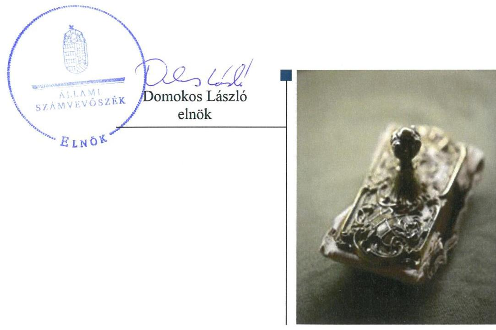

# Jelentés 

## A forrásmegosztás ellenőrzése

A Fővárosi Önkormányzatot és a kerületi önkormányzatokat osztottan megillető bevételek 2018. évi megosztásáról szóló önkormányzati rendelet felülvizsgálata 2019.

---

# Jelentés 

## A forrásmegosztás ellenőrzése

A Fővárosi Önkormányzatot és a kerületi önkormányzatokat osztottan megillető bevételek 2018. évi megosztásáról szóló önkormányzati rendelet felülvizsgálata 2019. 01. hó 08. nap

---

|  J | AZ ELLENŐRZÉST FELÜGYELTE:  |
| --- | --- |
|   | MAROZSÁN LÁSZLÓNÉ felügyeleti vezető  |
|   | AZ ELLENŐRZÉST VEZETTE ÉS A VÉGREHAJTÁSÁÉRT FELELŐS:  |
|   | KORSÓSNÉ VIGH ANDREA ellenőrzésvezető  |
|   | A PROGRAM ÖSSZEÁLLÍTÁSÁÉRT FELELŐS:  |
|   | TÓTPÁL SZABOLCS osztályvezető  |
|   | A TÉMÁHOZ KAPCSOLÓDÓ KORÁBBI SZÁMVEVŐSZÉKI JELENTÉSEK:  |
|   | - címe: A Fővárosi Önkormányzatot és a kerületi önkormányzatokat osztottan megillető bevételek 2017. évi megosztásáról szóló önkormányzati rendelet felülvizsgálata  |
|  J | - sorszáma: 18007  |
|   | IKTATÓSZÁM: EL-0907-002/2018  |
|   | TÉMASZÁM: 2498  |
|   | ELLENŐRZÉS-AZONOSÍTÓ SZÁM: V0842  |

---

# TARTALOMJEGYZÉK 

■ ÖSSZEGZÉS ..... 5
■ AZ ELLENŐRZÉS CÉLJA ..... 6
■ AZ ELLENŐRZÉS TERÜLETE ..... 7
■ AZ ELLENŐRZÉS HÁTTERE, INDOKOLTSÁGA ..... 8
■ A JELENTÉS LÉNYEGES KÉRDÉSKÖREI ..... 9
■ AZ ELLENŐRZÉS HATÓKÖRE ÉS MÓDSZEREI ..... 10
■ MEGÁLLAPÍTÁSOK ..... 11
■ MELLÉKLETEK ..... 13
I. sz. melléklet: Értelmező szótár ..... 13
■ FÜGGELÉK: ÉSZREVÉTELEK ..... 15
■ RÖVIDÍTÉSEK JEGYZÉKE ..... 17

---

.

---

# ÖSSZEGZÉS 

Budapest Főváros Önkormányzata 2018. évi forrásmegosztási rendeletalkotása szabályozott és szabályszerű volt, biztosította az átlátható és elszámoltatható közpénzfelhasználást. A 2019. évi forrásmegosztás során korrekció érvényesitése nem indokolt.

## Az ellenőrzés társadalmi indokoltsága

Budapest Főváros Önkormányzatának Közgyűlése a „Fővárosi Önkormányzatot és a kerületi önkormányzatokat osztottan megillető bevételek 2018. évi megosztásáról" alkotott rendeletében 258417 M Ft megosztandó bevételről és 392 M Ft megosztandó kiadásról rendelkezett.

A törvényi előírás szerint „a fővárosi önkormányzat tárgyévre vonatkozó hatályos forrásmegosztási rendeletét az Állami Számvevőszék felülvizsgálja" és megállapítja Budapest Főváros Önkormányzata és a kerületi önkormányzatok közötti helyi adóbevételekhez kapcsolódó elszámolások jogszabályi előírásoknak való megfelelőségét, vagy a tapasztalt eltérések miatt szükséges pénzügyi elszámolási korrekciókat. Az ellenőrzést indokolttá tette továbbá a fővárosi forrásmegosztás által érintett közpénz nagyságrendje is.

## Főbb megállapítások, következtetések

A Főjegyző Budapest Főváros Főpolgármesteri Hivatalában kialakította a forrásmegosztási rendelet szabályozott és szabályszerű megalkotásához és végrehajtásához szükséges belső szabályrendszert. Budapest Főváros Önkormányzata a 2018. évi forrásmegosztási rendeletet a törvényi és a belső szabályozó eszközökben rögzített eljárásrend és határidők figyelembevételével, szabályszerűen alkotta meg. A Budapest Főváros Önkormányzatát és a kerületi önkormányzatokat osztottan megillető (iparűzési és idegenforgalmi adó, késedelmi pótlék és bírság) bevételeket és a fővárosi önkormányzati helyi adóztatással kapcsolatos kiadásokat megalapozottan, a törvényben rögzített részesedési arányok érvényesítésével határozták meg.

A 2018. január 1-jétől augusztus 31-éig befolyt megosztandó bevételek pénzügyi elszámolása, a helyi adózással összefüggő 2018. évi kiadási előleg, valamint a 2017. évi kiadási előleg és a kiadási tény adatok különbözetének elszámolása szabályszerű volt.

Az Állami Számvevőszék a 2018. évi forrásmegosztást megalapozottnak és helyesnek találta, így a 2019. évi forrásmegosztás során nem szükséges korrekció érvényesítése.

---

# AZ ELLENŐRZÉS CÉLJA 

Az ellenőrzés célja a Fővárosi Önkormányzatot ${ }^{1}$ és a kerületi önkormányzatokat ${ }^{2}$ osztottan megillető bevételek 2018. évi forrásmegosztási rendeletben előírt megosztásának, valamint a helyi adóztatással kapcsolatos kiadások megállapítása, elszámolása szabályszerűségének ellenőrzése volt.

---

# **AZ ELLENŐRZÉS TERÜLETE**

## **A 2018. évi forrásmegosztási rendeletalkotás és annak végrehajtása a Fővárosi Önkormányzatnál**

A forrásmegosztási tv.3 határozza meg a Fővárosi Önkormányzatot és a kerületi önkormányzatokat osztottan megillető bevételek körét és a részesedési arányokat. A megosztandó bevételekből a forrásmegosztási tv. 2018. évben hatályos előírása alapján a Fővárosi Önkormányzatot 54%, a kerületi önkormányzatokat együttesen 46% részesedés illeti meg. A bevételekből részesülőket részesedésük arányában terhelik a Fővárosi Önkormányzati Adóhatóság4 működtetésével összefüggésben felmerülő kiadások.

A Fővárosi Önkormányzat Közgyűlése5 az Alaptörvény6, a Mötv.7 és a forrásmegosztási tv. felhatalmazása alapján az adott évre tervezett helyi adóbevételek megosztásának rendjét forrásmegosztási rendeletben rögzíti.

A 2018. évi forrásmegosztási rendeletben8 meghatározott bevételi és kiadási tervszámokat az 1. táblázat mutatja be.

1. táblázat

|  A 2018. ÉVI MEGOSZTANDÓ BEVÉTELEK ÉS KIADÁSOK TERVEZETT ÖSSZEGE (E FT) |  |  |   |
| --- | --- | --- | --- |
|  Megosztandó
bevétel/kiadás | Megosztandó
forrás összege
(100%) | Főváros
részesedése
(54%) | Kerületek
részesedése
(46%)  |
|  Iparűzési adó | 258 000 000 | 139 320 000 | 118 680 000  |
|  Kerületek által átengedett
idegenforgalmi adó | 17 000 | 9 180 | 7 820  |
|  Kivetett adókhoz
kapcsolódó pótlék, bírság | 400 000 | 216 000 | 184 000  |
|  Megosztandó bevételek
összesen | 258 417 000 | 139 545 180 | 118 871 820  |
|  Helyi adókhoz
kapcsolódó kiadás | 391 940 | 211 648 | 180 292  |

*Forrás: 2018. évi forrásmegosztási rendelet*

---

# AZ ELLENŐRZÉS HÁTTERE, INDOKOLTSÁGA 

A forrásmegosztási tv. 6. § (1) bekezdésének előírása alapján a Fővárosi Önkormányzat tárgyévre vonatkozó forrásmegosztási rendeletét az ÁSZ ${ }^{9}$ felülvizsgálja. Ha az ÁSZ megállapítja, hogy a Fővárosi Önkormányzat vagy valamely kerületi önkormányzat jogosulatlan forráshoz jutott vagy az őt jogszerűen megillető forrásnál alacsonyabb összegben részesült, ennek mértékével a forrásmegosztási tv. alapján meghatározott, a felülvizsgálat lezárását követő évi forrásmegosztást a Fővárosi Önkormányzat rendeletében módosítja.

Az ellenőrzés eredményeképp a törvényalkotás számára tapasztalatok állnak rendelkezésre a forrásmegosztás szabályozásáról, a forrásmegosztási rendelet szabályszerűségéről, következtetés vonható le arra vonatkozóan, hogy indokolt-e jogszabályi módosítás kezdeményezése. Az ellenőrzés az ellenőrzött számára visszajelzést ad a forrásmegosztás végrehajtásának szabályosságáról, javaslataival hozzájárul az esetleges hiányosságok kiküszöböléséhez. A társadalom számára jelzi, hogy a közpénz tervezett megosztása sem marad ellenőrizetlenül, az ÁSZ értékteremtő rend kialakításához és megőrzéséhez hozzájáruló tevékenysége pozitív hatással lesz a szervezetről kialakított összkép formálására.

---

# A JELENTÉS LÉNYEGES KÉRDÉSKÖREI 

1. A Fővárosi Önkormányzat 2018. évi forrásmegosztási rendeletalkotási folyamata szabályozott és szabályszerű volt-e?
2. A 2018. évi forrásmegosztás szabályszerű volt-e?

---

# AZ ELLENŐRZÉS HATÓKÖRE ÉS MÓDSZEREI 

## Az ellenőrzés típusa

Szabályszerüségi ellenőrzés

## Az ellenőrzött időszak

2017. szeptember 1-jétől 2018. augusztus 31-ig terjedő időszak (a forrásmegosztási rendelet előkészítésével és végrehajtásával érintett időszak)

## Az ellenőrzés tárgya

A Fővárosi Önkormányzatot és a kerületi önkormányzatokat osztottan megillető bevételek megosztásáról szóló 2018. évi forrásmegosztási rendelet, a helyi adóztatással kapcsolatos kiadások megállapítása, elszámolása.

## Az ellenőrzött szervezet

Budapest Főváros Önkormányzata és Budapest Főváros Főpolgármesteri Hivatal

## Az ellenőrzés jogalapja

Az ellenőrzés jogszabályi alapját az ÁSZ tv. ${ }^{10}$ 1. § (3) bekezdése és 3. § (1) bekezdése, valamint a forrásmegosztási tv. 6. § (1) bekezdése képezték.

## Az ellenőrzés módszerei

Az ellenőrzés szakmai módszertana az ÁSZ hivatalos honlapján (www.asz.hu) közzétett szakmai szabályokon alapult.

Az ellenőrzési kérdések megválaszolásához szükséges bizonyítékok megszerzése az ellenőrzött által rendelkezésre bocsátott dokumentumok értékelésével, adatok elemzésével valósult meg.

---

# 1. A Fővárosi Önkormányzat 2018. évi forrásmegosztási rendeletalkotási folyamata szabályozott és szabályszerű volt-e? 

Összegző megállapítás

A Fővárosi Önkormányzat a jogszabályi előírásokkal összhangban szabályozta a forrásmegosztási rendeletalkotás folyamatát. A 2018. évi forrásmegosztási rendeletalkotás szabályszerű volt.

A Főjegyzö ${ }^{11}$ a Főpolgármesteri Hivatal ${ }^{12}$ belső szabályzataiban, a kapcsolódó ellenőrzési nyomvonalakban és munkaköri leírásokban a jogszabályi előírásokkal összhangban szabályozta a forrásmegosztási rendeletalkotás folyamatát, az érintett szervezeti egységek rendeletalkotással kapcsolatos feladat- és hatáskörét.

A forrásmegosztási rendeletalkotás során betartották a forrásmegosztási tv.-ben és a Főpolgármesteri Hivatal belső szabályzataiban előírt eljárási szabályokat:
$\longrightarrow$ a rendelettervezetet 15 napos véleményezési idő biztosításával küldték meg véleményezésre a kerületi önkormányzatok részére;
$\longrightarrow$ a Fővárosi Önkormányzat Közgyűlése a kerületi önkormányzatok véleménye, valamint az idegenforgalmi adó beszedését számára átengedő hét kerületi önkormányzat előzetes beleegyező határozata birtokában, az előírt határidőn belül fogadta el és léptette hatályba a forrásmegosztási rendeletet.
A forrásmegosztási rendelet a forrásmegosztási tv. előírásaival összhangban és a végrehajtáshoz szükséges valamennyi tartalmi elemre kiterjedően szabályozta a forrásmegosztás rendjét.

## 2. A 2018. évi forrásmegosztás szabályszerű volt-e?

## Összegző megállapítás

2.1. számú megállapítás

A 2018. évi forrásmegosztás szabályszerű volt.
A megosztott bevételek megállapítása, a 2018. év ellenőrzött időszakában befolyt bevételek pénzügyi elszámolása szabályszerű volt.

Megalapozottan tervezte meg a Fővárosi Önkormányzat a forrásmegosztási rendeletben az iparúzési- és idegenforgalmi adóbevételt, valamint a kivetett helyi adókhoz kapcsolódóan kiszabott pótlék és bírság bevételt. A megosztandó bevételek tervszámait a 2017. évi várható teljesítési adatokból kiindulva, a változások és azok hatásainak elemzésével alakították ki, azok háttérszámításokkal és indoklással alátámasztottak voltak.

A forrásmegosztási rendeletben a Fővárosi Önkormányzat szabályszerűen, a forrásmegosztási tv. előírásaival összhangban állapította meg az

---

egyes bevételi jogcímek szerint a Fővárosi Önkormányzatot, valamint a kerületi önkormányzatokat osztottan megillető bevételek részarányát, összegét, továbbá az egyes kerületek részesedését.

A 2018. január 1-jétől augusztus 31-éig befolyt megosztandó bevételek pénzügyi elszámolása szabályszerűen történt meg a Fővárosi Önkormányzat és a kerületi önkormányzatok között. A tárgyhónapban befolyt megosztható bevételek kerületeket megillető hányadát (46\%-át) a Fővárosi Önkormányzat a forrásmegosztási tv. mellékletében szereplő arányszámok alapján felosztva az egyes kerületek között, havonta a forrásmegosztási rendelet szerinti határidőben a kerületi önkormányzatok részére átutalta. A forrásmegosztási tv. előírása szerint a helyi iparűzési adóbevételt és a Fővárosi Önkormányzat által kivetett helyi adókhoz kapcsolódó pótlék- és bírság bevételt mind a 23 kerülettel, az idegenforgalmi adót az adó kivetését és beszedését átengedő hét kerületi önkormányzattal osztották meg.

# 2.2. számú megállapítás 

A Fővárosi Önkormányzat szabályszerűen állapította meg és számolta el a forrásmegosztás során a Fővárosi Önkormányzati Adóhatóság múködtetésével összefüggő, helyi adóztatással kapcsolatos kiadásokat.

A Fővárosi Önkormányzati Adóhatóság működtetésével összefüggő - a Fővárosi Önkormányzatot és a kerületi önkormányzatokat osztottan terhelő - kiadások megtervezése szabályszerű volt, a megosztandó múködési kiadást:
$\longrightarrow$ a helyi adókhoz kapcsolódóan kiszabott késedelmi pótlékból és bírságból származó bevételek legfeljebb 50\%-áig (felső korlátig) terjedő mértékben érvényesítették;
$\longrightarrow$ a forrásmegosztási tv.-ben előírt arányszámokat alkalmazva osztották meg a Fővárosi Önkormányzat és a 23 kerület között.
A 2018. évi kiadási előleg elszámolása szabályszerű volt. A Fővárosi Önkormányzat a 2017. évi zárszámadási rendelet ${ }^{13}$ hatályba lépését követő havi utalásban a 2017. évi tény adatok alapján, a felső korlátra és a megosztási arányokra vonatkozó előírások betartásával, szabályszerűen érvényesített egyszeri jelleggel a kerületek felé együttesen 180 292,5 E Ft kiadási előleget.

A 2017. év során levont kiadási előleg (135 848,2 E Ft) és a 2017. évi zárszámadás alapján ténylegesen elszámolható kiadások (180 292,5 E Ft) 2018. évi összevetése alapján a Fővárosi Önkormányzat szabályszerűen állapított meg és érvényesített a 2018. júniusi utalásban a kerületek felé együttesen 44 444,3 E Ft 2017. évi kiadási különbözetet.

Az ÁSZ nem tárt fel a 2018. évi forrásmegosztást érintő eltérést, így a 2019. évi forrásmegosztás során korrekció érvényesítése nem szükséges.

Az ÁSZ ellenőrzés a forrásmegosztási tv. 6. § (2) bekezdésében szabályozott körülményt nem tárt fel (a forrásmegosztás során a Fővárosi Önkormányzat vagy valamely kerületi önkormányzat jogosulatlan forráshoz nem jutott, illetve az őket megillető forrásnál alacsonyabb összegben nem részesültek), ezért a 2019. évi forrásmegosztási eljárás során korrekció nem indokolt.

---

# MELLÉKLETEK 

- I. SZ. MELLÉKLET: ÉRTELMEZŐ SZÓTÁR

Fővárosi Önkormányzat által kivetett helyi adóhoz kapcsolódóan kiszabott pótlék és bírság
helyi adóztatással kapcsolatos kiadás
idegenforgalmi adó
iparúzési adó
kiadási előleg
részesedési arányok

A Fővárosi Önkormányzatot és a kerületi önkormányzatokat osztottan illetik meg a Fővárosi Önkormányzat Közgyűlésének rendelete alapján kivetett helyi adóhoz kapcsolódóan kiszabott pótlékból és bírságból származó bevételek. (Forrás: A forrásmegosztási törvény 2. § (2) bekezdése alapján meghatározott fogalom.)
A fővárosi önkormányzati helyi adóztatással kapcsolatos - a tárgyévre vonatkozóan a Fővárosi Önkormányzatot és a kerületi önkormányzatokat osztottan megillető bevételek (iparúzési adó, hét kerületnél befolyt idegenforgalmi adó, a kivetett helyi adóhoz kapcsolódóan kiszabott pótlék és bírság) beszedésével összefüggően felmerült - kiadásokat a forrásmegosztási tv. 2. § (1) bekezdés a) pontja szerinti bevételből részesülők viselik részesedésük arányában. Kiadásként a fővárosi önkormányzatnál a beszedéssel - a Fővárosi Önkormányzati Adóhatóság működtetésével - összefüggően felmerült működtetési kiadásokat kell figyelembe venni. A forrásmegosztási tv. 2. § (1) bekezdés a) pontja és a (4) bekezdés szerint figyelembe vehető kiadásokat a (2) bekezdésben felsorolt bevételek legfeljebb 50\%-áig terjedő mértékben lehet érvényesíteni. (Forrás: A forrásmegosztási törvény 2. § (4), (6) bekezdése alapján meghatározott fogalom.)
A kommunális jellegú adók közül a kerület döntése alapján átengedett helyi idegenforgalmi adóból beszedett bevétel. A helyi idegenforgalmi adót a kerületi önkormányzat helyett a Fővárosi Önkormányzat rendeletével akkor jogosult bevezetni, ha ahhoz minden adóév tekintetében az érintett kerület önkormányzatának képviselőtestülete előzetes beleegyezését adja. A Fővárosi Önkormányzat által közvetlenül igazgatott terület tekintetében a kerületi önkormányzat által bevezethető adó bevezetésére a Fővárosi Önkormányzat jogosult. (Forrás: A Hatv. ${ }^{14}$ III. fejezet Kommunális jellegú adók pontja alapján meghatározott fogalom)
A Hatv. felhatalmazása alapján a Fővárosi Önkormányzat Közgyűlésének rendeletével kivetett helyi adónem. A Fővárosi Önkormányzat illetékességi területén vállalkozói tevékenységet (iparúzési tevékenységet) állandó vagy ideiglenes jelleggel végző vállalkozó helyi iparúzési adót köteles fizetni. (Forrás: A Hatv. 1. § (2) bekezdése, valamint a 35. § (1) és (2) bekezdései alapján meghatározott fogalom.)
A tárgyévet megelőző év költségvetési rendeletének végrehajtásáról szóló fővárosi önkormányzati rendeletben elfogadott adóbeszedéssel kapcsolatos kiadásokat kell előlegként figyelembe venni és a levonását a rendelet hatályba lépését követő havi utalásban kell a kerületi önkormányzatok felé érvényesíteni. Az előleg és a tárgyévi tényleges kiadások különbözetét a tárgyévi költségvetési rendelet végrehajtásáról szóló rendelet hatályba lépését követő havi utalásban kell elszámolni. (Forrás: A forrásmegosztási törvény 2. § (5) bekezdése alapján meghatározott fogalom.)
1) A forrásmegosztásba bevont bevételekből a Fővárosi Önkormányzatot és a kerületi önkormányzatokat együttesen megillető részesedés arányszáma. A Fővárosi Önkormányzatot és a kerületi önkormányzatokat a forrásmegosztási törvény 2. § alapján osztottan megillető bevételekből a Fővárosi Önkormányzatot 54\%, a kerületi önkormányzatokat együttesen

---

tárgyév

46\% részesedés illeti meg. (Forrás: A forrásmegosztási törvény 2-3. §-ai alapján meghatározott fogalom)
2) A kerületi önkormányzatokat megillető források egyes kerületek közötti megosztásának aránya, amelyet a forrásmegosztási törvény melléklete tartalmaz. (Forrás: A forrásmegosztási törvény 4. § (1) bekezdése alapján meghatározott fogalom.)
Azon gazdasági év, amelyhez tartozó megosztandó bevételeknek a Fővárosi Önkormányzat és a kerületi önkormányzatok közötti megosztását a forrásmegosztási rendelet határozza meg. (Forrás: A forrásmegosztási törvény 1. §-a alapján meghatározott fogalom.)

---

# FÜGGELÉK: ÉSZREVÉTELEK 

A jelentéstervezetet a Számvevőszék 15 napos észrevételezésre megküldte az ellenőrzött szervezetek vezetőinek az ÁSZ tv. 29. §* (1) bekezdése előírásának megfelelően.

Budapest Főváros Önkormányzatának főpolgármestere és Budapest Főváros Főpolgármesteri Hivatalának főjegyző̉e a jelentéstervezet megállapításaira nem tettek észrevételt.

[^0]
[^0]:    * 29. § (1) Az Állami Számvevőszék az ellenőrzési megállapításait megküldi az ellenőrzött szervezet vezetőjének vagy az általa megbízott személynek, és annak, akinek személyes felelősségét állapította meg.
    (2) Az ellenőrzött szervezet vezetője és a felelősként megjelölt személy az ellenőrzés megállapításaira tizenöt napon belül írásban észrevételt tehet.
    (3) Az Állami Számvevőszék az észrevételre a beérkezésétől számított harminc napon belül írásban válaszol. A figyelembe nem vett észrevételeket köteles a jelentésben feltüntetni, és megindokolni, hogy azokat miért nem fogadta el.

---

.

---

# RÖVIDÍTÉSEK JEGYZÉKE 

${ }^{1}$ Fővárosi Önkormányzat
${ }^{2}$ kerületi önkormányzat
${ }^{3}$ forrásmegosztási tv.
${ }^{4}$ Fővárosi Önkormányzati Adóhatóság
${ }^{5}$ Fővárosi Önkormányzat Közgyűlése
${ }^{6}$ Alaptörvény
${ }^{7}$ Mótv.
${ }^{8}$ forrásmegosztási rendelet
${ }^{9}$ ÁSZ
${ }^{10}$ ÁSZ tv.
${ }^{11}$ Főjegyző
${ }^{12}$ Főpolgármesteri Hivatal
${ }^{13}$ 2017. évi zárszámadási rendelet
${ }^{14}$ Hatv.

Budapest Főváros Önkormányzata
Budapest Főváros I-XXIII. kerületeinek önkormányzatai
2006. évi CXXXIII. törvény a fővárosi önkormányzat és a kerületi önkormányzatok közötti forrásmegosztásról (2018. január 1-jétől hatályos szöveg)
Budapest Főváros Főjegyzője által átruházott hatáskörben Budapest Főváros Főpolgármesteri Hivatalának Adóhatósága
Budapest Főváros Közgyűlése
Magyarország Alaptörvénye (kihirdetve 2011. április 25-én)
2011. évi CLXXXIX. törvény Magyarország helyi Önkormányzatairól

Budapest Főváros Önkormányzata Közgyűlésének 3/2018. (I. 29.) önkormányzati rendelete a Fővárosi Önkormányzatot és a kerületi önkormányzatokat osztottan megillető bevételek 2018. évi megosztásáról
Állami Számvevőszék
2011. évi LXVI. törvény az Állami Számvevőszékről (hatályos: 2011. július 1-jétől)

Budapest Főváros Főjegyzője
Budapest Főváros Főpolgármesteri Hivatal
18/2018. (V. 30.) Főv. Kgy. rendelet Budapest Főváros Önkormányzata 2017. évi összevont költségvetéséről szóló 8/2017. (III. 10.) Főv. Kgy. rendelet végrehajtásáról
1990. évi C. törvény a helyi adókról

---

# ÁLLAMI SZÁMVEVŐSZÉK 

1052 Budapest, Apáczai Csere János utca 10.
Levélcím: 1364 Budapest 4. Pf. 54
Telefon: +36 14849100 Telefax: +36 14849200
www.asz.hu