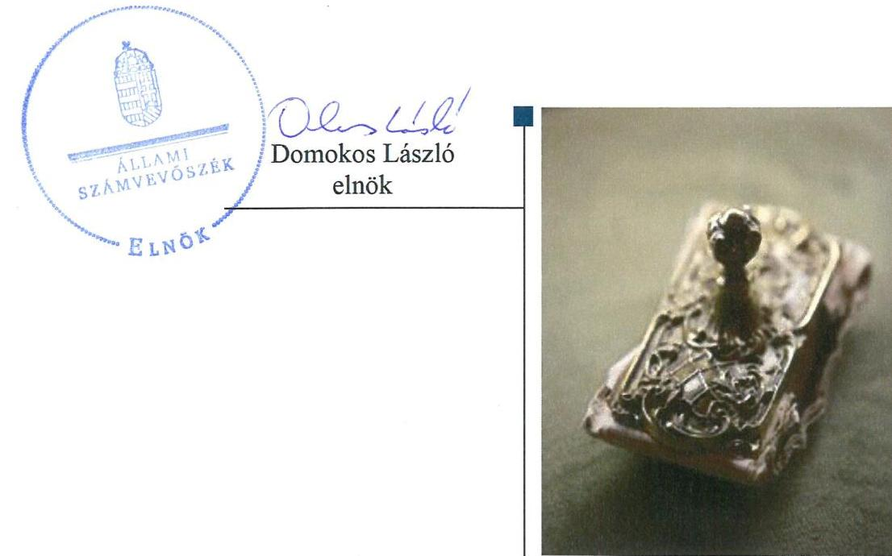
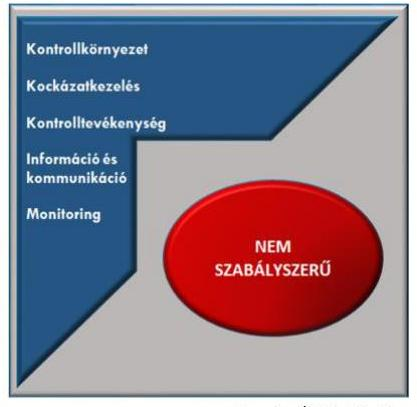

# Jelenetés 

## Önkormányzatok integritás- és belső kontrollrendszere

Az önkormányzatok belső kontrollrendszere kialakításának és múködtetésének ellenőrzése - Sárazsadány Község Önkormányzata 2019.

---

# Jelentés 

## Önkormányzatok integritás- és belső kontrollrendszere

Az önkormányzatok belső kontrollrendszere kialakításának és múködtetésének ellenőrzése - Sárazsadány Község Önkormányzata 2019. 01 hó 25 nap

---

# AZ ELLENŐRZÉST FELÜGYELTE:

- VARGA EDIT felügyeleti vezető
- AZ ELLENŐRZÉST VEZETTE ÉS A VÉGREHAJTÁSÁÉRT FELELŐS:
  - BAJNAI ZSUZSANNA ellenőrzésvezető
  - A PROGRAM ÖSSZEÁLLÍTÁSÁÉRT FELELŐS:
    - TÓTPÁL SZABOLCS osztályvezető

**IKTATÓSZÁM:** EL-0353-014/2018.

**TÉMASZÁM:** 2444

**ELLENŐRZÉS-AZONOSÍTÓ SZÁM:** V078922

Jelentéseink az Országgyűlés számítógépes hálózatán és az Interneta a www.asz.hu címen is olvashatóak.

---

# TARTALOMJEGYZÉK 

■ ÖSSZEGZÉS ..... 5
■ AZ ELLENŐRZÉS CÉLJA ..... 6
■ AZ ELLENŐRZÉS TERÜLETE ..... 7
■ AZ ELLENŐRZÉS HÁTTERE, INDOKOLTSÁGA ..... 8
■ A JELENTÉS LÉNYEGES KÉRDÉSKÖREI ..... 9
■ AZ ELLENŐRZÉS HATÓKÖRE ÉS MÓDSZEREI ..... 10
■ MEGÁLLAPÍTÁSOK ..... 12
■ JAVASLATOK ..... 15
■ MELLÉKLETEK ..... 19
I. sz. melléklet: Értelmező szótár ..... 19
■ FÜGGELÉK: ÉSZREVÉTELEK ..... 23
■ RÖVIDÍTÉSEK JEGYZÉKE ..... 25

---

.

---

# ÖSSZEGZÉS 

Sárazsadány Község Önkormányzata belső kontrollrendszerének kialakítása és müködtetése nem volt szabályszerű, így nem volt biztositott a közpénzfelhasználás szabályossága és a nemzeti vagyonnal történő felelős gazdálkodás. A korrupciós kockázatok kezelésére alkalmas integritás kontrollokat nem építették ki.

## Az ellenőrzés társadalmi indokoltsága

Az Állami Számvevőszék alapvető feladata a közpénzekkel, az állami és önkormányzati vagyonnal való gazdálkodás ellenőrzése. Az Alaptörvény szerint az önkormányzatok kötelezettsége a kiegyensúlyozott, átlátható és fenntartható költségvetési gazdálkodás elvének érvényesítése, a nemzeti vagyonnal való rendeltetésszerű és felelős módon történő gazdálkodás biztosítása. Az Állami Számvevőszék stratégiájában megfogalmazott célkitűzése az integritás alapú, átlátható és elszámoltatható közpénzfelhasználás elősegítése. Ennek megvalósítása érdekében az Állami Számvevőszék prioritásként kezeli a közpénzzel gazdálkodó szervezetek esetében a belső kontrollrendszer múködésének ellenőrzését.

Sárazsadány Község Önkormányzatát az Állami Számvevőszék korábban nem ellenőrizte.

## Főbb megállapítások, következtetések

Sárazsadány Község Önkormányzata belső kontrollrendszerének kialakítása és múködtetése nem volt szabályszerű.
A kontrollkörnyezetnek, a gazdálkodás kereteinek kialakítása nem volt szabályszerű, mert a jegyző nem gondoskodott a számviteli elszámolásokat megalapozó belső szabályozatok elkészítéséről.

Az integrált kockázatkezelési rendszer keretében előírt szabályzatokat a jegyző nem adta ki, a kockázatok kezelése érdekében nem intézkedett.

A gazdálkodási folyamatokhoz kapcsolódó kontrolltevékenységek kialakítása és múködtetése nem volt szabályszerű, a feltárt hiányosságok miatt nem volt biztosított a közpénzfelhasználás szabályossága.

Az információs és kommunikációs rendszer kialakításának szabálytalansága miatt a szervezet átláthatósága nem volt biztosított.

A jegyző nem gondoskodott a tevékenységek, célok megvalósításának nyomon követését biztosító, az operatív tevékenységek keretében megvalósuló folyamatos és eseti nyomon követés rendszerének kialakításáról.

Az integritás kontrollok kialakítása nem volt megfelelő.

---

# AZ ELLENŐRZÉS CÉLJA 

Az ellenőrzés célja annak megállapítása volt, hogy szabályszerűen történt-e az önkormányzat belső kontrollrendszerének kialakítása és működtetése, az biztosítottae az önkormányzatnál a közpénzfelhasználás szabályosságát, a közpénzekkel és a nemzeti vagyonnal történő szabályszerű és felelős gazdálkodást, a beszámolási és adatszolgáltatási kötelezettségek szabályszerű teljesítését. Az ellenőrzés keretében értékelte az ÁSZ ${ }^{1}$ az önkormányzat korrupciós kockázatainak kezelését szolgáló integritás kontrollok kiépítettségét és az integritás szemlélet érvényesülését.

---

# **AZ ELLENŐRZÉS TERÜLETE**

## **Sárazsadány Község Önkormányzata**

Sárazsadány Borsod-Abaúj-Zemplén megyében található, állandó lakosainak száma 2016. január 1-jén 228 fő volt a Központi Statisztikai Hivatal Magyarország közigazgatási helynévkönyve adatai alapján.

Az Önkormányzat2 öt tagú képviselő-testületének3 munkáját egy állandó bizottság segítette.

A polgármester4 az 1990. évi önkormányzati választások óta tölti be tisztségét, a jegyző5 személye nem változott az ellenőrzött időszakban.

Az Önkormányzat gazdálkodási feladatainak ellátását a Közös Hivatal6 biztosította, belső ellenőrzési feladatokat mind az Önkormányzat, mind a Közös Hivatal vonatkozásában a Társaulás7 látta el. A Közös Hivatal önálló szervezeti egységekre nem tagolódott, gazdasági szervezettel nem rendelkezett. A Közös Hivatalban foglalkoztatott köztisztviselők száma a 2016. év végén 16 fő volt. Az Önkormányzat további költségvetési szervvel nem rendelkezett, a településen nemzetiségi önkormányzat nem működött.

Az Önkormányzat a 2016. évi konszolidált éves költségvetési beszámoló szerint 155,9 millió Ft költségvetési bevételt ért el, valamint 150,5 millió Ft költségvetési kiadást teljesített. A könyvviteli mérleg szerinti eszközvagyonának értéke 2016. december 31-én 773,2 millió Ft volt.

---

# AZ ELLENŐRZÉS HÁTTERE, INDOKOLTSÁGA 

A DEMOKRATIKUS TÁRSADALMAKBAN alapvető igény, hogy a közpénzeket, a közvagyont használók tevékenységükről elszámoljanak, ahhoz egyértelmű és érvényesíthető felelősségi szabályok társuljanak. Ennek a jogos igénynek az érvényesítéséhez meg kell teremteni azokat a folyamatokat, rendszereket, amelyek nélkülözhetetlenek az elszámoltatáshoz. Az elszámoltatás eredményes működtetéséhez szükség van a megfelelő információs, kontroll-, értékelési és beszámolási rendszerek kialakítására. A belső kontrollok kiépítettsége hozzájárul az integritási szemlélet kialakításához és érvényesüléséhez. A belső kontrollrendszer kialakítása és működtetése nélkül nem valósítható meg a közpénzek, a közvagyon szabályos, gazdaságos, hatékony és eredményes felhasználása.

A BELSŐ KONTROLLRENDSZER azt a célt szolgálja, hogy az államháztartás szervei működésük és gazdálkodásuk során a tevékenységeket szabályszerűen, gazdaságosan, hatékonyan, eredményesen hajtsák végre, teljesítsék elszámolási kötelezettségeiket és megvédjék az erőforrásokat a veszteségektől, a károktól, a nem rendeltetésszerű használattól. A belső kontrollrendszer magában foglalja mindazon szabályokat, eljárásokat, gyakorlati módszereket és szervezeti struktúrákat, kockázatkezelési technikákat, kontrolltevékenységeket, amelyek segítséget nyújtanak a szervezetnek céljai eléréséhez.

A megfelelő belső kontrollrendszer jelentősen csökkenti a hibák és szabálytalanságok kockázatát. Az ÁSZ célja, hogy javuljon az ellenőrzött önkormányzatok belső kontrollrendszerének szabályozottsága, működésének megfelelősége, szabályszerűsége, hozzájárulva ezzel az egyensúlyi helyzet fenntarthatóságának biztosításához, biztosítva az önkormányzatnál a közpénzfelhasználás szabályosságát, a közpénzekkel és a nemzeti vagyonnal történő szabályszerű, gazdaságos, hatékony és eredményes gazdálkodást. Az ÁSZ ellenőrzés tapasztalatai nem csupán a közvetlenül ellenőrzött önkormányzatokat támogathatják.

AZ ELLENŐRZÉS VÁRHATÓ HASZNOSULÁSA négy szinten valósul meg. A törvényalkotás számára összegzett tapasztalatok állnak rendelkezésre a belső kontrollrendszer önkormányzati területen való kialakításáról, működtetéséről és hatásairól. Az ellenőrzés az ellenőrzött számára visszajelzést ad a belső kontrollrendszer kialakításában és működésében lévő hiányosságokról, javaslataival hozzájárul azok kiküszöböléséhez. Az ellenőrzés megállapításait és javaslatait más szervezetek is hasznosíthatják a rendezett gazdálkodási keretek kialakításához, a ,,jó gyakorlat" elterjesztésével azok az önkormányzatok is átvehetik a pozitív példákat, ahol nem végez ellenőrzést az ÁSZ.

Az ÁSZ ellenőrzései jelzik a társadalom számára, hogy közpénz nem maradhat ellenőrizetlenül, tevékenysége hozzájárul az értékteremtő rend kialakításához és megőrzéséhez.

---

# A JELENTÉS LÉNYEGES KÉRDÉSKÖREI 

1. Az Önkormányzat belső kontrollrendszerének kialakítása és müködtetése szabályszerű volt-e?
2. Kiépítették-e az integritás kontrollokat az Önkormányzatnál?

---

# AZ ELLENŐRZÉS HATÓKÖRE ÉS MÓDSZEREI 

## Az ellenőrzés típusa

Megfelelőségi ellenőrzés.

## Az ellenőrzött időszak

2016. év

## Az ellenőrzés tárgya

A helyi önkormányzatnak, mint éves költségvetési beszámoló készítésére kötelezett szervezetnek és a gazdálkodási feladatait ellátó közös önkormányzati hivatalának belső kontrollrendszere az ellenőrzés tárgya, valamint az integritás szemlélet érvényesülése.

Az ellenőrzés kiterjedt minden olyan körülményre és adatra, amely az ÁSZ jogszabályban meghatározott feladatainak teljesítéséhez, valamint a program végrehajtása folyamán felmerült újabb összefüggések feltárásához szükséges volt.

## Az ellenőrzött szervezet

Sárazsadány Község Önkormányzata és a gazdálkodási feladatait ellátó Bodrogolaszi Közös Önkormányzati Hivatal

## Az ellenőrzés jogalapja

Az ÁSZ tv. ${ }^{8}$ 1. § (3) bekezdésében foglaltak alapján az ÁSZ általános hatáskörrel végzi a közpénzekkel, az állami és önkormányzati vagyonnal való felelős gazdálkodás ellenőrzését. Az ÁSZ tv. 5. § (2) bekezdése alapján az államháztartás gazdálkodásának ellenőrzése keretében az ÁSZ ellenőrzi a helyi önkormányzatok gazdálkodását, valamint az ÁSZ tv. 5. § (6) bekezdése alapján ellenőrzése során értékeli az államháztartás számviteli rendjének betartását és a belső kontrollrendszer múködését.

## Az ellenőrzés módszerei

Az ÁSZ az ellenőrzést az ellenőrzési program szempontjai, az ellenőrzött időszakban hatályos jogszabályok, az ellenőrzés szakmai szabályai, az egyes

---

ellenőrzési típusokhoz kapcsolódó ÁSZ módszertanok figyelembevételével végezte.

Az ellenőrzés ideje alatt az ÁSZ az Önkormányzattal a kapcsolattartást az ÁSZ SZMSZ ${ }^{6}$-ének vonatkozó előírásai alapján biztosította.

Az ellenőrzési kérdések megválaszolásához szükséges bizonyítékok megszerzése az Önkormányzat által rendelkezésre bocsátott dokumentumokra, adatokra alapozva megfigyelés, szemle (szemrevételezés), valamint elemző eljárás keretében történt.

Az ellenőrzési bizonyítékként felhasználható adatforrások közé tartoztak egyrészt az ellenőrzési program részletes szempontjainál felsorolt adatforrások, másrészt minden - az ellenőrzés folyamán feltárt, az ellenőrzés szempontjából információt tartalmazó - dokumentum.

Az Önkormányzat belső kontrollrendszere jogszabályi előírások szerinti kialakításának és működtetésének szabályszerűségét az erre irányuló ellenőrzési kérdésekre adott válaszok összesítése alapján, pillérenként (kontrollkörnyezet, kockázatkezelési rendszer, kontrolltevékenységek, információs és kommunikációs rendszer, monitoring rendszer) és összesítetten is értékelte az ÁSZ. Az önkormányzat belső kontrollrendszere egyes pilléreinek kialakítása és működtetése „szabályszerü", amennyiben az értékelt területen az elért igen válaszok százalékban kifejezett, egész számra kerekített aránya meghaladja a $85 \%$-ot, „nem szabályszerü", ha nem haladja meg, akkor a minősítés „nem szabályszerü" lesz. Az önkormányzat belső kontrollrendszerének összesített értékelése megegyezik a pillérenként (kontrollterületenként) alkalmazott százalékos értékelésekkel. A kontrollrendszer egésze esetében a „szabályszerü" értékelésnek a százalékos értéken felül további feltétele, hogy egyik kontrollterület sem kaphat „nem szabályszerü" értékelést. Az összesített értékelés a százalékos értéktől függetlenül „nem szabályszerű", ha az ellenőrzött kontrollterületek közül több mint egynek „nem szabályszerű" az értékelése.

A 2016. évi kiadások teljesítéséhez kapcsolódó kontrolltevékenység gyakorlása, működtetésének szabályszerűsége esetében az ellenőrzés azokra a legnagyobb értékű tételekre - a lényeges sokaságra - terjedt ki, melyek összértéke eléri a teljes sokaság összértékének 50\%-át.

A 2016. évi kiadások esetében a lényeges sokaságot tételesen ellenőriztük.

A közszféra integritás alapú kultúrájának kialakítása, megerősítése és működése szorosan összefügg a belső kontrollrendszer működésével, ezért az ellenőrzés kiterjedt annak értékelésére is, hogy a belső kontrollrendszer kialakítása és működtetése hogyan hatott az integritás szemlélet érvényesülésére.

---

# 1. Az Önkormányzat belső kontrollrendszerének kialakítása és múködtetése szabályszerű volt-e? 

## Összegző megállapítás

1. ábra: A belső kontrollrendszer értékelése

Forrás: ÁSZ értékelés

## A belső kontrollrendszer kialakítása és múködtetése nem volt szabályszerű.

A belső kontrollrendszer pillérenkénti és összesített értékelését az 1. ábra szemlélteti.

A KONTROLLKÖRNYEZET kialakítása nem volt szabályszerű. A jegyző nem rögzítette az Önkormányzat Számviteli politikájában ${ }^{10}$ a Számv. tv. ${ }^{11}$ 14. § (4) bekezdésében foglaltak ellenére, hogy mit tekint a számviteli elszámolás szempontjából kivételes nagyságú vagy előfordulású bevételnek, költségnek, ráfordításnak, továbbá nem készítette el a Számv. tv. 14. § (5) bekezdés a-b) pontjaiban foglaltak ellenére az eszközök és a források leltárkészítési és leltározási szabályzatát, az eszközök és források értékelési szabályzatát. A Pénzkezelési szabályzat ${ }_{1,2}{ }^{12}$ megfelelt a Számv. tv. előírásainak.

A jegyző nem alakította ki a Számv. tv. 14. § (3) bekezdésének és az (5) bekezdés a), b) d) pontjainak, az Áhsz. ${ }^{13} 50$. §. (1) bekezdésének előírása ellenére a Közös Hivatal számviteli politikáját, annak keretében az eszközök és a források leltárkészítési és leltározási szabályzatát, az eszközök és a források értékelési szabályzatát, a pénzkezelési szabályzatot.

A polgármester nem készítette el az Önkormányzat, a jegyző a Közös Hivatal számlarendjét a Számv. tv. 161. § (1) és az Áhsz. 51. § (2) bekezdéseiben foglalt előírások ellenére.

A pénzügyi kihatással bíró, jogszabályban nem szabályozott kérdések közül a jegyző nem rendezte belső szabályzatban az Ávr. ${ }^{14}$ 13. § (2) bekezdés b), c), e), és f) pontjaiban előírtak ellenére a beszerzések lebonyolításával kapcsolatos eljárásrendet, a belföldi és külföldi kiküldetések elrendelésével, lebonyolításával, elszámolásával kapcsolatos kérdéseket, a reprezentációs kiadások felosztását, azok teljesítésének és elszámolásának szabályait, a gépjárművek igénybevételének és használatának rendjét a Közös Hivatal vonatkozásában. A polgármester nem határozta meg a Kbt. ${ }^{15}$ 27. § (1) bekezdésében foglaltak ellenére az Önkormányzat közbeszerzési eljárásai előkészítésének, lefolytatásának, belső ellenőrzésének felelősségi rendjét.

A jegyző nem készítette el a Közös Hivatal ellenőrzési nyomvonalát a Bkr. ${ }^{16} 6$. § (3) bekezdésének előírása ellenére.

A képviselő-testület a múködésének részletes szabályait meghatározta az SZMSZ ${ }_{1-2}{ }^{17}$-ben a Mötv. ${ }^{18}$ előírásai szerint, az önkormányzati vagyonnal történő gazdálkodás szabályait a Htv. ${ }^{19}$ előírásainak megfelelően alkotta meg Vagyonrendeletében ${ }^{20}$.

---

A Közös Hivatal rendelkezett jóváhagyott Hivatali SZMSZ ${ }^{21}$-szel, tartalma megfelelt az Ávr.-ben foglaltaknak.

KOCKÁZATKEZELÉSI RENDSZERT 2016. szeptember 30ig, illetve az integrált kockázatkezelési rendszert 2016. október 1-jétől a jegyző nem alakított ki a Bkr. ${ }^{22}$ 3. § b) pontjában foglaltak ellenére a Közös Hivatalnál. Nem szabályozta 2016. szeptember 30-ig a szabálytalanságok kezelésének, 2016. október 1-jétől a szervezeti integritást sértő események kezelésének és az integrált kockázatkezelés eljárásrendjét a Bkr. 6.§ (4) bekezdésében előírtak ellenére. A kockázatokat azonosította, azonban nem határozta meg az azonosított kockázatokkal kapcsolatban szükséges intézkedéseket, valamint azok teljesítésének, folyamatos nyomon követésének módját a Bkr. 7. § (2) bekezdésének előírása ellenére.

A KONTROLLTEVÉKENYSÉGEK kereteinek kialakítása és működtetése nem felelt meg a jogszabályi előírásoknak. A jegyző a Közös Hivatalra vonatkozóan belső szabályzatban nem rendezte az Ávr. 13. § (2) bekezdés a) pontjában foglaltak ellenére a gazdálkodással - így különösen a kötelezettségvállalás, ellenjegyzés, teljesítés igazolása, érvényesítés, utalványozás gyakorlásának módjával, eljárási és dokumentációs részletszabályaival, valamint az ezeket végző személyek kijelölésének rendjével kapcsolatos belső előírásokat, feltételeket. Nem gondoskodott továbbá a Közös Hivatalnál a kötelezettségvállalásra, pénzügyi ellenjegyzésre, teljesítés igazolására, érvényesítésre, utalványozásra jogosult személyekről és aláírás-mintájukról naprakész nyilvántartás vezetéséről az Ávr. 60. § (3) bekezdésében előírtak ellenére. Az Önkormányzat nyilvántartása megfelelt az Ávr.-ben foglaltaknak.

Az önkormányzati kiadási előirányzatok terhére történt kifizetések során a polgármester által elvégzett teljesítésigazolás nem tartalmazta az Ávr. 57. § (3) bekezdés előírása ellenére a teljesítés igazolás dátumának megjelölését, továbbá a polgármester nem rendelte el a kifizetéseket, nem utalványozott az Áht. ${ }^{23} 38$. § (1) és az Ávr. 59. § (2) bekezdéseiben foglaltak ellenére.

A jegyző az Áht. 6/C. § (1) bekezdés szerinti feladatkörében eljárva nem gondoskodott a gazdálkodás során a számviteli szabályok betartásáról, mert a Számv. tv. 165. § (2) bekezdésében foglaltak ellenére bizonylat nélkül rögzítettek adatokat az Önkormányzat könyvviteli nyilvántartásában.

# AZ INFORMÁCIÓS ÉS KOMMUNIKÁCIÓS RENDSZER kialakítása nem volt szabályszerű, mert a jegyző a Közös Hivatal iratkezelési szabályzatát ${ }^{24}$ az Ltv. ${ }^{25} 10 . \S$ (1) bekezdés c) pontjában foglaltak ellenére nem a Magyar Nemzeti Levéltárral egyetértésben adta ki. A polgármester nem készítette el az Önkormányzat, a jegyző a Közös Hivatal adatvédelmi és adatbiztonsági szabályzatát az Info tv. ${ }^{26}$ 24. § (3) bekezdésének előírása ellenére.

A MONITORING-RENDSZER keretében az operatív tevékenységek folyamatos és eseti nyomon követését a jegyző a Bkr. 10. §-ában foglaltak ellenére nem alakította ki a Közös Hivatalnál.

---

Az éves ellenőrzési jelentést a polgármester nem terjesztette a képvi-selő-testület elé jóváhagyásra a Bkr. 49. § (3a) bekezdésének előírása ellenére.

A belső kontrollrendszer minőségét a jegyző a Bkr. előírása szerint értékelte.

# 2. Kiépítették-e az integritás kontrollokat az Önkormányzatnál? 

Összegző megállapítás Az integritás kontrollok kialakítása nem volt megfelelő.
AZ INTEGRITÁS kontrollok kialakítása nem volt megfelelő a kockázatkezelés hiányosságai miatt, az Önkormányzatnál a korrupciós kockázatokat nem kezelték.

---

# JAVASLATOK 

Az ÁSZ tv. 33. § (1) bekezdésében foglaltak értelmében az ellenőrzött szervezet vezetője köteles a jelentésben foglalt megállapításokhoz kapcsolódó intézkedési tervet összeállítani és azt a jelentés kézhezvételétől számított 30 napon belül az ÁSZ részére megküldeni. Amennyiben az ellenőrzött szervezet vezetője nem küldi meg határidőben az intézkedési tervet, vagy továbbra sem elfogadható intézkedési tervet küld, az Állami Számvevőszék elnöke az ÁSZ tv. 33. § (3) bekezdése a) és b) pontjaiban foglaltakat érvényesítheti.

## Bodrogolaszi Közös Önkormányzati Hivatal jegyzőjének

1. A szabályszerű kontrollkörnyezet kialakítása érdekében gondoskodjon az Önkormányzat:
a) jogszabályi előírásoknak megfelelő tartalmú számviteli politikájának kialakításáról;
(1. sz. megállapítás 2. bekezdés 2. mondat 1-4. tagmondatai alapján)
b) számviteli politikája keretében az eszközök és a források leltárkészittési és leltározási szabályzatának, valamint az eszközök és források értékelési szabályzatának elkészitéséről.
(1. sz. megállapítás 2. bekezdés 2. mondat 5-6. tagmondatai alapján)
2. A szabályszerű kontrollkörnyezet kialakítása érdekében gondoskodjon a Közös Hivatal:
a) számviteli politikája és annak keretében az eszközök és források leltárkészittési és leltározási szabályzata, az eszközök és források értékelési szabályzata, valamint a pénzkezelési szabályzat elkészitéséről;
(1. sz. megállapítás 3. bekezdése alapján)
b) számlarendjének elkészitéséről;
(1. sz. megállapítás 4. bekezdése alapján)
c) a beszerzések lebonyolításával kapcsolatos eljárásrend, a belföldi és külföldi kiküldetések elrendelésével és lebonyolításával, elszámolásával kapcsolatos kérdések, a reprezentációs kiadások felosztását, azok teljesítésének és elszámolásának szabályai, valamint a gépjárművek igénybevételének és használatának rendje szabályozásáról;
(1. sz. megállapítás 5. bekezdés 1. mondata alapján)

---

d) az ellenőrzési nyomvonal elkészitéséről.
(1. sz. megállapítás 6. bekezdése alapján)
3. A szabályszerű kockázatkezelési rendszerének kialakítása és müködtetése érdekében gondoskodjon:
a) a jogszabályi előírásnak megfelelően a szervezeti integritást sértő események, valamint az integrált kockázatkezelés eljárásrendjének szabályozásáról;
(1. sz. megállapítás 9. bekezdés 2. mondat 2. tagmondata alapján)
b) a beazonosított kockázatokkal kapcsolatban szükséges intézkedések, valamint azok teljesitésének folyamatos nyomon követési módja meghatározásáról.
(1. sz. megállapítás 9. bekezdés 3. mondata alapján)
4. A Közös Hivatal kontrolltevékenységeinek szabályszerű müködtetése érdekében gondoskodjon:
a) a gazdálkodással - így különösen a kötelezettségvállalás, ellenjegyzés, teljesités igazolása, érvényesités, utalványozás gyakorlásának módjával, eljárási és dokumentációs részletszabályaival, valamint az ezeket végző személyek kijelölésének rendjével - kapcsolatos belső előírások, feltételek belső szabályzatban történő rendezéséről;
(1. sz. megállapítás 10. bekezdés 2. mondata alapján)
b) a kötelezettségvállalásra, pénzügyi ellenjegyzésre, teljesités igazolására, érvényesitésre, utalványozásra jogosult személyekről és aláírás-mintájukról naprakész nyilvántartás vezetéséről;
(1. sz. megállapítás 10. bekezdés 3. mondata alapján)
c) arról, hogy a számviteli (könyvviteli) nyilvántartásokba csak a jogszabályi előírásoknak megfelelően jegyezzenek be adatokat.
(1. sz. megállapítás 12. bekezdése alapján)
5. A Közös Hivatal információs és kommunikációs rendszere szabályszerű kialakítása érdekében gondoskodjon:
a) az iratkezelési szabályzat jogszabályi előírásnak megfelelő kiadásáról;
(1. sz. megállapítás 13. bekezdés 1. mondata alapján)

---

b) a Közös Hivatal adatvédelmi és adatbiztonsági szabályzatának elkészitéséről.
(1. sz. megállapítás 13. bekezdés 2. mondata alapján)
6. A Közös Hivatal szabályszerű monitoring rendszere kialakítása és müködtetése érdekében gondoskodjon az operatív tevékenységek folyamatos és eseti nyomon követéséről.
(1. sz. megállapítás 14. bekezdése alapján)

# Sárazsadány Község Önkormányzata polgármesterének 

1. A szabályszerű kontrollkörnyezete kialakítása érdekében intézkedjen:
a) az Önkormányzat számlarendjének elkészitéséről;
(1. sz. megállapítás 4. bekezdése alapján)
b) az Önkormányzat közbeszerzési eljárásai előkészitése, lefolytatása, belső ellenőrzése felelősségi rendjének meghatározásáról.
(1. sz. megállapítás 5. bekezdés 2. mondata alapján)
2. Az Önkormányzat kontrolltevékenységeinek szabályszerű müködtetése érdekében gondoskodjon az teljesitésigazolás és utalványozás gazdálkodási jogkörök jogszabálynak megfelelő gyakorlásáról.
(1. sz. megállapítás 11. bekezdése alapján)
3. Az Önkormányzat információs és kommunikációs rendszerének szabályszerű kialakítása és müködtetése érdekében gondoskodjon az Önkormányzat adatvédelmi és adatbiztonsági szabályzatának elkészitéséről.
(1. sz. megállapítás 13. bekezdés 2. mondata alapján)
4. A monitoring rendszer szabályszerű müködtetése érdekében gondoskodjon az éves ellenőrzési jelentés képviselő-testület elé terjesztéséről jóváhagyásra.
(1. sz. megállapítás 15. bekezdése alapján)

---

.

---

# MELLÉKLETEK 

- I. SZ. MELLÉKLET: ÉRTELMEZŐ SZÓTÁR

ÁSZ Integritás Projekt
belső ellenőrzés
belső kontrollrendszer
belső kontrollrendszer pillérei, kontrollterületei
helyi önkormányzat

Az Állami Számvevőszék 2009-ben indította el a „Korrupciós kockázatok feltérképezése - Integritás alapú közigazgatási kultúra terjesztése" című, európai uniós forrásból megvalósított, kiemelt projektjét (Integritás Projekt). Az Integritás Projekt célja, hogy felmérje a közszféra intézményei korrupciós kockázatoknak való kitettségét, illetőleg az azok mérséklésére hivatott kontrollok szintjét. Az Állami Számvevőszék a projekt révén az integritás szemlélet minél szélesebb körrel történő megismertetését, gyakorlatba ültetését kívánja elérni. Az integritás követelményeinek megfelelő szervezeti működést előnyben részesítő közigazgatási kultúra elterjesztését és a korrupció elleni fellépést az ÁSZ önmagára nézve is stratégiai jelentőségű célként fogalmazta meg. A projekt a felmérésben részt vevő intézmények számára helyzetükről egyfajta „tükörképet" mutat be, ami alapot teremt a jövőbeni pozitív irányú elmozduláshoz.
(Forrás: a http://integritas.asz.hu honlapon közzétett, a 2013. évi Integritás felmérés eredményeiről készült összefoglaló tanulmány)
Független, tárgyilagos bizonyosságot adó és tanácsadó tevékenység, amelynek célja, hogy az ellenőrzött szervezet működését fejlessze és eredményességét növelje, az ellenőrzött szervezet céljai elérése érdekében rendszerszemléletű megközelítéssel és módszeresen értékeli, illetve fejleszti az ellenőrzött szervezet irányítási és belső kontrollrendszerének hatékonyságát. (Forrás: Bkr. 2. § b) pontja)
A belső kontrollrendszer a kockázatok kezelése és tárgyilagos bizonyosság megszerzése érdekében kialakított folyamatrendszer, amely azt a célt szolgálja, hogy a múködés és gazdálkodás során a tevékenységeket szabályszerűen, gazdaságosan, hatékonyan, eredményesen hajtsák végre, az elszámolási kötelezettségeket teljesítsék, megvédjék az erőforrásokat a veszteségektől, károktól és nem rendeltetésszerű használattól. (Forrás: Áht. 69. § (1) bekezdése)
A kontrollkörnyezet, a (integrált) kockázatkezelési rendszer, a kontrolltevékenységek, az információs és kommunikációs rendszer, valamint a nyomon követési (monitoring) rendszer. (Forrás: Bkr. 3. §-a)
A helyi önkormányzat jogi személy. Az önkormányzati feladatok ellátását a képviselő-testület és szervei biztosítják. A képviselő-testület szervei: a polgármester, a főpolgármester, a megyei közgyűlés elnöke, a képviselő-testület bizottságai, a részönkormányzat testülete, az önkormányzati hivatal, a megyei önkormányzati hivatal, a közös önkormányzati hivatal, a jegyző, továbbá a társulás. A képviselő-testület a feladatkörébe tartozó közszolgáltatások ellátására - jogszabályban meghatározottak szerint - költségvetési szervet, a polgári perrendtartásról szóló törvény szerinti gazdálkodó szervezetet (a továbbiakban: gazdálkodó szervezet), nonprofit szervezetet és egyéb szervezetet (a továbbiakban együtt: intézmény) alapíthat, továbbá szerződést köthet természetes és jogi személlyel vagy jogi személyiséggel nem rendelkező szervezettel. A helyi önkormányzat éves költségvetési beszámolója magában foglalja a helyi önkormányzat - nem költségvetési szerveihez tartozó - feladataihoz kapcsolódó bevételeket és kiadásokat. A helyi önkormányzat összevont

---

információs és kommunikációs rendszer
integrált kockázatkezelési rendszer
integritás
irányító szerv és annak vezetője
kockázatkezelési rendszer
kontrollkörnyezet
kontrolltevékenységek
költségvetési szerv vezetője (Bkr. alkalmazásában)
közös önkormányzati hivatal
(konszolidált) költségvetési beszámolóját a helyi önkormányzatra és költségvetési szerveire vonatkozóan külön-külön beérkezett éves költségvetési beszámolók alapján a Kincstár készíti el és küldi meg az önkormányzatnak. (Forrás: Mötv. 41. § (1), (2), (6) bekezdései; Áhsz. 2. § (1) bekezdése, 6. § (1) bekezdés a) és f) pontja, 30. §-a, 37. § (1) és (6) bekezdése)
A költségvetési szerv vezetője által kialakított és múködtetett olyan rendszer, mely biztosítja, hogy a megfelelő információk a megfelelő időben eljutnak az illetékes szervezethez, szervezeti egységhez, illetve személyhez. (Forrás: Bkr. 9. § (1) bekezdés)
olyan folyamatalapú kockázatkezelési rendszer, amely a szervezet minden tevékenységére kiterjed, egységes módszertan és eljárások alkalmazásával, a szervezet célkitűzéseinek és értékeinek figyelembevételével biztosítja a szervezet kockázatainak teljes körű azonosítását, azok meghatározott kritériumok szerinti értékelését, valamint a kockázatok kezelésére vonatkozó intézkedési terv elkészítését és az abban foglaltak nyomon követését (Forrás: Bkr. 2. § m) pontja 2016. október 1-jétől)

Az integritás elvek, értékek, cselekvések, módszerek, intézkedések konzisztenciáját jelenti: olyan magatartásmódot, amely meghatározott értékeknek felel meg. Az integritás a közszféra esetében a társadalom által elvárt nyilvánossági, átláthatósági, illetve jogi/etikai normáknak történő megfelelést jelenti.
(Forrás: a http://integritas.asz.hu honlapon közzétett „A 2012. évi integritás felmérés eredményeinek összefoglalója" című dokumentum 3. oldal 1. bekezdése)
A közös önkormányzati hivatal kivételével a helyi önkormányzat által irányított költségvetési szerv esetén a képviselő-testület, közgyűlés és a polgármester, főpolgármester, megyei közgyűlés elnöke. A közös önkormányzati hivatal esetén a közös önkormányzati hivatal székhelye szerinti helyi önkormányzat képviselő-testülete és annak polgármestere. (Forrás: Áht. 2. § (1) bekezdés i), ia) és ib) pontja)
Olyan irányítási eszközök és módszerek összessége, melynek elemei a szervezeti célok elérését veszélyeztető tényezők (kockázatok) azonosítása, elemzése, csoportosítása, nyomon követése, valamint szükség esetén a kockázati kitettség mérséklése. (Forrás: Bkr. 2. § m) pontja 2016. szeptember 30-ig)
A költségvetési szerv vezetője által kialakított olyan elvek, eljárások, belső szabályzatok összessége, amelyben világos a szervezeti struktúra, egyértelműek a felelősségi, hatásköri viszonyok és feladatok, meghatározottak az etikai elvárások a szervezet minden szintjén, átlátható a humánerőforrás-kezelés. (Forrás: Bkr. 6. § (1) bekezdés)
A költségvetési szerv vezetője által a szervezeten belül kialakított (kontroll) tevékenységek, melyek biztosítják a kockázatok kezelését, hozzájárulnak a szervezet céljainak eléréséhez. (Forrás: Bkr. 8. § (1) bekezdés)
Helyi önkormányzat esetén a jegyző, főjegyző, társulás esetén a társulási megállapodásban meghatározott önkormányzat jegyzője. (Forrás: Bkr. 2. § n) pont nb) alpont)
települési képviselő-testület más települési képviselő-testülettel társult kép-viselő-testületet alakíthat, amely esetén a képviselő-testületek részben vagy egészben egyesítik a költségvetésüket, közös önkormányzati hivatalt tartanak fenn és intézményeiket közösen működtetik. (Forrás: Mötv. 56. § (1)-(2) bekezdései)

---

monitoring rendszer
önkormányzati hivatal
társulás
vagyongazdálkodás
nyomon követési rendszer (monitoring) a szervezet tevékenységének, a célok megvalósításának nyomon követését biztosító rendszer, mely az operatív tevékenységek keretében megvalósuló folyamatos és eseti nyomon követésből, valamint az operatív tevékenységektől függetlenül működő belső ellenőrzésből áll (Forrás: Bkr. 10. §-a)
a polgármesteri hivatal, a főpolgármesteri hivatal, a megyei önkormányzati hivatal és a közös önkormányzati hivatal (Forrás: Áht. 1. § 18. pont)
A helyi önkormányzatok képviselő-testületei megállapodhatnak abban, hogy egy vagy több önkormányzati feladat- és hatáskör, valamint a polgármester és a jegyző államigazgatási feladat- és hatáskörének hatékonyabb, célszerűbb ellátására jogi személyiséggel rendelkező társulást hoznak létre. A társulási tanács munkaszervezeti feladatait (döntések előkészítése, végrehajtás szervezése) eltérő megállapodás hiányában a társulás székhelyének polgármesteri hivatala látja el. (Forrás: Mötv. 87. §, 94. § (4) bekezdés)
a nemzeti vagyongazdálkodás feladata a nemzeti vagyon rendeltetésének megfelelő, az állam, az önkormányzat mindenkori teherbíró képességéhez igazodó, elsődlegesen a közfeladatok ellátásához és a mindenkori társadalmi szükségletek kielégítéséhez szükséges, egységes elveken alapuló, átlátható, hatékony és költségtakarékos működtetése, értékének megőrzése, állagának védelme, értéknövelő használata, hasznosítása, gyarapítása, továbbá az állam vagy a helyi önkormányzat feladatának ellátása szempontjából feleslegessé váló vagyontárgyak elidegenítése (Nvtv. ${ }^{27}$ 7. § (2) bekezdése)

---

.

---

# FÜGGELÉK: ÉSZREVÉTELEK 

A jelentéstervezetet a Számvevőszék 15 napos észrevételezésre megküldte az ellenőrzött szervezetek vezetőinek az ÁSZ tv. 29. §* (1) bekezdése előírásának megfelelően.

Az ÁSZ a jelentéstervezetet észrevételezésre megküldte Sárazsadány Község Önkormányzata polgármestere, valamint a Bodrogolaszi Közös Önkormányzati Hivatal vezetője részére.
Sárazsadány Község Önkormányzata polgármestere, valamint a Bodrogolaszi Közös Önkormányzati Hivatal vezetője az ÁSZ tv. 29. § (2) bekezdésében foglalt észrevételezési jogával nem élt, a jelentéstervezet megállapításaira a törvényes határidőn belül észrevételt nem tett.

[^0]
[^0]:    * 29. § (1) Az Állami Számvevőszék az ellenőrzési megállapításait megküldi az ellenőrzött szervezet vezetőjének vagy az általa megbízott személynek, és annak, akinek személyes felelősségét állapította meg.
    (2) Az ellenőrzött szervezet vezetője és a felelősként megjelölt személy az ellenőrzés megállapításaira tizenöt napon belül írásban észrevételt tehet.
    (3) Az Állami Számvevőszék az észrevételre a beérkezésétől számított harminc napon belül írásban válaszol. A figyelembe nem vett észrevételeket köteles a jelentésben feltüntetni, és megindokolni, hogy azokat miért nem fogadta el.

---

.

---

# RÖVIDÍTÉSEK JEGYZÉKE 

${ }^{1}$ ÁSZ
${ }^{2}$ Önkormányzat
${ }^{3}$ képviselő-testület
${ }^{4}$ polgármester
${ }^{5}$ jegyző
${ }^{6}$ Közös Hivatal
${ }^{7}$ Társulás
${ }^{8}$ ÁSZ tv.
${ }^{9}$ ÁSZ SZMSZ
${ }^{10}$ Számviteli politika
${ }^{11}$ Számv. tv.
${ }^{12}$ Pénzkezelési szabályzat ${ }_{1}$

Pénzkezelési szabályzat ${ }_{2}$
${ }^{13}$ Áhsz.
${ }^{14}$ Ávr.
${ }^{15} \mathrm{Kbt}$.
${ }^{16} \mathrm{Bkr}$.
${ }^{17}$ SZMSZ ${ }_{1}$

SZMSZ ${ }_{2}$
${ }^{18}$ Mötv.
${ }^{19} \mathrm{Htv}$.
${ }^{20}$ Vagyonrendelet
${ }^{21}$ Hivatali SZMSZ
${ }^{22}$ Bkr.
${ }^{23}$ Áht.
${ }^{24}$ iratkezelési szabályzat

Állami Számvevőszék
Sárazsadány Község Önkormányzata
Sárazsadány Község Önkormányzatának képviselő-testülete
Sárazsadány Község Önkormányzata polgármestere
Bodrogolaszi Közös Önkormányzati Hivatal jegyzője
Bodrogolaszi Közös Önkormányzati Hivatal
Sárospatak és Térsége Önkormányzati Társulás
2011. évi LXV. törvény az Állami Számvevőszékről (hatályos: 2011. július 1-től)

Az Állami Számvevőszék elnökének 4/2017. (XII.29.) ÁSZ utasítása az Állami Számvevőszék Szervezeti és Müködési Szabályzatáról (hatályos 2018. január 1-jétől)
Sárazsadány Község Önkormányzata Számviteli Politikája (hatályos 2013. október 1. napjától)
2000. évi C törvény a számvitelről (hatályos 2001. január 1-jétől)

Sárazsadány Község Önkormányzata Pénzkezelési szabályzata (hatályos 2014. január 1-jétől)
Sárazsadány Község Önkormányzata Pénzkezelési szabályzata (hatályos 2016. május 1-től)
4/2013. (I. 11.) Korm. rendelet az államháztartás számviteléről (hatályos 2014. január 1-jétől)
368/2011. (XII. 31.) Korm. rendelet az államháztartásról szóló törvény végrehajtásáról (hatályos 2012. január 1-jétől)
2015. évi CXLIII. törvény a közbeszerzésekről (hatályos 2015. szeptember 1-től) 370/2011. (XII. 31.) Korm. rendelet a költségvetési szervek belső kontrollrendszeréről és belső ellenőrzéséről (hatályos 2012. január 1-jétől)
Sárazsadány Község Önkormányzat Képviselő-testületének 8/2013. (XI.4) rendelete a Szervezeti és Müködési Szabályzatról
Sárazsadány Község Önkormányzata Képviselő-testületének 7/2016. (IV.6) önkormányzati rendelete a Szervezeti és Müködési Szabályzatról
2011. évi CLXXXIX. törvény Magyarország helyi önkormányzatairól (hatályos 2012. január 1-jétől)
1991. évi XX. törvény a helyi önkormányzatok és szerveik, a köztársasági megbízottak, valamint egyes centrális alárendeltségű szervek feladat- és hatásköreiről (hatályos 1991. június 23-tól)
Sárazsadány Község Önkormányzata Képviselő-testületének 4/2013 (VII.10.) önkormányzati rendelete az önkormányzat vagyonáról, a vagyonkezelés és értékesítés szabályairól (hatályos 2013. július 11-től)
Bodrogolaszi Közös Önkormányzati Hivatal Szervezeti és Müködési Szabályzata (hatályos 2015. január 1-jétől)
370/2011. (XII. 31.) Korm. rendelet a költségvetési szervek belső kontrollrendszeréről és belső ellenőrzéséről
2011. évi CXCV. törvény az államháztartásról (hatályos 2012. január 1-jétől) 1/2015. (I.5.) számú jegyzői utasítás Bodrogolaszi Közös Önkormányzati Hivatal iratkezelési szabályzatáról (hatályos 2015. január 5-től)

---

${ }^{25}$ Ltv.
${ }^{26}$ Info tv.
${ }^{27}$ Nvtv.
1995. évi LXVI. törvény a köziratokról, a közlevéltárakról és a magánlevéltári anyag védelméről (hatályos 1996. január 1-től)
2011. évi CXII. törvény az az információs önrendelkezési jogról és az információszabadságról (hatályos 2011. július 27-től)
2011. évi CXCVI. törvény a nemzeti vagyonról (hatályos 2012. január 1-jétől)

---

# ÁLLAMI SZÁMVEVŐSZÉK 

1052 Budapest, Apáczai Csere János utca 10.
Levélcím: 1364 Budapest 4. Pf. 54
Telefon: +36 14849100 Telefax: +36 14849200
www.asz.hu