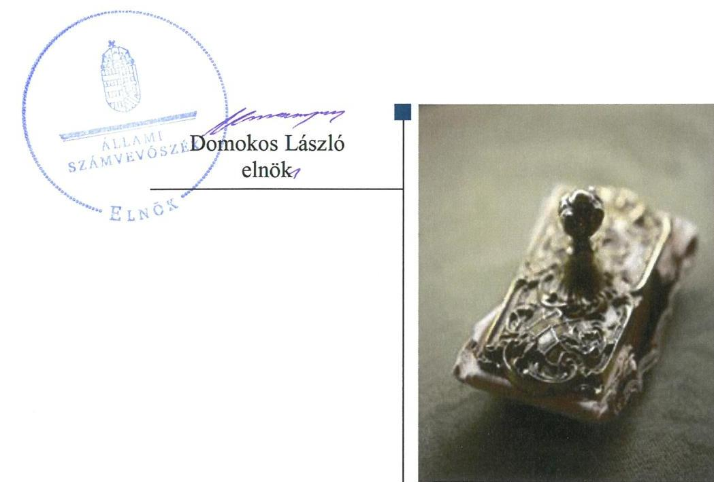
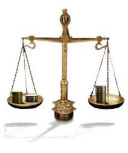

# Jelentés 

## Az állami tulajdonú gazdasági társaságok ellenőrzése

ÉMI Építésügyi Minőségellenőrző Innovációs Nonprofit Kft.
2019.

19011
www.asz.hu

---

# Jelentés 

## Az állami tulajdonú gazdasági társaságok ellenőrzése

ÉMI Építésügyi Minőségellenőrző Innovációs Nonprofit Kft.
2019. 01. hó 04. nap

---

# AZ ELLENŐRZÉST FELÜGYELTE:

- **KLINGA LÁSZLÓ** felügyeleti vezető
- **AZ ELLENŐRZÉST VEZETTE ÉS A VÉGREHAJTÁSÁÉRT FELELŐS:**
  - **MODER BEATRIX** ellenőrzésvezető
  - **KORSÓSNÉ VIGH ANDREA** ellenőrzésvezető
- **A PROGRAM ÖSSZEÁLLÍTÁSÁÉRT FELELŐS:**
  - **TÓTPÁL SZABOLCS** osztályvezető

**IKTATÓSZÁM:** EL-0419-032/2018

**TÉMASZÁM:** 2469

**Jelentéseink az Országgyűlés számítógépes hálózatán és az Interneten a www.asz.hu címen is olvashatóak.**

---

# TARTALOMJEGYZÉK 

■ ÖSSZEGZÉS ..... 5
■ AZ ELLENŐRZÉS CÉLJA ..... 6
■ AZ ELLENŐRZÉS TERÜLETE ..... 7
■ AZ ELLENŐRZÉS HÁTTERE, INDOKOLTSÁGA ..... 8
■ A JELENTÉS LÉNYEGES KÉRDÉSKÖREI ..... 9
■ AZ ELLENŐRZÉS HATÓKÖRE ÉS MÓDSZEREI ..... 10
■ MEGÁLLAPÍTÁSOK ..... 12
■ JAVASLATOK ..... 15
■ MELLÉKLETEK ..... 17
I. sz. melléklet: Értelmező szótár ..... 17
■ FÜGGELÉK: ÉSZREVÉTELEK ..... 19
■ RÖVIDÍTÉSEK JEGYZÉKE ..... 21

---

.

---

# ÖSSZEGZÉS 

Az ÉMI Építésügyi Minőségellenőrző Innovációs Nonprofit Kft. feletti tulajdonosi jogokat a Nemzeti Fejlesztési Minisztérium és a Miniszterelnökség szabályszerűen alakította ki és gyakorolta. A Társaság gazdálkodása szabályozott volt. A bevételek és ráfordítások elszámolása, a vagyongazdálkodási tevékenysége a 2013. évben szabályszerű volt, a 2016. évben nem volt szabályszerű, az elszámoltathatóságot nem biztosította.

## Az ellenőrzés társadalmi indokoltsága

Az állami tulajdonú gazdálkodó szervezetek a nemzeti vagyon részét képezik, ezért ellenőrzésük kiemelten fontos a nemzeti vagyon megőrzése, megóvása érdekében. Az állami vagyonnal való gazdálkodás alapvető célja az állami vagyon átlátható, rendeltetésszerű és felelős felhasználásának biztosítása.

Az Állami Számvevőszék stratégiájában megfogalmazta, hogy az államháztartáson kívülre nyújtott költségvetési támogatások és ingyenes vagyonjuttatások, valamint az államháztartáson kívül működő feladatellátó rendszerek ellenőrzéseivel hozzájárul ahhoz, hogy a közpénzeket az államháztartáson kívül működő szervezetek is átlátható, rendezett módon használják fel.

Minden közpénzt, közvagyont használó szervezettel szemben társadalmi igény, hogy tevékenységükről elszámoljanak. Az Állami Számvevőszék céljaival és a társadalmi igénnyel összhangban, a gazdasági társaságok kiemelt fontosságú szerepe miatt került sor az ÉMI Építésügyi Minőségellenőrző Innovációs Nonprofit Kft. ellenőrzésére.

## Főbb megállapítások, javaslatok

A Nemzeti Fejlesztési Minisztérium és a Miniszterelnökség tulajdonosi joggyakorlása az ÉMI Építésügyi Minőségellenőrző Innovációs Nonprofit Kft. felett szabályszerű volt.

A Társaság gazdálkodása szabályozott volt, a számviteli szabályzatok a 2013. és 2016. évben a szabályszerű gazdálkodás és könyvvezetés feltételeit biztosították.

A bevételek, valamint az anyagjellegű és egyéb ráfordítások elszámolása a 2013. évben szabályszerű volt, azonban a 2016. évben nem volt szabályszerű, mert az elszámolásokat a könyvvezetést közvetlenül megalapozó bizonylatok nem támasztották alá. A személyi jellegű ráfordítások elszámolása szabályszerű volt.

A Társaság a 2013-2015. évi éves számviteli beszámolók mérlegében kimutatott eszközök és források állományát szabályszerű leltárral alátámasztotta. A 2016. évi vagyongazdálkodás nem volt szabályszerű, a beszámoló mérlegét szabályszerű leltár nem támasztotta alá, mivel a tárgyi eszközök mennyiségi felvételezését három évenként nem végezték el, továbbá az értékcsökkenés elszámolása nem felelt meg a jogszabályi előírásoknak.

A Társaság a közzétételi kötelezettségét szabályozta, a közérdekű és a közérdekből nyilvános adatainak közzétételével a gazdálkodás nyilvánosságát biztosította.

A megállapítások alapján az Állami Számvevőszék az ÉMI Építésügyi Minőségellenőrző Innovációs Nonprofit Kft. ügyvezetőjének három javaslatot fogalmazott meg. A javaslatok a bevételek, valamint az anyagjellegű és egyéb ráfordítások számviteli elszámolásának jogszabályban előírtaknak megfelelő bizonylattal történő alátámasztására, az értékcsökkenés jogszabályi előírásnak megfelelő elszámolására, továbbá a mennyiségi felvétellel történő leltározás jogszabályban előírt gyakorisággal történő elvégzésére irányultak. A javaslatokat megalapozó megállapításokra az érintettnek 30 napon belül intézkedési tervet kell készíteni.

---

# AZ ELLENŐRZÉS CÉLJA 

AZ ELLENŐRZÉS CÉLJA annak értékelése, hogy a tulajdonosi jogok gyakorlása szabályszerű volt-e. A gazdálkodó szervezet szabályozottsága, gazdálkodása és vagyongazdálkodási tevékenysége megfelelt-e a jogszabályi és a tulajdonosi előírásoknak; biztosítva volt-e a közfeladatok átláthatósága és elszámoltathatósága érdekében a közszolgáltatás díjának megalapozottsága szabályszerű önköltségszámítással. Értékeltük továbbá, hogy a vagyonváltozást eredményező döntések esetében a tulajdonosi jogok gyakorlója és a gazdálkodó szervezet szabályszerűen jártak-e el.

---

# AZ ELLENŐRZÉS TERÜLETE 

## ÉMI Építésügyi Minőségellenőrző Innovációs Nonprofit Kft. és a tulajdonosi jogokat gyakorló Nemzeti Fejlesztési Minisztérium, Miniszterelnökség

ÉPÍTÉSÜGYI MINŐSÉGELLENŐRZŐ INNOVÁCIÓS NONPROFIT KFT.

1. ábra

A foglalkoztatottak átlagos állományi létszáma (fő)
227. 204. 199. 180.
2013. 2014. 2015. 2016.

Forrás: A Társaság 2013-2016. évi kiegészítő mellékletei

A Társaságot ${ }^{1}$ a Magyar Állam kizárólagos tulajdonosként 2009. február 2-án - az Építésügyi Minőségellenőrző Innovációs Közhasznú Társaság jogutódjaként - alapította. A jegyzett tőke összege - az alapítás óta változatlanul - 400,0 M Ft volt.

Az alapítót megillető tulajdonosi jogokat a 77/2012. (XII. 22.) NFM rendelet ${ }^{2}$ alapján 2014. október 1-jéig az NFM ${ }^{3}$, 2014. október 2-től a 40/2014. (XI. 1.) NFM rendelet ${ }^{4}$ alapján a Miniszterelnökség gyakorolta.

A Társaság közhasznú jogállású, főtevékenysége az ellenőrzött időszakban egyéb természettudományi, műszaki kutatás, fejlesztés volt. Vizsgálattal, ellenőrzéssel és tanúsítással közreműködött az építési termékek megfelelőségi igazolásában, szakértői és tanácsadói tevékenységével támogatta az építési szakterület résztvevőit. Vizsgálatokkal, kísérletek elvégzésével és tanulmányok készítésével segítette az építőipari vállalkozásokat az építőipari termék- vagy technológia fejlesztésében, közreműködött a szakmai szabályozások és hatósági intézkedések előkészítésében. Tevékenységi körében biztonság-technikai és nukleáris felülvizsgálati, ellenőrzési feladatokat is ellátott.

A Társaság - a 2013-2016. évi éves beszámolókban kimutatott adatok szerint - a 2013. évben 4,7 Mrd Ft nagyságrendű vagyonnal gazdálkodott, amely a 2016. év végére 7,5 Mrd Ft-ra növekedett. Az értékesítés nettó árbevétele az ellenőrzött időszakban 1,2-3,2 Mrd Ft közötti, az adózott eredmény a 2014. év kivételével pozitív volt.

A Társaság az ellenőrzött időszakban 37,9\%-os, 12,8 M Ft tartós részesedéssel rendelkezett az ÉMI-TÜV SÜD Kft. ${ }^{5}$-ben.

A Társaság ügyvezetőjének személye az ellenőrzött években egy alkalommal 2014. december 2-től változott.

A foglalkoztatottak átlagos állományi létszámát az 1. ábra mutatja be.
A Társaság vagyonkezelésbe vett állami vagyonnal nem rendelkezett, feladatait saját eszközeivel látta el. A Társaság az NGM közlemények ${ }^{6}$ alapján az ellenőrzött időszakban nem tartozott a kormányzati szektorba sorolt egyéb szervezetek körébe.

---

# AZ ELLENŐRZÉS HÁTTERE, INDOKOLTSÁGA 

AZ ÁLLAMI TULAJDONÚ GAZDÁLKODÓ SZERVEZETEK ellenőrzése kiemelten fontos a nemzeti vagyon megőrzése, megóvása érdekében. Gazdálkodásuk jellemzően a közérdeklődés és a média figyelmének középpontjában áll, amihez hozzájárul a gazdálkodásuk körébe tartozó - közvetlen vagy közvetett állami tulajdonú, tehát végső soron a nemzeti vagyon részét képező - vagyon nagysága, illetve az általuk ellátott közszolgáltatások/közfeladatok minősége és hatékonysága. A közszolgáltatási árképzés megalapozottsága és a rendszeres elszámoltatás feltételeinek kialakítása az ellenőrzés során nagy hangsúlyt kap. A közszolgáltatás árában és annak támogatásában meg kell jelennie az önköltségszámítás szempontjainak, amely biztosítja a működés fenntarthatóságát (eszközpótlást) is.

Az ellenőrzés rámutathat az állami tulajdonú gazdálkodó szervezetek gazdálkodási tevékenységével kapcsolatos jó gyakorlatokra és szabálytalanságokra. Felhívhatja a figyelmet a jogszabályi követelmények teljesítéséhez szükséges feltételek hiányosságaira, hozzájárulhat az államháztartáson kívüli, de (közvetlenül vagy közvetve) állami vagyont használó gazdálkodó szervezetek tevékenységének átláthatóságához. Ellenőrzésünk eredményeképpen javaslatainkkal, megállapításainkkal hozzájárulhatunk a nemzeti vagyonnal való gazdálkodás átláthatóságának, elszámoltathatóságának javításához.

---

# A JELENTÉS LÉNYEGES KÉRDÉSKÖREI 

1. A tulajdonosi jogok gyakorlása szabályszerű volt-e?
2. A Társaság működésének szabályozottsága, gazdálkodása és vagyongazdálkodása megfelelt-e az előírásoknak?

---

# AZ ELLENŐRZÉS HATÓKÖRE ÉS MÓDSZEREI 

## Az ellenőrzés típusa

Megfelelőségi ellenőrzés.

## Az ellenőrzött időszak

Az ellenőrzött időszak a 2013-2016. évek, a 2016. évi beszámoló jóváhagyásáig tartó időszak.

## Az ellenőrzés tárgya

Az ÉMI Építésügyi Minőségellenőrző Innovációs Nonprofit Kft. gazdálkodása, kiemelten vagyongazdálkodási tevékenysége, valamint a Nemzeti Fejlesztési Minisztérium és a Miniszterelnökség ÉMI Építésügyi Minőségellenőrző Innovációs Nonprofit Kft. feletti tulajdonosi joggyakorlása.

## Az ellenőrzött szervezet

- ÉMI Építésügyi Minőségellenőrző Innovációs Nonprofit Kft.
- A Nemzeti Fejlesztési Minisztérium és a Miniszterelnökség, mint a Társaság feletti tulajdonosi joggyakorló.

## Az ellenőrzés jogalapja

Az ellenőrzés jogalapját az ÁSZ tv. 1. § (3) bekezdése és 5. § (3)-(5) bekezdése képezi.

## Az ellenőrzés módszerei

Az ellenőrzést a nemzetközi standardokat irányadónak tekintve az ellenőrzési program ellenőrzési kérdései, az ellenőrzött időszakban hatályos jogszabályok, az ellenőrzés szakmai szabályok és módszertanok figyelembe vételével végeztük.

Az ellenőrzés ideje alatt az ellenőrzött szervezettel történő kapcsolattartást az ÁSZ ${ }^{7}$ Szervezeti és Működési Szabályzatának vonatkozó előírásai alapján biztosítottuk.

Az ellenőrzési kérdések megválaszolásához szükséges bizonyítékok megszerzése a következő ellenőrzési eljárások alkalmazásával történt: megfigyelés, kérdésfeltevés (információkérés), összehasonlítás, valamint

---

elemző eljárás. Az ellenőrzési bizonyítékként felhasználható adatforrások közé tartoznak egyrészt az ellenőrzési programban felsorolt adatforrások, másrészt adatforrás lehet minden - az ellenőrzés során - feltárt, az ellenőrzés szempontjából információkat tartalmazó dokumentum.

Az ellenőrzést a kérdésekre adott válaszok kiértékelésével, valamint a megjelölt adatforrások, a csatolt tanúsítványok felhasználásával, továbbá az adott időszakban hatályos jogszabályok figyelembe vételével folytattuk le. Amennyiben egy alapvető jelentőségű dokumentum hiánya alapján valamely lényeges kérdéskörre vonatkozóan az ÁSZ megállapítása kellően megalapozott lett, az adott kérdéskör, és azzal szoros logikai kapcsolatban lévő - ráépülő - kérdéskörök vonatkozásában további részletes ellenőrzési tevékenység nem került végrehajtásra.

A teljes ellenőrzött időszakra vonatkozóan került ellenőrzésre a gazdasági társaság tervezési, beszámolási, közzétételi, adatszolgáltatási kötelezettségének, valamint belső ellenőrzési tevékenységének szabályszerűsége. A 2013. és 2016. évekre vonatkozóan a gazdasági társaság működésének szabályozottságát, a számviteli elszámolásainak, illetve vagyongazdálkodásának szabályszerűségét is ellenőriztük.

A bevételek és ráfordítások elszámolását, valamint a vagyonnyilvántartás szabályszerűségét mintavétellel ellenőriztük. A mintavételezés az értékesítés nettó árbevétele, az egyéb és rendkívüli bevételek, a pénzügyi műveletek bevételei, illetve az anyagjellegű ráfordítások, az egyéb és rendkívüli ráfordítások, a pénzügyi műveletek ráfordításai, valamint a tárgyi eszközök növekedési tételei esetén azokra a legnagyobb értékű tételekre - a lényeges sokaságra - terjedt ki, amelyek összértéke elérte a teljes sokaság összértékének 50\%-át. Amennyiben valamely lényeges sokaság elemszáma kisebb volt, mint az előírt mintaelemszám, a lényeges sokaságot tételesen ellenőriztük. A személyi jellegű ráfordítások esetében a mintavétel a teljes sokaságból történt.

A mintavétellel ellenőrzött területek esetében minden egyes tétel vonatkozásában a szabályszerűségre vonatkozó kérdéseket tettünk fel, amelyek eredménye összesítésre került. „Szabályszerűnek" értékeltünk egy ellenőrzött területet, amennyiben 95\%-os bizonyossággal az ellenőrzött sokaságban az átlagos hibaarány legfeljebb 10\%, "nem szabályszerűnek", amennyiben 10\%-nál magasabb arányt képviselt. Abban az esetben, ha az ellenőrzött sokaság tekintetében a 10\%-os hibaarányhoz való viszony megítélésének megbízhatósága nem érte el a 95\%-ot, annak elérése érdekében értékelésünket további szempontokkal egészítettük ki, és figyelembe vettük a feltárt hibák értékét. A mintavételi eredmények alapján megfogalmazott megállapítások csak a lényeges sokaságra vonatkoznak.

---

# 1. A tulajdonosi jogok gyakorlása szabályszerű volt-e? 

Összegző megállapítás

Az NFM és a Miniszterelnökség tulajdonosi joggyakorlása szabályszerű volt.

A TULAJDONOSI JOGGYAKORLÁS KERETEIT a 2013. évben az NFM az Alapító okirat ${ }_{1-2}$-ben ${ }^{8}$ és az NFM SZMSZ-ben ${ }^{9}$, a 2016. évben a Miniszterelnökség az Alapító okirat ${ }_{3-6}$-ban ${ }^{10}$ és az ME SZMSZ-ben ${ }^{11}$ - a Gt. ${ }^{12}$ illetve a Ptk. ${ }^{13}$ előírásaival összhangban - alakította ki.

Az Alapító okirat ${ }_{1-6}$-ban rögzítették a tulajdonosi joggyakorló ${ }_{1-2}{ }^{14}$ kizárólagos hatáskörébe tartozó ügyeket, az FB${ }^{15}$ és a könyvvizsgáló feladatait,
 az ügyvezető feladat- és hatáskörét, az összeférhetetlenségi szabályokat, valamint a vagyonváltozással kapcsolatos döntési jogköröket, továbbá meghatározták a monitoring tevékenységet biztosító tájékoztatási kötelezettségeket.

A TULAJDONOSI JOGGYAKORLÁS a 2013. és 2016. évben szabályszerű volt. A Taktv. ${ }^{16}$ előírásának megfelelően az NFM öt tagból, a Miniszterelnökség három tagból álló FB-t működtetett, valamint a Gt. illetve a Ptk. előírásával összhangban választották meg a könyvvizsgálót.

A Társaság üzleti terveit, és az értékhatárt elérő szerződéskötéseket az FB véleményezését követően a tulajdonosi joggyakorló ${ }_{1-2}$ jóváhagyta, valamint a Gt. és a Ptk. előírásainak megfelelően, az FB és a könyvvizsgáló írásbeli jelentésének birtokában fogadta el az éves számviteli beszámolókat.

A tulajdonosi joggyakorló ${ }_{1-2}$ a 2013. és 2016. évre a Taktv. előírásainak megfelelően megalkotta a javadalmazási szabályzat ${ }_{1-2}$ - $t^{17}$.

## 2. A Társaság működésének szabályozottsága, gazdálkodása és vagyongazdálkodása megfelelt-e az előírásoknak?

Összegző megállapítás

A Társaság működése a 2013. és 2016. években szabályozott volt, gazdálkodása és a vagyongazdálkodási tevékenysége 2013-ban szabályszerű volt, 2016-ban nem volt szabályszerű.
2.1. számú megállapítás

A Társaság működése a 2013. és 2016. években szabályozott volt.

A GAZDÁLKODÁS SZABÁLYOZÁSA 2013. és 2016. évben biztosította a szabályszerű könyvvezetés feltételeit. A Társaság a Számv. tv. előírásainak megfelelően elkészítette az eszközök és források értékelési szabályait is tartalmazó Számviteli politika ${ }_{1-2}$ - $t^{18}$, Leltározási szabályzat ${ }_{1-2}$-t ${ }^{19}$, Selejtezési szabályzatot ${ }^{20}$, Pénzkezelési szabályzat ${ }_{1-3}$-t ${ }^{21}$, Önköltségszámítási szabályzat ${ }_{1-3}$-t ${ }^{22}$ valamint a Számlarendet ${ }^{23}$.

---

A társasági SZMSZ ${ }_{1-3}{ }^{24}$ az Alapító okirat ${ }_{1-6}$ előírásaival összhangban biztosította a Társaság szabályozott működésének kereteit, meghatározta a Társaság szervezeti felépítését, a szervezeti egységek feladat- és hatáskörét. A Társaság az Utalványozási szabályzat ${ }_{1-9}$-ben ${ }^{25}$ szabályozta a kötelezettségvállalók, szakmai teljesítésigazolók, érvényesítők és utalványozók pénzgazdálkodásra vonatkozó jogköreit.
2.2. számú megállapítás

A Társaság vagyongazdálkodása, bevételeinek és ráfordításainak az elszámolása a 2013. évben szabályszerű volt, a 2016. évben - a személyi jellegű ráfordítások kivételével - nem volt szabályszerű.

A BEVÉTELEK, AZ ANYAGJELLEGŰ ÉS EGYÉB RÁFORDÍTÁSOK számviteli elszámolása
$\longrightarrow$ a 2013. évben szabályszerű volt,
$\longrightarrow$ a 2016. évben nem volt szabályszerű, mert a Társaság a könyvviteli elszámolást alátámasztó számviteli bizonylatokkal - számla, szerződés, megállapodás - a Számv. tv. 165. § (1)-(2) bekezdéseiben előírtak ellenére nem rendelkezett.

A SZEMÉLYI JELLEGŰ RÁFORDÍTÁSOK 2013. és 2016. évi elszámolása szabályszerű volt.

## AZ ÉRTÉKCSÖKKENÉS ELSZÁMOLÁSA

$\longrightarrow$ a 2013. évben szabályszerű volt,
$\longrightarrow$ a 2016. évben nem felelt meg a jogszabályi előírásoknak, mert a 2016. decemberében vásárolt, kivett ipartelep megnevezésű beépítetlen ingatlanok (földterületek) után terv szerinti értékcsökkenést számoltak a Számv. tv. 52. § (5) bekezdésének tiltó előírása ellenére.

A VAGYONGAZDÁLKODÁS KÖVETELMÉNYEIT, a vagyon értékének megőrzését, gyarapítását szolgáló vagyongazdálkodás feltételeit kialakították. A feladat- és hatásköröket, felelősségi viszonyokat az Alapító Okirat ${ }_{1-6}$ előírásaival összhangban a Társaság belső szabályzatai - a társasági SZMSZ ${ }_{1-3}$, az Utalványozási ${ }_{1-9}$-, Beszerzési ${ }_{1-2}{ }^{26}$-, Közbeszerzési ${ }^{27}$-, Befektetési szabályzat ${ }^{28}$ - részletesen rögzítették. A Társaság vagyonát érintő döntésekre az Alapító Okirat ${ }_{1-6}$, és a vonatkozó belső szabályzatok előírásai szerint került sor.

A BESZÁMOLÓK MÉRLEGÉT a 2013-2015. években a Számv. tv. előírásának megfelelő leltárral támasztották alá. A 2016. évi leltár azonban nem felelt meg a Számv. tv. 69. § (3) bekezdésében előírtaknak, mivel mennyiségi felvételezéssel történő leltározást a 2016. évben nem, csak a 2013. évben végeztek. A könyvvizsgáló a jogszabályi előírásnak megfelelő leltározás hiánya ellenére a 2016. évi beszámolót korlátozás nélküli hitelesítő záradékkal látta el, a mennyiségi felvételezés elmaradását nem kifogásolta.

A 2013. és 2014. évi beszámolókat a Számv. tv. 153. § (1) bekezdésében foglaltak ellenére - a kiegészítő melléklet szerves részét képező mellékletei nélkül - nem a könyvvizsgáló által felülvizsgált teljes tartalommal tették közzé, és helyezték letétbe. A Társaság úgy tett eleget a 2016. évi beszámoló közzétételi kötelezettségének, hogy a beszámoló nem felelt meg a

---

Számv. tv. 20. § (1), valamint a 69. § (3) bekezdés előírásainak, így a gazdálkodásának, vagyongazdálkodásának az elszámoltathatóságát nem biztosította.

A Társaság az Infotv. ${ }^{29}$ és a Taktv. szerinti közzétételi kötelezettségét teljesítette, a közérdekű és közérdekből nyilvános adatai megismerhetőségét biztosította. A közzétételi kötelezettség részletes szabályait a 2014. február 19-től hatályos Közzétételi szabályzat ${ }_{1-2}{ }^{30}$ tartalmazta.

---

# JAVASLATOK 

Az ÁSZ tv. 33. § (1) bekezdésében foglaltak értelmében az ellenőrzött szervezet vezetője köteles a jelentésben foglalt megállapításokhoz kapcsolódó intézkedési tervet összeállítani és azt a jelentés kézhezvételétől számított 30 napon belül az ÁSZ részére megküldeni. Amennyiben az ellenőrzött szervezet vezetője nem küldi meg határidőben az intézkedési tervet, vagy továbbra sem elfogadható intézkedési tervet küld, az Állami Számvevőszék elnöke az ÁSZ tv. 33. § (3) bekezdése a) és b) pontjaiban foglaltakat érvényesítheti.

## ÉMI Építésügyi Minőségellenőrző Innovációs Nonprofit Kft. ügyvezetőjének

1. Intézkedjen a bevételek, valamint az anyagjellegű és egyéb ráfordítások számviteli elszámolásának jogszabályban előírtaknak megfelelő bizonylattal történő alátámasztásáról.
(2.2. sz. megállapítás 1. bekezdés 2. francia bekezdése alapján)
2. Intézkedjen az értékcsökkenés jogszabályi előírásoknak megfelelő elszámolásáról.
(2.2. sz. megállapítás 3. bekezdés 2. francia bekezdése alapján)
3. Intézkedjen a mennyiségi felvétellel történő leltározás jogszabályi előírás szerinti gyakorisággal történő elvégzéséről.
(2.2. sz. megállapítás 5. bekezdés 2. mondata alapján)

---

.

---

# MELLÉKLETEK 

- I. SZ. MELLÉKLET: ÉRTELMEZŐ SZÓTÁR
állami vagyon
gazdasági társaság
nemzeti vagyon
nonprofit gazdasági társaság
a) Az állam tulajdonában lévő dolog, valamint a dolog módjára hasznosítható természeti erő,
b) az a) pont hatálya alá nem tartozó mindazon vagyon, amely vonatkozásában törvény az állam kizárólagos tulajdonjogát nevesíti,
c) az állam tulajdonában lévő tagsági jogviszonyt megtestesítő értékpapír, illetve az államot megillető egyéb társasági részesedés,
d) az államot megillető olyan immateriális, vagyoni értékkel rendelkező jogosultság, amelyet jogszabály vagyoni értékű jogként nevesít.
Forrás: Vtv. 1. § (2) bekezdése
2012. november 10-től az állami vagyon fogalma kiegészül a következő ponttal:
e) az állam tulajdonában lévő pénzügyi eszközök
Forrás: Vtv. 1. § (2) bekezdése
A Ptk. 3:88. § (1) bekezdése szerint „a gazdasági társaságok üzletszerű közös gazdasági tevékenység folytatására, a tagok vagyoni hozzájárulásával létrehozott, jogi személyiséggel rendelkező vállalkozások, amelyekben a tagok a nyereségből közösen részesednek, és a veszteséget közösen viselik".
a) az állam vagy a helyi önkormányzat kizárólagos tulajdonában álló dolgok,
b) az a) pont hatálya alá nem tartozó, állam vagy a helyi önkormányzat tulajdonában lévő dolog,
c) az állam vagy a helyi önkormányzat tulajdonában lévő pénzügyi eszközök, továbbá az államot vagy a helyi önkormányzatot megillető társasági részesedések,
d) az államot vagy a helyi önkormányzatot megillető bármely vagyoni értékkel rendelkező jogosultság, amelyet jogszabály vagyoni értékű jogként nevesít,
e) Magyarország határa által körbezárt terület feletti légtér,
f) az üvegházhatású gázok kibocsátási egységeinek kereskedelméről szóló törvény szerint kibocsátási egység és légiközlekedési kibocsátási egység, valamint az ENSZ Éghajlatváltozási Keretegyezménye és annak Kiotói Jegyzőkönyve végrehajtási keretrendszeréről szóló törvény szerinti kiotói egység,
g) állami vagy helyi önkormányzati fenntartású közgyűjtemény (muzeális intézmény, levéltár, közgyűjteményként működő kép- és hangarchívum, valamint könyvtár) saját gyűjteményében nyilvántartott kulturális javak körébe tartozó dolog, kivéve, ha az állami vagy önkormányzati tulajdon jogszerű létrejötte kétséget kizáró módon nem bizonyítható és a dologra nézve más a tulajdonjogát bizonyítja vagy a kulturális javakra vonatkozó jogszabályokban meghatározott eljárás keretében valószínűsíti (g. pont módosult 2013. december 7-től),
h) a régészeti lelet,
i) a nemzeti adatvagyon körébe tartozó állami nyilvántartások fokozottabb védelméről szóló törvény szerinti nemzeti adatvagyon.
Forrás: Nvtv. ${ }^{31} 1 . \S(2)$
Civil tv. 9/F. § (2) bekezdése szerint „az a gazdasági társaság minősül nonprofit gazdasági társaságnak és cégnevében az a gazdasági társaság tüntetheti fel a nonprofit jelleget, amelynek létesítő okirata tartalmazza, hogy a gazdasági társaság tevékenységéből származó nyereség a tagok között nem osztható fel, hanem az a gazdasági társaság vagyonát gya-rapítja." (hatályos 2014. március 15-től)

---

tulajdonosi jogok gyakor- 1. lója

### 2013. június 27-ig:

Az állami vagyon felett a Magyar Államot megillető tulajdonosi jogok és kötelezettségek összességét - ha törvény eltérően nem rendelkezik - az állami vagyon felügyeletéért felelős miniszter (a továbbiakban: miniszter) gyakorolja, aki e feladatát a Magyar Nemzeti Vagyonkezelő Zártkörűen Működő Részvénytársaság (a továbbiakban: MNV Zrt.), a Magyar Fejlesztési Bank, illetve a tulajdonosi joggyakorló szervezet útján látja el. A miniszter miniszteri rendeletben, a törvényben meghatározott állami vagyoni kör tekintetében, meghatározott időtartamra, a joggyakorlás egyes szabályainak meghatározásával - az őt megillető tulajdonosi jogok és kötelezettségek összességének, illetve azok meghatározott részének gyakorlóját az Áht. szerinti központi költségvetési szervek, ezek intézménye, továbbá a 100%-ban állami tulajdonban álló gazdasági társaságok közül kijelölheti.
Forrás: Vtv. 3. § (1) és (2)

### 2013. június 28-ától:

A rábízott állami vagyon felett az államot megillető tulajdonosi jogok és kötelezettségek összességét tulajdonosi joggyakorlóként:
a) ha törvény vagy miniszteri rendelet eltérően nem rendelkezik, a Magyar Nemzeti Vagyonkezelő Zártkörűen Működő Részvénytársaság (a továbbiakban: MNV Zrt.),
b) törvényben kijelölt személy vagy
c) az állami vagyon felügyeletéért felelős miniszter (a továbbiakban: miniszter) által rendeletben kijelölt személy gyakorolja.
[...] A miniszter e törvény felhatalmazása alapján - a meghatározott célok hatékonyabb elérése érdekében, miniszteri rendeletben, az ott meghatározott állami vagyoni kör tekintetében, meghatározott időtartamra - e törvény keretei között, a joggyakorlás egyes szabályainak meghatározásával - az államot megillető tulajdonosi jogok és kötelezettségek összességének, illetve azok meghatározott részének gyakorlóját az Áht. szerinti központi költségvetési szervek, ezek intézménye, továbbá a 100%-ban állami tulajdonban álló gazdasági társaságok közül kijelölheti.
Forrás: Vtv. 3. § (1) és (2)
2.

Aki a nemzeti vagyon felett az államot vagy a helyi önkormányzatot megillető tulajdonosi jogok és kötelezettségek összességének gyakorlására jogosult
Forrás: Nvtv. 3. § (1) 17. pontja

---

# FÜGGELÉK: ÉSZREVÉTELEK 

A jelentéstervezetet a Számvevőszék 15 napos észrevételezésre megküldte az ellenőrzött szervezetek vezetőinek az ÁSZ tv. 29. §* (1) bekezdése előírásának megfelelően.

A Miniszterelnökséget vezető miniszter és az innovációs és technológiai fejlesztésért felelős miniszter, valamint az ÉMI Építésügyi Minőségellenőrző Innovációs Nonprofit Kft. ügyvezetője az ÁSZ tv. 29. § (2) bekezdésében foglalt észrevételezési jogával nem élt, a jelentéstervezetre észrevételt nem tett.

[^0]
[^0]:    * 29. § (1) Az Állami Számvevőszék az ellenőrzési megállapításait megküldi az ellenőrzött szervezet vezetőjének vagy az általa megbízott személynek, és annak, akinek személyes felelősségét állapította meg.
    (2) Az ellenőrzött szervezet vezetője és a felelősként megjelölt személy az ellenőrzés megállapításaira tizenöt napon belül írásban észrevételt tehet.
    (3) Az Állami Számvevőszék az észrevételre a beérkezésétől számított harminc napon belül írásban válaszol. A figyelembe nem vett észrevételeket köteles a jelentésben feltüntetni, és megindokolni, hogy azokat miért nem fogadta el.

---

.

---

# RÖVIDÍTÉSEK JEGYZÉKE 

${ }^{1}$ Társaság
${ }^{2}$ 77/2012. (XII.22.) NFM rendelet
${ }^{3}$ NFM
${ }^{4}$ 40/2014. (X.1.) NFM rendelet
${ }^{5}$ ÉMI-TÜV SÜD Kft.
${ }^{6}$ NGM közlemények
${ }^{7}$ ÁSZ
${ }^{8}$ Alapító okirat ${ }_{1-2}$
${
 }^{9}$ NFM SZMSZ
${ }^{10}$ Alapító okirat ${ }_{3-6}$
${ }^{11}$ ME SZMSZ
${ }^{12}$ Gt.
${ }^{13}$ Ptk.
${ }^{14}$ tulajdonosi joggyakorló ${ }_{1-2}$
${ }^{15}$ FB

ÉMI Építésügyi Minőségellenőrző Innovációs Nonprofit Korlátolt Felelősségű Társaság
77/2012. (XII.22.) NFM rendelet egyes gazdasági társaságok felett az államot megillető tulajdonosi jogok és kötelezettségek összességét gyakorló szervezet kijelöléséről
Nemzeti fejlesztési Minisztérium
40/2014. (X.1.) NFM rendelet az ÉMI Építésügyi Minőségellenőrző Innovációs Nonprofit Korlátolt Felelősségű Társaság felett az államot megillető tulajdonosi jogok és kötelezettségek összességét gyakorló szervezet kijelöléséről
ÉMI-TÜV SÜD Minőségügyi és Biztonságtechnikai Korlátolt Felelősségű Társaság
Nemzetgazdasági Minisztérium közleményei a kormányzati szektorba sorolt egyéb szervezetekről (hivatalos értesítő 2012/9. hatályos 2012. február 16-ától; hivatalos értesítő 2013/32. hatályos 2013. június 28-ától; hivatalos értesítő 2013/60. hatályos 2013. december 16-ától, valamint hivatalos értesítő 2015/66. hatályos 2015. december 30-ától)
Állami Számvevőszék
Alapító okirat: ÉMI Építésügyi Minőségellenőrző Innovációs NKft. 1/2011.
(II. 01.) alapítói határozattal elfogadott Alapító okirata (hatályos 2011. III. 2-től 2013. IX. 11-ig)

Alapító okirat: ÉMI Építésügyi Minőségellenőrző Innovációs NKft. 16/2013.
(IX. 12.) alapítói határozattal elfogadott Alapító okirata (hatályos 2013. IX. 12-től 2014. XII. 1-jéig)
37/2013. (X. 04.) NFM utasítással módosított 24/2013. (VII.12.) NFM utasítás a Nemzeti fejlesztési Minisztérium Szervezeti és Működési Szabályzatáról (hatályos 2013. július 13-tól)
Alapító okirat: ÉMI Építésügyi Minőségellenőrző Innovációs NKft. 1/2014.
(XII. 02.) alapítói határozattal elfogadott Alapító okirata (hatályos 2014. XII. 2-től 2015. V. 28-ig)

Alapító okirat: ÉMI Építésügyi Minőségellenőrző Innovációs NKft. 4/2015.
(V. 29.) alapítói határozattal elfogadott Alapító okirata (hatályos 2015. V. 29-től 2016. V. 16-ig)

Alapító okirat: ÉMI Építésügyi Minőségellenőrző Innovációs NKft. 7/2016.
(V. 17.) alapítói határozattal elfogadott Alapító okirata (hatályos 2016. V. 17-től 2016. XI. 9-ig)

Alapító okirat: ÉMI Építésügyi Minőségellenőrző Innovációs NKft. 14/2016.
(XI. 10.) alapítói határozattal elfogadott Alapító okirata (hatályos 2016. XI. 10-től)
26/2015. (XI. 24.); 3/2016. (II. 15.); 10/2016. (V. 13.); 16/2016. (VI. 08.); 19/2016.
(VII.21.); 21/2016. (VII.21.); 22/2016. (VII.29.); 36/2016. (XII. 15) MvM utasításokkal módosított, a Miniszterelnökség Szervezeti és Működési Szabályzatáról szóló 1/2014. (VII. 23.) MvM utasítás (hatályos 2014. július 24-től) 2006. évi IV. törvény a gazdasági társaságokról (hatályos 2014. március 14-ig) 2013. évi V. törvény a Polgári Törvénykönyvről (hatályos 2014. március 15-étől) tulajdonosi joggyakorló: Nemzeti Fejlesztési Minisztérium tulajdonosi joggyakorló: Miniszterelnökség
ÉMI Építésügyi Minőségellenőrző Innovációs Nkft. felügyelő bizottsága

---

${ }^{16}$ Taktv.
${ }^{17}$ Javadalmazási szabályzat ${ }_{1-2}$
${ }^{18}$ Számviteli politika ${ }_{1-2}$
${ }^{19}$ leltározási szabályzat ${ }_{1-2}$
${ }^{20}$ Selejtezési szabályzat
${ }^{21}$ Pénzkezelési szabályzat ${ }_{1-3}$
${ }^{22}$ Önköltségszámítási szabályzat ${ }_{1-3}$
${ }^{23}$ Számlarend
${ }^{24}$ társasági SZMSZ ${ }_{1-3}$
${ }^{25}$ Utalványozási szabályzat ${ }_{1-9}$
2009. CXXII. törvény a köztulajdonban álló gazdasági társaságok takarékosabb működéséről (hatályos 2009. október 3-tól)
Javadalmazási szabályzat1: A 3/2010. (I.29.) alapítói határozattal jóváhagyott szabályzat, a Nemzeti Fejlesztési és Gazdasági Minisztérium tulajdonosi jogkörébe tartozó, az állam többségi befolyása alatt álló gazdasági társaságok vezető állású, illetve vezetőnek minősülő munkavállalóira, vezető tisztségviselőire, felügyelő bizottsági tagjaira és könyvvizsgálóira vonatkozó javadalmazás rendszeréről.
Javadalmazási szabályzat2: A 3/2016. (03.01.) alapítói határozattal jóváhagyott, ÉMI Építésügyi Minőségellenőrző Innovációs Nonprofit Korlátolt Felelősségű Társaság. Javadalmazási szabályzata
Számviteli politika1: ÉMI Építésügyi Minőségellenőrző Innovációs NKft. Számviteli politikája (hatályos 2013. január 14-től 2013. december 31-ig)
Számviteli politika2: ÉMI Építésügyi Minőségellenőrző Innovációs NKft. Számviteli politikája (hatályos 2014. január 1-jétől 2016. december 29-ig)
Leltározási szabályzat ${ }_{1}$: ÉMI Építésügyi Minőségellenőrző Innovációs NKft. Leltározási szabályzata (hatályos 2013. szeptember 6-tól 2015. január 13-ig) Leltározási szabályzat2: ÉMI Építésügyi Minőségellenőrző Innovációs NKft. Leltározási szabályzata (hatályos 2015. január 14-től)
ÉMI Építésügyi Minőségellenőrző Innovációs NKft. Selejtezési szabályzata (hatályos 2015. január 31-től)
Pénzkezelési szabályzat1: Építésügyi Minőségellenőrző Innovációs Kht. Pénzkezelési szabályzata (hatályos: 2007. február 15-től 2013. augusztus 4-ig)
Pénzkezelési szabályzat2: ÉMI Építésügyi Minőségellenőrző Innovációs NKft. Pénzkezelési szabályzata (hatályos: 2013. augusztus 4-től 2013. augusztus 31-ig)
Pénzkezelési szabályzat3: ÉMI Építésügyi Minőségellenőrző Innovációs NKft. Pénzkezelési szabályzata (hatályos: 2013. szeptember 1-től)
Önköltségszámítási szabályzat1: ÉMI Építésügyi Minőségellenőrző Innovációs NKft. Önköltségszámítási szabályzata (hatályos: 2013. január 1-jétől 2013. december 31-ig)
Önköltségszámítási szabályzat2: ÉMI Építésügyi Minőségellenőrző Innovációs NKft. Önköltségszámítási szabályzata (hatályos: 2014. január 1-jétől 2016. december 29-ig)
Önköltségszámítási szabályzat3: ÉMI Építésügyi Minőségellenőrző Innovációs NKft. Önköltségszámítási szabályzata (hatályos: 2016. december 30-tól)
ÉMI Építésügyi Minőségellenőrző Innovációs NKft. Számlarendje (hatályos 2012. január 1-jétől)
Társasági SZMSZ1: 17/2013. (X. 03.) számú Alapítói határozattal elfogadott ÉMI Építésügyi Minőségellenőrző Innovációs Nonprofit Korlátolt Felelősségű Társaság Szervezeti és Működési Szabályzata (hatályos 2013. október 1-től 2015. május 28-ig)
Társasági SZMSZ2: 3/2015. (05. 29.) számú Alapítói határozattal elfogadott ÉMI Építésügyi Minőségellenőrző Innovációs Nonprofit Korlátolt Felelősségű Társaság Szervezeti és Működési Szabályzata (hatályos 2015. május 29-től 2016. február 29-ig)
Társasági SZMSZ3: 1/2016. (03. 01.) számú Alapítói határozattal elfogadott ÉMI Építésügyi Minőségellenőrző Innovációs Nonprofit Korlátolt Felelősségű Társaság Szervezeti és Működési Szabályzata (hatályos 2016. március 1-jétől)
Utalványozási szabályzat ${ }_{1}$: ÉMI Építésügyi Minőségellenőrző Innovációs NKft. Képviseleti és utalványozási szabályzata (hatályos 2013. február 8-tól 2013. július 30-ig)

---

26 Beszerzési szabályzat ${ }_{1-2}$
${ }^{27}$ Közbeszerzési szabályzat
${ }^{28}$ Befektetési szabályzat
${ }^{29}$ Infotv.
${ }^{30}$ Közzétételi szabályzat ${ }_{1-2}$
${ }^{31}$ Nvtv.

Utalványozási szabályzat2: ÉMI Építésügyi Minőségellenőrző Innovációs NKft. Képviseleti és utalványozási szabályzata (hatályos 2013. július 31-től 2014. február 16-ig)

Utalványozási szabályzat3: ÉMI Építésügyi Minőségellenőrző Innovációs NKft. Képviseleti és utalványozási szabályzata (hatályos 2014. február 17-től 2014. március 16-ig)

Utalványozási szabályzat4: ÉMI Építésügyi Minőségellenőrző Innovációs NKft. Képviseleti és utalványozási szabályzata (hatályos 2014. március 17-től 2014. október 5-ig)

Utalványozási szabályzat5: ÉMI Építésügyi Minőségellenőrző Innovációs NKft. Képviseleti és utalványozási szabályzata (hatályos 2014. október 6-tól 2014. november 18-ig)

Utalványozási szabályzat6: ÉMI Építésügyi Minőségellenőrző Innovációs NKft. Képviseleti és utalványozási szabályzata (hatályos 2014. november 19-től 2015. július 14-ig)

Utalványozási szabályzat7: ÉMI Építésügyi Minőségellenőrző Innovációs NKft. Képviseleti és utalványozási szabályzata (hatályos 2015. július 15-től 2016. június 19-ig)

Utalványozási szabályzat8: ÉMI Építésügyi Minőségellenőrző Innovációs NKft. Képviseleti és utalványozási szabályzata (hatályos 2016. június 20-tól 2016. július 28-ig)

Utalványozási szabályzat9: ÉMI Építésügyi Minőségellenőrző Innovációs NKft. Képviseleti és utalványozási szabályzata (hatályos 2016. június 20-tól 2016. július 28-ig)

Utalványozási szabályzat10: ÉMI Építésügyi Minőségellenőrző Innovációs NKft. Képviseleti és utalványozási szabályzata (hatályos 2016. július 29-től)
Beszerzési szabályzat1: ÉMI Építésügyi Minőségellenőrző Innovációs Nonprofit Kft. Beszerzési szabályzat (hatályos 2011.07.21-től 2015.07.31-ig)
Beszerzési szabályzat2: ÉMI Építésügyi Minőségellenőrző Innovációs Nonprofit Kft. beszerzési szabályzat (hatályos: 2015.08.01-től)
2/2016.(03.01.) Alapítói határozattal elfogadott ÉMI Építésügyi Minőségellenőrző Innovációs Nonprofit Kft. Közbeszerzési szabályzat
11/2013.(VII.22.) Alapítói határozattal elfogadott ÉMI Építésügyi Minőségellenőrző Innovációs Nonprofit Kft. Befektetési szabályzat 2011. évi CXII. törvény az információs önrendelkezési jogról és az információszabadságról (hatályos 2011. július 27-től)
Közzétételi szabályzat1: ÉMI Építésügyi Minőségellenőrző Innovációs Nonprofit Kft. Közérdekű adatok megismerésére irányuló igények intézésének, továbbá a kötelezően közzéteendő adatok nyilvánosságára hozatalának rendjéről szóló szabályzat (hatályos: 2014. február 19-től)
Közzétételi szabályzat2: ÉMI Építésügyi Minőségellenőrző Innovációs Nonprofit Kft. Közérdekű adatok megismerésére irányuló igények intézésének, továbbá a kötelezően közzéteendő adatok nyilvánosságára hozatalának rendjéről szóló szabályzat (hatályos: 2014. május 26-tól)
2011. évi CXCVI. törvény a nemzeti vagyonról (hatályos 2012. január 1-jétől)

---

# ÁLLAMI SZÁMVEVŐSZÉK 

1052 Budapest, Apáczai Csere János utca 10.
Levélcím: 1364 Budapest 4. Pf. 54
Telefon: +36 14849100 Telefax: +36 14849200
www.asz.hu
