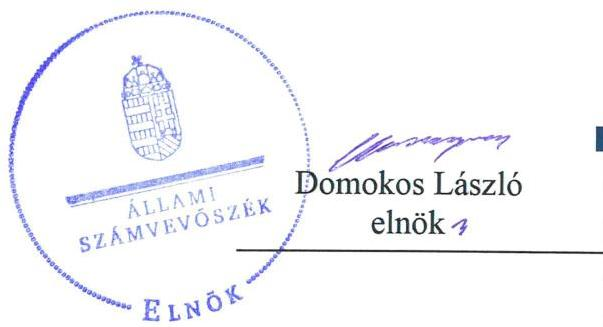
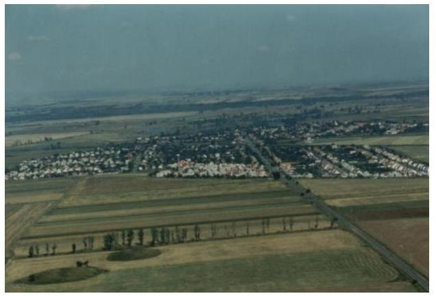

# Jelentés 

## Önkormányzatok ellenőrzése Integritás- és belső kontrollrendszer

Onga Város Önkormányzata
2019. 02. hó 05. nap

---

# AZ ELLENŐRZÉST FELÜGYELTE:

- VARGA EDIT felügyeleti vezető
- AZ ELLENŐRZÉST VEZETTE ÉS A VÉGREHAJTÁSÁÉRT FELELŐS:
  - BÁLINT KÁLMÁN KADOCSA ellenőrzésvezető
  - A PROGRAM ÖSSZEÁLLÍTÁSÁÉRT FELELŐS:
    - TÓTPÁL SZABOLCS osztályvezető

**IKTATÓSZÁM:** EL-1453-001/2019

**TÉMASZÁM:** 2485

**ELLENŐRZÉS-AZONOSÍTÓ SZÁM:** V082920

Jelentéseink az Országgyűlés számítógépes hálózatán és az Interneten a www.asz.hu címen is olvashatóak.

---

# TARTALOMJEGYZÉK 

■ ÖSSZEGZÉS ..... 5
■ AZ ELLENŐRZÉS CÉLJA ..... 6
■ AZ ELLENŐRZÉS TERÜLETE ..... 7
■ AZ ELLENŐRZÉS HÁTTERE, INDOKOLTSÁGA ..... 8
■ A JELENTÉS LÉNYEGES KÉRDÉSKÖREI ..... 9
■ AZ ELLENŐRZÉS HATÓKÖRE ÉS MÓDSZEREI ..... 10
■ MEGÁLLAPÍTÁSOK ..... 12
■ JAVASLATOK ..... 15
■ MELLÉKLETEK ..... 17
I. sz. melléklet: Értelmező szótár ..... 17
■ FÜGGELÉK: ÉSZREVÉTELEK ..... 19
■ RÖVIDÍTÉSEK JEGYZÉKE ..... 21

---

.

---

# ÖSSZEGZÉS 

Onga Város Önkormányzata belső kontrollrendszerének kialakítása és működtetése nem volt szabályszerű. Nem volt biztosítva a közpénzek szabályszerű felhasználása, valamint az átlátható működés. Az integritási kontrollokat nem építették ki, ezáltal a korrupció veszélye fennállt.

## Az ellenőrzés társadalmi indokoltsága

Az Állami Számvevőszék Alaptörvényből adódó feladata a központi költségvetés végrehajtásának, az államháztartás gazdálkodásának, az államháztartásból származó források felhasználásának, a nemzeti vagyon kezelésének ellenőrzése. Az Állami Számvevőszék általános hatáskörrel - az Állami Számvevőszékről szóló 2011. évi LXVI. törvény felhatalmazása alapján - végzi a közpénzekkel és az állami és önkormányzati vagyonnal való felelős gazdálkodás ellenőrzését, különös tekintettel arra, hogy az Önkormányzatok a jogszabályi előírások szerint működtették-e és alakították-e ki az integritás és belső kontroll rendszerüket. Az Állami Számvevőszék stratégiájában fogalmazta meg, hogy támogatja az integritás alapú, átlátható és elszámoltatható közpénzfelhasználás megteremtését.

## Főbb megállapítások, következtetések

Onga Város Önkormányzata belső kontrollrendszerének kialakítása és működtetése nem volt szabályszerű, így nem teremtette meg a szabályszerű közpénzfelhasználás feltételeit.

Onga Város Önkormányzata kontrollkörnyezetének kialakítása szabályszerű volt, mivel kialakította a jogszabályi előírások szerint a szervezeti és működési szabályzatát, rendelkezett számviteli politikával, valamint az annak keretében elkészítendő szabályzatokkal, a vagyonnal történő gazdálkodás szabályait vagyonrendeletben szabályozta.

Onga Város Önkormányzata nem működtette az integrált kockázatkezelési rendszert, az integritás elvű működést támogató kontrollok nem kerültek kiépítésre, ezáltal nem volt biztosítva az Önkormányzat tevékenységeiben rejlő kockázatok azonosítása, értékelése, kezelése, és annak nyomon követése.

A kontrolltevékenységek gyakorlása - kötelezettségvállalás hiánya miatt - nem volt szabályszerű.
Onga Város Önkormányzatánál nem alakították ki az információs és kommunikációs rendszert, továbbá nem tettek eleget a jogszabályokban előírt adatszolgáltatási kötelezettségeiknek, így az átlátható szabályszerű működést nem biztosították.

Onga Város Önkormányzata kialakította és működtette a jogszabályokban előírt kötelezettsége szerint a monitoring rendszert.

Onga Város Önkormányzatánál nem alakították ki a teljesítmény mérésére alkalmas követelményeket.

---

# AZ ELLENŐRZÉS CÉLJA 

AZ ELLENŐRZÉS CÉLJA annak megállapítása volt, hogy az önkormányzat belső kontrollrendszere biztosította-e a közpénzekkel és a nemzeti vagyonnal történő elszámoltatható, átlátható, szabályszerű, gazdaságos, hatékony és eredményes gazdálkodás feltételeit. Az ellenőrzés keretében értékeltük továbbá, hogy az önkormányzatnál kiépítették és erősítették-e a korrupciós kockázatok kezelését szolgáló integritás kontrollokat és azt, hogy megteremtették-e a teljesítményellenőrzés feltételeit.

---

# **AZ ELLENŐRZÉS TERÜLETE**

## **Onga Város Önkormányzata**

Onga Város az Észak-Magyarországi régióban, Borsod-Abaúj-Zemplén megyében fekszik. Lakossága 2016. január 1-jén a Központi Statisztikai Hivatal adatai alapján 4724 fő volt.

Az Önkormányzat^{1} Képviselő-testülete^{2} – a polgármesterrel együtt – hét tagból állt, munkáját kettő állandó bizottság (Pénzügyi Bizottság, Szociális és Egészségügyi Bizottság) segítette. Az Önkormányzat működésével kapcsolatos feladatok ellátásáról a Hivatal^{3} gondoskodott, ahol a foglalkoztatottak száma 2017. év végén 24 fő volt, ebből 17 fő köztisztviselő.

A polgármester^{4} a 2014. évi önkormányzati választások óta töltötte be tisztségét, a jegyző^{5} 1990. november 19-től látta el feladatait.

Az Önkormányzat a 2017. évi beszámolója szerinti főbb adatokat az 1. táblázat mutatja be.

1. táblázat

### **ONGA VÁROS ÖNKORMÁNYZATA 2017. ÉVI BESZÁMOLÓJA SZERINTI FŐBB ADATOK**

|  Megnevezés | Millió Ft.  |
| --- | --- |
|  Költségvetési bevétel | 1 215,9  |
|  Finanszírozási bevétel | 231,9  |
|  Költségvetési kiadás | 649,9  |
|  Finanszírozási kiadás | 291,1  |
|  Eszközvagyon értéke | 3 121,7  |
|  Tárgyi eszközök | 2 538,2  |
|  Pénzeszközök | 508,9  |
|  Követelések | 26,7  |

*Forrás: 2017. évi költségvetési beszámoló*

---

# AZ ELLENŐRZÉS HÁTTERE, INDOKOLTSÁGA 

Az ÁSZ ${ }^{6}$ az ÁSZ törvényben ${ }^{7}$ kapott felhatalmazással élve ellenőrzi az önkormányzatok gazdálkodását, működését, hogy az ellenőrzések megállapításaival támogassa az ellenőrzött önkormányzatok szabályszerű gazdálkodását, javaslataival elősegítse az Alaptörvényben ${ }^{8}$ megfogalmazott alapvetések érvényesülését a mindennapi életben az önkormányzatok szintjén. Az önkormányzati rendszerben zajló folyamatok holisztikus elemzései, a kockázatok folyamatos figyelemmel kísérésének módszerével, az így kiválasztott önkormányzatok célzott, hatékony ellenőrzéseivel az ÁSZ betölti a legfőbb gazdasági ellenőrző szerv küldetését. Az egyes ellenőrzések megállapításaival és egy időszak ellenőrzési eredményeinek elemzésével az ÁSZ ráirányíthatja a jogalkotók figyelmét az önkormányzati alrendszerben esetlegesen felmerülő pénzügyi, szabályozási feszültségekre. Az elvégzett nagyszámú ellenőrzés során az ÁSZ „jó gyakorlatokat" is azonosíthat, melyeket tanácsadó funkciója keretében szélesebb körben is megismertethet az érintettekkel, ezáltal is hozzájárulva az önkormányzati alrendszer szabályozott, átlátható, kiegyensúlyozott és fenntartható működéséhez.

A BELSŐ KONTROLLRENDSZER kialakítása és működtetése nélkül nem valósítható meg a közpénzek, a közvagyon átlátható, szabályos, gazdaságos, hatékony és eredményes felhasználása. A belső kontrollrendszer azt a célt szolgálja, hogy a költségvetési szervek működésük és gazdálkodásuk során a tevékenységeket szabályszerűen hajtsák végre, teljesítsék elszámolási kötelezettségeiket és megvédjék az erőforrásokat a veszteségektől, a károktól és a nem rendeltetésszerű használattól. A belső kontrollrendszer magában foglalja mindazon elveket, eljárásokat és belső szabályzatokat, melyek biztosítják, hogy a költségvetési szerv valamennyi tevékenysége és célja összhangban legyen a szabályszerűséggel, szabályozottsággal, valamint a gazdaságosság, hatékonyság és eredményesség követelményeivel, az eszközökkel és forrásokkal való gazdálkodásban ne kerüljön sor pazarlásra, visszaélésre, rendeltetésellenes felhasználásra. Megfelelő, pontos és naprakész információk álljanak rendelkezésre a költségvetési szerv működésével kapcsolatosan, és a belső kontrollrendszer harmonizációjára, összehangolására vonatkozó jogszabályok végrehajtásra kerüljenek. Az integritás kontrollok kiépítése, erősítése a szervezet korrupciós kockázatainak kezelését szolgálja. A teljesítménykövetelmények meghatározása és működtetése megalapozhatja az önkormányzatoknál a teljesítményellenőrzés lefolytatását.

---

# A JELENTÉS LÉNYEGES KÉRDÉSKÖREI 

1. Az Önkormányzat belső kontrollrendszerének kialakítása és működtetése szabályszerű volt-e?
2. Az Önkormányzat kiépítette és erősítette-e az integritás kontrollrendszerét?
3. Az Önkormányzatnál kialakították-e a teljesítmény mérésére alkalmas követelményeket?

---

# AZ ELLENŐRZÉS HATÓKÖRE ÉS MÓDSZEREI 

## Az ellenőrzés típusa

Megfelelőségi ellenőrzés.

## Az ellenőrzött időszak

Az ellenőrzött időszak a 2017. év, illetve az éves költségvetési beszámoló Áht. ${ }^{9}$ által megállapított jóváhagyásáig (2018. május 31-éig) tartó időszak.

## Az ellenőrzés tárgya

Az önkormányzat és a gazdálkodási feladatokat ellátó hivatala belső kontrollrendszerének kialakítása és működtetése, valamint az integritás kontrollok kiépítettsége, a teljesítményellenőrzés feltételei.

## Az ellenőrzött szervezet

Onga Város Önkormányzata

## Az ellenőrzés jogalapja

Az ellenőrzés jogszabályi alapját az ÁSZ tv. 1. § (3) bekezdés, 5. § (2) és (6) bekezdései, valamint az Áht. 61. § (2) bekezdésének előírásai képezik.

## Az ellenőrzés módszerei

Az ÁSZ az ellenőrzést az ellenőrzési program szempontjai, az ellenőrzött időszakban hatályos jogszabályok, az ellenőrzés szakmai szabályai, a jelen ellenőrzésre irányadó ÁSZ módszertanok figyelembevételével hajtotta végre. Az ellenőrzési kérdések megválaszolásához szükséges bizonyítékok megszerzése az ellenőrzött által rendelkezésre bocsátott dokumentumokra, adatokra alapozva, megfigyelés, szemle (szemrevételezés), mintavételezés, valamint elemző eljárás útján történt. Az ellenőrzési bizonyítékként felhasználható adatforrások közé tartoztak az ellenőrzési program részletes szempontjainál felsorolt adatforrások, valamint minden egyéb az ellenőrzés folyamán feltárt, az ellenőrzés szempontjából információt tartalmazó dokumentum.

---

Az ellenőrzés lefolytatásához az ellenőrzött szervezet tanúsítványok kitöltésével, valamint az ÁSZ által kért dokumentumok megküldésével szolgáltatott adatokat, amelyek valódiságát és teljes körűségét az ellenőrzött szervezet vezetője által tett teljességi és hitelességi nyilatkozat igazolta. A rendelkezésre bocsátott adatok, információk kontrollja az ellenőrzés keretében történt.

Az önkormányzat belső kontrollrendszere egyes pilléreinek kialakítására és működtetésére vonatkozó értékelés:
$\longrightarrow$ „szabályszerű", amennyiben az értékelt területen az elért „igen" válaszok százalékban kifejezett, egész számra kerekített aránya legalább $85 \%$,
$\longrightarrow$ „nem szabályszerű", ha nem éri el a $85 \%$-ot.
Az önkormányzat belső kontrollrendszerének összesített értékelése az egyes részterületek esetében kapott megfelelőségi arányok számtani átlaga alapján történt és megegyezik a pillérenként (kontrollterületenként) alkalmazott százalékos értékelésekkel, a következő eltérésekkel: a kontrollrendszer egésze esetében a „szabályszerű" értékelésnek a százalékos értéken felül további feltétele, hogy egyik kontrollterület sem kaphat „nem szabályszerű" értékelést.

A mintavétel módszere a lényeges sokaságon alapuló véletlen mintavétel. A kiadások teljesítéséhez kapcsolódó pénzgazdálkodási belső kontrollok működésének szabályszerűsége esetében az ellenőrzés azokra a legnagyobb értékű tételekre - a lényeges sokaságra - terjedt ki, melyek összértéke eléri a teljes sokaság összértékének 50\%-át. A lényeges sokaságból véletlen mintavételi eljárással kiválasztott tételek kerültek ellenőrzésre. „Szabályszerűnek" értékeltünk egy ellenőrzött területet, amennyiben 95\%os bizonyossággal az ellenőrzött sokaságban az átlagos hibaarány legfeljebb 10\%, "nem szabályszerűnek", amennyiben 10\%-nál magasabb arányt képviselt. A jelentéstervezetben a mintavételi eredmények alapján megfogalmazott megállapítások csak a lényeges sokaságra vonatkoznak.

Az ellenőrzés ideje alatt az ellenőrzött szervezettel történő kapcsolattartást az ÁSZ SZMSZ ${ }^{10}$-ének vonatkozó előírásai alapján biztosítottuk.

---

# 1. Az Önkormányzat belső kontrollrendszerének kialakítása és működtetése szabályszerű volt-e? 

Összegző megállapítás

Az önkormányzat belső kontrollrendszerének kialakítása és működtetése nem volt szabályszerű.

A KONTROLLKÖRNYEZET kialakítása szabályszerű volt. Az Önkormányzat és a Hivatal rendelkezett SZMSZ ${ }^{11}$-el, a Mötv ${ }^{12}$.-ben és az Áht.-ban előírtak szerint SZMSZ-ben határozta meg a működés szervezeti kereteit. A Hivatal az Áht.-ban előírtaknak szerint rendelkezett hatályos alapító okirattal. Az Önkormányzat a vagyonnal történő gazdálkodás rendjét vagyonrendeletben ${ }^{13}$ szabályozta.

Az integritást sértő események kezelésének rendjét a $\mathrm{Bkr}^{14}$. előírásai szerint kialakították.

Az Önkormányzat valamint a Hivatal a Számv. tv ${ }^{15}$.-ben meghatározottak szerint rendelkezett számviteli politikával, valamint az annak keretében elkészítendő szabályzatokkal, továbbá számlarenddel. Ugyanakkor az Önkormányzat Számviteli politikájában ${ }^{16}$ nem szabályozták, hogy az értékelés szempontjából mi minősül lényegesnek, nem lényegesnek, továbbá azt, hogy az alkalmazott gyakorlatot milyen okok miatt kell megváltoztatni, így nem tettek eleget a Számv. tv. 14. § (4) bekezdésében előírtaknak.

A hivatásetikai alapelveket és az etikai eljárás részletes szabályait nem a képviselőtestület, hanem a jegyző állapította meg, megsértve ezzel a Kttv ${ }^{17}$. 231. § (1) bekezdés előírását

## AZ INTEGRÁLT KOCKÁZATKEZELÉSI RENDSZERT a jegyző a Bkr. előírásainak megfelelően szabályozta. A jegyző a Bkr. 7. § (1) bekezdés előírása ellenére nem működtette az integrált kockázatkezelési rendszert, mert nem mérte fel a Bkr. 7. § (2) bekezdés előírása szerint az Önkormányzat tevékenységében rejlő és szervezeti célokkal összefüggő kockázatokat, nem határozta meg az egyes kockázatokkal kapcsolatban szükséges intézkedéseket, valamint azok teljesítésének nyomon követési módját.

## A KONTROLLTEVÉKENYSÉGEK MŰKÖDTETÉSE

nem volt szabályszerű, mert az Önkormányzat esetében a kötelezettségvállalásra vonatkozóan nem tartották be
 az Ávr. 52.§ (6) bekezdésében előírtakat, mert nem a polgármester vagy az általa írásban felhatalmazott személy vállalt kötelezettséget.

A működési felhalmozási kiadások közül két beszerzés esetében (keményfa pellet beszerzése 704660 Ft értékben, valamint beton elem gyártó gép és tartozéka beszerzése 698550 Ft értékben) a kifizetés kötelezettségvállalás hiányában történt meg.

---

AZ INFORMÁCIÓS ÉS KOMMUNIKÁCIÓS rendszert a jegyző a Bkr. 3. § d) pontja előírása ellenére nem alakította ki.

A jegyző az Ltv ${ }^{18}$. 9. § (4) bekezdése előírása ellenére nem készítette el az Önkormányzatra valamint a Hivatalra vonatkozóan az iratkezelési szabályzatot. A jegyző az Önkormányzat vonatkozásában nem készítette el az Info ${ }^{19}$ tv. 30. § (6) bekezdésben előírt közérdekű adatok megismerésére irányuló igények teljesítésének rendjét rögzítő szabályzatot, valamint az Info tv. 35. § (3) bekezdésben előírt az elektronikusan közzéteendő adatok hozzáférhetőségéről, naprakészen tartásáról, az elektronikusan közzétett adatok folyamatos hozzáférhetőségéről, hitelességéről az adatok frissítéséről szóló szabályzatot.

Az Önkormányzat nem tett eleget a jogszabályokban előírt adatszolgáltatási kötelezettségének, mert a jegyző nem gondoskodott:
$\longrightarrow$ az Ávr. 169. § (3) bekezdésben, a 170. § (2) bekezdésben előírt időközi költségvetési jelentés, valamint a negyedéves mérlegjelentés a Kincstár által működtetett elektronikus adatszolgáltató rendszerbe határidőben történő feltöltéséről;
$\longrightarrow$ az Áhsz. 32. § (1) bekezdésében előírt határidőn belül a 2017. évi költségvetési beszámoló és az azt alátámasztó teljes főkönyvi kivonat Kincstár által működtetett elektronikus adatszolgáltató rendszerbe való feltöltéséről;
$\longrightarrow$ a Mötv. 51. § (2) bekezdésében előírtak ellenére a 2017. évi zárszámadási rendelet az Önkormányzat honlapján ${ }^{20}$ történő közzétételéről.

A MONITORING RENDSZER kialakítása és működtetése szabályszerű volt, azonban a jegyző nem gondoskodott a külső ellenőrzések Bkr. 14. § (1) bekezdésében előírt nyilvántartás vezetéséről.

A belső ellenőrzési feladatok ellátása külső szolgáltató megbízásával a Bkr-ben előírtak alapján történt.

A jegyző a Bkr. 1. melléklete szerinti nyilatkozatában értékelte a Hivatal belső kontrollrendszerének minőségét, azonban az ellenőrzés megállapításai ezt nem támasztották alá.

# 2. Az Önkormányzat kiépítette és erősítette-e az integritás kontrollrendszerét? 

Összegző megállapítás:

A kockázatelemzés hiányában az integritás elvű működést támogató kontrollok nem a kockázatokkal arányosan kerültek kialakításra.

A szervezet integritás elvű működését nem támogatja a jogszabályok által kötelezően előírt kontrollok kiépítettségének szintje.

A követendő értékek - különösen az integritás erősítése - meghatározásának hiányában a szervezetnél lehetőség van az integritástudatos működés fejlesztésére.

---

# 3. Az Önkormányzatnál kialakították-e a teljesítmény mérésére alkalmas követelményeket? 

Összegző megállapítás: Az Önkormányzatnál nem alakítottak ki a teljesítmény mérésére alkalmas követelményeket.

A szervezeti célok elérését szolgáló feladatok, folyamatok, tevékenységek mérését szolgáló indikátorokat, mérőszámokat, feladat- és teljesítménymutatókat nem képeztek, az Önkormányzat a teljesítmény mérésének lehetőségét nem biztosította.

---

# JAVASLATOK 

Az ÁSZ tv. 33. § (1) bekezdésében foglaltak értelmében az ellenőrzött szervezet vezetője köteles a jelentésben foglalt megállapításokhoz kapcsolódó intézkedési tervet összeállítani és azt a jelentés kézhezvételétől számított 30 napon belül az ÁSZ részére megküldeni. Amennyiben az ellenőrzött szervezet vezetője nem küldi meg határidőben az intézkedési tervet, vagy továbbra sem elfogadható intézkedési tervet küld, az Állami Számvevőszék elnöke az ÁSZ tv. 33. § (3) bekezdése a) és b) pontjaiban foglaltakat érvényesítheti.

## Ongai Polgármesteri Hivatal jegyzőjének

1. Az Önkormányzat szabályszerű kontrollkörnyezete kialakítása érdekében gondoskodjon az Önkormányzat jogszabályi előírásoknak megfelelő tartalmú számviteli politikájának kialakításáról.
(1. sz. megállapítás 3. bekezdés 2. mondata alapján)
2. Gondoskodjon az Önkormányzat integrált kockázatkezelési rendszerének működtetéséről.
(1. sz. megállapítás 5. bekezdés 2. mondata alapján)
3. Az információs és kommunikációs rendszer szabályszerű kialakítása és működtetése érdekében gondoskodjon:
a) az iratkezelési szabályzatának elkészítéséről;
(1. sz. megállapítás 9. bekezdés 1. mondata alapján)
b) közérdekű adatok megismerésére irányuló igények teljesítésének rendjét rögzítő szabályzat elkészítéséről;
(1. sz. megállapítás 9. bekezdés 2. mondat 1. tagmondata alapján)
c) az elektronikusan közzéteendő adatok hozzáférhetőségéről, naprakészen tartásáról, az elektronikusan közzétett adatok folyamatos hozzáférhetőségéről, hitelességéről az adatok frissítéséről szóló szabályzat elkészítéséről;
(1. sz. megállapítás 9. bekezdés 2. mondat 2-5. tagmondatai alapján)
d) a zárszámadási rendelet Önkormányzat honlapján történő közzétételéről.
(1. sz. megállapítás 10. bekezdés 3. francia bekezdése alapján)

---

4. Gondoskodjon az időközi költségvetési jelentések és mérlegjelentések Kincstár által működtetett elektronikus adatszolgáltató rendszerbe határidőben történő feltöltéséről;
(1. sz. megállapítás 10. bekezdés 1. francia bekezdése alapján)
5. Gondoskodjon a költségvetési beszámoló és az azt alátámasztó főkönyvi kivonat Kincstár által működtetett elektronikus adatszolgáltató rendszerbe határidőben történő feltöltéséről.
(1. sz. megállapítás 10. bekezdés 2. francia bekezdése alapján)
6. A monitoring rendszer szabályszerű kialakítása és működtetése érdekében gondoskodjon a külső ellenőrzések javaslatai alapján készült intézkedési tervek végrehajtásáról a jogszabályi előírásoknak megfelelő tartalmú nyilvántartás vezetéséről.
(1. sz. megállapítás 11. bekezdése alapján)

# Onga Város Önkormányzata polgármesterének 

1. Az Önkormányzat szabályszerű kontrollkörnyezete kialakítása érdekében gondoskodjon a hivatásetikai alapelveknek és az etikai eljárás részletes szabályainak képviselő-testület által való jóváhagyása kezdeményezéséről.
(1. sz. megállapítás 4. bekezdése alapján)
2. A kontrolltevékenységek szabályszerű működtetése érdekében gondoskodjon az Önkormányzatnál a kötelezettségvállalási jogkör jogszabályi előírásoknak megfelelő gyakorlásáról.
(1. sz. megállapítás 6. bekezdése alapján)

---

# MELLÉKLETEK 

- I. SZ. MELLÉKLET: ÉRTELMEZŐ SZÓTÁR
belső ellenőrzés
belső kontrollrendszer
belső kontrollrendszer területei
információs és kommunikációs rendszer
integrált kockázatkezelési rendszer
integritás
irányító szerv/felügyeleti szerv
kockázat
kontrollkörnyezet
kontrolltevékenységek
kommunikáció

Független, tárgyilagos bizonyosságot adó és tanácsadó tevékenység, amelynek célja, hogy az ellenőrzött szervezet működését fejlessze és eredményességét növelje, az ellenőrzött szervezet céljai elérése érdekében rendszerszemléletű megközelítéssel és módszeresen értékeli, illetve fejleszti az ellenőrzött szervezet irányítási és belső kontrollrendszerének hatékonyságát. (Forrás: Bkr. 2. § b) pontja)
A belső kontrollrendszer a kockázatok kezelése és tárgyilagos bizonyosság megszerzése érdekében kialakított folyamatrendszer, amely azt a célt szolgálja, hogy a működés és gazdálkodás során a tevékenységeket szabályszerűen, gazdaságosan, hatékonyan, eredményesen hajtsák végre, az elszámolási kötelezettségeket teljesítsék, megvédjék az erőforrásokat a veszteségektől, károktól és nem rendeltetésszerű használattól. (Forrás: Áht. 69. § (1) bekezdése)
A kontrollkörnyezet, az integrált kockázatkezelési rendszer, a kontrolltevékenységek, az információs és kommunikációs rendszer, valamint a nyomon követési (monitoring) rendszer. (Forrás: Bkr. 3. §-a)
A költségvetési szerv vezetője által kialakított és működtetett olyan rendszer, mely biztosítja, hogy a megfelelő információk a megfelelő időben eljutnak az illetékes szervezethez, szervezeti egységhez, illetve személyhez. (Forrás: Bkr. 9. § (1) bekezdés)
Olyan folyamatalapú kockázatkezelési rendszer, amely a szervezet minden tevékenységére kiterjed, egységes módszertan és eljárások alkalmazásával, a szervezet célkitűzéseinek és értékeinek figyelembevételével biztosítja a szervezet kockázatainak teljes körű azonosítását, azok meghatározott kritériumok szerinti értékelését, valamint a kockázatok kezelésére vonatkozó intézkedési terv elkészítését és az abban foglaltak nyomon követését. (Forrás: Bkr. 2. § m) pontja, 2016. október 1-jétől)
Az integritás az elvek, értékek, cselekvések, módszerek, intézkedések konzisztenciáját jelenti, vagyis olyan magatartásmódot, amely meghatározott értékeknek megfelel. (Forrás: Nemzetgazdasági Minisztérium: Magyarországi államháztartási belső kontroll standardok Útmutató 1.6.1. pontja, 2012. december)
A költségvetési szerv tekintetében az Áht-ban meghatározott irányítási hatáskört gyakorló szerv. (Forrás: Áht. 1. § 9. pontja)
A kockázat annak a valószínűségét jelenti, hogy egy vagy több esemény vagy intézkedés nem kívánt módon befolyásolja a rendszer működését, céljainak megvalósulását. (Forrás: Javaslatok a korrupciós kockázatok kezelésére - Kockázatkezelési és ellenőrzési módszertan 35. oldal, ÁSZ)
A költségvetési szerv vezetője által kialakított olyan elvek, eljárások, belső szabályzatok összessége, amelyben világos a szervezeti struktúra, a folyamatok átláthatók, egyértelműek a felelősségi, hatásköri viszonyok és feladatok, meghatározottak, ismertek és elfogadottak az etikai elvárások a szervezet minden szintjén, átlátható a humán-erőforrás-kezelés, biztosított a szervezeti célok és értékek irányában való elkötelezettség fejlesztése és elősegítése. (Forrás: Bkr. 6. § (1) bekezdés)
A költségvetési szerv vezetője által a szervezeten belül kialakított (kontroll) tevékenységek, melyek biztosítják a kockázatok kezelését, hozzájárulnak a szervezet céljainak eléréséhez és erősítik a szervezet integritását. (Forrás: Bkr. 8. § (1) bekezdés)
Az a tevékenység, melynek során információ továbbítása valósul meg. A kommunikációs folyamat résztvevői között tájékoztatás történik, mely során tényeket, ezek magyarázatát közlik.

---

| közös önkormányzati hivatal | A települési képviselő-testület más települési képviselő-testülettel társult képviselőtestületet alakíthat, amely esetén a képviselő-testületek részben vagy egészben egyesítik a költségvetésüket, közös önkormányzati hivatalt tartanak fenn és intézményeiket közösen működtetik. (Forrás: Mötv. 56. § (1)-(2) bekezdései) |
| :--: | :--: |
| monitoring | A monitoring általánosságban a különböző szintű szervezeti célok megvalósításának folyamatát kíséri figyelemmel, melynek során a releváns eseményekről és tevékenységekről (együtt: folyamatokról) rendszeres jelleggel, strukturált, döntéstámogató információkhoz jutnak a szervezet vezetői. (Forrás: NGM Útmutató a költségvetési szervek monitoring rendszeréhez 2011. november) |
| monitoring-rendszer | A költségvetési szerv vezetője köteles kialakítani a szervezet tevékenységének a célok megvalósításának nyomon követését biztosító rendszert, amely az operatív tevékenységek keretében megvalósuló folyamatos és eseti nyomon követésből, valamint az operatív tevékenységektől függetlenül működő belső ellenőrzésből állhat. (Forrás: Bkr. 10. §) |
| önkormányzati hivatal | A polgármesteri hivatal, a főpolgármesteri hivatal, a megyei önkormányzati hivatal és a közös önkormányzati hivatal. (Forrás: Áht. 1. § 18. pont) |

---

# FÜGGELÉK: ÉSZREVÉTELEK 

A jelentéstervezetet a Számvevőszék 15 napos észrevételezésre megküldte az ellenőrzött szervezet vezetőjének az ÁSZ tv. 29. §* (1) bekezdése előírásának megfelelően.

Az ÁSZ a jelentéstervezetet észrevételezésre megküldte Onga Város Önkormányzata polgármestere részére.
Onga Város Önkormányzata polgármestere az ÁSZ tv. 29. § (2) bekezdésében foglalt észrevételezési jogával nem élt, a jelentéstervezet megállapításaira a törvényes határidőn belül észrevételt nem tett.

[^0]
[^0]:    * 29. § (1) Az Állami Számvevőszék az ellenőrzési megállapításait megküldi az ellenőrzött szervezet vezetőjének vagy az általa megbízott személynek, és annak, akinek személyes felelősségét állapította meg.
    (2) Az ellenőrzött szervezet vezetője és a felelősként megjelölt személy az ellenőrzés megállapításaira tizenöt napon belül írásban észrevételt tehet.
    (3) Az Állami Számvevőszék az észrevételre a beérkezésétől számított harminc napon belül írásban válaszol. A figyelembe nem vett észrevételeket köteles a jelentésben feltüntetni, és megindokolni, hogy azokat miért nem fogadta el.

---

.

---

# RÖVIDÍTÉSEK JEGYZÉKE 

${ }^{1}$ Önkormányzat
${ }^{2}$ Képviselő testület
${ }^{3}$ Hivatal
${ }^{4}$ polgármester
${ }^{5}$ jegyző
${ }^{6}$ ÁSZ
${ }^{7}$ ÁSZ törvény
${ }^{8}$ Alaptörvény
${ }^{9}$ Áht.
${ }^{10}$ ÁSZ SZMSZ
${ }^{11}$ SZMSZ
${ }^{12}$ Mötv.
${ }^{13}$ Vagyonrendelet
${ }^{14}$ Bkr.
${ }^{15}$ Számv. tv.
${ }^{16}$ Számviteli politika
${ }^{17}$ Kttv.
${ }^{18}$ Ltv.
${ }^{19}$ Info. tv.
${ }^{20}$ honlap

Onga Város Önkormányzata
Onga Város Önkormányzatának Képviselő-testülete
Ongai Polgármesteri Hivatal
Onga Város Önkormányzata polgármestere
Ongai Polgármesteri Hivatal jegyzője
Állami Számvevőszék
2011. évi LXVI. törvény az Állami Számvevőszékről

Magyarország Alaptörvénye
2011. évi CXCV. törvény az államháztartásról

Az Állami Számvevőszék elnökének 4/2017. (XII.29.) ÁSZ utasítása az Állami
Számvevőszék Szervezeti és Működési Szabályzatáról
Onga Város Képviselő-testületének 8/2013. (IV.24.) önk. rendelete Onga Város
Önkormányzata Képviselő-testületének és szerveinek egységes szerkezetű
Szervezeti és Működési Szabályzata (hatályos: 2016.12.15-től)
2011. évi CLXXXIX. törvény Magyarország helyi önkormányzatairól

Onga Város Önkormányzat Képviselő-testületének 3/2013. (II. 13.)
önkormányzati rendelete az önkormányzat vagyonáról és a vagyongazdálkodás
szabályairól egységes szerkezetben (hatályos: 2014. december 5-től)
370/2011. (XII. 31.) Korm. rendelet - a költségvetési szervek belső
kontrollrendszeréről és belső ellenőrzéséről
2000. évi C. törvény a számvitelről

Ongai Polgármesteri Hivatal Számviteli Politika, hatályos: 2017.01.01-től
kiterjesztve Onga Város Önkormányzatára
2011. évi CXCIX. törvény a közszolgálati tisztségviselőkről
1995. évi LXVI. törvény -

 a közokiratokról, közlevéltárakról és a magánlevéltári anyag védelméről
2011. évi CXII. törvény - az információs önrendelkezési jogról és az információszabadságról
Onga Város Önkormányzat honlapja

---

# ÁLLAMI SZÁMVEVŐSZÉK 

1052 Budapest, Apáczai Csere János utca 10.
Levélcím: 1364 Budapest, Pf. 54
Telefon: +36 1 4849100 Telefax: +36 1 4849200
www.asz.hu
