# Jelentés 

## Utóellenőrzések - Az MTA egyes kutatóintézeteinek ellenőrzése

A Magyar Tudományos Akadémia kutatóintézeti hálózatának átalakítása, egyes kiemelt kutatóintézetek gazdálkodása és feladatellátása ellenőrzése 2019.

---

# Jelentés 

## Utóellenőrzések - Az MTA egyes kutatóintézeteinek ellenőrzése

A Magyar Tudományos Akadémia kutatóintézeti hálózatának átalakítása, egyes kiemelt kutatóintézetek gazdálkodása és feladatellátása ellenőrzése
2019. 01. hó 30. nap
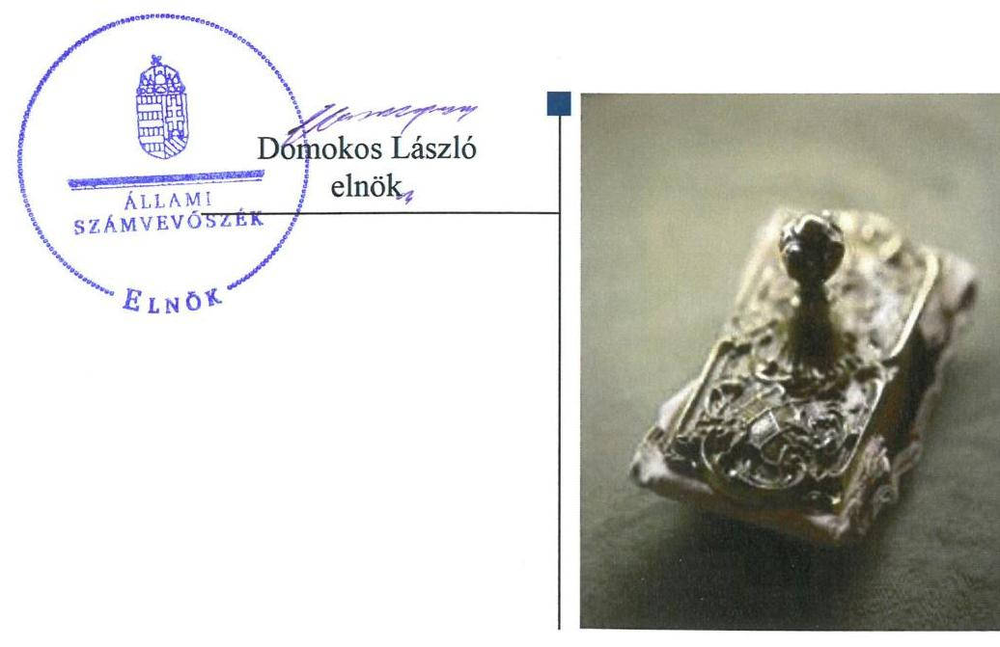

---

# AZ ELLENŐRZÉST FELÜGYELTE:

DR. PULAY GYULA felügyeleti vezető

# AZ ELLENŐRZÉST VEZETTE ÉS A VÉGREHAJTÁSÁÉRT FELELŐS:

DR. TÓTH VIKTÓRIA ellenőrzésvezető

# A PROGRAM ÖSSZEÁLLÍTÁSÁÉRT FELELŐS:

TÓTPÁL SZABOLCS osztályvezető

---

**IKTATÓSZÁM:** EL-0284-065/2019

**TÉMASZÁM:** 2/1

**ELLENŐRZÉS-AZONOSÍTÓ SZÁM:** V080453

---

Jelentéseink az Országgyűlés számítógépes hálózatán és az Interneta a www.asz.hu címen is olvashatóak.

---

# TARTALOMJEGYZÉK 

■ ÖSSZEGZÉS ..... 5
■ AZ ELLENŐRZÉS CÉLJA ..... 6
■ AZ ELLENŐRZÉS TERÜLETE ..... 7
■ AZ ELLENŐRZÉS HÁTTERE, INDOKOLTSÁGA ..... 8
■ A JELENTÉS LÉNYEGES KÉRDÉSKÖRE ..... 9
■ AZ ELLENŐRZÉS HATÓKÖRE ÉS MÓDSZEREI ..... 10
■ MEGÁLLAPÍTÁSOK ..... 12
■ MELLÉKLETEK ..... 15
I. sz. melléklet: Az MTA, az MTA TTK, az MTA ÖK és az MTA BTK intézkedési tervének végrehajtása ..... 15
II. sz. melléklet: Intézkedési tervek ..... 19
■ FÜGGELÉK: ÉSZREVÉTELEK ..... 33
■ RÖVIDÍTÉSEK JEGYZÉKE ..... 51

---

.

---

# ÖSSZEGZÉS 

Az Állami Számvevőszék az utóellenőrzés során megállapította, hogy a Magyar Tudományos Akadémiánál, az MTA Bölcsészettudományi Kutatóközpontnál, az MTA Ökológiai Kutatóközpontnál és az MTA Természettudományi Kutatóközpontnál az intézkedések végrehajtásával javult a pénzügyi és vagyongazdálkodás szabályozottsága. Az MTA Természettudományi Kutatóközpont által végre nem hajtott intézkedések elmaradása kockázatot hordoz az integritás, az elszámoltathatóság és a felelős vezetői magatartás vonatkozásában.

## Az ellenőrzés társadalmi indokoltsága

Az Állami Számvevőszék stratégiájában célul tűzte ki a számvevőszéki munka hasznosulásának javítását. Ezzel összhangban ellenőrzi, hogy az ellenőrzött szervezet megvalósította-e a korábbi ellenőrzései által feltárt hibák, hiányosságok és szabálytalanságok megszüntetése céljából elkészített intézkedési tervében foglaltakat. A rendszeres utóellenőrzések hozzájárulnak a szükséges intézkedések tényleges végrehajtásához, ezáltal a közpénzügyek rendezettségének javulásához.

## Főbb megállapítások, következtetések

A Magyar Tudományos Akadémia megkötötte az ingó vagyon használati szerződést az MTA Természettudományi Kutatóközponttal.

Az MTA Ökológiai Kutatóközpont szellemi-tulajdon-kezelési szabályzatát kiadták, és kiegészítették a gazdálkodási szabályzatot.

Az MTA Bölcsészettudományi Kutatóközpont pénzkezelési szabályzatát kiegészítették, és elkészítették a tudomá-nyos-szakmai tevékenység ellenőrzési nyomvonalát.

Az intézkedések végrehajtásával a szabályszerű működés vonatkozásában csökkentek a kockázatok.
Az MTA Természettudományi Kutatóközpont számviteli politikáját, számlarendjét módosították, elkészítették a számlarendet alátámasztó bizonylati rendet, új gazdálkodási szabályzatot adtak ki, kialakították a kockázatkezelési rendszert, ezzel csökkentek a szabályozottságból eredő kockázatok. Az MTA Természettudományi Kutatóközpont tevékenységében rejlő kockázatokat azonban nem mérték fel, nem elemezték, a gazdálkodási jogkörök szabályszerű gyakorlását nem támasztották alá. Az intézkedések elmaradása továbbra is kockázatot hordoz az integritás és a belső kontroll szerinti elszámoltathatóság vonatkozásában.

A Magyar Tudományos Akadémia és az MTA Ökológiai Kutatóközpont nem vezette a jogszabály szerinti nyilvántartást az intézkedési tervek végrehajtásáról.

---

# AZ ELLENŐRZÉS CÉLJA 

Az ellenőrzés célja annak értékelése volt, hogy a számvevőszéki jelentésben foglalt megállapításokkal összhangban készített intézkedési tervben meghatározott feladatokat az ellenőrzött szervezetek végrehajtották-e.

---

# AZ ELLENŐRZÉS TERÜLETE 

## A Magyar Tudományos Akadémia egyes kutatóintézeteinek utóellenőrzése

Az MTA ${ }^{1}$ önkormányzati elven alapuló, jogi személyként múködő köztestület, amely a tudomány múvelésével, támogatásával és képviseletével kapcsolatos országos közfeladatokat lát el. Az MTA az MTA törvényben² meghatározott feladatainak ellátása céljából közfinanszírozású kutatóhálózatot, kiszolgáló és egyéb intézményeket létesít és múködtet, amelyek felett irányítási jogot gyakorol.

Az ÁSZ³ 2010. január 1. és a 2013. december 31. közötti időszakra vonatkozóan végezte el a Magyar Tudományos Akadémia kutatóintézeti hálózatának átalakítása, egyes kiemelt kutatóintézetek gazdálkodása és feladatellátása ellenőrzését a Magyar Tudományos Akadémiánál és az irányítása alá tartozó MTA Bölcsészettudományi Kutatóközpontnál, az MTA Ökológiai Kutatóközpontnál és az MTA Természettudományi Kutatóközpontnál. Az ellenőrzés célja volt annak értékelése, hogy szabályosan történt-e a kutatóhálózat átalakítása a 2011. évben, a belső kontrollrendszer kialakítása és múködtetése szabályszerű volt-e, az ellenőrzött kutatóintézetek pénzügyi és vagyongazdálkodása szabályszerű volt-e. A témában készült 15038 számú számvevőszéki jelentést 2015. február 19-én hozta nyilvánosságra az ÁSZ.

A számvevőszéki jelentés valamennyi ellenőrzött szervezet részére megállapításokat fogalmazott meg, amelyekre vonatkozóan az MTA elnöke megküldte az MTA és az ellenőrzött kutatóintézetek tervezett intézkedéseit tartalmazó intézkedési tervet, ${ }^{4}$ majd a kiegészített intézkedési tervet ${ }^{5}$.

Az utóellenőrzés arra irányult, hogy az MTA és ellenőrzött kutatóintézeti végrehajtották-e a 2015. február 19. és 2018. augusztus 24. közötti időszakban a 15038 számú számvevőszéki jelentésben szereplő megállapításokkal és javaslatokkal összhangban készített intézkedési terveket.

---

# AZ ELLENŐRZÉS HÁTTERE, INDOKOLTSÁGA 

Az ÁSZ tv. ${ }^{6}$ 33. § (1) bekezdése értelmében a számvevőszéki jelentések megállapításaihoz és javaslataihoz kapcsolódóan az ellenőrzött szervezet vezetője intézkedési tervet köteles összeállítani, és az Állami Számvevőszék részére megküldeni.

Az ÁSZ által befogadott intézkedési tervben foglaltak megvalósítását az ÁSZ törvény 33. § (7) bekezdésében foglaltak alapján - az Állami Számvevőszék utóellenőrzés keretében ellenőrizheti. Az utóellenőrzések keretében - az intézkedések értékelése során - az Állami Számvevőszék figyelembe veszi az ellenőrzött szervezetek működési feltételeiben, valamint a jogszabályi előírásokban bekövetkezett változásokat.

Az utóellenőrzés során az ÁSZ értékeli, hogy az érintett számvevőszéki jelentésben foglalt megállapításokkal és javaslatokkal összhangban, az ellenőrzött szervezet által készített intézkedési tervben meghatározott feladatokat a feladatra kijelöltek végrehajtották-e.

Az intézkedések végrehajtásával az adott terület szabályszerű múködése vonatkozásában a kockázatok csökkenhetnek, azonban hosszabb távon az intézkedési tervben foglaltak végrehajtásával önmagában nem szűnnek meg, csak akkor, ha beépülnek az ellenőrzött szervezet múködésébe, azokat folyamatosan karban tartják, figyelembe véve, illetve kezelve a változásokat. Emellett az intézkedések végrehajtásáig újabb kockázatok merülhetnek fel a szabályszerű múködés vonatkozásában, amelyek kezelése szintén kiemelten fontos az ellenőrzött szervezet számára.

Az ellenőrzött szervezet vezetője által készített intézkedési tervekben foglalt feladatok hiányos, illetve késedelmes végrehajtása, vagy annak elmaradása a szabályszerűség és a felelős vezetői magatartás vonatkozásában kockázatot hordoz, ami azt mutatja, hogy az ellenőrzések során feltárt hibák, hiányosságok és szabálytalanságok kezelése nem kapott kellő hangsúlyt. Az utóellenőrzés során is fennálló szabálytalanságok esetén a közpénz, közvagyon veszélyeztetettségi kockázat valószínűsített hatásának értékelése további intézkedéseket vonhat maga után.

Az ellenőrzött szervezet szintjén az utóellenőrzés feltárja, hogy a szervezet az intézkedések végrehajtásával hasznosította-e a korábbi ellenőrzési jelentésben a hiányosságok megszüntetése, illetve a kockázatok kezelése érdekében megfogalmazott javaslatokat, illetve az intézkedések végrehajtása elmaradásának következtében továbbra is fennálló szabálytalanság esetén értékeli a közpénzek, közvagyon veszélyeztetettségét.

Az ÁSZ szintjén az utóellenőrzés visszacsatolást ad az ellenőrzési jelentések hasznosulásáról, az intézkedések elmaradásának, vagy részleges megvalósulásának a közpénzek, közvagyon veszélyeztetettségére gyakorolt valószínűsített hatásának értékelése, további intézkedéseket vonhat maga után.

---

# A JELENTÉS LÉNYEGES KÉRDÉSKÖRE 

- A Magyar Tudományos Akadémia és az ellenőrzött kutatóintézetek az intézkedési tervben foglaltakat az elöirt határidőben végrehajtották-e?

---

# AZ ELLENŐRZÉS HATÓKÖRE ÉS MÓDSZEREI 

## Az ellenőrzés típusa

Megfelelőségi ellenőrzés.

## Az ellenőrzött időszak

Az utóellenőrzés alapját képező ÁSZ jelentés közzétételének napjától az ellenőrzésről szóló kiértesítő levél keltének napjáig tartó időszak (2015. február 19-től 2018. augusztus 24-ig).

## Az ellenőrzés tárgya

A számvevőszéki jelentésben foglalt megállapításokkal összhangban az ellenőrzött szervezetek által készített intézkedési tervben foglaltak végrehajtásának ellenőrzése.

## Az ellenőrzött szervezet

Magyar Tudományos Akadémia, MTA Ökológiai Kutatóközpont, MTA Bölcsészettudományi Kutatóközpont, MTA Természettudományi Kutatóközpont

## Az ellenőrzés jogalapja

Az ellenőrzés jogszabályi alapját az ÁSZ tv. 33. § (7) bekezdése képezi.

## Az ellenőrzés módszerei

Az ellenőrzést az ellenőrzött időszakban hatályos jogszabályok, az ellenőrzés szakmai szabályai, a jelen ellenőrzésre irányadó ÁSZ módszertanok, az ellenőrzési programban foglalt értékelési szempontok szerint végeztük.

Az ellenőrzés ideje alatt az ellenőrzött szervezettel történő kapcsolattartást az ÁSZ SZMSZ-ének vonatkozó előírásai alapján biztosítottuk.

Az utóellenőrzés megállapításait az ÁSZ adatbekérése szerint, az ellenőrzött szervezet által rendelkezésre bocsátott dokumentumok alapján fogalmaztuk meg.

Az ellenőrzési bizonyítékként felhasználható adatforrások közé tartoztak egyrészt az ellenőrzési program részletes szempontjainál felsorolt

---

adatforrások, másrészt minden - az ellenőrzés folyamán feltárt, az ellenőrzés szempontjából információt tartalmazó - dokumentum.

Az intézkedési tervekben előírt feladatokat azok végrehajthatósága, illetve végrehajtása szempontjából az alábbiak szerint értékeltük:
"határidőben végrehajtott" a feladat, ha a teljesítés dokumentáltan, az intézkedési tervben előírt határidőben és tartalommal megtörtént;
"határidőn túl végrehajtott" a feladat, ha annak teljesítése az intézkedési tervben meghatározott módon, de az abban előírt határidőn túl történt meg;
"részben végrehajtott" a feladat, ha annak végrehajtása nem teljes körűen az intézkedési tervben előírt módon történt meg;
"nem végrehajtott" a feladat, ha a végrehajtás nem történt meg, dokumentumokkal nem igazolt annak teljesítése;
"okafogyottá vált" a feladat, ha végrehajtására - meghatározott esemény bekövetkezése, továbbá külső körülmény, a működést érintő feltétel változása miatt - már nincs szükség, illetve lehetőség, és egyértelműen megállapítható, hogy az intézkedést szükségessé tevő körülmény a jövőben nem fordulhat elő;
"nem időszerü" az a feladat, amelynek ellenőrzési időszakon belüli végrehajtására azért nem került (kerülhetett) sor, mert az intézkedés alapjául szolgáló esemény nem következett be, de annak jövőbeni előfordulása lehetséges, a végrehajtása nem volt esedékes, vagy a végrehajtás határideje még nem járt le.

---

# A Magyar Tudományos Akadémia és az ellenőrzött kutatóintézetek az intézkedési tervben foglaltakat az előírt határidőben végrehajtották-e? 

Összegző megállapítás

Az MTA, az MTA Bölcsészettudományi Kutatóközpont, az MTA Ökológiai Kutatóközpont és az MTA Természettudományi Kutatóközpont a pénzügyi és vagyongazdálkodás szabályozottságára irányuló intézkedéseket végrehajtotta. Az MTA Természettudományi Kutatóközpont az integritás és a belső kontroll szerinti elszámoltathatóság érdekében meghatározott intézkedéseket nem hajtotta végre.

Az MTA a felelősségi körébe tartozó két intézkedésből egyet nem hajtott végre.

Az MTA BTK ${ }^{7}$ és az MTA ÖK ${ }^{8}$ a felelősségi körébe tartozó intézkedéseket végrehajtotta.

Az MTA TTK ${ }^{9}$ a felelősségi körébe tartozó hét intézkedést végrehajtott, 5 intézkedést nem hajtott végre.

A feladatokat, határidőket, megjelölt felelősöket és a feladatok végrehajtását az I. melléklet mutatja be.

Az MTA és az ellenőrzött kutatóintézetek intézkedési tervét, valamint a kiegészített intézkedési tervét a II. melléklet mutatja be.

Az MTA és az MTA ÖK nem vezette a Bkr. 14. § (1) bekezdésében előírt nyilvántartást az intézkedési tervben rögzített feladatok végrehajtásáról.

## A PÉNZÜGYI ÉS VAGYONGAZDÁLKODÁS SZABÁLYOZOTTSÁGA érdekében az MTA és az MTA TTK között létrejött az ingó vagyon használati szerződés. Az MTA TTK az Áhsz. ${ }^{10}$ és a Számv. tv. ${ }^{11}$ előírásaival összhangba hozta számlarendjét ${ }^{12}$, számviteli politikáját ${ }^{13}$, elkészítette a számlarendet alátámasztó bizonylati rendet ${ }^{14}$, valamint az új gazdálkodási szabályzatot ${ }^{15}$. Az MTA ÖK főigazgatója kiadta a szellemi tulajdon-kezelési szabályzatot ${ }^{16}$, valamint kiegészítette a gazdálkodási szabályzatot ${ }^{17}$ a teljesítésigazolásra jogosultak aláírás mintájával. Az MTA BTK az SZJA törvénnyel ${ }^{18}$ összhangba hozta pénzkezelési szabályzatát ${ }^{19}$, és elkészítette a tudományos-szakmai tevékenység ellenőrzési nyomvonalát ${ }^{20}$.

A PÉNZÜGYI ELSZÁMOLTATHATÓSÁG érvényesülését nem biztosította az, hogy az MTA gazdasági igazgatója nem hajtotta végre az MTA Alapszabályának ${ }^{21}$ felülvizsgálatát, amely arra irányult volna, hogy az akadémiai költségvetési szervek, így az ellenőrzött kutatóintézetek alapító okiratában és SZMSZ²-ében szerepeltetni kell-e a

---

vállalkozási tevékenység eredmény felosztásának szabályait. A felülvizsgálat dokumentáltságának hiányán nem változtat az a tény, hogy az MTA Közgyűlése a 25/2016. (V.2.) számú határozatával az Alapszabály vonatkozó rendelkezését (55.§) módosította.

# A BELSŐ KONTROLL SZERINTI ELSZÁMOLTATHATÓSÁG érvényesülését nem biztosította az, hogy az MTA TTK a gazdálkodási jogkörök Ávr. 57. § (4) bekezdésének megfelelő gyakorlását nem támasztotta alá. 

AZ INTEGRITÁS érvényesülését nem biztosította az, hogy az MTA TTK nem mérte fel és nem elemezte a tevékenységével kapcsolatos kockázatokat, ellentétben a Bkr. 7. § (2) bekezdésével.

---

.

---

# MELLÉKLETEK

- I. SZ. MELLÉKLET: AZ MTA, AZ MTA TTK, AZ MTA ÖK ÉS AZ MTA BTK INTÉZKEDÉSI TERVÉNEK VÉGREHAJTÁSA

|  Az intézkedési tervben rögzített feladat | Az intézkedési tervben meghatározott határidő | Az intézkedési tervben meghatározott felelős | A feladat végrehajtása  |
| --- | --- | --- | --- |
|  1. | 2
MAGYAR TUDOMÁNYOS AKADÉMIA
Határidőben végrehajtott feladat | 3
MAGYAR TUDOMÁNYOS AKADÉMIA
Határidőben végrehajtott feladat | 4.  |
|  1. Az MTA és az MTA TTK között kerüljön sor az Ingó Vagyon Használati Szerződés megkötésére. | 2015. június 30. | MTA gazdasági igazgató | Az MTA és az MTA TTK között 2015. március 31-én létrejött az Ingó Vagyon Használati Szerződés.  |
|   | MTA TERMESZETTUDOMÁNYI KUTATÓKÖZPONT
Határidőben végrehajtott feladatok |  |   |
|  2. Vezessék át a számlarendben és a számlatükörben a jogszabályi változásokat az Áhsz. (249/2000. (XII. 24. Korm. rendelet) 49. § (6) bekezdés előírásai szerint. | 2015. április 30. | MTA TTK gazdasági igazgató | Az MTA TTK számlarendjéről szóló 13/2015. (III.31.) számú Főigazgatói Utasítás 2015. március 31-én lépett hatályba, és tartalma megfelelt az Áhsz. előírásainak.  |
|  3. Történjen meg a számviteli politika aktualizálása a jogszabályi változások figyelembe vételével, a Számv. tv. 14. § (3)-(4), (11) bekezdéseinek, valamint az Áhsz. 8. § (3)-(4), (12) bekezdéseinek előírásai alapján. | 2015. április 30. | MTA TTK gazdasági igazgató | Az MTA TTK főigazgatója 2015. március 31-én kiadta az MTA TTK Számviteli Politikájáról szóló 16/2015. (III.31.) számú Főigazgatói Utasítást, amely a Számv. tv 14. § (4) bekezdésének megfelelően rögzítette, hogy mit tekintenek a számviteli elszámolás, az értékelés szempontjából lényegesnek, jelentősnek, nem lényegesnek, nem jelentősnek.  |
|  4. Az igénylés, beszerzés, pályázatok, vállalkozási tevékenység, kifizetések, humánpolitika ellenőrzési nyomvonalai a Bkr. 6. § (3) bekezdés előírásainak megfelelően elkészültek a főigazgató 2/2014. (III.25.) számú, az MTA TTK kutatóközponti szintű alapfolyamatairól szóló főigazgatói utasítás értelmében. | Végrehajtott feladatként szerepel. | MTA TTK főigazgatója, gazdasági igazgatója | Az MTA TTK kutatóközponti szintű alapfolyamatairól szóló 2/2014. (III.25.) számú Főigazgatói Utasítás 2014. április 1-jén hatályba lépett, a Bkr. 6. §(3) bekezdésével összhangban tartalmazta az igénylés, beszerzés, pályázatok, vállalkozási tevékenység, kifizetések, humánpolitika ellenőrzési nyomvonalait.  |
|  5. Az MTA és az MTA TTK között kerüljön sor az Ingó Vagyon Használati Szerződés megkötésére. Az MTA TTK jelezze szerződéskötési szándékát az MTA Titkársága felé. | Végrehajtott feladatként szerepel. | MTA TTK főigazgatója, gazdasági igazgatója | Az MTA, mint használatba adó, és az MTA TTK, mint használó között 2015. március 31-én létrejött az ingó vagyon használati szerződés.  |

---

|  5. | Az intézkedési tervben rögzített feladat | Az intézkedési tervben meghatározott határidő | Az intézkedési tervben meghatározott felelős | A feladat végrehajtása  |
| --- | --- | --- | --- | --- |
|   | 1. | 2.
Határidőn túl végrehajtott feladat | 3.
3. | 4.  |
|  6. | Történjen meg a számlarend kiegészítése a számlarendet alátámasztó bizonylati renddel. | 2015. április 30. | MTA TTK gazdasági igazgatója | A bizonylati rend elkészült. Az MTA TTK Bizonylati rendjéről szóló 27/2015. (X.15.) számú Főigazgatói Utasítás azonban 2015. október 15. napján lépett hatályba.  |
|   |  | Részben végrehajtott feladatok |  |   |
|  7. | A Kutatóközpont kockázatkezelési rendszerének kialakítása, működtetése a helyi sajátosságok figyelembe vételével megtörtént, a kockázat kezelési szabályzat a jogszabályi és szervezeti változások szerint elkészült, a főigazgató 1/2014. (III.10.) számú, az MTA TTK kutatóközponti szintű kockázatkezelési rendszere eljárásrendjének szabályzatáról szóló főigazgatói utasítás értelmében. | Végrehajtott feladatként szerepel. | MTA TTK főigazgatója, gazdasági igazgatója | Végrehajtott feladatrész:
Az MTA TTK kutatóközponti szintű kockázatkezelési rendszere eljárásrendjének szabályzatáról szóló 1/2014. (III.10.) számú Főigazgatói Utasítás 2014. március 10-i hatályba lépésével a kockázatkezelési rendszer kialakítása megtörtént.
Nem végrehajtott feladatrész:
A kockázatkezelési rendszert (2016. október 1-jétől integrált kockázatkezelési rendszer) a Bkr. 7. § (1) bekezdésével ellentétben nem működtetették.  |
|  8. | A jogszabályoknak megfelelően történjen meg a megfelelő kontrollrendszer kialakítása, működtetése. A pénzügyi döntések dokumentumait az arra jogszabályban és írásban meghatalmazott személyek jogszerűen készítsék elő, igazolják dátum megjelölésével (kötelezettségvállalás, ellenjegyzés, érvényesítés, teljesítésigazolás). Készüljön új gazdálkodási szabályzat, amely a szervezeti átalakulást követően az új szervezet sajátosságaihoz igazodik, és biztosítja a FEUVE teljes körű érvényesülését, végrehajtását, a belső kontrollrendszer szabályos működtetését. | 2015. március 31. | MTA TTK főigazgatója, gazdasági igazgatója | Végrehajtott feladatrész:
Az MTA TTK Gazdálkodási Szabályzatáról szóló 15/2015. (III.31.) számú Főigazgatói Utasítás 2015. március 31-én hatályba lépett.
Nem végrehajtott feladatrész:
A pénzügyi döntések dokumentumainak az arra jogszabályban és írásban meghatalmazott személyek általi előkészítését, végrehajtását dokumentumokkal nem támasztották alá.  |
|   |  | Nem végrehajtott feladatok |  |   |
|  9. | Az Állami Számvevőszék megállapításait alapul véve kerüljön felülvizsgálatra az Alapszabály 55. § (5) bekezdésének rendelkezése arra tekintettel, hogy a vállalkozási tevékenység eredmény felosztásának sza- | 2015. június 30. | MTA gazdasági igazgató, illetve MTA Jogi és Igazgatási Főosztály főosztályvezető | Az MTA Alapszabályának felülvizsgálatát a MTA gazdasági igazgatója dokumentált módon nem végezte el.  |

---

|  1. | Az intézkedési tervben rögzített feladat | Az intézkedési tervben meghatározott határidő | Az intézkedési tervben meghatározott felelős | A feladat végrehajtása  |
| --- | --- | --- | --- | --- |
|   | 1. | 2. | 3. | 4.  |
|   | bályait a vonatkozó jogszabályi rendelkezések alapján az akadémiai költségvetési szervek alapító okiratában és szervezeti és működési szabályzatában szerepeltetni kell-e. |  |  |   |
|  10. | Kerüljön meghatározásra a gazdasági szervezet tagjainak feladat és hatáskörében a helyettesítésük rendje a gazdasági szervezet közalkalmazottainak munkaköri leírásában. | Végrehajtott feladatként szerepel. | Végrehajtott feladatként szerepel. | A gazdasági szervezet közalkalmazottai munkaköri leírásainak módosítását, ezzel az Ávr. 13. § (5) bekezdésének megfeleltetését dokumentumokkal nem támasztották alá.  |
|  11. | Mérjék fel és elemezzék a Kutatóközpont tevékenységével kapcsolatos kockázatot a főigazgatói utasítás szerint. | 2015. június 30. | MTA TTK főigazgatója, gazdasági igazgatója, igazgatók | A főigazgató a 2869/2016 iktatószámú levélben a folyamatgazdáknak utasításba adta, hogy mérjék fel és elemezzék az irányításuk alá tartozó folyamatok kockázatait. A kockázatok felmérését és elemzését azonban dokumentumokkal nem igazolták.  |
|  12. | A gazdálkodási jogköröket az Ávr. 57. § (4) bekezdése előírásai szerint, és a belső szabályzatban megjelölt személyek végezzék. | 2015. március 31. | MTA TTK főigazgatója, gazdasági igazgatója | Nem igazolták azt, hogy a teljesítés igazolást az Ávr. 57. § (4) bekezdésének megfelelően belső szabályzatban kijelölt személyek végezték.  |
|   |  |  | **Okafogyottá vált feladat** |   |
|  13. | Az engedélyezett létszámmal összefüggő ellenőrzési megállapítás nem igényel intézkedést, tekintettel arra, hogy a 397/2014. (XII.13.) Kormányrendelet 45. § (1) 3. 2015. január 1-től módosította az államháztartásról szóló törvény végrehajtásáról szóló 368/2011. (XII.31.) Kormányrendelet 13. § (1) bekezdés e) pontját. | Az intézkedési terv készítésének időpontjában már okafogyottá vált. |  | Az Ávr. 13. § (1) bekezdése 2015. január 1-jétől nem tartalmazza azt, hogy a költségvetési szerv SZMSZ-ének kötelező tartalmi eleme a szervezeti egységek - ezen belül a gazdasági szervezet – engedélyezett létszáma.  |
|   |  |  | **MTA ÖKÖLÖGJAI KUTATÓKÖZPONT Határidőben végrehajtott feladatok** |   |
|  14. | A 2012. óta hatályos, a szellemi tulajdon kezeléséről szóló szabályzat megküldése az ÁSZ-nak az intézkedési terv elkészítését megelőzően megtörtént. | Végrehajtott feladatként szerepel. | Végrehajtott feladatként szerepel. | Az MTA ÖK főigazgatója kiadta a Szellemi tulajdon-kezelési szabályzatot, amely 2013. szeptember 1-jén lépett hatályba.  |
|  15. | A jelenleg hatályos Gazdálkodási Szabályzat kiegészítése az aláírás mintákkal. | 2015. március 31. | MTA ÖK gazdasági igazgató | A Gazdálkodási Szabályzat kiegészítése a teljesítés igazolásra jogosultak aláírás mintájával megtörtént.  |

---

|  15. | Az intézkedési tervben rögzített feladat | Az intézkedési tervben meghatározott határidő | Az intézkedési tervben meghatározott felelős | A feladat végrehajtása  |
| --- | --- | --- | --- | --- |
|   | 1. | 2. | 3. | 4.  |
|  16. | Az ÁSZ megállapítását alapul véve kerüljön felülvizsgálatra az Alapszabály 55. § (5) bekezdésének rendelkezése arra tekintettel, hogy a vállalkozási tevékenység eredmény felosztásának szabályait a vonatkozó jogszabályi rendelkezések alapján az akadémiai költségvetési szervek Alapító Okiratában és SZMSZében szerepeltetni kell-e. | 2015. június 30. | MTA gazdasági igazgató, MTA Jogi és Igazgatási Főosztály főosztályvezető | Az MTA Alapszabályának felülvizsgálatát a MTA gazdasági igazgatója dokumentált módon nem végezte el.  |
|  17. | Az MTA BTK Pénzkezelési Szabályzatával kapcsolatban feltárt hiányosság megszüntetése érdekében az ÁSZ vizsgálatot követően még 2014-ben a hivatkozott szabályzat kiegészítése és hatályba lépése megtörtént. | Végrehajtott feladatként szerepel. | Végrehajtott feladatként szerepel. | A 2014. január 5-től hatályos Pénzkezelési Szabályzat kiegészítése megtörtént, tartalmazta a 30 napon túli előlegek SZJA tv. 72. § (4) bekezdés c) és n) pontja alapján megállapított adó és járulék vonzatának szabályozását.  |
|  18. | A kontrollkörnyezet hiányosságainak megszüntetése érdekében az ellenőrzési nyomvonalat a szakmai működési folyamatokra is el kell készíteni. | 2015. június 30. | MTA BTK főigazgató | Elkészült a tudományos-szakmai tevékenység ellenőrzési nyomvonala.  |

---

# II. SZ. MELLÉKLET: INTÉZKEDÉSI TERVEK 

## 4   MAGYAR TUDOMANYOS AKADÉMIA

## ELNÖK

Iktatószám: 1231/9/2015/ET

## INTÉZKEDÉSI TERV

Az Állami Számvevőszék „Az MTA egyes kutatóintézetének ellenörzése - a Magyar Tudományos Akadémia kutatóintézeti bálázatának átalakítása, egyes kiemelt kutatóintézetek gazdálkodása és feladatellátása" című jelentéshez kapcsolódóan, az abban feltárt hiányosságok felszámolása érdekében a következő intézkedéseket hozom.

## A Magyar Tudományos Akadémia tekintetében:

1. Az ellenőrzés megállapítása:
„A vagyongazdálkodás terén feltárt hiányosság volt, hogy az MTA és az MTA TTK Ingó Vagyon Használati Szerződést az ellenőrzött időszakban nem kötött az MTA Vagyongazdálkodási és Vagyonhasznosítási Szabályzat 6.1 pontja, valamint MTA Vagyongazdálkodási és Vagyonhasznosítási Szabályzat 14. § (2) bekezdés előirrásai ellenére."
Ellenőrzés javaslata:
„Intézkedjen az Ingó Vagyon használati Szerződés megkötéséről."
Intézkedés:
Az MTA és az MTA TTK között körüljön sor az Ingó Vagyon Használati Szerződés megkötésére.
Határidő: 2015. június 30.
Felelős: Kotán Attila, gazdasági igazgató

## Az MTA Bölcsészettudományi Kutatóközpont tekintetében:

1. Az ellenőrzés megállapítása:
„Az MTA BTK belső kontrollrendszerének a kialakítása és múködtetése összességében megfelelt a jogszabályi előírásoknak, azonban az ellenőrzés kisebb hiányosságokat tárt fel a kontrollkörnyezet kialakítása tekintetében. Az MT BTK Pénzkezelési Szabályzatban nem rögzítették a 30 napon túli előlegek Szja tv. 72.§ (4) bekezdése c) és n) pontja alapján megállapított adó és járulék vonzatának szabályozását. Az ellenőrzési nyomvonalat nem a költségvetési szerv valamennyi múködési folyamatára, hanem csak a gazdálkodási folyamatokra készítették el a Bkr. 6. § (3) bekezdés előirrása ellenére."
Ellenőrzés javaslata:
„Intézkedjen a kontrollkörnyezet ellenőrzés által feltárt hiányosságainak megszüntetéséről."

---

# Intézkedések: 

I. A kontrollkörnyezet hiányosságainak megszüntetése érdekében az ellenőrzési nyomvonalat a szakmai múködési folyamatokra is el kell készíteni.
Határidő: 2015 . június 30.
Felelős: Fodor Pál, főigazgató
2. Az MTA BTK Pénzkezelési Szabályzatával kapcsolatban feltárt hiányosság megszüntetése érdekében az ÁSZ vizsgálatot követően még 2014-ben a hivatkozott szabályzat kiegészítése és hatályba lépése megtörtént.

## Az MTA Ökológiai Kutatóközpont tekintetében:

I. Az ellenőrzés megállapítása:
„Az MTA ÖK belső kontrollrendszerének a kialakítása és múködtetése összességében megfelelt a jogszabályok és az MTA belső előírásainak, azonban a kontrollkörnyezet kialakítása tekintetében feltárt hiányosság volt, hogy a kutatóközpont alapító okiratában és az SZMSZ-ében nem határozták meg a vállalkozási tevékenységgel összefüggésben a vállalkozási eredmény felosztásának szabályait az Alapszabály 55. § (5) bekezdés előírása ellenére. Az SZMSZ mellékleteként készítették el a szellemi vagyonnal való gazdálkodásról, a szellemi tulajdon kezeléséről szóló szabályzatot az Alapszabály 55. § (5) bekezdése és a 66. § (6) bekezdése előírásai ellenére. A gazdálkodási jogkörök gyakorlóiról a 2012-2013. évben vezetett nyilvántartás az Ávr. 6o. § (3) bekezdésében és a gazdálkodási szabályzatban előírtak ellenére a teljesítésigazolásra - szabályszerűen megtörtént teljesítés alapján - jogosult személyek nevét és aláírás mintáját nem tartalmazta."
Ellenőrzés javaslata:
„Intézkedjen a kontrollkörnyezet ellenőrzés által feltárt hiányosságainak megszüntetéséről."

## Intézkedés:

I. Az Állami Számvevőszék megállapítását alapul véve kerüljön felülvizsgálatra az Alapszabály 55. § (5) bekezdésének rendelkezése arra tekintettel, hogy a vállalkozási tevékenység eredmény felosztásának szabályait a vonatkozó jogszabályi rendelkezések alapján az akadémiai költségvetési szervek alapító okiratában és szervezeti és múködési szabályzatában szerepeltetni kell-e.
Határidő: 2015 . június 30.
Felelős: Kotán Attila, gazdasági igazgató; Dr. Medve Zsuzsa, főosztályvezető (MTA JIF)

---

2. A 2012. óta hatályos, a szellemi tulajdon kezeléséről szóló szabályzat megküldése az ÁSZ-nak az intézkedési terv elkészítését megelőzően megtörtént.
3. A jelenleg hatályos Gazdálkodási szabályzat kiegészítése az aláírás mintákkal. Határidő: 2015. március 31.
Felelős: Pásti-Hriczu Mária Valéria, gazdasági igazgató

# Az MTA Természettudományi Kutatóközpont tekintetében: 

1. Az ellenőrzés megállapítása:
„Az MTA TTK belső kontrollrendszerének a kialakítása és múködtetése részben felelt meg a jogszabályok és az MTA belső szabályai előírásainak.

A kontrollkörnyezet kialakítsa összességében megfelelt a jogszabályok és az MTA belső szabályai előírásainak, azonban az intézmény alapító okiratában és SZMSZ-ében nem határozták meg a kutatóközpont vállalkozási tevékenységével összefüggésben a vállalkozási eredmény felosztásának szabályait az Alapszabály 55. § (5) bekezdés előirása ellenére. A kutatóközpont SZMSZ-e a szervezeti ábrán nevesített Tudományos Titkárság, Könyvtár, Pályázati Iroda és Belső ellenőr tekintetében nem tartalmazta a szervezeti egységek engedélyezett létszámát az Ávr. 13. § (2) bekezdés e) pontjában foglalt előírás ellenére. A gazdasági szervezet tagjainak feladat- és hatásköre tekintetében a helyettesítés rendjét - a gazdasági igazgató kivételével - az SZMSZben, ügyrendben munkaköri leírásban vagy egyéb belső szabályzatban az Ávr. 13. § (5) bekezdés előírása ellenére nem határozták meg. Az MTA TTK számlarendje a Számv. tv. 161. § (2) bekezdés d) pontja ellenére nem tartalmazta a számlarendben foglaltakat alátámasztó bizonylati rendet. A 2013. évben a számlarendben és a számlatükrön az Áhsz. 9. sz. számú melléklete 2013. január 1-jei változásainak átvezetése - az Áhsz. 49. § (6) bekezdés előírása ellenére - nem történ meg. A számviteli politika aktualizálása a jelentős összegű hiba meghatározásának 2013. márciusi változását követően a Számv. tv. 14. § (3)-(4)-, (11) bekezdéseinek, valamint az Áhsz 8. § (3)-(4), (12) bekezdéseinek előírásai ellenére nem történt meg. Az intézmény nem rendelkezett a Bkr. 6. § (3) bekezdés előírásainak megfelelő ellenőrzési nyomvonallal.

A kockázatkezelési rendszer kialakítása és múködtetése nem volt megfelelő, mert az MTA TTK a kutatóközpont sajátosságainak megfelelő kockázatkezelési rendszert a Bkr. 7. § előírásai ellenére nem alakította ki és nem működtetette, a kockázatkezelés szabályozása nem követte a szervezeti változásokat, továbbá az intézmény tevékenységeivel kapcsolatos kockázatokat nem mérték fel és nem elemezték."

Ellenőrzés javaslata:

---

Intézkedjen a jogszabályoknak megfelelő kontrollrendszer kialakítása és múködtetése érdekében - az ellenőrzött időszak óta bekövetkezett esetleges jogszabályi változásokra figyelemmel - a kontrollkörnyezet, a kockázatkezelési rendszer és a kontrolltevékenységek terén az ellenőrzés által feltárt hiányosságok megszűntetésére.

# Intézkedés: 

1. Az Állami Számvevőszék megállapítását alapul véve kerüljön felülvizsgálatra az Alapszabály 55. §(5) bekezdésének rendelkezése arra tekintettel, hogy a vállalkozási tevékenység eredmény felosztásának szabályait a vonatkozó jogszabályi rendelkezések alapján az akadémiai költségvetési szervek alapító okiratában és szervezeti és múködési szabályzatában szerepeltetni kell-e.
Határidő: 2015 . június 30.
Felelős: Kotán Attila, gazdasági igazgató; Dr. Medve Zsuzsa, főosztályvezető (MTA JIF)
2. Az engedélyezett létszámmal összefüggő ellenőrzési megállapítás nem igényel intézkedést, tekintettel arra, hogy a hogy a 397/2014. (XII.13.) Korm. rendelet 45. § (1) 3. 2015. január 1-től módosította az államháztartásról szóló törvény végrehajtásáról szóló 368/2011. (XII. 31.) Korm. rendelet 13. § (1) bekezdés e) pontját.
3. Kerüljön meghatározásra a gazdasági szervezet tagjainak feladat és hatáskörében a helyettesítésük rendje a gazdasági szervezet közalkalmazottainak munkaköri leírásban.
Határidő: A megfelelő intézkedés az ellenőrzés óta eltelt időszakban (2015. február 5. napján) megtörtént. A munkaköri leírások új, - a helyettesítés rendjét is tartalmazó mintája elkészült, közzététele és kihirdetése 2015. február 5-dikén az kör-email formájában, valamint a Kutatóközpont intranetes oldalára feltöltésre került.
4. Történjen meg a számlarend kiegészítése a számlarendet alátámasztó bizonylati renddel.
Határidő: 2015 . április 30.
Felelős: Wagner Mária mb. gazdasági igazgató (2015. március 31-ig); Bartha Edit gazdasági igazgató (2015. április 1-tól)
5. Vezessék át a számlarendben és a számlatükörben a jogszabályi változásokat az Áhsz. 49. § (6) bekezdés előirása szerint.
Határidő: 2015. április 30.
Felelős: Wagner Mária mb. gazdasági igazgató (2015. március 31-ig); Bartha Edit gazdasági igazgató (2015. április 1-tól)

---

6. Történjen meg a számviteli politika aktualizálása a jogszabályi változásokat figyelembe vételével, a Számv. tv. 14. $\$ \S$ (3)-(4)-, (II) bekezdéseinek, valamint az Áhsz. 8. $\$ \S$ (3)-(4), (12) bekezdéseinek előirásai alapján.
Határidő: 2015 . április 30.
Felelős: Wagner Mária mb. gazdasági igazgató (2015. március 31-ig); Bartha Edit gazdasági igazgató (2015. április 1-tól)
7. Az igénylés, beszerzés, pályázatok, vállalkozási tevékenység, kifizetések, humánpolitika ellenőrzés nyomvonalai a Bkr. 6. § (3) bekezdés előírásainak megfelelően elkészültek a főigazgató 2/2014.(III.25.) számú, az MTA TTK kutatóközponti szintű alapfolyamatairól szóló főigazgatói utasítás értelmében.
Határidő: A megfelelő intézkedés az ellenőrzés óta eltelt időszakban (2014. március 25. napján) megtörtént.

Felelős: Dr. Keserű György, főigazgató; Wagner Mária, mb. gazdasági igazgató (2015. március 31-ig); Bartha Edit gazdasági igazgató (2015. április 1-től)
8. A Kutatóközpont kockázatkezelési rendszerének kialakítása, működtetése a helyi sajátosságok figyelembe vételével megtörtént, a kockázat kezelési szabályzat a jogszabályi és a szervezeti változások szerint elkészült, a főigazgató 1/2014.(III.10.) számú, az MTA TTK kutatóközponti szintű kockázatkezelési rendszere eljárásrendjének szabályzatáról szóló főigazgatói utasítás értelmében.
Határidő: A megfelelő intézkedés az ellenőrzés óta eltelt időszakban (2014. március 10. napján) megtörtént.
Felelős: Dr. Keserű György, főigazgató; Wagner Mária, mb. gazdasági igazgató (2015. március 31-ig); Bartha Edit gazdasági igazgató (2015. április 1-től)
9. Mérjék fel és elemezzék a Kutatóközpont tevékenységével kapcsolatos kockázatot a főigazgatói utasítás szerint.
Határidő: 2015. június 30.
Felelős: Dr. Keserű György, főigazgató; Wagner Mária, mb. gazdasági igazgató (2015. március 31-ig); Bartha Edit gazdasági igazgató (2015. április 1-től); igazgatók: Tompos András (AKI), Buday László (EI), Ulbert István (KPI) Soós Tibor (SZKI)
2. Az ellenőrzés megállapítása:
„A 2013. évi kiadási előirányzatok felhasználása során a pénzgazdálkodással kapcsolatos gazdálkodási jogkörökhöz előírt belső kontrollok működtetése nem volt teljesen szabályszerű, mivel kettő dologi kiadás esetében a teljesítésigazolást az Ávr. 57. § (4) bekezdés előírása ellene̋re kijelöléssel nem rendelkező személy végezte el. Ez kockázatot jelez az ellenőrzött terület egészének szabályos müködése szempontjából." Ellenőrzés javaslata:
„Intézkedjen a gazdálkodási jogkörök szabályszerű gyakorlásának érvényesítéséről."

---

# Intézkedés: 

A gazdálkodási jogköröket az Ávr. 57. § (4) bekezdés előírásai szerint, és a belső szabályzatban megjelölt személyek végezzék.
Határidő: 2015. március 31.
Felelős: Dr. Keserű György, főigazgató; Wagner Mária, mb. gazdasági igazgató (2015. március 31-ig); Bartha Edit gazdasági igazgató (2015. április 1-tól)
3. Az ellenőrzés megállapítása:
„A vagyongazdálkodás terén feltárt hiányosság volt, hogy az MTA és az MTA TTK Ingó Vagyon Használati Szerződést az ellenőrzött időszakban nem kötött az MTA Vagyongazdálkodási és Vagyonhasznosítási Szabályzat 6.1 pontja, valamint MTA Vagyongazdálkodási és Vagyonhasznosítási Szabályzat 14. § (2) bekezdése előírása ellenére."

Ellenőrzés javaslata:
„Intézkedjen az Ingó Vagyon Használati Szerződés megkötéséről."

## Intézkedés:

Az MTA és az MTA TTK között kerüljön sor az Ingó Vagyon Használati Szerződés megkötésére. Az MTA TTK jelezze szerződéskötési szándékát az MTA Titkársága felé.
Határidő: A megfelelő intézkedés az ellenőrzés óta eltelt időszakban az MTA TTK részéről megtörtént (2015. január 18. napján)
Felelős: Dr. Keserű György, főigazgató; Wagner Mária, mb. gazdasági igazgató (2015. március 31-ig); Bartha Edit gazdasági igazgató (2015. április 1-tól)

Budapest, 2015. március 16 .
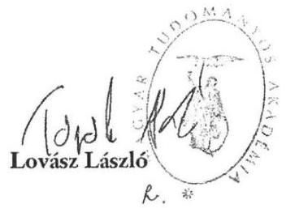

---

# KIEGÉSZÍTETT INTÉZKEDÉSI TERV 

Az Állami Számvevőszék „Az MTA egyes kutatóintézetének ellenörzése - a Magyar Tudományos Akadémia kutatóintézeti bálózatának átalakítása, egyes kiemelt kutatóintézetek gazdálkodása és feladatellátása" címú jelentéshez kapcsolódóan, az abban feltárt hiányosságok felszámolása érdekében a következő intézkedéseket hozom.

## A Magyar Tudományos Akadémia tekintetében:

I. Az ellenőrzés megállapítása:
„A vagyongazdálkodás terén feltárt hiányosság volt, hogy az MTA és az MTA TTK Ingó Vagyon Használati Szerződést az ellenőrzött időszakban nem kötött az MTA Vagyongazdálkodási és Vagyonhasznosítási Szabályzat 6.1 pontja, valamint MTA Vagyongazdálkodási és Vagyonhasznosítási Szabályzat 14. § (2) bekezdés előirrásai ellenére."
Ellenőrzés javaslata:
„Intézkedjen az Ingó Vagyon használati Szerződés megkötéséről."
Intézkedés:
Az MTA és az MTA TTK között körüljön sor az Ingó Vagyon Használati Szerződés megkötésére.
Határidő: 2015. június 30.
Felelős: Kotán Attila, gazdasági igazgató

## Az MTA Bölcsészettudományi Kutatóközpont tekintetében:

I. Az ellenőrzés megállapítása:
„Az MTA BTK belső kontrollrendszerének a kialakítása és múködtetése összességében megfelelt a jogszabályi előírásoknak, azonban az ellenőrzés kisebb hiányosságokat tárt fel a kontrollkörnyezet kialakítása tekintetében. Az MT BTK Pénzkezelési Szabályzatban nem rögzítették a 30 napon túli előlegek Szia tv. 72.§ (4) bekezdése c) és n) pontja alapján megállapított adó és járulék vonzatának szabályozását. Az ellenőrzési nyomvonalat nem a költségvetési szerv valamennyi múködési folyamatára, hanem csak a gazdálkodási folyamatokra készítették el a Bkr. 6. § (3) bekezdés előirrása ellenére."
Ellenőrzés javaslata:
„Intézkedjen a kontrollkörnyezet ellenőrzés által feltárt hiányosságainak megszüntetéséről."

---

# Intézkedések: 

I. A kontrollkörnyezet hiányosságainak megszüntetése érdekében az ellenőrzési nyomvonalat a szakmai múködési folyamatokra is el kell készíteni.
Határidő: 2015. június 30.
Felelős: Fodor Pál, főigazgató
2. Az MTA BTK Pénzkezelési Szabályzatával kapcsolatban feltárt hiányosság megszüntetése érdekében az ÁSZ vizsgálatot követően még 2014-ben a hivatkozott szabályzat kiegészítése és hatályba lépése megtörtént.

## Az MTA Ökológiai Kutatóközpont tekintetében:

I. Az ellenőrzés megállapítása:
„Az MTA ÖK belső kontrollrendszerének a kialakítása és múködtetése összességében megfelelte a jogszabályok és az MTA belső előírásainak, azonban a kontrollkörnyezet kialakítása tekintetében feltárt hiányosság volt, hogy a kutatóközpont alapító okiratában és az SZMSZ-ében nem határozták meg a vállalkozási tevékenységgel összefüggésben a vállalkozási eredmény felosztásának szabályait az Alapszabály 55. § (5) bekezdés előírása ellenére. Az SZMSZ mellékleteként készítették el a szellemi vagyonnal való gazdálkodásról, a szellemi tulajdon kezeléséről szóló szabályzatot az Alapszabály 55. § (5) bekezdése és a 66. § (6) bekezdése előírásai ellenére. A gazdálkodási jogkörök gyakorlóiról a 2012-2013. évben vezetett nyilvántartás az Ávr. 6o. § (3) bekezdésében és a gazdálkodási szabályzatban előírtak ellenére a teljesítésigazolásra - szabályszerűen megtörtént teljesítés alapján - jogosult személyek nevét és aláírás mintáját nem tartalmazta."
Ellenőrzés javaslata:
„Intézkedjen a kontrollkörnyezet ellenőrzés által feltárt hiányosságainak megszüntetéséről."

## Intézkedés:

I. Az Állami Számvevőszék megállapítását alapul véve kerüljön felülvizsgálatra az Alapszabály 55. § (5) bekezdésének rendelkezése arra tekintettel, hogy a vállalkozási tevékenység eredmény felosztásának szabályait a vonatkozó jogszabályi rendelkezések alapján az akadémiai költségvetési szervek alapító okiratában és szervezeti és múködési szabályzatában szerepeltetni kell-e.
Határidő: 2015. június 30.
Felelős: Kotán Attila, gazdasági igazgató; Dr. Medve Zsuzsa, főosztályvezető (MTA JIF)

---

2. A 2012. óta hatályos, a szellemi tulajdon kezelésérő̉ szóló szabályzat megküldése az ÁSZ-nak az intézkedési terv elkészítését megelőzően megtörtént.
3. A jelenleg hatályos Gazdálkodási szabályzat kiegészítése az aláírás mintákkal. Határidő: 2015. március 31.
Felelős: Pásti-Hriczu Mária Valéria, gazdasági igazgató

# Az MTA Természettudományi Kutatóközpont tekintetében: 

1. Az ellenőrzés megállapítása:
„Az MTA TTK belső kontrollrendszerének a kialakítása és múködtetése részben felelt meg a jogszabályok és az MTA belső szabályai előírásainak.

A kontrollkörnyezet kialakítsa összességében megfelelt a jogszabályok és az MTA belső szabályai előírásainak, azonban az intézmény alapító okiratában és SZMSZ-ében nem határozták meg a kutatóközpont vállalkozási tevékenységével összefüggésben a vállalkozási eredmény felosztásának szabályait az Alapszabály 55. § (5) bekezdés előírása ellenére. A kutatóközpont SZMSZ-e a szervezeti ábrán nevesített Tudományos Titkárság, Könyvtár, Pályázati Iroda és Belső ellenőr tekintetében nem tartalmazta a szervezeti egységek engedélyezett létszámát az Ávr. 13. § (2) bekezdés e) pontjában foglalt előírás ellenére. A gazdasági szervezet tagjainak feladat- és hatásköre tekintetében a helyettesítés rendjét - a gazdasági igazgató kivételével - az SZMSZben, ügyrendben munkaköri leírásban vagy egyéb belső szabályzatban az Ávr. 13. § (5) bekezdés előírása ellenére nem határozták meg. Az MTA TTK számlarendje a Számv. tv. 161. § (2) bekezdés d) pontja ellenére nem tartalmazta a számlarendben foglaltakat alátámasztó bizonylati rendet. A 2013. évben a számlarendben és a számlatükrön az Áhsz. 9. sz. számú melléklete 2013. január 1-jei változásainak átvezetése - az Áhsz. 49. § (6) bekezdés előírása ellenére - nem történ meg. A számviteli politika aktualizálása a jelentős összegű hiba meghatározásának 2013. márciusi változását követően a Számv. tv. 14. § (3)-(4)-, (11) bekezdéseinek, valamint az Áhsz 8. § (3)-(4), (12) bekezdéseinek előírásai ellenére nem történt meg. Az intézmény nem rendelkezett a Bkr. 6. § (3) bekezdés előírásainak megfelelő ellenőrzési nyomvonallal.

A kockázatkezelési rendszer kialakítása és múködtetése nem volt megfelelő, mert az MTA TTK a kutatóközpont sajátosságainak megfelelő kockázatkezelési rendszert a Bkr. 7. § előírásai ellenére nem alakította ki és nem múködtetette, a kockázatkezelés szabályozása nem követte a szervezeti változásokat, továbbá az intézmény tevékenységeivel kapcsolatos kockázatokat nem mérték fel és nem elemezték."

---

# Ellenőrzés javaslata: 

Intézkedjen a jogszabályoknak megfelelő kontrollrendszer kialakítása és múködtetése érdekében - az ellenőrzött időszak óta bekövetkezett esetleges jogszabályi változásokra figyelemmel - a kontrollkörnyezet, a kockázatkezelési rendszer és a kontrolltevékenységek terén az ellenőrzés által feltárt hiányosságok megszűntetésére.

## Intézkedés:

1. Az Állami Számvevőszék megállapítását alapul véve kerüljön felülvizsgálatra az Alapszabály 55. § (5) bekezdésének rendelkezése arra tekintettel, hogy a vállalkozási tevékenység eredmény felosztásának szabályait a vonatkozó jogszabályi rendelkezések alapján az akadémiai költségvetési szervek alapító okiratában és szervezeti és múködési szabályzatában szerepeltetni kell-e.
Határidő: 2015. június 30.
Felelős: Kotán Attila, gazdasági igazgató; Dr. Medve Zsuzsa, főosztályvezető (MTA JIF)
2. Az engedélyezett létszámmal összefüggő ellenőrzési megállapítás nem igényel intézkedést, tekintettel arra, hogy a hogy a 397/2014. (XII.13.) Korm. rendelet 45. § (1) 3. 2015. január 1-től módosította az államháztartásról szóló törvény végrehajtásáról szóló 368/2011. (XII. 31.) Korm. rendelet 13. § (1) bekezdés e) pontját.
3. Kerüljön meghatározásra a gazdasági szervezet tagjainak feladat és hatáskörében a helyettesítésük rendje a gazdasági szervezet közalkalmazottainak munkaköri leírásban.
Határidő: A megfelelő intézkedés az ellenőrzés óta eltelt időszakban (2015. február 5. napján) megtörtént. A munkaköri leírások új, - a helyettesítés rendjét is tartalmazó mintája elkészült, közzététele és kihirdetése 2015. február 5-dikén az kör-email formájában, valamint a Kutatóközpont intranetes oldalára feltöltésre került.
4. Történjen meg a számlarend kiegészítése a számlarendet alátámasztó bizonylati renddel.
Határidő: 2015. április 30.
Felelős: Wagner Mária mb. gazdasági igazgató (2015. március 31-ig); Bartha Edit gazdasági igazgató (2015. április 1-tól)
5. Vezessék át a számlarendben és a számlatükörben a jogszabályi változásokat az Áhsz. 49. § (6) bekezdés előírása szerint.
Határidő: 2015. április 30.
Felelős: Wagner Mária mb. gazdasági igazgató (2015. március 31-ig); Bartha Edit gazdasági igazgató (2015. április 1-tól)

---

6. Történjen meg a számviteli politika aktualizálása a jogszabályi változásokat figyelembe vételével, a Számv. tv. 14. § (3)-(4)-, (11) bekezdéseinek, valamint az Ahsz. 8. $\S(3)-(4),(12)$ bekezdéseinek előírásai alapján.
Határidő: 2015 . április 30.
Felelős: Wagner Mária mb. gazdasági igazgató (2015. március 31-ig); Bartha Edit gazdasági igazgató (2015. április 1-től)
7. Az igénylés, beszerzés, pályázatok, vállalkozási tevékenység, kifizetések, humánpolitika ellenőrzés nyomvonalai a Bkr. 6. § (3) bekezdés előírásainak megfelelően elkészültek a főigazgató 2/2014.(III.25.) számú, az MTA TTK kutatóközponti szintű alapfolyamatairól szóló főigazgatói utasítás értelmében.
Határidő: A megfelelő intézkedés az ellenőrzés óta eltelt időszakban (2014. március 25. napján) megtörtént.
Felelős: Dr. Keserű György, főigazgató; Wagner Mária, mb. gazdasági igazgató (2015. március 31-ig); Bartha Edit gazdasági igazgató (2015. április 1-től)
8. A Kutatóközpont kockázatkezelési rendszerének kialakítása, működtetése a helyi sajátosságok figyelembe vételével megtörtént, a kockázat kezelési szabályzat a jogszabályi és a szervezeti változások szerint elkészült, a főigazgató 1/2014.(III.10.) számú, az MTA TTK kutatóközponti szintű kockázatkezelési rendszere eljárásrendjének szabályzatáról szóló főigazgatói utasítás értelmében.
Határidő: A megfelelő intézkedés az ellenőrzés óta eltelt időszakban (2014. március 10. napján) megtörtént.
Felelős: Dr. Keserű György, főigazgató; Wagner Mária, mb. gazdasági igazgató (2015. március 31-ig); Bartha Edit gazdasági igazgató (2015. április 1-től)
9. Mérjék fel és elemezzék a Kutatóközpont tevékenységével kapcsolatos kockázatot a főigazgatói utasítás szerint.
Határidő: 2015 . június 30.
Felelős: Dr. Keserű György, főigazgató; Wagner Mária, mb. gazdasági igazgató (2015. március 31-ig); Bartha Edit gazdasági igazgató (2015. április 1-től); igazgatók: Tompos András (AKI), Buday László (EI), Ulbert István (KPI) Soós Tibor (SZKI)
10. Az ellenőrzés megállapítása:

A 2013. évi kiadási előirányzatok felhasználása során a pénzgazdálkodással kapcsolatos gazdálkodási jogkörökhöz előírt belső kontrollok működtetése nem volt teljesen szabályszerű, mivel kettő dologi kiadás esetében a teljesítésigazolást az Ávr. 57. § (4) bekezdés előírása ellenére kijelöléssel nem rendelkező személy végezte el. Ez kockázatot jelez az ellenőrzött terület egészének szabályos múködése szempontjából."

# Ellenőrzés javaslata: 

„Intézkedjen a gazdálkodási jogkörök szabályszerű gyakorlásának érvényesítéséről."

---

# Intézkedés: 

A gazdálkodási jogköröket az Ávr. 57. § (4) bekezdés előírásai szerint, és a belső szabályzatban megjelölt személyek végezzék.
Határidő: 2015. március 31.
Felelős: Dr. Keserű György, főigazgató; Wagner Mária, mb. gazdasági igazgató (2015. március 31-ig); Bartha Edit gazdasági igazgató (2015. április 1-től)
3. Az ellenőrzés megállapítása:
„A vagyongazdálkodás terén feltárt hiányosság volt, hogy az MTA és az MTA TTK Ingó Vagyon Használati Szerződést az ellenőrzött időszakban nem kötött az MTA Vagyongazdálkodási és Vagyonhasznosítási Szabályzat 6.1 pontja, valamint MTA Vagyongazdálkodási és Vagyonhasznosítási Szabályzat 14. § (2) bekezdése előírása ellenére."

## Ellenőrzés javaslata:

„Intézkedjen az Ingó Vagyon Használati Szerződés megkötéséről."

## Intézkedés:

Az MTA és az MTA TTK között kerüljön sor az Ingó Vagyon Használati Szerződés megkötésére. Az MTA TTK jelezze szerződéskötési szándékát az MTA Titkársága felé.
Határidő: A megfelelő intézkedés az ellenőrzés óta eltelt időszakban az MTA TTK részéről megtörtént (2015. január 18. napján)
Felelős: Dr. Keserű György, főigazgató; Wagner Mária, mb. gazdasági igazgató (2015. március 31-ig); Bartha Edit gazdasági igazgató (2015. április 1-től)
4. Az ellenőrzés megállapítása:
„A kontrolltevékenységek kialakítása és múködtetése részben volt megfelelő, mert a 2012. évi szervezeti átalakulást követően nem alakították ki, nem szabályozták - a szervezet sajátosságaihoz igazodóan - azokat a tevékenységeket, amelyek biztosítják a folyamatba épített, előzetes, utólagos és vezetői ellenőrzést (FEUVE), ezzel nem érvényesültek teljes körúen a Bkr. 8. § (2) bekezdésében foglalt előírások"

## Ellenőrzés javaslata:

„Intézkedjen a jogszabályoknak megfelelő kontrollrendszer kialakítása és működtetése érdekében - az ellenőrzött időszak óta bekövetkezett esetleges jogszabályi változásokra figyelemmel - a kontrollkörnyezet, a kockázatkezelési rendszer és a kontrolltevékenységek terén az ellenőrzés által feltárt hiányosságok megszüntetéséről."

## Intézkedés:

A jogszabályoknak megfelelően történjen meg a megfelelő kontrollrendszer

---

kialakítása, müködtetése. A pénzügyi döntések dokumentumait az arra jogszabályban és írásban meghatalmazott személyek jogszerűen készítsék elő, igazolják dátum megjelölésével (kötelezettségvállalás, ellenjegyzés, érvényesítés, teljesítésigazolás).
Készüljön új gazdálkodási szabályzat, amely a szervezeti átalakulást követően az új szervezet sajátosságaihoz igazodik, és biztosítja a FEUVE teljes körű érvényesülését, végrehajtását, a belső kontrollrendszer szabályos müködtetését.
Határidő: A megfelelő intézkedés az ellenőrzés óta eltelt időszakban (2015. március 31. napján) megtörtént. Hatályba léptek a belső kontrollrendszer megfelelő működtetését szabályozó új belső szabályzatok a szervezeti sajátosságokat figyelembe véve.
Felelős: Dr. Keserű György, főigazgató; Wagner Mária, mb. gazdasági igazgató (2015. március 31-ig); Bartha Edit gazdasági igazgató (2015. április 1-től)

Budapest, 2015. június 22.

---

.

---

# FÜGGELÉK: ÉSZREVÉTELEK 

A jelentéstervezetet a Számvevőszék 15 napos észrevételezésre megküldte az ellenőrzött szervezetek vezetőinek az ÁSZ tv. 29. §* (1) bekezdése előírásának megfelelően.

Az ÁSZ a jelentéstervezetet észrevételezésre megküldte a Magyar Tudományos Akadémia elnökének, az MTA Bölcsészettudományi Kutatóközpont föigazgatójának, az MTA Ökológiai Kutatóközpont föigazgatójának és az MTA Természettudományi Kutatóközpont föigazgatójának.
Az MTA Bölcsészettudományi Kutatóközpont a jelentéstervezet vonatkozásában észrevételt nem fogalmazott meg.
A függelék tartalmazza az MTA elnöke, az MTA Ökológiai Kutatóközpont föigazgatója és az MTA Természettudományi Kutatóközpont föigazgatója által tett észrevételeket, illetve az el nem fogadott észrevételek elutasításának indoklását.

[^0]
[^0]:    * 29. § (1) Az Állami Számvevőszék az ellenőrzési megállapításait megküldi az ellenőrzött szervezet vezetőjének vagy az általa megbízott személynek, és annak, akinek személyes felelősségét állapította meg.
    (2) Az ellenőrzött szervezet vezetője és a felelősként megjelölt személy az ellenőrzés megállapításaira tizenöt napon belül írásban észrevételt tehet.
    (3) Az Állami Számvevőszék az észrevételre a beérkezésétől számított harminc napon belül írásban válaszol. A figyelembe nem vett észrevételeket köteles a jelentésben feltüntetni, és megindokolni, hogy azokat miért nem fogadta el.

---

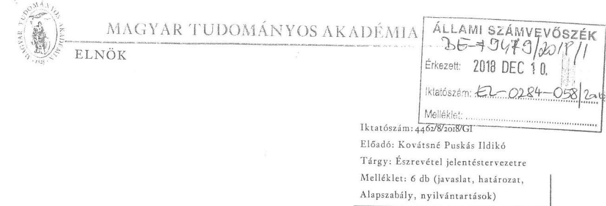

Domokos László elnök úr részére
Állami Számvevőszék
Budapest
Apáczai Csere János utca 10.
1052

# Tisztelt Elnök Úr! 

Az Állami Számvevőszék „Utóellenőrzés - Az MTA egyes kutatóintézeteinek ellenőrzése - a Magyar Tudományos Akadémia kutatóintézeti hálózatának átalakítása, egyes kiemelt kutatóintézetek gazdálkodása és feladatellátása" címú jelentéstervezetét (ikt.sz.: EL-0284048/2018.) megkaptam. Az ÁSZ tv. 29. § (2) bekezdésének megfelelően az ellenőrzés megállapításaira az alábbi észrevételeket teszem:

Az Állami Számvevőszék 2018. július 25 -én az EL-0284-010/2018. iktatószámú levelében jelezte, hogy az 2018. I. félévi ellenőrzési terve alapján Utóellenőrzést végez az „MTA Bölcsészettudományi Kutatóközpont, az MTA Ökológiai Kutatóközpont és az MTA Természettudományi Kutatóközpont vonatkozásában". Sem ebben a tájékoztató levélben, sem a két nappal később érkezett, EL-0284-011/2018. iktatószámú, adatszolgáltatásra felhívó levélben nem jelölte ki az „MTA"-t és az MTA Titkárságát ellenőrzésre.
Ezért az MTA Titkársága jóhiszemúen azt vélelmezte, hogy az Utóellenőrzés csak az Állami Számvevőszék által megjelölt kutatóközpontokra vonatkozik. Ezt 2018. szeptember 6-án az mta_uto@asz.hu e-mail címre küldött levelünkben már észrevételeztük. (1. melléklet)

Az e-mailt követő helyszíni iratbetekintés során az Állami Számvevőszék munkatársai kizárólag csak az ingóvagyon használati szerződés meglétét ellenőrizték. (2. melléklet) Noha többször jeleztük, hogy a Magyar Tudományos Akadémia nincs kijelölve ellenőrzésre, erre konkrét válasz a vizsgálat során nem érkezett.

---

A jelentéstervezet megállapításaihoz fűződő konkrét észrevételeink:

1 .

A Jelentéstervezet 5. oldal utolsó bekezdése szerint: „A Magyar Tudományos Akadémia és az MTA Ökológia Kutatóközpont nem vezette a jogszabály szerinti nyilvántartást az intézkedési tervek végrehajtásáról." Tartalmában megismétlődik a megállapítás a 12. oldal közepén is. A megállapítás törlését kérem, tekintettel arra, hogy a mellékelt dokumentumok igazolják a jogszabályoknak megfelelő nyilvántartások vezetését mind az MTA Ökológiai Kutatóközpontja, mind pedig az MTA Titkársága tekintetében. (3. és 4. melléklet)

2 .

A Jelentéstervezet 8. oldal ötödik bekezdésének törlését kérem, mert az MTA minden, a vonatkozó Intézkedési tervben foglalt kötelezettségét végrehajtotta, tehát az Utóellenőrzés során egyik eset sem állt fenn. Ami fennállt, az az Utóellenőrzés nem egyértelmű elrendelése miatti, egyetlen pontra vonatkozó hiányos adatszolgáltatás.

3 .
A Jelentéstervezet 12. oldalának utolsó bekezdése szerint: „A pénzügyi elszámoltathatóság érvényesülését nem biztositotta az, bogy az MTA gazdasági igazgatója nem bajtotta végre az MTA Alapszabályának felülvizsgálatát, amely arra irányult volna, bogy az akadémiai költségvetési szervek, így az ellenőrzött kutatóintézetek alapító és SZMSZ-ében szerepeltetni kell-e a vállalkozási tevékenység eredményfelosztásának szabályait."

Kérem a megállapítás törlését tekintettel arra, hogy az Alapszabály felülvizsgálata megtörtént (5. melléklet), amelynek eredményeként az MTA 2016. évi Közgyűlése a 25/2016. (V.2.) számú határozatával elfogadta az Alapszabály módosítását (6. melléklet), az ÁSZ ellenőrzésre figyelemmel, az alábbiak szerint:
„Asz. 55. §
(5) A kutatóközpont és az önálló kutatóintézet közfeladatát, alaptevékenységét, vállalkozási tevékenységének felső határát az alapitó skiratban, rendjét, a munkamegosztást, a vállalkozási eredmény felosztásának szabályait, továbbá a kutatóközpont és a kutatóintézet alaptevékenységebez kapcsolódó, de nem kötelezö jelleggel végzett tevékenységével kapcsolatos rendelkezéseket, a rendszeresen ellátott vállalkozási tevékenység körét, a feladat ellátásának rendjét, a munkamegosztást - a vonatkozó jogszabályok szerint - a kutatóközpont és az önálló kutatóintézet szervezeti és müködési szabályzatában rögzíti."

Az alapellenőrzéshez kapcsolódó jelentés az MTA ÖK és MTA TTK főigazgatói részére fogalmazott meg megállapítást az MTA Alapszabályát érintően.
A pénzügyi elszámoltathatóság biztosított volt az MTA ÖK és az MTA TTK vonatkozásában, tekintettel arra, hogy az érintett intézetek SZMSZ-e jogszabályoknak megfelelő, mivel az MTA Alapszabályának felülvizsgálatát követően abból törlésre került a vállalkozási tevékenység eredmény felosztásával összefüggő rész.

1051 Budapest, Széchenyi István tér 9. (1245 Budapest, Pf. 1000)
Telefon: +36 I 332-7176, +36 I 331-9353 / Fax: +36 I 332-8943 / E-mail: elnokseg@titkarsag.mta.hu / www.mta.hu

---

Tájékoztatom, hogy az MTA hatályos Alapszabálya mindenki számára folyamatosan elérhető az alábbi linken:
https://mta.hu/data/MTAtv_ASZ_Ugyrend_egyseges_szerkezetben_hatalyos_20170901tol.pdf

4 .
A Jelentéstervezet 12. oldalán az alábbi, MTA-ra vonatkozó megállapítás olvasható: „Az MTA a felelősségi körébe tartozó két intézkedésböl egyet nem bajtott végre." A fentiekre való tekintettel kérem, a megállapítás módosítását, mert az MTA végrehajtotta az Intézkedési tervben vállalt valamennyi feladatát.

5 .
A Jelentéstervezet I. sz. mellékletének 9. és 16. pontjai szerint „Az MTA Alapszabályának felülvizsgálata nem történt meg." Kérem a pontok tényeknek megfelelő módosítását.

Tekintettel arra, hogy az alapellenőrzéshez kapcsolódó, az MTA-t érintő intézkedések a fentiek szerint hiánytalanul végrehajtásra kerültek, kérem az Utóellenőrzés jelentéstervezet megállapításainak felülvizsgálatát. Amennyiben a levelemben feltárt adatbekérési, kijelölési pontatlanságokból eredő, itt felsorolt megállapítások vizsgálata indokolja, készséggel állunk rendelkezésre az Utóellenőrzés újbóli megnyitására és akár helyszíni betekintéssel állításaink igazolására. Bízom benne, hogy Együttmúködési Megállapodásunkhoz híven megnyugtató módon tudjuk lezárni az Utóellenőrzést.

Budapest, 2018. december „ $\&_{n}$
Üdvözlettel

Lovász László

---

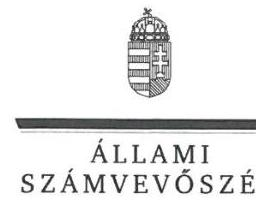

ELNÖK

# Dr. Lovász László úr 

elnök
Magyar Tudományos Akadémia

## Budapest

## Tisztelt Elnök Úr!

Az „Utóellenörzések - Az MTA egyes kutatóintézeteinek ellenörzése - A Magyar Tudományos Akadémia kutatóintézeti hálózatának átalakítása, egyes kiemelt kutatóintézetek gazdálkodása és fel-adatellátása ellenörzése" címmel készített számvevőszéki jelentéstervezetre a Magyar Tudományos Akadémia észrevételeit köszönettel megkaptam.
Az Állami Számvevőszék észrevételekre vonatkozó álláspontjáról a felügyeleti vezető által készített részletes tájékoztatást csatoltan megküldőm.
Tájékoztatom Elnök urat, hogy a számvevőszéki jelentésben - az Állami Számvevőszékről szóló 2011. évi LXVI. törvény 29. § (3) bekezdése alapján - a figyelembe nem vett észrevételeket szerepeltetjük az elutasítás indokának feltüntetésével.

Budapest, 2019. 0 hó 0 nap
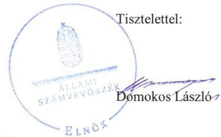

Melléklet: Tájékoztatás észrevételek kezeléséről

---

# Tájékoztatás észrevételek kezeléséről 

Az „Utóellenörzések - Az MTA egyes kutatóintézeteinek ellenörzése - A Magyar Tudományos Akadémia kutatóintézeti hálózatának átalakítása, egyes kiemelt kutatóintézetek gazdálkodása és fel-adatellátása ellenörzése" címủ jelentéstervezetre a 4462/8/2018/GI iktatószámú levélben megküldött észrevételét áttekintettem. Az észrevétel kezeléséről az alábbi tájékoztatást adom.

## 1.) A Főbb megállapítások, következtetések vonatkozásában megfogalmazott észrevételre adott válasz

Az észrevételében előadja, hogy a Jelentéstervezet 5. oldal utolsó bekezdése szerint „A Magyar Tudományos Akadémia és az MTA Ökológiai Kutatóközpont nem vezette a jogszabály szerinti nyilvántartást az intézkedési tervek végrehajtásáról". A megállapítás törlését kéri tekintettel arra, hogy az észrevételéhez mellékelt dokumentum igazolja a jogszabályoknak megfelelő nyilvántartás vezetését mind az MTA Ökológiai Kutatóközpont, mind az MTA Titkársága tekintetében.
Az észrevételt nem fogadjuk el. Az ÁSZ - ellenőrzési program alapján lefolytatott - ellenőrzésének megállapításai az ellenőrzött szervezetek által az ÁSZ rendelkezésére bocsátott dokumentumokon alapulnak. Az MTA Ökológiai Kutatóközpontjának, illetve az MTA Titkárságának az adatszolgáltatása nem tartalmazta az Elnök úr mostani leveléhez csatolt dokumentumokat annak ellenére, hogy az MTA Ökológiai Kutatóközpontjának föigazgatója, illetve - Elnök úr felhatalmazása alapján - az MTA gazdasági igazgatója az adatszolgáltatással összefüggésben „Teljességi és hitelességi nyilatkozat"-ot állított ki, amelyben rögzítette, hogy az adatszolgáltatás teljes körű és hiteles. E nyilatkozatokra tekintettel a jelentéstervezet észrevételezése során az ÁSZ rendelkezésére bocsátott dokumentumot nem áll módunkban figyelembe venni.

## 2.) Az ellenőrzés háttere, indokoltsága 5. bekezdéséhez megfogalmazott észrevételre adott válasz

Az észrevételében a jelentéstervezet 8. oldal ötödik bekezdésének törlését kéri, mivel az MTA minden, a vonatkozó Intézkedési tervben foglalt kötelezettségét végrehajtotta, tehát az Utóellenőrzés során egyik eset sem áll fenn. Ami fennállt, az az Utóellenőrzés nem egyértelmủ elrendelése miatt, egyetlen pontra vonatkozó hiányos adatszolgáltatás.
A hivatkozott bekezdés törlésére vonatkozó észrevétellel nem értünk egyet, mivel az nem az MTA-ra nézve tartalmaz megállapítást, hanem általánosságban mutatja be az utóellenőrzések hátterét és indokoltságát.

---

# 3.) A Megállapítások 8. bekezdéséhez megfogalmazott észrevételre adott válasz 

Az észrevételében kéri, hogy a Jelentéstervezet 12. oldal utolsó bekezdésében, a pénzügyi elszámoltathatóság érvényesülésével kapcsolatban megfogalmazott megállapítást töröljük, ugyanis az MTA részéről az Alapszabály felülvizsgálata megtörtént, amelynek eredményeként az MTA 2016. évi Közgyülése a 25/2016. (V.2.) számú határozatával elfogadta az Alapszabály módosítását. Észrevétele mellékleteként megküldte mind az Alapszabály módosításáról, mind annak elfogadásáról szóló dokumentumot.
Az észrevételt nem fogadjuk el. Az ÁSZ - ellenőrzési program alapján lefolytatott - ellenőrzésének megállapításai az ellenőrzött szervezetek által az ÁSZ rendelkezésére bocsátott dokumentumokon alapulnak. Az MTA Titkárságának az adatszolgáltatása nem tartalmazta az Alapszabály felülvizsgálatára vonatkozó dokumentumot annak ellenére, hogy - Elnök úr felhatalmazása alapján - az MTA gazdasági igazgatója az adatszolgáltatással összefüggésben „Teljességi és hitelességi nyilatkozat"-ot állított ki, amelyben rögzítette, hogy az adatszolgáltatás teljes körű és hiteles. Mindezekre tekintettel a jelentéstervezet észrevételezése során az ÁSZ rendelkezésére bocsátott dokumentumot nem áll módunkban figyelembe venni. Az intézkedési terv az Alapszabály felülvizsgálatára és nem annak módosítására fogalmaz meg feladatot, következésképpen az Alapszabály módosításának ténye - amelyet nyilvános dokumentum bizonyít - nem változtatja meg a felülvizsgálat dokumentáltságának hiányát. Mindazonáltal az ÁSZ értékeli, és a jelentésben feltünteti azt a tényt, hogy az Alapszabály vonatkozó paragrafusának a módosításáról az MTA Közgyülése határozatot fogadott el. Ennek megfelelően a jelentéstervezet 12. oldalának 8. bekezdését az alábbi mondattal egészítjük ki: „A felülvizsgálat dokumentáltságának hiányán nem változtat az a tény, hogy az MTA Közgyülése a 25/2016. (V.2.) számú határozatával az Alapszabály vonatkozó rendelkezését (55.§) módosította."

## 4.) A Megállapítások 1. bekezdéséhez megfogalmazott észrevételre adott válasz

Az észrevételében kéri, hogy a Jelentéstervezet 12. oldal első bekezdését, miszerint „Az MTA a felelősségi körébe tartozó két intézkedésből egyet nem hajtott végre", módosítsuk, figyelembe véve a jelentéstervezet észrevételezése során rendelkezésünkre bocsájtott dokumentumokat.
Az észrevételt nem fogadjuk el. A jelentéstervezet észrevételezése során az ÁSZ rendelkezésére bocsátott dokumentumokat az 1.) és 3.) pontoknál részletezettek szerint nem tudjuk figyelembe venni, ezért a 4.) pontnál hivatkozott megállapítás sem kerül módosításra.

## 5.) Az I. sz. melléklethez megfogalmazott észrevételre adott válasz

Az észrevételében kéri a jelentéstervezet I. sz. mellékletében a 9. és 16. pontjainak módosítását, amely szerint „Az MTA Alapszabályának felülvizsgálata nem történt meg".
Az észrevételt részben fogadjuk el. A jelentéstervezet észrevételezése során az ÁSZ rendelkezésére bocsátott dokumentumokat a 3.) pontoknál részletezettek szerint nem tudjuk figyelembe venni, azt azonban tényként kezeljük, hogy az Alapszabály módosítására sor került. Erre tekintettel a jelentéstervezet mellékletének a 9. és a 16. pontját a következőképpen módosítjuk: „Az

---

MTA Alapszabályának felülvizsgálatát a MTA gazdasági igazgatója dokumentált módon nem végezte el."

Budapest, 2019. 01. hó 01. nap

Dr. Pulay Gyula
felügyeleti vezető

---

# Domokos László elnök úr részére 

Állami Számvevőszék

Budapest
Apáczai Csere János utca 10.
1052

Tisztelt Elnök Úr!
Az Állami Számvevőszék „Utóellenőrzés - Az MTA egyes kutatóintézeteinek ellenőrzése - a Magyar Tudományos Akadémia kutatóintézeti hálózatának átalakítása, egyes kiemelt kutatóintézetek gazdálkodása és feladatellátása ellenőrzése" című jelentéstervezetét (ikt.sz.: EL-0284-050/2018.) megkaptam. Az ÁSZ tv. 29. § (2) bekezdésének megfelelően az ellenőrzés megállapításaira az alábbi észrevételeket teszem:

A Jelentéstervezet 5. oldal utolsó bekezdése szerint: „A Magyar Tudományos Akadémia és az MTA Ökológia Kutatóközpont nem vezette a jogszabály szerinti nyilvántartást az intézkedési tervek végrehajtásáról." Tartalmában megismétlődik a megállapítás a 12. oldal közepén is. A megállapítás törlését kérem az MTA ÖK részéről, tekintettel arra, hogy a mellékelt dokumentum igazolja a jogszabályoknak megfelelő nyilvántartás vezetését az MTA Ökológiai Kutatóközpontja tekintetében.

Intézkedési feladatként szerepelt az MTA ÖK-nál az MTA Alapszabály módosítása (sorszám: 16), melynek felelőse az MTA gazdasági igazgatója, és a jogi és igazgatási főosztály főosztályvezetője volt. Az MTA gazdasági igazgatójától kapott tájékoztatás szerint az intézkedés megtörtént, az Alapszabály módosításra került az Állami Számvevőszék észrevételének megfelelően (az MTA 2016. évi Közgyűlése a 25/2016. (V.2.) számú határozatával elfogadta az Alapszabály módosítását). Kérem ezért ennek az észrevételnek a törlését.

Üdvözlettel

Tihany, 2018. 12. 04.
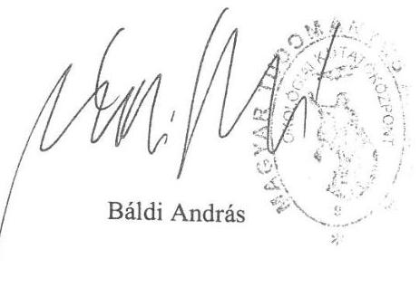

---

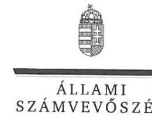

ELNÖK

# Dr. Báldi András úr 

föigazgató
Magyar Tudományos Akadémia Ökológiai Kutatóközpont

Tihany

## Tisztelt Föigazgató Úr!

Az „Utóellenörzések - Az MTA egyes kutatóintézeteinek ellenörzése - A Magyar Tudományos Akadémia kutatóintézeti hálózatának átalakítása, egyes kiemelt kutatóintézetek gazdálkodása és fel-adatellátása ellenörzése" címmel készített számvevőszéki jelentéstervezetre a Magyar Tudományos Akadémia Ökológiai Kutatóközpont észrevételeit köszönettel megkaptam.
Az Állami Számvevőszék észrevételekre vonatkozó álláspontjáról a felügyeleti vezető által készített részletes tájékoztatást csatoltan megküldőm.
Tájékoztatom Főigazgató urat, hogy a számvevőszéki jelentésben - az Állami Számvevőszékről szóló 2011. évi LXVI. törvény 29. § (3) bekezdése alapján - a figyelembe nem vett észrevételeket szerepeltetjük az elutasítás indokának feltüntetésével.

Budapest, 2018. év 12. hó 24. nap
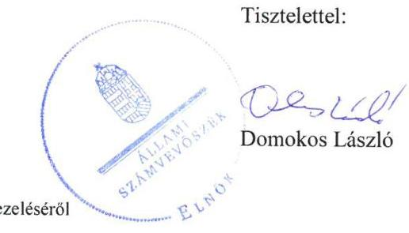

Melléklet: Tájékoztatás észrevételek kezeléséről

---

# Tájékoztatás észrevételek kezeléséről 

Az „Utóellenőrzések - Az MTA egyes kutatóintézeteinek ellenőrzése - A Magyar Tudományos Akadémia kutatóintézeti hálózatának átalakítása, egyes kiemelt kutatóintézetek gazdálkodása és fel-adatellátása ellenőrzése" címủ jelentéstervezetre az ÖK-181/8/2018. iktatószámú levélben megküldött észrevételét áttekintettem. Az észrevétel kezeléséről az alábbi tájékoztatást adom.

## 1.) A Főbb megállapítások, következtetések, valamint a Megállapítások 6. bekezdéséhez megfogalmazott észrevételre adott válasz

Az észrevételében előadja, hogy a Jelentéstervezet 5. oldal utolsó bekezdése szerint „A Magyar Tudományos Akadémia és az MTA Ökológiai Kutatóközpont nem vezette a jogszabály szerinti nyilvántartást az intézkedési tervek végrehajtásáról.". Előadja továbbá, hogy tartalmában megismétlődik a megállapítás a 12. oldal közepén is. A megállapítás törlését kéri az MTA ÖK részéről, tekintettel arra, hogy az észrevételéhez mellékelt dokumentum igazolja a jogszabályoknak megfelelő nyilvántartás vezetését az MTA Ökológiai Kutatóközpont tekintetében.
Az észrevételt nem fogadjuk el. Az ÁSZ - ellenőrzési program alapján lefolytatott - ellenőrzésének megállapításai a Társaság által az ÁSZ rendelkezésére bocsátott dokumentumokon alapulnak. A Társaság adatszolgáltatása nem tartalmazta az MTA Ökológiai Kutatóközpont ÖK-15/2/2016. iktatószámú „beszámoló a 2015. évi intézkedési tervek megvalósitásáról" tárgyú dokumentumát annak ellenére, hogy az ÁSZ adatbekérésre felhívó levele ezt a dokumentumot kifejezetten kérte. Tájékoztatom továbbá, hogy Főigazgató úr az adatszolgáltatással összefüggésben „Teljességi és hitelességi nyilatkozat"-ot állított ki, amelyben rögzítette, hogy az adatszolgáltatás teljes körű és hiteles. Mindezekre tekintettel a jelentéstervezet észrevételezése során az ÁSZ rendelkezésére bocsátott dokumentumot nem áll módunkban figyelembe venni.

## 2.) Az I. sz. melléklet 16. pontjához megfogalmazott észrevételre adott válasz

Az észrevételében előadja, hogy az MTA ÖK-nál az MTA Alapszabály módosítása intézkedési feladatként szerepelt, amelynek felelőse az MTA gazdasági igazgatója, valamint a jogi és igazgatási főosztály főosztályvezetője volt. Jelzi továbbá, hogy az MTA gazdasági igazgatójától kapott tájékoztatás szerint az intézkedés megtörtént, az Alapszabály módosításra került az Állami Számvevőszék észrevételének megfelelően (MTA 2016. évi Közgyűlésének 25/2016. (V.2.) számú határozata).

---

Az észrevételt tudomásul vesszük, ezzel kapcsolatban az MTA elnöke is megfogalmazott észrevételt. Az Állami Számvevőszék ennek az észrevételnek a kezelésére vonatkozóan a Magyar Tudományos Akadémia elnökének írt válaszlevelében ad tájékoztatást.

Budapest, 2018. év 12. hó 24. nap

Dr. Pulay Gyula felügyeleti vezető

---

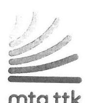

| MAGYAR TUDOMÁNYOS AKAGÉMIA | LEVÉLÓM: 1525 BUDAPEST, PF. 17. |
| :-- | :-- |
| TERMÉSZETTUDOMÁNYI: KUTATÓKÖZFONT | TELEFON: +36 1 582 6900 |
| FÓIGAZGATÓ | E-MAIL: POKOL.GYORGY@TTK.MTA.HU |
| 1117 BUDAPEST, MAGYAR TUDÓSOK KÖRÚTJA 2 | WWW.TTK.MTA.HU |

Iktatószám: $3863 \mid 2018$
Előadó: Bartha Edit
Tárgy: utóellenőrzés - észrevételek

Domokos László elnök úr részíre.
Állami Számvevőszék

# Budapest 

Apáczai Csere János utca 10.
1052

Tisztelt Elnök Úr!

Az Állami Számvevőszék „Utóellenőrzés - Az MTA egyes kutatóintézeteinek ellenőrzése - a Magyar Tudományos Akadémia kutatóintézeti hálózatának átalakítása, egyes kiemelt kutatóintézetek gazdálkodása és feladatellátása" címú jelentéstervezetét (ikt.szám.: EL-0053//2018.és ikt.szám: EL-0051/2018) köszönettel megkaptam. Az ÁSZ tv. 29. § (2) bekezdésére hivatkozva az ellenőrzés megállapításaira az alábbi észrevételeket teszem. Az egyes észrevételek előtt a jelentéstervezet érintett megállapításait tüntettem fel.

1. A Bkr. 7 §(2) bekezdésével ellentétben nem mérték fel és nem elemezték a TTK tevékenységével kapcsolatos kockázatokat.

A 2016. évi belő ellenőrzési feladatok összeállítása során az intézmény vezetése belső elellenőrzési tandcsadói feladataként hagyta jóvá belső ellenőrzés részére a Kutató központ kockázat felmérési és elemzési feladatainak segitését. A feladat ellátása érdekében -megbízólevél alapján- a belső ellenőrzés javasolta a folyamatgazdák általi, fő es alfolyamatok értékelését, és az értékelési lapok megküldését a belső ellenőrzés részére. A belső ellenőrzés elvégezte az összesitó lapok értékelését, az intézményi összesítések értékelését és az értékelések főófolyamatok szerinti összesítéseket. Az intézmény vezetése előzetesen 2016. szeptemberhónapban egyeztető megbeszélést kezdeményezett, ahol a folyamatgazdákkal ismertették a folyamatfelmérés jelentőségét, az ellátandó feladatot, és a munkavégzés lépéseit. Ennek érdekében a főigazgató körleveles tájékoztatást is megküldött az érdekeltek részére.
A folyamatok értékelése, a folyamatgazdákkal közösen, konzultálás, és egyeztetés útján készült el. A folyamatok összesitését intézeti szinten, a belső ellenőrzési fókusz kialakítását, a tevékenységek kockázati besorolását a tanácsadás során végezték el. A felmeréshez alapdokumentációként, az MTA Titkárság Ellenőrzési Főosztálya által 2015. október hónapban rendelkezésre bocsátott dokumentációt, és az abban foglalt értékelési elveket is felhasználtuk.

---

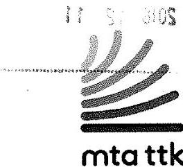

MAGYAR TUDOMÁNYOS AKADÉMIA
TERMESZETTUDOMÁNYI KUTATÓKÖZPONT FÓIGAZGATÓ
1117 BUDAPEST, MAGYAR TUDÓSOK KÖRÚTJA 2.

LEVÉLCM: 1525 BUDAPEST, PF. 17. TELEFON: +3613826900
E-MAIL: POKOI.GYORGY@TTK.MTA.HU WWW.TTK.MTA.HU

Kérem a megállapítás törlését, mivel a kockázatok felmérése és elemzése megtörtént. Ennek dokumentálása a 3417/2016 iktatószámú belső ellenőri jelentésben látható. A kockázatfelmérés első lépéseként az intézmény felmérte a föfolyamatait, amelyek kockázatot hordozhatnak. Négy föfolyamat és 55 alfolyamat került meghatározásra., valamint elfogadásra kerültek a fókuszcélok. is. A kockázatos folyamatok kezelésére a megoldások is kidolgozásra kerültek.
2. A pénzügyi döntések dokumentumainak az arra jogszabályban és írásban meghatalmazott személyek általi jogszerú elökészitését, igazolását dátum megjelölésével (kötelezettségvállalás, ellenjegyzés, érvényesités, teljesitésigazolás) nem igazolták.

Az ellenőrzés iratanyagaként beküldésre került a Gazdálkodási szabályzat 4. számú melléklete, mely tartalmazza a Természettudományi Kutatóközpont kötelezettségvállalás, ellenjegyzés, utalványozás, érvényesítés, valamint teljesítésigazolásra jogosultak nyilvántartását.
A pénzügyi döntések dokumentumainak az arra jogszabályban és írásban meghatározott személyek általi előkészítését, végrehajtását úgy kívánjuk igazolni, hogy a 2015-2018. időszakban egy-egy banki bizonylatot a kötelezettségvállalástól a kifizetésig mellékelten megküldünk az ellenőrzés számára. Csatoljuk azon meghatalmazásokat, melyekből látható, hogy a jogosultak milyen jogkörben (kötelezettségvállaló, ellenjegyző, utalványozó, teljesítésigazoló) jártak el az előkészítés és kifizetés során. A dokumentumok alapján kérjük a megállapítását törlését.
3. A gazdasági szervezet közalkalmazottai munkaköri leírásainak módosítását, ezzel az Ávr. 13 § (5) bekezdésének megfeleltetését dokumentumokkal nem támasztották alá.

A munkaköri leírás minta alapján a Kutatóközpont határidőre elkészítette az új munkaköri leírásokat a gazdasági szervezet közalkalmazottai részére. Azokat levelem mellékleteként megküldöm. Kérem a beküldött dokumentumok alapján a megállapítás törlését.
4. Nem igazolták, hogy a gazdálkodási jogköröket az Ávr. 57 §(4) bekezdése elöírásai szerint és a belső szabályzatban megfelelő személyek végezték.

A Gazdálkodási szabályzat 4. számú melléklete alapján az Ávr 57 § (4) bekezdés előírásai szerint a teljesítésigazolásról szóló jogosultság dokumentumait elkészítettük, és papír alapon azok másolatait mellékelten megküldjük. A mellékletet az intézetek részéről az igazgató és egy kutatócsoport-vezető, a funkcionális feladatokat ellátó szervezeti egységek közül egy osztályvezető és egy beszerző esetére vonatkozóan küldjük meg. Kérem a dokumentumok befogadását és áttekintését, megfelelőség esetén a megállapítás törlését.

---

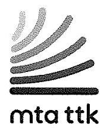

MAGYAR TUDOMÁNYOS AKADÉMIA
TERMÉSZETTUDOMÁNYI KUTATÓKÖZPONT FÓIGAZGATÓ
1157 BUDAPEST, MAGYAR TUDÓSOK KÖRÚTJA 2.

LEVÉLŐM: 1525 BUDAPEST, PF. 17. TELEFON: +36 13826900
E-MAIL: POKOL.GYORGY@TTK.MTA.HU WWW.TTK.MTA.HU

Tisztelt Elnök Úr!
Kérem, hogy észrevételeinket, hiánypótlásainkat szíveskedjenek áttekinteni, mivel ezekkel is igazolnánk az Intézkedési tervben vállalt kötelezettségek teljesítését. Úgy gondolom, hogy az utóellenőrzéshez kapcsolódó, az MTA TTK-t érintő intézkedések a fentiek szerint hiánytalanul végrehajtásra kerültek. Kérem az Utóellenőrzés jelentéstervezet megállapításainak felülvizsgálatát. Amennyiben a levelemben feltárt adatbekérési, kijelölési pontatlanságokból eredő, itt felsorolt megállapítások vizsgálata indokolja, készséggel állunk rendelkezésre az Utóellenőrzés újbóli megnyitására, és természetesen akár helyszíni betekintéssel állításaink igazolására. Bízom benne, hogy Együttmüködési Megállapodásunkhoz híven megnyugtató módon tudjuk lezárni az Utóellenőrzést.

Budapest, 2018.12.04
Tisztelettel
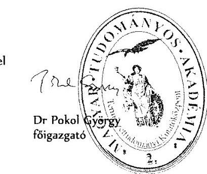

Mellékletek: CD az I-4 pontokban jelzett dokumentumokkal
I, Kockázat felmérés- elemzés dokumentumai
2, pénzügyi dokumentumok kötelezettségvállalások a jogkörökkel meghatalmazott személyek által aláirva, dátummal ellátva
3, a gazdasági szervezet közalkalmazottainak munkaköri leírásai
4, Ávr 57\%(4)bekezdése előirása valamint a belső szabályzók szerinti meghatalmazások megfelelő jogkörökre

---

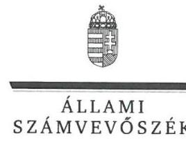

ELNÖK

# Dr. Pokol György úr 

főigazgató
Magyar Tudományos Akadémia Természettudományi Kutatóközpont

## Budapest

## Tisztelt Föigazgató Úr!

Az „Utóellenörzések - Az MTA egyes kutatóintézeteinek ellenörzése - A Magyar Tudományos Akadémia kutatóintézeti hálózatának átalakítása, egyes kiemelt kutatóintézetek gazdálkodása és fel-adatellátása ellenörzése" címmel készített számvevőszéki jelentéstervezetre a Magyar Tudományos Akadémia Természettudományi Kutatóközpont észrevételeit köszönettel megkaptam.
Az Állami Számvevőszék észrevételekre vonatkozó álláspontjáról a felügyeleti vezető által készített részletes tájékoztatást csatoltan megküldöm.
Tájékoztatom Főigazgató urat, hogy a számvevőszéki jelentésben - az Állami Számvevőszékről szóló 2011. évi LXVI. törvény 29. § (3) bekezdése alapján - a figyelembe nem vett észrevételeket szerepeltetjük az elutasítás indokának feltüntetésével.

Budapest, 2019. 1 hó $0 \neq$ nap
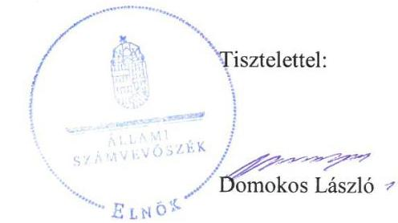

Melléklet: Tájékoztatás észrevételek kezeléséről

---

# Tájékoztatás észrevételek kezeléséről 

Az „Utóellenörzések - Az MTA egyes kutatóintézeteinek ellenörzése - A Magyar Tudományos Akadémia kutatóintézeti hálózatának átalakítása, egyes kiemelt kutatóintézetek gazdálkodása és fel-adatellátása ellenörzése" címủ jelentéstervezetre a 3863/2018. iktatószámú levélben megküldött észrevételét áttekintettem. Az észrevétel kezeléséről az alábbi tájékoztatást adom.

## 1.) A Megállapítások 10. bekezdéséhez megfogalmazott észrevételre adott válasz

Az észrevételében kéri a Megállapítások 10. bekezdésének törlését, amely szerint az MTA TTK a Bkr. 7. § (2) bekezdésével ellentétben nem mérte fel és nem elemezte a TTK tevékenységével kapcsolatos kockázatokat. Előadja, hogy a kockázatok felmérése és elemzése megtörtént, melynek dokumentálása a 3417/2016 iktatószámú belső ellenőri jelentésben látható.
Az észrevételt nem fogadjuk el. A hivatkozott 3417/2016. iktatószámú dokumentum nem egy belső ellenőri jelentés, hanem az „MTA Természettudományi Kutatóközpont Kockázatkezelés Tanácsadás" című tanácsadói munkaanyag. Ennek a Kutatóközpont általi hasznosításáról, a tanácsadó által javasolt kockázatértékelések és a kockázatkezelés nyomon követését biztosító nyilvántartások elkészítéséről semmilyen dokumentumot nem csatoltak. Hasonlóképpen nem dokumentálták, hogy az intézkedési terv első ellenőrzési javaslatra hozott 9. intézkedése felelőseként megjelölt igazgatók a Kutatóközpont tevékenységével kapcsolatos kockázatokat a föigazgatói utasítás szerint felmérték és elemezték. Következésképpen az adatszolgáltatás során az ÁSZ rendelkezésére bocsátott dokumentumok nem támasztják alá azt, hogy az MTA TTK a Bkr. 7. § (2) bekezdésével és a föigazgatói utasításban foglaltakkal összhangban felmérte és elemezte a tevékenységével kapcsolatos kockázatokat.

## 2.) Az I. sz. melléklet 8. pontjához megfogalmazott észrevételre adott válasz

Az észrevételében előadja, hogy az ellenőrzés iratanyagaként beküldésre került a Gazdálkodási szabályzat 4. számú melléklete, mely tartalmazza a Természettudományi Központ kötelezettségvállalás, ellenjegyzés, utalványozás, érvényesítés, valamint teljesítésigazolásra jogosultak nyilvántartását. Ezenfelül tájékoztat arról, milyen - az észrevételezéshez mellékelt - egyéb dokumentumokkal kívánják igazolni a pénzügyi döntések dokumentumainak az arra jogszabályban és írásban meghatározott személyek általi előkészítését.
Az észrevételt nem fogadjuk el. A Gazdálkodási szabályzat hivatkozott 4. számú mellékletét az adatszolgáltatás során valóban az ÁSZ rendelkezésére bocsátották, amely dokumentum egy nyilvántartás a kötelezettségvállalásra, az utalványozásra, a pénzügyi ellenjegyzésre, az érvényesítésre, valamint a teljesítési igazolásra jogosult személyekről. Ez a dokumentum azonban nem támasztja alá, hogy az intézkedési terv második ellenőrzési javaslatra hozott intézkedése megvalósult, azaz a gazdálkodási jogköröket az arra jogszabály alapján, a hivatkozott szabályzat 4. számú mellékletében kijelölt személyek gyakorolták.

---

A jelentéstervezet észrevételezése során az ÁSZ rendelkezésére bocsátott dokumentumokat nem áll módunkban figyelembe venni, mivel Föigazgató úr az adatszolgáltatással összefüggésben „Teljességi és hitelességi nyilatkozat"-ot állított ki, amelyben rögzítette, hogy az adatszolgáltatás teljes körű és hiteles.

# 3.) Az I. sz. melléklet 10. pontjához megfogalmazott észrevételre adott válasz 

Az észrevételében előadja, hogy a munkaköri leírás minta alapján a Kutatóközpont határidőre elkészítette az új munkaköri leírásokat a gazdasági szervezet közalkalmazottai részére, ezek a jelentéstervezet észrevételezése során mellékletként csatoltan megküldésre kerültek. Mindezek alapján kérte a jelentéstervezet I. sz. mellékletének 10. pontjánál megfogalmazott megállapítás törlését.
Az észrevételt nem fogadjuk el. Az intézkedési tervben szereplő feladat végrehajtását igazoló dokumentumként egy üres munkaköri leírás mintát bocsátottak az ÁSZ rendelkezésére. A munkaköri leírás minta tartalmazta, hogy a dolgozót a távollétében a közvetlen felettese által kijelölt munkatárs helyettesíti, azonban ez nem igazolja, hogy a gazdasági szervezet közalkalmazottainak a munkaköri leírásában is szerepel a helyettesítésük rendje.
Tekintettel arra, hogy Főigazgató úr az adatszolgáltatással összefüggésben „Teljességi és hitelességi nyilatkozat"-ot állított ki, amelyben rögzítette, hogy az adatszolgáltatás teljes körű és hiteles, ezért a jelentéstervezet észrevételezése során az ÁSZ rendelkezésére bocsátott, tárgyhoz kapcsolódó dokumentumot nem áll módunkban figyelembe venni.

## 4.) A Megállapítások 9. bekezdéséhez és az I. sz. melléklet 12. pontjához megfogalmazott észrevételre adott válasz

Az észrevételében előadja, hogy a Gazdálkodási szabályzat 4. számú melléklete alapján az Ávr. 57. § (4) bekezdés előírásai szerint a teljesítésigazolásról szóló jogosultság dokumentumait elkészítették, és papír alapon azok másolatait megküldték. Kérik továbbá az észrevételezés során megküldött dokumentumok befogadását és áttekintését, továbbá megfelelőség esetén a megállapítás törlését.
Az észrevételt nem fogadjuk el. Tekintettel arra, hogy Főigazgató úr az adatszolgáltatással öszszefüggésben „Teljességi és hitelességi nyilatkozat"-ot állított ki, amelyben rögzítette, hogy az adatszolgáltatás teljes körű és hiteles, ezért a jelentéstervezet észrevételezése során az ÁSZ rendelkezésére bocsátott, tárgyhoz kapcsolódó dokumentumot nem áll módunkban figyelembe venni.

Budapest, 2019. 04. hó 04. nap
Dr. Pulay Gyula
felügyeleti vezető

---

# RÖVIDÍTÉSEK JEGYZÉKE 

${ }^{1}$ MTA
${ }^{2}$ MTA törvény
${ }^{3}$ ÁSZ
${ }^{4}$ intézkedési terv
${ }^{5}$ kiegészített intézkedési terv
${ }^{6}$ ÁSZ tv.
${ }^{7}$ MTA BTK
${ }^{8}$ MTA ÖK
${ }^{9}$ MTA TTK
${ }^{10}$ Áhsz.
${ }^{11}$ Számv.tv.
${ }^{12}$ MTA TTK számlarendje
${ }^{13}$ MTA TTK számviteli politikája
${ }^{14}$ MTA TTK bizonylati rend
${ }^{15}$ MTA TTK gazdálkodási szabályzat
${ }^{16}$ MTA ÖK szellemi tulajdon-kezelési szabályzata
${ }^{17}$ MTA ÖK gazdálkodási szabályzat
${ }^{18}$ SZJA törvény
${ }^{19}$ MTA BTK pénzkezelési szabályzata
${ }^{20}$ MTA BTK tudományos-szakmai tevékenység ellenőrzési nyomvonala
${ }^{21}$ MTA Alapszabálya
${ }^{22}$ SZMSZ

Magyar Tudományos Akadémia
1994. évi XL. törvény a Magyar Tudományos Akadémiáról

Állami Számvevőszék
1272/10/2015/ET számú intézkedési terv, amely tartalmazza az MTA és az ellenőrzött kutatóintézetek intézkedési tervét
1272/19/2015/ET számú kiegészített intézkedési terv, amely tartalmazza az MTA és az ellenőrzött kutatóintézetek intézkedési tervét
2011. évi LXVI. törvény az Állami Számvevőszékről

Az MTA Bölcsészettudományi Kutatóközpont
MTA Ökológiai Kutatóközpont
MTA Természettudományi Kutatóközpont
4/2013. (I. 11.) Korm. rendelet az államháztartás számviteléről
a számvitelről szóló 2000. évi C. törvény
13/2015. (III.31.) számú Főigazgatói Utasítás az MTA TTK számlarendjéről szóló 16/2015. (III.31.) számú Főigazgatói Utasítás az MTA TTK Számviteli Politikájáról 27/2015. (X.15.) számú Főigazgatói Utasítás az MTA TTK Bizonylati rendjéről 15/2015. (III.31.) számú Főigazgatói Utasítás az MTA TTK Gazdálkodási Szabályzatáról
Az MTA ÖK szellemi tulajdon-kezelési szabályzata
Az MTA ÖK Gazdálkodási Szabályzata
a személyi jövedelemadóról szóló 1995. évi CXVII. törvény
Az MTA BTK pénzkezelési szabályzata
MTA BTK tudományos-szakmai tevékenység ellenőrzésének nyomvonala

Az MTA Közgyűlésének 10/2011. (XII.5.) számú határozata az MTA Alapszabályáról és Úgyrendjéről egységes szerkezetben
Szervezeti és Működési Szabályzat

---

ÁLLAMI SZÁMVEVŐSZÉK
1052 Budapest, Apáczai Csere János utca 10.
Levélcím: 1364 Budapest 4. Pf. 54
Telefon: +36 14849100 Telefax: +36 14849200
www.asz.hu