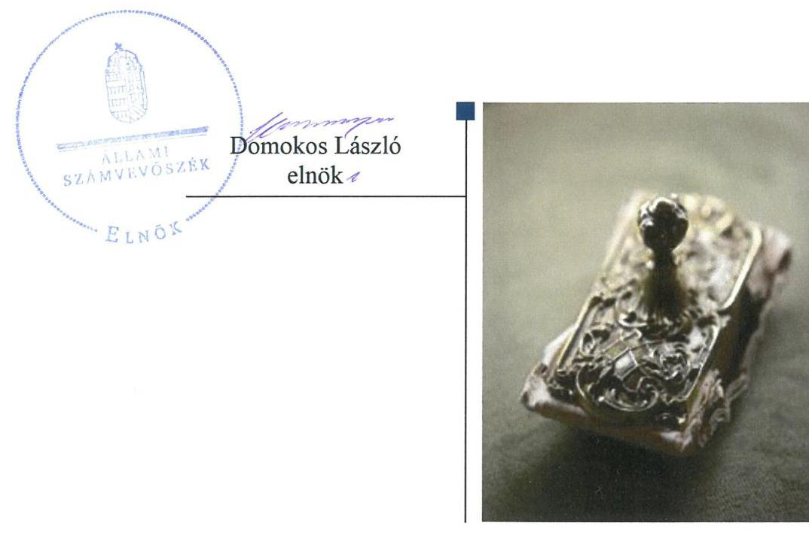
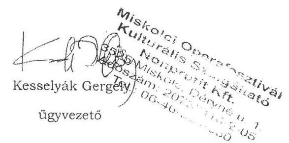
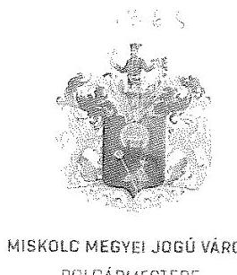
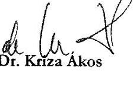
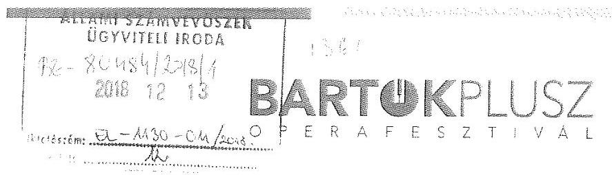
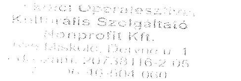
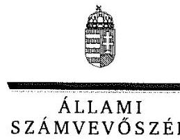
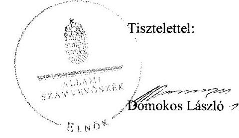
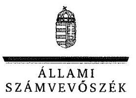

# Jelenetés 

## Utóellenőrzések

Az önkormányzatok többségi tulajdonában lévő gazdasági társaságok közfeladat-ellátásának utóellenőrzése - Miskolci Operafesztivál Kulturális Szolgáltató Nonprofit Kft.
2019.

---

# Jelentés 

## Utóellenőrzések

Az önkormányzatok többségi tulajdonában lévő gazdasági társaságok közfeladat-ellátásának utóellenőrzése - Miskolci Operafesztivál Kulturális Szolgáltató Nonprofit Kft.
2019. 01. hó 23. nap

---

# AZ ELLENŐRZÉST FELÜGYELTE: 

DR. NAGY IMRE felügyeleti vezető

## AZ ELLENŐRZÉST VEZETTE ÉS A VÉGREHAJTÁSÁÉRT FELELŐS:

MOLNÁR ZSUZSANNA ellenőrzésvezető

## A PROGRAM ÖSSZEÁLLÍTÁSÁÉRT FELELŐS:

TÓTPÁL SZABOLCS osztályvezető

## A TÉMÁHOZ KAPCSOLÓDÓ KORÁBBI SZÁMVEVŐSZÉKI JELENTÉSEK:

- címe: Jelentés az önkormányzatok többségi tulajdonában lévő gazdasági társaságok közfeladat-ellátásának ellenőrzéséről - Miskolci Operafesztivál Kulturális Szolgáltató Nonprofit Kft.
- sorszáma: 14067

IKTATÓSZÁM: EL-0268-029/2019
TÉMASZÁM: 2460
ELLENŐRZÉS-AZONOSÍTÓ SZÁM: V-080455

---

# TARTALOMJEGYZÉK 

■ ÖSSZEGZÉS ..... 5
■ AZ ELLENŐRZÉS CÉLJA ..... 6
■ AZ ELLENŐRZÉS TERÜLETE ..... 7
■ AZ ELLENŐRZÉS HÁTTERE, INDOKOLTSÁGA ..... 8
■ A JELENTÉS LÉNYEGES KÉRDÉSKÖRE ..... 9
■ AZ ELLENŐRZÉS HATÓKÖRE ÉS MÓDSZEREI ..... 10
■ MEGÁLLAPÍTÁSOK ..... 12
■ MELLÉKLETEK ..... 13
I. sz. melléklet: Miskolci Operafesztivál Kulturális Szolgáltató Nonprofit Kft. és Miskolc Megyei Jogú Város Önkormányzata intézkedési terve végrehajtásának értékelése ..... 13
II. sz. melléklet: Miskolci Operafesztivál Kulturális Szolgáltató Nonprofit Kft. és Miskolc Megyei Jogú Város Önkormányzata intézkedési terve. ..... 16
■ FÜGGELÉK: ÉSZREVÉTELEK ..... 19
■ RÖVIDÍTÉSEK JEGYZÉKE ..... 25

---

.

---

# ÖSSZEGZÉS 

Az utóellenőrzés megállapította, hogy a Miskolci Operafesztivál Kulturális Szolgáltató Nonprofit Kft. az intézkedési tervben meghatározott feladatokat végrehajtotta, müködésének szabályozottsága, pénzügyi gazdálkodásának szabályszerüsége és átláthatósága javult. Miskolc Megyei Jogú Város Önkormányzata a végrehajtott feladat eredményeként javította a közfeladat-ellátás megszervezésének szabályszerüségét.

## Az ellenőrzés társadalmi indokoltsága

Az Állami Számvevőszék stratégiájában célul tűzte ki a számvevőszéki munka hasznosulásának javítását. Ezzel összhangban ellenőrzi, hogy az ellenőrzött szervezet megvalósította-e a korábbi ellenőrzései által feltárt hibák, hiányosságok és szabálytalanságok megszüntetése céljából elkészített intézkedési tervében foglaltakat. A rendszeres utóellenőrzések hozzájárulnak a szükséges intézkedések tényleges végrehajtásához, ezáltal a közpénzügyek rendezettségének javulásához.

## Főbb megállapítások, következtetések

A Miskolci Operafesztivál Kulturális Szolgáltató Nonprofit Kft. intézkedési tervében meghatározott öt feladatból négyet határidőben, egyet határidőn túl hajtott végre. A Miskolci Megyei Jogú Város Önkormányzata intézkedési tervében meghatározott két feladatból egyet határidőben végrehajtottak, egy feladat nem került végrehajtásra.

A Miskolci Operafesztivál Kulturális Szolgáltató Nonprofit Kft. müködésében a számvevőszéki jelentésben feltárt hiányosságok, szabálytalanságok a végrehajtott intézkedések hatására megszűntek. Leltározási szabályzata és bizonylati rendje a végrehajtott intézkedések eredményeként megfelelt a vállalt határidőre a jogszabályi előírásoknak, a számviteli politika és az értékelési szabályzat a hatályos SZMSZ-szel összhangban tartalmazta a hatás- és felelősségi köröket.

A közhasznú és vállalkozási tevékenységből származó bevételek és ráfordítások számviteli rendszerben megvalósult elkülönített nyilvántartásával javult a pénzügyi gazdálkodás szabályszerűsége és átláthatósága.

A Miskolc Megyei Jogú Város Önkormányzata által végrehajtott intézkedés eredményeként létrejött jogszabályi előírásoknak megfelelő közszolgáltatási szerződéssel javult az önkormányzati közfeladat-ellátás megszervezésének szabályszerűsége.

A jegyző nem gondoskodott a feladatok végrehajtásának jogszabályi előírás szerinti nyilvántartásáról, ezzel nem biztosította a feladatok végrehajtásának nyomon követhetőségét, ami kockázatot jelentett az intézkedési tervben vállalt feladatok határidőben történő végrehajtására.

---

# AZ ELLENŐRZÉS CÉLJA 

Az ellenőrzés célja annak értékelése volt, hogy a számvevőszéki jelentésben ${ }^{1}$ foglalt megállapításokkal összhangban készített intézkedési tervben meghatározott feladatokat az ellenőrzött szervezet végrehajtotta-e.

---

# AZ ELLENŐRZÉS TERÜLETE 

## Miskolci Operafesztivál Kulturális Szolgáltató Nonprofit Kft.

Az Önkormányzat² a Miskolci Operafesztivál Kulturális Szolgáltató Nonprofit Kft.-t 2008. október 16-án átalakulással alapította, a - 2000. május 17-én létesített - Miskolci Operafesztivál Kulturális Szolgáltató Közhasznú Társaság jogutódjaként. A tulajdonosi szerkezet az alapítás óta nem változott, a jegyzett tőke összege változatlanul 3,0 millió Ft volt. A Társaság ${ }^{3}$ az ellenőrzött időszakban főtevékenységként előadó-művészeti tevékenységet végzett, közfeladatát közhasznú szervezetként látta el. Az Társaságnál három tagból álló felügyelőbizottság és könyvvizsgáló működött, az ügyvezető ${ }^{4}$ személye 2016. március 15 -étől változott.

A Társaság 2017-ben 393,5 millió Ft bevételre tett szert, az összes ráfordítás 396,8 millió Ft volt. 2017. évi eszközvagyona 22,9 millió Ft, adózott eredménye -3,3 millió Ft volt.

A Társaság tulajdonosi joggyakorlója Miskolc Megyei Jogú Város Önkormányzata. A polgármester ${ }^{5}$ 2010. október 3-ától töltötte be hivatalát, a jegyző ${ }^{6}$ 2016. december 6-ától látta el feladatát.

Az ÁSZ ${ }^{7}$ az önkormányzatok többségi tulajdonában lévő gazdasági társaságok közfeladat-ellátásának ellenőrzéséről a Társaság vonatkozásában készített 14067 számú számvevőszéki jelentését 2014. április 8-án tette közzé, amely a 2008. január 1. és 2013. november 15. közötti időszakra terjedt ki.

A számvevőszéki jelentés a jegyzőnek kettő, a Társaság ügyvezetője számára öt megállapítást fogalmazott meg.

---

# AZ ELLENŐRZÉS HÁTTERE, INDOKOLTSÁGA 

Az ÁSZ tv. ${ }^{8}$ 33. § (1) bekezdése értelmében a számvevőszéki jelentés megállapításaihoz és javaslataihoz kapcsolódóan az ellenőrzött szervezet vezetője intézkedési tervet köteles összeállítani, és az Állami Számvevőszék részére megküldeni.

Az intézkedési tervben foglaltak megvalósítását - az ÁSZ törvény 33. § (7) bekezdésében foglaltak alapján - az Állami Számvevőszék utóellenőrzés keretében ellenőrizheti. Az utóellenőrzések keretében - az intézkedések értékelése során - az Állami Számvevőszék figyelembe veszi az ellenőrzött szervezetek működési feltételeiben, valamint a jogszabályi előírásokban bekövetkezett változásokat.

Az utóellenőrzés során az ÁSZ értékeli, hogy az érintett számvevőszéki jelentésben foglalt megállapításokkal és javaslatokkal összhangban, az ellenőrzött szervezet által készített intézkedési tervben meghatározott feladatokat a feladatra kijelöltek végrehajtották-e.

Az intézkedések végrehajtásával az adott terület szabályszerű múködése vonatkozásában a kockázatok csökkenhetnek, azonban hosszabb távon az intézkedési tervben foglaltak végrehajtásával önmagában nem szűnnek meg, csak akkor, ha beépülnek az ellenőrzött szervezet működésébe, azokat folyamatosan karban tartják, figyelembe véve, illetve kezelve a változásokat. Emellett az intézkedések végrehajtásáig újabb kockázatok merülhetnek fel a szabályszerű múködés vonatkozásában, amelyek kezelése szintén kiemelten fontos az ellenőrzött szervezet számára.

Az ellenőrzött szervezet vezetője által készített intézkedési tervekben foglalt feladatok hiányos, illetve késedelmes végrehajtása, vagy annak elmaradása a szabályszerűség és a felelős vezetői magatartás vonatkozásában kockázatot hordoz, ami azt mutatja, hogy az ellenőrzések során feltárt hibák, hiányosságok és szabálytalanságok kezelése nem kapott kellő hangsúlyt. Az utóellenőrzés során is fennálló szabálytalanságok esetén a közpénz, közvagyon veszélyeztetettségi kockázat valószínűsített hatásának értékelése további intézkedéseket vonhat maga után.

Az ellenőrzött szervezet szintjén az utóellenőrzés feltárja, hogy a szervezet az intézkedések végrehajtásával hasznosította-e a korábbi ellenőrzési jelentésben a hiányosságok megszüntetése, illetve a kockázatok kezelése érdekében megfogalmazott javaslatokat, illetve az intézkedések végrehajtása elmaradásának következtében továbbra is fennálló szabálytalanság esetén értékeli a közpénzek, közvagyon veszélyeztetettségét.

Az ÁSZ szintjén az utóellenőrzés visszacsatolást ad az ellenőrzési jelentések hasznosulásáról, az intézkedések elmaradásának, vagy részleges megvalósulásának a közpénzek, közvagyon veszélyeztetettségére gyakorolt valószínűsített hatásának értékelése további intézkedéseket vonhat maga után.

---

# A JELENTÉS LÉNYEGES KÉRDÉSKÖRE 

A Társaság és az Önkormányzat az intézkedési tervben foglaltakat az elöirt határidőben végrehajtotta-e?

---

# AZ ELLENŐRZÉS HATÓKÖRE ÉS MÓDSZEREI 

## Az ellenőrzés típusa

Megfelelőségi ellenőrzés.

## Az ellenőrzött időszak

Az utóellenőrzés alapját képező számvevőszéki jelentés közzétételének napjától az ellenőrzésről szóló kiértesítő levél keltének napjáig tartó időszak, 2014. április 8-tól 2018. augusztus 6-ig.

## Az ellenőrzés tárgya

A számvevőszéki jelentésben foglalt megállapításokkal összhangban - a Társaság és az Önkormányzat által - készített Intézkedési tervben foglaltak végrehajtásának ellenőrzése.

## Az ellenőrzött szervezet

Miskolci Operafesztivál Kulturális Szolgáltató Nonprofit Kft. és Miskolc Megyei Jogú Város Önkormányzata.

## Az ellenőrzés jogalapja

Az ellenőrzés jogszabályi alapját az ÁSZ tv. 33. § (7) bekezdése képezi.

## Az ellenőrzés módszerei

Az ellenőrzést az ellenőrzött időszakban hatályos jogszabályok, az ellenőrzés szakmai szabályai, a jelen ellenőrzésre irányadó ÁSZ módszertanok, az ellenőrzési programban foglalt értékelési szempontok szerint végeztük.

Az ellenőrzés ideje alatt az ellenőrzöttel történő kapcsolattartást az ÁSZ SZMSZ ${ }^{9}$-ének vonatkozó előírásai alapján biztosítottuk.

Az utóellenőrzés megállapításait az ÁSZ rendelkezésére álló, valamint az ÁSZ adatbekérése szerint, az ellenőrzött által rendelkezésre bocsátott dokumentumok alapozták meg.

Az ellenőrzési bizonyítékként felhasználható adatforrások közé tartoztak egyrészt az ellenőrzési program részletes szempontjainál felsorolt adatforrások, másrészt minden, az ellenőrzés folyamán feltárt, az ellenőrzés szempontjából információt tartalmazó dokumentum.

---

Az intézkedési tervekben előírt feladatokat azok végrehajthatósága, illetve végrehajtása szempontjából az alábbiak szerint értékeltük:
$\longrightarrow$ „határidőben végrehajtott" a feladat, ha a teljesítés dokumentáltan, az intézkedési tervben előírt határidőben és tartalommal megtörtént;
$\longrightarrow$ „határidőn túl végrehajtott" a feladat, ha annak teljesítése az intézkedési tervben meghatározott módon, de az abban előírt határidőn túl történt meg;
$\longrightarrow$ „részben végrehajtott" a feladat, ha végrehajtása teljes körűen az intézkedési tervben előírt módon nem történt meg;
$\longrightarrow$ „nem végrehajtott" a feladat, ha a végrehajtás nem történt meg, dokumentumokkal nem igazolt annak teljesítése;
$\longrightarrow$ „okafogyottá vált" a feladat, ha végrehajtására - meghatározott esemény bekövetkezése, továbbá külső körülmény, a múködést érintő feltétel változása miatt - már nincs szükség, illetve lehetőség, és egyértelműen megállapítható, hogy az intézkedést szükségessé tevő körülmény a jövőben nem fordulhat elő;
$\longrightarrow$ „nem időszerü" az a feladat, amelynek ellenőrzési időszakon belüli végrehajtására azért nem került (kerülhetett) sor, mert az intézkedés alapjául szolgáló esemény nem következett be, de annak jövőbeni előfordulása lehetséges, a végrehajtása nem volt esedékes, vagy a végrehajtás határideje még nem járt le.
Az ellenőrzés lefolytatásához az ellenőrzött a tanúsítványok elektronikus kitöltésével, valamint az ÁSZ által kért dokumentumok elektronikus megküldésével szolgáltatott adatokat, amelyek valódiságát és teljes körűségét az ellenőrzött szervezet vezetője által tett teljességi és hitelességi nyilatkozat igazolja. Az így rendelkezésre bocsátott adatok, információk kontrollja az ellenőrzés keretében megtörtént.

---

# A Társaság és az Önkormányzat az intézkedési tervben foglaltakat az elöírt határidőben végrehajtotta-e? 

Összegző megállapítás

A Társaság az intézkedési tervben vállalt feladatokat végrehajtotta. Az Önkormányzat két feladatból egyet nem hajtott végre. Az intézkedési tervben meghatározott feladatok végrehajtásáról az Önkormányzat nem vezette az előírásoknak megfelelő nyilvántartást.

A Társaság az általa készített intézkedési tervben meghatározott öt feladatból négyet határidőben, egyet határidőn túl hajtott végre. Az Önkormányzat intézkedési tervében meghatározott két feladatból egyet nem hajtott végre, egyet határidőben végrehajtott

A feladatokat, határidőket, megjelölt felelősöket és a feladatok végrehajtásának értékelését az I. sz. melléklet mutatja be.

A jegyző nem gondoskodott a feladatok végrehajtásának a Bkr. ${ }^{10}$ 14. § (1) bekezdésben foglaltak szerinti nyilvántartásáról, mert a vezetett nyilvántartás nem tartalmazta az intézkedési terv alapján végrehajtott intézkedések rövid leírását, illetve a végre nem hajtott intézkedések okát.

A TÁRSASÁG múködésének szabályozottsága és belsőkontroll szerinti elszámoltathatósága javult a megtett intézkedések hatására. A vállalt határidőben gondoskodtak a Számv. tv.-nek ${ }^{11}$ megfelelő leltározási szabályzat ${ }^{12}$ és bizonylati rend ${ }^{13}$ elkészítéséről (1., 2.), a számviteli politikának ${ }^{14}$ és az értékelési szabályzatnak ${ }^{15}$ a hatályos SZMSZ-szel ${ }^{16}$ összhangban lévő hatás- és felelősségi körökkel történt kiegészítéséről (3.), valamint közremúködtek a jogszabályi előírásoknak megfelelő közszolgáltatási szerződés létrejöttében. (4.)

A pénzügyi gazdálkodás szabályszerűségét és átláthatóságát javította a közhasznú és vállalkozási tevékenységből származó bevételek és ráfordítások számviteli rendszerben történő - 2017-ben megvalósult - elkülönített nyilvántartása. (5.)

AZ ÖNKORMÁNYZAT közfeladat ellátásának szabályozottságát javította, hogy - az alapító okiratból ${ }^{17}$ az Emtv.-re ${ }^{18}$ való hivatkozás törlésével - gondoskodtak a közszolgáltatási szerződés jogszabályi előírásoknak való megfelelőségéről. (6.)

---

# MELLÉKLETEK

- I. SZ. MELLÉKLET: MISKOLCI OPERAFESZTIVÁL KULTURÁLIS SZOLGÁLTATÓ NONPROFIT KFT. ÉS MISKOLC MEGYEI JOGÚ VÁROS ÖNKORMÁNYZATA INTÉZKEDÉSI TERVE VÉGREHAJTÁSÁNAK ÉRTÉKELÉSE

|  1. | Intézkedési terv alapján elvégzendő feladat | Az intézkedési tervben meghatározott határidő | Az intézkedési tervben meghatározott felelős | Az intézkedési tervben meghatározott feladat végrehajtása  |
| --- | --- | --- | --- | --- |
|   | 1. | 2.
Miskolci Operafesztivál Kulturális Szolgáltató Nonprofit Kft. határidőben végrehajtott feladatok |  | 4.  |
|  Ú1 | A Leltárkészítési és leltározási szabályzat javítása a Számviteli törvény 69.§ (3) bekezdése szerint. | azonnal | ügyvezető | A leltározási szabályzat 2014. április 28-án megtörtént javítása - a Számv. tv. 69. § (3) bekezdésében foglaltak szerint - a tárgyi eszközök három évente kötelező mennyiségi leltárfelvételét írta elő.  |
|  Ú2. | A Számviteli törvény 161. § (2) bekezdése alapján a Bizonylati Rend elkészítése. | 2014. augusztus 31. | ügyvezető | Elkészítették a vállalt határidőre a Számv. tv. 161. § (2) d) pontja szerinti bizonylati rendet, amely 2014. szeptember 1-jétől hatályba lépett.  |
|  Ú3. | A Számviteli Politika és az Eszközök és Források Értékelési Szabályzatának módosítása a hatás- és felelősségi körök szempontjából. | azonnal | ügyvezető | A számviteli politika és az értékelési szabályzat módosítása - a hatályos SZMSZ-nek megfelelő - hatás- és felelősségi körökkel történt kiegészítés révén 2014. április 18-án megtörtént.  |
|  Ú5. | Közremüködés a Közszolgáltatási szerződés módosításában, annak érdekében, hogy az megfeleljen az Emtv. 13. § (2) bekezdésében előírtaknak.
A közszolgáltatási szerződés nem felel meg a törvényi előírásoknak az alapító okiratban szereplő Emtv.-re való hivatkozás miatt. Az Állami Számvevőszék által megfogalmazott, törvényi szabályozásnak való megfelelésnek oly módon tudunk leggyorsabban és legegyszerűbben eleget tenni, hogy az alapító okiratot módosítjuk, hogy a hivatkozás az Emtv.-re a továbbiakban ne szerepeljen benne (9.7. pont). Ily módon elkerülhető a Közszolgáltatási szerződés módosítása. A társaság egyébiránt az Elő-adó-művészeti Törvény hatálya alá nem tartozik. Az | 2014. december 31. | ügyvezető | Az ügyvezető az intézkedési tervben vállaltaknak megfelelően közreműködött a vállalt feladat végrehajtásában. Az alapító okiratból - az intézkedési tervben meghatározottaknak megfelelően - az Emtv.-re való hivatkozást 2014. december 11-én törölték, szükségtelenné téve ezzel a közszolgáltatási szerződésnek ${ }^{19}$ az Emtv. előírásaiból fakadó tartalmi hiányosságok miatti módosítását. Az alapító okirat módosítását az arra - a 40/2012. (XII.15) önkormányzati rendelet ${ }^{20}$ alapján átruházott - hatáskörrel rendelkező önkormányzati bizottság ${ }^{21}$ jóváhagyta.  |

---

# *Mellékletek*

|  Intézkedési terv alapján elvégzendő feladat | Az intézkedési terv-ben meghatározott határidő | Az intézkedési tervben meghatározott felelős | Az intézkedési tervben meghatározott feladat végrehajtása  |
| --- | --- | --- | --- |
|  1. | 2. | 3. | 4.  |
|  alapító okirat módosításának jóváhagyása Miskolc MJV Közgyűlésének hatásköre, az előterjesztést a nyári szünet miatt legkorábban az őszi időszakban lehet benyújtani. |  |  |   |
|  **Határidőn túl végrehajtott feladat** |  |  |   |
|  Ü4. Az Operafesztivál számviteli rendszerében a közhasznú és vállalkozási tevékenységből származó bevételek és ráfordítások elkülönített nyilvántartásának kialakítása. | folyamatos, legkésőbb 2014. december 31. | ügyvezető | A közhasznú és vállalkozási tevékenységből származó bevételek és ráfordítások számviteli rendszerben történő – a Civil tv.-ben²² és az alapító okiratban előírtak szerinti – elkülönített nyilvántartása határidőn túl, 2017-ben valósult meg egy új ügyviteli rendszer bevezetésével.  |
|  **Miskolc Megyei Jogú Város Önkormányzata** |  |  |   |
|  **Határidőben végrehajtott feladat** |  |  |   |
|  J1. Az 1. pontban hivatkozott Emtv. 13. § (2) bekezdése a nyilvántartásba vett előadó-művészeti szervezetekre vonatkozik, a Miskolci Operafesztivál Kulturális Szolgáltató Nonprofit Kft. nem felel meg a regisztrált előadó-művészeti szervezetek számára előírt paramétereknek, így a szervezet érvényes Alapító Okiratának 9.7. pontjában az előadó-művészeti szervezetek támogatásáról és sajátos foglakoztatási szabályairól szóló 2008. évi XCIX. törvény 3. §-ára történő hivatkozás hibásan szerepel az okiratban. Intézkedési javaslatunk az, hogy a Miskolci Operafesztivál Kulturális Szolgáltató Nonprofit Kft. Alapító Okiratának 9.7. pontjának módosítását, az Emtv.-re való hivatkozást, valamint a közművelődési feladatokra történő utalás törlését, Közgyűlés elé történő beterjesztését kezdeményezzük annak jóváhagyása érdekében. Ezzel a korrekcióval a Közszolgáltatási szerződés módosításával kapcsolatban tett intézkedési javaslat szükségtelenné válik. | 2014. december 31. | jegyző | Az alapító okiratból – az intézkedési tervben meghatározottaknak megfelelően –az Emtv.-re való hivatkozást 2014. december 11-én törölték. Az alapító okirat módosítását az arra – a 40/2012. (XII.15) önkormányzati rendelet alapján átruházott – hatáskörrel rendelkező önkormányzati bizottság hagyta jóvá.  |

---

|  1. | 2. | 3.  |
| --- | --- | --- |
|  1. |  | Nem végrehajtott feladat  |
|  J2. | Az önkormányzati támogatásokkal, a támogatások felhasználásával a támogatási szerződésben foglaltak szerint el kell számolni. Az ÁSZ vizsgálat által érintett 2008-2012. évek vonatkozásában el kell készíteni a hitelesített számlamásolatokkal és számviteli bizonylatokkal ellátott elszámolásokat. | 2014. december 31.  |

Az intézkedési tervben meghatározott feladat végrehajtása

Az intézkedési tervben meghatározott feladat végrehajtása

Az Áht.23 53. §. (1) bekezdésében és az intézkedési tervben meghatározottak ellenére nem készültek el 2008-2012. évek vonatkozásában a támogatási szerződésben foglaltak szerint – hitelesített számlamásolatokkal és számviteli bizonylatokkal ellátott – az elszámolások az önkormányzati támogatások felhasználására vonatkozóan.

---

# Miskolci Operafesztivál Nonprofit Kft. 

## Intézkedési terv Állami Számvevőszéki jelentéshez

Iktatószám: V-0307-105/2014, vizsgálati azonosító: V06530217
01. 1.) A Leltárkészítési és leltározási szabályzat javítása a Számviteli törvény 69.§ (3) bekezdése szerint.

Határidő: azonnal
Felelős: számviteli szolgáltatást végző szerv
02. 2.) A Számviteli törvény 161.§ (2) bekezdése alapján a Bizonylati Rend elkészítése.

Határidő: 2014. augusztus 31.
Felelős: számviteli szolgáltatást végző szerv
03. 3.) A Számviteli Politika és az Eszközök és Források Értékelési Szabályzatának módosítása a hatás-és felelősségi körök szempontjából.

Határidő: azonnal
Felelős: számviteli szolgáltatást végző szerv
04. 4.) Az Operafesztivál számviteli rendszerében a közhasznú és vállalkozási tevékenységből származó bevételek és ráfordítások elkülönített nyilvántartásának kialakítása.

Határidő: folyamatos, legkésőbb 2014.december 31.
Felelős: számviteli szolgáltatást végző szerv
05. 5.) Közremüködés a Közszolgáltatási szerződés módosításában, annak érdekében, hogy az megfeleljen az Emtv. 13 §. (2) bekezdésében elöírtaknak.

A közszolgáltatási szerződés nem felel meg a törvényi előírásoknak az alapító okiratban szereplő Emtv.-re való hivatkozás miatt. Az Állami

---

Számvevőszék által megfogalmazott, törvényi szabályzásnak való megfelelésnek oly módon tudunk leggyorsabban és legegyszerübben eleget tenni, hogy az alapító okiratot módosítjuk, hogy a hivatkozás az Emtv.-re a továbbiakban ne szerepeljen benne (9.7.pont). Ily módon elkerülhető a közszolgáltatási szerződés módosítása. A társaság egyébiránt az Előadó-művészeti Törvény hatálya alá nem tartozik. Az alapító okirat módosításának jóváhagyása Miskolc MJV Közgyűlésének hatásköre, az előterjesztést a nyári szünet miatt legkorábban az őszi időszakban lehet benyújtani.

Határidő: 2014. december 31.
Felelős: MOF, Miskolc MJV közgyűlése

Miskolc, 2014. május 9.

---

# INTÉZKEDÉSI TERV 

Az Állami Számvevőszékről szóló 2011. évi LXVI. törvény 33. § (1) bekezdésében foglaltak értelmében az önkormányzatok többségi tulajdonában lévő gazdasági társaságok közfeladatellátásának ellenőrzéséről, a Miskolci Operafesztivál Kulturális Szolgáltató Nonprofit Kft. vizsgálata során készült jelentésben Miskolc Megyei Jogú Város Önkormányzata részére foglalt megállapításokhoz kapcsolódó intézkedések:
11. 1. Az 1. pontban hivatkozott Emtv. 13 § (2) bekezdése a nyilvántartásba vett előadóművészeti szervezetekre vonatkozik, a Miskolci Operafesztivál Kulturális Szolgáltató Nonprofit Kft. nem felel meg a regisztrált előadó-művészeti szervezetek számára előírt paramétereknek, így a szervezet érvényes Alapító Okiratának 9.7. pontjában az előadóművészeti szervezetek támogatásáról és sajátos foglalkoztatási szabályairól szóló 2008. évi XCIX. törvény 3. §-ára történő hivatkozás hibásan szerepel az okiratban.
Intézkedési javaslatunk az, hogy a Miskolci Operafesztivál Kulturális Szolgáltató Nonprofit Kft. Alapító Okiratának 9.7. pontjának módosítását, az Emtv.-re való hivatkozást, valamint a közművelődési feladatokra történő utalás törlését, Közgyűlés elé történő beterjesztését kezdeményezzük annak jóváhagyása érdekében. Ezzel a korrekcióval a Közszolgáltatási szerződés módosításával kapcsolatban tett intézkedési javaslat szükségtelenné válik.

Felelős: Jegyző
Végrehajtásért felelős: Humán Főosztály
Határidő: Operafesztivál Nonprofit Kft. ügyvezető igazgatója 2014. december 31.
12. Az önkormányzati támogatásokkal, a támogatások felhasználásával a támogatási szerződésekben foglaltak szerint el kell számolni. Az ÁSZ vizsgálat által érintett 2008-2012. évek vonatkozásában el kell készíteni a hitelesített számlamásolatokkal és számviteli bizonylatokkal ellátott elszámolásokat.

Felelős: Jegyző
Végrehajtásért felelős: Operafesztivál Nonprofit Kft ügyvezető igazgatója
Közreműködik: Humán Főosztály,
Határidő: Gazdálkodási Főosztály
2014. december 31.

Miskolc, 2014. május 8.

Dr. Krizza Ákos
Miskolc Megyei Jogú Város
polgármestere

---

# FÜGGELÉK: ÉSZREVÉTELEK 

A jelentéstervezetet a Számvevőszék 15 napos észrevételezésre megküldte az ellenőrzött szervezetek vezetőinek az ÁSZ tv. 29. §* (1) bekezdése előírásának megfelelően.

A Miskolc Megyei Jogú Város Önkormányzata nemleges észrevételt tett. A Miskolci Operafesztivál Kulturális Szolgáltató Nonprofit Kft. ügyvezetője élt az ÁSZ tv. 29. § (2) bekezdésében foglalt észrevételezési jogával, a törvényes határidőn belül észrevételt tett. A függelék tartalmazza az ellenőrzött észrevételeit, illetve az el nem fogadott észrevételek elutasításának indoklását.

[^0]
[^0]:    * 29. § (1) Az Állami Számvevőszék az ellenőrzési megállapításait megküldi az ellenőrzött szervezet vezetőjének vagy az általa megbízott személynek, és annak, akinek személyes felelősségét állapította meg.
    (2) Az ellenőrzött szervezet vezetője és a felelősként megjelölt személy az ellenőrzés megállapításaira tizenöt napon belül írásban észrevételt tehet.
    (3) Az Állami Számvevőszék az észrevételre a beérkezésétől számított harminc napon belül írásban válaszol. A figyelembe nem vett észrevételeket köteles a jelentésben feltüntetni, és megindokolni, hogy azokat miért nem fogadta el.

---

MISKOLC MEGYEI JODŐ VÁROS POLGÁRMESTERE

Ikt.: 852115-4/2018.

Tárgy: Jelentéstervezettel kapcsolatos észrevétel

Hivatkozás:EL-1130-006/2018.

# Állami Számvevőszék   Domokos László Elnök Úr részére 

Budapest 4.
PI. 54
1364

## Tisztelt Elnök Úr!

Köszönettel kézhez vettük az „Utóellenőrzések - Az önkormányzatok többségi tulajdonában lévő gazdasági társaságok közfeladat-ellátásának utóellenőrzése - Miskolci Operafesztivál Kulturális Szolgáltató Nonprofit Kft." címmel készített számvevőszéki jelentéstervezetüket.

A jelentéstervezettel kapcsolatosan észrevételt tenni nem kívánok.
Kérem a fentiek szíves tudomásulvételét.

Miskolc, 2018. december 12.12

Tisztelettel:

---

# Függelék: Észrevételek 

Állami Számvevőszék
1052 Budapest
Apáczai Csere János utca 10.

Tárov: Számvevőszéki jelentéstervezet - észrevétel
Az önkormányzatok többségi tulajdonában lévő gazdasági társaságok közfeladat-ellátásának utóellenőrzése - Miskolci Operafesztivál Kulturális Szolgáltató Nonprofit Kft. 2018

## Tisztelt Állami Számvevőszék!

A 2018. november 27-én érkezett EL-1130-008/2018. iktatószámú, fenti tárgyú jelentéstervezethez szeretnénk észrevételt füzni.

A jelentéstervezet szerint társaságunk intézkedési tervének 4-es pontját határidőn túl teljesítettük. A csatolt levél szerinti utóellenőrzés első megkezdésekor, azaz 2017. októberben kérték az intézkedési terv megvalósulások bemutatását (akkor az utóellenőrzés nem zárult le, 2018 augusztusában indult meg újra). Az intézkedési terv 4-es pontja a közhasznú és a vállalkozási tevékenységből származó bevételek és ráfordítások elkülönített nyilvántartását írta elő a számviteli rendszerben, 2014. december 31-i határidővel. Nem volt útmutatás vagy javaslat arra nézve, hogy teljes nyilvántartásunkat elektronikus feltöltés útján hogyan mutathatnánk be, így végül a közhasznú/vállalkozási analitikus technikai kódok meglétét az utóellenőrzés megkezdésének idején éppen aktuális főkönyvvel támasztottuk alá. Sajnos személyes vagy telefonos megbeszélés abban az időben nem történt, így juthatott - joggal - az Állami Számvevőszék arra a következtetésre, hogy a bemutatott főkönyv, azaz 2017 előtt ezek az analitikus kódok nem léteztek, azonban a valóságban 2014. december 31-ével az analitikus kódok létre lettek hozva, és 2015. januártól kezdve így működik a rendszer. Ennek bemutatására jelen levelünkhöz mellékeljük a 2017. évihez hasonlóan a 2015. ill. 2016. évi fökönyveket.

Kérjük ezért Önöket tisztelettel, hogy a jelentéstervezetnél a fentieket figyelembe venni, illetve azon módosítani szíveskedjenek.

Eljárásukat ezúton is köszönjük.

Miskolc, 2018. december 10.

Tisztelettel
J a ha $a$ e a le
Farkas Beáta
ügyvezető
Miskolci Operafesztivál Kulturáláaliroda:
Szolgáltató Nonprofit Kft.
Miskolc: Operafesztivál
Nonprofit Kft.
3525 Miskolc
Daryne u. 1.
Levelezési cím:
3501 Miskolc, Pf. 634
Tel.: $\quad+3848504060$
Fax: $\quad+3848504068$
Központi e-mail:
operami@t-online.hu
Honlap: www.operafesztival.hu

---

# Farkas Beáta Úrhölgy 

ügyvezető

Miskolci Operafesztivál Kulturális Szolgáltató Nonprofit Kft.

## Miskolc

## Tisztelt Ügyvezető Úrhölgy!

Az „Utóellenörzések - Az önkormányzatok többségi tulajdonában lévő gazdasági társaságok köz-feladat-ellátásának ellenörzése - Miskolci Operafesztivál Kulturális Szolgáltató Nonprofit Kft." címmel készített számvevőszéki jelentéstervezetre tett észrevételeit köszönettel megkaptam.
Az Állami Számvevőszék észrevételekre vonatkozó álláspontjáról a felügyeleti vezető által készített részletes tájékoztatást csatoltan megküldöm.
Tájékoztatom Ügyvezető úrhölgyet, hogy a számvevőszéki jelentésben - az Állami Számvevőszékről szóló 2011. évi LXVI. törvény 29. § (3) bekezdése alapján - a figyelembe nem vett észrevételeket szerepeltetjük annak megindoklásával, hogy azokat miért nem fogadtuk el.

Budapest, 2013. év 01 hó 62 nap

Melléklet: Tájékoztatás az észrevételek kezeléséről

---

FELÜGYELETI VEZETŐ

Melléklet
Ikt.szám: EL-1130-013/2018

# Tájékoztatás   az észrevételek kezeléséről 

Az „Utóellenőrzések - Az önkormányzatok többségi tulajdonában lévő gazdasági társaságok köz-feladat-ellátásának ellenörzése - Miskolci Operafesztivál Kulturális Szolgáltató Nonprofit Kft." címủ jelentéstervezetre 2018. december 11-én tett (az Állami Számvevőszékhez 2018. december 13-án érkezett) észrevételét áttekintettük, annak kezelésével kapcsolatban a következő tájékoztatást adom.

## A jelentéstervezet I. sz. melléklet, Határidőn túl végrehajtott feladatok, Ü4. sorára vonatkozó észrevétel:

A Társaság ügyvezetője az Állami Számvevőszék jelentéstervezetének I. sz. mellékletében a Határidőn túl végrehajtott feladatként bemutatott Ü4. sorszám alatti intézkedési terv alapján elvégzendő feladattal kapcsolatban tett észrevételt. Az intézkedési terv e feladata a Társaság számviteli rendszerében a közhasznú és vállalkozási tevékenységből származó bevételek és ráfordítások elkülönített nyilvántartásának kialakítását tartalmazta, 2014. december 31-ei határidővel.
Az ügyvezető észrevétele szerint „nem volt útmutatás arra nézve, hogy a teljes nyilvántartás elektronikus feltöltés útján hogyan mutathatnák be, igy a közhasznú/vállalkozási analitikus technikai kódok meglétét az utóellenörzés megkezdésének idején éppen aktuális fökönyvével támasztották alá. "

Az észrevételt nem fogadjuk el. A Társaság az észrevételhez csatolt 2015. és 2016. évre vonatkozó, a bevételek és ráfordítások elkülönített nyilvántartását alátámasztó főkönyvi kivonatokat az ellenőrzés időszakában nem adta át az ellenőrzés részére, melynek tényét az ügyvezető a jelentéstervezetre adott észrevételében elismerte.
Az észrevétel alapján a jelentéstervezet módosítása nem indokolt.
Budapest, 2475 .év 07 hó 02 nap
Dr. Nagy Imre
felügyeleti vezető

---

.

---

# RÖVIDÍTÉSEK JEGYZÉKE 

${ }^{1}$ számvevőszéki jelentés

${ }^{2}$ Önkormányzat
${ }^{3}$ Társaság
${ }^{4}$ ügyvezető
${ }^{5}$ polgármester
${ }^{6}$ jegyző
${ }^{7}$ ÁSZ
${ }^{8}$ ÁSZ tv.
${ }^{9}$ ÁSZ SZMSZ
${ }^{10}$ Bkr.
${ }^{11}$ Számv. tv
${ }^{12}$ leltározási szabályzat
${ }^{13}$ bizonylati rend
${ }^{14}$ számviteli politika
${ }^{15}$ értékelési szabályzat
${ }^{16}$ SZMSZ
${ }^{17}$ alapító okirat
${ }^{18}$ Emtv.
${ }^{19}$ közszolgáltatási szerződés
${ }^{20}$ 40/2012. (XII.15) önkormányzati rendelet
${ }^{21}$ hatáskörrel rendelkező bizottság

Jelentés - az önkormányzatok többségi tulajdonában lévő gazdasági társaságok közfeladat-ellátásának ellenőrzéséről Miskolci Operafesztivál Kulturális Szolgáltató Nonprofit Kft.
Miskolc Megyei Jogú Város Önkormányzata
Miskolci Operafesztivál Kulturális Szolgáltató Nonprofit Korlátolt Felelősségű Társaság
Miskolci Operafesztivál Kulturális Szolgáltató Nonprofit Korlátolt Felelősségű Társaság ügyvezetője
Miskolc Megyei Jogú Város Önkormányzatának polgármestere
Miskolc Megyei Jogú Város Polgármesteri Hivatalának jegyzője
Állami Számvevőszék
az Állami Számvevőszékről szóló 2011. évi LXVI. törvény
(hatályos: 2011. július 1-jétől)
az Állami Számvevőszék elnökének 4/2017. (XII.29.) ÁSZ utasítása az Állami
Számvevőszék Szervezeti és Működési Szabályzatáról
(hatályos: 2018. január 1-jétől)
a 370/2011. (XII. 31.) Korm. rendelet a költségvetési szervek belső
kontrollrendszeréről és belső ellenőrzéséről (hatályos: 2012. január 1-jétől)
2000. évi C. törvény a számvitelről (hatályos 2001. január 1-jétől)
A Miskolci Operafesztivál Kulturális Szolgáltató Nonprofit Kft. - Leltárkészítési és Leltározási Szabályzata (hatályos: 2014. április 28-tól)
Miskolci Operafesztivál Kulturális Szolgáltató Nonprofit Kft. - Bizonylati rend (hatályos 2014. szeptember 1-jétől, módosítva, kiegészítve 2016. március 16-án, 2016. április 10-én)
Miskolci Operafesztivál Kulturális Szolgáltató Nonprofit Kft. - Számviteli Politika (hatályos 2009. február 1-jétől, kiegészítve, módosítva 2010. március 10-én, 2014. április 18-án, 2015. február 1-jén)
Miskolci Operafesztivál Kulturális Szolgáltató Nonprofit Kft. - Eszközök és Források Értékelési szabályzata (hatályos 2009. március 1-jétől, módosítva, kiegészítve 2010. március 10-én, 2014. április 18-án, 2015. február 1-jén, 2016. március 16-án)
Szervezeti Müködési Szabályzat
A Miskolci Operafesztivál Kulturális Szolgáltató Nonprofit Kft. Alapító Okirata módosításokkal egységes szerkezetben (hatályos 2014. december 11-étől) 2008. évi XCIX. törvény az előadó-művészeti szervezetek támogatásáról és sajátos foglalkoztatási szabályairól (hatályos 2008. december 19-től)
Miskolc Megyei Jogú Város Önkormányzata és a Miskolci Operafesztivál Kulturális Szolgáltató Nonprofit Kft. között létrejött Közszolgáltatási szerződés (hatályos: 2013. január 1-jével)
Miskolc Megyei Jogú Város Közgyűlésének 40/2012. (XII.15) önkormányzati rendelete az Önkormányzat vagyonáról és a vagyongazdálkodásáról (hatályos: 2012. december 15-től)
Miskolc Megyei Jogú Város Önkormányzatának Városgazdálkodási ésüzemeltetési Bizottsága

---

${ }^{22}$ Civil.tv.
${ }^{23}$ Áht.
2011. évi CLXXV. törvény az egyesülési jogról, a közhasznú jogállásról, valamint a civil szervezetek múködéséről és támogatásáról (hatályos: 2011. december 22-től)
2011. évi CXCV. törvény az államháztartásról

---

ÁLLAMI SZÁMVEVŐSZÉK
1052 Budapest, Apáczai Csere János utca 10.
Levélcím: 1364 Budapest 4. Pf. 54
Telefon: +36 14849100 Telefax: +36 14849200
www.asz.hu