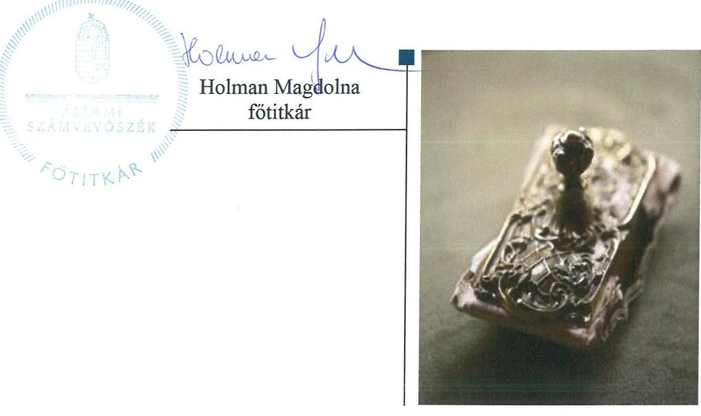

# Jelenetés 

## Kampánypénzek ellenőrzése

A 2018. évi országgyűlési képviselő-választási kampányra fordított pénzeszközök elszámolásának ellenőrzése a jelölő szervezeteknél - Párbeszéd Magyarországért Párt 2019.

---

# Jelenetés 

## Kampánypénzek ellenőrzése

A 2018. évi országgyűlési képviselő-választási kampányra fordított pénzeszközök elszámolásának ellenőrzése a jelölő szervezeteknél - Párbeszéd Magyarországért Párt 2019. 01. hó 16. nap

---

# AZ ELLENŐRZÉST FELÜGYELTE: 

DR. NAGY IMRE felügyeleti vezető

## AZ ELLENŐRZÉST VEZETTE ÉS A VÉGREHAJTÁSÁÉRT FELELŐS:

NEMESVÁRI-HORTHY ESZTER ellenőrzésvezető

## A PROGRAM ÖSSZEÁLLÍTÁSÁÉRT FELELŐS:

TÓTPÁL SZABOLCS osztályvezető

## A TÉMÁHOZ KAPCSOLÓDÓ KORÁBBI SZÁMVEVŐSZÉKI JELENTÉSEK:

- címe: Kampánypénzek ellenőrzése - A 2014. évi országgyűlési képviselő-választási kampányra fordított pénzeszközök elszámolásának ellenőrzése a képviselethez jutott jelölő szervezeteknél
- sorszáma: 15057

IKTATÓSZÁM: EL-1461-002/2019.
TÉMASZÁM: 2492
ELLENŐRZÉS-AZONOSÍTÓ SZÁM: V083605

---

# TARTALOMJEGYZÉK 

■ ÖSSZEGZÉS ..... 5
■ AZ ELLENŐRZÉS CÉLJA ..... 6
■ AZ ELLENŐRZÉS TERÜLETE ..... 7
■ AZ ELLENŐRZÉS HÁTTERE, INDOKOLTSÁGA ..... 9
■ A JELENTÉS LÉNYEGES KÉRDÉSKÖRE ..... 10
■ AZ ELLENŐRZÉS HATÓKÖRE ÉS MÓDSZEREI ..... 11
■ MEGÁLLAPÍTÁSOK ..... 13
■ MELLÉKLETEK ..... 15
I. sz. melléklet: Értelmező szótár ..... 15
■ FÜGGELÉKEK ..... 17
I. sz. függelék a Megállapítások fejezethez ..... 17
II. sz. függelék az észrevételek kezeléséhez ..... 19
■ RÖVIDÍTÉSEK JEGYZÉKE ..... 23

---

.

---

# ÖSSZEGZÉS 

A Párbeszéd Magyarországért Párt a kampányköltések mértékére előirt korlátozás betartása és a választások tisztaságát szolgáló finanszírozási tilalmak érvényre juttatása tekintetében nem biztositotta az átláthatóságát és elszámoltathatóságát.

## Az ellenőrzés társadalmi indokoltsága

A pártok az állampolgárok egyesülési szabadsága alapján létrehozott olyan szervezetek, amelyek kereteket nyújtanak a népakarat kialakításához és kinyilvánításához, a politikai életben való állampolgári részvételhez.

A pártok az országgyűlési képviselő-választási kampány során az esélyegyenlőség biztosítása érdekében jelentős központi költségvetési támogatást használnak fel. A központi költségvetésből és az egyéb forrásból felhasznált kam-pánypénz-költések átláthatóságának biztosítása fontos társadalmi érdek. Ennek érvényesülése érdekében az Állami Számvevőszék a választást követő egy éven belül hivatalból ellenőrzi a választásra fordított állami és a pártok működéséről és gazdálkodásáról szóló 1989. évi XXXIII. törvényben meghatározott más pénzeszközök felhasználását.

## Főbb megállapítások, következtetések

A Párbeszéd Magyarországért Párt az Állami Számvevőszék felé fennálló közreműködési kötelezettségét nem teljesítette, mivel törvényi előírás ellenére a bírósági nyilvántartásban szereplő székhelyén nem biztosította a jognyilatkozatok fogadását és a jogszabályban meghatározott iratainak elérhetőségét. A Párbeszéd Magyarországért Párt nem bocsátott adatot az ellenőrzés rendelkezésére, ezért a kampányköltésekre törvényben előírt, jelöltenkénti legfeljebb 5 millió forintos korlátozás betartása, valamint a tiltott vagyoni hozzájárulások elfogadása a Párbeszéd Magyarországért Pártnál nem volt átlátható és elszámoltatható.
Következtetés
A Párbeszéd Magyarországért Pártnál a kampánypénzek ellenőrzése során megállapított lényeges szabálytalanság, az elszámoltathatóság hiánya felveti, hogy a Párbeszéd Magyarországért Pártnál, mint a müködéséhez költségvetési támogatásban részesülő pártnál jelenleg nem biztositottak a törvényes gazdálkodás feltételei, és felmerül a rendeltetésellenes közpénzfelhasználás veszélye. Az elszámoltathatóság biztosítása érdekében a Párbeszéd Magyarországért Pártnak kell intézkednie, hogy igazolja azoknak a feltételeknek a fennállását, amelyek a párt törvényes gazdálkodásához, és a közpénzek törvényes felhasználásához szükségesek.

---

# AZ ELLENŐRZÉS CÉLJA 

AZ ELLENŐRZÉS CÉLJA annak feltárása volt, hogy a pártlistákra leadott összes érvényes szavazat legalább 1\%-át megszerzett pártok, valamint az országgyúlési választásokon képviselethez jutott országos nemzetiségi önkormányzatok (jelölő szervezetek) a Kftv. ${ }^{1}$ előírásait betartották-e.

Az ellenőrzés célja továbbá annak megállapítása volt, hogy:
— az egyéni jelöltek Kftv. 1. § alapján nekik járó egymillió forint összegű, központi költségvetésből juttatott támogatásról a Kftv. 2/A. § alapján a jelölő szervezetek részére történő lemondása esetén a jelölő szervezetek az így kapott támogatást a választási kampányidőszakban, a választási kampánytevékenységgel összefüggő kiadások finanszírozására fordították-e;
— a jelölő szervezetek a Kftv. 3. § és 4. §-ai szerint, a központi költségvetésből juttatott támogatást a választási kampányidőszak alatt, a választási kampánytevékenységgel összefüggő kiadások finanszírozására fordították-e;
— a jelölő szervezetek jelöltjeikkel együtt betartották-e a Kftv. 7. § (1) bekezdésében meghatározott, jelöltenkénti - a kampány költségeinek korlátját jelentő - ötmillió forint összeghatárt;
— a pártok, mint jelölő szervezetek, a Párt tv. ${ }^{2}$ 4. §-ában meghatározott forrásokat vették-e igénybe a választási kampányidőszak alatt, a választási kampánytevékenységgel összefüggő kiadások finanszírozására.

---

# AZ ELLENŐRZÉS TERÜLETE 

## Párbeszéd Magyarországért Párt

## AZ ORSZÁGGYŰLÉSI KÉPVISELŐK VÁLASZTÁSA

során a kampányköltségek átláthatóvá tételének, az esélyegyenlőség és a választások tisztasága biztosításának kereteit a Kftv. foglalja össze. A Kftv. előírásai szerint a pártok a központi költségvetésből a kampányköltségeik finanszírozására két jogcímen részesülhetnek támogatásban. Egyrészt a Kftv. 1. §-a alapján a pártok egyéni választókerületben indított egyéni jelöltjei által a nekik járó 1 millió Ft összegű támogatásról a Kftv. 2/A. § szerint lemondott összegből, másrészt a Kftv. 3. §-a szerint a pártlistát állító pártok által az egyéni választókerületekben állított jelöltek száma alapján. Az egyéni jelöltek által a párt javára lemondott támogatásokat a pártok a Kincstárral ${ }^{3}$ kötött megállapodás alapján kártyafedezeti számlán kapják meg és a Kftv. előírásai szerint kizárólag a választási kampányidőszak alatt, kampánytevékenységgel összefüggő dologi kiadásra fordíthatják. A pártok a Kincstár felé a jelöltet jelölő párt nevére szóló, a Számv. tv. ${ }^{4}$ és az ÁFA tv. ${ }^{5}$ előírásai szerint kiállított számlákkal kötelesek elszámolni a felhasznált támogatási összeggel, amely elszámolást a Kftv.-ben foglaltak szerint a Kincstár ellenőriz. A pártokat visszafizetési kötelezettség terheli a Kftv. szerint a kiesett és az egyéni választókerületben leadott érvényes szavazatok legalább 2\%-át el nem érő jelöltek után járó támogatási összeg tekintetében, amelyet a Kincstár határozattal állapít meg. A Kftv. 3. §-a szerinti központi költségvetési támogatást a pártok kizárólag a választási kampányidőszak alatt, kampánytevékenységgel összefüggő kiadások finanszírozására fordíthatják. A Kftv. előírásai szerint a pártok kampányköltségei jelöltenként az ötmillió forintos összeghatárt nem haladhatják meg.

A központi költségvetési támogatások mellett a pártok a kampányköltségeik finanszírozásához egyéb forrásaikat is felhasználhatják. Igénybe vehető egyéb forrásaikat a Párt tv. határozza meg. A Párt tv. előírásai szerint jogi személytől, jogi személyiséggel nem rendelkező szervezettől, más államtól, külföldi szervezettől, nem magyar állampolgár magánszemélytől, névtelen adományozótól vagyoni hozzájárulást nem fogadhatnak el. A Párbeszéd Magyarországért Párt Hivatalos Értesítőben nyilvánosságra hozott beszámolója a 2018. évi országgyűlési képviselő-választásra fordított egyéb forrásként 2,5 millió Ft állami költségvetési támogatást (melyből az állami kampánytámogatás 0 Ft ) és 3,3 millió Ft adományt tartalmazott.

A PÁRBESZÉD MAGYARORSZÁGÉRT PÁRT a 2018. évi országgyűlési képviselők általános választására a Kftv. 1., 2/A. és 3. §-a szerinti központi költségvetési támogatásban nem részesült. A Magyar Szocialista Párttal közös pártlistát állított, két egyéni választókerületi jelöltje a Magyar Szocialista Párt javára mondott le a Kftv. 1. §-a szerinti támogatás igénybevételéről. A Kftv. 6. § (7) bekezdése alapján a Párbeszéd Magyarországért Párt és a Magyar Szocialista Párt úgy állapodott meg, hogy a Kftv. 3. §-a szerinti támogatást 100\%-ban a Magyar Szocialista Pártnak folyósítsa a Kincstár. A Kftv. 3. § (2) bekezdése szerint a Magyar Szocialista Párt és a Párbeszéd Magyarországért Párt, mint közös listát állító pártok egy pártnak

---

tekintendők, ezért a Párbeszéd Magyarországért Pártnál csak a saját forrásaira terjedt ki az ellenőrzés, a megállapodásukra tekintettel a költségvetési támogatás felhasználásának ellenőrzésére a Magyar Szocialista Pártnál került sor.

---

# AZ ELLENŐRZÉS HÁTTERE, INDOKOLTSÁGA 

A Kftv. 9. § (2) bekezdése értelmében az ÁSZ ${ }^{6}$ a választást követő egy éven belül az országgyűlési képviselethez jutott jelölő szervezetek vonatkozásában kötelezően, hivatalból, az országgyűlési képviselethez nem jutott jelölő szervezetek tekintetében kérelemre ellenőrzi a választásra fordított állami és a Párt tv.-ben meghatározott más pénzeszközök felhasználását. A Kftv. 2017. november 24-étől hatályos 8/C. § (2a) bekezdése értelmében az Állami Számvevőszék az országgyűlési képviselők általános választását követő egy éven belül hivatalból ellenőrzi a Kftv. 3. § szerinti támogatás felhasználását azoknál a pártlistát állító pártoknál, amelyek pártlistája a pártlistákra leadott összes érvényes szavazat legalább 1\%-át megszerezte. A Párt tv. 10. § (1) bekezdése alapján az ÁSZ jogosult a pártok gazdálkodása törvényességének ellenőrzésére. Az országgyűlési képviselő-választásra fordított pénzeszközök felhasználása ellenőrzését indokolja a Kftv.-ben és a Párt tv.-ben foglalt előírások betartásának ellenőrzése.

---

# A JELENTÉS LÉNYEGES KÉRDÉSKÖRE 

Betartotta-e a választási kampány költségeire vonatkozó törvényi előírásokat a Párbeszéd Magyarországért Párt?

---

# AZ ELLENŐRZÉS HATÓKÖRE ÉS MÓDSZEREI 

## Az ellenőrzés típusa

Szabályszerúségi ellenőrzés.

## Az ellenőrzött időszak

A választási eljárásról szóló törvény (Ve. ${ }^{7}$ ) 139. §-ában rögzített - a szavazás napját megelőző 50. naptól (2018. február 17-étől) a szavazás befejezésének időpontjáig (2018. április 8 -áig) tartó - választási kampányidőszak, valamint az azt követő elszámolási időszak, azaz a Kftv. 9. § (1) bekezdés szerint az országgyűlési választást követő (2018. június 7 -éig tartó) 60 nap.

## Az ellenőrzés tárgya

A pártlistát állító párt írásba foglalt Kftv. 3/A. § (1) bekezdés szerinti nyilatkozatának a megléte, rendelkezésre állása.

A kampánytevékenységhez köthető bizonylatok szabályszerűsége, hitelessége, a Kincstárral kötött megállapodásban, illetve a Számv. tv. 166. §ában előírt alaki és tartalmi kellékei megléte.

A költségvetési támogatásból és egyéb forrásból finanszírozott valamennyi kiadásnak a választási kampányidőszak alatti, illetve a kampánytevékenységre történő teljesítése.

## Az ellenőrzött szervezet

Párbeszéd Magyarországért Párt

## Az ellenőrzés jogalapja

Az ellenőrzés jogszabályi alapját a Kftv. 8/B. § (1) bekezdése, a 8/C. § (2a) bekezdése és 9. § (2) bekezdése, valamint a Párt tv. 10. § (1) bekezdése képezték.

## Az ellenőrzés módszerei

Az ellenőrzésre az ellenőrzési program szempontjai, az ellenőrzött időszakban hatályos jogszabályok, az ellenőrzés szakmai szabályai és az ÁSZ módszertanok alapján került sor.

---

Az ellenőrzési bizonyítékként felhasználható adatforrások közé tartoztak egyrészt az ellenőrzési program részletes szempontjainál felsorolt adatforrások, másrészt minden egyéb - az ellenőrzés folyamán feltárt, az ellenőrzés szempontjából információt tartalmazó - dokumentum.

Az ellenőrzés ideje alatt az ellenőrzött szervezettel való kapcsolattartást az ÁSZ az ÁSZ SZMSZ²-ének vonatkozó előírásai alapján biztosította.

Az ellenőrzés lefolytatásához az ÁSZ az ellenőrzött jelölő szervezet mellett adatszolgáltatásra kérte fel a Kincstárat és a Nemzeti Választási Irodát.

Az ellenőrzés lefolytatásához az ÁSZ az ellenőrzés előkészítésére, kapcsolattartó kijelölésére és adatszolgáltatás teljesítésére vonatkozó értesítést küldött a Párbeszéd Magyarországért Párt bírósági nyilvántartásban bejegyzett székhelyére. A Párbeszéd Magyarországért Párt a törvényi előírás ellenére nem volt elérhető bejegyzett székhelyén, közreműködési kötelezettségének nem tett eleget, ezzel az ellenőrizhetőség alapfeltételeit nem biztosította.

---

# MEGÁLLAPÍTÁSOK 

## Betartotta-e a választási kampány költségeire vonatkozó törvényi előírásokat a Párbeszéd Magyarországért Párt?

Összegző megállapítás

A Párbeszéd Magyarországért Párt nem biztosította a kampányköltések mértékére előírt korlátozás betartása és a választások tisztaságát szolgáló finanszírozási tilalmak érvényre juttatása tekintetében az átláthatóságot és az elszámoltathatóságot.

A Párbeszéd Magyarországért Párt részére az ÁSZ az ellenőrzés előkészítésére, kapcsolattartó kijelölésére és adatszolgáltatásra felhívó értesítést küldött a bírósági nyilvántartásban szerepelő székhelyére. Az egyesülési jogról, a közhasznú jogállásról, valamint a civil szervezetek múködéséről és támogatásáról szóló 2011. évi CLXXV. törvény alapján létrehozott és a pártok múködéséről és gazdálkodásáról szóló törvény szerint múködő pártokról a civil szervezetek bírósági nyilvántartásáról és az ezzel összefüggő eljárási szabályokról szóló 2011. évi CLXXXI. törvény szerint a bíróság vezeti a nyilvántartást, amely nyilvántartás közhiteles és tartalmazza a szervezet székhelyét.

A Párbeszéd Magyarországért Párt az Állami Számvevőszék felé fennálló, az Állami Számvevőszékről szóló 2011. évi LXVI. törvény 28. § (2) bekezdésében foglalt közremúködési kötelezettségét nem teljesítette, mivel a Polgári Törvénykönyvről szóló 2013. évi V. törvény 3:7. §-a ellenére székhelyén a részére címzett jognyilatkozatok fogadását és a jogszabályban meghatározott iratainak elérhetőségét nem biztosította.

A Párbeszéd Magyarországért Párt nem bocsátott adatot az ellenőrzés rendelkezésére. Emiatt a Párbeszéd Magyarországért Párt nem biztosította a Kftv. 7. § (1) bekezdésében foglalt ötmillió forintos összeghatár, valamint a Párt. tv. 4. § (2) és (3) bekezdésében a tiltott támogatásokkal kapcsolatos előírások betartásának átláthatóságát és elszámoltathatóságát.

---

.

---

# MELLÉKLETEK 

- I. SZ. MELLÉKLET: ÉRTELMEZŐ SZÓTÁR
egyéni jelölt
jelölő szervezet
kampányidőszak
kampányidőszak elszámolási időszaka
kampánytevékenység

Kftv. 1. § szerinti 1 millió Ft

Kft. 7. § (1) bekezdése szerinti 5 millió Ft
közzétett kampányráfordítások és forrásai

Az országgyűlési választásokon az egyéni választókerületben független jelöltként vagy párt jelöltjeként illetve két vagy több párt közös jelöltjeként induló személy (forrás: Okv. ${ }^{9}$ 5. §-a). Az országgyűlési képviselők választásán a választás kitűzésekor a civil szervezetek bírósági nyilvántartásában jogerősen szereplő párt, továbbá az országos nemzetiségi önkormányzat, ha a választási bizottság a jelölő szervezetek nyilvántartásába felvette (forrás: Ve. 3. § 3. pontja).
A szavazás napját megelőző 50. naptól a szavazás napján a szavazás befejezéséig, azaz 2018. február 17-étől 2018. április 8 -áig tartó időszak (forrás: Ve. 139. §-a).
Az országgyűlési választást követő (2018. április 8-ától 2018. június 7-éig tartó) 60 nap (forrás: Kftv. 9. § (1) bekezdés)
Kampánytevékenység a kampányeszközök kampányidőszakban történő felhasználása és minden egyéb kampányidőszakban folytatott tevékenység a választói akarat befolyásolása vagy ennek megkísérlése céljából (forrás: Ve. 141. §-a).
Ezen összeg alatt a 2014. évi országgyűlési képviselő-választásokon 1 millió Ft-ot, a következő választásokon a Kftv. 1. § (2) bekezdése alapján „A támogatás összegét az országgyűlési képviselők e törvény hatályba lépését követő általános választások évét követő évtől kezdődően a Központi Statisztikai Hivatal által a tárgyévet megelőző évre megállapított fogyasztói árindexszel évente növelni kell." számított összeget kell érteni. A 2018. évben a Kincstár tájékoztatása alapján az összeg 1025014 Ft.
Ezen összeg alatt a 2014. évi országgyűlési képviselő-választásokon 5 millió Ft-ot, a következő választásokon a Kftv. 7. § (2) bekezdése alapján „A támogatás összegét az országgyűlési képviselők e törvény hatályba lépését követő általános választások évét követő évtől kezdődően a Központi Statisztikai Hivatal által a tárgyévet megelőző évre megállapított fogyasztói árindexszel évente növelni kell." számított összeget kell érteni. A 2018. évben az összeg 5125070 Ft.
A jelöltek és jelölő szervezetek által a Kftv. 9. § (1) bekezdésének megfelelően a Magyar Közlönyben nyilvánosságra hozott, választásra fordított állami és más pénzeszközök, anyagi támogatások összege, forrása és felhasználásának módja.

---

.

---

# FÜGGELÉKEK 

■ I. SZ. FÜGGELÉK A MEGÁLLAPÍTÁSOK FEJEZETHEZ

Az Állami Számvevőszék az Országgyűlés legfőbb pénzügyi és gazdasági ellenőrző szerveként, általános hatáskörrel végzi a közpénzekkel való felelős gazdálkodás ellenőrzését. Az Állami Számvevőszék az általa végzett ellenőrzésekről jelentést készít, amely tartalmazza a feltárt tényeket, az ezeken alapuló megállapításokat, következtetéseket. Az Állami Számvevőszék jelentései nyilvánosak.
Az ellenőrzések során feltárt tényekhez, megállapításokhoz kapcsolódó további körülmények tisztázására az Állami Számvevőszék eszközrendszerrel nem rendelkezik. Amennyiben az Állami Számvevőszék ellenőrzése során olyan tényt, körülményt tár fel, amely túlmutat az ellenőrzésen és vizsgálata más hatóság feladatkörébe tartozik, az Állami Számvevőszék a szabálytalanság megállapításán, és jelentésben történő nyilvánosságra hozatalán túl a feltárt tényeket, körülményeket törvényi felhatalmazás alapján továbbítja a hatáskörrel rendelkező szervnek a szükséges eljárások lefolytatása, intézkedések megtétele érdekében.
A közpénzek felhasználásának átláthatósága és elszámoltathatósága, valamint a választások tisztasága érdekében kiemelten fontos, hogy a kampánypénzekkel gazdálkodó szervezetek betartsák a törvényi előírásokat.
Az ellenőrzés megállapította, hogy a Párbeszéd Magyarországért Pártnál a kampányköltések mértékére előírt korlátozás betartása, valamint a választások tisztaságát szolgáló finanszírozási tilalmak érvényre juttatása nem volt átlátható és elszámoltatható.
Az elszámoltathaság hiánya miatt nem igazolt, hogy a Párbeszéd Magyarországért Párt betartotta a kampánypénzek felhasználásához kapcsolódó törvényi előírásokat.
I.

A Párbeszéd Magyarországért Párt a számvitelről szóló 2000. C. törvény (a továbbiakban: Számv.tv.) vonatkozásában nem igazolta, hogy betartotta

1. a Számv.tv. 15. § (3) bekezdését, amely szerint a könyvvitelben rögzített és a beszámolóban szereplő tételeknek a valóságban is megtalálhatóknak, bizonyíthatóknak, kívülállók által is megállapíthatóknak kell lenniük (a valódiság elve),
2. a Számv.tv. 161/A. § (2) bekezdését, amely szerint a közpénzek felhasználásának és a köztulajdon használatának nyilvánossága és ellenőrizhetősége érdekében a nyilvántartási (könyvvezetési) rendszerét köteles oly módon továbbrészletezni, hogy abból a vonatkozó külön jogszabályban meghatározott adatok rendelkezésre álljanak,
3. a Számv.tv. 165. § (1) bekezdését, amely szerint minden gazdasági múveletről, eseményről bizonylatot kell kiállítani (készíteni) és a gazdasági múveletek (események) folyamatát tükröző összes bizonylat adatait a könyvviteli nyilvántartásokban rögzíteni kell,
4. a Számv.tv. 165. § (2) bekezdését, amely szerint a számviteli (könyvviteli) nyilvántartásokba csak szabályszerűen kiállított bizonylat alapján szabad adatokat bejegyezni,
5. a Számv.tv. 166. § (2) bekezdését, amely szerint a számviteli bizonylat adatainak alakilag és tartalmilag hitelesnek, megbízhatónak és helytállónak kell lennie.
6. a Számv.tv. 167. § (1) bekezdésében a könyvviteli elszámolást közvetlenül alátámasztó bizonylatok általános alaki és tartalmi kellékeire előírt rendelkezéseket; nem igazolt, hogy a kiadásokat alátámasztó számlák megfeleltek az ÁFA tv. előírásainak,
7. a Számv.tv. 169. § (1) bekezdését, amely szerint a gazdálkodó az üzleti évről készített beszámolót, az üzleti jelentést, valamint az azokat alátámasztó leltárt, értékelést, fökönyvi kivonatot, továbbá a naplófőkönyvet, vagy más, a törvény követelményeinek megfelelő nyilvántartást olvasható formában legalább 8 évig köteles megőrizni.

---

Mindezek alapján a Párbeszéd Magyarországért Párt nem igazolta, hogy a könyvviteli nyilvántartásának adatai alátámasztják a Kftv. 9. § (1) bekezdése alapján a Hivatalos Értesítöben a párt által közzétett kampányelszámolásának adatait. Nem igazolt, hogy a Párbeszéd Magyarországért Párt kampányelszámolása valós adatokat tartalmaz-e, megbizható és valós képet mutat a párt kampánybevételeiről és kiadásairól.
Ez felveti, hogy törvényellenesen nincsenek valós számlák és teljesités a közzétett elszámolás mögött.
II.

A Párbeszéd Magyarországért Párt a Kftv. vonatkozásában nem igazolta, hogy betartotta

1. a Kftv. 7. § (1) bekezdés b) pontját, amely szerint a választási kampányidőszak alatt, a választási kampánytevékenységgel összefüggő kiadások finanszírozására a jelöltet vagy pártlistát állító párt és annak jelöltje együttesen jelöltenként legfeljebb ötmillió forintot fordíthat.
Ezáltal a Párbeszéd Magyarországért Párt nem igazolta, hogy a korlátozást betartotta volna, vagyis nem igazolta, hogy más jelölő szervezetekkel egyenlő feltételekkel indult-e a választásokon, és nem jutott tisztességtelen előnyhöz.
Ez felveti, hogy a Párbeszéd Magyarországért Párt túllépte a törvényben meghatározott finanszírozási korlátozást, és ezzel tisztességtelen előnyhöz jutott a választások során.
III.

A Párbeszéd Magyarországért Párt a pártok müködéséről és gazdálkodásáról szóló 1989. évi XXXIII. törvény (a továbbiakban: Párt.tv.) vonatkozásában nem igazolta, hogy betartotta

1. a Párt.tv. 4. § (2) és (3) bekezdésében foglalt tilalmakat, amelyek szerint a párt az (1) bekezdésben foglalt kivételektől eltekintve jogi személytől, jogi személyiséggel nem rendelkező szervezettől, más államtól, külföldi szervezettől és nem magyar állampolgár természetes személytől vagyoni hozzájárulást nem fogadhat el, továbbá a párt nem fogadhat el névtelen adományt.
Ezáltal a Párbeszéd Magyarországért Párt nem igazolta, hogy kizárólag ellenőrzött, jogszabályban engedélyezett forrásokból gazdálkodott, és nem vett igénybe tiltott támogatást a kampányához.
Ez felveti, hogy a Párbeszéd Magyarországért Párt olyan tiltott hazai vagy külföldi támogatásokból is finanszírozta a kampányát, amely a Párt.tv.-ben rögzített tilalomba ütközik.

---

Az ÁSZ tv. 29. §* (1) bekezdésének megfelelően az Állami Számvevőszék az ellenőrzési megállapításait megküldte az ellenőrzött szervezet vezetőjének. Az ÁSZ tv. 29. § (2) bekezdése alapján az ellenőrzött szervezet vezetője az ellenőrzés megállapításaira tizenöt napon belül írásban észrevételt tehetett.

A Párbeszéd Magyarországért Párt társelnöke a jelentéstervezet megállapításaira két észrevételt tett.
Az ÁSZ tv. 29. § (3) bekezdésével összhangban az ÁSZ a Függelékben feltünteti a jelentéstervezet megállapításaival kapcsolatban tett, figyelembe nem vett észrevételeket, és megindokolja, hogy azokat miért nem fogadta el.

[^0]
[^0]:    * 29. § (1) Az Állami Számvevőszék az ellenőrzési megállapításait megküldi az ellenőrzött szervezet vezetőjének vagy az általa megbízott személynek, és annak, akinek személyes felelősségét állapította meg.
    (2) Az ellenőrzött szervezet vezetője és a felelősként megjelölt személy az ellenőrzés megállapításaira tizenöt napon belül írásban észrevételt tehet.
    (3) Az Állami Számvevőszék az észrevételre a beérkezésétől számított harminc napon belül írásban válaszol. A figyelembe nem vett észrevételeket köteles a jelentésben feltüntetni, és megindokolni, hogy azokat miért nem fogadta el.

---

A Párbeszéd Magyarországért Párt társelnökének 2018. december 10-én írt (az Állami Számvevőszékhez 2018. december 11-én érkezett) levelében a jelentéstervezet megállapításaival kapcsolatban tett, figyelembe nem vett észrevételei és azok indokolása.

1. Az ellenőrzött szervezet vezetője észrevételt tett a Párbeszéd Magyarországért Párt székhelyén való elérhetőségre vonatkozóan.

Az észrevétel nem megalapozott, az Állami Számvevőszék nem fogadta el, a megállapítások nem módosultak.
A számvitelről szóló 2000. évi C. törvény (a továbbiakban: Számv. tv.) alapján minden gazdálkodó szervezetnek feladata, hogy a gazdálkodásának könyvvitelben rögzített és beszámolóban szereplő tételei a valóságban is megtalálhatóak, bizonyíthatóak, kívülállók által is megállapíthatóak legyenek.

Ezen túlmenően az országgyűlési képviselők választása kampányköltségeinek átláthatóvá tételéről szóló 2013. évi LXXXVII. törvény (a továbbiakban: Kftv.) alapján a pártoknak kiemelt felelőssége a kampánybevételek és kiadások nyilvántartása, a bevételeik tisztaságának biztosítása, és mindezek ellenőrizhetőségének biztosítása. A Kftv. előírása alapján minden jelöltnek és jelölő szervezetnek az országgyűlési választást követő 60 napon belül a Magyar Közlönyben nyilvánosságra kell hoznia a választásra fordított állami és más pénzeszközök, anyagi támogatások összegét, forrását és felhasználásának módját. A kampányköltések elszámolásának meg kell felelnie a Számv. tv. és a Kftv. előírásainak, így a pártnál rendelkezésére kell állnia mindazoknak a dokumentumoknak, amelyek a szabályok betartásának ellenőrizhetőségét biztosítják.

A kampánypénzek ellenőrzéséről az Állami Számvevőszék 2018. február 16-án tájékoztatót is tett közzé, amely az általános tudnivalók mellett bemutatja a számvevőszéki ellenőrzés szempontjait, az elszámoltatás általános követelményeit. A tájékoztató szólt a kampányra fordítható összegek értékhatára betartásának ellenőrzéséről, valamint arról is, hogy a jelölteknek és jelölőszervezeteknek milyen dokumentumokat, elszámolásokat, bizonylatokat kell az Állami Számvevőszék rendelkezésére bocsátani.

Minden szervezet számára a megalakulásától kezdve alapvető és közismert kötelezettsége az elérhetőségének biztosítása. A Polgári Törvénykönyvről szóló 2013. évi V. törvény (a továbbiakban: Ptk.) 3:7. §-a előírja, hogy a jogi személy köteles biztosítani székhelyén a részére címzett jognyilatkozatok fogadását és a jogszabályban meghatározott iratainak elérhetőségét. A civil szervezetek bírósági nyilvántartásáról és az ezzel összefüggő eljárási szabályokról szóló 2011. évi CLXXXI. törvény alapján a civil szervezetekről a bíróság nyilvántartást vezet, amely tartalmazza a szervezet székhelyét, és a törvény 86. § (1) bekezdése szerint közhiteles.

Az Állami Számvevőszék részéről az ellenőrzéshez szükséges dokumentumok bekérésére vonatkozó, EL-0934002/2018. iktatószámú adatkérő levél 2018. július 9-én került megküldésre a párt bírósági nyilvántartásban szereplő székhelyére, a 1061 Budapest, Paulay Ede u. 50. szám II. emelet alatti címre, ahonnan 2018. július 19-én „kézbesítés akadályozott" jelzéssel érkezett vissza.
2. Az ellenőrzött szervezet vezetője észrevételt tett a Párbeszéd Magyarországért Párt adatszolgáltatási, valamint együttműködési kötelezettségének teljesítésére vonatkozóan.

Az észrevétel nem megalapozott, az Állami Számvevőszék nem fogadta el, a megállapítások nem módosultak.
Az ÁSZ tv. 28. § (1) bekezdése alapján az Állami Számvevőszék ellenőrzéseinek lefolytatása érdekében az ellenőrzött szervezet közreműködésre köteles. Az ellenőrzött szervezet közreműködési kötelezettsége magában foglalja a (2) bekezdés szerinti kötelezettséget, amely szerint a közreműködésre felhívott szervezet az Állami Számvevőszék részére - annak kérésére soron kívül, de legkésőbb öt munkanapon belül - az ellenőrzés lefolytatása érdekében szükséges adatokat és dokumentumokat rendelkezésre bocsátja. Az ÁSZ tv. 28. § (2) bekezdése szerinti közreműködési kötelezettség teljesítése az ellenőrizhetőség alapvető feltétele.

Az Állami Számvevőszék megállapította, hogy a Párbeszéd Magyarországért Párt a Ptk. 3:7. §-a ellenére székhelyén a részére címzett jognyilatkozatok fogadását és a jogszabályban meghatározott iratainak folyamatos elérhetőségét nem biztosította.

A Párbeszéd Magyarországért Párt ellenőrzése során az Állami Számvevőszék a vonatkozó törvényi előírások, eljárási szabályok betartásával és az Állami Számvevőszék honlapján (www.asz.hu) elérhető nyilvános módszertani dokumen-

---

tumok alapján járt el. Az Állami Számvevőszék a kampánypénzek ellenőrzésének módszereit az ellenőrzés végrehajtásának átláthatósága illetve a leendő ellenőrzöttek tájékoztatása érdekében már a választási kampányidőszak kezdete előtt nyilvánosságra hozta.

A törvényi előírások alapján a Párbeszéd Magyarországért Pártnak kellett bizonyítania a kampányelszámolásának megbízhatóságát, valódiságát, valamint biztosítania az elszámolás összeállításához felhasznált, azt alátámasztó dokumentumok rendelkezésre állását, és ezáltal az ellenőrizhetőségét. A párt vezetője teljességi és hitelességi nyilatkozatával garantálja az ellenőrzésnek átadott dokumentumok teljes körűségét és hitelességét, hogy azokat az objektív ellenőrzés bizonyítékként tudja értékelni és figyelembe venni a megbízható és szakszerű megállapítások megtételéhez.

A Párbeszéd Magyarországért Párt nem bocsátott teljességi és hitelességi nyilatkozattal igazolt dokumentumokat a számvevőszéki ellenőrzés részére, ezzel akadályozta az ellenőrzés lefolytatását. Az Állami Számvevőszék az ellenőrzési megállapításait a törvényi előírásokat alkalmazva, a rendelkezésre álló, közhiteles nyilvántartásban szereplő adatok alapján tette meg.

---

.

---

# RÖVIDÍTÉSEK JEGYZÉKE 

${ }^{1}$ Kftv.
${ }^{2}$ Párt tv.
${ }^{3}$ Kincstár
${ }^{4}$ Számv. tv.
${ }^{5}$ ÁFA tv.
${ }^{6}$ ÁSZ
${ }^{7}$ Ve.
${ }^{8}$ SZMSZ
${ }^{9}$ Okv.
2013. évi LXXXVII. törvény az országgyűlési képviselők választása kampányköltségeinek átláthatóvá tételéről (hatályos 2013. június 21-től)
1989. évi XXXIII. törvény a pártok müködéséről és gazdálkodásáról (hatályos 1989. október 30-tól)
Magyar Államkincstár
2000. évi C. törvény a számvitelről (hatályos 2001. január 1-től)
2007. évi CXXVII. törvény az általános forgalmi adóról (hatályos 2008. január 1-től)
Állami Számvevőszék
2013. évi XXXVI. törvény a választási eljárásról (hatályos 2013. május 3-tól)
Szervezeti és Müködési Szabályzat
2011. évi CCIII. törvény az országgyűlési képviselők választásáról (hatályos 2012. január 1-től)

---

# ÁLLAMI SZÁMVEVŐSZÉK 

1052 Budapest, Apáczai Csere János utca 10.
Levélcím: 1364 Budapest 4. Pf. 54
Telefon: +36 14849100 Telefax: +36 14849200
www.asz.hu