# Jelenlétés 

## Önkormányzatok pénzügyi monitoring alapján végzett ellenőrzése

A városi önkormányzatok gazdálkodásának fenntarthatósága 2019. 03. hó 22. nap
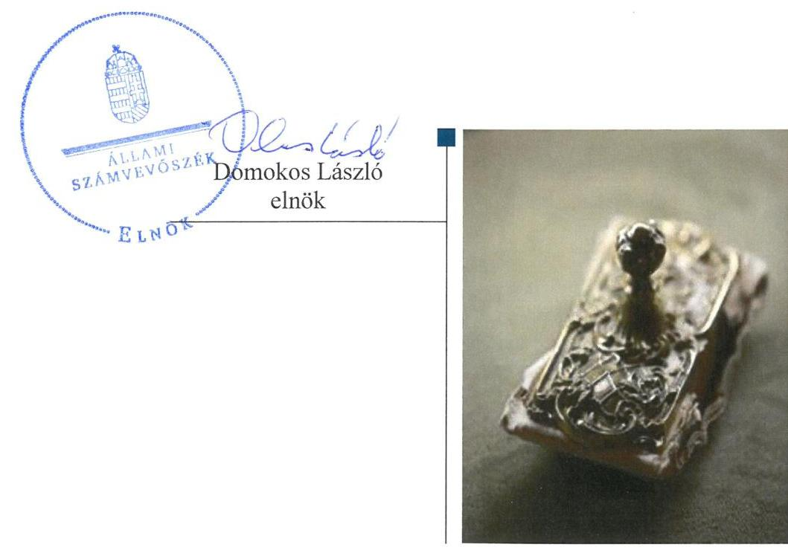

---

# AZ ELLENŐRZÉST FELÜGYELTE: 

HOLMAN MAGDOLNA JULIANNA felügyeleti vezető

## AZ ELLENŐRZÉST VEZETTE ÉS A VÉGREHAJTÁSÁÉRT FELELŐS:

HEIDINGER TIBOR ellenőrzésvezető

## A PROGRAM ÖSSZEÁLLÍTÁSÁÉRT FELELŐS:

TÓTPÁL SZABOLCS osztályvezető

## A TÉMÁHOZ KAPCSOLÓDÓ KORÁBBI SZÁMVEVŐSZÉKI JELENTÉSEK:

- címe: Önkormányzatok pénzügyi monitoring alapján végzett ellenőrzése - A nagyközségi önkormányzatok gazdálkodásának fenntarthatósága
- sorszáma: 18081

IKTATÓSZÁM: EL-1462-001/2019.
TÉMASZÁM: 2473
ELLENŐRZÉS-AZONOSÍTÓ SZÁM: V0817

---

# TARTALOMJEGYZÉK 

■ ÖSSZEGZÉS ..... 5
■ AZ ELLENŐRZÉS CÉLJA ..... 7
■ AZ ELLENŐRZÉS TERÜLETE ..... 8
■ AZ ELLENŐRZÉS HÁTTERE, INDOKOLTSÁGA ..... 9
■ A JELENTÉS LÉNYEGES KÉRDÉSKÖREI ..... 10
■ AZ ELLENŐRZÉS HATÓKÖRE ÉS MÓDSZEREI ..... 11
■ MEGÁLLAPÍTÁSOK ..... 13
■ MELLÉKLETEK ..... 25
I. sz. melléklet: Fogalomtár ..... 25
II. sz. melléklet: Az ellenőrzési kritériumok módszertana és értékelése ..... 29
III. sz. melléklet: Az eszközök és források alakulása kiemelt mérlegsoronként a 2015-2016. években (M Ft) ..... 31
IV. sz. melléklet: Pénzügyi egyensúlyi helyzet CLF módszer szerinti értékelése a 2015-2016. években (E Ft) ..... 32
V. sz. melléklet: A városi önkormányzatok 2015-2016. évi főbb mutatóinak és kockázati területeinek összefoglaló értékelése ..... 33
VI. sz. melléklet: A városi önkormányzatok 2015-2016. évi főbb mutatóinak és kockázati területeinek részletes értékelése ..... 34
VII. sz. melléklet: A kockázatelemzés alá vont városi önkormányzatok ..... 36
■ FÜGGELÉK: ÉSZREVÉTELEK ..... 41
■ RÖVIDÍTÉSEK JEGYZÉKE ..... 45

---

.

---

# ÖSSZEGZÉS 

322 városi önkormányzat gazdálkodásának kockázatait értékelte az Állami Számvevőszék. A 2015-2016. évekre vonatkozó önkormányzati éves beszámolók adatain alapuló ellenőrzés megállapította, hogy az érintett városi önkormányzatoknál a pénzügyi egyensúly és a vagyon értékének megőrzése biztosított volt. A városi önkormányzatok pénzügyi gazdálkodása stabil. Az ÁSZ a hosszú lejáratú pénzintézeti kötelezettségek növekedésének üteme, a lejárt kötelezettségek állományának a növekedése, a gazdasági társaságok veszteséges működése területén azonosított kockázatot.

## Az ellenőrzés társadalmi indokoltsága

A magyar települési önkormányzatok a 2002-2008 között felhalmozott adósságállományának állami konszolidációjára 2011 és 2014 között került sor. Az adósságkonszolidációk eredményeként az önkormányzatok feladatellátása újra strukturálódott, rendszerszinten pénzügyi helyzetük helyreállt. Ugyanakkor az önkormányzatok gazdálkodásából eredő veszélyek miatt az ÁSZ továbbra is kiemelt figyelmet fordít az önkormányzatok pénzügyi egyensúlyi helyzetére ható kockázatok monitorizálására, a pénzügyi sérülékenységet okozó folyamatokra, az önkormányzati alrendszert veszélyeztető rendszeregyensúlyi kockázatokra. A Magyar Államkincstár központi információs rendszerében rendelkezésre álló önkormányzati éves költségvetési beszámolók adatait felhasználva, monitoring riportok kiértékelésével az ÁSZ hozzájárul azon kockázatos területek feltárásához, amelyek különböző szintű beavatkozást igényelnek az önkormányzatok pénzügyi egyensúlyának biztosítása érdekében.

## Főbb megállapítások, következtetések

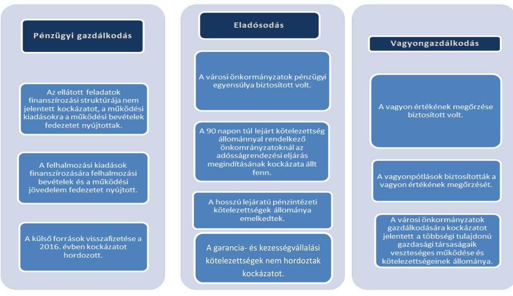

---

A városi önkormányzatok gazdálkodása stabil képet mutatott az ellenőrzött időszakban. A 322 városi önkormányzatból tizenkilenc városi önkormányzat esetében tárta fel az ellenőrzés az adósságrendezési eljárás megindításának veszélyét, amely a feladatellátás tekintetében is magas kockázatot hordozott.

# Következtetések 

A városi önkormányzatok pénzügyi,- vagyoni helyzetére, eladósodására irányuló kockázatok értékelése rámutatott arra, hogy a városi önkormányzatok gazdálkodása stabil, rendszerszintű beavatkozást nem igényel. A városi önkormányzatok pénzügyi gazdálkodásának változatlan formában történő fenntartása az önkormányzatok szintjén kockázatot jelent a pénzügyi egyensúlyra, ezáltal az önkormányzatok eladósodására.

A működési jövedelem fedezetet nyújtott ugyan a felhalmozási költségvetés negatív egyenlegére, valamint tőketörlesztésre is, azonban külső források visszafizetésének növekedése, az elindult fejlesztések finanszírozása és az abból adódó fenntartási kiadások megjelenése kockázatforrást jelent a városi önkormányzatok eladósodására, ezért e kockázatok kezelése odafigyelést igényel.

Az ellenőrzés megállapításai alapján az önkormányzatok a vagyon értékét megőrizték, a többségi tulajdonban lévő gazdasági társaságok kötelezettség-állományából adódó kockázatok középtávú kezelése indokolt.

---

# AZ ELLENŐRZÉS CÉLJA 

AZ ELLENŐRZÉS CÉLJA annak megállapítása, hogy a városi önkormányzatok ${ }^{1}$ képesek voltak-e a törvényben meghatározott feladatokat ellátni, gazdálkodásuk változatlan formában fenntartható-e. A Magyar Államkincstár által kezelt központi információs rendszerben lévő - az ÁSZ² részére átadott - önkormányzati beszámoló adatok értékelése alapján beazonosított kockázatok kezelésének előmozdítása.

---

# **AZ ELLENŐRZÉS TERÜLETE**

## **A város településtípushoz tartozó önkormányzatok**

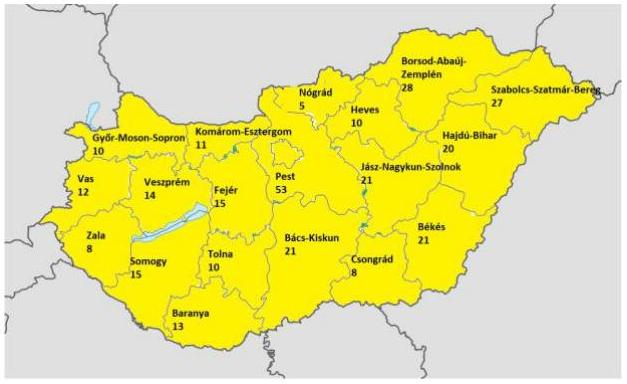

### **A VÁROS TELEPÜLÉSTÍPUS 322 ÖNKORMÁNYZATÁRA** – a MÁK^{5} törzskönyvi nyilvántartásában szereplő 2017. áprilisi adatok alapján – terjedt ki az ellenőrzés. Városi önkormányzatok minden megyében találhatóak, a számuk megyénként 5 és 53 között változik. A megyénkénti adatokat a bal oldali térkép tartalmazza.

A városi önkormányzatok állandó lakosainak száma 2016. január 1-jén 3 299 234 fő volt.

202 város lakossága 10 000 fő alatt volt, 84 város lakossága 10 000 és 20 000 fő között alakult, 36 város 20 000 fő feletti lakosságszámú volt 2016. január 1-jén. A településtípus lakosságszáma közel egyenletesen oszlott el a három alkategóriában.

Az ellenőrzött időszak mindkét évében az egy állandó lakosra jutó működési kiadás 162 ezer Ft volt, az egy állandó lakosra jutó helyi adóbevétel 67 ezer Ft volt a 2015. évben (41,4%), illetve 69 ezer Ft volt a 2016. évben (42,6%).

A városok egy része komplex mutató alapján rangsorolva (társadalmi és demográfiai, lakás és életkörülmények, helyi gazdaság és munkaerő-piaci, valamint infrastruktúra és környezeti mutatókból képzett, összetett mutatószám) kiemelt jelentőséggel bír a fejlesztési támogatásokhoz való hozzáférés tekintetében. 2015. április 23-áig a társadalmi-gazdasági és infrastrukturális szempontból kedvezményezett városok száma 16 volt, míg az országos átlagot legalább 1,75-szörösen meghaladó munkanélküliségű ("jelentős munkanélküliségű") városok száma 53 volt. Ezt követően a társadalmi-gazdasági és infrastrukturális szempontból kedvezményezett városok száma 18-ra emelkedett, míg a – jogszabályban meghatározott módon számított – jelentős munkanélküliségű városok száma 48-ra csökkent.

A 2015. évben 178 (55,3%), míg a 2016. évben 150 (46,6%) városi önkormányzat kapott rendkívüli önkormányzati támogatást.

A városi önkormányzatok többségi tulajdoni hányadú gazdasági társaságainak száma a 2016. évben 590-re, 28 gazdasági társasággal csökkent a megelőző évhez képest. A városi önkormányzatok éves költségvetési beszámolójának adatai alapján 221 városi önkormányzat (68,6%) rendelkezett többségi tulajdoni hányadú gazdasági társasággal a 2016. évben.

A városi önkormányzatok összevont költségvetési beszámolója szerint teljesített éves költségvetési bevétel és költségvetési kiadás, a könyvviteli mérleg szerinti eszközök, a követelések és kötelezettségek állományi értékét az 1. táblázat mutatja be.

|  Év | Bevételek (M Ft) | Kiadások (M Ft) | Eszközök (M Ft) | Követelések (M Ft) | Kötelezettségek (M Ft)  |
| --- | --- | --- | --- | --- | --- |
|  2015. | 782 337 | 769 889 | 3 307 963 | 62 544 | 57 491  |
|  2016. | 657 187 | 639 786 | 3 412 159 | 59 343 | 60 115  |

*Forrás: városi önkormányzatok beszámolói*

---

# AZ ELLENŐRZÉS HÁTTERE, INDOKOLTSÁGA 

AZ ÁSZ STRATÉGIÁJÁBAN célul tűzte ki, hogy az önkormányzatok ellenőrzése során azok pénzügyi-gazdasági helyzetét értékeli, kockázatait feltárja. Az új megközelítésű, elemzéssel alátámasztott mintavétellel, illetve ellenőrzési eljárásokkal csökkentse a helyszíni ellenőrzések számát. A monitoring rendszer az önkormányzatok éves költségvetési beszámolójának, időközi költségvetési jelentéseinek és mérlegjelentéseinek a központi információs rendszerben szereplő adatai értékelése alapján jelzi, hogy melyek azok az önkormányzatok, és melyek azok a területek, ahol olyan kedvezőtlen gazdasági folyamatok, vagy gazdasági események következtek be, amelyek ellenőrzés lefolytatását teszik indokolttá.

Ennek az egyszerűsített ellenőrzési módszernek az eredményeként megtörténik az önkormányzatok pénzügyi, vagyoni helyzetének megítélése, a pénzügyi egyensúly minősítése, továbbá a változások hatásának értékelése.

AZ ÖNKORMÁNYZATI ALRENDSZERBEN megjelenő gazdálkodási nehézségek, likviditási problémák és az eladósodottság növekedése az ÁSZ figyelmét a 2011. évtől az önkormányzatok pénzügyi helyzetére irányította. Az önkormányzati feladatellátást érintő átalakítások meghatározó része a 2013. évben következett be azzal, hogy az igazgatási, az oktatási, az egészségügyi és a szociális ellátásban a feladatok jelentős hányadát átvette az állam.

Az önkormányzati alrendszerben a 2013. évtől bevezetett új feladatfinanszírozási rendszer keretein belül továbbra is megoldandó kérdés a pénzügyi egyensúly megteremtése, hosszú távú fenntartása. Ahhoz, hogy az önkormányzatok meg tudjanak felelni a számukra meghatározott - szigorúbb - gazdálkodási szabályoknak, és az új feltételek mellett is biztosítható legyen a közszolgáltatások megfelelő színvonalú ellátása, szükséges volt a pénzügyi-gazdasági rendszerük alapjainak megszilárdítása, amely célt az adósságkonszolidáció szolgálta.

Az adósságkonszolidáció az önkormányzatok pénzügyi egyensúlyi helyzetére kedvező hatást gyakorolt, azonban a problémák kiváltó okait nem szüntette meg, ennek kezelése nélkül viszont az adósságállomány újratermelődhet. Erre tekintettel kiemelt fontosságú az önkormányzatok pénzügyi egyensúlyi helyzetére ható kockázatok feltárása.

---

# A JELENTÉS LÉNYEGES KÉRDÉSKÖREI 

1.     - A városi önkormányzatok pénzügyi gazdálkodásának fenntarthatósága biztosított volt-e?
2.     - Fennállt-e a városi önkormányzatok eladósodásának kockázata?
3.     - A városi önkormányzatok vagyongazdálkodása során biztosított volt-e a vagyon értékének a megőrzése?

---

# AZ ELLENŐRZÉS HATÓKÖRE ÉS MÓDSZEREI 

## Az ellenőrzés típusa

Helyénvalósági ellenőrzés.

## Az ellenőrzött időszak

A 2015-2016. évek. A 2015. január 1-je és 2016. december 31-e közötti időszak. A dinamikus mutatók esetében kitekintéssel a 2014. december 31-ei pénzforgalmi adatokra is.

## Az ellenőrzés tárgya

Az önkormányzati gazdálkodás fenntarthatósága, a törvényben előírt feladatok ellátása, az önkormányzatoknál észlelt negatív tendenciák okainak feltárása.

## Az ellenőrzött szervezet

Belügyminisztérium, mint a Kormány helyi önkormányzatokért felelős tagjának munkaszerve.

## Az ellenőrzés jogalapja

Az ellenőrzés jogszabályi alapját az Állami Számvevőszékről szóló 2011. évi LXVI. törvény 1. § (3) bekezdésének, az 5. § (2)-(6) bekezdéseinek, valamint az államháztartásról szóló 2011. évi CXCV. törvény 61. § (2) bekezdésének előírásai képezik.

## Az ellenőrzés módszerei

Az ellenőrzést az ellenőrzési program ellenőrzési kérdései, az ellenőrzött időszakban hatályos jogszabályok, az ellenőrzés szakmai szabályok és módszertanok figyelembe vételével végeztük.

Az ellenőrzés ideje alatt az ellenőrzött szervezettel történő kapcsolattartást az ÁSZ SZMSZ²-ének vonatkozó előírásai alapján biztosítottuk.

Az ellenőrzési kérdések megválaszolásához szükséges bizonyítékok megszerzése a Magyar Államkincstár által rendelkezésre bocsátott adatokra alapozva elemző eljárással történt, amelyeket mintavétel alapján kontrolláltunk a nyilvánosan elérhető adatbázisokban szereplő adatokkal.

---

Az ÁSZ az ellenőrzés előkészítése során meghatározta az ellenőrzési (helyénvalósági) kritériumokat, amelyek az ellenőrzési bizonyíték értékelésének, valamint a számvevőszéki jelentésben szereplő megállapítások és következtetések alapját képezték. A megállapításokban használt fogalmak értelmezését, forrását a fogalomtár, a mutatók helyénvalósági kritériumait, és a kockázatok értékelését az ellenőrzési kritériumok módszertana és értékelése tartalmazza.

A pénzforgalmi adatokat tartalmazó mutatók számításánál a 2015. évben a 2014. évi végi adatokat, a 2016. évben a 2015. év végi adatokat tekintettük bázis adatnak. A mérlegadatokat tartalmazó mutatók esetében a 2015. január 1. és 2016. december 31. közötti adatokkal számoltunk. A gazdasági társaságok esetében a 2016. és 2017. évi VI. havi időközi költségvetési jelentésekben szereplő 2015. december 31.-re és 2016. december 31-re vonatkozó társasági adatokat vettük figyelembe.

A mintatételek (kormányzati jóváhagyással megkötött hosszú lejáratú adósságot keletkeztető ügyletek, valamint a többségi önkormányzati tulajdonban lévő gazdasági társaságok kötelezettségei) ellenőrzése során felhasználtunk nyilvánosan elérhető adatokat (zárszámadási rendeletek, e-beszámoló, cégnyilvántartás adatai).

Az ellenőrzési kérdésekre adott válaszok alapján értékeltük, hogy a városi önkormányzatok képesek voltak-e a törvényben meghatározott feladataikat ellátni, gazdálkodásuk változatlan formában fenntartható-e. Az értékelést
 a felülvizsgált adatok alapján végezte/értékelte az ÁSZ. A felülvizsgálat eredményeképpen az önkormányzati beszámolók több mint 10%ánál hajtott végre adatkorrekciót az ÁSZ, amely jelzi az önkormányzati beszámolók megbízhatósági kockázatát.

---

# 1. A városi önkormányzatok pénzügyi gazdálkodásának fenntarthatósága biztosított volt-e? 

Összegző megállapítás

### 1.1. számú megállapítás

2. táblázat

| MUTATÓK ALAKULÁSA |  |  |
| :--: | :--: | :--: |
| Mutatók | 2015.   év | 2016.   év |
| Működési kiadások fedezettsége | $111,9 \%$ | $111,5 \%$ |
| Kiegészítő (rendkívüli) önkormányzati támogatás aránya | $1,2 \%$ | $0,7 \%$ |
| Adóbevételek működési bevételeken belüli aránya | $37,0 \%$ | $38,2 \%$ |
| Felhalmozási kiadások fedezettsége | $78,2 \%$ | $58,8 \%$ |

A városi önkormányzatok pénzügyi gazdálkodása fenntarthatósága kockázatot hordozott a felhalmozási kiadások és azok finanszírozása miatt mindkét ellenőrzött évben, valamint a külső források visszafizetése miatt a 2016. évben, azonban a közfeladatok finanszírozási struktúrája nem jelentett kockázatot egyik évben sem.

A városi önkormányzatok által ellátott feladatok finanszírozási struktúrája nem jelentett kockázatforrást a pénzügyi gazdálkodásra.

## A MŰKÖDÉSI BEVÉTELEK FEDEZETET NYÚJTOTTAK

a 2015-2016. években a városi önkormányzatok által ellátott feladatok működési kiadásaira. A működési kiadások fedezettsége a 2015. évben és a 2016. évben is 100,0% felett volt, így működési finanszírozási kockázat egyik évben sem merült fel. A mutatók alakulását a 2. táblázat tartalmazza.

A városi önkormányzatok pénzügyi egyensúlyi helyzetének CLF módszer szerint értékelését - a 2015-2016. években - a IV. számú melléklet tartalmazza.

Elemző eljárás keretében készített riport alapján (ÖKOMER), a 2015-2016. évekre vonatkozóan a városi önkormányzatok azonosított kockázatait, azok összefoglaló értékelését az V. számú melléklet, a városi önkormányzatok 2015-2016. évi mutatói és kockázatai értékelését pedig a VI. számú melléklet tartalmazza.

A működési bevételek a 2015. évben 598284 M Ft-ot tettek ki. A 2016. évben a működési bevételek 594247 M Ft-ra csökkentek, 4037 M Ft-tal (0,7%-kal) kisebb mértékben realizálódtak. A működési kiadások a 2015. évben 534673 M Ft-ot tettek ki, míg a 2016. évben 532814 M Ft értékben realizálódtak. A működési kiadások ebben az időszakban 1859 M Ft-tal (0,3%-kal) csökkentek. A működési bevételek működési kiadásokhoz viszonyított nagyobb arányú csökkenése a működési kiadások fedezettsége mutató 0,4 százalékpontos csökkenését eredményezte.

A működési kiadásoknál a személyi juttatások és járulékaik 46,0%-os, a dologi kiadások 35,2%-os arányt képviseltek a 2016. évben. A működési kiadások csökkenését a dologi és egyéb működési célú kiadások csökkenése okozta a 2016. évben, miközben a személyi jellegű kiadások emelkedtek.

A működési kiadások működési bevételekkel történő fedezettsége 255 városi önkormányzatnál (79,2%) volt 100% felett a 2015. évben, 275 városi önkormányzatnál (85,4%) volt 100% felett a 2016. évben.

---

# A 2015. ÉVBEN 7104 M FT, A 2016. ÉVBEN 3883 M FT MŰKÖDŐKÉPESSÉG MEGŐRZÉSÉT SZOLGÁLÓ, RENDKÍVÜLI ÖNKORMÁNYZATI TÁ-

MOGATÁST kaptak a városi önkormányzatok. A rendkívüli önkormányzati támogatás aránya a 2016. évben a működési bevételeken belül 1,2%-ról 0,7%-ra, a városi önkormányzatok költségvetési támogatásához (rendkívüli támogatás nélkül) viszonyítva 3,7%-ról 2,0%-ra csökkent a 2015. évhez képest.

A 2015. évben 67 városi önkormányzatnál (20,8%), a 2016. évben 47 városi önkormányzatnál (14,6%) az ellátott feladatok finanszírozására a folyó bevételek nem nyújtottak fedezetet, így a működés finanszírozása az érintett városi önkormányzatoknál kockázatot hordozott. Ebből az önkormányzati csoportból a 2015. évben 51 városi önkormányzat (az érintett városi önkormányzatok 76,1%-a), a 2016. évben 34 városi önkormányzat (az érintett városi önkormányzatok 72,3%-a) kapott önkormányzati rendkívüli támogatást.

A 2015. évben - a fenti 67 városi önkormányzaton túl - további 20 városi önkormányzatnál (6,2%), a 2016. évben - a fenti 47 városi önkormányzaton túl - további 15 városi önkormányzatnál (4,7%) az önkormányzatok rendkívüli támogatása nélkül a működési bevételek nem nyújtottak volna fedezetet a működési kiadásokra. Rendkívüli támogatás nélkül ezen városi önkormányzatok működési jövedelme negatív lett volna.

A 2016. ÉVBEN AZ ADÓBEVÉTELEK működési bevételeken belüli aránya a 2015. évhez képest 1,2 százalékponttal emelkedett a helyi adóbefizetések növekedése miatt. Az adóbevételek működési bevételeken belüli aránya a 2015. évben 37,0%-ot, a 2016. évben 38,2%-ot tett ki. Az 1,2 százalékpontos emelkedés kedvező hatást gyakorolt a városi önkormányzatok pénzügyi egyensúlyi helyzetére, annak fenntarthatóságára.

Az adóbevételek - kiemelten a helyi iparűzési adóbevételek - alakulását az 1. ábra mutatja be.

1. ábra

Az adóbevételek, kiemelten a helyi iparűzési adóbevételek alakulása (M Ft)
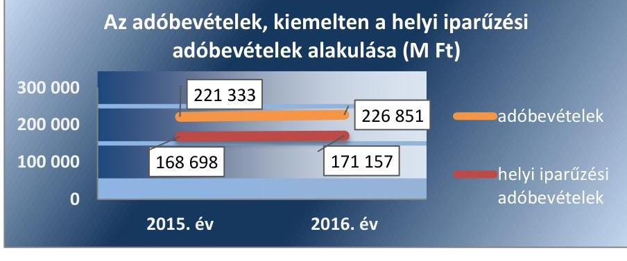

Forrás: városi önkormányzatok beszámolói

Az adóbevételek a 2015. évi 221333 M Ft-ról a 2016. évre 226851 M Ft-ra, 2,5%-kal emelkedtek. Az adóbevételeken belül a helyi iparűzési adóbevételek meghatározó jelentőségűek. A helyi iparűzési adóbevételek a 2015. évi 168698 M Ft-ról a 2016. évre 171157 M Ft-ra nőttek, 1,5%-kal emelkedtek. A helyi iparűzési adóbevételek emelkedése kedvezően hatott a városi önkormányzatok gazdálkodására, jövedelemtermelő képességére.

A városi önkormányzatok felhalmozási kiadásaira a működési jövedelem fedezetet nyújtott, azonban a felhalmozási kiadások kiadásai és azok finanszírozása kockázatforrást jelent a pénzügyi gazdálkodás fenntarthatóságára.

## A TÁRGYÉVI FELHALMOZÁSI BEVÉTELEK A 2015. ÉVBEN 78,2%-BAN, A 2016. ÉVBEN 58,8%-BAN NYÚJTOTTAK FEDEZETET a tárgyévi felhalmozási kiadásokra. A felhalmozási kiadások és azok finanszírozása kockázatot jelentett a pénzügyi gazdálkodásra, a pénzügyi egyensúly fenntarthatóságára. A mutató értékét a 2. táblázat tartalmazza.

A 2015-2016. években a településtípusnál e kockázatot mérsékelte, hogy a felhalmozási költségvetés hiánya (egyedül) a működési jövedelemből - az előző évi maradvány felhasználása nélkül - finanszírozható volt. Mindezek tükrében a városi önkormányzatok felhalmozási kiadásai és azok finanszírozása összességében közepes kockázatot jelentett a pénzügyi gazdálkodásra, a pénzügyi egyensúly fenntarthatóságára.

Ugyanakkor a működési jövedelemből történő finanszírozás kockázatot hordozott a tekintetben, hogy az alapfeladatok ellátására elegendő forrást biztosítottak-e.

A felhalmozások forrásösszetételét a 2016. évben a 2. ábra mutatja be.
2. ábra
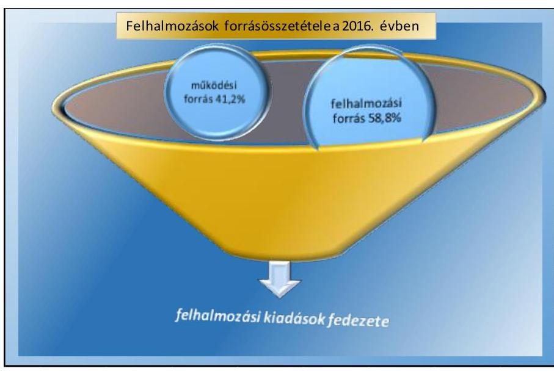

Forrás: városi önkormányzatok beszámolói
A beruházások tekintetében további kockázatot hordoz, hogy az üzembe helyezett eszközök későbbi fenntartására képződik-e elegendő működési jövedelem. A nem megfelelően üzemeltetett és karbantartott vagyontárgyak a városi önkormányzatoknál bevételkiesést (kisebb bérleti díj realizálható) vagy kiadásnövekedést (elhasználódott eszközök felújítása, vagy új beszerzése) okozhatnak, amely kihat a pénzügyi egyensúlyra.

---

A 2015. évben a felhalmozási bevételek 184053 M Ft-ot tettek ki, a felhalmozási kiadások 235217 M Ft értékben teljesültek. A 2016. évben a felhalmozási bevételek (62940 M Ft) és a felhalmozási kiadások (106 973 M Ft) is csökkentek. A városi önkormányzatok saját beruházási kiadásai (áfával) a 2015. évi 161252 M Ft-ról 59606 M Ft-ra, 63,0%-kal csökkentek. A 2015. évben a költségvetési kiadások 30,6%-át, a 2016. évben 16,7%-át fordították felhalmozási kiadásokra.

A 2015-2016. évek felhalmozási bevételek forrásösszetételét a 3. ábra mutatja be.
3. ábra
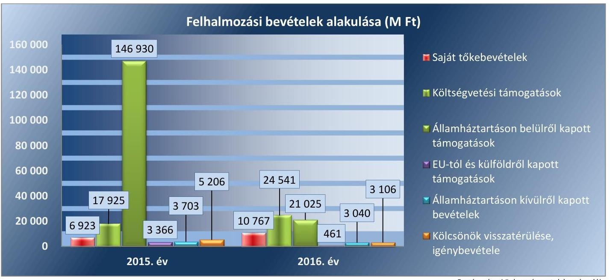

Forrás: városi önkormányzatok beszámolói

### 1.3. számú megállapítás

3. táblázat

| MUTATÓK ALAKULÁSA |  |  |
| :-- | :--: | :--: |
| Mutatók | $\mathbf{2 0 1 5 .} \mathbf{~ e ́ v ~}$ | $\mathbf{2 0 1 6 .} \mathbf{~ e ́ v ~}$ |
| Törlesztés fedezettségének aránya | $27,0 \%$ | $31,2 \%$ |
| Nettó működési jövedelem változása | $1043,4 \%$ | $-8,9 \%$ |
| Pénzügyi műveletek eredménye (e Ft) | -1704331 | -1082714 |

A 2016. évben a saját tőkebevételek 55,5%-kal emelkedtek az előző évhez képest. A költségvetési támogatások összege a 2016. évben 36,9%-kal emelkedett a 2015. évi összeghez képest. Az államháztartáson belülről kapott támogatások összege a 2016. évben 85,7%-kal csökkent.

A városi önkormányzatok által igénybevett külső források visszafizetése a (nettó) működési jövedelem csökkenése miatt a 2016. évben kockázatot hordozott.

## A 2015-2016. ÉVEKBEN A VÁROSI ÖNKORMÁNYZATOK RENDELKEZTEK ADÓSSÁGSZOLGÁLATHOZ KAPCSOLÓDÓ KÖTELEZETTSÉGGEL a külső források - pl. tőketörlesztés, hiteltörlesztés - miatt. A mutatók alakulását a 3. táblázat tartalmazza.

A működési jövedelem - folyó bevételek és folyó kiadások különbözete - 3,4%-kal csökkent, miközben a tőketörlesztésre (hiteltörlesztésre) fordított kiadások 2,9%-kal emelkedtek a 2016. évben a megelőző évhez képest. A városi önkormányzatoknál összességében a törlesztés fedezettsége a 2015. évben 27,0%, a 2016. évben 31,2% volt, amely mutatta, hogy a működési jövedelemből milyen arányt kellett törlesztésre fordítani.

A nettó működési jövedelem (működési jövedelem-tőketörlesztés) a 2015. évi 46413 M Ft-ról a 2016. évben 42281 M Ft-ra változott, 8,9%-kal

---

csökkent. A külső források visszafizetése kockázatforrást jelent a városi önkormányzatok pénzügyi gazdálkodására, pénzügyi egyensúlyára.

# 2. Fennállt-e a városi önkormányzatok eladósodásának kockázata? 

## Összegző megállapítás

2.1. számú megállapítás
4. táblázat

MUTATÓK ALAKULÁSA

| Mutatók | 2015. év | 2016. év |
| :-- | --: | --: |
| Eladósodási mutató | $1,7 \%$ | $1,8 \%$ |
| Eladósodási mutató változása százalékpontban | -0,5 | +0,1 |

A városi önkormányzatok kötelezettségei, valamint azok növekedése alapján az eladósodás kockázata fennállt az ellenőrzött időszakban.

## A városi önkormányzatok pénzügyi egyensúlya biztosított volt.

A PÉNZÜGYI EGYENSÚLY a városi önkormányzatoknál a 2015. és a 2016. évben biztosított volt. A városi önkormányzatok költségvetési bevételei a 2015. és a 2016. évben fedezetet nyújtottak a költségvetési kiadásokra, a maradvány igénybevétele - 2015. évben 114 918,8 M Ft, a 2016. évben 124 451,6 M Ft - tovább javította a városi önkormányzatok pénzügyi helyzetét.

A pénzügyi egyensúlyi helyzet alakulását a 4. ábra mutatja be.
4. ábra
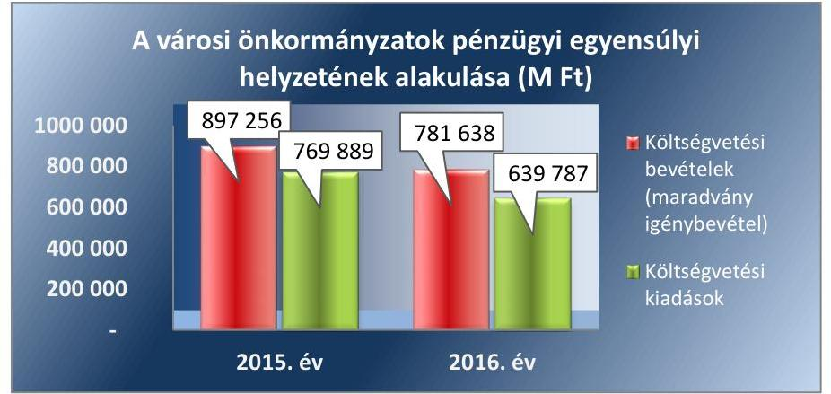

Forrás: városi önkormányzatok beszámolói

A városi önkormányzatok eladósodási mutatója növekedett, értéke 1,8% volt a 2016. évben, míg a megelőző évben a mutató értéke 1,7% volt. Az eladósodási mutató értéke alacsony, annak kedvezőtlen irányú változása (növekedése) közepes kockázatot jelzett a városi önkormányzatoknál. A mutatók alakulását a 4. táblázat tartalmazza.

A 2015. évben a folyó és a felhalmozási költségvetés összesített egyenlege +12448 M Ft volt, amely a 2016. évben kedvező irányban változott, +17400 M Ft összegre emelkedett (finanszírozási műveletek nélküli GFS pozíció értéke). A működési jövedelem fedezetet biztosított a felhalmozási költségvetés időben csökkenő mértékű hiányára.

A hitelfelvétel és a hiteltörlesztés összesített értéke a településtípus esetén az ellenőrzött években csak minimális mértékben változott. A hitelfelvétel 3,94%-kal csökkent, a hiteltörlesztés 2,92%-kal emelkedett. 2015-ben az egyéb finanszírozási bevételek és az egyéb finanszírozási kiadások

---

### 2.2. számú megállapítás

5. táblázat

|  MUTATÓK ALAKULÁSA |  |   |
| --- | --- | --- |
|  Mutatók | $\begin{gathered} 2015 . \ \text { év } \end{gathered}$ | $\begin{gathered} 2016 . \ \text { év } \end{gathered}$  |
|  Szállítói állomány változásai | $-48,6 \%$ | $0,0 \%$  |
|  Lejárt szállítói állomány aránya (szállítói állományból) | $21,4 \%$ | $19,9 \%$  |
|  Lejárt szállítói állomány változása | $-50,9 \%$ | $-6,9 \%$  |
|  Lejárt szállítói állomány aránya a dologi
 kiadások egy havi átlagához viszonyítva | $15,7 \%$ | $14,3 \%$  |
|  90 napon túl lejárt kötelezettségek állományának aránya (összes köt. állományból) | $1,3 \%$ | $1,4 \%$  |

Forrás: városi önkormányzatok beszámolói sorok értékei között nem volt jelentős eltérés, ugyanakkor 2016-ban a forgatási és befektetési célú értékpapírok vásárlására fordított kiadás 59845 M Ft volt, míg ugyanezen értékpapírok értékesítéséből származó bevétel 32228 M Ft értékben realizálódott. Így a pénzügyi pozíció előző évihez viszonyított kedvezőtlen változását az értékpapír-vásárlások eredményezték.

## A 2015-2016. években a városi önkormányzatok dologi, beruházási és felújítási kiadásokkal kapcsolatos kötelezettség (szállítói kötelezettség) állományából a lejárt kötelezettségek, különösen a 90 napon túl lejárt kötelezettségek magas kockázatot hordoztak.

A szállítói kötelezettség állomány 2015. év végén és 2016. év végén közel azonos összegű volt, azonban a 2015. évi nyitó adathoz viszonyítva a szállítói kötelezettség állomány közel felére csökkent a 2015. év végére. A 2016. évben a szállítói kötelezettség év végi aránya a működési jövedelemhez viszonyítva 1\%-kal növekedett az előző évhez képest, a mérlegfőösszeghez mért aránya azonban azonos szintű volt ( $0,5 \%$ ) mindkét évben. Ezek alapján a szállítói kötelezettség állomány és annak változása az ellenőrzött időszakban a városi önkormányzatok eladósodására nem jelentett kockázatot. A mutatók alakulását az 5. táblázat tartalmazza.

A szállítói kötelezettségek állományának alakulását az 5. ábra szemlélteti.
5. ábra
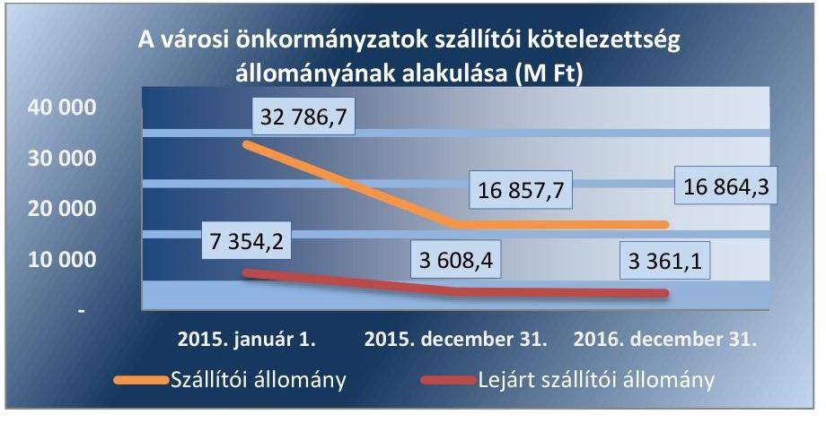

Forrás: városi önkormányzatok beszámolói

A városi önkormányzatok lejárt szállítói kötelezettség állománnyal rendelkeztek az ellenőrzött időszakban, azonban ezek értéke az ellenőrzött időszakban több mint felére csökkent. A városi önkormányzatok szállítókkal szembeni kötelezettségeik határidőn túli teljesítése - szállítói hitelezés miatt - kedvezőtlen hatást gyakorolt az eladósodásra a 2015-2016. években. A dologi kiadásokhoz kapcsolódó lejárt szállítói kötelezettségeknek a dologi kiadások egy havi átlagához viszonyított értéke csökkent - a 2015. évi 15,7\%-ról a 2016. évre 14,3\%-ra - elsősorban a szállítói kötelezettségek állományának csökkenése miatt.

A városi önkormányzatok a 2015. év végén 755 M Ft, a 2016. év végén 831 M Ft 90 napon túl lejárt tartozással rendelkeztek. A 2015. évben a 90 napon túl lejárt szállítói kötelezettség állománya 66 városi önkormányzatnak - a városi önkormányzatok 20,5\%-a - volt, míg a 2016. évben 64 városi

---

### 2.3. számú megállapítás

6. táblázat

|  MUTATÓK ALAKULÁSA |  |   |
| --- | --- | --- |
|  Mutatók | $\begin{gathered} 2015 . \ \text { év } \end{gathered}$ | $\begin{gathered} 2016 . \ \text { év } \end{gathered}$  |
|  Banki kötelezettség állomány mérlegfőösszeghez mért nagysága | $0,4 \%$ | $0,4 \%$  |
|  Banki kötelezettségek állományának változása | $+52,9 \%$ | $+20,8 \%$  |

Forrás: városi önkormányzatok beszámolói
önkormányzatnak (19,9\%) volt. A 90 napon túl lejárt kötelezettség állomány kockázatot jelentett az érintett városi önkormányzatok eladósodására, mert adósságrendezési eljárás megindításának kockázatát hordozta. A 90 napon túl lejárt szállítói kötelezettségek állományának összes kötelezettséghez viszonyított aránya 7\%-kal emelkedett a 2016. évben a megelőző évhez képest.

64 városi önkormányzatból tizenkilenc városi önkormányzat esetében adósságrendezési eljárást elindításának veszélyét jelentő kockázatokat azonosított az ellenőrzés. Ajak, Bátonyterenye, Heves, Kalocsa, Komárom, Kondoros, Körmend, Mándok, Mátészalka, Mindszent, Nagyecsed, Nagymányok, Ózd, Püspökladány, Rakamaz, Szendrő önkormányzatai negatív működési jövedelem mellett rendelkeztek 90 napon túli lejárt kötelezettségállománnyal. Hajdúnánás, Lenti, Nagyatád esetében a 90 napon túli lejárt kötelezettség állomány működési jövedelemmel való fedezettsége és a negatív működési jövedelem együttes hatása jelentett veszélyt. 45 városi önkormányzat esetében az önkormányzatok működési jövedelme fedezetet nyújtott a 90 napon túl lejárt kötelezettségállományra.

## A városi önkormányzatok hosszú lejáratú pénzintézeti kötelezettség állományának növekedése, a növekedés üteme kockázatforrást jelent a városi önkormányzatok jövőbeli eladósodására.

A pénzintézeti kötelezettségek állománya emelkedett a kormányzati jóváhagyással megkötött hosszú lejáratú adósságot keletkeztető ügyletekből származó fizetési kötelezettségek miatt. A banki kötelezettség állomány növekedése és a növekedés üteme kedvezőtlen folyamatot jelezhet, a városi önkormányzatok újbóli eladósodásának (jövőbeli) kockázatát vetítheti előre, ugyanakkor a banki kötelezettség állomány mérlegfőösszeghez viszonyított aránya - mindkét évben közel azonos szinten alakult ( $0,4 \%$ ) - csak alacsony kockázatot jelzett.

A 2016. december 31-i banki kötelezettség állomány 2397 M Ft-tal, $+20,8 \%$-kal, 13928 M Ft-ra emelkedett az előző év végi állományhoz képest. A 2015. évben szintén jelentős ütemben emelkedett a banki kötelezettség állomány, 3988 M Ft-tal emelkedett ( $+52,9 \%$-kal) az év eleji nyitó állományhoz viszonyítva. A mutatók alakulását a 6. táblázat tartalmazza.

A városi önkormányzatok kormányzati jóváhagyással mindkét évben 26 db hosszú lejáratú adósságot keletkeztető ügyletet kötöttek, a 2015. évben 2879 M Ft, a 2016. évben 4601 M Ft összegben. Hitel, kölcsön, részletfizetés vagy adósságmegújítás jogcímeken a 2015. évben 22 városi önkormányzat (6,8\%), a 2016. évben 21 városi önkormányzat (6,5\%) kapott kormányzati hozzájárulást hosszú lejáratú adósságot keletkeztető ügylet megkötésére. 5 városi önkormányzatnál mindkét évben történt kölcsön vagy hitelfelvétel.

A kormányzati hozzájáruláshoz nem kötött, hosszú lejáratú adósságot keletkeztető ügyletek száma a 2015. évben 9 db, a 2016. évben 18 db volt. A 2015. évben 177 M Ft, a 2016. évben 148 M Ft összegben került sor hosszú lejáratú adósságot keletkeztető ügyletek megkötésére.

A városi önkormányzatok újbóli eladósodásának kockázatát vetítheti előre, hogy a hosszú lejáratú adósságot keletkeztető ügyletek (hosszú) futamideje alatt a városi önkormányzatok pénzügyi-gazdálkodási lehetőségei

---

kedvezőtlen irányban megváltozhatnak, így az érintett városi önkormányzatok hitel visszafizetési képessége csökkenhet, mely eladósodási kockázatot jelenthet.
2.4. számú megállapítás

A városi önkormányzatok eladósodására nem hordoz kockázatot a garancia- és kezességvállalási helytállási kötelezettség.

A garancia- és kezességvállalásból származó függő kötelezettség állománya a városi önkormányzatoknál 2015. december 31-én 4819 M Ft (13 érintett városi önkormányzat), 2016. december 31-én 4630 M Ft (12 érintett városi önkormányzat) volt. Az ellenőrzött időszakban az érintett városi önkormányzatok függő kötelezettsége, ezen belül garancia- és kezességvállalása kockázatot jelentettek az érintett városi önkormányzatok eladósodására, ezen keresztül a közfeladatok ellátására. Kockázatforrást jelent, ha a szerződés kötelezettje a szerződésben vállalt kötelezettségeit nem teljesíti a jogosultnak, mert azokért a kezes köteles helytállni.

# 3. A városi önkormányzatok vagyongazdálkodása során biztosított volt-e a vagyon értékének a megőrzése? 

Összegző megállapítás

Az ellenőrzött időszakban a városi önkormányzatok vagyongazdálkodása során a vagyon értékének megőrzése biztosított volt, kockázatot jelentett a többségi tulajdonú gazdasági társaságaik veszteséges működése és kötelezettségeinek állománya, valamint a tartós részesedések állományának növekedése.
3.1. számú megállapítás

A vagyongazdálkodás során a vagyon értékének megőrzése biztosított volt.

A városi önkormányzatok könyvviteli mérlegeiben kimutatott vagyona a 2015. január 1-i 3157808 M Ft-ról a 2016. év végére 254350 M Ft-tal (8,1\%-kal) 3412159 M Ft-ra emelkedett. Az eszközök és források alakulását kiemelt mérlegsoronként a 2015-2016. években a III. számú melléklet tartalmazza. A mutatók alakulását a 8. táblázat tartalmazza.

Az ellenőrzött időszakban a városi önkormányzatok vagyonának változását döntően a nemzeti vagyonba befektetett eszközök növekedése - 225 604 M Ft-tal emelkedtek (7,6\%) - eredményezte. Az ellenőrzött két éves időszakban az ingatlanok és kapcsolódó vagyoni értékű jogok állománya 11,9\%-kal, a gépek, berendezések, felszerelések és járművek értéke 38,8\%-kal emelkedett. A két éves időszakban az immateriális javak értéke 20,5\%-kal, a tartós részesedések értéke 0,5\%-kal csökkent.

---

Az ellenőrzött időszakban az eszközök összetételét az 6. ábra mutatja be.
6. ábra
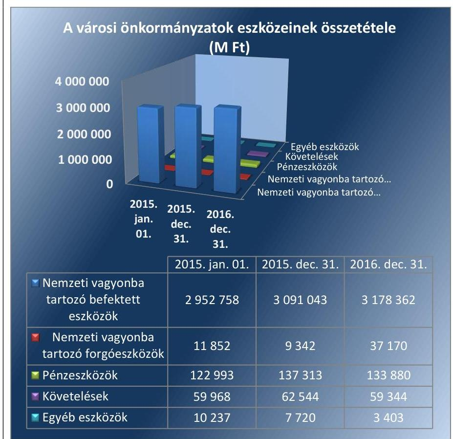

A városi önkormányzatok beszámolói

A városi önkormányzatoknak, a saját vagyon értékesítésből származó bevételeik a 2015. évi 6675 M Ft-ról a 2016. évre 10431 M Ft-ra növekedtek, amely bevételeket felhalmozási kiadásokra, azaz a vagyon pótlására fordították, ezzel szolgálva a nemzeti vagyon megőrzését, növekedését.

## A koncesszióba és/vagy vagyonkezelésbe

adott eszközök állományának növekedése a 2015. évben +9686 M Ft, a 2016. évben +8176 M Ft volt. Ha a koncesszió, vagy a vagyonkezelés jogosultja eszközpótlási kötelezettségének nem tesz eleget, az eszközpótlások elmaradása miatt a vagyonkezelésbe és/vagy koncesszióba adott vagyontárgyak elhasználódnak, értéküket elvesztik. Ez kockázatot jelenthet a vagyongazdálkodásra.

A 2016. évi vagyongazdálkodásban az év végi saját tőke 97,3\%-ban (a 2015. év végén 98,8\%-ban) nyújtott fedezetet a nemzeti vagyonba tartozó befektetett eszközökre, amely jelezte, hogy szükség volt idegen forrásokra is a vagyoni eszközök megszerzéséhez.

### 3.2. számú megállapítás

A városi önkormányzatok vagyonpótlása biztosította a vagyon értékének megőrzését.

## A tárgyi eszközök eszközpótlási mutatója - a mutató értéke a 2015. évben 155,6\%, míg a 2016. évben

---

125,9\% volt - kedvezően alakult. A tárgyi eszközökön belül az ingatlanok és kapcsolódó vagyoni értékű jogok eszközpótlási mutatója 170,7\%, illetve 144,6\% volt, amely jelezte, hogy az elszámolt értékcsökkenések kompenzálásaként a szükséges vagyonpótlások megtörténtek. A mutatók alakulását a 8. táblázat tartalmazza.

A szükséges eszközpótlások, vagyonpótlások biztosították a vagyon értékének megőrzését, ezért nem jelentettek kockázatot a városi önkormányzatok (belső) eladósodására.

# 3.3. számú megállapítás 

9. táblázat

| MUTATÓK ALAKULÁSA |  |  |
| :--: | :--: | :--: |
| Mutatók | $\begin{gathered} 2015 . \\ \text { év } \end{gathered}$ | $\begin{gathered} 2016 . \\ \text { év } \end{gathered}$ |
| Többségi önkormányzati tulajdonú gazdasági társaságok kötelezettségei állományának változása | $+1,6 \%$ | $-22,3 \%$ |
| Többségi önkormányzati tulajdonú gazdasági társaságok számának változása (db) | $+46$ | $-28$ |
| Tartós részesedések állományának változása | $-1,8 \%$ | $+1,3 \%$ |

A városi önkormányzatok gazdálkodására kockázatforrást jelentett a többségi tulajdonú gazdasági társaságaik veszteséges működése és kötelezettségeinek állománya, valamint a tartós részesedések állományának növekedése.

## A városi önkormányzatok gazdasági társaságokban rendelkeztek többségi tulajdoni részesedéssel. A 2015. évben a gazdasági társaságok száma 46-tal emelkedett. A gazdasági társaságok száma a 2015. évi 618-ról a 2016. évre 590-re, 28 társasággal csökkent.

A mutatók alakulását a 9. táblázat tartalmazza. A gazdasági társaságok kötelezettségei és eredményei alakulását az 7. ábra mutatja be.
7. ábra
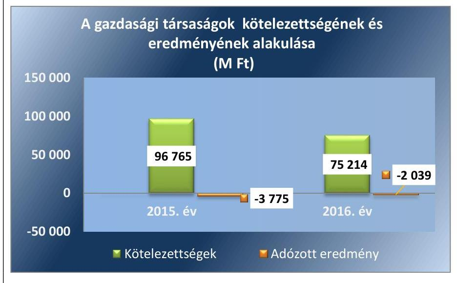

A gazdasági társaságok kötelezettségei 22,3\%-kal csökkentek a 2016. évben a 2015. évi kötelezettségekhez viszonyítva, 96765 M Ft-ról 75214 M Ft-ra. A gazdasági társaságok kötelezettségeinek állománya a vagyonkezelt eszközöket is tartalmazza. A mintavétellel kiválasztott gazdasági társaságoknál a vagyonkezelésbe adott eszközök aránya a 2015. évben $23 \%$, a 2016. évben $31 \%$ volt.

A gazdasági társaságok - összevont - adózott eredménye (mérleg szerinti eredménye) mindkét évben veszteséges gazdálkodást mutatott, a gazdasági társaságok összevont vesztesége a 2015. évi 3775 M Ft-ról a 2016. évre 2039 M Ft-ra változott.

---

Veszteséges gazdálkodás esetén a vagyon értéke csökken, a kötelezettségek visszafizetésének kockázata emelkedik, a fenntarthatósággal kapcsolatban kérdések merülnek fel. A gazdasági társaságok tartósan veszteséges gazdálkodása veszélyezteti az általuk végzett önkormányzati feladatok ellátását.

A gazdasági társaságok kötelezettségei állománya meghaladta a városi önkormányzatok működési jövedelmét mindkét ellenőrzött évben. A gazdasági társaságok nemfizetése esetén a gazdasági társaságok kötelezettségei a városi önkormányzatokra helytállási kötelezettséget háríthat. E helytállási kötelezettség kockázatot jelenthet a városi önkormányzatok gazdálkodására, mert a gazdasági társaságok kötelezettségeinek állománya nagyobb mértékű, mint a
 városi önkormányzatok éves működési jövedelme.

A gazdasági társaságok év végi kötelezettségeinek és a városi önkormányzatok működési jövedelmének alakulását a 8. ábra mutatja be.
8. ábra
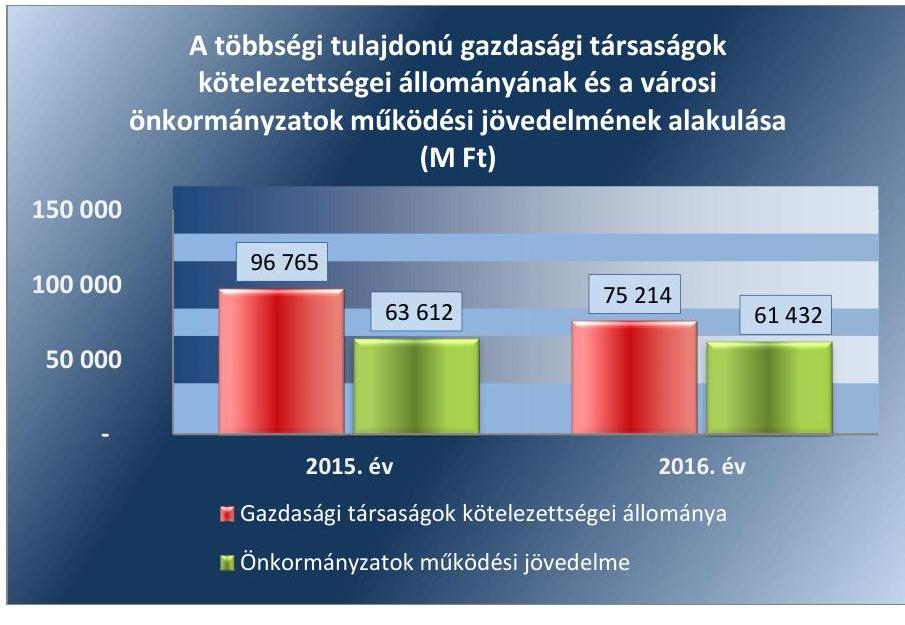

A MINTAVÉTELLEL KIVÁLASZTOTT 17 városi önkormányzatnál 57 gazdasági társaságból 7 olyan gazdasági társaság volt (összesen 6 városi önkormányzatnál), amelyek kormányzati szektorba sorolt szervezetek közé tartoztak (ESA). A kiválasztott városi önkormányzatok gazdasági társaságainak kötelezettsége a 2015. évben 26608 M Ft volt, amelynek 51%-a hitelből, 23%-a vagyonkezelésbe adott eszközökből, 1%-a tagi kölcsönből állt. A 2016. évi 22274 M Ft kötelezettségnek 40%-a hitel volt, 31%-a vagyonkezelésbe adott eszköz volt. A többi kötelezettség szállítói és egyéb (elsősorban adójellegű) fizetési kötelezettség volt.

# A VÁROSI ÖNKORMÁNYZATOK TARTÓS RÉSZESE-

DÉSEINEK állománya az előző évhez képest a 2015. évben 1,8%-kal csökkent, a 2016. évben 1,3%-kal emelkedett, amely utóbbit a gazdasági társaságokban történt újabb részesedés szerzése, vagy tőkeemelés okozott. A tartós részesedések állományának növekedése kockázatforrást jelent a városi önkormányzatok gazdálkodására.

---

.

---

# MELLÉKLETEK 

- I. SZ. MELLÉKLET: FOGALOMTÁR
adósságszolgálat
belső eladósodás kockázatforrás
beruházás
bevételi kitettség

CLF módszer
eladósodás kockázatforrás

ESA
eszközpótlási mutató
felhalmozási bevétel
felhalmozási kiadás
felhalmozási kiadások és finanszírozása kockázatforrás
felújítás

Az adósság tőkerészének és az esedékes kamat együttes összegének törlesztése. Kockázatforrást jelent, ha az értékcsökkenések kompenzálásaként a szükséges vagyonpótlás nem történt meg, ha romlott az eszközök állaga, mert az rejtett eladósodást jelent.
A tárgyi eszköz beszerzése, létesítése, saját vállalkozásban történő előállítása, a beszerzett tárgyi eszköz üzembe helyezése. A beruházás a meglévő tárgyi eszköz bővítését, rendeltetésének megváltoztatását, átalakítását, élettartamának, teljesítőképességének közvetlen növelését eredményező tevékenység. (Forrás: Számv. tv. ${ }^{5}$ 3. § (4) bekezdés 7. pontja)

Olyan függőségi viszony, ahol egy szervezet pénzügyi helyzetét meghatározó bevételek nagysága külső körülmények hatására azonnal és kedvezőtlen irányba változhat.
Az önkormányzatok költségvetése elemzésének módszere, amely a pénzügyi kapacitás (nettó működési jövedelem) fogalmát helyezi a középpontba. A módszer következetesen elkülöníti a folyó és a felhalmozási költségvetés bevételeit és kiadásait, azok költségvetési egyenlegeit. Bizonyos mértékig a vállalati gazdálkodás logikai elemeit érvényesíti az önkormányzatok pénzügyi, jövedelmi helyzetének vizsgálata során.
Az államháztartás önkormányzati alrendszerében felhalmozott adósság állam részéről történő kiegyenlítését, illetve átvállalását követően az önkormányzatok kiemelt feladata, egyben felelőssége az adósságállomány újratermelődésének megakadályozása. Kockázatforrást jelent, ha az önkormányzat kötelezettségei emelkednek, a mérlegben az idegen források aránya nő, az adósságkonszolidációt - helyi önkormányzatok adósságának állam által történő átvállalása - követően a gazdálkodás újra eladósodási pályára áll. Az eladósodás a pénzügyi gazdálkodás egyenes következménye, ugyanakkor hatással is van rá a folyó adósságszolgálat teljesítésén keresztül.
Ebbe a körbe tartoznak azok a szervezetek, amelyek nem részei az államháztartásnak, azonban az Európai Közösséget létrehozó szerződéshez csatolt, a túlzott hiány esetén követendő eljárásról szóló jegyzőkönyv alkalmazásáról szóló, 2009. május 25-i 479/2009/EK tanácsi rendelet szerint a kormányzati szektorba tartoznak, így többféle adatszolgáltatási kötelezettség terheli őket, többek között adósságot keletkeztető ügyletet csak az államháztartásért felelős miniszter előzetes egyetértésével köthet érvényesen.
A tárgyi eszközállomány elemzéséhez használt mutató, amely megmutatja, hogy az üzembe helyezett beruházások milyen hányadát képezi az elszámolt értékcsökkenésnek. Számításakor tárgyévben üzembe helyezett beruházások, felújítások értékét a tárgyi eszközök tárgyévben elszámolt értékcsökkenéséhez kell viszonyítani.
Az önkormányzatok tárgyévi felhalmozási célú költségvetési bevételei.
Az önkormányzatok tárgyévi felhalmozási célú költségvetési kiadásai.
Kockázatforrást jelent az erőn felüli beruházási aktivitás, illetve ha a folyamatban lévő felhalmozási feladatok finanszírozásához szükséges pénzügyi forrás nem áll az önkormányzat rendelkezésére.
Az elhasználódott tárgyi eszköz eredeti állaga (kapacitása, pontossága) helyreállítását szolgáló időszakonként visszatérő olyan tevékenység, melynek során az eszköz élet-

---

tartama megnövekszik, minősége, használata jelentősen javul, így a pótlólagos ráfordításból a jövőben gazdasági előnyök származnak. (Forrás: Számv. tv. 3. § (4) bekezdés 8. pontja)
finanszírozás kockázatforrás Kockázatforrást jelent, ha az önkormányzat nem rendelkezik megfelelő fedezettel a külső források adósságszolgálatának teljesítéséhez, ami hosszútávon vagyonfeléléshez vagy adósságspirálhoz vezethet.
folyó bevétel
folyó kiadás
folyó költségvetés egyen-
lege
garancia- és kezességválla-
lás kockázatforrás
garanciavállalás
hasznosítás
helyénvalósági ellenőrzés
kezességvállalás
kockázatforrás
koncesszió
Az önkormányzatok tárgyévi működési célú költségvetési bevételei
Az önkormányzatok tárgyévi működési célú költségvetési kiadásai
A folyó költségvetés egyenlege, azaz a működési jövedelem megmutatja, hogy az Önkormányzat éves folyó bevétele fedezetet biztosít-e a kötelező és önként vállalt feladatellátáshoz kapcsolódó éves folyó kiadására. A működési jövedelem negatív értéke pénzügyileg fenntarthatatlan helyzetet jelez. A mutató pozitív értéke megtakarítást mutat, amely forrásul szolgálhat az Önkormányzat fennálló kötelezettségei megfizetéséhez, valamint fejlesztéseihez.
Kockázatforrást jelent, ha a szerződés kötelezettje a szerződésben vállalt kötelezettségeit nem teljesíti a jogosultnak, mert azokért a kezes köteles helytállni. A garancia- és kezességvállalások függő kötelezettségként kockázatot jelentenek az önkormányzat költségvetésére, ezen keresztül a közfeladatok ellátására.
Olyan kötelezettségvállalás, ahol a garanciát vállaló valamely jövőbeni esemény bekövetkezésekor, a szerződésben meghatározott feltételek beálltakor a garancia kedvezményezettje számára meghatározott összegig, meghatározott időpontig, felszólításra azonnal fizet.
A nemzeti vagyon birtoklásának, használatának, hasznok szedése jogának bármely a tulajdonjog átruházását nem eredményező - jogcímen történő átengedése, ide nem értve a vagyonkezelésbe adást, valamint a haszonélvezeti jog alapítását. (Forrás: Nvtv. 3. § (1) bekezdés 4. pontja)
A helyénvalósági ellenőrzés a megfelelőségi ellenőrzés azon altípusa, amelyet azokban az esetekben kell alkalmazni, amelyekre jogszabályi előírások nem alkalmazhatóak, illetve amennyiben egyes kérdések megítélésénél nyilvánvaló jogszabályi hiányosságok vannak. Helyénvalósági ellenőrzés során a Számvevőszéknek a közszféra szilárd gazdálkodására és a köztisztviselők magatartására vonatkozó általános alapelvek mentén kell az ellenőrzést lefolytatni.
Szerződésben vállalt olyan kötelezettség, amelyben a kezes arra vállal kötelezettséget, hogy ha a szerződés kötelezettje nem teljesít a kezes maga fog helyette teljesíteni a jogosultnak. (Forrás: Ptk. 6:416.§).
A kockázatok kiváltó okait kockázatforrásnak nevezzük. Első lépésben azonosítjuk a nyomon követendő kockázatokat, majd a kockázatos területeket és a kiváltó okokat (kockázatforrásokat). Kockázatként azonosítjuk, ha az önkormányzat hosszú távon nem képes a törvényben meghatározott feladatait ellátni, költségvetése változatlan formában nem fenntartható. A kockázat értékelésének célja annak megállapítása, hogy a pénzügyi gazdálkodás, eladósodás, vagyongazdálkodás kockázati területek milyen mértékben befolyásolják, veszélyeztetik az önkormányzat működését, a közfeladatok ellátását. A három kockázati terület minősítéséhez összesen 10 kockázatforrást rendelünk.
Az állam, illetőleg az önkormányzat (önkormányzati társulás) kizárólagos tulajdonában lévő vagyontárgyak birtoklásának, használatának és hasznosításának, valamint a koncesszió-köteles tevékenységek gyakorlásának jogát, visszterhes szerződéssel, időlegesen úgy engedi át, hogy a jogosultnak részleges piaci monopóliumot biztosít.

---

koncessziós szerződés
kötelező közszolgáltatás (az önkormányzati feladatokat érintően)
kötvény
közfeladat
közfeladatok finanszírozási struktúrája kockázatforrás
lényegesség
megfelelőségi ellenőrzés
nettó működési jövedelem
önkormányzat
önkormányzat rendkívüli támogatása
pénzintézetek felé történő eladósodás kockázatforrás

A koncessziós szerződés olyan visszterhes szerződés, amelyben az állam vagy az önkormányzat a törvényben meghatározott tevékenységek gyakorlásának a jogát időlegesen úgy engedi át, hogy a jogosultnak részleges piaci monopóliumot biztosít.
Az önkormányzat kötelezően vállalt feladatkörébe tartozó egyes - közszolgáltatás útján megvalósuló - közfeladatok ellátása, amelyeket külön jogszabály (törvény, helyi önkormányzati rendelet) határoz meg.
Hosszabb lejáratra szóló, hitelviszonyt megtestesítő kamatozó értékpapír. A kötvényben a kibocsátó arra kötelezi magát, hogy a kötvényben megjelölt pénzösszegnek az előre meghatározott kamatát vagy egyéb jutalékait, továbbá az adott pénzösszeget a kötvény mindenkori tulajdonosának, illetve jogosultjának a megjelölt időben és módon megfizeti.
A közfeladat a jogszabályban meghatározott állami vagy önkormányzati feladat. A közfeladatok ellátása költségvetési szervek alapításával és működtetésével vagy az azok ellátásához szükséges pénzügyi fedezet e törvényben (Áht.) meghatározott eszközökkel, részben vagy egészben történő biztosításával valósul meg. A közfeladatok ellátásában államháztartáson kívüli szervezet jogszabályban meghatározott rendben közreműködhet. (Forrás: Áht. 3/A. § (1)-(2) bekezdés, 2015. január 1-jétől)
Kockázatforrást jelent, ha az önkormányzat pénzügyi helyzete jelentős függőséget mutat a külső körülményektől (adóbevételektől, kiegészítő állami támogatásoktól). A közfeladatok finanszírozási struktúrája nem kielégítő, ha a működési bevételek nem fedezik teljes mértékben az ellátott közfeladatokat.
Az a szintű információ vagy adat, ami az ellenőrzés eredményei célzott felhasználóinak döntéseit - az arról történő tudomásszerzést követően - valószínűsíthetően befolyásolja.
A számvevőszéki ellenőrzés azon típusa, amely annak megállapítására irányul, hogy az ellenőrzés tárgyát képező tevékenységek, pénzügyi műveletek, információk és adatok minden lényeges szempontból megfelelnek-e az ellenőrzött szervezetre vonatkozó szabályozásoknak és követelményeknek.
A nettó működési jövedelem a jövedelemtermelő képességet méri. Megmutatja a működési bevételekből a működési kiadások és a hitelek tőketörlesztésének kifizetése után fennmaradó jövedelmet.
A helyi önkormányzat jogi személy. Az önkormányzati feladatok ellátását a képviselőtestület és szervei biztosítják. A képviselőtestület szervei: a polgármester, a főpolgármester, a megyei közgyűlés elnöke, a képviselő-testület bizottságai, a részönkormányzat testülete, a polgármesteri hivatal, a megyei önkormányzati hivatal, a közös önkormányzati hivatal, a jegyző, továbbá a társulás. A képviselő-testület a feladatkörébe tartozó közszolgáltatások ellátására - jogszabályban meghatározottak szerint - költségvetési szervet, a Polgári perrendtartásról szóló 1952. évi III. törvény szerinti gazdálkodó szervezetet (a továbbiakban: gazdálkodó szervezet), nonprofit szervezetet és egyéb szervezetet (a továbbiakban együtt: intézmény) alapíthat, továbbá szerződést köthet természetes és jogi személlyel vagy jogi személyiséggel nem rendelkező szervezettel. (Forrás: Mötv. ${ }^{6}$ 41. § (1), (2), (6) bekezdései)
A 2015-2016. években a megyei önkormányzatok rendkívüli támogatása, a települési önkormányzatok rendkívüli támogatása és a tartósan fizetésképtelen helyzetbe került helyi önkormányzatok adósságrendezésére irányuló hitelfelvétel visszterhes kamattámogatása, a pénzügyi gondnok díja.
Kockázatforrásnak tekintettük, ha az önkormányzat (újból) adósságot keletkeztet, ami a kivételektől eltekintve a 2012. évtől kormányengedély-köteles. A pénzintézetekkel szemben fennálló kötelezettségek esetén olyan függőségi viszony jöhet létre, ahol az önkormányzat pénzügyi helyzete olyan külső körülmények hatására változhat, amely kizárólag a bank egyoldalú döntésén múlik.

---

pénzügyi kapacitás

pénzügyi kockázat
polgármesteri hivatal
szállítók felé történő eladósodás kockázatforrás
többségi önkormányzati tulajdonban lévő gazdasági társaságok kockázatforrás vagyongazdálkodás
vagyonkezelői jog
vagyonváltozás kockázatforrás

A pénzügyi kapacitás az adósok hitelfelvételi képességének azon mértéke, ahol még növelni tudják az adósságot anélkül, hogy a fizetőképtelenség elkerülése érdekében csökkenteniük kellene akár az aktuális, akár a jövőben esedékes kiadásaikat.
A pénzügyi kockázat magában foglalja mindazon kockázatokat, amelyek a szervezet pénzügyi helyzetére hatással vannak. PI.: az adósságszolgálat miatti kockázatot, árfolyamkockázatot, felhalmozási kockázatot, fizetőképességi kockázatot, jövőbeni kötelezettségek kifizethetőségének kockázatát, kamatkockázatot, kezességvállalás kockázatát, likviditási kockázatot, mérlegen kívüli tételek kockázatát, nemfizetési kockázatot stb.
Az ellenőrzési programban a polgármesteri hivatal megnevezés alatt értjük a polgármesteri hivatalt, a főpolgármesteri hivatalt, a megyei önkormányzati hivatalt, a közös önkormányzati hivatalt.
Kockázatforrást jelent, ha az önkormányzat növeli a dologi, felújítási, beruházási kötelezettségeit (szállítókkal szemben fennálló tartozásait), ami burkolt hitelezésnek minősülhet, és az elismert kötelezettségeit átmenetileg vagy véglegesen nem tudja határidőre teljesíteni.
Kockázatforrást jelent, hogy az önkormányzati tulajdonban lévő gazdasági társaságok adósságállományáért a tulajdonos önkormányzatot helytállási kötelezettség terheli.

A nemzeti vagyongazdálkodás feladata a nemzeti vagyon rendeltetésének megfelelő, az állam, az önkormányzat mindenkori teherbíró képességéhez igazodó, elsődlegesen a közfeladatok ellátásához és a mindenkori társadalmi szükségletek kielégítéséhez szükséges, egységes elveken alapuló, átlátható, hatékony és költségtakarékos működtetése, értékének megőrzése, állagának védelme, értéknövelő használata, hasznosítása, gyarapítása, továbbá az állam vagy a helyi önkormányzat feladatának ellátása szempontjából feleslegessé váló vagyontárgyak elidegenítése. (Forrás: Nvtv. 7. § (2) bekezdése)

A vagyonkezelői szerződés alapján a vagyonkezelő jogosult meghatározott szervezeti tulajdonába tartozó dolog birtoklására és hasznai szedésére. A vagyonkezelő köteles a vagyontárgy értékét megőrizni, állagának megóvásáról, karbantartásáról, működtetéséről gondoskodni, továbbá díjat
 fizetni vagy a szerződésben előírt kötelezettséget teljesíteni.
Kockázatforrásként értékeltük, ha csökken a nemzeti vagyon, ha az önkormányzatok a vagyonértékesítésből származó bevételeket nem beruházásokra, a vagyon pótlására fordítják.

---

# II. SZ. MELLÉKLET: AZ ELLENŐRZÉSI KRITÉRIUMOK MÓDSZERTANA ÉS ÉRTÉKELÉSE 

Az ellenőrzés tárgya: Az önkormányzati gazdálkodás fenntarthatósága, a törvényben előírt feladatok ellátása, az önkormányzatnál észlelt negatív tendenciák okainak feltárása, amely az ellenőrzési kritériumok alapján kerül értékelésre.

Az ellenőrzési kritériumok meghatározása során első lépésben azonosításra kerültek az önkormányzati gazdálkodás fenntarthatóságának, a törvényben előírt feladatok ellátásának kockázatos területei és a kiváltó okai (kockázatforrások), amelyekhez minden esetben mutatószám került hozzárendelésre. A mutatószámok között a viszonyszámok (relatív mutatószámok) és az abszolút adatok (abszolút mutatószámok) egyaránt megtalálhatóak, amelyekhez a Magyar Államkincstár által szolgáltatott adatállományok (költségvetési beszámolók, időközi költségvetési jelentések, mérlegjelentések adatait) kerültek felhasználásra.

Az egyes kockázati területek és kockázatforrások minősítése „pontozásos módszerrel" a mutatószámok értékelése alapján történt.

- Első lépésben a mutatószámok értékelésére és egy háromelemű skálán történő elhelyezésére került sor. Az értékelés (a kategória határok meghatározása) elsődlegesen a mutatószámok közgazdasági értelmezése alapján, az Állami Számvevőszék ellenőrzési tapasztalatait felhasználva történt. Az értékelések alapján egy-egy mutató alacsony besorolás esetén 0 pontot, közepes esetén 1 pontot, magas kockázatjelzés esetén 2 pontot kapott. (PI.: ha a működési kiadások fedezettsége mutató 90% alatti volt, akkor magas kockázati besorolást, 2 pontot, ha 100% feletti volt akkor alacsony besorolást, 0 pontot kapott.) A %-ban kifejezett mutatók kockázati besorolására a pontos (több tizedes jegy) értékek alapján került sor, ugyanakkor az önkormányzati riport a mutatókat egy, illetve esetenként két tizedes számjegyig mutatja be.
- Annak érdekében, hogy a kockázatforrások minősítésénél a lényeges mutatók értéke legyen a meghatározó a jellegzetes mutatókéval szemben, a mutatószámok súlyozására került sor*. A súlyok mértékének megválasztásakor az elsődleges mutatók középértékének tekintve 1-es súly mellérendelése* történt. A főmutató súlya az elsődleges mutatók súlyának kétszeresében, míg a másodlagos mutatók súlya az elsődleges mutatók súlyának felében került meghatározásra. (PI.: a kockázatforrás minősítéséhez a működési kiadások fedezettségét főmutatóként vették figyelembe, ezért 2-es súlyt rendeltek hozzá. Így ha a mutató kockázati besorolása magas volt, a magas kockázati besoroláshoz rendelt 2 pontot szorozták a főmutatóhoz rendelt 2-es súlyszámmal és az elért pontszám 4, míg alacsony besorolás esetén a besoroláshoz rendelt 0 pontot szorozva a főmutatóhoz rendelt 2-es súlyszámmal elért pontszám 0 volt.)
- Ezt követően került sor az önkormányzati gazdálkodás fenntarthatóságának, a törvényben előírt feladatok ellátásának kockázatához rendelt kockázati területek és kockázatforrások értékelési ponthatárainak meghatározására oly módon, hogy kockázatforrásonként a mutatószámok súlyozott értékelésével elérhető összes pontszám három egyenlő részre (alacsony, közepes, magas) osztása történt meg. (PI.: A közfeladatok finanszírozási struktúrája kockázatforrás 1 db főmutató, 2 db elsődleges mutató és további 2 db másodlagos mutató alakulása alapján került értékelésre. A mutatók magas kockázati besorolása esetén - a súlyozást követően - elérhető legmagasabb pontszám 10 volt. Ezt három egyenlő részre osztva kerültek meghatározásra a közfeladatok finanszírozási struktúrájának értékelési ponthatárai, amely 0-3,32 pontig alacsony, 3,33-6,66 pontig közepes, 6,67-10 pont között magas kockázati minősítést kapott.) A pénzügyi gazdálkodás és eladósodás kockázati területek és a hozzájuk tartozó egyes kockázatforrások 2014. évi és 2015. évi értékelési pontjai eltérnek egymástól, mivel az eredményszemléletű mutatók változása első alkalommal a 2015. évben volt értékelhető.
- Az egyes kockázatforrások értékelésekor a kockázatforráshoz rendelt mutatószámok - súlyozással kapott - értékeinek összesítése és a kialakított értékelési ponthatárok szerinti minősítése történt meg. (PI.: egy önkormányzat minősítésekor a közfeladatok finanszírozási struktúrája kockázatforráshoz rendelt 5 db

[^0]
[^0]:    * A súlyozás kifejezi, hogy az alkalmazott mutatószámok egymáshoz képest milyen mértékben járulnak hozzá az adott kockázatforrás értékeléséhez.
    † Egy esetben a banki kötelezettségállomány mérlegfőösszeghez mért nagysága mutatónál a kockázatforrás kiegyensúlyozottabb megítélése érdekében az 1-es súlyozás helyett 1,5-ös súlyozás került alkalmazásra.

---

mutató - fentiekben bemutatott - értékelésével elért összes pontszám 7 volt, akkor a kockázatforrás a hármas skálán a 6,67-10 pont közé került, így magas minősítést kapott.)

- Az egyes kockázati területek minősítése hasonlóan történt. Az egyes kockázati területeket meghatározó kockázatforrások pontjainak aggregálását követően, a kockázati területen elérhető összes pont három egyenlő részre osztásával kialakított skálán történő értékelésére került sor. Ha azonban a kockázatforrások közül legalább egy magas kockázati besorolást ért el, akkor a pontozás szerinti értékeléstől eltérően, a kockázati terület besorolása közepes kockázati minősítésűre módosult.

Az ellenőrzés tárgyának, az önkormányzati gazdálkodás fenntarthatóságának, a törvényben előírt feladatok ellátásának értékelése:
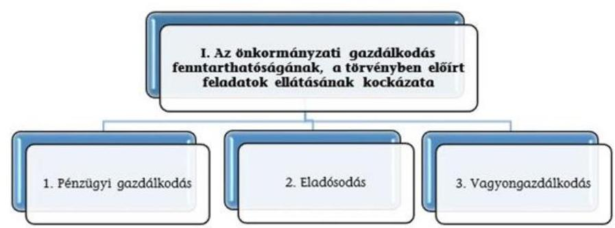

A három kockázati terület együttes értékelése alapján az alábbi mátrix segítségével kerül meghatározásra az önkormányzati gazdálkodás fenntarthatóságának, a törvényben előírt feladatok ellátásának értékelése a következők szerint:
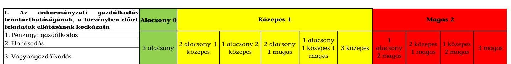

---

A városi önkormányzatok 2015-2016. évi mérlegeinek adatai

| Megnevezés | 2015. január 1. | 2015. december 31. | 2016. december 31. |
| :--: | :--: | :--: | :--: |
| BEFEKTETETT ESZKÖZÖK   / NEMZETI VAGYONBA TARTOZÓ   BEFEKTETETT ESZKÖZÖK | 2952758,1 | 3091042,8 | 3178361,9 |
| NEMZETI VAGYONBA TARTOZÓ FORGÓESZKÖZÖK | 11851,9 | 9342,4 | 37169,7 |
| PÉNZESZKÖZÖK | 122993,2 | 137312,8 | 133880,0 |
| KÖVETELÉSEK | 59967,6 | 62544,0 | 59343,6 |
| EGYÉB SAJÁTOS ESZKÖZOLDALI ELSZÁMOLÁSOK | 7798,4 | 5954,9 | 1742,0 |
| AKTÍV IDŐBELI ELHATÁROLÁSOK | 2438,9 | 1765,7 | 1661,4 |
| ESZKÖZÖK ÖSSZESEN | 3157808,1 | 3307962,6 | 3412158,6 |
| SAJÁT TÖKE | 2987510,3 | 3052501,8 | 3094090,6 |
| KÖTELEZETTSÉGEK | 69627,4 | 57491,3 | 60115,2 |
| EGYÉB SAJÁTOS FORRÁSOLDALI ELSZÁMOLÁSOK | 1600,4 |  |  |
| PASSZÍV IDŐBELI ELHATÁROLÁSOK | 99070,0 | 197969,5 | 257952,8 |
| FORRÁSOK ÖSSZESEN | 3157808,1 | 3307962,6 | 3412158,6 |

---

# IV. SZ. MELLÉKLET: PÉNZÜGYI EGYENSÜLYI HELYZET CLF MÓDSZER SZERINTI ÉRTÉKELÉSE A 2015-2016. ÉVEKBEN (E FT)

|  1. FOLYÓ KÖLTSÉGVETÉS | 2015. év | 2016. év | Változás [\%]
(2016-2015) /
2015  |
| --- | --- | --- | --- |
|  1.1.1. Saját működési bevételek tulajdonosi bevételek nélkül | 289898640 | 295445524 | 1,91%  |
|  1.1.2. Költségvetési támogatások a működőképesség megőrzését szolgáló kiegészítő támogatások nélkül | 192842861 | 194806661 | 1,02%  |
|  1.1.3. Átengedett bevételek | 9549444 | 9511595 | -0,40%  |
|  1.1.4. Államháztartáson belülről kapott támogatások | 91128331 | 88435183 | -2,96%  |
|  1.1.5. EU-tól és külföldről kapott bevételek | 203721 | 185120 | -9,13%  |
|  1.1.6. Államháztartáson kívülről kapott bevételek | 1066093 | 1511057 | 41,74%  |
|  1.1.7. Hozam- és kamatbevételek (2014-ben a működési rész csak az önkormányzat nyilvántartása alapján pontosítható) | 2028191 | 1945306 | -4,09%  |
|  1.1.8. Kölcsönök visszatérülése, igénybevétele | 4462753 | 2402408 | -46,17%  |
|  1.1.9. A működőképesség megőrzését szolgáló kiegészítő támogatások | 7104307 | 3882827 | -45,35%  |
|  1.1. Folyó bevételek (1.1.1.+1.1.2.+1.1.3.+1.1.4.+1.1.5.+1.1.6.+1.1.7.+1.1.8.+1.1.9.) | 598284341 | 594246738 | -0,67%  |
|  1.2.1. Működési kiadások kamatkiadások nélkül | 431787245 | 437728890 | 1,38%  |
|  1.2.2. Államháztartáson belülre átadott pénzeszközök | 46117355 | 43674223 | -5,30%  |
|  1.2.3.1. vállalkozásoknak | 17727376 | 20709793 | 16,82%  |
|  1.2.3.2. EU-nak, illetve külföldre | 127570 | 88987 | -30,24%  |
|  1.2.3.3. magánszemélyeknek | 16628804 | 10381969 | -37,57%  |
|  1.2.3.4. non-profit szervezeteknek | 16558989 | 16840079 | 1,70%  |
|  1.2.3. Transzferkiadások | 51042739 | 48020828 | -5,92%  |
|  1.2.4. Kamatkiadások | 1019586 | 920900 | -9,68%  |
|  1.2.5. Kölcsönök nyújtása, törlesztése | 4705647 | 2469046 | -47,53%  |
|  1.2. Folyó kiadások (1.2.1.+1.2.2.+1.2.3.+1.2.4.+1.2.5.) | 534672572 | 532813887 | -0,35%  |
|  1.3. Folyó költségvetés egyenlege, működési jövedelem (1.1. - 1.2.) | 63611769 | 61432851 | -3,43%  |
|  2. FELHALMOZÁSI KÖLTSÉGVETÉS |  |  |   |
|  2.1.1. Saját tőkebevételek | 6923256 | 10766777 | 55,52%  |
|  2.1.2. Költségvetési támogatások | 17925353 | 24541234 | 36,91%  |
|  2.1.3. Államháztartáson belülről kapott támogatások | 146929505 | 21024444 | -85,69%  |
|  2.1.4. EU-tól és külföldről kapott támogatások | 3365861 | 460887 | -86,31%  |
|  2.1.5. Államháztartáson kívülről kapott bevételek | 3702700 | 3040451 | -17,89%  |
|  2.1.6. Hozam- és kamatbevételek (2014-ben (02/196+02/200-ből a felhalmozási rész csak az önkormányzat nyilvántartása alapján pontosítható) | 0 | 0 | 0,00%  |
|  2.1.7. Kölcsönök visszatérülése, igénybevétele | 5206230 | 3106242 | -40,34%  |
|  2.1. Felhalmozási bevételek (2.1.1.+2.1.2+2.1.3+2.1.4.+2.1.5.+2.1.6.+2.1.7.) | 184052905 | 62940036 | -65,80%  |
|  2.2.1. Saját beruházási kiadás áfával | 161252413 | 59605644 | -63,04%  |
|  2.2.2. Saját felújítási kiadás áfával | 50315841 | 27839436 | -44,67%  |
|  2.2.3. Államháztartáson belülre átadott pénzeszközök | 8302422 | 2279466 | -72,54%  |
|  2.2.4. EU-nak és külföldnek adott pénzeszközök | 650172 | 600829 | -7,59%  |
|  2.2.5. Államháztartáson kívülre adott pénzeszközök | 7088570 | 11174350 | 57,64%  |
|  2.2.6. Befektetéssel kapcsolatos kiadások | 2632664 | 3369619 | 27,99%  |
|  2.2.7. Kamatkiadások (2014-ben 01/51+01/54-ből a felhalmozási rész csak az önkormányzat nyilvántartása alapján pontosítható) | 0 | 0 | 0,00%  |
|  2.2.8. Kölcsönök nyújtása, törlesztése | 4974705 | 2103501 | -57,72%  |
|  2.2.9. ÁFA befizetések (2014-ben a 01/50-ből a felhalmozási rész csak az önkormányzat nyilvántartása alapján pontosítható) | 0 | 0 | 0,00%  |
|  2.2. Felhalmozási kiadások (2.2.1.+2.2.2.+2.2.3.+2.2.4.+2.2.5.+2.2.6.+2.2.7.+2.2.8.+2.2.9.) | 235216787 | 106972846 | -54,52%  |
|  2.3. Felhalmozási költségvetés egyenlege (2.1. - 2.2.) | -51163882 | -44032810 | 13,94%  |
|  3. FINANSZÍROZÁSI MŰVELETEK NÉLKÜLI (GFS) POZÍCIÓ (1.3.+2.3.) | 12447887 | 17400041 | 39,78%  |
|  4. FINANSZÍROZÁSI MŰVELETEK |  |  |   |
|  4.1. Hitelfelvétel | 20857068 | 20034370 | -3,94%  |
|  4.2. Hiteltörlesztés | 17198997 | 17701546 | 2,92%  |

  4.3. Forgatási és befektetési célú értékpapírok kibocsátása | 0 | 450000 | $100,00 \%$  |
|  4.4. Forgatási és befektetési célú értékpapírok beváltása | 0 | 1450000 | $100,00 \%$  |
|  4.5. Forgatási és befektetési célú értékpapírok értékesítése | 15771421 | 32227782 | $104,34 \%$  |
|  4.6. Forgatási és befektetési célú értékpapírok vásárlása | 18984906 | 59844953 | $215,22 \%$  |
|  4.7. Egyéb finanszírozási bevételek | 222105299 | 167856530 | $-24,42 \%$  |
|  4.8. Egyéb finanszírozási kiadások | 224729743 | 166150774 | $-26,07 \%$  |
|  4.9. Finanszírozási műveletek egyenlege (4.1.-4.2.+4.3.-4.4.+4.5.-4.6.+4.7.-4.8.) | $-2179858$ | $-24578591$ | $-1027,53 \%$  |
|  5. TÁRGYÉVI PÉNZÜGYI POZÍCIÓ (1.3.+ 2.3.+4.9.) | 10268029 | $-7178550$ | $-169,91 \%$  |
|  6. NETTÓ MŰKÖDÉSI JÖVEDELEM (működési jövedelem (1.3.) - tőketörlesztés (4.2+4.4)) | 46412772 | 42281306 | $-8,90 \%$  |
|  * Az önkormányzat bevételei nem tartalmazzák az előző évi pénzmaradvány igénybevételeket |  |  |   |
|  Tájékoztató adat: Maradvány igénybevétele | 114918768 | 124451600 | $8,30 \%$  |

---

# Önkormányzati riport 

Lakosságszám 2015. január 1-jén [fő]:
Lakosságszám 2016. január 1-jén [fő]:
3306792
3299234

## Összefoglaló értékelés

| Azonosított kockázatok (értékelése: Magas=M / Közepes=K / Alacsony=A) | A városi önkormányzatok 2015. évi kockázati besorolása és pontozása (módosított) | A városi önkormányzatok 2016. évi kockázati besorolása és pontozása (módosított) |
| :--: | :--: | :--: |
| I. Az önkormányzati gazdálkodás fenntarthatóságának, a törvényben előírt feladatok ellátásának kockázata | K | K |
| 1. Pénzügyi gazdálkodás | 7,5 K | 9,0 K |
| 1.1 Közfeladatok finanszírozási struktúrája | 3,0 A | 3,0 A |
| 1.2 Felhalmozási kiadások és finanszírozása | 2,0 K | 2,0 K |
| 1.3 Finanszírozás | 2,5 A | 4,0 K |
| 2. Eladósodás | 11,5 K | 13,5 K |
| 2.1 Adósságkonszolidációt követő időszakban bekövetkező eladósodás | 2,0 A | 3,0 A |
| 2.2 Szállítók felé történő eladósodás | 3,5 K | 5,5 K |
| 2.3 Pénzintézet felé történő eladósodás | 6,0 K | 5,0 K |
| 2.4 Garancia- és kezességvállalás | 0,0 A | 0,0 A |
| 3. Vagyongazdálkodás | 8,5 K | 8,5 K |
| 3.1 Vagyonváltozás | 2,0 K | 2,0 K |
| 3.2 Belső eladósodás | 2,5 A | 2,5 A |
| 3.3 Többségi önkormányzati tulajdonban lévő gazdasági társaságok | 4,0 K | 4,0 K |

---

- VI. SZ. MELLÉKLET: A VÁROSI ÖNKORMÁNYZATOK 2015-2016. ÉVI FŐBB MUTATÓINAK ÉS KOCKÁZATI TERÜLETEINEK RÉSZLETES ÉRTÉKELÉSE

| Kockázat/Kockázati területek /Kockázatforrások/Mutatók | ÁSZ értékelés |  |  |  |
| :--: | :--: | :--: | :--: | :--: |
|  | Mutatók értéke 2015.12.31. | Kockázati bevonás 2015. 4. 4. | Mutatók értéke 2016.12.31. | Kockázati bevonás 2016. 4. 4. |
| I. Az önkormányzati gazdálkodás fenntarthatóságának, a törvényben előírt feladatok ellátásának kockázata |  | K |  | K |
| 1. Pénzügyi gazdálkodás |  | K |  | K |
| 1.1 Közfeladatok finanszírozási struktúrája |  | A |  | A |
| Működési kiadások fedezettsége | $111,9 \%$ | A | $111,5 \%$ | A |
| Önkormányzati rendkívüli támogatás aránya | $1,2 \%$ | K | $0,7 \%$ | K |
| Adóbevételek működési bevételeken belüli arányának változása | $+3,23$ | A | $+1,18 \%$ | A |
| Adóbevételek állományának változása | $+11,0 \%$ | A | $+2,5 \%$ | A |
| Helyi iparűzési adóbevételek állományának változása | $+13,2 \%$ | A | $+1,5 \%$ | A |
| 1.2 Felhalmozási kiadások és finanszírozása |  | K |  | K |
| Felhalmozási kiadások fedezettsége | $78,2 \%$ | K | $58,8 \%$ | K |
| 1.3 Finanszírozás |  | A |  | K |
| Törlesztés fedezettségének aránya | $27,0 \%$ | A | $31,2 \%$ | A |
| Nettó működési jövedelem változása | $+1043,4 \%$ | A | $-8,9 \%$ | K |
| 2. Eladósodás |  | K |  | K |
| 2.1 Adósságkonszolidációt követő időszakban bekövetkező eladósodás |  | A |  | A |
| Eladósodási mutató | $1,7 \%$ | A | $1,8 \%$ | A |
| Eladósodási mutató változása | $-0,5 \%$ | A | $+0,1 \%$ | K |
| Tárgyévi pénzügyi pozíció változása | $5873,3 \%$ | A | $-169,9 \%$ | A |
| 2.2 Szállítók felé történő eladósodás |  | K |  | K |
| Szállítói állomány (2014-től kötelezettségek dologi, felújítási beruházási kiadásokra) változása | $-48,6 \%$ | A | $+0,1 \%$ | K |
| 90 napon túli lejárt kötelezettségek állományának aránya (az összes köt. állományból) | $1,3 \%$ | M | $1,4 \%$ | M |
| Lejárt szállítói állomány (2014-től lejárt kötelezettségek dologi, felújítási beruházási kiadásokra) aránya (a szállítói állományból) | $21,4 \%$ | K | $19,9 \%$ | K |
| Lejárt szállítói állomány (2014-től lejárt kötelezettségek dologi, felújítási beruházási kiadásokra) változása | $-50,9 \%$ | A | $-6,9 \%$ | A |

---

| Lejárt szállítói állomány (2014-től lejárt kötelezettségek dologi kiadásokra) aránya a dologi kiadások egy havi átlagához viszonyítva | $15,7 \%$ | K | $14,3 \%$ | K |
| :--: | :--: | :--: | :--: | :--: |
| 2.3 Pénzintézet felé történő eladósodás |  | K |  | K |
| Banki kötelezettségállomány mérlegfőösszeghez mért nagysága | $0,4 \%$ | A | $0,4 \%$ | A |
| Banki kötelezettségek (rövid és hosszúlejáratú hitelek és kötvénykibocsátásból származó tartozások) állományának változása | $+52,9 \%$ | K | $+20,8 \%$ | K |
| Tárgyévben kormányzati jóváhagyással megkötött hosszú lejáratú adósságot keletkeztető ügyletek darabszáma | $+26$ | K | $+26$ | K |
| ...ügyletek értéke (E Ft) | +2879089 | K | +4600769 | K |
| Tárgyévben megkötött, kormányzati hozzájáruláshoz nem kötött, hosszúlejáratú adósságot keletkeztető ügyletek darabszáma | $+9$ | K | $+18$ | K |
| ...ügyletek értéke (E Ft) | +177122 | A | +147944 | A |
| 2.4 Garancia- és kezességvállalás |  | A |  | A |
| Garancia és kezességvállalások állománya (E Ft) | +4818889 | A | +4630234 | A |
| 3. Vagyongazdálkodás |  | K |  | K |
| 3.1 Vagyonváltozás |  | K |  | K |
| Befektetett eszközök fedezettsége | $98,8 \%$ | K | $97,3 \%$ | K |
| Ingatlanok és kapcsolódó vagyoni értékű jogok állományának változása (E Ft) | +177854138 | A | +125300201 | A |
| Koncesszióba, vagyonkezelésbe adott eszközök állományának változása (E Ft) | +9686049 | M | +8176130 | M |
| 3.2 Belső eladósodás |  | A |  | A |
| Eszközpótlási mutató (tárgyi eszközök összesen) | $155,6 \%$ | A | $125,9 \%$ | A |
| Eszközpótlási mutató (ingatlanok és kapcsolódó vagyoni értékű jogokra) | $170,7 \%$ | A | $144,6 \%$ | A |
| 3.3 Többségi önkormányzati tulajdonban lévő gazdasági társaságok |  | K |  | K |
| Többségi önkormányzati tulajdonú gazdasági társaságok kötelezettségei állományának változása | $1,6 \%$ | K | $-22,3 \%$ | K |
| ...gazdasági társaságok számának változása (db) | 46 | M | -28 | A |
| Tartós részesedések állományának változása | $-1,8 \%$ | A | $1,3 \%$ | M |

---

|  sorszám | A település (városi önkormányzat) neve: | sorszám | A település (városi önkormányzat) neve:  |
| --- | --- | --- | --- |
|  1 | Aba város önkormányzata | 45 | Budakeszi város önkormányzata  |
|  2 | Abádszalók város önkormányzata | 46 | Budaörs város önkormányzata  |
|  3 | Abaújszántó város önkormányzata | 47 | Bük város önkormányzata  |
|  4 | Abony város önkormányzata | 48 | Cegléd város önkormányzata  |
|  5 | Ács város önkormányzata | 49 | Celldömölk város önkormányzata  |
|  6 | Adony város önkormányzata | 50 | Cigánd város önkormányzata  |
|  7 | Ajak város önkormányzata | 51 | Csákvár város önkormányzata  |
|  8 | Ajka város önkormányzata | 52 | Csanádalberta város önkormányzata  |
|  9 | Albertirsa város önkormányzata | 53 | Csepreg város önkormányzata  |
|  10 | Alsózsolca város önkormányzata | 54 | Csongrád városi önkormányzata  |
|  11 | Aszód város önkormányzata | 55 | Csorna város önkormányzata  |
|  12 | Bábolna város önkormányzata | 56 | Csorvás város önkormányzata  |
|  13 | Bácsalmás városi önkormányzata | 57 | Csurgo város önkormányzata  |
|  14 | Badacsonytomaj város önkormányzata | 58 | Dabas város önkormányzata  |
|  15 | Baja város önkormányzata | 59 | Demecser város önkormányzata  |
|  16 | Baktalórántháza város önkormányzata | 60 | Derecske város önkormányzata  |
|  17 | Balassagyarmat város önkormányzata | 61 | Dévaványa város önkormányzata  |
|  18 | Balatonfüred város önkormányzata | 62 | Devecser város önkormányzata  |
|  19 | Balatonboglár városi önkormányzata | 63 | Diósd város önkormányzata  |
|  20 | Balatonföldvár város önkormányzata | 64 | Dombóvár város önkormányzata  |
|  21 | Balatonfüred város önkormányzata | 65 | Dombrád város önkormányzata  |
|  22 | Balatonfüzfő város önkormányzata | 66 | Dorog város önkormányzata  |
|  23 | Balatonkenese város önkormányzata | 67 | Dunaföldvár város önkormányzata  |
|  24 | Balatonlelle város önkormányzata | 68 | Dunaharaszti város önkormányzata  |
|  25 | Balkány város önkormányzata | 69 | Dunakeszi város önkormányzata  |
|  26 | Balmazújváros város önkormányzata | 70 | Dunavarsány város önkormányzata  |
|  27 | Barcs város önkormányzata | 71 | Dunavecse város önkormányzata  |
|  28 | Bácsszék város önkormányzata | 72 | Edelény város
 ÖNKORMÁNYZATA  |
|  30 | BATTONYA VÁROS ÖNKORMÁNYZATA | 74 | ELEK VÁROS ÖNKORMÁNYZATA  |
|  31 | BÉKÉS VÁROS ÖNKORMÁNYZATA | 75 | EMŐD VÁROS ÖNKORMÁNYZATA  |
|  32 | BÉLAPÁTFALVA VÁROS ÖNKORMÁNYZATA | 76 | ENCS VÁROS ÖNKORMÁNYZATA  |
|  33 | BELED VÁROS ÖNKORMÁNYZATA | 77 | ENYING VÁROS ÖNKORMÁNYZATA  |
|  34 | BERETTYÓÚJFALU VÁROS ÖNKORMÁNYZATA | 78 | ERCSI VÁROS ÖNKORMÁNYZATA  |
|  35 | BERHIDA VÁROS ÖNKORMÁNYZATA | 79 | ESZTERGOM VÁROS ÖNKORMÁNYZATA  |
|  36 | BESENYSZÖG VÁROS ÖNKORMÁNYZATA | 80 | FEGYVERNEK VÁROS ÖNKORMÁNYZATA  |
|  37 | BIATORBÁGY VÁROS ÖNKORMÁNYZATA | 81 | FEHÉRGYARMAT VÁROS ÖNKORMÁNYZATA  |
|  38 | BICSKE VÁROS ÖNKORMÁNYZATA | 82 | FELSŐZSOLCA VÁROS ÖNKORMÁNYZATA  |
|  39 | BIHARKERESZTES VÁROS ÖNKORMÁNYZATA | 83 | FERTŐD VÁROS ÖNKORMÁNYZATA  |
|  40 | BODAIK VÁROS ÖNKORMÁNYZATA | 84 | FERTŐSZENTMIKLÓS VÁROSI ÖNKORMÁNYZATA  |
|  41 | BÖLY VÁROS ÖNKORMÁNYZATA | 85 | FONYÓD VÁROS ÖNKORMÁNYZATA  |
|  42 | BONYHÁD VÁROS ÖNKORMÁNYZATA | 86 | FÓT VÁROS ÖNKORMÁNYZATA  |
|  43 | BORSODNÁDASD VÁROS ÖNKORMÁNYZATA | 87 | FÜZESABONY VÁROSI ÖNKORMÁNYZATA  |
|  44 | BUDAKALÁSZ VÁROS ÖNKORMÁNYZATA | 88 | FÜZESGYARMAT VÁROS ÖNKORMÁNYZATA  |

---

|  sorszám | A település (városi önkormányzat) neve: | sorszám | A település (városi önkormányzat) neve:  |
| --- | --- | --- | --- |
|  89 | GÁRDONY VÁROS ÖNKORMÁNYZATA | 133 | KENDERES VÁROSI ÖNKORMÁNYZATA  |
|  90 | GÖD VÁROS ÖNKORMÁNYZATA | 134 | KEREKEGYHÁZA VÁROS ÖNKORMÁNYZATA  |
|  91 | GÖDÖLLŐ VÁROS ÖNKORMÁNYZATA | 135 | KEREPES VÁROS ÖNKORMÁNYZATA  |
|  92 | GÖNC VÁROS ÖNKORMÁNYZATA | 136 | KESZTHELY VÁROS ÖNKORMÁNYZATA  |
|  93 | GYÁL VÁROS ÖNKORMÁNYZATA | 137 | KISBÉR VÁROS ÖNKORMÁNYZATA  |
|  94 | GYOMAENDRŐD VÁROS ÖNKORMÁNYZATA | 138 | KISKÖRE VÁROSI ÖNKORMÁNYZATA  |
|  95 | GYÖMRŐ VÁROS ÖNKORMÁNYZATA | 139 | KISKÖRÖS VÁROS ÖNKORMÁNYZATA  |
|  96 | GYÖNGYÖS VÁROSI ÖNKORMÁNYZATA | 140 | KISKUNFÉLEGYHÁZA VÁROS ÖNKORMÁNYZATA  |
|  97 | GYÖNGYÖSPATA VÁROS ÖNKORMÁNYZATA | 141 | KISKUNHALAS VÁROS ÖNKORMÁNYZATA  |
|  98 | GYÖNK VÁROS ÖNKORMÁNYZATA | 142 | KISKUNMAJSA VÁROSI ÖNKORMÁNYZATA  |
|  99 | GYULA VÁROS ÖNKORMÁNYZATA | 143 | KISTARCSA VÁROS ÖNKORMÁNYZATA  |
|  100 | HAJDÚBÖSZÖRMÉNY VÁROS ÖNKORMÁNYZATA | 144 | KISTELEK VÁROSI ÖNKORMÁNYZATA  |
|  101 | HAJDÚDOROG VÁROS ÖNKORMÁNYZATA | 145 | KISÚJSZÁLLÁS VÁROS ÖNKORMÁNYZATA  |
|  102 | HAJDÚHADHÁZ VÁROS ÖNKORMÁNYZATA | 146 | KISVÁRDA VÁROS ÖNKORMÁNYZATA  |
|  103 | HAJDÚNÁNÁS VÁROSI ÖNKORMÁNYZATA | 147 | KOMÁDI VÁROSI ÖNKORMÁNYZATA  |
|  104 | HAJDÚSÁMSON VÁROS ÖNKORMÁNYZATA | 148 | KOMÁROM VÁROS ÖNKORMÁNYZATA  |
|  105 | HAJDÚSZOBOSZLÓ VÁROS ÖNKORMÁNYZATA | 149 | KOMLÓ VÁROS ÖNKORMÁNYZATA  |
|  106 | HAJÓS VÁROS ÖNKORMÁNYZATA | 150 | KONDOROS VÁROS ÖNKORMÁNYZATA  |
|  107 | HALÁSZTELEK VÁROS ÖNKORMÁNYZATA | 151 | KOZÁRMISLENY VÁROS ÖNKORMÁNYZATA  |
|  108 | HARKÁNY VÁROS ÖNKORMÁNYZATA | 152 | KÖRMEND VÁROS ÖNKORMÁNYZATA  |
|  109 | HATVAN VÁROS ÖNKORMÁNYZATA | 153 | KÖRÖSLADÁNY VÁROS ÖNKORMÁNYZATA  |
|  110 | HEREND VÁROS ÖNKORMÁNYZATA | 154 | KÖSZEG VÁROS ÖNKORMÁNYZATA  |
|  111 | HEVES VÁROS ÖNKORMÁNYZATA | 155 | KUNHEGYES VÁROS ÖNKORMÁNYZATA  |
|  112 | HÉVÍZ VÁROS ÖNKORMÁNYZATA | 156 | KUNSZENTMÁRTON VÁROS ÖNKORMÁNYZATA  |
|  113 | IBRÁNY VÁROS ÖNKORMÁNYZATA | 157 | KUNSZENTMIKLÓS VÁROS ÖNKORMÁNYZATA  |
|  114 | IGAL VÁROS ÖNKORMÁNYZATA | 158 | LÁBATLAN VÁROS ÖNKORMÁNYZATA  |
|  115 | ISASZEG VÁROS ÖNKORMÁNYZATA | 159 | LAJOSMIZSE VÁROS ÖNKORMÁNYZATA  |
|  116 | IZSÁK VÁROS ÖNKORMÁNYZATA | 160 | LÉBÉNY VÁROS ÖNKORMÁNYZATA  |
|  117 | JÁNOSHALMA VÁROS ÖNKORMÁNYZATA | 161 | LENGYELTÖTI VÁROS ÖNKORMÁNYZATA  |
|  118 | JÁNOSHÁZA VÁROS ÖNKORMÁNYZATA | 162 | LENTI VÁROS ÖNKORMÁNYZATA  |
|  119 | JÁNOSSOMORJA VÁROS ÖNKORMÁNYZATA | 163 | LÉTAVÉRTES VÁROSI ÖNKORMÁNYZATA  |
|  120 | JÁSZAPÁTI VÁROSI ÖNKORMÁNYZATA | 164 | LETENYE VÁROS ÖNKORMÁNYZATA  |
|  121 | JÁSZÁROKSZÁLLÁS VÁROS ÖNKORMÁNYZATA | 165 | LŐRINCI VÁROSI ÖNKORMÁNYZATA  |
|  122 | JÁSZBERÉNY VÁROSI ÖNKORMÁNYZATA | 166 | MAGLÓD VÁROS ÖNKORMÁNYZATA  |
|  123 | JÁSZFÉNYSZARU VÁROSI ÖNKORMÁNYZATA | 167 | MÁGOCS VÁROS ÖNKORMÁNYZATA  |
|  124 | JÁSZKISÉR VÁROS ÖNKORMÁNYZATA | 168 | MAKÓ VÁROS ÖNKORMÁNYZATA  |
|  125 | KABA VÁROS ÖNKORMÁNYZATA | 169 | MÁNDOK VÁROS ÖNKORMÁNYZATA  |
|  126 | KADARKÚT VÁROS ÖNKORMÁNYZATA | 170 | MARCALI VÁROS ÖNKORMÁNYZATA  |
|  127 | KALOCSA VÁROS ÖNKORMÁNYZATA | 171 | MÁRIAPÖCS VÁROS ÖNKORMÁNYZATA  |
|  128 | KAPUVÁR VÁROSI ÖNKORMÁNYZATA | 172 | MARTFŰ VÁROS ÖNKORMÁNYZATA  |
|  129 | KARCAG VÁROSI ÖNKORMÁNYZATA | 173 | MARTONVÁSÁR VÁROS ÖNKORMÁNYZATA  |
|  130 | KAZINCBARCIKA VÁROS ÖNKORMÁNYZATA | 174 | MÁTÉSZALKA VÁROS ÖNKORMÁNYZATA  |
|  131 | KECEL VÁROS ÖNKORMÁNYZATA | 175 | MEDGYESEGYHÁZA VÁROSI ÖNKORMÁNYZATA  |
|  132 | KEMECSE VÁROS ÖNKORMÁNYZATA | 176 | MÉLYKÚT VÁROS ÖNKORMÁNYZATA  |

---

|  sorszám | A település (városi önkormányzat) neve: | sorszám | A település (városi önkormányzat) neve:  |
| --- | --- | --- | --- |
|  177 | MEZŐBERÉNY VÁROS ÖNKORMÁNYZATA | 222 | PÉCSVÁRAD VÁROS ÖNKORMÁNYZATA  |
|  178 | MEZŐCSÁT VÁROS ÖNKORMÁNYZATA | 223 | PÉTERVÁSÁRA VÁROSI ÖNKORMÁNYZATA  |
|  179 | MEZŐHEGYES VÁROSI ÖNKORMÁNYZATA | 224 | PILIS VÁROS ÖNKORMÁNYZATA  |
|  180 | MEZŐKERESZTES VÁROS ÖNKORMÁNYZATA | 225 | PILISCSABA VÁROS ÖNKORMÁNYZATA  |
|  181 | MEZŐKOVÁCSHÁZA VÁROS ÖNKORMÁNYZATA | 226 | PILISVÖRÖSVÁR VÁROS ÖNKORMÁNYZATA  |
|  182 | MEZŐKÖVESD VÁROS ÖNKORMÁNYZATA | 227 | POLGÁR VÁROS ÖNKORMÁNYZATA  |
|  183 | MEZŐTÚR VÁROS ÖNKORMÁNYZATA | 228 | POLGÁRDI VÁROS ÖNKORMÁNYZATA  |
|  184 | MINDSZENT VÁROS ÖNKORMÁNYZATA | 229 | POMÁZ VÁROS ÖNKORMÁNYZATA  |
|  185 | MOHÁCS VÁROS ÖNKORMÁNYZATA | 230 | PUSZTASZABOLCS VÁROS ÖNKORMÁNYZATA  |
|  186 | MONOR VÁROS ÖNKORMÁNYZATA | 231 | PUTNOK VÁROS ÖNKORMÁNYZATA  |
|  187 | MÓR VÁROSI ÖNKORMÁNYZATA | 232 | PÜSPÖKLADÁNY VÁROS ÖNKORMÁNYZATA  |
|  188 | MÓRAHALOM VÁROSI ÖNKORMÁNYZATA | 233 | RÁCALMÁS VÁROS ÖNKORMÁNYZATA  |
|  189 | MOSONMAGYARÓVÁR VÁROS ÖNKORMÁNYZATA | 234 | RÁCKEVE VÁROS ÖNKORMÁNYZATA  |
|  190 | NÁDUDVAR VÁROS ÖNKORMÁNYZATA | 235 | RAKAMAZ VÁROS ÖNKORMÁNYZATA  |
|  191 | NAGYATÁD VÁROS ÖNKORMÁNYZATA | 236 | RÁKÓCZIFALVA VÁROSI ÖNKORMÁNYZATA  |
|  192 | NAGYBAJOM VÁROS ÖNKORMÁNYZATA | 237 | RÉPCELAK VÁROS ÖNKORMÁNYZATA  |
|  193 | NAGYECSED VÁROS ÖNKORMÁNYZATA | 238 | RÉTSÁG VÁROS ÖNKORMÁNYZATA  |
|  194 | NAGYHALÁSZ VÁROS ÖNKORMÁNYZATA | 239 | RUDABÁNYA VÁROS ÖNKORMÁNYZATA  |
|  195 | NAGYKÁLLÓ VÁROS ÖNKORMÁNYZATA | 240 | SAJÓBÁBONY VÁROS ÖNKORMÁNYZATA  |
|  196 | NAGYKÁTA VÁROS ÖNKORMÁNYZATA | 241 | SAJÓSZENTPÉTER VÁROSI ÖNKORMÁNYZATA  |
|  197 | NAGYKÖRÖS VÁROS ÖNKORMÁNYZATA | 242 | SÁNDORFALVA VÁROSI ÖNKORMÁNYZATA  |
|  198 | NAGYMÁNYOK VÁROS ÖNKORMÁNYZATA | 243 | SÁRBOGÁRD VÁROS ÖNKORMÁNYZATA  |
|  199 | NAGYMAROS VÁROS ÖNKORMÁNYZATA | 244 | SARKAD VÁROS ÖNKORMÁNYZATA  |
|  200 | NYÉKLÁDHÁZA VÁROS ÖNKORMÁNYZATA | 245 | SÁROSPATAK VÁROS ÖNKORMÁNYZATA  |
|  201 | NYERGESÚJFALU VÁROS ÖNKORMÁNYZATA | 246 | SÁRVÁR VÁROS ÖNKORMÁNYZATA  |
|  202 | NYÍRADONY VÁROS ÖNKORMÁNYZATA | 247 | SÁSD VÁROS ÖNKORMÁNYZATA  |
|  203 | NYÍRBÁTOR VÁROS ÖNKORMÁNYZATA | 248 | SÁTORALJAÚJHELY VÁROS ÖNKORMÁNYZATA  |
|  204 | NYÍRLUGOS VÁROS ÖNKORMÁNYZATA | 249 | SELLYE VÁROS ÖNKORMÁNYZATA  |
|  205 | NYÍRMADA VÁROS ÖNKORMÁNYZATA | 250 | SIKLÓS VÁROS ÖNKORMÁNYZATA  |
|  206 | NYÍRTELEK VÁROS ÖNKORMÁNYZATA | 251 | SIMONTORNYA VÁROS ÖNKORMÁNYZATA  |
|  207 | ÓCSA VÁROS ÖNKORMÁNYZATA | 252 | SIÓFOK VÁROS ÖNKORMÁNYZATA  |
|  208 | ONGA VÁROS ÖNKORMÁNYZATA | 253 | SOLT VÁROS ÖNKORMÁNYZATA  |
|  209 | OROSHÁZA VÁROS ÖNKORMÁNYZATA | 254 | SOLTVADKERT VÁROS ÖNKORMÁNYZATA  |
|  210 | OROSZLÁNY VÁROS ÖNKORMÁNYZATA | 255 | SÚLYSÁP VÁROS ÖNKORMÁNYZATA  |
|  211 | ÖZD VÁROS ÖNKORMÁNYZATA | 256 | SÚMEG VÁROS ÖNKORMÁNYZATA  |
|  212 | ÖRBOTTYÁN VÁROS ÖNKORMÁNYZATA | 257 | SZABADSZÁLLÁS VÁROS ÖNKORMÁNYZATA  |
|  213 | ÖRISZENTPÉTER VÁROS ÖNKORMÁNYZATA | 258 | SZARVAS VÁROS ÖNKORMÁNYZATA  |
|  214 | ÖRKÉNY VÁROS ÖNKORMÁNYZATA | 259 | SZÁZHALOMBATTA VÁROS ÖNKORMÁNYZATA  |
|  215 | PACSA VÁROS ÖNKORMÁNYZATA | 260 | SZÉCSÉNY VÁROS ÖNKORMÁNYZATA  |
|  216 | PAKS VÁROS ÖNKORMÁNYZATA | 261 | SZEGHALOM VÁROS ÖNKORMÁNYZATA  |
|  217 | PÁLHÁZA VÁROS ÖNKORMÁNYZATA | 262 | SZENDRŐ VÁROS ÖNKORMÁNYZATA  |
|  218 | PANNONHALMA VÁROS ÖNKORMÁNYZATA | 263 | SZENTENDRE VÁROS ÖNKORMÁNYZATA  |
|  219 | PÁPA VÁROS ÖNKORMÁNYZATA | 264 | SZENTES VÁROS ÖNKORMÁNYZATA  |
|  220 | PÁSZTÓ VÁROSI ÖNKORMÁNYZATA | 265 | SZENTGOTTHÁRD VÁROS ÖNKORMÁNYZATA  |
|  221 | PÉCEL VÁROS ÖNKORMÁNYZATA | 266 | SZENTLŐRINC VÁROS ÖNKORMÁNYZATA  |

---

|  sorszám | A település (városi önkormányzat) neve: | sorszám | A település (városi önkormányzat) neve:  |
| --- | --- | --- | --- |
|  267 | SZERENCS VÁROS ÖNKORMÁNYZATA | 301 | ÚLLŐ VÁROS ÖNKORMÁNYZATA  |
|  268 | SZIGETHALOM VÁROS ÖNKORMÁNYZATA | 302 | VÁC VÁROS ÖNKORMÁNYZATA  |
|  269 | SZIGETSZENTMIKLÓS VÁROS ÖNKORMÁNYZATA | 303 | VAJA VÁROS ÖNKORMÁNYZATA  |
|  270 | SZIGETVÁR VÁROS ÖNKORMÁNYZATA | 304 | VÁMOSPÉRCS VÁROSI ÖNKORMÁNYZATA  |
|  271 | SZIKSZÓ VÁROS ÖNKORMÁNYZATA |

 305 | VÁRPALOTA VÁROS ÖNKORMÁNYZATA  |
|  272 | SZOB VÁROS ÖNKORMÁNYZATA | 306 | VÁSÁROSNAMÉNY VÁROS ÖNKORMÁNYZATA  |
|  273 | TÁPIÓSZENTMÁRTON VÁROS ÖNKORMÁNYZATA | 307 | VASVÁR VÁROS ÖNKORMÁNYZATA  |
|  274 | TAMÁSI VÁROS ÖNKORMÁNYZATA | 308 | VECSÉS VÁROS ÖNKORMÁNYZATA  |
|  275 | TÁPIÓSZELE VÁROS ÖNKORMÁNYZATA | 309 | VELENCE VÁROS ÖNKORMÁNYZATA  |
|  276 | TAPOLCA VÁROS ÖNKORMÁNYZATA | 310 | VÉP VÁROS ÖNKORMÁNYZATA  |
|  277 | TÁT VÁROS ÖNKORMÁNYZATA | 311 | VERESEGYHÁZ VÁROS ÖNKORMÁNYZATA  |
|  278 | TATA VÁROS ÖNKORMÁNYZATA | 312 | VERPELÉT VÁROS ÖNKORMÁNYZATA  |
|  279 | TÉGLÁS VÁROS ÖNKORMÁNYZATA | 313 | VÉSZTŐ VÁROS ÖNKORMÁNYZATA  |
|  280 | TÉT VÁROS ÖNKORMÁNYZATA | 314 | VILLÁNY VÁROS ÖNKORMÁNYZATA  |
|  281 | TISZACSEGE VÁROS ÖNKORMÁNYZATA | 315 | VISEGRÁD VÁROS ÖNKORMÁNYZATA  |
|  282 | TISZAFÖLDVÁR VÁROS ÖNKORMÁNYZATA | 316 | ZÁHONY VÁROS ÖNKORMÁNYZATA  |
|  283 | TISZAFÜRED VÁROS ÖNKORMÁNYZATA | 317 | ZALAKAROS VÁROS ÖNKORMÁNYZATA  |
|  284 | TISZAKÉCSKE VÁROS ÖNKORMÁNYZATA | 318 | ZALALÓVÓ VÁROS ÖNKORMÁNYZATA  |
|  285 | TISZALÓK VÁROS ÖNKORMÁNYZATA | 319 | ZALASZENTGRÓT VÁROS ÖNKORMÁNYZATA  |
|  286 | TISZAÚJVÁROS VÁROS ÖNKORMÁNYZATA | 320 | ZAMÁRDI VÁROS ÖNKORMÁNYZATA  |
|  287 | TISZAVASVÁRI VÁROS ÖNKORMÁNYZATA | 321 | ZIRC VÁROSI ÖNKORMÁNYZATA  |
|  288 | TOKAJ VÁROS ÖNKORMÁNYZATA | 322 | ZSÁMBÉK VÁROS ÖNKORMÁNYZATA  |
|  289 | TOLNA VÁROS ÖNKORMÁNYZATA |  |   |
|  290 | TOMPA VÁROS ÖNKORMÁNYZATA |  |   |
|  291 | TÓTKOMLÓS VÁROS ÖNKORMÁNYZATA |  |   |
|  292 | TÖKÖL VÁROS ÖNKORMÁNYZATA |  |   |
|  293 | TÖRÖKBÁLINT VÁROS ÖNKORMÁNYZATA |  |   |
|  294 | TÖRÖKSZENTMIKLÓS VÁROSI ÖNKORMÁNYZATA |  |   |
|  295 | TURA VÁROS ÖNKORMÁNYZATA |  |   |
|  296 | TÜRKEVE VÁROSI ÖNKORMÁNYZATA |  |   |
|  297 | ÚJFEHÉRTÓ VÁROS ÖNKORMÁNYZATA |  |   |
|  298 | ÚJHARTYÁN VÁROS ÖNKORMÁNYZATA |  |   |
|  299 | ÚJKÍGYÓS VÁROS ÖNKORMÁNYZATA |  |   |
|  300 | ÚJSZÁSZ VÁROSI ÖNKORMÁNYZATA |  |   |

---

.

---

# FÜGGELÉK: ÉSZREVÉTELEK 

A jelentéstervezetet a Számvevőszék 15 napos észrevételezésre megküldte az ellenőrzött szervezet vezetőjének az ÁSZ tv. 29. § (1) bekezdése előírásának megfelelően.
A belügyminiszter a jelentéstervezet megállapításaira írásbeli észrevételt tett. Az ÁSZ tv. 29. § (3) bekezdésével összhangban az ÁSZ a Függelékben feltünteti az ellenőrzés megállapításaival kapcsolatban tett, figyelembe nem vett észrevételeket, és megindokolja, hogy azokat miért nem fogadta el.

## 1. A jelentéstervezet 19. oldal 2.3. számú megállapításához tett észrevétel

Az észrevételben jelzett adósságkonszolidáció az önkormányzatok pénzügyi egyensúlyi helyzetére kedvező hatást gyakorolt. Az adósságkonszolidációk eredményeként az önkormányzatok feladatellátása újra strukturálódott, rendszerszinten pénzügyi helyzetük helyreállt. A Magyarország önkormányzatairól szóló 2011. évi CLXXXIX. törvény 111. § (4) bekezdése szerint az önkormányzatok nem tervezhetnek működési hiányt a gazdálkodásuk kereteit meghatározó költségvetési rendeletükben, az éven túli hitelfelvételt a Magyarország gazdasági stabilitásáról szóló 2011. évi CXCIV. törvény bevezetése engedélyhez kötötte. Ugyanakkor az Állami Számvevőszék az önkormányzatok gazdálkodásából eredő veszélyek miatt fordít figyelmet az önkormányzatok pénzügyi egyensúlyi helyzetére ható kockázatok monitorizálására, a pénzügyi sérülékenységet okozó folyamatokra, az önkormányzati alrendszert veszélyeztető rendszeregyensúlyi kockázatokra. A jelentéstervezetben az ellenőrzés megállapításai alapján megfogalmazott következtetés a városi önkormányzatok pénzügyi, vagyoni helyzetére és eladósodására irányuló kockázatok értékelésére hívja fel a figyelmet.

A jelentéstervezet következtetése szerint a városi önkormányzatok gazdálkodása stabil, rendszerszintű beavatkozást nem igényel. A városi önkormányzatok pénzügyi gazdálkodásának változatlan formában történő fenntartása az egyes önkormányzatok szintjén jelent kockázatot a pénzügyi egyensúlyra, ezáltal az önkormányzatok eladósodására.

Az ellenőrzés több önkormányzat esetében tárta fel, hogy az adott önkormányzat nettó működési jövedelme negatív volt, ezáltal a tőketörlesztésre a folyó költségvetés egyenlege, vagyis a működési bevétel és a működési kiadás különbözete nem nyújtott fedezetet. Előfordult, hogy már a működési jövedelem is negatív egyenleget mutatott, melyet a hiteltörlesztésre fordított összeg tovább rontott. Tekintve, hogy a működési jövedelem az érintett önkormányzatok esetében nem nyújt fedezetet a hitel visszafizetésére, a jövőbeli eladósodásra kockázatforrást jelent. Az önkormányzatok pénzintézetek felé fennálló hiteltartozásai, növekvő kamat- és tőketörlesz-

[^0]
[^0]:    ${ }^{1}$ 29. § (1) Az Állami Számvevőszék az ellenőrzési megállapításait megküldi az ellenőrzött szervezet vezetőjének vagy az általa megbízott személynek, és annak, akinek személyes felelősségét állapította meg.
    (2) Az ellenőrzött szervezet vezetője és a felelősként megjelölt személy az ellenőrzés megállapításaira tizenöt napon belül írásban észrevételt tehet.
    (3) Az Állami Számvevőszék az észrevételre a beérkezésétől számított harminc napon belül írásban válaszol. A figyelembe nem vett észrevételeket köteles a jelentésben feltüntetni, és megindokolni, hogy azokat miért nem fogadta el.

---

tési terhei - a működési jövedelem elvonásával - egyrészt csökkentik az önkormányzatok szintjén rendelkezésére álló, feladataik ellátására fordítható forrásokat, másrészt növelik az önkormányzat sérülékenységét a gazdasági környezet kedvezőtlen irányú jövőbeli változásaival szemben. Erre vonatkozóan a jelentéstervezet is tartalmazza, hogy „A városi önkormányzatok újbóli eladósodásának kockázatát vetítheti előre, hogy a hosszú lejáratú adósságot keletkeztető ügyletek (hosszú) futamideje alatt a városi önkormányzatok pénzügyi-gazdálkodási lehetőségei kedvezőtlen irányban megváltozhatnak, így az érintett városi önkormányzatok hitel visszafizetési képessége csökkenhet, mely eladósodási kockázatot jelenthet."

Mindezek alapján a jelentéstervezetben foglalt megállapítások nem mondanak ellent az észrevételben foglaltaknak - mely szerint az önkormányzati adósságállomány alakulása az államháztartási hiánycél tartása szempontjából nem jelent kockázatot -, ezért a jelentéstervezet módosítása nem volt indokolt.

# 2. A jelentéstervezet 22. oldal 3.3. számú megállapításához tett észrevétel 

Az észrevétel hivatkozik arra, hogy a gazdasági társaságok veszteséges gazdálkodása vagy kötelezettségállománya nem jelenthet direkt fizetési kötelezettséget a tulajdonos önkormányzat számára. Azonban az Állami Számvevőszék által végzett, az önkormányzatok és az önkormányzatok tulajdonában álló gazdasági társaságok működésének ellenőrzési és elemzési tapasztalatai is rávilágítanak az önkormányzatok pénzügyi egyensúlya és a gazdasági társaságok gazdálkodásában rejlő kockázatok közötti összefüggésekre.

Az önkormányzatok a felelősségi körükbe tartozó közfeladatokat a többségi tulajdonukban álló gazdasági társaságaikkal is elláthatják. Az önkormányzati közfeladatot ellátó gazdasági társaságok kötelezettségállománya kockázatot jelent a gazdasági társaság stabil és fenntartható gazdálkodására, ezáltal pedig a közfeladat-ellátását biztosító működésére is. Ez kockázatot jelent az önkormányzat gazdálkodására, pénzügyi egyensúlyára is, mert a közfeladat-ellátásért felelős önkormányzat a közfeladat ellátásának biztosítása érdekében pótlólagos erőforrásokat bocsát a társaság rendelkezésére.

Ezen túl - ellenőrzési tapasztalataink alapján - az önkormányzatok kezességét vállalnak a gazdasági társaságok hitelfelvételeihez, valamint az önkormányzatoknak, mint tulajdonosnak törvényi előírások és társasági szerződésben foglaltak alapján is vannak kötelezettségei a gazdasági társaságaikkal szemben.

A jelentéstervezet megállapításai tehát nem kizárólag a direkt fizetési kötelezettségekre utalnak.
Az észrevétel további része a veszteséges gazdálkodás lehetséges okaira és a gazdasági társaságok kötelezettségállományának összetételére vonatkozott, azonban az ellenőrzés célja a beazonosított kockázatok kezelésének előmozdítása volt, vagyis ellenőrzésünk nem tért ki az önkormányzati tulajdonú gazdasági társaságok veszteséges gazdálkodása okainak, valamint a kötelezettségek önerőből történő visszafizetési lehetőségeinek feltárása, ezért erre vonatkozó megállapítás sem szerepel a jelentéstervezetben.

Fentiekre tekintettel a jelentéstervezet módosítása nem volt indokolt.

## 3. A jelentéstervezet 6. oldalán az összegző megállapításában foglalthoz tett észrevétel

Az észrevételben kifogásolt megállapítás szerint a 322 városi önkormányzatból tizenkilenc városi önkormányzat esetében tárta fel az ellenőrzés az adósságrendezési eljárás megindításának veszélyét, vagyis a kockázat nem rendszerszintű, az a kiemelt 19 önkormányzat szintjén jelentkezett. Mindezt alátámasztja a megelőző összegző megállapítás is, mely szerint a városi önkormányzatok gazdálkodása stabil képet mutatott az ellenőrzött időszakban.

Az adósságrendezési eljárás során az önkormányzatok gazdálkodási önállósága korlátozott, mert az adósságrendezés alatt vagyoni kötelezettségvállalással kapcsolatos döntést az önkormányzatok nem hozhatnak, a képviselőtestület kizárólagos hatáskörébe tartozó ügyek kivételével valamennyi gazdasági kérdésben az adósságrendezési bizottság dönthet, korábban vállalt fizetési kötelezettségeiket nem teljesíthetik a válságköltségvetésben meghatározott kötelezettségek kivételével, uniós források megszerzésére nem pályázhatnak.

---

Ezen túl a helyi önkormányzatok adósságrendezési eljárásáról szóló 1996. évi XXV. törvény 5. § (2) bekezdése szerint „ha 4. § (2) bekezdés a)-b) pontjában megjelölt helyzet az esedékességet követő 90. napon, illetve a c)-d) pontban megjelölt helyzet a bekövetkezését követő 30. napon is fennáll, a polgármester - a képviselő-testület döntése alapján - 8 napon belül köteles az adósság rendezési eljárást kezdeményezni".

A 90 napon túli elismert tartozások ki nem fizetése az önkormányzatok részéről felveti az államháztartási törvény és végrehajtási rendelete költségvetési gazdálkodást érintő szabályai be nem tartásának kockázatát is, hiszen a kötelezettség vállalásakor annak kiadási előirányzatának is rendelkezésre kellett állnia az önkormányzat költségvetésében.

Fentiekre tekintettel a jelentéstervezet módosítása nem volt indokolt.

---

.

---

# RÖVIDÍTÉSEK JEGYZÉKE 

${ }^{1}$ városi önkormányzatok
${ }^{2}$ ÁSZ
${ }^{3}$ MÁK
${ }^{4}$ ÁSZ SZMSZ
${ }^{5}$ Számv. tv.
${ }^{6}$ Mötv.

Ehhez a településtípushoz tartoznak a kisvárosok és a középvárosok, de nem tartoznak ide a megyei jogú városok, a főváros és a főváros kerületei. Az érintett 322 városi önkormányzat felsorolását a VII. számú melléklet tartalmazza.
Állami Számvevőszék
Magyar Államkincstár
Az Állami Számvevőszék Szervezeti és Működési Szabályzata
2000. évi C. törvény a számvitelről (hatályos: 2001. január 1-jétől)
2011. évi CLXXXIX. törvény Magyarország helyi önkormányzatairól (hatályos: 2012. január 1-jétől)

---

ÁLLAMI SZÁMVEVŐSZÉK
1052 Budapest, Apáczai Csere János utca 10.
Levélcím: 1364 Budapest 4. Pf. 54
Telefon: +36 14849100 Telefax: +36 14849200
www.asz.hu
