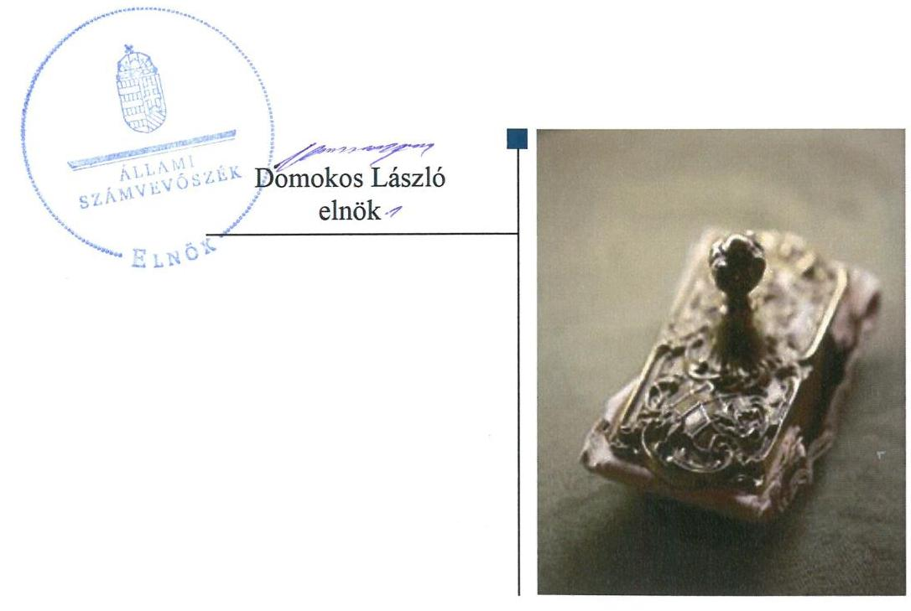
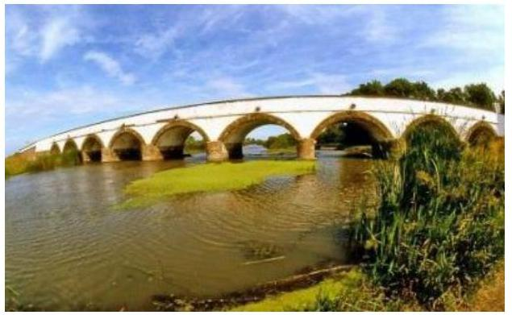
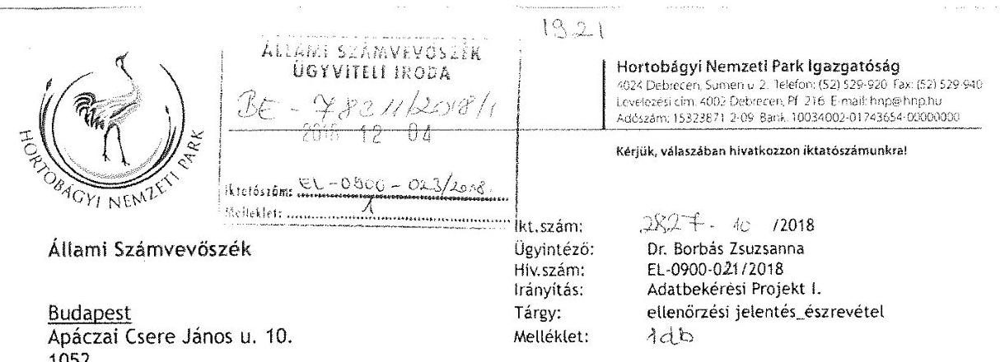
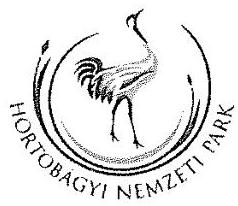
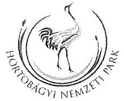
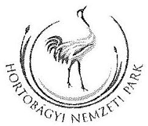
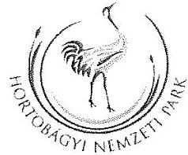
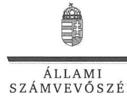
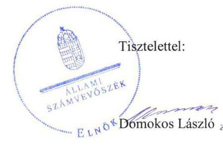
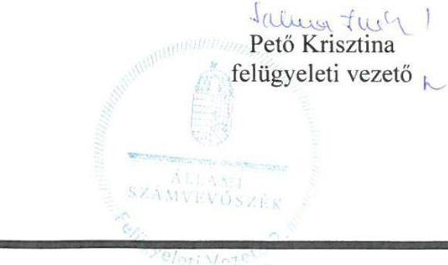

# Jelentés 

## Utóellenőrzések

A nemzeti park igazgatóságok feladatellátásának és vagyonkezelésének ellenőrzése Hortobágyi Nemzeti Park Igazgatóság 2019. 01. hó 22. nap

---

# AZ ELLENŐRZÉST FELÜGYELTE: 

PETŐ KRISZITNA felügyeleti vezető

## AZ ELLENŐRZÉST VEZETTE ÉS A VÉGREHAJTÁSÁÉRT FELELŐS:

BÁLINT KÁLMÁN KADOCSA ellenőrzésvezető

## A PROGRAM ÖSSZEÁLLÍTÁSÁÉRT FELELŐS:

TÓTPÁL SZABOLCS osztályvezető

## A TÉMÁHOZ KAPCSOLÓDÓ KORÁBBI SZÁMVEVŐSZÉKI JELENTÉS:

- címe: Jelentés a nemzeti park igazgatóságok feladatellátásának és vagyonkezelésének ellenőrzéséről
- sorszáma: 12106

Jelentéseink az Országgyülés számítógépes hálózatán és az Interneten a www.asz.hu címen is olvashatóak.

IKTATÓSZÁM: EL-1455-001/2019
TÉMASZÁM: 2460
ELLENŐRZÉS-AZONOSÍTÓ SZÁM: V080447

---

# TARTALOMJEGYZÉK 

■ ÖSSZEGZÉS ..... 5
■ AZ ELLENŐRZÉS CÉLJA ..... 6
■ AZ ELLENŐRZÉS TERÜLETE ..... 7
■ AZ ELLENŐRZÉS HÁTTERE, INDOKOLTSÁGA ..... 8
■ A JELENTÉS LÉNYEGES KÉRDÉSKÖRE ..... 9
■ AZ ELLENŐRZÉS HATÓKÖRE ÉS MÓDSZEREI ..... 10
■ MEGÁLLAPÍTÁSOK ..... 12
■ MELLÉKLETEK ..... 15
I. sz. melléklet: Hortobágyi Nemzeti Park Igazgatóság intézkedési terv végrehajtásának értékelése ..... 15
■ FÜGGELÉK: ÉSZREVÉTELEK ..... 17
■ RÖVIDÍTÉSEK JEGYZÉKE ..... 27

---

.

---

# ÖSSZEGZÉS 

A debreceni székhelyű Hortobágyi Nemzeti Park Igazgatóságnál az Állami Számvevőszék által korábban azonosított szabálytalanságok továbbra is fennállnak, így nem biztosított a nemzeti vagyonnal történő felelős és átlátható gazdálkodás.

## Az ellenőrzés társadalmi indokoltsága

Az Állami Számvevőszék stratégiájában célul tűzte ki a számvevőszéki munka hasznosulásának javítását. Ezzel összhangban ellenőrzi, hogy az ellenőrzött szervezet megvalósította-e a korábbi ellenőrzései által feltárt hibák, hiányosságok és szabálytalanságok megszüntetése céljából elkészített intézkedési tervében foglaltakat. A rendszeres utóellenőrzések hozzájárulnak a szükséges intézkedések tényleges végrehajtásához, ezáltal a közpénzügyek rendezettségének javulásához.

## Főbb megállapítások, következtetések

A Hortobágyi Nemzeti Park Igazgatóság az intézkedési tervében meghatározott feladatait nem hajtotta végre, így a vagyongazdálkodásában korábban felmerült szabálytalanságok továbbra is fennállnak, nőtt a vagyonvesztés kockázata.

A Hortobágyi Nemzeti Park Igazgatóság nem biztosította a vagyonkezelt területek pénzügyileg és gazdaságilag minél előnyösebb használatát.

A haszonbérleti ajánlat kifüggesztésének elmaradása következtében az előhaszonbérleti jog jogosultja számára nem biztosították, hogy a haszonbérleti szerződésre elfogadó vagy az előhaszonbérleti jogáról lemondó nyilatkozatot tegyen.

A Hortobágyi Nemzeti Park Igazgatóság nem vezette a jogszabályban előírt nyilvántartást az intézkedési tervben rögzített feladatok végrehajtásáról.

---

# AZ ELLENŐRZÉS CÉLJA 

Az ellenőrzés célja annak értékelése, hogy a 12106. számú jelentésben ${ }^{1}$ foglalt javaslatot megalapozó megállapításokkal összhangban készített intézkedési tervben meghatározott feladatokat az ellenőrzött szervezet végrehajtotta-e.

---

# **Hortobágyi Nemzeti Park Igazgatóság**

Az 1973. január 1-jén alapított Nemzeti Park² az agrárminiszter irányítása alá tartozó központi költségvetési szerv.

Működési területe kiterjed Hajdú-Bihar, Jász-Nagykun-Szolnok, Szabolcs-Szatmár-Bereg, Heves, Bács-Kiskun és Borsod-Abaúj-Zemplén megye meghatározott részeire.

A Nemzeti Park feladatellátása a természetvédelemhez kapcsolódik, természetvédelmi vagyonkezelési tevékenységet folytatnak. Alap feladatuk a természeti területek, mint a nemzeti vagyon sajátos és pótolhatatlan részeinek kezelése, állapotuk javítása, a jövő nemzedékek számára való megőrzése, a természeti örökség és a biológiai sokféleség oltalma, mint az emberiség fennmaradásának alapvető feltétele.

A Nemzeti Park 2017. évben államháztartási forrásból 1397 millió Ft finanszírozásban részesült, kiadása 3741 millió Ft volt.

Az ÁSZ³ 2007. január 01. és 2011. december 31. közötti időszakra vonatkozóan végezte el a Nemzeti Park feladatellátásának és vagyonkezelésének ellenőrzését. Az erről készített 12106. számú jelentését az ÁSZ 2012. november 28-án hozta nyilvánosságra.

---

# AZ ELLENŐRZÉS HÁTTERE, INDOKOLTSÁGA 

Az ÁSZ tv. ${ }^{4}$ 33. § (1) bekezdése értelmében a számvevőszéki jelentések javaslatot megalapozó megállapításaihoz kapcsolódóan az ellenőrzött szervezet vezetője intézkedési tervet köteles összeállítani, és az ÁSZ részére megküldeni.

Az ÁSZ által befogadott intézkedési tervben foglaltak megvalósítását az ÁSZ törvény 33. § (7) bekezdésében foglaltak alapján - az ÁSZ utóellenőrzés keretében - ellenőrizheti. Az utóellenőrzések keretében - az intézkedések értékelése során - az ÁSZ figyelembe veszi az ellenőrzött szervezetek működési feltételeiben, valamint a jogszabályi előírásokban bekövetkezett változásokat.

Az utóellenőrzés során az ÁSZ értékeli, hogy az érintett számvevőszéki jelentésben foglalt intézkedést igénylő megállapításokkal összhangban, az ellenőrzött szervezet által készített intézkedési tervben meghatározott feladatokat a feladatra kijelöltek végrehajtották-e.

Az intézkedések végrehajtásával az adott terület szabályszerű működése vonatkozásában a kockázatok csökkenhetnek, azonban hosszabb távon az intézkedési tervben foglaltak végrehajtásával önmagában nem szűnnek meg, csak akkor, ha beépülnek az ellenőrzött szervezet működésébe, azokat folyamatosan karban tartják, figyelembe véve, illetve kezelve a változásokat. Emellett az intézkedések végrehajtásáig újabb kockázatok merülhetnek fel a szabályszerű működés vonatkozásában, amelyek kezelése szintén kiemelten fontos az ellenőrzött szervezet számára.

Az ellenőrzött szervezet vezetője által készített intézkedési tervben foglalt feladatok hiányos, illetve késedelmes végrehajtása, vagy annak elmaradása a szabályszerűség és a felelős vezetői magatartás vonatkozásában kockázatot hordoz, ami azt mutatja, hogy az ellenőrzések során feltárt hibák, hiányosságok és szabálytalanságok kezelése nem kapott kellő hangsúlyt. Az utóellenőrzés során is fennálló szabálytalanságok esetén a közpénz, közvagyon veszélyeztetettségi kockázat valószínűsített hatásának értékelése további intézkedéseket vonhat maga után.

Az ellenőrzött szervezet szintjén az utóellenőrzés feltárja, hogy a szervezet az intézkedések végrehajtásával hasznosította-e a korábbi ellenőrzési jelentésben a hiányosságok megszüntetése, illetve a kockázatok kezelése érdekében megfogalmazott javaslatokat, illetve az intézkedések végrehajtása elmaradásának következtében továbbra is fennálló szabálytalanság esetén értékeli a közpénzek, közvagyon veszélyeztetettségét.

Az ÁSZ szintjén az utóellenőrzés visszacsatolást ad az ellenőrzési jelentések hasznosulásáról, az intézkedések, vagy azok valamely részének elmaradása a közpénzek, közvagyon veszélyeztetettségére gyakorolt valószínűsített hatásának értékelése további intézkedéseket vonhat maga után.

---

# A JELENTÉS LÉNYEGES KÉRDÉSKÖRE 

A Nemzeti Park az intézkedési tervben foglaltakat az előírt határidőben végrehajtotta-e?

---

# AZ ELLENŐRZÉS HATÓKÖRE ÉS MÓDSZEREI 

## Az ellenőrzés típusa

Megfelelőségi ellenőrzés.

## Az ellenőrzött időszak

Az utóellenőrzés alapját képező a 12106. számú jelentés közzétételének napjától az ellenőrzésről szóló kiértesítő levél keltének napjáig tartó időszak volt, 2012. november 29. - 2018. június 27.

## Az ellenőrzés tárgya

A 12106. számú számvevőszéki jelentésben foglalt intézkedést igénylő megállapításokkal összhangban - a Nemzeti Park által - készített Intézkedési tervben foglaltak végrehajtásának ellenőrzése.

## Az ellenőrzött szervezet

Hortobágyi Nemzeti Park Igazgatóság

## Az ellenőrzés jogalapja

Az ellenőrzés jogszabályi alapját az ÁSZ tv. 33. § (7) bekezdésének előírása képezte.

## Az ellenőrzés módszerei

Az ellenőrzést az ellenőrzött időszakban hatályos jogszabályok, az ellenőrzés szakmai szabályai, a jelen ellenőrzésre irányadó ÁSZ módszertanok, az ellenőrzési programban foglalt értékelési szempontok szerint, önállóan vagy ellenőrzéshez kapcsolódóan, annak részeként végeztük.

Az ellenőrzés ideje alatt az ellenőrzött szervezettel történő kapcsolattartást az ÁSZ SZMSZ-ének vonatkozó előírásai alapján biztosítjuk.

Az utóellenőrzés megállapításait az ÁSZ rendelkezésére álló dokumentumok, valamint az ÁSZ adatbekérése szerint, az ellenőrzött szervezetek által rendelkezésre bocsátott dokumentumok, adatok alapján kell megfogalmazni.

---

Az ellenőrzési kérdések megválaszolásához szükséges bizonyítékok megszerzése az ellenőrzött által rendelkezésre bocsátott dokumentumokra, adatokra alapozva megfigyelés, szemle (szemrevételezés), kérdésfeltevés (információkérés), valamint elemző eljárás alkalmazásával történik. Az ellenőrzési bizonyítékként felhasználható adatforrások közé tartoznak egyrészt az ellenőrzési program részletes szempontjainál felsorolt adatforrások, másrészt minden - az ellenőrzés folyamán feltárt, az ellenőrzés szempontjából információt tartalmazó - dokumentum.

Az intézkedési tervekben előírt feladatokat azok végrehajthatósága, illetve végrehajtása szempontjából az alábbiak szerint értékeli az ÁSZ:
$\longrightarrow$ „határidőben végrehajtott" a feladat, ha a teljesítés dokumentáltan, az intézkedési tervben előírt határidőben és tartalommal megtörtént;
$\longrightarrow$ „határidőn túl végrehajtott" a feladat, ha annak teljesítése az intézkedési tervben meghatározott módon, de az abban előírt határidőn túl történt meg;
$\longrightarrow$ „részben végrehajtott" a feladat, ha annak végrehajtása nem teljes körűen az intézkedési tervben előírt módon történt meg;
$\longrightarrow$ „nem végrehajtott" a feladat, ha a végrehajtás nem történt meg, dokumentumokkal nem igazolt annak teljesítése;
$\longrightarrow$ „okafogyottá vált" a feladat, ha végrehajtására - meghatározott esemény bekövetkezése, továbbá külső körülmény, a működést érintő feltétel változása miatt - már nincs szükség, illetve lehetőség, és egyértelműen megállapítható, hogy az intézkedést szükségessé tevő körülmény a jövőben nem fordulhat elő;
$\longrightarrow$ „nem időszerű" az a feladat, amelynek ellenőrzési időszakon belüli végrehajtására azért nem került (kerülhetett) sor, mert az intézkedés alapjául szolgáló esemény nem következett be, de annak jövőbeni előfordulása lehetséges, a végrehajtása nem volt esedékes, vagy a végrehajtás határideje még nem járt le.
Az ellenőrzés lefolytatásához az ellenőrzött szervezet a tanúsítványok elektronikus kitöltésével, valamint az ÁSZ által kért dokumentumok elektronikus megküldésével szolgáltat adatokat, amelyek valódiságát és teljes körűségét az ellenőrzött szervezet vezetője által tett teljességi és hitelességi nyilatkozat igazolja. Az így rendelkezésre bocsátott adatok, információk kontrollja az ellenőrzés keretében történt.

---

# MEGÁLLAPÍTÁSOK 

## A Nemzeti Park az intézkedési tervben foglaltakat az előírt határidőben végrehajtotta-e?

Összegző megállapítás

A Nemzeti Park az intézkedési tervben meghatározott három feladatból kettőt nem hajtott végre, egyet részben végrehajtott.

Az Igazgató ${ }^{5}$ az ÁSZ 12016. számú jelentésében foglalt javaslatot megalapozó megállapításokra, három végrehajtandó feladatból álló intézkedési tervet fogalmazott meg.

A Nemzeti Park intézkedési tervében meghatározott feladatokat, határidőket, felelősöket és a feladatok végrehajtásának értékelését az I. sz. melléklet mutatja be.

A Nemzeti Park nem vezette az intézkedési tervben meghatározott feladatok végrehajtásáról a Bkr. ${ }^{6} 14$ § (1) bekezdése előírásai szerinti nyilvántartást.

A Nemzeti Park intézkedési tervében meghatározott feladatok végrehajtásának értékelését az 1. ábra szemlélteti.

1. ábra

## Az intézkedések végrehajtásának értékelési kategóriák szerinti megoszlása

A VAGYONGAZDÁLKODÁS területén továbbra is kockázatot jelent, hogy a Nemzeti Park nem vizsgálta a hasznosításhoz kapcsolódóan a várható kiadásokat és bevételeket, valamint nem határozta meg a haszonbérleti díj esetében a piaci értéktől való eltérítés szempontjait.

---

AZ ÁTLÁTHATÓSÁGOT a Nemzeti Park nem biztosította, mert az érintett település hirdetőtábláján a haszonbérbe adási szándék, az eljárás részletei, valamint annak eredményeinek meghirdetését nem tették közzé.

---

.

---

# MELLÉKLETEK

- I. SZ. MELLÉKLET: HORTOBÁGYI NEMZETI PARK IGAZGATÓSÁG INTÉZKEDÉSI TERV VÉGREHAJTÁSÁNAK ÉRTÉKELÉSE

|  Sorszám | Az intézkedési tervben meghatározott feladat | Az intézkedési tervben meghatározott határidő | Az intézkedési tervben meghatározott feladatok elvégzésének felelőse  |
| --- | --- | --- | --- |
|   |  | Nem végrehajtott feladatok |   |
|  1. | (1.) „Hasznosításhoz kapcsolódó kiadások és bevételek vizsgálata a Jelentés I.1.a.) pontja szerint." Az ÁSZ 12106. számú jelentésében megfogalmazott javaslat: I.1.a.): „vizsgálja meg a kezelésében lévő területek hasznosítását megelőzően a saját használathoz, illetve a használatba adáshoz kapcsolódó teljes körű kiadások, valamint várható bevételek arányát és ezek eredményeinek ismeretében döntsön a bérbeadásról;" | 2013. március 31. | vagyonkezelési osztályvezető, pénzügyi és számviteli osztályvezető,  |
|  2. | (2.),Haszonbérleti díj esetében a piaci értéktől való eltérítés szempontjainak meghatározása a Jelentés I.1.b.) pontja szerint." Az ÁSZ 12106. számú jelentésében megfogalmazott javaslat: I.1.b.): „határozza meg egyértelműen a haszonbérleti szerződésekben alkalmazott bérleti díj általános piaci értéktől való eltérítésének szempontjait, azt tegye nyilvánossá és visszakereshetővé." | 2013. március 31. | természet-megőrzési osztályvezető, vagyonkezelési osztályvezető,  |
|   |  |  | Részben végrehajtott feladat  |
|  3. | (3.),Haszonbérbe adás esetén a széles nyilvánosság és az átláthatóság biztosítása a Jelentés I.2. pontja szerint. A megvalósítás módja: közzététel a haszonbérbe adás szándékáról, az eljárás részleteiről, majd annak eredményéről hirdetmény formájában az

 érintett település hirdetőtábláján és az igazgatóság honlapján." | 2013. január 1. | igazgatási osztályvezető  |

---

|  Az intézkedési tervben meghatározott feladat | Az intézkedési tervben meghatározott határidő | Az intézkedési tervben meghatározott feladatok elvégzéseinek felelőse | A feladat végrehajtása  |
| --- | --- | --- | --- |
|  Az ÁSZ 12106. számú jelentésében megfogalmazott javaslat:
„A haszonbérbe adás meghirdetése az önkormányzatok hirdetőtábláin, a jegyző kormányportálon való figyelemfelhívása mellett sem biztosítja az átláthatóságot, a széles nyilvánosságot." |  |  | Nem végrehajtott részfeladat:
Az igazgatási osztályvezető nem gondoskodott a haszonbérbe adás szándékáról, az eljárás részleteiről, valamint az eredményeiről szóló hirdetményeknek az érintett település hirdetőtábláján történő közzétételéről, ezzel megsértve a Földforgalmi tv. 8. § 49. § (1)-(2) bekezdéseiben foglaltakat.  |

A sorszámozás melletti oszlopban a zárójeles feltüntetés az intézkedési terv szerinti sorszámozást jelenti!

---

# FÜGGELÉK: ÉSZREVÉTELEK 

A jelentéstervezetet a Számvevőszék 15 napos észrevételezésre megküldte az ellenőrzött szervezet vezetőjének az ÁSZ tv. 29. § (1) bekezdése előírásának megfelelően.

A Hortobágyi Nemzeti Park Igazgatóság igazgatója a jelentéstervezet megállapításaira írásban észrevételt tett.
Az ÁSZ tv. 29. § (3) bekezdésével összhangban az ÁSZ a Függelékben feltünteti az ellenőrzés megállapításaival kapcsolatban tett, figyelembe nem vett észrevételeket, és megindokolja, hogy azokat miért nem fogadta el.

[^0]
[^0]:    * 29. § (1) Az Állami Számvevőszék az ellenőrzési megállapításait megküldi az ellenőrzött szervezet vezetőjének vagy az általa megbízott személynek, és annak, akinek személyes felelősségét állapította meg.
    (2) Az ellenőrzött szervezet vezetője és a felelősként megjelölt személy az ellenőrzés megállapításaira tizenöt napon belül írásban észrevételt tehet.
    (3) Az Állami Számvevőszék az észrevételre a beérkezésétől számított harminc napon belül írásban válaszol. A figyelembe nem vett észrevételeket köteles a jelentésben feltüntetni, és megindokolni, hogy azokat miért nem fogadta el.

---

Tisztelt Állami Számvevőszék!
2018. november 14-én kézhez vettük az „Utóellenőrzések - A nemzeti park igazgatóságok feladatellátásának és vagyonkezelésének ellenőrzése - a Hortobágyi Nemzeti Park igazgatóság" címú számvevőszéki jelentéstervezetet, melyre az alábbi észrevételeket kívánjuk tenni:
1./ Elsőként szeretnénk észrevételezni azt a megállapítást, mely a jelentéstervezet 7. oldalán lévő bevezetőben található kiadási és bevételi összegekre vonatkozik és helyesen így kellene szerepelnie a végleges jelentésben: „Az államháztartáson belülről származó teljesített bevételi előirányzata 2017-ben 887.421.249 Ft volt, melyen felül 509.867.963 Ft központi, irányító szervi támogatásban részesült, míg a kiadása 3.740.779.656 Ft volt." Ezen összegeket a Földművelésügyi Minisztérium (jelenleg Agrárminisztérium) által elfogadott 2017. évi államháztartási beszámolónk támasztja alá (csatoljuk).
2./ A továbbiakban az intézkedési terv szerinti feladatokkal kapcsolatos megállapításokra teszünk észrevételt:

1. megállapítás

- Intézkedési terv szerinti feladat: Hasznosításhoz kapcsolódó kiadások és bevételek vizsgálata a Jelentés I.1.a.) pontja szerint
- Az ellenőrzési jelentés megállapítása: „A vagyonkezelési osztályvezető valamint a pénzügyi és számviteli osztályvezető nem tartották be a Vagyontv. 23. § (3) bekezdésben előírtakat, mivel nem gondoskodtak a nemzeti park kezelésében lévő területek hasznosítását megelőzően a saját használathoz illetve a használatba adáshoz kapcsolódóan a kiadások, valamint a bevételek vizsgálatáról."
- Észrevételünk: A haszonbérletből származó bevétel vizsgálata során alapelvként kell rögzítenünk a Nemzeti Földalapba tartozó földrészletek hasznosításának részletes szabályairól szóló 262/2010. (XI. 17.) Korm. rendelet 43/A. § (1) bekezdésben foglaltakat: „A természetvédelmi célú vagyonkezelés elsődleges célja állami tulajdonban álló földrészleteken természetvédelmi közcélok megvalósítása, az élő és élettelen természeti értékek megóvása, a tájképi, kultúrtörténeti értékek megőrzése, a természeti vagyon állagának és értékének megőrzése, védelme, továbbá értékének fenntartható módon való növelése." A 28/1994 AB határozat szellemiségével összhangban tehát megállapítható, hogy a természetvédelmi célú vagyonkezelésnek - értve ezalatt a nemzeti parkok általi haszonbérbe adási

---

Hortobágyi Nemzeti Park Igazgatóság
1021 Debrecen, Sumer u. 2., Telefon (52) 529-920 Fax (52) 529-940
szolótárk-ink: 4092 Debrecen, Pf. 216, E-mail: fngajj@ngv.hu
Adózálin: 13323871-2-09 Bank: 10034002-01143654-00000000

Kérjük, válaszában hivatkozzon iktatószámunkra!
tevékenységet is - a bevétel realizálása nem elsődleges cél, hanem annak csak esetleges velejárója.

Az ellenőrzési jelentés szerinti megállapításban hivatkozott vagyontörvényi rendelkezés (23. § (3)) álláspontunk szerint némileg konkurál a Nemzeti Földalapkezelő Szervezettel 2013. április 8. napján megkötött Vagyonkezelési Szerződésünkben foglaltakkal, mely kimondja:
„4.5. Amennyiben jelen szerződés 4.4. pontjában meghatározott saját használatot Vagyonkezelő a rendelkezésre álló eszközökkel nem képes megvalósítani, vagy a földrészletek mint védett területek átlagos (nem kiemelkedő) természetvédelmi értékűek, és a hagyományos gazdálkodási módok a természetvédelmi kezelés részét képezhetik, a védett területet - az NFA előzetes tájékoztatás mellett - a Rendelet 43/C és 43/D 5. valamint a vidékfejlesztési miniszter 12/2012 (VI.8.) VM utasításában foglalt rendelkezései értelmében nyilvános pályáztatás útján vagy annak mellőzésével haszonbérbe adhatja. Ez esetben vagyonkezelő köteles a haszonbérleti szerződés fennállása alatt érvényre juttatni az alkalmazandó jogszabályok előírásait, a természetvédelmi célok elérését, továbbá a megfelelő kezelési előírások alkalmazását."

A haszonbérbeadás során - fentiek értelmében - az igazgatóságok olyan többletkövetelményeket határoznak meg a haszonbérlők számára, amelyek a természetvédelmi célok és szempontok elsőrendűségét, és minden egyéb szempont felett állóságát biztosítani tudják. Ennek okán a bevételből származó hozadék mondhatni, másodrendű lesz ahhoz képest, ami a terület megfelelő kezelésével elérhető.

Az a kérdés, hogy a nemzeti park igazgatóságok mely területeket adják haszonbérbe, azaz melyik területek legyenek külső gazdálkodó számára, meghatározott természetvédelmi szempontú kezelésre átadva, az akkori Vidékfejlesztési Minisztériummal közösen meghatározott birtoktest-kijelölés eredménye volt. Vagyis a Hortobágyi Nemzeti Park Igazgatóságnak nem volt döntési autonómiája abban, hogy mely területei eredményeznek majd bevételt, és melyek maradnak saját hasznosításban - így annak vizsgálata, hogy melyik megoldás az optimálisabb hasznosítás pusztán a forintositható bevételszerzés és vagyonkezelés szempontjából, okafogyottá vált. A HNPI használatában azok a területek maradtak, melyek speciális természetvédelmi kezelését saját állatállománnyal lehetett megoldani. Itt a háttér infrastruktúra már korábban rendelkezésre állt.

A területek bérbeadása nem csupán gazdasági kérdés! A területek megfelelő használata a természetvédelmi kezeléshez szükséges, tehát a gazdálkodás a természetvédelmi kezelés eszköze, ezért a birtoktestekhez minden esetben tartoznak speciális természetvédelmi kezelési előírások.

Tényként szögezhetjük le, hogy a Hortobágyi Nemzeti Park Igazgatóság kezelésében álló valamennyi földterület természetvédelmi kezelésére az igazgatóságnak nincs elegendő saját kapacitása, állatállománya, ugyanakkor a kezelés irányítása és felügyelete a természetvédelmi állapot megőrzése szempontjából elemi, érdeke, vagyonkezelési szerződésből származó kötelezettsége, sőt közérdek.

---

Hortobágyi Nemzeti Park Igazgatóság
4024 Debrecen, Sumérió u. 2. Telefon 052 529-920. Fax 052 529-940
Kevélköri: 011114000 Debrecen, Pf. 218, E-mail: bng@bng.hu
Adószám: 16328011209 Bank: 00000000000000000000000000000000000000000000000000000000000000000000000000000000000000000000000000000000000000000000000000000000000000000000000000000000000000000000000000000000000000000000000000000000

---

Hortobágyi Nemzeti Park Igazgatóság
4024 Debrecen, Sumen u. 2. Telefon: (52) 529-520 Fax: (52) 529-540
www.hnp.hu 4000 Debrecen, M. J.H. 3. mad. frugáj Frug.ha Adószám: 13323871-2-09 Bank: 10034002-01743654-00000000

Kérjük, válaszában hivatkozzon iktatószámunkra!

- Az ellenőrzési jelentés megállapítása: „Az igazgatási osztályvezető nem gondoskodott a haszonbérletbe adás szándékáról, az eljárás részleteiről, valamint az eredményeiről szóló hirdetményeknek az érintett település hirdetőtábláján történő közzétételéről, ezzel megsértve a Földforgalmi tv. 49. § (1)-(2) bekezdéseiben foglaltakat."
- Észrevételünk: Az intézkedési tervben vállalt ezen feladat végrehajtásáról az utóellenőrzés során „csak" nyilatkozatot tettünk, mivel úgy ítéltük meg, hogy ez elegendő a teljesítés igazolásához, de ezúton felajánljuk, hogy szükség esetén pótlólag bemutatjuk a záradékolt felhívásokat és eredménytájékoztatókat, melyekkel alátámasztjuk, hogy a szükséges kifüggesztési eljárások maradéktalanul teljesültek.

Igazgatóságunk mind a haszonbérbeadásra irányuló pályázati felhívásokat, mind a pályázati eljárás eredményéről szóló tájékoztatást a jogszabályi előírásoknak megfelelően kifüggesztette a termőföld fekvése szerint illetékes önkormányzat hirdetőtábláján, a www.hnp.hu honlapon és hozzáférhetővé tette székhelyén is.

A haszonbérbe adandó termőföldek szélesebb körben történő meghirdetésére és az átláthatóság érvényesítésére, illetve a verseny növelésére vonatkozóan szintén az ellenőrzés befejezését követően kihirdetett törvényi rendelkezések és a már hivatkozott VM utasítás rendelkezései nyújtottak megoldást. A haszonbérbe adás során pályázati eljárást kellett lefolytatni, melynek részletes szabályait a fent említett utasítás 3. fejezete tartalmazza.
A Nemzeti Földalapba tartozó földrészletek hasznosításának részletes szabályairól szóló 262/2010 (XI.17.) Korm.rendelet (NFA vhr.) VI/A. fejezete rendelkezik az Igazgatóság vagyonkezelésében álló területek használatba adásáról, mely alapvetően meghatározta/meghatározza haszonbérbe adási tevékenységünket. Ezen jogszabály II. fejezetében A nyilvános pályáztatással történő hasznosítás közös szabályai alapján (NFA vhr. 6. § (4) bek.) a pályázati felhívást tartalmazó hirdetményeket a földrészlet fekvése szerinti települési (...) önkormányzat polgármesteri hivatala, illetve a közös önkormányzati hivatal esetében a közös önkormányzati hivatal hirdetőtáblájára (...) történő közzététellel teljesítettük. Kiemeljük, hogy Igazgatóságunk a saját honlapján (www.hnp.hu) elektronikus formában és székhelyén (4024 Debrecen, Sumen u. 2.) papír alapon is eleget tett hirdetményezési kötelezettségének.

Álláspontunk szerint a fentiekkel teljesültek a vállalt intézkedések és ezek alátámasztásául a hivatkozott jogszabályok és szabályozó eszközök rendelkezéseit, a nyilvántartó rendszereinkben (iktató program: Kontroller2, számviteli nyilvántartás: EOS) rögzített adatokat és a pályázati eljárás során (a rendelkezéseknek megfelelően elkészített) iratmintákat tudjuk bemutatni szükség esetén.

A jelentéstervezetben hivatkozott előhaszonbérleti jog gyakorolhatóságának megsértésére vonatkozó megállapítás (Földforgalmi tv. 49. § (1)-(2)) - álláspontunk szerint - ellentétes a jogszabállyal, ugyanis ezen jogosultság gyakorlását a Nemzeti Földalapról szóló 2010. évi LXXXVII. törvény (Nfa tv.) 18. § (1a) kizárja, tehát eljárásainkban az előhaszonbérleti jog nem gyakorolható.

Nfa tv. 18. § (1a) „Föld vagy tanya haszonbérbe adása során a jogszabály alapján fennálló előhaszonbérleti jog nem gyakorolható."

Fontosnak tartjuk annak kiemelését, hogy a Kormányzati Ellenőrzési Hivatal (továbbiakban KEHI) 2014-ben lefolytatta a 31-182/102/2014 számú, a Hortobágyi Nemzeti Park Igazgatóság

---

Hortobágyi Nemzeti Park Igazgatóság
4004 Debrecen, Sumen u. 2. Telefon (052) 529-520 Fax (052) 529-540
www.hortobaggi.org. Módszáma 11 235 E-mail: hog@hog.hu
Kódszáma 13332877 235F-5844 50034060 01793854 05600001

Kérjük, válaszában hivatkozzon iktatószámunkra!

termőföldek haszonbérbeadási tevékenységére irányuló vizsgálatát, mely a jelen észrevételekkel érintett Állami Számvevőszék által tett megállapításoktól eltérő megállapításokat tett. Sem a birtoktest kijelölésekre, sem a haszonbérleti díj megállapítására, sem a hirdetményezési gyakorlatra, sem az előhaszonbérleti jogra vonatkozó marasztaló, szabálytalansági megállapítás nem volt.

Szintén kiemeljük, hogy a nem nyertes pályázók által indított, szerződés érvénytelenségének megállapítására irányuló peres eljárásokban nem került megállapításra a jelen utóellenőrzésben megállapított szabálytalanság, pedig a perek során vizsgálat tárgyát képezte a haszonbérbeadási pályázati eljárások egészének szabályossági szempontú áttekintése és a perek többsége – melyekben a keresetek elutasításra kerültek – a Kúria, mint felülvizsgálati bíróság előtt is átvizsgálásra került.

Álláspontunk szerint mind a KEHI vizsgálata, mind a Kúria által felülvizsgált peres eljárások igazolják az általunk lefolytatott eljárások szabályosságát mind a kifüggesztési kötelezettségre, mind a haszonbérleti díjra, mind az előhaszonbérleti jog kizárására vonatkozóan.

Igazgatóságunk az utóellenőrzéssel érintett időszakban 667 db birtoktestre vonatkozóan folytatott le pályázati eljárást a fentebb hivatkozott jogi környezet követelményeinek előírásai szerint.

Tisztelt Állami Számvevőszék!

Álláspontunk szerint a jelentéstervezetben tett megállapítások torz képet mutatnak a földhaszonbérleti szerződéseink és az azzal összefüggő vagyonkezelési tevékenységünkről. A szerződések megkötése során mindvégig a jogszabályi előírásokat és a belső szabályzatainkat betartva jártunk el.

Kérjük fenti észrevételeink elfogadását és ennek megfelelően a jelentéstervezet módosítását.

Debrecen, 2018. november 25.

Tisztelettel:

Dr. Kovács Zita
Igazgató

---

# Dr. Kovács Zita

 igazgató
Hortobágyi Nemzeti Park Igazgatóság

## Debrecen

## Tisztelt Igazgató Úr/Hölgy!

Utóellenőrzések - A nemzeti park igazgatóságok feladatellátásának és vagyonkezelésének ellenőrzése - Hortobágyi Nemzeti Park Igazgatóság címmel készített számvevőszéki jelentéstervezetre tett észrevételeit megkaptam.
Az Állami Számvevőszék észrevételekre vonatkozó álláspontjáról a felügyeleti vezető által készített részletes tájékoztatást csatoltan megküldöm.
Tájékoztatom Igazgató urat/hölgyet, hogy a számvevőszéki jelentésben - az Állami Számvevőszékről szóló 2011. évi LXVI. törvény 29. § (3) bekezdése alapján - a figyelembe nem vett észrevételeket szerepeltetjük az elutasítás indokának feltüntetésével.

Budapest, 2018. 11. hó 27. nap

Melléklet: Tájékoztatás az észrevételek kezeléséről

---

# Tájékoztatás az észrevételek kezeléséről 

Utóellenőrzések - A nemzeti park igazgatóságok feladatellátásának és vagyonkezelésének ellenőrzése - Hortobágyi Nemzeti Park Igazgatóság című jelentéstervezetre a 2827-10/2018. ikt. számú levélben megküldött észrevételeit áttekintettem. Az észrevételek kezeléséről az alábbi tájékoztatást adom.

## 1.) „Az ellenőrzés területe" címú részhez tett észrevétel kapcsán

Észrevételében jelezte, hogy a jelentéstervezet 7. oldalán az államháztartáson belülről származó, 2017. évben teljesített bevételi előirányzat összege és a költségvetési kiadások összege tévesen szerepelt. Az észrevételt elfogadjuk, a jelentéstervezetet pontosítjuk.

## 2.) A jelentéstervezet I. sz. melléklet 1. pontjához tett észrevétel kapcsán

Igazgató úr/hölgy a jelentéstervezet I. sz. melléklet 1. pontjában foglalt, a Hortobágyi Nemzeti Park Igazgatóság (továbbiakban: Nemzeti Park) kezelésében lévő területek hasznosítását megelőzően a saját használathoz, illetve a használatba adáshoz kapcsolódóan a kiadások, valamint bevételek vizsgálatára vonatkozó megállapítás kapcsán jelezte, hogy az intézkedési tervben vállalt feladat végrehajtása a megváltozott jogszabályi környezetre tekintettel okafogyottá vált. Észrevételében foglaltak szerint a Nemzeti Park igazgatóságok természetvédelmi célú vagyonkezelési tevékenységének egységes szakmai alapelvek szerinti ellátásáról szóló 12/2012. (VI. 8.) VM utasítás (továbbiakban: VM utasítás) 3.3. pontjában meghatározott $1250 \mathrm{Ft} / \mathrm{AK} /$ év haszonbérleti díj összeget alkalmazták a termőföldek haszonbérbe adására irányuló, 2013. márciusában megkezdett pályázati eljárások során. Igazgató úr/hölgy észrevételében kifejtett álláspontja szerint a nemzeti parkok vagyonkezelésének - a haszonbérbe adást is beleértve - elsődleges célja a természetvédelem, és nem a bevételek realizálása.
A 2013. március 11-én kelt intézkedési terv 1. pontjában a „hasznosításhoz kapcsolódó kiadások és bevételek vizsgálatát" vállalták. A jogszabályban előírt haszonbérleti díj kötelezően alkalmazandó összege megalapozhatja a várható bevételek alakulásának kalkulációját, azonban nem indokolja annak a vizsgálatnak az elmaradását, amely a saját használathoz, illetve a használatba adáshoz kapcsolódó teljes körű kiadások, valamint várható bevételek arányának becslésére, a bérbeadásról szóló döntések megalapozására irányul.
Megjegyezni kívánom, hogy a Nemzeti Park intézkedési terve 2013. március 11-ei keltezésű időpontjában az észrevételben hivatkozott VM utasítás vonatkozó rendelkezései hatályban voltak. Az Állami Számvevőszékről szóló 2011. évi LXVI. törvény (továbbiakban: ÁSZ. tv.) 33. § (7) bekezdése alapján az ÁSZ az utóellenőrzés keretében az intézkedési tervben foglaltak

---

megvalósítását ellenőrzi. Az ÁSZ az ellenőrzési megállapításait az adatszolgáltatás során rendelkezésre bocsátott dokumentumokra alapozva fogalmazza meg. Igazgató úr/hölgy 2018. július 9-én kelt teljességi és hitelességi nyilatkozata alapján az ÁSZ részére nem került átadásra az észrevételben hivatkozott vagyonkezelési szerződés, ezért annak - észrevételben hivatkozott - vonatkozó rendelkezéseit az ÁSZ nem értékeli.
Fentiekre tekintettel észrevételét nem fogadom el, a jelentéstervezet módosítása nem indokolt.

# 3.) Az jelentéstervezet I. sz. melléklet 2. pontjában foglalt megállapításhoz tett észrevétel kapcsán 

Az Igazgató úr/hölgy a jelentéstervezet I. sz. melléklet 2. pontjában foglalt megállapítás (, ... nem gondoskodtak a haszonbérleti szerződésekben alkalmazott bérleti díj esetében a piaci értéktől való eltérés szempontjainak meghatározásáról. ") kapcsán jelezte, hogy a Nemzeti Parknak sem joga, sem kötelezettsége nem volt a piaci értéktől való eltérés vizsgálata, mivel a haszonbérleti szerződésekben alkalmazott bérleti díjat minden esetben a VM utasítás 3.3. pontjában foglaltak szerint állapították meg. Jelezte továbbá, hogy a költségvetési szervek belső kontrollrendszeréről és belső ellenőrzéséről szóló 370/2011. (XII. 31.) Korm. rendelet 6. § (2) bekezdésében foglaltak nem sérültek, mivel a Nemzeti Park a haszonbérleti tevékenységének szabályozása tekintetében az illetékes minisztérium utasítását és a hatályos vagyonkezelési szerződést tartják irányadónak a Szervezeti és Működési Szabályzatban (továbbiakban: SZMSZ) rögzítetteknek megfelelően. Igazgató úr/hölgy észrevételében leírta, hogy a Nemzeti Park a nyilvános haszonbérleti eljárásait a hivatkozott rendelkezések szerint folytatta le.
Az ÁSZ az ellenőrzési megállapításait az adatszolgáltatás során rendelkezésre bocsátott dokumentumokra alapozva fogalmazza meg. Igazgató úr/hölgy 2018. július 9-én kelt teljességi és hitelességi nyilatkozata alapján az ellenőrzés részére nem került átadásra olyan ellenőrzési dokumentum (bizonyíték), amely azt igazolja, hogy a haszonbérleti díj esetében a piaci értéktől való eltérés szempontjai meghatározásra kerültek volna, továbbá nem adták át az ellenőrzés részére az észrevételben hivatkozott vagyonkezelési szerződést és SZMSZ-t. Az intézkedési tervben vállalt feladat („Haszonbérleti díj esetében a piaci értéktől való eltérés szempontjainak meghatározása") végrehajtását nem zárják ki a VM utasításban előírt rendelkezések, amelyek az intézkedési terv keltének 2013. március 11-ei időpontjában már hatályosak és így a Nemzeti Park számára ismertek voltak. A leírtakra tekintettel és ellenőrzési bizonyíték hiányában az észrevételt nem fogadom el, a jelentéstervezet módosítása nem indokolt.

## 4.) A jelentéstervezet I. sz. melléklet 2. pontjában foglalthoz tett észrevétel kapcsán

Igazgató úr/hölgy észrevételében a jelentéstervezet I. sz. melléklet 3. pontjában foglalt megállapítás (,Az igazgatási osztályvezető nem gondoskodott a haszonbérbe adás szándékáról, az eljárás részleteiről, valamint az eredményeiről szóló hirdetményeknek az érintett település hirdető tábláján történő közzétételéről. ") kapcsán kifejtette, hogy a Nemzeti Park mind a haszonbérbe adásra irányuló pályázati felhívásokat, mind a pályázati eljárás eredményéről szóló tájékoztatást

---

kifüggesztette a termőföld fekvése szerinti illetékes önkormányzat hirdető tábláján, valamint hozzáférhetővé tette honlapján és székhelyén is.
Az ellenőrzés a haszonbérbe adás szándékáról, az eljárás részleteiről, valamint az eredményeiről szóló hirdetményeknek az igazgatóság honlapján történő közzétételét a jelentéstervezetben végrehajtott feladatként értékelte, a Nemzeti Park székhelyén történő közzétételét nem értékelte tekintettel arra, hogy az intézkedési terv sem tartalmazott ezzel kapcsolatos intézkedést. A jelentéstervezet módosítása e tekintetben nem indokolt.
Az észrevételben hivatkozott, a termőföld fekvése szerinti illetékes önkormányzat hirdető tábláin hirdetmény formájában történő közzétételének dokumentálására vonatkozó ellenőrzési bizonyítékot az ellenőrzés részére nem adtak át. Az ÁSZ részére megküldött nyilatkozatban azt rögzítették, hogy a pályázati felhívást tartalmazó hirdetményeket a földrészlet fekvése szerinti települési önkormányzat polgármesteri hivatala hirdetőtáblájára történő közzététellel teljesítették. Ez azonban nem támasztja alá a kifüggesztés megtörténtének tényét, ezért az észrevételt nem fogadom el, a jelentéstervezet módosítása nem indokolt.
Igazgató úr/hölgy észrevételében jelezte, hogy az előhaszonbérleti jog gyakorlását a Nemzeti Földalapról szóló 2010. évi LXXXVII. törvény (továbbiakban: Nfa tv.) kizárja. Tájékoztatom, hogy az ÁSZ részére nem került olyan dokumentum (bizonyíték) átadásra, amely igazolta volna az érintett terület esetében az előhaszonbérleti jog gyakorlásának kizárását, valamint az érintett település hirdető tábláján történő közzétételt. Ezért megalapozott az ÁSZ azon megállapítása, amely szerint nem gondoskodtak a haszonbérbe adás szándékáról, az eljárás részleteiről, valamint az eredményeiről szóló hirdetményeknek az érintett település hirdető tábláján történő közzétételéről. Megjegyezni kívánom, hogy a megállapítás nem az NFA tv. hatálya alá tartozó haszonbérbe adással összefüggő következtetést tartalmazza, ezért az észrevételt nem fogadom el, a jelentéstervezet módosítása nem indokolt.
Az ÁSZ az ellenőrzési megállapításait az adatszolgáltatás során rendelkezésre bocsátott dokumentumokra (bizonyítékokra) alapozva fogalmazza meg. Igazgató úr/hölgy 2018. július 9-én kelt teljességi és hitelességi nyilatkozata szerint és az észrevételben foglaltak alapján az ellenőrzés részére nem adtak át - az észrevételben hivatkozott - ellenőrzési dokumentumokat, bizonyítékokat (belső szabályozó eszközök, nyilvántartó rendszerekben rögzített adatok, a pályázati eljárások során alkalmazott iratminták), amelyek az intézkedési tervben vállalt feladat végrehajtását igazolták volna.

Budapest, 2018. 13. nap

---

# RÖVIDÍTÉSEK JEGYZÉKE 

${ }^{1} 12106$ számú jelentés
${ }^{2}$ Nemzeti Park
${ }^{3}$ ÁSZ
${ }^{4}$ ÁSZ. tv.
${ }^{5}$ Igazgató
${ }^{6}$ Bkr.
${ }^{7}$ Vagyon tv.
${ }^{8}$ Földforgalmi tv.

Jelentés a nemzeti park igazgatóságok feladatellátásának és vagyonkezelésének ellenőrzéséről
Hortobágyi Nemzeti Park Igazgatóság
Állami Számvevőszék
2011. évi LXVI. törvény az Állami Számvevőszékről

Hortobágyi Nemzeti Park Igazgatóságának Igazgatója
a költségvetési szervek belső kontrollrendszeréről és belső ellenőrzéséről szóló 370/2011. (XII. 31.) Korm. rendelet
2007. évi CVI. törvény az állami vagyonról
2013. évi CXXII. törvény a mező- és erdőgazdasági földek forgalmáról

---

# ÁLLAMI SZÁMVEVŐSZÉK 

1052 Budapest, Apáczai Csere János utca 10.
Levélcím: 1364 Budapest 4. Pf. 54
Telefon: +36 14849100 Telefax: +36 14849200
www.asz.hu

