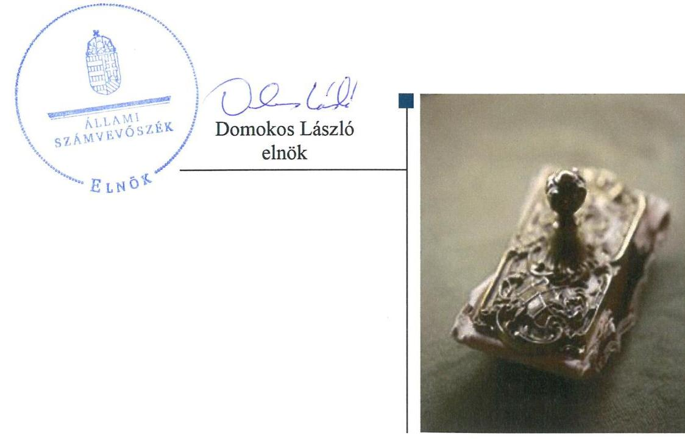
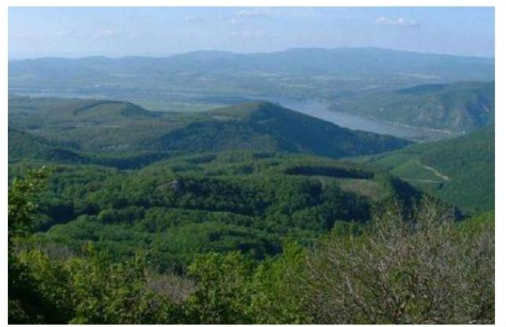
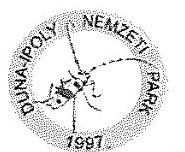
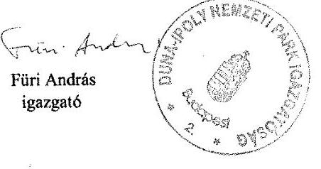
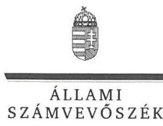
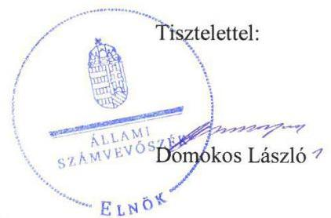

# Jelentés 

## Utóellenőrzések

A nemzeti park igazgatóságok feladatellátásának és vagyonkezelésének ellenőrzése -Duna-Ipoly Nemzeti Park Igazgatóság 2019.

---

# Jelentés 

## Utóellenőrzések

A nemzeti park igazgatóságok feladatellátásának és vagyonkezelésének ellenőrzése -Duna-Ipoly Nemzeti Park Igazgatóság 2019.  hó 2.4 nap

---

# AZ ELLENŐRZÉST FELÜGYELTE: 

PETŐ KRISZTINA felügyeleti vezető

## AZ ELLENŐRZÉST VEZETTE ÉS A VÉGREHAJTÁSÁÉRT FELELŐS:

BÁLINT KÁLMÁN KADOCSA ellenőrzésvezető

## A PROGRAM ÖSSZEÁLLÍTÁSÁÉRT FELELŐS:

TÓTPÁL SZABOLCS osztályvezető

## A TÉMÁHOZ KAPCSOLÓDÓ KORÁBBI SZÁMVEVŐSZÉKI JELENTÉS:

- címe: Jelentés a nemzeti park igazgatóságok feladatellátásának és vagyonkezelésének ellenőrzéséről
- sorszáma: 12106

Jelentéseink az Országgyűlés számítógépes hálózatán és az Interneten a www.asz.hu címen is olvashatóak.

IKTATÓSZÁM: EL-1456-001/2019
TÉMASZÁM: 2460
ELLENŐRZÉS-AZONOSÍTÓ SZÁM: V080448

---

# TARTALOMJEGYZÉK 

■ ÖSSZEGZÉS ..... 5
■ AZ ELLENŐRZÉS CÉLJA ..... 6
■ AZ ELLENŐRZÉS TERÜLETE ..... 7
■ AZ ELLENŐRZÉS HÁTTERE, INDOKOLTSÁGA ..... 8
■ A JELENTÉS LÉNYEGES KÉRDÉSKÖRE ..... 9
■ AZ ELLENŐRZÉS HATÓKÖRE ÉS MÓDSZEREI ..... 10
■ MEGÁLLAPÍTÁSOK ..... 12
■ MELLÉKLETEK ..... 15
I. sz. melléklet: Duna-Ipoly Nemzeti Park igazgatóság intézkedési terve végrehajtásának értékelése ..... 15
■ FÜGGELÉK: ÉSZREVÉTELEK ..... 17
■ RÖVIDÍTÉSEK JEGYZÉKE ..... 25

---

.

---

# ÖSSZEGZÉS 

Az esztergomi székhelyű Duna-Ipoly Nemzeti Park Igazgatóságnál az Állami Számvevőszék által korábban azonosított szabálytalanságok továbbra is fennállnak, így nem biztosított a nemzeti vagyonnal történő felelős gazdálkodás.

## Az ellenőrzés társadalmi indokoltsága

Az Állami Számvevőszék stratégiájában célul tűzte ki a számvevőszéki munka hasznosulásának javítását. Ezzel összhangban ellenőrzi, hogy az ellenőrzött szervezet megvalósította-e az Állami Számvevőszék korábbi ellenőrzései által feltárt hibák, hiányosságok és szabálytalanságok megszüntetése céljából elkészített intézkedési tervében foglaltakat. A rendszeres utóellenőrzések hozzájárulnak a szükséges intézkedések tényleges végrehajtásához, ezáltal a közpénzügyek rendezettségének javulásához.

## Főbb megállapítások, következtetések

A Duna-Ipoly Nemzeti Park Igazgatóság az intézkedési tervben meghatározott feladatait nem hajtotta végre.
A Duna-Ipoly Nemzeti Park Igazgatóság esetében az intézkedési tervben vállalt, de végre nem hajtott feladatok miatt a vagyonvesztés veszélye továbbra is magas.

A végre nem hajtott intézkedések nem biztosították, hogy a Duna-Ipoly Nemzeti Park Igazgatóság a vagyonkezelt területekre olyan haszonbérleti szerződéseket kössön, amelyek a magyar állam számára az állami vagyon megőrzését, gyarapítását, pénzügyileg és gazdaságilag minél előnyösebb hasznosítását segíti elő.

Duna-Ipoly Nemzeti Park Igazgatója nem gondoskodott a jogszabályban előírt az intézkedési tervben meghatározott feladatok végrehajtásáról szóló nyilvántartás vezetéséről.

---

# AZ ELLENŐRZÉS CÉLJA 

Az ellenőrzés célja annak értékelése, hogy a 12106. számú jelentésben ${ }^{1}$ foglalt javaslatot megalapozó megállapításokkal összhangban készített intézkedési tervben meghatározott feladatokat az ellenőrzött szervezet végrehajtotta-e.

---

# AZ ELLENŐRZÉS TERÜLETE 

## Duna-Ipoly Nemzeti Park Igazgatósága

A Nemzeti Park² a Kormány által 1990. december 1-jén alapított központi költségvetési szerv, amely az agrárminiszter irányítása alá tartozik.

A Nemzeti Park alá tartozó természetvédelmi területek kiterjednek Budapest főváros, továbbá Fejér megye, Komárom-Esztergom megye, Pest megye, Nógrád megye, Jász-Nagykun-Szolnok megye meghatározott részeire.

A Nemzeti Park feladatellátása a természetvédelemhez kapcsolódik, természetvédelmi vagyonkezelési tevékenységet folytatnak. Alap feladatuk a természeti területek, mint a nemzeti vagyon sajátos és pótolhatatlan részeinek, kezelése, állapotuk javítása, a jövő nemzedékek számára való megőrzése, a természeti örökség és a biológiai sokféleség oltalma, mint az emberiség fennmaradásának alapvető feltétele a természet hatékony védelme.

A Nemzeti Park vagyonkezelésében lévő terület 2017. évben 16152 hektár volt, államháztartási forrásból 1792 millió Ft finanszírozásban részesült, kiadása 1871 millió Ft volt.

Az ÁSZ³ 2007. január 01. és 2011. december 31. közötti időszakra vonatkozóan végezte el a Nemzeti Park feladatellátásának és vagyonkezelésének ellenőrzését. Az ÁSZ az ellenőrzés eredményéről szóló 12106. számú jelentését 2012. november 28-án hozta nyilvánosságra.

---

# AZ ELLENŐRZÉS HÁTTERE, INDOKOLTSÁGA 

Az ÁSZ tv. ${ }^{4}$ 33. § (1) bekezdése értelmében a számvevőszéki jelentések megállapításaihoz kapcsolódóan az ellenőrzött szervezet vezetője intézkedési tervet köteles összeállítani, és az ÁSZ részére megküldeni.

Az ÁSZ által befogadott intézkedési tervben foglaltak megvalósítását az ÁSZ törvény 33. § (7) bekezdésében foglaltak alapján - az ÁSZ utóellenőrzés keretében ellenőrizheti. Az utóellenőrzések keretében - az intézkedések értékelése során - az ÁSZ figyelembe veszi az ellenőrzött szervezetek működési feltételeiben, valamint a jogszabályi előírásokban bekövetkezett változásokat.

Az utóellenőrzés során az ÁSZ értékeli, hogy az érintett 12106. számú jelentésben foglalt javaslatot megalapozó megállapításokkal összhangban, az ellenőrzött szervezet által készített intézkedési tervben meghatározott feladatokat a feladatra kijelöltek végrehajtották-e.

Az intézkedések végrehajtásával az adott terület szabályszerű működése vonatkozásában a kockázatok csökkenhetnek, azonban hosszabb távon az intézkedési tervben foglaltak végrehajtásával önmagában nem szűnnek meg, csak akkor, ha beépülnek az ellenőrzött szervezet működésébe, azokat folyamatosan karban tartják, figyelembe véve, illetve kezelve a változásokat. Emellett az intézkedések végrehajtásáig újabb kockázatok merülhetnek fel a szabályszerű működés vonatkozásában, amelyek kezelése szintén kiemelten fontos az ellenőrzött szervezet számára.

Az ellenőrzött szervezet vezetője által készített intézkedési tervben foglalt feladatok hiányos, illetve késedelmes végrehajtása, vagy annak elmaradása a szabályszerűség és a felelős vezetői magatartás vonatkozásában kockázatot hordoz, ami azt mutatja, hogy az ellenőrzések során feltárt hibák, hiányosságok és szabálytalanságok kezelése nem kapott kellő hangsúlyt. Az utóellenőrzés során is fennálló szabálytalanságok esetén a közpénz, közvagyon veszélyeztetettségi kockázat valószínűsített hatásának értékelése további intézkedéseket vonhat maga után.

Az ellenőrzött szervezet szintjén az utóellenőrzés feltárja, hogy a szervezet az intézkedések végrehajtásával hasznosította-e a korábbi ellenőrzési jelentésben a hiányosságok megszüntetése, illetve a kockázatok kezelése érdekében megfogalmazott javaslatokat, illetve az intézkedések végrehajtása elmaradásának következtében továbbra is fennálló szabálytalanság esetén értékeli a közpénzek, közvagyon veszélyeztetettségét.

Az ÁSZ szintjén az utóellenőrzés visszacsatolást ad az ellenőrzési jelentések hasznosulásáról, az intézkedések, vagy azok valamely részének elmaradása a közpénzek, közvagyon veszélyeztetettségére gyakorolt valószínűsített hatásának értékelése további intézkedéseket vonhat maga után.

---

# A JELENTÉS LÉNYEGES KÉRDÉSKÖRE 

A Nemzeti Park az intézkedési tervben foglaltakat az előírt határidőben végrehajtotta-e?

---

# AZ ELLENŐRZÉS HATÓKÖRE ÉS MÓDSZEREI 

## Az ellenőrzés típusa

Megfelelőségi ellenőrzés.

## Az ellenőrzött időszak

Az utóellenőrzés alapját képező 12106. számú jelentés közzétételének napjától az ellenőrzésről szóló kiértesítő levél keltének napjáig tartó időszak volt, 2012. november 29. - 2018. június 27.

## Az ellenőrzés tárgya

A 12106. számú jelentésben foglalt megállapításokkal összhangban - a Nemzeti Park által - készített Intézkedési tervben foglaltak végrehajtásának ellenőrzése.

## Az ellenőrzött szervezet

Duna-Ipoly Nemzeti Park Igazgatóság

## Az ellenőrzés jogalapja

Az ellenőrzés jogszabályi alapját az ÁSZ tv. 33. § (7) bekezdésének előírása képezte.

## Az ellenőrzés módszerei

Az ellenőrzést az ellenőrzött időszakban hatályos jogszabályok, az ellenőrzés szakmai szabályai, a jelen ellenőrzésre irányadó ÁSZ módszertanok, az ellenőrzési programban foglalt értékelési szempontok szerint, önállóan vagy ellenőrzéshez kapcsolódóan, annak részeként végeztük.

Az ellenőrzés ideje alatt az ellenőrzött szervezettel történő kapcsolattartást az ÁSZ SZMSZ-ének vonatkozó előírásai alapján biztosítjuk.

Az utóellenőrzés megállapításait az ÁSZ rendelkezésére álló dokumentumok, valamint az ÁSZ adatbekérése szerint, az ellenőrzött szervezetek által rendelkezésre bocsátott dokumentumok, adatok alapján kell megfogalmazni.

---

Az ellenőrzési kérdések megválaszolásához szükséges bizonyítékok megszerzése az ellenőrzött által rendelkezésre bocsátott dokumentumokra, adatokra alapozva megfigyelés, szemle (szemrevételezés), kérdésfeltevés (információkérés), valamint elemző eljárás alkalmazásával történik. Az ellenőrzési bizonyítékként felhasználható adatforrások közé tartoznak egyrészt az ellenőrzési program részletes szempontjainál felsorolt adatforrások, másrészt minden - az ellenőrzés folyamán feltárt, az ellenőrzés szempontjából információt tartalmazó - dokumentum.

Az intézkedési tervekben előírt feladatokat azok végrehajthatósága, illetve végrehajtása szempontjából az alábbiak szerint értékeli az ÁSZ:
$\longrightarrow$ „határidőben végrehajtott" a feladat, ha a teljesítés dokumentáltan, az intézkedési tervben előírt határidőben és tartalommal megtörtént
$\longrightarrow$ „határidőn túl végrehajtott" a feladat, ha annak teljesítése az intézkedési tervben meghatározott módon, de az abban előírt határidőn túl történt meg;
$\longrightarrow$ „részben végrehajtott" a feladat, ha annak végrehajtása nem teljes körűen az intézkedési tervben előírt módon történt meg;
$\longrightarrow$ „nem végrehajtott" a feladat, ha a végrehajtás nem történt meg, dokumentumokkal nem igazolt annak teljesítése;
$\longrightarrow$ „okafogyottá vált" a feladat, ha végrehajtására - meghatározott esemény bekövetkezése, továbbá külső körülmény, a működést érintő feltétel változása miatt - már nincs szükség, illetve lehetőség, és egyértelműen megállapítható, hogy az intézkedést szükségessé tevő körülmény a jövőben nem fordulhat elő;
$\longrightarrow$ „nem időszerű" az a feladat, amelynek ellenőrzési időszakon belüli végrehajtására azért nem került (kerülhetett) sor, mert az intézkedés alapjául szolgáló esemény nem következett be, de annak jövőbeni előfordulása lehetséges, a végrehajtása nem volt esedékes, vagy a végrehajtás határideje még nem járt le.
Az ellenőrzés lefolytatásához az ellenőrzött szervezet a tanúsítványok elektronikus kitöltésével, valamint az ÁSZ által kért dokumentumok elektronikus megküldésével szolgáltat adatokat, amelyek valódiságát és teljes körűségét az ellenőrzött szervezet vezetője által tett teljességi és hitelességi nyilatkozat igazolja. Az így rendelkezésre bocsátott adatok, információk kontrollja az ellenőrzés keretében történt.

---

# MEGÁLLAPÍTÁSOK 

## A Nemzeti Park az intézkedési tervben foglaltakat az előírt határidőben végrehajtotta-e?

Összegző megállapítás

A Nemzeti Park az intézkedési tervben meghatározott három feladatból kettőt nem hajtott végre, egyet részben végrehajtott.

Az Igazgató ${ }^{5}$ az ÁSZ 12106. számú jelentésében foglalt javaslatot megalapozó megállapításokra, három végrehajtandó feladatból álló intézkedési tervet fogalmazott meg.

A Nemzeti Park intézkedési tervében meghatározott feladatokat, határidőket, felelősöket és a feladatok végrehajtásának értékelését az I. sz. melléklet mutatja be.

Az Igazgató a Bkr. ${ }^{6}$ 14. § (1) bekezdésének előírásai ellenére nem gondoskodott az intézkedési tervben meghatározott feladatok végrehajtásáról szóló nyilvántartás vezetéséről.

A Nemzeti Park intézkedési tervében meghatározott feladatok végrehajtásának értékelési kategóriák szerinti megoszlását az 1. ábra szemlélteti.

1. ábra

## Az intézkedések végrehajtásának értékelési kategóriák szerinti megoszlása

Részben végrehajtott

Nem végrehajtott
2. ábra

Fonrás: ÁSZ

---

A VAGYONGAZDÁLKODÁS területe továbbra is kockázatokat hordoz magában, mert a gazdasági igazgató, valamint a vagyonkezelési osztályvezető nem gondoskodtak a haszonbérbeadás előtt az önköltségszámítás elvégzéséről, és az egyedi természetvédelmi szempontok szerinti elbírálásról. Továbbá nem biztosították, a haszonbérbe adott területek piaci értéktől való eltérésének szempontjainak dokumentált visszakereshetőségét.

AZ ÁTLÁTHATÓSÁGOT a Nemzeti Park biztosította, mivel gondoskodott a haszonbérleti szerződések honlapon történő közzétételéről.

---

.

---

# MELLÉKLETEK

- I. SZ. MELLÉKLET: DUNA-IPOLY NEMZETI PARK IGAZGATÓSÁG INTÉZKEDÉSI TERVE VÉGREHAJTÁSÁNAK ÉRTÉKELÉSE

|  Sorszám | Az intézkedési tervben meghatározott feladat | Az intézkedési tervben meghatározott határidő | Az intézkedési tervben meghatározott feladatok elvégzésének felelőse  |
| --- | --- | --- | --- |
|   |  | Nem végrehajtott feladatok |   |
|  1. | „A jelentés I. fejezetében leírt javaslatoknak megfelelően a vagyonkezelésben lévő földek haszonbérbe adását - minden esetben - az önköltség számítási szabályzatnak megfelelő kalkuláció és az egyedi természetvédelmi szempontok szerinti elbírálás előzi meg. Ez a 2013. év haszonbérbe adásainál már alkalmazandó előírás, felelőse a gazdasági igazgató, és a vagyonkezelési osztályvezető." | 2013. évtől | gazdasági igazgató, vagyonkezelési osztályvezető  |
|  2. | „Azon haszonbérleti szerződések megkötése során, melyek állami tulajdonban vannak, de nem tartoznak a földalapba, a bérleti díj meghatározása során elsődlegesen a piaci érték elérése a cél. Abban az esetben, ha a piaci értéktől eltér a kiszabott díj, a különbözet meghatározásának szempontjait írásban kell meghatározni, és azt csak az Igazgató, és a gazdasági igazgatóhelyettes jóváhagyásával lehet érvényesíteni. A szempontokat nyilvánossá és visszakereshetővé kell tenni." | 2013.
 március 1-jétől | vagyongazdálkodási osztályvezető  |
|   |  | Részben végrehajtott feladat |   |
|  3. | „A haszonbérleti szerződések meghirdetésének kifüggesztését 2013. évtől kezdve - a jogszabályi előírásokat meghaladóan - az Igazgatóság központi irodaépületében (1121 Budapest Költő utca 21.), valamint virtuálisan a honlapunkon is megtesszük." | 2013. évtől | vagyonkezelési osztályvezető  |

Végrehajtott feladat: A vagyonkezelési osztályvezető a haszonbérleti szerződéseket a honlapján közzé tette. Nem végrehajtott feladat: A vagyonkezelési osztályvezető a haszonbérleti szerződések meghirdetésének kifüggesztéséről a Nemzeti Park központi irodaépületében nem gondoskodott.

---

.

---

# FÜGGELÉK: ÉSZREVÉTELEK 

A jelentéstervezetet a Számvevőszék 15 napos észrevételezésre megküldte az ellenőrzött szervezet vezetőjének az ÁSZ tv. 29. § (1) bekezdése előírásának megfelelően.

A Duna-Ipoly Nemzeti Park Igazgatóság igazgatója a jelentéstervezet megállapításaira írásban észrevételt tett.
Az ÁSZ tv. 29. § (3) bekezdésével összhangban az ÁSZ a Függelékben feltünteti az ellenőrzés megállapításaival kapcsolatban tett, figyelembe nem vett észrevételeket, és megindokolja, hogy azokat miért nem fogadta el.

[^0]
[^0]:    * 29. § (1) Az Állami Számvevőszék az ellenőrzési megállapításait megküldi az ellenőrzött szervezet vezetőjének vagy az általa megbízott személynek, és annak, akinek személyes felelősségét állapította meg.
    (2) Az ellenőrzött szervezet vezetője és a felelősként megjelölt személy az ellenőrzés megállapításaira tizenöt napon belül írásban észrevételt tehet.
    (3) Az Állami Számvevőszék az észrevételre a beérkezésétől számított harminc napon belül írásban válaszol. A figyelembe nem vett észrevételeket köteles a jelentésben feltüntetni, és megindokolni, hogy azokat miért nem fogadta el.

---

# 1301 

Duna-Ipoly Nemzeti Park Igazgatósága
2509 Esztergom, Strózsa-hegy E5 1525 Budapest, Pf. 86.
Ügyfélfogadás: 1121 Budapest, Költő utca 21.
Tel.: 1/391-4610 Fax: 1/200-1168
E-mail: dinpi@dinpi.hu www.dinpi.hu
KER azonosító: DIP, KRID: 711100335

Iktatószám: 4101/5/2018.
Ügyintéző: Talló Éva
Tárgy: észrevétel az EL-0902/2018 számú
jelentéstervezethez
Hiv.sz.: EL-0902-021/2018.

## Domokos László úr elnök

Állami Számvevőszék

## 1364 Budapest IV. Pf.:54

## ÁLLAMI SZÁMVEVŐSZÉK ÜGYVITELI IRGÁK

$2018 \quad 12 \quad 03^{1/2} 01^{1/1/2}$

Tisztelt Elnök úr!

Köszönettel vettem kézhez az „Utóellenőrzések - A nemzeti park igazgatóságok feladatellátásának és vagyonkezelésének ellenőrzése - Duna-Ipoly Nemzeti Park Igazgatóság" című számvevőszéki jelentéstervezetüket, melynek főbb megállapításaira az alábbiakban megfogalmazott észrevételt teszem:
Nem értek egyet a jelentéstervezet azon megállapításával, hogy az Igazgatóság nem hajtotta végre az intézkedési tervben meghatározott feladatokat, melyek miatt a vagyonvesztés veszélye továbbra is magas, a vagyonkezelt területek haszonbérbe adása során nem olyan szerződéseket kötött, melyek a Magyar Állam számára az állami vagyon gyarapítását, minél előnyösebb hasznosítását segítik elő.

Az jelentéstervezet I. számú mellékletében az intézkedési terv végrehajtásának értékelése kapcsán rögzített megállapítások adott sorszámaihoz igazodva az alábbi észrevételeket teszem:

1. A nemzeti park igazgatóságok természetvédelmi célú vagyonkezelési tevékenységének egységes szakmai alapelvek szerinti ellátásáról szóló 12/2012. (VI. 8.) VM utasítás 1. számú mellékletének 1.3. pontja alapján a vagyonkezelés egyéb, gazdasági hasznosítást is feltételező formáitól eltérően, az igazgatóságoknak a természetvédelmi vagyonkezelés során a haszonelvű vagyonszerzés szempontjait is megelőzően a természetvédelmi értékek megóvását kell biztosítaniuk. A hivatkozott utasítás 2.1.3. pontja alapján az igazgatóságok vagyonkezelési tevékenységükkel kötelesek a vagyonkezelésükben lévő természetvédelmi értékek fenntartásának feltétlen elsőbbséget biztosítani. A 2.2.2. pont alapján pedig természetvédelmi szempontból a saját használatnak kell elsőbbséget adni, azzal, hogy a használat keretében a meglévő erőforrásokat - azok szűkössége miatt - a természetvédelmi szempontból legfontosabb (leginkább veszélyeztetett) területek kezelésére kell koncentrálni. A szóban forgó VM utasítás alapján tehát elsődlegesen a természetvédelmi szempontok mérlegelendők a védett természeti területek hasznosítása tekintetében. Ennek megfelelően az utóellenőrzés során csatolt 2013. április 23. napján kelt feljegyzésben rögzítettek szerint a haszonbérbe adni tervezett ingatlanok tekintetében a természetvédelmi szempontok alapján történt mérlegelés miatt önköltségszámítás nem készült. Álláspontunk szerint egyebekben a természetvédelmi szempontok elsődlegességét támasztja alá a VM utasításban rögzített, kötelezően alkalmazandó 1250,- Ft/ha/év mértékű haszonbérleti díj összege is. Utalni kívánunk továbbá arra is, hogy a Vidékfejlesztési Minisztérium NPTF-216/2013. számú, 2013. március 12. napján kelt levelében arról tájékoztatta a nemzeti park igazgatóságokat, hogy Miniszterelnök úr döntése értelmében a nemzeti park igazgatóságoknak összesen 40000 ha földterületre vonatkozóan kell megjelentetni földhaszonbérleti kiírásokat, melyből Igazgatóságunkra több ezer hektár terület esett. A szóban forgó miniszterelnöki döntés végrehajtását a természetvédelmi szempontok VM utasításban rögzített elsődlegessége mellett valósítottam meg. Az állami vagyonról szóló 2007. évi CVI. törvény jelentéstervezetükben hivatkozott 23. § (3) bekezdése alapján a vagyonkezelő a vagyon hasznosítására csak olyan szerződést köthet, amely az állam számára a várható bevétel, megtakarítás, vagy más előny alapján a lehető legkedvezőbb. A védett természeti területek haszonbérbe adása során, a hivatkozott VM utasítás alapján az állam számára a természetvédelmi célok megvalósításában megnyilvánuló előny tekinthető elsődlegesnek. A Magyar Állam számára a fentiek szerint a nemzeti park igazgatóságokon keresztül történő vagyonhasznosításnak elsődleges célja a természetvédelmi szempontú hasznosítás, a védett természeti területek fenntartása, helyreállítása. Ennek keretében a cserjésedés megakadályozása és a megfelelő gyepszerkezet - kedvező egy- és kétszikű arány, nedves gyepek esetén zsombékos, száraz gyepek esetén a mozaikos szerkezet - fenntartása érdekében a legkedvezőbb kezelési mód, az extenzív legeltetés biztosítása. Azon vagyonkezelésünkben lévő területeken, ahol nincs a közelben állattartó telepünk, vagy gépparkunk a természetvédelmi célú szempontoknak megfelelő hasznosítás a haszonbérbeadás, melynek keretében történő gazdálkodás szigorú természetvédelmi feltételek kikötése és rendszeres dokumentált ellenőrzés mellett zajlik.
A vizsgált időszakban egyetlen olyan haszonbérleti szerződés volt, melyet nem a nemzeti földalap vagyoni körébe tartozó ingatlan vonatkozásában került megkötésre. A konkrét esetben a piaci értéken történő hasznosítást, figyelemmel az állami vagyonról szóló 2007. évi CVI. törvény 24. § (3) bekezdésében foglaltakra - tekintettel a bérbeadásból származó, éves szinten nagyságrendileg 40000,- Ft körüli összegre - zártkörű pályázat lefolytatásával biztosítottam. A pályázat eredményeként a legmagasabb összegű ajánlatot tevővel történt szerződéskötés, így a tárgyi esetben a piaci értéktől való eltérés meghatározásának szempontjait nem volt szükséges értékelni, figyelemmel arra a körülményre, hogy a hasznosítás a fentiek szerint, álláspontom szerint, piaci értéken történt.
13. Az utóellenőrzés során benyújtott iratokban nyilatkozatot tettem arra vonatkozóan, hogy Igazgatóságunkon miként biztosítom az átláthatóság feltételeit. E nyilatkozatban rögzítésre került, hogy a bérbeadások pályázati eljárása során a pályázati kiírás kifüggesztésre került az érintett önkormányzatok hirdetőtábláin, Igazgatóságunk ügyfélfogadási irodájának hirdetőtábláján, valamint a pályázati kiírások mai napig elérhetőek honlapunkon. A pályázati kiírások igazgatósági ügyfélfogadási irodán történő kifüggesztésének ténye az ügyintéző aláírásával dokumentálásra is került.

Kérem Tisztelt Elnök urat a fent közöltek elfogadására, és ennek alapján a jelentéstervezetük módosítására.
Budapest, 2018. november 28.

Tiszteltettel:

Kapják:

1. Címzett
2. Irattár
(tértivevény)

---

ELNÖK

Ikt.szám: EL-0902-024/2018.

# Füri András 

igazgató
Duna-Ipoly Nemzeti Park Igazgatóság

## Esztergom

## Tisztelt Igazgató úr!

Utóellenőrzések - A nemzeti park igazgatóságok feladatellátásának és vagyonkezelésének ellenőrzése - Duna-Ipoly Nemzeti Park Igazgatóság címmel készített számvevőszéki jelentéstervezetre tett észrevételeit megkaptam.
Az Állami Számvevőszék észrevételekre vonatkozó álláspontjáról a felügyeleti vezető által készített részletes tájékoztatást csatoltán megküldöm.
Tájékoztatom Igazgató urat, hogy a számvevőszéki jelentésben - az Állami Számvevőszékről szóló 2011. évi LXVI. törvény 29. § (3) bekezdése alapján - a figyelembe nem vett észrevételeket szerepeltetjük az elutasítás indokának feltüntetésével.

Budapest, 2018. december 27.

Melléklet: Tájékoztatás az észrevételek kezeléséről

---

# Tájékoztatás az észrevételek kezeléséről 

Utóellenőrzések - A nemzeti park igazgatóságok feladatellátásának és vagyonkezelésének ellenőrzése - Duna-Ipoly Nemzeti Park Igazgatóság című jelentéstervezetre a 4101/5/2018. ikt. számú levélben megküldött észrevételeit áttekintettem. Az észrevételek kezeléséről az alábbi tájékoztatást adom.

## 1.) Az észrevételeket tartalmazó levél első bekezdésében foglalt észrevétel kapcsán

Igazgató úr nem ért egyet a jelentéstervezet azon megállapításával, hogy a Duna-Ipoly Nemzeti Park Igazgatóság (továbbiakban: Nemzeti Park) az intézkedési tervében meghatározott feladatait nem hajtotta végre, amelyek miatt a vagyonvesztés veszélye továbbra is magas, a vagyonkezelt területek haszonbérbe adása során nem olyan szerződéseket kötött, amelyek a Magyar Állam számára az állami vagyon gyarapodását, minél előnyösebb hasznosítását segítik elő.
Az észrevétel konkrét megállapítást nem vitatott, továbbá indoklást arra vonatkozóan nem tartalmazott, hogy miért nem ért egyet a jelentéstervezetben foglaltakkal, ezért az észrevételt nem fogadjuk el, a jelentéstervezet módosítása nem indokolt.

## 2.) Az észrevételeket tartalmazó levél 1. pontjában részletezett észrevétel kapcsán

Az észrevételben foglaltak szerint a haszonbérbe adni tervezett ingatlanok tekintetében a természetvédelmi szempontok alapján történt mérlegelés miatt önköltségszámítás nem készült.
A Nemzeti Park intézkedési tervében azt a feladatot vállalta, hogy ,,a vagyonkezelésben lévő földek haszonbérbe adását - minden esetben - az önköltség számítási szabályzatnak megfelelő kalkuláció és az egyedi természetvédelmi szempontok szerinti elbírálás előzi meg. Ez a 2013. év haszonbérbe adásainál már alkalmazandó előírás, ... ". Az Állami Számvevőszékről szóló 2011. évi LXVI. törvény 33. § (7) bekezdésében foglaltak alapján az Állami Számvevőszék (továbbiakban: ÁSZ) utóellenőrzés keretében ellenőrizte az intézkedési tervben foglaltak megvalósítását. Az intézkedési tervben arra történt vállalás, hogy minden esetben az önköltségszámítási szabályzatnak megfelelő utókalkulációt és egyedi természetvédelmi szempontok szerinti elbírálást készítenek. Az észrevételében hivatkozott 2013. április 23-án kelt feljegyzés szerint a haszonbérbe adni tervezett ingatlanok tekintetében a természetvédelmi megfontolások alapján nem készítettek önköltségszámítást. Igazgató úr észrevételében utalt a nemzeti park igazgatóságok természetvédelmi célú vagyonkezelési tevékenységének egységes szakmai alapelvek szerinti ellátásáról szóló 12/2012. (VI. 8.) VM utasításban foglaltakra, amely szerint a kötelezően alkalmazandó haszonbérleti díj összeg 1250 Ft/ha/év. A természetvédelmi szempontok meghatározása, illetve a VM utasításban előírtak nem mentesítik a Nemzeti Parkot az intézkedési tervben vállalt önköltségszámítás elkészítése alól, amely törvényi és belső szabályozási kötelezettség.

---

Az ÁSZ részére átadásra került a 2181/2013. iktatószámú, 2013. március 28-án kelt feljegyzés, amelynek címzettje Igazgató úr volt. A feljegyzésben utalás történik arra, hogy egy haszonbérleti szerződés megkötésénél az alkalmazott díjat az ÁSZ jelentésben előírt, meghirdetés előtt kötelező önköltségszámítás módosíthatja. A feljegyzésben nem történt utalás természetvédelmi szempontokra. Az ÁSZ részére nem került olyan dokumentum (bizonyíték) átadásra, amely az önköltségszámítás elkészítését igazolja. Ezt megerősíti Igazgató úr észrevétele is, miszerint a haszonbérbeadást megelőzően nem készítettek az önköltségszámítás szabályzatnak megfelelő kalkulációt.
A fent leírtakra tekintettel észrevételét nem fogadom el, a jelentéstervezet módosítása nem indokolt.

# 3.) Az észrevételeket tartalmazó levél 2. pontjában részletezett észrevétel kapcsán 

Az észrevételben foglaltak alapján az ellenőrzött időszakban egy esetben került sor nemzeti földalap vagyoni körébe nem tartozó ingatlan haszonbérbe adására. A piaci értéken történő hasznosítást az állami vagyonról szóló 2007. évi CVI. törvény 24. § (3) bekezdésében foglaltakra tekintettel zártkörű pályázat lebonyolításával biztosították. A haszonbérbeadásból származó bevétel nagyságrendileg 40.000 Ft-ot tett ki éves szinten, amely az észrevételben rögzítettek és Igazgató úr álláspontja szerint megfelel a piaci értéken történő értékesítésnek. Erre tekintettel a piaci értéktől való eltérés meghatározásának szempontjait nem volt szükséges értékelni.
Az intézkedési tervben azt a feladatot vállalták, hogy azon haszonbérleti szerződések megkötése során,
 amelyek állami tulajdonban vannak, de nem tartoznak a földalapba, a bérleti díj meghatározása során elsődlegesen a piaci érték elérése a cél. Abban az esetben, ha a piaci értéktől eltérnek a különbözet szempontjait írásban kell meghatározni. Az ÁSZ részére nem került olyan ellenőrzési dokumentum átadásra, amely azt igazolja, hogy az állami tulajdonban lévő, de a földalapba nem tartozó ingatlan haszonbérbe adása piaci értéken történt volna. Ellenőrzési bizonyíték hiányában Igazgató úr észrevételét nem fogadom el, és a megállapítást továbbra is fenntartom, a jelentéstervezet módosítása nem indokolt.

## 4.) Az észrevételeket tartalmazó levél 3. pontjában részletezett észrevétel kapcsán

Észrevételében foglaltak alapján Igazgató úr nyilatkozatot tett, hogy a bérbeadások kapcsán a pályázati kiírás kifüggesztésre került az érintett önkormányzatok hirdetőtábláin, a Nemzeti Park ügyfélfogadási irodájának hirdetőtábláján, valamint a pályázati kiírások mai napig elérhetőek a honlapon. A pályázati kiírások igazgatósági ügyfélfogadási irodán történő kifüggesztésének ténye az ügyintéző aláírásával dokumentálásra is került.
Az intézkedési tervben azt a feladatot vállalták, hogy a haszonbérleti szerződések meghirdetésének kifüggesztését 2013. évtől kezdve - a jogszabályi előírásokat meghaladóan - a központi irodaépületben, valamint a honlapon is közzéteszik. Az ellenőrzés a honlapon való közzétételt a jelentéstervezetben végrehajtott feladatként értékelte. Az ÁSZ az önkormányzatok hirdetőtábláján történt kifüggesztést nem értékelte, megállapítást nem fogalmazott meg tekintettel arra, hogy ilyen vállalt feladatot az intézkedési terv nem tartalmazott.

---

A haszonbérleti szerződések meghirdetésének Nemzeti Park központi irodaépületében történő kifüggesztését az ÁSZ részére átadott dokumentumok nem támasztják alá. Észrevételében hivatkozott, a pályázati kiírások igazgatósági ügyfélfogadási irodán történő kifüggesztésének dokumentálásra vonatkozó ellenőrzési bizonyítékot az ellenőrzés részére nem adtak át. Ezzel kapcsolatban kizárólag egy nyilatkozatot küldtek meg az ÁSZ részére, amely azt rögzíti, hogy a haszonbérleti szerződések keretében hasznosítandó területek szélesebb körben történő meghirdetése az átláthatóság érvényesítése úgy történik, hogy a pályázati kiírás - többek közt - az Igazgatóság ügyfélfogadási helyszínén, a hirdetőtáblán kifüggesztésre kerül. A nyilatkozat nem igazolja (bizonyítja), hogy a kifüggesztés valóban megtörtént, ezért az észrevételt nem fogadom el, a jelentéstervezet módosítása nem indokolt.

Budapest, 2018. 12. hó di nap

Pető Krisztina
felügyeleti vezető

---

.

---

# RÖVIDÍTÉSEK JEGYZÉKE 

${ }^{1} 12106$ számú jelentés
${ }^{2}$ Nemzeti Park
${ }^{3}$ ÁSZ
${ }^{4}$ ÁSZ. tv.
${ }^{5}$ Igazgató
${ }^{6}$ Bkr.
${ }^{7}$ Vagyontv.

Jelentés a nemzeti park igazgatóságok feladatellátásának és vagyonkezelésének ellenőrzéséről
Duna-Ipoly Nemzeti Park Igazgatóság
Állami Számvevőszék
az Állami Számvevőszékről szóló 2011. évi LXVI. törvény
Duna-Ipoly Nemzeti Park Igazgatóságának Igazgatója
a költségvetési szervek belső kontrollrendszeréről és belső ellenőrzéséről szóló 370/2011. (XII. 31.) Korm. rendelet
2007. évi CVI. törvény az állami vagyonról

---

# ÁLLAMI SZÁMVEVŐSZÉK 

1052 Budapest, Apáczai Csere János utca 10.
Levélcím: 1364 Budapest 4. Pf. 54
Telefon: +36 14849100 Telefax: +36 14849200
www.asz.hu
