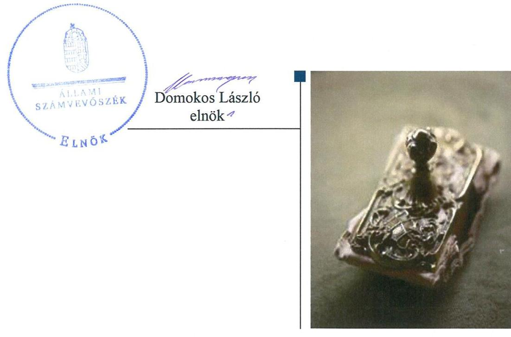
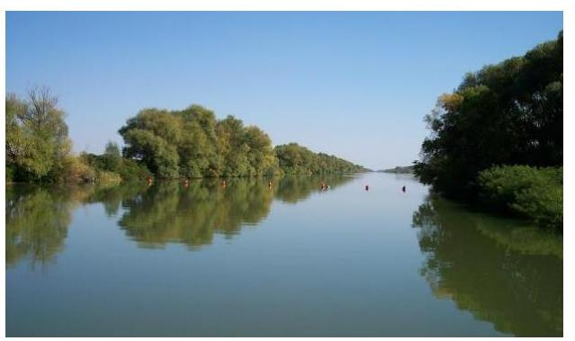

# Jelentés 

## Utóellenőrzések

A nemzeti park igazgatóságok feladatellátásának és vagyonkezelésének ellenőrzése -Körös-Maros Nemzeti Park Igazgatóság 2019.

---

# Jelentés 

## Utóellenőrzések

A nemzeti park igazgatóságok feladatellátásának és vagyonkezelésének ellenőrzése -Körös-Maros Nemzeti Park Igazgatóság 2019. 01. hó 2 h. nap

---

# AZ ELLENŐRZÉST FELÜGYELTE: 

PETŐ KRISZTINA felügyeleti vezető

## AZ ELLENŐRZÉST VEZETTE ÉS A VÉGREHAJTÁSÁÉRT FELELŐS:

MIHÁLSZKY KÁLMÁN ellenőrzésvezető

## A PROGRAM ÖSSZEÁLLÍTÁSÁÉRT FELELŐS:

TÓTPÁL SZABOLCS osztályvezető

## A TÉMÁHOZ KAPCSOLÓDÓ KORÁBBI SZÁMVEVŐSZÉKI JELENTÉSEK:

- címe: A nemzeti park igazgatóságok feladatellátásának és vagyonkezelésének ellenőrzéséről
- sorszáma: 12106

Jelentéseink az Országgyúlés számítógépes hálózatán és az Interneten a www.asz.hu címen is olvashatóak.

IKTATÓSZÁM: EL-1458-001/2019
TÉMASZÁM: 2460
ELLENŐRZÉS-AZONOSÍTÓ SZÁM: V080449

---

# TARTALOMJEGYZÉK 

■ ÖSSZEGZÉS ..... 5
■ AZ ELLENŐRZÉS CÉLJA ..... 6
■ AZ ELLENŐRZÉS TERÜLETE ..... 7
■ AZ ELLENŐRZÉS HÁTTERE, INDOKOLTSÁGA ..... 8
■ A JELENTÉS LÉNYEGES KÉRDÉSKÖRE ..... 9
■ AZ ELLENŐRZÉS HATÓKÖRE ÉS MÓDSZEREI ..... 10
■ MEGÁLLAPÍTÁSOK ..... 12
■ MELLÉKLETEK ..... 13
I. sz. melléklet: Körös-Maros Nemzeti Park Igazgatóság intézkedési terve végrehajtásának értékelése ..... 13
■ FÜGGELÉK: ÉSZREVÉTELEK ..... 17
■ RÖVIDÍTÉSEK JEGYZÉKE ..... 19

---

.

---

# ÖSSZEGZÉS 

A szarvasi székhelyű Körös-Maros Nemzeti Park Igazgatóság az intézkedési tervében vállalt feladatait nem hajtotta végre, így nem volt biztosított a nemzeti vagyonnal való átlátható és felelős gazdálkodás.

## Az ellenőrzés társadalmi indokoltsága

Az Állami Számvevőszék stratégiájában célul tűzte ki a számvevőszéki munka hasznosulásának javítását. Ezzel összhangban ellenőrzi, hogy az ellenőrzött szervezet megvalósította-e a korábbi ellenőrzései által feltárt hibák, hiányosságok és szabálytalanságok megszüntetése céljából elkészített intézkedési tervében foglaltakat. A rendszeres utóellenőrzések hozzájárulnak a szükséges intézkedések tényleges végrehajtásához, ezáltal a közpénzügyek rendezettségének javulásához.

## Főbb megállapítások, következtetések

A Körös-Maros Nemzeti Park Igazgatóság az intézkedési tervében meghatározott feladatokat nem hajtotta végre.
A Körös-Maros Nemzeti Park Igazgatóság nem gondoskodott a hasznosításhoz kapcsolódó kiadások és bevételek vizsgálatáról és a bérleti díjak piaci értéktől való eltérítése szempontjainak meghatározásáról. Ennek következtében nem valósult meg, hogy a vagyonkezelt területekre olyan haszonbérleti szerződéseket kössenek, amelyek elősegítik az állami vagyon minél gazdaságosabb hasznosítását.

A haszonbérleti pályázati eljárásokkal kapcsolatban végre nem hajtott feladatok nem biztosították a Körös-Maros Nemzeti Park Igazgatóság átlátható múködését. A haszonbérleti ajánlat kifüggesztésének elmaradása következtében az előhaszonbérleti jog jogosultja számára nem biztosították, hogy a haszonbérleti szerződésre elfogadó vagy az előhaszonbérleti jogáról lemondó nyilatkozatot tegyen.

Az intézkedési tervben meghatározott feladatok végrehajtásáról szóló, a jogszabályban előírt nyilvántartás vezetéséről a Körös-Maros Nemzeti Park igazgatója nem gondoskodott.

---

# AZ ELLENŐRZÉS CÉLJA 

Az ellenőrzés célja annak értékelése volt, hogy a számvevőszéki jelentésben ${ }^{1}$ foglalt javaslatot megalapozó megállapításokkal összhangban készített intézkedési tervben meghatározott feladatokat az ellenőrzött szervezet vég-rehajtotta-e.

---

# AZ ELLENŐRZÉS TERÜLETE 

## Körös-Maros Nemzeti Park Igazgatóság

A Nemzeti Parkot ${ }^{2}$ hazánk hetedik nemzeti parkjaként 1997. január 16-án alapították. A Nemzeti Park működési területe 800000 hektár, ami magába foglalja Békés megyét, Csongrád megye Tiszától keletre eső felét, valamint a Körös-ártér Jász-Nagykun-Szolnok megyébe átnyúló részeit.

A Nemzeti Park székhelye Szarvason található. 2017. évben 3999 millió Ft bevétellel rendelkezett, és 1828 millió Ft volt a kiadása.

A Nemzeti Park az agrártárca ${ }^{3}$ által irányított központi költségvetési szerv, előirányzatai felett teljes jogkörrel rendelkezik. Alaptevékenységei közé tartozik a védett és fokozottan védett természeti területek és természeti értékek bemutatása, megőrzése, fenntartása és természetvédelmi kezelése. Ökoturisztikai létesítmények fenntartásával és múködtetésével természetvédelmi oktatási, nevelési és ismeretterjesztési tevékenységet végez. A vagyonkezelésében lévő állami vagyontárgyak tekintetében vagyonkezelői feladatokat lát el.

Az ÁSZ ${ }^{4}$ 2007. január 01. és 2011. december 31. közötti időszakra vonatkozóan végezte el a Nemzeti Park feladatellátásának és vagyonkezelésének ellenőrzését. Az ÁSZ az ellenőrzés eredményéről szóló számvevőszéki jelentését 2012. november 28-án hozta nyilvánosságra.

---

# AZ ELLENŐRZÉS HÁTTERE, INDOKOLTSÁGA 

Az ÁSZ tv5. 33. § (1) bekezdése értelmében a számvevőszéki jelentések megállapításaihoz kapcsolódóan az ellenőrzött szervezet vezetője intézkedési tervet köteles összeállítani, és az ÁSZ részére megküldeni.

Az ÁSZ által befogadott intézkedési tervben foglaltak megvalósítását az ÁSZ törvény 33. § (7) bekezdésében foglaltak alapján - az ÁSZ utóellenőrzés keretében ellenőrizheti. Az utóellenőrzések keretében - az intézkedések értékelése során - az ÁSZ figyelembe veszi az ellenőrzött szervezetek működési feltételeiben, valamint a jogszabályi előírásokban bekövetkezett változásokat.

Az utóellenőrzés során az ÁSZ értékeli, hogy az érintett számvevőszéki jelentésben foglalt javaslatot megalapozó megállapításokkal összhangban, az ellenőrzött szervezet által készített intézkedési tervben meghatározott feladatokat a feladatra kijelöltek végrehajtották-e.

Az intézkedések végrehajtásával az adott terület szabályszerű múködése vonatkozásában a kockázatok csökkenhetnek, azonban hosszabb távon az intézkedési tervben foglaltak végrehajtásával önmagában nem szűnnek meg, csak akkor, ha beépülnek az ellenőrzött szervezet működésébe, azokat folyamatosan karban tartják, figyelembe véve, illetve kezelve a változásokat. Emellett az intézkedések végrehajtásáig újabb kockázatok merülhetnek fel a szabályszerű működés vonatkozásában, amelyek kezelése szintén kiemelten fontos az ellenőrzött szervezet számára.

Az ellenőrzött szervezet vezetője által készített intézkedési tervben foglalt feladatok hiányos, illetve késedelmes végrehajtása, vagy annak elmaradása a szabályszerűség és a felelős vezetői magatartás vonatkozásában kockázatot hordoz, ami azt mutatja, hogy az ellenőrzések során feltárt hibák, hiányosságok és szabálytalanságok kezelése nem kapott kellő hangsúlyt. Az utóellenőrzés során is fennálló szabálytalanságok esetén a közpénz, közvagyon veszélyeztetettségi kockázat valószínűsített hatásának értékelése további intézkedéseket vonhat maga után.

Az ellenőrzött szervezet szintjén az utóellenőrzés feltárja, hogy a szervezet az intézkedések végrehajtásával hasznosította-e a korábbi ellenőrzési jelentésben a hiányosságok megszüntetése, illetve a kockázatok kezelése érdekében megfogalmazott javaslatokat, illetve az intézkedések végrehajtása elmaradásának következtében továbbra is fennálló szabálytalanság esetén értékeli a közpénzek, közvagyon veszélyeztetettségét.

Az ÁSZ szintjén az utóellenőrzés visszacsatolást ad az ellenőrzési jelentések hasznosulásáról, az intézkedések, vagy azok valamely részének elmaradása a közpénzek, közvagyon veszélyeztetettségére gyakorolt valószínűsített hatásának értékelése további intézkedéseket vonhat maga után.

---

# A JELENTÉS LÉNYEGES KÉRDÉSKÖRE 

A Nemzeti Park az intézkedési tervben foglaltakat az elöirt határidőben végrehajtotta-e?

---

# AZ ELLENŐRZÉS HATÓKÖRE ÉS MÓDSZEREI 

## Az ellenőrzés típusa

Megfelelőségi ellenőrzés.

## Az ellenőrzött időszak

Az utóellenőrzés alapját képező számvevőszéki jelentés közzétételének napjától az ellenőrzésről szóló kiértesítő levél keltének napjáig tartó időszak volt, 2012. november 29 - 2018. június 27.

## Az ellenőrzés tárgya

A számvevőszéki jelentésben foglalt javaslatot megalapozó megállapításokkal összhangban - a Nemzeti Park által - készített Intézkedési tervben foglaltak végrehajtásának ellenőrzése.

## Az ellenőrzött szervezet

Körös-Maros Nemzeti Park Igazgatóság

## Az ellenőrzés jogalapja

Az ellenőrzés jogszabályi alapját az ÁSZ tv. 33. § (7) bekezdésének az előírása képezik.

## Az ellenőrzés módszerei

Az ellenőrzést az ellenőrzött időszakban hatályos jogszabályok, az ellenőrzés szakmai szabályai, a jelen ellenőrzésre irányadó ÁSZ módszertanok, az ellenőrzési programban foglalt értékelési szempontok szerint, önállóan vagy ellenőrzéshez kapcsolódóan, annak részeként végeztük.

Az ellenőrzés ideje alatt az ellenőrzött szervezettel történő kapcsolattartást az ÁSZ SZMSZ ${ }^{\text {® }}$-ének vonatkozó előírásai alapján biztosítottuk.

Az utóellenőrzés megállapításait az ÁSZ rendelkezésére álló dokumentumok, valamint az ÁSZ adatbekérése szerint, az ellenőrzött szervezetek által rendelkezésre bocsátott dokumentumok, adatok alapján megfogalmaztuk meg.

---

Az ellenőrzési kérdések megválaszolásához szükséges bizonyítékok megszerzése az ellenőrzött által rendelkezésre bocsátott dokumentumokra, adatokra alapozva megfigyelés, szemle (szemrevételezés), kérdésfeltevés (információkérés), valamint elemző eljárás alkalmazásával történt. Az ellenőrzési bizonyítékként felhasználható adatforrások közé tartoztak egyrészt az ellenőrzési program részletes szempontjainál felsorolt adatforrások, másrészt minden - az ellenőrzés folyamán feltárt, az ellenőrzés szempontjából információt tartalmazó - dokumentum.

Az intézkedési tervekben előírt feladatokat azok végrehajthatósága, illetve végrehajtása szempontjából az alábbiak szerint értékeltük:
$\longrightarrow$ „határidőben végrehajtott" a feladat, ha a teljesítés dokumentáltan, az intézkedési tervben előírt határidőben és tartalommal megtörtént;
$\longrightarrow$ „határidőn túl végrehajtott" a feladat, ha annak teljesítése az intézkedési tervben meghatározott módon, de az abban előírt határidőn túl történt meg;
$\longrightarrow$ „részben végrehajtott" a feladat, ha annak végrehajtása nem teljes körűen az intézkedési tervben előírt módon történt meg;
$\longrightarrow$ „nem végrehajtott" a feladat, ha a végrehajtás nem történt meg, dokumentumokkal nem igazolt annak teljesítése;
$\longrightarrow$ „okafogyottá vált" a feladat, ha végrehajtására - meghatározott esemény bekövetkezése, továbbá külső körülmény, a működést érintő feltétel változása miatt - már nincs szükség, illetve lehetőség, és egyértelműen megállapítható, hogy az intézkedést szükségessé tevő körülmény a jövőben nem fordulhat elő;
$\longrightarrow$ „nem időszerű" az a feladat, amelynek ellenőrzési időszakon belüli végrehajtására azért nem került (kerülhetett) sor, mert az intézkedés alapjául szolgáló esemény nem következett be, de annak jövőbeni előfordulása lehetséges, a végrehajtása nem volt esedékes, vagy a végrehajtás határideje még nem járt le.
Az ellenőrzés lefolytatásához az ellenőrzött szervezet a tanúsítványok elektronikus kitöltésével, valamint az ÁSZ által kért dokumentumok elektronikus megküldésével szolgáltatott adatokat, amelyek valódiságát és teljes körűségét az ellenőrzött szervezet vezetője által tett teljességi és hitelességi nyilatkozat igazolta. Az így rendelkezésre bocsátott adatok, információk kontrollját az ellenőrzés keretében végeztük el.

---

# A Nemzeti Park az intézkedési tervben foglaltakat az elöírt határidőben végrehajtotta-e? 

## Összegző megállapítás

A Nemzeti Park egyet sem hajtott végre az intézkedési tervben meghatározott három feladatból.

Az Igazgató ${ }^{7}$ a számvevőszéki jelentésben foglalt javaslatot megalapozó megállapításokra, három végrehajtandó feladatból álló intézkedési tervet fogalmazott meg.

Az intézkedési tervében foglalt három feladatot a Nemzeti Park nem hajtotta végre.

Az Intézkedési tervben rögzített feladatok végrehajtásáról a Bkr. ${ }^{8} 14$. §-ában foglaltakkal ellentétben az előírt nyilvántartást a Nemzeti Park nem vezetett.

Az I. sz. melléklet mutatja be Nemzeti Park intézkedési tervében meghatározott feladatokat, határidőket, felelősöket és a feladatok értékelését.

A VAGYONGAZDÁLKODÁS területén a végre nem hajtott feladatok továbbra is magas kockázatot jelentenek, mivel a Területfenntartási és Őrszolgálati Osztály vezetője ${ }^{9}$ a Nemzeti Park vagyonkezelésében lévő területek hasznosítását megelőzően nem végzett számításokat a saját használathoz, illetve a használatba adáshoz kapcsolódó teljes körű kiadások, valamint a várható bevételek arányáról. Továbbá a Természetmegőrzési Osztály vezetője ${ }^{10}$ nem határozta meg a haszonbérleti szerződésben alkalmazott bérleti díj általános piaci értéktől való eltérítésének szempontjait és nem gondoskodott az általános használattól való eltérés esetén a szükséges természetvédelmi előírások írásban történő rögzítéséről.

AZ ÁTLÁTHATÓSÁGOT a Nemzeti Park nem biztosította, mivel a Területfenntartási és Őrszolgálati Osztály vezetője nem gondoskodott a haszonbérleti szerződésekben alkalmazott bérleti díj általános piaci értéktől való eltérítésének szempontjai nyilvánossá és visszakereshetővé tételéről, valamint a haszonbérleti pályázati felhívásoknak a terület fekvése szerinti önkormányzatnál történő kifüggesztéséről, valamint a Nemzeti Park honlapján elhelyezett hirdetmény formájában történő közzétételéről.

---

# MELLÉKLETEK

- I. SZ. MELLÉKLET: KÖRÖS-MAROS NEMZETI PARK IGAZGATÓSÁG INTÉZKEDÉSI TERVE VÉGREHAJTÁSÁNAK ÉRTÉKELÉSE

|  Sorszám | Az intézkedési tervben meghatározott feladat | Az intézkedési tervben meghatározott határidő | Az intézkedési tervben meghatározott feladatok elvégzésének felelőse  |
| --- | --- | --- | --- |
|   |  | Nem végrehajtott feladatok |   |
|  1. | (1.) „Az Igazgatóság a Magyar Nemzeti Vagyonkezelő Zrt. tulajdonosi körébe és a nemzeti park igazgatóság vagyonkezelésében lévő vagyon hasznosítása során vizsgálja meg a kezelésében lévő területek hasznosítását megelőzően a saját használatához, illetve használatba adáshoz kapcsolódó teljes körű kiadások, valamint várható bevételek arányát és ezek eredményeinek ismeretében döntsön a bérbeadásról.
A Területfenntartási és Örszolgálati Osztály vizsgálja meg a fenti javaslatban foglaltakat. Minden érintett bérbeadás esetén végezzenek számításokat és készítsenek kalkulációt, melynek ismeretében tegyenek javaslatot a bérbeadás szükségességéről és módjáról." | 2013. január 1-től folyamatos | Területfenntartási és Örszolgálati Osztály vezetője  |
|  2. | (2.) „Az Igazgatóság a Magyar Nemzeti Vagyonkezelő Zrt. tulajdonosi körébe és a nemzeti park igazgatóság vagyonkezelésében lévő vagyonelemek esetében határozza meg egyértelműen a haszonbérleti szerződésben alkalmazott bérleti díj általános piaci értéktől való eltérítésének szempontjait, azt tegye nyilvánossá és visszakereshetővé." | 2013. január 1-től folyamatos | 2/a,
Természetmegőrzési
Osztály vezetője
2/b,
Területfenntartási
és Örszolgálati Osztály vezetője  |

A feladat végrehajtása

Területfenntartási és Örszolgálati Osztály vezetője Magyar Nemzeti Vagyonkezelő Zrt. tulajdonosi körébe és a Nemzeti Park vagyonkezelésében lévő területek hasznosítását megelőzően nem végzett számításokat és nem készített kalkulációt a saját használathoz, illetve a használatba adáshoz kapcsolódó teljes körű kiadások, valamint a várható bevételek arányáról, és nem tett javaslatot a bérbeadás szükségességéről és módjáról. Ezáltal nem biztosították az állami vagyonnak a Vagyontv. ${ }^{11}$ 23. § (3) pontjában előírtak alapján az állam számára a lehető legkedvezőbb hasznosítását.

A Természetmegőrzési Osztály vezetője a Magyar Nemzeti Vagyonkezelő Zrt. tulajdonosi körébe és a Nemzeti Park vagyonkezelésében lévő vagyonelemek esetében nem határozta meg a haszonbérleti szerződésben alkalmazott bérleti díj általános piaci értéktől való eltérítésének szempontjait, nem gondoskodott az általános használattól való eltérés esetén a szükséges természetvédelmi előírások írásban

---

|  Az intézkedési tervben meghatározott feladat | Az intézkedési tervben meghatározott határidő | Az intézkedési tervben meghatározott feladatok elvégzésének felelőse | A feladat végrehajtása  |
| --- | --- | --- | --- |
|  2/a, „Az általános használattól történő eltérés esetén írásban kerüljenek rögzítésre a szükséges természetvédelmi előírások. A meghatározott korlátozások alapján kell számítani a piaci értéktől való eltérítést." 2/b, „Gondoskodni kell a meghatározott szempontok nyilvánossá tételéről." |  |  | történő rögzítéséről és a piaci értéktől való eltérítés meghatározott korlátozások alapján történő számításáról. A Területfenntartási és Örszolgálati Osztály vezetője nem gondoskodott a meghatározott szempontok nyilvánossá és visszakereshetővé tételéről; így nem biztosította a rendelkezésre álló forrásoknak a Bkr. 6. § (2) pontjában előírt gazdaságos és átlátható felhasználását.  |
|  3. (3.) „Intézkedjen a Magyar Nemzeti Vagyonkezelő Zrt. tulajdonosi körébe és a nemzeti park igazgatóság vagyonkezelésében lévő vagyonelemek haszonbérleti szerződés keretében hasznosítandó területek szélesebb körben történő meghirdetéséről, az átláthatóság érvényesítéséről, a verseny növelése érdekében. A Körös-Maros Nemzeti Park Igazgatóság a haszonbérleti szerződéseinek megkötése során a Nemzeti Földalapba tartozó földrészletek hasznosításának részletes szabályairól szóló 262/2010. (XI. 17.) Korm. rendelet, valamint a nemzeti park igazgatóságok természetvédelmi célú vagyonkezelési tevékenységének egységes szakmai alapelvek szerinti ellátásáról szóló 12/2012. (VI.8.) VM utasítás alapján járjon el. Fenti szabályozás értelmében haszonbérleti pályázati eljárást alkalmazzon igazgatóságunk, mely pályázatok nyertesével köti meg a haszonbérleti szerződéseket. A haszonbérleti pályázat meghirdetése Haszonbérleti Pályázati Felhívás hirdetmény formájában történő közzétételével valósuljon meg. A 262/2010. (XI. 17.) | 2013. január 1-től folyamatos | Területfenntartási és Örszolgálati Osztály vezetője | A Területfenntartási és Örszolgálati Osztály vezetője nem intézkedett a Magyar Nemzeti Vagyonkezelő Zrt. tulajdonosi körébe és a Nemzeti Park vagyonkezelésében lévő haszonbérleti szerződés keretében hasznosítandó területek szélesebb körben történő meghirdetéséről. A Területfenntartási és Örszolgálati Osztály vezetője a Nemzeti Földalapba tartozó földrészletek hasznosításának részletes szabályairól szóló 262/2010. (XI. 17.) Korm. rendelet 43/D. § (3) pontjában előírtak ellenére nem gondoskodott a haszonbérleti pályázati felhívásnak a Nemzeti Park székhelyén és a terület fekvése szerinti önkormányzatnál történő kifüggesztéséről, valamint a Nemzeti Park honlapján elhelyezett hirdetmény formájában történő közzétételéről.  |

---

|  Az intézkedési tervben meghatározott feladat | Az intézkedési tervben meghatározott határidő | Az intézkedési tervben meghatározott feladatok elvégzésének felelőse | A feladat végrehajtása  |
| --- | --- | --- | --- |
|  Korm. rendelet 43/D. § (3) rendelkezéseinek eleget téve, a hirdetmények:
- a Nemzeti Park Igazgatóság székhelyén,
- a honlapján és
- a terület fekvése szerinti önkormányzatnál (körjegyzőség esetében a körjegyzőség székhelyén is) elhelyezett hirdetményben
kerüljön kifüggesztésre a termőföld haszonbérleti pályázat felhívási anyaga, mely felhívás tartalmazza többek között a pályázat eljárásrendjét." |  |  |   |

A sorszámozás melletti oszlopban a zárójeles feltüntetés az intézkedési terv szerinti sorszámozást jelenti!

---

.

---

# FÜGGELÉK: ÉSZREVÉTELEK 

A jelentéstervezetet a Számvevőszék 15 napos észrevételezésre megküldte az ellenőrzött szervezet vezetőjének az ÁSZ tv. 29. §* (1) bekezdése előírásának megfelelően.

A Körös-Maros Nemzeti Park Igazgatóságának igazgatója a jelentéstervezet megállapításaira észrevételt nem tett.

[^0]
[^0]:    * 29. § (1) Az Állami Számvevőszék az ellenőrzési megállapításait megküldi az ellenőrzött szervezet vezetőjének vagy az általa megbízott személynek, és annak, akinek személyes felelősségét állapította meg.
    (2) Az ellenőrzött szervezet vezetője és a felelősként megjelölt személy az ellenőrzés megállapításaira tizenöt napon belül írásban észrevételt tehet.
    (3) Az Állami Számvevőszék az észrevételre a beérkezésétől számított harminc napon belül írásban válaszol. A figyelembe nem vett észrevételeket köteles a jelentésben feltüntetni, és megindokolni, hogy azokat miért nem fogadta el.

---

.

---

# RÖVIDÍTÉSEK JEGYZÉKE 

${ }^{1}$ számvevőszéki jelentés
${ }^{2}$ Nemzeti Park
${ }^{3}$ agrártárca
${ }^{4}$ ÁSZ
${ }^{5}$ ÁSZ. tv.
${ }^{6}$ ÁSZ SZMSZ
${ }^{7}$ Igazgató
${ }^{8}$ Bkr.
${ }^{9}$ Területfenntartási és Örszolgálati Osztály vezetője
${ }^{10}$ Természetmegőrzési Osztály vezetője
${ }^{11}$ Vagyontv.

Állami Számvevőszék 12106. számú jelentése
Körös-Maros Nemzeti Park Igazgatóság
Agrárminisztérium
Állami Számvevőszék
Az Állami Számvevőszékről szóló 2011. évi LXVI. törvény
Az Állami Számvevőszék Szervezeti és Müködési Szabályzata
Körös-Maros Nemzeti Park Igazgatóságának Igazgatója
370/2011. (XII. 31.) Korm. rendelet a költségvetési szervek belső
kontrollrendszeréről és belső ellenőrzéséről
Körös-Maros Nemzeti Park Igazgatóság Terület-fenntartási és
Örszolgálati Osztályának vezetője
Körös-Maros Nemzeti Park Igazgatóság Természetmegőrzési
Osztályának vezetője
2007. évi CVI. törvény az állami vagyonról

---

# ÁLLAMI SZÁMVEVŐSZÉK 

1052 Budapest, Apáczai Csere János utca 10.
Levélcím: 1364 Budapest 4. Pf. 54
Telefon: +36 14849100 Telefax: +36 14849200
www.asz.hu