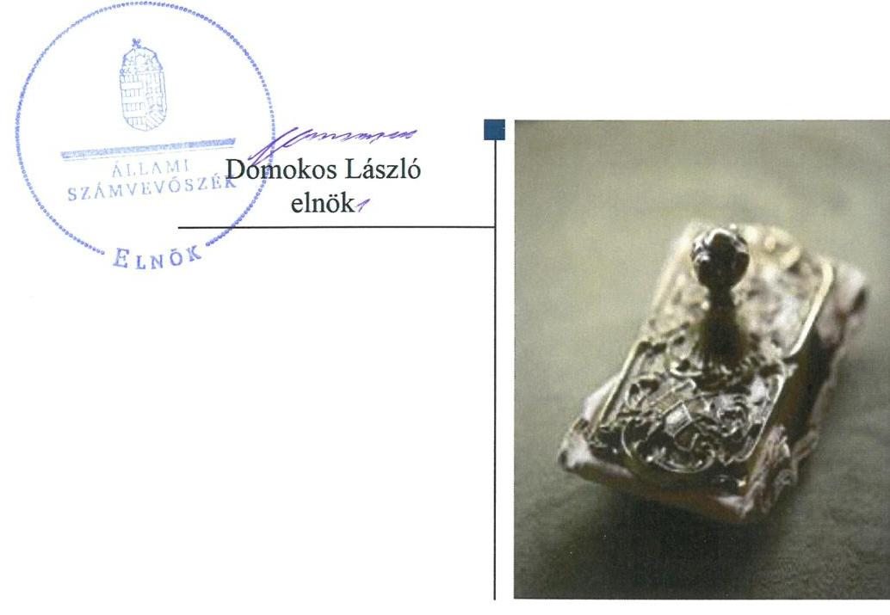
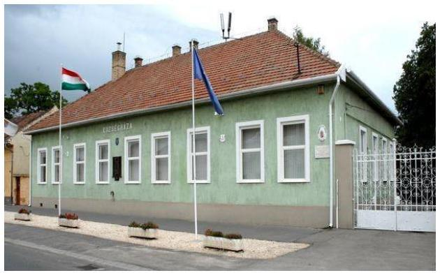
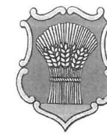
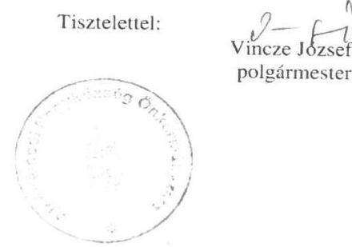
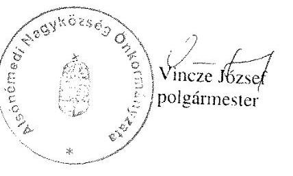

# Jelentés 

## Utóellenőrzések

Az önkormányzatok belső
kontrollrendszere kialakításának és működtetésének utóellenőrzése Alsónémedi Nagyközség Önkormányzata 2019. 02. hó 01. nap

---

|  J | AZ ELLENŐRZÉST FELÜGYELTE:  |
| --- | --- |
|   | PETŐ KRISZTINA felügyeleti vezető  |
|   | AZ ELLENŐRZÉST VEZETTE ÉS A VÉGREHAJTÁSÁÉRT FELELŐS:  |
|   | VALASTYÁNNÉ DR. VÍZHÁNYÓ JÚLIA ellenőrzésvezető  |
|   | A PROGRAM ÖSSZEÁLLÍTÁSÁÉRT FELELŐS:  |
|   | TÓTPÁL SZABOLCS osztályvezető  |
|   | A TÉMÁHOZ KAPCSOLÓDÓ KORÁBBI SZÁMVEVŐSZÉKI JELENTÉSEK:  |
|   | - címe: Önkormányzatok belső kontrollrendszere – Az önkormányzatok belső kontrollrendszere kialakításának és működtetésének ellenőrzése - Alsónémedi  |
|  J | sorszáma: 17009  |
|   | IKTATÓSZÁM: EL-1459-001/2019  |
|   | TÉMASZÁM: 2460  |
|   | ELLENŐRZÉS-AZONOSÍTÓ SZÁM: V080440  |

Jelentéseink az Országgyűlés számítógépes hálózatán és az Interneten a www.asz.hu címen is olvashatóak.

---

# TARTALOMJEGYZÉK 

■ ÖSSZEGZÉS ..... 5
■ AZ ELLENŐRZÉS CÉLJA ..... 6
■ AZ ELLENŐRZÉS TERÜLETE ..... 7
■ AZ ELLENŐRZÉS HÁTTERE, INDOKOLTSÁGA ..... 8
■ A JELENTÉS LÉNYEGES KÉRDÉSKÖRE ..... 9
■ ELLENŐRZÉS HATÓKÖRE ÉS MÓDSZEREI ..... 10
■ MEGÁLLAPÍTÁSOK ..... 12
■ MELLÉKLETEK ..... 15
I. sz. melléklet: Alsónémedi Nagyközség Önkormányzata intézkedési terve végrehajtásának értékelése ..... 15
II. sz. melléklet: Alsónémedi Nagyközség Önkormányzatának intézkedési terve ..... 21
■ FÜGGELÉK: ÉSZREVÉTELEK ..... 31
■ RÖVIDÍTÉSEK JEGYZÉKE ..... 33

---

.

---

# ÖSSZEGZÉS 

Alsónémedi Nagyközség Önkormányzata szabályozottsága és vagyongazdálkodásának szabályozottsága, valamint az integritás szemlélet javult, azonban a pénzügyi gazdálkodás szabályszerűségét biztosító intézkedések elmaradása továbbra is veszélyezteti az elszámoltathatóságot.

## Az ellenőrzés társadalmi indokoltsága

Az Állami Számvevőszék stratégiájában célul tűzte ki a számvevőszéki munka hasznosulásának javítását. Ezzel összhangban ellenőrzi, hogy az ellenőrzött szervezet megvalósította-e a korábbi ellenőrzései által feltárt hibák, hiányosságok és szabálytalanságok megszüntetése céljából elkészített intézkedési tervében foglaltakat. A rendszeres utóellenőrzések hozzájárulnak a szükséges intézkedések tényleges végrehajtásához, ezáltal a közpénzügyek rendezettségének javulásához.

## Főbb megállapítások, következtetések

Alsónémedi Nagyközség Önkormányzata az intézkedési tervében meghatározott huszonöt feladatból tizenhatot határidőben, kettőt határidőn túl, négyet részben hajtott végre, két feladatot nem hajtott végre, egy feladat nem volt időszerű.

Alsónémedi Nagyközség Önkormányzata módosította a Hivatali SZMSZ-t. A Vagyonnyilatkozat-tételi szabályzatot a Képviselő-testület határozatával elfogadta. A jegyző az Iratkezelési szabályzatot a jogszabályi előírásoknak megfelelően módosította. Az intézkedések következtében a szabályozottság javult.

Az átmenetileg szabad pénzeszközök elhelyezése és elszámolása a jogszabályi előírások szerint történt, ezzel a vagyongazdálkodás szabályozottsága javult. A pénzügyi gazdálkodás vonatkozásában a szabályszerűséget biztosító intézkedések elmaradása továbbra is veszélyezteti az elszámoltathatóságot. A teljesítési igazolások, érvényesítések gyakorlata nem felelt meg a jogszabályi és az intézkedési tervben foglaltaknak. A Számlarendet módosították, de az nem tartalmazta a bizonylati rendet.

Alsónémedi Nagyközség Önkormányzata belső ellenőrzési programjai és ellenőrzési jelentései a jogszabályi előírások szerint készültek el. Az intézkedési tervben rögzített feladatok végrehajtásáról a jogszabályi előírások szerinti nyilvántartást vezetették. Az Etikai Kódexet elkészítették, ezzel az integritás szemlélet javult.

---

# AZ ELLENŐRZÉS CÉLJA 

Az ellenőrzés célja annak értékelése volt, hogy a számvevőszéki jelentésben foglalt javaslatot megalapozó megállapításokkal összhangban készített intézkedési tervben meghatározott feladatokat az ellenőrzött szervezet végrehajtotta-e.

---

# AZ ELLENŐRZÉS TERÜLETE

## Alsónémedi Nagyközség Önkormányzata

Alsónémedi Nagyközség a Közép-Magyarország régióban, Pest megyében található. Állandó lakosainak száma a Központi Statisztikai Hivatal helységnévtára alapján 2017. január 1-jén 5265 fő volt.

A polgármester1 2010. év októberétől vezeti a kilenc tagú Képviselő-testületet2. A jegyző3 2011-től látja el feladatait.

Az ÁSZ4 2016-ban ellenőrizte az Önkormányzat5 belső kontrollrendszerének kialakítását és működtetését. Az erről készített 17009. számú számvevőszéki jelentést6 az ÁSZ 2017. január 11-én hozta nyilvánosságra.

Az Önkormányzat a számvevőszéki jelentésben feltárt szabálytalanságok, működésbeli hiányosságok kiküszöbölése érdekében intézkedési tervet készített. A számvevőszéki jelentés a polgármesternek öt, a jegyzőnek hét javaslatot tartalmazott, amelyek alapján az Önkormányzat az intézkedési tervében összesen 25 feladat végrehajtásáról rendelkezett.

Az utóellenőrzés az Önkormányzat belső kontrollrendszere kialakításának és működtetésének ellenőrzéséről készült 17009. számú számvevőszéki jelentés javaslatot megalapozó megállapítások hasznosítására elfogadott intézkedési tervben foglalt feladatok végrehajtásának 2017. január 11. és 2018. július 3. közötti ellenőrzésére irányult.

---

# AZ ELLENŐRZÉS HÁTTERE, INDOKOLTSÁGA 

Az ÁSZ tv. ${ }^{7}$ 33. § (1) bekezdése értelmében az ellenőrzött szervezet vezetője köteles a jelentésben foglalt megállapításokhoz kapcsolódó intézkedési tervet összeállítani, és az ÁSZ részére megküldeni. Az ÁSZ tv. 33. § (6) bekezdése értelmében, amennyiben az ÁSZ elnöke az ellenőrzés során feltárt jogszabálysértő gyakorlat, illetve a vagyon rendeltetésellenes vagy pazarló felhasználásának megszüntetése érdekében figyelemfelhívó levéllel fordult az ellenőrzött szerv vezetőjéhez, az abban foglaltakat az ellenőrzött szerv vezetője köteles elbírálni, a megfelelő intézkedést megtenni és erről az ÁSZ elnökét értesíteni.

Az ÁSZ által befogadott intézkedési tervben foglaltak megvalósítását az ÁSZ tv. 33. § (7) bekezdésében foglaltak alapján - az Állami Számvevőszék utóellenőrzés keretében ellenőrizheti. Az utóellenőrzések keretében - az intézkedések értékelése során - az Állami Számvevőszék figyelembe veszi az ellenőrzött szervezetek működési feltételeiben, valamint a jogszabályi előírásokban bekövetkezett változásokat.

Az utóellenőrzés során az ÁSZ értékeli, hogy az érintett számvevőszéki jelentésben foglalt megállapításokhoz kapcsolódó, az ellenőrzött szervezet által készített intézkedési tervben meghatározott feladatokat a feladatra kijelöltek végrehajtották-e.

Az intézkedések végrehajtásával az adott terület szabályszerű működése vonatkozásában a kockázatok csökkenhetnek, azonban hosszabb távon az intézkedési tervben foglaltak végrehajtásával önmagában nem szűnnek meg, csak akkor, ha beépülnek az ellenőrzött szervezet működésébe, azokat folyamatosan karban tartják, figyelembe véve, illetve kezelve a változásokat. Emellett az intézkedések végrehajtásáig újabb kockázatok merülhetnek fel a szabályszerű működés vonatkozásában, amelyek kezelése szintén kiemelten fontos az ellenőrzött szervezet számára.

Az ellenőrzött szervezet vezetője által készített intézkedési tervekben foglalt feladatok hiányos, illetve késedelmes végrehajtása, vagy annak elmaradása a szabályszerűség és a felelős vezetői magatartás vonatkozásában kockázatot hordoz, ami azt mutatja, hogy az ellenőrzések során feltárt hibák, hiányosságok és szabálytalanságok kezelése nem kapott kellő hangsúlyt. Az utóellenőrzés során is fennálló szabálytalanságok esetén a közpénz, közvagyon veszélyeztetettségi kockázat valószínűsített hatásának értékelése további intézkedéseket vonhat maga után.

Az ellenőrzött szervezet szintjén az utóellenőrzés feltárja, hogy a szervezet az intézkedések végrehajtásával hasznosította-e a korábbi ellenőrzési jelentésben a hiányosságok megszüntetése, illetve a kockázatok kezelése érdekében megfogalmazott javaslatokat, illetve az intézkedések végrehajtása elmaradásának következtében továbbra is fennálló szabálytalanság esetén értékeli a közpénzek, közvagyon veszélyeztetettségét.

Az ÁSZ szintjén az utóellenőrzés visszacsatolást ad az ellenőrzési jelentések hasznosulásáról, az intézkedések elmaradásának, vagy részleges megvalósulásának a közpénzek, közvagyon veszélyeztetettségére gyakorolt valószínűsített hatásának értékelése, további intézkedéseket vonhat maga után.

---

# A JELENTÉS LÉNYEGES KÉRDÉSKÖRE 

Az Önkormányzat az intézkedési tervben foglaltakat az előírt határidőben végrehajtotta-e?

---

# ELLENŐRZÉS HATÓKÖRE ÉS MÓDSZEREI 

## Az ellenőrzés típusa

Megfelelőségi ellenőrzés.

## Az ellenőrzött időszak

Az utóellenőrzés alapját képező ÁSZ jelentés közzétételének napjától az ellenőrzésről szóló kiértesítő levél keltének napjáig tartó időszak, azaz 2017. január 11. és 2018. július 3. közötti időszak.

## Az ellenőrzés tárgya

Az ÁSZ tv. 2011. július 1-jei hatálybalépését követően a számvevőszéki jelentésben foglalt javaslatot megalapozó megállapításokkal összhangban az Önkormányzat által készített Intézkedési tervben foglaltak végrehajtásának ellenőrzése.

## Az ellenőrzött szervezet

Alsónémedi Nagyközség Önkormányzata

## Az ellenőrzés jogalapja

Az ellenőrzés jogszabályi alapját az ÁSZ tv. 33. § (1)-(2), illetve (7) bekezdéseinek az előírása képezi.

## Az ellenőrzés módszerei

Az ellenőrzést az ellenőrzött időszakban hatályos jogszabályok, az ellenőrzés szakmai szabályai, a jelen ellenőrzésre irányadó ÁSZ módszertanok, az ellenőrzési programban foglalt értékelési szempontok szerint végeztük.

Az ellenőrzés ideje alatt az Önkormányzattal történő kapcsolattartást az ÁSZ SZMSZ-ének vonatkozó előírásai alapján biztosítottuk.

Az utóellenőrzés megállapításait az ÁSZ rendelkezésére álló, valamint az ÁSZ adatbekérése szerint, az Önkormányzat által rendelkezésre bocsátott dokumentumok alapozták meg.

Az ellenőrzési bizonyítékként felhasználható adatforrások közé tartoztak egyrészt az ellenőrzési program részletes szempontjainál felsorolt

---

adatforrások, másrészt minden - az ellenőrzés folyamán feltárt, az ellenőrzés szempontjából információt tartalmazó - dokumentum.

Az intézkedési tervekben előírt feladatokat azok végrehajthatósága, illetve végrehajtása szempontjából az alábbiak szerint értékeltük:
"határidőben végrehajtott" a feladat, ha a teljesítés dokumentáltan, az intézkedési tervben előírt határidőben és tartalommal megtörtént;
"határidőn túl végrehajtott" a feladat, ha annak teljesítése az intézkedési tervben meghatározott módon, de az előírt határidőn túl történt meg;
"részben végrehajtott" a feladat, ha végrehajtása teljes körűen az intézkedési tervben előírt módon nem történt meg;
"nem végrehajtott" a feladat, ha a végrehajtás nem történt meg, vagy amennyiben a teljesítést nem dokumentálták;
"okafogyottá vált" a feladat, ha végrehajtására - meghatározott esemény bekövetkezése, továbbá külső körülmény, a működést érintő feltétel változása miatt - már nincs szükség, illetve lehetőség, és egyértelműen megállapítható, hogy az intézkedést szükségessé tevő körülmény a jövőben nem fordulhat elő;
"nem időszerű" az a feladat, amelynek ellenőrzési időszakon belüli végrehajtására azért nem került (kerülhetett) sor, mert az intézkedés alapjául szolgáló esemény nem következett be, de annak jövőbeni előfordulása lehetséges, a végrehajtása nem volt esedékes, vagy a végrehajtás határideje még nem járt le.
Az ellenőrzés lefolytatásához az Önkormányzat a tanúsítványok elektronikus kitöltésével, valamint az ÁSZ által kért dokumentumok elektronikus megküldésével szolgáltatott adatokat, amelyek valódiságát és teljes körűségét az ellenőrzött szervezet vezetője által tett teljességi és hitelességi nyilatkozat igazolja. Az így rendelkezésre bocsátott adatok, információk kontrollja az ellenőrzés keretében megtörtént.

Az ellenőrzött szervezet által megküldött intézkedési tervben meghatározott ÁSZ által beazonosított feladatok a II. számú mellékletben kerültek bemutatásra.

---

# MEGÁLLAPÍTÁSOK 

## Az Önkormányzat az intézkedési tervben foglaltakat az előírt határidőben végrehajtotta-e?

Összegző megállapítás

Az Önkormányzat az intézkedési tervben szereplő huszonöt feladatból tizenhatot határidőben, kettőt határidőn túl, négyet részben, két feladatot nem hajtott végre. Nem volt időszerű egy feladat.

A polgármester által előterjesztett és a Képviselő-testület által jóváhagyott intézkedési tervben a hiányosságok, a szabálytalanságok megszüntetésére a polgármester részére 5, a jegyző részére 20 feladat került meghatározásra.

Az intézkedési tervben meghatározott feladatok végrehajtásáról az azt nyomon követő nyilvántartást a jogszabályi előírások szerint vezették. A feladatokat, határidőket, megjelölt felelősöket és a feladatok végrehajtását az I. sz. melléklet mutatja be.

Az Önkormányzat intézkedési tervében meghatározott feladatok végrehajtásának értékelési kategóriák szerinti megoszlását az 1. ábra szemlélteti.

1. ábra

A feladatok végrehajtásának értékelési kategóriák szerinti megoszlása

* Határidőn túl végrehajtott
- Nem végrehajtott
* Határidőben végrehajtott
- Részben végrehajtott
- Nem időszerű

---

A SZABÁLYOZOTTSÁG jogszabályi előírásoknak megfelelő kialakítása érdekében az Önkormányzat módosította a Hivatali SZMSZ-t. Az Iratkezelési szabályzatot a jogszabályi előírások szerint módosították. A Képviselő-testület etikai kódexben megállapította a hivatásetikai alapelvek részletes tartalmát. Az intézkedések végrehajtásával a szabályozottság hiányának kockázatait csökkentette. 2017. március 1-jén a jogszabályi előírások szerint részletezett munkaköri leírások, a Műszaki Csoport kivételével, aláírásra kerültek. A számlarendet az intézkedési tervben foglaltak szerint módosították, de annak tartalma nem felelt meg a jogszabályi előírásoknak. 2017. február 1-jén új Gazdálkodási szabályzat lépett hatályba,

 amelyben meghatározták a teljesítésigazolók, érvényesítők számára az igazolási és az ellenőrzési feladatokat.

1. táblázat

# SZABÁLYOZOTTSÁG 

| Ertékelési kategória | Feladat intézkedési tervben szereplő   sorszáma |
| :-- | :--: |
| „Határidőben végrehajtott" | $1,2,5,10,11,12$. |
| „Részben végrehajtott" | 19,20. |
| „Nem végrehajtott" | 23. |

A SZABÁLYOZOTT VAGYONGAZDÁLKODÁS érdekében az Önkormányzat átmenetileg szabad pénzeszközei a Magyar Államkincstárnál kerültek elhelyezésre. A forgatási célú állampapírok beszerzésével, értékesítésével kapcsolatos gazdasági események leírását, és a kamatok elszámolásának rendjét a számlarend tartalmazta. Ezzel az elszámolások szabályszerűségét biztosította, a vagyongazdálkodás szabályozottságának hiányosságai kockázatait csökkentette az Önkormányzat.
2. táblázat

## SZABÁLYSZERŰ VAGYONGAZDÁLKODÁS

| Ertékelési kategória | Feladat intézkedési tervben szereplő   sorszáma |
| :-- | :--: |
| „Határidőben végrehajtott" | 13,14. |
| „Részben végrehajtott" | 22. |
| „Nem végrehajtott" | 24. |
| „Nem időszerű" | 25. |

A SZABÁLYSZERŰ PÉNZÜGYI GAZDÁLKODÁS ÉS A PÉNZÜGYI ELSZÁMOLTATHATÓSÁG biztosítása érdekében az Önkormányzat éves beszámolóit, és az ötmillió forintot meghaladó szerződéseit az Info tv. ${ }^{13}$ előírásai szerint honlapján közzé tette. A teljesítésigazolás és az érvényesítés során nem a jogszabályi és a belső előírások szerint jártak el.

---

# 3. táblázat 

## SZABÁLYSZERŰ PÉNZÜGYI GAZDÁLKODÁS ÉS A PÉNZÜGYI ELSZÁMOLTATHATÓSÁG

| Értékelési kategória | Feladat intézkedési tervben szereplő   sorszáma |
| :-- | :--: |
| „Határidőben végrehajtott" | 6. |
| „Nem végrehajtott" | 24. |

A BELSŐ KONTROLL RENDSZERÉNEK biztosítása érdekében a jegyző azonosította a kockázatokat és azok kezelésére vonatkozóan intézkedéseket dolgozott ki. Az Önkormányzatnál a Bkr. előírásai szerint független belső ellenőrzés működött. A belső ellenőri jelentések megállapításaihoz kapcsolódóan intézkedtek. Az elkészült ellenőrzési programok és az elkészült ellenőrzési jelentések megfeleltek a jogszabályi előírásoknak.
4. táblázat

## BELSŐ KONTROLL SZERINTI ELSZÁMOLTATHATÓSÁG

| Értékelési kategória | Feladat intézkedési tervben szereplő   sorszáma |
| :-- | :--: |
| „Határidőben végrehajtott" | $4, 7, 9, 8$. |

A2 INTEGRITÁS szemlélet javult. A jogszabályi előírásoknak megfelelő vagyonnyilatkozat-tételi kötelezettség teljesítésével kapcsolatos szabályzatot elkészítették, azonban vagyonnyilatkozat-tételi kötelezettségüket a képviselők és nem képviselő bizottsági tagok határidőben nem teljesítették. A polgármester és a jegyző a szabálytalanságok tekintetében a munkajogi felelősség tisztázására irányuló vizsgálatot lefolytatta. Az Etikai Kódex elfogadása hozzájárult az integritási kockázat csökkentéséhez.
5. táblázat

## INTEGRITÁS

| Értékelési kategória | Feladat intézkedési tervben szereplő   sorszáma |
| :-- | :--: |
| „Határidőben végrehajtott" | $3, 2, 11, 21a)$ |
| „Határidőn túl végrehajtott" | 17.,18. |

Forrás: ÁSZ összeállítás

---

# MELLÉKLETEK

- I. SZ. MELLÉKLET: ALSÓNÉMEDI NAGYKÖZSÉG ÖNKORMÁNYZATA INTÉZKEDÉSI TERVE VÉGREHAJTÁSÁNAK ÉRTÉKELÉSE

|  SZTÉSZER | Az intézkedési tervben meghatározott feladat | Az intézkedési tervben meghatározott feladatok elvégzésének felelőse | A feladat végrehajtása  |
| --- | --- | --- | --- |
|  Határidőben végrehajtott feladatok |  |  |   |
|  1. | P.1.
IT: Alsónémedi Polgármesteri Hivatal Szervezeti és Működési Szabályzatának kiegészítése a hivatal kormányzati funkciók szerint besorolt alaptevékenységével. | Készre jelentette | polgármester  |
|  2. | P.2.
IT: A jogszabályi előírásnak megfelelően a képviselő-testület a Köztisztviselők Etikai Kódexét 134/2015.(VIII.26.) számú határozatával elfogadta. Hatályos: 2015. szeptember 1. | Készre jelentette | polgármester  |
|  3. | P.3
IT: Önkormányzati szmsz módosítása, mely a bizottsági tagok nem képviselő tagjai esetében is egyértelműen rögzíti a vagyonnyilatkozat-tételi kötelezettséget, valamint a Vnytv. 11. § (6) bekezdése szerinti szabályzat elkészítése, elfogadása. | Készre jelentette | polgármester  |
|  4. | J.1.3.
IT: A Bkr. 7.§ (2) bekezdésében előírtak szerint a Hivatal tevékenységében, gazdálkodásában rejlő kockázatok
a) felmérése
b) és azok kezelésére vonatkozó intézkedések kidolgozása | a, 2017.02.28.
b, 2017.04.30 és folyamatos | jegyző (közreműködik: pénzügyi vezető, belső ellenőr  |

---

|  5. | Az intézkedési tervben meghatározott feladat | Az intézkedési tervben meghatározott határidő | Az intézkedési tervben meghatározott feladatok elvégzésének felelőse | A feladat végrehajtása  |
| --- | --- | --- | --- | --- |
|  5. | J.1.6.
IT: Az Iratkezelési szabályzat módosítása, kiegészítése az lkr. ${ }^{16}$ 17.§ (1) bekezdésének, valamint 38.§-ában foglaltaknak megfelelően. | 2017.04.30 | jegyző | Az Iratkezelési szabályzatot módosították, kiegészítették az lkr. 17. § (1) bekezdésének, valamint a 38. §-ában foglaltak szerint.  |
|  6. | J.1.7.
IT: Az Eisztv. ${ }^{17}$ 6.§ (1) bek. és az Info tv. 37. § (1) bekezdésének megfelelően teljes körűen közzé kell tenni az ötmillió forintot elérő vagy azt meghaladó értékű szerződések adatait, valamint az éves költségvetést és éves beszámolót. | 2017.01.31. és folyamatos | jegyző (közreműködik pénzügyi vezető) | A jogszabályi előírások szerint az ötmillió forintot elérő vagy meghaladó értékű szerződések adatait valamint az éves költségvetést és éves beszámolót teljes körűen közzé tette.  |
|  7. | J.1.8.
IT: A Bkr. 10.§-a szerinti monitoring rendszer kialakítása. | 2017.04.30. | jegyző (közreműködik: pénzügyi vezető) | A Bkr. 10. § - ban foglaltak szerint a monitoring rendszert kialakították.  |
|  8. | J.1.9.
Az ellenőrzési programok Bkr. 33.§ (2) bekezdés szerinti elkészítése, a belső ellenőrzésekről készült jelentések a Bkr. 39.§ (3) bekezdés szerinti elkészítése, az éves összefoglaló ellenőrzési jelentés Bkr. 49.§ (3) bekezdés szerinti megküldése. | 2017.02.28. | belső ellenőr | Az elkészült ellenőrzési programok és az elkészült ellenőrzési jelentések megfeleltek a Bkr. 33. § (2) és a 39. § (3) bekezdéseinek.
Az éves összefoglaló ellenőrzési jelentést a Bkr. 49. § (3) bekezdés szerint megküldte.  |
|  9. | J.1.10.
Az ellenőrzött szervek vezetői a Bkr. 28.§ c) pontja szerint készítsenek intézkedési tervet az ellenőrzés megállapításainak kezelésére. | 2017.02.28. és folyamatos | jegyző és az érintett intézményvezetők | Az ellenőrzött szervek vezetői a Bkr. 28. § c) pontja szerint intézkedési tervet készítettek az ellenőrzés megállapításainak kezelésére.  |
|  10. | J.2.
Megtett intézkedés (IT):
Alsónémedi Polgármesteri Hivatal Szervezeti és Működési Szabályzatának kiegészítése a hivatal kormányzati funkciók szerint besorolt alaptevékenységével.
A hivatali szmsz az önkormányzati szmsz egyik melléklete, így az önkormányzati szmsz módosításával volt szükséges a hivatal szmsz-t módosítani. | Készre jelentette | jegyzői intézkedések között készre jelentve az intézkedési tervben | Az Önkormányzat módosította a Hivatali SZMSZ ${ }_{1}$ - t.
A Hivatali SZMSZ ${ }_{1}$ 15. pontja kiegészült, a kormányzati funkció szerint besorolt alaptevékenységekkel.  |

---

|  11. | Az intézkedési tervben meghatározott feladat | Az intézkedési tervben meghatározott határidő | Az intézkedési tervben meghatározott feladatok elvégzésének felelőse | A feladat végrehajtása  |
| --- | --- | --- | --- | --- |
|  11. | J.3.
Megtett intézkedés (IT):
A jogszabályi előírásnak megfelelően a képviselő-testület a Köztisztviselők Etikai Kódexét 134/2015.(VIII.26.) számú határozatával elfogadta. Hatályos: 2015. szeptember 1. | Készre jelentette | jegyzői intézkedések között készre jelentve az intézkedési tervben | A Képviselő-testület határozattal elfogadta Köztisztviselői Etikai Kódex-ét, amely megfelelő a jogszabályi előírásoknak.  |
|  12. | J. 4.
Megtett intézkedés (IT):
Önkormányzati szmsz módosítása, mely a bizottsági tagok nem képviselő tagjai esetében is egyértelműen rögzíti a vagyonnyilatkozat-tételi kötelezettséget, valamint a Vnytv. 11.§ (6) bekezdése szerinti szabályzat elkészítése, elfogadása | Készre jelentette | jegyzői intézkedések között készre jelentve az intézkedési tervben | Az Önkormányzat 21/2016. (XII.19.) sz. rendeletével módosította az Önkormányzati SZMSZ-t, amely a bizottságok nem képviselő tagjai esetében is rögzítette a vagyonnyilatkozat-tételi kötelezettséget.
A 192/2016. (XII. 15.) sz. önkormányzati határozattal a Képviselő-testület elfogadta a Vnytv. 11. § (6) bekezdése szerint elkészített „Vagyonnyilatkozat-tételi kötelezettség teljesítésével kapcsolatos eljárásról szóló szabályzat"-ot.  |
|  13. | J.6.3.
IT: A hozamot az Áhsz. ${ }^{18}$ 5.§ 6. pont, Áhsz. 15. melléklet B408, B409 rovatainak megfelelően kell kimutatni. | 2017. április 30. és folyamatos | pénzügyi vezető | A könyvvezetés során a hozamot az Áhsz; 15. mellékletének megfelelő rovatain mutatták ki. (az intézkedési tervben szereplő Áhsz.; 5. § 6. pont, 2014.01.01-től hatályát vesztette.)  |
|  14. | J.6.4.
IT: Az értékpapír-műveletek kiadásait és bevételeit a Számv. ${ }^{19}$ tv. 15.§ (9) bekezdésében foglalt bruttó elszámolás alapelve szerint kell a főkönyvi könyvelésben és a beszámolóban kimutatni. | 2017. április 30. és folyamatos | pénzügyi vezető | Az értékpapír-műveletek kiadásainak és bevételeinek könyvelése és a beszámolóban való kimutatása dokumentáltan a jogszabályi előírások szerint, a bruttó elszámolás elve szerint került könyvelésre és kimutatásra az éves beszámolóban.  |
|  15. | J.5.
Megtett intézkedés (IT):
Az Sztv. szerinti szociális szolgáltatástervezési koncepció-tervezet elkészítése és testület általi elfogadtatása.
A képviselő-testület 55/2005. (11.25.) számú határozatával már elfogadta Alsónémedi Nagyközség Szociális Szolgáltatástervezési Koncepcióját. | Készre jelentette | Nincs megjelölve az intézkedési tervben - | A Képviselő-testület 55/2005. (11.25.) számú határozatával elfogadta az Alsónémedi Nagyközség Szociális Szolgáltatástervezési Koncepcióját  |
|  16. | P.4.
IT: Az Sztv. szerinti szociális szolgáltatástervezési koncepció-tervezet elkészítése és testület általi elfogadtatása.
A képviselő-testület 55/2005. (11.25.) számú határozatával már elfogadta Alsónémedi Nagyközség Szociális Szolgáltatástervezési Koncepcióját. | Készre jelentette | polgármester | A Képviselő-testület 55/2005. (11.25.) számú határozatával elfogadta az Alsónémedi Nagyközség Szociális Szolgáltatástervezési Koncepcióját.  |

---

|  17. | Az intézkedési tervben meghatározott feladat | Az intézkedési tervben meghatározott határidő | Az intézkedési tervben meghatározott feladatok elvégzésének felelőse | A feladat végrehajtása  |
| --- | --- | --- | --- | --- |
|  18. | Határidőn túl végrehajtott feladatok |  |  |   |
|  19. | J.1.1
A munkaköri leírások kiegészítése a Kttv. 2075.§ (1) bekezdés d) pontjának megfelelően. | 2017.1.2.
A számlarend megfelelő módosítása, kiegészítése a Számv. tv. 161 .§ (2) bek, Áhsz 49. § (3) és 51. §. (3) bekezdésében foglaltaknak megfelelően. | 2017.2.1.2.
A számlarend megfelelő módosítása, kiegészítése a Számv. tv. 161 .§ (2) bek, Áhsz 49. § (3) és 51. §. (3) bekezdésében foglaltaknak megfelelően. | 2017.3.1.2.
A polgármester a belső ellenőrzés jelentése alapján felülvizsgálta az ÁSZ által megállapított hiányosságok, szabálytalanságok tekintetében a munkajogi felelősség tisztázását, a szükséges intézkedések megtételére kerülnek. A felülvizsgálat alapján nem volt szükség munkajogi felelősségre vonásra. A döntést 125 napos késéssel hozta meg.
Az ÁSZ ellenőrzése során feltárt hiányosságokat és/vagy szabálytalanságokat felülvizsgálták, a munkajogi felelősség tisztázása érdekében a belső ellenőrzési jelentést készítettek. Ez alapján megállapították, hogy nincs szükség további intézkedésre. A jegyző az intézkedést késve (2017. szeptember 3-án) hajtotta végre.  |
|  20. | J.1.2.
A számlarend megfelelő módosítása, kiegészítése a Számv. tv. 161 .§ (2) bek, Áhsz 49.
 § (3) és 51. §. (3) bekezdésében foglaltaknak megfelelően. | 2017.3.1.2.
A műszaki csoport munkaköri leírásait nem készítették el.
pénzügyi vezető | Végrehajtott feladatrész:
Az elkészült munkaköri leírások tartalmazták a Kttv. 75. § (1) bekezdés d) pontja szerinti követelményeket.
Nem végrehajtott feladatrész:
A Hivatali SZMSZ 1.2. II. fejezet 3. pontja szerinti négy csoport közül a Műszaki csoport munkaköri leírásait nem készítették el.
Végrehajtott feladatrész:
A Hivatal a számlarendjét módosította a Számv. tv. 161. § (2) b)-c) pontja és az Áhsz; ${ }^{21}$ 51. § (3) bekezdése szerint. (Az Áhsz. 1. 49.§ (3) bekezdés 2013.12.31-ig volt hatályban)
Nem végrehajtott feladatrész:
A számlarendet nem egészítették ki a Számv. 161. § (2) bekezdés a) pontja szerinti minden alkalmazásra kijelölt számla számjelével és megnevezésével, és a d) pontja szerinti bizonylati renddel.  |

---

|  21. | J.1.4.
A képviselők és nem képviselő bizottsági tagok vagyonnyilatkozat-tételi kötelezettsége kapcsán a határidők betartása, nyilvántartások pontos vezetése a módosult szabályozásnak megfelelően. | 2017.01.30 és folyamatos | jegyző | 21. a) Végrehajtott feladatrész:
A vagyonnyilatkozatok nyilvántartásba vétele a vagyonnyilatkozat-tételi
szabályzat szerint megtörtént.  |
| --- | --- | --- | --- | --- |
|  22. | J.6.1. IT: Intézkedni kell a befektetésekkel kapcsolatos gazdasági események jogszabályi előírásoknak megfelelő bizonylatokkal történő alátámasztásáról, valamint rögzítéséről és elszámolásáról a számviteli (főkönyvi és részletező) nyilvántartásokban az alábbiakra tekintettel:
Az átmenetileg szabad pénzeszközök befektetései esetében a bizonylati elv és bizonylati fegyelem előírásainak betartása érdekében meg kell követelni a pénzeszközöket és a forgatási célú értékpapírokat érintő gazdasági műveletek, események bizonylatait (értékpapír- és ügyfélszámla kivonatokat) a befektetéseket nyilvántartó szervezettől oly módon, hogy a bizonylatok az adott gazdasági műveletre vonatkozóan a könyvvitelben rögzítendő és a más jogszabályban előírt adatokat a valóságnak megfelelően, hiánytalanul tartalmazzák.
Élni kell az új jogszabály adta lehetőséggel (Tpt.22 141/A. §), havonta ellenőrizni kell az MNB honlapján az értékpapírszámla egyenlegét | Készre jelentette | jegyző | Végrehajtott feladatrész:
Az átmenetileg szabad pénzeszközök befektetésekhez kapcsolódó bizonylatok a jogszabályi előírások szerint tartalmazták a gazdasági műveletre vonatkozó adatokat.
Nem végrehajtott feladatrész:
Az MNB honlapján elérhető befektetői adatokat nem egyeztették.  |

---

|  23. | J1.5. Gondoskodni kell arról, hogy:
- a teljesítésigazolók az ellenőrzési feladatukat minden esetben, kivétel nélkül az Ávr. ${ }^{23}$ 57. § (1) és (3) bekezdésében és az önkormányzati gazdálkodási szabályzatban előírt módon végezzék el, minden esetben tüntessék fel a teljesítés tényére utaló megjelölést és a teljesítésigazolás dátumát.
- az érvényesítést végzők az érvényesítés során az Ávr. 58. § (1), (2) és (3) bekezdésében foglaltakat tartsák be és ellenőrizzék azt, hogy a megelőző ügymenetben az Áht. ${ }^{24}$, az Áhsz., az Ávr. és a belső szabályzatokban foglaltakat betartották-e.
- a betétlekötések is minden esetben pénzügyileg ellenjegyzett írásos kötelezettség-vállalással történjenek. | 2017.02.28.
és folyamatos | jegyző (közreműködik: pénzügyi vezető) | - A teljesítésigazolók az ellenőrzési feladatukat nem minden esetben, kivétel nélkül az Ávr. 57. § (1) és (3) bekezdésében és az önkormányzati gazdálkodási szabályzatban előírt módon végezték el, mert ugyan minden esetben feltüntették a teljesítés tényére utaló megjelölést, de a teljesítésigazolás dátumát nem minden esetben tüntették fel.
- Az érvényesítést végzők az érvényesítés során az Ávr. 58. § (3) bekezdésében foglaltakat megsértették, mert nem minden bizonylaton került rögzítésre érvényesítés dátuma.
- 2017. január 1-jét követően betétlekötés nem volt.  |
| --- | --- | --- | --- |
|  24. | J.6.2
Az értékpapírokról részletező nyilvántartásnak az Áhsz 39.§ (3) bekezdésében és a 14. melléklet VIII. 1. pontjában foglaltaknak megfelelő kialakítása és vezetése. | 2017. április 30. és folyamatos | pénzügyi vezető  |
|  25. | J.6.5
IT: A szabad pénzeszközök lekötött betétként való elhelyezését és annak megszüntetését az Áhsz. 15. mellékletének a K916 és a B817. rovathoz tartozó előírásai és a számlarendben foglaltak szerint kell kimutatni. | 2017. április 30. és folyamatos | pénzügyi vezető  |

A sírszámozás melletti, az intézkedési tervben meghatározott feladat oszlopban lévő jelölés az intézkedési terv szerinti sorszámozást jelenti!

---

# **Alsónémedi Nagyközség Önkormányzata**

**2351 Alsónémedi, Fő út 58.**
Tel: 29/337-101, fax: 29/337-250
jegyzo@alsonemedi.hu, www.alsonemedi.hu

Szám: 122-2/2017.

**Tárgy:** Alsónémedi ÁSZ vizsgálata
Hív. szám: V-0908-116/2016.
Mell: 1 pld Intézkedési terv
1 pld jkv

**Állami Számvevőszék Elnökének**
Domokos László részére
Budapest
Apáczai Csere János utca 10.
1 0 5 2

Tisztelt Cím!

Hivatkozással fenti számú levelére mellékelten küldjük a képviselő-testület 21/2017. (II.08.) számú határozatával elfogadott Intézkedési Tervet, valamint az intézkedések jóváhagyásáról szóló testületi döntés kivonatát – további szíves felhasználás céljából.

Alsónémedi, 2017. február 13.

---

# Alsónémedi Polgármesteri Hivatal 

2351 Alsónémedi, Fő út 58.

## KIVONAT

Alsónémedi Nagyközség Önkormányzatának Képviselő-testülete által 2017. február 8-án megtartott rendkívüli nyilvános ülésének jegyzőkönyvéből

Alsónémedi Nagyközség Önkormányzatának Képviselő-testülete 8 igen szavazat alapján az alábbi határozatot hozta:

## 21/2017. (II. 08.) önkormányzati határozat

Alsónémedi Nagyközség Önkormányzatának Képviselő-testülete megismerte az Állami Számvevőszék V-0909-116/2016. számú „Az önkormányzatok belső kontrollrendszere kialakításának és működtetésének ellenőrzése - Alsónémedi" címmel készített jelentésben foglaltakat.
A jelentésben rögzített megállapítások, javaslatok hasznosítására, a hiányosságok felszámolására készített Intézkedési Tervet - a Pénzügyi, Jogi, Ügyrendi és Tájékoztató Bizottság 8/2017. (II. 07.) határozati javaslatára - a melléklet szerint elfogadja.
Kéri a polgármestert és a jegyzőt, hogy az intézkedési tervet az érintetteknek küldjék meg, és az abban foglaltak határidőben történő végrehajtásáról gondoskodjanak, az intézkedési tervben

Határidő: 2017. február 15. és az Intézkedési Tervben foglalt határidők
Felelős: polgármester, jegyző
kmf.
Vincze József
polgármester

Dr. Percze Tünde
jegyző

---

# INTÉZKEDÉSI TERV 

AZ ÁLLAMI SZÁMVEVŐSZÉK V-0909-116/2016. SZÁMÚ „AZ ÖNKORMÁNYZATOK BELSŐ KONTROLLRENDSZERE KIALAKÍTÁSÁNAK ÉS MŰKÖDTETÉSÉNEK ELLENŐRZÉSE ALSÓNÉMEDI" CÍMMEL KÉSZÍTETT JELENTÉSBEN FOGLALT MEGÁLLAPÍTÁSOK, JAVASLATOK HASZNOSÍTÁSÁRA

Záradék:
Elfogadta: Alsónémedi Nagyközség Önkormányzata Képviselő-testülete 21/2017. (II. 08.) önkormányzati határozatával

---

# Alsónémedi Nagyközség Önkormányzata Polgármesterétől 

## ?. 1. számú javaslat

„Kezdeményezze a Képviselő-testületnél a Hivatal kormányzati funkció szerint besorolt alaptevékenységét is tartalmazó szervezeti és működési szabályzata jóváhagyását."

Megtett intézkedés leírása:
Alsónémedi Polgármesteri Hivatal Szervezeti és Működési Szabályzatának kiegészítése a hivatal kormányzati funkciók szerint besorolt alaptevékenységével.
A hivatali SZMSZ az önkormányzati SZMSZ egyik melléklete, így az önkormányzati SZMSZ módosításával volt szükséges a hivatal SZMSZ-t módosítani.

Ennek megfelelően Alsónémedi Nagyközség Önkormányzata Képviselő-testülete elfogadta és megalkotta 21/2016. (XII.19.) önkormányzati rendeletét a Képviselő-testület Szervezeti és Működési szabályzatáról szóló 6/2015.(III.25.) önkormányzati rendelet módosításáról. A hivatkozott rendelet 1. §-a tartalmazza a hivatali SZMSZ módosítását. A rendelet 2016. december 20-tól hatályos.

## ?. 2. számú javaslat

„Intézkedjen a köztisztviselőkre vonatkozó hivatásetikai alapelvek részletes tartalmát, valamint az etikai eljárás szabályait megállapító előterjesztés Képviselő-testület elé terjesztéséről."

Megtett intézkedés leírása:
A jogszabályi előírásnak megfelelően a képviselő-testület a Köztisztviselők Etikai Kódexét 134/2015.(VIII.26.) számú határozatával elfogadta. Hatályos: 2015. szeptember 1.

## ?. 3. számú javaslat

„Intézkedjen a nem önkormányzati képviselő bizottsági tagok vagyonnyilatkozat-tételi kötelezettségét is tartalmazó képviselő-testületi szervezeti és működési szabályzat-tervezet képviselő-testület elé terjesztéséről."

Megtett intézkedés leírása:
Önkormányzati SZMSZ módosítása, mely a bizottsági tagok nem képviselő tagjai esetében is egyértelműen rögzíti a vagyonnyilatkozat-tételi kötelezettséget, valamint a Vnytv. 11.§ (6) bekezdése szerinti szabályzat elkészítése, elfogadása

Ennek megfelelően Alsónémedi Nagyközség Önkormányzata Képviselő-testülete elfogadta és megalkotta 21/2016. (XII.19.) önkormányzati rendeletét a Képviselő-testület Szervezeti és Működési szabályzatáról szóló 6/2015.(III.25.) önkormányzati rendelet módosításáról. A hivatkozott rendelet 5. §-a írja elő a nem képviselő bizottsági tagok vagyonnyilatkozat-tételi kötelezettségét. A rendelet 2016. december 20-tól hatályos.

---

Ezzel egyidejűleg 192/2016.(XII. 15.) önkormányzati határozatával elfogadta a Vagyonnyilatkozat-tételi kötelezettség teljesítésével kapcsolatos eljárásról szóló szabályzatot. A szabályzat 2016. december 20-tól hatályos.

# P. 4. számú javaslat 

..Intézkedjen a szociális szolgáltatástervezési koncepció-tervezet Képviselő-testület elé terjesztéséről."

Megtett intézkedés leírása:
Az Sztv szerinti szociális szolgáltatástervezési koncepció-tervezet elkészítése és testület általi elfogadtatása.
A képviselő-testület 55/2005. (II.25.) számú határozatával már elfogadta Alsónémedi Nagyközség Szociális Szolgáltatástervezési Koncepcióját.

## P. 5. számú javaslat

..Intézkedjen az Állami Számvevőszék ellenőrzése során feltárt hiányosságok és/vagy szabálytalanságok tekintetében a munkajogi felelősség tisztázására irányuló eljárás megindításáról, és ennek eredménye ismeretében tegye meg a szükséges intézkedéseket."
(2. táblázat 2., 4. sorai, 3. táblázat 1-2., 4-7. sorai, 5. táblázat 1-4. sorai. 6. táblázat 1. sora, 8. táblázat 1. sora, 10. táblázat 2-3 sorai alapján.")

## Intézkedés leírása:

Az Állami Számvevőszék ellenőrzése során feltárt hiányosságok és/vagy szabálytalanságok felülvizsgálata, ezek tekintetében a munkajogi felelősség tisztázása megtörténik, a szükséges intézkedések megtételre kerülnek.

Felelős: polgármester
Határidő: 2017. április 30.

Alsónémedi, 2017. február 9.

---

# Alsónémedi Nagyközség Önkormányzata Jegyzőjétől 

## 3. számú javaslat

..Intézkedjen az ellenőrzés során a belső kontrollrendszer egyes elemei jogszabályi előírásnak megfelelő kialakításáról és működtetéséről, valamint a befektetésekkel kapcsolatos döntések előkészítése és végrehajtása során a gazdálkodási jogkörök jogszabályi előírásoknak megfelelő gyakorlásáról." (2. táblázat 2., 4. sorai, 3. táblázat 1-2., 4-7 sorai, 4. táblázat 1-2. sorai, 5. táblázat 1-4 sorai, 6. táblázat 1-5. sorai, 7. táblázat 1. sora alapján . sora, 5. táblázat 1. sora, 6. táblázat 1. sora, 7. táblázat 2. sora alapján)

## Intézkedés leírása:

Intézkedni kell az ellenőrzés során a belső kontrollrendszer egyes elemei jogszabályi előírásnak megfelelő kialakításáról és működtetéséről, valamint a befektetésekkel kapcsolatos döntések előkészítése és végrehajtása során a gazdálkodási jogkörök jogszabályi előírásoknak megfelelő gyakorlásáról, ennek keretében:
7.1.1 A munkaköri leírások kiegészítése a Kttv. 75.§ (1) bekezdés d) pontjának megfelelően. Határidő: 2017. március 31. és folyamatos
Felelős: Jegyző (közreműködik: személyzeti ügyekkel foglalkozó ügyintéző)
7.1.2. A számlarend megfelelő módosítása, kiegészítése a Számv. tv. 161.§ (2) bek, Áhsz 49. § (3) és 51. §. (3) bekezdésében foglaltaknak megfelelően.

Határidő: 2017. április 30. és folyamatos
Felelős: Pénzügyi vezető
7.1.3. A Bkr. 7.§ (2) bekezdésében előírtak szerint a Hivatal tevékenységében, gazdálkodásában rejlő kockázatok
a) felmérése
b) és azok kezelésére vonatkozó intézkedések kidolgozása

Határidő: a) 2017. február 28.
b) 2017. április 30. és folyamatos

Felelős: Jegyző (közreműködik: pénzügyi vezető, belső ellenőr)
7.1.4. A képviselők és nem képviselő bizottsági tagok vagyonnyilatkozat-tételi kötelezettsége kapcsán a határidők betartása, nyilvántartások pontos vezetése a módosult szabályozásnak megfelelően.

Határidő: 2017. január 30. és folyamatos
Felelős: Jegyző
7.1.5. Gondoskodni kell arról, hogy:

- a teljesítésigazolók az ellenőrzési feladatukat minden esetben, kivétel nélkül az Ávr. 57. § (1) és (3) bekezdésében és az önkormányzati gazdálkodási szabályzatban előírt módon végezzék el, minden esetben tüntessék fel a teljesítés tényére utaló megjelölést és a teljesítésigazolás dátumát.
- az érvényesítést végzők az érvényesítés során az Ávr. 58. § (1), (2) és (3) bekezdésében foglaltakat tartsák be és ellenőrizzék azt, hogy a megelőző ügymenetben az Áht., az Áhsz., az Ávr. és a belső szabályzatokban foglaltakat betartották-e.

---

- a betétlekötések is minden esetben pénzügyileg ellenjegyzett írásos kötelezettségvállalással történjenek.
Határidő: 2017. február 28., és folyamatos
Felelős: Jegyző (közreműködik: pénzügyi vezető)
7.1.6. Az Iratkezelési szabályzat módosítása, kiegészítése a lkr. 17.§ (1) bekezdése, valamint 38.§-ában foglaltaknak megfelelően.

Határidő: 2017. április 30.
Felelős: jegyző (közreműködik: hatósági csoportvezető)
7.1.7. Az Eisztv. 6.§ (1) bek. és az Info (v. 37. § (1) bekezdésének megfelelően teljes körűen közzé kell tenni az ötmillió forintot elérő vagy azt meghaladó értékű szerződések adatait, valamint az éves költségvetést és éves beszámolót.

Határidő: 2017. január 31. és folyamatos
Felelős: Jegyző (közreműködik Pénzügyi vezető)
7.1.8. A Bkr.
 10.§-a szerinti monitoring rendszer kialakítása.

Határidő: 2017. április 30.
Felelős: Jegyző (közreműködik: Pénzügyi vezető)
1.1.9. Az ellenőrzési programok Bkr. 33.§ (2) bekezdés szerinti elkészítése, a belső ellenőrzésekről készült jelentések a Bkr. 39.§ (3) bekezdés szerinti elkészítése, az éves összefoglaló ellenőrzési jelentés Bkr. 49.§ (3) bekezdés szerinti megküldése.

Határidő: 2017. február 28. és értelemszerű
Felelős: Belső ellenőr
1.1.10. Az ellenőrzött szervek vezetői a Bkr. 28.§ c) pontja szerint készítsenek intézkedési tervet az ellenőrzés megállapításainak kezelésére.

Határidő: 2017. február 28. és folyamatos
Felelős: Jegyző és az érintett intézményvezetők

# 1. 2. számú javaslat 

„Intézkedjen a Hivatal kormányzati funkció szerint besorolt alaptevékenységét is tartalmazó hivatali szervezeti és működési szabályzat tervezet elkészítéséről.”

Megtett intézkedés leírása:
Alsónémedi Polgármesteri Hivatal Szervezeti és Működési Szabályzatának kiegészítése a hivatal kormányzati funkciók szerint besorolt alaptevékenységével.
A hivatali szmsz az önkormányzati szmsz egyik melléklete, így az önkormányzati szmsz. módosításával volt szükséges a hivatal szmsz-t módosítani.

Ennek megfelelően Alsónémedi Nagyközség Önkormányzata Képviselő-testülete elfogadta és megalkotta 21/2016. (XII.19.) önkormányzati rendeletét a Képviselő-testület Szervezeti és Működési szabályzatáról szóló 6/2015.(III.25.) önkormányzati rendelet módosításáról. A hivatkozott rendelet 1. §-a tartalmazza a hivatali szmsz módosítását. A rendelet 2016. december 20-tól hatályos.

---

# 3. 3. számú javaslat 

„Intézkedjen a köztisztviselőkre vonatkozó hivatásetikai alapelvek részletes tartalmi, valamint az etikai eljárás szabályait tartalmazó előterjesztés előkészítéséről.”

Megtett intézkedés leírása:
A jogszabályi előírásnak megfelelően a képviselő-testület a Köztisztviselők Etikai Kódexét 134/2015.(VIII.26.) számú határozatával elfogadta. Hatályos: 2015. szeptember 1.

## 3. 4.számú javaslat

„Intézkedjen a nem önkormányzati képviselő bizottsági tagok vagyonnyilatkozat-tételi kötelezettségét is tartalmazó képviselő-testületi szervezeti és működési szabályzat-tervezet elkészítéséről.”

Megtett intézkedés leírása:
Önkormányzati szmsz módosítása, mely a bizottsági tagok nem képviselő tagjai esetében is egyértelműen rögzíti a vagyonnyilatkozat-tételi kötelezettséget, valamint a Vnytv. 11.§ (6) bekezdése szerinti szabályzat elkészítése, elfogadása

Ennek megfelelően Alsónémedi Nagyközség Önkormányzata Képviselő-testülete elfogadta és megalkotta 21/2016. (XII.19.) önkormányzati rendeletét a Képviselő-testület Szervezeti és Működési szabályzatáról szóló 6/2015.(III.25.) önkormányzati rendelet módosításáról. A hivatkozott rendelet 5. §-a írja elő a nem képviselő bizottsági tagok vagyonnyilatkozat-tételi kötelezettségét. A rendelet 2016. december 20-tól hatályos.

Ezzel egyidejűleg 192/2016.(XII. 15.) önkormányzati határozatával elfogadta a Vagyonnyilatkozat-tételi kötelezettség teljesítésével kapcsolatos eljárásról szóló szabályzatot. A szabályzat 2016. december 20-tól hatályos.

## 3. 5.számú javaslat

„Intézkedjen a szociális szolgáltatástervezési koncepció-tervezet elkészítéséről.”
Megtett intézkedés leírása:
Az Sztv szerinti szociális szolgáltatástervezési koncepció-tervezet elkészítése és testület általi elfogadtatása.
A képviselő-testület 55/2005. (II.25.) számú határozatával már elfogadta Alsónémedi Nagyközség Szociális Szolgáltatástervezési Koncepcióját.

## 3.6.számú javaslat

„Intézkedjen a befektetésekkel kapcsolatos gazdasági események jogszabályi előírásoknak megfelelő bizonylatokkal történő alátámasztásáról, valamint rögzítéséről és elszámolásáról a számviteli (főkönyvi és részletező) nyilvántartásokban.”
(8. táblázat 1. sora, 10. táblázat 1-6. sora alapján)

---

# 3.6.4.   Intézkedés leírása: 

Intézkedni kell a befektetésekkel kapcsolatos gazdasági események jogszabályi előírásoknak megfelelő bizonylatokkal történő alátámasztásáról, valamint rögzítéséről és elszámolásáról a számviteli (főkönyvi és részletező) nyilvántartásokban az alábbiakra tekintettel:

Az átmenetileg szabad pénzeszközök befektetései esetében a bizonylati elv és bizonylati fegyelem előírásainak betartása érdekében meg kell követelni a pénzeszközöket és a forgatási célú értékpapírokat érintő gazdasági műveletek, események bizonylatait (értékpapír- és ügyfélszámla kivonatokat) a befektetéseket nyilvántartó szervezettől oly módon, hogy a bizonylatok az adott gazdasági műveletre vonatkozóan a könyvvitelben rögzítendő és a más jogszabályban előírt adatokat a valóságnak megfelelően, hiánytalanul tartalmazzák. Élni kell az új jogszabály adta lehetőséggel (Tpt.141/A. §), havonta ellenőrizni kell az MNB honlapján az értékpapírszámla egyenlegét.

Megtett intézkedés: a Képviselő-testület a 62/2016. (III. 30.) sz. önkormányzati határozatával úgy döntött, hogy megtakarításait a Magyar Államkincstárnál vezetett értékpapírszámlán kell nyilvántartani. A megkötött Értékpapír nyilvántartási-számla vezetési szerződés szerint a számlán végrehajtott műveletekről a Magyar Államkincstár számlakivonatot küld a számlán végrehajtott műveletekről a végrehajtással egyidejűleg, de legkésőbb a teljesítés napját követő munkanapon, havonta, évente, valamint a jegyzésről jegyzési okirat kerül kiállításra és megküldésre.

A Magyar Államkincstár által fentiek alapján küldött kivonat alkalmas és megfelelő bizonylat a könyvvezetés során a Számv. tv. 165.§ (2) és (4) bekezdésében előírtak betartására.
5.1. Az értékpapírokról részletező nyilvántartásnak az Áhsz. 39.§ (3) bekezdésében és 3.6.3. a 14. melléklet VIII.1. pontjában foglaltaknak megfelelő kialakítása és vezetése.

Határidő: 2017. április 30. és folyamatos
Felelős: Pénzügyi vezető
5.2. A hozamot az Áhsz. 5.§ 6. pont, Áhsz. 15. melléklet B408, B409 rovatainak
3.6.3 megfelelően kell kimutatni

Határidő: 2017. április 30. és folyamatos
Felelős: Pénzügyi vezető
5.3.Az értékpapír-műveletek kiadásait és bevételeit a Számv. tv. 15.§ (9) bekezdésében foglalt bruttó elszámolás alapelve szerint kell a főkönyvi könyvelésben és a beszámolóban kimutatni.

Határidő: 2017. április 30. és folyamatos
Felelős: Pénzügyi vezető
5.4. A szabad pénzeszközök lekötött betétként való elhelyezését és annak megszüntetését az Áhsz. 15. mellékletének a K916 és a B817. rovathoz tartozó
3.6.5. előírásai és a számlarendben foglaltak szerint kell kimutatni.

Határidő: 2017. április 30. és folyamatos
Felelős: Pénzügyi vezető

---

# 3.7.számú javaslat 

„Intézkedjen az Állami Számvevőszék ellenőrzése során feltárt hiányosságok és/vagy szabálytalanságok tekintetében a munkajogi felelősség tisztázására irányuló eljárás megindításáról, és ennek eredménye ismeretében tegye meg a szükséges intézkedéseket.” (4. táblázat 1-2 sorai, 7. táblázat 1. sora, 10. táblázat 1., 4-6. sorai alapján.)

## Intézkedés leírása:

Az Állami Számvevőszék ellenőrzése során feltárt hiányosságok és/vagy szabálytalanságok felülvizsgálata, ezek tekintetében a munkajogi felelősség tisztázása megtörténik, a szükséges intézkedések megtételre kerülnek.

Felelős: jegyző
Határidő: 2017. április 30.

Alsónémedi, 2017. február 9.

---

# FÜGGELÉK: ÉSZREVÉTELEK 

A jelentéstervezetet a Számvevőszék 15 napos észrevételezésre megküldte az ellenőrzött szervezet vezetőjének az ÁSZ tv. 29. § (1) bekezdése előírásának megfelelően.

Alsónémedi Nagyközség Önkormányzatának polgármestere a jelentéstervezet megállapításaira észrevételt nem tett.

[^0]
[^0]:    * 29. § (1) Az Állami Számvevőszék az ellenőrzési megállapításait megküldi az ellenőrzött szervezet vezetőjének vagy az általa megbízott személynek, és annak, akinek személyes felelősségét állapította meg.
    (2) Az ellenőrzött szervezet vezetője és a felelősként megjelölt személy az ellenőrzés megállapításaira tizenöt napon belül írásban észrevételt tehet.
    (3) Az Állami Számvevőszék az észrevételre a beérkezésétől számított harminc napon belül írásban válaszol. A figyelembe nem vett észrevételeket köteles a jelentésben feltüntetni, és megindokolni, hogy azokat miért nem fogadta el.

---

.

---

# RÖVIDÍTÉSEK JEGYZÉKE 

${ }^{1}$ polgármester
${ }^{2}$ Képviselő-testület
${ }^{3}$ jegyző
${ }^{4}$ ÁSZ
${ }^{5}$ Önkormányzat
${ }^{6}$ 17009. számú számvevőszéki jelentés
${ }^{7}$ ÁSZ tv.
${ }^{8}$ ÁSZ SZMSZ
${ }^{9}$ Hivatal
${ }^{10}$ Hivatali SZMSZ ${ }_{1}$

Hivatali SZMSZ ${ }_{2}$
${ }^{11}$ Iratkezelési szabályzat
${ }^{12}$ Gazdálkodási szabályzat
${ }^{13}$ Info. tv.
${ }^{14}$ Önkormányzati SZMSZ
${ }^{15}$ Vagyonnyilatkozat-tételi szabályzat
${ }^{16}$ Ikr.
${ }^{17}$ Eisztv.
${ }^{18}$ Áhsz. 1
${ }^{19}$ Számv tv.
${ }^{20}$ Kttv.
${ }^{21}$ Áhsz. 2
${ }^{22}$ Tpt.

Alsónémedi Nagyközség Önkormányzata polgármestere
Alsónémedi Nagyközségi Önkormányzata Képviselő-testülete
Alsónémedi Nagyközség Önkormányzata jegyzője
Állami Számvevőszék
Alsónémedi Nagyközség Önkormányzata
Önkormányzatok belső kontrollrendszere - Az önkormányzatok belső
kontrollrendszere kialakításának és működtetésének ellenőrzése - Alsónémedi
az Állami Számvevőszékről szóló 2011. évi LXVI. törvény
Hatályos: 2011.07.01-jétől
az Állami Számvevőszék Szervezeti és Működési Szabályzata
Hatályos: 2018.01.01-jétől
Alsónémedi Nagyközségi Önkormányzata Polgármesteri Hivatala
Alsónémedi Nagyközség Önkormányzatának Szervezeti és Működési Szabályzat 15. sz. melléklete, elfogadva: 21/2016. (XII. 19.) önk. rend.

Polgármesteri Hivatal Szervezeti és Működési Szabályzat, elfogadva: 11/2018. (II. 14.) önk. hat.

Iratkezelési szabályzat
Hatályos: 2017.02.01-jétől
Gazdálkodási szabályzat
Hatályos: 2017.02.01-jétől
2011. évi CXII. törvény - az információs önrendelkezési jogról és az információszabadságról
Hatályos: 2011. 07. 27-étől
Alsónémedi Nagyközség Önkormányzatának Szervezeti és Működési Szabályzat, elfogadva: 21/2016.(XII.19.) önk. rend.
Vagyonnyilatkozat-tételi kötelezettség teljesítésével kapcsolatos eljárásról szóló szabályzat
Hatályos: 2016. december 20-tól.
335/2005. (XII. 29.) Korm. rendelet - a közfeladatot ellátó szervek iratkezelésének általános követelményeiről
Hatályos: 2006.01.01-jétől
2005. évi XC. törvény - az elektronikus információszabadságról
Hatályos: 2011. 12. 31-ig
249/2000. (XII. 24.) Korm. rendelet - az államháztartás szervezetei beszámolási és könyvvezetési kötelezettségének sajátosságairól
Hatályos: 2001.01.01-2013.12.31.
2000. évi C. törvény a számvitelről
Hatályos: 2001. 01. 01-jétől
2011. évi CXCIX. törvény - a közszolgálati tisztviselőkről
Hatályos: 2012. 03. 01-jétől
4/2013. (I. 11.) Korm. rendelet - az államháztartás számviteléről
Hatályos: 2014. 01. 01-jétől
2001. évi CXX. törvény - a tőkepiacról
Hatályos: 2002.01.01-jétől

---

${ }^{23}$ Ávr.
${ }^{24}$ Áht.
${ }^{25} \mathrm{Nvt}$. $\square$

368/2011. (XII. 31.) Korm. rendelet az államháztartásról szóló törvény végrehajtásáról Hatályos: 2012.01.01-jétől
2011. évi CXCV. törvény - az államháztartásról Hatályos: 2011.12.31-jétől
2011. évi CXCVI. törvény - a nemzeti vagyonról Hatályos: 2014.01.01-jétől

---

# ÁLLAMI SZÁMVEVŐSZÉK 

1052 Budapest, Apáczai Csere János utca 10.
Levélcím: 1364 Budapest 4. Pf. 54
Telefon: +36 14849100 Telefax: +36 14849200
www.asz.hu
