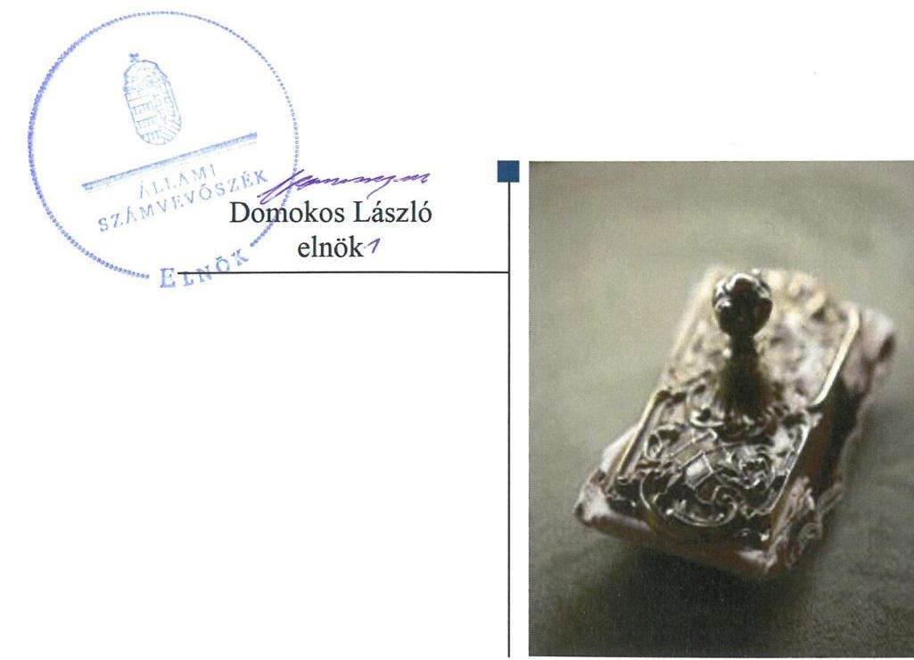
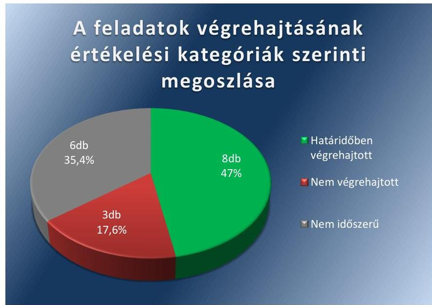
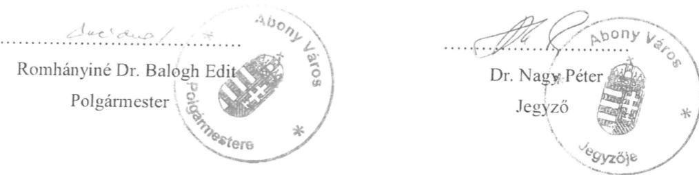
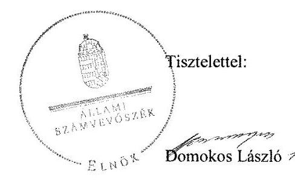

# Jelentés 

## Utóellenőrzések

Az önkormányzatok belső
kontrollrendszere kialakításának és múködtetésének ellenőrzése Abony Város Önkormányzata 2019.

---

# Jelentés 

## Utóellenőrzések

Az önkormányzatok belső
kontrollrendszere kialakításának és
működtetésének ellenőrzése -
Abony Város Önkormányzata
2019. 02. hó 01. nap

---

# AZ ELLENŐRZÉST FELÜGYELTE: 

DR. NÉMETH ERZSÉBET felügyeleti vezető 2018. november 29-ig
KAKAS SÁNDOR felügyeleti vezető 2018. november 30-tól

## AZ ELLENŐRZÉST VEZETTE ÉS A VÉGREHAJTÁSÁÉRT FELELŐS:

DÉZSINÉ KIS HAJNALKA ellenőrzésvezető

## A PROGRAM ÖSSZEÁLLÍTÁSÁÉRT FELELŐS:

TÓTPÁL SZABOLCS osztályvezető

## A TÉMÁHOZ KAPCSOLÓDÓ KORÁBBI SZÁMVEVŐSZÉKI JELENTÉSEK:

- címe: Jelentés az önkormányzatok belső kontrollrendszere kialakításának és müködtetésének ellenőrzéséről - Abony
- sorszáma: 17008

IKTATÓSZÁM: EL-1478-001/2019
TÉMASZÁM: 2460
ELLENŐRZÉS-AZONOSÍTÓ SZÁM: V080437

---

# TARTALOMJEGYZÉK 

■ ÖSSZEGZÉS ..... 5
■ AZ ELLENŐRZÉS CÉLJA ..... 6
■ AZ ELLENŐRZÉS TERÜLETE ..... 7
■ AZ ELLENŐRZÉS HÁTTERE, INDOKOLTSÁGA ..... 8
■ A JELENTÉS LÉNYEGES KÉRDÉSKÖRE ..... 9
■ AZ ELLENŐRZÉS HATÓKÖRE ÉS MÓDSZEREI ..... 10
■ MEGÁLLAPÍTÁSOK ..... 12
■ MELLÉKLETEK ..... 15
I. sz. melléklet: Abony Város Önkormányzata intézkedési terve végrehajtásának értékelése ..... 15
■ FÜGGELÉK: ÉSZREVÉTELEK ..... 21
■ RÖVIDÍTÉSEK JEGYZÉKE ..... 29

---

.

---

# ÖSSZEGZÉS 

Abony Város Önkormányzata az intézkedési tervben foglalt feladatok jelentős részét végrehajtotta, ennek eredményeként a belső kontrollrendszer szabályszerűsége javult. Ugyanakkor a közpénzek szabályszerű felhasználása érdekében a nem végrehajtott feladatok miatt további intézkedések szükségesek.

## Az ellenőrzés társadalmi indokoltsága

Az Állami Számvevőszék stratégiájában célul tűzte ki a számvevőszéki munka hasznosulásának javítását. Ezzel összhangban ellenőrzi, hogy az ellenőrzött szervezet megvalósította-e a korábbi ellenőrzései által feltárt hibák, hiányosságok és szabálytalanságok megszüntetése céljából elkészített intézkedési tervében foglaltakat. A rendszeres utóellenőrzések hozzájárulnak a szükséges intézkedések tényleges végrehajtásához, ezáltal a közpénzügyek rendezettségének javulásához.

## Főbb megállapítások, következtetések

Abony Város Önkormányzata intézkedési tervében meghatározott tizenhét feladatból nyolcat határidőben, hármat nem hajtott végre, hat feladat végrehajtása nem volt időszerű. Az Önkormányzat a jogszabályi előírások ellenére nem vezetett nyilvántartást az intézkedési tervben rögzített feladatok végrehajtásáról.

Abony Város Önkormányzata az intézkedési tervében meghatározott feladatoknak megfelelően megtette a szükséges munkajogi intézkedéseket az Állami Számvevőszék által jelzett hiányosságok vonatkozásában, továbbá felhívta a feladatellátásért felelősök figyelmét a vagyonnyilatkozatokkal kapcsolatos kötelezettségek pontos ellátására, valamint intézkedett a gazdálkodási jogkörök jogszabály szerinti betartásáról. Az integritás szemlélet érvényesítése érdekében gondoskodott az 5 millió Ft-ot elérő értékpapír szerződések adatainak közzétételéről, valamint felhívta a felelősök figyelmét a közzétételi szabályzat pontos alkalmazására. A megtett intézkedések hatására javult a belső kontrollrendszer szabályszerűsége, növelve ezzel az elszámoltathatóságot és átláthatóságot.

Abony Város Önkormányzata ugyanakkor nem intézkedett a szerződéskötések eljárásrendjének szabályozásáról, a szerződések jogi kontrollját és ellenjegyzését ellátó személyek kijelöléséről, valamint a belső kontroll szabályzat felülvizsgálatáról. A nem végrehajtott feladatok továbbra is kockázatot hordoznak a közpénzek szabályszerű felhasználása szempontjából.

---

# AZ ELLENŐRZÉS CÉLJA 

Az ellenőrzés célja annak értékelése volt, hogy a számvevőszéki jelentésben foglalt intézkedést igénylő megállapításokkal összhangban készített intézkedési tervben meghatározott feladatokat az ellenőrzött szervezet végrehajtotta-e.

---

# AZ ELLENŐRZÉS TERÜLETE 

## Abony Város Önkormányzata

Abony Pest megye délkeleti részén helyezkedik el. Abony állandó lakosainak száma 2017. január 1-jén a Központi Statisztikai Hivatal Magyarország közigazgatási helynévkönyve alapján 14475 fő volt.

Az Önkormányzat¹ 2017. évi költségvetési zárszámadásáról szóló rendelete ${ }^{2}$ alapján 2099,9 millió Ft költségvetési bevételt ért el és 1843,8 millió Ft költségvetési kiadást teljesített. A könyvviteli mérleg főösszege 2017. december 31-én 8845,5 millió Ft volt.

A Polgármester ${ }^{3}$ 2006-tól, a Jegyzó4 2018. február 15-től tölti be tisztségét.

Az ÁSZ ${ }^{5}$ az Önkormányzat belső kontrollrendszer kialakításának és müködtetésének, valamint egyes befektetési tevékenységeinek ellenőrzését 2014. január 1. és 2015. április 30. közötti időszakra vonatkozóan végzete el, és erről 2017. január 11-én hozta nyilvánosságra a 17008. számú ÁSZ jelentést.

Az ÁSZ jelentés a Polgármester részére kettő, a Jegyző részére három intézkedést igénylő javaslatot tett. Ez alapján a Polgármester az ÁSZ Elnökének megküldte az Önkormányzat 17 feladatot tartalmazó, a Képviselőtestület által 69/2017. (IV. 27.) számú határozattal jóváhagyott intézkedési tervét ${ }^{6}$.

---

# AZ ELLENŐRZÉS HÁTTERE, INDOKOLTSÁGA 

Az ÁSZ tv. ${ }^{7}$ 33. § (1) bekezdése értelmében a számvevőszéki jelentések intézkedést igénylő megállapításaihoz és javaslataihoz kapcsolódóan az ellenőrzött szervezet vezetője intézkedési tervet köteles összeállítani, és az Állami Számvevőszék részére megküldeni.

Az ÁSZ által befogadott intézkedési tervben foglaltak megvalósítását az ÁSZ tv. 33. § (7) bekezdésében foglaltak alapján - az Állami Számvevőszék utóellenőrzés keretében ellenőrizheti. Az utóellenőrzések keretében - az intézkedések értékelése során - az Állami Számvevőszék figyelembe veszi az ellenőrzött szervezetek működési feltételeiben, valamint a jogszabályi előírásokban bekövetkezett változásokat.

Az utóellenőrzés során az ÁSZ értékeli, hogy az érintett számvevőszéki jelentésben foglalt megállapításokkal és javaslatokkal összhangban, az ellenőrzött szervezet által készített intézkedési tervben meghatározott feladatokat a feladatra kijelöltek végrehajtották-e.

Az intézkedések végrehajtásával az adott terület szabályszerű múködése vonatkozásában a kockázatok csökkenhetnek, azonban hosszabb távon az intézkedési tervben foglaltak végrehajtásával önmagában nem szűnnek meg, csak akkor, ha beépülnek az ellenőrzött szervezet múködésébe, azokat folyamatosan karban tartják, figyelembe véve, illetve kezelve a változásokat. Emellett az intézkedések végrehajtásáig újabb kockázatok merülhetnek fel a szabályszerű múködés vonatkozásában, amelyek kezelése szintén kiemelten fontos az ellenőrzött szervezet számára.

Az ellenőrzött szervezet vezetője által készített intézkedési tervekben foglalt feladatok hiányos, illetve késedelmes végrehajtása, vagy annak elmaradása a szabályszerűség és a felelős vezetői magatartás vonatkozásában kockázatot hordoz, ami azt mutatja, hogy az ellenőrzések során feltárt hibák, hiányosságok és szabálytalanságok kezelése nem kapott kellő hangsúlyt. Az utóellenőrzés során is fennálló szabálytalanságok esetén a közpénz, közvagyon veszélyeztetettségi kockázat valószínűsített hatásának értékelése további intézkedéseket vonhat maga után.

Az ellenőrzött szervezet szintjén az utóellenőrzés feltárja, hogy a szervezet az intézkedések végrehajtásával hasznosította-e a korábbi ellenőrzési jelentésben a hiányosságok megszüntetése, illetve a kockázatok kezelése érdekében megfogalmazott javaslatokat, illetve az intézkedések végrehajtása elmaradásának következtében továbbra is fennálló szabálytalanság esetén értékeli a közpénzek, közvagyon veszélyeztetettségét.

Az ÁSZ szintjén az utóellenőrzés visszacsatolást ad az ellenőrzési jelentések hasznosulásáról, az intézkedések elmaradásának, vagy részleges megvalósulásának a közpénzek, közvagyon veszélyeztetettségére gyakorolt valószínűsített hatásának értékelése, további intézkedéseket vonhat maga után.

---

# A JELENTÉS LÉNYEGES KÉRDÉSKÖRE 

Az Önkormányzat az intézkedési tervben foglaltakat az elöirt határidőben végrehajtotta-e?

---

# AZ ELLENŐRZÉS HATÓKÖRE ÉS MÓDSZEREI 

## Az ellenőrzés típusa

Megfelelőségi ellenőrzés.

## Az ellenőrzött időszak

Az utóellenőrzés alapját képező ÁSZ jelentés közzétételének napjától, az ellenőrzésről szóló kiértesítő levél keltének napjáig tartó időszak, 2017. január 11-től - 2018. július 3-ig.

## Az ellenőrzés tárgya

A számvevőszéki jelentésben foglalt megállapításokkal összhangban az Önkormányzat által készített Intézkedési tervben foglaltak végrehajtásának ellenőrzése.

## Az ellenőrzött szervezet

Abony Város Önkormányzata, Abonyi Polgármesteri Hivatal.

## Az ellenőrzés jogalapja

Az ellenőrzés jogszabályi alapját az ÁSZ tv. 33. § (7) bekezdése képezi.

## Az ellenőrzés módszerei

Az ellenőrzést az ellenőrzött időszakban hatályos jogszabályok, az ellenőrzés szakmai szabályai, a jelen ellenőrzésre irányadó ÁSZ módszertanok, az ellenőrzési programban foglalt értékelési szempontok szerint, végeztük.

Az ellenőrzés ideje alatt az Önkormányzattal történő kapcsolattartást az ÁSZ SZMSZ²-ének vonatkozó előírásai alapján biztosítottuk.

Az utóellenőrzés megállapításait az ÁSZ rendelkezésére álló, valamint az ÁSZ adatbekérése szerint, az Önkormányzat által rendelkezésre bocsátott dokumentumok alapozták meg.

Az ellenőrzési bizonyítékként felhasználható adatforrások közé tartoztak egyrészt az ellenőrzési program részletes szempontjainál felsorolt adatforrások, másrészt minden az ellenőrzés folyamán feltárt, az ellenőrzés szempontjából információt tartalmazó dokumentum.

---

Az intézkedési tervekben előírt feladatokat azok végrehajthatósága, illetve végrehajtása szempontjából az alábbiak szerint értékeltük:
$\longrightarrow$ „határidőben végrehajtott" a feladat, ha a teljesítés dokumentáltan, az intézkedési tervben előírt határidőben és tartalommal megtörtént;
$\longrightarrow$ „határidőn túl végrehajtott" a feladat, ha annak teljesítése az intézkedési tervben meghatározott módon, de az előírt határidőn túl történt meg;
$\longrightarrow$ „részben végrehajtott" a feladat, ha végrehajtása teljes körűen az intézkedési tervben előírt módon nem történt meg;
$\longrightarrow$ „nem végrehajtott" a feladat, ha a végrehajtás nem történt meg, vagy amennyiben a teljesítést nem dokumentálták;
$\longrightarrow$ „okafogyottá vált" a feladat, ha végrehajtására - meghatározott esemény bekövetkezése, továbbá külső körülmény, a múködést érintő feltétel változása miatt - már nincs szükség, illetve lehetőség, és egyértelműen megállapítható, hogy az intézkedést szükségessé tevő körülmény a jövőben nem fordulhat elő;
$\longrightarrow$ „nem időszerü" az a feladat, amelynek ellenőrzési időszakon belüli végrehajtására azért nem került (kerülhetett) sor, mert az intézkedés alapjául szolgáló esemény nem következett be, de annak jövőbeni előfordulása lehetséges, a végrehajtása nem volt esedékes, vagy a végrehajtás határideje még nem járt le.
Az ellenőrzés lefolytatásához az Önkormányzat a tanúsítványok elektronikus kitöltésével, valamint az ÁSZ által kért dokumentumok elektronikus megküldésével szolgáltatott adatokat, amelyek valódiságát és teljes körűségét az ellenőrzött szervezet vezetője által tett teljességi és hitelességi nyilatkozat igazolja. Az így rendelkezésre bocsátott adatok, információk kontrollja az ellenőrzés keretében megtörtént. Az ellenőrzött szervezet által megküldött intézkedési tervben meghatározott, ÁSZ által beazonosított feladatok a I. számú mellékletben kerültek bemutatásra.

---

# MEGÁLLAPÍTÁSOK 

## Az Önkormányzat az intézkedési tervben foglaltakat az előírt határidőben végrehajtotta-e?

Összegző megállapítás

Az Önkormányzat az intézkedési tervben szereplő 17 feladatból nyolcat határidőben, három feladatot nem hajtott végre és hat feladat végrehajtása nem volt időszerű. Az intézkedési tervben meghatározott feladatok végrehajtásáról a jogszabályban előírt nyilvántartást nem vezették.

Az Önkormányzat az intézkedési tervében a pénzügyi és belső kontroll szerinti elszámoltathatóság, valamint az integritás szemlélet érvényesítése érdekében vállalt feladatait teljesítette. A szabályozottság biztosítására tervezett intézkedéseit nem hajtotta végre, valamint a szabályszerű vagyongazdálkodással kapcsolatos feladatok végrehajtása nem volt időszerű az ellenőrzött időszakban.

A feladatokat, határidőket, megjelölt felelősöket és a feladatok végrehajtását az I. sz. melléklet mutatja be.

A jegyző nem gondoskodott az intézkedési tervben meghatározott feladatok végrehajtásának Bkr. ${ }^{9} 14 . \S$ (1) bekezdés előírása szerinti nyilvántartásáról.

Az Önkormányzat intézkedési tervében vállalt feladatok végrehajtásának értékelését az 1. ábra szemlélteti.

1. ábra

Fonrás: ÁSZ

---

A PÉNZÜGYI ELSZÁMOLTATHATÓSÁG javult, mert a Jegyző nyilatkoztatta a teljesítésigazolásban és érvényesítésben érintett munkavállalókat az Ávr. ${ }^{10}$-nek megfelelő, hatályos Gazdálkodási Szabályzat ${ }^{11}$ megismeréséről és a munkavégzés során történő betartásáról. A Jegyző felhívta a kötelezettségvállalásra és a pénzügyi ellenjegyzésre jogosultak figyelmét, hogy a számlaszerződés az Áht. ${ }^{12}$ rendelkezésével összhangban akkor is kötelezettségvállalásnak minősül, ha a számla létrehozása pénzügyi ellentételezést nem igényel.

A SZABÁLYOZOTTSÁG területét tekintve a Polgármester nem intézkedett a szerződéskötések eljárási rendjét szabályozó utasítás kibocsátásáról, valamint a szerződések jogi kontrollját és ellenjegyzését ellátó személyek kijelöléséről. A Jegyző nem vizsgálta felül a Belső Kontroll Szabályzat integrált kockázatkezelési rendszerre vonatkozó szabályait oly módon, hogy a kockázatelemzés körébe az önkormányzat befektetési tevékenységével kapcsolatos kockázatok felmérése is szerepeljen.

# A BELSŐ KONTROLL SZERINTI ELSZÁMOLTATHATÓSÁG erősítése érdekében a Polgármester és a Jegyző kivizsgáltatta az ÁSZ által feltárt hiányosságok vonatkozásában érintett dolgozók munkajogi felelősségét, és megtették a szükséges intézkedéseket, valamint a Jegyző felhívta az érintettek figyelmét a vagyonnyilatkozatokkal kapcsolatos feladatok pontos ellátására. A Jegyző felhívta a belső ellenőrzés vezetőjének figyelmét a belső ellenőrzési jelentések jogszabály szerinti formai követelményeinek betartására.

AZ INTEGRITÁS szemlélet érvényesítése érdekében a Jegyző a jogszabályi előírásnak megfelelően gondoskodott az 5 millió Ft-ot elérő értékpapír szerződések adatainak közzétételéről az Önkormányzat honlapján. A Gazdasági Osztály ${ }^{13}$ megbízott vezetője felhívta a közzétételi kötelezettség teljesítésért felelős munkatársak figyelmét a Közzétételi Szabályzatban rögzített kötelezettségeik pontos betartására.

---

.

---

# MELLÉKLETEK

■ I. SZ. MELLÉKLET: ABONY VÁROS ÖNKORMÁNYZATA INTÉZKEDÉSI TERVE VÉGREHAJTÁSÁNAK ÉRTÉKELÉSE

|  5. | Az intézkedési tervben meghatározott feladat | Az intézkedési tervben meghatározott határidő | Az intézkedési tervben meghatározott felelős | A feladat végrehajtása  |
| --- | --- | --- | --- | --- |
|   | 1. | 2. | 3. | 4.  |
|   |  | Határidőben végrehajtott feladatok |  |   |
|  1. | „A munkajogi felelősség körülményeinek kivizsgálására belső ellenőrzési vizsgálatot kell elrendelni és lefolytatni. A belső ellenőrzés megállapításainak ismeretében kell mérlegelni a munkajogi felelősség kérdését és meghatározni a szükséges intézkedéseket." | 2017. április 30. | polgármester | A munkajogi felelősség körülményeinek kivizsgálásáról szóló belső ellenőrzési jelentést 2017. március 28-án elkészítették. A Polgármester nem találta megalapozottnak munkajogi felelősség felvetését.  |
|  2. | „A Vnytv. 10. § (1) bekezdés szerinti felhívás kibocsátása megtörtént, annak sikere esetén további intézkedés nem szükséges. Fel kell hívni a vagyon-nyilatkozatok kezelését végző munkatárs, valamint a feladatellátásáért felelős Hatósági és Szociális Ügyek Osztálya vezetőjének figyelmét a vagyonnyilatkozat tételre vonatkozó kötelezettség teljesítésével kapcsolatos feladatok ellátására." | 2017. április 30. | jegyző | A Hatósági és Szociális Ügyek Osztálya vezetője felhívta a kötelezettet a vagyonnyilatko-zat-tételi kötelezettség teljesítésére a Vnytv ${ }^{14}$. 10. § (1) bekezdésében foglaltak szerint.  |
|  3. | „A teljesítésigazolást az Avr. 57. § (1-3) bekezdésében, valamint a belső szabályzatba foglalt előírásoknak megfelelően kell ellátni." | 2017. április 30. azt követően folyamatos | osztályvezetői feladatok ellátásával megbízott gazdasági ügyintéző Gazdasági osztály | A Jegyző 2017. január 16-án felhívta az érintettek figyelmét a vagyonnyilatkozat tételre vonatkozó kötelezettség teljesítésével kapcsolatos feladatok pontos ellátására.  |
|   |  |  |  | A Jegyző nyilatkoztatta az érintett vezetőket és gazdasági ügyintézőket, hogy az Önkormányzat hatályos, az Ávr.57.§ (1)-(5) bekezdéseinek megfelelő Gazdálkodási Szabályzatát megismerték és a munkájuk során kötelesek végrehajtani. A Gazdasági osztályvezetői feladatok ellátásával megbízott gazdasági ügyintéző felhívta a Gazdasági osztály munkatársainak figyelmét 2017. március 6-án, hogy a teljesítés igazolására jogosultaknak kötelezettségük a Gazdálkodási Szabályzatban foglalt előírásokat a munkavégzésük során betartani.  |

---

|  4. | "Az érvényesítés során a jogszabályok és belső szabályzatok betartásának ellenőrzését teljes körűen kell végezni, annak keretében vizsgálni kell a teljesítésigazolás szabályosságát az Ávr. 58. § (1) bekezdése alapján; az utalványrendeleten a kötelezettségvállalás nyilvántartási számának feltüntetését az az Ávr. 58. § (2) bekezdése alapján, a kiadás egységes rovatrend és kormányzati funkció szerinti számának pontos feltüntetését az Ávr. 59. § (3) bekezdés e) pontja alapján. Kifogásolni szükséges, ha az Ávr. 56. § (1) bekezdésében foglaltak ellenére a kötelezettségvállalást nem vették nyilvántartásba, továbbá az Ávr. 58. § (2) bekezdésbe rögzített jogszabályok alapján jelezni kell az utalványozó felé, ha az Ávr. 58. § (1) bekezdésben rögzített jogszabályok, szabályzatok megsértését tapasztalja." | 2017. április 30. azt követően folyamatos | osztályvezetői feladatok ellátásával megbízott gazdasági ügyintéző Gazdasági osztály | A Jegyző nyilatkoztatta az érintett vezetőket és gazdasági ügyintézőket, hogy az Önkormányzat hatályos, az Ávr. 58. § (1)-(6), az Ávr. 56. § (1) és az Ávr. 59. § (3) bekezdéseinek megfelelő Gazdálkodási Szabályzatát megismerték és a munkájuk során kötelesek végrehajtani. A Gazdasági osztályvezetői feladatok ellátásával megbízott gazdasági ügyintéző felhívta a Gazdasági osztály munkatársainak figyelmét 2017. március 6-án arra, hogy az érvényesítésre jogosultaknak kötelezettségük a Gazdálkodási Szabályzatban foglalt előírásokat a munkavégzésük során betartani.  |
| --- | --- | --- | --- | --- |
|  5. | A. „Gondoskodni kell a javaslatban megjelölt, 5 millió Ft-ot meghaladó értékpapír szerződések vonatkozó adatainak közzétételéről a Közzétételi szabályzatban foglaltak szerint." | 2017. április 30. azt követően folyamatos | osztályvezetői feladatok ellátásával megbízott gazdasági ügyintéző – Gazdasági osztály | A Gazdasági osztály osztályvezetői feladatok ellátásával megbízott gazdasági ügyintéző gondoskodott az Info. tv.^{15} 1. melléklet III./4. pont előírása szerint az 5 millió Ft-ot elérő vagy azt meghaladó értékpapír szerződések közzétételéről az Önkormányzat honlapján.  |
|   | B. " Fel kell hívni a közzétételi kötelezettség teljesítéséért felelős munkatársak figyelmét a Közzétételi szabályzatban rögzített kötelezettségeik pontos betartására." | 2017. április 30. azt követően folyamatos | osztályvezetői feladatok ellátásával megbízott gazdasági ügyintéző – | A Gazdasági osztály osztályvezetői feladatok ellátásával megbízott gazdasági ügyintéző 2017. március 6-án felhívta Gazdasági osztály munkatársainak figyelmét arra, hogy az Abony Város Önkormányzat hivatalos honlapjának közzétételi szabályzatában foglaltakat a munkavégzés során pontosan tartsák be.  |
|  6. | "Fel kell hívni a kötelezettségvállalásra, illetve, annak pénzügyi ellenjegyzésre jogosultak figyelmét arra, hogy a számlaszerződés akkor is pénzügyi ellenjegyzést igénylő kötelezettségvállalásnak minősül, ha a számla létrehozása pénzügyi ellentételezést nem igényel." | 2017. április 30. azt követően folyamatos | jegyző | A Jegyző – a Gazdasági osztály osztályvezetői feladatok ellátásával megbízott gazdasági ügyintézőn keresztül – felhívta a kötelezettségvállalásra és pénzügyi ellenjegyzésre jogosultak figyelemét, hogy a számlaszerződés akkor is pénzügyi ellenjegyzést igénylő kötelezettségvállalásnak minősül, ha a számla létrehozása pénzügyi ellentételezést nem igényel az Áht. rendelkezésével összhangban.  |
|  7. | " Fel kell hívni a belső ellenőrzési vezető figyelmét a belső ellenőrzési dokumentumokra vonatkozó formai követelmények érvényesülésének ellenőrzésére és betartására." | 2017. április 30. | jegyző | Jegyző felhívta a belső ellenőrzési vezető figyelmét 2017. március 16-án arra, hogy a belső ellenőri jelentéseken az ellenőrzésben közreműködő ellenőrök aláírásai szerepeljenek a Bkr. 39. § (3) bekezdés m) pontjának megfelelően.  |

---

|  Az intézkedési tervben meghatározott feladat | Az intézkedési tervben meghatározott határidő | Az intézkedési tervben meghatározott felelős | A feladat végrehajtása  |
| --- | --- | --- | --- |
|  1. | 2. | 3. | 4.  |
|  8. A. „A munkajogi felelősség körülményeinek kivizsgálására vezetői ellenőrzést kell lefolytatni." | 2017. április 30. | osztályvezetői feladatok ellátásával megbízott gazdasági ügyintéző Gazdasági osztály | A Gazdasági osztály osztályvezetői feladatok ellátásával megbízott gazdasági ügyintéző a munkajogi felelősség körülményeit kivizsgálta, a lefolytatott ellenőrzésről 2017. április 3-án jelentést készített.  |
|  B. „A vezető ellenőrzés megállapításainak ismeretében kell mérlegelni a munkajogi felelősség kérdését és meghatározni a szükséges intézkedéseket." | 2017. április 30. | jegyző | A Jegyző mérlegelte a vezetői ellenőrzés megállapításai alapján a munkajogi felelősség kérdését 2017. április 27-i feljegyzésében. A vezetői ellenőrzés során feltárt szabálytalanságok alapján két dolgozóval szemben fegyelmi eljárás keretében fegyelmi bírság került kiszabásra, két dolgozó közszolgálati jogviszonya megszűnt, további két dolgozó esetében figyelem felhívással élt.  |
|  Nem végrehajtott feladatok |  |  |   |
|  9. " Az önkormányzat nevében a polgármester által kötendő valamennyi szerződés esetében - a pénzügyi ellenjegyzés mellett - alkalmazni kell a szerződések jogi ellenjegyzésének intézményét, azaz a szerződés aláírására, csak a pénzügyi és jogi ellenjegyzés követően kerülhet sor.
Ennek keretében polgármesteri-jegyzői közös utasítás kibocsátásával szabályozni kell a szerződéskötések eljárási rendjét, valamint ki kell jelölni a szerződések jogi kontrollját és ellenjegyzését ellátó személyeket." | 2017. április 30. azt követően folyamatos | polgármester | A Polgármester nem intézkedett a szerződéskötések eljárási rendjét szabályozó utasítás kibocsátásáról, valamint a szerződések jogi kontrollját és ellenjegyzését ellátó személyek kijelöléséről.  |
|  10. „A Magyar Nemzeti Levéltár, és a Pest Megyei Kormányhivatal egyetértése nélkül alkalmazni rendelt Iratkezelési Szabályzatot leváltó, az egyetértési joggal rendelkezők részére 2015. október 19. napján megküldött Iratkezelési Szabályzat kibocsátására, csak a Magyar Nemzeti Levéltár, és a Pest Megyei Kormányhivatal egyetértésének bevárását követően kerülhet sor." | az egyetértő nyilatkozatok beérkezését követő 3 munkanapon belül | jegyző | Az Ltv. ${ }^{16} 10 . \S$ (1) bekezdés c) pontja ellenére a Jegyző a Magyar Nemzeti Levéltár és a Pest Megyei Kormányhivatal egyetértését megelőzően adta ki az Iratkezelési Szabályzatot, mely 2016.június 1-én lépett hatályba. A Magyar Nemzeti Levéltár 2016. október 20-án, a Pest Megyei Kormányhivatal 2017. január 16-án hagyta jóvá a szabályzatot.  |
|  11. " Felül kell vizsgálni a Belső Kontroll Szabályzat integrált kockázatkezelési rendszerre vonatkozó szabályait oly módon, hogy a kockázatelemzés körébe az önkormányzat befektetési tevékenységével kapcsolatos kockázatok felmérése is szerepeljen." | 2017. április 30. azt követően folyamatos | jegyző | A Jegyző nem vizsgálta felül a Belső Kontroll Szabályzat integrált kockázatkezelési rendszerre vonatkozó szabályait oly módon, hogy a kockázatelemzés körébe az önkormányzat befektetési tevékenységével kapcsolatos kockázatok felmérése is szerepeljen.  |

---

|  12. | „A kötvények bekerülési értékének megállapítása a Számv. tv. 50. § (3) bekezdése, a Számv. tv. 61. § (1) bekezdése, az Áhsz. 2 1. § 7. pontja, valamint az Áhsz.2. 16. § (6) bekezdése előírásai alapján történjen." | 2017. április 30. azt követően folyamatos | 2017. április 30. azt követően folyamatos | 2017. április 30. azt követően folyamatos  |
| --- | --- | --- | --- | --- |
|  13. | „A fogatási célú hitelviszonyt megtestesítő értékpapírok analitikus nyilvántartása - az Áhsz. 2 5. § (1) bekezdés előírásai alapján kell végezni." | 2017. április 30. azt követően folyamatos | 2017. április 30. azt követően folyamatos | 2017. április 30. azt követően folyamatos  |
|  14. | " A forgatási célú hitelviszonyt megtestesítő értékpapírok analitikus nyilvántartásában rögzítsék az egyedi értékeléshez szükséges valamennyi adatot (vételár, lejárat, névérték), az értékpapírok hozamait. Alkalmazzák az Áhsz. 2 14. melléklet VIII. 1. a-e), g-j) pontjaiban foglaltakat." | 2017. április 30. azt követően folyamatos | 2017. április 30. azt követően folyamatos | 2017. április 30. azt követően folyamatos  |
|  15. | „Az államkötvény és vállalati kötvény tranzakciókhoz kapcsolódó könyvelés során figyelembe kell venni - a jelenleg a kérdéskört szabályozó - Áhsz. 2 1. § (1) 7. pontját, Áhsz. 2 15. melléklet rovatrend előírásait (K3 Dologi kiadások) továbbá a 38/2013. (IX. 19.) NGM rendelet 1. melléklet IV. Fejezet C) pontját." | 2017. április 30. azt követően folyamatos | 2017. április 30. azt követően folyamatos | 2017. április 30. azt követően folyamatos  |
|  16. | „A forgatási célú értékpapír vásárlásához és értékesítéséhez kapcsolódó könyvelés az Áhsz. 2 27. § (1) bekezdésében, (3) bekezdés a) pontjában, (5) bekezdésében, (6) bekezdés a) pontjában foglaltaknak megfelelően történjen. tartsák be az Áhsz. 2 27. § (4) bekezdés d) pontjának megfelelően végezzék." | 2017. április 30. azt követően folyamatos | 2017. április 30. azt követően folyamatos | 2017. április 30. azt követően folyamatos  |

---

|  1. | Az intézkedési tervben meghatározott feladat | Az intézkedési tervben meghatározott határidő | Az intézkedési tervben meghatározott felelős | A feladat végrehajtása  |
| --- | --- | --- | --- | --- |
|  17. | „A szabad pénzeszközök lekötött betétként való elhelyezését és annak megszüntetését mutassák ki a finanszírozási kiadások és bevételek között az Áhsz. 2 40. § (1) bekezdés és az Áhsz. 2 15. mellékletének a K916 és a 8817. rovatokhoz tartozó előírások alapján." | 2017. április 30. azt követően folyamatos | osztályvezetői feladatok ellátásával megbízott gazdasági ügyintéző Gazdasági osztály | Az Önkormányzat nem rendelkezett lekötött betéttel az ellenőrzött időszakban, ezért a feladat végrehajtása nem volt időszerű.  |

---

.

---

# FÜGGELÉK: ÉSZREVÉTELEK 

A jelentéstervezetet a Számvevőszék 15 napos észrevételezésre megküldte az ellenőrzött szervezet vezetőjének az ÁSZ tv. 29. §* (1) bekezdése előírásának megfelelően.

Abony Város Önkormányzatának polgármestere és az Abonyi Polgármesteri Hivatal jegyzője a jelentéstervezet megállapításaira közös dokumentumba foglalt írásbeli észrevételt tett. Az ÁSZ tv. 29. § (3) bekezdésével összhangban az ÁSZ a Függelékben feltünteti az ellenőrzés megállapításaival kapcsolatban tett, figyelembe nem vett észrevételeket, és megindokolja, hogy azokat miért nem fogadta el.

[^0]
[^0]:    * 29. § (1) Az Állami Számvevőszék az ellenőrzési megállapításait megküldi az ellenőrzött szervezet vezetőjének vagy az általa megbízott személynek, és annak, akinek személyes felelősségét állapította meg.
    (2) Az ellenőrzött szervezet vezetője és a felelősként megjelölt személy az ellenőrzés megállapításaira tizenöt napon belül írásban észrevételt tehet.
    (3) Az Állami Számvevőszék az észrevételre a beérkezésétől számított harminc napon belül írásban válaszol. A figyelembe nem vett észrevételeket köteles a jelentésben feltüntetni, és megindokolni, hogy azokat miért nem fogadta el.

---

Polgármesterétól és Jegyzőjétől
H-2740 Abony
Kossuth tér 1.

Telefon: (53) 360-135
Fax: (53) 360-064
E-mail: abony@abony.hu
ikt.sz.: $\mathrm{FH} / 443-4 / 2048$

2018.11.29-én kelt Számvevőszéki jelentéstervezet, Utóellenőrzések, Az önkormányzatok belső kontrollrendszere kialakításának és müködtetésének ellenőrzése -Abony Város Önkormányzata 2018 tárgyban (iktsz.: EL-0776-031/2018)

Abony Város Önkormányzata nevében az alábbi

# Észrevételt tesszük 

1. Az önkormányzat nevében kötendő szerződések tekintetében a pénzügyi és jogi ellenjegyzés a Polgármesteri-Jegyzói közös utasításban teljes mértékben szabályozott, a jogosultak az utasítás mellékletében feltüntetésre kerültek, az utasítás megismerési záradékkel ellátott. Sajnálatos módon az ÁSZ elektronikus felületére feltöltésre nem a nyilatkozattal kiegészített változat került, így azon a kollégák aláírásai nem szerepeltek. Részünkről történt ekkor az adminisztratív hiba. Abony Város Képviselő Testülete döntésével jóváhagyta az intézkedési tervet, a jóváhagyás után minden érdekelt személyesen, aláírásával látta el az utasítást. Az utasítás mai napig hatályban van, aktualizálása folyamatos.
2. Iratkezelési Szabályzat tekintetében a kronológia az alábbiakban történt meg, amely miatt késedelmek történtek a hatályba léptetéssel kapcsolatosan:

- Az Iratkezelési Szabályzat elbírálás céljából 2015. június 10. napján kelt levelünkkel megküldésre került a Pest Megyei Kormányhivatal részére, melyet 2015. június 17. napján vettek át.
- 2015. augusztus 26. napján levélben kerestük meg a Pest Megyei Kormányhivatalt, illetve a Magyar Nemzeti Levéltár Pest Megyei Levéltárát az iratkezelési szabályzat elfogadásával kapcsolatban.
- A Magyar Nemzeti Levéltár Pest Megyei Levéltára 2015. szeptember 03. napján kelt és általunk 2015. szeptember 15-én átvett levelükben tájékoztatást küldött, miszerint a Pest Megyei Kormányhivataltól még nem kapták meg az iratkezelési szabályzatunkat, és

---

kérték, hogy elektronikus úton továbbítsuk részükre, áttekintés után tovább küldik a Pest Megyei Kormányhivatal részére.

- 2015. szeptember 18-án kelt levelünkkel az iratkezelési szabályzatot elektronikus úton elküldtük a Levéltár részére.
- 2015. szeptember 30. napján elektronikus úton, majd 2015. október 05. napján postai úton érkezett levelében a Pest Megyei Kormányhivatal Jogi és Koordinációs Főosztálya megküldte az Abonyi Polgármesteri Hivatal Iratkezelési Szabályzatának véleményezését és egyben javaslataikat.
- A javaslatnak megfelelően kiegészített iratkezelési szabályzatot 2015. október 19. napján kelt levelünkkel továbbítottuk a Pest Megyei Levéltár részére, melyet 2015. október 22-én átvettek.
- 2016. február 03-án postai úton megkerestük a Pest Megyei Levéltárat és kértük tájékoztatásukat, hogy az általunk megküldött iratkezelési szabályzat jóváhagyásra került-e részükről.
- 2016. február 10. napján kelt levelében a Levéltár leírta, hogy a szabályzatot 2015. október 29-én tovább küldték a Pest Megyei Kormányhivatal Ügyviteli Osztályának jóváhagyás céljából, azonban még nem érkezetek vissza részükre.
- A Pest Megyei Kormányhivatal Jogi és Koordinációs Főosztálya 2016. május 04. napján elektronikus levélben küldte meg azon módosítási javaslatokat, melyet a Pest Megyei Levéltár javasolt.
- 2016. május 05. napján kelt a kért átvezetésekkel módosított szabályzatot ismételten továbbítottuk a Pest Megyei Kormányhivatal részére.
- A Kormányhivatal 2016. május 31-én elektronikus levélben kereste meg Hivatalunkat azzal, hogy tájékoztassuk az iratkezelési szabályzat hatályba lépésének napjáról.
- 2016. május 31-én megküldtük, hogy 2016. június 01. napjától kívánjuk a szabályzatot hatályba léptetni.
- 2016. szeptember 05-én e-mail útján fordultunk a Kormányhivatal felé, miszerint 2016. május 05-én megküldtük részükre a kért módosításokkal és aláírásokkal ellátott iratkezelési szabályzatot, azonban a megkeresés napjáig nem küldték vissza részünkre.
- A Pest Megyei Kormányhivatal a jóváhagyott szabályzatot 2017. január 16. napján kelt levelében továbbította részünkre, melyet 2017. január 20-án vettünk át.
- A fentiek alátámasztják, hogy a mulasztás nem a részünkről történt.

3. Belső Kontroll Szabályzat tekintetében a szabályzatunk hatályban volt az ÁSZ vizsgálat idején is. Az Állami Számvevőszék javaslatára felülvizsgálata megtörtént, dokumentálása az ellenőrzés keretében megküldésre került. A Belső kontrollrendszer 4. sz. melléklete a Pénzügyi kockázatok fejezetében kiegészült egy „Átmenetileg szabad pénzeszközök elhelyezése" táblázattal. A táblázat valószínúsíthetően általánosan fogalmazott, felülvizsgálata ismételten megtörtént és konkrét megfogalmazásokat építettünk be, javasolt intézkedésekkel, felelős megnevezéssel és magának a tevékenységnek a kötelező felülvizsgálati elemével. A táblázat az előírásoknak megfelelően „A befektetési tevékenységgel kapcsolatos kockázatok felmérése" megnevezéssel került be a kontrollrendszerbe.

---

Kérjük a Tisztelt Állami Számvevőszéket észrevételeink szíves elfogadására.

Melléklet: - Polgármesteri - Jegyzői Közös Utasítás másolata

- Belső kontroll Szabályzat 4. sz. mellékletének Pénzügyi kockázatok fejezete „A befektetési tevékenységgel kapcsolatos kockázatok felmérése táblázata"

Kelt, Abony, 2018.év,12.hónap,11.napján

---

ELNÖK

Ikt.szám: EL-0776-035/2018.

# Romhányiné dr. Balogh Edit 

polgármester
Abony Város Önkormányzata

## Abony

## Tisztelt Polgármester Úrhölgy!

Az Utóellenörzések - Az önkormányzatok belső kontrollrendszere kialakításának és müködtetésének ellenörzése - Abony Város Önkormányzata címmel készített számvevőszéki jelentéstervezetre tett észrevételeit megkaptam.
Az Állami Számvevőszék észrevételekre vonatkozó álláspontjáról a felügyeleti vezető által készített részletes tájékoztatást csatoltan megküldőm. Tekintettel az Abonyi Polgármesteri Hivatal jegyzőjével közösen benyújtott észrevételére, jelen levél mellékletét egyidejűleg megküldjük a Jegyző úr részére.
Tájékoztatom Polgármester úrhölgyet, hogy a számvevőszéki jelentésben - az Állami Számvevőszékről szóló 2011. évi LXVI. törvény 29. § (3) bekezdése alapján - a figyelembe nem vett észrevételeket szerepeltetjük az elutasítás indokának feltüntetésével.

Budapest, 2019. 01 hó 07 nap

Melléklet: Tájékoztatás az észrevételek kezeléséről

---

# Tájékoztatás az észrevételek kezeléséről 

Az Utóellenörzések - Az önkormányzatok belső kontrollrendszere kialakításának és müködtetésének ellenörzése - Abony Város Önkormányzata címü jelentéstervezetre a PH/113-4/2018. ikt. számú levélben megküldött észrevételeit áttekintettem. Az észrevételek kezeléséről az alábbi tájékoztatást adom.

## 1.) A jelentéstervezet 13. oldal 2. bekezdéséhez és az I. sz. melléklet 9. pontjához tett észrevétel kapcsán

Polgármester úrhölgy és Jegyző úr észrevételében kifejtette, hogy a szerződéskötések tekintetében a pénzügyi és jogi ellenjegyzés a polgármester és jegyző által kiadott közös utasításban szabályozott, amelynek mellékletében a jogosultak feltüntetésre kerültek.

Az Állami Számvevőszékről szóló 2011. évi LXVI. törvény (továbbiakban: ÁSZ. tv.) 33. § (7) bekezdése alapján az Állami Számvevőszék (továbbiakban: ÁSZ) az utóellenőrzés keretében az intézkedési tervben foglaltak megvalósítását ellenőrzi. Az alpolgármester 2018. október 2-án kelt teljességi és hitelességi nyilatkozata alapján az ÁSZ részére a Szerződéskötések eljárási rendjeként a 2017. június 1-tól hatályos Gazdálkodási szabályzatot küldték meg, az észrevételben hivatkozott Polgármesteri-jegyzői közös utasítás átadására nem került sor. Az ÁSZ az ellenőrzési megállapításait az adatszolgáltatás során rendelkezésre bocsátott dokumentumokra alapozva fogalmazza meg. Az alpolgármester 2018. október 2-án kelt teljességi és hitelességi nyilatkozatában kijelentette, hogy az ÁSZ részére átadott dokumentumok, adatok megbízhatóak, és a bekért adatokra, dokumentumokra vonatkozóan teljes körü információt tartalmaznak. Továbbá a teljességi, hitelességi nyilatkozatban az átadott dokumentumok, adatok hitelességéért, valódiságáért és hiánytalanságáért teljes felelősséget vállalt. Ezért az észrevételhez pótlólag megküldött dokumentumokat az ÁSZ nem értékeli, amelyre tekintettel az észrevételét nem fogadom el, a jelentéstervezet módosítása nem indokolt.

## 2.) A jelentéstervezet I. sz. melléklet 10. pontjához tett észrevétel kapcsán

Polgármester úrhölgy és Jegyző úr észrevételében részletesen ismertette az Iratkezelési szabályzat egyeztetésének körülményeit.
Az észrevétel megerősíti, hogy az Iratkezelési szabályzat kiadására az illetékes levéltár és kormányhivatal egyetértését megelőzően került sor, amelyre tekintettel az észrevételt nem fogadom el, a jelentéstervezet módosítása nem indokolt.

---

# 3.) A jelentéstervezet 13. oldal 2. bekezdéséhez és az I. sz. melléklet 11. pontjához tett észrevétel kapcsán 

Polgármester úrhölgy és Jegyző úr észrevételében jelezte, hogy a Belső kontrollrendszer szabályzat 4. számú melléklete a pénzügyi kockázatok fejezetében kiegészült egy „átmenetileg szabad pénzeszközök elhelyezése" táblázattal.

Az ÁSZ az ellenőrzési megállapításait az adatszolgáltatás során rendelkezésre bocsátott dokumentumokra alapozva fogalmazza meg. Az alpolgármester 2018. október 2-án kelt teljességi és hitelességi nyilatkozata alapján az ÁSZ részére a „Befektetési tevékenység kockázatai felmérése" címszó alatt az Eszközök és források értékelési szabályzatát küldték meg, és nem az észrevételben hivatkozott „Belső Kontroll Szabályzatot". Az alpolgármester 2018. október 2-án kelt teljességi és hitelességi nyilatkozatában kijelentette, hogy az ÁSZ részére átadott dokumentumok, adatok megbízhatóak, és a bekért adatokra, dokumentumokra vonatkozóan teljes körű információt tartalmaznak. Továbbá a teljességi, hitelességi nyilatkozatban az átadott dokumentumok, adatok hitelességéért, valódiságáért és hiánytalanságáért teljes felelősséget vállalt. Ezért az észrevételhez pótlólag megküldött dokumentumokat az ÁSZ nem értékeli, amelyre tekintettel az észrevételét nem fogadom el, a jelentéstervezet módosítása nem indokolt.

Budapest, 2019. 01 hó 0 ? nap

Kakas Sándor felügyeleti vezető

---

.

---

# RÖVIDÍTÉSEK JEGYZÉKE 

${ }^{1}$ Önkormányzat
${ }^{2}$ 2017. évi zárszámadás rendelet
${ }^{3}$ Polgármester
${ }^{4}$ Jegyző
${ }^{5}$ ÁSZ
${ }^{6}$ Intézkedési terv
${ }^{7}$ ÁSZ tv.
${ }^{8}$ ÁSZ SZMSZ
${ }^{9}$ Bkr.
${ }^{10}$ Ávr.
${ }^{11}$ Gazdálkodási szabályzat
${ }^{12}$ Áht.
${ }^{13}$ Gazdasági osztály
${ }^{14}$ Vnytv.
${ }^{15}$ Info tv.
${ }^{16}$ Ltv.

Abony Város Önkormányzata
Abony Város Önkormányzat Képviselő-testületének 19/2018. (V.31.) önkormányzati rendelete az önkormányzat 2017. évi költségvetési zárszámadásáról és a 2017. évi maradvány jóváhagyásáról
Abony Város Önkormányzatának Polgármestere
Abony Város Önkormányzatának jegyzője
Állami Számvevőszék
Abony Város Önkormányzat Képviselő-testületének 69/2017. (IV.27.) számú Képviselő-testületi határozat az Állami Számvevőszék „Az önkormányzatok belső kontrollrendszere kialakításának és müködtetésének ellenőrzése - Abony 2017." című jelentése alapján készült intézkedési terv kijavításáról, kiegészítéséről
Az Állami Számvevőszékről szóló 2011. évi LXVI. törvény
Az Állami Számvevőszék Szervezeti és Működési Szabályzata
A költségvetési szervek belső kontrollrendszeréről és belső ellenőrzéséről szóló 370/2011. (XII. 31.) Korm. rendelet
Az államháztartásról szóló törvény végrehajtásáról szóló 368/2011. (XII. 31.) Korm. rendelet
Abonyi Polgármesteri Hivatal Gazdálkodási szabályzata
Az államháztartásról szóló 2011. évi CXCV. törvény
Abonyi Polgármesteri Hivatala Gazdasági Osztálya
Az egyes vagyonnyilatkozat-tételi kötelezettségekről szóló 2007. évi CLII. törvény
Az információs önrendelkezési jogról és az információszabadságról szóló 2011. évi CXII. törvény
a köziratokról, a közlevéltárakról és a magánlevéltári anyagok védelméről szóló 1995. évi LXVI. törvény

---

# ÁLLAMI SZÁMVEVŐSZÉK 

1052 Budapest, Apáczai Csere János utca 10.
Levélcím: 1364 Budapest 4. Pf. 54
Telefon: +36 14849100 Telefax: +36 14849200
www.asz.hu