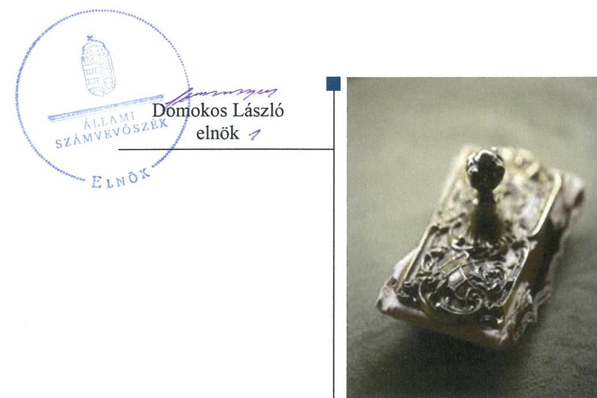
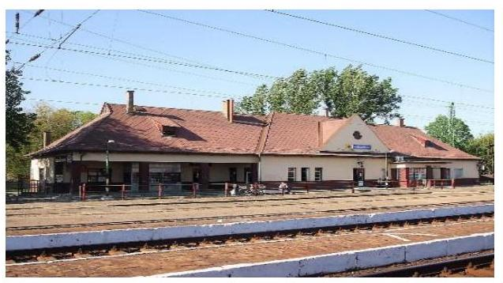
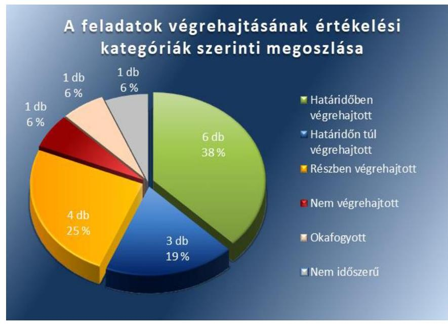
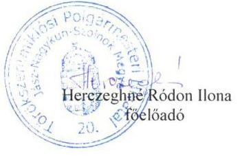
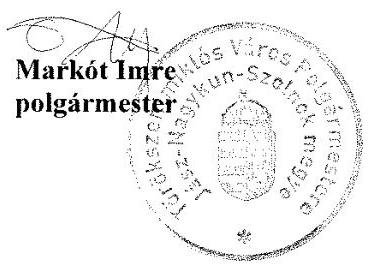
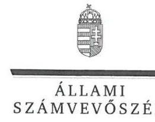
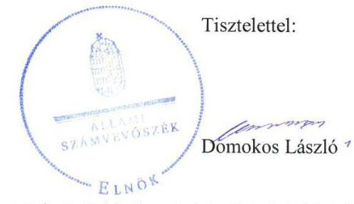
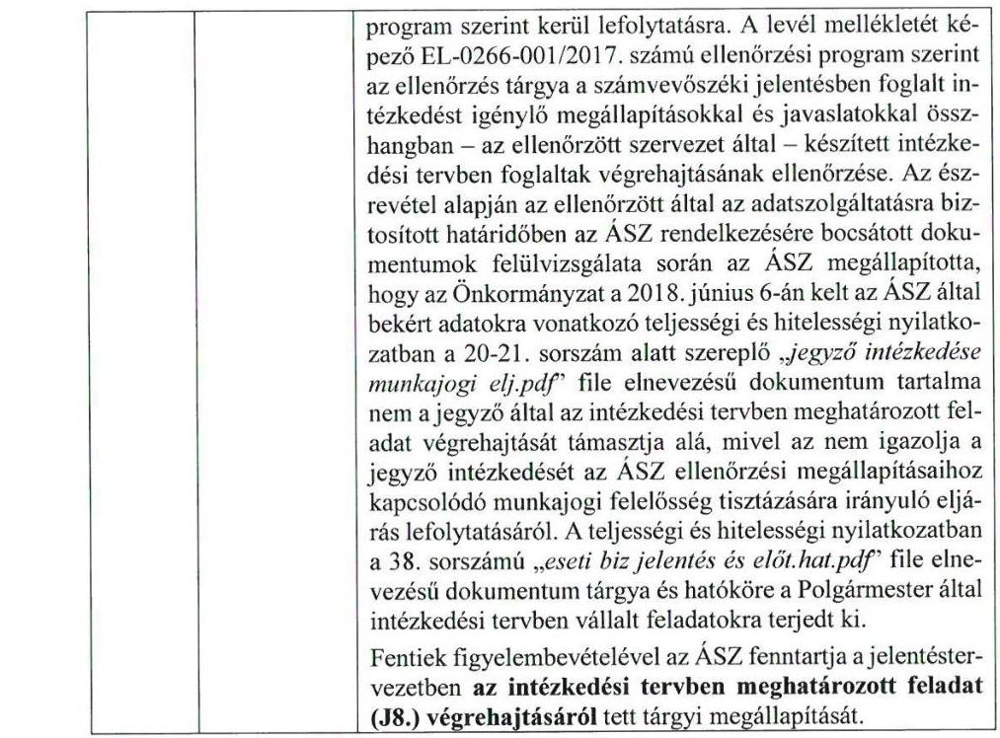
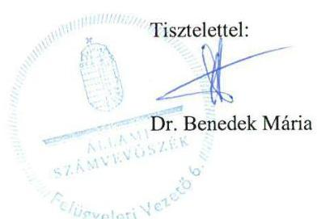

# Jelentés 

## Utóellenőrzések

Az önkormányzatok belső
kontrollrendszere kialakításának és működtetésének utóellenőrzése Törökszentmiklós Városi Önkormányzat 2019. 02. hó 04. nap

---

# AZ ELLENŐRZÉST FELÜGYELTE: 

DR. BENEDEK MÁRIA felügyeleti vezető

## AZ ELLENŐRZÉST VEZETTE ÉS A VÉGREHAJTÁSÁÉRT FELELŐS:

RÁCZKEVI KATALIN ellenőrzésvezető

## A PROGRAM ÖSSZEÁLLÍTÁSÁÉRT FELELŐS:

TÓTPÁL SZABOLCS osztályvezető

## A TÉMÁHOZ KAPCSOLÓDÓ KORÁBBI SZÁMVEVŐSZÉKI JELENTÉSEK:

- címe: Az önkormányzatok belső kontrollrendszere kialakításának és működtetésének ellenőrzése - Törökszentmiklós
- sorszáma: 16186

Jelentéseink az Országgyűlés számítógépes hálózatán és az Interneten a www.asz.hu címen is olvashatóak.

IKTATÓSZÁM: EL-0774-033/2019
TÉMASZÁM: 2460
ELLENŐRZÉS-AZONOSÍTÓ SZÁM: V080435

---

# TARTALOMJEGYZÉK 

■ ÖSSZEGZÉS ..... 5
■ AZ ELLENŐRZÉS CÉLJA ..... 6
■ AZ ELLENŐRZÉS TERÜLETE ..... 7
■ AZ ELLENŐRZÉS HÁTTERE, INDOKOLTSÁGA ..... 8
■ A JELENTÉS LÉNYEGES KÉRDÉSKÖRE ..... 9
■ AZ ELLENŐRZÉS HATÓKÖRE ÉS MÓDSZEREI ..... 10
■ MEGÁLLAPÍTÁSOK ..... 12
■ MELLÉKLETEK ..... 15
I. sz. melléklet: Törökszentmiklós Városi Önkormányzat intézkedési terve végrehajtásának értékelése ..... 15
II. sz. melléklet: Törökszentmiklós Városi Önkormányzat intézkedési terve ..... 20
■ FÜGGELÉK: ÉSZREVÉTELEK ..... 27
■ RÖVIDÍTÉSEK JEGYZÉKE ..... 51

---

.

---

# ÖSSZEGZÉS 

Az Állami Számvevőszék Törökszentmiklós Városi Önkormányzat belső kontrollrendszere kialakításának és működtetésének utóellenőrzése során megállapította, hogy nem biztosította a közpénzekkel és a közvagyonnal való felelős gazdálkodást. Nem került sor a gazdálkodási jogkörök gyakorlása terén feltárt szabálytalan működés megszüntetésére. Nem gondoskodott a befektetések leltárral történő alátámasztásáról. Nem intézkedett a belső kontrollrendszer egyes elemei jogszabályi előírásoknak megfelelő kialakításáról és működtetéséről.

## Az ellenőrzés társadalmi indokoltsága

Az Állami Számvevőszék stratégiájában célul tűzte ki a számvevőszéki munka hasznosulásának javítását. Ezzel összhangban ellenőrzi, hogy az ellenőrzött szervezet megvalósította-e a korábbi ellenőrzései által feltárt hibák, hiányosságok és szabálytalanságok megszüntetése céljából elkészített intézkedési tervében foglaltakat. A rendszeres utóellenőrzések hozzájárulnak a szükséges intézkedések tényleges végrehajtásához, ezáltal a közpénzügyek rendezettségének javulásához.

## Főbb megállapítások, következtetések

Törökszentmiklós Városi Önkormányzat az intézkedési tervében meghatározott 16 feladatból hatot határidőben, hármat határidőn túl, négyet részben, egyet nem hajtott végre, egy okafogyottá vált, egy nem volt időszerű.

A polgármester intézkedett a hivatal köztisztviselői vagyonnyilatkozat-tételi kötelezettségének a hivatali SZMSZ-ben, az önkormányzati bizottságok nem képviselő tagjai vagyonnyilatkozat-tételi kötelezettségének az önkormányzati SZMSZ-ben történő szabályozása, továbbá a köztisztviselőkre vonatkozó hivatásetikai alapelvek és az etikai eljárás szabályainak elfogadása érdekében.

A jegyző a belső kontrollrendszer kialakítása és működtetése során feltárt hiányosságokat és szabálytalanságokat nem szüntette meg, ezáltal nem volt biztosított a szabályszerű működés és a felelős vezetői magatartás.

A jegyző a gazdálkodási jogkörök gyakorlása terén megállapított szabálytalan működés megszüntetésére előírt intézkedést nem hajtotta végre, ebből következően fennáll a közpénzek rendeltetésellenes felhasználásának veszélye.

A jegyző nem intézkedett a befektetések értékének leltárral történő alátámasztásáról, ezáltal az önkormányzati vagyonnal történő felelős gazdálkodást nem biztosította.

A jegyző a munkaköri leírások felülvizsgálatát és kiegészítését nem hajtotta végre, a vagyonnyilatkozat átadására, nyilvántartására és a vagyonnyilatkozatban foglalt személyes adatok védelmére vonatkozó szabályokat nem határozta meg, az integritást sértő események kezelését nem szabályozta, emiatt nem volt biztosított a korrupciótól való védettség.

Törökszentmiklós Városi Önkormányzat jegyzője az intézkedési tervben meghatározott feladatok végrehajtásáról a jogszabályi előírás szerinti nyilvántartást nem vezette.

---

# AZ ELLENŐRZÉS CÉLJA 

Az ellenőrzés célja annak értékelése volt, hogy a számvevőszéki jelentésben ${ }^{1}$ foglalt megállapításokkal összhangban készített intézkedési tervben meghatározott feladatokat az ellenőrzött szervezet végrehajtotta-e.

---

# AZ ELLENŐRZÉS TERÜLETE 

## Törökszentmiklós Városi Önkormányzat

Törökszentmiklós város az Észak-alföldi Régióban, Jász-Nagykun-Szolnok megyében található, állandó lakosainak száma a Központi Statisztikai Hivatal Magyarország közigazgatási helynévkönyve alapján 2017. január 1-jén 20073 fő volt.

A polgármester ${ }^{2}$ 2014. október 12-től tölti be tisztségét. A 11 fővel működő képviselő-testület ${ }^{3}$ munkáját három állandó bizottság ${ }^{4}$ támogatta. A jegyző ${ }^{5}$ személye az ellenőrzött időszak alatt egy alkalommal változott, az új jegyző ${ }^{6}$ 2017. július 1-jétől látja el feladatait. A polgármesteri hivatal önálló gazdasági szervezettel nem rendelkezett, a gazdasági feladatokat a Közpénzügyi Osztály látta el.

A Törökszentmiklós Városi Önkormányzat 2017. évi költségvetésének végrehajtásáról szóló rendelete ${ }^{7}$ szerint 5710,5 millió Ft költségvetési bevételt ért el és 3190,2 millió Ft költségvetési kiadást teljesített. Mérlegfőösszege 2017. december 31-én 22 823,6 millió Ft, a követelések összege 1248,2 millió Ft, a kötelezettségek összege 174,0 millió Ft, melyből az éven belüli kötelezettségek összege 0,6 millió Ft volt.

Az ÁSZ ${ }^{8}$ 2016. évben ellenőrizte Törökszentmiklós Városi Önkormányzat belső kontrollrendszere kialakítását és működtetését a 2014. január 1. és 2015. április 30. közötti időszakra, valamint a 2011. január 1-jétől 2015. április 30-ig terjedő időszakra az egyes befektetési döntéseinek, a döntések végrehajtásának és elszámolásának a szabályszerűségét. Az ellenőrzés célja annak megállapítása volt, hogy az önkormányzat belső kontrollrendszerének kialakítása, továbbá egyes elemeinek működtetése biztosította-e az önkormányzatnál a közpénzfelhasználás szabályosságát, támogatta-e az integritás szemlélet érvényesülését. Az ÁSZ továbbá ellenőrizte, hogy az önkormányzat egyes befektetési döntései és azok végrehajtása, elszámolása megfelelt-e a vonatkozó jogszabályoknak és belső szabályozásoknak, a kialakított kontrollrendszer támogatta-e a befektetési tevékenység szabályszerűségét. Az ellenőrzésről készült 16186 számú jelentést az ÁSZ 2016. december 1-jén hozta nyilvánosságra.

---

# AZ ELLENŐRZÉS HÁTTERE, INDOKOLTSÁGA 

Az ÁSZ tv. ${ }^{9}$ 33. § (1) bekezdése értelmében a számvevőszéki jelentések megállapításaihoz és javaslataihoz kapcsolódóan az ellenőrzött szervezet vezetője intézkedési tervet köteles összeállítani, és az Állami Számvevőszék részére megküldeni.

Az ÁSZ által befogadott intézkedési tervben foglaltak megvalósítását az ÁSZ tv. 33. § (7) bekezdésében foglaltak alapján - az Állami Számvevőszék utóellenőrzés keretében ellenőrizheti. Az utóellenőrzések keretében - az intézkedések értékelése során - az Állami Számvevőszék figyelembe veszi az ellenőrzött szervezetek működési feltételeiben, valamint a jogszabályi előírásokban bekövetkezett változásokat.

Az utóellenőrzés során az ÁSZ értékeli, hogy az érintett számvevőszéki jelentésben foglalt megállapításokkal és javaslatokkal összhangban, az ellenőrzött szervezet által készített intézkedési tervben meghatározott feladatokat a feladatra kijelöltek végrehajtották-e.

Az intézkedések végrehajtásával az adott terület szabályszerű működése vonatkozásában a kockázatok csökkenhetnek, azonban hosszabb távon az intézkedési tervben foglaltak végrehajtásával önmagában nem szűnnek meg, csak akkor, ha beépülnek az ellenőrzött szervezet működésébe, azokat folyamatosan karban tartják, figyelembe véve, illetve kezelve a változásokat. Emellett az intézkedések végrehajtásáig újabb kockázatok merülhetnek fel a szabályszerű működés vonatkozásában, amelyek kezelése szintén kiemelten fontos az ellenőrzött szervezet számára.

Az ellenőrzött szervezet vezetője által készített intézkedési tervekben foglalt feladatok hiányos, illetve késedelmes végrehajtása, vagy annak elmaradása a szabályszerűség és a felelős vezetői magatartás vonatkozásában kockázatot hordoz, ami azt mutatja, hogy az ellenőrzések során feltárt hibák, hiányosságok és szabálytalanságok kezelése nem kapott kellő hangsúlyt. Az utóellenőrzés során is fennálló szabálytalanságok esetén a közpénz, közvagyon veszélyeztetettségi kockázat valószínűsített hatásának értékelése további intézkedéseket vonhat maga után.

Az ellenőrzött szervezet szintjén az utóellenőrzés feltárja, hogy a szervezet az intézkedések végrehajtásával hasznosította-e a korábbi ellenőrzési jelentésben a hiányosságok megszüntetése, illetve a kockázatok kezelése érdekében megfogalmazott javaslatokat, illetve az intézkedések végrehajtása elmaradásának következtében továbbra is fennálló szabálytalanság esetén értékeli a közpénzek, közvagyon veszélyeztetettségét.

Az ÁSZ szintjén az utóellenőrzés visszacsatolást ad az ellenőrzési jelentések hasznosulásáról, az intézkedések elmaradásának, vagy részleges megvalósulásának a közpénzek, közvagyon veszélyeztetettségére gyakorolt valószínűsített hatásának értékelése, további intézkedéseket vonhat maga után.

---

# A JELENTÉS LÉNYEGES KÉRDÉSKÖRE 

Az önkormányzat az intézkedési tervben foglaltakat az előírt határidőben végrehajtotta-e?

---

# AZ ELLENŐRZÉS HATÓKÖRE ÉS MÓDSZEREI 

## Az ellenőrzés típusa

Megfelelőségi ellenőrzés.

## Az ellenőrzött időszak

Az utóellenőrzés alapját képező ÁSZ jelentés közzétételének napjától az utóellenőrzésről szóló kiértesítő levél keltének napjáig, 2016. december 1-jétől 2018. július 4-éig tartó időszak volt.

## Az ellenőrzés tárgya

A számvevőszéki jelentésben foglalt megállapításokkal összhangban - az önkormányzat által - készített intézkedési tervben foglaltak végrehajtásának ellenőrzése volt.

## Az ellenőrzött szervezet

Törökszentmiklós Városi Önkormányzat

## Az ellenőrzés jogalapja

Az ellenőrzés jogszabályi alapját az ÁSZ tv. 33. § (7) bekezdésének előírása képezte.

## Az ellenőrzés módszerei

Az ÁSZ az ellenőrzést az ellenőrzött időszakban hatályos jogszabályok, az ellenőrzés szakmai szabályai, a jelen ellenőrzésre irányadó ÁSZ módszertanok, az ellenőrzési programban foglalt értékelési szempontok szerint végezte.

Az ÁSZ az ellenőrzés ideje alatt az önkormányzattal történő kapcsolattartást az ÁSZ SZMSZ ${ }^{10}$-ének vonatkozó előírásai alapján biztosította.

Az utóellenőrzés megállapításait az ÁSZ rendelkezésére álló, valamint az ÁSZ adatbekérése szerint, az önkormányzat által rendelkezésre bocsátott dokumentumok alapozták meg.

Az ellenőrzési bizonyítékként felhasználható adatforrások közé tartoztak egyrészt az ellenőrzési program részletes szempontjainál felsorolt

---

adatforrások, másrészt minden - az ellenőrzés folyamán feltárt, az ellenőrzés szempontjából információt tartalmazó - dokumentum.

Az intézkedési tervekben előírt feladatokat azok végrehajthatósága, illetve végrehajtása szempontjából az alábbiak szerint értékelte az ÁSZ:
$\longrightarrow$ „határidőben végrehajtott" a feladat, ha a teljesítés dokumentáltan, az intézkedési tervben előírt határidőben és tartalommal megtörtént;
$\longrightarrow$ „határidőn túl végrehajtott" a feladat, ha annak teljesítése az intézkedési tervben meghatározott módon, de az előírt határidőn túl történt meg;
$\longrightarrow$ „részben végrehajtott" a feladat, ha végrehajtása teljes körűen az intézkedési tervben előírt módon nem történt meg;
$\longrightarrow$ „nem végrehajtott" a feladat, ha a végrehajtás nem történt meg, vagy amennyiben a teljesítést nem dokumentálták;
$\longrightarrow$ „okafogyottá vált" a feladat, ha végrehajtására - meghatározott esemény bekövetkezése, továbbá külső körülmény, a működést érintő feltétel változása miatt - már nincs szükség, illetve lehetőség, és egyértelműen megállapítható, hogy az intézkedést szükségessé tevő körülmény a jövőben nem fordulhat elő;
$\longrightarrow$ „nem időszerű" az a feladat, amelynek ellenőrzési időszakon belüli végrehajtására azért nem került (kerülhetett) sor, mert az intézkedés alapjául szolgáló esemény nem következett be, de annak jövőbeni előfordulása lehetséges, a végrehajtása nem volt esedékes, vagy a végrehajtás határideje még nem járt le.
Az ellenőrzés lefolytatásához az önkormányzat a tanúsítványok elektronikus kitöltésével, valamint az ÁSZ által kért dokumentumok elektronikus megküldésével szolgáltatott adatokat, amelyek valódiságát és teljes körűségét az önkormányzat vezetője által tett teljességi és hitelességi nyilatkozat igazolta. Az így rendelkezésre bocsátott adatok, információk kontrollja az ellenőrzés keretében megtörtént.

A Törökszentmiklós Városi Önkormányzat által megküldött intézkedési tervben meghatározott ÁSZ által beazonosított feladatok a II. számú mellékletben kerültek bemutatásra.

---

# MEGÁLLAPÍTÁSOK 

## Az önkormányzat az intézkedési tervben foglaltakat az előírt határidőben végrehajtotta-e?

Összegző megállapítás

Az Önkormányzat ${ }^{11}$ az intézkedési tervben meghatározott 16 feladatból hatot határidőben, hármat határidőn túl, négyet részben, egyet nem hajtott végre, egy okafogyottá vált, egy nem volt időszerű. Az intézkedési tervben meghatározott feladatok végrehajtásáról a jogszabályban előírt nyilvántartást nem vezette.

Az ÁSZ a jelentésében a polgármester részére nyolc, a jegyző részére szintén nyolc javaslatot fogalmazott meg. Az Önkormányzat Képviselőtestülete által 44/2017. (II.23.) számú határozattal jóváhagyott intézkedési tervben a hiányosságok, a szabálytalanságok megszüntetésére a polgármester részére nyolc, a jegyző részére szintén nyolc feladat került meghatározásra.

Az intézkedési tervben meghatározott feladatokat, határidőket, felelősöket és a feladatok végrehajtását az I. sz. melléklet mutatja be.

Az Önkormányzat jegyzője az intézkedési tervben meghatározott feladatok végrehajtásáról a Bkr. ${ }^{12}$ 14. § (1) bekezdés előírása szerinti nyilvántartást nem vezette.

Az Önkormányzat intézkedési
 tervében meghatározott feladatok végrehajtásának értékelési kategóriák szerinti megoszlását az 1. ábra szemlélteti.

1. ábra

---

A SZABÁLYOZOTTSÁG terén azonosított kockázatok jelentős mértékben nőttek, mert a jegyző az ÁSZ jelentésben a Számviteli politikával, a Számlarenddel, a Pénzkezelési Szabályzattal, az Értékelési Szabályzattal kapcsolatban megfogalmazott szabálytalanságok megszüntetésére nem tett intézkedéseket.(J1)

A PÉNZÜGYI ELSZÁMOLTATHATÓSÁG kockázata nőtt, fennáll a közpénzek rendeltetésellenes felhasználásának veszélye, mert a jegyző nem intézkedett a gazdálkodási jogkörök gyakorlása során a teljesítésigazolás és az érvényesítés jogszabályi előírások szerinti gyakorlásáról.(J1)

A BELSŐ KONTROLLRENDSZER szerinti elszámoltathatóság terén feltárt kockázatok jelentős mértékben nőttek, mert a jegyző a Bkr. előírásai ellenére a szervezet kockázatkezelési rendszerét nem vizsgálta felül, integrált kockázatkezelési rendszert nem alakított ki, a gazdálkodási jogkörök gyakorlására vonatkozó szabályozást nem készített, az egyes kontrolltevékenységek felülvizsgálatát nem végezte el, a szervezeten belüli és a szervezeten kívülre történő információáramlás és információátadás rendszerét nem alakította ki.(J1)

AZ INTEGRITÁS terén azonosított kockázatok nőttek. A polgármester intézkedett a hivatal köztisztviselői vagyonnyilatkozat-tételi kötelezettségének a hivatali SZMSZ-ben, az önkormányzati bizottságok nem képviselő tagjai vagyonnyilatkozat-tételi kötelezettségének az önkormányzati SZMSZ-ben történő szabályozása érdekében, azonban a jegyző a hivatal köztisztviselőire vonatkozóan a vagyonnyilatkozat leadásával, nyilvántartásával kapcsolatos részletszabályokat nem határozta meg. (P2.,P4.,J2) A jegyző a munkaköri leírásokban a munkakör betöltéséhez szükséges tapasztalatok és képességek rögzítését nem végezte el, a szabálytalanságok kezelésének eljárásrendjét nem vizsgálta felül, a szervezeti integritást sértő események kezelésének rendjét nem alakította ki.(J1) Ennek következtében jelentős mértékben nőtt az Önkormányzat korrupciós kockázata.

A VAGYONGAZDÁLKODÁS terén feltárt kockázatok nőttek, mert a jegyző az Önkormányzat vagyongazdálkodási rendeletét az intézkedési tervben meghatározott határidőn túl vizsgálta felül(J3), továbbá a 2016. évi költségvetési beszámoló mérlegében kimutatott részesedések értékét a jogszabályok előírásai ellenére nem támasztotta alá leltárral(J5), ezáltal az önkormányzati vagyonnal történő felelős gazdálkodás továbbra sem biztosított.

---

.

---

# MELLÉKLETEK

■ I. SZ. MELLÉKLET: TÖRÖKSZENTMIKLŐS VÁROSI ÖNKORMÁNYZAT INTÉZKEDÉSI TERVE VÉGREHAJTÁSÁNAK ÉRTÉKELÉSE

|  Sorszám | Az intézkedési tervben meghatározott feladat | Az intézkedési tervben meghatározott határidő | Az intézkedési tervben meghatározott feladat felelőse | A feladat végrehajtása  |
| --- | --- | --- | --- | --- |
|  P1. ${ }^{13}$ | A Képviselő-testület a köztisztviselőkre vonatkozó hivatásetikai alapelvek részletes tartalmát, valamint az etikai eljárás szabályait tartalmazó szabályzatot fogad el. | 2017. február 28. | Előkészítéséért:
Dr. Majtényi Erzsébet jegyző
Elfogadásáért:
Markót Imre polgármester | A polgármester intézkedett a jegyző által előkészített, a köztisztviselőkre vonatkozó hivatásetikai alapelvek részletes tartalmát, valamint az etikai eljárás szabályait tartalmazó Etikai szabályzat ${ }^{14}$ a képviselő-testület 2017. február 23-ai ülésére történő előterjesztéséről, amelyet a képviselő-testület 40/2017. (II.23.) számú határozatával elfogadott.
A polgármester intézkedett a hivatal köztisztviselői vagyonnyilat-kozat-tételi kötelezettségének a hivatali SZMSZ ${ }^{15}$ képviselő-testület a 21/2017. (I.26.) számú határozatával történő elfogadásáról. A polgármester intézkedett az önkormányzati bizottságok nem képviselő tagjai vagyonnyilatkozat-tételi kötelezettségének az önkormányzati SZMSZ ${ }^{16}$ képviselő testület 8/2017. (II.23.) számú rendeletével történő elfogadásáról.
A polgármester a képviselő-testület elé terjesztette a jegyző által elkészített, a hivatal köztisztviselőinek vagyonnyilatkozat-tételi kötelezettségét tartalmazó hivatali SZMSZ-t, melyet a képviselőtestület 21/2017. (I.26.) számú határozatával jóváhagyott. A polgármester a képviselő-testület elé terjesztette a jegyző által előkészített önkormányzati SZMSZ-t, amely tartalmazta az önkormányzati bizottságok nem képviselő tagjai tekintetében a vagyontételi kötelezettek névsorát. Az önkormányzati SZMSZ-t a képviselő-testület a 8/2017. (II.23.) számú rendeletével jóváhagyta.
A polgármester gondoskodott az Önkormányzat közép- és hosszú távú vagyongazdálkodási tervének ${ }^{17}$ megalkotásáról és előterjesztéséről, melyet a képviselő-testület az 56/2016. (II.25.) számú határozattal 2016. február 25-én jóváhagyott.  |

---

|  Az intézkedési tervben meghatározott feladat | Az intézkedési tervben meghatározott határidő | Az intézkedési tervben meghatározott feladat felelőse | A feladat végrehajtása  |
| --- | --- | --- | --- | --- |
|  P7. | Az Óvoda, mint az Önkormányzat költségvetési szerve részére kerüljön jóváhagyott SZMSZ megalkotásra. | 2017. április 30. | Elkészítéséért:
Kolozsvári Andrea intézményvezető
Elfogadásáért:
Markót Imre polgármester  |
|  J7. ${ }^{19}$ | Meg kell alkotni az Önkormányzat közép- és hosszú távú vagyongazdálkodási tervét és gondoskodni kell a képviselőtestület által történő elfogadásáról. | Megtörtént. | Dr. Majtényi Erzsébet jegyző  |
|  Határidőn túl végrehajtott feladatok |  |  |   |
|  P3. | Az önkormányzat szervezeti és szabályozási kereteit, működését és gazdálkodását meghatározó szabályzatok, valamint a vagyonrendelet a kiadmányozási jogok tekintetében kerüljenek felülvizsgálatra.
Terjessze a képviselő-testület elé a jogszabályoknak megfelelő vagyongazdálkodásról szóló rendelet-tervezetet. | 2017. május 31. | Markót Imre polgármester  |
|  P8. | Tárja fel annak hátterét, hogy a vizsgált időszakban miért nem került megfelelő kockázatkezelési rendszer, a szervezet tevékenységének, a célok megvalósításának nyomon követését biztosító rendszer kialakításra, valamint hogy 2015. január és 2015. március 6. között a szabad pénzeszközök hasznosításának szabálytalansága mire vezethető vissza.
A munkajogi felelősség tisztázására irányuló eljárás eredménye ismeretében tegye meg a szükséges intézkedéseket. | A szabálytalanságok okainak feltárására: 2017. július 31.
A felelősség tisztázásának eredménye ismeretében intézkedések tételére: 2017. szeptember 30. | A polgármester a jogszabályoknak megfelelő vagyongazdálkodási rendelettervezetet 2017. november 30-ai ülésre terjesztette be, amelyet a képviselő-testület 26/2017. (XII.01) számú rendeletével elfogadott.
A Közszolgálati Szabályzat ${ }^{20}$-ot a jegyző az 2017. december 21-én adta ki.
A polgármester az önkormányzat szervezeti és szabályozási kereteit, működését és gazdálkodását meghatározó szabályzatokat, valamint a vagyonrendeletet ${ }^{21}$ a kiadmányozási jogok tekintetében felülvizsgálta. A 2017. február 24-től hatályos önkormányzati SZMSZ-t a polgármester és a jegyző, a 2017. január 26-tól hatályos hivatali SZMSZ-t a jegyző kiadmányozta.
A polgármester 2017. november 21-én elkészült jelentésben tárta fel a szabálytalanságok okait a munkajogi felelősség tisztázása keretében. A polgármester a jegyző vonatkozásában munkajogi intézkedést, annak közszolgálati jogviszonyának megszűnésére hivatkozva nem kezdeményezett.  |

---

|  Sorszám | Az intézkedési tervben meghatározott feladat | Az intézkedési tervben meghatározott határidő | Az intézkedési tervben meghatározott feladat felelőse | A feladat végrehajtása  |
| --- | --- | --- | --- | --- |
|  J3. | Az önkormányzat vagyonáról és a vagyongazdálkodás szabályairól szóló 30/2004. (VI. 25.) számú rendelet kerüljön felülvizsgálatra és terjesszék a képviselő- testület elé elfogadásra. | 2017. április 30 | Dr. Majtényi Erzsébet
jegyző | A jegyző 2017. szeptember 22-ei időpontra vizsgálta felül a vagyongazdálkodási rendeletet, melyet a polgármester 2017. november 14-én terjesztett a képviselő-testület elé elfogadásra.  |
|   |  | Részben végrehajtott feladatok |  |   |
|  J1. | Az Önkormányzat és a Hivatal működését és gazdálkodását meghatározó SZMSZ, Vagyonrendelet, Közszolgálati szabályzat, valamint a 2015-19. évekre vonatkozó Gazdasági program, Ügyrend, munkaköri leírások, a Számviteli politika, a Számlarend, a Pénzkezelési, valamint az Értékelési szabályzat kerüljön felülvizsgálatra és elfogadásra. Az ellenőrzési nyomvonalat, a kockázatkezelési rendszert, a kontrolltevékenységeket, az információs és kommunikációs rendszereket, a monitoring rendszert és a szabálytalanságok kezelésének eljárásrendjét vizsgálja felül és a jogszabályok előírásainak megfelelő formában készítse el és ezek kerüljenek elfogadásra. | 2017. július 31. | Dr. Majtényi Erzsébet
jegyző | Végrehajtott feladatrész:
A jegyző intézkedett az önkormányzati és a hivatali SZMSZ, az Önkormányzat vagyonrendelete, a Közszolgálati szabályzat, Ügyrend², a 2015-2019. évi gazdasági program felülvizsgálatáról és elfogadásáról.
A jegyző elkészítette a jogszabályi előírásoknak megfelelő, a Polgármesteri Hivatalra vonatkozó ellenőrzési nyomvonalat.
Nem végrehajtott feladatrész:
A jegyző a munkaköri leírások felülvizsgálatát nem hajtotta végre.
A Számviteli Politika², a Számlarend², a Pénzkezelési Szabályzat ${ }^{25}$, ${ }^{26}$, az Értékelési Szabályzat ${ }^{27}$ felülvizsgálata és a jogszabályok előírásainak megfelelő formában történő elkészítése, elfogadása érdekében nem intézkedett.
A jegyző a kockázatkezelési rendszer, a kontrolltevékenységek, az információs és kommunikációs rendszer, a monitoring rendszer, valamint a szabálytalanságok kezelésének eljárásrendje felülvizsgálatát nem hajtotta végre.
A kontrolltevékenységek körében a jegyző az Ávr. 57. § (1), (3) és (4) bekezdéseiben foglaltak ellenére a teljesítésigazolásról, az Ávr. 58. § (1)-(2)-(3) bekezdéseiben előírtak ellenére az érvényesítési feladatok ellátásáról nem gondoskodott.  |

---

|  Az intézkedési tervben meghatározott feladat | Az intézkedési tervben meghatározott határidő | Az intézkedési tervben meghatározott feladat felelőse | A feladat végrehajtása  |
| --- | --- | --- | --- | --- |
|  A vagyonnyilatkozat-tételi kötelezettség a Hivatal köztisztviselői, valamint az önkormányzati bizottságok nem képviselő tagjai tekintetében kerüljön meghatározásra. | 2017. február 28. | Dr. Majtényi Erzsébet jegyző | Végrehajtott feladatrész:
A jegyző a hivatal köztisztviselőinek a hivatali SZMSZ-ben, az önkormányzati bizottságok nem képviselő tagjai tekintetében az önkormányzati SZMSZ-ben határozta meg a vagyonnyilatkozat tételi kötelezettséget.
Nem végrehajtott feladatrész:
A jegyző a hivatal köztisztviselői tekintetében nem határozta meg a Vnytv.18 11. § (6) bekezdésében előírt, a vagyonnyilatkozat átadására, nyilvántartásra és a vagyonnyilatkozatban foglalt személyes adatok védelmére vonatkozó további szabályokat.
Végrehajtott feladatrész:
A jegyző 2016. évben intézkedett az Önkormányzat tartós részesedései tekintetében a jogszabály előírásainak megfelelő analitikus nyilvántartás létrehozásáról, amellyel biztosította a főkönyvi könyvelés adataival való egyeztetést. Lekötött betét és értékpapír állománnyal az Önkormányzat 2016. év végén nem rendelkezett.
Nem végrehajtott feladatrész:
A jegyző a Számv. tv. 69. § (1) bekezdésében előírtak ellenére nem intézkedett az Önkormányzat 2016. évi költségvetési beszámolójának mérlegében kimutatott részesedések értékének leltárral történő alátámasztásáról.
Végrehajtott feladatrész:
A jegyző intézkedett arról, hogy 2016. évre az Önkormányzat tulajdonában lévő gazdasági társaságban fennálló tulajdoni részesedés értékét a társasági szerződés szerinti összegben, a jogszabályi előírásoknak megfelelően mutassa ki a számviteli nyilvántartásokban.
Nem végrehajtott feladatrész:
A jegyző a Számv.tv. 3. § (3) bekezdés 3. pontjában foglaltak ellenére nem intézkedett a lekötött betétek 2011. és 2012. évekre vonatkozóan, valamint az értékpapírok 2013. és 2014. évekre vonatkozóan feltárt szabálytalanságai kiküszöböléséről.  |

---

|  Sorszám | Az intézkedési tervben meghatározott feladat | Az intézkedési tervben meghatározott határidő | Az intézkedési tervben meghatározott feladat felelőse | A feladat végrehajtása  |
| --- | --- | --- | --- | --- |
|  J8. | Tárja fel a belső szabályozottság hiányosságaiért, a befektetésekkel kapcsolatos gazdasági események számviteli elszámolási és nyilvántartási hiányosságaiért munkajogilag felelősöket, a hibák okait, és szüntesse meg azokat. Gondoskodjon a feltárt tények tükrében a felelősökkel szemben a jogszabályi előírásoknak megfelelő munkajogi felelősségre vonás eljárásainak lefolytatásáról. | A hibák okainak és az azok felelőseinek feltárására: 2017. július 31.
A feltárt tények tükrében a felelősségre vonás érdekében tett eljárások megindítására: 2017. szeptember 30. | Jegyző | A jegyző nem tárta fel a belső szabályozottság hiányosságainak megszüntetése érdekében a hibák okait, valamint nem gondoskodott a munkajogi felelősségre vonás tekintetében eljárás lefolytatásáról.  |
|  P5. | A Szociális Szolgáltatástervezési Koncepció kétévenkénti előírt felülvizsgálatát a jogszabályi előírásoknak megfelelően kerüljön elvégzésre. | 2017. január 31. | Markót Imre polgármester | A polgármester 2017. január 17-én
 előterjesztette a Szociális Szolgáltatástervezési Koncepciót, melyet a képviselő-testület 11/2017. (I.26.) számú határozattal elfogadott. A Szociális Szolgáltatástervezési Koncepció kétévenkénti felülvizsgálata az 1993. évi III. törvény 92. § (3) bekezdésében foglalt rendelkezés 2017. január 1-jei hatályon kívül helyezésével okafogyottá vált.  |
|  J4. | J4. Az állampapírok és kötvények bekerülési értékének megállapításánál figyelemmel kell lenni a jogszabályokban foglaltakra. | 2017. július 31. | Dr. Majtényi Erzsébet jegyző | Az Önkormányzat 2016. évben állampapírokkal és kötvényekkel nem rendelkezett, emiatt azok bekerülési értékének meghatározásával kapcsolatos feladat nem volt időszerű.  |

---

# II. SZ. MELLÉKLET: TÖRÖKSZENTMIKLÓS VÁROSI ÖNKORMÁNYZAT INTÉZKEDÉSI TERVE 

Kivonat Törökszentmiklós Városi Önkormányzat Képviselő-testületének 2017. február 23-án megtartott nyilvános ülésének jegyzőkönyvéből:
44/2017. (II.23.) Kt.

## Határozat

„Az önkormányzatok belső kontrollrendszere kialakításának és működtetésének ellenőrzése Törökszentmiklós" című Állami Számvevőszéki jelentés kapcsán meghatározott intézkedési terv módosításáról

Törökszentmiklós Városi Önkormányzat Képviselő-testülete úgy dönt, hogy:

1. „Az önkormányzatok belső kontrollrendszere kialakításának és működtetésének ellenőrzése - Törökszentmiklós" című, V-1042-157/2016. számú Állami Számvevőszéki jelentésben foglaltak tartalmát megismerve, az annak kapcsán megalkotott és jelen határozat mellékletét képező módosított Intézkedési tervet elfogadja.
2. Felkéri a Markót Imre polgármestert, hogy annak Állami Számvevőszékhez való megküldéséről haladéktalanul gondoskodjon.

Felelős: Markót Imre polgármester
Határidő: Az Intézkedési terv megküldésére 2017. február 28.
Az Intézkedési tervben foglaltakra: folyamatos
Etről értesülnek:

1. Markót Imre polgármester
2. Dr. Majtényi Erzsébet jegyző
3. Irattár
K. m. f.

Markót Imre s. k.
polgármester

Dr. Majtényi Erzsébet s. k. jegyző

A kivonat hiteléül:

---

# INTÉZKEDÉSI TERV

az Állami Számvevőszék által Törökszentmiklós Városi Önkormányzat belső kontrollrendszerének kialakításának és működtetésének ellenőrzéséről szóló jelentésben foglaltak alapján (V-0142-152/2016. számú jelentés)

Az Állami Számvevőszék javaslataira Törökszentmiklós Városi Önkormányzat Polgármestere felé megfogalmazott intézkedések tartalma

|  ÁSZ jelentésben foglalt javaslat és az intézkedés tartalma |  | A javaslat végrehajtásáért felelős | Határidő | Intézkedési terv elkészítéséig megtett intézkedés/teljesítés  |
| --- | --- | --- | --- | --- |
|  1. Intézkedjen a köztisztviselőkre vonatkozó hivatásetikai alapelvek részletes tartalmát, valamint az etikai eljárás szabályait megállapító előterjesztés. Képviselő-testület elé terjesztéséről. | A Képviselő-testület a köztisztviselőkre vonatkozó hivatásetikai alapelvek részletes tartalmát, valamint az etikai eljárás szabályait tartalmazó szabályzatot fogad el. | Előkészítésért:
Dr. Majtényi Erzsébet
jegyző
Elfogadásáért:
Markót Imre polgármester | 2017. február 28. | A személyügyi ügyintéző és a jegyző a szabályzat előkészítését megkezdte.  |
|  2. Intézkedjen az önkormányzati bizottságok nem képviselő tagjai vagyonnyilatkozat-tételi kötelezettségét is tartalmazó önkormányzati szervezeti és működési szabályzat tervezet Képviselő-testület elé terjesztéséről. | A vagyonnyilatkozat-tételi kötelezettséget a Hivatal köztisztviselői, valamint az önkormányzati bizottságok nem képviselő tagjai tekintetében az önkormányzati és hivatali SZMSZ-ben határozzák meg. | Markót Imre polgármester | 2017. április 30. | A bizottsági tagok a vagyonnyilatkozatukat hiánytalanul leadták, az SZMSZ-ek felülvizsgálata megtörtént.  |
|  3. Intézkedjen a vagyongazdálkodással kapcsolatos szabályok meghatározása érdekében a | Az önkormányzat szervezeti és szabályozási kereteit, működését és gazdálkodását meghatározó szabályzatok, valamint a | Markót Imre polgármester | 2017. május 31. | A Vagyonrendelet felülvizsgálata folyamatban van.
A Szabályzatok felülvizsgálata megtörtént, azok harmonizációja folyamatban van.  |

---

|  jogszabályoknak megfelelő rendelet tervezet Képviselőtestület elé terjesztéséről. | vagyonrendelet a kiadmányozási jogok tekintetében kerüljenek felülvizsgálatra. Terjessze a képviselő-testület elé a jogszabályoknak megfelelő vagyongazdálkodásról szóló rendelet-tervezetet. |  |  |   |
| --- | --- | --- | --- | --- |
|  4. Intézkedjen a Hivatal köztisztviselői vagyonnyilatkozat-tételi kötelezettségét is tartalmazó szervezeti és működési szabályzatának jóváhagyásáról. | A vagyonnyilatkozat-tételi kötelezettség a Hivatal köztisztviselői, valamint az önkormányzati bizottságok nem képviselő tagjai tekintetében az önkormányzati és hivatali SZMSZ-ben kerüljön meghatározásra.
A Hivatal köztisztviselőire vonatkozóan a vagyonnyilatkozat átadására, nyilvántartására, a vagyonnyilatkozatban foglalt személyes adatok védelmére vonatkozó további szabályok kerüljenek meghatározásra. | Előkészítéséért:
Dr. Majtényi Erzsébet
jegyző
Bukta Ágnes
személyügyi ügyintéző
Elfogadtatásáért:
Markót Imre polgármester | 2017. február 28. | Az SZMSZ-ek felülvizsgálata megtörtént.  |
|  5. Intézkedjen a jogszabályi előírásoknak megfelelően felülvizsgált szociális szolgáltatástervezési koncepció Képviselőtestület elé terjesztéséről. | A Szociális Szolgáltatástervezési Koncepció kétévenkénti előírt felülvizsgálatát a jogszabályi előírásoknak megfelelően kerüljön elvégzésre. | Markót Imre polgármester | 2017. január 31. | A Koncepció 2016. decemberében elkészítésre került. Annak utolsó egyeztetése folyamatban van.  |
|  6. Intézkedjen a közép- és hosszú távú vagyongazdálkodási tervről szóló előterjesztés Képviselő-testület elé terjesztéséről. | Kerüljön megalkotásra az Önkormányzat közép- és hosszú távú vagyongazdálkodási terv és gondoskodjon a képviselő-testület által történő elfogadásáról. | Markót Imre polgármester | Megtörtént. | A közép- és hosszú távú vagyongazdálkodási tervet a képviselőtestület 2016. február 25. napján megtartott ülésén tárgyalta és fogadta el 56/2016. (II.25.) K. t. számú határozatában.  |
|  7. Intézkedjen a önkormányzat irányítása alá tartozó Óvoda szervezeti | Az Óvoda, mint az Önkormányzat költségvetési szerve részére kerüljön jóváhagyott SZMSZ megalkotásra. | Elkészítésért:
Kolozsvári Andrea intézményvezető | 2017. április 30. |   |

---

|  és működési szabályzatának jóváhagyásáról |  | Elfogadásért:
Markót Imre polgármester |  |   |
| --- | --- | --- | --- | --- |
|  8. Intézkedjen az Állami Számvevőszék ellenőrzése során feltárt hiányosságok és/vagy szabálytalanságok tekintetében a munkajogi felelősség kivizsgálására irányuló eljárás megindításáról, és ennek eredménye ismeretében tegye meg a szükséges intézkedéseket. | Tárja fel annak hátterét, hogy a vizsgált időszakban miért nem került megfelelő kockázatkezelési rendszer, a szervezet tevékenységének, a célok megvalósításának nyomon követését biztosító rendszer kialakításra, valamint hogy 2015. január és 2015. március 6. között a szabad pénzeszközök hasznosításának szabálytalansága mire vezethető vissza.
A munkajogi felelősség tisztázására irányuló eljárás eredménye ismeretében tegye meg a szükséges intézkedéseket. | Markót Imre polgármester | A szabálytalanság okainak feltárására: 2017. július 31.
A felelősség tisztázásának eredménye ismeretében intézkedések tételére: 2017. szeptember 30. |   |

Az Állami Számvevőszék javaslataira a Törökszentmiklósi Polgármesteri Hivatal Jegyzője felé megfogalmazott intézkedések tartalma

|  ÁSZ jelentésben foglalt javaslat és az intézkedés tartalma |  | A javaslat végrehajtásáért felelős | Határidő | Intézkedési terv elkészítéséig megtett intézkedés/teljesítés  |
| --- | --- | --- | --- | --- |
|  1. Intézkedjen a belső kontrollrendszer egyes elemei jogszabályi előírásoknak megfelelő kialakítására és működtetésére, valamint a befektetésekkel kapcsolatos döntések előkészítése, illetve a gazdálkodási jogkörök gyakorlása során a jogszabályi előírások és a belső szabályozás betartására. | Az Önkormányzat és a Hivatal a működését és gazdálkodását meghatározó SZMSZ, Vagyonrendelet, Közszolgálati szabályzat, valamint a 2015-19. évekre vonatkozó Gazdasági program, Ügyrend, munkaköri leírások, a Számviteli politika, a Számlarend, a Pénzkezelési, valamint az Értékelési szabályzat kerüljön felülvizsgálatra és elfogadásra.
Az ellenőrzési nyomvonalat, | Dr. Majtényi Erzsébet jegyző | 2017. július 31. |   |

---

|   | a kockázatkezelési rendszert,
a kontrolltevékenységeket,
az információs és kommunikációs
rendszereket,
a monitoring rendszert és
a szabálytalanságok kezelésének
eljárásrendjét vizsgálja felül és a
jogszabályok előírásainak megfelelő
formában készítse el és ezek kerüljenek
elfogadásra. |  |  |   |
| --- | --- | --- | --- | --- |
|  2. Intézkedjen az önkormányzati
bizottságok nem képviselő tagjai
vagyonnyilatkozat-tételi
kötelezettségét is tartalmazó
önkormányzati szervezeti és
működési szabályzat-tervezet és a
Hivatal köztisztviselői
vagyonnyilatkozat-tételi
kötelezettségét is tartalmazó
hivatali szervezeti és működési
szabályzat-tervezet elkészítéséről. | A vagyonnyilatkozat-tételi kötelezettség a
Hivatal köztisztviselői, valamint az
önkormányzati bizottságok nem
képviselő tagjai tekintetében kerüljön
meghatározásra.
A Hivatal köztisztviselőire vonatkozóan a
vagyonnyilatkozat átadására, nyilvántartására,
a vagyonnyilatkozatban
foglalt személyes adatok védelmére
vonatkozó további szabályokat határozzák
meg. | Dr. Majtényi Erzsébet
jegyző | 2017. február 28. | Az SZMSZ-ek
felülvizsgálata megtörtént.  |
|  3. Intézkedjen a
vagyongazdálkodással kapcsolatos
szabályok meghatározása
érdekében a jogszabályoknak
megfelelő rendelettervezet
elkészítéséről. | Az önkormányzat vagyonáról és a
vagyongazdálkodás szabályairól szóló
30/2004. (VI. 25.) számú rendelet kerüljön
felülvizsgálatra és terjesszék a képviselő-
testület elé elfogadásra. | Dr. Majtényi Erzsébet
jegyző | 2017. április 30. |   |
|  4. Intézkedjen a befektetésekkel
kapcsolatos gazdasági események
jogszabályi előírásoknak megfelelő
rögzítéséről a számviteli (főkönyvi
és részletező) nyilvántartásokban. | Az állampapírok és kötvények bekerülési
értékének megállapításánál figyelemmel kell
lenni a jogszabályokban foglaltakra. | Dr. Majtényi Erzsébet
jegyző | 2017. július 31. |   |
|  5. Intézkedjen az éves költségvetési
beszámolók mérlegében kimutatott
eszközök (betétlekötések, | A jogszabályi előírásoknak megfelelő
analitikus nyilvántartás létrehozása szükséges,
amely segítségével az egyeztetés lehetősége | Dr. Majtényi Erzsébet
jegyző | 2017. július 31. |   |

---

|  értékpapírok, részesedések) jogszabályi előírásoknak megfelelő leltárral történő alátámasztásáról. | biztosított az analitika és főkönyv között, jogszabályban előírt leltárral történő alátámasztásáról gondoskodni kell.
A beszámolók mérlegében kimutatott eszközöket (betétlekötések, értékpapírok, részesedések) leltárral támassza alá. |  |  |   |
| --- | --- | --- | --- | --- |
|  6. Intézkedjen az ellenőrzés során feltárt, az egyes mérlegtételeket érintő, jelentős összegű hibák jogszabályi előírásoknak megfelelő javításáról. | Intézkedni szükséges az egyes mérlegtételeket érintő, jelentős összegű hibák jogszabályi előírásoknak megfelelő kiküszöböléséről. | Dr. Majtényi Erzsébet jegyző | 2017. április 30. |   |
|  7. Intézkedjen a jogszabályi előírásnak megfelelő közép és hosszú távú vagyongazdálkodási terv elkészítéséről. | Meg kell alkotni az Önkormányzat közép- és hosszú távú vagyongazdálkodási tervét és gondoskodni kell a képviselő-testület által történő elfogadásáról. | Dr. Majtényi Erzsébet jegyző | Megtörtént. | A közép- és hosszú távú vagyongazdálkodási tervet a képviselő-testület 2016. február 25. napján megtartott ülésén tárgyalta és fogadta el 56/2016. (II.25.) K. t. számú határozatában.  |
|  8. Intézkedjen az Állami Számvevőszék ellenőrzése során feltárt hiányosságok és/vagy szabálytalanságok tekintetében a munkajogi felelősség tisztázására irányuló eljárás megindításáról, és ennek eredménye ismeretében tegye meg a szükséges intézkedéseket. | Tárja fel a belső szabályozottság hiányosságaiért, a befektetésekkel kapcsolatos gazdasági események számviteli elszámolási és nyilvántartási hiányosságaiért munkajogilag felelősöket, a hibák okait, és szüntesse meg azokat. Gondoskodjon a feltárt tények tükrében a felelősökkel szemben a jogszabályi előírásoknak megfelelő munkajogi felelősségre vonás eljárásainak lefolytatásáról. | Dr. Majtényi Erzsébet jegyző | A hibák okainak és az azok felelőseinek feltárására: 2017. július 31.
A feltárt tények tükrében a felelősségre vonás érdekében tett eljárások megindítására: 2017. szeptember 30. |   |

---

.

---

# FÜGGELÉK: ÉSZREVÉTELEK 

A jelentéstervezetet a Számvevőszék 15 napos észrevételezésre megküldte az ellenőrzött szervezet vezetőjének az ÁSZ tv. 29. § (1) bekezdése előírásának megfelelően.

A függelék tartalmazza az ellenőrzött észrevételeit, illetve a figyelembe nem vett észrevételek elutasításának indoklását.

[^0]
[^0]:    * 29. § (1) Az Állami Számvevőszék az ellenőrzési megállapításait megküldi az ellenőrzött szervezet vezetőjének vagy az általa megbízott személynek, és annak, akinek személyes felelősségét állapította meg.
    (2) Az ellenőrzött szervezet vezetője és a felelősként megjelölt személy az ellenőrzés megállapításaira tizenöt napon belül írásban észrevételt tehet.
    (3) Az Állami Számvevőszék az észrevételre a beérkezésétől számított harminc napon belül írásban válaszol. A figyelembe nem vett észrevételeket köteles a

 jelentésben feltüntetni, és megindokolni, hogy azokat miért nem fogadta el.

---

TÖRÖKSZENTMIKLÓS VÁROS POLGÁRMESTERÉTŐL
5200 Törökszentmiklós, Kossuth L. utca 135. Pf.: 124.
Tel.: 56/590-421, Fax.: 56/590-437
titkarsagpm@torokszentmiklos.hu

Ikttsz: TM/7300-11/2018
Tárgy: Jelentéstervezetre
benyújtott észrevételek
Hiv. szám: EL-0774-029/2018
Mell: 1 iratcsomó

Domokos László
elnök

Állami Számvevőszék

Budapest
pf: 54

ÁLLAMI SZÁMVEVŐSZÉK
BE-81738/2017/1

E:kszert: 2018. DEC 18.

Iktatószám: EL-0774-059/2018

1 3 6 4

Tisztelt Domokos László Elnök Úr!

A 2018. november 29. napján kelt, EL-0774-029/2018 iktatószámon megküldött
számvevőszéki jelentéstervezetben foglalt megállapításokkal kapcsolatban az alábbi
észrevételeket kívánom tenni.

A jelentéstervezet 5. oldalán lévő főbb megállapítások, következtetések címszó alatt az alábbi
megállapítások nem helytállóak, vagy csak részben helytállóak:

1.

A jegyző a belső kontrollrendszer kialakítása és működtetése során feltárt hiányosságokat és
szabálytalanságokat nem szüntette meg, ezáltal nem volt biztosított a szabályszerű működés és
a felelős magatartás.

A szervezeten belüli és a szervezeten kívülre történő információáramlás és információátadás
rendszere a Törökszentmiklósi Polgármesteri Hivatal szervezeti és működési szabályzatában
ki lett alakítva. A dokumentum a teljességi és hitelességi nyilatkozat szerint feltöltésre került
3. sorszám alatt.

A többi hiányosság tekintetében levelem későbbi részében a részben végrehajtott feladatok
részben a J1. feladathoz fűzött észrevételek között fogom kifejteni véleményem.

2.

A jegyző a gazdálkodási jogkörök gyakorlása terén megállapított szabálytalan működés
megszüntetésére előírt intézkedést nem hajtotta végre, ebből következően fennáll a közpénzek
rendeltetésellenes felhasználásának veszélye.

A hiányosság tekintetében levelem későbbi részében a részben végrehajtott feladatok részben
a J1. feladathoz fűzött észrevételek között fogom kifejteni véleményem.

3.

1

Benedik H.

Tisztelt Domokos László Elnök Úr!

---

A jegyző nem intézkedett a befektetések értékének leltárral történő alátámasztásáról, ezáltal az önkormányzati vagyonnal történő felelős gazdálkodást nem biztosította.

A hiányosság tekintetében levelem későbbi részében a részben végrehajtott feladatok részben a J5. feladathoz fűzött észrevételek között fogom kifejteni véleményem.

# 4. 

A jegyző a munkaköri leírások felülvizsgálatát és kiegészítését nem hajtotta végre, a vagyonnyilatkozat átadására, nyilvántartására és a vagyonnyilatkozatban foglalt személyes adatok védelmére vonatkozó szabályokat nem határozta meg, az integritást sértő események kezelését nem szabályozta, emiatt nem volt biztosított a korrupciótól való védettség.

A 2017. december 21. napján kiadott Közszolgálati Szabályzat IV. fejezete tartalmazza az előírásokat a vagyonnyilatkozat átadására, nyilvántartására, valamint a személyes adatok védelmére. A dokumentum a teljességi és hitelességi nyilatkozat szerint feltöltésre került 12. sorszám alatt.

A többi hiányosság tekintetében levelem későbbi részében a részben végrehajtott feladatok részben a J1. feladathoz fűzött észrevételek között fogom kifejteni véleményem.

## 5.

Törökszentmiklós Városi Önkormányzat jegyzője az intézkedési tervben meghatározott feladatok végrehajtásáról a jogszabályban előírt nyilvántartást nem vezette.

Az intézkedési tervben meghatározott feladatok végrehajtásáról a jogszabályban előírt nyilvántartást vezetve volt, az a teljességi és hitelességi nyilatkozat szerint feltöltésre került 32. sorszám alatt.

Az önkormányzatra rótt feladatok többsége elvégzésre került. 2017. július 31. napján kelt, 2-5/2017-F-2 számú levelemben tájékoztattam tisztelt Elnök Urat, hogy a 44/2017. (II.23.) számon elfogadott és az Állami Számvevőszék által befogadott intézkedési tervben foglalt határidők az ott felsorolt objektív körülmények miatt nem tarthatóak, ezért a Képviselőtestület 190/2017. (VII.27.) számú határozatával módosította azt. Abban a levelemben, de itt is kifejtem, hogy az intézkedési tervben foglaltak végrehajtása elkezdődött, azonban a Törökszentmiklósi Polgármesteri Hivatal működésében két jelentős, a végrehajtást akadályozó tényező következett be. Az erről szóló tájékoztatást (2-5/2017. F2. iktatószámú levelem) csatoltan megküldöm. (1. számú melléklet)

Az egyik akadályozó tényező a Törökszentmiklósi Polgármesteri Hivatal működési struktúrájának átalakítása volt 2017. március 1. napjával, melyről a Képviselő-testület a 21/2017. (I.26.) határozatával döntött. A szervezeti struktúra átalakítása a végrehajtási időszakban a közigazgatási szerv teljes működési formáját érintette, amelynek kapcsán a működési rendet biztosító szabályzatok és munkafolyamatok alapjaiban változtak meg. Az átalakítás majd 3 hónap időszakát ölelte fel. Az ezzel kapcsolatos döntés és előterjesztés a teljességi és hitelességi nyilatkozat szerint feltöltésre került a 3. sorszám alatt. A szervezeti struktúra átalakításának folyamatában 2017. március 13. napjától a Polgármesteri Hivatal éléről távozott a jegyző és a posztja 2017. július 1. napjától került betöltésre.

A jelenlegi jegyző, dr. Libor Imre jegyző hivatalba lépését követően haladéktalanul megkezdte a hiányosságok felszámolását, és a belső kontrollrendszer megfelelő kialakítását. Azonnal jelezte felém, hogy véleménye szerint az előző jegyző által elkészített intézkedési tervben foglalt határidők érdemi feladatok elvégzésére, akkor sem lettek volna tarthatóak, ha a fenti gátló, akadályozó tényezők nem következnek be. Véleménye szerint az elődje nem látta át kellő mértékben a feladatok megvalósíthatóságára szánt időt. Az újonnan kinevezett jegyző

---

álláspontját igazolta, hogy az új vagyonrendelet megalkotása több, mint féléves időszakot ölelt fel. Ezen okok miatt az intézkedési tervben vállalt határidők nem voltak tarthatóak, a végrehajtásban objektív okok miatt csúszás következett be, mely ismételt módosítását tette szükségessé a korábban elfogadott intézkedési tervnek.

A belső kontroll az ÁSZ ellenőrzést megelőzően nem csak a vizsgálat tárgyát képező pénzügyi, hanem más területen is hiányosságokkal működött. Ezen helyzetet elősegítette, hogy sokáig külső, gazdasági társasággal volt biztosítva az önkormányzatnál a belső ellenőrzés, amely kevés rálátással rendelkezett a munkafolyamatokra, ezáltal nem kellő hatékonysággal működött.

A belső kontroll környezet gyakorlati kialakítása, a kockázatkezelési rendszer megalkotása olyan pozitív eredményekkel járt, amely sajnálatosan nem köszön vissza a jelentéstervezetből. Az újonnan kinevezett jegyző a működési folyamatok folyamatos felülvizsgálata mellett, olyan kontroll környezetet alakított ki, amelynek hatására 2017. szeptemberében, egy több éve tartó visszaélés hálózat került felszámolásra, amely hosszú évek során több milliós kárt okozott Törökszentmiklós Városi Önkormányzatának. Ebből az ügyből kifolyólag a Jász-Nagykun-Szolnok Megyei Rendőr-főkapitányság nagyobb kárt okozó csalás bűntettének megalapozott gyanúja, a NAV Észak-alföldi Regionális Bűnügyi Igazgatósága tévedésbe ejtéssel, tévedésben tartással, valótlan tartalmú nyilatkozat tételével, vagy a valós tény elhallgatásával, nagyobb vagyoni hátrányt okozva elkövetett költségvetési csalás bűntettének megalapozott gyanúja miatt folytat nyomozást.

A jelentéstervezet mellékletében lévő feladatbontás tekintetében a határidőn túl elvégzett P3, P8, J3 feladatok tekintetében kérem, hogy szíveskedjenek figyelembe venni a határidő túllépés indokát, és befogadni a Törökszentmiklósi Városi Önkormányzat 190/2017. (VII.27.) számú döntését, amelyben az eredeti intézkedési tervben foglalt határidőket módosította. A döntés és az intézkedési terv módosítása a teljességi és hitelességi nyilatkozat szerint feltöltésre került a 9. sorszám alatt.

# Részben végrehajtott feladatok 

A J1. feladatok tekintetében a Számviteli Politika, a Számlarend, a Pénzkezelési Szabályzat, az Értékelési Szabályzat felülvizsgálata megtörtént, jogszabályoknak megfelelő kiadmányozott szabályzatok kiadásra kerültek, amelyek feltöltése a teljességi és hitelességi nyilatkozat szerint feltöltésre kerültek.

A jegyző a kockázatkezelési rendszer, a kontroll tevékenységek, az információs és kommunikációs rendszer, a monitoring rendszer, valamint a szabálytalanságok kezelésének eljárási rendje felülvizsgálata terén az alábbiakat tette:

Az integrált kockázatkezelési rendszer kiépítéséhez, dokumentálásához a folyamatleírások ellenőrzési nyomvonalak leírásra kerültek, majd erre építve a kockázatkezelő team felmérte és meghatározta a folyamatokban rejlő kockázatokat. Ezek alapján elkészült egy kockázatelemzési tanulmány, mely tartalmazza az azonosított kockázatok elemzését, értékelését és ezek csökkentésére, esetleges megszüntetésére javasolt kockázatkezelési intézkedést is. A dokumentum a teljességi és hitelességi nyilatkozat szerint feltöltésre került a 29. sorszám alatt.

A kontrolltevékenységek keretében a feladatkörök szétválasztásra kerültek és a Törökszentmiklósi Polgármesteri Hivatal és a Törökszentmiklós Városi Önkormányzat minden tevékenysége esetében - kiemelten a pénzügyi tranzakciók esetében - érvényesül a négy szem elve.

---

A kontrolltevékenységek keretében bevezetésre került 2018. év márciusában az Információbiztonsági Felhasználói Szabályzat, és a Felhasználói Képzési Kézikönyv. Ezek a szabályzatok már a 2018. évtől kötelezően használandó ASP rendszert figyelembe véve készültek el és határozzák meg a hivatal informatikai rendszerei által kezelt információvagyon bizalmassága, hitelessége, sértetlensége, valamint rendelkezésre állásának biztosítása, funkcionalitása és üzembiztonsága megőrzése érdekében betartandó elveket. Ezt az utóellenőrzés nem kérte. A dokumentumot levelem mellékleteként csatoltan megküldöm. (2. számú melléklet)

Az információs és kommunikációs rendszer esetében a Törökszentmiklósi Polgármesteri Hivatal Szervezeti és Működési Szabályzatában került szabályozásra a szervezeti egységek feladat- és hatáskörei, a hivatali út, mely belső információáramlást és a kommunikáció rendjét is meghatározza. A Hivatalon kívülre történő kommunikáció és információadás szintén az SZMSZ-ben került szabályozásra. A dokumentum a teljességi és hitelességi nyilatkozat szerint feltöltésre került a 3. sorszám alatt.

Az információs és kommunikációs rendszer keretében készült el és került elfogadásra az MNL Jász-Nagykun-Szolnok Megyei Levéltár és a JNSZ Megyei Kormányhivatal által az Egyedi iratkezelési szabályzat 2018. július 17.-én, mely a kötelezően használandó ASP rendszerben történő iratkezelést, jogosultságokat és hozzáféréseket, valamint az iratokkal kapcsolatos egyéb teendőket szabályozza. 2017-ben azért nem került felülvizsgálatra ez a szabályzat, mert az ASP rendszerre történő kötelező átállás miatt már nem volt értelme. Ezt az utóellenőrzés nem kérte. A dokumentumot levelem mellékleteként csatoltan megküldöm. (3. számú melléklet)

A monitoring rendszer keretében a Törökszentmiklósi Polgármesteri Hivatal Szervezeti és Működési Szabályzatában került egy részről szabályozásra a - utasítási és ellenőrzési jogok gyakorlása, beszámoltatás - szervezeti célok megvalósításának nyomon követése. A rendszeres heti és ad-hoc vezetői értekezletek valamint a heti rendszeres vezetői jelentések a negyedéves és féléves beszámoló - egy-egy fontosabb téma esetén egyedi jelentéskészítése szintén meghatározó eleme a monitoring rendszernek. A rendszer biztosítja, hogy nyomon követhető legyen, hogy a szervezet célkitűzéseinek megfelelően, vagy eltérő módon alakulnak-e a teljesítmények. A fentiek szerint a dokumentum feltöltésre került.

A belső ellenőrzés által készített jelentések és értékelések és az alapján bevezetett intézkedések szintén erősítik a monitoring rendszert.

A szervezeti integritást sértő események kezelésének eljárásrendje szabályzat nem került kiadásra, csak a tervezete készült el. Szintén elkészült egy belső kontroll erősítését elősegítő Vezetői ellenőrzés szabályzat, azonban ezek jelenleg véleményezés alatt vannak. A határidő azért nem volt tartható, mivel ilyen jellegű szabályozás, de akár csak kialakított működési rend sem volt sohasem a Polgármesteri Hivatal rendjében, és olyan szabályrendszert kívánunk bevezetni, amely nem abból a célból készül, hogy az ellenőrző szerveknek ellenőrzés során be tudjuk mutatni, hanem azért, hogy érdemben betartható és végrehajtható legyen, illetve a működés rendjében hatásokat tudjon kiváltani. Ezeket a dokumentumokat levelem mellékleteként csatoltan megküldöm. (4. számú melléklet)

A kontrolltevékenységek körében a jegyző gondoskodott a jogszabályoknak megfelelő teljesítés igazolásáról, és érvényesítési feladatok ellátásáról. Ezen feladatok ellátásának szabályait a gazdálkodási szabályzat tartalmazza, melynek mellékleteiben található az adott jogosultsághoz tartozók személyekre kiosztott jogosultságot tartalmazó megbízás, valamint azok esetleges visszavonása. A mellékletek naprakész nyilvántartása és azok alkalmazása biztosítja a közpénzek rendeltetésszerű felhasználásának feltételeit. Ezen dokumentumot a mellékleteivel együtt csatoltan megküldöm. (5. számú melléklet)

---

A J2. feladatok tekintetében a jegyző a Közszolgálati Szabályzatban rendelkezett a vagyontételi kötelezettség részletszabályairól. A dokumentum a teljességi és hitelességi nyilatkozat szerint feltöltésre került 12. sorszám alatt.

A J5. feladat tekintetében a jegyző a Számviteli törvénynek megfelelően intézkedett az Önkormányzat 2016. évi költségvetési beszámolójának mérlegében kimutatott részesedések értékének leltárral történő alátámasztásáról. A részesedések nyilvántartása és értékelése minden évben megtörténik. A számviteli nyilvántartás és az analitika egyeztetése támasztja alá leltárként a mérlegben kimutatott részesedések értékét. A befektetések értékelése egyedi értékeléssel történik, az adott társaság beszámolási időszakban ismert mérlegének saját tőke/jegyzett tőke arányához viszonyítva. A részletes kimutatást a részesedésekről az
 utóellenőrzés során becsatolt - 13-14. sorszám - 2016 és a 2017. évi zárszámadási rendelet 20. számú melléklete tartalmazza.

A J6 feladat tekintetében, miszerint a jegyző nem intézkedett a Számviteli törvénynek megfelelően a lekötött betétek 2011. és 2012. évekre vonatkozóan, valamint az értékpapírok 2013. és 2014. évekre vonatkozóan feltárt szabálytalanság kiküszöböléséről az alábbiakat adom elő. A szabad pénzeszközök befektetésének lehetőségeiről a mindenkori költségvetési rendelet megfelelően rendelkezik. Az önkormányzat az ellenőrzés idején lekötött betét és értékpapír állománnyal nem rendelkezett, amelynek helyesbítését el kellett volna végezni. Utólag ilyen korrekció végrehajtására több év viszonylatában már nem volt lehetőség. A későbbiekben, ha ilyen befektetés történik, a jogszabályi előírásoknak megfelelően kerül értékelésre, nyilvántartásra és a beszámolóban bemutatásra. A teljességi és hitelességi nyilatkozat 17. sorszáma alatt, erről nyilatkozat került feltöltésre.

Nem végrehajtott feladat
A J8 feladat tekintetében a jegyző feltárta a belső szabályozottság hiányosságának okait, és a szükséges munkajogi intézkedéseket megtette.

Az ezzel kapcsolatos dokumentumok a teljességi és hitelességi nyilatkozat szerint feltöltésre kerültek 20-21. sorszám alatt.

A fentiek alapján kérem, hogy az észrevételben érintett feladatok tekintetében szíveskedjék megállapítani, hogy azok teljesítésre kerültek.

Továbbá kérem, hogy szíveskedjék megállapítani, hogy a szabályozottság, a pénzügyi elszámoltathatóság, a belső kontroll rendszer, az integritás, valamint a vagyongazdálkodás terén a kockázatok nem nőttek, hanem csökkentek.

Törökszentmiklós, 2018. december 17.

Tisztelettel:

---

ELNÖK

# Markót Imre úr 

polgármester
Törökszentmiklós Városi Önkormányzat

## Törökszentmiklós

## Tisztelt Polgármester Úr!

Köszönettel megkaptam az Állami Számvevőszékhez 2018. december 18. napján érkezett "Utóellenőrzések - Az önkormányzatok belső kontrollrendszere kialakításának és működtetésének utóellenőrzése -Törökszentmiklós Városi Önkormányzat" című számvevőszéki jelentéstervezetben foglalt megállapításokra tett észrevételét.

Tájékoztatom Polgármester urat, hogy a figyelembe nem vett észrevételeket - az Állami Számvevőszékről szóló 2011. évi LXVI. törvény 29. § (3) bekezdése alapján - az Állami Számvevőszék a jelentésben szerepelteti azok elutasítása indoklásának feltüntetésével együtt.

Az Állami Számvevőszék észrevételre vonatkozó álláspontjáról a felügyeleti vezető által készített részletes tájékoztatást csatoltan megküldöm.

Budapest, 2019. 07. hó to nap

Melléklet: Tájékoztatás a figyelembe nem vett észrevételekről, azok elutasításának indokairól

---

# FELÜGYELETI VEZETŐ 

1. számú melléklet
az EL-0774-032/2018 ikt. számú levélhez

## Tájékoztatás

a figyelembe nem vett észrevételekről, azok indokairól

| 1. | Észrevétel: | Az észrevétel 1. oldal 1. pontjában, az ÁSZ jelentéstervezet 5. oldal „Főbb megállapítások, következtetések" fejezet 3. bekezdés mondatára tett észrevétel: „A jegyző a belső kontrollrendszer kialakítása és működtetése során feltárt hiányosságokat és szabálytalanságokat nem szüntette meg, ezáltal nem volt biztosított a szabályszerű működés és a felelős vezetői magatartás."   Észrevétel: „A jegyző a belső kontrollrendszer kialakítása és működtetése során feltárt hiányosságokat és szabálytalanságokat nem szüntette meg, ezáltal nem volt biztosított a szabályszerű működés és a felelős magatartás.   A szervezeten belüli és a szervezeten kívülre történő információáramlás és információ átadás rendszere a Törökszentmiklósi Polgármesteri Hivatal szervezeti és működési szabályzatában ki lett alakítva. A dokumentum a teljességi és hitelességi nyilatkozat szerint feltöltésre került 3. sorszám alatt.   A többi hiányosság tekintetében levelem későbbi részében a részben végrehajtott feladatok részben a J1. feladathoz füzött észrevételek között fogom kifejteni véleményem." |
| :--: | :--: | :--: |
|  | Válasz: | Az ÁSZ az észrevételt nem veszi figyelembe. |
|  | Indoklás: | Az észrevétel nem megalapozott. A 2018. július 4. napján keltezett, EL-0774-006/2018. iktatószámú az Önkormányzat részére megküldött ellenőrzés megkezdéséről szóló kiértesítő levélben foglaltak alapján az Önkormányzat tájékoztatást kapott arról, hogy az ellenőrzés a mellékelt ellenőrzési program szerint kerül lefolytatásra. A levél mellékletét képező EL-0266-001/2017. számú ellenőrzési program szerint az ellenőrzés tárgya a számvevőszéki jelentésben foglalt intézkedést igénylő megállapításokkal és javaslatokkal összhangban - az ellenőrzött szervezet által - készített intézkedési tervben foglaltak végrehajtásának ellenőrzése. Az ész- |

---

|  |  | revétel alapján az ellenőrzött által az adatszolgáltatásra biztosított határidőben az ÁSZ rendelkezésére bocsátott dokumentumok felülvizsgálata során az ÁSZ megállapította, hogy a jelen tájékoztatás 1. pontjában rögzített „szervezeten belüli és a szervezeten kívülre történő információáramlás és információ átadás rendszere" tárgykörben tett észrevétel a szabályozásra terjed ki, annak működtetését azonban az Önkormányzat dokumentumokkal nem igazolta. Így a megállapítás megalapozott.   „A többi hiányosság tekintetében" kezdetű észrevételre vonatkozó ÁSZ álláspont jelen tájékoztató 7. pont indoklás részében kerül kifejtésre.   Az ott kifejtettek, valamint a fentiek figyelembevételével az ÁSZ fenntartja a jelentéstervezet „Főbb megállapítások, következtetések" fejezetben tett tárgyi megállapítását. |
| :--: | :--: | :--: |
| 2. | Észrevétel: | Az észrevétel 1. oldal 2. pontjában, az ÁSZ jelentéstervezet 5. oldal „Főbb megállapítások, következtetések" fejezet 4. bekezdés mondatára tett észrevétel: „A jegyző a gazdálkodási jogkörök gyakorlása terén megállapított szabálytalan működés megszüntetésére előírt intézkedést nem hajtotta végre, ebből következően fennáll a közpénzek rendeltetésellenes felhasználásának veszélye."   Észrevétel: „A jegyző a gazdálkodási jogkörök gyakorlása terén megállapított szabálytalan működés megszüntetésére előírt intézkedést nem hajtotta végre, ebből következően fennáll a közpénzek rendeltetésellenes felhasználásának veszélye.   A hiányosság tekintetében levelem későbbi részében a részben végrehajtott feladatok részben a J1. feladathoz füzött észrevételek között fogom kifejteni véleményem." |
|  | Válasz: | Az ÁSZ az észrevételt nem veszi figyelembe. |
|  | Indoklás: | Az észrevétel nem megalapozott. „A hiányosság tekintetében" kezdetű észrevételre vonatkozó ÁSZ álláspont jelen tájékoztató 7. pont indoklás részében kerül kifejtésre.   Az ott kifejtettek figyelembevételével az ÁSZ fenntartja a jelentéstervezet „Főbb megállapítások, következtetések" fejezetben tett tárgyi megállapítását. |
| 3. | Észrevétel: | Az észrevétel 1-2. oldal 3. pontjában, az ÁSZ jelentéstervezet 5. oldal „Főbb megállapítások, következtetések" fejezet 5. bekezdés mondatára tett észrevétel: „A jegyző nem intézkedett a befektetések értékének leltárral történő alátámasztásáról, ezáltal az önkormányzati vagyonnal történő felelős gazdálkodást nem biztosította." |

---

|  |  | Észrevétel: „A jegyző nem intézkedett a befektetések értékének leltárral történő alátámasztásáról, ezáltal az önkormányzati vagyonnal történő felelős gazdálkodást nem biztosította.   A hiányosság tekintetében levelem későbbi részében a részben végrehajtott feladatok részben a 35. feladathoz füzött észrevételek között fogom kifejteni véleményem." |
| :--: | :--: | :--: |
|  | Válasz: | Az ÁSZ az észrevételt nem veszi figyelembe. |
|  | Indoklás: | Az észrevétel nem megalapozott. „A hiányosság tekintetében" kezdetű észrevételre vonatkozó ÁSZ álláspont jelen tájékoztató 7. pont indoklás részében kerül kifejtésre.   Az ott kifejtettek figyelembevételével az ÁSZ fenntartja a jelentéstervezet „Főbb megállapítások, következtetések" fejezetben tett tárgyi megállapítását. |
| 4. | Észrevétel: | Az észrevétel 2. oldal 4. pontjában, az ÁSZ jelentéstervezet 5. oldal „Főbb megállapítások, következtetések" fejezet 6. bekezdés mondatára tett észrevétel: „A jegyző a munkaköri leírások felülvizsgálatát és kiegészítését nem hajtotta végre, a vagyonnyilatkozat átadására, nyilvántartására és a vagyonnyilatkozatban foglalt személyes adatok védelmére vonatkozó szabályokat nem határozta meg, az integritást sértő események kezelését nem szabályozta, emiatt nem volt biztosított a korrupciótól való védettség.   Észrevétel: „A jegyző a munkaköri leírások felülvizsgálatát és kiegészítését nem hajtotta végre, a vagyonnyilatkozat átadására, nyilvántartására és a vagyonnyilatkozatban foglalt személyes adatok védelmére vonatkozó szabályokat nem határozta meg, az integritást sértő események kezelését nem szabályozta, emiatt nem volt biztosított a korrupciótól való védettség.   A 2017. december 21. napján kiadott Közszolgálati Szabályzat IV. fejezete tartalmazza az előírásokat a vagyonnyilatkozat átadására, nyilvántartására, valamint a személyes adatok védelmére. A dokumentum a teljességi és hitelességi nyilatkozat szerint feltöltésre került 12. sorszám alatt.   A többi hiányosság tekintetében levelem későbbi részében a részben végrehajtott feladatok részben a H. feladathoz füzött észrevételek között fogom kifejteni véleményem." |
|  | Válasz: | Az ÁSZ az észrevételt nem veszi figyelembe. |
|  | Indoklás: | Az észrevétel nem megalapozott. A 2018. július 4. napján keltezett, EL-0774-006/2018. iktatószámú az Önkormányzat részére megküldött ellenőrzés megkezdéséről szóló kiér- |

---

|  |  | tesítő levélben foglaltak alapján az Önkormányzat tájékoztatást kapott arról, hogy az ellenőrzés a mellékelt ellenőrzési program szerint kerül lefolytatásra. A levél mellékletét képező EL-0266-001/2017. számú ellenőrzési program szerint az ellenőrzés tárgya a számvevőszéki jelentésben foglalt intézkedést igénylő megállapításokkal és javaslatokkal összhangban - az ellenőrzött szervezet által - készített intézkedési tervben foglaltak végrehajtásának ellenőrzése. Az észrevétel alapján az ellenőrzött által az adatszolgáltatásra biztosított határidőben az ÁSZ rendelkezésére bocsátott dokumentumok felülvizsgálata során az ÁSZ megállapította, hogy az Önkormányzat a 2018. június 6-án kelt az ÁSZ által bekért adatokra vonatkozó teljességi és hitelességi nyilatkozatban a 12. sorszám alatt szereplő „köszzolg.sz.és elöterj. pdf" file névvel megküldött Közszolgálati Szabályzata IV. fejezet Vagyonnyilatkozat cím alatt leírtak nem felelnek meg a Vnytv. 11. § (6) bekezdésben előírtaknak, mert nem tartalmazta a vagyonnyilatkozat átadására, nyilvántartására és a vagyonnyilatkozatban foglalt személyes adatok védelmére vonatkozó további szabályokat.   „A többi hiányosság tekintetében" kezdetű észrevételre vonatkozó ÁSZ álláspont jelen tájékoztató 7. pont indoklás részében kerül kifejtésre.   Az ott kifejtettek, valamint a fentiek figyelembevételével az ÁSZ fenntartja a jelentéstervezet „Főbb megállapítások, következtetések" fejezetben tett tárgyi megállapítását. |
| :--: | :--: | :--: |
| 5. | Észrevétel: | Az észrevétel 2. oldal 5. pontjában, az ÁSZ jelentéstervezet 5. oldal „Főbb megállapítások, következtetések" fejezet 7. bekezdés mondatára tett észrevétel: „Törökszentmiklós Városi Önkormányzat jegyzője az intézkedési tervben meghatározott feladatok végrehajtásáról a jogszabályban előírt nyilvántartást nem vezette."   Észrevétel: „Törökszentmiklós Városi Önkormányzat jegyzője az intézkedési tervben meghatározott feladatok végrehajtásáról a jogszabályban előírt nyilvántartást nem vezette.   Az intézkedési tervben meghatározott feladatok végrehajtásáról a jogszabályban előírt nyilvántartást vezetve volt, az a teljességi és hitelességi nyilatkozat szerint feltöltésre került 32. sorszám alatt." |
|  | Válasz: | Az ÁSZ az észrevételt nem veszi figyelembe. |
|  | Indoklás: | Az észrevétel nem megalapozott. A 2018. július 4. napján keltezett, EL-0774-006/2018. iktatószámú az Önkormányzat részére megküldött ellenőrzés megkezdéséről szóló kiértesítő levélben foglaltak alapján az Önkormányzat tájékoztatást kapott arról, hogy az ellenőrzés a mellékelt ellenőrzési |

---

|  |  | program szerint kerül lefolytatásra. A levél mellékletét képező EL-0266-001/2017. számú ellenőrzési program szerint az ellenőrzés tárgya a számvevőszéki jelentésben foglalt intézkedést igénylő megállapításokkal és javaslatokkal összhangban - az ellenőrzött szervezet által - készített intézkedési tervben foglaltak végrehajtásának ellenőrzése. Az észrevétel alapján az ellenőrzött által az adatszolgáltatásra biztosított határidőben az ÁSZ rendelkezésére bocsátott dokumentumok felülvizsgálata során az ÁSZ megállapította, hogy az Önkormányzat „intézked nyilvántartása.pdf" file névvel az ÁSZ részére az ÁSZ ellenőrzési megállapításaihoz kapcsolódó intézkedési tervben foglaltak végrehajtásáról megküldött dokumentum alapján a Bkr. 14.§ (1) bekezdésében foglalt előírás szerinti nyilvántartást nem vezette. Annak tartalma nem felelt meg a Bkr. 47 § (2) bekezdésében előírtaknak, mert nem teljes körűen vette

 figyelembe az államháztartásért felelős miniszter által közzétett módszertani útmutatóban előírtakat, nem tartalmazta a külső ellenőrzést bejelentő levél iktatószámát, a külső ellenőrzést végző vizsgálatvezető nevét és elérhetőségét, az ellenőrzött szervnél kijelölt szakmai kapcsolattartó nevét és elérhetőségét.   Fentiek figyelembevételével - a jelentéstervezet 5. oldal „Főbb megállapítások, következtetések" fejezet hetedik bekezdésében és 12. oldal „Megállapítások" fejezet negyedik bekezdésében foglaltak szövegbeli pontosítása mellett - az ÁSZ fenntartja a jelentéstervezetben az intézkedési tervben foglaltak végrehajtásáról vezetett „nyilvántartás" vonatkozásában tett megállapítását. |
| :--: | :--: | :--: |
| 6. | Észrevétel: | Az észrevétel 2-3. oldal 5. pont alatti harmadik bekezdéstől a nyolcadik bekezdésig tett észrevétel: „Az önkormányzatra rótt feladatok többsége elvégzésre került. 2017. július 31. napján kelt, 2-5/2017-F-2 számú levelemben tájékoztattam tisztelt Elnök Urat, hogy 44/2017. (XI.23.) szánon elfogadott és az Állami Számvevőszék által befogadott intézkedési tervben foglalt határidők az ott felsorolt objektív körülmények miatt nem tarthatóak, ezért a Képviselőtestület 190/2017. (VII.27.) számú határozatával módosította azt. Abban a levelemben, de itt is kifejtem, hogy az intézkedési tervben foglaltak végrehajtása elkezdődött, azonban a Törökszentmiklósi Polgármesteri Hivatal működésében két jelentős, a végrehajtást akadályozó tényező következett be. Az erről szóló tájékoztatást (2-5/2017. F2. iktatószámú levelem) csatoltan megküldöm. (1. számú melléklet) Az egyik akadályozó tényező a Törökszentmiklósi Polgármesteri Hivatal működési struktúrájának átalakítása volt 2017. március 1. napjával, melyről a Képviselő-testület a 21/2017. (I.26.) határozatával döntött. A szervezeti struktúra átalakítása a végrehajtási időszakban a közigazgatási |

---

szerv teljes működési formáját érintette, amelynek kapcsán a működési rendet biztosító szabályzatok és munkafolyamatok alapjaiban változtak meg. Az átalakítás majd 3 hónap időszakát ölelte fel. Az ezzel kapcsolatos döntés és előterjesztés a teljességi és hitelességi nyilatkozat szerint feltöltésre került a 3. sorszám alatt. A szervezeti struktúra átalakításának folyamatában 2017. március 13. napjától a Polgármesteri Hivatal éléről távozott a jegyző és a posztja 2017. július 1. napjától került betöltésre.

A jelenlegi jegyző, dr. Libor Imre jegyző hivatalba lépését követően haladéktalanul megkezdte a hiányosságok felszámolását, és a belső kontrollrendszer megfelelő kialakítását. Azonnal jelezte felém, hogy véleménye szerint az előző jegyző által elkészített intézkedési tervben foglalt határidők érdemi feladatok elvégzésére, akkor sem lettek volna tarthatóak, ha a fenti gátló, akadályozó tényezők nem következnek be. Véleménye szerint az elődje nem látta át kellő mértékben a feladatok megvalósíthatóságra szánt időt. Az újonnan kinevezett jegyző álláspontját igazolta, hogy az új vagyonrendelet megalkotása több, mint féléves időszakot ölelt fel. Ezen okok miatt az intézkedési tervben vállalt határidők nem voltak tarthatóak, a végrehajtásban objektív okok miatt csúszás következett be, mely ismételt módosítását tette szükségessé a korábban elfogadott intézkedési tervnek.
A belső kontroll az ÁSZ ellenőrzést megelőzően nem csak a vizsgálat tárgyát képező pénzügyi, hanem más területen is hiányosságokkal működött. Ezen helyzetet elősegítette, hogy sokáig külső, gazdasági társasággal volt biztosítva az önkormányzatnál a belső ellenőrzés, amely kevés rálátással rendelkezett a munkafolyamatokra, ezáltal nem kellő hatékonysággal működött.
A belső kontroll környezet gyakorlati kialakítása, a kockázatkezelési rendszer megalkotása olyan pozitív eredményekkel járt, amely sajnálatosan nem köszön vissza a jelentéstervezetből.
Az újonnan kinevezett jegyző a működési folyamatok folyamatos felülvizsgálata mellett, olyan kontroll környezetet alakított ki, amelynek hatására 2017. szeptemberében, egy több éve tartó visszaélés hálózat került felszámolásra, amely hosszú évek során több milliós kárt okozott Törökszentmiklós Városi Önkormányzatának. Ebből az ügyből kifolyólag a Jász-Nagykun-Szolnok Megyei Rendőr-főkapitányság nagyobb kárt okozó csalás bűntettének megalapozott gyanúja, a NAV Észak-alföldi Regionális Bűnügyi Igazgatósága tévedésbe ejtéssel, tévedésben tartással, valótlan tartalmú nyilatkozat tételével, vagy a valós tény elhallgatásával, nagyobb vagyoni hátrányt okozva elkövetett

---

|  |  | költségvetési csalás bűntettének megalapozott gyanúja miatt folytat nyomozást.   A jelentés tervezet mellékletében lévő feladatbontás tekintetében a határidőn túl elvégzett P3, P8, J3 feladatok tekintetében kérem, hogy szíveskedjenek figyelembe venni a határidő túllépés indokát, és befogadni a Törökszentmiklósi Városi Önkormányzat 190/2017. (VII.27.) számú döntését, amelyben az eredeti intézkedési tervben foglalt határidőket módosította. A döntés és az intézkedési terv módosítása a teljességi és hitelességi nyilatkozat szerint feltöltésre került a 9. sorszám alatt." |
| :--: | :--: | :--: |
|  | Válasz: | Az ÁSZ az észrevétel 5. pont 3-8. bekezdéseiben foglaltakat nem tekinti észrevételnek. |
|  | Indoklás: | Az észrevétel 2-3. oldal 5. pont alatti harmadik bekezdéstől a nyolcadik bekezdésig leírtakat az ÁSZ nem tekinti észrevételnek, abban az intézkedési terv végrehajtását akadályozó tényezőkről, az abban foglalt határidők be nem tarthatóságáról, azok módosításáról, továbbá az újonnan kinevezett jegyző által feltárt szabálytalanságokról és annak következményeiről, valamint az Önkormányzat saját hatáskörében módosított, de az ÁSZ részére meg nem küldött intézkedési tervről ad tájékoztatást. |
| 7. | Észrevétel: | Az észrevétel 3-4. oldal „Részben végrehajtott feladatok A J1. feladatok tekintetében" kezdetű bekezdés és az alatta levő tizenegy bekezdésben, az ÁSZ jelentéstervezet 17. oldal I. melléklet J1. feladat, Nem végrehajtott feladatrészére tett észrevétel: „A jegyző a munkaköri leírások felülvizsgálatát nem hajtotta végre. A Számviteli Politika, a Számlarend, a Pénzkezelési Szabályzat $_{1,2}$, az Értékelési Szabályzat felülvizsgálata és a jogszabályok előírásainak megfelelő formában történő elkészítése, elfogadása érdekében nem intézkedett."   A jegyző a kockázatkezelési rendszer, a kontrolltevékenységek, az információs és kommunikációs rendszer, a monitoring rendszer, valamint a szabálytalanságok kezelésének eljárásrendje felülvizsgálatát nem hajtotta végre.   A kontrolltevékenységek körében a jegyző az Ávr. 57. § (1), (3) és (4) bekezdéseiben foglaltak ellenére a teljesítésigazolásról, az Ávr. 58. § (1)-(2)-(3) bekezdéseiben előírtak ellenére az érvényesítési feladatok ellátásáról nem gondoskodott."   Észrevétel: „Részben végrehajtott feladatok A J1. feladatok tekintetében a Számviteli Politika, a Számlarend, a Pénzkezelési Szabályzat, az Értékelési Szabályzat felülvizsgálata megtörtént, jogszabályoknak megfelelő kiadmányozott szabályzatok kiadásra kerültek, amelyek feltöltése a teljességi és hitelességi nyilatkozat szerint feltöltésre kerültek. |

---

|  | A jegyző a kockázatkezelési rendszer, a kontroll tevékenységek, az információs és kommunikációs rendszer, a monitoring rendszer, valamint a szabálytalanságok kezelésének eljárási rendje felülvizsgálata terén az alábbiakat tette: Az integrált kockázatkezelési rendszer kiépítéséhez, dokumentálásához a folyamatleírások-ellenőrzési nyomvonalak leírásra kerültek, majd erre építve a kockázatkezelő team felmérte és meghatározta a folyamatokban rejlő kockázatokat. Ezek alapján elkészült egy kockázatelemzési tanulmány, mely tartalmazza az azonosított kockázatok elemzését, értékelését és ezek csökkentésére, esetleges megszüntetésére javasolt kockázatkezelési intézkedést is. A dokumentum a teljességi és hitelességi nyilatkozat szerint feltöltésre került a 29. sorszám alatt.   A kontrolltevékenységek keretében a feladatkörök szétválasztásra kerültek és a Törökszentmiklósi Polgármesteri Hivatal és a Törökszentmiklós Városi Önkormányzat minden tevékenysége esetében - kiemelten a pénzügyi tranzakciók esetében - érvényesül a négy szem elve.   A kontrolltevékenységek keretében bevezetésre került 2018. év márciusában az Információbiztonsági Felhasználói Szabályzat, és a Felhasználói Képzési Kézikönyv. Ezek a szabályzatok már a 2018. évtől kötelezően használandó ASP rendszert figyelembe véve készültek el és határozzák meg a hivatal informatikai rendszerei által kezelt információvagyon bizalmassága, hitelessége, sértetlensége, valamint rendelkezésre állásának biztosítása, funkcionalitása és üzembiztonsága megőrzése érdekében betartandó elveket. Ezt az utóellenőrzés nem kérte. A dokumentumot levelem mellékleteként csatoltan megküldöm. (2. számú melléklet) Az információs és kommunikációs rendszer esetében a Törökszentmiklósi Polgármesteri Hivatal Szervezeti és Működési Szabályzatában került szabályozásra a szervezeti egységek feladat és hatáskörei, a hivatali út, mely belső információáramlást és a kommunikáció rendjét is meghatározza. A Hivatalon kívülre történő kommunikáció és információadás szintén az SZMSZ-ben került szabályozásra. A dokumentum a teljességi és hitelességi nyilatkozat szerint feltöltésre került a 3. sorszám alatt.   Az információs és kommunikációs rendszer keretében készült el és került elfogadásra MNL Jász-Nagykun-Szolnok Megyei Levéltár és a JNSZ Megyei Kormányhivatal által az Egyedi iratkezelési szabályzat 2018. július 17.-én, mely a kötelezően használandó ASP rendszerben történő iratkezelést, jogosultságokat és hozzáféréseket, valamint az iratokkal kapcsolatos egyéb teendőket szabályozza. 2017-ben azért nem került felülvizsgálatra ez a szabályzat, mert az ASP rendszerre történő kötelező átállás miatt már nem volt értelme. Ezt az utóellenőrzés nem kérte. A dokumentumot |
| :--: | :--: |

---

|  | levelem mellékleteként csatoltan megküldöm. (3. számú melléklet)   A monitoring rendszer keretében a Törökszentmiklósi Polgármesteri Hivatal Szervezeti és Működési Szabályzatában került egy részről szabályozásra a - utasítási és ellenőrzési jogok gyakorlása, beszámoltatás - szervezeti célok megvalósításának nyomon követése. A rendszeres heti és ad-hoc vezetői értekezletek valamint a heti rendszeres vezetői jelentések a negyedéves és féléves beszámoló - egy-egy fontosabb téma esetén egyedi jelentések-készítése szintén meghatározó eleme a monitoring rendszernek. A rendszer biztosítja, hogy nyomon követhető legyen, hogy a szervezet célkitűzéseinek megfelelően, vagy eltérő módon alakulnának a teljesítmények. A fentiek szerint a dokumentum feltöltésre került.   A belső ellenőrzés által készített jelentések és értékelések és az alapján bevezetett intézkedések szintén erősítik a monitoring rendszert.   A szervezeti integritást sértő események kezelésének eljárásrendje szabályzat nem került kiadásra, csak a tervezete készült el. Szintén elkészült egy belső kontroll erősítését elősegítő Vezetői ellenőrzés szabályzat, azonban ezek jelenleg véleményezés alatt vannak. A határidő azért nem volt tartható, mivel ilyen jellegű szabályozás, de akár csak kialakított működési rend sem volt sohasem a Polgármesteri Hivatal rendjében, és olyan szabályrendszert kívánunk bevezetni, amely nem abból a célból készül, hogy az ellenőrző szerveknek ellenőrzés során be tudjuk mutatni, hanem azért, hogy érdemben betartható és végrehajtható legyen, illetve a működés rendjében hatásokat tudjon kiváltani. Ezeket a dokumentumokat levelem mellékleteként csatoltan megküldöm. (4. számú melléklet)   A kontrolltevékenységek körében a jegyző gondoskodott a jogszabályoknak megfelelő teljesítésigazolásról, és érvényesítési feladatok ellátásáról. Ezen feladatok ellátásának szabályait a gazdálkodási szabályzat tartalmazza, melynek mellékleteiben található az adott jogosultsághoz tartozók személyekre kiosztott jogosultságot tartalmazó megbízás, valamint azok esetleges visszavonása. A mellékletek naprakész nyilvántartása és azok alkalmazása biztosítja a közpénzek rendeltetésszerű felhasználásának feltételeit. Ezen dokumentumot a mellékleteivel együtt csatoltan megküldöm. (5. számú melléklet) $^{+}$ |
| :--: | :--: |
| Válasz: | Az ÁSZ az észrevételt nem veszi figyelembe. |
| Indoklás: | Az észrevétel nem megalapozott. A 2018. július 4. napján keltezett, EL-0774-006/2018. iktatószámú az Önkormány- |

---

zat részére megküldött ellenőrzés megkezdéséről szóló kiértesítő levélben foglaltak alapján az Önkormányzat tájékoztatást kapott arról, hogy az ellenőrzés a mellékelt ellenőrzési program szerint kerül lefolytatásra. A levél mellékletét képező EL-0266-001/2017. számú ellenőrzési program szerint az ellenőrzés tárgya a számvevőszéki jelentésben foglalt intézkedést igénylő megállapításokkal és javaslatokkal összhangban - az ellenőrzött szervezet által - készített intézkedési tervben foglaltak végrehajtásának ellenőrzése az Önkormányzat által az adatszolgáltatásra biztosított határidőben megküldött dokumentumok alapján.
Az észrevétel

 alapján az ellenőrzött által az adatszolgáltatásra biztosított határidőben az ÁSZ rendelkezésére bocsátott dokumentumok felülvizsgálata során az ÁSZ megállapította, hogy:
Az Önkormányzat a 2018. június 6-án kelt az ÁSZ által bekért adatokra vonatkozó teljességi és hitelességi nyilatkozatban a 25-28., 34-36. sorszám alatt szereplő a Számviteli Politikát, a Számlarendet, a Pénzkezelési Szabályzatot, az Értékelési Szabályzatot az ÁSZ által feltárt szabálytalanságok vonatkozásában nem módosította;
integrált kockázatkezelési rendszer vonatkozásában: Az Önkormányzat a 2018. június 6-án kelt az ÁSZ által bekért adatokra vonatkozó teljességi és hitelességi nyilatkozatban a 29. sorszám alatt szereplő „kockázatelemz.tanulm.pdf" file névvel megküldött dokumentum tartalmában Törökszentmiklós Polgármesteri Hivatal szervezetfejlesztése II. ütem kockázatelemzési tanulmány nem támasztja alá, hogy az Önkormányzat a Bkr. 6. § (4) bekezdésében és 7. § (1) bekezdésében előírtak szerint kialakította és működtette az integrált kockázatkezelési rendszerét;
kontrolltevékenység vonatkozásában: Az észrevétel alapján az ellenőrzött által az adatszolgáltatásra biztosított határidőben az ÁSZ rendelkezésére bocsátott dokumentumok felülvizsgálata során az ÁSZ megállapította, hogy az EL-0774002/2018. iktatószámú 2018. május 29-én kelt adatbekérő levél 2. számú mellékletében foglalt „dokumentumjegyzék" 2. pontjában foglaltak alapján az Önkormányzat „az ÁSZ ellenőrzési megállapításaihoz kapcsolódó intézkedési tervben meghatározott feladatok végrehajtását alátámasztó, valamint azok teljesülésének eredményét bemutató dokumentum/okat, adatbázis/okat" az észrevételben jelzett megállapítás vonatkozásában (Információbiztonsági Felhasználói Szabályzat, Felhasználói Képzési Kézikönyv) nem bocsátott az ellenőrzés rendelkezésére, így az adott működési területre vonatkozó intézkedés folyamatos szabályszerű végrehajtásának ÁSZ általi ellenőrzését nem biztosította.

---

információs és kommunikációs rendszer vonatkozásában: Az Önkormányzat a 2018. június 6-án kelt az ÁSZ által bekért adatokra vonatkozó teljességi és hitelességi nyilatkozatban a 3. sorszám alatt szereplő „hivatali szm és határ. és elöt.pdf" file elnevezésű Polgármesteri Hivatal Szervezeti és Működési Szabályzata dokumentum az intézkedési tervben meghatározott feladat vonatkozásában és a 16186 számú jelentésben az ÁSZ által megállapított hiányosságait nem szüntette meg, mert az nem tartalmazta a Bkr. 3. § d) pontjában, 9. § (1) bekezdésében előírt a szervezeten belüli, a szervezeten kívülre történő információ áramlás, információ átadás rendszerét, valamint a Bkr. 9. § (2) bekezdésében meghatározott beszámolási rendszereket, szinteket, határidőket, módokat.
Az észrevétel alapján az ellenőrzött által az adatszolgáltatásra biztosított határidőben az ÁSZ rendelkezésére bocsátott dokumentumok felülvizsgálata során az ÁSZ megállapította, hogy az EL-0774-002/2018. iktatószámú 2018. május 29-én kelt adatbekérő levél 2. számú mellékletében foglalt „dokumentumjegyzék" 2. pontjában foglaltak alapján az Önkormányzat „az ÁSZ ellenőrzési megállapításaihoz kapcsolódó intézkedési tervben meghatározott feladatok végrehajtását alátámasztó, valamint azok teljesülésének eredményét bemutató dokumentum/okat, adatbázis/okat" az észrevételben jelzett megállapítás vonatkozásában (Egyedi iratkezelési szabályzat) nem bocsátott az ÁSZ ellenőrzés rendelkezésére, így az adott szabályozási területre vonatkozó intézkedés végrehajtásának ellenőrzését nem biztosította.
monitoring rendszer és belső ellenőrzés vonatkozásában: Az észrevétel alapján az ellenőrzött által az adatszolgáltatásra biztosított határidőben az ÁSZ rendelkezésére bocsátott dokumentumok felülvizsgálata során az ÁSZ megállapította, hogy az EL-0774-002/2018. iktatószámú 2018. május 29-én kelt adatbekérő levél 2. számú mellékletében foglalt „dokumentumjegyzék" 2. pontjában foglaltak alapján az Önkormányzat „az ÁSZ ellenőrzési megállapításaihoz kapcsolódó intézkedési tervben meghatározott feladatok végrehajtását alátámasztó, valamint azok teljesülésének eredményét bemutató dokumentum/okat, adatbázis/okat" az észrevételben jelzett megállapítás vonatkozásában (rendszeres heti és ad-hoc vezetői értekezletek, vezetői jelentések, egyedi jelentések, belső ellenőrzés által készített jelentések, intézkedési tervek) a 16186 számú jelentésben az ÁSZ által megállapított hiányosságok megszüntetését alátámasztó dokumentumokat nem bocsátott az ÁSZ ellenőrzés rendelkezésére, így az adott működési területre vonatkozó intézkedés folyamatos szabályszerű végrehajtásának ellenőrzését nem biztosította.

---

|  |  | szervezeti integritást sértő események kezelése vonatkozásában: Az észrevétel alapján az ellenőrzött által az adatszolgáltatásra biztosított határidőben az ÁSZ rendelkezésére bocsátott dokumentumok felülvizsgálata során az ÁSZ megállapította, hogy az EL-0774-002/2018. iktatószámú 2018. május 29-én kelt adatbekérő levél 2. számú mellékletében foglalt „dokumentumjegyzék" 2. pontjában foglaltak alapján az Önkormányzat „az ÁSZ ellenőrzési megállapításaihoz kapcsolódó intézkedési tervben meghatározott feladatok végrehajtását alátámasztó, valamint azok teljesülésének eredményét bemutató dokumentum/okat, adatbázis/okat" az észrevételben jelzett megállapítás vonatkozásában nem bocsátott az ÁSZ ellenőrzés rendelkezésére, melyet az Önkormányzat is megerősített észrevételében, így az adott működési területre vonatkozó intézkedés folyamatos szabályszerű végrehajtásának ellenőrzését nem biztosította.   Fentiek figyelembevételével az ÁSZ fenntartja a jelentéstervezetben az intézkedési tervben meghatározott feladat (J1.) végrehajtásáról tett tárgyi megállapítását. |
| :--: | :--: | :--: |
| 8. | Észrevétel: | Az észrevétel 5. oldal „Részben végrehajtott feladatok A J2. feladatok tekintetében" kezdetű bekezdésben, az ÁSZ jelentéstervezet 18. oldal I. melléklet J2. feladat, Nem végrehajtott feladatrészére tett észrevétel: „A jegyző a hivatal köztisztviselői tekintetében nem határozta meg a Vnytv. 11. § (6) bekezdésében előírt, a vagyonnyilatkozat átadására, nyilvántartásra és a vagyonnyilatkozatban foglalt személyes adatok védelmére vonatkozó további szabályokat."   Észrevétel: „A J2. feladatok tekintetében a jegyző a Közszolgálati Szabályzatban rendelkezett a vagyontételi kötelezettség részletszabályairól. A dokumentum a teljességi és hitelességi nyilatkozat szerint feltöltésre került 12. sorszám alatt." |
|  | Válasz: | Az ÁSZ az észrevételt nem veszi figyelembe. |
|  | Indoklás: | Az észrevétel nem megalapozott. A 2018. július 4. napján keltezett, EL-0774-006/2018. iktatószámú az Önkormányzat részére megküldött ellenőrzés megkezdéséről szóló kiértesítő levélben foglaltak alapján az Önkormányzat tájékoztatást kapott arról, hogy az ellenőrzés a mellékelt ellenőrzési program szerint kerül lefolytatásra. A levél mellékletét képező EL-0266-001/2017. számú ellenőrzési program szerint az ellenőrzés tárgya a számvevőszéki jelentésben foglalt intézkedést igénylő megállapításokkal és javaslatokkal összhangban - az ellenőrzött szervezet által - készített intézkedési tervben foglaltak végrehajtásának ellenőrzése. Az ész- |

---

|  |  | revétel alapján az ellenőrzött által az adatszolgáltatásra biztosított határidőben az ÁSZ rendelkezésére bocsátott dokumentumok felülvizsgálata során az ÁSZ megállapította, hogy a 2018. június 6-án kelt az ÁSZ által bekért adatokra vonatkozó teljességi és hitelességi nyilatkozatban a 12. sorszám alatt szereplő „Közszolgálati Szabályzat" IV. fejezet „Vagyonnyilatkozat" cím 4. számú pontjában leírtak nem felelnek meg a Vnytv. 11. § (6) bekezdésben előírtaknak, mert nem tartalmazták a vagyonnyilatkozat átadására, nyilvántartásra és a vagyonnyilatkozatban foglalt személyes adatok védelmére vonatkozó további szabályokat.
Fentiek figyelembevételével az ÁSZ fenntartja a jelentéstervezetben az intézkedési tervben meghatározott feladat (J2.) végrehajtásáról tett tárgyi megállapítását. |
| :--: | :--: | :--: |
| 9. | Észrevétel: | Az észrevétel 5. oldal „Részben végrehajtott feladatok A J5. feladatok tekintetében" kezdetű bekezdésben, az ÁSZ jelentéstervezet 18. oldal I. melléklet J5. feladat, Nem végrehajtott feladatrészére tett észrevétel: „A jegyző a Számv. tv. 69. § (1) bekezdésében előírtak ellenére nem intézkedett az Önkormányzat 2016. évi költségvetési beszámolójának mérlegében kimutatott részesedések értékének leltárral történő alátámasztásáról."   Észrevétel: ,,A J5 feladat tekintetében a jegyző a Számviteli törvénynek megfelelően intézkedett az Önkormányzat 2016. évi költségvetési beszámolójának mérlegében kimutatott részesedések értékének leltárral történő alátámasztásáról. A részesedések nyilvántartása és értékelése minden évben megtörténik. A számviteli nyilvántartás és az analitika egyeztetése támasztja alá leltárként a mérlegben kimutatott részesedések értékét. A befektetések értékelése egyedi értékeléssel történik, az adott társaság beszámolási időszakban ismert mérlegének saját töke/jegyzett töke arányához viszonyítva. A részletes kimutatást a részesedésekről az utóellenőrzés során becsatolt - 13-14. sorszám - 2016 és a 2017 évi zárszámadási rendelet 20. számú melléklete tartalmazza." |
|  | Válasz: | Az ÁSZ az észrevételt nem veszi figyelembe. |
|  | Indoklás: | Az észrevétel nem megalapozott. A 2018. július 4. napján keltezett, EL-0774-006/2018. iktatószámú az Önkormányzat részére megküldött ellenőrzés megkezdéséről szóló kiértesítő levélben foglaltak alapján az Önkormányzat tájékoztatást kapott arról, hogy az ellenőrzés a mellékelt ellenőrzési program szerint kerül lefolytatásra. A levél mellékletét képező EL-0266-001/2017. számú ellenőrzési program szerint az ellenőrzés tárgya a számvevőszéki jelentésben foglalt intézkedést igénylő megállapításokkal és javaslatokkal össz- |

---

|  |  | hangban - az ellenőrzött szervezet által - készített intézkedési tervben foglaltak végrehajtásának ellenőrzése. Az észrevétel alapján az ellenőrzött által az adatszolgáltatásra biztosított határidőben az ÁSZ rendelkezésére bocsátott dokumentumok felülvizsgálata során az ÁSZ megállapította, hogy 2016. évi költségvetési beszámolójának mérlegében kimutatott részesedések értékének leltárral történő alátámasztását az Önkormányzat dokumentumokkal nem igazolta. Az észrevételben jelzett 2016 és a 2017 évi zárszámadási rendelet 20. számú mellékletében szereplő részesedések értékelésére vonatkozó számadatokat, számításokat tartalmazó alátámasztó dokumentumokat az adatszolgáltatásra biztosított határidőben az Önkormányzat nem bocsátott az ÁSZ rendelkezésére.   Fentiek figyelembevételével az ÁSZ fenntartja a jelentéstervezetben az intézkedési tervben meghatározott feladat (J5.) végrehajtásáról tett tárgyi megállapítását. |
| :--: | :--: | :--: |
| 10. | Észrevétel: | Az észrevétel 5. oldal „Részben végrehajtott feladatok A J6. feladatok tekintetében" kezdetű bekezdésben, az ÁSZ jelentéstervezet 18. oldal I. melléklet J6. feladat, Nem végrehajtott feladatrészére tett észrevétel: „A jegyző a Számv.tv. 3. § (3) bekezdés 3. pontjában foglaltak ellenére nem intézkedett a lekötött betétek 2011. és 2012. évekre vonatkozóan, valamint az értékpapírok 2013. és 2014. évekre vonatkozóan feltárt szabálytalanságainak kiküszöböléséről."   Észrevétel: „A J6 feladat tekintetében, miszerint a jegyző nem intézkedett a Számviteli törvénynek megfelelően a lekötött betétek 2011. és 2012. évekre vonatkozóan, valamint az értékpapírok 2013. és 2014. évekre vonatkozóan feltárt szabálytalanság kiküszöböléséről az alábbiakat adom elő. A szabad pénzeszközök befektetésének lehetőségeiről a mindenkori költségvetési rendelet megfelelően rendelkezik. Az önkormányzat az ellenőrzés idején lekötött betét és értékpapír állománnyal nem rendelkezett, amelynek helyesbítését el kellett volna végezni. Utólag ilyen korrekció végrehajtására több év viszonylatában már nem volt lehetőség. A későbbiekben, ha ilyen befektetés történik, a jogszabályi előírásoknak megfelelően kerül értékelésre, nyilvántartásra és a beszámolóban bemutatásra. A teljességi és hitelességi nyilatkozat 17. sorszáma alatt, erről nyilatkozat került feltöltésre." |
|  | Válasz: | Az ÁSZ az észrevételt nem veszi figyelembe. |
|  | Indoklás: | Az észrevétel nem megalapozott. A 2018. július 4. napján keltezett, EL-0774-006/2018. iktatószámú az Önkormány- |

---

|  |  | zat részére megküldött ellenőrzés megkezdéséről szóló kiértesítő levélben foglaltak alapján az Önkormányzat tájékoztatást kapott arról, hogy az ellenőrzés a mellékelt ellenőrzési program szerint kerül lefolytatásra. A levél mellékletét képező EL-0266-001/2017. számú ellenőrzési program szerint az ellenőrzés tárgya a számvevőszéki jelentésben foglalt intézkedést igénylő megállapításokkal és javaslatokkal összhangban - az ellenőrzött szervezet által - készített intézkedési tervben foglaltak végrehajtásának ellenőrzése. Az észrevétel alapján az ellenőrzött által az adatszolgáltatásra biztosított határidőben az ÁSZ rendelkezésére bocsátott dokumentumok felülvizsgálata során az ÁSZ megállapította, hogy a 2011. és 2012. évekre a lekötött betétek, 2013. és 2014. évekre az értékpapírok vonatkozásában a 2011.-2014. évekre
 költségvetési beszámolói helyesbítésének végrehajtásáról dokumentumokat az Önkormányzat nem bocsátott az ÁSZ rendelkezésére. Az észrevételben hivatkozott, 2018. június 6-án kelt az ÁSZ által bekért adatokra vonatkozó teljességi és hitelességi nyilatkozatban a 17. sorszám alatt szereplő „Közpü-i oszt.vezető nyilatkozata.pdf" file elnevezésű dokumentumban foglaltak tartalma nem az intézkedési tervben meghatározott feladat végrehajtását támasztja alá. Fentiek figyelembevételével az ÁSZ fenntartja a jelentéstervezetben az intézkedési tervben meghatározott feladat (J6.) végrehajtásáról tett tárgyi megállapítását. |
| :--: | :--: | :--: |
| 11. | Észrevétel: | Az észrevétel 5. oldal „Nem végrehajtott feladat" kezdetű bekezdés és az alatta levő kettő bekezdésben, az ÁSZ jelentéstervezet 19. oldal I. melléklet J8. feladatára tett észrevétel: „A jegyző nem tárta fel a belső szabályozottság hiányosságainak megszüntetése érdekében a hibák okait, valamint nem gondoskodott a munkajogi felelősségre vonás tekintetében eljárás lefolytatásáról." Észrevétel: „A J8 feladat tekintetében a jegyző feltárta a belső szabályozottság hiányosságának okait, és a szükséges munkajogi intézkedéseket megtette. Az ezzel kapcsolatos dokumentumok a teljességi és hitelességi nyilatkozat szerint feltöltésre került 20-21-es sorszám alatt." |
|  | Válasz: | Az ÁSZ az észrevételt nem veszi figyelembe. |
|  | Indoklás: | Az észrevétel nem megalapozott. A 2018. július 4. napján keltezett, EL-0774-006/2018. iktatószámú az Önkormányzat részére megküldött ellenőrzés megkezdéséről szóló kiértesítő levélben foglaltak alapján az Önkormányzat tájékoztatást kapott arról, hogy az ellenőrzés a mellékelt ellenőrzési |

---

Budapest, 2019. január " 40. ".

---

.

---

# RÖVIDÍTÉSEK JEGYZÉKE 

${ }^{1}$ ÁSZ jelentés
${ }^{2}$ polgármester
${ }^{3}$ képviselő-testület
${ }^{4}$ állandó bizottság
${ }^{5}$ jegyző ${ }_{1}$
${ }^{6}$ jegyző ${ }_{2}$
${ }^{7}$ rendelet
${ }^{8}$ ÁSZ
${ }^{9}$ ÁSZ tv.
${ }^{10}$ ÁSZ SZMSZ
${ }^{11}$ Önkormányzat
${ }^{12}$ Bkr.
${ }^{13}$ (P1.....P8)
${ }^{14}$ Etikai szabályzat
${ }^{15}$ hivatali SZMSZ
${ }^{16}$ önkormányzati SZMSZ
${ }^{17}$ vagyongazdálkodási terv
${ }^{18}$ óvoda szervezeti és működési szabályzata
${ }^{19}$ (J1.....J8)
${ }^{20}$ Közszolgálati Szabályzat
${ }^{21}$ vagyonrendelet
${ }^{22}$ Ügyrend
${ }^{23}$ Számviteli politika
${ }^{24}$ Számlarend
${ }^{25}$ Pénzkezelési szabályzat ${ }_{1}$
16186. számú jelentés Az önkormányzatok belső kontrollrendszere kialakításának és működtetésének ellenőrzése - Törökszentmiklós Törökszentmiklós Városi Önkormányzat polgármestere Törökszentmiklós Városi Önkormányzat képviselő-testülete Pénzügyi és városfejlesztési bizottság; Szociális, egészségügyi és sport bizottság; Oktatási és kulturális bizottság
Törökszentmiklós Polgármesteri Hivatal jegyzője (2015. január 20-tól 2017. június 30-ig.)
Törökszentmiklós Polgármesteri Hivatal jegyzője 2017. július 1-jétől Törökszentmiklós Városi Önkormányzat 2017. évi költségvetésének végrehajtásáról szóló 12/2018. (V.31.) számú rendelet
Állami Számvevőszék
az Állami Számvevőszékről szóló 2011. évi LXVI. törvény
az Állami Számvevőszék Szervezeti és Működési Szabályzata
Törökszentmiklós Városi Önkormányzat
a költségvetési szervek belső kontrollrendszeréről és belső ellenőrzéséről szóló 370/2011. (XII. 31.) Korm. rendelet
Törökszentmiklós Városi Önkormányzatnak az Állami Számvevőszék 16186 számú jelentése alapján készített intézkedési tervében a polgármesternek címzett feladatok
Törökszentmiklósi Polgármesteri Hivatal Etikai Szabályzata (jóváhagyva a 40/2017 (II.23.) Kt. határozattal; hatályos 2017. március 1.-től)
Törökszentmiklósi Polgármesteri Hivatal Szervezeti és Működési Szabályzata (jóváhagyta a képviselő-testület 21/2017. (I.26). sz. határozatával)
Törökszentmiklós Városi Önkormányzat Szervezeti és Működési Szabályzata (jóváhagyva a 8/2017 (II.23.) rendelettel; hatályos 2017. március 1.-től)
az Önkormányzat közép-és hosszú távú vagyongazdálkodási terve (jóváhagyva a képviselő testület 56/2016. (II.25.) számú határozatával)
Törökszentmiklós Városi Óvodai Intézmény Szervezeti és Működési Szabályzata (jóváhagyva a képviselő-testület 89/2017. (IV.27.) számú határozatával)
Törökszentmiklós Városi Önkormányzatnak az Állami Számvevőszék 16186 számú jelentése alapján készített intézkedési tervében a jegyzőnek címzett feladatok Törökszentmiklósi Polgármesteri Hivatal Közszolgálati Szabályzata (hatályos 2018. január 1-jétől)
Törökszentmiklós Városi Önkormányzat 26/2017. (XII.01) számú rendelete az Önkormányzat vagyonáról és a vagyongazdálkodás szabályairól (hatályos: 2018. január 1-jétől)
Ügyrend- Törökszentmiklós Városi Polgármesteri Hivatal gazdasági szervezetének gazdálkodással összefüggő feladataira
Törökszentmiklós Városi Önkormányzat Számviteli Politika (19-7/2014-F-13, hatályos 2014. január 1-től)
Törökszentmiklós Városi Önkormányzat számlarendje (19-8/2014-F-13, hatályos 2014. január 1-től)
Törökszentmiklós Városi Önkormányzat Pénzkezelési Szabályzata (7-6/2017-F-13, hatályos: 2017. december 1 - 2017. december 31.)

---

${ }^{26}$ Pénzkezelési szabályzat ${ }_{2}$
${ }^{27}$ Értékelési szabályzat
${ }^{28}$ Vnytv.

Törökszentmiklós Városi Önkormányzat Pénzkezelési Szabályzata (TM/86-3/2018, hatályos 2018. január. 1 napjától)
Törökszentmiklós Városi Önkormányzat Eszközök és Források Értékelési Szabályzata (10-7/2015-F-13, hatályos 2015. február 1-től)
egyes vagyonnyilatkozat-tételi kötelezettségekről szóló 2007. évi CLII. törvény

---

# ÁLLAMI SZÁMVEVŐSZÉK 

1052 Budapest, Apáczai Csere János utca 10.
Levélcím: 1364 Budapest 4. Pf. 54
Telefon: +36 14849100 Telefax: +36 14849200
www.asz.hu
