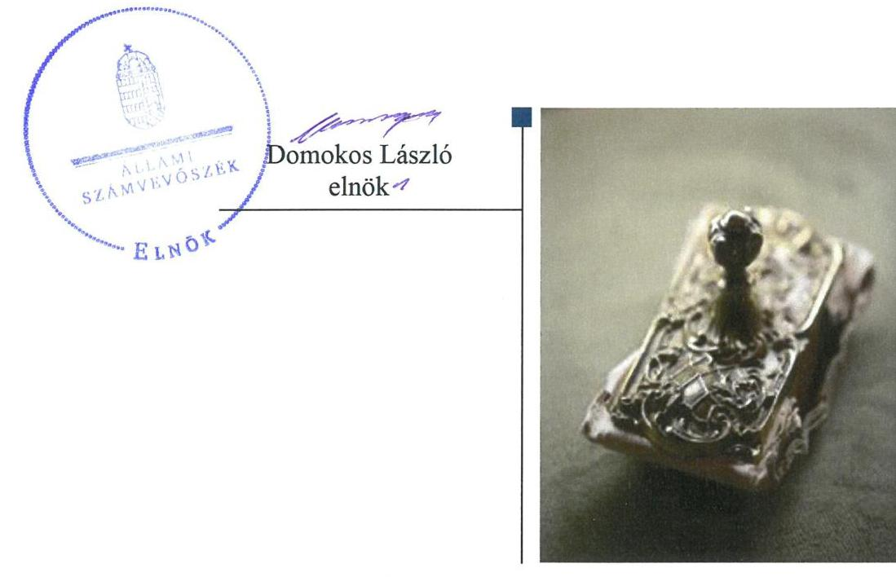
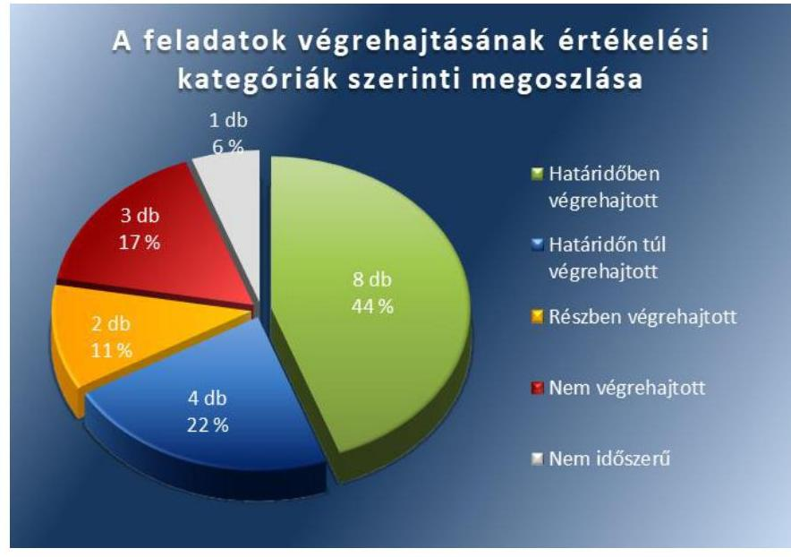
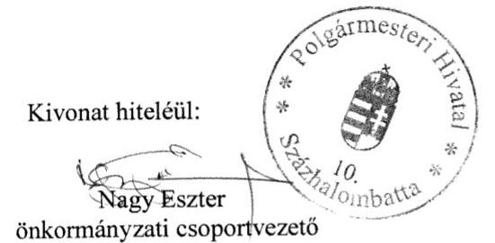
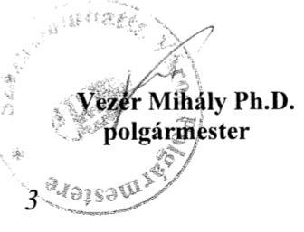
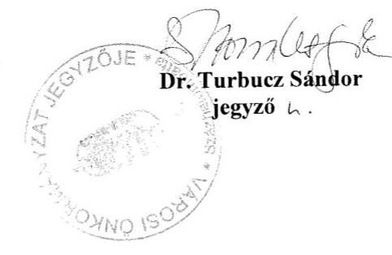
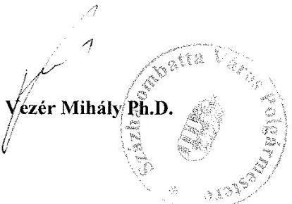
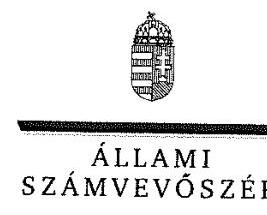
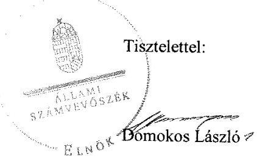

# Jelentés 

## Utóellenőrzések

Az önkormányzatok belső
kontrollrendszere kialakításának és működtetésének utóellenőrzése Százhalombatta Város Önkormányzata 2019. 02. hó 01. nap

---

# AZ ELLENŐRZÉST FELÜGYELTE: 

DR. BENEDEK MÁRIA felügyeleti vezető

## AZ ELLENŐRZÉST VEZETTE ÉS A VÉGREHAJTÁSÁÉRT FELELŐS:

RÁCZKEVI KATALIN ellenőrzésvezető

## A PROGRAM ÖSSZEÁLLÍTÁSÁÉRT FELELŐS:

TÓTPÁL SZABOCS osztályvezető

## A TÉMÁHOZ KAPCSOLÓDÓ KORÁBBI SZÁMVEVŐSZÉKI JELENTÉSEK:

- címe: Az önkormányzatok belső kontrollrendszere kialakításának és működtetésének ellenőrzése Százhalombatta
- sorszáma: 16184

Jelentéseink az Országgyúlés számítógépes hálózatán és az Interneten a www.asz.hu címen is olvashatóak.

IKTATÓSZÁM: EL-0775-036/2019
TÉMASZÁM: 2460
ELLENŐRZÉS-AZONOSÍTÓ SZÁM: V080436

---

# TARTALOMJEGYZÉK 

■ ÖSSZEGZÉS ..... 5
■ AZ ELLENŐRZÉS CÉLJA ..... 6
■ AZ ELLENŐRZÉS TERÜLETE ..... 7
■ AZ ELLENŐRZÉS HÁTTERE, INDOKOLTSÁGA ..... 8
■ A JELENTÉS LÉNYEGES KÉRDÉSKÖRE ..... 9
■ AZ ELLENŐRZÉS HATÓKÖRE ÉS MÓDSZEREI ..... 10
■ MEGÁLLAPÍTÁSOK ..... 12
■ MELLÉKLETEK ..... 15
I. sz. melléklet: Százhalombatta Város Önkormányzata intézkedési terve végrehajtásának értékelése ..... 15
II. sz. melléklet: Százhalombatta Város Önkormányzata intézkedési terve ..... 21
■ FÜGGELÉK: ÉSZREVÉTELEK ..... 31
■ RÖVIDÍTÉSEK JEGYZÉKE ..... 43

---

.

---

# ÖSSZEGZÉS 

Az Állami Számvevőszék Százhalombatta Város Önkormányzata belső kontrollrendszere kialakításának és működtetésének utóellenőrzése során megállapította, hogy az intézkedési tervben meghatározott feladatok jelentős részét végrehajtotta, így a közpénzekkel, a vagyonnal való felelős gazdálkodás átláthatósága, továbbá a működés szabályszerűsége javult.

## Az ellenőrzés társadalmi indokoltsága

Az Állami Számvevőszék stratégiájában célul tűzte ki a számvevőszéki munka hasznosulásának javítását. Ezzel összhangban ellenőrzi, hogy az ellenőrzött szervezet megvalósította-e a korábbi ellenőrzései által feltárt hibák, hiányosságok és szabálytalanságok megszüntetése céljából elkészített intézkedési tervében foglaltakat. A rendszeres utóellenőrzések hozzájárulnak a szükséges intézkedések tényleges végrehajtásához, ezáltal a közpénzügyek rendezettségének javulásához.

## Főbb megállapítások, következtetések

Százhalombatta Város Önkormányzata az intézkedési tervben meghatározott 18 feladatból nyolcat határidőben, négyet határidőn túl, kettőt részben, hármat nem hajtott végre, egy nem volt időszerű.

A jegyző az átmenetileg szabad pénzeszközök betétben való elhelyezésének szabályait meghatározta, intézkedett az értékpapír vásárlás előírásoknak megfelelő bizonylatokkal történő alátámasztásáról, a betétlekötések szabályszerű utalványozásáról, ezzel a befektetésekkel kapcsolatos pénzügyi elszámoltathatóság javult.

A jegyző intézkedett a befektetett eszközök leltározásáról.
Százhalombatta Város Önkormányzata a köztisztviselőkre vonatkozó hivatásetikai eljárás szabályozását elkészítette, ezáltal a szervezet integritásában lévő kockázatok mérséklődtek.

Százhalombatta Város Önkormányzatának jegyzője az intézkedési tervben meghatározott feladatok végrehajtásáról a jogszabályi előírás szerinti nyilvántartást nem vezette.

---

# AZ ELLENŐRZÉS CÉLJA 

Az ellenőrzés célja annak értékelése volt, hogy a számvevőszéki jelentésben ${ }^{1}$ foglalt megállapításokkal összhangban készített intézkedési tervben meghatározott feladatokat az ellenőrzött szervezet végrehajtotta-e.

---

# AZ ELLENŐRZÉS TERÜLETE 

## Százhalombatta Város Önkormányzata

Százhalombatta város a Közép-Magyarországi régióban, Pestmegyében található. Állandó lakosainak száma a Központi Statisztikai Hivatal Magyarország közigazgatási helynévkönyve alapján 2017. január 1-jén 18378 fő volt.

A Polgármester² 2014. október 12-től tölti be tisztségét. A 11 fővel működő képviselő-testület ${ }^{3}$ munkáját négy állandó bizottság ${ }^{4}$ támogatta. A jegyző 2005. április 1-jétől látja el feladatát.

Százhalombatta Város Önkormányzata 2017. évi költségvetésének végrehajtásáról szóló rendelete ${ }^{5}$ szerint 8323,0 millió Ft költségvetési bevételt ért el és 7685,8 millió Ft költségvetési kiadást teljesített. Mérlegfőösszege 2017. december 31-én 46 426,3 millió Ft, a követelések összege 1163,2 millió Ft, a kötelezettségek összege 473,2 millió Ft, melyből az éven belüli kötelezettségek összege 11,4 millió Ft volt.

Az ÁSZ ${ }^{6}$ 2016. évben ellenőrizte Százhalombatta Város Önkormányzata belső kontrollrendszere kialakítását és működtetését a 2014. január 1. és 2015. április 30. közötti időszakra, valamint a 2011. január 1-jétől 2015. április 30-ig terjedő időszakra az egyes befektetési döntéseinek, a döntések végrehajtásának és elszámolásának a szabályszerűségét. Az ellenőrzés célja annak megállapítása volt, hogy az önkormányzat belső kontrollrendszerének kialakítása, továbbá egyes elemeinek működtetése biztosította-e az önkormányzatnál a közpénzfelhasználás szabályosságát, támogatta-e az integritás szemlélet érvényesülését. Az ÁSZ továbbá ellenőrizte, hogy az önkormányzat egyes befektetési döntései és azok végrehajtása, elszámolása megfelelt-e a vonatkozó jogszabályoknak és belső szabályozásoknak, a kialakított kontrollrendszer támogatta-e a befektetési tevékenység szabályszerűségét. Az ellenőrzésről készült 16184 számú jelentést az ÁSZ 2016. december 1-jén hozta nyilvánosságra.

---

# AZ ELLENŐRZÉS HÁTTERE, INDOKOLTSÁGA 

Az ÁSZ tv. ${ }^{7}$ 33. § (1) bekezdése értelmében a számvevőszéki jelentések megállapításaihoz és javaslataihoz kapcsolódóan az ellenőrzött szervezet vezetője intézkedési tervet köteles összeállítani, és az Állami Számvevőszék részére megküldeni.

Az ÁSZ által befogadott intézkedési tervben foglaltak megvalósítását az ÁSZ tv. 33. § (7) bekezdésében foglaltak alapján - az Állami Számvevőszék utóellenőrzés keretében ellenőrizheti. Az utóellenőrzések keretében - az intézkedések értékelése során - az Állami Számvevőszék figyelembe veszi az ellenőrzött szervezetek működési feltételeiben, valamint a jogszabályi előírásokban bekövetkezett változásokat.

Az utóellenőrzés során az ÁSZ értékeli, hogy az érintett számvevőszéki jelentésben foglalt megállapításokkal és javaslatokkal összhangban, az ellenőrzött szervezet által készített intézkedési tervben meghatározott feladatokat a feladatra kijelöltek végrehajtották-e.

Az intézkedések végrehajtásával az adott terület szabályszerű működése vonatkozásában a kockázatok csökkenhetnek, azonban hosszabb távon az intézkedési tervben foglaltak végrehajtásával önmagában nem szűnnek meg, csak akkor, ha beépülnek az ellenőrzött szervezet működésébe, azokat folyamatosan karban tartják, figyelembe véve, illetve kezelve a változásokat. Emellett az intézkedések végrehajtásáig újabb kockázatok merülhetnek fel a szabályszerű működés vonatkozásában, amelyek kezelése szintén kiemelten fontos az ellenőrzött szervezet számára.

Az ellenőrzött szervezet vezetője által készített intézkedési tervekben foglalt feladatok hiányos, illetve késedelmes végrehajtása, vagy annak elmaradása a szabályszerűség és a felelős vezetői magatartás vonatkozásában kockázatot hordoz, ami azt mutatja, hogy az ellenőrzések során feltárt hibák, hiányosságok és szabálytalanságok kezelése nem kapott kellő hangsúlyt. Az utóellenőrzés során is fennálló szabálytalanságok esetén a közpénz, közvagyon veszélyeztetettségi kockázat valószínűsített hatásának értékelése további intézkedéseket vonhat maga után.

Az ellenőrzött szervezet szintjén az utóellenőrzés feltárja, hogy a szervezet az intézkedések végrehajtásával hasznosította-e a korábbi ellenőrzési jelentésben a hiányosságok megszüntetése, illetve a kockázatok kezelése érdekében megfogalmazott javaslatokat, illetve az intézkedések végrehajtása elmaradásának következtében továbbra is fennálló szabálytalanság esetén értékeli a közpénzek, közvagyon veszélyeztetettségét.

Az ÁSZ szintjén az utóellenőrzés visszacsatolást ad az ellenőrzési jelentések hasznosulásáról, az intézkedések elmaradásának, vagy részleges megvalósulásának a közpénzek, közvagyon veszélyeztetettségére gyakorolt valószínűsített hatásának értékelése, további intézkedéseket vonhat maga után.

---

# A JELENTÉS LÉNYEGES KÉRDÉSKÖRE 

Az önkormányzat az intézkedési tervben foglaltakat az előírt határidőben végrehajtotta-e?

---

# AZ ELLENŐRZÉS HATÓKÖRE ÉS MÓDSZEREI 

## Az ellenőrzés típusa

Megfelelőségi ellenőrzés.

## Az ellenőrzött időszak

Az utóellenőrzés alapját képező ÁSZ jelentés közzétételének napjától az utóellenőrzésről szóló kiértesítő levél keltének napjáig, 2016. december 1-jétől 2018. július 4-éig tartó időszak volt.

## Az ellenőrzés tárgya

A számvevőszéki jelentésben foglalt megállapításokkal összhangban - az önkormányzat által - készített intézkedési tervben foglaltak végrehajtásának ellenőrzése volt.

## Az ellenőrzött szervezet

Százhalombatta Város Önkormányzata

## Az ellenőrzés jogalapja

Az ellenőrzés jogszabályi alapját az ÁSZ tv. 33. § (7) bekezdésének előírása képezte.

## Az ellenőrzés módszerei

Az ÁSZ az ellenőrzést az ellenőrzött időszakban hatályos jogszabályok, az ellenőrzés szakmai szabályai, jelen ellenőrzésre irányadó ÁSZ módszertanok, az ellenőrzési programban foglalt értékelési szempontok szerint végezte.

Az ÁSZ az ellenőrzés ideje alatt az önkormányzattal történő kapcsolattartást az ÁSZ SZMSZ ${ }^{\circledR}$-ének vonatkozó előírásai alapján biztosította.

Az utóellenőrzés megállapításait az ÁSZ rendelkezésére álló, valamint az ÁSZ adatbekérése szerint, az önkormányzat által rendelkezésre bocsátott dokumentumok alapozták meg.

Az ellenőrzési bizonyítékként felhasználható adatforrások közé tartoztak egyrészt az ellenőrzési program részletes szempontjainál felsorolt

---

adatforrások, másrészt minden - az ellenőrzés folyamán feltárt, az ellenőrzés szempontjából információt tartalmazó - dokumentum.

Az intézkedési tervekben előírt feladatokat azok végrehajthatósága, illetve végrehajtása szempontjából az alábbiak szerint értékelte az ÁSZ:
$\longrightarrow$ „határidőben végrehajtott" a feladat, ha a teljesítés dokumentáltan, az intézkedési tervben előírt határidőben és tartalommal megtörtént;
$\longrightarrow$ „határidőn túl végrehajtott" a feladat, ha annak teljesítése az intézkedési tervben meghatározott módon, de az előírt határidőn túl történt meg;
$\longrightarrow$ „részben végrehajtott" a feladat, ha végrehajtása teljes körűen az intézkedési tervben előírt módon nem történt meg;
$\longrightarrow$ „nem végrehajtott" a feladat, ha a végrehajtás nem történt meg, vagy amennyiben a teljesítést nem dokumentálták;
$\longrightarrow$ „okafogyottá vált" a feladat, ha végrehajtására - meghatározott esemény bekövetkezése, továbbá külső körülmény, a működést érintő feltétel változása miatt - már nincs szükség, illetve lehetőség, és egyértelműen megállapítható, hogy az intézkedést szükségessé tevő körülmény a jövőben nem fordulhat elő;
$\longrightarrow$ „nem időszerű" az a feladat, amelynek ellenőrzési időszakon belüli végrehajtására azért nem került (kerülhetett) sor, mert az intézkedés alapjául szolgáló esemény nem következett be, de annak jövőbeni előfordulása lehetséges, a végrehajtása nem volt esedékes, vagy a végrehajtás határideje még nem járt le.
Az ellenőrzés lefolytatásához az önkormányzat a tanúsítványok elektronikus kitöltésével, valamint az ÁSZ által kért dokumentumok elektronikus megküldésével szolgáltatott adatokat, amelyek valódiságát és teljes körűségét az önkormányzat vezetője által tett teljességi és hitelességi nyilatkozat igazolta. Az így rendelkezésre bocsátott adatok, információk kontrollja az ellenőrzés keretében megtörtént.

Százhalombatta Város Önkormányzata által megküldött intézkedési tervben meghatározott ÁSZ által beazonosított feladatok a II. számú mellékletben kerültek bemutatásra.

---

# MEGÁLLAPÍTÁSOK 

## Az önkormányzat az intézkedési tervben foglaltakat az előírt határidőben végrehajtotta-e?

Összegző megállapítás

Az Önkormányzat ${ }^{9}$ az intézkedési tervben meghatározott 18 feladatból nyolcat határidőben, négyet határidőn túl, kettőt részben, hármat nem hajtott végre, egy nem volt időszerű. Az intézkedési tervben meghatározott feladatok végrehajtásáról a jogszabályban előírt nyilvántartást nem vezette.

Az ÁSZ a jelentésében a polgármester részére öt, a jegyző részére hat javaslatot fogalmazott meg. Az Önkormányzat képviselő-testülete által 66/2017. (II.26.) számú határozattal jóváhagyott intézkedési tervben a hiányosságok, a szabálytalanságok megszüntetésére a polgármester részére öt, a jegyző részére 12, a gazdasági vezető részére egy feladat került meghatározásra.

Az intézkedési tervben meghatározott feladatokat, határidőket, felelősöket és a feladatok végrehajtását az I. sz. melléklet mutatja be.

Az Önkormányzat jegyzője az intézkedési tervben meghatározott feladatok végrehajtásáról a Bkr. ${ }^{10}$ 14. § (1) bekezdés előírása szerinti nyilvántartást nem vezette.

Az Önkormányzat intézkedési tervében meghatározott feladatok végrehajtásának értékelési kategóriák szerinti megoszlását az 1. ábra szemlélteti.

1. ábra

Forrás: ÁSZ

---

A SZABÁLYOZOTTSÁG javult, mert az Önkormányzat irányítása alá tartozó valamennyi költségvetési szerv szervezeti és működési szabályzatának jóváhagyása megtörtént.(P4) A gazdálkodási szabályzatot a jogszabályoknak megfelelően elkészítették, a gazdálkodási jogköröket gyakorló munkatársak figyelmét felhívták a szabályszerű joggyakorlás végzésére.(J1) A jegyző az átmenetileg szabad pénzeszközök betétben való elhelyezésére, befektetésére, egyéb hasznosítására meghatározott hatásköri szabályok felülvizsgálatát elvégezte, a hatásköröket a szervezeti és működési szabályzatban rögzítette.(J2) Az intézkedésekkel a működés szabályozottsága terén azonosított kockázatok csökkentek.

# A SZABÁLYSZERŰ PÉNZÜGYI GAZDÁLKODÁS 

helyreállításával a pénzügyi elszámoltathatóság javult. A jegyző gondoskodott a befektetési döntésekkel kapcsolatos döntések végrehajtása során az értékpapír forgalom szabályszerű, a jogszabályoknak megfelelő bizonylatokkal történő alátámasztásáról.(J4) A jegyző intézkedett arról, hogy utalványozást a betétlekötések esetében is az Áht ${ }^{11}$. előírásainak megfelelő módon, a kiadás teljesítését megelőzően végezzék el.(J1e)

## A BELSŐ KONTROLL SZERINTI ELSZÁMOLTATHATÓSÁG javult. A jegyző az ÁSZ korábbi ellenőrzése során feltárt szabálytalanságokat kivizsgálta.(J6.) A jegyző intézkedett annak érdekében,
 hogy az Önkormányzat betétlekötési megbízásait a mindenkor a hatályos szabályozásnak megfelelő kötelezettségvállaló írja alá. (J1f) A kockázatok mérséklése az Önkormányzat elszámoltathatóságát javította.

AZ INTEGRITÁS javítása érdekében a jegyző intézkedéseket tett a köztisztviselőkre vonatkozó hivatásetikai alapelvek részletes tartalmának, valamint az etikai eljárás szabályainak megalkotásával. (J3) Az Önkormányzat honlapján az ötmillió forintot meghaladó értékpapír-szerződések adatainak közzétételével. (J1d). A megtett intézkedések az integritási kockázatokat csökkentették.

A SZABÁLYSZERŰ VAGYONGAZDÁLKODÁS érdekében a jegyző intézkedett az Önkormányzat költségvetési beszámoló mérlegében kimutatott befektetett eszközeinek leltárral történő alátámasztásáról. (J5a)

---

.

---

# MELLÉKLETEK

- I. SZ. MELLÉKLET: SZÁZHALOMBATTA VÁROS ÖNKORMÁNYZATA INTÉZKEDÉSI TERVE VÉGREHAJTÁSÁNAK ÉRTÉKELÉSE

|  1. | Az intézkedési tervben meghatározott feladat | Az intézkedési tervben meghatározott határidő | Az intézkedési tervben meghatározott feladatok felelőse  |
| --- | --- | --- | --- |
|   |  |  | A feladat végrehajtása  |
|  J1b. ${ }^{12}$ | Intézkedni kell az ellenőrzés során a belső kontrollrendszer egyes elemei jogszabályi előírásnak megfelelő kialakításáról és működtetéséről, valamint a befektetésekkel kapcsolatos döntések előkészítése és végrehajtása során a gazdálkodási jogkörök jogszabályi előírásoknak megfelelő gyakorlásáról, ennek keretében: Fel kell hívni a teljesítésigazolók figyelmét, hogy az ellenőrzési feladatukat minden esetben, kivétel nélkül az Ávr. 57. § (3) bekezdésében és az önkormányzati gazdálkodási szabályzatban előírt módon végezték el, minden esetben tüntessék fel a teljesítés tényére utaló megjelölést és a teljesítésigazolás dátumát. Intézkedni kell az ellenőrzés során a belső kontrollrendszer egyes elemei jogszabályi előírásnak megfelelő kialakításáról és működtetéséről, valamint a befektetésekkel kapcsolatos döntések előkészítése és végrehajtása során a gazdálkodási jogkörök jogszabályi előírásoknak megfelelő gyakorlásáról, ennek keretében: Fel kell hívni az érvényesítést végzők figyelmét, hogy az érvényesítést az Áht. 38. § (1) bekezdésében, valamint az Ávr. 58. § (3) bekezdésében előírtak alapján minden esetben, kivétel nélkül a kifizetéseket megelőzően végezzék el, ennek során minden esetben az Ávr. 58. § (1) bekezdésében és az önkormányzati gazdálkodási szabályzatban foglaltak szerint | 2016. december 20., azt követően folyamatos | Jegyző (végrehajtásban részt vesz a Pénzügyi és Vagyongazdálkodási Iroda vezetője)  |
|  J1c. | 2016. december 20., azt követően folyamatos | Jegyző (végrehajtásban részt vesz a Pénzügyi és Vagyongazdálkodási Iroda vezetője)  |

A jegyző és a polgármester a gazdálkodás rendjéről szóló 15/2016. (VI. 30.) számú közös utasítását kiadta, valamint a jegyző a 2017. január 12-én kelt 26/2017. számú levelében, a Pénzügyi és Vagyongazdálkodási iroda vezetője a 166/2018. számú levelében felhívta az érvényesítést végző munkatársak figyelmét a jogszabályban és a gazdálkodás rendjéről szóló szabályzatban előírtaknak megfelelő gazdálkodási jogkör gyakorlására.

---

|  Sorszám | Az intézkedési tervben meghatározott feladat | Az intézkedési tervben meghatározott határidő | Az intézkedési tervben meghatározott feladatok feladása | A feladat végrehajtása  |
| --- | --- | --- | --- | --- |
|   | végezzék el a kiadások összegszerűségének, a fedezet meglétének, továbbá annak ellenőrzését, hogy a megelőző ügymenetben az Áht., az Áhsz., az Ávr. és a belső szabályzatokban foglaltakat betartották-e. |  |  |   |
|  J1e. | Intézkedni kell az ellenőrzés során a belső kontrollrendszer egyes elemei jogszabályi előírásnak megfelelő kialakításáról és működtetéséről, valamint a befektetésekkel kapcsolatos döntések előkészítése és végrehajtása során a gazdálkodási jogkörök jogszabályi előírásoknak megfelelő gyakorlásáról, ennek keretében: Az utalványozást a betétlekötések esetében is az Áht. 38. § (1) bekezdésében előírtak alapján a kiadás teljesítését megelőzően kell elvégezni. | 2016. december 20., azt követően folyamatos | Jegyző (végrehajtásban részt vesz a Pénzügyi és Vagyongazdálkodási Iroda vezetője) | A jegyző gondoskodott arról, hogy utalványozást a betétlekötések esetében az Áht. 38. § (1) bekezdésében előírtak alapján a kiadás teljesítését megelőzően végezzék el.  |
|  J1f. | Intézkedni kell az ellenőrzés során a belső kontrollrendszer egyes elemei jogszabályi előírásnak megfelelő kialakításáról és működtetéséről, valamint a befektetésekkel kapcsolatos döntések előkészítése és végrehajtása során a gazdálkodási jogkörök jogszabályi előírásoknak megfelelő gyakorlásáról, ennek keretében: Gondoskodni szükséges arról, hogy a betétlekötési megbízásokat mindenkor a hatályos szabályozásnak megfelelő kötelezettségvállaló írja alá. | folyamatos | jegyző | A jegyző gondoskodott arról, hogy a betétlekötési megbízásokat mindenkor a hatályos szabályozásnak megfelelő kötelezettségvállaló - a polgármester - írta alá.  |
|  J2. | Az átmenetileg szabad pénzeszközök betétben való elhelyezésére, befektetésére, egyéb hasznosítására meghatározott hatásköri szabályokat felül kell vizsgálni, az önkormányzati rendeletek előírásai között fennálló ellentmondások megszüntetésére irányuló előterjesztést el kell készíteni. | 2017. február 20. | Jegyző (végrehajtásban részt vesz a Pénzügyi és Vagyongazdálkodási Iroda vezetője) Jegyző (végrehajtásában részt vesz a Személyzeti munkatárs) | A jegyző az átmenetileg szabad pénzeszközök betétben való elhelyezésére, befektetésére, egyéb hasznosítására meghatározott hatásköri szabályokat felülvizsgálta, az erre vonatkozó módosítást az Önkormányzati SZMSZ ${ }^{13}$-ben átvezette, és 2017. január 26-án kezdeményezte annak előterjesztését a képviselő-testület felé. A jegyző a köztisztviselőkre vonatkozó hivatásetikai alapelvek részletes tartalmát, valamint az etikai eljárás szabályait tartalmazó előterjesztést 2017. január 26-án előkészítette.  |

---

|  Az intézkedési tervben meghatározott feladat | Az intézkedési tervben meghatározott határidő | Az intézkedési tervben meghatározott feladatok felelőse | A feladat végrehajtása  |
| --- | --- | --- | --- |
|  J5a. | Intézkedni kell az éves költségvetési beszámoló mérlegében kimutatott eszközök (értékpapír és üzleti vagyonba tartozó ingatlanok) jogszabályi előírásoknak megfelelő leltárral történő alátámasztásáról, kiemelt figyelemmel az alábbiakra: A forgatási célú hitelviszonyt megtestesítő értékpapírok leltárát - a leltározási szabályzat 5.1.1 pont A/III. alpontjában előírtak alapján - az analitikus nyilvántartás és az értékpapír- és ügyfélszámla kivonat összevetésével kell elkészíteni. | 2017. január 30., azt követően folyamatos | Jegyző (végrehajtásában részt vesz a Pénzügyi és vagyongazdálkodási Iroda vezetője)  |
|  J6. | Az Állami Számvevőszék ellenőrzése során feltárt hiányosságok és/vagy szabálytalanságok felülvizsgálata, ezek tekintetében a munkajogi felelősség tisztázása megtörténik, a szükséges intézkedések megtételre kerülnek. | 2017. április 30. | Jegyző  |
|  Határidőn túl végrehajtott feladatok |  |  |   |
|  P1.14 | Az átmenetileg szabad pénzeszközök betétben való elhelyezésére, befektetésére, egyéb hasznosítására meghatározott hatásköri szabályokat felül kell vizsgálni, és az önkormányzati rendeletek előírásai között fennálló ellentmondások megszüntetésére irányuló előterjesztést a Képviselő-testület elé kell terjeszteni. | 2017. március 10. | Polgármester (előkészítésben részt vesz: Jegyző, Pénzügyi és Vagyongazdálkodási Iroda vezető)  |
|  P3. | A köztisztviselőkre vonatkozó hivatásetikai alapelvek részletes tartalmát, valamint az etikai eljárás szabályait tartalmazó, Jegyző által előkészített előterjesztést a Képviselőtestület elé kell terjeszteni. | 2017. február 28. | Polgármester (előkészítésében részt vesz: Jegyző, Személyzeti munkatárs)  |
|  P4. | Felül kell vizsgálni az önkormányzat irányítása alá tartozó valamennyi költségvetési szerv szervezeti és működési szabályzatának hatásköri előírásoknak megfelelő jóváhagyási folyamatát, és szükség esetén intézkedést kell tenni az irányítószerv általi jóváhagyás érdekében. | 2017. január 30. | Polgármester (előkészítésében részt vesz: Jegyző, Hatósági Iroda vezetője)  |

|  Az intézkedési tervben meghatározott feladat | Az intézkedési tervben meghatározott határidő | Az intézkedési tervben meghatározott feladatok felelőse | A feladat végrehajtása  |
| --- | --- | --- | --- |
|  J1. | J1. | Jegyző (végrehajtásában részt vesz a Pénzügyi és vagyongazdálkodási Iroda vezetője) | A jegyző intézkedett a 2016. és 2017. évi költségvetési beszámoló mérlegében kimutatott forgatási célú hitelviszonyt megtestesítő értékpapírok jogszabályi előírásoknak és a leltározási szabályzatnak megfelelő, az analitikus nyilvántartás, az értékpapír- és ügyfélszámla kivonat összevetésével történő leltározásáról.  |
|  J2. | J2. | Jegyző (végrehajtásában részt vesz a Pénzügyi és vagyongazdálkodási Iroda vezetője) | A jegyző a feltárt hiányosságokat és/vagy szabálytalanságokat felülvizsgálta, melyet 2017. április 18-án készített összefoglaló jelentésben rögzített, azonban munkajogi felelősségre vonást nem tartott indokoltnak, nem kezdeményezett.  |
|  J3. | J3. | Jegyző (végrehajtásában részt vesz a Pénzügyi és vagyongazdálkodási Iroda vezetője) | A jegyző a feltárt hiányosságokat és/vagy szabálytalanságokat felülvizsgálta, melyet 2017. április 18-án készített összefoglaló jelentésben rögzített, azonban munkajogi felelősségre vonást nem tartott indokoltnak, nem kezdeményezett.  |
|  Határidőn túl végrehajtott feladatok |  |  |   |
|  J4. | J4. | Jegyző (végrehajtásában részt vesz a Pénzügyi és vagyongazdálkodási Iroda vezetője) | A polgármester 2017. március 10-én terjesztette a képviselő-testület elé az önkormányzati rendeletek előírásai között fennálló ellentmondások megszüntetésére irányuló, a jegyző által 2017. január 26-án előkészített előterjesztést.  |
|  J5a. | J5a. | Jegyző (végrehajtásában részt vesz a Pénzügyi és vagyongazdálkodási Iroda vezetője) | A polgármester 2017. március 16-án terjesztette a képviselő-testület elé a Hivatásetikai szabályzat$^{21}$ tervezetére vonatkozó, a jegyző által 2017. január 26-án előkészített előterjesztést.  |
|  J5b. | J5b. | Jegyző (végrehajtásában részt vesz a Pénzügyi és vagyongazdálkodási Iroda vezetője) | A jogszabályi előírásoknak és a leltározási szabályzatnak megfelelő, az analitikus nyilvántartás, az értékpapír- és ügyfélszámla kivonat összevetésével történő leltározásáról.  |
|  Határidőn túl végrehajtott feladatok |  |  |   |
|  J6. | J6. | Jegyző (végrehajtásában részt vesz a Pénzügyi és vagyongazdálkodási Iroda vezetője) | A jegyző az önkormányzat irányítása alá tartozó 11 költségvetési szerv szervezeti és működési szabályzatának hatásköri előírásoknak megfelelő felülvizsgálatát 2017. január 27-én elrendelte, a Hatósági Iroda vezetője 2017. január 30-án a felülvizsgálatot elvégezte, feljegyzésben rögzítette a szükséges intézkedéseket.  |
|  J7. | J7. | Jegyző (végrehajtásában részt vesz a Pénzügyi és vagyongazdálkodási Iroda vezetője) | A polgármester a 2017. február 9-én kelt 1-507-1/2017. számú levelében intézkedett az intézményvezetők felé annak érdekében, hogy valamennyi, az önkormányzat irányítása alá tartozó költségvetési szerv szervezeti és működési szabályzata az irányító szerv által jóváhagyásra kerüljön.  |

---

|  Az intézkedési tervben meghatározott feladat | Az intézkedési tervben meghatározott határidő | Az intézkedési tervben meghatározott feladatok felelőse | A feladat végrehajtása  |
| --- | --- | --- | --- |
|  Intézkedni kell az éves költségvetési beszámoló mérlegében kimutatott eszközök (értékpapír és üzleti vagyonba tartozó ingatlanok) jogszabályi előírásoknak megfelelő leltárral történő alátámasztásáról, kiemelt figyelemmel az alábbiakra: Az üzleti vagyonba tartozó ingatlanok leltárazását a leltározási szabályzat előírtaknak megfelelően, nyilvántartáson alapuló mennyiségi felvétellel kell elvégezni, az ingatlanvagyon-kataszteri nyilvántartásokat a földhivatali nyilvántartással kell egyeztetni. | 2017. január 30., azt követően folyamatos | Jegyző (végrehajtásában részt vesz a Pénzügyi és vagyongazdálkodási Iroda vezetője) | A jegyző az üzleti vagyonba tartozó ingatlanok 2016. évi leltárának jogszabályi és leltározási szabályzat előírásainak megfelelő mennyiségi felvétellel történő leltárazásáról 2017. január 31-én, a 2017. évi leltárának elkészítéséről 2018. január 31-én intézkedett. A jegyző az ingatlanvagyon-kataszteri nyilvántartások földhivatali nyilvántartással való egyeztetéséről
 a 2016. évre vonatkozóan 2017. március 30-án, a 2017. évre vonatkozóan 2018. március 22-én intézkedett.  |
|  Részben végrehajtott feladat |  |  |   |
|  Intézkedni kell az ellenőrzés során a belső kontrollrendszer egyes elemei jogszabályi előírásnak megfelelő kialakításáról és működtetéséről, valamint a befektetésekkel kapcsolatos döntések előkészítése és végrehajtása során a gazdálkodási jogkörök jogszabályi előírásoknak megfelelő gyakorlásáról, ennek keretében: Teljes körűen közzé kell tenni az államháztartáshoz tartozó vagyonnal történő gazdálkodással összefüggő, ötmillió forintot elérő vagy azt meghaladó értékű ingatlan vásárlásra és pénzügyi szolgáltatásra vonatkozó (értékpapír adásvételi és betétlekötési) szerződések adatait, azaz a szerződések megnevezését (típusa), tárgyát, a szerződést kötő felek nevét, a szerződés értékét, határozott időre kötött szerződés esetében annak időtartamát, valamint az említett adatok változásait. | 2016. december 20., azt követően folyamatos | Jegyző (végrehajtásban részt vesz a Pénzügyi és Vagyongazdálkodási Iroda vezetője) | Végrehajtott feladat rész: A jegyző intézkedett az ötmillió forintot elérő értékpapír szerződések adatainak a jogszabályi előírásoknak megfelelő közzétételéről az Önkormányzat honlapján. Az ötmillió forintot elérő vagy azt meghaladó értékű ingatlan vásárlására az ellenőrzött időszakban nem került sor, ezáltal a feladat nem volt időszerű. Nem végrehajtott feladatrész: A jegyző nem gondoskodott az ötmillió forintot elérő vagy azt meghaladó értékű betétlekötési szerződések közzétételéről az Infotv. 16. 37. § (1) bekezdésében hivatkozott 1. melléklet szerinti általános közzétételi lista III/4. pontjában előírtak ellenére.  |
|  Intézkedni kell a befektetésekkel kapcsolatos gazdasági események jogszabályi előírásoknak megfelelő bizonylatokkal történő alátámasztásáról, valamint rögzítéséről és elszámolásáról a számviteli (főkönyvi és részletező) nyilvántartásokban az alábbiakra tekintettel: Az átmenetileg szabad pénzeszközök befektetései esetében a bizonylati elv és bizonylati fegyelem előírásainak betartása | azonnal, azt követően folyamatos | Jegyző (végrehajtásban részt vesz a Pénzügyi és Vagyongazdálkodási Iroda vezetője) | Végrehajtott feladatrész: A forgatási célú értékpapírok 2016. és 2017. év végi állománya alapján a jegyző intézkedett az átmenetileg szabad pénzeszközök befektetései esetében a bizonylati elv és bizonylati fegyelem előírásainak betartása érdekében, mert a befektetéseket nyilvántartó szervezetek – a Magyar Államkincstár és az Erste Befektetési Zrt. – a pénzeszközöket és a forgatási célú értékpapírokat érintő gazdasági műveletek, események bizony-  |

---

|  Az intézkedési tervben meghatározott feladat | Az intézkedési tervben meghatározott határidő | Az intézkedési tervben meghatározott feladatok felelőse | A feladat végrehajtása  |
| --- | --- | --- | --- |
|  érdekében meg kell követelni a pénzeszközöket és a forgatási célú értékpapírokat érintő gazdasági műveletek, események bizonylatait (értékpapír- és ügyfélszámla kivonatokat) a befektetéseket nyilvántartó szervezettől oly módon, hogy a bizonylatok az adott gazdasági műveletre vonatkozóan a könyvvitelben rögzítendő és a más jogszabályban előírt adatokat a valóságnak megfelelően, hiánytalanul tartalmazzák. Élni kell az új jogszabály adta lehetőséggel (Tpt. 141/A. §), havonta ellenőrizni kell az MNB honlapján az értékpapírszámla egyenlegét. |  |  | latai (értékpapír- és ügyfélszámla kivonatokat) az adott gazdasági műveletre vonatkozóan a könyvvitelben rögzítendő és a más jogszabályban előírt adatokat a valóságnak megfelelően, hiánytalanul tartalmazták.  |
|   |  |  | Nem végrehajtott feladatrész:  |
|   |  |  | A jegyző nem intézkedett annak érdekében, hogy az Önkormányzat értékpapírszámláinak egyenlegét a Tpt. 17. 141/A. § (1) bekezdés előírásainak megfelelően az MNB honlapján havonta ellenőrizzék.  |
|  Az Állami Számvevőszék ellenőrzése során feltárt hiányosságok és/vagy szabálytalanságok felülvizsgálata, ezek tekintetében a munkajogi felelősség tisztázása megtörténik, a szükséges intézkedések megtételre kerülnek. |  |  |   |
|  Intézkedni kell az ellenőrzés során a belső kontrollrendszer egyes elemei jogszabályi előírásnak megfelelő kialakításáról és működtetéséről, valamint a befektetésekkel kapcsolatos döntések előkészítése és végrehajtása során a gazdálkodási jogkörök jogszabályi előírásoknak megfelelő gyakorlásáról, ennek keretében: Gondoskodni kell a Jegyző által kialakított kontrolltevékenységeken belül valamennyi kifizetés, így a finanszírozási kiadások tekintetében is az utalványok kifizetés napján történő gépi rögzítéséről az utólagos érvényesítés elkerülése érdekében. | 2017. április 30. | Polgármester | A polgármester az ÁSZ ellenőrzése során feltárt hiányosságokat és szabálytalanságokat a jegyző vonatkozásában nem tárta fel, munkajogi intézkedés nem történt.  |
|  J1a. | Intézkedni kell az ellenőrzés során a belső kontrollrendszer egyes elemei jogszabályi előírásnak megfelelő kialakításáról és működtetéséről, valamint a befektetésekkel kapcsolatos döntések előkészítése és végrehajtása során a gazdálkodási | 2016. december 20., azt követően folyamatos | Jegyző (végrehajtásban részt vesz a Pénzügyi és Vagyongazdálkodási Iroda vezetője)  |
|  J1g. | Intézkedni kell az ellenőrzés során a belső kontrollrendszer egyes elemei jogszabályi előírásnak megfelelő kialakításáról és működtetéséről, valamint a befektetésekkel kapcsolatos döntések előkészítése és végrehajtása során a gazdálkodási | folyamatos | Gazdasági vezető  |

---

|  Az intézkedési tervben meghatározott feladat | Az intézkedési tervben meghatározott határidő | Az intézkedési tervben meghatározott feladatok felelőse | A feladat végrehajtása  |
| --- | --- | --- | --- |
|  jogkörök jogszabályi előírásoknak megfelelő gyakorlásáról, ennek keretében: Gondoskodni szükséges arról, hogy a pénzügyi ellenjegyző az Áht. 37. § (1) bekezdés előírásának megfelelően győződjön meg arról, hogy a kötelezettségvállalás nem sérti-e a gazdálkodási szabályokat, azon belül az önkormányzati szabályozást. |  |  |   |
|  Nem időszerű feladat |  |  |   |
|  A befektetésekkel kapcsolatos döntések meghozatala során a Képviselő-testület által meghatározott szabályokat minden esetben be kell tartani az értékbecslés készítési kötelezettség tekintetében. | azonnal, azt követően folyamatos | Polgármester (előkészítésében részt vesz: Jegyző, Pénzügyi és Vagyongazdálkodási Iroda vezető) | A jegyző a 66/2017. számú, 2017. január 27-én kelt levelében hívta fel a befektetésekkel - különös tekintettel az ingatlanhasznosításokkal - kapcsolatos döntések előkészítésében részt vevő munkavállalók figyelmét, hogy a döntések előkészítése során a Vagyonrendelet előírásait az értékbecslési kötelezettség tekintetében tartsák be. Az ellenőrzött időszakban a Vagyonrendeletben előírtak szerinti, értékbecslési kötelezettséggel járó ingatlanvásárlásra az Önkormányzatnál nem került sor, így az értékbecslés készítési kötelezettség tekintetében előírt feladat végrehajtása nem volt időszerű.  |

---

# Kivonat 

## Százhalombatta Város Önkormányzata Képviselő-testülete 2017. február 16-ai ülésének jegyzőkönyvéből

66/2017. /II.16./ számú

## Önkormányzati határozat

## A Képviselő-testület:

1./ Megtárgyalta a Polgármester tájékoztatóját, amely szerint az Állami Számvevőszék Elnöke „Az önkormányzatok belső kontrollrendszere kialakításának és működtetésének ellenőrzése - Százhalombatta" tárgyú jelentésében foglalt megállapítások hasznosítására készített Intézkedési terv kiegészítését kérte.

Az Állami Számvevőszékről szóló 2011. évi LXVI. törvény 33. § (2) bekezdése alapján úgy dönt, hogy a 309/2016. (XII.07.) számú határozattal elfogadott Intézkedési tervben Százhalombatta Város Önkormányzat Jegyzőjének címzett 1. számú javaslathoz kapcsolódó intézkedéseket az alábbiak szerint egészíti ki:

- Gondoskodni szükséges arról, hogy a betétlekötési megbizásokat mindenkor a hatályos szabályozásnak megfelelő kötelezettségvállaló írja alá.

## Határidő: folyamatos   Felelős: Jegyző

- Gondoskodni szükséges arról, hogy a pénzügyi ellenjegyző az Áht. 37. § (1) bekezdés előírásának megfelelően győződjön meg arról, hogy a kötelezettségvállalás nem sérti-e a gazdálkodási szabályokat, azon belül az önkormányzati szabályozást.

## Határidő: folyamatos   Felelős: Gazdasági vezető

## Megtett intézkedés:

A vagyongazdálkodási rendelet szerinti betétlekötési hatáskör Polgármesterre való átruházása és a gazdálkodási szabályzat ÁSZ által tett (2.1.) megállapítás figyelembevételével történő összhangba hozatala érdekében a gazdálkodási szabályzat 2015. október 15-ei hatállyal módosításra került (15/2015. (X.13.) sz. Polgármesteri-Jegyzői Utasítás). 2015. október 15-étől kezdődően a gazdálkodási szabályzatban a Polgármester nem adott felhatalmazást kötelezettségvállalásra a betétlekötés tekintetében.,,

---

2./ Felkéri a Polgármestert és a Jegyzőt, hogy az Állami Számvevőszékről szóló 2011. évi LXVI. törvény 33. § (1) és (2) bekezdései alapján a szükséges intézkedéseket tegye meg, az Állami Számvevőszék részére a kiegészített intézkedési tervet és jelen határozatot küldje meg, valamint az intézkedési tervben foglalt intézkedéseket hajtsa végre.

Határidő: - az intézkedési terv kiegészítésének megküldése tekintetében: képviselőtestületi ülést követő 5 munkanap,

- az intézkedési tervben foglaltak végrehajtása vonatkozásában: az intézkedési tervben foglalt határidők figyelembevételével
Felelős: Polgármester (Jegyző - Pénzügyi és Vagyongazdálkodási Iroda Vezetője)

# K.m.f. 

## Dr. Turbucz Sándor   jegyző távollétében:

## dr. Horváth Ágota s.k.   aljegyző

önkormányzati csoportvezető

Vezér Mihály Ph.D. s.k.
polgármester

---

# INTÉZKEDÉSI TERV 

AZ ÁLLAMI SZÁMVEVŐSZÉK V-0911-128/2016. SZÁMÚ „AZ ÖNKORMÁNYZATOK BELSŐ KONTROLLRENDSZERE KIALAKÍTÁSÁNAK ÉS MŰKÖDTETÉSÉNEK ELLENŐRZÉSE SZÁZHALOMBATTA " CÍMMEL KÉSZÍTETT JELENTÉSBEN FOGLALT MEGÁLLAPÍTÁSOK, JAVASLATOK HASZNOSÍTÁSÁRA

Százhalombatta Város Önkormányzatának Képviselő-testülete elfogadta a 309/2016./XII.07./ számú határozatával a 2016. december 7-ei ülésén, valamint kiegészítette a 2017. február 16-án megtartott ülésén a 66/2017./II.16./ számú határozatával.

---

# Százhalombatta Város Önkormányzata Polgármesterétől 

## 1. számú javaslat

„Intézkedjen az átmenetileg szabad pénzeszközök betétben való elhelyezésére, befektetésére, egyéb hasznosítására meghatározott hatásköri szabályokkal kapcsolatosan az önkormányzati rendeletek előírásai közötti ellentmondás megszüntetéséről szóló előterjesztés Képviselőtestület elé terjesztéséről."(2. táblázat 1. sora alapján)

## Intézkedés leírása:

Az átmenetileg szabad pénzeszközök betétben való elhelyezésére, befektetésére, egyéb hasznosítására meghatározott hatásköri szabályokat felül kell vizsgálni, és az önkormányzati rendeletek előírásai között fennálló ellentmondások megszüntetésére irányuló előterjesztést a Képviselő-testület elé kell terjeszteni.

## Felelős: Polgármester

(előkészítésben részt vesz: Jegyző, Pénzügyi és Vagyongazdálkodási Iroda vezető)
Határidő: 2017. március 10.

## 2. számú javaslat

„Intézkedjen a befektetésekkel kapcsolatos döntések meghozatala során a Képviselő-testület által meghatározott szabályok betartásáról." (2. táblázat 2. sora, 6. táblázat 2. sora alapján)

## Intézkedés leírása:

A befektetésekkel kapcsolatos döntések meghozatala során a Képviselő-testület által meghatározott szabályokat minden esetben be kell tartani az értékbecslés készítési kötelezettség tekintetében.

## Felelős: Polgármester

(előkészítésben részt vesz: Jegyző, Pénzügyi és Vagyongazdálkodási Iroda vezető)
Határidő: azonnal, azt követően folyamatos

## 3. számú javaslat

„Intézkedjen a köztisztviselőkre vonatkozó hivatásetikai alapelvek részletes tartalmát, valamint az etikai eljárás szabályait tartalmazó előterjesztés Képviselő-testület elé terjesztéséről."(2. táblázat 3. sora alapján)

---

# Intézkedés leírása: 

A köztisztviselőkre vonatkozó hivatásetikai alapelvek részletes tartalmát, valamint az etikai eljárás szabályait tartalmazó, Jegyző által előkészített előterjesztést a Képviselő-testület elé kell terjeszteni.

Felelős: Polgármester (előkészítésben részt vesz: Jegyző, Személyzeti munkatárs)
Határidő: 2017. február 28.

## 4. számú javaslat

„Intézkedjen az önkormányzat irányítása alá tartozó költségvetési szervek szervezeti és működési szabályzatának jóváhagyásáról." (10. táblázat 1. sora alapján)

## Intézkedés leírása:

Felül kell vizsgálni az önkormányzat irányítása alá tartozó valamennyi költségvetési szerv szervezeti és működési szabályzatának hatásköri előírásoknak megfelelő jóváhagyási folyamatát, és szükség esetén intézkedést kell tenni az irányítószerv általi jóváhagyás érdekében.

Felelős: Polgármester (előkészítésben részt vesz: Jegyző, Hatósági Iroda vezető)
Határidő: 2017. január 30.

## 5. számú javaslat

„Intézkedjen az Állami Számvevőszék ellenőrzése során feltárt hiányosságok és/vagy szabálytalanságok tekintetében a munkajogi felelősség kivizsgálására irányuló eljárás megindításáról és ennek eredménye ismeretében tegye meg a szükséges intézkedéseket." (5. táblázat 1. sora, 7. táblázat 2. sora alapján)

## Intézkedés leírása:

Az Állami Számvevőszék ellenőrzése során feltárt hiányosságok és/vagy szabálytalanságok felülvizsgálata, ezek tekintetében a munkajogi felelősség tisztázása megtörténik, a szükséges intézkedések megtételre kerülnek.

Felelős: Polgármester
Határidő: 2017. április 30.
Százhalombatta, 2016. december 7.

---

# Százhalombatta Város Önkormányzata Jegyzőjétől 

## 1. számú javaslat

„Intézkedjen az ellenőrzés során a belső kontrollrendszer egyes elemei jogszabályi előírásnak megfelelő kialakításáról és működtetéséről, valamint a befektetésekkel kapcsolatos döntések előkészítése és végrehajtása során a gazdálkodási jogkörök jogszabályi előírásoknak megfelelő gyakorlásáról." (4. táblázat
 1-3. sora, 5. táblázat 1. sora, 6. táblázat 1. sora, 7. táblázat 2. sora alapján)

## Intézkedés leírása:

Intézkedni kell az ellenőrzés során a belső kontrollrendszer egyes elemei jogszabályi előírásnak megfelelő kialakításáról és működtetéséről, valamint a befektetésekkel kapcsolatos döntések előkészítése és végrehajtása során a gazdálkodási jogkörök jogszabályi előírásoknak megfelelő gyakorlásáról, ennek keretében:

- Gondoskodni kell a Jegyző által kialakított kontrolltevékenységeken belül valamennyi kifizetés, így a finanszírozási kiadások tekintetében is az utalványok kifizetés napján történő gépi rögzítéséről az utólagos érvényesítés elkerülése érdekében.
- Fel kell hívni a teljesítésigazolók figyelmét, hogy az ellenőrzési feladatukat minden esetben, kivétel nélkül az Ávr. 57. § (3) bekezdésében és az önkormányzati gazdálkodási szabályzatban előírt módon végezték el, minden esetben tüntessék fel a teljesítés tényére utaló megjelölést és a teljesítésigazolás dátumát.
- Fel kell hívni az érvényesítést végzők figyelmét, hogy az érvényesítést az Áht. 38. § (1) bekezdésében, valamint az Ávr. 58. § (3) bekezdésében előírtak alapján minden esetben, kivétel nélkül a kifizetéseket megelőzően végezzék el, ennek során minden esetben az Ávr. 58. § (1) bekezdésében és az önkormányzati gazdálkodási szabályzatban foglaltak szerint végezzék el a kiadások összegszerűségének, a fedezet meglétének, továbbá annak ellenőrzését, hogy a megelőző ügymenetben az Áht., az Áhsz., az Ávr. és a belső szabályzatokban foglaltakat betartották-e.
- Teljes körűen közzé kell tenni az államháztartáshoz tartozó vagyonnal történő gazdálkodással összefüggő, ötmillió forintot elérő vagy azt meghaladó értékű ingatlan vásárlásra és pénzügyi szolgáltatásra vonatkozó (értékpapír adásvételi és betétlekötési) szerződések adatait, azaz a szerződések megnevezését (típusa), tárgyát, a szerződést kötő felek nevét, a szerződés értékét, határozott időre kötött szerződés esetében annak időtartamát, valamint az említett adatok változásait.
- Az utalványozást a betétlekötések esetében is az Áht. 38. § (1) bekezdésében előírtak alapján a kiadás teljesítését megelőzően kell elvégezni.

Felelős: Jegyző (végrehajtásban részt vesz a Pénzügyi és Vagyongazdálkodási Iroda vezetője)
Határidő: 2016. december 20., azt követően folyamatos

---

- Gondoskodni szükséges arról, hogy a betétlekötési megbizásokat mindenkor a hatályos szabályozásnak megfelelő kötelezettségvállaló írja alá.

# Határidő: folyamatos   Felelős: Jegyző 

- Gondoskodni szükséges arról, hogy a pénzügyi ellenjegyző az Áht. 37. § (1) bekezdés előírásának megfelelően győződjön meg arról, hogy a kötelezettségvállalás nem sérti-e a gazdálkodási szabályokat, azon belül az önkormányzati szabályozást.

## Határidő: folyamatos   Felelős: Gazdasági vezető

## Megtett intézkedés:

A vagyongazdálkodási rendelet szerinti betétlekötési hatáskör Polgármesterre való átruházása és a gazdálkodási szabályzat ÁSZ által tett (2.1.) megállapítás figyelembevételével történő összhangba hozatala érdekében a gazdálkodási szabályzat 2015. október 15-ei hatállyal módosításra került (15/2015. (X.13.) sz. Polgármesteri-Jegyzői Utasítás). 2015. október 15-étől kezdődően a gazdálkodási szabályzatban a Polgármester nem adott felhatalmazást kötelezettségvállalásra a betétlekötés tekintetében.

## 2. számú javaslat

„Intézkedjen az átmenetileg szabad pénzeszközök betétben való elhelyezésére, befektetésére, egyéb hasznosítására meghatározott hatásköri szabályokkal kapcsolatosan az önkormányzati rendeletek előírásai közötti ellentmondás megszüntetéséről szóló előterjesztés elkészítéséről.., (2. táblázat 1. sora alapján)

## Intézkedés leírása:

Az átmenetileg szabad pénzeszközök betétben való elhelyezésére, befektetésére, egyéb hasznosítására meghatározott hatásköri szabályokat felül kell vizsgálni, az önkormányzati rendeletek előírásai között fennálló ellentmondások megszüntetésére irányuló előterjesztést el kell készíteni.

Felelős: Jegyző (végrehajtásban részt vesz a Pénzügyi és Vagyongazdálkodási Iroda vezetője)
Határidő: 2017. február 20.

## 3. számú javaslat

„Intézkedjen a köztisztviselőkre vonatkozó hivatásetikai alapelvek részletes tartalmú, valamint az etikai eljárás szabályait tartalmazó előterjesztés előkészítéséről." (2. táblázat 3. sora alapján)

---

# Intézkedés leírása: 

A köztisztviselőkre vonatkozó hivatásetikai alapelvek részletes tartalmát, valamint az etikai eljárás szabályait tartalmazó előterjesztést a Képviselő-testület elé terjesztés érdekében el kell készíteni.

Felelős: Jegyző (végrehajtásban részt vesz a Személyzeti munkatárs)
Határidő: 2017. január 30.

## 4. számú javaslat

„Intézkedjen a befektetésekkel kapcsolatos gazdasági események jogszabályi előírásoknak megfelelő bizonylatokkal történő alátámasztásáról, valamint rögzítéséről és elszámolásáról a számviteli (főkönyvi és részletező) nyilvántartásokban. " (7. táblázat 1. sora, 9. táblázat 2. sora alapján)

## Intézkedés leírása:

Intézkedni kell a befektetésekkel kapcsolatos gazdasági események jogszabályi előírásoknak megfelelő bizonylatokkal történő alátámasztásáról, valamint rögzítéséről és elszámolásáról a számviteli (főkönyvi és részletező) nyilvántartásokban az alábbiakra tekintettel:

Az átmenetileg szabad pénzeszközök befektetései esetében a bizonylati elv és bizonylati fegyelem előírásainak betartása érdekében meg kell követelni a pénzeszközöket és a forgatási célú értékpapírokat érintő gazdasági műveletek, események bizonylatait (értékpapír- és ügyfélszámla kivonatokat) a befektetéseket nyilvántartó szervezettől oly módon, hogy a bizonylatok az adott gazdasági műveletre vonatkozóan a könyvvitelben rögzítendő és a más jogszabályban előírt adatokat a valóságnak megfelelően, hiánytalanul tartalmazzák. Élni kell az új jogszabály adta lehetőséggel (Tpt.141/A. §), havonta ellenőrizni kell az MNB honlapján az értékpapírszámla egyenlegét.

Megtett intézkedés: a Képviselő-testület 138/2016. /IV.28./ számú és a 260/2016. /IX. 20./számú határozataiban úgy döntött, hogy az Önkormányzat által bármely szervnél, befektetési szolgáltatónál vásárolt és jegyzett állampapírokat minden esetben a Magyar Államkincstárnál vezetett értékpapírszámlán kell nyilvántartani. A megkötött Értékpapír nyilvántartási-számla vezetési szerződés szerint a számlán végrehajtott műveletekről a Magyar Államkincstár számlakivonatot küld évente, amelyen túl a számlán végrehajtott műveletekről a végrehajtással egyidejűleg, de legkésőbb a teljesítés napját követő munkanapon tájékoztatást ad, illetve küld az Önkormányzat részére. Ezen túlmenően az Önkormányzat által megadott mobiltelefonszámra az értékpapír nyilvántartási-számlára vonatkozóan (érkezett jóváírásról, transzferről) tájékoztató sms értesítéseket is küld.

Megtett intézkedés: A felszámolóbiztos a hiányzó értékpapírokra vonatkozó igényt hitelezői követelésként igazolta vissza, f) kategóriába sorolva, amely kategóriában nem várható megtérülés. Az erről szóló dokumentum kézhezvételét követően, annak alapján a DI50527 jelű diszkont értékpapírt és a felügyeleti biztos tájékoztatása alapján korábban elszámolt 

---

értékvesztést a könyvekből 2015. október 10-ével kivezettük, a teljes bekerülési értéket ráfordításként elszámoltuk és a 0. számlaosztályban függő követelésként nyilvántartásba vettük. A 2015. évi költségvetési beszámoló mérlegében a hiányzó értékpapír már nem szerepelt.

Felelős: Jegyző (végrehajtásban részt vesz a Pénzügyi és Vagyongazdálkodási Iroda vezetője)
Határidő: azonnal, azt követően folyamatos

# 5. számú javaslat 

„Intézkedjen az éves költségvetési beszámoló mérlegében kimutatott eszközök (értékpapír és üzleti vagyonba tartozó ingatlan) jogszabályi előírásoknak megfelelő leltárral történő alátámasztásáról. " (9. táblázat 1. és 3. sora alapján)

## Intézkedés leírása:

Intézkedni kell az éves költségvetési beszámoló mérlegében kimutatott eszközök (értékpapír és üzleti vagyonba tartozó ingatlanok) jogszabályi előírásoknak megfelelő leltárral történő alátámasztásáról, kiemelt figyelemmel az alábbiakra:

- A forgatási célú hitelviszonyt megtestesítő értékpapírok leltárát - a leltározási szabályzat 5.1.1 pont A/III. alpontjában előírtak alapján - az analitikus nyilvántartás és az értékpapír- és ügyfélszámla kivonat összevetésével kell elkészíteni.
Megtett intézkedés: a Képviselő-testület 138/2016. /IV.28./ számú és 260/2016. /IX. 20./számú határozataiban úgy döntött, hogy az Önkormányzat által bármely szervnél, befektetési szolgáltatónál vásárolt és jegyzett állampapírokat minden esetben a Magyar Államkincstárnál vezetett értékpapírszámlán kell nyilvántartani. A megkötött Értékpapír nyilvántartási-számla vezetési szerződés szerint a számlán végrehajtott műveletekről a Magyar Államkincstár számlakivonatot küld évente, amelyen túl a számlán végrehajtott műveletekről a végrehajtással egyidejűleg, de legkésőbb a teljesítés napját követő munkanapon tájékoztatást ad, illetve küld az Önkormányzat részére. Ezen túlmenően az Önkormányzat által megadott mobiltelefonszámra az értékpapír nyilvántartási-számlára vonatkozóan (érkezett jóváírásról, transzferről) tájékoztató sms értesítéseket is küld.
- Az üzleti vagyonba tartozó ingatlanok leltárazását a leltározási szabályzat előírtaknak megfelelően, nyilvántartáson alapuló mennyiségi felvétellel kell elvégezni, az ingatlanvagyon-kataszteri nyilvántartásokat a földhivatali nyilvántartással kell egyeztetni.
Megtett intézkedések: Százhalombatta Város Önkormányzata tulajdonában lévő ingatlanvagyon teljes körű nyilvántartásának vezetésének (kataszter), az egyes szervezeti egységek közötti kötelező adatszolgáltatás rendjének meghatározásával kapcsolatban, annak végrehajtására Jegyzői Utasítás, illetve Jegyzői Intézkedés került kiadásra. A kiadott rendelkezések tartalmazzák a kataszter elkészítésére, vezetésére, aktualizálására, leltárazására vonatkozó szabályokat. 2015. év végére vonatkozóan

---

(2016. márciusi kataszter-statisztika leadása időpontjában) a Földhivatali nyilvántartással való egyezőség biztosított volt.

Felelős: Jegyző (végrehajtásban részt vesz a Pénzügyi és Vagyongazdálkodási Iroda vezetője)
Határidő: 2017. január 30., azt követően folyamatos

# 6. számú javaslat 

„Intézkedjen az Állami Számvevőszék ellenőrzése során feltárt hiányosságok és/vagy szabálytalanságok tekintetében a munkajogi felelősség tisztázására irányuló eljárás megindításáról, és ennek eredménye ismeretében tegye meg a szükséges intézkedéseket."(4. táblázat 1-3. sorai, 7. táblázat 1. sora, 9. táblázat 1-3. sorai alapján)

## Intézkedés leírása:

Az Állami Számvevőszék ellenőrzése során feltárt hiányosságok és/vagy szabálytalanságok felülvizsgálata, ezek tekintetében a munkajogi felelősség tisztázása megtörténik, a szükséges intézkedések megtételre kerülnek.

Felelős: Jegyző
Határidő: 2017. április 30.

Százhalombatta, 2017. február 16.

---

# FÜGGELÉK: ÉSZREVÉTELEK 

A jelentéstervezetet a Számvevőszék 15 napos észrevételezésre megküldte az ellenőrzött szervezet vezetőjének az ÁSZ tv. 29. § (1) bekezdése előírásának megfelelően.

A függelék tartalmazza az ellenőrzött észrevételeit, illetve a figyelembe nem vett észrevételek elutasításának indoklását.

[^0]
[^0]:    * 29. § (1) Az Állami Számvevőszék az ellenőrzési megállapításait megküldi az ellenőrzött szervezet vezetőjének vagy az általa megbízott személynek, és annak, akinek személyes felelősségét állapította meg.
    (2) Az ellenőrzött szervezet vezetője és a felelősként megjelölt személy az ellenőrzés megállapításaira tizenöt napon belül írásban észrevételt tehet.
    (3) Az Állami Számvevőszék az észrevételre a beérkezésétől számított harminc napon belül írásban válaszol. A figyelembe nem vett észrevételeket köteles a jelentésben feltüntetni, és megindokolni, hogy azokat miért nem fogadta el.

---

# 1554 

## 204.12.13

Százhalombatta Város Önkormányzatának POLGÁRMESTERÉTŐL
2441 Százhalombatta, Szent István tér 3. Pf. 14. Tel.: (06-23) 542-111 Fax: (06-23) 542-113
e-mail: polghiv@mail.battanet.hu

Állami Számvevőszék
Domokos László Úr
Elnök részére

## Budapest 4.

Pf. 54.
1364

## Tisztelt Elnök Úr!

Az Állami Számvevőszék által EL-0775-032/2018. iktatószámon, az „Utóellenőrzések - Az önkormányzatok belső kontrollrendszere kialakításának és működtetésének utóellenőrzése Százhalombatta Város Önkormányzata" tárgyban megküldött Számvevőszéki jelentéstervezet megállapításaira az Állami Számvevőszékről szóló 2011. évi LXVI. törvény 29. § (2) bekezdése alapján az alábbi észrevételeket teszem.

Az összegző megállapítások között szerepel, hogy az Intézkedési tervben meghatározott feladatok végrehajtásáról a jogszabályban előírt nyilvántartást az Önkormányzat nem vezette. A megállapítást vitatjuk, mivel az Utóellenőrzés keretében teljesített Adatszolgáltatásunkban rendelkezésre bocsátott kimutatásban 3. sorszámon szereplő, „nyilvántartás" file névvel ellátott dokumentum alátámasztja, hogy az Önkormányzat a jogszabályi feltételeknek megfelelő nyilvántartást folyamatosan, naprakészen vezette. A kimutatás tartalma a Bkr. 14. § (1) bekezdésében foglalt előírásoknak megfelel, mivel tartalmazza az ÁSZ javaslat részmegállapításait, az ÁSZ javaslatot, az intézkedési terv alapján elvégzendő feladatot, az intézkedési tervben meghatározott határidőt, a felelőst, a végrehajtás időpontját (év, hó, nap), a megtett intézkedést.

## J4. számú javaslathoz kapcsolódó feladat

A Jelentéstervezetben részben végrehajtott feladatként szerepel az, hogy nem intézkedtünk arról, hogy az értékpapírszámlák egyenlegét a Tpt. 141/A. § (1) bekezdés előírásainak megfelelően az MNB honlapon havonta ellenőrizzük. A megállapítást vitatjuk, tekintettel arra, hogy az Utóellenőrzésben teljesített Adatszolgáltatásunkban csatolt 76. sorszámú „végrehajtás i 2017 4" file névvel ellátott dokumentum igazolja, hogy a Jegyzői írásos intézkedése az ÁSZ javaslat végrehajtására megtörtént. Az 57. sorszámú, „értékpapír kivonat MNB 5db minta" file névvel ellátott dokumentum alátámasztja, hogy az Önkormányzat által kialakított gyakorlat az MNB honlapon való ellenőrzés tárgyában megfelel a jogszabályi előírásoknak. A Tpt. 142/A. §-ának megfelelően az Önkormányzat a megküldött igazolások bizonysága
 szerint havonta ellenőrzi az MNB honlapján az értékpapírszámla egyenlegét, él az MNB értékpapíregyenleg online lekérdezés lehetőségével is. Ennek bizonylatái az Önkormányzat rendelkezésére állnak.

---

Ennek megfelelően az Önkormányzat a számlavezető által képezett belépési azonosító és havonta közölt új jelszó segítségével az MNB honlapján tájékozódik az értékpapírszámlájának és ügyfélszámlájának aktuális helyzetéről az előző hónap utolsó napjára vonatkozóan, emellett az Önkormányzat figyelemmel kíséri, hogy a számlavezető az Önkormányzat részére történő jogszabályban meghatározott tájékoztatási kötelezettségét megfelelően teljesíti-e.

Levelemhez csatolt, 138/2016. /IV.28./ számú és a 260/2016. /IX. 20./ számú önkormányzati határozatokban a Képviselő-testület úgy döntött, hogy az Önkormányzat által bármely szervnél, befektetési szolgáltatónál vásárolt és jegyzett állampapírokat minden esetben a Magyar Államkincstárnál vezetett értékpapírszámlán kell nyilvántartani. A megkötött Értékpapír nyilvántartási-számla vezetési szerződés szerint a számlán végrehajtott műveletekről a Magyar Államkincstár számlakivonatot küld évente, amelyen túl a számlán végrehajtott műveletekről a végrehajtással egyidejűleg, de legkésőbb a teljesítés napját követő munkanapon tájékoztatást ad, illetve küld az Önkormányzat részére. Ezen túlmenően az Önkormányzat által megadott mobiltelefonszámra az értékpapír nyilvántartási-számlára vonatkozóan (érkezett jóváírásról, transzferről) tájékoztató sms értesítéseket is küld.
A Képviselő-testület fenti határozatai alapján intézkedtünk annak érdekében, hogy az Önkormányzat minden általa vásárolt állampapírt a Magyar Államkincstárnál vezetett értékpapírszámláján tartson nyilván. Intézkedés történt arról is, hogy a befektetésekkel kapcsolatos gazdasági események a jogszabályi előírásoknak megfelelő bizonylatokkal legyenek alátámasztva, rögzítve és elszámolva a számviteli (főkönyvi és részletező) nyilvántartásokban.

# P5. számú javaslathoz kapcsolódó feladat 

A Jelentéstervezetben nem végrehajtott feladatként került kimutatásra, hogy a polgármester az ÁSZ ellenőrzése során feltárt hiányosságokat és szabálytalanságokat a jegyző vonatkozásában nem tárta fel, munkajogi intézkedés nem történt.
A megállapítást vitatjuk, mivel az utóellenőrzés során teljesített adatszolgáltatásunkban csatolt 38. sorszámú "összefoglaló vizsgálat pm 5 javaslat" file névvel ellátott dokumentumban foglaltak alátámasztják, hogy a szükséges vizsgálatot lefolytattam, amely alapján megállapítottam, hogy az Állami Számvevőszék 7. táblázat 2. sorszámú részmegállapításához kapcsolódóan feltárt hiányosságok és szabálytalanságok felülvizsgálata megtörtént. A javaslat végrehajtása, a feltárt hiányosság pótlása, illetve az előírások jövőbeni maradéktalan betartása érdekében a szükséges intézkedéseket a Jegyző megtette, a végrehajtás részletezését külön dokumentációban rögzítette. A vizsgálat eredménye alapján a Jegyző felelősségre vonását nem tartottam szükségesnek, tekintettel arra, hogy az nem volt indokolt, munkajogi felelősségre vonást nem kezdeményeztem.

## J1g. számú javaslathoz kapcsolódó feladat

A Jelentéstervezetben nem végrehajtott feladatként került feltüntetésre, hogy a gazdasági vezető nem gondoskodott arról, hogy a pénzügyi ellenjegyző az Áht. 37. § (1) bekezdés előírásának megfelelően meggyőződjön arról, hogy a kötelezettségvállalás nem sérti-e a gazdálkodási szabályokat, azon belül az önkormányzati szabályozást.

---

Az észrevételt vitatjuk, tekintettel arra, hogy az utóellenőrzés során teljesített adatszolgáltatásban rendelkezésre bocsátott, 51., 52. és 53. sorszámmal ellátott "1021_2016_gazdvez_level", a "283_2017_gazdvez_level", és a „165_2018_gazdvez_level" file nevű dokumentumok alátámasztják, hogy a gazdasági vezető a pénzügyi ellenjegyzők felé írásban többször is gondoskodott arról, hogy az Áht. 37. § (1) bekezdés előírásának megfelelően meggyőződjenek arról, hogy a kötelezettségvállalás nem sérti-e a gazdálkodási szabályokat, azon belül az önkormányzati szabályozást. A megtett gazdasági vezetői intézkedés hatását, a pénzügyi ellenjegyzői kontroll jogszabály szerinti gyakorlatát, így fentiek szerinti észrevételemet alátámasztják továbbá a 43. sorszámú, „ber_utalvány_minta" file névvel ellátott dokumentumban foglaltak is.

Az Állami Számvevőszék ellenőrzésének lefolytatásához szükséges közreműködési, adatszolgáltatási kötelezettségünknek a megadott szempontok és kitöltési útmutatók alapján az ÁSZ tv. 5 munkanapos határidejének betartásával, maradéktalanul eleget tettünk. Az ellenőrzést végzők által kért, az Intézkedési tervben foglaltak végrehajtását alátámasztó dokumentációt, adatokat, tanúsítványokat és nyilatkozatokat az Elektronikus Adatszolgáltató rendszerükbe csatolva, teljes körűen rendelkezésre bocsátottuk.
Észrevételeimet, az EL-0775-002/2018. iktatószámú adatbekérő leveléhez kapcsolódó 409/2018. számú, 2018. június 5-ei levelemhez megküldött kimutatás szerinti, - az ÁSZ Elektronikus Adatszolgáltató rendszerébe az utóellenőrzés során csatolt - dokumentumok alátámasztják.

Tisztelettel kérem, hogy észrevételeimben részletezettek alapján, a vitatott megállapítások megalapozottságáról, alátámasztottságáról az utóellenőrzés során rendelkezésre bocsátott dokumentumok figyelembevételével szíveskedjenek meggyőződni, és a Számvevőszéki jelentésben a szükséges pontosításokat megtenni.

Százhalombatta, 2018. december 14.

Tisztelettel:

---

ELNÖK

Ikt.szám: EL-0775-035/2018

# Vezér Mihály úr 

polgármester
Százhalombatta Város Önkormányzata

## Százhalombatta

## Tisztelt Polgármester Úr!

Köszönettel megkaptam az Állami Számvevőszékhez 2018. december 18. napján érkezett "Utóellenőrzések - Az önkormányzatok belső kontrollrendszere kialakításának és működtetésének utóellenőrzése - Százhalombatta Város Önkormányzata" című számvevőszéki jelentéstervezetben foglalt megállapításokra tett észrevételét.

Tájékoztatom Polgármester urat, hogy a figyelembe nem vett észrevételeket - az Állami Számvevőszékről szóló 2011. évi LXVI. törvény 29. § (3) bekezdése alapján - az Állami Számvevőszék a jelentésben szerepelteti azok elutasítása indoklásának feltüntetésével együtt.

Az Állami Számvevőszék észrevételre vonatkozó álláspontjáról a felügyeleti vezető által készített részletes tájékoztatást csatoltan megküldöm.

Budapest, 2019. 67 hó 76 nap

Melléklet: Tájékoztatás a figyelembe nem vett észrevételekről, azok elutasításának indokairól.

---

# Tájékoztatás 

a figyelembe nem vett észrevételekről, azok indokairól

| 1. | Észrevétel: | Az észrevétel 1. oldal 2. bekezdésében, az ÁSZ jelentéstervezet 5. oldal „Főbb megállapítások, következtetések" fejezet 5. bekezdés „Százhalombatta Város Önkormányzatának jegyzője az intézkedési tervben meghatározott feladatok végrehajtásáról a jogszabályban előírt nyilvántartást nem vezette. " mondatára tett észrevétel: „Az összegzö megállapítások között szerepel, hogy az Intézkedési tervben meghatározott feladatok végrehajtásáról a jogszabályban előírt nyilvántartást az Önkormányzat nem vezette. A megállapítást vitatjuk, mivel az utóellenőrzés keretében teljesített adatszolgáltatásunkban rendelkezésre bocsátott kimutatásban 3. sorszámon szereplő ,,nyilvántartás" file névvel ellátott dokumentum alátámasztja, hogy az Önkormányzat a jogszabályi feltételeknek megfelelő nyilvántartást folyamatosan, naprakészen vezette. A kimutatás tartalma a Bkr. 14. § (1) bekezdésében foglalt előírásoknak megfelel, mivel tartalmazza az ÁSZ javaslat részmegállapításait, az ÁSZ javaslatot, az intézkedési terv alapján elvégzendő feladatot, az intézkedési tervben meghatározott határidőt, a felelőst, a végrehajtás időpontját (év, hó, nap), a megtett intézkedést." |
| :--: | :--: | :--: |
|  | Válasz: | Az ÁSZ az észrevételt nem veszi figyelembe. |
| 1. | Indokolás: | Az észrevétel nem megalapozott. A 2018. július 4. napján keltezett, az Önkormányzat részére megküldött ellenőrzés megkezdéséről szóló kiértesítő levélben foglaltak alapján az Önkormányzat tájékoztatást kapott arról, hogy az ellenőrzés a mellékelt ellenőrzési program szerint kerül lefolytatásra. A levél mellékletét képező EL-0266001/2017. számú ellenőrzési program szerint az ellenőrzés tárgya a számvevőszéki jelentésben foglalt intézkedést igénylő megállapításokkal és javaslatokkal összhangban - az ellenőrzött szervezet által - készített intézkedési tervben foglaltak végrehajtásának ellenőrzése. Az észrevétel alapján az ellenőrzött által az adatszolgáltatásra biztosított határidőben az ÁSZ rendelkezésére bocsátott dokumentumok felülvizsgálata során az ÁSZ megállapította, hogy az Önkormányzat a 2018. június 5-én kelt az ÁSZ által bekért adatokra vonat- |

---

|  |  | kozó teljességi és hitelességi nyilatkozatban a 3. sorszám alatt szereplő „nyilvántartás" file elnevezésű dokumentum (Bkr. 14.§-ában előírt nyilvántartás), tartalma nem felelt meg a Bkr. 47 § (2) bekezdésében előírtaknak. A nyilvántartás nem rögzítette az ellenőrzés lefolytatásának évét, nem teljes körűen vette figyelembe az államháztartásért felelős miniszter által közzétett módszertani útmutatóban foglaltakat, mivel nem tartalmazta a külső ellenőrzést bejelentő levél iktatószámát, a külső ellenőrzést végző vizsgálatvezető nevét és elérhetőségét, az ellenőrzött szervnél kijelölt szakmai kapcsolattartó nevét és elérhetőségét.   Fentiek figyelembevételével az ÁSZ a tárgybani megállapítás szövegének - a jelentéstervezet 12. oldal negyedik bekezdés „Az Önkormányzat jegyzője az intézkedési tervben meghatározott feladatok végrehajtásáról a Bkr. 14. § (1) bekezdés előírása szerinti nyilvántartást nem vezette." megállapítással való szöveg azonosság megteremtése érdekében tett - pontosítása mellett fenntartja a jelentéstervezetben az intézkedési tervben foglaltak végrehajtásáról vezetett „nyilvántartás" vonatkozásában tett megállapítását. |
| :--: | :--: | :--: |
|  |  | Az észrevétel 1. oldal 3. bekezdésében, az ÁSZ jelentéstervezet I. melléklet 19. oldal az részben végrehajtott feladatok J4. pontjában a nem végrehajtott feladatrészben foglalt „A jegyző nem intézkedett annak érdekében, hogy az Önkormányzat értékpapírszámláinak egyenlegét a Tpt.141/A. § (1) bekezdés előírásainak megfelelően az MNB honlapján havonta ellenőrizzék" megállapításra tett észrevétel:   „J4. számú javaslathoz kapcsolódó feladat: A Jelentéstervezetben részben végrehajtott feladatként szerepel az, hogy nem intézkedtünk arról, hogy az értékpapírszámlák egyenlegét a Tpt. 141/A. § (1) bekezdés előírásainak megfelelően az MNB honlapon havonta ellenőrizzük. A megállapítást vitatjuk, tekintettel arra, hogy az utóellenőrzésben teljesített adatszolgáltatásunkban csatolt 76. sorszámú „, végrehajtás j 2017 4" file névvel ellátott dokumentum igazolja, hogy a Jegyzői írásos intézkedése az ÁSZ javaslat végrehajtására megtörtént. Az 57. sorszámú, „értékpapír kivonat MNB 3db.minta" file névvel ellátott dokumentum alátámasztja, hogy az Önkormányzat által kialakított gyakorlat az MNB honlapon való ellenőrzés tárgyában megfelel a jogszabályi előírásoknak. A Tpt. 142/A. §-ának megfelelően az Önkormányzat a megküldött igazolások bizonysága szerint havonta ellenőrzi az MNB honlapján az értékpapírszámla egyenlegét, él az MNB értékpapíregyenleg online lekérdezés lehetőségével is. Ennek bizonylatái az Önkormányzat rendelkezésére állnak.   Ennek megfelelően az Önkormányzat a számlavezető által képezett belépési azonosító és havonta közölt új jelszó segítségével az MNB honlapján tájékozódik az értékpapírszámlájának és ügyfélszámlájának aktuális helyzetéről az előző hónap utolsó napjára vonatkozóan, emellett az Önkormányzat figyelemmel kíséri, hogy a számlavezető |

---

|  | Magyar Államkincstárnál vezetett értékpapírszámlán kell nyilvántartani. A megkötött Értékpapír nyilvántartási-számla vezetési szerződés szerint a számlán végrehajtott műveletekről a Magyar Államkincstár számlakivonatot küld évente, amelyen túl a számlán végrehajtott műveletekről a végrehajtással egyidejűleg, de legkésőbb a teljesítés napját követő munkanapon tájékoztatást ad, illetve küld az Önkormányzat részére. Ezen túlmenően az Önkormányzat által megadott mobiltelefonszámra az értékpapír nyilvántartási-számlára vonatkozóan (érkezett jóváírásról, transzferről) tájékoztató sms értesítéseket is küld.   A Képviselő-testület fenti határozatai alapján intézkedtünk annak érdekében, hogy az Önkormányzat minden általa vásárolt állampapírt a Magyar Államkincstárnál vezetett értékpapírszámláján tartson nyilván. Intézkedés történt arról is, hogy a befektetésekkel kapcsolatos gazdasági események a jogszabályi előírásoknak megfelelő bizonylatokkal legyenek alátámasztva, rögzítve és elszámolva a számviteli (főkönyvi és részletező) nyilvántartásokban." |  |
| :--: | :--: | :--: |
| Válasz: | Az ÁSZ az észrevételt nem veszi figyelembe. |  |
| Indokolás: |  | Az észrevétel nem megalapozott. A 2018. július 3. napján keltezett, az Önkormányzat részére megküldött az ellenőrzés megkezdéséről szóló kiértesítő levélben foglaltak alapján az Önkormányzat tájékoztatást kapott arról, hogy az ellenőrzés a mellékelt ellenőrzési program szerint kerül lefolytatásra. A levél mellékletét képező EL-0266001/2017. számú ellenőrzési program szerint az ellenőrzés tárgya a számvevőszéki jelentésben foglalt intézkedést igénylő megállapításokkal és javaslatokkal összhangban - az ellenőrzött szervezet által - készített intézkedési tervben foglaltak végrehajtásának ellenőrzése. Az Önkormányzat által megküldött intézkedési tervben meghatározott, az észrevétel tárgyát képező feladat az volt, hogy az Önkormányzat havonta ellenőrzi értékpapírszámláinak egyenlegét az MNB honlapján. Az észrevétel alapján az ellenőrzött által az adatszolgáltatásra biztosított határidőben az ÁSZ rendelkezésére bocsátott dokumentumok felülvizsgálata során az ÁSZ megállapította, hogy az Önkormányzat élve a Tpt. 142/A.
 §-ában foglalt lehetőséggel, dokumentummal igazoltan öt hónapban ellenőrizte az MNB honlapján az értékpapír számla egyenlegét, azonban az intézkedési tervben meghatározott feladat – a teljes ellenőrzött időszakot lefedően a havonkénti ellenőrzés – végrehajtását az Önkormányzat dokumentumokkal nem igazolta.   Fentiek figyelembevételével az ÁSZ fenntartja a jelentéstervezetben az intézkedési tervben meghatározott feladat (J4.) végrehajtásáról tett megállapítását. |  |
| 3. | Észrevétel: | Az észrevétel 1-2. oldal 4-6. bekezdésében, az ÁSZ jelentéstervezet I. melléklet 19. oldal a nem végrehajtott feladatok P5. pontjában: „A polgármester az ÁSZ ellenőrzése során feltárt hiányosságokat és szabálytalanságokat a jegyző vonatkozásában nem tárta fel. |

---

|  | munkajogi intézkedés nem történt. " foglalt megállapításra tett észrevétel   „P5. számú javaslathoz kapcsolódó feladat: A Jelentéstervezetben nem végrehajtott feladatként került kimutatásra, hogy a polgármester az ÁSZ ellenőrzése során feltárt hiányosságokat és szabálytalanságokat a jegyző vonatkozásában nem tárta fel, munkajogi intézkedés nem történt.   A megállapítást vitatjuk, mivel az utóellenőrzés során teljesített adatszolgáltatásunkban csatolt 38. sorszámú „összefoglalóvizsgálat_pm_5_javaslat" file névvel ellátott dokumentumban foglaltak alátámasztják, hogy a szükséges vizsgálatot lefolytattam, amely alapján megállapítottam, hogy az Állami Számvevőszék 7. táblázat 2. sorszámú részmegállapításához kapcsolódóan feltárt hiányosságok és szabálytalanságok felülvizsgálata megtörtént. A javaslat végrehajtása, a feltárt hiányosság pótlása, illetve az előírások jövőbeni maradéktalan betartása érdekében a szükséges intézkedéseket a Jegyző megtette, a végrehajtás részletezését külön dokumentációban rögzítette. A vizsgálat eredménye alapján a Jegyző felelősségre vonását nem tartottam szükségesnek, tekintettel arra, hogy az nem volt indokolt, munkajogi felelősségre vonást nem kezdeményeztem..   A befektetett pénzügyi eszközök egyedi értékelése évente oly módon történt, hogy „Értékelő (minősítő) lapot" állítottunk ki, továbbá az eszközkartonon átvezetésre került az értékvesztés összege. Az erről szóló bizonylatokat mellékelttük illetve mellékeljük." |
| :--: | :--: |
| Válasz: | Az ÁSZ az észrevételt nem veszi figyelembe. |
| Indokolás: | Az észrevétel nem megalapozott. Az EL-0266-001/2017. számú ellenőrzési program alapján lefolytatott ellenőrzés során az ÁSZ megállapítását az Önkormányzat által az adatszolgáltatásra biztosított határidőben az ellenőrzés rendelkezésére bocsátott dokumentumokban szereplő adatok, információk alapján tette meg. Az Önkormányzat által az utóellenőrzés rendelkezésére bocsátott 2018. június 5-én kelt 1. számú tanúsítvány 5. pontjában az Önkormányzat az intézkedési terv alapján elvégzendő feladat végrehajtását igazoló dokumentumként az „összefoglalo_vizsgálat_pm_5_javaslat" file névvel ellátott dokumentumot jelölte meg. Az észrevétel alapján az ellenőrzött által az adatszolgáltatásra biztosított határidőben az ÁSZ rendelkezésére bocsátott dokumentum felülvizsgálata során az ÁSZ megállapította, hogy a polgármester az Mötv. 67. § (1) bekezdése szerint munkáltatói jogkörébe tartozó személy (jegyző) tekintetében a hiányosságok, szabálytalanságok felülvizsgálatáról, a munkajogi felelősség tisztázásáról, és ennek eredményétől függően munkajogi intézkedés kezdeményezéséről nem intézkedett, azt dokumentumokkal nem igazolta. Vizsgálata kizárólag a munkáltatói jogkörén kívül eső személyekre terjedt ki, akikkel szemben a jogszabályi előírások alapján munkáltatói intézkedések tekintetében eljárási hatáskörrel nem rendelkezett. A polgármester az intézkedési tervben vállalt, az |

---

|  |  | ÁSZ ellenőrzése során feltárt hiányosságok és/vagy szabálytalanságok felülvizsgálatát, ezek tekintetében a munkajogi felelősség tisztázását a munkáltatói jogkörébe tartozó személy (jegyző) vonatkozásában dokumentumokkal nem igazolta.   Fentiek figyelembevételével az ÁSZ fenntartja a jelentéstervezetben az intézkedési tervben meghatározott feladat (P5.) végrehajtásáról tett megállapítását. |
| :--: | :--: | :--: |
| 4. | Észrevétel: | Az észrevétel 3. oldal 6. bekezdésében, az ÁSZ jelentéstervezet 1. melléklet 19. oldal a nem végrehajtott feladatok J1g. pontjában foglalt „A gazdasági vezető nem gondoskodott arról, hogy a pénzügyi ellenjegyző az Áht. 37. § (1) bekezdés előírásának megfelelően meggyőződjön arról, hogy a kötelezettségvállalás nem sérti-e a gazdálkodási szabályokat, azon belül az önkormányzati szabályozást." megállapításra tett észrevétel:   „J1g. számú javaslathoz kapcsolódó feladat: A Jelentéstervezetben nem végrehajtott feladatként került feltüntetésre, hogy a gazdasági vezető nem gondoskodott arról, hogy a pénzügyi ellenjegyző az Áht. 37. § (1) bekezdés előírásának megfelelően meggyőződjön arról, hogy a kötelezettségvállalás nem sérti-e a gazdálkodási szabályokat, azon belül az önkormányzati szabályozást.   Az észrevételt vitatjuk, tekintettel arra, hogy az utóellenőrzés során teljesített adatszolgáltatásban rendelkezésre bocsátott, 51, 52. és 53. sorszámmal ellátott "1021/2016 gazdvez levél", a "283/2017 gazdvez levél", és a „165/2018 gazdvez levél" file nevű dokumentumok alátámasztják, hogy a gazdasági vezető a pénzügyi ellenjegyzők felé írásban többször is gondoskodott arról, hogy az Áht. 37. § (1) bekezdés előírásának megfelelően meggyőződjenek arról, hogy a kötelezettségvállalás nem sérti-e a gazdálkodási szabályokat, azon belül az önkormányzati szabályozást. A megtett gazdasági vezetői intézkedés hatását, a pénzügyi ellenjegyzői kontroll jogszabály szerinti gyakorlatát, így fentiek szerinti észrevételemet alátámasztják továbbá a 43. sorszámú, ,,bér utalvány minta" file névvel ellátott dokumentumban foglaltak is." |
|  | Válasz: | Az ÁSZ az észrevételt nem veszi figyelembe. |
|  | Indokolás: | Az észrevétel nem megalapozott. Az EL-0266-001/2017. számú ellenőrzési program alapján lefolytatott ellenőrzés során az ÁSZ megállapítását az Önkormányzat által az adatszolgáltatásra biztosított határidőben az ellenőrzés rendelkezésére bocsátott dokumentumokban szereplő adatok, információk alapján tette meg. Az Önkormányzat által az utóellenőrzés rendelkezésére bocsátott 2018. június 6-én kelt 1. számú tanúsítvány 10. pontjában az Önkormányzat az intézkedési terv alapján elvégzendő feladat végrehajtását igazoló dokumentumként „1021/2016 gazdvez levél", a "283/2017 gazdvez levél", és a „165/2018 gazdvez levél" dokumentumokat jelölte meg. Az észrevétel alapján az ellenőrzött által az adatszolgáltatásra biztosított |

---

|  | határidőben az ÁSZ rendelkezésére bocsátott dokumentumok felülvizsgálata során az ÁSZ megállapította, hogy az EL-0775/002/2018. iktatószámú május 29-én kelt adatbekérő levél 2. számú mellékletében foglalt „dokumentumjegyzék" 2. pontjában foglaltak alapján az Önkormányzat „az ÁSZ ellenőrzési megállapításaihoz kapcsolódó intézkedési tervben meghatározott feladatok végrehajtását alátámasztó, valamint azok teljesülésének eredményét bemutató dokumentum/okat, adatbázis/okat" az észrevételben jelzett megállapítás vonatkozásában nem bocsátott az ellenőrzés rendelkezésére, így az adott működési területre vonatkozó intézkedés folyamatos szabályszerű végrehajtásának ellenőrzését nem biztosította.   Fentiek figyelembevételével az ÁSZ fenntartja a jelentéstervezetben az intézkedési tervben meghatározott feladat (J1g.) végrehajtásáról tett megállapítását. |
| :--: | :--: |

Budapest, 2019. január 10.

Tisztelettel:
Dr. Benedek Mária

---

.

---

# RÖVIDÍTÉSEK JEGYZÉKE 

${ }^{1}$ számvevőszéki jelentés
${ }^{2}$ polgármester
${ }^{3}$ képviselő-testület
${ }^{4}$ állandó bizottság
${ }^{5}$ költségvetési rendelet
${ }^{6}$ ÁSZ
${ }^{7}$ ÁSZ tv.
${ }^{8}$ ÁSZ SZMSZ
${ }^{9}$ Önkormányzat
${ }^{10}$ Bkr.
${ }^{11}$ Áht.
${ }^{12}$ (J1......J13)
${ }^{13}$ Önkormányzati SZMSZ
${ }^{14}$ (P1...P5)
${ }^{15}$ Hivatásetikai szabályzat
${ }^{16}$ Infotv.
${ }^{17}$ Tpt.
${ }^{18}$ Ávr.
az Állami Számvevőszék 16184. számú jelentése
Százhalombatta Város Önkormányzat polgármestere
Százhalombatta Város Önkormányzat képviselő-testülete
Gazdálkodási, pénzügyi és integrációs bizottság; Városüzemeltetési és
városfejlesztési bizottság; Egészségügyi, oktatási, szociális bizottság; Ifjúsági, sport, kulturális és közrendi bizottság.
Százhalombatta Város Önkormányzata 8/2018 (V.30.) számú rendelete az Önkormányzat 2017. évi zárszámadásának végrehajtásáról
Állami Számvevőszék
az Állami Számvevőszékről szóló 2011. évi LXVI. törvény
az Állami Számvevőszék Szervezeti és Működési Szabályzata
Százhalombatta Város Önkormányzata
a költségvetési szervek belső kontrollrendszeréről és belső ellenőrzéséről szóló 370/2011. (XII. 31.) Korm. rendelet
az államháztartásról szóló 2011. évi CXCV. törvény
Százhalombatta Város Önkormányzatának az Állami Számvevőszék 16184 számú jelentése alapján készített intézkedési tervében a jegyzőnek címzett feladatok
Százhalombatta Város Önkormányzatának Szervezeti és Működési Szabályzata
Százhalombatta Város Önkormányzatának az Állami Számvevőszék 16184 számú jelentése alapján készített intézkedési tervében a polgármesternek címzett feladatok
Százhalombatta Város Önkormányzatának Hivatásetikai szabályzata
2011. évi CXII. törvény az információs önrendelkezési jogról és az információszabadságról
2001. évi CXX. törvény a tőkepiacról
az államháztartásról szóló törvény végrehajtásáról szóló 368/2011. (XII. 31.) Korm. rendelet

---

# ÁLLAMI SZÁMVEVŐSZÉK 

1052 Budapest, Apáczai Csere János utca 10.
Levélcím: 1364 Budapest 4. Pf. 54
Telefon: +36 14849100 Telefax: +36 14849200
www.asz.hu

