# Jelentés 

## Utóellenőrzések

Az önkormányzatok többségi tulajdonában lévő gazdasági társaságok közfeladatellátásának ellenőrzése - Trafó Kortárs Művészetek Háza Nonprofit Kft.
2019. 02. hó 08. nap
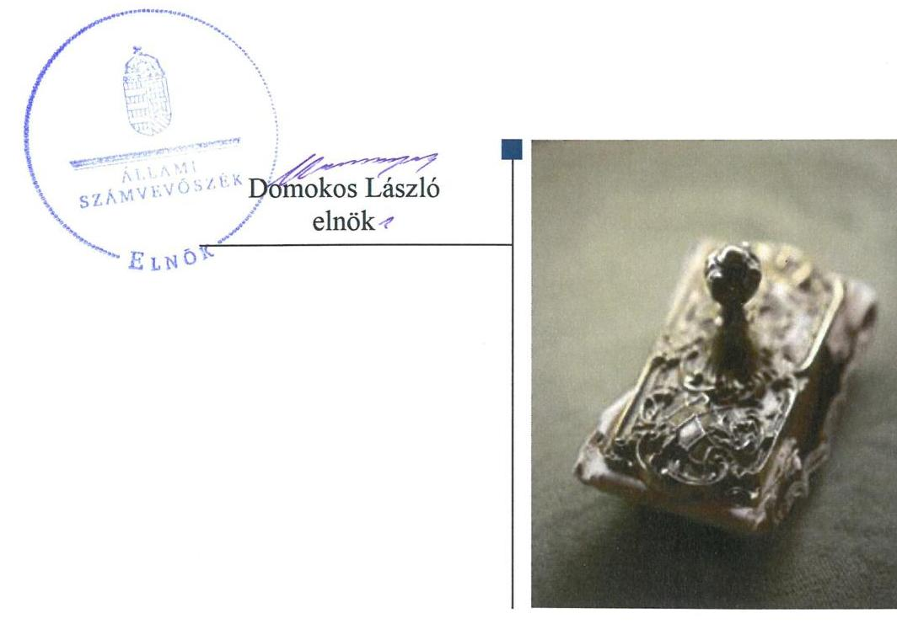

---

|  AZ ELLENŐRZÉST FELÜGYELTE: |  |  |  |  |   |
| --- | --- | --- | --- | --- | --- |
|   |  | DR. NAGY IMRE felügyeleti vezető |  |  |   |
|   |  | AZ ELLENŐRZÉST VEZETTE ÉS A VÉGREHAJTÁSÁÉRT FELELŐS: |  |  |   |
|   |  | KUSZINGER ANDREA ellenőrzésvezető |  |  |   |
|   |  | A PROGRAM ÖSSZEÁLLÍTÁSÁÉRT FELELŐS: |  |  |   |
|   |  | TÓTPÁL SZABOLCS osztályvezető |  |  |   |
|   |  | A TÉMÁHOZ KAPCSOLÓDÓ KORÁBBI SZÁMVEVŐSZÉKI JELENTÉSEK: |  |  |   |
|   |  | • címe: | Jelentés az önkormányzatok többségi tulajdonában lévő gazdasági társaságok közfeladat-ellátásának ellenőrzéséről – Trafó Kortárs Művészetek Háza Nonprofit Kft. |  |   |
|  Jelentéseink az Országgyűlés számítógépes hálózatán és az Interneten a www.asz.hu címen is olvashatóak. |  | • sorszáma: | 14043 |  |   |
|   |  | IKTATÓSZÁM: EL-0272-027/2019 |  |  |   |
|   |  | TÉMASZÁM: 4 |  |  |   |
|   |  | ELLENŐRZÉS-AZONOSÍTÓ SZÁM: V080458 |  |  |   |

---

# TARTALOMJEGYZÉK 

■ ÖSSZEGZÉS ..... 5
■ AZ ELLENŐRZÉS CÉLJA ..... 6
■ AZ ELLENŐRZÉS TERÜLETE ..... 7
■ AZ ELLENŐRZÉS HÁTTERE, INDOKOLTSÁGA ..... 8
■ A JELENTÉS LÉNYEGES KÉRDÉSKÖRE ..... 9
■ AZ ELLENŐRZÉS HATÓKÖRE ÉS MÓDSZEREI ..... 10
■ MEGÁLLAPÍTÁSOK ..... 12
■ MELLÉKLETEK ..... 15
I. sz. melléklet: Budapest Főváros Önkormányzata és a Trafó Kortárs Művészetek Háza Nonprofit kft. intézkedési terve végrehajtásának értékelése ..... 15
II. sz. melléklet: Budapest Főváros Önkormányzata és a Trafó Kortárs Művészetek Háza Nonprofit Kft. intézkedési terve ..... 18
■ FÜGGELÉK: ÉSZREVÉTELEK ..... 29
■ RÖVIDÍTÉSEK JEGYZÉKE ..... 39

---

.

---

# ÖSSZEGZÉS 

A Trafó Kortárs Művészetek Háza Nonprofit Kft. végre nem hajtott intézkedése miatt a pénzügyi gazdálkodás szabályszerűsége nem volt biztosított. Budapest Főváros Önkormányzata, mint tulajdonosi joggyakorló által végrehajtott feladatok csökkentették a Társaság szabályozatlanságában rejlő kockázatokat. Ugyanakkor a tulajdonosi joggyakorló által vállalt feladatok végrehajtásának elmaradása miatt a Társaság vagyongazdálkodási kockázatai növekedtek.

## Az ellenőrzés társadalmi indokoltsága

Az Állami Számvevőszék stratégiájában célul tűzte ki a számvevőszéki munka hasznosulásának javítását. Ezzel összhangban ellenőrzi, hogy az ellenőrzött szervezet megvalósította-e a korábbi ellenőrzései által feltárt hibák, hiányosságok és szabálytalanságok megszüntetése céljából elkészített intézkedési tervében foglaltakat. A rendszeres utóellenőrzések hozzájárulnak a szükséges intézkedések tényleges végrehajtásához, ezáltal a közpénzügyek rendezettségének javulásához.

## Főbb megállapítások, következtetések

Az Állami Számvevőszék részére megküldött intézkedési tervben meghatározott négy feladatból Budapest Főváros Önkormányzata, mint tulajdonosi joggyakorló két feladatot végrehajtott, egy feladatot részben hajtott végre és egy feladat végrehajtásáról nem gondoskodott. A Trafó Kortárs Művészetek Háza Nonprofit Kft. az intézkedési tervben meghatározott kettő feladatból egyet végrehajtott, egyet nem hajtott végre.

A Trafó Kortárs Művészetek Háza Nonprofit Kft. számlarendje kiegészítésének elmaradása miatt a pénzügyi gazdálkodás szabályszerűsége területén a kockázat továbbra is fennáll.

Budapest Főváros Önkormányzata, mint tulajdonosi joggyakorló által végrehajtott vagyonrendelet-módosítás, a fenntartói megállapodások felülvizsgálata és módosítása a szabályozottság területén csökkentette a kockázatokat. A tulajdonosi joggyakorló az intézkedési tervben a jogszabályi kötelezettségét meghaladóan vállalta, de nem hajtotta végre a leltárkészítési és leltározási mintaszabályzat kidolgozását, ezáltal a Trafó Kortárs Művészetek Háza Nonprofit Kft. vagyongazdálkodási kockázatai növekedtek.

---

# AZ ELLENŐRZÉS CÉLJA 

Az ellenőrzés célja annak értékelése volt, hogy a számvevőszéki jelentésben ${ }^{1}$ foglalt intézkedést igénylő megállapításokkal összhangban készített intézkedési tervben meghatározott feladatokat az ellenőrzött szervezetek végrehajtották-e.

---

# AZ ELLENŐRZÉS TERÜLETE 

## Trafó Kortárs Művészetek Háza Nonprofit Kft.

Budapest Főváros Önkormányzata kötelező közművelődési és művészeti közfeladatának ellátása érdekében alapította a Társaság²-ot 2002. július 1-jén. A 100%-ban tulajdonos Budapest Főváros Önkormányzata döntése alapján a Társaság közhasznú társaságként jött létre, majd 2009. június 9-étől nonprofit társasági formában működik.

A Társaság közhasznú főtevékenysége az előadó-művészet. A Társaság ügyvezető igazgatójának személye az ellenőrzött időszakban 2017. szeptember 1-jétől változott, Budapest Főváros Önkormányzata Főpolgármestere 2010. október 3-tól tölti be tisztségét, Budapest Főváros Önkormányzata Főjegyzőjének személyében az ellenőrzött időszakban változás nem történt.

Az ÁSZ³ 2013. évben ellenőrizte a Társaság közfeladat-ellátását a 2008. január 1-je és 2012. december 31-e közötti időszak vonatkozásában a 2013. szeptember 6-ig bekövetkezett változásokra figyelemmel. Az erről szóló 14043 számú jelentést 2014. február 26-án tette közzé. Az ellenőrzés célja annak értékelése volt, hogy az önkormányzat a jogszabályi előírások figyelembevételével gyakorolta-e tulajdonosi jogait és teljesítette-e kötelezettségeit, illetve az ellenőrzés értékelte, hogy a Társaság teljesítette-e a tulajdonos önkormányzat részéről meghatározott célokat és feladatokat a rendelkezésre álló erőforrások felhasználásával; végrehajtotta-e a közfeladat-ellátási szerződés előírásait; betartotta-e a vagyonnal történő gazdálkodásra vonatkozó jogszabályi rendelkezéseket.

Az ÁSZ a 14043 számú jelentésében a főjegyző⁴ részére egy, a Társaság igazgatója⁵ részére pedig két javaslatot fogalmazott meg. A hiányosságok, és a szabálytalanságok megszüntetésére Budapest Főváros Önkormányzata elkészítette az intézkedési terv₁⁶-t, és a Társaság elkészítette az intézkedési terv₂⁷-t.

Az utóellenőrzés - 2014. február 26-tól 2018. július 27-ig végrehajtott feladatokat figyelembe véve - az ÁSZ jelentésében a Budapest Főváros Főjegyzője és a Társaság igazgatója részére megfogalmazott intézkedést igénylő megállapításokra és javaslatokra készített, az ÁSZ részére megküldött intézkedési tervekben meghatározott feladatok végrehajtásának ellenőrzésére, értékelésére fókuszált.

---

# AZ ELLENŐRZÉS HÁTTERE, INDOKOLTSÁGA 

Az ÁSZ tv.⁸ 33. § (1) bekezdése értelmében a számvevőszéki jelentések intézkedést igénylő megállapításaihoz és javaslataihoz kapcsolódóan az ellenőrzött szervezet vezetője intézkedési tervet köteles összeállítani, és az Állami Számvevőszék részére megküldeni.

Az intézkedési tervben foglaltak megvalósítását - az ÁSZ tv. 33. § (7) bekezdésében foglaltak alapján - az ÁSZ utóellenőrzés keretében ellenőrizheti. Az utóellenőrzések keretében - az intézkedések értékelése során - az ÁSZ figyelembe veszi az ellenőrzött szervezetek működési feltételeiben, valamint a jogszabályi előírásokban bekövetkezett változásokat.

Az utóellenőrzés során az ÁSZ értékeli, hogy az érintett számvevőszéki jelentésben foglalt intézkedést igénylő megállapításokkal és javaslatokkal összhangban, az ellenőrzött szervezet által készített intézkedési tervben meghatározott feladatokat a feladatra kijelöltek végrehajtották-e.

Az intézkedések végrehajtásával az adott terület szabályszerű működése vonatkozásában a kockázatok csökkenhetnek, azonban hosszabb távon az intézkedési tervben foglaltak végrehajtásával önmagában nem szűnnek meg, csak akkor, ha beépülnek az ellenőrzött szervezet működésébe, azokat folyamatosan karban tartja, figyelembe véve, illetve kezelve a változásokat. Emellett az intézkedések végrehajtásáig újabb kockázatok merülhetnek fel a szabályszerű működés vonatkozásában, amelyek kezelése szintén kiemelten fontos az ellenőrzött szervezet számára.

Az ellenőrzött szervezet vezetője által készített intézkedési tervekben foglalt feladatok hiányos, illetve késedelmes végrehajtása, vagy annak elmaradása a szabályszerűség és a felelős vezetői magatartás vonatkozásában kockázatot hordoz, ami azt mutatja, hogy az ellenőrzések során feltárt hibák, hiányosságok és szabálytalanságok kezelése nem kapott kellő hangsúlyt. Az utóellenőrzés során is fennálló szabálytalanságok esetén a közpénz, közvagyon veszélyeztetettségi kockázat valószínűsített hatásának értékelése további intézkedéseket vonhat maga után.

Az ellenőrzött szervezet szintjén az utóellenőrzés feltárja, hogy a szervezet az intézkedések végrehajtásával hasznosította-e a korábbi ellenőrzési jelentésben a hiányosságok megszüntetése, illetve a kockázatok kezelése érdekében megfogalmazott javaslatokat, illetve az intézkedések végrehajtása elmaradásának következtében továbbra is fennálló szabálytalanság esetén értékeli a közpénzek, közvagyon veszélyeztetettségét.

Az ÁSZ szintjén az utóellenőrzés visszacsatolást ad az ellenőrzési jelentések hasznosulásáról, az intézkedések elmaradásának, vagy részleges megvalósulásának a közpénzek, közvagyon veszélyeztetettségére gyakorolt valószínűsített hatásának értékelése, további intézkedéseket vonhat maga után.

---

# A JELENTÉS LÉNYEGES KÉRDÉSKÖRE 

Az ellenőrzött szervezetek az intézkedési tervben foglaltakat az előírt határidőben végrehajtották-e?

---

# AZ ELLENŐRZÉS HATÓKÖRE ÉS MÓDSZEREI 

## Az ellenőrzés típusa

Megfelelőségi ellenőrzés.

## Az ellenőrzött időszak

Az utóellenőrzés alapját képező ÁSZ jelentés közzétételének napjától az ellenőrzésről szóló kiértesítő levél keltének napjáig tartó időszak volt, 2014. február 26-tól 2018. július 27-ig.

## Az ellenőrzés tárgya

A számvevőszéki jelentésben foglalt intézkedést igénylő megállapításokkal összhangban - az ellenőrzött szervezetek által - készített Intézkedési tervben foglaltak végrehajtásának ellenőrzése volt.

## Az ellenőrzött szervezet

Budapest Főváros Önkormányzata, Trafó Kortárs Művészetek Háza Nonprofit Kft.

## Az ellenőrzés jogalapja

Az ellenőrzés jogszabályi alapját az ÁSZ tv. 33. § (7) bekezdése képezi.

## Az ellenőrzés módszerei

Az ÁSZ az ellenőrzést az ellenőrzött időszakban hatályos jogszabályok, az ellenőrzés szakmai szabályai, a jelen ellenőrzésre irányadó ÁSZ módszertanok, az ellenőrzési programban foglalt értékelési szempontok szerint végezte.

Az ellenőrzés ideje alatt az Önkormányzattal⁹ és a Társasággal történő kapcsolattartás az ÁSZ SZMSZ¹⁰-ének vonatkozó előírásai alapján volt biztosított.

Az utóellenőrzés megállapításait az ÁSZ rendelkezésére álló, valamint az ÁSZ adatbekérése szerint, az ellenőrzött szervezetek által rendelkezésre bocsátott dokumentumok alapozták meg.

Az ellenőrzési bizonyítékként felhasználható adatforrások közé tartoztak egyrészt az ellenőrzési program részletes szempontjainál felsorolt

---

adatforrások, másrészt minden - az ellenőrzés folyamán feltárt, az ellenőrzés szempontjából információt tartalmazó - dokumentum.

Az ÁSZ az intézkedési tervekben előírt feladatokat azok végrehajthatósága, illetve végrehajtása szempontjából az alábbiak szerint értékelte:
"határidőben végrehajtott" a feladat, ha a teljesítés dokumentáltan, az intézkedési tervben előírt határidőben és tartalommal megtörtént;
"határidőn túl végrehajtott" a feladat, ha annak teljesítése az intézkedési tervben meghatározott módon, de az előírt határidőn túl történt meg;
"részben végrehajtott" a feladat, ha végrehajtása teljes körűen az intézkedési tervben előírt módon nem történt meg;
"nem végrehajtott" a feladat, ha a végrehajtás nem történt meg, vagy amennyiben a teljesítést nem dokumentálták;
"okafogyottá vált" a feladat, ha végrehajtására - meghatározott esemény bekövetkezése, továbbá külső körülmény, a működést érintő feltétel változása miatt - már nincs szükség, illetve lehetőség, és egyértelműen megállapítható, hogy az intézkedést szükségessé tevő körülmény a jövőben nem fordulhat elő;
"nem időszerű" az a feladat, amelynek ellenőrzési időszakon belüli végrehajtására azért nem került (kerülhetett) sor, mert az intézkedés alapjául szolgáló esemény nem következett be, de annak jövőbeni előfordulása lehetséges, a végrehajtása nem volt esedékes, vagy a végrehajtás határideje még nem járt le.
Az ellenőrzés lefolytatásához az ellenőrzött szervezetek a tanúsítványok elektronikus kitöltésével, valamint az ÁSZ által kért dokumentumok elektronikus megküldésével szolgáltattak adatokat, amelyek valódiságát és teljes körűségét az ellenőrzött szervezet vezetője által tett teljességi és hitelességi nyilatkozat igazolta. Az így rendelkezésre bocsátott adatok, információk kontrollja az ellenőrzés keretében megtörtént.

---

# MEGÁLLAPÍTÁSOK 

## Az ellenőrzött szervezetek az intézkedési tervben foglaltakat az előírt
 határidőben végrehajtották-e?

Összegző megállapítás

Az Önkormányzat, mint tulajdonosi joggyakorló az intézkedési tervben meghatározott négy feladatból kettőt végrehajtott, egy feladatot részben hajtott végre és egy feladat végrehajtásáról nem intézkedett. A Társaság az intézkedési tervben vállalt két feladatból egyet végrehajtott, egyet nem hajtott végre.

Az intézkedési terv 1.1-ben meghatározott feladatokat, határidőket, felelősöket, és a feladatok végrehajtásának értékelését az I. számú melléklet, az intézkedési terv 1.1-t a II. számú melléklet mutatja be.

Az Önkormányzat gondoskodott az intézkedési tervben meghatározott feladatok végrehajtásának Bkr. ¹¹ előírása szerinti nyilvántartásáról.

Az Önkormányzat által készített intézkedési tervben meghatározott feladatok végrehajtásának értékelési kategóriák szerinti megoszlását az 1. ábra szemlélteti.

1. ábra

Az Önkormányzat intézkedési tervében meghatározott feladatok végrehajtásának értékelési kategóriák szerinti megoszlása
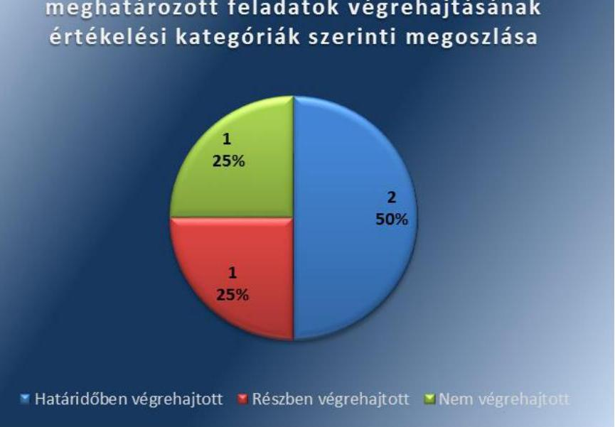

A Társaság által készített intézkedési tervben meghatározott feladatok végrehajtásának értékelési kategóriák szerinti megoszlását az 2. ábra szemlélteti.

---

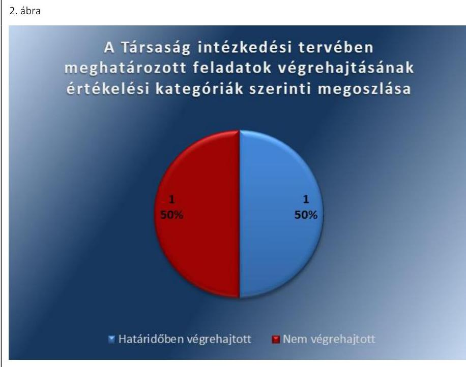

Forrás: ÁSZ
A SZABÁLYOZOTTSÁG területén a kockázatok csökkentek, mivel az Önkormányzat végrehajtotta a vagyonrendelet ¹² módosítását (1.) és felülvizsgálta a színházakkal kötött fenntartói megállapodásokat ¹³(3.), ezáltal az Önkormányzat, mint tulajdonosi joggyakorló támogatta a Társaság szabályszerű működésének feltételeit.

A Társaság intézkedett a leltározási szabályzat módosításában ¹⁴ a leltáreltérések rendezésének jóváhagyásáért felelős személy kijelöléséről (5.), így a szabályozottságban rejlő kockázatok csökkentek.

# A PÉNZÜGYI GAZDÁLKODÁS SZABÁLYSZERŰSÉGE területén a Társaságnál a kockázat fennáll, mivel a számlarend ¹⁵ kiegészítése (6.) elmaradt. A számlarend nem tartalmazta valamennyi számla értéke növekedésének, csökkenésének jogcímét, a számlát érintő gazdasági eseményeket, azok más számlákkal való kapcsolatát, a főkönyvi számla és az analitikus nyilvántartás kapcsolatát, a számlarendben foglaltakat alátámasztó bizonylati rendet.

## A BELSŐ KONTROLL SZERINTI ELSZÁMOLTATHATÓSÁG területén az Önkormányzat, mint tulajdonosi joggyakorló gondoskodott a Társaságra vonatkozóan a számvevőszéki jelentésben tett javaslatokra megfogalmazott intézkedések végrehajtásának ellenőrzéséről (2.), mely csökkentette a kockázatokat.

A VAGYONGAZDÁLKODÁS területén a kockázatok növekedtek, mivel az Önkormányzat, mint tulajdonosi joggyakorló a Társaság tekintetében nem gondoskodott a haszonbérleti szerződések (3.) felülvizsgálatáról, valamint a jogszabályi kötelezettségét meghaladóan vállalt leltárkészítési és leltározási mintaszabályzat (4.) kidolgozásáról.

---

.

---

# MELLÉKLETEK

- I. SZ. MELLÉKLET: BUDAPEST FÖVÁROS ÖNKORMÁNYZATA ÉS A TRAFŐ KORTÁRS MŰVÉSZETEK HÁZA NONPROFIT KFT. INTÉZKEDÉSI TERVE VÉGREHAJTÁSÁNAK ÉRTÉKELÉSE

|  Az intézkedési tervben meghatározott feladat | Az intézkedési tervben meghatározott határidő | Az intézkedési tervben meghatározott feladatok felelőse | A feladat végrehajtása  |
| --- | --- | --- | --- |
|  Budapest Főváros Önkormányzata intézkedési tervét határidőben végrehajtott feladatok |  |  |   |
|  1. Az ÁSZ javaslatában foglaltakra tekintettel a hatályos jogszabályi előírások figyelembe vételével át kell tekinteni a hatályos Vagyonrendelet előírásait, a színházakkal megkötött haszonbérleti szerződéseket, illetve fenntartói megállapodásokat, a színházak leltárkészítési és leltározási szabályzatait, és javaslatot kell tenni a Vagyonrendelet indokolt módosítására, a színházakkal megkötött szerződések szükséges módosítására, valamint a színházak leltárkészítés és leltározási szabályzataiban foglaltak végrehajtásának ellenőrzési rendjére. Ennek részeként:
c.) közgyűlési elfogadásra javaslatot kell tenni a Vagyonrendelet módosítására, és amennyiben indokolt a haszonbérleti szerződések és fenntartói megállapodások módosítására. | városvezetői döntés szerint | Vagyongazdálkodási Főosztály vezetője | A vagyonrendelet módosítására vonatkozó, FPH058/14975/2015. iktatószámú javaslatot 2015. november 20-án terjesztették a Fővárosi Közgyűlés ¹⁶ elé. A Vagyonrendelet módosítása a Számv. tv. ¹⁷ előírásaival összhangban évente leltárkészítési, háromévente mennyiségi felvétellel történő leltározási kötelezettséget írt elő az önkormányzati vagyont használó, haszonbérbe, haszonkölcsönbe vevő gazdasági társaságok és nonprofit gazdasági társaságok számára.  |
|  2. Gondoskodni kell arról, hogy
a.) a 2014. évi Belső Ellenőrzési Munkatervben szereplő, kulturális társaságokra irányuló és az ÁSZ vizsgálattal érintett társaságok vizsgálata során kerüljön sor az ÁSZ jelen | 2014. IV. negyedév | Belső Ellenőrzési Osztály vezetője | Az Önkormányzat Belső Ellenőrzésének 2014. december 18-án jóváhagyott FPH-0006/228-6/2014. iktatószámú 2015. évi Munkaterve ¹⁸ tartalmazta a fővárosi színházaknál végrehajtott ÁSZ ellenőrzések javaslataira készített intézkedési tervek végrehajtásának az ellenőrzését.  |

---

|  Az intézkedési tervben meghatározott feladat | Az intézkedési tervben meghatározott határidő | Az intézkedési tervben meghatározott feladatok felelőse | A feladat végrehajtása  |
| --- | --- | --- | --- |
|  vizsgálati jelentésében az érintett színházi igazgatók részére megfogalmazott feladatok végrehajtásának ellenőrzése
b.) a 2015. évi Belső Ellenőrzési Munkaterv tartalmazza valamennyi ÁSZ vizsgálattal érintett színházi társaság esetében az ÁSZ javaslatai végrehajtásának ellenőrzését. |  |  |   |
|  3. Az ÁSZ javaslatában foglaltakra tekintettel a hatályos jogszabályi előírások figyelembe vételével át kell tekinteni a hatályos Vagyonrendelet előírásait, a színházakkal megkötött haszonbérleti szerződéseket, illetve fenntartói megállapodásokat, a színházak leltárkészítési és leltározási szabályzatait, és javaslatot kell tenni a Vagyonrendelet indokolt módosítására, a színházakkal megkötött szerződések szükséges módosítására, valamint a színházak leltárkészítés és leltározási szabályzataiban foglaltak végrehajtásának ellenőrzési rendjére. Ennek részeként:
b.) az a.) pontban foglaltakra figyelemmel felül kell vizsgálni és szükség szerint javaslatot kell tenni a színházakkal kötött haszonbérleti szerződések, illetve fenntartói megállapodások módosítására; | 2014. augusztus 31. | Kulturális, Sport, Köznevelési, Egészségügyi és Szociálpolitikai Főosztály vezetője | Végrehajtott feladatrész:
A Társasággal kötött fenntartói megállapodás módosítására vonatkozó javaslatot az FPH079/1663-2/2015 iktatószámú előterjesztésben terjesztették a Fővárosi Közgyűlés elé, amely alapján a Társasággal kötött fenntartói megállapodás módosításra került.
Nem végrehajtott feladatrész:
A Társasággal kötött haszonbérleti szerződés felülvizsgálata nem történt meg.  |
|  4. Az ÁSZ javaslatában foglaltakra tekintettel a hatályos jogszabályi előírások figyelembe vételével át kell tekinteni a hatályos Vagyonrendelet előírásait, a színházakkal megkötött |  |  |   |
|  2014. június 15. |  |  |   |

---

|  Az intézkedési tervben meghatározott feladat | Az intézkedési tervben meghatározott határidő | Az intézkedési tervben meghatározott feladatok felelőse | A feladat végrehajtása  |
| --- | --- | --- | --- |
|  haszonbérleti szerződéseket, illetve fenntartói megállapodásokat, a színházak leltárkészítési és leltározási szabályzatait, és javaslatot kell tenni a Vagyonrendelet indokolt módosítására, a színházakkal megkötött szerződések szükséges módosítására, valamint a színházak leltárkészítés és leltározási szabályzataiban foglaltak végrehajtásának ellenőrzési rendjére. Ennek részeként:
a.) javaslatot kell tenni a Leltárkészítés és leltározás szabályzatának mintájára: |  |  |   |
|  A Trafó Kortárs Művészetek Háza Nonprofit Kft. intézkedési terve |  |  |   |
|  Határidőben végrehajtott feladat |  |  |   |
|  5. A Színház a leltáreltérések rendezésének a jóváhagyásáért felelős személy kijelöléséről intézkedik, a leltározási szabályzatokat a döntést követően aktualizálja. | 2014. június 30. | gazdasági igazgató | A Társaság igazgatója 2014. június 30-i hatállyal életbe léptette a leltározási és leltárkészítési szabályzatának módosítását, amelyben kijelölésre került a leltáreltérések rendezésének jóváhagyásáért felelős személy.  |
|  Nem végrehajtott feladat |  |  |   |
|  6. A Színház a számlarendjét a Számv. tv. 161. § (2) bekezdésében foglaltaknak megfelelően aktualizálja. | 2014. június 30. | gazdasági igazgató | A Társaság igazgatója 2014. június 30-i hatállyal életbe léptette a Számlarend kiegészítést, amelyet csak a befektetett pénzügyi eszközök vonatkozásában egészített ki, valamennyi számla vonatkozásában a számlarend Számv. tv. 161. § (2) bekezdés b), c) és d) pontjában foglaltak szerinti kiegészítését nem hajtotta végre.  |

---

# BUDAPEST 

## FÖVÁROSI ÖNKORMÁNYZAT FŐPOLGÁRMESTERE

| 1. szám: | 70 / 24 | 01 / 2013. |
| :--: | :--: | :--: |
| Tárgy: | Intézkedési Terv módosításának megküldése |  |

Állami Számvevőszék
Domokos László elnök úr részére

Tisztelt Elnök Úr!
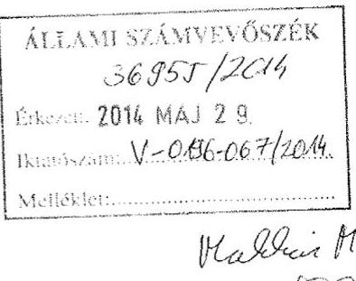

Tájékoztatom, hogy az „önkormányzatok többségi tulajdonában lévő fővárosi színházi gazdasági társaságok közfeladat-ellátásának ellenőrzéséről" szóló

| 1. | a Centrál Színház Nonprofit Kft. | V-0189- 063 /2014. sz. |
| :-- | :-- | :-- |
| 2. | a József Attila Színház Nonprofit Kft. | V-0192- 099/2014. sz. |
| 3. | a Vigszínház Kiemelkedően Közhasznú   Nonprofit Kft. és jogelődje | V-0193-160/2014. sz. |

jelentéseikben megfogalmazott javaslatokra tekintettel a fővárosi színházi gazdasági társaságok vizsgálatára vonatkozó korábbi jelentéseik alapján kiadott Intézkedési Tervünket kiegészítettük. Ezzel egyidejűleg áttekintésre került az Intézkedési Terv feladatainak időarányos végrehajtása is.

Szíves elfogadása érdekében jelen levelem mellékleteként átadom az időarányos végrehajtást és az 1.sz. módosítást tartalmazó Intézkedési Tervünket.

Megtisztelő válaszát előre is megköszönöm.

Budapest, 2014. május 22.
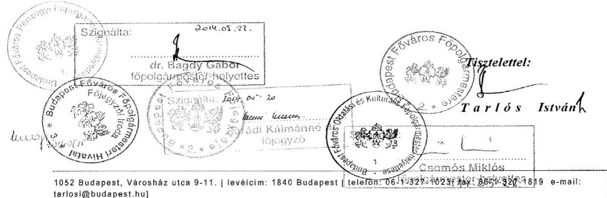

---

# BUDAPEST 

## FÖVÁROSI ÖNKORMÁNYZAT FŐPOLGÁRMESTERE és FŐJEGYZŐJE

az önkormányzatok többségi tulajdonában lévő fővárosi színházi gazdasági társaságok
közfeladat-ellátásának ellenőrzéséről szóló, az Állami Számvevőszék Elnöke által jóváhagyott jelentések alapján meghatározott feladatok végrehajtására 2014. március 19-én kiadott

## INTÉZKEDÉSI TERV

időarányos végrehajtása és 1.sz. módosításának elrendelése

Készült
A Főpolgármestéri Hivatal fővédnökségének
2014. május 15-én kelt jelentések javaslatai alapján
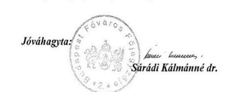

Budapest, 2014. május
(2014.03.15.)
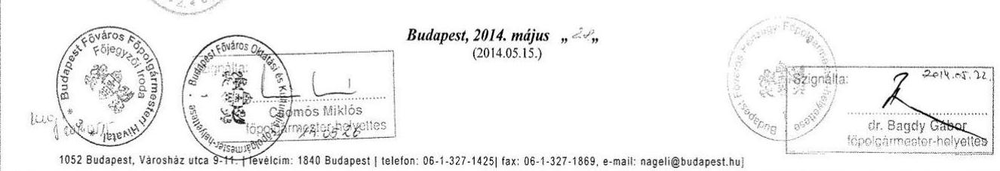

---

Az Intézkedési Terv 2014. március 19-i kiadását követően további - alábbiakban felsorolt - fővárosi színházi jelentés került nyilvánosságra. E jelentésekben megfogalmazott javaslatok, valamint a kiadott Intézkedési Terv végrehajtása érdekében tett intézkedések és a Főpolgármesteri Hivatal érintett belső szervezeti egységei által megfogalmazott javaslatok indokolttá teszik az Intézkedési Terv módosítását.

Jelen Intézkedési Terv 1.sz. módosításának időpontjára az alábbi fővárosi színházi jelentések kerültek nyilvánosságra:

|  1. | a Centrál Színház Nonprofit Kft. | V-0189-063/2014. sz.  |
| --- | --- | --- |
|  2. | a József Attila Színház Nonprofit Kft. | V-0192-099/2014. sz.  |
|  3. | a Vigszínház Kiemelkedően Közhasznú   Nonprofit Kft. és jogelődje | V-0193-160/2014. sz.  |

Jelen Intézkedési Terv módosítására a fentiekben jelzett, nyilvánosságra hozott végleges jelentések alapján került összeállításra.

# B.) AZ INTÉZKEDÉSI TERV VÉGREHAJTÁSÁNAK ÉSZLELT FELADATAI

|  Feladat
Egységes esetkezelés a 2014. március 19-én jóváhagyott Intézkedési terv(ek) |  | A feladat időarányos végrehajtása és végrehajtási határidejének módosítása)  |
| --- | --- | --- |
|  amennyiben szükséges |  |   |
|  JAVASLAT:
Vizsgáltassa ki a feltárt hiányosságokat, szabálytalanságokat és amennyiben szükséges, tegye meg a munkajogi felelősségre vonást |  | Intézkedési tervet módosító új javaslat, amely a Vigszínház Kiemelkedően Közhasznú Nonprofit Kft. és jogelődje tekintetében nyilvánosságra hozott jelentésben került megfogalmazásra.  |
|  INTÉZKEDÉSI:
a.) Az ÁSZ javaslatára tekintettel vizsgálati programot kell összeállítani, illetve vizsgálatot kell lefolytatni az ÁSZ vizsgálati jelentésben foglaltak és a mögöttes dokumentációk áttekintése, illetve munkajogi módosítása céljával.
b.) Az a.) pont szerinti vizsgálat eredményeként vezetői összefoglalót kell készíteni arról, hogy milyen jogszabályi felhatalmazás(ok) alapján kezdeményezhető munkajogi intézkedés kiemelkedően közhasznú nonprofit Kft. esetében. A vizsgálatnak ki kell térnie a Főpolgármester |  |   |

---

|  munkajogi jogszabályának levezetésére is.
c.) A vezetői összefoglalói eredményeként - amennyiben jogszabályi feltételek adottak, úgy konkrét javaslatot kell tenni a fővárosi jelenlegi szabályozásának, eljárási rendjének, szabályozó intézkedéseinek indokolt felülvizsgálatára, módosítására.
Határidő:
a.) - a vizsgálati program elkészítésére: 2014. június 15.
- egyeztetett vizsgálati jelentés elkészítésére: 2014. szeptember 15.
b.) 2014. október

 15.
c.) a b.) pont szerinti vezetői összefoglalók elfogadását követő 30 napon belül.
Felelős:
a.) Belső Ellenőrzési Osztály vezetője
b.) Belső Ellenőrzési Osztály vezetője a Humán Menedzement Főosztály vezetőjének bevonásával
c.) Humán Menedzement Főosztály vezetője |   |
| --- | --- |
|  |   |
|  1.) JAVASLAT:
Készítse elő a Közgyűlés elé való terjesztés érdekében a Vagyonrendelet módosítását, hogy az tartalmazza az Absz., 37.§ (4)/Absz., 22.§ (2) bekezdésében előírtaknak megfelelően az üzemeltetésre, kezelésre átadott eszközök leltározási szabályait.
INTÉZKEDÉS:
Az ASZ javaslatában foglaltakra tekintettel a hatályos jogszabályi előírások figyelembe vételével át kell tekinteni a hatályos Vagyonrendelet előírásait, a színházakkal megkötött haszonbérleti szerződéseket, illetve fenntartói megállapodásokat, a színházak leltárkészítési és leltározási szabályzatait, és javaslatot kell tenni a Vagyonrendelet indokolt módosítására, a színházakkal megkötött szerződések szükséges módosítására, valamint a színházak leltárkészítés és leltározási szabályzatában foglaltak végrehajtásának ellenőrzési rendjére. Ennek részeként | A feladat végrehajtása során a tervezett végrehajtási határidő lejártát megelőzően az érintettek részvételével egyeztető megbeszélésre került sor. A feladat részleteinek áttekintése során megállapodás született arról, hogy valamennyi színház leltározási szabályzatát áttekinti a Pénzügyi Főosztály, s ennek valamint a „nagy” Művészetek Háza, illetve „kis” Radnóti Színház leltározási szabályzata ismeretében minta leltározási szabályzatot készít. E minta szabályzatot véleményeztetni, észrevételezésre megkapja valamennyi színház, illetve a hivatal érintett szervezeti egység vezetői. Az észrevételek ismeretében kerül sor a minta leltározási szabályzat véglegesítésére.
A Pénzügyi Főosztály a vagyonrendelet módosításához javaslatot készített, amelynek egyeztetése és a tervezett minta szabályzat elkészítése - a feladat összetettségére, időigényére  |

---

|  a.) javaslatot kell tenni a Leltárkészítés és leltározás szabályzatának
minta szabályzatának; | tekintettel (nem veszélyeztetve az elvégzendő leltározási feladatokat) – indokolja a
végrehajtási határidők szükséges szerinti módosítását:  |
| --- | --- |
|  b.) az a.) pontban foglaltakra figyelemmel felül kell vizsgálni és szükség
szerint javaslatot kell tenni a színházakkal kötött haszonbérleti
szerződések, illetve fenntartói megállapodások módosítására; |   |
|  c.) közgyűlési elfogadásra javaslatot kell tenni a Vagyonrendelet
módosítására, és amennyiben indokolt a haszonbérleti szerződések és
fenntartói megállapodások módosítására; |   |
|  Határidő:
a.) 2014. március 25.
b.) 2014. április 15.
c.) 2014. április 15. |   |
|  Felelős:
a.) Pénzügyi Főosztály vezetője
b.) Kulturális, sport, Köznevelési, Egészségügyi és Szociálpolitikai
Főosztály vezetője
c.) Vagyongazdálkodási Főosztály vezetője |   |
|  Az egyes részfeladatokat a felelőséként megjelölt szervezeti egységek
vezetőinek közreműködésével, kölcsönös egyeztetésével kell
megvalósítani. |   |
|  100. jec.-ft.č. |   |
|  2.) JAVASLAT:
Intézkedjen a Budapest Bábszínház közfeladatának ellátásában
érintett ingatlanok – Budapest, VI., Andrássy út 69. és Budapest,
VI., Nagymező utca 8. fszt. 7.sz. – jogi, tulajdonosi helyzetének
rendezéséről |   |
|  INTÉZKEDÉS:
Arra tekintettel, hogy
✓ a Budapest, VI., Andrássy út 69. ingatlan esetében a Budapesti
Bábszínház Nonprofit Kft. igazgatója a 2014. február 27-én
érkeztetett levelében arról ad tájékoztatást, hogy a Magyar | Az intézkedési tervben megfogalmazott határidőn belül a felelős főosztály elkészítette a
munkacsoport összetételére, a munkacsoport egyes részfeladatokra, a végrehajtásban érintett
felelősök megjelölésével összeállított programot. A program tartalmazza azt is, hogy a  |

---

Mellékletek

Képzőművészeti Egyetem a Fővárosi Közigazgatási és Munkaügyi
Bírósághoz 2013. október 17-i keltezéssel jogorvoslati kérelmet
nyújtott be.

* a Budapest, VI., Nagymező utca 8. fszt. 7.sz. alatti ingatlan
tulajdoni jogi kérdésének rendezése összetett feladat végrehajtását
igényli,

indokolva, hogy az érintett ingatlanok tulajdon/használati jogának
rendezésére a Főpolgármesteri Hivatal érintett belső szervezeti egységei
mellett a Budapest Színház- és Filmalap bevonásával munkacsoport kerüljön
felállításra. A munkacsoportnak városvezetői szinten jóváhagyott
program szerint kell ellátni feladatait, amelynek időtartamról
(változásokról) végrehajtásáról írásos beszámolót kell készítenie,
illetve indokolt esetben városvezetői döntést megkérnie.

Határidő:
- a munkacsoport összetételére, a munkacsoport egyes részfeladataira,
a végrehajtásban érintett felelősök megjelölésével összeállított program
összeállítására és városvezetői jóváhagyásra benyújtásra:
2014. március 31.
- a további feladatok a városvezetői döntéssel jóváhagyott program
szerint

Felelős: Kulturális, Sport, Köznevelési, Egészségügyi és
Szociálpolitikai Főosztály vezetője

Közreműködő felelős szervezeti egységek:
- a Vagyongazdálkodási-, a Jogi-, és a Pénzügyi Főosztályok vezetői

3.) JAVASLAT:

Készítse elő a Színház SZMSZ-ét és az FB ügyrendjét annak
érdekében, hogy a Főpolgármester azt a jóváhagyás céljából a
képviselő-testület elé tudja terjeszteni.

INTÉZKEDÉS:

Magyar Képzőművészeti Egyetem a Fővárosi Közigazgatási és Munkaügyi Bírósághoz 2013.
október 17-i keltezéssel jogorvoslati kérelmet nyújtott be. A programban megfogalmazottak
alapján az Intézkedési Tervben megjelölt feladatok, határidők és felelősök kiegészítése
szükséges.

Módosítás:

Határidő, és részfeladat kiegészítése:
(az első fr. bekezdés jelölése a.)-ra változik a második fr. bekezdés jelölése c.)-re változik)

b.) A Magyar Képzőművészeti Egyetem a Fővárosi Közigazgatási és Munkaügyi Bírósághoz
2013. október 17-i keltezéssel megküldött jogorvoslati kérelmében foglaltakra is
figyelemmel az ingatlanok jelenlegi tulajdon helyzetének alakulásának részletes
bemutatására és a Fővárosi Önkormányzat érdekeit szem előtt tartó rendezésére vonatkozó
jogi javaslat összeállítására: 2014. június 30.

Felelős kiegészítése:

a.) Kulturális, Sport, Köznevelési, Egészségügyi és Szociálpolitikai Főosztály vezetője
b.) Jogi Főosztály vezetője

Intézkedési tervet módosító új javaslat, amely a József Attila Színház Nonprofit Kft. és
jogelődje tekintetében nyilvánosságra hozott jelentésben került megfogalmazásra.

5

---

# Mellékletek

A Polgári Törvénykönyvről szóló 2013. évi V. törvény szabályozására tekintettel

a.) felül kell vizsgálni a főváros által alapított színházi társaságok alapító okiratait, valamint a Fővárosi Önkormányzat vonatkozó rendeleti szabályozását oly módon, hogy az egyértelműen szabályozza:

- a társasági SZMSZ-ek jóváhagyásának, illetve
- a társasági FB-ok ügyrendjének jóváhagyásának, valamint az FB-k beszámolási kötelezettségének

rendjét, a Főpolgármester, illetve a Fővárosi Közgyűlés ez irányú feladatait, és javaslatot kell tenni a szükséges módosításokra.

b.) határidők és felelősök megjelölésével ütemezett javaslatot kell tenni az a.) pontban megfogalmazott feladatra is figyelemmel a Fővárosi Önkormányzat által alapított valamennyi gazdasági társaság alapítói okiratának felülvizsgálatára, a szükséges módosítások elfogadására.

## Határidő:

a.) - módosítási javaslat elkészítésére: 2014. augusztus 31.,

- közgyűlési előterjesztés benyújtására: városvezetői döntés szerint

b.) 2014. augusztus 31.

## Felelős:

a.) Kulturális, Sport, Köznevelési, Egészségügyi és Szociálpolitikai Főosztály vezetője

b.) Vagyongazdálkodási Főosztály vezetője

## Közreműködő felelős szervezeti egység:

a.) Jogi Főosztály

---

# C) A SZÍNHÁZI GAZDASÁGI TÁRSASÁGOK NÉSZÉRE VONATKOZÓ JAVASLATOK VÉGREHAJTÁSÁNAK ELLENŐRZÉSE 

1.) Gondoskodni kell arról, hogy
a.) a 2014. évi Belső Ellenőrzési Munkatervben szereplő, kulturális társaságokra irányuló és az ÁSZ vizsgálattal érintett társaságok vizsgálata során kerüljön sor az ÁSZ vizsgálati jelentésében az érintett színházi igazgatók részére megfogalmazott feladatok végrehajtásának ellenőrzésére.
b.) a 2015. évi Belső Ellenőrzési Munkaterv tartalmazza valamennyi ÁSZ vizsgálattal érintett színházi társaság esetében az ÁSZ javaslatai végrehajtásának ellenőrzési feladatait.
Határidő: 2014. IV. negyedév
Felelős: Belső Ellenőrzési Osztály vezetője

---

# 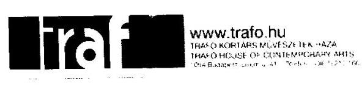 

Állami Számvevőszék
Domokos László elnök úr részére

Tisztelt Elnök Úr!

A Trafó KMH Nonprofit Kft. színháznál 2013. évben lefolytatott ÁSZ ellenőrzésről szóló jelentést a napokban kézhez kaptuk.

A jelentésben tett megállapításokra és javaslatokra a mellékelt intézkedési tervet határoztuk meg.

Budapest, 2014. március 14.

Tisztelettel
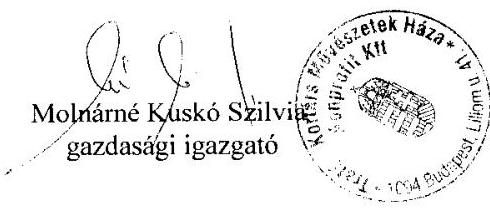

Mellékletek:

- Intézkedési terv

---

# INTÉZKEDÉSI TERV 

Az Állami Számvevőszék által végzett ellenőrzési jelentésére

## Sorszám: 1

## Ellenőrzési jegyzőkönyv megállapítása:

A Színház 2007. december 1-jétől hatályos számlarendje nem felelt meg a Számv.tv.-ben foglaltaknak, mivel nem tartalmazta teljes körűen az adott főkönyvi számhoz kapcsolódó valamennyi számla növekedésének, illetve csökkenésének jogcímeit.

## Intézkedés:

A Színház a számlarendjét a Számv.tv. 161. § (2) bekezdésében foglaltaknak megfelelően aktualizálja.
Felelős:
Molnárné Kuskó Szilvia gazdasági igazgató
Határidő: 2014. június 30.

## Sorszám: 2

## Ellenőrzési jegyzőkönyv megállapítása:

A 2011. január 1-jétől hatályos leltározási szabályzat nem tartalmazza a leltáreltérések rendezésének jóváhagyásáért felelős személy megnevezését.

## Intézkedés:

A Színház a leltáreltérések rendezésének a jóváhagyásáért felelős személy kijelöléséről intézkedik, a leltározási szabályzatot a döntést követően aktualizálja.
Felelős:
Molnárné Kuskó Szilvia gazdasági igazgató
Határidő: 2014. június 30.

Budapest, 2014. március 10.
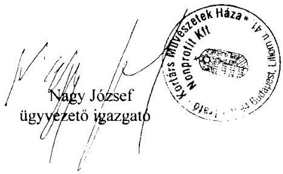

---

.

---

# FÜGGELÉK: ÉSZREVÉTELEK 

A jelentéstervezetet a Számvevőszék 15 napos észrevételezésre megküldte az ellenőrzött szervezetek vezetőinek az ÁSZ tv. 29. § (1) bekezdése előírásának megfelelően.

A Trafó Kortárs Művészetek Háza Nonprofit Kft. ügyvezetője és Budapest Főváros Önkormányzat főpolgármestere élt az ÁSZ tv. 29. § (2) bekezdésében foglalt észrevételezési jogával, a törvényes határidőn belül észrevételt tettek.
A függelék tartalmazza az ellenőrzöttek észrevételeit, illetve az el nem fogadott észrevételek elutasításának indoklását.

[^0]
[^0]:    * 29. § (1) Az Állami Számvevőszék az ellenőrzési megállapításait megküldi az ellenőrzött szervezet vezetőjének vagy az általa megbízott személynek, és annak, akinek személyes felelősségét állapította meg.
    (2) Az ellenőrzött szervezet vezetője és a felelősként megjelölt személy az ellenőrzés megállapításaira tizenöt napon belül írásban észrevételt tehet.
    (3) Az Állami Számvevőszék az észrevételre a beérkezésétől számított harminc napon belül írásban válaszol. A figyelembe nem vett észrevételeket köteles a jelentésben feltüntetni, és megindokolni, hogy azokat miért nem fogadta el.

---

# BUDAPEST 

BUDAPEST FŐPOLGÁRMESTERE

## ÁLLAMI SZÁMVEVŐSZÉK   2018- 82541101111   Érkezés: 2018. DEC. 20.   Iktatószám: $\overline{\text { 21. - } 1281-001 / 2018}$   Melléklet:

Ikt.sz: 70/381-24/2018.
Tárgy: észrevétel az
EL-1280-0001/2018. és az
EL-1281-0001/2018. iktatószámú
jelentés-tervezetekre

## Állami Számvevőszék

## Domokos László Elnök Úr részére

## Tisztelt Elnök Úr!

Fenti számon érkezett,

- „Utóellenőrzések - Az önkormányzatok többségi tulajdonában lévő gazdasági társaságok közfeladat-ellátásának ellenőrzése - Trafó Kortárs Művészetek Háza Nonprofit Kft. (EL-1280-0001/2018.sz.) és a
- „Utóellenőrzések - Az önkormányzatok többségi tulajdonában lévő gazdasági társaságok közfeladat-ellátásának ellenőrzése - Kolibri Gyermek- és Ifjúsági Színház Közhasznú Nonprofit Kft." (EL-1281-0001/2018.sz.)
jelentés-tervezeteket köszönettel megkaptam.

A Fővárosi Önkormányzat 70/24-60/2013. számon kiadott Intézkedési Tervben foglaltak végrehajtásának vizsgálata során mindkét jelentés megfogalmazza, hogy a főváros

- nem hajtotta végre a haszonbérleti szerződések felülvizsgálatát, illetve
- nem készített az eszközök és források leltárkészítési és leltározási szabályzatára mintát.

A megállapításokra tekintettel tájékoztatom T. Elnök urat, hogy az előzőekben hivatkozott Intézkedési Tervben foglaltak végrehajtása érdekében a főváros felülvizsgálta színházakra vonatkozó Fenntartói Megállapodásokat, valamint a kapcsolódó Haszonbérleti Szerződéseket. A felülvizsgálat során megállapításra került, hogy kizárólag a Fenntartói Megállapodások módosítása vált szükségessé. Ennek megfelelően a Fővárosi Közgyűlés 2015. október 28-i ülésén - a Kolibri Színház esetében az 1450/23015.(10.28.), a Trafó Művészetek Háza esetében az 1456/2015.(10.28.) Föv. Kgy. sz. határozataival az alábbiak szerint módosította a Fenntartói Megállapodások 5.1. pontjának 4. és 5. bekezdéseit:

---

„A Társaság a Fenntartó tulajdonát képező és a használatában lévő ingó és ingatlan vagyonra vonatkozóan köteles leltárt készíteni jelen Megállapodás időtartama alatt minden évben december 31-i fordulónappal és megküldeni azt a tárgyévet követő év január 31. napjáig az Önkormányzatnak. A leltározási feladatokat - beleértve a leltározók kijelölését, a Leltározási Bizottság felállítását, a leltározás végrehajtását, az összesített leltár összeállítását, a leltár kiértékelését és a leltáreltérések kivizsgálását - a Társaság köteles elvégezni saját hatáskörében.

A haszonkölcsön tárgyát képező ingó vagyontárgyak esetében a Társaság a felesleges vagyontárgyak feltárásával, valamint a selejtezéssel kapcsolatos feladatokat - beleértve a felesleges vagyontárgyak jegyzékének és hasznosítási javaslatának elkészítését, a Selejtezési Bizottság felállítását, a selejtezési jegyzék összeállítását, a selejtezés lefolytatását, a selejtezési jegyzőkönyv kitöltését és a selejt-, illetve hulladékanyag hasznosítási javaslatának elkészítését - köteles ellátni, az elkészített dokumentumokat a Fenntartó részére ellenőrzés és döntés céljából - a Fenntartó által évente külön levélben megjelölt időpontig - megküldeni. A Társaság által megküldött és a Fenntartó által ellenőrzött dokumentumok alapján a selejtezésről, elidegenítéséről, hasznosításáról, valamint az elidegenítésből származó bevétel felhasználásáról a haszonkölcsönbe adó tulajdonos jogosult dönteni. A haszonkölcsön tárgyát képező ingó vagyontárgyak a Megállapodás megszünésével nem kerülnek
 a Társaság tulajdonába, hanem a haszonkölcsönbe adó Önkormányzatnak visszajárnak."

A hivatkozott közgyűlési előterjesztést, a hozott határozatokat, a jóváhagyott és aláirt megállapodásokat szíves tájékoztatásul mellékeljük.

Előzők alapján a Társaságokkal kötött haszonbérleti szerződések felülvizsgálatának, illetve az eszközök és források leltárkészítési és leltározási szabályzat-minta kiadásának szükségessége a Fenntartói Megállapodások felülvizsgálatával együtt, illetve a Vagyonrendelet módosításával egyidejűleg megtörtént. A haszonbérleti szerződéseket nem volt szükséges, illetve indokolt módosítani, a Fenntartó tulajdonát képező és a Társaságok használatában lévő ingó és ingatlan vagyonra vonatkozó, leltározással összefüggő eljárási szabályok a Fenntartói Megállapodásokban teljes körűen rendezésre kerültek.

Fentiekre tekintettel megítélésünk szerint Budapest Főváros Önkormányzata a hivatkozott Intézkedési Tervben meghatározott feladatokat teljes körűen végrehajtotta.

Munkájukat ezúttal is tisztelettel megköszönöm.

Budapest, 2018. december „,o,"

---

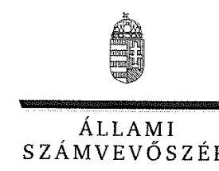

ELNÖK

Ikt.szám: EL-1281-009/2018.

# Tarlós István Úr   főpolgármester 

Budapest Főváros Önkormányzata

## Budapest

## Tisztelt Főpolgármester Úr!

Az „Utóellenőrzések - Az önkormányzatok többségi tulajdonában lévő gazdasági társaságok köz-feladat-ellátásának ellenőrzése - Trafó Kortárs Művészetek Háza Nonprofit Kft. " címmel készített számvevőszéki jelentéstervezetre tett észrevételeit köszönettel megkaptam.
Az Állami Számvevőszék észrevételekre vonatkozó álláspontjáról a felügyeleti vezető által készített részletes tájékoztatást csatoltan megküldöm.
Tájékoztatom Főpolgármester urat, hogy a számvevőszéki jelentésben - az Állami Számvevőszékről szóló 2011. évi LXVI. törvény 29. § (3) bekezdése alapján - a figyelembe nem vett észrevételeket szerepeltetjük annak megindoklásával, hogy azokat miért nem fogadtuk el.

Budapest, 2019. 27. hó 7. nap
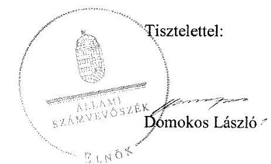

Melléklet: Tájékoztatás az észrevételek kezeléséről

---

# Tájékoztatás   az észrevételek kezeléséről 

Az ,,Utóellenőrzések - Az önkormányzatok többségi tulajdonában lévő gazdasági társaságok köz-feladat-ellátásának ellenőrzése - Trafó Kortárs Művészetek Háza Nonprofit Kft." címü jelentéstervezetre 2018. december 20-án tett (az Állami Számvevőszékhez 2018. december 20-án érkezett) észrevételét áttekintettük, annak kezelésével kapcsolatban a következő tájékoztatást adom.
A jelentéstervezet 1. számú melléklet, Részben végrehajtott feladatok, 3. sor, a nem végrehajtott feladatrészre, valamint a 4. sor Nem végrehajtott feladatra vonatkozó észrevétel:
Budapest Főváros főpolgármestere a társaságokkal kötött haszonbérleti szerződés felülvizsgálatával, továbbá az eszközök és források leltárkészítési és leltározási szabályzatához minta kiadásával kapcsolatos intézkedési feladatok értékeléséhez tett észrevételt.
A főpolgármester észrevételében azt jelezte, hogy a főváros felülvizsgálta a színházakra vonatkozó fenntartói megállapodásokat, valamint a kapcsolódó haszonbérleti szerződéseket. A felülvizsgálat során megállapították, hogy kizárólag a fenntartói megállapodások módosítása vált szükségessé. A Fővárosi Közgyűlés 2015. október 28-ai ülésén határozatokkal elfogadta a Trafó Müvészetek Háza fenntartói megállapodását. A felülvizsgált és elfogadott fenntartói megállapodásokban kitértek a leltározási kötelezettségekre, valamint a haszonkölcsön tárgyát képező ingó vagyontárgyak selejtezésével kapcsolatos feladatokra. A főpolgármester észrevételéhez mellékelte a fenti határozatokat és a jóváhagyott és aláirt megállapodásokat.
Az észrevételt nem fogadjuk el. Budapest Főváros főpolgármestere az észrevételhez csatolt dokumentumokat korábban már átadta az ellenőrzés részére. Az észrevétellel megküldött dokumentumok nem tartalmaznak új információt, a jelentéstervezetben megfogalmazott megállapítások megtételekor az ellenőrzés rendelkezésére álltak.
A hivatkozott és megküldött határozatok kizárólag a fenntartói megállapodások felülvizsgálatát bizonyítják, a haszonbérleti szerződések felülvizsgálatára nincs bennük utalás. A módosított fenntartói megállapodások tartalmaznak előírásokat a leltározásra és leltárkészítésre vonatkozóan a társaságok részére, de az eszközök és források leltárkészítési és leltározási szabályzatához minta kiadásával kapcsolatos intézkedési feladat végrehajtását nem támasztják alá.
Az észrevétel alapján a jelentéstervezet módosítása nem indokolt.
Budapest, 2019. 01. hó 11. nap
Dr. Nagy Imre
felügyeleti vezető

---

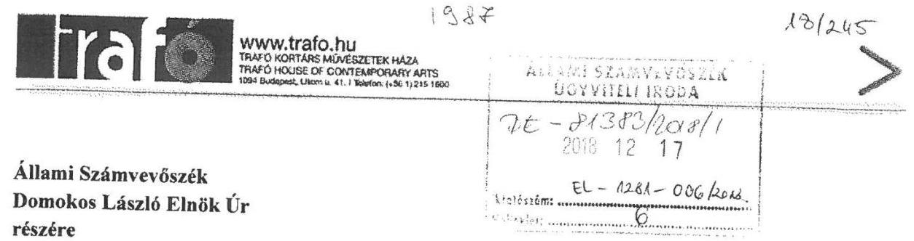

Ikt.szám: EL-1281-004/2018
Budapest, 2018. december 14.

# Tisztelt Elnök Úr! 

A Trafó KMH Nonprofit Kft. színháznál lefolytatott ÁSZ „Utóellenőrzések- Az önkormányzatok többségi tulajdonában lévő gazdasági társaságok közfeladat-ellátásának ellenőrzése" címmel készült ellenőrzési jelentéstervezetet a napokban megkaptam, a tartalmát megismertem. Az alábbiakban részletezett észrevételeket kívánom megtenni:

A Trafó KMH Nonprofit Kft. színháznál a 2013. évben lefolytatott ÁSZ ellenőrzésről szóló jelentésben tett megállapításokra és javaslatokra Intézkedési tervet határozott meg a Társaság, amelyet az Állami Számvevőszék 2014. június 18-án elfogadott. A végrehajtásról 2015. május 15. napján a színház beszámolt, mellékelte az elkészült dokumentumokat.

A Társaság meglátása, hogy bizonyos információk nem megfelelő leírása illetve megosztása miatt félreértés következett be a végrehajtást illetően.

Az eredeti jelentésben megfogalmazott 1. sorszámú megállapítás egy nem hatályos szabályzattal kapcsolatosan tett megállapítást, míg az ellenőrzés folyamán a résztvevők tisztában voltak vele, hogy a Társaságnál akkor érvényben lévő 2011. január 01-től hatályos szabályzatot kell kiegészíteni egy helyen, a Befektetett pénzügyi eszközökkel kapcsolatosan. Társaságunk ennek értelmében aktualizálta is a fent megnevezett szabályzatot, melyet csatolt a végrehajtásról szóló leveléhez.

Jelen levelünk mellé csatoljuk a 2007. évi számlarendet, mely az ÁSZ vizsgálat alatt „régi szabályzatok" mappában átadásra került a helyszínen ellenőrzést végző ellenőrnek is.
Továbbá csatoljuk a Fővárosi Önkormányzat szabályzategységesítési szándékának megfelelően elkészült 2011. január 01-től hatályos Számlarendet, mely a helyszíni ellenőrzés alatt is bemutatásra került.
S mellékeljük még a 2014. évi Számlarend módosítást és a 2016. január 01-től hatályos Számlarendet is.

---

A Bizonylati szabályzat 2009. január 03-tól volt hatályos az ellenőrzés időpontjában a Társaságnál. Ezen szabályzatot a Társaság hatályon kívül helyezte, az új Dokumentumkezelési szabályzat 2017. január 04-i hatályba léptetésével, mely szabályzatokat szintén csatolunk jelen levelünkhöz.

Kérném szépen, hogy a jelentéstervezetet, az észrevételeim és a megküldött dokumentumok alapján felülvizsgálni szíveskedjenek.

Megtisztelő válaszukat előre is megköszönve,
üdvözlettel
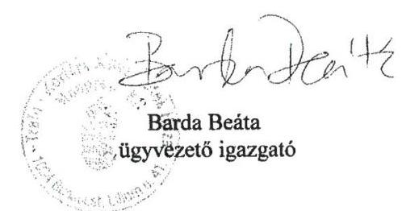

# Mellékletek: 

1. 2007. évi Számlarend
2. 2011. évi Számlarend
3. 2014. évi Számlarend módosítás
4. 2016. évi Számlarend
5. Bizonylati szabályzat
6. Dokumentumkezelési szabályzat

---

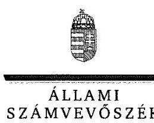

ELNÖK

Ikt.szám: EL-1281-008/2018.

# Barda Beáta úrhölgy 

ügyvezető

Trafó Kortárs Művészetek Háza Nonprofit Kft.

## Budapest

## Tisztelt Ügyvezető Úrhölgy!

Az ,,Utóellenőrzések - Az önkormányzatok többségi tulajdonában lévő gazdasági társaságok köz-feladat-ellátásának ellenőrzése - Trafó Kortárs Művészetek Háza Nonprofit Kft. " címmel készített számvevőszéki jelentéstervezetre tett észrevételeit köszönettel megkaptam.
Az Állami Számvevőszék észrevételekre vonatkozó álláspontjáról a felügyeleti vezető által készített részletes tájékoztatást csatoltan megküldöm.
Tájékoztatom Ügyvezető úrhölgyet, hogy a számvevőszéki jelentésben - az Állami Számvevőszékről szóló 2011. évi LXVI. törvény 29. § (3) bekezdése alapján - a figyelembe nem vett észrevételeket szerepeltetjük annak megindoklásával, hogy azokat miért nem fogadtuk el.

Budapest, 2019. 01. hó 07. nap
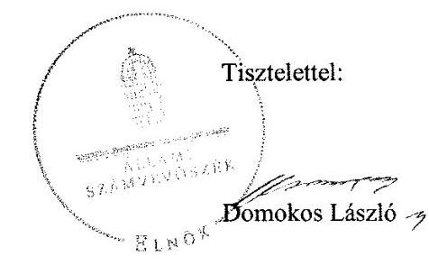

Melléklet: Tájékoztatás az észrevételek kezeléséről

---

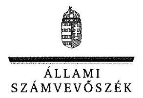

# Tájékoztatás   az észrevételek kezeléséről 

Az ,,Utóellenőrzések - Az önkormányzatok többségi tulajdonában lévő gazdasági társaságok köz-feladat-ellátásának ellenőrzése - Trafó Kortárs Művészetek Háza Nonprofit Kft. " címü jelentéstervezetre 2018. december 14-én tett (az Állami Számvevőszékhez 2018. december 17-én érkezett) észrevételét áttekintettük, annak kezelésével kapcsolatban a következő tájékoztatást adom.

## A jelentéstervezet I. sz. melléklet, Nem végrehajtott feladat, 6. sorra vonatkozó észrevétel:

A Társaság ügyvezetője a számlarend aktualizálásával kapcsolatos intézkedési feladat értékeléséhez tett észrevételt.
Az észrevételt nem fogadjuk el. A Társaság az észrevételhez csatolt szabályzatok közül csak a 2014. évi számlarend módosítást adta át az ellenőrzés részére, amelyet az ügyvezető által aláirt teljességi és hitelességi nyilatkozat átadott dokumentumokat rögzítő melléklete tartalmazott. A Társaság az ÁSZ adatbekéréseihez megküldött 2018. október 3-ai teljességi és hitelességi nyilatkozatában kijelentette, hogy az ÁSZ részére átadott dokumentumok, adatok a bekért adatokra, dokumentumokra vonatkozóan teljes körű információt tartalmaznak. Az észrevétellel megküldött számlarendeket a Társaság nem adta át az ellenőrzés részére.
Az észrevételhez mellékelt egyéb (bizonylati, dokumentumkezelési) szabályzatok a jelentéstervezetben foglalt megállapítások szempontjából nem relevánsak.
Az észrevétel alapján a jelentéstervezet módosítása nem indokolt.
Budapest, 2019. 01. hó 05. nap
Dr. Nagy Imre
felügyeleti vezető

---

.

---

# RÖVIDÍTÉSEK JEGYZÉKE 

${ }^{1}$ jelentés
${ }^{2}$ Társaság
${ }^{3}$ ÁSZ
${ }^{4}$ főjegyző
${ }^{5}$ Társaság igazgatója
${ }^{6}$ intézkedési terv ${ }_{1}$
${ }^{7}$ intézkedési terv ${ }_{2}$
${ }^{8}$ ÁSZ tv.
${ }^{9}$ Önkormányzat
${ }^{10}$ ÁSZ SZMSZ
${ }^{11}$ Bkr.
${ }^{12}$ vagyonrendelet
${ }^{13}$ fenntartói megállapodások felülvizsgálata
${ }^{14}$ leltározási szabályzat módosítása
${ }^{15}$ számlarend
${ }^{16}$ Fővárosi Közgyűlés
${ }^{17}$ Számv. tv.
${ }^{18}$ 2015. évi Munkaterv

Jelentés - Az önkormányzatok többségi tulajdonában lévő gazdasági társaságok közfeladat-ellátásának ellenőrzéséről - Trafó Kortárs Művészetek Háza Nonprofit Kft.
Trafó Kortárs Művészetek Háza Nonprofit Kft.
Állami Számvevőszék
Budapest Főváros Főjegyző
Trafó Kortárs Művészetek Háza Nonprofit Kft. ügyvezető igazgatója
Fővárosi Önkormányzat Főpolgármestere módosított intézkedési terve (ikt.szám: 70/24-61/2013.)
Trafó Kortárs Művészetek Háza Nonprofit Kft. intézkedési terve az Állami Számvevőszék által végzett ellenőrzési jelentésére
az Állami Számvevőszékről szóló 2011. évi LXVI. törvény (hatályos: 2011. július 1-jétől)
Budapest Főváros Önkormányzata
az Állami Számvevőszék Szervezeti és Működési Szabályzata
a költségvetési szervek belső kontrollrendszeréről és belső ellenőrzéséről szóló 370/2011. (XII. 31.) Korm. rendelet (hatályos: 2012. január 1-jétől)
Budapest Főváros Önkormányzata vagyonáról, a vagyonelemek feletti tulajdonosi jogok gyakorlásáról szóló 22/2012. (III. 14.) Főv. Kgy. rendelet (hatályos: 2012. március 15-től), illetve 53/2015. (XII. 23.) Fővárosi Közgyűlés rendelete egyes vagyongazdálkodással összefüggő fővárosi közgyűlési rendeletek módosításáról (hatályos: 2015. december 23-tól)
Budapest Főváros Önkormányzata és a Trafó Kortárs Művészetek Háza Nonprofit Kft. közötti fenntartói megállapodás módosítása
Trafó Kortárs Művészetek Háza Nonprofit Kft. Eszközök és Források leltározási és leltárkészítési szabályzatának módosítása (hatályos: 2014. június 30-tól)
Trafó Kortárs Művészetek Háza Nonprofit Kft. Számlarend módosítása (hatályos: 2014. június 30-tól)
Budapest Főváros Közgyűlése
2000. évi C. törvény a számvitelről (hatályos: 2001. január 1-jétől)

Fővárosi Önkormányzat testülete által alapított szervezetek (társaságok, költségvetési szervek) belső ellenőrzési munkaterve 2015. évre

---

# ÁLLAMI SZÁMVEVŐSZÉK 

1052 Budapest, Apáczai Csere János utca 10.
Levélcím: 1364 Budapest 4. Pf. 54
Telefon: +36 14849100 Telefax: +36 14849200
www.asz.hu
