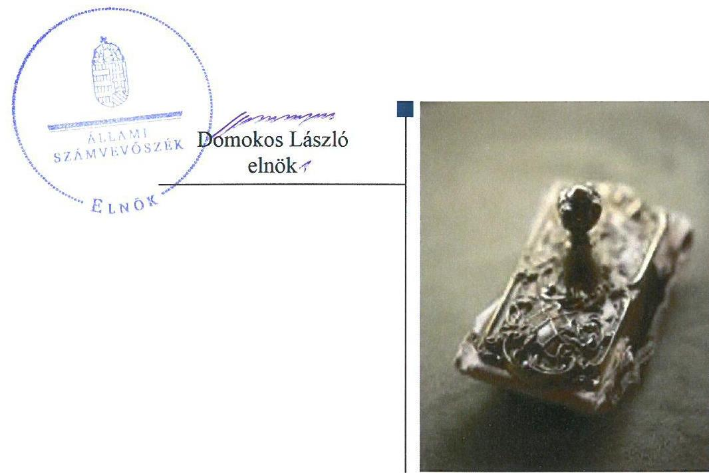
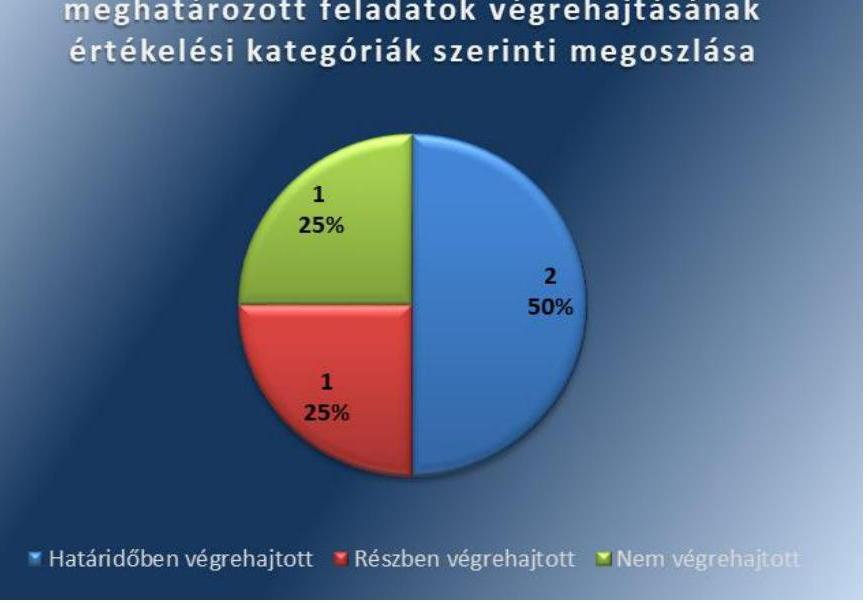
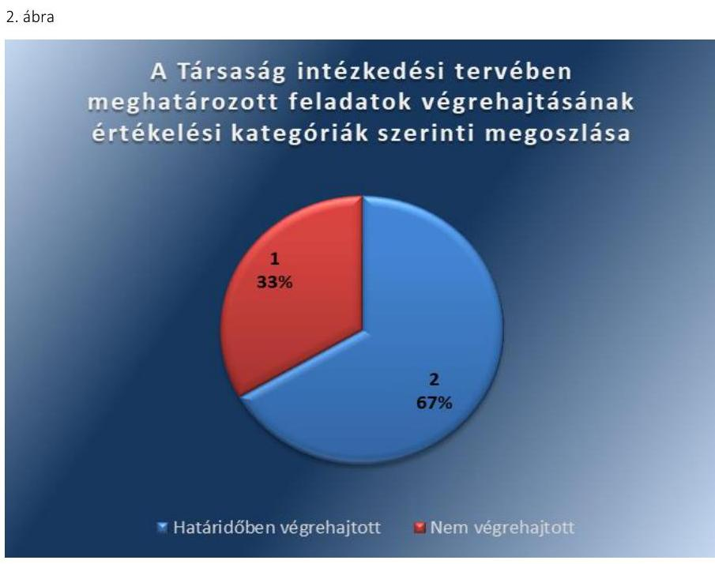
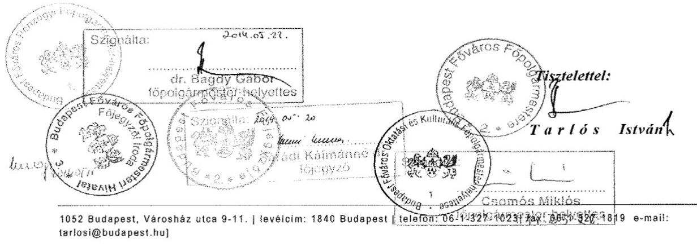
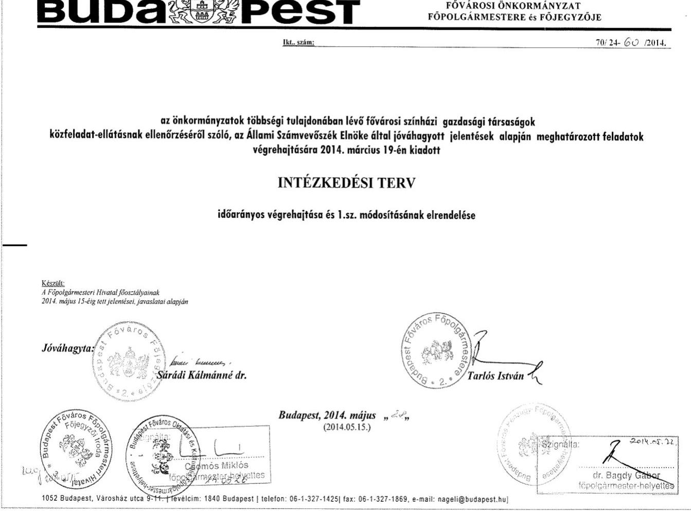
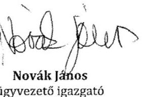
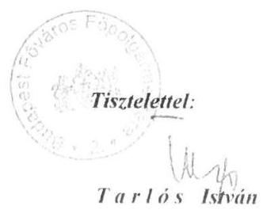
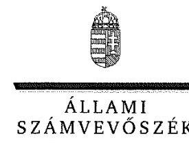
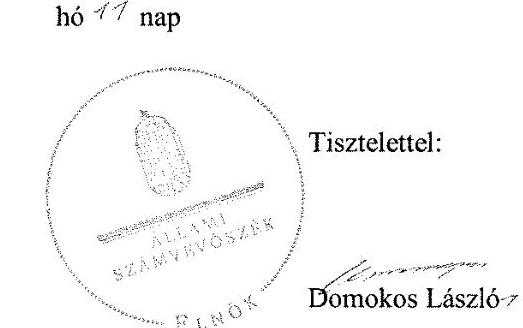

# Jelentés 

## Utóellenőrzések

Az önkormányzatok többségi tulajdonában lévő gazdasági társaságok közfeladatellátásának ellenőrzése - Kolibri Gyermekés Ifjúsági Színház Közhasznú Nonprofit Kft. 2019.

---

# Jelentés 

## Utóellenőrzések

Az önkormányzatok többségi tulajdonában lévő gazdasági társaságok közfeladatellátásának ellenőrzése - Kolibri Gyermekés Ifjúsági Színház Közhasznú Nonprofit Kft. 2019. 02. hó 08. nap

---

|  AZ ELLENŐRZÉST FELÜGYELTE: |  |  |  |  |   |
| --- | --- | --- | --- | --- | --- |
|   |  | DR. NAGY IMRE felügyeleti vezető |  |  |   |
|   |  | AZ ELLENŐRZÉST VEZETTE ÉS A VÉGREHAJTÁSÁÉRT FELELŐS: |  |  |   |
|   |  | KUSZINGER ANDREA ellenőrzésvezető |  |  |   |
|   |  | A PROGRAM ÖSSZEÁLLÍTÁSÁÉRT FELELŐS: |  |  |   |
|   |  | TÓTPÁL SZABOLCS osztályvezető |  |  |   |
|   |  | A TÉMÁHOZ KAPCSOLÓDÓ KORÁBBI SZÁMVEVŐSZÉKI JELENTÉSEK: |  |  |   |
|   |  | • címe: | Jelentés az önkormányzatok többségi tulajdonában lévő gazdasági társaságok közfeladat-ellátásának ellenőrzéséről – Kolibri Kiemelkedően Közhasznú Nonprofit Kft. és jogelődje |  |   |
|  Jelentéseink az Országgyűlés számítógépes hálózatán és az Interneten a www.asz.hu címen is olvashatóak. |  | • sorszáma: | 14035 |  |   |
|   |  | IKTATÓSZÁM: EL-0271-027/2019 |  |  |   |
|   |  | TÉMASZÁM: 4 |  |  |   |
|   |  | ELLENŐRZÉS-AZONOSÍTÓ SZÁM: V080457 |  |  |   |

---

# TARTALOMJEGYZÉK 

■ ÖSSZEGZÉS ..... 5
■ AZ ELLENŐRZÉS CÉLJA ..... 6
■ AZ ELLENŐRZÉS TERÜLETE ..... 7
■ AZ ELLENŐRZÉS HÁTTERE, INDOKOLTSÁGA ..... 8
■ A JELENTÉS LÉNYEGES KÉRDÉSKÖRE ..... 9
■ AZ ELLENŐRZÉS HATÓKÖRE ÉS MÓDSZEREI ..... 10
■ MEGÁLLAPÍTÁSOK ..... 12
■ MELLÉKLETEK ..... 15
I. sz. melléklet: Budapest Főváros Önkormányzata és a Kolibri Gyermek-és Ifjúsági Színház közhasznú Nonprofit kft. intézkedési terve végrehajtásának értékelése ..... 15
II. sz. melléklet: Budapest Főváros Önkormányzata és a Kolibri Gyermek-és Ifjúsági Színház Közhasznú Nonprofit Kft. intézkedési terve. ..... 19
■ FÜGGELÉK: ÉSZREVÉTELEK ..... 29
■ RÖVIDÍTÉSEK JEGYZÉKE ..... 35

---

.

---

# ÖSSZEGZÉS 

A Kolibri Gyermek-és Ifjúsági Színház Közhasznú Nonprofit Kft. által végrehajtott feladatok a szabálytalan vagyongazdálkodás kockázatát csökkentették. Budapest Főváros Önkormányzata, mint tulajdonosi joggyakorló által végrehajtott feladatok csökkentették a Társaság szabályozatlanságában rejlő kockázatokat. Ugyanakkor a tulajdonosi joggyakorló az általa vállalt feladatok végrehajtásának elmaradása miatt nem járult hozzá a Társaság vagyongazdálkodási kockázatainak csökkentéséhez.

## Az ellenőrzés társadalmi indokoltsága

Az Állami Számvevőszék stratégiájában célul tűzte ki a számvevőszéki munka hasznosulásának javítását. Ezzel összhangban ellenőrzi, hogy az ellenőrzött szervezet megvalósította-e a korábbi ellenőrzései által feltárt hibák, hiányosságok és szabálytalanságok megszüntetése céljából elkészített intézkedési tervében foglaltakat. A rendszeres utóellenőrzések hozzájárulnak a szükséges intézkedések tényleges végrehajtásához, ezáltal a közpénzügyek rendezettségének javulásához.

## Főbb megállapítások, következtetések

Az Állami Számvevőszék részére megküldött intézkedési tervben meghatározott négy feladatból Budapest Főváros Önkormányzata, mint tulajdonosi joggyakorló két feladatot végrehajtott, egy feladatot részben hajtott végre és egy feladat végrehajtásáról nem gondoskodott. A Kolibri Gyermek-és Ifjúsági Színház Közhasznú Nonprofit Kft. az intézkedési tervben meghatározott három feladatból kettőt végrehajtott, egy feladat végrehajtásáról nem intézkedett.

A Kolibri Gyermek-és Ifjúsági Színház Közhasznú Nonprofit Kft. által elvégzett leltározás csökkentette a vagyongazdálkodás területén a kockázatokat. Az eszközök és források értékelési szabályzata módosításának elmaradása miatt a Kolibri Gyermek-és Ifjúsági Színház Közhasznú Nonprofit Kft-nél a szabályozottságban rejlő kockázat továbbra is fennáll.

Budapest Főváros Önkormányzata, mint tulajdonosi joggyakorló által végrehajtott vagyonrendelet-módosítás, a fenntartói megállapodások felülvizsgálata és módosítása a szabályozottság területén csökkentette a kockázatokat. A tulajdonosi joggyakorló az intézkedési tervben a jogszabályi kötelezettségét meghaladóan vállalta, de nem hajtotta végre a leltárkészítési és leltározási mintaszabályzat kidolgozását, ezáltal nem járult hozzá a Kolibri Gyermek- és Ifjúsági Színház Közhasznú Nonprofit Kft. vagyongazdálkodási kockázatainak csökkentéséhez.

---

# AZ ELLENŐRZÉS CÉLJA 

Az ellenőrzés célja annak értékelése volt, hogy a számvevőszéki jelentésben ${ }^{1}$ foglalt intézkedést igénylő megállapításokkal összhangban készített intézkedési tervben meghatározott feladatokat az ellenőrzött szervezetek végrehajtották-e.

---

# Az Ellenőrzés Területe

## Kolibri Gyermek-és Ifjúsági Színház Közhasznú Nonprofit Kft.

Budapest Főváros Önkormányzata kötelező közművelődési és művészeti közfeladatának ellátása érdekében alapította Társaság2-ot 2011. május 31-jén. Budapest Főváros Önkormányzata 100%-os tulajdonosa a Társaságnak.

A Társaság közhasznú főtevékenysége az előadó-művészet, amely a gyermekek számára kínál színházi előadásokat. A Társaság ügyvezetője 2015. március 1-je óta látja el feladatait, Budapest Főváros Önkormányzata Főpolgármestere 2010. október 3-a óta tölti be tisztségét, Budapest Főváros Önkormányzata Főjegyzőjének személyében az ellenőrzött időszakban változás nem történt.

Az ÁSZ3 2013. évben ellenőrizte a Társaság közfeladat-ellátását a 2008. január 1-je és 2012. december 31-e közötti időszak vonatkozásában a 2013. szeptember 6-ig bekövetkezett változásokra figyelemmel. Az erről szóló 14035 számú jelentését 2014. január 30-án tette közzé. Az ellenőrzés célja annak értékelése volt, hogy az önkormányzat a jogszabályi előírások figyelembevételével gyakorolta-e tulajdonosi jogait és teljesítette-e kötelezettségeit, illetve az ellenőrzés értékelte, hogy a Társaság teljesítette-e a tulajdonos önkormányzat részéről meghatározott célokat és feladatokat a rendelkezésre álló erőforrások felhasználásával; végrehajtotta-e a közfeladat-ellátási szerződés előírásait; betartotta-e a vagyonnal történő gazdálkodásra vonatkozó jogszabályi rendelkezéseket.

Az ÁSZ a 14035 számú jelentésében a főjegyző4 részére egy, a Társaság igazgatója5 részére pedig négy javaslatot fogalmazott meg. A hiányosságok és a szabálytalanságok megszüntetésére az Budapest Főváros Önkormányzata elkészítette az intézkedési terv16-t és a Társaság elkészítette az intézkedési terv27-t.

Az utóellenőrzés – 2014. január 30-tól 2018. július 27-ig végrehajtott feladatokat figyelembe véve – az ÁSZ jelentésében a Budapest Főváros Főjegyzője és a Társaság igazgatója részére megfogalmazott intézkedést igénylő megállapításokra és javaslatokra készített, az ÁSZ részére megküldött intézkedési tervekben meghatározott feladatok végrehajtásának ellenőrzésére, értékelésére fókuszált.

---

# AZ ELLENŐRZÉS HÁTTERE, INDOKOLTSÁGA 

Az ÁSZ tv. ${ }^{8}$ 33. § (1) bekezdése értelmében a számvevőszéki jelentések intézkedést igénylő megállapításaihoz és javaslataihoz kapcsolódóan az ellenőrzött szervezet vezetője intézkedési tervet köteles összeállítani, és az Állami Számvevőszék részére megküldeni.

Az intézkedési tervben foglaltak megvalósítását - az ÁSZ tv. 33. § (7) bekezdésében foglaltak alapján - az ÁSZ utóellenőrzés keretében ellenőrizheti. Az utóellenőrzések keretében - az intézkedések értékelése során - az ÁSZ figyelembe veszi az ellenőrzött szervezetek múködési feltételeiben, valamint a jogszabályi előírásokban bekövetkezett változásokat.

Az utóellenőrzés során az ÁSZ értékeli, hogy az érintett számvevőszéki jelentésben foglalt intézkedést igénylő megállapításokkal és javaslatokkal összhangban, az ellenőrzött szervezet által készített intézkedési tervben meghatározott feladatokat a feladatra kijelöltek végrehajtották-e.

Az intézkedések végrehajtásával az adott terület szabályszerű múködése vonatkozásában a kockázatok csökkenhetnek, azonban hosszabb távon az intézkedési tervben foglaltak végrehajtásával önmagában nem szűnnek meg, csak akkor, ha beépülnek az ellenőrzött szervezet múködésébe, azokat folyamatosan karban tartja, figyelembe véve, illetve kezelve a változásokat. Emellett az intézkedések végrehajtásáig újabb kockázatok merülhetnek fel a szabályszerű múködés vonatkozásában, amelyek kezelése szintén kiemelten fontos az ellenőrzött szervezet számára.

Az ellenőrzött szervezet vezetője által készített intézkedési tervekben foglalt feladatok hiányos, illetve késedelmes végrehajtása, vagy annak elmaradása a szabályszerűség és a felelős vezetői magatartás vonatkozásában kockázatot hordoz, ami azt mutatja, hogy az ellenőrzések során feltárt hibák, hiányosságok és szabálytalanságok kezelése nem kapott kellő hangsúlyt. Az utóellenőrzés során is fennálló szabálytalanságok esetén a közpénz, közvagyon veszélyeztetettségi kockázat valószínűsített hatásának értékelése további intézkedéseket vonhat maga után.

Az ellenőrzött szervezet szintjén az utóellenőrzés feltárja, hogy a szervezet az intézkedések végrehajtásával hasznosította-e a korábbi ellenőrzési jelentésben a hiányosságok megszüntetése, illetve a kockázatok kezelése érdekében megfogalmazott javaslatokat, illetve az intézkedések végrehajtása elmaradásának következtében továbbra is fennálló szabálytalanság esetén értékeli a közpénzek, közvagyon veszélyeztetettségét.

Az ÁSZ szintjén az utóellenőrzés visszacsatolást ad az ellenőrzési jelentések hasznosulásáról, az intézkedések elmaradásának, vagy részleges megvalósulásának a közpénzek, közvagyon veszélyeztetettségére gyakorolt valószínűsített hatásának értékelése, további intézkedéseket vonhat maga után.

---

# A JELENTÉS LÉNYEGES KÉRDÉSKÖRE 

Az ellenőrzött szervezetek az intézkedési tervben foglaltakat az előirt határidőben végrehajtották-e?

---

# AZ ELLENŐRZÉS HATÓKÖRE ÉS MÓDSZEREI 

## Az ellenőrzés típusa

Megfelelőségi ellenőrzés.

## Az ellenőrzött időszak

Az utóellenőrzés alapját képező ÁSZ jelentés közzétételének napjától az ellenőrzésről szóló kiértesítő levél keltének napjáig tartó időszak volt, 2014. január 30-tól 2018. július 27-ig.

## Az ellenőrzés tárgya

A számvevőszéki jelentésben foglalt intézkedést igénylő megállapításokkal összhangban - az ellenőrzött szervezetek által - készített Intézkedési tervben foglaltak végrehajtásának ellenőrzése volt.

## Az ellenőrzött szervezet

Budapest Főváros Önkormányzata, Kolibri Gyermek-és Ifjúsági Színház Közhasznú Nonprofit Kft.

## Az ellenőrzés jogalapja

Az ellenőrzés jogszabályi alapját az ÁSZ tv. 33. § (7) bekezdése képezi.

## Az ellenőrzés módszerei

Az ÁSZ az ellenőrzést az ellenőrzött időszakban hatályos jogszabályok, az ellenőrzés szakmai szabályai, a jelen ellenőrzésre irányadó ÁSZ módszertanok, az ellenőrzési programban foglalt értékelési szempontok szerint végezte.

Az ellenőrzés ideje alatt az Önkormányzat ${ }^{9}$-tal és a Társasággal történő kapcsolattartás az ÁSZ SZMSZ ${ }^{10}$-ének vonatkozó előírásai alapján volt biztosított.

Az utóellenőrzés megállapításait az ÁSZ rendelkezésére álló, valamint az ÁSZ adatbekérése szerint, az ellenőrzött szervezetek által rendelkezésre bocsátott dokumentumok alapozták meg.

Az ellenőrzési bizonyítékként felhasználható adatforrások közé tartoztak egyrészt az ellenőrzési program részletes szempontjainál felsorolt

---

adatforrások, másrészt minden - az ellenőrzés folyamán feltárt, az ellenőrzés szempontjából információt tartalmazó - dokumentum.

Az ÁSZ az intézkedési tervekben előírt feladatokat azok végrehajthatósága, illetve végrehajtása szempontjából az alábbiak szerint értékelte:
"határidőben végrehajtott" a feladat, ha a teljesítés dokumentáltan, az intézkedési tervben előírt határidőben és tartalommal megtörtént;
"határidőn túl végrehajtott" a feladat, ha annak teljesítése az intézkedési tervben meghatározott módon, de az előírt határidőn túl történt meg;
"részben végrehajtott" a feladat, ha végrehajtása teljes körűen az intézkedési tervben előírt módon nem történt meg;
"nem végrehajtott" a feladat, ha a végrehajtás nem történt meg, vagy amennyiben a teljesítést nem dokumentálták;
"okafogyottá vált" a feladat, ha végrehajtására - meghatározott esemény bekövetkezése, továbbá külső körülmény, a működést érintő feltétel változása miatt - már nincs szükség, illetve lehetőség, és egyértelműen megállapítható, hogy az intézkedést szükségessé tevő körülmény a jövőben nem fordulhat elő;
"nem időszerü" az a feladat, amelynek ellenőrzési időszakon belüli végrehajtására azért nem került (kerülhetett) sor, mert az intézkedés alapjául szolgáló esemény nem következett be, de annak jövőbeni előfordulása lehetséges, a végrehajtása nem volt esedékes, vagy a végrehajtás határideje még nem járt le.
Az ellenőrzés lefolytatásához az ellenőrzött szervezetek a tanúsítványok elektronikus kitöltésével, valamint az ÁSZ által kért dokumentumok elektronikus megküldésével szolgáltattak adatokat, amelyek valódiságát és teljes körűségét az ellenőrzött szervezet vezetője által tett teljességi és hitelességi nyilatkozat igazolta. Az így rendelkezésre bocsátott adatok, információk kontrollja az ellenőrzés keretében megtörtént.

---

# MEGÁLLAPÍTÁSOK 

## Az ellenőrzött szervezetek az intézkedési tervben foglaltakat az előírt határidőben végrehajtották-e?

Összegző megállapítás

Az Önkormányzat, mint tulajdonosi joggyakorló az intézkedési tervben meghatározott négy feladatból kettőt végrehajtott, egy feladatot részben hajtott végre és egy feladat végrehajtásáról nem gondoskodott. A Társaság az intézkedési tervben vállalt három feladatból kettőt végrehajtott, egy feladatot nem hajtott végre.

Az intézkedési terv $1_{1,2}$-ben meghatározott feladatokat, határidőket, felelősöket, és a feladatok végrehajtásának értékelését az I. számú melléklet, az intézkedési terv $1_{1,2}$-t a II. számú melléklet mutatja be.

Az Önkormányzat gondoskodott az intézkedési terv $_{1}$-ben meghatározott feladatok végrehajtásának Bkr. ${ }^{11}$ előírása szerinti nyilvántartásáról.

Az Önkormányzat által készített intézkedési terv $_{1}$-ben meghatározott feladatok végrehajtásának értékelési kategóriák szerinti megoszlását az 1. ábra szemlélteti.

1. ábra

Az Önkormányzat intézkedési tervében meghatározott feladatok végrehajtásának értékelési kategóriák szerinti megoszlása

A Társaság által készített intézkedési terv $_{2}$-ben meghatározott feladatok végrehajtásának értékelési kategóriák szerinti megoszlását az 2. ábra szemlélteti.

---

Forrás: ÁSZ
A SZABÁLYOZOTTSÁG területén a kockázatok csökkentek, mivel az Önkormányzat végrehajtotta a vagyonrendelet ${ }^{12}$ módosítását (1.) és a színházakkal kötött fenntartói megállapodásokat felülvizsgálta ${ }^{13}(3$.$) . A$ végrehajtott intézkedésekkel az Önkormányzat, mint tulajdonosi joggyakorló támogatta a Társaság szabályszerű múködésének feltételeit.

A Társaság intézkedett az önköltség-számítási szabályzat ${ }^{14}$ elkészítéséről (5.), azonban nem módosította az eszközök és források értékelési szabályzatát ${ }^{15}$ (7.). Az értékelési szabályzat módosításának elmaradása miatt a Társaságnál a szabályozottságban rejlő kockázat fennáll.

# A BELSŐ KONTROLL SZERINTI ELSZÁMOLTATHATÓSÁG területén az Önkormányzat, mint tulajdonosi joggyakorló gondoskodott a Társaságra vonatkozóan a számvevőszéki jelentésben tett javaslatokra megfogalmazott intézkedések végrehajtásának ellenőrzéséről (2.), mely csökkentette a kockázatokat. 

A TÁRSASÁG VAGYONGAZDÁLKODÁSA területén a kockázatok csökkentek, mivel a Társaság a tárgyi eszközök leltározását elvégezte (6.).

Az Önkormányzat, mint tulajdonosi joggyakorló a Társaság tekintetében nem gondoskodott a haszonbérleti szerződések (3.) felülvizsgálatáról, valamint a jogszabályi kötelezettségét meghaladóan vállalt leltárkészítési és leltározási mintaszabályzat (4.) kidolgozásáról. Így az Önkormányzat nem járult hozzá a Társaság vagyongazdálkodási kockázatainak csökkentéséhez.

---

.

---

# MELLÉKLETEK

- I. SZ. MELLÉKLET: BUDAPEST FÖVÁROS ÖNKORMÁNYZATA ÉS A KOLIBRI GYERMEK-ÉS IFJÚSÁGI SZÍNHÁZ KÖZHASZNÚ NONPROFIT KFT. INTÉZKEDÉSI TERVE VÉGREHAJTÁSÁNAK ÉRTÉKELÉSE

|  Az intézkedési tervben meghatározott feladat | Az intézkedési tervben meghatározott határidő | Az intézkedési tervben meghatározott feladatok felelőse | A feladat végrehajtása  |
| --- | --- | --- | --- |
|  Budapest Főváros Önkormányzata intézkedési tervetátáridőben végrehajtott feladatok |  |  |   |
|  1. Az ÁSZ javaslatában foglaltakra tekintettel a hatályos jogszabályi előírások figyelembe vételével át kell tekinteni a hatályos Vagyonrendelet előírásait, a színházakkal megkötött haszonbérleti szerződéseket, illetve fenntartói megállapodásokat, a színházak leltárkészítési és leltározási szabályzatait, és javaslatot kell tenni a Vagyonrendelet indokolt módosítására, a színházakkal megkötött szerződések szükséges módosítására, valamint a színházak leltárkészítés és leltározási szabályzataiban foglaltak végrehajtásának ellenőrzési rendjére. Ennek részeként: c.) közgyűlési elfogadásra javaslatot kell tenni a Vagyonrendelet módosítására, és amennyiben indokolt a haszonbérleti szerződések és fenntartói megállapodások módosítására | városvezetői döntés szerint | Vagyongazdálkodási Főosztály vezetője | A vagyonrendelet módosítására vonatkozó, FPH058/14975/2015. iktatószámú javaslatot 2015. november 20-án terjesztették a Fővárosi Közgyűlés ${ }^{16}$ elé. A Vagyonrendelet módosítása a Számv. tv. ${ }^{17}$ előírásaival összhangban évente leltárkészítési, háromévente mennyiségi felvétellel történő leltározási kötelezettséget írt elő az önkormányzati vagyont használó, haszonbérbe, haszonkölcsönbe vevő gazdasági társaságok és nonprofit gazdasági társaságok számára.  |

---

|  Az intézkedési tervben meghatározott feladat | Az intézkedési tervben meghatározott határidő | Az intézkedési tervben meghatározott feladatok felelése | A feladat végrehajtása  |
| --- | --- | --- | --- |
|  2. Gondoskodni kell arról, hogy
a.) a 2014. évi Belső Ellenőrzési Munkatervben szereplő, kulturális társaságokra irányuló és az ÁSZ vizsgálattal érintett társaságok vizsgálata során kerüljön sor az ÁSZ jelen vizsgálati jelentésében az érintett színházi igazgatók részére megfogalmazott feladatok végrehajtásának ellenőrzése
b.) a 2015. évi Belső Ellenőrzési Munkaterv tartalmazza valamennyi ÁSZ vizsgálattal érintett színházi társaság esetében az ÁSZ javaslatai végrehajtásának ellenőrzését. | 2014. IV. negyedév | Belső Ellenőrzési Osztály vezetője | Az Önkormányzat Belső Ellenőrzésének 2014. december 18-án jóváhagyott FPH-0006/228-6/2014. iktatószámú 2015. évi Munkaterve ${ }^{18}$ tartalmazta a fővárosi színházaknál végrehajtott ÁSZ ellenőrzések javaslataira készített intézkedési tervek végrehajtásának az ellenőrzését.  |
|  3. Az ÁSZ javaslatában foglaltakra tekintettel a hatályos jogszabályi előírások figyelembe vételével át kell tekinteni a hatályos Vagyonrendelet előírásait, a színházakkal megkötött haszonbérleti szerződéseket, illetve fenntartói megállapodásokat, a színházak leltárkészítési és leltározási szabályzatait, és javaslatot kell tenni a Vagyonrendelet indokolt módosítására, a színházakkal megkötött szerződések szükséges módosítására, valamint a színházak leltárkészítés és leltározási szabályzataiban foglaltak végrehajtásának ellenőrzési rendjére. Ennek részeként:
b.) az a.) pontban foglaltakra figyelemmel felül kell vizsgálni és szükség szerint javaslatot kell tenni a színházakkal kötött haszonbérleti szerződések, illetve fenntartói megállapodások módosítására; | 2014. augusztus 31. | Kulturális, Sport, Köznevelési, Egészségügyi és Szociálpolitikai Főosztály vezetője | Végrehajtott feladatrész:
A Társasággal kötött fenntartói megállapodás módosítására vonatkozó javaslatot az FPH079/1663-2/2015 iktatószámú előterjesztésben terjesztették a Fővárosi Közgyűlés elé, amely alapján a Társasággal kötött fenntartói megállapodás módosításra került.
Nem végrehajtott feladatrész:
A Társasággal kötött haszonbérleti szerződés felülvizsgálata nem történt meg.  |

---

|  4. | Az ÁSZ javaslatában foglaltakra tekintettel a hatályos jogszabályi előírások figyelembe vételével át kell tekinteni a hatályos Vagyonrendelet előírásait, a színházakkal megkötött haszonbérleti szerződéseket, illetve fenntartói megállapodásokat, a színházak leltárkészítési és leltározási szabályzatait, és javaslatot kell tenni a Vagyonrendelet indokolt módosítására, a színházakkal megkötött szerződések szükséges módosítására, valamint a színházak leltárkészítés és leltározási szabályzataiban foglaltak végrehajtásának ellenőrzési rendjére. Ennek részeként:
a.) javaslatot kell tenni a Leltárkészítés és leltározás szabályzatának mintájára. | 2014. június 15. | Pénzügyi Főosztály vezetője | Az eszközök és források leltárkészítési és leltározási szabályzatának mintájára nem készült javaslat.  |
| --- | --- | --- | --- |
|  Kolibri Gyermek és Ifjúsági Színház Közhasznú Nonprofit Kft. intézkedési terve |  |  |   |
|  Határidőben végrehajtott feladatok |  |  |   |
|  5. | A hatályos jogszabályoknak megfelelő felosztási módszer kidolgozása. A felosztási módszer egyértelműen meghatározza a közvetlen és közvetett költségek körét, annak felosztási módszerét a produkciók bemutatásáig és műsoron tartásáig. A kidolgozás során egy logikus és egyértelmű normarendszer kerül kialakításra, mely megfelel a hatályos jogszabályoknak, és ezáltal valós képet mutat az önköltség számításánál. | 2014. augusztus 31. | gazdasági igazgató | A módosított önköltség-számítási szabályzat 2014. szeptember 1-jén lépett hatályba. A Társaság az önköltség-számítási szabályzatban kidolgozta az alkalmazható felosztási módszereket, a közvetlen és közvetett költségek körét, a kalkulációk fajtáit.  |
|  6. | A leltározási szabályzat betartása melletti leltározás elkészítése. | 2014. december 31. | gazdasági igazgató | A Társaság a saját és a használatban lévő tárgyi eszközök leltározását elvégezte.  |

---

|  7. | Az eszközök és források értékelési szabály- | 2014. augusztus 31. | gazdasági igazgató | A Számv. tv. 14. § (3) bekezdésben foglaltak ellenére az ért-  |
| --- | --- | --- | --- | --- |
|   | zata módosításra kerül a hatályos számviteli |  |  | tételési szabályzat 2014. január 1-jétől hatályos módosít  |
|   | törvény előírásainak figyelembevételével. A |  |  | tása nem tartalmazta a helyes eszközbesoroláshoz szüksé-  |
|   | módosítás során egyértelmű definíciók ke- |  |  | ges definíciókat, illetve nem tartalmazott hivatkozást a jog-  |
|   | rülnek kialakításra, mely a jövőben lehetővé |  |  | szabályt előírásokra. Az ilyen típusú eszközök nyilvántartása  |
|   | teszi a helyes besorolás megállapítását az új |  |  | Társaság által használt tárgyi eszköz nyilvántartási rend  |
|   | bemutatók során felhasznált egy évet me- |  |  | szerben nem került kimutatásra.  |
|   | haladóan használt eszközöknek a tárgyi esz- |  |  |   |
|   | közök közötti kimutatásáról. Az ilyen típusú |  |  |   |
|   | eszközök nyilvántartása a társaság által has- |  |  |   |
|   | znált tárgyi eszköz nyilvántartási rendszerben |  |  |   |
|   | kerülne kimutatásra. |  |  |   |

---

# BUDAPEST 

## FÖVÁROSI ÖNKORMÁNYZAT FÖPOLGÁRMESTERE

| 161. szám: | $70 / 24$ - 01 /2013. |
| :--: | :--: |
| Tárgy: | Intézkedési Terv módosításának megküldése |

Állami Számvevőszék
Domokos László elnök úr részére

Tisztelt Elnök Úr!

Tájékoztatom, hogy az „önkormányzatok többségi tulajdonában lévő fövárosi szinházi gazdasági társaságok közfeladat-ellátásának ellenörzéséről" szóló

| 1. | a Centrál Színház Nonprofit Kft. | V-0189-063/2014. sz. |
| :-- | :-- | :-- |
| 2. | a József Attila Színház Nonprofit Kft. | V-0192-099/2014. sz. |
| 3. | a Vigszínház Kiemelkedően Közhasznú   Nonprofit Kft. és jogelödje | V-0193-160/2014. sz. |

jelentéseikben megfogalmazott javaslatokra tekintettel a fövárosi színházi gazdasági társaságok vizsgálatára vonatkozó korábbi jelentéseik alapján kiadott Intézkedési Tervünket kiegészítettük. Ezzel egyidejűleg áttekintésre került az Intézkedési Terv feladatainak időarányos végrehajtása is.

Szíves elfogadása érdekében jelen levelem mellékleteként átadom az időarányos végrehajtást és az 1.sz. módosítást tartalmazó Intézkedési Tervünket.

Megtisztelő válaszát előre is megköszönöm.

Budapest, 2014. május „",

---

# BUDASOPEST 

FÖVÁROSI ÖNKORMÁNYZAT
FÖPOLGAREMESTERE és FÖJEGYZÖJE

---

Az Intézkedési Terv 2014. március 19-i kiadását követően további - alábbiakban felsorolt - fővárosi színházi jelentés került nyilvánosságra. E jelentésekben megfogalmazott javaslatok, valamint a kiadott Intézkedési Terv végrehajtása érdekében tett intézkedések és a Főpolgármesteri Hivatal érintett behű szervezeti egységei által megfogalmazott javaslatok indokolttá teszik az Intézkedési Terv módosítását.

Jelen Intézkedési Terv 1.sz. módosításának időpontjára az alábbi fővárosi színházi jelentések kerültek nyilvánosságra:

|  1. |  | * Central Szinhárhospodó Kft. | 9-0189-062/2014. sz.  |
| --- | --- | --- | --- |
|  2. |  | * József Attila Szinhárhospodó Kft. | 9-0192-099/2014. sz.  |
|  3. |  | * Vüszínház Kiemelkedően Kizhasznú
hospodó Kft. és jogelődje | 9-0193-160/2014. sz.  |

Jelen Intézkedési Terv módosítására a fentiekben jelzett, nyilvánosságra hozott végleges jelentések alapján került összeállításra.

# B.) AZ INTÉZKEDÉSI TERR VÉGREHAUTÁLÁNAR KÉSZLETED FELADATAI

|  Feladat
Egységes szerkezetben a 2014. március 19-én jóváhagyott Intézkedési tervveli | 1.sz. módosítás
A feladat idősárányos végrehajtása és végrehajtási határidejének módosítása)  |
| --- | --- |
|  JóZ.jav.- Fp. |   |
|  JAVASLAT:
Vizsgáltassa ki a feltárt hiányosságokat, szabálytalanságokat és amennyiben szükséges, tegye meg a munkájogi felelősségre vonást | Intézkedési tervet módosító új javaslat, amely a Vüszínház Kiemelkedően Kizhasznú
hospodó Kft. és jogelődje tekintetében nyilvánosságra hozott jelentésben került
megfogalmazásra.  |
|  INTÉZKEDÉS:
a.) Az ÁSZ javaslatára tekintettel vizsgálati programot kell összeállítani, illetve vizsgálatot kell lefolytatni az ÁSZ vizsgálati jelentésben foglaltak és a mögöttes dokumentációk áttekintése, illetve munkájogi minősítése céljával.
b.) Az a.) pont szerinti vizsgálat eredményeként vezetői összefoglalót kell készíteni arról, hogy milyen jogszabályi felhatalmazás(ok) alapján kezdeményeztető munkájogi intézkedés kiemelkedően kizhasznú nonprofit kft. esetében. A vizsgálatnak ki kell térnie a Főpolgármester. |   |

---

# Mellékletek 

munkajogij jogosultságának levezetésére is.
c.) A vezetői összefoglaló eredményeket - amennyiben jogszabályi feltételek adottak, úgy konkrét javaslatot kell tenni a tővaron jelenlegi szabályozásának, eljárási rendjének, szabályozó intézkedéseinek indokolt felülvizsgálatára, módosítására.
Határidő:
a.) - a vizsgálati program elkészitésére: 2014. június 15.

- egyeztetett vizsgálati jelentés elkészitésére: 2014. szeptember 15.
b.) 2014. október 15 .
c.) a b.) pont szerinti vezetői összefoglaló elfogadását követő 30 napon belül...
Felelős:
a.) Belső Ellenőrzési Osztály vezetője
b.) Belső Ellenőrzési Osztály vezetője a Humán Menedzsmont Főosztály vezetőjének bevonásával
c.) Humán Menedzsmont Főosztály vezetője

## 1.) JAVASLAT:

Készítse elő a Közgyülés elé való terjesztés érdekében a Vagyonrendelet; módosítását, hogy az tartalmazza az Absz.; 37.§ (4)/Absz.; 22.§ (2) bekezdésében elöirtaának megfelelően az üzemeltetésre, kezelésre átadott eszközök leltározási szabályait.

## INTEZKEDÉS:

Az ÁSZ javaslatában foglaltakra tekintettel a hatályos jogszabályi előírások figyelembe vételével át kell tekinteni a hatályos Vagyonrendelet előírásait, a színházakkal megkötött haszonbérleti szerződéseket, illetve fenntartói megállapodásokat, a színházak leltárkészités és leltározási szabályzatait, és javaslatot kell tenni a Vagyonrendelet indokolt módosítására, a színházakkal megkötött szerződések szükséges módosítására, valamint a színházak leltárkészités és leltározási szabályzatában foglaltak végrehajtásának ellenőrzési rendjére. Ennek részeként

A feladat végrehajtása során a tervezett végrehajtási határidő lejártát megelőzően az érintettek részvételével egyezető megbeszélésre került sor. A feladat részleteinek áttekintése során, megállapodás szülezett arról, hogy valamennyi színház leltározási szabályzatát áttekinti a Pénztügyi Főosztály, s ennek valamint a „nagy" Madách Színház, illetve „kis" Radnóti Színház leltározási szabályzata ismeretében minta leltározási szabályzatot készít. E mintaszabályzatot véleményezésre, észrevételesésre megkapja valamennyi színház, illetve a hivatal érintett szervezeti egység vezetői. Az észrevételes ismeretében kerül sor a minta leltározási szabályzat véglegesitésére.
A Pénztügyi Főosztály a vagyonrendelet módosításához javaslatot készített, amelynek egyeztetése és a tervezett mintaszabályzat elkészítése - a feladat összetettségére, időigényére

---

|  a.) javaslatot kell tenni a Lettékezés és feltározás szabályzatának
testnájára;
b.) az a.) pontban foglaltakra figyelemmel felül kell vizsgálni és szükség
szerint javaslatot kell tenni a színházakkal között hasznobérleti
szerződések, illetve fenntartói megállapodások módosítására;
c.) közgyűlési elfogadásra javaslatot kell tenni a Vagyonrendelét
módosítására, és amennyiben indokolt a haszonbérleti szerződések és
fenntartói megállapodások módosítására;
Határidő:
a.) 2014. március 25.
b.) 2014. április 15.
c.) 2014. április 15.
Felelős:
a.) Pénzügyi Főosztály vezetője
b.) Kulturális, sport, Köznevelési, Egészségügyi és Szociálpolitikai
Főosztály vezetője
c.) Vagyongazdálkodási Főosztály vezetője
Az egyes részfeladatokat a felelősként megjelölt szervezeti egységek
vezetőinek közreműködésével, kölcsönös egyeztetésével kell
megvalósítani. | tekintettel (nem veszélyeztetve az elvégzendő feltározási feladatokat) – indokolja a
végrehajtási határidők alábbiak szerinti módosítását:
Módosított határidő:
a.) 2014. június 15.
b.) 2014. augusztus 31.
c.) városvezetői döntés szerint  |
| --- | --- |
|  2.) JAVASLAT:
Intézkedjen a Budapest Bábszínház közfeladatának ellátásában
érintett ingatlanok – Budapest, VI., Andrássy út 69. és Budapest,
VI., Nagymező utca 8. fűzt. 7.sz. – jogi, tulajdonosi helyzetének
rendezéséről
Intézkedés:
Ara tekintettel, hogy
✓ a Budapest, VI., Andrássy út 69. ingatlan esetében a Budapest
Bábszínház Nonprofit Kft. igazgatója a 2014. február 27-én
érkeztetett levelehen arról ad tájékoztatást, hogy a Magyar | Az Intézkedési Tervben megfogalmazott határidőn belül a felelős főosztály elkészítette a
munkacsoport összetételére, a munkacsoport egyes részfeladataira, a végrehajtásban érintett
felelősök megjelölésével összeállított programot. A program tartalmazza azt is, hogy a  |

---

|  Képzömüvészeti Egyetem a Fővárosi Közigazgatási és Munkaügyi Bírósághoz 2013. október 17-i keltezéssel jogorvoslati kérelmet nyújtott be, a Budapest, VI., Nagymező utca 8. füst. 7.sz. alatti ingatlan tulajdonsági kérdésének rendezésre összetett feladat végrehajtását igényli, | Magyar Képzömüvészeti Egyetem a Fővárosi Közigazgatási és Munkaügyi Bírósághoz 2013. október 17-i keltezéssel jogorvoslati kérelmet nyújtott be. A programban megfogalmazottak alapján az Intézkedési Tervben megjelölt feladatok, határidők és felelősök kiegészítése szükséges.  |
| --- | --- |
|  indokolt, hogy az érintett ingatlanok tulajdon/használati jogának rendezésére a Főpolgármesteri Hivatal érintett belső szervezeti egységei mellett a Budapest Bábszínház bevonásával munkacsoport kerüljön felállitásra. A munkacsoportnak városvezetői szinten jóváhagyott program szerint kell elítani feladatát, amelynek időnányos (időszakunkénti) végrehajtásáról írásos beszámolót kell készítenie, illetve indokolt esetben városvezetői döntést megkérnie. |   |
|  Határidő:
- a munkacsoport összetételére, a munkacsoport egyes részfeladataira, a végrehajtásban érintett felelősök megjelölésével összeállított program összeállítására és városvezetői jóváhagyásra benyújtásra: 2014. március 31.
- a további feladatok a városvezetői döntéssel jóváhagyott program szerint
Felelős: Kulturális, Sport, Köznevelési, Egészségügyi és Szociálpolitikai Főosztály vezetője |   |
|  Közremüködő felelős szervezeti egységek:
- a Vagyongazdálkodási-, a Jogi-, és a Pénzügyi Főosztályok vezetői |   |
|  3.) ÁSSAHLAT:
Készítse elő a Színház SZMSZ-ét és az FB ügyrendjét annak érdekében, hogy a Főpolgármester azt a jóváhagyás céljából a képviselő-testület elé tudja terjeszteni. |   |
|  INTÉZKEDÉS: |   |

Magyar Képzömüvészeti Egyetem a Fővárosi Közigazgatási és Munkaügyi Bírósághoz 2013. október 17-i keltezéssel jogorvoslati kérelmet nyújtott be. A programban megfogalmazottak alapján az Intézkedési Tervben megjelölt feladatok, határidők és felelősök kiegészítése szükséges.

# Módosítás:

## Határidő és részfeladat kiegészítése:

(az első fr. bekezdés jelölése a.)-ra változik a második fr. bekezdés jelölése c.)-re változik) b.) A Magyar Képzömüvészeti Egyetem a Fővárosi Közigazgatási és Munkaügyi Bírósághoz 2013. október 17-i keltezéssel megküldött jogorvoslati kérelmében foglaltakra is figyelemmel az ingatlanok jelenlegi tulajdoni helyzetének alakulásának részletes bemutatására és a Fővárosi Önkormányzat érdekeit szem előtt tartó rendezésére vonatkozó jogi javaslat összeállítására: 2014. június 30.

## Felelős kiegészítése:

a.) Kulturális, Sport, Köznevelési, Egészségügyi és Szociálpolitikai Főosztály vezetője b.) Jogi Főosztály vezetője

Intézkedési tervet módosító új javaslat, amely a József Attila Színház Nonprofit KB. és jogelődje tekintetében nyilvánosságra hozott jelentésben került megfogalmazásra.

---

# Mellékletek

A Polgári Törvénykönyvről szóló 2013. évi V. törvény szabályozásaira tekintettel

a.) felül kell vizsgálni a főváros által alapított szinbázió társaságrá alapító okiratait, valamint a Fővárosi Önkormányzat vonatkozó rendeletre szabályozását oly módon, hogy az egyértelműen szabályozza:

- a társasági SZMSZ-ek jóváhagyásának, illetve
- a társasági FB-ok ügyrendje jóváhagyásának, valamint az FB-k beszámolási kötelezettségének

rendjét, a Főpolgármester, illetve a Fővárosi Közgyűlés az irányú feladatok, és javaslatot kell tenni a szükséges módosításokra.

b.) határidők és felelősök megjelölésével ütemezett javaslatot kell tenni az a.) pontban megfogalmazott feladatra is figyelemmel a Fővárosi Önkormányzat által alapított valamennyi gazdasági társaság alapítói okiratának felülvizsgálatára, a szükséges módosítások elfogadására.

## Határidő:

a.) - módosítási javaslat elkészítésére: 2014. augusztus 31., közgyűlési előterjesztés benyújtására: városvezetői döntés szerint

b.) 2014. augusztus 31.

## Felelős:

a.) Kulturális, Sport, Köznevelési, Egészségügyi és Szociálpolótikai Főosztály vezetője

b.) Vagyongazdálkodási Főosztály vezetője

Körreműködő felelős szervezeti egység: a Jogi Főosztály

---

# C) a szíinnázi gazdasági tázasságok részére megegyalmazott javaslatok végrehajtásának ellenőrzése 

1.) Gondoskodni kell arról, hogy
a.) a 2014. évi Belső Ellenőrzési Munkatervben szereplő, kulturális társaságokra irányuló és az ÁSZ vizsgálattal érintett társaságek vizsgálata során kerüljön sor az ÁSZ jelen vizsgálati jelentésében az érintett színházi igazgatók részére megfogalmazott feladatok végrehajtásának ellenőrzésére.
b.) a 2015. évi Belső Ellenőrzési Munkaterv tartalmazza valamennyi ÁSZ vizsgálattal érintett színházi társaság esetében az ÁSZ javaslatai végrehajtásának ellenőrzési feladatait.
Határidő: 2014. IV. negyedév
Felelős: Belső Ellenőrzési Osztály vezetője

---

Állami Számvevőszék
kiegészítés
Domokos László
Elnök úr
részére

Tisztelt Domokos László!
tárgy: Intézkedési terv
ALLAMINOASZVONCKA
UGYVITELLIKODA
$1 / 8345$ Doly
firk.: JUL 142014
Hunivolnt $V^{-0185-116 / 10.14}$.
Melléklet

A V-0185-097/2014. iktatószámú levelükre válaszolva megküldöm a "Számvevőszéki jelentésre" a Kolibri Gyermek- és Ifjúsági Színház Közhasznú Nonprofit Kft. intézkedési tervének kiegészítését.

Budapest, 2014. július 09.

Tisztelettel:

---

| Sorszám | Megállapítás | Intézkedés | Felelős | Határidő |
| :--: | :--: | :--: | :--: | :--: |
| 1. | Az eszközök és források értékelési szabályzata a számviteli törvény előírásaival ellentételeken határosta meg a vagyoni értékủ jogok érték és felhasználási idő szerinti besorolását, valamint a szellemi termékek nyilvántartásba vételének elszámolását. | Az eszközök és források értékelési szabályzata módosítása kerül a hatályos számviteli törvény előírásainak figyelembevételével. A módosítás során egyértelmú definíciók kerülnek kialakításra, mely a jövőben lehetővé teszi a helyes besorolás megállapítását az új bemutatók során felhasznált egy évet meghaladóan használt eszközöknek a tárgyi eszközök közötti kimutatásáról. Az ilyen típusú eszközök nyilvántartása a társaság által használt tárgyi eszköz nyilvántartási rendszerben kerülne kimutatásra. | Pánczél   Sándor   gazdasági   igazgató | 2014. augusztus 31. |
| 2. | A Színház a Számviteli tv. 14.§ (5) bekezdés c) pontja és (?) bekezdése alapján elkészítette az Önköltségszámitási szabályzata, t, azonban abban nem tért ki a társulat bérének és járulékainak legalább a produkció színreviteléig történő felosztási módjára. Ennek következtében a produkciók színreviteléig aktivált szellemi termékek nem a ténylegesen felmerült közvetlen költségek alapján kerültek elszámolásra. Továbbá nem tartalmazta az általános költségeknek a felosztási módját. | A hatályos jogszabályoknak megfelelő felosztási módszer kidolgozása. A felosztási módszer egyértelműen meghatározza a közvetlen és közvetett költségek körét, annak felosztási módszerét a produkciók bemutatásáig és músonon tartásáig. A kidolgozás során egy logikus és egyértelmú normarendszer kerül kialakításra, mely megfelel a hatályos jogszabályoknak, és ezáltal valós képet mutat az önköltség számításánál. | Pánczél   Sándor   gazdasági   igazgató | 2014. augusztus 31. |
| 3. | A Színháznál a 2011. évi és a 2012. évi leltározás során nem tartották be a leltározási szabályzatban foglaltakat. Az Önkormányzat által ingyenesen használatba adott eszközöknél mennyiségi felvétel helyett a leltározást egyeztetéssel végezték el. A Színház saját eszközeinek leltározása nem történt meg. | A leltározási szabályzat betartása melletti leltározás elkészítése. | Pánczél   Sándor   gazdasági   igazgató | 2014. december   31. |

Budapest, 2014. július 09.

---

# FÜGGELÉK: ÉSZREVÉTELEK 

A jelentéstervezetet a Számvevőszék 15 napos észrevételezésre megküldte az ellenőrzött szervezetek vezetőinek az ÁSZ tv. 29. §* (1) bekezdése előírásának megfelelően.

A Kolibri Gyermek- és Ifjúsági Színház Közhasznú Nonprofit Kft. ügyvezetője nem élt az ÁSZ tv. 29. § (2) bekezdésében foglalt észrevételezési jogával. Budapest Főváros Önkormányzat főpolgármestere a jelentéstervezetre a törvényes határidőn belül észrevételt tett.
A függelék tartalmazza az ellenőrzött észrevételeit, illetve az el nem fogadott észrevételek elutasításának indoklását.

[^0]
[^0]:    * 29. § (1) Az Állami Számvevőszék az ellenőrzési megállapításait megküldi az ellenőrzött szervezet vezetőjének vagy az általa megbízott személynek, és annak, akinek személyes felelősségét állapította meg.
    (2) Az ellenőrzött szervezet vezetője és a felelősként megjelölt személy az ellenőrzés megállapításaira tizenöt napon belül írásban észrevételt tehet.
    (3) Az Állami Számvevőszék az észrevételre a beérkezésétől számított harminc napon belül írásban válaszol. A figyelembe nem vett észrevételeket köteles a jelentésben feltüntetni, és megindokolni, hogy azokat miért nem fogadta el.

---

# BUDAPEST 

BUDAPEST FÖPOLGÁRMESTERE

## ÁLLAMI SZÁMVEVÓSZÉK   2018- 82541101111   Érkszert: 2018 DEC 20   Iktatószám: $\overline{\text { 21. - } 1281-001 / 2018}$   Melléklet:

Ikt.sz: 70/381-24/2018.
Tárgy: észrevétel az
EL-1280-00012018. és az
EL-1281-0001/2018. iktatószámú
jelentés-tervezetekre

## Állami Számvevószék

## Domokos László Elnök Úr részére

## Tisztelt Elnök Úr!

Fenti számon érkezett,

- „Utóellenőrzések - Az önkormányzatok többségi tulajdonában lévő gazdasági tásaságok közfeladat-ellátásának ellenőrzése - Trafó Kortárs Művészetek Háza Nonprofit Kft. (EL-1280-0001/2018.sz.) és a
- „Utóellenőrzések - Az önkormányzatok többségi tulajdonában lévő gazdasági tásaságok közfeladat-ellátásának ellenőrzése - Kolibri Gyermek- és Ifjúsági Színház Közhasznú Nonprofit Kft." (EL-1281-0001/2018.sz.)
jelentés-tervezeteket köszönettel megkaptam.

A Fővárosi Önkormányzat 70/24-60/2013. számon kiadott Intézkedési Tervben foglaltak végrehajtásának vizsgálata során mindkét jelentés megfogalmazza, hogy a föváros

- nem hajtotta végre a haszonbérleti szerződések felülvizsgálatát, illetve
- nem készített az eszközök és források leltárkészítési és leltározási szabályzatára mintát.

A megállapításokra tekintettel tájékoztatom T. Elnök urat, hogy az előzőekben hivatkozott Intézkedési Tervben foglaltak végrehajtása érdekében a föváros felülvizsgálta színházakra vonatkozó Fenntartói Megállapodásokat, valamint a kapcsolódó Haszonbérleti Szerződéseket. A felülvizsgálat során megállapításra került, hogy kizárólag a Fenntartói Megállapodások módosítása vált szükségessé. Ennek megfelelően a Fővárosi Közgyűlés 2015. október 28-i ülésén - a Kolibri Színház esetében az 1450/23015.(10.28.), a Trafó Múvészetek Háza esetében az 1456/2015.(10.28.) Föv. Kgy. sz. határozataival az alábbiak szerint módosította a Fenntartói Megállapodások 5.1. pontjának 4. és 5. bekezdéseit:

---

„A Társaság a Fenntartó tulajdonát képező és a használatában lévő ingó és ingatlan vagyonra vonatkozóan köteles leltárt készíteni jelen Megállapodás időtartama alatt minden évben december 31-i fordulónappal és megküldeni azt a tárgyévet követő év január 31. napjáig az Önkormányzatnak. A leltározási feladatokat - beleértve a leltározók kijelölését, a Leltározási Bizottság felállítását, a leltározás végrehajtását, az összesített leltár összeállítását, a leltár kiértékelését és a leltáreltérések kivizsgálását - a Társaság köteles elvégezni saját hatáskörében.

A haszonkölcsön tárgyát képező ingó vagyontárgyak esetében a Társaság a felesleges vagyontárgyak feltárásával, valamint a selejtezéssel kapcsolatos feladatokat - beleértve a felesleges vagyontárgyak jegyzékének és hasznosítási javaslatának elkészítését, a Selejtezési Bizottság felállítását, a selejtezési jegyzék összeállítását, a selejtezés lefolytatását, a selejtezési jegyzőkönyv kitöltését és a selejt-, illetve hulladékanyag hasznosítási javaslatának elkészítését - köteles ellátni, az elkészített dokumentumokat a Fenntartó részére ellenőrzés és döntés céljából - a Fenntartó által évente külön levélben megjelölt időpontig - megküldeni. A Társaság által megküldött és a Fenntartó által ellenőrzött dokumentumok alapján a selejtezéséről, elidegenítéséről, hasznosításáról, valamint az elidegenítésből származó bevétel felhasználásáról a haszonkölcsönbe adó tulajdonos jogosult dönteni. A haszonkölcsön tárgyát képező ingó vagyontárgyak a Megállapodás megszünésével nem kerülnek a Társaság tulajdonába, hanem a haszonkölcsönbe adó Önkormányzatnak visszajárnak."

A hivatkozott közgyűlési előterjesztést, a hozott határozatokat, a jóváhagyott és aláirt megállapodásokat szíves tájékoztatásul mellékeljük.

Előzők alapján a Társaságokkal kötött haszonbérleti szerződések felülvizsgálatának, illetve az eszközök és források leltárkészítési és leltározási szabályzat-minta kiadásának szükségessége a Fenntartói Megállapodások felülvizsgálatával együtt, illetve a Vagyonrendelet módosításával egyidejűleg megtörtént. A haszonbérleti szerződéseket nem volt szükséges, illetve indokolt módosítani, a Fenntartó tulajdonát képező és a Társaságok használatában lévő ingó és ingatlan vagyonra vonatkozó, leltározással összefüggő eljárási szabályok a Fenntartói Megállapodásokban teljes körűen rendezésre kerültek.

Fentiekre tekintettel megítélésünk szerint Budapest Főváros Önkormányzata a hivatkozott Intézkedési Tervben meghatározott feladatokat teljes körűen végrehajtotta.

Munkájukat ezúttal is tisztelettel megköszönöm.

Budapest, 2018. december „,o,"

---

ELnök

Ikt.szám: EL-1280-007/2019.

# Tarlós István Úr   főpolgármester 

Budapest Főváros Önkormányzata

## Budapest

## Tisztelt Főpolgármester Úr!

Az „Utóellenőrzések - Az önkormányzatok többségi tulajdonában lévő gazdasági társaságok köz-feladat-ellátásának ellenőrzése - Kolibri Gyermek- és Ifjúsági Színház Közhasznú Nonprofit Kft. " címmel készített számvevőszéki jelentéstervezetre tett észrevételeit köszönettel megkaptam.
Az Állami Számvevőszék észrevételekre vonatkozó álláspontjáról a felügyeleti vezető által készített részletes tájékoztatást csatoltan megküldőm.
Tájékoztatom Főpolgármester urat, hogy a számvevőszéki jelentésben - az Állami Számvevőszékről szóló 2011. évi LXVI. törvény 29. § (3) bekezdése alapján - a figyelembe nem vett észrevételeket szerepeltetjük annak megindoklásával, hogy azokat miért nem fogadtuk el.

Budapest, 2019.

Melléklet: Tájékoztatás az észrevételek kezeléséről

---

FELÜGYELETI VEZETŐ

Melléklet
Ikt.szám: EL-1280-007/2019.

# Tájékoztatás   az észrevételek kezeléséről 

Az „Utóellenőrzések - Az önkormányzatok többségi tulajdonában lévő gazdasági társaságok köz-feladat-ellátásának ellenörzése - Kolibri Gyermek- és Ifjúsági Szinház Közhasznú Nonprofit Kft." című jelentéstervezetre 2018. december 20-án tett (az Állami Számvevőszékhez 2018. december 20-án érkezett) észrevételét áttekintettük, annak kezelésével kapcsolatban a következő tájékoztatást adom.

A jelentéstervezet I. számú melléklet, Részben végrehajtott feladatok, 3. sor, a nem végrehajtott feladatrészre, valamint a 4. sor Nem végrehajtott feladatra vonatkozó észrevétel:
Budapest Főváros főpolgármestere a társaságokkal kötött haszonbérleti szerződés felülvizsgálatával, továbbá az eszközök és források leltárkészítési és leltározási szabályzatához minta kiadásával kapcsolatos intézkedési feladatok értékeléséhez tett észrevételt.
A főpolgármester észrevételében azt jelezte, hogy a főváros felülvizsgálta a színházakra vonatkozó fenntartói megállapodásokat, valamint a kapcsolódó haszonbérleti szerződéseket. A felülvizsgálat során megállapították, hogy kizárólag a fenntartói megállapodások módosítása vált szükségessé. A Fővárosi Közgyűlés 2015. október 28-ai ülésén határozatokkal elfogadta a Kolibri Színház fenntartói megállapodását. A felülvizsgált és elfogadott fenntartói megállapodásban kitértek a leltározási kötelezettségekre, valamint a haszonkölcsön tárgyát képező ingó vagyontárgyak selejtezésével kapcsolatos feladatokra. A főpolgármester észrevételéhez mellékelte a fenti határozatot és a jóváhagyott és aláírt megállapodást.
Az észrevételt nem fogadjuk el. Budapest Főváros főpolgármestere az észrevételhez csatolt dokumentumokat korábban már átadta az ellenőrzés részére. Az észrevétellel megküldött dokumentumok nem tartalmaznak új információt, a jelentéstervezetben megfogalmazott megállapítások megtételekor az ellenőrzés rendelkezésére álltak.
A hivatkozott és megküldött határozat kizárólag a fenntartói megállapodás felülvizsgálatát bizonyítja, a haszonbérleti szerződés felülvizsgálatára nincs bennük utalás. A módosított fenntartói megállapodás tartalmaz előírásokat a leltározásra és leltárkészítésre vonatkozóan a társaság részére, de az eszközök és források leltárkészítési és leltározási szabályzatához minta kiadásával kapcsolatos intézkedési feladat végrehajtását nem támasztják alá.
Az észrevétel alapján a jelentéstervezet módosítása nem indokolt.
Budapest, 2019. 01 hó 11 nap
Dr. Nagy Imre
felügyeleti vezető

---

.

---

# RÖVIDÍTÉSEK JEGYZÉKE 

${ }^{1}$ jelentés
${ }^{2}$ Társaság
${ }^{3}$ ÁSZ
${ }^{4}$ főjegyző
${ }^{5}$ Társaság igazgatója
${ }^{6}$ intézkedési terv ${ }_{1}$
${ }^{7}$ intézkedési terv ${ }_{2}$
${ }^{8}$ ÁSZ tv.
${ }^{9}$ Önkormányzat
${ }^{10}$ ÁSZ SZMSZ
${ }^{11}$ Bkr.
${ }^{12}$ vagyonrendelet
${ }^{13}$ fenntartói megállapodások felülvizsgálata
${ }^{14}$ önköltség-számítási szabályzat
${ }^{15}$ értékelési szabályzat
${ }^{16}$ Fővárosi Közgyűlés
${ }^{17}$ Számv. tv.
${ }^{18}$ 2015. évi Munkaterv

Jelentés - Az önkormányzatok többségi tulajdonában lévő gazdasági társaságok közfeladat-ellátásának ellenőrzéséről - Kolibri Kiemelkedően Közhasznú Nonprofit Kft. és jogelődje
Kolibri Gyermek-és Ifjúsági Színház Közhasznú Nonprofit Kft.
Állami Számvevőszék
Budapest Főváros Főjegyző
Kolibri Gyermek-és Ifjúsági Színház Közhasznú Nonprofit Kft. ügyvezető igazgatója
Fővárosi Önkormányzat Főpolgármestere módosított intézkedési terve (ikt. szám: 70/24-61/2013.)
Kolibri Gyermek-és Ifjúsági Színház Közhasznú Nonprofit Kft. intézkedési terve az Állami Számvevőszékről szóló 2011. évi LXVI. törvény (hatályos: 2011. július 1-jétől)
Budapest Főváros Önkormányzata
az Állami Számvevőszék Szervezeti és Müködési Szabályzata
a költségvetési szervek belső kontrollrendszeréről és belső ellenőrzéséről szóló 370/2011. (XII. 31.) Korm. rendelet (hatályos: 2012. január 1-jétől)
Budapest Főváros Önkormányzata vagyonáról, a vagyonelemek feletti tulajdonosi jogok gyakorlásáról szóló 22/2012. (III. 14.) Főv. Kgy. rendelet (hatályos: 2012. március 15-től), illetve 53/2015. (XII. 23.) Fővárosi Közgyűlés rendelete egyes vagyongazdálkodással összefüggő fővárosi közgyűlési rendeletek módosításáról (hatályos: 2015. december 23-tól)
Budapest Főváros Önkormányzata és a Kolibri Gyermek-és Ifjúsági Színház Közhasznú Nonprofit Kft. közötti fenntartói megállapodás módosítása
Kolibri Gyermek-és Ifjúsági Színház Közhasznú Nonprofit Kft. Önköltség-számítási szabályzat (hatályos: 2014. szeptember 1-jétől)
Kolibri Gyermek-és Ifjúsági Színház Közhasznú Nonprofit Kft. Eszközök és források értékelési szabályzata (hatályos: 2014. január 1-jétől)
Budapest Főváros Közgyűlése
2000. évi C. törvény a számvitelről (hatályos: 2001. január 1-jétől)

Fővárosi Önkormányzat testülete által alapított szervezetek (társaságok, költségvetési szervek) belső ellenőrzési munkaterve 2015. évre

---

# ÁLLAMI SZÁMVEVŐSZÉK 

1052 Budapest, Apáczai Csere János utca 10.
Levélcím: 1364 Budapest 4. Pf. 54
Telefon: +36 14849100 Telefax: +36 14849200
www.asz.hu