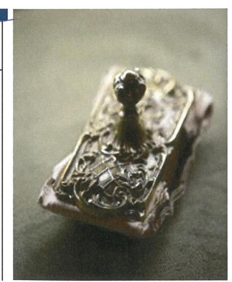
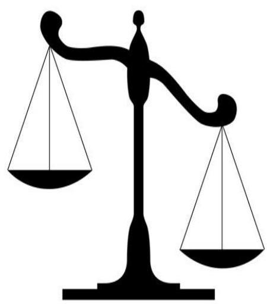

# Jelentés

A költségvetési támogatásban részesülő pártok 2016-2017. évi gazdálkodása törvényességének ellenőrzése

Kereszténydemokrata Néppárt 2019.

---

# Jelentés 

## A költségvetési támogatásban részesülő pártok 2016-2017. évi gazdálkodása törvényességének ellenőrzése

Kereszténydemokrata Néppárt
2019. 01. hó 29. nap

Holman Magdolna
főtitkár

---

# AZ ELLENŐRZÉST FELÜGYELTE:

DR. NAGY IMRE felügyeleti vezető

# AZ ELLENŐRZÉST VEZETTE ÉS A VÉGREHAJTÁSÁÉRT FELELŐS:

DR. GYŐRI GABRIELLA ellenőrzésvezető

# A PROGRAM ÖSSZEÁLLÍTÁSÁÉRT FELELŐS:

TÓTPÁL SZABOLCS osztályvezető

---

**IKTATÓSZÁM:** EL-1486-001/2019

**TÉMASZÁM:** -

**ELLENŐRZÉS-AZONOSÍTÓ SZÁM:** V083802

---

Jelentéseink az Országgyűlés számítógépes hálózatán és az Interneten a www.asz.hu címen is olvashatóak.

---

# TARTALOMJEGYZÉK 

■ ÖSSZEGZÉS ..... 5
■ AZ ELLENŐRZÉS CÉLJA ..... 6
■ AZ ELLENŐRZÉS TERÜLETE ..... 7
■ AZ ELLENŐRZÉS HÁTTERE, INDOKOLTSÁGA ..... 8
■ A JELENTÉS LÉNYEGES KÉRDÉSKÖREI ..... 9
■ AZ ELLENŐRZÉS HATÓKÖRE ÉS MÓDSZEREI ..... 10
■ MEGÁLLAPÍTÁSOK ..... 12
■ JAVASLATOK ..... 15
■ MELLÉKLETEK ..... 17
I. sz. melléklet: Értelmező szótár ..... 17
■ FÜGGELÉK: ÉSZREVÉTELEK ..... 19
■ RÖVIDÍTÉSEK JEGYZÉKE ..... 21

---

.

---

# ÖSSZEGZÉS 

A Kereszténydemokrata Néppárt gazdálkodásának törvényessége a 2016-2017. években biztosított volt, a könyvvezetés és a gazdálkodás során betartotta a jogszabályi előírásokat. Ezzel biztosította a közpénzek felhasználásának átláthatóságát és elszámoltathatóságát.

## Az ellenőrzés társadalmi indokoltsága

A párt olyan egyesület, amely nyilvántartott tagsággal rendelkezik, és amely a nyilvántartásba vételét végző bíróság előtt kinyilvánítja, hogy a pártok működéséről és gazdálkodásáról szóló 1989. évi XXXIII. törvény rendelkezéseit magára nézve kötelezőnek ismeri el.

A politikai élet tisztasága érdekében törvény állapítja meg a pártok vagyonára és gazdálkodására vonatkozó szabályokat. Az egyesülési jog alapján létrejövő más szervezetekhez képest szűkebb körben határozza meg azt a gazdasági tevékenységet, amelyet a párt végezhet, biztosítja azonban a pártok részére azt a jogosultságot, hogy az állami költségvetésből támogatásban részesüljenek. A pártok gazdálkodását a politikai élet tisztasága érdekében rendszeresen indokolt ellenőrizni, ezért törvényi előírás alapján az Állami Számvevőszék a rendszeres költségvetési támogatásban részesült pártok gazdálkodását kétévente ellenőrzi.

## Főbb megállapítások, következtetések, javaslatok

A Kereszténydemokrata Néppárt gazdálkodására vonatkozó számviteli keretek kialakítása és a belső szabályozások megalkotása során érvényesültek a jogszabályi előírások, ami támogatta a közpénzekkel való átlátható és ellenőrizhető gazdálkodást. A könyvvezetés és a nyilvántartási rendszer kialakítása megfelelt a jogszabályi előírásoknak. A Kereszténydemokrata Néppárt gondoskodott az ellenőrzés rendjének kialakításáról és működtetéséről.

A Kereszténydemokrata Néppárt 2016. és 2017. évi pénzügyi kimutatásait a jogszabályban előírt tartalommal készítette el, azok közzétételéről határidőben gondoskodott, ezzel megteremtve gazdálkodásának átláthatóságát.

A Kereszténydemokrata Néppárt a működéséhez a forrásokat, köztük a költségvetésből juttatott és az egyéb támogatásokat, adományokat szabályszerűen használta fel, tiltott vagyoni hozzájárulást nem fogadott el. A Kereszténydemokrata Néppárt a vagyonnal való gazdálkodás szabályait meghatározta, működése során a vagyont a törvényi előírásoknak eleget téve használta.

Az Állami Számvevőszék a Kereszténydemokrata Néppárt elnökének kettő javaslatot tett.

---

# AZ ELLENŐRZÉS CÉLJA 

Az ellenőrzés célja, annak értékelése volt, hogy a közzétett pénzügyi kimutatások a törvényi előírásoknak megfeleltek-e, a könyvvezetés és gazdálkodás során betartották-e a vonatkozó jogszabályi és belső előírásokat; a párt a működéséhez szabályszerűen igénybe vehető forrásokat használt-e fel.

---

# AZ ELLENŐRZÉS TERÜLETE 

## Kereszténydemokrata Néppárt

A Kereszténydemokrata Néppárt az 1944-ben létrejött Demokrata Néppárt jogutódja, működésének alapvető szabályait a Párt tv. ${ }^{1}$ határozza meg. A Párt² célja a magyar nemzet és a magyar haza szolgálata a keresztény-keresztény erkölcs és értékek alapján a politikai életben; az európai népek közösségében együttműködő, szabad és független Magyarország fejlődésének előmozdítása, hogy az ország szellemiekben és anyagiakban, népességében és erkölcsében egyaránt gyarapodjék.

A Párt a 2016. évi pénzügyi kimutatásában 172,2 M Ft bevételt és 166,2 M Ft kiadást számolt el. A 2017. évi pénzügyi kimutatás szerint a Párt összes bevétele 210,3 M Ft, a kiadások összege 171,0 M Ft volt. A központi költségvetésből 2016-ban és 2017-ben évente 152,7 M Ft támogatást kapott a Párt.

A Párt az ellenőrzött időszakban gazdasági társaságot nem alapított. A Párt a Párt tv. alapján 2006-ban hozta létre a Barankovics István Alapítványt.

---

# AZ ELLENŐRZÉS HÁTTERE, INDOKOLTSÁGA 

Társadalmi elvárás a közpénzek értékelvű, rendeltetésszerű felhasználása, a közpénzekből nyújtott támogatások átláthatóságának megteremtése, amelyhez az ÁSZ ${ }^{3}$ az államháztartásból nyújtott támogatások ellenőrzésével kíván hozzájárulni. Az ÁSZ tv. ${ }^{4}$ 5. § (11) bekezdés a) pontja és a Párt tv. 10. § (1) bekezdése alapján a pártok gazdálkodása törvényességének ellenőrzésére az ÁSZ jogosult. Törvényi előírás alapján az ÁSZ kétévente ellenőrzi azoknak a pártoknak a gazdálkodását, amelyek rendszeres költségvetési támogatásban részesültek.

Az ÁSZ legutóbb a Párt 2014-2015. évi gazdálkodásának törvényességét ellenőrizte.

A gazdálkodás szabályszerűségének, a felhasznált közpénzek nagyságának bemutatásával a társadalom objektív képet alkothat a pártok működéséről. Az ellenőrzés megállapításai a gazdálkodás megfelelőségének bemutatásával elősegíthetik, hogy a törvényalkotók konkrét lépéseket tegyenek a pártok finanszírozására vonatkozó szabályozások megváltoztatása, átláthatóbbá, ellenőrizhetőbbé tétele irányába. Az ellenőrzés rámutat a pártok gazdálkodásával kapcsolatos jó gyakorlatokra és szabálytalanságokra. A hiányosságok, szabálytalanságok feltárása, az ennek kapcsán megfogalmazott megállapítások elősegíthetik a törvényi rendelkezések betartását.

---

# A JELENTÉS LÉNYEGES KÉRDÉSKÖREI 

1. A Kereszténydemokrata Néppárt gazdálkodásának törvényessége biztosított volt-e?
2. A Kereszténydemokrata Néppárt pénzügyi kimutatása megfelel-e a jogszabályi előírásoknak, közzétételi kötelezettségét szabályszerűen teljesítette-e?
3. A Kereszténydemokrata Néppárt könyvvezetése és gazdálkodása során a vonatkozó jogszabályi rendelkezéseket és belső előírásokat betartotta-e?

---

# AZ ELLENŐRZÉS HATÓKÖRE ÉS MÓDSZEREI 

## Az ellenőrzés típusa

Szabályszerűségi ellenőrzés.

## Az ellenőrzött időszak

A 2016. január 1.- 2017. december 31. közötti időszak.

## Az ellenőrzés tárgya

Az ellenőrzés tárgyát képezték a 2016. és a 2017. évre vonatkozó pénzügyi kimutatás elkészítésére, jóváhagyására, közzétételére, a párt könyvvezetésére, gazdálkodására, ennek keretében a számviteli szabályozás kialakítására, a bizonylati rend, bizonylati fegyelem betartására, egyéb gazdálkodási, ellenőrzési és pénzügyi-számviteli informatikai feladatok ellátására irányuló tevékenységek. Az ellenőrzés tárgya volt még a források elszámolása és felhasználása, valamint a vagyon jogszabályi előírásoknak megfelelő hasznosítása.

Az ellenőrzés kiterjedt minden olyan körülményre és adatra, amely az ÁSZ jogszabályban meghatározott feladatainak teljesítéséhez, valamint a program végrehajtása folyamán felmerült újabb összefüggések feltárásához szükséges volt.

## Az ellenőrzött szervezet

Kereszténydemokrata Néppárt

## Az ellenőrzés jogalapja

Az ellenőrzés jogalapját a ÁSZ tv. 5. § (11) bekezdés a) pontja, a Párt tv. 4. § (4)-(5) bekezdései, valamint 10. § (1), (3)-(4) bekezdései képezték.

## Az ellenőrzés módszerei

Az ÁSZ az ellenőrzést az ellenőrzési program szempontjai, az ellenőrzött időszakban hatályos jogszabályok, az ellenőrzés általános szakmai szabályai, az ellenőrzésre irányadó ÁSZ módszertanok figyelembevételével végezte.

---

Az ellenőrzés ideje alatt az ellenőrzött szervezettel történő kapcsolattartás az ÁSZ SZMSZ ${ }^{5}$-ének vonatkozó előírásai alapján történt.

Az ellenőrzési kérdések megválaszolásához szükséges bizonyítékok megszerzése az ellenőrzött által rendelkezésre bocsátott dokumentumokra, adatokra alapozva megfigyelés, szemrevételezés, információkérés, megerősítés, valamint elemző eljárás útján történt. Az ÁSZ a tételes ellenőrzés mellett statisztikai alapú mintavételezést és értékelést alkalmazott.

A bevételek és a kiadások elszámolásának szabályszerűségét véletlen mintavételi eljárással kiválasztott tételek alapján ellenőrizte az ÁSZ. A mintavétellel ellenőrzött területek esetében minden egyes tétel vonatkozásában a szabályszerűségre vonatkozó kérdéseket tettünk fel. „Szabályszerűnek" értékeltünk egy ellenőrzött területet, amennyiben 95\%-os bizonyossággal az ellenőrzött sokaságban az átlagos hibaarány legfeljebb 10\%, "nem szabályszerűnek", amennyiben 10\%-nál magasabb arányt képviselt. Abban az esetben, ha az ellenőrzött sokaság tekintetében a 10\%-os hibaarányhoz való viszony megítélésének megbízhatósága nem érte el a 95\%-ot, annak elérése érdekében értékelésünket további szempontokkal egészítettük ki, és figyelembe vettük a feltárt hibák értékét.

Az ellenőrzési bizonyítékként felhasználható adatforrások közé tartoztak egyrészt az ellenőrzési program részletes szempontjainál felsorolt adatforrások, másrészt minden egyéb az ellenőrzés folyamán feltárt, az ellenőrzés szempontjából információt tartalmazó dokumentum.

Az ellenőrzés lefolytatásához az ellenőrzött a tanúsítványok elektronikus kitöltésével, valamint az ÁSZ által kért dokumentumok elektronikus megküldésével szolgáltatott adatokat. Az így rendelkezésre bocsátott adatok, információk, a tanúsítványok adatai valódiságának kontrollja az ellenőrzés keretében történt.

---

# 1. A Kereszténydemokrata Néppárt gazdálkodásának törvényessége biztosított volt-e? 

## Összegző megállapítás

### 1.1. számú megállapítás

### 1.2. számú megállapítás

## A Párt gazdálkodásának törvényessége az ellenőrzött időszakban biztosított volt.

A Párt gazdálkodására vonatkozó számviteli keretek kialakítása során érvényesültek a jogszabályi előírások.

A Párt az ellenőrzött időszakban rendelkezett a Számv. tv. ${ }^{6}$-ben előírt szabályzatokkal. A számviteli politika ${ }^{7}$ az ellenőrzött időszakban tartalmazta a Számv. tv.-ben foglaltakkal összhangban a könyvvezetés módját, az év végi zárlati feladatokat és azok időpontját, nem tartalmazta azonban - a Számv. tv. 14. § (4) bekezdésének előírása ellenére - azokat a jellemző szabályokat, előírásokat, módszereket, amelyekkel meghatározza a Párt, hogy mit tekint a számviteli elszámolás, az értékelés szempontjából lényegesnek, nem lényegesnek.

A leltározási és leltárkészítési szabályzat ${ }^{8}$ a Számv. tv.-ben foglaltaknak megfelelően tartalmazta a leltározás módját, a leltározás lebonyolításának rendjét, valamint a leltározás bizonylati rendjét.

Az eszközök és források értékelési szabályzata ${ }^{9}$ tartalmazta a Párt részére nyújtott nem pénzbeli vagyoni hozzájárulások értékelésének szabályait.

A pénzkezelési szabályzat ${ }^{10}$ a Számv. tv. rendelkezései alapján tartalmazta a pénzforgalom készpénzben, bankszámlán történő lebonyolításának rendjét, a pénzkezelés személyi és tárgyi feltételeit, a pénzkezelés felelősségi szabályait.

A számlarend ${ }^{11}$ a Számv. tv.-ben előírtaknak megfelelően tartalmazta főkönyvi számla és az analitikus nyilvántartás kapcsolatát.

A Párt könyvvezetése és nyilvántartási rendszere eleget tett a jogszabályi és belső szabályozási előírásoknak.

A Párt könyvvezetése a Számv. tv.-ben rögzített kettős könyvvitel rendszerében történt, melynek alkalmazását a számviteli politikában rögzítették. A Párt a Számv. tv.-ben előírtaknak megfelelően az analitikus nyilvántartások és a főkönyvi könyvelés között az értékadatok számszerű egyeztetésének lehetőségét biztosította.

---

# 1.3. számú megállapítás 

A Párt ellenőrzési rendszere 2016-2017-ben szabályszerűen működött.

Az ellenőrzési kereteit, a kötelezettségvállalás és utalványozás rendjét az Alapszabály ${ }^{12}$, a szerződéskötés és utalványozás rendje ${ }^{13}$, továbbá a pénzkezelési szabályzat tartalmazta, a feladatokat munkaköri leírásban rögzítették.

Az ellenőrzés szerveinek (Országos Elnökség, Ügyvezető Elnökség, Országos Pénzügyi Ellenőrző Bizottság és Megyei/Fővárosi Pénzügyi Ellenőrző Bizottságok) feladatait az Alapszabály határozta meg. Ezek a Párt gazdálkodása szabályszerűségének felügyeletére, a Párt vagyonának gondos és takarékos kezelésére, a visszaélések lehetőségének kiküszöbölésére, a költségvetés megtartására vonatkoztak, mely feladatoknak az ellenőrzés szervei eleget tettek. A Párt a Ptk. ${ }^{14}$ 3:82. § (1) bekezdésének előírása ellenére a 2017. évi alapszabály módosításakor a felügyelő bizottság létrehozásáról nem gondoskodott.

## 2. A Kereszténydemokrata Néppárt pénzügyi kimutatása megfelel-e a jogszabályi előírásoknak, közzétételi kötelezettségét szabályszerűen teljesítette-e?

Összegző megállapítás
A Párt pénzügyi kimutatásait a jogszabályi előírások alapján készítette el, a közzétételi kötelezettségét szabályszerűen teljesítette.

A Párt a 2016-2017. évi pénzügyi kimutatásokat a Párt tv.-ben előírt tartalommal készítette el. A pénzügyi kimutatásokat a Párt Alapszabályában előírtaknak megfelelően az Országos Elnökség, mint hatáskörrel rendelkező testület fogadta el.

A Párt a Párt tv. előírása alapján a 2016-2017. évi pénzügyi kimutatását határidőben tette közzé a Magyar Közlöny mellékletét képező Hivatalos Értesítőben és saját honlapján.

## 3. A Kereszténydemokrata Néppárt könyvvezetése és gazdálkodása során a vonatkozó jogszabályi rendelkezéseket és belső előírásokat betartotta-e?

Összegző megállapítás
A Párt a könyvvezetése és a gazdálkodás során betartotta a vonatkozó jogszabályi rendelkezéseket és belső előírásokat.
3.1. számú megállapítás

A Párt szabályszerűen számolta el a
 működéséhez a forrásokat, köztük a költségvetésből juttatott és egyéb támogatásokat, adományokat.

A Párt a tagok által fizetendő tagdíjat, annak összegét az Alapszabályban, a tagdíjbevételek kezelésére vonatkozó szabályokat a pénzkezelési szabály-

---

zatban és a gazdálkodási szabályzat ${ }^{15}$-ban rögzítette. A „Tagdíjak", a „Központi költségvetésből származó támogatás" és az „Egyéb bevétel" pénzügyi kimutatás sor értéke megegyezett a könyvviteli nyilvántartással, azon csak az előírt jogcímű összegek szerepeltek.

A Párt az „Egyéb hozzájárulások, adományok" pénzügyi kimutatás soron az 500 ezer Ft összeghatár feletti adományokat nevesítve rögzítette. A Párt az ellenőrzött időszakban a Párt tv. előírásait betartva tiltott vagyoni hozzájárulást nem fogadott el.

A Párt az általa alapított Barankovics István Alapítványtól a Párt. tv. előírásait betartva, az ellenőrzött időszakban nem fogadott el vagyoni hozzájárulást.

# 3.2. számú megállapítás 

A Párt a kiadások kifizetése és elszámolása, továbbá a vagyon használata során betartotta a jogszabályok előírásait.

A személyi jellegű és az egyéb kiadások kifizetése során a Párt betartotta a jogszabályi előírásokat. A foglalkoztatottakhoz kapcsolódó adó- és járulék bevallási, befizetési kötelezettségének a Párt az Art. ${ }^{16}$, a Tbj tv. ${ }^{17}$ és az Szja tv. ${ }^{18}$ előírásai alapján eleget tett. A kiadásokat a Számv. tv. szerinti kiadási jogcímekre számolták el. A reprezentációs kiadásokat a Párt önálló főkönyvi számlaszámon tartotta nyilván. A Párt a tulajdonában álló személygépkocsi után az ellenőrzött időszakban a Gjt. tv. ${ }^{19}$-ben előírt cégautó adó bevallási-, valamint adófizetési kötelezettségét szabályszerűen teljesítette. A hivatali telefont használók által meg nem térített magáncélú használatra tekintettel az Szja. tv. szerinti adófizetési kötelezettséget a Párt szabályszerűen teljesítette.

A vagyonnal való gazdálkodás szabályait a Párt az Alapszabályban, a pénzkezelési szabályzatban, valamint a szerződéskötés és utalványozás rendjében határozta meg. A Párt az MFB Zrt. ${ }^{20}$-vel kötött hitelszerződésből eredő törlesztési kötelezettségének a szerződésben foglaltaknak megfelelően eleget tett.

---

# JAVASLATOK 

Az ÁSZ tv. 33. § (1) bekezdésében foglaltak értelmében az ellenőrzött szervezet vezetője köteles a jelentésben foglalt megállapításokhoz kapcsolódó intézkedési tervet összeállítani és azt a jelentés kézhezvételétől számított 30 napon belül az ÁSZ részére megküldeni. Amennyiben az ellenőrzött szervezet vezetője nem küldi meg határidőben az intézkedési tervet, vagy továbbra sem elfogadható intézkedési tervet küld, az Állami Számvevőszék elnöke az ÁSZ tv. 33. § (3) bekezdése a) és b) pontjaiban foglaltakat érvényesítheti.

## Kereszténydemokrata Néppárt elnökének

1. Intézkedjen a számviteli politika jogszabályi előírás szerinti kiegészítéséről.
(1.1. sz. megállapítás 1. bekezdés 2. mondat 2. mondatrész alapján)
2. Intézkedjen felügyelőbizottság létrehozásáról.
(1.3. sz. megállapítás 2. bekezdés 3. mondata alapján)

---

.

---

# MELLÉKLETEK 

- I. SZ. MELLÉKLET: ÉRTELMEZŐ SZÓTÁR
pénzügyi kimutatás
gazdasági-vállalkozási tevékenység
költségvetési támogatás
nem pénzbeli támogatás

A Párt tv. 9. § (1) bekezdésében meghatározott, a törvény 1. számú melléklete szerinti pénzügyi kimutatás (hatályos 2014. május 6-ától), amelyet a pártok kötelesek minden év május 31-ig a Magyar Közlönyben, valamint saját honlappal rendelkező pártok a honlapjukon is közzétenni.
A Párt tv. 6. § (1) bekezdésének megfelelően a párt a költségeinek fedezése és vagyonának gyarapítása érdekében a következő gazdasági-vállalkozási tevékenységeket folytathatja:
a) politikai céljainak és tevékenységének megismertetése érdekében kiadványokat jelentethet meg és terjeszthet, a pártot szimbolizáló jelvényeket és más ilyen célú tárgyakat árusíthat, és pártrendezvényeket szervezhet;
b) a tulajdonában álló ingatlanokat és ingókat díj ellenében hasznosíthatja és elidegenítheti.
Az államháztartás alrendszerei terhére nyújtott pénzbeli vagy nem pénzbeli juttatás, amelyet a támogató nem elsősorban ellenszolgáltatás ellenében, de konkrét program megvalósítása vagy meghatározott időszakban a támogatott szervezet működtetése érdekében nyújt. (Civil tv. 2. § 15. pont)
Vagyoni értékkel rendelkező forgalomképes dolog, szellemi alkotás, illetve vagyoni értékű jog részben vagy egészében, véglegesen vagy ideiglenesen, teljesen vagy részben ingyenesen történő átruházása vagy átengedése, illetve szolgáltatás biztosítása. (Civil tv. 2. § 25. pont)

---

.

---

# FÜGGELÉK: ÉSZREVÉTELEK 

A jelentéstervezetet a Számvevőszék 15 napos észrevételezésre megküldte az ellenőrzött szervezet vezetőjének az ÁSZ tv. 29. §* (1) bekezdése előírásának megfelelően.

A Kereszténydemokrata Néppárt elnöke a jelentéstervezetre az ÁSZ tv. 29. § (2) bekezdésében foglalt határidőn belül nem tett észrevételt.

[^0]
[^0]:    * 29. § (1) Az Állami Számvevőszék az ellenőrzési megállapításait megküldi az ellenőrzött szervezet vezetőjének vagy az általa megbízott személynek, és annak, akinek személyes felelősségét állapította meg.
    (2) Az ellenőrzött szervezet vezetője és a felelősként megjelölt személy az ellenőrzés megállapításaira tizenöt napon belül írásban észrevételt tehet.
    (3) Az Állami Számvevőszék az észrevételre a beérkezésétől számított harminc napon belül írásban válaszol. A figyelembe nem vett észrevételeket köteles a jelentésben feltüntetni, és megindokolni, hogy azokat miért nem fogadta el.

---

.

---

# RÖVIDÍTÉSEK JEGYZÉKE 

${ }^{1}$ Párt tv.
${ }^{2}$ Párt
${ }^{3}$ ÁSZ
${ }^{4}$ ÁSZ tv.
${ }^{5}$ ÁSZ SZMSZ
${ }^{6}$ Számv. tv.
${ }^{7}$ számviteli politika
${ }^{8}$ leltározási szabályzat
${ }^{9}$ eszközök és források értékelési szabályzata
(hatályos: 2007. november 24-től)
${ }^{10}$ pénzkezelési szabályzat
${ }^{11}$ számlarend
${ }^{12}$ Alapszabály
${ }^{13}$ szerződéskötés és utalványozás rendje
${ }^{14}$ Ptk.
${ }^{15}$ gazdálkodási szabályzat
${ }^{16}$ Art.
${ }^{17}$ Tbj tv.
${ }^{18}$ Szja tv.
${ }^{19}$ Gjt.
${ }^{20}$ MFB Zrt.
1989. évi XXXIII. törvény a pártok működéséről és gazdálkodásáról (hatályos: 1989. október 30-ától)
Kereszténydemokrata Néppárt
Állami Számvevőszék
2011. évi LXVI. törvény az Állami Számvevőszékről (hatályos: 2011. július 1-jétől)
Állami Számvevőszék Szervezeti és Működési Szabályzata
2000. évi C. törvény a számvitelről (hatályos: 2001. január 1-jétől)
Kereszténydemokrata Néppárt Számviteli Politika (hatályos: 2008. március 5-től)
Kereszténydemokrata Néppárt Leltározási és leltárkészítési szabályzata (hatályos: 2008. március 5-től)
Kereszténydemokrata Néppárt Eszközök és források értékelési szabályzata (hatályos: 2007. november 24-től)
Kereszténydemokrata Néppárt Pénzkezelési szabályzata (hatályos: 2008. március 5-től)
Kereszténydemokrata Néppárt Számlarendje (hatályos: 2007. november 27-től)
Kereszténydemokrata Néppárt Alapszabálya (módosításokkal egységes szerkezetben, hatályos: 1995. január 28-tól, módosítva: 2013. december 14-én és 2017. december 16-án)
Kereszténydemokrata Néppárt Szerződéskötés és utalványozás rendje (hatályos: 2007. november 24-től)
A Polgári Törvénykönyvről szóló 2013. évi V. törvény (hatályos: 2014. március 15-től)
Kereszténydemokrata Néppárt gazdálkodási szabályzata (hatályos: 2010. november 8-tól)
2003. évi XCII. törvény a személyi jövedelemadóról (hatályát veszette: 2018. január 1-jétől)
1997. évi LXXX. törvény a társadalombiztosítás ellátásaira és a magánnyugdíjra jogosultakról, valamint e szolgáltatások fedezetéről (hatályos: 1998. január 1-jétől)
1995. évi CXVII. törvény a személyi jövedelemadóról (hatályos: 1996. január 1-jétől)
1991. évi LXXXII. törvény a gépjárműadóról (hatályos: 1992. január 1-jétől)

Magyar Fejlesztési Bank Zrt.

---

# ÁLLAMI SZÁMVEVŐSZÉK 

1052 Budapest, Apáczai Csere János utca 10.
Levélcím: 1364 Budapest 4. Pf. 54
Telefon: +36 14849100 Telefax: +36 14849200
www.asz.hu
