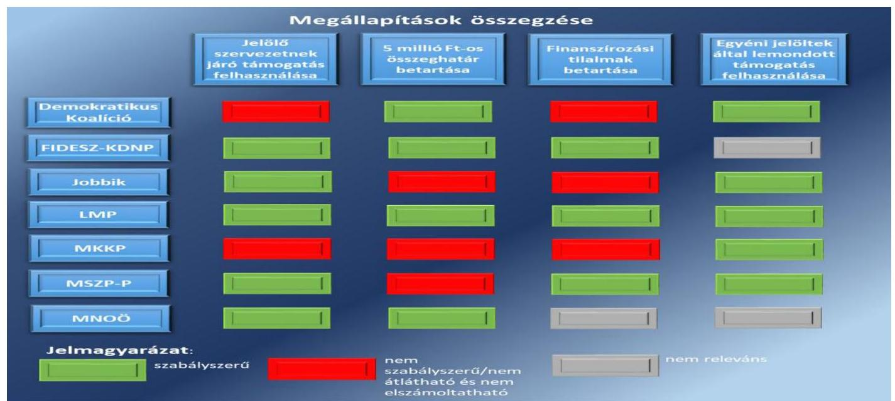
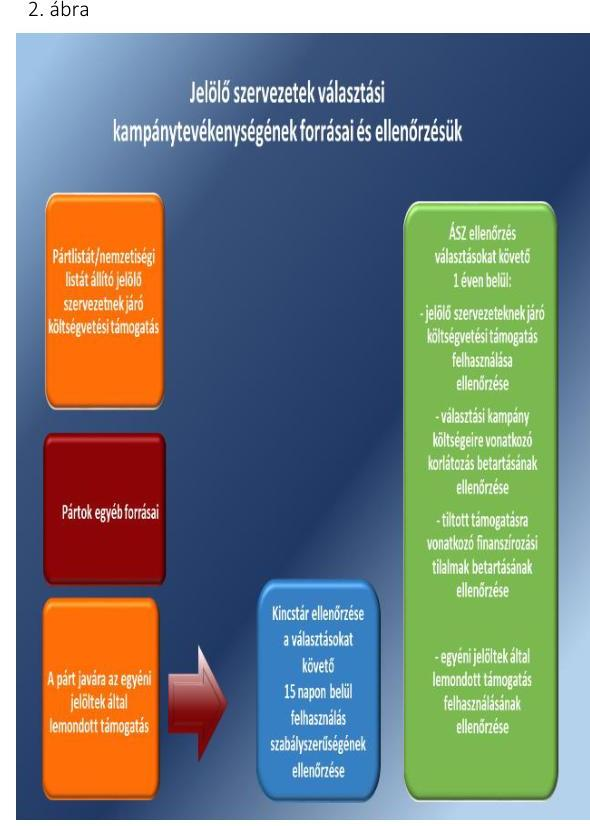

# Jelentés 

## Kampánypénzek ellenőrzése

A 2018. évi országgyűlési képviselőválasztási kampányra fordított pénzeszközök elszámolásának ellenőrzése a jelölő szervezeteknél 2019.

---

# Jelentés 

## Kampánypénzek ellenőrzése

A 2018. évi országgyűlési képviselőválasztási kampányra fordított pénzeszközök elszámolásának ellenőrzése a jelölő szervezeteknél 2019. 01. hó 31. nap

---

|  AZ ELLENŐRZÉST FELÜGYELTE: |  |  |  |  |   |
| --- | --- | --- | --- | --- | --- |
|   |  |  |  |  | DR. NAGY IMRE felügyeleti vezető  |
|   |  |  |  |  | AZ ELLENŐRZÉST VEZETTE ÉS A VÉGREHAJTÁSÁÉRT FELELŐS:  |
|   |  |  |  |  | NEMESVÁRI-HORTHY ESZTER ellenőrzésvezető  |
|   |  |  |  |  | A PROGRAM ÖSSZEÁLLÍTÁSÁÉRT FELELŐS:  |
|   |  |  |  |  | TÓTPÁL SZABOLCS osztályvezető  |
|   |  |  |  |  | A TÉMÁHOZ KAPCSOLÓDÓ KORÁBBI SZÁMVEVŐSZÉKI JELENTÉSEK:  |
|   |  |  |  |  | - címe:  |
|   |  |  |  |  | Kampánypénzek ellenőrzése – A 2014. évi országgyűlési képviselő-választási kampányra fordított pénzeszközök elszámolásának ellenőrzése a képviselethez jutott jelölő szervezeteknél  |
|  Jelentéseink az Országgyűlés számítógépes hálózatán és az Interneten a www.asz.hu címen is olvashatóak. |  |  |  |  | - sorszáma:  |
|   |  |  |  |  | 15057  |
|   |  |  |  |  | IKTATÓSZÁM: EL-0906-002/2019.  |
|   |  |  |  |  | TÉMASZÁM: 2492  |
|   |  |  |  |  | ELLENŐRZÉS-AZONOSÍTÓ SZÁM: V0836  |

---

# TARTALOMJEGYZÉK 

■ ÖSSZEGZÉS ..... 5
■ AZ ELLENŐRZÉS CÉLJA ..... 7
■ AZ ELLENŐRZÉS TERÜLETE ..... 8
■ AZ ELLENŐRZÉS HÁTTERE, INDOKOLTSÁGA ..... 11
■ A JELENTÉS LÉNYEGES KÉRDÉSKÖREI ..... 12
■ AZ ELLENŐRZÉS HATÓKÖRE ÉS MÓDSZEREI ..... 14
■ MEGÁLLAPÍTÁSOK ..... 17
■ MELLÉKLETEK ..... 27
I. sz. melléklet: Értelmező szótár ..... 27
II. sz. melléklet: A jelölő szervezeteket megillető központi költségvetési támogatás és felhasználása. ..... 28
III. sz. melléklet: A jelölő szervezetek által felhasznált egyéb források. ..... 29
■ FÜGGELÉKEK ..... 30
I. sz. függelék a Megállapítások fejezethez ..... 30
II. sz. függelék az észrevételek kezeléséhez ..... 32
■ RÖVIDÍTÉSEK JEGYZÉKE ..... 39

---

.

---

# ÖSSZEGZÉS 

A Fidesz-Magyar Polgári Szövetség-Kereszténydemokrata Néppárt, a Jobbik Magyarországért Mozgalom, a Lehet Más a Politika, a Magyar Szocialista Párt-Párbeszéd Magyarországért Párt és a Magyarországi Németek Országos Önkormányzata a jelölő szervezetnek járó központi költségvetési támogatást szabályszerűen használta fel. A Demokratikus Koalíció és a Magyar Kétfarkú Kutya Párt a jelölő szervezetnek járó költségvetési támogatást nem szabályszerűen használta fel. A Demokratikus Koalíció és a Jobbik Magyarországért Mozgalom tiltott támogatást használt fel kampánya finanszírozására. Azok a jelölő szervezetek - Demokratikus Koalíció, Jobbik Magyarországért Mozgalom, Lehet Más a Politika, Magyar Kétfarkú Kutya Párt és Magyar Szocialista Párt - amelyeknek az egyéni jelöltjei a jelölő párt javára lemondtak az őket megillető költségvetési támogatásról, a jelölő szervezet javára lemondott költségvetési támogatást szabályszerűen használták fel.

## Az ellenőrzés társadalmi indokoltsága

A pártok az állampolgárok egyesülési szabadsága alapján létrehozott olyan szervezetek, amelyek kereteket nyújtanak a népakarat kialakításához és kinyilvánításához, a politikai életben való állampolgári részvételhez.

A pártok az országgyűlési képviselő-választási kampány során az esélyegyenlőség biztosítása érdekében jelentős központi költségvetési támogatást kapnak. A központi költségvetésből és az egyéb forrásból felhasznált kampánypénz költések átláthatóságának biztosítása fontos társadalmi érdek. Ennek érvényesülése érdekében az Állami Számvevőszék a választást követő egy éven belül hivatalból ellenőrzi a választásra fordított állami és a pártok működéséről és gazdálkodásáról szóló 1989. évi XXXIII. törvényben meghatározott más pénzeszközök felhasználását, a finanszírozási tilalmak és a jelöltenkénti 5 millió Ft-os korlátozás betartását.

## Főbb megállapítások, következtetések

1. ábra

---

A DEMOKRATIKUS KOALÍCIÓ a jelölő szervezetnek járó költségvetési támogatást nem szabályszerűen használta fel. A választási kampány költségeire vonatkozó korlátozást betartotta. A tiltott támogatásra vonatkozó finanszírozási tilalmakat nem tartotta be, törvényi előírás ellenére tiltott támogatást fogadott el. Az egyéni jelöltek által a párt javára lemondott költségvetési támogatás felhasználása szabályszerű volt.

# A FIDESZ-MAGYAR POLGÁRI SZÖVETSÉG-KERESZTÉNYDEMOKRATA NÉPPÁRT a jelölő szervezetnek járó költségvetési támogatást szabályszerűen használta fel. A választási kampány költségeire vonatkozó korlátozást betartotta. A Fidesz-Magyar Polgári Szövetség-Kereszténydemokrata Néppárt egyéni jelöltjei nem mondtak le a pártjuk javára a költségvetési támogatásról, jelöltjeik a Magyar Államkincstár felé számoltak el a felhasználásról. 

A JOBBIK MAGYARORSZÁGÉRT MOZGALOM a jelölő szervezetnek járó költségvetési támogatást szabályszerűen használta fel. A választási kampány költségeire vonatkozó korlátozás betartása tekintetében nem volt átlátható és elszámoltatható. A tiltott támogatásra vonatkozó finanszírozási tilalmakat nem tartotta be, törvényi előírás ellenére tiltott támogatást fogadott el. Az egyéni jelöltek által a párt javára lemondott költségvetési támogatás felhasználása szabályszerű volt.

A LEHET MÁS A POLITIKA a jelölő szervezetnek járó költségvetési támogatást szabályszerűen használta fel. A választási kampány költségeire vonatkozó korlátozást betartotta. A tiltott támogatásra vonatkozó finanszírozási tilalmakat betartotta. Az egyéni jelöltek által a párt javára lemondott költségvetési támogatást szabályszerűen használta fel.

A MAGYAR KÉTFARKÚ KUTYA PÁRT a jelölő szervezetnek járó költségvetési támogatást nem szabályszerűen használta fel. A választási kampány költségeire vonatkozó korlátozás betartása tekintetében nem volt átlátható és elszámoltatható. A tiltott támogatásra vonatkozó finanszírozási tilalmak betartása nem volt átlátható és elszámoltatható. Az egyéni jelöltek által a párt javára lemondott költségvetési támogatás felhasználása szabályszerű volt.
Következtetés: A Magyar Kétfarkú Kutya Pártnál a kampánypénzek ellenőrzése során megállapított lényeges szabálytalanságok, a kampánytámogatás nem szabályszerű felhasználása és az elszámoltathatóság hiánya felveti, hogy a Magyar Kétfarkú Kutya Pártnál, mint a működéséhez költségvetési támogatásban részesülő pártnál jelenleg nem biztosítottak a törvényes gazdálkodás feltételei, és felmerül a rendeltetésellenes közpénzfelhasználás veszélye. Az elszámoltathatóság biztosítása érdekében a Magyar Kétfarkú Kutya Pártnak kell intézkednie, hogy igazolja azoknak a feltételeknek a fennállását, amelyek a párt törvényes gazdálkodásához, és a közpénzek törvényes felhasználásához szükségesek.
A MAGYAR SZOCIALISTA PÁRT-PÁRBESZÉD MAGYARORSZÁGÉRT PÁRT a jelölő szervezetnek járó költségvetési támogatást szabályszerűen használta fel. A választási kampány költségeire vonatkozó korlátozás betartása tekintetében nem volt átlátható és elszámoltatható. A Magyar Szocialista Párt a tiltott támogatásra vonatkozó finanszírozási tilalmakat betartotta. Az egyéni jelöltek által a párt javára lemondott költségvetési támogatás felhasználása szabályszerű volt.
A MAGYARORSZÁGI NÉMETEK ORSZÁGOS ÖNKORMÁNYZATA a nemzetiségi lista alapján járó költségvetési támogatást szabályszerűen használta fel. A választási kampány költségeire vonatkozó korlátozást betartotta.

A jelölő szervezeteknél az ellenőrzött politikai hirdetések számláinak adatai megegyeztek az Állami Számvevőszék honlapján közzétett hirdetési árjegyzékben szereplő adatokkal.

---

# AZ ELLENŐRZÉS CÉLJA 

AZ ELLENŐRZÉS CÉLJA annak feltárása volt, hogy a pártlistákra leadott összes érvényes szavazat legalább 1\%-át megszerzett pártok, valamint az országgyűlési választásokon képviselethez jutott országos nemzetiségi önkormányzatok (jelölő szervezetek) a Kftv. ${ }^{1}$ előírásait betartották-e.

Az ellenőrzés célja továbbá annak megállapítása volt, hogy:

- az egyéni jelöltek Kftv. 1. § alapján nekik járó 1 millió $\mathrm{Ft}^{2}$ összegű, központi költségvetésből juttatott támogatásról a Kftv. 2/A. § alapján a jelölő szervezetek részére történő lemondása esetén a jelölő szervezetek az így kapott támogatást a választási kampányidőszakban, a választási kampánytevékenységgel összefüggő kiadások finanszírozására fordították-e;
- a jelölő szervezetek a Kftv. 3. § és 4. §-ai szerint, a központi költségvetésből juttatott támogatást a választási kampányidőszak alatt, a választási kampánytevékenységgel összefüggő kiadások finanszírozására fordították-e;
- a jelölő szervezetek jelöltjeikkel együtt betartották-e a Kftv. 7. § (1) bekezdésében meghatározott, jelöltenkénti - a kampány költségeinek korlátját jelentő - 5 millió $\mathrm{Ft}^{3}$ összeghatárt;
- a pártok, mint jelölő szervezetek, a Párt tv. ${ }^{4} 4$. §-ában meghatározott forrásokat vették-e igénybe a választási kampányidőszak alatt, a választási kampánytevékenységgel összefüggő kiadások finanszírozására.

---

# AZ ELLENŐRZÉS TERÜLETE 

Az ellenőrzés a pártlistákra leadott összes érvényes szavazat legalább 1\%-át megszerzett jelölő szervezetekre, a Demokratikus Koalícióra, a Fidesz-Magyar Polgári Szövetség-Kereszténydemokrata Néppártra, a Jobbik Magyarországért Mozgalomra, a Lehet Más a Politikára, a Magyar Kétfarkú Kutya Pártra és a Magyar Szocialista Párt-Párbeszéd Magyarországért Pártra, továbbá a 2018. évi országgyűlési választáson képviselethez jutott Magyarországi Németek Országos Önkormányzatára terjedt ki.

A KAMPÁNYKÖLTSÉGEK átláthatóvá tételének, az esélyegyenlőség és a választások tisztasága biztosításának kereteit a Kftv. foglalja össze. A Kftv. általános indokolása szerint a jelölő szervezetek - biztosítva ezzel számukra az esélyegyenlőséget - ellenőrzött, tiszta forrásból juthatnak jelentős összegű központi költségvetési támogatáshoz, melyet azonban szigorú elszámolási szabályok betartásával használhatnak fel. A törvényi indokolás szerint a jelentős összegű költségvetési támogatás hozzájárul ahhoz, hogy a jelölő szervezetek ellenőrizetlen, tiltott támogatásokat ne vegyenek igénybe a választási kampány során, így hozzájárul a korrupciós kockázatok csökkentéséhez, valamint csökkenti annak esélyét, hogy különböző üzleti érdekkörök, esetleg külföldi politikai erők befolyása érvényesülhessen a demokratikus választások során. A pártok esetében a Párt tv. finanszírozási tilalmainak kampányidőszaki betartása szintén hozzájárul a választások tisztaságának érvényesüléséhez. Az ellenőrzött szervezetek költségvetési támogatását és felhasznált egyéb forrásait a II. és III. melléklet mutatja be.

A KAMPÁNYKÖLTSÉGEK ELLENŐRZÉSÉT a Kincstár ${ }^{5}$ és az ÁSZ ${ }^{6}$ végzi. A Kincstár ellenőrzi az egyéni jelöltek által lemondott támogatás felhasználását a választásokat követő 15 napon belül. Az ÁSZ a választásokat követő 1 éven belül a jelölő szervezeteknél ellenőrzi a jelölő szervezetnek járó költségvetési támogatás felhasználását, a költségeire vonatkozó korlátozás, valamint a pártoknál a finanszírozási tilalmak betartását, valamint az egyéni jelöltek által az őket jelölő párt javára lemondott támogatás felhasználását. A jelölő szervezetek forrásait és ellenőrzésük rendszerét a 2. ábra mutatja be.

1.  A JELÖLŐ SZERVEZETNEK JÁRÓ költségvetési támogatásra a pártlistát állító pártok az egyéni választókerületekben állított jelöltek száma alapján, illetve a nemzetiségi listát állító országos nemzetiségi önkormányzatok jogosultak, amelyek a támogatás igénybe vétele esetén vállalják a felhasználáshoz kapcsolódó szigorú szabályok betartását. A közös pártlistát állító pártok e támogatás vonatkozásában egy pártnak tekintendők, a támogatás elosztásáról megállapodást kell kötniük. A pártok és az országos nemzetiségi listát állító országos nemzetiségi önkormányzatok a jelölő szervezetnek járó költségvetési támogatást kizárólag a választási kampányidőszak alatt, a választási kampánytevékenységgel összefüggő kiadások finanszírozására fordíthatják. A Fidesz ${ }^{7}$ és a KDNP ${ }^{8}$, valamint az MSZP ${ }^{9}$ és a Párbeszéd Magyarországért Párt közös listát állítottak, ezért a támogatás vonatkozásában egy pártnak tekintendők, megállapodásuk alapján a támogatást a Kincstár

---

a Fidesz, illetve az MSZP részére folyósította. A DK ${ }^{10}$, a Jobbik ${ }^{11}$, az LMP ${ }^{12}$ és az MKKP ${ }^{13}$, valamint a Magyarországi Németek Országos Önkormányzata részére a jelölő szervezetnek járó támogatást a Kincstár részükre folyósította. A DK, a Fidesz, a Jobbik, az LMP, az MKKP és az MSZP a támogatás folyósítása törvényi feltételeként nyilatkoztak arról, hogy ha a választási eredmények alapján visszafizetési kötelezettségüket határidőben nem teljesítik, és az tőlük nem hajtható be, a párt vezető tisztségviselői állnak helyt egyetemlegesen a támogatás visszafizetéséért.
2. A VÁLASZTÁSI KAMPÁNY KÖLTSÉGEINEK KORLÁTOZÁSÁT a Kftv. írja elő, amely szerint a választási kampányidőszak alatt, a választási kampánytevékenységgel összefüggő kiadásai finanszírozására a pártlistát állító párt és annak jelöltje és az országos nemzetiségi önkormányzat a nemzetiségi listán szereplő jelöltjeire jelöltenként legfeljebb 5 millió Ft-ot fordíthat. A közös jelölteket vagy közös listát állító pártok e korlátozás vonatkozásában egy pártnak tekintendők. A párt és a nemzetiségi listát állító országos nemzetiségi önkormányzat az 5 millió Ft-os összeghatár túllépése esetén a választásra összesen fordítható összeg felett felhasznált összeg kétszeresét köteles visszafizetni az ÁSZ felhívására a központi költségvetés részére.
3. A PÁRTOK SZÁMÁRA A MŰKÖDÉSÜK TISZTASÁGÁT GARANTÁLÓ FINANSZÍROZÁSI TILALMAKAT a Párt. tv. rögzíti, amely finanszírozási tilalmakat a pártoknak a választási kampányidőszak során is be kell tartaniuk a választási kampány tisztaságának biztosítása érdekében. A pártok a Párt tv. rendelkezései értelmében jogi személytől, jogi személyiséggel nem rendelkező szervezettől, más államtól, külföldi szervezettől, nem magyar állampolgár magánszemélytől, névtelen adományozótól vagyoni hozzájárulást nem fogadhatnak el. Ezen előírás alapján tiltott támogatásnak minősül az is, ha a pártok nem pénzbeli vagyoni hozzájárulásként ingyenes, vagy piaci ár alatti szolgáltatást fogadnak el jogi személytől, vagy jogi személyiséggel nem rendelkező szervezettől.
4. AZ EGYÉNI VÁLASZTÓKERÜLETBEN INDÍTOTT JELÖLTEK ÁLTAL A PÁRT JAVÁRA LEMONDOTT 1 millió Ft összegű támogatást a pártok a Kincstárral kötött megállapodás alapján kártyafedezeti számlán kapják meg és a Kftv. előírásai szerint kizárólag a választási kampányidőszak alatt, kampánytevékenységgel összefüggő dologi kiadásra fordíthatják. A pártok a Kincstár felé a támogatás felhasználásáról a párt nevére szóló, a Számv. tv. ${ }^{14}$ és az ÁFA tv. ${ }^{15}$ előírásainak megfelelően kiállított számlákkal kötelesek elszámolni. A Fidesz-KDNP javára egyéni jelöltjei az 1 millió Ft támogatásról nem mondtak le. A DK, a Jobbik, az LMP, az MKKP és az MSZP-Párbeszéd esetében mondtak le egyéni választókerületi jelöltek a jelölő pártjuk javára az 1 millió Ft összegű támogatásról. Az MSZP-Párbeszéd közös jelöltjei esetében a lemondás az MSZP javára történt. Az egyéni jelöltek által a párt javára lemondott támogatások folyósítása céljából a Kincstár a DK-val, a Jobbikkal, az LMP-vel, az MKKP-val, az

---

MSZP-Párbeszédből az MSZP-vel kötött megállapodást és folyósította a támogatást kártyafedezeti számlán. Az ÁSZ e támogatás felhasználása tekintetében az egyéni jelöltek által az őket jelölő pártjuk javára lemondott költségvetési támogatás felhasználását ellenőrizte a jelölő szervezeteknél. A kiesett és az egyéni választókerületben leadott érvényes szavazatok legalább 2%-át el nem érő jelöltek után járó támogatási összeget a pártoknak vissza kellett fizetniük.

A Momentum Mozgalom 2018. évi országgyűlési képviselő-választási kampányra fordított pénzeszközei, valamint a Párbeszéd Magyarországért Párt által a pénzügyi elszámolásában nyilvánosságra hozott egyéb forrásai felhasználásának ellenőrzéséről önálló jelentések készültek.

---

# AZ ELLENŐRZÉS HÁTTERE, INDOKOLTSÁGA 

A Kftv. 9. § (2) bekezdése értelmében az ÁSZ a választást követő egy éven belül az országgyűlési képviselethez jutott jelölő szervezetek vonatkozásában kötelezően, hivatalból, az országgyűlési képviselethez nem jutott jelölő szervezetek tekintetében kérelemre ellenőrzi a választásra fordított állami és a Párt tv.-ben meghatározott más pénzeszközök felhasználását. A Kftv. 2017. november 24-étől hatályos 8/C. § (2a) bekezdése értelmében az ÁSZ az országgyűlési képviselők általános választását követő egy éven belül hivatalból ellenőrzi a Kftv. 3. § szerinti támogatás felhasználását azoknál a pártlistát állító pártoknál, amelyek pártlistája a pártlistákra leadott összes érvényes szavazat legalább 1%-át megszerezte. A Párt tv. 10. § (1) bekezdése alapján az ÁSZ jogosult a pártok gazdálkodása törvényességének ellenőrzésére. Az országgyűlési képviselő-választásra fordított pénzeszközök felhasználása ellenőrzését indokolja a Kftv.-ben foglalt, a választási kampány költségeire vonatkozó korlátozás és a Párt tv.-ben foglalt finanszírozási tilalmak betartásának ellenőrzése.

---

# A JELENTÉS LÉNYEGES KÉRDÉSKÖREI 

1.  Szabályszerűen használta-e fel a jelölő szervezetnek járó költségvetési támogatást a Demokratikus Koalíció? Betartotta-e a választási kampány költségeire vonatkozó korlátozást? Betartotta-e a tiltott támogatásra vonatkozó finanszírozási tilalmakat? Szabályszerűen használta-e fel az egyéni jelöltek által a párt javára lemondott költségvetési támogatást?
2.  Szabályszerűen használta-e fel a jelölő szervezetnek járó költségvetési támogatást a Fidesz-Magyar Polgári Szövetség-Kereszténydemokrata Néppárt? Betartotta-e a választási kampány költségeire vonatkozó korlátozást? Betartotta-e a tiltott támogatásra vonatkozó finanszírozási tilalmakat?
3.  Szabályszerűen használta-e fel a jelölő szervezetnek járó költségvetési támogatást a Jobbik Magyarországért Mozgalom? Betartotta-e a választási kampány költségeire vonatkozó korlátozást? Betartotta-e a tiltott támogatásra vonatkozó finanszírozási tilalmakat? Szabályszerűen használta-e fel az egyéni jelöltek által a párt javára lemondott költségvetési támogatást?
4. Szabályszerűen használta-e fel a jelölő szervezetnek járó költségvetési támogatást a Lehet Más a Politika? Betartotta-e a választási kampány költségeire vonatkozó korlátozást? Betartotta-e a tiltott támogatásra vonatkozó finanszírozási tilalmakat? Szabályszerűen használta-e fel az egyéni jelöltek által a párt javára lemondott költségvetési támogatást?

---

5.  Szabályszerűen használta-e fel a jelölő szervezetnek járó költségvetési támogatást a Magyar Kétfarkú Kutya Párt? Betartotta-e a választási kampány költségeire vonatkozó korlátozást? Betartotta-e a tiltott támogatásra vonatkozó finanszírozási tilalmakat? Szabályszerűen használta-e fel az egyéni jelöltek által a párt javára lemondott költségvetési támogatást?
6.  Szabályszerűen használta-e fel a jelölő szervezetnek járó költségvetési támogatást a Magyar Szocialista Párt-Párbeszéd Magyarországért Párt? Betartotta-e a választási kampány költségeire vonatkozó korlátozást? Betartotta-e a tiltott támogatásra vonatkozó finanszírozási tilalmakat? Szabályszerűen használta-e fel az egyéni jelöltek által a párt javára lemondott költségvetési támogatást?
7.  Szabályszerűen használta-e fel a nemzetiségi listát állító országos nemzetiségi önkormányzatnak járó költségvetési támogatást a Magyarországi Németek Országos Önkormányzata? Betartotta-e a választási kampány költségeire vonatkozó korlátozást?

---

# AZ ELLENŐRZÉS HATÓKÖRE ÉS MÓDSZEREI 

## Az ellenőrzés típusa

Szabályszerűségi ellenőrzés.

## Az ellenőrzött időszak

A Ve. ${ }^{16}$ 139. §-ában rögzített - a szavazás napját megelőző 50. naptól (2018. február 17-étől) a szavazás befejezésének időpontjáig (2018. április 8-áig) tartó - választási kampányidőszak, valamint az azt követő elszámolási időszak, azaz a Kftv. 9. § (1) bekezdése szerint az országgyűlési választást követő (2018. június 7-éig tartó) 60 nap.

## Az ellenőrzés tárgya

A pártlistát állító párt írásba foglalt Kftv. 3/A. § (1) bekezdés szerinti nyilatkozatának a megléte, rendelkezésre állása.

A kampánytevékenységhez köthető bizonylatok szabályszerűsége, hitelessége, a Kincstárral kötött megállapodásban, illetve a Számv. tv. 166. §-ában előírt alaki és tartalmi kellékei megléte.

A költségvetési támogatásból és egyéb forrásból finanszírozott valamennyi kiadásnak a választási kampányidőszak alatti, illetve a kampánytevékenységre történő teljesítése.

## Az ellenőrzött szervezet

Demokratikus Koalíció, Fidesz-Magyar Polgári SzövetségKereszténydemokrata Néppárt, Jobbik Magyarországért Mozgalom, Lehet Más a Politika, Magyar Kétfarkú Kutya Párt, Magyar Szocialista PártPárbeszéd Magyarországért Párt, Magyarországi Németek Országos Önkormányzata

## Az ellenőrzés jogalapja

Az ellenőrzés jogszabályi alapját a Kftv. 8/B. § (1) bekezdése, a 8/C. § (2a) bekezdése és 9. § (2) bekezdése, valamint a Párt tv. 10. § (1) bekezdése képezték.

---

# Az ellenőrzés módszerei 

Az ellenőrzésre az ellenőrzési program szempontjai, az ellenőrzött időszakban hatályos jogszabályok, az ellenőrzés szakmai szabályai és az ÁSZ módszertanok alapján került sor.

Az ellenőrzési bizonyítékként felhasználható adatforrások közé tartoztak egyrészt az ellenőrzési program részletes szempontjainál felsorolt adatforrások, másrészt minden egyéb - az ellenőrzés folyamán feltárt, az ellenőrzés szempontjából információt tartalmazó - dokumentum.

Az ellenőrzés ideje alatt az ellenőrzött szervezettel való kapcsolattartást az ÁSZ az ÁSZ SZMSZ ${ }^{17}$-ének vonatkozó előírásai alapján biztosította.

Az ellenőrzés lefolytatásához az ÁSZ az ellenőrzött jelölő szervezetek mellett adatszolgáltatásra kérte fel a Kincstárat és a Nemzeti Választási Irodát. Az egyéni jelöltek által a jelölő szervezet javára lemondott központi költségvetési támogatás felhasználása szabályszerűségét az ÁSZ a Kincstártól bekért dokumentumok alapján értékelte.

Az ÁSZ egyszerű véletlen mintavételi eljárást alkalmazott az alábbi ellenőrzött területeken:
—az egyéni jelöltek által az őket jelölő párt javára lemondott 1 millió Ft összegű költségvetési támogatások felhasználását a Kincstárhoz benyújtott számlaösszesítő adatlap és az ahhoz mellékelt bizonylatok alapján, ha meghaladta az alapsokaság elemszáma az 50 tételt;
— a pártlistát állító jelölő szervezeteket a jelölő szervezetnek járó központi költségvetési támogatásból, valamint az egyéb forrásból finanszírozott kampánykiadások felhasználása szabályszerűségét, ha meghaladta az alapsokaság elemszáma a 100 tételt;
— a pártok által kampányfinanszírozásra felhasznált egyéb forrásainak szabályszerűségét, ha meghaladta az alapsokság elemszáma a 100 tételt.
Amennyiben az 50, illetve 100-100 tételt nem haladta meg az egyes területeken az alapsokaság elemszáma, tételes ellenőrzésre került sor.

Az ÁSZ az egyes ellenőrzött területeket „nem szabályszerű"-nek értékelte, ha 95%-os bizonyossági szint mellett az átlagos hibaarány meghaladta a 10%-ot, „szabályszerű"-nek értékelte, ha az átlagos hibaarány nem haladta meg a 10%-ot.

A Párt tv. előírásaira figyelemmel az ÁSZ ellenőrzése kiterjedt a párt, mint jelölő szervezet elszámolása alátámasztottságának megítélése érdekében a kampányidőszak alatt a párt által igénybe vett szolgáltatások tekintetében a lényeges ügyek ellenőrzésére. Az ÁSZ ellenőrizte, hogy a párt, mint jelölő szervezet a Párt tv. előírásait megsértve nem fogadott-e el tiltott, nem pénzbeli hozzájárulást, továbbá, hogy ha a párt részére a vagyoni hozzájárulást nem pénzben nyújtották, annak értékeléséről a párt gondoskodott-e.

A kampánytevékenységgel kapcsolatban a szokásos piaci ár vonatkozásában az ÁSZ irányadónak tekintette az ÁSZ által nyilvántartásba vett és honlapján közzétett sajtótermékek hirdetési árjegyzékét. A sajtótermék esetében az ÁSZ honlapján közzétett árlistákon szereplő engedményekből kizárólag az objektív feltételekhez kötött, a megrendelő személyétől független engedményeket fogadta el az ÁSZ. Nem fogadta el az ÁSZ az olyan

---

kedvezményeket, melyeket egyedi elbírálás alapján adott vagy adhatott a szolgáltató.

A szokásos piaci ár fogalma tekintetében irányadó a Tao. tv. ${ }^{18}$ előírása, mely szerint a szokásos piaci ár az az ár, amelyet független felek alkalmaztak az összehasonlítható eszköz vagy szolgáltatás értékesítésekor a gazdaságilag összehasonlítható piacon. Ebből a szempontból a választási kampányidőszakot önálló, az általánostól eltérő piaci helyzetnek tekintette az ÁSZ.

Amennyiben az ÁSZ megállapította, hogy a párt, mint jelölő szervezet által kampányeszközre fizetett ellenérték alacsonyabb volt, mint a szokásos piaci ár, akkor a különbözet tiltott forrásból származó nem pénzbeli hozzájárulásnak minősült.

---

# MEGÁLLAPÍTÁSOK 

## 1. Szabályszerűen használta-e fel a jelölő szervezetnek járó költségvetési támogatást a Demokratikus Koalíció? Betartotta-e a választási kampány költségeire vonatkozó korlátozást? Betartotta-e a tiltott támogatásra vonatkozó finanszírozási tilalmakat? Szabályszerűen használta-e fel az egyéni jelöltek által a párt javára lemondott költségvetési támogatást?

Összegző megállapítás

1.1. számú megállapítás
1.2. számú megállapítás

A Demokratikus Koalíció a jelölő szervezetnek járó költségvetési támogatást nem szabályszerűen használta fel. A választási kampány költségeire vonatkozó korlátozást betartotta. A tiltott támogatásra vonatkozó finanszírozási tilalmakat nem tartotta be. Az egyéni jelöltek által a párt javára lemondott költségvetési támogatás felhasználása szabályszerű volt.

A DK a jelölő szervezetnek járó 153,0 millió Ft költségvetési támogatást nem szabályszerűen használta fel.

A Számv. tv. 161/A. § (2) bekezdése előírja, hogy a közpénzek felhasználásának és a köztulajdon használatának nyilvánossága és ellenőrizhetősége érdekében a gazdálkodó nyilvántartási (könyvvezetési) rendszerét köteles oly módon továbbrészletezni, hogy abból a vonatkozó külön jogszabályban meghatározott adatok rendelkezésre álljanak. A DK a Számv. tv. 161/A. § (2) bekezdése ellenére nyilvántartási (könyvvezetési) rendszerét nem részletezte tovább oly módon, hogy abból a Kftv. 3. §-a szerinti kampánytámogatás - Kftv. 6. § (1) bekezdése szerinti - választási kampányidőszak alatt, a választási kampánytevékenységgel összefüggő felhasználását igazoló adatok rendelkezésre álljanak.

A DK a választási kampány költségeire vonatkozó korlátozást betartotta.

A DK a kampányidőszak alatt, a választási kampánytevékenységgel összefüggő kiadásai - a Kftv. előírásai szerinti korlátozással összhangban - a pártlistán szereplő és az egyéni választókerületekben indított egyéni jelöltjeire jelöltenként nem haladták meg az 5 millió Ft-os összeghatárt.

A DK a tiltott támogatásra vonatkozó finanszírozási tilalmat nem tartotta be.

A DK - a Párt tv. 4. § (2) bekezdését megszegve - a kampánya finanszírozására jogi személytől kölcsönszerződés alapján nem pénzbeli vagyoni hozzájárulásként a piaci ár alatt vett igénybe szolgáltatást, 430,0 ezer Ft kamatkülönbözetként tiltott támogatást fogadott el.

---

A DK - a Párt tv. előírásaival összhangban - jogi személyiséggel nem rendelkező szervezettől, más államtól, külföldi szervezettől és nem magyar állampolgár természetes személytől vagyoni hozzájárulást, valamint névtelen adományt nem fogadott el.
1.4. számú megállapítás Az egyéni jelöltek által a DK javára lemondott 47,2 millió Ft költségvetési támogatás felhasználása szabályszerű volt.

A DK az egyéni jelöltek által lemondott költségvetési támogatást a Kftv. előírásaival összhangban a kampányidőszak alatt, a Ve. szerinti kampánytevékenységgel összefüggő dologi kiadások finanszírozására fordította. A DK a felhasználást - a Kincstár felé benyújtott összesített elszámolásában - a Számv. tv.-ben foglalt alaki és tartalmi kellékeknek megfelelő hiteles bizonylatokkal, az ÁFA tv.-ben foglalt adattartalomnak megfelelő számlákkal igazolta.
1.5. számú megállapítás Az ellenőrzött politikai hirdetések számláinak adatai megegyeztek az ÁSZ honlapján közzétett hirdetési árjegyzékben szereplő adatokkal.

# 2. Szabályszerűen használta-e fel a jelölő szervezetnek járó költségvetési támogatást a Fidesz-Magyar Polgári Szövetség-Kereszténydemokrata Néppárt? Betartotta-e a választási kampány költségeire vonatkozó korlátozást? Betartotta-e a tiltott támogatásra vonatkozó finanszírozási tilalmakat? 

Összegző megállapítás

A Fidesz-Magyar Polgári Szövetség-Kereszténydemokrata Néppárt a jelölő szervezetnek járó költségvetési támogatást szabályszerűen használta fel. A választási kampány költségeire vonatkozó korlátozást betartotta. A tiltott támogatásra vonatkozó finanszírozási tilalmakat betartotta.
2.1. számú megállapítás

A Fidesz-KDNP a jelölő szervezetnek járó 611,9 millió Ft költségvetési támogatást a törvényi előírásokat betartva, szabályszerűen használta fel.

A Fidesz-KDNP a Kftv. 3. §-a szerinti támogatást - a Kftv. előírásaival összhangban - a választási kampányidőszak alatt a választási kampánytevékenységgel összefüggő kiadások finanszírozására fordította. A Fidesz-KDNP a költségvetési támogatás felhasználását a Számv. tv. alaki és tartalmi kellékeinek megfelelő hiteles bizonylatokkal, és az ÁFA tv.-ben foglalt adattartalomnak megfelelő, a párt nevére szóló számlákkal igazolta.
2.2. számú megállapítás

A Fidesz-KDNP a választási kampány költségeire vonatkozó korlátozást betartotta.

A Fidesz-KDNP-nek a kampányidőszak alatt, a választási kampánytevékenységgel összefüggő kiadásai - a Kftv. előírásai szerinti korlátozással összhangban - a pártlistán szereplő és az egyéni választókerületekben indított

---

egyéni jelöltjeire jelöltenként nem haladták meg az 5 millió Ft-os összeghatárt.

### 2.3. számú megállapítás

**A Fidesz-KDNP a tiltott támogatásra vonatkozó finanszírozási tilalmakat betartotta.**

A Fidesz-KDNP a választási kampány költségeire – a Párt tv.-ben foglalt finanszírozási tilalmakra vonatkozó előírásokkal összhangban – jogi személytől, jogi személyiséggel nem rendelkező szervezettől, más államtól, külföldi szervezettől és nem magyar állampolgár természetes személytől vagyoni hozzájárulást, valamint névtelen adományt nem fogadott el.

### 2.4. számú megállapítás

**Az ellenőrzött politikai hirdetések számláinak adatai megegyeztek az ÁSZ honlapján közzétett hirdetési árjegyzékben szereplő adatokkal.**

## 3. Szabályszerűen használta-e fel a jelölő szervezetnek járó költségvetési támogatást a Jobbik Magyarországért Mozgalom? Betartotta-e a választási kampány költségeire vonatkozó korlátozást? Betartotta-e a tiltott támogatásra vonatkozó finanszírozási tilalmakat? Szabályszerűen használta-e fel az egyéni jelöltek által a párt javára lemondott költségvetési támogatást?

### Összegző megállapítás

**A Jobbik Magyarországért Mozgalom a jelölő szervezetnek járó költségvetési támogatást szabályszerűen használta fel. A választási kampány költségeire vonatkozó korlátozás betartása tekintetében nem volt átlátható és elszámoltatható. A tiltott támogatásra vonatkozó finanszírozási tilalmakat nem tartotta be. Az egyéni jelöltek által a párt javára lemondott költségvetési támogatás felhasználása szabályszerű volt.**

### 3.1. számú megállapítás

**A Jobbik a jelölő szervezetnek járó 611,9 millió Ft költségvetési támogatást a törvényi előírásokat betartva, szabályszerűen használta fel.**

A Jobbik a Kftv. 3. §-a szerinti támogatást – a Kftv. előírásaival összhangban – a választási kampányidőszak alatt a választási kampánytevékenységgel összefüggő kiadások finanszírozására fordította. A Jobbik a költségvetési támogatás felhasználását a Számv. tv. alaki és tartalmi kellékeinek megfelelő hiteles bizonylatokkal, és az ÁFA tv.-ben foglalt adattartalomnak megfelelő, a párt nevére szóló számlákkal igazolta.

### 3.2. számú megállapítás

**A választási kampány költségeire vonatkozó korlátozás betartása tekintetében a Jobbik nem volt átlátható és elszámoltatható.**

A Jobbik elszámolása a Kftv. 7. § (1) bekezdésében foglalt 5 millió Ft korlátozás betartása tekintetében nem biztosította az átláthatóságot és elszámoltathatóságot.

---

A Jobbik számviteli nyilvántartása nem támasztotta alá a Kftv. 9. § (1) bekezdésének előírása alapján a választásra fordított állami és más pénzeszközökről, anyagi támogatásokról a Hivatalos Értesítőben 2018. június 8-án nyilvánosságra hozott elszámolását. A Jobbik az elszámolásában a bevételek között saját forrásként feltüntetett 171,0 millió Ft-ból 52,1 millió Ft-ot a Számv. tv. 165. § (1) és (2) bekezdése ellenére számviteli bizonylattal nem támasztotta alá.

A Jobbik a Kftv. 9. § (1) bekezdésében foglalt előírások ellenére az elszámolásában a kampánykiadásai forrásaként 84,3 millió Ft összegben nem valós bevételeket, hanem hitel megnevezéssel tartozásokat és szállítói kötelezettségeket jelölt meg, amelyek nem képezhették a választási kampányra fordított kiadásainak forrását.

A Jobbik elszámolása a számviteli nyilvántartásában és az elszámolásában feltárt lényeges szabálytalanságok miatt nem nyújtott megbízható és valós képet a választásra fordított állami és más pénzeszközök, anyagi támogatások felhasználásáról.

# 3.3. számú megállapítás 

A Jobbik a tiltott támogatásra vonatkozó finanszírozási tilalmakat nem tartotta be.

A Jobbik a kampánykiadásai forrásaként megjelölt bevételekből 52,1 millió Ft-ot számviteli bizonylattal nem támasztott alá, 84,3 millió Ft esetében pedig a költségei forrásaként nem valós bevételeket jelölt meg. Mindezek alapján a Párt tv. 4. § (2) és (3) bekezdésében foglalt előírás ellenére a Jobbik 136,4 millió Ft összegben a tiltott támogatásokra vonatkozó előírást nem tartotta be, 136,4 millió Ft összegben tiltott támogatást fogadott el.

### 3.4. számú megállapítás

Az egyéni jelöltek által a Jobbik javára lemondott 108,7 millió Ft költségvetési támogatás felhasználása szabályszerű volt.

A Jobbik az egyéni jelöltek által lemondott költségvetési támogatást a Kftv. előírásaival összhangban a kampányidőszak alatt, a Ve. szerinti kampánytevékenységgel összefüggő dologi kiadások finanszírozására fordította. A Jobbik a felhasználást - a Kincstár felé benyújtott összesített elszámolásában - a Számv. tv.-ben foglalt alaki és tartalmi kellékeknek megfelelő hiteles bizonylatokkal, az ÁFA tv.-ben foglalt adattartalomnak megfelelő számlákkal igazolta.

### 3.5. számú megállapítás

Az ellenőrzött politikai hirdetések számláinak adatai megegyeztek az ÁSZ honlapján közzétett hirdetési árjegyzékben szereplő adatokkal.

---

# 4. Szabályszerűen használta-e fel a jelölő szervezetnek járó költségvetési támogatást a Lehet Más a Politika? Betartotta-e a választási kampány költségeire vonatkozó korlátozást? Betartotta-e a tiltott támogatásra vonatkozó finanszírozási tilalmakat? Szabályszerűen használta-e fel az egyéni jelöltek által a párt javára lemondott költségvetési támogatást? 

Összegző megállapítás

## 4.1. számú megállapítás

### 4.2. számú megállapítás

A Lehet Más a Politika a jelölő szervezetnek járó költségvetési támogatást szabályszerűen használta fel. A választási kampány költségeire vonatkozó korlátozást betartotta. A tiltott támogatásra vonatkozó finanszírozási tilalmakat betartotta. Az egyéni jelöltek által a párt javára lemondott költségvetési támogatást szabályszerűen használta fel.

Az LMP a jelölő szervezetnek járó 611,9 millió Ft-ból a kampányuk finanszírozására igénybe vett 458,9 millió Ft költségvetési támogatást a törvényi előírásokat betartva, szabályszerűen használta fel.

Az LMP a Kftv. 3. §-a szerinti támogatást - a Kftv. előírásaival összhangban - a választási kampányidőszak alatt a választási kampánytevékenységgel összefüggő kiadások finanszírozására fordította. Az LMP a költségvetési támogatás felhasználását a Számv. tv. alaki és tartalmi kellékeinek megfelelő hiteles bizonylatokkal, és az ÁFA tv.-ben foglalt adattartalomnak megfelelő, a párt nevére szóló számlákkal igazolta.

Az LMP a választási kampány költségeire vonatkozó korlátozást betartotta.

Az LMP-nek a kampányidőszak alatt, a választási kampánytevékenységgel összefüggő kiadásai - a Kftv. előírásai szerinti korlátozással összhangban a pártlistán szereplő és az egyéni választókerületekben indított egyéni jelöltjeire jelöltenként nem haladták meg az 5 millió Ft-os összeghatárt.

Az LMP a tiltott támogatásra vonatkozó finanszírozási tilalmakat betartotta.

AZ LMP a választási kampány költségeire - a Párt tv.-ben foglalt finanszírozási tilalmakra vonatkozó előírásokkal összhangban - jogi személytől, jogi személyiséggel nem rendelkező szervezettől, más államtól, külföldi szervezettől és nem magyar állampolgár természetes személytől vagyoni hozzájárulást, valamint névtelen adományt nem fogadott el.

Az egyéni jelöltek által az LMP javára lemondott 100,9 millió Ft költségvetési támogatás felhasználása szabályszerű volt.

Az LMP az egyéni jelöltek által lemondott költségvetési támogatást a Kftv. előírásaival összhangban a kampányidőszak alatt, a Ve. szerinti kampánytevékenységgel összefüggő dologi kiadások finanszírozására fordította. Az LMP a felhasználást - a Kincstár felé benyújtott összesített elszámolásában

---

- a Számv. tv.-ben foglalt alaki és tartalmi kellékeknek megfelelő hiteles bizonylatokkal, az ÁFA tv.-ben foglalt adattartalomnak megfelelő számlákkal igazolta.
4.5. számú megállapítás

Az ellenőrzött politikai hirdetések számláinak adatai megegyeztek az ÁSZ honlapján közzétett hirdetési árjegyzékben szereplő adatokkal.

# 5. Szabályszerűen használta-e fel a jelölő szervezetnek járó költségvetési támogatást a Magyar Kétfarkú Kutya Párt? Betartotta-e a választási kampány költségeire vonatkozó korlátozást? Betartotta-e a tiltott támogatásra vonatkozó finanszírozási tilalmakat? Szabályszerűen használta-e fel az egyéni jelöltek által a párt javára lemondott költségvetési támogatást? 

Összegző megállapítás

A Magyar Kétfarkú Kutya Párt a jelölő szervezetnek járó költségvetési támogatást nem szabályszerűen használta fel. A választási kampány költségeire vonatkozó korlátozás betartása tekintetében nem volt átlátható és elszámoltatható. A tiltott támogatásra vonatkozó finanszírozási tilalmak betartása nem volt átlátható és elszámoltatható. Az egyéni jelöltek által a párt javára lemondott költségvetési támogatás felhasználása szabályszerű volt.

Az MKKP a jelölő szervezetnek járó 153,0 millió Ft költségvetési támogatást nem szabályszerűen használta fel.

Az MKKP a Kftv. 3. §-a szerinti támogatást nem szabályszerűen használta fel, mivel a felhasználást a Számv. tv. 165. § (1) és (2) bekezdése ellenére számviteli bizonylatok nem támasztották alá.

A választási kampány költségeire vonatkozó korlátozás betartása tekintetében az MKKP nem volt átlátható és elszámoltatható.

Az MKKP a választásra fordított állami és más pénzeszközök, anyagi támogatások összegét, forrását és felhasználását a Számv. tv. 165. § (1) és (2) bekezdése ellenére számviteli bizonylatokkal nem támasztotta alá. Ennek következtében az MKKP nem biztosította a Kftv. 7. § (1) bekezdésében foglalt, a kampány költségeire vonatkozó 5 millió Ft-os korlátozás betartása tekintetében az átláthatóságot és az elszámoltathatóságot.

A tiltott támogatásra vonatkozó finanszírozási tilalmak betartása nem volt átlátható és elszámoltatható.

Az MKKP a választásra fordított állami és más pénzeszközök, anyagi támogatások összegét, forrását és felhasználását a Számv. tv. 165. § (1) és (2) bekezdése ellenére számviteli bizonylatokkal nem támasztotta alá. Ennek

---

|  | következtében az MKKP nem biztosította a Párt tv. 4. § (2) és (3) bekezdésében a tiltott támogatásra vonatkozó finanszírozási tilalmak betartása tekintetében az átláthatóságot és az elszámoltathatóságot. |
| :--: | :--: |
| 5.4. számú megállapítás | Az egyéni jelöltek által az MKKP javára lemondott 38,8 millió Ft költségvetési támogatás felhasználása szabályszerű volt. |
|  | Az MKKP az egyéni jelöltek által lemondott költségvetési támogatást a Kftv. előírásaival összhangban a kampányidőszak alatt, a Ve. szerinti kampánytevékenységgel összefüggő dologi kiadások finanszírozására fordította. Az MKKP a felhasználást - a Kincstár felé benyújtott összesített elszámolásában - a Számv. tv.-ben foglalt alaki és tartalmi kellékeknek megfelelő hiteles bizonylatokkal, az ÁFA tv.-ben foglalt adattartalomnak megfelelő számlákkal igazolta. |
| 5.5. számú megállapítás | Az ellenőrzött politikai hirdetések számláinak adatai megegyeztek az ÁSZ honlapján közzétett hirdetési árjegyzékben szereplő adatokkal. |

# 6. Szabályszerűen használta-e fel a jelölő szervezetnek járó költségvetési támogatást a Magyar Szocialista Párt-Párbeszéd Magyarországért Párt? Betartotta-e a választási kampány költségeire vonatkozó korlátozást? Betartotta-e a tiltott támogatásra vonatkozó finanszírozási tilalmakat? Szabályszerűen használta-e fel az egyéni jelöltek által a párt javára lemondott költségvetési támogatást? 

Összegző megállapítás A Magyar Szocialista Párt-Párbeszéd Magyarországért Párt a jelölő szervezetnek járó költségvetési támogatást szabályszerűen használta fel. A választási kampány költségeire vonatkozó korlátozás betartása tekintetében nem volt átlátható és elszámoltatható. A Magyar Szocialista Párt a tiltott támogatásra vonatkozó finanszírozási tilalmakat betartotta. Az egyéni jelöltek által a párt javára lemondott költségvetési támogatás felhasználása szabályszerű volt.

Az MSZP-Párbeszéd a jelölő szervezetnek járó 306,0 millió Ft költségvetési támogatást a törvényi előírásokat betartva, szabályszerűen használta fel.

Az MSZP-Párbeszéd a Kftv. 3. §-a szerinti támogatást - a Kftv. előírásaival összhangban - a választási kampányidőszak alatt a választási kampánytevékenységgel összefüggő kiadások finanszírozására fordította. Az MSZP-Párbeszéd a költségvetési támogatás felhasználását a Számv. tv. alaki és

---

tartalmi kellékeinek megfelelő hiteles bizonylatokkal, és az ÁFA tv.-ben foglalt adattartalomnak megfelelő számlákkal igazolta.
6.2. számú megállapítás

# Az MSZP-Párbeszédnél a választási kampány költségeire vonatkozó 

korlátozás betartása nem volt átlátható és elszámoltatható.

Az MSZP-Párbeszédnél a választási kampány költségeire vonatkozó, a Kftv. 7. § (1) bekezdésében foglalt korlátozás betartása nem volt átlátható és elszámoltatható, mivel az MSZP-Párbeszéd a Kftv. előírásai szerint a korlátozás betartása tekintetében egy pártnak tekintendő és a Párbeszéd Magyarországért Párt a kampányköltségei átláthatóságát és elszámoltathatóságát nem biztosította.
6.3. számú megállapítás

## Az MSZP a tiltott támogatásra vonatkozó finanszírozási tilalmakat betartotta.

Az MSZP a választási kampány költségeire - a Párt tv.-ben foglalt finanszírozási tilalmakra vonatkozó előírásokkal összhangban - jogi személytől, jogi személyiséggel nem rendelkező szervezettől, más államtól, külföldi szervezettől és nem magyar állampolgár természetes személytől vagyoni hozzájárulást, valamint névtelen adományt nem fogadott el.
6.4. számú megállapítás

## Az egyéni jelöltek által az MSZP javára lemondott 41,0 millió Ft költségvetési támogatás felhasználása szabályszerű volt.

Az MSZP az MSZP és a Párbeszéd Magyarországért Párt egyéni jelöltjei által az MSZP javára lemondott költségvetési támogatást a Kftv. előírásaival összhangban a kampányidőszak alatt, a Ve. szerinti kampánytevékenységgel összefüggő dologi kiadások finanszírozására fordította. Az MSZP a felhasználást - a Kincstár felé benyújtott összesített elszámolásában - a Számv. tv.-ben foglalt alaki és tartalmi kellékeknek megfelelő hiteles bizonylatokkal, az ÁFA tv.-ben foglalt adattartalomnak megfelelő számlákkal igazolta.
6.5. számú megállapítás

Az ellenőrzött politikai hirdetések számláinak adatai megegyeztek az ÁSZ honlapján közzétett hirdetési árjegyzékben szereplő adatokkal.

---

# 7. Szabályszerűen használta-e fel a nemzetiségi listát állító országos nemzetiségi önkormányzatnak járó költségvetési támogatást a Magyarországi Németek Országos Önkormányzata? Betartotta-e a választási kampány költségeire vonatkozó korlátozást? 

Összegző megállapítás

### 7.1. számú megállapítás

7.2. számú megállapítás

A Magyarországi Németek Országos Önkormányzata a nemzetiségi lista alapján járó költségvetési támogatást szabályszerűen használta fel. A választási kampány költségeire vonatkozó korlátozást betartotta.

A Magyarországi Németek Országos Önkormányzata a nemzetiségi lista alapján járó 112,7 millió Ft-ból a kampányuk finanszírozására igénybe vett 112,1 millió Ft költségvetési támogatást a törvényi előírásokat betartva, szabályszerűen használta fel.

A Magyarországi Németek Országos Önkormányzata a Kftv. 4. §-a szerinti támogatást - a Kftv. előírásaival összhangban - a választási kampányidőszak alatt a választási kampánytevékenységgel összefüggő kiadások finanszírozására fordította. A Magyarországi Németek Országos Önkormányzata a felhasználást a Számv. tv. alaki és tartalmi kellékeinek megfelelő hiteles bizonylatokkal, és az ÁFA tv.-ben foglalt adattartalomnak megfelelő, a Magyarországi Németek Országos Önkormányzata nevére szóló számlákkal igazolta.

A Magyarországi Németek Országos Önkormányzata a választási kampány költségeire vonatkozó korlátozást betartotta.

A Magyarországi Németek Országos Önkormányzata a kampányidőszak alatt, a választási kampánytevékenységgel összefüggő kiadásai - a Kftv. előírásai szerinti korlátozással összhangban - a nemzetiségi listán szereplő jelöltjeire jelöltenként nem haladták meg az 5 millió Ft-os összeghatárt.

Az ellenőrzött politikai hirdetések számláinak adatai megegyeztek az ÁSZ honlapján közzétett hirdetési árjegyzékben szereplő adatokkal.

---

.

---

# MELLÉKLETEK 

- I. SZ. MELLÉKLET: ÉRTELMEZŐ SZÓTÁR
dologi kiadás
egyéni jelölt
jelölő szervezet
kampányidőszak
kampányidőszak elszámolási időszaka
kampánytevékenység

Kftv. 1. § szerinti 1 millió Ft
kftv. 7. § (1) bekezdése szerinti 5 millió Ft
közzétett kampányráfordítások és forrásai

Az Áhsz. ${ }^{19}$ 15. melléklet „I. Egységes rovatrend a költségvetési és finanszírozási bevételekhez, kiadásokhoz" szerint készletbeszerzés, kommunikációs szolgáltatás, szolgáltatási kiadások, kiküldetések, reklám-, és propagandakiadások, különféle befizetések és egyéb dologi kiadások.
Az országgyűlési választásokon az egyéni választókerületben független jelöltként vagy párt jelöltjeként illetve két vagy több párt közös jelöltjeként induló személy (forrás: Oкv. ${ }^{20}$ 5. §a).

Az országgyűlési képviselők választásán a választás kitűzésekor a civil szervezetek bírósági nyilvántartásában jogerősen szereplő párt, továbbá az országos nemzetiségi önkormányzat, ha a választási bizottság a jelölő szervezetek nyilvántartásába felvette (forrás: Ve. 3. § 3. pontja).

A szavazás napját megelőző 50. naptól a szavazás napján a szavazás befejezéséig, azaz 2018. február 17-étől 2018. április 8-áig tartó időszak (forrás: Ve. 139. §-a).

Az országgyűlési választást követő (2018. április 8-ától 2018. június 7-éig tartó) 60 nap (forrás: Kftv. 9. § (1) bekezdés)
Kampánytevékenység a kampányeszközök kampányidőszakban történő felhasználása és minden egyéb kampányidőszakban folytatott tevékenység a választói akarat befolyásolása vagy ennek megkísérlése céljából (forrás: Ve. 141. §-a).
Ezen összeg alatt a 2014. évi országgyűlési képviselő-választásokon 1 millió Ft-ot, a következő választásokon a Kftv. 1. § (2) bekezdése alapján „A támogatás összegét az országgyűlési képviselők e törvény hatályba lépését követő általános választások évét követő évtől kezdődően a Központi Statisztikai Hivatal által a tárgyévet megelőző évre megállapított fogyasztói árindexszel évente növelni kell." A 2018. évben a Magyar Államkincstár tájékoztatása alapján az összeg 1 025 014 Ft.
Ezen összeg alatt a 2014. évi országgyűlési képviselő-választásokon 5 millió Ft-ot, a következő választásokon a Kftv. 7. § (2) bekezdése alapján „A támogatás összegét az országgyűlési képviselők e törvény hatályba lépését követő általános választások évét követő évtől kezdődően a Központi Statisztikai Hivatal által a tárgyévet megelőző évre megállapított fogyasztói árindexszel évente növelni kell." A 2018. évben az összeg 5 125 070 Ft.
A jelöltek és jelölő szervezetek által a Kftv. 9. § (1) bekezdésének megfelelően a Magyar Közlönyben nyilvánosságra hozott, választásra fordított állami és más pénzeszközök, anyagi támogatások összege, forrása és felhasználásának módja.

---

# A JELÖLŐ SZERVEZETEKET A 2018. ÉVI ORSZÁGGYŰLÉSI VÁLASZTÁSI KAMPÁNYBAN A KFTV. EGYES JOGCÍMEI SZERINT MEGILLETŐ KÖZPONTI KÖLTSÉGVETÉSI TÁMOGATÁS ÉS FELHASZNÁLÁSA (adatok millió Ft-ban)

|  Jelölő szervezet neve | Az egyéni jelöltek által lemondott támogatás | Az egyéni jelöltek által lemondott támogatásból a felhasználás | A Magyar Államkincstár által határozatban megállapított visszafizetési kötelezettség (kiesett és 2\%-ot el nem érő jelöltek után) | A pártlistát állító pártnak/nemzetiségi listát állító országos nemzetiségi önkormányzatnak járó támogatás | A pártlistát állító pártnak/nemzetiségi listát állító országos nemzetiségi önkormányzatnak járó támogatásból a felhasználás | Összes felhasználás  |
| --- | --- | --- | --- | --- | --- | --- |
|  1. | 2. | 3. | 4. | 5. | 6. | 7=3+6  |
|  Demokratikus Koalíció | 47,2 | 47,2 | 3,1 | 153,0 | 153,0 | 200,2  |
|  Fidesz-KDNP | - | - | - | 611,9 | 611,9 | 611,9  |
|  Jobbik Magyarországért Mozgalom | 108,7 | 108,7 | - | 611,9 | 611,9 | 720,6  |
|  Lehet Más a Politika | 107,6 | 100,9 | 4,6 | 611,9 | 458,91 | 559,8  |
|  Magyar Kétfarkú Kutya Párt | 39,0 | 38,8 | 25,6 | 153,0 | 153,0 | 191,8  |
|  MSZP-Párbeszéd | 43,0 | 41,0 | 1,0 | 306,0 | 306,0 | 347,0  |
|  Magyarországi Német | - | - | - | 112,7 | 112,11 | 112,1  |
|  tek Országos Önkormányzata |  |  |  |  |  |   |

[^0] [^0]: ${ }^{1}$ A Lehet Más a Politika a jelölő szervezetnek járó támogatásból 153,0 millió Ft-ot 2018. március 26-án visszautalt a Magyar Államkincstárnak. ${ }^{2}$ A Magyarországi Németek Országos Önkormányzata a fel nem használt 0,6 millió Ft támogatást visszafizette a Magyar Államkincstárnak.

---

III. SZ. MELLÉKLET: A JELÖLŐ SZERVEZETEK ÁLTAL FELHASZNÁLT EGYÉB FORRÁSOK

# A JELÖLŐ SZERVEZETEK ÁLTAL A 2018. ÉVI ORSZÁGGYŰLÉSI VÁLASZTÁSI KAMPÁNYBAN FELHASZNÁLT EGYÉB FORRÁSOK (ADATOK millió Ft-ban) 

| Jelölő szervezet neve | Felhasznált egyéb forrás a Hivatalos Értesítőben közzétett adatok szerint |
| :--: | :--: |
| Demokratikus Koalíció | 62,0 |
| Fidesz-KDNP | 261,8 |
| Jobbik Magyarországért Mozgalom ${ }^{3}$ | 275,7 |
| Lehet Más a Politika | 111,5 |
| Magyar Kétfarkú Kutya Párt | 0,3 |
| MSZP-Párbeszéd | $64,4^{4}$ |
| Magyarországi Németek Országos Önkormányzata |  |

[^0]
[^0]:    ${ }^{3}$ A 2018/26. Hivatalos Értesítőben megjelentetett adatok szerint.
    ${ }^{4}$ A Párbeszéd Magyarországért Párt adata nélkül.

---

# FÜGGELÉKEK 

- I. SZ. FÜGGELÉK A MEGÁLLAPÍTÁSOK FEJEZETHEZ

Az Állami Számvevőszék az Országgyűlés legfőbb pénzügyi és gazdasági ellenőrző szerveként, általános hatáskörrel végzi a közpénzekkel való felelős gazdálkodás ellenőrzését. Az Állami Számvevőszék az általa végzett ellenőrzésekről jelentést készít, amely tartalmazza a feltárt tényeket, az ezeken alapuló megállapításokat, következtetéseket. Az Állami Számvevőszék jelentései nyilvánosak.
Az ellenőrzések során feltárt tényekhez, megállapításokhoz kapcsolódó további körülmények tisztázására az Állami Számvevőszék eszközrendszerrel nem rendelkezik. Amennyiben az Állami Számvevőszék ellenőrzése során olyan tényt, körülményt tár fel, amely túlmutat az ellenőrzésen és vizsgálata más hatóság feladatkörébe tartozik, az Állami Számvevőszék a szabálytalanság megállapításán, és jelentésben történő nyilvánosságra hozatalán túl a feltárt tényeket, körülményeket törvényi felhatalmazás alapján továbbítja a hatáskörrel rendelkező szervnek a szükséges eljárások lefolytatása, intézkedések megtétele érdekében.
A közpénzek felhasználásának átláthatósága és elszámoltathatósága, valamint a választások tisztasága érdekében kiemelten fontos, hogy a kampánypénzekkel gazdálkodó szervezetek betartsák a törvényi előírásokat.
Az ellenőrzés megállapította, hogy a Magyar Kétfarkú Kutya Pártnál a jelölő szervezetnek járó költségvetési támogatás felhasználása nem volt szabályszerű, a kampányköltések mértékére előírt korlátozás betartása, valamint a választások tisztaságát szolgáló finanszírozási tilalmak érvényre juttatása nem volt átlátható és elszámoltatható.
A kampánytámogatás nem szabályszerű felhasználása és az elszámoltathatóság hiánya miatt nem igazolt, hogy a Magyar Kétfarkú Kutya Párt betartotta a kampánypénzek felhasználásához kapcsolódó törvényi előírásokat.
I.

A Magyar Kétfarkú Kutya Párt a számvitelről szóló 2000. C. törvény (a továbbiakban: Számv.tv.) vonatkozásában nem igazolta, hogy betartotta

1. a Számv.tv. 15. § (3) bekezdését, amely szerint a könyvvitelben rögzített és a beszámolóban szereplő tételeknek a valóságban is megtalálhatóknak, bizonyíthatóknak, kívülállók által is megállapíthatóknak kell lenniük (a valódiság elve),
2. a Számv.tv. 161/A. § (2) bekezdését, amely szerint a közpénzek felhasználásának és a köztulajdon használatának nyilvánossága és ellenőrizhetősége érdekében a nyilvántartási (könyvvezetési) rendszerét köteles oly módon továbbrészletezni, hogy abból a vonatkozó külön jogszabályban meghatározott adatok rendelkezésre álljanak,
3. a Számv.tv. 165. § (1) bekezdését, amely szerint minden gazdasági műveletről, eseményről bizonylatot kell kiállítani (készíteni) és a gazdasági műveletek (események) folyamatát tükröző összes bizonylat adatait a könyvviteli nyilvántartásokban rögzíteni kell,
4. a Számv.tv. 165. § (2) bekezdését, amely szerint a számviteli (könyvviteli) nyilvántartásokba csak szabályszerűen kiállított bizonylat alapján szabad adatokat bejegyezni,
5. a Számv.tv. 166. § (2) bekezdését, amely szerint a számviteli bizonylat adatainak alakilag és tartalmilag hitelesnek, megbízhatónak és helytállónak kell lennie.
6. a Számv.tv. 167. § (1) bekezdésében a könyvviteli elszámolást közvetlenül alátámasztó bizonylatok általános alaki és tartalmi kellékeire előírt rendelkezéseket; nem igazolt, hogy a kiadásokat alátámasztó számlák megfeleltek az ÁFA tv. előírásainak,
7. a Számv.tv. 169. § (1) bekezdését, amely szerint a gazdálkodó az üzleti évről készített beszámolót, az üzleti jelentést, valamint az azokat alátámasztó leltárt, értékelést, főkönyvi kivonatot, továbbá a naplófőkönyvet,

---

vagy más, a törvény követelményeinek megfelelő nyilvántartást olvasható formában legalább 8 évig köteles megőrizni.
Mindezek alapján a Magyar Kétfarkú Kutya Párt nem igazolta, hogy a könyvviteli nyilvántartásának adatai alátámasztják a Kftv. 9. § (1) bekezdése alapján a Hivatalos Értesítőben a párt által közzétett kampányelszámolásának adatait. Nem igazolt, hogy a Magyar Kétfarkú Kutya Párt kampányelszámolása valós adatokat tartalmaz-e, megbízható és valós képet mutat a párt kampánybevételeiről és kiadásairól.
Ez felveti, hogy törvényellenesen nincsenek valós számlák és teljesítés a közzétett elszámolás mögött.
II.

A Magyar Kétfarkú Kutya Párt az országgyűlési képviselők választása kampányköltségeinek átláthatóvá tételéről szóló 2013. évi LXXXVII. törvény (a továbbiakban: Kftv.) vonatkozásában nem igazolta, hogy betartotta

1. a Kftv. 6. § (1) bekezdésének azon rendelkezését, hogy a 3. § szerinti költségvetési támogatás kizárólag a választási kampányidőszak alatt használható fel,
2. a Kftv. 6. § (1) bekezdésének azon rendelkezését, hogy a 3. § szerinti költségvetési támogatás kizárólag a választási kampánytevékenységgel összefüggő kiadások finanszírozására fordítható.
Mindezek alapján a Magyar Kétfarkú Kutya Párt a választási kampányára igénybe vett kampánytámogatás tekintetében nem igazolta, hogy a párt a támogatást felhasználta, azon belül a kampányidőszakban használta fel. A párt azt sem igazolta, hogy a közpénzből nyújtott kampánytámogatást kampánycélra fordította, így az sem bizonyított, hogy a kiadásokat a párt tevékenységének körében keletkező költségekre fizették ki.
Ez felveti, hogy a párt törvényellenesen nem, vagy nem teljes körűen költötte el a támogatást a kampányidőszakban, továbbá felveti, hogy a párt nem kampánycélra költötte a támogatást.
III.

A Magyar Kétfarkú Kutya Párt a Kftv. vonatkozásában azt sem igazolta, hogy betartotta

1. a Kftv. 7. § (1) bekezdés b) pontját, amely szerint a választási kampányidőszak alatt, a választási kampánytevékenységgel összefüggő kiadások finanszírozására a jelöltet vagy pártlistát állító párt és annak jelöltje együttesen jelöltenként legfeljebb ötmillió forintot fordíthat.
Ezáltal a Magyar Kétfarkú Kutya Párt nem igazolta, hogy a korlátozást betartotta volna, vagyis nem igazolta, hogy más jelölő szervezetekkel egyenlő feltételekkel indult-e a választásokon, és nem jutott tisztességtelen előnyhöz.
Ez felveti, hogy a Magyar Kétfarkú Kutya Párt túllépte a törvényben meghatározott finanszírozási korlátozást, és ezzel tisztességtelen előnyhöz jutott a választások során.
IV.

A Magyar Kétfarkú Kutya Párt a pártok működéséről és gazdálkodásáról szóló 1989. évi XXXIII. törvény (a továbbiakban: Párt.tv.) vonatkozásában nem igazolta, hogy betartotta

1. a Párt.tv. 4. § (2) és (3) bekezdésében foglalt tilalmakat, amelyek szerint a párt az (1) bekezdésben foglalt kivételektől eltekintve jogi személytől, jogi személyiséggel nem rendelkező szervezettől, más államtól, külföldi szervezettől és nem magyar állampolgár természetes személytől vagyoni hozzájárulást nem fogadhat el, továbbá a párt nem fogadhat el névtelen adományt.
Ezáltal a Magyar Kétfarkú Kutya Párt nem igazolta, hogy kizárólag ellenőrzött, jogszabályban engedélyezett forrásokból gazdálkodott, és nem vett igénybe tiltott támogatást a kampányához.
Ez felveti, hogy a Magyar Kétfarkú Kutya Párt olyan tiltott hazai vagy külföldi támogatásokból is finanszírozta a kampányát, amely a Párt.tv.-ben rögzített tilalomba ütközik.

---

Az ÁSZ tv. 29. §5 (1) bekezdésének megfelelően az Állami Számvevőszék az ellenőrzési megállapításait megküldte az ellenőrzött szervezetek vezetőinek. Az ÁSZ tv. 29. § (2) bekezdése alapján az ellenőrzött szervezetek vezetői az ellenőrzés megállapításaira tizenöt napon belül írásban észrevételt tehettek.

A jelentéstervezet megállapításaira a Lehet Más a Politika társelnökei nem tettek észrevételt, a Fidesz-Magyar Polgári Szövetség elnöke és a Magyarországi Németek Országos Önkormányzata elnöke nemleges észrevételt tett. A Demokratikus Koalíció elnöke két, a Jobbik Magyarországért Mozgalom elnöke két, a Magyar Kétfarkú Kutya Párt társelnöke egy és a Magyar Szocialista Párt elnöke egy észrevételt tett.
Az ÁSZ tv. 29. § (3) bekezdésével összhangban az ÁSZ a Függelékben feltünteti a jelentéstervezet megállapításaival kapcsolatban tett, figyelembe nem vett észrevételeket, és megindokolja, hogy azokat miért nem fogadta el.

[^0]
[^0]:    ${ }^{5}$ 29. § (1) Az Állami Számvevőszék az ellenőrzési megállapításait megküldi az ellenőrzött szervezet vezetőjének vagy az általa megbízott személynek, és annak, akinek személyes felelősségét állapította meg.
    (2) Az ellenőrzött szervezet vezetője és a felelősként megjelölt személy az ellenőrzés megállapításaira tizenöt napon belül írásban észrevételt tehet.
    (3) Az Állami Számvevőszék az észrevételre a beérkezésétől számított harminc napon belül írásban válaszol. A figyelembe nem vett észrevételeket köteles a jelentésben feltüntetni, és megindokolni, hogy azokat miért nem fogadta el.

---

A Demokratikus Koalíció elnökének 2019. január 23-án írt (az Állami Számvevőszékhez 2019. január 28-án érkezett) levelében a jelentéstervezet megállapításaival kapcsolatban tett, figyelembe nem vett észrevételei és azok indokolása.

1. Észrevételt tett a kampánytámogatás felhasználására vonatkozó megállapításra.

Az észrevétele nem megalapozott, azt nem fogadom el, a megállapítások nem módosulnak.
Az országgyűlési képviselők választása kampányköltségeinek átláthatóvá tételéről szóló 2013. évi LXXXVII. törvény (a továbbiakban: Kftv.) 3. § (1) bekezdése szerint az országgyűlési képviselők általános választásán minden pártlistát állító párt a központi költségvetésből támogatásra jogosult, ha legalább huszonhét egyéni választókerületben jelöltet állított.

A Kftv. 6. § (1) bekezdése szerint a 3. § szerinti támogatás „kizárólag a választási kampányidőszak alatt, a választási kampánytevékenységgel összefüggő kiadások finanszírozására fordítható"
A számvitelről szóló 2000. évi C. törvény (a továbbiakban: Számv. tv.) 161/A. § (2) bekezdése előírja, hogy a közpénzek felhasználásának és a köztulajdon használatának nyilvánossága és ellenőrizhetősége érdekében a gazdálkodó nyilvántartási (könyvvezetési) rendszerét köteles oly módon továbbrészletezni, hogy abból a vonatkozó külön jogszabályban, így a Kftv.-ben meghatározott adatok rendelkezésre álljanak.
Az ellenőrzés rendelkezésére bocsátott dokumentumok szerint a Demokratikus Koalíció kizárólag az egyéni jelöltek által lemondott támogatás (900. munkaszám) és az egyéb bevételek (901. munkaszám) felhasználását különítette el. Az egyéb bevételeken és kiadásokon belül azonban a kampánytámogatás felhasználását nem különítette el a többi bevételtől és kiadástól. Ez alapján a Demokratikus Koalíció a Számv. tv. 161/A. § (2) bekezdése ellenére nyilvántartási (könyvvezetési) rendszerét nem részletezte tovább oly módon, hogy abból a Kftv. 3. §-a szerinti kampánytámogatás - Kftv. 6. § (1) bekezdése szerinti - választási kampányidőszak alatt, a választási kampánytevékenységgel összefüggő felhasználását igazoló adatok rendelkezésre álljanak.
Tájékoztatom, hogy az észrevételében foglaltakkal ellentétben a 15057. számú ÁSZ jelentésben foglaltak szerint a 2014. évi országgyűlési választásokhoz kapcsolódóan a Demokratikus Koalíció a kampánytámogatáson kívül nem használt fel más forrásokat a választási kampány finanszírozására, ezért a Számv. tv. 161/A. § (2) bekezdésében előírt elkülönített nyilvántartási kötelezettség megsértését a korábbi kampányellenőrzés nem állapította meg. Az Állami Számvevőszék 2018. február 16-án tájékoztatót is tett közzé a kampánypénzek ellenőrzéséről, amelyben külön felhívta a figyelmet a Számv.tv. szerinti elkülönített nyilvántartásra.
2. Észrevételeket tett a tiltott támogatásra előírt finanszírozási tilalmak betartására vonatkozóan.

Az észrevételei nem megalapozottak, azokat nem fogadom el, a megállapítások nem módosulnak.
A pártok működéséről és gazdálkodásáról szóló 1989. évi XXXIII. törvény (a továbbiakban: Párt tv.) 4. § (2) bekezdése szerint párt jogi személytől, jogi személyiséggel nem rendelkező szervezettől vagyoni hozzájárulást nem fogadhat el. Az észrevételében foglaltakkal ellentétben a Párt tv. nem tartalmaz speciális rendelkezést a kampányidőszakra vonatkozóan: párt sem kampányidőszakban, sem azon kívül nem fogadhat el vagyoni hozzájárulást jogi személytől.

A Párt tv. 4. § (5) bekezdése szerint, ha a párt részére a vagyoni hozzájárulást nem pénzben nyújtották, köteles annak értékeléséről (értékének meghatározásáról) gondoskodni. A Demokratikus Koalíció az ellenőrzés részére nem adott át az értékelés elvégzését igazoló dokumentumokat. A Demokratikus Koalíció az Állami Számvevőszék adatbekéréseihez megküldött teljességi és hitelességi nyilatkozataiban kijelentette, hogy az Állami Számvevőszék részére átadott dokumentumok, adatok a bekért adatokra, dokumentumokra vonatkozóan teljes körű információt tartalmaznak.

A Párt tv. 4. § (5) bekezdése szerint, ha a párt a (2) bekezdésben foglalt szabályt megsértve, tiltott, nem pénzbeli hozzájárulást fogadott el, annak értékét az Állami Számvevőszék állapítja meg. A Párt tv. előírása alapján az Állami Számvevőszék megállapította, hogy a Demokratikus Koalíció - a Párt tv. 4. § (2) bekezdését megszegve - a kampánya finanszírozására jogi személytől kölcsönszerződés alapján nem pénzbeli vagyoni hozzájárulásként a

---

piaci ár alatt vett igénybe szolgáltatást, 430,0 ezer Ft kamatkülönbözetként tiltott támogatást fogadott el. Felhívom a figyelmét, hogy az észrevételében foglaltakkal ellentétben a kölcsönszerződés nem a kampány 50 napos időszakára, hanem több mint egy év időtartamra vonatkozott.

Tájékoztatom továbbá, hogy a Demokratikus Koalíció ellenőrzése során az Állami Számvevőszék a vonatkozó törvényi előírások, eljárási szabályok betartásával és az Állami Számvevőszék honlapján (www.asz.hu) elérhető nyilvános módszertani dokumentumok alapján járt el. Az Állami Számvevőszék a kampánypénzek ellenőrzésének módszereit az ellenőrzés végrehajtásának átláthatósága illetve a leendő ellenőrzöttek tájékoztatása érdekében már a választási kampányidőszak kezdete előtt nyilvánosságra hozta.

---

A Jobbik Magyarországért Mozgalom elnökének 2019. január 22-én írt (az Állami Számvevőszékhez 2019. január 24-én érkezett) levelében a jelentéstervezet megállapításaival kapcsolatban tett, figyelembe nem vett észrevételei és azok indokolása.

1. Észrevételeket tett a tiltott támogatásra előírt finanszírozási tilalmak betartására vonatkozóan.

Az észrevételei nem megalapozottak, azokat nem fogadom el, a megállapítások nem módosulnak.
a) Az észrevételében foglalt állítása a mintavétel tekintetében nem felel meg a valóságnak. Az Állami Számvevőszék a kampánykiadások forrásainak ellenőrzését a Jobbik Magyarországért Mozgalomnál a jelentéstervezet „Az ellenőrzés hatóköre és módszerei" fejezetében bemutatott módon, tételes ellenőrzéssel végezte.

Az Állami Számvevőszék a tételes ellenőrzéshez a 2018. október 9-ei levelének 1. számú mellékletében 8_32 sorszámon kérte a Jobbik Magyarországért Mozgalomtól az előző évi forrást (maradvány) alátámasztó dokumentumokat. A párt által megküldött dokumentumok azonban nem támasztották alá a Jobbik Magyarországért Mozgalom elszámolásában megjelölt maradvány összegét.

Ez alapján az Állami Számvevőszék megállapította, hogy a Jobbik az elszámolásában a bevételek között saját forrásként feltüntetett 171,0 millió Ft-ból 52,1 millió Ft-ot a számvitelről szóló 2000. évi C. törvény (a továbbiakban: Számv. tv.) 165. § (1) és (2) bekezdése ellenére számviteli bizonylattal nem támasztotta alá.
b) Az észrevételében nem cáfolta, hanem megerősítette, hogy a Jobbik Magyarországért Mozgalom 84,3 millió Ft összegben hitel megnevezéssel tartozásokat és szállítói kötelezettségeket jelölt meg. Mivel ezek nem valós bevételek, ebből a tartozások és szállítói kötelezettségek nem rendezhetők, nem képezhették a választási kampányra fordított kiadásainak forrását.

Mindezek megerősítik, hogy a Jobbik Magyarországért Mozgalom a kampánykiadásai forrásaként megjelölt bevételekből 52,1 millió Ft-ot számviteli bizonylattal nem támasztott alá, 84,3 millió Ft esetében pedig a költségei forrásaként nem valós bevételeket jelölt meg, ezért a Párt tv. 4. § (2) és (3) bekezdésében foglalt előírás ellenére 136,4 millió Ft összegben tiltott támogatást fogadott el.
2. Észrevételt tett a kampányköltésekre előírt korlátozás betartására vonatkozó megállapításra.

Az észrevétele nem megalapozott, azt nem fogadom el, a megállapítások nem módosulnak.
A Számv. tv. alapelveinek és előírásainak betartása biztosítja, hogy a beszámoló megbízható és valós összképet adjon a gazdálkodó vagyoni, pénzügyi és jövedelmi helyzetéről. A Számv. tv. alapján minden gazdálkodó szervezetnek feladata, hogy a gazdálkodásának könyvvitelben rögzített és beszámolóban szereplő tételei a valóságban is megtalálhatóak, bizonyíthatóak, kívülállók által is megállapíthatóak legyenek (valódiság elve).

Ezen túlmenően az országgyűlési képviselők választása kampányköltségeinek átláthatóvá tételéről szóló 2013. évi LXXXVII. törvény (a továbbiakban: Kftv.) alapján minden jelöltnek és jelölő szervezetnek az országgyűlési választást követő 60 napon belül a Magyar Közlönyben nyilvánosságra kell hoznia a választásra fordított állami és más pénzeszközök, anyagi támogatások összegét, forrását és felhasználásának módját. A kampányköltések elszámolásának meg kell felelnie a Számv. tv. és a Kftv. előírásainak, így a pártnál rendelkezésére kell állnia mindazoknak a dokumentumoknak, amelyek a szabályok betartásának ellenőrizhetőségét biztosítják.

Az ellenőrzés megállapította, hogy a Jobbik Magyarországért Mozgalom a kampányköltések nyilvántartása és elszámolása során jelen tájékoztató 1. pontjában és a jelentéstervezetben foglaltak szerint nem tartotta be a Számv. tv. és a Kftv. előírásait. Ennek következtében a párt kampányelszámolása nem nyújtott megbízható és valós képet a választásra fordított állami és más pénzeszközök, anyagi támogatások felhasználásáról, így a Jobbik Magyarországért Mozgalom elszámolása a Kftv. 7. § (1) bekezdésében foglalt 5 millió Ft korlátozás betartása tekintetében nem biztosította az átláthatóságot és elszámoltathatóságot.

A válaszában megfogalmazott, az ellenőrzés végrehajtására vonatkozó egyéb vélemények, közlések nem a jelentéstervezet megállapításaihoz kapcsolódnak, nem észrevételek.

Tájékoztatom továbbá, hogy a Jobbik Magyarországért Mozgalom ellenőrzése során az Állami Számvevőszék a vonatkozó törvényi előírások, eljárási szabályok betartásával és az Állami Számvevőszék honlapján (www.asz.hu) elér-

---

hető nyilvános módszertani dokumentumok alapján járt el. Az Állami Számvevőszék a kampánypénzek ellenőrzésének módszereit az ellenőrzés végrehajtásának átláthatósága illetve a leendő ellenőrzöttek tájékoztatása érdekében már a választási kampányidőszak kezdete előtt nyilvánosságra hozta.

A törvényi előírások alapján a Jobbik Magyarországért Mozgalomnak kellett bizonyítania a kampányelszámolásának megbízhatóságát, valódiságát, valamint biztosítania az elszámolás összeállításához felhasznált, azt alátámasztó dokumentumok rendelkezésre állását, és ezáltal az ellenőrizhetőségét. A párt vezetője teljességi és hitelességi nyilatkozatával garantálja az ellenőrzésnek törvényi határidőn belül átadott dokumentumok teljes körűségét és hitelességét, hogy azokat az objektív ellenőrzés bizonyítékként tudja értékelni és figyelembe venni a megbízható és szakszerű megállapítások megtételéhez. Mindezek alapján az észrevételeihez mellékelten megküldött dokumentumok ellenőrzési bizonyítékként nem használhatók fel.

---

A Magyar Kétfarkú Kutya Párt társelnökének 2019. január 19-én írt (az Állami Számvevőszékhez 2019. január 29-én érkezett) levelében a jelentéstervezet megállapításaival kapcsolatban tett, figyelembe nem vett észrevételei és azok indokolása.

Észrevételt tett a kampánytámogatás felhasználására, a kampányköltésekre előírt korlátozás, és a tiltott támogatásra előírt finanszírozási tilalmak betartására vonatkozó megállapításokra.

Az észrevétele nem megalapozott, azt nem fogadom el, a megállapítások nem módosulnak.
A közpénzek felhasználásának átláthatósága és elszámoltathatósága, valamint a választások tisztasága érdekében kiemelt közérdek, hogy a kampánypénzekkel gazdálkodó szervezetek betartsák a törvényi előírásokat. A kampánypénzek felhasználására és elszámolására vonatkozóan a számviteli törvény, a kampánytörvény és a párttörvény egyértelmű és kötelező előírásokat tartalmaz a jelölőszervezetek számára. Ezek, illetve a számvevőszéki törvény előírásainak a betartása teremti meg a kampánypénzek felhasználásának szabályszerűségét, átláthatóságát és elszámoltathatóságát.

A számvitelről szóló 2000. évi C. törvény (a továbbiakban: Számv. tv.) alapján minden gazdálkodó szervezetnek feladata, hogy a gazdálkodásának könyvvitelben rögzített és beszámolóban szereplő tételei a valóságban is megtalálhatóak, bizonyíthatóak, kívülállók által is megállapíthatóak legyenek.

Ezen túlmenően az országgyűlési képviselők választása kampányköltségeinek átláthatóvá tételéről szóló 2013. évi LXXXVII. törvény (a továbbiakban: Kftv.) alapján a pártoknak kiemelt felelőssége a kampánybevételek és -kiadások nyilvántartása, a bevételeik tisztaságának biztosítása, és mindezek ellenőrizhetőségének biztosítása. A Kftv. előírása alapján minden jelöltnek és jelölő szervezetnek az országgyűlési választást követő 60 napon belül a Magyar Közlönyben nyilvánosságra kell hoznia a választásra fordított állami és más pénzeszközök, anyagi támogatások összegét, forrását és felhasználásának módját. A kampányköltések elszámolásának meg kell felelnie a Számv. tv. és a Kftv. előírásainak, így a pártnál rendelkezésére kell állnia mindazoknak a dokumentumoknak, amelyek a szabályok betartásának ellenőrizhetőségét biztosítják.

Az ÁSZ tv. 28. § (1) bekezdése alapján az Állami Számvevőszék ellenőrzéseinek lefolytatása érdekében az ellenőrzött szervezet közreműködésre köteles. Az ellenőrzött szervezet közreműködési kötelezettsége magában foglalja a (2) bekezdés szerinti kötelezettséget, amely szerint a közreműködésre felhívott szervezet az Állami Számvevőszék részére - annak kérésére soron kívül, de legkésőbb öt munkanapon belül - az ellenőrzés lefolytatása érdekében szükséges adatokat és dokumentumokat rendelkezésre bocsátja. Az ÁSZ tv. 28. § (2) bekezdése szerinti közreműködési kötelezettség törvényi határidőben történő teljesítése a rendelkezésre bocsátott adatok, dokumentumok hitelességének alapvető feltétele.

A törvényi előírások alapján a Magyar Kétfarkú Kutya Pártnak kellett bizonyítania a kampányelszámolásának megbízhatóságát, valódiságát, valamint biztosítania az elszámolás összeállításához felhasznált, azt alátámasztó dokumentumok rendelkezésre állását és hitelességét. A párt vezetője teljességi és hitelességi nyilatkozatával garantálja az ellenőrzésnek határidőben átadott dokumentumok teljes körűségét és hitelességét, hogy azokat az objektív ellenőrzés bizonyítékként tudja értékelni és figyelembe venni a megbízható és szakszerű megállapítások megtételéhez.

Mindezek alapján tájékoztatom, hogy az Állami Számvevőszék az ellenőrzési megállapításait a törvényi előírásokat alkalmazva, a törvényi határidőn belül, teljességi és hitelességi nyilatkozattal rendelkezésre bocsátott hiteles adatok, dokumentumok alapján tette meg. A Magyar Kétfarkú Kutya Párt ellenőrzése során az Állami Számvevőszék a vonatkozó törvényi előírások, eljárási szabályok betartásával és az Állami Számvevőszék honlapján (www.asz.hu) elérhető nyilvános módszertani dokumentumok alapján járt el.

---

A Magyar Szocialista Párt elnökének 2019. január 23-án írt (az Állami Számvevőszékhez 2019. január 28-án érkezett) levelében a jelentéstervezet megállapításaival kapcsolatban tett, figyelembe nem vett észrevétele és indokolása.

Észrevételt tett a kampányköltésekre előírt korlátozás betartására vonatkozó megállapításra.
Az észrevétele nem megalapozott, azt nem fogadom el, a megállapítások nem módosulnak.
Az országgyűlési képviselők választása kampányköltségeinek átláthatóvá tételéről szóló 2013. évi LXXXVII. törvény (a továbbiakban: Kftv.) 7. § (1) bekezdése szerint a választási kampányidőszak alatt, a választási kampánytevékenységgel összefüggő kiadásai finanszírozására a pártlistát állító párt és annak jelöltje jelöltenként legfeljebb 5 millió Ft-ot fordíthat. A Kftv. 7. § (5) bekezdésének előírása szerint „a közös jelölteket vagy közös pártlistát állító pártokat e § vonatkozásában egy pártnak kell tekinteni."

A Magyar Szocialista Párt és a Párbeszéd Magyarországért Párt a választásokon közös listát állítottak, ezért a hivatkozott törvényi előírás szerint a Magyar Szocialista Párt-Párbeszéd Magyarországért Párt a kampányköltésekre vonatkozó korlátozás betartása tekintetében egy pártnak tekintendő. A Párbeszéd Magyarországért Párt a kampányköltéseiről és azok forrásáról a Hivatalos Értesítőben külön beszámolót hozott nyilvánosságra, amely szerint a 2018. évi országgyűlési képviselő-választáshoz kapcsolódóan állami költségvetési támogatásból (melyben állami kampánytámogatás nem volt) és adományból folytatott kampánytevékenységet. Az ellenőrzés megállapította, hogy a Párbeszéd Magyarországért Párt a kampányköltségei átláthatóságát és elszámoltathatóságát nem biztosította, ezért a Magyar Szocialista Párt-Párbeszéd Magyarországért Pártnál a választási kampány költségeire vonatkozó, a Kftv. 7. § (1) bekezdésében foglalt korlátozás betartása nem volt átlátható és elszámoltatható.

---

# RÖVIDÍTÉSEK JEGYZÉKE 

${ }^{1}$ Kftv.
${ }^{2}$ 1 millió Ft
${ }^{3}$ 5 millió Ft
${ }^{4}$ Párt tv.
${ }^{5}$ Kincstár
${ }^{6}$ ÁSZ
${ }^{7}$ Fidesz
${ }^{8}$ KDNP
${ }^{9}$ MSZP
${ }^{10}$ DK
${ }^{11}$ Jobbik
${ }^{12}$ LMP
${ }^{13}$ MKKP
${ }^{14}$ Számv. tv.
${ }^{15}$ ÁFA tv.
${ }^{16}$ Ve.
${ }^{17}$ SZMSZ
${ }^{18}$ Tao tv.
${ }^{19}$ Áhsz.
${ }^{20}$ Okv.
2013. évi LXXXVII. törvény az országgyűlési képviselők választása kampányköltségeinek átláthatóvá tételéről (hatályos 2013. június 21-től)
A 2018. évben a Központi Statisztikai Hivatal által a tárgyévet megelőző évre megállapított fogyasztói árindexszel növelt összeg 1025014 Ft.
A 2018. évben a Központi Statisztikai Hivatal által a tárgyévet megelőző évre megállapított fogyasztói árindexszel növelt összeg 5125070 Ft.
1989. évi XXXIII. törvény a pártok működéséről és gazdálkodásáról (hatályos 1989. október 30-tól)
Magyar Államkincstár
Állami Számvevőszék
Fidesz-Magyar Polgári Szövetség jelölő szervezet
Kereszténydemokrata Néppárt jelölő szervezet
Magyar Szocialista Párt jelölő szervezet
Demokratikus Koalíció jelölő szervezet
Jobbik Magyarországért Mozgalom jelölő szervezet
Lehet Más a Politika jelölő szervezet
Magyar Kétfarkú Kutya Párt jelölő szervezet
2000. évi C. törvény a számvitelről (hatályos 2001. január 1-től)
2007. évi CXXVII. törvény az általános forgalmi adóról (hatályos 2008. január 1-től)
2013. évi XXXVI. törvény a választási eljárásról (hatályos 2013. május 3-tól)
Szervezeti és Működési Szabályzat
1996. évi LXXXI. törvény a társasági adóról és az osztalékadóról (hatályos: 1997. január 1-től)
4/2013. (I. 11.) kormányrendelet az államháztartás számviteléről (hatályos: 2014. január 1-től)
2011. évi CCIII. törvény az országgyűlési képviselők választásáról (hatályos 2012. január 1-től)

---

# ÁLLAMI SZÁMVEVŐSZÉK 

1052 Budapest, Apáczai Csere János utca 10.
Levélcím: 1364 Budapest 4. Pf. 54
Telefon: +36 14849100 Telefax: +36 14849200
www.asz.hu