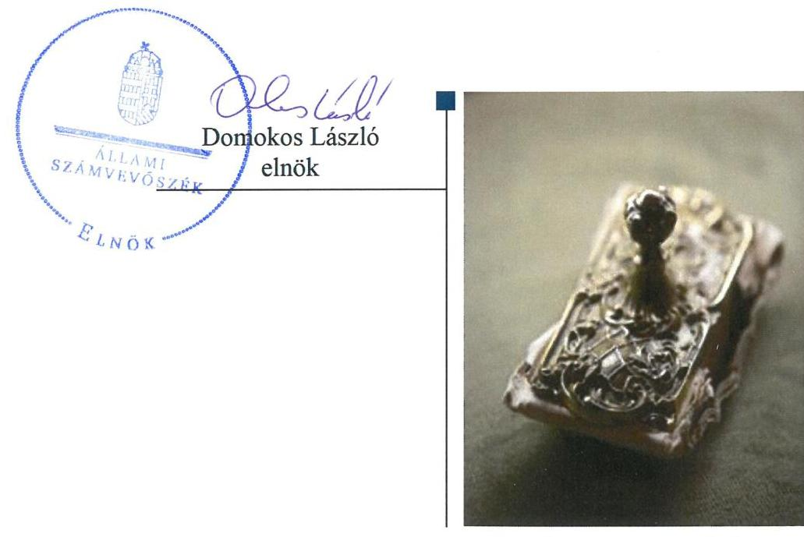
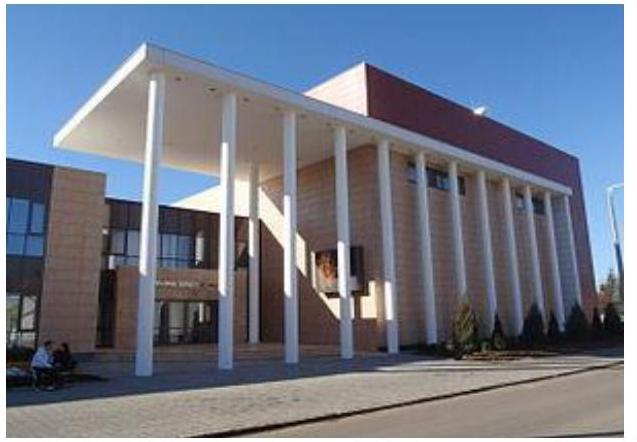
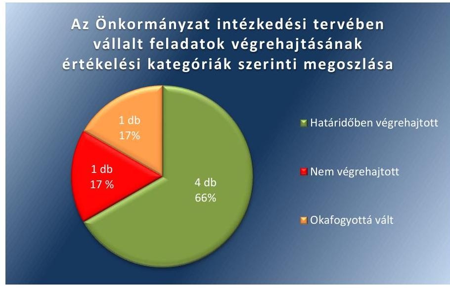
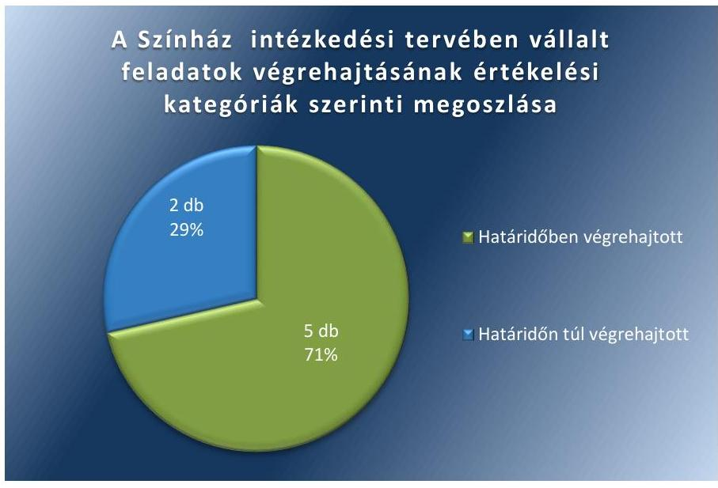
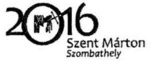
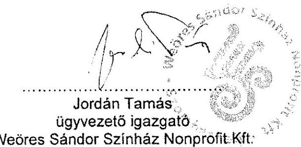

# Jelentés 

## Utóellenőrzések

Az önkormányzatok többségi
tulajdonában lévő gazdasági társaságok
közfeladat-ellátásának utóellenőrzése -
Weöres Sándor Színház Nonprofit Kft.
2019. 03. hó 26. nap

---

# AZ ELLENŐRZÉST FELÜGYELTE: 

VARGA EDIT felügyeleti vezető

## AZ ELLENŐRZÉST VEZETTE ÉS A VÉGREHAJTÁSÁÉRT FELELŐS:

JÁNOSI ISTVÁN ellenőrzésvezető
SALAMIN VIKTOR ellenőrzésvezető

## A PROGRAM ÖSSZEÁLLÍTÁSÁÉRT FELELŐS:

TÓTPÁL SZABOLCS osztályvezető

## A TÉMÁHOZ KAPCSOLÓDÓ KORÁBBI SZÁMVEVŐSZÉKI JELENTÉSEK:

- címe: Jelentés - Az önkormányzatok többségi tulajdonában lévő gazdasági társaságok közfeladat-ellátásának ellenőrzéséről - Weöres Sándor Színház Nonprofit Kft.
- sorszáma: $\quad 14069$

IKTATÓSZÁM: EL-0269-038/2019.
TÉMASZÁM: 2460
ELLENŐRZÉS-AZONOSÍTÓ SZÁM: V080456

---

# TARTALOMJEGYZÉK 

■ ÖSSZEGZÉS ..... 5
■ AZ ELLENŐRZÉS CÉLJA ..... 6
■ AZ ELLENŐRZÉS TERÜLETE ..... 7
■ AZ ELLENŐRZÉS HÁTTERE, INDOKOLTSÁGA ..... 8
■ A JELENTÉS LÉNYEGES KÉRDÉSKÖRE ..... 9
■ AZ ELLENŐRZÉS HATÓKÖRE ÉS MÓDSZEREI ..... 10
■ MEGÁLLAPÍTÁSOK ..... 12
■ MELLÉKLETEK ..... 15
I. sz. melléklet: Szombathely Megyei Jogú Város Önkormányzata és Weöres Sándor Színház Nkft. az ÁSZ 14069. számú jelentéséhez kapcsolódó intézkedési terve végrehajtásának értékelése ..... 15
II. sz. melléklet: Szombathely Megyei Jogú Város Önkormányzata és Weöres Sándor Színház NKft. intézkedési terve ..... 19
■ FÜGGELÉK: ÉSZREVÉTELEK ..... 33
■ RÖVIDÍTÉSEK JEGYZÉKE ..... 35

---

.

---

# ÖSSZEGZÉS 

Az Állami Számvevőszék Szombathely Megyei Jogú Város Önkormányzata, valamint a Weöres Sándor Színház Nonprofit Kft. utóellenőrzése során megállapította, hogy az intézkedési tervekben vállalt feladatok végrehajtásának eredményeképpen a közfeladat ellátás szabályszerűsége, a vagyongazdálkodás, valamint a pénzügyi elszámoltathatóság javult.

## Az ellenőrzés társadalmi indokoltsága

Az Állami Számvevőszék stratégiájában célul tűzte ki a számvevőszéki munka hasznosulásának javítását. Ezzel összhangban ellenőrzi, hogy az ellenőrzött szervezetek megvalósították-e a korábbi ellenőrzései által feltárt hibák, hiányosságok és szabálytalanságok megszüntetése céljából elkészített intézkedési tervekben foglaltakat. A rendszeres utóellenőrzések hozzájárulnak a szükséges intézkedések tényleges végrehajtásához, ezáltal a közpénzügyek rendezettségének javulásához.

## Főbb megállapítások, következtetések

Az Állami Számvevőszék részére megküldött intézkedési tervben meghatározott hat feladatból Szombathely Megyei Jogú Város Önkormányzata négyet végrehajtott, egyet nem hajtott végre, egy feladat okafogyottá vált. A Weöres Sándor Színház Nonprofit Kft. az intézkedési tervben meghatározott hét feladatból ötöt határidőben, kettőt határidőn túl hajtott végre.

Szombathely Megyei Jogú Város Önkormányzata a belső kontroll szerinti elszámoltathatóság javítása érdekében gondoskodott arról, hogy a Weöres Sándor Színház Nonprofit Kft. féléves beszámolóját és éves üzleti tervét Szombathely Megyei Jogú Város Önkormányzata Közgyűlése, illetve Pénzügyi, Jogi és Gazdasági Bizottsága megtárgyalja és jóváhagyja.

A Weöres Sándor Színház Nonprofit Kft. gondoskodott a számviteli szabályzatainak számvitelről szóló törvény előírásaival összhangban történő módosításáról, valamint az éves beszámolójához kapcsolódó közhasznúsági mellékletet elkészítéséről, ezzel hozzájárult a szabályozottság és a pénzügyi elszámoltathatóság javításához. A Weöres Sándor Színház Nonprofit Kft. leltározási szabályzatát a számvitelről szóló törvény előírásaival összhangban módosította és alkalmazta, ezzel a vagyongazdálkodás területén fennálló kockázatot csökkentette.

Szombathely Megyei Jogú Város Önkormányzata az intézkedési tervekben meghatározott feladatok végrehajtásáról a jogszabály által előírt nyilvántartást nem vezette.

---

# AZ ELLENŐRZÉS CÉLJA

Az ellenőrzés célja annak értékelése volt, hogy a számvevőszéki jelentésben¹ foglalt javaslatot megalapozó megállapításokkal összhangban készített intézkedési tervben meghatározott feladatokat az önkormányzat és a – többségi tulajdonában lévő – gazdasági társaság végrehajtotta-e.

---

# AZ ELLENŐRZÉS TERÜLETE

## Weöres Sándor Színház Nonprofit Kft.

Szombathely Megyei Jogú Város Önkormányzata a 2007. évben hozta létre 100%-os önkormányzati tulajdonú gazdasági társaságként a Weöres Sándor Színház Nonprofit Korlátolt Felelősségű Társaságot. A Színház2 jegyzett tőkéje alapításkor 15 M Ft volt, ami az ellenőrzött időszak végéig nem módosult. A Színház közhasznú jogállású, közfeladatot ellátó gazdasági társaság, az ellenőrzött időszakban kulturális tevékenysége keretében a közösségi kulturális hagyományok, értékek ápolása, a lakosság kulturális céljai megvalósítása, a művészeti alkotó munka, művészeti értékek létrehozása, megőrzése területein látta el feladatát. Közhasznú feladatai ellátása mellett kiegészítő jelleggel vállalkozási (elsősorban művészeti tevékenység és a tevékenységéhez kapcsolódó eszközök hasznosítása) tevékenységet is végzett.

Az alapító Önkormányzat3 polgármestere és a Színház ügyvezetője személyében az ellenőrzött időszakban változás nem történt, a jegyző4 személye egy alkalommal változott.

Az ÁSZ5 a 2013. évben ellenőrizte az Önkormányzat és a Színház közfeladat ellátását a 2008. január 1. és 2012. december 31. közötti időszakra vonatkozóan. Az ellenőrzés célja annak értékelése volt, hogy az Önkormányzat a tulajdonostól elvárható gondossággal felügyelte-e a Színház feladat ellátását, a Színház teljesítette-e a tulajdonos önkormányzat részéről meghatározott célokat és feladatokat a rendelkezésre álló erőforrások felhasználásával, betartotta-e a vagyonnal történő gazdálkodásra vonatkozó jogszabályi rendelkezéseket. Az erről készített 14069. számú számvevőszéki jelentését az ÁSZ 2014. április 8-án hozta nyilvánosságra.

Az utóellenőrzés a számvevőszéki jelentésben megfogalmazott intézkedést igénylő megállapításokra és javaslatokra készített intézkedési terv6-ben foglalt feladatok végrehajtásának ellenőrzésére, értékelésére irányult.

---

# AZ ELLENŐRZÉS HÁTTERE, INDOKOLTSÁGA 

Az ÁSZ tv. ${ }^{8}$ 33. § (1) bekezdése értelmében a számvevőszéki jelentések intézkedést igénylő megállapításaihoz és javaslataihoz kapcsolódóan az ellenőrzött szervezetek vezetője intézkedési tervet köteles összeállítani, és az Állami Számvevőszék részére megküldeni.

Az ÁSZ által befogadott intézkedési tervben foglaltak megvalósítását - az ÁSZ tv. 33. § (7) bekezdésében foglaltak alapján - az Állami Számvevőszék utóellenőrzés keretében ellenőrizheti. Az utóellenőrzések keretében - az intézkedések értékelése során - az Állami Számvevőszék figyelembe veszi az ellenőrzött szervezetek működési feltételeiben, valamint a jogszabályi előírásokban bekövetkezett változásokat.

Az utóellenőrzés során az ÁSZ értékeli, hogy az érintett számvevőszéki jelentésben foglalt intézkedést igénylő megállapításokkal és javaslatokkal összhangban, az ellenőrzött szervezet által készített intézkedési tervben meghatározott feladatokat a feladatra kijelöltek végrehajtották-e.

Az intézkedések végrehajtásával az adott terület szabályszerű működése vonatkozásában a kockázatok csökkenhetnek, azonban hosszabb távon az intézkedési tervben foglaltak végrehajtásával önmagában nem szűnnek meg, csak akkor, ha beépülnek az ellenőrzött szervezet működésébe, azokat folyamatosan karban tartják, figyelembe véve, illetve kezelve a változásokat. Emellett az intézkedések végrehajtásáig újabb kockázatok merülhetnek fel a szabályszerű működés vonatkozásában, amelyek kezelése szintén kiemelten fontos az ellenőrzött szervezet számára.

Az ellenőrzött szervezet vezetője által készített intézkedési tervekben foglalt feladatok hiányos, illetve késedelmes végrehajtása, vagy annak elmaradása a szabályszerűség és a felelős vezetői magatartás vonatkozásában kockázatot hordoz, ami azt mutatja, hogy az ellenőrzések során feltárt hibák, hiányosságok és szabálytalanságok kezelése nem kapott kellő hangsúlyt. Az utóellenőrzés során is fennálló szabálytalanságok esetén a közpénz, közvagyon veszélyeztetettségi kockázat valószínűsített hatásának értékelése további intézkedéseket vonhat maga után.

Az ellenőrzött szervezet szintjén az utóellenőrzés feltárja, hogy a szervezet az intézkedések végrehajtásával hasznosította-e a korábbi ellenőrzési jelentésben a hiányosságok megszüntetése, illetve a kockázatok kezelése érdekében megfogalmazott javaslatokat, illetve az intézkedések végrehajtása elmaradásának következtében továbbra is fennálló szabálytalanság esetén értékeli a közpénzek, közvagyon veszélyeztetettségét.

Az ÁSZ szintjén az utóellenőrzés visszacsatolást ad az ellenőrzési jelentések hasznosulásáról, az intézkedések elmaradásának, vagy részleges megvalósulásának a közpénzek, közvagyon veszélyeztetettségére gyakorolt valószínűsített hatásának értékelése, további intézkedéseket vonhat maga után.

---

# A JELENTÉS LÉNYEGES KÉRDÉSKÖRE 

Az Önkormányzat és a Színház az intézkedési tervben foglaltakat az előírt határidőben végrehajtották-e?

---

# AZ ELLENŐRZÉS HATÓKÖRE ÉS MÓDSZEREI 

## Az ellenőrzés típusa

Megfelelőségi ellenőrzés

## Az ellenőrzött időszak

Az utóellenőrzés alapját képező számvevőszéki jelentés közzétételének napjától az ellenőrzésről szóló kiértesítő levél keltének napjáig, azaz 2014. április 8-tól 2018. július 27-ig tartó időszak.

## Az ellenőrzés tárgya

A számvevőszéki jelentésben foglalt intézkedést igénylő megállapításokkal és javaslatokkal összhangban az Önkormányzat és a Színház által készített Intézkedési tervekben foglaltak végrehajtásának ellenőrzése.

## Az ellenőrzött szervezet

Szombathely Megyei Jogú Város Önkormányzata és a Weöres Sándor Színház Nonprofit Korlátolt felelősségű társaság

## Az ellenőrzés jogalapja

Az ellenőrzés jogszabályi alapját az ÁSZ tv. 33. § (7) bekezdésének előírásai képezték.

## Az ellenőrzés módszerei

Az ellenőrzést az ellenőrzött időszakban hatályos jogszabályok, az ellenőrzés szakmai szabályai, a jelen ellenőrzésre irányadó ÁSZ módszertanok, az ellenőrzési programban foglalt értékelési szempontok szerint, végeztük.

Az ellenőrzés ideje alatt az Önkormányzattal és a Színházzal történő kapcsolattartást az ÁSZ SZMSZ-ének vonatkozó előírásai alapján biztosítottuk.

Az utóellenőrzés megállapításait az ÁSZ rendelkezésére álló, valamint az ÁSZ adatbekérése szerint, az Önkormányzat és a Színház által rendelkezésre bocsátott dokumentumok alapozták meg.

Az ellenőrzési bizonyítékként felhasználható adatforrások közé tartoztak egyrészt az ellenőrzési program részletes szempontjainál felsorolt

---

adatforrások, másrészt minden - az ellenőrzés folyamán feltárt, az ellenőrzés szempontjából információt tartalmazó - dokumentum.

Az intézkedési tervekben előírt feladatokat azok végrehajthatósága, illetve végrehajtása szempontjából az alábbiak szerint értékeltük:
"határidőben végrehajtott" a feladat, ha a teljesítés dokumentáltan, az intézkedési tervben előírt határidőben és tartalommal megtörtént;
"határidőn túl végrehajtott" a feladat, ha annak teljesítése az intézkedési tervben meghatározott módon, de az előírt határidőn túl történt meg;
"részben végrehajtott" a feladat, ha végrehajtása teljes körűen az intézkedési tervben előírt módon nem történt meg;
"nem végrehajtott" a feladat, ha a végrehajtás nem történt meg, vagy amennyiben a teljesítést nem dokumentálták;
"okafogyottá vált" a feladat, ha végrehajtására - meghatározott esemény bekövetkezése, továbbá külső körülmény, a működést érintő feltétel változása miatt - már nincs szükség, illetve lehetőség, és egyértelműen megállapítható, hogy az intézkedést szükségessé tevő körülmény a jövőben nem fordulhat elő;
"nem időszerű" az a feladat, amelynek ellenőrzési időszakon belüli végrehajtására azért nem került (kerülhetett) sor, mert az intézkedés alapjául szolgáló esemény nem következett be, de annak jövőbeni előfordulása lehetséges, a végrehajtása nem volt esedékes, vagy a végrehajtás határideje még nem járt le.
Az ellenőrzés lefolytatásához az Önkormányzat és a Színház a tanúsítványok elektronikus kitöltésével, valamint az ÁSZ által kért dokumentumok elektronikus megküldésével szolgáltatott adatokat, amelyek valódiságát és teljes körűségét az ellenőrzött szervezet vezetője által tett teljességi és hitelességi nyilatkozat igazolja. Az így rendelkezésre bocsátott adatok, információk kontrollja az ellenőrzés keretében megtörtént.

---

# MEGÁLLAPÍTÁSOK 

## Az Önkormányzat és a Színház az intézkedési tervben foglaltakat az előírt határidőben végrehajtották-e?

Összegző megállapítás

Az Önkormányzat az intézkedési tervében meghatározott hat feladatból négyet végrehajtott, egy feladat végrehajtásáról nem gondoskodott, egy feladat végrehajtása okafogyottá vált. A Színház az intézkedési tervében meghatározott hét feladatból ötöt határidőben, kettőt határidőn túl hajtott végre. Az Önkormányzat az intézkedési tervekben meghatározott feladatok végrehajtásáról a jogszabályban előírt nyilvántartást nem vezette.

Az ÁSZ a 14069. számú jelentésében az Önkormányzat polgármestere részére kettő, a Színház igazgatója részére öt javaslatot fogalmazott meg. A hiányosságok és szabálytalanságok megszüntetésére az Önkormányzat által készített intézkedési terv1-ben meghatározott hat, valamint a Színház által készített intézkedési terv2-ben meghatározott hét - ÁSZ által beazonosított - feladatot, a végrehajtás határidejét, a felelősöket és a feladatok végrehajtásának értékelését az I. számú melléklet, az intézkedési terv1,2-t a II. számú melléklet mutatja be.

A jegyző az Önkormányzat intézkedési tervében meghatározott feladatok végrehajtásáról a Bkr. ${ }^{10}$ 14. § (1) bekezdésében előírt nyilvántartást nem vezette.

Az Önkormányzat intézkedési terv1-ében meghatározott feladatok végrehajtásának értékelési kategóriák szerinti megoszlását az 1. ábra szemlélteti.

1. ábra

---

A Színház intézkedési terv2-ében meghatározott feladatok végrehajtásának értékelési kategóriák szerinti megoszlását a 2. ábra szemlélteti.
2. ábra

Forrás: ÁSZ

# A BELSŐ KONTROLL SZERINTI ELSZÁMOLTATHATÓSÁG javítása érdekében
 a polgármester ${ }^{11}$ és a jegyző gondoskodott arról, hogy - az Önkormányzat vagyonrendeletével ${ }_{1-10}{ }^{12}$ összhangban - a Színház féléves beszámolóját és éves üzleti tervét az Önkormányzat Közgyűlése, illetve a Pénzügyi, Gazdasági és Jogi Bizottsága megtárgyalja és jóváhagyja $(1,2,3)$. 

A SZABÁLYOZOTTSÁG javítása érdekében a gazdasági igazgató ${ }^{13}$ gondoskodott a Színház számviteli politikájának ${ }_{1-3}{ }^{14}$, valamint eszközök és források értékelési szabályzatának ${ }_{1-2}{ }^{15}$ Számv. tv. ${ }^{16}$ előírásaival összhangban történő módosításáról $(8,9,10)$.

A PÉNZÜGYI ELSZÁMOLTATHATÓSÁG javítása érdekében a gazdasági igazgató gondoskodott arról, hogy a Színház éves beszámolójához kapcsolódó közhasznúsági mellékletet minden évben a jogszabályi előírások szerinti formában és tartalommal készítsék el (11). A gazdasági igazgató a 2015. évtől kezdődően a Színház Alapító Okiratában ${ }^{17}$ foglaltaknak megfelelően gondoskodott a Színház közhasznú és vállalkozási tevékenységei kiadásainak elkülönítéséről (13).

A VAGYONGAZDÁLKODÁS javítása érdekében a polgármester és a jegyző biztosította, hogy az Önkormányzat tulajdonában lévő, Színház által használatba vett eszközökről a Színház a jogszabályi előírásoknak és a Színház leltározási szabályzatában ${ }_{1-2}{ }^{18}$ foglaltaknak eleget téve éves gyakorisággal leltárt készítsen, és azt az Önkormányzat részére határidőben megküldje $(4,6)$. A polgármester és a jegyző ugyanakkor nem gondoskodott arról, hogy az Önkormányzat és a Színház közötti, a Színház által használatba vett eszközökre vonatkozó bérleti szerződés módosításra kerüljön annak érdekében, hogy a bérleti szerződésben foglalt leltározási szabályok

---

az Önkormányzat leltározási szabályzatával ${ }_{1-3}{ }^{19}$ és a Színház leltározási szabályzatával ${ }_{1-2}$ összhangban legyenek (5). Az ügyvezető ${ }^{20}$ és a gazdasági igazgató a Színház leltározási szabályzatát ${ }_{1-2}$ módosította és erről az Önkormányzatot tájékoztatta $(7,12)$.

---

# MELLÉKLETEK

- I. SZ. MELLÉKLET: SZOMBATHELY MEGYEI JOGÚ VÁROS ÖNKORMÁNYZATA ÉS WEÖRES SÁNDOR SZÍNHÁZ NKFT. AZ ÁSZ 14069. SZÁMÚ JELENTÉSÉHEZ KAPCSOLÓDÓ INTÉZKEDÉSI TERVE VÉGREHAJTÁSÁNAK ÉRTÉKELÉSE

|  Az intézkedési terv alapján elvégzendő feladat | Az intézkedési tervben meghatározott határidő | Az intézkedési tervben megjelölt felelős | A feladat végrehajtása  |
| --- | --- | --- | --- |
|  Szombathely Megyei Jogú Város intézkedési terve Határidőben végrehajtott feladatok |  |  |   |
|  1. (ÖNK 1.a) Meg kell említeni, hogy az ÁSZ megállapítása üzleti tervet, míg javaslata üzleti jelentést említ. Intézkedési tervünk azt feltételezi, hogy a javaslatban is üzleti tervet kívántak szerepeltetni. A féléves beszámolóról a 2011. évben önkormányzatunknál lefolytatott ÁSZ vizsgálat alapján elfogadott és azóta alkalmazott intézkedési terv tartalmazta az alábbi rendelkezést: „A jövőben a minősített többségi tulajdonú gazdasági társaságok pénzügyi helyzetének féléves értékelését is a Közgyűlés elé kell terjeszteni." | 2014. május 15. | polgármester, jegyző | Az Önkormányzat Közgyűlése a Színház 2014. I. félévi beszámolóját 2014. november 3-ai rendkívüli ülésének 14. napirendi pontja keretében megtárgyalta.  |
|  2. (ÖNK 1.b) Az üzleti terv vonatkozásában a vagyonrendelet módosítását a Közgyűlés 2014. februári ülése tárgyalta, melynek tartalmát a megállapításra tett észrevételünket tartalmazó levélben is részleteztünk az ÁSZ elnökének. A Közgyűlés a 12/2014. (III.10.) önkormányzati rendeletével jóváhagyta a módosítást, mely alapján a vizsgálat által érintett rendelkezései az alábbira módosultak:
„25. §
(2) A társaságok legfőbb szervének hatáskörébe tartozó alábbi ügyekben a Pénzügyi, Gazdasági és Jogi Bizottság dönt:
a) a szakmailag illetékes önkormányzati bizottság(ok) előzetes véleményezésével az üzleti terv elfogadásáról, ..." | 2014. május 15. | polgármester, jegyző | A vagyonrendelet ${ }_{1-10}$ 2014. március 11-ei hatállyal történő módosításáról szóló 12/2014. (III.10.) önkormányzati rendelet az üzleti terv jóváhagyását az Önkormányzat Pénzügyi, Gazdasági és Jogi Bizottsága hatáskörébe helyezte.  |

---

|  3. | (ÖNK 1.c) A vagyonrendelet módosításokkal egységes szerkezetbe foglalt példányát a polgármester az intézkedési terv mellékleteként megküldi az ÁSZ elnökének. A fenti hatáskörök gyakorlása a rendeletmódosítás következtében egyértelműen megosztásra kerültek a bizottság, illetőleg a polgármester között. E szabályozás biztosítja, hogy a jövőben a társaság rendelkezzen elfogadott üzleti tervvel és üzleti jelentést is tartalmazó beszámolóval. | 2014. május 15. | polgármester, jegyző | A 12/2014. (III.10.) önkormányzati rendelettel módosított vagyonrendelet1-30 egységes szerkezetben 2014. május 13. napján az ÁSZ-hoz beérkezett.  |
| --- | --- | --- | --- |
|  4. | (ÖNK 2.b) az önkormányzat felhívja a Színház ügyvezetőjének a figyelmét arra, hogy a bérleti szerződésben foglalt kötelezettségének teljesítése érdekében minden év végén készítse el az év végi leltárt és azt az önkormányzat részére a tárgyév november 30. napjáig küldje meg. | folyamatos | polgármester, jegyző  |
|   |  |  | A Színház a használatában lévő eszközöket a bérleti szerződés tartalmával összhangban évente leltározta, és az erről készített leltározási dokumentumokat az Önkormányzat részére megküldte.  |
|   |  | Nem végrehajtott feladat |   |
|  5. | (ÖNK 2.c) a jelentésben a részletes megállapítások c. fejezet utalt arra is, hogy amellett, hogy a Színház a bérleti szerződése alapján 2012. év végén tételes eszközleltárt nem készített és nem küldte meg a Polgármesteri Hivatalnak, a leltározási rendre vonatkozó szabályok is eltérnek a Leltározási Szabályzat és a bérleti szerződés összevetésében. Így az önkormányzat felhívja a Színház ügyvezető igazgatóját, hogy a leltározási rendre vonatkozó szabályokat figyelembe véve a bérleti szerződést hozza összhangba a Leltározási Szabályzattal, és a bérleti szerződés módosítását terjessze Szombathely Megyei Jogú Város Közgyűlése elé. | 2014. szeptember Közgyűlés | polgármester, jegyző  |
|   |  |  | A polgármester és a jegyző nem gondoskodott arról, hogy a Színház a bérleti szerződés módosítását az Önkormányzat Közgyűlése elé terjessze. Továbbra sem volt biztosított az összhang a bérleti szerződés és az Önkormányzat leltározási szabályzata1-3 között, mivel a tárgyi eszközök mennyiségi felvétellel történő leltározását a Színház 2014. május 9-étől hatályos leltározási szabályzata1-2 három évenkénti gyakorisággal, azonban a bérleti szerződés továbbra is évenkénti gyakorisággal írta elő.  |
|   |  |  | A polgármester intézkedési terv keretében tett nyilatkozata szerint a Színház a használatában lévő tárgyi eszközökről a leltáríveket a 2013. december 31-i állapotnak megfelelően, az ellenőrzött időszakot megelőzően megküldte az Önkormányzat részére.  |
|  6. | (ÖNK 2.a) a Színház az önkormányzat részére 2013. decemberben megküldte a kezelésében lévő tárgyi eszközökről a leltáríveket 2013. december 31-i állapotnak megfelelően. | végrehajtott | polgármester, jegyző  |

---

|  7. | (SZ 1.a) Az intézkedési terv alapján a Színház Leltározási Szabályzatát módosítása aszerint, hogy a tárgyi eszközök leltározására vonatkozó rendelkezések a Számviteli törvény 69. § (3) bekezdésében foglaltakkal összhangba kerüljön. | 2014. május 15. | ügyvezető, gazdasági igazgató | Az ügyvezető a Színház leltározási szabályzatát1-2 2014. május 9-ei hatállyal módosította. A módosított szabályzat a tárgyi eszközök mennyiségi felvétellel történő leltározását a Számv. tv. 69. § (3) bekezdésében foglaltakkal összhangban három éves gyakorisággal írta elő.  |
| --- | --- | --- | --- | --- |
|  8. | (SZ 3.a) Tekintettel arra, hogy a Színház az ÁSZ elnökének megküldött észrevételei között jelezte, hogy a számviteli politika aktualizálása megtörtént, melynek eredményeként a jövőben az éves beszámoló részét nem fogja képezni az üzleti jelentés elkészítésének kötelezettsége, így az aktualizált számviteli politikát az intézkedési tervvel együtt el kell küldeni az ÁSZ-nak. | 2014. május 15. | gazdasági igazgató | A 2013. október 1-jétől hatályos számviteli politika1-3 – a Számv. tv. előírásaival összhangban – rögzíti, hogy az üzleti jelentés nem képezi az egyszerűsített éves beszámoló részét.  |
|  9. | (SZ 3.b) Tekintettel arra, hogy a Színház az ÁSZ elnökének megküldött észrevételei között jelezte, hogy a számviteli politika aktualizálása megtörtént, melynek eredményeként a jövőben az éves beszámoló részét nem fogja képezni az üzleti jelentés elkészítésének kötelezettsége, így az aktualizált számviteli politikát az intézkedési tervvel együtt el kell küldeni az ÁSZ-nak. | 2014. május 15. | gazdasági igazgató | A 2013. október 1-jétől hatályos számviteli politikát1-3 az Önkormányzat 2014. május 6-ai levelében – az intézkedési tervhez csatoltan – megküldte az ÁSZ-nak.  |
|  10. | (SZ 4) A Színház az ÁSZ javaslatnak megfelelően aktualizálja a szabályzatait, úgy, hogy a Számviteli törvény előírásaival összhangban legyenek. | 2014. május 15. | gazdasági igazgató | A Színház számviteli politikáját1-3 és eszközök és források értékelési szabályzatát1-2 a Számv. tv. előírásaival összhangban 2014. május 9-ei hatállyal módosították.  |
|  11. | (SZ 5) Szombathely Megyei Jogú Város Közgyűlése a 2013. novemberi ülésén tárgyalta a Színház 2012. évi közhasznúsági mellékletét, mely a felhívásnak megfelelően a hivatkozott kormányrendeletben foglalt formanyomtatvány szerint került pótlásra. A közhasznúsági mellékletet a Közgyűlés az 582/2013. (XI.28.) Kgy. sz. határozatával hagyta jóvá. A Színház a 2013. évi közhasznúsági mellékletét szintén a Kor- | 2014. május 1-jétől, folyamatos | gazdasági igazgató | A Színház a 2013-2017. években az egyszerűsített éves beszámolóhoz kapcsolódó közhasznúsági mellékletet a Civil tv.21 előírásával összhangban, a 350/2011. (XII. 30.) Korm. rendelet mellékletében előírt formanyomtatvány szerint készítette el.  |

---

|  Sorszám | Az intézkedési terv alapján elvégzendő feladat | Az intézkedési tervben meghatározott határidő | Az intézkedési tervben megjelölt felelős | A feladat végrehajtása  |
| --- | --- | --- | --- | --- |
|   | mányrendeletben foglalt formanyomtatványnak megfelelően készítette el. A Színház közhasznúsági mellékletét jövőben is a Civil törvény előírásainak megfelelően kell elkészíteni. |  |  |   |
|   |  | **Határidőn túl végrehajtott feladatok** |  |   |
|  12. | (SZ 1.b.) A Leltározási Szabályzat módosításának végrehajtásáról az önkormányzat tájékoztatása és a módosított Leltározási Szabályzat megküldése és a módosított Leltár Szabályzat megküldése az önkormányzat illetékes szervezeti egységeinek. | 2014. szeptember 30. | ügyvezető, gazdasági igazgató | A gazdasági igazgató a Színház 2014. május 9-ei hatállyal módosított leltározási szabályzatát1-2 az Önkormányzatnak 2017. október 19-én küldte meg.  |
|  13. | (SZ 2.) A Színház az Alapító Okiratban foglaltaknak megfelelően járjon el, így a kiadásait az előírásoknak megfelelően elkülönítetten tartsa nyilván. | 2014. május 1-jétől, folyamatos | gazdasági igazgató | A gazdasági igazgató a közhasznú és a vállalkozási tevékenység kiadásai – a Színház Alapító okiratában előírt – elkülönített nyilvántartásának vezetését a 2015. évtől kezdődően biztosította.  |

*Forrás: ÁSZ által készített táblázat*

---

II. SZ. MELLÉKLET: SZOMBATHELY MEGYEI JOGÚ VÁROS ÖNKORMÁNYZATA ÉS WEÖRES SÁNDOR SZÍNHÁZ NKFT. INTÉZKEDÉSI TERVE

SZOMBATHELY MEGYEI JOGÚ VÁROS POLGÁRMESTERE
80.120-33.../2014.

Ül.: dr. Szabó Viktória

##
 Domokos László elnök úr részére Állami Számvevőszék

## Budapest

Apáczai Csere János u. 10.
1364

## Tisztelt Elnök Úr!

Az önkormányzatok többségi tulajdonában lévő gazdasági társaságok közfeladat-ellátásának ellenőrzéséről - Weöres Sándor Színház Nonprofit Kft. (Szombathely) tárgyában készített állami számvevőszéki jelentést megkaptam, köszönöm.

A jelentést Szombathely Megyei Jogú Város Közgyűlésének 2014. áprilisi ülése elé terjesztettem megismerésre, továbbá az előterjesztés tartalmazta önkormányzatunk részéről összeállított intézkedési tervet is, ezzel eleget téve az Állami Számvevőszékről szóló 2011. évi LXVI. törvény 33. § (1) bekezdésében foglaltaknak. Az intézkedési terv összefoglalja a jelentés megállapításait és javaslatait, valamint a javaslatok maradéktalan teljesüléséhez szükséges intézkedéseket, megjelölve a határidőket és a felelősöket. Az intézkedési tervet Szombathely Megyei Jogú Város Közgyűlése a 174/2014. (IV.24.) Kgy. sz. határozatával jóváhagyta.

Az intézkedési tervet, az azt jóváhagyó közgyűlési határozatot, valamint a tervben előírt egyes intézkedések megvalósítását elősegítő dokumentumokat jelen levelemhez mellékelve küldöm meg az Ön részére.

Szombathely, 2014. május „".."

Tisztelettel:

T: Dr. Puskás Tivadar :

Telefon: +36 94/520-100
Fax: +36 94/520-243
Web: www.szombathely.hu

---

Szombathely Megyei Jogú Város
Polgármestere

# INTÉZKEDÉSI TERV 

Az Állami Számvevőszéknek az önkormányzatok többségi tulajdonában lévő gazdasági társaságok közfeladat-ellátásának ellenőrzéséről - Weöres Sándor Színház Nonprofit Kft. jelentése alapján.

Az ellenőrzés intézkedést igénylő megállapításai és javaslatai a polgármesternek:

## 1. Megállapítás:

„A 2008-2012. a polgármester a vagyongazdálkodási rendelet 26. § (2) bekezdésében foglalt felhatalmazás ellenére nem döntött a 2008-2012. években a féléves beszámoló, továbbá az üzleti terv elfogadásáról. Ennek következtében a Színház nem rendelkezett elfogadott féléves beszámolóval és jóváhagyott üzleti tervvel."

## Önkormányzat részéről tett észrevétel:

„Szombathely Megyei Jogú Város Önkormányzata vagyonáról, a vagyontárgyak feletti tulajdonosi jogok gyakorlásáról szóló 29/2004. (VI.30.) önkormányzati rendelet (a továbbiakban: vagyonrendelet) 22-27. §-ai szabályozzák önkormányzatunk testületei közötti hatáskörmegosztást az önkormányzati tulajdonban lévő gazdasági társaságokat érintő döntéshozatalban. A vagyonrendeletünk alapján a polgármesterre átruházott hatáskörök kétirányúak. Vannak azok a hatáskörök, melyekben a polgármester önállóan jogosult dönteni, a szakmai jellegű kérdéskörök esetében viszont köteles a Pénzügyi, Gazdasági és Jogi Bizottság állásfoglalását kikérni a döntést megelőzően. A vagyonrendelet megalkotásakor és elfogadásakor az üzleti tervek jóváhagyásának a Bizottság előzetes állásfoglalásához kötése mögött azon jogalkotói szándék fogalmazódott meg, hogy az üzleti tervben foglaltak megítéléséhez és megfelelő elbírálásához elengedhetetlen a szakmai bizottság hozzáértése. Ennek okán az üzleti terveket érintően kialakított döntésem a Bizottság által hozott határozat tartalmával megegyezően fogalmazódott meg. Önkormányzatunknál így az a gyakorlat alakult ki, hogy polgármesteri döntésként a bizottsági határozatok kerültek megküldésre a társaság részére, mely gyakorlat álláspontom szerint nem áll ellentétben a vagyonrendeletünk vonatkozó rendelkezésével. Ugyanezt a tendenciát követtük a féléves beszámolókkal kapcsolatos döntés meghozatalánál. Álláspontom szerint így a társaság a kizárólagos tulajdonosa által elfogadott üzleti tervvel és féléves beszámolóval az ellenőrzött időszakban rendelkezett.
Tekintettel arra, hogy a helyszíni ellenőrzés során is felvetődött, valamint a megküldött jelentéstervezet is aggályosnak tartja a polgármesteri hatáskörbe utalt, de a bizottság előzetes állásfoglalásához kötött kérdésköröket érintő szabályozás helyes értelmezését és a döntéshozatalnak a gyakorlatban való helyes alkalmazását, ezért javaslatot tettem a vagyonrendeletünkben megfogalmazott, többféle értelmezési

---

lehetőséget is magában hordozó rendelkezések módosítására. Ezen javaslatomat Szombathely Megyei Jogú Város Közgyűlése a soron következő, 2014. februári ülésén fogja tárgyalni. A módosítás alapján az eddigi polgármesteri hatáskörbe utalt, de a bizottság előzetes állásfoglalásának kikéréséhez kötött tárgykörök teljes egészében bizottsági hatáskörbe kerülnek. Amennyiben Közgyűlésünk a módosítási javaslatot támogatja, úgy a kihirdetett rendelet módosítását megküldjük a Tisztelt Elnök Úr részére."

# ÁSZ javaslata: 

„Tegyen eleget a vagyongazdálkodási rendelet 26. § (2) bekezdésében foglalt felhatalmazás alapján döntési kötelezettségének, annak érdekében, hogy a Színház rendelkezzen jóváhagyott üzleti tervvel és elfogadott féléves beszámolóval."

## Intézkedés:

Meg kell említeni, hogy az ÁSZ megállapítása üzleti tervet, míg javaslata üzleti jelentést említ. Intézkedési tervünk azt feltételezi, hogy a javaslatban is üzleti tervet kívántak szerepeltetni.
A féléves beszámolóról a 2011. évben önkormányzatunknál lefolytatott ÁSZ vizsgálat alapján elfogadott és azóta alkalmazott intézkedési terv tartalmazta az alábbi rendelkezést: „A jövőben a minősített többségi tulajdonú gazdasági társaságok pénzügyi helyzetének féléves értékelését is a Közgyűlés elé kell terjeszteni."
Az üzleti terv vonatkozásában a vagyonrendelet módosítását a Közgyűlés 2014. februári ülésén tárgyalta, melynek tartalmát a megállapításra tett észrevételünket tartalmazó levélben is részleteztük az ÁSZ elnökének. A Közgyűlés a 12/2014. (III.10.) önkormányzati rendeletével jóváhagyta a módosítást, mely alapján a vizsgálat által érintett rendelkezései az alábbiakra módosultak:
„25.§
(2) A társaságok legfőbb szervének hatáskörébe tartozó alábbi ügyekben a Pénzügyi, Gazdasági és Jogi Bizottság dönt:
a) a szakmailag illetékes önkormányzati bizottság(ok) előzetes véleményezésével az üzleti terv elfogadásáról,
b) ingatlan, ingatlanrész elidegenítéséről 10-30 (tíz-harminc) millió forint forgalmi értékhatár esetén,
c) a díjazás megválasztáskor történő megállapítása kivételével az ügyvezetők javadalmazásáról,
d) olyan szerződés megkötésének jóváhagyása, amelynek értéke a törzstőke legalább 1/4-ét meghaladja.
(3) A társaságok legfőbb szervének hatáskörébe tartozó és az (1)-(2) bekezdésben fel nem sorolt kérdésekben a polgármester dönt."
„26. §
(2) Ha a gazdasági társaságban az önkormányzati tulajdonrész az 50%-ot eléri, vagy meghaladja, úgy a társaság tulajdonában lévő, 10 (tíz) millió forint értékig ingatlan, ingatlanrész elidegenítéséről a polgármester dönt."

---

ÖNKA A vagyonrendelet módosításokkal egységes szerkezetbe foglalt példányát a polgármester az intézkedési terv mellékleteként megküldi az ÁSZ elnökének. A fenti hatáskörök gyakorlása a rendeletmódosítás következtében egyértelműen megosztásra kerültek a bizottság, illetőleg a polgármester között. E szabályozás biztosítja, hogy a jövőben a társaság rendelkezzen elfogadott üzleti tervvel és üzleti jelentést is tartalmazó beszámolóval.

Felelős: Dr. Puskás Tivadar polgármester
Dr. Gaál Róbert jegyző
(A végrehajtás előkészítésért:
Lakézi Gábor, a Városüzemeltetési Osztály vezetője)
Határidő: 2014. május 15.

# 2. Megállapítás: 

„A 2012. év végén tételes eszközleltár nem készült, mivel a Színház a bérleti szerződés 6.3.3. pontjában foglalt előírás ellenére a kezelésében lévő tárgyi eszközökről leltáríveket az Önkormányzatnak nem küldött."

## Önkormányzat részéről tett észrevétel:

„Önkormányzatunk a bérleti szerződés módosításával nagyobb összhangot kíván teremteni a bérleti szerződés és a Leltározási Szabályzat között úgy, hogy abban már figyelembevételre kerülne a Leltározási Szabályzat olyan irányú tervezett módosítása, amely figyelembe venné a 4/2013. (I.11.) Kormányrendelet leltárra vonatkozó részét, miszerint legalább 3 évente kell mennyiségi leltárral alátámasztani a mérleget."

## ÁSZ javaslata:

„Követelje meg a Színháztól az önkormányzat az éves beszámolója alátámasztottsága érdekében a bérleti szerződésének megfelelő év végi leltár elkészítését, és annak az önkormányzat részére való megküldését."

## Intézkedés:

ÖNKA (a) a Színház az önkormányzat részére 2013. decemberben megküldte a kezelésében lévő tárgyi eszközökről a leltáríveket 2013. december 31-i állapotnak megfelelően,
(b) az önkormányzat felhívja a Színház ügyvezetőjének a figyelmét arra, hogy a bérleti szerződésben foglalt kötelezettségének teljesítése érdekében minden év végén készítse el az év végi leltárt és azt az önkormányzat részére a tárgyév november 30. napjáig küldje meg.
(c) a jelentésben a részletes megállapítások c. fejezet utalt arra is, hogy amellett, hogy a Színház a bérleti szerződése alapján 2012. év végén tételes eszközleltárt nem készített és nem küldte meg a Polgármesteri Hivatalnak, a leltározási rendre vonatkozó szabályok is eltérnek a Leltározási Szabályzat és a bérleti szerződés összevetésében. Így az önkormányzat felhívja a Színház ügyvezető igazgatóját, hogy a leltározási rendre vonatkozó szabályokat figyelembe véve a bérleti szerződést hozza összhangba a Leltározási Szabályzattal, és a bérleti szerződés módosítását terjessze Szombathely Megyei Jogú Város Közgyűlése elé.

---

# Felelős: 

b) pontban foglaltakért: Dr. Puskás Tivadar polgármester

Dr. Gaál Róbert jegyző
(A végrehajtás előkészítésért:
Lakézi Gábor, a Városüzemeltetési Osztály vezetője)
c) pontban foglaltakért: Dr. Puskás Tivadar polgármester

Dr. Gaál Róbert jegyző
(A végrehajtás előkészítéséért:
Lakézi Gábor, Városüzemeltetési Osztály vezetője)
Végrehajtásért felelős: Jordán Tamás, a Színház ügyvezető igazgatója
Határidő: b) folyamatos
c) 2014. szeptemberi Közgyűlés

Az ellenőrzés intézkedést igénylő megállapításai és javaslatai a Színház ügyvezetőjének:

## 1. Megállapítás:

„A Színház Leltározási Szabályzata 6. b.) pontjában foglalt öt évenkénti leltározási kötelezettségre vonatkozó előírás a 2012. évtől ellentétes volt a Számviteli törvény 69. § (3) bekezdése 2012. január 1-jétől hatályos rendelkezésével, amely szerint a tárgyi eszközöket legalább háromévente mennyiségi felvétellel kell leltározni."

## ÁSZ javaslata:

„Intézkedjen a Színház leltározási szabályzatának módosítására, hogy az a Számviteli törvény 69. § (3) bekezdésével összhangban háromévenkénti leltározási kötelezettséget írjon elő."

## Intézkedés:

a) Az önkormányzat felhívja az intézkedési terv alapján a Színház ügyvezető igazgatóját, hogy a társaság Leltározási Szabályzatát módosítsa aszerint, hogy a tárgyi eszközök leltározására vonatkozó rendelkezések a Számviteli törvény 69. § (3) bekezdésében foglaltakkal összhangba kerüljenek.
b) A Leltározási Szabályzat módosításának végrehajtásáról az ügyvezető köteles az önkormányzatot tájékoztatni és a módosított Leltár Szabályzatot az önkormányzat illetékes szervezeti egységének megküldeni.

## Felelős:

a) pontban foglaltakért: Dr. Puskás Tivadar polgármester

Dr. Gaál Róbert jegyző
(A végrehajtás előkészítésért:
Lakézi Gábor, a Városüzemeltetési Osztály vezetője)
b) pontban foglaltakért: Jordán Tamás, a Színház ügyvezető igazgatója

Határidő: a) 2014. május 15.
b) 2014. szeptember 30.

---

# 2. Megállapítás: 

„A Színház az Alapító Okirat 4.10. pontjában foglaltak ellenére az összes közvetett költségét a közhasznú tevékenységek közvetlen költségei között tartotta nyilván. Az utólag analitikusan kigyűjtött közvetett költségeket bevételarányosan osztották fel a közhasznú és a vállalkozási tevékenység között."

## Színház észrevétele:

„Továbbra is az a véleményünk, hogy a Színház gyakorlata is megfelelő. A bevételeket külön könyveljük, a költségeket pedig mivel nem lehet sem időben sem egyéb naturáliában meghatározni hisz nincs külön alkalmazottunk, illetve olyan tevékenység, ami kimondottan vállalkozás, ezért bevételarányosan kell meghatározni. A számviteli törvény erről nem rendelkezik külön, a nonprofit szervezetekkel kapcsolatos valamennyi rendelkezés pedig a Színház által alkalmazott módszert is tartalmazza.
Amit tudok tenni és tenni is fogunk a jövőben, hogy év végén, amikor ez kiszámításra kerül, akkor át is könyveljük a megnyitott főkönyvi számlákra, melyeket a számla tükör már most is tartalmaz."

## ÁSZ javaslata:

„Intézkedjen arról, hogy a Színház a kiadásait az Alapító Okirat 4.10. pontjában foglalt előírásoknak megfelelően elkülönítetten tartsa nyilván."

## Intézkedés:

Az önkormányzat felhívja a Színház ügyvezető igazgatóját, hogy az Alapító Okiratban foglaltaknak megfelelően járjon el, így a kiadásait az előírásoknak megfelelően elkülönítetten tartsa nyilván.

Felelős: Dr. Puskás Tivadar polgármester
Dr. Gaál Róbert jegyző
(A végrehajtás előkészítésért:
Lakézi Gábor, a Városüzemeltetési Osztály vezetője)
Határidő: folyamatos

## 3. Megállapítás:

„A Színház a számviteli politikában üzleti jelentés készítésének kötelezettségét írta elő, azonban azokat az ellenőrzött időszakban nem készítette el."

## Színház észrevétele:

„A jelentés megállapítása helytálló. Viszont a vizsgálat során jeleztük a vizsgálatot folytató számvevőnek, hogy folyamatban van a számviteli politika aktualizálása, mely azóta meg is történt. Az élő számviteli politika szerint az üzleti jelentés már nem képezi részét az éves beszámolónak, így a jövőre nézve további intézkedést ebben a tárgyban a Színháznak véleményünk szerint már nem kell tennie."

## ÁSZ javaslata:

„Intézkedjen a számviteli politika előírásának megfelelően az éves üzleti jelentések elkészítéséről."

---

# Intézkedések: 

Tekintettel arra, hogy a Színház ügyvezető igazgatója az ÁSZ elnökének megküldött észrevételei között jelezte, hogy a számviteli politika aktualizálása megtörtént, melynek eredményeként a jövőben az éves beszámoló részét nem fogja képezni az üzleti jelentés elkészítésének kötelezettsége, így
 az önkormányzat felhívja a Színház ügyvezető igazgatóját, hogy az aktualizált számviteli politikát az intézkedési tervvel együtt küldje meg az ÁSZ elnökének.

Felelős: Dr. Puskás Tivadar polgármester
Dr. Gaál Róbert jegyző
(A végrehajtás előkészítésért:
Lakézi Gábor, a Városüzemeltetési Osztály vezetője)
Határidő: 2014. május 15.

## 4. Megállapítás:

„A Színház a szabályzatait a 2008. évben készítette el és helyezte hatályba, azokat a pénzkezelési szabályzat kivételével - a Számviteli törvény 14. § (11) bekezdése ellenére nem aktualizálta, ezért például az értékelési szabályzatban a bekerülési érték meghatározása a 2012. évtől nem felelt meg a Számviteli törvény 47. § (4) bekezdés e) pontjában foglaltaknak. A számviteli politikában a Színház székhelyének megjelölését az Alapító Okirat változásával együtt nem módosították."

## Színház észrevétele:

„77. § és 81. § kerekítési szabályokról szóló előírásait mi a pénzkezelési szabályzatunkban leszabályoztuk. A 47. § (4) bekezdés előírásai pedig az értékelési szabályzatunkban eddig is szerepelt. Továbbá a vizsgálat óta aktualizált számviteli politikában a Színház székhelye már helyesen került feltüntetésre."

## ÁSZ javaslata:

„Intézkedjen a szabályzatainak aktualizálásáról, annak érdekében, hogy azok megfeleljenek a Számviteli törvény vonatkozó előírásainak."

## Intézkedések:

Az önkormányzat felhívja a Színház ügyvezető igazgatóját, hogy az ÁSZ javaslatnak megfelelően gondoskodjon a szabályzatoknak a Számviteli törvény előírásai szerinti aktualizálásáról a teljes megfelelőség teljesítése érdekében, és az aktualizált szabályzatokat az intézkedési terv mellékleteként küldje meg az ÁSZ elnökének.

Felelős: Dr. Puskás Tivadar polgármester
Dr. Gaál Róbert jegyző
(A végrehajtás előkészítésért:
Lakézi Gábor, a Városüzemeltetési Osztály vezetője)
Határidő: 2014. május 15.

---

# 5. Megállapítás: 

„A Színház a 2012. évben a Civil törvény 46. § (1) bekezdésének rendelkezése ellenére nem közhasznúsági mellékletet, hanem közhasznúsági jelentést készített, amely tartalmában és szerkezetében nem felelt meg a 350/2011. Korm. rendelet 1. sz. mellékletében közzétett, kötelezően alkalmazandó közhasznúsági mellékletnek."

## Színház észrevétele:

„A Színház a Civil törvény előírásai szerint a 2012-es év közhasznúsági mellékletét a 2013. novemberben már elkészítette, melyet Szombathely Megyei Jogú Város Közgyűlése 2013. november 28. napján az 582/2013. (XI.28.) Kgy. sz. határozatában elfogadott. Így ezt a pontot a javaslatok közül kérjük kivenni."

## ÁSZ javaslata:

„Intézkedjen annak érdekében, hogy a Színház éves beszámolóinak elkészítésével egyidejűleg a Civil törvény 46. § (1) bekezdésében előírt közhasznúsági melléklet készítési kötelezettségét teljesítse."

## Intézkedés:

Szombathely Megyei Jogú Város Közgyűlése a 2013. novemberi ülésén tárgyalta a Színház 2012. évi közhasznúsági mellékletét, mely a felhívásnak megfelelően a hivatkozott kormányrendeletben foglalt formanyomtatvány szerint került pótlásra. A közhasznúsági mellékletet a Közgyűlés az 582/2013. (XI.28.) Kgy. sz. határozatával hagyta jóvá. A Közgyűlés a 2014. áprilisi ülésén fogja tárgyalni a 2013. évi mérlegbeszámolók tárgyában készített javaslatokat, így a Színház 2013. évi mérlegbeszámolóját is, amellyel együtt a közhasznúsági melléklet megtárgyalására is sor kerül. A Színház a 2013. évi közhasznúsági mellékletét szintén a Kormányrendeletben foglalt formanyomtatványnak megfelelően készítette el. Az önkormányzat a jövőben is ellenőrizni fogja, hogy a közhasznúsági melléklet a Civil törvény előírásainak megfelelően kerüljön elkészítésre.
A 2013. évi közhasznúsági mellékletet az intézkedési tervvel együtt megküldésre kerül az Állami Számvevőszék részére.

Felelős: Dr. Puskás Tivadar polgármester
Dr. Gaál Róbert jegyző
(A végrehajtás előkészítésért;
Lakézi Gábor, a Városüzemeltetési Osztály vezetője)
Határidő: folyamatos

---

# Kivonat Szombathely Megyei Jogú Város Közgyűlése 2014. április 24-i ülésének jegyzőkönyvéből 

174/2014.(IV.24.) Kgy. sz. határozat
1./ A Közgyűlés az Állami Számvevőszéknek az önkormányzatok többségi tulajdonában lévő gazdasági társaságok közfeladat-ellátásának ellenőrzéséről Weöres Sándor Színház Nonprofit Kft. jelentése alapján készített előterjesztést megtárgyalta és az előterjesztés mellékletét képező intézkedési tervet jóváhagyja.
2./ A Közgyűlés megállapítja, hogy az intézkedési terv tartalmazza az Állami Számvevőszék által előírt megállapításokat, javaslatokat, a javaslatokra tett önkormányzati és társasági észrevételeket, valamint azokat az intézkedéseket, amelyek végrehajtásával az ellenőrzés javaslatai maradéktalanul teljesülnek, megjelölve a határidőt és a felelősöket.
3./ A Közgyűlés felkéri a polgármestert és a jegyzőt, hogy az intézkedési tervet küldje meg az Állami Számvevőszék elnökének és az abban foglaltak végrehajtását folyamatosan ellenőrizze.

Felelős: Dr. Puskás Tivadar polgármester
Marton Zsolt alpolgármester
Molnár Miklós alpolgármester
Lazáry Viktor alpolgármester
Dr. Gaál Róbert jegyző
(végrehajtás előkészítéséért: az intézkedési tervben felelősként megjelölt személyek
intézkedések végrehajtásának figyelemmel kíséréséért: Lakézi Gábor, Városüzemeltetési Osztály vezetője)

## Határidő: folyamatos

Szombathely, 2014. április 29.
A kivonat hiteléül:
(Dr. Károlyi Ákos:)
aljegyző

---

# Állami Számvevőszék 

1052 Budapest Apáczai Csere János utca 10.

Tárgy: Weöres Sándor Színház intézkedési tervének ismételt küldése

Tisztelt Makkai Máriat

Egyeztetésünknek megfelelően mellékelten küldöm ismételten - most már a fenntartó Szombathely Megyei Jogú Város Önkormányzatára vonatkozó észrevételek nélkül az Állami Számvevőszék az önkormányzatok többségi tulajdonában lévő gazdasági társaságok közfeladat-ellátásának ellenőrzéséről készített jelentésre vonatkozóan a Weöres Sándor Színház Nonprofit Kft. intézkedési tervét.

## INTÉZKEDÉSI TERV

## 1. Megállapítás:

„A Színház Leltározási Szabályzata 6. b.) pontjában foglalt öt évenkénti leltározási kötelezettségre vonatkozó előírás a 2012. évtől ellentétes volt a Számviteli törvény 69. § (3) bekezdés 2012. január 1-jétől hatályos rendelkezésével, amely szerint a tárgyi eszközöket legalább háromévente mennyiségi felvétellel kell leltározni."

## ÁSZ javaslata:

„Intézkedjen a Színház leltározási szabályzatának módosítására, hogy az a Számviteli törvény 69. § (3) bekezdésével összhangban háromévenkénti leltározási kötelezettséget írjon elő."

## Intézkedés:

a) Az intézkedési terv alapján a Színház Leltározási Szabályzatát módosítása aszerint, hogy a tárgyi eszközök leltározására vonatkozó rendelkezések a Számviteli törvény 69. § (3) bekezdésében foglaltakkal összhangba kerüljön.
b) A Leltározási Szabályzat módosításának végrehajtásáról az önkormányzat tájékoztatása és a módosított Leltár Szabályzat megküldése az önkormányzat illetékes szervezeti egységének.

## Felelős:

Jordán Tamás ügyvezető és Tóth András gazdasági
Határidő: a) 2014. május 15.
b) 2014. szeptember 30.

---

# 2. Megállapítás: 

„A Színház az Alapító Okirat 4.10. pontjában foglaltak ellenére az összes közvetett költségét a közhasznú tevékenységek közvetlen költségei között tartotta nyilván. Az utólag analitikusan kigyűjtött közvetett költségeket bevételarányosan osztották fel a közhasznú és a vállalkozási tevékenység között."

## Színház észrevétele:

„Továbbra is az a véleményünk, hogy a Színház gyakorlata is megfelelő. A bevételeket külön könyveljük, a költségeket pedig mivel nem lehet sem időben sem egyéb naturáliában meghatározni hisz nincs külön alkalmazottunk, illetve olyan tevékenység, ami kimondottan vállalkozás, ezért bevételarányosan kell meghatározni. A számviteli törvény erről nem rendelkezik külön, a nonprofit szervezetekkel kapcsolatos valamennyi rendelkezés pedig a Színház által alkalmazott módszert is tartalmazza.
Amit tudok tenni és tenni is fogunk a jövőben, hogy év végén, amikor ez kiszámításra kerül, akkor át is könyveljük a megnyitott főkönyvi számlákra, melyeket a számla tükör már most is tartalmaz."

## ÁSZ javaslata:

„Intézkedjen arról, hogy a Színház a kiadásait az Alapító Okirat 4.10. pontjában foglalt előírásoknak megfelelően elkülönítetten tartsa nyilván."

## Intézkedés:

52.2. A Színház az Alapító Okiratban foglaltaknak megfelelően járjon el, így a kiadásait az előírásoknak megfelelően elkülönítetten tartsa nyilván.

Felelős: Tóth András gazdasági igazgató
Határidő: 2014. május 01-től folyamatos

## 3. Megállapítás:

„A Színház a számviteli politikában üzleti jelentés készítésének kötelezettségét írta elő, azonban azokat az ellenőrzött időszakban nem készítette el."

## Színház észrevétele:

„A jelentés megállapítása helytálló. Viszont a vizsgálat során jeleztük a vizsgálatot folytató számvevőnek, hogy folyamatban van a számviteli politika aktualizálása, mely azóta meg is történt. Az új számviteli politika szerint az üzleti jelentés már nem képezi részét az éves beszámolónak, így a jövőre nézve további intézkedést ebben a tárgyban a Színháznak véleményünk szerint már nem kell tennie."

## ÁSZ javaslata:

„Intézkedjen a számviteli politika előírásának megfelelően az éves üzleti jelentések elkészítéséről."

---

# Intézkedések: 

52.3. a. Tekintettel arra, hogy a Színház az ÁSZ elnökének megküldött észrevételei között jelezte, hogy a számviteli politika aktualizálása megtörtént, melynek eredményeként a jövőben az éves beszámoló részét nem fogja képezni az üzleti jelentés elkészítésének kötelezettsége, így az aktualizált számviteli politikát az intézkedési tervvel együtt el kell küldeni az ÁSZ-nak.

Felelős: Tóth András gazdasági igazgató
Határidő: 2014. május 15.

## 4. Megállapítás:

„A Színház a szabályzatait a 2008. évben készítette el és helyezte hatályba, azokat - a pénzkezelési szabályzat kivételével - a Számviteli törvény 14. § (11) bekezdése ellenére nem aktualizálta, ezért például az értékelési szabályzatban a bekerülési érték meghatározása a 2012. évtől nem felelt meg a Számviteli törvény 47. § (4) bekezdés e) pontjában foglaltaknak. A számviteli politikában a Színház székhelyének megjelölését az Alapító Okirat változásával együtt nem módosították."

## Színház észrevétele:

„77. § és 81. § kerekítési szabályokról szóló előírásait mi a pénzkezelési szabályzatunkban leszabályoztuk. A 47. § (4) bekezdés előírásai pedig az értékelési szabályzatunkban eddig is szerepelt. Továbbá a vizsgálat óta aktualizált számviteli politikában a Színház székhelye már helyesen került feltüntetésre."

## ÁSZ javaslata:

„Intézkedjen a szabályzatainak aktualizálásáról, annak érdekében, hogy azok megfeleljenek a Számviteli törvény vonatkozó előírásainak."

## Intézkedések:

A Színház az ÁSZ javaslatnak megfelelően aktualizálja a szabályzatait, úgy, hogy a Számviteli törvény előírásaival összhangban legyenek.

Felelős: Tóth András gazdasági igazgató
Határidő: 2014. május 15.

## 5. Megállapítás:

„A Színház a 2012. évben a Civil törvény 46. § (1) bekezdésének rendelkezése ellenére nem közhasznúsági mellékletet, hanem közhasznúsági jelentést készített, amely tartalmában és szerkezetében nem felelt meg a 350/2011. Korm. rendelet 1. sz. mellékletében közzétett, kötelezően alkalmazandó közhasznúsági mellékletnek."

## Színház észrevétele:

„A Színház a Civil törvény előírásai szerint a 2012-es év közhasznúsági mellékletét a 2013. novemberben már elkészítette, melyet Szombathely Megyei

---

Jogú Város Közgyűlése 2013. november 28. napján az 582/2013. (XI.28.) Kgy. sz. határozatában elfogadott. Így ezt a pontot a javaslatok közül kérjük kivenni."

ÁSZ javaslata:
„Intézkedjen annak érdekében, hogy a Színház éves beszámolóinak elkészítésével egyidejűleg a Civil törvény 46. § (1) bekezdésében előírt közhasznúsági melléklet készítési kötelezettségét teljesítse."

# 62.5. Intézkedés: 

Szombathely Megyei Jogú Város Közgyűlése a 2013. novemberi ülésén tárgyalta a Színház 2012. évi közhasznúsági mellékletét, mely a felhívásnak megfelelően a hivatkozott kormányrendeletben foglalt formanyomtatvány szerint került pótlásra. A közhasznúsági mellékletet a Közgyűlés az 582/2013. (XI.28.) Kgy. sz. határozatával hagyta jóvá. A Színház a 2013. évi közhasznúsági mellékletét szintén a Kormányrendeletben foglalt formanyomtatványnak megfelelően készítette el. A Színház közhasznúsági mellékletét jövőben is a Civil törvény előírásainak megfelelően kell elkészíteni.

Felelős: Tóth András gazdasági igazgató
Határidő: 2014. május 01-től folyamatos

Szombathely, 2014. szeptember 11.

---

.

---

# FÜGGELÉK: ÉSZREVÉTELEK 

A jelentéstervezetet a Számvevőszék 15 napos észrevételezésre megküldte az ellenőrzött szervezetek vezetőinek az ÁSZ tv. 29. § (1) bekezdése előírása szerint.

Az ÁSZ a jelentéstervezetet észrevételezésre megküldte a Weöres Sándor Színház Nonprofit Korlátolt Felelősségű Társaság ügyvezetője és Szombathely Megyei Jogú Város Önkormányzata polgármestere részére.
A Weöres Sándor Színház Nonprofit Korlátolt Felelősségű Társaság ügyvezetője az ÁSZ tv. 29. § (2) bekezdésében foglalt észrevételezési jogával nem élt, írásban jelezte, hogy a jelentéstervezet megállapításaira nem kíván észrevételt tenni.
Szombathely Megyei Jogú Város Önkormányzata polgármestere az ÁSZ tv. 29. § (2) bekezdésében foglalt észrevételezési jogával nem élt, a jelentéstervezet megállapításaira a törvényes határidőn belül észrevételt nem tett.

[^0]
[^0]:    * 29. § (1) Az Állami Számvevőszék az ellenőrzési megállapításait megküldi az ellenőrzött szervezet vezetőjének vagy az általa megbízott személynek, és annak, akinek személyes felelősségét állapította meg.
    (2)
 Az ellenőrzött szervezet vezetője és a felelősként megjelölt személy az ellenőrzés megállapításaira tizenöt napon belül írásban észrevételt tehet.
    (3) Az Állami Számvevőszék az észrevételre a beérkezésétől számított harminc napon belül írásban válaszol. A figyelembe nem vett észrevételeket köteles a jelentésben feltüntetni, és megindokolni, hogy azokat miért nem fogadta el.

---

.

---

# RÖVIDÍTÉSEK JEGYZÉKE 

${ }^{1}$ számvevőszéki jelentés
${ }^{2}$ Színház
${ }^{3}$ Önkormányzat
${ }^{4}$ jegyző
${ }^{5}$ ÁSZ
${ }^{6}$ intézkedési terv ${ }_{1}$
${ }^{7}$ intézkedési terv ${ }_{2}$
${ }^{8}$ ÁSZ tv.
${ }^{9}$ ÁSZ SZMSZ
${ }^{10}$ Bkr.
${ }^{11}$ polgármester
${ }^{12}$ vagyonrendelet ${ }_{1-10}$
${ }^{13}$ gazdasági igazgató
${ }^{14}$ számviteli politika $_{1-3}$
${ }^{15}$ eszközök és források értékelési szabályzata ${ }_{1-2}$
${ }^{16}$ Számv. tv.
${ }^{17}$ Alapító Okirat
${ }^{18}$ Színház leltározási szabályzata ${ }_{1-2}$
${ }^{19}$ Önkormányzat leltározási szabályzata ${ }_{1-3}$
${ }^{20}$ ügyvezető
${ }^{21}$ Civil tv.

Az Állami Számvevőszék 14069. számú, 2014. április 8-án közzétett, „Az önkormányzatok többségi tulajdonában lévő gazdasági társaságok közfeladat-ellátásának ellenőrzéséről Weöres Sándor Színház Nonprofit Kft. (Szombathely)" című ellenőrzési jelentése
Weöres Sándor Színház Nonprofit Korlátolt Felelősségű Társaság
Szombathely Megyei Jogú Város Önkormányzata
Szombathely Megyei Jogú Város Polgármesteri Hivatala jegyzője
Állami Számvevőszék
Szombathely Megyei Jogú Város Önkormányzata intézkedési terve (iktatószám: V-0304-087/2014.)
Weöres Sándor Színház Nonprofit Korlátolt Felelősségű Társaság intézkedési terve (iktatószám: V-0304-092/2014.)
2011. évi LXVI. törvény az Állami Számvevőszékről
az Állami Számvevőszék Szervezeti és Működési Szabályzata
a költségvetési szervek belső kontrollrendszeréről és belső ellenőrzéséről szóló 370/2011. (XII. 31.) Korm. rendelet (hatályos: 2012. január 1-jétől)
Szombathely Megyei Jogú Város Önkormányzata polgármestere
Szombathely Megyei Jogú Város Önkormányzata 29/2004. (VI.30.) számú
rendelete a vagyontárgyak feletti tulajdonosi jogok gyakorlásáról
(hatályos: 2004. augusztus 1-jétől; 2005. április 1-jétől; 2007. május 1-jétől; 2009. június 25-étől; 2009. december 1-jétől; 2012. március 1-jétől; 2012. június 7-étől; 2013. május 15-étől; 2013. október 3-ától; 2014. március 11-étől)
Weöres Sándor Színház Nonprofit Korlátolt Felelősségű Társaság gazdasági igazgatója
Weöres Sándor Színház Nonprofit Korlátolt Felelősségű Társaság számviteli politikája
(hatályos: 2008. szeptember 30.; 2013. október 1.; 2014. május 1.)
Weöres Sándor Színház Nonprofit Korlátolt Felelősségű Társaság eszközök és források értékelési szabályzata
(hatályos: 2008. január 14-étől; 2014. május 9-étől)
2000. évi C. törvény a számvitelről (hatályos: 2001. január 1-jétől)
Weöres Sándor Színház Nonprofit Kft. 2007. október 4-én kelt, többször módosított alapító okirata
Weöres Sándor Színház Nonprofit Korlátolt Felelősségű Társaság leltározási szabályzata (hatályos: 2007. október 17.; 2014. május 9.)
Szombathely Megyei Jogú Város Önkormányzata leltározási szabályzata (hatályos: 2010. október 27.; 2011. november 2.; 2012. november 15.)
Weöres Sándor Színház Nonprofit Korlátolt Felelősségű Társaság ügyvezetője
2011. évi CLXXV. az egyesülési jogról, a közhasznú jogállásról, valamint a civil működéséről és támogatásáról szóló törvény
(hatályos: 2011. december 21-étől)

---

# ÁLLAMI SZÁMVEVŐSZÉK 

1052 Budapest, Apáczai Csere János utca 10.
Levélcím: 1364 Budapest 4. Pf. 54
Telefon: +36 14849100 Telefax: +36 14849200
www.asz.hu
