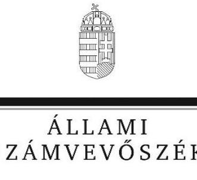
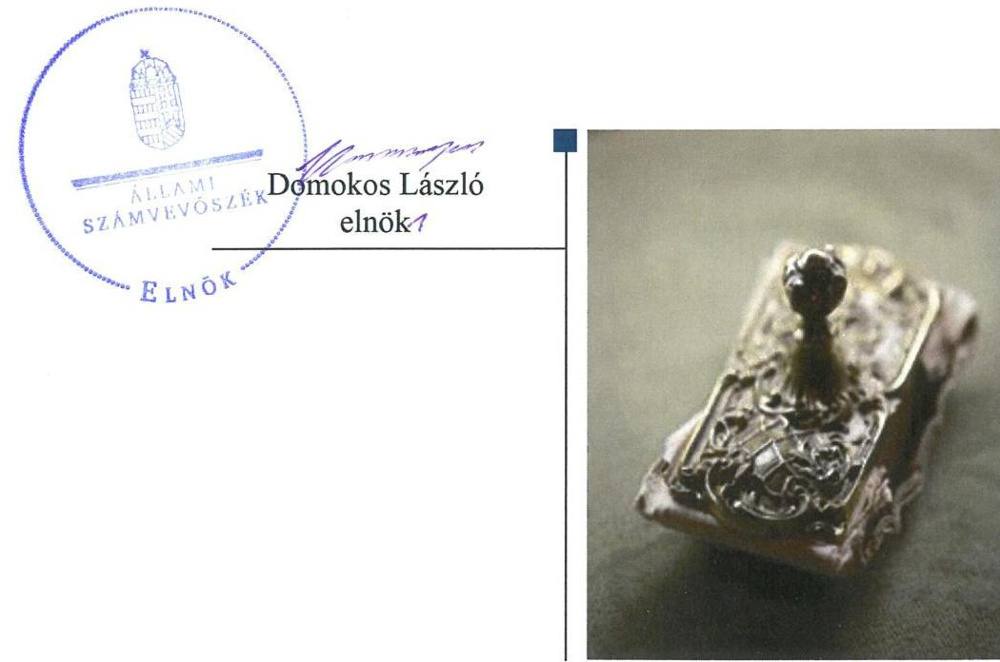
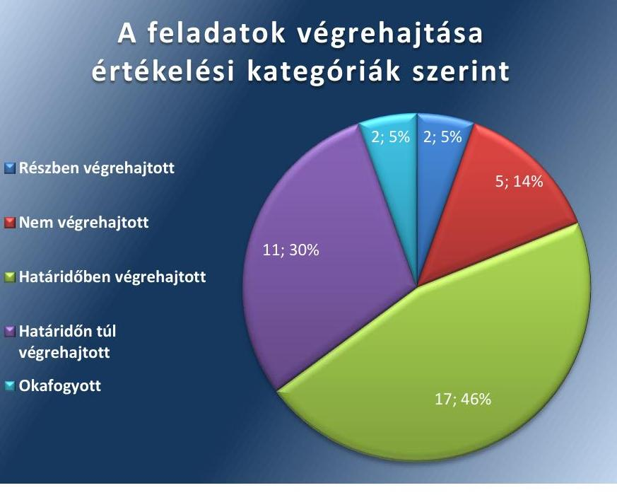
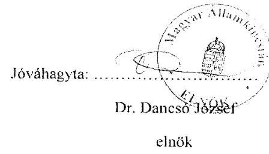
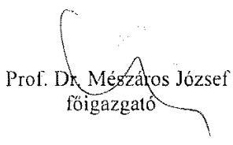
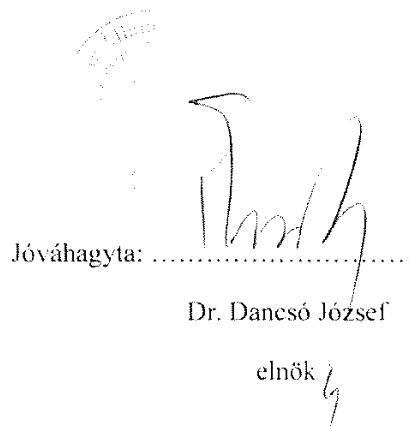
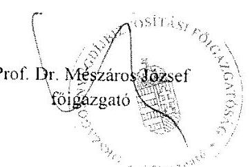
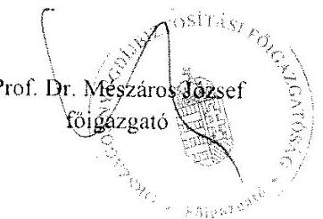

# Jelentés

## A Magyar Államkincstár ellenőrzési tevékenységének ellenőrzése

2019.

19032 www.asz.hu

---

# Jelenetés 

## A Magyar Államkincstár ellenőrzési tevékenységének ellenőrzése

2019. 02. hó 07. nap

---

|  | AZ ELLENŐRZÉST FELÜGYELTE:   SALAMON ILDIKÓ felügyeleti vezető   AZ ELLENŐRZÉST VEZETTE ÉS A VÉGREHAJTÁSÁÉRT FELELŐS:   HOFMEISTER LÁSZLÓ ellenőrzésvezető   A PROGRAM ÖSSZEÁLLÍTÁSÁÉRT FELELŐS:   TÓTPÁL SZABOLCS osztályvezető   A TÉMÁHOZ KAPCSOLÓDÓ KORÁBBI SZÁMVEVŐSZÉKI JELENTÉSEK: |
| :--: | :--: |
| - címe: | Jelentés - A Magyar Államkincstár ellenőrzése A Magyar Államkincstár közigazgatási hatósági tevékenységének, valamint központosított illet-mény-számfejtési rendszerének ellenőrzése |
| - sorszáma: | 16043 |
| - címe: | Jelentés - Az államháztartás információs rendszere, valamint a hivatalos statisztikai szolgálat müködésének ellenőrzése |
| - sorszáma: | 17017 |
| - címe: | Jelentés - Az adatvédelem ellenőrzése - Az adatvédelem hazai keretrendszerének és egyes kiemelt adatnyilvántartások ellenőrzése nemzetközi együttműködés keretében |
| - sorszáma: | 17061 |
| IKTATÓSZÁM: EL-0603-006/2019. |  |
| TÉMASZÁM: 2481 |  |
| ELLENŐRZÉS-AZONOSÍTÓ SZÁM: V-082501 |  |

---

# TARTALOMJEGYZÉK 

■ ÖSSZEGZÉS ..... 5
■ AZ ELLENŐRZÉS CÉLJA ..... 7
■ AZ ELLENŐRZÉS TERÜLETE ..... 8
■ AZ ELLENŐRZÉS HÁTTERE, INDOKOLTSÁGA ..... 10
■ A JELENTÉS LÉNYEGES KÉRDÉSKÖREI ..... 12
■ AZ ELLENŐRZÉS HATÓKÖRE ÉS MÓDSZEREI ..... 13
■ MEGÁLLAPÍTÁSOK ..... 15
■ JAVASLATOK ..... 19
■ MELLÉKLETEK ..... 21
I. sz. melléklet: Magyar Államkincstár és az ONYF intézkedési terveinek végrehajtása ..... 21
II. sz. melléklet: Magyar Államkincstár és az ONYF intézkedési tervei ..... 35
■ FÜGGELÉK: ÉSZREVÉTELEK ..... 69
■ RÖVIDÍTÉSEK JEGYZÉKE ..... 75

---

.

---

# ÖSSZEGZÉS 

A Magyar Államkincstár ellenőrzési folyamatait a jogszabályi előírásoknak megfelelően kialakította, azonban az ellenőrzéseket nem az előírt gyakorisággal végezte és nem szabályszerűen dokumentálta. Így a nem állami humánszolgáltatók fenntartóinak nyújtott költségvetési támogatások kontrollja nem volt szabályszerű. Ennek következtében a Kincstár nem töltötte be kontroll funkcióját az államháztartáson kívüli szervezeteknél a köznevelési és szociális feladatok támogatása szabályszerű felhasználása tekintetében.
Az Állami Számvevőszék ellenőrzési jelentéseiben tett javaslatok többsége hasznosult, ezáltal csökkent a Kincstár szabályozottságával, pénzügyi és belső kontroll szerinti elszámoltathatóságával és az integritással kapcsolatos kockázata. Az átláthatóság és a biztonsági előírások javítása érdekében az informatikai biztonsági rendszerek tekintetében további intézkedések szükségesek.

## Az ellenőrzés társadalmi indokoltsága

A Magyar Államkincstár az államháztartásért felelős miniszter irányítása alatt álló központi költségvetési szerv. A Magyar Államkincstár alaptevékenysége keretében ellát ellenőrzési feladatokat is, ezen belül a humánszolgáltatásokat nyújtó egyházi és nem állami, nem helyi önkormányzati intézmények fenntartóit megillető állami támogatások ellenőrzésével kapcsolatos feladatokat. Az „ellenőrök ellenőreként" az Állami Számvevőszék munkájának eredményei hatványozottan jelentkezhetnek, hiszen megállapításai az ellenőrzők tevékenységének szabályszerűbbé és hatékonyabbá tételében hasznosulhatnak.

Az Állami Számvevőszék stratégiájában célul tűzte ki a számvevőszéki munka hasznosulásának javítását. Ezzel összhangban ellenőrzi, hogy az ellenőrzött szervezetek megvalósították-e a korábbi ellenőrzései által feltárt hibák, hiányosságok és szabálytalanságok megszüntetése céljából elkészített intézkedési terveikben foglaltakat. A Magyar Államkincstár szintjén az utóellenőrzés feltárja, hogy a szervezet az intézkedések végrehajtásával hasznosította-e a korábbi ellenőrzési jelentésekben a hiányosságok megszüntetése, illetve a kockázatok kezelése érdekében megfogalmazott javaslatokat, illetve az intézkedések végrehajtása elmaradásának következtében továbbra is fennálló szabálytalanság esetén értékeli a közpénzek, közvagyon veszélyeztetettségét.

## Főbb megállapítások, következtetések

A Magyar Államkincstár szabályszerűen alakította ki az ellenőrzési feladatellátásával kapcsolatos folyamatait, a jogszabályi előírásoknak megfelelően meghatározta a szervezeti egységek ügyrendjét és az ellenőrzési tevékenységet ellátó szervezeti egységeire vonatkozóan az ellenőrzési nyomvonalat.

A Magyar Államkincstár elnöke a szociális és köznevelési intézményeket működtető nem állami humánszolgáltatók fenntartóira vonatkozó ellenőrzéseket szabályozó belső előírásokat a jogszabályok rendelkezéseivel összhangban adta ki, mellyel megteremtette az ellenőrzések szabályszerűsége feltételeit.

A Magyar Államkincstár az ellenőrzési feladatait nem szabályszerűen végezte, mert a köznevelési fenntartóknál négyévente, a szociális fenntartóknál kétévente legalább egyszer nem végzett helyszíni ellenőrzést, ezzel nem biztosította a nem állami humánszolgáltatásra fordított költségvetési támogatások felhasználásának rendszeres elszámoltatását.

---

A Magyar Államkincstár a helyszíni ellenőrzései során betartotta a jogszabályokban foglaltakat. A Magyar Államkincstár szabályszerűen intézkedett a támogatás jogosulatlan felvétele esetén. Az ellenőrzések végrehajtásáról készített jelentés és nyilvántartás nem tartalmazta a jogszabályban előírtakat, ezért a dokumentálási kötelezettségének nem tett eleget szabályszerűen.

A Magyar Államkincstár az intézkedési tervekben meghatározott harminchét feladatból - melyek végrehajtását az Állami Számvevőszék utóellenőrzés keretében ellenőrizte - tizenhetet határidőben, kettőt részben, tizenegyet határidőn túl hajtott végre, ötöt nem hajtott végre, két feladat okafogyottá vált.

Az ellenőrzési jelentésekben tett javaslatok alapján a Magyar Államkincstár elnöke intézkedett a jogszabályi előírásokkal összhangban a szabályzatok, eljárásrendek módosításáról, az ügyrendek kiegészítéséről, ezáltal a szabályozottság tekintetében a kockázatok megszűntek.

A Magyar Államkincstár nem gondoskodott arról, hogy a kormányhivatalokra irányuló éves ellenőrzési tervben a család- és fogyatékossági támogatási tárgyú ellenőrzéseket beépítsék, így nem biztosította a közpénzek kontrollját. Az Országos Nyugdíjbiztosítási Főigazgatóságtól átvett informatikai rendszerek esetében az adatvédelem szempontjából a sérülékenységi kockázatok egy része fennmaradt.

A Magyar Államkincstár elnöke nem gondoskodott arról, hogy az intézkedési tervben meghatározott feladatok végrehajtásáról vezetett nyilvántartás az ellenőrzési jelentésben szereplő valamennyi intézkedési feladatot tartalmazza.

---

# AZ ELLENŐRZÉS CÉLJA 

Az ellenőrzés célja annak értékelése, hogy a Magyar Államkincstár ellenőrzési feladatait szabályszerűen látta-e el, valamint, hogy az államháztartáson kívüli szervezeteknek nyújtott támogatások kontrollját megfelelően vé-gezte-e el. Az ellenőrzés célja továbbá annak értékelése, hogy a korábbi számvevőszéki jelentésekben foglalt intézkedést igénylő megállapításokkal összhangban készített intézkedési tervben meghatározott feladatokat a Kincstár végrehajtotta-e.

---

# AZ ELLENŐRZÉS TERÜLETE 

## A Magyar Államkincstár

A Kincstár ${ }^{1}$ az államháztartásért felelős miniszter irányítása alatt álló központi hivatal, központi költségvetési szerv, amely a $\mathrm{PM}^{2}$ költségvetési fejezetében önálló címet alkot.

A Kincstár alaptevékenysége keretében ellátja az Áht. ${ }^{3}$-ban, az Ávr. ${ }^{4}$-ben, valamint az ellenőrzésre felhatalmazó kormányrendeletek ${ }^{5}$-ben számára meghatározott ellenőrzési feladatokat, ezen belül a nem állami humánszolgáltatók fenntartóit ${ }^{6}$ megillető állami támogatások ellenőrzésével kapcsolatos feladatokat.

A Kincstár felelős a központi alrendszerhez tartozó intézmények pénzellátásáért, fizetőképességük biztosításáért, valamint az állami költségvetés keretében a pénzforgalmuk lebonyolításáért és elszámolásáért.

A Kincstár közigazgatási hatósági tevékenységének, valamint a központi illetmény-számfejtési rendszerének ellenőrzését az ÁSZ7 a 2013. január 1.2015. július 1. közötti időszakra végezte el, az erről szóló 16043 számú jelentését 2016. március 30-án tette közzé. Az ellenőrzés célja egyebek mellett annak megállapítása volt, hogy a Kincstár közigazgatási hatósági tevékenységének ellátása szabályozott és szabályszerű volt-e; szabályszerűen alakították-e ki és működtették-e a jogorvoslati és panaszkezelési rendszereket; a központosított illetmény-számfejtési rendszer kialakítása és müködtetése megfelelt-e az előírásoknak és az adatbiztonsági követelményeknek. Az ellenőrzéshez kapcsolódott a Kincstár átutalási megbízások teljesítésével összefüggő feladatai ellátásának ellenőrzése.

Az államháztartás információs rendszere, valamint a hivatalos statisztikai szolgálat működésének ellenőrzése kiterjedt a Kincstárra is, melyet az ÁSZ a 2014-2015. évekre vonatkozóan végzett el, az erről szóló 17017 számú jelentését 2017. január 5-én tette közzé. Az ellenőrzés célja annak megállapítása volt, hogy az államháztartás információs rendszere és a hivatalos statisztikai szolgálat kialakítása, müködése megfelelt-e a jogszabályi és egyéb (uniós) követelményeknek, valamint az adatok megfelelő előállítását biztosította-e.

Az adatvédelem hazai keretrendszerének és egyes kiemelt adatnyilvántartások nemzetközi együttműködés keretében történő ellenőrzését az ÁSZ a 2011-2015. évekre vonatkozóan végezte el, az erről szóló 17061 számú jelentését 2017. március 14-én hozta nyilvánosságra. Az ellenőrzés célja annak értékelése volt, hogy megvalósult-e az adatvédelem hazai keretrendszere és az ellenőrzésre kiválasztott adatkezelő szervezetek megfelelően alkalmazták-e a biztonságos adatkezelésre, az adatfeldolgozás kiszervezésére és különösen a személyes adatok és a nemzeti adatvagyon védelmére irányuló előírásokat.

A 16043 és a 17061 számú jelentés a Kincstár mellett az ONYF8 vezetőjének is írt elő javaslatokat. Az ONYF főigazgatója által elkészített intézkedési tervekben előírt feladatok végrehajtásáért az Kincstár vezetője felelős,

---

mert az ONYF 2017. október 31-én beolvadással megszűnt, a Kincstár lett a jogutód szervezet.

Az utóellenőrzés az ÁSZ korábbi jelentésében a Kincstár elnöke, valamint az ONYF főigazgatója részére megfogalmazott intézkedést igénylő megállapításokra és javaslatokra készített, az ÁSZ részére megküldött intézkedési tervben foglalt feladatok megvalósításának ellenőrzésére, illetve értékelésére terjedt ki.

---

# AZ ELLENŐRZÉS HÁTTERE, INDOKOLTSÁGA 

Az államháztartásért felelős miniszter irányítása alatt álló központi hivatalként működő Kincstár alaptevékenysége keretében ellátja az Áht.-ban, valamint az egyéb jogszabályokban számára meghatározott ellenőrzési feladatokat. Az ÁSZ az Országgyűlés legfőbb pénzügyi és gazdasági ellenőrző szerveként jogosult ellenőrizni más fontos államigazgatási, államhatalmi vagy felügyeleti szervek gazdálkodását és múködését. Az „ellenőrök ellenőreként" az ÁSZ munkájának eredményei hatványozottan jelentkezhetnek, hiszen megállapításai az ellenőrzők tevékenységének szabályszerűbbé és hatékonyabbá tételében hasznosulhatnak.

Az ÁSZ tv. ${ }^{9}$ 33. § (1) bekezdése értelmében a számvevőszéki jelentések intézkedést igénylő megállapításaihoz és javaslataihoz kapcsolódóan az ellenőrzött szervezet vezetője intézkedési tervet köteles összeállítani, és az Állami Számvevőszék részére megküldeni.

Az ÁSZ által befogadott intézkedési tervben foglaltak megvalósítását az ÁSZ törvény 33. § (7) bekezdésében foglaltak alapján - az Állami Számvevőszék utóellenőrzés keretében ellenőrizheti. Az utóellenőrzések keretében - az intézkedések értékelése során - az Állami Számvevőszék figyelembe veszi az ellenőrzött szervezetek múködési feltételeiben, valamint a jogszabályi előírásokban bekövetkezett változásokat.

Az utóellenőrzés során az ÁSZ értékeli, hogy az érintett számvevőszéki jelentésben foglalt megállapításokkal és javaslatokkal összhangban, az ellenőrzött szervezet által készített intézkedési tervben meghatározott feladatokat a feladatra kijelöltek végrehajtották-e.

Az intézkedések végrehajtásával az adott terület szabályszerű múködése vonatkozásában a kockázatok csökkenhetnek, azonban hosszabb távon az intézkedési tervben foglaltak végrehajtásával önmagában nem szűnnek meg, csak akkor, ha beépülnek az ellenőrzött szervezet múködésébe, azokat folyamatosan karban tartják, figyelembe véve, illetve kezelve a változásokat. Emellett az intézkedések végrehajtásáig újabb kockázatok merülhetnek fel a szabályszerű múködés vonatkozásában, amelyek kezelése szintén kiemelten fontos az ellenőrzött szervezet számára.

Az ellenőrzött szervezet vezetője által készített intézkedési tervekben foglalt feladatok hiányos, illetve késedelmes végrehajtása, vagy annak elmaradása a szabályszerűség és a felelős vezetői magatartás vonatkozásában kockázatot hordoz, ami azt mutatja, hogy az ellenőrzések során feltárt hibák, hiányosságok és szabálytalanságok kezelése nem kapott kellő hangsúlyt. Az utóellenőrzés során is fennálló szabálytalanságok esetén a közpénz, közvagyon veszélyeztetettségi kockázat valószínűsített hatásának értékelése további intézkedéseket vonhat maga után.

Az ellenőrzött szervezet szintjén az utóellenőrzés feltárja, hogy a szervezet az intézkedések végrehajtásával hasznosította-e a korábbi ellenőrzési jelentésben a hiányosságok megszüntetése, illetve a kockázatok kezelése érdekében megfogalmazott javaslatokat, illetve az intézkedések végrehajtása elmaradásának következtében továbbra is fennálló szabálytalanság esetén értékeli a közpénzek, közvagyon veszélyeztetettségét.

---

Az ÁSZ szintjén az utóellenőrzés visszacsatolást ad az ellenőrzési jelentések hasznosulásáról, az intézkedések elmaradásának, vagy részleges megvalósulásának a közpénzek, közvagyon veszélyeztetettségére gyakorolt valószínűsített hatásának értékelése, további intézkedéseket vonhat maga után.

---

# A JELENTÉS LÉNYEGES KÉRDÉSKÖREI 

1.- Szabályszerü volt-e a Kincstár ellenőrzési feladatainak ellátása a nem állami humánszolgáltatók fenntartóinál?
2.- A Kincstár az intézkedési tervvel kapcsolatos intézkedési kötelezettségeinek eleget tett-e?

---

# AZ ELLENŐRZÉS HATÓKÖRE ÉS MÓDSZEREI 

## Az ellenőrzés típusa

Szabályszerúségi ellenőrzés.

## Az ellenőrzött időszak

A Kincstár ellenőrzési tevékenysége ellenőrzése vonatkozásában az ellenőrzött időszak a 2017. év.

Az utóellenőrzés vonatkozásában az ellenőrzött időszak az utóellenőrzés alapját képező ÁSZ jelentések közzétételének napjától (2016. március 30., 2017. január 5., 2017. március 14.) az utóellenőrzésről szóló adatbekérő levél keltéig (2018. július 9.) tartó időszak.

## Az ellenőrzés tárgya

A Kincstár ellenőrzési feladatainak ellátása, az államháztartáson kívüli szervezeteknek nyújtott támogatások kontrollja.

A számvevőszéki jelentésben foglalt megállapításokkal és javaslatokkal összhangban - a Kincstár által - készített intézkedési tervben foglaltak végrehajtásának ellenőrzése.

## Az ellenőrzött szervezet

Magyar Államkincstár

## Az ellenőrzés jogalapja

Az ellenőrzés jogalapját az ÁSZ tv. 5. § (2) és 33. § (7) bekezdései képezik.

## Az ellenőrzés módszerei

Az ÁSZ az ellenőrzés ideje alatt a Kincstárral történő kapcsolattartást az ÁSZ SZMSZ ${ }^{10}$-ének vonatkozó előírásai alapján biztosította.

Az ellenőrzési bizonyítékként felhasználható adatforrások közé tartoztak egyrészt az ellenőrzési programban felsorolt adatforrások, másrészt minden - az ellenőrzés folyamán feltárt az ellenőrzés szempontjából információt tartalmazó - dokumentum.

---

A Kincstár ellenőrzési tevékenységének ellenőrzését a 2017. évben a Kincstár által államháztartáson kívüli szervezetnél lefolytatott ellenőrzésekből rétegzett mintavétellel vett 50 elemú mintával ellenőrizte az ÁSZ.

Az ÁSZ az utóellenőrzést az ellenőrzési program ellenőrzési kérdései, az ellenőrzött időszakban hatályos jogszabályok, az ellenőrzés szakmai szabályok és módszertanok figyelembevételével végezte.

Az intézkedési tervekben előírt feladatok értékelését azok végrehajthatósága, illetve végrehajtása szempontjából az alábbiak szerint értékeltük:
$\longrightarrow$ „határidőben végrehajtott" a feladat, ha a teljesítés dokumentáltan, az intézkedési tervben előírt határidőben és tartalommal megtörtént;
$\longrightarrow$ „határidőn túl végrehajtott" a feladat, ha annak teljesítése az intézkedési tervben meghatározott módon, de az előírt határidőn túl történt meg;
$\longrightarrow$ „részben végrehajtott" a feladat, ha végrehajtása teljeskörűen az intézkedési tervben előírt módon nem történt meg;
$\longrightarrow$ „nem végrehajtott" a feladat, ha a végrehajtás nem történt meg, vagy amennyiben a teljesítést nem dokumentálták;
$\longrightarrow$ „okafogyottá vált" a feladat, ha végrehajtására - meghatározott esemény bekövetkezése, továbbá külső körülmény, a múködést érintő feltétel változása miatt - már nincs szükség, illetve lehetőség, és egyértelmúen megállapítható, hogy az intézkedést szükségessé tevő körülmény a jövőben nem fordulhat elő.
$\longrightarrow$ „nem időszerü" az a feladat, amelynek ellenőrzési időszakon belüli végrehajtására azért nem került (kerülhetett) sor, mert az intézkedés alapjául szolgáló esemény nem következett be, de annak jövőbeni előfordulása lehetséges, a végrehajtása nem volt esedékes, vagy a végrehajtás határideje még nem járt le.
Az ellenőrzés lefolytatásához az ellenőrzött szervezet a tanúsítványok elektronikus kitöltésével, valamint az ÁSZ által kért dokumentumok elektronikus megküldésével szolgáltatott adatokat, amelyek valódiságát és teljes körűségét az ellenőrzött szervezet vezetője által tett teljességi és hitelességi nyilatkozat igazolta. Az így rendelkezésre bocsátott adatok, információk kontrollja az ellenőrzés keretében történt meg.

---

# 1. Szabályszerú volt-e a Kincstár ellenőrzési feladatainak ellátása a nem állami humánszolgáltatók fenntartóinál? 

Összegző megállapítás

1.1. számú megállapítás
1.2. számú megállapítás

A Kincstár ellenőrzési feladatellátásaival összefüggő folyamatok kialakítása szabályszerű volt, azonban az ellenőrzési feladatait a 2017. évben nem szabályszerűen végezte.

A Kincstár szabályszerűen alakította ki a nem állami humánszolgáltatók fenntartóira vonatkozó ellenőrzési feladatellátásaival összefüggő folyamatait.

A KINCSTÁR rendelkezett SZMSZ ${ }_{1,2}{ }^{11}$-szel, amely a szervezeti struktúrát, valamint a feladat- és hatásköröket az Ávr. előírásával összhangban tartalmazta.

Az SZMSZ ${ }_{1,2}$-ben a nem állami humánszolgáltatók fenntartóinak állami támogatásai, hozzájárulásai megállapításával, finanszírozásával, adatszolgáltatásával, elszámolásával és ellenőrzésével kapcsolatos feladatokat a területi szerveknél az Államháztartási Irodák ${ }^{12}$ feladatai között írták elő. A Kincstár elnöke a területi szervek ügyrendjeiben meghatározta a szervezeti egységekre vonatkozó szabályokat az Ávr. előírásai szerint.

A Kincstár rendelkezett az ellenőrzési tevékenységet ellátó szervezeti egységeire vonatkozóan a Bkr. ${ }^{13}$ előírásai szerinti, a müködési folyamatokat bemutató ellenőrzési nyomvonallal.

A BELSŐ ELŐÍRÁSOKAT az állami támogatások ellenőrzésére vonatkozóan a Kincstár elnöke utasításokban rögzítette. Ezek körében előírta a szociális és a köznevelési intézményeket müködtető nem állami humánszolgáltatók fenntartóira vonatkozó támogatások igénylésével, folyósításával, elszámolásával kapcsolatos szabályokat. A Kincstárnál a belső szabályzatokat, eljárásrendeket a Ket. ${ }^{14}$ és az ágazati jogszabályok rendelkezései szerint alakították ki.

A Kincstár a nem állami humánszolgáltatók fenntartóira vonatkozó ellenőrzési feladatait nem szabályszerűen végezte.

AZ ELLENŐRZÉSEK VÉGREHAJTÁSÁT a Kincstár nem a jogszabályokban előírt gyakorisággal végezte. A Kincstár nem tett eleget a köznevelési fenntartóknál az Nkt. vhr. ${ }^{15}$ 37/O. § (1) bekezdésében foglalt előírások ellenére legalább négyévenként, a szociális fenntartóknál pedig az Átr. ${ }^{16} 19 . \S$ (3) bekezdésében előírt kétévente legalább egyszer a helyszíni ellenőrzési kötelezettségének. A Kincsár az ellenőrzések tervezését nem szabályszerűen végezte, mivel az ellenőrzési tervek nem tartalmazták az ellenőrzések szempontrendszerét a Ket. 91. § (1) bekezdésének előírása ellenére.

---

# A KINCSTÁR ELLENŐRZÉSI TEVÉKENYSÉGÉNEK 

DOKUMENTÁLÁSA nem volt szabályszerű, mivel az ellenőrzések végrehajtásáról készített jelentései a Ket. 91. § (2) bekezdésében előírtak ellenére nem tartalmazták a megállapított jogsértés típusát. A Kincstár ellenőrzésekről vezetett nyilvántartása a Ket. 94. § (3) bekezdés b-c) pontokban foglaltak ellenére nem tartalmazta az ügyfél székhelyét, a jogszabály vagy hatósági döntésben foglalt rendelkezés megsértése miatti felhívást a jogszabályi rendelkezés vagy hatósági döntésben foglalt rendelkezés, valamint felhívást tartalmazó végzés közlése időpontjának a megjelölésével.

A HELYSZÍNI ELLENŐRZÉSEK SORÁN a Kincstár betartotta a jogszabályokban és a belső szabályzatokban előírtakat. A Kincstár a Ket.-tel összhangban szabályszerűen értesítette az ellenőrzöttet, az ellenőrzésről készített jegyzőkönyv egy példányát az ügyfélnek a helyszínen átadta, vagy megküldte. A Kincstár ellenőrzései szabályszerűen kiterjedtek a támogatásra való jogosultsághoz előírt jogszabályi feltételek teljesítésének, a felhasználás jogszerűségének, és az igénylés alapját jelentő feladatmutatók teljesítésének és megalapozottságának vizsgálatára.

A KINCSTÁR INTÉZKEDÉSEI szabályszerűek voltak. A Kincstár a fenntartó visszafizetési kötelezettségét szabályszerűen megállapította, amennyiben az jogosulatlanul vett fel támogatást. A fenntartó fizetési kötelezettségének nem teljesítése esetén a Kincstár szabályszerűen intézkedett.

## 2. A Kincstár az intézkedési tervvel kapcsolatos intézkedési kötelezettségeinek eleget tett-e?

Összegző megállapítás

A Kincstár az intézkedési tervekben szereplő harminchét feladatból tizenhetet határidőben, kettőt részben, tizenegyet határidőn túl hajtott végre, ötöt nem hajtott végre, két feladat okafogyottá vált. Az intézkedési tervekben meghatározott feladatok végrehajtásáról nem szabályszerűen vezették a nyilvántartást.

A KINCSTÁR az általa, valamint az ONYF által elkészített és az ÁSZ által tudomásul vett, a 16043, a 17017, valamint a 17061 jelentésekhez kapcsolódó intézkedési tervek ${ }_{1-5}{ }^{17}$-ben meghatározott feladatok közül tizenhetet határidőben, kettőt részben, tizenegyet határidőn túl hajtott végre, ötöt nem hajtott végre, két feladat okafogyottá vált.

A feladatokat, határidőket, megjelölt felelősöket és a feladatok végrehajtását az I. sz. melléklet, a MÁK és az ONYF intézkedési terveit ${ }_{1-5}$ a II. sz. melléklet mutatja be.

Az intézkedési tervekben meghatározott feladatok végrehajtásáról vezetett nyilvántartás nem felelt meg a Bkr. 14. § (1) bekezdésében foglaltaknak, mert nem tartalmazta az ellenőrzési jelentésekben szereplő, a Kincstárba 2017. november 1-jén beolvadó, ONYF-re vonatkozó valamenynyi intézkedési feladatot.

---

A Kincstár és az ONYF intézkedési terveiben vállalt feladatok végrehajtásának értékelését az 1. ábra szemlélteti.
1. ábra

# A feladatok végrehajtása értékelési kategóriák szerint 

A SZABÁLYOZOTTSÁG tekintetében a kockázatok megszűntek, a Kincstár elnöke intézkedett az Ávr. előírásaival összhangban az SZMSZ módosításáról (1., 19.), a KGR-11 rendszer ${ }^{18}$ üzemeltetésével és a jogszabályokban előírt feladatokra vonatkozóan a szervezeti egységek (15.), valamint a megyei ügyrendek kiegészítéséről (2.). Kiadták, illetve a hatályos előírással összhangba hozták az önkormányzati alrendszer részére nyújtott támogatásokkal (3., 4.), és a központosított illetményszámfejtéssel (5.) kapcsolatos eljárásrendeket.

A PÉNZÜGYI ELSZÁMOLTATHATÓSÁG kockázatát csökkentette, hogy a Kincstár a nagy összegű kifizetések soron kívüli bejelentése tárgyában az Ávr. módosítására vonatkozóan az NGM ${ }^{19}$ felé javaslattal élt (6., 9.). A törzskönyvi nyilvántartással összefüggő mulasztási bírságra és a mérlegelésre vonatkozó szabályok eljárásrendben való rögzítése szintén hozzájárult a pénzügyi elszámoltathatóság javításához. (20., 22.)

A Kincstár nem tett javaslatot a 66/2015. Korm. rendelet ${ }^{20}$ előírása ellenére a kormányhivatalokra irányuló éves ellenőrzési tervben a család- és fogyatékossági támogatási tárgyú ellenőrzésekre. (36., 37.)

## A BELSŐ KONTROLL SZERINTI ELSZÁMOLTATHATÓSÁG biztosítása érdekében az államháztartás információs rendszere múködtetésével kapcsolatban az ellenőrzési nyomvonalakat felülvizsgálták és aktualizálták (16.), az SZMSZ ${ }_{1,2}$-ben biztosították a belső ellenőrzés funkcionális függetlenségét (18.). A munkaköri leírásokban megteremtették az összhangot a jogszabályi előírásokkal. (23.) A törzskönyvi nyilvántartás folyamatba épített ellenőrzésére és dokumentálására a Kincstár elnöke utasítást adott ki, és a törzskönyvi nyilvántartást támogató informatikai rendszerben az ügyintézési idő nyilvántartását, visszakereshetőségét

---

a naplózás lehetőségével biztosították. (24.) A végrehajtott intézkedések hatására a kockázatok csökkentek.

A Kincstár a kockázatelemzési eljárást nem szabályozta. Nem határozta meg az ONYF-től átvett informatikai rendszereknél a naplózható és naplózandó eseményeket, és erre nem készítette fel az elektronikus információs rendszereket. (33-34.)

AZ INTEGRITÁSI kockázat csökkent a végrehajtott intézkedések következtében. A Kincstár kialakította a panaszok, közérdekú bejelentések kezelése, és a közérdekú bejelentő, panaszos részére küldött értesítések szabályait (8., 21., 27.), valamint a nyomon követésüket kezelő elektronikus felületet. (7.) Az informatikai biztonsági kockázatelemzést és a 2016. évre tervezett biztonsági vizsgálatokat végrehajtották. (14.) Az ONYF által üzemeltetett elektronikus információs adatkezelő rendszerek vonatkozásában az IBSZ ${ }^{21}$-ben rendelkeztek az azonosítás és hitelesítés feladatairól. (17.)

Az elektronikus információs rendszerek biztonsági osztályba sorolása szabályainak kialakítása (25., 26.) és a még nem besorolt elektronikus információs rendszerek biztonsági osztályba sorolása megtörtént, amely alapján a cselekvési tervet elkészítették (10-13., 28.), azonban a biztonsági osztályba sorolást nem jelentették be a Nemzeti Kibervédelmi Intézetnek (31.), és a cselekvési terv végrehajtásáról félévente nem készült beszámoló. (32.) A Kincstár az IBSZ-ben nem rögzítette az ONYF-től átvett informatikai rendszereinek biztonsági osztályba sorolása eredményét, mely biztonsági kockázatot hordoz magában. (35.)

---

# JAVASLATOK 

Az ÁSZ tv. 33. § (1) bekezdésében foglaltak értelmében az ellenőrzött szervezet vezetője köteles a jelentésben foglalt megállapításokhoz kapcsolódó intézkedési tervet összeállítani és azt a jelentés kézhezvételétől számított 30 napon belül az ÁSZ részére megküldeni. Amennyiben az ellenőrzött szervezet vezetője nem küldi meg határidőben az intézkedési tervet, vagy továbbra sem elfogadható intézkedési tervet küld, az Állami Számvevőszék elnöke az ÁSZ tv. 33. § (3) bekezdése a) és b) pontjaiban foglaltakat érvényesítheti.

## Magyar Államkincstár elnökének

1. Intézkedjen, hogy az ellenőrzések végrehajtását a jogszabályban elöirt gyakorisággal
a) a köznevelési fenntartóknál legalább négyévenként,
b) a szociális fenntartóknál kétévente legalább egyszer végezzék el.
(1.2. számú megállapítás 1. bekezdés 1-2. mondata alapján)
2. Intézkedjen, hogy az intézkedési tervekben meghatározott feladatok végrehajtásáról vezetett nyilvántartás - a jogszabályi elöirásnak megfelelően - tartalmazza az ellenőrzési jelentésben szereplő valamennyi javaslatot.
(2. számú megállapítás 3. bekezdése alapján)

---

.

---

# MELLÉKLETEK

- I. SZ. MELLÉKLET: MAGYAR ÁLLAMKINCSTÁR ÉS AZ ONYF INTÉZKEDÉSI TERVEINEK VÉGREHAJTÁSA

|  Sorszám | Az intézkedési tervben rögzített feladat | Az intézkedési tervben meghatározott határidő | Az intézkedési tervben meghatározott felelős | A feladat végrehajtása  |
| --- | --- | --- | --- | --- |
|   | 1. | 2.
Határidőben végrehajtott feladatok | 3. | 4.  |
|  1. | (16043/1.2) A Kincstár Szervezeti és Müködési Szabályzatának módosítása: - az Ávr. 13. § (1) bekezdés c) pont előírásaival összhangban az alaptevékenységeket szabályozó jogszabályok megjelölése;
- az Ávr. 13. § (1) bekezdés b) pontja előírásaival összhangban a hatályos alapító okirat megnevezése. | 2016.10.28. | Elnöki Kabinet, kabinetvezető, Jogi és Törzskönyvi Főosztály főosztályvezető | Az Ávr. 13. § (1) bekezdés c) pontja 2015. január 1-jén módosításra került, melyből a megállapításban hiányolt alaptevékenységeket szabályozó jogszabályok megjelölése rendelkezés törlésre került, ezért a feladatrész végrehajtása okafogyottá vált.
A Kincstár 13/2016 (VIII. 16.) NGM utasítással módosított SZMSZ 1. § (2) bekezdés j) pontjában már az Ávr. 13. § (1) bekezdés b) pontjában foglalt előírásoknak megfelelően, a hatályos alapító okirat került megjelölésre.
Az országgyűlési képviselők választása kampányköltségeinek támogatásával kapcsolatos, a 2013. évi LXXXVII. törvény szerinti feladatokat az Ávr. 13. § (5) bekezdésében foglalt előírásoknak megfelelően az újonnan kiadott területi ügyrendek már tartalmazták. Az ügyrendek 2.2. pontja értelmében a feladatok végrehajtását a Kincstár az Állampénztári Iroda feladatkörébe utalta.  |
|  2. | Az egységes szociális nyilvántartás vezetésével, valamint a természetben nyújtott családi pótlék kezelésével kapcsolatos feladatok 2015. április 1-től nem részei a Kincstár alaptevékenységének, így a javaslatban megfogalmazott megállapítások intézkedést nem igényelnek. | további intézkedést nem igényel | Koordinációs Osz-
tály osztályvezető | A Kincstár 8/2015. (III.26.) NGM utasítással elfogadott SZMSZ-ének 3. §-a értelmében az egységes szociális nyilvántartás vezetésével, valamint a természetben nyújtott családi pótlék kezelésével kapcsolatos feladatok 2015. április 1-jétől nem részei a Kincstár alaptevékenységének, így a feladatrész okafogyottá vált.  |

---

|  Az intézkedési tervben rögzített feladat | Az intézkedési tervben meghatározott határidő | Az intézkedési tervben meghatározott felelős | A feladat végrehajtása  |
| --- | --- | --- | --- |
|  1. | 2. | 3. | 4.  |
|  A helyi önkormányzatok adatszolgáltatási kötelezettségének elmulasztása vagy késedelmes teljesítése esetén - az Áht. 108. § (4) bekezdésének 2014. január 5-től hatályos előírása szerint - alkalmazandó bírságkiszabás ügymenetét és az adatszolgáltatás teljesítése ellenőrzésének és nyilvántartásának - a hatósági határozathozatalt megalapozó - kötelezettségét a 2015. június 12-én aláírt megyei ügyrendek már tartalmazzák így a javaslatban megfogalmazott megállapítások intézkedést nem igényelnek. |  |  | A helyi önkormányzatok adatszolgáltatási kötelezettségének elmulasztása vagy késedelmes teljesítése esetén - az Áht. 108. § (4) bekezdésének 2014. január 5-től hatályos előírása szerinti - alkalmazandó bírságkiszabás ügymenetét és az adatszolgáltatás teljesítése ellenőrzésének és nyilvántartásának - a hatósági határozathozatalt megalapozó - kötelezettségét az újonnan kiadott területi ügyrendek az Ávr. 13. § (5) bekezdés előírásainak megfelelően már tartalmazták. A területi ügyrendek a feladat végrehajtását a Kincstár az Államháztartási Finanszírozási Osztály feladatkörébe utalta.  |
|  (16043/1.7) Az önkormányzati alrendszer részére nyújtott támogatások elszámolás felülvizsgálatához kiadásra került 2015. november 19-én a 13/2015. számú Hálózatirányításért Felelős Elnökhelyettesi Utasítás. A helyi önkormányzatok támogatásaihoz kapcsolódóan az államháztartásról szóló 2011. évi CXCV. törvény alapján lefolytatandó, továbbá az egyházi, illetve nem állami humánszolgáltatók által igényelt állami támogatásokhoz kapcsolódó elsőfokú és jogorvoslati eljárásokhoz a 7/2016. Elnöki Utasítás 2016.03.16-án kiadásra került. |  |  | A Kincstár által az önkormányzati alrendszer részére nyújtott támogatások elszámolás felülvizsgálatához kiadásra került 2015. november 19-én a 13/2015. számú Hálózatirányításért Felelős Elnökhelyettesi Utasítás.  |
|  3. | Az önkormányzati alrendszer részére nyújtott támogatások igénylésének felülvizsgálatához kiadott 16/2013. sz. Hálózatirányításért Felelős Elnökhelyettesi Utasítás aktualizálása. |  | A Kincstár által 2016. március 16-án kiadásra került a helyi önkormányzatok támogatásaihoz kapcsolódóan az államháztartásról szóló 2011. évi CXCV. törvény alapján lefolytatandó, továbbá az egyházi, illetve nem állami humánszolgáltatók által igényelt állami támogatásokhoz kapcsolódó elsőfokú és jogorvoslati eljárásokhoz a 7/2016. Elnöki Utasítás.  |
|   | Az önkormányzati adósságátvállaláshoz kapcsolódó adatszolgáltatás 2014. évi Kvtv. ${ }^{23}$ 68. §-ában meghatározott felülvizsgálata egyszeri feladat volt, a vonatkozó jogszabályok részletesen tartalmazták a feladatot, eljárásrend készítése utólagosan nem indokolt, további intézkedést nem igényel." | 2016.09.31. | Önkormányzati Főosztály főosztályvezető  |
|   |  |  | Az önkormányzati adósságátvállaláshoz kapcsolódó adatszolgáltatás 2014. évi Kvtv. ${ }^{24}$ 68. §-ában meghatározott felülvizsgálata egyszeri feladat volt, a vonatkozó jogszabályok részletesen tartalmazták a feladatot, eljárásrend készítése utólagosan nem indokolt, így a feladatrész végrehajtása okafogyottá vált.  |

---

|  Az intézkedési tervben rögzített feladat | Az intézkedési tervben meghatározott határidő | Az intézkedési tervben meghatározott felelős | A feladat végrehajtása  |
| --- | --- | --- | --- |
|  1. | 2. | 3. | 4.  |
|  (16043/1.8) Az önkormányzati alrendszer részére nyújtott támogatások igénylésének felülvizsgálatához kiadott 16/2013. sz. Hálózatirányításért Felelős Elnökhelyettesi Utasítás aktualizálása. | 2016.09.31. | Önkormányzati Főosztály főosztályvezető | A Kincstár által az önkormányzati alrendszer részére nyújtott támogatások igénylésének felülvizsgálatához kiadott 16/2013. sz. Hálózatirányításért Felelős Elnökhelyettesi Utasítás aktualizálása a helyi önkormányzatok központi alrendszer IX. fejezetéből származó forrásai igénylésének és az igénylés megalapozottságának felülvizsgálatához 2016. szeptember 19-én kiadott 37/2016. sz. Elnöki utasításban került végrehajtásra.  |
|  (16043/1.12.1) A KIR325-ra vonatkozó eljárásrendet Magyar Államkincstár Megyei igazgatóságai Illetményszámfejtési Irodáinak központosított illetményszámfejtéssel összefüggő feladatai ellátásának eljárásrendjéről szóló 19/2015. számú Elnöki Utasítás tartalmazza, amely 2015. május 15-étől hatályos. |  |  | A KIR3-ra vonatkozó eljárásrendet a Kincstár Megyei Igazgatóságai Illetmény-számfejtési Irodáinak központosított illetményszámfejtéssel összefüggő feladatai ellátásának eljárásrendjéről szóló 19/2015. számú Elnöki Utasítás tartalmazza, amely 2015. május 15-étől hatályos.  |
|  A 19/2015. számú Elnöki Utasítás összhangban állt a 2015. évben hatályos jogszabályok előírásaival, nem tartalmazott hatályon kívüli jogszabályi hivatkozásokat. Az eljárásrendbe a hatályos jogszabálynak megfelelően beépítésre került, hogy a hiba, hiányosság észlelése esetén az illetményszámfejtő helynek haladéktalanul kell tájékoztatnia a munkáltatót. A könyvelési értesítő készítése a lebonyolítási terület feladata így nem szerepel 19/2015. számú Elnöki Utasításban, mivel az az II-letmény-számfejtéssel kapcsolatos feladatokat ír elő az Illetmény-számfejtő hely részére. | további intézkedést nem igényel | Illetmény-számfejtési Főosztály főosztályvezető | A 19/2015. számú Elnöki Utasítás összhangban állt a 2015. évben hatályos jogszabályok előírásaival, nem tartalmazott hatályon kívüli jogszabályi hivatkozásokat.  |
|   |  |  | Az eljárásrendbe a hatályos jogszabálynak megfelelően beépítésre került, hogy a hiba, hiányosság észlelése esetén az illetményszámfejtő helynek haladéktalanul tájékoztatnia kell a munkáltatót. A könyvelési értesítő készítése a lebonyolítási terület feladata volt, ezért nem szerepelt a 19/2015. számú Elnöki Utasításban, mely az illetmény-számfejtéssel kapcsolatos feladatokat írta elő az Illetmény-számfejtő hely részére.  |

---

|  Az intézkedési tervben rögzített feladat | Az intézkedési tervben meghatározott határidő | Az intézkedési tervben meghatározott felelős | A feladat végrehajtása  |
| --- | --- | --- | --- |
|  1. | 2. | 3. | 4.  |
|  (16043/1.13) A 2/2014. sz. Általános Elnökhelyettesi Utasítás 2015. március 4-vel hatályát vesztette, helyette az 1/2015. sz. Államháztartási ügyekért felelős Elnökhelyettesi Utasítás lépett hatályba, mely jelenleg is hatályos. Ez utóbbi már nem tartalmazza azt a részt, mely szerint határidőben történő bejelentésnek fogadható el a terhelés időpontját megelőző második, illetve negyedik munkanap 10:00 óráig beérkező bejelentés. Így az első francia bekezdésben leírtak nem igényelnek további intézkedést. A második francia bekezdésben szereplő, a terhelés - kivételes esetben - tárgynapon, illetve 3, 5 munkanapon belül történő bejelentésének biztosítása érdekében kezdeményezzük az Áht. 80. § (2) bekezdés e) pontjának kiegészítését azzal, hogy a kincstár szabályzatban állapítja meg az Ávr. 5. sz. melléklet 11. pont szerinti kötelezettség határidőn túli bejelentés befogadásának rendjét. (16043/3.2) Kialakításra került a panaszokat és közérdekű bejelentéseket nyilvántartó Kincstári elektronikus felület, mely biztosítja a panaszok és közérdekű bejelentések folyamatos nyomon követését, a határidők betartását is. (16043/3.3) A 2013. évi CLXV. törvény 2. § (4) bekezdésének figyelembevételével, a fent hivatkozott Elnöki Utasításban szabályozásra került a közérdekű bejelentőt, illetve panaszost kinek és milyen formában kell értesítenie. Az értesítések nyomon követése is kialakításra került a felületen. | 2016.07.31. | Költségvetési Fejezetek Főosztálya főosztályvezető | A Kincstár a terhelés – kivételes esetben – tárgynapon, illetve 3, 5 munkanapon belül történő bejelentésének biztosítása érdekében 2016. június 17-én kezdeményezte az NGM-nél az Áht. 80. § (2) bekezdés e) pontjának kiegészítését azzal, hogy a Kincstár szabályzatban állapítja meg az Ávr. 5. sz. melléklet 11. pont szerinti kötelezettség határidőn túli bejelentés befogadásának rendjét. A 2013. évi CLXV. törvény26 2. § (1) bekezdésében foglalt előírások betartása érdekében kialakításra került a "WEBKINCSTÁR" Intranet felületen a panaszkezelés (al)menü 2015. január 20-án. Az alkalmazás a panaszok és közérdekű bejelentések teljes folyamatát elektronikusan támogatta és dokumentálta, ezzel biztosítva a feladat ellátásának folyamatos nyomon követhetőségét, a határidők betartását. A 2013. évi CLXV. törvény 2. § (4) bekezdésének figyelembevételével a 3/2015. számú Elnöki Utasításban szabályozásra került, hogy a közérdekű bejelentőt, illetve panaszost kinek és milyen formában kellett értesítenie. Az értesítések nyomon követése is kialakításra került a felületen.  |

---

|  8. | Az intézkedési tervben rögzített feladat | Az intézkedési tervben meghatározott határidő | Az intézkedési tervben meghatározott felelős | A feladat végrehajtása  |
| --- | --- | --- | --- | --- |
|   | 1. | 2. | 3. | 4.  |
|   | (16043/4) A 2/2014. sz. Általános Elnökhelyettesi Utasítás 2015. március 4-vel hatályát vesztette, helyette az 1/2015. sz. Államháztartási ügyekért felelős Elnökhelyettesi Utasítás lépett hatályba, mely jelenleg is hatályos. Ez utóbbi már nem tartalmazza azt a részt, mely szerint határidőben történő bejelentésnek fogadható el a terhelés időpontját megelőző második, illetve negyedik munkanap 10:00 óráig beérkező bejelentés. Az 1/2015. sz. Államháztartási ügyekért felelős Elnökhelyettesi Utasítás hatályba lépését követően a nagy öszszegű bejelentések befogadása már ennek megfelelően történik, így ez további intézkedést nem igényel. A soron kívül beérkezett bejelentések tekintetében kezdeményezzük az Áht. 80. § (2) bekezdés e) pontjának kiegészítését azzal, hogy a kincstár szabályzatban állapítja meg az Ávr. 5. sz. melléklet 11. pont szerinti kötelezettség határidőn túli bejelentés befogadásának rendjét.
(16043/5.1) Az IBDR27 4. számú függelékének (Elektronikus információs rendszerek biztonsági osztályba sorolásának szabályozása) 1. számú mellékletében és az alkalmazás leltárban egyeztetésre kerülnek az alkalmazások. A Kincstári adatkezelésben lévő, 2013. évi L. törvény által meghatározott - korábban biztonsági osztályba nem sorolt - elektronikus információs rendszerek esetében a biztonsági osztályba sorolás megtörténik. | 2016.07.31. | Költségvetési Fejezetek Főosztálya főosztályvezető | A Kincstár 2016. június 17-én kezdeményezte az NGM-nél a soron kívül beérkezett bejelentések tekintetében az Áht. 80. § (2) bekezdés e) pontjának kiegészítését azzal, hogy a Kincstár szabályzatban állapítja meg az Ávr. 5. sz. melléklet 11. pont szerinti kötelezettség határidőn túli bejelentés befogadásának rendjét.
A Kincstár elnöke 2016. október 14-én elfogadta az informatikai biztonsági vezető által az elektronikus információs rendszerek biztonsági osztályba sorolásáról készített javaslatot, mely tartalmazta a 2013. évi L. törvény28 7. § (1) bekezdésében foglalt előírásoknak megfelelően az elektronikus információs rendszerek biztonsági osztályba sorolását.  |
|  10. | (16043/5.1) Az IBDR27 4. számú függelékének (Elektronikus információs rendszerek biztonsági osztályba sorolásának szabályozása) 1. számú mellékletében és az alkalmazás leltárban egyeztetésre kerülnek az alkalmazások. A Kincstári adatkezelésben lévő, 2013. évi L. törvény által meghatározott - korábban biztonsági osztályba nem sorolt - elektronikus információs rendszerek esetében a biztonsági osztályba sorolás megtörténik. | 2016.10.31. | Az elektronikus információs rendszerek biztonságáért felelős személy | A Kincstár elnöke 2016. március 2-én elfogadta az informatikai biztonsági főosztály által a 2013. évi L. törvény 7. § (1) bekezdésében foglaltaknak megfelelően, a KIRA rendszer biztonsági szintbe és osztályba sorolás végrehajtásáról készített feljegyzést.  |
|  11. | (16043/5.2) A KIRA29 rendszer osztályba sorolásának dokumentálása. | 2016.05.31. | Az elektronikus információs rendszerek biztonságáért felelős személy | A Kincstár elnöke 2016. március 2-én elfogadta az informatikai biztonsági főosztály által a 2013. évi L. törvény 7. § (1) bekezdésében foglaltaknak  |

---

|  1. | Az intézkedési tervben rögzített feladat | Az intézkedési tervben meghatározott határidő | Az intézkedési tervben meghatározott felelős | A feladat végrehajtása  |
| --- | --- | --- | --- | --- |
|  12. | (16043/5.3) A 2015. évi osztályba sorolás szabályosan történt. A dokumentum azonosítója: IBDR, 4.sz. függelék (ELEKTRONIKUS INFORMÁCIÓS RENDSZEREK BIZTONSÁGI OSZTÁLYBA SOROLÁSÁNAK SZABÁLYOZÁSA). Jóváhagyás: a 16/2015. számú Elnöki Utasítás alapján. | további intézkedést nem igényel | Az elektronikus információs rendszerek biztonságáért felelős személy | A 2016. március 2-án kiadott 16/2015. számú Elnöki Utasítás 4. sz. függeléke tartalmazta a szabályzatban meghatározott kategóriák szerint az elektronikus információs rendszerek biztonsági osztályba sorolását. A besorolás megfelelt a 2013. évi L. törvény 7. § (1) és (2) bekezdésében foglaltaknak.  |
|  13. | (16043/5.7) Intézkedést nem igényel, mivel 2015. évben a biztonsági szint is rögzítésre került. IBDR, 4.sz. függelék, ELEKTRONIKUS INFORMÁCIÓS RENDSZEREK BIZTONSÁGI OSZTÁLYBA SOROLÁSÁNAK SZABÁLYOZÁSA, a 16/2015. számú Elnöki Utasítás alapján. Hatályba lépés dátuma: 2015.05.06. | további intézkedést nem igényel | Az elektronikus információs rendszerek biztonságáért felelős személy | A 16/2015. számú elnöki utasítás 4. sz. függeléke a 2013. évi L. tv. 10. § (8) bekezdésében előírtaknak megfelelően tartalmazta a szabályzatban meghatározott kategóriák szerint az elektronikus információs rendszerek biztonsági szint rögzítését.  |
|  14. | (16043/5.8) A 2015. évben megkezdett informatikai biztonsági kockázatelemzés elvégzése. Az ellenőrzési tervekben foglaltak végrehajtása és dokumentálása. | 2016.12.31. | Az elektronikus információs rendszerek biztonságáért felelős személy | A 2013. évi L. tv. 11. § (1) bekezdés h) pontjában előírtaknak megfelelőn az informatikai biztonsági kockázatelemzést elvégezték, a 2016. évi terv alapján az informatikai biztonsági ellenőrzési vizsgálatokat végrehajtották, melyekről az informatikai biztonsági vezető 2016. december 30-án írásban beszámolt az informatikai elnökhelyettesnek.  |
|  15. | (17017/1.1) Az államháztartás információs rendszere kialakításában és működtetésében érintett szervezeti egységek ügyrendjének aktualizálása tekintetében az Államháztartási Összefoglaló és Adatszolgáltatási Főosztály KINCSTK-1387-12/2016.iktatószámú ügyrendje, amely tartalmazza a KGR-K11 rendszer alkalmazás üzemeltetésével kapcsolatos feladatokat 2016.12.30-án lépett hatályba. | további intézkedést nem igényel | Költségvetési Fejezetek Főosztálya főosztályvezető, Államháztartási Összefoglaló és Adatszolgáltatási Főosztály főosztályvezető | Az intézkedési tervben megjelöltek szerint 2016. december 30-án kiadott ügyrendek az egyes szervezeti egységeknél (Államháztartási Összefoglaló és Adatszolgáltatási Főosztályon belül az Államháztartási Információs és Szabályozási Osztály) az Ávr. 13. § (5) bekezdésben foglaltaknak megfelelően nevesítették az államháztartás információs rendszerével (KGR-K11 rendszer) kapcsolatos feladatokat.  |
|  16. | A Költségvetési Fejezetek Főosztályának ELN-2319/1/2015. iktatószámú ügyrendje, amely tartalmazza az államháztartás információs rendszerével kapcsolatosan a Költségvetési Fejezetek Főosztálya feladatkörébe tartozó feladatokat 2015.09.09-én lépett hatályba. | további intézkedést nem igényel |  | A Költségvetési Fejezetek Főosztályának ELN-2319/1/2015. iktatószámú ügyrendje, amely tartalmazza az államháztartás információs rendszerével kapcsolatosan a Költségvetési Fejezetek Főosztálya feladatkörébe tartozó feladatokat 2015. szeptember 9-én lépett hatályba.  |

---

|  Az intézkedési tervben rögzített feladat | Az intézkedési tervben meghatározott határidő | Az intézkedési tervben meghatározott felelős | A feladat végrehajtása  |
| --- | --- | --- | --- |
|  1. | 2. | 3. | 4.  |
|  A fentiek tekintetében a 1.1. megállapítás 1. bekezdése további intézkedést nem igényel. |  |  |   |
|  (17017/1.2) Az államháztartás információs rendszere működtetésével összefüggésben kidolgozott ellenőrzési nyomvonalak felülvizsgálata, aktualizálása tekintetében az Államháztartási Összefoglaló és Adatszolgáltatási Főosztály K1NCSTK/1387-12/2016. iktatószámú ügyrend ellenőrzési nyomvonala tartalmazza a KGR-K11 rendszer alkalmazás üzemeltetésével kapcsolatos feladatokat, amely 2016.12.30-án lépett hatályba. |  |  | Az Államháztartási Összefoglaló és Adatszolgáltatási Főosztály ügyrendjének ellenőrzési nyomvonala tartalmazta a KGR-K11 rendszer alkalmazás üzemeltetésével kapcsolatos feladatokat, amely 2016. december 30-án lépett hatályba.  |
|  A Költségvetési Fejezetek Főosztályának ELN-2319/1/2015. iktatószámú ügyrendje, amely tartalmazza az államháztartás információs rendszerével kapcsolatosan a Költségvetési Fejezetek Főosztálya feladatkörébe tartozó feladatok ellenőrzési nyomvonalát 2015.09.09-én lépett hatályba. |  |  |   |
|  A fentiek tekintetében a 1.1. megállapítás 2. bekezdése további intézkedést nem igényel. |  |  |   |
|  (17061/ONYF/1) Azonosítási és hitelesítési eljárásrend elkészítése a 2013. évi L. törvénynek és a 41/2015. (VII. 15.) BM rendelet ${ }^{10}$-nek megfelelően, az ONYF Informatikai Biztonsági Szabályzatában foglaltak szerint az ONYF által üzemeltetett elektronikus információs adatkezelő rendszerek vonatkozásában. |  |  | A Költségvetési Fejezetek Főosztálya főosztályvezető, Államháztartási Összefoglaló és Adatszolgáltatási Főosztály főosztályvezető  |
|   |  |  | A Költségvetési Fejezetek Főosztályának ügyrendje, amely tartalmazza az államháztartás információs rendszerével kapcsolatosan a Költségvetési Fejezetek Főosztálya feladatkörébe tartozó feladatok ellenőrzési nyomvonalát, 2015. szeptember 9-én lépett hatályba. Ezáltal a Kincstár eleget tett a Bkr. 6. § (3) bekezdésében foglalt előírásoknak.  |
|   |  |  | Az ONYF főigazgatója 2016. szeptember 15-én kiadta az Országos Nyugdíjbiztosítási Főigazgatóság IBSZ-ról szóló 10/2016. ONYF Szabályzatot. A szabályzat követte a 2013. évi L. törvényben meghatározott technológiai biztonsági, valamint a biztonságos információs eszközökre, termékekre, továbbá a biztonsági osztályba és biztonsági szintbe sorolásra vonatkozó követelményekről szóló 41/2015. (VII. 15.) BM rendeletben rögzített tagolást és így külön rendelkezett az azonosítás és hitelesítés feladatairól.  |
|  Határidőn túl végrehajtott feladatok |  |  |   |
|  (16043/1.3) A Kincstár Szervezeti és Működési Szabályzatának módosítása, az Áht. 69. § (2) bekezdésével és a Bkr. 7. § (1) bekezdése előírásaival összhangban, úgy, hogy a Bkr. 19. § (2) bekezdésében rögzített, belső ellenőrzés funkcionális függetlenségére vonatkozó előírásai megvalósulnak. | 2016.10.28. |  | Elnöki Kabinet, kabinetvezető, Ellenőrzési Főosztály főosztályvezető  |

---

|  Az intézkedési tervben rögzített feladat | Az intézkedési tervben meghatározott határidő | Az intézkedési tervben meghatározott felelős | A feladat végrehajtása  |
| --- | --- | --- | --- |
|  1. | 2. | 3. | 4.  |
|  (16043/1.4) Az Ávr. 13. § (1) bekezdés e) pontja szerinti kötelező elemeket - „a szervezeti felépítést és a működés rendjét, a szervezeti egységek - ezen belül a gazdasági szervezet - megnevezését, feladatait, |  |  | biztosította a Bkr. 19. § (2) bekezdésben foglaltak értelmében a belső ellenőrzés funkcionális függetlenségét, tehát a Kincstár az intézkedési tervben vállalt feladatát határidőn túl, 2017. január 1-jén hajtotta végre.  |
|  19. a költségvetési szerv szervezeti ábráját," tartalmazza a Kincstár hatályos Szervezeti és Működési Szabályzata, ezért további intézkedés nem kerül előírásra e tekintetben. | 2016.10.28. | Elnöki Kabinet, kabinetvezető, Humánpolitikai Főosztály főosztályvezető, Ellenőrzési Főosztály főosztályvezető | 2015. január 1-jétől az Ávr. 13. § (1) bekezdés e) pontjából törlésre került, hogy az SZMSZ-nek a szervezeti egységek szerinti engedélyezett létszámot tartalmaznia kell, így a feladatrész okafogyottá vált.
A Kincstár 13/2016 (VIII. 16.) NGM utasítással módosított SZMSZ 47. § (3) bekezdése értelmében meghatározásra került az Ávr. 13. § (1) bekezdés e) pontjában foglaltaknak megfelelően, hogy a gazdasági szervezet a gazdasági vezetőből és az irányítása alá tartozó szervezeti egységekből - az SZMSZ 47. § (2) bekezdés szerint Intézménygazdálkodási Főosztályból és Létesítménygazdálkodási Főosztályból - áll.  |
|  A Kincstár Szervezeti és Működési Szabályzatának módosítása: az Ávr. 13. § (1) bekezdés g) pont előírásának megfelelően, az osztályvezetői munkakört betöltők helyettesítésének rendjével és az ehhez kapcsolódó felelősségi szabályokkal történő kiegészítése. |  |  | A Kincstár szervezeti ábráját a 13/2016 (VIII. 16.) NGM utasítással elfogadott SZMSZ módosítás 1. függeléke tartalmazta az Ávr. 13. § (1) bekezdés e) pontjának megfelelően.  |
|  20. (16043/1.6) A törzskönyvi nyilvántartáshoz kapcsolódó eljárásrend kidolgozása, melynek magában kell foglalnia a mulasztási bírság kiszabásának eljárási és mérlegelési szabályait is. | 2016.10.31. | Jogi és Törzskönyvi Főosztály főosztályvezető, Törzskönyvi Nyilvántartási Osztály osztályvezető | Az osztályvezetői munkakört betöltőkhöz kapcsolódó felelősségi szabályokat a Kincstár módosított SZMSZ-e tartalmazta. Az osztályvezetők helyettesítési rendjét a Kincstár a területi szervek ügyrendjének 3.7.3. pontjában szabályozta le, mely megfelel az Ávr. 13. § (5) bekezdésében foglalt előírásnak, mivel az SZMSZ értelmében az osztályokra vonatkozó részletes szabályokat a területi szerveknél a területi szervek ügyrendje tartalmazta. A területi szervek ügyrendjeinek módosítása a Budapesti és Pest Megyei Igazgatóság Ügyrendjének 2017. július 19-én történt aláírásával, határidőn túl fejeződött be.  |
|   |  |  | A Kincstár által 2017. február 9-én, határidőn túl kiadásra került a 3/2017. sz. Elnöki Utasítás a Közhiteles Törzskönyvi Nyilvántartás Eljárásrendjéről, melynek 4.7. pontja tartalmazta a bírság kiszabásának szabályait. A törzskönyvi nyilvántartás eljáráshoz kapcsolódó bírság kiszabás rendje külön el-  |

---

|  1. | Az intézkedési tervben rögzített feladat | Az intézkedési tervben meghatározott határidő | Az intézkedési tervben meghatározott felelős | A feladat végrehajtása  |
| --- | --- | --- | --- | --- |
|   | 1. | 2. | 3. | 4.  |
|   | (16043/1.10) Egységes szabályozás került kiadásra -A Magyar Államkincstárhoz benyújtott panaszok és közérdekű bejelentések kezelésének eljárásrendjéről szóló 3/2015. számú Elnöki Utasítás - melyben rögzítésre kerültek a panaszok és közérdekű bejelentések kezelésére jogosult, hatályos SZMSZ-ben kijelölt szervezeti egységek. A 3/2015. számú Elnöki Utasítás 2015.01.20-án lépett hatályba.
A panaszok kezelésének tekintetében az SZMSZ, a 3/2015. számú Elnöki Utasítás és az ügyrendek összhangja felülvizsgálatra kerül." | 2016.12.30. | Elnöki kabinet, kabinetvezető | A Kincstár által egységes szabályozás került kiadásra. A Kincstárhoz benyújtott panaszok és közérdekű bejelentések kezelésének eljárásrendjéről szóló 3/2015. számú Elnöki Utasítás IV. pontjában rögzítésre kerültek a panaszok és közérdekű bejelentések kezelésére jogosult, hatályos SZMSZben kijelölt szervezeti egységek. A 3/2015. számú Elnöki Utasítás 2015. január 20-án lépett hatályba.
A panaszok kezelésének tekintetében az SZMSZ, a 3/2015. számú Elnöki Utasítás és az ügyrendek összhangja felülvizsgálatra került. Az Elnöki Utasítás értelmében a panaszok kezelésére a területi szervek Koordinációs Irodája volt jogosult, mely összhangban állt a Kincstár 25/2016. (XII.30.) NGM utasítással elfogadott SZMSZ-ben foglaltakkal. Az Ügyrendek módosítása 2017. július 19-én, határidőn túl fejeződött be.
A Kincstár által 2017. február 9-én, határidőn túl kiadásra került a Közhiteles Törzskönyvi Nyilvántartás Eljárásrendje című 3/2017. sz. Elnöki Utasítás, melynek 4.7. pontja tartalmazta a bírság kiszabásának szabályait. A törzskönyvi nyilvántartás eljáráshoz kapcsolódó bírság kiszabás rendje külön eljárásrendben kerül szabályozásra, a 61/2017. sz. Elnöki utasítás A Közhiteles Törzskönyvi Nyilvántartás Bírságolási Eljárásrendjéről, mely 2017. szeptember 8-án, határidőn túl került aláírásra. A mérlegelési szempontokat az eljárásrend 4.1. pontja tartalmazta.
A Kincstár által felülvizsgált munkaköri leírások dokumentumai munkakör típusonként tartalmazták az elvégzendő feladatokat. A munkaköri leírások felülvizsgálatára - a vállalt határidőn túl - 2017. május 29-én került sor, a vonatkozó jogszabályokkal az összhang megteremtésre került.  |
|  21. | (16043/1.11) A törzskönyvi nyilvántartásnál országos szinten egységesen alkalmazandó mulasztási bírság kiszabásához az eljárási és a mérlegelési szabályok kidolgozása a törzskönyvi nyilvántartáshoz kapcsolódó eljárásrend keretében. | 2016.10.31. | Jogi és Törzskönyvi Főosztály főosztályvezető, Törzskönyvi Nyilvántartási Osztály osztályvezető |   |
|  23. | (16043/1.12.2) A Kincstár illetmény-számfejtési feladatokat ellátó munkavállalóinak munkaköri leírásainak felülvizsgálata, munkacsoport felállításával, a vonatkozó jogszabályi előírásokkal történő összhang megteremtése céljából. | 2016.12.31. | Humánpolitikai Főosztály főosztályvezető, Illet-mény-számfejtési Főosztály főosztályvezető |   |

---

|  23. | Az intézkedési tervben rögzített feladat | Az intézkedési tervben meghatározott határidő | Az intézkedési tervben meghatározott felelős | A feladat végrehajtása  |
| --- | --- | --- | --- | --- |
|   | 1. | 2. | 3. | 4.  |
|  24. | (16043/2) A számítógépes rendszerben a felhasznált ügyintézési idő nyilvántartása, a törvényben előírt ügyintézési határidő betarthatóságának érdekében, valamint a ténylegesen felhasznált ügyintézési napok későbbi visszakereshetőségének biztosítására. | 2016.10.31. | Jogi és Törzskönyvi Főosztály főosztályvezető, Törzskönyvi Nyilvántartási Osztály osztályvezető | A bejövő kérelmet feldolgozó KTÖRZS informatikai rendszerben rögzítésre kerültek az ügyintézési napok, az Áht. 104. § (2) bekezdésben előírt 15 napos ügyintézési határidő betarthatóságának, valamint a ténylegesen felhasznált ügyintézési napok későbbi visszakereshetőségének biztosítása érdekében. Az intézkedést 2017. december 15-én - a vállalt határidőn túl hajtották végre.  |
|  25. | (17017/1.3) A Kincstár által működtetett elektronikus adatszolgáltató rendszerben teljesítendő adatszolgáltatások kezelésének eljárásrendjéről szóló elnöki utasítás kiadása. | 2017.07.01. | Államháztartási Összefoglaló és Adatszolgáltatási Főosztály főosztályvezető | A Kincstár Elnöke által a Közhiteles Törzskönyvi Nyilvántartás Eljárásrendjéről szóló 3/2017. sz. Elnöki Utasítás 2017. február 9-én, határidőn túl került aláírásra. A dokumentum tartalmazta a kérelem és mellékleteinek vizsgálatát, a bejegyzési eljárás, a változás-bejelentési eljárás szabályait és jogszabályi megfelelőségét.  |
|  26. | (17061/1) Az Adatvédelmi és Adatbiztonsági Szabályzatról szóló 77/2014 számú Elnöki utasítás 2. számú függeléke jogszabálynak és szabályzatnak való megfelelése biztosítására a negyedéves adatszolgáltatást teljességi és hitelességi nyilatkozattal egészítjük ki. A nyilatkozat a szabályzat mellékleteként kerül beépítésre, melyben a negyedéves adatszolgáltatás leadásakor a szervezeti egységek igazolják az nyilvántartás teljességét. | 2017.09.30. | Adatvédelmi felelős | A Kincstár által működtetett elektronikus adatszolgáltató rendszerben teljesítendő adatszolgáltatások kezelésének eljárásrendjéről szóló 10/2018. sz. Elnöki Utasítás kiadása - a vállalt határidőn túl - 2018. március 29-én történt meg.  |
|  27. | (16043/3.1) Egységes szabályozás került kiadásra -A Magyar Államkincstárhoz benyújtott panaszok és közérdekű bejelentések kezelésének eljárásrendjéről szóló 3/2015. számú Elnöki Utasítás - melyben rögzítésre kerültek a panaszok és közérdekű bejelentések kezelésére jogosult, hatályos SZMSZ-ben kijelölt szervezeti | 2016.12.30. | Elnöki kabinet, kabinetvezető Költségvetési Fejezetek Főosztálya főosztályvezető | A feladat végrehajtására a 23/2018. sz. az Adatvédelmi és Adatbiztonsági Szabályzatról Elnöki Utasítás kiadásával - a vállalt határidőn túl - 2018. május 25-én került sor. Ebben külön rendelkezések szóltak az általános és a személyes adatok kezelésére vonatkozó szabályok között az adattovábbításról. A személyes adatok kezelésére vonatkozó nyilvántartási adatlap (1. függelék) és az adattovábbítási nyilvántartás (2. függelék) tartalmazta az adattovábbítás jogalapjának megnevezését, illetve az adattovábbítási nyilvántartásért felelős munkavállaló(k) ezzel kapcsolatos - az intézkedési tervben nevesített - teljességi és hitelességi nyilatkozata mintáját.  |
|   |  |  |  | A Kincstár 25/2016. (XII. 30.) NGM utasítással elfogadott SZMSZ-e meghatározta a közérdekű bejelentések, javaslatok és panaszok kivizsgálásának, illetve az azzal kapcsolatos feladatok felelőseit. Az elnöki utasítás függelékei tartalmazták az írásban/elektronikusan vagy szóban tett panaszok és a közérdekű bejelentések kezelésével kapcsolatos egyes feladatok, tevékenységek dokumentálását szolgáló mintákat. A Kincstár elnöke által a te-  |

---

|  28. | (16043/5.6) Az elvárt biztonsági szint elérése érdekében szükséges intézkedéseket tartalmazó cselekvési terv elkészítése a 77/2013. (XII. 19.) NFM ${ }^{31}$ rendelet helyébe lépett 41/2015. (VII. 15.) BM rendelet szerinti informatikai biztonsági szintbe soroláshoz. | 2016.10.15. | Az elektronikus információs rendszerek biztonságáért felelős személy | A feladat végrehajtása  |
| --- | --- | --- | --- | --- |
|  29. | (16043/1.1) A Kincstár Szervezeti és Müködési Szabályzatának módosítása, az Áht. 104. § (6) bekezdésében meghatározott, a törzskönyvi nyilvántartás adatait érintő nyilvánosságra hozatallal, a közzététellel, kapcsolatos feladatokkal történő kiegészítése. | 2016.10.28. | Elnöki Kabinet, kabinetvezető, Jogi és Törzskönyvi Főosztály főosztályvezető | Az Áht. 104. § (6) bekezdését 2015. június 19-én hatályon kívül helyezték, ezért a feladat végrehajtása okafogyottá vált.  |
|  30. | (16043/1.9) A hivatkozott 56/2013. és 68/2014. Elnöki Utasítások nem hatályosak.
A területi államigazgatási szervezetrendszer átalakításához kapcsolódó újabb intézkedésekről szóló 1744/2014. (XII. 15.) Korm. határozatban rögzítettek szerint a Kincstár megyei igazgatóságainak a lakáscélú állami támogatással összefüggő feladatai 2015. április elsejével a Kormányhivatalokhoz kerültek.
A Nemzetgazdasági Minisztérium a lakáscélú állami támogatásokkal kapcsolatos eljárásrendjét 9/2015. (III. 31.) számú NGM utasításban szabályozza, amely nem tartalmazza a természetes személyazonosító adatok és a lakcím zárt kezelésére vonatkozó kérelemnek helyt adó, valamint a végrehajtás foganatosításáról rendelkező végzést, mint önálló fellebbezéssel támadható | további intézkedést nem igényel | Támogatásokat Közvetítő Főosztály főosztályvezető | A területi államigazgatási szervezetrendszer átalakításához kapcsolódó újabb intézkedésekről szóló 1744/2014. (XII. 15.) Korm. határozatban rögzítettek szerint a Kincstár megyei igazgatóságainak a lakáscélú állami támogatással összefüggő feladatai 2015. április 1-jével a Kormányhivatalokhoz kerültek, ezért a feladat végrehajtása okafogyottá vált.  |

---

|  Az intézkedési tervben rögzített feladat | Az intézkedési tervben meghatározott határidő | Az intézkedési tervben meghatározott felelős | A feladat végrehajtása  |
| --- | --- | --- | --- |
|  1. | 2. | 3. | 4.  |
|  végzést. így kezeli a számvevőszéki jelentés 2.1.1. megállapítás 2. bekezdésének második pontjában feltártakat. További intézkedést nem igényel. |  |  |   |
|  Részben végrehajtott feladatok |  |  |   |
|  31. (16043/5.5) A Kincstár az informatikai biztonsági szintbe sorolásánál a 77/2013. (XII. 19.) NFM rendelet32 helyett az annak helyébe lépett 41/2015. (VII. 15.) BM rendelet szerint jár el. Az elvárt biztonsági szint meghatározásánál a 41/2015. (VII. 15.) BM rendelet 2. melléklet „Az elektronikus információs rendszerrel rendelkező szervezetek, vagy szervezeti egységek biztonsági szintbe sorolása" 4. pontja alapján, a Kincstár biztonsági szintje 4., mert a Kincstár a 3. szinthez rendelt jellemzőkön túl elektronikus információs rendszert vagy zárt célú elektronikus információs rendszert üzemeltet, vagy fejleszt, illetve a Kincstár európai létfontosságú rendszerelemmé vagy nemzeti létfontosságú rendszerelemmé törvény alapján kijelölt rendszerelemek elektronikus információs rendszereinek nem üzemeltetője, fejlesztője, illetve az információbiztonsági ellenőrzések, tesztelések végrehajtására nem jogosult szervezet vagy szervezeti egység. A fentieknek megfelelően a Kincstár elvégzi a 4. biztonsági szintbe történő besorolást és azt jelenti a Nemzeti Kibervédelmi Intézetnek. | 2016.05.31. | Az elektronikus információs rendszerek biztonságáért felelős személy | Végrehajtott feladatrész: A Kincstár határidőben elvégezte az informatikai biztonsági szintbe történő besorolást. Nem végrehajtott feladatrész: A Kincstár nem jelentette be a 4. informatikai biztonsági szintbe történő besorolást a Nemzeti Kibervédelmi Intézetnek.  |

---

|  31. | Az intézkedési tervben rögzített feladat | Az intézkedési tervben meghatározott határidő | Az intézkedési tervben meghatározott felelős | A feladat végrehajtása  |
| --- | --- | --- | --- | --- |
|   | 1. | 2. | 3. | 4.  |
|   |  |  |  | Végrehajtott feladatrész:  |
|   | (16043/6) Az 5.5. Megállapításra megfogalmazott 5.5. Intézkedésnek megfelelően újra elvégzi a Kincstár a szervezet biztonsági szintbe sorolását, ami alapján cselekvési tervet készít (5.6. intézkedés). A cselekvési terv végrehajtásáról félévente beszámol az elnök részére. | 2016.10.15. (ezt követően félévente) | Az elektronikus információs rendszerek biztonságáért felelős személy | A 41/2015. (VII. 15.) BM rendeletben foglaltaknak megfelelően a Kincstár elvégezte a 4. informatikai biztonsági szintbe történő besorolást, továbbá az elvárt biztonsági szint elérése érdekében szükséges intézkedéseket tartalmazó cselekvési terv elkészítését a 41/2015. (VII. 15.) BM rendelet szerinti informatikai biztonsági szintbe soroláshoz.  |
|   |  |  |  | Nem végrehajtott feladatrész:  |
|   |  |  |  | A cselekvési terv végrehajtásáról félévente az elektronikus információs rendszerek biztonságáért felelős személy nem számolt be az elnök részére.  |
|   |  |  | Nem végrehajtott feladatok |   |
|   | (16043/5.4) A kockázatelemzési eljárásrend kiadásra került: 4/2016 sz. Elnöki Utasítás a Magyar Államkincstár Informatikai Biztonsági Dokumentum Rendszer kiadásáról szóló 16/2015. (05.06.) számú Elnöki Utasítás 1. számú módosítása, 2016. február 1-i dátummal. A hivatkozott dokumentum az IBDR 16. sz függeléke, INFORMATIKAI BIZTONSÁGI KOCKÁZATKEZELÉSI STRATÉGIA ÉS | további intézkedést nem igényel | Az elektronikus információs rendszerek biztonságáért felelős személy | A Kincstár elnöke az informatikai biztonsági kockázatelemzési eljárásrendet nem adta ki, ezáltal nem tett eleget a 41/2015. (VII. 15.) BM rendelet 4. melléklete 3.1.2.1. pontja előírásának.  |
|  33. | KOCKÁZATELEMZÉSI ELJÁRÁSREND. |  |  |   |
|   | A 2013. évi L. törvény 2015. VII. 16-tól hatályos változata szerint stratégiára nincs szükség. |  |  |   |
|   | (17061/ONYF/2) A naplózható és naplózandó események meghatározása az SAP33, a GovSys NYUFIG34, a MEMESE35 rendszer segély és méltányossági moduljai, a TÉBA36, a Dokumentumtár, a NAV37 havi adatbázis, és az EETÜR38 rendszerek vonatkozásában, valamint a felsorolt elektronikus információs rendszerek erre történő felkészítése. | 2017.04.30. | Informatikai főigazgató-helyettes, elektronikus információs rendszer biztonságáért felelős személy | Az ONYF rendszergazdai és adatbázis szintű hozzáférései vonatkozásában a naplózható és naplózandó események meghatározását, valamint a felsorolt elektronikus információs rendszerek erre történő felkészítését az ONYF, illetve a jogutód Kincstár nem hajtotta végre a 41/2015. (VII. 15.) BM rendelet 4. mellékletének 3.3.12.2.1.1. pontjában foglaltak ellenére.  |

---

|  3. | Az intézkedési tervben rögzített feladat | Az intézkedési tervben meghatározott határidő | Az intézkedési tervben meghatározott felelős | A feladat végrehajtása  |
| --- | --- | --- | --- | --- |
|  35. | (17061/ONYF/3) A GovSys NYUFIG, a MEMESE rendszer segély és méltányossági moduljai, a TÉBA, a NAV havi adatbázis, a PKN ${ }^{39}$ adatbázis, és a Központi szkennelő, érkeztető rendszer biztonsági osztályba sorolása, valamint az elektronikus adatkezelő rendszerek besorolása eredményének az ONYF Informatikai Biztonsági Szabályzatában történő rögzítése. | 2017.04.30. | Informatikai fö-
igazgató-helyettes, elektronikus információs rendszer biztonságáért felelős személy | A Kincstár, illetve a jogelőd ONYF nem végezte el az ONYF felsorolt elektronikus rendszereinek biztonsági osztályba sorolását, valamint az elektronikus adatkezelő rendszerek besorolása eredményének a Kincstár, illetve a jogelőd ONYF IBSZ-ában történő rögzítését, ezáltal megsértették a 2013. évi L. törvény 7. § (1) és (3) bekezdésekben foglaltakat.  |
|  36. | (16043/ONYF/1) A fővárosi és megyei kormányhivatalokról, valamint a járási (fővárosi kerületi) hivatalokról szóló 66/2015. (III.30.) Korm. rendelet 9. § (2) bekezdése szerinti, a kormányhivatalokra irányuló átfogó ellenőrzések részprogramjában - a számvevői jelentés megállapításaira is figyelemmel - minden esetben kerüljön beépítésre családtámogatási és fogyatékossági támogatási szakfeladatok ellenőrzése. | folyamatos, a Miniszterelnökség által az adott átfogó ellenőrzés rész-program-javaslatának megküldésére megszabott határidő | ONYF Központ Ellenőrzési Főosztályának vezetője | A Kincstár nem intézkedett annak érdekében, hogy a fővárosi és megyei kormányhivatalokról, valamint a járási (fővárosi kerületi) hivatalokról szóló 66/2015. (III.30.) Korm. rendelet 9. § (2) bekezdése szerinti, a kormányhivatalokra irányuló átfogó ellenőrzések részprogramjában minden esetben beépítésre kerüljenek a családtámogatási és fogyatékossági támogatási szakfeladatok ellenőrzése, tekintettel a Cst. ${ }^{40} 49 . \S$ (1) bekezdésére és a Ket. 88. §-ára.  |
|  37. | (16043/ONYF/2) A fővárosi és megyei kormányhivatalokról, valamint a járási (fővárosi kerületi) hivatalokról szóló 66/2015. (III.30.) Korm. rendelet 2. számú melléklet 2. pontja szerinti, a kormányhivatalokra irányuló éves ellenőrzési terv összeállítása során minden esetben történjen javaslattétel - a számvevői jelentés megállapításaira is figyelemmel - családtámogatási és a fogyatékossági támogatási tárgyú téma-, cél-, illetve utóellenőrzések tervezésére. | a tárgyévet megelőző év november 20-a, illetőleg a Miniszterelnökség által megszabott határidő | ONYF Központ
Családtámogatási
Főosztályának vezetője | A Kincstár nem biztosította, hogy a fővárosi és megyei kormányhivatalokról, valamint a járási (fővárosi kerületi) hivatalokról szóló 66/2015. (III.30.) Korm. rendelet 2. számú melléklet 2.5. pontja szerinti, a kormányhivatalokra irányuló éves ellenőrzési terv összeállítása során minden esetben történjen javaslattétel a családtámogatási és a fogyatékossági támogatási tárgyú téma-, cél-, illetve utóellenőrzések tervezésére.  |

---

# Magyar   Államkincstár   két évtizede, pontosan 

## MÓDOSÍTOTT INTÉZKEDÉSI TERV

„A Magyar Államkincstár közigazgatási hatósági tevékenységének, valamint
központosított illetmény-számfejtési rendszerének ellenőrzése" tárgyú, ellenőrzési jelentés
Kincstár elnökének címzett
intézkedést igénylő javaslatainak hasznosítására

Budapest, 2016. szeptember

---

# 1. Javaslat: 

Intézkedjen a Kincstár alapító okiratában meghatározott feladatok belső szabályzatokban történő rögzítése során a jogszabályi előírások, az SZMSZ és a belső szabályozó eszközök készitésének és kiadásának eljárásrendjét meghatározó Elnöki Utasítás betartására, valamint a jogszabályok és a belső szabályzatok közötti összhang megteremtésére.

### 1.1 Megállapítás

### 1.1.2. megállapítás 3. bekezdés első pontja

Az SZMSZ a 2014. évben - az Ávr. 13. § (1) c) pontjával ellentétben - az alábbi jogszabályban meghatározott feladatokat nem tartalmazta:

- az Áht. 104. § (6) bekezdésében meghatározott, a törzskönyvi nyilvántartás adatait érintő nyilvánosságra hozatallal, a közzététellel kapcsolatos feladatokat;

### 1.1 Intézkedés:

A Kincstár Szervezeti és Müködési Szabályzatának módosítása, az Áht. 104. § (6) bekezdésében meghatározott, a törzskönyvi nyilvántartás adatait érintő nyilvánosságra hozatallal, a közzététellel, kapcsolatos feladatokkal történő kiegészítése.

| Intézkedésért felelős szervezeti egység: | Elnöki Kabinet |
| :-- | :-- |
| Együttműködő: | Jogi és Törzskönyvi Főosztály |
| Intézkedésért felelős szervezeti egység   vezetője: | Nagy Ádám kabinetvezető   dr. Tóth László főosztályvezető |
| Intézkedési határidő: | 2016. október 28. |

### 1.2 Megállapítás

### 1.1.2. megállapítás 5. bekezdése

Az SZMSZ 2014. szeptembertől nem volt megfelelő, mert:

- az Ávr. 13. § (1) bekezdés c) pont előírásaival ellentétben az alaptevékenységeket szabályozó jogszabályok megjelölését nem tartalmazta;
- az Ávr. 13. § (1) bekezdés b) pontja előírásaival ellentétben a hatályon kívül helyezett alapító okiratot nevezte meg hatályosnak;

### 1.2 Intézkedés:

---

A Kincstár Szervezeti és Müködési Szabályzatának módosítása:

- az Ávr. 13. § (1) bekezdés c) pont elöirásaival összhangban az alaptevékenységeket szabályozó jogszabályok megjelölése;
- az Ávr. 13. § (1) bekezdés b) pontja elöirásaival összhangban a hatályos alapitó okirat megnevezése.

| Intézkedésért felelős szervezeti egység: | Elnöki Kabinet |
| :-- | :-- |
| Együttmüködő: | Jogi és Törzskönyvi Főosztály |
| Intézkedésért felelős szervezeti egység   vezetője: | Nagy Ádám kabinetvezető   dr. Tóth László főosztályvezető |
| Intézkedési határidő: | 2016. október 28. |

# 1.3 Megállapítás 

### 1.1.2. megállapítás 5. bekezdése

Az SZMSZ 2014. szeptembertől nem volt megfelelő, mert:

- az Áht. 69. § (2) és a Bkr. 7. § (1) bekezdése előírásaival ellentétben a kockázatkezelési rendszer müködtetése feladatait az SZMSZ 40. § j) pontja az Ellenőrzési Főosztály feladataként határozta meg, amely figyelmen kívül hagyta a Bkr. 19. § (2) bekezdésének a belső ellenőrzés funkcionális függetlenségére vonatkozó előírásait is.

### 1.3 Intézkedés:

A Kincstár Szervezeti és Müködési Szabályzatának módosítása, az Áht. 69. § (2) bekezdésével és a Bkr. 7. § (1) bekezdése előírásaival összhangban, úgy, hogy a Bkr. 19. § (2) bekezdésében rögzített, belső ellenőrzés funkcionális függetlenségére vonatkozó előírásai megvalósulnak.

| Intézkedésért felelős szervezeti egység: | Elnöki Kabinet |
| :-- | :-- |
| Együttmüködő: | Ellenőrzési Főosztály |
| Intézkedésért felelős szervezeti egység   vezetője: | Nagy Ádám kabinetvezető   Tódor Tünde főosztályvezető |
| Intézkedési határidő: | 2016. október 28. |

---

# 1.4 Megállapítás 

### 1.1.2. megállapítás 6. bekezdése

Az SZMSZ az egész évben az alábbi hiányosságok miatt nem volt megfelelő:

- az Ávr. 13. § (1) bekezdés e) pont elöírása ellenére nem tartalmazta a gazdasági szervezet megnevezését és a szervezeti egységek szerinti engedélyezett létszámot;
- az Ávr. 13. § (1) bekezdés g) pont elöírása ellenére az osztályvezetői munkakört betöltők helyettesítésének rendjét és az ehhez kapcsolódó felelősségi szabályokat nem határozta meg.

### 1.4 Intézkedés:

Az Ávr. 13. § (1) bekezdés e) pontja szerinti kötelező elemeket -
„a szervezeti felépítést és a müködés rendjét, a szervezeti egységek - ezen belül a gazdasági szervezet - megnevezését, feladatait, a költségvetési szerv szervezeti ábráját,"
tartalmazza a Kincstár hatályos Szervezeti és Müködési Szabályzata, ezért további intézkedés nem kerül előírásra e tekintetben.
A Kincstár Szervezeti és Müködési Szabályzatának módosítása: az Ávr. 13. § (1) bekezdés g) pont előírásának megfelelően, az osztályvezetői munkakört betöltők helyettesítésének rendjével és az ehhez kapcsolódó felelősségi szabályokkal történő kiegészítése.

| Intézkedésért felelős szervezeti egység: | Elnöki Kabinet |
| :-- | :-- |
| Együttmüködő: | Humánpolitikai Főosztály   Ellenőrzési Főosztály |
| Intézkedésért felelős szervezeti egység   vezetője: | Nagy Ádám kabinetvezető   dr. Sándor Balázs főosztályvezető   Tódor Tünde főosztályvezető |
| Intézkedési határidő: | 2016. október 28. |

---

# 1.5 Megállapítás 

### 1.2.1. megállapítás 5. bekezdése

A területi szervek ügyrendjei a 2014. évben nem feleltek meg az Ávr. 13. § (5) bekezdésében foglalt előírásoknak, mert nem tartalmazták:

- a Bács-Kiskun Megyei Igazgatóság ügyrendje kivételével az országgyűlési képviselők választása kampányköltségeinek támogatásával kapcsolatos, a 2013. évi LXXXVII. törvény szerinti feladatokat;
- a 2015. március 31-ig a Kincstárnak meghatározott, az Áht. 106. § (1) bekezdése szerinti, az egységes szociális nyilvántartás vezetésével kapcsolatos feladatot;
- a természetben nyújtott családi pótlék kezelésével kapcsolatos, a Cst. 37. § (5), valamint a Gyvt. 68/B. § (5) bekezdése szerinti feladatok és eljárások meghatározását;
- a helyi önkormányzatok adatszolgáltatási kötelezettségének elmulasztása vagy késedelmes teljesítése esetén - az Áht. 108. § (4) bekezdésének 2014. január 5-től hatályos előírása szerint - alkalmazandó bírságkiszabás ügymenetét és az adatszolgáltatás teljesítése ellenőrzésének és nyilvántartásának - a hatósági határozathozatalt megalapozó - kötelezettségét.

### 1.5 Intézkedés:

Az országgyűlési képviselők választása kampányköltségeinek támogatásával kapcsolatos, a 2013. évi LXXXVII. törvény szerinti feladatokat a 2015. június 12 -én aláirt megyei ügyrendek már tartalmazzák, így a javaslatban megfogalmazott megállapítás intézkedést nem igényel.

Az egységes szociális nyilvántartás vezetésével, valamint a természetben nyújtott családi pótlék kezelésével kapcsolatos feladatok 2015. április 1-tól nem részei a Kincstár alaptevékenységének, így a javaslatban megfogalmazott megállapítások intézkedést nem igényelnek.

A helyi önkormányzatok adatszolgáltatási kötelezettségének elmulasztása vagy késedelmes teljesítése esetén - az Áht. 108. § (4) bekezdésének 2014. január 5-től hatályos előírása szerint - alkalmazandó bírságkiszabás ügymenetét és az adatszolgáltatás teljesítése ellenőrzésének és nyilvántartásának - a hatósági határozathozatalt megalapozó kötelezettségét a 2015. június 12 -én aláirt megyei ügyrendek már tartalmazzák így a javaslatban megfogalmazott megállapítások intézkedést nem igényelnek.

| Intézkedését felelős szervezeti egység: | Koordinációs Osztály |
| :-- | :-- |
| Együttmüködő: | Pénzügyi és Koordinációs Irodák |
| Intézkedését felelős szervezeti egység | Sárközi Lajos osztályvezető |

---

| vezetöje: |  |
| :-- | :-- |
| Intézkedési határidő: | További intézkedést nem igényel |

# 1.6 Megállapítás 

### 1.2.2. megállapítás 1. bekezdés első, harmadik és negyedik pontja

BELSŐ SZABÁLYZATOKAT - ellentétben a 7/2013. sz. Elnöki Utasítás 1.1. pontjában foglaltakkal - az alábbi közigazgatási hatósági feladatok tekintetében nem adtak ki:

- a törzskönyvi nyilvántartással kapcsolatos az Áht. 104. §-ában meghatározott feladatokra;

### 1.6 Intézkedés:

A törzskönyvi nyilvántartáshoz kapcsolódó eljárásrend kidolgozása, melynek magában kell foglalnia a mulasztási bírság kiszabásának eljárási és mérlegelési szabályait is.

| Intézkedésért felelős szervezeti egység: | Jogi és Törzskönyvi Főosztály   Törzskönyvi Nyilvántartási Osztály |
| :-- | :-- |
| Intézkedésért felelős szervezeti egység   vezetője: | dr. Tóth László főosztályvezető   Sarkadi Julianna osztályvezető |
| Intézkedési határidő: | 2016. október 31. |

### 1.7 Megállapítás

### 1.2.2. megállapítás 1. bekezdés első, harmadik és negyedik pontja

BELSŐ SZABÁLYZATOKAT - ellentétben a 7/2013. sz. Elnöki Utasítás 1.1. pontjában foglaltakkal - az alábbi közigazgatási hatósági feladatok tekintetében nem adtak ki:

- az önkormányzati alrendszer részére nyújtott 2014. évi támogatások igénylése, felhasználása és elszámolása az Áht. 58. és 59. §-ában meghatározott feladatai ellátására;
- az önkormányzati adósságátvállaláshoz kapcsolódó adatszolgáltatás 2014. évi Kvtv. 68. §-ában meghatározott felülvizsgálatára.

---

# 1.7 Intézkedés: 

Az önkormányzati alrendszer részére nyújtott támogatások elszámolás felülvizsgálatához kiadásra került 2015. november 19-én a 13/2015. számú Hálózatirányitásért Felelős Elnökhelyettesi Utasítás.

A helyi önkormányzatok támogatásaihoz kapcsolódóan az államháztartásról szóló 2011. évi CXCV. törvény alapján lefolytatandó, továbbá az egyházi, illetve nem állami humánszolgáltatók által igényelt állami támogatásokhoz kapcsolódó elsőfokú és jogorvoslati eljárásokhoz a 7/2016. Elnöki Utasítás 2016.03.16-án kiadásra került.

Az önkormányzati alrendszer részére nyújtott támogatások igénylésének felülvizsgálatához kiadott 16/2013. sz. Hálózatirányításért Felelős Elnökhelyettesi Utasítás aktualizálása.
Az önkormányzati adósságátvállaláshoz kapcsolódó adatszolgáltatás 2014. évi Kvtv. 68. §ában meghatározott felülvizsgálata egyszeri feladat volt, a vonatkozó jogszabályok részletesen tartalmazták a feladatot, eljárásrend készítése utólagosan nem indokolt, további intézkedést nem igényel.

| Intézkedését felelős szervezeti egység: | Önkormányzati Főosztály |
| :-- | :-- |
| Intézkedését felelős szervezeti egység   vezetője: | Molnár Gergely főosztályvezető |
| Intézkedési határidő: | 2016. szeptember 31. |

### 1.8 Megállapítás

### 1.2.4. megállapítás 1. bekezdése

AZ ÖNKORMÁNYZATI TÁMOGATÁSOK FELÜLVIZSGÁLATÁNAK BELSŐ SZABÁLYZATA, a 2014. évben a 2013. december 19-ével hatályba lépett 16/2013. sz. Hálózatirányitási Elnökhelyettesi Utasítás volt, amelyet a jogszabályi változásokat követően nem aktualizáltak, így annak összhangja nem volt biztosított a Ket., az Áht. és az Ávr. 2014. évben hatályossá vált módosításaival. A 16/2013. sz. Hálózatirányitási Elnökhelyettesi Utasítás aktualizálásának elmaradása miatt:

- a 2014. február 17-ével hatályon kivül helyezett 16/2002. (IV. 12.) PM rendelet elöírásait tartalmazta;
- a 2014. február 18-tól hatályba lépett 8/2014. (II. 17.) NGM rendelet előírásait nem tartalmazta.

---

# 1.8 Intézkedés: 

Az önkormányzati alrendszer részére nyújtott támogatások igénylésének felülvizsgálatához kiadott 16/2013. sz. Hálózatirányításért Felelős Elnökhelyettesi Utasítás aktualizálása.

| Intézkedésért felelős szervezeti egység: | Önkormányzati Főosztály |
| :-- | :-- |
| Intézkedésért felelős szervezeti egység   vezetője: | Molnár Gergely főosztályvezető |
| Intézkedési határidő: | 2016. szeptember 31. |

### 1.9 Megállapítás

### 2.1.1. megállapítás 2. bekezdés második pontja

- A lakáscélú állami támogatásokkal kapcsolatos jogorvoslati eljárások belső szabályozása az 56/2013. és a 68/2014. sz. Elnöki Utasításokban nem felelt meg a Ket. előírásainak, mert a Ket 98. § (2)-(4) bekezdéseiben foglaltakon túl - a természetes személyazonosító adatok és a lakcím zárt kezelésére vonatkozó kérelemnek helyt adó, valamint a végrehajtás foganatosításáról rendelkező végzést is - önálló fellebbezéssel támadható végzésként határozta meg.

### 1.9 Intézkedés:

A hivatkozott 56/2013. és 68/2014. Elnöki Utasítások nem hatályosak.
A területi államigazgatási szervezetrendszer átalakításához kapcsolódó újabb intézkedésekről szóló 1744/2014. (XII. 15.) Korm. határozatban rögzítettek szerint a Kincstár megyei igazgatóságainak a lakáscélú állami támogatással összefüggő feladatai 2015. április elsejével a Kormányhivatalokhoz kerültek. A Nemzetgazdasági Minisztérium a lakáscélú állami támogatásokkal kapcsolatos eljárásrendjét 9/2015. (III. 31.) számú NGM utasításban szabályozza, amely nem tartalmazza a természetes személyazonosító adatok és a lakcím zárt kezelésére vonatkozó kérelemnek helyt adó, valamint a végrehajtás foganatosításáról rendelkező végzést, mint önálló fellebbezéssel támadható végzést. Így kezeli a számvevőszéki jelentés 2.1.1. megállapítás 2. bekezdésének második pontjában feltártakat.
További intézkedést nem igényel.

| Intézkedésért felelős szervezeti egység: | Támogatásokat Közvetítő Főosztály |
| :-- | :-- |

---

| Intézkedésért felelós szervezeti egység | Jónás llona fơosztályvezető |
| :-- | :-- |
| vezetője: |  |
| Intézkedési határidő: | További intézkedési nem igényel. |

# 1.10 Megállapítás 

### 3.1.1. megállapítás 1. és 4. bekezdése

A PANASZOK ÉS KÖZÉRDEKŰ BEJELENTÉSEK BELSŐ SZABÁLYAIT a 7/2013. sz. Elnöki Utasítás 1.1. pontjában meghatározottak ellenére nem adták ki.
Egységes szabályozás hiányában az egyes területi szervek saját hatáskörükben döntöttek a panaszok és közérdekủ bejelentések intézésének szabályozásáról. Ez azonban 2014. szeptember 11-étől az SZMSZ-ben foglaltakkal ellentétes volt, mert a területi szervek egyes szervezeti egységei - az SZMSZ 7. § (4) bekezdés f) pontjában foglaltakkal ellentétben nem szerepeltek a panaszok és közérdekủ bejelentések intézésére kijelölt szervezeti egységek között.

### 1.10 Intézkedés:

Egységes szabályozás került kiadásra -A Magyar Államkincstárhoz benyújtott panaszok és közérdekủ bejelentések kezelésének eljárásrendjéről szóló 3/2015. számú Elnöki Utasítás melyben rögzítésre kerültek a panaszok és közérdekủ bejelentések kezelésére jogosult, hatályos SZMSZ-ben kijelölt szervezeti egységek. A 3/2015. számú Elnöki Utasítás 2015.01.20-án lépett hatályba.

A panaszok kezelésének tekintetében az SZMSZ, a 3/2015. számú Elnöki Utasítás és az ügyrendek összhangja felülvizsgálatra kerül.

| Intézkedését felelős szervezeti egység: | Elnöki Kabinet |
| :-- | :-- |
| Intézkedését felelős szervezeti egység   vezetője: | Nagy Ádám kabinetvezető |
| Intézkedési határidő: | 2016. december 30. |

---

# 1.11 Megállapítás 

### 3.3.2. megállapítás 1. bekezdése

A TÖRZSKÖNYVI NYILVÁNTARTÁSBA bejelentési, adatszolgáltatási kötelezettségét elmulasztó, hibásan, hiányosan teljesitővel szemben az Áht. 105. § (7) bekezdése szerint kiszabható bírság eljárási és mérlegelési szabályait, felelősségi és hatásköri viszonyait az SZMSZ 30. §-a és az SZMSZ 31. §-a ellenére, valamint a 7/2013. sz. Elnöki Utasítás 1.1. pontja ellenére nem szabályozták. A bírságkiszabási és mérlegelési hatáskör gyakorlásáról a 23/2011. sz. Elnöki Utasítás, valamint a helyi kiadmányozási szabályokat megállapító megyei igazgatói utasítások szintén nem rendelkeztek.

### 1.11 Intézkedés:

A törzskönyvi nyilvántartásnál országos szinten egységesen alkalmazandó mulasztási bírság kiszabásához az eljárási és a mérlegelési szabályok kidolgozása a törzskönyvi nyilvántartáshoz kapcsolódó eljárásrend keretében.

| Intézkedését felelős szervezeti egység: | Jogi és Törzskönyvi Főosztály   Törzskönyvi Nyilvántartási Osztály |
| :-- | :-- |
| Intézkedését felelős szervezeti egység   vezetője: | dr. Tóth László főosztályvezető   Sarkadi Julianna osztályvezető |
| Intézkedési határidő: | 2016. október 31. |

### 1.12.1 Megállapítás

## 4.1. megállapítás 3-4. bekezdései

A 14/2010. sz. Elnöki Utasítás aktualizálásának elmaradásával nem volt biztosított az összhang a 422/2012. (XII. 29.) Korm. rendelet elöirásaival, mert a szabályozás nem tartalmazta:

- a 9. § (4) bekezdésében foglaltakat, mert nem szerepelt benne, hogy hiba, hiányosság észlelése esetén az illetményszámfejtő helynek haladéktalanul kell tájékoztatnia a munkáltatót;
- a 10. § (5) bekezdésében foglalt azon kötelezettséget, amely szerint az illetményszámfejtő hely havonta könyvelési értesítőt készít, amelyet a tárgyhót követő hónap 16. napjáig megküld a munkáltatónak.
Az illetmény-számfejtés területére a Kincstár központ szakmai területének vezetője ugyanakkor a vezetői iránymutatás egyéb eszközeként - élve a 7/2013. sz. Elnöki Utasítás 2. pontjában foglalt felhatalmazással - tájékoztató jellegü, ajánlásokat tartalmazó

---

| körlevelekben adott vezetői iránymutatásokat, szakmai eligazítást. A 2014. évben rendszeresen adtak ki körleveleket az új államháztartási számvitelhez kapcsolódó feladatokról, változásokról, vagy az illetmény-számfejtési feladatok ellátásához kapcsolódó jogszabályi változásokról. |  |
| :--: | :--: |
| 1.12.1 Intézkedés:   A KIR3-ra vonatkozó eljárásrendet Magyar Államkincstár Megyei Igazgatóságai Illetményszámfejtési Irodáinak központosított illetményszámfejtéssel összefüggő feladatai ellátásának eljárásrendjéről szóló 19/2015. számú Elnöki Utasítás tartalmazza, amely 2015. május 15étől hatályos.   A 19/2015. számú Elnöki Utasítás összhangban állt a 2015. évben hatályos jogszabályok előirásaival, nem tartalmazott hatályon kívüli jogszabályi hivatkozásokat.   Az eljárásrendbe a hatályos jogszabálynak megfelelően beépítésre került, hogy a hiba, hiányosság észlelése esetén az illetményszámfejtő helynek haladéktalanul kell tájékoztatnia a munkáltatót. A könyvelési értesítő készítése a lebonyolítási terület feladata így nem szerepel 19/2015. számú Elnöki Utasításban, mivel az az Illetmény-számfejtéssel kapcsolatos feladatokat ír elő az Illetmény-számfejtő hely részére. |  |
| :--: | :--: |
| Intézkedésért felelős szervezeti egység: | Illetmény-számfejtési Főosztály |
| Intézkedésért felelős szervezeti egység vezetője: | Lengyel Ferencné főosztályvezető |
| Intézkedési határidő: | További intézkedést nem igényel. |

# 1.12.2 Megállapítás 

### 4.1. megállapítás 5. bekezdése

A Kincstár illetmény-számfejtési feladatokat ellátó munkavállalóinak ellenőrzött munkaköri leírásai nem voltak összhangban a vonatkozó jogszabályi előírásokkal, mert:

- tartalmaztak már hatályon kívül helyezett jogszabályi előírásokhoz kapcsolódó feladatokat: a Tny. 97. § (2)-(4) bekezdésében a nyugdíjjogosultság és a nyugellátás megállapításához kapcsolódó 2011. január 1-jétől hatálytalan adatszolgáltatási kötelezettségekhez kapcsolódó feladatokat;
- nem tartalmazták például a 422/2012. (XII. 29.) Korm. rendelet 10. § (1) és (5) bekezdésében meghatározott határidőben a könyvelési értesítő megküldésére vonatkozó feladatot;
- hiba, hiányosság észlelése esetén 8 napos határidőn belül kellett a foglalkoztatót értesíteni, a 422/2012. (XII. 29.) Korm. rendelet 9. § (4) bekezdésében meghatározott

---

# „haladéktalanul" ellenére. 

### 1.12.2 Intézkedés:

A Kincstár illetmény-számfejtési feladatokat ellátó munkavállalóinak munkaköri lcírásainak felülvizsgálata, munkacsoport felállításával, a vonatkozó jogszabályi előírásokkal történő összhang megteremtése céljából.

| Intézkedésért felelős szervezeti egység: | Humánpolitikai Főosztály   Illetmény-számfejtési Főosztály |
| :-- | :-- |
| Intézkedésért felelős szervezeti egység   vezetője: | dr. Sándor Balázs főosztályvezető   Lengyel Ferencné főosztályvezető |
| Intézkedési határidő: | 2016. december 31. |

### 1.13 Megállapítás

### 6.3. megállapítás 3. bekezdése

A 2/2014. sz. Általános Elnökhelyettesi Utasítás és a 01/2015. sz. Államháztartási ügyekért felelős Elnökhelyettesi Utasítások az alábbi jogszabályi előírásokkal ellentétes szabályozást tartalmaztak:

- a 2/2014. sz. Általános Elnökhelyettesi Utasítás 6. pontja szerint a Kincstár határidőben történő bejelentésnek fogadta el - az Ávr. 167/A. § (1) bekezdése, 7. sz. melléklet 13. pontjának (2013. augusztus 18-ig), az Ávr. 167/M. § (1) bekezdése, 7. sz. melléklet 13. pontjának (2013. augusztus 19-től 2014. december 31-ig) és az Ávr. 167/M. § (1) bekezdése, 5. sz. melléklet 11. pontjának előírásával (2015. január 1jétől) ellentétben - a nagy összegű átutalás bejelentését, amennyiben a terhelést megelőző második, illetve negyedik munkanappal jelentették azt be, szemben a hivatkozott jogszabályi előírások szerinti öt és három munkanappal;
- a 2/2014. sz. Általános Elnökhelyettesi Utasítás és a 01/2015. sz. Államháztartási ügyekért felelős Elnökhelyettesi Utasítások 6. pontjában kivételes esetben lehetőséget biztosítottak a terhelés tárgynapon történő bejelentésére is ellentétben az Ávr. fentebb hivatkozott előírásaival.

---

# 1.13 Intézkedés: 

A 2/2014. sz. Általános Elnökhelyettesi Utasítás 2015. március 4-vel hatályát vesztette, helyette az 1/2015. sz. Államháztartási ügyekért felelős Elnökhelyettesi Utasítás lépett hatályba, mely jelenleg is hatályos. Ez utóbbi már nem tartalmazza azt a részt, mely szerint határidőben történő bejelentésnek fogadható el a terhelés időpontját megelőző második, illetve negyedik munkanap 10:00 óráig beérkező bejelentés. Így az első francia bekezdésben leírtak nem igényelnek további intézkedést.

A második francia bekezdésben szereplő, a terhelés - kivételes esetben - tárgynapon, illetve 3, 5 munkanapon belül történő bejelentésének biztosítása érdekében kezdeményezzük az Áht. 80. § (2) bekezdés e) pontjának kiegészítését azzal, hogy a kincstár szabályzatban állapítja meg az Ávr. 5. sz. melléklet 11. pont szerinti kötelezettség határidőn túli bejelentés befogadásának rendjét.

| Intézkedésért felelős szervezeti egység: | Költségvetési Fejezetek Főosztálya |
| :-- | :-- |
| Intézkedésért felelős szervezeti egység   vezetője: | Mátyusné Dandé Terézia főosztályvezető |
| Intézkedési határidő: | 2016. július 31. |

## 2. Javaslat:

Intézkedjen a törzskönyvi nyilvántartással kapcsolatos feladatellátás során a jogszabályi előírások és az abban foglalt határidők betartására.

## 2. Megállapítás

### 1.3.8. megállapítás 2. bekezdése

A TÖRZSKÖNYVI NYILVÁNTARTÁSSAL kapcsolatos feladatellátás nem volt megfelelő, az alábbiak miatt:

- az Áht. 104. § (2) bekezdésének ellenére nem tartották be a 15 napos ügyintézési határidőt;
- a beérkezett kérelmeket és azok mellékleteit a jogszabályi előírásoknak való megfelelőség szempontjából az Ávr. 167/F. §-ával összhangban nem vizsgálták meg, illetve azt nem dokumentálták.

## 2. Intézkedés:

A számítógépes rendszerben a felhasznált ügyintézési idő nyilvántartása, a törvényben előírt ügyintézési határidő betarthatóságának érdekében, valamint a ténylegesen felhasznált ügyintézési napok későbbi visszakereshetőségének biztosítására. A beérkezett kérelmek és

---

| azok mellékleteinek jogszabályi megfelelöségének dokumentálásának elöírása a törzskönyvi nyilvántartás eljárásrendjében. |  |
| :--: | :--: |
| Intézkedésért felelős szervezeti egység: | Jogi és Törzskönyvi Főosztály   Törzskönyvi Nyilvántartási Osztály |
| Intézkedésért felelős szervezeti egység vezetője: | dr. Tóth László főosztályvezető   Sarkadi Julianna osztályvezető |
| Intézkedési határidő: | 2016. október 31. |

---

# 3. Javaslat: 

Intézkedjen, hogy a panaszok és közérdekủ bejelentések kivizsgálását az SZMSZ-ben kijelölt szervezeti egység végezzc, valamint az eljárás során tartsák be a jogszabályban rögzített határidőket.

### 3.1. Megállapítás

### 3.1.2. megállapítás 1. bekezdése 1. felsorolási pont

A PANASZOKKAL ÉS KÖZÉRDEKÜ BEJELENTÉSEKKEL kapcsolatos feladatellátás nem volt megfelelő az alábbiak miatt:

- A panaszok és közérdekủ bejelentések kivizsgálását végző szervezeti egységek az SZMSZ 66. § g) pontja, 75. § (7) bekezdés d) pontja, 77. § (3) bekezdés d) pontjában és az SZMSZ 7. § (4) bekezdésében foglaltak ellenére - nem voltak jogosultak a feladat ellátására.

### 3.1. Intézkedés:

Egységes szabályozás került kiadásra -A Magyar Államkincstárhoz benyújtott panaszok és közérdekủ bejelentések kezelésének eljárásrendjéről szóló 3/2015. számú Elnöki Utasítás melyben rögzítésre kerültek a panaszok és közérdekú bejelentések kezelésére jogosult, hatályos SZMSZ-ben kijelölt szervezeti egységek. A 3/2015. számú Elnöki Utasítás 2015.01.20-án lépett hatályba.

A panaszok kezelésének tekintetében az SZMSZ, a 3/2015. számú Elnöki Utasítás és az ügyrendek összhangja felülvizsgálatra kerül.

| Intézkedésért felelős szervezeti egység: | Elnöki Kabinet |
| :-- | :-- |
| Intézkedésért felelős szervezeti egység   vezetője: | Nagy Ádám kabinetvezető |
| Intézkedési határidő: | 2016. december 30. |

### 3.2. Megállapítás

### 3.1.2. megállapítás 1. bekezdése 2. felsorolási pont

A PANASZOKKAL ÉS KÖZÉRDEKÜ BEJELENTÉSEKKEL kapcsolatos feladatellátás nem volt megfelelő az alábbiak miatt:

- Előfordult, hogy a panaszt és közérdekủ bejelentést - a 2013. évi CLXV. törvény 2. § (1) bekezdésében foglalt előírások ellenére - a beérkezésétől számított harminc napon belül nem bírálták el.

---

# 3.2. Intézkedés: 

Kialakításra került a panaszokat és közérdekủ bejelentéseket nyilvántartó Kincstári elektronikus felület, mely biztosítja a panaszok és közérdekü bejelentések folyamatos nyomon követését, a határidők betartását is.

| Intézkedésért felelős szervezeti egység: | Elnöki Kabinet |
| :-- | :-- |
| Intézkedésért felelős szervezeti egység   vezetője: | Nagy Ádám kabinetvezető |
| Intézkedési határidő: | További intézkedést nem igényel. |

### 3.3. Megállapítás

3.1.2. megállapítás 1. bekezdése 3. felsorolási pont

A PANASZOKKAL ÉS KÖZÉRDEKÜ BEJELENTÉSEKKEL kapcsolatos feladatellátás nem volt megfelelő az alábbiak miatt:

- Előfordult, hogy a közérdekü bejelentőt, illetve a panaszost 2013. évi CLXV. törvény 2. § (4) bekezdésében meghatározottak szerint nem értesítették.

### 3.3. Intézkedés:

A 2013. évi CLXV. törvény 2. § (4) bekezdésének figyelembevételével, a fent hivatkozott Elnöki Utasításban szabályozásra került a közérdekü bejelentőt, illetve panaszost kinek és milyen formában kell értesítenie. Az értesítések nyomon követése is kialakításra került a felületen.

| Intézkedésért felelős szervezeti egység: | Elnöki Kabinet |
| :-- | :-- |
| Intézkedésért felelős szervezeti egység   vezetője: | Nagy Ádám kabinetvezető |
| Intézkedési határidő: | További intézkedést nem igényel. |

---

# 4. Javaslat: 

Intézkedjen a nagy összegủ átutalások végrehajtása során a jogszabályi előírások betartására.

## 4. Megállapítás

### 6.3. sz. megállapítás 5. bekezdése

A Kincstár feladatellátása nem volt szabályszerű, mert:

- a nagy összegủ átutalások előzetes bejelentésénél határidőben érkezettnek tekintette az Ávr. 167/A. § (1) bekezdése, 7. sz. melléklet 13. pontjának (2013. augusztus 18ig), az Ávr. 167/M. § (1) bekezdése, 7. sz. melléklet 13. pontjának (2013. augusztus 19-től 2014. december 31-ig) és az Ávr. 167/M. § (1) bekezdése, 5. sz. melléklet 11. pontjának előírásával (2015. január 1-jétől) ellenére - a hivatkozott jogszabályi előírásban foglalt 3 , illetve 5 munkanap helyett a 2 , illetve 4 munkanappal előbb, vagy soron kívül beérkezett bejelentéseket is.

## 4. Intézkedés:

A 2/2014. sz. Általános Elnökhelyettesi Utasítás 2015. március 4-vel hatályát vesztette, helyette az 1/2015. sz. Államháztartási ügyekért felelős Elnökhelyettesi Utasítás lépett hatályba, mely jelenleg is hatályos. Ez utóbbi már nem tartalmazza azt a részt, mely szerint határidőben történő bejelentésnek fogadható el a terhelés időpontját megelőző második, illetve negyedik munkanap 10:00 óráig beérkező bejelentés. Az 1/2015. sz. Államháztartási ügyekért felelős Elnökhelyettesi Utasítás hatályba lépését követően a nagy összegủ bejelentések befogadása már ennek megfelelően történik, így ez további intézkedést nem igényel.
A soron kívül beérkezett bejelentések tekintetében kezdeményezzük az Áht. 80. § (2) bekezdés e) pontjának kiegészítését azzal, hogy a kincstár szabályzatban állapítja meg az Ávr. 5. sz. melléklet 11. pont szerinti kötelezettség határidőn túli bejelentés befogadásának rendjét.

| Intézkedésért felelős szervezeti egység: | Költségvetési Fejezetek Főosztálya |
| :-- | :-- |
| Intézkedésért felelős szervezeti egység   vezetője: | Mátyusné Dandé Terézia főosztályvezető |
| Intézkedési határidő: | 2016. július 31. |

---

# 5. Javaslat: 

Intézkedjen, hogy a Kincstár elektronikus információs rendszereinek biztonsági osztályba sorolása, valamint a szervezet biztonsági szintjének meghatározása feleljen meg a törvényi előírásoknak

### 5.1 Megállapítás

### 5.1. megállapítás 1. bekezdése alapján

A MÜKÖDTETETT INFORMATIKAI RENDSZEREK biztonsági osztályba sorolása az alábbiak miatt nem volt megfelelő:

- A 2013. évi L. törvény 7. § (1) bekezdése szerint nem sorolták be teljes körűen a 26. § (1) bekezdésében foglalt határidőig a Kincstár informatikai rendszereit, mert a 2014. május 12 -én kelt jegyzökönyv szerint 24 db , a 2015. március 30 -án kelt jegyzökönyv szerint 81 db informatikai rendszer besorolását végezték el. Ezzel szemben a 2015. május 6 -án kiadott IBDR 4. számú függeléke (Elektronikus információs rendszerek biztonsági osztályba sorolásának szabályozása) 1. számú melléklete 75 darab elektronikus információs rendszer osztályba sorolását, a 2015. évi alkalmazás leltár 131 alkalmazást tartalmazott.

### 5.1 Intézkedés:

Az IBDR 4. számú függelékének (Elektronikus információs rendszerek biztonsági osztályba sorolásának szabályozása) 1. számú mellékletében és az alkalmazás leltárban egyeztetésre kerülnek az alkalmazások. A Kincstári adatkezelésben lévő, 2013.évi L. törvény által meghatározott - korábban biztonsági osztályba nem sorolt - elektronikus információs rendszerek esetében a biztonsági osztályba sorolás megtörténik.

| Intézkedésért felelős szervezeti egység: | Az elektronikus információs rendszerek   biztonságáért felelős személy |
| :-- | :-- |
| Intézkedésért felelős szervezeti egység   vezetője: | Dr. Muha Lajos |
| Intézkedési határidő: | 2016. október 31. |

---

# 5.2 Megállapítás 

### 5.1. megállapítás 1. bekezdése alapján

A MÜKÖDTETETT INFORMATIKAI RENDSZEREK biztonsági osztályba sorolása az alábbiak miatt nem volt megfelelő:

- A 2014. novemberben lezárt projekt eredményeként a KIRA rendszert ellentétben a 2013. évi L. törvény 7. § (1) bekezdésével - nem sorolták be.

### 5.2 Intézkedés:

A KIRA rendszer osztályba sorolásának dokumentálása.

| Intézkedését felelős szervezeti egység: | Az elektronikus információs rendszerek   biztonságáért felelős személy |
| :-- | :-- |
| Intézkedését felelős szervezeti egység   vezetője: | Dr. Muha Lajos |
| Intézkedési határidő: | 2016. május 31. |

### 5.3 Megállapítás

### 5.1. megállapítás 1. bekezdése alapján

A MÜKÖDTETETT INFORMATIKAI RENDSZEREK biztonsági osztályba sorolása az alábbiak miatt nem volt megfelelő:

- A 2014. évben elvégzett első besorolás alkalmával a besorolás elvégzése nem felelt meg a 2013. évi L. törvény 7. § (1) és (2) bekezdésében foglaltaknak, mert nem nevesítették informatikai rendszerenként az információs rendszerek, vagy az általuk kezelt adatok bizalmasságának, sértetlenségének, vagy rendelkezésre állásának kockázata alapján 1-től 5-ig számozott fokozatokat.

### 5.3 Intézkedés:

A 2015. évi osztályba sorolás szabályosan történt. A dokumentum azonosítója: IBDR, 4.sz. függelék (ELEKTRONIKUS INFORMÁCIÓS RENDSZEREK BIZTONSÁGI OSZTÁLYBA SOROLÁSÁNAK SZABÁLYOZÁSA). Jóváhagyás: a 16/2015. számú Elnöki Utasítás alapján.

| Intézkedését felelős szervezeti egység: | Az elektronikus információs rendszerek   biztonságáért felelős személy |
| :-- | :-- |

---

| Intézkedésért felelős szervezeti egység vezetője: | Dr. Muha Lajos |
| :--: | :--: |
| Intézkedési határidő: | További intézkedést nem igényel. Teljesült. |

# 5.4 Megállapítás 

### 5.1. megállapítás 2. bekezdése alapján

A SZERVEZET INFORMATIKAI BIZTONSÁGI SZINTJÉNEK meghatározásánál az alábbi jogszabályi hiányosságok voltak:

- A 2013. évi L. tv. 9. § (1) és 10. § (1) bekezdése szerinti, 2014. május 12 -én elvégzett besorolás nem felelt meg a 2013. évi L. törvény 10. § (3) bekezdésében foglalt elöírásoknak, mert nem rögzítették, hogy a Kincstár nem felel meg az 1. aktuális biztonsági szintnek sem, mert - ellentétben a 77/2013. (XII.19.) NFM rendelet 4. számú melléklet 3.1.1. és 3.1.2. pontjaiban elöirtakkal - nem rendelkezett informatikai biztonsági stratégiával, illetve kockázatelemzési eljárásrenddel.

### 5.4 Intézkedés:

A kockázatelemzési eljárásrend kiadásra került:
4/2016 sz. Elnöki Utasítás a Magyar Államkincstár Informatikai Biztonsági Dokumentum Rendszer kiadásáról szóló 16/2015. (05.06.) számú Elnöki Utasítás 1. számú módosítása, 2016. február 1-i dátummal. A hivatkozott dokumentum az IBDR 16. sz függeléke, INFORMATIKAI BIZTONSÁGI KOCKÁZATKEZELÉSI STRATÉGIA ÉS KOCKÁZATELEMZÉSI ELJÁRÁSREND.
A 2013. évi L. törvény 2015. VII. 16-tól hatályos változata szerint stratégiára nincs szükség.

| Intézkedésért felelős szervezeti egység: | Az elektronikus információs rendszerek   biztonságáért felelős személy |
| :-- | :-- |
| Intézkedésért felelős szervezeti egység   vezetője: | Dr. Muha Lajos |
| Intézkedési határidő: | További intézkedést nem igényel. |

---

# 5.5 Megállapítás 

### 5.1. megállapítás 2. bekezdése alapján

A SZERVEZET INFORMATIKAI BIZTONSÁGI SZINTJÉNEK meghatározásánál az alábbi jogszabályi hiányosságok voltak:

- A Kincstár 3. elvárt biztonsági szintjének meghatározása nem felelt a 77/2013. (XII. 19.) NFM rendeletben foglaltaknak, mert az elvárt biztonsági szint meghatározásánál a 77/2013. (XII. 19.) NFM rendelet 2. Biztonsági osztályok 2.6. pontja figyelembe vételével kellett volna eljárni.

### 5.5 Intézkedés:

A Kincstár az informatikai biztonsági szintbe sorolásánál a 77/2013. (XII. 19.) NFM rendelet helyett az annak helyébe lépett 41/2015. (VII. 15.) BM rendelet szerint jár el.
Az elvárt biztonsági szint meghatározásánál a 41/2015. (VII. 15.) BM rendelet 2. melléklet „Az elektronikus információs rendszerrel rendelkező szervezetek, vagy szervezeti egységek biztonsági szintbe sorolása" 4. pontja alapján, a Kincstár biztonsági szintje 4., mert a Kincstár a 3. szimhez rendelt jellemzőkön túl elektronikus információs rendszert vagy zárt célú elektronikus információs rendszert üzemeltet, vagy fejleszt, illetve a Kincstár európai létfontosságú rendszerelemmé vagy nemzeti létfontosságú rendszerelemmé törvény alapján kijelölt rendszerelemek elektronikus információs rendszereinek nem üzemeltetője, fejlesztője, illetve az információbiztonsági ellenőrzések, tesztelések végrehajtására nem jogosult szervezet vagy szervezeti egység.
A fentieknek megfelelően a Kincstár elvégzi a 4. biztonsági szintbe történő besorolást és azt jelenti a Nemzeti Kibervédelmi Intézetnek.

| Intézkedését felelős szervezeti egység: | Az elektronikus információs rendszerek biztonságáért felelős személy |
| :--: | :--: |
| Intézkedését felelős szervezeti egység vezetője: | Dr. Muha Lajos |
| Intézkedési határidő: | 2016. május 31. |

### 5.6 Megállapítás

### 5.1. megállapítás 3. bekezdése alapján

A biztonsági szintbe sorolás elvégzését követő feladatok ellátása, az elektronikus információs rendszerek védelmét biztosító kötelezettségek körében az alábbi jogszabályi előirást nem tartották be

---

- A biztonsági szintbe sorolás elvégzését követően - a 2013. évi L. tv. 10. § (2) bekezdésében foglaltakkal ellentétben - az ott előírt határidőt (a besorolás elvégzésénck időpontjától számított 90 napon belül) 51 nappal túllépve készítették el az elvárt biztonsági szint elérése érdekében szükséges intézkedéseket tartalmazó cselekvési tervet, de a cselekvési terv nem tartalmazta az 1. biztonsági szint eléréséhez szükséges intézkedéseket.

# 5.6 Intézkedés: 

Az elvárt biztonsági szint elérése érdekében szükséges intézkedéseket tartalmazó cselekvési terv elkészítése a 77/2013. (XII. 19.) NFM rendelet helyébe lépett 41/2015. (VII. 15.) BM rendelet szerinti informatikai biztonsági szintbe soroláshoz.

| Intézkedésért felelős szervezeti egység: | Az elektronikus információs rendszerek   biztonságáért felelős személy |
| :-- | :-- |
| Intézkedésért felelős szervezeti egység   vezetője: | Dr. Muha Lajos |
| Intézkedési határidő: | 2016. október 15. |

### 5.7 Megállapítás

## 5.1. megállapítás 3. bekezdése alapján

A biztonsági szintbe sorolás elvégzését követő feladatok ellátása, az elektronikus információs rendszerek védelmét biztosító kötelezettségek körében az alábbi jogszabályi előírást nem tartották be

- A 2013. évi L. tv. 10. § (8) bekezdésében előírtaknak megfelelően a 2014. május 12 -én kelt jegyzőkönyv szerint a szervezet biztonsági szintbe sorolását a Kincstár elnöke jóváhagyta ugyan, azonban a 10. § (8) bekezdése második mondatában foglaltakkal ellentétben a biztonsági szintbe sorolás eredménye nem került rögzítésre a szervezet IBSZ-ében.

### 5.7 Intézkedés:

Intézkedést nem igényel, mivel 2015. évben a biztonsági szint is rögzítésre került.
IBDR, 4.sz. függelék, ELEKTRONIKUS INFORMÁCIÓS RENDSZEREK BIZTONSÁGI OSZTÁLYBA SOROLÁSÁNAK SZABÁLYOZÁSA, a 16/2015. számú Elnöki Utasítás alapján. Hatályba lépés dátuma: 2015.05.06.

| Intézkedésért felelős szervezeti egység: | Az elektronikus információs rendszerek   biztonságáért felelős személy |
| :-- | :-- |

---

| Intézkedésért felelós szervezeti egység | Dr. Muha Lajos |
| :-- | :-- |
| vezetője: |  |
| Intézkedési határidő: | További intézkedést nem igényel |

# 5.8 Megállapítás 

### 5.1. megállapítás 3. bekezdése alapján

A biztonsági szintbe sorolás elvégzését követő feladatok ellátása, az elektronikus információs rendszerek védelmét biztosító kötelezettségek körében az alábbi jogszabályi előirást nem tartották be

- A 2013. évi L. tv. 11. § (1) bekezdés h) pontjában előírtakkal ellentétben, a Kincstár az elektronikus rendszereinek biztonsága, jogszabályoknak és kockázatoknak megfelelősége érdekében végrehajtott kockázatelemzéseket, auditokat nem végzett. Az Informatikai Biztonsági Főosztály 2014. évi ellenőrzési terve 7 darab ellenőrzés végrehajtását irányozta elő. A tervezett ellenőrzések közül három ellenőrzés végrehajtását dokumentálták.

### 5.8 Intézkedés:

A 2015. évben megkezdett informatikai biztonsági kockázatelemzés elvégzése.
Az ellenőrzési tervekben foglaltak végrehajtása és dokumentálása.

| Intézkedésért felelős szervezeti egység: | Az elektronikus információs rendszerek   biztonságáért felelős személy |
| :-- | :-- |
| Intézkedésért felelős szervezeti egység   vezetője: | Dr. Muha Lajos |
| Intézkedési határidő: | 2016. december 31. |

---

# 6. Javaslat: 

Intézkedjen a 2013. évi L. törvényben foglalt előírások, az elektronikus információs rendszerekben kezelt adatok és információk bizalmasságának, sértetlenségének és rendelkezésre állásának, valamint az elektronikus információs rendszer sértetlensége és rendelkezésre állása zárt, teljes körű, folytonos és a kockázatokkal arányos védelmének biztosítására.

## 6. Megállapítás

## 5. sz. összegzö megállapítás

A Kincstár a 2013. évi L. törvény előírásaival ellentétben az elektronikus információbiztonsággal kapcsolatos követelményeket nem teljesítette maradéktalanul, az informatikai rendszerekben kezelt adatok bizalmassága, sértetlensége és rendelkezésre állása, valamint az informatikai rendszerek zárt, teljes körű, folytonos és a kockázatokkal arányos védelme nem volt biztosított.

## 6. Intézkedés:

Az 5.5. Megállapításra megfogalmazott 5.5. Intézkedésnek megfelelően újra elvégzi a Kincstár a szervezet biztonsági szintbe sorolását, ami alapján cselekvési tervet készít (5.6. intézkedés). A cselekvési terv végrehajtásáról félévente beszámol az elnök részére.

| Intézkedésért felelős szervezeti egység: | Az elektronikus információs rendszerek biztonságáért felelős személy |
| :--: | :--: |
| Intézkedésért felelős szervezeti egység vezetője: | Dr. Muha Lajos |
| Intézkedési határidő: | 2016. október 15.(ezt követően félévente) |

---

# ORSZÁGOS NYUGDÍJBIZTOSITÁSI FÓIGAZGATÓSÁG KÖZPONT 

Ügyszám: CST-638/2016.

## Intézkedési terv

## a Magyar Államkincstár közigazgatási hatósági tevékenységének, valamint központosított illetmény-számfejtési rendszerének ellenőrzéséről szóló (V-0819-759/2016. számú) számvevői jelentés 2.2.2. számú megállapítása alapján tett javaslat végrehajtásáról

A javaslat: az Országos Nyugdíjbiztosítási Föigazgatóság főigazgatója intézkedjen a családtámogatási ellátások esetében a Cst. és a Ket., a fogyatékossági támogatása esetében a Ket. szabályai szerinti ellenőrzés végrehajtásánál az ellenőrzés során feltártak figyelembevételére.

$$
16043 / 04 Y F / 1
$$

1. intézkedés: a fővárosi és megyei kormányhivatalokról, valamint a járási (fővárosi kerületi) hivatalokról szóló 66/2015. (III.30.) Korm. rendelet 9. § (2) bekezdése szerinti, a kormányhivatalokra irányuló átfogó ellenőrzések részprogramjában - a számvevői jelentés megállapításaira is figyelemmel - minden esetben kerüljön beépítésre családtámogatási és fogyatékossági támogatási szakfeladatok ellenőrzése.

Felelős: az ONYF Központ Ellenőrzési Főosztályának vezetője
Közreműködik: az ONYF Központ Családtámogatási Főosztályának vezetője
Határidő: folyamatos, a Miniszterelnökség által az adott átfogó ellenőrzés részprogram-javaslatának megküldésére megszabott határidő

$$
16043 / 04 Y F / 2
$$

2. intézkedés: a fővárosi és megyei kormányhivatalokról, valamint a járási (fővárosi kerületi) hivatalokról szóló 66/2015. (III.30.) Korm. rendelet 2. számú melléklet 2. pontja szerinti, a kormányhivatalokra irányuló éves ellenőrzési terv összeállítása során minden esetben történjen javaslattétel - a számvevői jelentés megállapításaira is figyelemmel - családtámogatási és a fogyatékossági támogatási tárgyú téma-, cél-, illetve utóellenőrzések tervezésére.

Felelős: az ONYF Központ Családtámogatási Főosztályának vezetője
Közreműködik: az ONYF Központ Ellenőrzési Főosztályának vezetője
Határidő: a tárgyévet megelőző év november 20-a, illetőleg a Miniszterelnökség által megszabott határidő

---

Az intézkedési terv elkészitéséig megtett/folyamatban lévó intézkedések: A jogutódlást követően az ONYF haladéktalanul integrálta a családtámogatási területet az általa müködteletét szakmai ellenőrzési rendszerbe. A 2015. március 31 -ét követöen indult átfogó ellenörzések során ellenőrzésre került, illetve a jövőben is folyamatosan ellenőrzésre kerül a családtámogatási és fogyatékossági támogatási szakfeladat is, a 2016. évi Ellenőrzési terv összeállítása során pedig az ONYF javaslatot tett családtámogatási tárgyú témaellenőrzés lefolytatására, amely javaslatot a Miniszterelnökség elfogadott. Ennek megfelelően a Miniszterelnökséget vezető miniszter jóváhagyásával kiadott, TER-2/955/28/2015 számú Ellenőrzési terv tartalmaz egy családtámogatási tárgyú, öt megyei kormányhivatalra kiterjedő témaellenőrzést.

Budapest, 2016. június 23.

Készítette:

Dr. Dani Csaba
főosztályvezető

Jóváhagyom:

---

# M Magyar   Államkincstár 

## INTÉZKEDÉSI TERV

„Az államháztartás információs rendszere, valamint a hivatalos statisztikai szolgálat müködésének ellenörzése" tárgyú, ellenörzési jelentés
Kincstár elnökének címzett
intézkedést igénylő javaslat hasznosítására

Budapest, 2017. január

---

# 1. Javaslat: 

Intézkedjen az Áht. által elöirt, az államháztartás információs rendszerével kapcsolatos feladatok ellátása tekintetében a jogszabályok által elöirt szabályozási környezet kialakítására.

### 1.1 Megállapítás

### 1.1. megállapítás 1., bekezdés

Az államháztartás információs rendszere kialakításának és müködtetésének Áht. 102-103. §aiban foglalt feladatát az NGM és a Kincstár SZMSZ-ci, valamint a feladatellátásban érintett szervezeti egységek ügyrendjei tartalmazták, de az Ávr. 13. § (5) bekezdésben foglaltak ellenére a müködtetéssel kapcsolatban ellátandó feladatok részletszabályait, így a munkafolyamatok leírását, az érintett szervezeti egységek vezetőinek és alkalmazottainak feladat- és hatáskörét, a helyettesítés rendjét, továbbá a szervezeti egység költségvetési szerven belüli és azon kívüli kapcsolattartásának módját, szabályait az NGM és a Kincstár ügyrendjei, vagy más szabályzatai nem tartalmazták teljes körűen. A SZMSZ-ek szerinti feladatváltozások során elmaradt az ügyrendek aktualizálása.

### 1.1 Intézkedés: 17077/11

Az államháztartás információs rendszere kialakításában és müködtetésében érintett szervezeti egységek ügyrendjének aktualizálása tekintetében az Âllamháztartási Összefoglaló és Adatszolgáltatási Főosztály KINCSTK-1387-12/2016.iktatószámú ügyrendje, amely tartalmazza a KGR-K11 rendszer alkalmazás üzemeltetésével kapcsolatos feladatokat 2016.12.30-án lépett hatályba.

A Költségvetési Fejezetek Főosztályának ELN-2319/1/2015. iktatószámú ügyrendje, amely tartalmazza az államháztartás információs rendszerével kapcsolatosan a Költségvetési Fejezetek Főosztálya feladatkörébe tartozó feladatokat 2015.09.09-én lépett hatályba.

A fentiek tekintetében a 1.1. megállapítás 1. bekezdése további intézkedést nem igényel.

| Intézkedésért felelős szervezeti egység: | Költségvetési Fejezetek Főosztálya |
| :-- | :-- |
|  | Âllamháztartási Összefoglaló és   Adatszolgáltatási Főosztály |
| Együttműködő: | - |

---

| Intézkedésért felelós szervezeti egység vezetője: | Mátyusné Dandé Terézia föosztályvezető (KFF)   Szablics Bálint föosztályvezető (ÁÖAF) |
| :--: | :--: |
| Intézkedési határidő: | További intézkedést nem igényel. |

# 1.2 Megállapítás 

### 1.1. megállapítás 2. bekezdés

Az NGM és a Kincstár ügyrendjeiben szereplő, az államháztartás információs rendszere müködtetésével összefüggésben kidolgozott ellenőrzési nyomvonalakat a Bkr. 21 6. § (3) bekezdésében foglaltak ellenére a szervezeti változásokból eredően nem aktualizálták rendszeresen, azok nem tartalmazták minden érintett szervezeti egység vonatkozásában a feladatellátásra vonatkozó felelősségi és információs szinteket és kapcsolatokat, az irányítási és ellenőrzési folyamatokat, ezáltal nem tették lehetővé azok nyomon követését és utólagos ellenőrzését. A nyomvonalak nem tükrözték az SZMSZ-ek változásával kapcsolatos szervezeti átalakulásokat, megváltozott feladatokat, felelősségi és, hatásköri viszonyokat.

### 1.2 Intézkedés:

$$
17077 / 12
$$

Az államháztartás információs rendszere müködtetésével összefüggésben kidolgozott ellenőrzési nyomvonalak felülvizsgálata, aktualizálása tekintetében az Államháztartási Összefoglaló és Adatszolgáltatási Főosztály KINCSTK/1387-12/2016. iktatószámú ügyrend ellenőrzési nyomvonala tartalmazza a KGR-K11 rendszer alkalmazás üzemeltetésével kapcsolatos feladatokat, amely 2016.12.30-án lépett hatályba.
A Költségvetési Fejezetek Főosztályának ELN-2319/1/2015. iktatószámú ügyrendje, amely tartalmazza az államháztartás információs rendszerével kapcsolatosan a Költségvetési Fejezetek Főosztálya feladatkörébe tartozó feladatok ellenőrzési nyomvonalát 2015.09.09-én lépett hatályba.
A fentiek tekintetében a 1.1. megállapítás 2. bekezdése további intézkedést nem igényel.

| Intézkedésért felelós szervezeti egység: | Költségvetési Fejezetek Főosztálya |
| :-- | :-- |
|  | Államháztartási Összefoglaló   Ádatszolgáltatási Főosztály |
| Együttmüködő: | - |

---

Intézkedés: a GovSys NYUFIG, a MEMESE rendszer segély és méltányossági moduljai, a TÉBA, a NAV havi adatbázis, a PKN adatbázis, és a Központi szkennelő, érkeztető rendszer biztonsági osztályba sorolása, valamint az elektronikus adatkezelő rendszerek besorolása eredményének az ONYF Informatikai Biztonsági Szabályzatában történő rögzítése

Felelős: informatikai főigazgató-helyettes, elektronikus információs rendszer biztonságáért felelős személy

Határidő: jelen Intézkedési Terv kiadásától számított 30 napon belül

Kérem, hogy az intézkedési tervben meghatározott egyes feladatok végrehajtásáról a megjelölt felelősök a végrehajtásra meghatározott határidő lejártát követően 8 napon belül szíveskedjenek írásban beszámolni, és ezen beszámolót egyúttal tájékoztatásul megküldeni az Ellenőrzési Főosztály vezetőjének is.

Budapest, 2017. március ${ }^{31}$,
Kérem a fenti intézkedési terv jóváhagyását:

Baross Csongor
informatikai föigazgatóhelyettes

Dr. Kisfaludi Gábor
elektronikus információs rendszerek
biztonságáért felelős személy

Dr. Demeter Balázs
belső adatvédelmi felelős

Jóváhagyom:

---

# IM Magyar   Államkincstár 

## INTÉZKEDÉSI TERV

„Az adatvédelem hazai keretrendszerének és egyes kiemelt adatnyilvántartások ellenőrzése nemzetközi együttmüködés keretében" tárgyú, ellenőrzési jelentés
Kincstár elnökének címzett
intézkedést igényló javaslat hasznosítására

Jóváhagyta: $\qquad$
Dr. Dancsó József
elnök

Budapest, 2017. május 25.

---

# Javaslat: 

Intézkedjen, hogy az adattovábbítási nyilvántartás az Info tv. által előirt tartalommal készüljön.

## Megállapítás

A Kincstár adattovábbítási nyilvántartása 2012. január 1-től az Info tv. 15. § (2) bekezdésben, és az adatvédelmi szabályzatban elöirtak ellenére több esetben nem tartalmazta az adattovábbítás jogalapját.

## Intézkedés:

Az Adatvédelmi és Adatbiztonsági Szabályzatról szóló 77/2014 számú Elnöki utasítás 2. számú függeléke jogszabálynak és szabályzatnak való megfelelése biztosítására a negyedéves adatszolgáltatást teljességi és hitelességi nyilatkozattal egészítjük ki. A nyilatkozat a szabályzat mellékleteként kerül beépítésre, melyben a negyedéves adatszolgáltatás leadásakor a szervezeti egységek igazolják az nyilvántartás teljességét.

| Intézkedésért felelős szervezeti egység: | Adatvédelmi felelős |
| :-- | :-- |
| Együttműködő: | - |
| Intézkedésért felelős: | Putnoki Rita |
| Intézkedési határidő: | 2017. szeptember 30. |

---

# Intézkedési Terv 

Az Állami Számvevőszék által lefolytatott, „Az adatvédelem ellenőrzése - Az adatvédelem hazai keretrendszerének és egyes kiemelt adatnyilvántartások ellenőrzése nemzetközi együttmüködés keretében" tárgyú ellenőrzés 2017. március 14-én kelt, V-1048-431/2016. számon kiadott számvevői jelentés 2.1. számú megállapításai alapján tett javaslat végrehajtásáról
1.) Javaslat: az ONYF föigazgatója intézkedjen annak érdekében, hogy a jogszabályi előírásoknak megfelelően a belső szabályzatban - az elektronikus adatkezelő rendszerek vonatkozásában - a logikai biztonságot garantáló előírások rögzítésre kerüljenek.
1.1.) A Jelentés 2.1. számú megállapítás 1. bekezdés 1. francia bekezdése alapján:

Intézkedés: azonosítási és hitelesítési eljárásrend elkészítése a 2013. évi L. törvénynek és a 41/2015. (VII. 15.) BM rendeletnek megfelelően, az ONYF Informatikai Biztonsági Szabályzatában foglaltak szerint az ONYF által üzemeltetett elektronikus információs adatkezelő rendszerek vonatkozásában
Felelős: informatikai föigazgató-helyettes, elektronikus információs rendszer biztonságáért felelős személy
Határidő: jelen Intézkedési Terv kiadásától számított 30 napon belül
1.2.) A Jelentés 2.1. számú megállapítás 1. bekezdés 4. francia bekezdése alapján:

Intézkedés: a naplózható és naplózandó események meghatározása az SAP, a GovSys NYUFIG, a MEMESE rendszer segély és méltányossági moduljai, a TÉBA, a Dokumentumtár, a NAV havi adatbázis, és az EETÜR rendszerek vonatkozásában, valamint a felsorolt elektronikus információs rendszerek erre történő felkészítése

Felelős: informatikai föigazgató-helyettes, elektronikus információs rendszer biztonságáért felelős személy
Határidő: jelen Intézkedési Terv kiadásától számított 30 napon belül
2.) Javaslat: az ONYF föigazgatója intézkedjen annak érdekében, hogy az adatkezeléshez használt elektronikus rendszerek biztonsági osztályba sorolása megtörténjen az Ibtv. előírásainak megfelelően, a Jelentés 2.1. számú megállapítás 2. bekezdés 2. francia bekezdése alapján.

---

Intézkedés: a GovSys NYUFIG, a MEMESE rendszer segély és meitányossági moduljai, a TÉBA, a NAV havi adatbázis, a PKN adatbázis, és a Központi szkennelö, érkeztető rendszer biztonsági osztályba sorolása, valamint az elektronikus adatkezelő rendszerek besorolása eredményének az ONYF Informatikai Biztonsági Szabályzatában történő rögzitése

Felelős: informatikai föigazgató-helyettes, elektronikus információs rendszer biztonságáért felelős személy
Határidő: jelen Intézkedési Terv kiadásától számított 30 napon belül

Kérem, hogy az intézkedési tervben meghatározott egyes feladatok végrehajtásáról a megjelölt felelősök a végrehajtásra meghatározott határidő lejártát követően 8 napon belül szíveskedjenek írásban beszámolni, és ezen beszámolót egyúttal tájékoztatásul megküldeni az Ellenőrzési Főosztály vezetőjének is.

Budapest, 2017. március ${ }^{31}$,
Kérem a fenti intézkedési terv jóváhagyását:

Baross Csongor
informatikai föigazgatóhelyettes

Dr. Kisfaludi Gábor elektronikus információs rendszerek biztonságáért felelős személy

Dr. Demeter Balázs
belső adatvédelmi felelős

Jóváhagyom:

---

# FÜGGELÉK: ÉSZREVÉTELEK 

A jelentéstervezetet a Számvevőszék 15 napos észrevételezésre megküldte az ellenőrzött szervezet vezetőjének az ÁSZ tv. 29. §* (1) bekezdése előírásának megfelelően.

A Magyar Államkincstár elnöke a jelentéstervezet megállapításaira írásban észrevételt tett. Az ÁSZ tv. 29. § (3) bekezdésével összhangban az ÁSZ a Függelékben feltünteti az ellenőrzés megállapításaival kapcsolatban tett, figyelembe nem vett észrevételeket, és megindokolja, hogy azokat miért nem fogadta el.
1.) A 6. oldal Főbb megállapítások 5. bekezdéshez, a 16. oldal 2. számú megállapítás első mondatához és 1. bekezdéséhez, valamint a 17. oldal 1. ábrájához tett észrevételek.

Az elnök észrevételében vitatta az Állami Számvevőszék (továbbiakban: ÁSZ) megállapítását, amely szerint a Magyar Államkincstár (továbbiakban: Kincstár) az intézkedési tervben szereplő harminchét vállalt feladatból kettő feladatot részben hajtott végre, öt feladatot nem hajtott végre. Észrevételében arra hivatkozott, hogy a Kincstár az intézkedéseket végrehajtotta.

Az észrevételeket nem fogadtuk el. Az ÁSZ az ellenőrzési megállapításait az adatszolgáltatás során a részére törvényi határidőben rendelkezésre bocsátott dokumentumokra alapozva fogalmazza meg. A 2018. július 20-án kelt teljességi és hitelességi nyilatkozat szerint az ÁSZ részére átadott dokumentumok, adatok megbízhatóak, és a bekért adatokra, dokumentumokra vonatkozóan teljes körű információt tartalmaznak. A hivatkozott nyilatkozat alapján a Kincstár nem bocsátott az ellenőrzés rendelkezésre olyan dokumentumokat, amelyek az intézkedési tervben vállalt feladatok végrehajtását igazolták volna, ezért a jelentéstervezet módosítása nem indokolt.
2.) A 6. oldal Főbb megállapítások 7. bekezdéshez, a 17. oldal 2. számú megállapítás 7. bekezdéshez, valamint a 34. oldal I. sz. melléklet 36-37. sorokhoz tett észrevételek.

Az elnök észrevételében kifejtett álláspontja szerint a családtámogatási feladatok vonatkozásában az Országos Nyugdíjbiztosítási Főigazgatóság (továbbiakban: ONYF), valamint 2017. november 1-től a Kincstár, mint jogutód szervezet valamennyi, a megyei kormányhivatalokra irányuló átfogó ellenőrzés részprogramjához javaslatot tett a családtámogatási és fogyatékossági támogatási szakfeladatok ellenőrzésére, amelyet a Miniszterelnökség minden alkalommal elfogadott. Jelezte továbbá, hogy a fővárosi és megyei, továbbá járási (fővárosi kerületi) hivatalokról szóló 66/2015. (III. 30.) Korm. rendelet 2. számú melléklet 2.5. pontjában foglaltak szerint minden évben tett javaslatot családtámogatási és fogyatékossági támogatási tárgyú téma-, cél- és utóellenőrzésekre.

[^0]
[^0]:    * 29. § (1) Az Állami Számvevőszék az ellenőrzési megállapításait megküldi az ellenőrzött szervezet vezetőjének vagy az általa megbízott személynek, és annak, akinek személyes felelősségét állapította meg.
    (2) Az ellenőrzött szervezet vezetője és a felelősként megjelölt személy az ellenőrzés megállapításaira tizenöt napon belül írásban észrevételt tehet.
    (3) Az Állami Számvevőszék az észrevételre a beérkezésétől számított harminc napon belül írásban válaszol. A figyelembe nem vett észrevételeket köteles a jelentésben feltüntetni, és megindokolni, hogy azokat miért nem fogadta el.

---

Az észrevételeket nem fogadtuk el. Az ÁSZ az ellenőrzési megállapításait az adatszolgáltatás során a részére törvényi határidőben rendelkezésre bocsátott dokumentumokra alapozva fogalmazza meg. A 2018. július 20-án kelt teljességi és hitelességi nyilatkozat szerint az ÁSZ részére átadott dokumentumok, adatok megbízhatóak, és a bekért adatokra, dokumentumokra vonatkozóan teljes körű információt tartalmaznak. A hivatkozott nyilatkozat alapján a Kincstár nem bocsátott az ellenőrzés rendelkezésre olyan dokumentumokat, amelyek az intézkedési tervben vállalt feladatok végrehajtását (a kormányhivatalokra irányuló átfogó ellenőrzések részprogramjában a családtámogatási és fogyatékossági támogatási szakfeladatok ellenőrzésének beépítése, valamint a kormányhivatalokra irányuló éves ellenőrzési terv során minden esetben javaslattétel a családtámogatási és fogyatékossági támogatási tárgyú téma-, cél- illetve utóellenőrzések tervezésére) alátámasztották volna, ezért a jelentéstervezet módosítása nem indokolt.

A jelentéstervezet a családtámogatási és fogyatékossági támogatási tárgyú ellenőrzések végrehajtására vonatkozóan nem tartalmazott megállapítást, ezért az erre vonatkozó észrevételek figyelembe vétele nem indokolt. A Kincstár által a 2019. évre vonatkozó ellenőrzési témajavaslatok megtételére vonatkozó észrevétel túlmutat az ellenőrzött időszakon, ezért az ellenőrzött időszakra vonatkozó ellenőrzési megállapításokat nem módosítja. Az Állami Számvevőszékről szóló 2011. évi LXVI. törvény (továbbiakban: ÁSZ tv.) 29. § (2) bekezdése alapján az ellenőrzött szervezet vezetője az ellenőrzés megállapításaira tehet észrevételt, ennek értelmében az észrevételben tett szövegjavaslat figyelembe vétele nem volt indokolt.

# 3.) A 6. oldal Főbb megállapítások 8. bekezdéshez, a 16. oldal 2. számú megállapítás második mondatához és 3. bekezdéséhez, valamint a 19. oldal 2. számú javaslathoz tett észrevételek. 

Az elnök észrevételében az intézkedési tervekben meghatározott feladatok végrehajtásáról vezetett nyilvántartásra vonatkozó megállapítás kapcsán jelzett álláspontja szerint az intézkedések nyilvántartása teljes körű volt, annak vezetése a jogszabályi előírások szerint történt.

Az észrevételeket nem fogadtuk el. Az ÁSZ az ellenőrzési megállapításait az adatszolgáltatás során a részére törvényi határidőben rendelkezésre bocsátott dokumentumokra alapozva fogalmazza meg. A 2018. július 20-án kelt teljességi és hitelességi nyilatkozat szerint az ÁSZ részére átadott dokumentumok, adatok megbízhatóak, és a bekért adatokra, dokumentumokra vonatkozóan teljes körű információt tartalmaznak. A dokumentumok ismételt felülvizsgálatát követően megállapítást nyert, hogy a 3. számú észrevételben hivatkozott, az ellenőrzés részére átadott, a teljességi és hitelességi nyilatkozat 35-36. pontjaiban szereplő, 2016. évi külső ellenőrzésekről szóló, 2017. február 9-ei keltezésű beszámolóban és a kapcsolódó 2016. évi nyilvántartásban, továbbá a 2017. évi nyilvántartásokban a 2017. november 1-jén beolvadó ONYF részére előírt intézkedések nem szerepeltek. Az észrevételben hivatkozott nyilvántartás „archivált" részére vonatkozó dokumentumot a teljességi és hitelességi nyilatkozatban foglaltak alapján a Kincstár nem bocsátott az ÁSZ rendelkezésére. Mindezek következtében a jelentéstervezet módosítása nem indokolt. Az ÁSZ tv. 29. § (2) bekezdése alapján az ellenőrzött szervezet vezetője az ellenőrzés megállapításaira tehet észrevételt, ennek értelmében a számvevőszéki javaslatra vonatkozóan tett észrevétel figyelembe vétele nem indokolt.

## 4.) Az 5. oldal Összegzés első mondatához és a Főbb megállapítások 3. bekezdéshez, a 15. oldal 1.2. számú megállapítás 1. bekezdésének 1-2. mondatához, továbbá a 19. oldal 1. számú javaslathoz tett észrevétel.

Az elnök észrevételében a jelentéstervezetnek a köznevelési és a szociális fenntartóknál végzett helyszíni ellenőrzések gyakoriságára vonatkozó megállapítása kapcsán vélelmezte, hogy az ellenőrzési megállapításra azért került sor, mert az egyes fenntartók esetén nem kerültek megküldésre a korábbi ellenőrzés időpontját igazoló dokumentumok. Kifejtette továbbá, hogy az Nkt. vhr.-nek a köznevelési fenntartók legalább négyévenkénti ellenőrzési kötelezettségét előíró 37/O. § -a 2013. október 5-én lépett hatályba, erre tekintettel az ellenőrzéseket a Kincstár igazgatóságai legkorábban a 2014. évi ellenőrzési tervükben tudták tervezni. Álláspontja szerint a 2017. évben lefolytatott ellenőrzésekkel a négyévenkénti ellenőrzési kötelezettség teljesítettnek tekinthető.

Az észrevételt nem fogadtuk el. Az elnök észrevételében a jelentéstervezet megállapítását nem cáfolta, továbbá észrevételében elismerte, hogy az adatszolgáltatáshoz az ÁSZ által az EL-0897-021/2018. ikt. számú adatbekérő levél 3.2.1. c) pontjában - a póttételeket is beleértve - 57 kiválasztott fenntartóra bekért dokumentumok közül az előző helyszíni ellenőrzés időpontját rögzítő dokumentumokat 11 fenntartóra (8 köznevelési, 3 szociális) nem küldte meg.

---

Az ÁSZ az ellenőrzési megállapításait az adatszolgáltatás során a részére törvényi határidőben rendelkezésre bocsátott dokumentumokra alapozva fogalmazza meg. Az ÁSZ a Kincstár ellenőrzési tevékenységének ellenőrzését a 2017. évre vonatkozóan a Kincstár által az államháztartáson kívüli fenntartóknál lefolytatott ellenőrzésekből vett 50 elemű mintával (12 köznevelési fenntartóra és 38 szociális fenntartóra) ellenőrizte. Az ÁSZ rendelkezésére bocsátott ellenőrzési bizonyítékokat, valamint a 2018. szeptember 7-én kelt teljességi és hitelességi nyilatkozatot ismételten felülvizsgáltuk. Megállapítást nyert, hogy hét köznevelési fenntartónál nem történt meg a nemzeti köznevelésről szóló törvény végrehajtásáról szóló 229/2012. (VIII. 28.) Korm. rendelet (továbbiakban: Nkt. vhr.) 37/O. § (1) bekezdése szerint legalább négyévenkénti ellenőrzés, mert a hétből hat fenntartónál a 2017. évi ellenőrzést megelőző ellenőrzés - a dokumentumok alapján - a 2012. évben volt, egy fenntartónál pedig nem bocsátottak az ÁSZ rendelkezésére az előző ellenőrzést alátámasztó dokumentumokat. Tekintettel arra, hogy a négyévenként ellenőrzés kötelezettségét tartalmazó jogszabályi előírás 2013. október 5-étől hatályos, a köznevelési fenntartók ellenőrzésének tervezésénél - az észrevételében is szereplő 2014. évtől kezdődően - indokolt lett volna az előző ellenőrzések időpontjának figyelembe vétele, így a 2012. évben ellenőrzött hat fenntartó esetében az ellenőrzés a 2016. évben lett volna esedékes.

A szociális fenntartóknál az ellenőrzési dokumentumok, valamint a 2018. szeptember 7-én kelt teljességi és hitelességi nyilatkozat ismételt felülvizsgálatát követően megállapítást nyert, hogy hét szociális fenntartónál az egyházi és nem állami fenntartású szociális, gyermekjóléti és gyermekvédelmi szolgáltatók, intézmények és hálózatok állami támogatásáról szóló 489/2013. (XII. 18.) Korm. rendelet (továbbiakban: Átr.) 19. § (3) bekezdésében előírt legalább kétévenkénti helyszíni ellenőrzés nem történt meg. A hétből öt fenntartónál a 2017. évi ellenőrzést megelőző ellenőrzés - a dokumentumok alapján - a 2014. évben volt, két fenntartónál pedig nem bocsátottak az ÁSZ rendelkezésére az előző ellenőrzést alátámasztó dokumentumokat. Mindezek alapján a jelentéstervezet módosítása nem indokolt. Az ÁSZ tv. 29. § (2) bekezdése alapján továbbá az ellenőrzött szervezet vezetője az ellenőrzés megállapításaira tehet észrevételt, ennek értelmében a számvevőszéki javaslatra vonatkozóan tett észrevétel figyelembe vétele és a jelentéstervezet módosítása nem indokolt.

# 5.) A 15. oldal 1.2. számú megállapítás 1. bekezdésének 3. mondatához tett észrevétel. 

Az észrevétel szerint valamennyi ellenőrzési munkaterv „megnevezésében tartalmazza, hogy a helyszíni ellenőrzések ütemezésére készült", továbbá hogy az ellenőrzések szempontrendszerét a munkatervek nem tartalmazzák, mert azok az ellenőrzéshez készült ellenőrzési programokba kerültek beépítésre.

Az észrevételnek az ellenőrzések eszközére vonatkozó részét elfogadjuk, a jelentéstervezetet a - 2017. december 31-ig hatályos - közigazgatási hatósági eljárás és szolgáltatás általános szabályairól szóló 2004. évi CXL. törvény (továbbiakban: Ket.) 89. § (b) pontjában foglaltakra tekintettel módosítjuk. Az elnök az ellenőrzések szempontrendszerére vonatkozó megállapítást nem vitatta, az észrevételben foglaltak a megállapítást megerősítették, amely szerint a Ket. 91. § (1) bekezdésében előírtak ellenére az ellenőrzési tervek nem tartalmazták az ellenőrzések szempontrendszerét. A jelentéstervezetben az ÁSZ az ellenőrzési megállapításait a 2017. évre, mint ellenőrzött időszakra fogalmazta meg, ezért a Ket. 2018. január 1-jétől történő hatálytalanságára vonatkozó észrevétel a megállapítást nem érinti.

## 6.) A 16. oldal 1.2. számú megállapítás 2. bekezdésének 1. mondatához és 6. oldal Főbb megállapítások 4. bekezdésének 3. mondatához tett észrevétel.

Az elnök észrevételében kifejtette, hogy az egyházi és nem állami fenntartók ellenőrzése során egyféle jogsértés, a támogatások jogosulatlan igénybevétele fordulhat elő, más típusú jogsértés megállapítására a Kincstárnak nincs hatásköre. Jelezte továbbá, hogy az ellenőrzésekről vezetett nyilvántartás, a jegyzőkönyvek, illetve a határozatok tartalmazzák a megállapított finanszírozási különbözetet, továbbá a jegyzőkönyvek és határozatok tartalmazzák, hogy a támogatások igénybevételére vonatkozó mely feltétel nem teljesült, amelynek következtében a jogosulatlan igénybevétel megállapításra került.

Az észrevételeket nem fogadtuk el. Az észrevételekben foglaltak nem cáfolják a jelentéstervezet megállapítását, amely szerint az ellenőrzések végrehajtásáról készített jelentések a Ket. 91. § (2) bekezdésében előírtak ellenére nem tartalmazzák a megállapított jogsértések típusát. Az ÁSZ az ellenőrzési megállapításait az adatszolgáltatás során a

---

részére törvényi határidőben rendelkezésre bocsátott dokumentumokra alapozva fogalmazza meg. A dokumentumok ismételt felülvizsgálatát követően megállapítást nyert, hogy az ellenőrzés részére átadott jegyzőkönyvek tartalmazták az észrevételben hivatkozott finanszírozási különbözeteket, valamint annak alátámasztását szolgáló adatokat és mutatókat, amelyek a jogsértést megalapozhatják, azonban a konkrét jogsértés megállapítását nem pótolják. A Ket. 91. § (2) bekezdés alapján a megállapított jogsértések típusát az ellenőrzési jelentésnek tartalmaznia kell. A jelentéstervezetben az ÁSZ az ellenőrzési megállapításait a 2017. évre, mint ellenőrzött időszakra fogalmazta meg, ezért a Ket. 2018. január 1-jétől történő hatálytalanságára vonatkozó észrevétel a megállapítást nem érinti, a jelentéstervezet módosítása nem indokolt.

# 7.) A 16. oldal 1.2. számú megállapítás 2. bekezdésének 2. mondatához és 6. oldal Főbb megállapítások 4. bekezdés 3. mondatához tett észrevétel. 

Az elnök észrevételében a kincstári ellenőrzésekről vezetett nyilvántartásokra vonatkozó számvevőszéki megállapítás kapcsán jelezte, hogy a nyilvántartás tartalmazza a fenntartó nevét, adószámát, típusát és megyekódját. Kifejtette továbbá, hogy a támogatások jogosulatlan igénybevételének visszamenőleges „orvoslása" nem lehetséges, ezért az erre vonatkozó felhívás kibocsátása nem értelmezhető. Az ellenőrzési nyilvántartás tartalmazza továbbá a jogosulatlan igénybevételt megállapító határozat fenntartó általi átvételének időpontját.

Az észrevételeket nem fogadtuk el. A jelentéstervezetben foglalt megállapítás alapján az ellenőrzésekről vezetett nyilvántartás a Ket. 94. § (3) bekezdésének b) pontjában előírtak ellenére az ügyfél (fenntartó) székhelyét nem tartalmazta. Az ÁSZ a Kincstár 2017. évi ellenőrzési tevékenységének ellenőrzését az államháztartáson kívüli szervezeteknél lefolytatott ellenőrzésekből vett 50 elemű mintával ellenőrizte. Az ÁSZ az ellenőrzési megállapításait az adatszolgáltatás során a részére törvényi határidőben rendelkezésre bocsátott dokumentumokra alapozva fogalmazza meg. A 2018. szeptember 7-ei keltezésű teljességi és hitelességi nyilatkozat szerint az ÁSZ részére átadott dokumentumok, adatok megbízhatóak, és a bekért adatokra, dokumentumokra vonatkozóan teljes körű információt tartalmaznak. Az ellenőrzés rendelkezésére bocsátott dokumentumok ismételt felülvizsgálatát követően megállapítást nyert, hogy a jelentéstervezetben szereplő megállapítás megalapozott, a nyilvántartások az ellenőrzött fenntartók székhelyét nem tartalmazták. Az észrevétel a jelentéstervezet megállapítását megerősítette, ezért a megállapítás módosítása nem indokolt. Az ellenőrzés rendelkezésére bocsátott dokumentumok felülvizsgálata és a teljességi és hitelességi nyilatkozat alapján az ellenőrzések nyilvántartásai a jogszabályi vagy hatósági döntésben foglalt rendelkezés megsértése miatti felhívást a rendelkezés megjelölésével nem tartalmazták. Továbbá, a 2018. szeptember 7-ei keltezésű teljességi és hitelességi nyilatkozat alapján több esetben az ÁSZ részére nem került olyan dokumentum átadásra, amely a felhívást tartalmazó végzés közlése időpontjának megjelölését tartalmazta volna. Mindezekre tekintettel a jelentéstervezetben foglalt megállapítás megalapozott, a jelentéstervezet módosítást nem igényel.

## 8.) A 33. oldal I. sz. melléklet, 33. sorhoz tett észrevétel.

Az észrevétel szerint a Kincstár 2016. február óta rendelkezik „kockázatelemzési szabályozóval", amely az Informatikai Biztonsági Szabályzat 16. sz. függelékét képezi.

Az észrevételt nem fogadtuk el. Az ÁSZ az ellenőrzési megállapításait az adatszolgáltatás során a részére törvényi határidőben rendelkezésre bocsátott dokumentumokra alapozva fogalmazza meg. A 2018. július 20 -ai keltezésű teljességi és hitelességi nyilatkozat szerint az ÁSZ részére átadott dokumentumok, adatok megbízhatóak, és a bekért adatokra, dokumentumokra vonatkozóan teljes körű információt tartalmaznak. A hivatkozott nyilatkozat 23. pontjában foglaltak szerint az ellenőrzés lefolytatásához - az 16043/5.4. intézkedés végrehajtásának alátámasztásaként az Informatikai és Biztonsági Szabályzat, valamint annak 2-9., 11. és 15. számú függelékei kerültek átadásra, ezért a jelentéstervezet módosítása nem indokolt. Az észrevételben hivatkozott, az állami és önkormányzati szervek elektronikus információbiztonságáról szóló 2013. évi L. törvény 2015. július 16-tól hatályos előírásai alapján okafogyottá vált feladatrész kapcsán, az elektronikus információs rendszereinek informatikai biztonsági stratégiájára vonatkozóan a jelentéstervezet nem tartalmaz megállapítást, ezért az erre vonatkozó észrevétel figyelembe vétele nem indokolt.

---

# 9.) A 32. oldal I. sz. melléklet, 31. sorhoz tett észrevétel. 

Az észrevétel szerint a Kincstár a 4. informatikai biztonsági szintbe történő besorolását a Nemzeti Kibervédelmi Intézetnek bejelentette, az informatikai biztonsági vezető 2016. június 14-én email-ben közvetlenül küldte meg a bejelentést.

Az észrevételt nem fogadtuk el. Az ÁSZ az ellenőrzési megállapításait az adatszolgáltatás során a részére törvényi határidőben rendelkezésre bocsátott dokumentumokra alapozva fogalmazza meg. A 2018. július 20-ai keltezésű teljességi és hitelességi nyilatkozat szerint az ÁSZ részére átadott dokumentumok, adatok megbízhatóak, és a bekért adatokra, dokumentumokra vonatkozóan teljes körű információt tartalmaznak. A Kincstár a hivatkozott nyilatkozat 24. pontjában foglaltak szerint az ellenőrzés lefolytatásához - az 16043/5.5. intézkedés végrehajtásának alátámasztásaként - a biztonsági osztályba sorolás dokumentumát küldte meg az ÁSZ részére, a bejelentés dokumentumát nem, ezért a jelentéstervezet módosítása nem indokolt.

## 10.) A 33. oldal I. sz. melléklet, 32. sorhoz tett észrevétel.

Az észrevétel szerint az elektronikus információs rendszerek biztonságáért felelős személy - a biztonsági szintbe sorolás alapján, az elvárt biztonsági szint elérése érdekében szükséges intézkedéseket tartalmazó - cselekvési terv végrehajtásáról rendszeresen személyesen, továbbá az esedékes heti vezetői értekezleten beszámolt a Kincstár elnöke felé.

Az észrevételt nem fogadtuk el. Az ÁSZ az ellenőrzési megállapításait az adatszolgáltatás során a részére törvényi határidőben rendelkezésre bocsátott dokumentumokra alapozva fogalmazza meg. A 2018. július 20-ai keltezésű teljességi és hitelességi nyilatkozat szerint az ÁSZ részére átadott dokumentumok, adatok megbízhatóak, és a bekért adatokra, dokumentumokra vonatkozóan teljes körű információt tartalmaznak. A Kincstár a hivatkozott nyilatkozat 24-25. pontjaiban foglaltak szerint az ellenőrzés lefolytatásához - az 16043/6. intézkedés végrehajtásának alátámasztásaként - a biztonsági osztályba sorolás és a cselekvési terv elkészítésének dokumentumait küldte meg az ÁSZ részére, beszámolásra vonatkozó dokumentumot nem, ezért a jelentéstervezet módosítása nem indokolt.

## 11.) A 34. oldal I. sz. melléklet, 35. sorhoz tett észrevétel.

Az észrevétel szerint a Kincstár az ONYF elektronikus információs rendszereinek biztonsági osztályba sorolását megtette, amelyet a 2018. március 5-én aláírt 6/2018. Elnöki utasítás (Informatikai Biztonsági Szabályzat) 3. sz. függeléke tartalmaz.

Az észrevételt nem fogadtuk el. Az ÁSZ az ellenőrzési megállapításait az adatszolgáltatás során a részére törvényi határidőben rendelkezésre bocsátott dokumentumokra alapozva fogalmazza meg. A 2018. július 20-ai keltezésű teljességi és hitelességi nyilatkozat szerint az ÁSZ részére átadott dokumentumok, adatok megbízhatóak, és a bekért adatokra, dokumentumokra vonatkozóan teljes körű információt tartalmaznak. A teljességi és hitelességi nyilatkozat az észrevételben hivatkozott szabályzatot és annak függelékét nem tartalmazta, ezért a jelentéstervezet módosítása nem indokolt.

## 12.) A 33. oldal I. sz. melléklet, 34. sorhoz tett észrevétel.

Az elnök észrevételében az ONYF-től átvett informatikai rendszerek rendszergazdai és adatbázis szintű hozzáféréseinek vonatkozásában jelezte, hogy a naplózható és naplózandó események meghatározása megtörtént, továbbá hivatkozott az adatszolgáltatás keretében, törvényes határidőben az ellenőrzés rendelkezésére bocsátott 10/2016. számú ONYF Szabályzat az ONYF Informatikai Biztonsági Szabályzatáról című dokumentumra.

Az észrevételt nem fogadtuk el. Az észrevételében hivatkozott, a 2018. július 20-án kelt teljességi és hitelességi nyilatkozat 33. pontjában is szereplő dokumentumot ismételten felülvizsgáltuk. A hivatkozott szabályzat 3.3.12. Naplózás és elszámoltathatóság fejezet 3.3.12.2. pont (2) bekezdés a) pontja tartalmazza ugyan a naplózható és naplózandó események meghatározásának és az elektronikus információs rendszerek erre történő felkészítésének feladatát, ez azonban nem igazolja, hogy az intézkedési tervben vállalt feladat, a naplózható és naplózandó események meghatározása és az elektronikus információs rendszerek erre történő felkészítése megtörtént. A 2018. július 20-án

---

kelt teljességi és hitelességi nyilatkozat alapján a Kincstár az ellenőrzés lefolytatásához nem bocsátott olyan dokumentumokat az ÁSZ rendelkezésére, amely a vállalt intézkedés végrehajtását alátámasztotta volna, ezért a jelentéstervezet módosítása nem indokolt.

---

# RÖVIDÍTÉSEK JEGYZÉKE 

${ }^{1}$ Kincstár
${ }^{2}$ PM
${ }^{3}$ Áht.
${ }^{4}$ Ávr.
${ }^{5}$ A kincstári ellenőrzésre felhatalmazó kormányrendeletek
${ }^{6}$ nem állami humánszolgáltatók fenntartói
${ }^{7}$ ÁSZ
${ }^{8}$ ONYF
${ }^{9}$ ÁSZ tv.
${ }^{10}$ ÁSZ SZMSZ
${ }^{11}$ SZMSZ:

SZMSZ:

12 Államháztartási Iroda
${ }^{13}$ Bkr.
${ }^{14}$ Ket.
${ }^{15} \mathrm{Nkt}$. vhr.
${ }^{16}$ Átr.
${ }^{17}$ intézkedési terv:

Magyar Államkincstár
Pénzügyminisztérium, 2018. május 18-tól mint a Nemzetgazdasági Minisztérium jogutódja
2011. évi CXCV. törvény az államháztartásról (hatályos 2011. január 31-étől) 368/2011. (XII. 31.) Korm. rendelet az államháztartásról szóló törvény végrehajtásáról (hatályos 2012. január 1-jétől)

112/2006. (V. 12.) Korm. rendelet a szociális foglalkoztatás engedélyezéséről és a szociális foglalkoztatási támogatásról (hatályos 2017. március 31-ig)
191/2008. (VII.30.) Korm. rendelet a támogató szolgáltatás és a közösségi ellátások finanszírozásának rendjéről (hatályos 2008. augusztus 2-től)
229/2012. (VIII. 28.) Korm. rendelet a nemzeti köznevelésről szóló törvény végrehajtásáról (hatályos 2012. szeptember 1-jétől)
489/2013. (XII. 18.) Korm. rendelet az egyházi és nem állami fenntartású szociális, gyermekjóléti és gyermekvédelmi szolgáltatók, intézmények és hálózatok állami támogatásáról (hatályos 2014. január 1-jétől)
A köznevelési és szociális közfeladatokat/humánszolgáltatásokat ellátó intézményt fenntartó egyházi jogi személy, társadalmi szervezet, alapítvány, közalapítvány, civil szervezet, országos nemzetiségi önkormányzat, nonprofit gazdasági társaság, gazdasági társaság és a humánszolgáltatást alaptevékenységként végző, Szja tv. hatálya alá tartozó egyéni vállalkozó.
Állami Számvevőszék
Országos Nyugdíjbiztosítási Főigazgatóság, 2017. november 1-jétől Magyar Államkincstár
2011. évi LXVI. törvény az Állami Számvevőszékről (hatályos 2011. július 1-jétől) Az Állami Számvevőszék elnökének 4/2017. (XII.29.) ÁSZ utasítása az Állami Számvevőszék Szervezeti és Működési Szabályzatáról (hatályos 2018. január 1-jétől)
a 25/2016. (XII.30.) NGM utasítás a Magyar Államkincstár Szervezeti és Múködési Szabályzatáról, melyet a 20/2017. (VII.6.) NGM utasítással módosítottak (hatályos 2017. január 1-jétől 2017. november 1-ig)
28/2017. (X.31.) NGM utasítás a Magyar Államkincstár Szervezeti és Múködési Szabályzatáról (hatályos 2017. november 1-jétől)
Magyar Államkincstár területi szerve Államháztartási Irodája
370/2011. (XII. 31.) Korm. rendelet a költségvetési szervek belső kontrollrendszeréről és belső ellenőrzéséről (hatályos 2012. január 1-jétől)
2004. évi CXL. törvény a közigazgatási hatósági eljárás és szolgáltatás általános szabályairól (hatályos 2017. december 31-ig)
229/2012. (VIII. 28.) Korm. rendelet a nemzeti köznevelésről szóló törvény végrehajtásáról (hatályos 2012. szeptember 1-jétől)
489/2013. (XII. 18.) Korm. rendelet az egyházi és nem állami fenntartású szociális, gyermekjóléti és gyermekvédelmi szolgáltatók, intézmények és hálózatok állami támogatásáról (hatályos 2014. január 1-jétől)
Az Országos Nyugdíjbiztosítási Főigazgatóság főigazgatója által 2016. június 23án CST-638/2016. számon elfogadott intézkedési terv (16043)

---

intézkedési terv ${ }_{2}$
intézkedési terv $_{3}$
intézkedési terv $_{4}$
intézkedési tervs
${ }^{18}$ KGR-11 rendszer
${ }^{19}$ NGM
${ }^{20}$ 66/2015. Korm. rendelet
${ }^{21}$ IBSZ
${ }^{22}$ 2013. évi LXXXVII. törvény
${ }^{23}$ 2014. évi Kvtv.
${ }^{24}$ 2014. évi Kvtv.
${ }^{25}$ KIR3
${ }^{26}$ 2013. évi CLXV. törvény
${ }^{27}$ IBDR
${ }^{28}$ 2013. évi L. törvény
${ }^{29}$ KIRA
${ }^{30}$ 41/2015. (VII. 15.) BM rendelet
${ }^{31}$ NFM
${ }^{32}$ 77/2013. (XII. 19.) NFM rendelet
${ }^{33}$ SAP
${ }^{34}$ GovSys Nyufig
${ }^{35}$ MEMESE
${ }^{36}$ TÉBA
${ }^{37}$ NAV
${ }^{38}$ EETÜR
${ }^{39}$ PKN

A Magyar Államkincstár elnöke által 2016. szeptemberben ELL/45-87/2016. számon elfogadott intézkedési terv (16043)
A Magyar Államkincstár elnöke által 2017. januárban ELL/7-2/2017. számon elfogadott intézkedési terv (17017)
Az Országos Nyugdíjbiztosítási Főigazgatóság főigazgatója által 2017. március 31én elfogadott intézkedési terv (17061)
A Magyar Államkincstár elnöke által 2017. május 25-én ELL/29-24/2017. számon elfogadott intézkedési terv (17061)
Költségvetés Gazdálkodási Rendszer (KGR) K11 adatgyűjtő-beszámoló rendszer Nemzetgazdasági Minisztérium
66/2015. (III. 30.) Korm. rendelet - a fővárosi és megyei kormányhivatalokról, valamint a járási (fővárosi kerületi) hivatalokról (hatályos 2015. március 30-tól) az Országos Nyugdíjbiztosítási Főigazgatóság Informatikai Biztonsági Szabályzatról szóló 10/2016. ONYF Szabályzata (hatályos 2016. szeptember 15-től)
2013. évi LXXXVII. törvény az országgyűlési képviselők választása kampányköltségeinek átláthatóvá tételéről (hatályos 2013. június 21-től)
2013. évi CCXXX. törvény a Magyarország 2014. évi központi költségvetéséről (hatálytalan 2017. december 31-től)
2013. évi CCXXX. törvény a Magyarország 2014. évi központi költségvetéséről (hatálytalan 2017. december 31-től)
Köznevelés információs rendszere
2013. évi CLXV. törvény a panaszokról és közérdekú bejelentésekről (hatályos 2014. január 1-jétől)
Informatikai Biztonsági Dokumentum Rendszer
2013. évi L. törvény az állami és önkormányzati szervek elektronikus információbiztonságáról (hatályos 2013. július 1-jétől)
Központosított Illetmény-számfejtési rendszer
41/2015. (VII. 15.) BM rendelet az állami és önkormányzati szervek elektronikus információbiztonságáról szóló 2013. évi L. törvényben meghatározott technológiai biztonsági, valamint a biztonságos információs eszközökre, termékekre, továbbá a biztonsági osztályba és biztonsági szintbe sorolásra vonatkozó követelményekről (hatályos 2015. július 16-ától)
Nemzeti Fejlesztési Minisztérium (2018. május 17-ig)
77/2013. (XII. 19.) NFM rendelet az állami és önkormányzati szervek elektronikus információbiztonságáról szóló 2013. évi L. törvényben meghatározott technológiai biztonsági, valamint biztonságos információs eszközökre, termékekre vonatkozó, valamint a biztonsági osztályba és biztonsági szintbe sorolási követelményeiről (hatályos 2013. december 27- től 2015. július 15-ig)
SAP vállalatirányítási rendszer
GovSys Nyufig Integrált Iratkezelő Rendszer
Egyszeri segélyt igénylők nyilvántartása, valamint a méltányossági nyugellátás, kivételes nyugellátás-emelést igénylők nyilvántartása
Támogatás Életút Bázis Adatok. Családtámogatási ellátások, fogyatékossági támogatás megállapítása, folyósítása, vakok személyi járadékának folyósítása, bejövő és kimenő iratok kezelése
Nemzeti Adó- és Vámhivatal
Egyeztetési Eljárást Támogató Ügyviteli Rendszer
A volt magánnyugdíj-pénztári tagok adatainak nyilvántartása

---

${ }^{40}$ Cst.
1998. évi LXXXIV. törvény - a családok támogatásáról (hatályos 1999. január 1-jétől)

---

# ÁLLAMI SZÁMVEVŐSZÉK 

1052 Budapest, Apáczai Csere János utca 10.
Levélcím: 1364 Budapest 4. Pf. 54
Telefon: +36 14849100 Telefax: +36 14849200
www.asz.hu