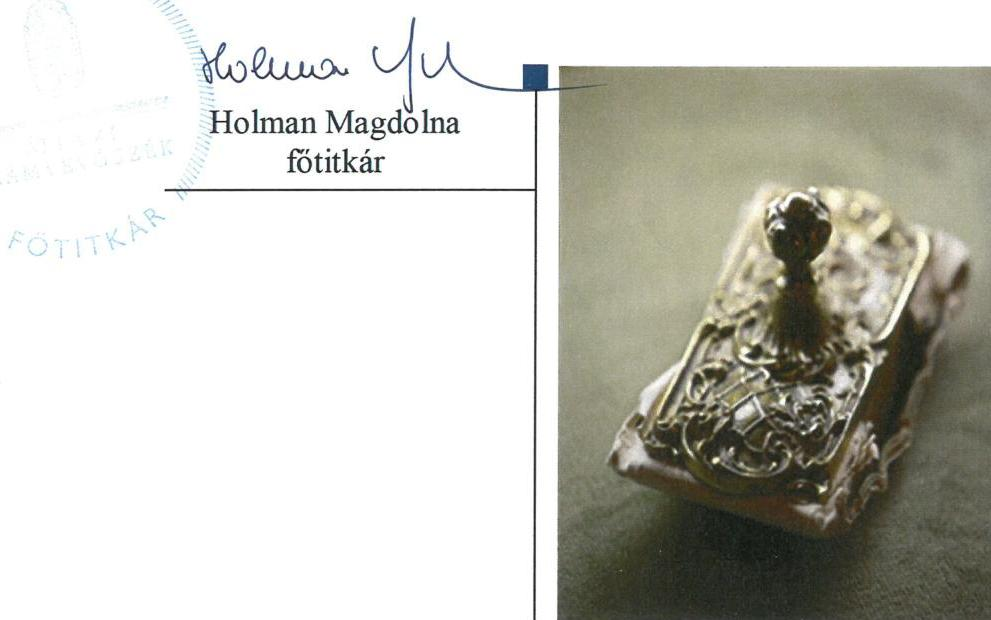
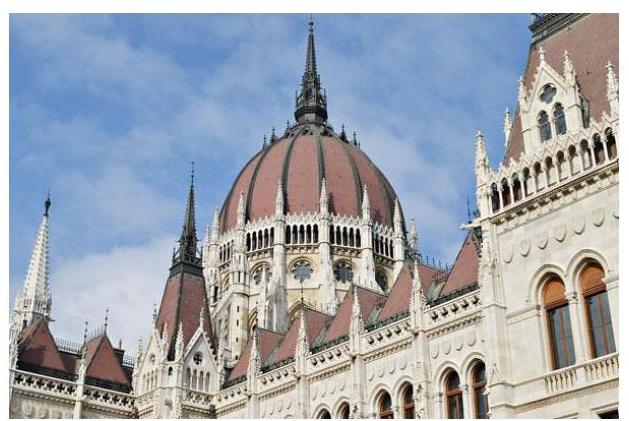

# Jelentés 

## Kampánypénzek ellenőrzése

A 2018. évi országgyűlési képviselőválasztási kampányokra fordított pénzeszközök elszámolásának ellenőrzése a Magyar Államkincstárnál és az egyéni jelölteknél
2019.

---

# Jelentés 

## Kampánypénzek ellenőrzése

A 2018. évi országgyűlési képviselőválasztási kampányokra fordított pénzeszközök elszámolásának ellenőrzése a Magyar Államkincstárnál és az egyéni jelölteknél
2019. 01. hó 31. nap

---

# AZ ELLENŐRZÉST FELÜGYELTE:

- **SALAMON ILDIKÓ** felügyeleti vezető

- **AZ ELLENŐRZÉST VEZETTE ÉS A VÉGREHAJTÁSÁÉRT FELELŐS:**
  - **HOFMEISTER LÁSZLÓ** ellenőrzésvezető
  - **A PROGRAM ÖSSZEÁLLÍTÁSÁÉRT FELELŐS:**
    - **TÓTPÁL SZABOLCS** osztályvezető

**IKTATÓSZÁM:** EL-0807-002/2019.

**TÉMASZÁM:** 2499

**ELLENŐRZÉS-AZONOSÍTÓ SZÁM:** V-0843

---

**Jelentéseink az Országgyűlés számítógépes hálózatán és az Interneta a www.asz.hu címen is olvashatóak.**

---

# TARTALOMJEGYZÉK 

■ ÖSSZEGZÉS ..... 5
■ AZ ELLENŐRZÉS CÉLJA ..... 6
■ AZ ELLENŐRZÉS TERÜLETE ..... 7
■ AZ ELLENŐRZÉS HÁTTERE, INDOKOLTSÁGA ..... 8
■ A JELENTÉS LÉNYEGES KÉRDÉSKÖRE ..... 9
■ AZ ELLENŐRZÉS HATÓKÖRE ÉS MÓDSZEREI ..... 10
■ MEGÁLLAPÍTÁSOK ..... 12
■ MELLÉKLETEK ..... 13
I. sz. melléklet: A 2018. évi országgyűlési választáson képviselethez jutott költségvetési támogatást felhasználó 96 egyéni jelölt központi költségvetési támogatása felhasználásának szabályszerűsége képviselő jelöltenként ..... 13
II. sz. melléklet: A 2018. évi országgyűlési választáson képviselethez jutott, költségvetési támogatást fel nem használó 2 egyéni jelölt Kincstárral történő megállapodásának szabályszerűségéről képviselő jelöltenként ..... 20
III. sz. melléklet: A 2018. évi országgyűlési választáson képviselethez jutott 8 egyéni jelölt lemondott a támogatás igénybevételéről és azt az őt jelölő párt rendelkezésére bocsátotta ..... 21
IV. sz. melléklet: Értelmező szótár ..... 22
■ FÜGGELÉK: ÉSZREVÉTELEK ..... 23
■ RÖVIDÍTÉSEK JEGYZÉKE ..... 25

---

.

---

# ÖSSZEGZÉS 

Az országgyúlési képviselethez jutott 98 egyéni jelölt a 2018. évi képviselö-választási kampányra juttatott központi költségvetési támogatást szabályszerűen használta fel, az elszámoltathatóságot biztositották. Országgyúlési képviselethez jutott 8 egyéni jelölt a támogatás igénybevételéről lemondott, a jogszabályi lehetőséggel élve, azt az őt jelölő párt rendelkezésére bocsátotta.

## Az ellenőrzés társadalmi indokoltsága

Magyarországon jogszabály rögzíti 199 főben az országgyúlési képviselői helyek számát, melyből 106 országgyúlési képviselőt egyéni választókerületben választanak meg.

Az Állami Számvevőszék a választást követő egy éven belül hivatalból ellenőrzi a választásra fordított állami támogatások felhasználását az országgyúlési képviselethez jutott jelöltek vonatkozásában.

Az ellenőrzés eredményeképp az állampolgárok objektív tájékoztatást kapnak a választási kampányra fordított adóforintok felhasználásáról.

## Főbb megállapítások, következtetések

A 2018. évi országgyúlési választáson képviselethez jutott 96 egyéni jelölt a központi költségvetésből juttatott támogatást szabályszerűen használta fel a jogszabályban meghatározott választási tevékenységgel összefüggő kiadások finanszírozására a választási kampányidőszakban. Kettő egyéni jelölt nem vett igénybe támogatást. A 2018. évi országgyúlési választáson képviselethez jutott 8 egyéni jelölt az őt jelölő pártja javára lemondott a központi költségvetésből juttatott támogatásról.

A központi költségvetésből juttatott támogatásokat igénybevevő jelöltek a támogatásokkal szabályszerűen elszámoltak, az elszámolásokat számviteli bizonylatokkal alátámasztották.

---

# AZ ELLENŐRZÉS CÉLJA 

Az ellenőrzés célja annak megállapítása volt, hogy az országgyűlési választáson képviselethez jutott egyéni jelöltek a Kftv. ${ }^{1}$ előírásait betartották-e, az 1. § alapján a nekik járó egymillió forint² összegű, központi költségvetésből juttatott támogatást a választási kampányidőszakban, a választási kampánytevékenységgel összefüggő kiadások finanszírozására fordították-e.

---

# AZ ELLENŐRZÉS TERÜLETE 

## Az országgyúlési választáson képviselethez jutott egyéni jelöltek

Az ÁSZ ${ }^{3}$ a Kftv. értelmében a 2018. április 8-i választást követő egy éven belül ellenőrzi a választáson mandátumhoz jutott jelöltek, valamint az egy százalék feletti listás eredményt elért jelölőszervezetek elszámolásait.

Az Okv ${ }^{4}$ 3. § (2) bekezdésében foglaltak szerint a 199 fő országgyúlési képviselőből 106 főt egyéni választókerületben választanak. A 2018. évi országgyúlési választáson megválasztott 106 egyéni képviselőből a költségvetési támogatás folyósítása céljából 98 fő kötött a Kftv. 2. § (2) bekezdése szerinti megállapodást a Kincstárral ${ }^{5}$, a III. számú mellékletben szereplő 8 fő lemondott a támogatásról és azt az őt jelölő párt rendelkezésére bocsátotta, élve a Kftv. 2/A. § (1) bekezdésében rögzített lehetőséggel. Ezen támogatások felhasználásának ellenőrzésére a jelölő szervezetek ellenőrzése keretében kerül sor.

A jelöltek, a rendelkezésükre álló 100,5 M Ft összegű költségvetési támogatásból 91,9 M Ft-ot számoltak el kampánycélra. A 98 fő egyéni jelöltből a II. számú mellékletben szereplő 2 fő nem vett igénybe központi költségvetési támogatást.

A Kincstár három jelölt esetében a támogatások elszámolásának ellenőrzéséről szóló határozataiban 192169 Ft támogatás kétszeresének viszszafizetéséről határozott, melynek a jelöltek eleget tettek.

Az ÁSZ a Kincstár ellenőrzése szerint visszafizetéssel nem érintett tételeket ellenőrizte az I. számú mellékletben szereplő 96 - központi költségvetési támogatást igénybevevő - jelölt esetében, összesen 91,7 M Ft öszszegben.

---

# AZ ELLENŐRZÉS HÁTTERE, INDOKOLTSÁGA 

A Kftv. 8/B. § (1) bekezdése értelmében az ÁSZ a választást követő egy éven belül az országgyűlési képviselethez jutott jelöltek vonatkozásában kötelezően, hivatalból ellenőrzi a választásra fordított központi költségvetésből juttatott támogatások felhasználását. Az országgyűlési képviselő-választásra fordított pénzeszközök felhasználása ellenőrzését indokolja a Kftv.ben foglalt előírások betartásának ellenőrzése.

---

# A JELENTÉS LÉNYEGES KÉRDÉSKÖRE 

Szabályszerü volt-e az országgyúlési választásokon képviselethez jutott egyéni jelöltek részére juttatott központi költségvetési támogatás felhasználása?

---

# AZ ELLENŐRZÉS HATÓKÖRE ÉS MÓDSZEREI 

## Az ellenőrzés típusa

Szabályszerüségi ellenőrzés

## Az ellenőrzött időszak

Az országgyűlési képviselőválasztás Ve. ${ }^{6}$ 139. §-ában rögzített - a szavazás napját megelőző 50. naptól (2018. február 17-étől) a szavazás befejezésének időpontjáig (2018. április 8 -áig) tartó - választási kampányidőszak, valamint az azt követő elszámolási időszak, azaz a Kftv. 9. § (1) bekezdés szerint az országgyűlési választást követő 60 nap, a 2018. június 7 -éig tartó időszak.

## Az ellenőrzés tárgya

A Kincstár és a jelölt által megkötött megállapodás, az az alapján nyitott kincstári kártyafedezeti számla rendelkezésre állása;

A kampánytevékenységhez köthető bizonylatok szabályszerűsége, hitelessége, a Kincstárral kötött megállapodásban, illetve a Számv. tv. ${ }^{7}$ 166. §ában előírt alaki és tartalmi kellékei megléte;

A költségvetési támogatásból finanszírozott valamennyi kiadásnak a választási kampányidőszak alatti, illetve a kampánytevékenységre történő teljesítése.

## Az ellenőrzöttek köre

Az országgyűlési választáson képviselethez jutott egyéni jelöltek az I., a II. és a III. számú melléklet szerint.

## Az ellenőrzés jogalapja

Az ellenőrzés jogszabályi alapját a Kftv. 8/B. § (1) bekezdése képezi.

## Az ellenőrzés módszerei

Az ellenőrzést az ellenőrzési program szempontjai, az ellenőrzött időszakban hatályos jogszabályok, az ellenőrzés szakmai szabályai, az ÁSZ módszertanok alapján végeztük.

---

Az ellenőrzés ideje alatt a kapcsolattartást az ÁSZ SZMSZ ${ }^{\text {® }}$-ének vonatkozó előírásai szerint biztosítottuk.

Az ellenőrzésre az egyéni jelöltek, továbbá az egymillió Ft költségvetési támogatás tekintetében a Kincstár által szolgáltatott adatok alapján került sor.

Az ellenőrzéshez adatszolgáltatásra kértük fel a Kincstárt és a Nemzeti Választási Irodát.

Az ellenőrzési kérdések megválaszolásához szükséges bizonyítékok megszerzése a Kincstár által rendelkezésre bocsátott dokumentumokra, adatokra alapozva történt. Az ellenőrzési bizonyítékként felhasználható adatforrások közé tartoznak egyrészt az ellenőrzési program részletes szempontjainál felsorolt adatforrások, másrészt minden egyéb - az ellenőrzés folyamán feltárt, az ellenőrzés szempontjából információt tartalmazó - dokumentum.

Az ellenőrzés lefolytatásához az adatszolgáltatásra felkért szervezetek az ÁSZ által kért dokumentumok elektronikus megküldésével szolgáltattak adatokat, amelyek valódiságát és teljes körűségét az adatszolgáltatásra felkért által tett teljességi és hitelességi nyilatkozat igazolta. Az így rendelkezésre bocsátott adatok, információk kontrollja az ellenőrzés keretében történt meg.

Az egyéni jelöltek által kampányfinanszírozásra kapott egymillió forint költségvetési támogatás felhasználásának ellenőrzése a Kincstárhoz a jelöltek által beküldött elszámolások ellenőrzésével, valamint a másolatban rendelkezésre bocsátott dokumentumok tételes ellenőrzésével történt.

Az ÁSZ a kampányfinanszírozásra fordított pénzeszközök szabályszerű felhasználása kapcsán ellenőrizte:
a kampányidőszakban a kifizetések bizonylatait, az azokat alátámasztó egyéb dokumentumokat (szerződések, megállapodások a terület -, a helység -, a plakát, reklám hely vonatkozásában; a bankszámlakivonatok, számlák, kiadások, költségek elszámolási dokumentumait),
a pénzügyi elszámolásokat, a Kincstárnak átadott elszámolásokat, képviselői nyilatkozatokat, tanúsítványokat, az alkalmazott áraknak a sajtótermékek által megküldött, az ÁSZ honlapján megjelentetett árjegyzékekkel, tájékoztatókkal való egyezőséget.

---

# SEGÁLLAPÍTÁSOK 

## Szabályszerú volt-e az országgyúlési választásokon képviselethez jutott egyéni jelöltek részére juttatott központi költségvetési támogatás felhasználása?

Összegző megállapítás

A 2018. évi országgyúlési választásokon képviselethez jutott, az I. számú mellékletben felsorolt egyéni jelöltek a központi költségvetési támogatást szabályszerűen használták fel.

A 2018. ÉVI ORSZÁGGYŰLÉSI VÁLASZTÁSON a központi költségvetési támogatást igénybevevő képviselethez jutott, az I. számú mellékletben felsorolt jelöltek a kampánypénzek felhasználása előtt a Kftv. előírásának megfelelően a Kincstárral megállapodást kötöttek támogatás folyósítása céljából. Az ehhez kapcsolódó kincstári fedezeti számla használata szabályszerű volt, a kampánytevékenységgel összefüggő kiadások teljesítése a kincstári kártya használatával valósult meg. A II. számú melléklet szerinti egyéni jelöltek a Kftv. előírása szerint a Kincstárral megállapodást kötöttek, nem vettek igénybe és nem használtak fel központi költségvetési támogatást.

AZ ELSZÁMOLÁSOKAT az I. számú mellékletben felsorolt jelöltek a Kftv.-ben rögzített határidőben benyújtották a Kincstárnak az NGM rendeletben ${ }^{9}$ meghatározott számlaösszesítő adatlapon a támogatás szabályszerű felhasználásáról szóló nyilatkozattal együtt.

Az elszámolásokat alátámasztó bizonylatok a Számv. tv. és a Kftv. előírásainak mind alakilag, mind tartalmilag megfeleltek. A számviteli bizonylatok a jelölt nevére szóltak, hitelesek voltak, szerepelt rajtuk az egyéni választókerület megjelölése, valamint kampánytevékenységgel összefüggő, kampányidőszakra vonatkozó dologi kiadásokat tartalmaztak.

Az I. számú mellékletben felsorolt jelöltek közül a politikai hirdetéseket igénybe vevők elszámolásaihoz kapcsolódó számlák - összesen 4,6 M Ft értékben - adatai megegyeztek a sajtótermékek által az ÁSZ részére - a Ve. szerint - megküldött árjegyzékben foglalt adatokkal.

---

# MELLÉKLETEK

- I. SZ. MELLÉKLET: A 2018. ÉVI ORSZÁGGYŰLÉSI VÁLASZTÁSON KÉPVISELETHEZ JUTOTT KÖLTSÉGVETÉSI TÁMOGATÁST FELHASZNÁLÓ 96 EGYÉNI JELÖLT KÖZPONTI KÖLTSÉGVETÉSI TÁMOGATÁSA FELHASZNÁLÁSÁNAK SZABÁLYSZERŰSÉGE KÉPVISELŐ JELÖLTENKÉNT

|  Jelölt neve | Felhasznált támogatás összege (H) ${ }^{a}$ | Ebből: Politikai hirdetésre felhasznált összege (H) | A kincstárral történő megállapodás a támogatás folyódításáról és a kincstárkártya használata (Kthv.) | Az elszámolás határidőben történő benyújtása a Kincstárnak az előírt formában (Kthv.) | A támogatás felhasználásának célja és időszaka (Kthv.) | Az elszámolás számviteli bizonylattal történő alátámasztása (Számv. tv. és Kthv.) | Politikai hirdetés esetén a kapcsolódó szamlak adatai (Vkr.)  |
| --- | --- | --- | --- | --- | --- | --- | --- |
|  Ágh Péter | 1012881 | 91000 | szabályszerű volt | szabályszerű volt | kampánycélra a kampányidőszakban szabályszerűen történt | szabályszerű volt | megegyeztek az ÁSZ részére megküldött árjegyzékben foglaltakkal  |
|  Dr. Aradszki András | 659938 | 0 | szabályszerű volt | szabályszerű volt | kampánycélra a kampányidőszakban szabályszerűen történt | szabályszerű volt | -  |
|  B. Nagy László | 861695 | 0 | szabályszerű volt | szabályszerű volt | kampánycélra a kampányidőszakban szabályszerűen történt | szabályszerű volt | -  |
|  Balla Mihály Tibor | 996950 | 0 | szabályszerű volt | szabályszerű volt | kampánycélra a kampányidőszakban szabályszerűen történt | szabályszerű volt | -  |
|  Barcza Attila | 1023960 | 0 | szabályszerű volt | szabályszerű volt | kampánycélra a kampányidőszakban szabályszerűen történt | szabályszerű volt | -  |
|  Dr. Becsö Károly Csaba | 1025014 | 0 | szabályszerű volt | szabályszerű volt | kampánycélra a kampányidőszakban szabályszerűen történt | szabályszerű volt | -  |
|  Bencsik János | 1006019 | 0 | szabályszerű volt | szabályszerű volt | kampánycélra a kampányidőszakban szabályszerűen történt | szabályszerű volt | -  |
|  Bodó Sándor | 1023900 | 0 | szabályszerű volt | szabályszerű volt | kampánycélra a kampányidőszakban szabályszerűen történt | szabályszerű volt | -  |
|  Boldog István | 960205 | 0 | szabályszerű volt | szabályszerű volt | kampánycélra a kampányidőszakban szabályszerűen történt | szabályszerű volt | -  |
|  Bóna Zoltán | 1024890 | 30353 | szabályszerű volt | szabályszerű volt | kampánycélra a kampányidőszakban szabályszerűen történt | szabályszerű volt | megegyeztek az ÁSZ részére megküldött árjegyzékben foglaltakkal  |
|  Burány Sándor | 1024533 | 0 | szabályszerű volt | szabályszerű volt | kampánycélra a kampányidőszakban szabályszerűen történt | szabályszerű volt | -  |
|  Czerván György | 1023305 | 0 | szabályszerű volt | szabályszerű volt | kampánycélra a kampányidőszakban szabályszerűen történt | szabályszerű volt | -  |

---

|  Jellőtt neve | Felhasznált támogatás összege (Ft) ${ }^{a}$ | Ebből:   Politikai hirdetésre felhasznált összege (Ft) | A Kincstárral történő megállapodás a támogatás folyósításáról és a kincstári kártya használata (Kftv.) | Az elszámolás határidőben történő benyújtása a Kincstárnak az előírt formában (Kftv.) | A támogatás felhasználásának célja és időszakra (Kftv.) | Az elszámolás számviteli bizonylattal történő alátámasztása (Számv. tv. és Kftv.) | Politikai hirdetés esetén a kapcsolódó számúak adatai (Vv.)  |
| --- | --- | --- | --- | --- | --- | --- | --- |
|  Czurunné Dr. Ber-
talan Judit | 1025014 | 0 | szabályszerű volt | szabályszerű volt | kampánycélra a kampányidőszakban szabályszerűen történt | szabályszerű volt | -  |
|  Csenger-Zalán Zsolt | 1018590 | 0 | szabályszerű volt | szabályszerű volt | kampánycélra a kampányidőszakban szabályszerűen történt | szabályszerű volt | -  |
|  Cseresnyés Péter | 972323 | 0 | szabályszerű volt | szabályszerű volt | kampánycélra a kampányidőszakban szabályszerűen történt | szabályszerű volt | -  |
|  Csöbör Katalin | 996100 | 0 | szabályszerű volt | szabályszerű volt | kampánycélra a kampányidőszakban szabályszerűen történt | szabályszerű volt | -  |
|  Dankó Béla | 1025014 | 0 | szabályszerű volt | szabályszerű volt | kampánycélra a kampányidőszakban szabályszerűen történt | szabályszerű volt | -  |
|  Demeter Zoltán | 850698 | 171450 | szabályszerű volt | szabályszerű volt | kampánycélra a kampányidőszakban szabályszerűen történt | szabályszerű volt | megegyeztek az ÁSZ részére megküldött árjegyzékben foglaltakkal  |
|  Dunai Mónika | 673345 | 0 | szabályszerű volt | szabályszerű volt | kampánycélra a kampányidőszakban szabályszerűen történt | szabályszerű volt | -  |
|  Farkas Sándor | 1021792 | 320040 | szabályszerű volt | szabályszerű volt | kampánycélra a kampányidőszakban szabályszerűen történt | szabályszerű volt | megegyeztek az ÁSZ részére megküldött árjegyzékben foglaltakkal  |
|  Fenyvesi Zoltán Mihály | 1008903 | 46228 | szabályszerű volt | szabályszerű volt | kampánycélra a kampányidőszakban szabályszerűen történt | szabályszerű volt | megegyeztek az ÁSZ részére megküldött árjegyzékben foglaltakkal  |
|  Font Sándor | 1023134 | 415516 | szabályszerű volt | szabályszerű volt | kampánycélra a kampányidőszakban szabályszerűen történt | szabályszerű volt | megegyeztek az ÁSZ részére megküldött árjegyzékben foglaltakkal  |
|  Földi László | 835159 | 366522 | szabályszerű volt | szabályszerű volt | kampánycélra a kampányidőszakban szabályszerűen történt | szabályszerű volt | megegyeztek az ÁSZ részére megküldött árjegyzékben foglaltakkal  |
|  Gelencsér Attila | 1024738 | 0 | szabályszerű volt | szabályszerű volt | kampánycélra a kampányidőszakban szabályszerűen történt | szabályszerű volt | -  |
|  Dr. Gulyás Gergely Győző | 1010674 | 0 | szabályszerű volt | szabályszerű volt | kampánycélra a kampányidőszakban szabályszerűen történt | szabályszerű volt | -  |
|  Gyopáros Alpár Ádám | 1025013 | 0 | szabályszerű volt | szabályszerű volt | kampánycélra a kampányidőszakban szabályszerűen történt | szabályszerű volt | -  |
|  Hadházy Sándor | 1023620 | 0 | szabályszerű volt | szabályszerű volt | kampánycélra a kampányidőszakban szabályszerűen történt | szabályszerű volt | -  |
|  Dr. Hargitai János György | 1022608 | 0 | szabályszerű volt | szabályszerű volt | kampánycélra a kampányidőszakban szabályszerűen történt | szabályszerű volt | -  |

---

|  Jellőtt neve | Felhasznált támogatás összege (Ft) ${ }^{a}$ | Ebből:   Politikai hirdetésre felhasznált összege (Ft) | A Kincstárral történő megállapodás a támogatás folyósításáról és a kincstári kártya használata (Kftv.) | Az elszámolás határidőben történő benyújtása a Kincstárnak az előírt formában (Kftv.) | A támogatás felhasználásának célja és időszakra (Kftv.) | Az elszámolás számviteli bizonylattal történő alátámasztása (Számv. tv. és Kftv.) | Politikai hirdetés esetén a kapcsolódó számúak adatai (Vv.)  |
| --- | --- | --- | --- | --- | --- | --- | --- |
|  Dr. Hende Csaba Károly | 957150 | 0 | szabályszerű volt | szabályszerű volt | kampánycélra a kampányidőszakban szabályszerűen történt | szabályszerű volt | -  |
|  Herczeg Tamás József | 868023 | 0 | szabályszerű volt | szabályszerű volt | kampánycélra a kampányidőszakban szabályszerűen történt | szabályszerű volt | -  |
|  Dr. Hiller István | 994918 | 0 | szabályszerű volt | szabályszerű volt | kampánycélra a kampányidőszakban szabályszerűen történt | szabályszerű volt | -  |
|  Hiszékeny Dezső | 992251 | 0 | szabályszerű volt | szabályszerű volt | kampánycélra a kampányidőszakban szabályszerűen történt | szabályszerű volt | -  |
|  Dr. Hoppál Péter Tamás | 1024749 | 118110 | szabályszerű volt | szabályszerű volt | kampánycélra a kampányidőszakban szabályszerűen történt | szabályszerű volt | megegyeztek az ÁSZ részére megküldött árjegyzékben foglaltakkal  |
|  Horváth István | 870200 | 0 | szabályszerű volt | szabályszerű volt | kampánycélra a kampányidőszakban szabályszerűen történt | szabályszerű volt | -  |
|  Horváth László Dezső | 870205 | 0 | szabályszerű volt | szabályszerű volt | kampánycélra a kampányidőszakban szabályszerűen történt | szabályszerű volt | -  |
|  Dr. Hórcsik Rí chárd | 1001830 | 30175 | szabályszerű volt | szabályszerű volt | kampánycélra a kampányidőszakban szabályszerűen történt | szabályszerű volt | megegyeztek az ÁSZ részére megküldött árjegyzékben foglaltakkal  |
|  Hubay György | 725014 | 0 | szabályszerű volt | szabályszerű volt | kampánycélra a kampányidőszakban szabályszerűen történt | szabályszerű volt | -  |
|  Dr. Kállai Mária | 1014730 | 245110 | szabályszerű volt | szabályszerű volt | kampánycélra a kampányidőszakban szabályszerűen történt | szabályszerű volt | megegyeztek az ÁSZ részére megküldött árjegyzékben foglaltakkal  |
|  Kara Ákos | 982690 | 0 | szabályszerű volt | szabályszerű volt | kampánycélra a kampányidőszakban szabályszerűen történt | szabályszerű volt | -  |
|  Dr. Kocsis Máté Sándor | 1016381 | 0 | szabályszerű volt | szabályszerű volt | kampánycélra a kampányidőszakban szabályszerűen történt | szabályszerű volt | -  |
|  Koncz Ferenc | 973943 | 0 | szabályszerű volt | szabályszerű volt | kampánycélra a kampányidőszakban szabályszerűen történt | szabályszerű volt | -  |
|  Dr. Kontrát Károly | 1025013 | 101600 | szabályszerű volt | szabályszerű volt | kampánycélra a kampányidőszakban szabályszerűen történt | szabályszerű volt | megegyeztek az ÁSZ részére megküldött árjegyzékben foglaltakkal  |
|  Kósa Lajos | 1024292 | 0 | szabályszerű volt | szabályszerű volt | kampánycélra a kampányidőszakban szabályszerűen történt | szabályszerű volt | -  |
|  Dr. Kovács József Dezső | 1023574 | 0 | szabályszerű volt | szabályszerű volt | kampánycélra a kampányidőszakban szabályszerűen történt | szabályszerű volt | -  |

---

|  Jellőtt neve | Felhasznált támogatás összege (Ft) ${ }^{a}$ | Ebből:   Politikai hirdetésre felhasznált összege (Ft) | A Kincstárral történő megállapodás a támogatás folyósításáról és a kincstári kártya használata (kftv.) | Az elszámolás határidőben történő benyújtása a Kincstárnak az előírt formában (kftv.) | A támogatás felhasználásának célja és időszakra (kftv.) | Az elszámolás számviteli bizonylattal történő alátámasztása (Számv. tv. és Kftv.) | Politikai hirdetés esetén a kapcsolódó számúak adatai (Vv.)  |
| --- | --- | --- | --- | --- | --- | --- | --- |
|  Kovács Sándor (JNSZ) | 1024513 | 0 | szabályszerű volt | szabályszerű volt | kampánycélra a kampányidőszakban szabályszerűen történt | szabályszerű volt | -  |
|  Kovács Sándor (SZSZB) | 707475 | 413670 | szabályszerű volt | szabályszerű volt | kampánycélra a kampányidőszakban szabályszerűen történt | szabályszerű volt | megegyeztek az ÁSZ részére megküldött árjegyzékben foglaltakkal  |
|  Dr. Kovács Zoltán | 1024624 | 167132 | szabályszerű volt | szabályszerű volt | kampánycélra a kampányidőszakban szabályszerűen történt | szabályszerű volt | megegyeztek az ÁSZ részére megküldött árjegyzékben foglaltakkal  |
|  Kunhalmi Ágnes | 999981 | 0 | szabályszerű volt | szabályszerű volt | kampánycélra a kampányidőszakban szabályszerűen történt | szabályszerű volt | -  |
|  Dr. Lázár János | 1023569 | 776452 | szabályszerű volt | szabályszerű volt | kampánycélra a kampányidőszakban szabályszerűen történt | szabályszerű volt | megegyeztek az ÁSZ részére megküldött árjegyzékben foglaltakkal  |
|  Lezsák Sándor István | 996008 | 0 | szabályszerű volt | szabályszerű volt | kampánycélra a kampányidőszakban szabályszerűen történt | szabályszerű volt | -  |
|  Manninger Jenő Vilmos | 1022486 | 120000 | szabályszerű volt | szabályszerű volt | kampánycélra a kampányidőszakban szabályszerűen történt | szabályszerű volt | megegyeztek az ÁSZ részére megküldött árjegyzékben foglaltakkal  |
|  Dr. Mellár Tamás | 637986 | 254000 | szabályszerű volt | szabályszerű volt | kampánycélra a kampányidőszakban szabályszerűen történt | szabályszerű volt | megegyeztek az ÁSZ részére megküldött árjegyzékben foglaltakkal  |
|  Móring József Attila | 995145 | 0 | szabályszerű volt | szabályszerű volt | kampánycélra a kampányidőszakban szabályszerűen történt | szabályszerű volt | -  |
|  Nagy Csaba | 685927 | 0 | szabályszerű volt | szabályszerű volt | kampánycélra a kampányidőszakban szabályszerűen történt | szabályszerű volt | -  |
|  Dr. Nagy István | 993206 | 368300 | szabályszerű volt | szabályszerű volt | kampánycélra a kampányidőszakban szabályszerűen történt | szabályszerű volt | megegyeztek az ÁSZ részére megküldött árjegyzékben foglaltakkal  |
|  Dr. Nyitrai Zsolt Péter | 1017799 | 0 | szabályszerű volt | szabályszerű volt | kampánycélra a kampányidőszakban szabályszerűen történt | szabályszerű volt | -  |
|  Ovádi Péter | 869308 | 0 | szabályszerű volt | szabályszerű volt | kampánycélra a kampányidőszakban szabályszerűen történt | szabályszerű volt | -  |
|  Pánczél Károly | 979833 | 0 | szabályszerű volt | szabályszerű volt | kampánycélra a kampányidőszakban szabályszerűen történt | szabályszerű volt | -  |
|  Pócs János | 1022128 | 0 | szabályszerű volt | szabályszerű volt | kampánycélra a kampányidőszakban szabályszerűen történt | szabályszerű volt | -  |
|  Pogácsás Tibor János | 218488 | 0 | szabályszerű volt | szabályszerű volt | kampánycélra a kampányidőszakban szabályszerűen történt | szabályszerű volt | -  |

---

|  Jeliölt neve | Felhasznált támogatás összege (Ft) ${ }^{a}$ | Ebből:
Politikai
hirdetésre
felhasznált
összeg (Ft) | A Kincstárral történő megállapodás a támogatás folyósításáról és a kincstári kártya használata (kftv.) | Az elszámolás határidőben történő benyújtása a Kincstárnak az előírt formában (kftv.) | A támogatás felhasználásának célja és időszakra (kftv.) | Az elszámolás számviteli bizonylattal történő alátámasztása (Számv. tv. és Kftv.) | Politikai hirdetés esetén a kapcsolódó számúak adatai (Vv.)  |
| --- | --- | --- | --- | --- | --- | --- | --- |
|  Dr. Pósán László | 1023308 | 0 | szabályszerű volt | szabályszerű volt | kampánycélra a kampányidőszakban szabályszerűen történt | szabályszerű volt | -  |
|  Potápi Árpád János | 449578 | 0 | szabályszerű volt | szabályszerű volt | kampánycélra a kampányidőszakban szabályszerűen történt | szabályszerű volt | -  |
|  Dr. Rétvári Bence Máté | 1025005 | 0 | szabályszerű volt | szabályszerű volt | kampánycélra a kampányidőszakban szabályszerűen történt | szabályszerű volt | -  |
|  Riz Gábor | 996950 | 0 | szabályszerű volt | szabályszerű volt | kampánycélra a kampányidőszakban szabályszerűen történt | szabályszerű volt | -  |
|  Dr. Salacz László | 708280 | 0 | szabályszerű volt | szabályszerű volt | kampánycélra a kampányidőszakban szabályszerűen történt | szabályszerű volt | -  |
|  Dr. Seszták Miklós István | 981724 | 0 | szabályszerű volt | szabályszerű volt | kampánycélra a kampányidőszakban szabályszerűen történt | szabályszerű volt | -  |
|  Dr. Simicskó István | 1024627 | 0 | szabályszerű volt | szabályszerű volt | kampánycélra a kampányidőszakban szabályszerűen történt | szabályszerű volt | -  |
|  Dr. Simon Miklós | 1024199 | 0 | szabályszerű volt | szabályszerű volt | kampánycélra a kampányidőszakban szabályszerűen történt | szabályszerű volt | -  |
|  Simon Róbert Balázs | 1024703 | 0 | szabályszerű volt | szabályszerű volt | kampánycélra a kampányidőszakban szabályszerűen történt | szabályszerű volt | -  |
|  Simonka György | 1001078 | 53658 | szabályszerű volt | szabályszerű volt | kampánycélra a kampányidőszakban szabályszerűen történt | szabályszerű volt | megegyeztek az ÁSZ részére megküldött árjegyzékben foglaltakkal  |
|  Süli János | 1024200 | 0 | szabályszerű volt | szabályszerű volt | kampánycélra a kampányidőszakban szabályszerűen történt | szabályszerű volt | -  |
|  Szabó Sándor | 1024514 | 0 | szabályszerű volt | szabályszerű volt | kampánycélra a kampányidőszakban szabályszerűen történt | szabályszerű volt | -  |
|  Dr. Szabó Tünde | 995187 | 0 | szabályszerű volt | szabályszerű volt | kampánycélra a kampányidőszakban szabályszerűen történt | szabályszerű volt | -  |
|  Szabó Zsolt | 1025014 | 0 | szabályszerű volt | szabályszerű volt | kampánycélra a kampányidőszakban szabályszerűen történt | szabályszerű volt | -  |
|  Szászfalvi László | 1025014 | 0 | szabályszerű volt | szabályszerű volt | kampánycélra a kampányidőszakban szabályszerűen történt | szabályszerű volt | -  |
|  Szatmáry Kristóf | 1025014 | 0 | szabályszerű volt | szabályszerű volt | kampánycélra a kampányidőszakban szabályszerűen történt | szabályszerű volt | -  |

---

|  Jellőtt neve | Felhasznált támogatás összege (Ft) ${ }^{a}$ | Ebből:   Politikai hirdetésre felhasznált összege (Ft) | A Kincstárral történő megállapodás a támogatás folyósításáról és a kincstári kártya használata (Kftv.) | Az elszámolás határidőben történő benyújtása a Kincstárnak az előírt formában (Kftv.) | A támogatás felhasználásának célja és időszakra (Kftv.) | Az elszámolás számviteli bizonylattal történő alátámasztása (Számv. tv. és Kftv.) | Politikai hirdetés esetén a kapcsolódó számúak adatai (Vv.)  |
| --- | --- | --- | --- | --- | --- | --- | --- |
|  Tállal András László | 1025012 | 146304 | szabályszerű volt | szabályszerű volt | kampánycélra a kampányidőszakban szabályszerűen történt | szabályszerű volt | megegyeztek az ÁSZ részére megküldött árjegyzékben foglaltakkal  |
|  Tasó László | 1024061 | 0 | szabályszerű volt | szabályszerű volt | kampánycélra a kampányidőszakban szabályszerűen történt | szabályszerű volt | -  |
|  Tessely Zoltán Károly | 1024810 | 0 | szabályszerű volt | szabályszerű volt | kampánycélra a kampányidőszakban szabályszerűen történt | szabályszerű volt | -  |
|  Dr. Tiba István Csaba | 1015350 | 0 | szabályszerű volt | szabályszerű volt | kampánycélra a kampányidőszakban szabályszerűen történt | szabályszerű volt | -  |
|  Dr. Tilki Attila | 1025014 | 0 | szabályszerű volt | szabályszerű volt | kampánycélra a kampányidőszakban szabályszerűen történt | szabályszerű volt | -  |
|  Tóth Csaba János | 1016000 | 0 | szabályszerű volt | szabályszerű volt | kampánycélra a kampányidőszakban szabályszerűen történt | szabályszerű volt | -  |
|  Törő Gábor | 948346 | 0 | szabályszerű volt | szabályszerű volt | kampánycélra a kampányidőszakban szabályszerűen történt | szabályszerű volt | -  |
|  Dr. Tuzson Bence Balázs | 1024527 | 60960 | szabályszerű volt | szabályszerű volt | kampánycélra a kampányidőszakban szabályszerűen történt | szabályszerű volt | megegyeztek az ÁSZ részére megküldött árjegyzékben foglaltakkal  |
|  V. Németh Zsolt | 1023204 | 0 | szabályszerű volt | szabályszerű volt | kampánycélra a kampányidőszakban szabályszerűen történt | szabályszerű volt | -  |
|  Varga Gábor | 991085 | 0 | szabályszerű volt | szabályszerű volt | kampánycélra a kampányidőszakban szabályszerűen történt | szabályszerű volt | -  |
|  Varga Mihály | 1000000 | 0 | szabályszerű volt | szabályszerű volt | kampánycélra a kampányidőszakban szabályszerűen történt | szabályszerű volt | -  |
|  Vargha Tamás János | 1015351 | 0 | szabályszerű volt | szabályszerű volt | kampánycélra a kampányidőszakban szabályszerűen történt | szabályszerű volt | -  |
|  Vécsey László József | 1024467 | 0 | szabályszerű volt | szabályszerű volt | kampánycélra a kampányidőszakban szabályszerűen történt | szabályszerű volt | -  |
|  Vigh László | 1024128 | 0 | szabályszerű volt | szabályszerű volt | kampánycélra a kampányidőszakban szabályszerűen történt | szabályszerű volt | -  |
|  Dr. Vinnai Győző | 1024734 | 0 | szabályszerű volt | szabályszerű volt | kampánycélra a kampányidőszakban szabályszerűen történt | szabályszerű volt | -  |
|  Dr. Vitányi István József | 915231 | 308559 | szabályszerű volt | szabályszerű volt | kampánycélra a kampányidőszakban szabályszerűen történt | szabályszerű volt | megegyeztek az ÁSZ részére megküldött árjegyzékben foglaltakkal  |

---

|  Jellőtt neve | Felhasznált támogatás összege (Ft) ${ }^{a}$ | Ebből:   Politikai hirdetésre felhasznált összeg (Ft) | A Kincstárral történő megállapodás a támogatás folyósításáról és a kincstári kártya használata (Kftv.) | Az elszámolás határidőben történő benyújtása a Kincstárnak az előírt formában (Kftv.) | A támogatás felhasználásának célja és időszakra (Kftv.) | Az elszámolás számviteli bizonylattal történő alátámasztása (Számv. tv. és Kftv.) | Politikai hirdetés esetén a kapcsolódó számlák adatai (Vv.)  |
| --- | --- | --- | --- | --- | --- | --- | --- |
|  Dr. Völner Pál | 926632 | 0 | szabályszerű volt | szabályszerű volt | kampánycélra a kampányidőszakban szabályszerűen történt | szabályszerű volt | -  |
|  Witzmann Mihály | 1024874 | 0 | szabályszerű volt | szabályszerű volt | kampánycélra a kampányidőszakban szabályszerűen történt | szabályszerű volt | -  |
|  Dr. Zombor Gábor Zoltán | 1025014 | 0 | szabályszerű volt | szabályszerű volt | kampánycélra a kampányidőszakban szabályszerűen történt | szabályszerű volt | -  |
|  Zsigó Róbert Vilmos | 398300 | 0 | szabályszerű volt | szabályszerű volt | kampánycélra a kampányidőszakban szabályszerűen történt | szabályszerű volt | -  |
|  Összesen: | 91657989 | 4605139 | - | - | - | - | -  |

${ }^{a}$ ez az összeg nem tartalmazza a Kincstár határozata alapján visszafizetendő és visszafizetett összeget

---

# II. SZ. MELLÉKLET: A 2018. ÉVI ORSZÁGGYŰLÉSI VÁLASZTÁSON KÉPVISELETHEZ JUTOTT, KÖLTSÉGVETÉSI TÁMOGATÁST FEL NEM HASZNÁLÓ 2 EGYÉNI JELÖLT KINCSTÁRRAL TÖRTÉNŐ MEGÁLLAPODÁSÁNAK SZABÁLYSZERŰSÉGÉRŐL KÉPVISELŐ JELÖLTENKÉNT

|  Jelölt neve | Felhasznált támogatás összege (Ft) | Ebből:
Politikai hirdetésre felhasznált összege (Ft) | A Kincstárral történő megállapodás a támogatás folyósításáról és a kincstári kártya használata (Kftv.) | Az elszámolás határidőben történő benyújtása a Kincstárnak az előírt formában (Kftv.) | A támogatás felhasználásának célja és idöszaka (Kftv.) | Az elszámolás számviteli bizony-lattal történő alátámasztása (Számv. tv. és Kftv.) | Politikai hirdetés esetén a kapcsolódó számlák adatai (Vv.)  |
| --- | --- | --- | --- | --- | --- | --- | --- |
|  Bányai Gábor
Elemér | 0 | 0 | szabályszerű volt a Kincstárral történő megállapodás, kincstári kártya használat nem történt | - | - | - | -  |
|  Dr. Szücs Lajos | 0 | 0 | szabályszerű volt a Kincstárral történő megállapodás, kincstári kártya használat nem történt | - | - | - | -  |

---

# III. SZ. MELLÉKLET: A 2018. ÉVI ORSZÁGGYŰLÉSI VÁLASZTÁSON KÉPVISELETHEZ JUTOTT 8 EGYÉNI JELÖLT LEMONDOTT A TÁMOGATÁS IGÉNYBEVÉTELÉRŐL ÉS AZT AZ ŐT JELÖLŐ PÁRT RENDELKEZÉSÉRE BOCSÁTOTTA

|  Jelölt neve | Felfhasznált támogatás összege (Ft) | Ebből:
Politikai hirdetésre
felfhasznált összeg
(Ft) | A Kincstárral történő megállapodás a támogatás folyósításáról és a kincstári kártya használata (Kftv.) | Az elszámolás határidőben történő benyújtása a Kincstárnak az előírt formában (Kftv.) | A támogatás felhasználásának célja és időszaka (Kftv.) | Az elszámolás számviteli bizonylattal történő alátámasztása (Számv. tv. és Kftv.) | Politikai hirdetés esetén a kapcsolódó szám-
lák adatai (Ve.)  |
| --- | --- | --- | --- | --- | --- | --- | --- |
|  Csárdi Antal | lemondott a támogatás igénybevételéről és azt az őt jelölő párt rendelkezésére bocsátotta | - | - | - | - | - | -  |
|  Hajdu László | lemondott a támogatás igénybevételéről és azt az őt jelölő párt rendelkezésére bocsátotta | - | - | - | - | - | -  |
|  Molnár Gyula | lemondott a támogatás igénybevételéről és azt az őt jelölő párt rendelkezésére bocsátotta | - | - | - | - | - | -  |
|  Dr. Oláh Lajos | lemondott a támogatás igénybevételéről és azt az őt jelölő párt rendelkezésére bocsátotta | - | - | - | - | - | -  |
|  Pintér Tamás | lemondott a támogatás igénybevételéről és azt az őt jelölő párt rendelkezésére bocsátotta | - | - | - | - | - | -  |
|  Dr. Szabó Szabolcs | lemondott a támogatás igénybevételéről és azt az őt jelölő párt rendelkezésére bocsátotta | - | - | - | - | - | -  |
|  Szabó Tímea | lemondott a támogatás igénybevételéről és azt az őt jelölő párt rendelkezésére bocsátotta | - | - | - | - | - | -  |
|  Varju László | lemondott a támogatás igénybevételéről és azt az őt jelölő párt rendelkezésére bocsátotta | - | - | - | - | - | -  |

---

# - IV. SZ. MELLÉKLET: ÉRTELMEZŐ SZÓTÁR 

dologi kiadás
jelölő szervezet
egyéni jelölt
kampányeszköz
kampánytevékenység
politikai hirdetés

Az Áhsz. ${ }^{10}$ 15. melléklet (I. Egységes rovatrend a költségvetési és finanszírozási bevételekhez, kiadásokhoz) K3. pontja szerinti kiadások (forrás: Áhsz. 15. melléklet K3. Dologi kiadások rovat).
Az országgyúlési képviselők választásán a választás kitűzésekor a civil szervezetek bírósági nyilvántartásában jogerősen szereplő párt (forrás: Ve. 3. § 3. pontja).
Az országgyúlési választáson az egyéni választókerületben független jelöltként vagy párt jelöltjeként, illetve két vagy több párt közös jelöltjeként induló személy (forrás: Okv. 5. §-a).
Kampányeszköznek minősül minden olyan eszköz, amely alkalmas a választói akarat befolyásolására vagy annak megkísérlésére, így különösen
a) plakát,
b) jelölő szervezet vagy jelölt által történő közvetlen megkeresés,
c) politikai reklám és politikai hirdetés,
d) választási gyúlés (forrás: Ve. 140. §-a).

Kampánytevékenység a kampányeszközök kampányidőszakban történő felhasználása és minden egyéb kampányidőszakban folytatott tevékenység a választói akarat befolyásolása vagy ennek megkísérlése céljából (forrás: Ve. 141. §-a).
Az ellenérték fejében közzétett, valamely jelölő szervezet vagy független jelölt népszerűsítését szolgáló, vagy támogatásra ösztönző, illetve azok nevét, célját, tevékenységét, emblémáját népszerűsítő sajtótermékben közzétett médiatartalom vagy filmszínházban közzétett audiovizuális tartalom (forrás: Ve. 146. § b) pont).

---

# FÜGGELÉK: ÉSZREVÉTELEK 

A jelentéstervezetet a Számvevőszék 15 napos észrevételezésre megküldte az ellenőrzöttek részére az ÁSZ tv. 29. §* (1) bekezdése előírásának megfelelően.
Az ellenőrzöttek a jelentéstervezet megállapításaira nem tettek észrevételt.

[^0]
[^0]:    * 29. § (1) Az Állami Számvevőszék az ellenőrzési megállapításait megküldi az ellenőrzött szervezet vezetőjének vagy az általa megbízott személynek, és annak, akinek személyes felelősségét állapította meg.
    (2) Az ellenőrzött szervezet vezetője és a felelősként megjelölt személy az ellenőrzés megállapításaira tizenöt napon belül írásban észrevételt tehet.
    (3) Az Állami Számvevőszék az észrevételre a beérkezésétől számított harminc napon belül írásban válaszol. A figyelembe nem vett észrevételeket köteles a jelentésben feltüntetni, és megindokolni, hogy azokat miért nem fogadta el.

---

.

---

# RÖVIDÍTÉSEK JEGYZÉKE 

${ }^{1}$ Kftv.
${ }^{2}$ egymillió forint
${ }^{3}$ ÁSZ
${ }^{4}$ Okv.
${ }^{5}$ Kincstár
${ }^{6} \mathrm{Ve}$.
${ }^{7}$ Számv. tv.
${ }^{8}$ ÁSZ SZMSZ
${ }^{9}$ NGM rendelet
${ }^{10}$ Áhsz.
2013. évi LXXXVII. törvény az országgyűlési képviselők választása kampányköltségeinek átláthatóvá tételéről (hatályos 2013. június 20-tól)
Ezen összeg alatt 2014. évben egymillió forintot, a következő választásokon a Kftv. 1. § (2) alapján „A támogatás összegét az országgyűlési képviselők e törvény hatálybalépését követő általános választását követő évtől kezdődően a Központi Statisztikai Hivatal által a tárgyévet megelőző évre megállapított fogyasztói árindexszel évente növelni kell." számított összeget kell érteni. A 2018. évben a Kincstár tájékoztatása alapján az összeg 1025014 Ft.
Állami Számvevőszék
2011. évi CCIII. törvény az Országgyűlési képviselők választásáról (hatályos 2012. január 1-jétől)
Magyar Államkincstár
2013. évi XXXVI. törvény a választási eljárásról (hatályos 2013. április 18-tól)
2000. évi C. törvény a számvitelről (hatályos 2001. január 1-jétől)

Az Állami Számvevőszék elnökének 4/2017. (XII.29.) ÁSZ utasítása az Állami Számvevőszék Szervezeti és Működési Szabályzatáról (hatályos 2018. január 1-jétől)
69/2013. (XII. 29.) NGM rendelet az országgyűlési képviselők választása kampányköltségeinek támogatásáról (hatályos 2014. január 1-jétől)
4/2013. (I. 11.) Korm. rendelet az államháztartás számviteléről (hatályos 2014. január 1-jétől)

---

# ÁLLAMI SZÁMVEVŐSZÉK 

1052 Budapest, Apáczai Csere János utca 10.
Levélcím: 1364 Budapest 4. Pf. 54
Telefon: +36 14849100 Telefax: +36 14849200
www.asz.hu