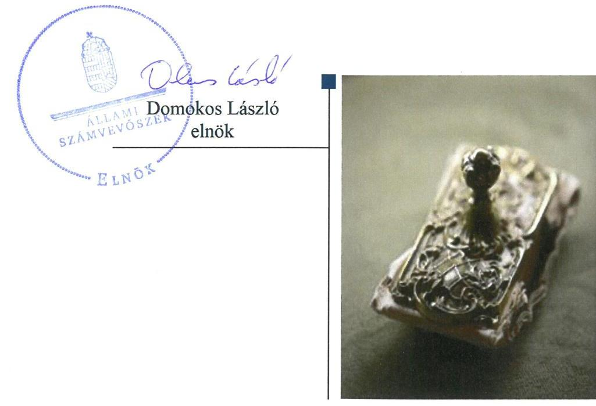
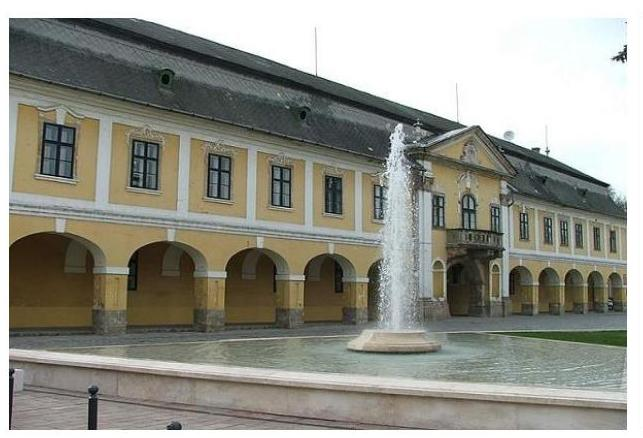
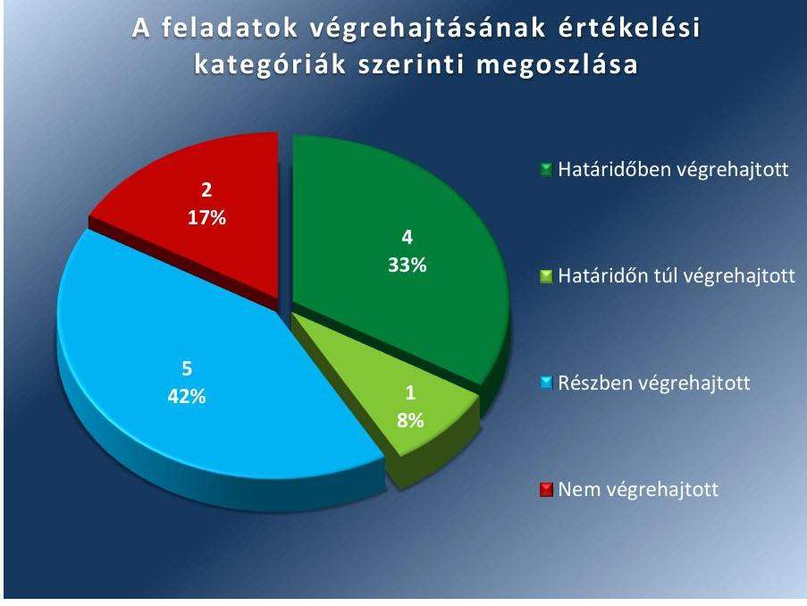
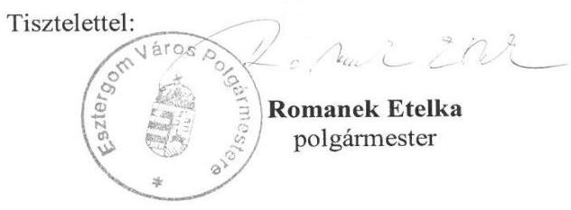
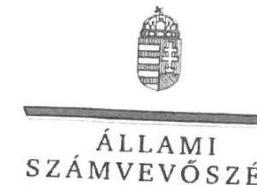
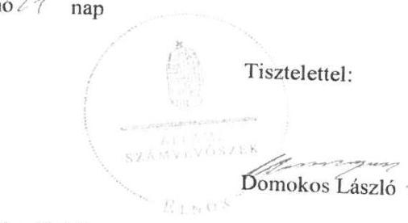
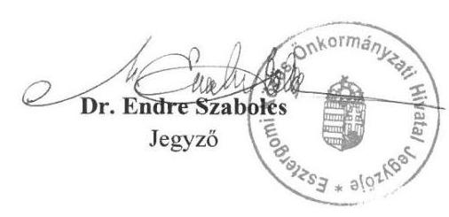
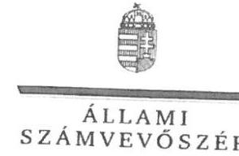
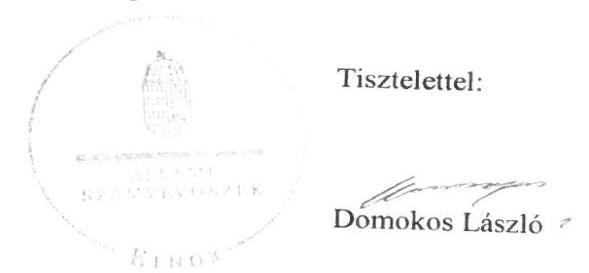

# Jelentés 

## Utóellenőrzések

A helyi önkormányzatok adósságrendezési eljárásának utóellenőrzése - Esztergom Város Önkormányzata
2019. 02. hó 13. nap

---

# AZ ELLENŐRZÉST FELÜGYELTE: 

VARGA EDIT felügyeleti vezető

## AZ ELLENŐRZÉST VEZETTE ÉS A VÉGREHAJTÁSÁÉRT FELELŐS:

BAJNAI ZSUZSANNA ellenőrzésvezető

## A PROGRAM ÖSSZEÁLLÍTÁSÁÉRT FELELŐS:

TÓTPÁL SZABOLCS osztályvezető

## A TÉMÁHOZ KAPCSOLÓDÓ KORÁBBI SZÁMVEVŐSZÉKI JELENTÉSEK:

- címe: Önkormányzati adósságrendezés ellenőrzése Esztergom Város Önkormányzata adósságrendezési eljárásának ellenőrzése
- sorszáma: 16199

Jelentéseink az Országgyűlés számítógépes hálózatán és az Interneten a www.asz.hu címen is olvashatóak.

IKTATÓSZÁM: EL-1488-001/2019
TÉMASZÁM: 2460
ELLENŐRZÉS-AZONOSÍTÓ SZÁM: V080425

---

# TARTALOMJEGYZÉK 

■ ÖSSZEGZÉS ..... 5
■ AZ ELLENŐRZÉS CÉLJA ..... 6
■ AZ ELLENŐRZÉS TERÜLETE ..... 7
■ AZ ELLENŐRZÉS HÁTTERE, INDOKOLTSÁGA ..... 8
■ A JELENTÉS LÉNYEGES KÉRDÉSKÖRE ..... 9
■ AZ ELLENŐRZÉS HATÓKÖRE ÉS MÓDSZEREI ..... 10
■ MEGÁLLAPÍTÁSOK ..... 12
■ MELLÉKLETEK ..... 15
I. sz. melléklet: Az ÁSZ 16199 számú jelentéséhez kapcsolódó intézkedési terv végrehajtása ..... 15
II. sz. melléklet: Esztergom Város Önkormányzata által megszűntetett társaságok ..... 19
III. sz. melléklet: Esztergom Város Önkormányzatának intézkedési terve ..... 20
■ FÜGGELÉKEK ..... 23
I. sz. függelék a Megállapítások fejezethez ..... 23
II. sz. függelék: Észrevételek ..... 24
■ RÖVIDÍTÉSEK JEGYZÉKE ..... 51

---

.

---

# ÖSSZEGZÉS 

Az Állami Számvevőszék Esztergom Város Önkormányzata adósságrendezési eljárásának utóellenőrzése során megállapította, hogy a működés szabályozottsága javult, azonban a belső kontroll szerinti elszámoltathatóság kockázatai nem csökkentek, továbbra sem biztosított a közpénzekkel való felelős gazdálkodás.

## Az ellenőrzés társadalmi indokoltsága

Az Állami Számvevőszék stratégiájában célul tűzte ki a számvevőszéki munka hasznosulásának javítását. Ezzel összhangban kontrollálja, hogy az ellenőrzött szervezet megvalósította-e a korábbi ellenőrzései által feltárt hibák, hiányosságok és szabálytalanságok megszüntetése céljából elkészített intézkedési tervében foglaltakat. A rendszeres utóellenőrzések hozzájárulnak a szükséges intézkedések tényleges végrehajtásához, ezáltal a közpénzügyek rendezettségének javulásához.

## Főbb megállapítások, következtetések

Esztergom Város Önkormányzata az intézkedési tervében meghatározott 12 feladatból ötöt végrehajtott, ötöt részben teljesített, kettőt nem hajtott végre.

Az intézkedési tervben vállalt, a működés szabályozottságát érintő feladatokat végrehajtották, a szabályozási hiányosságokat megszüntették.

A belső kontroll szerinti elszámoltathatóság kockázatai nem csökkentek, mert nem igazolták a kontrolltevékenységek megfelelő működtetését. Nem gondoskodtak a gazdálkodási jogköröket gyakorló személyek és aláírásmintáik nyilvántartásának vezetéséről, a gazdasági események dokumentumokkal történő alátámasztásáról, a számviteli szabályok szerinti könyvvezetés teljesítéséről, a megbízható éves költségvetési beszámoló elkészítése érdekében. Nem tettek lépéseket az átlátható szervezetekre vonatkozó előírásoknak való megfelelés érdekében. Nem intézkedtek valamennyi lejárt esedékességű tartozás rendezéséről, a gazdasági társaságok által ellátott feladatok hatékonyságának vizsgálatáról. A végre nem hajtott intézkedések következtében továbbra sem biztosított a közpénzekkel való felelős gazdálkodás.

Az intézkedési tervben meghatározott feladatok végrehajtásáról a jogszabály szerinti nyilvántartást vezették.

---

# AZ ELLENŐRZÉS CÉLJA 

Az ellenőrzés célja annak értékelése volt, hogy a számvevőszéki jelentésben foglalt intézkedést igénylő megállapításokkal összhangban készített intézkedési tervben meghatározott feladatokat az ellenőrzött szervezet végrehajtotta-e.

---

# AZ ELLENŐRZÉS TERÜLETE 

## Esztergom Város Önkormányzata

Esztergom város Komárom-Esztergom megyében helyezkedik el. Lakónépességének száma a Központi Statisztikai Hivatal Magyarország közigazgatási helynévkönyve alapján 27979 fő volt 2017. január 1-jén.

Az Önkormányzat¹ működésével kapcsolatos feladatok ellátását a Hivatal² biztosította.

A polgármester³ a 2014. évi általános önkormányzati választások óta tölti be tisztségét, a jegyző⁴ 2017. január 16-tól látja el feladatait.

Az Önkormányzatnál 2010. november 25-től 2011. augusztus 1-ig adósságrendezés folyt, amely során a hitelezők mindösszesen 26,6 milliárd Ft követelés teljesítésére nyújtottak be igényt. Ez a kötelezettségállomány az Önkormányzat vagyonának mintegy felét jelentette.

Az ÁSZ⁵ 2009. január 1. és 2015. június 30. közötti időszakra vonatkozóan ellenőrizte az Önkormányzat adósságrendezési eljárását. Az ellenőrzés célja annak megállapítása volt, hogy az adósságrendezési eljárás lefolytatása szabályszerű volt-e, az Önkormányzat gazdálkodása az adósságrendezési eljárás alatt megfelelt-e a jogszabályi előírásoknak, az eljárás szereplői a jogszabályokban foglaltak szerint jártak-e el az adósságrendezés során. A lefolytatott eljárás elérte-e a törvényben kitűzött célokat; az adósságrendezési eljárás alatt az Önkormányzat folyamatosan teljesítette-e kötelező feladatait, a hitelezők követelését vagyonarányosan kielégítette-e, helyreállt-e fizetőképessége. Az 16199. számú ÁSZ jelentés⁶ közzétételének napja 2016. december 1-je volt.

Az Önkormányzat az ÁSZ jelentésben foglalt javaslatok végrehajtása érdekében intézkedési tervet készített.

---

# AZ ELLENŐRZÉS HÁTTERE, INDOKOLTSÁGA 

Az ÁSZ tv.⁷ 33. § (1) bekezdése értelmében a számvevőszéki jelentések intézkedést igénylő megállapításaihoz és javaslataihoz kapcsolódóan az ellenőrzött szervezet vezetője intézkedési tervet köteles összeállítani, és az Állami Számvevőszék részére megküldeni.

Az ÁSZ által befogadott intézkedési tervben foglaltak megvalósítását az ÁSZ tv. 33. § (7) bekezdésében foglaltak alapján - az Állami Számvevőszék utóellenőrzés keretében ellenőrizheti. Az utóellenőrzések keretében - az intézkedések értékelése során - az Állami Számvevőszék figyelembe veszi az ellenőrzött szervezetek működési feltételeiben, valamint a jogszabályi előírásokban bekövetkezett változásokat.

Az utóellenőrzés során az ÁSZ értékeli, hogy az érintett számvevőszéki jelentésben foglalt intézkedést igénylő megállapításokkal és javaslatokkal összhangban, az ellenőrzött szervezet által készített intézkedési tervben meghatározott feladatokat a feladatra kijelöltek végrehajtották-e.

Az intézkedések végrehajtásával az adott terület szabályszerű működése vonatkozásában a kockázatok csökkenhetnek, azonban hosszabb távon az intézkedési tervben foglaltak végrehajtásával önmagában nem szűnnek meg, csak akkor, ha beépülnek az ellenőrzött szervezet működésébe, azokat folyamatosan karbantartják, figyelembe véve, illetve kezelve a változásokat. Emellett az intézkedések végrehajtásáig újabb kockázatok merülhetnek fel a szabályszerű működés vonatkozásában, amelyek kezelése szintén kiemelten fontos az ellenőrzött szervezet számára.

Az ellenőrzött szervezet vezetője által készített intézkedési tervekben foglalt feladatok hiányos, illetve késedelmes végrehajtása, vagy annak elmaradása a szabályszerűség és a felelős vezetői magatartás vonatkozásában kockázatot hordoz, ami azt mutatja, hogy az ellenőrzések során feltárt hibák, hiányosságok és szabálytalanságok kezelése nem kapott kellő hangsúlyt. Az utóellenőrzés során is fennálló szabálytalanságok esetén a közpénz, közvagyon veszélyeztetettségi kockázat valószínűsített hatásának értékelése további intézkedéseket vonhat maga után.

Az ellenőrzött szervezet szintjén az utóellenőrzés feltárja, hogy a szervezet az intézkedések végrehajtásával hasznosította-e a korábbi ellenőrzési jelentésben a hiányosságok megszüntetése, illetve a kockázatok kezelése érdekében megfogalmazott javaslatokat. Az intézkedések végrehajtása elmaradásának következtében továbbra is fennálló szabálytalanság esetén értékeli a közpénzek, közvagyon veszélyeztetettségét.

Az ÁSZ szintjén az utóellenőrzés visszacsatolást ad az ellenőrzési jelentések hasznosulásáról, az intézkedések elmaradásának, vagy részleges megvalósulásának a közpénzek, közvagyon veszélyeztetettségére gyakorolt valószínűsített hatásának értékelése további intézkedéseket vonhat maga után.

---

# A JELENTÉS LÉNYEGES KÉRDÉSKÖRE 

Az Önkormányzat az intézkedési tervben foglaltakat az előírt határidőben végrehajtotta-e?

---

# AZ ELLENŐRZÉS HATÓKÖRE ÉS MÓDSZEREI 

## Az ellenőrzés típusa

Megfelelőségi ellenőrzés.

## Az ellenőrzött időszak

Az utóellenőrzés alapját képező 16199. számú ÁSZ jelentés közzétételének napjától az ellenőrzésről szóló kiértesítő levél keltének napjáig, 2016. december 1-től 2018. július 3-ig tartó időszak.

## Az ellenőrzés tárgya

A számvevőszéki jelentésben foglalt intézkedést igénylő megállapításokkal és javaslatokkal összhangban - az Önkormányzat által - készített intézkedési tervben foglaltak végrehajtásának ellenőrzése volt.

## Az ellenőrzött szervezet

Esztergom Város Önkormányzata és az Esztergomi Közös Önkormányzati Hivatal

## Az ellenőrzés jogalapja

Az utóellenőrzés jogszabályi alapját az ÁSZ tv. 33. § (7) bekezdésének előírása képezi.

## Az ellenőrzés módszerei

Az ellenőrzést az ellenőrzött időszakban hatályos jogszabályok, az ellenőrzés szakmai szabályai, a jelen ellenőrzésre irányadó ÁSZ módszertanok, az ellenőrzési programban foglalt értékelési szempontok szerint végeztük.

Az ellenőrzés ideje alatt az Önkormányzattal történő kapcsolattartást az ÁSZ SZMSZ²ének vonatkozó előírásai alapján biztosítottuk.

Az utóellenőrzés megállapításait az ÁSZ rendelkezésére álló, valamint az ÁSZ adatbekérése szerint, az Önkormányzat által rendelkezésre bocsátott dokumentumok alapozták meg.

Az ellenőrzési bizonyítékként felhasználható adatforrások közé tartoztak egyrészt az ellenőrzési program részletes szempontjainál felsorolt

---

adatforrások, másrészt minden - az ellenőrzés folyamán feltárt, az ellenőrzés szempontjából információt tartalmazó - dokumentum.

Az intézkedési tervekben előírt feladatokat azok végrehajthatósága, illetve végrehajtása szempontjából az alábbiak szerint értékeltük:
— „határidőben végrehajtott" a feladat, ha a teljesítés dokumentáltan, az intézkedési tervben előírt határidőben és tartalommal megtörtént;
— „határidőn túl végrehajtott" a feladat, ha annak teljesítése az intézkedési tervben meghatározott módon, de az előírt határidőn túl történt meg;
— „részben végrehajtott" a feladat, ha végrehajtása teljes körűen az intézkedési tervben előírt módon nem történt meg;
— „nem végrehajtott" a feladat, ha a végrehajtás nem történt meg, vagy amennyiben a teljesítést nem dokumentálták;
— „okafogyottá vált" a feladat, ha végrehajtására - meghatározott esemény bekövetkezése, továbbá külső körülmény, a működést érintő feltétel változása miatt - már nincs szükség, illetve lehetőség, és egyértelműen megállapítható, hogy az intézkedést szükségessé tevő körülmény a jövőben nem fordulhat elő;
— „nem időszerű" az a feladat, amelynek ellenőrzési időszakon belüli végrehajtására azért nem került (kerülhetett) sor, mert az intézkedés alapjául szolgáló esemény nem következett be, de annak jövőbeni előfordulása lehetséges, a végrehajtása nem volt esedékes, vagy a végrehajtás határideje még nem járt le.
Az ellenőrzés lefolytatásához az Önkormányzat a tanúsítványok elektronikus kitöltésével, valamint az ÁSZ által kért dokumentumok elektronikus megküldésével szolgáltatott adatokat, amelyek valódiságát és teljes körűségét az ellenőrzött szervezet vezetője által tett teljességi és hitelességi nyilatkozat igazolja. Az így rendelkezésre bocsátott adatok, információk kontrollja az ellenőrzés keretében megtörtént.

Az ellenőrzött szervezet által megküldött intézkedési tervben meghatározott ÁSZ által beazonosított feladatok a III. számú mellékletben kerültek bemutatásra.

---

# MEGÁLLAPÍTÁSOK 

## Az Önkormányzat az intézkedési tervben foglaltakat az előírt határidőben végrehajtotta-e?

Összegző megállapítás

Az Önkormányzat az intézkedési tervben meghatározott 12 feladatból négyet határidőben, egyet határidőn túl, ötöt részben, kettőt nem hajtott végre. Az intézkedési tervben meghatározott feladatok végrehajtásáról vezettek nyilvántartást.

A polgármester a szabálytalanságok megszüntetése érdekében 12 intézkedésből álló intézkedési tervet küldött meg az ÁSZ részére. Az intézkedési tervben meghatározott feladatokat, határidőket, felelősöket és a feladatok végrehajtását az I. számú melléklet mutatja be.

Az ÁSZ javaslatai alapján készített intézkedési tervben meghatározott feladatok végrehajtásáról a jegyző a jogszabályi előírások szerint vezette a nyilvántartást.

Az intézkedési tervben meghatározott feladatok végrehajtásának értékelési kategóriák szerinti megoszlását az 1. ábra szemlélteti.

1. ábra

A feladatok végrehajtásának értékelési kategóriák szerinti megoszlása

A MŰKÖDÉS SZABÁLYOZOTTSÁGA javult, mert a Hivatal szervezeti és működési szabályzatát (1,2), a számlarendet (5), a bizonylati rendet (9), valamint a kötelezettségvállalással, a gazdálkodási jogkörök gyakorlásával kapcsolatos belső szabályzatokat a jogszabályi előírások szerint elkészítették (8).

---

# A BELSŐ KONTROLL SZERINTI ELSZÁMOLTATHATÓSÁG kockázatai nem csökkentek. Nem igazolták a gazdálkodási jogkörgyakorló személyek és aláírásmintájuk nyilvántartásának vezetését (8), a kontrolltevékenységek megfelelő működtetését (12), a gazdasági események dokumentummal történő alátámasztását (10), és nem pótolták a hiányzó 2010., 2011., és 2013. évi költségvetési beszámolókat (9). Nem bizonyították a gazdasági társaságok átlátható szervezetekre vonatkozó előírásoknak való megfelelését (11). 

Az adósságrendezési eljárás 3. hitelezői csoportjába tartozó kötelezettségeket teljesítették, azonban nem rendezték a 2016. december 31-én fennálló lejárt esedékességű tartozásokat (6). Nem vizsgálták a gazdasági társaságok által ellátott feladatok hatékonyságát, de megszüntettek tartósan veszteségesen gazdálkodó társaságokat (7).

A 2017. és 2018. évi likviditási tervet elkészítették (4). Az ÁSZ által feltárt szabálytalanságok miatt a munkaügyi felelősség tisztázása érdekében a fegyelmi eljárást lefolytatták (3).

---

.

---

# MELLÉKLETEK

■ I. SZ. MELLÉKLET: AZ ÁSZ
 16199 SZÁMÚ JELENTÉSÉHEZ KAPCSOLÓDÓ INTÉZKEDÉSI TERV VÉGREHAJTÁSA

|  $\begin{aligned} & \text { E } \ & \text { E } \ & \text { E } \ & \text { E } \ & \text { A } \end{aligned}$ | Az intézkedési tervben meghatározott feladat | Az intézkedési tervben meghatározott feladat | A feladat végrehajtása  |
| --- | --- | --- | --- |
|   | 1. | 2. | Határidőben végrehajtott feladatok | 4.  |
|  1. | (J2) „El kell készíteni a Hivatal hatályos jogszabályi előírásoknak megfelelő tartalmú szervezeti és működési szabályzat kiegészítését a 368/2011. (XII.31.) Korm. rendelet 13. §-ában foglaltaknak megfelelően." | 2017. március 31. | jegyző  |
|  2. | (P3) „Intézkedni kell arról, hogy a Hivatal hatályos jogszabályi előírásoknak megfelelő tartalmú szervezeti és működési szabályzatáról szóló előterjesztés készüljön, kezdeményezni Képviselő-testület elé terjesztését." | 2017. március 31. | polgármester, jegyző  |
|  3. | (P5) „Az Állami Számvevőszék ellenőrzése során feltárt hiányosságok és szabálytalanságok tekintetében a munkajogi felelősség tisztázása érdekében a közszolgálati tisztviselőkkel szembeni fegyelmi eljárásról szóló 31/2012.(III.7.) kormányrendelet alapján Polgármester a hatáskörében tartozó köztisztviselőket érintően a felelősség megállapítására vonatkozó vizsgálatot rendelje el. Az eljárás eredményének ismeretében a hivatallal jelenleg is közszolgálati jogviszonyban álló köztisztviselőkkel szemben a felelősségre vonást a törvény rendelkezéseinek megfelelően alkalmazza." | 2017. március 31. | polgármester  |
|  4. | (J1) „Intézkedni kell a jogszabályi előírásoknak megfelelő likviditási terv elkészítéséről." | a jogszabályi előírásoknak megfelelően, az aktuális gazdálkodási évre/évekre vonatkozó önkormányzati költségvetési rendelet megalkotását megelőzően, 2017. február 15. | jegyző, pénzügyi osztályvezető  |

---

|  5. | (J3) „El kell készíteni a hatályos jogszabályi előírásoknak megfelelő tartalmú a számlarend kiegészítését." | 2017. január 15., azt követően a felülvizsgálat időpontja január 15. | Jegyző, pénzügyi osztályvezető, belső ellenőr | A jegyző a jogszabályi előírásoknak megfelelő tartalmú Számlarendet ${ }^{11}$ az intézkedési tervben rögzített határidőt követően készítette el, azt a 7/2017. (III.30) jegyzői utasítással léptette hatályba.
A Számlarend felülvizsgálata határidőt követően 2018. március 26-án történt meg.  |
| --- | --- | --- | --- | --- |
|  6. | (P1) „Intézkedni kell arról, hogy a fennálló, lejárt esedékességű tartozások 2017. március 31-ig rendezésre kerüljenek." | 2017. március 31. | polgármester, jegyző | Végrehajtott feladat:
Az Önkormányzat az intézkedési tervben vállalt határidőig kiegyenlítette az adósságrendezési eljárást követően a 3. hitelezői csoport felé fennálló 709,3 millió Ft összegű tartozását.
Nem végrehajtott feladat:
A polgármester és a jegyző nem intézkedett az Önkormányzat IV. negyedéves mérlegjelentése szerint 2016. december 31-én fennálló 335,3 millió Ft lejárt esedékességű tartozás 2017. március 31-ig történő rendezése érdekében.  |
|  7. | (P2) „A jelenlegi Polgármester kezdeményezze a Képviselőtestületnél az Önkormányzat közvetlen és közvetett többségi tulajdonú gazdasági társaságainál az átfogó átvilágítást, annak érdekében, hogy a jövőbeli ésszerű, gazdaságos működtetésére vonatkozóan mekkora kockázatot jelent az önkormányzat gazdálkodására a jelenlegi állapot. Vizsgálni szükséges a gazdasági társaságok által ellátott feladatok hatékonyságát, továbbá kezdeményezze a Képviselő-testületnél a rendre negatív üzleti eredményt produkáló, veszteséget termelő gazdasági társaságok megszüntetését, átalakítását a jogszabályi előírásban foglaltak alapján." | 2017. június 30. | polgármester, jegyző | Végrehajtott feladat:
A Strigonium Zrt. és kapcsolt vállalkozásainak átfogó átvilágításáról készült vizsgálati jelentésről a Képviselő-testület a 421/2015 (VII. 30.) számú határozatot hozta. A polgármester intézkedett az Önkormányzat közvetlen illetve közvetett többségi tulajdonában lévő gazdasági társaságok alaptőkéjének illetve törzstőkéjének Ptk. ${ }^{12}$ előírása szerinti rendezéséről. A megszűnt társaságokat a II. sz. melléklet tartalmazza.
Nem végrehajtott feladat:
A polgármester igazoltan nem kezdeményezte a Strigonium Zrt. és leányvállalatain kívül az Önkormányzat további közvetlen többségi tulajdonú gazdasági társaságai átvilágítását, valamint a gazdasági társaságok által ellátott feladatok hatékonyságának vizsgálatát.  |

---

|  8. | (J4) „Intézkedni kell az előzetes írásbeli kötelezettségvállalást nem igénylő kifizetések rendjének meghatározásáról, a kötelezettségvállalások pénzügyi ellenjegyzésére vonatkozó előírások, a gazdálkodási jogköröket gyakorló kijelölési rendjének meghatározásáról, a gazdálkodási jogkörök ellátására jogosult személyekről és aláírás mintájukról naprakész nyilvántartás vezetéséről." | 2017. január 15., azt követően a felülvizsgálat időpontja január 15. | az intézkedési tervben meghatározott feladat felelőse | A feladat végrehajtása  |
| --- | --- | --- | --- | --- |
|   |  |  | 3. | 4.  |
|  9. | (J6) „A Jegyzőnek az éves beszámolók megőrzési kötelezettségének teljesítéséről intézkedni kell a jogszabályi előírásoknak megfelelően. Gondoskodni kell az elévülési időn belüli költségvetési beszámolóinak jogszabályban előírt megőrzésükről, továbbá a hiányzó 2010., 2011. és a 2013. évek költségvetési beszámolóinak pótlásáról, jogszabályban előírt megőrzésükről." | 2017. május 31. a beszámoló megőrzési kötelezettségének betartása azonnal és folyamatosan | jegyző, pénzügyi osztályvezető, belső ellenőr | Végrehajtott feladat:
A 2/2017 (III.30.) számú polgármesteri-jegyzői együttes utasítással - az intézkedési tervben rögzített határidőt követően - hatályba léptetett Gazdálkodási szabályzat ${ }^{13}$ tartalmazta az előzetes írásbeli kötelezettségvállalást nem igénylő kifizetések rendjének meghatározását, a kötelezettségvállalások pénzügyi ellenjegyzésére, a gazdálkodási jogköröket gyakorlók kijelölési rendjének meghatározására vonatkozó előírásokat. A Gazdálkodási szabályzat felülvizsgálatára határidőt követően 2018. március 26-án került sor.
Nem végrehajtott feladat:
A jegyző nem intézkedett a kötelezettségvállalásra, pénzügyi ellenjegyzésre, teljesítés igazolására, érvényesítésre, utalványozásra jogosult személyekről és aláírás mintájukról az Ávr. 60. § (3) bekezdésében foglaltak szerinti nyilvántartás vezetése érdekében.  |
|  10. | (J7) „Intézkedni kell a gazdasági események jogszabályi előírásnak megfelelő dokumentummal való alátámasztásáról. A pénzügyi gazdálkodási folyamatok szabályosságát, megfelelőségét biztosító belső kontrollok köréből hiányzó, az ellenőrzés a pénzügyi gazdasági döntések megalapozását szolgáló, a kötelezettségek szabályosságát biztosító kontrollok gazdasági folyamatokba történő beépítéséről. Módosítani szükséges a jogszabályi előírásnak megfelelően az önkormányzat 9/2013. | a szabályozás/rendelet vonatkozásában 2017. január 15.
azonnal és folyamatosan | jegyző, pénzügyi osztályvezető, belső ellenőr | Végrehajtott feladat:
A jegyző a 8/2017. (III.30.) számú jegyzői utasítással hatályba léptetett Bizonylati szabályzatban ${ }^{14}$ intézkedett az éves beszámolók megőrzési kötelezettségének teljesítése érdekében.
Nem végrehajtott feladat:
A jegyző nem gondoskodott az elévülési időn belüli költségvetési beszámolók megőrzéséről a Számv. tv. ${ }^{15}$ 169. § (1) bekezdésében előírtak ellenére, a hiányzó 2010., 2011. és 2013. évi költségvetési beszámolókat nem pótolta.  |
|   |  |  |  | Végrehajtott feladat:
A jegyző a belső kontrollok köréből hiányzó, a pénzügyi gazdasági döntések megalapozását szolgáló, szabályosságát biztosító kontrollok gazdasági folyamatokba történő beépítéséről a Gazdálkodási szabályzat 2017. március 30-ai hatályba léptetésével határidőt követően gondoskodott.
Az Önkormányzat 9/2013. (VI.27.) számú vagyonrendeletét a képviselőtestület a 4/2017. (I.26.) számú rendeletével - az intézkedési tervben vállalt határidőt követően - módosította.  |

---

|  1. | Az intézkedési tervben meghatározott feladat | Az intézkedési tervben meghatározott határidő | Az intézkedési tervben meghatározott feladat felelőse | A feladat végrehajtása  |
| --- | --- | --- | --- | --- |
|   | 1. | 2. | 3. | 4.  |
|   | (VI.27.) számú, az Önkormányzat vagyonáról és a vagyontárgyak feletti tulajdonosi jog gyakorlásáról szóló rendeletét." |  |  | Nem végrehajtott feladat:
A jegyző nem intézkedett a gazdasági események Számv. tv. 165. § (2) bekezdése szerinti dokumentummal való alátámasztása, ezáltal a számviteli szabályok szerinti könyvvezetés teljesítése, a megbízható éves költségvetési beszámoló elkészítése érdekében.  |
|   |  | Nem végrehajtott feladatok |  |   |
|  11. | (P4) „A nemzeti vagyonról szóló 2011. évi CXCVI. törvény 18.§ (4) bekezdésében foglalt előírásoknak megfelelően 2017. június 30-ig intézkedni kell az önkormányzati tulajdonú gazdasági társaságokkal kapcsolatos tulajdonosi jogok gyakorlásáról." | azonnal, folyamatosan, 2017. június 30. | polgármester, jegyző | A polgármester és a jegyző nem intézkedett az Nvtv. ${ }^{16} 18 . \S$ (4) bekezdésében foglaltak szerint a gazdasági társaságok tulajdonosi szerkezetének az átlátható szervezetekre vonatkozó előírásoknak való megfelelés érdekében.  |
|  12. | (J5) „Intézkedni kell a belső kontrollrendszer részét képező kontrolltevékenységek jogszabályi előírásoknak megfelelő működtetéséről." | 2017. január 15., azt követően a felülvizsgálat időpontja január 15. | jegyző, pénzügyi osztályvezető, belső ellenőr | A jegyző nem intézkedett a belső kontrollrendszer részét képező kontrolltevékenységek Bkr. 3. § c) pontjában foglalt előírásoknak megfelelő működtetéséről.  |

Forrás: ÁSZ által készített táblázat

---

| Az Önkormányzat közvetlen tulajdonában (és részesedésében) lévő társaságok | Végelszámolás/Felszámolás/Értékesítés/Kényszertörlés időpontja |
| :--: | :--: |
| Esztergomi Városi Televízió Nonprofit Kft. „kényszertörlés alatt" | A társaság hivatalból került törlésre 2014.09.10-i hatállyal. |
| Esztergomi Tankönyvkiadó és Egyetemfejlesztő Nkft. „kényszertörlés alatt" | A társaság hivatalból került törlésre 2015.06.02-i hatállyal. |
| ESZTERGOMI FÜRDŐ (SPA) Szolgáltató Zrt. „f.a." | A felszámolás kezdete 2012.03.23; a felszámolás vége 2015.12.12. |
| Egom- Garázs Kft. „kényszertörlés alatt" | A társaság hivatalból került törlésre 2015.12.17-i hatállyal. |
| Ister-Granum Eurorégió Fejlesztési Ügynökség Kft."v.a." | Az Önkormányzat Képviselő-testülete a 3/2016. (I.6.) sz. határozattal kezdeményezte a végelszámolást. A végelszámolás kezdete 2016.05.01; a végelszámolás vége 2017.02.17. A társaság kérelemre végelszámolással 2017. 05.08-i hatállyal került törlésre. |
| HOTEL MÁRIA VALÉRIA Kft. "v. a." | A társaság kérelemre végelszámolással 2017. 11.08-i hatállyal került törlésre. A végelszámolás kezdete 2015.10.11; a végelszámolás vége 2016.09.14. |
| Regia Civitas Kft. „f.a." | A társaság felszámolással került törlésre 2018.01.03-i hatállyal. A felszámolás kezdete 2016.04.15; a felszámolás vége 2018.01.03. |
| Esztergomi Vízmű Kft. "v.a" | Az Önkormányzat Képviselő-testülete az 578/2017. (VII.11.) sz. határozattal kezdeményezte a végelszámolást. A végelszámolás kezdete 2017.10.01. A társaság végelszámolás alatt állt 2017. 12.07-i hatállyal. |
| Az Önkormányzat közvetett a Strigonium Zrt. tulajdonában (és részesedésében) lévő társaságok | Végelszámolás/Felszámolás/Értékesítés/Kényszertörlés időpontja |
| Secretar Vagyonvédelmi és Szolgáltató Kft. "f.a." | A társaság felszámolással került törlésre 2015.12.12-i hatállyal. A felszámolás kezdete 2014.03.24; a felszámolás vége 2015.02.12. |
| Esztergompont Hírdető és Szolgáltató Kft. "v.a." | A társaság kérelemre végelszámolással 2015. 07.08-i hatállyal került törlésre. A végelszámolás kezdete 2014.01.01; a végelszámolás vége 2015.05.28. |
| Gran Tours Esztergom Város Utazási Irodája Kft. " v.a." | Az Önkormányzat Képviselő-testülete a 403/2015. (VII.9.) sz. határozattal kezdeményezte a végelszámolást. A végelszámolás kezdete 2010.12.31; a végelszámolás vége 2012.07.27. volt. A társaság végelszámolással 2015. 08.31-i hatállyal került törlésre. |
| Hungast Esztergom Kft. | A társaság 2015. 09. 28-i hatállyal átalakulás miatt törölve lett. |
| Városőrség Közhasznú Nonprofit "kényszertörlés alatt" | A társaság hivatalból került törlésre 2016.03.02-i hatállyal. |
| Esztergom Port Kft " f.a." | A társaság felszámolással került törlésre 2016.04.08-i hatállyal. A felszámolás kezdete 2015.04.15; a felszámolás vége 2016.04.08. |
|

 EHÍR Esztergomi Hírdető Kft. "v.a." | A társaság végelszámolás alatt áll. A végelszámolás kezdete 2016.05.01. Az Önkormányzat Képviselő-testülete a 639/2015. (XI.19.) sz. határozattal kezdeményezte a végelszámolást. |
| Védvár 2008 Zrt. „f.a.” | A társaság felszámolással került törlésre 2016.06.07-i hatállyal. A felszámolás kezdete 2013.08.05; a felszámolás vége 2016.06.07. |
| Esztergomi Turisztikai Nonprofit Kft. "v.a." | Az Önkormányzat Képviselő-testülete a 3/2016. (I.6.) sz. határozattal kezdeményezte a végelszámolást. A végelszámolás kezdete 2016.04.01; a végelszámolás vége 2017.01.16. volt. A társaság végelszámolással 2017. 05.04-i hatállyal került törlésre. |
| Gran Plac Kft. "v.a." | Az Önkormányzat Képviselő-testülete a 406/2015. (VII.9.) sz. határozattal kezdeményezte a végelszámolást. A végelszámolás kezdete 2016.04.01; a végelszámolás vége 2017.01.30. volt. A társaság végelszámolással 2017. 05.08-i hatállyal került törlésre. |
| Esztergom Településfejlesztési és Pro-jekt-koordinációs Kft. "v.a." | Az Önkormányzat Képviselő-testülete a 642/2015. (XI.19.) sz. határozattal kezdeményezte a végelszámolást. A végelszámolás kezdete 2014.01.01; a végelszámolás vége 2017.01.30. volt. A társaság végelszámolással 2017. 12.04-i hatállyal került törlésre. |
| ÉP Esztergomi Építőipati Kft. "v.a." | Az Önkormányzat Képviselő-testülete a 3/2016. (I.6.) sz. határozattal kezdeményezte a végelszámolást. A végelszámolás kezdete 2016.04.01; a végelszámolás vége 2018.05.02. volt. A társaság végelszámolással 2018. 07.09-i hatállyal került törlésre. |
| Roma Foglalkoztató Nkft. | A teljesítések 3. rész (43-46) oldalak. Üzletrész átruházási szerződés keretében a Strigonium Zrt. magánszemélyek részére értékesítette a társaságot. |

---

# III. SZ. MELLÉKLET: ESZTERGOM VÁROS ÖNKORMÁNYZATÁNAK INTÉZKEDÉSI TERVE

## INTÉZKEDÉSI TERV

2. sz. melléklet:

az Állami Számvevőszék által Kisztergom Város Önkormányzatának „Az önkormányzati adómigazgatás elutasítására” Kisztergom Város Önkormányzatának „adómigazgatási eljárásának elutasítására” tárgyú vizsgálatról szóló jelentés megállapításainak végrehajtására

(14159 számú jelentés)

### I. Az Állami Számvevőszék javaslataira Kisztergom Város Polgármesteri Hivatalának meghozandó intézkedések tartalma

| Az Állami Számvevőszék jelentéshez foglalt javaslata és az intézkedés tartalma | A javaslat végrehajtásától elvárt eredmény | Előkészítő | A terv elutasítását meghatározó tartalom (indoklás) |
|---|---|---|---|
| **P.1.** E. indokolás a saját erőforrású tartományok fennállása során, a jogszabályban meghatározott feladatok teljesítéséről. (1.1. sz. megállapítás 1-2. bekezdési alapjára) | 1. Indoklás arról, hogy a tanulmányok, saját erőforrású tartományok 2017. március 31-ig el nem ítéltek kerültek. | Polgármester, Jogyúl | 2017. március 31. |
| **P.2.** E. indokolás a képviselői határozatból az önkormányzati eljárásban szükséges a jogszabályi előírásban foglalt esetben a javaslatok előírásait, a távközlési adódott eltérés saját tőke más módon való biztosítását vagy a távközlési megállítható, szűkítő hiánytétel a távközlési feltételeinek vagy jogutód kijelölési megjelölésének. (1.2. sz. megállapítás 1. bekezdés 3-4. mondat alapjára) | 2. A jelentésben Polgármester részletesen tájékoztatja a Képviselő-testületet az önkormányzati eljárásban az írásosító szótárig telepített gazdasági távközlési szolgáltatókról arról, hogy a jövőbeli ésszerű, gazdasági, hatékony módon vonatkozóan eszközre korlátozott jószágot az önkormányzati gazdálkodásban a jelentésben átlagot. Várigőző szükséges a gazdasági távközlési szolgáltatók által ellátott feladatok határozatát, az önkormányzat a Képviselő-testület a módon megvizsgált gazdasági távközlési szolgáltatók termékei gazdasági távközlési szolgáltatók megjelölésének, átalakítását a jogszabályi előírásban foglalt alapját. | Polgármester, Jogyúl | 2017. június 26. |
| **P.3.** E. indokolás a polgármesteri hivatal hatályos jogszabályi előírásainak megfelelő tartalmú szervezeti és működési szabályzatáról szóló előterjesztés Képviselő-testület elé terjesztéséről. (1.5. sz. megállapítás 1. számú táblázat 1. pontja alapjára) | 3. Indoklás arról, hogy a távközlési kiadható hatályos jogszabályi előírásainak megfelelő tartalmú szervezeti és működési szabályzatáról szóló előterjesztés kiadható hatályos jogszabályi előírásainak rendelkezéseit, hogy a jövőbeli ésszerű, gazdasági, hatékony módon vonatkozóan eszközre korlátozott jószágot az önkormányzati gazdálkodásban a jelentésben átlagot. Várigőző szükséges a gazdasági távközlési szolgáltatók által ellátott feladatok határozatát, az önkormányzat a Képviselő-testület a módon megvizsgált gazdasági távközlési szolgáltatók termékei gazdasági távközlési szolgáltatók megjelölésének, átalakítását a jogszabályi előírásban foglalt alapját. | Polgármester, Jogyúl | 2017. március 31. |
| **P.4.** E. indokolás a jogszabályi előírásoknak megfelelően az önkormányzati tulajdonú gazdasági távközlési szolgáltatókkal kapcsolatos tulajdonos jog gyakorlatáról. (4.1. sz. megállapítás 4. bekezdési alapjára) | 4. A távközlési vagyongazdálkodás 2011. évi CXCVI. törvény 18.§ (5) bekezdésében foglalt előírásoknak megfelelően 2017. június 20-ig intézkedni kell az önkormányzati tulajdonú gazdasági távközlési szolgáltatókkal kapcsolatos tulajdonos jog gyakorlatáról. | Polgármester, Jogyúl | 2017. június 26. |
| **P.5.** E. indokolás az Állami Számvevőszék eljárása során feltárt hiányosságok, és vagy szabálytalanságok tekintetében a gazdasági feladatellátás távközlési szolgáltatókkal megvalósított eljárás megjelölésének és az önkormányzati eljárások az önkormányzati kiadható hatályos jogszabályok | 5. A távközlési vagyongazdálkodás 2011. évi CXCVI. törvény 18.§ (5) bekezdésében foglalt előírásoknak megfelelően 2017. június 20-ig intézkedni kell az önkormányzati tulajdonú gazdasági távközlési szolgáltatókkal kapcsolatos tulajdonos jog gyakorlatáról. | Polgármester, Jogyúl | 2017. június 26. |
| **P.6.** E. indokolás az Állami Számvevőszék eljárása során feltárt hiányosságok, és vagy szabálytalanságok tekintetében a gazdasági feladatellátás távközlési szolgáltatókkal megvalósított eljárás megjelölésének és az önkormányzati eljárások az önkormányzati kiadható hatályos jogszabályok | 6. Az Állami Számvevőszék eljárása során feltárt hiányosságok és szabálytalanságok tekintetében a gazdasági feladatellátás távközlési szolgáltatókkal megvalósított eljárásnak 21/2012. (D1-7.) kormányrendeletek megvalósított eljárás megjelölésének és az önkormányzati kiadható hatályos jogszabályok | Polgármester | 2017. március 31. |
| **P.7.** E. indokolás az Állami Számvevőszék eljárása során feltárt hiányosságok, és vagy szabálytalanságok tekintetében a gazdasági feladatellátás távközlési szolgáltatókkal megvalósított eljárás megjelölésének és az önkormányzati eljárások az önkormányzati kiadható hatályos jogszabályok | 7. A távközlési vagyongazdálkodás 2011. évi CXCVI. törvény 18.§ (5) bekezdésében foglalt előírásoknak megfelelően 2017. június 20-ig intézkedni kell az önkormányzati tulajdonú gazdasági távközlési szolgáltatókkal kapcsolatos tulajdonos jog gyakorlatáról. | Polgármester | 2017. március 31. |
| **P.8.** E. indokolás az Állami Számvevőszék eljárása során feltárt hiányosságok, és vagy szabálytalanságok tekintetében a gazdasági feladatellátás távközlési szolgáltatókkal megvalósított eljárás megjelölésének és az önkormányzati eljárások az önkormányzati kiadható hatályos jogszabályok | 8. A távközlési vagyongazdálkodás 2011. évi CXCVI. törvény 18.§ (5) bekezdésében foglalt előírásoknak rendelkezéseit, hogy a jövőbeli ésszerű, gazdasági, hatékony módon vonatkozóan eszközre korlátozott jószágot az önkormányzati gazdálkodásban a jelentésben átlagot. Várigőző szükséges a gazdasági távközlési szolgáltatók által ellátott feladatok határozatát, az önkormányzat a Képviselő-testület a módon megvizsgált gazdasági távközlési szolgáltatók átlagot. | Polgármester | 2017. március 31. |
| **P.9.** E. indokolás a polgármesteri hivatal hatályos jogszabályi előírásoknak megfelelő tartalmú szervezeti és működési szabályzatáról szóló előterjesztés Képviselő-testület elé terjesztéséről. (1.5. sz. megállapítás 1. számú táblázat 1. pontja alapjára) | 9. Indoklás arról, hogy a távközlési kiadható hatályos jogszabályi előírásainak megfelelő tartalmú szervezeti és működési szabályzatáról szóló előterjesztés kiadható hatályos jogszabályok | Polgármester | 2017. március 31. |
| **P.10.** E. indokolás a jogszabályi előírásoknak megfelelően az önkormányzati tulajdonú gazdasági távközlési szolgáltatókkal kapcsolatos tulajdonos jog gyakorlatáról. (4.1. sz. megállapítás 4. bekezdési alapjára) | 10. A távközlési vagyongazdálkodás 2011. évi CXCVI. törvény 18.§ (5) bekezdésében foglalt előírásoknak megfelelően 2017. június 20-ig intézkedni kell az önkormányzati tulajdonú gazdasági távközlési szolgáltatókkal kapcsolatos tulajdonos jog gyakorlatáról. | Polgármester | 2017. június 26. |
| **P.11.** E. indokolás az Állami Számvevőszék eljárása során feltárt hiányosságok, és vagy szabálytalanságok tekintetében a gazdasági feladatellátás távközlési szolgáltatókkal megvalósított eljárás megjelölésének és az önkormányzati eljárások az önkormányzati kiadható hatályos jogszabályok | 11. A távközlési vagyongazdálkodás 2011. évi CXCVI. törvény 18.§ (5) bekezdésében foglalt előírásoknak rendelkezéseit, hogy a jövőbeli ésszerű, gazdasági, hatékony módon vonatkozóan eszközre korlátozott jószágot az önkormányzati gazdálkodásban a jelentésben átlagot. Várigőző szükséges a gazdasági távközlési szolgáltatók által ellátott feladatok határozatát, az önkormányzati gazdálkodásban a jelentésben átlagot. Várigőző szükséges a gazdasági távközlési szolgáltatók által ellátott feladatok határozatát, az önkormányzati gazdálkodásban a jelentésben átlagot. | Polgármester | 2017. március 31. |
| **P.12.** E. indokolás a polgármesteri hivatal hatályos jogszabályi előírásoknak megfelelően az önkormányzati világok | 12. A távközlési vagyongazdálkodás 2011. évi CXCVI. törvény 18.§ (5) bekezdésében foglalt előírásoknak megfelelően 2017. június 20-ig intézkedni kell az önkormányzati tulajdonú gazdasági távközlési szolgáltatókkal kapcsolatos tulajdonos jog gyakorlatáról. | Polgármester | 2017. június 26. |
| **P.13.** E. indokolás az Állami Számvevőszék eljárása során feltárt hiányosságok, és vagy szabálytalanságok tekintetében a gazdasági feladatellátás távközlési szolgáltatókkal megvalósított eljárás megjelölésének és az önkormányzati eljárások az önkormányzati kiadható hatályos jogszabályok | 13. A távközlési vagyongazdálkodás 2011. évi CXCVI. törvény 18.§ (5) bekezdésében foglalt előírásoknak rendelkezéseit, hogy a jövőbeli ésszerű, gazdasági, hatékony módon vonatkozóan eszközre korlátozott jószágot az önkormányzati gazdálkodásban a jelentésben átlagot. | Polgármester | 2017. június 26. |
| **P.14.** E. indokolás az Állami Számvevőszék eljárása során feltárt hiányosságok, és vagy szabálytalanságok tekintetében a gazdasági feladatellátás távközlési szolgáltatókkal megvalósított eljárás megjelölésének és az önkormányzati eljárások az önkormányzati kiadható hatályos jogszabályok | 14. A távközlési vagyongazdálkodás 2011. évi CXCVI. törvény 18.§ (5) bekezdésében foglalt előírásoknak rendelkezéseit, hogy a jövőbeli ésszerű, gazdasági, hatékony módon vonatkozóan eszközre korlátozott jószágot az önkormányzati kiadható hatályos jogszabályok | Polgármester | 2017. június 26. |
| **P.15.** E. indokolás az Állami Számvevőszék eljárása során feltárt hiányosságok, és vagy szabálytalanságok tekintetében a gazdasági feladatellátás távközlési szolgáltatókkal megvalósított eljárás megjelölésének és az önkormányzati eljárások az önkormányzati kiadható hatályos jogszabályok | 15. A távközlési vagyongazdálkodás 2011. évi CXCVI. törvény 18.§ (5) bekezdésében foglalt előírásoknak rendelkezéseit, hogy a jövőbeli ésszerű, gazdasági, hatékony módon vonatkozóan eszközre korlátozott jószágot az önkormányzati kiadható hatályos jogszabályok | Polgármester | 2017. június 26. |
| **P.16.** E. indokolás az Állami Számvevőszék eljárása során feltárt hiányosságok, és vagy szabálytalanságok tekintetében a gazdasági feladatellátás távközlési szolgáltatókkal megvalósított eljárás megjelölésének és az önkormányzati eljárások az önkormányzati kiadható hatályos jogszabályok | 16. A távközlési vagyongazdálkodás 2011. évi CXCVI. törvény 18.§ (5) bekezdésében foglalt előírásoknak rendelkezéseit, hogy a jövőbeli ésszerű, gazdasági, hatékony módon vonatkozóan eszközre korlátozott jószágot az önkormányzati kiadható hatályos jogszabályok | Polgármester | 2017. június 26. |
| **P.17.** E. indokolás az Állami Számvevőszék eljárása során feltárt hiányosságok, és vagy szabálytalanságok tekintetében a gazdasági feladatellátás távközlési szolgáltatókkal megvalósított eljárás megjelölésének és az önkormányzati eljárások az önkormányzati kiadható hatályos jogszabályok | 17. A távközlési vagyongazdálkodás 2011. évi CXCVI. törvény 18.§ (5) bekezdésében foglalt előírásoknak rendelkezéseit, hogy a jövőbeli ésszerű, gazdasági, hatékony módon vonatkozóan eszközre korlátozott jószágot az önkormányzati kiadható hatályos jogszabályok | Polgármester | 2017. június 26. |
| **P.18.** E. indokolás az Állami Számvevőszék eljárása során feltárt hiányosságok, és vagy szabálytalanságok tekintetében a gazdasági feladatellátás távközlési szolgáltatókkal megvalósított eljárás megjelölésének és az önkormányzati eljárások az önkormányzati kiadható hatályos jogszabályok | 18. A távközlési vagyongazdálkodás 2011. évi CXCVI. törvény 18.§ (5) bekezdésében foglalt előírásoknak rendelkezéseit, hogy a jövőbeli ésszerű, gazdasági, hatékony módon vonatkozóan eszközre korlátozott jószágot az önkormányzati kiadható hatályos jogszabályok | Polgármester | 2017. június 26. |

 törvény 18.§ (5) bekezdésében foglalt előírások rendelkezéseit, hogy a jövőbeli ésszerű, gazdasági,  módon vonatkozóan eszközre korlátozott jószágot az önkormányzati kiadhatott hatályos jogszabályok | Polgármester | 2017. június 26.  |
|  **P.19.** E. indokszámaim az Átkomi Székesévétel eljárás során feltéte hiányosságot, és vagy szabálytalanságokat tekintetében a gazdasági feladat ellátásával megvívódott eljárás megjelölésének és az önkormányzati kiadhatott hatályos jogszabályok | 20. A távonóg vagyazatú esztét 2011. évi CSG/VI. törvény 18.§ (5) bekezdésében foglalt előírások rendelkezéseit, hogy a jövőbeli ésszerű, gazdasági, módon vonatkozóan eszközre korlátozott jószágot az önkormányzati kiadhatott hatályos jogszabályok | Polgármester | 2017. június 26.  |
|  **P.20.** E. indokszámaim az Átkomi Székesévétel eljárás során feltéte hiányosságot, és vagy szabálytalanságokat tekintetében a gazdasági feladat ellátásával megvívódott eljárás megjelölésének és az önkormányzati kiadhatott hatályos jogszabályok | 21. A távonóg vagyazatú esztét 2011. évi CSG/VI. törvény 18.§ (5) bekezdésében foglalt előírások rendelkezéseit, hogy a jövőbeli ésszerű, gazdasági, módon vonatkozóan eszközre korlátozott jószágot az önkormányzati kiadhatott hatályos jogszabályok | Polgármester | 2017. június 26.  |
|  **P.21.** E. indokszámaim az Átkomi Székesévétel eljárás során feltéte hiányosságot, és vagy szabálytalanságokat tekintetében a gazdasági feladat ellátásával megvívódott eljárás megjelölésének és az önkormányzati kiadhatott hatályos jogszabályok | 22. A távonóg vagyazatú esztét 2011. évi CSG/VI. törvény 18.§ (5) bekezdésében foglalt előírások rendelkezéseit, hogy a jövőbeli ésszerű, gazdasági, módon vonatkozóan eszközre korlátozott jószágot az önkormányzati kiadhatott hatályos jogszabályok | Polgármester | 2017. június 26.  |
|  **P.22.** E. indokszámaim az Átkomi Székesévétel eljárás során feltéte hiányosságot, és vagy szabálytalanságokat tekintetében a gazdasági feladat ellátásával megvívódott eljárás megjelölésének és az önkormányzati kiadhatott hatályos jogszabályok | 23. A távonóg vagyazatú esztét 2011. évi CSG/VI. törvény 18.§ (5) bekezdésében foglalt előírások rendelkezéseit, hogy a jövőbeli ésszerű, gazdasági, módon vonatkozóan eszközre korlátozott jószágot az önkormányzati kiadhatott hatályos jogszabályok | Polgármester | 2017. június 26.  |
|  **P.23.** E. indokszámaim az Átkomi Székesévétel eljárás során feltéte hiányosságot, és vagy szabálytalanságokat tekintetében a gazdasági feladat ellátásával megvívódott eljárás megjelölésének és az önkormányzati kiadhatott hatályos jogszabályok | 24. A távonóg vagyazatú esztét 2011. évi CSG/VI. törvény 18.§ (5) bekezdésében foglalt előírások rendelkezéseit, hogy a jövőbeli ésszerű, gazdasági, módon vonatkozóan eszközre korlátozott jószágot az önkormányzati kiadhatott hatályos jogszabályok | Polgármester | 2017. június 26.  |
|  **P.25.** E. indokszámaim az Átkomi Székesévétel eljárás során feltéte hiányosságot, és vagy szabálytalanságokat tekintetében a gazdasági feladat ellátásával megvívódott eljárás megjelölésének és az önkormányzati kiadhatott hatályos jogszabályok | 26. A távonóg vagyazatú esztét 2011. évi CSG/VI. törvény 18.§ (5) bekezdésében foglalt előírások rendelkezéseit, hogy a jövőbeli ésszerű, gazdasági, módon vonatkozóan eszközre korlátozott jószágot az önkormányzati kiadhatott hatályos jogszabályok | Polgármester | 2017. június 26.  |
|  **P.27.** E. indokszámaim az Átkomi Székesévétel eljárás során feltéte hiányosságot, és vagy szabálytalanságokat tekintetében a gazdasági feladat ellátásával megvívódott eljárás megjelölésének és az önkormányzati kiadhatott hatályos jogszabályok | 28. A távonóg vagyazatú esztét 2011. évi CSG/VI. törvény 18.§ (5) bekezdésében foglalt előírások rendelkezéseit, hogy a jövőbeli ésszerű, gazdasági, módon vonatkozóan eszközre korlátozott jószágot az önkormányzati kiadhatott hatályos jogszabályok | Polgármester | 2017. június 26.  |
|  **P.29.** E. indokszámaim az Átkomi Székesévétel eljárás során feltéte hiányosságot, és vagy szabálytalanságokat tekintetében a gazdasági feladat ellátásával megvívódott eljárás megjelölésének és az önkormányzati kiadhatott hatályos jogszabályok | 29. A távonóg vagyazatú esztét 2011. évi CSG/VI. törvény 18.§ (5) bekezdésében foglalt előírások rendelkezéseit, hogy a jövőbeli ésszerű, gazdasági, módon vonatkozóan eszközre korlátozott jószágot az önkormányzati kiadhatott hatályos jogszabályok | Polgármester | 2017. június 26.  |
|  **P.30.** E. indokszámaim a polgármester által bocsátott analógiai jövedelemtöbbletben állítva a jövőbeli ésszerű, gazdasági, módon vonatkozóan eszközre korlátozott jószágot az önkormányzati kiadhatott hatályos jogszabályok | 31. A távonóg vagyazatú esztét 2011. évi CSG/VI. törvény 18.§ (5) bekezdésében foglalt előírások rendelkezéseit, hogy a jövőbeli ésszerű, gazdasági, módon vonatkozóan eszközre korlátozott jószágot az önkormányzati kiadhatott hatályos jogszabályok | Polgármester | 2017. június 26.  |
|  **P.31.** E. indokszámaim az Átkomi Székesévétel eljárás során feltéte hiányosságot, és vagy szabálytalanságokat tekintetében a gazdasági feladat ellátásával megvívódott eljárás megjelölésének és az önkormányzati kiadhatott hatályos jogszabályok | 32. A távonóg vagyazatú esztét 2011. évi CSG/VI. törvény 18.§ (5) bekezdésében foglalt előírások rendelkezéseit, hogy a jövőbeli ésszerű, gazdasági, módon vonatkozóan eszközre korlátozott jószágot az önkormányzati kiadhatott hatályos jogszabályok | Polgármester | 2017. június 26.  |
|  **P.32.** E. indokszámaim az Átkomi Székesévétel eljárás során feltéte hiányosságot, és vagy szolgáltatásának elégtételében foglalt előírások rendelkezéseit, hogy a jövőbeli ésszerű, gazdasági, módon vonatkozóan eszközre korlátozott jószágot az önkormányzati kiadhatott hatályos jogszabályok | 33. A távonóg vagyazatú esztét 2011. évi CSG/VI. törvény 18.§ (5) bekezdésében foglalt előírások rendelkezéseit, hogy a jövőbeli ésszerű, gazdasági, módon vonatkozóan eszközre korlátozott jószágot az önkormányzati kiadhatott hatályos jogszabályok | Polgármester | 2017. június 26.  |
|  **P.33.** E. indokszámaim az Átkomi Székesévétel eljárás során feltéte hiányosságot, és vagy szolgáltatásának elégtételében foglalt előírások rendelkezéseit, hogy a jövőbeli ésszerű, gazdasági, módon vonatkozóan eszközre korlátozott jószágot az önkormányzati kiadhatott hatályos jogszabályok | 34. A távonóg vagyazatú esztét 2011. évi CSG/VI. törvény 18.§ (5) bekezdésében foglalt előírások rendelkezéseit, hogy a jövőbeli ésszerű, gazdasági, módon vonatkozóan eszközre korlátozott jószágot az önkormányzati kiadhatott hatályos jogszabályok | Polgármester | 2017. június 26.  |
|  **P.35.** E. indokszámaim az Átkomi Székesévétel eljárás során feltéte hiányosságot, és vagy szolgáltatásának elégtételében foglalt előírások rendelkezéseit, hogy a jövőbeli ésszerű, gazdasági, módon vonatkozóan eszközre korlátozott jószágot az önkormányzati kiadhatott hatályos jogszabályok | 36. A távonóg vagyazatú esztét 2011. évi CSG/VI. törvény 18.§ (5) bekezdésében foglalt előírások rendelkezéseit, hogy a jövőbeli ésszerű, gazdasági, módon vonatkozóan eszközre korlátozott jószágot az önkormányzati kiadhatott hatályos jogszabályok | Polgármester | 2017. június 26.  |
|  **P.36.** E. indokszámaim az Átkomi Székesévétel eljárás során feltéte hiányosságot, és vagy szolgáltatásának elégtételében foglalt előírások rendelkezéseit, hogy a jövőbeli ésszerű, gazdasági, módon vonatkozóan eszközre korlátozott jószágot az önkormányzati kiadhatott hatályos jogszabályok | 37. A távonóg vagyazatú esztét 2011. évi CSG/VI. törvény 18.§ (5) bekezdésében foglalt előírások rendelkezéseit, hogy a jövőbeli ésszerű, gazdasági, módon vonatkozóan eszközre korlátozott jószágot az önkormányzati kiadhatott hatályos jogszabályok | Polgármester | 2017. június 26.  |
|  **P.37.** E. indokszámaim az Átkomi Székesévétel eljárás során feltéte hiányosságot, és vagy szolgáltatásának elégtételében foglalt előírások rendelkezéseit, hogy a jövőbeli ésszerű, gazdasági, módon vonatkozóan eszközre korlátozott jószágot az önkormányzati kiadhatott hatályos jogszabályok | 38. A távonóg vagyazatú esztét 2011. évi CSG/VI. törvény 18.§ (5) bekezdésében foglalt előírások rendelkezéseit, hogy a jövőbeli ésszerű, gazdasági, módon vonatkozóan eszközre korlátozott jószágot az önkormányzati kiadhatott hatályos jogszabályok | Polgármester | 2017. június 26.  |
|  **P.38.** E. indokszámaim az Átkomi Székesévétel eljárás során feltéte hiányosságot, és vagy szolgáltatásának elégtételében foglalt előírások rendelkezéseit, hogy a jövőbeli ésszerű, gazdasági, módon vonatkozóan eszközre korlátozott jószágot az önkormányzati kiadhatott hatályos jogszabályok | 39. A távonóg vagyazatú esztét 2011. évi CSG/VI. törvény 18.§ (5) bekezdésében foglalt előírások rendelkezéseit, hogy a jövőbeli ésszerű, gazdasági, módon vonatkozóan eszközre korlátozott jószágot az önkormányzati kiadhatott hatályos jogszabályok | Polgármester | 2017. június 26.  |
|  **P.39.** E. indokszámaim az Átkomi Székesévétel eljárás során feltéte hiányosságot, és vagy szolgáltatásának elégtételében foglalt előírások rendelkezéseit, hogy a jövőbeli ésszerű, gazdasági, módon vonatkozóan eszközre korlátozott jószágot az önkormányzati kiadhatott hatályos jogszabályok | Polgármester | 2017. június 26.  |
|  **P.40.** E. indokszámaim az Átkomi Székesévétel eljárás során feltéte hiányosságot, és vagy szolgáltatásának elégtételében foglalt előírások rendelkezéseit, hogy a jövőbeli ésszerű, gazdasági, módon vonatkozóan eszközre korlátozott jószágot az önkormányzati kiadhatott hatályos jogszabályok | Polgármester | 2017. június 26.  |
|  **P.40.** E. indokszámaim az Átkomi Székesévétel eljárás során feltéte hiányosságot, és vagy szolgáltatásának elégtételében foglalt előírások rendelkezéseit, hogy a jövőbeli ésszerű, gazdasági, módon vonatkozóan eszközre korlátozott jószágot az önkormányzati kiadhatott hatályos jogszabályok | Polgármester | 2017. június 26.  |
|  **P.40.** E. indokszámaim az Átkomi Székesévétel eljárás során feltéte hiányosságot, és vagy szolgáltatásának elégtételében foglalt előírások rendelkezéseit, hogy a jövőbeli ésszerű, gazdasági, módon vonatkozóan eszközre korlátozott jószágot az önkormányzati kiadhatott hatályos jogszabályok | Polgármester | 2017. június 26.  |
|  **P.40.** E. indokszámaim az Átkomi Székesévétel eljárás során feltéte hiányosságot, és vagy szolgáltatásának elégtételében foglalt előírások rendelkezéseit, hogy a jövőbeli ésszerű, gazdasági, módon vonatkozóan eszközre korlátozott jószágot az önkormányzati kiadhatott hatályos jogszabályok | Polgármester | 2017. június 26.  |
|  **P.40.** E. indokszámaim az Átkomi Székesévétel eljárás során feltéte hiányosságot, és vagy szolgáltatásának elégtételében foglalt előírások rendelkezéseit, hogy a jövőbeli ésszerű, gazdasági, módon vonatkozóan eszközre korlátozott jószágot az önkormányzati kiadhatott hatályos jogszabályok | Polgármester | 2017. június 26.  |
|  **P.40.** E. indokszámaim az Átkomi Székesévétel eljárás során feltéte hiányosságot, és vagy szolgáltatásának elégtételében foglalt előírások rendelkezéseit, hogy a jövőbeli ésszerű, gazdasági, módon vonatkozóan eszközre korlátozott jószágot az önkormányzati kiadhatott hatályos jogszabályok | Polgármester | 2017. június 26.  |
|  **P.40.** E. indokszámaim az Átkomi Székesévétel eljárás során feltéte hiányosságot, és vagy szolgáltatásának elégtételében foglalt előírások rendelkezéseit, hogy a jövőbeli ésszerű, gazdasági, módon vonatkozóan eszközre korlátozott jószágot az önkormányzati kiadhatott hatályos jogszabályok | Polgármester | 2017. június 26.  |
|  **P.40.** E. indokszámaim az Átkomi Székesévétel eljárás során feltéte hiányosságot, és vagy szolgáltatásának elégtételében foglalt előírások rendelkezéseit, hogy a jövőbeli ésszerű, gazdasági, módon vonatkozóan eszközre korlátozott jószágot az önkormányzati kiadhatott hatályos jogszabályok | Polgármester | 2017. június 26.  |
|  **P.40.** E. indokszámaim az Átkomi Székesévétel eljárás során feltéte hiányosságot, és vagy szolgáltatásának elégtételében foglalt előírások rendelkezéseit, hogy a jövőbeli ésszerű, gazdasági, módon vonatkozóan eszközre korlátozott jószágot az önkormányzati kiadhatott hatályos jogszabályok | Polgármester | 2017. június 26.  |
|  **P.40.** E. indokszámaim az Átkomi Székesévétel eljárás során feltéte hiányosságot, és vagy szolgáltatásának elégtételében foglalt előírások rendelkezéseit, hogy a jövőbeli ésszerű, gazdasági, módon vonatkozóan eszközre korlátozott jószágot az önkormányzati kiadhatott hatályos jogszabályok | Polgármester | 2017. június 26.  |

 ésservingi kiadtatás távonógakkal megvívódott eljárások | Polgármester | 2017. június 26.  |
|  **P.40.** E. indokszámaim az Átkomi Székesévételét eljárás során feltéte hiányosságot, és vagy szolgáltatásának elégtételében foglalt előírások rendelkezéseit, hogy a jövőbeli ésservingi kiadtatás távonógakkal megvívódott eljárások | Polgármester | 2017. június 26.  |
|  **P.40.** E. indokszámaim az Átkomi Székesévételét eljárás során feltéte hiányosságot, és vagy szolgáltatásának elégtételében foglalt előírások rendelkezéseit, hogy a jövőbeli ésservingi kiadtatás távonógakkal megvívódott eljárások | Polgármester | 2017. július 26.  |
|  **P.40.** E. indokszámaim az Átkomi Székesévételét eljárás során feltéte hiányosságot, és vagy szolgáltatásának elégtételében foglalt előírások rendelkezéseit, hogy a jövőbeli ésservingi kiadtatás távonógakkal megvívódott eljárások | Polgármester | 2017. július 26.  |
|  **P.40.** E. indokszámaim az Átkomi Székesévételét eljárás során feltéte hiányosságot, és vagy szolgáltatásának elégtételében foglalt előírások rendelkezéseit, hogy a jövőbeli ésservingi kiadtatás távonógakkal megvívódott eljárások | Polgármester | 2017. július 26.  |
|  **P.40.** E. indokszámaim az Átkomi Székesévételét eljárás során feltéte hiányosságot, és vagy szolgáltatásának elégtételében foglalt előírások rendelkezéseit, hogy a jövőbeli ésservingi kiadtatás távonógakkal megvívódott eljárások | Polgármester | 2017. július 26.  |
|  **P.40.** E. indokszámaim az Átkomi Székesévételét eljárás során feltéte hiányosságot, és vagy szolgáltatásának elégtételében foglalt előírások rendelkezéseit, hogy a jövőbeli ésservingi kiadtatás távonógakkal megvívódott eljárások | Polgármester | 2017. július 26.  |
|  **P.40.** E. indokszámaim az Átkomi Székesévételét eljárás során feltéte hiányosságot, és vagy szolgáltatásának elégtételében foglalt előírások rendelkezéseit, hogy a jövőbeli ésservingi kiadtatás távonógakkal megvívódott eljárások | Polgármester | 2017. július 26.  |
|  **P.40.** E. indokszámaim az Átkomi Székesévételét eljárás során feltéte hiányosságot, és vagy szolgáltatásának elégtételében foglalt előírások rendelkezéseit, hogy a jövőbeli ésservingi kiadtatás távonógakkal megvívódott eljárások | Polgármester | 2017. július 26.  |
|  **P.40.** E. indokszámaim az Átkomi Székesévételét eljárás során feltéte hiányosságot, és vagy szolgáltatásának elégtételében foglalt előírások rendelkezéseit, hogy a jövőbeli ésservingi kiadtatás távonógakkal megvívódott eljárások | Polgármester | 2017. július 26.  |
|  **P.40.** E. indokszámaim az Átkomi Székesévételét eljárás során feltéte hiányosságot, és vagy szolgáltatásának elégtételében foglalt előírások rendelkezéseit, hogy a jövőbeli ésservingi kiadtatás távonógakkal megvívódott eljárások | Polgármester | 2017. július 26.  |
|  **P.40.** E. indokszámaim az Átkomi Székesévételét eljárás során feltéte hiányosságot, és vagy szolgáltatásának elégtételében foglalt előírások rendelkezéseit, hogy a jövőbeli ésservingi kiadtatás távonógakkal megvívódott eljárások | Polgármester | 2017. július 26.  |
|  **P.40.** E. indokszámaim az Átkomi Székesévételét eljárás során feltéte hiányosságot, és vagy szolgáltatásának elégtételében foglalt előírások rendelkezéseit, hogy a jövőbeli ésservingi kiadtatás távonógakkal megvívódott eljárások | Polgármester | 2017. július 26.  |
|  **P.40.** E. indokszámaim az Átkomi Székesévételét eljárás során feltéte hiányosságot, és vagy szolgáltatásának elégtételében foglalt előírások rendelkezéseit, hogy a jövőbeli ésservingi kiadtatás távonógakkal megvívódott eljárások | Polgármester | 2017. július 26.  |
|  **P.40.** E. indokszámaim az Átkomi Székesévételét eljárás során feltéte hiányosságot, és vagy szolgáltatásának elégtételében foglalt előírások rendelkezéseit, hogy a jövőbeli ésservingi kiadtatás távonógakkal megvívódott eljárások | Polgármester | 2017. július 26.  |
|  **P.40.** E. indokszámaim az Átkomi Székesévételét eljárás során feltéte hiányosságot, és vagy szolgáltatásának elégtételében foglalt előírások rendelkezéseit, hogy a jövőbeli ésservingi kiadtatás távonógakkal megvívódott eljárások | Polgármester | 2017. július 26.  |
|  |  |  |  |  |  |  |  |  |  |  |  |  |  |  |  |  |  |  |  |  |  |  |  |  |  |  |  |  |  |  |  |  |  |  |  |  |  |  |  |  |  |  |  |  |  |  |  |  |  |  |  |  |  |  |  |  |  |  |  |  |  |  |  |  |  |  |  |  |  |  |  |  |  |  |  |  |  |  |  |  |  |  |  |  |  |  |  |  |  |  |  |  |  |  |  |  |  |  |  |  |  | 

---

# INTÉZKEDÉSI TERV

az Állami Számvevőszék által Enczegem Város Önkormányzata „Az önkormányzati adószágronának ellenőrzése- Enczegem Város Önkormányzata adószágronának eljárásának ellenőrzése" című vizsgálatról szóló jelentés megállapításainak végrehajtására

II. Az Állami Számvevőszék javaslatára az Enczegemi Közös Önkormányzati Hivatal Jegyzője által megfogalmazott intézkedések tartalma

|  Állami Számvevőszék jelentéshez foglalt javaslatok és az intézkedés tartalma | A javaslat végrehajtásáért felelős | Határidő | Intézkedési terv elkészültéig megtett intézkedés/feljesztés  |
| --- | --- | --- | --- |
|  1. Intézkedjen a lékolékát terv eljavaslatok a javaslatok és a javaslatok | 1. Indokolást kell a jogszabályi előírásoknak megfelelően a lékolékát terv elkészítéséről. | Jegyző, Főrendezői osztályvezető | A jogszabályi előírásoknak megfelelően, az elmúlt gazdálkodási időszakra vonatkozó, önkormányzati adószágronáti rendelkezések megellenőrzése 2017. február 15.  |
|  (3.1.1.1.1.1.1.1.1.1.1.1.1.1.1.1.1.1.1.1.1.1.1.1.1.1.1.1.1.1.1.1.1.1.1.1.1.1.1.1.1.1.1.1.1.1.1.1.1.1.1.1.1.1.1.1.1.1.1.1.1.1.1.1.1.1.1.1.1.1.1.1.1.1.1.1.1.1.1.1.1.1.1.1.1.1.1.1.1.1.1.1.1.1.1.1.1.1.1.1.1.1

---

# INTÉZKEDÉSI TERV

az Állami Számvevőszék által Szatorgom Város Önkormányzata „Az önkormányzati adórendelkezése ellenőrzése- Szatorgom Város Önkormányzata adórendelkezése eljárásának ellenőrzése" című vizsgálatról szóló jelentés megállapításainak végrehajtására

(14159 számú jelentés)

1. Az Állami Számvevőszék javaslataira az Szatorgomi Közös Önkormányzati Hivatal Jegyzője által megfogalmazott intézkedések tartalma

|  Állami Számvevőszék jelentéshez foglalt javaslatok és az intézkedés tartalma | A javaslat végrehajtásáért felelős | Melyből | Intézkedési terv elkészültéig megtett intézkedés/feljesztés  |
| --- | --- | --- | --- |
|  4. Intézkedjen a jogszabályi előírásoknak megfelelően az éves beosztásosítás megőrzési kötelezettségének teljesítéséről. (5.1.az. megállapítás alapján) | 4. A jogszabály az éves beosztásosítás megőrzési kötelezettségének teljesítéséről intézkedni kell a jogszabályi előírásoknak megfelelően. Gondoskodni kell az elővétel (álló belső költségvetési beosztásosítások jogszabályban előírt megőrzéséről, továbbá, a 2010., 2011. és a 2012. évi költségvetési beosztásosítások példányokról, jogszabályban előírt megőrzéséről. | Jegyző, Pénzügyi osztályvezető, Szabó címke | Számlavezető törvény (c) § (1) kérem áttekintése előírt beosztásosító megőrzési kötelezettség beosztása, betartatása nemmel és feljesztéssel ellátott feladat, 2017. május 31.  |
|  5. Intézkedjen a gazdasági események jogszabályi előírásainak megfelelő dokumentummal való alátámasztásáról. (1.9.az. megállapítás 2. bekezdése és c. 4.3. megállapítás 3. bekezdés 4. mondata alapján) | 5. Intézkedni kell a gazdasági események jogszabályi előírásainak megfelelő dokumentummal való alátámasztásáról. A pénzügyi gazdálkodási folyamatok szabályozásának, megfelelőségét biztosító belső kontrollok közötti felnyert, az ellenőrzés a pénzügyi gazdasági átláthatóság megállapítását szolgált, a kötelezettségét szabályozásának biztosító kontrollok gazdasági folyamatokra áttekintő beépítéséről, felülvizsgálat szükséges a jogszabályi előírásoknak megfelelően az önkormányzat 2012.(V1.37.) számú az Önkormányzat vagyonáról és a vagyonkezelési feltételek felajánlásai jog gyakorlásáról szóló rendeletének. | Jegyző, Pénzügyi osztályvezető, Szabó címke | A szabályozás jogszabályi vonatkozásában akkreditálni szükséges 2012. január 13-ig. Azonnal és folyamatosan ellátott feladat.  |

Szatorgom, 2016. december 20.

dr. Sárkány Lajos Aljegyző

Román Etelke Polgármester

2016. évi gazdasági események önkormányzati adórendelkezése felülvizsgálata.

---

# FÜGGELÉKEK 

- I. SZ. FÜGGELÉK A MEGÁLLAPÍTÁSOK FEJEZETHEZ

Az utóellenőrzés megállapításai alapján a jegyző nem gondoskodott a kötelezettségvállalásra, pénzügyi ellenjegyzésre, teljesítés igazolására, érvényesítésre, utalványozásra jogosult személyekről és aláírás-mintájukról szóló nyilvántartás vezetéséről az államháztartásról szóló törvény végrehajtásáról szóló 368/2011. (XII. 31.) Korm. rendelet 60. § (3) bekezdésében foglaltak szerint; továbbá a költségvetési beszámolóknak a számvitelről szóló 2000. évi C. törvény (a továbbiakban: Számv. tv.) 169. § (1) bekezdésének előírása szerinti megőrzéséről; nem intézkedett a gazdasági események Számv. tv. 165. § (2) bekezdése szerinti dokumentummal való alátámasztás érdekében; és nem intézkedett a belső kontrollrendszer részét képező kontrolltevékenységek működtetéséről - a költségvetési szervek belső kontrollrendszeréről és belső ellenőrzéséről szóló 370/2011. (XII. 31.) Korm. rendelet (a továbbiakban: Bkr.) 3. § c) pontjának előírása ellenére.
Mindezek alapján az Állami Számvevőszék az ÁSZ tv. 30. § (1) bekezdésének megfelelően kezdeményezi a jegyző felelősségének tisztázását, érvényesítését.

---

A jelentéstervezetet a Számvevőszék 15 napos észrevételezésre megküldte az ellenőrzött szervezetek vezetőinek az ÁSZ tv. 29. § (1) bekezdése előírása szerint.

Az ÁSZ a jelentéstervezetet észrevételezésre megküldte Esztergom Város Önkormányzatának polgármestere és az Esztergomi Közös Önkormányzati Hivatal jegyzője részére.
Esztergom Város Önkormányzata polgármestere és az Esztergomi Közös Önkormányzati Hivatal jegyzője az ÁSZ tv. 29. § (2) bekezdésében foglalt észrevételezési jogukkal éltek, a jelentéstervezet megállapításaira a törvényes határidőn belül észrevételt tettek.
Esztergom Város Önkormányzata polgármesterének és az Esztergomi Közös Önkormányzati Hivatal jegyzőjének észrevételeit és az azokra adott választ a függelék tartalmazza.

[^0]
[^0]:    * 29. § (1) Az Állami Számvevőszék az ellenőrzési megállapításait megküldi az ellenőrzött szervezet vezetőjének vagy az általa megbízott személynek, és annak, akinek személyes felelősségét állapította meg.
    (2) Az ellenőrzött szervezet vezetője és a felelősként megjelölt személy az ellenőrzés megállapításaira tizenöt napon belül írásban észrevételt tehet.
    (3) Az Állami Számvevőszék az észrevételre a beérkezésétől számított harminc napon belül írásban válaszol. A figyelembe nem vett észrevételeket köteles a jelentésben feltüntetni, és megindokolni, hogy azokat miért nem fogadta el.

---

# Esztergom Város Polgármestere 

Tárgy: Észrevétel
Iktatószám: 11114-3/2018

## Állami Számvevőszék

1052 Budapest,
Apáczai Csere János utca 10.

## Domokos László Elnök Úr részére

Tisztelt Elnök Úr!
Hivatkozva 2018. december 17-én kézhez vett EL-0784-029/2018. iktatószámú „Utóellenőrzések - A helyi önkormányzatok adósságrendezési eljárásának utóellenőrzése - Esztergom Város Önkormányzata" című számvevőszéki jelentéstervezetre - az Állami Számvevőszékről szóló 2011. évi LXVI. törvény 29. § (1) bekezdése alapján - az alábbiakban foglalt észrevételt teszem az ellenőrzés alábbi, dőlt betűvel jelzett megállapításaira:

## „6. Nem végrehajtott feladat:

A polgármester és a jegyző nem intézkedett az Önkormányzat IV. negyedéves mérlegjelentése szerint 2016. december 31-én fennálló 335,3 millió Ft lejárt esedékességű tartozás 2017. március 31-ig történő rendezése érdekében. "

Észrevételem, hogy a 2016. évi beszámoló a tárgyévet követő kötelezettségeket összesítve tartalmazza a 2016-ról 2017 évre áthúzódó kötelezettségállományt, az alábbi részletezettséggel:

| Év | Számla tartozás Nettó | Számlatartozás ÁFA | Szállítói tartozás |
| :--: | :--: | :--: | :--: |
| 2009. | 1600000 | 400000 | 2000000 |
| 2010. | 7248086 | 1812021 | 9060107 |
| 2011. | 8585532 | 2146391 | 10731923 |
| 2012. | 2936 | 734 | 3670 |
| 2014. | 246923 | 64761 | 311684 |
| 2015. | 4354676 | 1173517 | 5528193 |

 |
| 2016. | 24070405 | 2794992 | 26865397 |
| 2017. | 209339964 | 55547912 | 264887876 |
|  | 255448522 | 63940328 | 319388850 |
| 2009-2015. | 22038153 | 5597424 | 27635577 |
| 2016-2017. | 233410369 | 58342904 | 291753273 |
|  | 255448522 | 63940328 | 319388850 |
| 2015. évi köt.egyéb működési célra (ez nem része a szállítói mérlegmellékletnek) |  |  | 15872930 |
| 2016. évi kötelezettségek összesen: | 255448522 | 63940328 | 335261780 |

[^0]
[^0]:    Postafiók: 92 . 2501 Esztergom, Széchenyi tér 1.

---

A beszámolóban feltüntetett 335,3 millió Ft összegű kötelezettség a mérlegjelentés 1/D űrlapján, mint lejárt esedékességű kötelezettség szerepel. Ez nem ténylegesen lejárt kötelezettség, hiszen a IV. negyedéves mérlegjelentés számszaki egyezősége miatt a teljes összeget azon a soron kell szerepeltetni, ellenkező esetben hibát jelez a KGR program. A fenti tábla alapján a ténylegesen lejárt esedékességű kötelezettség összege a 2017. évi szállítói tartozás, mely 264.887.876 Ft. A 2016. évi szállítói tartozás 2017. év januárjában lettek kiegyenlítve, mivel az év végi zárási feladatok zökkenőmentes elvégzése érdekében a számlák leadási határideje 2016. december 15-e volt. A 2009-2015. évi szállítói kötelezettségek a mellékletként csatolt szállítókkal történt levelezés, illetve könyvelési bizonylatok alapján 2016. december 1. napja és 2018. július 3. között, az utóellenőrzéssel vizsgált időszakban, az adósságrendezés lezártát követően rendezésre kerültek. (Jelen levelemhez 1.sz. mellékleteként a teljesítések dokumentumait megküldöm.)

Tehát a megállapítástervezet 6. pontjában foglaltak nem felelnek meg a valóságnak, azaz nem helytálló.

# „7. Nem végrehajtott feladat: 

A polgármester igazoltan nem kezdeményezte a Strigonium Zrt. és leányvállalatain kívül az Önkormányzat további közvetlen többségi tulajdonú gazdasági társaságai átvilágítását, valamint a gazdasági társaságok által ellátott feladatok hatékonyságának vizsgálatát."

Észrevételem, hogy a Strigonium Zrt. és leányvállalatain kívül további közvetlen többségi tulajdonú mindkét gazdasági társasága (Esztergomi Köztisztasági Kft., A Művelődés Háza NKft.) nem produkál rendre negatív üzleti eredményt, így jövőbeni ésszerű gazdaságos működtetése sem jelent kockázatot az Önkormányzat gazdálkodására, így az intézkedési tervben kitűzött feladat álláspontom szerint ezekre nem terjed ki. Mindkét gazdasági társaság kötelező önkormányzati feladatot lát el. (Az Eszköz Kft. az Mötv. 13.§ (1) 19. pontja szerinti hulladékgazdálkodást, míg A Művelődés Háza Nkft. az Mötv. 13.§ (1) 7. pontja szerinti kulturális szolgáltatást, helyi közművelődési tevékenységet.) Ezeket jogszabályi változás hiányában felülvizsgálni nem szükséges, hiszen feladataikat érvényes és hatályos közszolgáltatási szerződés alapján végzik.
Az Önkormányzat közvetlen többségi tulajdonú gazdasági társaságai által - a számvitelről szóló 2000. évi C. törvény 153.§ (1) bekezdése alapján - elkészített beszámolóit a Képviselő-testület minden évben önkormányzati határozattal fogadja el. A döntések alapjául szolgálnak az szabályszerűen elkészített előterjesztés és a társaságok által előzetesen megküldött számviteli beszámolók és mellékleteik.
A Képviselő-testületi döntések és az előterjesztések nyilvánosak, az www.esztergom.hu weboldalon, az gazdasági társaságok elfogadott beszámolói a közhiteles e-beszamolo.im.gov.hu weboldalon megtekinthetőek.

A fentiek is bizonyítják, hogy az intézkedési tervben foglaltak kizárólag a Strigonium Zrt. és leányvállalataik esetében bír relevanciával.

## „8. Nem végrehajtott feladat:

A jegyző nem intézkedett a kötelezettségvállalásra, pénzügyi ellenjegyzésre, teljesítésigazolásra, érvényesítésre, utalványozásra jogosult személyekről és aláírás mintájukról az Ávr. 60.§ (3) bekezdésben foglaltak szerinti nyilvántartás vezetése érdekében."

Észrevételem, hogy az utóellenőrzés során az Esztergomi Közös Önkormányzati Hivatal megküldte az Állami Számvevőszék részére a Szabályzat a kötelezettségvállalás, pénzügyi ellenjegyzés, teljesítés igazolása, érvényesítés, utalványozás gyakorlásának módjáról, eljárási rendjéről szóló 2/2017. (III.30.) számú Polgármesteri-Jegyzői együttes utasítást. Álláspontom szerint teljesítettük az intézkedési tervben foglaltakat. A fenti dokumentum megküldésének határidőben eleget tettünk, az

---

eljárás során a Tisztelt Állami Számvevőszék nem jelzett további adatbekérési igényt. Jelezni kívánom, hogy a jegyzőkönyvben hiányolt nyilvántartás rendelkezésre áll, azt kérésükre bármikor rendelkezésre tudjuk bocsátani.
„Az önkormányzatok belső kontrollrendszere kialakításának és működtetésének utóellenőrzése Esztergom Város Önkormányzata 2018."-ról szóló, 2018. január 5-én publikált 18004 számú jelentésében megfogalmazott megállapításaik is alátámasztják a fentieket, melynek releváns részeit az alábbiakban idézem:
„HATÁRIDŐBEN VÉGREHAJTOTT feladatok:

1. A polgármester figyelemmel kísérte az Önkormányzat gazdálkodásának szabályszerűségét és intézkedett az önkormányzati belső kontrollrendszer működésének biztosítására a mindenkori jogszabályi rendelkezéseknek megfelelően, biztosítva, hogy mindenkor rendelkezésre álljanak a jogszabályok szerint előírt, naprakészen aktualizált belső szabályzatok.
2. A polgármester és az aljegyző elkészítette a gazdálkodási szabályzatot, amely tartalmazta a kötelezettségvállalás pénzügyi ellenjegyzése, a teljesítésigazolás, az érvényesítés és az utalványozás rendjéről szóló szabályokat, különös figyelmet fordítva az ezeket végző személyek kijelölésének rendjére, személyi változások esetén a személyi kijelölések haladéktalan aktualizálására.
3. A belső ellenőr által elkészített és az aljegyző által jóváhagyott 2014-2016. évi belső ellenőrzésekről szóló összefoglaló éves ellenőrzési jelentések tartalmazták a belső kontrollrendszer szabályszerűségének, gazdaságosságának, hatékonyságának és eredményességének növelése, javítása érdekében tett fontosabb javaslatokat, valamint a belső kontrollrendszer öt elemének értékelését.

# HATÁRIDŐN TÚL VÉGREHAJTOTT feladatok: 

14. A polgármester az általa történő kötelezettségvállalások esetében 2014. szeptember 30. helyett 2014. október 1-jével jelölte ki a teljesítésigazolásra jogosult személyeket.
15. A polgármester és az aljegyző 2014. szeptember 30. helyett 2014. október 1-el, illetve 2014. november 6-al jelölte ki a teljesítésigazolásra jogosult személyeket.

## RÉSZBEN VÉGREHAJTOTT feladatok:

28. A polgármester a vonatkozó szabályzatokban intézkedett a teljesítésigazolás, illetve az érvényesítés általi kontrollok biztosítására, gondoskodott a teljesítésigazolásra, érvényesítésre jogosult személyek írásban történő kijelölésére, azonban a teljesítésigazolásra jogosult személyek esetében a teljesítésigazolási jogosultság a munkaköri leírásukban nem került rögzítésre."

A fentiek alapján egyértelműen megállapítható, hogy a jelentéstervezetben szereplő megállapítás nem felel meg a valóságnak, az nem helytálló, hiszen a hiányolt intézkedések meglétét az ÁSZ egy korábbi ellenőrzése során megállapította.

## „9. Nem végrehajtott feladat:

A jegyző nem gondoskodott az elévülési időn belüli költségvetési beszámolók megőrzéséről a Számv. tv. ${ }^{15} 169 . \S$ (1) bekezdésében előírtak ellenére, a hiányzó 2010., 2011., és 2013. évi költségvetési beszámolókat nem pótolta."

A Nemzeti Adó-és Vámhivatal Közép-dunántúli Bűnügyi Igazgatósága Komárom-Esztergom Megyei Vizsgálati Osztálya a 65007/368/2016. bű. ügyszámon folyamatban lévő eljárásában

---

lefoglalta a hivatkozott és Önök által hiányolt költségvetési beszámolókat. A lefoglalás megszüntetéséről a NAV a 65007/368-86/2016. bű. számú határozatával döntött, mely határozat
2018. 06. 30. napján emelkedett jogerőre, emiatt nem állt módunkban azokat megküldeni a feltöltésre nyitva álló határidőben. A lefoglalás megszünéséről szóló határozatot a Hivatal 2018. június 22-én vette át, a lefoglalt dokumentumok átadás-átvételi eljárására jegyzőkönyvvel is igazoltan 2018. december 19. napján került sor, azaz a hiányolt dokumentumok fizikailag akkor kerültek vissza Esztergom Város Önkormányzatához. (Jelen levelemhez 2.sz. mellékleteként a 65007/368-86/2016. bű. számú NAV határozatot megküldöm)

A fenti megállapítás tervezet tehát nem valós, az elévülési időn belüli költségvetési beszámolók megőrzési kötelezettségét teljesítettük, azonban a nyomozó hatóság rendelkezésére kellett bocsátanunk, így azok feltöltésére nem volt lehetőségünk.

# ,10. Nem végrehajtott feladat: 

A jegyző nem intézkedett a gazdasági események Számv. tv. 165. § (2) bekezdése szerinti dokumentummal való alátámasztása, ezáltal a számviteli szabályok szerinti könyvvezetés teljesítése, a megbízható éves költségvetési beszámoló elkészítése érdekében."

Tájékoztatom Önöket, hogy az intézkedési tervben foglaltak szerint az Önkormányzat gondoskodott az Önkormányzat vagyonáról és a vagyontárgyak feletti tulajdonosi jog gyakorlásáról szóló, Esztergom Város Önkormányzata Képviselő-testületének 9/2013. (VI. 27.) önkormányzati rendelete módosításáról 2017. május 10. napján. A Számviteli Politikáról szóló 1/2017. (III.30.) számú Polgármesteri-Jegyzői Együttes Utasításában rendelkezett mindazon dokumentumok köréről, amelyek a gazdasági eseményeket jogszabályi előírásnak megfelelően alátámaszthatják. Ezen túlmenően a főkönyvi adatbázis megküldését Önök sem a rendelkezésre álló határidőn belül, sem hiánypótlási felhívással nem kérték. Fenti idézett megállapítás-tervezet nem helytálló, nem valós. Az EL-0784-017/2018 iktatószámú jegyzőkönyv részeként csatolt Teljességi és hitelességi nyilatkozat mellékletében szereplő dokumentum-jegyzék 58. sorszámon jelölt és megküldött V080425 1. számú tanúsítvány PM_Jegyző 20180618.pdf (I. Polgármester) 1. sorszám, 5. oszlopában szereplő kifizetéseket alátámasztó bizonylatok és szintén megküldött szabályzatok alapján egyértelműen igazolhatók a gazdasági események Számv. tv. 165. § (2) bekezdése szerinti dokumentummal való alátámasztása.

A megállapítástervezet ezen pontja a fentiek alapján nem helytálló, hiszen a jegyző intézkedett a gazdasági események számviteli törvény előírásának megfelelő dokumentummal való alátámasztásra, ami a feltöltött dokumentumból is igazolható.

## ,11. Nem végrehajtott feladat:

A polgármester és a jegyző nem intézkedett a Nvtv. ${ }^{16}$ 18.§ (4) bekezdésében foglaltak szerint a gazdasági társaságok tulajdonosi szerkezetének az átlátható szervezetekre vonatkozó előírásoknak való megfelelés érdekében."

Tájékoztatom Önöket, hogy az Esztergomi Köztisztasági Nonprofit Kft. esetében a pénzmosás és a terrorizmus finanszírozása megelőzéséről és megakadályozásáról szóló 2017. évi LIII. törvény 3. § 38. pontjának a) alpontja alapján a tényleges tulajdonos Esztergom Város Önkormányzata, ennél fogva a társaság a nemzeti vagyonról szóló 2011. évi CXCVI. törvény 3. § (1) bekezdésének 1. pontjának b) alpontja szerint ex lege átlátható szervezetnek minősül.

A Tatabánya-Esztergom Kiemelt Járműipari Térség és Fejlődési Zóna Nonprofit Kft. esetében Esztergom Város Önkormányzata az intézkedési tervben arra vállalt kötelezettséget, hogy a nemzeti vagyonról szóló 2011. évi CXCVI. törvény 18. § (4) bekezdése szerinti kötelezettségének eleget tesz.

---

Tekintettel arra, hogy a társaság egységes szerkezetű alapító okirata 2017. február 8. napján kelt, így az intézkedési terv szerinti kötelezettségvállalás erre a gazdálkodó szervezetre nem vonatkozhatott.

# A megállapítástervezet ezen pontja a fentiek alapján nem helytálló. 

## „12. Nem végrehajtott feladat:

A jegyző nem intézkedett a belső kontrollrendszer részét képző kontrolltevékenységek Bkr. 3.§ c) pontjában foglalt előírásoknak megfelelő működtetéséről."
Fenti idézett megállapítás-tervezet álláspontom szerint nem helytálló. Az EL-0784-017/2018 iktatószámú jegyzőkönyv részeként csatolt Teljességi és hitelességi nyilatkozat mellékletében szereplő dokumentum-jegyzék 58. sorszámon jelölt és megküldött V080425 1. számú tanúsítvány PM Jegyző 20180618.pdf (I. Polgármester) 1. sorszám, 5. oszlopában szereplő - kifizetéseket alátámasztó bizonylatok és szintén megküldött szabályzatok alapján egyértelműen igazolható a kontrolltevékenységek kialakítása és működtetése. Ezen kifizetési dokumentumok és a vonatkozó szabályzatainkkal való összhang vizsgálata igazolja a Bkr. 8.§ (2) a), c), d) és (4) pontjaiban foglaltak megvalósítását. Bkr. 8.§ (3) és (4) pontjaiban előírtakról a megküldött Kötelezettségvállalás, pénzügyi ellenjegyzés, teljesítés igazolása, érvényesítés, utalványozás gyakorlásának módjáról, eljárási rendjéről szóló szabályzat, valamint a Gazdálkodási szabályzat rendelkezik, továbbá alátámasztja Esztergom Város könyvvizsgálójának, Böröczné Köszegi Zsuzsannának 2018. június 28-án kelt „Vezetői levél Esztergom Város Önkormányzata szabályzataival kapcsolatban" című megállapítása is.

Az utóellenőrzés során a korábbi tapasztalatainktól eltérően nem az www.aszhirpoltal.hu oldalon publikált adatbekérési szabályok szerint történt az adatbekérés.

A vizsgálat elrendeléséről az EL-0784-003/2018 iktatószámú adatbekérő értesítő érkezett, a levél 2. számú mellékletében felsorolt dokumentumokat az öt munkanapos határidőt tartva megküldtük. Az adatbekérő levélben nem volt egyértelmű számunkra az, hogy pontosan milyen adatbázisokat és milyen mintákat szükséges beküldenünk és szolgáltatnunk az ellenőrzés számára, későbbiekben nem volt hiánypótlásra való felhívás és mintavételezési igény az Állami Számvevőszék részéről, ezért az intézkedési tervben megfogalmazott feladatok végrehajtását közvetlenül igazoló dokumentumok kerültek megküldésre, főkönyvi adatbázis nem.

A hatályos jogszabályoknak megfelelő könyvvezetés és beszámolást igazolásául csatoljuk az EcoStat CT integrált gazdálkodási
 rendszerünkből migrált 2015., 2016., 2017., 2018. költségvetési évekre vonatkozó főkönyvi adatbázisokat.
„Az ÁSZ az ellenőrzött szervezetektől ütemezetten, több szakaszban kérhet be adatokat, dokumentumokat. Az adatkérés első szakaszában általában az ellenőrzés szempontjából sarkalatosnak minősített alapdokumentumok kerülnek bekérésre. A második ütemben az egyéb, az ellenőrzés szempontjából fontos dokumentumokat, valamint a mintavételezés elvégzéséhez szükséges adatbázisokat kéri be az ÁSZ, továbbá - amennyiben releváns - a harmadik ütemben kerül sor a kiválasztott mintatételek bekérésére ${ }^{1}$."

[^0]
[^0]:    ${ }^{1}$ Forrás: https://www.aszhirportal.hu/hu/hirek/melyek-az-adatkeres-szabalyai

---

Tekintettel arra, hogy a mintatételek bekérésére nem került sor, álláspontom szerint a 2011. évi LXVI. törvény 25. § (5) bekezdés c) pontja szerinti azon kötelezettség sem teljesülhet a jelentéstervezet jelenlegi tartalmával történő véglegesítés esetén, mely szerint „az ellenőrzés vezetője felelős az általa készített jelentéstervezet valódiságáért és helytállóságáért".

Ezen okok miatt a jelentéstervezet 5. oldalán található Összegzés című fejezetben foglaltakkal, különösen annak első mondatában található azon megállapítással, miszerint „továbbra sem biztosítottak a közpénzekkel felelős gazdálkodás", nem értek egyet.

Kérem, hogy a 2011. évi LXVI. törvény 25. § (5) bekezdés c) pontja szerinti kötelezettségük teljesítése érdekében szíveskedjenek a levelem mellékleteként megküldött dokumentumokat figyelembe venni és a jelentéstervezet 23. oldalán található Függelékek című fejezetben megfogalmazottakat is szíveskedjenek felülvizsgálni.

Együttműködésüket megköszönve,

Esztergom, 2018. december 22.

---

ELHök

Ikt.szám: EL-0784-040/2018.

# Romanek Etelka úrhölgy 

polgármester
Esztergom Város Önkormányzata

## Esztergom

## Tisztelt Polgármester Úrhölgy!

Az „Utóellenőrzések - A helyi önkormányzatok adósságrendezési eljárásának utóellenőrzése Esztergom Város Önkormányzata" címmel készített számvevőszéki jelentéstervezetre tett észrevételét köszönettel megkaptam.
Az Állami Számvevőszék észrevételre vonatkozó álláspontjáról a felügyeleti vezető által készített részletes tájékoztatást csatoltan megküldöm.
Felhívom Polgármester úrhölgy figyelmét, hogy a költségvetési szervek belső kontrollrendszeréről és belső ellenőrzéséről szóló 370/2011. (XII. 31.) Korm. rendelet 14. § (1) bekezdése alapján a jegyző, a költségvetési szerv vezetőjeként köteles nyilvántartást vezetni a külső ellenőrzések javaslatai alapján készült intézkedési tervek végrehajtásáról, ezáltal nyomon követni azokat. Ezen jogszabályi kötelezettség teljesítését a jegyző az intézkedési tervben vállalt feladatok végrehajtását igazoló dokumentumokkal tudja alátámasztani. Az Állami Számvevőszék az Állami Számvevőszékről szóló 2011. évi LXVI. törvény (továbbiakban ÁSZ tv.) 33. § (7) bekezdése alapján végzett utóellenőrzés keretében az intézkedési tervben foglaltak megvalósítását ellenőrizte.

Tájékoztatom Polgármester úrhölgyet, hogy a számvevőszéki jelentésben - az ÁSZ tv. 29. § (3) bekezdése alapján - a figyelembe nem vett észrevételeket szerepeltetjük, annak indoklásával, hogy azokat az Állami Számvevőszék miért nem fogadta el.

Budapest, 2019.

Melléklet: Tájékoztatás az észrevételek kezeléséről

---

# Tájékoztatás az észrevételek kezeléséről 

Az „Utóellenőrzések - A helyi önkormányzatok adósságrendezési eljárásának utóellenőrzése Esztergom Város Önkormányzata"című jelentéstervezetre a 2018. december 22-én kelt, 111143/2018. iktatószámú levelében tett észrevételét áttekintettük, annak kezeléséről az alábbi tájékoztatást adom.

## 1. A jelentéstervezet I. sz. melléklet 6. sorának megállapításra tett észrevétel kapcsán

Polgármester úrhölgy észrevételében bemutatja, hogy véleménye szerint a 2016. évi beszámoló milyen évenkénti megoszlásban tartalmazza a 2016. évtől 2017. évre áthúzódó kötelezettségállományt. Leírja, hogy a 2016. évi beszámolóban feltüntetett 335,3 millió Ft összegű kötelezettség a 2016. IV. negyedévi mérlegjelentés 1/D űrlapján, mint lejárt esedékességű kötelezettség szerepel. Ez nem teljes mértékben lejárt kötelezettség, azonban a IV. negyedéves mérlegjelentés számszaki egyezősége miatt a teljes összeget azon a soron kellett szerepeltetni, ellenkező esetben hibát jelzett a KGR program. A kimutatás alapján a ténylegesen lejárt esedékességű kötelezettség összege a 2017 évi szállítói tartozás, mely 264887876 Ft. A 2016 évi szállítói tartozás 2017. év januárjában lettek kiegyenlítve, mivel az év végi zárási feladatok zökkenőmentes elvégzése érdekében a számlák leadási határideje 2016. december 15-e volt. A 2009-2015 évi szállítói kötelezettségek az észrevétel mellékleteként csatolt szállítókkal történt levelezés, illetve könyvelési bizonylatok alapján 2016. december 1. napja és 2018. július 3. között, az utóellenőrzéssel vizsgált időszakban, az adósságrendezés lezártát követően rendezésre kerültek. Az észrevétel 1. sz. mellékleteként fentiek alátámasztására Polgármester úrhölgy dokumentumokat csatolt.
A 2018. június 18-án kelt és 2018. augusztus 2-án kiegészített teljességi és hitelességi nyilatkozat tanúsága szerint az Önkormányzat az ellenőrzés rendelkezésére bocsátotta a 2016. évi zárczámadási rendeletét. Az Önkormányzat 2016. évi költségvetésének végrehajtásáról szóló rendelete (továbbiakban: rendelet) előterjesztésének 11-12. oldalán található mérlegtételek alakulását bemutató táblázat az észrevétellel érintett kötelezettség összegét, mint költségvetési évben (2016) esedékes (dologi, beruházási és felújítási kiadásokra vonatkozó) kötelezettségként mutatja be, egyezően a rendelet 12. számú melléklet H/l. számú sorában található Költségvetési évben esedékes kötelezettségek 335262 E Ft összegével. A Magyar Államkincstár honlapján megtalálható, Esztergom Város Önkormányzata 2016. évi IV. negyedévi mérlegjelentés 1/D űrlap 17. sorában összes lejárt kötelezettségként ugyanezen összeg szerepel.
Az Önkormányzat a 2018. június 18-án kelt és 2018. augusztus 2-án kiegészített teljességi és hitelességi nyilatkozat tanúsága szerint az EL-0784-003/2018. iktatószámú adatbekérő levelünk kézhezvételétől számított öt munkanapon belül nem bocsátott az ellenőrzés rendelkezésére olyan dokumentumot, ami Polgármester úrhölgy észrevételét alátámasztotta volna.
Ellenőrzési dokumentumként csak az Állami Számvevőszék (továbbiakban: ÁSZ) felhívására az ÁSZ által - az ÁSZ tv. 28. § (2) bekezdésben - meghatározott adatszolgáltatási időszakon belül

---

megküldött és a teljességi és hitelességi nyilatkozatban szereplő dokumentumok vehetők figyelembe.

Mindezek alapján az észrevételt nem fogadjuk el, az ÁSZ megállapítása helytálló, a jelentéstervezet módosítása nem indokolt.

# 2. A jelentéstervezet I. sz. melléklet 7. sorának megállapításra tett észrevétel kapcsán 

Polgármester úrhölgy észrevétele szerint a Strigonium Zrt. és leányvállalatain kívül további közvetlen többségi tulajdonú gazdasági társasága, Esztergomi Köztisztasági Kft., A Művelődés Háza NKft. nem produkál rendre negatív üzleti eredményt, így jövőbeni ésszerű gazdaságos működtetése sem jelent kockázatot az Önkormányzat gazdálkodására, így az intézkedési tervben kitűzött feladat álláspontom szerint ezekre nem terjed ki. Mindkét gazdasági társaság kötelező önkormányzati feladatot lát el. (Az Eszköz Kft. az Mötv. 13.§ (1) 19. pontja szerinti hulladékgazdálkodást, míg A Művelődés Háza Nkft. az Mötv. 13.§ (1) 7. pontja szerinti kulturális szolgáltatást, helyi közművelődési tevékenységet.) Ezeket jogszabályi változás hiányában felülvizsgálni nem szükséges, hiszen feladataikat érvényes és hatályos közszolgáltatási szerződés alapján végzik. Az Önkormányzat közvetlen többségi tulajdonú gazdasági társaságai által - a számvitelről szóló 2000. évi C. törvény 153.§ (1) bekezdése alapján - elkészített beszámolóit a Képviselőtestület minden évben önkormányzati határozattal fogadja el. A döntések alapjául szolgálnak a szabályszerűen elkészített előterjesztések és a társaságok által előzetesen megküldött számviteli beszámolók és mellékleteik. A Képviselő-testületi döntések és az előterjesztések nyilvánosak, az www.esztergom.hu weboldalon, az gazdasági társaságok elfogadott beszámolói a közhiteles e-beszamolo.im.gov.hu weboldalon megtekinthetők.
Az ellenőrzött intézkedési tervben vállalt feladata az volt, hogy ,,A jelenlegi Polgármester kezdeményezze a Képviselőtestületnél az Önkormányzat közvetlen és közvetett többségi tulajdonú gazdasági társaságainál az átfogó átvilágítást, annak érdekében, hogy a jövőbeli ésszerű, gazdaságos működtetésére vonatkozóan mekkora kockázatot jelent az önkormányzat gazdálkodására a jelenlegi állapot. Vizsgálni szükséges a gazdasági társaságok által ellátott feladatok hatékonyságát, továbbá kezdeményezze a Képviselő-testületnél a rendre negatív üzleti eredményt produkáló, veszteséget termelő gazdasági társaságok megszüntetését, átalakítását a jogszabályi előírásban foglaltak alapján." Az intézkedési tervben vállalt feladat észrevétellel érintett része az volt, hogy az Önkormányzat valamennyi (közvetlen és közvetett) többségi tulajdonában lévő gazdasági társaságának átvilágítását kezdeményezni kell és vizsgálni szükséges valamennyi gazdasági társaság által ellátott feladat hatékonyságát függetlenül a gazdasági társaságok eredményétől, vagy az általuk ellátott feladattól.
Az észrevétel nem cáfolja, hogy a megállapítás szerint a Strigonium Zrt. és leányvállalatain kívül az Önkormányzat további közvetlen többségi tulajdonú gazdasági társaságainak átvilágítása, valamint a gazdasági társaságok által ellátott feladatok hatékonyságának vizsgálata az ellenőrzött időszak végéig nem történt meg.
Mindezek alapján az észrevételt nem fogadjuk el, az ÁSZ megállapítása helytálló, a jelentéstervezet módosítása nem indokolt.

---

# 3. A jelentéstervezet I. sz. melléklet 8. sorának megállapításra tett észrevétel kapcsán 

Polgármester úrhölgy észrevételében leírta, hogy a Szabályzat a kötelezettségvállalás, pénzügyi ellenjegyzés, teljesítés igazolása, érvényesítés, utalványozás gyakorlásának módjáról, eljárási rendjéről szóló 2/2017. (III.30.) számú Polgármesteri- Jegyzői együttes utasítás elkészítésével eleget tettek a kötelezettségvállalásra, pénzügyi ellenjegyzésre, teljesítés igazolására, érvényesítésre, utalványozásra jogosult személyekre és aláírás-mintájukra vonatkozó nyilvántartás vezetési kötelezettségüknek. Véleménye szerint „Az önkormányzatok belső kontrollrendszere kialakításának és működtetésének utóellenőrzése Esztergom Város Önkormányzata 2018" című, 2018. január 5-én nyilvánosságra hozott 18004 számú jelentésében megfogalmazott megállapításaik is alátámasztják ezt.
Az államháztartásról szóló törvény végrehajtásáról szóló 368/2011. (XII. 31.) Korm. rendelet (továbbiakban: Ávr.) 60. § (3) bekezdése előírja, hogy a kötelezettséget vállaló szerv a kötelezettségvállalásra, pénzügyi ellenjegyzésre, teljesítés igazolására, érvényesítésre, utalványozásra jogosult személyekről és aláírás-mintájukról - elektronikus aláírás alkalmazása esetén a használt tanúsítványokról és az elektronikus aláíráshoz kapcsolódó tanúsítvány nyilvános adatairól - a belső szabályzatában foglaltak szerint naprakész nyilvántartást vezet. Polgármester úrhölgy által hivatkozott szabályozás nem tartalmazza a kötelezettségvállalásra, pénzügyi ellenjegyzésre, teljesítés igazolására, érvényesítésre, utalványozásra jogosult személyekről és aláírás-mintájukról vezetett nyilvántartást, kizárólag a nyilvántartás mintája szerepel az Állami Számvevőszék (továbbiakban: ÁSZ) rendelkezésére bocsátott szabályzatban.
A Polgármester úrhölgy által hivatkozott 18004 számú ÁSZ jelentés megállapításai között nem szerepel a fenti nyilvántartás meglétére való utalás. Tájékoztatom Polgármester úrhölgyet, amennyiben a jelzett nyilvántartás a rendelkezésükre állt, úgy azt az EL-0784-003/2018. iktatószámú adatbekérő levelünk kézhezvételétől számított öt munkanapon belül az ÁSZ rendelkezésére kellett volna bocsátania az ÁSZ tv. 28. § (2) bekezdés előírása szerint. Ellenőrzési dokumentumként csak az ÁSZ felhívására az ÁSZ által - az ÁSZ tv. 28. § (2) bekezdésben - meghatározott adatszolgáltatási időszakon belül megküldött és a teljességi és hitelességi nyilatkozatban szereplő dokumentumok vehetők figyelembe.
Mindezek alapján az észrevételt nem fogadjuk el, az ÁSZ megállapítása helytálló, a jelentéstervezet módosítása nem indokolt.

## 4. A jelentéstervezet I. sz. melléklet 9. sorának megállapításra tett észrevétel kapcsán

Polgármester úrhölgy észrevételében leírta, hogy a Nemzeti Adó-és Vámhivatal Közép-dunántúli Bűnügyi Igazgatósága Komárom-Esztergom Megyei Vizsgálati Osztálya a 65007/368/2016. bü. ügyszámon folyamatban lévő eljárásában lefoglalta a hivatkozott költségvetési beszámolókat. A lefoglalás megszüntetéséről a NAV a 65007/368-86/2016. bü. számú határozatával döntött, mely határozat 2018. június 30. napján emelkedett jogerőre, emiatt nem állt módjukban azokat megküldeni a feltöltésre nyitva álló határidőben. A lefoglalás megszünéséről szóló határozatot az Esztergomi Közös Önkormányzati Hivatal 2018. június 22-én vette át, a lefoglalt dokumentumok átvételére 2018. december 19. napján került sor.

---

A 2018. június 18-án kelt és 2018. augusztus 2-án kiegészített teljességi és hitelességi nyilatkozat tanúsága szerint az EL-0784-003/2018. iktatószámú adatbekérő levelünk kézhezvételétől számított öt munkanapon belül az ellenőrzött nem bocsátotta az ÁSZ rendelkezésére sem a 2010., 2011. és 2013. évi költségvetési beszámolókat sem azok hitelesített másolatait, illetve a jelzett dokumentumok lefoglalására vonatkozó dokumentumokat az ÁSZ tv. 28. § (2) bekezdés előírása ellenére.

Ellenőrzési dokumentumként csak az ÁSZ felhívására az ÁSZ által - az ÁSZ tv. 28. § (2) bekezdésben - meghatározott adatszolgáltatási időszakon belül megküldött és a
 teljességi és hitelességi nyilatkozatban szereplő dokumentumok vehetők figyelembe.
Mindezek alapján az észrevételt nem fogadjuk el, az ÁSZ megállapítása helytálló, a jelentéstervezet módosítása nem indokolt.

# 5. A jelentéstervezet I. sz. melléklet 10. sorának megállapításra tett észrevétel kapcsán 

Polgármester úr/hölgy észrevételében jelezte, hogy az intézkedési tervben foglaltak szerint az Önkormányzat gondoskodott az Önkormányzat vagyonáról és a vagyontárgyak feletti tulajdonosi jog gyakorlásáról szóló, Esztergom Város Önkormányzata Képviselő-testületének 9/2013. (VI. 27.) önkormányzati rendelete módosításáról 2017. május 10. napján. A Számviteli Politikáról szóló 1/2017. (III.30.) számú Polgármesteri-Jegyzői Együttes Utasításában rendelkezett mindazon dokumentumok köréről, amelyek a gazdasági eseményeket jogszabályi előírásnak megfelelően alátámaszthatják. Ezen túlmenően a főkönyvi adatbázis megküldését sem a rendelkezésre álló határidőn belül, sem hiánypótlási felhívással az ÁSZ nem kérte.
Az ÁSZ ellenőrzési megállapításaihoz kapcsolódó intézkedési tervben meghatározott végrehajtását alátámasztó, valamint azok teljesülésének eredményét bemutató dokumentumok, adatbázisok bekérésére az EL-0784-003/2018. iktatószámú adatbekérő levelünk 2. számú mellékletét képező, az utóellenőrzéshez az ellenőrzés során az ellenőrzött szerv által szolgáltatandó dokumentumok jegyzéke 1.1.2. pontjában került sor. A bekért adatbázisból kerülhetett volna sor a mintatételek kijelölésére és ez alapján a mintába került dokumentumok ellenőrzésére. A bekért adatbázist az ÁSZ tv. 28. § (2) bekezdés előírása ellenére öt munkanapon belül nem küldték meg az ÁSZ részére, így nem igazolták az intézkedési terv jegyzőnek címzett 7. számú feladatának végrehajtását, amely szerint intézkedni kell a gazdasági események jogszabályi előírásnak megfelelő dokumentummal való alátámasztásáról.
Ellenőrzési dokumentumként csak az ÁSZ felhívására az ÁSZ által - az ÁSZ tv. 28. § (2) bekezdésben - meghatározott adatszolgáltatási időszakon belül megküldött és a teljességi és hitelességi nyilatkozatban szereplő dokumentumok vehetők figyelembe.
Mindezek alapján az észrevételt nem fogadjuk el, az ÁSZ megállapítása helytálló, a jelentéstervezet módosítása nem indokolt.

## 6. A jelentéstervezet I. sz. melléklet 11. sorának megállapításra tett észrevétel kapcsán

Polgármester úr/hölgy észrevételében tájékoztatja az ÁSZ-t, hogy az Esztergomi Köztisztasági Nonprofit Kft. esetében a pénzmosás és a terrorizmus finanszírozása megelőzéséről és megakadályozásáról szóló 2017. évi LIII. törvény 3. § 38. pontjának a) alpontja alapján a tényleges tulajdonos Esztergom Város Önkormányzata, ennél fogva a társaság a nemzeti vagyonról szóló

---

2011. évi CXCVI. törvény 3. § (1) bekezdésének 1. pontjának b) alpontja szerint ex lege átlátható szervezetnek minősül. A Tatabánya-Esztergom Kiemelt Járműipari Térség és Fejlődési Zóna Nonprofit Kft. esetében Esztergom Város Önkormányzata az intézkedési tervben arra vállalt kötelezettséget, hogy a nemzeti vagyonról szóló 2011. évi CXCVI. törvény 18. § (4) bekezdése szerinti kötelezettségének eleget tesz. Tekintettel arra, hogy a társaság egységes szerkezetű alapító okirata 2017. február 8. napján kelt, így az intézkedési terv szerinti kötelezettségvállalás erre a gazdálkodó szervezetre nem vonatkozhatott.
Az önkormányzat a 2018. június 18-án kelt és 2018. augusztus 2-án kiegészített teljességi és hitelességi nyilatkozat tanúsága szerint az EL-0784-003/2018. iktatószámú adatbekérő levelünk kézhezvételétől számított öt munkanapon belül nem bocsátotta az ÁSZ rendelkezésére az intézkedési tervben vállalt, polgármesternek címzett 4. feladat végrehajtását alátámasztó dokumentumokat. Az intézkedési tervben vállalt, polgármesternek címzett 4. feladat arról szólt, hogy a nemzeti vagyonról szóló 2011. évi CXCVI. törvény 18.§ (4) bekezdésében foglalt előírásoknak megfelelően 2017. június 30-ig intézkedni kell az önkormányzati tulajdonú gazdasági társaságokkal kapcsolatos tulajdonosi jogok gyakorlásáról. A feladat intézkedési tervben vállalt határideje 2017. június 30. volt, azt követően pedig folyamatos, ami azt jelenti, hogy a jövőben folyamatosan gondoskodni kell a fenti jogszabályban meghatározott feladat végrehajtásáról, beleértve az időközben alapított gazdasági társaságokat is.
Ellenőrzési dokumentumként csak az ÁSZ felhívására az ÁSZ által - az ÁSZ tv. 28. § (2) bekezdésben - meghatározott adatszolgáltatási időszakon belül megküldött és a teljességi és hitelességi nyilatkozatban szereplő dokumentumok vehetők figyelembe.
Mindezek alapján az észrevételt nem fogadjuk el, az ÁSZ megállapítása helytálló, a jelentéstervezet módosítása nem indokolt.

# 7. A jelentéstervezet I. sz. melléklet 12. sorának megállapításra tett észrevétel kapcsán 

Polgármester úr/hölgy észrevételében kifejti, hogy az EL-0784-017/2018 iktatószámú jegyzőkönyv részeként csatolt Teljességi és hitelességi nyilatkozat mellékletében szereplő dokumentum-jegyzék 58. sorszámon jelölt és megküldött V080425 1. számú tanúsítvány PMJegyző 20180618.pdf (I. Polgármester) 1. sorszám, 5. oszlopában szereplő - kifizetéseket alátámasztó bizonylatok és szintén megküldött szabályzatok alapján egyértelműen igazolható a kontrolltevékenységek kialakítása és működtetése. Ezen kifizetési dokumentumok és a vonatkozó szabályzatokkal való összhang vizsgálata igazolja a Bkr. 8.§ (2) a), c), d) és (4) pontjaiban foglaltak megvalósítását. Bkr. 8.§ (3) és (4) pontjaiban előírtakról a megküldött Kötelezettségvállalás, pénzügyi ellenjegyzés, teljesítés igazolása, érvényesítés, utalványozás gyakorlásának módjáról, eljárási rendjéről szóló szabályzat, valamint a Gazdálkodási szabályzat rendelkezik, továbbá alátámasztja Esztergom Város könyvvizsgálójának, Böröczné Köszegi Zsuzsannának 2018. június 28-án kelt „Vezetői levél Esztergom Város Önkormányzata szabályzataival kapcsolatban" című megállapítása is. Az utóellenőrzés során nem az www.aszhirportal.hu oldalon publikált adatbekérési szabályok szerint történt az adatbekérés. A vizsgálat elrendeléséről az EL-0784-003/2018 iktatószámú adatbekérő értesítő érkezett, a levél 2. számú mellékletében felsorolt dokumentumokat az öt munkanapos határidőt tartva megküldték. Az adatbekérő levélben nem volt egyértelmű számukra az, hogy pontosan milyen adatbázisokat és milyen mintákat szükséges beküldeniük és szolgáltatniuk az ellenőrzés számára, későbbiekben nem volt hiánypótlásra való felhívás

---

és mintavételezési igény az ÁSZ részéről, ezért az intézkedési tervben megfogalmazott feladatok végrehajtását közvetlenül igazoló dokumentumok kerültek megküldésre, főkönyvi adatbázis nem.

Ahogyan azt tájékoztatásom 5. pontjában is leírtam, adatbázis bekérésére az EL-0784-003/2018. iktatószámú adatbekérő levelünk 2. számú mellékletét képező, az utóellenőrzéshez az ellenőrzés során az ellenőrzött szerv által szolgáltatandó dokumentumok jegyzéke 1.1.2. pontjában került sor. A bekért adatbázisból kerülhetett volna sor a mintatételek kijelölésére és ez alapján a mintába került dokumentumok ellenőrzésére. A bekért adatbázist az ÁSZ tv. 28. § (2) bekezdés előírása ellenére öt munkanapon belül nem küldték meg az ÁSZ részére, így nem igazolták az intézkedési terv jegyzőnek címzett 5. számú feladatának végrehajtását, amely szerint a belső kontrollrendszer részét képező kontrolltevékenységek jogszabályi előírásoknak megfelelő működtetéséről gondoskodtak.
A Polgármester úr/hölgy által hivatkozott, az ÁSZ hírportálján lévő cikk tartalmában nem az adatbekérés szabályait rögzíti, hanem általánosságban az ellenőrzések átláthatóságát biztosítandó nyújt tájékoztatást a hírportált látogatók számára. A cikkben azonban minden kétséget kizáróan rögzítésre került, hogy „Az adatbekérés elindításakor az ÁSZ az ellenőrzött szervezetek részére adatkérő levelet küld, amelyben tájékoztatja az adatszolgáltatásra felhívott szervezetet, hogy milyen adatokat, dokumentumokat, milyen határidővel kell megküldenie. Az adatszolgáltatásra felhívott szervezet az ÁSZ törvény előírása szerint a kért dokumentumokat, adatokat a Számvevőszék kérésére soron kívül, de legkésőbb öt munkanapon belül köteles megküldeni, a kapcsolódó tájékoztatást megadni.".
Ellenőrzési dokumentumként csak az ÁSZ felhívására az ÁSZ által - az ÁSZ tv. 28. § (2) bekezdésben - meghatározott adatszolgáltatási időszakon belül megküldött és a teljességi és hitelességi nyilatkozatban szereplő dokumentumok vehetők figyelembe.
Mindezek alapján az észrevételt nem fogadjuk el, az ÁSZ megállapítása helytálló, a jelentéstervezet módosítása nem indokolt.

Budapest, 2019. 01. 02. nap

Varga Edit
felügyeleti vezető

---

# Esztergomi Közös Önkormányzati Hivatal Jegyzője 

Tárgy: Írásbeli észrevétel
Iktatószám: 3594-3/2018

## Állami Számvevőszék

1052 Budapest,
Apáczai Csere János utca 10.

## Varga Edit Felügyeleti Vezető Úrhölgy/Dr. Gál Nóra Osztályvezető Úrhölgy részére

## ÁLLAMI SZÁMVEVŐSZÉK

Etezett: 2019 JAN 02.
Iktatószám: 2019 JAN 02 2019
Moldókat:

## Tisztelt Felügyeleti Vezető Asszony! Tisztelt Osztályvezető Asszony!

I. Alulírott dr. Endre Szabolcs jegyző hivatkozással Esztergom Város Önkormányzata adósságrendezési eljárásának utóellenőrzésével kapcsolatban 2018. december 6-án történt személyes egyeztetésre, valamint az egyeztetésről készült EL-0784-031/2018. számú jegyzőkönyvben foglaltakra, a megfogalmazott megállapításaikra az Állami Számvevőszékről szóló 2011. évi LXVI. törvény 29. § (2) bekezdése alapján az alábbiakban foglalt észrevételt teszem.

1. Az Állami Számvevőszék 2018. december 6. napján kelt jegyzőkönyvében rögzítette, hogy az ellenőrzés során Esztergom Város Önkormányzata nem vezetett nyilvántartást az államháztartásról szóló törvény végrehajtásáról szóló 368/2011. (XII. 31.) Korm. rendelet 60. § (3) bekezdésben foglaltak ellenére a kötelezettségvállalásra, pénzügyi ellenjegyzésre, teljesítés igazolásra, érvényesítésre, utalványozásra jogosult személyekről és aláírás-mintájukról.

Az utóellenőrzés során az Esztergomi Közös Önkormányzati Hivatal megküldte az Állami Számvevőszék részére a Szabályzat a kötelezettségvállalás, pénzügyi ellenjegyzés, teljesítés igazolása, érvényesítés, utalványozás gyakorlásának módjáról, eljárási rendjéről szóló 2/2017. (III.30.) számú Polgármesteri-Jegyzői együttes utasítást. Álláspontom szerint teljesítettük az intézkedési tervben foglaltakat. A fenti dokumentum megküldésének határidőben eleget tettünk, az eljárás során a Tisztelt Állami Számvevőszék nem jelzett további adatbekérési igényt. Jelezni kívánom, hogy a jegyzőkönyvben hiányolt nyilvántartás rendelkezésre áll, azt kérésükre bármikor rendelkezésre tudjuk bocsátani.
„Az önkormányzatok belső kontrollrendszere kialakításának és működtetésének utóellenőrzése Esztergom Város Önkormányzata 2018."-ról szóló, 2018. január 5-én publikált 18004 számú jelentésében megfogalmazott megállapításaik is alátámasztják a fentieket.
„ HATÁRIDŐBEN VÉGREHAJTOTT feladatok:

1. A polgármester figyelemmel kísérte az Önkormányzat gazdálkodásának szabályszerűségét és intézkedett az önkormányzati belső kontrollrendszer működésének biztosítására a mindenkori jogszabályi rendelkezéseknek megfelelően, biztosítva, hogy mindenkor rendelkezésre álljanak a jogszabályok szerint előírt, naprakészen aktualizált belső szabályzatok.

---

$\qquad$6. A polgármester és az aljegyző elkészítette a gazdálkodási szabályzat1 15-öt, amely tartalmazta a kötelezettségvállalás pénzügyi ellenjegyzése, a teljesítésigazolás, az érvényesítés és az utalványozás rendjéről szóló szabályokat, különös figyelmet fordítva az ezeket végző személyek kijelölésének rendjére, személyi változások esetén a személyi kijelölések haladéktalan aktualizálására.
$\qquad$ 12. A belső ellenőr által elkészített és az aljegyző által jóváhagyott 2014-2016. évi belső ellenőrzésekről szóló összefoglaló éves ellenőrzési jelentések tartalmazták a belső kontrollrendszer szabályszerűségének, gazdaságosságának, hatékonyságának és eredményességének növelése, javítása érdekében tett fontosabb javaslatokat, valamint a belső kontrollrendszer öt elemének értékelését.

# HATÁRIDŐN TÚL VÉGREHAJTOTT feladatok: 

$\qquad$14. A polgármester az általa történő kötelezettségvállalások esetében 2014. szeptember 30. helyett 2014. október 1-jével jelölte ki a teljesítésigazolásra jogosult személyeket.
$\qquad$ 26. A polgármester és az aljegyző 2014. szeptember 30. helyett 2014. október 1-el, illetve 2014. november 6-al jelölte ki a teljesítésigazolásra jogosult személyeket.

## RÉSZBEN VÉGREHAJTOTT feladatok:

$\qquad$28. A polgármester a vonatkozó szabályzatokban intézkedett a teljesítésigazolás, illetve az érvényesítés általi kontrollok biztosítására, gondoskodott a teljesítésigazolásra, érvényesítésre jogosult személyek írásban történő kijelölésére, azonban a teljesítésigazolásra jogosult személyek esetében a teljesítésigazolási jogosultság a munkaköri leírásukban nem került rögzítésre."
2. A következő megállapításukkal kapcsolatban - amely szerint „Jegyző úr nem gondoskodott a költségvetési beszámolóknak a számvitelről szóló 2000. évi C. törvény (a továbbiakban: Számv. tv.) 169.§ (1) bekezdésének előírása szerinti megőrzéséről, a hiányzó 2010., 2011. és 2013. évi költségvetési beszámolókat nem pótolta" - az alábbiakról tájékoztatom Önöket.

A Nemzeti Adó-és Vámhivatal Közép-dunántúli Bűnügyi Igazgatósága Komárom-Esztergom Megyei Vizsgálati Osztálya a 65007/368/2016. bü. ügyszámon folyamatban lévő eljárásában lefoglalta a hivatkozott és Önök által hiányolt költségvetési beszámolókat. A lefoglalás megszüntetéséről a NAV a 65007/368-86/2016. bü. számú határozatával döntött, mely határozat 2018. 06. 30. napján emelkedett jogerőre, emiatt nem állt módunkban azokat megküldeni a feltöltésre nyitva álló határidőben. A lefoglalás megszünéséről szóló határozatot a Hivatal
 2018. június 22-én vette át, a lefoglalt dokumentumok átvételére 2018. december 19. napján került sor.

Jelen levelemhez mellékelem a lefoglalás megszüntetéséről szóló határozatot.
3. A hivatkozott jegyzőkönyvben rögzítették, hogy „a jegyző nem gondoskodott arról, hogy a számviteli (könyviteli) nyilvántartásokba csak szabályszerűen kiállított bizonylat alapján jegyezzenek be adatokat a Számv. tv. 165.§ (2) bekezdés előírása ellenére (nem intézkedett a gazdasági események Számv. tv. 165.§ (2) bekezdése szerinti dokumentummal való alátámasztása, ezáltal a számviteli szabályok szerinti könyvvezetés teljesítése, a megbízható éves költségvetési beszámoló elkészítése érdekében; főkönyvi adatbázis nem került beküldésre)".

Tájékoztatom Önöket, hogy az intézkedési tervben foglaltak szerint az Önkormányzat gondoskodott az Önkormányzat vagyonáról és a vagyontárgyak feletti tulajdonosi jog gyakorlásáról szóló, Esztergom Város Önkormányzata Képviselő-testületének 9/2013. (VI. 27.) önkormányzati rendelete módosításáról 2017.

---

május 10. napján. A Számviteli Politikáról szóló 1/2017. (III.30.) számú Polgármesteri-Jegyzői Együttes Utasításában rendelkezett mindazon dokumentumok köréről, amelyek a gazdasági eseményeket jogszabályi előírásnak megfelelően alátámaszthatják. Ezen túlmenően a főkönyvi adatbázis megküldését Önök sem a rendelkezésre álló határidőn belül, sem hiánypótlási felhívással nem kérték. Ismételten értesítem Önöket, hogy a hiányolt főkönyvi adatbázist kérésükre bármikor rendelkezésükre tudjuk bocsátani.

Fenti álláspontom vonatkozik azon megállapításra is, mely szerint „A jegyző úr nem intézkedett a belső kontrollrendszer részét képző kontrolltevékenységek működtetéséről - a költségvetési szervek belső kontrollrendszeréről és belső ellenőrzésről szóló 370/2011. (XII.31.) Korm.rendelet 3.§ c) pontjának előírása ellenére. (főkönyvi adatbázis nem került beküldésre)".
4. Hivatkozott jegyzőkönyvben rögzítésre került, hogy „nem intézkedtek a nemzeti vagyonról szóló 2011. évi CXCVI. törvény 18. § (4) bekezdésben foglalt átlátható szervezetre vonatkozó előírásoknak való megfelelés érdekében (A nemzeti vagyonról szóló 2011. évi CXCVI. törvény 18. § (4) bekezdésében foglalt előírásoknak megfelelően 2017. június 30-ig intézkedni kell az önkormányzati tulajdonú gazdasági társaságokkal kapcsolatos tulajdonosi jog gyakorlásáról). Az Önkormányzatnak a 2017. június 30-i időpontban a „100%-os" tulajdonú gazdasági társaságokon kívül volt olyan gazdasági társasága, amelynek átláthatóságával kapcsolatosan nem intézkedett (Esztergomi Köztisztasági Nonprofit Kft., Tatabánya-Esztergom Kiemelt Járműipari Térség és Fejlődési Zóna Nonprofit Kft.)". Fenti idézett megállapítástervezet nem helytálló.

Tájékoztatom Önöket, hogy az Esztergomi Köztisztasági Nonprofit Kft. esetében a pénzmosás és a terrorizmus finanszírozása megelőzéséről és megakadályozásáról szóló 2017. évi LIII. törvény 3. § 38. pontjának a) alpontja alapján a tényleges tulajdonos Esztergom Város Önkormányzata, ennél fogva a társaság a nemzeti vagyonról szóló 2011. évi CXCVI. törvény 3. § (1) bekezdésének 1. pontjának b) alpontja szerint ex lege átlátható szervezetnek minősül.

A Tatabánya-Esztergom Kiemelt Járműipari Térség és Fejlődési Zóna Nonprofit Kft. esetében Esztergom Város Önkormányzata az intézkedési tervben arra vállalt kötelezettséget, hogy a nemzeti vagyonról szóló 2011. évi CXCVI. törvény 18. § (4) bekezdése szerinti kötelezettségének eleget tesz. Tekintettel arra, hogy a társaság egységes szerkezetű alapító okirata 2017. február 8. napján kelt, így az intézkedési terv szerinti kötelezettségvállalás erre a gazdálkodó szervezetre nem vonatkozhatott.
5. A hivatkozott jegyzőkönyvben rögzítésre került, hogy „nem intézkedtem a belső kontrollrendszer részét képző kontrolltevékenységek működtetéséről - a költségvetési szervek belső kontrollrendszeréről és belső ellenőrzésről szóló 370/2011. (XII.31.) Korm.rendelet 3.§ c) pontjának előírása ellenére. (főkönyvi adatbázis nem került beküldésre)". A főkönyvi adatbázis valóban nem került beküldésre, ugyanakkor a fenti idézett megállapítás-tervezet többi része nem helytálló.

Az EL-0784-017/2018 iktatószámú jegyzőkönyv részeként csatolt Teljességi és hitelességi nyilatkozat mellékletében szereplő dokumentum-jegyzék 58. sorszámon jelölt és megküldött V080425 1. számú tanúsítvány PM_Jegyző_20180618.pdf (I. Polgármester) 1. sorszám, 5. oszlopában szereplő - kifizetéseket alátámasztó bizonylatok és szintén megküldött szabályzatok alapján egyértelműen igazolható a kontrolltevékenységek kialakítása és működtetése. Ezen kifizetési dokumentumok és a vonatkozó szabályzatainkkal való összhang vizsgálata igazolja a Bkr. 8.§ (2) a), c), d) és (4) pontjaiban foglaltak megvalósítását. Bkr. 8.§ (3) és (4) pontjaiban előírtakról a megküldött Kötelezettségvállalás, pénzügyi

---

ellenjegyzés, teljesítés igazolása, érvényesítés, utalványozás gyakorlásának módjáról, eljárási rendjéről szóló szabályzat, valamint a Gazdálkodási szabályzat rendelkezik, továbbá alátámasztja Esztergom Város könyvvizsgálójának, Bőröczné Köszegi Zsuzsannának 2018. június 28-án kelt „Vezetői levél Esztergom Város Önkormányzata szabályzataival kapcsolatban" című megállapítása is.

Az utóellenőrzés során a korábbi tapasztalatainktól eltérően nem az www.aszhirportal.hu oldalon publikált adatbekérési szabályok szerint történt az adatbekérés. A vizsgálat elrendeléséről az EL-0784-003/2018 iktatószámú adatbekérő értesítő érkezett, a levél 2. számú mellékletében felsorolt dokumentumokat az öt munkanapos határidőt tartva megküldtük. Az adatbekérő levélben nem volt egyértelmű számunkra az, hogy pontosan milyen adatbázisokat és milyen mintákat szükséges beküldenünk és szolgáltatnunk az ellenőrzés számára, későbbiekben nem volt hiánypótlásra való felhívás és mintavételezési igény az Állami Számvevőszék részéről, ezért az intézkedési tervben megfogalmazott feladatok végrehajtását közvetlenül igazoló dokumentumok kerültek megküldésre, főkönyvi adatbázis nem.

A hatályos jogszabályoknak megfelelő könyvvezetés és beszámolást igazolásául csatoljuk az EcoStat CT integrált gazdálkodási rendszerünkből migrált 2015., 2016., 2017., 2018. költségvetési évekre vonatkozó főkönyvi adatbázisokat.
„Az ÁSZ az ellenőrzött szervezetektől ütemezetten, több szakaszban kérhet be adatokat, dokumentumokat. Az adatkérés első szakaszában általában az ellenőrzés szempontjából sarkalatosnak minősített alapdokumentumok kerülnek bekérésre. A második ütemben az egyéb, az ellenőrzés szempontjából fontos dokumentumokat, valamint a mintavételezés elvégzéséhez szükséges adatbázisokat kéri be az ÁSZ, továbbá - amennyiben releváns - a harmadik ütemben kerül sor a kiválasztott mintatételek bekérésére ${ }^{1}$."

Tekintettel arra, hogy a mintatételek bekérésére nem került sor, álláspontom szerint a 2011. évi LXVI. törvény 25. § (5) bekezdés c) pontja szerinti azon kötelezettség sem teljesülhet a jelentéstervezet jelenlegi tartalmával történő véglegesítés esetén, mely szerint „az ellenőrzés vezetője felelős az általa készített jelentéstervezet valódiságáért és helytállóságáért".
II. Alulírott dr. Endre Szabolcs jegyző hivatkozással Esztergom Város Önkormányzata adósságrendezési eljárásának utóellenőrzésével kapcsolatban 2018. december 17-én érkezett „Számvevőszéki jelentéstervezet" című dokumentumban foglaltakra, a megfogalmazott megállapításaikra az Állami Számvevőszékről szóló 2011. évi LXVI. törvény 29. § (1) bekezdése alapján az alábbiakban foglalt észrevételt teszem jelen levelemben I. pontban foglaltakon túl.

1. A jelentéstervezetben a „Nem végrehajtott feladat" címszó alatt szerepel, hogy „A polgármester és a jegyző nem intézkedett az Önkormányzat IV. negyedéves mérlegjelentése szerint 2016. december 31-én fennálló 335,3 millió Ft lejárt esedékességű tartozás 2017. március 31-ig történő rendezése érdekében.

A 2016. évi beszámoló sora a tárgyévet követő kötelezettségeket összesítve tartalmazza a 2016-ról 2017 évre áthúzódó kötelezettségállományt, az alábbi részletezettséggel:

[^0]
[^0]:    ${ }^{1}$ Forrás: https://www.aszhirportal.hu/hu/birek/melyek-az-adatkeres-szabalyai

---

|  Év | Számla tartozás Nettó | Számlatartozás ÁFA | Szállítói tartozás  |
| --- | --- | --- | --- |
|  2009. | 1600000 | 400000 | 2000000  |
|  2010. | 7248086 | 1812021 | 9060107  |
|  2011. | 8585532 | 2146391 | 10731923  |
|  2012. | 2936 | 734 | 3670  |
|  2014. | 246923 | 64761 | 311684  |
|  2015. | 4354676 | 1173517 | 5528193  |
|  2016. | 24070405 | 2794992 | 26865397  |
|  2017. | 209339964 | 55547912 | 264887876  |
|   | 255448522 | 63940328 | 319388850  |
|  2009.-2015. | 22038153 | 5597424 | 27635577  |
|  2016.-2017. | 233410369 | 58342904 | 291753273  |
|   | 255448522 | 63940328 | 319388850  |
|  4215 T. évi köt.egyéb mük.célra (ez nem része a szállítói mérlegmellékletnek) |  |  | 15872930  |
|  2016 évi kötelezettségek összesen: | 255448522 | 63940328 | 335261780  |

A beszámolóban feltüntetett 335,3 millió Ft összegű kötelezettség a mérlegjelentés 1/D űrlapján, mint lejárt esedékességű kötelezettség szerepel. Ez nem teljes mértékben lejárt kötelezettség, azonban a IV. negyedéves mérlegjelentés számszaki egyezősége miatt a teljes összeget azon a soron kell szerepeltetni, ellenkező esetben hibát jelez a KGR program. A fenti tábla alapján a ténylegesen lejárt esedékességű kötelezettség összege a 2017 évi szállítói tartozás, mely 264.887.876 Ft. A 2016 évi szállítói tartozás 2017 év januárjában lettek kiegyenlítve, mivel az év végi zárási feladatok zökkenőmentes elvégzése érdekében a számlák leadási határideje 2016. december 15-e volt. A 2009-2015 évi szállítói kötelezettségek a mellékletként csatolt szállítókkal történt levelezés, illetve könyvelési bizonylatok alapján 2016. december 1. napja és 2018. július 3. között, az utóellenőrzéssel vizsgált időszakban, az adósságrendezés lezártát követően rendezésre kerültek. (Jelen levelemhez 1.sz. mellékleteként a teljesítések dokumentumait megküldöm.) 2. A jelentéstervezetben szintén „Nem végrehajtott feladat" címszó alatt szerepel, hogy „A polgármester igazoltan nem kezdeményezte a Strigonium Zrt. és leányvállalatain kívül az Önkormányzat további közvetlen többségi tulajdonú gazdasági társaságai átvilágítását, valamint a gazdasági társaságok által ellátott feladatok hatékonyságának vizsgálatát."

A Strigonium Zrt. és leányvállalatain kívül további közvetlen többségi tulajdonú gazdasági társasága Esztergomi Köztisztasági Kft., A Művelődés Háza NKft. nem produkál rendre negatív üzleti eredményt, így jövőbeni ésszerű gazdaságos működtetése sem jelent kockázatot az Önkormányzat gazdálkodására, így az intézkedési tervben kitűzött feladat álláspontom szerint ezekre nem terjed ki. Mindkét gazdasági társaság kötelező önkormányzati feladatot lát el. (Az Eszköz Kft. az Mötv. 13.§ (1) 19. pontja szerinti hulladékgazdálkodást, míg A Művelődés Háza Nkft. az Mötv. 13.§ (1) 7. pontja szerinti kulturális szolgáltatást, helyi közművelődési tevékenységet.) Ezeket jogszabályi változás hiányában felülvizsgálni nem szükséges, hiszen feladataikat érvényes és hatályos közszolgáltatási szerződés alapján végzik. Az Önkormányzat közvetlen többségi tulajdonú gazdasági társaságai által - a számvitelről szóló 2000. évi C. törvény 153.§ (1) bekezdése alapján - elkészített beszámolóit a Képviselő-testület minden évben önkormányzati határozattal fogadja el. A döntések alapjául szolgálnak az szabályszerűen elkészített előterjesztés és a társaságok által előzetesen megküldött számviteli beszámolók és mellékleteik.

---

A Képviselő-testületi döntések és az előterjesztések nyilvánosak, az www.esztergom.hu weboldalon, az gazdasági társaságok elfogadott beszámolói a közhiteles e-beszamolo.im.gov.hu weboldalon megtekinthetőek.

Együttműködésüket megköszönve,

Esztergom, 2018. december 21.

---

Ikt.szám: EL-0784-041/2018.

# Dr. Endre Szabolcs 

jegyző
Esztergomi Közös Önkormányzati Hivatal

## Esztergom

## Tisztelt Jegyző Úr!

Az ,,Utóellenőrzések - A helyi önkormányzatok adósságrendezési eljárásának utóellenőrzése Esztergom Város Önkormányzata" címmel készített számvevőszéki jelentéstervezetre tett észrevételét köszönettel megkaptam.
Az Állami Számvevőszék észrevételre vonatkozó álláspontjáról a felügyeleti vezető által készített részletes tájékoztatást csatoltán megküldöm.
Felhívom Jegyző úr figyelmét, hogy a költségvetési szervek belső kontrollrendszeréről és belső ellenőrzésről szóló 370/2011. (XII. 31.) Korm. rendelet 14. § (1) bekezdése alapján a jegyző, a költségvetési szerv vezetőjeként köteles nyilvántartást vezetni a külső ellenőrzések javaslatai alapján készült intézkedési tervek végrehajtásáról, ezáltal nyomon követni azokat. Ezen jogszabályi kötelezettség teljesítését az intézkedési tervben vállalt feladatok végrehajtását igazoló dokumentumokkal lehet alátámasztani. Az Állami Számvevőszék az Állami Számvevőszékről szóló 2011. évi LXVI. törvény (továbbiakban ÁSZ tv.) 33. § (7) bekezdése alapján végzett utóellenőrzés keretében az intézkedési tervben foglaltak megvalósítását ellenőrizte.
Tájékoztatom Jegyző urat, hogy a számvevőszéki jelentésben - az ÁSZ tv. 29. §
 (3) bekezdése alapján - a figyelembe nem vett észrevételeket szerepeltetjük, annak indoklásával, hogy azokat az Állami Számvevőszék miért nem fogadta el.

Budapest, 2019.

Melléklet: Tájékoztatás az észrevételek kezeléséről

---

# Tájékoztatás az észrevételek kezeléséről 

Az „Utóellenőrzések - A helyi önkormányzatok adósságrendezési eljárásának utóellenőrzése Esztergom Város Önkormányzata" című jelentéstervezetre a 2018. december 21-én kelt, 35943/2018. iktatószámú levelében tett észrevételét áttekintettük, annak kezeléséről az alábbi tájékoztatást adom.

## 1. A jelentéstervezet 1. sz. melléklet 8. sorának megállapításra tett észrevétel kapcsán

A Jegyző úr észrevételében leírta, hogy a Szabályzat a kötelezettségvállalás, pénzügyi ellenjegyzés, teljesítés igazolása, érvényesítés, utalványozás gyakorlásának módjáról, eljárási rendjéről szóló 2/2017. (III.30.) számú Polgármesteri-Jegyzői együttes utasítás elkészítésével eleget tettek a kötelezettségvállalásra, pénzügyi ellenjegyzésre, teljesítés igazolására, érvényesítésre, utalványozásra jogosult személyekre és aláírás-mintájukra vonatkozó nyilvántartás vezetési kötelezettségüknek. Véleménye szerint „Az önkormányzatok belső kontrollrendszere kialakításának és működtetésének utóellenőrzése Esztergom Város Önkormányzata 2018" című, 2018. január 5-én nyilvánosságra hozott 18004 számú jelentésében megfogalmazott megállapításaik is alátámasztják ezt.
Az államháztartásról szóló törvény végrehajtásáról szóló 368/2011. (XII. 31.) Korm. rendelet (továbbiakban: Ávr.) 60. § (3) bekezdése előírja, hogy a kötelezettséget vállaló szerv a kötelezettségvállalásra, pénzügyi ellenjegyzésre, teljesítés igazolására, érvényesítésre, utalványozásra jogosult személyekről és aláírás-mintájukról - elektronikus aláírás alkalmazása esetén a használt tanúsítványokról és az elektronikus aláíráshoz kapcsolódó tanúsítvány nyilvános adatairól - a belső szabályzatában foglaltak szerint naprakész nyilvántartást vezet. A Jegyző úr által hivatkozott szabályozás nem tartalmazza a kötelezettségvállalásra, pénzügyi ellenjegyzésre, teljesítés igazolására, érvényesítésre, utalványozásra jogosult személyekről és aláírás-mintájukról vezetett nyilvántartást, kizárólag a nyilvántartás mintája szerepel az Állami Számvevőszék (továbbiakban: ÁSZ) rendelkezésére bocsátott szabályzatban. A Jegyző úr által hivatkozott 18004 számú ÁSZ jelentés megállapításai között nem szerepel a fenti nyilvántartás meglétére való utalás. Tájékoztatom Jegyző urat, amennyiben a jelzett nyilvántartás a rendelkezésükre állt, úgy azt az EL-0784-003/2018. iktatószámú adatbekérő levelünk kézhezvételétől számított öt munkanapon belül az ÁSZ rendelkezésére kellett volna bocsátania az ÁSZ tv. 28. § (2) bekezdés előírása szerint. Ellenőrzési dokumentumként csak az ÁSZ felhívására az ÁSZ által - az ÁSZ tv. 28. § (2) bekezdésben meghatározott adatszolgáltatási időszakon belül megküldött és a teljességi és hitelességi nyilatkozatban szereplő dokumentumok vehetők figyelembe.
Mindezek alapján az észrevételt nem fogadjuk el, az ÁSZ megállapítása helytálló, a jelentéstervezet módosítása nem indokolt.

---

# 2. A jelentéstervezet I. sz. melléklet 9. sorának megállapításra tett észrevétel kapcsán 

Jegyző úr észrevételében leírta, hogy a Nemzeti Adó- és Vámhivatal Közép-dunántúli Bűnügyi Igazgatósága Komárom-Esztergom Megyei Vizsgálati Osztálya a 65007/368/2016. bü. ügyszámon folyamatban lévő eljárásában lefoglalta a hivatkozott költségvetési beszámolókat. A lefoglalás megszüntetéséről a NAV a 65007/368-86/2016. bü. számú határozatával döntött, mely határozat 2018. június 30. napján emelkedett jogerőre, emiatt nem állt módjukban azokat megküldeni a feltöltésre nyitva álló határidőben. A lefoglalás megszünéséről szóló határozatot az Esztergomi Közös Önkormányzati Hivatal 2018. június 22-én vette át, a lefoglalt dokumentumok átvételére 2018. december 19. napján került sor.
A 2018. június 18-án kelt és 2018. augusztus 2-án kiegészített teljességi és hitelességi nyilatkozat tanúsága szerint az EL-0784-003/2018. iktatószámú adatbekérő levelünk kézhezvételétől számított öt munkanapon belül az ellenőrzött nem bocsátotta az ÁSZ rendelkezésére sem a 2010., 2011. és 2013. évi költségvetési beszámolókat sem azok hitelesített másolatait, illetve a jelzett dokumentumok lefoglalására vonatkozó dokumentumokat az ÁSZ tv. 28. § (2) bekezdés előírása ellenére. Ellenőrzési dokumentumként csak az ÁSZ felhívására az ÁSZ által - az ÁSZ tv. 28. § (2) bekezdésben meghatározott adatszolgáltatási időszakon belül megküldött és a teljességi és hitelességi nyilatkozatban szereplő dokumentumok vehetők figyelembe.
Mindezek alapján az észrevételt nem fogadjuk el, az ÁSZ megállapítása helytálló, a jelentéstervezet módosítása nem indokolt.

## 3. A jelentéstervezet I. sz. melléklet 10. sorának megállapításra tett észrevétel kapcsán

Jegyző úr észrevételében jelezte, hogy az intézkedési tervben foglaltak szerint az Önkormányzat gondoskodott az Önkormányzat vagyonáról és a vagyontárgyak feletti tulajdonosi jog gyakorlásáról szóló, Esztergom Város Önkormányzata Képviselő-testületének 9/2013. (VI. 27.) önkormányzati rendelete módosításáról 2017. május 10. napján. A Számviteli Politikáról szóló 1/2017. (III.30.) számú Polgármesteri-Jegyzői Együttes Utasításában rendelkezett mindazon dokumentumok köréről, amelyek a gazdasági eseményeket jogszabályi előírásnak megfelelően alátámaszthatják. Ezen túlmenően a főkönyvi adatbázis megküldését sem a rendelkezésre álló határidőn belül, sem hiánypótlási felhívással az ÁSZ nem kérte. Jegyző úr észrevételében közölte, hogy a hiányolt főkönyvi adatbázist bármikor az ÁSZ rendelkezésére tudják bocsátani.
Az ÁSZ ellenőrzési megállapításaihoz kapcsolódó intézkedési tervben meghatározott végrehajtását alátámasztó, valamint azok teljesülésének eredményét bemutató dokumentumok, adatbázisok bekérésére az EL-0784-003/2018. iktatószámú adatbekérő levelünk 2. számú mellékletét képező, az utóellenőrzéshez az ellenőrzés során az ellenőrzött szerv által szolgáltatandó dokumentumok jegyzéke 1.1.2. pontjában került sor. A vállalt feladat (miszerint a számviteli-könyvviteli nyilvántartásokba csak szabályszerűen kiállított bizonylat alapján jegyezzenek be adatokat) végrehajtásának igazolására Önöknek be kellett volna küldeni olyan adatbázist, amelyből sor kerülhetett volna mintavételre és ez alapján a mintába került dokumentumok ellenőrzésére. Jegyző úr a bekért adatbázist az ÁSZ tv. 28. § (2) bekezdés előírása ellenére öt munkanapon belül nem küldte meg az ÁSZ részére, ezért az intézkedési terv jegyzőnek címzett 7. számú feladatának végrehajtását, amely szerint intézkedni kell a gazdasági események jogszabályi előírásnak megfelelő dokumentummal való alátámasztásáról Jegyző úr nem igazolta.

---

Ellenőrzési dokumentumként csak az ÁSZ felhívására az ÁSZ által - az ÁSZ tv. 28. § (2) bekezdésben meghatározott adatszolgáltatási időszakon belül megküldött és a teljességi és hitelességi nyilatkozatban szereplő dokumentumok vehetők figyelembe.
Mindezek alapján az észrevételt nem fogadjuk el, az ÁSZ megállapítása helytálló, a jelentéstervezet módosítása nem indokolt.

# 4. A jelentéstervezet I. sz. melléklet 11. sorának megállapításra tett észrevétel kapcsán 

Jegyző úr észrevételében tájékoztatja az ÁSZ-t, hogy az Esztergomi Köztisztasági Nonprofit Kft. esetében a pénzmosás és a terrorizmus finanszírozása megelőzéséről és megakadályozásáról szóló 2017. évi LIII. törvény 3. § 38. pontjának a) alpontja alapján a tényleges tulajdonos Esztergom Város Önkormányzata, ennél fogva a társaság a nemzeti vagyonról szóló 2011. évi CXCVI. törvény 3. § (1) bekezdésének 1. pontjának b) alpontja szerint ex lege átlátható szervezetnek minősül. A Tatabánya-Esztergom Kiemelt Járműipari Térség és Fejlődési Zóna Nonprofit Kft. esetében Esztergom Város Önkormányzata az intézkedési tervben arra vállalt kötelezettséget, hogy a nemzeti vagyonról szóló 2011. évi CXCVI. törvény 18. § (4) bekezdése szerinti kötelezettségének eleget tesz. Tekintettel arra, hogy a társaság egységes szerkezetű alapító okirata 2017. február 8. napján kelt, így az intézkedési terv szerinti kötelezettségvállalás erre a gazdálkodó szervezetre nem vonatkozhatott.
Az önkormányzat a 2018. június 18-án kelt és 2018. augusztus 2-án kiegészített teljességi és hitelességi nyilatkozat tanúsága szerint az EL-0784-003/2018. iktatószámú adatbekérő levelünk kézhezvételétől számított öt munkanapon belül nem bocsátotta az ÁSZ rendelkezésére az intézkedési tervben vállalt, polgármesternek címzett 4. feladat végrehajtását alátámasztó dokumentumokat. Az intézkedési tervben vállalt, polgármesternek címzett 4. feladat arról szólt, hogy a nemzeti vagyonról szóló 2011. évi CXCVI. törvény 18.§ (4) bekezdésében foglalt előírásoknak megfelelően 2017. június 30-ig intézkedni kell az önkormányzati tulajdonú gazdasági társaságokkal kapcsolatos tulajdonosi jogok gyakorlásáról. A feladat intézkedési tervben vállalt határideje 2017. június 30. volt, azt követően pedig folyamatos, ami azt jelenti, hogy a jövőben folyamatosan gondoskodni kell a fenti jogszabályban meghatározott feladat végrehajtásáról, beleértve az időközben alapított gazdasági társaságokat is.
Ellenőrzési dokumentumként csak az ÁSZ felhívására az ÁSZ által - az ÁSZ tv. 28. § (2) bekezdésben meghatározott adatszolgáltatási időszakon belül megküldött és a teljességi és hitelességi nyilatkozatban szereplő dokumentumok vehetők figyelembe.
Mindezek alapján az észrevételt nem fogadjuk el, az ÁSZ megállapítása helytálló, a jelentéstervezet módosítása nem indokolt.

## 5. A jelentéstervezet I. sz. melléklet 12. sorának megállapításra tett észrevétel kapcsán

Jegyző úr észrevételében kifejti, hogy az EL-0784-017/2018 iktatószámú jegyzőkönyv részeként csatolt Teljességi és hitelességi nyilatkozat mellékletében szereplő dokumentum-jegyzék 58. sorszámon jelölt és megküldött V080425 1. számú tanúsítvány PMJegyző 20180618.pdf (I. Polgármester) 1. sorszám, 5. oszlopában szereplő - kifizetéseket alátámasztó bizonylatok és szintén megküldött szabályzatok alapján egyértelműen igazolható a kontrolltevékenységek kialakítása és működtetése. Ezen kifizetési dokumentumok és a vonatkozó szabályzatokkal való összhang vizsgálata igazolja a Bkr. 8.§ (2) a), c), d) és (4) pontjaiban foglaltak megvalósítását. Bkr. 8.§

---

(3) és (4) pontjaiban előírtakról a megküldött Kötelezettségvállalás, pénzügyi ellenjegyzés, teljesítés igazolása, érvényesítés, utalványozás gyakorlásának módjáról, eljárási rendjéről szóló szabályzat, valamint a Gazdálkodási szabályzat rendelkezik, továbbá alátámasztja Esztergom Város könyvvizsgálójának, Böröczné Köszegi Zsuzsannának 2018. június 28-án kelt „Vezetői levél Esztergom Város Önkormányzata szabályzataival kapcsolatban" című megállapítása is. Az utóellenőrzés során nem az www.aszhirportal.hu oldalon publikált adatbekérési szabályok szerint történt az adatbekérés. A vizsgálat elrendeléséről az EL-0784-003/2018 iktatószámú adatbekérő értesítő érkezett, a levél 2. számú mellékletében felsorolt dokumentumokat az öt munkanapos határidőt tartva megküldték. Az adatbekérő levélben nem volt egyértelmű számukra az, hogy pontosan milyen adatbázisokat és milyen mintákat szükséges beküldeniük és szolgáltatniuk az ellenőrzés számára, későbbiekben nem volt hiánypótlásra való felhívás és mintavételezési igény az ÁSZ részéről, ezért az intézkedési tervben megfogalmazott feladatok végrehajtását közvetlenül igazoló dokumentumok kerültek megküldésre, főkönyvi adatbázis nem.
Ahogyan azt tájékoztatásom 3. pontjában is leírtam adatbázis bekérésére az EL-0784-003/2018. iktatószámú adatbekérő levelünk 2. számú mellékletét képező, az utóellenőrzéshez az ellenőrzés során az ellenőrzött szerv által szolgáltatandó dokumentumok jegyzéke 1.1.2. pontjában került sor. Az adatbázisból került volna sor a mintatételek kijelölésére és ez alapján a mintába került dokumentumok ellenőrzésére. Jegyző úr a bekért adatbázist az ÁSZ tv. 28. § (2) bekezdés előírása ellenére öt munkanapon belül nem küldte meg az ÁSZ részére, ezért az intézkedési terv jegyzőnek címzett 5. számú feladatának végrehajtását nem igazolta, amely szerint a belső kontrollrendszer részét képező kontrolltevékenységek jogszabályi előírásoknak megfelelő működtetéséről gondoskodott.
A Jegyző úr által hivatkozott, az ÁSZ hírportálján lévő cikk tartalmában nem az adatbekérés szabályait rögzíti, hanem általánosságban az ellenőrzések átláthatóságát biztosítandó nyújt tájékoztatást a hírportált látogatók számára. A cikkben azonban minden kétséget kizáróan rögzítésre került, hogy „Az adatbekérés elindításakor az ÁSZ az ellenőrzött szervezetek részére adatkérő levelet küld, amelyben tájékoztatja az adatszolgáltatásra felhívott szervezetet, hogy milyen adatokat, dokumentumokat, milyen határidővel kell megküldenie. Az adatszolgáltatásra felhívott szervezet az ÁSZ törvény előírása szerint a kért dokumentumokat, adatokat a Számvevőszék kérésére soron kívül, de legkésőbb öt munkanapon belül köteles megküldeni, a kapcsolódó tájékoztatást megadni.".
Ellenőrzési dokumentumként csak az ÁSZ felhívására az ÁSZ által - az ÁSZ tv. 28. § (2) bekezdésben meghatározott adatszolgáltatási időszakon belül megküldött és a teljességi és hitelességi nyilatkozatban szereplő dokumentumok vehetők figyelembe.
Mindezek alapján az észrevételt nem fogadjuk el, az ÁSZ megállapítása helytálló, a jelentéstervezet módosítása nem indokolt.

# 6. A jelentéstervezet
 I. sz. melléklet 6. sorának megállapításra tett észrevétel kapcsán 

Jegyző úr észrevételében bemutatja, hogy véleménye szerint a 2016. évi beszámoló milyen évenkénti megoszlásban tartalmazza a 2016. évről 2017. évre áthúzódó kötelezettségállományt. Leírja, hogy a 2016. évi beszámolóban feltüntetett 335,3 millió Ft összegű kötelezettség a 2016. IV. negyedévi mérlegjelentés 1/D úrlapján, mint lejárt esedékességű kötelezettség szerepel. Ez nem teljes mértékben lejárt kötelezettség, azonban a IV. negyedéves mérlegjelentés számszaki

---

egyezősége miatt a teljes összeget azon a soron kellett szerepeltetni, ellenkező esetben hibát jelzett a KGR program. Jegyző úr kimutatása alapján a ténylegesen lejárt esedékességű kötelezettség összege a 2017. évi szállítói tartozás, mely 264887876 Ft. A 2016. évi szállítói tartozás 2017. év januárjában lettek kiegyenlítve, mivel az év végi zárási feladatok zökkenőmentes elvégzése érdekében a számlák leadási határideje 2016. december 15-e volt. A 2009-2015. évi szállítói kötelezettségek az észrevétel mellékleteként csatolt szállítókkal történt levelezés, illetve könyvelési bizonylatok alapján 2016. december 1. napja és 2018. július 3. között, az utóellenőrzéssel vizsgált időszakban, az adósságrendezés lezártát követően rendezésre kerültek. Az észrevétel 1. sz. mellékleteként fentiek alátámasztására Jegyző úr dokumentumokat csatolt.
A 2018. június 18-án kelt és 2018. augusztus 2-án kiegészített teljességi és hitelességi nyilatkozat tanúsága szerint az Önkormányzat az ellenőrzés rendelkezésére bocsátotta a 2016. évi zárszámadási rendeletét. Az Önkormányzat 2016. évi költségvetésének végrehajtásáról szóló rendelete (továbbiakban: rendelet) előterjesztésének 11-12. oldalán található mérlegtételek alakulását bemutató táblázat az észrevétellel érintett kötelezettség összegét, mint költségvetési évben (2016) esedékes (dologi, beruházási és felújítási kiadásokra vonatkozó) kötelezettségként mutatja be egyezően a rendelet 12. számú melléklet H/I. számú sorában található Költségvetési évben esedékes kötelezettségek 335262 E Ft összegével. A Magyar Államkincstár honlapján megtalálható, Esztergom Város Önkormányzata 2016. évi IV. negyedévi mérlegjelentés 1/D úrlap 17. sorában összes lejárt kötelezettségként ugyanezen összeg szerepel.
Az Önkormányzat a 2018. június 18-án kelt és 2018. augusztus 2-án kiegészített teljességi és hitelességi nyilatkozat tanúsága szerint az EL-0784-003/2018. iktatószámú adatbekérő levelünk kézhezvételétől számított öt munkanapon belül nem bocsátott az ellenőrzés rendelkezésére olyan dokumentumot, ami Jegyző úr észrevételét alátámasztotta volna.
Ellenőrzési dokumentumként csak az ÁSZ felhívására az ÁSZ által - az ÁSZ tv. 28. § (2) bekezdésben meghatározott adatszolgáltatási időszakon belül megküldött és a teljességi és hitelességi nyilatkozatban szereplő dokumentumok vehetők figyelembe.
Mindezek alapján az észrevételt nem fogadjuk el, az ÁSZ megállapítása helytálló, a jelentéstervezet módosítása nem indokolt.

# 7. A jelentéstervezet I. sz. melléklet 7. sorának megállapításra tett észrevétel kapcsán 

Jegyző úr észrevétele szerint a Strigonium Zrt. és leányvállalatain kívül további közvetlen többségi tulajdonú gazdasági társasága, az Esztergomi Köztisztasági Kft., A Művelődés Háza NKft. nem produkál rendre negatív üzleti eredményt, így jövőbeni ésszerű gazdaságos működtetése sem jelent kockázatot az Önkormányzat gazdálkodására, így az intézkedési tervben kitűzött feladat álláspontja szerint ezekre nem terjed ki. Mindkét gazdasági társaság kötelező önkormányzati feladatot lát el. (Az Eszköz Kft. az Mótv. 13.§ (1) 19. pontja szerinti hulladékgazdálkodást, míg A Művelődés Háza Nkft. az Mótv. 13.§ (1) 7. pontja szerinti kulturális szolgáltatást, helyi közművelődési tevékenységet.) Ezeket jogszabályi változás hiányában felülvizsgálni nem szükséges, hiszen feladataikat érvényes és hatályos közszolgáltatási szerződés alapján végzik. Az Önkormányzat közvetlen többségi tulajdonú gazdasági társaságai által - a számvitelről szóló 2000. évi C. törvény 153.§ (1) bekezdése alapján - elkészített beszámolóit a Képviselő-testület minden évben önkormányzati határozattal fogadja el. A döntések alapjául szolgálnak a szabályszerűen elkészített előterjesztések és a társaságok által előzetesen megküldött számviteli beszámolók és

---

mellékleteik. A Képviselő-testületi döntések és az előterjesztések nyilvánosak, az www.esztergom.hu weboldalon, az gazdasági társaságok elfogadott beszámolói a közhiteles beszamolo.im.gov.hu weboldalon megtekinthetőek.
Az ellenőrzött intézkedési tervben vállalt feladat az volt, hogy ,,A jelenlegi Polgármester kezdeményezze a Képviselőtestületnél az Önkormányzat közvetlen és közvetett többségi tulajdonú gazdasági társaságainál az átfogó átvilágítást, annak érdekében, hogy a jövőbeli ésszerű, gazdaságos működtetésére vonatkozóan mekkora kockázatot jelent az önkormányzat gazdálkodására a jelenlegi állapot. Vizsgálni szükséges a gazdasági társaságok által ellátott feladatok hatékonyságát, továbbá kezdeményezze a Képviselő-testületnél a rendre negatív üzleti eredményt produkáló, veszteséget termelő gazdasági társaságok megszüntetését, átalakítását a jogszabályi előírásban foglaltak alapján." Az intézkedési tervben vállalt feladat észrevétellel érintett része az volt, hogy az Önkormányzat valamennyi (közvetlen és közvetett) többségi tulajdonában lévő gazdasági társaságának átvilágítását kezdeményezni kell és vizsgálni szükséges valamennyi gazdasági társaság által ellátott feladat hatékonyságát függetlenül a gazdasági társaságok eredményétől, vagy az általuk ellátott feladattól. Az észrevétel nem cáfolja, hogy a megállapítás szerint a Strigonium Zrt. és leányvállalatain kívül az Önkormányzat további közvetlen többségi tulajdonú gazdasági társaságainak átvilágítása, valamint a gazdasági társaságok által ellátott feladatok hatékonyságának vizsgálata az ellenőrzött időszak végéig nem történt meg.
Mindezek alapján az észrevételt nem fogadjuk el, az ÁSZ megállapítása helytálló, a jelentéstervezet módosítása nem indokolt.

Budapest, 2019. O. 4. hó 2. nap

Varga Edit
felügyeleti vezető

---

# RÖVIDÍTÉSEK JEGYZÉKE 

${ }^{1}$ Önkormányzat
${ }^{2}$ Hivatal
${ }^{3}$ polgármester
${ }^{4}$ jegyző
${ }^{5}$ ÁSZ
${ }^{6}$ 16199. számú ÁSZ jelentés
${ }^{7}$ ÁSZ tv.
${ }^{8}$ ÁSZ SZMSZ
${ }^{9}$ Ávr.
${ }^{10}$ 31/2012. (III. 7.) Korm. rendelet
${ }^{11}$ Számlarend
${ }^{12}$ Ptk.
${ }^{13}$ Gazdálkodási szabályzat
${ }^{14}$ Bizonylati szabályzat
${ }^{15}$ Számv. tv.
${ }^{16}$ Nvtv.

Esztergom Város Önkormányzata
Esztergomi Közös Önkormányzati Hivatal
Esztergom Város Önkormányzata polgármestere
Esztergomi Közös Önkormányzati Hivatal jegyzője, 2017. január 15-ig aljegyzője
Állami Számvevőszék
Az Állami Számvevőszék 16199. sorszámú jelentése - Önkormányzati adósságrendezés ellenőrzése - Esztergom Város Önkormányzata adósságrendezési eljárásának ellenőrzése
2011. évi LXVI. törvény az Állami Számvevőszékről (hatályos 2011. július 1-től) az Állami Számvevőszék Szervezeti és Működési Szabályzata 368/2011. (XII.31.) Korm. rendelet az államháztartásról szóló törvény végrehajtásáról (hatályos 2012. január 1-től)
31/2012. (III. 7.) Korm. rendelet a közszolgálati tisztviselőkkel szembeni fegyelmi eljárásról (hatályos 2012. március 10-től)
Számlarend (hatályos 2017. március 30.)
2013. évi V. törvény a Polgári Törvénykönyvről (hatályos 2014. március 15-től) Szabályzat a kötelezettségvállalás, pénzügyi ellenjegyzés, teljesítés igazolása, érvényesítés, utalványozás gyakorlásának módjáról, eljárási rendjéről (hatályos 2017. március 30.)
Bizonylati szabályzat (hatályos 2017. március 30.)
2000. évi C. törvény a számvitelről (hatályos 2001. január 1-től)
2011. évi CXCVI. törvény a nemzeti vagyonról (hatályos 2011. december 31.)

---

ÁLLAMI SZÁMVEVŐSZÉK
1052 Budapest, Apáczai Csere János utca 10.
Levélcím: 1364 Budapest 4. Pf. 54
Telefon: +36 14849100 Telefax: +36 14849200
www.asz.hu
