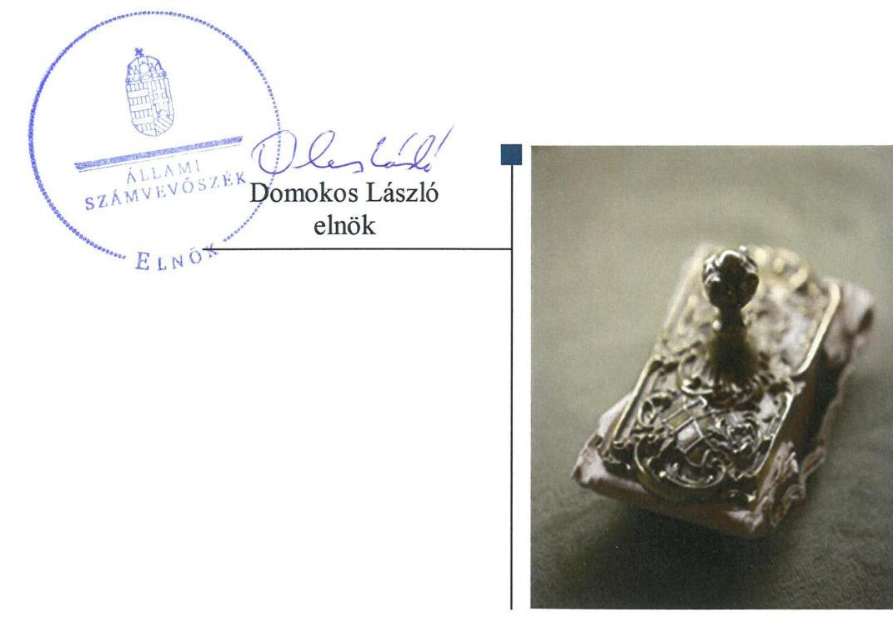
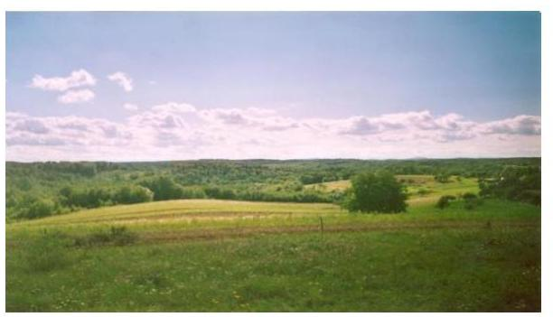
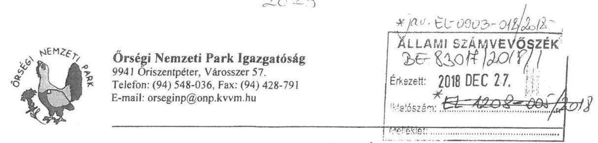
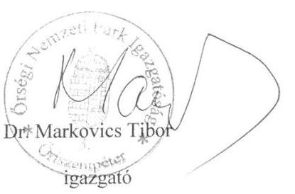
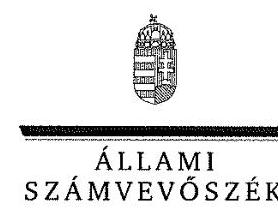
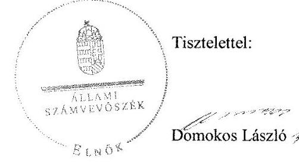
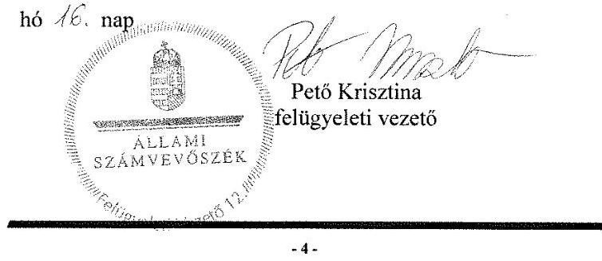

# Jelentés 

## Utóellenőrzések

A nemzeti park igazgatóságok feladatellátásának és vagyonkezelésének ellenőrzése - Őrségi Nemzeti Park Igazgatóság
2019.

---

# Jelentés 

## Utóellenőrzések

A nemzeti park igazgatóságok feladatellátásának és
vagyonkezelésének ellenőrzése - Őrségi Nemzeti Park Igazgatóság
2019. 02. hó 12. nap

---

# AZ ELLENŐRZÉST FELÜGYELTE: 

PETŐ KRISZTINA felügyeleti vezető

## AZ ELLENŐRZÉST VEZETTE ÉS A VÉGREHAJTÁSÁÉRT FELELŐS:

MIHÁLSZKY KÁLMÁN ellenőrzésvezető

## A PROGRAM ÖSSZEÁLLÍTÁSÁÉRT FELELŐS:

TÓTPÁL SZABOLCS osztályvezető

## A TÉMÁHOZ KAPCSOLÓDÓ KORÁBBI SZÁMVEVŐSZÉKI JELENTÉSEK:

- címe: A nemzeti park igazgatóságok feladatellátásának és vagyonkezelésének ellenőrzéséről
- sorszáma: 12106

Jelentéseink az Országgyűlés számítógépes hálózatán és az Interneten a www.asz.hu címen is olvashatóak.

IKTATÓSZÁM: EL-1489-001/2019
TÉMASZÁM: 2460
ELLENŐRZÉS-AZONOSÍTÓ SZÁM: V080450

---

# TARTALOMJEGYZÉK 

■ ÖSSZEGZÉS ..... 5
■ AZ ELLENŐRZÉS CÉLJA ..... 6
■ AZ ELLENŐRZÉS TERÜLETE ..... 7
■ AZ ELLENŐRZÉS HÁTTERE, INDOKOLTSÁGA ..... 8
■ A JELENTÉS LÉNYEGES KÉRDÉSKÖRE ..... 9
■ ELLENŐRZÉS HATÓKÖRE ÉS MÓDSZEREI ..... 10
■ MEGÁLLAPÍTÁSOK ..... 12
■ MELLÉKLETEK ..... 13
I. sz. melléklet: Őrségi Nemzeti Park Igazgatóság intézkedési terve végrehajtásának értékelése ..... 13
■ FÜGGELÉK: ÉSZREVÉTELEK ..... 15
■ RÖVIDÍTÉSEK JEGYZÉKE ..... 23

---

.

---

# ÖSSZEGZÉS 

Az őriszentpéteri székhelyű Őrségi Nemzeti Park Igazgatóság az intézkedési tervében vállalt feladatait nem hajtotta végre, így nem volt biztosított a nemzeti vagyonnal történő felelős és átlátható gazdálkodás.

## Az ellenőrzés társadalmi indokoltsága

Az Állami Számvevőszék stratégiájában célul tűzte ki a számvevőszéki munka hasznosulásának javítását. Ezzel összhangban ellenőrzi, hogy az ellenőrzött szervezet megvalósította-e a korábbi ellenőrzései által feltárt hibák, hiányosságok és szabálytalanságok megszüntetése céljából elkészített intézkedési tervében foglaltakat. A rendszeres utóellenőrzések hozzájárulnak a szükséges intézkedések tényleges végrehajtásához, ezáltal a közpénzügyek rendezettségének javulásához.

## Főbb megállapítások, következtetések

Az Őrségi Nemzeti Park Igazgatóság az intézkedési tervben meghatározott feladatait nem hajtotta végre.
Az Őrségi Nemzeti Park Igazgatóság nem gondoskodott a hasznosításhoz kapcsolódó kiadások vizsgálatáról és a bérleti díjak piaci értéktől való eltérésének szempontjainak meghatározásáról. Ennek következtében nem biztosították az állami vagyon minél gazdaságosabb hasznosítását.

A haszonbérleti pályázati felhívásokat az Őrségi Nemzeti Park Igazgatóság nem tette közzé a honlapján, nem gondoskodott az önkormányzatok hirdető tábláin való kifüggesztésről, így nem biztosították az átlátható működést. A haszonbérleti ajánlat kifüggesztésének elmaradása következtében az előhaszonbérleti jog jogosultja számára nem biztosították, hogy a haszonbérleti szerződésre elfogadó vagy az előhaszonbérleti jogáról lemondó nyilatkozatot tegyen.

Az intézkedési tervben meghatározott feladatok végrehajtásáról szóló, a jogszabályban előírt nyilvántartás vezetéséről az Őrségi Nemzeti Park igazgatója nem gondoskodott.

---

# AZ ELLENŐRZÉS CÉLJA 

Az ellenőrzés célja annak értékelése volt, hogy a számvevőszéki jelentésben ${ }^{1}$ foglalt javaslatot megalapozó megállapításokkal összhangban készített intézkedési tervben meghatározott feladatokat az ellenőrzött szervezet végrehajtotta-e.

---

# AZ ELLENŐRZÉS TERÜLETE 

## Őrségi Nemzeti Park Igazgatóság

Az Őrségi Nemzeti Parkot ${ }^{2}$ hazánk tízedik nemzeti parkjaként 2002. március 1-én alapították. A Nemzeti Park működési területe 43 927 hektár, ami magába foglalja az Őrséget, a Vendvidéket és a Rába folyó völgyét.

Székhelye Őriszentpéteren található.
A Nemzeti Park az agrártárcá${ }^{3}$ által irányított központi költségvetési szerv, előirányzatai felett teljes jogkörrel rendelkezik. Alaptevékenységei közé tartozik a védett és fokozottan védett természeti területek és természeti értékek természetvédelmi kezelése, bemutatása, megőrzése, valamint fenntartása. Ökoturisztikai létesítmények működtetésével és fenntartásával természetvédelmi oktatási, nevelési és ismeretterjesztési tevékenységet végez. Vagyonkezelői feladatokat lát el a vagyonkezelésében lévő állami vagyontárgyak tekintetében.

Az ÁSZ ${ }^{4}$ 2007. január 01. és 2011. december 31. közötti időszakra vonatkozóan végezte el a Nemzeti Park feladatellátásának és vagyonkezelésének ellenőrzését. Az ÁSZ az ellenőrzés eredményéről szóló számvevőszéki jelentését 2012. november 28-án hozta nyilvánosságra.

---

# AZ ELLENŐRZÉS HÁTTERE, INDOKOLTSÁGA 

Az ÁSZ tv. ${ }^{5}$ 33. § (1) bekezdése értelmében a számvevőszéki jelentések megállapításaihoz kapcsolódóan az ellenőrzött szervezet vezetője intézkedési tervet köteles összeállítani, és az ÁSZ részére megküldeni.

Az ÁSZ által befogadott intézkedési tervben foglaltak megvalósítását az ÁSZ törvény 33. § (7) bekezdésében foglaltak alapján - az ÁSZ utóellenőrzés keretében - ellenőrizheti. Az utóellenőrzések keretében - az intézkedések értékelése során - az ÁSZ figyelembe veszi az ellenőrzött szervezetek működési feltételeiben, valamint a jogszabályi előírásokban bekövetkezett változásokat.

Az utóellenőrzés során az ÁSZ értékeli, hogy az érintett számvevőszéki jelentésben foglalt javaslatot megalapozó megállapításokkal összhangban, az ellenőrzött szervezet által készített intézkedési tervben meghatározott feladatokat a feladatra kijelöltek végrehajtották-e.

Az intézkedések végrehajtásával az adott terület szabályszerű működése vonatkozásában a kockázatok csökkenhetnek, azonban hosszabb távon az intézkedési tervben foglaltak végrehajtásával önmagában nem szűnnek meg, csak akkor, ha beépülnek az ellenőrzött szervezet működésébe, azokat folyamatosan karban tartják, figyelembe véve, illetve kezelve a változásokat. Emellett az intézkedések végrehajtásáig újabb kockázatok merülhetnek fel a szabályszerű működés vonatkozásában, amelyek kezelése szintén kiemelten fontos az ellenőrzött szervezet számára.

Az ellenőrzött szervezet vezetője által készített intézkedési tervben foglalt feladatok hiányos, illetve késedelmes végrehajtása, vagy annak elmaradása a szabályszerűség és a felelős vezetői magatartás vonatkozásában kockázatot hordoz, ami azt mutatja, hogy az ellenőrzések során feltárt hibák, hiányosságok és szabálytalanságok kezelése nem kapott kellő hangsúlyt. Az utóellenőrzés során is fennálló szabálytalanságok esetén a közpénz, közvagyon veszélyeztetettségi kockázat valószínűsített hatásának értékelése további intézkedéseket vonhat maga után.

Az ellenőrzött szervezet szintjén az utóellenőrzés feltárja, hogy a szervezet az intézkedések végrehajtásával hasznosította-e a korábbi ellenőrzési jelentésben a hiányosságok megszüntetése, illetve a kockázatok kezelése érdekében megfogalmazott javaslatokat, illetve az intézkedések végrehajtása elmaradásának következtében továbbra is fennálló szabálytalanság esetén értékeli a közpénzek, közvagyon veszélyeztetettségét.

Az ÁSZ szintjén az utóellenőrzés visszacsatolást ad az ellenőrzési jelentések hasznosulásáról, az intézkedések, vagy azok valamely részének elmaradása a közpénzek, közvagyon veszélyeztetettségére gyakorolt valószínűsített hatásának értékelése további intézkedéseket vonhat maga után.

---

# A JELENTÉS LÉNYEGES KÉRDÉSKÖRE 

A Nemzeti Park az intézkedési tervben foglaltakat az előírt határidőben végrehajtotta-e?

---

# ELLENŐRZÉS HATÓKÖRE ÉS MÓDSZEREI 

## Az ellenőrzés típusa

Megfelelőségi ellenőrzés.

## Az ellenőrzött időszak

Az utóellenőrzés alapját képező számvevőszéki jelentés közzétételének napjától az ellenőrzésről szóló kiértesítő levél keltének napjáig tartó időszak volt, 2012. november 29. - 2018. június 27.

## Az ellenőrzés tárgya

A számvevőszéki jelentésben foglalt javaslatot megalapozó megállapításokkal összhangban - a Nemzeti Park által - készített Intézkedési tervben foglaltak végrehajtásának ellenőrzése.

## Az ellenőrzött szervezet

Őrségi Nemzeti Park Igazgatóság

## Az ellenőrzés jogalapja

Az ellenőrzés jogszabályi alapját az ÁSZ tv. 33. § (7) bekezdésének az előírása képezi.

## Az ellenőrzés módszerei

Az ellenőrzést az ellenőrzött időszakban hatályos jogszabályok, az ellenőrzés szakmai szabályai, a jelen ellenőrzésre irányadó ÁSZ módszertanok, az ellenőrzési programban foglalt értékelési szempontok szerint, önállóan vagy ellenőrzéshez kapcsolódóan, annak részeként végeztük.

Az ellenőrzés ideje alatt az ellenőrzött szervezettel történő kapcsolattartást az ÁSZ SZMSZ ${ }^{\text {® }}$-ének vonatkozó előírásai alapján biztosítottuk.

Az utóellenőrzés megállapításait az ÁSZ rendelkezésére álló dokumentumok, valamint az ÁSZ adatbekérése szerint, az ellenőrzött szervezetek által rendelkezésre bocsátott dokumentumok, adatok alapján megfogalmaztuk.

---

Az ellenőrzési kérdések megválaszolásához szükséges bizonyítékok megszerzése az ellenőrzött által rendelkezésre bocsátott dokumentumokra, adatokra alapozva megfigyelés, szemle (szemrevételezés), kérdésfeltevés (információkérés), valamint elemző eljárás alkalmazásával történt. Az ellenőrzési bizonyítékként felhasználható adatforrások közé tartoztak egyrészt az ellenőrzési program részletes szempontjainál felsorolt adatforrások, másrészt minden - az ellenőrzés folyamán feltárt, az ellenőrzés szempontjából információt tartalmazó - dokumentum.

Az intézkedési tervekben előírt feladatokat azok végrehajthatósága, illetve végrehajtása szempontjából az alábbiak szerint értékeltük:
$\longrightarrow$ „határidőben végrehajtott" a feladat, ha a teljesítés dokumentáltan, az intézkedési tervben előírt határidőben és tartalommal megtörtént;
$\longrightarrow$ „határidőn túl végrehajtott" a feladat, ha annak teljesítése az intézkedési tervben meghatározott módon, de az abban előírt határidőn túl történt meg;
$\longrightarrow$ „részben végrehajtott" a feladat, ha annak végrehajtása nem teljes körűen az intézkedési tervben előírt módon történt meg;
$\longrightarrow$ „nem végrehajtott" a feladat, ha a végrehajtás nem történt meg, dokumentumokkal nem igazolt annak teljesítése;
$\longrightarrow$ „okafogyottá vált" a feladat, ha végrehajtására - meghatározott esemény bekövetkezése, továbbá külső körülmény, a működést érintő feltétel változása miatt - már nincs szükség, illetve lehetőség, és egyértelműen megállapítható, hogy az intézkedést szükségessé tevő körülmény a jövőben nem fordulhat elő;
$\longrightarrow$ „nem időszerű" az a feladat, amelynek ellenőrzési időszakon belüli végrehajtására azért nem került (kerülhetett) sor, mert az intézkedés alapjául szolgáló esemény nem következett be, de annak jövőbeni előfordulása lehetséges, a végrehajtása nem volt esedékes, vagy a végrehajtás határideje még nem járt le.
Az ellenőrzés lefolytatásához az ellenőrzött szervezet a tanúsítványok elektronikus kitöltésével, valamint az ÁSZ által kért dokumentumok elektronikus megküldésével szolgáltatott adatokat, amelyek valódiságát és teljes körűségét az ellenőrzött szervezet vezetője által tett teljességi és hitelességi nyilatkozat igazolta. Az így rendelkezésre bocsátott adatok, információk kontrollját az ellenőrzés keretében végeztük el.

---

# MEGÁLLAPÍTÁSOK 

## A Nemzeti Park az intézkedési tervben foglaltakat az előírt határidőben végrehajtotta-e?

Összegző megállapítás

A Nemzeti Park az intézkedési tervben meghatározott három feladatból egyet sem hajtott végre.

Az Igazgató ${ }^{7}$ a számvevőszéki jelentésben foglalt javaslatot megalapozó megállapításokra, három végrehajtandó feladatból álló intézkedési tervet fogalmazott meg.

Az intézkedési tervében meghatározott három feladatot a Nemzeti Park nem hajtotta végre.

A Nemzeti Park Igazgatója nem gondoskodott az intézkedési tervben rögzített feladatok végrehajtásáról szóló nyilvántartás vezetéséről a Bkr. ${ }^{8}$ 14. § (1) bekezdésének előírásai ellenére.

Az I. sz. melléklet mutatja be a Nemzeti Park intézkedési tervében meghatározott feladatokat, határidőket, felelősöket és a feladatok végrehajtásának értékelését.

A VAGYONGAZDÁLKODÁS területén a végre nem hajtott feladatok továbbra is kockázatot jelentenek, mivel a Területkezelési Osztály vezetője ${ }^{9}$ a Nemzeti Park vagyonkezelésében lévő területek hasznosítását megelőzően nem értékelte a saját használathoz, illetve a használatba adáshoz kapcsolódó teljes körű kiadásokat. Továbbá a Területkezelési Osztály vezetője nem határozta meg a haszonbérleti szerződésben alkalmazott bérleti díj általános piaci értéktől való eltérésének szempontjait.

AZ ÁTLÁTHATÓSÁGOT a Nemzeti Park nem biztosította, mivel a Területkezelési Osztály vezetője nem gondoskodott a haszonbérleti szerződésekben alkalmazott bérleti díj általános piaci értéktől való eltérésének szempontjai nyilvánossá tételéről, valamint a Természetvédelmi Örszolgálati Osztály vezetője ${ }^{10}$ a haszonbérleti pályázati felhívásokat nem tette közzé elektronikus formában a saját honlapján.

---

# MELLÉKLETEK

- I. SZ. MELLÉKLET: ŐRSÉGI NEMZETI PARK IGAZGATÓSÁG INTÉZKEDÉSI TERVE VÉGREHAJTÁSÁNAK ÉRTÉKELÉSE

|  Sorszám | Az intézkedési tervben meghatározott feladat | Az intézkedési tervben meghatározott határidő | Az intézkedési tervben meghatározott feladatok elvégzésének felelőse  |
| --- | --- | --- | --- |
|   |  | Nem végrehajtott feladatok |   |
|  1. | (1.) „A vagyonkezelésben lévő ingatlanok saját használathoz, illetve a használatba adáshoz kapcsolódó teljes körű kiadások vizsgálata. Javaslattétel az igazgató felé a saját használatról, illetve bérbeadásról. A javaslattétel összeállításához kérje ki a Természetmegőrzési Osztály és a Pénzügyi és Számviteli Osztály vezetőinek írásos véleményét." | 2013. március 6-tól folyamatos | Területkezelési Osztály vezetője  |
|  2. | (2.) „A haszonbérleti szerződésben alkalmazott bérleti díj általános piaci értéktől való eltérésének szempontjainak meghatározása. A szempontok nyilvánossá tétele érdekében azt tegye fel az igazgatóság honlapjára. A visszakereshetőség érdekében a szempontokat nyomtatott formátumban, az irattárban is el kell helyezni.

 A szempontok meghatározásának megállapításához kérje ki a Természetmegőrzési Osztály és a Pénzügyi és Számviteli Osztály vezetőinek írásos véleményét. A használatba adás esetén nemzeti park igazgatóság által kötelezően alkalmazandó haszonbérleti díj összegét jelenleg a 12/2012 (VI.8.) VM utasítás határozza meg." | 2013. március 6-tól folyamatos | Területkezelési Osztály vezetője  |
|  3. | (3.) „A magamitás határozza meg, illetve a magamitás határozza meg. A magamitás határozza meg, illetve a magamitás határozza meg. A magamitás határozza meg, illetve a magamitás határozza meg." | 2013. március 6-tól folyamatos | Területkezelési Osztály vezetője  |

A feladat végrehajtása

Területkezelési Osztály vezetője a Nemzeti Park vagyonkezelésében lévő ingatlanok hasznosítását megelőzően nem értékelte a saját használathoz, illetve a használatba adáshoz kapcsolódó teljes körű kiadásokat és nem tett javaslatot az Igazgató felé a saját használatról, illetve bérbeadásról. Ezáltal nem biztosították az állami vagyonnak a Vagyontv. ${ }^{11} 23 . \S$ (3) pontjában előírt gazdaságilag minél előnyösebb hasznosítását.

A Területkezelési Osztály vezetője a Nemzeti Park vagyonkezelésében lévő vagyonelemek esetében nem határozta meg a haszonbérleti szerződésben alkalmazott bérleti díj általános piaci értéktől való eltérésének szempontjait és a piaci értéktől való eltérés szempontjait nem tette közzé a Nemzeti Park honlapján, illetve nem helyezte el az irattárban. Ezáltal nem biztosították a rendelkezésre álló forrásoknak a Bkr. 6. § (2) pontjában előírt átlátható felhasználását. A Területkezelési Osztály vezetője a szempontok meghatározásához nem kérte ki a Természetmegőrzési Osztály és a Pénzügyi és Számviteli Osztály vezetőinek írásos véleményét.

---

|  ㅇ | Az intézkedési tervben meghatározott feladat | Az intézkedési tervben meghatározott határidő | Az intézkedési tervben meghatározott feladatok elvégzésének felelőse | A feladat végrehajtása  |
| --- | --- | --- | --- | --- |
|  3. | (3.) „A haszonbérbe adás meghirdetése átláthatóságának, széles nyilvánosságának biztosítása az önkormányzatok hirdető táblái, a jegyző kormányportálon való figyelemfelhívása mellett elektronikus formában saját honlapon is meg kell, hogy jelenjen, továbbá kifüggesztésre kerül az igazgatóság központi épületében is." | 2013. március 6-tól folyamatos | Természetvédelmi Örszolgálati Osztály vezetője | Természetvédelmi Örszolgálati Osztály vezetője a Nemzeti Földalapba tartozó földrészletek hasznosításának részletes szabályairól szóló 262/2010. (XI. 17.) Korm. rendelet 43/D. § (3) pontjában előírtak ellenére a haszonbérbe adás meghirdetése átláthatóságát, széles nyilvánosságát nem biztosította, mivel a hirdetményt nem tette közzé elektronikus formában a saját honlapján, továbbá nem függesztette ki az önkormányzatok hirdetőtábláin és a Nemzeti Park központ épületében.  |

A sorszámozás melletti oszlopban a zárójeles feltüntetés az intézkedési terv szerinti sorszámozást jelenti.

---

# FÜGGELÉK: ÉSZREVÉTELEK 

A jelentéstervezetet a Számvevőszék 15 napos észrevételezésre megküldte az ellenőrzött szervezet vezetőjének az ÁSZ tv. 29. §* (1) bekezdése előírásának megfelelően.

Az Örségi Nemzeti Park Igazgatóság igazgatója a jelentéstervezet megállapításaira írásban észrevételt tett.
Az ÁSZ tv. 29. § (3) bekezdésével összhangban az ÁSZ a Függelékben feltünteti az ellenőrzés megállapításaival kapcsolatban tett, figyelembe nem vett észrevételeket, és megindokolja, hogy azokat miért nem fogadta el.

[^0]
[^0]:    * 29. § (1) Az Állami Számvevőszék az ellenőrzési megállapításait megküldi az ellenőrzött szervezet vezetőjének vagy az általa megbízott személynek, és annak, akinek személyes felelősségét állapította meg.
    (2) Az ellenőrzött szervezet vezetője és a felelősként megjelölt személy az ellenőrzés megállapításaira tizenöt napon belül írásban észrevételt tehet.
    (3) Az Állami Számvevőszék az észrevételre a beérkezésétől számított harminc napon belül írásban válaszol. A figyelembe nem vett észrevételeket köteles a jelentésben feltüntetni, és megindokolni, hogy azokat miért nem fogadta el.

---

Tárgy: Észrevétel jelentéstervezetre.
Ügyszám: 5/11/2018.
Ügyintéző: Pál Éva

Állami Számvevőszék

Budapest

Apáczai Csere J. u. 10.

1052

# Tisztelt Elnök Úr!

Alulírott Dr. Markovics Tibor, mint az Örségi Nemzeti Park Igazgatóság igazgatója a hivatkozott számú utóellenőrzésben vizsgált, intézkedési terv és figyelemfelhívás alapján elvégzendő feladatok végrehajtásával kapcsolatban készült „számvevőszéki jelentéstervezet”-re az alábbi

## észrevételeket

teszem:

1./

1.1. A „számvevőszéki jelentéstervezet” 5. oldalán rögzített „ÖSSZEGZÉS” azt tartalmazza, hogy

- „Az Örségi Nemzeti Park Igazgatóság az intézkedési tervben meghatározott feladatait nem hajtotta végre.”
- „Az Örségi Nemzeti Park Igazgatóság nem gondoskodott a hasznosításhoz kapcsolódó kiadások vizsgálatáról és a bérleti díjak piaci értéktől való eltérítése szempontjainak meghatározásáról. Ennek következtében nem biztosították az állami vagyon minél gazdaságosabb hasznosítását.”
- „A haszonbérleti pályázati felhívásokat az Örségi Nemzeti Park Igazgatóság nem tette közzé a honlapján, nem gondoskodott az önkormányzatok hirdető tábláin való kifüggesztésről, így nem biztosították az átlátható működést. A haszonbérleti ajánlat kifüggesztésének elmaradása következtében az előhaszonbérleti jog jogosultja számára nem biztosították, hogy a haszonbérleti szerződésre elfogadó vagy az előhaszonbérleti jogáról lemondó nyilatkozatot tegyen.”

---

1.2. A „számvevőszéki jelentéstervezet" 13. oldalán rögzített „MEGÁLLAPÍTÁSOK" azt tartalmazza, hogy

- „A Nemzeti Park az intézkedési tervben meghatározott három feladatból egyet sem hajtotta végre.".
- „A Nemzeti Park Igazgatója nem gondoskodott az intézkedési tervben rögzített feladatok végrehajtásáról szóló nyilvántartás vezetéséről a Bkr. ${ }^{8} 14 . \S$ (1) bekezdésének előírásai ellenére."
- „A VAGYONGAZDÁLKODÁS területén a végre nem hajtott feladatok továbbra is kockázatot jelentenek, mivel a Területkezelési Osztály vezetője ${ }^{9}$ a Nemzeti Park vagyonkezelésében lévő területek hasznosítását megelőzően nem értékelte a saját használathoz, illetve a használatba adáshoz kapcsolódó teljes körű kiadásokat. Továbbá a Területkezelési Osztály vezetője nem határozta meg a haszonbérleti szerződésben alkalmazott bérleti díj általános piaci értéktől való eltérítésének szempontjait."
- „AZ ÁTLÁTHATÓSÁGOT a Nemzeti Park nem biztosította, mivel a Területkezelési Osztály vezetője nem gondoskodott a haszonbérleti szerződésekben alkalmazott bérleti díj általános piaci értéktől való eltérítésének szempontjai nyilvánossá tételéről, valamint Természetvédelmi Örszolgálati Osztály vezetője ${ }^{10}$ a haszonbérleti pályázati felhívásokat nem tette közzé elektronikus formában a saját honlapján."
1.3. A „számvevőszéki jelentéstervezet" 15.-16. oldalakon rögzített „I. sz. Melléklet: Örségi Nemzeti Park Igazgatóság intézkedési terve végrehajtásának értékelése" azt tartalmazza, hogy
- „Területkezelési Osztály vezetője a Nemzeti Park vagyonkezelésében lévő ingatlanok hasznosítását megelőzően nem értékelte a saját használathoz, illetve a használatba adáshoz kapcsolódó teljes körű kiadásokat és nem tett javaslatot az Igazgató felé a saját használatról, illetve bérbeadásról. Ezáltal nem biztosították az állami vagyonnak a Vagyontv. ${ }^{11}$ 23. § (3) pontjában előírt gazdaságilag minél előnyösebb hasznosítását."
- „A Területkezelési Osztály vezetője a Nemzeti Park vagyonkezelésében lévő vagyonelemek esetében nem határozta meg a haszonbérleti szerződésben alkalmazott bérleti díj általános piaci értéktől való eltérésének szempontjait és a piaci értéktől való eltérés szempontjait nem tette közzé a Nemzeti Park honlapján, illetve nem helyezte el az irattárban. Ezáltal nem biztosították a rendelkezésre álló forrásoknak a Bkr. 6. § (2) pontjában előírt átlátható felhasználását. A Területkezelési Osztály vezetője a szempontok meghatározásához nem kérte ki a Természetmegőrzési Osztály és a Pénzügyi és Számviteli Osztály vezetőinek írásos véleményét."
- „Természetvédelmi Örszolgálati Osztály vezetője a Nemzeti Földalapba tartozó földrészletek hasznosításának részletes szabályairól szóló 262/2010. (XI. 17.) Korm. rendelet 43/D. § (3) pontjában előírtak ellenére a haszonbérbe adás meghirdetése átláthatóságát, széles nyilvánosságát nem biztosította, mivel a hirdetményt nem tette közzé elektronikus formában a saját honlapján, továbbá nem függesztette ki az önkormányzatok hirdetőtábláin és a Nemzeti Park központ épületében."
2., A fenti - és a jelentéstervezet egyéb részein található - megállapítások nem is utalnak arra a körülményre, hogy Igazgatóságunk 2018. július 6-án kelt nyilatkozatában Tóth Marianna programozási vezetőhöz címzett nyilatkozatának a II. fejezet 1.-3. pontjaiban rögzítette az alábbiakat:
- „A használatba adásokat Igazgatóságunk Örségi Területkezelési Osztálya javasolja, a szerződések megkötése, illetve a pályáztatás elindítása előtt a Természetmegőrzési Osztálya és Pénzügyi és Számviteli Osztálya véleményezi. A véleményeket a T. Címzett részére is megküldött excel táblázatban rögzítjük. Továbbra is igyekszünk a területeket saját használatban tartani, mindössze saját vagyonkezelésű területeink 6,8%-át adtuk haszonbérbe."

---

- „A 2012. VI. 8-tól hatályos 12/2012 VM utasítás 2012. VI. 16-tól már a kötelezően alkalmazandó bérleti díj összeget is tartalmazza, így nincs mérlegelési jogkörünk annak meghatározására. A fenti utasítás helyébe 2017. VII. 7-én hatályba lépő 8/2017. FM utasítás szintén tartalmazza a kötelezően alkalmazandó összeget. Igazgatóságunk ebben a vonatkozásban is az utasítások szerint jár el."
- „A 2012. VI. 8-tól hatályos 12/2012 VM utasítás, valamint a helyébe 2017. VII. 7-én hatályba lépő 8/2017. FM utasítás előírásai szerint járunk el. A haszonbérleti pályázatok felhívását minden alkalommal megküldtük a területileg illetékes jegyzőségnek az önkormányzati hirdetőtáblán való megjelentetés céljából, de ezen felül a honlapunkon is megjelenítettük és Igazgatóságunk központi épületében is kifüggesztettük."

3., Kérjük T. Elnök Urat, hogy a 2. pontban idézett válaszainkat a jelentés véglegesítése során elfogadni szíveskedjen, illetve el nem fogadásuk esetén az ÁSZ tv. 29. § (3) bekezdés alapján kérjük annak indokait velünk közölni.

Öriszentpéter, 2018. december 19.

---

# Dr. Markovics Tibor 

igazgató
Örségi Nemzeti Park Igazgatóság

## Öriszentpéter

## Tisztelt Igazgató Úr!

Utóellenőrzések - A nemzeti park igazgatóságok feladatellátásának és vagyonkezelésének ellenőrzése - Örségi Nemzeti Park Igazgatóság címmel készített számvevőszéki jelentéstervezetre tett észrevételeit megkaptam.
Az Állami Számvevőszék észrevételekre vonatkozó álláspontjáról a felügyeleti vezető által készített részletes tájékoztatást csatoltan megküldöm.
Tájékoztatom Igazgató urat, hogy a számvevőszéki jelentésben - az Állami Számvevőszékről szóló 2011. évi LXVI. törvény 29. § (3) bekezdése alapján - a figyelembe nem vett észrevételeket szerepeltetjük az elutasítás indokának feltüntetésével.

Budapest, 2019. 07 hó 16 nap

Melléklet: Tájékoztatás az észrevételek kezeléséről

---

# Tájékoztatás az észrevételek kezeléséről 

Utóellenőrzések - A nemzeti park igazgatóságok feladatellátásának és vagyonkezelésének ellenőrzése - Örségi Nemzeti Park Igazgatóság címû jelentéstervezetre (továbbiakban: jelentéstervezet) a 04-2756-23/2018. ügyszámú levélben megküldött, az Örségi Nemzeti Park Igazgatóság (továbbiakban: Nemzeti Park) igazgatója által tett észrevételeket áttekintettem. Az észrevételek kezeléséről az alábbi tájékoztatást adom.

Igazgató úr észrevételének 1.1. pontja a jelentéstervezet 5. oldalán található „Főbb megállapítások, következtetések" fejezet megállapításait, valamint 1.2. pontja a jelentéstervezet 13. oldalán szereplő „Megállapítások" fejezetet tartalmazza. Az észrevétel 2. pontjában hivatkozás történik Igazgató úr által 2018. július 6-án kelt nyilatkozat (továbbiakban: nyilatkozat) II. fejezet 1-3. pontjaira. Az észrevételben Igazgató úr kérte a nyilatkozatban foglaltak elfogadását, illetve el nem fogadás esetén az Állami Számvevőszékről szóló 2011. évi LXVI. törvény (továbbiakban: ÁSZ tv.) 29. § (3) bekezdés alapján annak indoklását.

## 1.) A jelentéstervezet I. sz. melléklet 1. pontjához tett észrevétel kapcsán

Igazgató úr a jelentéstervezet I. sz. melléklet 1. pontjában foglalt, a Nemzeti Park vagyonkezelésében lévő területek hasznosítását megelőzően a saját használathoz, illetve a használatba adáshoz kapcsolódóan a teljes körű kiadások vizsgálatára és javaslattételre vonatkozó megállapítás kapcsán jelezte, hogy a nyilatkozat II. fejezet 1. pontjában rögzítettekre a jelentéstervezet nem tesz utalást.
A Nemzeti Park intézkedési tervében a vagyonkezelésben lévő ingatlanok esetében a saját használathoz, illetve használatba adáshoz kapcsolódó teljes körű kiadások vizsgálatát vállalta. Továbbá vállalásra került, hogy a saját használatról, illetve bérbeadásról javaslattételre kerüljön.
 sor az Igazgató felé. A Területkezelési Osztály a javaslattétel összeállításához a Természetmegőrzési Osztály, valamint a Pénzügyi és Számviteli Osztály vezetőinek írásos véleményét kérje ki.
Az Állami Számvevőszék (továbbiakban: ÁSZ) az ellenőrzési megállapításait az adatszolgáltatás során rendelkezésre bocsátott dokumentumokra (bizonyítékokra) alapozva fogalmazza meg. Igazgató úr 2018. július 9-én kelt teljességi és hitelességi nyilatkozata (továbbiakban: teljességi és hitelességi nyilatkozat) alapján az ellenőrzés részére nem került átadásra olyan ellenőrzési dokumentum (bizonyíték), amely azt igazolja, hogy a Nemzeti Park vagyonkezelésében lévő ingatlanok hasznosítását megelőzően a saját használathoz, illetve a használatba adáshoz kapcsolódóan a teljes körű kiadások vizsgálata megtörtént volna. Továbbá nem került átadásra olyan dokumentum (bizonyíték) sem, amely igazolta volna, hogy a Területkezelési Osztály javaslatát

---

megteszi a Természetmegőrzési Osztály, valamint a Pénzügyi és Számviteli Osztály vezetőinek írásos véleményének figyelembevételével. Az észrevételben hivatkozott, Igazgató úr által tett nyilatkozatban rögzítetteket dokumentumokkal nem támasztották alá.
Észrevételében hivatkozik az ÁSZ részére átadott excel táblázatra, amelyben a véleményeket rögzítik. Az excel tábla egy nyilvántartás, amely nem igazolja, hogy a Nemzeti Park vagyonkezelésében lévő ingatlanok hasznosítását megelőzően a saját használathoz, illetve a használatba adáshoz kapcsolódóan a teljes körű kiadások vizsgálatát elvégezték, illetve a hivatkozott osztályok vezetői írásos véleményt adtak. Továbbá nem igazolja az excel tábla, hogy a Területkezelési Osztály javaslatát az írásos vélemények alapján tette meg.
A fent leírtakra tekintettel az észrevételt nem fogadom el, a jelentéstervezet módosítása nem indokolt.

# 2.) Az jelentéstervezet I. sz. melléklet 2. pontjában foglalt megállapításhoz tett észrevétel kapcsán 

Igazgató úr a jelentéstervezet I. sz. melléklet 2. pontjában foglalt megállapítás (, A Területkezelési Osztály vezetője a Nemzeti Park vagyonkezelésében lévő vagyonelemek esetében nem határozta meg a haszonbérleti szerződésben alkalmazott bérleti díj általános piaci értékétől való eltérésének szempontjait és a piaci értéktől való eltérés szempontjait nem tette közzé a Nemzeti Park honlapján, illetve nem helyezte el az irattárban. Ezáltal nem biztosították a rendelkezésre álló forrásoknak a Bkr. 6. § (2) pontjában előírt átlátható felhasználását. A Területkezelési Osztály vezetője a szempontok meghatározásához nem kérte ki a Természetmegőrzési Osztály és a Pénzügyi és Számviteli Osztály vezetőinek írásos véleményét. ") kapcsán jelezte, hogy a 2012. június 8-tól hatályos, a nemzeti park igazgatóságok természetvédelmi célú vagyonkezelési tevékenységének egységes szakmai alapelvek szerinti ellátásáról szóló 12/2012. (VI. 8.) VM utasításban (továbbiakban: VM utasítás) 2012. június 16-tól már a kötelezően alkalmazandó bérleti díj összegét tartalmazza, ezért - álláspontjuk szerint - nincs mérlegelési jogkörük annak meghatározására. A VM utasítás helyébe 2017. július 7-én hatályba lépő, a nemzeti park igazgatóságok természetvédelmi célú vagyonkezelési tevékenységének egységes szakmai alapelvek szerinti ellátásáról szóló 8/2017. (VII. 6.) FM utasítás (továbbiakban: FM utasítás) szintén tartalmazza a kötelezően alkalmazandó összeget. Az észrevétel tartalmazza, hogy az utasítások szerint járnak el.

A Nemzeti Park az intézkedési terv 2. pontjában feladatként vállalta, hogy a haszonbérleti szerződésben alkalmazott bérleti díj általános piaci értéktől való eltérésének szempontjait meghatározza és a szempontok nyilvánossá tétele érdekében a Nemzeti Park honlapjára felteszi. Továbbá vállalta, hogy a szempontokat nyomtatott formátumban az irattárba elhelyezi. Feladatként vállalta, hogy a szempontok meghatározásának megállapításához kikéri a Területmegőrzési Osztály és a Pénzügyi és Számviteli Osztály vezetőinek írásos véleményét.
Az ÁSZ az ellenőrzési megállapításait az adatszolgáltatás során rendelkezésre bocsátott dokumentumra (bizonyítékra) alapozva fogalmazza meg. Igazgató úr teljességi és hitelességi nyilat-

---

kozata alapján az ellenőrzés részére nem került átadásra olyan ellenőrzési dokumentum (bizonyíték), amely igazolja, hogy a haszonbérleti díj esetében a piaci értéktől való eltérítés szempontjai meghatározásra kerültek volna, továbbá nem adtak át az ellenőrzés részére olyan dokumentumot, amely a szempontok nyilvánossá tételét igazolta volna a Nemzeti Park honlapján. Nem került olyan dokumentum (bizonyíték) átadásra, amely azt bizonyította volna, hogy a szempontok nyomtatott formátumú dokumentuma az irattárban elhelyezésre került.
Az intézkedési tervben vállalt feladat végrehajtását nem zárják ki a VM utasításban (később az FM utasításban) előírt rendelkezések, amelyek az intézkedési terv 2013. március 6-i keltének időpontjában már hatályosak voltak és így a Nemzeti Park számára is ismertek voltak.
A fent leírtakra tekintettel az észrevételt nem fogadom el, a jelentéstervezet módosítása nem indokolt.

# 3.) A jelentéstervezet I. sz. melléklet 3. pontjában foglalthoz tett észrevétel kapcsán 

Igazgató úr észrevételében a jelentéstervezet I. sz. melléklet 3. pontjában foglalt megállapítás (,,Természetvédelmi Örszolgálati Osztály vezetője a Nemzeti Földlapba tartozó földrészletek hasznosításának részletes szabályairól szóló 262/2010. (XI. 17.) Korm. rendelet 43/D. § (3) pontjában előírtak ellenére a haszonbérbeadás meghirdetése átláthatóságát, széles nyilvánosságát nem biztosította, mivel a hirdetményt nem tette közzé elektronikus formában a saját honlapján, továbbá nem függesztette ki az önkormányzatok hirdetőtábláin és a Nemzeti Park központi épületébe. ") kapcsán a nyilatkozatban leírtakra hivatkozik. Észrevételében jelezte, hogy a haszonbérleti pályázatok felhívását minden alkalommal a területileg illetékes jegyzőségnek megküldték, ezen felül a honlapon is megjelenítették és a központi épületben is kifüggesztették.
Az ÁSZ az ellenőrzési megállapításait az adatszolgáltatás során rendelkezésre bocsátott dokumentumokra alapozva fogalmazza meg. Igazgató úr teljességi és hitelességi nyilatkozata szerint az ellenőrzés részére nem adtak át ellenőrzési dokumentumokat, bizonyítékokat, amelyek az intézkedési tervben vállalt feladatok végrehajtását igazolták volna.
Az ÁSZ részére megküldött nyilatkozatban azt rögzítették, hogy a haszonbérleti pályázatok felhívását minden alkalommal megküldték a területileg illetékes jegyzőségnek az önkormányzati hirdetőtáblán való megjelenés céljából, de ezen felül a saját honlapukon is megjelenítették és a Nemzeti Park központi épületébe is kifüggesztették. Nyilatkozatában foglaltakat dokumentumokkal (bizonyítékokkal) nem támasztották alá, ezért az észrevételt nem fogadom el, a jelentéstervezet módosítása nem indokolt.

Budapest, 2019.

---

# RÖVIDÍTÉSEK JEGYZÉKE 

${ }^{1}$ számvevőszéki jelentés
${ }^{2}$ Nemzeti Park
${ }^{3}$ agrártárca
${ }^{4}$ ÁSZ
${ }^{5}$ ÁSZ. tv.
${ }^{6}$ ÁSZ SZMSZ
${ }^{7}$ Igazgató
${ }^{8}$ Bkr.
${ }^{9}$ Területkezelési Osztály vezetője
${ }^{10}$ Természetvédelmi Örszolgálati Osztály vezetője
${ }^{11}$ Vagyontv.

Állami Számvevőszék 12106. számú jelentése
Örségi Nemzeti Park Igazgatóság
Agrárminisztérium
Állami Számvevőszék
Az Állami Számvevőszékről szóló 2011. évi LXVI. törvény
Az Állami Számvevőszék Szervezeti és Működési Szabályzata
Örségi Nemzeti Park Igazgatóságának Igazgatója
370/2011. (XII. 31.) Korm. rendelet a költségvetési szervek belső
kontrollrendszeréről és belső ellenőrzéséről
Örségi Nemzeti Park Igazgatóság Területkezelési Osztályának vezetője
Örségi Nemzeti Park Igazgatóság Természetvédelmi Örszolgálati
Osztályának vezetője
2007. évi CVI. törvény az állami vagyonról

---

# ÁLLAMI SZÁMVEVŐSZÉK 

1052 Budapest, Apáczai Csere János utca 10.
Levélcím: 1364 Budapest 4. Pf. 54
Telefon: +36 14849100 Telefax: +36 14849200
www.asz.hu
