# Jelentés 

## Utóellenőrzések

Az önkormányzatok pénzügyi- és vagyongazdálkodása megfelelőségének utóellenőrzése - Rétság Város Önkormányzata
2019.

---

# Jelentés 

## Utóellenőrzések

Az önkormányzatok pénzügyi- és vagyongazdálkodása megfelelőségének utóellenőrzése - Rétság Város Önkormányzata
2019. 02. hó 21. nap
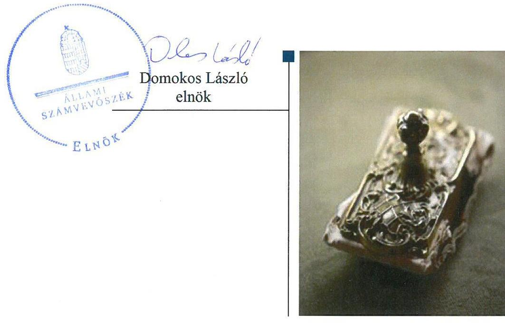

---

|  J | AZ ELLENŐRZÉST FELÜGYELTE:  |
| --- | --- |
|   | DR. BENEDEK MÁRIA felügyeleti vezető  |
|   | AZ ELLENŐRZÉST VEZETTE ÉS A VÉGREHAJTÁSÁÉRT FELELŐS:  |
|   | KUSZINGER ANDREA ellenőrzésvezető  |
|   | A PROGRAM ÖSSZEÁLLÍTÁSÁÉRT FELELŐS:  |
|   | TÓTPÁL SZABOLCS osztályvezető  |
|   | A TÉMÁHOZ KAPCSOLÓDÓ KORÁBBI SZÁMVEVŐSZÉKI JELENTÉSEK:  |
|   | - címe: Jelentés – Önkormányzatok pénzügyi és vagyongazdálkodása megfelelőségének ellenőrzése - Rétság  |
|   | - sorszáma: 16143  |
|  J | IKTATÓSZÁM: EL-0770-021/2019  |
|   | TÉMASZÁM: 4  |
|   | ELLENŐRZÉS-AZONOSÍTÓ SZÁM: V080432  |

---

# TARTALOMJEGYZÉK 

■ ÖSSZEGZÉS ..... 5
■ AZ ELLENŐRZÉS CÉLJA ..... 6
■ AZ ELLENŐRZÉS TERÜLETE ..... 7
■ AZ ELLENŐRZÉS HÁTTERE, INDOKOLTSÁGA ..... 8
■ A JELENTÉS LÉNYEGES KÉRDÉSKÖRE ..... 9
■ AZ ELLENŐRZÉS HATÓKÖRE ÉS MÓDSZEREI ..... 10
■ MEGÁLLAPÍTÁSOK ..... 12
■ MELLÉKLETEK ..... 13
I. sz. melléklet: Rétság Város Önkormányzata intézkedési tervei. ..... 13
■ FÜGGELÉK: ÉSZREVÉTELEK ..... 27
■ RÖVIDÍTÉSEK JEGYZÉKE ..... 31

---

.

---

# ÖSSZEGZÉS 

Rétság Város Önkormányzata utóellenőrzése során a pénzügyi és vagyongazdálkodás szabályszerűségének biztosítására meghatározott intézkedések határidőben történő végrehajtása ellenőrzési bizonyíték hiányában nem volt ellenőrizhető.

## Az ellenőrzés társadalmi indokoltsága

Az Állami Számvevőszék stratégiájában célul tűzte ki a számvevőszéki munka hasznosulásának javítását. Ezzel összhangban ellenőrzi, hogy az ellenőrzött szervezet megvalósította-e a korábbi ellenőrzései által feltárt hibák, hiányosságok és szabálytalanságok megszüntetése céljából elkészített intézkedési tervében foglaltakat. A rendszeres utóellenőrzések hozzájárulnak a szükséges intézkedések tényleges végrehajtásához, ezáltal a közpénzügyek rendezettségének javulásához.

## Főbb megállapítások, következtetések

Rétság Város Önkormányzata az intézkedési tervben a polgármester részére 11, a jegyző részére 17 feladatot határozott meg.

Rétság Város Önkormányzata, mint az ÁSZ tv. 28. § (2) bekezdésében foglaltak szerint közreműködésre felhívott szervezet az adatszolgáltatásra rendelkezésre álló határidőben az ellenőrzés lefolytatása érdekében szükséges adatokat és dokumentumokat nem bocsátotta az ÁSZ rendelkezésére.

A számvevőszéki ellenőrzés-szakmai szabályok alapján, ellenőrzési bizonyíték hiányában az intézkedési tervben meghatározott feladatok határidőben történő végrehajtásának ellenőrzése nem volt biztosított.

Az ÁSZ az ÁSZ tv. 31. § (1) bekezdése alapján vagyonmegóvási intézkedést alkalmazott a jogszabálysértő gyakorlat megszüntetése, a kockázatok kezelése, az átlátható és elszámoltatható gazdálkodás helyreállítása érdekében.

---

# AZ ELLENŐRZÉS CÉLJA 

Az ellenőrzés célja annak értékelése volt, hogy a számvevőszéki jelentésben ${ }^{1}$ foglalt megállapításokkal összhangban készített intézkedési tervben meghatározott feladatokat az ellenőrzött szervezet végrehajtotta-e.

---

# AZ ELLENŐRZÉS TERÜLETE 

## Rétság Város Önkormányzata

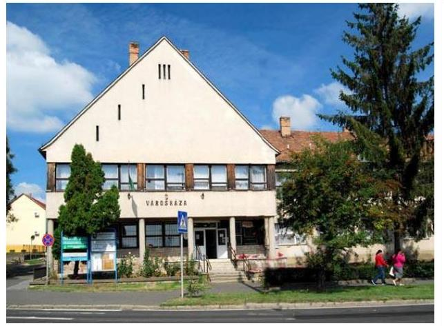

Rétság város az Észak-magyarországi régióban, Nógrád megyében található. Állandó lakosainak száma a Központi Statisztikai Hivatal Magyarország közigazgatási helynévkönyve alapján 2018. január 1-jén 2705 fő volt.

A Polgármester² 2014. október 12-e óta tölti be tisztségét és vezeti a hat tagú Képviselő-testületet ${ }^{3}$, amely két állandó bizottságot hozott létre. A jegyző ${ }^{4}$ 2013. február 9-e óta látja el feladatait.

Rétság Város Önkormányzata Képviselő-testületének 7/2018. (V.28.) önkormányzati rendeletében elfogadott 2017. évi beszámolója alapján 1624,7 millió Ft költségvetési bevételt ért el és 962,5 millió Ft költségvetési kiadást teljesített. A mérlegfőösszeg értéke 3 572,9 millió Ft, a befektetett eszközvagyon értéke 2615,1 millió Ft, a követelések értéke 36,7 millió Ft, az éven belüli kötelezettségek értéke 2,8 millió Ft, az éven túli kötelezettségek értéke 3,3 millió Ft volt.

Az ÁSZ⁵ 2016. évben ellenőrizte Rétság Város Önkormányzata pénzügyi és vagyongazdálkodása megfelelőségét a 2011. január 1-je és 2014. december 31-e közötti időszak vonatkozásában. Az ellenőrzés célja volt Rétság Város Önkormányzata pénzügyi és vagyoni helyzetének, gazdálkodása szabályosságának megítélése; valamint annak értékelése, hogy kialakította-e az erőforrásokkal való szabályszerű és hatékony gazdálkodáshoz szükséges követelményeket, megvalósította-e azok számonkérését, ellenőrzését. Az ellenőrzésről készült 16143 számú jelentését 2016. szeptember 21-én hozta nyilvánosságra az ÁSZ. Rétság Város Önkormányzata a jelentésben megfogalmazott javaslatokra tett intézkedéseket tartalmazó intézkedési tervet 2016. október 21-én, a kiegészített intézkedési tervet 2016. december 20-án küldte meg az ÁSZ részére.

---

# AZ ELLENŐRZÉS HÁTTERE, INDOKOLTSÁGA 

Az ÁSZ tv. ${ }^{6}$ 33. § (1) bekezdése értelmében a számvevőszéki jelentések megállapításaihoz és javaslataihoz kapcsolódóan az ellenőrzött szervezet vezetője intézkedési tervet köteles összeállítani, és az Állami Számvevőszék részére megküldeni.

Az ÁSZ által befogadott intézkedési tervben foglaltak megvalósítását az ÁSZ tv. 33. § (7) bekezdésében foglaltak alapján - az ÁSZ utóellenőrzés keretében ellenőrizheti. Az utóellenőrzések keretében - az intézkedések értékelése során - az ÁSZ figyelembe veszi az ellenőrzött szervezetek működési feltételeiben, valamint a jogszabályi előírásokban bekövetkezett változásokat.

Az utóellenőrzés során az ÁSZ értékeli, hogy az érintett számvevőszéki jelentésben foglalt megállapításokkal és javaslatokkal összhangban, az ellenőrzött szervezet által készített intézkedési tervben meghatározott feladatokat a feladatra kijelöltek végrehajtották-e.

Az intézkedések végrehajtásával az adott terület szabályszerű működése vonatkozásában a kockázatok csökkenhetnek, azonban hosszabb távon az intézkedési tervben foglaltak végrehajtásával önmagában nem szűnnek meg, csak akkor, ha beépülnek az ellenőrzött szervezet működésébe, azokat folyamatosan karban tartja, figyelembe véve, illetve kezelve a változásokat. Emellett az intézkedések végrehajtásáig újabb kockázatok merülhetnek fel a szabályszerű működés vonatkozásában, amelyek kezelése szintén kiemelten fontos az ellenőrzött szervezet számára.

Az ellenőrzött szervezet vezetője által készített intézkedési tervben foglalt feladatok hiányos, illetve késedelmes végrehajtása, vagy annak elmaradása a szabályszerűség és a felelős vezetői magatartás vonatkozásában kockázatot hordoz, ami azt mutatja, hogy az ellenőrzések során feltárt hibák, hiányosságok és szabálytalanságok kezelése nem kapott kellő hangsúlyt. Az utóellenőrzés során is fennálló szabálytalanságok esetén a közpénz, közvagyon veszélyeztetettségi kockázat valószínűsített hatásának értékelése további intézkedéseket vonhat maga után.

Az ellenőrzött szervezet szintjén az utóellenőrzés feltárja, hogy a szervezet az intézkedések végrehajtásával hasznosította-e a korábbi ellenőrzési jelentésben a hiányosságok megszüntetése, illetve a kockázatok kezelése érdekében megfogalmazott javaslatokat, illetve az intézkedések végrehajtása elmaradásának következtében továbbra is fennálló szabálytalanság esetén értékeli a közpénzek, közvagyon veszélyeztetettségét.

Az ÁSZ szintjén az utóellenőrzés visszacsatolást ad az ellenőrzési jelentések hasznosulásáról, az intézkedések elmaradásának, vagy részleges megvalósulásának a közpénzek, közvagyon veszélyeztetettségére gyakorolt valószínűsített hatásának értékelése, további intézkedéseket vonhat maga után.

---

# A JELENTÉS LÉNYEGES KÉRDÉSKÖRE 

Az önkormányzat az intézkedési tervben foglaltakat az előírt határidőben végrehajtotta-e?

---

# AZ ELLENŐRZÉS HATÓKÖRE ÉS MÓDSZEREI 

## Az ellenőrzés típusa

Megfelelőségi ellenőrzés.

## Az ellenőrzött időszak

Az utóellenőrzés alapját képező ÁSZ jelentés közzétételének napjától 2016. szeptember 21-től, az utóellenőrzésről szóló kiértesítő levél keltének napjáig, 2018. május 15-ig tartó időszak volt.

## Az ellenőrzés tárgya

A számvevőszéki jelentésben foglalt megállapításokkal összhangban - az önkormányzat által - készített intézkedési tervben foglaltak végrehajtásának ellenőrzése volt.

## Az ellenőrzött szervezet

Rétság Város Önkormányzata

## Az ellenőrzés jogalapja

Az ellenőrzés jogszabályi alapját az ÁSZ tv. 33. § (7) bekezdése képezte.

## Az ellenőrzés módszerei

Az ÁSZ az ellenőrzést az ellenőrzött időszakban hatályos jogszabályok, az ellenőrzés szakmai szabályai, a jelen ellenőrzésre irányadó ÁSZ módszertanok, az ellenőrzési programban foglalt értékelési szempontok szerint, önállóan vagy ellenőrzéshez kapcsolódóan, annak részeként végezte.

Az ÁSZ az ellenőrzés ideje alatt az önkormányzattal történő kapcsolattartást az ÁSZ SZMSZ⁷-ének vonatkozó előírásai alapján biztosította.

Az utóellenőrzés megállapításait az ÁSZ rendelkezésére álló dokumentumok, valamint az ÁSZ adatbekérése szerint, az ellenőrzött szervezetek által rendelkezésre bocsátott dokumentumok, adatok alapján kell megfogalmazni. A Rétság Város Önkormányzata, mint közreműködésre felhívott szervezet az adatszolgáltatásra rendelkezésre álló határidőben az ellenőrzés lefolytatása érdekében szükséges adatokat és dokumentumokat nem bocsátotta az Állami Számvevőszék rendelkezésére.

---

Az ellenőrzési kérdések megválaszolásához szükséges bizonyítékok megszerzése az ellenőrzött által rendelkezésre bocsátott dokumentumokra, adatokra alapozva megfigyelés, szemle (szemrevételezés), kérdésfeltevés (információkérés), valamint elemző eljárás alkalmazásával történt volna.

Az intézkedési tervekben előírt feladatokat azok végrehajthatósága, illetve végrehajtása szempontjából az alábbiak szerint értékelte az ÁSZ:
$\longrightarrow$ „határidőben végrehajtott" a feladat, ha a teljesítés dokumentáltan, az intézkedési tervben előírt határidőben és tartalommal megtörtént;
$\longrightarrow$ „határidőn túl végrehajtott" a feladat, ha annak teljesítése az intézkedési tervben meghatározott módon, de az abban előírt határidőn túl történt meg;
$\longrightarrow$ „részben végrehajtott" a feladat, ha annak végrehajtása nem teljes körűen az intézkedési tervben előírt módon történt meg;
$\longrightarrow$ „nem végrehajtott" a feladat, ha a végrehajtás nem történt meg, dokumentumokkal nem igazolt annak teljesítése;
$\longrightarrow$ „okafogyottá vált" a feladat, ha végrehajtására - meghatározott esemény bekövetkezése, továbbá külső körülmény, a működést érintő feltétel változása miatt - már nincs szükség, illetve lehetőség, és egyértelműen megállapítható, hogy az intézkedést szükségessé tevő körülmény a jövőben nem fordulhat elő;
$\longrightarrow$ „nem időszerű" az a feladat, amelynek ellenőrzési időszakon belüli végrehajtására azért nem került (kerülhetett) sor, mert az intézkedés alapjául szolgáló esemény nem következett be, de annak jövőbeni előfordulása lehetséges, a végrehajtása nem volt esedékes, vagy a végrehajtás határideje még nem járt le.

---

# MEGÁLLAPÍTÁSOK 

## Az önkormányzat az intézkedési tervben foglaltakat az előírt határidőben végrehajtotta-e?

Összegző megállapítás

Az Önkormányzat ${ }^{8}$ intézkedési tervében meghatározott feladatok határidőben történő végrehajtása nem volt ellenőrizhető.

Az ÁSZ a polgármester részére 11, a jegyző részére 17 javaslatot fogalmazott meg. A Képviselő-testület által a 255/2016. (XI.08.) számú határozattal jóváhagyott intézkedési terv ${ }_{1}{ }^{9}$ és a 283/2016. (XII.16.) számú határozattal elfogadott, kiegészített intézkedési terv ${ }_{2}{ }^{10}$ a hiányosságok, és a szabálytalanságok megszüntetésére a polgármester részére 11, a jegyző részére 17 feladatot határozott meg.

Az Önkormányzat, mint közreműködésre felhívott szervezet az adatszolgáltatásra rendelkezésre álló határidőben az ellenőrzés lefolytatása érdekében szükséges adatokat és dokumentumokat, illetve a hitelességet igazoló teljességi és hitelességi nyilatkozatot nem bocsátotta az ÁSZ rendelkezésére.

A számvevőszéki ellenőrzés-szakmai szabályok alapján, ellenőrzési bizonyíték hiányában az intézkedések végrehajtása nem volt ellenőrizhető.

---

# MELLÉKLETEK

## I. SZ. MELLÉKLET: RÉTSÁG VÁROS ÖNKORMÁNYZATA INTÉZKEDÉSI TERVEI

Rétság Város Önkormányzat
Polgármesterétől
1013-2 (2016/101)

Tárgy: Intézkedési Terv
Hív.sz.: V-0859-173/2016.

083404/2016
NOV 1 2016

Lit 76821.
2016 NOV 03.

Állami Számvevőszék

1052 Budapest
Apáczai Csere János utca 10

Tisztelt Cím!

Csatoltan megküldöm a V-0859-173/2016. számú leírattal és jelentéssel kapcsolatos Intézkedési Tervet.

Rétság, 2016. október 26.

Tisztelettel:

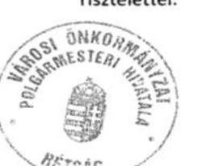

Hegedűs Ferenc
polgármester

13

---

# KIVONAT 

## Rétság Város Önkormányzat Képviselő-testületének

2016. november 08. napján megtartott nyílt üléséről

## RÉTSÁG VÁROS ÖNKORMÁNYZAT KÉPVISELŐ-TESTÜLETÉNEK

255/2016. (XI.08.) számú határozata

Tárgya: Intézkedési terv elfogadása

Rétság Város Önkormányzat Képviselő-testülete megismerte az Állami Számvevőszék V071502 számú, az önkormányzat pénzügyi és vagyongazdálkodása megfelelőségének ellenőrzéséről készített jelentését.

A Képviselő-testület utasítja a polgármestert, hogy a jelentésben foglalt hiányosságok megszüntetése, illetve a hibák ismételt előfordulásának elkerülése érdekében a szükséges intézkedéseket haladéktalanul tegye meg.

Felelős: Hegedűs Ferenc polgármester
Határidő: folyamatos

Hegedűs Ferenc sk.
polgármester
Dr. Varga Tibor sk.
jegyző

A kiadmány hiteléül:
Lichtenberger Edit
jkv.vez.

---

# Intézkedési terv 

az Állami Számvevőszék „Jelentés az önkormányzatok pénzügyi és vagyongazdálkodása megfelelőségének ellenőrzése - Rétság" jelentésben megfogalmazott észrevételekre

## Polgármesternek tett javaslatok:

## 1/a.: Költségvetési rendelet tartalmának kiegészítése

Intézkedés: a soron következő rendeletmódosítástól kiegészítjük a rendeletet a működési egyenleg és a felhalmozási egyenleggel.

## 1/b.: Bevételek elmaradása esetén rendeletmódosítás

Intézkedés: A jelenleg is
 hatályos költségvetési rendelet tartalmazza a költségvetés végrehajtásának szabályait, konkrét esetben a 21.§ (3) e) pontja:
„e) a költségvetési szerveknél a tervezett bevételek elmaradása nem vonja automatikusan maga után az önkormányzati támogatás növekedését. Amennyiben a tervezett bevételek nem folynak be, a tervezett kiadási előirányzatok nem teljesíthetők. A bevétel elmaradása melletti kiadási előirányzat teljesítése előirányzat-túllépésnek minősül,"
A rendelkezést a soron következő módosításkor egyértelműsítjük, azzal a mondatrésszel, hogy a kiadási előirányzatot a bevételi kiesés összegével csökkenteni kell.

1/c.: A zárszámadási rendelet kiegészítése a többéves kihatással járó döntések számszerűsítésével
Intézkedés: A soron következő zárszámadási rendelet kiegészítjük a többéves kihatással járó döntések ismert számszaki adataival.

## 2/a.) Vagyongazdálkodásról szóló rendelet felülvizsgálata

Intézkedés: a vagyonrendelet 2017. szeptember 30-ig felülvizsgáljuk. A vagyonrendelet megalapozó kataszteri dokumentációt külső szakértőtől rendeljük meg.
2./b.) Az önkormányzati tulajdonú gazdasági társaságokkal kapcsolatos jogszabályi előírások betartása
Intézkedés: a képviseletről a Kormányhivatallal történt egyeztetés. Az állandó megbízást a Kormányhivatal kifogásolta, az eseti megbízást javasolta megoldásként. Az előző ciklusban lévő megbízások hibái intézkedést nem igényelnek.

## 3/a.) Gazdasági program kidolgozása

Intézkedés: április 30-ig a gazdasági program előterjesztésre kerül.

## 3/b.) Közép- és hosszútávú vagyongazdálkodási terv előterjesztése

Intézkedés: a közép- és hosszútávú vagyongazdálkodási tervet 2017. szeptember 30-ig előterjesztjük. A terv előkészítésére külső szakértőt vonunk be.

3/c.) Környezetvédelmi program kidolgozása

---

Intézkedés: a környezetvédelmi programot 2017. június 30-ig előterjesztjük. A terv előkészítésére külső szakértőt vonunk be.

3/d.) Szociális szolgáltatási koncepció testület elé terjesztése
Intézkedés: a szociális szolgáltatási koncepciót 2017. június 30-ig előterjesztjük. A terv előkészítésére külső szakértőt vonunk be.

# 4. Az erőforrásokkal való hatékony gazdálkodás követelményeinek meghatározása 

Intézkedés: A követelményeket 2017. szeptember 30-ig a képviselő-testület elé terjesztjük.

## 5.) Munkajogi felelősség tisztázása

Intézkedés: a felelősség tisztázása a sűrű jegyzőváltozás miatt problematikus. Az elsődleges szempont a hibák kijavítása lesz.

## Jegyzőnek tett javaslatok:

1/a.: Költségvetési rendelet tartalmának kiegészítése: A Polgármesternek adott feladatok között az intézkedés bemutatva (1/a.)

1/b.: A zárszámadási rendelet kiegészítése a többéves kihatással járó döntések számszerűsítésével: A Polgármesternek adott feladatok között az intézkedés bemutatva (1/c.)

1/c.: Bevételek elmaradása esetén rendeletmódosítás: A Polgármesternek adott feladatok között az intézkedés bemutatva (1/b.)

1/d.: A Likviditási terv jogszabályi előírásoknak megfelelő elkészítése:
Intézkedés: A mellékletet a soron következő módosításkor átdolgozzuk.

2/a.) Vagyongazdálkodásról szóló rendelet felülvizsgálata: A Polgármesternek adott feladatok között az intézkedés bemutatva (2/a.)
2./a-b-c.) Az eszközök nyilvántartásának és értékesítésének jogszabályi előírások szerinti elvégzése: A 2015. évi beszámolóban már korrigáltuk a hibát.

## 2./d.) Az éves beszámolók mérlegének előírásoknak megfelelő alátámasztása:

Intézkedés: a vagyonrendeletben a leltározási ciklus kettő évről három évre történő módosítását elvégezzük. A leltárutasításban mennyiségi felvételt kiegészítjük az ingatlanok mennyiségi felvételével. A részesedések esetén már 2015. évtől - a helyszíni ellenőrzésen tett javaslat alapján - az önkormányzat ügyvédjétől kérünk állásfoglalást.

## 2./e.) A vagyonkimutatás jogszabályi előírásoknak megfelelő elkészítése:

Intézkedés: A soron következő zárszámadástól a vagyont kimutatjuk forgalomképesség szerint is (forgalomképtelen törzsvagyon, korlátozottan forgalomképes vagyon, üzleti vagyon).

---

# 2./f) Az ingatlanvagyon ingatlannyilvántartással történő egyeztetése 

Intézkedés: egyeztetés eddig is készült, a feltárt eltérésekről az ellenőröket nyilatkozatban tájékoztattuk. A következő zárszámadástól az egyeztetésről jegyzőkönyvet készítünk.

## 3./a) Polgármesteri Hivatal SZMSZ-ének felülvizsgálata

Intézkedés: A felülvizsgálatot 2017. január 31-ig elvégezzük.

## 3./b) Belső szabályzatok felülvizsgálata

Intézkedés: a szabályzatok felülvizsgálata folyamatos, 2015. decemberében hagyta jóvá a Képviselőtestület a gazdálkodási jogkörös szabályzatunk aktualizálását. 2017. december 31-ig valamennyi szabályzatunkat felülvizsgáljuk. Megjegyzem Rétság igen sok szabályzattal rendelkezik, melyek között vannak nem kötelező szabályzatok is. A felülvizsgálat során a kötelező szabályzatokat fogjuk előnybe részesíteni.
3./c) Gazdasági program jogszabályi előírásoknak való előkészítése: A Polgármesternek adott feladatok között az intézkedés bemutatva (3/a.)

3/d) Közép- és hosszútávú vagyongazdálkodási terv előterjesztése: A Polgármesternek adott feladatok között az intézkedés bemutatva (3/b.)

3/e.) Környezetvédelmi program kidolgozása: A Polgármesternek adott feladatok között az intézkedés bemutatva (3/c.)

3/g.) Szociális szolgáltatási koncepció testület elé terjesztése: A Polgármesternek adott feladatok között az intézkedés bemutatva (3/d.)
4.) Munkajogi felelősség tisztázása: a munkajogi felelősséget 2016. november 30-ig tisztázásra kerül.

Felelős: polgármesternek tett javaslatok végrehajtásáért Hegedűs Ferenc polgármester
jegyzőnek tett javaslatok végrehajtásáért: dr. Varga Tibor jegyző

Az intézkedési tervet 2016. november 15-ig a Képviselő-testület elé terjesztjük önálló napirendi pontként.

Rétság, 2016. október 21.
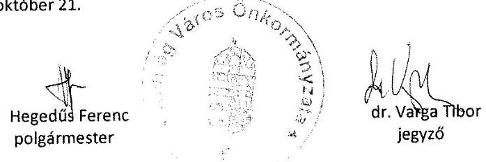

---

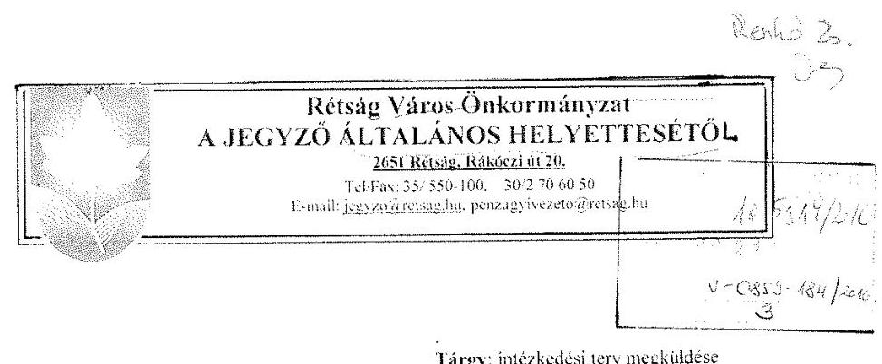

Tárgy: intézkedési terv megküldése

# Állami Számvevőszék 

## 1364 Budapest

Pf. 54

## Tisztelt Cím!

Mellékleten megküldöm a kiegészített intézkedési tervet és az intézkedési terv elfogadásáról szóló képviselő-testületi határozatot.

Rétság, 2016. december 20.
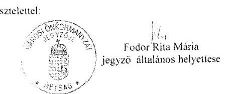

---

# KIVONAT 

## Rétság Város Önkormányzat Képviselő-testületének 2016. december 16. napján megtartott nyílt Képviselő-testületi üléséről

## RÉTSÁG VÁROS ÖNKORMÁNYZAT KÉPVISELŐ-TESTÜLETÉNEK 283/2016. (XII.16.) számú határozata

Tárgya: Intézkedési terv jóváhagyása II.

Rétság Város Önkormányzat Képviselő-testülete megtárgyalta az Állami Számvevőszék V071502 szám, az önkormányzat pénzügyi és vagyongazdálkodás megfelelőségének ellenőrzéséről készített jelentés intézkedési tervének kiegészítéséről szóló előterjesztést.

A Képviselő-testület a kiegészített intézkedési tervet elfogadja.

Határidő: azonnal
Felelős: Hegedűs Ferenc polgármester

Hegedűs Ferenc sk. polgármester
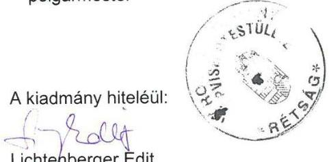
dr. Varga Tibor sk. jegyző

---

# Intézkedési terv 

az Állami Számvevőszék „Jelentés az önkormányzatok pénzügyi és vagyongazdálkodása megfelelőségének ellenőrzése - Rétság" jelentésben megfogalmazott észrevételekre

## ÁSZ jelentés intézkedést igénylő javaslatai

## I. Polgármesternek tett javaslatok:

1/a): A jogszabályi előírásoknak megfelelő tartalmú költségvetési rendelettervezet képviselőtestület elé terjesztése.

Intézkedés: A jogszabályi előírásoknak megfelelően előkészített, a működési és felhalmozási célú egyenleget is tartalmazó rendelettervezet képviselő-testület elé terjesztése a 2016. december 16-i ülésre megtörtént.

Határidő: folyamatos
Felelős: Hegedűs Ferenc polgármester

1/b): A költségvetési bevételek tervezettől történő elmaradása esetén azok csökkentése érdekében megfelelő tartalmú költségvetési rendelet módosítás tervezet képviselőtestület elé terjesztése.

Intézkedés: A tényleges bevételeknek megfelelő előirányzat-változásokat tartalmazó rendelettervezet Képviselő-testület elé terjesztése a 2016. december 16-i ülésre megtörtént.

Határidő: folyamatos
Felelős: Hegedűs Ferenc polgármester
1/c): A zárszámadási rendelettervezet előterjesztésekor a képviselő-testület részére tájékoztatásul a többéves kihatással járó döntések számszerűsítését évenkénti bontásban és összesítve be kell mutatni.

Intézkedés: A többéves kihatással járó döntések számszerűsítését évenkénti bontásban és összesítve bemutató mellékletet is tartalmazó zárszámadási rendelettervezetet a polgármester a képviselő-testület elé terjeszti.

Határidő: 2016. évi zárszámadás előterjesztése, 2017. április 28.
Felelős: Hegedűs Ferenc polgármester
2/a) Vagyongazdálkodással kapcsolatos szabályok meghatározása érdekében szükséges rendelettervezet képviselő-testület elé terjesztése.

Intézkedés: A felülvizsgált és vagyonkezelői jog gyakorlás és ellenőrzés részletes szabályait is tartalmazó -az önkormányzat vagyonáról és vagyongazdálkodás szabályairól szóló 15/2004.(X.4.) önkormányzati rendelet módosítására vonatkozó - rendelettervezetet a polgármester a képviselő-testület elé terjeszti.

Határidő: 2017. szeptember 30.
Felelős: Hegedűs Ferenc polgármester

---

2./b) Az önkormányzati tulajdonú gazdasági társaságokkal kapcsolatos jogszabályi előírásoknak megfelelő tulajdonosi képviselet gyakorlása.

Intézkedés: Az előző ciklusban lévő megbízások hibái intézkedést nem igényelnek.
A Képviselő-testület a 143/2015. (VII.21.) számú határozatával a Magyarország helyi önkormányzatairól szóló 2011. évi CLXXXIX. törvény 32.§ (2) bekezdés e) pontja alapján 2015. augusztus 1-től a Rétság kistérségi Egészségfejlesztő Központ Egészségügyi Szolgáltató Nonprofit Kft.-be Rétság Város Önkormányzat Képviselő-testületének a képviselőtestület kizárólagos hatáskörébe tartozó ügyek kivételével teljes körű és minden ügycsoportra kiterjedő kizárólagos képviseletével, valamint a taggyülések közötti időszakban az ügyvezető igazgató feletti egyéb munkáltatói jogok gyakorlására Dr. Szájbely Ernő képviselőt bízta meg, mely megbízás visszavonásig érvényes. A határozatról a Kft. ügyvezető igazgatóját a képviselő-testület tájékoztatta. A Képviselő-testület ezen döntésére a Nógrád Megyei Kormányhivatal észrevételt nem tett.
Mivel a Képviselő-testület a feltárt hiányosságot rendezte, ezzel kapcsolatban további teendője nincs. A Kft. illetve a delegált képviselő részére a beszámolási kötelezettség gyakorisága és tartalmi követelményei meghatározásra kerülnek.

Határidő: 2017. január 31.
Felelős: Hegedűs Ferenc polgármester
3./a) A jogszabályi előírásoknak megfelelő gazdasági program képviselő-testület elé terjesztése.

Intézkedés: A képviselő-testület hosszú távú fejlesztési elképzeléseit tartalmazó gazdasági programját a polgármester a képviselő-testület elé terjeszti.

Határidő: 2017. április 28.
Felelős: Hegedűs Ferenc polgármester
5./ Az ellenőrzés során feltárt hiányosságok és/vagy szabálytalanságok tekintetében, a munkajogi felelősség tisztázására irányuló eljárás megindítása, és ennek eredménye ismeretében szükséges intézkedés megtétele.

Intézkedés: Az ellenőrzési jelentésben feltárt hiányosságok és/vagy szabálytalanságok tekintetében a munkajogi felelősség tisztázása megtörtént, további intézkedést nem igényel.

---

# II. Jegyzőnek tett javaslatok: 

1/a): A jogszabályi előírásoknak megfelelő tartalmú költségvetési rendelettervezet előkészítése.

Intézkedés: Költségvetési rendelet tartalmát ki kell egészíteni. A jogszabályi előírásoknak megfelelő rendelettervezetet, mely tartalmazza a működési és felhalmozási célú egyenleget is, a jegyző a Képviselő-testület 2016. december 16-i ülésére előkészítette.

Határidő: folyamatos (valamennyi költségvetést tárgyaló testületi ülés előtt 6. nap)
Felelős: Dr. Varga Tibor jegyző

1/b): A zárszámadási rendelettervezet előkészítésekor a képviselő-testület részére tájékoztatásul a többéves kihatással járó döntések számszerűsítését évenkénti bontásban és összesítve be kell mutatni.

Intézkedés: A jegyző elkészíti a zárszámadási rendelet-tervezetet, mely kiegészül a többéves kihatással járó döntések számszerűsítését évenkénti bontásban és összesítve is bemutató melléklettel.
Határidő: 2016. évi zárszámadás előkészítése, 2017. április 24.
Felelős: Dr. Varga Tibor jegyző
1./c): A költségvetési bevételek tervezettől történő elmaradása esetén azok csökkentése érdekében megfelelő tartalmú költségvetési rendelet módosítás előkészítése.

Intézkedés: Amennyiben a bevételek elmaradása indokolja a költségvetés módosítását, a jegyző előkészíti a tényleges bevételeknek megfelelő előirányzat-változásokat tartalmazó rendelettervezetet.

Határidő: költségvetés decemberi módosításának előkészítése: 2016. december 10, majd folyamatos (valamennyi költségvetést tárgyaló testületi ülés előtt 6. nap)
Felelős: Dr. Varga Tibor jegyző

1/d): A Likviditási terv jogszabályi előírásoknak megfelelő elkészítése:
Intézkedés: Az Áht. 78. § (2) bekezdés, valamint az államháztartási törvény végrehajtásáról szóló 368/2011. (XII. 31.) Korm. rendelet 122.§ (2) bekezdése szerinti likviditási tervet a jegyző havonta elkészíti, mely likviditási terv az éves költségvetési rendeletek mellékletét képezi.

Határidő: 2017. január 10., majd ezt követően havonta, a tárgyhónap ötödik napját megelőző utolsó munkanapig.
Felelős: Dr. Varga Tibor jegyző

2/a) Vagyongazdálkodással kapcsolatos szabályok meghatározása érdekében szükséges rendelettervezet előkészítése.

Intézkedés: Az önkormányzat vagyonáról és vagyongazdálkodás szabályairól szóló 15/2004.(X.4.) önkormányzati rendelet felülvizsgálatát el kell végezni. A rendeletet - az Mótv. 109. § (4) bekezdésében valamint 143. §(4) bekezdés i) pontjában foglaltak alapján - ki kell egészíteni a vagyonkezelői jog létesítés, a vagyonkezelői jog megszerzés, gyakorlás, valamint

---

a vagyonkezelés ellenőrzésének szabályaival. A felülvizsgált és vagyonkezelői jog gyakorlás és ellenőrzés részletes szabályait is tartalmazó rendelettervezetet a jegyző előkészíti.

Határidő: 2017. szeptember 24.
Felelős: Dr. Varga Tibor jegyző
2/d) Az éves költségvetési beszámolók mérlegének előírásoknak megfelelő alátámasztása.
Intézkedés: A leltározási szabályzatban - az Államháztartás számviteléről szóló 4/2013. (I.11.) Kormányrendelet 22. §-ában foglaltak alapján - a leltározási ciklus kettő évről három évre történő módosítását át kell vezetni. A mennyiségi felvételt kiegészítésre kerül az ingatlanok mennyiségi felvételével. A részesedések értékelésének korrekciója a 2015. évi beszámolóban megtörtént. Az önkormányzat ügyvédjének közreműködésével az értékelést évente elvégezzük.

Határidő: szabályzat módosítás: 2017. április 30.
Részesedések értékelése: 2017. február 20.
Felelős: Dr. Varga Tibor jegyző

# 3./a) Polgármesteri Hivatal SZMSZ-ének és ügyrendjének felülvizsgálata 

Intézkedés: A Polgármesteri Hivatal SZMSZ-ének és ügyrendjének felülvizsgálatát elvégezzük. A felülvizsgálat során a szervezeti változások átvezetésével megteremtjük az ügyrend és SZMSZ összhangját és szabályozzuk a hatásköri és felelősségi viszonyokat.

Határidő: 2017. január 21.
Felelős: Dr. Varga Tibor jegyző
3./b) Pénzügyi és vagyongazdálkodással kapcsolatos jogszabályokban előírt belső szabályzatok, nyilvántartások - előírásoknak megfelelő tartalommal történő- kiadásáról, illetve vezetéséről, a jogszabályváltozások esetén azok aktualizálásáról.
Intézkedés: Az alábbi belső szabályzatok kerülnek kiegészítésre és a jegyző által kiadásra:
3ba) A számviteli politikában kiegészítésként rögzíteni kell - a Számvitelről szóló 2000. évi C. törvény 14. § (4) bekezdésében foglaltak alapján - hogy
 a számviteli elszámolás és értékelés szempontjából mit tekintünk lényeges, illetve nem lényeges, jelentős összegnek, illetve nem jelentős összegnek.
3bb) A költségvetési szervek belső kontrollrendszeréről és belső ellenőrzéséről szóló, 370/2011. (XII. 31.) Korm. rendelet 6. § (3) bekezdésében előírt ellenőrzési nyomvonalat el kell készíteni és folyamatosan aktualizálni kell.

3bc.) A gazdálkodási jogkörök ellátására vonatkozó - képviselő-testület 273/2015. (XII.18.) Kt határozattal jóváhagyott - szabályzat mellékletét képező, a kötelezettségvállalásra, pénzügyi ellenjegyzésre, szakmai teljesítés igazolására, érvényesítésre, utalványozásra jogosult személyekről és aláírás-mintájukról a nyilvántartás naprakész vezetését továbbra is biztosítani kell.

3bd) A gépjárművek igénybevételének és használatának rendjét, valamint a vezetékes és mobiltelefonok használatának feltételeit szabályzatban kell rögzíteni.

---

3be.) A leltározási és leltárkészítési, valamint értékelési szabályzat aktualizálását a végrehajtott törvényi módosítások figyelembe vételével el kell végezni.

Határidő: folyamatos, 2017. december 31.
Felelős: Dr. Varga Tibor jegyző
3./c) Gazdasági program jogszabályi előírásoknak való előkészítése: A Polgármesternek adott feladatok között az intézkedés bemutatva

Intézkedés: A képviselő-testület hosszú távú fejlesztési elképzeléseit tartalmazó gazdasági programot a jegyző előkészíti.

Határidő: 2017. április 22.
Felelős: Dr. Varga Tibor jegyző

3/d). Jogszabályi előírásoknak megfelelő közép-és hosszú távú vagyongazdálkodási terv elkészítése.

Intézkedés: A Nemzeti vagyonról szóló 2011. évi CXCVI. tv. 9. § (1) bekezdése alapján a közép- és hosszú távú vagyongazdálkodási tervet a jegyző előkészíti.

Határidő: 2017. szeptember 24.
Felelős: Dr. Varga Tibor jegyző

3/e) Jogszabályi előírásoknak megfelelő környezetvédelmi program elkészítése.
Intézkedés: A Környezetvédelem általános szabályairól szóló 1995. évi LIII. tv. (46) § (1) bekezdés b) pontjában foglaltak alapján Rétság város környezetvédelmi programjának külső szakértő bevonásával a jegyző előkészíti.

Határidő: 2017. augusztus 25.
Felelős: Dr. Varga Tibor jegyző

3/f) A jogszabályi előírásoknak megfelelő szociális szolgáltatástervezési elkészítése.
Intézkedés: A szociális igazgatásról és szociális ellátásokról szóló 1993. évi III. tv. 92.§ (3) bekezdésében előírt szociális szolgáltatástervezési koncepciót külső szakértő bevonásával a jegyző előkészíti.

Határidő: 2017. augusztus 24.
Felelős: Dr. Varga Tibor jegyző
4.) Az ellenőrzés során feltárt hiányosságok és/vagy szabálytalanságok tekintetében, a munkajogi felelősség tisztázására irányuló eljárás megindítása, és ennek eredménye ismeretében szükséges intézkedés megtétele.

Intézkedés: Az ellenőrzési jelentésben feltárt hiányosságok és/vagy szabálytalanságok tekintetében az alábbi témákban kellett a munkajogi felelősség tisztázást elvégezni.

---

- 2014. évi zárszámadásban nem került kimutatásra az önkormányzat vagyonának forgalomképesség szerinti megoszlása,
- 2011-2014. évi mérlegben a részesedések kimutatása nem volt pontos
- részesedések egyedi értékelésére nem került sor.

Munkajogi felelősség tisztázása megtörtént, további intézkedést nem igényel.
Határidő: 2016. november 30.
Felelős: Dr. Varga Tibor jegyző

Rétság, 2016. december 10.
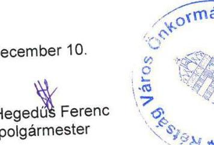
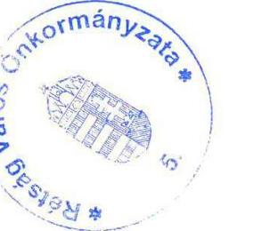
dr. Varga Tibor
jegyző
Az intézkedési tervet a képviselő-testület ....../2016. (XII.16.) KT. határozatával jóváhagyta.

---

.

---

# FÜGGELÉK: ÉSZREVÉTELEK 

A jelentéstervezetet a Számvevőszék 15 napos észrevételezésre megküldte az ellenőrzött szervezet vezetőjének az ÁSZ tv. 29. § (1) bekezdése előírásának megfelelően.

A függelék tartalmazza az ellenőrzött észrevételeit, illetve a figyelembe nem vett észrevételek elutasításának indoklását.

[^0]
[^0]:    * 29. § (1) Az Állami Számvevőszék az ellenőrzési megállapításait megküldi az ellenőrzött szervezet vezetőjének vagy az általa megbízott személynek, és annak, akinek személyes felelősségét állapította meg.
    (2) Az ellenőrzött szervezet vezetője és a felelősként megjelölt személy az ellenőrzés megállapításaira tizenöt napon belül írásban észrevételt tehet.
    (3) Az Állami Számvevőszék az észrevételre a beérkezésétől számított harminc napon belül írásban válaszol. A figyelembe nem vett észrevételeket köteles a jelentésben feltüntetni, és megindokolni, hogy azokat miért nem fogadta el.

---

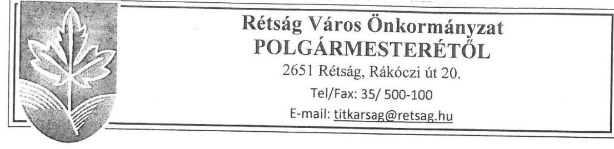

Ikt.szám: RET/... 2.2.1.1/2019.
Tárgy: Rétság utóellenőrzéséhez észrevétel

# Állami Számvevőszék 

1364 Budapest 4.
Pf.: 54

Tisztelt Cím!

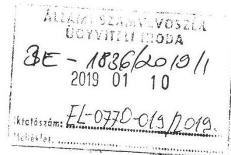

Köszönettel megkaptuk az utóellenőrzésünk jegyzőkönyv-tervezetét.

A jegyzőkönyvhöz az alábbi észrevételt kívánom tenni:
2018. június 18-án (hétfőn) észleltük, hogy az ABR rendszer 2018. június 15-én (pénteken) lezárt. Ekkor azonnal jeleztük, hogy az előkészítő munkákkal kész vagyunk, a szkennelés okozott némi gondot a központi nyomtató leterheltsége miatt. 2018. június 18-án kérelmet nyújtottunk be. Majd 2018. június 20-án telefonon jelezték, hogy kérelmünket abban az esetben tudják elfogadni, ha még aznap papír alapon postázzuk az iratokat. A postázás megtörtént.
2018. augusztus 2-án kelt levelükben arról tájékoztattak, hogy az adatszolgáltatási kötelezettségünknek 2018. június 11-ig kellett volna eleget tennünk. Ez fizikailag képtelenség lett volna, hiszen a rendszer 2018. június 7-én (csütörtökön) e-mailben (15.56 órakor) arról kaptunk értesítést, hogy publikálásra került az ellenőrzés, kezdjük meg a felkészülést. Ekkor még több menüpont pirossal jelent meg a rendszerben, megnyitni azt nem lehetett.

Leveleinkben jeleztük, hogy az adatszolgáltatás előkészítésével elkészültünk, együtt kívánunk működni Önök. Jelzésünket egyértelműen bizonyítja, hogy mind június 18-án, mind június 20-án a szóbeli lehetőségek felajánlásakor eleget tudtunk tenni adatszolgáltatási kötelezettségünknek. Kérjük a jegyzőkönyvben a felsorolt tények kerüljenek feltüntetésre.

Rétság, 2019. január 7.
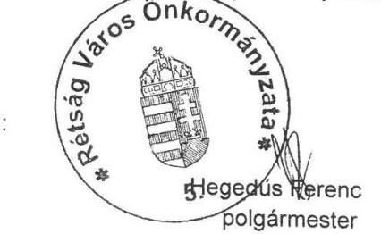

---

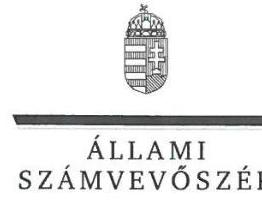

ELNÖK

Ikt.szám: EL-0770-020/2018

# Hegedűs Ferenc úr 

polgármester
Rétság Város Önkormányzata

## Rétság

## Tisztelt Polgármester Úr!

Köszönettel megkaptam az Állami Számvevőszékhez 2019. január 10. napján érkezett „Utóellenőrzések - Az önkormányzatok pénzügyi és vagyongazdálkodása megfelelőségének utóellenőrzése - Rétság Város Önkormányzata" című számvevőszéki jelentéstervezetben foglalt megállapításokra tett észrevételét.

Tájékoztatom Polgármester urat, hogy az Állami Számvevőszék a 2019. január 7-én kelt RET/92-1/2019. iktatószámú a polgármester által 2019. január 7-én megküldött levélben foglaltakat nem tekinti érdemi észrevételnek.

Az Állami Számvevőszék észrevételre vonatkozó álláspontjáról a felügyeleti vezető által készített részletes tájékoztatást csatoltan megküldöm.

Budapest, 2019. 07 hó 15 nap

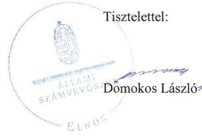

Melléklet: Tájékoztatás

---

# Tájékoztatás 

| 1. számú melléklet   az EL-0770-020/2018 ikt. számú levélhez |  |
| :--: | :--: |

## Tájékoztatás

| 1. | Észrevétel: | Rétság Város Önkormányzat polgármestere által az ÁSZ részére megküldött RET/92-1/2019. iktatószámú levél 1. oldal 1-3. bekezdéseiben az ÁSZ jelentéstervezethez tett észrevétel: „A jegyzőkönyvhöz az alábbi észrevételt kívánom tenni: 2018. június 18-án (hétfőn) észleltük, hogy az ABR rendszer 2018. június 15-én (pénteken) lezárt. Ekkor azonnal jeleztük, hogy az előkészítő munkákkal kész vagyunk, a szkennelés okozott némi gondot a központi nyomtató leterheltsége miatt. 2018. június 18-án kérelmet nyújtottunk be. Majd 2018. június 20-án telefonon jelezték, hogy kérelmünket abban az esetben tudják elfogadni, ha még aznap papír alapon postázzuk az iratokat. A postázás megtörtént.   2018. augusztus 2-án kelt levelükben arról tájékoztattak, hogy az adatszolgáltatási kötelezettségünknek 2018. június 11-ig kellett volna eleget tennünk. Ez fizikailag képtelenség lett volna, hiszen a rendszer 2018. június 7-én (csütörtökön) e-mailben (15.56 órakor) arról kaptunk értesítést, hogy publikálásra került az ellenőrzés, kezdjük meg a felkészülést. Ekkor még több menüpont pirossal jelent meg a rendszerben, megnyitni azt nem lehetett.   Leveleinkben jeleztük, hogy az adatszolgáltatás előkészítésével elkészültünk, együtt kívánunk működni Önök. Jelzésünket egyértelműen bizonyítja, hogy mind június 18-án, mind június 20-án a szóbeli lehetőségek felajánlásakor eleget tudtunk tenni adatszolgáltatási kötelezettségünknek. Kérjük a jegyzőkönyvben a felsorolt tények kerüljenek feltüntetésre." |
| :--: | :--: | :--: |
|  | Válasz: | Az ÁSZ az észrevételt nem tekinti észrevételnek. |
|  | Indoklás: | A polgármester által az ÁSZ részére megküldött „Rétság utóellenőrzéséhez észrevétel" tárgyú levél 1. oldal 1-3. bekezdéseiben leírtakat az ÁSZ nem tekinti észrevételnek, abban a polgármester az ellenőrzés vonatkozásában az adatszolgáltatás előkészítésével kapcsolatos gondokról, az adatszolgáltatási kötelezettség nem teljesítése okairól és az ÁSZ felé levélben történő jelzéséről ad tájékoztatást. |

Budapest, 2019.

---

# RÖVIDÍTÉSEK JEGYZÉKE 

${ }^{1}$ jelentés
${ }^{2}$ polgármester
${ }^{3}$ Képviselő-testület
${ }^{4}$ jegyző
${ }^{5}$ ÁSZ
${ }^{6}$ ÁSZ tv.
${ }^{7}$ ÁSZ SZMSZ
${ }^{8}$ Önkormányzat
${ }^{9}$ intézkedési terv ${ }_{1}$
${ }^{10}$ intézkedési terv ${ }_{2}$

Jelentés - Az önkormányzatok pénzügyi és vagyongazdálkodása megfelelőségének ellenőrzése - Rétság
Rétság Város Önkormányzata polgármestere
Rétság Város Önkormányzata Képviselő-testülete
Rétság Városi Önkormányzat Polgármesteri Hivatala vezetője
Állami Számvevőszék
az Állami Számvevőszékről szóló 2011. évi LXVI. törvény
az Állami Számvevőszék Szervezeti és Működési Szabályzata
Rétság Város Önkormányzata
Rétság Város Képviselő-testületének 255/2016. (XI.08.) számú határozata, tárgya: Intézkedési terv elfogadása
Rétság Város Képviselő-testületének 283/2016. (XII.16.) számú határozata, tárgya: Intézkedési terv jóváhagyása II

---

ÁLLAMI SZÁMVEVŐSZÉK
1052 Budapest, Apáczai Csere János utca 10.
Levélcím: 1364 Budapest 4. Pf. 54
Telefon: +36 14849100 Telefax: +36 14849200
www.asz.hu

