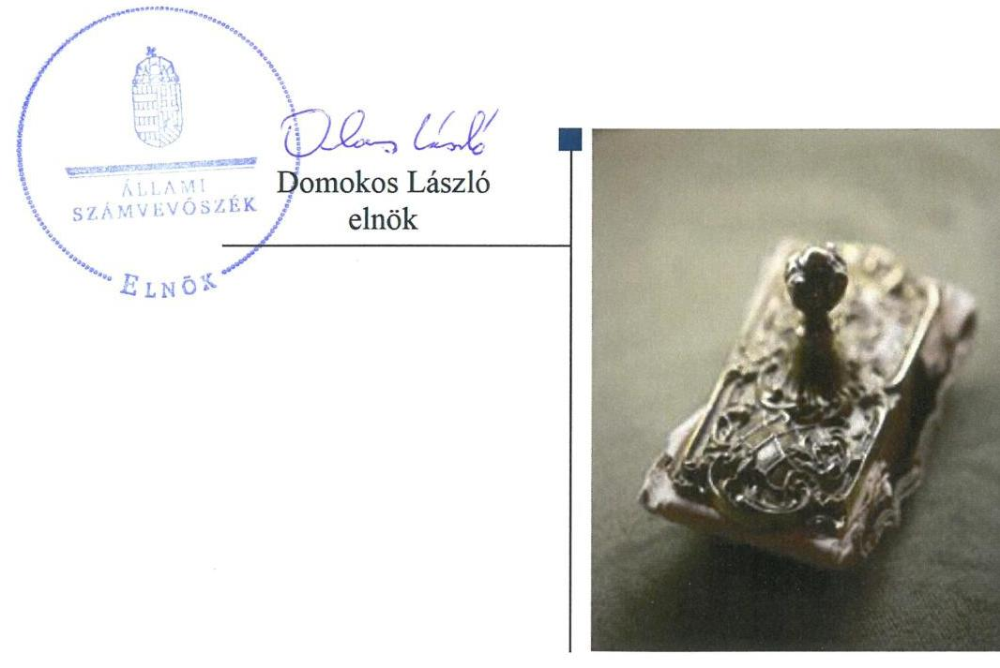
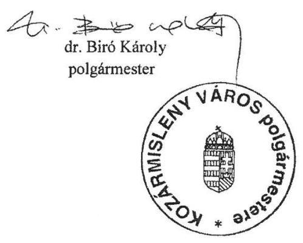
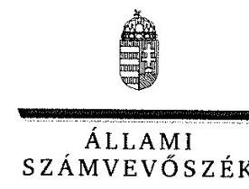
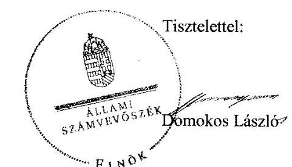
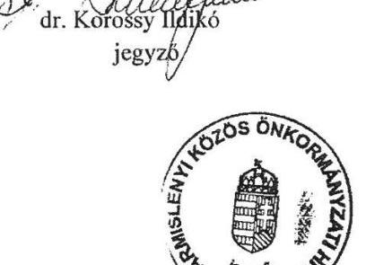
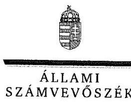
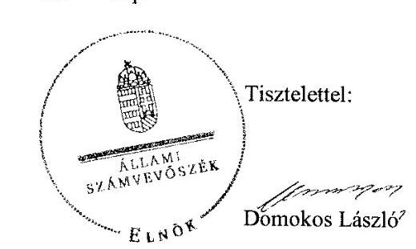

# Jelentés

## Önkormányzatok ellenőrzése – Integritás- és belső kontrollrendszer

Kozármisleny Város Önkormányzata 2019.

19038 www.asz.hu

---

# Jelenctés 

## Önkormányzatok ellenőrzése -Integritás- és belsó kontrollrendszer

Kozármisleny Város Önkormányzata 2019. 02. hó 14. nap

---

# AZ ELLENŐRZÉST FELÜGYELTE:

DR. NAGY IMRE felügyeleti vezető

# AZ ELLENŐRZÉST VEZETTE ÉS A VÉGREHAJTÁSÁÉRT FELELŐS:

DR. DOMOKOS MAGDOLNA ellenőrzésvezető

# A PROGRAM ÖSSZEÁLLÍTÁSÁÉRT FELELŐS:

TÓTPÁL SZABOLCS osztályvezető

---

IKTATÓSZÁM: EL-1492-001/2019.

TÉMASZÁM: 15

ELLENŐRZÉS-AZONOSÍTÓ SZÁM: V082945

---

Jelentéseink az Országgyűlés számítógépes hálózatán és az Interneta a www.asz.hu címen is olvashatóak.

---

# TARTALOMJEGYZÉK 

■ ÖSSZEGZÉS ..... 5
■ AZ ELLENŐRZÉS CÉLJA ..... 6
■ AZ ELLENŐRZÉS TERÜLETE ..... 7
■ AZ ELLENŐRZÉS HÁTTERE, INDOKOLTSÁGA ..... 8
■ A JELENTÉS LÉNYEGES KÉRDÉSKÖREI ..... 9
■ AZ ELLENŐRZÉS HATÓKÖRE ÉS MÓDSZEREI ..... 10
■ MEGÁLLAPÍTÁSOK ..... 12
■ JAVASLATOK ..... 14
■ MELLÉKLETEK ..... 15
I. sz. melléklet: Értelmező szótár ..... 15
■ FÜGGELÉKEK ..... 17
I. sz. függelék a Megállapitások fejezethez ..... 17
II. sz. függelék: Észrevételek ..... 18
■ RÖVIDÍTÉSEK JEGYZÉKE ..... 31

---

.

---

# ÖSSZEGZÉS 

Kozármisleny Város Önkormányzatánál nem volt biztositott az átláthatóság, elszámoltathatóság, a közpénzfelhasználás szabályossága és a nemzeti vagyonnal történő felelős gazdálkodás. Az integritás kontrollok kockázatokkal arányos kialakítása nem történt meg, nem határoztak meg az integritás erősitésére és a korrupció megelőzésére szolgáló értékeket.

## Az ellenőrzés társadalmi indokoltsága

Az Állami Számvevőszék alapvető feladata a közpénzekkel, az állami és önkormányzati vagyonnal való gazdálkodás ellenőrzése. Az Alaptörvény szerint az önkormányzatok kötelezettsége a kiegyensúlyozott, átlátható és fenntartható költségvetési gazdálkodás elvének érvényesítése, a nemzeti vagyonnal való rendeltetésszerű és felelős módon való gazdálkodás biztosítása. Az Állami Számvevőszék stratégiájában megfogalmazott célkitűzése az integritás alapú, átlátható és elszámoltatható közpénzfelhasználás elősegítése. Ennek megvalósítása érdekében az Állami Számvevőszék prioritásként kezeli a közpénzzel gazdálkodó szervezetek esetében a belső kontrollrendszer múködésének ellenőrzését.

Az Állami Számvevőszék Kozármisleny Város Önkormányzatát korábban nem ellenőrizte.

## Főbb megállapítások, következtetések, javaslatok

Kozármisleny Város Önkormányzatának gazdálkodási feladatait ellátó Kozármislenyi Közös Önkormányzati Hivatal a jogszabályi előírások ellenére nem rendelkezett a feladatellátás részletes belső rendjét és módját rögzítő szervezeti és működési szabályzattal, így az átlátható, elszámoltatható működés alapvető feltételei hiányoztak.

A Kozármislenyi Közös Önkormányzati Hivatalnál nem vezették a jogszabály szerinti naprakész nyilvántartást a gazdálkodási jogkörök gyakorlására jogosult személyekről és aláírás-mintájukról, így a gazdálkodási jogkörök jogszabály szerinti gyakorlásának feltételei, a szabályszerű közpénzfelhasználás, a nemzeti vagyonnal való rendeltetésszerű és felelős módon történő gazdálkodás feltételei nem voltak biztosítottak.

Kozármisleny Város Önkormányzatánál nem volt biztosított az integritás alapú közpénzfelhasználás lehetősége, valamint az államháztartás pénzeszközeivel és a nemzeti vagyonnal történő gazdaságos, hatékony és eredményes gazdálkodás mérésének lehetősége.

Az Állami Számvevőszék a Kozármislenyi Közös Önkormányzati Hivatal jegyzője részére a Közös Hivatal szervezeti és múködési szabályzatának elkészítése valamint a gazdálkodási jogkörök nyilvántartásának szabályszerű, naprakész vezetése kapcsán fogalmazott meg javaslatot, melyre az érintettnek 30 napon belül intézkedési tervet kell készítenie.

---

# AZ ELLENŐRZÉS CÉLJA 

Az ellenőrzés célja annak megállapítása volt, hogy Kozármisleny Város Önkormányzatának belső kontrollrendszere biztosította-e a közpénzekkel és a nemzeti vagyonnal történő elszámoltatható, átlátható, szabályszerű, gazdaságos, hatékony és eredményes gazdálkodás feltételeit. Az ellenőrzés keretében értékeljük továbbá, hogy az önkormányzatnál kiépítették és erősítették-e a korrupciós kockázatok kezelését szolgáló integritás kontrollokat és azt, hogy megteremtették-e a teljesítményellenőrzés feltételeit.

---

# AZ ELLENŐRZÉS TERÜLETE 

## Kozármisleny Város Önkormányzata

A Baranya megyében, a megyeszékhelytől 7 km-re fekvő Kozármisleny város állandó lakosainak száma a Központi Statisztikai Hivatal adatai alapján 2017. január 1-jén 6071 fő volt.

Az ellenőrzött időszakban a kilenc tagú Képviselő-testület ${ }^{1}$ két állandó bizottságot múködtetett, a Pénzügyi, Településfejlesztési és Sport Bizottságot, valamint a Szociális Kulturális- és Oktatási Bizottságot.

A polgármesteri és a jegyzői feladatok ellátásában az ellenőrzött időszakban személyi változás nem történt.

Az Önkormányzat² gazdálkodási feladatainak ellátása a Kozármislenyi Közös Önkormányzati Hivatal ${ }^{3}$ feladatkörébe tartozott. A Közös Hivatal múködése összefügg Kozármisleny, Egerág és Kisherend települések gazdálkodási feladatainak, valamint a Kozármisleny településen múködő német, horvát és roma nemzetiségi önkormányzatok gazdálkodási feladatainak ellátásával is.

Az Önkormányzat tulajdonosi joggyakorlója két gazdasági társaságnak, a 100\%-os tulajdonában lévő Kozármislenyi Közművelődési Nonprofit Szolgáltató Kft.-nek és a Kozármisleny Város Településfejlesztéséért Szolgáltató Nonprofit Kft.-nek.

Az Önkormányzat államháztartás információs rendszerében közzétett 2017. évi költségvetési beszámolója szerint 1,3 milliárd forint költségvetési bevételt ért el, valamint 995,2 millió Ft költségvetési kiadást teljesített, vagyonának értéke 2017. december 31-én 7,1 milliárd forint volt.

---

# AZ ELLENŐRZÉS HÁTTERE, INDOKOLTSÁGA 

A demokratikus társadalmakban alapvető igény, hogy a közpénzeket, a közvagyont használók tevékenységükről elszámoljanak, ahhoz egyértelmű és érvényesíthető felelősségi szabályok társuljanak. Ennek a jogos igénynek az érvényesítéséhez meg kell teremteni azokat a folyamatokat, rendszereket, amelyek nélkülözhetetlenek az elszámoltatáshoz. Az elszámoltatás eredményes működtetéséhez szükség van a megfelelő információs, kontroll-, értékelési és beszámolási rendszerek kialakítására. A belső kontrollok kiépítettsége hozzájárul az integritási szemlélet kialakításához és érvényesüléséhez. A belső kontrollrendszer kialakítása és működtetése nélkül nem valósítható meg a közpénzek, a közvagyon szabályos, gazdaságos, hatékony és eredményes felhasználása.

A BELSŐ KONTROLLRENDSZER azt a célt szolgálja, hogy az államháztartás szervei működésük és gazdálkodásuk során a tevékenységeket szabályszerűen, gazdaságosan, hatékonyan, eredményesen hajtsák végre, teljesítsék elszámolási kötelezettségeiket, és megvédjék az erőforrásokat a veszteségektől, a károktól, a nem rendeltetésszerű használattól. A belső kontrollrendszer magában foglalja mindazon szabályokat, eljárásokat, gyakorlati módszereket és szervezeti struktúrákat, kockázatkezelési technikákat, kontrolltevékenységeket, amelyek segítséget nyújtanak a szervezetnek céljai eléréséhez.

A megfelelő belső kontrollrendszer jelentősen csökkenti a hibák és szabálytalanságok kockázatát. Az ÁSZ célja, hogy javuljon az ellenőrzött önkormányzatok belső kontrollrendszerének szabályozottsága, működésének megfelelősége, szabályszerűsége, hozzájárulva ezzel az egyensúlyi helyzet fenntarthatóságának biztosításához, biztosítva az önkormányzatnál a közpénzfelhasználás szabályosságát, a közpénzekkel és a nemzeti vagyonnal történő szabályszerű, gazdaságos, hatékony és eredményes gazdálkodást.

AZ ELLENŐRZÉS VÁRHATÓ HASZNOSULÁSA négy szinten valósul meg. A törvényalkotás számára összegzett tapasztalatok állnak rendelkezésre a belső kontrollrendszer önkormányzati területen való kialakításáról, működtetéséről és hatásairól. Az ellenőrzés az ellenőrzött számára visszajelzést ad a belső kontrollrendszer kialakításában és működésében lévő hiányosságokról, javaslataival hozzájárul azok kiküszöböléséhez. Az ellenőrzés megállapításait és javaslatait más szervezetek is hasznosíthatják a rendezett gazdálkodási keretek kialakításához, a ,,jó gyakorlat" elterjesztésével azok az önkormányzatok is átvehetik a pozitív példákat, ahol nem végez ellenőrzést az ÁSZ.

Az ÁSZ ellenőrzései jelzik a társadalom számára, hogy közpénz nem maradhat ellenőrizetlenül, tevékenysége hozzájárul az értékteremtő rend kialakításához és megőrzéséhez.

---

# A JELENTÉS LÉNYEGES KÉRDÉSKÖREI 

1. Az önkormányzat belső kontrollrendszerének kialakítása és müködtetése szabályszerű volt-e, az biztositotta-e az önkormányzatnál a közpénzfelhasználás szabályosságát, a nemzeti vagyonnal történő felelős gazdálkodást?
2. Az önkormányzat kiépitette és erősítette-e az integritás kontrollrendszerét?
3. Az önkormányzatnál alakítottak-e ki a teljesítmény mérésére alkalmas követelményeket?

---

# AZ ELLENŐRZÉS HATÓKÖRE ÉS MÓDSZEREI 

## Az ellenőrzés típusa

Megfelelőségi ellenőrzés.

## Az ellenőrzött időszak

2017. év, illetve az éves költségvetési beszámoló Áht. ${ }^{4}$ által megállapított jóváhagyásáig (2018. május 31-éig) tartó időszak.

## Az ellenőrzés tárgya

Kozármisleny Város Önkormányzata és a gazdálkodási feladatokat ellátó Kozármislenyi Közös Önkormányzati Hivatal belső kontrollrendszerének kialakítása és múködtetése, valamint az integritás kontrollok kiépítettsége, a teljesítményellenőrzés feltételei.

## Az ellenőrzött szervezet

Kozármisleny Város Önkormányzata, valamint a Kozármislenyi Közös Önkormányzati Hivatal

## Az ellenőrzés jogalapja

Az ellenőrzés jogszabályi alapját az ÁSZ tv. ${ }^{5}$ 1. § (3) bekezdés, 5. § (2) és (6) bekezdései, valamint az Áht. 61. § (2) bekezdésének előírásai képezik.

## Az ellenőrzés módszerei

Az ÁSZ az ellenőrzést az ellenőrzési program szempontjai, az ellenőrzött időszakban hatályos jogszabályok, az ellenőrzés szakmai szabályai, a jelen ellenőrzésre irányadó ÁSZ módszertanok figyelembevételével hajtotta végre.

Az ellenőrzés ideje alatt az ellenőrzött szervezettel történő kapcsolattartást az ÁSZ SZMSZ ${ }^{6}$-ének vonatkozó előírásai alapján biztosította az ÁSZ.

Az ellenőrzési kérdések megválaszolásához szükséges bizonyítékok megszerzése az ellenőrzött által rendelkezésre bocsátott dokumentumokra, adatokra alapozva megfigyelés, szemle (szemrevételezés), valamint elemző eljárás útján történt.

---

Az ellenőrzési bizonyítékként felhasználható adatforrások közé tartoznak az ellenőrzési program részletes szempontjainál felsorolt adatforrások, valamint minden egyéb - az ellenőrzés folyamán feltárt, az ellenőrzés szempontjából információt tartalmazó - dokumentum.

Az önkormányzat belső kontrollrendszerének összesített értékelése az egyes részterületek esetében kapott megfelelőségi arányok számtani átlaga alapján történik és megegyezik a pillérenként (kontroll-területenként) alkalmazott százalékos értékelésekkel, a következő eltérésekkel: a kontrollrendszer egésze esetében a „szabályszerú" értékelésnek a százalékos értéken felül további feltétele, hogy egyik kontrollterület sem kaphat „nem szabályszerű" értékelést.

Amennyiben az önkormányzat múködését és gazdálkodását alapvetően meghatározó dokumentum hiánya miatt, valamely lényeges kérdéskörre vonatkozóan az ÁSZ megállapítást tett, további ellenőrzési tevékenységek az adott kérdéskörrel és az azzal szoros logikai kapcsolatban lévő kérdéskörökkel - ráépülő jelleggel - nem kerültek végrehajtásra.

---

# MEGÁLLAPÍTÁSOK 

## 1. Az önkormányzat belső kontrollrendszerének kialakítása és múködtetése szabályszerű volt-e, az biztosította-e az önkormányzatnál a közpénzfelhasználás szabályosságát, a nemzeti vagyonnal történő felelős gazdálkodást?

Összegző megállapítás

Az Önkormányzat belső kontrollrendszerének kialakítása és múködtetése nem volt szabályszerű, az nem biztosította a közpénzfelhasználás szabályosságát, a nemzeti vagyonnal történő felelős gazdálkodást.

AZ ÖNKORMÁNYZAT NEM SZABÁLYSZERŰ KONTROLLKÖRNYEZETBEN múködött, mert a jegyző ${ }^{7}$ az Áht. 10. § (5) bekezdésében előírtak ellenére nem gondoskodott a Közös Hivatal általi feladatellátás részletes belső rendjének és módjának szervezeti és múködési szabályzatban történő megállapításáról, a Hivatal nem rendelkezett az alapvető feladatokat, felelősségi szabályokat rögzítő SZMSZ ${ }^{8}$-szel.

A KONTROLLTEVÉKENYSÉGEK múködtetése nem felelt meg a jogszabályi előírásoknak, mert a jegyző az Ávr. ${ }^{9} 60 . \S$ (3) bekezdésében foglaltak ellenére nem gondoskodott naprakész nyilvántartás vezetéséről a kötelezettségvállalásra, pénzügyi ellenjegyzésre, teljesítés igazolására, érvényesítésre, utalványozásra jogosult személyekről és aláírás-mintájukról. Ezáltal a kötelezettségvállalás, teljesítés-igazolás jogszabály szerinti gyakorlásának feltételei nem voltak biztosítottak.

## 2. Az önkormányzat kiépítette és erősítette-e az integritás kontrollrendszerét?

Összegző megállapítás

Az Önkormányzatnál a jogszabályok által előírt kontrollok kiépítettségének szintje nem támogatta a szervezet integritás elvű múködését, a szervezeti célok között nem szerepelt az integritás erősítése.

Az Önkormányzatnál nem mérték fel és nem azonosították a szervezeti célokkal összefüggő, illetve a korrupciós kockázatokat, így az integritás kontrollok kockázatokkal arányos kialakítása nem történt meg. Az Önkormányzatnál nem határoztak meg az integritás erősítésére és a korrupció megelőzésére szolgáló értékeket.

---

# 3. Az önkormányzatnál alakítottak-e ki a teljesítmény mérésére alkalmas követelményeket? 

## Összegző megállapítás

Az Önkormányzatnál nem alakítottak ki a teljesítmény mérésére alkalmas követelményeket.

A szervezeti célok elérését szolgáló feladatok, folyamatok, tevékenységek mérését szolgáló indikátorokat, mérőszámokat, feladat- és teljesítménymutatókat nem képeztek, ezáltal az Önkormányzat a teljesítmény mérésének feltételeit, az államháztartás pénzeszközeivel és a nemzeti vagyonnal történő gazdaságos, hatékony és eredményes gazdálkodás mérésének lehetőségét nem biztosította.

---

# JAVASLATOK 

Az ÁSZ tv. 33. § (1) bekezdésében foglaltak értelmében az ellenőrzött szervezet vezetője köteles a jelentésben foglalt megállapításokhoz kapcsolódó intézkedési tervet összeállítani és azt a jelentés kézhezvételétől számított 30 napon belül az ÁSZ részére megküldeni. Amennyiben az ellenőrzött szervezet vezetője nem küldi meg határidőben az intézkedési tervet, vagy továbbra sem elfogadható intézkedési tervet küld, az Állami Számvevőszék elnöke az ÁSZ tv. 33. § (3) bekezdése a) és b) pontjaiban foglaltakat érvényesítheti.

## Kozármislenyi Közös Önkormányzati Hivatal jegyzőjének

1. Intézkedjen a Kozármislenyi Közös Önkormányzati Hivatal szervezeti és müködési szabályzatának elkészitéséről.
(1. sz. megállapítás 1. bekezdése alapján)
2. Intézkedjen a jogszabályi előírásoknak megfelelően a kötelezettségvállalásra, pénzügyi ellenjegyzésre, teljesités igazolására, érvényesitésre, utalványozásra jogosult személyek és aláírás-mintájuk naprakész nyilvántartásának vezetéséről.
(1. sz. megállapítás 2. bekezdése alapján)

---

# MELLÉKLETEK 

- I. SZ. MELLÉKLET: ÉRTELMEZŐ SZÓTÁR
belső ellenőrzés
belső kontrollrendszer
belső kontrollrendszer területei
információs és kommunikációs rendszer
integrált kockázatkezelési rendszer
integritás
irányító szerv/felügyeleti szerv
kockázat
kontrollkörnyezet

Független, tárgyilagos bizonyosságot adó és tanácsadó tevékenység, amelynek célja, hogy az ellenőrzött szervezet működését fejlessze és eredményességét növelje, az ellenőrzött szervezet céljai elérése érdekében rendszerszemléletű megközelítéssel és módszeresen értékeli, illetve fejleszti az ellenőrzött szervezet irányítási és belső kontrollrendszerének hatékonyságát (Forrás: Bkr. ${ }^{10}$ 2. § b) pontja)
A belső kontrollrendszer a kockázatok kezelése és tárgyilagos bizonyosság megszerzése érdekében kialakított folyamatrendszer, amely azt a célt szolgálja, hogy a múködés és gazdálkodás során a tevékenységeket szabályszerűen, gazdaságosan, hatékonyan, eredményesen hajtsák végre, az elszámolási kötelezettségeket teljesítsék, megvédjék az erőforrásokat a veszteségektől, károktól és nem rendeltetésszerű használattól (Forrás: Áht. 69. § (1) bekezdése)
A kontrollkörnyezet, az integrált kockázatkezelési rendszer, a kontrolltevékenységek, az információs és kommunikációs rendszer, valamint a nyomon követési (monitoring) rendszer. (Forrás: Bkr. 3. §-a)
A költségvetési szerv vezetője által kialakított és múködtetett olyan rendszer, mely biztosítja, hogy a megfelelő információk a megfelelő időben eljutnak az illetékes szervezethez, szervezeti egységhez, illetve személyhez. (Forrás: Bkr. 9. § (1) bekezdés)

Olyan folyamatalapú kockázatkezelési rendszer, amely a szervezet minden tevékenységére kiterjed, egységes módszertan és eljárások alkalmazásával, a szervezet célkitűzéseinek és értékeinek figyelembevételével biztosítja a szervezet kockázatainak teljes körű azonosítását, azok meghatározott kritériumok szerinti értékelését, valamint a kockázatok kezelésére vonatkozó intézkedési terv elkészítését és az abban foglaltak nyomon követését. (Forrás: Bkr. 2. § m) pontja, 2016. október 1-jétől)

Az integritás az elvek, értékek, cselekvések, módszerek, intézkedések konzisztenciáját jelenti, vagyis olyan magatartásmódot, amely meghatározott értékeknek megfelel. (Forrás: Nemzetgazdasági Minisztérium: Magyarországi államháztartási belső kontroll standardok Útmutató 1.6.1. pontja, 2012. december)
A költségvetési szerv tekintetében az Áht-ban meghatározott irányítási hatáskört gyakorló szerv. (Forrás: Áht. 1. § 9. pontja)
A kockázat annak a valószínűségét jelenti, hogy egy vagy több esemény vagy intézkedés nem kívánt módon befolyásolja a rendszer múködését, céljainak megvalósulását. (Forrás: Javaslatok a korrupciós kockázatok kezelésére Kockázatkezelési és ellenőrzési módszertan 35. oldal, ÁSZ)
A költségvetési szerv vezetője által kialakított olyan elvek, eljárások, belső szabályzatok összessége, amelyben világos a szervezeti struktúra, egyértelműek a felelősségi, hatásköri viszonyok és feladatok, meghatározottak az etikai elvárások a szervezet minden szintjén, átlátható a humánerőforrás-kezelés (Forrás: Bkr. 6. § (1) bekezdés)

---

kontrolltevékenységek

kommunikáció
közös önkormányzati hivatal
monitoring
monitoring rendszer
önkormányzati hivatal
társulás

A költségvetési szerv vezetője által a szervezeten belül kialakított (kontroll) tevékenységek, melyek biztosítják a kockázatok kezelését, hozzájárulnak a szervezet céljainak eléréséhez (Forrás: Bkr. 8. § (1) bekezdés)
Az a tevékenység, melynek során információ továbbítása valósul meg. A kommunikációs folyamat résztvevői között tájékoztatás történik, mely során tényeket, ezek magyarázatát közlik.
A települési képviselő-testület más települési képviselő-testülettel társult képviselő-testületet alakíthat, amely esetén a képviselő-testületek részben vagy egészben egyesítik a költségvetésüket, közös önkormányzati hivatalt tartanak fenn, és intézményeiket közösen működtetik. (Forrás: Mötv. 56. § (1)-(2) bekezdései)
A monitoring általánosságban a különböző szintű szervezeti célok megvalósításának folyamatát kíséri figyelemmel, melynek során a releváns eseményekről és tevékenységekről (együtt: folyamatokról) rendszeres jelleggel, strukturált, döntéstámogató információkhoz jutnak a szervezet vezetői. (Forrás: NGM Útmutató a költségvetési szervek monitoring rendszeréhez 2011. november)
A költségvetési szerv vezetője köteles kialakítani a szervezet tevékenységének a célok megvalósításának nyomon követését biztosító rendszert, amely az operatív tevékenységek keretében megvalósuló folyamatos és eseti nyomon követésből, valamint az operatív tevékenységektől függetlenül múködő belső ellenőrzésből állhat. (Forrás: Bkr. 10. §)
A polgármesteri hivatal, a főpolgármesteri hivatal, a megyei önkormányzati hivatal és a közös önkormányzati hivatal. (Forrás: Áht. 1. § 18. pont)
A helyi önkormányzatok képviselő-testületei megállapodhatnak abban, hogy egy vagy több önkormányzati feladat- és hatáskör, valamint a polgármester és a jegyző államigazgatási feladat- és hatáskörének hatékonyabb, célszerűbb ellátására jogi személyiséggel rendelkező társulást hoznak létre. (Forrás: Mötv. ${ }^{11}$ 87. §)

---

# FÜGGELÉKEK 

I. SZ. FÜGGELÉK A MEGÁLLAPÍTÁSOK FEJEZETHEZ
A jegyző az Áht. 10. § (5) bekezdésében előirtak ellenére nem gondoskodott a Kozármislenyi Közös Önkormányzati Hivatal általi feladatellátás részletes belső rendjének és módjának szervezeti és müködési szabályzatban történő megállapításáról, a Hivatal nem rendelkezett az alapvető feladatokat, felelősségi szabályokat rögzítő SZMSZ-szel. Így a Hivatal átlátható, elszámoltatható müködésének alapvető feltételei hiányoztak. A Közös Hivatal müködése során feltárt szabálytalanság kockázatot jelent Egerág és Kisherend települések, valamint a Kozármisleny településen müködő német, horvát és roma nemzetiségi önkormányzatok gazdálkodási feladatainak ellátására is. A feltárt szabálytalanság miatt indokolt az önkormányzat törvényességi felügyeletét ellátó illetékes Kormányhivatal megkeresése.
A jegyző az Ávr. 60. § (3) bekezdésében foglaltak ellenére nem gondoskodott naprakész nyilvántartás vezetéséről a gazdálkodási jogkörök gyakorlására jogosult személyekről és aláírásmintájukról. A naprakész nyilvántartás vezetésének hiányában nem igazolt, hogy a kiadások az Önkormányzat feladatellátásának körében keletkeztek és azok teljesítése a jogszabályok szerint történt, ezáltal nem zárható ki, hogy az Önkormányzatnál vagyoni hátrány keletkezett. A Közös Hivatal müködése során feltárt szabálytalanság kockázatot jelent Egerág és Kisherend települések, valamint a Kozármisleny településen müködő német, horvát és roma nemzetiségi önkormányzatok gazdálkodási feladatainak ellátására is. A feltárt szabálytalanság miatt indokolt a nyomozóhatóság megkeresése.
Az Ávr. 60. § (3) bekezdésében előírt naprakész nyilvántartás vezetésének hiányában az Önkormányzat beszámolójának megbízhatósága, valódisága nem volt biztosított. A feltárt szabálytalanság kockázatot jelent Egerág és Kisherend települések, valamint a Kozármisleny településen müködő német, horvát és roma nemzetiségi önkormányzatok nyilvántartási és beszámoló készítési gyakorlatára, gazdálkodási feladatainak ellátására is. A feltárt szabálytalanság miatt indokolt az önkormányzati beszámolók auditálására hatáskörrel rendelkező Magyar Államkincstár megkeresése.

---

A jelentéstervezetet a Számvevőszék 15 napos észrevételezésre megküldte az ellenőrzött szervezetek vezetőinek az ÁSZ tv. 29. §* (1) bekezdése előirásának megfelelően.

A Kozármisleny Város Önkormányzatának polgármestere és a Kozármislenyi Közös Önkormányzati Hivatal jegyzője élt az ÁSZ tv. 29. § (2) bekezdésében foglalt észrevételezési jogával, a törvényes határidőn belül észrevételt tettek.
A függelék tartalmazza az ellenőrzöttek észrevételeit, illetve az el nem fogadott észrevételek elutasításának indoklását.

[^0]
[^0]:    * 29. § (1) Az Állami Számvevőszék az ellenőrzési megállapításait megküldi az ellenőrzött szervezet vezetőjének vagy az általa megbízott személynek, és annak, akinek személyes felelősségét állapította meg.
    (2) Az ellenőrzött szervezet vezetője és a felelősként megjelölt személy az ellenőrzés megállapításaira tizenöt napon belül írásban észrevételt tehet.
    (3) Az Állami Számvevőszék az észrevételre a beérkezésétől számított harminc napon belül írásban válaszol. A figyelembe nem vett észrevételeket köteles a jelentésben feltüntetni, és megindokolni, hogy azokat miért nem fogadta el.

---

# Szám: 2454-13/2018 

Tárgy: az „Önkormányzatok ellenőrzése - Integritás, belső kontroll modul" ellenőrzéséhez kapcsolódó jelentéstervezet észrevételezése

## Domokos László Úr   elnök

Állami Számvevőszék

Budapest
Apáczai Cs. J. u. 10.
1052

## Tisztelt Elnök Úr!

Kozármisleny Város Önkormányzata és a Kozármislenyi Közös Önkormányzati Hivatal tekintetében végzett (V082945 ellenőrzési kód) „Önkormányzatok ellenőrzése - Integritás, belső kontroll modul" ellenőrzéshez kapcsolódóan megküldött, számvevőszéki jelentéstervezethez az alábbi észrevételeket tesszük:

Megállapítások 1. pontjában leírtakhoz kapcsolódóan:
A Kozármislenyi Közös Önkormányzati Hivatal (a továbbiakban: Hivatal) ügyrenddel rendelkezik, ami e szerv esetében egyenértékủ az SZMSZ-szel. Ezt írja elő az államháztartásról szóló 2011. évi CXCV. törvény 10. § (5) bekezdése, mely szerint a szervezeti egységekre vonatkozó szabályokat a költségvetési szerv szervezeti és müködési szabályzatban vagy a szervezeti egységek ügyrendjében, a gazdálkodás részletes rendjét belső szabályzatban kell meghatározni. A Hivatal és Kozármisleny Város Önkormányzata tekintetében a müködés szabályozottságát a belső szabályzatok teljes-körüen biztosítják. A Hivatal ügyrendje az ellenőrzés 02.1.37 pontban csatolásra került, melyet a Képviselő-testület 11/2013. (II.11.) Ök. számú határozatával elfogadott.
Az államháztartás végrehajtásáról szóló 368/2011. (XII.31.) Korm. rendelet 60. § (3) bekezdése alapján naprakész nyilvántartást vezetünk, a 1891-3/2016 Gazdálkodási szabályzat függelékének megfelelően. A kapcsolódó kijelölések és visszavonások a fluktuációnak megfelelően történnek. (Az ellenőrzés 02.1.17 és 02.1.18 pontokban csatolásra kerültek).

---

Megállapítások 2. pontjában leírtakhoz kapcsolódóan:
A közszolgálati tisztviselők és a közalkalmazottak munkaköri feladataik ellátása során - a szakértelemmel, gondosan, a munkáltatói utasítások betartása melletti eljáráson túl - bizonyos erkölcsi követelményeknek való megfeleléssel kötelesek müködni. A közszolgálati tisztviselökről szóló 2011. évi CXCIX. törvény (a továbbiakban: Kttv.) ezek között a „köz érdekében" történő eljárást, a pártatlanságot és igazságosságot [Kttv. 76. § (1) bekezdés a) pont], míg a közalkalmazottak jogállásáról szóló 1992. évi XXXIII. törvény (a továbbiakban: Kjt.) a közérdek figyelembevételét emeli ki [Kjt. 39. § (2) bekezdés]. A közszolgálati tisztviselőknek törvényi szinten rögzített olyan hivatásetikai követelményeknek is meg kell felelniük, mint például a nemzeti érdekek előnyben részesítése, az igazságosság, méltányosság, tisztesség, pártatlanság [Kttv. 83. § (1) bekezdés]. Kozármisleny Város Önkormányzata és kapcsolódó szervezetei önálló szabályozással e téren nem rendelkeznek, tekintettel ara, hogy a jogszabályi háttér - a fent leírtak alapján - ezt teljes-körűen biztosítja.

Kozármisleny Város Önkormányzata és intézményei szervezeti integritást sértő események kezelésének szabályzata (a továbbiakban: Szabályzat) által meghatározott célok között szerepel az, hogy a költségvetési szerv müködésével összefüggő visszaélésekre, szabálytalanságokra és integritási, korrupciós kockázatokra vonatkozó bejelentések fogadására és kivizsgálására vonatkozó általános eljárásrend meghatározásával járul hozzá a korrupciós kockázatok szervezeten belüli hatékony kezeléséhez, valamint a szervezet korrupcióval szembeni ellenálló képességének javításához. Meglátásunk szerint az adott cél-meghatározás teljes mértékben lefedi az integritás megerősitését, mivel biztosítani kívánja az integritást, mint a feddhetetlenség és a korrupcióval szembeni ellenállóképesség meghatározását. (Ellenőrzés 2.4 és 02.1.16. pontok)

A teljesítmény mérésére alkalmas követelmények meghatározása minden érintett dolgozó esetében egyénileg történik, melynek során előírásra kerül a teljesítménykövetelmény, valamint a kompetencia alapú munkamagatartás értékelésének meghatározása. A teljesítménykövetelmények a mindenkori munkaköri leírások, valamint a belső szabályzatok és rendeletek alapján kerülnek meghatározásra. A teljesítménykövetelményekben meghatározottak mérésére szolgálnak a végeredményként megjelenő szerződések, beszámolók, határozatok, rendeletek.
A teljesítménykövetelmények kitűzése az integritás biztosításának szem előtt tartásával történik. Alátámasztja ezt az is, hogy a vizsgálati anyagban csatolt Szabályzat kifejezetten rendelkezik arról, hogy az integritást sértő események megelőzését a Hivatal, az e cél elérését szolgáló képzéseket tartásával is igyekszik elősegíteni, valamint ezen túlmenően a Hivatal vezetése az egyes dolgozók számára a szervezeti értékekhez, a szervezeti stratégiai célokhoz igazított, és az ebből levezetett teljesítmény elvárásokat ír elő.
Fentiek okán az államháztartás pénzeszközeivel, a nemzeti vagyonnal történő gazdálkodás a legmesszemenőbb mértékben átlátható, mérhető és kézzel fogható. (Ellenőrzés 3.1. pont)

---

Tisztelt Elnök Úr!
Szeretnénk tájékoztatni arról is, hogy a vizsgálat az általunk 2018. július 17.-én kézhez vett levelük alapján kezdődött, és az azt követő 5. munkanapon fejeződött be.
Az ellenőrzés megkezdéséről értesítő levelük, az ellenőrzési program, ami tartalmazta az ellenőrzés célját, területét, hátterét és indokoltságát, és az a dokumentáció, ami ténylegesen segíthette volna a több oldalon felsorolt dokumentum jegyzék megértését, 2018. augusztus 17.-én érkezett.

Ennek ellenére úgy gondoljuk, hogy munkatársaink teljes-körüen bemutatták, hogy Kozármisleny Város Önkormányzata és a Kozármislenyi Közös Önkormányzati Hivatal múködése szabályszerű, a nemzeti vagyonnal felelősen gazdálkodnak.

Kérjük, Önt, hogy a tervezetben szereplő megállapításokat a fent leírtak alapján felülvizsgálni szíveskedjenek!

Kozármisleny, 2018. december 27.

Tisztelettel és köszönettel:

---

ELNÖK

Ikt.szám: EL-0986-041/2019.

# Dr. Bíró Károly Úr 

polgármester
Kozármisleny Város Önkormányzata

## Kozármisleny

## Tisztelt Polgármester Úr!

„Az önkormányzatok ellenőrzése - Integritás- és belső kontrollrendszer - Kozármisleny Város Önkormányzata" címmel készített számvevőszéki jelentéstervezetre tett, 2454-13/2018. számú észrevételeit köszönettel megkaptam.
Az Állami Számvevőszék észrevételekre vonatkozó álláspontjáról a felügyeleti vezető által készített részletes tájékoztatást csatoltan megküldöm.
Tájékoztatom Polgármester urat, hogy a számvevőszéki jelentésben - az Állami Számvevőszékről szóló 2011. évi LXVI. törvény 29. § (3) bekezdése alapján - a figyelembe nem vett észrevételeket szerepeltetjük annak megindoklásával, hogy azokat miért nem fogadtuk el.

Budapest, 2019. 01 hó/s nap

Melléklet: Tájékoztatás az észrevételek kezeléséről

---

# Tájékoztatás   az észrevételek kezeléséről 

„Az önkormányzatok ellenőrzése - Integritás- és belső kontrollrendszer - Kozármisleny Város Önkormányzata" című jelentéstervezetre 2018. december 27-én tett (az Állami Számvevőszékhez 2019. január 3-án érkezett) észrevételét áttekintettük, annak kezelésével kapcsolatban a következő tájékoztatást adom.

1. A jelentéstervezet 1. számú megállapítás 1. bekezdésére és az 1. számú javaslatra vonatkozó észrevétel:
A polgármester észrevétele szerint a Kozármislenyi Közös Önkormányzati Hivatal rendelkezik az államháztartásról szóló 2011. évi CXCV. törvény (Áht.) 10. § (5) bekezdése szerint az SZMSZszel egyenértékủ hivatali ügyrenddel, amelyet az adatbekérés során az ellenőrzés rendelkezésére bocsátottak.
Az észrevételt nem fogadjuk el. Az észrevételben hivatkozott Áht. 10. § (5) bekezdése szerint „A költségvetési szerv feladatai ellátásának részletes belső rendjét és módját szervezeti és müködési szabályzat állapítja meg. A szervezeti egységekre vonatkozó szabályokat a költségvetési szerv szervezeti és müködési szabályzatában vagy a szervezeti egységek ügyrendjében, a gazdálkodás részletes rendjét belső szabályzatban kell meghatározni. "
A Kozármislenyi Közös Önkormányzati Hivatal önálló költségvetési szerv, nem egy azon belüli szervezeti egység, ezért a feladatellátására vonatkozó előírásokat a hivatkozott jogszabály szerint SZMSZ-ben kell szabályozni. Az észrevétel alapján a jelentéstervezet módosítása nem indokolt.
2. A jelentéstervezet 1. számú megállapítás 2. bekezdésére és a 2. számú javaslatra vonatkozó észrevétel:
A polgármester észrevétele szerint az államháztartási törvény végrehajtásáról szóló 368/2011. (XII. 31.) Korm. rendelet (Ávr.) 60. § (3) bekezdésében előírtak szerint és a gazdálkodási szabályzatuk függelékének megfelelően naprakész nyilvántartást vezetnek az egyes gazdálkodási jogköröket ellátó személyekről.
Az észrevételt nem fogadjuk el. A polgármester észrevételében hivatkozott, és az adatbekérés során az ellenőrzésnek átadott gazdálkodási szabályzat 8 . pontja szerint a nyilvántartás formáját a szabályzat függeléke írja elő. A függelék szerint nyilvántartás 4. oszlopa feltüntetendő adatként határozza meg a felhatalmazásra jogosító ügyirat számát, keltét, amely az ellenőrzés rendelkezésére bocsátott nyilvántartásban több esetben nem volt kitöltve, illetve Ávr. hivatkozást tartalmazott. Továbbá a nyilvántartásban a jogosultság megszűnése oszlopban is több esetben helytelen, a kijelölést visszavonó dokumentumétól eltérő dátum szerepelt. Mivel az Önkormányzat a saját belső szabályzatának sem megfelelően vezette a nyilvántartást, az nem tekinthető a jogszabályban

---

előírt naprakész nyilvántartásnak. A jelentéstervezet módosítása az észrevétel alapján nem indokolt.

# 3. A jelentéstervezet 2. számú megállapítására vonatkozó észrevétel: 

A polgármester észrevételben leírta, hogy közszolgálati tisztviselői és közalkalmazottai számára külön önálló szabályozást a hivatásetikai követelményekre vonatkozóan nem adott ki, azokat a jogszabályok teljes körűen előírják, mely szabályok betartása a szervezet dolgozói számára kötelezőek. Az észrevételben foglaltak szerint az Önkormányzat és intézményei számára a szervezeti integritást sértő események kezelésének szabályzata hozzájárul a korrupciós kockázatok szervezeten belüli hatékony kezeléséhez, lefedi az integritás erősítését.
Az észrevételt nem fogadjuk el. Az ellenőrzés a 2017. évre vonatkozóan tekintette át az integritás kontrollrendszer kiépítettségét. Az Önkormányzat az adatszolgáltatás során az integritás teljes kontrollrendszerének értékeléséhez 2018. július 29-ei keltezéssel az ellenőrzési program 3. számú tanúsítványát töltötte ki. A jelentéstervezet megállapításait az Önkormányzat válaszai alapján, a hivatkozott tanúsítvány feldolgozásával tettük meg. A tanúsítvány kiértékelése során megállapítottuk, hogy a szervezet integritás elvű működését nem támogatta a jogszabályok által kötelezően előírt kontrollok kiépítettsége, azonban a szervezet müködtetett az integritást erősítő, nem kötelezően előírt kontrollokat. Kockázatelemzés hiányában az integritás elvű müködést támogató célszerű kontrollok kialakítása nem a kockázatokkal arányosan történt. A követendő értékek - különösen az integritás erősítése és a korrupció visszaszorítása - meghatározásának hiányában a szervezetnél széles körű lehetőség van az integritás-tudatos müködés fejlesztésére.
A fentiek figyelembevételével az ÁSZ az integritás szemlélet érvényesítése tárgyában tett megállapításait továbbra is fenntartja, a jelentéstervezet módosítása az észrevétel alapján nem indokolt.

## 4. A jelentéstervezet 3. számú megállapítására vonatkozó észrevétel:

A polgármester észrevétele szerint a teljesítmény mérésére alkalmas követelmények meghatározása minden érintett dolgozó esetében egyénileg történik a munkaköri leírások, valamint a belső szabályzatok és rendeletek alapján. A teljesítménykövetelmények mérésére a végeredményként megjelenő szerződések, beszámolók, határozatok, rendeletek szolgálnak.
Az észrevételt nem fogadjuk el. A polgármester észrevételében a célok elérését szolgáló feladatok, folyamatok, tevékenységek mérését szolgáló indikátorok, mérőszámok, feladat- és teljesítménymutatók, a gazdaságos, hatékony és eredményes gazdálkodás mérése lehetőségének hiányára vonatkozó megállapítást nem vitatja. Az észrevétel alapján a jelentéstervezet módosítása nem indokolt.

Az észrevételeket tartalmazó levél végén jelzett, az adatbekérő és a kiértesítő levelek kézhezvételére vonatkozó tájékoztatása nem a jelentéstervezet megállapításaihoz kapcsolódik, nem észrevétel.

Budapest, 2019. O1 hó 25 nap
Dr. Nagy Imre
felügyeleti vezető

---

# Kozármislenyi Közös Önkormányzati Hivatal 

7761 Kozármisleny, Pécsi u. 124

Szám: 2454-11/2018
Tárgy: az „Önkormányzatok ellenőrzése - Integritás, belső kontroll modul" ellenőrzéséhez kapcsolódó jelentéstervezet észrevételezése

## Domokos László Úr   elnök

Állami Számvevőszék

## Budapest

Apáczai Cs. J. u. 10. 1052

## Tisztelt Elnök Úr!

Kozármisleny Város Önkormányzata és a Kozármislenyi Közös Önkormányzati Hivatal tekintetében végzett (V082945 ellenőrzési kód) „Önkormányzatok ellenőrzése - Integritás, belső kontroll modul" ellenőrzéshez kapcsolódóan megküldött, számvevőszéki jelentéstervezethez az alábbi észrevételeket tesszük:

Megállapítások 1. pontjában leírtakhoz kapcsolódóan:
A Kozármislenyi Közös Önkormányzati Hivatal (a továbbiakban: Hivatal) ügyrenddel rendelkezik, ami e szerv esetében egyenértékủ az SZMSZ-szel. Ezt írja elő az államháztartásról szóló 2011. évi CXCV. törvény 10. § (5) bekezdése, mely szerint a szervezeti egységekre vonatkozó szabályokat a költségvetési szerv szervezeti és müködési szabályzatban vagy a szervezeti egységek ügyrendjében, a gazdálkodás részletes rendjét belső szabályzatban kell meghatározni. A Hivatal és Kozármisleny Város Önkormányzata tekintetében a müködés szabályozottságát a belső szabályzatok teljes-körűen biztosítják. A Hivatal ügyrendje az ellenőrzés 02.1.37 pontban csatolásra került.
Az államháztartás végrehajtásáról szóló 368/2011. (XII.31.) Korm. rendelet 60. § (3) bekezdése alapján naprakész nyilvántartást vezetünk, a 1891-3/2016 Gazdálkodási szabályzat függelékének megfelelően. A kapcsolódó kijelölések és visszavonások a fluktuációnak megfelelően történnek. (Az ellenőrzés 02.1.17 és 02.1.18 pontokban csatolásra kerültek).

Megállapítások 2. pontjában leírtakhoz kapcsolódóan:
A közszolgálati tisztviselők és a közalkalmazottak munkaköri feladataik ellátása során - a szakértelemmel, gondosan, a munkáltatói utasítások betartása melletti eljáráson túl - bizonyos erkölcsi követelményeknek való megfeleléssel kötelesek müködni. A közszolgálati tisztviselökről szóló 2011. évi CXCIX. törvény (a továbbiakban: Kttv.) ezek között a „köz

---

érdekében" történő eljárást, a pártatlanságot és igazságosságot [Kttv. 76. § (1) bekezdés a) pont], míg a közalkalmazottak jogállásáról szóló 1992. évi XXXIII. törvény (a továbbiakban: Kjt.) a közérdek figyelembevételét emeli ki [Kjt. 39. § (2) bekezdés]. A közszolgálati tisztviselőknek törvényi szinten rögzített olyan hivatásetikai követelményeknek is meg kell felelniük, mint például a nemzeti érdekek előnyben részesítése, az igazságosság, méltányosság, tisztesség, pártatlanság [Kttv. 83. § (1) bekezdés]. Kozármisleny Város Önkormányzata és kapcsolódó szervezetei önálló szabályozással e téren nem rendelkeznek, tekintettel ara, hogy a jogszabályi háttér - a fent leírtak alapján - ezt teljes-körűen biztosítja.

Kozármisleny Város Önkormányzata és intézményei szervezeti integritást sértő események kezelésének szabályzata (a továbbiakban: Szabályzat) által meghatározott célok között szerepel az, hogy a költségvetési szerv müködésével összefüggő visszaélésekre, szabálytalanságokra és integritási, korrupciós kockázatokra vonatkozó bejelentések fogadására és kivizsgálására vonatkozó általános eljárásrend meghatározásával járul hozzá a korrupciós kockázatok szervezeten belüli hatékony kezeléséhez, valamint a szervezet korrupcióval szembeni ellenálló képességének javításához. Meglátásunk szerint az adott cél-meghatározás teljes mértékben lefedi az integritás megerősitését, mivel biztosítani kívánja az integritást, mint a feddhetetlenség és a korrupcióval szembeni ellenállóképesség meghatározását. (Ellenőrzés 2.4 és 02.1.16. pontok)

A teljesítmény mérésére alkalmas követelmények meghatározása minden érintett dolgozó esetében egyénileg történik, melynek során előírásra kerül a teljesítménykövetelmény, valamint a kompetencia alapú munkamagatartás értékelésének meghatározása. A teljesítménykövetelmények a mindenkori munkaköri leírások, valamint a belső szabályzatok és rendeletek alapján kerülnek meghatározásra. A teljesítménykövetelményekben meghatározottak mérésére szolgálnak a végeredményként megjelenő szerződések, beszámolók, határozatok, rendeletek.
A teljesítménykövetelmények kitűzése az integritás biztosításának szem előtt tartásával történik. Alátámasztja ezt az is, hogy a vizsgálati anyagban csatolt Szabályzat kifejezetten rendelkezik arról, hogy az integritást sértő események megelőzését a Hivatal, az e cél elérését szolgáló képzéseket tartásával is igyekszik elősegíteni, valamint ezen túlmenően a Hivatal vezetése az egyes dolgozók számára a szervezeti értékekhez, a szervezeti stratégiai célokhoz igazított, és az ebből levezetett teljesítmény elvárásokat ír elő.
Fentiek okán az államháztartás pénzeszközeivel, a nemzeti vagyonnal történő gazdálkodás a legmesszemenőbb mértékben átlátható, mérhető és kézzel fogható. (Ellenőrzés 3.1. pont)

Tisztelt Elnök Úr!
Szeretnénk tájékoztatni arról is, hogy a vizsgálat az általunk 2018. július 17.-én kézhez vett levelük alapján kezdődött, és az azt követő 5. munkanapon fejeződött be.
Az ellenőrzés megkezdéséről értesítő levelük, az ellenőrzési program, ami tartalmazta az ellenőrzés célját, területét, hátterét és indokoltságát, és az a dokumentáció, ami ténylegesen segíthette volna a több oldalon felsorolt dokumentum jegyzék megértését, 2018. augusztus 17.-én érkezett.

---

Ennek ellenére úgy gondoljuk, hogy munkatársaink teljes-körüen bemutatták, hogy Kozármisleny Város Önkormányzata és a Kozármislenyi Közös Önkormányzati Hivatal müködése szabályszerű, a nemzeti vagyonnal felelősen gazdálkodnak.

Kérjük, Önt, hogy a tervezetben szereplő megállapításokat a fent leírtak alapján felülvizsgálni szíveskedjenek!

Kozármisleny, 2018. december 27.

Tisztelettel és köszönettel:

---

ELNÖK

Ikt.szám: EL-0986-042/2019.

# Dr. Korossy Ildikó Úrhölgy 

jegyzó

Kozármislenyi Közös Önkormányzati Hivatal

## Kozármisleny

## Tisztelt Jegyző Úrhölgy!

„Az önkormányzatok ellenőrzése - Integritás- és belső kontrollrendszer - Kozármisleny Város Önkormányzata" címmel készített számvevőszéki jelentéstervezetre tett, 2454-11/2018. számú észrevételeit köszönettel megkaptam.
Az Állami Számvevőszék észrevételekre vonatkozó álláspontjáról a felügyeleti vezető által készített részletes tájékoztatást csatoltan megküldöm.
Tájékoztatom Jegyző úrhölgyet, hogy a számvevőszéki jelentésben - az Állami Számvevőszékről szóló 2011. évi LXVI. törvény 29. § (3) bekezdése alapján - a figyelembe nem vett észrevételeket szerepeltetjük annak megindoklásával, hogy azokat miért nem fogadtuk el.

Budapest, 2019.

Melléklet: Tájékoztatás az észrevételek kezeléséről

---

# Tájékoztatás   az észrevételek kezeléséről 

„Az önkormányzatok ellenőrzése - Integritás- és belső kontrollrendszer - Kozármisleny Város Önkormányzata" című jelentéstervezetre 2018. december 27-én tett (az Állami Számvevőszékhez 2019. január 3-án érkezett) észrevételét áttekintettük, annak kezelésével kapcsolatban a következő tájékoztatást adom.

1. A jelentéstervezet 1. számú megállapítás 1. bekezdésére és az 1. számú javaslatra vonatkozó észrevétel:
A jegyző észrevétele szerint a Kozármislenyi Közös Önkormányzati Hivatal rendelkezik az államháztartásról szóló 2011. évi CXCV. törvény (Áht.) 10. § (5) bekezdése szerint az SZMSZ-szel egyenértékủ hivatali ügyrenddel, amelyet az adatbekérés során az ellenőrzés rendelkezésére bocsátottak.
Az észrevételt nem fogadjuk el. Az észrevételben hivatkozott Áht. 10. § (5) bekezdése szerint „A költségvetési szerv feladatai ellátásának részletes belső rendjét és módját szervezeti és müködési szabályzat állapitja meg. A szervezeti egységekre vonatkozó szabályokat a költségvetési szerv szervezeti és müködési szabályzatában vagy a szervezeti egységek ügyrendjében, a gazdálkodás részletes rendjét belső szabályzatban kell meghatározni. "
A Kozármislenyi Közös Önkormányzati Hivatal önálló költségvetési szerv, nem egy azon belüli szervezeti egység, ezért a feladatellátására vonatkozó előírásokat a hivatkozott jogszabály szerint SZMSZ-ben kell szabályozni. Az észrevétel alapján a jelentéstervezet módosítása nem indokolt.
2. A jelentéstervezet 1. számú megállapítás 2. bekezdésére és a 2. számú javaslatra vonatkozó észrevétel:
A jegyző észrevétele szerint az államháztartási törvény végrehajtásáról szóló 368/2011. (XII. 31.) Korm. rendelet (Ávr.) 60. § (3) bekezdésében előírtak szerint és a gazdálkodási szabályzatuk függelékének megfelelően naprakész nyilvántartást vezetnek az egyes gazdálkodási jogköröket ellátó személyekről.
Az észrevételt nem fogadjuk el. A jegyző észrevételében hivatkozott, és az adatbekérés során az ellenőrzésnek átadott gazdálkodási szabályzat 8 . pontja szerint a nyilvántartás formáját a szabályzat függeléke írja elő. A függelék szerint nyilvántartás 4. oszlopa feltüntetendő adatként határozza meg a felhatalmazásra jogosító ügyirat számát, keltét, amely az ellenőrzés rendelkezésére bocsátott nyilvántartásban több esetben nem volt kitöltve, illetve Ávr. hivatkozást tartalmazott. Továbbá a nyilvántartásban a jogosultság megszűnése oszlopban is több esetben helytelen, a kijelölést viszszavonó dokumentumétól eltérő dátum szerepelt. Mivel az Önkormányzat a saját belső szabályzatának sem megfelelően vezette a nyilvántartást, az nem tekinthető a jogszabályban előírt naprakész nyilvántartásnak. A jelentéstervezet módosítása az észrevétel alapján nem indokolt.

---

# 3. A jelentéstervezet 2. számú megállapítására vonatkozó észrevétel: 

A jegyző észrevételben leírta, hogy közszolgálati tisztviselői és közalkalmazottai számára külön önálló szabályozást a hivatásetikai követelményekre vonatkozóan nem adott ki, azokat a jogszabályok teljes körűen előírják, mely szabályok betartása a szervezet dolgozói számára kötelezőek. Az észrevételben foglaltak szerint az Önkormányzat és intézményei számára a szervezeti integritást sértő események kezelésének szabályzata hozzájárul a korrupciós kockázatok szervezeten belüli hatékony kezeléséhez, lefedi az integritás erősítését.
Az észrevételt nem fogadjuk el. Az ellenőrzés a 2017. évre vonatkozóan tekintette át az integritás kontrollrendszer kiépítettségét. Az Önkormányzat az adatszolgáltatás során az integritás teljes kontrollrendszerének értékeléséhez 2018. július 29-ei keltezéssel az ellenőrzési program 3. számú tanúsítványát töltötte ki. A jelentéstervezet megállapításait az Önkormányzat válaszai alapján, a hivatkozott tanúsítvány feldolgozásával tettük meg. A tanúsítvány kiértékelése során megállapítottuk, hogy a szervezet integritás elvü müködését nem támogatta a jogszabályok által kötelezően előirt kontrollok kiépítettsége, azonban a szervezet müködtetett az integritást erősítő, nem kötelezően előirt kontrollokat. Kockázatelemzés hiányában az integritás elvü müködést támogató célszerű kontrollok kialakítása nem a kockázatokkal arányosan történt. A követendő értékek - különösen az integritás erősítése és a korrupció visszaszorítása - meghatározásának hiányában a szervezetnél széles körű lehetőség van az integritás-tudatos müködés fejlesztésére.
A fentiek figyelembevételével az ÁSZ az integritás szemlélet érvényesítése tárgyában tett megállapításait továbbra is fenntartja, a jelentéstervezet módosítása az észrevétel alapján nem indokolt.

## 4. A jelentéstervezet 3. számú megállapítására vonatkozó észrevétel:

A jegyző észrevétele szerint a teljesítmény mérésére alkalmas követelmények meghatározása minden érintett dolgozó esetében egyénileg történik a munkaköri leírások, valamint a belső szabályzatok és rendeletek alapján. A teljesítménykövetelmények mérésére a végeredményként megjelenő szerződések, beszámolók, határozatok, rendeletek szolgálnak.
Az észrevételt nem fogadjuk el. A jegyző észrevételében a célok elérését szolgáló feladatok, folyamatok, tevékenységek mérését szolgáló indikátorok, mérőszámok, feladat- és teljesítménymutatók, a gazdaságos, hatékony és eredményes gazdálkodás mérése lehetőségének hiányára vonatkozó megállapítást nem vitatja. Az észrevétel alapján a jelentéstervezet módosítása nem indokolt.

Az észrevételeket tartalmazó levél végén jelzett, az adatbekérő és a kiértesítő levelek kézhezvételére vonatkozó tájékoztatása nem a jelentéstervezet megállapításaihoz kapcsolódik, nem észrevétel.

Budapest, 2019. 01 hó 27 nap
Dr. Nagy Imre
felügyeleti vezető

---

# RÖVIDÍTÉSEK JEGYZÉKE 

${ }^{1}$ Képviselő-testület
${ }^{2}$ Önkormányzat
${ }^{3}$ Közös Hivatal
${ }^{4}$ Áht.
${ }^{5}$ ÁSZ tv.
${ }^{6}$ ÁSZ SZMSZ
${ }^{7}$ jegyző
${ }^{8}$ SZMSZ
${ }^{9}$ Ávr.
${ }^{10}$ Bkr.
${ }^{11}$ Mötv.

Kozármisleny Város Önkormányzatának Képviselő-testülete
Kozármisleny Város Önkormányzata
Kozármislenyi Közös Önkormányzati Hivatal
2011. évi CXCV. törvény az államháztartásról
2011. évi LXV. törvény az Állami Számvevőszékről
Az Állami Számvevőszék elnökének 4/2017. (XII.29.) ÁSZ utasítása az Állami
Számvevőszék Szervezeti és Működési Szabályzatáról
Kozármislenyi Közös Önkormányzati Hivatal jegyzője
Szervezeti és Múködési Szabályzat
368/2011. (XII. 31.) Korm. rendelet az államháztartásról szóló törvény végrehajtásáról (hatályos: 2012. január 1-jétől)
370/2011. (XII. 31.) Korm. rendelet a költségvetési szervek belső kontrollrendszeréről és belső ellenőrzéséről
2011. évi CLXXXIX. törvény Magyarország helyi önkormányzatairól (hatályos: 2012. január 1-jétől)

---

ÁLLAMI SZÁMVEVŐSZÉK
1052 Budapest, Apáczai Csere János utca 10.
Levélcím: 1364 Budapest 4. Pf. 54
Telefon: +36 14849100 Telefax: +36 14849200
www.asz.hu