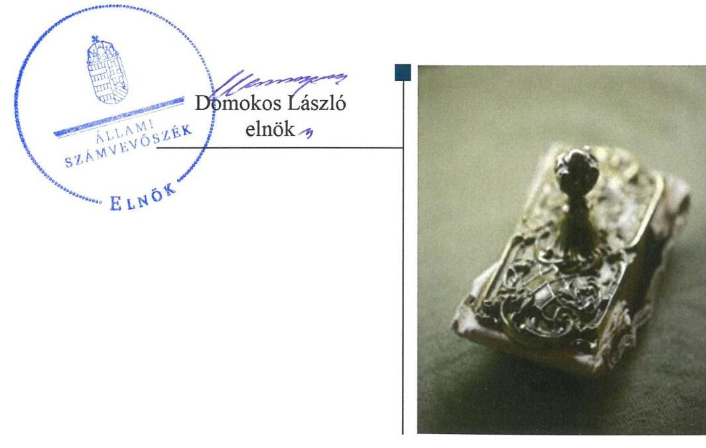
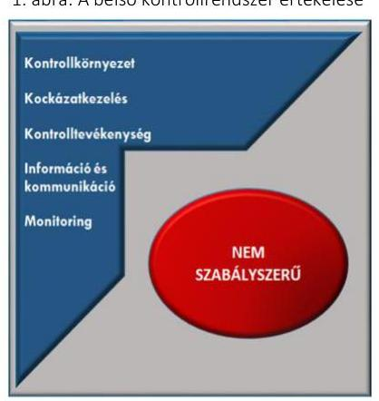
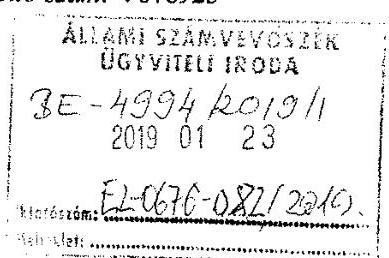
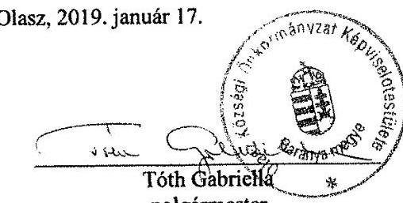
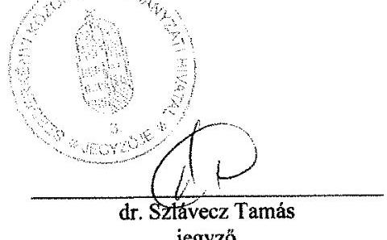
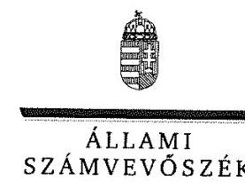
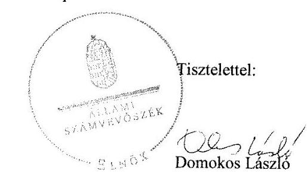
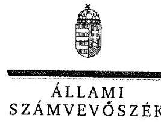
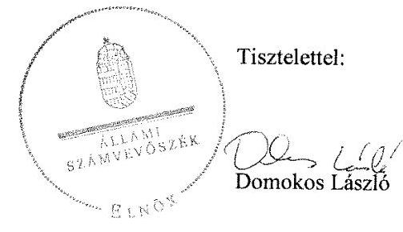

# Jelentés 

## Önkormányzatok integritás- és belső kontrollrendszere

Az önkormányzatok belső kontrollrendszere kialakításának és működtetésének ellenőrzése, Adósságrendezési eljárás ellenőrzése - Olasz Község Önkormányzata
2019. 06. hó 13. nap

---

# AZ ELLENŐRZÉST FELÜGYELTE:

- VARGA EDIT felügyeleti vezető
- AZ ELLENŐRZÉST VEZETTE ÉS A VÉGREHAJTÁSÁÉRT FELELŐS:
  - LACZI HEDVIG ANNA ellenőrzésvezető
  - BAJNAI ZSUZSANNA ellenőrzésvezető
- A PROGRAM ÖSSZEÁLLÍTÁSÁÉRT FELELŐS:
  - TÓTPÁL SZABOLCS osztályvezető

**IKTATÓSZÁM:** EL-0354-013/2019.

**Jelentéseink az Országgyűlés számítógépes hálózatán és az Interneten a www.asz.hu címen is olvashatóak.**

**TÉMASZÁM:** 2444

**ELLENŐRZÉS-AZONOSÍTÓ SZÁM:** V078923

---

# TARTALOMJEGYZÉK 

■ ÖSSZEGZÉS ..... 5
■ AZ ELLENŐRZÉS CÉLJA ..... 6
■ AZ ELLENŐRZÉS TERÜLETE ..... 7
■ AZ ELLENŐRZÉS HÁTTERE, INDOKOLTSÁGA ..... 8
■ A JELENTÉS LÉNYEGES KÉRDÉSKÖREI ..... 9
■ AZ ELLENŐRZÉS HATÓKÖRE ÉS MÓDSZEREI ..... 10
■ MEGÁLLAPÍTÁSOK ..... 13
■ JAVASLATOK ..... 16
■ MELLÉKLETEK ..... 19
I. sz. melléklet: Értelmező szótár ..... 19
■ FÜGGELÉKEK ..... 21
I. sz. függelék a Jelentéshez ..... 21
II. sz. függelék: Észrevételek ..... 22
■ RÖVIDÍTÉSEK JEGYZÉKE ..... 37

---

.

---

# ÖSSZEGZÉS 

Olasz Község Önkormányzata belső kontrollrendszerének kialakítása és működtetése, továbbá az adósságrendezési eljárás végrehajtása nem volt szabályszerű, ezáltal nem volt biztosított a közpénzekkel, a nemzeti vagyonnal történő gazdaságos, átlátható és felelős gazdálkodás. Az integritás kontrollokat nem építették ki, nem biztosították a korrupciós kockázatokkal szembeni védelmet.

## Az ellenőrzés társadalmi indokoltsága

Az Állami Számvevőszék alapvető feladata a közpénzekkel, az állami és önkormányzati vagyonnal való gazdálkodás ellenőrzése. Az Alaptörvény szerint az önkormányzatok kötelezettsége a kiegyensúlyozott, átlátható és fenntartható költségvetési gazdálkodás elvének érvényesítése, a nemzeti vagyonnal való rendeltetésszerű és felelős módon való gazdálkodás biztosítása. Az Állami Számvevőszék stratégiájában megfogalmazott célkitűzése az integritás alapú, átlátható és elszámoltatható közpénzfelhasználás elősegítése. Ennek megvalósítása érdekében az Állami Számvevőszék prioritásként kezeli a közpénzzel gazdálkodó szervezetek esetében a belső kontrollrendszer működésének ellenőrzését.

Olasz Község Önkormányzatát az Állami Számvevőszék korábban nem ellenőrizte.

## Főbb megállapítások, következtetések

Olasz Község Önkormányzata belső kontrollrendszerének kialakítása és működtetése nem volt szabályszerű.
A kontrollkörnyezetnek, a működés és a gazdálkodás kereteinek kialakítása nem volt szabályszerű, mert a Szederkényi Közös Önkormányzati Hivatal nem rendelkezett szervezeti és működési szabályzattal, a polgármester nem gondoskodott a számviteli elszámolásokat megalapozó belső szabályzat elkészítéséről. Az integrált kockázatkezelési rendszer keretében előírt szabályzatokat a jegyző nem adta ki, a kockázatok kezelése érdekében nem intézkedett. A gazdálkodási folyamatokhoz kapcsolódó kontrolltevékenységek során feltárt hiányosságok miatt nem volt garantált a közpénzfelhasználás szabályossága. Az információs és kommunikációs folyamatok kialakításának szabálytalansága miatt az átláthatóság nem volt biztosított. A jegyző nem gondoskodott a célok megvalósításának nyomon követését biztosító rendszer kialakításáról.

Olasz Község Önkormányzata az ellenőrzött időszakban nem kötött megállapodást az Olaszi Német Nemzetiségi Önkormányzattal a helyiséghasználatra, a további feltételek biztosítására és a feladatok ellátására vonatkozóan.

Az integritás kontrollok kialakítása nem volt megfelelő, így Olasz Község Önkormányzata nem volt védett a korrupciós kockázatokkal szemben.

Olasz Község Önkormányzata adósságrendezési eljárásának végrehajtása nem volt szabályszerű.

---

# AZ ELLENŐRZÉS CÉLJA 

Az ellenőrzés célja annak megállapítása volt, hogy szabályszerűen történt-e az önkormányzat belső kontrollrendszerének kialakítása és működtetése, az biztosította-e az önkormányzatnál a közpénzfelhasználás szabályosságát, a közpénzekkel és a nemzeti vagyonnal történő szabályszerű és felelős gazdálkodást, a beszámolási és adatszolgáltatási kötelezettségek szabályszerű teljesítését. Az ellenőrzés keretében értékelte az ÁSZ ${ }^{1}$ az önkormányzat korrupciós kockázatainak kezelését szolgáló integritás kontrollok kiépítettségét és az integritás szemlélet érvényesülését.

Az ellenőrzés célja továbbá annak értékelése volt, hogy az adósságrendezési eljárás megindítása, lefolytatása szabályszerű volt-e, az önkormányzat gazdálkodása az adósságrendezési eljárás alatt megfelelt-e a jogszabályi előírásoknak, a lefolytatott eljárás elérte-e a törvényben kitűzött célokat.

---

# **AZ ELLENŐRZÉS TERÜLETE**

## **Olasz Község Önkormányzata**

Olasz Baranya megyében található, állandó lakosainak száma 2016. január 1-jén 589 fő volt a Központi Statisztikai Hivatal Magyarország közigazgatási helynévkönyve adatai alapján.

Az Önkormányzat2 öttagú képviselő-testületének3 munkáját egy állandó bizottság segítette. A településen horvát és német nemzetiségi önkormányzat működött.

Az Önkormányzat gazdálkodási feladatainak ellátásáról Közös Hivatal4 gondoskodott, a belső ellenőrzési feladatokat mind az Önkormányzat, mind a Közös Hivatal vonatkozásában polgárjogi szerződés keretében foglalkoztatott belső ellenőr látta el. A Közös Hivatal önálló szervezeti egységekre nem tagolódott, gazdasági szervezettel nem rendelkezett. A Közös Hivatalban foglalkoztatott köztisztviselők száma 2016. év végén 13 fő volt.

A polgármester5 a 2014. évi önkormányzati választások óta tölti be tisztségét, a jegyző6 személye nem változott az ellenőrzött időszakban.

Az Önkormányzat a 2016. évi költségvetési beszámoló szerint összesen 117,4 millió Ft bevételt ért el, valamint 106,4 millió Ft kiadást teljesített, vagyonának értéke 2016. december 31-én 668,2 millió Ft volt.

Az Önkormányzat ellen 2012. január 26-án adósságrendezési eljárás indult, amelynek befejezéséről szóló döntés 2013. február 15-én lépett hatályba.

---

# AZ ELLENŐRZÉS HÁTTERE, INDOKOLTSÁGA 

A demokratikus társadalmakban alapvető igény, hogy a közpénzeket, a közvagyont használók tevékenységükről elszámoljanak, ahhoz egyértelmű és érvényesíthető felelősségi szabályok társuljanak. Ennek a jogos igénynek az érvényesítéséhez meg kell teremteni azokat a folyamatokat, rendszereket, amelyek nélkülözhetetlenek az elszámoltatáshoz. Az elszámoltatás eredményes működtetéséhez szükség van a megfelelő információs, kontroll-, értékelési és beszámolási rendszerek kialakítására. A belső kontrollok kiépítettsége hozzájárul az integritási szemlélet kialakításához és érvényesüléséhez. A belső kontrollrendszer kialakítása és működtetése nélkül nem valósítható meg a közpénzek, a közvagyon szabályos, gazdaságos, hatékony és eredményes felhasználása.

A belső kontrollrendszer azt a célt szolgálja, hogy az államháztartás szervei működésük és gazdálkodásuk során a tevékenységeket szabályszerűen, gazdaságosan, hatékonyan, eredményesen hajtsák végre, teljesítsék elszámolási kötelezettségeiket, és megvédjék az erőforrásokat a veszteségektől, a károktól, a nem rendeltetésszerű használattól. A belső kontrollrendszer magában foglalja mindazon szabályokat, eljárásokat, gyakorlati módszereket és szervezeti struktúrákat, kockázatkezelési technikákat, kontrolltevékenységeket, amelyek segítséget nyújtanak a szervezetnek céljai eléréséhez.

A megfelelő belső kontrollrendszer jelentősen csökkenti a hibák és szabálytalanságok kockázatát. Az ÁSZ célja, hogy javuljon az ellenőrzött önkormányzatok belső kontrollrendszerének szabályozottsága, működésének megfelelősége, szabályszerűsége, hozzájárulva ezzel az egyensúlyi helyzet fenntarthatóságának biztosításához, biztosítva az önkormányzatnál a közpénzfelhasználás szabályosságát, a közpénzekkel és a nemzeti vagyonnal történő szabályszerű, gazdaságos, hatékony és eredményes gazdálkodást.

Az ellenőrzés várható hasznosulása négy szinten valósul meg. A törvényalkotás számára összegzett tapasztalatok állnak rendelkezésre a belső kontrollrendszer önkormányzati területen való kialakításáról, működtetéséről és hatásairól. Az ellenőrzés az ellenőrzött számára visszajelzést ad a belső kontrollrendszer kialakításában és működésében lévő hiányosságokról, javaslataival hozzájárul azok kiküszöböléséhez. Az ellenőrzés megállapításait és javaslatait más szervezetek is hasznosíthatják a rendezett gazdálkodási keretek kialakításához, a ,,jó gyakorlat" elterjesztésével azok az önkormányzatok is átvehetik a pozitív példákat, ahol nem végez ellenőrzést az ÁSZ.

Az ÁSZ ellenőrzései jelzik a társadalom számára, hogy közpénz nem maradhat ellenőrizetlenül, tevékenysége hozzájárul az értékteremtő rend kialakításához és megőrzéséhez.

---

# A JELENTÉS LÉNYEGES KÉRDÉSKÖREI 

1. Az Önkormányzat belső kontrollrendszerének kialakítása és működtetése szabályszerű volt-e?
2. A nemzetiségi önkormányzat gazdálkodásával kapcsolatos feladatok ellátása szabályszerű volt-e?
3. Az adósságrendezési eljárás végrehajtása szabályszerű volt-e?

---

# AZ ELLENŐRZÉS HATÓKÖRE ÉS MÓDSZEREI 

## Az ellenőrzés típusa

Megfelelőségi ellenőrzés.

## Az ellenőrzött időszak

Az adósságrendezési eljárás esetében a 2010. január 1. és 2017. június 30. közötti időszakon belül az adósságrendezést megelőző egy teljes év január 1-jétől az adósságrendezéssel érintett évek és az adósságrendezés lezárását követő beszámolóval lezárt egy teljes év december 31-éig tartó időszak volt (Olasz Község Önkormányzata esetén 2011. január 1. - 2014. december 31.), a belső kontrollrendszer esetében a 2016. év volt.

## Az ellenőrzés tárgya

A helyi önkormányzatnak, mint éves költségvetési beszámoló készítésére kötelezett szervezetnek és a gazdálkodási feladatait ellátó közös önkormányzati hivatalának belső kontrollrendszere az ellenőrzés tárgya, valamint az integritás szemlélet érvényesülése.

Az ellenőrzés kiterjedt minden olyan körülményre és adatra, amely az ÁSZ jogszabályban meghatározott feladatainak teljesítéséhez, valamint a program végrehajtása folyamán felmerült újabb összefüggések feltárásához szükséges volt.

A Har. tv. ${ }^{7}$ által szabályozott adósságrendezési eljárás.

## Az ellenőrzött szervezet

Olasz Község Önkormányzata és a gazdálkodási feladatait ellátó Szederkényi Közös Önkormányzati Hivatal.

## Az ellenőrzés jogalapja

Az ÁSZ tv. ${ }^{8}$ 1. § (3) bekezdésében foglaltak alapján az ÁSZ általános hatáskörrel végzi a közpénzekkel, valamint az állami és önkormányzati vagyonnal való felelős gazdálkodás ellenőrzését. Az ÁSZ tv. 5. § (2) bekezdése alapján az államháztartás gazdálkodásának ellenőrzése keretében az ÁSZ ellenőrzi a helyi önkormányzatok gazdálkodását, valamint az ÁSZ tv. 5. § (6) bekezdése alapján ellenőrzése során értékeli az államháztartás számviteli rendjének betartását és a belső kontrollrendszer működését.

---

# Az ellenőrzés módszerei 

Az ÁSZ az ellenőrzést az ellenőrzési program szempontjai, az ellenőrzött időszakban hatályos jogszabályok, az ellenőrzés szakmai szabályai, az egyes ellenőrzési típusokhoz kapcsolódó ÁSZ módszertanok figyelembevételével végezte.

Az ellenőrzés ideje alatt az ÁSZ az Önkormányzattal a kapcsolattartást az ÁSZ SZMSZ ${ }^{9}$-ének vonatkozó előírásai alapján biztosította.

Az ellenőrzési kérdések megválaszolásához szükséges bizonyítékok megszerzése az Önkormányzat által rendelkezésre bocsátott dokumentumokra, adatokra alapozva megfigyelés, szemle (szemrevételezés), valamint elemző eljárás keretében történt.

Az ellenőrzési bizonyítékként felhasználható adatforrások közé tartoztak egyrészt az ellenőrzési program részletes szempontjainál felsorolt adatforrások, másrészt minden - az ellenőrzés folyamán feltárt, az ellenőrzés szempontjából információt tartalmazó - dokumentum.

Az Önkormányzat belső kontrollrendszere jogszabályi előírások szerinti kialakításának és működtetésének szabályszerűségét az erre irányuló ellenőrzési kérdésekre adott válaszok összesítése alapján, pillérenként (kontrollkörnyezet, kockázatkezelési rendszer, kontrolltevékenységek, információs és kommunikációs rendszer, monitoring rendszer) és összesítetten is értékelte az ÁSZ. Az önkormányzat belső kontrollrendszere egyes pilléreinek kialakítása és működtetése „szabályszerű", amennyiben az értékelt területen az elért igen válaszok százalékban kifejezett, egész számra kerekített aránya meghaladja a 85%-ot, „nem szabályszerű", ha nem haladja meg, akkor a minősítés „nem szabályszerű" lesz. Az önkormányzat belső kontrollrendszerének összesített értékelése megegyezik a pillérenként (kontrollterületenként) alkalmazott százalékos értékelésekkel. A kontrollrendszer egésze esetében a „szabályszerű" értékelésnek a százalékos értéken felül további feltétele, hogy egyik kontrollterület sem kaphat „nem szabályszerű" értékelést. Az összesített értékelés a százalékos értéktől függetlenül „nem szabályszerű", ha az ellenőrzött kontrollterületek közül több mint egynek „nem szabályszerű" az értékelése.

A kiadások teljesítéséhez kapcsolódó kontrolltevékenység gyakorlása, működtetésének szabályszerűsége esetében az ellenőrzés azokra a legnagyobb értékű tételekre - a lényeges sokaságra - terjedt ki, melyek összértéke eléri a teljes sokaság összértékének 50%-át.

A kiadások esetében a lényeges sokaság tételes ellenőrzésre került.
A nemzetiségi önkormányzattal kapcsolatos gazdálkodási feladatok ellátását a nagyobb költségvetési bevétellel rendelkező nemzetiségi önkormányzat esetében tekintette át az ÁSZ.

A közszféra integritás alapú kultúrájának kialakítása, megerősítése és működése szorosan összefügg a belső kontrollrendszer működésével, ezért az ellenőrzés kiterjedt annak értékelésére is, hogy a belső kontrollrendszer kialakítása és működtetése hogyan hatott az integritás szemlélet érvényesülésére.

Az adósságrendezési eljárás vonatkozásában amennyiben az önkormányzat működését és gazdálkodását alapvetően meghatározó dokumentum hiánya miatt, valamely lényeges kérdéskörre vonatkozóan az ÁSZ

---

megállapítást tett, további ellenőrzési tevékenységek az adott kérdéskörrel és az azzal szoros logikai kapcsolatban lévő kérdéskörökkel -
 ráépülő jelleggel - nem kerültek végrehajtásra.

---

# 1. Az Önkormányzat belső kontrollrendszerének kialakítása és működtetése szabályszerű volt-e? 

## Összegző megállapítás

1. ábra: A belső kontrollrendszer értékelése

Forrás: ÁSZ értékelés

## A belső kontrollrendszer kialakítása és működtetése nem volt szabályszerű.

A belső kontrollrendszer pillérenkénti és összesített értékelését az 1. ábra szemlélteti.

A KONTROLLKÖRNYEZET, a működés szervezeti kereteinek kialakítása nem volt szabályszerű a Közös Hivatalnál, mert a jegyző nem állapította meg az Áht. ${ }^{10} 10 . \S$ (5) bekezdésében foglaltak ellenére a Közös Hivatal feladatai ellátásának részletes belső rendjét és módját szervezeti és működési szabályzatban. A jegyző nem készített a Bkr. ${ }^{11}$ 6. § (3) bekezdése ellenére a Közös Hivatal működésének folyamatairól ellenőrzési nyomvonalat. Továbbá a jegyző nem rendezte belső szabályzatban a pénzügyi kihatással bíró, jogszabályban nem szabályozott kérdések közül az Ávr. ${ }^{12} 13$. § (2) bekezdés a), b), c), e), és f) pontjaiban előírtak ellenére a tervezéssel kapcsolatos belső előírásokat, a beszerzések lebonyolításával kapcsolatos eljárásrendet, a belföldi és külföldi kiküldetések elrendelésével, lebonyolításával, elszámolásával kapcsolatos kérdéseket, a reprezentációs kiadások felosztását, azok teljesítésének és elszámolásának szabályait, a gépjárművek igénybevételének és használatának rendjét a Közös Hivatal vonatkozásában.

Az Önkormányzat kontrollkörnyezete nem volt szabályszerű, mert a polgármester nem készítette el az Önkormányzat számlarendjét a Számv. tv. ${ }^{13}$ 161. § (1) és (4), valamint az Áhsz. ${ }^{14} 51 . \S$ (2) bekezdéseiben foglalt előírások ellenére.

A KOCKÁZATKEZELÉSI RENDSZERT 2016. szeptember 30-ig, illetve az integrált kockázatkezelési rendszert 2016. október 1-jétől a jegyző nem alakította ki a Bkr. 3. § b) pontjában foglaltak ellenére a Közös Hivatalnál, mert nem szabályozta 2016. szeptember 30-ig a szabálytalanságok kezelésének, 2016. október 1-jétől a szervezeti integritást sértő események kezelésének és az integrált kockázatkezelés eljárásrendjét a Bkr. 6.§ (4) bekezdésében előírtak ellenére. A kockázatokat azonosította, azonban nem határozta meg az azonosított kockázatokkal kapcsolatban szükséges intézkedéseket, valamint azok teljesítésének folyamatos nyomon követésének módját a Bkr. 7. § (2) bekezdésének előírása ellenére.

A KONTROLLTEVÉKENYSÉGEK kialakítása és működtetése nem volt szabályszerű, az Önkormányzat és a Közös Hivatal vonatkozásában sem, mert a jegyző nem gondoskodott az Ávr. 60. § (3) bekezdésében foglaltak ellenére a kötelezettségvállalásra, pénzügyi ellenjegyzésre, teljesítés igazolására, érvényesítésre, utalványozásra jogosult személyekről és aláírás-mintájukról nyilvántartás vezetéséről.

---

A jegyző az Áht. 6/C. § (1) bekezdés szerinti feladatkörében eljárva nem gondoskodott a gazdálkodási feladatok ellátásáról, mert a Számv. tv. 165. § (2) bekezdésében foglaltak ellenére bizonylat nélkül rögzítettek adatot az Önkormányzat könyvviteli nyilvántartásaiban, megsértve a Számv. tv. 15. § (3) bekezdése szerinti valódiság elvét.

# AZ INFORMÁCIÓS ÉS KOMMUNIKÁCIÓS RENDSZER kialakítása nem volt szabályszerű, sem az Önkormányzat, sem a 

Közös Hivatal tekintetében, mert a jegyző nem készítette el a Közös Hivatal iratkezelési szabályzatát az Ltv. ${ }^{15}$ 9. § (4) bekezdésében foglaltak ellenére, továbbá a polgármester az Önkormányzat, a jegyző a Közös Hivatal adatvédelmi és adatbiztonsági szabályzatát az Info tv. 24. § (3) bekezdésének ${ }^{16}$ előírása ellenére.

A MONITORING-RENDSZER kialakítása és működtetése nem volt szabályszerű, mert a jegyző nem alakította ki a Közös Hivatalnál a Bkr. 10. §-ában foglaltak ellenére a tevékenységek, célok operatív tevékenységek keretében megvalósuló folyamatos és eseti nyomon követését 2016. szeptember 30-ig. Továbbá a belső ellenőrzés nem a jogszabályi előírásoknak megfelelően működött, mivel a polgármester nem terjesztette elő a 2016. évi éves ellenőrzési jelentést a képviselő-testület elé jóváhagyásra a Bkr. 49. § (3a) bekezdésében előírtak ellenére.

A jegyző nem értékelte a Bkr. 11. § (1) bekezdésének előírása ellenére a Közös Hivatal belső kontrollrendszerének minőségét.

AZ INTEGRITÁS nem érvényesült a kötelezően előírt kontrollok kialakításának hiánya miatt, a korrupciós kockázatokat nem kezelték.

## 2. A nemzetiségi önkormányzat gazdálkodásával kapcsolatos feladatok ellátása szabályszerű volt-e?

## Összegző megállapítás

A Nemzetiségi Önkormányzat gazdálkodásával kapcsolatos feladatok ellátása nem volt szabályszerű.

A NEMZETISÉGI ÖNKORMÁNYZAT ${ }^{17}$ gazdálkodásával kapcsolatos feladatok ellátása nem volt szabályszerű, mert az Önkormányzat a Nek. tv. ${ }^{18} 80$. § (2) bekezdésében előírtak ellenére nem kötött megállapodást a Nemzetiségi Önkormányzattal a helyiséghasználatra, a további feltételek biztosítására és a feladatok ellátására vonatkozóan.

## 3. Az adósságrendezési eljárás végrehajtása szabályszerű volt-e?

## Összegző megállapítás

Az Önkormányzat adósságrendezési eljárásának végrehajtása nem volt szabályszerű.

Az Önkormányzat adósságrendezési eljárásának végrehajtása nem volt szabályszerű, mivel a jegyző 2011-2014. évek vonatkozásában:

---

- nem készítette el az Ámr. ${ }^{19}$ 20. § (3) bekezdés a) pontjában, az Ávr. 13. § (2) bekezdés a) pontjában előírt, a gazdálkodással - így különösen a kötelezettségvállalás, ellenjegyzés, teljesítés igazolása, érvényesítés, utalványozás gyakorlásának módjával, eljárási és dokumentációs részletszabályaival, valamint az ezeket végző személyek kijelölésének rendjével-, az ellenőrzési, adatszolgáltatási és beszámolási feladatok teljesítésével kapcsolatos belső előírásokat, feltételeket tartalmazó belső szabályzatot;
- nem készített a beszámoló elkészítését megelőzően a könyvviteli zárlat során főkönyvi kivonatot a Számv. tv. 164. § (2) bekezdésében, az Áhsz. ${ }^{20}$ 50. § (1) bekezdésében, az Áhsz. ${ }_{2}$ 5. § (1) bekezdésében foglaltak ellenére;
- nem gondoskodott a kötelezettségvállalásra, pénzügyi ellenjegyzésre, teljesítés igazolására, érvényesítésre, utalványozásra jogosult személyek és aláírás-mintájuk naprakész nyilvántartásának vezetéséről az Ámr. 80. § (3) bekezdésében és az Ávr. 60. § (3) bekezdésében előírtak ellenére.

---

# JAVASLATOK 

Az ÁSZ tv. 33. § (1) bekezdésében foglaltak értelmében az ellenőrzött szervezet vezetője köteles a jelentésben foglalt megállapításokhoz kapcsolódó intézkedési tervet összeállítani és azt a jelentés kézhezvételétől számított 30 napon belül az ÁSZ részére megküldeni. Amennyiben az ellenőrzött szervezet vezetője nem küldi meg határidőben az intézkedési tervet, vagy továbbra sem elfogadható intézkedési tervet küld, az Állami Számvevőszék elnöke az ÁSZ tv. 33. § (3) bekezdés a) és b) pontjaiban foglaltakat érvényesítheti.

## Szederkényi Közös Önkormányzati Hivatal jegyzőjének

1. A szabályszerű kontrollkörnyezetének kialakítása érdekében gondoskodjon a Közös Hivatal:
a) feladatai ellátása részletes rendjének és módjának megállapításáról a Közös Hivatal szervezeti és működési szabályzatában;
(1. sz. megállapítás 2. bekezdés 1. mondata alapján)
b) ellenőrzési nyomvonalának elkészítéséről.
(1. sz. megállapítás 2. bekezdés 2. mondata alapján)
c) működéséhez kapcsolódó, a költségvetési szerv előirányzatait terhelő pénzügyi kihatással bíró, jogszabályban nem szabályozott kérdések belső szabályzatban történő rendezéséről.
(1. sz. megállapítás 2. bekezdés 3. mondata alapján)
2. A Közös Hivatal szabályszerű integrált kockázatkezelési rendszerének kialakítása és működtetése érdekében gondoskodjon:
a) a szervezeti integritást sértő események és az integrált kockázatkezelés eljárásrendjének szabályozásáról;
(1. sz. megállapítás 4. bekezdés 1. mondata alapján)
b) az azonosított kockázatokkal kapcsolatban szükséges intézkedések, valamint azok teljesítésének folyamatos nyomon követése módjának meghatározásáról.
(1. sz. megállapítás 4. bekezdés 2. mondata alapján)
3. A kontrolltevékenységek szabályszerű kialakítása és működtetése érdekében gondoskodjon:
a) a kötelezettségvállalásra, pénzügyi ellenjegyzésre, teljesítés igazolására, érvényesítésre, utalványozásra jogosult személyekről és aláírás-mintájukról naprakész nyilvántartás vezetéséről az Önkormányzat és a Közös Hivatal vonatkozásában.
(1. sz. megállapítás 5. bekezdése alapján)

---

b) arról, hogy az Önkormányzat könyvviteli nyilvántartásaiba csak szabályszerűen kiállított bizonylatok alapján jegyezzenek be adatokat.
(1. sz. megállapítás 6. bekezdése alapján)
4. A szabályszerű információs és kommunikációs rendszer kialakítása érdekében gondoskodjon a Közös Hivatal:
a) iratkezelési szabályzatának elkészítéséről;
(1. sz. megállapítás 7. bekezdés 1. mondat 4. tagmondata alapján)
b) adatvédelmi és adatbiztonsági szabályzatának elkészítéséről.
(1. sz. megállapítás 7. bekezdés 1. mondat 6. tagmondata alapján)
5. A belső kontrollrendszer szabályszerű kialakítása és működtetése érdekében gondoskodjon a belső kontrollrendszer minősége jogszabályi előírásnak megfelelő értékeléséről.
(1. sz. megállapítás 9. bekezdése alapján)

# Olasz Község Önkormányzata polgármesterének 

1. Az Önkormányzat szabályszerű kontrollkörnyezetének kialakítása érdekében gondoskodjon az Önkormányzat számlarendjének elkészítéséről.
(1. sz. megállapítás 3. bekezdése alapján)
2. Az Önkormányzat szabályszerű információs és kommunikációs rendszerének kialakítása érdekében gondoskodjon az adatvédelmi és adatbiztonsági szabályzat elkészítéséről.
(1. sz. megállapítás 7. bekezdés 5-6. tagmondatai alapján)
3. Az Önkormányzat szabályszerű monitoring rendszerének működtetése érdekében gondoskodjon a tárgyévre vonatkozó éves ellenőrzési jelentés képviselő-testület elé terjesztéséről.
(1. sz. megállapítás 8. bekezdés 2. mondata alapján)
4. A Nemzetiségi Önkormányzat gazdálkodásával kapcsolatos feladatainak szabályszerű ellátása érdekében intézkedjen a Nemzetiségi Önkormányzattal működési feltételeinek biztosításáról szóló megállapodás megkötéséről.
(2. sz. megállapítás 1. bekezdése alapján)

---

.

---

# MELLÉKLETEK 

- I. SZ. MELLÉKLET: ÉRTELMEZŐ SZÓTÁR
belső ellenőrzés
belső kontrollrendszer
belső kontrollrendszer pillérei, kontrollterületei
helyi önkormányzat
információs és kommunikációs rendszer
integrált kockázatkezelési rendszer

Független, tárgyilagos bizonyosságot adó és tanácsadó tevékenység, amelynek célja, hogy az ellenőrzött szervezet működését fejlessze és eredményességét növelje, az ellenőrzött szervezet céljai elérése érdekében rendszerszemléletű megközelítéssel és módszeresen értékeli, illetve fejleszti az ellenőrzött szervezet irányítási és belső kontrollrendszerének hatékonyságát. (Forrás: Bkr. 2. § b) pontja)
A belső kontrollrendszer a kockázatok kezelése és tárgyilagos bizonyosság megszerzése érdekében kialakított folyamatrendszer, amely azt a célt szolgálja, hogy a működés és gazdálkodás során a tevékenységeket szabályszerűen, gazdaságosan, hatékonyan, eredményesen hajtsák végre, az elszámolási kötelezettségeket teljesítsék, megvédjék az erőforrásokat a veszteségektől, károktól és nem rendeltetésszerű használattól. (Forrás: Áht. 69. § (1) bekezdése)
A kontrollkörnyezet, az (integrált) kockázatkezelési rendszer, a kontrolltevékenységek, az információs és kommunikációs rendszer, valamint a nyomon követési (monitoring) rendszer. (Forrás: Bkr. 3. §-a)
A helyi önkormányzat jogi személy. Az önkormányzati feladatok ellátását a képviselő-testület és szervei biztosítják. A képviselő-testület szervei: a polgármester, a főpolgármester, a megyei közgyűlés elnöke, a képviselő-testület bizottságai, a részönkormányzat testülete, az önkormányzati hivatal, a megyei önkormányzati hivatal, a közös önkormányzati hivatal, a jegyző, továbbá a társulás. A képviselő-testület a feladatkörébe tartozó közszolgáltatások ellátására - jogszabályban meghatározottak szerint - költségvetési szervet, a polgári perrendtartásról szóló törvény szerinti gazdálkodó szervezetet (a továbbiakban: gazdálkodó szervezet), nonprofit szervezetet és egyéb szervezetet (a továbbiakban együtt: intézmény) alapíthat, továbbá szerződést köthet természetes és jogi személlyel vagy jogi személyiséggel nem rendelkező szervezettel. A helyi önkormányzat éves költségvetési beszámolója magában foglalja a helyi önkormányzat - nem költségvetési szerveihez tartozó - feladataihoz kapcsolódó bevételeket és kiadásokat. A helyi önkormányzat összevont (konszolidált) költségvetési beszámolóját a helyi önkormányzatra és költségvetési szerveire vonatkozóan külön-külön beérkezett éves költségvetési beszámolók alapján a Kincstár készíti el és küldi meg az önkormányzatnak. (Forrás: Mötv. 41. § (1), (2), (6) bekezdései; Áhsz.; 2. § (1) bekezdése, 6. § (1) bekezdés a) és f) pontja, 30. §-a, 37. § (1) és (6) bekezdése)
A költségvetési szerv vezetője által kialakított és működtetett olyan rendszer, mely biztosítja, hogy a megfelelő információk a megfelelő időben eljutnak az illetékes szervezethez, szervezeti egységhez, illetve személyhez. (Forrás: Bkr. 9. § (1) bekezdés)
olyan folyamatalapú kockázatkezelési rendszer, amely a szervezet minden tevékenységére kiterjed, egységes módszertan és eljárások alkalmazásával, a szervezet célkitűzéseinek és értékeinek figyelembevételével biztosítja a szervezet kockázatainak teljes körű azonosítását, azok meghatározott kritériumok szerinti értékelését, valamint a kockázatok kezelésére vonatkozó intézkedési terv elkészítését és az abban foglaltak nyomon követését (Forrás: Bkr. 2. § m) pontja 2016. október 1-jétől)

---

integritás
kockázatkezelési rendszer
kontrollkörnyezet
kontrolltevékenységek
költségvetési szerv vezetője (Bkr. alkalmazásában)
közös önkormányzati hivatal
monitoring rendszer

Az integritás elvek, értékek, cselekvések, módszerek, intézkedések konzisztenciáját jelenti: olyan magatartásmódot, amely meghatározott értékeknek felel meg. Az integritás
 a közszféra esetében a társadalom által elvárt nyilvánossági, átláthatósági, illetve jogi/etikai normáknak történő megfelelést jelenti.
(Forrás: a http://integritas.asz.hu honlapon közzétett „A 2012. évi integritás felmérés eredményeinek összefoglalója" című dokumentum 3. oldal 1. bekezdése)
Olyan irányítási eszközök és módszerek összessége, melynek elemei a szervezeti célok elérését veszélyeztető tényezők (kockázatok) azonosítása, elemzése, csoportosítása, nyomon követése, valamint szükség esetén a kockázati kitettség mérséklése. (Forrás: Bkr. 2. § m) pontja 2016. szeptember 30-ig)
A költségvetési szerv vezetője által kialakított olyan elvek, eljárások, belső szabályzatok összessége, amelyben világos a szervezeti struktúra, egyértelműek a felelősségi, hatásköri viszonyok és feladatok, meghatározottak az etikai elvárások a szervezet minden szintjén, átlátható a humánerőforrás-kezelés. (Forrás: Bkr. 6. § (1) bekezdés)
A költségvetési szerv vezetője által a szervezeten belül kialakított (kontroll) tevékenységek, melyek biztosítják a kockázatok kezelését, hozzájárulnak a szervezet céljainak eléréséhez. (Forrás: Bkr. 8. § (1) bekezdés)
Helyi önkormányzat esetén a jegyző, főjegyző, társulás esetén a társulási megállapodásban meghatározott önkormányzat jegyzője. (Forrás: Bkr. 2. § n) pont nb) alpont)
Települési képviselő-testület más települési képviselő-testülettel társult képviselő-testületet alakíthat, amely esetén a képviselő-testületek részben vagy egészben egyesítik a költségvetésüket, közös önkormányzati hivatalt tartanak fenn, és intézményeiket közösen működtetik. (Forrás: Mötv. 56. § (1)-(2) bekezdései)
Nyomon követési rendszer (monitoring) a szervezet tevékenységének, a célok megvalósításának nyomon követését biztosító rendszer, mely az operatív tevékenységek keretében megvalósuló folyamatos és eseti nyomon követésből, valamint az operatív tevékenységektől függetlenül működő belső ellenőrzésből áll. (Forrás: Bkr. 10. §-a)

---

# FÜGGELÉKEK 

- I. SZ. FÜGGELÉK A JELENTÉSHEZ

Az Állami Számvevőszék az ellenőrzések során feltárt tényekhez kapcsolódó további körülmények tisztázására eszközrendszerrel nem rendelkezik. Amennyiben az ellenőrzésen túlmutatóan indokoltnak látszik az ellenőrzés során feltárt körülmények további vizsgálata, az Állami Számvevőszék törvényi felhatalmazás alapján az ellenőrzés által feltárt körülményeket továbbítja a hatáskörrel rendelkező szervnek a szükséges intézkedések megtétele, eljárások lefolytatása érdekében.
I.

Az ellenőrzés megállapította, hogy a jegyző az Áht. 10. § (5) bekezdésében előírtak ellenére nem gondoskodott a Szederkényi Közös Önkormányzati Hivatal általi feladatellátás részletes belső rendjének és módjának szervezeti és működési szabályzatban történő megállapításáról, a Közös Hivatal nem rendelkezett az alapvető feladatokat, felelősségi szabályokat rögzítő SZMSZ-szel.
Így a Közös Hivatal átlátható, elszámoltatható működésének alapvető feltételei hiányoztak. A Közös Hivatal működése során feltárt szabálytalanság hatással lehet Szederkény, Monyoród, Máriakéménd, Hasságy és Belvárdgyula települések gazdálkodási feladatainak, valamint az Olasz településen működő német és horvát nemzetiségi önkormányzatok gazdálkodási feladatainak ellátására is.
Az eset konkrét körülményeinek felderítésére az illetékes kormányhivatal rendelkezik hatáskörrel.
II.

A jegyző nem gondoskodott az Ávr. 60. § (3) bekezdésében foglaltak ellenére a gazdálkodási jogkörök gyakorlására jogosult személyekről és aláírás-mintájukról nyilvántartás vezetéséről, ezáltal nem igazolt az Önkormányzat beszámolójában kimutatott adatok pontossága, hitelessége, éves költségvetési beszámolójának megbízható, valós összképe.
Az eset konkrét körülményeinek felderítésére a Kincstár rendelkezik hatáskörrel.
III.

A 2016. év dologi és felhalmozási kiadások ellenőrzése során az ÁSZ feltárta, hogy 1685805 Ft értékű egyéb dologi kiadás bizonylattal nem volt alátámasztva a Számv. tv. 165. § (2) bekezdése ellenére, ezáltal sérült a Számv. tv. 15. § (3) bekezdésében foglalt valódiság elve, amely szerint könyvvitelben rögzített és a beszámolóban szereplő tételeknek a valóságban is megtalálhatóknak, bizonyíthatóknak, kívülállók által is megállapíthatóknak kell lenniük.
A bizonylat hiánya miatt nem igazolt, hogy a kiadás valóban az Önkormányzat érdekében merült fel, illetve annak feladatellátását szolgálta, így nem zárható ki annak lehetősége, hogy a szabálytalan kifizetés vagyoni hátrányt okozhatott.
Az esetek konkrét körülményeinek felderítésére az ügyészség rendelkezik hatáskörrel.

---

A jelentéstervezetet a Számvevőszék 15 napos észrevételezésre megküldte az ellenőrzött szervezetek vezetőinek az ÁSZ tv. 29. § (1) bekezdése előírásának megfelelően.

Az ÁSZ a jelentéstervezetet észrevételezésre megküldte Olasz Község Önkormányzata polgármestere és a Szederkényi Közös Önkormányzati Hivatal jegyzője részére.
Olasz Község Önkormányzata polgármestere és a Szederkényi Közös Önkormányzati Hivatal jegyzője az ÁSZ tv. 29. § (2) bekezdésében foglalt észrevételezési jogukkal éltek, a jelentéstervezet 1. és 2. számú megállapításaira a törvényes határidőn belül észrevételt tettek. Olasz Község Önkormányzata polgármestere és a Szederkényi Közös Önkormányzati Hivatal jegyzője a jelentéstervezet 3. számú megállapítására vonatkozóan észrevételt nem tettek.
Olasz Község Önkormányzata polgármesterének és a Szederkényi Közös Önkormányzati Hivatal jegyzőjének a jelentéstervezet 1. és 2. számú megállapításaira tett észrevételeit és az azokra adott választ a függelék tartalmazza.

[^0]
[^0]:    * 29. § (1) Az Állami Számvevőszék az ellenőrzési megállapításait megküldi az ellenőrzött szervezet vezetőjének vagy az általa megbízott személynek, és annak, akinek személyes felelősségét állapította meg.
    (2) Az ellenőrzött szervezet vezetője és a felelősként megjelölt személy az ellenőrzés megállapításaira tizenöt napon belül írásban észrevételt tehet.
    (3) Az Állami Számvevőszék az észrevételre a beérkezésétől számított harminc napon belül írásban válaszol. A figyelembe nem vett észrevételeket köteles a jelentésben feltüntetni, és megindokolni, hogy azokat miért nem fogadta el.

---

# SZEDERKÉNYI KÖZÖS ÖNKORMÁNYZATI HIVATAL OLASZI KIRENDELTSÉGE 

7745 Olasz, Kossuth L. u. 54.
tel/fax: 69/357-103

Ügyiratszám: Ola/1-2/2019.
Előadó: dr. Friedszám Róbert

Állami Számvevőszék
Budapest
Pf.:54
1364

Tisztelt Cím!

Ügyiratszám: EL-0676-076/2018.
Témaszám: 2444
Ellenőrzési azonosító szám: V078923

Mellékelten megküldöm Olasz Község Önkormányzata ( 7745 Olasz, Kossuth L. u. 54.) „Az Önkormányzatok integritás- és belső kontrollrendszere - Az önkormányzatok belső kontrollrendszere kialakításának és működtetésének ellenőrzése - Olasz Község Önkormányzata" címmel készített számvevőszéki jelentéstervezetre az Önkormányzat észrevételeit:

1. A Szederkényi Közös Önkormányzati Hivatal ügyrenddel rendelkezik, mely feltöltésre került az ÁSZ ellenőrzési felületére. (1. sz. megállapítás 2. bekezdés 1. mondatára)
2. A jelentéstervezet állítása, hogy a Jegyző nem szabályozta belső szabályzatban a működéséhez kapcsolódó, a költségvetési szerv előirányzatait terhelő pénzügyi kihatással bíró, jogszabályban nem szabályozott kérdéseket. A Szederkényi Közös Önkormányzati Hivatal 4/2015. számú Bizonylati Rend Szabályzata rendezi az Ávr. 13.§ (2) bekezdés a), b), c), e), f), pontjaiban leírtakat. (1. sz. megállapítás 2. bekezdés 2. mondatára)
3. A jelentéstervezet megállapítása nem helyénvaló, Olasz Község Önkormányzata rendelkezik számlarenddel, mely 2004. március 31-én lépett hatályba, az Önkormányzat kontrollkörnyezete álláspontunk szerint szabályszerű. (1. sz. megállapítás 3. bekezdésére)
4. A jelentéstervezet megállapítása nem helyénvaló, Szederkényi Közös Önkormányzati Hivatal 2015. február 15-től rendelkezik Gazdálkodási Szabályzattal. A szabályzat rendezi a kötelezettségvállalásról, pénzügyi ellenjegyzésről, teljesítés igazolásáról, érvényesítésről, az utalványozásra jogosult személyeket és az aláírás-mintájukat. (1. sz. megállapítás 5. bekezdésére)
5. Ez a mondat nem tartalmaz érdemi tényt, így nem is lehet rá észrevételt tenni. Így ez nem alkalmas megállapítás tételre. (1. sz. megállapítás 6. bekezdésére)

---

# SZEDERKÉNYI KÖZÖS ÖNKORMÁNYZATI HIVATAL OLASZI KIRENDELTSÉGE 

7745 Olasz, Kossuth L. u. 54. tel/fax: 69/357-103
6. Az 1/2018. (09.03.) számú jegyzői utasításban lett szabályozva az Önkormányzat és Közös Hivatal legfrissebb iratkezelési szabályzata, mely az ÁSZ vizsgálat alatt készült el. (1. sz. megállapítás 7. bekezdés 1. mondat 4. tagmondatára)
7. Az adatvédelmi és adatbiztonsági szabályzatra írt megállapítás álláspontunk szerint nem a helyes jogszabályi hivatkozás szerepel. Ezért a megállapításra nem lehet észrevételt tenni. (1. sz. megállapítás 7. bekezdés 2. mondat 6. tagmondatára)
8. Olasz Község Önkormányzata a 2016. évi belső ellenőrzésről szóló jelentést 2017. december 6-án tárgyalta és fogadta el. Az ellenőrzés itt valóban helyesen állapította meg, hogy ez nem határidőben történt, mentségünkre szól, hogy a belső ellenőr is csak késve készítette el, egészségügyi okok miatt. (1. sz. megállapítás 8. bekezdés 2. mondatára)
9. A nemzetiségi önkormányzatokról szóló megállapítás nem állja meg a helyét, az Önkormányzat kötött megállapodást a helyi nemzetiségi önkormányzatokkal. A megállapodást postai úton el is küldöm az Állami Számvevőszék részére, melyet már, mint határidőn túl megküldött dokumentumot nem értékelt. Attól, hogy még nem értékelik a dokumentumot, az nem jelenti azt, hogy nincs is!
A képviselő-testület 2014. december 8-án tárgyalta és fogadta el a 72/2014. (12.08.) számú határozatával az Olaszi Német Önkormányzattal, 2014. december 17-én tárgyalta és fogadta el a 95/2014. (12.17.) számú határozatával az Olaszi Horvát Önkormányzattal kötött együttműködési megállapodást. Mielőtt az Állami Számvevőszék a jelentéstervezetet az Önkormányzathoz elküldte, megkereste a Baranya Megyei Kormányhivatalt, hogy Olasz Községnek nincs együttműködési megállapodása a helyi nemzetiségi önkormányzattal. A Kormányhivatal megkeresésére elküldtük a megállapodást. Ez a megállapítás azt tételezi fel, hogy a sem az Önkormányzatoknak, sem a Közös Hivatalnak és persze a Kormányhivatalnak sem tűnt fel ez a törvényesértő állapot legalább 3 évig. (1. sz. megállapítás 8. bekezdés 2. mondatára)

Olasz, 2019. január 17.

---

# Tóth Gabriella úrhölgy 

polgármester
Olasz Község Önkormányzata

## Olasz

## Tisztelt Polgármester Úrhölgy!

Az „Önkormányzatok integritás- és belső kontrollrendszere - Az önkormányzatok belső kontrollrendszere kialakításának és működtetésének ellenőrzése - Olasz Község Önkormányzata" címmel készített számvevőszéki jelentéstervezetre tett észrevételét köszönettel megkaptam.
Az Állami Számvevőszék észrevételre vonatkozó álláspontjáról a felügyeleti vezető által készített részletes tájékoztatást csatoltan megküldöm.
Tájékoztatom Polgármester úrhölgyet, hogy a számvevőszéki jelentésben - az Állami Számvevőszékről szóló 2011. évi LXVI. törvény 29. § (3) bekezdése alapján - a figyelembe nem vett észrevételeket szerepeltetjük, annak indoklásával, hogy azokat az Állami Számvevőszék miért nem fogadta el.

Budapest, 2019. 02 hó 15 nap

Melléklet: Tájékoztatás az észrevételek kezeléséről

---

# Tájékoztatás az észrevételek kezeléséről 

Az „Önkormányzatok integritás- és belső kontrollrendszere - Az önkormányzatok belső kontrollrendszere kialakításának és működtetésének ellenőrzése - Olasz Község Önkormányzata" címú jelentéstervezetre a 2019. január 17-én kelt, Ola/1-2/2019. iktatószámú levelében tett észrevételét áttekintettük, annak kezeléséről az alábbi tájékoztatást adom.

## 1. A jelentéstervezet 1. sz. megállapítás 2. bekezdés 1. mondatára tett észrevétele kapcsán

A jelentéstervezet hivatkozott megállapítása a Szederkényi Közös Önkormányzati Hivatal (továbbiakban: Közös Hivatal) szervezeti és működési szabályzatának hiányát rögzíti: „... a jegyző nem állapította meg az Áht. 10. § (5) bekezdésében foglaltak ellenére a Közös Hivatal feladatai ellátásának részletes belső rendjét és módját szervezeti és működési szabályzatban."
Észrevételében jelezte, hogy a Közös Hivatal rendelkezik ügyrenddel.
Az államháztartásról szóló 2011. évi CXCV. törvény (továbbiakban: Áht.) 10. § (5) bekezdése rögzíti, hogy „a költségvetési szerv szervezetét, feladatai ellátásának részletes belső rendjét és módját szervezeti és működési szabályzat állapítja meg". Az Áht. 10. § (5) bekezdése továbbá azt is rögzíti, hogy ,,A szervezeti egységekre vonatkozó szabályokat a költségvetési szerv szervezeti és működési szabályzatában vagy a szervezeti egységek ügyrendjében. (...) kell meghatározni. " A jogszabály alapján a költségvetési szerv szervezeti és működési szabályzata elkészítésére vonatkozó kötelezettség valamennyi költségvetési szervre vonatkozó kötelezettség, míg az ügyrendkészítési kötelezettség - a költségvetési szerv döntésétől függően, a gazdasági feladatokat ellátó szervezeti egység kivételével - vagylagos a szervezeti egységekre vonatkozóan, az abban szabályozandó kérdések az szervezeti és működési szabályzat is tartalmazhatja.
Mindezek alapján az észrevételt nem fogadjuk el, az Állami Számvevőszék megállapítása helytálló, a jelentéstervezet módosítása nem indokolt.

## 2. A jelentéstervezet 1. sz. megállapítás 2. bekezdés 2. mondatára tett észrevétele kapcsán

Megjegyezzük, hogy az észrevételben rögzített hiányosságot (nem szabályozta belső szabályzatban a működéshez kapcsolódó, a költségvetési szerv előirányzatait
 terhelő pénzügyi kihatással bíró, jogszabályban nem szabályozott kérdéseket) az 1. sz. megállapítás 2. bekezdés 3. mondata tartalmazza, így a vonatkozó tájékoztatást ennek megfelelően adjuk meg.
Az államháztartásról szóló törvény végrehajtásáról szóló 368/2011. (XII. 31.) Korm. rendelet (továbbiakban: Ávr.) 13. § (2) bekezdés a), b), c), e), f) pontjainak megfelelően ,,A költségvetési szerv vezetője belső szabályzatban rendezi a működéséhez kapcsolódó, a költségvetési szerv előirányzatait terhelő pénzügyi kihatással bíró, jogszabályban nem szabályozott kérdéseket, így különösen

---

a) a tervezéssel, gazdálkodással - így különösen a kötelezettségvállalás, ellenjegyzés, teljesítés igazolása, érvényesítés, utalványozás gyakorlásának módjával, eljárási és dokumentációs részletszabályaival, valamint az ezeket végző személyek kijelölésének rendjével -, az ellenőrzési, adatszolgáltatási és beszámolási feladatok teljesítésével kapcsolatos belső előírásokat, feltételeket,
b) a beszerzések lebonyolításával kapcsolatos eljárásrendet,
c) a belföldi és külföldi kiküldetések elrendelésével és lebonyolításával, elszámolásával kapcsolatos kérdéseket, (...)
e) a reprezentációs kiadások felosztását, azok teljesítésének és elszámolásának szabályait, f) a gépjárművek igénybevételének és használatának rendjét, (...)"
Az észrevételezésre megküldött jelentéstervezet 1. sz. megállapítás 2. bekezdés 3. mondata ennek megfelelően a fenti öt szabályzat hiányát rögzíti.
Észrevételében jelezte, hogy a „Szederkényi Közös Önkormányzati Hivatal 4/2015. számú Bizonylati Rend Szabályzat rendezi az Ávr. 13. § (2) bekezdés a), b), c), e), f) pontjaiban leírtakat".
Az észrevételében hivatkozott szabályzat a számvitelről szóló 2000. évi C. törvény (továbbiakban: Számv. tv.) 161. § (2) bekezdés d) pontjában rögzített kötelezettség szerint került elkészítésre. A bizonylati rend készítési kötelezettség nem mentesíti a költségvetési szerv vezetőjét az Ávr. 13. § (2) bekezdés a), b), c), e), f) pontjaiban rögzített szabályzatok elkészítése alól. A hivatkozott szabályzat nem tartalmazza a tervezéssel, gazdálkodással - így különösen a kötelezettségvállalás, ellenjegyzés, teljesítés igazolása, érvényesítés, utalványozás gyakorlásának módjával, eljárási és dokumentációs részletszabályaival, valamint az ezeket végző személyek kijelölésének rendjével -, az ellenőrzési, adatszolgáltatási és beszámolási feladatok teljesítésével kapcsolatos belső előírásokat, feltételeket, a beszerzések lebonyolításával kapcsolatos eljárásrendet, a belföldi és külföldi kiküldetések elrendelésével és lebonyolításával, elszámolásával kapcsolatos kérdéseket, a reprezentációs kiadások felosztását, azok teljesítésének és elszámolásának szabályait, valamint a gépjárművek igénybevételének és használatának rendjét.
Mindezek alapján az észrevételt nem fogadjuk el, az Állami Számvevőszék megállapítása helytálló, a jelentéstervezet módosítása nem indokolt.

# 3. A jelentéstervezet 1. sz. megállapítás 3. bekezdésére tett észrevétele kapcsán 

Észrevételében jelezte, hogy Olasz Község Önkormányzata rendelkezik számlarenddel, amely 2004. március 31-én lépett hatályba. Észrevételében leírtakkal ellentétben a 3/2015. nyilvántartási számú, 2015. február 15-től hatályos „Szederkényi Közös Önkormányzati Hivatal Számlarendje" című szabályzatot bocsátották az ellenőrzés rendelkezésére, amelynek rendelkezésre bocsátásáról 2018. május 25-én kelt teljességi és hitelességi nyilatkozatot állítottak ki. A vonatkozó megállapítás megtételére ezen, az ellenőrzés rendelkezésére bocsátott dokumentum alapján került sor.
A megküldött dokumentumból látható, hogy annak hatálya kiterjed - többek között - Olasz Község Önkormányzatára is, azonban azon csupán a Szederkényi Közös Önkormányzati Hivatal vezetőjének aláírása szerepel jóváhagyóként.

---

A Számv. tv. 161. § (1) bekezdésében rögzített előírásnak megfelelően a Számv. tv. 161. § (2) bekezdés szerinti tartalommal bíró számlarendet köteles készíteni a Számv. tv. 161. § (4) bekezdésében meghatározott személy.
A Számv. tv. 161. § (4) bekezdésében foglaltak szerint a ,,számlarend összeállításáért, annak folyamatos karbantartásáért, a naprakész könyvvezetés helyességéért a gazdálkodó képviseletére jogosult személy a felelős. " Fent hivatkozott, az ellenőrzés rendelkezésére bocsátott dokumentum alapján megállapítható, hogy Olasz Község Önkormányzata nem rendelkezett az ellenőrzött időszakban a Számv. tv. 161. § (1) bekezdés szerinti, a Számv. tv. 161. § (4) bekezdésben rögzített személy által kiadott számlarenddel: a 2015. február 15-től hatályos „Szederkényi Közös Önkormányzati Hivatal Számlarendje" című szabályzatot Olasz Község Önkormányzata polgármestere aláírásával nem látta el.
Mindezek alapján az észrevételt nem fogadjuk el, az Állami Számvevőszék megállapítása helytálló, a jelentéstervezet módosítása nem indokolt.

# 4. A jelentéstervezet 1. sz. megállapítás 5. bekezdésére tett észrevétele kapcsán 

Észrevételében jelezte, hogy a „Szederkényi Közös Önkormányzati Hivatal 2015. február 15-től rendelkezik Gazdálkodási Szabályzattal. A szabályzat rendezi a kötelezettségvállalásról, pénzügyi ellenjegyzésről, teljesítés igazolásáról, érvényesítésről, az utalványozásra jogosult személyeket és az aláírás-mintájukat."
Az ellenőrzés részére átadott, 2015. február 15-től hatályos, a Szederkényi Közös Önkormányzati Hivatal vezetője jóváhagyásával kiadott „Szederkényi Közös Önkormányzati Hivatal Gazdálkodási Szabályzata" 6. számú „Nyilvántartás a kötelezettségvállalásra, az utalványozásra, a pénzügyi ellenjegyzésre, az érvényesítésre, valamint a teljesítés igazolásra jogosult személyekről és aláírás mintájukról" elnevezésű melléklete kitöltésére nem került sor, megsértve ezzel az Ávr. 60. § (3) bekezdésében foglaltakat (,,A kötelezettséget vállaló szerv a kötelezettségvállalásra, pénzügyi ellenjegyzésre, teljesítés igazolására, érvényesítésre, utalványozásra jogosult személyekről és aláírás-mintájukról - elektronikus aláírás alkalmazása esetén a használt tanúsítványokról és az elektronikus aláíráshoz kapcsolódó tanúsítvány nyilvános adatairól - a belső szabályzatában foglaltak szerint naprakész nyilvántartást vezet. "). Így megállapítható, hogy Olasz Község Önkormányzata, valamint a Szederkényi Közös Önkormányzati Hivatal az ellenőrzött időszakban nem állított össze olyan nyilvántartást, amely az Ávr. 60. § (3) bekezdésében foglaltaknak megfelel.
Mindezek alapján az észrevételt nem fogadjuk el, az Állami Számvevőszék megállapítása helytálló, a jelentéstervezet módosítása nem indokolt.

## 5. A jelentéstervezet 1. sz. megállapítás 6. bekezdésére tett észrevétele kapcsán

Észrevétele 5. pontja érdemi észrevételt nem tartalmaz.
Észrevétele a jelentéstervezet megállapításait nem cáfolta, így az észrevételében foglaltak alapján a jelentéstervezet módosítása nem indokolt.

---

# 6. A jelentéstervezet 1. sz. megállapítás 7. bekezdés 2. mondat 6. tagmondatára tett észrevétele kapcsán 

A 2018. június 21-én kelt EL-0676-016/2018. és EL-0676-017/2018. iktatószámú kiértesítő levelek mellékletét képező ellenőrzési programnak megfelelően az ellenőrzött időszak a 2016. január 1. és december 31. közötti időszak.
A jelentéstervezet hivatkozott része rögzíti, hogy ,.... mert a jegyző nem készítette el a Közös Hivatal iratkezelési szabályzatát az a köziratokról, a közlevéltárakról és a magánlevéltári anyag védelméről szóló 1995. évi LXVI. törvény 9. § (4) bekezdésében foglaltak ellenére ... ".
Észrevételében jelezte, hogy ,,az 1/2018. (09.03.) számú jegyzői utasításban lett szabályozva az Önkormányzat és Közös Hivatal legfrissebb iratkezelési szabályzata, mely az ÁSZ vizsgálat alatt készült el."
Tekintve, hogy az ellenőrzéshez kapcsolódó adatbekérés a kiértesítést megelőző időszakban zajlott, rögzíteni szükséges, hogy a jelentéstervezet megállapítása nem az észrevételében hivatkozott szabályzat alapján került megtételre, mivel annak elkészítésére az ellenőrzési időszakot követően került sor.
Észrevétele a jelentéstervezet megállapításait nem cáfolta, így az észrevételében foglaltak alapján a jelentéstervezet módosítása nem indokolt.

## 7. A jelentéstervezet 1. sz. megállapítás 7. bekezdés 2. mondat 6. tagmondatára tett észrevétele kapcsán

Észrevételében jelezte, hogy álláspontjuk szerint az adatvédelmi és adatbiztonsági szabályzatra írt jogszabályi hivatkozás nem helyes.
Az információs önrendelkezési jogról és az információszabadságról szóló 2011. évi CXII. törvény (továbbiakban: Info tv.) 24. § (3) bekezdésében foglaltak alapján az adatkezelő szerveknek az Info tv. végrehajtása érdekében adatvédelmi és adatbiztonsági szabályzatot kell készíteniük.
Az Info tv. 24. § (1) - (2) bekezdése alapján a Szederkényi Közös Önkormányzati Hivatalt adatvédelmi felelős kijelölésének kötelezettsége terheli, továbbá az adatvédelmi felelősnek adatvédelmi és adatbiztonsági szabályzat készítési kötelezettsége van. Az adatvédelmi és adatbiztonsági felelős kijelölésére a költségvetési szerv vezetőjének van joga. Az adatvédelmi felelős tevékenységéért a munkáltatói jogkörgyakorló felelős.
Észrevétele a jelentéstervezet megállapításait nem cáfolta, így az észrevételében foglaltak alapján a jelentéstervezet módosítása nem indokolt.

## 8. A jelentéstervezet 1. sz. megállapítás 8. bekezdés 2. mondatára tett észrevétele kapcsán

Észrevétele a jelentéstervezet megállapításait nem cáfolta, így az észrevételében foglaltak alapján a jelentéstervezet módosítása nem indokolt.

## 9. A jelentéstervezet 1. sz. megállapítás 8. bekezdés 2. mondatára tett észrevétele kapcsán

Az Állami Számvevőszékről szóló 2011. évi LXVI. törvény 28. § (2) bekezdésének megfelelően ,,A közreműködésre felhívott szervezet az Állami Számvevőszék részére - annak kérésére soron

---

kívül, de legkésőbb öt munkanapon belül - az ellenőrzés tervezhetősége, meghatározása, illetve lefolytatása érdekében szükséges adatokat és dokumentumokat rendelkezésre bocsátja, illetve a kapcsolódó tájékoztatást köteles megadni."
2018. április 16-án az ellenőrzés keretében helyszíni adatbetekintésre került sor, amelyről felvételre került az EL-0676-018/2018. iktatószámú jegyzőkönyv. A jegyzőkönyv az alábbiakat rögzíti: „Az ellenőrzött szervezet az Olasz Község Önkormányzata helyszínen az adatbetekintés során az alábbi dokumentumokat nem tudta az ÁSZ rendelkezésére bocsátani: 2016. évben hatályos Nemzetiségi önkormányzatokkal kötött együttműködési megállapodás."
Észrevételében rögzítette, hogy a helyi nemzetiségi önkormányzattal kötött megállapodást határidőn túl, postai úton küldte meg az Állami Számvevőszék részére.
A késedelmesen megküldött dokumentumokat az ellenőrzésnek nincs lehetősége értékelni.
Mindezek alapján az észrevételt nem fogadjuk el, az Állami Számvevőszék megállapítása helytálló, a jelentéstervezet módosítása nem indokolt.

Budapest, 2019. 02. hó 18. nap

Varga Edit
felügyeleti vezető

---

ELNÖK

Ikt.szám: EL-0676-085/2019.

# Dr. Szlávecz Tamás úr 

jegyző
Szederkényi Közös Önkormányzati Hivatal

## Szederkény

## Tisztelt Jegyző Úr!

Az „Önkormányzatok integritás- és belső kontrollrendszere - Az önkormányzatok belső kontrollrendszere kialakításának és működtetésének ellenőrzése - Olasz Község Önkormányzata" címmel készített számvevőszéki jelentéstervezetre tett észrevételét köszönettel megkaptam.
Az Állami Számvevőszék észrevételre vonatkozó álláspontjáról a felügyeleti vezető által készített részletes tájékoztatást csatoltan megküldöm.
Tájékoztatom Jegyző urat, hogy a számvevőszéki jelentésben - az Állami Számvevőszékről szóló 2011. évi LXVI. törvény 29. § (3) bekezdése alapján - a figyelembe nem vett észrevételeket szerepeltetjük, annak indoklásával, hogy azokat az Állami Számvevőszék miért nem fogadta el.

Budapest, 2019. 02. hó 15. nap

Melléklet: Tájékoztatás az észrevételek kezeléséről

---

# Tájékoztatás az észrevételek kezeléséről 

Az „Önkormányzatok integritás- és belső kontrollrendszere - Az önkormányzatok belső kontrollrendszere kialakításának és ellenőrzésének ellenőrzése - Olasz Község Önkormányzata" című jelentéstervezetre a 2019. január 17-én kelt, Ola/1-2/2019. iktatószámú levelében tett észrevételét áttekintettük, annak kezeléséről az alábbi tájékoztatást adom.

## 1. A jelentéstervezet 1. sz. megállapítás 2. bekezdés 1. mondatára tett észrevétele kapcsán

A jelentéstervezet hivatkozott megállapítása a Szederkényi Közös Önkormányzati Hivatal (továbbiakban: Közös Hivatal) szervezeti és működési szabályzatának hiányát rögzíti: „... a jegyző nem állapította meg az Áht. 10. § (5) bekezdésében foglaltak ellenére a Közös Hivatal feladatai ellátásának részletes belső rendjét és módját szervezeti és működési szabályzatban."
Észrevételében jelezte, hogy a Közös Hivatal rendelkezik ügyrenddel.
Az államháztartásról szóló 2011. évi CXCV. törvény (továbbiakban: Áht.) 10. § (5) bekezdése rögzíti, hogy „a költségvetési szerv szervezetét, feladatai ellátásának részletes belső rendjét és módját szervezeti és működési szabályzat állapítja meg". Az Áht. 10. § (5) bekezdése továbbá azt is rögzíti, hogy ,,A szervezeti egységekre vonatkozó szabályokat a költségvetési szerv szervezeti és működési szabályzatában vagy a szervezeti egységek ügyrendjében, (...) kell meghatározni. " A jogszabály alapján a költségvetési szerv szervezeti és működési szabályzata elkészítésére vonatkozó kötelezettség valamennyi költségvetési szervre vonatkozó kötelezettség, míg az ügyrendkészítési kötelezettség - a költségvetési szerv döntésétől függően, a gazdasági feladatokat ellátó szervezeti egység kivételével - vagylagos a szervezeti egységekre vonatkozóan, az abban szabályozandó kérdések az szervezeti és működési szabályzat is tartalmazhatja.
Mindezek alapján az észrevételt nem fogadjuk el, az Állami Számvevőszék megállapítása helytálló, a jelentéstervezet módosítása nem indokolt.

## 2. A jelentéstervezet 1. sz.
 megállapítás 2. bekezdés 2. mondatára tett észrevétele kapcsán

Megjegyezzük, hogy az észrevételben rögzített hiányosságot (nem szabályozta belső szabályzatban a működéshez kapcsolódó, a költségvetési szerv előirányzatait terhelő pénzügyi kihatással bíró, jogszabályban nem szabályozott kérdéseket) az 1. sz. megállapítás 2. bekezdés 3. mondata tartalmazza, így a vonatkozó tájékoztatást ennek megfelelően adjuk meg.
Az államháztartásról szóló törvény végrehajtásáról szóló 368/2011. (XII. 31.) Korm. rendelet (továbbiakban: Ávr.) 13. § (2) bekezdés a), b), c), e), f) pontjainak megfelelően ,,A költségvetési szerv vezetője belső szabályzatban rendezi a működéséhez kapcsolódó, a költségvetési szerv előirányzatait terhelő pénzügyi kihatással bíró, jogszabályban nem szabályozott kérdéseket, így különösen

---

a) a tervezéssel, gazdálkodással - így különösen a kötelezettségvállalás, ellenjegyzés, teljesítés igazolása, érvényesítés, utalványozás gyakorlásának módjával, eljárási és dokumentációs részletszabályaival, valamint az ezeket végző személyek kijelölésének rendjével -, az ellenőrzési, adatszolgáltatási és beszámolási feladatok teljesítésével kapcsolatos belső előírásokat, feltételeket,
b) a beszerzések lebonyolításával kapcsolatos eljárásrendet,
c) a belföldi és külföldi kiküldetések elrendelésével és lebonyolításával, elszámolásával kapcsolatos kérdéseket, (...)
e) a reprezentációs kiadások felosztását, azok teljesítésének és elszámolásának szabályait, f) a gépjárművek igénybevételének és használatának rendjét, (...)"
Az észrevételezésre megküldött jelentéstervezet 1. sz. megállapítás 2. bekezdés 3. mondata ennek megfelelően a fenti öt szabályzat hiányát rögzíti.
Észrevételében jelezte, hogy a „Szederkényi Közös Önkormányzati Hivatal 4/2015. számú Bizonylati Rend Szabályzat rendezi az Ávr. 13. § (2) bekezdés a), b), c), e), f) pontjaiban leírtakat".
Az észrevételében hivatkozott szabályzat a számvitelről szóló 2000. évi C. törvény (továbbiakban: Számv. tv.) 161. § (2) bekezdés d) pontjában rögzített kötelezettség szerint került elkészítésre. A bizonylati rend készítési kötelezettség nem mentesíti a költségvetési szerv vezetőjét az Ávr. 13. § (2) bekezdés a), b), c), e), f) pontjaiban rögzített szabályzatok elkészítése alól. A hivatkozott szabályzat nem tartalmazza a tervezéssel, gazdálkodással - így különösen a kötelezettségvállalás, ellenjegyzés, teljesítés igazolása, érvényesítés, utalványozás gyakorlásának módjával, eljárási és dokumentációs részletszabályaival, valamint az ezeket végző személyek kijelölésének rendjével -, az ellenőrzési, adatszolgáltatási és beszámolási feladatok teljesítésével kapcsolatos belső előírásokat, feltételeket, a beszerzések lebonyolításával kapcsolatos eljárásrendet, a belföldi és külföldi kiküldetések elrendelésével és lebonyolításával, elszámolásával kapcsolatos kérdéseket, a reprezentációs kiadások felosztását, azok teljesítésének és elszámolásának szabályait, valamint a gépjárművek igénybevételének és használatának rendjét.
Mindezek alapján az észrevételt nem fogadjuk el, az Állami Számvevőszék megállapítása helytálló, a jelentéstervezet módosítása nem indokolt.

# 3. A jelentéstervezet 1. sz. megállapítás 3. bekezdésére tett észrevétele kapcsán 

Észrevételében jelezte, hogy Olasz Község Önkormányzata rendelkezik számlarenddel, amely 2004. március 31-én lépett hatályba. Észrevételében leírtakkal ellentétben a 3/2015. nyilvántartási számú, 2015. február 15-től hatályos „Szederkényi Közös Önkormányzati Hivatal Számlarendje" című szabályzatot bocsátották az ellenőrzés rendelkezésére, amelynek rendelkezésre bocsátásáról 2018. május 25-én kelt teljességi és hitelességi nyilatkozatot állítottak ki. A vonatkozó megállapítás megtételére ezen, az ellenőrzés rendelkezésére bocsátott dokumentum alapján került sor.
A megküldött dokumentumból látható, hogy annak hatálya kiterjed - többek között - Olasz Község Önkormányzatára is, azonban azon csupán a Szederkényi Közös Önkormányzati Hivatal vezetőjének aláírása szerepel jóváhagyóként.

---

A Számv. tv. 161. § (1) bekezdésében rögzített előírásnak megfelelően a Számv. tv. 161. § (2) bekezdés szerinti tartalommal bíró számlarendet köteles készíteni a Számv. tv. 161. § (4) bekezdésében meghatározott személy.
A Számv. tv. 161. § (4) bekezdésében foglaltak szerint a ,,számlarend összeállításáért, annak folyamatos karbantartásáért, a naprakész könyvvezetés helyességéért a gazdálkodó képviseletére jogosult személy a felelős." Fent hivatkozott, az ellenőrzés rendelkezésére bocsátott dokumentum alapján megállapítható, hogy Olasz Község Önkormányzata nem rendelkezett az ellenőrzött időszakban a Számv. tv. 161. § (1) bekezdés szerinti, a Számv. tv. 161. § (4) bekezdésben rögzített személy által kiadott számlarenddel: a 2015. február 15-től hatályos „Szederkényi Közös Önkormányzati Hivatal Számlarendje" című szabályzatot Olasz Község Önkormányzata polgármestere aláírásával nem látta el.
Mindezek alapján az észrevételt nem fogadjuk el, az Állami Számvevőszék megállapítása helytálló, a jelentéstervezet módosítása nem indokolt.

# 4. A jelentéstervezet 1. sz. megállapítás 5. bekezdésére tett észrevétele kapcsán 

Észrevételében jelezte, hogy a „Szederkényi Közös Önkormányzati Hivatal 2015. február 15-től rendelkezik Gazdálkodási Szabályzattal. A szabályzat rendezi a kötelezettségvállalásról, pénzügyi ellenjegyzésről, teljesítés igazolásáról, érvényesítésről, az utalványozásra jogosult személyeket és az aláírás-mintájukat."
Az ellenőrzés részére átadott, 2015. február 15-től hatályos, a Szederkényi Közös Önkormányzati Hivatal vezetője jóváhagyásával kiadott „Szederkényi Közös Önkormányzati Hivatal Gazdálkodási Szabályzata" 6. számú „Nyilvántartás a kötelezettségvállalásra, az utalványozásra, a pénzügyi ellenjegyzésre, az érvényesítésre, valamint a teljesítés igazolásra jogosult személyekről és aláírás mintájukról" elnevezésű melléklete kitöltésére nem került sor, megsértve ezzel az Ávr. 60. § (3) bekezdésében foglaltakat (,,A kötelezettséget vállaló szerv a kötelezettségvállalásra, pénzügyi ellenjegyzésre, teljesítés igazolására, érvényesítésre, utalványozásra jogosult személyekről és aláírás-mintájukról - elektronikus aláírás alkalmazása esetén a használt tanúsítványokról és az elektronikus aláíráshoz kapcsolódó tanúsítvány nyilvános adatairól - a belső szabályzatában foglaltak szerint naprakész nyilvántartást vezet. "). Így megállapítható, hogy Olasz Község Önkormányzata, valamint a Szederkényi Közös Önkormányzati Hivatal az ellenőrzött időszakban nem állított össze olyan nyilvántartást, amely az Ávr. 60. § (3) bekezdésében foglaltaknak megfelel.
Mindezek alapján az észrevételt nem fogadjuk el, az Állami Számvevőszék megállapítása helytálló, a jelentéstervezet módosítása nem indokolt.

## 5. A jelentéstervezet 1. sz. megállapítás 6. bekezdésére tett észrevétele kapcsán

Észrevétele 5. pontja érdemi észrevételt nem tartalmaz.
Észrevétele a jelentéstervezet megállapításait nem cáfolta, így az észrevételében foglaltak alapján a jelentéstervezet módosítása nem indokolt.

---

# 6. A jelentéstervezet 1. sz. megállapítás 7. bekezdés 2. mondat 6. tagmondatára tett észrevétele kapcsán 

A 2018. június 21-én kelt EL-0676-016/2018. és EL-0676-017/2018. iktatószámú kiértesítő levelek mellékletét képező ellenőrzési programnak megfelelően az ellenőrzött időszak a 2016. január 1. és december 31. közötti időszak.
A jelentéstervezet hivatkozott része rögzíti, hogy , ... mert a jegyző nem készítette el a Közös Hivatal iratkezelési szabályzatát az a köziratokról, a közlevéltárakról és a magánlevéltári anyag védelméről szóló 1995. évi LXVI. törvény 9. § (4) bekezdésében foglaltak ellenére ... ".
Észrevételében jelezte, hogy ,, az 1/2018. (09.03.) számú jegyzői utasításban lett szabályozva az Önkormányzat és Közös Hivatal legfrissebb iratkezelési szabályzata, mely az ÁSZ vizsgálat alatt készült el. "
Tekintve, hogy az ellenőrzéshez kapcsolódó adatbekérés a kiértesítést megelőző időszakban zajlott, rögzíteni szükséges, hogy a jelentéstervezet megállapítása nem az észrevételében hivatkozott szabályzat alapján került megtételre, mivel annak elkészítésére az ellenőrzési időszakot követően került sor.
Észrevétele a jelentéstervezet megállapításait nem cáfolta, így az észrevételében foglaltak alapján a jelentéstervezet módosítása nem indokolt.

## 7. A jelentéstervezet 1. sz. megállapítás 7. bekezdés 2. mondat 6. tagmondatára tett észrevétele kapcsán

Észrevételében jelezte, hogy álláspontjuk szerint az adatvédelmi és adatbiztonsági szabályzatra írt jogszabályi hivatkozás nem helyes.
Az információs önrendelkezési jogról és az információszabadságról szóló 2011. évi CXII. törvény (továbbiakban: Info tv.) 24. § (3) bekezdésében foglaltak alapján az adatkezelő szerveknek az Info tv. végrehajtása érdekében adatvédelmi és adatbiztonsági szabályzatot kell készíteniük.
Az Info tv. 24. § (1) - (2) bekezdése alapján a Szederkényi Közös Önkormányzati Hivatalt adatvédelmi felelős kijelölésének kötelezettsége terheli, továbbá az adatvédelmi felelősnek adatvédelmi és adatbiztonsági szabályzat készítési kötelezettsége van. Az adatvédelmi és adatbiztonsági felelős kijelölésére a költségvetési szerv vezetőjének van joga. Az adatvédelmi felelős tevékenységéért a munkáltatói jogkörgyakorló felelős.
Észrevétele a jelentéstervezet megállapításait nem cáfolta, így az észrevételében foglaltak alapján a jelentéstervezet módosítása nem indokolt.

## 8. A jelentéstervezet 1. sz. megállapítás 8. bekezdés 2. mondatára tett észrevétele kapcsán

Észrevétele a jelentéstervezet megállapításait nem cáfolta, így az észrevételében foglaltak alapján a jelentéstervezet módosítása nem indokolt.

## 9. A jelentéstervezet 1. sz. megállapítás 8. bekezdés 2. mondatára tett észrevétele kapcsán

Az Állami Számvevőszékről szóló 2011. évi LXVI. törvény 28. § (2) bekezdésének megfelelően ,,A közreműködésre felhívott szervezet az Állami Számvevőszék részére - annak kérésére soron

---

kívül, de legkésőbb öt munkanapon belül - az ellenőrzés tervezhetősége, meghatározása, illetve lefolytatása érdekében szükséges adatokat és dokumentumokat rendelkezésre bocsátja, illetve a kapcsolódó tájékoztatást köteles megadni."
2018. április 16-án az ellenőrzés keretében helyszíni adatbetekintésre került sor, amelyről felvételre került az EL-0676-018/2018. iktatószámú jegyzőkönyv. A jegyzőkönyv az alábbiakat rögzíti: „Az ellenőrzött szervezet az Olasz Község Önkormányzata helyszínen az adatbetekintés során az alábbi dokumentumokat nem tudta az ÁSZ rendelkezésére bocsátani: 2016. évben hatályos Nemzetiségi önkormányzatokkal kötött együttműködési megállapodás."
Észrevételében rögzítette, hogy a helyi nemzetiségi önkormányzattal kötött megállapodást határidőn túl, postai úton küldte meg az Állami Számvevőszék részére.
A késedelmesen megküldött dokumentumokat az ellenőrzésnek nincs lehetősége értékelni.
Mindezek alapján az észrevételt nem fogadjuk el, az Állami Számvevőszék megállapítása helytálló, a jelentéstervezet módosítása nem indokolt.

Budapest, 2019. 02. hó 48. nap

Varga Edit
felügyeleti vezető

---

# RÖVIDÍTÉSEK JEGYZÉKE 

${ }^{1}$ ÁSZ
${ }^{2}$ Önkormányzat
${ }^{3}$ képviselő-testület
${ }^{4}$ Közös Hivatal
${ }^{5}$ polgármester
${ }^{6}$ jegyző
${ }^{7}$ Har. tv.
${ }^{8}$ ÁSZ tv.
${ }^{9}$ ÁSZ SZMSZ
${ }^{10}$ Áht.
${ }^{11}$ Bkr.
${ }^{12}$ Ávr.
${ }^{13}$ Számv. tv.
${ }^{14}$ Ahsz. 2
${ }^{15}$ Ltv.
${ }^{16}$ Info tv.
${ }^{17}$ Nemzetiségi Önkormányzat
${ }^{18}$ Nek. tv.
${ }^{19}$ Ámr.
${ }^{20}$ Ahsz. 1

Állami Számvevőszék
Olasz Község Önkormányzata
Olasz Község Önkormányzatának képviselő-testülete
Szederkényi Közös Önkormányzati Hivatal
Olasz Község Önkormányzatának polgármestere
Szederkényi Közös Önkormányzati Hivatal jegyzője
1996. évi XXV. törvény a helyi önkormányzatok adósságrendezési eljárásáról (hatályos 1996. június 11-től)
2011. évi LXV. törvény az Állami Számvevőszékről (hatályos: 2011. július 1-jétől) Az Állami Számvevőszék elnökének 4/2017. (XII.29.) ÁSZ utasítása az Állami Számvevőszék Szervezeti és Működési Szabályzatáról (hatályos 2018. január 1-jétől)
2011. évi CXCV. törvény az államháztartásról (hatályos 2012. január 1-jétől) 370/2011. (XII. 31.) Korm. rendelet a költségvetési szervek belső kontrollrendszeréről és belső ellenőrzéséről (hatályos 2012. január 1-jétől) 368/2011. (XII. 31.) Kormányrendelet az államháztartásról szóló törvény végrehajtásáról (hatályos 2012. január 1-jétől)
2000. évi C. törvény a számvitelről

4/2013. (I.11.) Korm. rendelet az államháztartás számviteléről (hatályos 2014. január 1-jétől)
1995. évi LXVI. törvény a köziratokról, a közlevéltárakról és a magánlevéltári anyag védelméről (hatályos 1996. január 1-től)
2011. évi CXII. törvény az az információs önrendelkezési jogról és az információszabadságról (hatályos 2011. július 27-től 2018. július 25-ig.) Olaszi Német Önkormányzat
2011. évi CLXXIX. törvény a nemzetiségek jogairól

292/2009. (XII. 19.) Korm. rendelet az államháztartás működési rendjéről (hatályos: 2011. december 31-ig)
249/2000. (XII. 24.) Korm. rendelet az államháztartás szervezetei beszámolási és könyvvezetési kötelezettségének sajátosságairól (hatálytalan 2014. január 1-jétől)

---

# ÁLLAMI SZÁMVEVŐSZÉK 

1052 Budapest, Apáczai Csere János utca 10.
Levélcím: 1364 Budapest 4. Pf. 54
Telefon: +36 14849100 Telefax: +36 14849200
www.asz.hu
