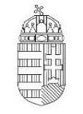
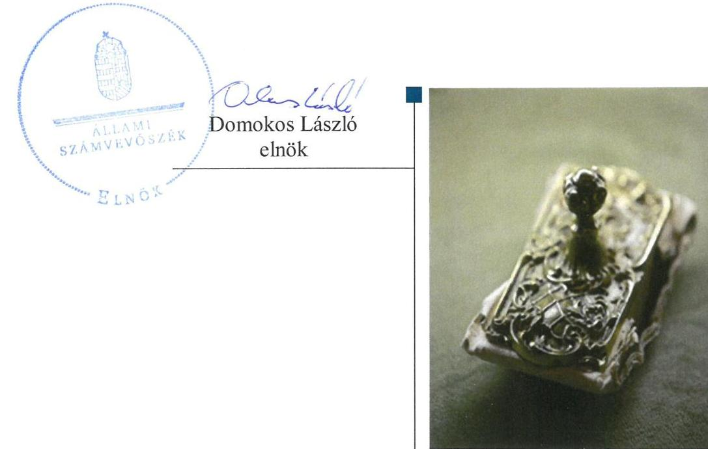
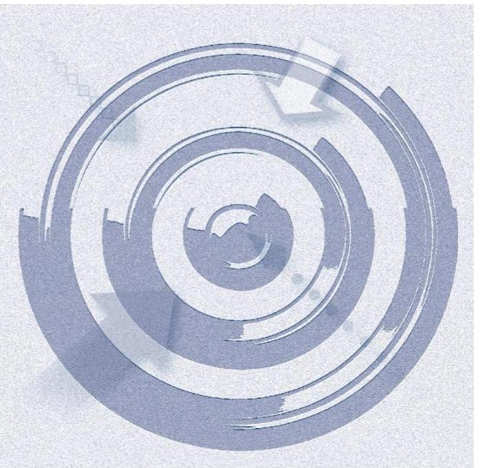
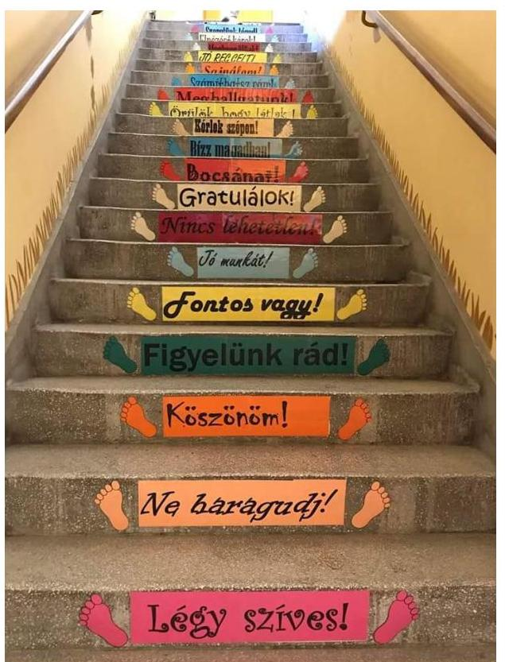

ÁLLAMI
SZÁMVEVŐSZÉK

# Jelentés

## Nem állami humánszolgáltatók ellenőrzése

A humánszolgáltatást nyújtó államháztartáson kívüli köznevelési és szociális intézmények, szolgáltatók fenntartói központi költségvetési támogatásai felhasználásának ellenőrzése – Suli Harmónia-2007 Gyermekeket Segítő Alapítvány 2019.

---

# Jelentés 

## Nem állami humánszolgáltatók ellenőrzése

A humánszolgáltatást nyújtó államháztartáson kívüli köznevelési és szociális intézmények, szolgáltatók fenntartói központi költségvetési támogatásai felhasználásának ellenőrzése Suli Harmónia-2007 Gyermekeket Segítő Alapítvány
2019. 03. hó 01. nap

---

# AZ ELLENŐRZÉST FELÜGYELTE:

- PETŐ KRISZTINA felügyeleti vezető
- AZ ELLENŐRZÉST VEZETTE ÉS A VÉGREHAJTÁSÁÉRT FELELŐS:
  - DR. KOVÁCS DIÁNA ellenőrzésvezető
  - A PROGRAM ÖSSZEÁLLÍTÁSÁÉRT FELELŐS:
    - TÓTPÁL SZABOLCS osztályvezető

**IKTATÓSZÁM:** EL-1494-001/2019.

**TÉMASZÁM:** 2448

**ELLENŐRZÉS-AZONOSÍTÓ SZÁM:** V079427

Jelentéseink az Országgyűlés számítógépes hálózatán és az Interneta a www.asz.hu címen is olvashatóak.

---

# TARTALOMJEGYZÉK 

- ÖSSZEGZÉS ..... 5
- AZ ELLENŐRZÉS CÉLJA ..... 6
- AZ ELLENŐRZÉS TERÜLETE ..... 7
- AZ ELLENŐRZÉS HÁTTERE, INDOKOLTSÁGA ..... 8
- A JELENTÉS LÉNYEGES KÉRDÉSKÖREI ..... 9
- AZ ELLENŐRZÉS HATÓKÖRE ÉS MÓDSZEREI ..... 10
- MEGÁLLAPÍTÁSOK ..... 12
- JAVASLATOK ..... 14
- MELLÉKLETEK ..... 15
I. sz. melléklet: Értelmező szótár ..... 15
II. sz. melléklet: A központi költségvetési támogatások alakulása ..... 17
- FÜGGELÉK: ÉSZREVÉTELEK ..... 19
- RÖVIDÍTÉSEK JEGYZÉKE ..... 21

---

.

---

# ÖSSZEGZÉS 

A Suli Harmónia-2007 Gyermekeket Segítő Alapítvány a köznevelési közfeladathoz biztositott központi költségvetési támogatásokat nem szabályszerűen tartotta nyilván, az átláthatóságot és az elszámoltathatóságot nem biztositotta. A köznevelési intézménye müködtetéséhez felhasznált közpénzekre vonatkozó közzétételi kötelezettségének nem tett eleget, és ezzel az átláthatóságot nem biztositotta.

## Az ellenőrzés társadalmi indokoltsága

Az Állami Számvevőszék stratégiájában hangsúlyos szerepet szán annak, hogy szilárd szakmai alapon álló, értékteremtő ellenőrzéseivel előmozdítsa a közpénzügyek átláthatóságát, rendezettségét és javaslataival a közpénzek és a közvagyon szabályos, gazdaságos, hatékony és eredményes felhasználását segítse. Az Állami Számvevőszék a stratégiájában célul tűzte ki, hogy az államháztartáson kívülre nyújtott költségvetési támogatások ellenőrzésével hozzájárul ahhoz, hogy a közpénzeket az államháztartáson kívüli szervezetek is átlátható módon használják fel a közfeladatok szerződésben vállalt ellátása érdekében. Az Állami Számvevőszék e stratégiai céljaival összhangban - az Állami Számvevőszékről szóló 2011. évi LXVI. törvény felhatalmazása alapján - végzi a központi költségvetésből származó források, nyújtott támogatások - kedvezményezett szervezetek közfeladat ellátásához való - felhasználásának az ellenőrzését. Az Állami Számvevőszék hozzájárul ezzel ahhoz is, hogy a nyilvánosság és az igénybevevők megfelelő tájékoztatást kapjanak az államháztartáson kívüli közfeladatot ellátók működéséről.

## Főbb megállapítások, következtetések, javaslatok

A Suli Harmónia-2007 Gyermekeket Segítő Alapítvány a köznevelési intézménye működésének feltételeit szabályszerűen kialakította. A központi költségvetési támogatások alapfeladatok szerinti elkülönített nyilvántartásáról nem gondoskodott. A központi költségvetési támogatásokat szabályszerűen továbbutalta az intézménynek.

A Suli Harmónia-2007 Gyermekeket Segítő Alapítvány a köznevelési intézménye működtetéséhez felhasznált közpénzekre vonatkozóan a köznevelési közfeladat ellátásából adódó közzétételi kötelezettségének nem tett eleget, a kötelezően közzéteendő adatok nyilvánosságra hozatalának rendjét nem szabályozta.

A Suli Harmónia-2007 Gyermekeket Segítő Alapítvány a jogszabályi előírások szerint kialakította a köznevelési humánszolgáltatási közfeladat ellátásának szervezeti és szabályozási kereteit. Beszámolási formája és könyvvezetése a jogszabályi előírások szerint történt. A költségvetési támogatások igénylési, módosítási és elszámolási feladatainak ellátása során szabályszerűen járt el.

Az Állami Számvevőszék a Suli Harmónia-2007 Gyermekeket Segítő Alapítvány kuratóriumi elnökének négy javaslatot fogalmazott meg.

---

# AZ ELLENŐRZÉS CÉLJA

**AZ ELLENŐRZÉS CÉLJA** annak értékelése volt, hogy a Suli Harmónia-2007 Gyermekeket Segítő Alapítvány, mint Fenntartó1 központi költségvetésből kapott támogatásainak felhasználása szabályszerű volt-e, a támogatások igénylése, évközi módosítása és év végi elszámolása megfelelte-e a jogszabályi előírásoknak.

---

# **AZ ELLENŐRZÉS TERÜLETE**

### **Suli Harmónia-2007 Gyermekeket Segítő Alapítvány**

2007-ben egy magánszemély alapította a Suli Harmónia-2007 Gyermekeket Segítő Alapítványt, amelynek székhelye a Zala megyei Felsőrajk. A Fenntartó célja óvoda, alap- és középfokú oktatást nyújtó intézmény, általános iskola, gimnázium, középiskola, valamint alapfokú művészeti oktatási intézmény fenntartása. A Fenntartó rendelkezett a köznevelési közfeladat ellátására vonatkozó közoktatási szerződéssel.

A Fenntartó vagyonának kezelését az alapítvány ügyvezető szerve, a Kuratórium² végezte. A Fenntartó működését és gazdálkodását felügyelő bizottság ellenőrizte. A törvényességi ellenőrzési feladatokat a területileg illetékes Zala Megyei Kormányhivatal végezte. A Fenntartó egyszerűsített éves beszámolót és közhasznúsági mellékletet készített, vállalkozási tevékenységet nem folytatott.

A Fenntartó által létrehozott köznevelési intézmény³ alaptevékenysége óvodai nevelés, alapfokú oktatás: nappali rendszerű 8 évfolyamos általános műveltséget megalapozó iskolai oktatás. A köznevelési intézmény az ellenőrzött időszakban Zalaszentmihályon, Pölöskén, Egervölgyön és Káldon összesen hat tagintézménnyel rendelkezett. A köznevelési intézménybe felvehető gyerekek maximális létszáma évente összesen 950 fő volt. A köznevelési intézmény tanulóinak létszáma a 2014. évi 429 főről 2017. évre 324 főre, az óvodások létszáma 39 főről 23 főre csökkent.

A Fenntartó a köznevelési közfeladatok ellátására 2014-ben 176,9 millió Ft, 2015-ben 158,3 millió Ft, 2016-ban 161,8 millió Ft, 2017-ben 164,8 millió Ft központi költségvetési támogatást kapott. A központi költségvetésből kapott támogatás az összes bevétel mintegy 70%-át tette ki. A támogatások alakulását a II. számú melléklet mutatja be.

---

# AZ ELLENŐRZÉS HÁTTERE, INDOKOLTSÁGA 

A köznevelési feladatokat ellátó nem állami intézményfenntartók részére közfeladataik ellátására a 2014. - 2017. években jelentős összegű pénzügyi támogatást biztosítottak a mindenkori költségvetési törvények a bennük megfogalmazott feltételek mellett.

Az ÁSZ ${ }^{4}$ a stratégiájában célul tűzte ki, hogy az államháztartáson kívülre nyújtott költségvetési támogatások ellenőrzésével hozzájárul ahhoz, hogy a közpénzeket az államháztartáson kívüli szervezetek is átlátható módon használják fel a közfeladatok ellátására kötött szerződésekben vállalt ellátása érdekében. Az ÁSZ stratégiájában foglaltak alapján is indokolt az ellenőrzés, amely a társadalom számára jelzi, hogy a közpénzek államháztartáson kívüli felhasználása sem maradhat ellenőrizhetetlenül. Az államháztartáson kívülre nyújtott költségvetési támogatások ellenőrzésével az ÁSZ hozzájárul ahhoz, hogy a közpénzeket a nem állami humán fenntartók átlátható módon használják fel a közfeladatok ellátására kötött szerződésben vállalt kötelezettségek teljesítése érdekében. Az ellenőrzés javaslataival hozzájárul az említett rendszerek szabályszerű támogatás felhasználásához, javítja a társadalmi-gazdasági döntések megalapozottságát, ami a „jól irányított állam" feltétele.

---

# A JELENTÉS LÉNYEGES KÉRDÉSKÖREI 

1. A köznevelési közfeladatot ellátó Fenntartó szabályszerű müködési és gazdálkodási környezet kialakításával megteremtette-e a költségvetési támogatások átlátható, elszámoltatható igénybevételének, felhasználásának feltételeit?
2. A Fenntartó az átvállalt köznevelési közfeladathoz biztositott költségvetési támogatásokat szabályszerűen fordította-e a humánszolgáltató intézménye müködtetésére?
3. A Fenntartó a köznevelési intézménye müködtetéséhez felhasznált közpénzekre vonatkozó gazdálkodásával a nyilvánosság elött elszámolt-e?

---

# AZ ELLENŐRZÉS HATÓKÖRE ÉS MÓDSZEREI 

## Az ellenőrzés típusa

Megfelelőségi ellenőrzés.

## Az ellenőrzött időszak

A 2014. január 1-je és 2017. december 31-e közötti időszak. A helyszíni szemle tekintetében 2018. január 1-jétől az utolsó helyszíni szemle időpontjáig tartó időszak.

## Az ellenőrzés tárgya

Az ellenőrzés a köznevelési közfeladatokat ellátó államháztartáson kívüli Fenntartó humánszolgáltatási közfeladatai ellátásához a költségvetési törvényekben biztosított központi költségvetési támogatások igénylése, évközi módosítása és év végi elszámolása fenntartói feladatainak ellátása, illetve e központi költségvetésből kapott támogatások humánszolgáltatási közfeladatokra való fenntartó általi felhasználása szabályszerűségének értékelésére terjedt ki.

Az ellenőrzés kiterjedt minden olyan körülményre és adatra, amely az ÁSZ jogszabályban meghatározott feladatainak teljesítéséhez, valamint a program végrehajtása folyamán felmerült újabb összefüggések feltárásához szükséges volt.

## Az ellenőrzött szervezet

Suli Harmónia-2007 Gyermekeket Segítő Alapítvány mint intézményfenntartó.

## Az ellenőrzés jogalapja

Az ellenőrzés jogszabályi alapját az ÁSZ tv. ${ }^{5} 1 . \S$ (3) bekezdése, 5. § (3) bekezdésében foglalt előírások adták.

## Az ellenőrzés módszerei

Az ellenőrzést az ellenőrzési program szempontjai, kérdései, az ellenőrzött időszakban hatályos jogszabályok, a nemzetközi standardokat irányadónak

---

tekintve, az ellenőrzés szakmai szabályok és módszertanok figyelembevételével végezte az ÁSZ. A közpénzekkel való felelős gazdálkodás segítésére irányuló javaslatok kidolgozásakor a hatályos jogszabályok voltak az irányadóak.

Az ellenőrzés ideje alatt az ellenőrzött szervezettel történő kapcsolattartást az ÁSZ SZMSZ ${ }^{6}$-ének vonatkozó előírásai alapján biztosította az ÁSZ.

Az ellenőrzési kérdések megválaszolásához szükséges bizonyítékok megszerzése az ellenőrzött által rendelkezésre bocsátott dokumentumokra, adatokra alapozva elemző eljárással történt.

Az ellenőrzési bizonyítékként felhasználható adatforrások közé tartoztak egyrészt a szakmai program részletes szempontjainál felsorolt adatforrások, másrészt minden - az ellenőrzés folyamán feltárt, az ellenőrzés szempontjából információt tartalmazó - dokumentum.

Az ellenőrzés lefolytatásához az ellenőrzött szervezet a kitöltött tanúsítványok, valamint az ÁSZ által kért dokumentumok elektronikus úton való megküldésével szolgáltatott adatokat, információkat. Az így rendelkezésre bocsátott adatok, információk és a tanúsítványok adatai valódiságának kontrollja az ellenőrzés keretében történt.

A fenntartott köznevelési intézménynél helyszíni szemle keretében győződött meg az ÁSZ a tényleges feladatellátásról (verifikáció).

A köznevelési humánszolgáltatások központi költségvetési támogatásai igénylésével, módosításával, elszámolásával kapcsolatos, államháztartáson kívüli fenntartó jogszabályokban előírt feladatai betartását, továbbá a központi költségvetési támogatások szabályszerű kezelését, nyilvántartását ellenőrizte az ÁSZ a Fenntartónál határozatok, nyilvántartások, beszámolók és egyéb dokumentumok alapján. Az ellenőrzés nem terjedt ki a köznevelési humánszolgáltatások központi költségvetési támogatásai igénylése, módosítása, elszámolása valódiságának, megalapozottságának, helyességének - sem a Fenntartónál, sem a székhely intézménynél való - értékelésére. Továbbá nem terjedt ki az ellenőrzés e források köznevelési intézmény általi szabályszerű felhasználásának értékelésére.

A szabályosság megítélésének alapját képezte, hogy a központi költségvetési támogatások Fenntartó általi igénylése, módosítása és elszámolása a Kincstár ${ }^{7}$ felé megtörtént.

---

# MEGÁLLAPÍTÁSOK 

## 1. A köznevelési közfeladatot ellátó Fenntartó szabályszerű müködési és gazdálkodási környezet kialakításával megterem-tette-e a költségvetési támogatások átlátható, elszámoltatható igénybevételének, felhasználásának feltételeit?

Összegző megállapítás

A Fenntartó köznevelési közfeladata ellátásának megszervezése és belső szabályozottságának kialakítása szabályszerű volt. A költségvetési támogatások igénylési, módosítási és elszámolási feladatait szabályszerűen látta el.

ALAPÍTÓ OKIRATTAL ${ }^{8}$ a Fenntartó a Ptk. ${ }^{9}$ előírásai szerint rendelkezett. A Fenntartót a Bíróság ${ }^{10}$ nyilvántartásba vette.

A Fenntartó a Civilszr. ${ }_{1,2}{ }^{11}$ szerinti kettős könyvvitellel alátámasztott egyszerűsített éves beszámolót, valamint közhasznúsági mellékletet készített. A számviteli beszámolók mérlegének és eredmény kimutatásának tagolása szabályszerű volt.

SZÁMVITELI POLITIKÁVAL ${ }^{12}$, valamint a számviteli politika keretében elkészítendő szabályzatokkal a Fenntartó a Számv. tv. ${ }^{13}$ szerint rendelkezett.

A KÖLTSÉGVETÉSI TÁMOGATÁSOK igénylése, módosítása és elszámolása szabályszerű volt.

## 2. A Fenntartó az átvállalt köznevelési közfeladathoz biztosított költségvetési támogatásokat szabályszerűen fordította-e a humánszolgáltató intézménye müködtetésére?

Összegző megállapítás

A Fenntartó az átvállalt köznevelési közfeladatokhoz biztosított költségvetési támogatásokat szabályszerűen fordította a köznevelési intézmény müködtetésére. A köznevelési feladathoz biztosított támogatást nem szabályszerűen tartotta nyilván.

A Fenntartó szabályszerűen kiadta a köznevelési intézmény alapító okiratát, gondoskodott róla, hogy a köznevelési intézmény rendelkezzen szervezeti és müködési szabályzattal, biztosította a köznevelési intézmény személyi és tárgyi feltételeit, elfogadta a köznevelési intézmény éves költségvetését.

---

A Fenntartó a központi költségvetési támogatásokat szabályszerűen továbbutalta a köznevelési intézményének.

A TÁMOGATÁS FELHASZNÁLÁSÁT az Nkt. vhr. ${ }^{14}$ 37/G. § (1) bekezdésében előírtak ellenére a Fenntartó nem naprakészen, nem alapfeladatonkénti bontásban elkülönítetten tartotta nyilván.

# 3. A Fenntartó a köznevelési intézménye múködtetéséhez felhasznált közpénzekre vonatkozó gazdálkodásával a nyilvánosság előtt elszámolt-e? 

Összegző megállapítás

A Fenntartó a köznevelési intézménye múködtetéséhez felhasznált közpénzekre vonatkozóan a közzétételi kötelezettségének nem tett eleget.

AZ ADATOK BIZTONSÁGÁNAK, VÉDELMÉNEK ÉRVÉNYRE JUTTATÁSÁHOZ SZŰKSÉGES ELJÁRÁSI SZABÁLYOKAT a Fenntartó az Info. tv. ${ }^{15}$ 7. § (2) bekezdésében foglaltakat megsértve nem alakította ki.

A Fenntartó a közzétételi listákon szereplő adatok pontos, naprakész és folyamatos közzétételi kötelezettség teljesítésének részletes szabályait az Info. tv. 35. § (3) bekezdésében foglaltak ellenére - nem állapította meg belső szabályzatban.

A KÖZFELADAT ELLÁTÁSHOZ KAPCSOLÓDÓAN a Fenntartó az Info. tv. 37. § (1) bekezdésében előírtak ellenére nem gondoskodott az Info. tv. 1. melléklet II/12. pontban foglalt, a közfeladatot ellátó köznevelési intézménynél végzett alaptevékenységgel kapcsolatos vizsgálatok, ellenőrzések nyilvános megállapításainak, valamint a III/1. pontban foglalt a közfeladatot ellátó köznevelési intézmény éves költségvetésének közzétételéről.

A Fenntartó mind a négy évre vonatkozóan az egyszerűsített éves beszámolóját és a közhasznúsági mellékletét a Civilszr. L2 előírásai szerint letétbe helyezte és a - szabályozási hiányosság ellenére - honlapján közzétette.

---

# JAVASLATOK 

Az ÁSZ tv. 33. § (1) bekezdésében foglaltak értelmében az ellenőrzött szervezet vezetője köteles a jelentésben foglalt megállapításokhoz kapcsolódó intézkedési tervet összeállítani és azt a jelentés kézhezvételétől számított 30 napon belül az ÁSZ részére megküldeni. Amennyiben az ellenőrzött szervezet vezetője nem küldi meg határidőben az intézkedési tervet, vagy továbbra sem elfogadható intézkedési tervet küld, az Állami Számvevőszék elnöke az ÁSZ tv. 33. § (3) bekezdése a) és b) pontjaiban foglaltakat érvényesítheti.

## Suli Harmónia-2007 Gyermekeket Segítő Alapítvány kuratóriumi elnökének

1. Intézkedjen a támogatás felhasználásnak alapfeladatonkénti bontásban elkülönített és naprakész nyilvántartásáról.
(2. sz. megállapítás 3. bekezdése alapján)
2. Intézkedjen az adatkezelő belső adatvédelmi és adatbiztonsági szabályzat megalkotásáról.
(3. sz. megállapítás 1. bekezdése alapján)
3. Intézkedjen a közzétételi listákon szereplő adatok pontos, naprakész és folyamatos közzétételi kötelezettség teljesítése részletes szabályainak megállapításáról.
(3. sz. megállapítás 2. bekezdése alapján)
4. Intézkedjen a közfeladat ellátáshoz kapcsolódóan a jogszabályi előírások szerinti adatok közzétételéről.
(3. sz. megállapítás 3. bekezdése alapján)

---

# MELLÉKLETEK 

- I. SZ. MELLÉKLET: ÉRTELMEZŐ SZÓTÁR
civil szervezet
humánszolgáltatás
költségvetési támogatás
köznevelési közfeladat

A Civil tv. 2. § 6. pontja szerint civil szervezet a civil társaság, a Magyarországon nyilvántartásba vett egyesület (a párt, a szakszervezet és a kölcsönös biztosító egyesület kivételével), a közalapítvány és a pártalapítvány kivételével az alapítvány.
Külön törvényben meghatározott szociális, gyermekjóléti, gyermekvédelmi, közoktatási, felsőoktatási, kulturális közfeladatok (2014. évi Kvtv. 34. § (1), (4) bekezdés, 1. számú melléklet XX/20/2. alcím, 19. alcím, 2015. évi Kvtv. 43. § (1), (4) bekezdés, 1. számú melléklet XX/20/2/3. jogcím csoport, 19. alcím, 2016. évi Kvtv. 41. § (1), (4) bekezdés, 1. számú melléklet XX/20/2/3. jogcím csoport, 19. alcím).
a társadalombiztosítás pénzügyi alapjai kivételével az államháztartás központi alrendszeréből ellenérték nélkül, pénzben nyújtott támogatások (Áht. ${ }^{16}$ 1. § 14. pont)
A költségvetési törvényekben (2013. évi CCXXX. törvény 33-34. §, 2014. évi C. törvény 4243. §, 2015. évi C. törvény 40-41. §) megállapított támogatás. A 2015. évi C. törvény 4041. § szerint többek között: Az Országgyűlés a köznevelési feladat ellátására átlagbéralapú támogatást állapít meg. A nevelési-oktatási, valamint pedagógiai szakszolgálati intézményt fenntartó nemzetiségi önkormányzat, az egyházi és magán köznevelési intézmény fenntartója részére az általuk fenntartott nevelési-oktatási intézményben, továbbá pedagógiai szakszolgálati intézményben pedagógus és - a b) pont kivételével - nevelő-oktató munkát közvetlenül segítő munkakörben foglalkoztatottak után a 7. melléklet I. pontja, valamint az óvoda, egységes óvoda-bölcsőde esetében a 2. melléklet II. pont 1. alpontja szerint és az 5. alpontjában meghatározott jogosultak után, az őket ott megillető mértékek szerint. Müködési támogatást állapít meg a nemzetiségi önkormányzat vagy az egyházi jogi személy által fenntartott nevelési-oktatási intézményekben ellátott, továbbá a pedagógiai szakszolgálati intézményekben gyógypedagógiai tanácsadásban, korai fejlesztésben, oktatásban és gondozásban, valamint a fejlesztő nevelésben részt vevő gyermekekre, tanulókra tekintettel a nemzetiségi önkormányzat és a b----evett egyház részére a 7. melléklet II. pontja szerint.

Az Országgyűlés a szociális, gyermekjóléti, gyermekvédelmi közfeladatot ellátó intézményt, szolgáltatást fenntartó egyházi jogi személy, civil szervezet, közalapítvány, országos nemzetiségi önkormányzat, települési vagy területi nemzetiségi önkormányzat, gazdasági társaság, és a humánszolgáltatást alaptevékenységként végző, az Szja tv. hatálya alá tartozó egyéni vállalkozó (a továbbiakban együtt: nem állami szociális fenntartó) részére támogatást állapít meg a következők szerint: a támogatás a nem állami szociális fenntartót a települési önkormányzatok 2. melléklet III. pont 3. alpont c)-k) pontjában és III. pont 5. alpont a) pontjában meghatározott támogatásaival azonos jogcímeken, öszszegben és feltételek mellett illeti meg.
A köznevelési intézmény alapító okiratában foglalt feladat: óvodai nevelés, nemzetiséghez tartozók óvodai nevelése, általános iskolai nevelés-oktatás, nemzetiséghez tartozók általános iskolai nevelése-oktatása, kollégiumi ellátás, nemzetiségi kollégiumi ellátás, gimnáziumi nevelés-oktatás, szakközépiskolai nevelés-oktatás, szakiskolai nevelés-oktatás, nemzetiség gimnáziumi nevelés-oktatása, nemzetiség szakközépiskolai nevelés-oktatása, nemzetiség szakiskolai nevelés-oktatása, Köznevelési Hídprogramok keretében folyó nevelés-oktatás, felnőttoktatás, alapfokú művészetoktatás, fejlesztő nevelés, fejlesztő nevelés-oktatás, pedagógiai szakszolgálati feladat, a többi gyermekkel, tanulóval együtt nevelhető, oktatható sajátos nevelési igényű gyermekek, tanulók óvodai nevelése és iskolai nevelése-oktatása, azoknak a sajátos nevelési igényű gyermekeknek, tanulóknak az óvodai, iskolai, kollégiumi ellátása, akik a többi gyermekkel, tanulóval nem foglalkoztathatók együtt, a gyermekgyógyüdülőkben, egészségügyi intézményekben, rehabilitációs

---

## köznevelési intézmény

nem állami, nem önkormányzati (államháztartáson kívüli) intézmény fenntartó
intézményekben tartós gyógykezelés alatt álló gyermekek tankötelezettségének teljesítéséhez szükséges oktatás, pedagógiai-szakmai szolgáltatás.
A nevelési- oktatási intézmény, pedagógiai szakszolgálati intézmény, pedagógiai-szakmai szolgáltatást nyújtó intézmény.
A köznevelési és szociális, gyermekjóléti és gyermekvédelmi közfeladatokat/humánszolgáltatásokat ellátó intézményt fenntartó egyházi jogi személy, társadalmi szervezet, alapítvány, közalapítvány, civil szervezet, országos nemzetiségi önkormányzat, nonprofit gazdasági társaság, gazdasági társaság és a humánszolgáltatást alaptevékenységként végző, Szja tv. hatálya alá tartozó egyéni vállalkozó. (2013. évi Kvtv. 35. § (1), (3) bekezdés, 2014. évi Kvtv. 33. §, 34. § (1), (4) bekezdés, 2015. évi Kvtv. 42. §, 43. § (1), (4) bekezdés, 2016. évi Kvtv. 40. §, 41. § (1), (4) bekezdés)

---

II. SZ. MELLÉKLET: A KÖZPONTI KÖLTSÉGVETÉSI TÁMOGATÁSOK ALAKULÁSA

# A FENNTARTÓ ÁLTAL A KÖZNEVELÉSI FELADATHOZ KAPOTT KÖZPONTI KÖLTSÉGVETÉSI TÁMOGATÁS JOGCÍMENKÉNTI ALAKULÁSA (EZER FT)

|  Megnevezés | 2014. év | 2015. év | 2016. év | 2017. év  |
| --- | --- | --- | --- | --- |
|  A pedagógusok és a pedagógusok munkáját közvetlenül segítők átlagbér alapú támogatása | 163148 | 143166 | 144664 | 144839  |
|  A minősített pedagógusok után járó átlagbér alapú kiegészítő támogatás | - | 1585 | 2814 | 3980  |
|  Gyermekétkeztetés támogatása | 11538 | 11489 | 11963 | 11995  |
|  Óvodai ellátásban részesülő gyermekek ingyenes étkeztetésének kiegészítő támogatása | - | 301 | 810 | 669  |
|  Tanulók ingyenes tankönyvellátásának támogatása | 2181 | 1764 | 1560 | 3294  |
|  Összesen | 176867 | 158305 | 161811 | 164777  |

---

.

---

# FÜGGELÉK: ÉSZREVÉTELEK 

A jelentéstervezetet a Számvevőszék 15 napos észrevételezésre megküldte az ellenőrzött szervezet vezetőjének az ÁSZ tv. 29. §* (1) bekezdése előírásának megfelelően.

A Suli Harmónia-2007 Gyermekeket Segítő Alapítvány kuratóriumi elnöke nem élt észrevételezési jogával.

[^0]
[^0]:    * 29. § (1) Az Állami Számvevőszék az ellenőrzési megállapításait megküldi az ellenőrzött szervezet vezetőjének vagy az általa megbízott személynek, és annak, akinek személyes felelősségét állapította meg.
    (2) Az ellenőrzött szervezet vezetője és a felelősként megjelölt személy az ellenőrzés megállapításaira tizenöt napon belül írásban észrevételt tehet.
    (3) Az Állami Számvevőszék az észrevételre a beérkezésétől számított harminc napon belül írásban válaszol. A figyelembe nem vett észrevételeket köteles a jelentésben feltüntetni, és megindokolni, hogy azokat miért nem fogadta el.

---

.

---

# RÖVIDÍTÉSEK JEGYZÉKE 

${ }^{1}$ Fenntartó
${ }^{2}$ Kuratórium
${ }^{3}$ köznevelési intézmény
${ }^{4}$ ÁSZ
${ }^{5}$ ÁSZ tv.
${ }^{6}$ ÁSZ SZMSZ
${ }^{7}$ Kincstár
${ }^{8}$ Alapító okirat ${ }_{1}$

Alapító okirat ${ }_{2}$
${ }^{9}$ Ptk.
${ }^{10}$ Bíróság
${ }^{11}$ Civilszr. ${ }_{1}$

Civilszr. ${ }_{2}$
${ }^{12}$ számviteli politika
${ }^{13}$ Számv. tv.
${ }^{14}$ Nkt. vhr.
${ }^{15}$ Info.tv.
${ }^{16}$ Áht.

Suli Harmónia-2007 Gyermekeket Segítő Alapítvány
Suli Harmónia-2007 Gyermekeket Segítő Alapítvány kuratóriuma
Suli Harmónia-2007 Óvoda és Általános Iskola
Állami Számvevőszék
az Állami Számvevőszékről szóló 2011. évi LXVI. törvény
(hatályos: 2011. július 1-től)
az Állami Számvevőszék Szervezeti és Múködési Szabályzata
Magyar Államkincstár
Suli Harmónia-2007 Gyermekeket Segítő Alapítvány 2007. július 23-tól hatályos alapító okirata

Suli Harmónia-2007 Gyermekeket Segítő Alapítvány 2016. március 10-től hatályos alapító okirata
a Polgári Törvénykönyvről szóló 2013. évi V. törvény
(hatályos: 2014. március 15-től)
Zala Megyei Bíróság
a számviteli törvény szerinti egyes egyéb szervezetek beszámoló készítési és könyvvezetési kötelezettségének sajátosságairól szóló 224/2000. (XII. 19.) Korm. rendelet (hatályos: 2001. január 1. és 2016. december 31. között)
a számviteli törvény szerinti egyes egyéb szervezetek beszámoló készítési és könyvvezetési kötelezettségének sajátosságairól szóló 479/2016. (XII. 28.) Korm. rendelet (hatályos: 2017. január 1-től)
A Suli Harmónia-2007 Gyermekeket Segítő Alapítvány számviteli politikája, hatályos 2014. január 1-től
a számvitelről szóló 2000. évi C. törvény (hatályos: 2001. január 1-től)
a nemzeti köznevelésről szóló törvény végrehajtásáról szóló 229/2012. (VIII. 28.) Korm. rendelet (hatályos: 2012. szeptember 1-jétől)
2011. évi CXII. törvény az információs és önrendelkezési jogról és az információ szabadságról
az államháztartásról szóló 2011. évi CXCV. törvény
(hatályos: 2012. január 1-jétől)

---

ÁLLAMI SZÁMVEVŐSZÉK
1052 Budapest, Apáczai Csere János utca 10.
Levélcím: 1364 Budapest 4. Pf. 54
Telefon: +36 14849100 Telefax: +36 14849200
www.asz.hu