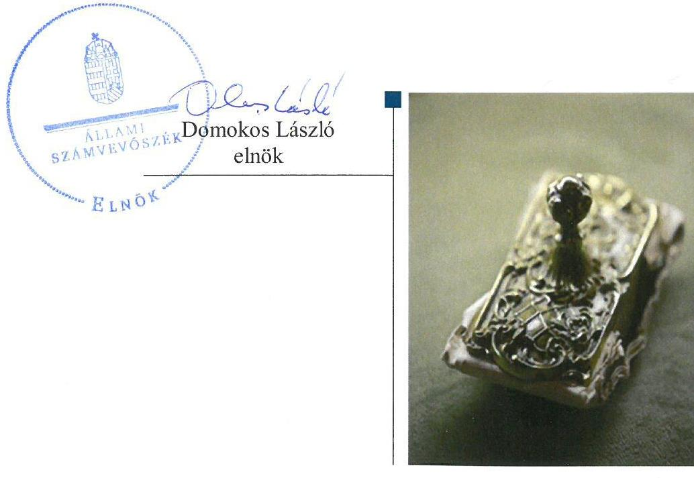
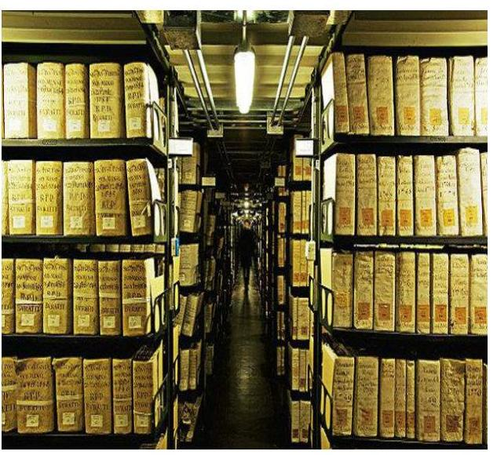
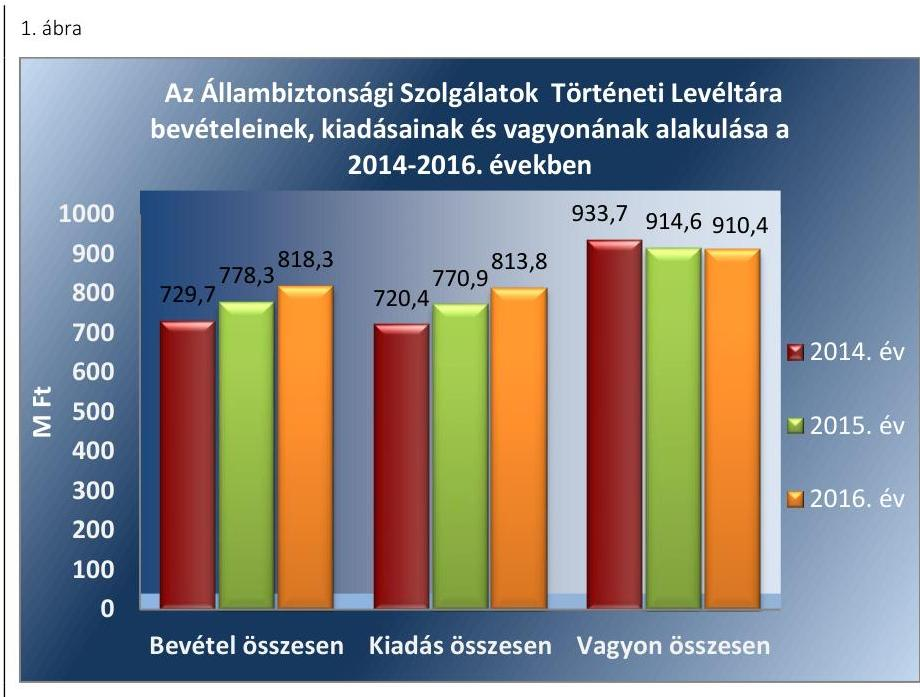
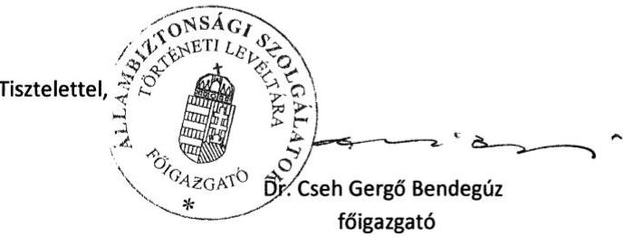
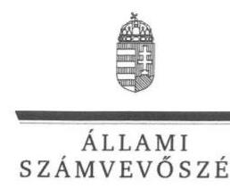
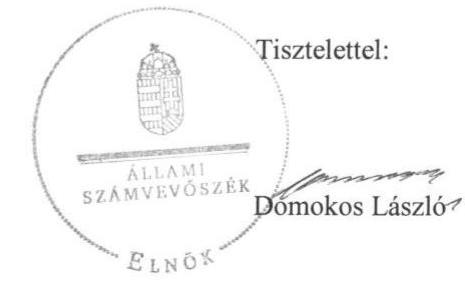
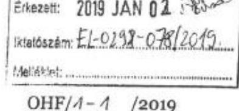
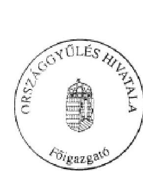
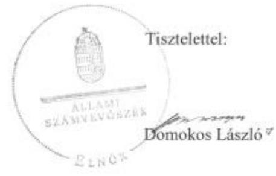
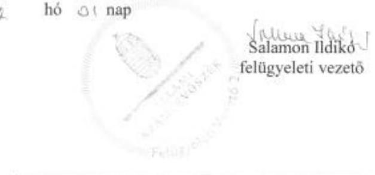

# Jelentés 

## A központi alrendszer intézményei

A központi alrendszer egyes intézményei pénzügyi és vagyongazdálkodásának ellenőrzése - Állambiztonsági Szolgálatok Történeti Levéltára 2019.

---

# Jelentés 

## A központi alrendszer intézményei

A központi alrendszer egyes intézményei pénzügyi és vagyongazdálkodásának ellenőrzése - Állambiztonsági Szolgálatok Történeti Levéltára
2019. 02. hó 26. nap

---

# AZ ELLENŐRZÉST FELÜGYELTE: 

SALAMON ILDIKÓ felügyeleti vezető

## AZ ELLENŐRZÉST VEZETTE ÉS A VÉGREHAJTÁSÁÉRT FELELŐS:

GÁL MAGDOLNA ellenőrzésvezető

## A PROGRAM ÖSSZEÁLLÍTÁSÁÉRT FELELŐS:

TÓTPÁL SZABOLCS osztályvezető

IKTATÓSZÁM: EL-1493-001/2019

TÉMASZÁM: 2450

## ELLENŐRZÉS-AZONOSÍTÓ SZÁM: V079109

Jelentéseink az Országgyűlés számítógépes hálózatán és az Interneten a www.asz.hu címen is olvashatóak.

---

# TARTALOMJEGYZÉK 

■ ÖSSZEGZÉS ..... 5
■ AZ ELLENŐRZÉS CÉLJA ..... 7
■ AZ ELLENŐRZÉS TERÜLETE ..... 8
■ AZ ELLENŐRZÉS HÁTTERE, INDOKOLTSÁGA ..... 10
■ A JELENTÉS LÉNYEGES KÉRDÉSKÖREI ..... 11
■ AZ ELLENŐRZÉS HATÓKÖRE ÉS MÓDSZEREI ..... 12
■ MEGÁLLAPÍTÁSOK ..... 14
■ JAVASLATOK ..... 20
■ MELLÉKLETEK ..... 23
I. sz. melléklet: Értelmező szótár ..... 23
■ FÜGGELÉKEK ..... 27
I. sz. függelék a Megállapítások fejezethez ..... 27
II. sz. függelék: Észrevételek ..... 28
■ RÖVIDÍTÉSEK JEGYZÉKE ..... 43

---

.

---

# ÖSSZEGZÉS 

Az Állambiztonsági Szolgálatok Történeti Levéltára felett az irányító szervi jogkörgyakorlás szabályszerű volt. A belső kontrollrendszer kialakítása és működtetése nem volt szabályszerű, ezáltal nem volt biztosított az átlátható és elszámoltatható közpénz felhasználás. A pénzügyi- és vagyongazdálkodás nem volt szabályszerű. Az integritás kontrollok kialakítása és működtetése nem a kockázatokkal arányosan történt.

## Az ellenőrzés társadalmi indokoltsága

A központi alrendszer részét képező intézmények alapvető rendeltetése a közfeladatok ellátásának biztosítása. A közpénzek felhasználásában meghatározó, központi alrendszerbe tartozó intézmények pénzügyi-, vagyongazdálkodási tevékenységük és feladatellátásuk súlya miatt jelentős hatást gyakorolhatnak a költségvetés egyensúlyának fenntartására. Hatással vannak továbbá az állami vagyonnal való gazdálkodás minőségére, a kormányzati (szak)politikák végrehajtására, illetve közfeladat ellátásuk vonatkozásában az állampolgárok életminőségére, jogaik és kötelezettségeik gyakorlására. Indokolt ezért, hogy az Állami Számvevőszék ezen intézmények pénzügyi és vagyongazdálkodását, az esetleges átalakulások szabályszerűségét rendszeresen ellenőrizze.

Az Állambiztonsági Szolgálatok Történeti Levéltárát, amely közfeladatot lát el és jelentős vagyont kezel, az Állami Számvevőszék korábban nem ellenőrizte.

## Főbb megállapítások, következtetések, javaslatok

Az Állambiztonsági Szolgálatok Történeti Levéltára feletti irányító szervi jogosultságokat a szervezeti és működési szabályzat jóváhagyása tekintetében és Országgyűlés elnöke, egyéb esetekben az Országgyűlés Hivatala - mint irányító szerv - szabályszerűen gyakorolta.

A belső kontrollrendszer kialakítása és működtetése nem volt szabályszerű, nem biztosította a közpénzekkel és a nemzeti vagyonnal történő átlátható és szabályszerű gazdálkodást. A kontrollkörnyezet kialakítása a 2014-2015. években szabályszerű volt, 2016. évben nem volt szabályszerű, az Állambiztonsági Szolgálatok Történeti Levéltárának Főigazgatója nem állapította meg a hivatásetikai alapelvek részletes tartalmát, az etikai eljárás szabályait. A kockázatkezelési rendszer kialakítása szabályszerű volt, működtetése nem volt szabályszerű, mert az Állambiztonsági Szolgálatok Történeti Levéltárának Főigazgatója a kockázat-kezelési rendszert nem működtette, nem mérte fel és nem állapította meg a tevékenységében rejlő kockázatokat.

A kontrolltevékenység gyakorlása és működtetése, továbbá az információs és kommunikációs folyamatok kialakítása és működtetése nem volt szabályszerű. Az Állambiztonsági Szolgálatok Történeti Levéltára főigazgatója a jogszabályi előírásokat betartva kialakította a szervezet tevékenységének folyamatos- és eseti nyomon követését biztosító rendszert. A függetlenített belső ellenőrzést az Állambiztonsági Szolgálatok Történeti Levéltára főigazgatója szabályszerűen alakította ki és működtette.

Az Állambiztonsági Szolgálatok Történeti Levéltára pénzügyi gazdálkodása nem volt szabályszerű, mert a bevételek beszedése, a kiadási előirányzatok felhasználása során nem tartották be a jogszabályi előírásokat. A kötelezettségvállalások dokumentumai a jogszabályi előírások ellenére nem tartalmazták a szakmai, műszaki és pénzügyi teljesítés jellemzőinek meghatározását. Az Állambiztonsági Szolgálatok Történeti Levéltára a 2014-2016. évi fizetési kötelezettségeit teljesítette, azonban a kötelezettségvállalással terhelt előirányzat-maradvány megállapítása a 2014-2015. években nem volt szabályszerű.

Az Állambiztonsági Szolgálatok Történeti Levéltára vagyongazdálkodása nem volt szabályszerű, mert a tárgyi eszközök leltározásának végrehajtása során nem tartották be a jogszabályban és belső szabályzatban foglaltakat, mivel

---

az ellenőrzött időszakban a mérleg tételeit alátámasztó leltárba bekerülő adatok valódiságáról - a mérleget alátámasztó leltár összeállítását megelőzően a belső szabályzatban előírt kétévenkénti - mennyiségi leltárfelvétellel nem győződtek meg.

Az integritás kontrollrendszer kiépítése nem volt megfelelő, mivel az integritás kontrollok kialakítása és működtetése nem a kockázatokkal arányosan történt.

Az Állami Számvevőszék az Állambiztonsági Szolgálatok Történeti Levéltára főigazgatójának 16 javaslatot tett.

---

# AZ ELLENŐRZÉS CÉLJA 

let érvényesülését.

AZ ELLENŐRZÉS CÉLJA annak megítélése volt, hogy az ellenőrzött intézményre vonatkozó irányító szervi feladatellátás a jogszabályi előírások betartásával történt-e; az intézménynél a belső kontrollrendszer kialakítása és működtetése szabályszerű volt-e; az intézmény pénzügyi és vagyongazdálkodása megfelelt-e a jogszabályi előírásoknak és belső szabályzatainak; az intézmény átalakításának vagy átszervezésének lebonyolítása szabályszerűen történt-e. Az ellenőrzés keretében értékeltük az intézmény korrupciós kockázatainak kezelését szolgáló integritás kontrollok kiépítettségét és az integritás szemlé-

---

# **AZ ELLENŐRZÉS TERÜLETE**

## **Állambiztonsági Szolgálatok Történeti Levéltára**

Az Állambiztonsági Szolgálatok Történeti Levéltárát (továbbiakban ÁBTL1) – mint a Történeti Hivatal jogutódját – a 2003. évi III. törvény2 alapján az Országgyűlés hozta létre 2003. április 1-jétől.

Az Alapító okirat1-23 szerint az ÁBTL alaptevékenységébe tartozik, hogy szaklevéltárként őrzi és kezeli a 2003. évi III. tv-ben meghatározott iratokat, valamint a törvényben meghatározott feltételekkel biztosítja az érintettek számára személyes adataik megismeréséhez való joguk gyakorlását. Biztosítja továbbá az általa kezelt iratanyagban a kutatási tevékenység folytatását. Levéltár- és történettudományi kutatásokat végez, közzéteszi a kutatás eredményeit, illetve a tudományos munkamegosztás keretében részt vállal az általa őrzött iratanyag publikálásában és ellátja az Ltv.4-ben meghatározott feladatokat.

Az ÁBTL állami szaklevéltár, központi költségvetési szerv, amely az Országgyűlés költségvetési fejezeten belül önálló címet alkot.

Irányító szerve5 az Országgyűlés Hivatala, működését az Országgyűlés elnöke felügyeli. Az ÁBTL Főigazgatóját6 hét évre az Országgyűlés elnöke nevezi ki. A kinevezési és felmentési jogkör kivételével a munkáltatói jogokat az Országgyűlés Hivatala főigazgatója gyakorolja. Az ÁBTL tevékenységéről a Főigazgató évente beszámolással tartozik az Országgyűlés Nemzetbiztonsági Bizottsága, valamint a Kulturális és Sajtó bizottsága felé. A Főigazgató és a gazdasági igazgató személye az ellenőrzött időszakban nem változott. Az ÁBTL engedélyezett létszáma az ellenőrzött időszak minden évében 99 fő volt. Tevékenységét a Magyar Állam tulajdonában lévő épületben gyakorolta, amelyre vagyonkezelői joggal rendelkezett. A gazdálkodási feladatokat a Gazdasági és Üzemeltetési Főosztály látta el. Az ellenőrzött időszakban az ÁBTL szervezetét és működését érintő átalakítás, átszervezés nem volt.

Az ellenőrzött időszakban az ÁBTL egyre növekvő bevétellel gazdálkodott, amellyel arányosan kiadásai is emelkedtek. A vagyonkezelésében lévő állami vagyon értéke évről-évre csökkenő nagyságrendet mutatott.

---

Forrás: Az ÁBTL éves beszámolói alapján ÁSZ szerkesztés

---

# AZ ELLENŐRZÉS HÁTTERE, INDOKOLTSÁGA 

Az államháztartás központi alrendszerének közpénz felhasználása, az intézmények által ellátott közfeladatok sokrétűsége, valamint a feladatellátásához rendelt vagyon nagyságrendje indokolja, hogy az ÁSZ ellenőrzéseket folytasson a pénzügyi és vagyongazdálkodás területén. Az ÁSZ az ellenőrzései során feltárja a gazdálkodást, a központi alrendszer intézményei átalakulását, átszervezését érintő szabályozások esetleges hiányosságait, a szabályozással nem érintett gazdálkodási területeket, rámutathat a vagyongazdálkodási tevékenység - ezen belül a tulajdonosi joggyakorlás és vagyonkezelés - esetleges szabálytalanságaira, értékeli az állami vagyon nyilvántartására és elszámolására vonatkozó eljárásokat.

Az ellenőrzés várhatóan hozzájárul a központi intézmények pénzügyi helyzetének pontosabb megítéléséhez, és a jó gyakorlat kialakításán és terjesztésén keresztül az ellenőrzések elősegíthetik a gazdálkodás szabályszerűségének javítását.

---

# A JELENTÉS LÉNYEGES KÉRDÉSKÖREI 

1. Az irányító szerv ellenőrzött költségvetési szervre vonatkozó feladatellátása szabályszerű volt-e?
2. A belső kontrollrendszer kialakítása és működtetése biztosította-e a közpénzekkel és a nemzeti vagyonnal történő átlátható, szabályszerű, gazdaságos, hatékony és eredményes gazdálkodást, illetve a beszámolási és adatszolgáltatási kötelezettségek szabályszerű teljesítését?
3. A költségvetési szerv pénzügyi gazdálkodása szabályszerű volt-e?
4. A költségvetési szerv vagyongazdálkodása szabályszerű volt-e?
5. Érvényesült-e az integritás szemlélet és ennek megfelelően kiépítették-e az integritási kontrollrendszert az intézménynél?

---

# AZ ELLENŐRZÉS HATÓKÖRE ÉS MÓDSZEREI 

## Az ellenőrzés típusa

Megfelelőségi ellenőrzés

## Az ellenőrzött időszak

2014. január 1-jétől 2016. december 31-éig

## Az ellenőrzés tárgya

Az ÁBTL-re vonatkozó irányító szervi feladatok ellátása. Az ÁBTL belső kontroll rendszerének kialakítása és működtetése. Az ÁBTL pénzügyi és vagyongazdálkodása. Az ÁBTL-nél az integritáskontrollok kiépítettsége, az integritás szemlélet érvényesülése.

Az ellenőrzés kiterjedt minden olyan körülményre és adatra, amely az ÁSZ jogszabályban meghatározott feladatainak teljesítéséhez, valamint a program végrehajtása folyamán felmerült újabb összefüggések feltárásához szükséges volt.

## Az ellenőrzött szervezet

Állambiztonsági Szolgálatok Történeti Levéltára, az irányító szervi feladatokat ellátó Országgyűlés Hivatala

## Az ellenőrzés jogalapja

Az ellenőrzés jogszabályi alapját az ÁSZ tv. ${ }^{7} 1 . \S$ (3) bekezdés, 5. § (2)-(4) és (6) bekezdései, valamint az Áht. ${ }^{8} 61 . \S$ (2) bekezdésének előírásai képezték.

## Az ellenőrzés módszerei

Az ÁSZ az ellenőrzést a szakmai program szempontjai, az ellenőrzött időszakban hatályos jogszabályok, az ellenőrzés szakmai szabályai, a jelen ellenőrzésre irányadó ÁSZ módszertanok figyelembevételével végezte.

Az ellenőrzés ideje alatt az ellenőrzött szervezettel történő kapcsolattartást az ÁSZ-SZMSZ ${ }^{9}$-ének vonatkozó előírásai alapján biztosítottuk.

Az ellenőrzési kérdések megválaszolásához szükséges bizonyítékok megszerzése az ellenőrzött által rendelkezésre bocsátott dokumentumokra, adatokra alapozva mintavételezés, valamint elemző eljárás útján

---

történt. Az ellenőrzési bizonyítékként felhasználható adatforrások közé tartoztak egyrészt a szakmai program részletes szempontjainál felsorolt adatforrások, másrészt minden egyéb - az ellenőrzés folyamán feltárt, az ellenőrzés szempontjából információt tartalmazó - dokumentum.

Az ellenőrzés lefolytatásához az ellenőrzött szervezetek az ÁSZ által kért dokumentumok megküldésével, az ÁBTL a tanúsítványok kitöltésével szolgáltatott adatokat.

Az ÁBTL belső kontrollrendszere jogszabályi előírások szerinti kialakítása és működtetése szabályszerűségének értékelése az erre irányuló kérdésekre adott válaszok összesítése alapján, évente pillérenként (kontrollkörnyezet, kockázatkezelési rendszer, kontrolltevékenységek, információs és kommunikációs rendszer, monitoring rendszer) és összesítetten történt. A belső kontrollrendszer egyes pilléreinek kialakítása „szabályszerű", amennyiben az értékelt területen az elért és elérhető pontok %-ban kifejezett, egész számra kerekített aránya meghaladta a 85%-ot, „nem szabályszerű", ha nem érte el 85%-ot. A kontrollrendszer egésze esetében a „szabályszerű" értékelésnek a %-os értéken felül további feltétele, hogy egyik kontrollterület sem kapott „nem szabályszerű" értékelést. Az összesített értékelés a %-os értéktől függetlenül a „nem szabályszerű" volt, ha az ellenőrzött kontrollterületek közül több mint egynek „nem szabályszerű" volt az értékelése.

A kiadások és a bevételek ellenőrzésére a 2014-2016. évek vonatkozásában került sor. A kiadások (külső személyi juttatások, felhalmozási kiadások, dologi kiadások) és bevételek (értékesítésből és bérbeadásból származó bevételek) esetében az ellenőrzés azokra a legnagyobb értékű tételekre - a lényeges sokaságra - terjedt ki, melyek összértéke elérte a teljes sokaság összértékének 50%-át.

A 2014-2016. évi vagyongazdálkodás, valamint a bevételek elszámolása szabályszerűségének esetében a lényeges sokaságot tételesen ellenőriztük. A 2014-2016. évi kiadások elszámolásának szabályszerűségét a lényeges sokaságból véletlen mintavételi eljárással kiválasztott tételek alapján ellenőriztük.

A mintavétellel ellenőrzött területek esetében minden egyes tétel vonatkozásában a felhasználás, elszámolás és értékelés szabályszerűségére vonatkozó kérdéseket tettünk fel. Szabályszerűnek értékeltünk egy ellenőrzött területet, amennyiben 95%-os bizonyossággal az ellenőrzött sokaságban az átlagos hibaarány legfeljebb 10%, nem szabályszerűnek, amennyiben 10%-nál magasabb arányt képviselt.

Az integritás szemlélet érvényesülésének értékelése az ellenőrzés rendelkezésére bocsátott adatok és dokumentumok alapján történt.
 Az ellenőrzést az ÁSZ a kérdésekre adott válaszok kiértékelésével, a megjelölt adatforrások felhasználásával, valamint az adott időszakban hatályos jogszabályok figyelembevételével folytatta le.

---

# 1. Az irányító szerv ellenőrzött költségvetési szervre vonatkozó feladatellátása szabályszerű volt-e? 

Összegző megállapítás Az ÁBTL-re vonatkozó irányító szervi feladatellátás szabályszerű volt.

Az ellenőrzött időszakban az alapítói jogok gyakorlása szabályszerűen történt. Az ÁBTL rendelkezett az OGYH ${ }^{10}$ által készített, az Ávr. ${ }^{11}$-ben előírt tartalmú Alapító okirattal.

Az OGYH egyéb irányítási, felügyeleti és ellenőrzési jogkörének gyakorlása szabályszerű volt. Az OGYH főigazgatója az Ávr.-ben előírtak szerint az ellenőrzött időszak minden évében kiadta a tervezés során alkalmazandó általános és kötelezően érvényesítendő tervezési követelményeket, jóváhagyta az ÁBTL elemi költségvetését és előirányzat-maradványát, továbbá az Áhsz. ${ }^{12}$ előírásai szerint az ÁBTL beszámolóját. Az irányító szerv a Főigazgatót az éves szakmai feladatellátásról minden évben beszámoltatta. Az ÁBTL hatályos SZMSZ ${ }^{13}$-ét a 2003. évi III. törvény alapján az Országgyűlés elnöke hagyta jóvá.

A munkáltatói jogokat az OGYH az Áht.-ban és a Kjt. ${ }^{14}$-ben foglaltak szerint, szabályszerűen gyakorolta.

Az OGYH a 10/2013. (I. 21.) Korm. rendelet ${ }^{15}$-ben foglalt kötelezettségének eleget téve kialakította a Főigazgató teljesítményét értékelő teljesítményértékelési rendszert, a Kttv. ${ }^{16}$-ben és a 10/2013. (I. 21.) Korm. rendeletben foglalt előírások szerint meghatározta a teljesítménykövetelmények végrehajtásának határidejét és mérőpontját.
2. A belső kontrollrendszer kialakítása és működtetése biztosította-e a közpénzekkel és a nemzeti vagyonnal történő átlátható, szabályszerű, gazdaságos, hatékony és eredményes gazdálkodást, illetve a beszámolási és adatszolgáltatási kötelezettségek szabályszerű teljesítését?

## Összegző megállapítás

Az ÁBTL belső kontrollrendszerének kialakítása és működtetése nem biztosította a közpénzekkel és a nemzeti vagyonnal történő átlátható és szabályszerű gazdálkodást.
2.1. számú megállapítás

A kontrollkörnyezet kialakítása a 2014-2015. években szabályszerű volt, a 2016. évben nem volt szabályszerű.

Az ÁBTL SZMSZ-e az ellenőrzött időszakban az Ávr. 13. § (1) bekezdés c) pontjában előírtak ellenére nem tartalmazta az ellátandó, és a kormányzati

---

funkció szerint besorolt alaptevékenységek megjelölését. Az ÁBTL az ellenőrzött időszakban rendelkezett a Kttv.-ben előírt közszolgálati szabályzattal. Az ÁBTL gazdasági szervezetére vonatkozó szabályokat az Ávr.-ben előírt tartalommal rendelkező ügyrend tartalmazta.

Az Ávr.-ben előírtak szerint a gazdálkodás részletes rendjét a Főigazgató a 2014-2016. években a Gazdálkodási szabályzatban rendezte.

Az ÁBTL az ellenőrzött időszakban rendelkezett a Főigazgató által kiadott, a Számv. tv. ${ }^{20}$-ben és az Áhsz.-ben előírt tartalmú Számviteli politikával és az annak keretében elkészítendő Leltározási szabályzattal, Értékelési szabályzattal, Pénzkezelési szabályzattal és az Önköltségszámítás rendjére vonatkozó szabályzattal, továbbá a Kbt. ${ }_{1,2}{ }^{26}$-ben előírtak szerinti Közbeszerzési szabályzattal. A Számlarend a Számv. tv. 161. § (2) a) és d) pontjaiban előírtak ellenére nem tartalmazta minden alkalmazásra kijelölt számla számjelét és megnevezését, a számlarendben foglaltakat alátámasztó bizonylati rendet. Az Áhsz. 51. § (3) bekezdésében előírtak ellenére a Számlarendben nem szabályozták az összesítő bizonylat tartalmi és formai követelményeit. A Számlarendnek a Számv. tv. 161. § (5) bekezdésében előírt 90 napos határidőn belül a Számv. tv. 2015. július 4-i módosítása miatt szükségessé vált - rendkívüli bevételek, rendkívüli ráfordítások megszűnése miatti - módosítása nem történt meg.

A Főigazgató az ellenőrzött időszakban a Kttv. ${ }^{29}$ 231. § (1) bekezdésében előírt kötelezettsége ellenére nem állapította meg a hivatásetikai alapelvek részletes tartalmát, valamint az etikai eljárás szabályait. Az ÁBTL a szervezeti integritást sértő események kezelésének eljárásrendjében 2016. október 1-jétől nem szabályozta a Bkr. ${ }^{31}$ 6. § (4a) bekezdés a-d), f) és g) pontjaiban előírtak ellenére a bejelentett kockázatok és események előzetes értékelésének módszertanát, a bejelentés kivizsgálásához szükséges információk összegyűjtésének módját, az érintettek meghallgatásának eljárási szabályait, a vonatkozó dokumentumok átvizsgálásának szabályait, az alkalmazható jogkövetkezményeket és a bejelentő szervezeten belüli védelmére, illetve elismerésére, valamint a vizsgálat eredményéről való tájékoztatására vonatkozó szabályokat.

# 2.2. számú megállapítás 

## A kockázatkezelési rendszer kialakítása szabályszerű volt, működtetése nem volt szabályszerű.

A Főigazgató a Bkr.-ben előírtak szerint a 2014. január 01. és 2016. szeptember 30. közötti időszakban Kockázatkezelési szabályzatban, 2016. október 1-jétől az Integrált kockázatkezelési szabályzatban határozta meg a kockázatkezelési, 2016. október 1-től az integrált kockázatkezelési rendszer működtetésének feltételeit. A Főigazgató az ellenőrzött időszakban a Bkr. 7. §. (1) bekezdésében előírt kockázatkezelési, 2016. október 1-jétől az integrált kockázatkezelési rendszert nem működtette, mivel a Bkr. 7. § (2) bekezdése ellenére nem mérte fel és nem állapította meg a tevékenységében rejlő, 2016. október 1-től a szervezeti célokkal összefüggő kockázatokat.

---

# 2.3. számú megállapítás 

## A kontrolltevékenység gyakorlása, működtetése nem volt szabályszerű.

Az ellenőrzött időszakban az Ávr. 60. § (3) bekezdésében előírt - a kötelezettségvállalásra, pénzügyi ellenjegyzésre, teljesítés igazolására, érvényesítésre, utalványozásra jogosult személyekről és aláírás-mintájukról vezetendő - nyilvántartást az ÁBTL nem naprakészen vezette.

A Főigazgató az Ávr.-ben előírtak szerint a Gazdálkodási szabályzatban rendezte a kötelezettségvállalás, ellenjegyzés, teljesítés igazolása, érvényesítés, utalványozás gyakorlásának módjával, eljárási és dokumentációs részletszabályaival kapcsolatos belső előírásokat, feltételeket.

A kötelezettségvállalások nyilvántartása a 2014-2015. években az Áhsz. 14. melléklet II. 4. a), d-e) és g) pontjaiban foglalt előírások ellenére nem tartalmazta a pénzügyi ellenjegyzésre vonatkozó adatokat és a kötelezettségvállalás, más fizetési kötelezettség évek szerinti megoszlását, továbbá a nyilvántartás nem az egységes rovatrend szerint tartalmazta a kötelezettségvállalás, más fizetési kötelezettség és a pénzügyi teljesítés összegét.

A bevételi és kiadási előirányzatok teljesítése során a kontrolltevékenységek gyakorlása nem volt szabályszerű. A feltárt hiányosságokat részletesen a 3. pont tartalmazza.

### 2.4. számú megállapítás

## Az információs és kommunikációs folyamatok kialakítása és működtetése nem volt szabályszerű.

A Főigazgató az információs rendszerek keretében a Bkr. 9. § (2) bekezdésében előírtak ellenére nem határozta meg a beszámolási szinteket, határidőket, és a beszámolás módját.

A Főigazgató az Info tv. ${ }^{34}$ 30. § (6) bekezdésében előírt közérdekű adatok megismerésére irányuló igények teljesítésének rendjét rögzítő szabályzatot nem készítette el, továbbá az Ávr. 13. § (2) bekezdés h) pontjában előírtak ellenére a kötelezően közzéteendő adatok nyilvánosságra hozatalának rendjét belső szabályzatban nem rendezte.

Az ÁBTL az Info tv. 37. § (1) bekezdésében előírtak ellenére az Info tv. 1. melléklet II/1 pontjában felsorolt, a tevékenységre, működésre vonatkozó adatok közül az adatvédelmi és adatbiztonsági szabályzat ${ }^{35}$ hatályos és teljes szövege közzétételi kötelezettségének nem tett eleget.

Az ÁBTL a külső szervezetekkel folytatott információ átadás rendjét kialakította. A Közszolgálati adatvédelmi szabályzat ${ }^{36}$-ban, valamint az Informatikai biztonsági szabályzat ${ }^{37}$-ban az Info tv.-ben előírtak szerint meghatározták az adatok biztonságának, védelmének érvényre juttatásához szükséges eljárási szabályokat és az adatok védelmével, megőrzésével kapcsolatos feladatokat, felelősségi és jogosultsági szabályokat. Az ÁBTL rendelkezett az Ltv.-ben előírt Iratkezelési szabályzattal.

---

### 2.5. számú megállapítás

A Főigazgató a jogszabályi előírásokat betartva kialakította a szervezet tevékenységének folyamatos- és eseti nyomon követését biztosító rendszert. A függetlenített belső ellenőrzés kialakítása és működtetése szabályszerű volt.

Az ÁBTL a Főigazgató által kiadott, a Bkr. előírásai szerint elkészített és rendszeresen aktualizált ellenőrzési nyomvonalban alakította ki a szervezet tevékenységének folyamatos- és eseti nyomon követését biztosító rendszert.

A Főigazgató az ellenőrzött időszakban az Áht. és a Bkr. előírásaival összhangban gondoskodott a belső ellenőrzés szabályszerű kialakításáról és működtetéséről, a belső ellenőrzés szervezeti- és funkcionális függetlenségét biztosította. A belső ellenőrzési feladatok ellátására az ellenőrzött időszakban a Főigazgató megbízási szerződést kötött, amelyhez az irányító szerv vezetőjének a Bkr. szerinti írásos jóváhagyásával rendelkezett. Az ÁBTL az ellenőrzött időszakban rendelkezett a Bkr. szerinti belső ellenőrzési kézikönyvvel, azonban annak rendszeres, de legalább kétévenkénti kötelező felülvizsgálatát a Bkr. 17. § (4) bekezdése ellenére nem végezték el.

A Bkr.-ben előírtakkal összhangban az ellenőrzött időszakban rendelkeztek kockázatelemzéssel alátámasztott, jóváhagyott éves belső ellenőrzési tervvel, amelyeket végrehajtottak. Az elvégzett ellenőrzésekről készített jelentésekben megfogalmazott javaslatok végrehajtása érdekében a Bkr. szerinti határidőben és tartalommal intézkedési tervet készítettek. A belső ellenőrzési vezető a Bkr.-ben előírtak szerint éves bontásban nyilvántartást vezetett az elvégzett belső ellenőrzésekről, továbbá biztosította a jelentésekben tett megállapítások, javaslatok, a vonatkozó intézkedési tervek és azok végrehajtásának nyomon követését.

A Főigazgató a Bkr. szerinti nyilatkozatban az ellenőrzött időszak minden évében értékelte a költségvetési szerv belső kontrollrendszerének minőségét, azonban az abban foglaltak nem voltak összhangban az ÁSZ által tett megállapításokkal.

# 3. A költségvetési szerv pénzügyi gazdálkodása szabályszerű volt-e? 

Összegző megállapítás

Az ÁBTL pénzügyi gazdálkodása nem volt szabályszerű, mert a bevételek beszedése, a kiadási előirányzatok felhasználása során nem tartották be a jogszabályi előírásokat. Az ÁBTL a 2014-2016. évi fizetési kötelezettségeit teljesítette, az előirányzat-maradvány megállapítása a 2014-2015. évben nem volt szabályszerű.

A bevételek beszedése során a pénzügyi jogkörök gyakorlása nem volt szabályszerű, mivel az Ávr. 58. § (3) bekezdésében, és az 59. § (3) bekezdés g) pontjában foglaltak ellenére az érvényesítő és az utalványozó az ellenőrzött időszakban az aláírását keltezéssel nem látta el.

---

Az ellenőrzött időszakban a lényeges sokaság tekintetében a kiadási előirányzatok felhasználása során a gazdálkodási jogkörök gyakorlása nem volt szabályszerű:

- A 2014. évben előfordult olyan kifizetés, amelynek teljesítése nem volt szabályszerű, mivel az Áht. 37. § (1) bekezdésében előírtak ellenére nem történt írásbeli kötelezettségvállalás,
- a kötelezettségvállalás dokumentuma nem volt szabályszerű, mivel az Ávr. 55. § (1) bekezdésben előírtak ellenére nem tartalmazta a pénzügyi ellenjegyzésre jogosult személy aláírását, így a kötelezettségvállalás pénzügyi ellenjegyzés nélkül történt meg, amely ellentétes az Áht. 37. § (1) bekezdésben foglaltakkal,
az Ávr. 57. § (1) bekezdésében foglaltak ellenére a teljesítésigazoló ellenőrzési feladatát nem látta el, mert ellenőrizhető okmányok hiányában nem ellenőrizte a kiadások teljesítésének jogosságát, összegszerűségét és annak teljesítését,
- a teljesítésigazolás nem volt szabályszerű, mert az Ávr. 57. § (3) bekezdésében foglaltak ellenére nem történt meg az igazolás dátumának megjelölése,
az érvényesítés nem volt szabályszerű, mivel az érvényesítő az Ávr. 58. § (1) bekezdés előírását figyelmen kívül hagyva nem ellenőrizte, hogy a megelőző ügymenetben az Áht., az Áhsz és az Ávr. előírásait megtartották-e.
A megrendelések az Ávr. 50. § (1) bekezdés a)-c) pontjainak előírása ellenére esetenként nem tartalmazták a szakmai, műszaki teljesítés mennyiségi és minőségi jellemzőinek meghatározását, határidejét, a kifizetendő összeget, a számlázás alapjául szolgáló egységárat, a pénzügyi teljesítés devizanemét, módját és feltételeit, a kifizetés határidejét.

Az ellenőrzött időszakban az Ávr. 50. § (1a) bekezdésében foglaltak ellenére a jogi személlyel, jogi személyiséggel nem rendelkező szervezettel kötött visszterhes szerződések (megrendelések) többsége nem tartalmazta a szervezet képviselőjének nyilatkozatát arra vonatkozóan, hogy
 átlátható szervezetnek minősül.

Az ÁBTL a 2014-2016. években teljesítette az esedékes fizetési kötelezettségeit, a tárgyévi mérlegének kötelezettségállománya 60 napon túli tartozást nem tartalmazott.

Az ÁBTL kötelezettségvállalással terhelt maradványának megállapítása a 2014-2015. években nem volt szabályszerű, mert az Áhsz. 39. § (3) bekezdése előírása ellenére a kötelezettségvállalással terhelt maradvány alátámasztásához nem készített az Áhsz. 14. melléklet II. 4. a), d-e) és g) pontjainak megfelelő tartalmú részletező nyilvántartást. A 2016. évben a kötelezettségvállalással terhelt maradvány megállapítása szabályszerű volt.

# 4. A költségvetési szerv vagyongazdálkodása szabályszerű volt-e? 

## Összegző megállapítás Az ÁBTL vagyongazdálkodása nem volt szabályszerű.

A tárgyi eszközök leltározásának végrehajtása során nem tartották be a Számv. tv. és a Leltározási szabályzat ${ }_{1-2}$ előírásait. Az ellenőrzött időszakban a Leltározási szabályzat ${ }_{1-2}$ 7.3.1.2. pontjában előírt két évenkénti

---

mennyiségi felvétellel történő leltározással, továbbá a Számv. tv. 69. § (3) bekezdésében előírtak ellenére az eszközök és a források leltárkészítési és leltározási szabályzatában meghatározott időszakonként, de legalább háromévente mennyiségi felvétellel történő leltározással nem győződtek meg - a mérleget alátámasztó leltár összeállítását megelőzően - a leltárba bekerülő adatok valódiságáról. Ezáltal az ÁBTL megsértette a Számv. tv. 15. § (3) bekezdésében meghatározott valódiság számviteli alapelvét, amely szerint a könyvvitelben rögzített és a beszámolóban szereplő tételeknek a valóságban is megtalálhatóknak, bizonyíthatóknak, kívülállók által is megállapíthatóknak kell lenniük.

Az ÁBTL az Nvtv. ${ }^{40}$, a Vtv. ${ }^{41}$, valamint a Vtvr. ${ }^{42}$ előírásait betartva az ellenőrzött időszakban mind az ingatlan, mind az ingó vagyonra kiterjedően rendelkezett érvényes vagyonkezelési szerződés ${ }^{43}$-sel. Az ingatlanra vonatkozó vagyonkezelői jog az ingatlan-nyilvántartásban rögzítésre került. A vagyon nyilvántartása során az ÁBTL betartotta a jogszabályi előírásokat, teljesítette a Vtvr.-ben és a vagyonkezelési szerződésben előírt adatszolgáltatási kötelezettségét.

Az ellenőrzött időszakban az ÁBTL által végzett beruházások és felújítások, valamint a vagyonelemek elidegenítése és hasznosítása során betartották a Vtv., az Nvtv., és a vagyonkezelési szerződés előírásait.

# 5. Érvényesült-e az integritás szemlélet és ennek megfelelően ki-építették-e az integritási kontrollrendszert az intézménynél? 

## Összegző megállapítás

Az integritás kontrollrendszer kiépítése nem volt megfelelő, az integritás szemlélet nem érvényesült.

A jogszabályok által előírt, és kötelezően nem előírt legfontosabb kontrollokat az ÁBTL nem megfelelően alakította ki, mivel az integritás kontrollok kialakítása és működtetése nem a kockázatokkal arányosan történt.

A kockázatelemzés rendszerszerű működtetése kívánatos az ÁBTL integritásának növelése érdekében.

---

# JAVASLATOK 

Az ÁSZ tv. 33. § (1) bekezdésében foglaltak értelmében az ellenőrzött szervezet vezetője köteles a jelentésben foglalt megállapításokhoz kapcsolódó intézkedési tervet összeállítani és azt a jelentés kézhezvételétől számított 30 napon belül az ÁSZ részére megküldeni. Amennyiben az ellenőrzött szervezet vezetője nem küldi meg határidőben az intézkedési tervet, vagy továbbra sem elfogadható intézkedési tervet küld, az Állami Számvevőszék elnöke az ÁSZ tv. 33. § (3) bekezdés a) és b) pontjaiban foglaltakat érvényesítheti.

## Állambiztonsági Szolgálatok Történeti Levéltára főigazgatójának

1. Intézkedjen, hogy a jogszabályi előírásoknak megfelelően az ÁBTL SZMSZ-e tartalmazza az ellátandó, és a kormányzati funkció szerint besorolt alaptevékenységek megjelölését.
(2.1. sz. megállapítás 1. bekezdés 1. mondata alapján)
2. Intézkedjen, hogy a jogszabályi előírásoknak megfelelően a Számlarend tartalmazza
a) minden alkalmazásra kijelölt számla számjelét és megnevezését;
b) a számlarendben foglaltakat alátámasztó bizonylati rendet;
c) az összesítő bizonylat tartalmi és formai követelményeit.
(2.1. sz. megállapítás 3. bekezdés 2-3. mondatai alapján)
3. Intézkedjen, hogy a törvénymódosításból eredő változásokat a jogszabályi előírásoknak megfelelően vezessék át a Számlarenden.
(2.1. sz. megállapítás 3. bekezdés 4. mondata alapján)
4. Intézkedjen, hogy a jogszabályi előírásoknak megfelelően kerüljön megállapításra a hivatásetikai alapelvek részletes tartalma, valamint az etikai eljárás szabályai.
(2.1. sz. megállapítás 4. bekezdés 1. mondata alapján)

---

5. Intézkedjen a jogszabályi előírásoknak megfelelően a szervezeti integritást sértő események kezelésének eljárásrendjében kerüljön szabályozásra
a) a bejelentett kockázatok és események előzetes értékelésének módszertana,
b) a bejelentés kivizsgálásához szükséges információk összegyűjtésének módja,
c) az érintettek meghallgatásának eljárási szabályai,
d) a vonatkozó dokumentumok átvizsgálásának szabályai,
e) az alkalmazható jogkövetkezmények,
f) a bejelentő szervezeten belüli védelmére illetve elismerésére, valamint a vizsgálat eredményéről való tájékoztatására vonatkozó szabályok.
(2.1. sz. megállapítás 4. bekezdés 2. mondata alapján)
6. Intézkedjen a jogszabályi előírásoknak megfelelően az integrált kockázatkezelési rendszer működtetésére, ennek keretében az intézmény tevékenységében rejlő és a szervezeti célokkal összefüggő kockázatok felmérésére.
(2.2. sz. megállapítás 1. bekezdés 2. mondata alapján)
7. Intézkedjen, hogy a jogszabályi előírásoknak megfelelően kötelezettségvállalásra, pénzügyi ellenjegyzésre, teljesítésigazolásra, érvényesítésre, utalványozásra jogosult személyekről és aláírás-mintájukról naprakész nyilvántartás vezetésére.
(2.3. sz. megállapítás 1. bekezdése alapján)
8. Intézkedjen, hogy a jogszabályi előírásoknak megfelelően az információs rendszerek keretében határozzák meg a beszámolási szinteket, határidőket, és a beszámolás módját.
(2.4. sz. megállapítás 1. bekezdése alapján)
9. Intézkedjen a jogszabályi előírásoknak megfelelően
a) a közérdekű adatok megismerésére irányuló igények teljesítésének rendjét rögzítő szabályzat elkészítésére;
b) a kötelezően közzéteendő adatok nyilvánosságra hozatali rendjének belső szabályzatban történő rendezésére.
(2.4. sz. megállapítás 2. bekezdése alapján)
10. Intézkedjen a jogszabályi előírásoknak megfelelően az adatvédelmi, adatbiztonsági szabályzat hatályos és teljes szövege közzétételi kötelezettségének teljesítésére.
(2.4. sz. megállapítás 3. bekezdése alapján)

---

11. Intézkedjen a jogszabályi előírásoknak megfelelően a belső ellenőrzési kézikönyvet rendszeresen, de legalább kétévente kötelező felülvizsgálatára.
(2.5. sz. megállapítás 2. bekezdés 3. mondata alapján)
12. Intézkedjen, hogy a bevételek beszedése során a jogszabályi előírásoknak megfelelően az érvényesítő és az utalványozó aláírását keltezéssel lássák el.
(3. sz. megállapítás 1. bekezdése alapján)
13. Intézkedjen, hogy a kiadási előirányzatok felhasználása során
a) a kötelezettségvállalásra pénzügyi ellenjegyzést követően kerüljön sor, a kötelezettségvállalás dokumentuma a jogszabályi előírásoknak megfelelően tartalmazza a pénzügyi ellenjegyzésre jogosult személy aláírását;
b) a teljesítésigazoló a jogszabályban előírtaknak megfelelően ellenőrizhető okmányok alapján igazolja a kiadások teljesítésének jogosságát, összegszerűségét, teljesítését, a teljesítésigazolás dátumának megjelölésével;
c) az érvényesítő a jogszabályban előírtaknak megfelelően ellenőrizze, hogy a megelőző ügymenetben az Áht., az Áhsz. és az Ávr. előírásait megtartották-e.
(3. sz. megállapítás 2. bekezdés 2-5. pontjai alapján)
14. Intézkedjen, hogy a jogszabályi előírásoknak megfelelően a megrendelések tartalmazzák
a) a szakmai, műszaki teljesítés mennyiségi és minőségi jellemzőinek meghatározását, határidejét;
b) a kifizetendő összeget, a számlázás alapjául szolgáló egységárat, a pénzügyi teljesítés devizanemét, módját és feltételeit;
c) a kifizetés határidejét.
(3. sz. megállapítás 3. bekezdése alapján)
15. Intézkedjen, hogy a jogi személlyel, jogi személyiséggel nem rendelkező szervezettel kötött visszterhes szerződések (megrendelések) a jogszabályi előírásoknak megfelelően tartalmazzák a szervezet képviselőjének nyilatkozatát arra vonatkozóan, hogy átlátható szervezetnek minősül.
(3. sz. megállapítás 4. bekezdése alapján)
16. Intézkedjen, hogy a jogszabályi előírásoknak megfelelően kerüljön sor a tárgyi eszközök leltározásának végrehajtására, ezzel győződjenek meg a leltárba kerülő adatok valódiságáról.
(4. sz. megállapítás 1. bekezdés 1-2. mondatai alapján)

---

# MELLÉKLETEK 

- I. SZ. MELLÉKLET: ÉRTELMEZŐ SZÓTÁR
állami vagyon
állami vagyonnak minősül:
a) az állam tulajdonában lévő dolog, valamint a dolog módjára hasznosítható természeti erő,
b) az a) pont hatálya alá nem tartozó mindazon vagyon, amely vonatkozásában törvény az állam kizárólagos tulajdonjogát nevesíti,
c) az állam tulajdonában lévő tagsági jogviszonyt megtestesítő értékpapír, illetve az államot megillető egyéb társasági részesedés,
d) az államot megillető olyan immateriális, vagyoni értékkel rendelkező jogosultság, amelyet jogszabály vagyoni értékű jogként nevesít. (Forrás: Vtv. 1. § (2) bekezdése)
állami vagyon kezelője /vagyonkezelő
belső ellenőrzés
belső kontrollrendszer
belső kontrollrendszer területei
felújítás
gazdálkodási jogkör
hasznosítás
információs és kommunikációs rendszer

Állami vagyonnak minősül:
a) az állam tulajdonában lévő dolog, valamint a dolog módjára hasznosítható természeti erő,
b) az a) pont hatálya alá nem tartozó mindazon vagyon, amely vonatkozásában törvény az állam kizárólagos tulajdonjogát nevesíti,
c) az állam tulajdonában lévő tagsági jogviszonyt megtestesítő értékpapír, illetve az államot megillető egyéb társasági részesedés,
d) az államot megillető olyan immateriális, vagyoni értékkel rendelkező jogosultság, amelyet jogszabály vagyoni értékű jogként nevesít. (Forrás: Vtv. 1. § (2) bekezdése)
Az állami vagyont az MNV Zrt. maga kezeli, vagy szerződés - így különösen bérlet, haszonbérlet, megbízás - alapján központi költségvetési szervnek, természetes vagy jogi személynek, vagy jogi személyiséggel nem rendelkező gazdálkodó szervezetnek hasznosításra átengedi." Az állami vagyonra vonatkozóan az MNV Zrt. kizárólag az Nvtv-ben meghatározott személyekkel köthet vagyonkezelési szerződést. (Forrás: Vtv. 27. § (1) bekezdése, hatályos 2012. január 1-jétől)
Független, tárgyilagos bizonyosságot adó és tanácsadó tevékenység, amelynek célja, hogy az ellenőrzött szervezet működését fejlessze és eredményességét növelje, az ellenőrzött szervezet céljai elérése érdekében rendszerszemléletű megközelítéssel és módszeresen értékeli, illetve fejleszti az ellenőrzött szervezet irányítási és belső kontrollrendszerének hatékonyságát. (Forrás: Bkr. 2. § b) pontja)
A belső kontrollrendszer a kockázatok kezelése és tárgyilagos bizonyosság megszerzése érdekében kialakított folyamatrendszer, amely azt a célt szolgálja, hogy a működés és gazdálkodás során a tevékenységeket szabályszerűen, gazdaságosan, hatékonyan, eredményesen hajtsák végre, az elszámolási kötelezettségeket teljesítsék, megvédjék az erőforrásokat a veszteségektől, károktól és nem rendeltetésszerű használattól. (Forrás: Áht. 69. § (1) bekezdése)
A kontrollkörnyezet, a kockázatkezelési rendszer, a kontrolltevékenységek, az információs és kommunikációs rendszer, valamint a nyomon követési (monitoring) rendszer. (Forrás: Bkr. 3. §-a)
Az elhasználódott tárgyi eszköz eredeti állaga (kapacitása, pontossága) helyreállítását szolgáló időszakonként visszatérő olyan tevékenység, melynek során az eszköz élettartama megnövekszik, minősége, használata jelentősen javul, így a pótlólagos ráfordításból a jövőben gazdasági előnyök származnak. (Forrás: Számv. tv. 3. § (4) bekezdés 8. pontja)
Gazdálkodási jogkörön értjük az Áht. 25. pontjában meghatározott kötelezettségvállalást, pénzügyi ellenjegyzést és a 26. pontjában meghatározott teljesítésigazolást, érvényesítést és utalványozást. (Forrás: Áht. 36-38 §-ok)
A nemzeti vagyon birtoklásának, használatának, hasznok szedése jogának bármely a tulajdonjog átruházását nem eredményező - jogcímen történő átengedése, ide nem értve a vagyonkezelésbe adást, valamint a haszonélvezeti jog alapítását. (Forrás: Nvtv. 3. § (1) bekezdés 4. pontja)
A költségvetési szerv vezetője által kialakított és működtetett olyan rendszer, mely biztosítja, hogy a megfelelő információk a megfelelő időben eljutnak az illetékes szervezethez, szervezeti egységhez, illetve személyhez. (Forrás: Bkr. 9. § (1) bekezdés)

---

integritás

| irányító szerv/felügyeleti szerv | A költségvetési szerv tekintetében az Áht-ban meghatározott irányítási hatáskört gyakorló szerv. (Forrás: Áht. 1. § 9. pontja) |
| :--: | :--: |
| kockázat | A kockázat annak a valószínűségét jelenti, hogy egy vagy több esemény vagy intézkedés nem kívánt módon befolyásolja a rendszer működését, céljainak megvalósulását. (Forrás: Javaslatok a korrupciós kockázatok kezelésére - Kockázatkezelési és ellenőrzési módszertan 35. oldal, ÁSZ) |
| kockázatkezelési rendszer | Olyan irányítási eszközök és módszerek összessége, melynek elemei a szervezeti célok elérését veszélyeztető tényezők (kockázatok) azonosítása, elemzése, csoportosítása, nyomon követése, valamint szükség esetén a kockázati kitettség mérséklése.(Forrás: Bkr. 2. § m) pontja) |
| integrált kockázatkezelési rendszer | Olyan folyamatalapú kockázatkezelési rendszer, amely a szervezet minden tevékenységére kiterjed, egységes módszertan és eljárások alkalmazásával, a szervezet célkitűzéseinek és értékeinek figyelembevételével biztosítja a szervezet kockázatainak teljes körű azonosítását, azok meghatározott kritériumok szerinti értékelését, valamint a kockázatok kezelésére vonatkozó intézkedési terv elkészítését és az abban foglaltak nyomon követését. (Forrás: Bkr. 2. § m) pontja, 2016. október 1-jétől) |
| kontrollkörnyezet | A költségvetési szerv vezetője által kialakított olyan elvek, eljárások, belső szabályzatok összessége, amelyben világos

 a szervezeti struktúra, a folyamatok átláthatók, egyértelműek a felelősségi, hatásköri viszonyok és feladatok, meghatározottak, ismertek és elfogadottak az etikai elvárások a szervezet minden szintjén, átlátható a humán erőforrás-kezelés. (Forrás: Bkr. 6. § (1) bekezdés) |
| kontrolltevékenységek | A költségvetési szerv vezetője által a szervezeten belül kialakított (kontroll) tevékenységek, melyek biztosítják a kockázatok kezelését, hozzájárulnak a szervezet céljainak eléréséhez és erősítik a szervezet integritását. (Forrás: Bkr. 8. § (1) bekezdés) |
| kommunikáció | Az a tevékenység, melynek során információ továbbítása valósul meg. A kommunikációs folyamat résztvevői között tájékoztatás történik, mely során tényeket, ezek magyarázatát közlik. |
| közfeladat | Jogszabályban meghatározott állami vagy önkormányzati feladat, amit az arra kötelezett közérdekből, a jogszabályban meghatározott követelményeknek és feltételeknek megfelelve végez, ideértve a lakosság közszolgáltatásokkal való ellátását, továbbá az állam nemzetközi szerződésekben vállalt kötelezettségeiből adódó közérdekű feladatokat, valamint e feladatok ellátásakor szükséges infrastruktúra biztosítását is. (Forrás: Nvtv. 3. § (1) bekezdés 7. pontja) |
| monitoring | A monitoring általánosságban a különböző szintű szervezeti célok megvalósításának folyamatát kíséri figyelemmel, melynek során a releváns eseményekről és tevékenységekről (együtt: folyamatokról) rendszeres jelleggel, strukturált, döntéstámogató információkhoz jutnak a szervezet vezetői. (Forrás: NGM Útmutató a költségvetési szervek monitoring rendszeréhez 2011. november) |
| monitoring-rendszer | A költségvetési szerv vezetője köteles kialakítani a szervezet tevékenységének a célok megvalósításának nyomon követését biztosító rendszert, amely az operatív tevékenységek keretében megvalósuló folyamatos és eseti nyomon követésből, valamint az operatív tevékenységektől függetlenül működő belső ellenőrzésből áll. (Forrás: Bkr. 10. §) |
| vagyongazdálkodás | A nemzeti vagyongazdálkodás feladata a nemzeti vagyon rendeltetésének megfelelő, az állam, az önkormányzat mindenkori teherbíró képességéhez igazodó, elsődlegesen a közfeladatok ellátásához és a mindenkori társadalmi szükségletek kielégítéséhez szükséges, egységes elveken alapuló, átlátható, hatékony és költségtakarékos |

---

működtetése, értékének megőrzése, állagának védelme, értéknövelő használata, hasznosítása, gyarapítása, továbbá az állam vagy a helyi önkormányzat feladatának ellátása szempontjából feleslegessé váló vagyontárgyak elidegenítése. (Forrás: Nvtv. 7. § (2) bekezdése)

---

.

---

# FÜGGELÉKEK 

- I. SZ. FÜGGELÉK A MEGÁLLAPÍTÁSOK FEJEZETHEZ

Az ellenőrzés az ÁBTL kiadási előirányzatainak vizsgálata során az alábbi szabálytalanságokat tárta fel az ellenőrzött időszakra (2014-2016. évek) vonatkozóan.
A 2014. évben egy 321.847 Ft összegű kifizetés teljesítése nem volt szabályszerű, mivel az Áht. 37. § (1) bekezdésében előírtak ellenére nem történt írásbeli kötelezettségvállalás, vagyis hiányzott a kifizetés alapdokumentuma.
Az Áht. 38. § (1) bekezdésében foglaltakkal ellentétesen 24 esetben előbb történt meg a kifizetés, mint ahogy a szolgáltatás szerződés szerinti konkrét teljesítését igazoló dokumentum az ÁBTL rendelkezésére állt. A szabálytalanul kifizetett összeg az ellenőrzött időszakban összesen 26.456.315 Ft volt.
A szerződés, illetve megrendelés nélküli kifizetés, illetve a szerződésszerű teljesítés megállapításához szükséges dokumentum rendelkezésre állását megelőző kifizetések esetében fennáll a szabálytalan, jogosulatlan kifizetés lehetősége, amely az ÁBTL-nél vagyoni hátrányt okozhatott.
A Főigazgató az ellenőrzött időszak mindhárom évére vonatkozóan nyilatkozatban értékelte az ÁBTL belső kontrollrendszerének minőségét. A 2016. évi nyilatkozat szerint a Főigazgató gondoskodott a belső kontrollrendszer kialakításáról és szabályszerű működéséről, azonban a Főigazgató nyilatkozata és az ÁSZ megállapításai nincsenek összhangban, mivel a belső kontrollrendszer kialakítása és működtetése vonatkozásában számos szabálytalanságot tárt fel az ÁSZ.
A jelentéstervezet megküldésre kerül a Legfőbb Ügyész részére.

---

A jelentéstervezetet a Számvevőszék 15 napos észrevételezésre megküldte az ellenőrzött szervezetek vezetőinek az ÁSZ tv. 29. § (1) bekezdése előírásának megfelelően.

Az Állambiztonsági Szolgálatok Történeti Levéltára főigazgatója és az Országgyűlés Hivatala főigazgatója a jelentéstervezet megállapításaira írásban észrevételt tett.
Az ÁSZ tv. 29. § (3) bekezdésével összhangban az ÁSZ a Függelékben feltünteti az ellenőrzés megállapításaival kapcsolatban tett, figyelembe nem vett észrevételeket, és megindokolja, hogy azokat miért nem fogadta el.

[^0]
[^0]:    * 29. § (1) Az Állami Számvevőszék az ellenőrzési megállapításait megküldi az ellenőrzött szervezet vezetőjének vagy az általa megbízott személynek, és annak, akinek személyes felelősségét állapította meg.
    (2) Az ellenőrzött szervezet vezetője és a felelősként megjelölt személy az ellenőrzés megállapításaira tizenöt napon belül írásban észrevételt tehet.
    (3) Az Állami Számvevőszék az észrevételre a beérkezésétől számított harminc napon belül írásban válaszol. A figyelembe nem vett észrevételeket köteles a jelentésben feltüntetni, és megindokolni, hogy azokat miért nem fogadta el.

---

# Domokos László részére 

elnök

Állami Számvevőszék
Budapest

Tisztelt Elnök Úr!
Az Állami Számvevőszék (a továbbiakban: ÁSZ) 2018-ban átfogó ellenőrzést folytatott le az Állambiztonsági Szolgálatok Történeti Levéltára (a továbbiakban: Levéltár) 2014. és 2016. közötti pénzügyi és vagyongazdálkodása terén. Az ellenőrzést a Levéltártól - öt napos határidővel - bekért és az ÁSZ internetes felületére feltöltött több száz dokumentum alapján végezték el, ugyanakkor az adatfeltöltést a vizsgálat időszakában adatátviteli problémák és a fogadó oldalon a feltöltendő fájlok méretproblémái is akadályozták. A fentiek következtében bizonyos dokumentumok nem jelentek meg az ÁSZ rendszerében, ami nem feltétlenül jelenti a megnevezett dokumentumok hiányát vagy hiányosságát. Az ÁSZ javaslatai közül némelyek időközben okafogyottá váltak, mivel az ellenőrzés a 2014. és 2016. közötti időszakot vizsgálta, és több területen azóta változások történtek a Levéltár pénzügyi és vagyongazdálkodása terén. Mivel a Levéltárnak sem a vizsgálat időszakában, sem azután nem volt lehetősége adatpótlásra, kiegészítésre vagy bármilyen jellegű pontosításra, véleményem szerint nem alakulhatott ki teljes körű és valós kép az intézmény gazdálkodásáról. Az előzetesen megküldött jelentéstervezet kapcsán észrevételeimet az alábbiakban teszem meg, egyúttal csatolom az ÁSZ javaslataiban megfogalmazott hiányosságok vagy szabálytalanságok kiküszöbölésére kidolgozott intézkedési tervet.
A jelentéstervezet Függelékében szereplő, szabálytalannak minősített kifizetésekkel kapcsolatban a következőkről tájékoztatom. A teljesítésigazolás kiállítását megelőző kifizetésekkel kapcsolatosan mind a 24 eset ugyanazon szolgáltató céggel - a Colonel Kft.-vel - fordult elő, mely az intézmény őrzésvédelmét közel húsz éve folyamatosan és kifogásoktól mentesen látja el. A vizsgált időszakban is minden esetben megtörtént a szerződésben foglalt szolgáltatás teljesítése, azonban a kifizetés ténylegesen megelőzte a teljesítésigazolás kiállítását. A szerződés és annak teljesítése 2000 óta folyamatos volt, a ténylegesen teljesített óraszám és a kiszámlázott összeg között nem mutatható ki eltérés. A Levéltár, illetve a teljesítés igazolója az ún. Szolgálati Napló alapján hitelt érdemlően meggyőződhetett arról, hogy a szerződés szerinti szakmai teljesítés minden esetben megtörtént. (Ez utóbbi dokumentumok néhány oldalát szintén csatoltam jelen levelemhez.) A fentiek alapján jogtalan kifizetés nem történt a Colonel Kft. részére. A továbbiakban azonnali intézkedésem alapján a számlán szereplő dátum nem előzheti meg a teljesítésigazolás dátumát, teljesítésigazolás pedig csak a teljesítés dokumentálható ellenőrzése után adható ki. A „Szolgálati Naplóban" fel kell tüntetni a szolgálatba lépés, illetve a szolgálat leadásának pontos időpontját (óra, perc). Ezt minden nap a Levéltár erre feljogosított munkatársa szignálja, feltüntetvén annak időpontját. A hónap végén a Colonel Kft. kiállít egy általa készített és aláírt összesített „Szolgálatvezénylést". Ezen összesítést az Üzemeltetési és

---

Biztonsági Osztály vezetője összeveti a szolgálati naplóban szereplő adatokkal, egyezőség esetén a teljesítést „Szakmai teljesítés" megjegyzéssel aláírja, dátummal ellátja, majd a pénzügyi osztályon leadja, s csatolják a számlához. Az integrált kockázatkezelési rendszerben külön erre a folyamatra elkészítjük a folyamatábrát, valamint a vonatkozó ellenőrzési nyomvonalat is.
A jelentéstervezetben megfogalmazott 1. számú javaslat kapcsán tájékoztatom arról, hogy a Levéltár új Szervezeti és Működési Szabályzatát 2018 decemberére véglegesítettük és azt az Országgyűlés elnöke 2018. december 18-án jóváhagyta. Az új SzMSz már tartalmazza az ellátandó, és a kormányzati funkció szerint besorolt alaptevékenységek megjelölését.
A tervezet 6. számú javaslata kapcsán közlöm, hogy a Bkr. 7. § (4) bekezdése alapján, a 2019. január 1-jén hatályba lépő új SZMSZ 31. § (8) bekezdése szerint kijelölésre került az integrált kockázatkezelési rendszer működtetése koordinálásának szervezeti felelőse a gazdasági és üzemeltetési főosztályvezető személyében.
A 11. pontban megfogalmazott javaslatra vonatkozóan közlöm, hogy a belső ellenőrzési kézikönyv felülvizsgálata 2015 óta szabályszerűen, kötelező időközönként megtörténik. (22/2016, 18/2018 sz. utasítás.)
A 16. számú javaslatra vonatkozóan arról tájékoztatom, hogy a tárgyi eszközök leltározása minden esetben szabályszerűen megtörtént, az erre vonatkozó dokumentumok rendelkezésre állnak. A vizsgálat során ezeket a dokumentumokat is feltöltöttük az ÁSZ internetes rendszerébe, a jelentéstervezetben jelzett probléma valószínűleg technikai okokra vezethető vissza. (A 2015. és a 2017. évi leltározás lényeges dokumentumait továbbá példaként néhány leltárfelvételi ívet csatoltam jelen levelemhez.)
Tájékoztatom Elnök Urat arról, hogy a tervezet Függelékében jelzett problémák kivizsgálására azonnal fegyelmi vizsgálatot rendeltem el a Gazdasági és Üzemeltetési Főosztály, a Pénzügyi és Számviteli Osztály, valamint az Üzemeltetési és Biztonsági Osztály vezetője ellen.
Kérem, hogy a Levéltár pénzügyi és vagyongazdálkodásáról szóló jelentés véglegesítése során fenti észrevételeimet, az időközben megtett intézkedéseket, valamint a csatolt dokumentumokat egyaránt mérlegelni szíveskedjenek!

Budapest, 2018. január 2.

1067 Budapest, Eötvös utca 7.
Pf.: H-1369 Budapest 367
T.: +36.1.478.60.20
info@abtl.hu
www.abtl.hu

---

# Dr. Cseh Gergő Bendegúz úr 

főigazgató

Állambiztonsági Szolgálatok Történeti Levéltára

## Budapest

## Tisztelt Főigazgató Úr!

A központi alrendszer intézményei - A központi alrendszer egyes intézményei pénzügyi és vagyongazdálkodásának ellenőrzése - Állambiztonsági Szolgálatok Történeti Levéltára címmel készített számvevőszéki jelentéstervezetre tett, a 133/10/2018. nyt. számú levélben megküldött észrevételét megkaptam.
Az Állami Számvevőszék észrevételekre vonatkozó álláspontjáról a felügyeleti vezető által készített részletes tájékoztatást csatoltan megküldöm.
Tájékoztatom Főigazgató urat, hogy a számvevőszéki jelentésben - az Állami Számvevőszékről szóló 2011. évi LXVI. törvény 29. § (3) bekezdése alapján - a figyelembe nem vett észrevételeket szerepeltetjük az elutasítás indokának feltüntetésével.

Budapest, 2019. 26. hó 1. nap

Melléklet: Tájékoztatás az észrevételek kezeléséről

---

# Tájékoztatás az észrevételek kezeléséről 

A központi alrendszer intézményei - A központi alrendszer egyes intézményei pénzügyi és vagyongazdálkodásának ellenőrzése - Állambiztonsági Szolgálatok Történeti Levéltára címú jelentéstervezetre (továbbiakban: jelentéstervezet) a 133/10/2018. nyt. számú levélben megküldött észrevételeit áttekintettem. Az észrevételek kezeléséről az alábbi tájékoztatást adom.

## 1.) A jelentéstervezet javaslataival kapcsolatos általános észrevétel

Az észrevétel szerint az Állami Számvevőszék (továbbiakban: ÁSZ) jelentéstervezetben szereplő javaslatai közül némelyek időközben okafogyottá váltak, mert az ellenőrzés által vizsgált 2014-2016. közötti időszakot követően változások történtek a Levéltár pénzügyi és vagyongazdálkodása terén. Egyúttal Főigazgató úr az észrevételéhez mellékelten csatolta a jelentéstervezetben szereplő javaslatokban megfogalmazott hiányosságok, szabálytalanságok kiküszöbölésére kidolgozott intézkedési tervet.

Az ÁSZ az ellenőrzési megállapításait a szakmai programban és a jelentéstervezetben rögzített ellenőrzött időszakra fogalmazza meg. Tekintettel arra, hogy a tájékoztatás nem tartalmazott konkrét megállapításra vonatkozó észrevételt, a jelentéstervezet módosítása nem indokolt.

## 2.) A jelentéstervezet 1. számú javaslatához tett észrevétel (2.1. számú megállapítás 1. bekezdés 1. mondata alapján)

Köszönettel vettük Főigazgató úr tájékoztatását, amely szerint a Levéltár új Szervezeti és Működési Szabályzatát (továbbiakban: SZMSZ) 2018. decemberére véglegesítették, és amelyet az Országgyűlés elnöke 2018. december 18-án jóváhagyott. Az ÁSZ az ellenőrzési megállapításait a szakmai programban és a jelentéstervezetben rögzítetteknek megfelelően, a 2014-2016. közötti ellenőrzött időszakra fogalmazza meg. Tekintettel arra, hogy a tájékoztatás nem tartalmazott konkrét megállapításra vonatkozó észrevételt, továbbá a megtett intézkedés az ellenőrzött
 időszakon túli, a jelentéstervezetben az ellenőrzött időszakra vonatkozó megállapítás módosítása nem indokolt.

## 3.) A jelentéstervezet 6. számú javaslatához tett észrevétel (2.2. számú megállapítás 1. bekezdés 2. mondata alapján)

Köszönettel vettük Főigazgató úr tájékoztatását, amely szerint a Bkr. 7. § (4) bekezdése alapján 2019. január 1-jén hatályba lépő új SZMSZ-ben kijelölésre került az integrált kockázatkezelési rendszer működtetésének koordinálásának szervezeti felelőse. Az ÁSZ az ellenőrzési megállapításait a szakmai programban és a jelentéstervezetben rögzítetteknek megfelelően, a

---

2014-2016. közötti ellenőrzött időszakra fogalmazza meg. Tekintettel arra, hogy a tájékoztatás nem tartalmazott konkrét megállapításra vonatkozó észrevételt, továbbá a megtett intézkedés az ellenőrzött időszakon túli, a jelentéstervezetben az ellenőrzött időszakra vonatkozó megállapítás módosítása nem indokolt.

# 4.) A jelentéstervezet 11. számú javaslatához tett észrevétel (2.5. számú megállapítás 2. bekezdés 3. mondata alapján) 

Főigazgató úr észrevétele, amely szerint a belső ellenőrzési kézikönyv felülvizsgálata „2015. óta szabályszerűen, kötelező időközönként megtörténik", az ellenőrzési megállapítást nem módosítja. Az ÁSZ az ellenőrzési megállapításait az adatszolgáltatás során a részére törvényi határidőben rendelkezésre bocsátott dokumentumokra alapozva, az ellenőrzött időszakra vonatkozóan fogalmazza meg. A 2017. október 9-én kelt, EL-0298-04/2017. iktatószámú adatbekérő levél tartalmazta a belső ellenőrzési kézikönyv (2 évenkénti) felülvizsgálatát igazoló dokumentum bekérését. Főigazgató úr 2018. március 29-én kelt teljességi és hitelességi nyilatkozata szerint az ÁSZ részére átadott dokumentumok, adatok megbízhatóak, és a bekért adatokra, dokumentumokra vonatkozóan teljes körű információt tartalmaznak. Az ellenőrzési dokumentumok ismételt felülvizsgálatát követően megállapítást nyert, hogy a Levéltár nem bocsátott az ellenőrzés rendelkezésére olyan dokumentumot, amely az ellenőrzött időszakban a belső ellenőrzési kézikönyv legalább 2 évenkénti felülvizsgálatát alátámasztotta volna. A belső ellenőrzési kézikönyv 2012. évi jóváhagyását követően ugyanis - a Bkr. 17. § (4) bekezdésében foglaltak ellenére - a 2014. évben annak a legalább kétévenkénti kötelező felülvizsgálatát nem végezték el. Mindezekre tekintettel az észrevétel figyelembe vétele nem indokolt.

## 5.) A jelentéstervezet 16. számú javaslatához tett észrevétel (4. számú megállapítás 1. bekezdés 1-2. mondatai alapján)

Az észrevétel szerint „a tárgyi eszközök leltározása minden esetben szabályszerűen megtörtént, az erre vonatkozó dokumentumok rendelkezésre állnak". Főigazgató úr észrevételéhez a 2015. december 31-ei fordulónapra vonatkozó leltározási utasítás és ütemtervet, a 2017. december 31-ei fordulónapra vonatkozó leltározási utasítás és ütemtervet, valamint a 2017. évi leltárivet csatolta.

Az észrevételt nem fogadjuk el. A jelentéstervezet 4. számú megállapítás 1. bekezdés 1-2. mondatai alapján a tárgyi eszközök leltározásának végrehajtása során nem tartották be a számvitelről szóló 2000. évi C. tv. (továbbiakban: Számv. tv.) és a leltározási szabályzat előírásait, mert az ellenőrzött időszakban az előírt két évenkénti mennyiségi felvétellel történő leltározással nem győződtek meg - a mérleget alátámasztó leltár összeállítását megelőzően - a leltárba bekerülő adatok valódiságáról. Az ÁSZ az ellenőrzési megállapításait az adatszolgáltatás során a részére törvényi határidőben rendelkezésre bocsátott, - a 2018. március 29-én kelt kiegészített teljességi és hitelességi nyilatkozat 26-27. pontjában szereplő - dokumentumokra alapozva fogalmazza meg. Az ellenőrzési dokumentumok (leltározási összesítő jegyzőkönyvek, leltározási utasítások és ütemtervek) ismételt felülvizsgálatát követően megállapítást

---

nyert, hogy a tárgyi eszközöknek a 2014. december 31-ei, a 2015. december 31-ei és a 2016. december 31-ei évi fordulónappal történő leltározása az analitikus és a főkönyvi nyilvántartások egyeztetésével történt, a leltározási szabályzatban előírt kétévenkénti, továbbá a Számv. tv. 69. § (3) bekezdésében előírt legalább háromévenkénti mennyiségi leltár felvételre nem került sor. Főigazgató úr 2018. március 29-én kelt teljességi és hitelességi nyilatkozata szerint az ÁSZ részére átadott dokumentumok, adatok megbízhatóak, és a bekért adatokra, dokumentumokra vonatkozóan teljes körű információt tartalmaznak. Az észrevétel mellékleteként csatolt, a törvényi határidőben történt adatszolgáltatáson kívül megküldött, utólag rendelkezésre bocsátott dokumentumot nem vettük figyelembe. Az észrevételhez csatolt 2017. december 31-ei fordulónapra vonatkozó leltározás dokumentumai az ellenőrzött 2014-2016. közötti időszakon túliak, ezért figyelembe vételük nem indokolt. Fentiekre tekintettel a megállapítást fenntartjuk, a jelentéstervezet módosítása nem indokolt.

Főigazgató úr jelezte, hogy az adatszolgáltatás során az ÁSZ internetes felületére az adatfeltöltést adatátviteli problémák és a fogadó oldalon a feltöltendő fájlok méretproblémái akadályozták, továbbá a Levéltárnak nem volt lehetősége adatpótlásra vagy bármilyen pontosításra.

Tájékoztatom, hogy a 2017. szeptember 29-én kelt, EL-0298-003/2018. iktatószámú és a 2017. október 9-én kelt, EL-0298-004/2018. iktatószámú adatbekérő levelek 3. sz. mellékleteinek (Útmutató az Elektronikus Adatszolgáltatási Rendszerhez) 4. pontja tartalmazott információkat arra vonatkozóan, hogy az adatállományok webes felületre történő feltöltésével, a webes alkalmazással kapcsolatos kérdéseket és problémákat helpdesken keresztül, a megadott telefonszámokon, vagy az adatbekérő levélben szereplő e-mail címen írásban lehet jelezni. Az Útmutatóban tájékoztatás szerepelt továbbá a feltöltés méretkorlátairól, valamint a mentések szükségességéről. Az adatszolgáltatás dokumentumait felülvizsgáltuk és megállapítottuk, hogy az adatszolgáltatás során az ÁSZ webes felületén inaktív, sikertelen feltöltésre utaló fájlok nem kerültek kimutatásra. A beérkező e-maileket felülvizsgálva megállapítottuk, hogy a Levéltár 2017. október 17-én jelezte, hogy aznap „dél óta" nem tudott dokumentumot feltölteni, ugyanakkor 2017. október 17-20. között folyamatosan adatot szolgáltatott a kialakított felületen. Egyéb megkeresés, illetve feltöltési vagy technikai problémára vonatkozó megkeresés nem érkezett az ÁSZ-hoz. Az adatbekéréshez kapcsolódóan 2018. március 21-én és 2018. március 27-én helyszíni adatbetekintés vált szükségessé, mert a Levéltár egyes dokumentumokat hiányosan, illetve nem olvashatóan töltött fel a webes felületre, továbbá a teljességi és hitelességi nyilatkozat és a feltöltött dokumentumok nem álltak összhangban. A helyszíni adatbetekintések során készített jegyzőkönyvekben nincs arra utalás, hogy a Levéltárnak az adatállományok feltöltése illetve szolgáltatása során problémái lettek volna, vagy azt vitatta volna.

Főigazgató úr észrevétele kapcsán tájékoztatást adott a szabálytalannak minősített kifizetések körülményeiről, valamint a szabálytalanság kapcsán tervezett intézkedéseiről, továbbá mellékelte - a szerződés szerinti szakmai teljesítés megtörténtének igazolására - az ún. „Szolgálati napló" néhány oldalát.

---

Az ÁSZ megállapítása szerint az államháztartásról szóló 2011. évi CXCV. törvény (továbbiakban: Áht.) 38. § (1) bekezdésében foglaltakkal ellentétesen 24 esetben előbb történt meg a kifizetés, mint ahogy a szolgáltatás szerződés szerinti konkrét teljesítését igazoló dokumentum a Levéltár rendelkezésére állt. Főigazgató úr az ÁSZ megállapítását megerősítette azzal, hogy „a kifizetés ténylegesen megelőzte a teljesítésigazolás kiállítását". Az Áht. 38. § (1) bekezdése előírja, hogy a kiadási előirányzatok terhére történő utalványozásra a teljesítés igazolását, és az annak alapján végrehajtott érvényesítést követően kerülhet sor. A jelentéstervezetben szereplő megállapítás szerint továbbá a kiadási előirányzatok felhasználása során a gazdálkodási jogkörök gyakorlása nem volt szabályszerű, mert az államháztartásról szóló törvény végrehajtásáról szóló 368/2011. (XII. 31.) Korm. rendelet 57. § (1) bekezdésében foglaltak ellenére a teljesítésigazoló ellenőrzési feladatát nem látta el, nem ellenőrizte a kiadások teljesítésének jogosságát, összegszerűségét, és annak teljesítését. Az ÁSZ ennek során a teljesítésigazoló feladatellátását ellenőrizte, a szerződés szerinti szolgáltatás teljesítésének ellenőrzése nem volt az ellenőrzés tárgya. Ezért arra vonatkozóan, hogy az őrző-védő szolgáltatást biztosító gazdasági társaság által ténylegesen teljesített óraszám, a számla és a kiszámlázott összege között kimutatható-e eltérés, a jelentéstervezet nem tartalmaz megállapítást.

Köszönettel vettük Főigazgató úr arra vonatkozó tájékoztatását, hogy a hiányosságok, szabálytalanságok kiküszöbölésére intézkedési tervet dolgozott ki, továbbá a jelzett problémák kivizsgálására azonnali intézkedéseket tett. Tájékoztatom, hogy az Állami Számvevőszékről szóló 2011. évi LXVI. törvény 33. § (1) bekezdésében foglaltak alapján, az ellenőrzött szervezet vezetője az ÁSZ ellenőrzési megállapításait tartalmazó jelentésében foglalt megállapításokhoz kapcsolódóan köteles intézkedési tervet összeállítani, és azt a jelentés kézhezvételétől számított harminc napon belül az ÁSZ részére megküldeni.

Budapest, 2019.

---

OHF/1-1 /2019

# Állami Számvevőszék

**Domokos László**

elnök részére

**Budapest**

Apáczai Csere János u. 10.

1052

**Tisztelt Elnök Úr!**

Az Országgyűlés Hivatalához (OGYH) észrevételezésre megküldött, az Állambiztonsági Szolgálatok Történeti Levéltára (ÁBTL) pénzügyi és vagyongazdálkodásának ellenőrzéséről szóló számvevőszéki jelentéstervezettel kapcsolatban - azt munkatársaimmal tanulmányozva, az elrendelt és az OGYH Belső Ellenőrzési Irodája (BEI) által soron kívül elvégzett szabályszerűségi és pénzügyi ellenőrzésről szóló jelentésben foglaltak alapján, továbbá az ÁBTL főigazgatója észrevételei ismeretében - a következőket foglalom össze.

A "Jelentés lényeges kérdéskörei" szerkezetében az "Összegezés" és azon belül is a "Főbb megállapítások, következtetések, javaslatok" részben megfogalmazottakkal alapvetően egyetértünk, a megállapításokat az ÁBTL által az ÁSZ részére az adatbekérés időszakában megküldött dokumentumok alapján nem vitatjuk. Ugyanakkor - az alábbi indokok és körülmények alapján - arra kérjük, hogy a jelentés végleges szövege az ÁBTL vagyongazdálkodása vonatkozásában változtassa meg a bevezető, összességében rossz megítélést, a pénzügyi gazdálkodása tekintetében pedig árnyaltabban fogalmazzon.

Mind a BEI jelentésében, mind az ÁBTL levelében foglaltak alátámasztják, hogy az ÁBTL vagyongazdálkodása terén az ÁSZ jelentéstervezet "Megállapítások" rész 4. pontjában rögzített hiányosságok nem állnak fenn. Az ÁSZ ellenőrzések megújult elektronikus kommunikációjában való gyakorlatlanság, az adatbekérés során kért dokumentáció azonosítása során történt helytelen értelmezés okán az ÁBTL nem a megfelelő dokumentumokat töltötte fel az ÁSZ rendszerébe. Az egyébként akkor is rendelkezésre álló, bizonyító erejű dokumentumok másolatát az ÁBTL az észrevételeiket tartalmazó levélhez csatolta is.

1055 Budapest, Kossuth tér 1-3. telefon: +36 1 441 4200
www.parlament.hu

---

Kérjük, fogadják be mintegy hiánypótlásként a most benyújtott dokumentumokat és az ÁSZ jelentés „Megállapítások" rész 4. pontjából törölni szíveskedjenek az ezzel kapcsolatosan rögzített hibák felsorolását és az azokból levont negatív következtetéseket.
Az ÁBTL pénzügyi gazdálkodása megítéléséhez - a 24 esetben helytelenül a teljesítésigazolást megelőzően eszközölt kifizetések tekintetében - a következőket jegyezzük meg:

- a BEI soron kívüli ellenőrzése megállapította, hogy az ÁBTL rendelkezett olyan ellenőrizhető dokumentummal (Szolgálati Napló), amely alapján a teljesítés napjáig a teljesítés igazolója a szakmai teljesítésről meggyőződött,
- a helytelen időben történt kifizetések után a Szolgálati Napló adatai alapján ténylegesen megtörtént a hónap hátralevő időszakában történt teljesítések ellenőrzése, amit a teljesítésigazoló naponta aláírásával igazolt,
- mind a BEI jelentés, mind az ÁBTL önellenőrzése megállapítja, hogy az őrző-védő cég által ténylegesen teljesített óraszám, valamint a számla és a kifizetések összege között nem mutatható ki eltérés.
Az előzőek és az e témakörhöz szintén csatolt dokumentumok másolata alapján - mivel jogtalan kifizetés nem történt - kérjük, hogy az ÁSZ jelentés szövegének véglegesítésekor a 3. számú megállapítás második bekezdésének 3-5. pontjai kerüljenek ki a tervezetből. Így - véleményünk szerint - nem áll fenn a véglegezett jelentés Legfőbb Ügyész részére történő megküldésének szükségessége sem.
Tájékoztatom, hogy az ÁSZ vizsgálat óta egyes megállapításokat érintően a következők történtek:
- az ÁBTL SZMSZ-e már tartalmazza a kormányzati funkciók szerint besorolt alaptevékenységeket,
- az ÁBTL - a belső kontrollrendszer megfelelő működtetése felé tett első lépésként - az SZMSZ szintjén kijelölte az integrált kockázatkezelési rendszer működtetésének koordinálásának szervezeti felelősét,
- az ÁBTL 2015-től már a vonatkozó jogszabályban előírt módon és gyakorisággal vizsgálja felül a Belső Ellenőrzési Kézikönyvet,
- az ÁBTL 2017-től már vezeti az Áht. 14. mellékletének megfelelő nyilvántartást, amely alapján a kötelezettségvállalással terhelt maradvány szabályszerűen alátámasztható,
- az ÁBTL főigazgatója -
 javaslatomra - a gazdasági szervezet három vezetője ellen fegyelmi vizsgálatot kezdeményezett (amelynek eredményéről haladéktalanul további tájékoztatást fogok adni).

# Tisztelt Elnök Úr! 

Az ÁBTL által készített Intézkedési Terv ismeretében reális lehetőséget látok az ÁSZ jelentésben foglalt hiányosságok felszámolására. Ezzel összefüggésben jelzem, az ÁSZ jelentésben rögzített hibák nagy számára tekintettel utasítottam a BEI vezetőjét az ÁBTL gazdasági-pénzügyi tevékenysége fokozott figyelemmel kísérésére, ennek érdekében a már elkészült és jóváhagyott 2019. évi ellenőrzési terv szükséges módosítására.

---

- 3 -

Végezetül – megköszönve a számvevők segítő, figyelemfelhívó munkáját – ismételten
kérem, hogy az előzőekben felsorolt indokok és körülmények alapján módosítani
szíveskedjenek a jelentéstervezet szövegét.

Budapest, 2019. január 2.

Tisztelettel:

Such György

---

# Dr. Such György úr 

főigazgató

Országgyűlés Hivatala

## Budapest

## Tisztelt Főigazgató Úr!

A központi alrendszer intézményei - A központi alrendszer egyes intézményei pénzügyi és vagyongazdálkodásának ellenőrzése - Állambiztonsági Szolgálatok Történeti Levéltára címmel készített számvevőszéki jelentéstervezetre tett, az OHF/1-1/2019. iktatószámú levélben megküldött észrevételét megkaptam.
Az Állami Számvevőszék észrevételekre vonatkozó álláspontjáról a felügyeleti vezető által készített részletes tájékoztatást csatoltan megküldöm.
Tájékoztatom Főigazgató urat, hogy a számvevőszéki jelentésben - az Állami Számvevőszékről szóló 2011. évi LXVI. törvény 29. § (3) bekezdése alapján - a figyelembe nem vett észrevételeket szerepeltetjük az elutasítás indokának feltüntetésével.

Budapest, 2019. 02. hó 0 nap

Melléklet: Tájékoztatás az észrevételek kezeléséről

---

# Tájékoztatás az észrevételek kezeléséről 

A központi alrendszer intézményei - A központi alrendszer egyes intézményei pénzügyi és vagyongazdálkodásának ellenőrzése - Állambiztonsági Szolgálatok Történeti Levéltára címü jelentéstervezetre (továbbiakban: jelentéstervezet), az OHF/1-1/2019. iktatószámú levélben megküldött észrevételeket áttekintettem. Az észrevételek kezeléséről az alábbi tájékoztatást adom.

## 1.) A jelentéstervezet megállapításaira tett általános észrevétel

Köszönettel vettük, hogy Főigazgató úr észrevételében a jelentéstervezet „Összegzés" és azon belül a „Főbb megállapítások, következtetések, javaslatok" részben megfogalmazottakkal alapvetően egyetértett, a megállapításokat az Állambiztonsági Szolgálatok Történelmi Levéltára (továbbiakban: Levéltár) által az Állami Számvevőszék (továbbiakban: ÁSZ) részére a törvényi határidőben történt adatszolgáltatás keretében megküldött dokumentumok alapján nem vitatta. Ugyanakkor a - Levéltár főigazgatójának a jelentéstervezetre tett észrevételeinek ismeretében - a Levéltár „vagyongazdálkodása vonatkozásában a bevezető, összességében rossz megítélés" megváltoztatását kérte. Tekintettel arra, hogy az észrevételben foglaltak az ellenőrzési megállapításokat nem módosítják, az összegző megállapítások módosítása sem indokolt.

## 2.) A Levéltár vagyongazdálkodására vonatkozó, 4. számú megállapítás 1. bekezdéséhez tett észrevétel

Főigazgató úr észrevételének 3-4. bekezdésében kifejtett álláspontja szerint a Levéltár vagyongazdálkodása terén a jelentéstervezetben megállapított „hiányosságok" nem állnak fenn. Főigazgató úr észrevételét az OGY Belső Ellenőrzési Irodája (továbbiakban: BEI) jelentésére, és a Levéltár főigazgatójának jelentéstervezetre tett észrevételeire alapozta, továbbá utalt a Levéltár főigazgatójának a jelentéstervezetre tett észrevételeihez csatolt dokumentumokra.
Az észrevételt nem fogadjuk el. A jelentéstervezet 4. számú megállapítás 1. bekezdés 1-2. mondataiban szereplő megállapítás szerint a tárgyi eszközök leltározásának végrehajtása során nem tartották be a számvitelről szóló 2000. évi C. tv. (továbbiakban: Számv. tv.) és a leltározási szabályzat előírásait, mert az ellenőrzött időszakban az előírt két évenkénti mennyiségi felvétellel történő leltározással nem győződtek meg - a mérleget alátámasztó leltár összeállítását megelőzően - a leltárba bekerülő adatok valódiságáról. Az ÁSZ az ellenőrzési megállapításait az adatszolgáltatás során a részére törvényi határidőben rendelkezésre bocsátott dokumentumokra alapozva fogalmazza meg. A Levéltár főigazgatójának 2018. március 29-én kelt teljességi és hitelességi nyilatkozat 26-27. pontjában szereplő, törvényes határidőben az ÁSZ rendelkezésére bocsátott ellenőrzési dokumentumokat (leltározási összesítő jegyzőkönyvek,

---

leltározási utasítások és ütemtervek) ismételten felülvizsgáltuk. Megállapítást nyert, hogy a tárgyi eszközöknek a 2014. december 31-ei, a 2015. december 31-ei és a 2016. december 31-ei évi fordulónappal történő leltározása az analitikus és a főkönyvi nyilvántartások egyeztetésével történt, a leltározási szabályzatban előírt kétévenkénti, továbbá a Számv. tv. 69. § (3) bekezdésében előírt legalább háromévenkénti mennyiségi leltár felvételre nem került sor. A Levéltár főigazgatójának 2018. március 29 -én kelt teljességi és hitelességi nyilatkozata szerint az ÁSZ részére átadott dokumentumok, adatok megbízhatóak, és a bekért adatokra, dokumentumokra vonatkozóan teljes körű információt tartalmaznak. A Levéltár főigazgatója észrevételének mellékleteként csatolt, a törvényi határidőben történt adatszolgáltatáson kívül megküldött, utólag rendelkezésre bocsátott dokumentumokat nem vettük figyelembe. A csatolt 2017. december 31-ei fordulónapra vonatkozó leltározás dokumentumai a 2014-2016. közötti ellenőrzött időszakon túliak, ezért figyelembe vételük nem indokolt. Fentiekre tekintettel a jelentéstervezet módosítása nem indokolt.

# 3.) A Levéltár pénzügyi gazdálkodására vonatkozó, a jelentéstervezet 3. számú megállapítás 2. bekezdés 3-5. pontjaihoz tett észrevétel 

Főigazgató úr észrevételének 5-6. bekezdésében kifejtett álláspontja szerint a Levéltárnál jogtalan kifizetések nem történtek, mert a Levéltár rendelkezett olyan ellenőrizhető dokumentummal (Szolgálati Napló), amely alapján a teljesítésigazoló a szakmai teljesítésről meggyőződött.
Az észrevételt nem fogadjuk el. Az ÁSZ ellenőrzési megállapításait és következtetéseit az adatszolgáltatás során a részére törvényi határidőben rendelkezésre bocsátott dokumentumok alapján fogalmazza meg. A jelentéstervezetben szereplő megállapítás szerint az ellenőrzött időszakban a lényeges sokaság tekintetében a kiadási előirányzatok felhasználása során a gazdálkodási jogkörök gyakorlása nem volt szabályszerű, mert az államháztartásról szóló törvény végrehajtásáról szóló 368/2011. (XII. 31.) Korm. rendelet (továbbiakban Ávr.) 57. § (1) és (3) bekezdéseiben foglaltak ellenére a teljesítésigazoló ellenőrzési feladatát nem látta el, mert a kifizetések előbb történtek meg, mint ahogy a konkrét teljesítést igazoló dokumentum rendelkezésre állt. A megállapítások szerint ellenőrizhető okmányok hiányában a teljesítésigazoló nem ellenőrizte a kiadások teljesítésének jogosságát, összegszerűségét és annak teljesítését, nem történt meg az igazolás dátumának ellenőrzése, továbbá az érvényesítő az Ávr. 58. § (1) bekezdésében foglaltak ellenére nem ellenőrizte, hogy a megelőző ügymenetben az államháztartásról szóló 2011. évi CXCV. törvény (továbbiakban: Áht.), az államháztartás számviteléről szóló 4/2013. (I. 11.) Korm. rendelet (továbbiakban: Áhsz.) és az Ávr. előírásait megtartották-e. A Levéltár főigazgatójának címzett, 2018. május 31 -én kelt EL-0298-043/2018. iktatószámú adatbekérő levél a kiadási mintatételekhez kapcsolódóan tartalmazta a kiadáshoz kapcsolódó teljesítés igazolása és azt alátámasztó dokumentumok bekérését. A Levéltár főigazgatójának 2018. június 8 -án kelt teljességi és hitelességi nyilatkozata szerint az ÁSZ részére átadott dokumentumok, adatok megbízhatóak, és a bekért adatokra, dokumentumokra vonatkozóan teljes körű információt tartalmaznak. Az ellenőrzési dokumentumok ismételt felülvizsgálatát követően megállapítást nyert, hogy az ellenőrzéssel érintett dologi kiadás mintatételek (örző-védő szolgáltatás igénybevétele) vonatkozásában a Levéltár nem bocsátott az

---

ÁSZ rendelkezésére olyan dokumentumokat, amelyek a teljesítés igazolás megtörténtét, az igazolás dátumának megjelölését, illetve az érvényesítés során az Áht., az Áhsz. és az Ávr. előírásainak megtartását biztosító ellenőrzési kötelezettségek teljesítését alátámasztották volna. Főigazgató úr észrevételében a jelentéstervezetben szereplő megállapítást megerősítette azzal, hogy „a helytelen időben történt kifizetések után a Szolgálati Napló adatai alapján ténylegesen megtörtént a hónap hátralévő időszakában történt teljesítések ellenőrzése, amit a teljesítésigazoló naponta aláírásával igazolt." Az Áht. 38. § (1) bekezdése értelmében a kiadási előirányzatok terhére történő utalványozásra a teljesítés igazolását, és az annak alapján végrehajtott érvényesítést követően kerülhet sor.
Észrevételében Főigazgató úr jelezte, hogy a „BEI jelentés" és a Levéltár „önellenőrzése" alapján, az őrző-védő cég által ténylegesen teljesített óraszám, a számla és a kifizetések összege között nem volt eltérés. A szerződés szerinti szolgáltatás teljesítésének ellenőrzése nem volt az ellenőrzés tárgya, ezért erre vonatkozóan a jelentéstervezet nem tartalmaz megállapítást. Főigazgató úr észrevételében hivatkozott továbbá a Levéltár főigazgatójának a jelentéstervezetre tett észrevételeihez csatolt dokumentumokra. Tekintettel arra, hogy a Levéltár főigazgatója a 2018. június 8 -án kelt teljességi és hitelességi nyilatkozatában az átadott dokumentumok, adatok hitelességéért, valódiságáért, hiánytalanságáért és hatályosságáért teljes felelősséget vállalt, az észrevételének mellékleteként csatolt, a törvényi határidőben történt adatszolgáltatáson kívül megküldött, utólag rendelkezésre bocsátott dokumentumokat nem vettük figyelembe. Mindezekre tekintettel a megállapítást fenntartjuk, a jelentéstervezet módosítása nem indokolt.

# 4.) A jelentéstervezet megállapításait érintően, az ellenőrzött időszakot követően megtett intézkedésekről adott tájékoztatáshoz 

Köszönettel vettük Főigazgató úrnak az ellenőrzést követően megtett intézkedéseiről szóló tájékoztatását. Az ÁSZ az ellenőrzési megállapításait a szakmai programban és a jelentéstervezetben rögzítetteknek megfelelően, az ellenőrzött 2014-2016. közötti időszakra fogalmazza meg. Tekintettel arra, hogy a tájékoztatás nem tartalmazott konkrét megállapításra vonatkozó észrevételt, valamint a megtett intézkedések az ellenőrzött időszakon túliak, a jelentéstervezet módosítása nem indokolt. Tájékoztatom, hogy az Állami Számvevőszékről szóló 2011. évi LXVI. törvény 33. § (1) bekezdésében foglaltak alapján, az ellenőrzött szervezet vezetője az ÁSZ ellenőrzési megállapításait tartalmazó jelentésében foglalt megállapításokhoz kapcsolódóan köteles intézkedési tervet összeállítani, és azt a jelentés kézhezvételétől számított harminc napon belül az ÁSZ részére megküldeni.

Budapest, 2019.

---

# RÖVIDÍTÉSEK JEGYZÉKE 

${ }^{1}$ ÁBTL
${ }^{2}$ 2003. évi III. törvény
${ }^{3}$ Alapító okirat ${ }_{1}$

Alapító okirat ${ }_{2}$
${ }^{4}$ Ltv.
${ }^{5}$ irányító szerv
${ }^{6}$ Főigazgató
${ }^{7}$ ÁSZ tv.
${ }^{8}$ Áht.
${ }^{9}$ ÁSZ-SZMSZ
${ }^{10}$ OGYH
${ }^{11}$ Ávr.
${ }^{12}$ Áhsz.
${ }^{13}$ SZMSZ
${ }^{14}$ Kjt.
${ }^{15}$ 10/2013. (I. 21.) Korm. rendelet
${ }^{16}$ Kttv.
${ }^{17}$ Közszolgálati szabályzat ${ }_{1}$

Közszolgálati szabályzat ${ }_{2}$
${ }^{18}$ ügyrend $_{1}$
ügyrend $_{2}$
${ }^{19}$ Gazdálkodási szabályzat ${ }_{1}$

Állambiztonsági Szolgálatok Történeti Levéltára
az elmúlt rendszer titkosszolgálati tevékenységének feltárásáról és az
Állambiztonsági Szolgálatok Történeti Levéltára létrehozásáról szóló 2003. évi III. törvény (hatályos:2003. január 22-étől)
az Állambiztonsági Szolgálatok Történeti Levéltára 2009. április 29-én kelt alapító okirata (hatályos:2009. április 29-től 2015. június 23-ig) valamint az
Állambiztonsági Szolgálatok Történeti Levéltára 2014. január 15-én kelt alapító okirat kiegészítése (hatályos:2014. január 1-jétől 2015. június 23-ig)
az Állambiztonsági Szolgálatok Történeti Levéltára 2015. június 22-én kelt alapító okirata (hatályos: 2015. június 24-től)
a köziratokról, a közlevéltárakról és a magánlevéltári anyag védelméről szóló 1995. évi LXVI. törvény (hatályos: 1996. január 1-jétől)
az Országgyűlés Hivatala
Állambiztonsági Szolgálatok Történeti Levéltára főigazgatója
az Állami Számvevőszékről szóló 2011. évi LXVI. törvény
(hatályos: 2011. július 1-jétől)
2011. évi CXCV. törvény az államháztartásról (hatályos: 2012. január 1-jétől)

Állami Számvevőszék Szervezeti és Működési Szabályzata
az Országgyűlés Hivatala
az államháztartásról szóló törvény végrehajtásáról szóló 368/2011. (XII. 31.) Korm. rendelet (hatályos: 2012. január 1-jétől)
az államháztartás számviteléről szóló 4/2013. (I. 11.) Korm. rendelet (hatályos: 2014. január 1-jétől)
Állambiztonsági Szolgálatok Történeti Levéltára Főigazgatójának 22/2012. utasításával 2012. november 30-án kiadott - 2012. december 1-jétől hatályos Állambiztonsági Szolgálatok Történeti Levéltára Szervezeti és Működési Szabályzata
1992. évi XXXIII. törvény a közalkalmazottak jogállásáról
(hatályos: 1992. július 1-jétől)
a közszolgálati egyéni teljesítményértékelésről szóló 10/2013. (I. 21.) Korm. rendelet (hatályos: 2013. július 1-jétől)
a közszolgálati tisztviselőkről szóló 2011. évi CXCIX. tv.
(hatályos 2012. március 1-jétől)
az ÁBTL Főigazgatójának 29/2012. számú 2012. november 27-én kelt utasításával kiadott ÁBTL Közszolgálati Szabályzat (hatályos 2012. november 27-től 2016. november 30-ig)
az ÁBTL Főigazgatójának 20/2016. számú 2016. december 1-jén kelt utasításával kiadott ÁBTL Közszolgálati Szabályzat (hatályos 2016. december 1-jétől)
az ÁBTL Főigazgatójának 11/2012. számú utasításával kiadott ÁBTL Gazdasági és Üzemeltetési Főosztály ügyrendje (hatályos 2012. május 20-tól 2015. február 28-ig)
az ÁBTL Főigazgatójának 1/2015. számú utasításával kiadott ÁBTL Gazdasági és Üzemeltetési Főosztály ügyrendje (hatályos 2015. február 28-tól)
az ÁBTL Főigazgatójának 24/2014. számú 2014. március 31-én kelt utasításával kiadott ÁBTL Gazdálkodási Szabályzat (hatályos
 2014. január 1-jétől 2015. december 31-ig)

---

| Gazdálkodási szabályzat ${ }_{2}$ | az ÁBTL Főigazgatójának 8/2016. számú 2016. március 31-én kelt utasításával kiadott ÁBTL Gazdálkodási Szabályzat (hatályos: 2016. január 1-jétől) |
| :--: | :--: |
| ${ }^{20}$ Számv. tv. | 2000. évi C. törvény a számvitelről (hatályos: 2001. január 1-jétől) |
| ${ }^{21}$ Számviteli politika ${ }_{1}$ | az ÁBTL Főigazgatójának 16/2010. számú 2010. március 30-án kelt utasításával kiadott, a 19/2010. 2010. szeptember 1-jén kelt, a 14/2011. 2011. március 30-án kelt, a 27/2012. 2012. március 30-án kelt, a 12/2013. 2013. március 30-án kelt, a 22/2013. 2013. szeptember 30-án kelt utasításaival módosított ÁBTL Számviteli politika (hatályos 2010. március 30-tól 2014. március 30-ig) |
| Számviteli politika ${ }_{2}$ | az ÁBTL Főigazgatójának 7/2014. számú 2014. március 31-én kelt utasításával kiadott ÁBTL Számviteli politika (hatályos 2014. március 31-től 2015. december 31-ig) |
| Számviteli politika ${ }_{3}$ | az ÁBTL Főigazgatójának 4/2016. számú 2016. március 31-én kelt utasításával kiadott ÁBTL Számviteli politika (hatályos 2016. január 1-jétől) |
| ${ }^{22}$ Leltározási szabályzat ${ }_{1}$ | az ÁBTL Főigazgatójának az ÁBTL eszközök és források leltározási és leltárkészítési szabályzatáról szóló 10/2010. számú utasítása (hatályos: 2010. március 30-ától 2014. március 30-ig) |
| Leltározási szabályzat ${ }_{2}$ | az ÁBTL Főigazgatójának az ÁBTL eszközök és források leltározási és leltárkészítési szabályzatáról szóló 8/2014. számú utasítása (hatályos: 2014. március 31-től) |
| ${ }^{23}$ Értékelési szabályzat ${ }_{1}$ | az ÁBTL Főigazgatójának az ÁBTL eszközeinek és forrásainak értékelési szabályairól szóló 17/2010. számú utasítása (hatályos: 2010. március 30-ától 2014. március 30-ig) |
| Értékelési szabályzat ${ }_{2}$ | az ÁBTL Főigazgatójának az ÁBTL eszközeinek és forrásainak értékelési szabályairól szóló 9/2014. számú utasítása (hatályos: 2014. március 31-től 2016. március 31-ig) |
| Értékelési szabályzat ${ }_{3}$ | az ÁBTL Főigazgatójának az ÁBTL eszközeinek és forrásainak értékelési szabályairól szóló 5/2016. számú utasítása (hatályos: 2016. április 1-jétől) |
| ${ }^{24}$ Pénzkezelési szabályzat ${ }_{1}$ | az ÁBTL Főigazgatójának az ÁBTL pénzkezelési szabályzatáról szóló 9/2010. számú, továbbá az azt módosító 12/2012. számú, 2012. március 30-án kelt utasítása (hatályos: 2010. március 30-ától 2014. március 30-ig) |
| Pénzkezelési szabályzat ${ }_{2}$ | az ÁBTL Főigazgatójának az ÁBTL pénzkezelési szabályzatáról szóló 6/2014. számú utasítással kiadott és a 7/2016. számú utasítással módosított ÁBTL Pénzkezelési szabályzat (hatályos: 2014. március 31-től) |
| ${ }^{25}$ Önköltség számítási szabályzat ${ }_{1}$ | az ÁBTL Főigazgatójának az ÁBTL önköltség számítási rendjéről szóló 6/2012. számú utasítással kiadott Önköltség számítási szabályzat (hatályos: 2012. március 26-ától 2014. március 30-ig) |
| Önköltség számítási szabályzat ${ }_{2}$ | az ÁBTL Főigazgatójának az ÁBTL önköltség számítási rendjéről szóló 10/2014. számú utasítással kiadott Önköltség számítási szabályzat (hatályos: 2014. március 31-től 2016. március 30-ig) |
| Önköltség számítási szabályzat ${ }_{3}$ | az ÁBTL Főigazgatójának az ÁBTL önköltség számítási rendjéről szóló 10/2016. számú utasítással kiadott Önköltség számítási szabályzat (hatályos: 2016. március 31-től) |
| ${ }^{26}$ Kbt. ${ }_{1}$ | 2011. évi CVIII. törvény a közbeszerzésekről (hatályos: 2015. október 31-ig) |
| Kbt. ${ }_{2}$ | 2015. évi CXLIII. törvény a közbeszerzésekről (hatályos: 2015. november 1-jétől) |
| ${ }^{27}$ Közbeszerzési szabályzat ${ }_{1}$ | az ÁBTL Főigazgatójának az ÁBTL egyes beszerzések és a közbeszerzési eljárások lebonyolításának rendjéről szóló 14/2013. számú utasítása (hatályos: 2013. június 1-jétől 2016. november 30-ig) |
|  | az ÁBTL Főigazgatójának az ÁBTL egyes beszerzések és a közbeszerzési eljárások lebonyolításának rendjéről szóló 17/2016. számú utasítása (hatályos: 2016. december 1-jétől) |

---

${ }^{28}$ Számlarend: az ÁBTL Főigazgatójának 16/2010. számú 2010. március 30-án kelt utasításával kiadott, a 19/2010. 2010. szeptember 1-jén kelt, a 14/2011. 2011. március 30-án kelt, a 27/2012. 2012. március 30-án kelt, a 12/2013. 2013. március 30-án kelt, a 22/2013. 2013. szeptember 30-án kelt utasításaival módosított ÁBTL Számviteli politika 1. sz. melléklete (hatályos 2010. március 30-tól 2014. március 30-ig)
${ }^{29}$ ÁBTL Főigazgatójának 7/2014. számú 2014. március 31-én kelt utasításával kiadott ÁBTL Számviteli politika 1. sz. melléklete (hatályos 2014. március 31-től 2015. december 31-ig)
${ }^{30}$ ÁBTL Főigazgatójának 4/2016. számú 2016. március 31-én kelt utasításával kiadott ÁBTL Számviteli politika 1. sz. melléklete (hatályos 2016. január 1-jétől)
2011. évi CXCIX. tv. a közszolgálati tisztviselőkről (hatályos 2012. március 1-től)
Az ÁBTL Főigazgatójának az ÁBTL kockázatok csökkentésére irányuló kontrollok kiépítése rendszeréről szóló 23/2016. számú utasítása 3.3. pontjában található szervezeti integritást sértő események kezelésének eljárásrendje (hatályos: 2016. december 2-től)
370/2011. (XII. 31.) Korm. rendelet a költségvetési szervek belső kontrollrendszeréről és belső ellenőrzéséről (hatályos: 2012. január 1-jétől)
az ÁBTL Főigazgatójának az ÁBTL szóló 31/2011. számú folyamatba épített előzetes, utólagos vezetői ellenőrzés rendszeréről szóló utasítása 3.2. pontjában található Kockázatkezelési szabályzat (hatályos 2011. december 6-tól 2016. december 1-ig)
az ÁBTL Főigazgatójának 23/2016. számú utasítással hatályba helyezett ÁBTL kockázatok csökkentésére irányuló kontrollok kiépítése rendszeréről szóló szabályzat 3.2. pontjában található Integrált kockázatkezelési rendszer (hatályos 2016. december 2-től)
az információs önrendelkezési jogról és az információszabadságról szóló 2011. évi CXII. törvény (hatályos: 2011. július 27-étől)
13/2013. sz. Főigazgatói utasítással hatályba léptetett Informatikai Biztonsági Szabályzat (hatályos 2013. április 9-től), 30/2012. sz. Főigazgatói utasítással hatályba léptetett Közszolgálati adatvédelmi szabályzat (hatályos 2012. november 27-től)
30/2012. sz. Főigazgatói utasítással hatályba léptetett Közszolgálati adatvédelmi szabályzat (hatályos 2012. november 27-től)
13/2013. sz. Főigazgatói utasítással hatályba léptetett Informatikai Biztonsági Szabályzat (hatályos 2013. április 9-től)
az ÁBTL Főigazgatójának 38/2006. utasítása a Történeti Levéltár Iratkezelési (ügykezelési) Szabályzatáról (hatályos: 2007. január 1-jétől)
az ÁBTL Főigazgatójának az ÁBTL folyamatba épített előzetes, utólagos vezetői ellenőrzéséről szóló 7/2013. számú 2013. január 25-én kelt utasítás 3.1. pontjában található ellenőrzési nyomvonal (hatályos: 2013. január 25-től 2015. február 27-ig)
az ÁBTL Főigazgatójának az ÁBTL folyamatba épített előzetes, utólagos vezetői ellenőrzéséről szóló 2/2015. számú 2015. február 28-án kelt utasítás 3.1. pontjában található ellenőrzési nyomvonal (hatályos: 2015. február 28-tól 2016. december 1-ig)
az ÁBTL Főigazgatójának a 23/2016. számú utasítással hatályba helyezett ÁBTL kockázatok csökkentésére irányuló kontrollok kiépítése rendszeréről szóló szabályzat 3.1. Kontrollkörnyezet, az ellenőrzési nyomvonal pontjában szabályozott rész (hatályos: 2016. december 2-től)
a nemzeti vagyonról szóló 2011. évi CXCVI. törvény (hatályos: 2011. december 31-étől)

---

${ }^{41}$ Vtv.
${ }^{42}$ Vtvr.
${ }^{43}$ Vagyonkezelési szerződés
az állami vagyonról szóló 2007. évi CVI. törvény (hatályos: 2007. szeptember 25-étől)
az állami vagyonnal való gazdálkodásról szóló 254/2007. (X. 4.) Korm. rendelet (hatályos: 2007. október 4-étől)
az MNV Zrt. és az ÁBSZTL által 2013. július 3-án megkötött 540014/1998/0100. számú Vagyonkezelési szerződés

---

# ÁLLAMI SZÁMVEVŐSZÉK 

1052 Budapest, Apáczai Csere János utca 10.
Levélcím: 1364 Budapest 4. Pf. 54
Telefon: +36 14849100 Telefax: +36 14849200
www.asz.hu
