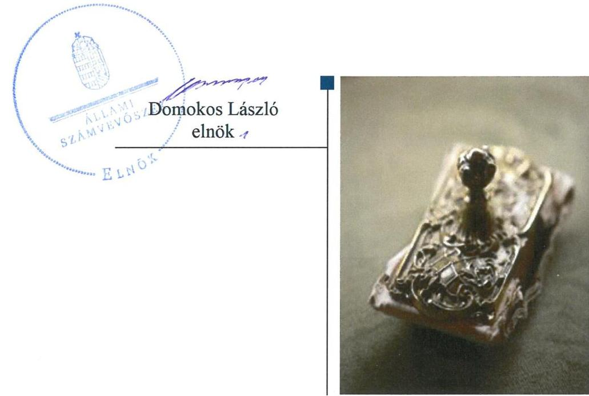
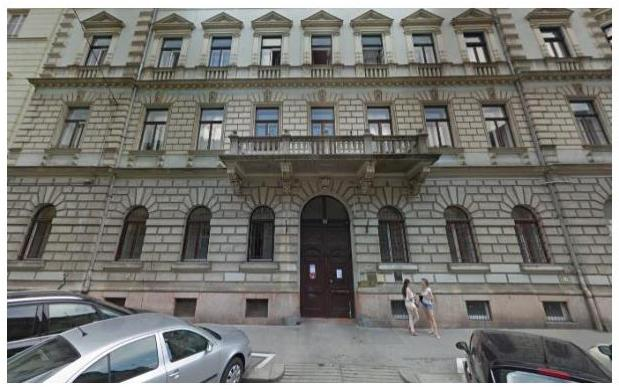

# Jelentés 

## Alapítványok ellenőrzése

Alapítványok gazdálkodásának ellenőrzése - Batthyány Lajos Alapítvány
2019.

---

# Jelentés 

## Alapítványok ellenőrzése

Alapítványok gazdálkodásának ellenőrzése - Batthyány Lajos Alapítvány
2019. 03. hó 05. nap

---

# AZ ELLENŐRZÉST FELÜGYELTE:

DR. BENEDEK MÁRIA felügyeleti vezető

## AZ ELLENŐRZÉST VEZETTE ÉS A VÉGREHAJTÁSÁÉRT FELELŐS:

DR. TÓTH VIKTÓRIA ellenőrzésvezető

## A PROGRAM ÖSSZEÁLLÍTÁSÁÉRT FELELŐS:

TÓTPÁL SZABOLCS osztályvezető

IKTATÓSZÁM: EL-0905-027/2019

TÉMASZÁM: 28

ELLENŐRZÉS-AZONOSÍTÓ SZÁM: V081902

Jelentéseink az Országgyűlés számítógépes hálózatán és az Interneta a www.asz.hu címen is olvashatóak.

---

# TARTALOMJEGYZÉK 

■ ÖSSZEGZÉS ..... 5
■ AZ ELLENŐRZÉS CÉLJA ..... 6
■ AZ ELLENŐRZÉS TERÜLETE ..... 7
■ AZ ELLENŐRZÉS HÁTTERE, INDOKOLTSÁGA ..... 8
■ A JELENTÉS LÉNYEGES KÉRDÉSKÖREI ..... 9
■ AZ ELLENŐRZÉS HATÓKÖRE ÉS MÓDSZEREI ..... 10
■ MEGÁLLAPÍTÁSOK ..... 12
■ JAVASLATOK ..... 15
■ MELLÉKLETEK ..... 17
I. sz. melléklet: Értelmező szótár ..... 17
■ FÜGGELÉKEK ..... 19
I. sz. függelék a jelentéstervezethez ..... 19
II. sz. függelék: Észrevételek ..... 20
■ RÖVIDÍTÉSEK JEGYZÉKE ..... 21

---

.

---

# ÖSSZEGZÉS 

A Batthyány Lajos Alapítvány gazdálkodásának szabályozottsága a 2017. évben szabályszerű volt. Éves beszámolási és közzétételi kötelezettségét a 2015-2017. években nem szabályszerűen teljesítette, így nem biztosította az elszámoltathatóságot, a gazdálkodás átláthatóságát. A 2015-2017. években a közpénzből kapott támogatások nyilvántartása megfelelt a jogszabályi előírásoknak.

## Az ellenőrzés társadalmi indokoltsága

Az alapítványok, mint az alapító által az alapító okiratban meghatározott tartós cél megvalósítására létrehozott jogi személyek tevékenységüket az alapító által juttatott vagyon kezelésével, felhasználásával látják el. Az alapítványok működésükre és szakmai tevékenységük ellátására költségvetési támogatásban vagy ingyenes vagyonjuttatásban részesülhetnek. Az Állami Számvevőszék stratégiájában megfogalmazta, hogy az államháztartáson kívülre nyújtott költségvetési támogatások és ingyenes vagyonjuttatások, valamint az államháztartáson kívül működő közfeladat-ellátó rendszerek ellenőrzéseivel hozzájárul ahhoz, hogy a közpénzeket az államháztartáson kívül működő szervezetek is átlátható, rendezett módon használják fel a közvagyon átlátható, hatékony, költségtakarékos működtetése, értékének megőrzése, állagának védelme, értéknövelő használata, hasznosítása és gyarapítása érdekében.

## Főbb megállapítások, következtetések, javaslatok

A Batthyány Lajos Alapítvány számviteli szabályzatai 2017. évben megfeleltek a jogszabályi előírásoknak.
A 2017. évi egyszerűsített éves beszámoló mérlegében az immateriális javakat, tárgyi eszközöket, befektetett pénzügyi eszközöket nem szabályszerűen mutatta ki, mivel jogszabályban előírtak ellenére a mérlegtételeket nem támasztotta alá leltárral, valamint nem rendelkezett a könyvviteli elszámolást közvetlenül és közvetetten alátámasztó számviteli bizonylatokkal.

A Batthyány Lajos Alapítvány jogszabályban előírtak ellenére a Kuratórium által el nem fogadott beszámolót helyezett letétbe a 2015. és a 2016. évet érintően. A 2015-2017. évi egyszerűsített éves beszámolókat és mellékleteit saját honlapján nem tette közzé, ezzel nem biztosította az átláthatóságot.

Az alapcél szerinti tevékenysége költségei, ráfordításai ellentételezésére kapott támogatásokról vezette a jogszabályban előírt elkülönített számviteli nyilvántartást.

Az államháztartási forrásból kapott támogatások felhasználásáról 2015-2017. években a támogatási szerződésekben előírt formában a támogatónak beszámolt.

Az Állami Számvevőszék az ellenőrzés megállapításai alapján a Batthyány Lajos Alapítvány Kuratóriuma elnökének négy javaslatot fogalmazott meg.

---

# AZ ELLENŐRZÉS CÉLJA 

Az ellenőrzés célja annak megállapítása volt, hogy a Batthyány Lajos Alapítvány gazdálkodása során biztosított volt-e az elszámoltathatóság és átláthatóság, valamint a közpénzből kapott támogatáshoz és az alapítvány által használt nemzeti vagyonhoz kapcsolódó nyilvántartások kialakítása, az előírt beszámolás, a nemzeti vagyon értékének megőrzése megfelelően történt-e.

---

# **AZ ELLENŐRZÉS TERÜLETE**

## **Batthyány Lajos Alapítvány**

Az Alapítványt^{1} 1991-ben alapította a Magyar Demokrata Fórum Barátainak Egyesülete tízmillió forint induló vagyonnal. Az Alapítvány nem közhasznú jogállású szervezet. Gazdasági-vállalkozási tevékenységet nem végzett. Felügyelőbizottság létrehozására nem volt kötelezett.

Az Alapítvány tevékenységei az Alapítvány célját elősegítő képzések szervezése, tehetséges fiatalok képzésének tudományos támogatása, tudományos kutatás útján a politikai fejlődés útjainak kidolgozása, információk cseréje, az európai egységtörekvések támogatása.

Az Alapítvány az ellenőrzött időszakban a költségvetési törvényben nevesített szervezet volt, működéséhez és feladatainak ellátásához a központi költségvetésből támogatásban részesült. Államháztartási forrásból kapott vagyonkezelt vagyona nem volt, államháztartásból ingyenesen juttatott vagyont nem kapott.

Az Alapítvány államháztartási forrásból 2015-2017. években mindöszszesen 1 024,7 millió Ft támogatást használt fel. Kizárólagos, vagy többségi nemzeti tulajdonú gazdasági társaságtól támogatást nem kapott. A 2015-2017. években felhasznált támogatásokat az 1. ábra szemlélteti.

1. ábra

|  A BATTHYÁNY LAJOS ALAPÍTVÁNY ÁLLAMHÁZTARTÁSI FORRÁSBÓL FELHASZNÁLT TÁMOGATÁSAI 2015-2017. ÉVEKBEN (millió Ft) |  |  |   |
| --- | --- | --- | --- |
|  Forrás | 2015. | 2016. | 2017.  |
|  Államháztartási forrásból | 260,2 | 364,5 | 400,0  |

*Forrás: 2015-2017. évi egyszerűsített éves beszámolók, Alapítvány adatszolgáltatása*

---

# AZ ELLENŐRZÉS HÁTTERE, INDOKOLTSÁGA 

Az alapítványok, mint az alapító által az alapító okiratban meghatározott tartós cél megvalósítására létrehozott jogi személyek tevékenységüket az alapító által juttatott vagyon kezelésével, felhasználásával látják el.

Társadalmi elvárás a közpénzek értékelvű, rendeltetésszerű felhasználása, a közpénzekből nyújtott támogatások átláthatóságának megteremtése, amelyhez az Állami Számvevőszék az államháztartásból, valamint a kizárólagos vagy többségi nemzeti tulajdonú gazdasági társaságtól kapott támogatás és az államháztartásból kapott vagyonjuttatás nyilvántartási, beszámolási, vagyonérték megőrzési kötelezettsége teljesítésének ellenőrzésével kíván hozzájárulni.

Az ÁSZ² célja, hogy az alapítványok gazdálkodása elszámoltathatóságának értékelésével hozzájáruljon ahhoz, hogy a társadalom objektív képet alkothasson az alapítványok működéséről. Az ÁSZ Stratégiában rögzített célkitűzése, hogy az államháztartáson kívülre nyújtott költségvetési támogatás és vagyonjuttatás ellenőrzésével hozzájáruljon ahhoz, hogy a közpénzeket a civil szervezetek is átlátható módon használják fel.

Az ellenőrzés eredményeinek célzott felhasználói a nyilvánosság/a jogalkotó, továbbá az alapítványok alapítói és szervei. Az ellenőrzés eredményeképp a törvényalkotás számára tapasztalatok állnak rendelkezésre az alapítványok gazdálkodása szabályozásához. Az ellenőrzött szervezetek szintjén gazdálkodásuk vonatkozásában a hiányosságok, szabálytalanságok feltárása, az ennek kapcsán megfogalmazott megállapítások elősegíthetik az alapítványok szabályszerű gazdálkodását. Az ellenőrzés a társadalom számára információt szolgáltat arról, hogy az alapítványok a közpénzek szabályszerű felhasználásának feltételeit kialakították-e, továbbá az ellenőrzés értékteremtő módon járul hozzá az ÁSZ stratégiai céljainak megvalósításához, a nyilvánosság megfelelő tájékoztatásához.

---

# A JELENTÉS LÉNYEGES KÉRDÉSKÖREI 

1. Szabályszerü volt-e az alapítványi gazdálkodás szabályozottsága?
2. Az alapítvány az éves beszámolási és közzétételi kötelezettségét szabályszerüen teljesitette?
3. Az államháztartásból kapott támogatás nyilvántartása, az elöirt beszámolás teljesitése megfelelő volt-e?

---

# AZ ELLENŐRZÉS HATÓKÖRE ÉS MÓDSZEREI 

## Az ellenőrzés típusa

Megfelelőségi ellenőrzés.

## Az ellenőrzött időszak

2015-2017. évek, amely kiterjedt a 2017. évi egyszerűsített éves beszámoló jóváhagyásának, közzétételének, valamint a támogatások elszámolásának tekintetében 2018. június 1-jéig.

## Az ellenőrzés tárgya

A szabályszerűségi ellenőrzés kiterjedt az alapítvány gazdálkodása elszámoltathatóságának, átláthatóságának biztosítása keretében a szervezeti, költségvetési keretek kialakításának, a gazdálkodás szabályozásának, az éves beszámolási, közzétételi kötelezettség teljesítésének ellenőrzésére. Kiterjedt továbbá a közpénzből kapott támogatással és az államháztartási forrásból kapott vagyonnal kapcsolatos nyilvántartási, beszámolási, vagyonmegőrzési kötelezettség teljesítésének ellenőrzésére.

A helyénvalósági ellenőrzés keretében elvégeztük az alapítvány - kizárólagos és többségi nemzeti tulajdonú gazdasági társaságtól kapott támogatással kapcsolatos - beszámolási kötelezettsége teljesítésének értékelését.

## Az ellenőrzött szervezet

Batthyány Lajos Alapítvány

## Az ellenőrzés jogalapja

Az ÁSZ tv. ${ }^{3} 1 . \S$ (3) bekezdése, 5. § (3) bekezdése, az Ectv. ${ }^{4}$ 47. §-a.

## Az ellenőrzés módszerei

Az ellenőrzést a program szempontjai, az ellenőrzött időszakban hatályos jogszabályok, a jelen ellenőrzésre irányadó ÁSZ módszertan figyelembe vételével és a nemzetközi standardokat irányadónak tekintve végeztük.

Az ellenőrzés ideje alatt az ellenőrzött szervezettel történő kapcsolattartás az ÁSZ SZMSZ5-ének vonatkozó előírásai alapján történt.

---

Az ellenőrzési kérdések megválaszolásához szükséges bizonyítékok megszerzése az ellenőrzött által rendelkezésre bocsátott dokumentumokra, adatokra alapozva megfigyelés, szemle (szemrevételezés), kérdésfeltevés (információkérés), valamint elemző eljárás útján történt. Az ellenőrzési bizonyítékként felhasználható adatforrások közé tartoztak egyrészt a program részletes szempontjainál felsorolt adatforrások, másrészt minden egyéb - az ellenőrzés folyamán - feltárt, az ellenőrzés szempontjából információt tartalmazó dokumentum.

Az ellenőrzés lefolytatásához az ellenőrzött a tanúsítványok kitöltésével, hitelesítésével és azok, valamint az ÁSZ által kért dokumentumok megküldésével szolgáltatott adatokat.

Az ellenőrzést a gazdálkodás szabályozottsága tekintetében 2017. évre, az éves beszámolási és közzétételi kötelezettség teljesítése, az államháztartásból és a nemzeti tulajdonú társaságtól kapott támogatás nyilvántartása, és az előírt beszámolás teljesítése tekintetében a 2015-2017. évekre folytattuk le.

---

# 1. Szabályszerú volt-e az alapítványi gazdálkodás szabályozottsága? 

Összegző megállapítás

Az alapítványi gazdálkodás szabályozottsága 2017. évben szabályszerű volt.
1.1. számú megállapítás

Az Alapítvány a 2017. évi költségvetési tervét nem a jogszabályi előírások szerint készítette el.

Az Alapítvány gazdálkodása kereteinek kialakításával kapcsolatosan feltárt hiányosságokat az 1. táblázat mutatja.

## AZ ALAPÍTVÁNY GAZDÁLKODÁSA KERETEINEK KIALAKÍTÁSÁVAL KAPCSOLATBAN FELTÁRT HIÁNYOSSÁGOK

Sorszám
Részmegállapítás
Megjegyzés

1. Az Alapítvány a 2017. évi költségvetési tervét nem a 479/2016. (XII. 28.) Korm. rendelet alapján készített beszámoló tartalmi elemeinek megfelelően készítette el az Ecvhr. ${ }^{6}$ 3. § (1) bekezdésében előírtak ellenére.

Forrás: ÁSZ
1.2. számú megállapítás

Az Alapítvány rendelkezett a számviteli törvényben előírt szabályzatokkal.

Az Alapítvány 2017. évben rendelkezett a Számv. tv.-ben ${ }^{7}$ előírt számviteli politikával ${ }^{8}$, számlarenddel ${ }^{9}$, a Számv. tv. 14. § (5) bekezdés a), b) és d) pontjaiban előírt eszközök és források leltárkészítési és leltározási szabályzatával ${ }^{10}$, eszközök és források értékelési szabályzatával ${ }^{11}$ és pénzkezelési szabályzattal ${ }^{12}$.

## 2. Az alapítvány az éves beszámolási és közzétételi kötelezettségét szabályszerűen teljesítette?

Összegző megállapítás
Az Alapítvány éves beszámolási és közzétételi kötelezettségének teljesítése a 2015-2017. években nem volt szabályszerű.
2.1. számú megállapítás

Az alapítvány az ellenőrzött időszakban nem szabályszerűen készítette el a beszámolóit.

Az Alapítvány beszámolási kötelezettségének teljesítésével kapcsolatosan feltárt hiányosságokat a 2. táblázat mutatja.

---

# AZ ALAPÍTVÁNY BESZÁMOLÁSI KÖTELEZETTSÉGE TELJESÍTÉSÉVEL KAPCSOLATBAN FELTÁRT HIÁNYOSSÁGOK 

| Sorszám | Részmegállapítás | Megjegyzés |
| :--: | :--: | :--: |
| 1. | Az Alapítvány a beszámoló elkészítéséhez, a mérleg tételeinek alátámasztásához nem állított össze leltárt a Számv. tv. 69. § (1) bekezdésében foglalt előírás ellenére, ezért nem volt szabályszerű az Alapítvány 2017. évi beszámolójának mérlegében az immateriális javak, tárgyi eszközök, befektetett pénzügyi eszközök értékének kimutatása. | A leltározási szabályzat 3. és 4. oldalán, 6. oldal 3. pontjában, 5.1. pontjában és a mellékleteiben előírtak ellenére a leltározást a szabályzatban előírt leltározási utasítással nem rendelték el. |
| 2. | Az Alapítvány a Számv. tv. 165. § (1)-(2) bekezdéseiben foglalt előírások ellenére nem rendelkezett a könyvviteli elszámolást közvetlenül és közvetetten alátámasztó számviteli bizonylatokkal, ideértve a részletező nyilvántartásokat is, a számviteli (könyvviteli) nyilvántartásokba bizonylatok nélkül jegyeztek be adatokat, ezért nem volt szabályszerű az Alapítvány 2017. évi beszámolójának mérlegében az immateriális javak, tárgyi eszközök, befektetett pénzügyi eszközök értékének kimutatása. |  |
| 3. | A Kuratórium ${ }^{13}$ a 2015. és 2016. évi egyszerűsített éves beszámolót nem fogadta el az Ectv. 30. § (1) bekezdésében előírt határidőre. | A Kuratórium a 2015. évi egyszerűsített éves beszámolót a 2016. július 8-i ülésén, a 2016. évi egyszerűsített éves beszámolót a 2018. január 2-i ülésén fogadta el. |

Forrás: ÁSZ

A Kuratórium az Alapítvány 2017. évről készített egyszerűsített éves beszámolóját az Ectv. szerinti határidőben elfogadta.

## 2.2. számú megállapítás

Az egyszerűsített éves beszámoló és mellékletei közzététele nem felelt meg a jogszabályi előírásoknak.

Az Alapítvány közzétételi kötelezettségének teljesítésével kapcsolatosan feltárt hiányosságokat a 3. táblázat mutatja.
3. táblázat

## AZ ALAPÍTVÁNY KÖZZÉTÉTELI KÖTELEZETTSÉGE TELJESÍTÉSÉVEL KAPCSOLATBAN FELTÁRT HIÁNYOSSÁGOK

| Sorszám | Részmegállapítás | Megjegyzés |
| :--: | :--: | :--: |
| 1. | A 2015. évi egyszerűsített éves beszámolót az Ectv. 30. § (1) bekezdésében foglalt előírás ellenére nem helyezték letétbe a törvény szerinti határidőben. | A letétbe helyezés a törvényben előírt határidőhöz képest 30 nap késedelemmel (2016. június 30-án) történt. |
|  | A 2016. évi egyszerűsített éves beszámolót az Ectv. 30. § (1) bekezdés ellenére nem helyzeték letétbe a törvény szerinti határidőben. | A letétbe helyezés a törvényben előírt határidőhöz képest 26 nap késedelemmel (2017. június 26-án) történt. |
| 2. | Az Alapítvány az ellenőrzött időszakban az egyszerűsített éves beszámolókat és mellékleteit saját honlapján nem tette közzé az Ectv. 30. § (1) és (4) bekezdéseiben foglalt előírás ellenére. |  |
| 3. | Az Alapítvány a Kuratórium által el nem fogadott beszámolót helyezett letétbe a 2015. és a 2016. évet érintően, az Ectv. 30. § (1) bekezdésében foglalt előírás ellenére. |  |

Forrás: ÁSZ

Az Alapítvány 2017. évi egyszerűsített éves beszámolóját a törvény szerinti határidőben letétbe helyezték.

---

# 3. Az államháztartásból kapott támogatás nyilvántartása, az előírt beszámolás teljesítése megfelelő volt-e? 

## Összegző megállapítás

3.1. számú megállapítás
3.2. számú megállapítás

A támogatások nyilvántartása a 2015-2017. években szabályszerű volt.

Az államháztartási forrásból kapott támogatásokkal kapcsolatosan vezetett nyilvántartás megfelelt a jogszabályi előírásoknak.

Az Alapítvány az Ectv. 20. § (4) bekezdésében előírtak szerint az alapcél szerinti tevékenysége költségei, ráfordításai ellentételezésére kapott támogatásokról olyan elkülönített számviteli nyilvántartást vezetett, amelyekből támogatásonként megállapítható a kapott támogatás felhasználása.

Az Alapítvány az államháztartási forrásból kapott támogatások felhasználásáról az előírt formában és határidőben beszámolt.

Az államháztartási forrásból kapott támogatások felhasználására kötött támogatási szerződések tartalmazták szakmai és pénzügyi beszámoló benyújtását a támogatónak. Az Alapítvány az államháztartási forrásból kapott támogatások felhasználásáról az előírt formában és határidőben beszámolt.

---

# JAVASLATOK 

Az ÁSZ tv. 33. § (1) bekezdésében foglaltak értelmében az ellenőrzött szervezet vezetője köteles a jelentésben foglalt megállapításokhoz kapcsolódó intézkedési tervet összeállítani és azt a jelentés kézhezvételétől számított 30 napon belül az ÁSZ részére megküldeni. Amennyiben az ellenőrzött szervezet vezetője nem küldi meg határidőben az intézkedési tervet, vagy továbbra sem elfogadható intézkedési tervet küld, az Állami Számvevőszék elnöke az ÁSZ tv. 33. § (3) bekezdése a) és b) pontjaiban foglaltakat érvényesítheti.

## A Kuratórium elnökének

1. Intézkedjen az Ecvhr.-ben elöirtak szerint az Alapítvány éves költségvetési terve - a 479/2016 (XII.28.) Korm rendelet alapján készített beszámoló tartalmi elemeinek - megfelelő elkészitéséről.
(1. táblázat 1. sz. megállapítás alapján)
2. Intézkedjen a Számv. tv. elöirásának megfelelően a beszámoló készitéséhez, az immateriális javak, tárgyi eszközök, befektetett pénzügyi eszközök mérleg tételeinek alátámasztásához leltár összeállításáról.
(2. táblázat 1. sz. megállapítás alapján)
3. Intézkedjen a Számv. tv. elöirásának megfelelően arról, hogy
a) minden gazdasági müveletről, eseményről, amely az eszközök, illetve az eszközök forrásainak állományát vagy összetételét megváltoztatja, bizonylatot kerüljön kiállításra, a gazdasági müveletek (események) folyamatát tükröző összes bizonylat adatait a könyvviteli nyilvántartásokban rögzitsék,
b) a számviteli (könyvviteli) nyilvántartásokba csak szabályszerűen kiállított bizonylat alapján kerüljenek adatok bejegyezésre.
(2. táblázat 2. sz. megállapítás alapján)
4. Intézkedjen az Ectv. elöirása szerint az Alapítvány - Kuratóriuma által elfogadott - beszámolója közzétételéről saját honlapján is.
(3. táblázat 2. sz. megállapítás alapján)

---

.

---

# MELLÉKLETEK 

## I. SZ. MELLÉKLET: ÉRTELMEZŐ SZÓTÁR

alapítvány
államháztartás
költségvetési támogatás
gazdasági-vállalkozási tevékenység
közhasznú tevékenység
nemzeti tulajdonú gazdasági társaság

Az alapítvány az alapító által az alapító okiratban meghatározott tartós cél folyamatos megvalósítására létrehozott jogi személy. Az alapító az alapító okiratban meghatározza az alapítványnak juttatott vagyont és az alapítvány szervezetét. Alapítvány nem alapítható gazdaságivállalkozási tevékenység folytatására. Az alapítvány az alapítványi cél megvalósításával közvetlenül összefüggő gazdasági tevékenység végzésére jogosult. Alapítvány nem lehet korlátlan felelősségű tagja más jogalanynak, nem létesíthet alapítványt és nem csatlakozhat alapítványhoz. (Forrás: Ptk. 3:378§, 3:379. §(I)-(3) bekezdés)
az államháztartás a közfeladatok ellátásának egységes S2ervezeti, tervezési, gazdálkodási, ellenőrzési, finanszírozási, adatszolgáltatási és beszámolási szabályok szerint működő rendszere, amely központi és önkormányzati alrendszerből áll.
Az államháztartás központi alrendszerébe tartozik az állam, a központi költségvetési szerv, a törvény által az államháztartás központi alrendszerébe sorolt köztestület, és ezen köztestület által irányított köztestületi költségvetési szerv.
Az államháztartás önkormányzati alrendszerébe tartozik a helyi önkormányzat, a helyi nemzetiségi önkormányzat és az országos nemzetiségi önkormányzat, a Mötv. és a nemzetiségek jogairól szóló 2011. évi CLXXIX. törvény szerint létrehozott társulás, valamint a területfejlesztésről és a területrendezésről szóló törvény alapján létrejött területfejlesztési önkormányzati társulás, a térségi fejlesztési tanács, és a megnevezett szervezetek által irányított költségvetési szerv. (Forrás: Áht. 2-3. §)
az államháztartás alrendszerei terhére nyújtott pénzbeli vagy nem pénzbeli juttatás, amelyet a támogató nem elsősorban ellenszolgáltatás ellenében, de konkrét program megvalósítása vagy meghatározott időszakban a támogatott szervezet müködtetése érdekében nyújt. Költségvetési támogatás különösen: a pályázat útján, valamint egyedi döntéssel kapott költségvetési támogatás; az Európai Unió strukturális alapjaiból, illetve a Kohéziós Alapból származó, a költségvetésből juttatott támogatás; az Európai Unió költségvetéséből vagy más államtól, nemzetközi szervezettől származó támogatás és a személyi jövedelemadó meghatározott részének az adózó rendelkezése szerint felajánlott összege. (Forrás: Ectv. 2. § 15. pont)
A jövedelem- és vagyonszerzésre irányuló vagy azt eredményező, üzletszerűen végzett gazdasági tevékenység, kivéve az adomány (ajándék) elfogadását, a létesítő okiratban meghatározott cél szerinti tevékenységet (ideértve a közhasznú tevékenységet is), - 2015. november 28-tól - a pénzeszközök betétbe, értékpapírba, társasági részesedésbe történő elhelyezését és az ingatlan megszerzését, használatának átengedését és átruházását. (Forrás: Ectv. 2. § 11. pont)
minden olyan tevékenység, amely a létesítő okiratban megjelölt közfeladat teljesítését közvetlenül vagy közvetve szolgálja, ezzel hozzájárulva a társadalom és az egyén közös szükségleteinek kielégítéséhez. (Forrás: Ectv. 2. § 20. pont)
állami és önkormányzati tulajdonú gazdasági társaság. (Forrás: Nvtv. ${ }^{14}$ 1. § (1) bekezdése)

---

.

---

# FÜGGELÉKEK 

- I. SZ. FÜGGELÉK A JELENTÉSTERVEZETHEZ

Az Állami Számvevőszék az ellenőrzések során feltárt tényekhez kapcsolódó további körülmények tisztázására eszközrendszerrel nem rendelkezik. Amennyiben indokoltnak látszik az ellenőrzés során feltárt körülmények további vizsgálata, az Állami Számvevőszék törvényi felhatalmazás alapján az ellenőrzés által feltárt körülményeket továbbítja a hatáskörrel rendelkező szervnek a szükséges intézkedések megtétele, eljárások lefolytatása érdekében.
A Kuratórium a 2015. és 2016. évi egyszerüsített éves beszámolót nem fogadta el az Ectv. 30. § (1) bekezdésében előirt határidőre. A 2015. és a 2016. évi egyszerüsített éves beszámolót az Ectv. 30. § (1) bekezdés ellenére nem helyzeték letétbe a törvény szerinti határidőben. Az Alapítvány a Kuratórium által el nem fogadott beszámolót helyezett letétbe a 2015. és a 2016. évet érintően, az Ectv. 30. § (1) bekezdésével ellentétben.
Az Alapítvány a beszámoló elkészitéséhez, a mérleg tételeinek alátámasztásához nem állított össze leltárt a Számv. tv. 69. § (1) bekezdés ellenére, ezért nem volt szabályszerű az Alapítvány 2017. évi beszámolójának mérlegében az immateriális javak, tárgyi eszközök, befektetett pénzügyi eszközök értékének kimutatása. Az Alapítvány a Számv. tv. 165. § (1)(2) bekezdése ellenére nem rendelkezett a könyvviteli elszámolást közvetlenül és közvetetten alátámasztó számviteli bizonylatokkal, ideértve a részletező nyilvántartásokat is, a számviteli (könyvviteli) nyilvántartásokba bizonylatok nélkül jegyeztek be adatokat, ezért nem volt szabályszerű az Alapítvány 2017. évi beszámolójának mérlegében az immateriális javak, tárgyi eszközök, befektetett pénzügyi eszközök értékének kimutatása. Ez felveti, hogy az Alapítvány nem biztositotta a Számv. tv. 15. § (3) bekezdésében előirt valódiság elvét.
A fent leírtak miatt a civil szervezetek birósági nyilvántartásáról és az ezzel összefüggő eljárási szabályokról szóló 2011. évi CLXXXI. törvény 71/C. § (1) bekezdés d) pontja és 71/A. § (4) bekezdése alapján a Fővárosi Törvényszék megkeresése indokolt.

---

A jelentéstervezetet a Számvevőszék 15 napos észrevételezésre megküldte az ellenőrzött szervezetek vezetőinek az ÁSZ tv. 29. §* (1) bekezdése előirásának megfelelően.

Az ellenőrzött szervezet vezetője az ÁSZ tv. 29. § (2) bekezdésében foglalt észrevételezési jogával nem élt, a jelentéstervezetre észrevételt nem tett.

[^0]
[^0]:    * 29. § (1) Az Állami Számvevőszék az ellenőrzési megállapításait megküldi az ellenőrzött szervezet vezetőjének vagy az általa megbízott személynek, és annak, akinek személyes felelősségét állapította meg.
    (2) Az ellenőrzött szervezet vezetője és a felelősként megjelölt személy az ellenőrzés megállapításaira tizenöt napon belül írásban észrevételt tehet.
    (3) Az Állami Számvevőszék az észrevételre a beérkezésétől számított harminc napon belül írásban válaszol. A figyelembe nem vett észrevételeket köteles a jelentésben feltüntetni, és megindokolni, hogy azokat miért nem fogadta el.

---

# RÖVIDÍTÉSEK JEGYZÉKE 

${ }^{1}$ Alapítvány
${ }^{2}$ ÁSZ
${ }^{3}$ ÁSZ tv.
${ }^{4}$ Ectv.
${ }^{5}$ ÁSZ SZMSZ
${ }^{6}$ Ecvhr.
${ }^{7}$ Számv.tv.
${ }^{8}$ számviteli politika
${ }^{9}$ számlarend
${ }^{10}$ eszközök és források leltárkészítési és leltározási szabályzata
${ }^{11}$ eszközök és források értékelési szabályzata
${ }^{12}$ pénzkezelési szabályzat
${ }^{13}$ Kuratórium
${ }^{14}$ Nvtv.

Batthyány Lajos Alapítvány
Állami Számvevőszék
2011. évi LXVI. törvény az Állami Számvevőszékről
2011. évi CLXXV. törvény az egyesülési jogról, a közhasznú jogállásról, valamint a civil szervezetek müködéséről és támogatásáról
Állami Számvevőszék Szervezeti és Müködési Szabályzata
350/2011. (XII. 30.) Korm. rendelet a civil szervezetek gazdálkodása, az adománygyűjtés és a közhasznúság egyes kérdéseiről
2000. évi C. törvény a számvitelről
a Batthyány Lajos Alapítvány számviteli politikája (hatályos 2016. július 8-tól)
a Batthyány Lajos Alapítvány számlarendje (hatályos 2016. július 8-tól)
a Batthyány Lajos Alapítvány eszközök és források leltárkészítési és leltározási szabályzata (hatályos 2016. július 8-tól)
a Batthyány Lajos Alapítvány eszközök és források értékelési szabályzata (hatályos 2016. július 8-tól)
a Batthyány Lajos Alapítvány pénzkezelési szabályzata (hatályos 2016. március 30-tól)
a Batthyány Lajos Alapítvány ügyvezető szerve
2011. évi CXCVI. törvény a nemzeti vagyonról

---

# ÁLLAMI SZÁMVEVŐSZÉK 

1052 Budapest, Apáczai Csere János utca 10.
Levélcím: 1364 Budapest 4. Pf. 54
Telefon: +36 14849100 Telefax: +36 14849200
www.asz.hu