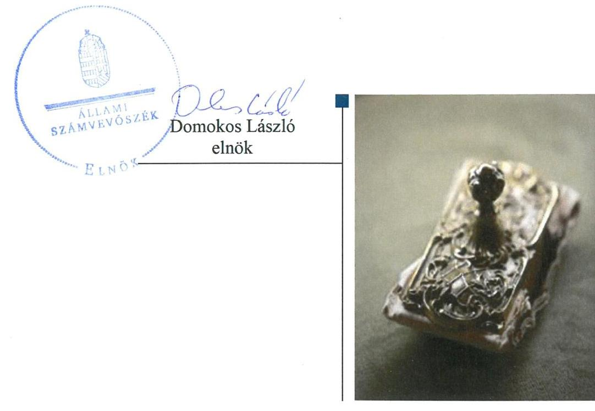
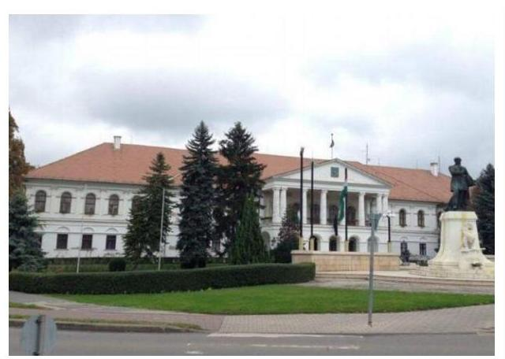
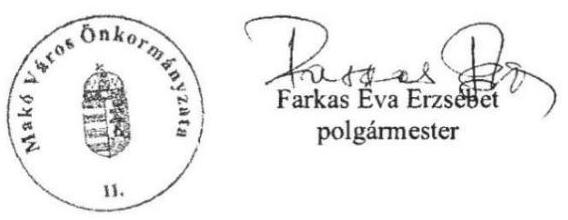
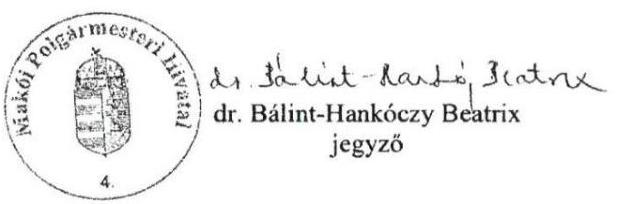

# Jelenetés 

## Utóellenőrzések

Az önkormányzatok pénzügyi és vagyongazdálkodása szabályszerűségének ellenőrzése - Makó Város Önkormányzata 2019.

---

# Jelentés 

## Utóellenőrzések

Az önkormányzatok pénzügyi és vagyongazdálkodása megfelelőségének utóellenőrzése - Makó Város Önkormányzata
2019. 02. hó 24. nap

---

# AZ ELLENŐRZÉST FELÜGYELTE: 

DR. NAGY IMRE felügyeleti vezető

## AZ ELLENŐRZÉST VEZETTE ÉS A VÉGREHAJTÁSÁÉRT FELELŐS:

MOLNÁR ZSUZSANNA ellenőrzésvezető

## A PROGRAM ÖSSZEÁLLÍTÁSÁÉRT FELELŐS:

TÓTPÁL SZABOLCS osztályvezető

## A TÉMÁHOZ KAPCSOLÓDÓ KORÁBBI SZÁMVEVŐSZÉKI JELENTÉSEK:

- címe: Az önkormányzatok pénzügyi és vagyongazdálkodása - Makó Város Önkormányzata
- sorszáma: 16108

Jelentéseink az Országgyúlés számítógépes hálózatán és az Interneten a www.asz.hu címen is olvashatóak.

IKTATÓSZÁM: EL-0216-023/2019
TÉMASZÁM: 2460
ELLENŐRZÉS-AZONOSÍTÓ SZÁM: V-0755132

---

# TARTALOMJEGYZÉK 

■ ÖSSZEGZÉS ..... 5
■ AZ ELLENŐRZÉS CÉLJA ..... 6
■ AZ ELLENŐRZÉS TERÜLETE ..... 7
■ AZ ELLENŐRZÉS HÁTTERE, INDOKOLTSÁGA ..... 8
■ A JELENTÉS LÉNYEGES KÉRDÉSKÖRE ..... 9
■ AZ ELLENŐRZÉS HATÓKÖRE ÉS MÓDSZEREI ..... 10
■ MEGÁLLAPÍTÁSOK ..... 12
■ MELLÉKLETEK ..... 15
I. sz. melléklet: Makó Város Önkormányzata intézkedési tervének végrehajtása ..... 15
II. sz. melléklet: Makó Város Önkormányzata intézkedési terve ..... 21
■ FÜGGELÉK: ÉSZREVÉTELEK ..... 29
■ RÖVIDÍTÉSEK JEGYZÉKE ..... 35

---

.

---

# ÖSSZEGZÉS 

Az utóellenőrzés megállapította, hogy Makó Város Önkormányzata az intézkedési tervben meghatározott feladatok felét hajtotta végre határidőben. A nem végrehajtott intézkedések növelték a belső kontroll és a szervezeti integritás területén a kockázatokat, ezáltal továbbra sem volt biztositott a felelős vagyongazdálkodás.

## Az ellenőrzés társadalmi indokoltsága

Az Állami Számvevőszék stratégiájában célul tűzte ki a számvevőszéki munka hasznosulásának javítását. Ezzel összhangban ellenőrzi, hogy az ellenőrzött szervezet megvalósította-e a korábbi ellenőrzései által feltárt hibák, hiányosságok és szabálytalanságok megszüntetése céljából elkészített intézkedési tervében foglaltakat. A rendszeres utóellenőrzések hozzájárulnak a szükséges intézkedések tényleges végrehajtásához, ezáltal a közpénzügyek rendezettségének javulásához.

## Főbb megállapítások, következtetések

Makó Város Önkormányzata intézkedési tervében meghatározott húsz feladatból nyolc feladatot határidőben, egy feladatot határidőn túl hajtottak végre, három feladat végrehajtására részben került sor, hét feladatot nem hajtottak végre. Egy feladat végrehajtása okafogyottá vált.

Nem intézkedtek a számvevőszéki jelentésben feltárt hiányosságok, szabálytalanságok miatti munkajogi felelősség tisztázása érdekében, gyengítve ezzel a szervezeti integritást.

A pénzügyi egyensúlyi helyzet alakulásával, ezen belül a szállítói tartozás állománnyal összefüggő kockázatok minősítésének elmaradása, továbbá a követelések értékelésének egyedi minősítése során a döntési jogosultsággal rendelkező személyi kör meghatározásának elmaradása gyengítette az Önkormányzat belső kontrollrendszerét, melynek következtében a belső kontrollok szerinti elszámoltathatóság területén nőtt a kockázat.

A vagyongazdálkodás szabályszerű működtetése érdekében meghatározott intézkedéseket - a vagyonkezelői jog ellenértékének rendeletben történő meghatározása kivételével - a felelősök nem hajtották végre. Ezáltal továbbra sem volt biztosított a felelős vagyongazdálkodás.

A szabályozottság - az SZMSZ, a kockázatkezelési szabályzat, valamint a leltározási és selejtezési szabályzat - jogszabályi előírásoknak megfelelő kialakításával javult, a szabályozottság hiányból adódó kockázat csökkent.

A pénzügyi gazdálkodás szabályszerűsége érdekében vállalt feladatokat határidőben végrehajtották, ezáltal a pénzügyi elszámoltathatóság javult.

A jegyző nem gondoskodott a feladatok végrehajtásának jogszabályi előírás szerinti nyilvántartásáról, ezzel nem biztosította a feladatok végrehajtásának nyomon követhetőségét.

---

# AZ ELLENŐRZÉS CÉLJA 

Az ellenőrzés célja annak értékelése volt, hogy a számvevőszéki jelentésben ${ }^{1}$ foglalt intézkedést igénylő megállapításokkal összhangban készített intézkedési tervben meghatározott feladatokat az ellenőrzött szervezet vég-rehajtotta-e.

---

# AZ ELLENŐRZÉS TERÜLETE 

## Makó Város Önkormányzata

Makó város Csongrád megyében, a makói járásban található. Területe $229,23 \mathrm{~km}^{2}$, állandó lakosainak száma a $\mathrm{KSH}^{2}$ által közzétett adatok szerint 2017. január 1-jén 22546 fő volt.

A polgármester ${ }^{3}$ a 2014. évi önkormányzati választások óta - 2014. október 12-étől - töltötte be hivatalát, a jegyző ${ }^{4}$ 2015. január 1-jétől látta el feladatait.

Az Önkormányzat ${ }^{5}$ 2016. évi költségvetésének végrehajtásáról szóló rendelete szerint 4233,8 millió Ft költségvetési bevételt ért el, valamint 3944,4 millió Ft költségvetési kiadást teljesített. Az éves költségvetési beszámoló mérlegének főöszszege 2016. december 31-én 41 399,8 millió Ft, ezen belül a nemzeti vagyonba tartozó befektetett eszközök állományának értéke 39 269,5 millió Ft volt.

Az ÁSZ ${ }^{6}$ az Önkormányzat pénzügyi és vagyongazdálkodása megfelelőségének ellenőrzéséről - a 2011. január 1. és 2014. december 31. közötti időszakra vonatkozóan - készített 16108. számú számvevőszéki jelentését 2016. július 27-én tette közzé.

A számvevőszéki jelentés a polgármester számára négy, a jegyzőnek tizenhat intézkedést igénylő megállapítást fogalmazott meg. A polgármester az ÁSZ Elnökének 2016. október 27-én küldte meg a 340/2016. (X.26.) számú közgyűlési határozattal elfogadott intézkedési tervet.

---

# AZ ELLENŐRZÉS HÁTTERE, INDOKOLTSÁGA 

Az ÁSZ tv. ${ }^{7}$ 33. § (1) bekezdése értelmében a számvevőszéki jelentések intézkedést igénylő megállapításaihoz és javaslataihoz kapcsolódóan az ellenőrzött szervezet vezetője intézkedési tervet köteles összeállítani, és az Állami Számvevőszék részére megküldeni.

Az intézkedési tervben foglaltak megvalósítását - az ÁSZ törvény 33. § (7) bekezdésében foglaltak alapján - az Állami Számvevőszék utóellenőrzés keretében ellenőrizheti. Az utóellenőrzések keretében - az intézkedések értékelése során - az Állami Számvevőszék figyelembe veszi az ellenőrzött szervezetek működési feltételeiben, valamint a jogszabályi előírásokban bekövetkezett változásokat.

Az utóellenőrzés során az ÁSZ értékeli, hogy az érintett számvevőszéki jelentésben foglalt intézkedést igénylő megállapításokkal és javaslatokkal összhangban, az ellenőrzött szervezet által készített intézkedési tervben meghatározott feladatokat a feladatra kijelöltek végrehajtották-e.

Az intézkedések végrehajtásával az adott terület szabályszerű múködése vonatkozásában a kockázatok csökkenhetnek, azonban hosszabb távon az intézkedési tervben foglaltak végrehajtásával önmagában nem szűnnek meg, csak akkor, ha beépülnek az ellenőrzött szervezet múködésébe, azokat folyamatosan karban tartják, figyelembe véve, illetve kezelve a változásokat. Emellett az intézkedések végrehajtásáig újabb kockázatok merülhetnek fel a szabályszerű múködés vonatkozásában, amelyek kezelése szintén kiemelten fontos az ellenőrzött szervezet számára.

Az ellenőrzött szervezet vezetője által készített intézkedési tervekben foglalt feladatok hiányos, illetve késedelmes végrehajtása, vagy annak elmaradása a szabályszerűség és a felelős vezetői magatartás vonatkozásában kockázatot hordoz, ami azt mutatja, hogy az ellenőrzések során feltárt hibák, hiányosságok és szabálytalanságok kezelése nem kapott kellő hangsúlyt. Az utóellenőrzés során is fennálló szabálytalanságok esetén a közpénz, közvagyon veszélyeztetettségi kockázat valószínűsített hatásának értékelése további intézkedéseket vonhat maga után.

Az ellenőrzött szervezet szintjén az utóellenőrzés feltárja, hogy a szervezet az intézkedések végrehajtásával hasznosította-e a korábbi ellenőrzési jelentésben a hiányosságok megszüntetése, illetve a kockázatok kezelése érdekében megfogalmazott javaslatokat, illetve az intézkedések végrehajtása elmaradásának következtében továbbra is fennálló szabálytalanság esetén értékeli a közpénzek, közvagyon veszélyeztetettségét.

Az ÁSZ szintjén az utóellenőrzés visszacsatolást ad az ellenőrzési jelentések hasznosulásáról, az intézkedések elmaradásának, vagy részleges megvalósulásának a közpénzek, közvagyon veszélyeztetettségére gyakorolt valószínűsített hatásának értékelése további intézkedéseket vonhat maga után.

---

# A JELENTÉS LÉNYEGES KÉRDÉSKÖRE 

Az Önkormányzat az intézkedési tervben foglaltakat az elöirt határidőben végrehajtotta-e?

---

# AZ ELLENŐRZÉS HATÓKÖRE ÉS MÓDSZEREI 

## Az ellenőrzés típusa

Megfelelőségi ellenőrzés.

## Az ellenőrzött időszak

Az utóellenőrzés alapját képező számvevőszéki jelentés közzétételének napjától az ellenőrzésről szóló kiértesítő levél keltének napjáig tartó időszak. (2016. július 27. - 2018. július 4.)

## Az ellenőrzés tárgya

Az ÁSZ tv. 2011. július 1-jei hatálybalépését követően a számvevőszéki jelentésben foglalt intézkedést igénylő megállapításokkal összhangban - az Önkormányzat által - készített Intézkedési tervben foglaltak végrehajtásának ellenőrzése.

## Az ellenőrzött szervezet

Makó Város Önkormányzata.

## Az ellenőrzés jogalapja

Az ellenőrzés jogszabályi alapját az ÁSZ tv. 33. § (7) bekezdése képezi.

## Az ellenőrzés módszerei

Az ellenőrzést az ellenőrzött időszakban hatályos jogszabályok, az ellenőrzés szakmai szabályai, a jelen ellenőrzésre irányadó ÁSZ módszertanok, az ellenőrzési programban foglalt értékelési szempontok szerint végeztük.

Az ellenőrzés ideje alatt az ellenőrzöttel történő kapcsolattartást az ÁSZ SZMSZ ${ }^{8}$ - ének vonatkozó előírásai alapján biztosítottuk.

Az utóellenőrzés megállapításait az ÁSZ rendelkezésére álló, valamint az ÁSZ adatbekérése szerint, az ellenőrzött által rendelkezésre bocsátott dokumentumok alapozták meg.

Az ellenőrzési bizonyítékként felhasználható adatforrások közé tartoztak egyrészt az ellenőrzési program részletes szempontjainál felsorolt adatforrások, másrészt minden - az ellenőrzés folyamán feltárt, az ellenőrzés szempontjából információt tartalmazó dokumentum.

---

Az intézkedési tervekben előírt feladatokat azok végrehajthatósága, illetve végrehajtása szempontjából az alábbiak szerint értékeltük:
$\longrightarrow$ „határidőben végrehajtott" a feladat, ha a teljesítés dokumentáltan, az intézkedési tervben előírt határidőben és tartalommal megtörtént;
$\longrightarrow$ „határidőn túl végrehajtott" a feladat, ha annak teljesítése az intézkedési tervben meghatározott módon, de az előírt határidőn túl történt meg;
$\longrightarrow$ „részben végrehajtott" a feladat, ha végrehajtása teljes körűen az intézkedési tervben előírt módon nem történt meg;
$\longrightarrow$ „nem végrehajtott" a feladat, ha a végrehajtás nem történt meg, vagy amennyiben a teljesítést nem dokumentálták;
$\longrightarrow$ „okafogyottá vált" a feladat, ha végrehajtására - meghatározott esemény bekövetkezése, továbbá külső körülmény, a működést érintő feltétel változása miatt - már nincs szükség, illetve lehetőség, és egyértelműen megállapítható, hogy az intézkedést szükségessé tevő körülmény a jövőben nem fordulhat elő;
$\longrightarrow$ „nem időszerü" az a feladat, amelynek ellenőrzési időszakon belüli végrehajtására azért nem került (kerülhetett) sor, mert az intézkedés alapjául szolgáló esemény nem következett be, de annak jövőbeni előfordulása lehetséges, a végrehajtása nem volt esedékes, vagy a végrehajtás határideje még nem járt le.
Az ellenőrzés lefolytatásához az ellenőrzött a tanúsítványok elektronikus kitöltésével, valamint az ÁSZ által kért dokumentumok elektronikus megküldésével szolgáltatott adatokat, amelyek valódiságát és teljes körűségét az ellenőrzött szervezet vezetője által tett teljességi és hitelességi nyilatkozat igazolja. Az így rendelkezésre bocsátott adatok, információk kontrollja az ellenőrzés keretében megtörtént.

---

# MEGÁLLAPÍTÁSOK 

## Az Önkormányzat az intézkedési tervben foglaltakat az előírt határidőben végrehajtotta-e?

Összegző megállapítás

Az Önkormányzat az intézkedési tervben vállalt feladatok jelentős részét nem hajtotta végre határidőben. Az intézkedési tervben meghatározott feladatok végrehajtásáról nem az előírás szerint vezették a nyilvántartást.

Az Önkormányzat az általa elkészített intézkedési tervben meghatározott húsz feladatból hetet nem hajtott végre, hármat részben, egyet pedig határidőn túl teljesített. Határidőben nyolc feladat került végrehajtásra, egy feladat végrehajtása okafogyottá vált.

A feladatokat, határidőket, megjelölt felelősöket és a feladatok végrehajtását az I. sz. melléklet mutatja be.

A jegyző nem gondoskodott a feladatok végrehajtásának Bkr. ${ }^{9}$ szerinti nyilvántartásáról.

AZ INTEGRITÁS érvényesülését gyengítette az Önkormányzatnál a munkajogi felelősség tisztázásának elmaradása a számvevőszéki jelentésben foglalt hiányosságok, szabálytalanságok vonatkozásában. (19.)

## A BELSŐ KONTROLLOK SZERINTI ELSZÁMOL-

TATHATÓSÁG kockázata emelkedett azáltal, hogy a pénzügyi gazdálkodás szabályszerűsége és a pénzügyi egyensúly biztosítása érdekében kialakított kockázatkezelési rendszert - a Bkr. 7. § (1), illetve (2) bekezdésében foglaltak ellenére - nem múködtették, nem mérték fel a költségvetési szerv tevékenységében rejlő és szervezeti célokkal összefüggő kockázatokat, így az intézkedési tervben meghatározottak ellenére nem minősítették a pénzügyi egyensúlyi helyzet alakulásával, ezen belül a szállítói tartozás állománnyal összefüggő kockázatokat. (11.) Az eszközök és források értékelési szabályzatában a követelések értékelésének egyedi minősítése során - a Bkr. 6. § (1) bekezdés b) pontjában foglaltak ellenére - továbbra sem szabályozták a döntésre jogosultak körét. (10.)

A VAGYONGAZDÁLKODÁS terén nőttek a kockázatok az Önkormányzatnál azzal, hogy a korábbi ellenőrzés során feltárt jelentős öszszegű hibák jogszabályi előírásoknak megfelelő javításáról - az Áhsz. ${ }^{10}$ 54/B. § (1) bekezdésében foglaltak ellenére - részben gondoskodtak. (12.)

Nem intézkedtek az önkormányzati vagyont érintő döntések előkészítése és végrehajtása során a képviselő-testület által meghatározott szabályok, valamint a jogszabályi előírások betartására vonatkozóan. Nem gondoskodtak a megkötött szerződésben foglaltak érvényesítéséről, a követelések esetén a késedelmi kamatoknak - az Áht. ${ }^{11}$ 97. § (2) bekezdésében foglaltakkal összhangban történő - előírására vonatkozóan. (13.)

---

Nem teremtették meg a vagyonkimutatás és a vagyonrendelet összhangját, az Önkormányzat vagyonkimutatása nem felelt meg az Áhsz. 30. § (2) és (3) bekezdésében előírtaknak. (14.)

Nem gondoskodtak - az Áhsz-ben foglalt előírásokkal való összhang megteremtése érdekében - a tartós részesedések nyilvántartásának felülvizsgálatáról. A beruházások üzembe helyezésénél - a Számv. tv. ${ }^{12}$ 52. § (2) bekezdésében foglaltak ellenére - továbbra sem vették figyelembe a Számv. tv. előírásait. Nem vizsgálták felül a Számv. tv. 15. § (3) bekezdésében előírtak ellenére - a valóságban fellelhető állapottal megegyező nyilvántartás érdekében - az ingatlan állományt, illetve a Számv. tv. 57. § (1) bekezdés és az Áhsz. 21. § (3) bekezdés előírásainak figyelembevételével a részesedések állományát. (15. és 16.)

Nem gondoskodtak - a Számv. tv. 69. § (1)-(2) bekezdéseiben és az Áhsz. 22. § (1) bekezdésében foglaltak ellenére - a 2016-2017. évi költségvetési beszámolók mérlegének a jogszabályi előírások szerinti alátámasztásáról, továbbá a leltározási és selejtezési feladatok - leltározási és selejtezési szabályzatban ${ }^{13}$ előírtak szerinti - teljesítéséről. (17.)

Nem gondoskodtak - a 147/1992. (XI. 6.) Korm. rendelet ${ }^{14}$ 1. § (1) bekezdésében foglaltak ellenére - az ellenőrzött időszakban az ingatlan-vagyonkataszter jogszabályi előírásoknak megfelelő folyamatos vezetéséről. (18.)

A SZABÁLYOZOTTSÁGOT javította, a jogszabályi előírásoknak megfelelő tartalmú SZMSZ ${ }^{15}$ elkészítése és képviselő testület általi jóváhagyása, valamint a Kockázatkezelési szabályzat ${ }^{16}$ 2016. december 1-jétől megtörtént módosítása, melyben meghatározták a pénzügyi bevételek és kiadások egyensúlya biztosításának, ezen belül a szállítói tartozás állomány elemzésének és minősítésének folyamatát és a folyamatgazdákat. (1., 4. és 11.)

A vagyonkezelésbe és az üzemeltetésre átadott eszközök leltározására vonatkozóan módosításra került az Áhsz.-ben foglaltakkal összhangban a Leltározási és selejtezési szabályzat. (10.)

A PÉNZÜGYI ELSZÁMOLTATHATÓSÁGOT javította, hogy módosították a jogszabályi előírásoknak megfelelően az Önkormányzat költségvetési rendeletét ${ }^{17}$, melyet a 3/2017. (II.09) önkormányzati rendelettel fogadott el a képviselő-testület. (3. és 6.)

Megteremtették az Önkormányzat és az általa irányított költségvetési szervek elemi költségvetései és a költségvetési rendelet között - az Áht. előírásainak megfelelően - az egyezőséget, (7.) továbbá gondoskodtak az Önkormányzat által irányított költségvetési szervek 2016., 2017. és 2018. évi likviditási terveinek ${ }^{18}$ az Áht. és az Ávr. ${ }^{19}$ előírásainak megfelelő elkészítéséről. (8.)

---

.

---

# MELLÉKLETEK

I. SZ. MELLÉKLET: MAKÓ VÁROS ÖNKORMÁNYZATA INTÉZKEDÉSI TERVÉNEK VÉGREHAJTÁSA

|  Sorszám | Intézkedési terv alapján elvégrendő feladat | Az intézkedési tervben meghatározott határidő | Az Intézkedési tervben meghatározott felelős | Az intézkedési tervben meghatározott feladat végrehajtása  |
| --- | --- | --- | --- | --- |
|   | 1. | 2.
Határidőben végrehajtott feladatok |  | 4.  |
|  1. | PM1a.
„A jelenleg hatályban lévő szervezeti és müködési szabályzat felülvizsgálatra kerül, a szükséges módosítás beterjesztésre kerül a képviselő-testület részére." | 2016. október 31. | polgármester | A polgármester határidőben gondoskodott a Hivatal ${ }^{20}$ hatályban lévő SZMSZ-ének felülvizsgálatáról és módosításáról. A jogszabályi előírásoknak megfelelően - a gazdasági szervezetet is tartalmazó - SZMSZ- t²1 a képviselői testület 2016. február 10én hagyta jóvá a KT 56/2016. (II.10) számú határozatával.  |
|  2. | PM1b.
„A Képviselő-testület részére rendelet tervezet kerül benyújtásra, melyben a vagyonkezelői jog ellenértéke meghatározásra kerül az Mótv. 109. § (4) bekezdésével összhangban." | 2016. október 31. | polgármester | A vagyonkezelői jog ellenértékének a meghatározását tartalmazó rendelet tervezet képviselő-testület elé terjesztése határidőben megtörtént. Az Önkormányzat 22/2016. (X.27) önkormányzati rendeletével módosította - az Mótv²2. 109. § (4) bekezdésével összhangban - az Önkormányzat vagyonáról, és a vagyontárgyak feletti tulajdonosi jogok gyakorlásáról szóló rendeletét ${ }^{23}$. A képviselő-testület - az Nvtv. ${ }^{24}$ előírásainak megfelelően - a vagyonkezelői jog vagyonkezelési szerződéssel történő ingyenes átruházásáról döntött.  |
|  3. | PM3.
„Felülvizsgáljuk a jelenleg hatályban lévő költségvetési rendelet szerkezetét, hogy az megfeleljen a jogszabályi előírásoknak, és a szükséges módosításokkal fogjuk a 2017. évi rendelettervezetet a képviselő-testület elé beterjeszteni." | 2017. február 28. | polgármester | A polgármester határidőben gondoskodott a költségvetési rendelet szerkezetének felülvizsgálatáról. A jogszabályi előírásoknak megfelelően módosított költségvetési rendeletet a 3/2017. (II.09) önkormányzati rendelettel határidőben fogadta el a képviselő-testület.
Az Önkormányzat költségvetési rendelete az Áht. előírása szerint tartalmazta az Önkormányzat által irányított költségvetési szervek költségvetési bevételeit és költségvetési kiadásait kötelező, önként vállalt és állami (államigazgatási) feladatok szerinti bontásban, továbbá megfelelt az Áht. azon előírásának, mely szerint a bevételi előirányzatok kizárólag azok túlteljesítése esetén növelhetők, és a költségvetési bevételek tervezettől történő elmaradása esetén azokat csökkenteni kell.  |

---

|  4. |  |  |  |   |
| --- | --- | --- | --- | --- |
|  4. | J1a.
„A jelenleg hatályban lévő szervezeti és működési szabályzat felülvizsgálatra kerül, a szükséges módosítás beterjesztésre kerül a képviselő-testület részére." | 2016. október 31. | jegyző irodavezető | A Hivatal hatályban lévő SZMSZ-ének felülvizsgálata és módosítása határidőben megtörtént. A jogszabályi előírásoknak megfelelő tartalmú SZMSZ- t a képviselő testület 2016. február 10-én hagyta jóvá a KT 56/2016. (II.10) számú határozatával.  |
|  5. | J1c.
„A Képviselő-testület részére rendelet tervezet kerül benyújtásra, melyben a vagyonkezelői jog ellenértéke meghatározásra kerül az Mótv. 109. § (4) bekezdésével összhangban." | 2016. október 31. | innovációs és városfejlesztési irodavezető | A vagyonkezelői jog ellenértékének a meghatározását tartalmazó rendelet tervezet határidőben beterjesztésre került a képviselő-testület elé. Az Önkormányzat 22/2016. (X.27) önkormányzati rendeletével módosította - az Mótv. 109. § (4) bekezdésével összhangban - az Önkormányzat vagyonáról, és a vagyontárgyak feletti tulajdonosi jogok gyakorlásáról szóló rendeletét. A képviselő-testület - az Nvtv. előírásainak megfelelően - a vagyonkezelői jog vagyonkezelési szerződéssel történő ingyenes átruházásáról döntött.  |
|  6. | J2b.
„Felülvizsgáljuk a jelenleg hatályban lévő költségvetési rendelet szerkezetét, hogy az megfeleljen a jogszabályi előírásoknak, és a szükséges módosításokkal fogjuk a 2017. évi költségvetési rendelettervezetet a képviselőtestület részére előkészíteni." | 2017. február 28. | pénzügyi irodavezető | A költségvetési rendelet felülvizsgálata és a szükséges módosítások határidőben megtörténtek. A jogszabályi előírásoknak megfelelően módosított rendelet tervezetet a 3/2017. (II.09) önkormányzati rendelettel határidőben fogadta el a képviselőtestület.
Az Önkormányzat 2017. évi költségvetéséről, módosításának és végrehajtásának rendjéről szóló rendelet az Áht. előírása szerint tartalmazta az Önkormányzat által irányított költségvetési szervek költségvetési bevételeit és költségvetési kiadásait kötelező, önként vállalt és állami (államigazgatási) feladatok szerinti bontásban, továbbá megfelelt az Áht. azon előírásának, mely szerint a bevételi előirányzatok kizárólag azok túlteljesítése esetén növelhetők, és a költségvetési bevételek tervezettől történő elmaradása esetén azokat csökkenteni kell.  |
|  7. | J2c.
„A folyamatba épített vezetői ellenőrzés rendszeres működtetésével valamint az egyeztetések hitelt érdemlő dokumentálásával biztosítjuk, hogy az egyezőség fennálljon az elemi költségvetés és költségvetési rendelet között." | a jogszabályi rendelkezések alapján, minden évben a Kincstár felé az elemi költségvetés benyújtására meghatározott határidőre (február 5-ig) | pénzügyi irodavezető | A pénzügyi irodavezető határidőre biztosította 2017-ben és 2018-ban az Áht. előírásainak megfelelően az egyezőséget az Önkormányzat és az általa irányított költségvetési szervek elemi költségvetései és a költségvetési rendeletben foglaltak között.  |
|  8. | J2d.
„A pénzügyi gazdálkodás szabályszerűsége és a pénzügyi egyensúly biztosítása érdekében elkészítésre kerül a likviditási terv a jogszabályi előírásoknak megfelelően." | 2016. október 31., azt követően folyamatosan | pénzügyi irodavezető | Gondoskodott a pénzügyi irodavezető az Önkormányzat által irányított költségvetési szervek 2016., 2017. és 2018. évi likviditási terveinek Áht. és Ávr. előírásainak megfelelő elkészítéséről az intézkedési tervben meghatározott határidőre.  |

---

|  9. |  |  |  |   |
| --- | --- | --- | --- | --- |
|  10. |  |  |  |   |
|  11. |  |  |  |   |
|  12. |  |  |  |   |
|  13. |  |  |  |   |
|  14. |  |  |  |   |
|  15. |  |  |  |   |
|  16. |  |  |  |   |
|  17. |  |  |  |   |
|  18. |  |  |  |   |
|  19. |  |  |  |   |
|  20. |  |  |  |   |
|  21. |  |  |  |   |
|  22. |  |  |  |   |
|  23. |  |  |  |   |
|  24. |  |  |  |   |
|  25. |  |  |  |   |
|  26. |  |  |  |   |
|  27. |  |  |  |   |
|  28. |  |  |  |   |
|  29. |  |  |  |   |
|  30. |  |  |  |   |
|  31. |  |  |  |   |
|  32. |  |  |  |   |
|  33. |  |  |  |   |
|  34. |  |  |  |   |
|  35. |  |  |  |   |
|  36. |  |  |  |   |
|  37. |  |  |  |   |
|  38. |  |  |  |   |
|  39. |  |  |  |   |
|  40. |  |  |  |   |
|  41. |  |  |  |   |
|  42. |  |  |  |   |
|  43. |  |  |  |   |
|  44. |  |  |  |   |
|  45. |  |  |  |   |
|  46. |  |  |  |   |
|  47. |  |  |  |   |
|  48. |  |  |  |   |
|  49. |  |  |  |   |
|  50. |  |  |  |   |
|  51. |  |  |  |   |
|  52. |  |  |  |   |
|  53. |  |  |  |   |
|  54. |  |  |  |   |
|  55. |  |  |  |   |
|  56. |  |  |  |   |
|  57. |  |  |  |   |
|  58. |  |  |  |   |
|  59. |  |  |  |   |
|  60. |  |  |  |   |
|  61. |  |  |  |   |
|  62. |  |  |  |   |
|  63. |  |  |  |   |
|  64. |  |  |  |   |
|  65. |  |  |  |   |
|  66. |  |  |  |   |
|  67. |  |  |  |   |
|  68. |  |  |  |   |
|  69. |  |  |  |   |
|  70. |  |  |  |   |
|  71. |  |  |  |   |
|  72. |  |  |  |   |
|  73. |  |  |  |   |
|  74. |  |  |  |   |
|  75. |  |  |  |   |
|  76. |  |  |  |   |
|  77. |  |  |  |   |
|  78. |  |  |  |   |
|  79. |  |  |  |   |
|  80. |  |  |  |   |
|  81. |  |  |  |   |
|  82. |  |  |  |   |
|  83. |  |  |  |   |
|  84. |  |  |  |   |
|  85. |  |  |  |   |
|  86. |  |  |  |   |
|  87. |  |  |  |   |
|  88. |  |  |  |   |
|  89. |  |  |  |   |
|  90. |  |  |  |   |
|  91. |  |  |  |   |
|  92. |  |  |  |   |
|  93. |  |  |  |   |
|  94. |  |  |  |   |
|  95. |  |  |  |   |
|  96. |  |  |  |   |
|  97. |  |  |  |   |
|  98. |  |  |  |   |
|  99. |  |  |  |   |
|  100. |  |  |  |   |
|  101. |  |  |  |   |
|  102. |  |  |  |   |
|  103. |  |  |  |   |
|  104. |  |  |  |   |
|  105. |  |  |  |   |
|  106. |  |  |  |   |
|  107. |  |  |  |   |
|  108. |  |  |  |   |
|  109. |  |  |  |   |
|  110. |  |  |  |   |
|  111. |  |  |  |   |
|  112. |  |  |  |   |
|  113. |  |  |  |   |
|  114. |  |  |  |   |
|  115. |  |  |  |   |
|  116. |  |  |  |   |
|  117. |  |  |  |   |
|  118. |  |  |  |   |
|  119. |  |  |  |   |
|  120. |  |  |  |   |
|  121. |  |  |  |   |
|  122. |  |  |  |   |
|  123. |  |  |  |   |
|  124. |  |  |  |   |
|  125. |  |  |  |   |
|  126. |  |  |  |   |
|  127. |  |  |  |   |
|  128. |  |  |  |   |
|  129. |  |  |  |   |
|  130. |  |  |  |   |
|  131. |  |  |  |   |
|  132. |  |  |  |   |
|  133. |  |  |  |   |
|  134. |  |  |  |   |
|  135. |  |  |  |   |
|  136. |  |  |  |   |
|  137. |  |  |  |   |
|  138. |  |  |  |   |
|  139. |  |  |  |   |
|  140. |  |  |  |   |
|  141. |  |  |  |   |
|  142. |  |  |  |   |
|  143. |  |  |  |   |
|  144. |  |  |  |   |
|  145. |  |  |  |   |
|  146. |  |  |  |   |
|  147. |  |  |  |   |
|  148. |  |  |  |   |
|  149. |  |  |  |   |
|  150. |  |  |  |   |
|  151. |  |  |  |   |
|  152. |  |  |  |   |
|  153. |  |  |  |   |
|  154. |  |  |  |   |
|  155. |  |  |  |   |
|  156. |  |  |  |   |
|  157. |  |  |  |   |
|  158. |  |  |  |   |
|  159. |  |  |  |   |
|  1510. |  |  |  |   |
|  1511. |  |  |  |   |
|  152. |  |  |  |   |
|  153. |  |  |  |   |
|  154. |  |  |  |   |
|  155. |  |  |  |   |
|  156. |  |  |  |   |
|  157. |  |  |  |   |
|  158. |  |  |  |   |
|  159. |  |  |  |   |
|  160. |  |  |  |   |
|  161. |  |  |  |   |
|  162. |  |  |  |   |
|  163. |  |  |  |   |
|  164. |  |  |  |   |
|  165. |  |  |  |   |
|  166. |  |  |  |   |
|  167. |  |  |  |   |
|  168. |  |  |  |   |
|  169. |  |  |  |   |
|  160. |  |  |  |   |
|  161. |  |  |  |   |
|  162. |  |  |  |   |
|  163. |  |  |  |   |
|  164. |  |  |  |   |
|  165. |  |  |  |   |
|  166. |  |  |  |   |
|  167. |  |  |  |   |
|  168. |  |  |  |   |
|  169. |  |  |  |   |
|  162. |  |  |  |   |
|  163. |  |  |  |   |
|  164. |  |  |  |   |
|  165. |  |  |  |   |
|  166. |  |  |  |   |
|  167. |  |  |  |   |
|  168. |  |  |  |   |
|  169. |  |  |  |   |
|  1610. |  |  |  |   |
|  1611. |  |  |  |   |
|  1612. |  |  |  |   |
|  1613. |  |  |  |   |
|  1614. |  |  |  |   |
|  1615. |  |  |  |   |
|  1616. |  |  |  |   |
|  1617. |  |  |  |   |
|  1618. |  |  |  |   |
|  1619. |  |  |  |   |
|  1620. |  |  |  |   |
|  1617. |  |  |  |   |
|  1618. |  |  |  |   |
|  1619. |  |  |  |   |
|  1620. |  |  |  |   |
|  1619. |  |  |  |   |
|  1611. |  |  |  |   |
|  1612. |  |  |  |   |
|  1613. |  |  |  |   |
|  1614. |  |  |  |   |
|  1615. |  |  |  |   |
|  1616. |  |  |  |   |
|  1617. |  |  |  |   |
|  1618. |  |  |  |   |
|  1619. |  |  |  |   |
|  1620. |  |  |  |   |
|  1617. |  |  |  |   |
|  1618. |  |  |  |   |
|  1619. |  |  |  |   |
|  1620. |  |  |  |   |
|  1619. |  |  |  |   |
|  1617. |  |  |  |   |
|  1618. |  |  |  |   |
|  1619. |  |  |  |   |
|  1620. |  |  |  |   |
|  1619. |  |  |  |   |
|  1621. |  |  |  |   |
|  1619. |  |  |  |   |
|  1622. |  |  |  |   |
|  1619. |  |  |  |   |
|  1620. |  |  |  |   |
|  1619. |  |  |  |   |
|  1619. |  |  |  |   |
|  1620. |  |  |  |   |
|  1619. |  |  |  |   |
|  1619. |  |  |  |   |
|  1621. |  |  |  |   |
|  1619. |  |  |  |   |
|  1622. |  |  |  |   |
|  1619. |  |  |  |   |
|  1620. |  |  |  |   |
|  1619. |  |  |  |   |
|  1621. |  |  |  |   |
|  1619. |  |  |  |   |
|  1622. |  |  |  |   |
|  1619. |  |  |  |   |
|  1620. |  |  |  |   |
|  1619. |  |  |  |   |
|  1621. |  |  |  |   |
|  1622. |  |  |  |   |
|  1619. |  |  |  |   |
|  1621. |  |  |  |   |
|  1622. |  |  |  |   |
|  1623. |  |  |  |   |
|  1623. |  |  |  |   |
|  1624. |  |  |  |   |
|  1624. |  |  |  |   |
|  1625. |  |  |  |   |
|  1625. |  |  |  |   |
|  1626. |  |  |  |   |
|  1626. |  |  |  |   |
|  1627. |  |  |  |   |
|  1627. |  |  |  |   |
|  1627. |  |  |  |   |
|  1628. |  |  |  |   |
|  1628. |  |  |  |   |
|  1629. |  |  |  |   |
|  1629. |  |  |  |   |
|  1629. |  |  |  |   |
|  1629. |  |  |  |   |
|  1629. |  |  |  |   |
|  1629. |  |  |  |   |
|  1630. |  |  |  |   |
|  1629. |  |  |  |   |
|  1629. |  |  |  |   |
|  1629. |  |  |  |   |
|  1629. |  |  |  |   |
|  1629. |  |  |  |   |
|  1629. |  |  |  |   |
|  1629. |  |  |  |   |
|  1629. |  |  |  |   |
|  1629. |  |  |  |   |
|  1629. |  |  |  |   |
|  1629. |  |  |  |   |
|  1629. |  |  |  |   |
|  1629. |  |  |  |   |
|  1629. |  |  |  |   |
|  1629. |  |  |  |   |
|  1629. |  |  |  |   |
|  1629. |  |  |  |   |
|  1629. |  |  |  |   |
|  1629. |  |  |  |   |
|  1629. |  |  |  |   |
|  1629. |  |  |  |   |
|  1629. |  |  |  |   |
|  1629. |  |  |  |   |
|  1629. |  |  |  |   |
|  1629. |  |  |  |   |
|  1629. |  |  |  |   |
|  1629. |  |  |  |   |
|  1629. |  |  |  |   |
|  1629. |  |  |  |   |
|  1629. |  |  |  |   |
|  1629. |  |  |  |   |
|  

---

|  12. | J3g.
„Gondoskodunk az ellenőrzés során feltárt jelentős
összegű hibák a jogszabályi előírásoknak megfelelően
javításáról a Jelentés 3. sz. táblázata alapján." | 2017. április 30. | pénzügyi irodave
zető | Az intézkedési tervben
meghatározott feladat végrehajtása  |
| --- | --- | --- | --- | --- |
|  12. | J3g.
„A vagyongazdálkodás szabályszerűségének biztosítása
érdekében intézkedünk az önkormányzati vagyont
érintő döntések előkészítése és végrehajtása során a | 2017. április 30. | pénzügyi irodave
zető | Az intézkedési tervben meghatározott feladat végrehajtása
kezelési rendszert nem működtette, ezáltal nem tett eleget a Bkr. 7. § (1) bekezdésben foglaltaknak. A Bkr. 7. § (2) bekezdésben, valamint a kockázatkezelési szabályzatban előírtak ellenére nem mérte fel a költségvetési szerv tevékenységében rejlő és szervezeti célokkal összefüggő kockázatokat, így az intézkedési tervben meghatározottak ellenére nem kerültek minősítésre a pénzügyi egyensúlyi helyzet alakulásával, ezen belül a szállítói tartozás állománnyal összefüggő kockázatok.
Határidőben végrehajtott feladat rész:
A számvevőszéki jelentés 3. számú táblázatában feltárt 24,3 millió Ft nem valós részesedésnek a 2011-2014. évi mérlegben történő kimutatásával kapcsolatos hiba 2015-ben rendezésre került, melynek eredményeként a Képviselő-testület a 408/2015. (XII. 16.) számú határozatával döntött a részesedések 100%-os értékvesztéséről. Az értékvesztés 2015. évben elszámolásra került. A 31,0 millió Ft összegű részesedés bekerülési értékének 2011-2014. évi hibás szerepeltetését 2015-ben javították. A Képviselő-testület a 407/2015. (XII.16) számú határozatával elrendelte a Makói Városgazdálkodási Nonprofit Kft. jegyzett tőkéjének rendezését, amelyet követően a 2015. évi mérlegben a társaság részesedése az Áhsz 21. § (3) bekezdésben foglaltaknak megfelelően került kimutatásra.
Nem végrehajtott feladat rész:
Nem történt meg az Áhsz. 54/B. § (1) bekezdésében foglaltak ellenére az ellenőrzés során feltárt jelentős összegű számviteli hibák kijavítása, mert
• nem gondoskodtak 2013. évben értékesített ingatlanokkal kapcsolatosan 0,4 millió Ft összeg mérlegből történő kivezetéséről,
• egy 2014-ben szabálytalanul visszaírt terven felüli értékcsökkenés rendezéséről, valamint
• 2013-ban 1,0 millió Ft összegű szabálytalanul behajthatatlannak minősített követeléssel kapcsolatosan feltárt hiba javításáról.
Ezzel sérült a Számv. tv. 15. § (3) bekezdésében foglalt „valódiság" alapelve.  |
|  13. | PM3.
„A vagyongazdálkodás szabályszerűségének biztosítása
érdekében intézkedünk az önkormányzati vagyont
érintő döntések előkészítése és végrehajtása során a | 2016. november 30., azt
követően folyamatosan | polgármester | Nem intézkedett a polgármester az ellenőrzött időszakban az önkormányzati vagyont érintő döntések előkészítése és végrehajtása során a képviselő-testület által meghatározott szabályok, valamint a jogszabályi előírások betartására. Nem gondoskodott a megkötött szerződésben foglaltak érvényesítéséről, a követelések esetén a  |

---

|  1. | 2. | 3. | 4.  |
| --- | --- | --- | --- |
|  képviselő-testület által meghatározott szabályok, valamint a jogszabályi előírások betartásáról valamint a megkötött szerződésben foglaltak érvényesítésről, különös tekintettel a követelések esetén a késedelmi kamatok előírására vonatkozóan." |  |  | késedelmi kamatoknak – az Áht. 97. § (2) bekezdésében foglaltakkal összhangban történő – előírására vonatkozóan.  |
|  14. | J3a.
„Felülvizsgáljuk a vagyonkimutatást és az azt előíró vagyonrendeletet, hogy azok tartalma Összhangban legyen, továbbá a vagyonkimutatásban szerepeltetjük a „0”-ra írt eszközöket használatban lévő és a használaton kívüli bontásban." | soron következő zárszámadási rendelet előkészítése, azt követően folyamatosan | jegyzői irodavezető, pénzügyi irodavezető  |
|  15. | J3b.
„Felülvizsgáljuk és módosítjuk a tartós részesedések nyilvántartását, hogy az összhangban legyen az Áhsz. 14. melléklet VIII. fejezetében foglaltakkal; a beruházások üzembe helyezésénél figyelembe vesszük a számviteli törvény előírásait, továbbá az ingatlan állomány felülvizsgálatra kerül, hogy a nyilvántartás megegyezzen a valóságban fellelhető állapotnak." | 2016. november 30., azt követően folyamatosan | pénzügyi irodavezető  |
|  16. | J3c.
„Felülvizsgáljuk a részesedések állományát betartva a számviteli törvény és államháztartás számviteléről szóló törvény előírásait." | 2017. február 28., ezt követően folyamatosan | jegyző, pénzügyi irodavezető  |

|  Az intézkedési tervben meghatározott feladat végrehajtása | Az intézkedési tervben meghatározott feladat végrehajtása  |
| --- | --- |
|  2. | 3.  |

|  Az intézkedési tervben meghatározott feladat végrehajtása | Az intézkedési tervben meghatározott feladat végrehajtása  |
| --- | --- |
|  4. | 4.  |

|  Az intézkedési tervben meghatározott feladat végrehajtása | Az intézkedési tervben meghatározott feladat végrehajtása  |
| --- | --- |
|  2 (2) bekezdésében foglaltakkal összhangban történő – előírására vonatkozóan. | 2 (2) bekezdésében foglaltakkal összhangban történő – előírására vonatkozóan.  |
|  Az intézkedési tervben meghatározott feladat nem került végrehajtásra, mert a vagyonkimutatás és a vagyonrendelet^{25} összhangjának megteremtéséről nem gondoskodott a jegyzői irodavezető és a pénzügyi irodavezető. A 2016. és a 2017. évi zárszámadáshoz kapcsolódó vagyonkimutatás_{1,2}^{26} nem a vagyonrendelet 3. számú melléklet I. pontjában meghatározottak szerint, – az Áhsz. 30. § (2) és (3) bekezdésében előírt részletezéssel – került elkészítésre. A vagyonkimutatás_{12} az Áhsz. 30. § (2) bekezdésében előírtak ellenére nem mutatta be a pénzeszközök mérlegfőcsoportot legalább a római számmal jelzett eszközcsoportonként, továbbá az Áhsz. 30. § (3) bekezdésben foglaltak ellenére nem tartalmazta a mérlegben szereplő eszközökön kívül a használatban lévő kis értékű immateriális javakat, tárgyi eszközöket, készleteket és az Nvtv. 1. § (2) bekezdés g) és h) pontja szerinti kulturális javak és régészeti leletek állományát. A jegyzői irodavezető és a pénzügyi irodavezető nem gondoskodott róla, hogy az intézkedési tervben vállalt „0”-ra írt eszközöknek a vagyonkimutatásban történő használatban lévő és használaton kívüli bontásban történő szerepeltetése teljesüljön. |   |
|  2 (2) bekezdésében foglaltak ellenére – továbbra sem vették figyelembe a Számv. tv. előírásait. Nem történt meg az ingatlan állomány felülvizsgálata – a Számv. tv. 15. § (3) bekezdésében előírtak ellenére – a valóságban fellelhető állapottal megegyező nyilvántartás érdekében. |   |
|  2 (2) bekezdésében foglaltak ellenére – továbbra sem vették figyelembe a Számv. tv. előírásait. Nem történt meg az ingatlan állomány felülvizsgálata – a Számv. tv. 15. § (3) bekezdésében előírtak ellenére – a valóságban fellelhető állapottal megegyező nyilvántartás érdekében. |   |
|  Nem gondoskodott a jegyző és a pénzügyi irodavezető az intézkedési tervben meghatározottak ellenére a részesedések állományának – a Számv. tv. 57. § (1) bekezdés és az Áhsz. 21. § (3) bekezdés előírásainak figyelembevételével történő –felülvizsgálatáról az ellenőrzött időszakban. |   |

---

|  17. | 1.  |
| --- | --- |
|  J3d.
„A vagyongazdálkodás szabályszerű biztosítása érdekében gondoskodunk az éves költségvetési beszámolók mérlegének a jogszabályi előírásoknak megfelelő alátámasztásáról, a leltározási és selejtezési feladatok belső szabályozásnak megfelelő teljesítéséről." | 2016. november 30. azt követően folyamatosan  |
|  18. | J3e.
„A vagyongazdálkodás szabályszerű biztosítása érdekében gondoskodunk az ingatlan-vagyonkataszter jogszabályi előírásoknak megfelelő vezetéséről."  |
|  19. | J4.
„Az ellenőrzése során feltárt hiányosságok és/vagy szabálytalanságok tekintetében a munkajogi felelősség tisztázása megtörténik, az erre vonatkozó szükséges intézkedések megtételre kerülnek."  |
|  20. | J2c.
„A kontrolltevékenység keretében a pénzügyi gazdálkodás szabályszerűsége és a pénzügyi egyensúly biztosítása érdekében működtetjük a folyamatba épített, előzetes, utólagos és vezetői ellenőrzést, hogy az megfeleljen a jogszabályi előírásoknak (Bkr. 8. § (2))."  |

|  Az intézkedési tervben meghatározott határidő | Az intézkedési tervben meghatározott határidő | Az intézkedési tervben meghatározott felelős | Az intézkedési tervben meghatározott feladat végrehajtása  |
| --- | --- | --- | --- |
|  2. | 3. | 4. |   |
|  2016. november 30. azt követően folyamatosan | pénzügyi irodavezető | Nem gondoskodott a pénzügyi irodavezető - a Számv. tv. 69. § (1)-(2) bekezdéseiben és az Áhsz. 22. § (1) bekezdésében foglaltak ellenére - a 2016-2017. évi költségvetési beszámolók mérlegének a jogszabályi előírásoknak megfelelő alátámasztásáról, továbbá a leltározási és selejtezési feladatok - leltározási és selejtezési szabályzatban előírtak szerinti - teljesítéséről. |   |
|  2016. november 30. azt követően folyamatosan | innovációs és városfejlesztési irodavezető | A 147/1992. (XI. 6.) Korm. rendelet 1. § (1) bekezdésében foglaltak ellenére nem gondoskodott az innovációs és városfejlesztési irodavezető az ellenőrzött időszakban az ingatlan-vagyonkataszter jogszabályi előírásoknak megfelelő folyamatos vezetéséről. |   |
|  2016. november 30. | jegyző, jegyzői irodavezető | A jegyző és a jegyzői irodavezető nem intézkedtek - a számvevőszéki jelentésében foglalt hiányosságok, szabálytalanságok tekintetében - a munkajogi felelősség tisztázására és az erre vonatkozó szükséges intézkedések megtétele érdekében. |   |
|  Okafogyottá vált feladat |  |  |   |
|  2016. október 31. | jegyző | A Bkr.-ben előírt folyamatba épített, előzetes, utólagos és vezetői ellenőrzés működtetése a Bkr. 8. § (2) bekezdésének 2016. október 1-jei módosításával okafogyott feladattá vált. |   |

---

# II. SZ. MELLÉKLET: MAKÓ VÁROS ÖNKORMÁNYZATA INTÉZKEDÉSI TERVE 

## Intézkedési terv

Az Állami Számvevőszék V-0898-120/2016. számú „Jelentés az önkormányzatok pénzügyi és vagyongazdálkodása megfelelőségének ellenőrzése - Makó" címmel készített számvevői jelentésben foglalt megállapítások és javaslatok megvalósítására.

Makó Város Önkormányzat Képviselő-testülete elfogadta a 2016. augusztus 26. napján megtartott képviselő-testületi ülésén, a 266/2016. (VIII.26.) MÖKT h. számú határozatával.

---

# Makó Város Polgármesterétől 

## 1a) javaslat:

Az erőforrásokkal való szabályszerű és hatékony gazdálkodás érdekében intézkedjen a Polgármesteri hivatal jogszabályi előirásoknak megfelelő tartalmú szervezeti és müködési szabályzatának jóváhagyásáról. (1.1. sz. megállapítás 2. bekezdés alapján)

PM1a. Intézkedés leírása:
A jelenleg hatályban lévő szervezeti és működési szabályzat felülvizsgálatra kerül, a szükséges módosítás beterjesztésre kerül a képviselő-testület részére.

Felelős: polgármester
Határidő: 2016. október 31.

## 1b) javaslat:

Az erőforrásokkal való szabályszerű és hatékony gazdálkodás érdekében intézkedjen a jogszabályi elöirásokkal összhangban a vagyonkezelöi jog ellenértékének meghatározása érdekében a szükséges rendelet tervezet képviselő-testület elé terjesztéséről. (1.4. sz. megállapítás 2. bekezdés alapján)

PM1b. Intézkedés leírása:
A Képviselő-testület részére rendelet-tervezet kerül benyújtásra, melyben a vagyonkezelői jog ellenértéke meghatározásra kerül az Mötv. 109. § (4) bekezdésével összhangban.

Felelős: polgármester
Határidő: 2016. október 31.

## 2) javaslat:

A pénzügyi gazdálkodás szabályszerűsége és a pénzügyi egyensúly biztositása érdekében intézkedjen a jogszabályi elöírásoknak megfelelő tartalmú költségvetési rendelettervezet, illetve költségvetési rendelet módosítás tervezete képviselö-testület elé terjesztéséről.
(2.1. sz. megállapítás 3. bekezdés, 2.2. sz. megállapítás 3. bekezdés 2. mondata alapján)

PM2. Intézkedés leírása:
Felülvizsgáljuk a jelenleg hatályban lévő költségvetési rendelet szerkezetét, hogy az megfeleljen a jogszabályi előírásoknak, és a szükséges módosításokkal fogjuk a 2017. évi rendelettervezetet a képviselő-testület elé beterjeszteni.

Felelős: polgármester
Határidő: 2017. február 28.

## 3) javaslat:

A vagyongazdálkodás szabályszerűségének biztositása érdekében intézkedjen az önkormányzati vagyont érintő döntések előkészitése és/vagy végrehajtása során a képviselötestület által meghatározott szabályok, valamint a jogszabályi elöírások betartásáról, a megkötött szerzödésben foglaltak érvényesitéséről.
(5.2. sz. megállapítás 4. bekezdés,
5.3. sz. megállapítás 5. bekezdés, 5.4. sz. megállapítás 4. bekezdés,

---

5.5. sz. megállapítás 3. bekezdés 3. mondata, 6.1. sz. megállapítás 7. bekezdés alapján)

PM3. Intézkedés leírása:
A vagyongazdálkodás szabályszerűségének biztosítása érdekében intézkedünk az önkormányzati vagyont érintő döntések előkészítése és végrehajtása során a képviselő-testület által meghatározott szabályok, valamint a jogszabályi előírások betartásáról valamint a megkötött szerződésben foglaltak érvényesítésről, különös tekintettel a követelések esetén a késedelmi kamatok előírására vonatkozóan.

Felelős: polgármester
Határidő: 2016. november 30, azt követően folyamatosan

Makó, 2016. augusztus 26.

---

# Makó Város Jegyzőjétől 

## 1a) javaslat:

Az erőforrásokkal való szabályszerű és hatékony gazdálkodás érdekében intézkedjen a Polgármesteri hivatal jogszabályi elöírásoknak megfelelő tartalmú szervezeti és müködési szabályzata elkészitéséről. (1.1. sz. megállapítás 2. bekezdés alapján)

## J1a.

## Intézkedés leírása:

A jelenleg hatályban lévő szervezeti és müködési szabályzat felülvizsgálatra kerül, a szükséges módosítás előterjesztésre kerül a képviselő-testület részére.

Felelős: jegyző irodavezető
Határidő: 2016. október 31.

## 1b) javaslat:

Az erőforrásokkal való szabályszerű és hatékony gazdálkodás érdekében intézkedjen a jogszabályi elöírásoknak megfelelő tartalmú leltározási és leltárkészitési szabályzat, valamint értékelési szabályzat kiadásáról. (1.2. sz. megállapítás 2-4. bekezdés alapján)

## J1b.

Intézkedés leírása:
Felülvizsgáljuk és módosítjuk a jelenleg hatályban lévő leltározási és leltárkészitési szabályzatot és értékelési szabályzatot, hogy az a jogszabályi előírásoknak megfelelő tartalommal rendelkezzen, különös tekintettel a vagyonkezelésbe és az üzemeltetésre átadott eszközök leltározására és a követelések értékelésére vonatkozóan és a szerződéses gyakorlatot is a jogszabályoknak megfelelően alakítjuk ki.

Felelős: pénzügyi irodavezető
Határidő: 2016. október 31.

## 1c) javaslat:

Az erőforrásokkal való szabályszerű és hatékony gazdálkodás érdekében intézkedjen a jogszabályi elöírásokkal összhangban a vagyonkezelői jog ellenértékének meghatározása érdekében szükséges rendelettervezet elkészitéséről. (1.4. sz. megállapítás 2. bekezdés alapján)

## J1c.

## Intézkedés leírása:

Előkészítjük a rendelettervezetet a Képviselő-testület részére, melyben a vagyonkezelői jog ellenértéke meghatározásra kerül az Mötv. 109. § (4) bekezdésével összhangban.

Felelős: innovációs és városfejlesztési irodavezető
Határidő: 2016. október 31.

## 2a) javaslat:

A pénzügyi gazdálkodás szabályszerűsége és a pénzügyi egyensúly biztositása érdekében intézkedjen a jogszabályi elöírásoknak megfelelő tartalmú költségvetési rendelettervezet, illetve költségvetési rendelet módosítás tervezete elkészitéséről és beterjesztésének kezdeményezéséről. (2.1. sz. megállapítás 3. bekezdés, 2.2. sz. megállapítás 3. bekezdés 2. mondata alapján)

Intézkedés leírása:

---

12a. Felülvizsgáljuk a jelenleg hatályban lévő költségvetési rendelet szerkezetét, hogy az megfeleljen a jogszabályi előírásoknak, és a szükséges módosításokkal fogjuk a 2017. évi költségvetési rendelettervezetet a képviselő-testület részére előkészíteni.

Felelős: pénzügyi irodavezető
Határidő: 2017. február 28.

# MÓDOSULT! 

2b) javaslat:
A pénzügyi gazdálkodás szabályszerűsége és a pénzügyi egyensúly biztositása érdekében intézkedjen az önkormányzat, valamint az általa irányitott költségvetési szervek elemi költségvetése és a költségvetési rendelet kiemelt elöirányzat szinten történő, a jogszabályi előirásoknak megfelelő̉ egyezőségének biztositásáról. (2.1. sz. megállapítás 5. bekezdés alapján)

## Intézkedés leírása:

A folyamatba épített vezetői ellenőrzés rendszeres működtetésével valamint az egyeztetések hitelt érdemlő dokumentálásával biztosítjuk, hogy az egyezőség fennálljon az elemi költségvetés és költségvetési rendelet között.

Felelős: pénzügyi irodavezető
Határidő: 2017. február 28., azt követően folyamatosan

## 2c) javaslat:

A pénzügyi gazdálkodás szabályszerűsége és a pénzügyi egyensúly biztositása érdekében intézkedjen a belső kontroll rendszer részét képező kontrolltevékenység jogszabályi előírásoknak megfelelő müködtetéséről. (2.3. sz. megállapítás 1-3. bekezdés alapján)

## Intézkedés leírása:

A kontrolltevékenység keretében a pénzügyi gazdálkodás szabályszerűsége és a pénzügyi egyensúly biztosítása érdekében működtetjük a folyamatba épített, előzetes, utólagos és vezetői ellenőrzést, hogy az megfeleljen a jogszabályi előírásoknak. (Bkr. 8. § (2))

Felelős: jegyző
Határidő: 2016. október 31.
12d. 2d) javaslat:
A pénzügyi gazdálkodás szabályszerűsége és a pénzügyi egyensúly biztosítása érdekében intézkedjen a likviditási terv jogszabályi előírásoknak megfelelő elkészitéséről. (3.1. sz. megállapítás 1. bekezdés alapján)

## Intézkedés leírása:

A pénzügyi gazdálkodás szabályszerűsége és a pénzügyi egyensúly biztosítása érdekében elkészítésre kerül a likviditási terv a jogszabályi előírásoknak megfelelően.

Felelős: pénzügyi irodavezető
Határidő: 2016. október 31., azt követően folyamatosan

---

# 2c) javaslat: 

A pénzügyi gazdálkodás szabályszerűsége és a pénzügyi egyensúly biztositása érdekében intézkedjen a pénzügyi egyensúlyt befolyásoló kockázatok kezelésére alkalmas kockázatkezelési rendszer müködtetéséről. (3.4. sz. megállapitás 1. bekezdés alapján)

## Intézkedés leírása:

A pénzügyi gazdálkodás szabályszerűsége és a pénzügyi egyensúly biztosítása érdekében olyan kockázatkezelési rendszert alakítunk ki és müködtetünk a vonatkozó szabályzat kiadásával, amely a pénzügyi egyensúlyi helyzet alakulásával összefüggő kockázatokat minősíti, ennek keretében felmérésre kerül a szállítói tartozás állomány kockázata és minősítése is.

Felelős: jegyző
Határidő: 2016. december 31. azt követően folyamatosan

## 3a) javaslat:

A vagyongazdálkodás szabályszerűségének biztositása érdekében intézkedjen a jogszabályi elöirásnak megfelelő vagyonkimutatás elkészitéséről. (2.4. sz. megállapitás 4. bekezdés alapján)

## Intézkedés leírása:

Felülvizsgáljuk a vagyonkimutatást és az azt előíró vagyonrendeletet, hogy azok tartalma összhangban legyen, továbbá a vagyonkimutatásban szerepeltetjük a „0"-ra írt eszközöket használatban lévő és a használaton kívüli bontásban.

Felelős: jegyzői irodavezető, pénzügyi irodavezető
Határidő: soron következő zárszámadási rendelet előkészítése, azt követően folyamatosan

## 3b) javaslat:

A vagyongazdálkodás szabályszerű biztositása érdekében intézkedjen az eszközök számviteli (fökönyvi és részletező) nyilvántartásokban történő jogszabályi elöírásoknak megfelelő kimutatásról. (4.1. sz. megállapitás 1. bekezdés, 5.3. sz. megállapitás 6. bekezdés, 5.4. sz. megállapitás 5. bekezdés 1., 3-4. felsorolás tétel alapján)

## Intézkedés leírása:

Felülvizsgáljuk és módosítjuk a tartós részesedések nyilvántartását, hogy az összhangban legyen az Áhsz. 14. melléklet VIII. fejezetében foglaltakkal; a beruházások üzembe helyezésénél figyelembe vesszük a számviteli törvény előírásait, továbbá az ingatlan állomány felülvizsgálatra kerül, hogy a nyilvántartás megegyezzen a valóságban fellelhető állapotnak.

Felelős: pénzügyi irodavezető
Határidő: 2016. november 30. azt követően folyamatosan

## 3c) javaslat:

A vagyongazdálkodás szabályszerű biztositása érdekében intézkedjen az eszközök értékelésének jogszabályi és belső szabályzatnak megfelelő teljesitéséről. (4.3. sz. megállapitás 1-2. és 4. bekezdés alapján)

---

# 3a. Intézkedés leirása: 

Felülvizsgáljuk a részesedések állományát betartva a számviteli törvény és államháztartás számviteléröl szóló törvény elöírásait.

Felelős: jegyző, pénzügyi irodavezető
Határidő: 2017. február 28. ezt követően folyamatosan

## 3d) javaslat:

A vagyongazdálkodás szabályszerű biztosítása érdekében intézkedjen az éves költségvetési beszámolók mérlegének a jogszabályi elöírásoknak megfelelő alátámasztásáról, a leltározási és selejtezési feladatok belső szabályozásnak megfelelő teljesitéséről. (4.2 sz. megállapítás 1. és 4. bekezdés alapján)

## Intézkedés leírása:

A vagyongazdálkodás szabályszerű biztosítása érdekében gondoskodunk az éves költségvetési beszámolók mérlegének a jogszabályi előírásoknak megfelelő alátámasztásáról, a leltározási és selejtezési feladatok belső szabályozásnak megfelelő teljesítéséről.

Felelős: pénzügyi irodavezető
Határidő: 2016. november 30. azt követően folyamatosan

## 3e) javaslat:

A vagyongazdálkodás szabályszerű biztosítása érdekében intézkedjen az ingatlanvagyonkataszter jogszabályi elöírásoknak megfelelő vezetéséről. (5.3 sz. megállapítás 7. bekezdés, 5.4 sz. megállapítás 5. bekezdés 2. és 4. felsorolás tétel és 6. bekezdés alapján)

## Intézkedés leírása:

A vagyongazdálkodás szabályszerű biztosítása érdekében gondoskodunk az ingatlanvagyonkataszter jogszabályi előírásoknak megfelelő vezetéséről.

Felelős: innovációs és városfejlesztési irodavezető
Határidő: 2016. november 30. azt követően folyamatosan

## 3f) javaslat:

A vagyongazdálkodás szabályszerű biztosítása érdekében intézkedjen a közérdekü adatok jogszabályi elöírásoknak megfelelő közzétételéről. (5.2 sz. megállapítás 2. és 5. bekezdés alapján)

## Intézkedés leírása:

A vagyongazdálkodás szabályszerű biztosítása érdekében gondoskodunk a vagyonkezelési és üzemeltetési szerződésekkel kapcsolatos közérdekủ adatoknak az önkormányzat hivatalos honlapján történő közzétételéről.

Felelős: jegyzői irodavezető
Határidő: 2016. november 30. azt követően folyamatosan

---

# 3g) javaslat: 

A vagyongazdálkodás szabályszerű biztositása érdekében intézkedjen az ellenörzés során feltárt jelentös összegü hibák jogszabályi elöírásoknak megfelelő javitásáról. (5.2 sz. megállapitás 2. és 5. bekezdés alapján)

## Intézkedés leírása:

Gondoskodunk az ellenőrzés során feltárt jelentő́s összegủ hibák a jogszabályi előírásoknak megfelelően javításáról a Jelentés 3. sz. táblázata alapján.

Felelős: pénzügyi irodavezető
Határidő: 2017. április 30.

## 4) javaslat:

Intézkedjen az Állami Számvevőszék ellenörzése során feltárt hiányosságok és/vagy szabálytalanságok tekintetében a munkajogi felelősség tisztázására irányuló eljárás meginditásáról, és ennek eredménye ismeretében tegye meg a szükséges intézkedéseket. (3.3. sz. megállapitás 6. bekezdése alapján)

## Intézkedés leírása:

Az ellenőrzése során feltárt hiányosságok és/vagy szabálytalanságok tekintetében a munkajogi felelősség tisztázása megtörténik, az erre vonatkozó szükséges intézkedések megtételre kerülnek.

Felelős: jegyző, jegyzői irodavezető
Határidő: 2016. november 30.

Makó, 2016. augusztus 26.

---

# FÜGGELÉK: ÉSZREVÉTELEK 

A jelentéstervezetet a Számvevőszék 15 napos észrevételezésre megküldte az ellenőrzött szervezet vezetőjének az ÁSZ tv. 29. §* (1) bekezdése előírásának megfelelően.

A jelentéstervezet megállapításaira a Makó város polgármestere észrevételt tett.
Az ÁSZ tv. 29. § (3) bekezdésével összhangban az ÁSZ a Függelékben feltünteti a jelentéstervezet megállapításaival kapcsolatban tett, figyelembe nem vett észrevételeket, és megindokolja, hogy azokat miért nem fogadta el.

[^0]
[^0]:    * 29. § (1) Az Állami Számvevőszék az ellenőrzési megállapításait megküldi az ellenőrzött szervezet vezetőjének vagy az általa megbízott személynek, és annak, akinek személyes felelősségét állapította meg.
    (2) Az ellenőrzött szervezet vezetője és a felelősként megjelölt személy az ellenőrzés megállapításaira tizenöt napon belül írásban észrevételt tehet.
    (3) Az Állami Számvevőszék az észrevételre a beérkezésétől számított harminc napon belül írásban válaszol. A figyelembe nem vett észrevételeket köteles a jelentésben feltüntetni, és megindokolni, hogy azokat miért nem fogadta el.

---

Makó város polgármesterének 2019. január 16-án írt (az Állami Számvevőszékhez 2019. január 21-én érkezett) levelében a jelentéstervezet megállapításaival kapcsolatban tett, figyelembe nem vett észrevételei és azok indokolása.

# 1.) A jelentéstervezet I. sz. Melléklet 10. számú sorhoz tett észrevétel 

Polgármester úrhölgy a vagyonkezelők leltárkészítési kötelezettségének a vagyonkezelési szerződésekben történő meghatározására vonatkozó megállapítás kapcsán észrevételében jelezte, hogy a vagyonkezelési szerződésekben a módosítások folyamatban vannak.

Az észrevételt nem fogadjuk el. A jelentéstervezetben foglalt megállapítás szerint a vagyonkezelők leltárkészítési kötelezettsége, illetve annak határideje az intézkedési tervben meghatározottak ellenére nem került meghatározásra a vagyonkezelési szerződésekben a leltározási szabályzatban foglaltak szerint. Polgármester úrhölgy a megállapításban foglaltakat megerősítette, ezért a jelentéstervezetben az ellenőrzött időszakra vonatkozó megállapítás módosítása nem indokolt.

## 2.) A jelentéstervezet I. sz. Melléklet 11. számú sorhoz tett észrevétel

A kockázatkezelési rendszer kialakítására és működtetésére vonatkozó megállapítás kapcsán Polgármester úrhölgy észrevételében jelezte, hogy a többszöri személyi változás okán nem sikerült érvényt szerezni a feladatok folyamatos végrehajtásának és a létszám stabilizálása jelenleg folyamatban van. Jelezte továbbá, hogy az Önkormányzat folyamatosan fizetőképes volt, így a szállítói tartozások kiegyenlítse időben megtörtént.

Az észrevételt nem fogadjuk el. Az elfogadott intézkedési tervben meghatározott feladat szerint a pénzügyi gazdálkodás szabályszerűsége és a pénzügyi egyensúly biztosítása érdekében az Önkormányzat olyan kockázatkezelési rendszert működtet, amely a pénzügyi egyensúlyi helyzet alakulásával összefüggő kockázatokat minősíti, ennek keretében felmérésre kerül a szállítói tartozás állomány kockázata és minősítése is. A jelentéstervezetben foglalt megállapítás szerint az intézkedési tervben foglaltak ellenére a pénzügyi egyensúly biztosítása érdekében kialakított kockázatkezelési rendszert az Önkormányzat nem működtette, a kockázatkezelési szabályzatban előírtak ellenére nem mérte fel a költségvetési szerv tevékenységében rejlő és szervezeti célokkal összefüggő kockázatokat, így az intézkedési tervben meghatározottak ellenére nem kerültek minősítésre a pénzügyi egyensúlyi helyzet alakulásával, ezen belül a szállítói tartozás állománnyal összefüggő kockázatok. Polgármester úrhölgy észrevételében a jelentéstervezetben foglalt megállapítást megerősítette, ezért a jelentéstervezetben az ellenőrzött időszakra vonatkozó megállapítás módosítása nem indokolt. Az Önkormányzat fizetőképességének - észrevételben hivatkozott - megléte nem pótolja az intézkedési tervben meghatározott, továbbá a költségvetési szervek belső kontrollrendszeréről és belső ellenőrzéséről szóló 370/2011. (XII. 31.) Korm. rendelet (továbbiakban: Bkr.) 7. § (2) bekezdésben előírtak végrehajtását, amely szerint fel kell mérni és meg kell állapítani a költségvetési szerv tevékenységében rejlő és szervezeti célokkal összefüggő kockázatokat, valamint meg kell határozni az egyes kockázatokkal kapcsolatban szükséges intézkedéseket, valamint azok teljesítésének folyamatos nyomon követésének módját. Fentiekre tekintettel a megállapítás módosítása nem indokolt.

## 3.) A jelentéstervezet I. sz. Melléklet 12. számú sorhoz tett észrevételek

Polgármester úrhölgy észrevételében feltárt jelentős összegű számviteli hibák javítására vonatkozó megállapítások kapcsán jelezte, hogy a megállapításban szereplő 0,4 millió forint értékű ingatlan nem szerepel az Önkormányzat „ingatlan nyilvántartásában". Jelezte továbbá, hogy a 2014-ben szabálytalanul visszaírt terven felüli értékcsökkenés rendezése a 2018. évi zárás során folyamatban van, valamint hogy a 2013-ban szabálytalanul behajthatatlannak minősített követelést az Önkormányzat a követelésállományba visszavezette.

Az észrevételeket nem fogadjuk el. Az ÁSZ az ellenőrzési megállapításait az adatszolgáltatás során a részére törvényi határidőben rendelkezésére bocsátott dokumentumokra alapozva fogalmazza meg. Polgármester úrhölgy 2018. január 18-án és 2018. augusztus 6-án kelt teljességi és hitelességi nyilatkozatai szerint az ÁSZ

---

részére átadott dokumentumok, adatok megbízhatóak, és a bekért adatokra, dokumentumokra vonatkozóan teljes körű információt tartalmaznak. Az ellenőrzési dokumentumok ismételt felülvizsgálatát követően megállapítást nyert, hogy az Önkormányzat nem bocsátott olyan dokumentumot az ÁSZ részére, amely az intézkedési tervben meghatározott feladat, a feltárt jelentős összegű számviteli hibák jogszabály szerinti javítása tekintetében az ingatlan mérlegből történő kivezetését alátámasztotta volna. A 2013. évben értékesített ingatlan az észrevétel szerint nem szerepel az Önkormányzat „ingatlan-nyilvántartásában", ami a jelentéstervezetben szereplő megállapítást nem cáfolja. A számvitelről szóló 2000. évi C. törvény (továbbiakban: Számv. tv.) 15. § (3) bekezdésében előírtak alapján a könyvvitelben rögzített és a beszámolóban szereplő tételeknek a valóságban is megtalálhatóknak, bizonyíthatóknak, kívülállók által is megállapíthatóknak kell lenniük (valódiság elve). Polgármester úrhölgy tájékoztatása szerint a 2014-ben szabálytalanul visszaírt terven felüli értékcsökkenés rendezése a 2018. évi zárás során folyamatban van, ami a jelentéstervezetben szereplő, 2016. július 27-től 2018. július 4-ig terjedő ellenőrzött időszakra vonatkozó megállapítást megerősíti. Polgármester úrhölgy 2018. január 18-án és 2018. augusztus 6-án kelt teljességi és hitelességi nyilatkozatai, valamint az ellenőrzési dokumentumok alapján az Önkormányzat nem bocsátott olyan dokumentumot az ÁSZ részére, amely a szabálytalanul behajthatatlannak minősített követelés követelésállományba történő visszavezetését alátámasztotta volna. Az észrevétel mellékleteként csatolt folyószámla lista az ellenőrzött időszakon túli (iktatás dátuma 2018. december 31.), ezért ellenőrzési bizonyítékként nem vehető figyelembe, azt az Állami Számvevőszék visszaküldi. Mindezek alapján a megállapítás módosítása nem indokolt.

# 4.) A jelentéstervezet I. sz. Melléklet 13. számú sorhoz tett észrevétel 

Az észrevétel szerint Makó Város Önkormányzat Képviselő-testületének 19/2015. (X.28.) önkormányzati rendelete Makó Város Önkormányzatának vagyonáról és a vagyontárgyak feletti tulajdonosi jogok gyakorlásáról (továbbiakban: Vagyonrendelet) részletesen tartalmazza a követelés-kezeléssel kapcsolatos rendelkezéseket, ideértve a késedelmi kamat érvényesítésének és esetleges elengedésének szabályozási rendszerét.

Az észrevételt nem fogadjuk el. Az ÁSZ az ellenőrzési megállapításait az adatszolgáltatás során a részére törvényi határidőben rendelkezésére bocsátott dokumentumokra alapozva fogalmazza meg. Polgármester úrhölgy 2018. január 18-án és 2018. augusztus 6-án kelt teljességi és hitelességi nyilatkozatai szerint az ÁSZ részére átadott dokumentumok, adatok megbízhatóak, és a bekért adatokra, dokumentumokra vonatkozóan teljes körű információt tartalmaznak. Az ellenőrzési dokumentumok ismételt felülvizsgálatát követően megállapítást nyert, hogy az Önkormányzat nem bocsátott olyan dokumentumot az ÁSZ részére, amely az intézkedési tervben meghatározott feladat - az önkormányzati vagyont érintő döntések előkészítése, és/vagy végrehajtása során a képviselőtestület által meghatározott szabályok, valamint a jogszabályi előírások betartása, a megkötött szerződésekben foglaltak érvényesítése - végrehajtását alátámasztotta volna. Az Önkormányzat által az ÁSZ rendelkezésére bocsátott „Nyilatkozat a vagyongazdálkodás szabályszerűségének biztosítása érdekében megtett intézkedésekről" című dokumentum csak az elvégzendő feladatot tartalmazta, megtett intézkedést, valamint annak dokumentumokkal történő alátámasztását nem. A 2016. december 6-án kelt képviselőtestületi előterjesztés mellékletét képező, „Tájékoztató az ÁSZ általi vizsgálattal összefüggésben megalkotott intézkedési terv végrehajtásáról" című dokumentum szerint a „hivatal a bérleti díjak kapcsán engedélyezett részletfizetéseknél érvényesíti a tőketartozás után esedékes kamatokat, melyről az ügyfelek legalább félévente felszólításra kerülnek, amely felszólítás részletes kimutatást tartalmaz a fennálló tőke, kamat és az esetleges költségek összegéről". A kizárólag a bérleti díjakra vonatkozó intézkedésről szóló tájékoztatás nem támasztja alá, hogy az Önkormányzat az önkormányzati vagyont érintő döntések előkészítése, és/vagy végrehajtása során a képviselőtestület által meghatározott szabályokat, valamint a jogszabályi előírásokat be is tartotta, a megkötött szerződésekben foglaltakat érvényesítette. A jelentéstervezet arra vonatkozóan nem tartalmaz megállapítást, hogy a Vagyonrendelet a követelések esetén a késedelmi kamatok előírására vonatkozóan nem tartalmazott rendelkezéseket. A Vagyonrendeletben a késedelmi kamatok előírására/elengedésére vonatkozó rendelkezések ugyanakkor nem pótolják a késedelmi kamatoknak a megkötött szerződésekben történő tényleges érvényesítését, a vagyonrendeletben előírtak tényleges betartását. Mindezekre tekintettel a megállapítás módosítása nem indokolt.

---

5.) A jelentéstervezet I. sz. Melléklet 14. számú sorhoz tett észrevétel

Polgármester úrhölgy a vagyonkimutatás - az Áhsz. és a vagyonrendeletben előírtak alapján - hiányzó tartalmi elemeire vonatkozó megállapítás kapcsán észrevételében jelezte, hogy a vagyonkimutatás a korábbi időszak „rutinjában készült el", az Önkormányzat a feladatot a 2018. évi zárszámadási rendelethez csatolt vagyonkimutatásban valósítja meg.

Az észrevételt nem fogadjuk el. Polgármester úrhölgy észrevételében a 2016. július 27-től 2018. július 4-ig terjedő ellenőrzött időszakra vonatkozó megállapítást nem vitatta. Tekintettel arra, hogy a folyamatban lévő intézkedés az ellenőrzött időszakon túli, a jelentéstervezet módosítása nem indokolt.
6.) A jelentéstervezet I. sz. Melléklet 15. számú sorhoz tett észrevételek

Az észrevétel szerint a tartós részesedések nyilvántartása felülvizsgálatra és módosításra került, továbbá a részesedések felülvizsgálatát az Önkormányzat minden évben a beszámolóhoz kapcsolódóan elvégzi. Polgármester úrhölgy az észrevételében jelezte továbbá, hogy az ingatlanállomány felülvizsgálata folyamatosan megtörtént, az ingatlan kataszterben foglalt bruttó érték, valamint a számviteli nyilvántartás szerinti bruttó érték „megfelelő alábontásban, jegyzőkönyv formájában a mindenkori éves beszámoló alátámasztására szolgál".

Az észrevételeket nem fogadjuk el. Az intézkedési tervben meghatározott feladat szerint az Önkormányzat felülvizsgálja és módosítja a tartós részesedések nyilvántartását, hogy az összhangban legyen az Áhsz. 14. melléklet VIII. fejezetében foglaltakkal. A jelentéstervezetben foglalt megállapítás szerint nem történt meg a tartós részesedések felülvizsgálata az Áhsz.-ben foglaltakkal való összhang megteremtése érdekében. Az ÁSZ az ellenőrzési megállapításait az adatszolgáltatás során a részére törvényi határidőben rendelkezésére bocsátott dokumentumokra alapozva fogalmazza meg. Polgármester úrhölgy 2018. január 18-án és 2018. augusztus 6-án kelt teljességi és hitelességi nyilatkozatai szerint az ÁSZ részére átadott dokumentumok, adatok megbízhatóak, és a bekért adatokra, dokumentumokra vonatkozóan teljes körű információt tartalmaznak. A 2018. január 18ai teljességi és hitelességi nyilatkozat 14. pontjában szereplő, valamint a 2018. augusztus 6 -ai teljességi és hitelességi nyilatkozat 8. pontjában szereplő „részvény kimutatás analitika" megnevezésű dokumentumok a „1653 Egyéb tartós részesedések" főkönyvi számlán nyilvántartott részvényeknek a 2017. december 31-ei állapotra vonatkozóan elkészített összesítő nyilvántartó lapját, valamint az Önkormányzat tulajdonában lévő gazdasági társaságok tulajdoni hányad szerinti megoszlását tartalmazzák. Az ellenőrzési dokumentumok ismételt felülvizsgálata során megállapítást nyert, hogy a nyilvántartások az Áhsz. 14. melléklet VIII. fejezet 2. pont b) és d)-g) pontjaiban meghatározott tartalmi elemeket nem tartalmazták. Az észrevételben hivatkozott egyéb, a tulajdonosi részesedések kivezetéséről szóló dokumentumok (OTP részvények átalakításáról szóló tájékoztatás, felszámolási eljárásról szóló végzés) az Áhsz. szerinti nyilvántartás vezetését és felülvizsgálatát nem támasztják alá.

Az ellenőrzési dokumentumok ismételt felülvizsgálatát követően megállapításra került, hogy az ingatlankataszter és a számviteli nyilvántartások - az észrevételben is hivatkozott - jegyzőkönyvben rögzített egyeztetésének alátámasztására szolgáló egyoldalas nyilatkozat a 2017. december 31-ei fordulónapra vonatkozóan tartalmazta a forgalomképtelen, a korlátozottan forgalomképes és a forgalomképes "vagyoncsoport" összesítő adatait. Az egyeztetésről készült nyilatkozat alapján a kataszteri nyilvántartás és a számviteli nyilvántartás szerinti bruttó érték összesen 44836 millió forint volt, a „,befejezetlen beruházások állományának és a társulási vagyon állományának figyelembe vételével a bruttó egyezőség fennáll." A Makó Város Önkormányzata Képviselő-testületének 7/2018. (IV.26.) önkormányzati rendelete Makó Város Önkormányzat 2017. évi költségvetési zárszámadásáról 21. mellékletét képező kimutatás alapján az ingatlanok és kapcsolódó vagyoni értékű jogok bruttó értéke 2017. december 31-én 42720 millió forint, a befejezetlen beruházások bruttó értéke 865 millió forint, a koncesszióba, vagyonkezelésbe adott eszközök bruttó értéke 155 millió forint (összesen 43740 millió forint) volt. Fentiek alapján nem egyértelmű, hogy a nyilatkozatban hivatkozott egyezőséget pontosan mely vagyonelemek tekintetében állapították meg. Az Önkormányzat

---

továbbá nem bocsátott olyan dokumentumot az ÁSZ rendelkezésére, amely az ingatlan állomány 2016. évi felülvizsgálatát alátámasztotta volna. Az észrevétel mellékleteként csatolt dokumentumok ellenőrzési bizonyítékként nem vehetők figyelembe, azokat az Állami Számvevőszék visszaküldi. Mindezekre tekintettel a jelentéstervezet módosítása nem indokolt.
7.) A jelentéstervezet I. sz. Melléklet 16. számú sorhoz tett észrevétel

Polgármester úrhölgy észrevételében a jelentéstervezet I. sz. Melléklet 15. számú sorához tett észrevételét ismételte meg. Az észrevétel szerint a tartós részesedések nyilvántartása felülvizsgálatra és módosításra került, továbbá a részesedések felülvizsgálatát az Önkormányzat minden évben a beszámolóhoz kapcsolódóan elvégzi.

Az észrevételt nem fogadjuk el. Az intézkedési tervben meghatározott feladat szerint az Önkormányzat - az Áhsz. és a Számv. tv. előírásait betartva - felülvizsgálja a részesedések állományát. A jelentéstervezetben szereplő megállapítás szerint a részesedések állományának - a Számv. tv. 57. § (1) bekezdés és az Áhsz. 21. § (3) bekezdés előírásainak figyelembevételével történő felülvizsgálatáról az ellenőrzött időszakban nem gondoskodtak. Az ÁSZ az ellenőrzési megállapításait az adatszolgáltatás során a részére törvényi határidőben rendelkezésére bocsátott dokumentumokra alapozva fogalmazza meg. Polgármester úrhölgy 2018. január 18án és 2018. augusztus 6-án kelt teljességi és hitelességi nyilatkozatai szerint az ÁSZ részére átadott dokumentumok, adatok megbízhatóak, és a bekért adatokra, dokumentumokra vonatkozóan teljes körű információt tartalmaznak. A 2018. január 18-ai teljességi és hitelességi nyilatkozat 14-15. és 19. pontjaiban szereplő dokumentumok (részvénykimutatás analitika, határozat a tulajdonosi részesedések kivezetéséről, részvénykivezetés dokumentumai) a részesedések állományának felülvizsgálatát nem támasztják alá. A Számv. tv. 57. § (1) bekezdése előírja, hogy a befektetett eszközöket, a forgóeszközöket a 47-51. § szerinti bekerülési értéken kell értékelni, csökkentve azt az 52-56. § szerint alkalmazott leírásokkal (értékcsökkenés, értékvesztés), növelve azt a (2) bekezdés szerinti visszaírás összegével. Az Áhsz. 21. § (3) bekezdés rendelkezései szerint a mérlegben a részesedéseket, tartós hitelviszonyt megtestesítő értékpapírokat a bekerülési értéken kell kimutatni, csökkentve az elszámolt értékvesztéssel, növelve az értékvesztés visszaírt összegével. Az Önkormányzat nem bocsátott az ÁSZ rendelkezésére olyan dokumentumokat, amelyek a részesedések tekintetében a 2016. december 31-ei mérleg fordulónapra, illetve a 2017. december 31-ei mérleg fordulónapra vonatkozóan a részesedések állománya felülvizsgálatának (értékelésének) végrehajtását alátámasztotta volna, ezért az észrevétel figyelembe vétele nem indokolt.
8.) A jelentéstervezet I. sz. Melléklet 17. számú sorhoz tett észrevétel

Az észrevétel szerint a 2016-2017. évi költségvetési beszámolók a jogszabályi előírások szerinti leltárakkal vannak alátámasztva, amelyek az önkormányzat helyszínén megtekinthetők. Polgármester úrhölgy észrevételében jelezte, hogy a leltárak terjedelme nem tette lehetővé, hogy azokat teljes terjedelmükben becsatolják az ellenőrzési dokumentumokhoz.

Az észrevételt nem fogadjuk el. Az ÁSZ az ellenőrzési megállapításait az adatszolgáltatás során a részére törvényi határidőben rendelkezésére bocsátott dokumentumokra alapozva fogalmazza meg. Az ÁSZ 2017. július 17-én kelt EL-0216-001/2017. ikt. számú adatbekérő levele 2. mellékletében az intézkedési tervben meghatározott feladatok végrehajtását igazoló dokumentumokat kérte. A hivatkozott levél 3. sz. melléklete tartalmazta az adatállományok feltöltése során a webes alkalmazás használatával kapcsolatos informatikai kérdések esetén igénybe vehető Helpdesk elérhetőségeit, továbbá a szakmai kérdések esetén követendő eljárásra vonatkozó információkat és elérhetőségeket. Az Önkormányzat részéről a dokumentumok feltöltésével kapcsolatos problémajelzés az ÁSZ-hoz nem érkezett. A beszámolók mérlegének szabályszerű leltárral való alátámasztásának megtörténtéről szóló aljegyzői nyilatkozat nem pótolja a beszámolók mérlegének szabályszerű leltárral való alátámasztásának végrehajtását és annak dokumentumokkal történő alátámasztását. Fentiekre tekintettel az észrevétel figyelembe vétele nem indokolt.

---

9.) A jelentéstervezet I. sz. Melléklet 18. számú sorhoz tett észrevétel

Polgármester úrhölgy észrevételében kifejtett álláspontja szerint az Önkormányzat a szabályszerű vagyongazdálkodás biztosítása érdekében gondoskodott az ingatlanvagyon-kataszter jogszabályokon szerinti vezetéséről, amely a kataszteri program megtekintésével ellenőrizhető. Észrevételében hivatkozott továbbá a 2017. július 25 -én kelt jegyzői nyilatkozatra, amelynek megtételét az indokolta, hogy a feladat végrehajtását „külön dokumentum nem igazolja, az nem releváns".

Az észrevételt nem fogadjuk el. Az észrevételben hivatkozott jegyzői nyilatkozat, amely szerint a vagyongazdálkodás szabályszerű biztosítása érdekében az Önkormányzat folyamatosan gondoskodik az ingatlanvagyon-kataszter jogszabályi előírások szerinti vezetéséről, nem pótolja az intézkedési tervben vállalt feladat, az ingatlanvagyon-kataszter folyamatos - 147/1992. (XI. 6.) Korm. rendelet 1. melléklete szerinti vezetésének tényleges végrehajtásának dokumentumokkal történő alátámasztását. Polgármester úrhölgy észrevételében megerősítette, hogy az Önkormányzat az adatszolgáltatás során nem bocsátott olyan dokumentumokat az ÁSZ rendelkezésére, amelyek az ingatlanvagyon-kataszter szabályszerű vezetését alátámasztották volna. Az ÁSZ 2017. július 17-én kelt EL-0216-001/2017. ikt. számú adatbekérő levele 2. mellékletében, valamint a 2018. július 6-án kelt EL-0216-011/2018. ikt. számú adatbekérő levele 2. mellékletében az intézkedési tervben meghatározott feladatok végrehajtását igazoló dokumentumokat kérte. Az észrevételben hivatkozott, a kataszteri nyilvántartás és a számviteli nyilvántartás egyezőségéről szóló nyilatkozat az ingatlanvagyon-kataszter szabályszerű vezetését nem támasztja alá. Mindezekre tekintettel az észrevétel figyelembe vétele nem indokolt.

Az észrevétel szerint az ellenőrzés során feltárt hiányosságok, szabálytalanságok tekintetében a munkajogi felelősség tisztázására és az erre vonatkozó szükséges intézkedések megtételére azért nem került sor, mert az érintett felelős személyek már akkor sem dolgoztak az Önkormányzatnál, amikor „az ÁSZ vizsgálat folyamatban volt", így munkajogi felelősséget ezekre a személyekre nem lehetett megállapítani.

Az észrevételt nem fogadjuk el. Az ÁSZ az Önkormányzat pénzügyi és vagyongazdálkodása megfelelőségének ellenőrzéséről-a 2011. január 1. és 2014. december 31. közötti időszakra vonatkozóan-készített 16108. számú jelenését 2016. július 27-én tette közzé. A számvevőszéki jelentés javaslatot megalapozó megállapításaira 2016. augusztus 26-án kelt, és 2016. október 27-én kiegészített, Képviselő-testület által jóváhagyott intézkedési tervet az ÁSZ 2016. november 17. napján vette tudomásul. Az intézkedési terv J4. pontjában meghatározottak szerint az ellenőrzés során feltárt hiányosságok /vagy szabálytalanságok tekintetében a munkajogi felelősség tisztázása megtörténik, az erre vonatkozó szükséges intézkedések megtételre kerülnek. Az intézkedési tervben a végrehajtás vállalt határideje november 30-a volt. Az észrevételben hivatkozott 1/823-1/2017./I. sz. dokumentum Makó Város Jegyzőjének 2017. július 25-én kelt nyilatkozatát tartalmazza arra vonatkozóan, hogy a volt jegyző, a kinevezett Vagyon Csoport vezető, valamint a kinevezett pénzügyi vezető közszolgálati jogviszonya megszűnt, ezért velük szemben munkáltatói intézkedés foganatosítására nem volt mód. Tekintettel arra, hogy az Önkormányzat a nyilatkozatban foglaltakat dokumentumokkal nem támasztotta alá, a megállapítás módosítása nem indokolt.

---

# RÖVIDÍTÉSEK JEGYZÉKE 

${ }^{1}$ számvevőszéki jelentés
${ }^{2} \mathrm{KSH}$
${ }^{3}$ polgármester
${ }^{4}$ jegyző
${ }^{5}$ Önkormányzat
${ }^{6}$ ÁSZ
${ }^{7}$ ÁSZ tv.
${ }^{8}$ ÁSZ SZMSZ
${ }^{9}$ Bkr.
${ }^{10}$ Áhsz.
${ }^{11}$ Áht.
${ }^{12}$ Számv. tv.
${ }^{13}$ leltározási és selejtezési szabályzat
${ }^{14}$ 147/1992. (XI. 6.) Korm. rendelet
${ }^{15}$ SZMSZ
${ }^{16}$ kockázatkezelési szabályzat
${ }^{17}$ költségvetési rendelet
${ }^{18}$ Likviditási tervek
${ }^{19}$ Ávr.
${ }^{20}$ Hivatal
${ }^{21}$ SZMSZ
${ }^{22}$ Mötv.
${ }^{23}$ 19/2015. (X.28.) önkormányzati rendelet

Az önkormányzatok pénzügyi és vagyongazdálkodása megfelelőségének ellenőrzése - Makó 2016.
Központi Statisztikai Hivatal
Makó Város Önkormányzatának polgármestere
Makó Város Önkormányzatának jegyzője
Makó Város Önkormányzata
Állami Számvevőszék
az Állami Számvevőszékről szóló 2011. évi LXVI. törvény
(hatályos: 2011. július 1-jétől)
az Állami Számvevőszék elnökének 4/2017. (XII.29.) ÁSZ utasítása az Állami
Számvevőszék Szervezeti és Múködési Szabályzatáról
(hatályos: 2018. január 1-jétől)
a 370/2011. (XII. 31.) Korm. rendelet a költségvetési szervek belső
kontrollrendszeréről és belső ellenőrzéséről (hatályos: 2012. január 1-jétől)
Az államháztartás számviteléről szóló 4/2013. (I. 11.) Korm. rendelet
(hatályos 2014. január 1-jétől)
2011. évi CXCV. törvény az államháztartásról (hatályos: 2012. január 1-jétől)
2000. évi C. törvény a számvitelről (hatályos 2001. január 1-jétől)

Makó Város Önkormányzata és a Makói Polgármesteri Hivatal Összevont
leltározási és selejtezési szabályzata (hatályos 2016. november 1-jétől)
147/1992. (XI. 6.) Korm. rendelet az önkormányzatok tulajdonában lévő
ingatlanvagyon nyilvántartási és adatszolgáltatási rendjéről
Makó Polgármesteri Hivatal Szervezeti és Múködési Szabályzata
(hatályos: 2016. március 1-jétől)
Makó Város Önkormányzata és a Makói Polgármesteri hivatal Kockázatkezelési
szabályzata (hatályos 2016. december 1-jétől)
Makó Város Önkormányzat Képviselő-testületének 3/2017. (II.09.)
önkormányzati rendelete Makó Város Önkormányzata 2017. évi
költségvetéséről, módosításának és végrehajtásának rendjéről
(hatályos: 2017. február 10-től)
Makó Város Önkormányzata, Makó Polgármesteri Hivatala, Makói Óvoda, Makói
Egyesített Népjóléti Intézmény, valamint a József Attila Városi Könyvtár és
Múzeum 2017. és 2018. évi likviditási tervei
368/2011. (XII.31.) Korm. rendelet az államháztartásról szóló törvény
végrehajtásáról (hatályos: 2012. január 1-jétől)
Makói Polgármesteri Hivatal
Makó Város Polgármesteri Hivatalának Szervezeti- és Múködési Szabályzata
(hatályos: 2016. március 1-jétől)
2011. évi CLXXXIX. törvény Magyarország helyi önkormányzatairól
(hatályos: 2011. december 28-tól)
Makó Város Önkormányzati Képviselő-testületének 19/2015. (X.28.)
önkormányzati rendelete Makó Város Önkormányzatának vagyonáról, és a vagyontárgyak feletti tulajdonosi jogok gyakorlásáról
(hatályos: 2015. december 1-jétől)

---

${ }^{24}$ Nvtv.
${ }^{25}$ vagyonrendelet
${ }^{26}$ vagyonkimutatás ${ }_{1,2}$
2011. évi CXCVI. törvény a nemzeti vagyonról (hatályos 2012. január 1-jétől) Makó Város Önkormányzat Képviselő-testületének 25/2016. (XI. 08.); 8/2017. (II. 9.), valamint 11/2018. (VI. 28.) önkormányzati rendeletével módosított 19/2015. (X. 28.) önkormányzati rendelete Makó Város Önkormányzatának vagyonáról, és a vagyontárgyak feletti tulajdonosi jogok gyakorlásáról 1: Makó Város Önkormányzat Képviselő-testületének 16/2017. (IV.27.) önkormányzati rendelete Makó Város Önkormányzata 2016. évi költségvetési zárszámadásáról 21. számú melléklete
2: Makó Város Önkormányzat Képviselő-testületének 7/2018. (IV.26.) önkormányzati rendelete Makó Város Önkormányzata 2017. évi költségvetési zárszámadásáról 22. számú melléklete

---

# ÁLLAMI SZÁMVEVŐSZÉK 

1052 Budapest, Apáczai Csere János utca 10.
Levélcím: 1364 Budapest 4. Pf. 54
Telefon: +36 14849100 Telefax: +36 14849200
www.asz.hu