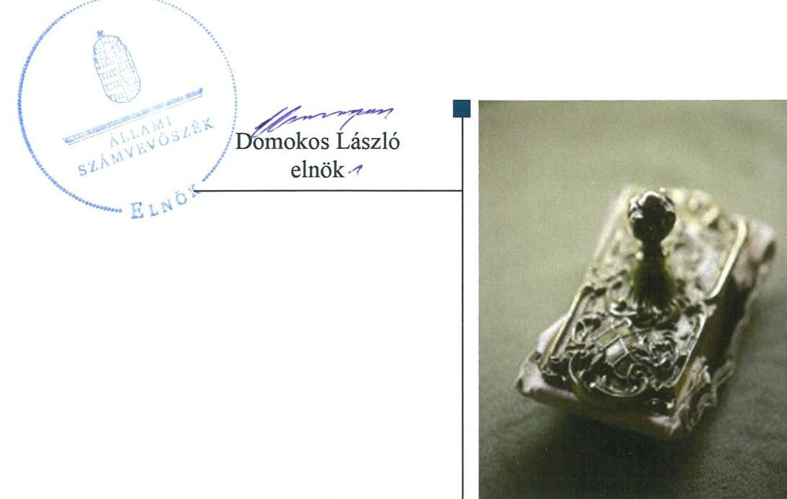
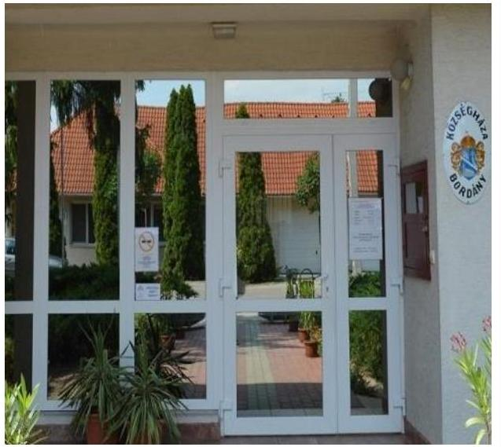
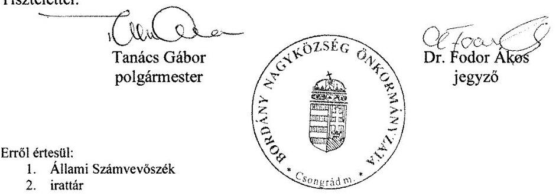
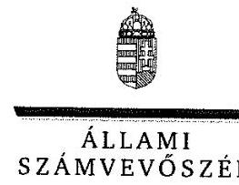
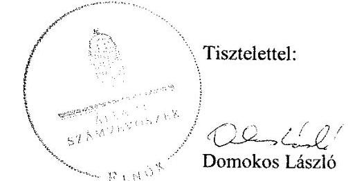
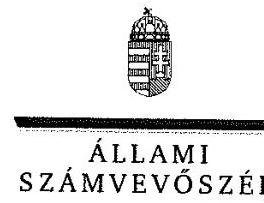
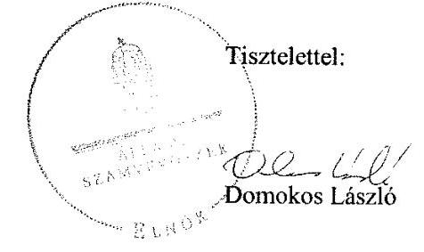

ÁLLAMI
SZÁMVEVŐSZÉK

# Jelentés 

## Önkormányzatok ellenőrzése -Integritás- és belső kontrollrendszer

Bordány Nagyközség Önkormányzata 2019.

---

# Jelenetés 

## Önkormányzatok ellenőrzése Integritás- és belső kontrollrendszer

Bordány Nagyközség Önkormányzata 2019. 02. hó 28. nap

---

# AZ ELLENŐRZÉST FELÜGYELTE:

- VARGA EDIT felügyeleti vezető
- AZ ELLENŐRZÉST VEZETTE ÉS A VÉGREHAJTÁSÁÉRT FELELŐS:
  - TERLECZKYNÉ DR. EISELE EDIT ellenőrzésvezető
- A PROGRAM ÖSSZEÁLLÍTÁSÁÉRT FELELŐS:
  - TÓTPÁL SZABOLCS osztályvezető

**IKTATÓSZÁM:** EL-1495-001/2019

**TÉMASZÁM:** 2485

**ELLENŐRZÉS-AZONOSÍTÓ SZÁM:** V082919

Jelentéseink az Országgyűlés számítógépes hálózatán és az Interneta a www.asz.hu címen is olvashatóak.

---

# TARTALOMJEGYZÉK 

■ ÖSSZEGZÉS ..... 5
■ AZ ELLENŐRZÉS CÉLJA ..... 6
■ AZ ELLENŐRZÉS TERÜLETE ..... 7
■ AZ ELLENŐRZÉS HÁTTERE, INDOKOLTSÁGA ..... 8
■ A JELENTÉS LÉNYEGES KÉRDÉSKÖREI ..... 9
■ AZ ELLENŐRZÉS HATÓKÖRE ÉS MÓDSZEREI ..... 10
■ MEGÁLLAPÍTÁSOK ..... 12
■ JAVASLATOK ..... 14
■ MELLÉKLETEK ..... 17
I. sz. melléklet: Értelmező szótár ..... 17
■ FÜGGELÉK: ÉSZREVÉTELEK ..... 19
■ RÖVIDÍTÉSEK JEGYZÉKE ..... 39

---

.

---

# ÖSSZEGZÉS 

Bordány Nagyközség Önkormányzata belső kontrollrendszerének kialakítása és müködtetése nem felelt meg a jogszabályi előirásoknak, így az nem biztositotta a szabályszerü közpénzfelhasználást valamint az átlátható müködést, a nemzeti vagyonnal történő felelős gazdálkodást. A meglévő integritás kontrollok nem képesek kezelni a szervezeti kockázatokat.

## Az ellenőrzés társadalmi indokoltsága

Az Állami Számvevőszék alapvető feladata a közpénzekkel, az állami és az önkormányzati vagyonnal való gazdálkodás ellenőrzése. Az Alaptörvény szerint az önkormányzatok kötelezettsége a kiegyensúlyozott, átlátható és fenntartható költségvetési gazdálkodás elvének érvényesítése, a nemzeti vagyonnal való rendeltetésszerú és felelős módon való gazdálkodás biztosítása. Az Állami Számvevőszék stratégiájában megfogalmazott célkitűzése az integritás alapú, átlátható és elszámoltatható közpénzfelhasználás elősegítése. Ennek megvalósítása érdekében az Állami Számvevőszék prioritásként kezeli a közpénzzel gazdálkodó szervezetek esetében a belső kontrollrendszer múködésének ellenőrzését.

Bordány Nagyközség Önkormányzatát az Állami Számvevőszék korábban nem ellenőrizte.

## Főbb megállapítások, következtetések

Bordány Nagyközség Önkormányzata belső kontrollrendszerének kialakítása és múködtetése nem volt szabályszerű. A kontrollkörnyezet kialakítása szabályszerűen történt, a szervezeti kereteket szervezeti és múködési szabályzat tartalmazta. Bordány Nagyközség Önkormányzata Képviselő-testülete elfogadta a gazdasági programot, megalkotta a vagyonrendeletet, a jegyző a gazdálkodás rendjére, a számviteli rendre vonatkozó szabályzatokat elkészítette.

Bordány Nagyközség Önkormányzatánál az integrált kockázatkezelési rendszert nem múködtették, nem végezték el a kockázatok értékelését és nem határozták meg a kockázatok kezeléséhez szükséges intézkedéseket. A kontrolltevékenységeket nem a jogszabályokban foglaltak szerint gyakorolták, ezért a szabályszerű közpénz felhasználás nem volt biztosított. Az információs és kommunikációs rendszer múködtetésének követelményei nem kerültek meghatározásra. A monitoring rendszert és a belső ellenőrzést a jogszabályoknak megfelelően múködtették.

Az integritás kontrollok kiépítésre kerültek, azonban a szervezet kockázatait nem mérték fel, így a kontrollok kialakítása nem a kockázatoknak megfelelően történt. A kötelezően előírt kontrollok kialakításán túl Bordány Nagyközség Önkormányzata nem tett az integritás erősítésére szolgáló további lépéseket.

Bordány Nagyközség Önkormányzatánál nem alakították ki a teljesítmény mérésére alkalmas követelményeket.

---

# AZ ELLENŐRZÉS CÉLJA 

AZ ELLENŐRZÉS CÉLJA annak megállapítása volt, hogy az önkormányzat belső kontrollrendszere biz-tosította-e a közpénzekkel és a nemzeti vagyonnal történő elszámoltatható, átlátható, szabályszerű, gazdaságos, hatékony és eredményes gazdálkodás feltételeit. Az ellenőrzés keretében értékeltük továbbá, hogy az önkormányzatnál kiépítették és erősítették-e a korrupciós kockázatok kezelését szolgáló integritás kontrollokat és azt, hogy megteremtették-e a teljesítményellenőrzés feltételeit.

---

# **AZ ELLENŐRZÉS TERÜLETE**

## **Bordány Nagyközség Önkormányzata**

**BORDÁNY** nagyközség Csongrád megyében található, állandó lakosainak száma a Központi Statisztikai Hivatal Magyarország közigazgatási helynévkönyve alapján 2017. január 1-én 3290 fő volt.

Az Önkormányzat^{1} képviselő-testülete 7 főből állt, munkáját három állandó bizottság – a Pénzügyi, Gazdasági és Településfejlesztési, az Egészségügyi, Oktatási és Szociális, valamint az Ügyrendi, Igazgatási és Jogi Bizottság – segítette.

A gazdálkodási feladatokat a Bordányi Polgármesteri Hivatal látta el, amely szervezeti egységekre nem tagolódott, elkülönített gazdasági szervezettel nem rendelkezett. Az Önkormányzat a Hivatalon^{2} kívül három költségvetési intézményt tartott fenn. Az Önkormányzatnak egy gazdasági társaságban volt 100%-os tulajdona.

Az ellenőrzött időszakban a polgármester és a jegyző személye nem változott.

Az Önkormányzat 2017. évi költségvetési beszámolója szerinti főbb gazdálkodási adatait az 1. táblázat mutatja:

1. táblázat

|  A 2017. ÉVI KÖLTSÉGVETÉSI BESZÁMOLÓ FŐBB GAZDÁLKODÁSI ADATAI EZER FT-BAN |   |
| --- | --- |
|  Megnevezés | 2017. év  |
|  Teljesített éves költségvetési bevétel | 830 421  |
|  Teljesített éves költségvetési kiadás | 182 538  |
|  Könyvviteli mérleg szerinti eszközvagyona | 2 890 156  |
|  Költségvetési évben esedékes kötelezettségek állománya | 200  |
|  Költségvetési évet követően esedékes kötelezettségek állománya | 12 515  |

*Forrás: Bordány Nagyközség Önkormányzata 2017. évi éves költségvetési beszámolója*

---

# AZ ELLENŐRZÉS HÁTTERE, INDOKOLTSÁGA 

A belső kontrollrendszer kialakítása és működtetése nélkül nem valósítható meg a közpénzek, a közvagyon átlátható, szabályos, gazdaságos, hatékony és eredményes felhasználása. A belső kontrollrendszer azt a célt szolgálja, hogy a költségvetési szervek működésük és gazdálkodásuk során a tevékenységeket szabályszerűen hajtsák végre, teljesítsék elszámolási kötelezettségeiket és megvédjék az erőforrásokat a veszteségektől, a károktól és a nem rendeltetésszerű használattól. A belső kontrollrendszer magában foglalja mindazon elveket, eljárásokat és belső szabályzatokat, melyek biztosítják, hogy a költségvetési szerv valamennyi tevékenysége és célja összhangban legyen a szabályszerűséggel, szabályozottsággal, valamint a gazdaságosság, hatékonyság és eredményesség követelményeivel, az eszközökkel és forrásokkal való gazdálkodásban ne kerüljön sor pazarlásra, visszaélésre, rendeltetésellenes felhasználásra. Megfelelő, pontos és naprakész információk álljanak rendelkezésre a költségvetési szerv működésével kapcsolatosan, és a belső kontrollrendszer harmonizációjára, öszszehangolására vonatkozó jogszabályok végrehajtásra kerüljenek. Az integritás kontrollok kiépítése, erősítése a szervezet korrupciós kockázatainak kezelését szolgálja. A teljesítménykövetelmények meghatározása és működtetése megalapozhatja az önkormányzatoknál a teljesítményellenőrzés lefolytatását.

---

# A JELENTÉS LÉNYEGES KÉRDÉSKÖREI 

1. Az Önkormányzat belső kontrollrendszerének kialakítása és müködtetése szabályszerű volt-e?
2. Az Önkormányzat kiépítette-e és erősítette-e az integritás kontrollokat?
3. Az Önkormányzatnál kialakították-e a teljesítmény mérésére alkalmas követelményeket?

---

# AZ ELLENŐRZÉS HATÓKÖRE ÉS MÓDSZEREI 

## Az ellenőrzés típusa

Megfelelőségi ellenőrzés.

## Az ellenőrzött időszak

Az ellenőrzött időszak a 2017. év, illetve az éves költségvetési beszámoló Áht³. által megállapított jóváhagyásáig (2018. május 31-éig) tartó időszak.

## Az ellenőrzés tárgya

Az önkormányzat és a gazdálkodási feladatokat ellátó hivatala belső kontrollrendszerének kialakítása és müködtetése, valamint az integritás kontrollok kiépítettsége, a teljesítményellenőrzés feltételei.

## Az ellenőrzött szervezet

Bordány Nagyközség Önkormányzata

## Az ellenőrzés jogalapja

Az ellenőrzés jogszabályi alapját az ÁSZ ${ }^{4}$ tv . 1. § (3) bekezdés, 5. § (2) és (6) bekezdései, valamint az Áht . 61. § (2) bekezdésének előírásai képezik.

## Az ellenőrzés módszerei

Az ÁSZ ${ }^{5}$ az ellenőrzést az ellenőrzési program szempontjai, az ellenőrzött időszakban hatályos jogszabályok, az ellenőrzés szakmai szabályai, a jelen ellenőrzésre irányadó ÁSZ módszertanok figyelembevételével hajtotta végre.

Az ellenőrzési kérdések megválaszolásához szükséges bizonyítékok megszerzése az ellenőrzött által rendelkezésre bocsátott dokumentumokra, adatokra alapozva megfigyelés, mintavételezés, valamint elemző eljárás útján történt. Az ellenőrzési bizonyítékként felhasználható adatforrások közé tartoztak az ellenőrzési program részletes szempontjainál felsorolt adatforrások, valamint minden egyéb - az ellenőrzés folyamán feltárt, az ellenőrzés szempontjából információt tartalmazó - dokumentum.

---

Az ellenőrzés lefolytatásához az ellenőrzött szervezet tanúsítványok kitöltésével, valamint az ÁSZ által kért dokumentumok megküldésével szolgáltatott adatokat, amelyek valódiságát és teljes körűségét az ellenőrzött szervezet vezetője által tett teljességi és hitelességi nyilatkozat igazolta. A rendelkezésre bocsátott adatok, információk kontrollja az ellenőrzés keretében történt.

Az Önkormányzat belső kontrollrendszere egyes pilléreinek kialakítására és múködtetésére vonatkozó értékelés:
$\longrightarrow$ „szabályszerú", amennyiben az értékelt területen az elért „igen" válaszok százalékban kifejezett, egész számra kerekített aránya legalább $85 \%$,
$\longrightarrow$ „nem szabályszerű", ha nem éri el a $85 \%$-ot,
Az Önkormányzat belső kontrollrendszerének összesített értékelése az egyes részterületek esetében kapott megfelelőségi arányok számtani átlaga alapján történt és megegyezik a pillérenként (kontrollterületenként) alkalmazott százalékos értékelésekkel, a következő eltérésekkel: a kontrollrendszer egésze esetében a „szabályszerű" értékelésnek a százalékos értéken felül további feltétele volt, hogy egyik kontrollterület sem kaphat „nem szabályszerű" értékelést.

A mintavétel módszere lényeges sokaságon alapuló véletlen mintavétel volt. A külső személyi juttatások, egyéb múködési, illetve felhalmozási kiadások, mint sokaság esetében a mintavétel azokra a legnagyobb értékű tételekre terjedt ki, melyek összértéke elérte a teljes sokaság összértékének 50\%-át. A jelentéstervezetben a mintavételi eredmények alapján megfogalmazott megállapítások csak a lényeges sokaságra vonatkoznak.

Az ellenőrzés ideje alatt az ellenőrzött szervezettel történő kapcsolattartást az ÁSZ SZMSZ²-ének vonatkozó előírásai alapján biztosítottuk

---

# 1. Az Önkormányzat belső kontrollrendszerének kialakítása és múködtetése szabályszerű volt-e? 

Összegző megállapítás

Az Önkormányzat belső kontrollrendszerének kialakítása és múködtetése nem felelt meg a jogszabályi előírásoknak.

A KONTROLLKÖRNYEZET kialakítása szabályszerű volt. Az Önkormányzat SZMSZ ${ }^{7}$-ében a Mötv. ${ }^{8}$-nek, a Hivatal SZMSZ ${ }^{9}$-ében az Áht.-nak megfelelően meghatározásra kerültek a múködés szervezeti keretei. A Képviselő-testület ${ }^{10}$ a Htv. ${ }^{11}$ előírásait betartva rendeletben megalkotta az önkormányzati vagyonnal való gazdálkodás szabályait ${ }^{12}$ és jóváhagyta a gazdasági programot ${ }^{13}$. A Hivatal rendelkezett ellenőrzési nyomvonallal, azonban a jegyző a Bkr. ${ }^{14}$ 6. § (3) bekezdés előírása ellenére az Önkormányzat ellenőrzési nyomvonalát nem készítette el.

Az Önkormányzat az Ávr. ${ }^{15}$-ben és az Áht.-ben foglaltaknak megfelelően rendelkezett a gazdálkodás részletes rendjét ${ }^{16}$ meghatározó szabályozással. A Kttv. ${ }^{17}$ szabályainak megfelelően kialakították a humánerőforrás-kezelés kontrollkörnyezetét, az etikai elvárásokat. A Számv. tv. ${ }^{18}$ és az Áhsz. ${ }^{19}$ előírásait betartva az Önkormányzat rendelkezett számviteli politikával, valamint az annak keretében elkészítendő szabályzatokkal. Az Ávr. 13. § (2) bekezdésében szereplő, a múködéséhez kapcsolódó, pénzügyi kihatással bíró, jogszabályban nem szabályozott kérdéseket belső szabályzatokban rendezték.

## AZ INTEGRÁLT KOCKÁZATKEZELÉSI RENDSZERRE vonatkozó szabályozást az Önkormányzat megalkotta, a rendszer felelősének kijelölése megtörtént a Bkr. előírásainak megfelelően, azonban a rendszert nem működtették. A jegyző a Bkr. 7. § (2) bekezdés előírása ellenére nem mérte fel és nem állapította meg az Önkormányzat tevékenységében rejlő és szervezeti célokkal összefüggő kockázatokat, nem határozta meg az egyes kockázatokkal kapcsolatban szükséges intézkedéseket, valamint azok teljesítésének nyomon követésének módját.

A jegyző a szervezeti integritást sértő események eljárásrendjében nem rögzítette a szervezeti integritást sértő események bekövetkezésének megelőzésére kialakított eljárási szabályokat a Bkr. 6. § (4a) bekezdés h) pontjának előírása ellenére.

A KONTROLLTEVÉKENYSÉGEK GYAKORLÁSA nem volt szabályszerű. A gazdálkodási jogkörökre való felhatalmazások és kijelölések szabályosan történtek, a jogkörgyakorlókról az Ávr. előírása szerinti nyilvántartásokat megfelelően vezették. Az Önkormányzatnál a gazdálkodási jogkört gyakorlók nem jártak el szabályszerűen, mert:
— az Áht. 37 § (1) bekezdés előírása ellenére a kötelezettségvállalás pénzügyi ellenjegyzés nélkül történt;

---

- valamint az Ávr. 57. § (1) bekezdés előírása ellenére nem történt meg a teljesítésigazolás.

AZ INFORMÁCIÓS ÉS KOMMUNIKÁCIÓS RENDSZER működtetésének követelményeit nem határozta meg az Önkormányzat. A jegyző az Ltv. ${ }^{20}$ 9. § (4) bekezdése és 10. § (1) bekezdés c) pontjának előírása ellenére nem adott ki iratkezelési szabályzatot, valamint nem alkotott adatvédelmi és adatbiztonsági szabályzatot az Info. tv. ${ }^{21} 24$. § (3) bekezdésben foglaltak ellenére.

A MONITORING RENDSZER keretében az Önkormányzat az operatív tevékenységekre a folyamatos és eseti nyomon követés rendjét a Bkr. előírásának megfelelően kialakította. A belső ellenőrzési feladatok ellátása társulási megállapodás keretében a Bkr.-ben foglaltaknak megfelelően történt. A Hivatal SZMSZ-ében rögzítették a belső ellenőr feladatait. Az ellenőrzések a belső ellenőrzési kézikönyvben szabályozottak szerint, a Képviselő-testület által elfogadott ellenőrzési terv alapján zajlottak. A külső és belső ellenőrzésekről a Bkr.-ben előírt nyilvántartást vezették.

A belső kontrollrendszer minőségét a jegyző a Bkr. 11.§ (1) bekezdésében előírtaknak megfelelően nyilatkozatban értékelte.

# 2. Az Önkormányzat kiépítette-e és erősítette-e az integritás kontrollokat? 

Összegző megállapítás Az Önkormányzat a jogszabályok által kötelezően előírt integritás kontrollok kiépítése során nem vette figyelembe a szervezet múködésében rejlő kockázatokat, az integritás erősítése érdekében nem tett intézkedéseket.

Az Önkormányzatnál a jogszabályok által előírt kontrollok kiépítettsége nem támogatta a szervezet integritás elvű múködését. A szervezet tevékenységében rejlő kockázatok felmérését a Bkr. 7. § (2) bekezdésében előírtak ellenére nem végezték el, ezért az integritás kontrollok kialakítása nem a szervezet valós kockázatainak ismeretében történt. Az Önkormányzat nem múködtetett az integritást erősítő, jogszabályok által kötelezően elő nem írt kontrollokat.

## 3. Az Önkormányzatnál kialakították-e a teljesítmény mérésére alkalmas követelményeket?

Összegző megállapítás: Az Önkormányzatnál nem alakítottak ki a teljesítmény mérésére alkalmas követelményeket.

A szervezeti célok elérését szolgáló feladatok, folyamatok, tevékenységek mérését szolgáló indikátorokat, mérőszámokat, feladat- és teljesítménymutatókat nem képeztek, az Önkormányzat a teljesítmény mérésének lehetőségét nem biztosította.

---

# JAVASLATOK 

Az ÁSZ tv. 33. § (1) bekezdésében foglaltak értelmében az ellenőrzött szervezet vezetője köteles a jelentésben foglalt megállapításokhoz kapcsolódó intézkedési tervet összeállítani és azt a jelentés kézhezvételétől számított 30 napon belül az ÁSZ részére megküldeni. Amennyiben az ellenőrzött szervezet vezetője nem küldi meg határidőben az intézkedési tervet, vagy továbbra sem elfogadható intézkedési tervet küld, az Állami Számvevőszék elnöke az ÁSZ tv. 33. § (3) bekezdése a) és b) pontjaiban foglaltakat érvényesítheti.

## Bordányi Polgármesteri Hivatal jegyzőjének

1. A szabályszerű kontrollkörnyezet kialakítása érdekében gondoskodjon az Önkormányzat ellenőrzési nyomvonalának elkészítéséről.
(1. sz. megállapítás 1. bekezdés 4. mondat 2. tagmondata alapján)
2. A szabályszerű integrált kockázatkezelési rendszer kialakítása és az integritási kontrollok erősítése érdekében gondoskodjon az Önkormányzat tevékenységében rejlő és szervezeti célokkal összefüggő kockázatok felméréséről és megállapításáról, határozza meg az egyes kockázatokkal kapcsolatban szükséges intézkedéseket, valamint azok teljesítésének folyamatos nyomon követésének módját.
(1. sz. megállapítás 3. bekezdés 2. mondata és a 2. sz. megállapítás 1. bekezdés 2. mondata alapján)
3. A szabályszerű integrált kockázatkezelési rendszer kialakítása érdekében rögzítse a szervezeti integritást sértő események eljárásrendjében a szervezeti integritást sértő események bekövetkezésének megelőzésére kialakított eljárási szabályokat.
(1. sz. megállapítás 4. bekezdése alapján)
4. Az információs és kommunikációs rendszer szabályszerű müködtetése érdekében gondoskodjon:
a) iratkezelési szabályzat kiadásáról;
(1. sz. megállapítás 6. bekezdés 2. mondat 1. tagmondata alapján)
b) adatvédelmi és adatbiztonsági szabályzat megalkotásáról.
(1. sz. megállapítás 6. bekezdés 2. mondat 2. tagmondata alapján)

---

# Bordány Nagyközség Önkormányzata polgármesterének 

1. A kontrolltevékenységek szabályszerű gyakorlása érdekében gondoskodjon a kötelezettségvállalás és a teljesitésigazolás szabályszerű gyakorlásának biztositásáról.
(1. sz. megállapítás 5. bekezdés 1., 2. francia bekezdése alapján)

---

.

---

# MELLÉKLETEK 

- I. SZ. MELLÉKLET: ÉRTELMEZŐ SZÓTÁR
belső ellenőrzés
belső kontrollrendszer
belső kontrollrendszer területei
információs és kommunikációs rendszer
integrált kockázatkezelési rendszer
integritás
kockázat
kontrollkörnyezet
kontrolltevékenységek
kommunikáció
monitoring

Független, tárgyilagos bizonyosságot adó és tanácsadó tevékenység, amelynek célja, hogy az ellenőrzött szervezet működését fejlessze és eredményességét növelje, az ellenőrzött szervezet céljai elérése érdekében rendszerszemléletű megközelítéssel és módszeresen értékeli, illetve fejleszti az ellenőrzött szervezet irányítási és belső kontrollrendszerének hatékonyságát. (Forrás: Bkr. 2. § b) pontja)
A belső kontrollrendszer a kockázatok kezelése és tárgyilagos bizonyosság megszerzése érdekében kialakított folyamatrendszer, amely azt a célt szolgálja, hogy a múködés és gazdálkodás során a tevékenységeket szabályszerűen, gazdaságosan, hatékonyan, eredményesen hajtsák végre, az elszámolási kötelezettségeket teljesítsék, megvédjék az erőforrásokat a veszteségektől, károktól és nem rendeltetésszerű használattól. (Forrás: Áht. 69. § (1) bekezdése)
A kontrollkörnyezet, az integrált kockázatkezelési rendszer, a kontrolltevékenységek, az információs és kommunikációs rendszer, valamint a nyomon követési (monitoring) rendszer. (Forrás: Bkr. 3. §-a)
A költségvetési szerv vezetője által kialakított és müködtetett olyan rendszer, mely biztosítja, hogy a megfelelő információk a megfelelő időben eljutnak az illetékes szervezethez, szervezeti egységhez, illetve személyhez. (Forrás: Bkr. 9. § (1) bekezdés)
Olyan folyamatalapú kockázatkezelési rendszer, amely a szervezet minden tevékenységére kiterjed, egységes módszertan és eljárások alkalmazásával, a szervezet célkitűzéseinek és értékeinek figyelembevételével biztosítja a szervezet kockázatainak teljes körű azonosítását, azok meghatározott kritériumok szerinti értékelését, valamint a kockázatok kezelésére vonatkozó intézkedési terv elkészítését és az abban foglaltak nyomon követését. (Forrás: Bkr. 2. § m) pontja, 2016. október 1-jétől)
Az integritás az elvek, értékek, cselekvések, módszerek, intézkedések konzisztenciáját jelenti, vagyis olyan magatartásmódot, amely meghatározott értékeknek megfelel. (Forrás: Nemzetgazdasági Minisztérium: Magyarországi államháztartási belső kontroll standardok Útmutató 1.6.1. pontja, 2012. december)
A kockázat annak a valószínűségét jelenti, hogy egy vagy több esemény vagy intézkedés nem kívánt módon befolyásolja a rendszer múködését, céljainak megvalósulását. (Forrás: Javaslatok a korrupciós kockázatok kezelésére - Kockázatkezelési és ellenőrzési módszertan 35. oldal, ÁSZ)
A költségvetési szerv vezetője által kialakított olyan elvek, eljárások, belső szabályzatok összessége, amelyben világos a szervezeti struktúra, a folyamatok átláthatók, egyértelműek a felelősségi, hatásköri viszonyok és feladatok, meghatározottak, ismertek és elfogadottak az etikai elvárások a szervezet minden szintjén, átlátható a humánerőforrás-kezelés, biztosított a szervezeti célok és értékek irányában való elkötelezettség fejlesztése és elősegítése. (Forrás: Bkr. 6. § (1) bekezdés)
A költségvetési szerv vezetője által a szervezeten belül kialakított (kontroll) tevékenységek, melyek biztosítják a kockázatok kezelését, hozzájárulnak a szervezet céljainak eléréséhez és erősítik a szervezet integritását. (Forrás: Bkr. 8. § (1) bekezdés)
Az a tevékenység, melynek során információ továbbítása valósul meg. A kommunikációs folyamat résztvevői között tájékoztatás történik, mely során tényeket, ezek magyarázatát közlik.
A monitoring általánosságban a különböző szintű szervezeti célok megvalósításának folyamatát kíséri figyelemmel, melynek során a releváns eseményekről és tevékenységekről (együtt: folyamatokról) rendszeres jelleggel, strukturált, döntéstámogató

---

monitoring-rendszer

önkormányzati hivatal
információkhoz jutnak a szervezet vezetői. (Forrás: NGM Útmutató a költségvetési szervek monitoring rendszeréhez 2011. november)
A költségvetési szerv vezetője köteles kialakítani a szervezet tevékenységének a célok megvalósításának nyomon követését biztosító rendszert, amely az operatív tevékenységek keretében megvalósuló folyamatos és eseti nyomon követésből, valamint az operatív tevékenységektől függetlenül múködő belső ellenőrzésből állhat. (Forrás: Bkr. 10. §)
A polgármesteri hivatal, a főpolgármesteri hivatal, a megyei önkormányzati hivatal és a közös önkormányzati hivatal. (Forrás: Áht. 1. § 18. pont)

---

# FÜGGELÉK: ÉSZREVÉTELEK 

A jelentéstervezetet a Számvevőszék 15 napos észrevételezésre megküldte az ellenőrzött szervezetek vezetőinek az ÁSZ tv. 29. §* (1) bekezdése előírásának megfelelően.

Az ÁSZ a jelentéstervezetet észrevételezésre megküldte Bordány Nagyközség Önkormányzata polgármestere és a Bordányi Polgármesteri Hivatal jegyzője részére.
Bordány Nagyközség Önkormányzata polgármestere és a Bordányi Polgármesteri Hivatal jegyzője az ÁSZ tv. 29. § (2) bekezdésében foglalt észrevételezési jogukkal éltek, a jelentéstervezet megállapításaira a törvényes határidőn belül észrevételt tettek.
Bordány Nagyközség Önkormányzata polgármesterének és a Bordányi Közös Önkormányzati Hivatal jegyzőjének közös észrevételét és az arra adott választ a függelék tartalmazza.

[^0]
[^0]:    * 29. § (1) Az Állami Számvevőszék az ellenőrzési megállapításait megküldi az ellenőrzött szervezet vezetőjének vagy az általa megbízott személynek, és annak, akinek személyes felelősségét állapította meg.
    (2) Az ellenőrzött szervezet vezetője és a felelősként megjelölt személy az ellenőrzés megállapításaira tizenöt napon belül írásban észrevételt tehet.
    (3) Az Állami Számvevőszék az észrevételre a beérkezésétől számított harminc napon belül írásban válaszol. A figyelembe nem vett észrevételeket köteles a jelentésben feltüntetni, és megindokolni, hogy azokat miért nem fogadta el.

---

# Bordány Nagyközség Önkormányzata

6795 Bordány, Benke Gedeon utca 44.
Telefon: (62) 588-510; Telefax: (62) 588-520
e-mail: bordany@bordany.hu
www.bordany.hu

Iktatószám: 12-5/2019/Ö
Telefonszám: (62) 588-510
KRID azonosító: 20609493
Hivatkozási sz: EL-0841-044/2018.
Melléklet: EL-0841-043/2018.
Küldés módja: postai tértivevényes

Domokos László
Elnök Úr
részére

Tárgy: Jegyzőkönyvre tett észrevétel

ÁLLAMI SZÁMVEVŐSZÉK
DE - 31. 30/06/2019
Érkezett: 2019 JAN 16.

Iktatószám: ET-0841-053/2019
Melléklet: K

Állami Számvevőszék

Budapest
Apácai Csere János u. 10.
1052

Tisztelt Elnök Úr!

Bordány Nagyközség Önkormányzat Polgármestere illetve Bordány Nagyközség
Jegyzője az Állami Számvevőszék 2019. január 4. napján kelt, fenti iktatószámon
megküldött, az „Önkormányzatok ellenőrzése- Integritás- és belső kontrollrendszer" című
jelentéstervezetével (a továbbiakban: Jelentéstervezet) kapcsolatban, törvényes határidőn
belül, az alábbi együttes

észrevételt

teszti elő:

I. Általános észrevétel a Jelentéstervezet megállapításaira

A Jelentéstervezet összegzése az alábbi megállapítást tartalmazza:

„Bordány Nagyközség Önkormányzata ... nem biztosította a szabályszerű
közpénzfelhasználást valamit az átlátható működést, a nemzeti vagyonnal történő felelős
gazdálkodást.”

Álláspontunk szerint a fenti idézett megállapítás végletesen
leegyszerűsítő, sarkos, általános, nélkülöz minden árnyalt
tényszerő megfogalmazást és magával a Jelentéstervezetben
foglalt: megállapításokkal is ellentétben áll. A
Bordány

---

Jelentéstervezet - a teljesség igénye nélkül - az alábbi megállapításokat is tartalmazza:
„Bordány Nagyközség Önkormányzata Képviselö- testülete elfogadta a gazdasági programot, megalkotta a vagyonrendeletet, a jegyző a gazdálkodás rendjére a számviteli rendre vonatkozó szabályzatokat elkészítette."
„A Kontrollkörnyezet kialakítása szabályszerű volt. Az Önkormányzat SZMSZ-ében az Mötv.nek, a Hivatal SZMSZ-ében az Áht.-nek megfelelően meghatározásra kerültek a müködés szervezeti keretei. A Képviselő- testület a Htv. előírásait betartva rendeletben megalkotta az önkormányzati vagyonnal való gazdálkodás szabályait és jóváhagyta a gazdasági programot. A Hivatal rendelkezett ellenőrzési nyomvonallal..."

A fentieken túlmenően sorolható még a Jelentéstervezetben megfogalmazott pozitív megállapítások sora. Önkormányzatunk nem állítja, hogy a bizonyos esetekben nem lenne szükség a gyakorlatunk korrekciójára, javítására. Pozitívan fogadjuk az esetleges megalapozott észrevételeket megállapításokat, amelyeket köszönünk a T. Állami Számvevőszék ellenőrzésének, azonban határozottan elvárjuk, hogy az ellenőrzés megállapításai mind a pozitív, mind a negatív tapasztalatokat objektíven, tárgyilagosan megfelelő súlyozásban mutassák be. A „nem biztositotta a szabályszerü közpénzfelhasználást valamit az átlátható müködést, a nemzeti vagyonnal történő felelős gazdálkodást" olyan túlzó, félrevezető, prekoncepciózus eljárás látszatát keltő megállapítás, amely álláspontunk szerint nem ad tárgyilagos képet az Önkormányzat működéséről és egyúttal kétségbe vonja Önkormányzatunk dolgozóinak elhivatott munkáját és közösség érdekében tett lelkiismeretes erőfeszítéseit. Kijelentjük, hogy Önkormányzatunknál a közpénzfelhasználás felelős, átlátható, mindemellett mindent megteszünk annak érdekében, hogy a tényszerűen, objektíven megállapított hiányosságokat, hibákat a jövőben orvosoljuk, javítsuk, hogy munkánkat a jövőben még pontosabban láthassuk el.

A fent leírtak alapján a leghatározottabban kérjük a T. Állmai Számvevőszéket, hogy a Jelentéstervezet Összegzés és Főbb megállapítások, következtetések részében foglalt megállapításokat - tárgyilagosság alapvető követelményének megfelelően - árnyalni, súlyozni, pontosítani szíveskedjen.

A Jelentéstervezet megállapításainak átvizsgálását követően álláspontunk szerint számos megállapítás a rendelkezésre bocsátott iratanyagban foglaltakkal tényszerủen ellentétben áll, ami a rendelkezésre bocsátott iratanyag felületes áttanulmányozására utalhat. A konkrét megállapításokra adott észrevételt az alábbi rész tartalmazza:

# II. A Jelentéstervezet konkrét megállapításainak észrevételezése 

1. Észrevétel a Jelentéstervezet Megállapítások 1. pontjának kontrollkörnyezetre tett megállapítására:

Bordány Nagyközség Önkormányzata az Állami Számvevőszék EL0841-005/2018. iktatószámú adatbekérő levél 2. számú melléklet (a továbbiakban: 2. adatbekérés) 1.8. pontjában foglaltak szerint csatolta Bordány Nagyközség Önkormányzat Belső Kontrollrendszerre vonatkozó szabályzatát. A csatolt szabályzat 2. számú melléklete tartalmazza a müködési folyamatok ellenőrzési nyomvonalát. Bordány Nagyközség

---

Önkormányzat méretéből, intézményeinek számából adódóan számos önkormányzati (gazdálkodási, humánpolitikai stb.) feladatot a Bordányi Polgármesteri Hivatal lát el.

Mindezek okán a Hivatal ellenőrzési nyomvonala keverten tartalmaz mind önkormányzati mind hivatali feladatokat. A hivatal által elvégzett összetett feladatok okán logikátlannak mutatkozott az önkormányzati és hivatali feladatok elkülönülő ellenőrzési nyomvonalba történő rögzítése. Mindezek okán a csatolt ellenőrzési nyomvonal álláspontunk szerint tartalmazza a Hivatal és az Önkormányzat feladataihoz kapcsolódó ellenőrzési nyomvonalát, kérjük a végleges Jelentésben ezt a körülményt figyelembe venni szíveskedjenek.
2. Észrevétel Jelentéstervezet Megállapítások 1. pontjának az integrált kockázatkezelési rendszer müködtetésére vonatkozó megállapításra:

Bordány Nagyközség Önkormányzata a 2. adatbekérés 1.54. pontjában foglaltak szerint csatolta a „Kockázatelemzés 2017. év Bordány Nagyközség Önkormányzata" megnevezésủ 2016. november 8. napján kelt dokumentumot. A csatolt kockázatelemzés dokumentumát a Jegyző, a Jegyző vezetése alatt álló belső ellenőrzési vezetővel együtt készítette el; a Jegyző a belső ellenőrrel együtt mérte fel és állapította meg az Önkormányzat tevékenységében rejlő és a szervezeti célokkal összefüggő kockázatokat. A csatolt dokumentum teljeskörűen igazolja és bizonyítja, hogy a Jegyző a Bkr. 7. § (2) bekezdésében foglalt kockázatfelmérési kötelezettségének az ellenőrzés alá volt időszakban teljeskörűen eleget tett. Mindezek okán Jelentéstervezet hivatkozott állításával nem értünk egyet, álláspontunk szerint a megállapítás iratellenes.
3. Észrevétel a „nem határozta meg az egyes kockázatokkal kapcsolatosban szükséges intézkedéseket, valamint azok teljesitésének nyomon követésének módját" tett megállapításra:

Jelen észrevétel 2. pontjában megjelölt kockázatelemzés alapján 2016. november 8. napján készült el az Integrált Kockázatkezelési Intézkedési terv. Az Integrált Kockázatkezelési Intézkedési terv adminisztratív okból felcsatolásra nem került, azonban a T. Állami Számvevőszék 2018. szeptember 20. napján tartott helyszíni ellenőrzése során az ellenőrzésben résztvevő kollégák részére bemutatásra került. Az ellenőrzésben részt vevő Állami Számvevőszéki kollégák az iratok átvételét megtagadták, így azokat nem állt módunkban utólag rendelkezésre bocsátani.
4. Észrevétel a „nem rögzítette a szervezeti integritást sértő események bekövetkezésének megelőzésére kialakított eljárási szabályokat a Bkr. 6.§ (4a) bekezdés h) pontjának elöirása ellenére" megállapításra:

A 2. adatbekérés 1.14. pontjában foglalt felhívásra csatolásra került a Bordányi Polgármesteri Hivatal Köztisztviselői Etikai Kódexe. A csatolt Etikai Kódex számos rendelkezése, példának okáért annak 2. pontja, 4. pontja, 5. pontja, tartalmaz rendelkezést az integritást sértő esemény bekövetkezésének megelőzésére vonatkozóan. Mindezek okán az idézett megállapítást valótlan és iratellenes.
5. Észrevétel a Jelentéstervezet Megállapítások 1. pontjának Kontrolltevékenységek gyakorlására alpontban tett megállapítására:

---

Az EL-0841-024/2018. iktatószámú adatbekérés alapján 20 darab bizonylat megküldésére, vizsgálatára került sor. A megküldött bizonylatok számhoz viszonyítva elenyésző számú bizonylat esetében nem került rögzítésre a pénzügyi ellenjegyzés dokumentálása. Álláspontunk szerint valamennyi megküldött bizonylat tekintetében a teljesítésigazolás megtörtént. (Bernáth Róbert- Bernáth Andrea bizonylata tekintetében az adás- vételi szerződés alapján a közhiteles ingatlan- nyilvántartásba bejegyzett tulajdoni jog bejegyzéséről történő tulajdoni lap megküldése igazolja a szerződés teljesülésbe fordulását, tekintettel arra, hogy az adás- vételi szerződés alapján a tulajdoni jog ingatlan- nyilvántartásba történő bejegyzése konstitutív hatályú bejegyzésnek minősül.)
Mindezek okán a Jelentéstervezet vonatkozó megállapításai leegyszerűsítőek, elnagyoltak, általánosak, amely nem adnak árnyalt képet a feltárt valós tényállásról. Erre hivatkozással kérjük a T. Állami Számvevőszéket, hogy a vonatkozó megállapításokat tényszerü megállapítás érdekében pontosítani, árnyalni szíveskedjen.

# 6. Észrevétel a „nem adott ki iratkezelési szabályzatot" tett megállapításra: 

A megállapítás álláspontunk szerint valótlan. A Bordányi Polgármesteri Hivatal (a továbbiakban: Hivatal) a korábbi időszakokban, így az ellenőrzés alá volt időszakban is rendelkezett hatályos Iratkezelési Szabályzattal. A 2. adatbekérés 1.33. pontjában foglaltaknak megfelelően csatolásra került az Iratkezelési Szabályzat illetve a Magyar Nemzeti Levéltár Csongrád Megyei Levéltára (iktatószám: CSML/610-2/2017; a továbbiakban: Csongrád Megyei Levéltár) valamint a Csongrád Megyei Kormányhivatal (iktatószám: CSB/01/09619-2/2017; a továbbiakban: Kormányhivatal) jóváhagyó véleménye.

Tájékoztatjuk a T. Állami Számvevőszéket, hogy a csatolt iratkezelési szabályzat jóváhagyásának eljárását 2014. október 10. napján (!) kezdeményeztük a Csongrád Megyei Levéltár (iktatószám: 1703-4/2014; rakszám: RL 6795000102897 7) illetve a Csongrád Megyei Kormányhivatal (iktatószám: 1703-3/2014; rakszám: RL 6795000102898 0) előtt. Többszöri érdeklődésünk és sürgetésünk ellenére a 2014. évben megküldött Iratkezelési Szabályzat- tervezetet a Csongrád Megyei Levéltár csak 2017. november 9. kelt (!) levelében, 2017. évben (!) hagyta jóvá, mindezek okán az Iratkezelési Szabályzatot - a csatolt Kormányhivatali álláspontnak megfelelően - a Képviselő- testület csak a 2017. december 20. napján tartott testületi ülésén 2018. január 1. napján történő hatálybalépéssel tudta jóváhagyni. Az Iratkezelési Szabályzat jóváhagyásának rajtunk kívül álló okból történő elhúzódása azonban nem jelenti azt, hogy a Bordányi Polgármester Hivatal a jóváhagyást megelőző időszakban ne rendelkezett volna hatályos Iratkezelési Szabályzattal. Ezt a körülményt igazolja a már idézett pontban becsatolt CSB/01/09619-2/2017. iktatószámú 2017. december 1. keltezésű okirat 2. oldal 2. bekezdésében található Kormányhivatali álláspont, mely szerint: ,,Álláspontom szerint az iratkezelési Szabályzat 2018. napjával léptethető hatályba azzal, hogy a hatályba lépéssel egyidejüleg a 2013 január 1-től érvényes Iratkezelési szabályzat hatályát vesziti. "

A T. Állami Számvevőszék részére becsatolt okiratokból egyértelműen megállapítható, hogy az ellenőrzési alá vont időszakban a Hivatal rendelkezett iratkezelési szabályzzattal, hiszen azt helyezte hatályon kívül a 2018. január 1. napjával hatályba lépő szabályozás. Tekintettel arra, hogy az ellenőrzés adatbekérési időszakában a T. Állami Szemvevőszék többszöri próbálkozásunk ellenére sem nyújtott segítséget, hogy egyes pontok tekintetében pontosan mely dokumentumok felcsatolását várja el, ezen kérdést sem állt módunkban tisztázni. Így nem tudtunk tájékoztatást kérni, hogy ebben a helyzetben a korábban hatályba lépő, vagy az

---

egyeztetési eljárás elhúzódása okán később hatályba lépő szabályzat vagy esetleg mind a két szabályzat felcsatolásra kerüljön-e. Mindettől függetlenül a csatolt dokumentumok tartalmának alapos átvizsgálásával egyértelműen megállapítható lett volna, hogy a Hivatal rendelkezett Iratkezelési Szabályzattal, mindezek okán az ezzel ellentétes megállapítás álláspontunk szerint valótlan és tényszerűen iratellenes.
7. Észrevétel a „nem alkotott adatvédelmi és adatbiztonsági szabályzatot" megállapításra:

Tájékoztatjuk, a T. Állami Számvevőszéket 2. adatbekérés alapján számos olyan dokumentumot csatoltunk, amely tartalmaz adatvédelmi és adatbiztonsági rendelkezéseket.

A 2. adatbekérés 31. pontja alapján csatoltuk:

- az informatika biztonsági stratégiát (iktatószám: 5/2014.)
- informatika biztonsági szabályzatot (iktatószám: 6/2014.)
- az informatikai biztonságpolitikai szabályzatot (iktatószám: 4/2014.)
- közszolgálati adatvédelmi szabályzatot

A 2. adatbekérés $40,41,43,46$ pontjai alapján csatoltuk:

- közérdekủ adatok megismerési szabályzatát (iktatószám: 17/2017.)

A fenti részletezett szabályzatok kivétel nélkül tartalmaznak adatvédelmi és adatbiztonsági rendelkezéseket, minezek okán idézett megállapítás álláspontunk szerint általános, elnagyolt és iratellenes.
8. Észrevétel a Jelentéstervezet 2. pontjában tett „Az Önkormányzat nem müködtetett az integritást erösitő, jogszabályok által kötelezöen elö nem irt kontrollokat." mondatára:

Az Önkormányzat számára nem teljesen egyértelmủ, hogy a T. Állami Számvevőszék mely „jogszabályok által kötelezöen elö nem irt kontrollok" müködtetését várja el az Önkormányzattól, illetve amennyiben ezen kontrollok működését a jogszabályok „kötelezöen" nem írják elő, milyen oknál fogva állapítja meg azt hiányosságként? Kérjük a T. Állami Számevőszéket, hogy ezen megállapítást az érthetőség kedvéért kifejteni, részletezni, alátámasztani szíveskedjen. Pontosítást követően áll módunkban érdemi észrevételt tenni.
9. Észrevétel a Jelentéstervezet Megállapítások 3. pontjában tett megállapításokra:

A Jelentéstervezet vonatkozó pontja nem tartalmaz utalást arra, vonatkozóan, hogy a „feladatok, folyamatok, tevékenységek mérését szolgáló indikátorokat, mérőszámokat, feladités teljesitménymutatókat" mely jogszabályi rendelkezések alapján kell az Önkormányzatnak elkészítenie. Kérjük a T. Állami Számvevőszéket, hogy a Jelentéstervezet hivatkozott pontjára vonatkozó jogszabályhelyről tájékoztatni szíveskedjenek. Pontosítást követően áll módunkban a megállapításra érdemi észrevételt tenni.

Álláspontunk szerint, fenti okok alapján a Jelentéstervezet számos pontja, megállapítása kiegészítést, pontosítást, korrekciót, javítást igényel. Erre tekintettel kérjük a T. Állami Számvevőszéket, hogy jelen észrevételben foglaltak alapján az ellenörzés megállapításait

---

felülvizsgálni és az Állami Számvevőszékről szóló 2011. évi LXVI. törvény 24.§ (1) bekezdés d) pontjában foglalt követelményeknek megfelelően a megállapításokat korrigálni, pontosítani, javítani, kiegészíteni szíveskedjen.

# III. Észrevétel az ellenőrzési eljárás lefolytatásra vonatkozóan 

A T. Állami Számvevőszék ellenőrzése során számos olyan körülménnyel szembesültünk, ami álláspontunk szerint megnehezíti ez ellenőrzések lefolytatását, így akadályozza hatékony tényállásmegállapítást. A teljesség igénye nélkül vázlatosan az alábbi problémáka szeretnénk felhívni tisztelt figyelmüket:

1. Az ellenőrzés adatbekérési fázisában nem nyílt lehetőségünk a tisztázó kérdés feltételére, amivel egyértelmúsíteni lehetett volna, hogy mely pontok tekintetében pontosan mely anyagok feltöltését várja el a T. Állami Számvevőszék.
2. Több száz anyag Elektronikus Adatbekérési Rendszerbe történő feltöltését követően manuálisan kellett kitöltenie a teljességi és hitelességi nyilatkozatot, ami nem csak a XXI. század követelményeitől elmaradó szint, hanem magában hordozza a hibázás és a félreértés lehetőségét is.
3. Az iratfeltöltést követően az Állami Számvevőszék nem biztosított lehetőséget akár az előző pontban jelzett hiányosságok okán is - fel nem töltött iratok pótlására. Ez a gyakorlat álláspontunk szerint valótlan kép vázolását eredményezi az ellenőrzés alá vontaktól.
4. A helyszíni ellenőrzés időpontjáról történő tájékoztatáskor kértük a T. Állami Számvevőszék kollégáit, hogy az adatfeltöltésben részt vevő kolléga orvosi kezelése okán az érkezés tervezett napját egy nappal korábbi vagy egy nappal későbbi napra halasszák el. A számvevőszéki kollégák nem voltak hajlandók sem korábbi sem későbbi időpontban érkezni, csak azon a napon amikor a kollégák nem tudott jelen lenni. Ez a fajta merevség és rugalmatlanság álláspontunk szerint magyarázhatatlan, indokolatlan és értelmetlen.

Az ellenőrzési eljárások hatékonyságának növelése érdekében javasoljuk a jelen pontban jelezett hiányosságok jövőben történő orvoslását.

Bordány, 2019. január 10.

Tisztelettel:

---

ELKÖK

Ikt.szám: EL-0841-061/2019.

# Tanács Gábor úr 

polgármester
Bordány Nagyközség Önkormányzata

## Bordány

## Tisztelt Polgármester Úr!

„Önkormányzatok ellenörzése - Integritás- és belső kontrollrendszer - Bordány Nagyközség Önkormányzata" címmel készített számvevőszéki jelentéstervezetre tett észrevételét köszönettel megkaptam.
Az Állami Számvevőszék észrevételre vonatkozó álláspontjáról a felügyeleti vezető által készített részletes tájékoztatást csatoltan megküldöm.
Tájékoztatom Polgármester urat, hogy a számvevőszéki jelentésben - az Állami Számvevőszékről szóló 2011. évi LXVI. törvény 29. § (3) bekezdése alapján - a figyelembe nem vett észrevételeket szerepeltetjük, annak indoklásával, hogy azokat az Állami Számvevőszék miért nem fogadta el.

Budapest, 2019. 02 hó 1.3 nap

Melléklet: Tájékoztatás az észrevételek kezeléséről

---

# Tájékoztatás az észrevételek kezeléséről 

„Önkormányzatok ellenörzése - Integritás- és belső kontrollrendszer - Bordány Nagyközség Önkormányzata"címủ jelentéstervezetre a 2019. január 10-én kelt, 12-5/2019/Ö iktatószámú levelében tett észrevételét áttekintettük, annak kezeléséről az alábbi tájékoztatást adom.

## I. „Általános észrevétel a jelentéstervezet megállapításaira" észrevétel kapcsán

A jelentéstervezet megállapításaira vonatkozó általános észrevételét köszönettel megkaptuk. Az Összegzés és a Főbb megállapítások, következtetések részekben található megállapításokat a lényegi kérdésekre adott válaszok alapozzák meg. A jelentéstervezet ezen megállapításaival kapcsolatos álláspontunkról az alábbiakban adunk tájékoztatást.

## II. „A jelentéstervezet konkrét megállapításainak észrevételezése" észrevétel kapcsán

## 1. Észrevétel a Jelentéstervezet Megállapítások 1. pontjának kontrollkörnyezetre tett megállapítására észrevétele kapcsán

Az ellenőrzés rendelkezésére bocsátott, 2017. január 1-től hatályos „BELSŐ KONTROLLRENDSZER" elnevezésű dokumentum (szabályzat) 2. oldalán az alábbi szövegezés szerepel: „A BORDÁNYI POLGÁRMESTERI HIVATAL belső kontrollrendszerét (...) alapján a következők szerint határozom meg. ", amely alapján a dokumentum a Bordányi Polgármesteri Hivatalra, nem pedig Bordány Nagyközség Önkormányzatára (továbbiakban: Önkormányzat) vonatkozó.
Mindezek alapján az észrevételt nem fogadjuk el, az Állami Számvevőszék megállapítása helytálló, a jelentéstervezet módosítása nem indokolt.

## 2. Észrevétel a Jelentéstervezet Megállapítások 1. pontjának az integrált kockázatkezelési rendszer müködtetésére vonatkozó megállapítására tett észrevétel kapcsán

Észrevételében hivatkozott „Kockázatelemzés 2017. év Bordány Nagyközség Önkormányzata" elnevezésű dokumentum tartalmából egyértelműen kitűnik, hogy az a költségvetési szervek belső kontrollrendszeréről és belső ellenőrzéséről szóló 370/2011. (XII. 31.) Korm. rendelet (továbbiakban: Bkr.) 22. § (1) bekezdés b) pontjában meghatározott kötelezettség teljesítéséből miszerint a belső ellenőrzési vezető feladata a kockázatelemzéssel alátámasztott stratégiai és éves ellenőrzési tervek összeállítása - adódóan készült. A hivatkozott dokumentum azonban nem felel meg a Bkr. 7. § (2) bekezdésben foglalt követelmény teljesítésének, amely szerint a költségvetési szerv vezetője köteles integrált kockázatkezelési rendszert működtetni, amelynek során fel kell mérni és meg kell állapítani a költségvetési szerv tevékenységében rejlő és szervezeti célokkal összefüggő kockázatokat. Egyrészt a hivatkozott dokumentumot a belső ellenőrzési vezető készítette el ellentétben a jogszabályban foglalt követelménynek, amely a költségvetési szerv vezetőjéhez delegálja ezt a feladatot. Másrészt annak tartalmát tekintve nem tesz eleget az Államháztartási belső kontroll standardok és gyakorlati útmutató címủ, a Pénzügyminisztérium

---

honlapján elektronikusan elérhető útmutató „2.4.3. Kockázatok azonosítása, a kockázatok megfogalmazása" fejezetében leírt követelményeknek sem. Harmadrészt az Önkormányzat nem bocsátott az ellenőrzés rendelkezésére egyetlen, az integrált kockázatkezelési rendszer müködését alátámasztó dokumentumot sem.
Mindezek alapján az észrevételt nem fogadjuk el, az Állami Számvevőszék megállapítása helytálló, a jelentéstervezet módosítása nem indokolt.

# 3. Észrevétel a „nem határozta meg az egyes kockázatokkal kapcsolatban szükséges intézkedéseket, valamint azok teljesitésének nyomon követésének módját" tett megállapításra tett észrevétel kapcsán 

Észrevételében hivatkozott „Integrált Kockázatkezelési Intézkedési terv" elnevezésủ dokumentumot - ahogyan észrevételében is jelezte - nem bocsátotta az Önkormányzat az ellenőrzés rendelkezésére. Ezen túlmenően, más egyéb, az integrált kockázatkezelési rendszer müködtetésére vonatkozó (pl.: az Önkormányzat „BELSŐ KONTROLLRENDSZER" elnevezésủ dokumentumban (szabályzatban) is rögzített integrált kockázati leltár) sem került átadásra az Állami Számvevőszék részére.
Mindezek alapján az észrevételt nem fogadjuk el, az Állami Számvevőszék megállapítása helytálló, a jelentéstervezet módosítása nem indokolt.

## 4. Észrevétel a „nem rögzítette a szervezeti integritást sértő események bekövetkezésének megelözésére kialakított eljárási szabályokat a Bkr. 6. § (4a) bekezdés h) pontjának elöirása ellenére" megállapításra tett észrevétel kapcsán

A Bordányi Polgármesteri Hivatal (továbbiakban: Hivatal) vezetője 2018. július 5-én kelt 1725/2018/Ö iktatószámú nyilatkozatában foglaltaknak megfelelően ,,az integritást sértő események kezelésének eljárásrendét a Belső Kontroll Szabályzat 3. számú melléklete tartalmazza." A Bkr. 6. § (4a) bekezdés h) pontjában rögzítetteknek megfelelően a szervezeti integritást sértő események kezelésének eljárásrendje tartalmazza a szervezeti integritást sértő események bekövetkezésének megelőzésére kialakított eljárási szabályokat.
Észrevételében jelezte, hogy a Bordányi Polgármesteri Hivatal Köztisztviselői Etikai Kódexe „számos rendelkezése tartalmaz rendelkezést az integritást sértő eseménye bekövetkezésének megelözésére vonatkozóan." Ennek tényét nem cáfoljuk, azonban egyrészről nyilatkozatának megfelelően az integritást sértő események kezelésének eljárásrendje a Belső Kontroll Szabályzat melléklete, másrészt a hivatásetikai alapelvek részletes tartalmának, valamint az etikai eljárás szabályainak megállapítására a közszolgálati tisztviselőkről szóló törvény 231. § (1) bekezdésében foglaltakra megfelelően kerül sor, amely szabályzat - döntéstől függően - természetesen tartalmazhat egyben az integritás kérdéskörére vonatkozó szabályozást is.
Mindezek alapján az észrevételt nem fogadjuk el, az Állami Számvevőszék megállapítása helytálló, a jelentéstervezet módosítása nem indokolt.

---

# 5. Észrevétel a Jelentéstervezet Megállapítások 1. pontjának Kontrolltevékenységek gyakorlására alpontban tett megállapításra tett észrevétel kapcsán 

Az ellenőrzés indításáról szóló, 2018. július 17-én kelt EL-0841-015/2018. iktatószámú kiértesítő levél mellékleteként megküldött ellenőrzési program, továbbá az észrevételezésre megküldött jelentéstervezet „Az ellenőrzés hatókőre és módszerei" fejezete egyaránt tartalmazzák, hogy ,,A mintavétel módszere lényeges sokaságon alapuló véletlen mintavétel. ". Mindezek alapján, az ellenőrzés módszertanának megfelelően kerültek kiválasztásra az ellenőrizendő mintatételek és a kiválasztott mintatételek ellenőrzési tapasztalata alapján kerültek rögzítésre a vonatkozó megállapítások.
Az államháztartásról szóló törvény végrehajtásáról szóló 368/2011. ( XII. 31.) Korm. rendelet 57. § (3) bekezdésében foglaltaknak megfelelően a teljesítést az igazolás dátumának és a teljesítés tényére történő utalás megjelölésével, az arra jogosult személy aláírásával kell igazolni. Az észrevételben jelzett ingatlan adás-vételre vonatkozó mintatételek esetén a teljesítés igazolása a jogszabályban rögzítettek ellenére nem történt meg.
Mindezek alapján az észrevételt nem fogadjuk el, az Állami Számvevőszék megállapítása helytálló, a jelentéstervezet módosítása nem indokolt.

## 6. Észrevétel a „nem adott ki iratkezelési szabályzatot" tett megállapításra tett észrevétel kapcsán

Az Állami Számvevőszék az EL-0841-005/2018. iktatószámú, 2018. június 27-én kelt adatbekérő levélben jelezte, hogy az Önkormányzatot érintő ellenőrzés a 2017. január 1 - 2017. december 31-ig terjedő időszakra vonatkozik. Az Önkormányzat az ellenőrzés rendelkezésére bocsátotta a Bordányi Polgármesteri Hivatal 2018. január 1-től hatályos Iratkezelési Szabályzatát. Az észrevételben hivatkozott, a ,2013. január 1-től érvényes Iratkezelési szabályzat"-nak az Állami Számvevőszék részére való megküldésére nem került sor. Az ellenőrzött időszakban hatályos iratkezelési szabályzat meglétére vonatkozó megállapítást dokumentum hiányában nem áll módunkban megtenni.
Mindezek alapján az észrevételt nem fogadjuk el, az Állami Számvevőszék megállapítása helytálló, a jelentéstervezet módosítása nem indokolt.

## 7. Észrevétel a „nem alkotott adatvédelmi és adatbiztonsági szabályzatot" megállapításra tett észrevétel kapcsán

Az észrevételében foglaltak szerint számos olyan dokumentumot csatoltak, amely tartalmaz adatvédelmi és adatbiztonsági rendelkezéseket (informatikai biztonsági stratégia, informatikai biztonsági szabályzat, informatikai biztonságpolitikai szabályzat, közszolgálati adatvédelmi szabályzat, közérdekủ adatok megismerési szabályzata). Ezt az Állami Számvevőszék nem cáfolja, azonban
a) az informatikai biztonságpolitika, valamint az informatikai biztonsági stratégia kiadására az állami és önkormányzati szervek elektronikus információbiztonságáról szóló 2013. évi L. törvény (továbbiakban: Ibtv.) 11. § (1) bekezdés d)-e) pontjában foglalt kötelezettségek okán került sor, amely kötelezettség 2015. július 16 -tól a szervezet vezetőjét nem terheli az említett jogszabályhelyek hatályon kívül helyezésére tekintettel;

---

b) az informatikai biztonsági szabályzat kiadására az Ibtv. 11. § (1) bekezdés f) pontjában foglalt kötelezettség teljesítése okán került sor;
c) a közérdekủ adatok megismerésére irányuló igények teljesítésének rendjét rögzítő szabályzat elkészítésére az az információs önrendelkezési jogról és az információszabadságról szóló 2011. évi CXII törvény (továbbiakban: Info tv.) 30. § (6) bekezdésben rögzítettek alapján került sor;
d) az adatvédelmi és adatbiztonsági szabályzat készítési kötelezettség az Info tv. 24. § (3) bekezdésben foglaltak alapján terhelte az Önkormányzatot.
Fentiekre tekintettel az informatikai biztonságpolitika, az informatikai biztonsági stratégia, az informatikai biztonsági szabályzat, valamint a közérdekủ adatok megismerésére irányuló igények teljesítésének rendjét rögzítő szabályzat készítési kötelezettség nem mentesíti az Önkormányzatot az adatvédelmi szabályzat megalkotásának kötelezettsége alól.
Az Állami Számvevőszék részére megküldött, 2012. január 1-től hatályos Közszolgálati adatvédelmi szabályzat a jogosult vezető által nem került aláírásra, ennek okán az nem tekinthető hiteles dokumentumnak, így az Önkormányzat az Info tv. 24. § (3) bekezdésben foglaltak ellenére nem alkotott adatvédelmi és adatbiztonsági szabályzatot.
Mindezek alapján az észrevételt nem fogadjuk el, az Állami Számvevőszék megállapítása helytálló, a jelentéstervezet módosítása nem indokolt.

# 8. Észrevétel a Jelentéstervezet 2. pontjában tett „Az Önkormányzat nem müködtetett az integritást erősitő, jogszabályok által kötelezően elő nem írt kontrollokat." mondatára tett észrevétel kapcsán 

Az Állami Számvevőszék „Az Önkormányzat nem müködtetett az integritást erősitő, jogszabályok által kötelezően elő nem írt kontrollokat." megállapítása egy tényt rögzít, annak negatív, vagy pozitív minősége nélkül. A jelentéstervezetből látható, hogy arra vonatkozóan javaslattételre nem került sor, azzal kapcsolatban intézkedést nem vár el az Állami Számvevőszék.
Észrevétele a jelentéstervezet megállapításait nem cáfolta, így az észrevételében foglaltak alapján a jelentéstervezet módosítása nem indokolt.

## 9. Észrevétel a Jelentéstervezet Megállapítások 3. pontjában tett megállapításokra tett észrevétel kapcsán

A jelentéstervezet Megállapítások fejezet 3. pontjában szerepeltetett megállapítás „A szervezeti célok elérését szolgáló feladatok, folyamatok, tevékenységek mérését szolgáló indikátorokat, mérőszámokat, feladat- és teljesítménymutatókat nem képeztek, az Önkormányzat a teljesitmény mérésének lehetőségét nem biztosította." az ellenőrzés megállapítását tényszerűen közli. Jogszabályi hivatkozással alátámasztott hiányosságot a megállapítás nem tartalmaz, a megállapítást a Hivatal vezetője 2018. július 4-én kelt, 1725/2018/Ö iktatószámú nyilatkozatában foglaltak is megalapozzák. A jelentéstervezetből látható, hogy arra vonatkozóan javaslattételre nem került sor, azzal kapcsolatban intézkedést nem vár ez az Állami Számvevőszék.
Észrevétele a jelentéstervezet megállapításait nem cáfolta, így az észrevételében foglaltak alapján a jelentéstervezet módosítása nem indokolt.

---

# III. Az „Észrevétel az ellenörzési eljárás lefolytatására vonatkozóan" észrevétel kapcsán 

Az ellenőrzések lefolytatására vonatkozó általános véleményét köszönettel megkaptuk. Tájékoztatom, hogy az ellenőrzési eljárás lefolytatására az Állami Számvevőszék belső szabályozóiban foglaltaknak megfelelően került sor. A szabályozók változtatása esetén a véleményében foglaltakat lehetőségeink szerint felhasználjuk. Észrevétele a jelentéstervezet megállapításait nem cáfolta, így azokat nem módosítja.

Budapest, 2019. 02 hó 13 nap

Varga Edit
felügyeleti vezető

---

ELNÖK

Ikt.szám: EL-0841-062/2019.

# Dr. Fodor Ákos úr 

jegyzó
Bordányi Polgármesteri Hivatal

## Bordány

## Tisztelt Jegyzó Úr!

„Önkormányzatok ellenörzése - Integritás- és belső kontrollrendszer - Bordány Nagyközség Önkormányzata" címmel készített számvevőszéki jelentéstervezetre tett észrevételét köszönettel megkaptam.
Az Állami Számvevőszék észrevételre vonatkozó álláspontjáról a felügyeleti vezető által készített részletes tájékoztatást csatoltan megküldöm.
Tájékoztatom Jegyző urat, hogy a számvevőszéki jelentésben - az Állami Számvevőszékről szóló 2011. évi LXVI. törvény 29. § (3) bekezdése alapján - a figyelembe nem vett észrevételeket szerepeltetjük, annak indoklásával, hogy azokat az Állami Számvevőszék miért nem fogadta el.

Budapest, 2019. 02 hó 13 nap

Melléklet: Tájékoztatás az észrevételek kezeléséről

---

# Tájékoztatás az észrevételek kezeléséről 

„Önkormányzatok ellenörzése - Integritás- és belső kontrollrendszer - Bordány Nagyközség Önkormányzata"címủ jelentéstervezetre a 2019. január 10-én kelt, 12-5/2019/Ö iktatószámú levelében tett észrevételét áttekintettük, annak kezeléséről az alábbi tájékoztatást adom.

## I. „Általános észrevétel a jelentéstervezet megállapításaira" észrevétel kapcsán

A jelentéstervezet megállapításaira vonatkozó általános észrevételét köszönettel megkaptuk. Az Összegzés és a Főbb megállapítások, következtetések részekben található megállapításokat a lényegi kérdésekre adott válaszok alapozzák meg. A jelentéstervezet ezen megállapításaival kapcsolatos álláspontunkról az alábbiakban adunk tájékoztatást.

## II. „A jelentéstervezet konkrét megállapításainak észrevételezése" észrevétel kapcsán

## 1. Észrevétel a Jelentéstervezet Megállapítások 1. pontjának kontrollkörnyezetre tett megállapítására észrevétele kapcsán

Az ellenőrzés rendelkezésére bocsátott, 2017. január 1-től hatályos „BELSŐ KONTROLLRENDSZER" elnevezésű dokumentum (szabályzat) 2. oldalán az alábbi szövegezés szerepel: „A BORDÁNYI POLGÁRMESTERI HIVATAL belső kontrollrendszerét (...) alapján a következők szerint határozom meg. ", amely alapján a dokumentum a Bordányi Polgármesteri Hivatalra, nem pedig Bordány Nagyközség Önkormányzatára (továbbiakban: Önkormányzat) vonatkozó.
Mindezek alapján az észrevételt nem fogadjuk el, az Állami Számvevőszék megállapítása helytálló, a jelentéstervezet módosítása nem indokolt.

## 2. Észrevétel a Jelentéstervezet Megállapítások 1. pontjának az integrált kockázatkezelési rendszer müködtetésére vonatkozó megállapítására tett észrevétel kapcsán

Észrevételében hivatkozott „Kockázatelemzés 2017. év Bordány Nagyközség Önkormányzata" elnevezésű dokumentum tartalmából egyértelműen kitűnik, hogy az a költségvetési szervek belső kontrollrendszeréről és belső ellenőrzéséről szóló 370/2011. (XII. 31.) Korm. rendelet (továbbiakban: Bkr.) 22. § (1) bekezdés b) pontjában meghatározott kötelezettség teljesítéséből miszerint a belső ellenőrzési vezető feladata a kockázatelemzéssel alátámasztott stratégiai és éves ellenőrzési tervek összeállítása - adódóan készült. A hivatkozott dokumentum azonban nem felel meg a Bkr. 7. § (2) bekezdésben foglalt követelmény teljesítésének, amely szerint a költségvetési szerv vezetője köteles integrált kockázatkezelési rendszert működtetni, amelynek során fel kell mérni és meg kell állapítani a költségvetési szerv tevékenységében rejlő és szervezeti célokkal összefüggő kockázatokat. Egyrészt a hivatkozott dokumentumot a belső ellenőrzési vezető készítette el ellentétben a jogszabályban foglalt követelménynek, amely a költségvetési szerv vezetőjéhez delegálja ezt a feladatot. Másrészt annak tartalmát tekintve nem tesz eleget az Államháztartási belső kontroll standardok és gyakorlati útmutató című, a Pénzügyminisztérium

---

honlapján elektronikusan elérhető útmutató „2.4.3. Kockázatok azonosítása, a kockázatok megfogalmazása" fejezetében leírt követelményeknek sem. Harmadrészt az Önkormányzat nem bocsátott az ellenőrzés rendelkezésére egyetlen, az integrált kockázatkezelési rendszer müködését alátámasztó dokumentumot sem.
Mindezek alapján az észrevételt nem fogadjuk el, az Állami Számvevőszék megállapítása helytálló, a jelentéstervezet módosítása nem indokolt.

# 3. Észrevétel a „nem határozta meg az egyes kockázatokkal kapcsolatban szükséges intézkedéseket, valamint azok teljesitésének nyomon követésének módját" tett megállapításra tett észrevétel kapcsán 

Észrevételében hivatkozott „Integrált Kockázatkezelési Intézkedési terv" elnevezésủ dokumentumot - ahogyan észrevételében is jelezte - nem bocsátotta az Önkormányzat az ellenőrzés rendelkezésére. Ezen túlmenően, más egyéb, az integrált kockázatkezelési rendszer müködtetésére vonatkozó (pl.: az Önkormányzat „BELSŐ KONTROLLRENDSZER" elnevezésủ dokumentumban (szabályzatban) is rögzített integrált kockázati leltár) sem került átadásra az Állami Számvevőszék részére.
Mindezek alapján az észrevételt nem fogadjuk el, az Állami Számvevőszék megállapítása helytálló, a jelentéstervezet módosítása nem indokolt.

## 4. Észrevétel a „nem rögzítette a szervezeti integritást sértő események bekövetkezésének megelözésére kialakitott eljárási szabályokat a Bkr. 6. § (4a) bekezdés h) pontjának elöirása ellenére" megállapításra tett észrevétel kapcsán

A Bordányi Polgármesteri Hivatal (továbbiakban: Hivatal) vezetője 2018. július 5-én kelt 1725/2018/Ö iktatószámú nyilatkozatában foglaltaknak megfelelően „az integritást sértő események kezelésének eljárásrendét a Belső Kontroll Szabályzat 3. számú melléklete tartalmazza." A Bkr. 6. § (4a) bekezdés h) pontjában rögzítetteknek megfelelően a szervezeti integritást sértő események kezelésének eljárásrendje tartalmazza a szervezeti integritást sértő események bekövetkezésének megelőzésére kialakított eljárási szabályokat.
Észrevételében jelezte, hogy a Bordányi Polgármesteri Hivatal Köztisztviselői Etikai Kódexe „számos rendelkezése tartalmaz rendelkezést az integritást sértő eseménye bekövetkezésének megelőzésére vonatkozóan." Ennek tényét nem cáfoljuk, azonban egyrészről nyilatkozatának megfelelően az integritást sértő események kezelésének eljárásrendje a Belső Kontroll Szabályzat melléklete, másrészt a hivatásetikai alapelvek részletes tartalmának, valamint az etikai eljárás szabályainak megállapítására a közszolgálati tisztviselőkről szóló törvény 231. § (1) bekezdésében foglaltakra megfelelően kerül sor, amely szabályzat - döntéstől függően - természetesen tartalmazhat egyben az integritás kérdéskörére vonatkozó szabályozást is.
Mindezek alapján az észrevételt nem fogadjuk el, az Állami Számvevőszék megállapítása helytálló, a jelentéstervezet módosítása nem indokolt.

---

# 5. Észrevétel a Jelentéstervezet Megállapítások 1. pontjának Kontrolltevékenységek gyakorlására alpontban tett megállapításra tett észrevétel kapcsán 

Az ellenőrzés indításáról szóló, 2018. július 17 -én kelt EL-0841-015/2018. iktatószámú kiértesítő levél mellékleteként megküldött ellenőrzési program, továbbá az észrevételezésre megküldött jelentéstervezet „Az ellenőrzés hatóköre és módszerei" fejezete egyaránt tartalmazzák, hogy „A mintavétel módszere lényeges sokaságon alapuló véletlen mintavétel. ". Mindezek alapján, az ellenőrzés módszertanának megfelelően kerültek kiválasztásra az ellenőrizendő mintatételek és a kiválasztott mintatételek ellenőrzési tapasztalata alapján kerültek rögzítésre a vonatkozó megállapítások.
Az államháztartásról szóló törvény végrehajtásáról szóló 368/2011. ( XII. 31.) Korm. rendelet 57. § (3) bekezdésében foglaltaknak megfelelően a teljesítést az igazolás dátumának és a teljesítés tényére történő utalás megjelölésével, az arra jogosult személy aláírásával kell igazolni. Az észrevételben jelzett ingatlan adás-vételre vonatkozó mintatételek esetén a teljesítés igazolása a jogszabályban rögzítettek ellenére nem történt meg.
Mindezek alapján az észrevételt nem fogadjuk el, az Állami Számvevőszék megállapítása helytálló, a jelentéstervezet módosítása nem indokolt.

## 6. Észrevétel a „nem adott ki iratkezelési szabályzatot" tett megállapításra tett észrevétel kapcsán

Az Állami Számvevőszék az EL-0841-005/2018. iktatószámú, 2018. június 27 -én kelt adatbekérő levélben jelezte, hogy az Önkormányzatot érintő ellenőrzés a 2017. január 1 - 2017. december 31-ig terjedő időszakra vonatkozik. Az Önkormányzat az ellenőrzés rendelkezésére bocsátotta a Bordányi Polgármesteri Hivatal 2018. január 1-től hatályos Iratkezelési Szabályzatát. Az észrevételben hivatkozott, a „2013. január 1-től érvényes Iratkezelési szabályzat"-nak az Állami Számvevőszék részére való megküldésére nem került sor. Az ellenőrzött időszakban hatályos iratkezelési szabályzat meglétére vonatkozó megállapítást dokumentum hiányában nem áll módunkban megtenni.
Mindezek alapján az észrevételt nem fogadjuk el, az Állami Számvevőszék megállapítása helytálló, a jelentéstervezet módosítása nem indokolt.

## 7. Észrevétel a „nem alkotott adatvédelmi és adatbiztonsági szabályzatot" megállapításra tett észrevétel kapcsán

Az észrevételében foglaltak szerint számos olyan dokumentumot csatoltak, amely tartalmaz adatvédelmi és adatbiztonsági rendelkezéseket (informatikai biztonsági stratégia, informatikai biztonsági szabályzat, informatikai biztonságpolitikai szabályzat, közszolgálati adatvédelmi szabályzat, közérdekủ adatok megismerési szabályzata). Ezt az Állami Számvevőszék nem cáfolja, azonban
a) az informatikai biztonságpolitika, valamint az informatikai biztonsági stratégia kiadására az állami és önkormányzati szervek elektronikus információbiztonságáról szóló 2013. évi L. törvény (továbbiakban: Ibtv.) 11. § (1) bekezdés d)-e) pontjában foglalt kötelezettségek okán került sor, amely kötelezettség 2015. július 16 -tól a szervezet vezetőjét nem terheli az említett jogszabályhelyek hatályon kívül helyezésére tekintettel;

---

b) az informatikai biztonsági szabályzat kiadására az Ibtv. 11. § (1) bekezdés f) pontjában foglalt kötelezettség teljesítése okán került sor;
c) a közérdekủ adatok megismerésére irányuló igények teljesítésének rendjét rögzítő szabályzat elkészítésére az az információs önrendelkezési jogról és az információszabadságról szóló 2011. évi CXII törvény (továbbiakban: Info tv.) 30. § (6) bekezdésben rögzítettek alapján került sor;
d) az adatvédelmi és adatbiztonsági szabályzat készítési kötelezettség az Info tv. 24. § (3) bekezdésben foglaltak alapján terhelte az Önkormányzatot.
Fentiekre tekintettel az informatikai biztonságpolitika, az informatikai biztonsági stratégia, az informatikai biztonsági szabályzat, valamint a közérdekủ adatok megismerésére irányuló igények teljesítésének rendjét rögzítő szabályzat készítési kötelezettség nem mentesíti az Önkormányzatot az adatvédelmi szabályzat megalkotásának kötelezettsége alól.
Az Állami Számvevőszék részére megküldött, 2012. január 1-től hatályos Közszolgálati adatvédelmi szabályzat a jogosult vezető által nem került aláírásra, ennek okán az nem tekinthető hiteles dokumentumnak, így az Önkormányzat az Info tv. 24. § (3) bekezdésben foglaltak ellenére nem alkotott adatvédelmi és adatbiztonsági szabályzatot.
Mindezek alapján az észrevételt nem fogadjuk el, az Állami Számvevőszék megállapítása helytálló, a jelentéstervezet módosítása nem indokolt.

# 8. Észrevétel a Jelentéstervezet 2. pontjában tett „Az Önkormányzat nem müködtetett az integritást erősitő, jogszabályok által kötelezően elő nem írt kontrollokat." mondatára tett észrevétel kapcsán 

Az Állami Számvevőszék „Az Önkormányzat nem müködtetett az integritást erősitő, jogszabályok által kötelezően elő nem írt kontrollokat." megállapítása egy tényt rögzít, annak negatív, vagy pozitív minősége nélkül. A jelentéstervezetből látható, hogy arra vonatkozóan javaslattételre nem került sor, azzal kapcsolatban intézkedést nem vár el az Állami Számvevőszék.
Észrevétele a jelentéstervezet megállapításait nem cáfolta, így az észrevételében foglaltak alapján a jelentéstervezet módosítása nem indokolt.

## 9. Észrevétel a Jelentéstervezet Megállapítások 3. pontjában tett megállapításokra tett észrevétel kapcsán

A jelentéstervezet Megállapítások fejezet 3. pontjában szerepeltetett megállapítás „A szervezeti célok elérését szolgáló feladatok, folyamatok, tevékenységek mérését szolgáló indikátorokat, mérőszámokat, feladat- és teljesítménymutatókat nem képeztek, az Önkormányzat a teljesitmény mérésének lehetőségét nem biztosította." az ellenőrzés megállapítását tényszerűen közli. Jogszabályi hivatkozással alátámasztott hiányosságot a megállapítás nem tartalmaz, a megállapítást a Hivatal vezetője 2018. július 4-én kelt, 1725/2018/Ö iktatószámú nyilatkozatában foglaltak is megalapozzák. A jelentéstervezetből látható, hogy arra vonatkozóan javaslattételre nem került sor, azzal kapcsolatban intézkedést nem vár az Állami Számvevőszék.
Észrevétele a jelentéstervezet megállapításait nem cáfolta, így az észrevételében foglaltak alapján a jelentéstervezet módosítása nem indokolt.

---

# III. Az „Észrevétel az ellenörzési eljárás lefolytatására vonatkozóan" észrevétel kapcsán 

Az ellenőrzések lefolytatására vonatkozó általános véleményét köszönettel megkaptuk. Tájékoztatom, hogy az ellenőrzési eljárás lefolytatására az Állami Számvevőszék belső szabályozóiban foglaltaknak megfelelően került sor. A szabályozók változtatása esetén a véleményében foglaltakat lehetőségeink szerint felhasználjuk. Észrevétele a jelentéstervezet megállapításait nem cáfolta, így azokat nem módosítja.

Budapest, 2019. OJ hó 13 nap

Varga Edit
felügyeleti vezető

---

.

---

# RÖVIDÍTÉSEK JEGYZÉKE 

[^0]
[^0]:    ${ }^{1}$ Önkormányzat
    ${ }^{2}$ Hivatal
    ${ }^{3}$ Áht.
    ${ }^{4}$ ÁSZ tv.
    ${ }^{5}$ ÁSZ
    ${ }^{6}$ ÁSZ SZMSZ
    ${ }^{7}$ Önkormányzat SZMSZ
    ${ }^{8}$ Mótv.
    ${ }^{9}$ Hivatal SZMSZ
    ${ }^{10}$ Képviselő-testület
    ${ }^{11} \mathrm{Htv}$.
    ${ }^{12}$ vagyongazdálkodás szabályai
    ${ }^{13}$ gazdasági program
    ${ }^{14}$ Bkr.
    ${ }^{15}$ Ávr.
    ${ }^{16}$ gazdálkodás részletes rendje
    ${ }^{17}$ Kttv.
    ${ }^{18}$ Számv. tv.
    ${ }^{19}$ Áhsz.
    ${ }^{20}$ Ltv.
    ${ }^{21}$ Info. tv.

    Bordány Nagyközség Önkormányzata
    Bordányi Polgármesteri Hivatal
    2011. évi CXCV. törvény - az államháztartásról
    2011. évi LXVI törvény az Állami Számvevőszékről

    Állami Számvevőszék
    Az Állami Számvevőszék elnökének 4/2017. (XII.29.) ÁSZ utasítása az Állami Számvevőszék Szervezeti és Múködési Szabályzatáról
    Bordány Nagyközség Önkormányzata Képviselő-testületének 14/2015 (VIII.31) önkormányzati rendelete Bordány Nagyközség Önkormányzata Szervezeti és Múködési Szabályzatáról
    2011. évi CLXXXIX. törvény - Magyarország helyi önkormányzatairól
    Bordány Nagyközség Önkormányzatának 27/2016.(III.31.) számú határozata a Bordányi Önkormányzati Hivatal Szervezeti és Múködési Szabályzatáról.
    Bordány Nagyközség Önkormányzata Képviselő-testülete
    1991. évi XX. törvény- A helyi önkormányzatok és szerveik, a köztársasági megbízottak, valamint egyes centrális alárendeltségű szervek feladat- és hatásköréről
    Bordány Község Önkormányzati Képviselőtestületének 15/2012.(IV.13.) önkormányzati rendelete Az önkormányzati vagyonról való rendelkezési jog gyakorlásának szabályairól
    Bordány Nagyközség Gazdasági Programja 2015-2019
    370/2011. (XII. 31.) Korm. rendelet - a költségvetési szervek belső kontrollrendszeréről és belső ellenőrzéséről
    368/2011. (XII. 31.) Korm. rendelet - az államháztartásról szóló törvény végrehajtásáról
    Gazdálkodási Szabályzat; hatályos 2017. január 1-2017. augusztus 31-ig Gazdálkodási Szabályzat; hatályos 2017. szeptember 1-től
    2011. évi CXCIX. törvény - a közszolgálati tisztviselőkről
    2000. évi C. törvény - a számvitelről
    4/2013. (I. 11.) Korm. rendelet - az államháztartás számviteléről
    1995. évi LXVI. törvény - a közokiratokról, közlevéltárakról és a magánlevéltári anyag védelméről
    2011. évi CXII törvény- az információs önrendelkezési jogról és az információszabadságról

---

ÁLLAMI SZÁMVEVŐSZÉK
1052 Budapest, Apáczai Csere János utca 10.
Levélcím: 1364 Budapest 4. Pf. 54
Telefon: +36 14849100 Telefax: +36 14849200
www.asz.hu