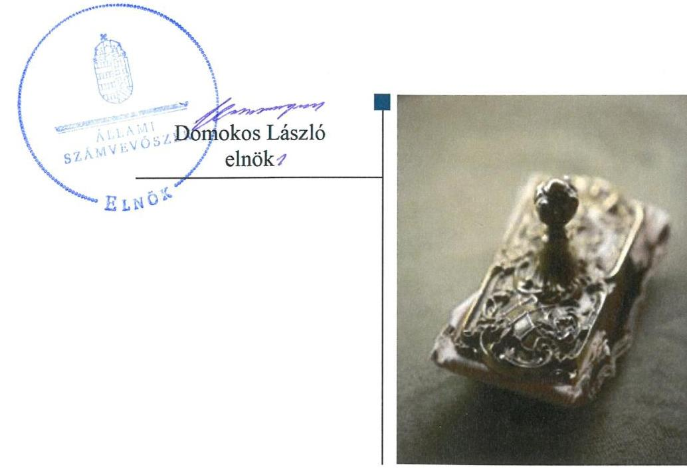
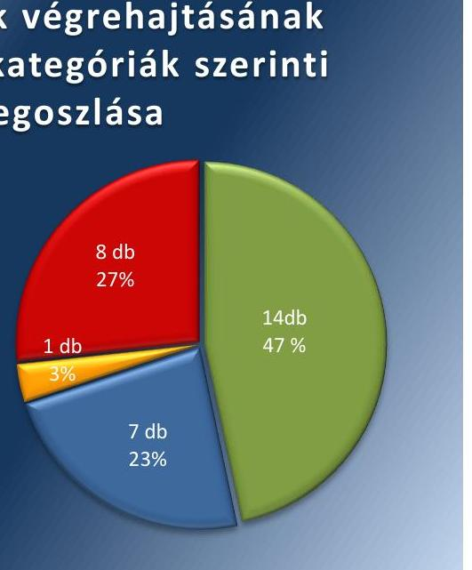
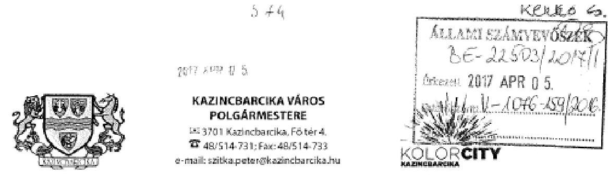
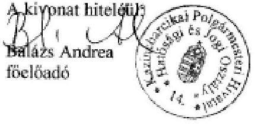

# Jelentés 

## Utóellenőrzések

Az önkormányzatok belső
kontrollrendszere kialakításának és működtetésének ellenőrzése -
Kazincbarcika Város Önkormányzata
2019. D3. hó 25. nap

---

# AZ ELLENŐRZÉST FELÜGYELTE: 

DR. NAGY IMRE felügyeleti vezető

## AZ ELLENŐRZÉST VEZETTE ÉS A VÉGREHAJTÁSÁÉRT FELELŐS:

KISTÓTH KRISZTINA ellenőrzésvezető

## A PROGRAM ÖSSZEÁLLÍTÁSÁÉRT FELELŐS:

TÓTPÁL SZABOLCS osztályvezető

## A TÉMÁHOZ KAPCSOLÓDÓ KORÁBBI SZÁMVEVŐSZÉKI JELENTÉSEK:

- címe: Az önkormányzatok belső kontrollrendszere kialakításának és működtetésének ellenőrzése - Kazincbarcika
- sorszáma: 16229

IKTATÓSZÁM: EL-1503-001/2019
TÉMASZÁM: 2460
ELLENŐRZÉS-AZONOSÍTÓ SZÁM: V-080429

---

# TARTALOMJEGYZÉK 

■ ÖSSZEGZÉS ..... 5
■ AZ ELLENŐRZÉS CÉLJA ..... 6
■ AZ ELLENŐRZÉS TERÜLETE ..... 7
■ AZ ELLENŐRZÉS HÁTTERE, INDOKOLTSÁGA ..... 8
■ A JELENTÉS LÉNYEGES KÉRDÉSKÖRE ..... 9
■ AZ ELLENŐRZÉS HATÓKÖRE ÉS MÓDSZEREI ..... 10
■ MEGÁLLAPÍTÁSOK ..... 12
■ MELLÉKLETEK ..... 15
I. sz. melléklet: Kazincbarcika Város Önkormányzata intézkedési terve végrehajtásának értékelése ..... 15
II. sz. melléklet: Kazincbarcika Város Önkormányzata intézkedési terve ..... 21
■ FÜGGELÉKEK ..... 31
I. sz. függelék a Megállapítások fejezethez ..... 31
II. sz. függelék: Észrevételek ..... 32
■ RÖVIDÍTÉSEK JEGYZÉKE ..... 37

---

.

---

# ÖSSZEGZÉS 

Az Állami Számvevőszék a Kazincbarcika Város Önkormányzata utóellenőrzése során megállapította, hogy az intézkedési tervben foglalt és végrehajtott feladatok hatására a belső kontrollrendszer szabályozottsága javult. Az egyes befektetésekkel kapcsolatos döntés-előkészítés, döntéshozatal és az egyes befektetések számviteli elszámolása és nyilvántartása területén a nem végrehajtott intézkedések miatt a közvagyonnal való szabályszerű gazdálkodás nem valósult meg.

## Az ellenőrzés társadalmi indokoltsága

Az Állami Számvevőszék stratégiájában célul tűzte ki a számvevőszéki munka hasznosulásának javítását. Ezzel összhangban ellenőrzi, hogy az ellenőrzött szervezet megvalósította-e a korábbi ellenőrzései által feltárt hibák, hiányosságok és szabálytalanságok megszüntetése céljából elkészített intézkedési tervében foglaltakat. A rendszeres utóellenőrzések hozzájárulnak a szükséges intézkedések tényleges végrehajtásához, ezáltal a közpénzügyek rendezettségének javulásához.

## Főbb megállapítások, következtetések

Kazincbarcika Város Önkormányzata az intézkedési tervében meghatározott harminc feladatból tizennégyet határidőben, hetet határidőn túl, egyet részben hajtott végre, nyolcat pedig nem hajtott végre.

Kazincbarcika Város Önkormányzata az intézkedési tervben meghatározott feladatoknak megfelelően a Képviselőtestület határozatával elfogadta a 2015-2019. évekre szóló gazdasági programot és a jogszabályi előírásoknak megfelelően felülvizsgálta és módosította gazdálkodási szabályzatát és bizonylati rendjét, aktualizálta számviteli politikáját és az eszközök és források értékelési szabályzatát és kiegészítette belső kontroll szabályzatát. A gazdasági program felülvizsgálatával és a belső szabályzatok kiegészítésével és módosításával a működési folyamatok szabályozottsága javult. A belső kontroll rendszer keretében a kockázatkezelési és az információs és kommunikációs rendszer területén csökkent a kockázat az Integrált Kockázatkezelési szabályzat, az Információ átadási szabályzat és a Beszámolási eljárások szabályzatának kiadásával.

Az egyes befektetésekkel kapcsolatos döntés előkészítés és döntéshozatal területén a szabálytalan döntéshozatal kockázata nőtt, mert a polgármester nem intézkedett a képviselőtestületi hatáskörök átruházásának meghatározásáról és betartásáról és a jegyző nem gondoskodott a jogszabályok és a hatályos képviselőtestületi SZMSZ szerinti befektetésekkel kapcsolatos döntés előkészítésről és végrehajtásról. Továbbá a jegyző nem szabályozta a befektetési célú ingatlanok megszerzése esetén a kötelezettségvállalás és a pénzügyi ellenjegyzés rendjét a Gazdálkodási szabályzatban. A korábbi ellenőrzésnél feltárt részesedések bekerülési érték meghatározási és értékvesztés elszámolási hibák javításra kerültek a 2016. évi beszámolóban. A jegyző nem gondoskodott a 2017. évi beszámoló készítése során a részesedések bekerülési értékének szabályszerű meghatározásáról és értékeléséről. Ezáltal az átmenetileg szabad pénzeszközök szabályos és körültekintő befektetését nem biztosították.

Kazincbarcika Város Önkormányzata nem vezetett hitelesített nyilvántartást az intézkedési tervben rögzített feladatok végrehajtásáról.

---

# AZ ELLENŐRZÉS CÉLJA 

Az ellenőrzés célja annak értékelése volt, hogy a számvevőszéki jelentésben foglalt intézkedést igénylő megállapításokkal összhangban készített intézkedési tervben meghatározott feladatokat az ellenőrzött szervezet végrehajtotta-e.

---

# AZ ELLENŐRZÉS TERÜLETE 

## Kazincbarcika Város Önkormányzata

Kazincbarcika város az Észak-magyarországi régióban, Borsod-Abaúj-Zemplén megyében található. Állandó lakosainak száma a Központi Statisztikai Hivatal Magyarország közigazgatási helynévkönyve alapján 2017. január 1-jén 26706 fő volt.

A Polgármester ${ }^{1}$ a 2006. évi önkormányzati választások óta vezeti a 15 tagú Képviselő-testületet, amely három állandó bizottságot hozott létre. A jegyző ${ }^{2}$ 2013. márciustól látja el feladatait.

A 2017. évi éves költségvetési beszámoló szerint a 2017. évben az Önkormányzat 6260 M Ft költségvetési kiadást teljesített és 14139 M Ft költségvetési bevétellel gazdálkodott, 2017. december 31-én 28039 M Ft értékű eszközvagyonnal rendelkezett.

Az ÁSZ ${ }^{3}$ 2014. január 1. és a 2015. április 30. közötti időszakra vonatkozóan végezte el az Önkormányzat ${ }^{4}$ belső kontrollrendszere kialakításának és működtetésének ellenőrzését, az egyes befektetési tevékenységeinek ellenőrzése tekintetében az ellenőrzött időszak a 2011. január 1. - 2015. április 30. közötti időszak volt. Az ellenőrzés célja annak megállapítása volt, hogy az önkormányzat belső kontrollrendszerének kialakítása, továbbá egyes elemeinek működtetése biztosította-e a közpénz felhasználás szabályosságát. Az erőforrásokkal való szabályszerű és hatékony gazdálkodáshoz szükséges követelmények érvényesítése, számonkérése, ellenőrzése meg-történt-e az önkormányzatnál. A belső kontrollrendszer kialakítása és működtetése támogatta-e az integritás szemlélet érvényesülését, valamint a belső kontrollrendszer kialakításának és működtetésének szabályszerűségének értékelése. Az ÁSZ továbbá ellenőrizte, hogy az önkormányzat egyes befektetési döntései és azok végrehajtása, elszámolása megfelelt-e a vonatkozó jogszabályoknak és belső szabályozásoknak, a kialakított kontrollrendszer támogatta-e a befektetési tevékenység szabályszerűségét. Az ÁSZ 16229-es számú jelentését 2016. december 13-án hozta nyilvánosságra.

Az ÁSZ jelentés az Önkormányzat Jegyzője részére kilenc, a Polgármester részére öt intézkedést igénylő megállapítást tartalmazott. Ez alapján a Polgármester az ÁSZ Elnökének megküldte az Önkormányzat 30 feladatot tartalmazó, a Képviselő-testület ${ }^{5}$ által 43/2017. (III. 30.) számú határozattal jóváhagyott intézkedési tervét. Az Állami Számvevőszék Elnöke 2017. április 28-án kelt levelében tájékoztatta a polgármestert, hogy az intézkedési terv rendelkezései összhangban vannak az ÁSZ jelentésben foglalt intézkedést igénylő megállapításokkal.

---

# AZ ELLENŐRZÉS HÁTTERE, INDOKOLTSÁGA 

Az ÁSZ tv. ${ }^{6}$ 33. § (1) bekezdése értelmében a számvevőszéki jelentések intézkedést igénylő megállapításaihoz és javaslataihoz kapcsolódóan az ellenőrzött szervezet vezetője intézkedési tervet köteles összeállítani, és az Állami Számvevőszék részére megküldeni.

Az ÁSZ által befogadott intézkedési tervben foglaltak megvalósítását az ÁSZ tv. 33. § (7) bekezdésében foglaltak alapján - az Állami Számvevőszék utóellenőrzés keretében ellenőrizheti. Az utóellenőrzések keretében - az intézkedések értékelése során - az Állami Számvevőszék figyelembe veszi az ellenőrzött szervezetek működési feltételeiben, valamint a jogszabályi előírásokban bekövetkezett változásokat.

Az utóellenőrzés során az ÁSZ értékeli, hogy az érintett számvevőszéki jelentésben foglalt intézkedést igénylő megállapításokkal és javaslatokkal összhangban, az ellenőrzött szervezet által készített intézkedési tervben meghatározott feladatokat a feladatra kijelöltek végrehajtották-e.

Az intézkedések végrehajtásával az adott terület szabályszerű működése vonatkozásában a kockázatok csökkenhetnek, azonban hosszabb távon az intézkedési tervben foglaltak végrehajtásával önmagában nem szűnnek meg, csak akkor, ha beépülnek az ellenőrzött szervezet működésébe, azokat folyamatosan karban tartják, figyelembe véve, illetve kezelve a változásokat. Emellett az intézkedések végrehajtásáig újabb kockázatok merülhetnek fel a szabályszerű működés vonatkozásában, amelyek kezelése szintén kiemelten fontos az ellenőrzött szervezet számára.

Az ellenőrzött szervezet vezetője által készített intézkedési tervekben foglalt feladatok hiányos, illetve késedelmes végrehajtása, vagy annak elmaradása a szabályszerűség és a felelős vezetői magatartás vonatkozásában kockázatot hordoz, ami azt mutatja, hogy az ellenőrzések során feltárt hibák, hiányosságok és szabálytalanságok kezelése nem kapott kellő hangsúlyt. Az utóellenőrzés során is fennálló szabálytalanságok esetén a közpénz, közvagyon veszélyeztetettségi kockázat valószínűsített hatásának értékelése további intézkedéseket vonhat maga után.

Az ellenőrzött szervezet szintjén az utóellenőrzés feltárja, hogy a szervezet az intézkedések végrehajtásával hasznosította-e a korábbi ellenőrzési jelentésben a hiányosságok megszüntetése, illetve a kockázatok kezelése érdekében megfogalmazott javaslatokat, illetve az intézkedések végrehajtása elmaradásának következtében továbbra is fennálló szabálytalanság esetén értékeli a közpénzek, közvagyon veszélyeztetettségét.

Az ÁSZ szintjén az utóellenőrzés visszacsatolást ad az ellenőrzési jelentések hasznosulásáról, az intézkedések elmaradásának, vagy részleges megvalósulásának a közpénzek, közvagyon veszélyeztetettségére gyakorolt valószínűsített hatásának értékelése, további intézkedéseket vonhat maga után.

---

# A JELENTÉS LÉNYEGES KÉRDÉSKÖRE 

Az Önkormányzat az intézkedési tervben foglaltakat az előírt határidőben végrehajtotta-e?

---

# AZ ELLENŐRZÉS HATÓKÖRE ÉS MÓDSZEREI 

## Az ellenőrzés típusa

Megfelelőségi ellenőrzés.

## Az ellenőrzött időszak

Az utóellenőrzés alapját képező ÁSZ jelentés közzétételének napjától az ellenőrzésről szóló kiértesítő levél keltének napjáig tartó időszak, 2016. december 13. - 2018. július 4.

## Az ellenőrzés tárgya

A számvevőszéki jelentésben foglalt intézkedést igénylő megállapításokkal összhangban - az Önkormányzat által - készített Intézkedési tervben foglaltak végrehajtásának ellenőrzése.

## Az ellenőrzött szervezet

Kazincbarcika Város Önkormányzata és a Kazincbarcikai Polgármesteri Hivatal

## Az ellenőrzés jogalapja

Az ellenőrzés jogszabályi alapját az ÁSZ tv. 33. § (7) bekezdésének előírásai képezik.

## Az ellenőrzés módszerei

Az ellenőrzést az ellenőrzött időszakban hatályos jogszabályok, az ellenőrzés szakmai szabályai, a jelen ellenőrzésre irányadó ÁSZ módszertanok, az ellenőrzési programban foglalt értékelési szempontok szerint végeztük.

Az ellenőrzés ideje alatt az ellenőrzött szervezetekkel történő kapcsolattartást az ÁSZ SZMSZ²-ének vonatkozó előírásai alapján biztosítottuk.

Az utóellenőrzés megállapításait az ÁSZ rendelkezésére álló, valamint az ÁSZ adatbekérése szerint, az ellenőrzött szervezetek által rendelkezésre bocsátott dokumentumok alapozták meg.

Az ellenőrzési bizonyítékként felhasználható adatforrások közé tartoztak egyrészt az ellenőrzési program részletes szempontjainál felsorolt

---

adatforrások, másrészt minden - az ellenőrzés folyamán feltárt, az ellenőrzés szempontjából információt tartalmazó - dokumentum.

Az intézkedési tervekben előírt feladatokat azok végrehajthatósága, illetve végrehajtása szempontjából az alábbiak szerint értékeltük:
"határidőben végrehajtott" a feladat, ha a teljesítés dokumentáltan, az intézkedési tervben előírt határidőben és tartalommal megtörtént;
"határidőn túl végrehajtott" a feladat, ha annak teljesítése az intézkedési tervben meghatározott módon, de az előírt határidőn túl történt meg;
"részben végrehajtott" a feladat, ha végrehajtása teljes körűen az intézkedési tervben előírt módon nem történt meg;
"nem végrehajtott" a feladat, ha a végrehajtás nem történt meg, vagy amennyiben a teljesítést nem dokumentálták;
"okafogyottá vált" a feladat, ha végrehajtására - meghatározott esemény bekövetkezése, továbbá külső körülmény, a működést érintő feltétel változása miatt - már nincs szükség, illetve lehetőség, és egyértelműen megállapítható, hogy az intézkedést szükségessé tevő körülmény a jövőben nem fordulhat elő;
"nem időszerű" az a feladat, amelynek ellenőrzési időszakon belüli végrehajtására azért nem került (kerülhetett) sor, mert az intézkedés alapjául szolgáló esemény nem következett be, de annak jövőbeni előfordulása lehetséges, a végrehajtása nem volt esedékes, vagy a végrehajtás határideje még nem járt le.
Az ellenőrzés lefolytatásához az ellenőrzött szervezetek a tanúsítványok elektronikus kitöltésével, valamint az ÁSZ által kért dokumentumok elektronikus megküldésével szolgáltattak adatokat, amelyek valódiságát és teljes körűségét az ellenőrzött szervezetek vezetője által tett teljességi és hitelességi nyilatkozat igazolja. Az így rendelkezésre bocsátott adatok, információk kontrollja az ellenőrzés keretében megtörtént.

---

# MEGÁLLAPÍTÁSOK 

## Az Önkormányzat az intézkedési tervben foglaltakat az előírt határidőben végrehajtotta-e?

Összegző megállapítás

Az Önkormányzat az intézkedési tervben szereplő harminc feladatból tizennégyet határidőben, hetet határidőn túl hajtott végre, egyet részben, nyolcat nem hajtott végre. Az intézkedési tervben meghatározott feladatok végrehajtásáról nem vezettek nyilvántartást.

Az Önkormányzat az általa elkészített intézkedési tervében ${ }^{8}$ meghatározott feladatok közül tizennégyet határidőben, hetet határidőn túl hajtott végre, egyet részben végrehajtott, nyolcat pedig nem hajtott végre.

A feladatokat, határidőket,
 megjelölt felelősöket és a feladatok végrehajtásának értékelését az I. sz. melléklet mutatja be.

Az Önkormányzat az intézkedési tervben meghatározott feladatok végrehajtásáról nem vezette a Bkr. ${ }^{9} 14 . \S$ (1) bekezdésben előírt nyilvántartást.

Az Önkormányzat intézkedési tervében vállalt feladatok végrehajtásának értékelését az 1. ábra szemlélteti.

1. ábra

## A feladatok végrehajtásának értékelési kategóriák szerinti megoszlása

Határidőben végrehajtott
Határidőn túl végrehajtott
Részben végrehajtott
Nem végrehajtott

Forrás: ÁSZ

---

A BELSŐ KONTROLLRENDSZER kontrollkörnyezete javult, a szabálytalan működés kockázata csökkent, mert a szabályzatok jogszabályi előírásoknak megfelelő felülvizsgálata illetve módosítása és kiegészítése érdekében a felelősök az intézkedéseket megtették. Az Önkormányzat gazdasági programalkotási és felülvizsgálati kötelezettségét teljesítette, a 2015-2019 évi gazdasági programot a Képviselő-testület elfogadta (1, 11).

A működés feltételeit megalapozó Gazdálkodási szabályzat ${ }^{10}$ kiegészítéséről gondoskodott a jegyző az Ávr ${ }^{11}$. érvényesítésre vonatkozó előírásainak megfelelően (16) és a 100000 forint alatti írásbeli kötelezettségvállalást nem igénylő kifizetések rendjének meghatározásával (5). Továbbá a Számv. tv. ${ }^{12}$ változása alapján aktualizálta a Számviteli politikát ${ }^{13}$ és az annak keretében elkészítendő szabályzatokat (7).

A jegyző intézkedett a számviteli politikának a bekerülési értékre vonatkozó jogszabályokkal történő kiegészítéséről (19) és az Eszközök és Források értékelési Szabályzatának ${ }^{14}$ aktualizálásakor a részvények értékvesztése elszámolási módjának a Számv. tv-hez igazításáról (21).

A Képviselő-testület elfogadta a Szervezeti és működési szabályzatának ${ }^{15}$ az önkormányzati bizottságok nem képviselő tagjainak vagyonnyilatkozat-tételi kötelezettségével történő kiegészítését (2,12).

A kockázatkezelési rendszer kialakítása érdekében a jegyző gondoskodott az Integrált Kockázatkezelési Szabályzat ${ }^{16}$ kiadásáról (9).

Az információs és kommunikációs rendszer szabályszerűsége érdekében a jegyző kiadta az Információátadási szabályzatot ${ }^{17}$ és a Beszámolási eljárások szabályzatát ${ }^{18}$ (17,18).

# AZ EGYES BEFEKTETÉSEKKEL KAPCSOLATOS DÖNTÉSHOZATAL ÉS AZ EGYES BEFEKTETÉSEK SZÁMVITELI ELSZÁMOLÁSA ÉS NYILVÁNTARTÁSA területén nőtt a kockázat. A polgármester nem gondoskodott a befektetésekkel kapcsolatos döntések esetén az átruházott hatáskörök pontos meghatározásáról és betartásáról (24). A jegyző az intézkedési tervben vállaltak ellenére nem intézkedett a befektetésekkel kapcsolatos döntések előkészítése és végrehajtása során a jogszabályok és a hatályos képviselő testületi SZMSZ szerinti eljárásról (23), továbbá, hogy a Gazdálkodási szabályzat kiegészítésre kerüljön a befektetési célú ingatlanok szerzése esetén követendő kötelezettségvállalás és a pénzügyi ellenjegyzés rendjével (28).

Az egyes befektetések számviteli elszámolása és nyilvántartása érdekében a jegyző gondoskodott a 2016. évi beszámolóban a meglévő tartós részesedések korábbi bekerülési érték és értékvesztés elszámolási hibáinak kijavításáról, azonban a 2017. évi beszámoló készítése során a részesedések bekerülési értékének a Számv. tv. és az Áhsz. ${ }^{19}$ szerinti meghatározásáról és a részesedések értékeléséről a Számv. tv. 54. § (2) bekezdésében foglaltak ellenére nem intézkedett (29, 30). Ugyanakkor az értékpapírok, részesedések részletező nyilvántartása nem tartalmazta az Áhsz. 14. melléklet VIII. 2. c)-i) pontjaiban előírt kötelező tartalmi elemeket (22).

---

.

---

# MELLÉKLETEK

- I. SZ. MELLÉKLET: KAZINCBARCIKA VÁROS ÖNKORMÁNYZATA INTÉZKEDÉSI TERVE VÉGREHAJTÁSÁNAK ÉRTÉKELÉSE

|  1. | Az intézkedési tervben rögzített feladat | Az intézkedési tervben meghatározott határidő | Az intézkedési tervben meghatározott felelős | A feladat végrehajtása  |
| --- | --- | --- | --- | --- |
|  1. | 2. | 3. Határidőben végrehajtott feladatok |  | 5.  |
|  1. | A Képviselő-testület 112/2015. (V. 29.) határozatával elfogadta a 2015-2019. évekre szóló gazdasági programot. Az ezt követő időszakban a gazdasági programot a vonatkozó hatályos jogszabályi előírásoknak megfelelően kell a Kép-viselő-testület elé terjeszteni. | értelemszerű | polgármester, jegyző, városüzemeltetési és fejlesztési osztályvezető | A Képviselő-testület a 112/2015. (V. 29.) számú határozattal elfogadta a 2015-2019. évekre vonatkozó Gazdasági Programot.  |
|  2. | A Képviselő-testület szervezeti és működési szabályzatáról szóló 8/2013. (IV. 19.) számú önkormányzati rendelet módosítására vonatkozó rendelet-tervezetet - mely tartalmazza az önkormányzati bizottságok nem képviselő tagjai vagyonnyilatkozat-tételi kötelezettségét - legkésőbb a Képviselő-testület 2017. február 9-i munkaterv szerinti ülésére elő kell terjeszteni. (A Képviselő-testület 1/2017. (I. 19.) rendeletével módosításra került a Képviselő-testület szervezeti és működési szabályzatáról szóló 8/2013. (IV. 19.) számú önkormányzati rendelet.) | 2017. február 9. | polgármester | A Kazincbarcika Város Önkormányzat Képviselő-testület 1/2017. (I. 19.) rendeletével a Képviselő-testület szervezeti és működési szabályzatába (41. § (2) bekezdés) beépítésre került az önkormányzati bizottságok nem képviselő tagjai vagyonnyilatkozat-tételi kötelezettsége.  |
|  3. | A szociális szolgáltatástervezési koncepció felülvizsgálatára vonatkozó előterjesztést a Képviselő-testület 215/2016. (XII. 16.) határozatával elfogadott 2017. évi munkaterve szerint, a Képviselő-testület 2017. április 27-i munkaterv szerinti ülésére be kell terjeszteni. | 2017. április 27. | polgármester | A Képviselő-testület a 66/2017. (IV. 27.) számú határozattal elfogadta a felülvizsgált 2017. évi szociális szolgáltatástervezési koncepciót.  |
|  4. | Az ellenőrzés során feltárt - jelen pontban hivatkozott hiányosságok tekintetében a munkajogi felelősség megvizsgálásra kerül, az erre vonatkozó intézkedés megtörténik. | 2017. június 30. | polgármester | A polgármester 2017. június 19-én kelt levelében tájékoztatta a jegyzőt, hogy az ÁSZ által jelzett hiányosságok kapcsán a vizsgált időszakban olyan cselekményt, ellenőrzési és irányítás hiányosságot, ami alapján munkajogi felelősségre vonásra irányuló eljárást kellene kezdeményezni nem lát indokoltnak.  |

---

|  1. | Az intézkedési tervben rögzített feladat | Az intézkedési tervben meghatározott határidő | Az intézkedési tervben meghatározott felelős | A feladat végrehajtása  |
| --- | --- | --- | --- | --- |
|  1. | 2. | 3. | 4. | 5.  |
|  5. | A Gazdálkodási Szabályzatban tételesen meg kell határozni a 100.000 Ft alatti, írásbeli kötelezettségvállalást nem igénylő kifizetések rendjét az államháztartásról szóló törvény végrehajtásáról szóló 368/2011. (XII. 31.) Korm. rendelet (továbbiakban: Ávr.) 53. § (2) bekezdésének megfelelően. | 2017. augusztus 31. | jegyző és gazdálkodási osztályvezető | A jegyző a 2017. május 8-i 7/2017. számú rendelkezésével kiadott Gazdálkodási szabályzatban meghatározta a 100000 forint alatti, írásbeli kötelezettségvállalást nem igénylő kifizetések rendjét.  |
|  6. | A Bizonylati rend előírásait összhangba kell hozni a Számv. tv. 161. § (2) bekezdés d) pontjában megfogalmazottakkal. | az IT elfogadását követő 60 napon belül, valamint jogszabály változást követően a Számv. tv. 161. § (5) bekezdésében meghatározottak szerint. | jegyző és gazdálkodási osztályvezető | A jegyző a 2017. május 8-án kiadott 13/2017. számú rendelkezésével a Bizonylati szabályzat ${ }^{20}$ és bizonylati albumban a Számv. tv. 161. § (2) bekezdés d) pontjának megfelelően a bizonylati rendet kialakította.  |
|  7. | A Számviteli Politikát és az annak keretében elkészítendő szabályzatokat aktualizálni kell a Számv. tv. 14.§ (11) bekezdésében és az Áhsz. 50. § (1) bekezdésében leírtak szerint. | az IT elfogadását követő 60 napon belül, valamint jogszabály változást követően a Számv. tv. 161. § (5) bekezdésében meghatározottak szerint. | jegyző és gazdálkodási osztályvezető | A jegyző a 2017. május 8-án kiadott 5/2017. Számviteli Politika, a 10/2017. Leltározási és leltárkészítési szabályzatról és a 8/2017. Eszközök és források értékelési szabályzatáról rendelkezésekben az intézkedést végrehajtotta a Számv. tv. 14. § (11) bekezdésében és az Áhsz. 50. § (1) bekezdésében előírtak szerint.  |
|  8. | A köztisztviselők munkaköri leírásainak felülvizsgálata 2015. augusztus 28-át követően megtörtént, meghatározásra kerültek a Kttv. 75. § (1) bekezdés d) pontjában szabályozott, munkakör betöltésével kapcsolatos követelmények. Ezen előírás betartására a jövőben is fokozott figyelmet kell fordítani. | folyamatos | jegyző | Az intézkedés végrehajtását igazolóan megküldött munkaköri leírásokban meghatározásra kerültek a munkakör betöltésével kapcsolatos követelmények.  |
|  9. | Biztosítani kell a kockázatelemzés belső előírásainak és a felsőbb jogszabályok előírásainak összhangját, különös tekintettel a befektetési tevékenységgel kapcsolatos kockázatok elemzésére, a szükséges intézkedések és megtéte- | 2017. augusztus 31., illetve folyamatos | jegyző és gazdálkodási osztályvezető | A jegyző a 2017. május 8-án 14/2017. számú rendelkezésével kiadott Integrált Kockázatkezelési Szabályzatban biztosította a költségvetési szerv tevékenységében rejlő és szervezeti célokkal összefüggő kockázatok megállapítását, az egyes kockázatokkal kapcsolatban szükséges intézkedéseket, valamint azok teljesítésének folyamatos nyomon követési módját a Bkr. 7. §. (2) bekezdés előírásai szerint.  |

---

|  1. | Az intézkedési tervben rögzített feladat | Az intézkedési tervben meghatározott határidő | Az intézkedési tervben meghatározott felelős | A feladat végrehajtása  |
| --- | --- | --- | --- | --- |
|  1. | 2. | 3. | 4. | 5.  |
|   | lük módjára, valamint az intézkedések teljesítésének folyamatos nyomon követésére a Bkr. 7. §. (2) bekezdés előírásai szerint. |  |  |   |
|  10. | A Bkr. 10. §-ában foglalt követelmények szerint kell alakítani a szervezet tevékenységének, a célok megvalósításának nyomon követését biztosító rendszert, biztosítva a folyamatos és eseti nyomon követést. | 2017. augusztus 31. | jegyző | A 2017. május 8-án a 9/2017. számú jegyzői rendelkezéssel kiadott Belső Kontrollrendszer szabályzat ${ }^{21}$ tartalmazza a nyomon követési rendszert.  |
|  11. | A Képviselő-testület 112/2015. (V. 29.) határozatával elfogadta a 2015-2019. évekre szóló gazdasági programot. A jövőben a gazdasági programot a vonatkozó hatályos jogszabályi előírásoknak megfelelő határidőben el kell készíteni. | értelemszerű | jegyző, városüzemeltetési és fejlesztési osztályvezető | A Képviselő-testület a 112/2015. (V. 29.) számú határozattal elfogadta a 2015-2019. évekre vonatkozó Gazdasági Programot.  |
|  12. | A Képviselő-testület szervezeti és működési szabályzatáról szóló 8/2013. (IV. 19.) számú önkormányzati rendelet módosítására vonatkozó rendelet-tervezetet - mely tartalmazza az önkormányzati bizottságok nem képviselő tagjai vagyonnyilatkozat-tételi kötelezettségét - legkésőbb 2017. január 25. napjáig el kell készíteni. | 2017. január 25. | jegyző | A Kazincbarcika Város Önkormányzat Képviselő-testület 1/2017. (I. 19.) rendeletével a Képviselő-testület szervezeti és működési szabályzatába (41. § (2) bekezdés) beépítésre került az önkormányzati bizottságok nem képviselő tagjai vagyonnyilatkozat-tételi kötelezettsége.  |
|  13. | A szociális szolgáltatástervezési koncepciót felül kell vizsgálni, különös tekintettel arra, hogy tartalmazza a szolgáltatások biztosítására vonatkozó ütemtervet. | 2017. április 27. | jegyző, a Kazincbarcikai Szociális Szolgáltató Központ igazgatója és a Városüzemeltetési és Fejlesztési Osztály vezetője | A Képviselő-testület a 66/2017. (IV. 27.) számú határozattal elfogadta a felülvizsgált 2017. évi szociális szolgáltatástervezési koncepciót, amely (a 71. oldalon) tartalmazta a szolgáltatások biztosításának ütemtervét.  |
|  14. | Az ellenőrzés során feltárt —jelen pontban hivatkozott hiányosságok tekintetében a munkajogi felelősség megvizsgálásra kerül, az erre vonatkozó intézkedés megtörténik. | 2017. június 30. | jegyző | A jegyző 2017. június 15-én kelt, a polgármesternek címzett levelében tájékoztatást adott a hiányosságok okairól és arról, hogy a köztisztviselői

 állománynak felróható vétkes magatartást, mely indokolná a munkajogi felelősségre vonást nem tárt fel.  |

---

|  1. | Az intézkedési tervben rögzített feladat | Az intézkedési tervben meghatározott határidő | Az intézkedési tervben meghatározott felelős | A feladat végrehajtása  |
| --- | --- | --- | --- | --- |
|  1. | 2. | 3. Határidőn túl végrehajtott feladatok |  | 5.  |
|  15. | Az ellenőrzési nyomvonal elkészítése során gondoskodni kell a Bkr. 6. § (3) bekezdésében leírtak szerint az irányítási folyamatoknak az ellenőrzési nyomvonalban való bemutatásáról. | Intézkedési Terv elfogadását követően folyamatos | jegyző és gazdálkodási osztályvezető | A 9/2017. (V. 8.) Belső Kontrollrendszer Szabályzatról szóló jegyzői rendelkezés tartalmazza az irányítási folyamatra az ellenőrzési nyomvonalat a Bkr. 6. § (3) bekezdésében leírtak szerint.  |
|  16. | A Gazdálkodási Szabályzatban az Ávr. 57. §. (1) és (3) bekezdésében leírtak szerint megvizsgáljuk a teljesítés igazolásra, pénzügyi ellenjegyzésre vonatkozó előírásokat, azok betartásának és betartatásának módjáról intézkedünk. A Gazdálkodási Szabályzatban az érvényesítésre vonatkozó előírásokat az Ávr. 58. § (3) és az Ávr. 59. § (1) bekezdésében foglaltak szerint határozzuk meg. | Intézkedési Terv elfogadását követően folyamatos | jegyző | A 2017. május 2-án kelt Levél valamennyi osztályvezetőnek tárgyú ügyiratban a jegyző felhívta az osztályvezetők figyelmét a napi munkájuk során a teljesítés igazolás és a pénzügyi ellenjegyzésre vonatkozó előírások betartására. A 7/2017. Gazdálkodási szabályzatban, mely 2017. május 8-án került kiadásra, a jegyző az érvényesítésre vonatkozó előírásokat az Ávr. 58. § (3) és az Ávr. 59. § (1) bekezdésében foglaltak szerint határozza meg.  |
|  17. | A Hivatal egészére teljeskörűen ki kell alakítani az információs és kommunikációs rendszert a Bkr. 3. § d) pontjában leírtaknak megfelelően, különös tekintettel a Bkr. 9. § (1) bekezdése szerint a külső felek részére történő információáramlás tartalmára, módjára, határidejére. | Intézkedési Terv elfogadását követően folyamatos | jegyző | A jegyző a 2017. október 18-án kiadott 22/2017. számú rendelkezésével Információ Átadási Szabályzatban kialakította az információáramlás rendszerét.  |
|  18. | A Bkr. 8. § (4) bekezdés c) pontja és a Bkr. 9. § (2) bekezdésében leírtak szerint szabályozni szükséges a beszámolási eljárásokat és gondoskodni kell a beszámolási rendszerek megfelelő működtetéséről. | Intézkedési Terv elfogadását követően folyamatos | jegyző | A jegyző 12/2017. számú rendelkezésében kiadta a Beszámolási eljárások szabályzatát, mely 2017. május 8-án lépett hatályba.  |
|  19. | A Számviteli Politika felülvizsgálata során külön ki kell térni arra, hogy a bekerülési érték a vonatkozó jogszabályokban leírtak szerint kerüljön meghatározásra, különös tekintettel a befektetett pénzügyi eszközök között kimutatott tartós részesedések bekerülési értékének meghatározásra. | az Intézkedési Terv elfogadását követően folyamatos | jegyző és gazdálkodási osztályvezető | A jegyző a 2017. május 8-án kiadott 5/2017. számú rendelkezésében a Számviteli Politika 6.1. pontja tartalmazza az eszközök és források bekerülési értékének Számv. tv. és Áhsz. szerinti meghatározását.  |
|  20. | A Számv. tv. és az Áhsz. vonatkozó rendelkezései szerint a leltározási szabályzat felülvizsgálata során ki kell térni az idegen helyen tárolt, letétbe helyezett részvények leltározásának módjára. | az Intézkedési Terv elfogadását követően folyamatos | jegyző és gazdálkodási osztályvezető | A 2017. május 8-tól érvényes 10/ 2017. számú rendelkezéssel kiadott Leltározási és leltárkészítési szabályzatban a jegyző kialakította az idegen helyen tárolt, letétbe helyezett részvények leltározásának módját.  |

---

|  1. | Az intézkedési tervben rögzített feladat | Az intézkedési tervben meghatározott határidő | Az intézkedési tervben meghatározott felelős | A feladat végrehajtása  |
| --- | --- | --- | --- | --- |
|  2. | 2. | 3. | 4. | 5.  |
|  21. | Az Eszközök és Források Értékelési Szabályzatának aktualizálásakor a Számv. tv. 54. § (1) bekezdésében, az Áhsz. 18. § (1) bekezdésében leírtaknak megfelelően kell szabályozni az értékvesztés elszámolásának módját, különös tekintettel a részvények értékvesztésének meghatározására és elszámolásra. | az Intézkedési Terv elfogadását követően folyamatos | jegyző és gazdálkodási osztályvezető | A jegyző 8/2017. számú rendelkezésével az Eszközök és Források értékelési szabályzat 2017. május 8 -ai hatálybalépésével a részvények értékvesztése elszámolási módjának a Számv. tv-hez történő igazítása megtörtént.  |
|  22. | A mérlegbeszámolóban szerepeltett részvényekről az Áhsz. 39. § (3) bekezdése és a 14. melléklet VIII. 2. pontja szerinti analitikus, részletező nyilvántartó kartont kell vezetni. | az Intézkedési Terv elfogadását követően folyamatos | jegyző és gazdálkodási osztályvezető | Végrehajtott feladatrész:
Az ÁSZ 16229 számú jelentésében megállapított hiányosság javításaként az értékpapírok analitikus részletező nyilvántartását kiegészítették a KÖZVIL Zrt. részvény analitikájával, amely tartalmazta a vásárlás időpontját, a részvény sorszámát, darabszámát, kibocsátóját, névértékét és beszerzési értékét.
Nem végrehajtott feladatrész:
Az analitikus részletező nyilvántartás nem tartalmazta az Áhsz. 14. melléklet VIII. 2. c)-i) pontjaiban előírt kötelező tartalmi elemeket.  |
|  23. | Az Önkormányzati befektetésekkel kapcsolatos döntések előkészítése és szabályszerű végrehajtása során a felsőbb rendű jogszabályokban, valamint a mindenkor hatályos Képviselő - Testület Szervezeti és Működési Szabályzatában leírtak szerint kell eljárni. | folyamatos | jegyző | A jegyző a 2017. május 2-án kelt Levél valamennyi osztályvezetőnek tárgyú ügyiratban felhívta az osztályvezetők figyelmét a napi munkájuk során az Áht. és az Ávr. továbbá az önkormányzat belső szabályzataiban foglalt előírások betartására, azonban a 43/2017. (III. 30.) önkormányzati határozat ellenére a jogszabályok és a hatályos képviselő testületi SZMSZ szerinti befektetésekkel kapcsolatos döntés előkészítésről és végrehajtásról nem gondoskodott.  |
|  24. | Az Önkormányzati befektetésekkel kapcsolatos döntések előkészítése és szabályszerű végrehajtása során... Különös figyelmet kell fordítani az átruházott hatáskörök pontos meghatározására és betartására. | folyamatos | polgármester | A Mótv. 41. § (4) bekezdés előírásai ellenére a polgármester nem intézkedett a befektetésekkel kapcsolatos döntések előkészítése és végrehajtása során az átruházott hatáskörök pontos meghatározásáról és betartásáról.  |
|  25. | A Számlarend felülvizsgálata során ki kell térni a részletező nyilvántartások vezetésének módjára, az összesítő bizonylatok tartalmi és formai követelményének felsorolására az államháztartás számviteléről szóló 4/2013. (I. 11.) Korm. rendelet (Áhsz.) 51. § (3) bekezdése szerint. | az IT elfogadását követő 60 napon belül, valamint jogszabály változást követően a Számv. tv. 161. § (5) | jegyző és gazdálkodási osztályvezető | A jegyző nem intézkedett a Számlarend szabályzat kiegészítéséről. A számlarend továbbra sem tartalmazza az Áhsz. 51. § (3) bekezdése ellenére a részletező nyilvántartások vezetésének módját és az összesítő bizonylatok tartalmi és formai követelményeit.  |

---

|  1. | Az intézkedési tervben rögzített feladat | Az intézkedési tervben meghatározott határidő | Az intézkedési tervben meghatározott felelős | A feladat végrehajtása  |
| --- | --- | --- | --- | --- |
|  1. | 2. | 3. | 4. | 5.  |
|   |  | bekezdésében meghatározottak szerint. |  |   |
|  26. | A közfeladatot ellátó szervek iratkezelésének általános követelményeiről szóló 335/2005. (XII.29.) Korm. rendelet (továbbiakban: lkr.) 38. § előírásai alapján az iratkezelés eljárási rendjének kialakításakor rendelkezni kell a személyes adatok kezeléséhez való hozzájárulást tartalmazó kérelmek kezeléséről. | 2017. augusztus 31. | jegyző | A jegyző nem intézkedett az lkr. 38. § ellenére a személyes adatok kezeléséhez való hozzájárulást tartalmazó kérelmek kezeléséről. Az 5/2018. számú 2018. június 5-i jegyzői rendelkezésű Iratkezelési szabályzatot a 1995. évi LXVI. tv. 10. § (1) bekezdés c) pontjában foglaltak ellenére nem a Magyar Nemzeti Levéltár, valamint a Borsod-Abaúj-Zemplén Megyei Kormányhivatal egyetértésével adták ki.  |
|  27. | A Bkr. 14. § (1) bekezdésével összhangban nyilvántartást kell vezetni a külső ellenőrzések javaslatai alapján készített intézkedési tervek végrehajtásáról. | 2017. augusztus 31. | jegyző | A jegyző a Bkr. 14. § (1) bekezdésben előírtak ellenére nem intézkedett a külső ellenőrzési jelentések javaslatai alapján készített nyilvántartás vezetéséről.  |
|  28. | A Gazdálkodási Szabályzat felülvizsgálata során külön ki kell térni a befektetési célú ingatlanok megszerzése esetében a kötelezettségvállalás és a pénzügyi ellenjegyzés rendjének szabályozására az Áht. 37. § (1) bekezdése szerint. | 2017. augusztus 31. | jegyző | A 7/2017. (V. 8.) számon kiadott jegyzői rendelkezés a Gazdálkodási szabályzatról - a 43/2017. (III. 30.) önkormányzati határozat ellenére - nem tér ki külön a befektetési célú ingatlanok szerzése esetén követendő kötelezettségvállalás és a pénzügyi ellenjegyzés rendjére.  |
|  29. |  |  |  | Az ÁSZ 16229 számú jelentésében feltárt bekerülési érték elszámolási szabálytalanságokat kijavították. A 2016. évi beszámolóban a KÖZVIL Zrt. részvény mérlegértékét helyesbítették a névértékről a vételárra. Az ÚTVASÚT Rt. részvényt 2016. december 31-ével kivezették a könyvekből. Ugyanakkor a jegyző a 2017. évi mérlegbeszámoló készítése során a részesedések könyvekben történő bekerülési értékét a Számv. tv. 49. § (3) bekezdés és az Áhsz. 16. § (5) bekezdés előírásai szerint nem támasztotta alá.  |
|   | A mérlegbeszámoló készítése során a részesedések könyvekben történő kimutatását a Számv. tv. és az Áhsz. vonatkozó rendelkezése szerint kell elvégezni. | az Intézkedési Terv elfogadását követően folyamatos | jegyző és gazdálkodási osztályvezető | Az ÁSZ 16229 számú jelentésében megállapított EHEP részvény könyvszerinti érték és piaci érték közötti veszteségjellegű különbözet elszámolásának elmaradását kijavították, az EHEP részvény értékvesztését a 2016. évi beszámolóban elszámolták. Ugyanakkor a jegyző nem gondoskodott a 2017. évi mérlegbeszámoló készítése során, hogy a részesedések értékelését a Számv. tv. 54. § (2) bekezdés b) pontja szerint elvégezzék.  |

---

# II. SZ. MELLÉKLET: KAZINCBARCIKA VÁROS ÖNKORMÁNYZATA INTÉZKEDÉSI TERVE

1018-2/2017/IK

Melléklet: módosított intézkedési terv
43/2017. (III.30.) határozat

## Állami Számvevőszék

### Budapest

Apáczai Csere János út 10.
1052

**Tárgy:** V-1076-150/2016-os iktatószámú jelentés tervezethez kapcsolódó észrevételek

Tisztelt Domokos László Úr!

Mellékelten megküldöm az „Önkormányzatok belső kontrolirendszere - Az önkormányzatok belső kontrolirendszere kialakításának és működtetésének ellenőrzése - Kazincbarcika” címmel készített jelentésben foglalt megállapításokhoz kapcsolódó módosított intézkedési tervet.

A megküldött módosított intézkedési tervet Kazincbarcika Város Önkormányzat Képviselőtestülete a 43/2017. (III.30.) határozatával fogadta el, mely határozatot mellékelten csatolok.

Kazincbarcika, 2017. március 30.

Tisztelettel

Szitka Péter
polgármester

---

# Kivonat: Kazincbarcika Város Önkormányzat Képviselő-testülete 2017. március 30-i ülésének jegyzőkönyvéből

## Kazincbarcika Város Önkormányzat Képviselő-testületének 43/2017. (III. 30.) határozata

az Állami Számvevőszék "önkormányzat belső kontrollrendszere kialakításának és működtetésének ellenőrzéséről" szóló jelentésének végrehajtására vonatkozó módosított Intézkedési Terv elfogadásáról

Kazincbarcika Város Önkormányzat
 Képviselő-testülete az előterjesztést megtárgyalta és az alábbi határozatot hozta:

1. A Képviselő-testület az Állami Számvevőszéknek az "önkormányzat belső kontrollrendszere kialakításának és működtetésének ellenőrzéséről" szóló jelentésének végrehajtására vonatkozó Intézkedési Tervet érintő észrevételeit, módosító javaslatait megismerte.
2. A Képviselő-testület az ellenőrzés során feltárt hiányosságok felszámolása érdekében a határozat mellékletét képező módosított Intézkedési Tervet jóváhagyja.
3. A Képviselő-testület utasítja a polgármestert és a jegyzőt a módosított Intézkedési Tervben foglaltak végrehajtására, valamint arra, hogy a megtett intézkedésekről a módosított intézkedési Tervben szereplő határidő lejártát követő munkaterv szerinti Képviselő-testületi ülésen tájékoztassa a Képviselő-testületet.
4. A Képviselő-testület utasítja a Polgármestert, hogy a jóváhagyott - módosított - Intézkedési Tervet az Állami Számvevőszéknek az előírt határidőben küldje meg.

**Felelős:** Szitka Péter polgármester
Dr. Szuromi Krisztina jegyző

**Határidő:** 2017. március 30. illetve az Intézkedési Tervben foglaltak szerint

k. m. f.

Klimon István sk.
alpolgármester

Dr. Szuromi Krisztina sk. jegyző

---

a 43/ 2017. (III. 30.) határozat melléklete

# MÓDOSÍTOTT INTÉZKEDÉSI TERV 

az Állami Számvevőszék „önkormányzat belső kontrollrendszere kialakításának és működtetésének ellenőrzéséről" szóló jelentésének végrehajtására

Az ÁSZ Jelentés intézkedést igénylő javaslatai a polgármesternek:

1. Intézkedjen a gazdasági programról szóló előterjesztés Képviselő-testület elé terjesztéséről.
(1.1. számú megállapítás 1. bekezdés 3. pont 3. mondata, 4.1. számú megállapítás 3. bekezdése alapján)

A Képviselő-testület 112/2015.(V.29.) határozatával elfogadta a 2015-2019. évekre szóló gazdasági programot. Az ezt követő időszakban a gazdasági programot a vonatkozó hatályos jogszabályi előírásoknak megfelelően kell a Képviselő-testület elé terjeszteni.

Felelős: polgármester
Határidő: értelemszerű
2. Intézkedjen olyan képviselő-testületi szervezeti és működési szabályzat tervezetről szóló előterjesztés Képviselő-testület elé terjesztéséről, amely tartalmazza az önkormányzati bizottságok nem képviselő tagjai vagyonnyilatkozat-tételi kötelezettségét.
( 1.2. számú megállapítás 2. bekezdés 2. mondata alapján )

A Képviselő-testület szervezeti és működési szabályzatáról szóló 8/2013.(IV.19.) számú önkormányzati rendelet módosítására vonatkozó rendelettervezetet- mely tartalmazza az önkormányzati bizottságok nem képviselő tagjai vagyonnyilatkozat-tételi kötelezettségét - legkésőbb a Képviselő-testület 2017. február 9.-i munkaterv szerinti ülésére elő kell terjeszteni. (A Képviselő-testület 1/2017 (I. 19.) rendeletével módosításra került a Képviselő-testület szervezeti és működési szabályzatáról szóló 8/2013.(IV.19.) számú önkormányzati rendelet.)

Felelős: polgármester
Határidő: 2017. február 9.

---

3. Intézkedjen a befektetésekkel kapcsolatos döntések meghozatalával kapcsolatosan a jogszabályok betartásáról.
(2.1. számú megállapítás 4. bekezdése alapján)

Az Önkormányzati befektetésekkel kapcsolatos döntések előkészítése és szabályszerű végrehajtása során a felsőbb rendű jogszabályokban, valamint a mindenkor hatályos Képviselő-Testület Szervezeti és Működési Szabályzatában leírtak szerint kell eljárni.

Felelős: jegyző
Határidő: folyamatos
24. Különös figyelmet kell fordítani az átruházott hatáskörök pontos meghatározására és betartására.

Felelős: polgármester
Határidő: folyamatos
4. Intézkedjen a jogszabályi előírásoknak való megfelelés érdekében szociális szolgáltatástervezési koncepcióról szóló előterjesztés Képviselő-testület elé terjesztéséről.
(4.1. számú megállapítás 5. bekezdése alapján )

A szociális szolgáltatástervezési koncepció felülvizsgálatára vonatkozó előterjesztést a Képviselő-testület 215/2016.(XII.16.) határozatával elfogadott 2017. évi munkaterve szerint, a Képviselő-testület 2017. április 27-i munkaterv szerinti ülésére be kell terjeszteni.

Felelős: polgármester
Határidő: 2017. április 27.
5. Intézkedjen az Állami Számvevőszék ellenőrzése során feltárt hiányosságok tekintetében a munkajogi felelősség tisztázására irányuló eljárás megindításáról, és ennek eredménye ismeretében tegye meg a szükséges intézkedéseket.
( 1.1 számú megállapítás 2. bekezdés 3. pont 2. mondata, 5. pont 3. mondata, 10. pont 2. mondata, 3. bekezdése, 5. bekezdés 2. mondata, 1.2 számú megállapítás 1. bekezdése, 1.4. számú megállapítás 1. és 6. bekezdése, 1.5. számú megállapítás 1. bekezdése 1. mondata és 13. bekezdés 2. mondata alapján)
4. Az ellenőrzés során feltárt - jelen pontban hivatkozott - hiányosságok tekintetében a munkajogi felelősség megvizsgálásra kerül, az erre vonatkozó intézkedés megtörténik.

---

Felelős: polgármester
Határidő: 2017. június 30.

Az ÁSZ Jelentés intézkedést igénylő javaslatai a jegyzőnek:

1. Intézkedjen a belső kontrollrendszer egyes elemei jogszabályi előírásoknak megfelelő kialakítására és működtetésére, valamint a befektetésekkel kapcsolatos döntések előkészítése és végrehajtása, illetve gazdálkodási jogkörök gyakorlása során a jogszabályi előírások és a belső szabályozás betartására
(1.1 számú megállapítás 2. bekezdés 3. pont 2. mondata, 5. pont 3. mondata, 10. pont 2. mondata, 3. bekezdése, 5. bekezdés 2. mondata és 10. bekezdés 2. mondata, 1.2. számú megállapítás 1. bekezdése, 1.3. számú megállapítás 8-9. bekezdései, 1.4. számú megállapítás 1. és 6. bekezdése, 1.5. számú megállapítás 1. bekezdése 1. mondata és 13. bekezdés 2. mondata, 2.1. számú megállapítás 5. bekezdés 2. mondata alapján)

A közpénzfelhasználás szabályosságát biztosító belső kontrollrendszer kialakítása és működtetése érdekében az alábbi belső szabályzatok felülvizsgálatát kell elvégezni, melyek biztosítják a hibák megelőzését, a befektetési tevékenység végzésével összefüggő kockázatok elemzését, a pénzügyi eszközök év végi értékelését. Szükséges az érintett köztisztviselők oktatása, az elsajátított ismeretek ellenőrzése visszakérdezéssel.

Felelős: jegyző
Határidő: 2017. augusztus 31., illetve folyamatos
A Gazdálkodási Szabályzatban tételesen meg kell határozni a 100.000 Ft alatti, írásbeli kötelezettségvállalást nem igénylő kifizetések rendjét az államháztartásról szóló törvény végrehajtásáról szóló 368/2011.(XII.31.) Korm. rendelet ( továbbiakban: Ávr.) 53. § (2) bekezdésének megfelelően.

Felelős: gazdálkodási osztályvezető
Határidő: 2017. augusztus 31.
A Számlarend felülvizsgálata során ki kell térni a részletező nyilvántartások vezetésének módjára, az összesítő bizonylatok tartalmi és formai követelményének felsorolására az államháztartás számviteléről szóló 4/2013.(I.11.) Korm. rendelet (Áhsz.) 51. § (3) bekezdése szerint.

Felelős: gazdálkodási osztályvezető

---

Határidő: az Intézkedési Terv elfogadását követő 60 napon belül, valamint jogszabály változását követően a számvitelről szóló 2000. évi C. törvény 161.§ (5) bekezdésében meghatározottak szerint.

A Bizonylati rend előírásait összhangba kell hozni a Számvitelről szóló 2000. évi C. törvény ( továbbiakban: Számv. tv.) 161. § (2) bekezdés d) pontjában megfogalmazottakkal.

Felelős: gazdálkodási osztályvezető
Határidő: az Intézkedési Terv elfogadását követő 60 napon belül, valamint jogszabály változását követően a számvitelről szóló 2000. évi C. törvény 161.§ (5) bekezdésében meghatározottak szerint.

A Számviteli Politikát és az annak keretében elkészítendő szabályzatokat aktualizálni kell a Számv. tv. 14.§ (11) bekezdésében és az Ábsz. 50. § (1) bekezdésében leírtak szerint.

Felelős: gazdálkodási osztályvezető
Határidő: az Intézkedési Terv elfogadását követő 60 napon belül, valamint jogszabály változását követően a számvitelről szóló 2000. évi C. törvény 161.§ (5) bekezdésében meghatározottak szerint.

A köztisztviselők munkaköri leírásainak felülvizsgálata 2015. augusztus 28.-át követően megtörtént, meghatározásra kerültek a közszolgálati tisztviselőkről szóló 2011. évi CXCIX törvény ( továbbiakban: Kttv.) 75. § (1) bekezdés d) pontjában szabályozott, munkakör betöltésével kapcsolatos követelmények. Ezen előírás betartására a jövőben is fokozott figyelmet kell fordítani.

Felelős: jegyző, személyzeti ügyintéző
Határidő: folyamatos
Az ellenőrzési nyomvonal elkészítése során gondoskodni kell a költségvetési szervek belső kontrollrendszeréről és belső ellenőrzéséről szóló 370/2011. (XII.31.) Korm.rendelet ( továbbiakban: Bkr.) 6. § (3) bekezdésében leírtak szerint az irányítási folyamatoknak az ellenőrzési nyomvonalban való bemutatásáról.

Felelős: gazdálkodási osztályvezető
Határidő: Intézkedési Terv elfogadását követően folyamatos
Biztosítani kell a kockázatelemzés belső előírásainak és a felsőbb jogszabályok előírásainak összhangját, különös tekintettel a befektetési tevékenységgel kapcsolatos kockázatok elemzésére, a szükséges intézkedések és megtételük

---

módjára, valamint az intézkedések teljesítésének folyamatos nyomon követésére a Bkr. 7. §. (2) bekezdés előírásai szerint.

Felelős: gazdálkodási osztályvezető
Határidő: 2017. augusztus 31., illetve folyamatos

A Gazdálkodási Szabályzatban az Avr. 57. §. (1) és (3) bekezdésében leírtak szerint megvizsgáljuk a teljesítés igazolásra, pénzügyi ellenjegyzésre vonatkozó előírásokat, azok betartásának és betartatásának módjáról intézkedünk..
A Gazdálkodási Szabályzatban az érvényesítésre vonatkozó előírásokat az Avr. 58. § (3) és az Avr. 59. § (1) bekezdésében foglaltak szerint határozzuk meg.

Felelős: jegyző
Határidő: Intézkedési Terv elfogadását követően folyamatos
A Hivatal egészére teljeskörűen ki kell alakítani az információs és kommunikációs rendszert a Bkr. 3. § d) pontjában leírtaknak megfelelően, különös tekintettel a Bkr. 9. § (1) bekezdése szerint a külső felek részére történő információáramlás tartalmára, módjára, határidejére.

A Bkr. 8. § (4) bekezdés c) pontja és a Bkr. 9. § (2) bekezdésében leírtak szerint szabályozni szükséges a beszámolási eljárásokat és gondoskodni kell a beszámolási rendszerek megfelelő működtetéséről.

Felelős: jegyző
Határidő: az intézkedési terv elfogadását követően folyamatos
A közfeladatot ellátó szervek iratkezelésének általános követelményeiről szóló 335/2005. (XII. 29.) Korm. rendelet (továbbiakban: Ikr.) 38. § előírásai alapján az iratkezelés eljárási rendjének kialakításakor rendelkezni kell a személyes adatok kezeléséhez való hozzájárulást tartalmazó kérelmek kezeléséről.

Felelős: jegyző
Határidő: 2017. augusztus 31.
A Bkr. 10. §-ában foglalt követelmények szerint kell alakítani a szervezet tevékenységének, a célok megvalósításának nyomon követését biztosító rendszert, biztosítva a folyamatos és eseti nyomon követést.

Felelős: jegyző
Határidő: 2017. augusztus 31.

---

A Bkr. 14. § (1) bekezdésével összhangban nyilvántartást kell vezetni a külső ellenőrzések javaslatai alapján készített intézkedési tervek végrehajtásáról.

Felelős: gazdálkodási osztályvezető
Határidő: az Intézkedési Terv elfogadását követően folyamatos
A Gazdálkodási Szabályzat felülvizsgálata során külön ki kell térni a befektetési célú ingatlanok megszerzése esetében a kötelezettségvállalás és a pénzügyi ellenjegyzés rendjének szabályozására az államháztartásról szóló 2011. évi CXCV. törvény ( továbbiakban: Áht. )37. § (1) bekezdése szerint.

Felelős: gazdálkodási osztályvezető
Határidő: 2017. augusztus 31.
2. Intézkedjen a gazdasági programról szóló előterjesztés elkészítéséről. (1.1 számú megállapítás 1. bekezdése 3. pont 3. mondata, 4.1 számú megállapítás 3. bekezdése alapján )

A Képviselő-testület 112/2015.(V.29.) határozatával elfogadta a 2015-2019. évekre szóló gazdasági programot. A jövőben a gazdasági programot a vonatkozó hatályos jogszabályi előírásoknak megfelelő határidőben el kell készíteni.

Felelős: városüzemeltetési és fejlesztési osztályvezető
Határidő: értelemszerű
3. Intézkedjen olyan képviselő-testületi szervezeti és működési szabályzat-tervezet elkészítéséről, amely tartalmazza az önkormányzati bizottságok nem képviselő tagjai vagyonnyilatkozat-tételi kötelezettségét.
(1.2. számú megállapítás 2. bekezdés 2. mondata alapján )

A Képviselő-testület szervezeti és működési szabályzatáról szóló 8/2013.(IV.19.) számú önkormányzati rendelet módosítására vonatkozó rendelettervezetet- mely tartalmazza az önkormányzati bizottságok nem képviselő tagjai vagyonnyilatkozat tételi kötelezettségét - legkésőbb 2017. január 25. napjáig el kell készíteni. (A Képviselő-testület 1/2017 (I. 19.) rendeletével módosításra került a Képviselő-testület szervezeti és működési szabályzatáról szóló 8/2013.(IV.19.) számú önkormányzati rendelet.)

Felelős: jegyző
Határidő: 2017. január 25.

---

# 4. Intézkedjen az éves költségvetési beszámoló mérlegében a tartós részesedések jogszabályi előírásoknak megfelelő kimutatásáról (3.1. számú megállapítás 3. bekezdés 1. mondata, 3.2. számú megállapítás 4. bekezdés 2. mondata alapján) 

A Számviteli Politika felülvizsgálata során külön ki kell térni arra, hogy a bekerülési érték a vonatkozó jogszabályokban leírtak szerint kerüljön meghatározásra, különös tekintettel a befektetett pénzügyi eszközök között kimutatott tartós részesedések bekerülési értékének meghatározására.
A mérlegbeszámoló készítése során a részesedések könyvekben történő kimutatását a Számv. tv. és az Áhsz. vonatkozó rendelkezései szerint kell elvégezni.

Felelős: gazdálkodási osztályvezető
Határidő: az Intézkedési Terv elfogadását követően folyamatos

## 5. Intézkedjen a jogszabályban előírt részletező nyilvántartás folyamatos vezetéséről (3.1. számú megállapítás 4. bekezdés 1. mondata alapján)

A mérlegbeszámolóban szerepeltett részvényekről az Áhsz. 39. § (3) bekezdése és a 14. melléklet VIII. 2. pontja szerinti analitikus, részletező nyilvántartó kartont kell vezetni.

Felelős: gazdálkodási osztályvezető
Határidő: az Intézkedési Terv elfogadását követően folyamatos
6. Intézkedjen az éves költségvetési beszámoló mérlegében kimutatott idegen helyen tárolt, letétbe helyezett részvények jogszabályi előírásoknak megfelelő leltározásáról
(3.2. számú megállapítás 1. bekezdés 2. mondata alapján)

A Számv. tv. és az Áhsz. vonatkozó rendelkezései szerint a leltározási szabályzat felülvizsgálata során ki kell térni az idegen helyen tárolt, letétbe helyezett részvények leltározásának módjára.

Felelős: gazdálkodási osztályvezető
Határidő: az Intézkedési Terv elfogadását követően folyamatos
7. Intézkedjen az éves költségvetési beszámoló mérlegében kimutatott befektetett pénzügyi
 eszközök jogszabályi előírásoknak megfelelő értékeléséről

---

# (3.2. számú megállapítás 3. bekezdés 3. mondata és a 4. bekezdés 1. mondata alapján) 

Az Eszközök és Források Értékelési Szabályzatának aktualizálásakor a Számv. tv. 54. § (1) bekezdésében, az Áhsz. 18. § (1) bekezdésében leírtaknak megfelelően kell szabályozni az értékvesztés elszámolásának módját, különös tekintettel a részvények értékvesztésének meghatározására és elszámolására. Az Önkormányzat könyveiben kimutatott részesedések értékelését a Számv. tv. 54.§ (2) bekezdés b) pontjában meghatározottak szerint végezzük el.

Felelős: gazdálkodási osztályvezető
Határidő: az Intézkedési Terv elfogadását követően folyamatos
8. Intézkedjen a jogszabályi előírásoknak való megfelelés érdekében szociális szolgáltatástervezési koncepcióról szóló előterjesztés Képviselő-testület elé terjesztéséről.
( 4.1. számú megállapítás 5. bekezdése alapján )

A szociális szolgáltatástervezési koncepciót felül kell vizsgálni, különös tekintettel arra, hogy tartalmazza a szolgáltatások biztosítására vonatkozó ütemtervet.

Felelős: jegyző, a Kazincbarcikai Szociális Szolgáltató Központ igazgatója és a városüzemeltetési és fejlesztési Osztályvezetője.
Határidő: 2017. április 12.
9. Intézkedjen az Állami Számvevőszék ellenőrzése során feltárt hiányosságok és/vagy szabálytalanságok tekintetében a munkajogi felelősség tisztázására irányuló eljárás megindításáról, és ennek eredménye ismeretében tegye meg a szükséges intézkedéseket
(1.3. számú megállapítás 8-9. bekezdései, 3.1. számú megállapítás 3. bekezdése és 4. bekezdés 1. mondata, 3.2 számú megállapítás 3. bekezdés 3. mondata és 4. bekezdése alapján)

Az ellenőrzés során feltárt - jelen pontban hivatkozott - hiányosságok tekintetében a munkajogi felelősség megvizsgálásra kerül, az erre vonatkozó intézkedés megtörténik.

Felelős: jegyző
Határidő: 2017. június 30.

---

# FÜGGELÉKEK 

- I. SZ. FÜGGELÉK A MEGÁLLAPÍTÁSOK FEJEZETHEZ

Az Állami Számvevőszék Kazincbarcika Város Önkormányzata egyes befektetési tevékenységeinek ellenőrzése (16229 számú, nyilvánosságra hozott jelentés) keretében megállapította, hogy az értékpapírszámla szerződéseket, valamint az értékpapírügyletek lebonyolítására vonatkozó megbizási keretszerződést az Ötv. ${ }^{28}$ 9. § (1) bekezdésének, valamint az önkormányzat vagyonrendelete 6. § (9) bekezdésének előírásai ellenére - a 2001 és 2005 években a polgármester a Képviselő-testület jóváhagyása nélkül kötötte meg.

Az ellenőrzött szervezet intézkedési tervében rögzítette, hogy "különös figyelmet kell fordítani az átruházott hatáskörök pontos meghatározására és betartására", mely intézkedés felelőseként a polgármestert jelölte meg. Továbbá az intézkedési tervben előírta, hogy az ,,önkormányzati befektetésekkel kapcsolatos döntések előkészítése és végrehajtása során a felsőbb rendű jogszabályokban, valamint a mindenkor hatályos Képviselő-Testület SZMSZ-ben leírtak szerint kell eljárni". Ezen feladat felelőse a jegyző volt.
Az ellenőrzött szervezet által vállalt intézkedések végrehajtását az Állami Számvevőszék „Utóellenőrzések, az önkormányzatok belső kontrollrendszere kialakításának és működtetésének ellenőrzése" keretében vizsgálta.

Az ellenőrzött szervezet nem igazolta, hogy az átruházott hatáskörök pontos meghatározása és betartása iránt, továbbá, a befektetésekkel kapcsolatos döntések előkészítése és végrehajtása során a jogszabályok és a belső szabályzatok szerinti végrehajtás iránt intézkedett. Ezért az Önkormányzat a Mötv. ${ }^{29}$ 41. § (4) bekezdés előírásai szerinti, szabályszerű hatáskör gyakorlását nem biztosította, mivel az intézkedési tervben vállalt feladatot nem hajtotta végre.
Az átruházott hatáskörök jogszabályoknak megfelelő meghatározása érdekében szükséges az illetékes Kormányhivatal, mint az önkormányzatok törvényességi felügyeletét ellátó szerv értesítése az ÁSZ által feltártakról.

---

A jelentéstervezetet a Számvevőszék 15 napos észrevételezésre megküldte az ellenőrzött szervezet vezetőjének az ÁSZ tv. 29. § (1) bekezdése előírásának megfelelően.

Kazincbarcika Város polgármestere és jegyzője élt az ÁSZ tv. 29. § (2) bekezdésében foglalt észrevételezési jogával, a törvényes határidőn belül közös észrevételt tettek.
Az ÁSZ tv. 29. § (3) bekezdésével összhangban az ÁSZ a Függelékben feltünteti a jelentéstervezet megállapításaival kapcsolatban tett, figyelembe nem vett észrevételeket, és megindokolja, hogy azokat miért nem fogadta el.

[^0]
[^0]:    * 29. § (1) Az Állami Számvevőszék az ellenőrzési megállapításait megküldi az ellenőrzött szervezet vezetőjének vagy az általa megbízott személynek, és annak, akinek személyes felelősségét állapította meg.
    (2) Az ellenőrzött szervezet vezetője és a felelősként megjelölt személy az ellenőrzés megállapításaira tizenöt napon belül írásban észrevételt tehet.
    (3) Az Állami Számvevőszék az észrevételre a beérkezésétől számított harminc napon belül írásban válaszol. A figyelembe nem vett észrevételeket köteles a jelentésben feltüntetni, és megindokolni, hogy azokat miért nem fogadta el.

---

Kazincbarcika Város polgármestere és jegyzője által közösen aláírt, 2019. január 3-ai keltezésű (az Állami Számvevőszékhez 2019. január 8-án beérkezett) levélben a jelentéstervezet megállapításaival kapcsolatban tett, figyelembe nem vett észrevételek és azok indokolása.

# 1.) A jelentéstervezet I. sz. Melléklet 15-16., 18-21. számú soraihoz tett észrevételek 

Polgármester úr észrevételében a határidőn túl végrehajtott feladatok kapcsán jelezte, hogy álláspontja szerint az intézkedési tervben vállalt feladatokat határidőben végrehajtották.

Az észrevételt nem fogadjuk el. Kazincbarcika Város Önkormányzata (továbbiakban: Önkormányzat) polgármesterének 1018-2/2017/IK. iktatószámú, 2017. március 30-án kelt, kiegészített intézkedési tervét az ÁSZ a 2017. április 28-án kelt V-1076-160/2016. iktatószámú levelével tudomásul vette, és jelezte, hogy az intézkedési terv rendelkezései összhangban vannak a számvevőszéki jelentésben foglalt javaslatokat megalapozó megállapításokkal. A jelentéstervezet I. sz. Melléklet 15-16., 18-22. számú soraiban szereplő megállapítások szerint az intézkedések végrehajtása 2017. május 8-án történt. Az Önkormányzat az intézkedési tervben vállaltakkal ellentétben nem biztosította a feladatok intézkedési terv elfogadását követő folyamatos végrehajtását. Fentiekre tekintettel a jelentéstervezet módosítása nem indokolt.

## 2.) A jelentéstervezet I. sz. Melléklet 22., 28., 29. és 30. számú soraihoz tett észrevételek

Köszönettel vettük Polgármester úr tájékoztatását az analitikus nyilvántartások kiegészítése, a befektetési célú ingatlanok beszerzése esetén követendő kötelezettségvállalás és pénzügyi ellenjegyzés rendjének szabályozása, valamint a beszámolóban szereplő részesedések bekerülési értékének alátámasztása és értékelése érdekében tervezett intézkedésekről. Tekintettel arra, hogy a tájékoztatások nem tartalmaztak konkrét megállapításokra vonatkozó észrevételeket, valamint Polgármester úr az ellenőrzött időszakra vonatkozó megállapításokat nem vitatta, a jelentéstervezet módosítása nem indokolt.

## 3.) A jelentéstervezet I. sz. Melléklet 23. számú sorához tett észrevétel

Polgármester úr észrevételében jelezte, hogy a befektetésekkel kapcsolatos döntések előkészítése és végrehajtása során a jogszabályok és a hatályos, Kazincbarcika Város Önkormányzat Képviselő-testületének - többször módosított - 8/2013. (IV. 19.) önkormányzati rendelete a Képviselő-testület Szervezeti és Működési Szabályzatáról (továbbiakban: SZMSZ) szerint járnak el, amely alapján a befektetéssel kapcsolatos döntések a Képviselő-testület hatáskörébe tartoznak.

Az észrevételt nem fogadjuk el. Az intézkedési tervben az Önkormányzat által meghatározott, vállalt feladat szerint az önkormányzati befektetésekkel kapcsolatos döntések előkészítése és szabályszerű végrehajtása során a felsőbb rendű jogszabályokban, valamint a mindenkor hatályos Képviselő-testület SZMSZ-ében leírtak szerint kell eljárni. A jelentéstervezetben szereplő megállapítás szerint a jegyző a jogszabályok és a hatályos SZMSZ szerinti befektetésekkel kapcsolatos döntés előkészítésről és végrehajtásról nem gondoskodott.

Az ÁSZ az ellenőrzési megállapításait az adatszolgáltatás során a részére törvényi határidőben rendelkezésére bocsátott dokumentumokra alapozva fogalmazza meg. Polgármester úr 2018. június 6-án kelt teljességi és hitelességi nyilatkozatai szerint az ÁSZ részére átadott dokumentumok, adatok megbízhatóak, és a bekért adatokra, dokumentumokra vonatkozóan teljes körű információt tartalmaznak.

Az ellenőrzési dokumentumok ismételt felülvizsgálata megerősítette, hogy az intézkedési tervben vállalt feladat végrehajtásának alátámasztására az Önkormányzat a jegyző 2017. május 2-án kelt levelét küldte meg az ÁSZ részére. A levélben a jegyző - többek között - tárgyi ügyben felhívta az osztályvezetők figyelmét a jogszabályokban és a belső szabályzatokban foglalt előírások betartására. Az osztályvezetőknek szóló figyelemfelhívás azonban önmagában, további intézkedések és azt alátámasztó ellenőrzési bizonyítékok nélkül nem igazolja a jogszabályok és a belső szabályok betartását, vagyis azt, hogy az Önkormányzat a befektetésekkel kapcsolatos döntések előkészítése és szabályszerű végrehajtása során ténylegesen a felsőbb rendű jogszabályokban, valamint a mindenkor hatályos Képviselőtestület SZMSZ-ében leírtak szerint járt el. Fentiekre tekintettel a jelentéstervezet módosítása nem indokolt.

---

# 4.) A jelentéstervezet I. sz. Melléklet 24. számú sorához tett észrevétel 

Az észrevétel szerint a befektetésekkel kapcsolatos döntések esetében hatáskör átruházásra nem került sor, a döntéshozatal továbbra is a Képviselőtestület hatásköre.

Az észrevételt nem fogadjuk el. Az Önkormányzat által készített intézkedési tervben meghatározott, vállalt feladat szerint az önkormányzati befektetésekkel kapcsolatos döntések előkészítése és szabályszerű végrehajtása során „különös figyelmet kell fordítani az átruházott hatáskörök pontos meghatározására és betartására." A feladat végrehajtásának felelőse az intézkedési tervben rögzítettek szerint a polgármester volt.

Az ÁSZ az ellenőrzési megállapításait az adatszolgáltatás során a részére törvényi határidőben rendelkezésére bocsátott dokumentumokra alapozva fogalmazza meg. Polgármester úr 2018. június 6-án kelt teljességi és hitelességi nyilatkozatai szerint az ÁSZ részére átadott dokumentumok, adatok megbízhatóak, és a bekért adatokra, dokumentumokra vonatkozóan teljes körű információt tartalmaznak.

Az ellenőrzési dokumentumok ismételt felülvizsgálatát követően megállapítást nyert, hogy az intézkedési tervben vállalt feladat végrehajtásának alátámasztására az Önkormányzat a jegyző 2017. május 2-án kelt levelét küldte meg az ÁSZ részére. A jegyző által kiadmányozott levél nem támasztja alá, hogy az intézkedési tervben felelősként megjelölt személy - a polgármester - a vállalt feladatot végrehajtotta volna.

Mindezekre tekintettel a jelentéstervezet módosítása nem indokolt.

## 5.) A jelentéstervezet I. sz. Melléklet 25. számú sorához tett észrevétel

Az észrevételben foglaltak szerint a Számlarendről szóló, 2017. május 8-tól hatályos 6/2017. számú jegyzői rendelkezés 5. oldal 2. bekezdése tartalmazza, hogy „a részletező nyilvántartásokat az államháztartás számviteléről szóló 4/2013. (I. 11.) Korm. rendelet (továbbiakban: Áhsz.) 14. mellékletében foglaltak szerint kell kialakítani". Továbbá, a számlarend C/III. fejezetében rögzítésre került az összesítő kimutatások, feladások készítésének rendje.

Az észrevételt nem fogadjuk el. Az intézkedési tervben meghatározott feladat szerint a számlarend felülvizsgálata során ki kell térni a részletező nyilvántartások vezetésének módjára, az összesítő bizonylatok tartalmi és formai követelményeinek felsorolására az Áhsz. 51. § (3) bekezdésében foglaltak szerint. Az Áhsz. 51. § (3) bekezdése kimondja, hogy a részletező nyilvántartások vezetésének módját, azoknak a kapcsolódó könyvviteli és nyilvántartási számlákkal való egyeztetését, annak dokumentálását, valamint a részletező nyilvántartások és az egységes rovatrend rovataihoz kapcsolódóan vezetett nyilvántartási számlák adataiból a pénzügyi könyvvezetéshez készült összesítő bizonylatok (feladások) elkészítésének rendjét, az összesítő bizonylat tartalmi és formai követelményeit a számlarendben kell szabályozni.

A számlarendben a kialakításra történő utalás nem pótolja az Áhsz. 51. § (3) bekezdésében foglaltak szerinti szabályozás elkészítését. Az összesítő bizonylatok tartalmi és formai követelményeinek meghatározása tekintetében az ellenőrzési dokumentumok ismételt felülvizsgálatát követően megállapítást nyert, hogy a - 2018. június 18-ai keltezésű teljességi és hitelességi nyilatkozat 1.1.1. sorszámon szereplő - 6/2017. sz. Számlarend 1. és 6/2017. sz. Számlarend 2. elnevezésű dokumentumok az észrevételben hivatkozott C/III. fejezetet (166. oldal) nem tartalmazták.

Az ÁSZ az ellenőrzési megállapításait az adatszolgáltatás során a részére törvényi határidőben rendelkezésére bocsátott dokumentumokra alapozva fogalmazza meg. Polgármester úr 2018. június 18-ai keltezésű teljességi és hitelességi nyilatkozata szerint az ÁSZ részére átadott dokumentumok, adatok megbízhatóak, és a bekért adatokra, dokumentumokra vonatkozóan teljes körű információt tartalmaznak. A fentiek alapján az észrevétel mellékleteként csatolt számlarend ellenőrzési bizonyítékként nem vehető figyelembe, azt az Állami Számvevőszék visszaküldi. Mindezekre tekintettel a jelentéstervezet módosítása nem indokolt.

---

# 6.) A jelentéstervezet I. sz. Melléklet 26. számú sorához tett észrevétel 

Az észrevételben foglaltak szerint az 5/2018. számú jegyzői
 rendelkezéssel kiadott Iratkezelési szabályzatot a Magyar Nemzeti Levéltár 2018. július 23-ai nappal, a Borsod-Abaúj-Zemplén Megyei Kormányhivatal 2018. július 30-ai nappal hagyta jóvá.

Az észrevételt nem fogadjuk el. Az észrevételben foglalt intézkedések megtétele, illetve az észrevétel mellékleteként csatolt Iratkezelési szabályzat a 2016. december 13-tól 2018. július 4-ig terjedő ellenőrzött időszakon túli, ezért a jelentéstervezet ellenőrzött időszakra vonatkozó megállapításainak módosítása nem indokolt.

Az ÁSZ az ellenőrzési megállapításait az adatszolgáltatás során a részére törvényi határidőben rendelkezésre bocsátott dokumentumokra alapozva fogalmazza meg. Az észrevétel mellékleteként csatolt iratkezelési szabályzat ellenőrzési bizonyítékként nem vehető figyelembe, azt az Állami Számvevőszék visszaküldi.

## 7.) A jelentéstervezet I. sz. Melléklet 27. számú sorához tett észrevétel

A külső ellenőrzések intézkedéseinek nyilvántartására vonatkozó észrevétel szerint az adatszolgáltatás keretében, törvényi határidőben az ÁSZ rendelkezésére bocsátott 2016., 2017. és 2018. évre vonatkozó nyilvántartások tartalmazzák a költségvetési szervek belső kontrollrendszeréről és belső ellenőrzéséről szóló 370/2011. (XII. 31.) Korm. rendelet (továbbiakban: Bkr.) 47. § (2) bekezdésében előírt adatokat.

Az észrevételt nem fogadjuk el. Az intézkedési tervben meghatározott feladat szerint „a Bkr. 14. § (1) bekezdésével összhangban nyilvántartást kell vezetni a külső ellenőrzések javaslatai alapján készített intézkedési tervek végrehajtásáról”. A Bkr. 14. § (1) bekezdése előírja, hogy a költségvetési szerv vezetője (a jegyző) éves bontásban nyilvántartást vezet a külső ellenőrzések javaslatai alapján készült intézkedési tervek végrehajtásáról a 47. § (2) bekezdése szerinti tartalommal.

Az ÁSZ az ellenőrzési megállapításait az adatszolgáltatás során a részére törvényi határidőben rendelkezésre bocsátott dokumentumokra alapozva fogalmazza meg. Polgármester úr 2018. június 18-ai keltezésű teljességi és hitelességi nyilatkozata szerint az ÁSZ részére átadott dokumentumok, adatok megbízhatóak, és a bekért adatokra, dokumentumokra vonatkozóan teljes körű információt tartalmaznak.

Az ellenőrzés rendelkezésére bocsátott dokumentumok ismételt felülvizsgálata megerősítette, hogy a megküldött dokumentumok nem tartalmazzák a nyilvántartás 2016., 2017. és 2018. évi vezetését igazoló keltezést és a nyilvántartás vezetéséért felelős aláírását. Ez alapján az Önkormányzat által az ellenőrzés rendelkezésére bocsátott dokumentumok nem igazolják, hogy a külső ellenőrzésre vonatkozó nyilvántartást a költségvetési szerv vezetője az ellenőrzött időszak éveiben vezette a jogszabályi előírás szerint éves bontásban. Mindezekre tekintettel a jelentéstervezet módosítása nem indokolt.

---

.

---

# RÖVIDÍTÉSEK JEGYZÉKE 

${ }^{1}$ Polgármester
${ }^{2}$ Jegyző
${ }^{3}$ ÁSZ
${ }^{4}$ Önkormányzat
${ }^{5}$ Képviselő-testület
${ }^{6}$ ÁSZ tv.
${ }^{7}$ ÁSZ SZMSZ
${ }^{8}$ intézkedési terv
${ }^{9}$ Bkr.
${ }^{10}$ Gazdálkodási szabályzat
${ }^{11}$ Ávr.
${ }^{12}$ Számv. tv.
${ }^{13}$ Számviteli politika
${ }^{14}$ Eszközök és Források értékelési szabályzata
${ }^{15}$ Szervezeti és múködési szabályzat
${ }^{16}$ Integrált Kockázatkezelési szabályzat
${ }^{17}$ Információátadási szabályzat
${ }^{18}$ Beszámolási eljárások szabályzat
${ }^{19}$ Áhsz.
${ }^{20}$ Bizonylati szabályzat
${ }^{21}$ Belső Kontrollrendszer szabályzat
${ }^{22}$ Hivatal
${ }^{23}$ Leltározási és leltárkészítési szabályzat
${ }^{24}$ Áht.
${ }^{25}$ Ikr.
${ }^{26} 1995$. évi LXVI. tv.
${ }^{27}$ EHEP
${ }^{28}$ Ötv.
${ }^{29}$ Mötv.

Kazincbarcika Város Önkormányzata polgármestere
Kazincbarcikai Polgármesteri Hivatal vezetője
Állami Számvevőszék
Kazincbarcika Város Önkormányzata
Kazincbarcika Város Önkormányzata Képviselő-testülete
az Állami Számvevőszékről szóló 2011. évi LXVI. törvény
Állami Számvevőszék Szervezeti és Működési Szabályzata
A Kazincbarcika Város Önkormányzata Képviselő-testülete által 2017. március 30-án 43/2017. (III. 30.) iktatószámú határozattal elfogadott intézkedési terv a költségvetési szervek belső kontrollrendszeréről és belső ellenőrzéséről szóló 370/2011. (XII. 31.) Korm. rendelet
13/2017. számú jegyzői rendelkezéssel kiadott Gazdálkodási szabályzat, hatályos 2017. május 8. napjától
368/2011. (XII. 31.) Korm. rendelet az államháztartásról szóló törvény végrehajtásáról
2000. évi C. törvény a számvitelről

5/2017. számú jegyzői rendelkezéssel kiadott Számviteli politika, hatályos 2017. május 8. napjától
8/2017. számú jegyzői rendelkezéssel kiadott Eszközök és Források értékelési szabályzata, hatályos 2017. május 8. napjától
Kazincbarcika Város Önkormányzata Képviselő-testület Szervezeti és Működési szabályzata
14/2017. számú jegyzői rendelkezéssel kiadott Integrált Kockázatkezelési szabályzat, hatályos 2017. május 8. napjától
22/2017. számú jegyzői rendelkezéssel kiadott Információátadási szabályzat, hatályos 2018. január 1. napjától
12/2017. számú jegyzői rendelkezéssel kiadott Beszámolási eljárások szabályzata, hatályos 2017. május 8. napjától
4/2013. (I. 11.) Korm. rendelet az államháztartás számviteléről
13/2017. számú jegyzői rendelkezéssel kiadott Bizonylati szabályzat hatályos 2017. május 8. napjától

9/2017. számú jegyzői rendelkezéssel kiadott Belső Kontrollrendszer szabályzat, hatályos 2017. május 8. napjától
Kazincbarcikai Polgármesteri Hivatal
10/2017. számú jegyzői rendelkezéssel kiadott Leltározási és leltárkészítési szabályzat, hatályos 2017. május 8. napjától
2011. évi CXCV. törvény az államháztartásról

335/2005. (XII. 29.) Korm. rendelet a közfeladatot ellátó szervek
iratkezelésének általános követelményeiről
1995. évi LXVI. tv. a köziratokról, a közlevéltárakról és a magánlevéltári anyag védelméről
Első Hazai Energiaportfolió Részvénytársaság
1990. évi LXV. törvény a helyi önkormányzatokról
2011. évi CLXXXIX. törvény Magyarország helyi önkormányzatairól

---

# ÁLLAMI SZÁMVEVŐSZÉK 

1052 Budapest, Apáczai Csere János utca 10.
Levélcím: 1364 Budapest 4. Pf. 54
Telefon: +36 14849100 Telefax: +36 14849200
www.asz.hu
