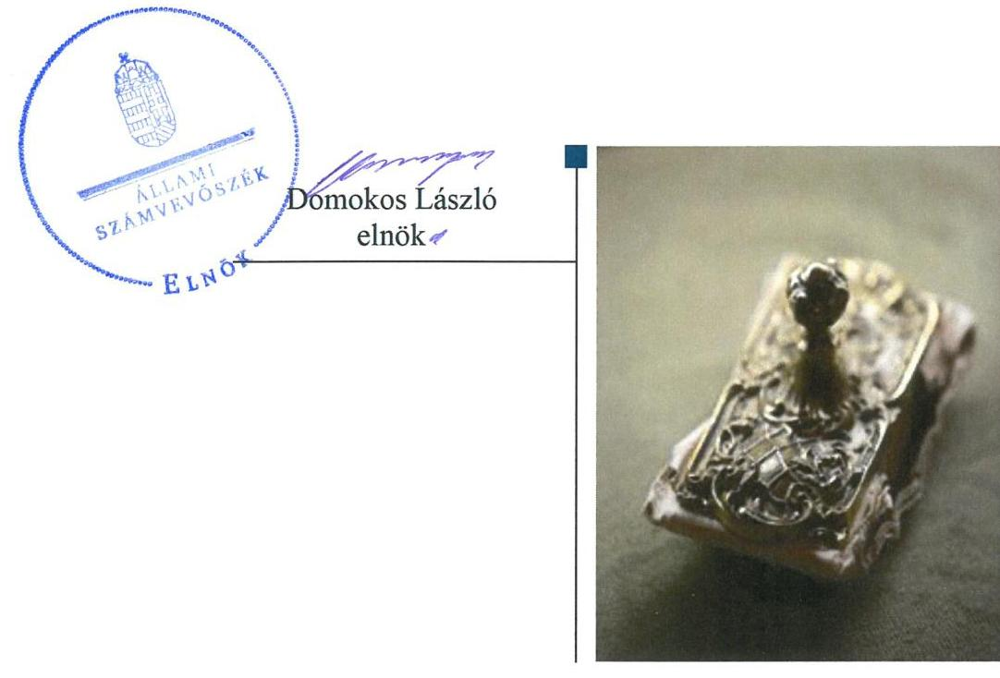

# Jelentés 

## Az állami tulajdonú gazdasági társaságok ellenőrzése

Városliget Ingatlanfejlesztő Zártkörűen Múködő Részvénytársaság
2019.

---

# Jelentés 

## Az állami tulajdonú gazdasági társaságok ellenőrzése

Városliget Ingatlanfejlesztő Zártkörűen Múködő Részvénytársaság
2019. 08. hó 08. nap

---

# AZ ELLENŐRZÉST FELÜGYELTE:

DR. NAGY IMRE felügyeleti vezető

# AZ ELLENŐRZÉST VEZETTE ÉS A VÉGREHAJTÁSÁÉRT FELELŐS:

VALASTYÁNNÉ DR. VÍZHÁNYÓ JÚLIA ellenőrzésvezető

ÓDOR ZOLTÁN TAMÁS ellenőrzésvezető

# A PROGRAM ÖSSZEÁLLÍTÁSÁÉRT FELELŐS:

TÓTPÁL SZABOLCS osztályvezető

IKTATÓSZÁM: EL-0088-103/2019.

|  Jelentéseink az Országgyűlés számítógépes hálózatán és az Interneten a www.asz.hu címen is olvashatóak. | TÉMASZÁM: 2470  |
| --- | --- |
|   | ELLENŐRZÉS-AZONOSÍTÓ SZÁM: V75967, V75968, V081302  |

---

# TARTALOMJEGYZÉK 

■ ÖSSZEGZÉS ..... 5
■ AZ ELLENŐRZÉS CÉLJA ..... 7
■ AZ ELLENŐRZÉS TERÜLETE ..... 8
■ AZ ELLENŐRZÉS HÁTTERE, INDOKOLTSÁGA ..... 9
■ A JELENTÉS LÉNYEGES KÉRDÉSKÖREI ..... 10
■ AZ ELLENŐRZÉS HATÓKÖRE ÉS MÓDSZEREI ..... 11
■ MEGÁLLAPÍTÁSOK ..... 13
■ JAVASLATOK ..... 18
■ MELLÉKLETEK ..... 19
I. sz. melléklet: Értelmező szótár ..... 19
■ FÜGGELÉK: ÉSZREVÉTELEK ..... 23
■ RÖVIDÍTÉSEK JEGYZÉKE ..... 25

---

.

---

# ÖSSZEGZÉS 

Az Emberi Erőforrások Minisztériumának tulajdonosi joggyakorlása a Városliget Ingatlanfejlesztő Zrt. felett szabályszerű volt. A Városliget Ingatlanfejlesztő Zrt. az ellenőrzési időszak végére megteremtette az elszámoltatható, közpénzekkel való felelős gazdálkodás feltételeit. A Városliget Ingatlanfejlesztő Zrt. a nemzeti vagyon megőrzésének védelmét az ellenőrzési időszak végére biztosította. A Társaság müködésének és gazdálkodásának átláthatóságára vonatkozó jogszabályi követelményeknek nem tett eleget.
A Városliget Ingatlanfejlesztő Zrt. szervezeti és müködési folyamatai, belső szabályozottsága, a Liget Budapest Projekt átláthatósága és elszámoltathatósága szempontjából az Állami Számvevőszék kiemelt kockázatot nem azonosított. A beruházás döntés-előkészítése megfelelő volt.

## Az ellenőrzés társadalmi indokoltsága

Az állami vagyonnal való gazdálkodás alapvető célja az állami vagyon átlátható, rendeltetésszerű és felelős felhasználásának biztosítása. Az állami tulajdonban álló gazdálkodó szervezetek államot megillető társasági részesedése a nemzeti vagyon részét képezi és legfőbb rendeltetése szerint a közfeladatok ellátását szolgálja.

Az Állami Számvevőszék stratégiájában megfogalmazta, hogy az államháztartáson kívülre nyújtott költségvetési támogatások és ingyenes vagyonjuttatások, valamint az államháztartáson kívül működő közfeladat-ellátó rendszerek ellenőrzéseivel hozzájárul ahhoz, hogy a közpénzeket az államháztartáson kívül működő szervezetek is átlátható, rendezett módon használják fel a közfeladatok szerződésben vállalt ellátása érdekében.

A Városliget Magyarország legrégebbi, közel kétszáz éves közparkja, melyet évente milliók látogatnak meg. Az Országgyűlés a Magyar Állam, az Budapest Főváros Önkormányzata és Budapest Főváros XIV. Kerület Zugló Önkormányzata osztatlan közös tulajdonában álló Városliget megújításának és fejlesztésének megvalósulása érdekében törvényt alkotott. A törvényalkotás célja a vagyon megőrzése, gyarapítása, fejlesztése volt.

## Főbb megállapítások, következtetések, javaslatok

I.

Az Emberi Erőforrások Minisztériumának a Városliget Ingatlanfejlesztő Zrt. feletti tulajdonosi joggyakorlása szabályszerű volt.

A Városliget Ingatlanfejlesztő Zrt. működésének szabályozottsága, a személyi jellegű ráfordítások, értékcsökkenés és a beruházások elszámolás 2013-2015. években nem volt szabályszerű, 2016. évre szabályszerűvé vált, így biztosította az elszámoltatható felelős gazdálkodás feltételeit. A bevételek és az anyagjellegű ráfordítások elszámolása az ellenőrzött időszakban szabályszerű volt.

A vagyongazdálkodás feltételeinek kialakítása, a kezelt vagyon nyilvántartása 2013-2015. években nem szabályszerűen történt, a 2014., 2015. évek fordulónapjára vonatkozó leltárakat nem készítette el, a 2016. évi beszámoló leltárral alátámasztásra került. 2016-ra a vagyon megőrzését a jogszabályi és a belső előírásoknak megfelelően biztosította.

A Városliget Ingatlanfejlesztő Zrt. az adatszolgáltatási feladatokat nem a jogszabályi előírásoknak megfelelően látta el. A közérdekű adatok közzétételét nem biztosította, ezáltal a Városliget Ingatlanfejlesztő Zrt. gazdálkodásának és vagyoni helyzetének átláthatóságát nem biztosította.

Az Állami Számvevőszék a Városliget Ingatlanfejlesztő Zrt. vezérigazgatójának hat javaslatot tett az elszámoltathatóság és az átláthatóság témakörökben.

---

II.

A beruházás döntés-előkészítése, a beruházási folyamat meghatározása az irányadó jogszabályok, közjogi szervezetszabályozó eszközök előírásai szerint történt. A beruházás előkészítéséhez és megvalósításához szükséges támogatási szerződések rendelkezésre álltak.

A Városliget Ingatlanfejlesztő Zrt. belső szabályozottságának kialakítása biztosította a beruházás előkészítési folyamatainak elszámoltathatóságát. Adatszolgáltatási, bejelentési kötelezettségeinek határidőre nem tett eleget.

A beruházás kivitelezésének előkészítése, a megkötött szerződések a jogszabályi előírásoknak megfeleltek, a szakhatósági engedélyek rendelkezésre álltak.

Az Állami Számvevőszék a Városliget Ingatlanfejlesztő Zrt. vezérigazgatójának egy javaslatot tett a beruházások előkészítése témakörökben.

---

# AZ ELLENŐRZÉS CÉLJA 

Az ellenőrzés célja annak értékelése volt, hogy a tulajdonosi jogok gyakorlása szabályszerű volt-e; a gazdálkodó szervezet szabályozottsága, gazdálkodása és vagyongazdálkodási tevékenysége megfelelt-e a jogszabályi és a tulajdonosi előírásoknak; biztosítva volt-e a közfeladatok átláthatósága és elszámoltathatósága érdekében a közszolgáltatás dijának megalapozottsága szabályszerű önköltségszámítással; a vagyonváltozást eredményező döntések esetében a tulajdonosi jogok gyakorlója és a gazdálkodó szervezet szabályszerűen jártak-e el.

Az ellenőrzés célja volt továbbá a beruházás eredményes megvalósulásának elősegítése érdekében, a folyamatban lévő beruházás vonatkozásában, a döntés-előkészítésétől a kivitelezés megkezdéséig felmerülő kockázatok beazonosításának és az integritási szempontok érvényesülésének értékelése.

---

# **AZ ELLENŐRZÉS TERÜLETE**

## **Városliget Ingatlanfejlesztő Zrt.**

A Városliget Ingatlanfejlesztő Zrt.-t az MNV Zrt.1 100%-os állami tulajdonú társaságként hozta létre 2013. december 21-én. A tulajdonosi jogokat 2013. december 23-ig az MNV Zrt., majd a Városliget tv.2 2013. december 24-ei hatályba lépésével az ellenőrzött időszakban a Társasággal kapcsolatos valamennyi jogkört a kultúráért felelős miniszter gyakorolta.

A Társaság3 főtevékenysége épületépítési projekt szervezése volt, valamint a közterületek hasznosításával és bérbeadásával is foglalkozott. Feladatait az új nemzeti közgyűjteményi épületegyüttesről és a megvalósítás előkészítéséhez szükséges intézkedésekről szóló 1031/2013. (I. 30.) Korm. határozat, az új nemzeti közgyűjteményi épületegyüttesre vonatkozó koncepció második ütemeként a Városliget átfogó hasznosítási koncepciójáról szóló 1397/2013. (VII. 2.) Korm. határozat, valamint a Liget Budapest projekt4 megvalósításával összefüggő egyes kérdésekről szóló 1227/2014. (IV. 10.) Korm. határozat alapján látta el.

A Városliget tv. rendelkezései szerint a Városligetben megvalósuló építési projektek, beruházások kiemelt állami feladatnak minősültek. A közfeladat ellátásához szükséges terület a Városliget tv. hatályba lépése alapján ingyenesen, 99 éves időtartamra a Társaság vagyonkezelésébe került. A vagyonkezelői jog nem terjedt ki a Műcsarnokra és a hozzá tartozó földterületre, a Széchenyi Gyógyfürdő és Uszodára, valamint a Városligeti Műjégpálya épületére, továbbá a műszaki infrastruktúra sajátos építményeire.

A Társaság ügyvezetését három tagból álló Igazgatóság5 látta el, a vezérigazgató személye az ellenőrzött időszakban egyszer változott. A társaság ügyvezetését a három tagból álló FB6 ellenőrizte. A Társaság a Számv. tv.7 előírása alapján könyvvizsgálatra kötelezett volt.

A Társaságnak más társaságban nem volt tulajdonosi részesedése.

A Társaság jegyzett tőkéje 50,0 M Ft8 volt, amely kizárólag pénzbeli hozzájárulásból állt. A saját tőke a 2016. év végén 307,0 M Ft volt. Az eszközök mérlegértéke a 2016. év végén 104 893,4 M Ft volt. A Társaság a 2016. évben 187,6 M Ft árbevételt realizált, mérleg szerinti eredménye 117,2 M Ft volt. A Társaság részére a közfeladat ellátásához, az EMMI által rendelkezésre bocsátott, támogatási szerződésekkel9 alátámasztott források öszszege a 2016. évben 11 025,0 M Ft volt. A vagyonkezelt vagyon a befektetett eszközök 89,7%-át tette ki a 2016. évben. Az átlagos statisztikai létszám a 2016. évben 76 fő volt.

---

# AZ ELLENŐRZÉS HÁTTERE, INDOKOLTSÁGA 

Az állami tulajdonú gazdálkodó szervezetek ellenőrzése kiemelten fontos a nemzeti vagyon megőrzése, megóvása érdekében. Gazdálkodásuk jellemzően a közérdeklődés és a média figyelmének középpontjában áll, amihez hozzájárul a gazdálkodásuk körébe tartozó vagyon nagysága, illetve az általuk ellátott közszolgáltatások minősége és hatékonysága. A szolgáltatási/közszolgáltatási árképzés megalapozottsága és az éves elszámoltatás feltételeinek kialakítása az ellenőrzés során nagy hangsúlyt kap. A szolgáltatás/közszolgáltatás árában és annak támogatásában meg kell jelennie az önköltségszámítás szempontjainak, amely biztosítja a múködés fenntarthatóságát (eszközpótlást) is.

Az Európai Unióban 1994. év óta hatályos túlzott hiány eljárás mindig kihívást jelentett a tagállamok számára. Kiemelten fontosak a kormányzati szektor elszámolásaiban megjelenő állami tulajdonú gazdálkodó szervezetek, amelyekkel szemben alapvető követelmény, hogy gazdálkodásuk, múködésük szabályszerű, az általuk szolgáltatott adatok minél megbízhatóbbak legyenek.

Az ellenőrzés rámutathat az állami tulajdonú gazdálkodó szervezetek gazdálkodási tevékenységével kapcsolatos jó gyakorlatokra és szabálytalanságokra. Felhívhatja a figyelmet a jogszabályi követelmények teljesítéséhez szükséges feltételek hiányosságaira, hozzájárulhat az államháztartáson kívüli, de állami vagyont használó gazdálkodó szervezetek tevékenységének átláthatóságához.

A beruházások előkészítésére fókuszáló ellenőrzés megállapításainak hasznosításaként lehetőség nyílhat még a beruházás előkészítési folyamatában a feltárt hiányosságok, szabálytalanságok megszüntetéséhez szükséges korrekciók megtételére, a kontrollok erősítésére.

Jelen ellenőrzés ezáltal hozzájárulhat az ÁSZ kockázatértékelő rendszere alapján kiválasztott, államháztartásból származó forrásból finanszírozott beruházások eredményességéhez, a beruházási folyamat transzparenciájának biztosításához.

Ellenőrzésünk eredményeképpen javaslatainkkal, megállapításainkkal hozzájárulhatunk a nemzeti vagyonnal való gazdálkodás átláthatóságának, elszámoltathatóságának javításához. Az ellenőrzés eredményeinek célzott felhasználói a nyilvánosság, valamint a beruházások előkészítésében és megvalósításában résztvevő szervezetek.

---

# A JELENTÉS LÉNYEGES KÉRDÉSKÖREI 

1.     - A tulajdonosi jogok gyakorlása szabályszerű volt-e?
2.     - A társaságnál a pénzügyi-számviteli, vagyongazdálkodási, beszámolási és közzétételi kötelezettségek ellátása szabályszerű volt-e?
3.     - A beruházás döntés-előkészitése és a beruházási folyamat meghatározása szabályszerűen történt-e?
4.     - A társaság szabályozottsága alkalmas volt-e a beruházás átláthatóságának, elszámoltathatóságának biztositására?
5. A beruházás kivitelezésének előkészitése megfelelően történt-e?

---

# AZ ELLENŐRZÉS HATÓKÖRE ÉS MÓDSZEREI 

## Az ellenőrzés típusa

Megfelelőségi ellenőrzés.

## Az ellenőrzött időszak

A 2013. december 21-től 2016. december 31-ig tartó időszak a Társaság tulajdonosi joggyakorlása és gazdálkodása tekintetében.

A 2013. május 3-tól 2018. március 19-ig tartó időszak a beruházás előkészítésének ellenőrzése tekintetében.

## Az ellenőrzés tárgya

Az állami tulajdonban lévő gazdasági társaság gazdálkodása, kiemelten vagyongazdálkodási tevékenysége, a tulajdonosi jogok gyakorlása.

Az ellenőrzés továbbá kiterjedt a beruházás döntés-előkészítését beterjesztő és a beruházást előkészítő gazdasági társaság döntés-előkészítési és beruházás előkészítési tevékenységének múködési folyamataira, azok belső szabályozottságára, a kivitelezés előkészítésének megfelelőségére.

Az ellenőrzés kiterjedt minden olyan körülményre és adatra, amely az ÁSZ ${ }^{10}$ jogszabályban meghatározott feladatainak teljesítéséhez, valamint a program végrehajtása folyamán felmerült újabb összefüggések feltárásához szükséges volt.

## Az ellenőrzött szervezet

Emberi Erőforrások Minisztériuma, Városliget Ingatlanfejlesztő Zrt.

## Az ellenőrzés jogalapja

Az ellenőrzés jogalapját az ÁSZ tv. 1. § (3) bekezdése és az 5. § (2)-(5) bekezdései képezték.

## Az ellenőrzés módszerei

Az ellenőrzést az ellenőrzési program ellenőrzési kérdései, az ellenőrzött időszakban hatályos jogszabályok, az ellenőrzés szakmai szabályok és módszertanok figyelembevételével végeztük.

---

Az ellenőrzött szervezetek az ellenőrzés lefolytatásához tanúsítványok kitöltésével, valamint az ÁSZ által kért dokumentumok megküldésével szolgáltattak adatokat.

A 2014.-2015. évek esetében, a mintatételek kiválasztása során a gazdasági társaság bevételei és ráfordításai, ezeken belül az értékcsökkenés, valamint a vagyonnyilvántartás szabályszerűségének megítéléséhez a bevételeket és a ráfordításokat, a tárgyi eszközök állományváltozásait tartalmazó adott évi főkönyvi kivonat adatbázisát vettük alapul. A minta kiválasztása során véletlen mintavételt alkalmaztunk évenkénti, elemszámmal arányos rétegezéssel a teljes időszakra vonatkozóan. A minta alapján a sokaságban előforduló hibaarányt becsültük. „Megfelelőnek" értékeltünk egy ellenőrzött területet, amennyiben 95\%-os bizonyossággal a teljes sokaságban a hibaarány legfeljebb 10\%, „nem megfelelőnek", amennyiben 10\%-nál magasabb arányt képviselt. A mintavételt megelőzően az anyagjellegú ráfordítások, valamint a tárgyi eszköz növekedési tételei sokaságból évente sokaságonként kiemeltük a 3-3 legnagyobb összegű tételt annak biztosítására, hogy az ellenőrzés az egyszerű véletlen mintavétel mellett a legnagyobb értékű tételek ellenőrzésére biztosan kiterjedjen.
2016. évre vonatkozóan a bevételek és ráfordítások elszámolása, valamint a vagyonnyilvántartás terén a szabályszerű működést véletlen mintavétellel ellenőriztük. Szabályszerűnek tekintettük az adott területet, amennyiben a minta ellenőrzésének eredménye alapján 95\%-os bizonyossággal a teljes sokaságban az átlagos hibaarány kisebb volt, mint 10\%, nem szabályszerűnek, ha a 10\%-ot meghaladta.

A beruházás előkészítése keretében megkötött szerződések jogszabályi és belső előírásoknak való megfelelőségét, valamint a kötelezően közzéteendő adatok nyilvánosságra hozatalának szabályszerűségét 30 elemű minta alapján végeztük el. A mintatételek értékelése a fent leírt, a gazdálkodás szabályszerűségének megítélésénél alkalmazott módszer szerint történt, szabályszerűségi kérdések esetében „szabályszerű", helyénvalósági kérdések esetében „megfelelő", afölött „nem szabályszerű" „nem megfelelő" minősítést eredményezve.

---

# 1. A tulajdonosi jogok gyakorlása szabályszerű volt-e? 

Összegző megállapítás Az EMMI tulajdonosi joggyakorlása szabályszerű volt.

A TÁRSASÁG FELETTI TULAJDONOSI JOGGYAKORLÁS szabályait az Alapító okirat ${ }_{1,2}{ }^{11}$-ben, az Alapszabály ${ }^{12}$-ban, az EMMI ${ }^{13}$ SZMSZ ${ }_{1,2}{ }^{14}$-ben, a 3/2010. (IV. 28.) OKM utasítás ${ }^{15}$-ban és a 18/2015. (V. 15.) EMMI utasítás ${ }^{16}$-ban szabályszerűen meghatározták.

Az EMMI a társaság éves beszámolóit a könyvvizsgáló és az FB írásbeli jelentései birtokában fogadta el.

A tulajdonosi joggyakorló a Társaság a Taktv. ${ }^{17}$ 5. § (3) bekezdésében előírt Javadalmazási szabályzat ${ }^{18}$-át 2015. november 9 -ével alkotta meg.

AZ FB a jogszabályi előírásoknak megfelelően három tagból állt, ügyrendje, a Gt. ${ }^{19} 34$. § (4) bekezdésében, valamint a Ptk. ${ }^{20} 3: 122$. § (3) bekezdésében előírtak ellenére 2016. július 6-ig nem volt.

## 2. A társaságnál a pénzügyi-számviteli, vagyongazdálkodási, beszámolási és közzétételi kötelezettségek ellátása szabályszerű volt-e?

Összegző megállapítás

A Társaság pénzügyi-számviteli feladatok ellátása, vagyongazdálkodása 2016. évre felelt meg az előírásoknak. A Társaság adatszolgáltatási kötelezettségeinek nem tett eleget, a közérdekú adatok közzétételéről a jogszabályi előírások ellenére nem gondoskodott.

A bevételek és az anyagjellegú ráfordítások elszámolása szabályszerű volt. A személyi jellegú ráfordítások elszámolása 2013.-2015. években nem volt szabályszerű. A Társaság 2016. évre biztosította múködésének szabályozottságát.

A TÁRSASÁG BEVÉTELEINEK ÉS AZ ANYAGJELLEGÚ RÁFORDÍTÁSOK ELSZÁMOLÁSA a jogszabályi, valamint a belső előírásoknak megfelelően történt, az elszámolás alapjául szolgáló számviteli bizonylatok a jogszabályi előírásoknak megfeleltek.

A SZEMÉLYI JELLEGÚ RÁFORDÍTÁSOK elszámolása a 2013.-2015. években nem volt szabályszerű. A Társaság nem tett eleget az Mt. ${ }^{21} 134$. § (1) bekezdés a) pontjában előírt nyilvántartási kötelezettségének, mert a kötetlen munkaidőben foglalkoztatott munkavállalók rendes és rendkívüli munkaidő tartamát nem tartotta nyilván. Az Szja tv. ${ }^{22} 71$. § (4)

---

bekezdésében foglaltak ellenére a munkavállalók cafetéria-nyilatkozatai nem álltak rendelkezésre.

# A TÁRSASÁG MŰKÖDÉSÉNEK SZABÁLYOZOTTS 

SÁGA érdekében rendelkezett - a Számv. tv. 14. § (7) bekezdésében előírt feltétel fennállása következtében az (5) bekezdés c) pontjában előírt, az önköltségszámítás rendjére vonatkozó belső szabályzat kivételével - a Számv. tv.-ben előírt Számviteli politika ${ }_{1-3}{ }^{23}$-val, és az annak keretében elkészítendő Értékelési ${ }_{1-3}{ }^{24}$-, Leltározási ${ }_{1-3}{ }^{25}$, Pénzkezelési ${ }_{1-3}{ }^{26}$ szabályzatokkal.

A Számv. tv. 161. § (5) bekezdésében foglaltak ellenére a Társaság Számlarenddel 2014. június 29 -ig nem rendelkezett. Számlarendje 2014. június 30 -tól, a Számviteli politika ${ }_{2}$ részeként volt hatályos.

A Pénzkezelési szabályzat ${ }_{1,2}$ a Számv. tv. 14. § (8) bekezdésében foglaltak ellenére nem rendelkezett a készpénzben és a bankszámlán tartott pénzeszközök közötti forgalomról és a készpénzállományt érintő pénzmozgások jogcímeiről és eljárási rendjéről. A 2016. évtől Pénzkezelési szabályzata ${ }_{3}$ szabályszerű volt.

A 2015. évtől 2016. június 30-ig a Társaság a Bkr. ${ }^{27}$ 10. §-ának előírása ellenére a szervezet tevékenységének, a célok megvalósításának nyomon követését biztosító rendszert nem alakított ki.

ÖNKÖLTSÉGSZÁMÍTÁS RENDJÉRE vonatkozó szabályzattal a Társaság a Számv. tv. 14. § (5) c) pontjában foglaltak ellenére nem rendelkezett.

A végzett szolgáltatások önköltségét - a Számv. tv. 14. § (7) bekezdésében foglaltak ellenére - az utókalkuláció módszerével nem állapította meg.
2.2. számú megállapítás

A Társaság a 2014. és a 2015. évi éves beszámolóinak mérlegét leltárral nem támasztotta alá. A Társaság vagyongazdálkodása 2016ra megfelelt a jogszabályi és belső előírásoknak.

A TÁRSASÁG VAGYONKEZELÉSI SZERZŐDÉST ${ }^{28}$ kötött az Önkormányzattal ${ }^{29}$ 2014. december 11-én, amely megfelelt az Nvtv. ${ }^{30}$ előírásainak.

VAGYONNYILVÁNTARTÁSA elkülönített nyilvántartási kötelezettség tekintetében a 2015. évig nem felelt meg a Vhr. ${ }^{31}$ 17. § (1) bekezdésében, valamint a Vagyonkezelési szerződés 4.7. pontjában foglalt előírásoknak.

A Társaság 2016-ra kialakította a jogszabályi és belső előírásoknak megfelelő vagyonnyilvántartást.

A Társaság 2014-2015. üzleti években, a Számv. tv. 69. § (1) és (3) bekezdéseiben meghatározottakkal ellentétben, mérlegtételeit leltárral nem támasztotta alá. A 2016. évben a Társaság éves beszámolójának mérlegsorait a Számv. tv. előírásának megfelelően leltárral támasztotta alá.

AZ ÉRTÉKCSÖKKENÉS ÉS A BERUHÁZÁSOK elszámolása a 2014. és a 2015. években nem volt szabályszerű, mert:
—_ a tárgyi eszköz nyilvántartások a Számv. tv. 165. § (2) bekezdésében előírtak ellenére bizonylatokkal nem voltak alátámasztva;

---

2.3. számú megállapítás
a tárgyi eszköz nyilvántartások nem tartalmaztak adatokat a maradványértékre vonatkozóan, ami nem felelt meg a Számv. tv. 16. § (1) bekezdésben, valamint a Számviteli Politika ${ }_{1-2}$ 12.2. pontjában meghatározott egyedi értékelés elvének, valamint a Számv. tv. 52. § (1) bekezdésben foglaltaknak;
az immateriális javak és tárgyi eszközök üzembe helyezését a Társaság a Számv. tv. 52. § (2) bekezdésének előírása ellenére hitelt érdemlően nem dokumentálta;
a Társaság a 2013. december 24. nappal vagyonkezelésbe vett eszközöket a Számv. tv. 165. § (1) bekezdés és (3) bekezdés b) pontjában foglaltak ellenére az előírt határidőben nem vette nyilvántartásba.
A 2016. évben a Társaság vagyonnyilvántartása és az értékcsökkenés elszámolása szabályszerű volt.

A közérdekú adatok közzétételéről a Taktv. és az Info tv. előírásai ellenére nem gondoskodott, ezáltal tevékenységének átláthatósága nem volt biztosított. A Társaság az FB felé történő adatszolgáltatási feladatoknak nem tett eleget.

KÖZÉRDEKŰ ADATOK közzétételének rendjét az Info tv. ${ }^{32}$ 35. § (3) bekezdés előírása ellenére a Társaság nem szabályozta, a közérdekú adatok megismerésére irányuló igények teljesítésének rendjét rögzítő szabályzatot az Info. tv. 30. § (6) bekezdés előírása ellenére a Társaság nem készített.

A Társaság a Taktv. 2. § (1) bekezdés ca) pontjában rögzített pénzügyi juttatásokra vonatkozó adatokat nem tette közzé.

Nem tette közzé továbbá az Info tv. 37. § (1) bekezdése ellenére a törvény 1. mellékletben részletezett,
—_ II. Tevékenységre, múködésre vonatkozó adatok körén belül a szervezetre vonatkozó alapvető jogszabályokat és statisztikai adatokat;
— III. Gazdálkodási adatokra vonatkozóan a foglalkoztatottak létszámára és személyi juttatásaira vonatkozó összesített adatokat.

BESZÁMOLÓIT a Társaság a Számv. tv. 153. § (1) bekezdés ellenére 2013. és 2014. évek tekintetében nem a törvény előírása szerint helyezte letétbe.

Az Alapító okirat ${ }_{1-2}$ VIII. cikk 8.2. pont g.) alpontja és az Alapszabály ${ }_{3}$ VIII. cikk 8.2. pont f.) alpontja, továbbá a Ptk. 3:284. § (1) bekezdésének előírása ellenére az Igazgatóság FB felé, háromhavonta történő jelentéskészítési kötelezettségét nem teljesítette.

---

# 3. A beruházás döntés-előkészítése és a beruházási folyamat meghatározása szabályszerűen történt-e? 

## Összegző megállapítás

3.1. számú megállapítás
3.2. számú megállapítás

A beruházás döntés-előkészítése, a beruházási folyamat meghatározása az előírásoknak megfelelően történt.

## A beruházásról szóló döntések előkészítése megfelelő volt.

A BERUHÁZÁSRA vonatkozó 1397/2013. (VII. 2.) Korm. határozat ${ }^{33}$ előkészítése során az EMMI a 23902-4/2013. számú, 2013. május 3-i dátumú Előterjesztést ${ }^{34}$ nyújtotta be. Az Előterjesztés megfelelt a 1144/2010. (VII. 7.) Korm. határozat, a Kormány ügyrendjéről55 II. 10. a), c) pontjainak, bemutatta a javasolt intézkedésnek a Kormány társadalompolitikai célkitűzéseihez való illeszkedését, föbb tartalmi jellemzőit, költségkihatását, valamint várható gazdasági, költségvetési hatásait, tartalmazta a döntés kommunikációjára vonatkozó javaslatot és a döntési javaslatot is.

A támogatási szerződések megkötése jogszabályi előírások szerint történt.

A TÁMOGATÁSI SZERZŐDÉSEK az EMMI és a Társaság között megfeleltek az Áht. ${ }^{36}$ előírásainak, tartalmazták a támogatás jogosulatlan igénybevétele, a jogszabálysértő, vagy nem rendeltetésszerű felhasználása esetének következményeit.

A támogatási szerződésekben helyénvalóan rögzítették az elszámoltathatóság feltételeit.

## 4. A társaság szabályozottsága alkalmas volt-e a beruházás átláthatóságának, elszámoltathatóságának biztosítására?

Összegző megállapítás

A Társaság szabályozó rendszere biztosította a beruházás szabályszerű előkészítését, a beruházás elszámoltathatósága érdekében gondoskodtak a monitoring és a belső ellenőrzés kialakításáról. Adatszolgáltatási, bejelentési kötelezettségének határidőre nem tett eleget.

A BERUHÁZÁS SZABÁLYSZERŰ ELŐKÉSZÍTÉSÉT a Társaság biztosította, döntés-előkészítésre vonatkozó eljárásrendet, követelményeket, felelősségi és információs szinteket és kapcsolatokat a Társaság a Portfólió Kézikönyv ${ }^{37}$ 2. számú mellékletében szabályozta.

Beruházások döntés-elkészítésével, beruházás végrehajtásának előkészítésével kapcsolatos hatásköröket, feladatokat helyénvalóan az Igazgatóság Ügyrendje ${ }_{1-2}{ }^{38}$, Kötelezettségvállalási szabályzat ${ }^{39}{ }_{1,2}$, Leltározási szabályzat ${ }_{3-3}$ valamint a 2016. évi Üzleti terv tartalmazott.

---

MONITORING, folyamatszabályozási, irányítási, és ellenőrzési, továbbá a kockázatok elemzésének és a beavatkozás lehetőségeinek folyamatára vonatkozó előírásait a Társaság a Portfólió Kézikönyv 2. számú mellékletében szabályozta.

A Társaság monitoring rendszeréhez kapcsolódóan Múszaki ellenőri feladatok ${ }^{40}$ szabályzatban helyénvalóan rögzítette a müszaki ellenőri, a beruházások előkészítése terén és megvalósítása során, a hatósági, szakhatósági és közmú engedélyekkel, költségek ellenőrzésével és minőségfelügyelettel kapcsolatos feladatokat.

BELSŐ ELLENŐRZÉS kialakításáról és múködtetéséről a Társaság vezetője a Bkr. 10. §-a ellenére 2016. június 30 -áig nem, 2016. július 1jétől - külső erőforrás bevonásával, a Bkr. előírásainak megfelelően - gondoskodott.

ADATSZOLGÁLTATÁSI, BEJELENTÉSI kötelezettségének a Társaság a beruházásokhoz kapcsolódó szakmai beszámolók készítése tekintetében helyénvalóan eleget tett, azonban több esetben előfordult, hogy a projekt előrehaladási jelentéseket a szerződésekben rögzítetthez képest késve küldték meg.

A KÁBER ${ }^{41}$ felé megküldött adatszolgáltatási, bejelentési kötelezettséget a 469/2016. (XII. 23.) Korm. rendeletben előírt határidőn túl tették meg.

# 5. A beruházás kivitelezésének előkészítése megfelelően tör-tént-e? 

Összegző megállapítás

A beruházás kivitelezésének előkészítése megfelelően, a szerződések megkötése szabályszerűen történt.

A BERUHÁZÁS KIVITELEZÉSÉNEK ELŐKÉSZÍTÉSE a támogatási szerződésekben rögzített tervezett ütemezésnek és költség-előirányzatoknak megfelelően történt.

A SZAKHATÓSÁGI ENGEDÉLYEK és hatástanulmányok beruházás kivitelezésének előkészítéséhez és megvalósításához helyénvalóak voltak.

A BESZERZÉSEKKEL kapcsolatos, beruházás előkészítése keretében megkötött szerződések megfeleltek a közbeszerzés jogszabályi előírásainak, Közbeszerzési és beszerzési szabályzatának.

A Társaság a nettó ötmillió Ft értéket elérő vagy meghaladó szerződések adatait az Info tv. rendelkezéseinek megfelelően közzétette.

---

# JAVASLATOK 

Az ÁSZ tv. 33. § (1) bekezdésében foglaltak értelmében az ellenőrzött szervezet vezetője köteles a jelentésben foglalt megállapításokhoz kapcsolódó intézkedési tervet összeállítani és azt a jelentés kézhezvételétől számított 30 napon belül az ÁSZ részére megküldeni. Amennyiben az ellenőrzött szervezet vezetője nem küldi meg határidőben az intézkedési tervet, vagy továbbra sem elfogadható intézkedési tervet küld, az Állami Számvevőszék elnöke az ÁSZ tv. 33. § (3) bekezdése a) és b) pontjaiban foglaltakat érvényesítheti.

## Városliget Ingatlanfejlesztő Zrt. vezérigazgatójának

1. Intézkedjen az önköltségszámitás rendjére vonatkozó szabályzat elkészitéséről a jogszabályi rendelkezéseknek megfelelően.
(2.1. sz. megállapítás 7. bekezdése alapján)
2. Intézkedjen arról, hogy a végzett szolgáltatások önköltségét a jogszabályban foglaltak szerint utókalkuláció módszerével állapítsák meg.
(2.1. sz. megállapítás 8. bekezdése alapján)
3. Intézkedjen a jogszabályban elöirtaknak megfelelően a közérdekü adatok közzétételének rendjének szabályozásáról.
(2.3. sz. megállapítás 1. bekezdés 1. tagmondata alapján)
4. Intézkedjen a jogszabályban elöirt közérdekü adatok megismerésére irányuló igények teljesitésének rendjét rögzitő szabályzat elkészitéséről.
(2.3. sz. megállapítás 1. bekezdés 2. tagmondata alapján)
5. Intézkedjen annak érdekében, hogy a Társaság a jogszabályokban foglalt közzétételi kötelezettségeinek eleget tegyen.
(2.3. sz. megállapítás 2-3. bekezdései alapján)
6. Intézkedjen, hogy az Igazgatóság a jogszabályban elöirt jelentéskészitési kötelezettségének tegyen eleget.
(2.3. sz. megállapítás 5. bekezdése alapján)
7. Biztosítsa a jogszabályban elöirt adatszolgáltatási kötelezettségek határidőre történő teljesitését.
(4 sz. megállapítás 7. bekezdése alapján)

---

# MELLÉKLETEK 

- I. SZ. MELLÉKLET: ÉRTELMEZŐ SZÓTÁR
állami vagyon
állami vagyon kezelése/hasznosítása
állami vagyon hasznosítására kötött szerződés
gazdasági társaság
kormányzati szektorba sorolt egyéb szervezet

MNV Zrt.
a) Az állam tulajdonában lévő dolog, valamint a dolog módjára hasznosítható természeti erő,
b) az a) pont hatálya alá nem tartozó mindazon vagyon, amely vonatkozásában törvény az állam kizárólagos tulajdonjogát nevesíti,
c) az állam tulajdonában lévő tagsági jogviszonyt megtestesítő értékpapír, illetve az államot megillető egyéb társasági részesedés,
d) az államot megillető olyan immateriális, vagyoni értékkel rendelkező jogosultság, amelyet jogszabály vagyoni értékű jogként nevesít.
Forrás: Vtv. 1. § (2) bekezdése
2012. november 10-től az állami vagyon fogalma kiegészül a következő ponttal:
e) az állam tulajdonában lévő pénzügyi eszközök

Forrás: Vtv. 1. § (2) bekezdése
2013. június 27-ig:

Az állami vagyont az MNV Zrt. maga kezeli, vagy szerződés - így különösen bérlet, haszonbérlet, megbízás - alapján központi költségvetési szervnek, természetes vagy jogi személynek, vagy jogi személyiséggel nem rendelkező gazdálkodó szervezetnek hasznosításra átengedi. Az állami vagyonra vonatkozóan az MNV Zrt. kizárólag az Nvtv. ${ }^{42}$-ben meghatározott személyekkel köthet vagyonkezelési szerződést.
Forrás: Vtv. 23. § (1), 27. § (1)
2013. június 28-ától:

Az állami vagyonnal az MNV Zrt. maga gazdálkodik, vagy szerződés - így különösen bérlet, haszonbérlet, megbízás - alapján központi költségvetési szervnek, természetes vagy jogi személynek, vagy jogi személyiséggel nem rendelkező gazdálkodó szervezetnek hasznosításra átengedi, illetőleg vagyonkezelésbe, haszonélvezetbe adja. Az állami vagyonra vonatkozóan az MNV Zrt. kizárólag az Nvtv-ben meghatározott személyekkel köthet vagyonkezelési szerződést.
Forrás: Vtv. 23. § (1), 27. § (1)
Az állami vagyon hasznosítására kötött szerződések elsődleges célja az állami vagyon hatékony működtetése, állagának védelme, értékének megőrzése, illetve gyarapítása, az állami és közfeladatok ellátásának elősegítése.
Forrás: Vtv. 23. § (2) bekezdése
A Ptk2. 3:88. § (1) bekezdése szerint „a gazdasági társaságok üzletszerű közös gazdasági tevékenység folytatására, a tagok vagyoni hozzájárulásával létrehozott, jogi személyiséggel rendelkező vállalkozások, amelyekben a tagok a nyereségből közösen részesednek, és a veszteséget közösen viselik".
Az a szervezet, amely az Áht. alapján nem része az államháztartásnak, azonban az Európai Közösséget létrehozó szerződéshez csatolt, a túlzott hiány esetén követendő eljárásról szóló jegyzőkönyv alkalmazásáról szóló 2009. május 25-i 479/2009/EK rendelet szerint a kormányzati szektorba tartozik.
Az állami vagyon felett, a Magyar Államot megillető tulajdonosi jogok és kötelezettségek összességét - a hatályos szabályozás szerint - az állami vagyon felügyeletéért felelős miniszter (jelenleg a nemzeti fejlesztési miniszter) gyakorolja. A miniszter feladatát nagy részben az MNV Zrt., mint tulajdonosi joggyakorló szervezet útján látja el.

---

tulajdonosi jogok gyakor- 1. lója
2013. június 27-ig:

Az állami vagyon felett a Magyar Államot megillető tulajdonosi jogok és kötelezettségek összességét - ha törvény eltérően nem rendelkezik - az állami vagyon felügyeletéért felelős miniszter (a továbbiakban: miniszter) gyakorolja, aki e feladatát a Magyar Nemzeti Vagyonkezelő Zártkörűen Működő Részvénytársaság (a továbbiakban: MNV Zrt.), a Magyar Fejlesztési Bank, illetve a tulajdonosi joggyakorló szervezet útján látja el. A miniszter miniszteri rendeletben, a törvényben meghatározott állami vagyoni kör tekintetében, meghatározott időtartamra, a joggyakorlás egyes szabályainak meghatározásával - az őt megillető tulajdonosi jogok és kötelezettségek összességének, illetve azok meghatározott részének gyakorlóját az Áht. szerinti központi költségvetési szervek, ezek intézménye, továbbá a 100\%-ban állami tulajdonban álló gazdasági társaságok közül kijelölheti.
Forrás: Vtv. 3. § (1) és (2)
2013. június 28-ától:

A rábízott állami vagyon felett az államot megillető tulajdonosi jogok és kötelezettségek összességét tulajdonosi joggyakorlóként:
a) ha törvény vagy miniszteri rendelet eltérően nem rendelkezik, a Magyar Nemzeti Vagyonkezelő Zártkörűen Működő Részvénytársaság (a továbbiakban: MNV Zrt.),
b) törvényben kijelölt személy vagy
c) az állami vagyon felügyeletéért felelős miniszter (a továbbiakban: miniszter) által rendeletben kijelölt személy gyakorolja.
[...] A miniszter e törvény felhatalmazása alapján - a meghatározott célok hatékonyabb elérése érdekében, miniszteri rendeletben, az ott meghatározott állami vagyoni kör tekintetében, meghatározott időtartamra - e törvény keretei között, a joggyakorlás egyes szabályainak meghatározásával - az államot megillető tulajdonosi jogok és kötelezettségek összességének, illetve azok meghatározott részének gyakorlóját az Áht. szerinti központi költségvetési szervek, ezek intézménye, továbbá a 100\%-ban állami tulajdonban álló gazdasági társaságok közül kijelölheti.
Forrás: Vtv. 3. § (1) és (2)
2.

Aki a nemzeti vagyon felett az államot vagy a helyi önkormányzatot megillető tulajdonosi jogok és kötelezettségek összességének gyakorlására jogosult
Forrás: Nvtv. 3. § (1) 17. pontja
2014. július 16-ától:

A rábízott állami vagyon felett az államot megillető tulajdonosi jogok és kötelezettségek összességét tulajdonosi joggyakorlóként - ha törvény vagy miniszteri rendelet eltérően nem rendelkezik - az MNV Zrt. gyakorolja.
A tulajdonosi jogokat
a) az MFB Magyar Fejlesztési Bank Zártkörűen Működő Részvénytársaság és a Magyar Posta Zártkörűen Múködő Részvénytársaság felett a kormányzati tevékenység összehangolásáért felelős miniszter,
b) azon állami tulajdonban álló ingatlanok felett, amelyek egy része a Nemzeti Földalapba tartozik, az állami vagyon felügyeletéért felelős miniszter (a továbbiakban: miniszter) az agrárpolitikáért felelős miniszterrel közösen, a Nemzeti Földalapról szóló törvény, valamint annak végrehajtására kiadott jogszabályban meghatározottak szerint, c) az Egészségbiztosítási Alap ellátási vagyona tekintetében az egészségbiztosításért felelős miniszter,

---

d) a Nyugdíjbiztosítási Alap ellátási vagyona tekintetében a nyugdíjpolitikáért felelős miniszter
gyakorolja.
Forrás: Vtv. 3. § (1) és (2)
2015. július 10-étól:

A rábízott állami vagyon felett az államot megillető tulajdonosi jogok és kötelezettségek összességét tulajdonosi joggyakorlóként - ha törvény vagy miniszteri rendelet eltérően nem rendelkezik - az MNV Zrt. gyakorolja.
A tulajdonosi jogokat
a) az MFB Magyar Fejlesztési Bank Zártkörűen Működő Részvénytársaság,és a Magyar Posta Zártkörűen Működő Részvénytársaság, az ENKSZ Első Nemzeti Közműszolgáltató Zártkörűen Működő Részvénytársaság és a KAF Központi Adatgyűjtő és Feldolgozó Zártkörűen Működő Részvénytársaság felett - ha miniszteri rendelet eltérően nem rendelkezik - a kormányzati tevékenység összehangolásáért felelős miniszter,
b) azon állami tulajdonban álló ingatlanok felett, amelyek egy része a Nemzeti Földalapba tartozik, az állami vagyon felügyeletéért felelős miniszter (a továbbiakban: miniszter) az agrárpolitikáért felelős miniszterrel közösen, a Nemzeti Földalapról szóló törvény, valamint annak végrehajtására kiadott jogszabályban meghatározottak szerint,
c) az Egészségbiztosítási Alap ellátási vagyona tekintetében az egészségbiztosításért felelős miniszter,
d) a Nyugdíjbiztosítási Alap ellátási vagyona tekintetében a nyugdíjpolitikáért felelős miniszter
gyakorolja.
Forrás: Vtv. 3. § (1) és (2)
2016. december 22-étől:

A rábízott állami vagyon felett az államot megillető tulajdonosi jogok és kötelezettségek összességét tulajdonosi joggyakorlóként - ha törvény vagy miniszteri rendelet eltérően nem rendelkezik - az MNV Zrt. gyakorolja.
A tulajdonosi jogokat
a) az MFB Magyar Fejlesztési Bank Zártkörűen Működő Részvénytársaság, a Magyar Posta Zártkörűen Működő Részvénytársaság, az ENKSZ Első Nemzeti Közműszolgáltató Zártkörűen Működő Részvénytársaság és a KAF Központi Adatgyűjtő és Feldolgozó Zártkörűen Működő Részvénytársaság felett - ha miniszteri rendelet eltérően nem rendelkezik - a kormányzati tevékenység összehangolásáért felelős miniszter,
b) azon állami tulajdonban álló ingatlanok felett, amelyek egy része a Nemzeti Földalapba tartozik, az állami vagyon felügyeletéért felelős miniszter (a továbbiakban: miniszter) az agrárpolitikáért felelős miniszterrel közösen, a Nemzeti Földalapról szóló törvény, valamint annak végrehajtására kiadott jogszabályban meghatározottak szerint,
c) az Egészségbiztosítási Alap ellátási vagyona tekintetében az egészségbiztosításért felelős miniszter,
d) a Nyugdíjbiztosítási Alap ellátási vagyona tekintetében a nyugdíjpolitikáért felelős miniszter
gyakorolja.
Forrás: Vtv. 3. § (1) és (2)
A tárgyi eszközök beszerzése, létesítése, saját vállalkozásban történő előállítása, a beszerzett tárgyi eszköz üzembe helyezése, rendeltetésszerű használatbavétele érdekében az üzembe helyezésig, a rendeltetésszerű használatbavételig végzett tevékenység (szállítás, vámkezelés, közvetítés, alapozás, üzembe helyezés, továbbá mindaz a tevékenység, amely a tárgyi eszköz beszerzéséhez hozzákapcsolható, ideértve a tervezést,

---

belső ellenőrzés
belső kontrollrendszer
gazdasági társaság
gazdasági társaság; integritás
kockázat
monitoring
projekt
az előkészítést, a lebonyolítást, a hiteligénybevételt, a biztosítást is); beruházás a meglévő tárgyi eszköz bővítését, rendeltetésének megváltoztatását, átalakítását, élettartamának, teljesítőképességének közvetlen növelését eredményező tevékenység is, az előbbiekben felsorolt, e tevékenységhez hozzákapcsolható egyéb tevékenységekkel együtt. (Forrás: Számv. tv. 3. § (4) bekezdés 7. pont). A jelentős beruházásokat érintően beruházásnak tekintjük az immateriális javak beszerzését is.
Független, tárgyilagos bizonyosságot adó és tanácsadó tevékenység, amelynek célja, hogy az ellenőrzött szervezet múködését fejlessze és eredményességét növelje, az ellenőrzött szervezet céljai elérése érdekében rendszerszemléletű megközelítéssel és módszeresen értékeli, illetve fejleszti az ellenőrzött szervezet irányítási és belső kontrollrendszerének hatékonyságát. (Forrás: Bkr. 2. § b) pontja)
A belső kontrollrendszer a kockázatok kezelése és tárgyilagos bizonyosság megszerzése érdekében kialakított folyamatrendszer, amely azt a célt szolgálja, hogy a múködés és gazdálkodás során a tevékenységeket szabályszerűen, gazdaságosan, hatékonyan, eredményesen hajtsák végre, az elszámolási kötelezettségeket teljesítsék, megvédjék az erőforrásokat a veszteségektől, károktól és nem rendeltetésszerű használattól. (Forrás: Áht. 69. § (1) bekezdése)
A beruházási döntésre vonatkozó előterjesztésért felelős minisztérium (Belügyminisztérium, Emberi Erőforrások Minisztériuma,) Közigazgatási és Igazságügyi Minisztérium, Miniszterelnökség, Nemzeti Fejlesztési Minisztérium, Nemzetgazdasági Minisztérium)
A „gazdasági társaságok üzletszerú közös gazdasági tevékenység folytatására, a tagok vagyoni hozzájárulásával létrehozott, jogi személyiséggel rendelkező vállalkozások, amelyekben a tagok a nyereségből közösen részesednek, és a veszteséget közösen viselik" (Forrás: Ptk.: 3:88 § (1) bekezdés)
Az ellenőrzési programban gazdasági társaság alatt az állami tulajdonban, résztulajdonban levő gazdasági társaságokat értjük.
Az integritás az államháztartás körébe tartozó szervek, a közszolgálatban dolgozó személyek, illetve a teljes közszféra, mint intézményi rendszer jellemzője (illetve az ezekkel szemben támasztott követelmény), mely azon tulajdonságok, képességek, attitűdök és magatartásminták összességét jelenti, amelyek célja a közérdek szolgálata, a közigazgatás rendeltetésszerű, hatékony és eredményes múködésének biztosítása.
Az integritás szó a latin in-tangere kifejezésből ered, melynek jelentése: érintetlen. Más szóval, a kifejezés olyasvalakit vagy valamit jelöl, aki, vagy ami romlatlan, sértetlen, feddhetetlen, továbbá az erényre, megvesztegethetetlenségre, a tisztaság állapotára is utal. Az integritást az egyes személyek és szervezetek teljesítményének értékelésére használják.
(http://integritas.asz.hu/mi az integritas)
A kockázat annak a valószínűségét jelenti, hogy egy vagy több esemény vagy intézkedés nem kívánt módon befolyásolja a rendszer múködését, céljainak megvalósulását. (Forrás: Javaslatok a korrupciós kockázatok kezelésére - Kockázatkezelési és ellenőrzési módszertan 35. oldal, ÁSZ)
A monitoring általánosságban a különböző szintű szervezeti célok megvalósításának folyamatát kíséri figyelemmel, melynek során a releváns eseményekről és tevékenységekről (együtt: folyamatokról) rendszeres jelleggel, strukturált, döntéstámogató információkhoz jutnak a szervezet vezetői. (Forrás: NGM Útmutató a költségvetési szervek monitoring rendszeréhez 2011. november)
„A projekt egy olyan egyedi folyamatrendszer, amely kezelési és befejezési időpontokkal megjelölt, specifikus követelményeknek - határidő, költség, erőforrás - megfelelő célkitúzés elérése érdekében vállalt, koordinált és kontrollált tevékenységek csoportja." (ISO 8402, 1994)

---

# FÜGGELÉK: ÉSZREVÉTELEK 

A jelentéstervezetet a Számvevőszék 15 napos észrevételezésre megküldte az ellenőrzött szervezetek vezetőinek az ÁSZ tv. 29. §* (1) bekezdése előírásának megfelelően.

A jelentéstervezetre a Városliget Ingatlanfejlesztő Zártkörüen Müködő Részvénytársaság vezérigazgatója és az emberi erőforrások minisztere egyaránt nemleges észrevételt tett.

[^0]
[^0]:    * 29. § (1) Az Állami Számvevőszék az ellenőrzési megállapításait megküldi az ellenőrzött szervezet vezetőjének vagy az általa megbízott személynek, és annak, akinek személyes felelősségét állapította meg.
    (2) Az ellenőrzött szervezet vezetője és a felelősként megjelölt személy az ellenőrzés megállapításaira tizenöt napon belül írásban észrevételt tehet.
    (3) Az Állami Számvevőszék az észrevételre a beérkezésétől számított harminc napon belül írásban válaszol. A figyelembe nem vett észrevételeket köteles a jelentésben feltüntetni, és megindokolni, hogy azokat miért nem fogadta el.

---

.

---

# RÖVIDÍTÉSEK JEGYZÉKE 

${ }^{1}$ MNV Zrt.
${ }^{2}$ Városliget tv.
${ }^{3}$ Társaság
${ }^{4}$ Liget Budapest projekt
${ }^{5}$ Igazgatóság
${ }^{6} \mathrm{FB}$
${ }^{7}$ Számv. tv.
${ }^{8} \mathrm{M} \mathrm{Ft}$
${ }^{9}$ Támogatási szerződés ${ }_{1-7}$
${ }^{10}$ ÁSZ
${ }^{11}$ Alapító Okirat ${ }_{1}$
Alapító Okirat ${ }_{2}$
${ }^{12}$ Alapszabály
${ }^{13}$ EMMI
${ }^{14}$ SZMSZ ${ }_{1}$

SZMSZ ${ }_{2}$
${ }^{15}$ 3/2010. számú OKM utasítás
${ }^{16}$ 18/2015. számú EMMI utasítás
${ }^{17}$ Taktv.
${ }^{18}$ Javadalmazási szabályzat
${ }^{19} \mathrm{Gt}$.
${ }^{20}$ Ptk.
${ }^{21} \mathrm{Mt}$.
${ }^{22}$ Szja tv.
${ }^{23}$ Számviteli politika ${ }_{1}$
Számviteli politika ${ }_{2}$
Számviteli politika ${ }_{3}$
${ }^{24}$ Értékelési Szabályzat ${ }_{1}$
Értékelési Szabályzat ${ }_{2}$

Magyar Nemzeti Vagyonkezelő Zrt. (Az alapító nevében a részvényesi, azaz a tulajdonosi jogokat 2013. december 21-23-ig az MNV Zrt. gyakorolta.) A Városliget megújításáról és fejlesztéséről szóló 2013. évi CCXLII. törvény (hatályos 2013. december 24-től)
Városliget Ingatlanfejlesztő Zrt.
A Városliget és környezete megújítására vonatkozó kormányzati kiemelt program
A Társaság igazgatósága
A Társaság felügyelőbizottsága
A számvitelről szóló 2000. évi C. törvény (hatályos 2001. január 1-étől)
millió forint
az EMMI és a Társaság között a Liget Budapest projekt megvalósítására kötött támogatási szerződések
Állami Számvevőszék
A Társaság Alapító Okirata (hatályos: 2013. december 21-től)
A Társaság Alapító Okirata (hatályos: 2014. február 12-től)
A Társaság alapszabály (hatályos 2015. november 9-től)
Emberi Erőforrások Minisztériuma
Az Emberi Erőforrások Minisztériuma Szervezeti és Működési Szabályzatáról szóló 4/2013. (I. 31.) EMMI utasítás (hatályos 2013. január 31-től)
Az Emberi Erőforrások Minisztériuma Szervezeti és Működési Szabályzatáról szóló 33/2014. (IX. 16.) EMMI utasítás (hatályos 2014. szeptember 17-től)
Az Oktatási és Kulturális Minisztérium irányítási, felügyeleti, tulajdonosi, alapítói jogok gyakorlásának rendjéről szóló szabályzat kiadásáról szóló 3/2010. számú OKM utasítás (hatályos 2015. május 15-ig)
Az Emberi Erőforrások Minisztériumának tulajdonosi joggyakorlása alatt álló gazdasági társaságokkal kapcsolatos jogok gyakorlásának rendjéről szóló 18/2015. (V. 15.) számú EMMI utasítás
A köztulajdonban álló gazdasági társaságok takarékosabb müködéséről szóló 2009. évi CXXII. törvény (hatályos 2009. december 4-től)
A Társaság Javadalmazási szabályzata (hatályos: 2015. november 9-től)
A gazdasági társaságokról szóló 2006. évi IV. törvény
(hatályos 2014. március 14-éig)
A Polgári törvénykönyvről szóló 2013. évi V. törvény
(hatályos 2014. március 15-étől)
A munka törvénykönyvéről szóló 2012. évi I. törvény
(hatályos 2012. július 1-től)
A személyi jövedelemadóról szóló 1995. évi CXVII. törvény
(hatályos: 1996. január 1-től)
A Társaság Számviteli politikája (hatályos 2014. január 1-től)
A Társaság Számviteli politikája (hatályos 2014. június 30-tól)
A Társaság Számviteli politikája (hatályos 2016. január 1-től)
A Társaság Értékelési szabályzata (hatályos: 2014. január 1-től)
A Társaság Értékelési szabályzata (hatályos: 2014. június 30-tól)

---

| Értékelési Szabályzat ${ }_{3}$ | A Társaság Értékelési szabályzata (hatályos: 2016. január 1-től) |
| :--: | :--: |
| ${ }^{25}$ Leltározási Szabályzat ${ }_{1}$ | A Társaság Leltározási szabályzata (hatályos: 2014. január 1-től) |
| Leltározási Szabályzat ${ }_{2}$ | A Társaság Leltározási szabályzata (hatályos: 2014. június 30-tól) |
| Leltározási Szabályzat ${ }_{3}$ | A Társaság Leltározási szabályzata (hatályos: 2016. január 1-től) |
| ${ }^{26}$ Pénzkezelési Szabályzat ${ }_{1}$ | A Társaság Pénzkezelési szabályzata (hatályos: 2014. január 1-től) |
| Pénzkezelési Szabályzat ${ }_{2}$ | A Társaság Pénzkezelési szabályzata (hatályos: 2014. június 30-tól) |
| Pénzkezelési Szabályzat ${ }_{3}$ | A Társaság Pénzkezelési szabályzata (hatályos: 2016. január 1-től) |
| ${ }^{27} \mathrm{Bkr}$. | A költségvetési szervek belső kontrollrendszeréről és belső ellenőrzéséről szóló 370/2011. (XII. 31.) Korm. rendelet (hatályos 2012. január 1-jétől) |
| ${ }^{28}$ Vagyonkezelési szerződés | A Társaság és Az Önkormányzat által 2014. december 11-én kötött Vagyonkezelési szerződés |
| ${ }^{29}$ Önkormányzat | Budapest Főváros Önkormányzata |
| ${ }^{30}$ Nvtv. | A nemzeti vagyonról szóló 2011. évi CXCVI. törvény (hatályos: 2012. január 1-jétől) |
| ${ }^{31}$ Vhr. | Az állami vagyonnal való gazdálkodásról szóló 254/2007. (X. 4.) Korm. rendelet |
| ${ }^{32}$ Info tv. | 2011. évi CXII. törvény - az információs önrendelkezési jogról és az információszabadságról (Hatályos 2011. július 27-étől) |
| ${ }^{33}$ 1397/2013. (VII. 2.) Korm. határozat | 1397/2013. (VII. 2.) Korm. határozat az új nemzeti közgyűjteményi épületegyüttesre vonatkozó koncepció második ütemeként a Városliget átfogó hasznosítási koncepciójáról |
| ${ }^{34}$ 23902-4/2013. számú EMMI előterjesztés | 1397/2013. (VII. 2.) Korm. határozat döntését megalapozó EMMI által benyújtott előterjesztés |
| ${ }^{35}$ Kormány Ügyrendje | 1144/2010. (VII. 7.) Korm. határozat a Kormány ügyrendjéről (hatályos 2010. július 7-étől) |
| ${ }^{36}$ Áht. | 2011. évi CXCV. törvény az államháztartásról (hatályos 2011. december 31-étől) |
| ${ }^{37}$ Portfólió Kézikönyv | a Társaság portfólió struktúra, portfolió menedzsment és folyamatszabályozásokkal kapcsolatos Portfólió Kézikönyve (Hatályos: dátum feltüntetésének hiányában az ellenőrzött időszakban), 1.3. változat |
| ${ }^{38}$ Igazgatóság Ügyrendje ${ }_{1}$ | Városliget Ingatlanfejlesztő Zártkörűen Müködő Részvénytársaság. Igazgatóságának Ügyrendje (hatályos 2014. január 10-étől) |
| Igazgatóság Ügyrendje ${ }_{2}$ | Városliget Ingatlanfejlesztő Zártkörűen Müködő Részvénytársaság Igazgatóságának Ügyrendje (hatályos: 2014. február 17-étől) |
| ${ }^{39}$ Kötelezettségvállalási szabályzat | Városliget Ingatlanfejlesztő Zártkörűen Müködő Részvénytársaság kötelezettségvállalás, érvényesítés, utalványozás és ellenjegyzés szabályzata 2014. szeptember 1-jétől hatályos és annak módosítása 2016. november 17-étől hatályos |
| ${ }^{40}$ Műszaki ellenőri feladatok | Városliget Ingatlanfejlesztő Zártkörűen Müködő Részvénytársaság - Műszaki ellenőri feladatok leírása |
| ${ }^{41}$ KÁBER | az állami vagyon felügyeletéért felelős miniszter által működtetett, a 469/2016. (XII. 23.) Korm. rendelet 1. § (1) bekezdésében meghatározott Beruházás bejelentésére és nyilvántartására szolgáló, egyedi azonosítást lehetővé tévő, elektronikus felülettel rendelkező Központi Állami Beruházás Ellenőrzési Rendszer |
| ${ }^{42}$ Nvtv. | 2011. évi CXCVI. törvény a nemzeti vagyonról (hatályos: 2012. január 1-jétől) |

---

# ÁLLAMI SZÁMVEVŐSZÉK 

1052 Budapest, Apáczai Csere János utca 10.
Levélcím: 1364 Budapest 4. Pf. 54
Telefon: +36 14849100 Telefax: +36 14849200
www.asz.hu