# Jelentés 

## Utóellenőrzések

Az önkormányzatok többségi tulajdonában lévő gazdasági társaságok közfeladat-ellátásának utóellenőrzése - Vígszínház Nonprofit Korlátolt Felelősségű Társaság
2019.

---

# Jelentés 

## Utóellenőrzések

Az önkormányzatok többségi tulajdonában lévő gazdasági társaságok közfeladat-ellátásának utóellenőrzése - Vígszínház Nonprofit Korlátolt Felelősségű Társaság
2019. 03. hó 26. nap
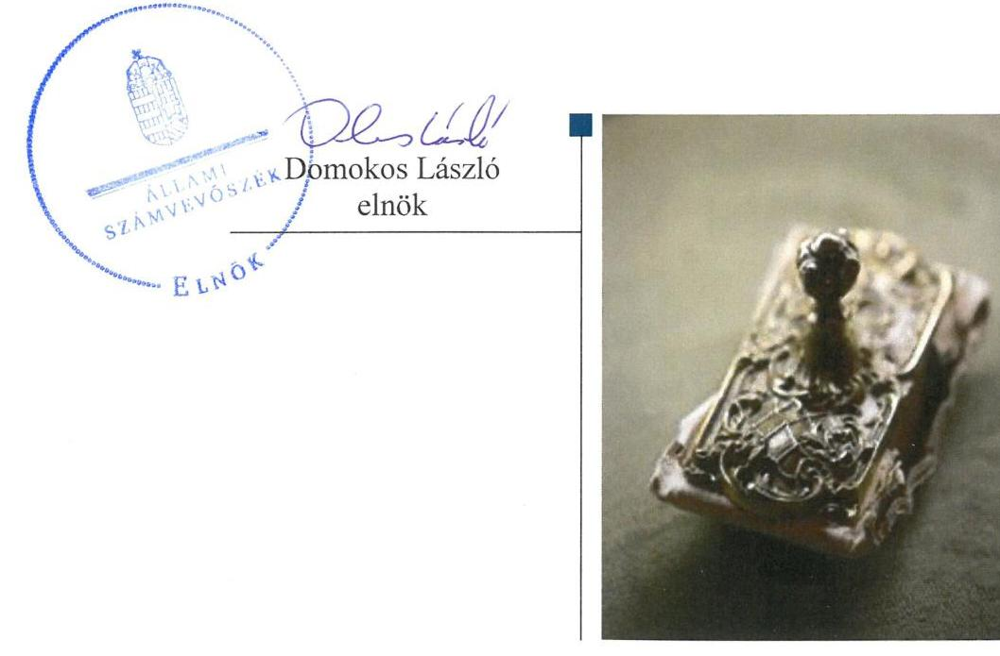

---

# AZ ELLENŐRZÉST FELÜGYELTE:

- VARGA EDIT felügyeleti vezető

- AZ ELLENŐRZÉST VEZETTE ÉS A VÉGREHAJTÁSÁÉRT FELELŐS:
  - JOÓ ERIKA ellenőrzésvezető
  - A PROGRAM ÖSSZEÁLLÍTÁSÁÉRT FELELŐS:
    - TÓTPÁL SZABOLCS osztályvezető

- IKTATÓSZÁM: EL-0273-022/2019.
- TÉMASZÁM: 2460
- ELLENŐRZÉS-AZONOSÍTÓ SZÁM: V080459

Jelentéseink az Országgyűlés számítógépes hálózatán és az Interneten a www.asz.hu címen is olvashatóak.

---

# TARTALOMJEGYZÉK 

■ ÖSSZEGZÉS ..... 5
■ AZ ELLENŐRZÉS CÉLJA ..... 6
■ AZ ELLENŐRZÉS TERÜLETE ..... 7
■ AZ ELLENŐRZÉS HÁTTERE, INDOKOLTSÁGA ..... 8
■ A JELENTÉS LÉNYEGES KÉRDÉSKÖRE ..... 9
■ AZ ELLENŐRZÉS HATÓKÖRE ÉS MÓDSZEREI ..... 10
■ MEGÁLLAPÍTÁSOK ..... 12
■ MELLÉKLETEK ..... 15
I. sz. melléklet: Budapest Főváros Önkormányzata és a Vígszínház Nonprofit Kft. intézkedési terve végrehajtásának értékelése ..... 15
II. sz. melléklet: Budapest Főváros Önkormányzata és a Vígszínház Nonprofit Kft. intézkedési terve ..... 19
■ FÜGGELÉK: ÉSZREVÉTELEK ..... 29
■ RÖVIDÍTÉSEK JEGYZÉKE ..... 39

---

.

---

# ÖSSZEGZÉS 

A Vígszínház Nonprofit Korlátolt Felelősségű Társaságnál a pénzügyi szabályozottság javult, azonban a pénzügyi gazdálkodás szabályszerűsége továbbra sem volt biztosított. A Budapest Főváros Önkormányzata, mint tulajdonosi joggyakorló által végrehajtott feladatok hatására csökkent a szabályozatlanságból eredő kockázatok mértéke. Ugyanakkor a tulajdonosi joggyakorló által vállalt feladatok végrehajtásának elmaradása miatt a Társaság vagyongazdálkodásában rejlő kockázatok fennmaradtak.

## Az ellenőrzés társadalmi indokoltsága

Az Állami Számvevőszék stratégiájában célul tűzte ki a számvevőszéki munka hasznosulásának javítását. Ezzel összhangban ellenőrzi, hogy az ellenőrzött szervezet megvalósította-e a korábbi ellenőrzései által feltárt hibák, hiányosságok és szabálytalanságok megszüntetése céljából elkészített intézkedési tervében foglaltakat. A rendszeres utóellenőrzések hozzájárulnak a szükséges intézkedések tényleges végrehajtásához, ezáltal a közpénzügyek rendezettségének javulásához.

## Főbb megállapítások, következtetések

Az Állami Számvevőszék részére megküldött intézkedési tervben meghatározott hét feladatból Budapest Főváros Önkormányzata három feladatot határidőben, egy feladatot határidőn túl, egy feladatot részben hajtott végre, két feladat végrehajtásáról nem gondoskodott. A Vígszínház Nonprofit Korlátolt Felelősségű Társaság az intézkedési tervben meghatározott három feladatból kettőt végrehajtott, egyet nem hajtott végre.

A Budapest Főváros Önkormányzata által végrehajtott vagyonrendelet-módosítás, a fenntartói megállapodások felülvizsgálata és módosítása a szabályozottság területén csökkentette a kockázatokat. A haszonbérleti szerződések felülvizsgálatának, illetve a leltárkészítési és leltározási mintaszabályzat kidolgozásának elmaradása miatt a vagyongazdálkodás területén meglévő kockázatok fennmaradtak.

A Vígszínház Nonprofit Korlátolt Felelősségű Társaság az önköltségszámítási szabályzat módosításával javította a pénzügyi szabályozottságot, ugyanakkor a különböző gazdasági eseményekhez kapcsolódó elszámolások alapbizonylatai vonatkozásában a számviteli előírások érvényesülésének hiánya miatt nem biztosította a szabályszerű pénzügyi gazdálkodást és ezzel az elszámoltathatóságot.

---

# AZ ELLENŐRZÉS CÉLJA 

Az ellenőrzés célja annak értékelése volt, hogy a számvevőszéki jelentésben ${ }^{1}$ foglalt intézkedést igénylő megállapításokkal összhangban készített intézkedési tervben meghatározott feladatokat az ellenőrzött szervezet végrehajtotta-e.

---

# AZ ELLENŐRZÉS TERÜLETE 

## Vígszínház Nonprofit Korlátolt Felelősségű Társaság

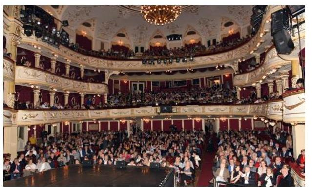

Budapest Főváros Önkormányzata a 100\%-os tulajdonában lévő Vígszínház Nonprofit Korlátolt Felelősségű Társaságot közművelődési és művészeti közfeladatának ellátása érdekében alapította. A Társaság ${ }^{2}$ 2011. augusztus 1-jétől működik nonprofit korlátolt felelősségű társasági formában, ezt megelőzően költségvetési intézményként végezte feladatát.

A Társaság fő tevékenysége az előadó-művészet. A Társaság ügyvezetőjének személye az ellenőrzött időszakban nem változott; Budapest Főváros Önkormányzata Főpolgármestere és Budapest Főváros Önkormányzata Főjegyzője személyében az ellenőrzött időszakban változás nem történt.

Az ÁSZ a 2008-2012 évekre vonatkozóan ellenőrizte az Önkormányzat ${ }^{3}$ tulajdonában lévő Társaság közfeladat-ellátását. Az ellenőrzés célja annak értékelése volt, hogy a tulajdonos önkormányzat a jogszabályi előírások figyelembevételével gyakorolta-e tulajdonosi jogait és teljesítette-e kötelezettségeit, illetve hogy a Társaság végrehajtotta-e a közfeladat-ellátási szerződés előírásait és betartotta-e a vagyongazdálkodásra vonatkozó jogszabályi rendelkezéseket. Az ellenőrzésről készült 14048. számú jelentést 2014. március 13-án hozta nyilvánosságra az ÁSZ, amelyben Budapest Főváros Főpolgármesterének és Főjegyzőjének ${ }^{4}$ egy-egy, a Társaság ügyvezető igazgatójának három javaslatot fogalmazott meg.

Az utóellenőrzés az 14048. számú jelentésben megfogalmazott javaslatokat megalapozó megállapításokra megküldött intézkedési terv ${ }_{1,2}$-ben ${ }^{5}$ foglalt feladatok végrehajtásának ellenőrzésére, értékelésére irányult.

---

# AZ ELLENŐRZÉS HÁTTERE, INDOKOLTSÁGA 

Az ÁSZ tv. ${ }^{6}$ 33. § (1) bekezdése értelmében a számvevőszéki jelentések intézkedést igénylő megállapításaihoz és javaslataihoz kapcsolódóan az ellenőrzött szervezet vezetője intézkedési tervet köteles összeállítani, és az Állami Számvevőszék részére megküldeni.

Az ÁSZ által befogadott intézkedési tervben foglaltak megvalósítását az ÁSZ tv. 33. § (7) bekezdésében foglaltak alapján - az ÁSZ utóellenőrzés keretében ellenőrizheti. Az utóellenőrzések keretében - az intézkedések értékelése során - az ÁSZ figyelembe veszi az ellenőrzött szervezetek működési feltételeiben, valamint a jogszabályi előírásokban bekövetkezett változásokat.

Az utóellenőrzés során az ÁSZ értékeli, hogy az érintett számvevőszéki jelentésben foglalt intézkedést igénylő megállapításokkal és javaslatokkal összhangban, az ellenőrzött szervezet által készített intézkedési tervben meghatározott feladatokat a feladatra kijelöltek végrehajtották-e.

Az intézkedések végrehajtásával az adott terület szabályszerű működése vonatkozásában a kockázatok csökkenhetnek, azonban hosszabb távon az intézkedési tervben foglaltak végrehajtásával önmagában nem szűnnek meg, csak akkor, ha beépülnek az ellenőrzött szervezet működésébe, azokat folyamatosan karbantartja, figyelembe véve, illetve kezelve a változásokat. Emellett az intézkedések végrehajtásáig újabb kockázatok merülhetnek fel a szabályszerű működés vonatkozásában, amelyek kezelése szintén kiemelten fontos az ellenőrzött szervezet számára.

Az ellenőrzött szervezet vezetője által készített intézkedési tervekben foglalt feladatok hiányos, illetve késedelmes végrehajtása, vagy annak elmaradása a szabályszerűség és a felelős vezetői magatartás vonatkozásában kockázatot hordoz, ami azt mutatja, hogy az ellenőrzések során feltárt hibák, hiányosságok és szabálytalanságok kezelése nem kapott kellő hangsúlyt. Az utóellenőrzés során is fennálló szabálytalanságok esetén a közpénz, közvagyon veszélyeztetettségi kockázat valószínűsített hatásának értékelése további intézkedéseket vonhat maga után.

Az ellenőrzött szervezet szintjén az utóellenőrzés feltárja, hogy a szervezet az intézkedések végrehajtásával hasznosította-e a korábbi ellenőrzési jelentésben a hiányosságok megszüntetése, illetve a kockázatok kezelése érdekében megfogalmazott javaslatokat, illetve az intézkedések végrehajtása elmaradásának következtében továbbra is fennálló szabálytalanság esetén értékeli a közpénzek, közvagyon veszélyeztetettségét.

Az ÁSZ szintjén az utóellenőrzés visszacsatolást ad az ellenőrzési jelentések hasznosulásáról, az intézkedések elmaradásának, vagy részleges megvalósulásának a közpénzek, közvagyon veszélyeztetettségére gyakorolt valószínűsített hatásának értékelése, további intézkedéseket vonhat maga után.

---

# A JELENTÉS LÉNYEGES KÉRDÉSKÖRE 

Az ellenőrzött szervezetek az intézkedési tervben foglaltakat az előírt határidőben végrehajtották-e?

---

# AZ ELLENŐRZÉS HATÓKÖRE ÉS MÓDSZEREI 

## Az ellenőrzés típusa

Megfelelőségi ellenőrzés.

## Az ellenőrzött időszak

Az utóellenőrzés alapját képező ÁSZ jelentés közzétételének napjától az ellenőrzésről szóló kiértesítő levél keltének napjáig tartó időszak volt, 2014. március 13-tól 2018. augusztus 15-ig.

## Az ellenőrzés tárgya

A számvevőszéki jelentésben foglalt intézkedést igénylő megállapításokkal összhangban - az ellenőrzött szervezetek által - készített Intézkedési tervben foglaltak végrehajtásának ellenőrzése volt.

## Az ellenőrzött szervezet

Vígszínház Nonprofit Korlátolt Felelősségű Társaság, Budapest Főváros Önkormányzata

## Az ellenőrzés jogalapja

Az ellenőrzés jogszabályi alapját az ÁSZ tv. 33. § (7) bekezdése előírásai képezik.

## Az ellenőrzés módszerei

Az ÁSZ az ellenőrzést az ellenőrzött időszakban hatályos jogszabályok, az ellenőrzés szakmai szabályai, a jelen ellenőrzésre irányadó ÁSZ módszertanok, az ellenőrzési programban foglalt értékelési szempontok szerint végezte.

Az ellenőrzés ideje alatt az ellenőrzött szervezetekkel történő kapcsolattartás az ÁSZ SZMSZ²-ének vonatkozó előírásai alapján volt biztosított.

Az utóellenőrzés megállapításait az ÁSZ rendelkezésére álló, valamint az ÁSZ adatbekérése szerint, az ellenőrzött szervezetek által rendelkezésre bocsátott dokumentumok alapozták meg.

Az ellenőrzési bizonyítékként felhasználható adatforrások közé tartoztak egyrészt az ellenőrzési program részletes szempontjainál felsorolt

---

adatforrások, másrészt minden - az ellenőrzés folyamán feltárt, az ellenőrzés szempontjából információt tartalmazó - dokumentum.

Az ÁSZ az intézkedési tervekben előírt feladatokat azok végrehajthatósága, illetve végrehajtása szempontjából az alábbiak szerint értékelte:
"határidőben végrehajtott" a feladat, ha a teljesítés dokumentáltan, az intézkedési tervben előírt határidőben és tartalommal megtörtént;
"határidőn túl végrehajtott" a feladat, ha annak teljesítése az intézkedési tervben meghatározott módon, de az előírt határidőn túl történt meg;
"részben végrehajtott" a feladat, ha végrehajtása teljes körűen az intézkedési tervben előírt módon nem történt meg;
"nem végrehajtott" a feladat, ha a végrehajtás nem történt meg, vagy amennyiben a teljesítést nem dokumentálták;
"okafogyottá vált" a feladat, ha végrehajtására - meghatározott esemény bekövetkezése, továbbá külső körülmény, a működést érintő feltétel változása miatt - már nincs szükség, illetve lehetőség, és egyértelműen megállapítható, hogy az intézkedést szükségessé tevő körülmény a jövőben nem fordulhat elő;
"nem időszerű" az a feladat, amelynek ellenőrzési időszakon belüli végrehajtására azért nem került (kerülhetett) sor, mert az intézkedés alapjául szolgáló esemény nem következett be, de annak jövőbeni előfordulása lehetséges, a végrehajtása nem volt esedékes, vagy a végrehajtás határideje még nem járt le.
Az ellenőrzés lefolytatásához az ellenőrzött szervezetek a tanúsítványok elektronikus kitöltésével, valamint az ÁSZ által kért dokumentumok elektronikus megküldésével szolgáltatott adatokat, amelyek valódiságát és teljes körűségét az ellenőrzött szervezet vezetője által tett teljességi és hitelességi nyilatkozat igazolta. Az így rendelkezésre bocsátott adatok, információk kontrollja az ellenőrzés keretében megtörtént.

Az ellenőrzött szervezet által megküldött intézkedési tervben meghatározott ÁSZ által beazonosított feladatok a II. számú mellékletben kerültek bemutatásra.

---

# MEGÁLLAPÍTÁSOK 

## Az ellenőrzött szervezetek az intézkedési tervben foglaltakat az előírt határidőben végrehajtották-e?

Összegző megállapítás

Az Önkormányzat az intézkedési tervben meghatározott hét feladatból hármat határidőben, egyet határidőn túl, egy feladatot részben hajtott végre, kettő feladat végrehajtásáról nem intézkedett. A Társaság az intézkedési tervben vállalt három feladatból kettőt végrehajtott, egyet nem hajtott végre.

Az intézkedési terv $_{1,2}$-ben meghatározott feladatokat, határidőket, megjelölt felelősöket és a feladatok végrehajtását az I. sz. melléklet, az intézkedési terv $_{1,2}$-t a II. számú melléklet mutatja be

Az Önkormányzat gondoskodott az intézkedési terv $_{1}$-ben meghatározott feladatok végrehajtásának Bkr. ${ }^{8}$ előírása szerinti nyilvántartásáról.

Az Önkormányzat által készített intézkedési terv $_{1}$-ben vállalt feladatok végrehajtásának értékelését az 1. ábra szemlélteti.

1. ábra
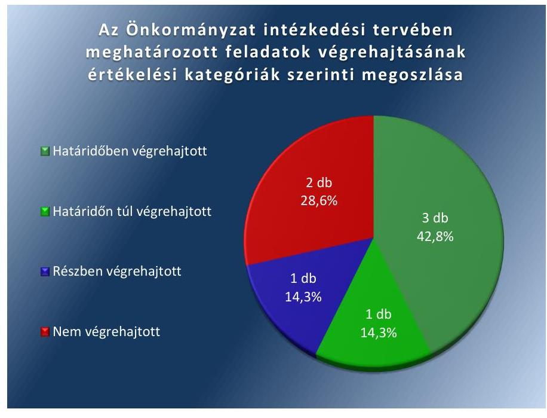

Forrás: ÁSZ

---

A Társaság által készített intézkedési terv ${ }_{2}$-ben vállalt feladatok végrehajtásának értékelését a 2. ábra szemlélteti.
2. ábra
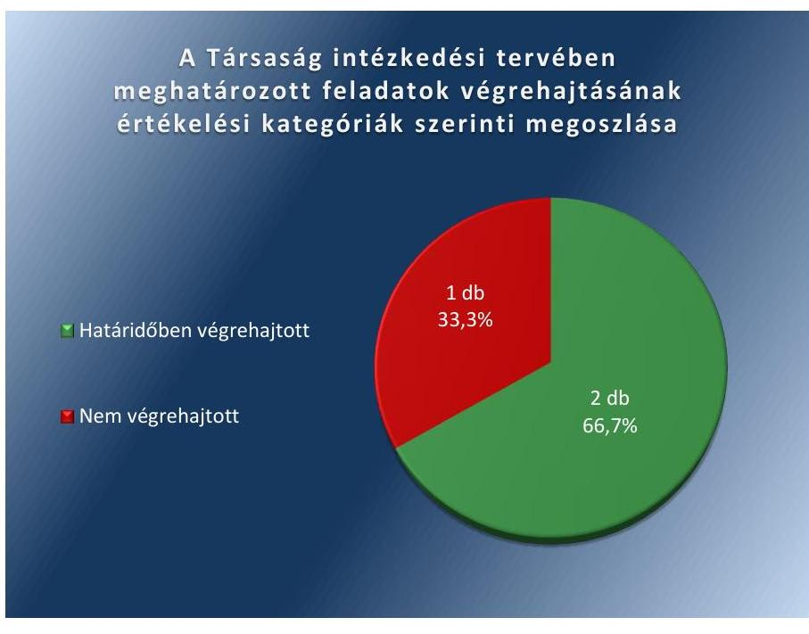

A SZABÁLYOZOTTSÁG érdekében az Önkormányzat módosította vagyonrendeletét ${ }^{9}$, valamint felülvizsgálta a Társasággal kötött fenntartói megállapodást ${ }^{10}(2)^{11}$. A Társaság az önköltségszámítási szabályzatát ${ }^{12}$ módosította és abban a Számv. tv. ${ }^{13}$ előírásainak megfelelően kitért a társulat bérének és járulékainak a produkció színreviteléig történő felosztási módjára, valamint tartalmazta az általános költségek felosztási módját (8). A szabályozottság területén végrehajtott intézkedések következtében javultak a szabályszerű működés feltételei.

# A PÉNZÜGYI GAZDÁLKODÁS SZABÁLYSZERŰ- 

SÉGE területén a kockázat továbbra is fennáll, mert Társaság nem gondoskodott a bizonylati elvvel és fegyelemmel kapcsolatos számviteli előírások érvényesüléséről, valamint a könyvelési alapbizonylatok tartalmi és formai követelményeinek teljesítéséről (10). Ugyanakkor a Társaság a vezető beosztású dolgozók prémiumát és járulékait a Számv. tv. előírásainak megfelelően számolta el (9).

A BELSŐ KONTROLLRENDSZER TERÜLETÉN a kockázatok csökkentek, mert az Önkormányzat - tulajdonosi joggyakorlóként - gondoskodott a Társaság által a számvevőszéki jelentésben tett javaslatokra készített intézkedési terv végrehajtásának belső ellenőrzéséről (1, 3-4).

A VAGYONGAZDÁLKODÁS területén nem csökkent a kockázat, mert az Önkormányzat nem gondoskodott a haszonbérleti szerződések felülvizsgálatáról (5), valamint az intézkedési tervben ${ }^{1}$-ben vállalt leltárkészítési és leltározási mintaszabályzat kidolgozásáról a Társaság részére (6).

---

.

---

# MELLÉKLETEK

- I. SZ. MELLÉKLET: BUDAPEST FŐVÁROS ÖNKORMÁNYZATA ÉS A VÍGSZÍNHÁZ NONPROFIT KFT. INTÉZKEDÉSI TERVE VÉGREHAJTÁSÁNAK ÉRTÉKELÉSE

|  1. | Az intézkedési tervben meghatározott feladat | Az intézkedési tervben meghatározott határidő | Az intézkedési tervben meghatározott feladatok felelőse | A feladat végrehajtása  |
| --- | --- | --- | --- | --- |
|  1. |  | Budapest Főváros Önkormányzata intézkedési terve |  |   |
|   |  | Határidőben végrehajtott feladatok |  |   |
|   |  | a vizsgálati program elkészítésére: 2014. június 15. egyeztetett vizsgálati jelentés elkészítésére: 2014. szeptember 15. | Belső Ellenőrzési Osztály vezetője | Az ellenőrzési program ${ }^{14}$ az intézkedési tervben előírt határidőben elkészült, az ellenőrzést az előírt határidőig lefolytatták és az egyeztetett ellenőrzési jelentést ${ }^{15}$ elkészítették.  |
|  2. | FJ3* „c.) közgyűlési elfogadásra javaslatot kell tenni a Vagyonrendelet módosítására, és amennyiben indokolt a haszonbérleti szerződések és fenntartói megállapodások módosítására." | városvezetői döntés szerint | Vagyongazdálkodási Főosztály vezetője | A vagyonrendelet módosítására vonatkozó, FPH058/1497-5/2015. iktatószámú javaslatot ${ }^{16} 2015$. november 20-án, a fenntartói megállapodások módosítására vonatkozó javaslatot ${ }^{17} 2015$. október 16-án terjesztették a Közgyűlés ${ }^{18}$ elé. A Vagyonrendelet módosítása a Számv. tv. ${ }^{19}$ előírásaival összhangban évente leltárkészítési, háromévente mennyiségi felvétellel történő leltározási kötelezettséget írt elő az önkormányzati vagyont használó, haszonbérbe, haszonkölcsönbe vevő gazdasági társaságok és nonprofit gazdasági társaságok számára.  |

---

|  2014. | Az intézkedési tervben meghatározott feladat | Az intézkedési tervben meghatározott határidő | Az intézkedési tervben meghatározott feladatok felelőse | A feladat végrehajtása  |
| --- | --- | --- | --- | --- |
|  3. | FJ4 „Gondoskodni kell arról, hogy,
a.) 2014. évi Belső Ellenőrzési Munkatervben szereplő, kulturális társaságokra irányuló és az ÁSZ vizsgálattal érintett társaságok vizsgálata során kerüljön sor az ÁSZ jelen vizsgálati jelentésében az érintett színházi igazgatók részére megfogalmazott feladatok végrehajtásának ellenőrzésére.
b.) a 2015. évi Belső Ellenőrzési Munkaterv tartalmazza valamennyi ÁSZ vizsgálattal érintett színházi társaság esetében az ÁSZ javaslatai végrehajtásának ellenőrzési feladatait." | 2014. IV. negyedév | Belső Ellenőrzési
Osztály vezetője | A 2014. évi belső ellenőrzési munkaterv ${ }^{20}$ tartalmazta a Társaság ellenőrzését (64. sorszám). Az ellenőrzést az ÁSZ javaslatai alapján elkészített intézkedési tervben megfogalmazott feladatok végrehajtására vonatkozóan lefolytatták.
A 2015. évi belső ellenőrzési munkaterv ${ }^{21}$ tartalmazta a színházak ellenőrzését (38. sorszám) az ÁSZ javaslatai alapján elkészített intézkedési tervben megfogalmazott feladatok végrehajtása tárgyában.  |
|   | Határidőn túl végrehajtott feladat |  |  |   |
|  4. | FP2 „Az a.) pont szerinti vizsgálat eredményeként vezetői összefoglalót kell készíteni arról, hogy milyen jogszabályi felhatalmazás(ok) alapján kezdeményezhető munkajogi intézkedés kiemelkedően közhasznú nonprofit kft. esetében. A vizsgálatnak ki kell térnie a Főpolgármester ${ }^{22}$ munkajogi jogosultságának levezetésére is." | 2014. október 15. | Belső Ellenőrzési
Osztály vezetője a
Humán Menedzsment Főosztály vezetőjének bevonásával | A vezetői összefoglaló ${ }^{23} 2014$. október 27-én készült el arról, hogy milyen jogszabályi felhatalmazás alapján kezdeményezhető munkáltatói intézkedés. A vezetői összefoglaló kitért a Főpolgármester munkajogi jogosultságának levezetésére is.  |
|   | Részben végrehajtott feladat |  |  |   |
|  5. | FJ2* „b.) az a.) pontban foglaltakra figyelemmel felül kell vizsgálni és szükség szerint javaslatot kell tenni (közgyűlés elé való terjesztés érdekében) a színházakkal kötött haszonbérleti szerződések, illetve fenntartói megállapodások módosítására;" | 2014. augusztus 31. | Kulturális, sport, Köznevelési, Egészségügyi és Szociálpolitikai Főosztály vezetője | Végrehajtott feladatrész: Budapest Főváros Főpolgármesteri Hivatal Pénzügyi Főosztály főosztályvezetője 2014. április 10-én javaslatot tett a fenntartói megállapodások kiegészítésére az ÁSZ javaslatával összefüggésben. (A Társasággal kötött fenntartói megállapodás módosítására vonatkozó javaslatot az FPH079/16632/2015 iktatószámú előterjesztésben terjesztették a Fővárosi Közgyűlés elé, amely alapján a Társasággal kötött fenntartói megállapodás módosításra került.)
Nem végrehajtott feladatrész: A Társasággal kötött haszonbérleti szerződés felülvizsgálata nem történt meg.  |

---

|  5 | Az intézkedési tervben meghatározott feladat | Az intézkedési tervben meghatározott határidő | Az intézkedési tervben meghatározott feladatok felelőse | A feladat végrehajtása  |
| --- | --- | --- | --- | --- |
|  6. | FJ1* „a.) javaslatot kell tenni a Leltárkészítés és leltározás szabályzatának mintájára;" | 2014. október 15.
Az ÁSZ javaslataival kapcsolatosan készítetett vizsgálat Vezetői összefoglalójának elfogadását követő 30 napon belül | Pénzügyi Főosztály vezetője
Humán Menedzsment Főosztály vezetőjének bevonásával | A leltárkészítés és leltározás szabályzatának mintájára javaslat nem készült.
Nem tettek javaslatot Budapest Főváros Önkormányzata szabályozásának, eljárási rendjének, szabályozó intézkedéseinek a felülvizsgálatára, módosítására.  |
|  7. |  | A Vígszínház Nonprofit Kft. intézkedési tervelatáridőben végrehajtott feladatok |  |   |
|  8. | V1. „A színház vezetése áttekinti a Számviteli törvény. vonatkozó előírásait és módosítja az önköltségszámítási szabályzatot annak érdekében, hogy az tartalmazza a társulat bér- és járulék költségeinek a produkciókra történő felosztását. Az önköltségszámítási szabályzatot módosítani kell annak érdekében, hogy az tartalmazza az általános költségeknek a felosztási módját. A választott megoldások integrálása érdekében módosítják az önköltségszámítási szabályzatot." | 2014. szeptember 30. | gazdasági igazgató | A módosított önköltségszámítási szabályzatot határidőben elkészítette a Társaság. Az önköltségszámítási szabályzat tartalmazta a társulat bér- és járulék költségeinek a produkciókra történő felosztását, valamint az általános költségek felosztási módját.  |
|  9. | V2. „Az ügyvezető és az egyéb vezető beosztású dolgozók prémiumát és járulékát a Számviteli törvény passzív időbeli elhatárolásokra vonatkozó előírásainak megfelelően kell elszámolni." | 2014. április 30. | a beszámoló elkészítéséért felelős személy | A Társaság az ügyvezető és az egyéb vezető beosztású dolgozók prémiumát és járulékát a Számv. tv. passzív időbeli elhatárolásokra vonatkozó előírásainak megfelelően számolta el.  |

---

|  Az intézkedési tervben meghatározott feladat | Az intézkedési tervben meghatározott határidő | Az intézkedési tervben meghatározott feladatok felelőse | A feladat végrehajtása  |
| --- | --- | --- | --- |
|  10. V3. „A bevételek és a költségek elszámolásánál minden esetben érvényesülnie kell a valódiság, valamint a bizonylati elvvel és fegyelemmel kapcsolatos számviteli előírásoknak. A számviteli előírásokat kiemelt figyelemmel kell alkalmazni a bevételek és költségek elszámolása során. Gondoskodni kell a könyvelési alapbizonylatok tartalmi és formai követelményeinek teljesítéséről, ezen belül részletes bizonylattal kell alátámasztani a rendkívüli ráfordítások elszámolását.” | 2014. augusztus 31. | gazdasági igazgató helyettes | A Társaság nem biztosította a valódisággal (Számv. tv. 15. § (3) bekezdés), valamint a bizonylati elvvel és fegyelemmel kapcsolatos számviteli előírások (Számv. tv. 165. § (2) bekezdés) érvényesülését, valamint nem gondoskodott a könyvelési alapbizonylatok tartalmi és formai követelményeinek teljesítéséről.  |

*Az FJ1, FJ2 és FJ3 intézkedési tervpontok közös bevezető szövege:

"Az ÁSZ javaslatában foglaltakra tekintettel a hatályos jogszabályi előírások figyelembe vételével át kell tekinteni a hatályos Vagyonrendelet előírásait, a színházakkal megkötött haszonbérleti szerződéseket, illetve fenntartói megállapodásokat, a színházak leltárkészítési és leltározási szabályzatait és javaslatot kell tenni a Vagyonrendelet indokolt módosítására, a színházakkal megkötött szerződések szükséges módosítására, valamint a színházak leltárkészítés és leltározási szabályzataiban foglaltak végrehajtásának ellenőrzési rendjére. Ennek részeként:"

---

# Mellékletek

## II. SZ. MELLÉKLET: BUDAPEST FŐVÁROS ÖNKORMÁNYZATA ÉS A VÍGSZÍNHÁZ NONPROFIT KFT. INTÉZKEDÉSI TERVE

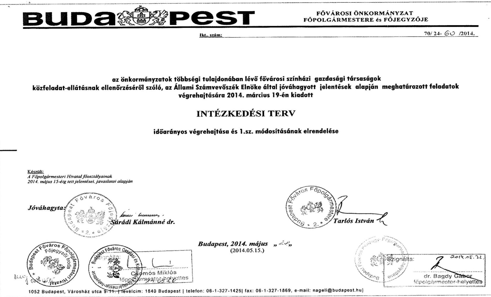

---

Az Intézkedési Terv 2014. március 19-i kiadását követően további - alábbiakban felsorolt - fővárosi színházi jelentés került nyilvánosságra. E jelentésekben megfogalmazott javaslatok, valamint a kiadott Intézkedési Terv végrehajtása érdekében tett intézkedések és a Főpolgármesteri Hivatal érintett belső szervezeti egységei által megfogalmazott javaslatok indokolttá teszik az Intézkedési Terv módosítását.

Jelen Intézkedési Terv 1.sz. módosításának időpontjára az alábbi fővárosi színházi jelentések kerültek nyilvánosságra:

|  1. | a Central Színházi Nonprofit Kft. | 9-0189- 063/2014. sz.  |
| --- | --- | --- |
|  2. | a József Attila Színházi Nonprofit Kft. | 9-0195- 099/2014. sz.  |
|  3. | a Függszínházi Kiemelkedési Közhasznú
Nonprofit Kft. és jogelődje | 9-0193-160/2014. sz.  |

Jelen Intézkedési Terv módosítására a fentiekben jelzett, nyilvánosságra hozott végleges jelentések alapján került összeállításra.

# B.) AZ INTÉZKEDÉSI TERV VÉGREHAJTÁSÁNAK RÉSZLETES FELADATAI

|  Feladat | 1.sz. módosítás  |
| --- | --- |
|  (egységes szerkezetben a 2014. március 19-én jóváhagyott intézkedési tervezi) | A feladat időarányos végrehajtása és végrehajtási határidejének módosítása)  |
|  $\begin{aligned} & \text { AGE jo: } 1 \mathrm{p} . \end{aligned}$ |   |
|  JAVASLAT: |   |
|  Vizsgáltassa ki a feltárt hiányosságokat, szabálytalanságokat és amennyiben szükséges, tegye meg a munkajogi felelősségre vonást | Intézkedési tervet módosító új javaslat, amely a Vígszínház Kiemelkedően Közhasznú Nonprofit Kft. és jogelődje tekintetében nyilvánosságra hozott jelentésben került megfogalmazásra.  |
|  INTÉZKEDÉS: |   |
|  FPM. a.) Az ÁSZ javaslatára tekintettel vizsgálati programot kell összeállítani, illetve vizsgálatot kell lefolytatni az ÁSZ vizsgálati jelentésben foglaltak és a mögöttes dokumentációk áttekintése, illetve munkajogi minősítése céljával. |   |
|  b.) Az a.) pont szerinti vizsgálat eredményeként vezetői összefoglalót kell készíteni arról, hogy milyen jogszabályi felhatalmazás(ok) alapján kezdeményezhető munkajogi intézkedés kiemelkedően közhasznú nonprofit kft. esetében. A vizsgálatnak ki kell térnie a Főpolgármester |   |

---

# Mellékletek

munkajogi jogosultságának levezetésére is.

A vezetői összefoglaló eredményeként - amennyiben jogszabályi feltételek adottak, úgy konkrét javaslatot kell tenni a főváros jelenlegi szabályozásának, eljárási rendjének, szabályozó intézkedéseinek indokolt felülvizsgálatára, módosítására.

## Határidő:

a.) - a vizsgálati program elkészítésére: 2014. június 15.

- egyeztetett vizsgálati jelentés elkészítésére: 2014. szeptember 15.

b.) 2014. október 15.

c.) a b.) pont szerinti vezetői összefoglaló elfogadását követő 30 napon belül.

## Felelős:

a.) Belső Ellenőrzési Osztály vezetője

b.) Belső Ellenőrzési Osztály vezetője a Humán Menedzsment Főosztály vezetőjének bevonásával

c.) Humán Menedzsment Főosztály vezetője

## 1.) JAVASLAT:

Készítse elő a Közgyűlés elé való terjesztés érdekében a Vagyonrendelet, módosítását, hogy az tartalmazza az Áhsz., 37.§ (4)/Áhsz., 22.§ (2) bekezdésében előírtaknak megfelelően az üzemeltetésre, kezelésre átadott eszközök leltározási szabályait.

## INTÉZKEDÉS:

Az ÁSZ javaslatában foglaltakra tekintettel a hatályos jogszabályi előírások figyelembe vételével át kell tekinteni a hatályos Vagyonrendelet előírásait, a színházakkal megkötött haszonbérleti szerződéseket, illetve fenntartói megállapodásokat, a színházak leltárkészítési és leltározási szabályzatait, és javaslatot kell tenni a Vagyonrendelet indokolt módosítására, a színházakkal megkötött szerződések szükséges módosítására, valamint a színházak leltárkészítés és leltározási szabályzataiban foglaltak végrehajtásának ellenőrzési rendjére. Ennek részeként

A feladat végrehajtása során a tervezett végrehajtási határidő lejártát megelőzően az érintettek részvételével egyeztető megbeszélésre került sor. A feladat részleteinek áttekintése során, megállapodás született arról, hogy valamennyi színház leltározási szabályzatát áttekinti a Pénzügyi Főosztály, s ennek valamint a "nagy" Madách Színház, illetve "kis" Radnóti Színház leltározási szabályzata ismeretében minta leltározási szabályzatot készít. E mintaszabályzatot véleményezésre, észrevételezésre megkapja valamennyi színház, illetve a hivatal érintett szervezeti egység vezetői. Az észrevételek ismeretében kerül sor a minta leltározási szabályzat véglegesítésére.

A Pénzügyi Főosztály a vagyonrendelet módosításához javaslatot készített, amelynek egyeztetése és a tervezett mintaszabályzat elkészítése - a feladat összetettségére, időigényére

---

|  FJ1. | a.) javaslatot kell tenni a Leltárkészítés és leltározás szabályzatának mintájára; | tekintettel (nem veszélyeztetve az elvégzendő leltározási feladatokat) – indokolja a végrehajtási határidők alábbiak szerinti módosítását:  |
| --- | --- | --- |
|  FJ2. | b.) az a.) pontban foglaltakra figyelemmel felül kell vizsgálni és szükség szerint javaslatot kell tenni a színházakkal kötött haszonbérleti szerződések, illetve fenntartói megállapodások módosítására; |   |
|  FJ3. | c.) közgyűlési elfogadásra javaslatot kell tenni a Vagyonrendelet módosítására, és amennyiben indokolt a haszonbérleti szerződések és fenntartói megállapodások módosítására; |   |
|   | Határidő: |   |
|   | a.) 2014. március 25. | Módosított határidő:  |
|   | b.) 2014. április 15. | a.) 2014. június 15.  |
|   | c.) 2014. április 15. | b.) 2014. augusztus 31.  |
|   | Felelős: | c.) városvezetői döntés szerint  |
|   | a.) Pénzügyi Főosztály vezetője |   |
|   | b.) Kulturális, sport, Köznevelési, Egészségügyi és Szociálpolitikai Főosztály vezetője |   |
|   | c.) Vagyongazdálkodási Főosztály vezetője |   |
|   | Az egyes részfeladatokat a felelősként megjelölt szervezeti egységek vezetőinek közreműködésével, kölcsönös egyeztetésével kell megvalósítani. |   |
|   |  | ASE. jan.: FJ2.  |
|   | 2.) JAVASLAT: |   |
|   | Intézkedjen a Budapest Bábszínház közfeladatának ellátásában érintett ingatlanok – Budapest, VI., Andrássy út 69. és Budapest, VI., Nagymező utca 8. fszt. 7.sz. – jogi, tulajdonosi helyzetének rendezéséről |   |
|   | Intézkedés: |   |
|   | Arra tekintettel, hogy | Az Intézkedési Tervben megfogalmazott határidőn belül a felelős főosztály elkészítette a munkacsoport összetételére, a munkacsoport egyes részfeladataira, a végrehajtásban érintett felelősök megjelölésével összeállított programot. A program tartalmazza azt is, hogy a  |
|   |  | 4  |

---

# Mellékletek

## Képzőművészeti Egyetem a Fővárosi Közigazgatási és Munkaügyi Bírósághoz 2013. október 17-i keltezéssel jogorvoslati kérelmet nyújtott be.

- a Budapest, VI., Nagymező utca 8. fszt. 7.sz. alatti ingatlan tulajdonjogi kérdésének rendezése összetett feladat végrehajtását igényli,

indokolt, hogy az érintett ingatlanok tulajdon/használati jogának rendezésére a Főpolgármesteri Hivatal érintett belső szervezeti egységei mellett a Budapest Bábszínház bevonásával munkacsoport kerüljön felállításra. A munkacsoportnak városvezetői szinten jóváhagyott program szerint kell ellátni feladatok, amelynek időarányos (időszakonkénti) végrehajtásáról írásos beszámolót kell készítenie, illetve indokolt esetben városvezetői döntést megkérnie.

### Határidő:

- a munkacsoport összetételére, a munkacsoport egyes részfeladataira, a végrehajtásban érintett felelősök megjelölésével összeállított program összeállítására és városvezetői jóváhagyásra benyújtásra: 2014. március 31.
- a további feladatok a városvezetői döntéssel jóváhagyott program szerint:

  **Felelős:** Kulturális, Sport, Köznevelési, Egészségügyi és Szociálpolitikai Főosztály vezetője

  **Közreműködő felelős szervezeti egységek:**
  - a Vagyongazdálkodási-, a Jogi-, és a Pénzügyi Főosztályok vezetője

## Magyar Képzőművészeti Egyetem a Fővárosi Közigazgatási és Munkaügyi Bírósághoz 2013. október 17-i keltezéssel jogorvoslati kérelmet nyújtott be. A programban megfogalmazottak alapján az Intézkedési Tervben megjelölt feladatok, határidők és felelősök kiegészítése szükséges.

## Módosítás:

### Határidő és részfeladat kiegészítése:

(az első fr. bekezdés jelölése a.)-ra változik a második fr. bekezdés jelölése c.)-re változik)

- b.) A Magyar Képzőművészeti Egyetem a Fővárosi Közigazgatási és Munkaügyi Bírósághoz 2013. október 17-i keltezéssel megküldött jogorvoslati kérelmében foglaltakra is figyelemmel az ingatlanok jelenlegi tulajdoni helyzetének alakulásának részletes bemutatására és a Fővárosi Önkormányzat érdekeit szem előtt tartó rendezésére vonatkozó jogi javaslat összeállítására: 2014. június 30.

### Felelős kiegészítése:

- a.) Kulturális, Sport, Köznevelési, Egészségügyi és Szociálpolitikai Főosztály vezetője
- b.) Jogi Főosztály vezetője

## 3.) JAVASLAT:

Készítse elő a Színház SZMSZ-ét és az FB ügyrendjét annak érdekében, hogy a Főpolgármester azt a jóváhagyás céljából a képviselő-testület elé tudja terjeszteni.

Intézkedési tervet módosító új javaslat, amely a József Attila Színház Nonprofit Kft. és jogelődje tekintetében nyilvánosságra hozott jelentésben került megfogalmazásra.

## INTÉZKEDÉS:

---

# Mellékletek

A Polgári Törvénykönyvről szóló 2013. évi V. törvény szabályozásaira tekintettel

a.) felül kell vizsgálni a főváros által alapított színházi társaságok alapító okiratait, valamint a Fővárosi Önkormányzat vonatkozó rendeleti szabályozását oly módon, hogy az egyértelműen szabályozza:

- a társasági SZMSZ-ek jóváhagyásának, illetve
- a társasági FB-ok ügyrendje jóváhagyásának, valamint az FB-k beszámolási kötelezettségének

rendjét, a Főpolgármester, illetve a Fővárosi Közgyűlés ez irányú feladatait, és javaslatot kell tenni a szükséges módosításokra.

b.) határidők és felelősök megjelölésével ütemezett javaslatot kell tenni az a.) pontban megfogalmazott feladatra is figyelemmel a Fővárosi Önkormányzat által alapított valamennyi gazdasági társaság alapítói okiratának felülvizsgálatára, a szükséges módosítások elfogadására.

## Határidő:

a.) módosítási javaslat elkészítésére: 2014. augusztus 31., közgyűlési előterjesztés benyújtására: városvezetői döntés szerint

b.) 2014. augusztus 31.

## Felelős:

a.) Kulturális, Sport, Köznevelési, Egészségügyi és Szociálpolitikai Főosztály vezetője

b.) Vagyongazdálkodási Főosztály vezetője

## Közreműködő felelős szervezeti egység:

a) Jogi Főosztály

---

# C.) a színházi gazdasági társaságok részére megfogalmazott javaslatok végrehajtásának ellenőrzése 

1.) Gondoskodni kell arról, hogy
a.) a 2014. évi Belső Ellenőrzési Munkatervben szereplő, kulturális társaságokra irányuló és az ÁSZ vizsgálattal érintett társaságok vizsgálata során kerüljön sor az ÁSZ jelen vizsgálati jelentésében az érintett színházi igazgatók részére megfogalmazott feladatok végrehajtásának ellenőrzésére.
b.) a 2015. évi Belső Ellenőrzési Munkaterv tartalmazza valamennyi ÁSZ vizsgálattal érintett színházi társaság esetében az ÁSZ javaslatai végrehajtásának ellenőrzési feladatait.
Határidő: 2014. IV. negyedév
Felelős: Belső Ellenőrzési Osztály vezetője

---

# V18 

Állami Számvevőszék
Domokos László
Elnök úrnak
1052 Budapest,
Apáczai Csere János u. 10.
Tisztelt Elnök Úr!
Az alábbiakban ismertetem Önnel az Állami Számvevőszék V-0193-160/2014. számon készített jelentésében megfogalmazott javaslatok és az Ön V-0193-166/2014. számú levelében foglaltak megvalósítására tett kiegészített intézkedéseimet.

1. Javaslat:

Intézkedjen az önköltségszámítási szabályzat módosításáról annak érdekében, hogy
a.) a produkció bemutatásáig elszámolt közvetlen költségek tartalmazzák a társulat bérének és járulékainak a produkcióra felosztott költségeit;
b.) a szabályzat tartalmazza az általános költségeknek a felosztási módját.
$\checkmark 1$ Intézkedés:
A színház vezetése áttekinti a Számviteli törvény vonatkozó előírásait és módosítja az önköltségszámítási szabályzatot annak érdekében, hogy az tartalmazza a társulat bér- és járulékköltségeinek a produkciókra történő felosztását.
Az önköltségszámítási szabályzatot módosítani kell annak érdekében, hogy az tartalmazza az általános költségeknek a felosztási módját.

A választott megoldások integrálása érdekében módosítjuk az önköltségszámítási szabályzatot.

Felelős: Csóti József gazdasági igazgató
Határidő: 2014. szeptember 30.
2. Javaslat:

Intézkedjen a költségek és ráfordítások elszámolásánál a Számv. tv. 44. §-ának a passzív időbeli elhatárolásokra vonatkozó előírásai betartásáról, figyelemmel a Számv. tv. 16. § (2) bekezdésében foglaltakra.

Intézkedés:
Az ügyvezető és az egyéb vezető beosztású dolgozók prémiumát és járulékát a Számviteli törvény passzív időbeli elhatárolásokra vonatkozó előírásainak megfelelően kell elszámolni.

Felelős: Juhászné Krihó Éva, mint a beszámoló elkészítéséért felelős személy Határidő: A 2013. évről szóló mérlegbeszámoló esetében 2014. április 30. A további mérlegbeszámolók esetében folyamatos.

VÍGSZÍNHÁZ Nonprofit Kft.
1137 Budapest, Szent István krt. 14.
1384 Budapest, Pf. 756
tel: +36 13293914 fax: +36 1329 -3919 e-mail: vigszinhaz@vigszinhaz.hu, web: www.vigszinhaz.hu
Fővédnök
$\mathrm{IV} / 3 / 1$
TEN-MASSYFONDSZ

---

A prémium és járulékaival kapcsolatban megfogalmazott javaslatot végrehajtjuk, ám szükségesnek tartjuk hangsúlyozni több számviteli szakértő véleményével alátámasztott álláspontunkat, amely szerint, ha a mérleggel lezárásra kerülő üzleti év beszámolójának elfogadása, jóváhagyása előtt név szerint meghatározták a jutalmat, a prémiumot, a jóváhagyásra jogosult testület azt elfogadja, megállapítja annak és járulékalnak összegét, akkor kötelező az időbeli elhatárolás; ha ez nem teljesül, akkor a céltartalékképzés lehetősége léphet be.

A Fővárosi Önkormányzat tulajdonában lévő gazdasági társaságok esetében az a gyakorlat, hogy a prémium kifizethető összegét és ennek járulékát, csak a beszámoló elfogadása után határozzák meg.
3. Javaslat:

Intézkedjen a bevételek és költségek elszámolásánál a Számv. tv. 15. § (3) bekezdése szerint a valódiság elvének, valamint a Számv. tv. 165. § (2) bekezdésében a bizonylati elvvel és fegyelemmel kapcsolatos előírások betartásáról.

Intézkedés:
A bevételek és a költségek elszámolásánál minden esetben érvényesülnie kell a valódiság, valamint a bizonylati elvvel és fegyelemmel kapcsolatos számviteli előírásoknak. A számviteli előírásokat kiemelt figyelemmel kell alkalmazni a bevételek és költségek elszámolása során. Gondoskodni kell a könyvelési alapbizonylatok tartalmi és formai követelményeinek teljesítéséről, ezen belül részletes bizonylattal kell alátámasztani a rendkívüli ráfordítások elszámolását.

Felelős: Juhászné Krihó Éva gazdasági igazgató helyettes
Határidő: 2014. augusztus 31.

Kérem, hogy a kiegészített intézkedési tervet szíveskedjék jóváhagyni.
Budapest, 2014. július 9.
Szívélyes üdvözlettel:
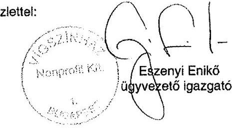

---

.

---

# FÜGGELÉK: ÉSZREVÉTELEK 

A jelentéstervezetet a Számvevőszék 15 napos észrevételezésre megküldte az ellenőrzött szervezetek vezetőinek az ÁSZ tv. 29. §* (1) bekezdése előírásának megfelelően.

Az ÁSZ a jelentéstervezetet észrevételezésre megküldte a Vígszínház Nonprofit Kft. ügyvezetője és Budapest Főváros Önkormányzata főpolgármestere részére.
A Vígszínház Nonprofit Kft. ügyvezetője, valamint Budapest Főváros Önkormányzata főpolgármestere az ÁSZ tv. 29. § (2) bekezdésében foglalt észrevételezési jogukkal éltek, a jelentéstervezet megállapításaira a törvényes határidőn belül észrevételt tettek.
A Vígszínház Nonprofit Kft. ügyvezetője és Budapest Főváros Önkormányzata főpolgármestere észrevételét és az arra adott választ a függelék tartalmazza.

[^0]
[^0]:    * 29. § (1) Az Állami Számvevőszék az ellenőrzési megállapításait megküldi az ellenőrzött szervezet vezetőjének vagy az általa megbízott személynek, és annak, akinek személyes felelősségét állapította meg.
    (2) Az ellenőrzött szervezet vezetője és a felelősként megjelölt személy az ellenőrzés megállapításaira tizenöt napon belül írásban észrevételt tehet.
    (3) Az Állami Számvevőszék az észrevételre a beérkezésétől számított harminc napon belül írásban válaszol. A figyelembe nem vett észrevételeket köteles a jelentésben feltüntetni, és megindokolni, hogy azokat miért nem fogadta el.

---

Állami Számvevőszék
Domokos László
Elnök úrnak

Tisztelt Elnök Úr!

Az EL-1068-006/2019-es iktatószámmal nyilvántartott jelentéstervezettel kapcsolatos észrevételeinket szeretnénk megosztani Önnel. Örömmel konstatáltuk, hogy az utóellenőrzés során - a korábban a Vígszínház hatáskörébe tartozó, az intézkedési tervben meghatározott - három feladat közül kettőt illetően azok végrehajtása "Határidőben végrehajtott" minősítést kapott. A harmadik, "Nem végrehajtott" feladattal kapcsolatosan alábbi kiegészítésekkel szeretnénk élni. Az utóvizsgálat során nyert megállapítást Állami Számvevőszék oldaláról, hogy "A Társaság nem biztosította a valódisággal, valamint a bizonylati fegyelemmel kapcsolatos számviteli előírások érvényesülését, valamint nem gondoskodott a könyvelési alapbizonylatok tartalmi, és formai követelményeinek teljesítéséről." Amennyiben az utóvizsgálat fent idézett megállapítása a 2011 és 2012 évekre vonatkozólag elszámolt rendkívüli ráfordításokkal, illetve a jegybevétel elszámolással kapcsolatos, úgy alábbi észrevételt tesszük:

1. A Fővárosi Önkormányzat Belső Ellenőrzési Osztálya (BEO) megállapítása szerint a könyvelési dátumnak szerepelnie kell a bizonylatokon. A BEO elfogadta intézkedési terv javaslatunkat, melyben a fenti problémára megoldásként a Vígszínház a számviteli bizonylatokon dátumbélyegzővel és aláírással látja el a számviteli bizonylatokat. Ezt a megoldást a BEO elfogadta.

2. A fent említett megállapítás a 2011 és 2012 gazdasági évekre vonatkozott az eredeti ellenőrzésben, a Vígszínház által alkalmazott elszámolási és könyvelési technika, illetve ebből fakadóan az ÁSZ által kifogásolt bizonylati fegyelem megsértése a Vígszínház jogi státuszának megváltozása miatt következett be, mely során 2011 év közepén költségvetési intézményi formájában megszűnt és nonprofit Kft. formában alapította meg a Fővárosi Önkormányzat. Ebből a tényből kiindulva, a 2012 utáni években a színháznak nem volt olyan gazdasági eseménye, melyből fakadóan a hiányosságot újra elkövethette volna, a 2011 és 2012-es évekre pedig - mint lezárt üzleti évekre - nem pótolhatta. Ezért szeretnénk kérni a feladat átminősítését "Nem végrehajtott" státuszból "Okafogyottá vált" kategóriába.

Fenti észrevételeink alapján álláspontunk szerint a Vígszínház eleget tett az intézkedési tervekben (ÁSZ, BEO) vállalt kötelezettségeinek.

Kérjük Elnök Úr jóváhagyását a feladat státuszának átminősítéséhez.

Budapest, 2019. január 20.

Tisztelettel:

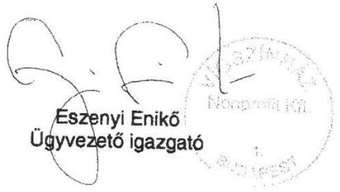

Vígszínház Nonprofit Kft.

1137 Budapest, Szent István krt. 14
1384 Budapest, Pf. 750
telefon: +36 1 329 3914 fax: +36 1 329 3919
e-mail: vigszínház@vigszínház.hu
web: www.vigszínház.hu

---

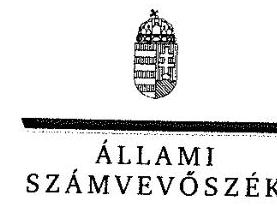

ELNÖK

Ikt. szám: EL-1068-012/2019.

# Eszenyi Enikő úrhölgy 

ügyvezető
Vígszínház Nonprofit Korlátolt Felelősségű Társaság

## Budapest

## Tisztelt Ügyvezető Úrhölgy!

Az „Utóellenőrzések - Az önkormányzatok többségi tulajdonában lévő gazdasági társaságok közfeladat-ellátásának utóellenőrzése - Vígszínház Nonprofit Kft." címmel készített számvevőszéki jelentéstervezetre tett észrevételét köszönettel megkaptam.
Az Állami Számvevőszék észrevételre vonatkozó álláspontjáról a felügyeleti vezető által készített részletes tájékoztatást csatoltan megküldöm.
Tájékoztatom Ügyvezető úrhölgyet, hogy a számvevőszéki jelentésben - az Állami Számvevőszékről szóló 2011. évi LXVI. törvény 29. § (3) bekezdése alapján - a figyelembe nem vett észrevételeket szerepeltetjük, annak indoklásával, hogy azokat az Állami Számvevőszék miért nem fogadta el.

Budapest, 2019. 02 hó 18 nap
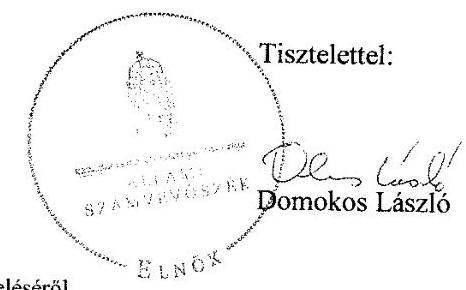

Melléklet: Tájékoztatás az észrevételek kezeléséről

---

# Tájékoztatás az észrevételek kezeléséről 

Az „Utóellenőrzések - Az önkormányzatok többségi tulajdonában lévő gazdasági társaságok közfeladat-ellátásának utóellenőrzése - Vígszínház Nonprofit Kft." című jelentéstervezetre a 2019. január 20-án kelt levelében tett észrevételét áttekintettük, annak kezeléséről az alábbi tájékoztatást adom.

## A jelentéstervezet „Nem végrehajtott" minősítésű feladatával kapcsolatosan tett észrevétel kapcsán

Az ellenőrzés rendelkezésére bocsátott 2017. október 19-én kelt teljességi és hitelességi nyilatkozatban foglaltak alapján megállapítható, hogy a Vígszínház Nonprofit Kft. részéről nem kerültek átadásra olyan dokumentumok az Állami Számvevőszék részére, amely alapján megállapítható az észrevételben jelzett eljárás, amely szerint „...a Vígszínház a számviteli bizonylatokon dátumbélyegzővel és aláírással látja el a számviteli bizonylatokat". Így az Állami Számvevőszéknek - bizonylatok hiányában - nincs arra lehetősége, hogy a korábban kifogásolt, a bevételek és költségek elszámolásánál a számvitelről szóló 2000. évi C. törvény (továbbiakban: Számv. tv.) 15. § (3) bekezdése szerinti valódiság elvének, valamint a Számv. tv. 165. § (2) bekezdése szerinti bizonylati elvvel és bizonylati fegyelemmel kapcsolatos előírások betartásáról meggyőződjön.

Mindezek alapján az észrevételt nem fogadjuk el, az Állami Számvevőszék megállapítása helytálló, a jelentéstervezet módosítása nem indokolt.

Budapest, 2019. 02 hó 18 nap

Varga Edit
felügyeleti vezető

---

# BUDAPEST 

BUDAPEST FŐPOLGÁRMESTERE

| ÁLLAMI SZÁMVEVŐSZÉK |
| :--: |
| Érkezett: 2019 FEBR 14 |
| iktatószám: 22-108-2019/2019. |
| Melléklet: |

Ikt.sz: 70/62-19/2019.
Tárgy: észrevétel az
EL-1068-009/2019. és az
EL-1129-009/2019. iktatószámú
jelentés-tervezetekre

## Állami Számvevőszék

## Domokos László Elnök Úr részére

## Tisztelt Elnök Úr!

Fenti számon érkezett,

- „Utóellenőrzések - Az önkormányzatok többségi tulajdonában lévő gazdasági társaságok közfeladat-ellátásának ellenőrzése - Vígszínház Nonprofit Kft. (EL-1068-009/2019.sz.) és a
- „Utóellenőrzések - Az önkormányzatok többségi tulajdonában lévő gazdasági társaságok közfeladat-ellátásának ellenőrzése - József Attila Színház Közhasznú Nonprofit Kft." (EL-1129-009/2019.sz.)
jelentés-tervezeteket köszönettel megkaptam.
A Fővárosi Önkormányzat 70/24-60/2013. számon kiadott Intézkedési Tervében foglaltak végrehajtásának vizsgálata során mindkét jelentés megfogalmazza, hogy a főváros
- nem hajtotta végre a haszonbérleti szerződések felülvizsgálatát, illetve
- nem készített az eszközök és források leltárkészítési és leltározási szabályzatára mintát.

Hasonló megállapítást olvashattunk a Trafó Kortárs Művészetek Háza Nonprofit Kft. (EL-1280-0001/2018.sz.) és a Kolibri Gyermek- és Ifjúsági Színház Közhasznú Nonprofit Kft." (EL-1281-0001/2018.sz.) jelentés-tervezeteikben, amelyre az elmúlt év december 20-án küldtük meg észrevételeinket. Megtett intézkedéseinket bemutató észrevételeinket az EL-1280-007/2019. és az EL-1281-009/2018. sz., hozzánk 2019. január 17-én érkezett tájékoztatásuk szerint nem fogadták el.

Tekintettel arra, hogy valamennyi, Önök által ellenőrzött színházi társaságunk esetében várható hasonló megállapítás, ezért, s hogy további dokumentumokkal legyen alátámasztva megállapításuk, illetve javaslatuk végrehajtása a következő intézkedéseket tettük, illetve tesszük:

## 1.) haszonbérleti szerződések felülvizsgálata

A Fővárosi Önkormányzat ezen pont végrehajtása érdekében vállalta többek között, hogy

---

felülvizsgálja a színházakkal kötött Haszonbérleti Szerződéseket és Fenntartói Megállapodásokat, s az előzőekben hivatkozott intézkedési terv értelmében szükség szerint javaslatot tesz a színházakkal kötött haszonbérleti szerződések, illetve fenntartói megállapodások módosítására.
A végrehajtás során megtörtént a Fenntartói Megállapodások felülvizsgálatával egyidőben a színházak Haszonbérleti Szerződésének felülvizsgálata is. Megállapításra került, hogy kizárólag a Fenntartói Megállapodások módosítása szükséges, amelyre tekintettel a Fővárosi Közgyűlés a Fenntartói Megállapodások 5.1. pontjának 4. és 5. bekezdéseit az alábbiak szerint módosította:
„A Társaság a Fenntartó tulajdonát képező és a használatában lévő ingó és ingatlan vagyonra vonatkozóan köteles leltárt készíteni jelen Megállapodás időtartama alatt minden évben december 31-i fordulónappal és megküldeni azt a tárgyévet követő év január 31. napjáig az Önkormányzatnak. A leltározási feladatokat - beleértve a leltározók kijelölését, a Leltározási Bizottság felállítását, a leltározás végrehajtását, az összesített leltár összeállítását, a leltár kiértékelését és a leltáreltérések kivizsgálását - a Társaság köteles elvégezni saját hatáskörében.

A haszonkölcsön tárgyát képező ingó vagyontárgyak esetében a Társaság a felesleges vagyontárgyak feltárásával, valamint a selejtezéssel kapcsolatos feladatokat - beleértve a felesleges vagyontárgyak jegyzékének és hasznosítási javaslatának elkészítését, a Selejtezési Bizottság felállítását, a selejtezési jegyzék összeállítását, a selejtezés lefolytatását, a selejtezési jegyzőkönyv kitöltését és a selejt-, illetve hulladékanyag hasznosítási javaslatának elkészítését - köteles ellátni, az elkészített dokumentumokat a Fenntartó részére ellenőrzés és döntés céljából - a Fenntartó által évente külön levélben megjelölt időpontig - megküldeni. A Társaság által megküldött és a Fenntartó által ellenőrzött dokumentumok alapján a selejtezéséről, elidegenítéséről, hasznosításáról, valamint az elidegenítésből származó bevétel felhasználásáról a haszonkölcsönbe adó tulajdonos jogosult dönteni. A haszonkölcsön tárgyát képező ingó vagyontárgyak a Megállapodás megszűnésével nem kerülnek a Társaság tulajdonába, hanem a haszonkölcsönbe adó Önkormányzatnak visszajárnak."

Ezen intézkedésünket el nem fogadó megállapításuk alapján ismételten áttekintésre kerültek a haszonbérleti szerződések, és a Vígszínház Nonprofit Kft. esetében megállapításra került, hogy a Fenntartói Megállapodás teljes körűen rendezi, illetve szabályozza

- a Fenntartó tulajdonát képező és a Társaság használatában lévő ingó és ingatlan vagyonra vonatkozó, leltározással összefüggő eljárási szabályokat, illetve
- a haszonbérleti szerződés a hatályos jogszabályoknak megfelelően szabályozza az ingatlanok vonatkozásában a használati és üzemeltetési jogviszonyt, amelyre tekintettel nem szükséges, illetve nem indokolt a Vígszínház Nonprofit Kft. haszonbérleti szerződésének módosítása.

A megbeszélésről készített jegyzőkönyvet az 1. számú melléklet tartalmazza.
Előzőekkel egyezően felülvizsgálatra került a József Attila Színházzal, illetve valamennyi fővárosi fenntartású színházzal megkötött haszonbérleti szerződés, amelyek jegyzőkönyveit a 2-12.sz. mellékletek tartalmazzák.

# 2.) eszközök és források leltárkészítési és leltározási minta-szabályzata 

Az ellenőrzött színházi gazdasági társaságok fenntartói megállapodásai és haszonbérleti szerződései a leltározási és leltárkészítési kötelezettség szempontjából is felülvizsgálatra, s ennek során a fővárosi vagyonrendelet kiegészítésre került.

Tájékoztatom, hogy a módosított Fenntartói Megállapodásokban, a hatályos Vagyonrendeletben foglaltaknak megfelelően a gazdasági társaságok a Fenntartó tulajdonát

---

képező és a használatában lévő ingó és ingatlan vagyonra vonatkozóan minden év december 31-i fordulónappal leltárt készítenek, hitelesítik és azt megküldik Budapest Főváros Főpolgármesteri Hivatala részére a tárgyévet követő január 31-ig. Tehát a Fővárosi Önkormányzat tulajdonát képező eszközök vagyonvédelme biztosított, továbbá a mérlegtételek, a vagyonkimutatás leltárral alátámasztottak.

Megállapításuk tekintettel - figyelemmel az államháztartási gazdálkodási jogszabályokban meghatározott határidős feladatokra - a következő feladat elvégzését határoztam meg:
a., Az egységes szabályozás érdekében készüljön olyan leltárkészítési és leltározási mintaszabályzat, amely felsorolás szerűen rögzíti a szabályzat kötelező, főbb elemeit, a kötelezően beépítendő tulajdonosi rendelkezéseket.
Határidő: 2019. április 30.
Felelős: FPH Pénzügyi Főosztály vezetője
b.) A minta-szabályzat alapján kerüljön sor a színházi gazdasági társaságok a saját leltárkészítési és leltározási szabályzatának felülvizsgálatára, a szükséges kiegészítéseket kötelező jelleggel végezzék el, amelynek eredményéről a fenntartót írásban tájékoztatni kötelesek.
Határidő: 2019. augusztus 31.
Felelős: színházi Gt-k vezetői
c.) Készüljön tájékoztatás az ÁSZ részére a felülvizsgálat eredményéről.

Határidő: 2019. szeptember 25.

# 3.) Alapító okiratok felülvizsgálata 

A József Attila Színház esetében került megfogalmazásra, hogy a társaságok alapító okiratának felülvizsgálata a társasági SZMSZ jóváhagyása, társasági FB ügyrendjének jóváhagyása, illetve a társasági FB-k beszámolási kötelezettségének rendje szempontjából nem került felülvizsgálatra.

Tájékoztatom, hogy a József Attila Színház Alapító Okiratának módosítása az SZMSZ és az FB Ügyrend jóváhagyása tekintetében a 65/2013.(II.22.) Főv. Kgy. számú jóváhagyó határozattal megtörtént. A jóváhagyott Alapító Okirat 7.2. f) pontja az SZMSZ jóváhagyása, a 9.7. pontja az FB ügyrend jóváhagyása, a 7.6. pontja az Alapító döntéshozatalára irányuló rendjét szabályozza.

Előzőek mellett került sor a Fővárosi Közgyűlés jóváhagyásával valamennyi színház Alapító Okiratainak egységes szemléletű módosítására, a következők szerint:

- 2013. február 22-én: Katona József Színház; Bábszínház; Új Színház, Vígszínház; JASZ, Madách Színház; Centrál Színház; Örkény Színház határozatszámok: 57/2013.(02.22.); 59/2013.(02.22.); 61/2013.(02.22.); 63/2013.(02.22.); 65/2013.(02.22.); 67/2013.(02.22.); 69/2013.(02.22.) 71/2013.(02.22.), valamint
- 2013. május 29-én: Trafó, Thália, Szabad Tér, Radnóti, Kolibri); határozatszámok:919/2013.(05.29.);918/2013.(05.29.);915/2013.(05.29.); 913/2013.(05.29.); 911/2013.(05.29.))

A felülvizsgálat eredményeként valamennyi színház esetében - az egyedi sajátosságokra figyelemmel - azonos szövegezésű alapító okirat került elfogadásra.

---

A vizsgálati jelentés-tervezettel érintett József Attila Színház SZMSZ-ét 2013 szeptemberében fogadta el a Fővárosi Közgyűlés a 1718/2013 (09.26.) Főv. Kgy. határozatával. A Színház FB Ügyrendjét pedig 2015. májusában (a többi színházéhoz hasonlóan) a 743/2015.(05.27.) Főv. Kgy határozatával fogadta el a Közgyűlés.)
A József Attila Színház 164/2016.(II.17.) Főv. Kgy. határozattal elfogadott Alapító Okirat módosítása során az Alapító Okirat 9.20. pontjába beépítésre került az FB tevékenységéről szóló éves beszámolási kötelezettség is.

Előzőekre tekintettel a kitűzött feladatok végrehajtása teljes egészében megtörtént. A Vagyonrendelet felülvizsgálata nem volt indokolt, figyelemmel arra, hogy

- a Fővárosi Közgyűlés a tulajdonosi jogait a Budapest Főváros Önkormányzata vagyonáról, a vagyonelemek feletti tulajdonosi jogok gyakorlásáról szóló 22/2012. (III. 14.) Főv. Kgy. rendeletben (Vr.) foglaltak szerint gyakorolja. Az egyszemélyes, kizárólagos Fővárosi tulajdonban lévő színházak esetében a Vr. 56. § (1) bekezdése irányadó, mely kimondja, hogy a Fővárosi Önkormányzat tulajdonában lévő gazdasági társaság (a továbbiakban e szakaszban: társaság) vonatkozásában a tulajdonosi pozícióból eredő tagi, részvényesi jogok gyakorlásáról és kötelezettségek teljesítéséről [...] a Fővárosi Közgyűlés dönt. Egyszemélyes társaság esetén a Fővárosi Közgyűlés egyedüli tagként, részvényesként közvetlenül dönt [...].
- A Vr. ennél részletesebben nem is kell, hogy szabályozza, hogy a Fővárosi Közgyűlésnek milyen jogkörei vannak alapító okiratok, SZMSZ-ek vagy FB ügyrendek elfogadásának, illetve jóváhagyásának rendje vonatkozásában, hisz a Vagyonrendelet csak a tulajdonosi joggyakorlás vonatkozó hatáskör gyakorlást tartalmazza általános jelleggel, az pedig hogy ez egyes társaságok szintjén a Ptk-ban szabályozott eseteken kívül mi tartozik az Alapító kizárólagos döntési hatáskörébe az Alapító Okiratnak kell tartalmaznia. A Fővárosi Önkormányzat gazdasági társaságainak számát és azok működési és feladatköri különbözőségét tekintve egységes szabályozást a Vagyonrendeletben nem is lehetne megvalósítani.

Fentiekre tekintettel kérem észrevételünkben foglaltak szíves elfogadását, s további utóvizsgálati jelentéseikben azok figyelembevételét.

Munkájukat ezúttal is tisztelettel megköszönöm.
Budapest, 2019. február „ 15 „
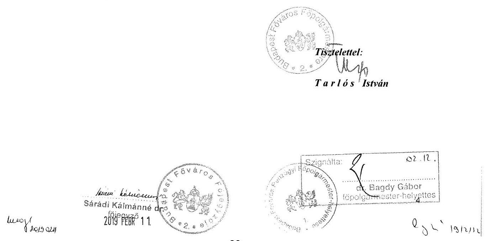

---

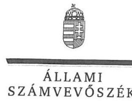

# Tarlós István úr 

főpolgármester
Budapest Főváros Önkormányzata

## Budapest

## Tisztelt Főpolgármester Úr!

Az „Utóellenőrzések - Az önkormányzatok többségi tulajdonában lévő gazdasági társaságok közfel-adat-ellátásának utóellenőrzése - Vígszínház Nonprofit Kft." címmel készített számvevőszéki jelentéstervezetre tett észrevételét köszönettel megkaptam.
Az Állami Számvevőszék észrevételre vonatkozó álláspontjáról a felügyeleti vezető által készített részletes tájékoztatást csatoltan megküldöm.
Tájékoztatom Főpolgármester urat, hogy a számvevőszéki jelentésben - az Állami Számvevőszékről szóló 2011. évi LXVI. törvény 29. § (3) bekezdése alapján - a figyelembe nem vett észrevételeket szerepeltetjük, annak indoklásával, hogy azokat az Állami Számvevőszék miért nem fogadta el.

Budapest, 2019. 03 hó 7 nap
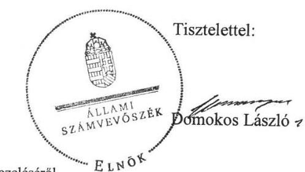

Melléklet: Tájékoztatás az észrevételek kezeléséről

---

# Tájékoztatás az észrevételek kezeléséről 

Az „Utóellenőrzések - Az önkormányzatok többségi tulajdonában lévő gazdasági társaságok közfel-adat-ellátásának utóellenőrzése - Vígszínház Nonprofit Kft." című jelentéstervezetre a 2019. február 13-án kelt, 70/62-19/2019. iktatószámú levelében, a Vígszínház Nonprofit Kft., valamint a József Attila Színház Közhasznú Nonprofit Kft. vonatkozásában tett észrevételét a Vígszínház Nonprofit Kft.-t illetően áttekintettük, annak kezeléséről az alábbi tájékoztatást adom.

## 1. A jelentéstervezet „haszonbérleti szerződések felülvizsgálata" kapcsán tett megállapításra tett észrevétel kapcsán

Az EL-0273-013/2018. iktatószámú, 2018. augusztus 15-én kelt kiértesítő levél mellékleteként megküldött EL-0266-001/2017. iktatószámú ellenőrzési programban foglaltak alapján „Az utóellenőrzés ellenőrzési időszaka az utóellenőrzés alapját képező jelentés közzétételének napjától az utóellenőrzésről szóló kiértesítő levél keltének napjáig tartó időszak.", amely a Vígszínház Nonprofit Kft. esetén a 2014. március 13-tól 2018. augusztus 15-ig tartó időszak.

A Budapest Főváros Önkormányzata főpolgármestere részéről az Állami Számvevőszék rendelkezésére bocsátott, a Vígszínház Nonprofit Kft. haszonbérleti szerződésének (ismételt) felülvizsgálatára vonatkozó megbeszélés 2019. február 1-én kelt, FPH079/406-2/2019. iktatószámú jegyzőkönyvét köszönettel megkaptuk, azonban az ellenőrzés időszakára tekintettel annak az Állami Számvevőszék részéről tárgyi ellenőrzésben történő figyelembe vételére nincs lehetőség.
Mindezek alapján a jelentéstervezet módosítása nem indokolt.

## 2. A jelentéstervezet „eszközök és források leltárkészítési és leltározási minta-szabályzata" kapcsán tett megállapításra tett észrevétel kapcsán

Észrevételében jelezte, hogy ,,Az ellenőrzött színházi gazdasági társaságok fenntartói megállapodásai és haszonbérleti szerződései a leltározási és leltárkészítési kötelezettség szempontjából is felülvizsgálatra, s ennek során a fővárosi vagyonrendelet kiegészítésre került." Tekintettel a haszonbérleti szerződések felülvizsgálatára vonatkozó fenti tájékoztatásra, továbbá arra, hogy az észrevételében két újabb intézkedés meghozataláról is tájékoztatást ad, az Állami Számvevőszéknek nincs arra lehetősége, hogy a tárgyi ellenőrzés keretében mindezt figyelembe vegye.
Mindezek alapján a jelentéstervezet módosítása nem indokolt.
Budapest, 2019. 03 hó 14 nap
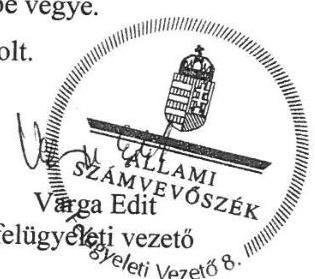

---

# RÖVIDÍTÉSEK JEGYZÉKE 

${ }^{1}$ jelentés
${ }^{2}$ Társaság
${ }^{3}$ Önkormányzat
${ }^{4}$ Főjegyző
${ }^{5}$ intézkedési terv ${ }_{1,2}$
${ }^{6}$ ÁSZ tv.
${ }^{7}$ ÁSZ SZMSZ
${ }^{8}$ Bkr.
${ }^{9}$ vagyonrendelet
${ }^{10}$ fenntartói megállapodás
${ }^{11}$ (2) formátumú számok a szövegben
${ }^{12}$ önköltségszámítási szabályzat
${ }^{13}$ Számv. tv.
${ }^{14}$ ellenőrzési program
${ }^{15}$ ellenőrzési jelentés
${ }^{16}$ javaslat a vagyonrendelet módosítására
${ }^{17}$ javaslat a megállapodások módosítására
${ }^{18}$ Közgyűlés
${ }^{19}$ Számv. tv.
${ }^{20}$ 2014. évi belső ellenőrzési munkaterv

Az Állami Számvevőszék 14048. számú Jelentése - „Az önkormányzatok többségi tulajdonában lévő gazdasági társaságok közfeladat-ellátásának ellenőrzéséről Vigszínház Nonprofit Kft."
Vígszínház Nonprofit Korlátolt Felelősségű Társaság
Budapest Főváros Önkormányzata
Budapest Főváros Főjegyző
intézkedési terv: Budapest Főváros Önkormányzata intézkedési terve; intézkedési terv: Vígszínház Nonprofit Kft. intézkedési terve
az Állami Számvevőszékről szóló 2011. évi LXVI. törvény (hatályos: 2011. július 1-jétől)
az Állami Számvevőszék Szervezeti és Működési Szabályzata
a költségvetési szervek belső kontrollrendszeréről és belső ellenőrzéséről szóló 370/2011. (XII. 31.) Korm. rendelet (hatályos: 2012. január 1-jétől)
Budapest Főváros Önkormányzata vagyonáról, a vagyonelemek feletti tulajdonosi jogok gyakorlásáról szóló 22/2012. (III. 14.) Főv. Kgy. rendelet (hatályos: 2012. március 15-től), illetve 53/2015. (XII. 23.) Fővárosi Közgyűlés rendelete egyes vagyongazdálkodással összefüggő fővárosi közgyűlési rendeletek módosításáról (hatályos: 2015. december 23-tól)
Budapest Főváros Önkormányzata és a Vígszínház Nonprofit Kft. között 2012. október 26-án létrejött fenntartói megállapodás
Hivatkozás az I. számú melléklet táblázata szerinti sorszámra.
A Vígszínház Nonprofit Kft. 4/2014. számú önköltségszámítási szabályzata (kelt: 2014. szeptember 30. hatályos: 2015. január 1-jétől)
a számvitelről szóló 2011. évi C. törvény (hatályos: 2001. január 1-jétől)
Budapest Főváros Főpolgármesteri Hivatal Belső Ellenőrzési Osztály FPH006/1694/2014 iktatószámú, 2014. június 4. keltezésű ellenőrzési programja a Vígszínház Nonprofit Kft. ellenőrzéséhez
Budapest Főváros Főpolgármesteri Hivatal Belső Ellenőrzési Osztály FPH006/16914/2014 iktatószámú, 2014. szeptember 10-ei ellenőrzési jelentése a „Vígszínház Nonprofit Kft.-nél az Állami Számvevőszék által lefolytatott ellenőrzés során megfogalmazottak és a mögöttes dokumentációk áttekintéséről, valamint a Belső Ellenőrzési Osztály utóellenőrzéséről"
Budapest Főváros Önkormányzata Pénzügyi Főpolgármester-helyettes FPH058/1497-5/2015 számú „Javaslat egyes vagyongazdálkodással összefüggő fővárosi közgyűlési rendeletek módosítására" tárgyú előterjesztés
Budapest Főváros Önkormányzata Humán Főpolgármester-helyettes FPH079/1663-2/2015 számú „Javaslat Budapest Főváros Önkormányzata tulajdonában lévő színházi gazdasági társaságok fenntartói megállapodásának módosítására" tárgyú előterjesztés
Budapest Főváros Közgyűlése
2000. évi C. törvény a számvitelről (hatályos: 2001. január 1-jétől)

Fővárosi Önkormányzat testülete által alapított intézmények (társaságok, költségvetési szervek) FPH-006/209-25/2013. iktatószámú belső ellenőrzési munkaterve 2014. évre

---

${ }^{21}$ 2015. évi belső ellenőrzési munkaterv
${ }^{22}$ Főpolgármester
${ }^{23}$ vezetői összefoglaló

Fővárosi Önkormányzat testülete által alapított intézmények (társaságok, költségvetési szervek) FPH-006/228-6/2014. iktatószámú belső ellenőrzési munkaterve 2015. évre
Budapest Főváros Főpolgármester
Budapest Főváros Önkormányzata Humán Erőforrás Menedzsment Főosztály és a Belső Ellenőrzési Osztály által készített, FPH006/169-31/2014. iktatószámú, 2014. október 27-ei keltezésű vezetői összefoglaló

---

ÁLLAMI SZÁMVEVŐSZÉK
1052 Budapest, Apáczai Csere János utca 10.
Levélcím: 1364 Budapest 4. Pf. 54
Telefon: +36 14849100 Telefax: +36 14849200
www.asz.hu