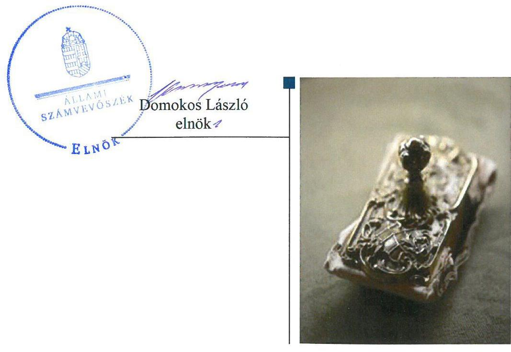
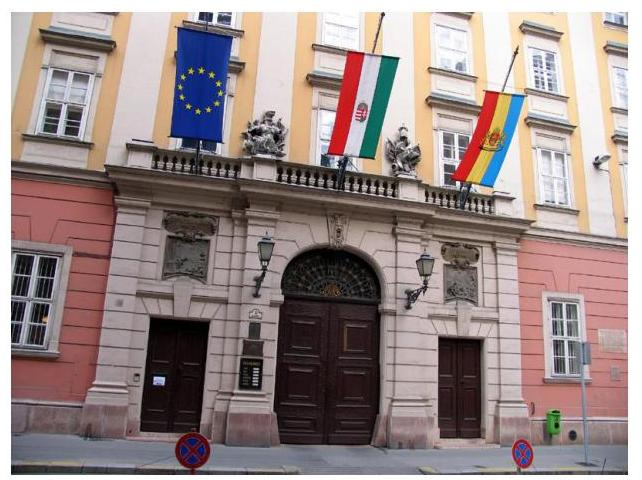

# Jelentés 

## Önkormányzatok ellenőrzése

Az önkormányzatok belső kontrollrendszere kialakításának és működtetésének, valamint a beruházások előkészítettségének ellenőrzése Budapest Főváros Önkormányzata
2019.

---

# Jelentés 

## Önkormányzatok ellenőrzése

Az önkormányzatok belső kontrollrendszere kialakításának és működtetésének, valamint a beruházások előkészítettségének ellenőrzése Budapest Főváros Önkormányzata
2019. 03. hó 14. nap

---

# AZ ELLENŐRZÉST FELÜGYELTE:

DR. PULAY GYULA felügyeleti vezető

# AZ ELLENŐRZÉST VEZETTE ÉS A VÉGREHAJTÁSÁÉRT FELELŐS:

VALASTYÁNNÉ DR. VÍZHÁNYÓ JÚLIA ellenőrzésvezető

# A PROGRAM ÖSSZEÁLLÍTÁSÁÉRT FELELŐS:

TÓTPÁL SZABOLCS osztályvezető

---

IKTATÓSZÁM: EL-1519-001/2019.

TÉMASZÁM: 2485

ELLENŐRZÉS-AZONOSÍTÓ SZÁM: V082001

---

Jelentéseink az Országgyűlés számítógépes hálózatán és az Interneten a www.asz.hu címen is olvashatóak.

---

# TARTALOMJEGYZÉK 

- ÖSSZEGZÉS ..... 5
- AZ ELLENŐRZÉS CÉLJA ..... 7
- AZ ELLENŐRZÉS TERÜLETE ..... 8
- AZ ELLENŐRZÉS HÁTTERE, INDOKOLTSÁGA ..... 10
- A JELENTÉS LÉNYEGES KÉRDÉSKÖREI ..... 12
- AZ ELLENŐRZÉS HATÓKÖRE ÉS MÓDSZEREI ..... 13
- MEGÁLLAPÍTÁSOK ..... 16
- MELLÉKLETEK ..... 25
I. sz. melléklet: Értelmező szótár ..... 25
II. sz. melléklet: A belső kontrollrendszer kialakításának és működtetésének összesített értékelése ..... 27
- FÜGGELÉK: ÉSZREVÉTELEK ..... 29
- RÖVIDÍTÉSEK JEGYZÉKE ..... 31

---

.

---

# ÖSSZEGZÉS 

Budapest Főváros Önkormányzata belső kontrollrendszerének kialakítása és működtetése a közpénzfelhasználás szabályosságát, a nemzeti vagyonnal történő felelős gazdálkodást biztosította, az integritás kontrollrendszert kiépítette. A Pannon Park beruházás döntés-előkészítése a jogszabályi előírások szerint történt. Budapest Főváros Önkormányzata beruházáshoz kapcsolódó szervezeti és működési folyamatainak belső szabályozottsága az átláthatóságot és az elszámoltathatóságot biztosította.

## Az ellenőrzés társadalmi indokoltsága

Magyarország Alaptörvénye az önkormányzatoktól is elvárja a kiegyensúlyozott, átlátható és fenntartható költségvetési gazdálkodás elvének érvényesítését. Az önkormányzatok által betöltött társadalmi szerep, az általuk kezelt közpénz nagysága, a nemzeti vagyon átruházására vagy hasznosítására vonatkozó döntéseik sokrétűsége egyaránt indokolttá tették a számvevőszéki ellenőrzések folytatását. A korábbi évek ellenőrzési tapasztalatai igazolták azt, hogy a belső kontrollrendszer kialakítása és működtetése nélkül nem valósítható meg a közpénzek, a közvagyon szabályos, gazdaságos, hatékony és eredményes felhasználása. A kockázatok alapján fennállt a lehetősége annak, hogy az önkormányzatok befektetési döntései, továbbá a döntések végrehajtása és számviteli elszámolása nem voltak teljes mértékben szabályszerűek, és a kapcsolódó belső kontrollrendszerek sem működtek minden esetben megfelelően.

Az önkormányzatok vagyona a nemzeti vagyon része, és az Alaptörvény is rögzíti, hogy a vagyonnal való gazdálkodás célja a közérdekszolgálata. Az ÁSZ az ÁSZ törvényben kapott felhatalmazással élve ellenőrzi az önkormányzatok gazdálkodását, működését, hogy az ellenőrzések megállapításaival támogassa az ellenőrzött önkormányzatok szabályszerű gazdálkodását, javaslataival elősegítse az Alaptörvényben megfogalmazott alapvetések érvényesülését a mindennapi életben az önkormányzatok szintjén. Az önkormányzati rendszerben zajló folyamatok holisztikus elemzései, a kockázatok folyamatos figyelemmel kísérésének módszerével, az így kiválasztott önkormányzatok célzott, hatékony ellenőrzéseivel az ÁSZ betölti a legfőbb gazdasági ellenőrző szerv küldetését. Jelen ellenőrzés hozzájárulhat az ÁSZ kockázatértékelő rendszere alapján kiválasztott, államháztartásból származó forrásból finanszírozott beruházások eredményességéhez, a beruházási folyamat transzparenciájának biztosításához.

## Főbb megállapítások

A belső kontrollrendszer kialakítása és működtetése szabályszerű volt. 2016. évben a közpénzfelhasználás szabályossága és a nemzeti vagyonnal való felelős gazdálkodás biztosított volt. A költségvetési szervek belső kontrollrendszeréről és belső ellenőrzéséről szóló Kormányrendelet 2016. október 1-jétől módosult, azonban Budapest Főváros Önkormányzata a jogszabályi változások szerinti belső szabályozásokat 2017. márciusától alakította ki.

A kontrollkörnyezet kialakítása a jogszabályi előírásoknak megfelelt, azonban a szervezeti integritást sértő események kezelésének eljárásrendjével és integrált kockázatkezelési eljárásrenddel Budapest Főváros Önkormányzata csak 2017. márciusától rendelkezett. A kontrolltevékenység kereteinek kialakítása és működtetése megfelelt a jogszabályokban és a belső szabályozásokban foglaltaknak. Folyamatgazda kijelölésére 2017. márciusban került sor. Az információs és kommunikációs folyamatok kialakítása és működtetése szabályszerű volt. A monitoring rendszer kialakítása és működtetése a jogszabályi előírásoknak megfelelt. Budapest Főváros Önkormányzatának Fővárosi Roma Nemzetiségi Önkormányzata gazdálkodással kapcsolatos feladatainak ellátása megfelelt a jogszabályi előírásoknak.

Budapest Főváros Önkormányzatánál érvényesült az integritás szemlélet. Az integritás kontrollokat a kockázatokkal arányosan alakították ki. A megváltozott jogszabályi előírások szerinti kockázatelemzések a korrupciós, és egyéb integritási kockázatokra 2017. márciusa után terjedtek ki.

---

A Pannon Park projekt megvalósítója, azaz a beruházó a Fővárosi Állat- és Növénykert, mint kedvezményezett intézmény, a támogatott Budapest Főváros Önkormányzata volt. Budapest Főváros Önkormányzata a támogatási összeget a támogatás intézményi kedvezményezettje részére átadta, azzal, hogy a kedvezményezett intézmény azt kizárólag a Pannon Park projekt megvalósítására fordítja. A beruházás döntés-előkészítése, a beruházási folyamat meghatározása a jogszabályok és Budapest Főváros Önkormányzata belső szabályzatai előírásai szerint történt.

Budapest Főváros Önkormányzatának és Budapest Főváros Főpolgármesteri Hivatalának szervezeti és működési folyamatainak belső szabályozottsága alkalmas volt a beruházás előkészítettsége átláthatóságának, elszámoltathatóságának biztosítására. Az integrált kockázatkezelési rendszer eljárásrendjéről és a Hivatali integritást sértő események kezeléséről szóló utasítások 2017. márciusban kiadásra kerültek. A beruházás előkészítésével, megvalósításával összefüggő kockázatokat meghatározták, az kiterjedt azok elemzésére, értékelésére.

Budapest Főváros Önkormányzata és a kedvezményezett intézmény, a Fővárosi Állat- és Növénykert között létrejött Megállapodásban rögzítették a Pannon Projekt megvalósítására vonatkozó eljárásrendet, az elszámoltathatóság és átláthatóság érdekében adatszolgáltatási, beszámolási és elszámolási kötelezettséget határoztak meg.

---

# AZ ELLENŐRZÉS CÉLJA 

Az ellenőrzés célja annak megállapítása volt, hogy szabályszerűen történt-e az önkormányzat belső kontrollrendszerének kialakítása és működtetése, az biztosította-e az önkormányzatnál a közpénzfelhasználás szabályosságát, a közpénzekkel és a nemzeti vagyonnal történő szabályszerű és felelős gazdálkodást, a beszámolási és adatszolgáltatási kötelezettségek szabályszerű teljesítését. Az ellenőrzés keretében értékeltük az önkormányzat korrupciós kockázatainak kezelését szolgáló integritás kontrollok kiépítettségét és az integritás szemlélet érvényesülését.

Az ellenőrzés célja volt továbbá a beruházás eredményes megvalósulásának elősegítése érdekében, a folyamatban lévő beruházás döntés-előkészítő és megvalósítást előkészítő tevékenységének, a döntés-előkészítésétől a kivitelezés megkezdéséig felmerülő - a megvalósítást érintő - kockázatok beazonosításának és az integritási szempontok érvényesülésének értékelése.

---

# AZ ELLENŐRZÉS TERÜLETE 

## Önkormányzatok ellenőrzése - Az önkormányzatok belső kontrollrendszere kialakításának és működtetésének, valamint a beruházások előkészítettségének ellenőrzése Budapest Főváros Önkormányzata

A 2016. évben Budapest Főváros Önkormányzatának feladatait a Fővárosi Közgyűlés és szervei: a Fővárosi Közgyűlés bizottságai, a Főpolgármester ${ }^{1}$, a Főjegyző², valamint Budapest Főváros Főpolgármesteri Hivatal látták el.

Az Önkormányzat ${ }^{3}$ által fenntartott 30 költségvetési szervnél 2016. december 31-én 4945 közalkalmazottat foglalkoztattak. A 30 költségvetési szervből 24 rendelkezett gazdasági szervezettel. Az Önkormányzatnak 2016. december 31-én 34 gazdasági társaságban volt többségi részesedése.

Az Önkormányzat területén a 2016. évben 12 helyi nemzetiségi önkormányzat működött, ebből a legnagyobb költségvetési bevétellel rendelkező Fővárosi Roma Nemzetiségi Önkormányzat feladatellátását ellenőriztük.

A 2016. évben a Főpolgármester és a Főjegyző személyében nem volt változás. A Főpolgármester 2010 októberétől, a Főjegyző 2010 decemberétől látta el feladatát. A Hivatal ${ }^{4}$ rendelkezett gazdasági szervezettel, amelynek feladatait több belső szervezeti egységgel látta el. A gazdasági szervezetet a Pénzügyi Főosztály vezetője irányította. A PFO ${ }^{5}$ vezetője személyében a 2016. év során változás nem történt.

A Hivatalban foglalkoztatott köztisztviselők létszáma 2016. január 1-jén 749 fő, 2016. december 31-én 750 fő volt. Az Önkormányzatnál egyéb jogviszonyban foglalkoztatottak létszáma 2016. január 1-jén 169 fő, 2016. december 31-én 168 fő volt.

A 2016. évi konszolidált beszámoló szerint az Önkormányzat költségvetési bevétele 233 358,7 millió Ft, költségvetési kiadása 223 021,5 millió Ft, a mérleg szerinti összes vagyona 2232 046,0 millió Ft volt. Budapest állandó lakosainak száma 2016. december 31-én 1697367 fő volt.

Az Önkormányzat az ellenőrzött időszakot megelőzően 2012. november 28-án döntött arról, hogy a Budapest Vidámpark Zrt. 2013. szeptember 30. dátummal szüntesse meg alaptevékenységét a Városliget területén, majd 2013. február 27-én döntés született arról, hogy kezdődjön meg a Fővárosi Állat- és Növénykert ${ }^{6}$ területbővítéséhez kapcsolódó beruházások - Pannon Park projekt ${ }^{7}$ - előkészítése. A Kormány 1044/2015. (II. 10.) határozatával döntött arról, hogy a Liget Budapest projekt keretében valósuljon meg a Pannon Park projekt. A Pannon Park projekt keretében a volt Vidámparki terület átalakítására kerül sor.

A Pannon Park projekt beruházás megvalósulását a Kormány 48/2015. (III. 12.) számú rendeletével támogatta, a beruházás megvalósításával összefüggő közigazgatási hatósági ügyeket nemzetgazdasági szempontból kiemelt jelentőségű beruházássá minősítette. Az Önkormányzat a

---

beruházás megvalósítása érdekében az ellenőrzött időszakban támogatási szerződéseket ${ }^{6}$ kötött. A támogatott az Önkormányzat, a beruházó a Fővárosi Állat- és Növénykert, mint kedvezményezett intézmény volt.

A Pannon Park projekt megvalósítására megállapított támogatás alakulását az 1. számú táblázat mutatja be.

1. táblázat

|  A PANNON PARK PROJEKT MEGVALÓSÍTÁSÁRA MEGÁLLAPÍTOTT TÁMOGATÁS (MILLIÓ FT) |  |  |   |
| --- | --- | --- | --- |
|  Költségvetési év | Állami támogatás | Önkormányzati támogatás | Beruházás támogatása összesen  |
|  2013-2014. | - | 99,5 | 99,5  |
|  2015-2016. | 6230,0 | 280,0 | 6510,0  |
|  2017. | - | 820,6 | 820,6  |
|  2018. | 18477,0 | 50,0 | 18527,0  |
|  2019. | 15875,0 | - | 15875,0  |
|  2020. | 3143,0 | - | 3143,0  |
|  Összesen: | 43725,0 | 1250,1 | 44975,1  |
|   |  |  | Forrás: 1383/2017. (VI.20.) számú Korm. rendelet, Önkormányzati döntések  |

---

# AZ ELLENŐRZÉS HÁTTERE, INDOKOLTSÁGA 

A demokratikus társadalmakban alapvető igény, hogy a közpénzeket, a közvagyont használók tevékenységükről elszámoljanak, ahhoz egyértelmű és érvényesíthető felelősségi szabályok társuljanak. Ennek a jogos igénynek az érvényesítéséhez meg kell teremteni azokat a folyamatokat, rendszereket, amelyek nélkülözhetetlenek az elszámoltatáshoz. Az elszámoltatás eredményes működtetéséhez szükség van a megfelelő információs, kontroll-, értékelési és beszámolási rendszerek kialakítására. A belső kontrollok kiépítettsége hozzájárul az integritási szemlélet kialakításához és érvényesüléséhez. A belső kontrollrendszer kialakítása és működtetése nélkül nem valósítható meg a közpénzek, a közvagyon szabályos, gazdaságos, hatékony és eredményes felhasználása.

A BELSŐ KONTROLLRENDSZER azt a célt szolgálja, hogy az államháztartás szervei működésük és gazdálkodásuk során a tevékenységeket szabályszerűen, gazdaságosan, hatékonyan, eredményesen hajtsák végre, teljesítsék elszámolási kötelezettségeiket és megvédjék az erőforrásokat a veszteségektől, a károktól, a nem rendeltetésszerű használattól. A belső kontrollrendszer magába foglalja mindazon szabályokat, eljárásokat, gyakorlati módszereket és szervezeti struktúrákat, kockázatkezelési technikákat, kontrolltevékenységeket, amelyek segítséget nyújtanak a szervezetnek céljai eléréséhez. A belső kontrollrendszer szabályozása háromszintű, a törvényi előírásokat az Áht. ${ }^{9}$ és az Mötv. ${ }^{10}$, a rendeleti szintű szabályozást az Ávr. ${ }^{11}$ és a Bkr. ${ }^{12}$ tartalmazza, amelyeket útmutatói szinten az NGM${ }^{13}$ által kiadott standardok és kézikönyvek támogatnak.

A megfelelő belső kontrollrendszer jelentősen csökkenti a hibák és szabálytalanságok kockázatát. Az ÁSZ ${ }^{14}$ célja, hogy javuljon az ellenőrzött önkormányzatok belső kontrollrendszerének szabályozottsága, működésének megfelelősége, szabályszerűsége, hozzájárulva ezzel az egyensúlyi helyzet fenntarthatóságához, biztosítva az Önkormányzatnál a közpénzfelhasználás szabályosságát, a közpénzekkel és a nemzeti vagyonnal történő szabályszerű, gazdaságos, hatékony és eredményes gazdálkodást. Az ÁSZ ellenőrzés tapasztalatai nem csupán a közvetlenül ellenőrzött önkormányzatokat támogathatják, hanem a „jó gyakorlat" elterjesztésével azok az önkormányzatok is átvehetik a pozitív példákat, ahol eddig még

 nem végzett ellenőrzést az ÁSZ.

A közszféra integritás alapú kultúrájának kialakítása, megerősítése és működése szorosan összefügg a belső kontrollrendszer működésével, ezért az ellenőrzés kiterjed annak értékelésére is, hogy a belső kontrollrendszer kialakítása és működtetése hogyan hatott az integritás szemlélet érvényesülésére.

## AZ ELLENŐRZÉS VÁRHATÓ HASZNOSULÁSA

NÉGY SZINTEN valósul meg. A törvényalkotás számára összegzett tapasztalatok állnak rendelkezésre a belső kontrollrendszer önkormányzati területen való kialakításáról, működtetéséről és hatásairól. Az ellenőrzés az ellenőrzött számára visszajelzést ad a belső kontrollrendszer kialakításában és működésében lévő hiányosságokról, javaslataival hozzájárul azok kiküszöböléséhez. Az ellenőrzés megállapításait és javaslatait más szervezetek is hasznosíthatják a rendezett gazdálkodási keretek kialakításához. A társadalom számára jelzi, hogy közpénz nem maradhat ellenőrizetlenül, az ÁSZ értékteremtő rend kialakításához és megőrzéséhez hozzájáruló tevékenysége pozitív hatással lesz a szervezetről kialakított összkép formálásában. Az ellenőrzés eredményeinek célzott felhasználói a nyilvánosság, valamint a beruházások előkészítésében és megvalósításában résztvevő szervezetek.

A hatékony és célszerű ellenőrzések lebonyolítása érdekében az előzetes kockázatelemzés eredményeként meghatározott, a kiválasztott ellenőrzöttre egyedileg jellemző és hangsúlyosnak ítélt kockázatoknak megfelelően kiválasztott modulokkal történik az ellenőrzés.

A BERUHÁZÁSOK ELŐKÉSZÍTÉSÉRE fókuszáló ellenőrzés megállapításainak hasznosításaként lehetőség nyílhat még a beruházás folyamatában a feltárt hiányosságok, szabálytalanságok megszüntetéséhez szükséges korrekciók megtételére, a kontrollok erősítésére.

---

# A JELENTÉS LÉNYEGES KÉRDÉSKÖREI 

1.     - Az Önkormányzat belső kontrollrendszerének kialakítása és működtetése szabályszerű volt-e, az biztosította-e az Önkormányzatnál a közpénzfelhasználás szabályosságát, a nemzeti vagyonnal történő felelős gazdálkodást?
2.     - Érvényesült-e az integritás szemlélet és ennek megfelelően kiépítették-e az integritás kontrollrendszert az Önkormányzatnál?
3.     - A beruházás döntés-előkészítése, a beruházási folyamat meghatározása az irányadó jogszabályok és a belső szabályzatok előírásainak megfelelően történt-e?
4.     - Az Önkormányzat és a Hivatal szervezeti és működési folyamatainak belső szabályozottsága alkalmas volt-e a beruházás átláthatóságának, elszámoltathatóságának biztosítására?
5.     - A beruházás kivitelezésének előkészítése a jogszabályok, és az Önkormányzat belső előírásainak, valamint a beruházási döntésnek megfelelően történt-e?

---

# AZ ELLENŐRZÉS HATÓKÖRE ÉS MÓDSZEREI 

## Az ellenőrzés típusa

Megfelelőségi ellenőrzés

## Az ellenőrzött időszak

Az ellenőrzött időszak a 2016. január 1-jétől 2017. augusztus 30-ig tartó időszak.

A beruházás tekintetében az ellenőrzött időszak 2015. február 10-től, a Fővárosi Állat- és Növénykert fejlesztésének támogatásáról szóló 1044/2015. (II. 10.) Korm. határozat hatályba lépésének napjától a beruházás kivitelezési szakaszának megkezdéséig, azaz a 2017. augusztus 30-ig terjedő időszak. Az ellenőrzés a beruházás döntés-előkészítését beterjesztő és a beruházás megvalósítását előkészítő szerve Budapest Főváros Önkormányzatára és Budapest Főváros Főpolgármesteri Hivatalára vonatkozóan kiterjedt - a beruházásról szóló döntés előkészítésére, a beruházás döntés és megvalósítás előkészítő folyamataira, belső szabályozottságára, a kivitelezés előkészítésének megfelelőségére.

## Az ellenőrzés tárgya

A helyi önkormányzat, mint éves költségvetési beszámoló készítésére kötelezett szervezetnek és polgármesteri hivatalának belső kontrollrendszere. Az integritás szemlélet érvényesülése.

Az ellenőrzés kiterjedt minden olyan körülményre és adatra, amely az ÁSZ jogszabályban meghatározott feladatainak teljesítéséhez, valamint a program végrehajtása folyamán felmerült újabb összefüggések feltárásához szükséges.

Az ellenőrzés a beruházás döntés-előkészítését beterjesztő és a beruházás megvalósítását előkészítő szerve Budapest Főváros Önkormányzatára és Budapest Főváros Főpolgármesteri Hivatalára vonatkozóan kiterjedt a beruházásról szóló döntés előkészítésére, a beruházás döntés és megvalósítás előkészítő folyamataira, belső szabályozottságára, a kivitelezés előkészítésének megfelelőségére.

## Az ellenőrzött szervezet

Budapest Főváros Önkormányzata és Budapest Főváros Főpolgármesteri Hivatal

---

# Az ellenőrzés jogalapja 

Az ellenőrzés jogalapját az ÁSZ tv. ${ }^{15}$ 1. § (3) bekezdése és 5. § (2)-(5) bekezdése, valamint az Áht. 61. § (2) bekezdése képezik.

## Az ellenőrzés módszerei

Az ellenőrzést az ellenőrzési program szempontjai, kérdései, az ellenőrzött időszakban hatályos jogszabályok, az ellenőrzés szakmai szabályok és módszertanok figyelembevételével végeztük.

Az ellenőrzés ideje alatt az ellenőrzött szervezettel történő kapcsolattartást az ÁSZ Szervezeti és Működési Szabályzatának vonatkozó előírásai alapján biztosítottuk.

Az ellenőrzési kérdések megválaszolásához szükséges bizonyítékok megszerzése az ellenőrzöttek által rendelkezésre bocsátott dokumentumokra, adatokra alapozva megfigyelés, szemle (szemrevételezés), kérdésfeltevés (információkérés), valamint elemző eljárással történt. A minták kiválasztása rétegzett, véletlen mintavételi eljárással történt.

Az ellenőrzési bizonyítékként felhasználható adatforrások közé tartoznak egyrészt az ellenőrzési program részletes szempontjainál felsorolt adatforrások, másrészt minden - az ellenőrzés folyamán feltárt, az ellenőrzés szempontjából információt tartalmazó - dokumentum.

Az ellenőrzés lefolytatásához az Önkormányzat a tanúsítványok elektronikus kitöltésével, valamint az ÁSZ által kért dokumentumok elektronikus megküldésével szolgáltatott adatokat. A rendelkezésre bocsátott adatok, információk kontrollja az ellenőrzés keretében történt.

Az egységes értelmezést támogatja a program mellékletét képező fogalomtár és rövidítésjegyzék.

Az önkormányzat belső kontrollrendszere jogszabályi előírások szerinti kialakításának és működtetésének szabályszerűségét, az erre irányuló ellenőrzési kérdésekre adott válaszok összesítése alapján a 2016. január 1. és december 31. közötti időszakra, pillérenként (kontrollkörnyezet, kockázatkezelési rendszer, kontrolltevékenységek, információs és kommunikációs rendszer, monitoring rendszer) és összesítetten is értékeltük. Az önkormányzat belső kontrollrendszere egyes pilléreinek kialakítása és működtetése „szabályszerű", amennyiben az értékelt területen az elért igen válaszok százalékban kifejezett, egész számra kerekített aránya, meghaladja a 85%-ot, „nem szabályszerű", ha nem haladja meg a 60%-ot. Ha a 85%-ot nem haladja meg, de 60%-nál nagyobb az igen válaszok aránya, akkor a minősítés „részben szabályszerű". Az önkormányzat belső kontrollrendszerének összesített értékelése megegyezik a pillérenként (kontrollterületenként) alkalmazott százalékos értékelésekkel, a következő eltérésekkel. A kontrollrendszer egésze esetében a „szabályszerű" értékelésnek a százalékos értéken felül további feltétele, hogy egyik kontrollterület sem kaphat „nem szabályszerű" értékelést, a „részben szabályszerű" értékelés további feltétele, hogy legfeljebb egy ellenőrzött kontrollterület lehet „nem szabályszerű" értékelésű. Az összesített értékelés a százalékos értéktől függetlenül „nem szabályszerű", ha az ellenőrzött kontrollterületek közül több mint egynek „nem szabályszerű" az értékelése.

---

A közszféra integritás alapú kultúrájának kialakítása, megerősítése és működése szorosan összefügg a belső kontrollrendszer működésével, ezért az ellenőrzés kiterjed annak értékelésére is, hogy a belső kontrollrendszer kialakítása és működtetése hogyan hatott az integritás szemlélet érvényesülésére. Az integritás szemlélet érvényesülésének értékelése az önkormányzat által kitöltött 5. számú tanúsítvány, valamint az ÁSZ integritás felmérése keretében elkészített kérdőív adatainak ellenőrzése alapján történt a 2016. évre vonatkozóan. Az értékelés során figyelembe vettük, hogy végrehajtották-e a Bkr. módosításaiból eredő feladataikat.

A beruházás előkészítésének ellenőrzési szempontjait a szabályszerűségi szempontok szerinti ellenőrzésben a jogszabályok, önkormányzati rendeletek, határozatok, további belső utasítások, szabályozók előírásai, a helyénvalósági szempontok szerinti ellenőrzésben az ÁSZ korábbi beruházásokat érintő ellenőrzései során beazonosított „jó gyakorlatok" és általánosan elfogadott szakmai szabályok alapján határoztuk meg.

Az ellenőrzési kérdések megválaszolásához szükséges bizonyítékok megszerzése a következő ellenőrzési eljárások alkalmazásával történt: megfigyelés, kérdésfeltevés (információkérés), összehasonlítás, mintavételi eljárással, valamint elemző eljárás.

Az ellenőrzés során minden olyan körülményt és adatot is ellenőrzött az ÁSZ, amely a program végrehajtása kapcsán felmerült újabb összefüggéseknek az ellenőrzés céljaival összhangban lévő feltárásához szükséges volt. A helyénvalósági szempontok szerinti ellenőrzési megállapítások dőlt betűvel szedve különülnek el.

---

# 1. Az Önkormányzat belső kontrollrendszerének kialakítása és működtetése szabályszerű volt-e, az biztosította-e az Önkormányzatnál a közpénzfelhasználás szabályosságát, a nemzeti vagyonnal történő felelős gazdálkodást? 

Összegző megállapítás

Az Önkormányzat belső kontrollrendszerének kialakítása és működtetése szabályszerű volt. Az Önkormányzatnál a közpénzfelhasználás szabályossága és a nemzeti vagyonnal való felelős gazdálkodás biztosított volt.

### 1.1. számú megállapítás

A kontrollkörnyezet kialakítása a jogszabályi előírásoknak megfelel.

Az Mötv. előírásának megfelelően a Közgyűlés ${ }^{16}$ rendeletben határozta meg az Önkormányzat SZMSZ ${ }^{17}$-ét, amelyet a 2016. évben nyolc alkalommal módosítottak. A belső kontrollrendszer kialakításának és működtetésének összesített értékelését a II. számú melléklet mutatja be. A Főjegyző a Bkr. 6. § (4)-(4a) bekezdésében foglaltakkal ellentétben a Szabálytalanságkezelési eljárásrendet 2016. október 1-jétől 2017. március 8-ig nem egészítette ki a szervezeti integritást sértő események kezelésének rendjére ${ }^{18}$ vonatkozó szabályozással. 2017. március 8-tól a Főjegyző a szervezeti integritást sértő események kezelésének rendjét hatályba léptette.

A Hivatal az Áht. és az Ávr. előírásának megfelelően rendelkezett hatályos, egységes szerkezetbe foglalt Alapító Okirattal. A Hivatal SZMSZ ${ }^{19}$-e alapján a gazdasági szervezet jogszabályban meghatározott feladatait több belső szervezeti egységgel látta el. Az Áht. előírásai szerint a szervezeti egységek külön-külön rendelkeztek ügyrenddel.

Az Önkormányzat 2015-2019. évre vonatkozó gazdasági programját a Közgyűlés elfogadta. Az önkormányzati vagyonnal történő gazdálkodás szabályait a Htv. ${ }^{20}$ előírásainak megfelelően a Közgyűlés rendeletben ${ }^{21}$ határozta meg. A gazdálkodással kapcsolatos feladatok munkafolyamatainak leírását, a gazdasági szervezet vezetőinek feladatkörét, a helyettesítés rendjét a Belső Működési Szabályzata ${ }^{22}$ tartalmazta. Az Ávr. előírásainak megfelelően a Belső Működési Szabályzatban meghatározták a gazdasági szervezet alkalmazottainak feladat- és hatáskörét, a gazdasági szervezet belső és külső kapcsolattartásának módját, szabályait.

Az Önkormányzat a Számv. tv. ${ }^{23}$ és az Áhsz. ${ }^{24}$ előírásainak megfelelő Számviteli politikával ${ }^{25}$ rendelkezett, amely kiterjedt a Hivatal tevékenységére, továbbá a nemzetiségi önkormányzatokra is. Az Önkormányzat számviteli rendszerét a Hivatalban működő integrált pénzügyi-számviteli rendszer keretében alakították ki.

---

### 1.2. számú megállapítás

Az Önkormányzat rendelkezett a Számv. tv.-ben előírt, a jogszabályi előírásoknak megfelelő Leltározási és leltárkészítési szabályzattal ${ }^{26}$, az Eszközök és források értékelési szabályzatával ${ }^{27}$, Pénzkezelési szabályzattal ${ }^{28}$ és az Önköltségszámítás rendjére ${ }^{29}$ vonatkozó szabályzattal.

A Hivatal Számviteli politikája a Számv. tv. előírásai szerint tartalmazta a beruházás bekerülési értékének meghatározását, az üzembe helyezésre és a mérlegtételek értékelésére vonatkozó előírásokat.

Az Önkormányzat számlarendjében ${ }^{30}$, valamint a Hivatal számlarendje ${ }^{31}$ a Számv. tv. előírásai szerint meghatározta a beruházásokat érintő könyvviteli számlák értéke növekedése és csökkenése jogcímeit, valamint a vagyontárgyak megfelelő nyilvántartását, annak feltételeit.

A Bkr. előírásainak megfelelően az etikai elvárásokat a Hivatásetikai Kódexben ${ }^{32}$ meghatározták.

## Az Önkormányzat a Bkr.-ben előírt integrált kockázatkezelési eljárásrenddel 2017. márciustól rendelkezett.

Az Önkormányzatnál - a kockázatok kezelése során az intézkedés határidejének kijelölését kivéve - a Főjegyző 2016. október 1-jéig a Bkr. előírásainak megfelelően működtette a kockázatkezelési rendszert. Az Önkormányzatnál a Kockázatok kezelésének rendje ${ }^{33}$ főpolgármesteri és főjegyzői együttes utasításban, illetve annak mellékleteiben meghatározta a kockázatkezeléssel kapcsolatos szabályokat, módszereket, irányítási eszközöket. Az Önkormányzat és a Hivatal a Bkr. 6. § (4) bekezdésében rögzítettek ellenére 2016. október 1-jétől 2017. március 9-ig integrált kockázatkezelési eljárásrenddel ${ }^{34}$ nem rendelkezett, 2017. március 9-ét követően rendelkezett.

Az Önkormányzatnál a kockázatkezelési rendszerrel kapcsolatban a 2016. évi belső ellenőrzések javaslataira tett intézkedések megvalósulásáról szóló nyilvántartásban az integrált kockázatkezelés eljárásrendjének kidolgozására javaslatokat fogalmaztak meg, melyeket követően intézkedések történtek, feladatokat, határidőt és felelőst is kijelöltek.

A szervezeti célokkal összefüggő kockázatokat a kockázatkezelési beszámoló alapján az Önkormányzatnál 2016. évben felmérték, felülvizsgálták, a feltárt kockázatokat elemezték, értékelték, azok jellege, felmerülési helye, súlyossága és bekövetkezési valószínűsége szerinti minősítése, a kockázati szintek meghatározása megtörtént.

### 1.3. számú megállapítás

Az Önkormányzatnál a kontrolltevékenység kereteinek kialakítása, működtetése megfelelt a jogszabályokban és a belső szabályozásokban foglaltaknak.

Az Önkormányzatnál a kontrolltevékenységek gyakorlása, működtetése a jogszabályokban és a belső szabályzatokban foglaltaknak megfelelően
 történt. Az Önkormányzat a Bkr. előírásainak megfelelően rendelkezett a működési folyamatainak megfelelő ellenőrzési nyomvonallal, amelyet a szervezeti egységek Belső Működési Szabályzatainak melléklete tartalmazott.

A gazdálkodás részletes rendjét meghatározó szabályzatok, folyamatok, a kontrolltevékenység kereteinek kialakítása szabályszerű volt. A Hivatal rendelkezett az Áht. és az Ávr. által előírt, hatályos, a gazdálkodás részletes

---

rendjét meghatározó szabályzattal. A feladatkörök szétválasztása, a gazdálkodási jogkörökkel kapcsolatos felhatalmazások, kijelölések az Áht. és Ávr. által előírtaknak megfelelően történtek.

Az Önkormányzat 2016. évben a Bkr. 6. § (3) bekezdésének megfelelően rendelkezett működési folyamatainak megfelelő ellenőrzési nyomvonallal, melyet tevékenységenként a szervezeti egységek Belső Működési Szabályzatainak melléklete tartalmazott. Az ellenőrzési nyomvonalak tartalmukban - megfelelve az Áht. 6/C. § (1) bekezdésének - vonatkoztak az Önkormányzat és a Hivatal működési folyamataira, tartalmazták a pénz- és vagyongazdálkodással kapcsolatos felelősségi-, információs szinteket és kapcsolatokat, irányítási-, ellenőrzési folyamatokat és kontrollpontokat.

A Főjegyző a Bkr. 6. § (3) bekezdése előírása ellenére nem aktualizálta az ellenőrzési nyomvonalat a Bkr. 2016. október 1-jétől hatályos változásainak megfelelően. 2016. október 1-jétől 2017. március 9-ig a Bkr. 6. § (2a) bekezdésétől eltérően a Főjegyző a folyamatért felelősséget viselő vezető beosztású személyeket folyamatgazdának nem jelölte ki, 2017. március 9-ét követően a folyamatgazdákat kijelölte.

Az Önkormányzatnál a kontrolltevékenységek gyakorlása, működtetése szabályszerűen történt.

# 1.4. számú megállapítás 

Az információs és kommunikációs folyamatok kialakítása és működtetése szabályszerű volt, az Önkormányzat adatszolgáltatási kötelezettségét teljesítette.

Az információs és kommunikációs folyamatok kialakítása és működtetése szabályszerű volt. Az információs rendszer működését az Informatikai Biztonsági szabályzatban ${ }^{35}$, az Adatvédelmi Szabályzatban ${ }^{36}$, az Informatikai Szabályzatban ${ }^{37}$, a Szervezési és Informatikai Főosztály Belső Működési Szabályzatában és a Feladatellátás Rendjében szabályozták. A Bkr. 9. § (1)-(2) bekezdés előírása alapján a hivatali SZMSZ-ben szabályozták a beszámolási szinteket, de az ezekhez tartozó határidőket Bkr. 9. § (2) bekezdés előírása ellenére nem határozták meg.

A közérdekű adatok kezelési rendjének kialakítása és működtetése az Info tv. ${ }^{38}$ és az Ávr. előírásainak megfelelt.

A kötelezően közzéteendő adatok nyilvánosságra hozatalának rendjét a közérdekű információk elektronikus közzétételének szabályozásáról szóló utasítás ${ }_{1,2}{ }^{39}$ tartalmazta.

A közérdekű adatok megismerésére irányuló igények teljesítésének rendjét az Info tv. és az Ávr. előírásának megfelelően a Közérdekű információk elektronikus közzétételének szabályzatában és az Adatvédelmi Szabályzatban határozták meg. A jogszabályokban előírt elektronikus közzétételi kötelezettségnek az Önkormányzat honlapján eleget tett.

Az Önkormányzat teljesítette az elemi költségvetéssel és a költségvetési beszámolóval kapcsolatos adatszolgáltatási kötelezettségét az államháztartás információs rendszerébe.

---

# 1.5. számú megállapítás 

A monitoring rendszer kialakítása és működtetése a jogszabályi előírásoknak megfelelt.

A Főjegyző kialakította az Önkormányzat feladatainak, tevékenységeinek, a célok megvalósításának folyamatos- és eseti nyomon követését biztosító rendszerét.

A monitoring rendszert a szervezeti belső működési szabályzatokban, folyamat-leírásokban, eljárásrendekben alakították ki. A belső kontrollok részeként a Közgyűlés határozatainak megfelelően az Önkormányzat gazdasági társaságai, holdingjai részére biztosított támogatásokra vonatkozóan a monitoring feladatokat a Főjegyzői Irodán belül a Monitoring Controlling Referatúra látta el.

A Főjegyző a Bkr. előírásainak megfelelően éves bontásban, szabályos nyilvántartást vezetett a külső ellenőrzések javaslatai alapján készült intézkedési tervek végrehajtásáról.

Az operatív monitoring tevékenységektől független belső ellenőrzés kialakítása, működtetése a jogszabályi előírásoknak megfelelt.

A 2016. évben a belső ellenőrzési feladatokat a Hivatal BEO ${ }^{40}$ látta el, a Hivatal állományába tartozó köztisztviselőkkel. A Bkr.-nek megfelelően meghatározták a belső ellenőrzést végző szervezeti egység jogállását, feladatait. A BEO tevékenységét a Főjegyzőnek közvetlenül alárendelve végezte, biztosítva ezzel - a Bkr.-nek megfelelően - a belső ellenőrök szervezeti és funkcionális függetlenségét. Az éves ellenőrzési tervben foglaltakat a Bkr. előírásainak megfelelően hajtották végre.

A Hivatal rendelkezett a Főjegyző által jóváhagyott Belső Ellenőrzési Kézikönyvvel. Az Önkormányzat éves ellenőrzési tervét a Közgyűlés jóváhagyta.

Az elvégzett ellenőrzésekről a Bkr. előírásainak megfelelően jelentések készültek. A belső ellenőrzés javaslatainak végrehajtása érdekében az ellenőrzött szervek, szervezeti egységek vezetői a Bkr.-ben foglalt kötelezettségüknek megfelelően intézkedési tervet készítettek, melyet nyolc alkalommal a Bkr. 45. § (3) bekezdésében előírt határidőn túl küldtek meg. Az intézkedési terv jóváhagyásáról a költségvetési szerv vezetője a Bkr. 45. § (4) bekezdésében foglaltak ellenére az intézkedési terv kézhezvételétől számított nyolc napot meghaladóan döntött.

A belső ellenőrzési jelentésekről a Bkr.-ben előírt adattartalmú nyilvántartást megfelelően vezették.

Az Önkormányzat értékelte, hogy a kiadott szabályzatai, a kialakított és működtetett folyamatai biztosítják-e a rendelkezésre álló forrásokkal és a nemzeti vagyonnal történő szabályszerű gazdálkodást.

A Főjegyző az Önkormányzat belső kontrollrendszerének minőségét az Áht. és a Bkr. előírásainak megfelelően, nyilatkozatában értékelte. A Főjegyző nyilatkozatában a rendszer működését - a kockázatkezelési rendszer kivételével, mely minőségének javítása további intézkedéseket igényel - megfelelőnek értékelte.

A belső ellenőrzési tapasztalatok alapján készült éves összefoglaló ellenőrzési jelentés az Áht. és Bkr. előírásainak megfelelően tartalmazta a

---

#### **1.7. számú megállapítás**

Belső kontrollrendszer működésének értékelését. Az éves összefoglaló ellenőrzési jelentést a Közgyűlés a 603/2017. (V. 10.) számú határozatával hagyta jóvá.

#### **Az Önkormányzatnak a Fővárosi Roma Nemzetiségi Önkormányzat gazdálkodással kapcsolatos feladatainak ellátása megfelelő a jogszabályi előírásoknak.**

A Fővárosi Roma Nemzetiségi Önkormányzat és az Önkormányzat közötti együttműködési megállapodás a Nek. tv.61 előírásainak megfelelő. A hatályos együttműködési megállapodás megfelelő az Áht. előírásának, mert tartalmazta a Fővárosi Roma Nemzetiségi Önkormányzathoz kapcsolódó gazdálkodási és egyéb feladatellátás részletes szabályait, a bevételeivel és kiadásaival kapcsolatban a tervezési, gazdálkodási, finanszírozási, ellenőrzési, beszámolási adatszolgáltatási feladatok ellátásának részletes szabályait.

Az Önkormányzat a nemzetiségi önkormányzatokra vonatkozóan a gazdálkodási jogkörökkel kapcsolatos, jogszabályban nem szabályozott belső előírásokat, feltételeket a jogszabályi és a belső szabályozásokkal összhangban szabályozta. Az Önkormányzat Számviteli politikáját és az annak keretében elkészített szabályzatokat kiterjesztette a Fővárosi Roma Nemzetiségi Önkormányzatra is.

# **2. Érvényesült-e az integritás szemlélet és ennek megfelelően kiépítették-e az integritás kontrollrendszert az Önkormányzatnál?**

#### **Összegző megállapítás**

Az Önkormányzatnál érvényesült az integritás szemlélet, az integritás kontrollokat a kockázatokkal arányosan alakították ki, integrált kockázatkezelési eljárásrenddel 2017. márciustól rendelkeztek. Az Önkormányzatnál kockázatelemzéseket végeztek, amelyek 2017. márciustól kiterjedtek a korrupciós, és egyéb integritási kockázatokra.

Az Önkormányzat, illetve a Hivatal az ellenőrzést megelőzően, 2016. évre vonatkozóan részt vett az ÁSZ Integritás Projektjében, az Integritás Kérdőív jelen ellenőrzés keretében történő felhasználhatóságáról szóló nyilatkozat rendelkezésre állt. Az Önkormányzatnál a jogszabályok által előírt kontrollok kiépítettsége támogatta a szervezet integritását.

A Bkr. előírásainak megfelelően az Önkormányzatnál külön Hivatásetikai Kódexszel támogatták az integritás szemlélet érvényesülését.

Az Önkormányzatnál meghatározták a követendő értékeket, ezek között szerepelt az integritás erősítése. A 2014-2019. évekre vonatkozó hosszú távú stratégiában meghatározták a követendő értékeket, az integritás erősítését, a szervezeti kultúra javítását, illetve a csalás és korrupció elleni fellépést is. A hosszú- és középtávú stratégiai terveket rendszeresen lebontották tematikus fejlesztési programokra, ágazati konkrét feladatokra.

---

Az Önkormányzatnál kockázatelemzéseket végeztek, de ezek nem terjedtek ki a korrupciós, és egyéb integritási kockázatokra. Az ellenőrzési tervek megalapozásához a Bkr. előírásainak megfelelően rendszeresen elemezték a kockázatokat, az így azonosított kockázati tényezők nyilvántartása, a kockázatelemzés eredményeinek értékelése is megtörtént.

Az Önkormányzat a feltárt kockázat eredményes kezelése érdekében kialakította és működtette a jogszabályban kötelezően nem előírt kontrollokat. Az Önkormányzatnál érvényesült az integritás szemlélet, az integritás kontrollokat a kockázatokkal arányosan alakították ki, integrált kockázatkezelési eljárásrenddel 2017. márciustól rendelkeztek.

# 3. A beruházás döntés-előkészítése, a beruházási folyamat meghatározása az irányadó jogszabályok és a belső szabályzatok előírásainak megfelelően történt-e? 

## Összegző megállapítás

A beruházás döntés-előkészítése, a beruházási folyamat meghatározása az irányadó jogszabályok, és az Önkormányzat belső előírásai szerint történt.

A beruházás megvalósítója, azaz a beruházó a Fővárosi Állat- és Növénykert, mint kedvezményezett intézmény volt. A támogatott az Önkormányzat volt, aki a támogatási összeget a támogatás intézményi kedvezményezettje részére átadta, azzal, hogy a kedvezményezett intézmény azt kizárólag a Pannon Park projekt megvalósítására fordítja. A beruházás folyamatos- és eseti nyomon követésének kereteit az Önkormányzat és a Fővárosi Állat- és Növénykert között a Pannon Park projekt megvalósítására létrejött megállapodásban rögzítették. A Megállapodás ${ }^{42}$ a Pannon Park projekt keretében megvalósítására vonatkozó nevesített beruházási feladatokra az egyedi azonosítószámú célokmányok vonatkozásában kiterjedt. A Megállapodás IX. fejezete szabályozta az adatszolgáltatási, beszámolási és elszámolási kötelezettségeket, a X. fejezete az Önkormányzat és az egyéb ellenőrzésre jogosult szervek ellenőrzéseire vonatkozó előírásokat tartalmazta.

A beruházás döntés-előkészítése, a beruházási folyamat meghatározása a jogszabályi előírások és az Önkormányzat belső szabályzatai szerint történt. A Beruházási Rendeletnek megfelelően Budapest Településfejlesztési Stratégiájában ${ }^{43}$ a Pannon Park projekt szerepelt. A Pannon Park projekthez kapcsolódóan, a Beruházási Rendelet előírásainak megfelelő Engedélyokiratok kiállításához szükséges döntést megalapozó előterjesztések a Közgyűlés által jóváhagyásra kerültek. A Pannon Park projekttel kapcsolatos közgyűlési határozatokat megalapozó döntés-előkészítés során készített előterjesztések megfeleltek az Önkormányzat SZMSZ-ben rögzített döntéshozatali eljárás szerinti tartalmi és formai követelményeknek.

Az Áht. szerint a Pannon Park beruházás megvalósítása érdekében támogatási szerződések kerültek megkötésre. A 2015-ben megkötött támogatási szerződés az Önkormányzat, mint támogatott és a Belügyminisztérium, mint támogató között 2015. december 21-én 780,0 M Ft összegre, míg a 2016-ban megkötött támogatási szerződés az Önkormányzat, mint kedvezményezett és az Emberi Erőforrások Minisztériuma, mint támogató között 2016. december 23-án 5450,0 M Ft összegre jött létre. A támogatási

---

szerződések módosítására az ellenőrzött időszakban nem került sor. A létrejött támogatási szerződések tárgya a Pannon Park projekt megvalósítása volt, azok összhangban voltak a Pannon Park beruházásról szóló döntések céljával, és ütemezésével.

# 4. Az Önkormányzat és a Hivatal szervezeti és működési folyamatainak belső szabályozottsága alkalmas volt-e a beruházás átláthatóságának, elszámoltathatóságának biztosítására? 

Összegző megállapítás

Az Önkormányzat és a Hivatal szervezeti és működési folyamatainak belső szabályozottsága alkalmas volt a beruházás átláthatóságának, elszámoltathatóságának biztosítására.

### 4.1. számú megállapítás

A belső szabályozási rendszer kialakítása és működtetése biztosította az Önkormányzat beruházásának szabályszerű előkészítését.

Az Önkormányzat Beruházási rendeletében ${ }^{44}$ szabályozta az Önkormányzat és intézményei beruházási és felújítási tevékenysége előkészítésének, jóváhagyásának, megvalósításának rendjét, valamint a beruházásokat érintő döntések előkészítésére vonatkozó eljárásrendet, követelményeket. A Projekt a Beruházási rendelet hatálya alá tartozott, a beruházás kivitelezője a Fővárosi Állat és Növénykert volt. A Pannon Park projekttel kapcsolatos Közgyűlési határozatokat megalapozó döntés-előkészítés során készített előterjesztések megfeleltek az Önkormányzat SZMSZ-e 2. számú mellékletében rögzített döntéshozatali eljárás szerinti tartalmi és formai követelményeknek.

## 4.2. számú megállapítás

A Főjegyző a Hivatal belső szabályozási rendszerének kialakításával és működtetésével a beruházás szabályszerű előkészítését biztosította.

A Hivatal beruházásokhoz kapcsolódó feladatmegosztás alapján érintett belső szervezeti egységei, a Hivatali SZMSZ szerint látták el előterjesztési, ellenőrzési, minőségbiztosítási, egyeztetési feladataikat. Az Áht. 10. § (5) bekezdésében meghatározottaknak megfelelően a szervezeti egységek külön-külön rendelkeztek ügyrenddel, amit a Hivatali ügyrend ${ }^{45}$ tartalmazott.

A Hivatal rendelkezett a Bkr. előírásainak megfelelően a szabálytalanságkezelési eljárásrendjével ${ }^{46}$. A kockázatkezelési rendszert 2016. október 1-jéig a Bkr. előírásainak megfelelően működtették. A Bkr. 2016. október elsejei változását követően az integritást sértő események kezelésének rendjére vonatkozó szabályzattal, valamint
 az integrált kockázatkezelés eljárásrenddel 2017. márciusig nem rendelkeztek, azt követően rendelkeztek. Az integrált kockázatkezelési rendszer működtetésé keretében a Bkr. előírásainak megfelelően meghatározták a beruházási célok elérésével, a beruházás előkészítésével, megvalósításával összefüggő kockázatokat, az kiterjedt azok elemzésére, értékelésére.

---

# 4.3. számú megállapítás 

A beruházás átláthatósága és elszámoltathatósága érdekében az Önkormányzatnál és a Hivatalnál a monitoring és a belső ellenőrzés rendszerének kialakításáról gondoskodtak.

A Főjegyző a beruházás átláthatósága és elszámoltathatósága érdekében a monitoring és a belső ellenőrzési és beszámolási rendszerek kialakításáról gondoskodott. A Bkr. szerint a Főjegyző a monitoring rendszert, a Hivatali belső működési szabályzatokban, folyamatleírásokban, eljárásrendekben kialakította. A monitoring rendszeren belüli belső ellenőrzés kialakítása és működtetése megfelelt a Bkr. előírásának. A monitoring rendszer a Hivatal egészére kiterjedt.

Az Önkormányzat éves belső ellenőrzés terveket megalapozó kockázatelemzései kiterjedtek az önkormányzati beruházásokkal kapcsolatos kockázatokra. A Beruházási és Projektmenedzsment Főosztály teljes tevékenységére vonatkozóan kockázatértékelést készítettek, amely alapján a Pannon Park projektet kiemelt kockázatok között kezelték, amely eljárás megfelelt a Bkr. előírásainak.

A Hivatal Belső Ellenőrzési Osztálya a Pannon Park projekt előkészítéséhez a 2015. október 12. és 2015. november 13. között végrehajtott ellenőrzésével hozzájárult. Az ellenőrzés során ellenőrizték a Fővárosi Állat és Növénykert belső kontrollrendszerét, valamint a pénzügyi, irányítási folyamatok működését, valamint a „Vidámpark" átvételével kapcsolatos tevékenységeket, különös tekintettel a feladat növekedésének a már meglévő működő rendszerekbe történő beépítésére. A jelentés javaslataihoz kapcsolódóan intézkedési terv készült, melynek végrehajtásáról az ellenőrzött beszámolt. A Főjegyző a beszámolót értékelte, az el nem fogadott teljesítések végrehajtására újabb határidőt tűzött ki. Az eljárás a Bkr. előírásai szerint történt.

## 5. A beruházás kivitelezésének előkészítése a jogszabályok, és az Önkormányzat belső előírásainak, valamint a beruházási döntésnek megfelelően történt-e?

Összegzö megállapítás

A beruházás kivitelezésének előkészítése érdekében Megvalósíthatósági tanulmány készült. A beruházás kivitelezésének előkészítése a jogszabályi és az Önkormányzat belső előírásai, valamint a beruházási döntések szerint történt.

Az Önkormányzati beruházás döntés-előkészítési folyamatában, a Projekt megvalósíthatósága érdekében Megvalósíthatósági tanulmány ${ }^{47}$ készült.

A beruházás kivitelezésének előkészítése a jogszabályi és az Önkormányzat belső előírásai szerint történt. A 1044/2015. (II. 10.) Korm. határozat hatályba lépését követően a Közgyűlés megtárgyalta a Pannon Projekt beruházás helyzetét a hivatkozott Korm. határozatban foglaltak figyelembe vételével, és elfogadta a Pannon Park projekt program állásáról szóló jelentést. A Közgyűlés a Pannon Park projekt megvalósítása érdekében 5 fővel megemelte a Fővárosi Állat- és Növénykert létszámkeretét, és biztosította az ahhoz kapcsolódó személyi juttatásokat és annak járulékait.

---

A Közgyűlés 341/2017. (IV. 5.) számú határozatában jóváhagyta az engedélyokiratokat a FÁNK, Pannon Park fejlesztésére.

Az Önkormányzat és a kedvezményezett intézmény között létrejött Megállapodásban a Pannon Projekt keretében megvalósuló Feladatokat/Részfeladatokat, a Projekt megvalósítására vonatkozó eljárásrendet meghatározták. A Megállapodás célja a Projekt megvalósításának ellátása, a Projekt éves ütemeinek megvalósításához nyújtott források folyósításának és felhasználásának szabályozása, az együttműködési és elszámolási rend megteremtése volt. Az Önkormányzat a Megállapodás IX. fejezetében a kedvezményezett intézménynek az átláthatóság és elszámoltathatóság érdekében adatszolgáltatási, beszámolási és elszámolási kötelezettséget határozott meg.

---

# MELLÉKLETEK 

- I. SZ. MELLÉKLET: ÉRTELMEZŐ SZÓTÁR

ÁSZ Integritás Projekt
belső ellenőrzés
belső kontrollrendszer
belső kontrollrendszer pillérei, kontrollterületei
helyi önkormányzat

Az Állami Számvevőszék 2009-ben indította el a „Korrupciós kockázatok feltérképezése - Integritás alapú közigazgatási kultúra terjesztése" című, európai uniós forrásból megvalósított kiemelt projektjét (Integritás Projekt). Az Integritás Projekt célja, hogy felmérje a közszféra intézményei korrupciós kockázatoknak való kitettségét, illetőleg az azok mérséklésére hivatott kontrollok szintjét. Az Állami Számvevőszék a projekt révén az integritás szemlélet minél szélesebb körrel történő megismertetését, gyakorlatba ültetését kívánja elérni. Az integritás követelményeinek megfelelő szervezeti működést előnyben részesítő közigazgatási kultúra elterjesztését és a korrupció elleni fellépést az ÁSZ önmagára nézve is stratégiai jelentőségű célként fogalmazta meg. A projekt a felmérésben résztvevő intézmények számára helyzetükről egyfajta „tükörképet" mutat be, ami alapot teremt a jövőbeni pozitív irányú elmozduláshoz.
(Forrás: a http://integritas.asz.hu honlapon közzétett, a 2013. évi Integritás felmérés eredményeiről készült összefoglaló tanulmány)
Független, tárgyilagos bizonyosságot adó és tanácsadó tevékenység, amelynek célja, hogy az ellenőrzött szervezet működését fejlessze és eredményességét növelje, az ellenőrzött szervezet céljai elérése érdekében rendszerszemléletű megközelítéssel és módszeresen értékeli, illetve fejleszti az ellenőrzött szervezet irányítási és belső kontrollrendszerének hatékonyságát. (Bkr. 2. § b) pontja)
A belső kontrollrendszer a kockázatok kezelése és tárgyilagos bizonyosság megszerzése érdekében kialakított folyamatrendszer, amely azt a célt szolgálja, hogy a működés és gazdálkodás során a tevékenységeket szabályszerűen, gazdaságosan, hatékonyan, eredményesen hajtsák végre, az elszámolási kötelezettségeket teljesítsék, megvédjék az erőforrásokat a veszteségektől, károktól és nem rendeltetésszerű használattól. (Áht. 69. § (1) bekezdése)
A kontrollkörnyezet, a kockázatkezelési rendszer, a kontrolltevékenységek, az információs és kommunikációs rendszer, valamint a nyomon követési (monitoring) rendszer. (Bkr. 3. §- a)
A helyi önkormányzat jogi személy. Az önkormányzati feladatok ellátását a képviselő-testület és szervei biztosítják. A képviselőtestület szervei: a polgármester, a Főpolgármester, a megyei közgyűlés elnöke, a képviselő-testület bizottságai, a rész-önkormányzat testülete, a polgármesteri hivatal, a megyei önkormányzati hivatal, a közös önkormányzati hivatal, a jegyző, továbbá a társulás. A képviselő-testület a feladatkörébe tartozó közszolgáltatások ellátására - jogszabályban meghatározottak szerint - költségvetési szervet, a Polgári perrendtartásról szóló 1952. évi III. törvény szerinti gazdálkodó szervezetet (a továbbiakban: gazdálkodó szervezet), nonprofit szervezetet és egyéb szervezetet (a továbbiakban együtt: intézmény) alapíthat, továbbá szerződést köthet természetes és jogi személlyel vagy jogi személyiséggel nem rendelkező szervezettel. A helyi önkormányzat éves költségvetési beszámolója magába foglalja a helyi önkormányzat - nem költségvetési szerveihez tartozó - feladataihoz kapcsolódó bevételeket és kiadásokat. A helyi önkormányzat összevont (konszolidált) költségvetési beszámolóját a helyi önkormányzatra és költségvetési szerveire vonatkozóan külön-külön beérkezett éves költségvetési beszámolók alapján a Magyar Államkincstár készíti el és küldi meg az önkormányzatnak.
(Forrás: Mötv. 41. § (1), (2), (6) bekezdései; Áhsz.; 2. § (1) bekezdés, 6. § (1) bekezdés a) és f) pontja, 30. §- a, 37. § (1) és (6) bekezdése)

---

információs és kommunikációs rendszer
integritás
irányító szerv és annak vezetője
kockázatkezelési rendszer
kontrollkörnyezet
kontrolltevékenységek
költségvetési szerv vezetője
(Bkr. alkalmazásában)
közös önkormányzati hivatal
önkormányzati hivatal
társulás

A költségvetési szerv vezetője által kialakított és működtetett olyan rendszer, mely biztosítja, hogy a megfelelő információk a megfelelő időben eljutnak az illetékes szervezethez, szervezeti egységhez, illetve személyhez. (Bkr. 9. § (1) bekezdés)
Az integritás elvek, értékek, cselekvések, módszerek, intézkedések konzisztenciáját jelenti: olyan magatartásmódot, amely meghatározott értékeknek felel meg. Az integritás a közszféra esetében a társadalom által elvárt nyilvánossági, átláthatósági, illetve jogi/etikai normáknak történő megfelelést jelenti.
(Forrás: a http://integritas.asz.hu honlapon közzétett „A 2012. évi integritás felmérés eredményeinek összefoglalója" című dokumentum 3. oldal 1. bekezdése)
A közös önkormányzati hivatal kivételével a helyi önkormányzat által irányított költségvetési szerv esetén a képviselő-testület, közgyűlés és a polgármester, Főpolgármester, megyei közgyűlés elnöke. A közös önkormányzati hivatal esetén a közös önkormányzati hivatal székhelye szerinti helyi önkormányzat képviselő-testülete és annak polgármestere.
(Forrás: Áht. 2. § (1) bekezdés i), ia) és ib) pontja)
Olyan irányítási eszközök és módszerek összessége, melynek elemei a szervezeti célok elérését veszélyeztető tényezők (kockázatok) azonosítása, elemzése, csoportosítása, nyomon követése, valamint szükség esetén a kockázati kitettség mérséklése. (Forrás: Bkr. 2. § m) pontja)
A költségvetési szerv vezetője által kialakított olyan elvek, eljárások, belső szabályzatok összessége, amelyben világos a szervezeti struktúra, egyértelműek a felelősségi, hatásköri viszonyok és feladatok, meghatározottak az etikai elvárások a szervezet minden szintjén, átlátható a humánerőforrás-kezelés. (Forrás: Bkr. 6. § (1) bekezdés)
A költségvetési szerv vezetője által a szervezeten belül kialakított (kontroll) tevékenységek, melyek biztosítják a kockázatok kezelését, hozzájárulnak a szervezet céljainak eléréséhez. (Forrás: Bkr. 8. § (1) bekezdés)
Helyi önkormányzat esetén a jegyző, főjegyző, társulás esetén megállapodásban meghatározott önkormányzat jegyzője. (Forrás: Bkr. 2. § n) pont nb) alpont)
A települési képviselő-testület más képviselő-testülettel társult képviselő-testületet alakíthat, amely esetén a képviselő-testületek részben vagy egészben egyesítik a költségvetésüket, közös önkormányzati hivatalt tartanak fenn és intézményeiket közösen működtetik. (Forrás: Mötv. 56. § (1)-(2) bekezdései)
A polgármesteri hivatal, a főpolgármesteri hivatal, a megyei önkormányzati hivatal és a közös önkormányzati hivatal (Forrás: Áht. 1. § 18. pont)
A helyi önkormányzatok képviselő-testületei megállapodhatnak abban, hogy egy vagy több önkormányzati feladat- és hatáskör, valamint a polgármester és a jegyző államigazgatási feladat- és hatáskörének hatékonyabb, célszerűbb ellátására jogi személyiséggel rendelkező társulást hoznak létre. A társulási tanács munkaszervezeti feladatait (döntések előkészítése, végrehajtás szervezése) eltérő megállapodás hiányában a társulás székhelyének polgármesteri hivatala látja el. (Forrás: Mötv. 87. §, 94. § (4) bekezdés)

---

# A BELSŐ KONTROLLRENDSZER KIALAKÍTÁSÁNAK ÉS MŰKÖDTETÉSÉNEK ÖSSZESÍTETT ÉRTÉKELÉSE, KONTROLLPILLÉRJEINEK SZABÁLYOZOTTSÁGA 

| Megnevezés | igen válaszok aránya   (\%) | Értékelés |
| :-- | :-- | :--: |
| 1. Kontroll környezet kialakítása | 97,5 | szabályszerű |
| 2. Kockázatkezelési rendszer működtetése | 80,0 | részben |
| 3. Kontrolltevékenység kereteinek kialakítása és működtetése | 88,3 | szabályszerű |
| 4. Információs és kommunikációs rendszer | 85,4 | szabályszerű |
| 5. Monitoring rendszer és ezen belül a belső ellenőrzési rendszer kialakítása és működtetése | 87,5 | szabályszerű |
| 6. A belső kontrollrendszer egésze, a kontrollpillérek szabályozottságának, működtetésének | 90,1 | szabályszerű |
| összefoglaló minősítése |  |  |

Forrás: ÁSZ táblázat

---

.

---

# FÜGGELÉK: ÉSZREVÉTELEK 

A jelentéstervezetet a Számvevőszék 15 napos észrevételezésre megküldte az ellenőrzött szervezetek vezetőinek az ÁSZ tv. 29. § (1) bekezdése előírásának megfelelően.

A jelentéstervezetre Budapest Főváros Önkormányzata főpolgármestere az ÁSZ törvény 29. § (2) bekezdésében foglalt határidőn belül nemleges észrevételt tett.

[^0]
[^0]:    * 29. § (1) Az Állami Számvevőszék az ellenőrzési megállapításait megküldi az ellenőrzött szervezet vezetőjének vagy az általa megbízott személynek, és annak, akinek személyes felelősségét állapította meg.
    (2) Az ellenőrzött szervezet vezetője és a felelősként megjelölt személy az ellenőrzés megállapításaira tizenöt napon belül írásban észrevételt tehet.
    (3) Az Állami Számvevőszék az észrevételre a beérkezésétől számított harminc napon belül írásban válaszol. A figyelembe nem vett észrevételeket köteles a jelentésben feltüntetni, és megindokolni, hogy azokat miért nem fogadta el.

---

.

---

# RÖVIDÍTÉSEK JEGYZÉKE 

${ }^{1}$ Főpolgármester
${ }^{2}$ Főjegyző
${ }^{3}$ Önkormányzat
${ }^{4}$ Hivatal
${ }^{5}$ PFO
${ }^{6}$ Fővárosi Állat- és Növénykert (FÁNK)
${ }^{7}$ Pannon Park projekt
${ }^{8}$ támogatási szerződések
${ }^{9}$ Áht.
${ }^{10}$ Mötv.
${ }^{11}$ Ávr.
${ }^{12}$ Bkr.
${ }^{13}$ NGM
${ }^{14}$ ÁSZ
${ }^{15}$ ÁSZ tv.
${ }^{16}$ Közgyűlés
${ }^{17}$ Önkormányzat SZMSZ
${ }^{18}$ Integritást sértő események kezelésének rendje
${ }^{19}$ Hivatal SZMSZ
${ }^{20} \mathrm{Htv}$.
${ }^{21}$ 22/2012. (III. 14.) Főv. Kgy. rendelet

Budapest Főváros Önkormányzatának Főpolgármestere
Budapest Főváros Önkormányzatának Főjegyzője
Budapest Főváros Önkormányzata
Budapest Főváros Főpolgármesteri Hivatal
Pénzügyi Főosztály
beruházó, kedvezményezett intézmény
A Pannon Park projekt az Állatkert fejlesztési területének nagyobb részét elfoglaló kb. 6,2 hektáron elterülő, az Állatkert fejlesztési koncepciója alapján az egykori miocén kori Kárpát-medencei élővilágot bemutató állat- és növénykert, valamint kiszolgáló funkciókat, műemléki épületeket magába integráló
 egység
Az Önkormányzat, mint támogatott és a Belügyminisztérium, mint támogató között 2015. december 21-én, valamint az Önkormányzat, mint kedvezményezett és az Emberi Erőforrások Minisztériuma, mint támogató között 2016. december 23-án létrejött szerződések
Az államháztartásról szóló 2011. évi CXCV. törvény (hatályos 2012. január 1-től)
Magyarország helyi önkormányzatairól szóló 2011. évi CLXXXIX. törvény (hatályos 2012. január 1-től)
Az államháztartásról szóló törvény végrehajtásáról 368/2011. (XII. 31.) Korm. rendelet (hatályos 2012. január 1-től)
A költségvetési szervek belső kontrollrendszeréről és belső ellenőrzéséről szóló 370/2011. (XII. 31.) Korm. rendelet (hatályos 2012. január 1-től)
Nemzetgazdasági Minisztérium
Állami Számvevőszék
Az Állami Számvevőszékről szóló 2011. évi LXVI. törvény (hatályos: 2011. július 1-től)
Fővárosi Közgyűlés
A Fővárosi Közgyűlés 53/2014. (XII. 12.) számú rendelete a Fővárosi Önkormányzat Szervezeti és Működési szabályzatáról (2015. évi módosítások március 1; június 24; július 14; december 24. 2016. évi módosítások január 1; április 1; május 12; június 11; július 8; szeptember 30; október 26; december 30. 2017. évi módosítások április 25; június 22, július 4; július 21; szeptember 1.)

A Hivatali integritást sértő események kezelésének rendjéről szóló 4/2017. (III. 8.) számú Főjegyzői utasítás (hatályos: 2017. március 8-tól) módosítás: 2017. augusztus 22.)

Az Önkormányzat Főpolgármestere és Főjegyzője 6/2015. (II. 3.) számú együttes utasítása Hivatal Szervezeti és Működési Szabályzatáról, ügyrendjéről (módosítások dátuma: 2015. október 12; 2016. január 28; 2016. február 3; 2016. március 8; 2016. április 1; 2016. május 19; 2016. szeptember 15.)

A helyi önkormányzatok és szerveik, a köztársasági megbízottak, valamint egyes centrális alárendeltségű szervek feladat- és hatásköreiről szóló 1991. évi XX. törvény

Az Önkormányzat vagyonáról, a vagyonelemek feletti tulajdonosi jogok gyakorlásáról szóló 22/2012. (III. 14.) Fővárosi Kgy. rendelet

---

${ }^{22}$ Belső Működési Szabályzat ${ }_{1}$

Belső Működési Szabályzat ${ }_{2}$

Belső Működési Szabályzat ${ }_{3}$

Belső Működési Szabályzat ${ }_{4}$

Belső Működési Szabályzat ${ }_{5}$

Belső Működési Szabályzat ${ }_{6}$
${ }^{23}$ Számv. tv.
${ }^{24}$ Áhsz.
${ }^{25}$ Számviteli politika
${ }^{26}$ Leltározási és leltárkészítési szabályzat
${ }^{27}$ Eszközök és források értékelési szabályzata
${ }^{28}$ Pénzkezelési szabályzat
${ }^{29}$ Önköltségszámítás rendje
${ }^{30}$ Önkormányzat számlarendje ${ }_{1,2,3}$
${ }^{31}$ Hivatal számlarendje ${ }_{1,2,3}$

Belső Működési Szabályzat ${ }_{1}$ - Budapest Főváros Önkormányzata Főjegyzője 67/2016. (XI. 28.) utasítása a Pénzügyi Főosztály belső működési szabályzatáról (hatályos 2016. november 28-tól)
Budapest Főváros Önkormányzata Főjegyzője 40/2016. (V. 24.) utasítása a Szervezési és Informatikai Főosztály belső működési szabályzatáról (hatályos 2016. május 24-től)
Budapest Főváros Önkormányzata Főjegyzője 45/2015. (V. 19.) utasítása a Szervezési és Informatikai Főosztály belső működési szabályzatáról (hatályos 2015. május 19-től)
Budapest Főváros Önkormányzata Főjegyzője 53/2015. (VI. 15.) utasítása a Pénzügyi Főosztály belső működési szabályzatáról (hatályos 2015. június 15-től)
Budapest Főváros Önkormányzata Főjegyzője 64/2015. (VII. 17.) utasítása a Belső Ellenőrzési Osztály belső működési szabályzatáról (hatályos 2015. július 17-től)
Belső Működési Szabályzat ${ }_{6}$ - Budapest Főváros Önkormányzata Főjegyzője 58/2015. (VI. 24.); 52/2016. (VIII. 15.) és 35/2017. (VIII. 4.) utasítása a Beruházási és Projektmenedzsment Főosztály belső működési szabályzatáról. (hatályos 2015. június 25-től)
A számvitelről szóló 2000. évi C. törvény (hatályos 2001. január 1-től)
Az államháztartás számviteléről szóló 4/2013. (I. 11.) Korm. rendelet
Az Önkormányzat Főpolgármesterének 17/2015. (III. 5.) és 65/2016. (IX. 23.) utasítása az Önkormányzat számviteli politikájáról és számlarendjéről
Az Önkormányzat Főpolgármesterének és Főjegyzőjének 61/2015. (VII. 8.) számú együttes utasítása az Önkormányzat eszközeinek és forrásainak leltározásáról és leltárkezeléséről
Az Önkormányzat eszközök és források értékelési szabályzata - az Önkormányzat Főpolgármesterének 17/2015. (III. 5.) és 65/2016. (IX. 23.) utasítása az Önkormányzat számviteli politikájáról és számlarendjéről 2. számú melléklete
Az Önkormányzat pénz és értékkezelési szabályzat - az Önkormányzat Főpolgármesterének 17/2015. (III. 5.) és 65/2016. (IX. 23.) utasítása az számviteli politikájáról és számlarendjéről 1. számú melléklete
Az Önkormányzat önköltség-számítási szabályzata - az Önkormányzat Főpolgármesterének 17/2015. (III. 5.) utasítása az számviteli politikájáról és számlarendjéről 2. számú melléklete és 65/2016. (IX. 23.) utasítása az Önkormányzat számviteli politikájáról és számlarendjéről 3. számú melléklete
Budapest Főváros Önkormányzata Főpolgármesterének 60/2013. (VII. 2.) utasítása Budapest Főváros Önkormányzata Számviteli politikájáról és számlarendjéről
Budapest Főváros Önkormányzata Főpolgármesterének 17/2015. (IV. 5.) utasítása Budapest Főváros Önkormányzata Számviteli politikájáról és számlarendjéről
Budapest Főváros Önkormányzata Főpolgármesterének 65/2016. (XI. 23.) utasítása Budapest Főváros Önkormányzata Számviteli politikájáról és számlarendjéről
Budapest Főváros Önkormányzata Főjegyzője 54/2013. (VI. 7.) utasítása Budapest Főváros Önkormányzata Főpolgármesteri Hivatala számviteli politikájáról és számlarendjéről
Budapest Főváros Önkormányzata Főjegyzője 16/2015. (III. 3.) utasítása Budapest Főváros Önkormányzata Főpolgármesteri Hivatala számviteli politikájáról és számlarendjéről

---

Budapest Főváros Önkormányzata Főjegyzője 66/2016. (XI. 23.) utasítása Budapest Főváros Önkormányzata Főpolgármesteri Hivatala számviteli politikájáról és számlarendjéről
KGY 1999/2013 (XII. 11.) számú határozatával elfogadott Hivatal Hivatásetikai Kódexe
Budapest Főváros Önkormányzata 44/2013. (IV. 11.) főpolgármesteri és főjegyzői együttes utasítás a kockázatok kezelésének rendjéről (hatályos 2013. április 12-től)
5/2017. (III. 9.) együttes utasítás az integrált kockázatkezelés rendjéről A Főjegyző 23/2015 (III. 26.) számú utasítása a Hivatal Informatikai Biztonsági Szabályzatáról (utolsó módosítás 2016. február 15.)
Az Önkormányzat Főpolgármesterének és Főjegyzőjének 4/2013 (I. 14.) számú együttes utasítása az Önkormányzat és a Hivatal adatvédelméről, adatbiztonságáról és a közérdekű adatok szolgáltatásának rendjéről szóló szabályzatáról (2016 évet érintő módosítások: 2015. március 23; 2016. április 20; 2016. november 21.)
A Főpolgármester és a Főjegyző 91/2015. (XII. 11.) számú együttes utasítása a Hivatal Informatikai Szabályzatáról
Az információs önrendelkezési jogról és az információszabadságról szóló 2011. évi CXII. törvény (hatályos 2012. január 1-től)
Az Önkormányzat Főpolgármestere és Főjegyzője 33/2015. (IV. 23.) számú együttes utasítása a közérdekű információk elektronikus közzétételének szabályzatáról
Az Önkormányzat Főpolgármestere és Főjegyzője 55/2016. (IX. 22.) számú együttes utasítása a közérdekű információk elektronikus közzétételének szabályzatáról
Főpolgármesteri Hivatal Belső Ellenőrzési Osztály
A nemzetiségek jogairól szóló 2011. évi CLXXIX. törvény
Megállapodás a Pannon Park projekt megvalósítására
Budapest Integrált Településfejlesztési Stratégia 2020
50/1998. (X. 30.) Főv. Kgy. rendelet Budapest Főváros Önkormányzata és intézményei beruházási és felújítási tevékenysége előkészítésének, jóváhagyásának, megvalósításának rendje
Az Önkormányzat Főpolgármestere és Főjegyzője 6/2015. (II. 3.) számú együttes utasítása Hivatal Szervezeti és Működési Szabályzatáról, ügyrendjéről Budapest Főváros Önkormányzata Főjegyzője 50/2013. (V. 23.) utasítása a szabálytalanságok kezelésének rendjéről (hatályos: 2013. május 24-től)
Pannon Park projekt Megvalósíthatósági tanulmány

---

ÁLLAMI SZÁMVEVŐSZÉK
1052 Budapest, Apáczai Csere János utca 10.
Levélcím: 1364 Budapest 4. Pf. 54
Telefon: +36 14849100 Telefax: +36 14849200
www.asz.hu
