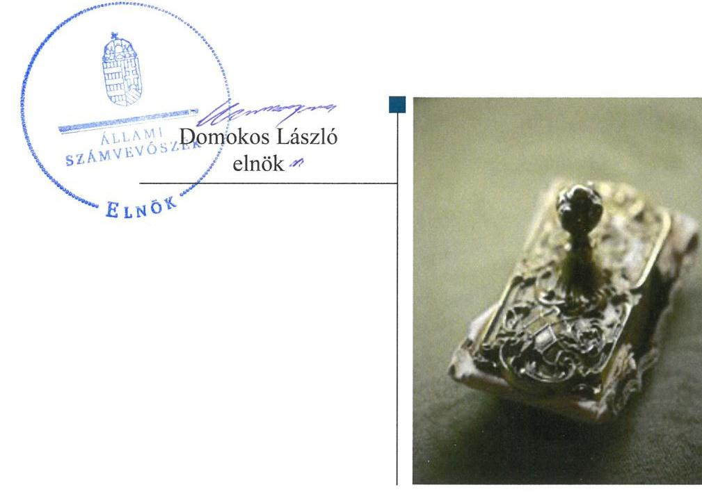
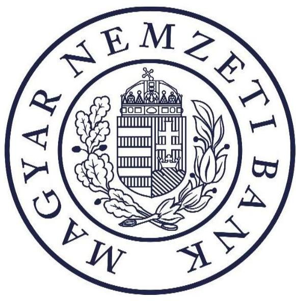
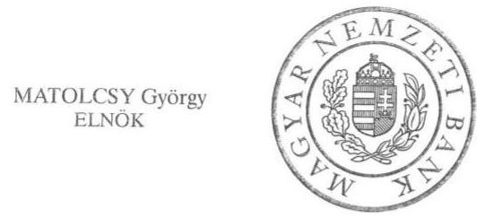
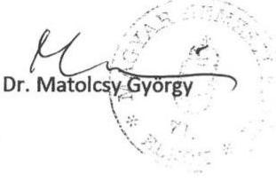
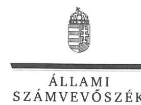
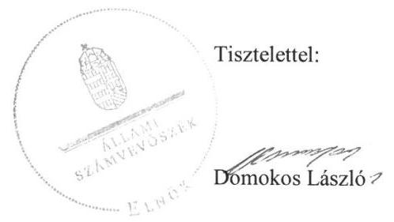

# Jelentés 

## A Magyar Nemzeti Bank múködése szabályszerűségének ellenőrzése

2019.

---

# Jelenetés 

## A Magyar Nemzeti Bank múködése szabályszerűségének ellenőrzése

2019. 03. hó 21. nap

---

|   | AZ ELLENŐRZÉST FELÜGYELTE:  |
| --- | --- |
|   | DR. PULAY GYULA ZOLTÁN felügyeleti vezető  |
|   | AZ ELLENŐRZÉST VEZETTE ÉS A VÉGREHAJTÁSÁÉRT FELELŐS:  |
|   | DR. SIMON JÓZSEF ellenőrzésvezető  |
|   | A PROGRAM ÖSSZEÁLLÍTÁSÁÉRT FELELŐS:  |
|   | TÓTPÁL SZABOLCS osztályvezető  |
|   | A TÉMÁHOZ KAPCSOLÓDÓ KORÁBBI SZÁMVEVŐSZÉKI JELENTÉSEK:  |
|   | - címe: Jelentés - A Magyar Nemzeti Bank működése szabályszerűségének ellenőrzése  |
|   | - sorszáma: 18179  |
|  Jelentéseink az Országgyúlés számítógépes hálózatán és az Interneten a www.asz.hu címen is olvashatóak. | - címe: Jelentés - A Magyar Nemzeti Bank működése szabályszerűségének ellenőrzése  |
|   | - sorszáma: 17114  |
|  |   |
|   | IKTATÓSZÁM: EL-1518-001/2019  |
|   | TÉMASZÁM: 2503  |
|   | ELLENŐRZÉS-AZONOSÍTÓ SZÁM: V0847  |

---

# TARTALOMJEGYZÉK 

■ ÖSSZEGZÉS ..... 5
■ AZ ELLENŐRZÉS CÉLJA ..... 6
■ AZ ELLENŐRZÉS TERÜLETE ..... 7
■ AZ ELLENŐRZÉS HÁTTERE, INDOKOLTSÁGA ..... 8
■ A JELENTÉS LÉNYEGES KÉRDÉSKÖREI ..... 9
■ AZ ELLENŐRZÉS HATÓKÖRE ÉS MÓDSZEREI ..... 10
■ MEGÁLLAPÍTÁSOK ..... 13
■ MELLÉKLETEK ..... 19
I. sz. melléklet: Értelmező szótár ..... 19
II. sz. melléklet: Az MNB vagyonának alakulása a 2017. évben (M Ft) ..... 21
III. sz. melléklet: Az Állami Számvevőszék 17114. számú jelentéséhez kapcsolódó intézkedési terv végrehajtása ..... 22
■ FÜGGELÉK: ÉSZREVÉTELEK ..... 23
■ RÖVIDÍTÉSEK JEGYZÉKE ..... 33

---

.

---

# ÖSSZEGZÉS 

A Magyar Nemzeti Bank müködése szabályozott és szabályszerű volt. A gazdálkodása során betartotta a jogszabályi előírásokat. A pénzügyi közvetítőrendszert felügyelő, ellenőrző és szabályozó tevékenysége támogatta a pénzügyi közvetítőrendszer szabályszerű müködését, a fogyasztói érdekek védelmét. A Magyar Nemzeti Bank intézkedési tervében foglalt feladat végrehajtása elősegítette a pénzügyi közvetítőrendszer biztonságos müködését.

## Az ellenőrzés társadalmi indokoltsága

Az egyszemélyes részvénytársasági formában müködő Magyar Nemzeti Bank Magyarország központi bankja, felelős a monetáris politikáért és 2013. október 1-jétől ellátja a pénzügyi közvetítő rendszer felügyeletét. A részvényesi jogokat az államháztartásért felelős miniszter gyakorolja.

Az Állami Számvevőszék törvényi kötelezettsége a Magyar Nemzeti Bank gazdálkodásának és az alapvető feladatai közé nem tartozó tevékenységének ellenőrzése, amelynek teljesítésével segíti az Országgyűlés munkáját, tájékoztatja az érdekelteket és a szélesebb közvéleményt a Magyar Nemzeti Bank működésének és gazdálkodásának szabályszerűségéről. Az ellenőrzés hozzájárul az Állami Számvevőszék Stratégiájában megfogalmazott küldetése megvalósításához, a közpénzügyek átláthatóságának, rendezettségének előmozdításához.

## Főbb megállapítások, következtetések

A Magyar Nemzeti Bank irányítási rendszerének kialakítása és működtetése összhangban volt a jogszabályi előírásokkal. A Pénzügyi Békéltető Testület müködéséhez szükséges feltételek rendelkezésre állása biztosított volt. A Magyar Nemzeti Bank a jogszabályi előírások szerinti tartalommal és gyakorisággal teljesítette a tevékenységével kapcsolatos beszámolási és tájékoztatási kötelezettségét. A Felügyelőbizottság és a belső ellenőrzés szabályszerűen látta el tevékenységét. A Magyar Nemzeti Bank a többségi és kizárólagos tulajdonában lévő gazdasági társaságok esetén a tulajdonosi joggyakorlása során szabályszerűen járt el. A Magyar Nemzeti Bank irányítási, beszámolási és ellenőrzési rendszere szabályszerűen és szabályozottan müködött.

A Magyar Nemzeti Bank a jogszabályi előírások szerint készítette el a pénzügyi év kezdete előtt éves tervét, amelyben a müködési költségeket és a beruházásokat az alapvető és egyéb feladatai vonatkozásában elkülönítetten, részletes formában mutatta ki. Ezáltal biztosított volt a tevékenységével kapcsolatban tervezett müködési költségek és beruházások átláthatósága.

A müködési költségekkel kapcsolatos beszerzések és elszámolások, valamint a beruházások megvalósítása, illetve ezek számviteli elszámolása szabályszerű volt. A nyújtott támogatások tervezése, kifizetése és elszámolása során a Magyar Nemzeti Bank betartotta a jogszabályi és a kapcsolódó belső előírásokat. Mindez hozzájárult a szabályszerű gazdálkodás folytatásához.

A Magyar Nemzeti Bank a pénzügyi közvetítőrendszer felügyeletével kapcsolatban biztosította a nyilvános elektronikus információs rendszer működtetését, valamint a kapcsolódó szabályozási háttér kialakítását. A pénzügyi közvetítőrendszer felügyeletéhez kapcsolódó eljárások elősegítették a pénzügyi rendszer szereplőinek szabálykövető magatartását.

A Magyar Nemzeti Bank gondoskodott arról, hogy a Pénzügyi Stabilitási Tanács a Szanálási igazgatóság előterjesztése alapján a pénzügyi intézményekre vonatkozó szanálási tervek készültségét értékelje, valamint felmérje az elkészítésük érdekében szükséges intézkedéseket és a befolyásoló körülményeket. Az intézkedés végrehajtásával a Magyar Nemzeti Bank hozzájárult a pénzügyi rendszer stabilitásának megőrzéséhez.

---

# AZ ELLENŐRZÉS CÉLJA

**AZ ELLENŐRZÉS CÉLJA** a Magyar Nemzeti Bank alapfeladatai közé nem tartozó tevékenységei és gazdálkodása tekintetében annak értékelése, hogy a Magyar Nemzeti Bank irányítási, döntéshozatali és ellenőrzési rendszere szabályozottan és szabályszerűen működött-e; a Magyar Nemzeti Bank gazdálkodása, a pénzügyi közvetítőrendszert felügyelő, ellenőrző és szabályozó tevékenysége megfelelte-e a jogszabályi előírásoknak. Az utóellenőrzés vonatkozásában az ellenőrzés célja annak értékelése, hogy a 17114. sorszámú számvevőszéki jelentésben foglalt intézkedést igénylő megállapításokkal összhangban készített intézkedési tervben meghatározott feladatokat a Magyar Nemzeti Bank végrehajtotta-e.

---

# AZ ELLENŐRZÉS TERÜLETE 

## Magyar Nemzeti Bank

A MAGYAR NEMZETI BANK 1924. június 24. óta működik. Részvénytársasági formában múködő jogi személy, részvénye a magyar állam tulajdonában van. Az államot, mint részvényest, az államháztartásért felelős miniszter képviseli.

Az Alaptörvény 41. cikke kimondja, hogy a Magyar Nemzeti Bank Magyarország központi bankja, sarkalatos törvényben meghatározott módon felelős a monetáris politikáért. Alapvető feladatain túl szanálási hatóságként jár el, kizárólagosan ellátja a pénzügyi közvetítőrendszer felügyeletét, valamint a Pénzügyi Békéltető Testület útján ellátja a fogyasztó és a pénzügyi közvetítőrendszer szervezetei közötti - szolgáltatás igénybevételére vonatkozó - jogviszony létrejöttével és teljesítésével kapcsolatos vitás ügyek bírósági eljáráson kívüli rendezését.

Jogállását, elsődleges célját, alapvető, valamint alapvető feladatai közé nem tartozó egyéb feladatait és szervezeti felépítését a Magyar Nemzeti Bankról szóló 2013. évi CXXXIX. törvény szabályozza. A törvényben rögzített feladatai ellátása, valamint kötelességei teljesítése során független. A Magyar Nemzeti Bank tagja a Központi Bankok Európai Rendszerének, valamint a Pénzügyi Felügyeletek Európai Rendszerének is.

A Magyar Nemzeti Bank szervezeti egységeinek minősülnek az Igazgatóság, a Monetáris Tanács, a Pénzügyi Stabilitási Tanács, a Pénzügyi Békéltető Testület és a szakmai feladatokat végrehajtó igazgatóságok.

A Magyar Nemzeti Bank Igazgatósága felelős a Magyar Nemzeti Bankról szóló 2013. évi CXXXIX. törvényben meghatározott feladatkörök tekintetében egyrészt a Monetáris Tanács, másrészt a Pénzügyi Stabilitási Tanács döntéseinek végrehajtásáért, továbbá a Magyar Nemzeti Bank múködésének irányításáért. Az Igazgatóság tagjai a Magyar Nemzeti Bank elnöke, mint az Igazgatóság elnöke, és a Magyar Nemzeti Bank alelnökei.

A Magyar Nemzeti Bank elnökét a miniszterelnök javaslatára a köztársasági elnök nevezte ki 2013. március 4-i hatállyal hat éves időtartamra. Az elnök munkáját az ellenőrzött időszakban három alelnök segítette.

A Magyar Nemzeti Bank elnöke a szervezet tevékenységéről féléves rendszerességgel beszámol az Országgyűlés gazdasági ügyekért felelős állandó bizottságának.

A könyvviteli mérleg adatai alapján 2016. december 31-ről 2017. december 31-re a Magyar Nemzeti Bank mérlegfőösszege 10054901 M Ft-ról 9307752 M Ft-ra csökkent. Mindez főként a könyvviteli mérleg eszközoldalán a hitelintézetekkel szembeni követelések, valamint az arany- és devizatartalék, illetve a forrásoldalon a központi költségvetés és a hitelintézetek betétállományának, az egyéb kötelezettségek devizában és a forintárfolyam kiegyenlítési tartalék csökkenése miatt következett be.

---

# AZ ELLENŐRZÉS HÁTTERE, INDOKOLTSÁGA 

AZ ÁLLAMI SZÁMVEVŐSZÉK az ÁSZ tv. ${ }^{1}$ 5. § (10) bekezdése alapján ellenőrzi a Magyar Nemzeti Bank gazdálkodását és a Magyar Nemzeti Bankról szóló 2013. évi CXXXIX. törvényben foglaltak alapján folytatott, az alapvető feladatok körébe nem tartozó tevékenységét. Az Állami Számvevőszék rendszeresen értékeli a Magyar Nemzeti Bank gazdálkodása szabályszerűségét és a szabályszerű működés feltételeinek érvényesülését.

AZ ORSZÁGGYŰLÉS LEGFŐBB PÉNZÜGYI ÉS GAZDASÁGI ELLENŐRZŐ SZERVEKÉNT az Állami Számvevőszék jogosult ellenőrizni fontos államigazgatási, államhatalmi, vagy felügyeleti szervek gazdálkodását és múködését. Az „ellenőrök ellenőreként" az Állami Számvevőszék munkájának eredményei hatványozottan jelentkezhetnek, hiszen megállapításai az ellenőrzők tevékenységének szabályszerűbbé és hatékonyabbá tételében hasznosulhatnak. Ez is indokolja, hogy a pénzügyi közvetítőrendszer felügyeletét is ellátó Magyar Nemzeti Bank ellenőrzésére minden évben sor kerül.

AZ ELLENŐRZÉS ALAPVETŐ HOZADÉKA az Országgyűlés munkájának támogatása, az érdekeltek és a szélesebb közvélemény tájékoztatása az $\mathrm{MNB}^{2}$ múködésének és gazdálkodásának szabályszerűségéről. Az ellenőrzés rámutathat a belső szabályozás és a szabályszerű múködés hiányosságaira. Az ellenőrzött szervezet vonatkozásában az ellenőrzés megállapításai és javaslatai hozzájárulhatnak a múködés szabályozottságában, a kontrollok kialakításában esetlegesen fellépő hiányosságok kiküszöböléséhez, a belső szabályzatok és a gyakorlat felülvizsgálatához. A közvélemény számára hiteles információt nyújt az MNB múködéséről és gazdálkodásáról, alapfeladatai közé nem sorolt feladatainak ellátásáról, a közpénzekkel való felelős gazdálkodásról, ezzel hozzájárul az általános szakmai tájékozottság javításához.

## A MAGYAR NEMZETI BANK ÁLTAL KÉSZÍTETT INTÉZKEDÉSI TERVBEN foglaltak megvalósítását - az ÁSZ tv. 33.

§ (7) bekezdésében foglaltak alapján - az Állami Számvevőszék utóellenőrzés keretében ellenőrizheti. Az utóellenőrzés keretében - az intézkedések értékelése során - az Állami Számvevőszék figyelembe veszi az ellenőrzött szervezet múködési feltételeiben, valamint a jogszabályi előírásokban bekövetkezett változásokat.

AZ UTÓELLENŐRZÉS SORÁN az Állami Számvevőszék azt értékelte, hogy az érintett 17114. sorszámú számvevőszéki jelentésben foglalt intézkedést igénylő megállapításokkal és javaslatokkal összhangban, a Magyar Nemzeti Bank által készített intézkedési tervben meghatározott feladatot a feladatra kijelölt végrehajtotta-e. Az intézkedés végrehajtásával az adott terület szabályszerű múködése vonatkozásában a kockázatok csökkenhetnek.

---

# A JELENTÉS LÉNYEGES KÉRDÉSKÖREI 

1. Az MNB irányítási, beszámolási és ellenőrzési rendszere szabályozottan és szabályszerűen müködött-e?
2. Az MNB gazdálkodása szabályszerű volt-e?
3. Az MNB pénzügyi közvetítőrendszert felügyelő, ellenőrző és szabályozó tevékenysége megfelelt-e a jogszabályi előírásoknak?
4. Az MNB az intézkedési tervben foglaltakat az előírt határidőben végrehajtotta-e?

---

# AZ ELLENŐRZÉS HATÓKÖRE ÉS MÓDSZEREI 

## Az ellenőrzés típusa

Megfelelőségi ellenőrzés.

## Az ellenőrzött időszak

A 2017. év. Az éves beszámoló készítése, jóváhagyása, a beszámolóval kapcsolatos tájékoztatási kötelezettség teljesítése kapcsán az ellenőrzött időszak kiterjedt ezen feladatok jogszabályban előírt végrehajtásának időpontjáig.

Az utóellenőrzés alapját képező 17114. sorszámú számvevőszéki jelentés közzétételének napjától (2017.07.11.) az utóellenőrzésről szóló kiértesítő levél keltének (2018.10.10.) napjáig tartó időszak.

## Az ellenőrzés tárgya

Az MNB gazdálkodásának és az alapvető feladatok körébe nem tartozó irányítási, döntéshozatali, ellenőrzési és a pénzügyi közvetítőrendszert felügyelő, ellenőrző és szabályozó - tevékenységek ellenőrzése.

Az utóellenőrzés tekintetében a 17114. sorszámú számvevőszéki jelentésben foglalt intézkedést igénylő megállapítással és javaslattal összhangban - az MNB által - készített intézkedési tervben foglaltak végrehajtásának ellenőrzése.

## Az ellenőrzött szervezet

Magyar Nemzeti Bank

## Az ellenőrzés jogalapja

Az ÁSZ tv. 1. § (3) bekezdésében foglaltak alapján az ÁSZ³ általános hatáskörrel végzi a közpénzekkel és az állami és önkormányzati vagyonnal való felelős gazdálkodás ellenőrzését, valamint az ÁSZ tv. 5. § (10) bekezdésében foglaltak alapján ellenőrzi az MNB gazdálkodását és az MNB tv. ${ }^{4}$-ben foglaltak alapján folytatott, az alapvető feladatok körébe nem tartozó tevékenységét. Az MNB tv. 4. § (8)-(10) bekezdései tartalmazzák az MNB egyéb feladatait.

Az utóellenőrzés jogszabályi alapját az ÁSZ tv. 33. § (7) bekezdésének előírása képezi.

---

# Az ellenőrzés módszerei 

Az ellenőrzést az ellenőrzési program szempontjai, az ellenőrzött időszakban hatályos jogszabályok, az ellenőrzés szakmai szabályai, a jelen ellenőrzésre irányadó ÁSZ módszertanok figyelembevételével végeztük.

Az ellenőrzés ideje alatt az ellenőrzött szervezettel történő kapcsolattartást az ÁSZ SZMSZ²-ének vonatkozó előírásai alapján biztosítottuk.

Az ellenőrzési bizonyítékként felhasználható adatforrások közé tartoztak egyrészt az ellenőrzési program részletes szempontjainál felsorolt adatforrások, másrészt minden egyéb - az ellenőrzés folyamán feltárt, az ellenőrzés szempontjából információt tartalmazó - dokumentum.

Az ellenőrzési kérdések megválaszolásához szükséges bizonyítékok megszerzése az ellenőrzött szervezet által rendelkezésre bocsátott dokumentumokra, adatokra alapozva megfigyelés, szemle (szemrevételezés), kérdésfeltevés (információkérés), valamint elemző eljárás útján történt.

A múködési költségekkel összefüggő beszerzések, a beruházások megvalósítása, valamint az MNB által nyújtott támogatások tervezése, kifizetése és ezek elszámolása esetében az ellenőrzés azokra a legnagyobb értékű tételekre - lényeges sokaságra - terjedt ki, melyek összértéke eléri a teljes sokaság összértékének 50\%-át.

A lényeges sokaságot tételesen ellenőriztük. A beruházások megvalósítására vonatkozó lényeges sokaságot kockázati alapú kiválasztással egészítettük ki, amelynek során az informatikai és a nem informatikai tárgyú beruházási szerződésekből a 2-2 legnagyobb összegű tételt választottuk ki.

Az MNB engedélyezési, jóváhagyási, nyilvántartásba vételi és törlési eljárásainak szabályszerűségét véletlen mintavétellel kiválasztott tételek alapján ellenőriztük.

A felügyeleti biztosok kirendelésére vonatkozó eljárások szabályszerűségének ellenőrzése esetében tételes ellenőrzésre került sor.

A mintavétellel ellenőrzött területek esetében minden egyes tétel vonatkozásában az elszámolásokra és az eljárások szabályszerűségére vonatkozó kérdéseket tettünk fel. Szabályszerűnek értékeltünk egy ellenőrzött területet, amennyiben 95\%-os bizonyossággal az ellenőrzött sokaságban az átlagos hibaarány legfeljebb 10\%, nem szabályszerűnek, amennyiben 10\%-nál magasabb arányt képviselt.

Az utóellenőrzés során az intézkedési tervben előírt feladatokat azok végrehajthatósága, illetve végrehajtása szempontjából az alábbiak szerint értékelte az ÁSZ:
„határidőben végrehajtott" a feladat, ha a teljesítés dokumentáltan, az intézkedési tervben előírt határidőben és tartalommal megtörtént;
"határidőn túl végrehajtott" a feladat, ha annak teljesítése az intézkedési tervben meghatározott módon, de az abban előírt határidőn túl történt meg;
"részben végrehajtott" a feladat, ha annak végrehajtása nem teljes körűen az intézkedési tervben előírt módon történt meg;
"nem végrehajtott" a feladat, ha a végrehajtás nem történt meg, dokumentumokkal nem igazolt annak teljesítése;

---

$\longrightarrow$ „okafogyottá vált" a feladat, ha végrehajtására - meghatározott esemény bekövetkezése, továbbá külső körülmény, a múködést érintő feltétel változása miatt - már nincs szükség, illetve lehetőség, és egyértelmúen megállapítható, hogy az intézkedést szükségessé tevő körülmény a jövőben nem fordulhat elő;
$\longrightarrow$ „nem időszerű" az a feladat, amelynek ellenőrzési időszakon belüli végrehajtására azért nem került (kerülhetett) sor, mert az intézkedés alapjául szolgáló esemény nem következett be, de annak jövőbeni előfordulása lehetséges, a végrehajtása nem volt esedékes, vagy a végrehajtás határideje még nem járt le.
Az ellenőrzés lefolytatásához az ellenőrzött szervezet a tanúsítványok elektronikus kitöltésével, valamint az ÁSZ által kért dokumentumok elektronikus megküldésével szolgáltatott adatokat, amelyek valódiságát és teljes körűségét az ellenőrzött szervezet vezetője által tett teljességi és hitelességi nyilatkozat igazolja. A rendelkezésre bocsátott adatok, információk kontrollja az ellenőrzés keretében történt.

---

# 1. Az MNB irányítási, beszámolási és ellenőrzési rendszere szabályozottan és szabályszerűen múködött-e? 

Összegző megállapítás

Az MNB irányítási, beszámolási és ellenőrzési rendszere szabályozottan és szabályszerűen múködött.

Az MNB irányítási rendszerének kialakítása és múködtetése - 2017. február 20-ig a szanálási hatósági feladatkör szervezeti keretét kivéve - szabályszerűen történt.

AZ ALAPVETŐ FELADATOK KÖRÉBE NEM TARTOZÓ TEVÉKENYSÉGEK ELLÁTÁSÁRA VONATKOZÓ SZERVEZETI KERETEKET az MNB 2017. február 20ig nem szabályszerűen alakította ki, mert az MNB SZMSZ ${ }_{1-2}{ }^{6}$ nem felelt meg az MNB tv. 4. § (15) bekezdésében foglalt előírásnak. A szanálási hatósági feladatkör ellátását nem az MNB elnökének, vagy bármelyik alelnökének közvetlen alárendeltségében és irányításában határozta meg.

Az MNB 2017. február 21-től az MNB SZMSZ ${ }_{3-9}{ }^{7}$-ben az MNB tv. rendelkezéseivel összhangban alakította ki az alapvető feladatok körébe nem tartozó tevékenységek ellátására vonatkozó szervezeti kereteket.

A PÉNZÜGYI KÖZVETÍTŐRENDSZER FELÜGYELETÉVEL KAPCSOLATOS FELADATOK ellátásának szervezeti kereteit az MNB az MNB tv. rendelkezéseivel összhangban alakította ki.

A PST ${ }^{8}$ - az MNB egyéb feladatai tekintetében - az MNB tv. előírásait betartva múködött. A PST a pénzügyi közvetítőrendszer felügyeletével kapcsolatos döntéseit - az MNB tv. előírásával összhangban - az MT9 által meghatározott stratégiai keretek között hozta meg.

Az Igazgatóság az MNB tv. előírása szerint végrehajtotta a PST által a pénzügyi közvetítőrendszer felügyelete tekintetében hozott döntéseket.
1.2. számú megállapítás

Az MNB a Pénzügyi Békéltető Testület múködéséhez szükséges feltételeket a jogszabályi előírások szerint biztosította.

A PBT ${ }^{10}$ az MNB tv. rendelkezésével összhangban az MNB szervezeti rendjén belül közvetlenül került besorolásra. A PBT múködéséhez szükséges pénzügyi fedezetet az MNB az MNB tv.-ben foglalt előírás szerint biztosította.

A PBT múködésének rendjét az MNB tv. előírásával összhangban a PBT elnöke szabályzatban alakította ki. A PBT múködési rend ${ }_{1-3}{ }^{11}$-je tartalmazta az összeférhetetlenségi szabályokat az MNB tv. előírásával összhangban.

---

A PBT elnöke az MNB tv. rendelkezése szerint a PBT tevékenységéről éves összefoglaló tájékoztatót - ezen belül a határon átnyúló fogyasztói jogviták rendezésével összefüggő tevékenységéről beszámolót - készített.

# 1.3. számú megállapítás 

Az MNB a tevékenységével kapcsolatos beszámolási és tájékoztatási kötelezettségét szabályszerűen teljesítette.

Az MNB elnöke az MNB tevékenységéről az éves beszámoló tartalmának megfelelően, féléves rendszerességgel beszámolt az Országgyűlés Gazdasági Bizottságának az MNB tv. rendelkezésével összhangban.

Az MNB elnöke - az MNB tv. előírásával összhangban - az MNB működésének irányításával összefüggő, a működés szempontjából kiemelten fontos, az Igazgatóság MNB tv. 12. § szerinti jogkörében meghozott döntéseivel kapcsolatban előírt tájékoztatási kötelezettségének a részvényesi jogokat gyakorló nemzetgazdasági miniszter felé eleget tett.

Az Igazgatóság az MNB tv.-ben előírtak szerint működött. Az Igazgatóság határozatban döntött az MNB tv. rendelkezése szerint az MNB számviteli beszámolójáról, valamint megküldte a részvényesi jogokat gyakorló nemzetgazdasági miniszter részére.

Az MNB - az MNB tv. rendelkezésével összhangban - elkészítette a prudenciális ${ }^{12}$-, valamint a fogyasztóvédelmi kockázati jelentést ${ }^{13}$.

### 1.4. számú megállapítás

A Felügyelőbizottság és a belső ellenőrzés a jogszabályi előírások szerint múködött.

Az $\mathrm{FB}^{14}$ döntéshozatali rendje összhangban volt a Ptk. ${ }^{15}$ és a részvényesi jogokat gyakorló nemzetgazdasági miniszter által jóváhagyott FB ügy-rend ${ }^{16}$-ben rögzített előírásokkal. Az FB - a Ptk. előírásával összhangban írásbeli jelentést készített az MNB beszámolójáról és üzleti jelentéséről. Az FB az MNB tv. előírása szerinti tájékoztatási kötelezettségének eleget tett az Országgyűlés, illetve az államháztartásért felelős miniszter felé.

A belső ellenőrzési szervezet függetlensége az SZMSZ1-9-ben és a belső ellenőrzés rendjéről szóló utasítás ${ }^{17}$-ban szereplő előírások szerint biztosított volt. A belső ellenőrzés előre meghatározott és - az MNB tv. előírásaival összhangban az FB, valamint az Igazgatóság által - jóváhagyott ellenőrzési terv szerint végezte munkáját és tevékenységéről beszámolót készített a belső ellenőrzés rendjéről szóló utasítás előírása szerint.

### 1.5. számú megállapítás

Az MNB többségi és kizárólagos tulajdonában álló gazdasági társaságok feletti tulajdonosi joggyakorlása szabályszerű volt.

AZ MNB TULAJDONOSI JOGGYAKORLÁSA a kizárólagos és többségi tulajdonában álló gazdasági társaságai felett szabályozott volt, a tulajdonosi döntések meghozatala és végrehajtása a Ptk. előírásai szerint történt.

Az MNB tulajdoni részesedésekkel kapcsolatos befektetési döntései összhangban voltak az MNB tv.-ben szereplő rendelkezésekkel, valamint az Igazgatóság ügyrend ${ }_{1-3}{ }^{18}$-jének előírásaival.

Az MNB kizárólagos, valamint többségi tulajdonosi részesedéseinek együttes értéke 2017. január 1-jéről 2017. december 31-re 56,9 Mrd Ft-

---

ról 38,9 Mrd Ft-ra csökkent. A tulajdonosi részesedések értékében bekövetkezett csökkenés indoka, hogy a Mark Zrt. ${ }^{19}$-ben lévő tulajdoni részesedés értékesítésre került.

A kizárólagos és a többségi tulajdonban álló gazdasági társaságokban való részesedések főbb adatait az 1. táblázat mutatja be.

1. táblázat

# AZ MNB KIZÁRÓLAGOS ÉS TÖBBSÉGI TULAJDONOSI RÉSZESEDÉSEI 

| Megnevezés | Tulajdoni   hányad   (\%) | Könyv szerinti   érték   2016.12.31.   (M FT) | Könyv szerinti   érték   2017.12.31.   (M FT) |
| :--: | :--: | :--: | :--: |
| Pénzjegynyomda Zrt. | 100,0 | 10627,0 | 11827,0 |
| GIRO Elszámolásforgalmi Zrt. | 100,0 | 9779,0 | 9779,0 |
| MNB-Biztonsági Zrt. | 100,0 | 740,0 | 740,0 |
| Magyar Pénzverő Zrt. | 100,0 | 575,0 | 575,0 |
| MNB-Jóléti Kft. | 100,0 | 569,0 | 665,0 |
| Pénzügyi Stabilitási és Felszámoló NKft. | 100,0 | 50,0 | 50,0 |
| Budapesti Értéktőzsde Zrt. | 81,4 | 14619,0 | 14619,0 |
| KELER Zrt. | 53,3 | 643,0 | 643,0 |

Forrás: MNB 2017. évi éves jelentése

## 2. Az MNB gazdálkodása szabályszerű volt-e?

Összegző megállapítás
Az MNB gazdálkodása szabályszerű volt.
2.1. számú megállapítás

A működési költségek éves tervét az MNB szabályszerűen összeállította. A működési költségekkel összefüggő beszerzések és a kapcsolódó elszámolások szabályszerűek voltak.

## A MÜKÖDÉSI KÖLTSÉGEKRE VONATKOZÓ ÉVES

TERVET az MNB a pénzügyi év kezdete előtt elkészítette. Az MNB tv. előírását betartva a működési költségeire vonatkozó éves tervet az MNB az alapvető és egyéb feladatok vonatkozásában elkülönítetten, részletes formában készítette el.

A MÜKÖDÉSI KÖLTSÉGEKKEL ÖSSZEFÜGGŐ BESZERZÉSI ELJÁRÁSOK során betartották a Kbt. ${ }^{20}$-nek a közbeszerzés értékének meghatározására vonatkozó előírásait. A működési költségekkel kapcsolatos számviteli elszámolások során betartották a Számv. tv. ${ }^{21}$ előírásait.
2.2. számú megállapítás

A beruházások éves tervét az MNB szabályszerűen állította össze. A beruházások megvalósítása és a kapcsolódó elszámolások szabályszerűek voltak.

A BERUHÁZÁSOKRA VONATKOZÓ ÉVES TERVET az MNB tv. előírásával összhangban az MNB az alapvető és egyéb feladatok vonatkozásában elkülönítetten, részletes formában készítette el.

---

A beruházásokról szóló döntések meghozatala szabályszerű volt, mert az MNB tv., az SZMSZ1-9, valamint az Igazgatóság ügyrendjében foglalt előírásokat betartották.

A beruházási eljárások lefolytatása során betartották a Kbt.-nek a szerződések megkötésére vonatkozó előírásait. A beruházási eljárásokkal kapcsolatos számviteli elszámolások során betartották a Számv. tv. előírásait.

AZ ÉRTÉKTÁR PROGRAM keretében megvalósított műtárgyvásárlások esetén az Igazgatóság határozatait a Tanácsadó testület ${ }^{22}$ által készíttetett szakértői vélemények alapján hozta meg.
2.3. számú megállapítás

Az MNB által nyújtott támogatások tervezése, kifizetése és elszámolása szabályszerű volt.

AZ MNB ÁLTAL NYÚJTOTT TÁMOGATÁSOK éves tervét - az MNB tv. rendelkezésével összhangban - az Igazgatóság határozatával elfogadta.

A támogatások nyújtásához szükséges döntéseket az SZMSZ1-9-ben, az ITB ügyrend ${ }_{1-5}{ }^{23}$-ben és a múködésről szóló elnöki utasítás ${ }_{1-4}{ }^{24}$-ban előírtaknak megfelelően készítették elő.

A nem az ITB ${ }^{25}$ hatáskörébe tartozó támogatások esetében a múködésről szóló elnöki utasítás ${ }_{1-4}$ rendelkezései szerint az Igazgatóság egyedi döntéseket hozott.

A nyújtott támogatások esetén a gazdasági múveletek számviteli elszámolása a Számv. tv. rendelkezéseivel összhangban történt.

# 3. Az MNB pénzügyi közvetítőrendszert felügyelő, ellenőrző és szabályozó tevékenysége megfelelt-e a jogszabályi előírásoknak? 

Összegző megállapítás

Az MNB pénzügyi közvetítőrendszert szabályozó tevékenysége szabályszerű volt. A pénzügyi közvetítőrendszer felügyeletéhez kapcsolódó engedélyezési eljárásai esetén és a felügyeleti biztosok kirendelése során az MNB szabályszerűen járt el. A piacfelügyeleti, a fogyasztóvédelmi és az ellenőrzési eljárások szabályszerűségét az Állami Számvevőszék nem értékelte tekintettel a 2017. évben folyamatban lévő jogorvoslati eljárásokra.
3.1. számú megállapítás

Az MNB a nyilvános elektronikus információs rendszert a jogszabályi előírások szerint múködtette.

A NYILVÁNOS ELEKTRONIKUS INFORMÁCIÓS RENDSZER múködtetésére vonatkozó kötelezettségének az MNB honlap ${ }^{26}$-ján keresztül, egységes elektronikus elérési helyen és átlátható módon tett eleget. Biztosította a nyilvánosság felé, az MNB tv. 39. §-ában

---

# Megállapítások 

meghatározott törvények hatálya alá tartozó személyek és szervezetek által nyújtandó információk elérését.

Az MNB a honlapján - az MNB tv. rendelkezésének megfelelően - közzétette az MNB tv. 43. § (2) bekezdése által meghatározott információkat és dokumentumokat.
3.2. számú megállapítás

Az MNB elnöke a pénzügyi közvetítőrendszer felügyeletével összefüggő szabályozó tevékenységét szabályszerűen látta el.

## A PÉNZÜGYI KÖZVETÍTŐRENDSZER FELÜGYELETÉVEL KAPCSOLATOS SZABÁLYOZÁSI KÖRNYE-

ZETET az MNB tv. által adott felhatalmazás alapján alakított ki az MNB elnöke.

Az MNB tv. rendelkezésével összhangban az MNB elnöke rendeletben meghatározta a felügyeleti eljárások díjának megfizetésének rendjét, kiszámítása módját és feltételeit, a lefolytatott engedélyezési, nyilvántartásba vételi, valamint a tevékenység módosítására vonatkozó eljárások igazgatási szolgáltatási díj mértékének, fizetésének és visszatérítésének részletes szabályait, valamint a különböző felügyeleti eljárások során alkalmazandó elektronikus űrlapok tartalmát.

Az MNB a pénzügyi közvetítőrendszer felügyeletéhez kapcsolódó engedélyezési eljárásai során a jogszabályi előírásokat betartotta.

AZ ENGEDÉLYEZÉSI ELJÁRÁSOK során az MNB az MNB tv. hiánypótlásra és az ügyintézési határidőre vonatkozó előírásai szerint járt el. Az MNB az engedélyezési eljárások vonatkozásában közzétételi kötelezettségének az MNB tv. előírása szerint eleget tett.

Az MNB-hez benyújtott, engedélyezési eljárásokra vonatkozó kérelmek típusonkénti számát a 2. táblázat mutatja be.
2. táblázat

A 2017. ÉVBEN BENYÚJTOTT ENGEDÉLYEZÉSI KÉRELMEK TÍPUSONKÉNTI MEGOSZLÁSA

| Megnevezés | Eljárások száma (db) |
| :-- | :--: |
| Nyilvántartásba vételi kérelem | 285 |
| Nyilvántartás módosítási kérelem | 50 |
| Törlési kérelem | 46 |
| Engedély visszavonási kérelem | 67 |
| Összesen: | 448 |

A FELÜGYELETI BIZTOSOK KIRENDELÉSE az MNB tv. és a 2014-226. számú alelnöki utasítás ${ }^{27}$ előírásai szerint a szervezetek felszámolását végző PSFN Kft. ${ }^{28}$ jelölése alapján történt.

Az MNB határozatban állapította meg - az MNB tv. előírása szerint - a kirendelt felügyeleti biztosok szerepét és feladatait. Az MNB az eljárásokkal kapcsolatos közzétételi kötelezettségének az MNB tv. előírását betartva eleget tett.

---

# 4. Az MNB az intézkedési tervben foglaltakat az előírt határidőben végrehajtotta-e? 

## Összegző megállapítás

Az intézkedési tervben előírt egy feladat határidőben teljesült.

A Szanálási igazgatóság ${ }^{29}$ 2017. november 27-én előterjesztést nyújtott be a PST részére. Az előterjesztés tartalmazta a szanálási tervek státuszát és a Szantv.-ben ${ }^{30}$ foglaltak értelmében a szanálhatóság vizsgálatára, értékelésére irányuló eljárások ütemezését, valamint az elkészítésüket támogató intézkedéseket és a befolyásoló körülményeket.

Az intézkedési tervben vállalt feladatot, a megjelölt felelőst és a feladat végrehajtását a III. sz. melléklet mutatja be.

---

# MELLÉKLETEK 

- I. SZ. MELLÉKLET: ÉRTELMEZŐ SZÓTÁR
átfogó vizsgálat
beruházás
csoportvizsgálat

#### Abstract

A Banknak az MNB tv. 4. § (9) bekezdése szerinti felügyeleti feladata ellátása érdekében, az MNB tv. 64. § (2) bekezdése szerinti gyakorisággal végzett, az MNB tv. 39. §ában meghatározott törvények hatálya alá tartozó személy és szervezet működésére és tevékenységére vonatkozó, törvényben, MNB rendeletben és egyéb jogszabályban - ideértve az MNB tv. 40. §-ában hivatkozott uniós jogi aktusokat is - foglalt rendelkezések betartásának meghatározott vizsgálati szempontrendszer szerinti ellenőrzése céljából lefolytatott ellenőrzési eljárás. (Forrás: A Magyar Nemzeti Bank ellenőrzési eljárásainak alapvető szabályairól szóló 2016-107. elnöki utasítás 3. §) A tárgyi eszköz beszerzése, létesítése, saját vállalkozásban történő előállítása, a beszerzett tárgyi eszköz üzembe helyezése, rendeltetésszerű használatbavétele érdekében az üzembe helyezésig, a rendeltetésszerű használatbavételig végzett tevékenység (szállítás, vámkezelés, közvetítés, alapozás, üzembe helyezés, továbbá mindaz a tevékenység, amely a tárgyi eszköz beszerzéséhez hozzákapcsolható, ideértve a tervezést, az előkészítést, a lebonyolítást, a hitel igénybevételt, a biztosítást is); beruházás a meglévő tárgyi eszköz bővítését, rendeltetésének megváltoztatását, átalakítását, élettartamának, teljesítőképességének közvetlen növelését eredményező tevékenység is, az előbbiekben felsorolt, e tevékenységhez hozzákapcsolható egyéb tevékenységekkel együtt. (Számv. tv. 3. § (4) 7. pont) Az MNB tv. 39. §-ában meghatározott törvények hatálya alá tartozó olyan személynél és szervezetnél, amelyre kiterjed az összevont alapú felügyelet, az MNB tv. 64. § (4) bekezdése szerint az összes csoporttag vonatkozásában együttesen végzett átfogó, cél-, illetve utóvizsgálat. (Forrás: A Magyar Nemzeti Bank ellenőrzési eljárásainak alapvető szabályairól szóló 2016-107. elnöki utasítás 3. §) Az MNB nemzeti értékmegőrzést és értékteremtést célzó támogatási programja. Az MNB törvény alkalmazásában az önálló foglalkozásán és gazdasági tevékenységén kívül eső célok érdekében eljáró természetes személy. Az MNB a külföldi pénznemben fennálló követeléseinek és kötelezettségeinek a tárgyév utolsó napján érvényes hivatalos árfolyamon történő értékeléséből származó árfolyamnyereséget, illetve árfolyamveszteséget a forintárfolyam kiegyenlítési tartalékába köteles helyezni. (MNB tv. 147. § (1)) Az MNB tv. 4. § (8)-(10) bekezdései alapján: „(8) Az MNB külön törvényben meghatározott jogkörében szanálási hatóságként jár el. (9) Az MNB ellátja pénzügyi közvetítőrendszer felügyeletét a) a pénzügyi közvetítőrendszer zavartalan, átlátható és hatékony müködésének biztosítása,b) a pénzügyi közvetítőrendszer részét képező személyek és szervezetek prudens müködésének elősegítése, a tulajdonosok gondos joggyakorlásának felügyelete,c) az egyes pénzügyi szervezeteket, illetve a pénzügyi szervezetek egyes szektorait fenyegető, nemkívánatos üzleti és gazdasági kockázatok feltárása, a már kialakult egyedi vagy szektoriális kockázatok csökkentése vagy megszüntetése, illetve az egyes pénzügyi szervezetek prudens müködésének biztosítása érdekében megelőző intézkedések alkalmazása,d) a pénzügyi szervezetek által nyújtott szolgáltatásokat igénybevevők érdekeinek védelme, a pénzügyi közvetítőrendszerrel szembeni közbizalom erősítése céljából.

---

|  | (10) Az MNB - a Pénzügyi Békéltető Testület útján - ellátja a fogyasztó és a 39. §-ban meghatározott törvények hatálya alá tartozó szervezetek vagy személyek között létrejött - szolgáltatás igénybevételére vonatkozó - jogviszony létrejöttével és teljesitésével kapcsolatos vitás ügy birósági eljáráson kívüli rendezését."  |
| --- | --- |
|  MNB részvényese | Az MNB részvénye a magyar állam tulajdonában van. A magyar Államok, mint részvénytulajdonost az államháztartásért felelős miniszter képviseli. Az MNB tv. értelmében az MNB-ben közgyülés nem müködik. A részvényes a kizárólagos hatáskörébe tartozó ügyekben: az alapító okirat megállapítása és módosítása; a könyvvizsgáló megválasztása és visszahívása; a könyvvizsgáló díjazásának megállapítása írásban dönt.  |
|  Pénzügyi Békéltető Testület | Az MNB tv. 96. § (2) bekezdése alapján az MNB által működtetett szakmailag független testület, amely az elnökből és a békéltető testületi tagokból áll.  |
|  prudenciális felügyelet | A pénzügyi intézmények biztonságos müködésére vonatkozó (prudenciális) felügyelet. (az MNB tv. 4. § (9) bekezdésében 2013. október 1-jétől az MNB kizárólagos jogosultsági körébe rendelt feladat.)  |
|  szanálás | A szanálás a fizetésképtelenség miatt válsághelyzetbe került pénzügyi intézmény vagy csoport közérdekből történő, hatósági kényszerrel megvalósuló szerkezetátalakítása a pénzügyi stabilitás fenntartása és az ügyfelek érdekében.  |
|  Társadalmi Felelősségvállalási Stratégia | Az MNB Társadalmi Felelősségvállalási Stratégiája (elfogadva a 143/2014. (06.16.) számú igazgatósági határozattal)  |
|  tulajdonosi joggyakorló | Aki a nemzeti vagyon felett az államot, vagy a helyi önkormányzatot megillető tulajdonosi jogok és kötelezettségek összességének gyakorlására jogosult. (Nemzeti vagyonról szóló 2011. évi CXCVI. törvény 3. § (1) bekezdés 17. pont)  |

---

II. SZ. MELLÉKLET: AZ MNB VAGYONÁNAK ALAKULÁSA A 2017. ÉVBEN (M FT)

|  Ssz. | Megnevezés | 2016. december 31. | 2017. december 31.  |
| --- | --- | --- | --- |
|  1. | Követelések forintban | 1590537 | 1285030  |
|  2. | Központi költségvetéssel szembeni követelések | 39178 | 39178  |
|  3. | Hitelintézetekkel szembeni követelések | 1548530 | 1242519  |
|  4. | Egyéb követelések | 2829 | 3333  |
|  5. | Követelések devizában | 8286460 | 7879638  |
|  6. | Arany- és devizatartalék | 7557282 | 7228962  |
|  7. | Központi költségvetéssel szembeni devizakövetelések | 0 | 0  |
|  8. | Hitelintézetekkel szembeni devizakövetelések | 62 | 2490  |
|  9. | Egyéb devizakövetelések | 729116 | 648186  |
|  10. | Banküzemi eszközök | 108684 | 79533  |
|  11. | ebből: Befektetett eszközök | 108271 | 75361  |
|  12. | Aktív időbeli elhatárolások | 69220 | 63551  |
|  13. | Eszközök összesen | 10054901 | 9307752  |

|  Ssz. | Megnevezés | 2016. december 31. | 2017. december 31.  |
| --- | --- | --- | --- |
|  1. | Kötelezettségek forintban | 7833804 | 7521201  |
|  2. | Központi költségvetés betétei | 785648 | 380874  |
|  3. | Hitelintézetek betétei | 2408122 | 1963446  |
|  4. | ebből: irányadó eszköz* | 899987 | 74977  |
|  5. | Forgalomban lévő bankjegy és érme | 4580614 | 5113983  |
|  6. | Egyéb betétek és kötelezettségek | 59420 | 62898  |
|  7. | Kötelezettségek devizában | 1798115 | 1454373  |
|  8. | Központi költségvetés betétei | 544616 | 397402  |
|  9. | Hitelintézetek betétei | 75866 | 16599  |
|  10. | Egyéb kötelezettségek devizában | 1177633 | 1040372  |
|  11. | Céltartalék | 689 | 641  |
|  12. | Banküzem egyéb forrásai | 17847 | 45318  |
|  13. | Passzív időbeli elhatárolások | 32483 | 43847  |
|  14. | Saját tőke | 371963 | 242372  |
|  15. | Jegyzett tőke | 10000 | 10000  |
|  16. | Eredménytartalék | 107869 | 162150  |
|  17. | Értékelési tartalék | 0 | 0  |
|  18. | Forintárfolyam kiegyenlítési tartaléka | 182459 | 28010  |
|  19. | Deviza-értékpapírok kiegyenlítési tartaléka | 17354 | 3919  |
|  20. | Mérleg szerinti eredmény (2016) / Tárgyévi eredmény (2017) | 54281 | 38293  |
|  21. | Források összesen | 10054901 | 9307752  |

[^0] [^0]: * Az irányadó eszköz a három hónapos futamidejű MNB-betét 2015. szeptember 23-tól

---

### *Mellékletek*

### III. SZ. MELLÉKLET: AZ ÁLLAMI SZÁMVEVŐSZÉK 17114. SZÁMÚ JELENTÉSÉHEZ KAPCSOLÓDÓ INTÉZKEDÉSI TERV VÉGREHAJTÁSA

|  1. | Intézkedési terv alapján elvégzendő feladat és felelőse | Az intézkedési tervben meghatározott határidő | Az intézkedés végrehajtása  |
| --- | --- | --- | --- |
|   | 1. | 2. Végrehajtott intézkedés | 3.  |
|  1. | Az ÁSZ. által vizsgálat alá vont időszakot követően hatályba lépett 2017-1003. elnöki utasítás a Magyar Nemzeti Bank Szanálási Kézikönyvéről a 34-35. pontban már tartalmazza határidő tűzésével a szanálási tervek készítésének éves ütemezésére és annak visszamérésére vonatkozó eljárási cselekményeket. Bár időközben a szanálási tervek elkészítésének határidejére vonatkozó jogszabályi rendelkezést a jogalkotó hatályon kívül helyezte, fontos, hogy mielőbb elkészüljenek a hazai felelősségi körbe tartozó szanálási tervek, a nemzetközi gyakorlattal összhangban álló tartalommal és részletezettséggel. Erre tekintettel a jövő évre vonatkozóan, a Szanálási Kézikönyv alapján 2017. november 30-ig a PST elé kerülő anyagban a Szanálási igazgatóság térjen ki az éves tervezésen felül az összes hazai felelősségi körbe tartozó vagy hazai közreműködéssel, nemzetközi kooperációban készülő szanálási terv készültségi fokára, felsorolván azokat az intézkedéseket is, amelyek révén a szanálási tervek mielőbbi elkészülte biztosítható, valamint megjelölvén azokat a külső körülményeket, amelyekre az MNB-nek nincs közvetlen ráhatása. Felelős: Szanálási igazgatóság vezetője. | 2017. november 30. | Az MNB az intézkedési tervben foglaltak szerint a Szanálási Kézikönyv 31-34-35. pontjában rendelkezett a szanálási tervek készítésének éves ütemezéséről és annak visszaméréséről. A Szanálási igazgatóság az intézkedési tervben és a Szanálási Kézikönyvben foglaltaknak megfelelően határidőn belül, 2017. november 27-én előterjesztést nyújtott be a PST részére, amelyet a PST megtárgyalt a 2017. november 30-i ülésén. Az előterjesztés a szanálási tervek státuszáról és a Szantv. 10. § (1) bekezdésében foglaltak értelmében a szanálhatóság vizsgálatára, értékelésére irányuló eljárások 2018. évi ütemezéséről nyújtott áttekintést. Az előterjesztés tartalmazta a 2017. évre előirányzott szanálási tervek elkészítésének státuszáról, teljesítéséről szóló beszámolót, valamint a szanálási tervek és a szanálhatósági vizsgálatok Szantv. 10. § (1) bekezdésében foglaltak szerinti elkészítésének ütemezését. A hazai felelősségi körbe tartozó intézmények, csoportok esetében az MNB által felállított prioritási sorrend határozta meg a szanálási tervek készítésének ütemezését, amely négy időszakra került lebontásra. Az előterjesztés tartalmazta a nemzetközi kooperációban készülő szanálási tervek készültségi fokát, befolyásoló tényezőként megjelölve a külföldi monetáris hatóságok szerepét és a nemzetközi kooperációban való együttműködést.  |

---

# FÜGGELÉK: ÉSZREVÉTELEK 

A jelentéstervezetet a Számvevőszék 15 napos észrevételezésre megküldte az ellenőrzött szervezet vezetőjének az ÁSZ tv. 29. §* (1) bekezdése előírásának megfelelően.

A Magyar Nemzeti Bank elnöke élt az ÁSZ törvény 29. § (2) bekezdésében foglalt észrevételezési lehetőségével, a törvényes határidőn belül észrevételt tett. A Magyar Nemzeti Bank elnökének észrevételét és az arra adott választ a függelék tartalmazza.

[^0]
[^0]:    * 29. § (1) Az Állami Számvevőszék az ellenőrzési megállapításait megküldi az ellenőrzött szervezet vezetőjének vagy az általa megbízott személynek, és annak, akinek személyes felelősségét állapította meg.
    (2) Az ellenőrzött szervezet vezetője és a felelősként megjelölt személy az ellenőrzés megállapításaira tizenöt napon belül írásban észrevételt tehet.
    (3) Az Állami Számvevőszék az észrevételre a beérkezésétől számított harminc napon belül írásban válaszol. A figyelembe nem vett észrevételeket köteles a jelentésben feltüntetni, és megindokolni, hogy azokat miért nem fogadta el.

---

# MAGYAR NEMZETI BANK 

Állami Számvevőszék
Domokos László elnök úr részére

Budapest
Apáczai Csere János u. 10.
1052

Iktatószám: 26530-4/2019.
Budapest, 2019. február 11:

## ÁLLAMI SZÁMVEVÔSZÉK

$36-8436 / 2019 / 1$
Frazett: 2019 FES 117.
Mikszam: EL-1085-053/2019
Mekiklet:

Tárgy: Észrevételek küldése az MNB ellenőrzésről szóló jelentéstervezethez

Tisztelt Elnök Úr!
Mellékelten küldöm az Magyar Nemzeti Bank észrevételeit az Állami Számvevőszék „A Magyar Nemzeti Bank müködése szabályszerűségének ellenőrzése" című, EL-1085-058/2019. számú jelentéstervezetére.

Üdvözlettel:

Melléklet:

1. számú melléklet: Észrevételek az Állami Számvevőszék „A Magyar Nemzeti Bank müködése szabályszerűségének ellenőrzése" című, EL-1085-058/2019. iktatószámú számvevőszéki jelentés tervezetéhez

---

# ÉSZREVÉTELEK 

az Állami Számvevőszék „A Magyar Nemzeti Bank müködése szabályszerűségének ellenőrzése" című, EL-1085-058/2018. iktatószámú számvevőszéki jelentés tervezetéhez
1.1. számú megállapítás: Az MNB irányítási rendszerének kialakítása és müködtetése - 2017. február 20ig a szanálási hatósági feladatkör szervezeti keretét kivéve - szabályszerűen történt.
„Az alapvető feladatok körébe nem tartozó tevékenységek ellátására vonatkozó szervezeti kereteket az MNB 2017. február 20-ig nem szabályszerűen alakította ki, mert az MNB SZMSZ ${ }_{3-2}{ }^{6}$ nem felelt meg az MNB tv. 4. § (15) bekezdésében foglalt előírásnak. A szanálási hatósági feladatkör ellátását nem az MNB elnökének, vagy bármelyik alelnökének közvetlen alárendeltségében és irányításában határozta meg.

Az MNB 2017. február 21-től az MNB SZMSZ ${ }_{3-9}{ }^{7}$-ben az MNB tv. rendelkezéseivel összhangban alakította ki az alapvető feladatok körébe nem tartozó tevékenységek ellátására vonatkozó szervezeti kereteket."

## Észrevétel:

A Magyar Nemzeti Bankról szóló 2013. évi CXXXIX. törvény (MNBtv.) 2014. július 21-től hatályos 4. § (15) bekezdése szerint a (8) bekezdésben meghatározott feladatkör [szanálási feladatkör] ellátásánál gondoskodni kell a szanálási feladatok ellátásáért felelős szervezeti egységnek az MNB más feladatait ellátó szervezeti egységétől való működési függetlenségről, ideértve azt is, hogy ezen feladatkört kizárólag az MNB elnökének vagy bármelyik alelnökének közvetlen alárendeltségében és irányításában lehet ellátni.

Az Állami Számvevőszék (továbbiakban: ÁSZ) megállapítása szerint ezen előírásnak a MNB Szervezeti és Müködési Szabályzata (továbbiakban: SZMSZ) 2017. február 20-ig nem felelt meg.

Álláspontunk szerint az SZMSZ a 2017. február 20-ig terjedő időszakban is megfelelt az MNBtv. 4. § (15) bekezdés szerinti követelménynek, így az ÁSZ 1.1. pontban tett megállapítását nem tekintjük helytállónak. Ebben az időszakban a szanálási feladatokat ellátó szakterület az elnök közvetlen alárendeltségében és irányítása alatt működött. Az elnök közvetlen irányítása alá tartozó szervezeti egységeket az SZMSZ függeléke tartalmazza, mely a szanálási szakterületet is az elnök közvetlen irányítása alá sorolja.

A szakterület belső felépítése az alábbi volt: főosztály(ok) / igazgatóság / szanálásért felelős ügyvezető igazgató. A szanálásért felelős ügyvezető igazgató a szanálási munkaszervezet része, az SZMSZ rendelkezései szerint nem különül el a munkaszervezettől, amit az SZMSZ két alábbi rendelkezése egyértelműen mutat.

Egyrészt az elnök a munkaszervezet első számú vezetőjeként, közvetlenül irányította a szanálási területet, hiszen a vizsgált időszakban hatályos MNB SZMSZ Általános rész I.4.2.I. pontja akként rendelkezik, hogy az elnök feladatköre „a közvetlenül alá tartozó szervezeti egységek szakmai irányítása, illetve felügyelete, a felügyelt szervezetlegység-vezetők tevékenységének irányítása a Bank belső ellenőrzési szervezetének kivételével". Mindebből következően az irányítás az elnök feladatköre, míg a feladat kiosztás a munkaszervezeten belül történik.

---

Másrészt a vizsgált időszakban hatályos MNB SZMSZ Általános rész 1.4.2.4. pontja szerint az ügyvezető igazgatók az igazgatóság és a Pénzügyi Stabilitási Tanács hatáskörébe tartozó kérdésekben a Pénzügyi Stabilitási Tanács határozatainak, valamint az igazgatósági tagok döntéseinek legmagasabb szintű végrehajtói. Az MNB SZMSZ Különös rész 1.3. pontja szerint a szanálásért felelős ügyvezető igazgató támogatja az Elnök szanálással kapcsolatos munkáját, irányítja az MNB tv.-ben, valamint külön törvényben részletesen is meghatározott szanálási feladatok végrehajtását.

Álláspontunk szerint ezzel a megoldással az irányítás az elnök feladatköre, míg az így - és a megfelelő szinten történő döntéshozatalnak - megfelelően kijelölt keretek között a végrehajtás irányítása az ügyvezető igazgató feladata, aki maga is a szanálási munkaszervezet része.

A szanálásért felelős ügyvezető igazgató alá kizárólag a szanálási szakterület tartozott, ugyanakkor a munkakör az adott időszakban nem volt betöltve. Mindez azonban nem befolyásolja a szakterület szervezeti felépítésének, irányítási, döntéshozatali rendszerének helyzetét, megítélését a tekintetben, hogy az mindvégig az Elnök közvetlen alárendeltségében és irányítása alatt állt az SZMSZ rendelkezései szerint. Amennyiben az SZMSZ-ben szereplő szanálásért felelős ügyvezető igazgatói munkakörre úgy lehetne tekinteni, mint ami közvetetté tenné a szakterület elnöknek való alárendeltségét, illetve az elnök általi irányítást, úgy ez a szanálási szakterület igazgatóiról és főosztályvezetőiről is megállapítható lenne, vagyis ezzel azt állítanánk, hogy a szanálási szakterület ügyintézőit csak és kizárólag közvetlenül az MNB valamelyik alelnöke vagy az elnöke irányíthatná. Álláspontunk szerint az MNBtv. 4. § (15) bekezdés célja nem a szanálási szakterület hatékony munkaszervezését támogató belső szervezeti felépítés, illetve működési rend akadályozása.

A fentiek alapján és figyelemmel arra, hogy az MNBtv. a szanálási feladatkör elnöki vagy alelnöki közvetlen alárendeltségéről és irányításáról rendelkezik, amely elvárást az MNB Szervezeti és Müködési Szabályzata és kapcsolódó belső szabályai teljesítik, kérjük a jelentéstervezet 1.1. számú megállapítása indokolásának fent idézett részét mellőzni és az indokolást megfelelően átalakítani.
3. kérdéskör összegző megállapítás: Az MNB pénzügyi közvetítőrendszert szabályozó tevékenysége szabályszerű volt. A pénzügyi közvetítőrendszer felügyeletéhez kapcsolódó engedélyezési eljárásai esetén és a felügyeleti biztosok kirendelése során az MNB szabályszerűen járt el. A piacfelügyeleti, a fogyasztóvédelmi és az ellenőrzési eljárások szabályszerűségét az Állami Számvevőszék nem értékelte tekintettel a folyamatban lévő jogorvoslati eljárásokra.

# Észrevétel: 

Az ÁSZ a jelentésében azt szerepelteti, hogy „A piacfelügyeleti, a fogyasztóvédelmi és az ellenőrzési eljárások szabályszerűségét az Állami Számvevőszék nem értékelte tekintettel a folyamatban lévő jogorvoslati eljárásokra."

Az ÁSZ nem fejti ki, hogy milyen jogorvoslati eljárásokra gondol. Amennyiben esetleg az MNB által a kiadmányozás témakörében benyújtott alkotmányjogi panaszokra utal, úgy megjegyezzük, hogy azok egyrészt nem minősülnek jogorvoslati eljárásnak, másrészt az Alkotmánybíróság az alkotmányjogi panasz tekintetében a 2018. december 13-ai döntésében az MNB álláspontját elfogadva megsemmisítette a Kúria ítéletét. Emellett megszületett a témában az 1/2019. számú kúriai jogegységi határozat is, amely egyértelműen kimondja, hogy „a közigazgatási döntés kiadmányozójának alá-

---

írásával kapcsolatos hiba vagy hiányosság önmagában semmisséget nem eredményez, hanem eljárási jogszabálysértésnek minősül". A Kúria ezen jogegységi határozatában a 2018. évi ítéletekben megjelenő álláspontot már nem tartotta fenn, ellenkezőleg, az alapján az MNB döntéshozatali eljárása és az átruházott kiadmányozási jogkörben hozott döntések formailag is jogszerűnek tekintendők.

A leírtak alapján az ÁSZ jelentés pontosítását tartjuk szükségesnek és nem értünk egyet azzal, hogy az ÁSZ nem értékelte az MNB feladataiban kiemelkedő szerepet betöltő ellenőrzési eljárásokat. Továbbá azért sem értjük az ÁSZ ezen döntését, mert az MNB az alkotmányjogi panaszt 2018. évben nyújtotta be, az ÁSZ által ellenőrzött időszak pedig 2017. év volt, és az ÁSZ eddig azt a gyakorlatot folytatta, hogy nem vette figyelembe az ellenőrzött időszakon túl keletkezett dokumentumokat. Ezen felül az ÁSZ által kiválasztott mintatételek nem is voltak érintve a kiadmányozás tárgyában keletkezett kúriai ítéletekkel, tehát véleményünk szerint nem lett volna akadálya az ellenőrzési eljárások ÁSZ által történő értékelésének.

A II. sz. melléklet: AZ MNB vagyonának alakulása a 2017. évben (M Ft) 21. oldal:

# Észrevétel: 

A 2016. évi beszámolótól kezdődően megváltozott a mérlegszerkezet, a 20. sorszámú Mérleg szerinti eredményt a Tárgyévi eredmény megnevezés váltotta a Számviteli törvény módosításának megfelelően.

Javasoljuk a mérleghez füzött megjegyzések átvételét is. A 4. sorszámú ebből irányadó eszköz sorhoz kapcsolódó megjegyzés:
„"Az irányadó eszköz a három hónapos futamidejű MNB-betét 2015. szeptember 23-tól"

Pontosító jellegű javaslatok a megszövegezéshez
A 7. oldal utolsó bekezdése:

## Észrevétel:

A Magyar Nemzeti Bank vagyona helyett a Magyar Nemzeti Bank mérlegfőösszege megfogalmazást javasoljuk használni.

Észrevételeink beépítését, valamint a kapcsolódó javaslatok törlését, illetve módosítását kérjük a jelentéstervezet megállapításainak véglegesítése során figyelembe venni.

---

# Dr. Matolesy György úr 

elnök
Magyar Nemzeti Bank

## Budapest

## Tisztelt Elnök Úr!

„A Magyar Nemzeti Bank müködése szabályszerüségének ellenörzése" címmel készített számvevőszéki jelentéstervezetre a 26530-4/2019. iktatószámú levelében megküldött észrevételeit köszönettel megkaptam.
Az Állami Számvevőszék észrevételekre vonatkozó álláspontjáról a felügyeleti vezető által készített részletes tájékoztatást csatoltan megküldöm.
Tájékoztatom Elnök urat, hogy a számvevőszéki jelentésben - az Állami Számvevőszékről szóló 2011. évi LXVI. törvény 29. § (3) bekezdése alapján - a figyelembe nem vett észrevételeket szerepeltetjük az elutasítás indokának feltüntetésével.

Budapest, 2019. C. hó 17. nap

Melléklet: Tájékoztatás az észrevételek kezeléséről

---

# Tájékoztatás az észrevételek kezeléséről 

„A Magyar Nemzeti Bank müködése szabályszerűségének ellenőrzése" című jelentéstervezetre a 26530-4/2019. iktatószámú levelében megküldött észrevételeit áttekintettem. Az észrevételek kezeléséről az alábbi tájékoztatást adom.

## 1.) Az 1.1 számú megállapításához megfogalmazott észrevételre adott válasz

Az 1.1. számú megállapításra, illetve az azt alátámasztó 1. bekezdésére tett észrevételét nem fogadtuk el. Az MNB 2017. február 20. napjáig hatályos Szervezeti és Müködési Szabályzata (SZMSZ ${ }_{1,2}$ ) a Magyar Nemzeti Bankról szóló 2013. évi CXXXIX. törvény (MNB tv.) 4. § (8) bekezdésében meghatározott feladatkör irányítását ellentétben az MNB tv. 4. § (15) bekezdésében foglaltakkal nem az MNB elnökének vagy bármelyik alelnökének közvetlen alárendeltségében és irányításában határozta meg.
Az MNB tv. 4. § (15) bekezdése e feladatok ellátásával kapcsolatosan közvetlen irányítást rögzít: MNB tv. 4. § (15) ,,A (8) bekezdésben meghatározott feladatkör ellátásánál gondoskodni kell a szanálási feladatok ellátásáért felelős szervezeti egységnek az MNB más feladatait ellátó szervezeti egységétől való müködési függetlenségről, ideértve azt is, hogy ezen feladatkört kizárólag az MNB elnökének vagy bármelyik alelnökének kösvetlen alárendeltségében és irányitásában lehet ellátni. "
A jelentéstervezetben hivatkozott $\mathrm{SZMSZ}_{1,2}$ rögzíti, hogy melyek azok a szervezeti egységek, amelyek az elnök irányítása, és melyek azok, amelyek az elnök közvetlen irányítása alá tartoznak. Az elnök közvetlen irányítása alá tartozó szervezeti egységek között nem szerepel az MNB tv. 4. § (8) bekezdésében nevesített feladatkör.
MNB SZMSZ ${ }_{1,2}$ (Hatályos:2017. február 20-ig):
1.2.4.1. Az elnök feladatköre - (9) a közvetlenül alá tartozó szervezeti egységek szakmai irányítása, illetve felügyelete, a felügyelt szervezetiegység-vezetők tevékenységének irányítása a Bank belső ellenőrzési szervezetének kivételével, Az elnök közvetlen felügyelete alá tartozó szervezeti egységeket az SZMSZ függeléke tartalmazza.
II/A. A BANK SZERVEZETI EGYSÉGEI

## 1. AZ ELNÖK IRÁNYÍTÁSA ALÁ TARTOZÓ SZERVEZETI EGYSÉGEK

1.1. AZ ELNÖK KÖZVETLEN IRÁNYÍTÁSA ALÁ TARTOZÓ SZERVEZETI EGYSÉGEK
1.1.1. Oktatási igazgatóság
1.1.1.1. Oktatásfejlesztési és továbbképzési föosztály
1.1.1.1.1. Gazdaságstratégiai oktatásszervezési és kutatási osztály
1.1.1.2. Nemzetközi oktatási föosztály
1.1.1.2.1. Nemzetközi oktatási és kutatási osztály
1.2. A SZEMÉLYÚGYEKÉRT FELELŐS ÚGYVEZETŐ IGAZGATÓ IRÁNYÍTÁSA ALÁ TARTOZÓ SZERVEZETI EGYSÉGEK
1.2.1. Személyügyi igazgatóság

---

1.2.1.1. Szervezet- és személyzetfejlesztési főosztály
1.2.1.2. Személyügyi és javadalmazási főosztály
1.3. A SZANÁLÁSÉRT FELELŐS ÜGYVEZETŐ IGAZGATÓ IRÁNYÍTÁSA ALÁ TARTOZÓ SZERVEZETI EGYSÉGEK
1.3.1. Szanálási igazgatóság
1.3.1.1. Szanálási tervezési és reorganizációs főosztály
1.3.1.2. Szanálási jogi és szabályozási főosztály
2017. február 21. napjától hatályos SZMSZ szerint a Szanálási igazgatóság az elnök közvetlen irányítása alá tartozó szervezeti egységként szerepel. Ennek megfelelően a jelentéstervezet is eddig az időpontig értékelte szabálytalannak az MNB által az alapvető feladatok körébe nem tartozó tevékenységek ellátására vonatkozó szervezeti keretek kialakítását.

MNB SZMSZ (Hatályos:2017. február 21-től):

# 1. AZ ELNÖK IRÁNYÍTÁSA ALÁ TARTOZÓ SZERVEZETI EGYSÉGEK 

1.1. AZ ELNÖK KÖZVETLEN IRÁNYÍTÁSA ALÁ TARTOZÓ SZERVEZETI EGYSÉGEK
1.1.1. Oktatási igazgatóság
1.1.1.1. Oktatásfejlesztési és továbbképzési főosztály
1.1.1.1.1. Gazdaságstratégiai oktatásszervezési és kutatási osztály
1.1.1.2. Nemzetközi oktatási főosztály
1.1.1.2.1. Nemzetközi oktatási és kutatási osztály
1.1.2. Szanálási igazgatóság
1.1.2.1. Szanálási tervezési és reorganizációs főosztály
1.1.2.2. Szanálási jogi és szabályozási főosztály
2.) A 3. számú fókuszkérdés - Összegző megállapítással kapcsolatban megfogalmazott észrevételre adott válasz

Az észrevételt részben fogadjuk el. A közérthetőségre tekintettel - az ellenőrzött szervezet által tett észrevétel alapján - az Összegző megállapítás utolsó mondata a következők szerint módosult: A piacfelügyeleti, a fogyasztóvédelmi és az ellenőrzési eljárások szabályszerüségét az Állami Számvevőszék nem értékelte tekintettel a 2017. évben folyamatban lévő jogorvoslati eljárásokra. Indokolás: A mintatételek vizsgálata alapján megállapítást nyert, hogy mindössze a sokaság 1/6 részében került sor a piacfelügyeleti eljárások lezárására. Több esetben az ellenőrzött szervezet által kezdeményezett jogorvoslati eljárások voltak folyamatban, illetve a kiadmányozásra jogosultság tekintetében az MNB több esetben módosította- vagy megújította az eljárások során hozott határozatát, részben saját döntése-, részben a Kúria döntése alapján. Tekintettel arra, hogy az MNB 2017. évben nem rendelkezett a hivatkozott 1/2019. számú kúriai jogegységi határozattal, az Állami Számvevőszék a döntést - az észrevételben leírtakkal megegyezően - nem vette figyelembe. A jogorvoslati eljárásokra való hivatkozás értelemszerủen az ellenőrzési időszakban, azaz 2017. évben folyamatban lévő eljárásokra vonatkozott. Az egyértelműség kedvéért ezzel a jelentés pontosításra kerül.

---

# 3.)Az MNB vagyonának alakulása a 2017. évben (M FT) II. sz. melléklettel összefüggésben megfogalmazott észrevételre adott válasz 

Az észrevételt elfogadjuk, a javasolt módosítást elvégezzük, így az ellenőrzött szervezet által tett észrevétel alapján a mellékletben az alábbi módon kerülnek a módosítások megjelenítésre:

- Mérleg 4. sor ebből irányadó eszköz* - *Az irányadó eszköz a három hónapos futamidejű MNBbetét 2015. szeptember 23-tól
- A mérleg 20. Megnevezés sora: Mérleg szerinti eredmény (2016) / Tárgyévi eredmény (2017)

A jelentéstervezetre tett további pontosító jellegű javaslatát köszönettel vettük, elfogadtuk, és a számvevőszéki jelentés készítésénél figyelembe vesszük.

Budapest, 2019. 02. hó 34. nap
Dr. Pulay Gyula
felügyeleti vezető

---

.

---

# RÖVIDÍTÉSEK JEGYZÉKE 

${ }^{1}$ ÁSZ tv.
${ }^{2}$ MNB
${ }^{3}$ ÁSZ
${ }^{4}$ MNB tv.
${ }^{5}$ ÁSZ SZMSZ
${ }^{6}$ MNB SZMSZ1
MNB SZMSZ2
${ }^{7}$ MNB SZMSZ3
MNB SZMSZ4
MNB SZMSZ5
MNB SZMSZ6
MNB SZMSZ7
MNB SZMSZ8
MNB SZMSZ9
${ }^{8}$ PST
${ }^{9}$ MT
${ }^{10}$ PBT
${ }^{11}$ PBT múködési rend1

PBT múködési rend ${ }^{2}$

PBT múködési rend3
${ }^{12}$ Prudenciális jelentés
${ }^{13}$ Fogyasztóvédelmi kockázati jelentés
${ }^{14} \mathrm{FB}$
${ }^{15}$ Ptk.
${ }^{16} \mathrm{FB}$ ügyrend
${ }^{17}$ Belső ellenőrzés rendjéről szóló utasítás
${ }^{18}$ Igazgatóság ügyrend ${ }^{1}$

2011. évi LXVI. törvény az Állami Számvevőszékről (hatályos 2011. július 1-jétől) Magyar Nemzeti Bank
Állami Számvevőszék
2013. évi CXXXIX. törvény a Magyar Nemzeti Bankról (hatályos 2013. szeptember 27-től)
Az Állami Számvevőszék Szervezeti és Működési Szabályzata (hatályos 2018. január 1-jétől)
Magyar Nemzeti Bank Szervezeti és Múködési Szabályzata (hatályos 2017. január 1-jétől 2017. február 14-ig)
Magyar Nemzeti Bank Szervezeti és Múködési Szabályzata (hatályos 2017. február 15-től 2017. február 20-ig)
Magyar Nemzeti Bank Szervezeti és Múködési Szabályzata (hatályos 2017. február 21-től 2017. március 9-ig)
Magyar Nemzeti Bank Szervezeti és Múködési Szabályzata (hatályos 2017. március 10-től 2017. május 7-ig)
Magyar Nemzeti Bank Szervezeti és Múködési Szabályzata (hatályos 2017. május 8-tól 2017. május 31-ig)
Magyar Nemzeti Bank Szervezeti és Múködési Szabályzata (hatályos 2017. június 1-jétől 2017. augusztus 31-ig)
Magyar Nemzeti Bank Szervezeti és Múködési Szabályzata (hatályos 2017. szeptember 1-jétől 2017. szeptember 30-ig)
Magyar Nemzeti Bank Szervezeti és Múködési Szabályzata (hatályos 2017. október 1-jétől 2017. november 17-ig)
Magyar Nemzeti Bank Szervezeti és Múködési Szabályzata (hatályos 2017. november 18-tól)
Pénzügyi Stabilitási Tanács
Monetáris Tanács
Pénzügyi Békéltető Testület
Pénzügyi Békéltető Testület elnökének 2/2016. számú utasítása (hatályos 2017. január 1-jétől 2017. március 9-ig)
Pénzügyi Békéltető Testület elnökének 1/2017. számú utasítása (hatályos 2017. március 10-től 2017. július 2-ig)
Pénzügyi Békéltető Testület elnökének 1/2017. számú utasítása (hatályos 2017. július 3-tól)
Magyar Nemzeti Bank - Makroprudenciális jelentés 2017.
Magyar Nemzeti Bank - Pénzügyi fogyasztóvédelmi jelentés 2017.
Magyar Nemzeti Bank Felügyelőbizottsága
2013. évi V. törvény a Polgári Törvénykönyvről (hatályos 2014. március 15-től)
Magyar Nemzeti Bank Felügyelőbizottságának Ügyrendje (hatályos 2015. július 28-tól)
2014-103. alelnöki utasítás a belső ellenőrzés rendjéről (hatályos 2014. március 11-től)
Magyar Nemzeti Bank Igazgatóságának Ügyrendje (hatályos 2015. szeptember 2-től 2017. május 7-ig)

---

Igazgatóság ügyrend ${ }_{2}$

Igazgatóság ügyrend ${ }_{3}$
${ }^{19}$ Mark Zrt.
${ }^{20} \mathrm{Kbt}$.
${ }^{21}$ Számv. tv.
${ }^{22}$ Tanácsadó testület
${ }^{23}$ ITB ügyrend ${ }_{1}$

ITB ügyrend $_{2}$
ITB ügyrend $_{3}$
ITB ügyrend $_{4}$

ITB ügyrend $_{5}$
${ }^{24}$ Működésről szóló elnöki utasítás ${ }_{1}$

Múködésről szóló elnöki utasítás ${ }_{2}$
Múködésről szóló elnöki utasítás3
Múködésről szóló elnöki utasítás4
${ }^{25}$ ITB
${ }^{26}$ honlap
${ }^{27}$ 2014-226. számú alelnöki utasítás
${ }^{28}$ PSFN Kft.
${ }^{29}$ Szanálási igazgatóság
${ }^{30}$ Szan. tv.
${ }^{31}$ Szanálási Kézikönyv

Magyar Nemzeti Bank Igazgatóságának Ügyrendje (hatályos 2017. május 8 -tól 2017. június 8-ig)
Magyar Nemzeti Bank Igazgatóságának Ügyrendje (hatályos 2017. június 9-től)
Mark Magyar Reorganizációs és Követeléskezelő Zrt.
2015. évi CXLIII. törvény a közbeszerzésekről (hatályos 2015. november 1-jétől)
2000. évi C. törvény a számvitelről (hatályos 2001. január 1-jétől)

Magyar Nemzeti Bank Értéktár Programjának Tanácsadó Testülete
Ismeretterjesztési és Támogatási Bizottság Ügyrendje (hatályos 2015. december 16-tól 2017. március 8-ig)
Ismeretterjesztési és Támogatási Bizottság Ügyrendje (hatályos 2017. március 9-től 2017. április 27-ig)
Ismeretterjesztési és Támogatási Bizottság Ügyrendje (hatályos 2017. április 28-tól 2017. szeptember 13-ig)
Ismeretterjesztési és Támogatási Bizottság Ügyrendje (hatályos 2017. szeptember 14-től 2017. november 16-ig)
Ismeretterjesztési és Támogatási Bizottság Ügyrendje (hatályos 2017. november 17-től)
2016-115. elnöki utasítás az egyes belső múködési kérdésekről (hatályos 2016. november 8-tól 2017. február 22-ig)
2017-101. elnöki utasítás az egyes belső múködési kérdésekről (hatályos 2017. február 23-tól 2017. május 7-ig)
2017-105. elnöki utasítás az egyes belső múködési kérdésekről (hatályos 2017. május 8-tól 2017. augusztus 9-ig)
2017-110. elnöki utasítás az egyes belső múködési kérdésekről (hatályos 2017. augusztus 10-től)
Magyar Nemzeti Bank Ismeretterjesztési és Támogatási Bizottság
Magyar Nemzeti Bank hivatalos honlapja (www.mnb.hu)
Magyar Nemzeti Bank 2014-226. számú alelnöki utasítása a felügyeleti biztos kirendelésével és a kirendelés megszüntetésével kapcsolatos feladatokról (hatályos 2014. július 30.)
Pénzügyi Stabilitási és Felszámoló Nonprofit Korlátolt Felelősségű Társaság
Magyar Nemzeti Bank Szanálási igazgatósága
2014. évi XXXVII. törvény a pénzügyi közvetítőrendszer egyes szereplőinek biztonságát erősítő intézményrendszer továbbfejlesztéséről (hatályos 2014. július 21-től)
2017-1003. elnöki utasítás a Magyar Nemzeti Bank Szanálási Kézikönyvéről (hatályos 2017. január 26-tól)

---

ÁLLAMI SZÁMVEVŐSZÉK
1052 Budapest, Apáczai Csere János utca 10.
Levélcím: 1364 Budapest 4. Pf. 54
Telefon: +36 14849100 Telefax: +36 14849200
www.asz.hu