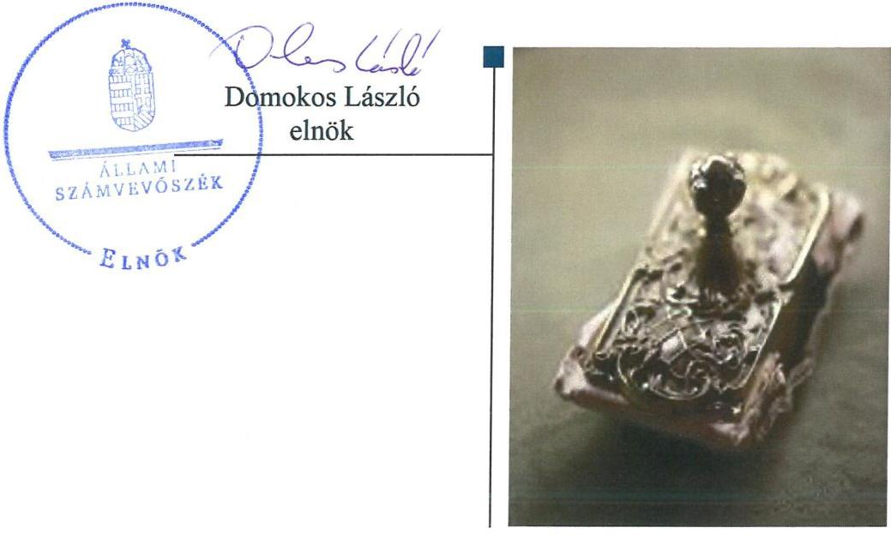
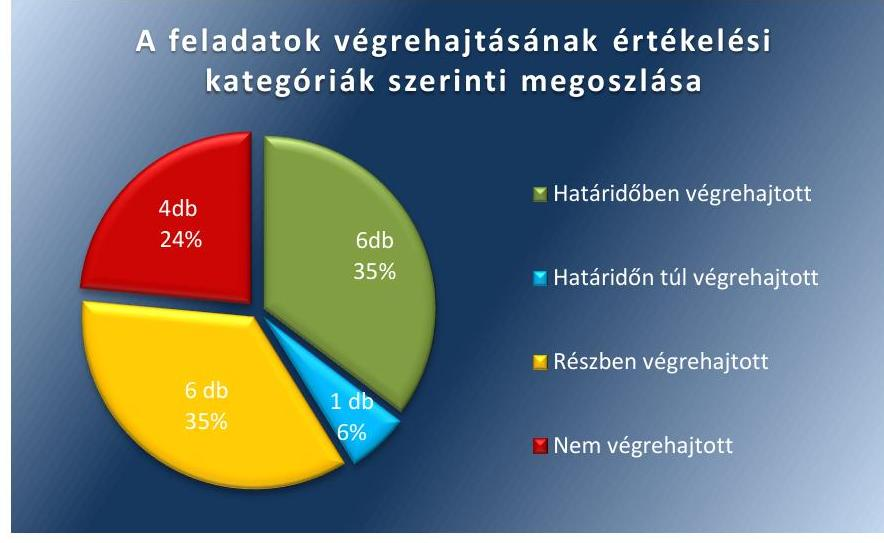
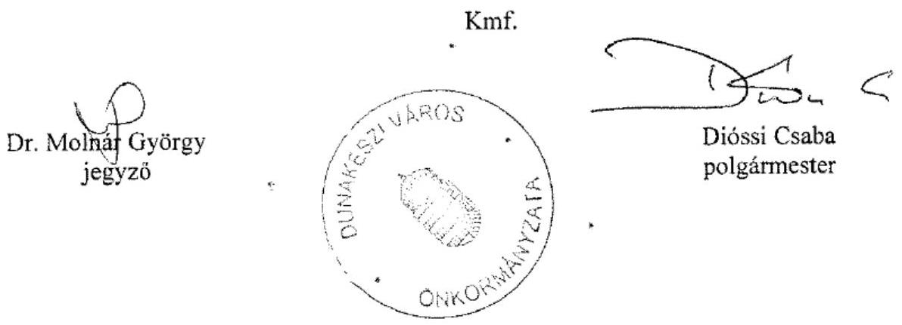
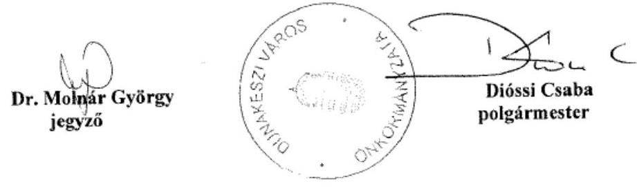
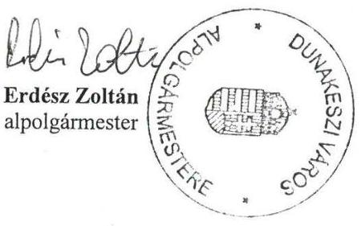
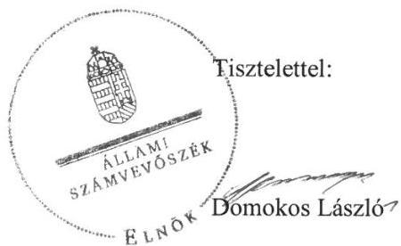
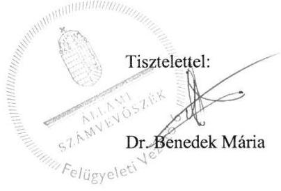

# Jelentés 

## Utóellenőrzések

Az önkormányzatok belső
kontrollrendszere kialakításának és működtetésének ellenőrzése -
Dunakeszi Város Önkormányzata 2019.

---

# Jelentés 

## Utóellenőrzések

Az önkormányzatok belső
kontrollrendszere kialakításának és működtetésének ellenőrzése -
Dunakeszi Város Önkormányzata
2019. 03. hó 25. nap

---

# AZ ELLENŐRZÉST FELÜGYELTE: 

DR. BENEDEK MÁRIA felügyeleti vezető

## AZ ELLENŐRZÉST VEZETTE ÉS A VÉGREHAJTÁSÁÉRT FELELŐS:

PETRÓ KATALIN ellenőrzésvezető

## A PROGRAM ÖSSZEÁLLÍTÁSÁÉRT FELELŐS:

TÓTPÁL SZABOCS osztályvezető

## A TÉMÁHOZ KAPCSOLÓDÓ KORÁBBI SZÁMVEVŐSZÉKI JELENTÉSEK:

- címe: Az önkormányzatok belső kontrollrendszere kialakításának és működtetésének ellenőrzése Dunakeszi
- sorszáma: 16233

IKTATÓSZÁM: EL-0773-032/2019
TÉMASZÁM: 6
ELLENŐRZÉS-AZONOSÍTÓ SZÁM: V080434

---

# TARTALOMJEGYZÉK 

■ ÖSSZEGZÉS ..... 5
■ AZ ELLENŐRZÉS CÉLJA ..... 6
■ AZ ELLENŐRZÉS TERÜLETE ..... 7
■ AZ ELLENŐRZÉS HÁTTERE, INDOKOLTSÁGA ..... 8
■ A JELENTÉS LÉNYEGES KÉRDÉSKÖRE ..... 9
■ ELLENŐRZÉS HATÓKÖRE ÉS MÓDSZEREI ..... 10
■ MEGÁLLAPÍTÁSOK ..... 12
■ MELLÉKLETEK ..... 15
I. sz. melléklet: Dunakeszi Város Önkormányzata intézkedési terve végrehajtásának értékelése ..... 15
II. sz. melléklet: Dunakeszi Város Önkormányzata intézkedési terv ..... 20
■ FÜGGELÉKEK ..... 27
I. sz. függelék a Jelentéshez ..... 27
II. sz. függelék: Észrevételek ..... 28
■ RÖVIDÍTÉSEK JEGYZÉKE ..... 37

---

.

---

# ÖSSZEGZÉS 

Az Állami Számvevőszék Dunakeszi Város Önkormányzata belső kontrollrendszere kialakításának és működtetésének utóellenőrzése során megállapította, hogy az intézkedési tervben meghatározott feladatok többségét nem hajtotta végre, így a közpénzekkel való felelős gazdálkodás, valamint a befektetési tevékenység végzését nem támogatta. A befektetések számviteli elszámolása és nyilvántartása, a befektetésekkel kapcsolatos gazdálkodási jogkörök nem szabályszerű gyakorlása, veszélyeztette az önkormányzati vagyonnal történő átlátható, elszámoltatható gazdálkodást.

## Az ellenőrzés társadalmi indokoltsága

Az Állami Számvevőszék stratégiájában célul tűzte ki a számvevőszéki munka hasznosulásának javítását. Ezzel összhangban ellenőrzi, hogy az ellenőrzött szervezet megvalósította-e a korábbi ellenőrzései által feltárt hibák, hiányosságok és szabálytalanságok megszüntetése céljából elkészített intézkedési tervében foglaltakat. A rendszeres utóellenőrzések hozzájárulnak a szükséges intézkedések tényleges végrehajtásához, ezáltal a közpénzügyek rendezettségének javulásához.

## Főbb megállapítások, következtetések

Dunakeszi Város Önkormányzata az Állami Számvevőszék javaslataival összhangban készült intézkedési tervében meghatározott 17 feladatból hatot határidőben, egyet határidőn túl, hatot részben és négyet nem hajtott végre.

A jegyző nem intézkedett a befektetésekkel kapcsolatos gazdasági események értékeléséhez, elszámolásához és nyilvántartásához, valamint a gazdálkodási jogkörök szabályszerű gyakorlásához kapcsolódó hiányosságok megszüntetéséről. A leltár hiánya miatt a beszámoló megbízhatósága és a közzétételi kötelezettség elmulasztása nem támogatta a befektetésekkel kapcsolatos vagyongazdálkodás elszámoltathatósága átláthatóságát.

A polgármester és a jegyző nem vizsgálta felül és nem tett javaslatot a vagyonnyilatkozat-tételre kötelezettek körének pontos meghatározására, emiatt az integritás alapvető követelménye nem volt biztosított.

A polgármester és a jegyző intézkedett az önkormányzati és hivatali SZMSZ módosításáról, a Gazdasági Program hatályba léptetéséről, valamint a belső kontrollokat meghatározó szabályzatok aktualizálásáról, ezáltal javult a gazdálkodás szabályozottsága.

Dunakeszi Város Önkormányzatának jegyzője az intézkedési tervben meghatározott feladatok végrehajtásáról a jogszabályban előírt nyilvántartást vezette.

---

# AZ ELLENŐRZÉS CÉLJA 

Az ellenőrzés célja annak értékelése volt, hogy a számvevőszéki jelentésben ${ }^{1}$ foglalt intézkedést igénylő megállapításokkal összhangban készített intézkedési tervben meghatározott feladatokat az ellenőrzött szervezet vég-rehajtotta-e.

---

# Az ELLENŐRZÉS TERÜLETE 

## Dunakeszi Város Önkormányzata

Dunakeszi város a Közép-Magyarországi régióban, Pest megyében található. Állandó lakosainak száma a Központi Statisztikai Hivatal Magyarország közigazgatási helynévkönyve alapján 2017. január 1-jén 43005 fő volt.

Dunakeszi Város Önkormányzata a Hivatalon² kívül hét intézménnyel, valamint egy kizárólagos tulajdonában lévő gazdasági társasággal látta el a feladatait.

A polgármester ${ }^{3}$ a 2010. évi önkormányzati választások óta tölti be tisztségét, a 15 tagú Képviselő-testület ${ }^{4}$ munkáját egy állandó bizottság támogatja.

A jegyző ${ }^{5}$ 2011. október 1-jétől tölti be tisztségét. A Hivatal hat szervezeti egységre tagolódott, önálló, saját gazdasági szervezettel rendelkezett.

Dunakeszi Város Önkormányzata a 2017. évi zárszámadási rendelet szerint 7590,6 millió forint költségvetési bevételt ért el, 5492,3 millió forint költségvetési kiadást teljesített. 2017. december 31-én mérlegfőösszege 37544,2 millió forint, a követelések állománya 676,4 millió forint a kötelezettségek állománya 561,8 millió forint volt.

Az ÁSZ ${ }^{6}$ 2016. évben ellenőrizte Dunakeszi Város Önkormányzata belső kontrollrendszere kialakítását és működtetését a 2014. január 1. és 2015. április 30. közötti időszakra, valamint a 2011. január 1-jétől 2015. április 30-ig terjedő időszakra az egyes befektetési döntéseinek, a döntések végrehajtásának és elszámolásának a szabályszerűségét. Az ellenőrzés célja annak megállapítása volt, hogy az önkormányzat belső kontrollrendszerének kialakítása, továbbá egyes elemeinek működtetése biztosította-e az önkormányzatnál a közpénzfelhasználás szabályosságát, támogatta-e az integritás szemlélet érvényesülését. Az ÁSZ továbbá ellenőrizte, hogy az önkormányzat egyes befektetési döntései és azok végrehajtása, elszámolása megfelelt-e a vonatkozó jogszabályoknak és belső szabályozásoknak, a kialakított kontrollrendszer támogatta-e a befektetési tevékenység szabályszerűségét. Az ellenőrzésről készült 16233 számú jelentést az ÁSZ 2016. december 13-án hozta nyilvánosságra.

---

# AZ ELLENŐRZÉS HÁTTERE, INDOKOLTSÁGA 

Az ÁSZ tv. ${ }^{7}$ 33. § (1) bekezdése értelmében a számvevőszéki jelentések megállapításaihoz és javaslataihoz kapcsolódóan az ellenőrzött szervezet vezetője intézkedési tervet köteles összeállítani, és az Állami Számvevőszék részére megküldeni.

Az ÁSZ által befogadott intézkedési tervben foglaltak megvalósítását az ÁSZ tv. 33. § (7) bekezdésében foglaltak alapján - az Állami Számvevőszék utóellenőrzés keretében ellenőrizheti. Az utóellenőrzések keretében - az intézkedések értékelése során - az Állami Számvevőszék figyelembe veszi az ellenőrzött szervezetek működési feltételeiben, valamint a jogszabályi előírásokban bekövetkezett változásokat.

Az utóellenőrzés során az ÁSZ értékeli, hogy az érintett számvevőszéki jelentésben foglalt megállapításokkal és javaslatokkal összhangban, az ellenőrzött szervezet által készített intézkedési tervben meghatározott feladatokat a feladatra kijelöltek végrehajtották-e.

Az intézkedések végrehajtásával az adott terület szabályszerű működése vonatkozásában a kockázatok csökkenhetnek, azonban hosszabb távon az intézkedési tervben foglaltak végrehajtásával önmagában nem szűnnek meg, csak akkor, ha beépülnek az ellenőrzött szervezet működésébe, azokat folyamatosan karban tartják, figyelembe véve, illetve kezelve a változásokat. Emellett az intézkedések végrehajtásáig újabb kockázatok merülhetnek fel a szabályszerű működés vonatkozásában, amelyek kezelése szintén kiemelten fontos az ellenőrzött szervezet számára.

Az ellenőrzött szervezet vezetője által készített intézkedési tervekben foglalt feladatok hiányos, illetve késedelmes végrehajtása, vagy annak elmaradása a szabályszerűség és a felelős vezetői magatartás vonatkozásában kockázatot hordoz, ami azt mutatja, hogy az ellenőrzések során feltárt hibák, hiányosságok és szabálytalanságok kezelése nem kapott kellő hangsúlyt. Az utóellenőrzés során is fennálló szabálytalanságok esetén a közpénz, közvagyon veszélyeztetettségi kockázat valószínűsített hatásának értékelése további intézkedéseket vonhat maga után.

Az ellenőrzött szervezet szintjén az utóellenőrzés feltárja, hogy a szervezet az intézkedések végrehajtásával hasznosította-e a korábbi ellenőrzési jelentésben a hiányosságok megszüntetése, illetve a kockázatok kezelése érdekében megfogalmazott javaslatokat, illetve az intézkedések végrehajtása elmaradásának következtében továbbra is fennálló szabálytalanság esetén értékeli a közpénzek, közvagyon veszélyeztetettségét.

Az ÁSZ szintjén az utóellenőrzés visszacsatolást ad az ellenőrzési jelentések hasznosulásáról, az intézkedések elmaradásának, vagy részleges megvalósulásának a közpénzek, közvagyon veszélyeztetettségére gyakorolt valószínűsített hatásának értékelése, további intézkedéseket vonhat maga után.

---

# A JELENTÉS LÉNYEGES KÉRDÉSKÖRE 

Az önkormányzat az intézkedési tervben foglaltakat az előírt határidőben végrehajtotta-e?

---

# ELLENŐRZÉS HATÓKÖRE ÉS MÓDSZEREI 

## Az ellenőrzés típusa

Megfelelőségi ellenőrzés.

## Az ellenőrzött időszak

Az utóellenőrzés alapját képező ÁSZ jelentés közzétételének napjától az utóellenőrzésről szóló kiértesítő levél keltének napjáig, 2016. december 13-tól 2018. július 4-ig tartó időszak volt.

## Az ellenőrzés tárgya

A számvevőszéki jelentésben foglalt megállapításokkal összhangban - az önkormányzat által - készített Intézkedési tervben foglaltak végrehajtásának ellenőrzése volt.

## Az ellenőrzött szervezet

Dunakeszi Város Önkormányzata

## Az ellenőrzés jogalapja

Az ellenőrzés jogszabályi alapját az ÁSZ tv. 33. § (7) bekezdésének előírása képezte.

## Az ellenőrzés módszerei

Az ÁSZ az ellenőrzést az ellenőrzött időszakban hatályos jogszabályok, az ellenőrzés szakmai szabályai, a jelen ellenőrzésre irányadó ÁSZ módszertanok, az ellenőrzési programban foglalt értékelési szempontok szerint végezte.

Az ÁSZ az ellenőrzés ideje alatt az önkormányzattal történő kapcsolattartást az ÁSZ SZMSZ ${ }^{\circledR}$-ének vonatkozó előírásai alapján biztosította.

Az utóellenőrzés megállapításait az ÁSZ rendelkezésére álló, valamint az ÁSZ adatbekérése szerint, az Önkormányzat által rendelkezésre bocsátott dokumentumok alapozták meg.

Az ellenőrzési bizonyítékként felhasználható adatforrások közé tartoztak egyrészt az ellenőrzési program részletes szempontjainál felsorolt

---

adatforrások, másrészt minden - az ellenőrzés folyamán feltárt, az ellenőrzés szempontjából információt tartalmazó - dokumentum.

Az intézkedési tervekben előírt feladatokat azok végrehajthatósága, illetve végrehajtása szempontjából az alábbiak szerint értékelte az ÁSZ:
$\longrightarrow$ „határidőben végrehajtott" a feladat, ha a teljesítés dokumentáltan, az intézkedési tervben előírt határidőben és tartalommal megtörtént;
$\longrightarrow$ „határidőn túl végrehajtott" a feladat, ha annak teljesítése az intézkedési tervben meghatározott módon, de az előírt határidőn túl történt meg;
$\longrightarrow$ „részben végrehajtott" a feladat, ha végrehajtása teljes körűen az intézkedési tervben előírt módon nem történt meg;
$\longrightarrow$ „nem végrehajtott" a feladat, ha a végrehajtás nem történt meg, vagy amennyiben a teljesítést nem dokumentálták;
$\longrightarrow$ „okafogyottá vált" a feladat, ha végrehajtására - meghatározott esemény bekövetkezése, továbbá külső körülmény, a működést érintő feltétel változása miatt - már nincs szükség, illetve lehetőség, és egyértelműen megállapítható, hogy az intézkedést szükségessé tevő körülmény a jövőben nem fordulhat elő;
$\longrightarrow$ „nem időszerű" az a feladat, amelynek ellenőrzési időszakon belüli végrehajtására azért nem került (kerülhetett) sor, mert az intézkedés alapjául szolgáló esemény nem következett be, de annak jövőbeni előfordulása lehetséges, a végrehajtása nem volt esedékes, vagy a végrehajtás határideje még nem járt le.
Az ellenőrzés lefolytatásához az Önkormányzat a tanúsítványok elektronikus kitöltésével, valamint az ÁSZ által kért dokumentumok elektronikus megküldésével szolgáltatott adatokat, amelyek valódiságát és teljes körűségét az ellenőrzött szervezet vezetője által tett teljességi és hitelességi nyilatkozat igazolja. Az így rendelkezésre bocsátott adatok, információk kontrollja az ellenőrzés keretében megtörtént.

Az ellenőrzött szervezet által megküldött intézkedési tervben meghatározott ÁSZ által beazonosított feladatok a II. számú mellékletben kerültek bemutatásra. A beazonosított, sorszámozott intézkedések részletes értékelését az I. sz. melléklet tartalmazza.

---

# MEGÁLLAPÍTÁSOK 

## Az önkormányzat az intézkedési tervben foglaltakat az előírt határidőben végrehajtotta-e?

Összegző megállapítás

Az Önkormányzat ${ }^{9}$ az intézkedési tervben meghatározott 17 feladatból hatot határidőben, egyet határidőn túl, hatot részben és négyet nem hajtott végre. Az intézkedési tervben meghatározott feladatok végrehajtásáról a jogszabályban előírt nyilvántartást vezette.

Az ÁSZ a számvevőszéki jelentésében a polgármester részére öt, a jegyző részére nyolc javaslatot fogalmazott meg. Az Önkormányzat Képviselőtestülete a 85/2017. (III. 30.) számú Kt. határozattal elfogadott intézkedési tervében a hiányosságok, a szabálytalanságok megszüntetésére a polgármester részére öt, a jegyző részére 12 feladatot határozott meg.

Az intézkedési tervben meghatározott feladatokat, határidőket, felelősöket és a feladatok végrehajtását az I. sz. melléklet mutatja be.

Az Önkormányzat jegyzője az intézkedési tervben meghatározott feladatok végrehajtásáról a Bkr. ${ }^{10}$ 14. § (1) bekezdésének előírása szerinti nyilvántartást vezette.

Az Önkormányzat intézkedési tervében meghatározott feladatok végrehajtásának értékelési kategóriák szerinti megoszlását az 1. ábra szemlélteti.

1. ábra

Fonrás: ÁSZ

---

# A SZABÁLYSZERŰ PÉNZÜGYI GAZDÁLKODÁS 

ÉS A PÉNZÜGYI ELSZÁMOLTATHATÓSÁG tekintetében a gazdálkodási jogkörökhöz kapcsolódó szabálytalan működtetés kockázata nagymértékben növekedett, mert a jegyző nem intézkedett, hogy a teljesítésigazolás és érvényesítés során a jogszabályban foglaltakat betartsák (J1c) ${ }^{11}$. Ezáltal az Önkormányzatnál nem volt biztosított a felelős vezetői magatartás és fennállt a közpénzek rendeltetésellenes és pazarló felhasználásának kockázata.

##
 A SZABÁLYSZERŰ VAGYONGAZDÁLKODÁSSAL

kapcsolatos kockázatok növekedtek, mert a befektetési tevékenységekre vonatkozó intézkedések végre nem hajtása miatt a közvagyon körültekintő, biztonságos befektetése nem volt biztosított.

A jegyző nem intézkedett a vagyongazdálkodási rendelet, a számviteli politika és az értékelési szabályzat módosításáról az értékpapírokra vonatkozóan (P3, J4, J1a) ${ }^{12}$. Nem biztosította a befektetésekkel kapcsolatos gazdálkodási jogkörök gyakorlásának a jogszabályi előírásoknak való megfelelőségét (J1e), valamint nem intézkedett a befektetésekkel kapcsolatos gazdasági események Áhsz. ${ }^{13}$ előírásainak megfelelő rögzítéséről és elszámolásáról (J6) és nem rendelkezett az éves költségvetési beszámoló leltárral történő alátámasztásáról (J7). Az Önkormányzat nem teljesítette közzétételi kötelezettségét az ötmillió forintot meghaladó értékű befektetési szerződésekre vonatkozóan (J1a, J1d).

AZ INTEGRITÁS alapú működés alapvető követelményét az Önkormányzat nem biztosította.

A jegyző nem vizsgálta felül és nem tett javaslatot a vagyonnyilatkozat-tételre kötelezettek körének pontos meghatározására (J2), ezáltal a korrupcióval kapcsolatos kockázatok növekedtek.

## AZ ÖNKORMÁNYZAT SZABÁLYOZOTTSÁGÁVAL

kapcsolatos kockázatok a szabályozottság javítására tett intézkedések hatására csökkentek.

A jegyző intézkedett a hivatali SZMSZ ${ }^{14}$ és az önkormányzati SZMSZ ${ }^{15}$ módosításáról, valamint a belső kontrollkörnyezetet meghatározó főbb szabályzatok, a kötelezettségvállalási, pénzkezelési, közérdekű bejelentések kezelése, számlarend, a kockázatkezelési, iratkezelési, valamint az információátadási szabályzat módosításáról (J5, J4, J1a). Az Önkormányzat rendelkezett Gazdasági Programmal (J3, P2) és elkészítette etikai kódexét (J1a).

## A BELSŐ KONTROLL SZERINTI ELSZÁMOLTATHATÓSÁGGAL kapcsolatosan a kockázatok nem csökkentek. A

polgármester és a jegyző megvizsgálta a folyamatgazdák felelősségét az Állami Számvevőszék ellenőrzése során feltárt hiányosságok és/vagy szabálytalanságok tekintetében, azonban fegyelmi eljárás kezdeményezését nem látták indokoltnak (P5, J8).

---

.

---

# MELLÉKLETEK

- I. SZ. MELLÉKLET: DUNAKESZI VÁROS ÖNKORMÁNYZATA INTÉZKEDÉSI TERVE VÉGREHAJTÁSÁNAK ÉRTÉKELÉSE

|  Sorszám | Az intézkedési tervben meghatározott feladat | Az intézkedési tervben meghatározott határidő | Az intézkedési tervben meghatározott feladat felelőse | A feladat végrehajtása  |
| --- | --- | --- | --- | --- |
|  P2 | A hosszú távú gazdasági fejlesztési elképzeléseket tartalmazó gazdasági programot Dunakeszi Város Képviselő-testületének 2016. november 17-i ülésén 317/2016.(XI.17.) számú határozatával elfogadta Dunakeszi Város Önkormányzatának Gazdasági Programját, így a javaslattal kapcsolatban további intézkedés nem szükséges. | - | - | A polgármester előterjesztése alapján Dunakeszi Város Képviselő-testülete a 2016. november 17-i ülésén a 317/2016.(XI.17.) számú határozatával elfogadta Dunakeszi Város Önkormányzatának Gazdasági Programját.  |
|  J3 | A hosszú távú gazdasági fejlesztési elképzeléseket tartalmazó gazdasági programot Dunakeszi Város Képviselő-testülete 2016. november 17-i ülésén 317/2016.(XI.17.) számú határozatával elfogadta Dunakeszi Város Önkormányzatának Gazdasági Programját, így a javaslattal kapcsolatban további intézkedés nem szükséges. | - | - | A jegyző előkészítette és Dunakeszi Város Képviselő-testülete a 2016. november 17-i ülésén a 317/2016.(XI.17.) számú határozatával elfogadta Dunakeszi Város Önkormányzatának Gazdasági Programját.  |
|  J5 | A Polgármesteri Hivatal Szervezeti és Működési Szabályzatának módosítását, amely az Állami Számvevőszék megállapításainak megfelelően a Polgármesteri Hivatal gazdasági szervezetének megnevezését és a gazdasági szervezet feladatait is tartalmazta Dunakeszi Város Képviselő-testületé 26/2017. (I.26.) határozatával elfogadta, a módosítás megtörtént. így a javaslattal kapcsolatban további intézkedés nem szükséges. | - | - | A polgármester és a jegyző kiadmányozta a módosított Polgármesteri Hivatal Szervezeti és Működési Szabályzatát, mely tartalmazta a Polgármesteri Hivatal gazdasági szervezetének megnevezését és a gazdasági szervezet feladatait.  |
|  P4 | A Polgármesteri Hivatal Szervezeti és Működési Szabályzatának módosítását, amelyben az Állami Számvevőszék megállapításainak megfelelően a Polgármesteri Hivatal gazdasági szervezetének megnevezését és a gazdasági | - | - | A polgármester és a jegyző kiadmányozta a módosított Polgármesteri Hivatal Szervezeti és Működési Szabályzatát, mely tartalmazta a Polgármesteri Hivatal gazdasági szervezetének megnevezését és a gazdasági szervezet feladatait.  |

---

|  Az intézkedési tervben meghatározott feladat | Az intézkedési tervben meghatározott határidő | Az intézkedési tervben meghatározott feladat felelőse | A feladat végrehajtása  |
| --- | --- | --- | --- | --- |
|  szervezet feladatait is tartalmazta Dunakeszi Város Képviselő-testülete 26/2017. (I.26.) határozatával elfogadta, a módosítás megtörtént így a javaslattal kapcsolatban további intézkedés nem szükséges. |  |  |   |
|  P5 A jogszabályi keretek között, és az azok által biztosított jogok alapján a megvizsgáljuk a feltárt szabálytalanságok tekintetében van-e felelőssége a folyamatgazdáknak. A vizsgálat után, amennyiben szükséges, a felelősség érvényesítés is kezdeményezésre kerül. | 2017. 05. 31. | Polgármester | A polgármester megvizsgálta, hogy a feltárt szabálytalanságok tekintetében van-e felelőssége a jegyzőnek, mint folyamatgazdának. A vizsgálat eredménye alapján egyetlen esetben sem volt megállapítható vétkes kötelezettségszegés a jegyző vonatkozásában - aki felett a polgármester munkáltatói jogokat gyakorol, - így a fegyelmi eljárás megindításától a polgármester eltekintett.  |
|  J8 A jogszabályi keretek között és azok által biztosított jogok alapján megvizsgáljuk a feltárt szabálytalanságok tekintetében van-e felelőssége a folyamatgazdáknak. A vizsgálat után, amennyiben szükséges a felelősség érvényesítés is kezdeményezésre kerül. | 2017. 05. 31. | Jegyző | A jegyző megvizsgálta, hogy a feltárt szabálytalanságok tekintetében van-e felelőssége a köztisztviselőknek, mint folyamatgazdáknak. A vizsgálat eredménye alapján a vétkes kötelezettségszegés megléte nem volt megállapítható, a megállapítások csekély tárgyi súlyúak voltak, így a fegyelmi eljárás kezdeményezését a jegyző nem tartotta indokoltnak.  |
|  Határidőn túl végrehajtott feladat |  |  |   |
|  J1.b Intézkedünk a belső kontroll rendszer kialakításának és működtetésének további fejlesztésére a következők szerint: a kockázatkezelési rendszer kialakításának és működtetésének vonatkozásában a gazdálkodásban rejlő, azonosított kockázatokkal kapcsolatban szükséges intézkedések teljesítésének folyamatos nyomon követési módjának meghatározására. | 2017.09.30. és folyamatos | Jegyző | A jegyző a 2017. szeptember 30-ai határidőn túl, 2018. január 1-től intézkedett a gazdálkodásban rejlő, azonosított kockázatokkal kapcsolatban szükséges intézkedések teljesítésének folyamatos nyomon követési módjának meghatározásáról ${ }^{16}$.  |
|  Részben végrehajtott feladatok |  |  |   |
|  P3 Intézkedünk az önkormányzati rendeletekben foglalt értékpapír vásárlásra vonatkozó hatásköri szabályok közötti koherencia zavar megszüntetéséről, az Önkormányzati rendeletek módosítását megtesszük. | 2017. 06. 30. | Polgármester | Végrehajtott feladatrész:
A polgármester az önkormányzati rendeletekben foglalt értékpapír vásárlásra vonatkozó hatásköri szabályok közötti koherencia zavar megszüntetése érdekében intézkedett az önkormányzati SZMSZ módosítás Képviselő-testület elé terjesztéséről. A Képviselő-testület az SZMSZ módosítását, amely alapján a polgármester értékpapír vásárlásra vonatkozó jogköre a mindenkori éves költségvetési rendeletek alapján került meghatározásra, a 12/2017. (VII.05.) Önk. rendeletében fogadta el.  |

---

|  Az intézkedési tervben meghatározott feladat | Az intézkedési tervben meghatározott határidő | Az intézkedési tervben meghatározott feladat felelőse | A feladat végrehajtása  |
| --- | --- | --- | --- | --- |
|  Nem végrehajtott feladatrész:
A polgármester a Jat. ${ }^{17}$ 22. § (2) bekezdésének előírása ellenére nem biztosította az önkormányzati rendeletekben foglalt értékpapír vásárlásra vonatkozó hatásköri szabályok közötti koherencia zavar megszüntetését, mert nem intézkedett, hogy a vagyongazdálkodási rendelet ${ }^{18}$ módosítása a Képviselő-testület elé terjeszthető legyen.  |  |  |   |
|  J4 | Intézkedünk az önkormányzati rendeletekben foglalt értékpapír vásárlásra vonatkozó hatásköri szabályok közötti koherencia zavar megszüntetéséről, az önkormányzati rendeletek módosításáról szóló előterjesztést elkészítjük. | 2017. 04. 30. | Jegyző | Végrehajtott feladatrész:
A jegyző az önkormányzati rendeletekben foglalt értékpapír vásárlásra vonatkozó hatásköri szabályok közötti koherencia zavar megszüntetése érdekében intézkedett az önkormányzati SZMSZ módosításáról szóló előterjesztés előkészítéséről, mely szerint a polgármester értékpapír vásárlásra vonatkozó jogköre a mindenkori éves költségvetési rendeletek alapján került meghatározásra.
Nem végrehajtott feladatrész:
A jegyző a Jat. 22. § (2) bekezdésének előírása ellenére nem intézkedett az önkormányzati rendeletekben foglalt értékpapír vásárlásra vonatkozó hatásköri szabályok közötti koherencia zavar megszüntetése érdekében a vagyongazdálkodási rendelet módosításának elkészítéséről.  |
|  J1.a | Intézkedünk a belső kontroll rendszer kialakításának és működtetésének további fejlesztésére a következők szerint: a kontrollkörnyezet kialakítása vonatkozásában az önkormányzati és hivatali SZMSZ-ek, szabályzatok folyamatos aktualizálására. | 2017. 08. 31. és folyamatos | Jegyző | Végrehajtott feladatrész:
A jegyző intézkedett az önkormányzati SZMSZ és a hivatali SZMSZ, valamint a belső kontrollkörnyezetet meghatározó főbb szabályzatok, a kötelezettségvállalási ${ }^{19}$, pénzkezelési ${ }^{20}$, közérdekű bejelentések kezelésének ${ }^{21}$ szabályzatai módosításáról. Határidőn túl, 2018. január 1-jei hatállyal intézkedett a számlarend ${ }^{22}$, a kockázatkezelési szabályzat ${ }^{23}$ és az etikai kódex ${ }^{24}$, valamint 2017. november 30-ai hatállyal az információátadási szabályzat ${ }^{25}$ és módosításáról, aktualizálásáról.
Nem végrehajtott feladatrész:
A jegyző nem intézkedett a Számviteli politika ${ }^{26}$ és az értékelési szabályzat ${ }^{27}$ aktualizálásáról a hitelviszonyt megtestesítő kamatozó értékpapírok bekerülési értékének, a vételárban felhalmozott kamatnak és az árfolyamkülönbözeteknek a számítási módjára tekintettel a vételár Áhsz. 1. § (1) bekezdés 7. pontjában meghatározott fogalmára, valamint a bekerülési érték Áhsz. 16. § (6) bekezdésében előírt tartalma vonatkozásában.  |

---

|  Sorszám | Az intézkedési tervben meghatározott feladat | Az intézkedési tervben meghatározott határidő | Az intézkedési tervben meghatározott feladat felelőse | A feladat végrehajtása  |
| --- | --- | --- | --- | --- |
|  J1.d | Intézkedünk a belső kontroll rendszer kialakításának és működtetésének további fejlesztésére a következők szerint: az információs és kommunikációs rendszer kialakítása és működtetése vonatkozásában az iratkezelési szabályzatot a Magyar Nemzeti Levéltárral egyetértésben adjuk ki, figyelmet fordítunk arra, ha előfordul befektetés a jövőben, hogy az ötmillió forintot meghaladó értékű befektetési szerződések adatai közzé legyenek téve a jogszabályi előírásoknak megfelelően. | 2017.12.31. és folyamatos | Jegyző | Végrehajtott feladatrész:
A Jegyző a 2016. január 1-jétől hatályos iratkezelési szabályzatot ${ }^{28}$ a jogszabályi előírásnak megfelelően a Magyar Nemzeti Levéltárral egyetértésben adta ki.
Nem végrehajtott feladatrész:
A jegyző az Info.tv. 37. § (1) bekezdésében foglaltak alapján az Info.tv. 1. mellékletének III./4. pontjában előírtak ellenére nem intézkedett a közzétételi kötelezettség teljesítéséről az ötmillió forintot meghaladó értékű befektetési szerződésekre vonatkozóan a 2017. évben történt önkormányzati értékpapír vásárlásokra.  |
|  P1 | A hatályos jogszabályi előírásoknak megfelelően előterjesztjük a Képviselő-testület elé az Önkormányzat Szervezeti és Működési szabályzatának (továbbiakban: SZMSZ) módosítását. Az így módosuló SZMSZ-ben a Képviselő-testület tanácsnokait és azok tanácsadó testületéit képviselő-testületi szervként nem nevesítjük. Felülvizsgáljuk a vagyonnyilatkozat-tételre kötelezettek körét az SZMSZ módosításának megfelelően. | 2017.06.30 | Polgármester | Végrehajtott feladatrész:
A Polgármester a Képviselő-testület elé terjesztette az önkormányzati SZMSZ módosítását, mely a Képviselő-testület tanácsnokait és azok tanácsadó testületéit képviselő-testületi szervként nem nevesíti. A Képviselő-testület a 20/2017. (VIII.02.) Önkormányzati rendelettel elfogadta módosított

 SZMSZ-t.
Nem végrehajtott feladatrész:
A polgármester a Vnytv. 29. § d) pontja ellenére nem intézkedett a vagyonnyilatkozat-tételre kötelezettek körét tartalmazó önkormányzati SZMSZ Képviselő-testület elé terjesztéséről.  |
|  J2 | Intézkedünk a hatályos jogszabályi előírásoknak megfelelően az Önkormányzat Szervezeti és Működési Szabályzata módosításának előkészítéséről. Ebben a Képviselő-testület tanácsnokainak és azok tanácsadó testületeinek képviselő-testületi szervként való nevesítését megszüntetjük. Felülvizsgáljuk és javaslatot teszünk a hatályos jogszabályi előírásoknak megfelelően a vagyonnyilatkozat-tételre kötelezettek körének pontos meghatározására. | 2017.04.30 | Jegyző | Végrehajtott feladatrész:
A jegyző intézkedett az önkormányzati SZMSZ módosításának előkészítéséről a Képviselő-testület tanácsnokainak és azok tanácsadó testületeinek képviselő-testületi szervként való nevesítésének megszüntetése tekintetében.
Nem végrehajtott feladatrész:
A jegyző a Vnytv. 4. § d) pontja ellenére nem készítette elő az önkormányzati SZMSZ módosítását a vagyonnyilatkozat-tételre kötelezettek körének pontos meghatározása tárgykörben.  |
|   |  | Nem végrehajtott feladatok |  |   |
|  J1.c | Intézkedünk a belső kontrollrendszer kialakításának és működtetésének további fejlesztésére a következők szerint: a kontrolltevékenységek kialakításának és működtetésének vonatkozásában a teljesítés igazolását az utalványozást megelőzően végezzük el, a teljesítésigazolást a hivatali és az önkormányzati kiadások esetében mindig az | 2017.12.31. és folyamatos | Jegyző | A jegyző nem intézkedett, hogy a teljesítést igazolást az Áht. 30. § (1) bekezdésében foglaltaknak megfelelően az utalványozást megelőzően végezzék el, a teljesítésigazolást a hivatali és az önkormányzati kiadások esetében az Ávr. 57. § (3) bekezdésben foglaltak szerint mindig az arra jogosultak végezzék el, a teljesítés igazolás aláírási címpéldányait az Ávr. 60. § (3) bekezdése szerint be-  |

---

|  Az intézkedési tervben meghatározott feladat | Az intézkedési tervben meghatározott határidő | Az intézkedési tervben meghatározott feladat felelőse | A feladat végrehajtása  |
| --- | --- | --- | --- |
|  arra jogosultak végezzék el, a teljesítés igazolás aláírási címpéldányait a hatályos jogszabályi előírások alapján beazonosíthatóan készítsük el és a bizonylatokon is beazonosítható aláírások lesznek, az előzőek vonatkoznak az érvényesítésre is. |  |  | azonosíthatóan készítsék el és a bizonylatokon is beazonosítható aláírások legyenek, továbbá nem intézkedett, hogy az előzőek vonatkozzanak az érvényesítésre is.  |
|  J1.e Intézkedünk a belső kontrollrendszer kialakításának és működtetésének további fejlesztésére a következők szerint: a kivételes esetben igen kis valószínűséggel előforduló befektetésekkel kapcsolatos döntések előkészítése és végrehajtása, illetve a gazdálkodási jogkörök gyakorlása során a jogszabályi előírások betartására. | 2017.06.30. és folyamatos | Jegyző | A jegyző az Áht. 38. § (1) bekezdésében, az Ávr. 57. § (1) és az Ávr. 58. § (1) (2) bekezdésekben előírtak ellenére nem intézkedett a befektetésekkel kapcsolatos döntések előkészítése és végrehajtása, illetve a gazdálkodási jogkörök gyakorlása során a jogszabályi előírások betartásáról.  |
|  J6 Intézkedünk a befektetésekkel kapcsolatos (ritkán előforduló egyedi alkalmak esetén) gazdasági események jogszabályi előírásoknak megfelelő rögzítéséről és elszámolásáról a számviteli (főkönyvi és analitikus) nyilvántartásokban. | 2017.01.31. és folyamatos | Jegyző | A jegyző nem intézkedett a befektetésekkel kapcsolatos gazdasági események az Áhsz. 27. § (3) bekezdés a) pontjában és a (4) bekezdés a) pontjában előírtaknak megfelelő rögzítéséről és elszámolásáról a számviteli (főkönyvi és analitikus) nyilvántartásokban.  |
|  J7 Intézkedünk az éves költségvetési beszámoló mérlegében kimutatott eszközök (tartós részesedés) jogszabályi előírásoknak és a belső szabályozásnak megfelelő leltárral történő alátámasztásáról. | 2017.12. 31. és folyamatos | Jegyző | A jegyző a Számv. tv. ³¹ 69. § (1) bekezdés, illetve az Áhsz. 22. § (1)-(2) bekezdései előírása ellenére nem intézkedett az éves költségvetési beszámoló mérlegében kimutatott eszközök (tartós részesedés) jogszabályi előírásoknak és a belső szabályozásnak megfelelő leltárral történő alátámasztásáról.  |

---

# KIVONAT   Dunakeszi Város Önkormányzata Képviselő-testületének 2017. március 30-án tartott üléséről készült jegyzőkönyvéből 

## Dunakeszi Város Önkormányzata Képviselő-testületének 85/2017.(III.30.) sz. határozata:

Dunakeszi Város Képviselő-testülete az előterjesztés mellékletét képező módosított intézkedési tervet jóváhagyja és felkéri a Polgármestert, hogy azt az Állami Számvevőszék elnökének küldje meg.

Határidő: Azonnal
Felelős: Dióssi Csaba polgármester
Koordinátor: Jegyző

---

# INTÉZKEDÉSI TERV 

az Állami Számvevőszék (a továbbiakban: ÁSZ) „Az önkormányzatok belső
kontrollrendszere kialakításának és működtetésének ellenőrzése - Dunakeszi." szóló jelentés javaslatainak végrehajtására

## Az ÁSZ ellenőrzés intézkedést igénylő javaslatai:

## A Polgármesternek:

1.„Intézkedjen a Képviselő-testület tanácsnokai és azok tanácsadó testületei képviselő-testületi szervként való nevesítésének megszüntetését, továbbá a nem önkormányzati képviselő bizottsági tagok, főtanácsnokok és tanácsnokok tanácsadó testülete tagjainak vagyonnyilatkozat-tételi kötelezettségét tartalmazó Képviselő-testületi szervezeti és működési szabályzat-tervezet Képviselő-testület elé terjesztéséről."

A hatályos jogszabályi előírásoknak megfelelően előterjesztjük a Képviselő-testület elé az Önkormányzat Szervezeti és Működési szabályzatának (továbbiakban: SZMSZ) módosítását. Az így módosuló SZMSZ-ben a Képviselő-testület tanácsnokait és azok tanácsadó testületeit képviselő-testületi szervként nem nevesítjük. Felülvizsgáljuk a vagyonnyilatkozat-tételre kötelezettek körét az SZMSZ módosításának megfelelően.

Felelős: a polgármester
Határidő: 2017. június 30.
2. „Intézkedjen a hosszú távú fejlesztési elképzeléseket tartalmazó gazdasági programról szóló előterjesztés Képviselő-testület elé terjesztéséről"

A hosszú távú gazdasági fejlesztési elképzeléseket tartalmazó gazdasági programot Dunakeszi Város Képviselő-testülete 2016. november 17-i ülésén 317/2016.(XI.17.) számú határozatával elfogadta Dunakeszi Város Önkormányzatának Gazdasági Programját, így a javaslattal kapcsolatban további intézkedés nem szükséges.
3. „Intézkedjen az értékpapír-vásárlásra meghatározott hatásköri szabályokkal kapcsolatosan az önkormányzati rendeletek előírásai közötti ellentmondás megszüntetéséről szóló előterjesztés Képviselő-testület elé terjesztéséről."

Intézkedünk az önkormányzati rendeletekben foglalt értékpapír-vásárlásra vonatkozó hatásköri szabályok közötti koherencia-zavar megszüntetéséről, az önkormányzati rendeletek módosítását megtesszük.

Felelős: a polgármester
Határidő: 2017. június 30.

---

4. „Kezdeményezze a Képviselő-testületnél a Hivatal gazdasági szervezetének megnevezését és feladatait is tartalmazó szervezeti és működési szabályzata jóváhagyását."

A Polgármesteri Hivatal Szervezeti és Működési Szabályzatának módosítását, amelyben az Állami Számvevőszék megállapításainak megfelelően a Polgármesteri Hivatal gazdasági szervezetének megnevezését és a gazdasági szervezet feladatait is tartalmazta, Dunakeszi Város Képviselő-testülete 26/2017. (I.26.) határozatával elfogadta, a módosítás megtörtént. Így a javaslattal kapcsolatban további intézkedés nem szükséges.
5. „Intézkedjen az Állami Számvevőszék ellenőrzése során feltárt hiányosságok és/vagy szabálytalanságok tekintetében a munkajogi felelősség kivizsgálására irányuló eljárás megindításáról, és ennek eredménye ismeretében tegye meg a szükséges intézkedéseket."

A jogszabályi keretek között, és az azok által biztosított jogok alapján megvizsgáljuk a feltárt szabálytalanságok tekintetében van-e felelőssége a folyamat gazdáinak. A vizsgálat után, amennyiben szükséges, a felelősség érvényesítése is kezdeményezésre kerül.

Felelős: a polgármester
Határidő: 2017. május 31.

# A jegyzőnek: 

1. „Intézkedjen a belső kontrollrendszer egyes elemei jogszabályi előírásának megfelelő kialakítására és működtetésére, valamint a befektetésekkel kapcsolatos döntések előkészítése és végrehajtása, illetve a gazdálkodási jogkörök gyakorlása során a jogszabályi előírások és a belső szabályozás betartására."

Intézkedünk a belső kontrollrendszer kialakításának és működtetésének további fejlesztésére a következők szerint:

- a kontrollkörnyezet kialakítása vonatkozásában az önkormányzati és hivatali SZMSZ-ek, szabályzatok folyamatos aktualizálására.
Felelős: jegyző
Határidő: 2017. augusztus 31. és folyamatos
- a kockázatkezelési rendszer kialakításának és működtetésének vonatkozásában a gazdálkodásban rejlő, azonosított kockázatokkal kapcsolatban szükséges intézkedések teljesítésének folyamatos nyomon követési módjának meghatározására.
Felelős: jegyző
Határidő: 2017. szeptember 30. és folyamatos
- a kontrolltevékenységek kialakításának és működtetésének vonatkozásában a teljesítés igazolását az utalványozást megelőzően végezzük el, a teljesítésigazolást a hivatali és az önkormányzati kiadások esetében mindig az arra jogosultak végzik el, a teljesítés igazolás aláírási címpéldányait a hatályos jogszabályi előírások alapján beazonosíthatóan készítjük el

---

és a bizonylatokon is beazonosítható aláírások lesznek, az előzőek vonatkoznak az érvényesítésre is.
Felelős: Jegyző és a gazdasági osztályvezető
Határidő: 2017.december 31. és folyamatos

- az információs és kommunikációs rendszer kialakítása és működtetése vonatkozásában az iratkezelési szabályzatot a Magyar Nemzeti Levéltárral egyetértésben adjuk ki, figyelmet fordítunk arra, ha előfordul befektetés a jövőben, hogy az ötmillió forintot meghaladó értékű befektetési szerződések adatai közzé legyenek téve a jogszabályi előírásoknak megfelelően.
Felelős: jegyző
Határidő: 2017. december 31. és folyamatos
- A kivételes esetben igen kis valószínűséggel előforduló befektetésekkel kapcsolatos döntések előkészítése és végrehajtása, illetve a gazdálkodási jogkörök gyakorlása során a jogszabályi előírások betartására.
Felelős: a jegyző
Határidő: 2017. június 30. és folyamatos

2. „Intézkedjen az önkormányzati tanácsnokok és azok tanácsadó testületei képviselő-testületi szervként való nevesítésének megszüntetését, továbbá a nem önkormányzati képviselő bizottsági tagok, főtanácsnokok és tanácsnokok tanácsadó testülete tagjainak vagyonnyilatkozat-tételi kötelezettségét is tartalmazó képviselő-testületi szervezeti és működési szabályzat-tervezet elkészítéséről."

Intézkedünk a hatályos jogszabályi előírásoknak megfelelően az Önkormányzat Szervezeti és Működési Szabályzata módosításának előkészítéséről. Ebben a Képviselő-testület tanácsnokainak és azok tanácsadó testületeinek képviselő-testületi szervként való nevesítését megszüntetjük. Felülvizsgáljuk és javaslatot teszünk a hatályos jogszabályi előírásoknak megfelelően a vagyonnyilatkozat-tételre kötelezettek körének pontos meghatározására.

Felelős: a jegyző
Határidő: 2017. április 30.
3. „Intézkedjen a hosszú távú fejlesztési elképzeléseket tartalmazó gazdasági programról szóló előterjesztés elkészítéséről."

A hosszú távú gazdasági fejlesztési elképzeléseket tartalmazó gazdasági programot Dunakeszi Város Képviselő-testülete 2016. november 17-i ülésén 317/2016.(XI.17.) számú határozatával elfogadta Dunakeszi Város Önkormányzatának Gazdasági Programját, így a javaslattal kapcsolatban további intézkedés nem szükséges.

---

4. „Intézkedjen az értékpapírok vásárlására meghatározott hatásköri szabályzatokkal kapcsolatosan az önkormányzati rendeletek előírásai közötti ellentmondás megszüntetéséről szóló előterjesztés elkészítéséről."

Intézkedünk az önkormányzati rendeletekben foglalt értékpapír-vásárlásra vonatkozó hatásköri szabályok közötti koherencia-zavar megszüntetéséről, az önkormányzati rendeletek módosításáról szóló előterjesztést elkészítjük.

Felelős: a jegyző
Határidő: 2017. április 30.
5. „Intézkedjen a Hivatal gazdasági szervezetének megnevezését és feladatait is tartalmazó hivatali szervezeti és működési szabályzat-tervezet elkészítéséről."

A Polgármesteri Hivatal Szervezeti és Működési Szabályzatának módosítását, amely az Állami Számvevőszék megállapításainak megfelelően a Polgármesteri Hivatal gazdasági szervezetének megnevezését és a gazdasági szervezet feladatait is tartalmazta, Dunakeszi Város Képviselő-testülete 26/2017. (I.26.) határozatával elfogadta, a módosítás megtörtént. Így a javaslattal kapcsolatban további intézkedés nem szükséges.
6. „Intézkedjen a befektetésekkel kapcsolatos gazdasági események jogszabályi előírásoknak megfelelő rögzítéséről és elszámolásáról a számviteli (főkönyvi és részletező) nyilvántartásokban."

Intézkedünk a befektetésekkel kapcsolatos (ritkán előforduló egyedi alkalmak esetén) gazdasági események jogszabályi előírásoknak megfelelő rögzítéséről és elszámolásáról a számviteli (főkönyvi és analitikus) nyilvántartásokban.

Felelős: a jegyző
Határidő: 2017. január 31. és folyamatos
7. „Intézkedjen az éves költségvetési beszámoló mérlegében kimutatott eszközök (tartós részesedés) jogszabályi előírásoknak és a belső szabályozásnak megfelelő leltárral történő alátámasztásáról."

Intézkedünk az éves költségvetési beszámoló mérlegében kimutatott eszközök (tartós részesedés) jogszabályi előírásoknak és a belső szabályozásnak megfelelő leltárral történő alátámasztásáról.

Felelős: a jegyző
Határidő: 2017. december 31. és folyamatos
8. „Intézkedjen az Állami Számvevőszék ellenőrzése során feltárt hiányosságok és/vagy szabálytalanságok tekintetében a munkajogi felelősség tisztázására irányuló eljárás megindításáról, és ennek eredménye ismeretében tegye meg a szükséges intézkedéseket."

---
 május 31.

Dunakeszi, 2017. március 30.

---

.

---

# FÜGGELÉKEK 

- I. SZ. FÜGGELÉK A JELENTÉSHEZ

Az Állami Számvevőszék az Országgyűlés legfőbb pénzügyi és gazdasági ellenőrző szerveként, általános hatáskörrel végzi a közpénzekkel való felelős gazdálkodás ellenőrzését. Az ellenőrzések során feltárt tényekhez, megállapításokhoz kapcsolódó további körülmények tisztázására eszközrendszerrel nem rendelkezik. Amennyiben az ellenőrzésen túlmutatóan indokoltnak látszik az ellenőrzés során feltárt körülmények további vizsgálata, az Állami Számvevőszék törvényi felhatalmazás alapján megállapításait és az ellenőrzés által feltárt körülményeket továbbítja a hatáskörrel rendelkező szervnek a szükséges intézkedések megtétele, eljárások lefolytatása érdekében.
Az Önkormányzat az Áht. 61.§ (1) bekezdés előírásai ellenére nem biztosította az önkormányzati rendeletekben foglalt értékpapír vásárlásra vonatkozó egyértelmű hatásköri szabályozást.
A jegyző a Vnytv. 4. § d) pontjában előírtak ellenére nem gondoskodott az önkormányzati SZMSZ módosításáról annak érdekében, hogy a vagyonnyilatkozat-tételre kötelezettek köre pontos meghatározásra kerüljön.
A fenti szabálytalanságok miatt a működés alapvető feltétele nem biztosított, ezért az Önkormányzat törvényességi felügyeletét ellátó illetékes Kormányhivatal megkeresése indokolt.

A jegyző nem intézkedett a befektetésekkel kapcsolatos gazdasági események az Áhsz. 27. § (3) bekezdés a) pontjában és a (4) bekezdés a) pontjában előírtaknak megfelelő rögzítéséről és elszámolásáról a számviteli (főkönyvi és analitikus) nyilvántartásokban, továbbá a Számv. tv. 69. § (1) bekezdés, illetve az Áhsz. 22. § (1)-(2) bekezdései előírása ellenére az éves költségvetési beszámoló mérlegében kimutatott eszközök (tartós részesedés) jogszabályi előírásoknak és a belső szabályozásnak megfelelő leltárral történő alátámasztásáról.
A jegyző nem intézkedett a Számviteli politika és az értékelési szabályzat aktualizálásáról a hitelviszonyt megtestesítő kamatozó értékpapírok bekerülési értékének, a vételárban felhalmozott kamatnak és az árfolyam különbözeteknek a számítási módjára tekintettel a vételár Áhsz. 1. § (1) bekezdés 7. pontjában meghatározott fogalmára, valamint a bekerülési érték Áhsz. 16. § (6) bekezdésében előírt tartalma vonatkozásában.
A gazdasági események rögzítése, a leltár, valamint a hivatkozott belső szabályzatok aktualizálásának hiánya miatt nem igazolt, hogy az Önkormányzat beszámolója megbízható, valós képet mutat. Az Áht. 68/B. § (1) bekezdés c) pontjában előírtak szerint a Magyar Államkincstár ellenőrzési jogköre a helyi önkormányzat éves költségvetési beszámolója megbízható, valós összképének vizsgálatára kiterjed, ezért indokolt a Magyar Államkincstár megkeresése.

---

A jelentéstervezetet a Számvevőszék 15 napos észrevételezésre megküldte az ellenőrzött szervezetek vezetőinek az ÁSZ tv. 29. § (1) bekezdése előírása szerint.

Dunakeszi Város Önkormányzata polgármestere a jelentéstervezet megállapításaira írásban észrevételt tett.

Az ÁSZ tv. 29. § (3) bekezdésével összhangban az ÁSZ a Függelékben feltünteti az ellenőrzés megállapításaival kapcsolatban tett, figyelembe nem vett észrevételeket, és megindokolja, hogy azokat miért nem fogadta el.

[^0]
[^0]:    * 29. § (1) Az Állami Számvevőszék az ellenőrzési megállapításait megküldi az ellenőrzött szervezet vezetőjének vagy az általa megbízott személynek, és annak, akinek személyes felelősségét állapította meg.
    (2) Az ellenőrzött szervezet vezetője és a felelősként megjelölt személy az ellenőrzés megállapításaira tizenöt napon belül írásban észrevételt tehet.
    (3) Az Állami Számvevőszék az észrevételre a beérkezésétől számított harminc napon belül írásban válaszol. A figyelembe nem vett észrevételeket köteles a jelentésben feltüntetni, és megindokolni, hogy azokat miért nem fogadta el.

---

# DUNAKESZI VÁROS 

## ALPOLGÁRMESTERE

2120 Dunakeszi, Fő út 25. $\cdot$ Tel.: 27-341-303 $\cdot$ Fax: 27-341-208

## Állami Számvevőszék   Domokos László elnök Úr részére

Budapest
Apáczai Csere János utca 10.
1052

## Tisztelt Domokos László Elnök Úr!

Alulírott Erdész Zoltán, mint Dunakeszi Város Önkormányzata alpolgármestere, köszönettel vettem az Állami Számvevőszék által EL-0773-018/2019 iktatószámú számvevőszéki jelentéstervezetet.

Annak érdekében, hogy a jelentéstervezetben foglaltak kapcsán megalapozott álláspontot foglalhassak el, bekértem valamennyi érintett dokumentumot, különös tekintettel azokra, amelyek esetében olyan megállapítás született, miszerint nem lettek megfelelően végrehajtva. A dokumentumok tételes vizsgálatát követően arra jutottam, hogy a kért intézkedések megvalósultak. Ennek bemutatására néhány példát hoznék fel:

Az Állami Számvevőszék által jelzett, az önkormányzati rendeletekben foglalt értékpapír vásárlásra vonatkozó hatásköri szabályok közötti koherencia zavar esetében úgy látom, hogy az Önkormányzat ezt a zavart megfelelően kezelte. A Képviselő-testület 2017. évi költségvetési rendelete, valamint Dunakeszi Város Önkormányzata Képviselő-testületének a képviselő-testület és szervei Szervezeti és Működési Szabályzatáról szóló 1/2013.(II.06.) rendelete (a továbbiakban: SZMSZ) szövegállapotának megfelelő megállapítását követően - az egyébként addig is jól értelmezhető szabályozás - még egyértelműbbé vált. A vagyonrendelet módosítására pedig nem volt szükség, mert a másik két jogszabály átdolgozása oly módon volt lehetséges, hogy a vagyonrendelet külön módosítására már nem volt szükség.

Megállapítást nyert a jelentéstervezetben az is, hogy a polgármester és a jegyző nem vizsgálta felül, és nem tett javaslatot a vagyonnyilatkozat-tételre kötelezettek körének pontos meghatározására, emiatt az integritás alapvető követelménye nem volt biztosított. Sajnos ezzel a megállapítással nem tudok egyetérteni, mivel a felülvizsgálatot követően az SZMSZ-t a képviselő-testület kifejezetten azért, és kifejezetten úgy módosította, hogy a tanácsadó testületek már nem szervei a képviselő-testületnek, a korábbi javaslattevő, döntéselőkészítő jogkörüket megvonta. Kizárólag a tanácsnokok azok, akik ilyen jogkörrel rendelkeznek, esetükben pedig a vonatkozó jogszabály előírja a vagyonnyilatkozattételi kötelezettséget. (Mötv., és az egyes vagyonnyilatkozat tételi kötelezettségekről szóló 2007. évi CLII. törvény (a továbbiakban: Vnyiv.))
A tanácsadó testületi tagok megmaradó feladata a tanácsnokok feladatkörébe tartozó kérdések megoldására irányuló, konkrét lépések, feladatok meghatározására vonatkozó javaslatok

---

megtétele. Azaz olyan, a város életében releváns problémák feltérképezése, amelyekkel kapcsolatban a tanácsnoknak a képviselő-testület irányába javaslattételi feladata van. Jogkörük megegyezik a város bármely lakóéval, akik szintén bármikor élhetnek észrevételekkel a város problémait illetően, az egyedüli különbség, hogy ez szervezetté és folyamatossá válik. Az egyébként polgári jogi jogviszony keretében megbízott tanácsadó testületi tagok semmilyen olyan jogkörrel vagy érdemi ráhatással, javaslattételre, döntésre, illetve ellenőrzésre jogosultsággal nem rendelkeznek, amely a Vnytv. hatálya alá helyezné őket.

Az Önkormányzat Képviselő-testülete az Állami Számvevőszék 2016. évi ellenőrzését követően 85/2017.(III.30.) számú határozatában jóváhagyta az Intézkedési tervet, amely az Állami Számvevőszék „Az önkormányzatok belső kontrollrendszere kialakításának és működtetésének ellenőrzése - Dunakeszi" tárgyú jelentés javaslatainak végrehajtását szolgálta. Ebben az intézkedési tervben javaslatok kerültek kidolgozásra. Az intézkedési terv, ahogy azt az elnevezése is jelöli egy terv, ami az érdemi megvalósítás közben változhat, hiszen időközben átgondoltabb, szakmailag megalapozottabb javaslatok, előnyösebb, kisebb erőforrásigényű megoldások merülhetnek fel.

Meglátásom szerint a számvevőszéki jelentésben foglaltaknak az Önkormányzat és hivatala eleget tett, ezért tisztelettel kérem, hogy „Az önkormányzatok belső kontrollrendszere kialakításának és működtetésének utóellenőrzése - Dunakeszi Város Önkormányzata 2019." tárgyában folytatott ellenőrzés megállapításait szíveskedjenek felülvizsgálni.

Dunakeszi, 2019. február 5.

Tisztelettel:

---

# Dióssi Csaba úr 

polgármester
Dunakeszi Város Önkormányzata

## Dunakeszi

## Tisztelt Polgármester Úr!

Köszönettel megkaptam az Állami Számvevőszékhez 2019. február 11. napján érkezett "Utóellenőrzések - Az önkormányzatok belső kontrollrendszere kialakításának és működtetésének utóellenőrzése - Dunakeszi Város Önkormányzata" címú számvevőszéki jelentéstervezetben foglalt megállapításokra tett észrevételüket.
Tájékoztatom Polgármester urat, hogy a figyelembe nem vett észrevételeket - az Állami Számvevőszékről szóló 2011. évi LXVI. törvény 29. § (3) bekezdése alapján - az Állami Számvevőszék a jelentésben szerepelteti azok elutasítása indoklásának feltüntetésével együtt.
Az Állami Számvevőszék észrevételre vonatkozó álláspontjáról a felügyeleti vezető által készített részletes tájékoztatást csatoltan megküldöm.

Budapest, 2019. 2. hó 27. nap

Melléklet: Tájékoztatás a figyelembe nem vett észrevételekről, azok elutasításának indokairól

---

# Tájékoztatás 

a figyelembe nem vett észrevételekről, azok indokairól

| 1. | Észrevétel: | Az észrevétel 1. oldal harmadik bekezdésben, az ÁSZ jelentéstervezet I. melléklet 16. oldal, Részben végrehajtott feladatok, P3. feladatban nem végrehajtott feladatrészre tett megállapítás: „A polgármester a Jat. 22. § (2) bekezdésének előírása ellenére nem biztosította az önkormányzati rendeletekben foglalt értékpapír vásárlásra vonatkozó hatásköri szabályok közötti koherencia zavar megszüntetését, mert nem intézkedett, hogy a vagyongazdálkodási rendelet módosítása a Képviselő-testület elé terjeszthető legyen."   Észrevétel: „Az Állami Számvevőszék által jelzett, az önkormányzati rendeletekben foglalt értékpapír vásárlásra vonatkozó hatásköri szabályok közötti koherencia zavar esetében úgy látom, hogy az Önkormányzat ezt a zavart megfelelően kezelte. A Képviselő-testület 2017. évi költségvetési rendelete, valamint Dunakeszi Város Képviselő-testületének a képviselő-testület és szervei Szervezeti és Működési Szabályzatáról szóló 1/2013. (II.06.) rendelete (továbbiakban SZMSZ) szövegállapotának megfelelő megállapítását követően - az egyébként addig is jól értelmezhető szabályozás - még egyértelműbbé vált. A vagyonrendelet módosítására pedig nem volt szükség, mert a másik két jogszabály átdolgozása oly módon volt lehetséges, hogy a vagyonrendelet külön módosítására nem volt szükség." |
| :--: | :--: | :--: |
|  | Válasz: | Az ÁSZ az észrevételt nem veszi figyelembe. |
|  | Indoklás: | Az észrevétel nem megalapozott. A 2018. július 9. napján keltezett, EL-0773-001/2018. iktatószámú az Önkormányzat részére megküldött ellenőrzés megkezdéséről szóló kiértesítő levélben foglaltak alapján az Önkormányzat tájékoztatást kapott arról, hogy az ellenőrzés a mellékelt ellenőrzési program szerint kerül lefolytatásra. A levél mellékletét képező EL-0266001/2017. iktatószámú ellenőrzési program szerint az ellenőrzés tárgya a számvevőszéki jelentésben foglalt intézkedést igénylő megállapításokkal és javaslatokkal összhangban - az |

---

|  |  | ellenőrzött szervezet által - készített intézkedési tervben foglaltak végrehajtásának ellenőrzése az Önkormányzat által az adatszolgáltatásra biztosított határidőben megküldött dokumentumok alapján. Az Önkormányzat részére megküldött 2018. június 8 -án kelt, EL-0773-002/2018. iktatószámú adatbekérő levél 2. számú mellékletét képező „dokumentumjegyzék" 1.1.2. pontja tartalmazza az intézkedési tervben meghatározott feladatok végrehajtását igazoló az ellenőrzött szervezet által az utóellenőrzéshez szolgáltatandó dokumentumok „az ÁSZ ellenőrzési megállapításaihoz kapcsolódó intézkedési tervben meghatározott feladatok végrehajtását alátámasztó, valamint azok teljesülésének eredményét bemutató dokumentum/ok, adatbázisok" körét.   Az ellenőrzött által az adatszolgáltatásra biztosított határidőben az ÁSZ rendelkezésére bocsátott dokumentumok felülvizsgálata során az ÁSZ megállapította, hogy az az intézkedési tervben Dunakeszi Város Önkormányzata Képviselőtestülete a 12/2017. (VII.05.) önkormányzati rendeletével módosította az Önkormányzat Képviselő-testületének a képviselő-testület és szervei Szervezeti és Működési Szabályzatáról szóló 1/2013. (II.06.) rendeletét az SZMSZ értékpapír vásárlásról rendelkező 89. § (1) bekezdésének 5. pontja vonatkozásában. Az SZMSZ módosítás alapján a polgármester értékpapír vásárlásra vonatkozó jogköre a mindenkori éves költségvetési rendeletek alapján került meghatározásra. Az értékpapír vásárlásra vonatkozó hatásköri szabályok közötti koherenciazavar megszüntetésének megállapíthatósága érdekében az Önkormányzat a módosított vagyongazdálkodási rendeletét nem küldte meg az adatszolgáltatásra biztosított határidőben az ÁSZ részére.   Fentiek figyelembevételével az ÁSZ fenntartja a jelentéstervezetben az intézkedési tervben meghatározott feladat (P3.) végrehajtásáról tett tárgyi megállapítását. |
| 2. | Észrevétel: | Az észrevétel 1. oldal negyedik bekezdésben, az ÁSZ jelentéstervezet I. melléklet 18. oldal, Részben végrehajtott feladatok, P1. és J2 feladatokban nem végrehajtott feladatrészre tett megállapítás: „A polgármester a Vnytv. 4. § d) pontja ellenére nem intézkedett a vagyonnyilatkozat-tételre kötelezettek körét tartalmazó önkormányzati SZMSZ Képviselő-testület elé terjesztéséről. A jegyző a Vnytv. 4.§ d) pontja ellenére nem készítette elő az önkormányzati SZMSZ módosítását a vagyonnyilatkozat-tételre kötelezettek körének pontos meghatározása tárgykörben."   Észrevétel: „Megállapítást nyert a jelentéstervezetben az is, hogy a polgármester és a jegyző nem vizsgálta

 felül, és nem |

---

|  | tett javaslatot a vagyonnyilatkozat-tételre kötelezettek körének pontos meghatározására, emiatt az integritás alapvető következménye nem volt biztosított. Sajnos ezzel a megállapítással nem tudok egyetérteni, mivel a felülvizsgálatot követően az SZMSZ-t a képviselő-testület kifejezetten azért, és kifejezetten úgy módosította, hogy a tanácsadó testületek már nem szervei a képviselő-testületnek, a korábbi javaslattevő, döntéselőkészítő jogkörüket megvonta. Kizárólag a tanácsnokok azok, akik ilyen jogkörrel rendelkeznek, esetükben pedig a vonatkozó jogszabály előírja a vagyonnyilatkozat-tételi kötelezettséget. (MÖtv., és az egyes vagyonnyilatkozat-tételi kötelezettségekről szóló 2007. évi CLII. törvény (a továbbiakban: Vnytv.))   A tanácsadó testületi tagok megmaradó feladata a tanácsnokok feladatkörébe tartozó kérdések megoldására irányuló, konkrét lépések, feladatok meghatározására vonatkozó javaslatok megtétele. Azaz olyan, a város életében releváns problémák feltérképezése, amelyekkel kapcsolatban a tanácsnoknak a képviselő-testület irányába javaslattételi feladata van. Jogkörük megegyezik a város bármely lakóéval, akik szintén bármikor élhetnek észrevételekkel a város problémáit illetően, az egyedüli különbség, hogy ez szervezetté és folyamatossá válik. Az egyébként polgári jogi jogviszony keretében megbízott tanácsadó testületi tagok semmilyen olyan jogkörrel vagy érdemi ráhatással, javaslattételre, döntésre, illetve ellenőrzésre jogosultsággal nem rendelkeznek, amely a Vnytv. hatálya alá helyezné őket." |
| :--: | :--: |
| Válasz: | Az ÁSZ az észrevételt nem veszi figyelembe. |
| Indoklás: | Az észrevétel nem megalapozott. A 2018. július 04. napján keltezett, EL-0773-008/2018. iktatószámú az Önkormányzat részére megküldött ellenőrzés megkezdéséről szóló kiértesítő levélben foglaltak alapján az Önkormányzat tájékoztatást kapott arról, hogy az ellenőrzés a mellékelt ellenőrzési program szerint kerül lefolytatásra. A levél mellékletét képező EL-0266-001/2017. iktatószámú ellenőrzési program szerint az ellenőrzés tárgya a számvevőszéki jelentésben foglalt intézkedést igénylő megállapításokkal és javaslatokkal összhangban - az ellenőrzött szervezet által - készített intézkedési tervben foglaltak végrehajtásának ellenőrzése. Az észrevétel alapján az ellenőrzött által az adatszolgáltatásra biztosított határidőben az ÁSZ rendelkezésére bocsátott dokumentumok felülvizsgálata során az ÁSZ megállapította, hogy a Képviselőtestület a 20/2017. (VIII. 02.) önkormányzati rendeletével módosította az Önkormányzat Képviselő-testületének SZMSZ-ét, melyben a főtanácsnokok és a tanácsnokok tanácsadó testületeit nem sorolta a Képviselő-testület szervei közé, továbbá a |

---

|  | javaslattevő, döntéselőkészítő jogkörüket megvonta. A Vnytv.   4. § d) pontjában előírtak - „A vagyonnyilatkozat-tételi kötelezettséget a 3. § (3) bekezdés e) pontjában meghatározott személyek esetében az őket ilyen minőségükben alkalmazó szervezet szervezeti és működési szabályzatában fel kell tüntetni. ... vagyonnyilatkozat-tételre kötelezett 3. § (3) bekezdés e) pontjában előírtak alapján: az a közszolgálatban nem álló személy, aki - önállóan vagy testület tagjaként - javaslattételre, döntésre, illetve ellenőrzésre jogosult. "- ellenére a fentiekben ismertetett önkormányzati SZMSZ módosítás nem tartalmazta a bizottságok nem önkormányzati képviselő tagjainak vagyon-nyilatkozat-tételi kötelezettségét.   Fentiek figyelembevételével az ÁSZ fenntartja a jelentéstervezetben az intézkedési tervben meghatározott feladatok (P1. és J2) végrehajtásáról tett tárgyi megállapítását. |
| :--: | :--: |

Budapest, 2019. 06. hó 06. nap

---

.

---

# RÖVIDÍTÉSEK JEGYZÉKE 

${ }^{1}$ Számvevőszéki jelentés
${ }^{2}$ Hivatal
${ }^{3}$ Polgármester
${ }^{4}$ Képviselő-testület
${ }^{5}$ Jegyző
${ }^{6}$ ÁSZ
${ }^{7}$ ÁSZ tv.
${ }^{8}$ ÁSZ SZMSZ
${ }^{9}$ Önkormányzat
${ }^{10}$ Bkr.
${ }^{11}$ (J1.a, J1.e, J8)
${ }^{12}$ (P1,.....,P5)
${ }^{13}$ Áhsz.
${ }^{14}$ hivatali SZMSZ
${ }^{15}$ önkormányzati SZMSZ
${ }^{16}$ folyamatos nyomon követés
${ }^{17}$ Jat.
${ }^{18}$ vagyongazdálkodási rendelet
${ }^{19}$ kötelezettségvállalási szabályzat
${ }^{20}$ pénzkezelési szabályzat
${ }^{21}$ közérdekű bejelentések kezelése
${ }^{22}$ számlarend
${ }^{23}$ kockázatkezelési szabályzat
${ }^{24}$ etikai kódex
${ }^{25}$ információ átadási szabályzat
${ }^{26}$ Számviteli politika
${ }^{27}$ értékelési szabályzat
${ }^{28}$ iratkezelési szabályzat

Az Állami Számvevőszék 2016. december 13-án nyilvánosságra hozott 16233. számú jelentése
Dunakeszi Város Önkormányzati Hivatala
Dunakeszi Város Önkormányzatának polgármestere
Dunakeszi Város Önkormányzatának Képviselő-testülete
Dunakeszi Város Önkormányzatának jegyzője
Állami Számvevőszék
az Állami Számvevőszékről szóló 2011. évi LXVI. törvény
az Állami Számvevőszék Szervezeti és Működési Szabályzata
Dunakeszi Város Önkormányzata
a költségvetési szervek belső kontrollrendszeréről és belső ellenőrzéséről szóló 370/2011. (XII. 31.) Korm. rendelet
Dunakeszi Város Önkormányzatának a 43/2017. (III. 28.) KT. Határozatban elfogadott intézkedési tervében a jegyző részére meghatározott feladatok
Dunakeszi Város Önkormányzatának a 43/2017. (III. 28.) KT. Határozatban elfogadott intézkedési tervében a polgármester részére meghatározott feladatok 4/2013. (I. 11.) Korm. rendelet az államháztartás számviteléről
Dunakeszi Város Önkormányzata Hivatala Szervezeti és Működési Szabályzata
Dunakeszi Város Önkormányzata Szervezeti és Működési Szabályzata
Dunakeszi Város Önkormányzata és Hivatala Integrált kockázatkezelési szabályzata (hatályos 2018. január 1-től)
a jogalkotásról szóló 2010. évi CXXX. tv.
Dunakeszi Város Önkormányzatának vagyongazdálkodási rendelete (hatályos 2018. január 1-től)
Dunakeszi Város Önkormányzata és Hivatala a Kötelezettségvállalás, utalványozás, ellenjegyzés, érvényesítésrendjéről szóló szabályzata (hatályos 2014. szeptember 25-től)
Dunakeszi Város Önkormányzata és Hivatala Pénzkezelési szabályzata (hatályos 2017. december 20-tól)
Dunakeszi Város Önkormányzata és Hivatala Közérdekű bejelentések és panaszok kezelésének eljárásrendje (hatályos 2018. január 2-től)
Dunakeszi Város Polgármesteri Hivatal Számlarendje (hatályos 2018. január 1-től)
Dunakeszi Város Önkormányzata és Hivatala Integrált kockázatkezelési szabályzata (hatályos 2018. január 1-től)
Dunakeszi Polgármesteri Hivatalban dolgozók hivatásetikai alapelvei - Etikai kódex (hatályos 2018. január 1-től)
Dunakeszi Polgármesteri Hivatal információ átadási szabályzata (hatályos 2017. november 30-tól)
Dunakeszi Város Önkormányzata Számviteli politikája (hatályos 2014. január 2-től)
Dunakeszi Város Önkormányzata Eszközök és források értékelési szabályzata (hatályos 2014. január 2-től)
Dunakeszi Polgármesteri Hivatal Egyedi iratkezelési szabályzata (hatályos 2014. március 24-től)

---

${ }^{29}$ Vnytv.
${ }^{30}$ Áht.
${ }^{31}$ Számv. tv.
2007. évi CLII. törvény egyes vagyonnyilatkozat-tételi kötelezettségről
2011. évi CXCV. törvény az államháztartásról
2000. évi C. törvény a számvitelről

---

# ÁLLAMI SZÁMVEVŐSZÉK 

1052 Budapest, Apáczai Csere János utca 10.
Levélcím: 1364 Budapest 4. Pf. 54
Telefon: +36 14849100 Telefax: +36 14849200
www.asz.hu

