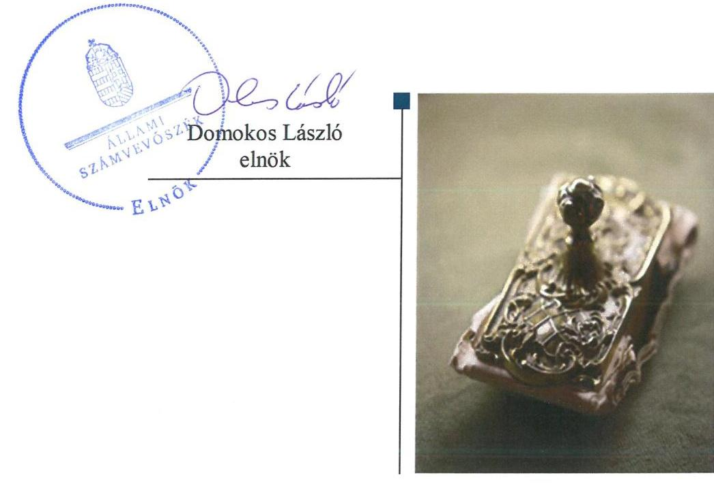
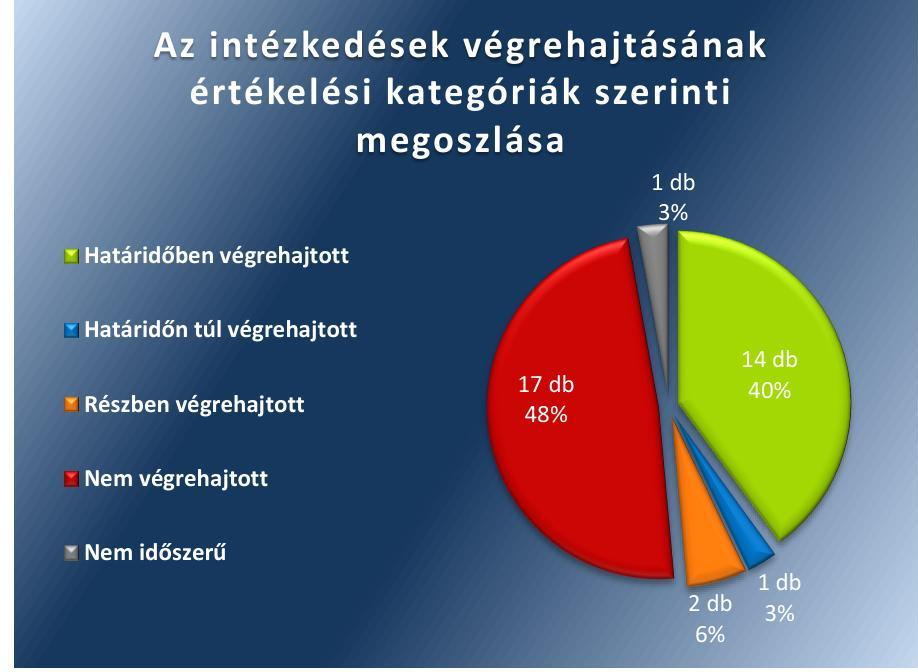
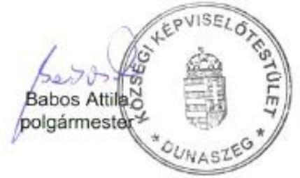
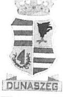
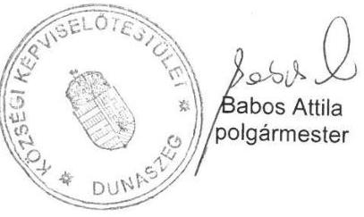
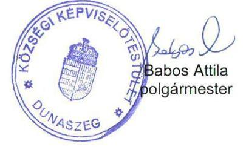
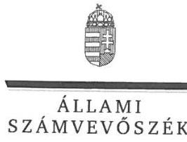
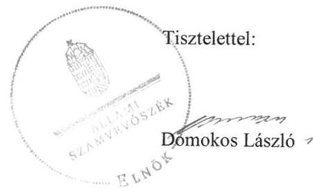

# Jelentés 

## Utóellenőrzések

Az önkormányzatok belső
kontrollrendszere kialakításának és múködtetésének ellenőrzése -
Dunaszeg Község Önkormányzata 2019.

---

# Jelenetés 

## Utóellenőrzések

Az önkormányzatok belső
kontrollrendszere kialakításának és múködtetésének ellenőrzése -
Dunaszeg Község Önkormányzata
2019. 03. hó 25. nap

---

# AZ ELLENŐRZÉST FELÜGYELTE: 

DR. BENEDEK MÁRIA felügyeleti vezető

## AZ ELLENŐRZÉST VEZETTE ÉS A VÉGREHAJTÁSÁÉRT FELELŐS:

DR. MAJOR LÁSZLÓ ellenőrzésvezető

## A PROGRAM ÖSSZEÁLLÍTÁSÁÉRT FELELŐS:

TÓTPÁL SZABOLCS osztályvezető

## A TÉMÁHOZ KAPCSOLÓDÓ KORÁBBI SZÁMVEVŐSZÉKI JELENTÉSEK:

- címe: Jelentés az önkormányzatok belső kontrollrendszere kialakításának és müködtetésének ellenőrzéséről - Dunaszeg
- sorszáma: 16182

IKTATÓSZÁM: EL-0777-037/2019
TÉMASZÁM: 2460
ELLENŐRZÉS-AZONOSÍTÓ SZÁM: V080438

---

# TARTALOMJEGYZÉK 

■ ÖSSZEGZÉS ..... 5
■ AZ ELLENŐRZÉS CÉLJA ..... 6
■ AZ ELLENŐRZÉS TERÜLETE ..... 7
■ AZ ELLENŐRZÉS HÁTTERE, INDOKOLTSÁGA ..... 8
■ A JELENTÉS LÉNYEGES KÉRDÉSKÖRE ..... 9
■ AZ ELLENŐRZÉS HATÓKÖRE ÉS MÓDSZEREI ..... 10
■ MEGÁLLAPÍTÁSOK ..... 12
■ MELLÉKLETEK ..... 15
I. sz. melléklet: Dunaszeg Község Önkormányzata intézkedési terve végrehajtásának értékelése ..... 15
II. sz. melléklet: Dunaszeg Község Önkormányzata intézkedési terve ..... 23
■ FÜGGELÉK: ÉSZREVÉTELEK ..... 33
■ RÖVIDÍTÉSEK JEGYZÉKE ..... 45

---

.

---

# ÖSSZEGZÉS 

Az Állami Számvevőszék Dunaszeg Község Önkormányzata belső kontrollrendszere kialakításának és múködtetésének utóellenőrzése során megállapította, hogy az intézkedési tervben meghatározott és végrehajtott feladatok eredményeként javult a szabályozottság. A végre nem hajtott feladatok miatt azonban nem biztositott a gazdálkodás szabályszerüsége, a pénzügyi folyamatok átláthatósága, a közpénzekkel, a vagyonnal való gazdálkodás elszámoltathatósága és az integritás alapú müködés. Nem biztositott a befektetésekkel kapcsolatos gazdálkodás szabályszerüsége, átláthatósága.

## Az ellenőrzés társadalmi indokoltsága

Az Állami Számvevőszék stratégiájában célul tűzte ki a számvevőszéki munka hasznosulásának javítását. Ezzel összhangban ellenőrzi, hogy az ellenőrzött szervezet megvalósította-e a korábbi ellenőrzései által feltárt hibák, hiányosságok és szabálytalanságok megszüntetése céljából elkészített intézkedési tervében foglaltakat. A rendszeres utóellenőrzések hozzájárulnak a szükséges intézkedések tényleges végrehajtásához, ezáltal a közpénzügyek rendezettségének javulásához.

## Főbb megállapítások, következtetések

Dunaszeg Község Önkormányzatának polgármestere és jegyzője az intézkedési tervben meghatározott 35 feladatból 14-et határidőben, egyet határidőn túl, kettőt részben, 17-et nem hajtott végre, egy nem volt időszerű.

Dunaszeg Község Önkormányzatának jegyzője intézkedett az önkormányzat közép- és hosszú távú vagyongazdálkodási tervének, hivatásetikai kódexének, a szociális szolgáltatástervezési koncepciónak és az önálló települési környezetvédelmi programnak a megalkotásáról. A szabályozottság javult.

Dunaszeg Község Önkormányzatának jegyzője nem működtette a gazdálkodási jogkörök kulcskontrolljait, a belső kontrollrendszer keretében nem alakította ki szabályszerűen a kontrollkörnyezetet, nem működtette az információs és kommunikációs rendszert és a monitoring rendszert, valamint nem végezte el a befektetésekkel kapcsolatos gazdasági események szabályszerű leltározását. A pénzügyi gazdálkodás, a belső kontroll szerinti elszámoltathatóság és a vagyongazdálkodás nem volt szabályszerű, valamint nem volt biztosított az integritás alapú működtetés.

Dunaszeg Község Önkormányzatának jegyzője az intézkedési tervben meghatározott feladatok végrehajtásáról a jogszabályban előírt nyilvántartást vezette.

---

# AZ ELLENŐRZÉS CÉLJA 

Az ellenőrzés célja annak értékelése volt, hogy a számvevőszéki jelentésben ${ }^{1}$ foglalt intézkedést igénylő megállapításokkal összhangban készített intézkedési tervben meghatározott feladatokat az ellenőrzött szervezet vég-rehajtotta-e.

---

# AZ ELLENŐRZÉS TERÜLETE 

## Dunaszeg Község Önkormányzata

Dunaszeg község a Nyugat-Dunántúli régióban, Győr-MosonSopron megyében található. Állandó lakosainak száma a Központi Statisztikai Hivatal Magyarország közigazgatási helynévkönyve alapján 2018. január 1-jén 2094 fő volt.

A Polgármester ${ }^{2}$ 1990. év október 14-e óta tölti be tisztségét, a héttagú Képviselő-testület ${ }^{3}$ munkáját három állandó bizottság támogatja.

Dunaszeg Község Önkormányzata hivatali feladatait az ellenőrzött időszakban a Dunaszegi Közös Önkormányzati Hivatal látta el. A Jegyző ${ }^{4}$ személye az ellenőrzött időszakban egyszer változott, a jelenleg hivatalban lévő jegyző 2018. július 1étől látja el feladatát.

Dunaszeg Község Önkormányzata 2017. évi beszámolója szerint a 2017. évben az Önkormányzat 439,2 millió Ft bevételt ért el és 302,5 millió Ft kiadást teljesített. A 2017. december 31-i könyvviteli mérleg főösszege 1362,1 millió Ft, a követelések összege 141,1 millió Ft, az éven túli kötelezettség összege 6,7 millió Ft volt. Éven belüli kötelezettség nem volt.

Az ÁSZ ${ }^{5}$ 2016. évben ellenőrizte Dunaszeg Község Önkormányzata belső kontrollrendszere kialakítását és múködtetését a 2014. január 1. és 2015. április 30. közötti időszakra, valamint a 2011. január 1-jétől 2015. április 30-ig terjedő időszakra ellenőrizte egyes befektetési döntéseinek, a döntések végrehajtásának és elszámolásának a szabályszerűségét. Az ellenőrzés célja annak megállapítása volt, hogy az önkormányzat belső kontrollrendszerének kialakítása, továbbá egyes elemeinek múködtetése biztosította-e az önkormányzatnál a közpénzfelhasználás szabályosságát, támogatta-e az integritás szemlélet érvényesülését. Az ÁSZ továbbá ellenőrizte, hogy az önkormányzat egyes befektetési döntései és azok végrehajtása, elszámolása megfelelt-e a vonatkozó jogszabályoknak és belső szabályozásoknak, a kialakított kontrollrendszer támogatta-e a befektetési tevékenység szabályszerűségét. Az ÁSZ az ellenőrzésről készült 16182. számú számvevőszéki jelentést 2016. december 1-ején hozta nyilvánosságra.

---

# AZ ELLENŐRZÉS HÁTTERE, INDOKOLTSÁGA 

Az ÁSZ tv. ${ }^{6}$ 33. § (1) bekezdése értelmében a számvevőszéki jelentések megállapításaihoz és javaslataihoz kapcsolódóan az ellenőrzött szervezet vezetője intézkedési tervet köteles összeállítani, és az Állami Számvevőszék részére megküldeni.

Az ÁSZ által befogadott intézkedési tervben foglaltak megvalósítását az ÁSZ tv. 33. § (7) bekezdésében foglaltak alapján - az Állami Számvevőszék utóellenőrzés keretében ellenőrizheti. Az utóellenőrzések keretében - az intézkedések értékelése során - az Állami Számvevőszék figyelembe veszi az ellenőrzött szervezetek múködési feltételeiben, valamint a jogszabályi előírásokban bekövetkezett változásokat.

Az utóellenőrzés során az ÁSZ értékeli, hogy az érintett számvevőszéki jelentésben foglalt megállapításokkal és javaslatokkal összhangban, az ellenőrzött szervezet által készített intézkedési tervben meghatározott feladatokat a feladatra kijelöltek végrehajtották-e.

Az intézkedések végrehajtásával az adott terület szabályszerű múködése vonatkozásában a kockázatok csökkenhetnek, azonban hosszabb távon az intézkedési tervben foglaltak végrehajtásával önmagában nem szűnnek meg, csak akkor, ha beépülnek az ellenőrzött szervezet múködésébe, azokat folyamatosan karban tartják, figyelembe véve, illetve kezelve a változásokat. Emellett az intézkedések végrehajtásáig újabb kockázatok merülhetnek fel a szabályszerű múködés vonatkozásában, amelyek kezelése szintén kiemelten fontos az ellenőrzött szervezet számára.

Az ellenőrzött szervezet vezetője által készített intézkedési tervekben foglalt feladatok hiányos, illetve késedelmes végrehajtása, vagy annak elmaradása a szabályszerűség és a felelős vezetői magatartás vonatkozásában kockázatot hordoz, ami azt mutatja, hogy az ellenőrzések során feltárt hibák, hiányosságok és szabálytalanságok kezelése nem kapott kellő hangsúlyt. Az utóellenőrzés során is fennálló szabálytalanságok esetén a közpénz, közvagyon veszélyeztetettségi kockázat valószínűsített hatásának értékelése további intézkedéseket vonhat maga után.

Az ellenőrzött szervezet szintjén az utóellenőrzés feltárja, hogy a szervezet az intézkedések végrehajtásával hasznosította-e a korábbi ellenőrzési jelentésben a hiányosságok megszüntetése, illetve a kockázatok kezelése érdekében megfogalmazott javaslatokat, illetve az intézkedések végrehajtása elmaradásának következtében továbbra is fennálló szabálytalanság esetén értékeli a közpénzek, közvagyon veszélyeztetettségét.

Az ÁSZ szintjén az utóellenőrzés visszacsatolást ad az ellenőrzési jelentések hasznosulásáról, az intézkedések elmaradásának, vagy részleges megvalósulásának a közpénzek, közvagyon veszélyeztetettségére gyakorolt valószínűsített hatásának értékelése, további intézkedéseket vonhat maga után.

---

# A JELENTÉS LÉNYEGES KÉRDÉSKÖRE 

Az önkormányzat az intézkedési tervben foglaltakat az előirt határidőben végrehajtotta-e?

---

# AZ ELLENŐRZÉS HATÓKÖRE ÉS MÓDSZEREI 

## Az ellenőrzés típusa

Megfelelőségi ellenőrzés.

## Az ellenőrzött időszak

Az utóellenőrzés alapját képező ÁSZ jelentés közzétételének napjától 2016. december 1-jétől az ellenőrzésről szóló kiértesítő levél keltének napjáig 2018. július 4-éig tartó időszak volt.

## Az ellenőrzés tárgya

A számvevőszéki jelentésben foglalt megállapításokkal összhangban - az önkormányzat által - készített Intézkedési tervben foglaltak végrehajtásának ellenőrzése volt.

## Az ellenőrzött szervezet

Dunaszeg Község Önkormányzata

## Az ellenőrzés jogalapja

Az ellenőrzés jogszabályi alapját az ÁSZ tv. 33. § (7) bekezdésének előírása képezte.

## Az ellenőrzés módszerei

Az ÁSZ az ellenőrzést az ellenőrzött időszakban hatályos jogszabályok, az ellenőrzés szakmai szabályai, a jelen ellenőrzésre irányadó ÁSZ módszertanok, az ellenőrzési programban foglalt értékelési szempontok szerint végezte.

Az ÁSZ az ellenőrzés ideje alatt az önkormányzattal történő kapcsolattartást az ÁSZ SZMSZ'-ének vonatkozó előírásai alapján biztosította.

Az utóellenőrzés megállapításait az ÁSZ rendelkezésére álló, valamint az ÁSZ adatbekérése szerint, az önkormányzat által rendelkezésre bocsátott dokumentumok alapozták meg.

Az ellenőrzési bizonyítékként felhasználható adatforrások közé tartoztak egyrészt az ellenőrzési program részletes szempontjainál felsorolt

---

adatforrások, másrészt minden - az ellenőrzés folyamán feltárt, az ellenőrzés szempontjából információt tartalmazó - dokumentum.

Az ÁSZ az intézkedési tervekben előírt feladatokat azok végrehajthatósága, illetve végrehajtása szempontjából az alábbiak szerint értékelte:
"határidőben végrehajtott" a feladat, ha a teljesítés dokumentáltan, az intézkedési tervben előírt határidőben és tartalommal megtörtént;
"határidőn túl végrehajtott" a feladat, ha annak teljesítése az intézkedési tervben meghatározott módon, de az előírt határidőn túl történt meg;
"részben végrehajtott" a feladat, ha végrehajtása teljes körűen az intézkedési tervben előírt módon nem történt meg;
"nem végrehajtott" a feladat, ha a végrehajtás nem történt meg, vagy amennyiben a teljesítést nem dokumentálták;
"okafogyottá vált" a feladat, ha végrehajtására - meghatározott esemény bekövetkezése, továbbá külső körülmény, a működést érintő feltétel változása miatt - már nincs szükség, illetve lehetőség, és egyértelműen megállapítható, hogy az intézkedést szükségessé tevő körülmény a jövőben nem fordulhat elő;
"nem időszerü" az a feladat, amelynek ellenőrzési időszakon belüli végrehajtására azért nem került (kerülhetett) sor, mert az intézkedés alapjául szolgáló esemény nem következett be, de annak jövőbeni előfordulása lehetséges, a végrehajtása nem volt esedékes, vagy a végrehajtás határideje még nem járt le.
Az ellenőrzés lefolytatásához az önkormányzat a tanúsítványok elektronikus kitöltésével, valamint az ÁSZ által kért dokumentumok elektronikus megküldésével szolgáltatott adatokat, amelyek valódiságát és teljes körűségét az ellenőrzött szervezet vezetője által tett teljességi és hitelességi nyilatkozat igazolta. Az így rendelkezésre bocsátott adatok, információk kontrollja az ellenőrzés keretében megtörtént.

Az önkormányzat által megküldött intézkedési tervben meghatározott ÁSZ által beazonosított feladatok a II. számú mellékletben kerültek bemutatásra.

---

# MEGÁLLAPÍTÁSOK 

## Az önkormányzat az intézkedési tervben foglaltakat az előírt határidőben végrehajtotta-e?

Összegző megállapítás

Az Önkormányzat ${ }^{8}$ az intézkedési tervben meghatározott 35 feladatból 14-et határidőben, egyet határidőn túl, kettőt részben, 17-et nem hajtott végre, egy nem volt időszerű. Az intézkedési tervben meghatározott feladatok végrehajtásáról a jogszabályban előírt nyilvántartást vezette.

Az ÁSZ jelentésében a polgármester részére nyolc, a jegyző részére 11 javaslatot fogalmazott meg. A polgármester által előterjesztett és a Képvi-selő-testület által a 34/2017. (II.7.) számú határozattal elfogadott intézkedési tervben ${ }^{9}$ a hiányosságok, a szabálytalanságok megszüntetésére a polgármester és a jegyző részére közösen 11, a polgármester részére egy, a jegyző részére 23 feladat került meghatározásra.

Az intézkedési tervben meghatározott feladatokat, határidőket, felelősöket és a feladatok végrehajtását az I. sz. melléklet mutatja be.

Az Önkormányzat jegyzője az intézkedési tervben meghatározott feladatok végrehajtásáról Bkr. ${ }^{10} 14 . \S$ (1) bekezdés előírása szerinti nyilvántartást vezette.

Az Önkormányzat intézkedési tervében meghatározott feladatok végrehajtásának értékelési kategóriák szerinti megoszlását az 1. ábra szemlélteti.

1. ábra

## Az intézkedések végrehajtásának értékelési kategóriák szerinti megoszlása

---

A SZABÁLYOZOTTSÁG javult, mert a Képviselő-testület az önkormányzat közép- és hosszú távú vagyongazdálkodási tervét (PJ I.2.), a hivatásetikai kódexét (PJ I.3.), a szociális szolgáltatástervezési koncepciót (PJ II.7.), az önálló települési környezetvédelmi programot (PJ II.8.), valamint a telefonhasználati szabályzatot (J IV.6.2.) jóváhagyta.

A PÉNZÜGYI GAZDÁLKODÁS szabályszerűsége nem javult, mert az Önkormányzat a gazdálkodási jogkörök kulcskontroljait nem múködtette (J III.9.3 és PJ IV.4.), a befektetésekkel kapcsolatos gazdasági események könyvelése nem volt szabályszerű (J III.10.).

# A BELSŐ KONTROLL SZERINTI ELSZÁMOLTATHATÓSÁG nem javult, mert a jegyző nem intézkedett a belső kontrollrendszer keretében a kontrollkörnyezet (J IV.1.1.), az információs és kommunikációs rendszer (JIV.1.2.) és a monitoring rendszer szabályszerű kialakításáról és működtetéséről (J IV.1.3. és J IV.3.1-2.).

AZ INTEGRITÁS nem javult, mert az Önkormányzat a nyilvánossági, átláthatósági, illetve a jogi/etikai normáknak történő megfelelést nem biztosította (J III.9.3., J III.10., J IV.1.1-3. és J III.11.1-3.).

A VAGYONGAZDÁLKODÁS szabályszerűsége nem javult, mert a jegyző nem intézkedett a befektetésekkel kapcsolatos gazdasági események szabályszerű leltározásáról (J III.11.1-3.).

---

.

---

# MELLÉKLETEK

- I. SZ. MELLÉKLET: DUNASZEG KÖZSÉG ÖNKORMÁNYZATA INTÉZKEDÉSI TERVE VÉGREHAJTÁSÁNAK ÉRTÉKELÉSE

|  Sorszám | Az intézkedési tervben meghatározott feladat | Az intézkedési tervben meghatározott határidő | Az intézkedési tervben meghatározott feladat felelése | A feladat végrehajtása  |
| --- | --- | --- | --- | --- |
|  PJ ${ }^{11}$ I.1.1. | A meglévő szabályokat - jogszabályokat, számviteli törvényt, belső szabályzatokat, számviteli politikát, értékelési szabályzatot - áttekinteni és meghatározni, hogy a követelésről történő lemondás milyen formában történjen. | 2017. február 15. | polgármester, jegyző | A jegyző áttekintette a meglévő szabályokat, intézkedett az önkormányzat hatályos vagyonrendelete módosításának kidolgozásáról és a követelésről történő lemondás eseteinek és módjának meghatározásáról.
A polgármester a követelésről történő lemondás eseteinek és módjának meghatározását tartalmazó vagyonrendelet-tervezetet a Képviselő-testület elé terjesztette, melyet a Képviselő-testület a 4/2017. (II.21.) számú rendelettel elfogadott.  |
|  PJ I.1.2. | Az önkormányzat hatályos vagyonrendelete módosításának kidolgozása és a követelésről történő lemondás eseteinek és módjának meghatározása az ÁSZ által javasoltaknak megfelelően, majd a rendelettervezet képviselő-testület elé terjesztése. | 2017. február 28. | polgármester, jegyző | A jegyző intézkedett az önkormányzat hatályos vagyonrendelete módosításának kidolgozásáról és a követelésről történő lemondás eseteinek és módjának meghatározásáról.
A polgármester a vagyonrendelet-tervezetet a Képviselő-testület elé terjesztette, melyet a Képviselő-testület a 4/2017. (II.21.) számú rendelettel elfogadott.  |
|  PJ I.2. | A meglévő gazdasági koncepciók alapján el kell készíteni az önkormányzat közép- és hosszú távú vagyongazdálkodási tervét, amelyet elfogadásra a képviselő-testület elé kell terjeszteni. | 2017. március 31. | polgármester, jegyző | A jegyző intézkedett a meglévő gazdasági koncepciók alapján az önkormányzat közép- és hosszú távú vagyongazdálkodási tervének elkészítéséről.
A polgármester a vagyongazdálkodási tervet a Képviselő-testület elé terjesztette, melyet a Képviselő-testület a 14/2017. (I.24.) számú határozattal elfogadott.  |
|  PJ I.3. | A köztisztviselőkre vonatkozó hivatásetikai alapelvek és jogszabályi előírások alapján a jegyző által kiadmányozott Zöld Könyvet | soron következő rendes képviselőtestületi ülés, legkésőbb 2017. január 31. | polgármester, jegyző | A jegyző felülvizsgálta a köztisztviselőkre vonatkozó hivatásetikai alapelvek és jogszabályi előírások alapján a jegyző által az önkormányzat hivatásetikai kódexeként kiadmányozott Zöld Könyvet.  |

---

|  Sorszám | Az intézkedési tervben meghatározott feladat | Az intézkedési tervben meghatározott határidő | Az intézkedési tervben meghatározott feladat felelőse | A feladat végrehajtása  |
| --- | --- | --- | --- | --- |
|   | felül kell vizsgálni és az önkormányzat hivatásetikai kódexeként a képviselő-testület elé kell terjeszteni. |  |  | A polgármester a felülvizsgált Zöld Könyvet az önkormányzat hivatásetikai kódexeként a Képviselő-testület elé terjesztette, melyet a Képviselő-testület a 14/2017. (I.24.) számú határozattal elfogadott.  |
|  PJ I.4. | A Hivatal szervezeti ábrájával a hatályos szervezeti és működési szabályzatot ki kell egészíteni és elfogadásra a képviselő-testület elé kell terjeszteni. | soron következő rendes képviselőtestületi ülés, legkésőbb 2017. január 31. | polgármester, jegyző | A jegyző kiegészítette a Hivatal szervezeti ábrájával a hatályos szervezeti és működési szabályzatot.
A polgármester a Hivatal szervezeti ábrájával kiegészített hivatali SZMSZ ${ }^{12}$-t a Képviselő-testület elé terjesztette, melyet a Képviselő-testület a 13/2017. (I.18.) számú határozattal elfogadott.  |
|  PJ I.5. | Önkormányzati SZMSZ módosítás
Ki kell egészíteni az SZMSZ-t a nem önkormányzati képviselő bizottsági tagok vagyonnyilatkozat- tételi kötelezettségével arra az esetre, ha az önkormányzati bizottságokban nem képviselő bizottsági tagok is helyet kapnak. A szervezeti és működési szabályzatról szóló módosító rendeletet a képviselő-testület elé kell terjeszteni. | soron következő rendes képviselőtestületi ülés, legkésőbb 2017. január 31. | polgármester, jegyző | A jegyző előkészítette a képviselő bizottsági tagok vagyonnyilatkozat-tételi kötelezettsége önkormányzati SZMSZ-ben történő szabályozása kiegészítését arra az esetre vonatkozóan, ha az önkormányzati bizottságokban nem képviselő bizottsági tagok is helyet kapnak.
A polgármester az önkormányzati SZMSZ ${ }^{13}$-ről szóló módosító rendeletet a Képviselő-testület elé terjesztette, melyet a Képvi-selő-testület az 1/2017. (I.31.) számú rendelettel elfogadott.  |
|  PJ II.7. | Felül kell vizsgálni a településen élő szociálisan rászoruló személyek körét, az így meghatározott, az önkormányzat által biztosítandó szociális feladatokat, az ellátási felelősséget, az ellátó intézményeket szociális szolgáltatástervezési koncepcióban kell összefoglalni és a képviselő-testület elé terjeszteni. | 2017. március 31. | polgármester, jegyző | A jegyző felülvizsgálta a településen élő szociálisan rászoruló személyek körét, az így meghatározott, az önkormányzat által biztosítandó szociális feladatokat, az ellátási felelősséget, az ellátó intézményeket szociális szolgáltatástervezési koncepcióban foglalta össze.
A polgármester a szociális szolgáltatástervezési koncepciót a Képviselő-testület elé terjesztette, melyet a Képviselő-testület az 59/2017. (III.28.) számú határozattal elfogadott.  |
|  PJ II.8. | Felül kell vizsgálni az önkormányzat környezetvédelmi előírásoknak való megfelelőségének jogszabályi és helyi szabályoknak megfelelő alapkövetelményeit. El kell | 2017. március 31. | polgármester, jegyző | A jegyző felülvizsgálta az önkormányzat környezetvédelmi előírásoknak való megfelelősége jogszabályi és helyi szabályoknak megfelelő alapkövetelményeit, és elkészítette az önkormányzat környezetvédelmi programját.  |

---

|  Sorszám | Az intézkedési tervben meghatározott feladat | Az intézkedési tervben meghatározott határidő | Az intézkedési tervben meghatározott feladat felelőse | A feladat végrehajtása  |
| --- | --- | --- | --- | --- |
|   | készíteni és képviselő-testület elé kell terjeszteni az önkormányzat környezetvédelmi programját. |  |  | A polgármester a Képviselő-testület elé terjesztette az önkormányzat környezetvédelmi programját, melyet a Képviselő-testület a 60/2017. (III.28.) számú határozattal elfogadott.  |
|  J14 III.11.4. | Az értékpapírral kapcsolatos értékvesztés elszámolása a felszámoló nyilatkozata, illetve egyéb jogi dokumentumokkal alátámasztott, pénzügyileg valós értékelést kell, hogy segítse. | folyamatos | jegyző | A jegyző intézkedett az értékpapírral kapcsolatos értékvesztés elszámolásáról a felszámoló nyilatkozata alapján, segítve a pénzügyileg valós értékelést.  |
|  J III.11.5. | Az eltérések elszámolása után a 2016. évi beszámolóban a valós értékpapír értéke kerüljön kimutatásra. | beszámoló készítés határideje | jegyző | A jegyző intézkedett az eltérések elszámolása után, a 2016. évi beszámolóban az értékpapír valós értékű kimutatásáról.  |
|  J III.12.1. | A polgármesteri hatáskör túllépését a kép-viselő-testület a Győr-Moson-Sopron Megyei Kormányhivatal törvényességi felhívása alapján megvizsgálta, a polgármester által meghozott befektetési döntéseket szabad pénzeszközök lekötött betétbe helyezése a számlavezető pénzintézetnél utólag jóváhagyta, felelősségre vonást nem alkalmazott. További intézkedés nem szükséges. | 2017. február 28. | jegyző | A jegyző intézkedett, hogy a képviselő-testület a Győr-Moson-Sopron Megyei Kormányhivatal törvényességi felhívása alapján megvizsgálja, a polgármester által meghozott befektetési döntéseket - szabad pénzeszközök lekötött betétbe helyezése a számlavezető pénzintézetnél -, melyeket utólag a Képviselőtestület jóváhagyott, felelősségre vonást nem alkalmazott.  |
|  J III.12.2. | A könyvelési, beszámolási hiányosságok és a jogszabályoknak nem teljes mértékig megfelelő könyvvezetés miatt a pénzügyigazdálkodási előadók felelősségének vizsgálata a közszolgálati tisztviselők jogállásáról szóló törvény rendelkezéseinek megfelelő fegyelmi eljárás lefolytatásával. | 2017. február 28. | jegyző | A jegyző intézkedett a könyvelési, beszámolási hiányosságok és a jogszabályoknak nem teljes mértékig megfelelő könyvvezetés miatt két fegyelmi eljárás lefolytatásáról, az I/415-4/2017 és az I/415-5/2017 határozatok alapján fegyelmi büntetés kiszabását nem tartotta indokoltnak.  |
|  J IV.6.2. | Hivatali eszközök magáncélú használata szabályzatának elkészítése. | 2017. március 31. | jegyző | A jegyző elkészítette a hivatali eszközök magáncélú használata tárgyában a telefonhasználati szabályzatot, melyet a Képviselőtestület a 16/2017. (I. 24.) határozatával jóváhagyott.  |

---

|  Sorszám | Az intézkedési tervben meghatározott feladat | Az intézkedési tervben meghatározott határidő | Az intézkedési tervben meghatározott feladat felelőse | A feladat végrehajtása  |
| --- | --- | --- | --- | --- |
|  JIV.6.4. | Nem kívánatos dolgozói magatartással szembeni intézkedések meghozatala céljából az etikai kódex felülvizsgálata. | 2017. március 31. | jegyző | A jegyző felülvizsgálta a nem kívánatos dolgozói magatartással szembeni intézkedések meghozatala céljából az etikai kódexet. A polgármester az önkormányzat hivatásetikai kódexét a Képvi-selő-testület elé terjesztette, melyet a Képviselő-testület a 14/2017. (I.24.) számú határozattal elfogadott.  |
|   | Határidőn túl végrehajtott feladat |  |  |   |
|  JIV.5. | Iratkezelési szabályzat felülvizsgálata és megküldése az illetékes szervek részére. | 2017. március 31. | jegyző | A jegyző a 2017. március 31-ei határidőn túl intézkedett az Iratkezelési szabályzat felülvizsgálatáról és megküldéséről az illetékes szervek részére. Az Iratkezelési szabályzatot a Magyar Nemzeti Levéltár 2018. május 10-én, a Győr-Moson-Sopron Megyei Kormányhivatal 2018. május 16-án hagyta jóvá.  |
|   | Részben végrehajtott feladatok |  |  |   |
|  PJI.1.3. | A meglévő szabályzatok módosítása, a konkrét értékpapír ügyben az értékvesztés leírásának, illetve a behajthatatlan követelés törlésének kezdeményezése, annak a képviselő-testület elé terjesztése. | 2017. február 28. | polgármester, jegyző | Végrehajtott feladatrész:
A jegyző intézkedett az önkormányzat hatályos vagyonrendelete módosításának kidolgozásáról és a követelésről történő lemondás eseteinek és módjának meghatározásáról.
A polgármester a Képviselő-testület elé terjesztette a követelésről történő lemondás eseteinek és módjának meghatározását tartalmazó vagyonrendelet-tervezetet, melyet a Képviselő-testület a 4/2017. (II.21.) számú rendelettel elfogadott.
A jegyző intézkedett a konkrét értékpapír ügyben a behajthatatlan követelés törlésének kezdeményezéséről.
A polgármester a Képviselő-testület elé terjesztette a konkrét értékpapír ügyben a behajthatatlan követelés törlésének kezdeményezéséről szóló döntési javaslatot, melyet a Képviselő-testület a 39/2017. (II.21.) számú rendelettel elfogadott.
Nem végrehajtott feladatrész:
A jegyző a Számv. tv. ${ }^{15}$ 54. § (4) bekezdésében előírtak ellenére nem intézkedett a konkrét értékpapír ügyben az értékvesztés elszámolásáról.  |

---

|  Az intézkedési tervben meghatározott feladat | Az intézkedési tervben meghatározott határide | Az intézkedési tervben meghatározott feladat felelése | A feladat végrehajtása  |
| --- | --- | --- | --- |
|  J III.9.1. Ki kell alakítani és működtetni kell a belső kontrollrendszer valamennyi elemét a hatályos jogszabályi előírásoknak megfelelően, majd a működtetést is folyamatosan ellenőrizni kell. A jelenlegi belső kontroll szabályozását módosítani szükséges és a kontroll feladatait személyekhez kell rendelni. | 2017. március 31. | jegyző | Végrehajtott feladatrész:
A jegyző intézkedett a belső kontrollrendszer „monitoring rendszer” pillérén belül a belső ellenőrzés kockázatelemzéssel alátámasztott 2018. évi ellenőrzési terv elkészítéséről, valamint a külső ellenőrzések javaslatai alapján készült intézkedési tervek végrehajtásának nyilvántartásáról.
Nem végrehajtott feladatrész:
A jegyző a belső kontrollrendszer „integrált kockázatkezelési rendszer” pillérén belül:
1. nem mérte fel és nem értékelte a Bkr. 7. § (1)-(2) bekezdésében előírtak ellenére a Hivatal tevékenységében, gazdálkodásában rejlő – azon belül az egyes befektetésekkel és befektetési szolgáltatókkal kapcsolatos – kockázatokat;
2. nem határozta meg a Bkr. 7. § (2) bekezdésében előírtak ellenére az egyes kockázatokkal kapcsolatosan szükséges intézkedéseket, valamint azok teljesítésének folyamatos nyomon követésének módját;
3. nem intézkedett a Bkr. 47. § (1) bekezdésében előírtak ellenére, hogy a belső ellenőrzési vezető éves bontásban nyilvántartást vezessen a belső ellenőrzési jelentésekben tett megállapítások, javaslatok, a vonatkozó intézkedési tervek és azok végrehajtása nyomon követése céljából.  |
|  Nem végrehajtott feladatok |  |  |   |
|  PJ I.1.4. A képviselő-testület döntését követően a számvitelben a gazdasági esemény elszámolása. | 2016. évi beszámoló készítésének határideje | polgármester, jegyző | A jegyző a Számv. tv. 54. § (4) bekezdésében előírtak ellenére nem intézkedett a konkrét értékpapír ügyben a gazdasági esemény elszámolásáról.  |
|  J III.9.2. A befektetésekkel kapcsolatos döntéseket a jövőben számításokkal kell alátámasztani, minden lehetséges kockázatot figyelem. | 2017. március 31. | jegyző | A jegyző nem mérte fel és nem értékelte a Bkr. 7. § (2) bekezdésében előírtak ellenére a Hivatal tevékenységében, gazdálkodásában rejlő – azon belül az egyes befektetésekkel és befektetési szolgáltatókkal kapcsolatos – kockázatokat.  |

---

|  Sorszám | Az intézkedési tervben meghatározott feladat | Az intézkedési tervben meghatározott határidő | Az intézkedési tervben meghatározott feladat felelőse | A feladat végrehajtása  |
| --- | --- | --- | --- | --- |
|   | lembe véve. Az előkészítés szakmai alapokon kell, hogy nyugodjon. A befektetési tevékenység koordinálására és ellenőrzésére belső munkatárs kijelölése szükséges. |  |  |   |
|  J III.9.3. | A gazdálkodási jogkörök gyakorlása során minden esetben a 2011. évi CXCV. törvény (Áht.), valamint az önkormányzat 2014. január 1-től hatályos Kötelezettségvállalás, utalványozás, ellenjegyzés, érvényesítés, teljesítésigazolás rendjének szabályzata előírásai alapján, az aláírási címpéldánynak megfelelően kell az aláírást használni, illetve a szignók használata esetén ezeket is tartalmazni kell az aláírási címpéldánynak. | az aláírási címpéldányok módosítása: 2016. december 31.
az aláírási címpéldánynak megfelelő aláírás használata: folyamatos | jegyző | A jegyző nem intézkedett, hogy a gazdálkodási jogkörök gyakorlása során minden esetben az Áht. ${ }^{16}$, valamint az önkormányzat 2014. január 1-től hatályos Kötelezettségvállalás, utalványozás, ellenjegyzés, érvényesítés, teljesítésigazolás rendjének szabályzata előírásai alapján, az aláírási címpéldánynak megfelelően használják az aláírást, illetve a szignók használata esetén ezeket is tartalmazza az aláírási címpéldány.  |
|  J III.10. | A befektetésekkel kapcsolatos gazdasági eseményeket, az azzal kapcsolatos alapbizonylatok - bankszámlaszerződés, bankkivonat stb. alapján haladéktalanul az analitikus, illetve főkönyvi nyilvántartásokban rögzíteni, könyvelni kell. A befektetésekről és az ezzel kapcsolatos gazdasági eseményekről - a szerződésnek megfelelően - bizonylattal kell rendelkezni és minden eseményt pl. kamatjóváírást, árfolyamveszteséget, betét lekötést, feloldást, a könyvekben a bizonylat beérkezést követően haladéktalanul rögzíteni, könyvelni kell. | a gazdasági esemény bekövetkezte után haladéktalanul | jegyző | A jegyző nem intézkedett a Számv. tv. 165. § (1) bekezdésében előírtak ellenére a befektetésekkel kapcsolatos bizonylatok kiállításáról, a bizonylatok adatainak könyvviteli nyilvántartásokban történő rögzítéséről.  |
|  J III.11.1. | 2016. évre leltár elkészítése az értékpapírok vonatkozásában, egyezően az értékpapír számla helyes összegével. | folyamatos | jegyző | A jegyző nem intézkedett a Számv. tv. 69. § (3) bekezdésében előírtak ellenére az értékpapírok egyeztetéssel elvégzendő leltározásáról.  |

---

|  Sorszám | Az intézkedési tervben meghatározott feladat | Az intézkedési tervben meghatározott határidő | Az intézkedési tervben meghatározott feladat felelőse | A feladat végrehajtása  |
| --- | --- | --- | --- | --- |
|  J III.11.2. | Fenti leltár alapján a főkönyv, illetve az analitikus nyilvántartás számviteli szabályoknak megfelelő helyesbítése. | folyamatos | jegyző | A jegyző nem intézkedett a Számv. tv. 165. § (4) bekezdésében előírtak ellenére a főkönyvi könyvelés, az analitikus nyilvántartás és a bizonylatok adatai közötti egyeztetés és ellenőrzés lehetőségének logikailag zárt rendszerrel történő biztosításáról.  |
|  J III.11.3. | A költségvetési beszámoló mérlegében minden sort és az értékpapírokat is a jogszabályi előírásoknak megfelelően leltárral kell alátámasztani, az analitikus és főkönyvi nyilvántartások, valamint a leltárok folyamatos egyeztetését, egyezőségét biztosítani kell. | beszámoló készítés határideje | jegyző | A jegyző nem intézkedett a Számv. tv. 69. § (1) bekezdésében előírtak ellenére a beszámoló elkészítéséhez, a mérleg tételeinek alátámasztásához olyan leltár összeállításáról és megőrzéséről, amely tételesen, ellenőrizhető módon tartalmazza az önkormányzatnak a mérleg fordulónapján meglévő eszközeit és forrásait mennyiségben és értékben.  |
|  J IV.1.1. | Kontrollkörnyezetet ki kell alakítani, ezen belül a kockázatkezelés működtetését teljes körűvé kell tenni. | 2017.március 31. | jegyző | A jegyző nem intézkedett a Bkr. 3. § a-b) pontjainak előírása ellenére megfelelő kontrollkörnyezet teljes körű kialakításáról és az integrált kockázatkezelési rendszer működtetéséről.  |
|  J IV.1.2. | Információs és kommunikációs rendszer újraszabályozása. | 2017.március 31. | jegyző | A jegyző nem intézkedett a Bkr. 3. § d) pontjának előírása ellenére az információs és kommunikációs rendszer újraszabályozásáról (fejlesztéséről).  |
|  J IV.1.3. | Monitoring rendszer kialakítása és folyamatos működtetése. | 2017.március 31. | jegyző | A jegyző nem intézkedett a Bkr. 3. § e) pontjának előírása ellenére a monitoring rendszer kialakításáról és folyamatos működtetéséről.  |
|  J IV.2. | A jegyzői utasítások eddig minden esetben tartalmazták az utasítás számát és időpontját, így szükséges eljárni a jövőben is. | folyamatos | jegyző | A jegyző nem intézkedett a 32/2010. (XII.31.) KIM rendelet ${ }^{17} 14$. § (1) bekezdésében előírtak ellenére, hogy a jegyzői utasítások minden esetben tartalmazzák az utasítás számát és időpontját a jövőben is.  |
|  J IV.3.1. | Ellenőrzési nyomvonal átdolgozása, kibővítése a befektetési folyamatokkal. | 2017. március 31. | jegyző | A jegyző nem intézkedett a Bkr. 6. § (3) bekezdés előírása ellenére az ellenőrzési nyomvonal átdolgozásáról, befektetési folyamatokkal történő kibővítéséről.  |
|  J IV.3.2. | Munkaköri leírások felülvizsgálata és a szabályzatok módosítása után a feladatok személyekhez rendelése. | 2017. március 31. | jegyző | A jegyző nem intézkedett a Kttv. ${ }^{18}$ 75. § (1) bekezdés d) pontjában előírtak ellenére a munkaköri leírások felülvizsgálatáról és a szabályzatok módosítása után a feladatok személyekhez rendeléséről.  |

---

|  Sorszám | Az intézkedési tervben meghatározott feladat | Az intézkedési tervben meghatározott határidő | Az intézkedési tervben meghatározott feladat felelőse | A feladat végrehajtása  |
| --- | --- | --- | --- | --- |
|  PJ IV.4. | Kifizetés csak teljesítésigazolás után történhet, melynek meglétét az érvényesítőnek, ellenjegyzőnek folyamatosan ellenőrizni kell. | folyamatos | polgármester, jegyző | A polgármester és a jegyző nem intézkedett az Áht. 38. § (1) bekezdésében előírtak ellenére, hogy kifizetés csak a teljesítésigazolását, és az annak alapján végrehajtott érvényesítést követően kerüljön sor.  |
|  J IV.6.1. | A belső kontrollrendszer felülvizsgálata és újraszabályozása, szabályos működtetése. | 2017. március 31. | jegyző | A jegyző nem intézkedett a 8kr. 3. § a)-e) pontjaiban előírtak ellenére a belső kontrollrendszer felülvizsgálatáról és újraszabályozásáról, szabályos működtetéséről.  |
|  J IV.6.3. | Külső személyekkel történő kapcsolattartás szabályozása. | 2017. március 31. | jegyző | A jegyző nem intézkedett az intézkedési tervben előírt feladat ellenére a külső személyekkel történő kapcsolattartás szabályozásáról.  |
|  J IV.6.5. | Kívülről érkező panaszok kezelésére vonatkozó szabályzat készítése. | 2017. március 31. | jegyző | A jegyző nem intézkedett az intézkedési tervben előírt feladat ellenére a kívülről érkező panaszok kezelésére vonatkozó szabályzat készítéséről.  |
|   |  | Nem időszerű feladat |  |   |
|  $\mathrm{P}^{19}$ II.6. | A jövőben a befektetésekkel kapcsolatos döntések előtt minden esetben be kell tartani a képviselő-testület által meghatározott szabályokat, a hatáskör túllépést el kell kerülni. | folyamatos | polgármester | A polgármester jövőbeni befektetésekkel kapcsolatos döntésekről szóló feladata új befektetés hiányában nem volt időszerű.  |

---

# II. SZ. MELLÉKLET: DUNASZEG KÖZSÉG ÖNKORMÁNYZATA INTÉZKEDÉSI TERVE

## Dunaszeg Község Önkormányzatának Képviselő-testülete

### I/1-4/2017.

#### Kivonat

Dunaszeg Község Önkormányzata Képviselő-testületének 2017. február 7-én tartott rendes, nyilvános ülésén készült I/1-4/2017. számú jegyzőkönyvből

## Döntés Állami Számvevőszék jelentésével kapcsolatos intézkedési terv elfogadásáról

A döntéshozatalban résztvevők száma 6 fő, a Képviselő-testület 6 igen szavazattal, tartózkodás és ellenszavazat nélkül a következő határozatot hozta:

### Dunaszeg Község Önkormányzata Képviselő-testületének 34/2017. (II. 7.) határozata

Dunaszeg Község Önkormányzatának Képviselő-testülete az Állami Számvevőszék 16182. számú ellenőrzési jelentésében Dunaszeg Község Önkormányzatának működésére vonatkozóan tett javaslatok tekintetében készült, az Állami Számvevőszék észrevételei alapján módosított intézkedési tervet a melléklet szerinti tartalommal elfogadja.

**Felelős:** Babos Attila polgármester
**Határidő:** azonnal

Babos Attila sk. polgármester
dr. Szigethy Balázs sk. jegyző

A kivonat hiteles.

Dunaszeg, 2017. február 10.

dr. Szigethy Balázs jegyző

---

# Intézkedési terv az Állami Számvevőszék 16182. sz. ellenőrzési jelentésében Dunaszeg Község Önkormányzata müködésére vonatkozóan javasolt intézkedésekkel kapcsolatban 

(Módosításra került az Állami Számvevőszék V-0992-096/2016. iktatószámú, 2017. január 27-én kelt levelében tett észrevételei alapján.)

## I. A polgármesternek és a jegyzőnek az ÁSZ által javasolt intézkedés

## 1. Intézkedjen a követelésről való lemondás esetének és módjának szabályait meghatározó rendelet-tervezet képviselő-testület elő terjesztéséről

## Intézkedés:

## Feladat:

1. A meglévő szabályokat - jogszabályokat, számviteli törvényt, belső szabályzatokat, számviteli politikát, értékelési szabályzatot - áttekinteni és meghatározni, hogy a követelésről történő lemondás milyen formában történjen.
2. Az önkormányzat hatályos vagyonrendelete módosításának kidolgozása és a követelésről történő lemondás eseteinek és módjának meghatározása az ÁSZ által javasoltaknak megfelelően, majd a rendelet-tervezet képviselő-testület elé terjesztése.
3. A meglévő szabályzatok módosítása, a konkrét értékpapír ügyben az értékvesztés leírásának, illetve a behajthatatlan követelés törlésének kezdeményezése, annak a képviselő-testület elé terjesztése.
4. A képviselő-testület döntését követően a számvitelben a gazdasági esemény elszámolása.

Felelős: polgármester, jegyző
Határidő: - 1. pont tekintetében 2017. február 15.

- 2. pont tekintetében 2017. február 28.
- 3. pont tekintetében 2017. február 28.
- 4. pont tekintetében a 2016. évi beszámoló készítésének határideje

---

# 2. Intézkedjen a közép- és hosszú távú vagyongazdálkodási tervről szóló előterjesztés képviselő-testület elé terjesztéséről 

## Intézkedés:

## Feladat:

A meglévő gazdasági koncepciók alapján el kell készíteni az önkormányzat közép- és hosszú távú vagyongazdálkodási tervét, amelyet elfogadásra a képviselő-testület elé kell terjeszteni.

Felelős: polgármester, jegyző
Határidő: 2017. március 31.
3. Intézkedjen a köztisztviselőkre vonatkozó hivatásetikai alapelvek részletes tartalmát, valamint az etikai eljárás szabályait tartalmazó előterjesztés képviselő-testület elé történő terjesztéséről

## Intézkedés:

## Feladat:

A köztisztviselőkre vonatkozó hivatásetikai alapelvek és jogszabályi előírások alapján a jegyző által kiadmányozott Zöld Könyvet felül kell vizsgálni és az önkormányzat hivatásetikai kódexeként a képviselő-testület elé kell terjeszteni.

Felelős: polgármester, jegyző
Határidő: soron következő rendes képviselő-testületi ülés, legkésőbb 2017. január 31.
(A feladat végrehajtásra került.)
4. Intézkedjen a Hivatal szervezeti ábráját is tartalmazó hivatali SZMSZ jóváhagyásáról

## Intézkedés:

## Feladat:

A Hivatal szervezeti ábrájával a hatályos szervezeti és müködési szabályzatot ki kell egészíteni és elfogadásra a képviselő-testület elé kell terjeszteni.

Felelős: polgármester, jegyző
Határidő: soron következő rendes képviselő-testületi ülés, legkésőbb 2017. január 31.
(A feladat végrehajtásra került.)

---

# 5. Intézkedjen a nem önkormányzati képviselő bizottsági tagok vagyonnyilatkozat-tételi kötelezettségét is tartalmazó önkormányzati SZMSZtervezet képviselő-testület elé terjesztéséről 

## Intézkedés:

Feladat: önkormányzati SZMSZ módosítás
Ki kell egészíteni az SZMSZ-t a nem önkormányzati képviselő bizottsági tagok vagyonnyilatkozattételi kötelezettségével arra az esetre, ha az önkormányzati bizottságokban nem képviselő bizottsági tagok is helyet kapnak. A szervezeti és működési szabályzatról szóló módosító rendeletet a képviselő-testület elé kell terjeszteni.

Felelős: polgármester, jegyző
Határidő: soron következő rendes képviselő-testületi ülés, legkésőbb 2017. január 31.
(A feladat végrehajtásra került.)

## II. A polgármesternek az ÁSZ által javasolt intézkedés

## 6. Intézkedjen a befektetéssel kapcsolatos döntések meghozatala során a képviselő-testület által meghozott szabályok betartásáról

## Intézkedés:

## Feladat:

A jövőben a befektetésekkel kapcsolatos döntések előtt minden esetben be kell tartani a képviselőtestület által meghatározott szabályokat, a hatáskör túllépést el kell kerülni.

Felelős: polgármester
Határidő: folyamatos, az önkormányzat költségvetési és a módosított vagyonrendeletének megfelelően minden döntés előtt felül kell vizsgálni a polgármester hatáskörét, és ha az meghaladja az értékhatárt, illetve nem történt meg a polgármester hatáskörébe az adott döntés delegálása, illetve átruházása, a döntést a képviselő-testület elé kell terjeszteni.
7. Intézkedjen a településen élő szociálisan rászorult személyek részére biztosítandó szolgáltatási feladatokat is meghatározó szociális szolgáltatásszervezési koncepció-tervezet képviselő-testület elé terjesztéséről

## Intézkedés:

## Feladat:

Felül kell vizsgálni a településen élő szociálisan rászoruló személyek körét, az így meghatározott, az önkormányzat által biztosítandó szociális feladatokat, az ellátási felelősséget, az ellátó

---

intézményeket szociális szolgáltatástervezési koncepcióban kell összefoglalni és a képviselőtestület elé terjeszteni.

Felelős: polgármester, jegyző
Határidő: 2017. március 31.

# 8. Intézkedjen a jogszabályi előírásoknak megfelelő környezetvédelmi programtervezet képviselő-testület elé terjesztéséről 

## Intézkedés:

## Feladat:

Felül kell vizsgálni az önkormányzat környezetvédelmi előírásoknak való megfelelőségének jogszabályi és helyi szabályoknak megfelelő alapkövetelményeit. El kell készíteni és képviselőtestület elé kell terjeszteni az önkormányzat környezetvédelmi programját.

Felelős: polgármester, jegyző
Határidő: 2017. március 31.

## III. A jegyzőnek az ÁSZ által javasolt intézkedés

9. Intézkedjen a belső kontrollrendszer egyes elemei jogszabályi előírásoknak megfelelő kialakítására és működtetésére, valamint a befektetésekkel kapcsolatos döntések előkészítése és végrehajtása, illetve a gazdálkodási jogkörök gyakorlása során a jogszabályi előírások és a belső szabályok betartására

## Intézkedés:

## Feladat:

1. Ki kell alakítani és működtetni kell a belső kontrollrendszer valamennyi elemét a hatályos jogszabályi előírásoknak megfelelően, majd a működtetést is folyamatosan ellenőrizni kell. A jelenlegi belső kontroll szabályozását módosítani szükséges és a kontroll feladatait személyekhez kell rendelni.
2. A befektetésekkel kapcsolatos döntéseket a jövőben számításokkal kell alátámasztani, minden lehetséges kockázatot figyelembe véve. Az előkészítés szakmai alapokon kell, hogy nyugodjon. A befektetési tevékenység koordinálására és ellenőrzésére belső munkatárs kijelölése szükséges.
3. A gazdálkodási jogkörök gyakorlása során minden esetben a 2011. évi CXCV. törvény (Áht.), valamint az önkormányzat 2014. január 1-től hatályos Kötelezettségvállalás, utalványozás, ellenjegyzés, érvényesítés, teljesítésigazolás rendjének szabályzata előírásai alapján, az aláírási címpéldánynak megfelelően kell az aláírást használni, illetve a szignók használata esetén ezeket is tartalmazni kell az aláírási címpéldánynak.

---

# Felelős: jegyző 

## Határidő:

- belső kontroll szabályainak - a befektetésekre tekintettel - módosítása: 2017. március 31.
- munkatársak ellenőrzési feladatainak megjelölése munkaköri leírásban: 2017. március 31.
- az aláírási címpéldányok módosítása: 2016. december 31. (A feladat végrehajtásra került.)
- az aláírási címpéldánynak megfelelő aláírás használata: folyamatos

## 10. Intézkedjen a befektetésekkel kapcsolatos gazdasági események jogszabályi előírásoknak megfelelő rögzítéséről és elszámolásáról a számviteli - főkönyvi és részletező nyilvántartásokban

## Intézkedés:

## Feladat:

A befektetésekkel kapcsolatos gazdasági eseményeket, az azzal kapcsolatos alapbizonylatok bankszámlaszerződés, bankkivonat stb. alapján haladéktalanul az analitikus, illetve főkönyvi nyilvántartásokban rögzíteni, könyvelni kell. A befektetésekről és az ezzel kapcsolatos gazdasági eseményekről - a szerződésnek megfelelően - bizonylattal kell rendelkezni és minden eseményt pl. kamatjováirást, árfolyamveszteséget, betét lekötést, feloldást, a könyvekben a bizonylat beérkezést követően haladéktalanul rögzíteni, könyvelni kell.

Felelős: jegyző
Határidő: a gazdasági esemény bekövetkezte után haladéktalanul

## 11. Intézkedjen az éves költségvetési beszámoló mérlegében kimutatott értékpapír

jogszabályi előírásoknak megfelelő leltárral történő alátámasztásáról, a
főkönyvi könyvelés, az analitikus nyilvántartás, valamint a bizonylatok adatai
közötti egyeztetés és ellenőrzés logikailag zárt rendszerrel történő
biztosításáról

## Intézkedés:

## Feladat:

1. 2016. évre leltár elkészítése az értékpapírok vonatkozásában, egyezően az értékpapír számla helyes összegével.
2. Fenti leltár alapján a főkönyv, illetve az analitikus nyilvántartás számviteli szabályoknak megfelelő helyesbítése.
3. A költségvetési beszámoló mérlegében minden sort és az értékpapírokat is a jogszabályi előírásoknak megfelelően leltárral kell alátámasztani, az analitikus és főkönyvi nyilvántartások, valamint a leltárok folyamatos egyeztetését, egyezőségét biztosítani kell.

---

4. Az értékpapírral kapcsolatos értékvesztés elszámolása a felszámoló nyilatkozata, illetve egyéb jogi dokumentumokkal alátámasztott, pénzügyileg valós értékelést kell, hogy segítse.
5. Az eltérések elszámolása után a 2016. évi beszámolóban a valós értékpapír értéke kerüljön kimutatásra.

Felelős: jegyző
Határidő: analitikák és főkönyv esetében folyamatos, beszámolónál a beszámoló készítésének határideje

# 12. Intézkedjen az Állami Számvevőszék ellenőrzése során feltárt hiányosságok és/vagy szabálytalanságok tekintetében a munkajogi felelősség tisztázására irányuló eljárás megindításáról és ennek eredménye ismeretében tegye meg a szükséges intézkedéseket 

## Intézkedés:

## Feladat:

1. A polgármesteri hatáskör túllépését a képviselő-testület a Győr-Moson-Sopron Megyei Kormányhivatal törvényességi felhívása alapján megvizsgálta, a polgármester által meghozott befektetési döntéseket - szabad pénzeszközök lekötött betétbe helyezése a számlavezető pénzintézetnél - utólag jóváhagyta, felelősségre vonást nem alkalmazott. További intézkedés nem szükséges.
2. A könyvelési, beszámolási hiányosságok és a jogszabályoknak nem teljes mértékig megfelelő könyvvezetés miatt a pénzügyi-gazdálkodási előadók felelősségének vizsgálata a közszolgálati tisztviselők jogállásáról szóló törvény rendelkezéseinek megfelelő fegyelmi eljárás lefolytatásával.

Felelős: jegyző
Határidő: 2017. február 28.

---

# IV. Egyéb - a jelentésben szereplő - hiányosságok, melyre vonatkozóan az ÁSZ javaslatot sem a polgármesterhez, sem a jegyzőhöz nem címzett 

## 1. Jelentés 6. oldal 1. ábra

- A kockázatkezelési rendszer müködtetését folyamatossá kell tenni.
- A közérdekü adatok közzétételi kötelezettségének eleget kell tenni.

## Feladat:

1. Kontroll környezetet ki kell alakítani, ezen belül a kockázatkezelés müködtetését teljes körűvé kell tenni.
2. Információs és kommunikációs rendszer újraszabályozása.
3. Monitoring rendszer kialakítása és folyamatos müködtetése.

Felelős: jegyző
Határidő: 2017. március 31.

## 2. Jelentés Megállapítások 20. oldal

- A jegyzői utasításoknak tartalmazni kell a normatív utasítás sorszámát és a közzététel pontos dátumát.

## Feladat:

A jegyzői utasítások eddig minden esetben tartalmazták az utasítás számát és időpontját, így szükséges eljárni a jövőben is.

## 3. Jelentés Megállapítások 21. oldal 2. táblázat

- A Hivatal ellenőrzési nyomvonalát ki kell egészíteni valamennyi müködési folyamattal, ezen belül a befektetési folyamatokkal is.
- A munkaköri leírásokat ki kell egészíteni a munkakör betöltésével kapcsolatos végzettségre, szakképzettségre, szakképesítésre, tapasztalatra, képességekre vonatkozó követelményekkel.

## Feladat:

1. Ellenőrzési nyomvonal átdolgozása, kibővítése a befektetési folyamatokkal.
2. Munkaköri leírások felülvizsgálata és a szabályzatok módosítása után a feladatok személyekhez rendelése.

Felelős: jegyző
Határidő: szabályzatok felülvizsgálatát követően, legkésőbb 2017. március 31.

## 4. Jelentés 24. oldal

- A teljesítésigazolásoknak a dologi kiadásoknál a kifizetést megelőzően kell megtörténni.

---

# Feladat: 

Kifizetés csak teljesítésigazolás után történhet, melynek meglétét az érvényesítőnek, ellenjegyzőnek folyamatosan ellenőrizni kell.

Felelős: polgármester, jegyző
Határidő: folyamatos

## 5. Jelentés 26. oldal

- A hatályos iratkezelési szabályzatot meg kell küldeni a Magyar Nemzeti Levéltár és a Kormányhivatal részére az illetékes szervek egyetértésének biztosítására.

## Feladat:

Iratkezelési szabályzat felülvizsgálata és megküldése az illetékes szervek részére.
Felelős: jegyző
Határidő: 2017. március 31.

## 6. Jelentés 38. oldal

- A belső kontrollrendszernek támogatni kell az integritás szemlélet érvényesülését, a szabályozási és müködési hibákat, hiányosságokat meg kell szüntetni.
- Szabályozni kell a Hivatal tulajdonában lévő eszközök magáncélú használatát, a külső személyekkel való kapcsolattartást.
- A nem kívánatos dolgozói magatartással szemben intézkedéseket kell hozni, illetve szabályozni kell a szervezeten belülről érkező közérdekủ bejelentések eljárásrendjét.
- Müködtetni kell a kívülről érkező panaszok, közérdekủ bejelentések kezelését szolgáló rendszert.

## Feladat:

1. A belső kontrollrendszer felülvizsgálata és újraszabályozása, szabályos müködtetése.
2. Hivatali eszközök magáncélú használata szabályzatának elkészítése.
3. Külső személyekkel történő kapcsolattartás szabályozása.
4. Nem kívánatos dolgozói magatartással szembeni intézkedések meghozatala céljából az etikai ködex felülvizsgálata.
5. Kívülről érkező panaszok kezelésére vonatkozó szabályzat készítése.

Felelős: jegyző
Határidő: 2017. március 31.

Dunaszeg, 2017. február 7.

---

.

---

# FÜGGELÉK: ÉSZREVÉTELEK 

A jelentéstervezetet a Számvevőszék 15 napos észrevételezésre megküldte az ellenőrzött szervezet vezetőjének az ÁSZ tv. 29. §* (1) bekezdése előírásának megfelelően.

Dunaszeg Község Önkormányzata polgármestere a jelentéstervezet megállapításaira írásban észrevételt tett.
Az ÁSZ tv. 29. § (3) bekezdésével összhangban az ÁSZ a Függelékben feltünteti az ellenőrzés megállapításaival kapcsolatban tett, figyelembe nem vett észrevételeket, és megindokolja, hogy azokat miért nem fogadta el.

[^0]
[^0]:    * 29. § (1) Az Állami Számvevőszék az ellenőrzési megállapításait megküldi az ellenőrzött szervezet vezetőjének vagy az általa megbízott személynek, és annak, akinek személyes felelősségét állapította meg.
    (2) Az ellenőrzött szervezet vezetője és a felelősként megjelölt személy az ellenőrzés megállapításaira tizenöt napon belül írásban észrevételt tehet.
    (3) Az Állami Számvevőszék az észrevételre a beérkezésétől számított harminc napon belül írásban válaszol. A figyelembe nem vett észrevételeket köteles a jelentésben feltüntetni, és megindokolni, hogy azokat miért nem fogadta el.

---

# DUNASZEG KÖZSÉG ÖNKORMÁNYZATA 

9174 Dunaszeg, Országút u. 6. Tel./Fax: (96) 352-012
E-mail: dunaszeg@dunaszeg.hu www.dunaszeg.hu

Iktatószám: I/277-2/2019.
Hivatkozási szám: EL-0777-030/2019.
Állami Számvevőszék
Domokos László
Elnök Úr
részére
Budapest.
Apáczai Csere János utca 10.
1052
Tárgy: Dunaszeg község Önkormányzata nyilatkozatának megküldése az Állami Számvevőszék utóellenőrzési jelentéstervezetéhez

## Tisztelt Elnök Úr!

Az Állami Számvevőszék fenti hivatkozási szám alatt megküldött jelentéstervezetére válaszul mellékleten küldöm meg az Ön részére Dunaszeg Község Önkormányzata nevében megtett nyilatkozatomat.

Kérem engedje meg, hogy tájékoztassam Önt arról, hogy az Állami Számvevőszék tárgyi ellenőrzése során feltárt hiányosságok kiküszöbölése érdekében a 2018. július 1. napján kinevezett új jegyző, dr. Antal Péter számos erőfeszítést tett, de mindennek ellenére a kinevezése óta eltelt idő sajnálatos módon nem bizonyult elegendőnek arra, hogy az ellenőrzés során hiányosságként azonosított dokumentumok mindegyikét el tudja készíteni.

Tisztelettel kérem Önt, hogy az utóellenőrzés tapasztalatainak értékelése során szíveskedjen figyelembe venni azt a hivatali apparátust komolyan megterhelő helyzetet, amibe az elmúlt fél évben került a Dunaszegi Közös Önkormányzati Hivatal, nevezetesen, hogy az idei évre a korábban itt dolgozó kollégák közül három komoly tudással és tapasztalattal rendelkező munkatársam is elhagyta hivatalunkat így a feladatok naprakész ellátása komoly kihívás elé állít bennünket, aminek minden igyekezetünk ellenére sem tudunk minden esetben megfelelni.

További munkájához jó egészséget kívánok Önnek.

Dunaszeg, 2019. február 6.

---

# DUNASZEG KÖZSÉG ÖNKORMÁNYZATA 

9174 Dunaszeg, Országút u. 6. Tel./Fax: (96) 352-012
E-mail: dunaszeg@dunaszeg.hu www.dunaszeg.hu

Iktatószám: I/277-3/2019.
Tárgy: nyilatkozatok
Ügyintéző: dr. Antal Péter
Melléklet: -
Telefon: (96) 352-012

## NYILATKOZATOK

az Állami Szemvevőszék 16182. számú ellenőrzési jelentésében foglaltak
folyományaként készített „Az önkormányzatok belső kontrollrendszere kialakításának és müködtetésének utóellenőrzése - Dunaszeg Község Önkormányzata 2019." címet viselő jelentéstervezetben megtett Számvevőszéki megállapítások vonatkozásában

1. Nyilatkozat a jelentéstervezet I. sz. melléklete PJ I.1.3. sorszám alatt tett megállapításra:
„A jegyző a Számtv. 54. § (4) bekezdésében előírtak ellenére nem intézkedett a konkrét értékpapír ügyben az értékvesztés elszámolásáról."

## Nyilatkozat:

A konkrét értékpapír ügyben az értékvesztés elszámolása érdekében az alábbi intézkedéseket tettük:

- A felszámolói nyilatkozatok alapján Dunaszeg Község Önkormányzata Képviselő-testülete a felszámolóbiztos által behajthatatlanak minősített önkormányzati követelés teljes összege vonatkozásában a 39/2017. (II. 21.) számú határozatában arról döntött, hogy a főkönyvi könyvelésben az veszteségként elszámolható.
- A fenti döntést követően a főkönyvi könyvelésben a követelés teljes összegét veszteségként tüntette fel az Önkormányzat, amelyet az elkészített analitika is alátámaszt. Az analitika feltöltésre került az Elektronikus Adatszolgáltatási Rendszer felületére 2018. június 5. napján.

2. Nyilatkozat a jelentéstervezet I. sz. melléklete J III.9.1. sorszám alatt tett megállapításaira:
J III.9.1./1.: „A jegyző nem mérte fel és nem értékelte a Bkr. 7. § (1)-(2) bekezdésében elöírtak ellenére a Hivatal tevékenységében, gazdálkodásában rejlő - azon belül az egyes befektetésekkel és befektetési szolgáltatókkal kapcsolatos - kockázatokat."

## Nyilatkozat:

- A jegyző 2018. július 27. napján kiadmányozta a 2018. július 30. napjától hatályos Integrált Kockázatkezelési Szabályzatot (kiterjesztett hatállyal a többi között a Dunaszegi Közös Önkormányzati Hivatalra, Dunaszeg Község Önkormányzatára és annak intézményeire és a Dunaszegi Gyermekjóléti és Családsegítő Társulásra is). A Integrált Kockázatkezelési Szabályzat hiteles másolata a jelen nyilatkozat 1. számú mellékletét képezi.
- A jegyző az Integrált Kockázatkezelési Szabályzat hatálya alá tartozó szervezetek vonatkozásában az integrált kockázatkezelési rendszer koordinációs feladatainak ellátására Orbán Tiborné pénzügyi-gazdálkodási ügyintézőt jelölte ki a 2018. július 27. napján kelt 6/2018. számú jegyzői utasítás keretében. A jegyzői utasítás hiteles másolata a jelen nyilatkozat 2. számú mellékletét képezi.

---

J III.9.1./2.: „A jegyző nem határozta meg a Bkr. 7. § (2) bekezdésében előirtak ellenére az egyes kockázatokkal kapcsolatosan szükséges intézkedéseket, valamint azok teljesítésének folyamatos nyomon követesének módját."

# Nyilatkozat: 

- A jegyző 2018. december 3. napján kiadmányozta az e naptól hatályos Ellenőrzési nyomvonalat (kiterjesztett hatállyal a többi között a Dunaszegi Közös Önkormányzati Hivatalra, Dunaszeg Község Önkormányzatára és annak intézményeire és a Dunaszegi Gyermekjóléti és Családsegítő Társulásra is). Az Ellenőrzési nyomvonal hiteles másolata a jelen nyilatkozat 3. számú mellékletét képezi.

J III.9.1./3.: „A jegyző nem intézkedett a Bkr. 47. § (1) bekezdésében előirtak ellenére, hogy a belső ellenőrzési vezető éves bontásban nyilvántartást vezessen a belső ellenőrzési jelentésekben tett megállapítások, javaslatok, vonatkozó intézkedési tervek és azok végrehajtása nyomon követése céljából."

## Nyilatkozat:

- A jegyző felhívta a belső ellenőrzési vezető figyelmét a Bkr. 47. § (1) bekezdésében foglalt feladatának pótlására, amelynek eredményeként a belső ellenőrzési vezető elkészítette a jogszabályhely szerinti nyilvántartást, amelynek hiteles másolata a jelen nyilatkozat 4. számú mellékletét képezi.

3. Nyilatkozat a jelentéstervezet I. sz. melléklete J III.9.1. sorszám alatt tett megállapításaira:

PJ. 1.1.4.: „A jegyző a Számtv. 54. § (4) bekezdésében előirtak ellenére nem intézkedett a konkrét értékpapír ügyben az értékvesztés elszámolásáról."

## Nyilatkozat:

- Ehhez a megállapításhoz lásd az Állami Számvevőszék PJ I.1.3. sorszám alatt tett megállapítása vonatkozásában tett jegyzői nyilatkozatokat.

4. Nyilatkozat a jelentéstervezet I. sz. melléklete J III.9.2. sorszám alatt tett megállapításaira:

J III. 9. 2.: „A jegyző nem mérte fel és nem értékelte a Bkr. 7. § 2) bekezdésében előirtak ellenére a Hivatal tevékenységében, gazdálkodásában rejlő - azon belül az egyes befektetésekkel és befektetési szolgáltatókkal kapcsolatos - kockázatokat."

## Nyilatkozat:

- Ehhez a megállapításhoz lásd az Állami Számvevőszék J III.9.1./2. sorszám alatt tett megállapítása vonatkozásában tett jegyzői nyilatkozatokat.

5. Nyilatkozat a jelentéstervezet I. sz. melléklete J III.9.3. sorszám alatt tett megállapításaira:
J. III. 9. 3.: „A jegyző nem intézkedett, hogy a gazdálkodási jogkörök gyakorlása során minden esetben az Áht., valamint az Önkormányzat 2014. január 1-től hatályos Kötelezettségvállalás, utalványozás, ellenjegyzés, érvényesítés, teljesítésigazolás rendjének szabályzata előírásai alapján az aláírási cimpéldánynak megfelelően használják az aláírást, illetve a szignók használata esetén ezeket is tartalmazza az aláírási cimpéldány."

## Nyilatkozat:

- A jegyző elkészítette a 2018. december 3. napján hatályba lépett Kötelezettségvállalás, ellenjegyzés, teljesítésigazolás, érvényesítés és utalványozás rendjének szabályzatát, amelyben rögzítésre kerültek a gazdálkodási jogkörök gyakorlónak aláírásmintái, amelyek azonosak azzal az aláírási móddal, ahogyan a gazdálkodási jogkörök gyakorlói a nevüket

---

írják ezen jogkörök gyakorlása során. A Kötelezettségvállalás, ellenjegyzés, teljesítésigazolás, érvényesítés és utalványozás rendjének szabályzata hiteles másolata a jelen nyilatkozat 4. számú mellékletét képezi.
6. Nyilatkozat a jelentéstervezet I. sz. melléklete J III.10. sorszám alatt tett megállapításaira:
J. III. 10.: „A jegyző nem intézkedett a Számviteli törvény 165. § (1) bekezdésében előirtak ellenére a befektetésekkel kapcsolatos bizonylatok kiállításáról, a bizonylatok adatainak könyvviteli nyilvántartásokban történő rögzítéséről."

# Nyilatkozat: 

- A jegyző az ASP rendszer KASZPER moduljának használata útján gondoskodott a követelések, kötelezettségvállalások és más fizetési kötelezettségek analitikus nyilvántartásáról, amelynek keretében a többi egyéb adat mellett az egyes gazdasági események vonatkozásában az érintett intézmény adatai, a gazdálkodási jogkör gyakorlóinak neve, a tényleges gazdasági esemény megnevezése, a gazdasági eseménnyel érintett pénzmennyiség is rögzítésre kerül.
- Fontos kiemelni, hogy az Állami Szemvevőszék tárgyi vizsgálatának megindulása óta Dunaszeg Község Önkormányzatánál befektetési tevékenység nem történt.

7. Nyilatkozat a jelentéstervezet I. sz. melléklete J III.11.1. sorszám alatt tett megállapításaira:
J III.11.1.: „A jegyző nem intézkedett a Számviteli törvény 69. § (3) bekezdésében előirtak ellenére az értékpapírok egyeztetéssel elvégzendő leltározásáról."

## Nyilatkozat:

- A 2018. december 3. napjától hatályos Számviteli Politika részeként elkészült a szintén e naptól hatályos Eszközök és források leltárkészítési és leltározási szabályzata (kiterjesztett hatállyal a többi között a Dunaszegi Közös Önkormányzati Hivatalra, Dunaszeg Község Önkormányzatára, és a Dunaszegi Gyermekjöléti és Családsegítő Társulásra is). A Szabályzat ... számú mellékleteként nevesítésre került az Értékpapírok analitikus nyilvántartása, amely a következő adatokat tartalmazza: Az értékpapírvásárlást rögíztő adásvételi szerződésben részes felek adatait, a szerződés azonosító számát, a szerződés tárgyát képező értékpapír forgalomképességére vonatkozó adatokat, az értékpapír névértékét, az értékpapír sorozatszámát, az értékpapír bekerülési értékét, az értékpapírvásárlás időpontját, az értékpapír eladásának időpontját, az értékpapírnak az értékpapír eladása időpontjában fennálló könyv szerinti és tényleges értékét és az értékpapír beszerzésének és eladásának egyenlegét könyv szerinti érték és tényleges érték szerinti bontásban

8. Nyilatkozat a jelentéstervezet I. sz. melléklete J III.11.2. sorszám alatt tett megállapításaira:
J III.11.2.: „A jegyző nem intézkedett a Számviteli törvény 165. § (4) bekezdésében előirtak ellenére a főkönyvi könyvelés, az analitikus nyilvántartás és a bizonylatok adatai közötti egyeztetés és ellenőrzés lehetőségének logikailag zárt rendszerrel történő biztosításáról.

## Nyilatkozat:

- A vizsgált befektetési tevékenység vonatkozásában az értékpapír-állomány helyes megállapítása megtörtént és így a főkönyvi könyvelés és az analitikus nyilvántartás adatai közé is a helyes értékpapírállomány került rögzítésre, ennek megfelelően a főkönyv, az analitika és a bizonylatok egyezősége megvalósult.
- Annak érdekében, hogy a későbbiek folyamán ilyen jellegű hibák ne fordulhassanak elő a jegyző 2018. december 3. napján kiadmányozta az e naptól hatályos Ellenőrzési nyomvonalat (Szervezeti hatály: Dunaszegi Közös Önkormányzati Hivatala, a Hivatalt alapító Önkormányzatok és intézményeik, továbbá azon társulások, amelyek székhelye a

---

Hivatalt alapító Önkormányzatok valamelyike). Az Ellenőrzési nyomvonal „Leltározás" címet viselő fejezetének, illetve az Eszközök és források leltárkészítési és leltározási szabályzata előírásai szerint a befektetett pénzügyi eszközök és a forgóeszközök között felvett értékpapírok leltározási folyamatára vonatkozó előírások rögzítik az analitikus nyilvántartás, a fökönyvi könyvelés és a bizonylatok adatai közötti egyeztetés logikailag zárt rendszerben történő elvégzését a következők szerint:

- Első lépésben a fökönyvi kivonatot kell kinyomtatni az ASP KASZPER modul Gazdálkodási szakrendszeréből, majd ezt követően a kinyomatatott dokumentum adatait az analitikus nyilvántartás adataival szemrevételezés módszerével egyeztetni szükséges:
- Eltérés esetén annak okát fel kell tárni és a szükséges javításokat el kell végezni annak érdekében, hogy a főkönyvi nyilvántartás és az analitika adatai megegyezzenek egymással.
- Kizárólag a főkönyv és az analitika adatainak egyezése esetén lehet továbblépni és második lépésben el kell végezni az egyeztetett adatok és az adott időszakban keletkezett bizonylatok (folyószámlakivonatok, értékpapír-számlakivonatok stb.) adatainak összevetését:
- Ha az adategyeztetés eredményeként az kerül megállapításra, hogy a bizonylatok adatai eltérnek az első lépésben megállapított adattartalomtól, akkor a főkönyvi könyvelés tételes átvizsgálását követően az eltérés okát a főkönyv javításával meg kell szüntetni és a javítás eredményeként előálló új adattartalommal az analitikát is javítani szükséges.
- Kizárólag abban az esetben lehet a leltározást elvégzettnek minősíteni, ha fenti adategyeztetési folyamat végén a főkönyvi kivonat, az analitika és a bizonylatok adatai teljes mértékben megegyeznek egymással.

10. Nyilatkozat a jelentéstervezet I. sz. melléklet J III.11.3. sorszám alatt tett megállapításaira:

J III.11.3.: „A jegyző nem intézkedett a Számviteli törvény 69. § (1) bekezdésében előirtak ellenére a beszámoló elkészítéséhez, a mérleg tételeinek alátámasztásához olyan leltár összeállításáról és megőrzéséről, amely tételesen ellenőrizhető módon tartalmazza az Önkormányzatnak a mérleg fordulónapján meglévő eszközeit és forrásait mennyiségben és értékben."

# Nyilatkozat: 

- A jegyző gondoskodott arról, hogy a költségvetési beszámoló mérlegében minden sor a jogszabályi előírásoknak megfelelően leltárral legyen alátámasztva, ennek megfelelően az ellenőrzés megkezdését követően készült költségvetési beszámolók mérlegei minden esetben megfelelnek a jogszabályi előírásoknak. Az analitikus és főkönyvi nyilvántartások, valamint az ezt alátámasztó bizonylatok adatainak egyeztetése minden esteben megtörtént a J III.11.2. pontban tett megállapításhoz füzött jegyzői nyilatkozatban bemutatott módszertan szerint.

11. Nyilatkozat a jelentéstervezet I. sz. melléklet J IV.1.1. sorszám alatt tett megállapításra:

J IV.1.1.: „A jegyző nem intézkedett a Bkr. 3. § a)-b) pontjainak előirása ellenére megfelelő kontrollkörnyezet teljes körű kialakításáról és az integrált kockázatkezelési rendszer müködtetéséről."

## Nyilatkozat:

- A jegyző intézkedett a megfelelő kontrollkörnyezet teljes körű kialakításának érdekében arról, hogy annak egyes elemei elkészüljenek, ennek megfelelően a belső kontroll szabályzat részét képező Integrált Kockázatkezelési Szabályzat és az Ellenőrzési nyomvonal 2018. év folyamán hatályba lépett. Annak érdekében ugyanakkor, hogy a kontrollkörnyezet teljes körűen kiépítésre kerüljön szükséges az is, hogy az információs és kommunikációs rendszer és a monitoring rendszer (belső ellenőrzési kézikönyv) folyamatban lévő szabályozása elérje a végleges állapotát és hatályba lépjen. Erre 2019. április 30. napjáig kerül sor.

---

12. Nyilatkozat a jelentéstervezet J IV.1.2. sorszám alatt tett megállapításhoz:

J IV.1.2.: A jegyző nem intézkedett a Bkr. 3. § d) pontjának előírása ellenére az információs és kommunikációs rendszer újra szabályozásáról (fejlesztéséről).

# Nyilatkozat: 

- Ehhez a megállapításhoz lásd az Állami Számvevőszék J IV.1.1. sorszám alatt tett megállapítása vonatkozásában tett jegyzői nyilatkozatot.

13. Nyilatkozat a jelentéstervezet J IV.1.3. sorszám alatt tett megállapításhoz:

J IV.1.3.: A jegyző nem intézkedett a Bkr. 3. § e) pontjának előírása ellenére a monitoring rendszer kialakításáról és folyamatos működtetéséről.

## Nyilatkozat:

- Ehhez a megállapításhoz lásd az Állami Számvevőszék J IV.1.1. sorszám alatt tett megállapítása vonatkozásában tett jegyzői nyilatkozatot.

14. Nyilatkozat a jelentéstervezet J IV.2. sorszám alatt tett megállapításhoz:

J IV.2.: A jegyző nem intézkedett a 32/2010. (XII. 31.) KIM rendelet 14. § (1) bekezdésében előírtak ellenére, hogy a jegyzői utasítások minden esetben tartalmazzák az utasítás számát és időpontját a jövőben is.

## Nyilatkozat:

- A jegyzői utasítások megjelölése körében előírt alaki kellékek alkalmazása nélkül kerültek kiadmányozásra a jegyzői utasítások. A jövőben a jegyző intézkedni fog annak érdekében, hogy a normatív utasítások megjelölése vonatkozásában előírt alaki kellékek maradéktalanul alkalmazásra kerüljenek a Dunaszegi Közös Önkormányzati Hivatal tevékenységének végzése során.

15. Nyilatkozat a jelentéstervezet J IV.3.1. sorszám alatt tett megállapításhoz:

J IV.3.1.: A jegyző nem intézkedett a Bkr. 6. § (3) bekezdés előírása ellenére az Ellenőrzési nyomvonal átdolgozásáról, a befektetési folyamatokkal történő kibővítéséről.

## Nyilatkozat:

- A jegyző intézkedett az Ellenőrzési nyomvonal átdolgozásáról és annak befektetési folyamatokkal történő kibővítéséről az által, hogy az Ellenőrzési nyomvonalat felülvizsgálta és kiegészítette a „Befektetések" címet viselő fejezettel. A felülvizsgált és kiegészített Ellenőrzési nyomvonal 2018. december 3, napján lépett hatályba.

16. Nyilatkozat a jelentéstervezet J IV.3.2. sorszám alatt tett megállapításhoz:

J IV.3.2.: A jegyző nem intézkedett a Kttv. 75. § (1) bekezdés d) pontjában előírtak ellenére a munkaköri leírások felülvizsgálatáról és a szabályzatok módosítása után a feladatok személyekhez rendeléséről.

## Nyilatkozat:

- A jegyző a jelen nyilatkozathoz csatolt Kötelezettségvállalás, ellenjegyzés, teljesítésigazolás, érvényesítés és utalványozás rendjének szabályzatában a gazdálkodási jogkörök vonatkozásában személy szerint megnevezte az egyes intézményeket illetően a feladatot ellátó személyt. A pénzügyi ellenjegyzés és az érvényesítés körében a szabályzat keretei között a vonatkozó jogszabályokkal megegyezően rögzítette a feladat ellátásához előírt szakmai végzettségeket, mint követelményeket. A jegyző a munkaköri leírásokba nem vezette át a szabályzatok keretei között rögzített szakmai (végzettségre irányuló)

---

követelményeket. A munkaköri leírások felülvizsgálatának és módosításoknak a határideje 2019. március 15. napja.
17. Nyilatkozat a jelentéstervezet PJ IV.4. sorszám alatt tett megállapításhoz:

PJ IV.4.: A polgármester és a jegyző nem intézkedett az Áht. 38. § (1) bekezdésében előírtak ellenére, hogy kifizetés csak a teljesítés igazolását és az annak alapján végrehajtott érvényesítést követően kerüljön sor.

# Nyilatkozat: 

- A jegyző a jelen nyilatkozathoz 4. szám alatt hiteles másolatban csatolt Kötelezettségvállalás, ellenjegyzés, teljesítésigazolás, érvényesítés és utalványozás rendjének szabályzatában az Áht. 38. § (1) bekezdésében foglaltakkal összhangban úgy szabályozta az utalványozás aktusát, hogy arra csak a teljesítés igazolását követően és az annak alapján végrehajtott érvényesítést követően kerülhet sor.
- A szabályzatban foglaltak teljesülésének nyomon követése folyamatos.

## 18. Nyilatkozat a jelentéstervezet J IV.6.1. sorszám alatt tett megállapításhoz:

J IV.6.1.: A jegyző nem intézkedett a Bkr. 3. § a)-e) pontjaiban előírtak ellenére a belső kontrollrendszer felülvizsgálatáról és újra szabályozásáról és szabályos működtetéséről.

- Ehhez a megállapításhoz lásd az Állami Számvevőszék J IV.1.1. sorszám alatt tett megállapítása vonatkozásában tett jegyzői nyilatkozatot.

19. Nyilatkozat a jelentéstervezet J IV.6.3. sorszám alatt tett megállapításhoz:

J IV.6.3: A jegyző nem intézkedett a intézkedési tervben előírt feladat ellenére a külső személyekkel történő kapcsolattartás szabályozásáról

## Nyilatkozat:

- A jegyző a külső személyekkel történő kapcsolattartás hiányzó szabályzatát 2019. március 15. napjáig készíti el.

20. Nyilatkozat a jelentéstervezet J IV.6.5. sorszám alatt tett megállapításhoz:

J IV.6.5.: A jegyző nem intézkedett az intézkedési tervben előírt feladat ellenére a kívülről érkező panaszok kezelésére vonatkozó szabályzat készítéséről.

## Nyilatkozat:

- A jegyző a kívülről érkező panaszok kezelése hiányzó szabályzatát 2019. március 15. napjáig készíti el.

Dunaszeg, 2019. február 6.

---

ELNÖK

Ikt.szám: EL-0777-033/2019

# Babos Attila úr 

polgármester
Dunaszeg Község Önkormányzata

## Dunaszeg

## Tisztelt Polgármester Úr!

Köszönettel megkaptam az Állami Számvevőszékhez 2019. február 12. napján érkezett "Utóellenörzések - Az önkormányzatok belsö kontrollrendszere kialakításának és müködtetésének utóellenörzése -Dunaszeg Község Önkormányzata" címủ számvevőszéki jelentéstervezetben foglalt megállapításokra tett I/277-2/2019. iktatószámú kísérőlevéllel megküldött I/277-3/2019. iktatószámú nyilatkozatát.

Tájékoztatom Polgármester urat, hogy a figyelembe nem vett észrevételeket - az Állami Számvevőszékről szóló 2011. évi LXVI. törvény 29. § (3) bekezdése alapján - az Állami Számvevőszék a jelentésben szerepelteti azok elutasítása indoklásának feltüntetésével együtt.

Az Állami Számvevőszék észrevételre vonatkozó álláspontjáról a felügyeleti vezető által készített részletes tájékoztatást csatoltan megküldöm.

Budapest, 2019. 03 hó 01 nap

Melléklet: Tájékoztatás

---

# FELÜGYELETI VEZETŐ 

ÁLLAMI
SZÁMVEVÖSZÉK

1. számú melléklet
az EL-0777-033/2019 ikt. számú levélhez

## Tájékoztatás

a figyelembe nem vett észrevételekről, azok indokairól

| 1. | Észrevétel: | Az I/277-2/2019. iktatószámú levél 1. oldal 2-3. bekezdéseiben foglalt tájékoztatás: „Kérem engedje meg, hogy tájékoztassam Ont arról, hogy az Állami Számvevöszék tárgyi ellenörzése során feltárt hiányosságok kiküszöbölése érdekében a 2018. július 1. napján kinevezett új jegyző, dr. Antal Péter számos erőfeszitést tett, de mindennek ellenére a kinevezése óta eltelt idő sajnálatos módon nem bizonyult elegendőnek arra, hogy az ellenőrzés során hiányosságként azonosított dokumentumok mindegyikét el tudja készíteni.   Tisztelettel kérem Önt, hogy az utóellenőrzés tapasztalatainak értékelése során szíveskedjen figyelembe venni azt a hivatali apparátust komolyan megterhelö helyzetet, amibe az elmúlt fél évben került a Dunaszegi Közös Önkormányzati Hivatal, nevezetesen, hogy az idei évre a korábban itt dolgozó kollégák közül három komoly tudással és tapasztalattal rendelkező munkatársam is elhagyta hivatalunkat igy a feladatok naprakész ellátása komoly kihívás elé állít bennünket, aminek minden igyekezetünk ellenére sem tudunk minden esetben megfelelően." |
| :--: | :--: | :--: |
|  | Válasz: | Az ÁSZ a fentiekben leírtakat nem tekinti észrevételnek. |
|  | Indoklás: | A tájékoztatásban az Önkormányzat polgármestere a 2018. július 1 - ején kinevezett új jegyző a hiányosságok kiküszöbölése érdekében tett erőfeszítéseiről, a Dunaszegi Közös Önkormányzati Hivatal személyi összetételében történt változásokról, a változat követően a feladatok naprakész ellátásának nehézségeiről ad tájékoztatást. |
| 2. | Észrevétel: | Az 1/277-3/2019. iktatószámú „nyilatkozatok" tárgyú levél 1-6. oldal 1-20. pontjaiban foglalt nyilatkozatok. |
|  | Válasz: | Az ÁSZ a nyilatkozatokban leírtakat nem tekinti észrevételnek. |

---

|  | Indoklás: | Az ÁSZ a „nyilatkozat"tokban" leírtakat nem tekinti észrevételnek, azokban az Önkormányzat polgármestere a jelentéstervezet I. sz. mellékletében rögzített, az intézkedési tervben meghatározott feladatok vonatkozásában a már megtett, valamint a tervezett intézkedéseket részletezi, ismerteti.   Az Önkormányzat polgármestere a jelentéstervezetben - az intézkedési tervben meghatározott feladatok végrehajtásáról - az ÁSZ által megtett megállapításokat nem vitatja, azokat elfogadja.   A fentiek figyelembevételével az ÁSZ fenntartja a jelentéstervezetben tett megállapításait. |
| :--: | :--: | :--: |

Budapest, 2019. március " 04 ".
Tisztelettel:

Dr. Benedek Mária

---

.

---

# RÖVIDÍTÉSEK JEGYZÉKE 

[^0]Az Állami Számvevőszék 2016. december 1-én kiadott 16182. számú jelentése Dunaszeg Község Önkormányzata polgármestere
Dunaszeg Község Önkormányzata Képviselő-testülete
Dunaszegi Közös Önkormányzati Hivatal jegyzője
Állami Számvevőszék
az Állami Számvevőszékről szóló 2011. évi LXVI. törvény
az Állami Számvevőszék Szervezeti és Müködési Szabályzata
Dunaszeg Község Önkormányzata
Dunaszeg Község Önkormányzata Képviselő-testülete által, az Állami
Számvevőszék 16082. számú ellenőrzési jelentésében megfogalmazott
javaslatokra, 2017. február 10-én elfogadott 34/2017. (II.7.) számú határozata.
a költségvetési szervek belső kontrollrendszeréről és belső ellenőrzéséről szóló 370/2011. (XII. 31.) Korm. rendelet
Dunaszeg Község Önkormányzata Képviselő-testülete által 34/2017. (II. 7.) számú határozattal jóváhagyott intézkedési terv feladatai a polgármesternek és a jegyzőnek
Dunaszegi Közös Önkormányzati Hivatal Szervezeti és Müködési Szabályzata
Dunaszeg Község Önkormányzata Szervezeti és Müködési Szabályzata
módosításáról szóló 1/2017 (I. 31.) Önkormányzati rendelet
Dunaszeg Község Önkormányzata Képviselő-testülete által 34/2017. (II. 7.) számú határozattal jóváhagyott intézkedési terv feladatai a jegyzőnek
a számvitelről szóló 2000. évi C. törvény
az államháztartásról szóló 2011. évi CXCV. törvény
a Magyar Közlöny kiadásáról, valamint a jogszabály kihirdetése során történő és a közjogi szervezetszabályozó eszköz közzététele során történő megjelöléséről szóló 32/2010. (XII. 31.) KIM rendelet
a közszolgálati tisztviselőkről szóló 2011. évi CXCIX. törvény
(hatályos 2012. március 1-jétől)
Dunaszeg Község Önkormányzata Képviselő-testülete által 34/2017. (II. 7.) számú határozattal jóváhagyott intézkedési terv feladata a polgármesternek

[^0]:    ${ }^{1}$ számvevőszéki jelentés
    ${ }^{2}$ Polgármester
    ${ }^{3}$ Képviselő-testület
    ${ }^{4}$ Jegyző
    ${ }^{5}$ ÁSZ
    ${ }^{6}$ ÁSZ tv.
    ${ }^{7}$ ÁSZ SZMSZ
    ${ }^{8}$ Önkormányzat
    ${ }^{9}$ Intézkedési terv
    ${ }^{10} \mathrm{Bkr}$.
    ${ }^{11}$ PJ I.1-5.; II.7-8.; IV.4.
    ${ }^{12}$ hivatali SZMSZM
    ${ }^{13}$ önkormányzati SZMSZ mód
    ${ }^{14}$ J III.9-12.; IV.1-3.; IV.5-6.
    ${ }^{15}$ Számv. tv.
    ${ }^{16}$ Áht.
    ${ }^{17}$ 32/2010. (XII. 31.) KIM rendelet
    ${ }^{18} \mathrm{Kttv}$.
    ${ }^{19}$ P II.6.

---

# ÁLLAMI SZÁMVEVŐSZÉK 

1052 Budapest, Apáczai Csere János utca 10.
Levélcím: 1364 Budapest 4. Pf. 54
Telefon: +36 14849100 Telefax: +36 14849200
www.asz.hu