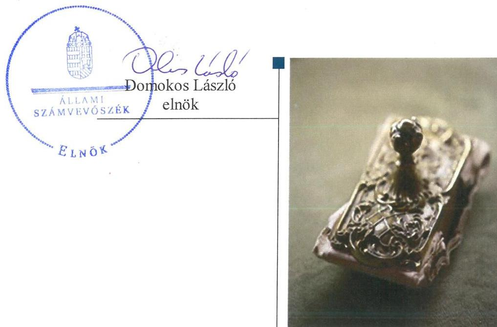
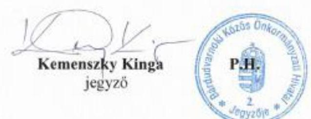
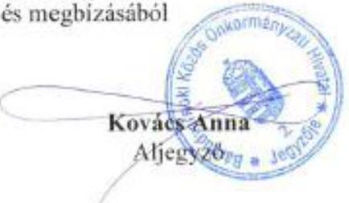
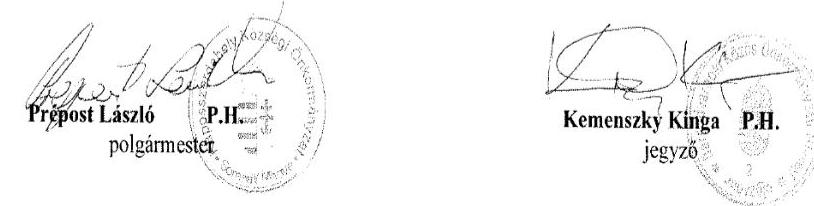
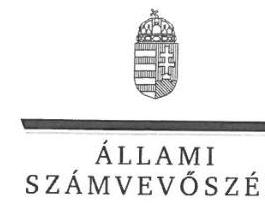
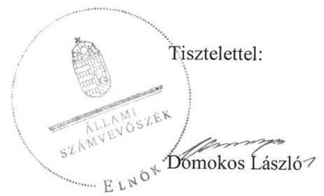
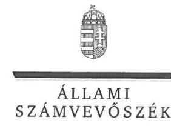
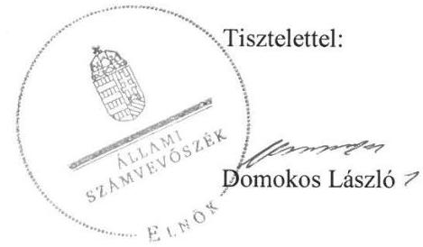

# Jelentés 

## Utóellenőrzések

Az önkormányzatok belső
kontrollrendszere kialakításának és múködtetésének ellenőrzése -
Kaposszerdahely Községi Önkormányzat 2019.

---

# Jelenetés 

## Utóellenőrzések

Az önkormányzatok belső
kontrollrendszere kialakításának és
működtetésének ellenőrzése -
Kaposszerdahely Községi Önkormányzat
2019. 03. hó 25. nap

---

# AZ ELLENŐRZÉST FELÜGYELTE: 

DR. BENEDEK MÁRIA felügyeleti vezető

## AZ ELLENŐRZÉST VEZETTE ÉS A VÉGREHAJTÁSÁÉRT FELELŐS:

DR. MAJOR LÁSZLÓ ellenőrzésvezető

## A PROGRAM ÖSSZEÁLLÍTÁSÁÉRT FELELŐS:

TÓTPÁL SZABOLCS osztályvezető

## A TÉMÁHOZ KAPCSOLÓDÓ KORÁBBI SZÁMVEVŐSZÉKI JELENTÉSEK:

- címe: Jelentés az önkormányzatok belső kontrollrendszere kialakításának és müködtetésének ellenőrzéséről - Kaposszerdahely
- sorszáma: 17034

IKTATÓSZÁM: EL-0772-034/2019
TÉMASZÁM: 2460
ELLENŐRZÉS-AZONOSÍTÓ SZÁM: V080433

---

# TARTALOMJEGYZÉK 

■ ÖSSZEGZÉS ..... 5
■ AZ ELLENŐRZÉS CÉLJA ..... 6
■ AZ ELLENŐRZÉS TERÜLETE ..... 7
■ AZ ELLENŐRZÉS HÁTTERE, INDOKOLTSÁGA ..... 8
■ A JELENTÉS LÉNYEGES KÉRDÉSKÖRE ..... 9
■ AZ ELLENŐRZÉS HATÓKÖRE ÉS MÓDSZEREI ..... 10
■ MEGÁLLAPÍTÁSOK ..... 12
■ MELLÉKLETEK ..... 15
I. sz. melléklet: Kaposszerdahely Községi Önkormányzat intézkedési terve végrehajtásának értékelése ..... 15
II. sz. melléklet: Kaposszerdahely Községi Önkormányzat intézkedési terve ..... 22
■ FÜGGELÉKEK ..... 31
I. sz. függelék a Jelentéshez ..... 31
II. sz. függelék: Észrevételek ..... 32
■ RÖVIDÍTÉSEK JEGYZÉKE ..... 41

---

.

---

# ÖSSZEGZÉS 

Az Állami Számvevőszék Kaposszerdahely Községi Önkormányzat belső kontrollrendszere kialakításának és müködtetésének utóellenőrzése során megállapította, hogy nem javult a szabályozottság és az integritás alapú müködés. A befektetések (részesedések) nem a jogszabályi előírások szerinti nyilvántartása, az értékelésének hiánya, illetve a további végre nem hajtott feladatok miatt nem volt biztositott a gazdálkodás szabályszerüsége, a pénzügyi folyamatok átláthatósága, az önkormányzati vagyonnal való átlátható, elszámoltatható gazdálkodás.

## Az ellenőrzés társadalmi indokoltsága

Az Állami Számvevőszék stratégiájában célul tűzte ki a számvevőszéki munka hasznosulásának javítását. Ezzel összhangban ellenőrzi, hogy az ellenőrzött szervezet megvalósította-e a korábbi ellenőrzései által feltárt hibák, hiányosságok és szabálytalanságok megszüntetése céljából elkészített intézkedési tervében foglaltakat. A rendszeres utóellenőrzések hozzájárulnak a szükséges intézkedések tényleges végrehajtásához, ezáltal a közpénzügyek rendezettségének javulásához.

## Főbb megállapítások, következtetések

Kaposszerdahely Községi Önkormányzatának polgármestere és jegyzője az intézkedési tervben meghatározott 25 feladatból ötöt határidőben, egyet határidőn túl, ötöt részben, 12-t nem hajtott végre, kettő okafogyottá vált.

Kaposszerdahely Községi Önkormányzatának jegyzője nem intézkedett az értékelési szabályzat és a gazdálkodás részletes rendjét meghatározó szabályozás pótlásáról, a biztonságos munkavégzés szabályozásáról. Az önkormányzati SZMSZ továbbra sem tartalmazza a bizottság nem képviselő tagjainak vagyonnyilatkozat tételi kötelezettségét. A szabályozottság és az integritás alapú múködés nem javult.

Kaposszerdahely Községi Önkormányzat vagyongazdálkodásáról szóló rendeletét nem módosította, az önkormányzati részesedések nyilvántartása nem felel meg a jogszabályi előírásoknak, valamint a részesedések értékelését nem hajtotta végre. Kaposszerdahely Községi Önkormányzatnál a megfelelő intézkedési feladatok végrehajtásának elmaradása miatt növekedtek a kockázatok a szabályszerű pénzügyi gazdálkodás és elszámoltathatóság, a belső kontroll szerinti elszámoltathatóság, valamint a vagyongazdálkodás területén.

Kaposszerdahely Községi Önkormányzat jegyzője az intézkedési tervben meghatározott feladatok végrehajtásáról a jogszabályi előírás szerinti nyilvántartást nem vezette.

---

# AZ ELLENŐRZÉS CÉLJA 

Az ellenőrzés célja annak értékelése volt, hogy a számvevőszéki jelentésben ${ }^{1}$ foglalt intézkedést igénylő megállapításokkal összhangban készített intézkedési tervben meghatározott feladatokat az ellenőrzött szervezet vég-rehajtotta-e.

---

# AZ ELLENŐRZÉS TERÜLETE 

## Kaposszerdahely Községi Önkormányzat

Kaposszerdahely község a Dél-Dunántúli régióban, Somogy megyében található. Állandó lakosainak száma a Központi Statisztikai Hivatal Magyarország közigazgatási helynévkönyve alapján 2018. január 1-jén 912 fő volt.

A Polgármester² 2010. év október 3-a óta tölti be tisztségét, a héttagú Képviselő-testület ${ }^{3}$ munkáját két állandó bizottság ${ }^{4}$ támogatja.

Kaposszerdahely Községi Önkormányzat hivatali feladatait az ellenőrzött időszakban a Bárdudvarnoki Közös Önkormányzati Hivatal látta el. A Jegyző ${ }^{5}$ személye az ellenőrzött időszakban egyszer változott, a jelenleg hivatalban lévő jegyző 2017. március 15 -étől látja el feladatát.

Kaposszerdahely Községi Önkormányzat 2017. évi költségvetési beszámolója szerint a 2017. évben az Önkormányzat 352,3 millió Ft bevételt ért el és 154,4 millió Ft kiadást teljesített.

Az ÁSZ ${ }^{6} 2016$ évben ellenőrizte Kaposszerdahely Községi Önkormányzat belső kontrollrendszere kialakítását és múködtetését a 2014. január 1. és 2015. április 30. közötti időszakra, valamint a 2011. január 1-jétől 2015. április 30-ig terjedő időszakra ellenőrizte egyes befektetési döntéseinek, a döntések végrehajtásának és elszámolásának a szabályszerűségét. Az ellenőrzés célja annak megállapítása volt, hogy az önkormányzat belső kontrollrendszerének kialakítása, továbbá egyes elemeinek múködtetése biztositotta-e az önkormányzatnál a közpénzfelhasználás szabályosságát, támogatta-e az integritás szemlélet érvényesülését. Az ÁSZ továbbá ellenőrizte, hogy az önkormányzat egyes befektetési döntései és azok végrehajtása, elszámolása megfelelte-e a vonatkozó jogszabályoknak és belső szabályozásoknak, a kialakított kontrollrendszer támogatta-e a befektetési tevékenység szabályszerűségét. Az ÁSZ az ellenőrzésről készült 17034. számú számvevőszéki jelentést 2017. február 2-án hozta nyilvánosságra.

---

# AZ ELLENŐRZÉS HÁTTERE, INDOKOLTSÁGA 

Az ÁSZ tv. ${ }^{7}$ 33. § (1) bekezdése értelmében a számvevőszéki jelentések megállapításaihoz és javaslataihoz kapcsolódóan az ellenőrzött szervezet vezetője intézkedési tervet köteles összeállítani, és az Állami Számvevőszék részére megküldeni.

Az ÁSZ által befogadott intézkedési tervben foglaltak megvalósítását az ÁSZ tv. 33. § (7) bekezdésében foglaltak alapján - az Állami Számvevőszék utóellenőrzés keretében ellenőrizheti. Az utóellenőrzések keretében - az intézkedések értékelése során - az Állami Számvevőszék figyelembe veszi az ellenőrzött szervezetek múködési feltételeiben, valamint a jogszabályi előírásokban bekövetkezett változásokat.

Az utóellenőrzés során az ÁSZ értékeli, hogy az érintett számvevőszéki jelentésben foglalt megállapításokkal és javaslatokkal összhangban, az ellenőrzött szervezet által készített intézkedési tervben meghatározott feladatokat a feladatra kijelöltek végrehajtották-e.

Az intézkedések végrehajtásával az adott terület szabályszerű múködése vonatkozásában a kockázatok csökkenhetnek, azonban hosszabb távon az intézkedési tervben foglaltak végrehajtásával önmagában nem szűnnek meg, csak akkor, ha beépülnek az ellenőrzött szervezet múködésébe, azokat folyamatosan karban tartják, figyelembe véve, illetve kezelve a változásokat. Emellett az intézkedések végrehajtásáig újabb kockázatok merülhetnek fel a szabályszerű múködés vonatkozásában, amelyek kezelése szintén kiemelten fontos az ellenőrzött szervezet számára.

Az ellenőrzött szervezet vezetője által készített intézkedési tervekben foglalt feladatok hiányos, illetve késedelmes végrehajtása, vagy annak elmaradása a szabályszerűség és a felelős vezetői magatartás vonatkozásában kockázatot hordoz, ami azt mutatja, hogy az ellenőrzések során feltárt hibák, hiányosságok és szabálytalanságok kezelése nem kapott kellő hangsúlyt. Az utóellenőrzés során is fennálló szabálytalanságok esetén a közpénz, közvagyon veszélyeztetettségi kockázat valószínűsített hatásának értékelése további intézkedéseket vonhat maga után.

Az ellenőrzött szervezet szintjén az utóellenőrzés feltárja, hogy a szervezet az intézkedések végrehajtásával hasznosította-e a korábbi ellenőrzési jelentésben a hiányosságok megszüntetése, illetve a kockázatok kezelése érdekében megfogalmazott javaslatokat, illetve az intézkedések végrehajtása elmaradásának következtében továbbra is fennálló szabálytalanság esetén értékeli a közpénzek, közvagyon veszélyeztetettségét.

Az ÁSZ szintjén az utóellenőrzés visszacsatolást ad az ellenőrzési jelentések hasznosulásáról, az intézkedések elmaradásának, vagy részleges megvalósulásának a közpénzek, közvagyon veszélyeztetettségére gyakorolt valószínűsített hatásának értékelése, további intézkedéseket vonhat maga után.

---

# A JELENTÉS LÉNYEGES KÉRDÉSKÖRE 

Az önkormányzat az intézkedési tervben foglaltakat az előirt határidőben végrehajtotta-e?

---

# AZ ELLENŐRZÉS HATÓKÖRE ÉS MÓDSZEREI 

## Az ellenőrzés típusa

Megfelelőségi ellenőrzés.

## Az ellenőrzött időszak

Az utóellenőrzés alapját képező ÁSZ jelentés közzétételének napjától 2017. február 2-ától az ellenőrzésről szóló kiértesítő levél keltének napjáig 2018. július 4-éig tartó időszak volt.

## Az ellenőrzés tárgya

A számvevőszéki jelentésben foglalt intézkedést igénylő megállapításokkal összhangban - az önkormányzat által - készített Intézkedési tervben foglaltak végrehajtásának ellenőrzése volt.

## Az ellenőrzött szervezet

Kaposszerdahely Községi Önkormányzat és a hivatali feladatait ellátó Bárdudvarnoki Közös Önkormányzati Hivatal

## Az ellenőrzés jogalapja

Az ellenőrzés jogszabályi alapját az ÁSZ tv. 33. § (7) bekezdésének előírása képezte.

## Az ellenőrzés módszerei

Az ÁSZ az ellenőrzést az ellenőrzött időszakban hatályos jogszabályok, az ellenőrzés szakmai szabályai, a jelen ellenőrzésre irányadó ÁSZ módszertanok, az ellenőrzési programban foglalt értékelési szempontok szerint végezte.

Az ÁSZ az ellenőrzés ideje alatt az önkormányzattal történő kapcsolattartást az ÁSZ SZMSZ ${ }^{\text {® }}$-ének vonatkozó előírásai alapján biztosította.

Az utóellenőrzés megállapításait az ÁSZ rendelkezésére álló, valamint az ÁSZ adatbekérése szerint, az önkormányzat által rendelkezésre bocsátott dokumentumok alapozták meg.

Az ellenőrzési bizonyítékként felhasználható adatforrások közé tartoztak egyrészt az ellenőrzési program részletes szempontjainál felsorolt

---

adatforrások, másrészt minden - az ellenőrzés folyamán feltárt, az ellenőrzés szempontjából információt tartalmazó - dokumentum.

Az ÁSZ az intézkedési tervekben előírt feladatokat azok végrehajthatósága, illetve végrehajtása szempontjából az alábbiak szerint értékelte:
$\longrightarrow$ „határidőben végrehajtott" a feladat, ha a teljesítés dokumentáltan, az intézkedési tervben előírt határidőben és tartalommal megtörtént;
$\longrightarrow$ „határidőn túl végrehajtott" a feladat, ha annak teljesítése az intézkedési tervben meghatározott módon, de az előírt határidőn túl történt meg;
$\longrightarrow$ „részben végrehajtott" a feladat, ha végrehajtása teljes körűen az intézkedési tervben előírt módon nem történt meg;
$\longrightarrow$ „nem végrehajtott" a feladat, ha a végrehajtás nem történt meg, vagy amennyiben a teljesítést nem dokumentálták;
$\longrightarrow$ „okafogyottá vált" a feladat, ha végrehajtására - meghatározott esemény bekövetkezése, továbbá külső körülmény, a működést érintő feltétel változása miatt - már nincs szükség, illetve lehetőség, és egyértelműen megállapítható, hogy az intézkedést szükségessé tevő körülmény a jövőben nem fordulhat elő;
$\longrightarrow$ „nem időszerű" az a feladat, amelynek ellenőrzési időszakon belüli végrehajtására azért nem került (kerülhetett) sor, mert az intézkedés alapjául szolgáló esemény nem következett be, de annak jövőbeni előfordulása lehetséges, a végrehajtása nem volt esedékes, vagy a végrehajtás határideje még nem járt le.
Az önkormányzat az ellenőrzés lefolytatásához a tanúsítványok elektronikus kitöltésével, valamint az ÁSZ által kért dokumentumok elektronikus megküldésével szolgáltatott adatokat, amelyek valódiságát és teljes körűségét az ellenőrzött szervezet vezetője által tett teljességi és hitelességi nyilatkozat igazolja. Az így rendelkezésre bocsátott adatok, információk kontrollja az ellenőrzés keretében megtörtént.

Kaposszerdahely Községi Önkormányzat által megküldött intézkedési tervben meghatározott ÁSZ által beazonosított feladatok a II. számú mellékletben kerültek bemutatásra.

---

# MEGÁLLAPÍTÁSOK 

## Az önkormányzat az intézkedési tervben foglaltakat az előírt határidőben végrehajtotta-e?

Összegző megállapítás

Az Önkormányzat ${ }^{9}$ az intézkedési tervben meghatározott 25 feladatból ötöt határidőben, egyet határidőn túl, ötöt részben, 12-t nem hajtott végre, kettő okafogyottá vált. Az intézkedési tervben meghatározott feladatok végrehajtásáról a jogszabályi előírás szerinti nyilvántartást nem vezette.

Az ÁSZ jelentésében a polgármester részére öt, a jegyző részére nyolc javaslatot fogalmazott meg. A polgármester által előterjesztett és a Képvi-selő-testület által a 48/2017. (V. 17.) és a 66/2017. (VIII. 29.) számú határozattal jóváhagyott intézkedési terv ${ }_{\text {L2 }}{ }^{10}$-ben a hiányosságok, a szabálytalanságok megszüntetésére a polgármester részére öt, a jegyző részére 21 feladat került meghatározásra.

Az intézkedési tervben meghatározott feladatokat, határidőket, felelősöket és a feladatok végrehajtását az I. sz. melléklet mutatja be.

Az Önkormányzat jegyzője az intézkedési tervben meghatározott feladatok végrehajtásáról a Bkr. ${ }^{11} 14 . \S$ (1) bekezdés előírása szerinti nyilvántartást nem vezette.

Az Önkormányzat intézkedési tervében meghatározott feladatok végrehajtásának értékelési kategóriák szerinti megoszlását az 1. ábra szemlélteti.

1. ábra

A feladatok végrehajtásának
értékelési kategóriák szerinti
megoszlása

- határidőben végrehajtott
- határidőn túl végrehajtott
- Részben végrehajtott
- Nem végrehajtott
- Okafogyottá vált

---

A SZABÁLYOZOTTSÁG nem javult az értékelési szabályzat és a biztonságos munkavégzés szabályozásának ( $\mathrm{IT}_{2} \mathrm{~J} 4$. ), a gazdálkodás részletes rendjét meghatározó szabályozásnak ( $\mathrm{IT}_{2} \mathrm{~J} 7$. ) a hiánya, valamint a Számviteli politika, a Leltározási szabályzat ( $\mathrm{IT}_{2} \mathrm{~J} 3$. ), az önkormányzati ( $\mathrm{IT}_{2} \mathrm{~J} 14$. ), hivatali SZMSZ ( $\mathrm{IT}_{2} \mathrm{~J} 16$. ) és a vagyongazdálkodásról szóló önkormányzati rendelet ( $\mathrm{IT}_{2} \mathrm{~J} 15$. ) módosításának elmaradása miatt.

A PÉNZÜGYI GAZDÁLKODÁS szabályszerűsége nem javult a szabályozottságnál említett pénzügyi szabályozások hiányosságai, továbbá a gazdálkodási jogkörök gyakorlásának ( $\mathrm{IT}_{2} \mathrm{~J} 9$.) szabálytalansága miatt.

# A BELSŐ KONTROLL SZERINTI ELSZÁMOLTATHATÓSÁG javult, mert az Önkormányzat a monitoring rendszer kialakítását az operatív tevékenységektől függetlenül múködő belső ellenőrzéssel biztosította ( $\mathrm{IT}_{2} \mathrm{~J} 12$ ). 

AZ INTEGRITÁS nem javult, mert az önkormányzati SZMSZ továbbra sem tartalmazza a bizottság nem képviselő tagjainak vagyonnyilatkozat tételi kötelezettségét ( $\mathrm{IT}_{2} \mathrm{~J} 14$ ).

A VAGYONGAZDÁLKODÁS szabályszerűsége nem javult, mert az Önkormányzat vagyongazdálkodásáról szóló rendelete nem módosult ( $\mathrm{IT}_{2} \mathrm{~J} 15$.), az önkormányzati részesedések nyilvántartása nem felel meg a jogszabályi előírásoknak ( $\mathrm{IT}_{2} \mathrm{~J} 17$.), valamint a részesedések értékelését az Önkormányzat nem hajtotta végre ( $\mathrm{IT}_{2} \mathrm{~J} 19$.).

---

.

---

# MELLÉKLETEK

- I. SZ. MELLÉKLET: KAPOSSZERDAHELY KÖZSÉGI ÖNKORMÁNYZAT INTÉZKEDÉSI TERVE VÉGREHAJTÁSÁNAK ÉRTÉKELÉSE

|  $\begin{aligned} & \text { 今 } \ & \text { 今 } \ & \text { 今 } \ & \text { 今 } \end{aligned}$ | Az intézkedési tervben meghatározott feladat | Az intézkedési tervben meghatározott határidő | Az intézkedési tervben meghatározott feladat felelőse | A feladat végrehajtása  |
| --- | --- | --- | --- | --- |
|   |  | Határidőben végrehajtott feladatok |  |   |
|  IT3J1. ${ }^{12}$ | A köztisztviselőkre vonatkozó hivatásetikai alapelvek részletes tartalmának, valamint az etikai eljárás szabályai meghatározása a javaslat 1.1. megállapítás 6. bekezdése alapján. | 2017. december 31. | jegyző | A jegyző meghatározta a köztisztviselőkre vonatkozó hivatásetikai alapelvek részletes tartalmát, valamint az etikai eljárás szabályait.  |
|  IT ${ }_{1}$ P3. ${ }^{13}$ | A köztisztviselőkre vonatkozó hivatásetikai alapelvek részletes tartalmának, valamint az etikai eljárás szabályait megállapító előterjesztés Képviselő-testület elé terjesztése a javaslat 1.1. megállapítás 6. bekezdése alapján. | 2017. december 31. | polgármester | A polgármester a Képviselő-testület elé terjesztette a köztisztviselőkre vonatkozó hivatásetikai alapelvek részletes tartalmát, valamint az etikai eljárás szabályait megállapító előterjesztést. A Képviselő-testület a 2017. szeptember 22-től hatályos Hivatásetikai Szabályzatot ${ }^{14}$ a 83/2017 (IX. 21.) számú határozattal fogadta el.  |
|  IT ${ }_{2}$ J10. | Az 1.4. megállapításban foglaltaknak megfelelően az információ átadás rendjének kialakítása, az Adatvédelmi Szabályzat átdolgozása a hatályos jogszabályi előírásoknak megfelelően. | 2017. december 31. | jegyző | A jegyző kialakította a hatályos jogszabályok szerint az információ átadás rendjét, intézkedett az Adatvédelmi Szabályzat átdolgozásáról a hatályos jogszabályi előírásoknak megfelelően.  |
|  IT ${ }_{2}$ J12. | Az 1.5. megállapítás 1. bekezdése szerint a Bkr. 10. §-ában előírtaknak megfelelően a monitoring rendszer kialakításra került. | 2017. december 31. | jegyző | A jegyző intézkedett a monitoring rendszer kialakításáról az operatív tevékenységektől függetlenül működő belső ellenőrzéssel. Ezeket a feladatokat egy külső tanácsadó cég végezte megbízási szerződés alapján.  |
|  IT ${ }_{2}$ J18. | Intézkedés az éves költségvetési beszámolók mérlegében kimutatott eszközök (részesedések), jogszabályi előírásoknak megfelelő leltárral történő alátámasztásáról. | folyamatos | jegyző | A jegyző intézkedett az éves költségvetési beszámolók mérlegében kimutatott eszközök (részesedések), jogszabályi előírásoknak megfelelő leltárral történő alátámasztásáról.  |

---

|  2017. | Az intézkedési tervben meghatározott feladat | Az intézkedési tervben meghatározott határidő | Az intézkedési tervben meghatározott feladat felelőse | A feladat végrehajtása  |
| --- | --- | --- | --- | --- |
|  2018. | Hátáridőn túl végrehajtott feladat |  |  |   |
|  IT3/2. | Az 1.1. megállapítás 7. bekezdésében előírtak alapján elkülönített szervezeti egységek és gazdasági szervezet kialakítása a Hivatalban. A hivatal köztisztviselőinek munkaköri leírásának felülvizsgálata a Kttv. ${ }^{15}$ 226. § (1) bekezdésének alkalmazása mellett a Kttv. 75 § (1) bekezdése d) pontjában foglaltaknak megfelelően. | 2017. május 31. | jegyző | A jegyző a 2017. május 31-ei határidőn túl intézkedett - a hivatali SZMSZ 2017. október 1-ei hatállyal elfogadott módosításával - az elkülönített szervezeti egységek és gazdasági szervezet kialakításáról a Hivatalban. A jegyző a 2017. május 31-ei határidőn túl intézkedett - a munkaköri leírások 2018. január 2-ai hatállyal elfogadott módosításával - a munkaköri leírások felülvizsgálatáról a Kttv. 226. § (1) bekezdésének alkalmazása mellett a Kttv. 75 § (1) bekezdése d) pontjában foglaltaknak megfelelően.  |
|  2019. | Részben végrehajtott feladatok |  |  |   |
|  IT3/3. | Az 1.1. megállapítás 16., valamint 18-20. bekezdéseiben előírt szabályzatok (számviteli politika, számlarend, pénzkezelési szabályzat, leltározási szabályzat) felülvizsgálata. | 2017. december 31. | jegyző | Végrehajtott feladatrész:
A jegyző - a 2017. december 31-ei határidőn túl a Pénzkezelési szabályzat 2018. március 1-ei hatállyal elfogadott módosításával - intézkedett a Pénzkezelési szabályzat felülvizsgálatáról.
Nem végrehajtott feladatrész:
A jegyző a Számv. tv. ${ }^{16}$ 14. § (4) bekezdésében foglaltak ellenére nem intézkedett a Számviteli politika, a Számlarend és a Leltározási szabályzat felülvizsgálatáról.  |
|  IT3/4. | Az 1.1. megállapítás 22-26. bekezdésekben feltárt hiányosságok (szabálytalanságkezelési eljárásrend, értékelési szabályzat, bizonylati rend, tűzvédelmi szabályzat, a biztonságos munkavégzés szabályozása) pótlása, felülvizsgálata. | 2017. december 31. | jegyző | Végrehajtott feladatrész:
A jegyző intézkedett a Bizonylati rend és a Tűzvédelmi szabályzat pótlásáról.
Nem végrehajtott feladatrész:
A jegyző nem intézkedett
- a Bkr. 6. § (4) bekezdésével összhangban a szabálytalanságkezelési eljárásrend felülvizsgálatáról;
- a Számv. tv. 14. § (5) bekezdés b) pontjában foglaltak ellenére az értékelési szabályzat pótlásáról;
- az Mvtv. ${ }^{17}$ 2. § (3) bekezdésében foglaltak ellenére a biztonságos munkavégzés szabályozásáról.  |

---

|   | Az intézkedési tervben meghatározott feladat | Az intézkedési tervben meghatározott határidő | Az intézkedési tervben meghatározott feladat felelőse | A feladat végrehajtása  |
| --- | --- | --- | --- | --- |
|  IT313. | Az 1.5. megállapítás 6-7. bekezdései szerint a Bkr. 22. § (1) bekezdés b) pontja és a 29. § (1) bekezdés, valamint a 31. § (1)-(2) bekezdése alapján kockázatelemzéssel alátámasztott stratégiai és éves ellenőrzési tervet, valamint az ellenőrzési tervben foglaltak elvégzésre kerülnek. | 2017. december 31. | jegyző | Végrehajtott feladatrész:
A jegyző intézkedett kockázatelemzéssel alátámasztott éves ellenőrzési terv elkészítéséről, valamint az ellenőrzési tervben foglaltak elvégzéséről.
Nem végrehajtott feladatrész:
A jegyző nem intézkedett a Bkr. 22. § (1) bekezdés b) pontja és a 29. § (1) bekezdés, valamint a 31. § (1)-(2) bekezdésében foglaltak ellenére kockázatelemzéssel alátámasztott stratégiai ellenőrzési terv elkészítéséről.  |
|  IT316. | A Bárdudvarnoki Közös Önkormányzati Hivatal Szervezeti és Működési Szabályzata módosítása a jelentés 1.1. számú megállapításainak 4. bekezdés 1-3. pontja alapján. | 2017. december 31. | jegyző | Végrehajtott feladatrész:
A jegyző intézkedett a hivatali SZMSZ18 módosításáról a nevesített munkakörökhöz tartozó feladat- és hatáskörök, azok gyakorlásának módja, a helyettesítés rendje és a felelősségi szabályok tekintetében.
Nem végrehajtott feladatrész:
A jegyző nem intézkedett az Ávr. ${ }^{19}$ 13. § (1) bekezdés c) és i) pontjaiban foglaltak ellenére a hivatali SZMSZ módosításáról az ellátandó, és a kormányzati funkció szerint besorolt alaptevékenységek megjelölése, valamint a Hivatalhoz rendelt költségvetési szerv (Kaposszerdahelyi - Bárdudvarnoki Óvoda) feltüntetése tekintetében.  |
|  IT320. | Vizsgálat a jegyzőnek címzett 8. számú javaslatban foglaltaknak megfelelően az Állami Számvevőszék ellenőrzése során feltárt hiányosságok és szabálytalanságok tekintetében a munkajogi felelősség megállapítására vonatkozóan.
A gazdasági vezető munkaköri leírása kiegészítésre kerül különös tekintettel az Állami Számvevőszék ellenőrzése során tett meg- | 2017. december 31. | jegyző | Végrehajtott feladatrész:
A jegyző a gazdasági vezető munkaköri leírását kiegészítette a munkakör betöltéséhez szükséges szakképzettség, szakképesítés előírásával, valamint új feladatként előírta az integrált informatikai szakrendszerek használatát.
Nem végrehajtott feladatrész:
A jegyző nem intézkedett a feltárt hiányosságok és szabálytalanságok tekintetében a munkajogi felelősség megállapításáról.  |

---

|  Az intézkedési tervben meghatározott feladat | Az intézkedési tervben meghatározott határidő | Az intézkedési tervben meghatározott feladat felelése | A feladat végrehajtása  |
| --- | --- | --- | --- |
|  állapításokra. A gazdasági vezető teljesítményértékelése a feltárt hiányosságok figyelembevételével kerül elkészítésre. |  |  | A jegyző a gazdasági vezető 2016. évi teljesítményértékelése során nem vette figyelembe a feltárt hiányosságokat.  |
|  Nem végrehajtott feladatok |  |  |   |
|  $\Pi_{2} \mathbf{1 4}$. A Képviselő-testület Szervezeti és Működési Szabályzatáról szóló rendelet módosítása, amely szabályzat tartalmazza:
a) az átruházott hatáskörök felsorolását, továbbá a jegyzőnek a jogszabálysértő döntések, működés jelzésére irányuló kötelezettségét;
b) az önkormányzati bizottságok nem képviselő tagjainak vagyonnyilatkozat-tételi kötelezettségét. | 2017. december 31. | jegyző | A jegyző nem készítette elő az önkormányzati SZMSZ módosítását annak érdekében, hogy az tartalmazza:
a.) a Mötv. ${ }^{20} 53 . \S$ (1) bekezdés előírása szerint az átruházott hatáskörök felsorolását, továbbá a jegyzőnek a jogszabálysértő döntések, működés jelzésére irányuló kötelezettségét, b.) a Vnytv. ${ }^{21} 4 . \S$ d) pontja alapján a bizottságok nem képviselő tagjai vagyonnyilatkozat-tételi kötelezettségét.  |
|  $\Pi_{1} \mathbf{P 1}$. A Képviselő-testület Szervezeti és Működési Szabályzatáról szóló rendelet módosításának Képviselő-testület elé terjesztése.
a.) az átruházott hatáskörök felsorolását, továbbá a jegyzőnek a jogszabálysértő döntések, működés jelzésére irányuló kötelezettségét,
b.) a bizottság nem képviselő tagjainak vagyonnyilatkozat - tételi kötelezettségét. | 2017. december 31. | polgármester | A polgármester nem terjesztette a Képviselő-testület elé az önkormányzati SZMSZ módosítását annak érdekében, hogy az tartalmazza:
a.) a Mötv. 53. § (1) bekezdés előírása szerint az átruházott hatáskörök felsorolását, továbbá a jegyzőnek a jogszabálysértő döntések, működés jelzésére irányuló kötelezettségét, b.) a Vnytv. 4. § d) pontja alapján a bizottságok nem képviselő tagjai vagyonnyilatkozat-tételi kötelezettségét.  |
|  $\Pi_{1} \mathbf{P 2}$. Bárdudvarnoki Közös Önkormányzati Hivatal Szervezeti és Működési Szabályzata módosításának Képviselő-testületek elé terjesztése a jelentés 1.1. számú megállapításának 4. bekezdés 1-3. pontja alapján. | 2017. december 31. | polgármester | A polgármester nem intézkedett az Ávr. 13. § (1) bekezdés c) és i) pontjaiban foglaltak ellenére a hivatali SZMSZ módosításának Képviselő-testületek elé terjesztéséről az ellátandó, és a kormányzati funkció szerint besorolt alaptevékenységek megjelölése, valamint a Hivatalhoz rendelt költségvetési szerv (Kaposszerdahelyi - Bárdudvarnoki Óvoda) feltüntetése tekintetében.  |

---

|  Az intézkedési tervben meghatározott feladat | Az intézkedési tervben meghatározott határidő | Az intézkedési tervben meghatározott feladat | A feladat végrehajtása  |
| --- | --- | --- | --- |
|  $\Pi_{3} \mathbf{1 5 .}$ | Az Önkormányzat vagyongazdálkodásáról szóló rendeletének módosítása a jelentés 1.1. számú megállapítás 11. bekezdés 2. pontjában megfogalmazottak alapján. | 2017. december 31. | jegyző  |
|  $\Pi_{1} \mathbf{P 4 .}$ | Az Önkormányzat vagyongazdálkodásáról szóló rendeletének módosítását a Képviselő-testület elé terjesztjük a jelentés 1.1. számú megállapítás 11. bekezdés 2. pontjában megfogalmazottak alapján. | 2017. december 31. | polgármester  |
|  $\Pi_{2} \mathbf{1 5 .}$ | Az 1.2. számú megállapítás alapján a Bkr. 7. § (1)-(2) bekezdése értelmében az integrált kockázatkezelési rendszer kialakítása, működtetése. A költségvetési szerv tevékenységében rejlő és szervezeti célokkal összefüggő kockázatok megállapítása, valamint az egyes kockázatokkal kapcsolatban szükséges intézkedések meghatározása, azok teljesítésének folyamatos nyomon követése módjának meghatározás. | 2017. december 31. | jegyző  |
|  $\Pi_{3} \mathbf{1 7 .}$ | Az 1.3. számú megállapítás 2. bekezdésében előírt - az Áht. 10. § (5) bekezdés szerint - gazdálkodás részletes rendje szabályozásra kerül, különös tekintettel az Ávr. 53. § (2) bekezdésében előírt előzetes írásbeli kötelezettségvállalást nem igénylő kifizetések rendjére. | 2017. május 31. | jegyző  |

A jegyző nem készítette elő az Önkormányzat vagyongazdálkodásáról szóló rendeletének módosítását, hogy az Áht. ${ }^{22} 97$. § (2) bekezdésében előírtak szerint tartalmazza a követelésről való lemondás eseteit és módját. A polgármester nem terjesztette a Képviselő-testület elé az Önkormányzat vagyongazdálkodásáról szóló rendeletének módosítását, hogy az Áht. 97. § (2) bekezdésében előírtak szerint tartalmazza a követelésről való lemondás eseteit és módját. A jegyző a Bkr. 7. § (1)-(2) bekezdésében foglaltak ellenére nem intézkedett az integrált kockázatkezelési rendszer kialakításáról és működtetéséről, a költségvetési szerv tevékenységében rejlő és szervezeti célokkal összefüggő kockázatok megállapításáról, valamint az egyes kockázatokkal kapcsolatban szükséges intézkedések meghatározásáról, azok teljesítésének folyamatos nyomon követése módjának meghatározásáról.

A jegyző az Áht. 10. § (5) bekezdésében foglaltak ellenére nem intézkedett a gazdálkodás részletes rendje szabályozásáról, különös tekintettel az Ávr. 53. § (2) bekezdésében előírt előzetes írásbeli kötelezettségvállalást nem igénylő kifizetések rendjére.

---

|  8
$\mathrm{T}_{3} \mathrm{I} 8$ | Az intézkedési tervben meghatározott feladat | Az intézkedési tervben meghatározott határidő | Az intézkedési tervben meghatározott feladat felelőse | A feladat végrehajtása  |
| --- | --- | --- | --- | --- |
|  $\Pi_{3} 18$. | Az 1.3. számú megállapítás 4. bekezdésében szerepeltetett - Ávr. 13. § (2) a) pontja szerinti - hiányosság szabályozása a Pénzügyi Szabályzatban, valamint az Ávr. 13. § (5) bekezdésében foglaltaknak megfelelően a gazdasági feladatot ellátó alkalmazottak helyettesítési rendjének meghatározása a munkaköri leírásban. | 2017. december 31. | jegyző | A jegyző nem intézkedett a Pénzügyi Szabályzat Ávr. 13. § (2) bekezdés a) pontja szerinti hiányosságának szabályozásáról, valamint az Ávr. 13. § (5) bekezdésében foglaltak ellenére a gazdasági feladatot ellátó alkalmazottak helyettesítési rendjének meghatározásáról a munkaköri leírásban.  |
|  $\Pi_{3} 19$. | Az 1.3. megállapítás 6-7 bekezdése alapján:
- A teljesítésigazolásra és kötelezettségvállaló által kijelölt személy az Áht. 38. § (1) bekezdés és az Ávr. 57. § (1) és (3) bekezdések alapján ellenőrzik a kiadások teljesítésének jogosságát, összegszerűségét, ellenszolgáltatást is magában foglaló kötelezettségvállalás esetén szerződés, megrendelés teljesítését aláírásukkal igazolják.
- A kifizetéseket megelőzően - az Ávr. 58. § (1) bekezdése szerint - a teljesítésigazolás alapján - az Ávr. 57. § (3) bekezdése szerinti esetben annak hiányában is - az összegszerűségnek, a fedezet meglétének és a megelőző ügymenetben az új Áht., az Áhsz., az Ávr. előírásainak és a belső szabályokban foglaltak szerint történik. | 2017. március 31. után folyamatos | jegyző | - A jegyző nem intézkedett az Áht. 38. § (1) bekezdés és az Ávr. 57. § (1) és (3) bekezdésekben foglaltak ellenére, hogy a teljesítésigazolásra és kötelezettségvállaló által kijelölt személy ellenőrizze a kiadások teljesítésének jogosságát, összegszerűségét, ellenszolgáltatást is magában foglaló kötelezettségvállalás esetén szerződés, megrendelés teljesítését aláírásukkal igazolják.
- A jegyző nem intézkedett az Ávr. 58. § (1) bekezdésében foglaltak ellenére (kifizetések esetén a teljesítés igazolása alapján - az 57. § (3) bekezdése esetében annak hiányában is), hogy kifizetéseket megelőzően az érvényesítő ellenőrizze az összegszerűség, a fedezet megléte és a megelőző ügymenetben az új Áht., az Áhsz., az Ávr. előírásainak és a belső szabályokban foglaltak megtartását.  |

---

|  ㅇ
ㅇ
ㅇ
ㅇ | Az intézkedési tervben meghatározott feladat | Az intézkedési tervben meghatározott határidő | Az intézkedési tervben meghatározott feladat felelőse | A feladat végrehajtása  |
| --- | --- | --- | --- | --- |
|  IT3/11. | Az Info.tv. ${ }^{23}$ 33. § (1) és (3) bekezdései szerinti elektronikus közzétételi kötelezettségének az Önkormányzat eleget tesz, az elektronikus felületén az adatok feltöltése, aktualizálása folyamatos (az 1.4. megállapítás 6. bekezdése szerint). | 2017. március 31. után folyamatos | jegyző | A jegyző nem intézkedett az Info.tv. 33. § (1) és (3) bekezdései szerint az Önkormányzat elektronikus közzétételi kötelezettségének teljesítéséről, az elektronikus felületén az adatok feltöltésének, aktualizálásának folyamatosságáról.  |
|  IT3/17. | Intézkedés a részesedés adatainak jogszabályi előírásoknak megfelelő rögzítéséről a részletező nyilvántartásokban. | folyamatos | jegyző | A jegyző az Áhsz. 39. § (3) bekezdésében foglaltak ellenére az Áhsz. 14. számú melléklet VIII. (3) pontjában nem intézkedett a részesedés adatainak jogszabályi előírásoknak megfelelő rögzítéséről a részletező nyilvántartásokban.  |
|  IT3/19. | Intézkedés az éves költségvetési beszámolók mérlegében kimutatott befektetett pénzügyi eszközök (részesedések), jogszabályi előírásoknak megfelelő értékeléséről. | folyamatos | jegyző | A jegyző a Számv. tv. 46. § (3), Áhsz. ${ }^{24}$ 20. § (1) és a 21. § (3) bekezdéseiben foglaltak ellenére nem intézkedett az éves költségvetési beszámolók mérlegében kimutatott befektetett pénzügyi eszközök (részesedések), jogszabályi előírásoknak megfelelő értékeléséről.  |
|  Okafogyottá vált feladatok |  |  |  |   |
|  IT1P5. | A feltárt hiányosságok és/vagy szabálytalanságok tekintetében a munkajogi felelősség kivizsgálására irányuló eljárás megindítása és ennek eredménye ismeretében a szükséges intézkedések meghozatala. | jegyzőváltásra tekintettel már nem végrehajtható | polgármester | A polgármester részére meghatározott feladat, a feltárt hiányosságok és/vagy szabálytalanságok tekintetében a munkajogi felelősség kivizsgálására irányuló eljárás megindítása és ennek eredménye ismeretében a szükséges intézkedések meghozatala a Számvevőszéki jelentés nyilvánosságra hozatalának időpontjában 2017. február 2-án hivatalban álló jegyző jogviszonyának 2017. március 15-ei megszűnése miatt okafogyottá vált.  |
|  IT3/6. | Az 1.3. számú megállapítás 1. bekezdésében feltárt - a Bkr. 8. § (2) bekezdésében foglaltak szerint - hiányosságok felülvizsgálata:
- folyamatba épített előzetes, utólagos és vezetői ellenőrzés. | 2017. május 31. | jegyző | A jegyző részére meghatározott feladat a Bkr. 8. § (2) módosulása miatt okafogyottá vált, 2016. október 1-jétől a folyamatba épített előzetes, utólagos és vezetői ellenőrzés biztosítására vonatkozó előírást a Bkr. nem tartalmaz.  |

---

# BÁRDUDVARNOKI KÖZÖS ÖNKORMÁNYZATI HIVATAL JEGYZŐJÉTŐL

7478 BÁRDUDVARNOK, BÁRD UTCA 36.
TELEFON: (82) 577-086
FAX: (82) 577-087
E-MAIL: BARDUDVARNOK@KAPOS-NET.HU

## KIVONAT

Amely készült Kaposszerdahely Községi Önkormányzat Képviselő-testületének 2017. május 17. (szerda) napján 17:00 órakor a Kaposszerdahelyi Községházán tartott rendkívüli nyílt képviselő-testületi ülés jegyzőkönyvéből:

„A Képviselő-testület 5 igen szavazattal, egyhangúlag a következő határozatot hozta:

### 48/2017. (V. 17.) számú határozat:

Kaposszerdahely Községi Önkormányzat képviselő-testülete az „Önkormányzatok belső kontrollrendszere – Az önkormányzatok belső kontrollrendszere kialakításának és működtetésének ellenőrzése – Kaposszerdahely” című számvevőszéki kiegészítési javaslatra készített intézkedési tervet megismerte, és az előterjesztésben foglaltaknak megfelelően jóváhagyóan elfogadja.

A Képviselő-testület felhatalmazza a polgármestert a jelen döntés vonatkozásában a szükséges intézkedések megtételére és a dokumentumok aláírására.

Határidő: azonnal
Felelős: Prépost László, polgármester

Prépost László sk. polgármester

Kemenszky Kinga sk. jegyző

A kivonat hitelességét igazolom:
Kaposszerdahely, 2017. május 23.

---

# BÁRDUDVARNOKI KÖZÖS ÖNKORMÁNYZATI HIVATAL JEGYZÓJÉTÓL 

7478 BÁRDUDVARNOK, BÁRD UTCA 36. TelefON: (82) 577-086 FAX: (82) 577-087
E-MAIL: BARDUDVARNOK@KAPOS-NET.HU

## KIVONAT

Amely készült Kaposszerdahely Községi Önkormányzat Képviselő-testületének 2017. augusztus 29. (kedd) napján 14:00 órakor a Kaposszerdahelyi Községházán tartott nyílt képviselő-testületi ülés jegyzőkönyvéből:
„A Képviselő-testület 6 igen szavazattal, egyhangúan a következő határozatot hozta:

## 66/2017. (VIII. 29.) számú határozat:

Kaposszerdahely Községi Önkormányzat képviselő-testülete az „Önkormányzatok belső kontrollrendszere - Az önkormányzatok belső kontrollrendszere kialakításának és müködtetésének ellenőrzése - Kaposszerdahely" címú számvevőszéki kiegészítési javaslatra készített intézkedési terv kiegészítését megismerte, és az előterjesztésben foglaltaknak megfelelően jóváhagyóan elfogadja.

A Képviselő-testület felhatalmazza a polgármestert a jelen döntés vonatkozásában a szükséges intézkedések megtételére és a dokumentumok aláírására.

Határidő: azonnal
Felelős: Prépost László, polgármester

Prépost László sk. polgármester

Kemenszky Kinga sk. jegyző"

A kivonat hitelességét igazolom:
Kaposszerdahely, 2017. szeptember 1.

Kemenszky Kinga
Jegyző nevében és megbízásából

---

Kaposszerdahely

KAPOSSZERDAHELY KÖZSÉG ÖNKORMÁNYZATA

7476 Kaposszerdahely, Kossuth Lajos utca 65. Tel: 82/712-526 Fax: 82/584-010 E-mail: kaposszerdahely@kapos-net.hu

# INTÉZKEDÉSI

## T E R V

az Állami Számvevőszék által 2015. december 30. napján indított

## „Az önkormányzatok belső kontrollrendszere kialakításának és működtetésének ellenőrzése – Kaposszerdahelyen”

című ellenőrzés kapcsán a 2017. február 02. napján kelt jelentésben foglalt javaslatok megvalósítására

Alulírott Prépost László, Kaposszerdahely Községi Önkormányzat, vagyis az ellenőrzéssel érintett szerv vezetője a hivatkozott jelentés alapján a következő intézkedések tervbe vételét teszem a következő határidők és felelős személyek megjelölése mellett:

|  Intézkedés megtétele | Határidő | Felelős  |
| --- | --- | --- |
|  A Képviselő-testület Szervezeti és Működési Szabályzatáról szóló rendelet módosításának Képviselő-testület elé terjesztése, amely tervezet tartalmazza | 2017. december 31. | Polgármester  |
|  a.) az átruházott hatáskörök felsorolását, továbbá a jegyzőnek a jogszabálysértő döntések, működés jelzésére irányuló kötelezettségét, |  |   |
|  b.) a bizottságok nem képviselő tagjainak vagyonnyilatkozat – tételi kötelezettségét. |  |   |

---

|  A Bárdudvarnoki Közös Önkormányzati Hivatal Szervezeti és Müködési Szabályzata módosításának Képviselö-testületek elé terjesztése a jelentés 1.1. számú megállapításának 4. bekezdés 1-3. pontja alapján. | 2017. december 31. | Polgármester  |
| --- | --- | --- |
|  A köztisztviselökre vonatkozó hivatásetikai alapelvek részletes tartalmának, valamint az etikai eljárás szabályait megállapító elöterjesztés Képviselö-testület elé terjesztése a javaslat 1.1. megállapítás 6. bekezdése alapján. | 2017. december 31. | Polgármester  |
|  Az Önkormányzat vagyongazdálkodásáról szóló rendeletének módosítását a Képviselö-testület elé terjesztjük a jelentés 1.1. számú megállapítás 11. bekezdés 2. pontjában megfogalmazottak alapján. | 2017. december 31. | Polgármester  |
|  A feltárt hiányosságok és/vagy szabálytalanságok tekintetében a munkajogi felelősség kivizsgálására irányuló eljárás megindítása és ennek eredménye ismeretében a szükséges intézkedések meghozatala. | - | Jegyzőváltásra tekintettel már nem végrehajtható  |

---

Kaposszerdahely

KAPOSSZERDAHELY KÖZSÉG ÖNKORMÁNYZATA

7476 Kaposszerdahely, Kossuth Lajos utca 65. Tel: 82/712-526 Fax: 82/584-010 E-mail: kaposszerdahely@kapos-net.hu

# INTÉZKEDÉSI

TERV KIEGÉSZÍTÉS

az Állami Számvevőszék által 2015. december 30. napján indított

„Az önkormányzatok belső kontrollrendszere kialakításának és müködtetésének ellenőrzése – Kaposszerdahelyen”

című ellenőrzés kapcsán a 2017. február 02. napján kelt jelentésben foglalt javaslatok megvalósítására

Alulírott Kemenszky Kinga, a Bárdudvarnoki Közös Önkormányzati Hivatal jegyzője a Kaposszerdahely Községi Önkormányzat vonatkozásában hivatkozott jelentés alapján a következő intézkedések tervbe vételét – a korábban megküldésre került intézkedési terv kiegészítését - teszem az alábbi határidők és felelős személyek megjelölése mellett:

|  Intézkedés megtétele | Határidő | Felelős  |
| --- | --- | --- |
|  Jegyzőnek címzett 1. számú javaslat alapján: |  |   |
|  A köztisztviselőkre vonatkozó hivatásatikai alapelvek részletes tartalmának, valamint az etikai eljárás szabályai meghatározása a javaslat 1.1. megállapítás 6. bekezdése alapján. | 2017. december 31. | Jegyző  |
|  Az 1.1 számú megállapítás 7. bekezdésében előírtak alapján elkülönített szervezeti egységek és gazdasági szervezet kialakítása a Hivatalban. A Hivatal köztisztviselőinek munkaköri leírásának felülvizsgálata a Kttv. 226. § (1) bekezdésének alkalmazása mellett a Kttv. 75. § (1) bekezdése d) pontjában foglaltaknak megfelelően | 2017. május 31. | Jegyző  |
|  Az 1.1 számú megállapítás 16., valamint 18-20. bekezdéseiben előírt szabályzatok (számviteli politika, számlarend, pénzkezelési szabályzat, leltározási szabályzat) felülvizsgálata. | 2017. december 31. | Jegyző  |
|  Az 1.1 számú megállapítás 22-26. bekezdéseiben feltárt hiányosságok (szabálytalanságkezelési eljárásrend, értékelési szabályzat, bizonylati rend, tüzvédelmi szabályzat, a biztonságos munkavégzés) | 2017. december 31. | Jegyző  |

---

|  szabályozása) pótlása, felülvizsgálata. |  |   |
| --- | --- | --- |
|  Az 1.2 számú megállapítás alapján a Bkr. 7. § (1)-(2) bekezdése értelmében az integrált kockázatkezelési rendszer kialakítása, müködtetése. A költségvetési szerv tevékenységében rejlő és szervezeti célokkal összefüggő kockázatok megállapítása, valamint az egyes kockázatokkal kapcsolatban szükséges intézkedések meghatározása, azok teljesítésének folyamatos nyomon követése módjának meghatározás. | 2017. december 31. | Jegyző  |
|  Az 1.3 számú megállapítás 1. bekezdésében feltárt - a Bkr. 8. § (2) bekezdésében foglaltak szerint hiányosságok felülvizsgálata:
- Folyamatba épített előzetes, utólagos és vezetői ellenőrzés | 2017. május 31. | Jegyző  |
|  Az 1.3 számú megállapítás 2. bekezdésében előírt az Áht. 10. § (5) bekezdés szerint - gazdálkodás részletes rendje szabályozásra kerül, különös tekintettel az Ávr. 53. § (2) bekezdésében előírt előzetes írásbeli kötelezettségvállalást nem igénylő kifizetések rendjére. | 2017. május 31. | Jegyző  |
|  Az 1.3 számú megállapítás 4. bekezdésében szerepeltetett - Ávr. 13. § (2) a) pontja szerinti hiányosság szabályozása a Pénzügyi szabályzatban, valamint az Ávr. 13. § (5) bekezdésében foglaltaknak megfelelően a gazdasági feladatot ellátó alkalmazottak helyettesítési rendjének meghatározása a munkaköri leírásban. | 2017. december 31. | Jegyző  |
|  Az 1.3 megállapítás 6-7. bekezdése alapján:
- A teljesítésigazolásra és kötelezettségvállaló által kijelölt személy az Aht. 38. § (1) bekezdés és az Ávr. 57. § (1) és (3) bekezdése alapján ellenőrzik a kiadások teljesítésénk jogosságát, összegszerűségét, ellenszolgáltatást is magában foglaló kötelezettségvállalás esetén szerződés, megrendelés teljesítését aláírásukkal igazolják.
- A kifizetéseket megelőzően - az Ávr. 58. § (1) bekezdése szerint - a teljesítésigazolás alapján - az Ávr. 57. § (3) bekezdése szerinti esetben annak hiányában is - az összegszerűségnek, a fedezet meglétének és a megelőző ügymenetben az új Áht., az Ahsz., az Ávr. előírásainak és a belső szabályokban foglaltak szerint történik. | 2017. március 31. után folyamatos | Jegyző  |
|  Az 1.4 megállapításban foglaltaknak megfelelően az információ átadás rendjének kialakítása, az Adatvédelmi Szabályzat átdolgozása a hatályos jogszabályi előírásoknak megfelelően. | 2017. december 31. | Jegyző  |
|  Az Info. tv. 33. § (1) és (3) bekezdései szerinti elektronikus közzétételi kötelezettségének az Önkormányzat eleget tesz, az elektronikus felületén | 2017. március 31. | Jegyző  |

---

|  az adatok feltöltése, aktualizálása folyamatos (az 1.4 megállapítás 6. bekezdése szerint). | után folyamatos |   |
| --- | --- | --- |
|  Az 1.5 megállapítás 1. bekezdése szerint a Bkr. 10. §ában előírtaknak megfelelően a monitoring rendszer kialakításra került. | 2016. december 31. | Jegyző  |
|  Az 1.5 megállapítás 6-7. bekezdései szerint a Bkr. 22. § (1) bekezdés b) pontja és a 29. § (1) bekezdés, valamint a 31. § (1)-(2) bekezdése alapján kockázatelemzéssel alátámasztott stratégiai és éves ellenőrzési tervet, valamint az ellenőrzési tervben foglaltak elvégzésre kerülnek. | 2017. december 31. | Jegyző  |
|  Jegyzőnek címzett 2. számú javaslat alapján: |  |   |
|  A Képviselő-testület Szervezeti és Müködési Szabályzatáról szóló rendelet módosítása, amely szabályzat tartalmazza:
a.) az átruházott hatáskörök felsorolását, továbbá a jegyzőnek a jogszabálysértő döntések, müködés jelzésére irányuló kötelezettségét,
b.) a bizottságok nem képviselő tagjainak vagyonnyilatkozat - tételi kötelezettségét. | 2017. december 31. | Jegyző  |
|  Jegyzőnek címzett 3. számú javaslat alapján: |  |   |
|  Az Önkormányzat vagyongazdálkodásáról szóló rendeletének módosítása a jelentés 1.1. számú megállapítás 11. bekezdés 2. pontjában megfogalmazottak alapján. | 2017. december 31. | Jegyző  |
|  Jegyzőnek címzett 4. számú javaslat alapján: |  |   |
|  A Bárdudvarnoki Közös Önkormányzati Hivatal Szervezeti és Müködési Szabályzata módosítása a jelentés 1.1. számú megállapításának 4. bekezdés 1-3. pontja alapján. | 2017. december 31. | Jegyző  |
|  Jegyzőnek címzett 5. számú javaslat alapján: |  |   |
|  Intézkedés a részesedés adatainak jogszabályi előírásoknak megfelelő rögzítéséről a részletező nyilvántartásokban. | folyamatos | Jegyző és
Gazdasági vezető  |
|  Jegyzőnek címzett 6. számú javaslat alapján: |  |   |
|  Intézkedés az éves költségvetési beszámolók mérlegében kimutatott eszközök (részesedések), jogszabályi előírásoknak megfelelő leltárral történő alátámasztásáról. | folyamatos | Jegyző és
Gazdasági vezető  |
|  Jegyzőnek címzett 7. számú javaslat alapján: |  |   |
|  Intézkedés az éves költségvetési beszámolók mérlegében kimutatott befektetett pénzügyi eszközök (részesedések), jogszabályi előírásoknak megfelelő értékeléséről. | folyamatos | Jegyző és
Gazdasági vezető  |

---

| Jegyzönek cimzett 8. számú javaslat alapján: | | | | :--: | :--: | :--: | :--: | :--: | | Vizsgálat a jegyzönek cimzett 8. számú javaslatban | | | | | foglaltaknak megfelelöen az Állami Számvevöszék | | | | | ellenörzése során feltárt hiányosságok és | | | | | szabálytalanságok tekintetében a munkajogi | | | | | felelősség megállapítására vonatkozóan. | | | | | A gazdasági vezető munkaköri leirása kiegészitésre | 2017. december 31. | Jegyzö | | kerül különös tekintettel az Állami Számvevöszék | | | | | ellenörzése során tett megállapításokra. A gazdasági | | | | | vezető teljesítményértékelése a feltárt hiányosságok | | | | | figyelembevételével kerül elkészitésre. | | | | | Az intézkedési terv Képviselő-testület általi elfogadását mellékelten megküldjük. | | | | | Kaposszerdahely, 2017. augusztus 25. | | | | | | | | | | | | | | | | | | | | | | | | | | | | | | | | | | | | | | | | | | | | | | | | | | | | | | | | | | | | | | | | | | | | | | | | | | | | | | | | | | | | | | | | | | | | | | | | | | | | | | | | | | | | | | | | | | | | | | | | | | | | | | | | | | | | | | | | | | | | | | | | | | | | | | | | | | | | | | | | | | | | | | | | | | | | | | | | | | | | | | | | | | | | | | | | | | | | | | | | | |

---

.

---

# FÜGGELÉKEK 

- I. SZ. FÜGGELÉK A JELENTÉSHEZ

Az Állami Számvevőszék az ellenőrzések során feltárt tényekhez kapcsolódó további körülmények tisztázására eszközrendszerrel nem rendelkezik. Amennyiben indokoltnak látszik az ellenőrzés során feltárt körülmények további vizsgálata, az Állami Számvevőszék törvényi felhatalmazás alapján megállapításait és az ellenőrzés által feltárt körülményeket továbbítja a hatáskörrel rendelkező szervnek a szükséges intézkedések megtétele, eljárások lefolytatása érdekében.
A Jegyző a Vnytv. 4. § d) pontjában foglaltak ellenére nem intézkedett a nem önkormányzati képviselő bizottsági tagok vagyonnyilatkozat-tételi kötelezettségét is tartalmazó önkormányzati SZMSZ-tervezet elkészítéséről.
A vagyonnyilatkozat-tételre vonatkozó szabályozás hiányában az integritás alapú müködés nem biztosított, ezért az Önkormányzat törvényességi felügyeletét ellátó illetékes Kormányhivatal megkeresése indokolt, mivel a Mötv. 132. § ételmében az önkormányzatok törvényességi felügyeletét Kormányhivatal látja el.

---

A jelentéstervezetet a Számvevőszék 15 napos észrevételezésre megküldte az ellenőrzött szervezetek vezetőinek az ÁSZ tv. 29. §* (1) bekezdése előírásának megfelelően.

Az ellenőrzött szervezetek vezetői éltek az ÁSZ tv. 29. § (2) bekezdésében foglalt észrevételezési jogukkal, a jelentéstervezetre észrevételt tettek.

[^0]
[^0]:    * 29. § (1) Az Állami Számvevőszék az ellenőrzési megállapításait megküldi az ellenőrzött szervezet vezetőjének vagy az általa megbízott személynek, és annak, akinek személyes felelősségét állapította meg.
    (2) Az ellenőrzött szervezet vezetője és a felelősként megjelölt személy az ellenőrzés megállapításaira tizenöt napon belül írásban észrevételt tehet.
    (3) Az Állami Számvevőszék az észrevételre a beérkezésétől számított harminc napon belül írásban válaszol. A figyelembe nem vett észrevételeket köteles a jelentésben feltüntetni, és megindokolni, hogy azokat miért nem fogadta el.

---

# KAPOSSZERDAHELY KÖZSÉGI ÖNKORMÁNYZAT

7476 KAPOSSZERDAHELY, KOSSUTH L. U. 65.

TELEFON: (82) 712-526 FAX: (82) 584-011

E-MAIL: INFO@KAPOSSZERDAHELY.HU

## BESZÁMOLÓ

az Állami Számvevőszék által 2015. december 30. napján indított

„Az önkormányzatok belső kontrollrendszere kialakításának és működtetésének ellenőrzése – Kaposszerdahelyen”

című utóellenőrzés kapcsán a 2019. február 4. napján kelt jelentéstervezetben foglalt javaslatok megvalósításáról

Alulírott Kemenszky Kinga, a Bárdudvarnoki Közös Önkormányzati Hivatal jegyzője a 2017 évi intézkedési tervben foglaltak végrehajtásával kapcsolatban az alábbi észrevételt teszem:

|  Intézkedés megtétele |   |
| --- | --- |
|  Az 1,1 számú megállapítás 22-26. bekezdéseiben feltárt hiányosságok (szabálytalanulárás) eljárásrend, értékelési szabályzat, bizonylati rend, tüzvédelmi szabályzat, a biztonságos munkavégzés szabályozása) pótlása, felülvizsgálata. | A tüzvédelmi szabályzat, és a biztonságos munkavégzés szabályozásának kialakítása folyamatban van, amelyre vonatkozóan a szerződés 2018. szeptember 28. napján aláírásra került. A „munkahelyi kockázatértékelést” és a „Munkavédelmi Szabályzatot” mai napon – 2019. 02. 25. - kapta kézhez a Hivatal.  |
|  Az 1,3 számú megállapítás 2. bekezdésében előírt – az ábt. 10. § (5) bekezdés szerint – gazdálkodás részletes rendje szabályozásra kerül, különös tekintettel az Ávr. 53. § (2) bekezdésében előírt előzetes írásbeli kötelezettségvállalást nem igénylő kifizetések rendjére. | Gazdálkodási szabályzat 2018. évben megalkotásra került.  |

---

|  | Az 1.3 megállapítás 6-7. bekezdése alapján:   - A teljesitésigazolásra és kötelezettségvállaló által kijelölt személy az Aht. 38. § (1) bekezdés és az Ávr. 57. § (1) és (3) bekezdése alapján ellenőrzik a kiadások teljesitésénk jogosvágát, összegszerüségét, ellenszolgáltatást is magában foglaló kötelezettségvállalás esetén szerződés, megrendelés teljesitését eláirásukkal igazolják.   - A kifizetéseket megelőzően - az Ávr. 58. § (1) bekezdése szerint - a teljesitésigazolás alapján az Ávr. 57. § (3) bekezdése szerinti esetben annak hiányában is - az összegszerüségnek, a fedezet megcétének és a megelöző ügymenetben az új Aht., az Ahoz, az Avr. elöirásainak és a belső szabályokban foglaltak szerint történik. | Gazdálkodási szabályzat 2018. évben megalkotásra került. |
| :--: | :--: | :--: |
|  | Az Info. tr. 33. § (1) és (3) bekezdései szerinti elektronikus közzétételi kötelezettségének az Önkormányzat eleget tesz, az elektronikus felületén az adatok feltöltése, aktualizálása folyamatos (az 1.4 megállapítás 6. bekezdése szerint). | Az Önkormányzat új, akadálymentes honlap létrehozására szerződött, a közérdekủ adatok feltöltése, aktualizálása az önkormányzati honlapra folyamatos. A Nemzeti Jogszabálytárban is minden, a törvény által előírt feltöltési kötelezettségének eleget tesz a Hivatal és az Önkormányzat is. |
|  | A Képviselő-testület Szervezeti és Müködési Szabályzatáról szóló rendelet módosítása, amely szabályzat tartalmazza:   a.) az átraházott hatáskörök felsorolását, továbbá a jegyzönek a jogszabálysértő döntések, müködés jelzésére irányuló kötelezettségét,   b.) a bizottságok nem képviselö tagjainak vagyonnyilatkozat - tételi kötelezettségét. | A Szervezeti és Müködési Szabályzat felülvizsgálataikor az átraházott hatáskörök rögzitésére sor került. A Képviselö-testület bizottságainak nem képviselő tagjainak vagyonnyilatkozat tételi kötelezettségét az újonnan elfogadott SzMSz már tartalmazza.   A jegyző jogszabálysértő döntések, müködés jelzésére irányuló kötelezettségét az SzMSz tartalmazza. |
|  | Az Önkormányzat vagyongazdálkodásáról szóló rendeletének módosítása a jelentés 1.1. számú megállapítás 11. bekezdés 2. pontjában megfogalmazottuk alapján. | Az Önkormányzat vagyongazdálkodásáról szóló rendeletének módosítása a tervek szerint 2019. tavaszán a képviselő - testület ülésén előterjesztésre kerül. |
|  | A Bárdudvarnoki Közös Önkormányzati Hivatal Szervezeti és Müködési Szabályzata módosítása a jelentés 1.1. számú megállapításának 4. bekezdés 1-3. pontja alapján. | A Hivatal Szervezeti és Müködési Szabályzatának felülvizsgálata során az ellátandó, és a kormányzati funkciók szerint besorolt alaptevékenységek megjelölése megtörtént.   A Hivatal tekintetében közös fenntartású intézmény nincs, ezért az nem került feltüntetésre. |

---

| Intézkedés a részesedés adatainak jogszabályi előirásoknak megfelelő rögzítéséről a részletező nyilvántartásokban. | A KÖZVIL és EHEP részesedés adatainak jogszabályi előirásoknak megfelelően rögzítésre került a részletező nyilvántartásban. |
| :--: | :--: |
| Intézkedés az éves költségvetési beszámolók mérlegében kimutatott befektetett pénzügyi eszközök (részesedések), jogszabályi elöirásoknak megfelelő értékeléséről. | A 2018. december 31. - a mérleget alátámasztó - dokumentumok elkészültek, a befektetett eszközök értékelése szabályosan megtörtént. |

Kaposszerdahely, 2019. február 25.

---

# Ikt.szám: EL-0772-035/2019 

## Prépost László úr

polgármester
Kaposszerdahely Községi Önkormányzat

## Kaposszerdahely

## Tisztelt Polgármester Úr!

Köszönettel megkaptam a 2019. február 25-én kelt, az Állami Számvevőszék (ÁSZ) részére 2019. február 26-án megküldött, az ÁSZ-hoz 2019. március 01. napján érkezett „Utóellenörzések - Az önkormányzatok belső kontrollrendszere kialakításának és müködtetésének ellenörzése Kaposszerdahely Községi Önkormányzat" című számvevőszéki jelentéstervezetben foglalt megállapításokra tett „Beszámoló" című észrevételeket tartalmazó levelét.
Tájékoztatom Polgármester urat, hogy a figyelembe nem vett észrevételeket - az Állami Számvevőszékről szóló 2011. évi LXVI. törvény 29. § (3) bekezdése alapján - az Állami Számvevőszék a jelentésben szerepelteti azok elutasítása indoklásának feltüntetésével együtt.
Az Állami Számvevőszék a „Beszámoló" című észrevételeket tartalmazó levelében foglaltakra vonatkozó álláspontjáról a felügyeleti vezető által készített tájékoztatást csatoltan megküldöm.

Budapest, 2019. 03 hó 76 nap

Melléklet: Tájékoztatás

---

# FELÜGTELETI VEZETŐ 

1. számú melléklet
az EL-0772-035/2019 ikt. számú levélhez

## Tájékoztatás

A 2019. február 25-én kelt, az Állami Számvevőszék (ÁSZ) részére 2019. február 26-án megküldött „Beszámoló" című észrevételeket tartalmazó levél 1-3. oldalán, a táblázat 1- 9. sorában leírtakat az ÁSZ nem tekinti észrevételnek. Azokban Kaposszerdahely Községi Önkormányzat polgármestere és Bárdudvarnoki Közös Önkormányzati Hivatal jegyzője a jelentéstervezet I. sz. mellékletében rögzített, az intézkedési tervben meghatározott feladatok végrehajtásával kapcsolatban megtett és tervezett intézkedéseket részletezi, ismerteti. A fentiek figyelembevételével az ÁSZ fenntartja a jelentéstervezetben tett megállapításait.

Budapest, 2019. 05 . hó 12. nap

Tisztelettel:

Dr. Benedek Mária

---

# Kemenszky Kinga úrhölgy 

jegyzö
Bárdudvarnoki Közös Önkormányzati Hivatal

## Bárdudvarnok

## Tisztelt Jegyző Úrhölgy!

Köszönettel megkaptam a 2019. február 25-én kelt, az Állami Számvevőszék (ÁSZ) részére 2019. február 26-án megküldött, az ÁSZ-hoz 2019. március 01. napján érkezett „Utóellenőrzések - Az önkormányzatok belső kontrollrendszere kialakításának és müködtetésének ellenőrzése Kaposszerdahely Községi Önkormányzat" című számvevőszéki jelentéstervezetben foglalt megállapításokra tett „Beszámoló" címủ észrevételeket tartalmazó levelét.
Tájékoztatom Jegyző úrhölgyet, hogy a figyelembe nem vett észrevételeket - az Állami Számvevőszékről szóló 2011. évi LXVI. törvény 29. § (3) bekezdése alapján - az Állami Számvevőszék a jelentésben szerepelteti azok elutasítása indoklásának feltüntetésével együtt.
Az Állami Számvevőszék a „Beszámoló" című észrevételeket tartalmazó levelében foglaltakra vonatkozó álláspontjáról a felügyeleti vezető által készített tájékoztatást csatoltan megküldöm.

Budapest, 2019. O.) hó 12 nap

Melléklet: Tájékoztatás

---

# FELÜGYELETI VEZETŐ 

ÁLLAMI
SZÁMVEVÓSZÉK

1. számú melléklet
az EL-0772-036/2019 ikt. számú levélhez

## Tájékoztatás

A 2019. február 25-én kelt, az Állami Számvevőszék (ÁSZ) részére 2019. február 26-án megküldött „Beszámoló" című észrevételeket tartalmazó levél 1-3. oldalán, a táblázat 1- 9. sorában leírtakat az ÁSZ nem tekinti észrevételnek. Azokban Kaposszerdahely Községi Önkormányzat polgármestere és Bárdudvarnoki Közös Önkormányzati Hivatal jegyzője a jelentéstervezet I. sz. mellékletében rögzített, az intézkedési tervben meghatározott feladatok végrehajtásával kapcsolatban megtett és tervezett intézkedéseket részletezi, ismerteti. A fentiek figyelembevételével az ÁSZ fenntartja a jelentéstervezetben tett megállapításait.

Budapest, 2019. 13 hó 12. nap

Tisztelettel:

Dr. Benedek Mária

---

.

---

# RÖVIDÍTÉSEK JEGYZÉKE 

${ }^{1}$ számvevőszéki jelentés
${ }^{2}$ Polgármester
${ }^{3}$ Képviselő-testület
${ }^{4}$ bizottság
${ }^{5}$ Jegyző
${ }^{6}$ ÁSZ
${ }^{7}$ ÁSZ tv.
${ }^{8}$ ÁSZ SZMSZ
${ }^{9}$ Önkormányzat
${ }^{10}$ Intézkedési terv
Intézkedési terv
${ }^{11}$ Bkr.
${ }^{12}$ IT $_{2} \mathrm{~J} 1-20$.
${ }^{13} \mathrm{IT}_{1} \mathrm{P} 1-5$.
${ }^{14}$ Hivatásetikai Szabályzat
${ }^{15}$ Kttv.
${ }^{16}$ Számv. tv.
${ }^{17}$ Mvtv.
${ }^{18}$ hivatali SZMSZ
${ }^{19}$ Ávr.
${ }^{20}$ Mötv.
${ }^{21}$ Vnytv.
${ }^{22}$ Áht.
${ }^{23}$ Info. tv.
${ }^{24}$ Áhsz.

Az Állami Számvevőszék 2017. február 2-án kiadott 17034. számú jelentése
Kaposszerdahely Községi Önkormányzat polgármestere
Kaposszerdahely Községi Önkormányzat Képviselő-testülete
Kaposszerdahely Községi Önkormányzat bizottságai: Ügyrendi, Összeférhetetlenségi és Gazdasági Bizottság; Szociális Bizottság
Bárdudvarnoki Közös Önkormányzati Hivatal jegyzője
Állami Számvevőszék
az Állami Számvevőszékről szóló 2011. évi LXVI. törvény
az Állami Számvevőszék Szervezeti és Müködési Szabályzata
Kaposszerdahely Községi Önkormányzat
Kaposszerdahely Községi Önkormányzat Képviselő-testülete által a 48/2017. (V. 17.) számú határozattal jóváhagyott intézkedési terv
Kaposszerdahely Községi Önkormányzat Képviselő-testülete által a 66/2017. (VIII. 29.) számú határozattal jóváhagyott intézkedési terv a költségvetési szervek belső kontrollrendszeréről és belső ellenőrzéséről szóló 370/2011. (XII. 31.) Korm. rendelet
Kaposszerdahely Községi Önkormányzat Képviselő-testülete által a 66/2017. (VIII. 29.) számú határozattal jóváhagyott intézkedési terv feladatai a jegyző számára.
Kaposszerdahely Községi Önkormányzat Képviselő-testülete által a 48/2017. (V. 17.) számú határozattal jóváhagyott intézkedési terv feladatai a polgármester számára.
Kaposszerdahely Községi Önkormányzat Képviselő-testülete által a 83/2017. (IX. 21.) számú határozattal jóváhagyott Bárdudvarnoki Közös Önkormányzati Hivatal Hivatásetikai Szabályzata
a közszolgálati tisztviselőkről szóló 2011. évi CXCIX. törvény
a számvitelről szóló 2000. évi C. törvény
a munkavédelemről 1993. évi XCIII. törvény
Bárdudvarnoki Közös Önkormányzati Hivatal Szervezeti és Müködési Szabályzata 368/2011. (XII. 31.) Korm. rendelet az államháztartásról szóló törvény végrehajtásáról
Magyarország helyi önkormányzatairól szóló 2011. évi CLXXXIX. törvény egyes vagyonnyilatkozat-tételi kötelezettségekről szóló 2007. évi CLII. törvény az államháztartásról szóló 2011. évi CXCV. törvény
az információs önrendelkezési jogról és az információszabadságról szóló 2011. évi CXII. törvény
4/2013. (I. 11.) Korm. rendelet az államháztartás számviteléről

---

ÁLLAMI SZÁMVEVŐSZÉK
1052 Budapest, Apáczai Csere János utca 10.
Levélcím: 1364 Budapest 4. Pf. 54
Telefon: +36 14849100 Telefax: +36 14849200
www.asz.hu